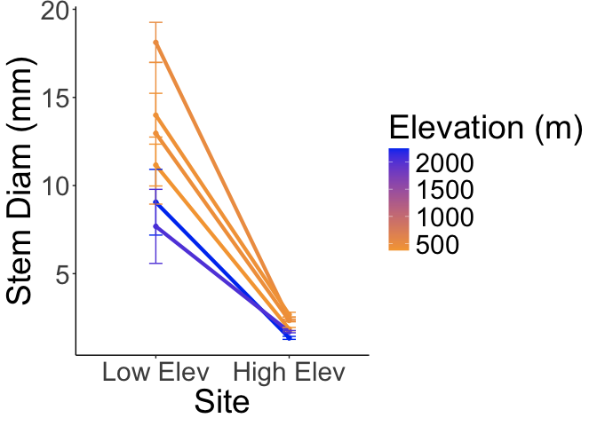
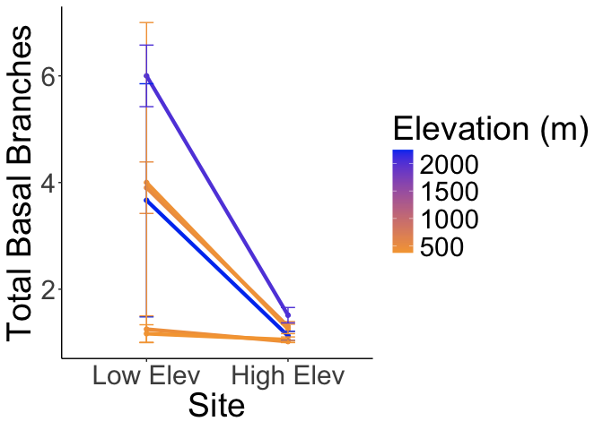
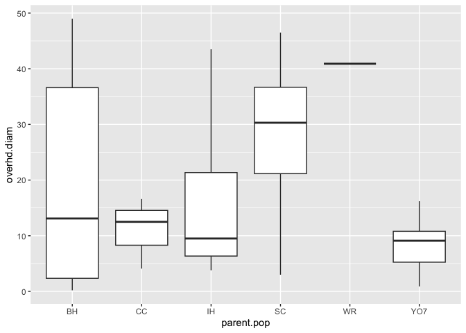
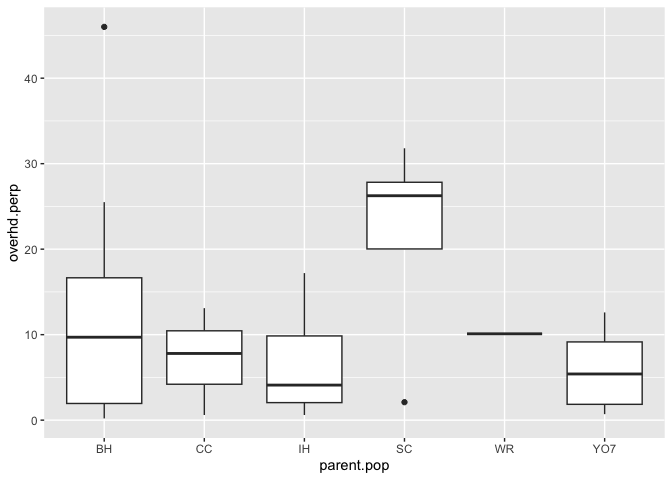

# Reaction Norms of Size (between UCD and WL2) - Stem Diameter and Branch Number 

## Relevant Libraries and Functions


``` r
library(tidyverse)
```

```
## ── Attaching core tidyverse packages ──────────────────────── tidyverse 2.0.0 ──
## ✔ dplyr     1.1.4     ✔ readr     2.1.5
## ✔ forcats   1.0.0     ✔ stringr   1.5.1
## ✔ ggplot2   3.5.1     ✔ tibble    3.2.1
## ✔ lubridate 1.9.3     ✔ tidyr     1.3.1
## ✔ purrr     1.0.2     
## ── Conflicts ────────────────────────────────────────── tidyverse_conflicts() ──
## ✖ dplyr::filter() masks stats::filter()
## ✖ dplyr::lag()    masks stats::lag()
## ℹ Use the conflicted package (<http://conflicted.r-lib.org/>) to force all conflicts to become errors
```

``` r
library(lmerTest) #for mixed effect models
```

```
## Loading required package: lme4
## Loading required package: Matrix
## 
## Attaching package: 'Matrix'
## 
## The following objects are masked from 'package:tidyr':
## 
##     expand, pack, unpack
## 
## 
## Attaching package: 'lmerTest'
## 
## The following object is masked from 'package:lme4':
## 
##     lmer
## 
## The following object is masked from 'package:stats':
## 
##     step
```

``` r
library(emmeans) #for post-hoc pairwise comparisons 
```

```
## Welcome to emmeans.
## Caution: You lose important information if you filter this package's results.
## See '? untidy'
```

``` r
library(naniar) #replaces values with NA
library(ggnewscale)
library(corrplot) #plotting correlations 
```

```
## corrplot 0.94 loaded
```

``` r
library(geosphere) #for calculating geographic distance
conflicted::conflicts_prefer(lmerTest::lmer)
```

```
## [conflicted] Will prefer lmerTest::lmer over any other package.
```

``` r
conflicted::conflicts_prefer(dplyr::filter)
```

```
## [conflicted] Will prefer dplyr::filter over any other package.
```

``` r
sem <- function(x, na.rm=FALSE) {           #for calculating standard error
  sd(x,na.rm=na.rm)/sqrt(length(na.omit(x)))
} 

elev_three_palette <- c("#0043F0", "#C9727F", "#F5A540") #colors from Gremer et al 2019
elev_order <- c("High", "Mid", "Low") #for proper arrangement in figures 
```

## Load Size data from both Gardens

Year 1 

``` r
ucd_ann_cens <- read_csv("../output/UCD_Traits/UCD2023_Annual_Census_Combined.csv") %>%  #note this is only for plants that survived to rep 
  filter(!is.na(parent.pop)) %>% 
  unite(BedLoc, block:col, sep="_", remove = FALSE) %>% 
  filter(rep != 100) %>% #get rid of individuals that germinated in the field 
  unite(Genotype, parent.pop:rep, sep="_", remove = FALSE) %>% 
  unite(pop.mf, parent.pop:mf, sep="_", remove = FALSE)
```

```
## Rows: 63 Columns: 20
## ── Column specification ────────────────────────────────────────────────────────
## Delimiter: ","
## chr  (4): block, col, parent.pop, elevation.group
## dbl (16): row, mf, rep, diam, height, total_branch, longest_leaf, flowers, f...
## 
## ℹ Use `spec()` to retrieve the full column specification for this data.
## ℹ Specify the column types or set `show_col_types = FALSE` to quiet this message.
```

``` r
wl2_ann_cens <- read_csv("../input/WL2_Data/CorrectedCSVs/WL2_annual_census_20231027_corrected.csv") %>% 
  rename(parent.pop=pop) %>% 
  unite(Genotype, parent.pop:rep, sep="_", remove = FALSE) %>% 
  unite(BedLoc, bed:`bed-col`, sep="_", remove = FALSE) %>% 
  filter(BedLoc!="K_5_C") %>% #get rid of duplicate locations
  filter(BedLoc!="B_32_A") %>% #get rid of duplicate locations
  filter(!is.na(parent.pop), !str_detect(Genotype, ".*buff*")) %>% #remove buffers 
  unite(pop.mf, parent.pop:mf, sep="_", remove = FALSE)
```

```
## Warning: One or more parsing issues, call `problems()` on your data frame for details,
## e.g.:
##   dat <- vroom(...)
##   problems(dat)
```

```
## Rows: 1826 Columns: 19
## ── Column specification ────────────────────────────────────────────────────────
## Delimiter: ","
## chr (10): date, block, bed, bed-col, pop, mf, rep, pheno, herbiv.y.n, survey...
## dbl  (7): bed-row, diam.mm, num.flw, num.fruit, long.fruit.cm, total.branch,...
## lgl  (2): height.cm, long.leaf.cm
## 
## ℹ Use `spec()` to retrieve the full column specification for this data.
## ℹ Specify the column types or set `show_col_types = FALSE` to quiet this message.
```

### Merge the Data

``` r
wl2_ann_cens_prep <- wl2_ann_cens %>% 
  select(block:BedLoc, Genotype:long.leaf.cm, total.branch:repro.branch) %>% 
  mutate(Site="WL2") %>%
  mutate(mf=as.double(mf), rep=as.double(rep)) 
names(wl2_ann_cens_prep)
```

```
##  [1] "block"        "BedLoc"       "Genotype"     "pop.mf"       "parent.pop"  
##  [6] "mf"           "rep"          "pheno"        "diam.mm"      "height.cm"   
## [11] "long.leaf.cm" "total.branch" "repro.branch" "Site"
```

``` r
ucd_ann_cens_prep <- ucd_ann_cens %>% 
  select(BedLoc:block, Genotype:rep, diam.mm=diam, height.cm=height, long.leaf.cm=longest_leaf, 
         total.branch=total_branch, repro.branch=repro_branch) %>% 
  mutate(Site="UCD")
names(ucd_ann_cens_prep)
```

```
##  [1] "BedLoc"       "block"        "Genotype"     "pop.mf"       "parent.pop"  
##  [6] "mf"           "rep"          "diam.mm"      "height.cm"    "long.leaf.cm"
## [11] "total.branch" "repro.branch" "Site"
```

``` r
anncens_rxnnorms <- bind_rows(ucd_ann_cens_prep, wl2_ann_cens_prep) %>% 
  select(-pheno) %>% 
  arrange(pop.mf, Site)
head(anncens_rxnnorms)
```

```
## # A tibble: 6 × 13
##   BedLoc  block Genotype pop.mf parent.pop    mf   rep diam.mm height.cm
##   <chr>   <chr> <chr>    <chr>  <chr>      <dbl> <dbl>   <dbl>     <dbl>
## 1 J2_37_B J2    BH_1_7   BH_1   BH             1     7   16.1       44.6
## 2 A_7_D   A     BH_1_3   BH_1   BH             1     3   NA         NA  
## 3 A_37_D  B     BH_1_4   BH_1   BH             1     4    1.89      NA  
## 4 B_6_C   D     BH_1_6   BH_1   BH             1     6   NA         NA  
## 5 B_46_D  C     BH_1_5   BH_1   BH             1     5   NA         NA  
## 6 C_40_B  E     BH_1_7   BH_1   BH             1     7    2.06      NA  
## # ℹ 4 more variables: long.leaf.cm <dbl>, total.branch <dbl>,
## #   repro.branch <dbl>, Site <chr>
```

### Year 2 at WL2

``` r
wl2_y2_pops <- read_csv("../input/WL2_Data/Final_2023_2024_Pop_Loc_Info.csv") %>%
  select(Pop.Type:unique.ID) %>% 
  filter(Pop.Type=="2023-survivor") %>% 
  select(Pop.Type, loc:bed, row=bedrow, col=bedcol, pop:unique.ID)
```

```
## Rows: 1217 Columns: 15
## ── Column specification ────────────────────────────────────────────────────────
## Delimiter: ","
## chr (8): Pop.Type, status, block, loc, bed, bedcol, pop, unique.ID
## dbl (7): bed.block.order, bed.order, AB.CD.order, column.order, bedrow, mf, rep
## 
## ℹ Use `spec()` to retrieve the full column specification for this data.
## ℹ Specify the column types or set `show_col_types = FALSE` to quiet this message.
```

``` r
wl2_blocks <- read_csv("../input/WL2_Data/CorrectedCSVs/WL2_mort_pheno_20231020_corrected.csv") %>% 
  unite(BedLoc, bed:bed.col, sep="_", remove = FALSE) %>% 
  filter(BedLoc!="K_5_C") %>% #get rid of duplicate locations
  select(block, pop, mf, rep) %>% #add in block info 
  mutate(mf=as.double(mf), rep=as.double(rep)) #convert to num
```

```
## Rows: 1826 Columns: 14
## ── Column specification ────────────────────────────────────────────────────────
## Delimiter: ","
## chr (12): block, bed, bed.col, pop, mf, rep, bud.date, flower.date, fruit.da...
## dbl  (1): bed.row
## lgl  (1): last.fruit.date
## 
## ℹ Use `spec()` to retrieve the full column specification for this data.
## ℹ Specify the column types or set `show_col_types = FALSE` to quiet this message.
```

```
## Warning: There were 2 warnings in `mutate()`.
## The first warning was:
## ℹ In argument: `mf = as.double(mf)`.
## Caused by warning:
## ! NAs introduced by coercion
## ℹ Run `dplyr::last_dplyr_warnings()` to see the 1 remaining warning.
```

``` r
wl2_y2_pops_blocks <- left_join(wl2_y2_pops, wl2_blocks)
```

```
## Joining with `by = join_by(pop, mf, rep)`
```

``` r
wl2_ann_cens_2024 <- read_csv("../input/WL2_Data/WL2_Annual_Census_20241023_corrected.csv")
```

```
## Rows: 1217 Columns: 15
## ── Column specification ────────────────────────────────────────────────────────
## Delimiter: ","
## chr (7): bed, col, unique.ID, phen, survey.date, collected.date, survey.notes
## dbl (8): row, diam.mm, num.flw, num.fruit, long.fruit.cm, total.branch, over...
## 
## ℹ Use `spec()` to retrieve the full column specification for this data.
## ℹ Specify the column types or set `show_col_types = FALSE` to quiet this message.
```

``` r
wl2_ann_cens_2024_pops <- left_join(wl2_y2_pops_blocks, wl2_ann_cens_2024) %>%  
  rename(Genotype=unique.ID, parent.pop=pop)
```

```
## Joining with `by = join_by(bed, row, col, unique.ID)`
```

## Load the pop and location data


``` r
ucd_gowers_size <- read_csv("../output/Climate/Gowers_UCD.csv") %>% 
  select(parent.pop:GrwSsn_GD, Wtr_Year_GD) %>% 
  pivot_wider(names_from = TimePd, values_from = c(GrwSsn_GD, Wtr_Year_GD)) %>% 
  mutate(Site="UCD", Garden_Lat=38.53250, Garden_Long=-121.7830, Garden_Elev=16) %>% 
  mutate(Geographic_Dist=distHaversine(cbind(Garden_Long, Garden_Lat), cbind(Long, Lat)),
         Elev_Dist=elev_m-Garden_Elev) # Calculate the distance using the haversine formula (dist in meters)
```

```
## Rows: 46 Columns: 12
## ── Column specification ────────────────────────────────────────────────────────
## Delimiter: ","
## chr (3): parent.pop, elevation.group, TimePd
## dbl (9): elev_m, Lat, Long, GrwSsn_GD, GrwSsn_FLINT_GD, GrwSsn_BIOCLIM_GD, W...
## 
## ℹ Use `spec()` to retrieve the full column specification for this data.
## ℹ Specify the column types or set `show_col_types = FALSE` to quiet this message.
```

``` r
wl2_gowers_2023_size <- read_csv("../output/Climate/Gowers_WL2.csv") %>% 
  select(parent.pop:GrwSsn_GD, Wtr_Year_GD) %>% 
  pivot_wider(names_from = TimePd, values_from = c(GrwSsn_GD, Wtr_Year_GD)) %>% 
  mutate(Site="WL2", Garden_Lat=38.82599, Garden_Long=-120.2509, Garden_Elev=2020) %>% 
  mutate(Geographic_Dist=distHaversine(cbind(Garden_Long, Garden_Lat), cbind(Long, Lat)),
         Elev_Dist=elev_m-Garden_Elev) # Calculate the distance using the haversine formula
```

```
## Rows: 46 Columns: 12
## ── Column specification ────────────────────────────────────────────────────────
## Delimiter: ","
## chr (3): parent.pop, elevation.group, TimePd
## dbl (9): elev_m, Lat, Long, GrwSsn_GD, GrwSsn_FLINT_GD, GrwSsn_BIOCLIM_GD, W...
## 
## ℹ Use `spec()` to retrieve the full column specification for this data.
## ℹ Specify the column types or set `show_col_types = FALSE` to quiet this message.
```

``` r
gowersdist_all <- bind_rows(ucd_gowers_size, wl2_gowers_2023_size) %>% 
  select(Site, Garden_Lat:Garden_Elev, parent.pop:Wtr_Year_GD_Historical, Geographic_Dist:Elev_Dist)
head(gowersdist_all)
```

```
## # A tibble: 6 × 15
##   Site  Garden_Lat Garden_Long Garden_Elev parent.pop elevation.group elev_m
##   <chr>      <dbl>       <dbl>       <dbl> <chr>      <chr>            <dbl>
## 1 UCD         38.5       -122.          16 WL1        Mid              1614.
## 2 UCD         38.5       -122.          16 IH         Low               454.
## 3 UCD         38.5       -122.          16 CC         Low               313 
## 4 UCD         38.5       -122.          16 BH         Low               511.
## 5 UCD         38.5       -122.          16 WR         Mid              1158 
## 6 UCD         38.5       -122.          16 FR         Mid               787 
## # ℹ 8 more variables: Lat <dbl>, Long <dbl>, GrwSsn_GD_Recent <dbl>,
## #   GrwSsn_GD_Historical <dbl>, Wtr_Year_GD_Recent <dbl>,
## #   Wtr_Year_GD_Historical <dbl>, Geographic_Dist <dbl>, Elev_Dist <dbl>
```

``` r
wl2_gowers_2024 <- read_csv("../output/Climate/Gowers_WL2_2024.csv") %>% 
  pivot_wider(names_from = TimePd, values_from = c(GrwSsn_GD, Wtr_Year_GD)) %>% 
  mutate(WL2_Lat=38.82599, WL2_Long=-120.2509, WL2_Elev=2020) %>% 
  mutate(Geographic_Dist=distHaversine(cbind(WL2_Long, WL2_Lat), cbind(Long, Lat)),
         Elev_Dist=elev_m-WL2_Elev) # Calculate the distance using the haversine formula
```

```
## Rows: 46 Columns: 8
## ── Column specification ────────────────────────────────────────────────────────
## Delimiter: ","
## chr (3): parent.pop, elevation.group, TimePd
## dbl (5): elev_m, Lat, Long, GrwSsn_GD, Wtr_Year_GD
## 
## ℹ Use `spec()` to retrieve the full column specification for this data.
## ℹ Specify the column types or set `show_col_types = FALSE` to quiet this message.
```

## Add in location info


``` r
anncens_rxnnorms_loc <-left_join(anncens_rxnnorms, gowersdist_all) 
```

```
## Joining with `by = join_by(parent.pop, Site)`
```

``` r
head(anncens_rxnnorms_loc)
```

```
## # A tibble: 6 × 26
##   BedLoc  block Genotype pop.mf parent.pop    mf   rep diam.mm height.cm
##   <chr>   <chr> <chr>    <chr>  <chr>      <dbl> <dbl>   <dbl>     <dbl>
## 1 J2_37_B J2    BH_1_7   BH_1   BH             1     7   16.1       44.6
## 2 A_7_D   A     BH_1_3   BH_1   BH             1     3   NA         NA  
## 3 A_37_D  B     BH_1_4   BH_1   BH             1     4    1.89      NA  
## 4 B_6_C   D     BH_1_6   BH_1   BH             1     6   NA         NA  
## 5 B_46_D  C     BH_1_5   BH_1   BH             1     5   NA         NA  
## 6 C_40_B  E     BH_1_7   BH_1   BH             1     7    2.06      NA  
## # ℹ 17 more variables: long.leaf.cm <dbl>, total.branch <dbl>,
## #   repro.branch <dbl>, Site <chr>, Garden_Lat <dbl>, Garden_Long <dbl>,
## #   Garden_Elev <dbl>, elevation.group <chr>, elev_m <dbl>, Lat <dbl>,
## #   Long <dbl>, GrwSsn_GD_Recent <dbl>, GrwSsn_GD_Historical <dbl>,
## #   Wtr_Year_GD_Recent <dbl>, Wtr_Year_GD_Historical <dbl>,
## #   Geographic_Dist <dbl>, Elev_Dist <dbl>
```

``` r
#write_csv(anncens_rxnnorms_loc, "../output/AnnCens_Size_BothSites_Y1.csv")
```


``` r
wl2_ann_cens_2024_pops_loc <- left_join(wl2_ann_cens_2024_pops, wl2_gowers_2024)
```

```
## Joining with `by = join_by(parent.pop)`
```

``` r
head(wl2_ann_cens_2024_pops_loc)
```

```
## # A tibble: 6 × 34
##   Pop.Type   loc   bed     row col   parent.pop    mf   rep Genotype block phen 
##   <chr>      <chr> <chr> <dbl> <chr> <chr>      <dbl> <dbl> <chr>    <chr> <chr>
## 1 2023-surv… A_6_B A         6 B     CC             3     3 CC_3_3   A     <NA> 
## 2 2023-surv… A_16… A        16 B     BH             3     3 BH_3_3   A     <NA> 
## 3 2023-surv… A_17… A        17 A     BH             7     3 BH_7_3   A     P    
## 4 2023-surv… A_18… A        18 A     BH             4     3 BH_4_3   A     <NA> 
## 5 2023-surv… A_24… A        24 A     WL2            7     9 WL2_7_9  A     P    
## 6 2023-surv… A_32… A        32 B     IH             7     4 IH_7_4   B     P    
## # ℹ 23 more variables: diam.mm <dbl>, num.flw <dbl>, num.fruit <dbl>,
## #   long.fruit.cm <dbl>, total.branch <dbl>, overhd.diam <dbl>,
## #   overhd.perp <dbl>, survey.date <chr>, collected.date <chr>,
## #   survey.notes <chr>, elevation.group <chr>, elev_m <dbl>, Lat <dbl>,
## #   Long <dbl>, GrwSsn_GD_Recent <dbl>, GrwSsn_GD_Historical <dbl>,
## #   Wtr_Year_GD_Recent <dbl>, Wtr_Year_GD_Historical <dbl>, WL2_Lat <dbl>,
## #   WL2_Long <dbl>, WL2_Elev <dbl>, Geographic_Dist <dbl>, Elev_Dist <dbl>
```

## Plot Reaction Norms
### Means by Pop


``` r
anncens_rxnnorms_summary_pops <- anncens_rxnnorms_loc %>% 
  group_by(parent.pop, Site, elev_m) %>% 
  summarise(N_diam = sum(!is.na(diam.mm)), mean_diam.mm = mean(diam.mm,na.rm=(TRUE)), 
            sem_diam.mm=sem(diam.mm, na.rm=(TRUE)), N_branch = sum(!is.na(total.branch)),
            mean_total.branch=mean(total.branch, na.rm=(TRUE)), 
            sem_total.branch=sem(total.branch, na.rm=TRUE))
```

```
## `summarise()` has grouped output by 'parent.pop', 'Site'. You can override
## using the `.groups` argument.
```

``` r
#anncens_rxnnorms_summary_pops
#No CC, CP3, FR, LV1, LV3, LVTR1, SQ1, SQ2, WR, WV, YO11, YO4, YO8 at UCD

#anncens_rxnnorms_summary_pops %>% arrange(N_diam) 
#1 SQ3, WL1 at UCD, 1 WR at WL2, 2 DPR, YO7 at UCD

anncens_rxnnorms_summary_pops2 <- anncens_rxnnorms_summary_pops %>% 
  filter(N_diam>2) %>% 
  filter(parent.pop=="BH" | parent.pop=="CP2" | parent.pop=="IH" | parent.pop=="SC" | 
           parent.pop=="TM2" | parent.pop=="WL2") %>% 
  mutate(Site=str_replace_all(Site, "UCD", "Low Elev"), 
         Site=str_replace_all(Site, "WL2", "High Elev"))
anncens_rxnnorms_summary_pops2$Site <- factor(anncens_rxnnorms_summary_pops2$Site,
                                               levels = c('Low Elev','High Elev'))
```

### Plot Pop Avgs


``` r
anncens_rxnnorms_summary_pops2 %>% 
  ggplot(aes(x=Site, y=mean_diam.mm, group=parent.pop, color=elev_m)) + 
  geom_point(size=1.5) + geom_line(linewidth=1.5) +
  geom_errorbar(aes(ymin=mean_diam.mm-sem_diam.mm,ymax=mean_diam.mm+sem_diam.mm),width=.1) +
  theme_classic() + scale_colour_gradient(low = "#F5A540", high = "#0043F0")  +
  labs(y="Stem Diam (mm)", color="Elevation (m)") +
  theme(text=element_text(size=28))
```

<!-- -->

``` r
ggsave("../output/AnnCens_RxNorms_Diam_ALL_PopAvgs.png", width = 14, height = 8, units = "in")

anncens_rxnnorms_summary_pops2 %>% 
  ggplot(aes(x=Site, y=mean_total.branch, group=parent.pop, color=elev_m)) + 
  geom_point(size=1.5) + geom_line(linewidth=1.5) +
  geom_errorbar(aes(ymin=mean_total.branch-sem_total.branch,
                    ymax=mean_total.branch+sem_total.branch),width=.1) +
  theme_classic() + scale_colour_gradient(low = "#F5A540", high = "#0043F0")  +
  labs(y="Total Basal Branches", color="Elevation (m)") +
  theme(text=element_text(size=28))
```

<!-- -->

``` r
ggsave("../output/AnnCens_RxNorms_Tot_Bas_Branch_ALL_PopAvgs.png", width = 14, height = 8, units = "in")
```

## Year 2 Pop Trends at WL2


``` r
wl2_ann_cens_2024_pops_loc %>% 
  filter(!is.na(diam.mm)) %>% 
  ggplot(aes(x=parent.pop, y=diam.mm)) +
  geom_boxplot()
```

<!-- -->

``` r
wl2_ann_cens_2024_pops_loc %>% 
  filter(!is.na(total.branch)) %>% 
  ggplot(aes(x=parent.pop, y=total.branch)) +
  geom_boxplot()
```

<!-- -->

``` r
wl2_ann_cens_2024_pops_loc %>% 
  filter(!is.na(overhd.diam)) %>% 
  ggplot(aes(x=parent.pop, y=overhd.diam)) +
  geom_boxplot()
```

<!-- -->

``` r
wl2_ann_cens_2024_pops_loc %>% 
  filter(!is.na(overhd.perp)) %>% 
  ggplot(aes(x=parent.pop, y=overhd.perp)) +
  geom_boxplot()
```

<!-- -->


``` r
wl2_ann_cens_2024_summary <- wl2_ann_cens_2024_pops_loc %>% 
  group_by(parent.pop, GrwSsn_GD_Recent, GrwSsn_GD_Historical, 
           Wtr_Year_GD_Recent, Wtr_Year_GD_Historical, 
           Geographic_Dist, Elev_Dist) %>% 
  summarise(N_diam = sum(!is.na(diam.mm)), 
            mean_diam.mm = mean(diam.mm, na.rm=TRUE), sem_diam.mm=sem(diam.mm, na.rm=TRUE), 
            #N_branch = sum(!is.na(total.branch)), #very little variation in this trait 
            #mean_total.branch=mean(total.branch, na.rm=TRUE), sem_total.branch=sem(total.branch, na.rm=TRUE),
            N_overhd.diam = sum(!is.na(overhd.diam)),
            mean_overhd.diam=mean(overhd.diam, na.rm=TRUE), sem_overhd.diam=sem(overhd.diam, na.rm=TRUE),
            N_overhd.perp = sum(!is.na(overhd.perp)),
            mean_overhd.perp=mean(overhd.perp, na.rm=TRUE), sem_overhd.perp=sem(overhd.perp, na.rm=TRUE))
```

```
## `summarise()` has grouped output by 'parent.pop', 'GrwSsn_GD_Recent',
## 'GrwSsn_GD_Historical', 'Wtr_Year_GD_Recent', 'Wtr_Year_GD_Historical',
## 'Geographic_Dist'. You can override using the `.groups` argument.
```

``` r
wl2_ann_cens_2024_summary %>% arrange(N_diam) #different sample sizes depending on the trait 
```

```
## # A tibble: 10 × 16
## # Groups:   parent.pop, GrwSsn_GD_Recent, GrwSsn_GD_Historical,
## #   Wtr_Year_GD_Recent, Wtr_Year_GD_Historical, Geographic_Dist [10]
##    parent.pop GrwSsn_GD_Recent GrwSsn_GD_Historical Wtr_Year_GD_Recent
##    <chr>                 <dbl>                <dbl>              <dbl>
##  1 LV1                   0.414                0.615              0.406
##  2 SQ1                   0.159                0.217              0.310
##  3 WR                    0.366                0.372              0.355
##  4 TM2                   0.566                0.566              0.406
##  5 WL2                   0.238                0.298              0.226
##  6 CC                    0.435                0.510              0.445
##  7 SC                    0.449                0.447              0.497
##  8 IH                    0.453                0.456              0.422
##  9 YO7                   0.353                0.343              0.328
## 10 BH                    0.360                0.382              0.566
## # ℹ 12 more variables: Wtr_Year_GD_Historical <dbl>, Geographic_Dist <dbl>,
## #   Elev_Dist <dbl>, N_diam <int>, mean_diam.mm <dbl>, sem_diam.mm <dbl>,
## #   N_overhd.diam <int>, mean_overhd.diam <dbl>, sem_overhd.diam <dbl>,
## #   N_overhd.perp <int>, mean_overhd.perp <dbl>, sem_overhd.perp <dbl>
```


