# BioClim Variables (https://www.worldclim.org/data/bioclim.html#google_vignette)
-   annual mean temperature (BIO1)
-   mean diurnal range (BIO2) - (Mean of monthly (max temp - min temp))
-   temperature seasonality (BIO4) (standard deviation *100)
-   temperature annual range (BIO7) (Max Temperature of Warmest Month - Min Temperature of Coldest Month)
-   mean temp of wettest quarter (BIO8)
-   mean temp of driest quarter (BIO9)
-   annual precipitation (BIO12) - sum of ppt for the entire year (not the avg)
-   precipitation seasonality (BIO15)  (Coefficient of Variation)
-   precip of warmest quarter (BIO18)
-   precip of coldest quarter (BIO19)

Can't caluclate with the function in QBMS for calculating it because I only want it for the growth season, which for most populations is less than 12 months. 
https://search.r-project.org/CRAN/refmans/QBMS/html/calc_biovars.html  

A quarter is a period of three months in the OG bioclim. Can't do that here because I don't have contiguous sets of 3 months (for example some low elev pops start their growht in December). So I will modify the "quarter" variables to be "period" variables. 

-   mean temp of wettest quarter (BIO8) - CHANGED TO mean temp of wettest month 
-   mean temp of driest quarter (BIO9) - CHANGED TO mean temp of driest month 
-   precip of warmest quarter (BIO18) - CHANGED TO precip of warmest month
-   precip of coldest quarter (BIO19) - CHANGED TO precip of coldest month 

## Relevant Libraries and Functions


``` r
library(raster)
```

```
## Loading required package: sp
```

``` r
library(tidyverse)
```

```
## ── Attaching core tidyverse packages ──────────────────────── tidyverse 2.0.0 ──
## ✔ dplyr     1.1.4     ✔ readr     2.1.5
## ✔ forcats   1.0.0     ✔ stringr   1.5.1
## ✔ ggplot2   3.5.1     ✔ tibble    3.2.1
## ✔ lubridate 1.9.3     ✔ tidyr     1.3.1
## ✔ purrr     1.0.2
```

```
## ── Conflicts ────────────────────────────────────────── tidyverse_conflicts() ──
## ✖ tidyr::extract() masks raster::extract()
## ✖ dplyr::filter()  masks stats::filter()
## ✖ dplyr::lag()     masks stats::lag()
## ✖ dplyr::select()  masks raster::select()
## ℹ Use the conflicted package (<http://conflicted.r-lib.org/>) to force all conflicts to become errors
```

``` r
library(conflicted)
conflicts_prefer(dplyr::select())
```

```
## [conflicted] Will prefer dplyr::select over any other package.
```

``` r
conflicts_prefer(dplyr::filter)
```

```
## [conflicted] Will prefer dplyr::filter over any other package.
```

``` r
library(ggrepel)
library(cowplot)
library(gridExtra)
library(corrplot) #plotting correlations 
```

```
## corrplot 0.94 loaded
```

``` r
library(rstatix) #performing cor_test

sem <- function(x, na.rm=FALSE) {
  sd(x,na.rm=na.rm)/sqrt(length(na.omit(x)))
} #standard error function 

get_legend<-function(myggplot){
  tmp <- ggplot_gtable(ggplot_build(myggplot))
  leg <- which(sapply(tmp$grobs, function(x) x$name) == "guide-box")
  legend <- tmp$grobs[[leg]]
  return(legend)
} #legend function for grid_arrange

elev_three_palette <- c("#0043F0", "#C9727F", "#F5A540") #colors from Gremer et al 2019
elev_order <- c("High", "Mid", "Low")
```

## Load the Flint growth season data (from "Flint_Growth_Season.Rmd")

``` r
flint_recent_grwseason <- read_csv("../output/Climate/flint_climate_growthseason_recent.csv") %>%
  dplyr::select(month, parent.pop:tmx)
```

```
## Rows: 4980 Columns: 16
## ── Column specification ────────────────────────────────────────────────────────
## Delimiter: ","
## chr  (2): parent.pop, elevation.group
## dbl (14): month, growmonth, elev_m, PckSum, Lat, Long, year, cwd, pck, ppt, ...
## 
## ℹ Use `spec()` to retrieve the full column specification for this data.
## ℹ Specify the column types or set `show_col_types = FALSE` to quiet this message.
```

``` r
head(flint_recent_grwseason, 12)
```

```
## # A tibble: 12 × 13
##    month parent.pop elevation.group elev_m PckSum   Lat  Long  year   cwd   pck
##    <dbl> <chr>      <chr>            <dbl>  <dbl> <dbl> <dbl> <dbl> <dbl> <dbl>
##  1    12 BH         Low               511.      0  37.4 -120.  1994  29.0     0
##  2     1 BH         Low               511.      0  37.4 -120.  1994  31.3     0
##  3     2 BH         Low               511.      0  37.4 -120.  1994  41.4     0
##  4     3 BH         Low               511.      0  37.4 -120.  1994  61.4     0
##  5     4 BH         Low               511.      0  37.4 -120.  1994  58.6     0
##  6     5 BH         Low               511.      0  37.4 -120.  1994  19.1     0
##  7     6 BH         Low               511.      0  37.4 -120.  1994 115.      0
##  8    11 CC         Low               313       0  39.6 -121.  1994  27.8     0
##  9    12 CC         Low               313       0  39.6 -121.  1994  18.1     0
## 10     1 CC         Low               313       0  39.6 -121.  1994  20.6     0
## 11     2 CC         Low               313       0  39.6 -121.  1994  30.9     0
## 12     3 CC         Low               313       0  39.6 -121.  1994  51.8     0
## # ℹ 3 more variables: ppt <dbl>, tmn <dbl>, tmx <dbl>
```

``` r
flint_recent_grwseason %>% filter(parent.pop=="DPR")
```

```
## # A tibble: 300 × 13
##    month parent.pop elevation.group elev_m PckSum   Lat  Long  year   cwd   pck
##    <dbl> <chr>      <chr>            <dbl>  <dbl> <dbl> <dbl> <dbl> <dbl> <dbl>
##  1     4 DPR        Mid              1019.   91.6  39.2 -121.  1994 43.3    0  
##  2     8 DPR        Mid              1019.   91.6  39.2 -121.  1994 39.7    0  
##  3    12 DPR        Mid              1019.   91.6  39.2 -121.  1994  9.24  36.3
##  4     7 DPR        Mid              1019.   91.6  39.2 -121.  1994 39.2    0  
##  5     6 DPR        Mid              1019.   91.6  39.2 -121.  1994 41      0  
##  6     3 DPR        Mid              1019.   91.6  39.2 -121.  1994 30.1    0  
##  7     5 DPR        Mid              1019.   91.6  39.2 -121.  1994 40.5    0  
##  8    11 DPR        Mid              1019.   91.6  39.2 -121.  1994 10.8    0  
##  9    10 DPR        Mid              1019.   91.6  39.2 -121.  1994 46.6    0  
## 10     9 DPR        Mid              1019.   91.6  39.2 -121.  1994 53.1    0  
## # ℹ 290 more rows
## # ℹ 3 more variables: ppt <dbl>, tmn <dbl>, tmx <dbl>
```

``` r
flint_historical_grwseason <- read_csv("../output/Climate/flint_climate_growthseason_historical.csv") %>%
  dplyr::select(month, parent.pop:tmx)
```

```
## Rows: 4620 Columns: 16
## ── Column specification ────────────────────────────────────────────────────────
## Delimiter: ","
## chr  (2): parent.pop, elevation.group
## dbl (14): month, growmonth, elev_m, PckSum, Lat, Long, year, cwd, pck, ppt, ...
## 
## ℹ Use `spec()` to retrieve the full column specification for this data.
## ℹ Specify the column types or set `show_col_types = FALSE` to quiet this message.
```

``` r
head(flint_historical_grwseason, 12)
```

```
## # A tibble: 12 × 13
##    month parent.pop elevation.group elev_m PckSum   Lat  Long  year   cwd   pck
##    <dbl> <chr>      <chr>            <dbl>  <dbl> <dbl> <dbl> <dbl> <dbl> <dbl>
##  1    11 BH         Low               511.  0.234  37.4 -120.  1964  40.2     0
##  2    12 BH         Low               511.  0.234  37.4 -120.  1964  27.9     0
##  3     1 BH         Low               511.  0.234  37.4 -120.  1964  28.1     0
##  4     2 BH         Low               511.  0.234  37.4 -120.  1964  40.4     0
##  5     3 BH         Low               511.  0.234  37.4 -120.  1964  55.9     0
##  6     4 BH         Low               511.  0.234  37.4 -120.  1964  70.3     0
##  7     5 BH         Low               511.  0.234  37.4 -120.  1964  42.0     0
##  8     6 BH         Low               511.  0.234  37.4 -120.  1964  42.8     0
##  9    11 CC         Low               313   0.951  39.6 -121.  1964  28.6     0
## 10    12 CC         Low               313   0.951  39.6 -121.  1964  19.3     0
## 11     1 CC         Low               313   0.951  39.6 -121.  1964  19.4     0
## 12     2 CC         Low               313   0.951  39.6 -121.  1964  32.6     0
## # ℹ 3 more variables: ppt <dbl>, tmn <dbl>, tmx <dbl>
```

## Manually Calculate BioClim Variables

Referenced this r code: https://github.com/rspatial/dismo/blob/master/R/biovars.R 

### Recent Climate

#### Prep

Calculating average temp and diurnal range for each month 

``` r
bioclim_recent_meantemp_prep <- flint_recent_grwseason %>% 
  mutate(tavg = (tmn + tmx)/2, t_diurnal = (tmx-tmn))
```

Calculating wettest, driest, warmest, and coldest months 


``` r
recent_wettest_month <- bioclim_recent_meantemp_prep %>%  #there's one wettest month per pop/year
  group_by(parent.pop, elevation.group, elev_m, year) %>% 
  slice_max(ppt)

recent_driest_month <- bioclim_recent_meantemp_prep %>%  #there's more than one driest month for some pops and years 
  group_by(parent.pop, elevation.group, elev_m, year) %>% 
  slice_min(ppt)

recent_warmest_month <- bioclim_recent_meantemp_prep %>% #there's more than one warmest month for 1 pop/year
  group_by(parent.pop, elevation.group, elev_m, year) %>% 
  slice_max(tavg)

recent_coldest_month <- bioclim_recent_meantemp_prep %>% #there's one coldest month per pop/year
  group_by(parent.pop, elevation.group, elev_m, year) %>% 
  slice_min(tavg)
```


#### Calculations 

Bio 1, 2, 4, 7, 12, 15

``` r
bioclim_recent_calc <- bioclim_recent_meantemp_prep %>% 
  group_by(parent.pop, elevation.group, elev_m, year) %>% 
  summarise(ann_tmean=mean(tavg),  #Bio1 - Annual Mean Temperature
            mean_diurnal_range=mean(t_diurnal), #Bio2 - Mean Diurnal Range
            temp_seasonality=sd(tavg), #Bio4 - Temperature Seasonality
            temp_ann_range=(max(tmx))-(min(tmn)), #bio7 - temp annual range
            ann_ppt=sum(ppt), #bio12 - annual precip
            ppt_seasonality=cv(ppt+1)) #bio15 - Precipitation Seasonality (+1 to avoid strange CVs for areas where mean rainfaill is < 1)
```

```
## `summarise()` has grouped output by 'parent.pop', 'elevation.group', 'elev_m'.
## You can override using the `.groups` argument.
```

``` r
bioclim_recent_calc
```

```
## # A tibble: 690 × 10
## # Groups:   parent.pop, elevation.group, elev_m [23]
##    parent.pop elevation.group elev_m  year ann_tmean mean_diurnal_range
##    <chr>      <chr>            <dbl> <dbl>     <dbl>              <dbl>
##  1 BH         Low               511.  1994      12.7               14.0
##  2 BH         Low               511.  1995      12.4               11.8
##  3 BH         Low               511.  1996      13.4               13.0
##  4 BH         Low               511.  1997      13.5               13.8
##  5 BH         Low               511.  1998      11.0               11.6
##  6 BH         Low               511.  1999      11.7               14.0
##  7 BH         Low               511.  2000      13.6               14.0
##  8 BH         Low               511.  2001      13.1               13.9
##  9 BH         Low               511.  2002      12.8               14.2
## 10 BH         Low               511.  2003      12.8               13.8
## # ℹ 680 more rows
## # ℹ 4 more variables: temp_seasonality <dbl>, temp_ann_range <dbl>,
## #   ann_ppt <dbl>, ppt_seasonality <dbl>
```

Bio 8(Q), 9(Q), 18(Q), 19(Q)

``` r
#bio8 = tmean_wettest_month
bio8_recent <- recent_wettest_month %>% 
  dplyr::select(parent.pop, elevation.group, elev_m, year, tmean_wettest_month=tavg)

#bio9 = tmean_driest_month
bio9_recent <- recent_driest_month %>% 
  group_by(parent.pop, elevation.group, elev_m, year) %>% 
  summarise(tmean_driest_month=mean(tavg)) #taking the average b/c some years where there are multiple driest months 
```

```
## `summarise()` has grouped output by 'parent.pop', 'elevation.group', 'elev_m'.
## You can override using the `.groups` argument.
```

``` r
bio8_9_recent <- full_join(bio8_recent, bio9_recent)
```

```
## Joining with `by = join_by(parent.pop, elevation.group, elev_m, year)`
```

``` r
#bio18 = ppt_warmest_month
bio18_recent <- recent_warmest_month %>% 
  group_by(parent.pop, elevation.group, elev_m, year) %>% 
  summarise(ppt_warmest_month=mean(ppt)) #taking the avg b/c more than one warmest month for one pop/year
```

```
## `summarise()` has grouped output by 'parent.pop', 'elevation.group', 'elev_m'.
## You can override using the `.groups` argument.
```

``` r
#bio19 = ppt_coldest_month
bio19_recent <- recent_wettest_month %>% 
  dplyr::select(parent.pop, elevation.group, elev_m, year, ppt_coldest_month=ppt)

bio18_19_recent <- full_join(bio18_recent, bio19_recent)
```

```
## Joining with `by = join_by(parent.pop, elevation.group, elev_m, year)`
```

``` r
all_periods_recent <- full_join(bio8_9_recent, bio18_19_recent)
```

```
## Joining with `by = join_by(parent.pop, elevation.group, elev_m, year)`
```

Merge all bioclims

``` r
bioclim_recent <- full_join(bioclim_recent_calc, all_periods_recent)
```

```
## Joining with `by = join_by(parent.pop, elevation.group, elev_m, year)`
```

``` r
summary(bioclim_recent)
```

```
##   parent.pop        elevation.group        elev_m            year     
##  Length:690         Length:690         Min.   : 313.0   Min.   :1994  
##  Class :character   Class :character   1st Qu.: 748.9   1st Qu.:2001  
##  Mode  :character   Mode  :character   Median :1934.5   Median :2008  
##                                        Mean   :1649.7   Mean   :2008  
##                                        3rd Qu.:2373.2   3rd Qu.:2016  
##                                        Max.   :2872.3   Max.   :2023  
##    ann_tmean      mean_diurnal_range temp_seasonality temp_ann_range 
##  Min.   : 7.050   Min.   : 9.795     Min.   :3.565    Min.   :22.05  
##  1st Qu.: 9.701   1st Qu.:12.374     1st Qu.:5.924    1st Qu.:28.13  
##  Median :12.333   Median :13.041     Median :6.502    Median :29.70  
##  Mean   :11.999   Mean   :13.197     Mean   :6.481    Mean   :29.80  
##  3rd Qu.:14.106   3rd Qu.:13.960     3rd Qu.:7.077    3rd Qu.:31.64  
##  Max.   :17.073   Max.   :16.850     Max.   :9.133    Max.   :37.72  
##     ann_ppt        ppt_seasonality  tmean_wettest_month tmean_driest_month
##  Min.   :  17.82   Min.   : 28.11   Min.   :-5.380      Min.   :-0.725    
##  1st Qu.: 296.20   1st Qu.:102.68   1st Qu.: 1.144      1st Qu.:14.480    
##  Median : 481.77   Median :125.90   Median : 4.497      Median :17.723    
##  Mean   : 545.65   Mean   :126.03   Mean   : 4.473      Mean   :17.916    
##  3rd Qu.: 715.29   3rd Qu.:148.26   3rd Qu.: 7.800      3rd Qu.:22.086    
##  Max.   :1820.87   Max.   :229.39   Max.   :19.425      Max.   :28.250    
##  ppt_warmest_month ppt_coldest_month
##  Min.   : 0.000    Min.   :  5.57   
##  1st Qu.: 0.080    1st Qu.:144.95   
##  Median : 1.575    Median :235.02   
##  Mean   : 6.521    Mean   :253.39   
##  3rd Qu.: 7.433    3rd Qu.:341.09   
##  Max.   :73.960    Max.   :894.02
```

``` r
write_csv(bioclim_recent, "../output/Climate/BioClim_growthseason_Recent.csv")
```

### Historical Climate
#### Prep

Calculating average temp and diurnal range for each month 

``` r
bioclim_historical_meantemp_prep <- flint_historical_grwseason %>% 
  mutate(tavg = (tmn + tmx)/2, t_diurnal = (tmx-tmn))
```

Calculating wettest, driest, warmest, and coldest months 


``` r
historical_wettest_month <- bioclim_historical_meantemp_prep %>%  
  group_by(parent.pop, elevation.group, elev_m, year) %>% 
  slice_max(ppt)

historical_driest_month <- bioclim_historical_meantemp_prep %>%  #there's more than one driest month for some pops and years 
  group_by(parent.pop, elevation.group, elev_m, year) %>% 
  slice_min(ppt)

historical_warmest_month <- bioclim_historical_meantemp_prep %>% #there's one warmest month per pop/year
  group_by(parent.pop, elevation.group, elev_m, year) %>% 
  slice_max(tavg)

historical_coldest_month <- bioclim_historical_meantemp_prep %>% #there's one coldest month per pop/year
  group_by(parent.pop, elevation.group, elev_m, year) %>% 
  slice_min(tavg)
```


#### Calculations 

Bio 1, 2, 4, 7, 12, 15

``` r
bioclim_historical_calc <- bioclim_historical_meantemp_prep %>% 
  group_by(parent.pop, elevation.group, elev_m, year) %>% 
  summarise(ann_tmean=mean(tavg),  #Bio1 - Annual Mean Temperature
            mean_diurnal_range=mean(t_diurnal), #Bio2 - Mean Diurnal Range
            temp_seasonality=sd(tavg), #Bio4 - Temperature Seasonality
            temp_ann_range=(max(tmx))-(min(tmn)), #bio7 - temp annual range
            ann_ppt=sum(ppt), #bio12 - annual precip
            ppt_seasonality=cv(ppt+1)) #bio15 - Precipitation Seasonality (+1 to avoid strange CVs for areas where mean rainfaill is < 1)
```

```
## `summarise()` has grouped output by 'parent.pop', 'elevation.group', 'elev_m'.
## You can override using the `.groups` argument.
```

``` r
bioclim_historical_calc
```

```
## # A tibble: 690 × 10
## # Groups:   parent.pop, elevation.group, elev_m [23]
##    parent.pop elevation.group elev_m  year ann_tmean mean_diurnal_range
##    <chr>      <chr>            <dbl> <dbl>     <dbl>              <dbl>
##  1 BH         Low               511.  1964      11.0               14.1
##  2 BH         Low               511.  1965      11.2               13.5
##  3 BH         Low               511.  1966      12.5               14.5
##  4 BH         Low               511.  1967      11.0               13.6
##  5 BH         Low               511.  1968      12.2               14.5
##  6 BH         Low               511.  1969      11.6               13.7
##  7 BH         Low               511.  1970      12.3               14.5
##  8 BH         Low               511.  1971      10.7               14.0
##  9 BH         Low               511.  1972      11.8               14.0
## 10 BH         Low               511.  1973      12.2               13.2
## # ℹ 680 more rows
## # ℹ 4 more variables: temp_seasonality <dbl>, temp_ann_range <dbl>,
## #   ann_ppt <dbl>, ppt_seasonality <dbl>
```

Bio 8(Q), 9(Q), 18(Q), 19(Q)

``` r
#bio8 = tmean_wettest_month
bio8_historical <- historical_wettest_month %>% 
  dplyr::select(parent.pop, elevation.group, elev_m, year, tmean_wettest_month=tavg)

#bio9 = tmean_driest_month
bio9_historical <- historical_driest_month %>% 
  group_by(parent.pop, elevation.group, elev_m, year) %>% 
  summarise(tmean_driest_month=mean(tavg)) #taking the average b/c some years where there are multiple driest months 
```

```
## `summarise()` has grouped output by 'parent.pop', 'elevation.group', 'elev_m'.
## You can override using the `.groups` argument.
```

``` r
bio8_9_historical <- full_join(bio8_historical, bio9_historical)
```

```
## Joining with `by = join_by(parent.pop, elevation.group, elev_m, year)`
```

``` r
#bio18 = ppt_warmest_month
bio18_historical <- historical_warmest_month %>% 
  dplyr::select(parent.pop, elevation.group, elev_m, year, ppt_warmest_month=ppt)

#bio19 = ppt_coldest_month
bio19_historical <- historical_wettest_month %>% 
  dplyr::select(parent.pop, elevation.group, elev_m, year, ppt_coldest_month=ppt)

bio18_19_historical <- full_join(bio18_historical, bio19_historical)
```

```
## Joining with `by = join_by(parent.pop, elevation.group, elev_m, year)`
```

``` r
all_periods_historical <- full_join(bio8_9_historical, bio18_19_historical)
```

```
## Joining with `by = join_by(parent.pop, elevation.group, elev_m, year)`
```

Merge all bioclims

``` r
bioclim_historical <- full_join(bioclim_historical_calc, all_periods_historical)
```

```
## Joining with `by = join_by(parent.pop, elevation.group, elev_m, year)`
```

``` r
summary(bioclim_historical)
```

```
##   parent.pop        elevation.group        elev_m            year     
##  Length:690         Length:690         Min.   : 313.0   Min.   :1964  
##  Class :character   Class :character   1st Qu.: 748.9   1st Qu.:1971  
##  Mode  :character   Mode  :character   Median :1934.5   Median :1978  
##                                        Mean   :1649.7   Mean   :1978  
##                                        3rd Qu.:2373.2   3rd Qu.:1986  
##                                        Max.   :2872.3   Max.   :1993  
##    ann_tmean      mean_diurnal_range temp_seasonality temp_ann_range 
##  Min.   : 4.107   Min.   :10.77      Min.   :2.934    Min.   :22.29  
##  1st Qu.: 9.144   1st Qu.:12.98      1st Qu.:5.364    1st Qu.:27.23  
##  Median :11.249   Median :13.87      Median :6.028    Median :28.80  
##  Mean   :10.969   Mean   :13.96      Mean   :6.018    Mean   :29.28  
##  3rd Qu.:13.080   3rd Qu.:14.72      3rd Qu.:6.692    3rd Qu.:31.37  
##  Max.   :16.426   Max.   :18.24      Max.   :8.354    Max.   :38.94  
##     ann_ppt        ppt_seasonality  tmean_wettest_month tmean_driest_month
##  Min.   :  46.51   Min.   : 39.25   Min.   :-4.275      Min.   :-0.74     
##  1st Qu.: 290.02   1st Qu.: 93.79   1st Qu.: 0.890      1st Qu.:12.65     
##  Median : 464.90   Median :113.38   Median : 4.482      Median :16.16     
##  Mean   : 530.74   Mean   :116.25   Mean   : 4.756      Mean   :16.18     
##  3rd Qu.: 710.69   3rd Qu.:136.83   3rd Qu.: 8.248      3rd Qu.:20.68     
##  Max.   :2010.44   Max.   :202.57   Max.   :18.550      Max.   :26.50     
##  ppt_warmest_month ppt_coldest_month
##  Min.   :  0.000   Min.   : 27.8    
##  1st Qu.:  0.400   1st Qu.:132.0    
##  Median :  4.385   Median :222.9    
##  Mean   : 10.929   Mean   :242.1    
##  3rd Qu.: 13.360   3rd Qu.:317.8    
##  Max.   :249.430   Max.   :951.8
```

``` r
write_csv(bioclim_historical, "../output/Climate/BioClim_growthseason_Historical.csv")
```


## Bioclim trends

``` r
bioclim_recent %>% ggplot(aes(x=parent.pop, y=ann_tmean)) + geom_boxplot()
```

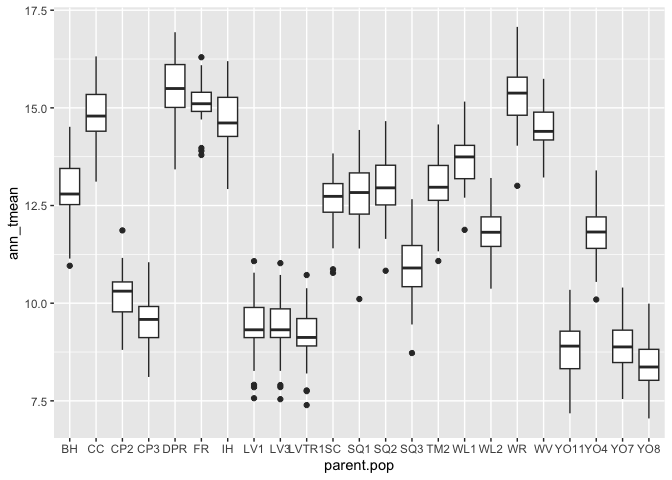<!-- -->

``` r
bioclim_historical %>% ggplot(aes(x=parent.pop, y=ann_tmean)) + geom_boxplot()
```

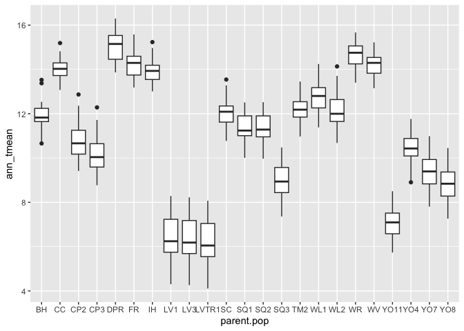<!-- -->

``` r
bioclim_recent %>% ggplot(aes(x=parent.pop, y=ann_ppt)) + geom_boxplot() #seemingly more variation in ppt across years than temperature 
```

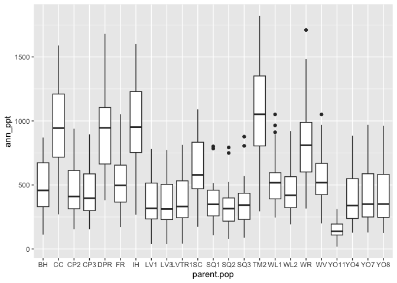<!-- -->

``` r
bioclim_historical %>% ggplot(aes(x=parent.pop, y=ann_ppt)) + geom_boxplot()
```

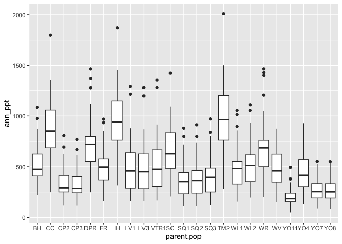<!-- -->

``` r
bioclim_recent %>% ggplot(aes(x=year, y=temp_seasonality, group=parent.pop, color=parent.pop)) + geom_line()
```

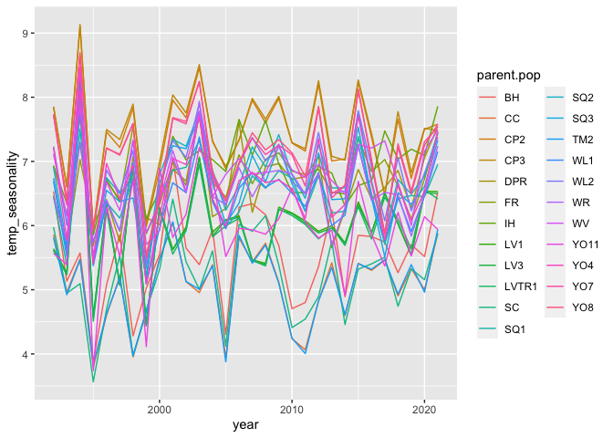<!-- -->

``` r
bioclim_historical %>% ggplot(aes(x=year, y=temp_seasonality, group=parent.pop, color=parent.pop)) + geom_line()
```

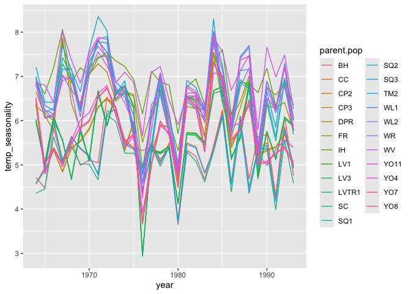<!-- -->

``` r
bioclim_recent %>% ggplot(aes(x=year, y=ppt_seasonality, group=parent.pop, color=parent.pop)) + geom_line()
```

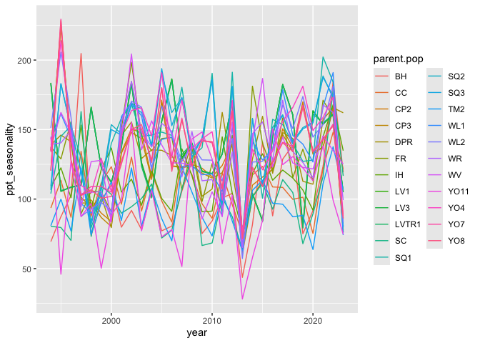<!-- -->

``` r
bioclim_historical %>% ggplot(aes(x=year, y=ppt_seasonality, group=parent.pop, color=parent.pop)) + geom_line()
```

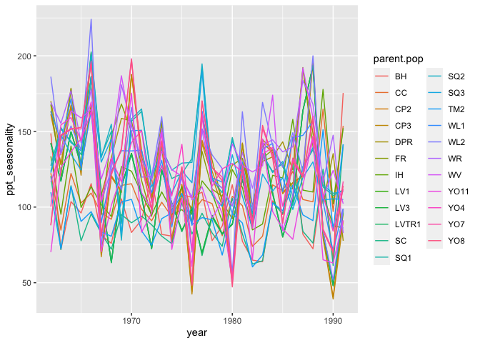<!-- -->

## Averages

### Recent Years - BioClim

``` r
bioclim_recent_avgs <- bioclim_recent %>% group_by(parent.pop, elevation.group, elev_m) %>%
  summarise_at(c("ann_tmean", "mean_diurnal_range", "temp_seasonality", "temp_ann_range", "tmean_wettest_month", "tmean_driest_month", "ann_ppt", "ppt_seasonality","ppt_warmest_month", "ppt_coldest_month"), c(mean, sem), na.rm = TRUE) 
names(bioclim_recent_avgs) <- gsub("fn2", "sem", colnames(bioclim_recent_avgs))
names(bioclim_recent_avgs) <-gsub("fn1", "avg", colnames(bioclim_recent_avgs))
bioclim_recent_avgs
```

```
## # A tibble: 23 × 23
## # Groups:   parent.pop, elevation.group [23]
##    parent.pop elevation.group elev_m ann_tmean_avg mean_diurnal_range_avg
##    <chr>      <chr>            <dbl>         <dbl>                  <dbl>
##  1 BH         Low               511.         12.9                    13.4
##  2 CC         Low               313          14.8                    12.4
##  3 CP2        High             2244.         10.2                    12.6
##  4 CP3        High             2266.          9.54                   12.4
##  5 DPR        Mid              1019.         15.5                    12.9
##  6 FR         Mid               787          15.1                    15.5
##  7 IH         Low               454.         14.7                    13.2
##  8 LV1        High             2593.          9.38                   14.1
##  9 LV3        High             2354.          9.37                   14.1
## 10 LVTR1      High             2741.          9.16                   14.3
## # ℹ 13 more rows
## # ℹ 18 more variables: temp_seasonality_avg <dbl>, temp_ann_range_avg <dbl>,
## #   tmean_wettest_month_avg <dbl>, tmean_driest_month_avg <dbl>,
## #   ann_ppt_avg <dbl>, ppt_seasonality_avg <dbl>, ppt_warmest_month_avg <dbl>,
## #   ppt_coldest_month_avg <dbl>, ann_tmean_sem <dbl>,
## #   mean_diurnal_range_sem <dbl>, temp_seasonality_sem <dbl>,
## #   temp_ann_range_sem <dbl>, tmean_wettest_month_sem <dbl>, …
```

``` r
#write_csv(bioclim_recent_avgs, "../output/Climate/growthseason_BioClimAvgs_Recent.csv")

bioclim_recent_avgs %>% ggplot(aes(x=fct_reorder(parent.pop, ann_tmean_avg), y=ann_tmean_avg, fill=elev_m)) + 
  geom_col(width = 0.7,position = position_dodge(0.75)) + 
  geom_errorbar(aes(ymin=ann_tmean_avg-ann_tmean_sem,ymax=ann_tmean_avg+ann_tmean_sem),width=.2, position = position_dodge(0.75)) +
  scale_y_continuous(expand = c(0, 0)) +
  scale_fill_gradient(low = "#F5A540", high = "#0043F0") +
  labs(fill="Elevation (m)", y="Avg Annual Mean Temp", x="Population", title ="Recent Climate - Growth Season") +
  theme_classic() +
  theme(text=element_text(size=25), axis.text.x = element_text(angle = 45,  hjust = 1))
```

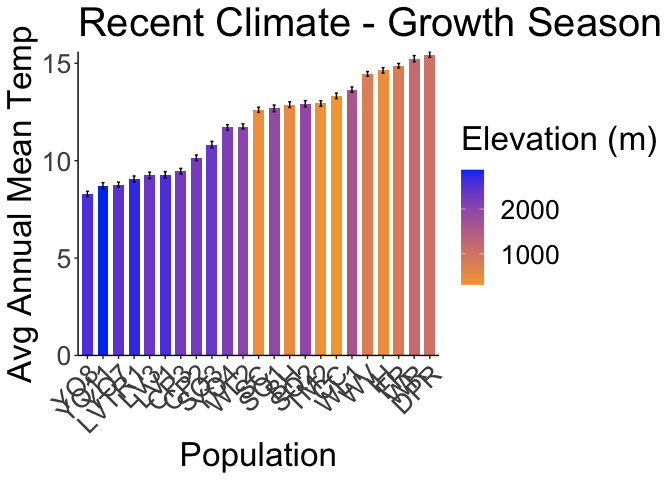<!-- -->

``` r
ggsave("../output/Climate/growthseason_AnnMeanTmp_RecentClim.png", width = 12, height = 6, units = "in")

bioclim_recent_avgs %>% ggplot(aes(x=fct_reorder(parent.pop, mean_diurnal_range_avg), y=mean_diurnal_range_avg, fill=elev_m)) + 
  geom_col(width = 0.7,position = position_dodge(0.75)) + 
  geom_errorbar(aes(ymin=mean_diurnal_range_avg-mean_diurnal_range_sem,ymax=mean_diurnal_range_avg+mean_diurnal_range_sem),width=.2, position = position_dodge(0.75)) +
  scale_y_continuous(expand = c(0, 0)) +
  scale_fill_gradient(low = "#F5A540", high = "#0043F0") +
  labs(fill="Elevation (m)", y="Avg Diurnal Range", x="Population", title ="Recent Climate - Growth Season") +
  theme_classic() +
  theme(text=element_text(size=25), axis.text.x = element_text(angle = 45,  hjust = 1))
```

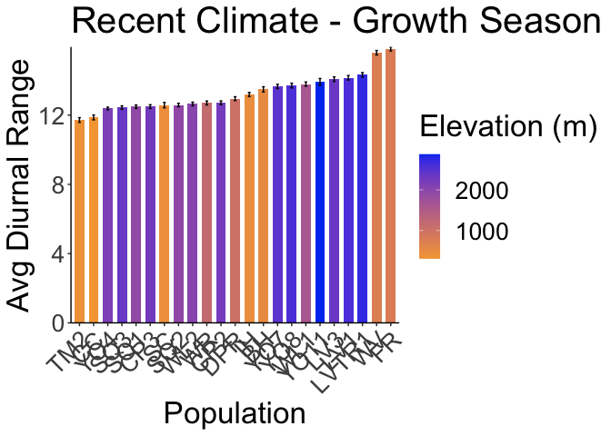<!-- -->

``` r
ggsave("../output/Climate/growthseason_DiurnalRange_RecentClim.png", width = 12, height = 6, units = "in")

bioclim_recent_avgs %>% ggplot(aes(x=fct_reorder(parent.pop, temp_seasonality_avg), y=temp_seasonality_avg, fill=elev_m)) + 
  geom_col(width = 0.7,position = position_dodge(0.75)) + 
  geom_errorbar(aes(ymin=temp_seasonality_avg-temp_seasonality_sem,ymax=temp_seasonality_avg+temp_seasonality_sem),width=.2, position = position_dodge(0.75)) +
  scale_y_continuous(expand = c(0, 0)) +
  scale_fill_gradient(low = "#F5A540", high = "#0043F0") +
  labs(fill="Elevation (m)",  x="Population", title ="Recent Climate - Growth Season") +
  theme_classic() +
  theme(text=element_text(size=25), axis.text.x = element_text(angle = 45,  hjust = 1))
```

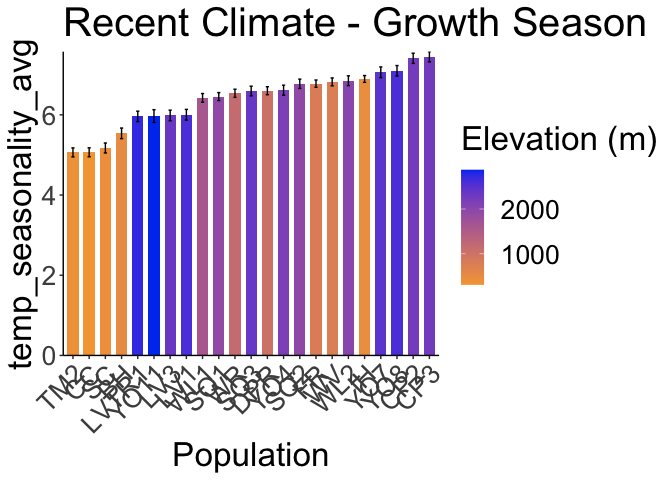<!-- -->

``` r
ggsave("../output/Climate/growthseason_TempSeasonality_RecentClim.png", width = 12, height = 6, units = "in")

bioclim_recent_avgs %>% ggplot(aes(x=fct_reorder(parent.pop, temp_ann_range_avg), y=temp_ann_range_avg, fill=elev_m)) + 
  geom_col(width = 0.7,position = position_dodge(0.75)) + 
  geom_errorbar(aes(ymin=temp_ann_range_avg-temp_ann_range_sem,ymax=temp_ann_range_avg+temp_ann_range_sem),width=.2, position = position_dodge(0.75)) +
  scale_y_continuous(expand = c(0, 0)) +
  scale_fill_gradient(low = "#F5A540", high = "#0043F0") +
  labs(fill="Elevation (m)",  x="Population", title ="Recent Climate - Growth Season") +
  theme_classic() +
  theme(text=element_text(size=25), axis.text.x = element_text(angle = 45,  hjust = 1))
```

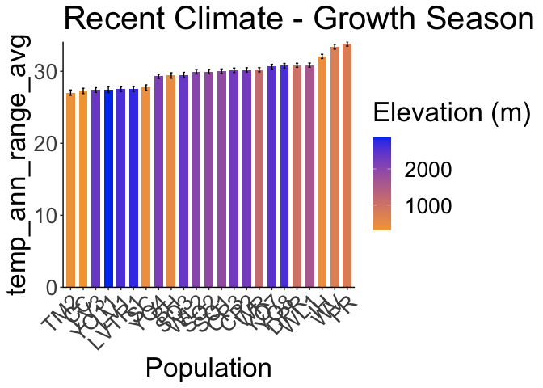<!-- -->

``` r
ggsave("../output/Climate/growthseason_AnnTmpRange_RecentClim.png", width = 12, height = 6, units = "in")

bioclim_recent_avgs %>% ggplot(aes(x=fct_reorder(parent.pop, tmean_wettest_month_avg), y=tmean_wettest_month_avg, fill=elev_m)) + 
  geom_col(width = 0.7,position = position_dodge(0.75)) + 
  geom_errorbar(aes(ymin=tmean_wettest_month_avg-tmean_wettest_month_sem,ymax=tmean_wettest_month_avg+tmean_wettest_month_sem),width=.2, position = position_dodge(0.75)) +
  scale_y_continuous(expand = c(0, 0)) +
  scale_fill_gradient(low = "#F5A540", high = "#0043F0") +
  labs(fill="Elevation (m)",  x="Population", title ="Recent Climate - Growth Season") +
  theme_classic() +
  theme(text=element_text(size=25), axis.text.x = element_text(angle = 45,  hjust = 1))
```

<!-- -->

``` r
ggsave("../output/Climate/growthseason_TmpMeanWet_RecentClim.png", width = 12, height = 6, units = "in")

bioclim_recent_avgs %>% ggplot(aes(x=fct_reorder(parent.pop, tmean_driest_month_avg), y=tmean_driest_month_avg, fill=elev_m)) + 
  geom_col(width = 0.7,position = position_dodge(0.75)) + 
  geom_errorbar(aes(ymin=tmean_driest_month_avg-tmean_driest_month_sem,ymax=tmean_driest_month_avg+tmean_driest_month_sem),width=.2, position = position_dodge(0.75)) +
  scale_y_continuous(expand = c(0, 0)) +
  scale_fill_gradient(low = "#F5A540", high = "#0043F0") +
  labs(fill="Elevation (m)",  x="Population", title ="Recent Climate - Growth Season") +
  theme_classic() +
  theme(text=element_text(size=25), axis.text.x = element_text(angle = 45,  hjust = 1))
```

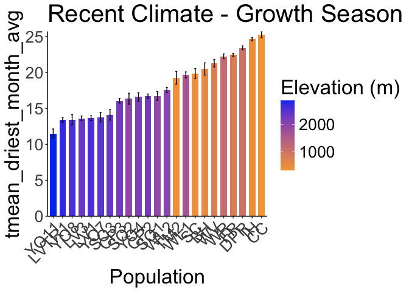<!-- -->

``` r
ggsave("../output/Climate/growthseason_TmpMeanDry_RecentClim.png", width = 12, height = 6, units = "in")

bioclim_recent_avgs %>% ggplot(aes(x=fct_reorder(parent.pop, ann_ppt_avg), y=ann_ppt_avg, fill=elev_m)) + 
  geom_col(width = 0.7,position = position_dodge(0.75)) + 
  geom_errorbar(aes(ymin=ann_ppt_avg-ann_ppt_sem,ymax=ann_ppt_avg+ann_ppt_sem),width=.2, position = position_dodge(0.75)) +
  scale_y_continuous(expand = c(0, 0)) +
  scale_fill_gradient(low = "#F5A540", high = "#0043F0") +
  labs(fill="Elevation (m)",  x="Population", title ="Recent Climate - Growth Season") +
  theme_classic() +
  theme(text=element_text(size=25), axis.text.x = element_text(angle = 45,  hjust = 1))
```

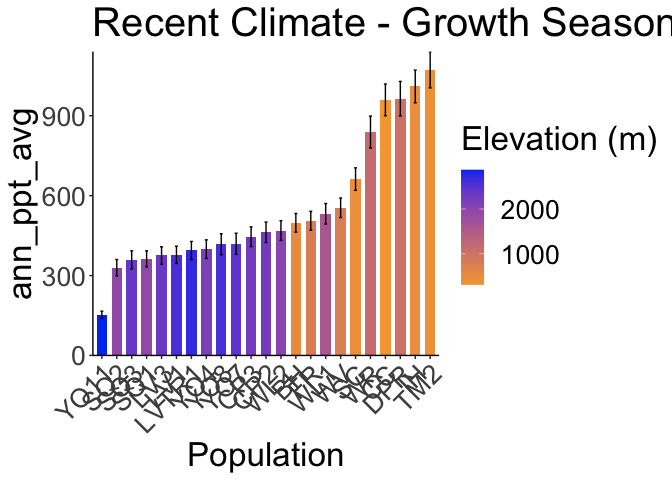<!-- -->

``` r
ggsave("../output/Climate/growthseason_AnnPPT_RecentClim.png", width = 12, height = 6, units = "in")

bioclim_recent_avgs %>% ggplot(aes(x=fct_reorder(parent.pop, ppt_seasonality_avg), y=ppt_seasonality_avg, fill=elev_m)) + 
  geom_col(width = 0.7,position = position_dodge(0.75)) + 
  geom_errorbar(aes(ymin=ppt_seasonality_avg-ppt_seasonality_sem,ymax=ppt_seasonality_avg+ppt_seasonality_sem),width=.2, position = position_dodge(0.75)) +
  scale_y_continuous(expand = c(0, 0)) +
  scale_fill_gradient(low = "#F5A540", high = "#0043F0") +
  labs(fill="Elevation (m)",  x="Population", title ="Recent Climate - Growth Season") +
  theme_classic() +
  theme(text=element_text(size=25), axis.text.x = element_text(angle = 45,  hjust = 1))
```

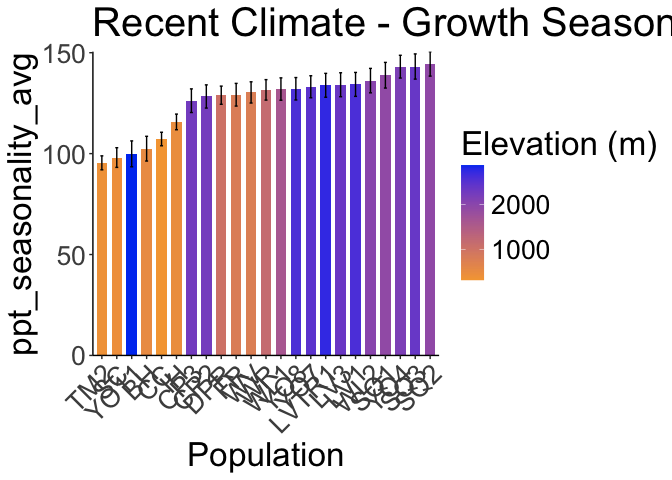<!-- -->

``` r
ggsave("../output/Climate/growthseason_PPTSeasonality_RecentClim.png", width = 12, height = 6, units = "in")

bioclim_recent_avgs %>% ggplot(aes(x=fct_reorder(parent.pop, ppt_warmest_month_avg), y=ppt_warmest_month_avg, fill=elev_m)) + 
  geom_col(width = 0.7,position = position_dodge(0.75)) + 
  geom_errorbar(aes(ymin=ppt_warmest_month_avg-ppt_warmest_month_sem,ymax=ppt_warmest_month_avg+ppt_warmest_month_sem),width=.2, position = position_dodge(0.75)) +
  scale_y_continuous(expand = c(0, 0)) +
  scale_fill_gradient(low = "#F5A540", high = "#0043F0") +
  labs(fill="Elevation (m)",  x="Population", title ="Recent Climate - Growth Season") +
  theme_classic() +
  theme(text=element_text(size=25), axis.text.x = element_text(angle = 45,  hjust = 1))
```

<!-- -->

``` r
ggsave("../output/Climate/growthseason_PPTWarm_RecentClim.png", width = 12, height = 6, units = "in")

bioclim_recent_avgs %>% ggplot(aes(x=fct_reorder(parent.pop, ppt_coldest_month_avg), y=ppt_coldest_month_avg, fill=elev_m)) + 
  geom_col(width = 0.7,position = position_dodge(0.75)) + 
  geom_errorbar(aes(ymin=ppt_coldest_month_avg-ppt_coldest_month_sem,ymax=ppt_coldest_month_avg+ppt_coldest_month_sem),width=.2, position = position_dodge(0.75)) +
  scale_y_continuous(expand = c(0, 0)) +
  scale_fill_gradient(low = "#F5A540", high = "#0043F0") +
  labs(fill="Elevation (m)",  x="Population", title ="Recent Climate - Growth Season") +
  theme_classic() +
  theme(text=element_text(size=25), axis.text.x = element_text(angle = 45,  hjust = 1))
```

<!-- -->

``` r
ggsave("../output/Climate/growthseason_PPTCold_RecentClim.png", width = 12, height = 6, units = "in")
```

### Historical Years - BioClim

``` r
names(bioclim_historical)
```

```
##  [1] "parent.pop"          "elevation.group"     "elev_m"             
##  [4] "year"                "ann_tmean"           "mean_diurnal_range" 
##  [7] "temp_seasonality"    "temp_ann_range"      "ann_ppt"            
## [10] "ppt_seasonality"     "tmean_wettest_month" "tmean_driest_month" 
## [13] "ppt_warmest_month"   "ppt_coldest_month"
```

``` r
bioclim_historical_avgs <- bioclim_historical %>% group_by(parent.pop, elevation.group, elev_m) %>%
  summarise_at(c("ann_tmean", "mean_diurnal_range", "temp_seasonality", "temp_ann_range", "tmean_wettest_month", "tmean_driest_month", "ann_ppt", "ppt_seasonality","ppt_warmest_month", "ppt_coldest_month"), c(mean, sem), na.rm = TRUE) 
names(bioclim_historical_avgs) <- gsub("fn2", "sem", colnames(bioclim_historical_avgs))
names(bioclim_historical_avgs) <-gsub("fn1", "avg", colnames(bioclim_historical_avgs))
bioclim_historical_avgs
```

```
## # A tibble: 23 × 23
## # Groups:   parent.pop, elevation.group [23]
##    parent.pop elevation.group elev_m ann_tmean_avg mean_diurnal_range_avg
##    <chr>      <chr>            <dbl>         <dbl>                  <dbl>
##  1 BH         Low               511.         12.0                    13.7
##  2 CC         Low               313          12.6                    12.6
##  3 CP2        High             2244.         10.8                    13.7
##  4 CP3        High             2266.         10.2                    13.3
##  5 DPR        Mid              1019.         15.1                    14.2
##  6 FR         Mid               787          14.6                    16.8
##  7 IH         Low               454.         14.0                    13.8
##  8 LV1        High             2593.          6.36                   15.0
##  9 LV3        High             2354.          6.35                   15.1
## 10 LVTR1      High             2741.          6.19                   15.1
## # ℹ 13 more rows
## # ℹ 18 more variables: temp_seasonality_avg <dbl>, temp_ann_range_avg <dbl>,
## #   tmean_wettest_month_avg <dbl>, tmean_driest_month_avg <dbl>,
## #   ann_ppt_avg <dbl>, ppt_seasonality_avg <dbl>, ppt_warmest_month_avg <dbl>,
## #   ppt_coldest_month_avg <dbl>, ann_tmean_sem <dbl>,
## #   mean_diurnal_range_sem <dbl>, temp_seasonality_sem <dbl>,
## #   temp_ann_range_sem <dbl>, tmean_wettest_month_sem <dbl>, …
```

``` r
#write_csv(bioclim_historical_avgs, "../output/Climate/growthseason_BioClimAvgs_Historical.csv")

bioclim_historical_avgs %>% ggplot(aes(x=fct_reorder(parent.pop, ann_tmean_avg), y=ann_tmean_avg, fill=elev_m)) + 
  geom_col(width = 0.7,position = position_dodge(0.75)) + 
  geom_errorbar(aes(ymin=ann_tmean_avg-ann_tmean_sem,ymax=ann_tmean_avg+ann_tmean_sem),width=.2, position = position_dodge(0.75)) +
  scale_y_continuous(expand = c(0, 0)) +
  scale_fill_gradient(low = "#F5A540", high = "#0043F0") +
  labs(fill="Elevation (m)", y="Avg Annual Mean Temp", x="Population", title ="Historical Climate - Growth Season") +
  theme_classic() +
  theme(text=element_text(size=25), axis.text.x = element_text(angle = 45,  hjust = 1))
```

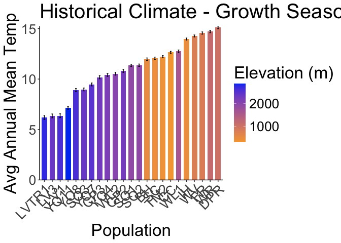<!-- -->

``` r
ggsave("../output/Climate/growthseason_AnnMeanTmp_HistoricalClim.png", width = 12, height = 6, units = "in")

bioclim_historical_avgs %>% ggplot(aes(x=fct_reorder(parent.pop, mean_diurnal_range_avg), y=mean_diurnal_range_avg, fill=elev_m)) + 
  geom_col(width = 0.7,position = position_dodge(0.75)) + 
  geom_errorbar(aes(ymin=mean_diurnal_range_avg-mean_diurnal_range_sem,ymax=mean_diurnal_range_avg+mean_diurnal_range_sem),width=.2, position = position_dodge(0.75)) +
  scale_y_continuous(expand = c(0, 0)) +
  scale_fill_gradient(low = "#F5A540", high = "#0043F0") +
  labs(fill="Elevation (m)", y="Avg Diurnal Range", x="Population", title ="Historical Climate - Growth Season") +
  theme_classic() +
  theme(text=element_text(size=25), axis.text.x = element_text(angle = 45,  hjust = 1))
```

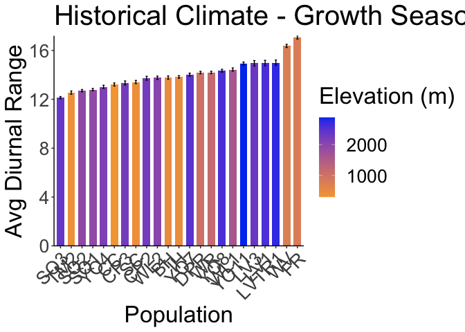<!-- -->

``` r
ggsave("../output/Climate/growthseason_DiurnalRange_HistoricalClim.png", width = 12, height = 6, units = "in")

bioclim_historical_avgs %>% ggplot(aes(x=fct_reorder(parent.pop, temp_seasonality_avg), y=temp_seasonality_avg, fill=elev_m)) + 
  geom_col(width = 0.7,position = position_dodge(0.75)) + 
  geom_errorbar(aes(ymin=temp_seasonality_avg-temp_seasonality_sem,ymax=temp_seasonality_avg+temp_seasonality_sem),width=.2, position = position_dodge(0.75)) +
  scale_y_continuous(expand = c(0, 0)) +
  scale_fill_gradient(low = "#F5A540", high = "#0043F0") +
  labs(fill="Elevation (m)",  x="Population", title ="Historical Climate - Growth Season") +
  theme_classic() +
  theme(text=element_text(size=25), axis.text.x = element_text(angle = 45,  hjust = 1))
```

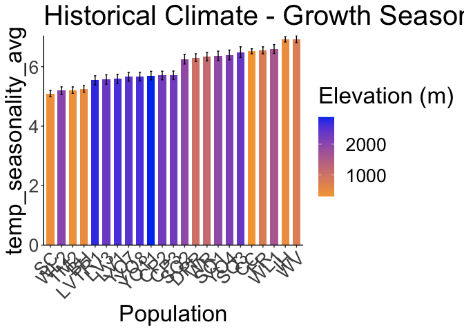<!-- -->

``` r
ggsave("../output/Climate/growthseason_TempSeasonality_HistoricalClim.png", width = 12, height = 6, units = "in")

bioclim_historical_avgs %>% ggplot(aes(x=fct_reorder(parent.pop, temp_ann_range_avg), y=temp_ann_range_avg, fill=elev_m)) + 
  geom_col(width = 0.7,position = position_dodge(0.75)) + 
  geom_errorbar(aes(ymin=temp_ann_range_avg-temp_ann_range_sem,ymax=temp_ann_range_avg+temp_ann_range_sem),width=.2, position = position_dodge(0.75)) +
  scale_y_continuous(expand = c(0, 0)) +
  scale_fill_gradient(low = "#F5A540", high = "#0043F0") +
  labs(fill="Elevation (m)",  x="Population", title ="Historical Climate - Growth Season") +
  theme_classic() +
  theme(text=element_text(size=25), axis.text.x = element_text(angle = 45,  hjust = 1))
```

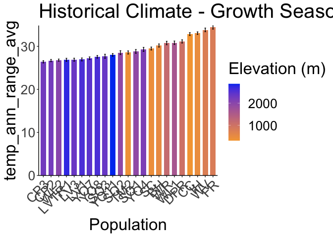<!-- -->

``` r
ggsave("../output/Climate/growthseason_AnnTmpRange_HistoricalClim.png", width = 12, height = 6, units = "in")

bioclim_historical_avgs %>% ggplot(aes(x=fct_reorder(parent.pop, tmean_wettest_month_avg), y=tmean_wettest_month_avg, fill=elev_m)) + 
  geom_col(width = 0.7,position = position_dodge(0.75)) + 
  geom_errorbar(aes(ymin=tmean_wettest_month_avg-tmean_wettest_month_sem,ymax=tmean_wettest_month_avg+tmean_wettest_month_sem),width=.2, position = position_dodge(0.75)) +
  scale_y_continuous(expand = c(0, 0)) +
  scale_fill_gradient(low = "#F5A540", high = "#0043F0") +
  labs(fill="Elevation (m)",  x="Population", title ="Historical Climate - Growth Season") +
  theme_classic() +
  theme(text=element_text(size=25), axis.text.x = element_text(angle = 45,  hjust = 1))
```

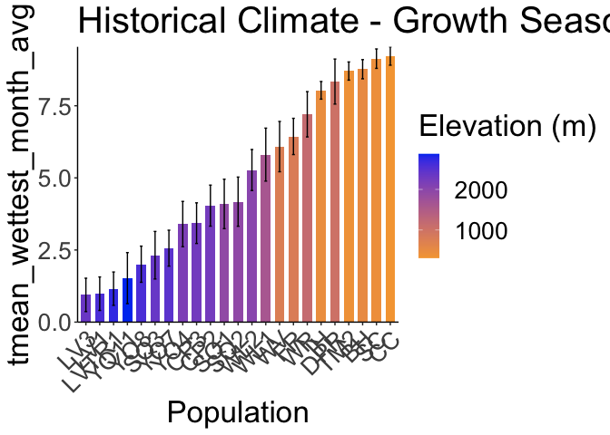<!-- -->

``` r
ggsave("../output/Climate/growthseason_TmpMeanWet_HistoricalClim.png", width = 12, height = 6, units = "in")

bioclim_historical_avgs %>% ggplot(aes(x=fct_reorder(parent.pop, tmean_driest_month_avg), y=tmean_driest_month_avg, fill=elev_m)) + 
  geom_col(width = 0.7,position = position_dodge(0.75)) + 
  geom_errorbar(aes(ymin=tmean_driest_month_avg-tmean_driest_month_sem,ymax=tmean_driest_month_avg+tmean_driest_month_sem),width=.2, position = position_dodge(0.75)) +
  scale_y_continuous(expand = c(0, 0)) +
  scale_fill_gradient(low = "#F5A540", high = "#0043F0") +
  labs(fill="Elevation (m)",  x="Population", title ="Historical Climate - Growth Season") +
  theme_classic() +
  theme(text=element_text(size=25), axis.text.x = element_text(angle = 45,  hjust = 1))
```

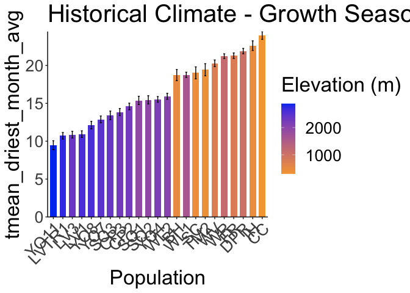<!-- -->

``` r
ggsave("../output/Climate/growthseason_TmpMeanDry_HistoricalClim.png", width = 12, height = 6, units = "in")

bioclim_historical_avgs %>% ggplot(aes(x=fct_reorder(parent.pop, ann_ppt_avg), y=ann_ppt_avg, fill=elev_m)) + 
  geom_col(width = 0.7,position = position_dodge(0.75)) + 
  geom_errorbar(aes(ymin=ann_ppt_avg-ann_ppt_sem,ymax=ann_ppt_avg+ann_ppt_sem),width=.2, position = position_dodge(0.75)) +
  scale_y_continuous(expand = c(0, 0)) +
  scale_fill_gradient(low = "#F5A540", high = "#0043F0") +
  labs(fill="Elevation (m)",  x="Population", title ="Historical Climate - Growth Season") +
  theme_classic() +
  theme(text=element_text(size=25), axis.text.x = element_text(angle = 45,  hjust = 1))
```

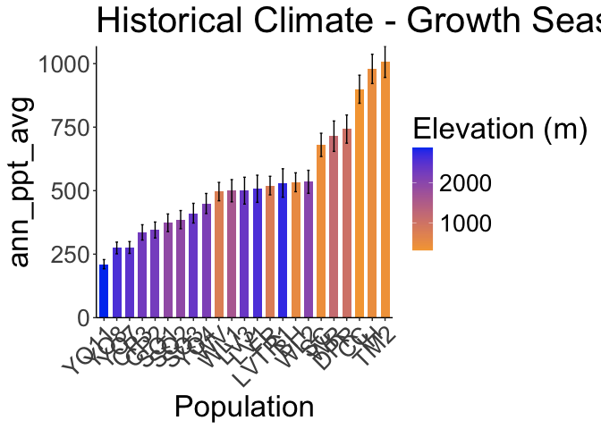<!-- -->

``` r
ggsave("../output/Climate/growthseason_AnnPPT_HistoricalClim.png", width = 12, height = 6, units = "in")

bioclim_historical_avgs %>% ggplot(aes(x=fct_reorder(parent.pop, ppt_seasonality_avg), y=ppt_seasonality_avg, fill=elev_m)) + 
  geom_col(width = 0.7,position = position_dodge(0.75)) + 
  geom_errorbar(aes(ymin=ppt_seasonality_avg-ppt_seasonality_sem,ymax=ppt_seasonality_avg+ppt_seasonality_sem),width=.2, position = position_dodge(0.75)) +
  scale_y_continuous(expand = c(0, 0)) +
  scale_fill_gradient(low = "#F5A540", high = "#0043F0") +
  labs(fill="Elevation (m)",  x="Population", title ="Historical Climate - Growth Season") +
  theme_classic() +
  theme(text=element_text(size=25), axis.text.x = element_text(angle = 45,  hjust = 1))
```

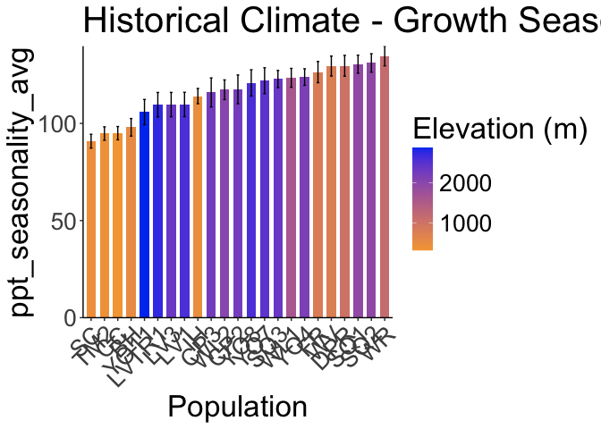<!-- -->

``` r
ggsave("../output/Climate/growthseason_PPTSeasonality_HistoricalClim.png", width = 12, height = 6, units = "in")

bioclim_historical_avgs %>% ggplot(aes(x=fct_reorder(parent.pop, ppt_warmest_month_avg), y=ppt_warmest_month_avg, fill=elev_m)) + 
  geom_col(width = 0.7,position = position_dodge(0.75)) + 
  geom_errorbar(aes(ymin=ppt_warmest_month_avg-ppt_warmest_month_sem,ymax=ppt_warmest_month_avg+ppt_warmest_month_sem),width=.2, position = position_dodge(0.75)) +
  scale_y_continuous(expand = c(0, 0)) +
  scale_fill_gradient(low = "#F5A540", high = "#0043F0") +
  labs(fill="Elevation (m)",  x="Population", title ="Historical Climate - Growth Season") +
  theme_classic() +
  theme(text=element_text(size=25), axis.text.x = element_text(angle = 45,  hjust = 1))
```

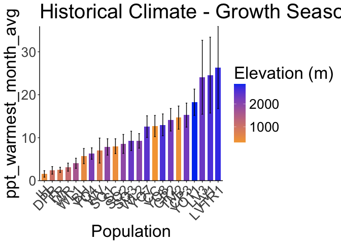<!-- -->

``` r
ggsave("../output/Climate/growthseason_PPTWarm_HistoricalClim.png", width = 12, height = 6, units = "in")

bioclim_historical_avgs %>% ggplot(aes(x=fct_reorder(parent.pop, ppt_coldest_month_avg), y=ppt_coldest_month_avg, fill=elev_m)) + 
  geom_col(width = 0.7,position = position_dodge(0.75)) + 
  geom_errorbar(aes(ymin=ppt_coldest_month_avg-ppt_coldest_month_sem,ymax=ppt_coldest_month_avg+ppt_coldest_month_sem),width=.2, position = position_dodge(0.75)) +
  scale_y_continuous(expand = c(0, 0)) +
  scale_fill_gradient(low = "#F5A540", high = "#0043F0") +
  labs(fill="Elevation (m)",  x="Population", title ="Historical Climate - Growth Season") +
  theme_classic() +
  theme(text=element_text(size=25), axis.text.x = element_text(angle = 45,  hjust = 1))
```

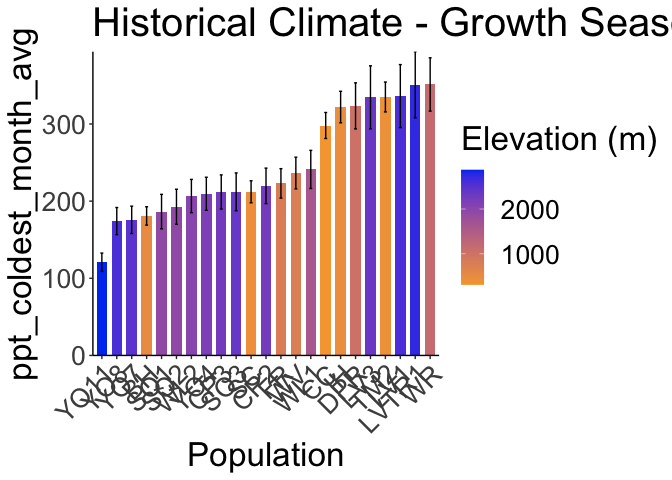<!-- -->

``` r
ggsave("../output/Climate/growthseason_PPTCold_HistoricalClim.png", width = 12, height = 6, units = "in")
```


## Climate trait correlations

``` r
names(bioclim_recent)
```

```
##  [1] "parent.pop"          "elevation.group"     "elev_m"             
##  [4] "year"                "ann_tmean"           "mean_diurnal_range" 
##  [7] "temp_seasonality"    "temp_ann_range"      "ann_ppt"            
## [10] "ppt_seasonality"     "tmean_wettest_month" "tmean_driest_month" 
## [13] "ppt_warmest_month"   "ppt_coldest_month"
```

``` r
bioclim_recent <- tibble(bioclim_recent)
bioclim_recent %>% cor_test(ann_tmean:ppt_coldest_month, method = "pearson")
```

```
## # A tibble: 100 × 8
##    var1      var2              cor statistic         p conf.low conf.high method
##    <chr>     <chr>           <dbl>     <dbl>     <dbl>    <dbl>     <dbl> <chr> 
##  1 ann_tmean ann_tmean       1       Inf     0           1         1      Pears…
##  2 ann_tmean mean_diurnal_… -0.017    -0.448 6.54e-  1  -0.0916    0.0576 Pears…
##  3 ann_tmean temp_seasonal… -0.055    -1.44  1.52e-  1  -0.129     0.0201 Pears…
##  4 ann_tmean temp_ann_range  0.36     10.2   4.93e- 23   0.297     0.427  Pears…
##  5 ann_tmean ann_ppt         0.43     12.4   4.6 e- 32   0.365     0.487  Pears…
##  6 ann_tmean ppt_seasonali…  0.02      0.533 5.94e-  1  -0.0544    0.0948 Pears…
##  7 ann_tmean tmean_wettest…  0.54     16.8   2.04e- 53   0.485     0.591  Pears…
##  8 ann_tmean tmean_driest_…  0.72     27.2   4.53e-111   0.682     0.754  Pears…
##  9 ann_tmean ppt_warmest_m… -0.3      -8.21  1.11e- 15  -0.365    -0.229  Pears…
## 10 ann_tmean ppt_coldest_m…  0.21      5.71  1.7 e-  8   0.140     0.283  Pears…
## # ℹ 90 more rows
```

``` r
recent_cor_bioclim_mat <- bioclim_recent %>% dplyr::select(ann_tmean:ppt_coldest_month) %>% cor_mat()
recent_cor_bioclim_mat
```

```
## # A tibble: 10 × 11
##    rowname  ann_tmean mean_diurnal_range temp_seasonality temp_ann_range ann_ppt
##  * <chr>        <dbl>              <dbl>            <dbl>          <dbl>   <dbl>
##  1 ann_tme…     1                 -0.017           -0.055          0.36    0.43 
##  2 mean_di…    -0.017              1                0.029          0.34   -0.33 
##  3 temp_se…    -0.055              0.029            1              0.7    -0.035
##  4 temp_an…     0.36               0.34             0.7            1       0.076
##  5 ann_ppt      0.43              -0.33            -0.035          0.076   1    
##  6 ppt_sea…     0.02               0.11             0.33           0.13   -0.023
##  7 tmean_w…     0.54              -0.06            -0.51          -0.11    0.22 
##  8 tmean_d…     0.72              -0.068            0.067          0.43    0.53 
##  9 ppt_war…    -0.3               -0.044           -0.21          -0.37   -0.068
## 10 ppt_col…     0.21              -0.23             0.13           0.028   0.83 
## # ℹ 5 more variables: ppt_seasonality <dbl>, tmean_wettest_month <dbl>,
## #   tmean_driest_month <dbl>, ppt_warmest_month <dbl>, ppt_coldest_month <dbl>
```

``` r
recent_cor_bioclim = bioclim_recent %>% dplyr::select(ann_tmean:ppt_coldest_month) %>% cor()
file_path= "../output/Climate/BioClim_RecentClim_Cors.png"
png(width = 12, height = 6, res= 300, units = "in", file=file_path, type = "cairo")
```

```
## Warning in grSoftVersion(): unable to load shared object '/Library/Frameworks/R.framework/Resources/modules//R_X11.so':
##   dlopen(/Library/Frameworks/R.framework/Resources/modules//R_X11.so, 0x0006): Library not loaded: /opt/X11/lib/libSM.6.dylib
##   Referenced from: <31EADEB5-0A17-3546-9944-9B3747071FE8> /Library/Frameworks/R.framework/Versions/4.4-arm64/Resources/modules/R_X11.so
##   Reason: tried: '/opt/X11/lib/libSM.6.dylib' (no such file), '/System/Volumes/Preboot/Cryptexes/OS/opt/X11/lib/libSM.6.dylib' (no such file), '/opt/X11/lib/libSM.6.dylib' (no such file), '/Library/Frameworks/R.framework/Resources/lib/libSM.6.dylib' (no such file), '/Library/Java/JavaVirtualMachines/jdk-11.0.18+10/Contents/Home/lib/server/libSM.6.dylib' (no such file)
```

```
## Warning in cairoVersion(): unable to load shared object '/Library/Frameworks/R.framework/Resources/library/grDevices/libs//cairo.so':
##   dlopen(/Library/Frameworks/R.framework/Resources/library/grDevices/libs//cairo.so, 0x0006): Library not loaded: /opt/X11/lib/libXrender.1.dylib
##   Referenced from: <63619C6D-FE72-3544-BCEF-9C834A5E39D8> /Library/Frameworks/R.framework/Versions/4.4-arm64/Resources/library/grDevices/libs/cairo.so
##   Reason: tried: '/opt/X11/lib/libXrender.1.dylib' (no such file), '/System/Volumes/Preboot/Cryptexes/OS/opt/X11/lib/libXrender.1.dylib' (no such file), '/opt/X11/lib/libXrender.1.dylib' (no such file), '/Library/Frameworks/R.framework/Resources/lib/libXrender.1.dylib' (no such file), '/Library/Java/JavaVirtualMachines/jdk-11.0.18+10/Contents/Home/lib/server/libXrender.1.dylib' (no such file)
```

```
## Warning in png(width = 12, height = 6, res = 300, units = "in", file =
## file_path, : failed to load cairo DLL
```

``` r
corrplot(recent_cor_bioclim)
```

<!-- -->

``` r
dev.off()
```

```
## null device 
##           1
```

``` r
bioclim_historical <- tibble(bioclim_historical)
bioclim_historical %>% cor_test(ann_tmean:ppt_coldest_month, method = "pearson")
```

```
## # A tibble: 100 × 8
##    var1      var2              cor statistic         p conf.low conf.high method
##    <chr>     <chr>           <dbl>     <dbl>     <dbl>    <dbl>     <dbl> <chr> 
##  1 ann_tmean ann_tmean       1       Inf     0           1         1      Pears…
##  2 ann_tmean mean_diurnal_…  0.022     0.570 5.69e-  1  -0.0530    0.0962 Pears…
##  3 ann_tmean temp_seasonal…  0.2       5.40  9.05e-  8   0.129     0.272  Pears…
##  4 ann_tmean temp_ann_range  0.54     16.9   1.31e- 53   0.486     0.591  Pears…
##  5 ann_tmean ann_ppt         0.27      7.38  4.63e- 13   0.200     0.339  Pears…
##  6 ann_tmean ppt_seasonali…  0.15      4.11  4.46e-  5   0.0811    0.227  Pears…
##  7 ann_tmean tmean_wettest…  0.52     16.1   1.71e- 49   0.466     0.574  Pears…
##  8 ann_tmean tmean_driest_…  0.75     29.9   1.51e-126   0.717     0.783  Pears…
##  9 ann_tmean ppt_warmest_m… -0.31     -8.49  1.3 e- 16  -0.374    -0.239  Pears…
## 10 ann_tmean ppt_coldest_m…  0.032     0.843 4   e-  1  -0.0426    0.106  Pears…
## # ℹ 90 more rows
```

``` r
historical_cor_bioclim_mat <- bioclim_historical %>% dplyr::select(ann_tmean:ppt_coldest_month) %>% cor_mat()
historical_cor_bioclim_mat
```

```
## # A tibble: 10 × 11
##    rowname  ann_tmean mean_diurnal_range temp_seasonality temp_ann_range ann_ppt
##  * <chr>        <dbl>              <dbl>            <dbl>          <dbl>   <dbl>
##  1 ann_tme…     1                 0.022             0.2            0.54    0.27 
##  2 mean_di…     0.022             1                -0.008          0.32   -0.3  
##  3 temp_se…     0.2              -0.008             1              0.7     0.09 
##  4 temp_an…     0.54              0.32              0.7            1       0.12 
##  5 ann_ppt      0.27             -0.3               0.09           0.12    1    
##  6 ppt_sea…     0.15              0.1               0.33           0.16    0.01 
##  7 tmean_w…     0.52              0.0022           -0.38           0.039   0.1  
##  8 tmean_d…     0.75             -0.037             0.31           0.57    0.42 
##  9 ppt_war…    -0.31             -0.08             -0.24          -0.39    0.046
## 10 ppt_col…     0.032            -0.15              0.17           0.011   0.77 
## # ℹ 5 more variables: ppt_seasonality <dbl>, tmean_wettest_month <dbl>,
## #   tmean_driest_month <dbl>, ppt_warmest_month <dbl>, ppt_coldest_month <dbl>
```

``` r
historical_cor_bioclim = bioclim_historical %>% dplyr::select(ann_tmean:ppt_coldest_month) %>% cor()
file_path= "../output/Climate/BioClim_HistoricalClim_Cors.png"
png(width = 12, height = 6, res= 300, units = "in", file=file_path, type = "cairo")
```

```
## Warning in png(width = 12, height = 6, res = 300, units = "in", file =
## file_path, : failed to load cairo DLL
```

``` r
corrplot(historical_cor_bioclim)
dev.off()
```

```
## null device 
##           1
```
Correlations vary slightly between recent and historical climate 
