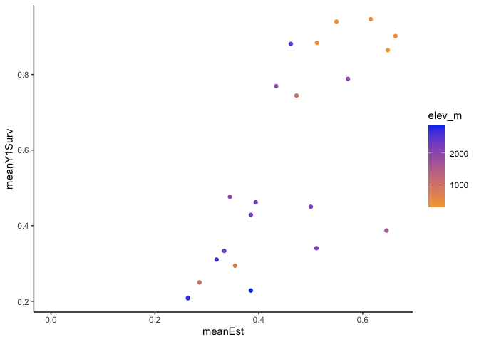
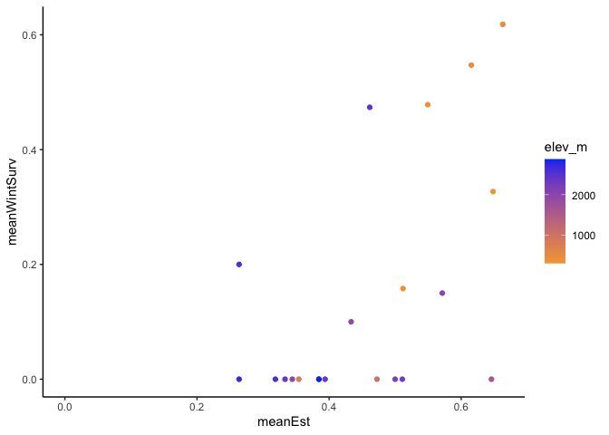
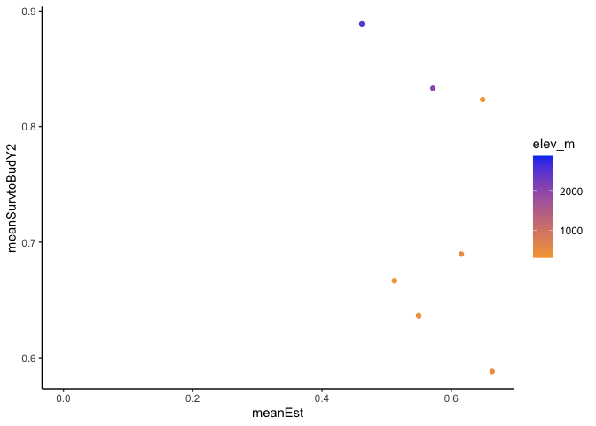
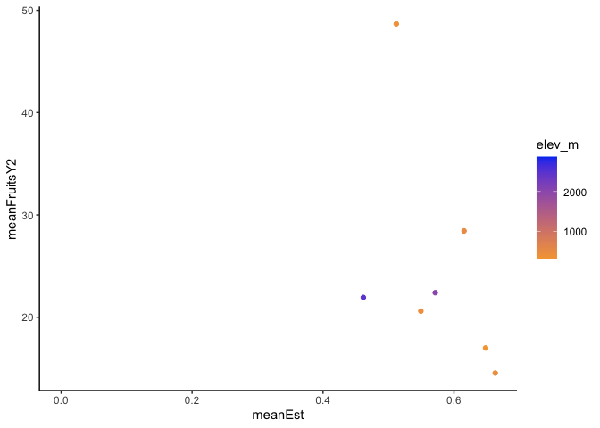
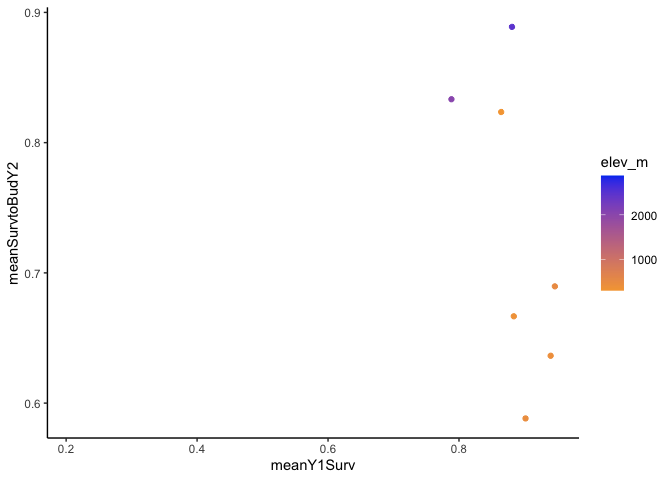
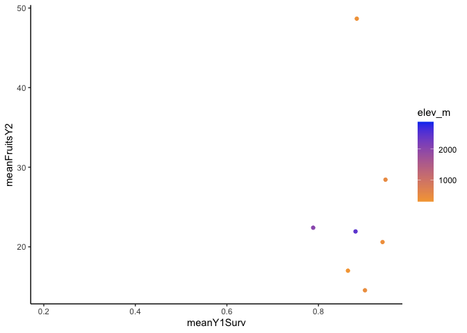
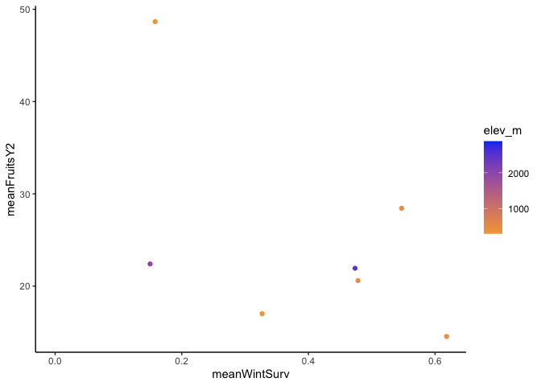
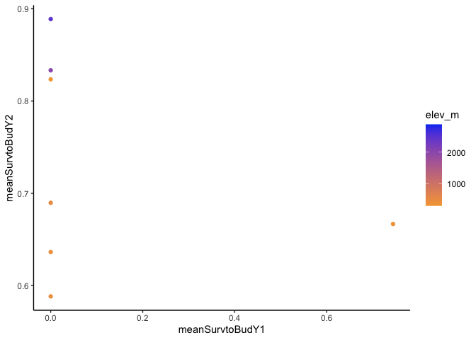
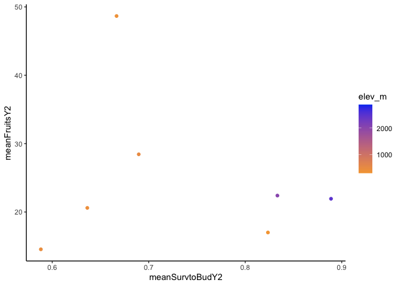

# Figures for WL2 Climate Distance Manuscript

## Libraries

``` r
library(tidyverse)
```

```
## ── Attaching core tidyverse packages ──────────────────────── tidyverse 2.0.0 ──
## ✔ dplyr     1.1.4     ✔ readr     2.1.5
## ✔ forcats   1.0.0     ✔ stringr   1.5.1
## ✔ ggplot2   3.5.1     ✔ tibble    3.2.1
## ✔ lubridate 1.9.3     ✔ tidyr     1.3.1
## ✔ purrr     1.0.2     
## ── Conflicts ────────────────────────────────────────── tidyverse_conflicts() ──
## ✖ dplyr::filter() masks stats::filter()
## ✖ dplyr::lag()    masks stats::lag()
## ℹ Use the conflicted package (<http://conflicted.r-lib.org/>) to force all conflicts to become errors
```

``` r
library(ggpubr) #ggarrange

sem <- function(x, na.rm=FALSE) {           #for caclulating standard error
  sd(x,na.rm=na.rm)/sqrt(length(na.omit(x)))
} 
```

## Load Data

``` r
wl2_establishment <- read_csv("../output/WL2_Traits/WL2_Establishment.csv")
```

```
## Rows: 1573 Columns: 21
## ── Column specification ────────────────────────────────────────────────────────
## Delimiter: ","
## chr   (7): block, BedLoc, bed, bed.col, Genotype, pop, elevation.group
## dbl  (13): bed.row, mf, rep, elev_m, Lat, Long, GrwSsn_GD_Recent, GrwSsn_GD_...
## date  (1): death.date
## 
## ℹ Use `spec()` to retrieve the full column specification for this data.
## ℹ Specify the column types or set `show_col_types = FALSE` to quiet this message.
```

``` r
wl2_y1surv <- read_csv("../output/WL2_Traits/WL2_Y1Surv.csv")
```

```
## Rows: 728 Columns: 17
## ── Column specification ────────────────────────────────────────────────────────
## Delimiter: ","
## chr  (5): block, Genotype, pop, elevation.group, pheno
## dbl (12): mf, rep, elev_m, Lat, Long, GrwSsn_GD_Recent, GrwSsn_GD_Historical...
## 
## ℹ Use `spec()` to retrieve the full column specification for this data.
## ℹ Specify the column types or set `show_col_types = FALSE` to quiet this message.
```

``` r
wl2_surv_to_bud_y1 <- read_csv("../output/WL2_Traits/WL2_SurvtoRep_y1.csv")
```

```
## Rows: 728 Columns: 22
## ── Column specification ────────────────────────────────────────────────────────
## Delimiter: ","
## chr   (8): block, BedLoc, bed, bed.col, Genotype, pop, elevation.group, bud....
## dbl  (13): bed.row, mf, rep, elev_m, Lat, Long, GrwSsn_GD_Recent, GrwSsn_GD_...
## date  (1): death.date
## 
## ℹ Use `spec()` to retrieve the full column specification for this data.
## ℹ Specify the column types or set `show_col_types = FALSE` to quiet this message.
```

``` r
wl2_fruits_y1 <- read_csv("../output/WL2_Traits/WL2_Fruits_Y1.csv")
```

```
## Rows: 25 Columns: 25
## ── Column specification ────────────────────────────────────────────────────────
## Delimiter: ","
## chr  (7): block, BedLoc, bed, bed-col, Genotype, pop, elevation.group
## dbl (18): bed-row, mf, rep, flowers, fruits, FrFlN, elev_m, Lat, Long, GrwSs...
## 
## ℹ Use `spec()` to retrieve the full column specification for this data.
## ℹ Specify the column types or set `show_col_types = FALSE` to quiet this message.
```

``` r
winter_surv <- read_csv("../output/WL2_Traits/WL2_WinterSurv_2324.csv")
```

```
## Rows: 469 Columns: 21
## ── Column specification ────────────────────────────────────────────────────────
## Delimiter: ","
## chr  (8): block, BedLoc, bed, bed- col, Genotype, pop, elevation.group, deat...
## dbl (13): bed- row, mf, rep, elev_m, Lat, Long, GrwSsn_GD_Recent, GrwSsn_GD_...
## 
## ℹ Use `spec()` to retrieve the full column specification for this data.
## ℹ Specify the column types or set `show_col_types = FALSE` to quiet this message.
```

``` r
wl2_surv_to_bud_y2 <- read_csv("../output/WL2_Traits/WL2_Surv_to_Rep_Y2_2324.csv")
```

```
## Rows: 135 Columns: 23
## ── Column specification ────────────────────────────────────────────────────────
## Delimiter: ","
## chr (10): Pop.Type, loc, bed, col, pop, Genotype, block, elevation.group, bu...
## dbl (13): row, mf, rep, elev_m, Lat, Long, GrwSsn_GD_Recent, GrwSsn_GD_Histo...
## 
## ℹ Use `spec()` to retrieve the full column specification for this data.
## ℹ Specify the column types or set `show_col_types = FALSE` to quiet this message.
```

``` r
wl2_fruits_y2 <- read_csv("../output/WL2_Traits/WL2_Fruits_Y2_2324.csv")
```

```
## Rows: 73 Columns: 26
## ── Column specification ────────────────────────────────────────────────────────
## Delimiter: ","
## chr  (8): Pop.Type, loc, bed, col, pop, Genotype, block, elevation.group
## dbl (18): row, mf, rep, flowers, fruits, FrFlN, elev_m, Lat, Long, GrwSsn_GD...
## 
## ℹ Use `spec()` to retrieve the full column specification for this data.
## ℹ Specify the column types or set `show_col_types = FALSE` to quiet this message.
```

``` r
wl2_prob_rep <- read_csv("../output/WL2_Traits/WL2_ProbFitness.csv")
```

```
## Rows: 1573 Columns: 20
## ── Column specification ────────────────────────────────────────────────────────
## Delimiter: ","
## chr  (7): block, BedLoc, bed, bed.col, Genotype, pop, elevation.group
## dbl (13): bed.row, mf, rep, elev_m, Lat, Long, GrwSsn_GD_Recent, GrwSsn_GD_H...
## 
## ℹ Use `spec()` to retrieve the full column specification for this data.
## ℹ Specify the column types or set `show_col_types = FALSE` to quiet this message.
```

### Subtraction Climate Distance

``` r
wl2_wtr_year_sub_recent <- read_csv("../output/Climate/full_year_Subtraction_Dist_from_Home_WL2_Recent.csv") %>% 
  select(parent.pop, Wtr_Year_TempDist_Recent=ann_tmean_dist, 
         Wtr_Year_PPTDist_Recent=ann_ppt_dist,
         Wtr_Year_CWDDist_Recent=cwd_dist)
```

```
## Rows: 23 Columns: 18
## ── Column specification ────────────────────────────────────────────────────────
## Delimiter: ","
## chr  (2): parent.pop, elevation.group
## dbl (16): elev_m, ppt_dist, cwd_dist, pck_dist, tmn_dist, tmx_dist, ann_tmea...
## 
## ℹ Use `spec()` to retrieve the full column specification for this data.
## ℹ Specify the column types or set `show_col_types = FALSE` to quiet this message.
```

``` r
wl2_wtr_year_sub_historic <- read_csv("../output/Climate/full_year_Subtraction_Dist_from_Home_WL2_Historical.csv") %>% 
  select(parent.pop, Wtr_Year_TempDist_Historic=ann_tmean_dist, 
         Wtr_Year_PPTDist_Historic=ann_ppt_dist,
         Wtr_Year_CWDDist_Historic=cwd_dist)
```

```
## Rows: 23 Columns: 18
## ── Column specification ────────────────────────────────────────────────────────
## Delimiter: ","
## chr  (2): parent.pop, elevation.group
## dbl (16): elev_m, ppt_dist, cwd_dist, pck_dist, tmn_dist, tmx_dist, ann_tmea...
## 
## ℹ Use `spec()` to retrieve the full column specification for this data.
## ℹ Specify the column types or set `show_col_types = FALSE` to quiet this message.
```

``` r
wl2_sub_dist_2023 <- wl2_wtr_year_sub_recent %>% 
  left_join(wl2_wtr_year_sub_historic) %>% 
  rename(pop=parent.pop)
```

```
## Joining with `by = join_by(parent.pop)`
```

``` r
wl2_wtr_year_sub_recent_2324 <- read_csv("../output/Climate/full_year_Subtraction_Dist_from_Home_WL2_2324_Recent.csv") %>% 
  select(parent.pop, Wtr_Year_TempDist_Recent=ann_tmean_dist, 
         Wtr_Year_PPTDist_Recent=ann_ppt_dist,
         Wtr_Year_CWDDist_Recent=cwd_dist)
```

```
## Rows: 23 Columns: 18
## ── Column specification ────────────────────────────────────────────────────────
## Delimiter: ","
## chr  (2): parent.pop, elevation.group
## dbl (16): elev_m, ppt_dist, cwd_dist, pck_dist, tmn_dist, tmx_dist, ann_tmea...
## 
## ℹ Use `spec()` to retrieve the full column specification for this data.
## ℹ Specify the column types or set `show_col_types = FALSE` to quiet this message.
```

``` r
wl2_wtr_year_sub_historic_2324 <- read_csv("../output/Climate/full_year_Subtraction_Dist_from_Home_WL2_2324_Historical.csv") %>% 
  select(parent.pop, Wtr_Year_TempDist_Historic=ann_tmean_dist, 
         Wtr_Year_PPTDist_Historic=ann_ppt_dist,
         Wtr_Year_CWDDist_Historic=cwd_dist)
```

```
## Rows: 23 Columns: 18
## ── Column specification ────────────────────────────────────────────────────────
## Delimiter: ","
## chr  (2): parent.pop, elevation.group
## dbl (16): elev_m, ppt_dist, cwd_dist, pck_dist, tmn_dist, tmx_dist, ann_tmea...
## 
## ℹ Use `spec()` to retrieve the full column specification for this data.
## ℹ Specify the column types or set `show_col_types = FALSE` to quiet this message.
```

``` r
wl2_sub_dist_2324 <- wl2_wtr_year_sub_recent_2324 %>% 
  left_join(wl2_wtr_year_sub_historic_2324) %>% 
  rename(pop=parent.pop)
```

```
## Joining with `by = join_by(parent.pop)`
```

``` r
wl2_sub_dist_2023_prep <- wl2_sub_dist_2023 %>% 
  select(pop:Wtr_Year_CWDDist_Historic)
wl2_sub_dist_2324_prep <- wl2_sub_dist_2324 %>% 
  select(pop:Wtr_Year_CWDDist_Historic) 

wl2_sub_dist_avg <- bind_rows(wl2_sub_dist_2023_prep, wl2_sub_dist_2324_prep) %>% 
  group_by(pop) %>% 
  summarise_at(c("Wtr_Year_TempDist_Recent", "Wtr_Year_PPTDist_Recent", "Wtr_Year_CWDDist_Recent", 
                 "Wtr_Year_TempDist_Historic", "Wtr_Year_PPTDist_Historic", "Wtr_Year_CWDDist_Historic"),
               c(mean), na.rm = TRUE) 
```

## Data Summaries

### Maternal family sample sizes upon transplant

``` r
wl2_establishment %>% 
  unite(pop.mf, pop:mf, remove = FALSE) %>% 
  group_by(pop.mf) %>% 
  summarise(n=n()) %>% 
  arrange(pop.mf) #number of plants per maternal family 
```

```
## # A tibble: 148 × 2
##    pop.mf     n
##    <chr>  <int>
##  1 BH_1      13
##  2 BH_2      13
##  3 BH_3      13
##  4 BH_4      13
##  5 BH_5      13
##  6 BH_6      13
##  7 BH_7      13
##  8 CC_1      13
##  9 CC_2      13
## 10 CC_3      13
## # ℹ 138 more rows
```

``` r
wl2_establishment %>% 
  select(pop, mf) %>% 
  distinct() %>% 
  group_by(pop) %>% 
  summarise(n=n()) %>% 
  arrange(n) #number of mfs per pop
```

```
## # A tibble: 23 × 2
##    pop       n
##    <chr> <int>
##  1 WV        2
##  2 WR        3
##  3 LV3       6
##  4 SC        6
##  5 SQ1       6
##  6 WL1       6
##  7 BH        7
##  8 CC        7
##  9 CP2       7
## 10 CP3       7
## # ℹ 13 more rows
```


### Year 2 survival to budding

``` r
wl2_surv_to_bud_y2_summary <- wl2_surv_to_bud_y2 %>% 
  filter(pop != "LV1", pop != "SQ1", pop != "WR") %>% 
  group_by(pop, elev_m, Geographic_Dist, Wtr_Year_GD_Recent) %>% 
  summarise(meanSurvtoBudY2=mean(SurvtoRep_y2, na.rm = TRUE), semEst=sem(SurvtoRep_y2, na.rm=TRUE)) 
```

```
## `summarise()` has grouped output by 'pop', 'elev_m', 'Geographic_Dist'. You can
## override using the `.groups` argument.
```

``` r
wl2_surv_to_bud_y2_summary_sub <- wl2_surv_to_bud_y2 %>% 
  left_join(wl2_sub_dist_2324) %>% 
  filter(pop != "LV1", pop != "SQ1", pop != "WR") %>% 
  group_by(pop, elev_m, Wtr_Year_TempDist_Recent, Wtr_Year_PPTDist_Recent) %>% 
  summarise(meanSurvtoBudY2=mean(SurvtoRep_y2, na.rm = TRUE), semEst=sem(SurvtoRep_y2, na.rm=TRUE))
```

```
## Joining with `by = join_by(pop)`
## `summarise()` has grouped output by 'pop', 'elev_m',
## 'Wtr_Year_TempDist_Recent'. You can override using the `.groups` argument.
```

### Prob Fitness

``` r
prob_fitness_summary <- wl2_prob_rep %>%  
  group_by(pop, elev_m, Geographic_Dist, Wtr_Year_GD_Recent) %>% 
  summarise(meanProbFit=mean(ProbFitness, na.rm = TRUE), semEst=sem(ProbFitness, na.rm=TRUE)) %>%
  mutate(RepYear=if_else(meanProbFit==0, "None",
                         if_else(pop=="TM2", "Both Years", "Year 2 Only")))
```

```
## `summarise()` has grouped output by 'pop', 'elev_m', 'Geographic_Dist'. You can
## override using the `.groups` argument.
```

``` r
prob_fitness_summary$RepYear <- factor(prob_fitness_summary$RepYear,
                                               levels = c('None','Year 2 Only', 'Both Years'))


prob_fitness_summary_sub <- wl2_prob_rep %>% 
  left_join(wl2_sub_dist_avg) %>% 
  group_by(pop, elev_m, Wtr_Year_TempDist_Recent, Wtr_Year_PPTDist_Recent) %>% 
  summarise(meanProbFit=mean(ProbFitness, na.rm = TRUE), semEst=sem(ProbFitness, na.rm=TRUE)) %>%
  mutate(RepYear=if_else(meanProbFit==0, "None",
                         if_else(pop=="TM2", "Both Years", "Year 2 Only")))
```

```
## Joining with `by = join_by(pop)`
## `summarise()` has grouped output by 'pop', 'elev_m',
## 'Wtr_Year_TempDist_Recent'. You can override using the `.groups` argument.
```

``` r
prob_fitness_summary_sub$RepYear <- factor(prob_fitness_summary_sub$RepYear,
                                               levels = c('None','Year 2 Only', 'Both Years'))
```

### Establishment, y1surv, winter surv

``` r
est_summary <- wl2_establishment %>% 
  group_by(pop, elev_m, Wtr_Year_GD_Recent, Wtr_Year_GD_Historical) %>% 
  summarise(meanEst=mean(Establishment, na.rm = TRUE), semEst=sem(Establishment, na.rm=TRUE))
```

```
## `summarise()` has grouped output by 'pop', 'elev_m', 'Wtr_Year_GD_Recent'. You
## can override using the `.groups` argument.
```

``` r
y1surv_summary <- wl2_y1surv %>% 
  group_by(pop, elev_m, GrwSsn_GD_Recent, Wtr_Year_GD_Recent) %>% 
  summarise(meanY1Surv=mean(Survival, na.rm = TRUE), semSurv=sem(Survival, na.rm=TRUE)) 
```

```
## `summarise()` has grouped output by 'pop', 'elev_m', 'GrwSsn_GD_Recent'. You
## can override using the `.groups` argument.
```

``` r
wintersurv_summary <- winter_surv %>% 
  filter(pop!="WR") %>% 
  group_by(pop, elev_m, Wtr_Year_GD_Recent) %>% 
  summarise(meanWintSurv=mean(WinterSurv, na.rm = TRUE), semSurv=sem(WinterSurv, na.rm=TRUE))
```

```
## `summarise()` has grouped output by 'pop', 'elev_m'. You can override using the
## `.groups` argument.
```

``` r
y1_fruits_summary <- wl2_fruits_y1 %>% 
  group_by(pop, elev_m, Wtr_Year_GD_Recent) %>% 
  summarise(meanFruitsY1=mean(fruits, na.rm = TRUE), semFruits=sem(fruits, na.rm=TRUE))
```

```
## `summarise()` has grouped output by 'pop', 'elev_m'. You can override using the
## `.groups` argument.
```

``` r
y2_fruits_summary <- wl2_fruits_y2 %>% 
  filter(pop != "LV1", pop != "SQ1", pop != "WR") %>% 
  group_by(pop, elev_m, Wtr_Year_GD_Recent) %>% 
  summarise(meanFruitsY2=mean(fruits, na.rm = TRUE), semFruits=sem(fruits, na.rm=TRUE))
```

```
## `summarise()` has grouped output by 'pop', 'elev_m'. You can override using the
## `.groups` argument.
```

``` r
y1_surv_to_bud_summary <- wl2_surv_to_bud_y1 %>% 
  group_by(pop, elev_m, Wtr_Year_GD_Recent) %>% 
  summarise(meanSurvtoBudY1=mean(SurvtoRep_Y1, na.rm = TRUE), semSurv=sem(SurvtoRep_Y1, na.rm=TRUE))
```

```
## `summarise()` has grouped output by 'pop', 'elev_m'. You can override using the
## `.groups` argument.
```


## Figure 2: Geo distance

``` r
probfit_geo <- prob_fitness_summary %>% 
  ggplot(aes(x=Geographic_Dist, y=meanProbFit, group = pop, color=elev_m)) +
  scale_colour_gradient(low = "#F5A540", high = "#0043F0") +
  geom_point(aes(shape=RepYear), size=6) + 
  geom_errorbar(aes(ymin=meanProbFit-semEst,ymax=meanProbFit+semEst),width=.2, linewidth = 2) +
  annotate("text", x = 136.2622, y= 0.095, label = "WL2", 
           colour = "purple", fontface="bold", size = 22 / .pt) +
  theme_classic() + 
  scale_y_continuous(expand = c(0.01, 0)) +
  labs(y="Probability of \n Successfully Reproducing", x="Geographic Distance (m)", 
       color="Elevation (m)", shape="Rep Year(s)") +
  theme(text=element_text(size=30), axis.text.x = element_text(angle = 45,  hjust = 1))

repsurvy2_geo <- wl2_surv_to_bud_y2_summary %>% 
  ggplot(aes(x=Geographic_Dist, y=meanSurvtoBudY2, group = pop, colour = elev_m)) +
  scale_colour_gradient(low = "#F5A540", high = "#0043F0") +
  geom_point(size=6) + 
  geom_errorbar(aes(ymin=meanSurvtoBudY2-semEst,ymax=meanSurvtoBudY2+semEst),width=.2, linewidth = 2) +
  annotate("text", x = 9500, y= 0.8333333, label = "WL2", 
           colour = "purple", fontface="bold", size = 22 / .pt) +
  theme_classic() + 
  scale_y_continuous(expand = c(0.01, 0), limits = c(0.4,1.05)) +
  labs(y="Survival to Budding Y2", x="Geographic Distance (m)", colour = "Elevation (m)") +
  theme(text=element_text(size=30), axis.text.x = element_text(angle = 45,  hjust = 1))

fig2_geo <- ggarrange(probfit_geo, repsurvy2_geo, 
                        labels = c("A)", "B)"), 
                        font.label = list(size=30, face = "plain"), 
                        ncol=2, nrow=1) 
#ggsave("../output/WL2_Traits/Figure2_Geo.png", width = 26, height = 9, units = "in")
```

## Figure 3: Gower's recent water year climate distance

``` r
probfit_gower <- prob_fitness_summary %>% 
  ggplot(aes(x=Wtr_Year_GD_Recent, y=meanProbFit, group = pop, color=elev_m)) +
  scale_colour_gradient(low = "#F5A540", high = "#0043F0") +
  geom_point(aes(shape=RepYear), size=6) + 
  geom_errorbar(aes(ymin=meanProbFit-semEst,ymax=meanProbFit+semEst),width=.02,linewidth = 2) +
  annotate("text", x = 0.3959884, y= 0.095, label = "WL2", 
           colour = "purple", fontface="bold", size = 22 / .pt) +
  theme_classic() + 
  scale_y_continuous(expand = c(0.01, 0)) +
  labs(y="Probability of \n Successfully Reproducing", x="Recent Water Year Climate Dist", 
       color="Elevation (m)", shape="Rep Year(s)") +
  theme(text=element_text(size=30))

repsurvy2_gower <- wl2_surv_to_bud_y2_summary %>% 
  ggplot(aes(x=Wtr_Year_GD_Recent, y=meanSurvtoBudY2, group = pop, colour = elev_m)) +
  scale_colour_gradient(low = "#F5A540", high = "#0043F0") +
  geom_point(size=6) + 
  geom_errorbar(aes(ymin=meanSurvtoBudY2-semEst,ymax=meanSurvtoBudY2+semEst),width=.02,linewidth = 2) +
  annotate("text", x = 0.25, y= 0.8333333, label = "WL2", 
           colour = "purple", fontface="bold", size = 22 / .pt) +
  theme_classic() + 
  scale_y_continuous(expand = c(0.01, 0), limits = c(0.4,1.05)) +
  labs(y="Survival to Budding Y2", x="Recent Water Year Climate Dist", colour = "Elevation (m)") +
  theme(text=element_text(size=30))

fig3_gower <- ggarrange(probfit_gower, repsurvy2_gower, 
                        labels = c("A)", "B)"), 
                        font.label = list(size=30, face = "plain"), 
                        ncol=2, nrow=1) 
#ggsave("../output/WL2_Traits/Figure3_WtrYrGowers.png", width = 26, height = 9, units = "in")
```

## Figure 4: Temp and PPT recent water climate distance

``` r
WYtemp_probfit <- prob_fitness_summary_sub %>% 
  ggplot(aes(x=Wtr_Year_TempDist_Recent, y=meanProbFit, group = pop, color=elev_m)) +
  scale_colour_gradient(low = "#F5A540", high = "#0043F0") +
  geom_point(aes(shape=RepYear), size=6) + 
  geom_errorbar(aes(ymin=meanProbFit-semEst,ymax=meanProbFit+semEst),width=.3,linewidth = 2) +
  annotate("text", x = 0.6300972	, y= 0.095, label = "WL2", 
           colour = "purple", fontface="bold", size = 22 / .pt) +
  theme_classic() + 
  scale_y_continuous(expand = c(0.01, 0)) +
  labs(y="Probability of \n Successfully Reproducing", x="Recent Water Year Temp Dist (°C)", 
       color="Elevation (m)", shape="Rep Year(s)") +
  theme(text=element_text(size=30))

WYppt_probfit <- prob_fitness_summary_sub %>% 
  ggplot(aes(x=Wtr_Year_PPTDist_Recent, y=meanProbFit, group = pop, color=elev_m)) +
  scale_colour_gradient(low = "#F5A540", high = "#0043F0") +
  geom_point(aes(shape=RepYear), size=6) + 
  geom_errorbar(aes(ymin=meanProbFit-semEst,ymax=meanProbFit+semEst),width=.3,linewidth = 2) +
  annotate("text", x = -546.96536, y= 0.095, label = "WL2", 
           colour = "purple", fontface="bold", size = 22 / .pt) +
  theme_classic() + 
  scale_y_continuous(expand = c(0.01, 0)) +
  labs(y="Probability of \n Successfully Reproducing", x="Recent Water Year PPT Dist (mm)", 
       color="Elevation (m)", shape="Rep Year(s)") +
  theme(text=element_text(size=30))

WYtemp_repsurvy2 <- wl2_surv_to_bud_y2_summary_sub %>% 
  ggplot(aes(x=Wtr_Year_TempDist_Recent, y=meanSurvtoBudY2, group = pop, colour = elev_m)) +
  scale_colour_gradient(low = "#F5A540", high = "#0043F0") +
  geom_point(size=6) + 
  geom_errorbar(aes(ymin=meanSurvtoBudY2-semEst,ymax=meanSurvtoBudY2+semEst),width=.3,linewidth = 2) +
  annotate("text", x = 0.4, y= 0.8333333, label = "WL2", 
           colour = "purple", fontface="bold", size = 22 / .pt) +
  theme_classic() + 
  scale_y_continuous(expand = c(0.01, 0), limits = c(0.4,1.05)) +
  labs(y="Survival to Budding Y2", x="Recent Water Year Temp Dist (°C)", colour = "Elevation (m)") +
  theme(text=element_text(size=30))

WYppt_repsurvy2 <- wl2_surv_to_bud_y2_summary_sub %>% 
  ggplot(aes(x=Wtr_Year_PPTDist_Recent, y=meanSurvtoBudY2, group = pop, colour = elev_m)) +
  scale_colour_gradient(low = "#F5A540", high = "#0043F0") +
  geom_point(size=6) + 
  geom_errorbar(aes(ymin=meanSurvtoBudY2-semEst,ymax=meanSurvtoBudY2+semEst),width=.3,linewidth = 2) +
  annotate("text", x = 143, y= 0.8333333, label = "WL2", 
           colour = "purple", fontface="bold", size = 22 / .pt) +
  theme_classic() + 
  scale_y_continuous(expand = c(0.01, 0), limits = c(0.4,1.05)) +
  labs(y="Survival to Budding Y2", x="Recent Water Year PPT Dist (mm)", colour = "Elevation (m)") +
  theme(text=element_text(size=30))

fig4_sub <- ggarrange(WYtemp_probfit, WYtemp_repsurvy2, 
                        WYppt_probfit, WYppt_repsurvy2, 
                        labels = c("A)", "B)", "C)", "D)"), 
                        font.label = list(size=30, face = "plain"), 
                        ncol=2, nrow=2) 
#ggsave("../output/WL2_Traits/Figure4_TmpPPT.png", width = 26, height = 18, units = "in")
```

## Figure S5: Additional Gower's recent water year climate distance 

``` r
est_gower <- wl2_establishment %>% 
  group_by(pop, elev_m, Wtr_Year_GD_Recent, Wtr_Year_GD_Historical) %>% 
  summarise(meanEst=mean(Establishment, na.rm = TRUE), semEst=sem(Establishment, na.rm=TRUE)) %>%
  ggplot(aes(x=Wtr_Year_GD_Recent, y=meanEst, group = pop, colour = elev_m)) +
  scale_colour_gradient(low = "#F5A540", high = "#0043F0") +
  geom_point(size=6) + 
  geom_errorbar(aes(ymin=meanEst-semEst,ymax=meanEst+semEst),width=.02, linewidth = 2) +
  annotate("text", x = 0.3959884, y= 0.65, label = "WL2", 
           colour = "purple", fontface="bold", size = 22 / .pt) +
  theme_classic() + 
  scale_y_continuous(expand = c(0.01, 0)) +
  labs(y="Establishment", x="Recent Water Year Climate Dist", 
       color="Elevation (m)") +
  theme(text=element_text(size=30))
```

```
## `summarise()` has grouped output by 'pop', 'elev_m', 'Wtr_Year_GD_Recent'. You
## can override using the `.groups` argument.
```

``` r
y1surv_gower <- wl2_y1surv %>% 
  group_by(pop, elev_m, GrwSsn_GD_Recent, Wtr_Year_GD_Recent) %>% 
  summarise(meanSurv=mean(Survival, na.rm = TRUE), semSurv=sem(Survival, na.rm=TRUE)) %>% 
  ggplot(aes(x=Wtr_Year_GD_Recent, y=meanSurv, group = pop, colour = elev_m)) +
  scale_colour_gradient(low = "#F5A540", high = "#0043F0") +
  geom_point(size=6) + 
  geom_errorbar(aes(ymin=meanSurv-semSurv,ymax=meanSurv+semSurv),width=.02,linewidth = 2) +
  annotate("text", x = 0.42, y= 0.7884615, label = "WL2", 
           colour = "purple", fontface="bold", size = 22 / .pt) +
  theme_classic() + 
  scale_y_continuous(expand = c(0.01, 0)) +
  labs(y="Y1 Survival", x="Recent Water Year Climate Dist", colour="Elevation (m)") +
  theme(text=element_text(size=30))
```

```
## `summarise()` has grouped output by 'pop', 'elev_m', 'GrwSsn_GD_Recent'. You
## can override using the `.groups` argument.
```

``` r
wintersurv_gower <- winter_surv %>% 
  filter(pop!="WR") %>% 
  group_by(pop, elev_m, Wtr_Year_GD_Recent) %>% 
  summarise(meanSurv=mean(WinterSurv, na.rm = TRUE), semSurv=sem(WinterSurv, na.rm=TRUE)) %>% 
  ggplot(aes(x=Wtr_Year_GD_Recent, y=meanSurv, group = pop, colour = elev_m)) +
  scale_colour_gradient(low = "#F5A540", high = "#0043F0") +
  geom_point(size=6) + 
  geom_errorbar(aes(ymin=meanSurv-semSurv,ymax=meanSurv+semSurv),width=.02,linewidth = 2) +
  annotate("text", x = 0.227, y= 0.24, label = "WL2", 
           colour = "purple", fontface="bold", size = 22 / .pt) +
  theme_classic() + 
  scale_y_continuous(expand = c(0.01, 0)) +
  labs(y="Winter Survival", x="Recent Water Year Climate Dist", colour="Elevation (m)") +
  theme(text=element_text(size=30))
```

```
## `summarise()` has grouped output by 'pop', 'elev_m'. You can override using the
## `.groups` argument.
```

``` r
figs5_sub <- ggarrange(est_gower, y1surv_gower, 
                        wintersurv_gower, 
                        labels = c("A)", "B)", "C)"), 
                        font.label = list(size=30, face = "plain"), 
                        ncol=2, nrow=2) 
#ggsave("../output/WL2_Traits/FigureS5_WTRYRGowers.png", width = 26, height = 18, units = "in")
```

## Figure S6: Additonal Temp and PPT recent water yar climate distance

``` r
WYtemp_est <- wl2_establishment %>% 
  left_join(wl2_sub_dist_2023) %>% 
  group_by(pop, elev_m, Wtr_Year_TempDist_Recent, Wtr_Year_TempDist_Historic) %>% 
  summarise(meanEst=mean(Establishment, na.rm = TRUE), semEst=sem(Establishment, na.rm=TRUE)) %>% 
  ggplot(aes(x=Wtr_Year_TempDist_Recent, y=meanEst, group = pop, color=elev_m)) +
  scale_colour_gradient(low = "#F5A540", high = "#0043F0") +
  geom_point(size=6) + 
  geom_errorbar(aes(ymin=meanEst-semEst,ymax=meanEst+semEst),width=.3,linewidth = 2) +
  annotate("text", x = 1.6352917, y= 0.65, label = "WL2", 
           colour = "purple", fontface="bold", size = 22 / .pt) +
  theme_classic() + 
  scale_y_continuous(expand = c(0.01, 0)) +
  labs(y="Establishment", x="Recent Water Year Temp Dist", 
       color="Elevation (m)") +
  theme(text=element_text(size=30))
```

```
## Joining with `by = join_by(pop)`
## `summarise()` has grouped output by 'pop', 'elev_m',
## 'Wtr_Year_TempDist_Recent'. You can override using the `.groups` argument.
```

``` r
WYppt_est <- wl2_establishment %>% 
  left_join(wl2_sub_dist_2023) %>% 
  group_by(pop, elev_m, Wtr_Year_PPTDist_Recent, Wtr_Year_PPTDist_Historic) %>% 
  summarise(meanEst=mean(Establishment, na.rm = TRUE), semEst=sem(Establishment, na.rm=TRUE)) %>% 
  ggplot(aes(x=Wtr_Year_PPTDist_Recent, y=meanEst, group = pop, color=elev_m)) +
  scale_colour_gradient(low = "#F5A540", high = "#0043F0") +
  geom_point(size=6) + 
  geom_errorbar(aes(ymin=meanEst-semEst,ymax=meanEst+semEst),width=.3,linewidth = 2) +
  annotate("text", x = -1120, y= 0.5714286, label = "WL2", 
           colour = "purple", fontface="bold", size = 22 / .pt) +
  theme_classic() + 
  scale_y_continuous(expand = c(0.01, 0)) +
  labs(y="Establishment", x="Recent Water Year PPT Dist", 
       color="Elevation (m)") +
  theme(text=element_text(size=30))
```

```
## Joining with `by = join_by(pop)`
## `summarise()` has grouped output by 'pop', 'elev_m', 'Wtr_Year_PPTDist_Recent'.
## You can override using the `.groups` argument.
```

``` r
WYtemp_y1surv <- wl2_y1surv %>% 
  left_join(wl2_sub_dist_2023) %>% 
  group_by(pop, elev_m, Wtr_Year_TempDist_Recent, Wtr_Year_TempDist_Historic) %>% 
  summarise(meanY1Surv=mean(Survival, na.rm = TRUE), semEst=sem(Survival, na.rm=TRUE)) %>% 
  ggplot(aes(x=Wtr_Year_TempDist_Recent, y=meanY1Surv, group = pop, colour = elev_m)) +
  scale_colour_gradient(low = "#F5A540", high = "#0043F0") +
  geom_point(size=6) + 
  geom_errorbar(aes(ymin=meanY1Surv-semEst,ymax=meanY1Surv+semEst),width=.02,linewidth = 2) +
  annotate("text", x = 1.6352917, y= 0.88, label = "WL2", 
           colour = "purple", fontface="bold", size = 22 / .pt) +
  theme_classic() + 
  scale_y_continuous(expand = c(0.01, 0)) +
  labs(y="Y1 Survival", x="Recent Water Year Temp Dist", colour="Elevation (m)") +
  theme(text=element_text(size=30))
```

```
## Joining with `by = join_by(pop)`
## `summarise()` has grouped output by 'pop', 'elev_m',
## 'Wtr_Year_TempDist_Recent'. You can override using the `.groups` argument.
```

``` r
figs6_gower <- ggarrange(WYtemp_est, WYtemp_y1surv, 
                        WYppt_est, 
                        labels = c("A)", "B)", "C)"), 
                        font.label = list(size=30, face = "plain"), 
                        ncol=2, nrow=2) 
#ggsave("../output/WL2_Traits/FigureS6_TmpPPT.png", width = 26, height = 18, units = "in")
```
## Tradeoffs between fitness metrics


``` r
all_fitness <- est_summary %>% 
  left_join(y1surv_summary) %>% 
  select(-semSurv) %>% 
  left_join(y1_surv_to_bud_summary) %>% 
  select(-semSurv) %>%
  left_join(y1_fruits_summary) %>% 
  ungroup() %>% 
  select(-Wtr_Year_GD_Recent, -Wtr_Year_GD_Historical, -GrwSsn_GD_Recent, -semEst, -semFruits) %>% 
  left_join(wintersurv_summary) %>% 
  select(-semSurv, -Wtr_Year_GD_Recent) %>%
  left_join(wl2_surv_to_bud_y2_summary) %>% 
  select(-semEst, -Wtr_Year_GD_Recent) %>%
  left_join(y2_fruits_summary) %>% 
  select(-semFruits, -Wtr_Year_GD_Recent, -Geographic_Dist)
```

```
## Joining with `by = join_by(pop, elev_m, Wtr_Year_GD_Recent)`
## Joining with `by = join_by(pop, elev_m, Wtr_Year_GD_Recent)`
## Joining with `by = join_by(pop, elev_m, Wtr_Year_GD_Recent)`
## Joining with `by = join_by(pop, elev_m)`
## Joining with `by = join_by(pop, elev_m)`
## Joining with `by = join_by(pop, elev_m)`
```

``` r
all_fitness
```

```
## # A tibble: 23 × 9
##    pop   elev_m meanEst meanY1Surv meanSurvtoBudY1 meanFruitsY1 meanWintSurv
##    <chr>  <dbl>   <dbl>      <dbl>           <dbl>        <dbl>        <dbl>
##  1 BH      511.   0.615      0.946           0               NA        0.547
##  2 CC      313    0.648      0.864           0               NA        0.327
##  3 CP2    2244.   0.511      0.340           0               NA        0    
##  4 CP3    2266.   0.385      0.429           0               NA        0    
##  5 DPR    1019.   0.473      0.744           0               NA        0    
##  6 FR      787    0.354      0.294           0.118           NA        0    
##  7 IH      454.   0.663      0.902           0               NA        0.618
##  8 LV1    2593.   0.264      0.208           0               NA        0.2  
##  9 LV3    2354.   0.333      0.333           0               NA        0    
## 10 LVTR1  2741.   0.264      0.208           0               NA        0    
## # ℹ 13 more rows
## # ℹ 2 more variables: meanSurvtoBudY2 <dbl>, meanFruitsY2 <dbl>
```


``` r
all_fitness %>% 
  ggplot(aes(meanEst, meanY1Surv, colour = elev_m)) +
  geom_point() +
  scale_colour_gradient(low = "#F5A540", high = "#0043F0") +
  theme_classic()
```

```
## Warning: Removed 1 row containing missing values or values outside the scale range
## (`geom_point()`).
```

<!-- -->

``` r
all_fitness %>% 
  ggplot(aes(meanEst, meanWintSurv, colour = elev_m)) +
  geom_point() +
  scale_colour_gradient(low = "#F5A540", high = "#0043F0") +
  theme_classic()
```

```
## Warning: Removed 2 rows containing missing values or values outside the scale range
## (`geom_point()`).
```

<!-- -->

``` r
all_fitness %>% 
  ggplot(aes(meanEst, meanSurvtoBudY2, colour = elev_m)) +
  geom_point() +
  scale_colour_gradient(low = "#F5A540", high = "#0043F0") +
  theme_classic()
```

```
## Warning: Removed 16 rows containing missing values or values outside the scale range
## (`geom_point()`).
```

<!-- -->

``` r
all_fitness %>% 
  ggplot(aes(meanEst, meanFruitsY2, colour = elev_m)) +
  geom_point() +
  scale_colour_gradient(low = "#F5A540", high = "#0043F0") +
  theme_classic()
```

```
## Warning: Removed 16 rows containing missing values or values outside the scale range
## (`geom_point()`).
```

<!-- -->

``` r
all_fitness %>% 
  ggplot(aes(meanY1Surv, meanWintSurv, colour = elev_m)) +
  geom_point() +
  scale_colour_gradient(low = "#F5A540", high = "#0043F0") +
  theme_classic()
```

```
## Warning: Removed 2 rows containing missing values or values outside the scale range
## (`geom_point()`).
```

<!-- -->

``` r
all_fitness %>% 
  ggplot(aes(meanY1Surv, meanSurvtoBudY2, colour = elev_m)) +
  geom_point() +
  scale_colour_gradient(low = "#F5A540", high = "#0043F0") +
  theme_classic()
```

```
## Warning: Removed 16 rows containing missing values or values outside the scale range
## (`geom_point()`).
```

<!-- -->

``` r
all_fitness %>% 
  ggplot(aes(meanY1Surv, meanFruitsY2, colour = elev_m)) +
  geom_point() +
  scale_colour_gradient(low = "#F5A540", high = "#0043F0") +
  theme_classic()
```

```
## Warning: Removed 16 rows containing missing values or values outside the scale range
## (`geom_point()`).
```

<!-- -->

``` r
all_fitness %>% 
  ggplot(aes(meanWintSurv, meanSurvtoBudY2, colour = elev_m)) +
  geom_point() +
  scale_colour_gradient(low = "#F5A540", high = "#0043F0") +
  theme_classic()
```

```
## Warning: Removed 16 rows containing missing values or values outside the scale range
## (`geom_point()`).
```

<!-- -->

``` r
all_fitness %>% 
  ggplot(aes(meanWintSurv, meanFruitsY2, colour = elev_m)) +
  geom_point() +
  scale_colour_gradient(low = "#F5A540", high = "#0043F0") +
  theme_classic()
```

```
## Warning: Removed 16 rows containing missing values or values outside the scale range
## (`geom_point()`).
```

<!-- -->

``` r
all_fitness %>% 
  ggplot(aes(meanSurvtoBudY1, meanSurvtoBudY2, colour = elev_m)) +
  geom_point() +
  scale_colour_gradient(low = "#F5A540", high = "#0043F0") +
  theme_classic()
```

```
## Warning: Removed 16 rows containing missing values or values outside the scale range
## (`geom_point()`).
```

<!-- -->

``` r
all_fitness %>% 
  ggplot(aes(meanSurvtoBudY2, meanFruitsY2, colour = elev_m)) +
  geom_point() +
  scale_colour_gradient(low = "#F5A540", high = "#0043F0") +
  theme_classic()
```

```
## Warning: Removed 16 rows containing missing values or values outside the scale range
## (`geom_point()`).
```

<!-- -->


## Additional figures (come back to these)

-   Figure 1: Population map and PCAs

-   Figure S1: Pearson's correlations

-   Figure S2: PCAs with PC1 and PC2

-   Figure S3: Gower's climate distance across pops

-   Figure S4: Establishment relat with geo distance

-   Figure S7: Growth season climate distance effects
