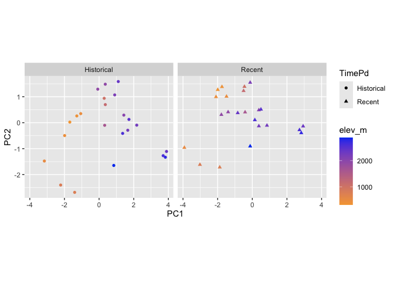
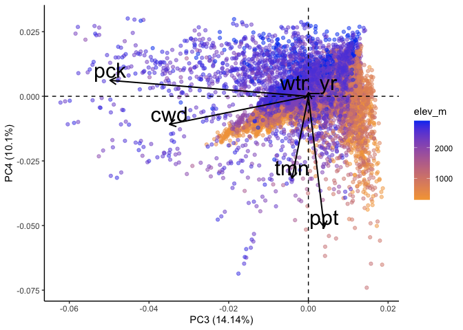
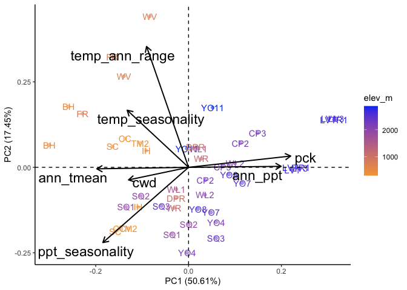
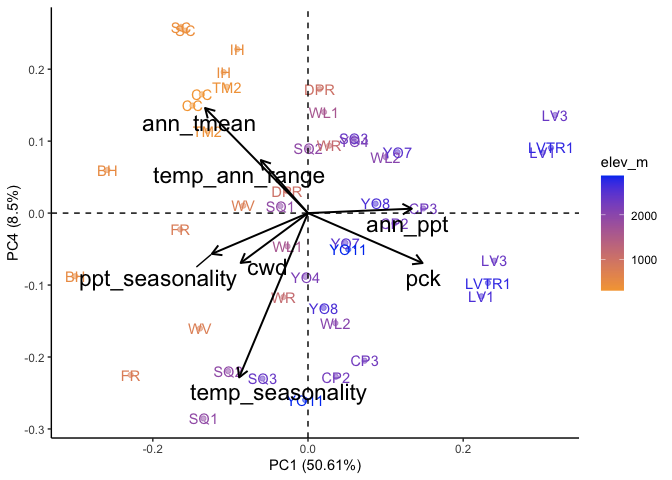
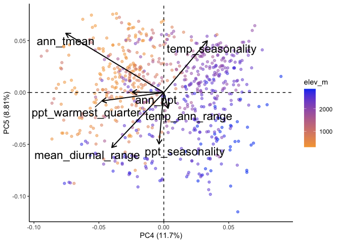
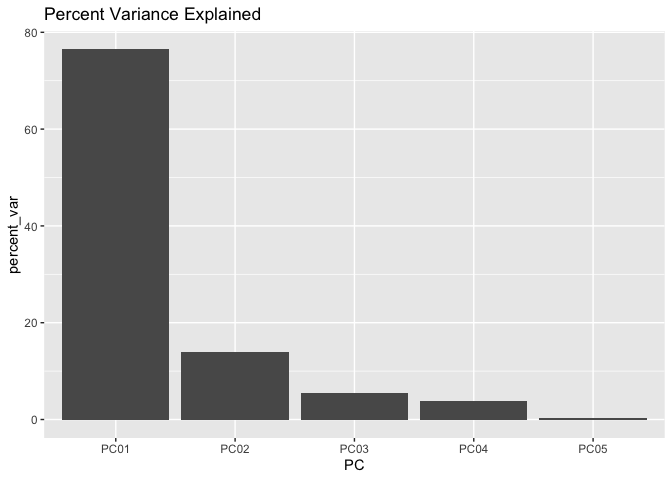
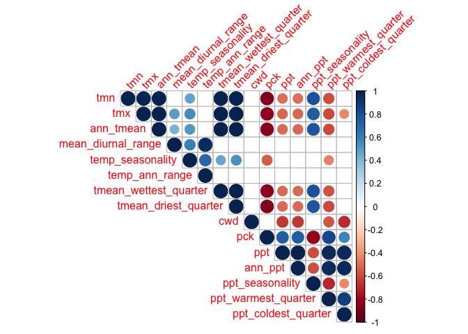
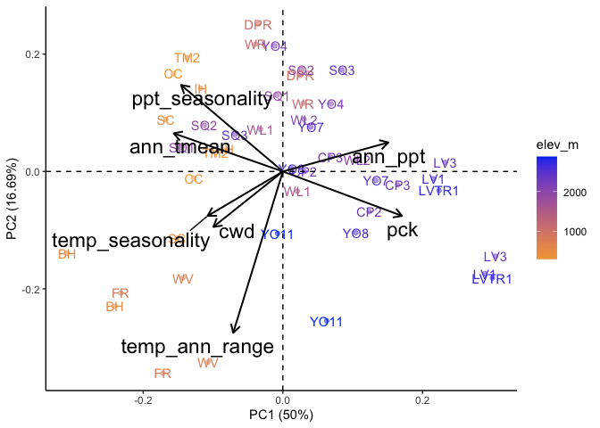
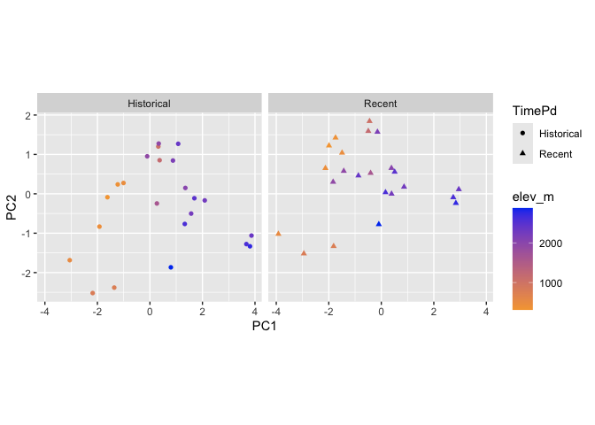

To Do:

-   Save PC figures of interest

-   Save linear model results

-   Should use this code to check the significance of the PCA: <https://github.com/StatQuest/pca_demo/blob/master/pca_demo.R>

    -   Remember this paper: Björklund, M. 2019. Be careful with your principal components. Evolution 73: 2151--2158.

# Climate PCAs for Full "Water" Year 

## Load necessary libraries


``` r
library(tidyverse)
```

```
## ── Attaching core tidyverse packages ──────────────────────── tidyverse 2.0.0 ──
## ✔ dplyr     1.1.4     ✔ readr     2.1.5
## ✔ forcats   1.0.0     ✔ stringr   1.5.1
## ✔ ggplot2   3.5.1     ✔ tibble    3.2.1
## ✔ lubridate 1.9.3     ✔ tidyr     1.3.1
## ✔ purrr     1.0.2     
## ── Conflicts ────────────────────────────────────────── tidyverse_conflicts() ──
## ✖ dplyr::filter() masks stats::filter()
## ✖ dplyr::lag()    masks stats::lag()
## ℹ Use the conflicted package (<http://conflicted.r-lib.org/>) to force all conflicts to become errors
```

``` r
library(lmerTest)
```

```
## Loading required package: lme4
## Loading required package: Matrix
## 
## Attaching package: 'Matrix'
## 
## The following objects are masked from 'package:tidyr':
## 
##     expand, pack, unpack
## 
## 
## Attaching package: 'lmerTest'
## 
## The following object is masked from 'package:lme4':
## 
##     lmer
## 
## The following object is masked from 'package:stats':
## 
##     step
```

``` r
library(ggrepel)
#library(cowplot)
library(gridExtra)
```

```
## 
## Attaching package: 'gridExtra'
## 
## The following object is masked from 'package:dplyr':
## 
##     combine
```

``` r
library(corrplot) #plotting correlations 
```

```
## corrplot 0.94 loaded
```

``` r
library(rstatix) #performing cor_test
```

```
## 
## Attaching package: 'rstatix'
## 
## The following object is masked from 'package:stats':
## 
##     filter
```

``` r
library(QBMS) #for function calc_biovars to calculate bioclim variables
library(ggfortify) #easier PCA figures
sem <- function(x, na.rm=FALSE) {
  sd(x,na.rm=na.rm)/sqrt(length(na.omit(x)))
} #standard error function 

get_legend<-function(myggplot){
  tmp <- ggplot_gtable(ggplot_build(myggplot))
  leg <- which(sapply(tmp$grobs, function(x) x$name) == "guide-box")
  legend <- tmp$grobs[[leg]]
  return(legend)
} #legend function for grid_arrange

elev_three_palette <- c("#0043F0", "#C9727F", "#F5A540") #colors from Gremer et al 2019
elev_order <- c("High", "Mid", "Low")
month_order <- c("jan","feb","mar","apr","may","jun","jul","aug","sep","oct","nov","dec")
```

## Load Flint Data


``` r
flint_all_year <- read_csv("../output/Climate/flint_climate_UCDpops.csv")
```

```
## Rows: 38675 Columns: 14
## ── Column specification ────────────────────────────────────────────────────────
## Delimiter: ","
## chr  (3): parent.pop, elevation.group, month
## dbl (11): elev_m, Lat, Long, year, aet, cwd, pck, pet, ppt, tmn, tmx
## 
## ℹ Use `spec()` to retrieve the full column specification for this data.
## ℹ Specify the column types or set `show_col_types = FALSE` to quiet this message.
```

``` r
head(flint_all_year)
```

```
## # A tibble: 6 × 14
##   parent.pop elevation.group elev_m   Lat  Long  year month   aet   cwd   pck
##   <chr>      <chr>            <dbl> <dbl> <dbl> <dbl> <chr> <dbl> <dbl> <dbl>
## 1 BH         Low               511.  37.4 -120.  1895 dec    3.23  27.9     0
## 2 BH         Low               511.  37.4 -120.  1895 nov    4.89  40.8     0
## 3 BH         Low               511.  37.4 -120.  1895 oct    8.9   80.8     0
## 4 BH         Low               511.  37.4 -120.  1896 apr   72.5   36.2     0
## 5 BH         Low               511.  37.4 -120.  1896 aug   24.5  149.      0
## 6 BH         Low               511.  37.4 -120.  1896 dec    3.38  30.3     0
## # ℹ 4 more variables: pet <dbl>, ppt <dbl>, tmn <dbl>, tmx <dbl>
```

### Add month numbers

``` r
month_nums <- tibble(month=c("jan","feb","mar","apr","may","jun","jul","aug","sep","oct","nov","dec"),
                     month_nums=c(1:12))
month_nums
```

```
## # A tibble: 12 × 2
##    month month_nums
##    <chr>      <int>
##  1 jan            1
##  2 feb            2
##  3 mar            3
##  4 apr            4
##  5 may            5
##  6 jun            6
##  7 jul            7
##  8 aug            8
##  9 sep            9
## 10 oct           10
## 11 nov           11
## 12 dec           12
```

``` r
flint_all_year_mosnums <- left_join(flint_all_year, month_nums) %>% arrange(parent.pop, year, month_nums)
```

```
## Joining with `by = join_by(month)`
```

``` r
tail(flint_all_year_mosnums, 12) 
```

```
## # A tibble: 12 × 15
##    parent.pop elevation.group elev_m   Lat  Long  year month   aet   cwd   pck
##    <chr>      <chr>            <dbl> <dbl> <dbl> <dbl> <chr> <dbl> <dbl> <dbl>
##  1 YO8        High             2591.  37.8 -119.  2023 sep    4.69  99.2   0  
##  2 YO8        High             2591.  37.8 -119.  2023 oct    0.9   74.7   0  
##  3 YO8        High             2591.  37.8 -119.  2023 nov    4.68  37.2   0  
##  4 YO8        High             2591.  37.8 -119.  2023 dec    3.79  29.6  27.3
##  5 YO8        High             2591.  37.8 -119.  2024 jan    5.81  23.8 185. 
##  6 YO8        High             2591.  37.8 -119.  2024 feb    9.54  27.3 462. 
##  7 YO8        High             2591.  37.8 -119.  2024 mar   30.4   27.6 713. 
##  8 YO8        High             2591.  37.8 -119.  2024 apr   24.2   57.9 627. 
##  9 YO8        High             2591.  37.8 -119.  2024 may   31.9   88.0 234. 
## 10 YO8        High             2591.  37.8 -119.  2024 jun   28.8  128.    0  
## 11 YO8        High             2591.  37.8 -119.  2024 jul   31.3  129.    0  
## 12 YO8        High             2591.  37.8 -119.  2024 aug   11.1  122.    0  
## # ℹ 5 more variables: pet <dbl>, ppt <dbl>, tmn <dbl>, tmx <dbl>,
## #   month_nums <int>
```

### Water Year

``` r
flint_all_year_wtr_yr <- flint_all_year_mosnums %>% mutate(wtr_yr = year + month_nums %in% c(11:12))
```


## Generate bioclim for all year

-   annual mean temperature (BIO1)
-   mean diurnal range (BIO2) - (Mean of monthly (max temp - min temp))
-   temperature seasonality (BIO4) (standard deviation \*100)
-   temperature annual range (BIO7) (Max Temperature of Warmest Month - Min Temperature of Coldest Month)
-   mean temp of wettest quarter (BIO8)
-   mean temp of driest quarter (BIO9)
-   annual precipitation (BIO12) - sum of ppt for the entire year (not the avg)
-   precipitation seasonality (BIO15) (Coefficient of Variation)
-   precip of warmest quarter (BIO18)
-   precip of coldest quarter (BIO19)

### Prep


``` r
bioclim_allyear_prep <- flint_all_year_wtr_yr %>% 
  filter(parent.pop != "UCD_Garden", parent.pop != "WL2_Garden") %>%  #remove garden sites 
  rename(tmin=tmn, tmax=tmx, year_cal=year, year=wtr_yr) %>% #rename columns to match what calc_biovars expects, also make sure it uses water year 
  filter(year != "1895", year !="2024") %>%  #remove years with less than 12 months of data
  arrange(parent.pop, year, month)

bioclim_all_year <- tibble(bio1=NA, bio2=NA, bio4=NA, bio7=NA, bio8=NA, bio9=NA, bio12=NA, bio15=NA, bio18=NA, bio19=NA, year=2025) #blank tibble to bind calculations to
bioclim_all_year
```

```
## # A tibble: 1 × 11
##   bio1  bio2  bio4  bio7  bio8  bio9  bio12 bio15 bio18 bio19  year
##   <lgl> <lgl> <lgl> <lgl> <lgl> <lgl> <lgl> <lgl> <lgl> <lgl> <dbl>
## 1 NA    NA    NA    NA    NA    NA    NA    NA    NA    NA     2025
```

``` r
popids <- unique(bioclim_allyear_prep$parent.pop) #list of pop ids for for loop 

pop_elev <- flint_all_year_wtr_yr %>% select(parent.pop:Long) %>% distinct()
```

### Calculation


``` r
for(i in popids) {
  A <- bioclim_allyear_prep %>% filter(parent.pop==i) %>% calc_biovars() %>% mutate(parent.pop=i)
  #print(A)
  bioclim_all_year <- bind_rows(bioclim_all_year, A)
}
unique(bioclim_all_year$parent.pop) #has all the populations in there!
```

```
##  [1] NA      "BH"    "CC"    "CP2"   "CP3"   "DPR"   "FR"    "IH"    "LV1"  
## [10] "LV3"   "LVTR1" "SC"    "SQ1"   "SQ2"   "SQ3"   "TM2"   "WL1"   "WL2"  
## [19] "WR"    "WV"    "YO11"  "YO4"   "YO7"   "YO8"
```

### SUBSET


``` r
bioclim_all_year_final <- bioclim_all_year %>% 
  select(parent.pop, year, ann_tmean=bio1, mean_diurnal_range=bio2, 
         temp_seasonality=bio4, temp_ann_range=bio7, tmean_wettest_quarter=bio8,
         tmean_driest_quarter=bio9, ann_ppt=bio12, ppt_seasonality=bio15,
         ppt_warmest_quarter=bio18, ppt_coldest_quarter=bio19) %>%
  filter(year!=2025)
head(bioclim_all_year_final)
```

```
## # A tibble: 6 × 12
##   parent.pop  year ann_tmean mean_diurnal_range temp_seasonality temp_ann_range
##   <chr>      <dbl>     <dbl>              <dbl>            <dbl>          <dbl>
## 1 BH          1896      14.6               14.2             644.           33.2
## 2 BH          1897      14.6               13.7             688.           32.1
## 3 BH          1898      14.5               14.5             697.           35.7
## 4 BH          1899      14.7               15.7             668.           36.3
## 5 BH          1900      14.9               14.8             610.           34.5
## 6 BH          1901      15.2               15.1             650.           33.8
## # ℹ 6 more variables: tmean_wettest_quarter <dbl>, tmean_driest_quarter <dbl>,
## #   ann_ppt <dbl>, ppt_seasonality <dbl>, ppt_warmest_quarter <dbl>,
## #   ppt_coldest_quarter <dbl>
```

### Merge with pop info


``` r
pop_elev_bioclim_all_year <- left_join(bioclim_all_year_final, pop_elev) %>% 
  select(parent.pop, elevation.group:Long, year:ppt_coldest_quarter)
```

```
## Joining with `by = join_by(parent.pop)`
```

``` r
head(pop_elev_bioclim_all_year)
```

```
## # A tibble: 6 × 16
##   parent.pop elevation.group elev_m   Lat  Long  year ann_tmean
##   <chr>      <chr>            <dbl> <dbl> <dbl> <dbl>     <dbl>
## 1 BH         Low               511.  37.4 -120.  1896      14.6
## 2 BH         Low               511.  37.4 -120.  1897      14.6
## 3 BH         Low               511.  37.4 -120.  1898      14.5
## 4 BH         Low               511.  37.4 -120.  1899      14.7
## 5 BH         Low               511.  37.4 -120.  1900      14.9
## 6 BH         Low               511.  37.4 -120.  1901      15.2
## # ℹ 9 more variables: mean_diurnal_range <dbl>, temp_seasonality <dbl>,
## #   temp_ann_range <dbl>, tmean_wettest_quarter <dbl>,
## #   tmean_driest_quarter <dbl>, ann_ppt <dbl>, ppt_seasonality <dbl>,
## #   ppt_warmest_quarter <dbl>, ppt_coldest_quarter <dbl>
```

``` r
#write_csv(pop_elev_bioclim_all_year, "../output/Climate/bioclim_all_year_UCD_pops_wtr_year.csv")
```

## Calculation of recent (last 30 years) and historical climate (prior 30 years)

Note: Removed 2024 to facilitate use of QBMS package (also most of the plants did not experience 2024)


``` r
flint_all_year_recent <- flint_all_year_wtr_yr %>% 
  filter(parent.pop != "UCD_Garden", parent.pop != "WL2_Garden") %>%  #remove garden sites 
  filter(wtr_yr>1993 & wtr_yr<=2023) %>% 
  select(parent.pop:month, wtr_yr, cwd, pck, ppt, tmn, tmx)
head(flint_all_year_recent)
```

```
## # A tibble: 6 × 13
##   parent.pop elevation.group elev_m   Lat  Long  year month wtr_yr   cwd   pck
##   <chr>      <chr>            <dbl> <dbl> <dbl> <dbl> <chr>  <dbl> <dbl> <dbl>
## 1 BH         Low               511.  37.4 -120.  1993 nov     1994  46.1     0
## 2 BH         Low               511.  37.4 -120.  1993 dec     1994  30.3     0
## 3 BH         Low               511.  37.4 -120.  1994 jan     1994  31.3     0
## 4 BH         Low               511.  37.4 -120.  1994 feb     1994  41.4     0
## 5 BH         Low               511.  37.4 -120.  1994 mar     1994  61.4     0
## 6 BH         Low               511.  37.4 -120.  1994 apr     1994  58.6     0
## # ℹ 3 more variables: ppt <dbl>, tmn <dbl>, tmx <dbl>
```

``` r
tail(flint_all_year_recent)
```

```
## # A tibble: 6 × 13
##   parent.pop elevation.group elev_m   Lat  Long  year month wtr_yr   cwd   pck
##   <chr>      <chr>            <dbl> <dbl> <dbl> <dbl> <chr>  <dbl> <dbl> <dbl>
## 1 YO8        High             2591.  37.8 -119.  2023 may     2023  88.0 1426.
## 2 YO8        High             2591.  37.8 -119.  2023 jun     2023 105.   884.
## 3 YO8        High             2591.  37.8 -119.  2023 jul     2023 136.     0 
## 4 YO8        High             2591.  37.8 -119.  2023 aug     2023 109.     0 
## 5 YO8        High             2591.  37.8 -119.  2023 sep     2023  99.2    0 
## 6 YO8        High             2591.  37.8 -119.  2023 oct     2023  74.7    0 
## # ℹ 3 more variables: ppt <dbl>, tmn <dbl>, tmx <dbl>
```

``` r
flint_all_year_historical <- flint_all_year_wtr_yr %>% 
  filter(parent.pop != "UCD_Garden", parent.pop != "WL2_Garden") %>%  #remove garden sites 
  filter(wtr_yr<=1993 & wtr_yr>1963) %>% 
  select(parent.pop:month, wtr_yr, cwd, pck, ppt, tmn, tmx)
head(flint_all_year_historical, 13)
```

```
## # A tibble: 13 × 13
##    parent.pop elevation.group elev_m   Lat  Long  year month wtr_yr   cwd   pck
##    <chr>      <chr>            <dbl> <dbl> <dbl> <dbl> <chr>  <dbl> <dbl> <dbl>
##  1 BH         Low               511.  37.4 -120.  1963 nov     1964  40.8     0
##  2 BH         Low               511.  37.4 -120.  1963 dec     1964  26.9     0
##  3 BH         Low               511.  37.4 -120.  1964 jan     1964  28.1     0
##  4 BH         Low               511.  37.4 -120.  1964 feb     1964  40.4     0
##  5 BH         Low               511.  37.4 -120.  1964 mar     1964  55.9     0
##  6 BH         Low               511.  37.4 -120.  1964 apr     1964  70.3     0
##  7 BH         Low               511.  37.4 -120.  1964 may     1964  42.0     0
##  8 BH         Low               511.  37.4 -120.  1964 jun     1964  42.8     0
##  9 BH         Low               511.  37.4 -120.  1964 jul     1964 161.      0
## 10 BH         Low               511.  37.4 -120.  1964 aug     1964 177.      0
## 11 BH         Low               511.  37.4 -120.  1964 sep     1964 129.      0
## 12 BH         Low               511.  37.4 -120.  1964 oct     1964  92       0
## 13 BH         Low               511.  37.4 -120.  1964 nov     1965  40.2     0
## # ℹ 3 more variables: ppt <dbl>, tmn <dbl>, tmx <dbl>
```

``` r
tail(flint_all_year_historical, 13)
```

```
## # A tibble: 13 × 13
##    parent.pop elevation.group elev_m   Lat  Long  year month wtr_yr    cwd
##    <chr>      <chr>            <dbl> <dbl> <dbl> <dbl> <chr>  <dbl>  <dbl>
##  1 YO8        High             2591.  37.8 -119.  1992 oct     1992  76.3 
##  2 YO8        High             2591.  37.8 -119.  1992 nov     1993  36.1 
##  3 YO8        High             2591.  37.8 -119.  1992 dec     1993  20.5 
##  4 YO8        High             2591.  37.8 -119.  1993 jan     1993   9.32
##  5 YO8        High             2591.  37.8 -119.  1993 feb     1993  13.9 
##  6 YO8        High             2591.  37.8 -119.  1993 mar     1993  20.0 
##  7 YO8        High             2591.  37.8 -119.  1993 apr     1993  56.8 
##  8 YO8        High             2591.  37.8 -119.  1993 may     1993  91.7 
##  9 YO8        High             2591.  37.8 -119.  1993 jun     1993  80.4 
## 10 YO8        High             2591.  37.8 -119.  1993 jul     1993 125.  
## 11 YO8        High             2591.  37.8 -119.  1993 aug     1993 121.  
## 12 YO8        High             2591.  37.8 -119.  1993 sep     1993 104.  
## 13 YO8        High             2591.  37.8 -119.  1993 oct     1993  73.0 
## # ℹ 4 more variables: pck <dbl>, ppt <dbl>, tmn <dbl>, tmx <dbl>
```

``` r
bioclim_all_year_recent <- pop_elev_bioclim_all_year %>% filter(year>1993 & year<=2023) #year here means water year (see above code where bioclim vars were calculated)
#head(bioclim_all_year_recent)
#tail(bioclim_all_year_recent)

bioclim_all_year_historical <- pop_elev_bioclim_all_year %>% filter(year<=1993 & year>1963)
#head(bioclim_all_year_historical, 13)
#tail(bioclim_all_year_historical, 13)
```

## All years and months included (Flint)

### Correlations - Flint Recent


``` r
#normalize the data
climate_normalized_all_flint_recent <- flint_all_year_recent %>% select(cwd, pck, ppt, tmn, tmx) %>% scale() #normalize the data so they're all on the same scale
head(climate_normalized_all_flint_recent)
```

```
##             cwd        pck          ppt        tmn        tmx
## [1,] -0.2706522 -0.4411046 -0.527676967  0.1096802  0.2691419
## [2,] -0.6933967 -0.4411046 -0.304713705 -0.2760760 -0.4160002
## [3,] -0.6658381 -0.4411046 -0.418144449 -0.1882733 -0.1766542
## [4,] -0.3945324 -0.4411046 -0.002562943 -0.1767582 -0.3456711
## [5,]  0.1387144 -0.4411046 -0.649897829  0.2536191  0.3190530
## [6,]  0.0640652 -0.4411046 -0.275897404  0.4335427  0.5720111
```

``` r
cor.norm = cor(climate_normalized_all_flint_recent) #test correlations among the traits
corrplot(cor.norm)
```

<!-- -->

``` r
#tmn and tmx highly correlated, consider removing one 
```

### PCA - Flint Recent


``` r
#flint_all_year_recent[c(8:12)]
all_flint_recent.pc = prcomp(flint_all_year_recent[c(8:12)], scale = TRUE, center = TRUE)

str(all_flint_recent.pc)
```

```
## List of 5
##  $ sdev    : num [1:5] 1.591 0.997 0.841 0.711 0.513
##  $ rotation: num [1:5, 1:5] 0.0655 0.5071 -0.4396 -0.5 0.5434 ...
##   ..- attr(*, "dimnames")=List of 2
##   .. ..$ : chr [1:5] "wtr_yr" "cwd" "pck" "ppt" ...
##   .. ..$ : chr [1:5] "PC1" "PC2" "PC3" "PC4" ...
##  $ center  : Named num [1:5] 2008.5 56.2 136.8 99.1 3.6
##   ..- attr(*, "names")= chr [1:5] "wtr_yr" "cwd" "pck" "ppt" ...
##  $ scale   : Named num [1:5] 8.66 37.37 310.09 130.83 6.95
##   ..- attr(*, "names")= chr [1:5] "wtr_yr" "cwd" "pck" "ppt" ...
##  $ x       : num [1:8280, 1:5] 0.27 -0.265 -0.147 -0.211 0.617 ...
##   ..- attr(*, "dimnames")=List of 2
##   .. ..$ : NULL
##   .. ..$ : chr [1:5] "PC1" "PC2" "PC3" "PC4" ...
##  - attr(*, "class")= chr "prcomp"
```

plot % Variance Explained


``` r
summary(all_flint_recent.pc)
```

```
## Importance of components:
##                           PC1    PC2    PC3    PC4     PC5
## Standard deviation     1.5907 0.9970 0.8409 0.7106 0.51328
## Proportion of Variance 0.5061 0.1988 0.1414 0.1010 0.05269
## Cumulative Proportion  0.5061 0.7049 0.8463 0.9473 1.00000
```

``` r
tibble(PC=str_c("PC",str_pad(1:5,2,pad="0")),
       percent_var=all_flint_recent.pc$sdev[1:5]^2/sum(all_flint_recent.pc$sdev^2)*100) %>%
  ggplot(aes(x=PC, y=percent_var)) +
  geom_col() +
  ggtitle("Percent Variance Explained")
```

<!-- -->

Combine PCs with metadata


``` r
all_flint_recent.pc.dat = data.frame(all_flint_recent.pc$x)

all_flint_recent_locs.pc = cbind(flint_all_year_recent, all_flint_recent.pc.dat)

all_flint_recent_loadings = data.frame(varnames=rownames(all_flint_recent.pc$rotation), all_flint_recent.pc$rotation)
all_flint_recent_loadings
```

```
##        varnames        PC1          PC2           PC3         PC4         PC5
## wtr_yr   wtr_yr  0.0655035  0.997369124  0.0009271914  0.02308548 -0.02074425
## cwd         cwd  0.5070734 -0.041541080 -0.5712524703 -0.17747366 -0.61913214
## pck         pck -0.4396498  0.034802689 -0.8154490666  0.10103807  0.36101375
## ppt         ppt -0.5000012  0.047102728  0.0648793677 -0.82975735 -0.23467757
## tmn         tmn  0.5434084 -0.009963733 -0.0671062059 -0.51890674  0.65638447
```


``` r
autoplot(all_flint_recent.pc, data = flint_all_year_recent,
         colour='elev_m', alpha=0.5,
         loadings=TRUE, loadings.colour='black', loadings.linewidth = 0.7,
         loadings.label = TRUE, loadings.label.size=8, loadings.label.colour="black", loadings.label.vjust = -0.2) +
   scale_colour_gradient(low = "#F5A540", high = "#0043F0") +
  geom_vline(xintercept = 0, linetype="dashed") + geom_hline(yintercept = 0, linetype="dashed") +
  theme_classic()
```

<!-- -->

``` r
#for plot customizations see: ?ggbiplot
```

PCs 3 and 4


``` r
autoplot(all_flint_recent.pc, data = flint_all_year_recent,
         x=3, y=4,
         colour='elev_m', alpha=0.5,
         loadings=TRUE, loadings.colour='black', loadings.linewidth = 0.7,
         loadings.label = TRUE, loadings.label.size=8, loadings.label.colour="black", loadings.label.vjust = -0.2) +
   scale_colour_gradient(low = "#F5A540", high = "#0043F0") +
  geom_vline(xintercept = 0, linetype="dashed") + geom_hline(yintercept = 0, linetype="dashed") +
  theme_classic()
```

<!-- -->

### Correlations - Flint Historical


``` r
#normalize the data
climate_normalized_all_flint_historical <- flint_all_year_historical %>% select(cwd, pck, ppt, tmn, tmx) %>% scale() #normalize the data so they're all on the same scale
head(climate_normalized_all_flint_historical)
```

```
##              cwd        pck        ppt         tmn          tmx
## [1,] -0.36724416 -0.4792335  0.2605971  0.34562048 -0.006821268
## [2,] -0.75783483 -0.4792335 -0.7203926 -0.33206633 -0.641162795
## [3,] -0.72380930 -0.4792335 -0.2707262 -0.23317641 -0.488785382
## [4,] -0.37933588 -0.4792335 -0.7724567 -0.31461516 -0.060999904
## [5,]  0.05624725 -0.4792335 -0.2088505 -0.05139346 -0.002306382
## [6,]  0.46258528 -0.4792335 -0.5634880  0.27581583  0.493202391
```

``` r
cor.norm = cor(climate_normalized_all_flint_historical) #test correlations among the traits
corrplot(cor.norm)
```

<!-- -->

``` r
#tmn and tmx highly correlated, consider removing one 
```

### PCA - Flint Historical


``` r
#flint_all_year_historical[c(8:12)]
all_flint_historical.pc = prcomp(flint_all_year_historical[c(8:12)], scale = TRUE, center = TRUE)

str(all_flint_historical.pc)
```

```
## List of 5
##  $ sdev    : num [1:5] 1.578 1.004 0.835 0.729 0.524
##  $ rotation: num [1:5, 1:5] 0.0534 0.5075 -0.4486 -0.4914 0.5449 ...
##   ..- attr(*, "dimnames")=List of 2
##   .. ..$ : chr [1:5] "wtr_yr" "cwd" "pck" "ppt" ...
##   .. ..$ : chr [1:5] "PC1" "PC2" "PC3" "PC4" ...
##  $ center  : Named num [1:5] 1978.5 53.87 161.85 99.98 2.12
##   ..- attr(*, "names")= chr [1:5] "wtr_yr" "cwd" "pck" "ppt" ...
##  $ scale   : Named num [1:5] 8.66 35.56 337.73 126.38 6.88
##   ..- attr(*, "names")= chr [1:5] "wtr_yr" "cwd" "pck" "ppt" ...
##  $ x       : num [1:8280, 1:5] -0.000515 -0.085945 -0.235757 0.141226 0.228749 ...
##   ..- attr(*, "dimnames")=List of 2
##   .. ..$ : NULL
##   .. ..$ : chr [1:5] "PC1" "PC2" "PC3" "PC4" ...
##  - attr(*, "class")= chr "prcomp"
```

plot % Variance Explained


``` r
summary(all_flint_historical.pc)
```

```
## Importance of components:
##                           PC1    PC2    PC3    PC4     PC5
## Standard deviation     1.5778 1.0040 0.8347 0.7291 0.52365
## Proportion of Variance 0.4979 0.2016 0.1393 0.1063 0.05484
## Cumulative Proportion  0.4979 0.6995 0.8388 0.9452 1.00000
```

``` r
tibble(PC=str_c("PC",str_pad(1:5,2,pad="0")),
       percent_var=all_flint_historical.pc$sdev[1:5]^2/sum(all_flint_historical.pc$sdev^2)*100) %>%
  ggplot(aes(x=PC, y=percent_var)) +
  geom_col() +
  ggtitle("Percent Variance Explained")
```

<!-- -->

Combine PCs with metadata


``` r
all_flint_historical.pc.dat = data.frame(all_flint_historical.pc$x)

all_flint_historical_locs.pc = cbind(flint_all_year_historical, all_flint_historical.pc.dat)

all_flint_historical_loadings = data.frame(varnames=rownames(all_flint_historical.pc$rotation), all_flint_historical.pc$rotation)
all_flint_historical_loadings
```

```
##        varnames         PC1         PC2         PC3         PC4         PC5
## wtr_yr   wtr_yr  0.05337062  0.97890477 -0.19618454 0.008675332  0.01825924
## cwd         cwd  0.50747380 -0.14718355 -0.52782986 0.290309243  0.59826710
## pck         pck -0.44859975 -0.12825402 -0.79483681 0.062986105 -0.38285293
## ppt         ppt -0.49139497  0.05927696  0.21950926 0.807774079  0.23309644
## tmn         tmn  0.54489555 -0.01093654  0.05438192 0.509096326 -0.66395238
```


``` r
autoplot(all_flint_historical.pc, data = flint_all_year_historical,
         colour='elev_m', alpha=0.5,
         loadings=TRUE, loadings.colour='black', loadings.linewidth = 0.7,
         loadings.label = TRUE, loadings.label.size=8, loadings.label.colour="black", loadings.label.vjust = -0.2) +
   scale_colour_gradient(low = "#F5A540", high = "#0043F0") +
  geom_vline(xintercept = 0, linetype="dashed") + geom_hline(yintercept = 0, linetype="dashed") +
  theme_classic()
```

<!-- -->

PCs 3 and 4


``` r
autoplot(all_flint_historical.pc, data = flint_all_year_historical,
         x=3, y=4,
         colour='elev_m', alpha=0.5,
         loadings=TRUE, loadings.colour='black', loadings.linewidth = 0.7,
         loadings.label = TRUE, loadings.label.size=8, loadings.label.colour="black", loadings.label.vjust = -0.2) +
   scale_colour_gradient(low = "#F5A540", high = "#0043F0") +
  geom_vline(xintercept = 0, linetype="dashed") + geom_hline(yintercept = 0, linetype="dashed") +
  theme_classic()
```

<!-- -->

## All years included (bioclim)

### Correlations - bioclim Recent


``` r
#normalize the data
climate_normalized_all_bioclim_recent <- bioclim_all_year_recent %>% select(ann_tmean:ppt_coldest_quarter) %>% scale() #normalize the data so they're all on the same scale
head(climate_normalized_all_bioclim_recent)
```

```
##      ann_tmean mean_diurnal_range temp_seasonality temp_ann_range
## [1,]  1.382638          2.3560895        0.1548043      1.1605379
## [2,]  1.215908          0.9517316       -0.1872862      0.6344628
## [3,]  1.554524          2.0928718       -0.7769427      0.5439553
## [4,]  1.488280          1.6706102       -0.9609797     -1.0568969
## [5,]  1.156764          0.3791734       -0.0634623      1.1435677
## [6,]  1.165811          2.1803460        0.4343848      1.3076126
##      tmean_wettest_quarter tmean_driest_quarter    ann_ppt ppt_seasonality
## [1,]             0.8100022            1.5663953 -1.5200951      -1.2663821
## [2,]             1.4714811            1.0185365 -0.6488993       0.5083564
## [3,]             1.1335142            0.9953578 -1.1466731      -0.6870224
## [4,]             1.0003236            1.1902692 -0.6371575       2.5067915
## [5,]             0.7924499            0.8236252 -0.4463330      -0.3894973
## [6,]             0.6544411            1.0360961 -1.4295978      -0.1450034
##      ppt_warmest_quarter ppt_coldest_quarter
## [1,]          -0.6128865          -1.3098860
## [2,]          -0.7106767          -0.7887649
## [3,]          -0.7174351          -0.8210002
## [4,]          -1.4069318           0.1311461
## [5,]          -0.3082059          -0.1778300
## [6,]          -0.6428166          -1.0197999
```

``` r
cor.norm = cor(climate_normalized_all_bioclim_recent) #test correlations among the traits
corrplot(cor.norm)
```

<!-- -->

``` r
#ann_ppt and ppt_coldest quarter highly correlated, consider removing one 
#ann_tmean and t_mean wettest and driest quarter are highly correlated, consider only keeping one 
```

### PCA - bioclim Recent


``` r
all_bioclim_recent.pc = prcomp(bioclim_all_year_recent[c(7:10, 13:15)], scale = TRUE, center = TRUE) #took out ppt_coldest quarter & t_mean wettest and driest quarter

str(all_bioclim_recent.pc)
```

```
## List of 5
##  $ sdev    : num [1:7] 1.532 1.272 0.994 0.902 0.802 ...
##  $ rotation: num [1:7, 1:7] -0.415 -0.49 -0.157 -0.353 0.497 ...
##   ..- attr(*, "dimnames")=List of 2
##   .. ..$ : chr [1:7] "ann_tmean" "mean_diurnal_range" "temp_seasonality" "temp_ann_range" ...
##   .. ..$ : chr [1:7] "PC1" "PC2" "PC3" "PC4" ...
##  $ center  : Named num [1:7] 10 12.9 681.8 32.1 1188.8 ...
##   ..- attr(*, "names")= chr [1:7] "ann_tmean" "mean_diurnal_range" "temp_seasonality" "temp_ann_range" ...
##  $ scale   : Named num [1:7] 4.28 1.05 46.02 1.77 517.81 ...
##   ..- attr(*, "names")= chr [1:7] "ann_tmean" "mean_diurnal_range" "temp_seasonality" "temp_ann_range" ...
##  $ x       : num [1:690, 1:7] -2.94 -1.86 -2.47 -2.24 -1.33 ...
##   ..- attr(*, "dimnames")=List of 2
##   .. ..$ : NULL
##   .. ..$ : chr [1:7] "PC1" "PC2" "PC3" "PC4" ...
##  - attr(*, "class")= chr "prcomp"
```

plot % Variance Explained


``` r
summary(all_bioclim_recent.pc)
```

```
## Importance of components:
##                           PC1    PC2    PC3    PC4     PC5     PC6     PC7
## Standard deviation     1.5324 1.2718 0.9945 0.9022 0.80170 0.64571 0.41399
## Proportion of Variance 0.3355 0.2311 0.1413 0.1163 0.09182 0.05956 0.02448
## Cumulative Proportion  0.3355 0.5666 0.7078 0.8241 0.91595 0.97552 1.00000
```

``` r
tibble(PC=str_c("PC",str_pad(1:5,2,pad="0")),
       percent_var=all_bioclim_recent.pc$sdev[1:5]^2/sum(all_bioclim_recent.pc$sdev^2)*100) %>%
  ggplot(aes(x=PC, y=percent_var)) +
  geom_col() +
  ggtitle("Percent Variance Explained")
```

<!-- -->

Combine PCs with metadata


``` r
all_bioclim_recent.pc.dat = data.frame(all_bioclim_recent.pc$x)

all_bioclim_recent_locs.pc = cbind(bioclim_all_year_recent, all_bioclim_recent.pc.dat)

all_bioclim_recent_loadings = data.frame(varnames=rownames(all_bioclim_recent.pc$rotation), all_bioclim_recent.pc$rotation)
all_bioclim_recent_loadings
```

```
##                                varnames        PC1         PC2           PC3
## ann_tmean                     ann_tmean -0.4148991 -0.17774682 -0.1819344726
## mean_diurnal_range   mean_diurnal_range -0.4896581  0.08210022  0.3851125812
## temp_seasonality       temp_seasonality -0.1571909  0.61187414 -0.4022569054
## temp_ann_range           temp_ann_range -0.3529998  0.60834138 -0.0003889499
## ann_ppt                         ann_ppt  0.4971022  0.22364037 -0.1105726797
## ppt_seasonality         ppt_seasonality -0.1783531 -0.29331724 -0.7973357509
## ppt_warmest_quarter ppt_warmest_quarter  0.3998192  0.28486208 -0.0938443458
##                            PC4        PC5         PC6         PC7
## ann_tmean           -0.3814715  0.7779958  0.09686016  0.05463276
## mean_diurnal_range  -0.4300169 -0.2952307 -0.25307358 -0.51871080
## temp_seasonality     0.3624607  0.1580632  0.14103555 -0.51267698
## temp_ann_range      -0.1125844 -0.1328645 -0.15183059  0.67225814
## ann_ppt             -0.2514883  0.2659919 -0.73962461 -0.09800719
## ppt_seasonality     -0.1918136 -0.4215976 -0.17784070  0.01570238
## ppt_warmest_quarter -0.6522830 -0.1281722  0.55222861 -0.05773825
```


``` r
autoplot(all_bioclim_recent.pc, data = bioclim_all_year_recent,
         colour='elev_m', alpha=0.5,
         loadings=TRUE, loadings.colour='black', loadings.linewidth = 0.7,
         loadings.label = TRUE, loadings.label.size=6, loadings.label.colour="black", 
         loadings.label.vjust = -0.2, loadings.label.repel=TRUE) +
   scale_colour_gradient(low = "#F5A540", high = "#0043F0") +
  geom_vline(xintercept = 0, linetype="dashed") + geom_hline(yintercept = 0, linetype="dashed") +
  theme_classic()
```

<!-- -->

PCs 3 and 4


``` r
autoplot(all_bioclim_recent.pc, data = bioclim_all_year_recent,
         x=3, y=4,
         colour='elev_m', alpha=0.5,
         loadings=TRUE, loadings.colour='black', loadings.linewidth = 0.7,
         loadings.label = TRUE, loadings.label.size=6, loadings.label.colour="black", 
         loadings.label.vjust = -0.2, loadings.label.repel=TRUE) +
   scale_colour_gradient(low = "#F5A540", high = "#0043F0") +
  geom_vline(xintercept = 0, linetype="dashed") + geom_hline(yintercept = 0, linetype="dashed") +
  theme_classic()
```

<!-- -->

PCs 4 and 5


``` r
autoplot(all_bioclim_recent.pc, data = bioclim_all_year_recent,
         x=4, y=5,
         colour='elev_m', alpha=0.5,
         loadings=TRUE, loadings.colour='black', loadings.linewidth = 0.7,
         loadings.label = TRUE, loadings.label.size=6, loadings.label.colour="black", 
         loadings.label.vjust = -0.2, loadings.label.repel=TRUE) +
   scale_colour_gradient(low = "#F5A540", high = "#0043F0") +
  geom_vline(xintercept = 0, linetype="dashed") + geom_hline(yintercept = 0, linetype="dashed") +
  theme_classic()
```

<!-- -->

### Correlations - bioclim Historical


``` r
#normalize the data
climate_normalized_all_bioclim_historical <- bioclim_all_year_historical %>% select(ann_tmean:ppt_coldest_quarter) %>% scale() #normalize the data so they're all on the same scale
head(climate_normalized_all_bioclim_historical)
```

```
##      ann_tmean mean_diurnal_range temp_seasonality temp_ann_range
## [1,]  1.252545           1.936627        1.3249978     1.41220640
## [2,]  1.277704           1.305108       -0.7557605     0.06879103
## [3,]  1.453449           2.230458        0.7849087     1.71125434
## [4,]  1.405998           1.336538        1.9031125     1.66064622
## [5,]  1.476018           2.242153        0.2652660     2.18513031
## [6,]  1.309708           1.097525        1.3253706     1.37079976
##      tmean_wettest_quarter tmean_driest_quarter    ann_ppt ppt_seasonality
## [1,]             1.6902227           0.09046376 -1.4752934       0.2226713
## [2,]             0.9878280           1.13252458 -1.0598252       0.7660424
## [3,]             2.2368458           1.38274274 -1.4433600       2.7244130
## [4,]             2.2660085           1.14213515 -0.7706645      -0.1087671
## [5,]             0.8886036           1.47541613 -1.4682177      -1.1300182
## [6,]             0.6695276           1.68307318 -0.3909455       0.4190681
##      ppt_warmest_quarter ppt_coldest_quarter
## [1,]          -0.9490847          -1.4973563
## [2,]          -0.1876537          -0.7205898
## [3,]          -1.0938059          -1.2243013
## [4,]           0.7471331          -0.8384978
## [5,]          -0.6807313          -1.1236015
## [6,]          -0.5134700           0.3291709
```

``` r
cor.norm = cor(climate_normalized_all_bioclim_historical) #test correlations among the traits
corrplot(cor.norm)
```

<!-- -->

``` r
#ann_ppt and ppt_coldest quarter highly correlated, consider removing one 
#ann_tmean and t_mean wettest and driest quarter are highly correlated, consider only keeping one 
```

### PCA - bioclim Historical


``` r
all_bioclim_historical.pc = prcomp(bioclim_all_year_historical[c(7:10, 13:15)], scale = TRUE, center = TRUE) #took out ppt_coldest quarter & t_mean wettest and driest quarter

str(all_bioclim_historical.pc)
```

```
## List of 5
##  $ sdev    : num [1:7] 1.69 1.133 1.026 0.905 0.785 ...
##  $ rotation: num [1:7, 1:7] -0.329 -0.436 -0.332 -0.449 0.43 ...
##   ..- attr(*, "dimnames")=List of 2
##   .. ..$ : chr [1:7] "ann_tmean" "mean_diurnal_range" "temp_seasonality" "temp_ann_range" ...
##   .. ..$ : chr [1:7] "PC1" "PC2" "PC3" "PC4" ...
##  $ center  : Named num [1:7] 8.94 13.64 662.63 32.45 1199.7 ...
##   ..- attr(*, "names")= chr [1:7] "ann_tmean" "mean_diurnal_range" "temp_seasonality" "temp_ann_range" ...
##  $ scale   : Named num [1:7] 4.5 1.14 53.79 2.17 539.87 ...
##   ..- attr(*, "names")= chr [1:7] "ann_tmean" "mean_diurnal_range" "temp_seasonality" "temp_ann_range" ...
##  $ x       : num [1:690, 1:7] -3.4 -1.44 -4.03 -2.42 -3.25 ...
##   ..- attr(*, "dimnames")=List of 2
##   .. ..$ : NULL
##   .. ..$ : chr [1:7] "PC1" "PC2" "PC3" "PC4" ...
##  - attr(*, "class")= chr "prcomp"
```

plot % Variance Explained


``` r
summary(all_bioclim_historical.pc)
```

```
## Importance of components:
##                          PC1    PC2    PC3    PC4    PC5     PC6     PC7
## Standard deviation     1.690 1.1334 1.0261 0.9051 0.7853 0.47943 0.37537
## Proportion of Variance 0.408 0.1835 0.1504 0.1170 0.0881 0.03284 0.02013
## Cumulative Proportion  0.408 0.5915 0.7419 0.8589 0.9470 0.97987 1.00000
```

``` r
tibble(PC=str_c("PC",str_pad(1:5,2,pad="0")),
       percent_var=all_bioclim_historical.pc$sdev[1:5]^2/sum(all_bioclim_historical.pc$sdev^2)*100) %>%
  ggplot(aes(x=PC, y=percent_var)) +
  geom_col() +
  ggtitle("Percent Variance Explained")
```

<!-- -->

Combine PCs with metadata


``` r
all_bioclim_historical.pc.dat = data.frame(all_bioclim_historical.pc$x)

all_bioclim_historical_locs.pc = cbind(bioclim_all_year_historical, all_bioclim_historical.pc.dat)

all_bioclim_historical_loadings = data.frame(varnames=rownames(all_bioclim_historical.pc$rotation), all_bioclim_historical.pc$rotation)
all_bioclim_historical_loadings
```

```
##                                varnames        PC1         PC2         PC3
## ann_tmean                     ann_tmean -0.3294470 -0.21206341  0.19416446
## mean_diurnal_range   mean_diurnal_range -0.4360648  0.11418728 -0.33952927
## temp_seasonality       temp_seasonality -0.3323013  0.55067705  0.21162465
## temp_ann_range           temp_ann_range -0.4486783  0.49089151 -0.15897799
## ann_ppt                         ann_ppt  0.4304676  0.46140476  0.19716643
## ppt_seasonality         ppt_seasonality -0.1733639 -0.03224276  0.85760365
## ppt_warmest_quarter ppt_warmest_quarter  0.4173948  0.42876187 -0.05101388
##                            PC4          PC5         PC6         PC7
## ann_tmean           -0.7096358  0.536546855 -0.01656212 -0.13059168
## mean_diurnal_range  -0.3766696 -0.498771135 -0.30340570  0.44589344
## temp_seasonality     0.3151151  0.468091101 -0.01903028  0.47199226
## temp_ann_range       0.0312569 -0.143945422  0.19483502 -0.68759096
## ann_ppt             -0.2280080  0.003342324 -0.68554183 -0.20239131
## ppt_seasonality     -0.0346791 -0.466473282  0.11897199  0.02161092
## ppt_warmest_quarter -0.4484108 -0.076855516  0.62066569  0.21711186
```


``` r
autoplot(all_bioclim_historical.pc, data = bioclim_all_year_historical,
         colour='elev_m', alpha=0.5,
         loadings=TRUE, loadings.colour='black', loadings.linewidth = 0.7,
         loadings.label = TRUE, loadings.label.size=6, loadings.label.colour="black", 
         loadings.label.vjust = -0.2, loadings.label.repel=TRUE) +
   scale_colour_gradient(low = "#F5A540", high = "#0043F0") +
  geom_vline(xintercept = 0, linetype="dashed") + geom_hline(yintercept = 0, linetype="dashed") +
  theme_classic()
```

<!-- -->

PCs 3 and 4


``` r
autoplot(all_bioclim_historical.pc, data = bioclim_all_year_historical,
         x=3, y=4,
         colour='elev_m', alpha=0.5,
         loadings=TRUE, loadings.colour='black', loadings.linewidth = 0.7,
         loadings.label = TRUE, loadings.label.size=6, loadings.label.colour="black", 
         loadings.label.vjust = -0.2, loadings.label.repel=TRUE) +
   scale_colour_gradient(low = "#F5A540", high = "#0043F0") +
  geom_vline(xintercept = 0, linetype="dashed") + geom_hline(yintercept = 0, linetype="dashed") +
  theme_classic()
```

<!-- -->

PCs 4 and 5


``` r
autoplot(all_bioclim_historical.pc, data = bioclim_all_year_historical,
         x=4, y=5,
         colour='elev_m', alpha=0.5,
         loadings=TRUE, loadings.colour='black', loadings.linewidth = 0.7,
         loadings.label = TRUE, loadings.label.size=6, loadings.label.colour="black", 
         loadings.label.vjust = -0.2, loadings.label.repel=TRUE) +
   scale_colour_gradient(low = "#F5A540", high = "#0043F0") +
  geom_vline(xintercept = 0, linetype="dashed") + geom_hline(yintercept = 0, linetype="dashed") +
  theme_classic()
```

<!-- -->

## Monthly Averages - Flint

### Calculate avgs


``` r
flint_all_year_recent_mosavgs <- flint_all_year_recent %>% 
  group_by(parent.pop, elevation.group, elev_m, Lat, Long, month) %>% 
  summarise_at(c("cwd",  "pck", "ppt", "tmn", "tmx"), c(mean), na.rm = TRUE) %>% 
  mutate(TimePd = "Recent") 
flint_all_year_recent_mosavgs
```

```
## # A tibble: 276 × 12
## # Groups:   parent.pop, elevation.group, elev_m, Lat, Long [23]
##    parent.pop elevation.group elev_m   Lat  Long month   cwd   pck     ppt   tmn
##    <chr>      <chr>            <dbl> <dbl> <dbl> <chr> <dbl> <dbl>   <dbl> <dbl>
##  1 BH         Low               511.  37.4 -120. apr    59.0     0  48.2    6.41
##  2 BH         Low               511.  37.4 -120. aug   154.      0   1.00  17.1 
##  3 BH         Low               511.  37.4 -120. dec    29.9     0 112.     2.44
##  4 BH         Low               511.  37.4 -120. feb    41.0     0  93.9    3.32
##  5 BH         Low               511.  37.4 -120. jan    29.4     0 124.     2.81
##  6 BH         Low               511.  37.4 -120. jul   138.      0   0.281 17.5 
##  7 BH         Low               511.  37.4 -120. jun    89.3     0   6.34  13.6 
##  8 BH         Low               511.  37.4 -120. mar    53.9     0  90.1    4.82
##  9 BH         Low               511.  37.4 -120. may    51.4     0  23.2    9.78
## 10 BH         Low               511.  37.4 -120. nov    45.5     0  52.5    5.13
## # ℹ 266 more rows
## # ℹ 2 more variables: tmx <dbl>, TimePd <chr>
```

``` r
flint_all_year_historical_mosavgs <- flint_all_year_historical %>% 
  group_by(parent.pop, elevation.group, elev_m, Lat, Long, month) %>% 
  summarise_at(c("cwd", "pck", "ppt", "tmn", "tmx"), c(mean), na.rm = TRUE) %>% 
  mutate(TimePd = "Historical")
flint_all_year_historical_mosavgs
```

```
## # A tibble: 276 × 12
## # Groups:   parent.pop, elevation.group, elev_m, Lat, Long [23]
##    parent.pop elevation.group elev_m   Lat  Long month   cwd   pck    ppt   tmn
##    <chr>      <chr>            <dbl> <dbl> <dbl> <chr> <dbl> <dbl>  <dbl> <dbl>
##  1 BH         Low               511.  37.4 -120. apr    62.2 0      46.4   5.57
##  2 BH         Low               511.  37.4 -120. aug   149.  0       1.82 15.3 
##  3 BH         Low               511.  37.4 -120. dec    28.4 0      87.7   1.38
##  4 BH         Low               511.  37.4 -120. feb    40.4 0      92.2   2.76
##  5 BH         Low               511.  37.4 -120. jan    28.0 0.234 104.    1.46
##  6 BH         Low               511.  37.4 -120. jul   126.  0       2.09 15.6 
##  7 BH         Low               511.  37.4 -120. jun    87.5 0       5.73 12.4 
##  8 BH         Low               511.  37.4 -120. mar    51.2 0     101.    4.04
##  9 BH         Low               511.  37.4 -120. may    63.5 0      12.6   8.83
## 10 BH         Low               511.  37.4 -120. nov    43.6 0      85.5   4.38
## # ℹ 266 more rows
## # ℹ 2 more variables: tmx <dbl>, TimePd <chr>
```

``` r
flint_all_year_mosavgs <- bind_rows(flint_all_year_recent_mosavgs, flint_all_year_historical_mosavgs) #combine into 1 dataframe 
head(flint_all_year_mosavgs)
```

```
## # A tibble: 6 × 12
## # Groups:   parent.pop, elevation.group, elev_m, Lat, Long [1]
##   parent.pop elevation.group elev_m   Lat  Long month   cwd   pck     ppt   tmn
##   <chr>      <chr>            <dbl> <dbl> <dbl> <chr> <dbl> <dbl>   <dbl> <dbl>
## 1 BH         Low               511.  37.4 -120. apr    59.0     0  48.2    6.41
## 2 BH         Low               511.  37.4 -120. aug   154.      0   1.00  17.1 
## 3 BH         Low               511.  37.4 -120. dec    29.9     0 112.     2.44
## 4 BH         Low               511.  37.4 -120. feb    41.0     0  93.9    3.32
## 5 BH         Low               511.  37.4 -120. jan    29.4     0 124.     2.81
## 6 BH         Low               511.  37.4 -120. jul   138.      0   0.281 17.5 
## # ℹ 2 more variables: tmx <dbl>, TimePd <chr>
```

``` r
tail(flint_all_year_mosavgs)
```

```
## # A tibble: 6 × 12
## # Groups:   parent.pop, elevation.group, elev_m, Lat, Long [1]
##   parent.pop elevation.group elev_m   Lat  Long month   cwd   pck   ppt    tmn
##   <chr>      <chr>            <dbl> <dbl> <dbl> <chr> <dbl> <dbl> <dbl>  <dbl>
## 1 YO8        High             2591.  37.8 -119. jun   102.  108.   20.1  1.97 
## 2 YO8        High             2591.  37.8 -119. mar    35.0 741.  172.  -8.11 
## 3 YO8        High             2591.  37.8 -119. may    79.7 409.   42.7 -2.19 
## 4 YO8        High             2591.  37.8 -119. nov    31.6  94.2 156.  -5.75 
## 5 YO8        High             2591.  37.8 -119. oct    71.9   0    64.0 -0.564
## 6 YO8        High             2591.  37.8 -119. sep    98.1   0    32.5  2.92 
## # ℹ 2 more variables: tmx <dbl>, TimePd <chr>
```

### Correlations - Recent + Historical


``` r
#normalize the data
climate_normalized_flint_all_year_mosavgs <- flint_all_year_mosavgs %>% ungroup() %>% 
  select(cwd:tmx) %>% scale() #normalize the data so they're all on the same scale
head(climate_normalized_flint_all_year_mosavgs)
```

```
##             cwd        pck         ppt          tmn        tmx
## [1,]  0.1177043 -0.5744569 -0.61393164  0.522569507  0.5042666
## [2,]  2.8986012 -0.5744569 -1.17795339  2.093537377  2.1573833
## [3,] -0.7404077 -0.5744569  0.14433614 -0.062360634 -0.2992340
## [4,] -0.4134458 -0.5744569 -0.06688057  0.067656600 -0.1387582
## [5,] -0.7539588 -0.5744569  0.29758633 -0.008063943 -0.2555171
## [6,]  2.4436098 -0.5744569 -1.18657822  2.159332190  2.2222236
```

``` r
cor.norm = cor(climate_normalized_flint_all_year_mosavgs) #test correlations among the traits
corrplot(cor.norm)
```

<!-- -->

``` r
#tmn and tmx highly correlated, consider removing one (98%)
#tmx and pck highly neg correlated (-85%)
#tmn and pck highly neg correlated (-86%)
```

### PCA - Recent + Historical


``` r
#flint_all_year_mosavgs[c(8:12)]
mos_flint.pc = prcomp(flint_all_year_mosavgs[c(7:11)], scale = TRUE, center = TRUE)

str(mos_flint.pc)
```

```
## List of 5
##  $ sdev    : num [1:5] 1.955 0.834 0.527 0.435 0.117
##  $ rotation: num [1:5, 1:5] -0.428 0.357 0.459 -0.484 -0.495 ...
##   ..- attr(*, "dimnames")=List of 2
##   .. ..$ : chr [1:5] "cwd" "pck" "ppt" "tmn" ...
##   .. ..$ : chr [1:5] "PC1" "PC2" "PC3" "PC4" ...
##  $ center  : Named num [1:5] 55.03 149.32 99.52 2.86 16.13
##   ..- attr(*, "names")= chr [1:5] "cwd" "pck" "ppt" "tmn" ...
##  $ scale   : Named num [1:5] 33.99 259.93 83.63 6.78 8.62
##   ..- attr(*, "names")= chr [1:5] "cwd" "pck" "ppt" "tmn" ...
##  $ x       : num [1:552, 1:5] -1.0394 -4.0668 0.3565 -0.0227 0.3848 ...
##   ..- attr(*, "dimnames")=List of 2
##   .. ..$ : NULL
##   .. ..$ : chr [1:5] "PC1" "PC2" "PC3" "PC4" ...
##  - attr(*, "class")= chr "prcomp"
```

plot % Variance Explained


``` r
summary(mos_flint.pc)
```

```
## Importance of components:
##                           PC1    PC2     PC3    PC4     PC5
## Standard deviation     1.9553 0.8342 0.52738 0.4347 0.11728
## Proportion of Variance 0.7647 0.1392 0.05563 0.0378 0.00275
## Cumulative Proportion  0.7647 0.9038 0.95945 0.9972 1.00000
```

``` r
tibble(PC=str_c("PC",str_pad(1:5,2,pad="0")),
       percent_var=mos_flint.pc$sdev[1:5]^2/sum(mos_flint.pc$sdev^2)*100) %>%
  ggplot(aes(x=PC, y=percent_var)) +
  geom_col() +
  ggtitle("Percent Variance Explained")
```

<!-- -->

Combine PCs with metadata


``` r
mos_flint.pc.dat = data.frame(mos_flint.pc$x)

mos_flint_locs.pc = cbind(flint_all_year_mosavgs, mos_flint.pc.dat)

mos_flint_loadings = data.frame(varnames=rownames(mos_flint.pc$rotation), mos_flint.pc$rotation)
mos_flint_loadings
```

```
##     varnames        PC1        PC2        PC3         PC4         PC5
## cwd      cwd -0.4281437  0.5034844 -0.4344468 -0.60960697 -0.05321426
## pck      pck  0.3566536  0.8078197  0.4556720  0.09689889 -0.05656168
## ppt      ppt  0.4589171 -0.2765907  0.3090919 -0.77958460  0.09799344
## tmn      tmn -0.4840338 -0.1307796  0.5507757 -0.10303298 -0.65927098
## tmx      tmx -0.4945680  0.0180313  0.4524680 -0.02494010  0.74143649
```


``` r
autoplot(mos_flint.pc, data = flint_all_year_mosavgs,
         colour='elev_m', alpha=0.5,
         label=TRUE, label.label="month",
         loadings=TRUE, loadings.colour='black', loadings.linewidth = 0.7,
         loadings.label = TRUE, loadings.label.size=6, loadings.label.colour="black", 
         loadings.label.vjust = -0.2, loadings.label.repel=TRUE) +
   scale_colour_gradient(low = "#F5A540", high = "#0043F0") +
  geom_vline(xintercept = 0, linetype="dashed") + geom_hline(yintercept = 0, linetype="dashed") +
  theme_classic()
```

<!-- -->

``` r
#high elev seems most similar to low elev in summer months 
```


``` r
mos_flint_locs.pc_avg <- mos_flint_locs.pc %>%
  group_by(parent.pop, elev_m, TimePd,month) %>%
  summarise(across(.cols=starts_with("PC"), .fns = mean)) %>%
  ungroup()
```

```
## `summarise()` has grouped output by 'parent.pop', 'elev_m', 'TimePd'. You can
## override using the `.groups` argument.
```

``` r
mos_flint_locs.pc_avg
```

```
## # A tibble: 552 × 10
##    parent.pop elev_m TimePd   month   pck     PC1    PC2     PC3     PC4     PC5
##    <chr>       <dbl> <chr>    <chr> <dbl>   <dbl>  <dbl>   <dbl>   <dbl>   <dbl>
##  1 BH           511. Histori… apr   0     -1.01   -0.226 -0.123   0.258   0.0349
##  2 BH           511. Histori… aug   0     -3.83    1.05   0.122  -1.07    0.0979
##  3 BH           511. Histori… dec   0      0.378  -0.798 -0.275   0.566  -0.105 
##  4 BH           511. Histori… feb   0      0.0115 -0.657 -0.170   0.280  -0.0414
##  5 BH           511. Histori… jan   0.234  0.464  -0.858 -0.202   0.420  -0.0919
##  6 BH           511. Histori… jul   0     -3.60    0.700  0.478  -0.665   0.158 
##  7 BH           511. Histori… jun   0     -2.64    0.173  0.511   0.0504  0.194 
##  8 BH           511. Histori… mar   0     -0.256  -0.548 -0.0905 -0.0198 -0.0409
##  9 BH           511. Histori… may   0     -1.77   -0.147  0.302   0.485   0.169 
## 10 BH           511. Histori… nov   0     -0.315  -0.613  0.0178  0.253  -0.0113
## # ℹ 542 more rows
```

``` r
mos_flint_locs.pc_avg$month <- factor(mos_flint_locs.pc_avg$month, levels=month_order) 
```


``` r
mos_flint_locs.pc_avg %>% 
  ggplot(aes(x=PC1, y=PC2, shape=TimePd, color=elev_m)) +
  scale_colour_gradient(low = "#F5A540", high = "#0043F0") +
  geom_point() +
  facet_wrap(~month) +
  coord_fixed(ratio = 1.5)
```

<!-- -->

``` r
#as I suspected from the raw PC figure, high elev pop cliamte is most similar to low elev climate in the summer months 
#hard to see differences between recent and historical with this fig though
```


``` r
mos_flint_locs.pc_avg %>% 
  mutate(group=str_c(parent.pop,elev_m, month))  %>%
  ggplot(aes(x=PC1, y=PC2, shape=TimePd, color=elev_m)) +
  scale_colour_gradient(low = "#F5A540", high = "#0043F0") +
  geom_point() +
  geom_path(aes(group=group),arrow = arrow(length=unit(5, "points")))
```

<!-- -->

``` r
#high elev climate seems to be shifting to be more similar to low elev 
#hard to see which months though 
```

## Avg across years and months (Flint)

### Calculate avgs


``` r
flint_all_year_recent_avgs <- flint_all_year_recent %>% 
  group_by(parent.pop, elevation.group, elev_m, Lat, Long) %>% 
  summarise_at(c("cwd",  "pck", "ppt", "tmn", "tmx"), c(mean), na.rm = TRUE) %>% 
  mutate(TimePd = "Recent") 
flint_all_year_recent_avgs
```

```
## # A tibble: 23 × 11
## # Groups:   parent.pop, elevation.group, elev_m, Lat [23]
##    parent.pop elevation.group elev_m   Lat  Long   cwd     pck   ppt    tmn
##    <chr>      <chr>            <dbl> <dbl> <dbl> <dbl>   <dbl> <dbl>  <dbl>
##  1 BH         Low               511.  37.4 -120.  75.9   0      48.6  8.91 
##  2 CC         Low               313   39.6 -121.  59.9   0      84.5 10.0  
##  3 CP2        High             2244.  38.7 -120.  62.9 218.    107.   1.16 
##  4 CP3        High             2266.  38.7 -120.  46.2 236.    103.   0.512
##  5 DPR        Mid              1019.  39.2 -121.  27.5   7.63  121.   7.87 
##  6 FR         Mid               787   40.0 -121.  75.5  14.1    84.9  5.69 
##  7 IH         Low               454.  39.1 -121.  49.3   0.167  89.4  8.66 
##  8 LV1        High             2593.  40.5 -122.  49.8 441.    146.  -1.38 
##  9 LV3        High             2354.  40.5 -122.  40.9 436.    144.  -1.39 
## 10 LVTR1      High             2741.  40.5 -122.  52.1 454.    151.  -1.59 
## # ℹ 13 more rows
## # ℹ 2 more variables: tmx <dbl>, TimePd <chr>
```

``` r
flint_all_year_historical_avgs <- flint_all_year_historical %>% 
  group_by(parent.pop, elevation.group, elev_m, Lat, Long) %>% 
  summarise_at(c("cwd", "pck", "ppt", "tmn", "tmx"), c(mean), na.rm = TRUE) %>% 
  mutate(TimePd = "Historical")
flint_all_year_historical_avgs
```

```
## # A tibble: 23 × 11
## # Groups:   parent.pop, elevation.group, elev_m, Lat [23]
##    parent.pop elevation.group elev_m   Lat  Long   cwd      pck   ppt    tmn
##    <chr>      <chr>            <dbl> <dbl> <dbl> <dbl>    <dbl> <dbl>  <dbl>
##  1 BH         Low               511.  37.4 -120.  74.5   0.0195  48.4  7.73 
##  2 CC         Low               313   39.6 -121.  59.6   0.0793  82.0  8.90 
##  3 CP2        High             2244.  38.7 -120.  60.4 265.     110.  -0.303
##  4 CP3        High             2266.  38.7 -120.  43.8 282.     107.  -0.850
##  5 DPR        Mid              1019.  39.2 -121.  26.4  20.5    121.   6.23 
##  6 FR         Mid               787   40.0 -121.  74.0  19.2     84.3  4.55 
##  7 IH         Low               454.  39.1 -121.  50.2   1.47    88.2  7.68 
##  8 LV1        High             2593.  40.5 -122.  46.6 511.     150.  -3.48 
##  9 LV3        High             2354.  40.5 -122.  38.0 504.     147.  -3.49 
## 10 LVTR1      High             2741.  40.5 -122.  49.3 530.     155.  -3.63 
## # ℹ 13 more rows
## # ℹ 2 more variables: tmx <dbl>, TimePd <chr>
```

``` r
flint_all_year_avgs <- bind_rows(flint_all_year_recent_avgs, flint_all_year_historical_avgs) #combine into 1 dataframe 
head(flint_all_year_avgs)
```

```
## # A tibble: 6 × 11
## # Groups:   parent.pop, elevation.group, elev_m, Lat [6]
##   parent.pop elevation.group elev_m   Lat  Long   cwd    pck   ppt    tmn   tmx
##   <chr>      <chr>            <dbl> <dbl> <dbl> <dbl>  <dbl> <dbl>  <dbl> <dbl>
## 1 BH         Low               511.  37.4 -120.  75.9   0     48.6  8.91   23.6
## 2 CC         Low               313   39.6 -121.  59.9   0     84.5 10.0    23.3
## 3 CP2        High             2244.  38.7 -120.  62.9 218.   107.   1.16   13.4
## 4 CP3        High             2266.  38.7 -120.  46.2 236.   103.   0.512  12.6
## 5 DPR        Mid              1019.  39.2 -121.  27.5   7.63 121.   7.87   20.2
## 6 FR         Mid               787   40.0 -121.  75.5  14.1   84.9  5.69   20.1
## # ℹ 1 more variable: TimePd <chr>
```

``` r
tail(flint_all_year_avgs)
```

```
## # A tibble: 6 × 11
## # Groups:   parent.pop, elevation.group, elev_m, Lat [6]
##   parent.pop elevation.group elev_m   Lat  Long   cwd   pck   ppt   tmn   tmx
##   <chr>      <chr>            <dbl> <dbl> <dbl> <dbl> <dbl> <dbl> <dbl> <dbl>
## 1 WR         Mid              1158   39.3 -121.  42.1  49.6 134.   5.22 18.6 
## 2 WV         Mid               749.  40.7 -123.  43.5  36.5  84.6  3.97 18.9 
## 3 YO11       High             2872.  37.9 -119.  54.3 203.   66.9 -4.69  9.69
## 4 YO4        High             2158.  37.8 -120.  53.0 151.   95.0  1.07 13.6 
## 5 YO7        High             2470.  37.8 -120.  50.3 268.  102.  -1.95 11.7 
## 6 YO8        High             2591.  37.8 -119.  64.7 283.  101.  -2.65 11.3 
## # ℹ 1 more variable: TimePd <chr>
```

``` r
write_csv(flint_all_year_avgs, "../output/Climate/fullyear_FlintAvgs_wtr_year.csv")
```

### Correlations - Recent + Historical


``` r
#normalize the data
climate_normalized_flint_all_year_avgs <- flint_all_year_avgs %>% ungroup() %>% 
  select(cwd:tmx) %>% scale() #normalize the data so they're all on the same scale
head(climate_normalized_flint_all_year_avgs)
```

```
##             cwd        pck        ppt        tmn        tmx
## [1,]  1.7785471 -0.9367972 -1.9289972  1.4141866  1.6144369
## [2,]  0.4162065 -0.9367972 -0.5691081  1.6728378  1.5530014
## [3,]  0.6732155  0.4303289  0.2959730 -0.3966053 -0.5919655
## [4,] -0.7521931  0.5445863  0.1231076 -0.5491665 -0.7584042
## [5,] -2.3485552 -0.8889143  0.8274893  1.1706967  0.8927377
## [6,]  1.7506304 -0.8481292 -0.5518531  0.6619430  0.8658246
```

``` r
cor.norm = cor(climate_normalized_flint_all_year_avgs) #test correlations among the traits
corrplot(cor.norm)
```

<!-- -->

``` r
#tmn and tmx highly correlated, consider removing one (98%)
#tmx and pck highly neg correlated (-85%)
#tmn and pck highly neg correlated (-86%)
```

### PCA - Recent + Historical


``` r
#flint_all_year_avgs[c(8:12)]
avgs_flint.pc = prcomp(flint_all_year_avgs[c(6:10)], scale = TRUE, center = TRUE)

str(avgs_flint.pc)
```

```
## List of 5
##  $ sdev    : num [1:5] 1.835 1.081 0.602 0.294 0.122
##  $ rotation: num [1:5, 1:5] -0.259 0.513 0.419 -0.494 -0.5 ...
##   ..- attr(*, "dimnames")=List of 2
##   .. ..$ : chr [1:5] "cwd" "pck" "ppt" "tmn" ...
##   .. ..$ : chr [1:5] "PC1" "PC2" "PC3" "PC4" ...
##  $ center  : Named num [1:5] 55.03 149.32 99.52 2.86 16.13
##   ..- attr(*, "names")= chr [1:5] "cwd" "pck" "ppt" "tmn" ...
##  $ scale   : Named num [1:5] 11.71 159.39 26.41 4.28 4.6
##   ..- attr(*, "names")= chr [1:5] "cwd" "pck" "ppt" "tmn" ...
##  $ x       : num [1:46, 1:5] -3.256 -2.429 0.662 1.176 -0.525 ...
##   ..- attr(*, "dimnames")=List of 2
##   .. ..$ : NULL
##   .. ..$ : chr [1:5] "PC1" "PC2" "PC3" "PC4" ...
##  - attr(*, "class")= chr "prcomp"
```

plot % Variance Explained


``` r
summary(avgs_flint.pc)
```

```
## Importance of components:
##                           PC1    PC2     PC3     PC4     PC5
## Standard deviation     1.8350 1.0812 0.60205 0.29433 0.12208
## Proportion of Variance 0.6734 0.2338 0.07249 0.01733 0.00298
## Cumulative Proportion  0.6734 0.9072 0.97969 0.99702 1.00000
```

``` r
tibble(PC=str_c("PC",str_pad(1:5,2,pad="0")),
       percent_var=avgs_flint.pc$sdev[1:5]^2/sum(avgs_flint.pc$sdev^2)*100) %>%
  ggplot(aes(x=PC, y=percent_var)) +
  geom_col() +
  ggtitle("Percent Variance Explained")
```

<!-- -->

Combine PCs with metadata


``` r
avgs_flint.pc.dat = data.frame(avgs_flint.pc$x)

avgs_flint_locs.pc = cbind(flint_all_year_avgs, avgs_flint.pc.dat)

avgs_flint_loadings = data.frame(varnames=rownames(avgs_flint.pc$rotation), avgs_flint.pc$rotation)
avgs_flint_loadings
```

```
##     varnames        PC1        PC2       PC3         PC4         PC5
## cwd      cwd -0.2589820 -0.7458758 0.5751483 -0.21336273  0.01668451
## pck      pck  0.5134733 -0.1272787 0.3493988  0.74825509 -0.19539739
## ppt      ppt  0.4194411  0.4639996 0.6150857 -0.46330239  0.12567415
## tmn      tmn -0.4935219  0.3495497 0.2799340  0.07366548 -0.74193090
## tmx      tmx -0.4997787  0.2999814 0.3007182  0.41774988  0.62871777
```


``` r
autoplot(avgs_flint.pc, data = flint_all_year_avgs,
         colour='elev_m', alpha=0.5,
         label=TRUE, label.label="parent.pop",
         loadings=TRUE, loadings.colour='black', loadings.linewidth = 0.7,
         loadings.label = TRUE, loadings.label.size=6, loadings.label.colour="black", 
         loadings.label.vjust = -0.2, loadings.label.repel=TRUE) +
   scale_colour_gradient(low = "#F5A540", high = "#0043F0") +
  geom_vline(xintercept = 0, linetype="dashed") + geom_hline(yintercept = 0, linetype="dashed") +
  theme_classic()
```

<!-- -->


``` r
avgs_flint_locs.pc_avg <- avgs_flint_locs.pc %>%
  group_by(parent.pop, elev_m, TimePd) %>%
  summarise(across(.cols=starts_with("PC"), .fns = mean)) %>%
  ungroup()
```

```
## `summarise()` has grouped output by 'parent.pop', 'elev_m'. You can override
## using the `.groups` argument.
```

``` r
avgs_flint_locs.pc_avg
```

```
## # A tibble: 46 × 9
##    parent.pop elev_m TimePd          pck    PC1    PC2    PC3     PC4     PC5
##    <chr>       <dbl> <chr>         <dbl>  <dbl>  <dbl>  <dbl>   <dbl>   <dbl>
##  1 BH           511. Historical   0.0195 -3.02  -1.18   0.202  0.542   0.0514
##  2 BH           511. Recent       0      -3.26  -1.12   0.390  0.592  -0.0639
##  3 CC           313  Historical   0.0793 -2.30   0.453  0.331  0.244  -0.0132
##  4 CC           313  Recent       0      -2.43   0.595  0.497  0.246  -0.146 
##  5 CP2         2244. Historical 265.      1.19  -0.737  0.330 -0.127  -0.0264
##  6 CP2         2244. Recent     218.      0.662 -0.736  0.431 -0.235  -0.114 
##  7 CP3         2266. Historical 282.      1.69   0.145 -0.624  0.247  -0.0977
##  8 CP3         2266. Recent     236.      1.18   0.129 -0.548  0.154  -0.173 
##  9 DPR         1019. Historical  20.5    -0.221  2.80  -0.740 -0.0752  0.119 
## 10 DPR         1019. Recent       7.63   -0.525  2.93  -0.556 -0.0882 -0.0688
## # ℹ 36 more rows
```


``` r
avgs_flint_locs.pc_avg %>% 
  ggplot(aes(x=PC1, y=PC2, shape=TimePd, color=elev_m)) +
  scale_colour_gradient(low = "#F5A540", high = "#0043F0") +
  geom_point() +
  facet_wrap(~TimePd) +
  coord_fixed(ratio = 1.5)
```

<!-- -->


``` r
avgs_flint_locs.pc_avg %>% 
  mutate(group=str_c(parent.pop,elev_m))  %>%
  ggplot(aes(x=PC1, y=PC2, shape=TimePd, color=elev_m)) +
  scale_colour_gradient(low = "#F5A540", high = "#0043F0") +
  geom_point(size=2, alpha=0.7) +
  geom_vline(xintercept = 0, linetype="dashed") + geom_hline(yintercept = 0, linetype="dashed") +
  geom_path(aes(group=group),arrow = arrow(length=unit(5, "points")), linewidth = .8)
```

<!-- -->

``` r
avgs_flint_locs.pc_avg %>% 
  mutate(group=str_c(parent.pop,elev_m))  %>%
  ggplot(aes(x=PC1, y=PC2, shape=TimePd, color=elev_m)) +
  scale_colour_gradient(low = "#F5A540", high = "#0043F0") +
  geom_point(size=2, alpha=0.7) +
  geom_text_repel(aes(label = parent.pop)) +
  geom_vline(xintercept = 0, linetype="dashed") + geom_hline(yintercept = 0, linetype="dashed")  +
  geom_path(aes(group=group),arrow = arrow(length=unit(5, "points")), linewidth = .8)
```

<!-- -->

``` r
#high elev climate seems to be shifting to be more similar to low elev 
```

## Avg across years and months (Flint + bioclim)

### Calculate avgs


``` r
bioclim_all_year_recent_avgs <- bioclim_all_year_recent %>% 
  group_by(parent.pop, elevation.group, elev_m, Lat, Long) %>% 
  summarise_at(c("ann_tmean", "mean_diurnal_range", "temp_seasonality", "temp_ann_range",
                 "tmean_wettest_quarter", "tmean_driest_quarter", "ann_ppt",
                 "ppt_seasonality","ppt_warmest_quarter", "ppt_coldest_quarter"),
               c(mean), na.rm = TRUE) %>% 
  mutate(TimePd = "Recent") 
bioclim_all_year_recent_avgs
```

```
## # A tibble: 23 × 16
## # Groups:   parent.pop, elevation.group, elev_m, Lat [23]
##    parent.pop elevation.group elev_m   Lat  Long ann_tmean mean_diurnal_range
##    <chr>      <chr>            <dbl> <dbl> <dbl>     <dbl>              <dbl>
##  1 BH         Low               511.  37.4 -120.     16.2                14.7
##  2 CC         Low               313   39.6 -121.     16.6                13.3
##  3 CP2        High             2244.  38.7 -120.      7.28               12.2
##  4 CP3        High             2266.  38.7 -120.      6.58               12.1
##  5 DPR        Mid              1019.  39.2 -121.     14.1                12.4
##  6 FR         Mid               787   40.0 -121.     12.9                14.4
##  7 IH         Low               454.  39.1 -121.     15.4                13.5
##  8 LV1        High             2593.  40.5 -122.      4.92               12.6
##  9 LV3        High             2354.  40.5 -122.      4.93               12.6
## 10 LVTR1      High             2741.  40.5 -122.      4.77               12.7
## # ℹ 13 more rows
## # ℹ 9 more variables: temp_seasonality <dbl>, temp_ann_range <dbl>,
## #   tmean_wettest_quarter <dbl>, tmean_driest_quarter <dbl>, ann_ppt <dbl>,
## #   ppt_seasonality <dbl>, ppt_warmest_quarter <dbl>,
## #   ppt_coldest_quarter <dbl>, TimePd <chr>
```

``` r
bioclim_all_year_historical_avgs <- bioclim_all_year_historical %>% 
  group_by(parent.pop, elevation.group, elev_m, Lat, Long) %>% 
  summarise_at(c("ann_tmean", "mean_diurnal_range", "temp_seasonality", "temp_ann_range",
                 "tmean_wettest_quarter", "tmean_driest_quarter", "ann_ppt",
                 "ppt_seasonality","ppt_warmest_quarter", "ppt_coldest_quarter"),
               c(mean), na.rm = TRUE) %>% 
  mutate(TimePd = "Historical") 
bioclim_all_year_historical_avgs
```

```
## # A tibble: 23 × 16
## # Groups:   parent.pop, elevation.group, elev_m, Lat [23]
##    parent.pop elevation.group elev_m   Lat  Long ann_tmean mean_diurnal_range
##    <chr>      <chr>            <dbl> <dbl> <dbl>     <dbl>              <dbl>
##  1 BH         Low               511.  37.4 -120.     15.3                15.2
##  2 CC         Low               313   39.6 -121.     15.9                14.0
##  3 CP2        High             2244.  38.7 -120.      6.11               12.8
##  4 CP3        High             2266.  38.7 -120.      5.46               12.6
##  5 DPR        Mid              1019.  39.2 -121.     13.0                13.5
##  6 FR         Mid               787   40.0 -121.     12.3                15.6
##  7 IH         Low               454.  39.1 -121.     14.8                14.1
##  8 LV1        High             2593.  40.5 -122.      3.41               13.8
##  9 LV3        High             2354.  40.5 -122.      3.41               13.8
## 10 LVTR1      High             2741.  40.5 -122.      3.26               13.8
## # ℹ 13 more rows
## # ℹ 9 more variables: temp_seasonality <dbl>, temp_ann_range <dbl>,
## #   tmean_wettest_quarter <dbl>, tmean_driest_quarter <dbl>, ann_ppt <dbl>,
## #   ppt_seasonality <dbl>, ppt_warmest_quarter <dbl>,
## #   ppt_coldest_quarter <dbl>, TimePd <chr>
```

``` r
bioclim_all_year_avgs <- bind_rows(bioclim_all_year_recent_avgs, bioclim_all_year_historical_avgs) #combine into 1 dataframe 
head(bioclim_all_year_avgs)
```

```
## # A tibble: 6 × 16
## # Groups:   parent.pop, elevation.group, elev_m, Lat [6]
##   parent.pop elevation.group elev_m   Lat  Long ann_tmean mean_diurnal_range
##   <chr>      <chr>            <dbl> <dbl> <dbl>     <dbl>              <dbl>
## 1 BH         Low               511.  37.4 -120.     16.2                14.7
## 2 CC         Low               313   39.6 -121.     16.6                13.3
## 3 CP2        High             2244.  38.7 -120.      7.28               12.2
## 4 CP3        High             2266.  38.7 -120.      6.58               12.1
## 5 DPR        Mid              1019.  39.2 -121.     14.1                12.4
## 6 FR         Mid               787   40.0 -121.     12.9                14.4
## # ℹ 9 more variables: temp_seasonality <dbl>, temp_ann_range <dbl>,
## #   tmean_wettest_quarter <dbl>, tmean_driest_quarter <dbl>, ann_ppt <dbl>,
## #   ppt_seasonality <dbl>, ppt_warmest_quarter <dbl>,
## #   ppt_coldest_quarter <dbl>, TimePd <chr>
```

``` r
tail(bioclim_all_year_avgs)
```

```
## # A tibble: 6 × 16
## # Groups:   parent.pop, elevation.group, elev_m, Lat [6]
##   parent.pop elevation.group elev_m   Lat  Long ann_tmean mean_diurnal_range
##   <chr>      <chr>            <dbl> <dbl> <dbl>     <dbl>              <dbl>
## 1 WR         Mid              1158   39.3 -121.     11.9                13.3
## 2 WV         Mid               749.  40.7 -123.     11.4                14.9
## 3 YO11       High             2872.  37.9 -119.      2.50               14.4
## 4 YO4        High             2158.  37.8 -120.      7.35               12.6
## 5 YO7        High             2470.  37.8 -120.      4.85               13.6
## 6 YO8        High             2591.  37.8 -119.      4.31               13.9
## # ℹ 9 more variables: temp_seasonality <dbl>, temp_ann_range <dbl>,
## #   tmean_wettest_quarter <dbl>, tmean_driest_quarter <dbl>, ann_ppt <dbl>,
## #   ppt_seasonality <dbl>, ppt_warmest_quarter <dbl>,
## #   ppt_coldest_quarter <dbl>, TimePd <chr>
```

``` r
write_csv(bioclim_all_year_avgs, "../output/Climate/fullyear_BioClimAvgs_wtr_year.csv")
```

Merge with flint


``` r
bioclim_flint_all_year_avgs <- full_join(flint_all_year_avgs, bioclim_all_year_avgs) %>% 
  select(TimePd, parent.pop:ppt_coldest_quarter)
```

```
## Joining with `by = join_by(parent.pop, elevation.group, elev_m, Lat, Long,
## TimePd)`
```

``` r
head(bioclim_flint_all_year_avgs)
```

```
## # A tibble: 6 × 21
## # Groups:   parent.pop, elevation.group, elev_m, Lat [6]
##   TimePd parent.pop elevation.group elev_m   Lat  Long   cwd    pck   ppt    tmn
##   <chr>  <chr>      <chr>            <dbl> <dbl> <dbl> <dbl>  <dbl> <dbl>  <dbl>
## 1 Recent BH         Low               511.  37.4 -120.  75.9   0     48.6  8.91 
## 2 Recent CC         Low               313   39.6 -121.  59.9   0     84.5 10.0  
## 3 Recent CP2        High             2244.  38.7 -120.  62.9 218.   107.   1.16 
## 4 Recent CP3        High             2266.  38.7 -120.  46.2 236.   103.   0.512
## 5 Recent DPR        Mid              1019.  39.2 -121.  27.5   7.63 121.   7.87 
## 6 Recent FR         Mid               787   40.0 -121.  75.5  14.1   84.9  5.69 
## # ℹ 11 more variables: tmx <dbl>, ann_tmean <dbl>, mean_diurnal_range <dbl>,
## #   temp_seasonality <dbl>, temp_ann_range <dbl>, tmean_wettest_quarter <dbl>,
## #   tmean_driest_quarter <dbl>, ann_ppt <dbl>, ppt_seasonality <dbl>,
## #   ppt_warmest_quarter <dbl>, ppt_coldest_quarter <dbl>
```

### Correlations - Recent + Historical


``` r
#normalize the data
climate_normalized_bioclim_flint_all_year_avgs <- bioclim_flint_all_year_avgs %>% ungroup() %>% 
  select(cwd:ppt_coldest_quarter) %>% scale() #normalize the data so they're all on the same scale
head(climate_normalized_bioclim_flint_all_year_avgs)
```

```
##             cwd        pck        ppt        tmn        tmx  ann_tmean
## [1,]  1.7785471 -0.9367972 -1.9289972  1.4141866  1.6144369  1.5259093
## [2,]  0.4162065 -0.9367972 -0.5691081  1.6728378  1.5530014  1.6191055
## [3,]  0.6732155  0.4303289  0.2959730 -0.3966053 -0.5919655 -0.5004774
## [4,] -0.7521931  0.5445863  0.1231076 -0.5491665 -0.7584042 -0.6610654
## [5,] -2.3485552 -0.8889143  0.8274893  1.1706967  0.8927377  1.0319476
## [6,]  1.7506304 -0.8481292 -0.5518531  0.6619430  0.8658246  0.7716383
##      mean_diurnal_range temp_seasonality temp_ann_range tmean_wettest_quarter
## [1,]        1.441487134        1.2872662      1.6177555             1.4529401
## [2,]       -0.004726068       -0.2588169     -0.2791078             1.6478308
## [3,]       -1.071503185        0.7468844     -0.6406373            -0.5346215
## [4,]       -1.189979340        0.9181595     -0.6181875            -0.7147280
## [5,]       -0.933676311        0.9487769     -0.6429697             0.9609697
## [6,]        1.202712559        1.9133622      1.8804475             0.6229397
##      tmean_driest_quarter    ann_ppt ppt_seasonality ppt_warmest_quarter
## [1,]            1.4100602 -1.9289972       1.7612042         -1.82639599
## [2,]            1.5553884 -0.5691081       1.4690910         -1.06865676
## [3,]           -0.5067601  0.2959730      -0.2608478          0.16723005
## [4,]           -0.6619733  0.1231076      -0.4411963          0.02274441
## [5,]            1.0519122  0.8274893       1.0141137          0.14095396
## [6,]            0.7253838 -0.5518531       1.3237290         -0.68063729
##      ppt_coldest_quarter
## [1,]          -1.9686972
## [2,]          -0.2854258
## [3,]           0.4428731
## [4,]           0.2076647
## [5,]           1.3644989
## [6,]          -0.3122939
```

``` r
cor.norm = cor(climate_normalized_bioclim_flint_all_year_avgs) #test correlations among the traits
cor.norm
```

```
##                               cwd        pck        ppt        tmn        tmx
## cwd                    1.00000000 -0.2778199 -0.6334849  0.1824027  0.2293903
## pck                   -0.27781989  1.0000000  0.7036374 -0.8628664 -0.8453649
## ppt                   -0.63348487  0.7036374  1.0000000 -0.4493381 -0.4916682
## tmn                    0.18240273 -0.8628664 -0.4493381  1.0000000  0.9792912
## tmx                    0.22939032 -0.8453649 -0.4916682  0.9792912  1.0000000
## ann_tmean              0.20783921 -0.8582421 -0.4737383  0.9944189  0.9951856
## mean_diurnal_range     0.28734808 -0.2099630 -0.3559296  0.2412914  0.4327692
## temp_seasonality       0.08535835 -0.4585397 -0.2927491  0.3724661  0.3709750
## temp_ann_range         0.24767575 -0.1840337 -0.3117025  0.2093605  0.3847761
## tmean_wettest_quarter  0.20758666 -0.8459511 -0.4721096  0.9890140  0.9921240
## tmean_driest_quarter   0.19090563 -0.8582182 -0.4635543  0.9910077  0.9945560
## ann_ppt               -0.63348487  0.7036374  1.0000000 -0.4493381 -0.4916682
## ppt_seasonality        0.35247991 -0.7114081 -0.5116831  0.7057181  0.6429981
## ppt_warmest_quarter   -0.54550667  0.8069899  0.9241172 -0.5964433 -0.6072178
## ppt_coldest_quarter   -0.63358489  0.5442264  0.9530092 -0.3126537 -0.3875314
##                        ann_tmean mean_diurnal_range temp_seasonality
## cwd                    0.2078392         0.28734808       0.08535835
## pck                   -0.8582421        -0.20996305      -0.45853965
## ppt                   -0.4737383        -0.35592963      -0.29274913
## tmn                    0.9944189         0.24129144       0.37246610
## tmx                    0.9951856         0.43276917       0.37097502
## ann_tmean              1.0000000         0.34233107       0.37362985
## mean_diurnal_range     0.3423311         1.00000000       0.11969846
## temp_seasonality       0.3736298         0.11969846       1.00000000
## temp_ann_range         0.3018635         0.91213380       0.44828421
## tmean_wettest_quarter  0.9957881         0.35172253       0.30890501
## tmean_driest_quarter   0.9980205         0.35450237       0.36706396
## ann_ppt               -0.4737383        -0.35592963      -0.29274913
## ppt_seasonality        0.6767109        -0.06030398       0.41330610
## ppt_warmest_quarter   -0.6051659        -0.25476925      -0.42377419
## ppt_coldest_quarter   -0.3533029        -0.46539387      -0.15212756
##                       temp_ann_range tmean_wettest_quarter tmean_driest_quarter
## cwd                       0.24767575             0.2075867            0.1909056
## pck                      -0.18403374            -0.8459511           -0.8582182
## ppt                      -0.31170245            -0.4721096           -0.4635543
## tmn                       0.20936046             0.9890140            0.9910077
## tmx                       0.38477608             0.9921240            0.9945560
## ann_tmean                 0.30186346             0.9957881            0.9980205
## mean_diurnal_range        0.91213380             0.3517225            0.3545024
## temp_seasonality          0.44828421             0.3089050            0.3670640
## temp_ann_range            1.00000000             0.2880600            0.3098429
## tmean_wettest_quarter     0.28806005             1.0000000            0.9955450
## tmean_driest_quarter      0.30984293             0.9955450            1.0000000
## ann_ppt                  -0.31170245            -0.4721096           -0.4635543
## ppt_seasonality          -0.01923439             0.6470589            0.6462220
## ppt_warmest_quarter      -0.23158625            -0.5839876           -0.5892113
## ppt_coldest_quarter      -0.39769358            -0.3686856           -0.3499949
##                          ann_ppt ppt_seasonality ppt_warmest_quarter
## cwd                   -0.6334849      0.35247991          -0.5455067
## pck                    0.7036374     -0.71140813           0.8069899
## ppt                    1.0000000     -0.51168311           0.9241172
## tmn                   -0.4493381      0.70571809          -0.5964433
## tmx                   -0.4916682      0.64299814          -0.6072178
## ann_tmean             -0.4737383      0.67671087          -0.6051659
## mean_diurnal_range    -0.3559296     -0.06030398          -0.2547692
## temp_seasonality      -0.2927491      0.41330610          -0.4237742
## temp_ann_range        -0.3117025     -0.01923439          -0.2315862
## tmean_wettest_quarter -0.4721096      0.64705891          -0.5839876
## tmean_driest_quarter  -0.4635543      0.64622205          -0.5892113
## ann_ppt                1.0000000     -0.51168311           0.9241172
## ppt_seasonality       -0.5116831      1.00000000          -0.7175611
## ppt_warmest_quarter    0.9241172     -0.71756106           1.0000000
## ppt_coldest_quarter    0.9530092     -0.27898004           0.7766051
##                       ppt_coldest_quarter
## cwd                            -0.6335849
## pck                             0.5442264
## ppt                             0.9530092
## tmn                            -0.3126537
## tmx                            -0.3875314
## ann_tmean                      -0.3533029
## mean_diurnal_range             -0.4653939
## temp_seasonality               -0.1521276
## temp_ann_range                 -0.3976936
## tmean_wettest_quarter          -0.3686856
## tmean_driest_quarter           -0.3499949
## ann_ppt                         0.9530092
## ppt_seasonality                -0.2789800
## ppt_warmest_quarter             0.7766051
## ppt_coldest_quarter             1.0000000
```

``` r
corrplot(cor.norm)
```

<!-- -->

``` r
#tmn, tmx, tmean_wettest_quarter, tmean_driest_quarter and ann_tmean all highly correlated (97-99%) - only keep ann_tmean 
#temp_ann_range and mean_diurnal range 92% correlated - keep temp_ann_range 
#ann_ppt and ppt 100% correlated (ppt = avg across monts, ann_ppt = avg of the total ppt in a year) - only keep ann_ppt 
#ppt_warmest and coldest quarter highly correlated with ann_ppt and ppt - take both out 
```

### PCA - Recent + Historical


``` r
all_bioclim_flint_avgs.pc = prcomp(bioclim_flint_all_year_avgs[c(7:8, 12, 14:15, 18:19)], scale = TRUE, center = TRUE)
str(all_bioclim_flint_avgs.pc)
```

```
## List of 5
##  $ sdev    : num [1:7] 1.891 1.078 1.05 0.752 0.604 ...
##  $ rotation: num [1:7, 1:7] -0.28 0.479 -0.44 -0.311 -0.215 ...
##   ..- attr(*, "dimnames")=List of 2
##   .. ..$ : chr [1:7] "cwd" "pck" "ann_tmean" "temp_seasonality" ...
##   .. ..$ : chr [1:7] "PC1" "PC2" "PC3" "PC4" ...
##  $ center  : Named num [1:7] 55.03 149.32 9.49 672.21 32.25 ...
##   ..- attr(*, "names")= chr [1:7] "cwd" "pck" "ann_tmean" "temp_seasonality" ...
##  $ scale   : Named num [1:7] 11.71 159.39 4.42 20.58 1.14 ...
##   ..- attr(*, "names")= chr [1:7] "cwd" "pck" "ann_tmean" "temp_seasonality" ...
##  $ x       : num [1:46, 1:7] -3.923 -1.994 0.378 0.847 -0.453 ...
##   ..- attr(*, "dimnames")=List of 2
##   .. ..$ : NULL
##   .. ..$ : chr [1:7] "PC1" "PC2" "PC3" "PC4" ...
##  - attr(*, "class")= chr "prcomp"
```

plot % Variance Explained


``` r
summary(all_bioclim_flint_avgs.pc)
```

```
## Importance of components:
##                           PC1    PC2    PC3     PC4     PC5    PC6     PC7
## Standard deviation     1.8915 1.0775 1.0505 0.75177 0.60401 0.4266 0.21412
## Proportion of Variance 0.5111 0.1659 0.1577 0.08074 0.05212 0.0260 0.00655
## Cumulative Proportion  0.5111 0.6770 0.8346 0.91533 0.96745 0.9935 1.00000
```

``` r
tibble(PC=str_c("PC",str_pad(1:7,2,pad="0")),
       percent_var=all_bioclim_flint_avgs.pc$sdev[1:7]^2/sum(all_bioclim_flint_avgs.pc$sdev^2)*100) %>%
  ggplot(aes(x=PC, y=percent_var)) +
  geom_col() +
  ggtitle("Percent Variance Explained")
```

<!-- -->

Combine PCs with metadata


``` r
all_bioclim_flint_avgs.pc.dat = data.frame(all_bioclim_flint_avgs.pc$x)

all_bioclim_flint_avgs_locs.pc = cbind(bioclim_flint_all_year_avgs, all_bioclim_flint_avgs.pc.dat)

all_bioclim_flint_avgs_loadings = data.frame(varnames=rownames(all_bioclim_flint_avgs.pc$rotation), all_bioclim_flint_avgs.pc$rotation)
all_bioclim_flint_avgs_loadings
```

```
##                          varnames        PC1         PC2         PC3
## cwd                           cwd -0.2797103 -0.16422605 -0.72255315
## pck                           pck  0.4788965 -0.22506720 -0.13823349
## ann_tmean               ann_tmean -0.4402340  0.17430773  0.25402702
## temp_seasonality temp_seasonality -0.3110189 -0.34311863  0.47280196
## temp_ann_range     temp_ann_range -0.2149613 -0.78689618  0.09946240
## ann_ppt                   ann_ppt  0.4247974  0.06027161  0.39685573
## ppt_seasonality   ppt_seasonality -0.4185933  0.38913072  0.05787736
##                          PC4        PC5        PC6         PC7
## cwd              -0.22442677  0.3806515  0.4126631 -0.08458757
## pck              -0.21672469  0.3193782 -0.2782778  0.68882783
## ann_tmean         0.48591759  0.3234923  0.2911955  0.53453078
## temp_seasonality -0.66346611 -0.1341457  0.2771019  0.16439992
## temp_ann_range    0.33856853  0.2132447 -0.3420116 -0.21821861
## ann_ppt          -0.04118123  0.6432578  0.3129935 -0.38076052
## ppt_seasonality  -0.33171571  0.4137701 -0.6129873 -0.11407334
```


``` r
autoplot(all_bioclim_flint_avgs.pc, data = bioclim_flint_all_year_avgs,
         colour='elev_m', alpha=0.5,
         label=TRUE, label.label="parent.pop",
         loadings=TRUE, loadings.colour='black', loadings.linewidth = 0.7,
         loadings.label = TRUE, loadings.label.size=6, loadings.label.colour="black", 
         loadings.label.vjust = -0.2, loadings.label.repel=TRUE) +
   scale_colour_gradient(low = "#F5A540", high = "#0043F0") +
  geom_vline(xintercept = 0, linetype="dashed") + geom_hline(yintercept = 0, linetype="dashed") +
  theme_classic()
```

<!-- -->


``` r
autoplot(all_bioclim_flint_avgs.pc, data = bioclim_flint_all_year_avgs,
         x=1, y=3,
         colour='elev_m', alpha=0.5,
         label=TRUE, label.label="parent.pop",
         loadings=TRUE, loadings.colour='black', loadings.linewidth = 0.7,
         loadings.label = TRUE, loadings.label.size=6, loadings.label.colour="black", 
         loadings.label.vjust = -0.2, loadings.label.repel=TRUE) +
   scale_colour_gradient(low = "#F5A540", high = "#0043F0") +
  geom_vline(xintercept = 0, linetype="dashed") + geom_hline(yintercept = 0, linetype="dashed") +
  theme_classic()
```

<!-- -->


``` r
autoplot(all_bioclim_flint_avgs.pc, data = bioclim_flint_all_year_avgs,
         x=4, y=5,
         colour='elev_m', alpha=0.5,
         label=TRUE, label.label="parent.pop",
         loadings=TRUE, loadings.colour='black', loadings.linewidth = 0.7,
         loadings.label = TRUE, loadings.label.size=6, loadings.label.colour="black", 
         loadings.label.vjust = -0.2, loadings.label.repel=TRUE) +
   scale_colour_gradient(low = "#F5A540", high = "#0043F0") +
  geom_vline(xintercept = 0, linetype="dashed") + geom_hline(yintercept = 0, linetype="dashed") +
  theme_classic()
```

<!-- -->


``` r
all_bioclim_flint_avgs_locs.pc_avg <- all_bioclim_flint_avgs_locs.pc %>%
  group_by(parent.pop, elev_m, TimePd) %>%
  summarise(across(.cols=starts_with("PC"), .fns = mean)) %>%
  ungroup()
```

```
## `summarise()` has grouped output by 'parent.pop', 'elev_m'. You can override
## using the `.groups` argument.
```

``` r
all_bioclim_flint_avgs_locs.pc_avg
```

```
## # A tibble: 46 × 11
##    parent.pop elev_m TimePd         pck    PC1     PC2      PC3      PC4     PC5
##    <chr>       <dbl> <chr>        <dbl>  <dbl>   <dbl>    <dbl>    <dbl>   <dbl>
##  1 BH           511. Historical 1.95e-2 -3.16  -1.48   -0.944    0.532    0.0263
##  2 BH           511. Recent     0       -3.92  -0.961  -0.662   -0.266    0.532 
##  3 CC           313  Historical 7.93e-2 -1.69   0.0237  0.00529  0.977    0.114 
##  4 CC           313  Recent     0       -1.99   1.27   -0.0509   0.510    0.600 
##  5 CP2         2244. Historical 2.65e+2  1.66  -0.290  -0.866    0.0171  -0.244 
##  6 CP2         2244. Recent     2.18e+2  0.378 -0.130  -0.281   -1.13     0.0774
##  7 CP3         2266. Historical 2.82e+2  2.17  -0.0944  0.0504   0.220   -0.983 
##  8 CP3         2266. Recent     2.36e+2  0.847 -0.107   0.696   -0.948   -0.685 
##  9 DPR         1019. Historical 2.05e+1  0.295  0.941   2.37     1.00    -0.411 
## 10 DPR         1019. Recent     7.63e+0 -0.453  1.39    2.85     0.00352 -0.157 
## # ℹ 36 more rows
## # ℹ 2 more variables: PC6 <dbl>, PC7 <dbl>
```


``` r
all_bioclim_flint_avgs_locs.pc_avg %>% 
  ggplot(aes(x=PC1, y=PC2, shape=TimePd, color=elev_m)) +
  scale_colour_gradient(low = "#F5A540", high = "#0043F0") +
  geom_point() +
  facet_wrap(~TimePd) +
  coord_fixed(ratio = 1.5)
```

<!-- -->


``` r
all_bioclim_flint_avgs_locs.pc_avg %>% 
  mutate(group=str_c(parent.pop,elev_m))  %>%
  ggplot(aes(x=PC1, y=PC2, shape=TimePd, color=elev_m)) +
  scale_colour_gradient(low = "#F5A540", high = "#0043F0") +
  geom_point(size=2, alpha=0.7) +
  geom_vline(xintercept = 0, linetype="dashed") + geom_hline(yintercept = 0, linetype="dashed") +
  geom_path(aes(group=group),arrow = arrow(length=unit(5, "points")), linewidth = .8)
```

<!-- -->

``` r
all_bioclim_flint_avgs_locs.pc_avg %>% 
  mutate(group=str_c(parent.pop,elev_m))  %>%
  ggplot(aes(x=PC1, y=PC2, shape=TimePd, color=elev_m)) +
  scale_colour_gradient(low = "#F5A540", high = "#0043F0") +
  geom_point(size=2, alpha=0.7) +
  geom_text_repel(aes(label = parent.pop)) +
  geom_vline(xintercept = 0, linetype="dashed") + geom_hline(yintercept = 0, linetype="dashed")  +
  geom_path(aes(group=group),arrow = arrow(length=unit(5, "points")), linewidth = .8)
```

<!-- -->

``` r
#high elev climate seems to be shifting to be more similar to low elev 
```

## LM on PCs

For each PC fit a model with timepd and parent.pop/elev to test for climate change


``` r
lmer_results <- all_bioclim_flint_avgs_locs.pc %>%
  ungroup() %>% 
  select(TimePd, parent.pop, elev_m, Lat, Long, PC1:PC7) %>% 
  pivot_longer(starts_with("PC", ignore.case = FALSE), 
               names_to = "PC", values_to = "value") %>% 
  group_by(PC) %>% 
  nest(data=c(TimePd, parent.pop, elev_m, Lat, Long, value)) %>% 
  mutate(glm=map(data, ~ glm(value ~ TimePd*elev_m*Lat,
                               data=.x)),
         anova = map(glm, ~ broom.mixed::tidy(anova(.x))))

lmer_results
```

```
## # A tibble: 7 × 4
## # Groups:   PC [7]
##   PC    data              glm    anova           
##   <chr> <list>            <list> <list>          
## 1 PC1   <tibble [46 × 6]> <glm>  <tibble [8 × 7]>
## 2 PC2   <tibble [46 × 6]> <glm>  <tibble [8 × 7]>
## 3 PC3   <tibble [46 × 6]> <glm>  <tibble [8 × 7]>
## 4 PC4   <tibble [46 × 6]> <glm>  <tibble [8 × 7]>
## 5 PC5   <tibble [46 × 6]> <glm>  <tibble [8 × 7]>
## 6 PC6   <tibble [46 × 6]> <glm>  <tibble [8 × 7]>
## 7 PC7   <tibble [46 × 6]> <glm>  <tibble [8 × 7]>
```


``` r
PC_anova <- lmer_results %>% select(-data, -glm) %>% unnest(anova) %>%
  select(PC, term, p.value) %>%
  filter(p.value < 0.05) %>%
  arrange(term, p.value)

PC_anova
```

```
## # A tibble: 16 × 3
## # Groups:   PC [6]
##    PC    term        p.value
##    <chr> <chr>         <dbl>
##  1 PC1   Lat        2.38e- 9
##  2 PC3   Lat        8.65e- 5
##  3 PC2   Lat        2.45e- 3
##  4 PC5   Lat        6.24e- 3
##  5 PC4   Lat        2.36e- 2
##  6 PC4   TimePd     7.54e-11
##  7 PC1   TimePd     3.05e- 5
##  8 PC5   TimePd     1.57e- 2
##  9 PC7   TimePd     4.83e- 2
## 10 PC1   elev_m     5.62e-17
## 11 PC4   elev_m     2.07e- 7
## 12 PC3   elev_m     2.05e- 2
## 13 PC7   elev_m:Lat 1.44e- 3
## 14 PC5   elev_m:Lat 2.43e- 3
## 15 PC1   elev_m:Lat 1.05e- 2
## 16 PC4   elev_m:Lat 2.57e- 2
```


``` r
autoplot(all_bioclim_flint_avgs.pc, data = bioclim_flint_all_year_avgs,
         x=1, y=4,
         colour='elev_m', alpha=0.5,
         label=TRUE, label.label="parent.pop",
         loadings=TRUE, loadings.colour='black', loadings.linewidth = 0.7,
         loadings.label = TRUE, loadings.label.size=6, loadings.label.colour="black", 
         loadings.label.vjust = -0.2, loadings.label.repel=TRUE) +
   scale_colour_gradient(low = "#F5A540", high = "#0043F0") +
  geom_vline(xintercept = 0, linetype="dashed") + geom_hline(yintercept = 0, linetype="dashed") +
  theme_classic()
```

<!-- -->

``` r
all_bioclim_flint_avgs_locs.pc_avg %>% 
  mutate(group=str_c(parent.pop,elev_m))  %>%
  ggplot(aes(x=PC1, y=PC4, shape=TimePd, color=elev_m)) +
  scale_colour_gradient(low = "#F5A540", high = "#0043F0") +
  geom_point(size=2, alpha=0.7) +
  geom_vline(xintercept = 0, linetype="dashed") + geom_hline(yintercept = 0, linetype="dashed") +
  geom_path(aes(group=group),arrow = arrow(length=unit(5, "points")), linewidth = .8)
```

<!-- -->

``` r
all_bioclim_flint_avgs_locs.pc_avg %>% 
  mutate(group=str_c(parent.pop,elev_m))  %>%
  ggplot(aes(x=PC1, y=PC4, shape=TimePd, color=elev_m)) +
  scale_colour_gradient(low = "#F5A540", high = "#0043F0") +
  geom_point(size=2, alpha=0.7) +
  geom_text_repel(aes(label = parent.pop)) +
  geom_vline(xintercept = 0, linetype="dashed") + geom_hline(yintercept = 0, linetype="dashed")  +
  geom_path(aes(group=group),arrow = arrow(length=unit(5, "points")), linewidth = .8)
```

<!-- -->

``` r
#high elev climate seems to be shifting to be more similar to low elev 
```


``` r
lmer_results_flint <- avgs_flint_locs.pc %>%
  ungroup() %>% 
  select(TimePd, parent.pop, elev_m, Lat, Long, PC1:PC5) %>% 
  pivot_longer(starts_with("PC", ignore.case = FALSE), 
               names_to = "PC", values_to = "value") %>% 
  group_by(PC) %>% 
  nest(data=c(TimePd, parent.pop, elev_m, Lat, Long, value)) %>% 
  mutate(glm=map(data, ~ glm(value ~ TimePd*elev_m*Lat,
                               data=.x)),
         anova = map(glm, ~ broom.mixed::tidy(anova(.x))))

lmer_results_flint
```

```
## # A tibble: 5 × 4
## # Groups:   PC [5]
##   PC    data              glm    anova           
##   <chr> <list>            <list> <list>          
## 1 PC1   <tibble [46 × 6]> <glm>  <tibble [8 × 7]>
## 2 PC2   <tibble [46 × 6]> <glm>  <tibble [8 × 7]>
## 3 PC3   <tibble [46 × 6]> <glm>  <tibble [8 × 7]>
## 4 PC4   <tibble [46 × 6]> <glm>  <tibble [8 × 7]>
## 5 PC5   <tibble [46 × 6]> <glm>  <tibble [8 × 7]>
```


``` r
PC_anova_flint <- lmer_results_flint %>% select(-data, -glm) %>% unnest(anova) %>%
  select(PC, term, p.value) %>%
  filter(p.value < 0.05) %>%
  arrange(term, p.value)

PC_anova_flint
```

```
## # A tibble: 11 × 3
## # Groups:   PC [5]
##    PC    term        p.value
##    <chr> <chr>         <dbl>
##  1 PC1   Lat        6.07e-15
##  2 PC2   Lat        5.50e- 4
##  3 PC3   Lat        4.62e- 3
##  4 PC5   Lat        4.76e- 3
##  5 PC5   TimePd     7.74e- 5
##  6 PC1   TimePd     2.42e- 3
##  7 PC1   elev_m     8.38e-26
##  8 PC2   elev_m     6.08e- 3
##  9 PC3   elev_m:Lat 2.89e- 4
## 10 PC4   elev_m:Lat 1.05e- 2
## 11 PC1   elev_m:Lat 3.41e- 2
```

TimePd (evidence for climate change) is significant on PC1 with just Flint climate and Flint+Bioclim (dry/warm vs. cool/snowpack)


``` r
autoplot(avgs_flint.pc, data = flint_all_year_avgs,
         x=1, y=5,
         colour='elev_m', alpha=0.5,
         label=TRUE, label.label="parent.pop",
         loadings=TRUE, loadings.colour='black', loadings.linewidth = 0.7,
         loadings.label = TRUE, loadings.label.size=6, loadings.label.colour="black", 
         loadings.label.vjust = -0.2, loadings.label.repel=TRUE) +
   scale_colour_gradient(low = "#F5A540", high = "#0043F0") +
  geom_vline(xintercept = 0, linetype="dashed") + geom_hline(yintercept = 0, linetype="dashed") +
  theme_classic()
```

<!-- -->

``` r
avgs_flint_locs.pc_avg %>% 
  mutate(group=str_c(parent.pop,elev_m))  %>%
  ggplot(aes(x=PC1, y=PC5, shape=TimePd, color=elev_m)) +
  scale_colour_gradient(low = "#F5A540", high = "#0043F0") +
  geom_point(size=2, alpha=0.7) +
  geom_vline(xintercept = 0, linetype="dashed") + geom_hline(yintercept = 0, linetype="dashed") +
  geom_path(aes(group=group),arrow = arrow(length=unit(5, "points")), linewidth = .8)
```

<!-- -->

``` r
avgs_flint_locs.pc_avg %>% 
  mutate(group=str_c(parent.pop,elev_m))  %>%
  ggplot(aes(x=PC1, y=PC5, shape=TimePd, color=elev_m)) +
  scale_colour_gradient(low = "#F5A540", high = "#0043F0") +
  geom_point(size=2, alpha=0.7) +
  geom_text_repel(aes(label = parent.pop)) +
  geom_vline(xintercept = 0, linetype="dashed") + geom_hline(yintercept = 0, linetype="dashed")  +
  geom_path(aes(group=group),arrow = arrow(length=unit(5, "points")), linewidth = .8)
```

<!-- -->

``` r
#high elev climate seems to be shifting to be more similar to low elev 
```
