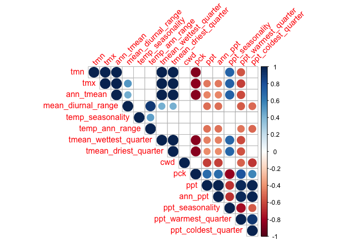

# Climate PCAs

-   Should use this code to check the significance of the PCA:
    <https://github.com/StatQuest/pca_demo/blob/master/pca_demo.R>
-   Remember this paper: Björklund, M. 2019. Be careful with your
    principal components. Evolution 73: 2151--2158.

-   Notes

    -   Include snowpack? Not in the growth season PCAs since growth season is based off snowpack. 
    -   Take out UCD_garden? It is pretty different from the other sites so it may be skewing things... depends on if we want the PCA to describe home sites-only or all home sites and gardens

## Load necessary libraries 

``` r
library(tidyverse)
```

```
## ── Attaching core tidyverse packages ──────────────────────── tidyverse 2.0.0 ──
## ✔ dplyr     1.1.4     ✔ readr     2.1.5
## ✔ forcats   1.0.0     ✔ stringr   1.5.1
## ✔ ggplot2   3.5.1     ✔ tibble    3.2.1
## ✔ lubridate 1.9.3     ✔ tidyr     1.3.1
## ✔ purrr     1.0.2     
## ── Conflicts ────────────────────────────────────────── tidyverse_conflicts() ──
## ✖ dplyr::filter() masks stats::filter()
## ✖ dplyr::lag()    masks stats::lag()
## ℹ Use the conflicted package (<http://conflicted.r-lib.org/>) to force all conflicts to become errors
```

``` r
library(ggrepel)
#library(cowplot)
library(gridExtra)
```

```
## 
## Attaching package: 'gridExtra'
## 
## The following object is masked from 'package:dplyr':
## 
##     combine
```

``` r
library(corrplot) #plotting correlations 
```

```
## corrplot 0.94 loaded
```

``` r
library(rstatix) #performing cor_test
```

```
## 
## Attaching package: 'rstatix'
## 
## The following object is masked from 'package:stats':
## 
##     filter
```

``` r
library(QBMS) #for function calc_biovars to calculate bioclim variables
library(ggfortify) #easier PCA figures
sem <- function(x, na.rm=FALSE) {
  sd(x,na.rm=na.rm)/sqrt(length(na.omit(x)))
} #standard error function 

get_legend<-function(myggplot){
  tmp <- ggplot_gtable(ggplot_build(myggplot))
  leg <- which(sapply(tmp$grobs, function(x) x$name) == "guide-box")
  legend <- tmp$grobs[[leg]]
  return(legend)
} #legend function for grid_arrange

elev_three_palette <- c("#0043F0", "#C9727F", "#F5A540") #colors from Gremer et al 2019
elev_order <- c("High", "Mid", "Low")
```

## Load Flint Data

``` r
flint_all_year <- read_csv("../output/Climate/flint_climate_UCDpops.csv")
```

```
## Rows: 38675 Columns: 14
## ── Column specification ────────────────────────────────────────────────────────
## Delimiter: ","
## chr  (3): parent.pop, elevation.group, month
## dbl (11): elev_m, Lat, Long, year, aet, cwd, pck, pet, ppt, tmn, tmx
## 
## ℹ Use `spec()` to retrieve the full column specification for this data.
## ℹ Specify the column types or set `show_col_types = FALSE` to quiet this message.
```

``` r
head(flint_all_year)
```

```
## # A tibble: 6 × 14
##   parent.pop elevation.group elev_m   Lat  Long  year month   aet   cwd   pck
##   <chr>      <chr>            <dbl> <dbl> <dbl> <dbl> <chr> <dbl> <dbl> <dbl>
## 1 BH         Low               511.  37.4 -120.  1895 dec    3.23  27.9     0
## 2 BH         Low               511.  37.4 -120.  1895 nov    4.89  40.8     0
## 3 BH         Low               511.  37.4 -120.  1895 oct    8.9   80.8     0
## 4 BH         Low               511.  37.4 -120.  1896 apr   72.5   36.2     0
## 5 BH         Low               511.  37.4 -120.  1896 aug   24.5  149.      0
## 6 BH         Low               511.  37.4 -120.  1896 dec    3.38  30.3     0
## # ℹ 4 more variables: pet <dbl>, ppt <dbl>, tmn <dbl>, tmx <dbl>
```

## Generate bioclim for all year
-   annual mean temperature (BIO1)
-   mean diurnal range (BIO2) - (Mean of monthly (max temp - min temp))
-   temperature seasonality (BIO4) (standard deviation *100)
-   temperature annual range (BIO7) (Max Temperature of Warmest Month - Min Temperature of Coldest Month)
-   mean temp of wettest quarter (BIO8)
-   mean temp of driest quarter (BIO9)
-   annual precipitation (BIO12) - sum of ppt for the entire year (not the avg)
-   precipitation seasonality (BIO15)  (Coefficient of Variation)
-   precip of warmest quarter (BIO18)
-   precip of coldest quarter (BIO19)

### Prep

``` r
bioclim_allyear_prep <- flint_all_year %>% 
  rename(tmin=tmn, tmax=tmx) %>% #rename columns to match what calc_biovars expects
  filter(year != "1895", year !="2024") %>%  #remove years with less than 12 months of data
  arrange(parent.pop, year, month)

bioclim_all_year <- tibble(bio1=NA, bio2=NA, bio4=NA, bio7=NA, bio8=NA, bio9=NA, bio12=NA, bio15=NA, bio18=NA, bio19=NA, year=2025) #blank tibble to bind calculations to
bioclim_all_year
```

```
## # A tibble: 1 × 11
##   bio1  bio2  bio4  bio7  bio8  bio9  bio12 bio15 bio18 bio19  year
##   <lgl> <lgl> <lgl> <lgl> <lgl> <lgl> <lgl> <lgl> <lgl> <lgl> <dbl>
## 1 NA    NA    NA    NA    NA    NA    NA    NA    NA    NA     2025
```

``` r
popids <- unique(bioclim_allyear_prep$parent.pop) #list of pop ids for for loop 

pop_elev <- flint_all_year %>% select(parent.pop:Long) %>% distinct()
```

### Calculation

``` r
for(i in popids) {
  A <- bioclim_allyear_prep %>% filter(parent.pop==i) %>% calc_biovars() %>% mutate(parent.pop=i)
  #print(A)
  bioclim_all_year <- bind_rows(bioclim_all_year, A)
}
unique(bioclim_all_year$parent.pop) #has all the populations in there!
```

```
##  [1] NA           "BH"         "CC"         "CP2"        "CP3"       
##  [6] "DPR"        "FR"         "IH"         "LV1"        "LV3"       
## [11] "LVTR1"      "SC"         "SQ1"        "SQ2"        "SQ3"       
## [16] "TM2"        "UCD_Garden" "WL1"        "WL2"        "WL2_Garden"
## [21] "WR"         "WV"         "YO11"       "YO4"        "YO7"       
## [26] "YO8"
```

### SUBSET

``` r
bioclim_all_year_final <- bioclim_all_year %>% 
  select(parent.pop, year, ann_tmean=bio1, mean_diurnal_range=bio2, 
         temp_seasonality=bio4, temp_ann_range=bio7, tmean_wettest_quarter=bio8,
         tmean_driest_quarter=bio9, ann_ppt=bio12, ppt_seasonality=bio15,
         ppt_warmest_quarter=bio18, ppt_coldest_quarter=bio19) %>%
  filter(year!=2025)
head(bioclim_all_year_final)
```

```
## # A tibble: 6 × 12
##   parent.pop  year ann_tmean mean_diurnal_range temp_seasonality temp_ann_range
##   <chr>      <dbl>     <dbl>              <dbl>            <dbl>          <dbl>
## 1 BH          1896      14.8               14.0             616.           30.8
## 2 BH          1897      14.4               13.8             707.           32.8
## 3 BH          1898      14.5               14.7             700.           35.7
## 4 BH          1899      14.9               15.2             649.           34.4
## 5 BH          1900      15.0               15.0             597.           34.5
## 6 BH          1901      15.3               15.4             648.           34.2
## # ℹ 6 more variables: tmean_wettest_quarter <dbl>, tmean_driest_quarter <dbl>,
## #   ann_ppt <dbl>, ppt_seasonality <dbl>, ppt_warmest_quarter <dbl>,
## #   ppt_coldest_quarter <dbl>
```

### Merge with pop info

``` r
pop_elev_bioclim_all_year <- left_join(bioclim_all_year_final, pop_elev) %>% 
  select(parent.pop, elevation.group:Long, year:ppt_coldest_quarter)
```

```
## Joining with `by = join_by(parent.pop)`
```

``` r
head(pop_elev_bioclim_all_year)
```

```
## # A tibble: 6 × 16
##   parent.pop elevation.group elev_m   Lat  Long  year ann_tmean
##   <chr>      <chr>            <dbl> <dbl> <dbl> <dbl>     <dbl>
## 1 BH         Low               511.  37.4 -120.  1896      14.8
## 2 BH         Low               511.  37.4 -120.  1897      14.4
## 3 BH         Low               511.  37.4 -120.  1898      14.5
## 4 BH         Low               511.  37.4 -120.  1899      14.9
## 5 BH         Low               511.  37.4 -120.  1900      15.0
## 6 BH         Low               511.  37.4 -120.  1901      15.3
## # ℹ 9 more variables: mean_diurnal_range <dbl>, temp_seasonality <dbl>,
## #   temp_ann_range <dbl>, tmean_wettest_quarter <dbl>,
## #   tmean_driest_quarter <dbl>, ann_ppt <dbl>, ppt_seasonality <dbl>,
## #   ppt_warmest_quarter <dbl>, ppt_coldest_quarter <dbl>
```

## Calculation of recent (last 30 years) and historical climate (prior 30 years)

Note: Removed 2024 to facilitate use of QBMS package (also most of the plants did not experience 2024)


``` r
flint_all_year_recent <- flint_all_year %>% filter(year>1993 & year<=2023) %>% select(parent.pop:month, cwd, pck, ppt, tmn, tmx)
head(flint_all_year_recent)
```

```
## # A tibble: 6 × 12
##   parent.pop elevation.group elev_m   Lat  Long  year month   cwd   pck   ppt
##   <chr>      <chr>            <dbl> <dbl> <dbl> <dbl> <chr> <dbl> <dbl> <dbl>
## 1 BH         Low               511.  37.4 -120.  1994 apr    58.6     0  63.0
## 2 BH         Low               511.  37.4 -120.  1994 aug   180.      0   0  
## 3 BH         Low               511.  37.4 -120.  1994 dec    29.0     0  59.3
## 4 BH         Low               511.  37.4 -120.  1994 feb    41.4     0  98.7
## 5 BH         Low               511.  37.4 -120.  1994 jan    31.3     0  44.4
## 6 BH         Low               511.  37.4 -120.  1994 jul   174.      0   0  
## # ℹ 2 more variables: tmn <dbl>, tmx <dbl>
```

``` r
tail(flint_all_year_recent)
```

```
## # A tibble: 6 × 12
##   parent.pop elevation.group elev_m   Lat  Long  year month   cwd   pck   ppt
##   <chr>      <chr>            <dbl> <dbl> <dbl> <dbl> <chr> <dbl> <dbl> <dbl>
## 1 WL2_Garden High              2020  38.8 -120.  2023 jun    34.5  569.  47.8
## 2 WL2_Garden High              2020  38.8 -120.  2023 mar    14.8 1986. 574. 
## 3 WL2_Garden High              2020  38.8 -120.  2023 may    43.1 1291.  85.5
## 4 WL2_Garden High              2020  38.8 -120.  2023 nov    31.2    0   91.1
## 5 WL2_Garden High              2020  38.8 -120.  2023 oct    69.0    0   32.6
## 6 WL2_Garden High              2020  38.8 -120.  2023 sep    59.1    0   37.8
## # ℹ 2 more variables: tmn <dbl>, tmx <dbl>
```

``` r
flint_all_year_historical <- flint_all_year %>% filter(year<=1993 & year>1963) %>% select(parent.pop:month, cwd, pck, ppt, tmn, tmx)
head(flint_all_year_historical, 13)
```

```
## # A tibble: 13 × 12
##    parent.pop elevation.group elev_m   Lat  Long  year month   cwd   pck    ppt
##    <chr>      <chr>            <dbl> <dbl> <dbl> <dbl> <chr> <dbl> <dbl>  <dbl>
##  1 BH         Low               511.  37.4 -120.  1964 apr    70.3     0  28.8 
##  2 BH         Low               511.  37.4 -120.  1964 aug   177.      0   0.04
##  3 BH         Low               511.  37.4 -120.  1964 dec    27.9     0 219.  
##  4 BH         Low               511.  37.4 -120.  1964 feb    40.4     0   2.35
##  5 BH         Low               511.  37.4 -120.  1964 jan    28.1     0  65.8 
##  6 BH         Low               511.  37.4 -120.  1964 jul   161.      0   0   
##  7 BH         Low               511.  37.4 -120.  1964 jun    42.8     0  10.6 
##  8 BH         Low               511.  37.4 -120.  1964 mar    55.9     0  73.6 
##  9 BH         Low               511.  37.4 -120.  1964 may    42.0     0  27.9 
## 10 BH         Low               511.  37.4 -120.  1964 nov    40.2     0 120.  
## 11 BH         Low               511.  37.4 -120.  1964 oct    92       0  46.8 
## 12 BH         Low               511.  37.4 -120.  1964 sep   129.      0   5.56
## 13 BH         Low               511.  37.4 -120.  1965 apr    39.2     0 104.  
## # ℹ 2 more variables: tmn <dbl>, tmx <dbl>
```

``` r
tail(flint_all_year_historical, 13)
```

```
## # A tibble: 13 × 12
##    parent.pop elevation.group elev_m   Lat  Long  year month   cwd    pck    ppt
##    <chr>      <chr>            <dbl> <dbl> <dbl> <dbl> <chr> <dbl>  <dbl>  <dbl>
##  1 WL2_Garden High              2020  38.8 -120.  1992 sep    99.6    0    11.0 
##  2 WL2_Garden High              2020  38.8 -120.  1993 apr    34.4  770.   85.1 
##  3 WL2_Garden High              2020  38.8 -120.  1993 aug    88.1    0     0.33
##  4 WL2_Garden High              2020  38.8 -120.  1993 dec    21.7   64.7  95.8 
##  5 WL2_Garden High              2020  38.8 -120.  1993 feb    23.0 1021.  265.  
##  6 WL2_Garden High              2020  38.8 -120.  1993 jan    16.3  764.  397.  
##  7 WL2_Garden High              2020  38.8 -120.  1993 jul    92.7    0     0.01
##  8 WL2_Garden High              2020  38.8 -120.  1993 jun    34.5    0    72.0 
##  9 WL2_Garden High              2020  38.8 -120.  1993 mar    28.3  945.  158.  
## 10 WL2_Garden High              2020  38.8 -120.  1993 may    55    263.   56.1 
## 11 WL2_Garden High              2020  38.8 -120.  1993 nov    30.8    0    58.5 
## 12 WL2_Garden High              2020  38.8 -120.  1993 oct    69.4    0    62.7 
## 13 WL2_Garden High              2020  38.8 -120.  1993 sep    85.4    0     0.24
## # ℹ 2 more variables: tmn <dbl>, tmx <dbl>
```

``` r
bioclim_all_year_recent <- pop_elev_bioclim_all_year %>% filter(year>1993 & year<=2023)
head(bioclim_all_year_recent)
```

```
## # A tibble: 6 × 16
##   parent.pop elevation.group elev_m   Lat  Long  year ann_tmean
##   <chr>      <chr>            <dbl> <dbl> <dbl> <dbl>     <dbl>
## 1 BH         Low               511.  37.4 -120.  1994      15.6
## 2 BH         Low               511.  37.4 -120.  1995      16.1
## 3 BH         Low               511.  37.4 -120.  1996      16.4
## 4 BH         Low               511.  37.4 -120.  1997      16.4
## 5 BH         Low               511.  37.4 -120.  1998      14.7
## 6 BH         Low               511.  37.4 -120.  1999      15.5
## # ℹ 9 more variables: mean_diurnal_range <dbl>, temp_seasonality <dbl>,
## #   temp_ann_range <dbl>, tmean_wettest_quarter <dbl>,
## #   tmean_driest_quarter <dbl>, ann_ppt <dbl>, ppt_seasonality <dbl>,
## #   ppt_warmest_quarter <dbl>, ppt_coldest_quarter <dbl>
```

``` r
tail(bioclim_all_year_recent)
```

```
## # A tibble: 6 × 16
##   parent.pop elevation.group elev_m   Lat  Long  year ann_tmean
##   <chr>      <chr>            <dbl> <dbl> <dbl> <dbl>     <dbl>
## 1 YO8        High             2591.  37.8 -119.  2018      6.14
## 2 YO8        High             2591.  37.8 -119.  2019      4.76
## 3 YO8        High             2591.  37.8 -119.  2020      6.52
## 4 YO8        High             2591.  37.8 -119.  2021      6.26
## 5 YO8        High             2591.  37.8 -119.  2022      5.80
## 6 YO8        High             2591.  37.8 -119.  2023      4.28
## # ℹ 9 more variables: mean_diurnal_range <dbl>, temp_seasonality <dbl>,
## #   temp_ann_range <dbl>, tmean_wettest_quarter <dbl>,
## #   tmean_driest_quarter <dbl>, ann_ppt <dbl>, ppt_seasonality <dbl>,
## #   ppt_warmest_quarter <dbl>, ppt_coldest_quarter <dbl>
```

``` r
bioclim_all_year_historical <- pop_elev_bioclim_all_year %>% filter(year<=1993 & year>1963)
head(bioclim_all_year_historical, 13)
```

```
## # A tibble: 13 × 16
##    parent.pop elevation.group elev_m   Lat  Long  year ann_tmean
##    <chr>      <chr>            <dbl> <dbl> <dbl> <dbl>     <dbl>
##  1 BH         Low               511.  37.4 -120.  1964      14.8
##  2 BH         Low               511.  37.4 -120.  1965      14.6
##  3 BH         Low               511.  37.4 -120.  1966      15.7
##  4 BH         Low               511.  37.4 -120.  1967      15.2
##  5 BH         Low               511.  37.4 -120.  1968      15.4
##  6 BH         Low               511.  37.4 -120.  1969      15.1
##  7 BH         Low               511.  37.4 -120.  1970      15.7
##  8 BH         Low               511.  37.4 -120.  1971      14.4
##  9 BH         Low               511.  37.4 -120.  1972      15.2
## 10 BH         Low               511.  37.4 -120.  1973      15.4
## 11 BH         Low               511.  37.4 -120.  1974      15.5
## 12 BH         Low               511.  37.4 -120.  1975      14.3
## 13 BH         Low               511.  37.4 -120.  1976      14.9
## # ℹ 9 more variables: mean_diurnal_range <dbl>, temp_seasonality <dbl>,
## #   temp_ann_range <dbl>, tmean_wettest_quarter <dbl>,
## #   tmean_driest_quarter <dbl>, ann_ppt <dbl>, ppt_seasonality <dbl>,
## #   ppt_warmest_quarter <dbl>, ppt_coldest_quarter <dbl>
```

``` r
tail(bioclim_all_year_historical, 13)
```

```
## # A tibble: 13 × 16
##    parent.pop elevation.group elev_m   Lat  Long  year ann_tmean
##    <chr>      <chr>            <dbl> <dbl> <dbl> <dbl>     <dbl>
##  1 YO8        High             2591.  37.8 -119.  1981      5.25
##  2 YO8        High             2591.  37.8 -119.  1982      3.34
##  3 YO8        High             2591.  37.8 -119.  1983      3.44
##  4 YO8        High             2591.  37.8 -119.  1984      4.37
##  5 YO8        High             2591.  37.8 -119.  1985      4.56
##  6 YO8        High             2591.  37.8 -119.  1986      4.96
##  7 YO8        High             2591.  37.8 -119.  1987      4.67
##  8 YO8        High             2591.  37.8 -119.  1988      5.24
##  9 YO8        High             2591.  37.8 -119.  1989      4.74
## 10 YO8        High             2591.  37.8 -119.  1990      4.58
## 11 YO8        High             2591.  37.8 -119.  1991      4.97
## 12 YO8        High             2591.  37.8 -119.  1992      5.63
## 13 YO8        High             2591.  37.8 -119.  1993      4.52
## # ℹ 9 more variables: mean_diurnal_range <dbl>, temp_seasonality <dbl>,
## #   temp_ann_range <dbl>, tmean_wettest_quarter <dbl>,
## #   tmean_driest_quarter <dbl>, ann_ppt <dbl>, ppt_seasonality <dbl>,
## #   ppt_warmest_quarter <dbl>, ppt_coldest_quarter <dbl>
```

## All years and months included (Flint)

Correlations - Flint Recent


``` r
#normalize the data
climate_normalized_all_flint_recent <- flint_all_year_recent %>% select(cwd, ppt, tmn, tmx) %>% scale() #normalize the data so they're all on the same scale
head(climate_normalized_all_flint_recent)
```

```
##             cwd         ppt        tmn        tmx
## [1,]  0.0430209 -0.26360336  0.4087875  0.5468406
## [2,]  3.2634456 -0.75058420  1.8093639  2.1303675
## [3,] -0.7393317 -0.29175343 -0.3291973 -0.5612887
## [4,] -0.4104632  0.01294794 -0.2059582 -0.3688658
## [5,] -0.6787437 -0.40752448 -0.2175572 -0.2002128
## [6,]  3.0888251 -0.75058420  1.9587007  2.1597968
```

``` r
cor.norm = cor(climate_normalized_all_flint_recent) #test correlations among the traits
corrplot(cor.norm)
```

<!-- -->

Overlay populations on PCA plot - Flint Recent


``` r
#flint_all_year_recent[c(8:12)]
all_flint_recent.pc = prcomp(flint_all_year_recent[c(8, 10:12)], scale = TRUE, center = TRUE)
summary(all_flint_recent.pc)
```

```
## Importance of components:
##                           PC1    PC2     PC3     PC4
## Standard deviation     1.7530 0.7395 0.59846 0.14854
## Proportion of Variance 0.7682 0.1367 0.08954 0.00552
## Cumulative Proportion  0.7682 0.9049 0.99448 1.00000
```

``` r
all_flint_recent.pc.dat = data.frame(all_flint_recent.pc$x)

all_flint_recent_locs.pc = cbind(flint_all_year_recent, all_flint_recent.pc.dat)

all_flint_recent_loadings = data.frame(varnames=rownames(all_flint_recent.pc$rotation), all_flint_recent.pc$rotation)

autoplot(all_flint_recent.pc, all_flint_recent_loadings=TRUE, loadings.label=TRUE, 
         loadings.colour="blue", loadings.label.colour="red",  loadings.label.size = 10)
```

<!-- -->

``` r
#this method results in different amounts of variation explained by PCs compared to princomp

autoplot(all_flint_recent.pc, data = flint_all_year_recent,
         colour='elevation.group', loadings=TRUE,
         loadings.colour='black', loadings.label = TRUE)
```

<!-- -->

``` r
all_flint_recent_locs.pc %>% 
  ggplot(aes(x = PC1, y = PC2, colour=elev_m)) +
  geom_point() +
  scale_colour_gradient(low = "#F5A540", high = "#0043F0") +
  geom_vline(xintercept = 0, linetype="dashed") + geom_hline(yintercept = 0, linetype="dashed") 
```

<!-- -->

Correlations - Flint Historical


``` r
#normalize the data
climate_normalized_all_flint_historical <- flint_all_year_historical %>% select(cwd, ppt, tmn, tmx) %>% scale() #normalize the data so they're all on the same scale
head(climate_normalized_all_flint_historical)
```

```
##             cwd        ppt        tmn         tmx
## [1,]  0.4322082 -0.5531471  0.2456718  0.46562877
## [2,]  3.3788814 -0.7841119  1.9162506  2.14657157
## [3,] -0.7418071  0.9766733  0.2791708 -0.29343425
## [4,] -0.3971928 -0.7655350 -0.3456577 -0.08570251
## [5,] -0.7365437 -0.2555949 -0.2640950 -0.51127186
## [6,]  2.9314923 -0.7844336  1.8842081  2.17576630
```

``` r
cor.norm = cor(climate_normalized_all_flint_historical) #test correlations among the traits
corrplot(cor.norm)
```

<!-- -->

Overlay populations on PCA plot - Flint Historical


``` r
#flint_all_year_historical[c(8:12)]
all_flint_historical.pc = prcomp(flint_all_year_historical[c(8, 10:12)], scale = TRUE, center = TRUE)
summary(all_flint_historical.pc)
```

```
## Importance of components:
##                           PC1    PC2     PC3     PC4
## Standard deviation     1.7399 0.7599 0.60909 0.15560
## Proportion of Variance 0.7568 0.1444 0.09275 0.00605
## Cumulative Proportion  0.7568 0.9012 0.99395 1.00000
```

``` r
all_flint_historical.pc.dat = data.frame(all_flint_historical.pc$x)

all_flint_historical_locs.pc = cbind(flint_all_year_historical, all_flint_historical.pc.dat)

all_flint_historical_loadings = data.frame(varnames=rownames(all_flint_historical.pc$rotation), all_flint_historical.pc$rotation)

autoplot(all_flint_historical.pc, all_flint_historical_loadings=TRUE, loadings.label=TRUE, 
         loadings.colour="blue", loadings.label.colour="red",  loadings.label.size = 10)
```

<!-- -->

``` r
#this method results in different amounts of variation explained by PCs compared to princomp

autoplot(all_flint_historical.pc, data = flint_all_year_historical,
         colour='elevation.group', loadings=TRUE,
         loadings.colour='black', loadings.label = TRUE)
```

<!-- -->

``` r
all_flint_historical_locs.pc %>% 
  ggplot(aes(x = PC1, y = PC2, colour=elev_m)) +
  geom_point() +
  scale_colour_gradient(low = "#F5A540", high = "#0043F0") +
  geom_vline(xintercept = 0, linetype="dashed") + geom_hline(yintercept = 0, linetype="dashed") 
```

<!-- -->

## All years included (bioclim)

Correlations - bioclim Recent


``` r
#normalize the data
climate_normalized_all_bioclim_recent <- bioclim_all_year_recent %>% select(ann_tmean:ppt_coldest_quarter) %>% scale() #normalize the data so they're all on the same scale
head(climate_normalized_all_bioclim_recent)
```

```
##      ann_tmean mean_diurnal_range temp_seasonality temp_ann_range
## [1,]  1.242361          1.9256636        1.0295693     1.34697709
## [2,]  1.356152          1.2403348       -1.7039266    -0.67127424
## [3,]  1.425416          1.6382677       -0.2344234     0.62617305
## [4,]  1.426871          1.6862940       -0.5661187     0.06106267
## [5,]  1.045338          0.5481451        0.4345984     2.51179643
## [6,]  1.214423          2.3205472       -0.3363631     0.39551575
##      tmean_wettest_quarter tmean_driest_quarter    ann_ppt ppt_seasonality
## [1,]             0.7410769            1.4891303 -1.3842527     -1.33601087
## [2,]             1.1602673            1.1136749 -0.6376633      0.81469656
## [3,]             1.0813689            1.5729245 -0.3716910     -0.01617893
## [4,]             0.8364410            1.1039649 -1.3346832      4.39316454
## [5,]             0.6988834            0.5720698 -0.4871384     -0.10903591
## [6,]             0.7987070            1.0147763 -1.4793098      0.44700852
##      ppt_warmest_quarter ppt_coldest_quarter
## [1,]          -0.5703064          -1.3436183
## [2,]          -0.6676548          -0.5663625
## [3,]          -0.6743827          -0.1444766
## [4,]          -1.3607645          -0.7380607
## [5,]          -0.2670023          -0.1590632
## [6,]          -0.6001014          -1.2130007
```

``` r
cor.norm = cor(climate_normalized_all_bioclim_recent) #test correlations among the traits
corrplot(cor.norm)
```

<!-- -->

Overlay populations on PCA plot - bioclim Recent


``` r
all_bioclim_recent.pc = prcomp(bioclim_all_year_recent[c(7:16)], scale = TRUE, center = TRUE)
summary(all_bioclim_recent.pc)
```

```
## Importance of components:
##                           PC1    PC2    PC3    PC4    PC5     PC6     PC7
## Standard deviation     1.9604 1.3585 1.1781 1.0129 0.8900 0.82238 0.44477
## Proportion of Variance 0.3843 0.1845 0.1388 0.1026 0.0792 0.06763 0.01978
## Cumulative Proportion  0.3843 0.5689 0.7077 0.8103 0.8895 0.95709 0.97687
##                            PC8     PC9    PC10
## Standard deviation     0.36567 0.26122 0.17134
## Proportion of Variance 0.01337 0.00682 0.00294
## Cumulative Proportion  0.99024 0.99706 1.00000
```

``` r
all_bioclim_recent.pc.dat = data.frame(all_bioclim_recent.pc$x)

all_bioclim_recent_locs.pc = cbind(bioclim_all_year_recent, all_bioclim_recent.pc.dat)

all_bioclim_recent_loadings = data.frame(varnames=rownames(all_bioclim_recent.pc$rotation), all_bioclim_recent.pc$rotation)

autoplot(all_bioclim_recent.pc, all_bioclim_recent_loadings=TRUE, loadings.label=TRUE, 
         loadings.colour="blue", loadings.label.colour="red",  loadings.label.size = 5)
```

<!-- -->

``` r
#this method results in different amounts of variation explained by PCs compared to princomp

autoplot(all_bioclim_recent.pc, data = bioclim_all_year_recent,
         colour='elevation.group', loadings=TRUE,
         loadings.colour='black', loadings.label = TRUE)
```

<!-- -->

``` r
all_bioclim_recent_locs.pc %>% 
  ggplot(aes(x = PC1, y = PC2, colour=elev_m)) +
  geom_point() +
  scale_colour_gradient(low = "#F5A540", high = "#0043F0") +
  geom_vline(xintercept = 0, linetype="dashed") + geom_hline(yintercept = 0, linetype="dashed") 
```

<!-- -->

Correlations - bioclim Historical


``` r
#normalize the data
climate_normalized_all_bioclim_historical <- bioclim_all_year_historical %>% select(ann_tmean:ppt_coldest_quarter) %>% scale() #normalize the data so they're all on the same scale
head(climate_normalized_all_bioclim_historical)
```

```
##      ann_tmean mean_diurnal_range temp_seasonality temp_ann_range
## [1,]  1.245495           1.923463        0.7733653      1.3307673
## [2,]  1.201628           1.458039       -0.3746056      0.5840798
## [3,]  1.432591           2.146249        0.4538411      1.6946593
## [4,]  1.326908           1.684501        2.2800567      2.9659185
## [5,]  1.374621           1.889641        0.3668374      1.6993852
## [6,]  1.308593           1.637444        0.8575277      0.7967440
##      tmean_wettest_quarter tmean_driest_quarter    ann_ppt ppt_seasonality
## [1,]             0.8811192             1.363868 -1.1210490       0.5286261
## [2,]             1.9344552             1.050809 -1.1324607       0.6079189
## [3,]             0.7300445             1.298068 -1.5804495       1.5631002
## [4,]             2.1507746             1.102024 -0.9923523       0.1053039
## [5,]             0.9693915             1.389645 -1.3286243      -0.5324706
## [6,]             0.8511136             1.594847 -0.5478263       0.7626507
##      ppt_warmest_quarter ppt_coldest_quarter
## [1,]          -0.9339834          -0.9153942
## [2,]          -0.1389883          -1.1710794
## [3,]          -1.0850840          -1.1278632
## [4,]           0.8370043          -1.1394157
## [5,]          -0.6538009          -0.9924545
## [6,]          -0.4791666           0.1680378
```

``` r
cor.norm = cor(climate_normalized_all_bioclim_historical) #test correlations among the traits
corrplot(cor.norm)
```

<!-- -->

Overlay populations on PCA plot - bioclim Historical


``` r
all_bioclim_historical.pc = prcomp(bioclim_all_year_historical[c(7:16)], scale = TRUE, center = TRUE)
summary(all_bioclim_historical.pc)
```

```
## Importance of components:
##                          PC1    PC2    PC3    PC4     PC5     PC6     PC7
## Standard deviation     2.025 1.3005 1.1682 1.0419 0.91316 0.72654 0.40266
## Proportion of Variance 0.410 0.1691 0.1365 0.1085 0.08339 0.05279 0.01621
## Cumulative Proportion  0.410 0.5791 0.7156 0.8241 0.90752 0.96031 0.97652
##                            PC8     PC9    PC10
## Standard deviation     0.38463 0.25772 0.14291
## Proportion of Variance 0.01479 0.00664 0.00204
## Cumulative Proportion  0.99132 0.99796 1.00000
```

``` r
all_bioclim_historical.pc.dat = data.frame(all_bioclim_historical.pc$x)

all_bioclim_historical_locs.pc = cbind(bioclim_all_year_historical, all_bioclim_historical.pc.dat)

all_bioclim_historical_loadings = data.frame(varnames=rownames(all_bioclim_historical.pc$rotation), all_bioclim_historical.pc$rotation)

autoplot(all_bioclim_historical.pc, all_bioclim_historical_loadings=TRUE, loadings.label=TRUE, 
         loadings.colour="blue", loadings.label.colour="red",  loadings.label.size = 5)
```

<!-- -->

``` r
#this method results in different amounts of variation explained by PCs compared to princomp

autoplot(all_bioclim_historical.pc, data = bioclim_all_year_historical,
         colour='elevation.group', loadings=TRUE,
         loadings.colour='black', loadings.label = TRUE)
```

<!-- -->

``` r
all_bioclim_historical_locs.pc %>% 
  ggplot(aes(x = PC1, y = PC2, colour=elev_m)) +
  geom_point() +
  scale_colour_gradient(low = "#F5A540", high = "#0043F0") +
  geom_vline(xintercept = 0, linetype="dashed") + geom_hline(yintercept = 0, linetype="dashed") 
```

<!-- -->

## Yearly Flint Avgs + bioclim 

Calculate avgs


``` r
flint_all_year_recent_yrlyavgs <- flint_all_year_recent %>% 
  group_by(parent.pop, elevation.group, elev_m, Lat, Long, year) %>% 
  summarise_at(c("cwd",  "ppt", "tmn", "tmx"), c(mean, sem), na.rm = TRUE) 
names(flint_all_year_recent_yrlyavgs) <- gsub("fn2", "sem", colnames(flint_all_year_recent_yrlyavgs))
names(flint_all_year_recent_yrlyavgs) <-gsub("fn1", "mean", colnames(flint_all_year_recent_yrlyavgs))
flint_all_year_recent_yrlyavgs
```

```
## # A tibble: 750 × 14
## # Groups:   parent.pop, elevation.group, elev_m, Lat, Long [25]
##    parent.pop elevation.group elev_m   Lat  Long  year cwd_mean ppt_mean
##    <chr>      <chr>            <dbl> <dbl> <dbl> <dbl>    <dbl>    <dbl>
##  1 BH         Low               511.  37.4 -120.  1994     80.9     38.0
##  2 BH         Low               511.  37.4 -120.  1995     64.2     69.8
##  3 BH         Low               511.  37.4 -120.  1996     70.3     81.2
##  4 BH         Low               511.  37.4 -120.  1997     80.7     40.1
##  5 BH         Low               511.  37.4 -120.  1998     60.5     76.3
##  6 BH         Low               511.  37.4 -120.  1999     73.5     33.9
##  7 BH         Low               511.  37.4 -120.  2000     69.7     60.3
##  8 BH         Low               511.  37.4 -120.  2001     76.2     52.9
##  9 BH         Low               511.  37.4 -120.  2002     76.1     36.6
## 10 BH         Low               511.  37.4 -120.  2003     69.5     36.0
## # ℹ 740 more rows
## # ℹ 6 more variables: tmn_mean <dbl>, tmx_mean <dbl>, cwd_sem <dbl>,
## #   ppt_sem <dbl>, tmn_sem <dbl>, tmx_sem <dbl>
```

``` r
flint_all_year_historical_yrlyavgs <- flint_all_year_historical %>% 
  group_by(parent.pop, elevation.group, elev_m, Lat, Long, year) %>% 
  summarise_at(c("cwd",  "ppt", "tmn", "tmx"), c(mean, sem), na.rm = TRUE) 
names(flint_all_year_historical_yrlyavgs) <- gsub("fn2", "sem", colnames(flint_all_year_historical_yrlyavgs))
names(flint_all_year_historical_yrlyavgs) <-gsub("fn1", "mean", colnames(flint_all_year_historical_yrlyavgs))
flint_all_year_historical_yrlyavgs
```

```
## # A tibble: 750 × 14
## # Groups:   parent.pop, elevation.group, elev_m, Lat, Long [25]
##    parent.pop elevation.group elev_m   Lat  Long  year cwd_mean ppt_mean
##    <chr>      <chr>            <dbl> <dbl> <dbl> <dbl>    <dbl>    <dbl>
##  1 BH         Low               511.  37.4 -120.  1964     75.5     50.1
##  2 BH         Low               511.  37.4 -120.  1965     68.8     49.6
##  3 BH         Low               511.  37.4 -120.  1966     77.8     30.6
##  4 BH         Low               511.  37.4 -120.  1967     67.5     55.5
##  5 BH         Low               511.  37.4 -120.  1968     79.1     41.3
##  6 BH         Low               511.  37.4 -120.  1969     70.2     74.3
##  7 BH         Low               511.  37.4 -120.  1970     73.8     54.1
##  8 BH         Low               511.  37.4 -120.  1971     72.5     31.9
##  9 BH         Low               511.  37.4 -120.  1972     84.9     29.0
## 10 BH         Low               511.  37.4 -120.  1973     75.2     62.0
## # ℹ 740 more rows
## # ℹ 6 more variables: tmn_mean <dbl>, tmx_mean <dbl>, cwd_sem <dbl>,
## #   ppt_sem <dbl>, tmn_sem <dbl>, tmx_sem <dbl>
```

Merge with bioclim

``` r
flint_all_year_recent_yrlyavgs_prep <- flint_all_year_recent_yrlyavgs %>% select(parent.pop:cwd_mean, tmn_mean:tmx_mean) #removed ppt_mean because that parameter is included in bioclim vars 
bioclim_flint_all_year_recent <- full_join(flint_all_year_recent_yrlyavgs_prep, bioclim_all_year_recent)
```

```
## Joining with `by = join_by(parent.pop, elevation.group, elev_m, Lat, Long,
## year)`
```

``` r
head(bioclim_flint_all_year_recent)
```

```
## # A tibble: 6 × 19
## # Groups:   parent.pop, elevation.group, elev_m, Lat, Long [1]
##   parent.pop elevation.group elev_m   Lat  Long  year cwd_mean tmn_mean tmx_mean
##   <chr>      <chr>            <dbl> <dbl> <dbl> <dbl>    <dbl>    <dbl>    <dbl>
## 1 BH         Low               511.  37.4 -120.  1994     80.9     8.07     23.1
## 2 BH         Low               511.  37.4 -120.  1995     64.2     8.94     23.2
## 3 BH         Low               511.  37.4 -120.  1996     70.3     9.02     23.7
## 4 BH         Low               511.  37.4 -120.  1997     80.7     9.00     23.8
## 5 BH         Low               511.  37.4 -120.  1998     60.5     7.98     21.5
## 6 BH         Low               511.  37.4 -120.  1999     73.5     7.74     23.2
## # ℹ 10 more variables: ann_tmean <dbl>, mean_diurnal_range <dbl>,
## #   temp_seasonality <dbl>, temp_ann_range <dbl>, tmean_wettest_quarter <dbl>,
## #   tmean_driest_quarter <dbl>, ann_ppt <dbl>, ppt_seasonality <dbl>,
## #   ppt_warmest_quarter <dbl>, ppt_coldest_quarter <dbl>
```

``` r
flint_all_year_historical_yrlyavgs_prep <- flint_all_year_historical_yrlyavgs %>% select(parent.pop:cwd_mean, tmn_mean:tmx_mean)
bioclim_flint_all_year_historical <- full_join(flint_all_year_historical_yrlyavgs_prep, bioclim_all_year_historical)
```

```
## Joining with `by = join_by(parent.pop, elevation.group, elev_m, Lat, Long,
## year)`
```

``` r
head(bioclim_flint_all_year_historical)
```

```
## # A tibble: 6 × 19
## # Groups:   parent.pop, elevation.group, elev_m, Lat, Long [1]
##   parent.pop elevation.group elev_m   Lat  Long  year cwd_mean tmn_mean tmx_mean
##   <chr>      <chr>            <dbl> <dbl> <dbl> <dbl>    <dbl>    <dbl>    <dbl>
## 1 BH         Low               511.  37.4 -120.  1964     75.5     6.91     22.7
## 2 BH         Low               511.  37.4 -120.  1965     68.8     6.97     22.3
## 3 BH         Low               511.  37.4 -120.  1966     77.8     7.64     23.7
## 4 BH         Low               511.  37.4 -120.  1967     67.5     7.42     23.0
## 5 BH         Low               511.  37.4 -120.  1968     79.1     7.52     23.3
## 6 BH         Low               511.  37.4 -120.  1969     70.2     7.36     22.9
## # ℹ 10 more variables: ann_tmean <dbl>, mean_diurnal_range <dbl>,
## #   temp_seasonality <dbl>, temp_ann_range <dbl>, tmean_wettest_quarter <dbl>,
## #   tmean_driest_quarter <dbl>, ann_ppt <dbl>, ppt_seasonality <dbl>,
## #   ppt_warmest_quarter <dbl>, ppt_coldest_quarter <dbl>
```

Correlations - Recent


``` r
#normalize the data
climate_normalized_bioclim_flint_all_year_recent <- bioclim_flint_all_year_recent %>% ungroup() %>% 
  select(cwd_mean:ppt_coldest_quarter) %>% scale() #normalize the data so they're all on the same scale
head(climate_normalized_bioclim_flint_all_year_recent)
```

```
##       cwd_mean  tmn_mean tmx_mean ann_tmean mean_diurnal_range temp_seasonality
## [1,] 1.7775847 1.0441123 1.405457  1.242361          1.9256636        1.0295693
## [2,] 0.5334769 1.2545448 1.430573  1.356152          1.2403348       -1.7039266
## [3,] 0.9877936 1.2740443 1.543868  1.425416          1.6382677       -0.2344234
## [4,] 1.7582612 1.2691694 1.551018  1.426871          1.6862940       -0.5661187
## [5,] 0.2656036 1.0213629 1.053653  1.045338          0.5481451        0.4345984
## [6,] 1.2267126 0.9622549 1.426539  1.214423          2.3205472       -0.3363631
##      temp_ann_range tmean_wettest_quarter tmean_driest_quarter    ann_ppt
## [1,]     1.34697709             0.7410769            1.4891303 -1.3842527
## [2,]    -0.67127424             1.1602673            1.1136749 -0.6376633
## [3,]     0.62617305             1.0813689            1.5729245 -0.3716910
## [4,]     0.06106267             0.8364410            1.1039649 -1.3346832
## [5,]     2.51179643             0.6988834            0.5720698 -0.4871384
## [6,]     0.39551575             0.7987070            1.0147763 -1.4793098
##      ppt_seasonality ppt_warmest_quarter ppt_coldest_quarter
## [1,]     -1.33601087          -0.5703064          -1.3436183
## [2,]      0.81469656          -0.6676548          -0.5663625
## [3,]     -0.01617893          -0.6743827          -0.1444766
## [4,]      4.39316454          -1.3607645          -0.7380607
## [5,]     -0.10903591          -0.2670023          -0.1590632
## [6,]      0.44700852          -0.6001014          -1.2130007
```

``` r
cor.norm = cor(climate_normalized_bioclim_flint_all_year_recent) #test correlations among the traits
corrplot(cor.norm)
```

<!-- -->

Overlay populations on PCA plot - Recent


``` r
all_bioclim_flint_recent.pc = prcomp(bioclim_flint_all_year_recent[c(7:19)], scale = TRUE, center = TRUE)
summary(all_bioclim_flint_recent.pc)
```

```
## Importance of components:
##                           PC1    PC2    PC3     PC4     PC5     PC6     PC7
## Standard deviation     2.3805 1.4987 1.2385 1.03051 0.92015 0.82889 0.71495
## Proportion of Variance 0.4359 0.1728 0.1180 0.08169 0.06513 0.05285 0.03932
## Cumulative Proportion  0.4359 0.6087 0.7267 0.80836 0.87349 0.92634 0.96566
##                            PC8     PC9    PC10    PC11      PC12      PC13
## Standard deviation     0.44512 0.35899 0.27586 0.20817 1.562e-15 4.021e-16
## Proportion of Variance 0.01524 0.00991 0.00585 0.00333 0.000e+00 0.000e+00
## Cumulative Proportion  0.98090 0.99081 0.99667 1.00000 1.000e+00 1.000e+00
```

``` r
all_bioclim_flint_recent.pc.dat = data.frame(all_bioclim_flint_recent.pc$x)

all_bioclim_flint_recent_locs.pc = cbind(bioclim_flint_all_year_recent, all_bioclim_flint_recent.pc.dat)

all_bioclim_flint_recent_loadings = data.frame(varnames=rownames(all_bioclim_flint_recent.pc$rotation), all_bioclim_flint_recent.pc$rotation)

autoplot(all_bioclim_flint_recent.pc, all_bioclim_flint_recent_loadings=TRUE, loadings.label=TRUE, 
         loadings.colour="blue", loadings.label.colour="red",  loadings.label.size = 5)
```

<!-- -->

``` r
#this method results in different amounts of variation explained by PCs compared to princomp

autoplot(all_bioclim_flint_recent.pc, data = bioclim_flint_all_year_recent,
         colour='elevation.group', loadings=TRUE,
         loadings.colour='black', loadings.label = TRUE)
```

<!-- -->

``` r
all_bioclim_flint_recent_locs.pc %>% 
  ggplot(aes(x = PC1, y = PC2, colour=elev_m)) +
  geom_point() +
  scale_colour_gradient(low = "#F5A540", high = "#0043F0") +
  geom_vline(xintercept = 0, linetype="dashed") + geom_hline(yintercept = 0, linetype="dashed") 
```

<!-- -->

Correlations - historical


``` r
#normalize the data
climate_normalized_bioclim_flint_all_year_historical <- bioclim_flint_all_year_historical %>% ungroup() %>% 
  select(cwd_mean:ppt_coldest_quarter) %>% scale() #normalize the data so they're all on the same scale
head(climate_normalized_bioclim_flint_all_year_historical)
```

```
##       cwd_mean tmn_mean tmx_mean ann_tmean mean_diurnal_range temp_seasonality
## [1,] 1.5447980 1.051419 1.405959  1.245495           1.923463        0.7733653
## [2,] 1.0482792 1.066160 1.309548  1.201628           1.458039       -0.3746056
## [3,] 1.7162742 1.217974 1.609359  1.432591           2.146249        0.4538411
## [4,] 0.9472031 1.167625 1.454859  1.326908           1.684501        2.2800567
## [5,] 1.8107814 1.190789 1.524219  1.374621           1.889641        0.3668374
## [6,] 1.1507188 1.154607 1.431970  1.308593           1.637444        0.8575277
##      temp_ann_range tmean_wettest_quarter tmean_driest_quarter    ann_ppt
## [1,]      1.3307673             0.8811192             1.363868 -1.1210490
## [2,]      0.5840798             1.9344552             1.050809 -1.1324607
## [3,]      1.6946593             0.7300445             1.298068 -1.5804495
## [4,]      2.9659185             2.1507746             1.102024 -0.9923523
## [5,]      1.6993852             0.9693915             1.389645 -1.3286243
## [6,]      0.7967440             0.8511136             1.594847 -0.5478263
##      ppt_seasonality ppt_warmest_quarter ppt_coldest_quarter
## [1,]       0.5286261          -0.9339834          -0.9153942
## [2,]       0.6079189          -0.1389883          -1.1710794
## [3,]       1.5631002          -1.0850840          -1.1278632
## [4,]       0.1053039           0.8370043          -1.1394157
## [5,]      -0.5324706          -0.6538009          -0.9924545
## [6,]       0.7626507          -0.4791666           0.1680378
```

``` r
cor.norm = cor(climate_normalized_bioclim_flint_all_year_historical) #test correlations among the traits
corrplot(cor.norm)
```

<!-- -->

Overlay populations on PCA plot - historical


``` r
all_bioclim_flint_historical.pc = prcomp(bioclim_flint_all_year_historical[c(7:19)], scale = TRUE, center = TRUE)
summary(all_bioclim_flint_historical.pc)
```

```
## Importance of components:
##                           PC1    PC2    PC3     PC4     PC5     PC6     PC7
## Standard deviation     2.4309 1.4249 1.2391 1.07370 0.92545 0.76163 0.71357
## Proportion of Variance 0.4545 0.1562 0.1181 0.08868 0.06588 0.04462 0.03917
## Cumulative Proportion  0.4545 0.6107 0.7288 0.81751 0.88339 0.92802 0.96718
##                           PC8     PC9    PC10    PC11      PC12     PC13
## Standard deviation     0.4252 0.38719 0.25631 0.17395 3.352e-15 8.75e-16
## Proportion of Variance 0.0139 0.01153 0.00505 0.00233 0.000e+00 0.00e+00
## Cumulative Proportion  0.9811 0.99262 0.99767 1.00000 1.000e+00 1.00e+00
```

``` r
all_bioclim_flint_historical.pc.dat = data.frame(all_bioclim_flint_historical.pc$x)

all_bioclim_flint_historical_locs.pc = cbind(bioclim_flint_all_year_historical, all_bioclim_flint_historical.pc.dat)

all_bioclim_flint_historical_loadings = data.frame(varnames=rownames(all_bioclim_flint_historical.pc$rotation), all_bioclim_flint_historical.pc$rotation)

autoplot(all_bioclim_flint_historical.pc, all_bioclim_flint_historical_loadings=TRUE, loadings.label=TRUE, 
         loadings.colour="blue", loadings.label.colour="red",  loadings.label.size = 5)
```

<!-- -->

``` r
#this method results in different amounts of variation explained by PCs compared to princomp

autoplot(all_bioclim_flint_historical.pc, data = bioclim_flint_all_year_historical,
         colour='elevation.group', loadings=TRUE,
         loadings.colour='black', loadings.label = TRUE)
```

<!-- -->

``` r
all_bioclim_flint_historical_locs.pc %>% 
  ggplot(aes(x = PC1, y = PC2, colour=elev_m)) +
  geom_point() +
  scale_colour_gradient(low = "#F5A540", high = "#0043F0") +

  geom_vline(xintercept = 0, linetype="dashed") + geom_hline(yintercept = 0, linetype="dashed") 
```

<!-- -->

## Avg across years and months (Flint)
Calculate avgs


``` r
flint_all_year_recent_avgs <- flint_all_year_recent %>% 
  group_by(parent.pop, elevation.group, elev_m, Lat, Long) %>% 
  summarise_at(c("cwd",  "ppt", "tmn", "tmx"), c(mean, sem), na.rm = TRUE) 
names(flint_all_year_recent_avgs) <- gsub("fn2", "sem", colnames(flint_all_year_recent_avgs))
names(flint_all_year_recent_avgs) <-gsub("fn1", "mean", colnames(flint_all_year_recent_avgs))
flint_all_year_recent_avgs
```

```
## # A tibble: 25 × 13
## # Groups:   parent.pop, elevation.group, elev_m, Lat [25]
##    parent.pop elevation.group elev_m   Lat  Long cwd_mean ppt_mean tmn_mean
##    <chr>      <chr>            <dbl> <dbl> <dbl>    <dbl>    <dbl>    <dbl>
##  1 BH         Low               511.  37.4 -120.     75.9     48.5    8.93 
##  2 CC         Low               313   39.6 -121.     59.9     84.3   10.0  
##  3 CP2        High             2244.  38.7 -120.     62.9    107.     1.18 
##  4 CP3        High             2266.  38.7 -120.     46.2    103.     0.529
##  5 DPR        Mid              1019.  39.2 -121.     27.5    121.     7.89 
##  6 FR         Mid               787   40.0 -121.     75.5     84.9    5.70 
##  7 IH         Low               454.  39.1 -121.     49.3     89.2    8.68 
##  8 LV1        High             2593.  40.5 -122.     49.8    146.    -1.36 
##  9 LV3        High             2354.  40.5 -122.     40.9    144.    -1.37 
## 10 LVTR1      High             2741.  40.5 -122.     52.1    151.    -1.57 
## # ℹ 15 more rows
## # ℹ 5 more variables: tmx_mean <dbl>, cwd_sem <dbl>, ppt_sem <dbl>,
## #   tmn_sem <dbl>, tmx_sem <dbl>
```

``` r
flint_all_year_historical_avgs <- flint_all_year_historical %>% 
  group_by(parent.pop, elevation.group, elev_m, Lat, Long) %>% 
  summarise_at(c("cwd",  "ppt", "tmn", "tmx"), c(mean, sem), na.rm = TRUE) 
names(flint_all_year_historical_avgs) <- gsub("fn2", "sem", colnames(flint_all_year_historical_avgs))
names(flint_all_year_historical_avgs) <-gsub("fn1", "mean", colnames(flint_all_year_historical_avgs))
flint_all_year_historical_avgs
```

```
## # A tibble: 25 × 13
## # Groups:   parent.pop, elevation.group, elev_m, Lat [25]
##    parent.pop elevation.group elev_m   Lat  Long cwd_mean ppt_mean tmn_mean
##    <chr>      <chr>            <dbl> <dbl> <dbl>    <dbl>    <dbl>    <dbl>
##  1 BH         Low               511.  37.4 -120.     74.5     48.3    7.74 
##  2 CC         Low               313   39.6 -121.     59.7     81.9    8.90 
##  3 CP2        High             2244.  38.7 -120.     60.4    110.    -0.305
##  4 CP3        High             2266.  38.7 -120.     43.8    106.    -0.852
##  5 DPR        Mid              1019.  39.2 -121.     26.5    120.     6.23 
##  6 FR         Mid               787   40.0 -121.     74.0     84.2    4.54 
##  7 IH         Low               454.  39.1 -121.     50.2     88.0    7.68 
##  8 LV1        High             2593.  40.5 -122.     46.6    149.    -3.50 
##  9 LV3        High             2354.  40.5 -122.     38.0    147.    -3.51 
## 10 LVTR1      High             2741.  40.5 -122.     49.3    155.    -3.64 
## # ℹ 15 more rows
## # ℹ 5 more variables: tmx_mean <dbl>, cwd_sem <dbl>, ppt_sem <dbl>,
## #   tmn_sem <dbl>, tmx_sem <dbl>
```

Correlations - Recent


``` r
#normalize the data
climate_normalized_flint_all_year_recent_avgs <- flint_all_year_recent_avgs %>% ungroup() %>% 
  select(cwd_mean:tmx_mean) %>% scale() #normalize the data so they're all on the same scale
head(climate_normalized_flint_all_year_recent_avgs)
```

```
##        cwd_mean   ppt_mean   tmn_mean   tmx_mean
## [1,]  1.5274969 -1.7482956  1.2479307  1.5026775
## [2,]  0.2387666 -0.4578844  1.5166601  1.4401981
## [3,]  0.4818031  0.3746092 -0.6333774 -0.7225413
## [4,] -0.8660060  0.2107165 -0.7920372 -0.8904550
## [5,] -2.3753199  0.8681177  0.9947213  0.7740434
## [6,]  1.4999018 -0.4363080  0.4648640  0.7458124
```

``` r
cor.norm = cor(climate_normalized_flint_all_year_recent_avgs) #test correlations among the traits
corrplot(cor.norm)
```

<!-- -->

Overlay populations on PCA plot - Recent


``` r
all_flint_avgs_recent.pc = prcomp(flint_all_year_recent_avgs[c(6:9)], scale = TRUE, center = TRUE)
summary(all_flint_avgs_recent.pc)
```

```
## Importance of components:
##                           PC1    PC2    PC3     PC4
## Standard deviation     1.6212 1.0472 0.5130 0.10863
## Proportion of Variance 0.6571 0.2742 0.0658 0.00295
## Cumulative Proportion  0.6571 0.9313 0.9970 1.00000
```

``` r
all_flint_avgs_recent.pc.dat = data.frame(all_flint_avgs_recent.pc$x)

all_flint_avgs_recent_locs.pc = cbind(flint_all_year_recent_avgs, all_flint_avgs_recent.pc.dat)

all_flint_avgs_recent_loadings = data.frame(varnames=rownames(all_flint_avgs_recent.pc$rotation), all_flint_avgs_recent.pc$rotation)

autoplot(all_flint_avgs_recent.pc, all_flint_avgs_recent_loadings=TRUE, loadings.label=TRUE, 
         loadings.colour="blue", loadings.label.colour="red",  loadings.label.size = 5)
```

<!-- -->

``` r
#this method results in different amounts of variation explained by PCs compared to princomp

autoplot(all_flint_avgs_recent.pc, data = flint_all_year_recent_avgs,
         colour='elevation.group', loadings=TRUE,
         loadings.colour='black', loadings.label = TRUE)
```

<!-- -->

``` r
all_flint_avgs_recent_locs.pc %>% 
  ggplot(aes(x = PC1, y = PC2, colour=elev_m)) +
  geom_point() +
  scale_colour_gradient(low = "#F5A540", high = "#0043F0") +
  geom_text_repel(aes(label = parent.pop),
                  min.segment.length = 0) +
  geom_segment(data = all_flint_avgs_recent_loadings, 
               aes(x = 0, y = 0, xend = (PC1*5), yend = (PC2*5)), 
               arrow = arrow(length = unit(1/2, "picas")), color = "black") +
  annotate("text", x = (all_flint_avgs_recent_loadings$PC1*5), y = (all_flint_avgs_recent_loadings$PC2*5),
     label = all_flint_avgs_recent_loadings$varnames) +
  geom_vline(xintercept = 0, linetype="dashed") + geom_hline(yintercept = 0, linetype="dashed") 
```

<!-- -->

Correlations - historical


``` r
#normalize the data
climate_normalized_flint_all_year_historical_avgs <- flint_all_year_historical_avgs %>% ungroup() %>% 
  select(cwd_mean:tmx_mean) %>% scale() #normalize the data so they're all on the same scale
head(climate_normalized_flint_all_year_historical_avgs)
```

```
##        cwd_mean   ppt_mean   tmn_mean   tmx_mean
## [1,]  1.5699648 -1.7297627  1.2305433  1.4357687
## [2,]  0.3916735 -0.5485408  1.4950651  1.4343256
## [3,]  0.4509845  0.4349525 -0.6007639 -0.7150587
## [4,] -0.8652060  0.2967136 -0.7254997 -0.8703271
## [5,] -2.2381633  0.8045441  0.8868794  0.7638134
## [6,]  1.5263042 -0.4682190  0.5028157  0.8495251
```

``` r
cor.norm = cor(climate_normalized_flint_all_year_historical_avgs) #test correlations among the traits
corrplot(cor.norm)
```

<!-- -->

Overlay populations on PCA plot - historical


``` r
all_flint_avgs_historical.pc = prcomp(flint_all_year_historical_avgs[c(6:9)], scale = TRUE, center = TRUE)
summary(all_flint_avgs_historical.pc)
```

```
## Importance of components:
##                           PC1    PC2     PC3     PC4
## Standard deviation     1.6654 0.9800 0.49992 0.12693
## Proportion of Variance 0.6934 0.2401 0.06248 0.00403
## Cumulative Proportion  0.6934 0.9335 0.99597 1.00000
```

``` r
all_flint_avgs_historical.pc.dat = data.frame(all_flint_avgs_historical.pc$x)

all_flint_avgs_historical_locs.pc = cbind(flint_all_year_historical_avgs, all_flint_avgs_historical.pc.dat)

all_flint_avgs_historical_loadings = data.frame(varnames=rownames(all_flint_avgs_historical.pc$rotation), all_flint_avgs_historical.pc$rotation)

autoplot(all_flint_avgs_historical.pc, all_flint_avgs_historical_loadings=TRUE, loadings.label=TRUE, 
         loadings.colour="blue", loadings.label.colour="red",  loadings.label.size = 5)
```

<!-- -->

``` r
#this method results in different amounts of variation explained by PCs compared to princomp

autoplot(all_flint_avgs_historical.pc, data = flint_all_year_historical_avgs,
         colour='elevation.group', loadings=TRUE,
         loadings.colour='black', loadings.label = TRUE)
```

<!-- -->

``` r
all_flint_avgs_historical_locs.pc %>% 
  ggplot(aes(x = PC1, y = PC2, colour=elev_m)) +
  geom_point() +
  scale_colour_gradient(low = "#F5A540", high = "#0043F0") +
  geom_text_repel(aes(label = parent.pop),
                  min.segment.length = 0) +
  geom_segment(data = all_flint_avgs_historical_loadings, 
               aes(x = 0, y = 0, xend = (PC1*5), yend = (PC2*5)), 
               arrow = arrow(length = unit(1/2, "picas")), color = "black") +
  annotate("text", x = (all_flint_avgs_historical_loadings$PC1*5), y = (all_flint_avgs_historical_loadings$PC2*5),
     label = all_flint_avgs_historical_loadings$varnames) +
  geom_vline(xintercept = 0, linetype="dashed") + geom_hline(yintercept = 0, linetype="dashed") 
```

<!-- -->

## Avg across years and months (Flint + bioclim)

Calculate avgs


``` r
bioclim_all_year_recent_avgs <- bioclim_all_year_recent %>% 
  group_by(parent.pop, elevation.group, elev_m, Lat, Long) %>% 
  summarise_at(c("ann_tmean", "mean_diurnal_range", "temp_seasonality", "temp_ann_range",
                 "tmean_wettest_quarter", "tmean_driest_quarter", "ann_ppt",
                 "ppt_seasonality","ppt_warmest_quarter", "ppt_coldest_quarter"),
               c(mean, sem), na.rm = TRUE) 
names(bioclim_all_year_recent_avgs) <- gsub("fn2", "sem", colnames(bioclim_all_year_recent_avgs))
names(bioclim_all_year_recent_avgs) <-gsub("fn1", "mean", colnames(bioclim_all_year_recent_avgs))
bioclim_all_year_recent_avgs
```

```
## # A tibble: 25 × 25
## # Groups:   parent.pop, elevation.group, elev_m, Lat [25]
##    parent.pop elevation.group elev_m   Lat  Long ann_tmean_mean
##    <chr>      <chr>            <dbl> <dbl> <dbl>          <dbl>
##  1 BH         Low               511.  37.4 -120.          16.2 
##  2 CC         Low               313   39.6 -121.          16.7 
##  3 CP2        High             2244.  38.7 -120.           7.30
##  4 CP3        High             2266.  38.7 -120.           6.59
##  5 DPR        Mid              1019.  39.2 -121.          14.1 
##  6 FR         Mid               787   40.0 -121.          12.9 
##  7 IH         Low               454.  39.1 -121.          15.4 
##  8 LV1        High             2593.  40.5 -122.           4.93
##  9 LV3        High             2354.  40.5 -122.           4.94
## 10 LVTR1      High             2741.  40.5 -122.           4.78
## # ℹ 15 more rows
## # ℹ 19 more variables: mean_diurnal_range_mean <dbl>,
## #   temp_seasonality_mean <dbl>, temp_ann_range_mean <dbl>,
## #   tmean_wettest_quarter_mean <dbl>, tmean_driest_quarter_mean <dbl>,
## #   ann_ppt_mean <dbl>, ppt_seasonality_mean <dbl>,
## #   ppt_warmest_quarter_mean <dbl>, ppt_coldest_quarter_mean <dbl>,
## #   ann_tmean_sem <dbl>, mean_diurnal_range_sem <dbl>, …
```

``` r
bioclim_all_year_historical_avgs <- bioclim_all_year_historical %>% 
  group_by(parent.pop, elevation.group, elev_m, Lat, Long) %>% 
  summarise_at(c("ann_tmean", "mean_diurnal_range", "temp_seasonality", "temp_ann_range",
                 "tmean_wettest_quarter", "tmean_driest_quarter", "ann_ppt",
                 "ppt_seasonality","ppt_warmest_quarter", "ppt_coldest_quarter"),
               c(mean, sem), na.rm = TRUE) 
names(bioclim_all_year_historical_avgs) <- gsub("fn2", "sem", colnames(bioclim_all_year_historical_avgs))
names(bioclim_all_year_historical_avgs) <-gsub("fn1", "mean", colnames(bioclim_all_year_historical_avgs))
bioclim_all_year_historical_avgs
```

```
## # A tibble: 25 × 25
## # Groups:   parent.pop, elevation.group, elev_m, Lat [25]
##    parent.pop elevation.group elev_m   Lat  Long ann_tmean_mean
##    <chr>      <chr>            <dbl> <dbl> <dbl>          <dbl>
##  1 BH         Low               511.  37.4 -120.          15.3 
##  2 CC         Low               313   39.6 -121.          15.9 
##  3 CP2        High             2244.  38.7 -120.           6.11
##  4 CP3        High             2266.  38.7 -120.           5.45
##  5 DPR        Mid              1019.  39.2 -121.          13.0 
##  6 FR         Mid               787   40.0 -121.          12.3 
##  7 IH         Low               454.  39.1 -121.          14.8 
##  8 LV1        High             2593.  40.5 -122.           3.40
##  9 LV3        High             2354.  40.5 -122.           3.40
## 10 LVTR1      High             2741.  40.5 -122.           3.25
## # ℹ 15 more rows
## # ℹ 19 more variables: mean_diurnal_range_mean <dbl>,
## #   temp_seasonality_mean <dbl>, temp_ann_range_mean <dbl>,
## #   tmean_wettest_quarter_mean <dbl>, tmean_driest_quarter_mean <dbl>,
## #   ann_ppt_mean <dbl>, ppt_seasonality_mean <dbl>,
## #   ppt_warmest_quarter_mean <dbl>, ppt_coldest_quarter_mean <dbl>,
## #   ann_tmean_sem <dbl>, mean_diurnal_range_sem <dbl>, …
```

Merge with flint

``` r
flint_all_year_recent_avgs_prep <- flint_all_year_recent_avgs %>% select(parent.pop:cwd_mean, tmn_mean:tmx_mean) #removed ppt_mean because that parameter is included in bioclim vars 
bioclim_flint_all_year_recent_avgs <- full_join(flint_all_year_recent_avgs_prep, bioclim_all_year_recent_avgs)
```

```
## Joining with `by = join_by(parent.pop, elevation.group, elev_m, Lat, Long)`
```

``` r
head(bioclim_flint_all_year_recent_avgs)
```

```
## # A tibble: 6 × 28
## # Groups:   parent.pop, elevation.group, elev_m, Lat [6]
##   parent.pop elevation.group elev_m   Lat  Long cwd_mean tmn_mean tmx_mean
##   <chr>      <chr>            <dbl> <dbl> <dbl>    <dbl>    <dbl>    <dbl>
## 1 BH         Low               511.  37.4 -120.     75.9    8.93      23.6
## 2 CC         Low               313   39.6 -121.     59.9   10.0       23.3
## 3 CP2        High             2244.  38.7 -120.     62.9    1.18      13.4
## 4 CP3        High             2266.  38.7 -120.     46.2    0.529     12.6
## 5 DPR        Mid              1019.  39.2 -121.     27.5    7.89      20.2
## 6 FR         Mid               787   40.0 -121.     75.5    5.70      20.1
## # ℹ 20 more variables: ann_tmean_mean <dbl>, mean_diurnal_range_mean <dbl>,
## #   temp_seasonality_mean <dbl>, temp_ann_range_mean <dbl>,
## #   tmean_wettest_quarter_mean <dbl>, tmean_driest_quarter_mean <dbl>,
## #   ann_ppt_mean <dbl>, ppt_seasonality_mean <dbl>,
## #   ppt_warmest_quarter_mean <dbl>, ppt_coldest_quarter_mean <dbl>,
## #   ann_tmean_sem <dbl>, mean_diurnal_range_sem <dbl>,
## #   temp_seasonality_sem <dbl>, temp_ann_range_sem <dbl>, …
```

``` r
flint_all_year_historical_avgs_prep <- flint_all_year_historical_avgs %>% select(parent.pop:cwd_mean, tmn_mean:tmx_mean) #removed ppt_mean because that parameter is included in bioclim vars 
bioclim_flint_all_year_historical_avgs <- full_join(flint_all_year_historical_avgs_prep, bioclim_all_year_historical_avgs)
```

```
## Joining with `by = join_by(parent.pop, elevation.group, elev_m, Lat, Long)`
```

``` r
head(bioclim_flint_all_year_historical_avgs)
```

```
## # A tibble: 6 × 28
## # Groups:   parent.pop, elevation.group, elev_m, Lat [6]
##   parent.pop elevation.group elev_m   Lat  Long cwd_mean tmn_mean tmx_mean
##   <chr>      <chr>            <dbl> <dbl> <dbl>    <dbl>    <dbl>    <dbl>
## 1 BH         Low               511.  37.4 -120.     74.5    7.74      22.9
## 2 CC         Low               313   39.6 -121.     59.7    8.90      22.9
## 3 CP2        High             2244.  38.7 -120.     60.4   -0.305     12.5
## 4 CP3        High             2266.  38.7 -120.     43.8   -0.852     11.8
## 5 DPR        Mid              1019.  39.2 -121.     26.5    6.23      19.7
## 6 FR         Mid               787   40.0 -121.     74.0    4.54      20.1
## # ℹ 20 more variables: ann_tmean_mean <dbl>, mean_diurnal_range_mean <dbl>,
## #   temp_seasonality_mean <dbl>, temp_ann_range_mean <dbl>,
## #   tmean_wettest_quarter_mean <dbl>, tmean_driest_quarter_mean <dbl>,
## #   ann_ppt_mean <dbl>, ppt_seasonality_mean <dbl>,
## #   ppt_warmest_quarter_mean <dbl>, ppt_coldest_quarter_mean <dbl>,
## #   ann_tmean_sem <dbl>, mean_diurnal_range_sem <dbl>,
## #   temp_seasonality_sem <dbl>, temp_ann_range_sem <dbl>, …
```


Correlations - Recent


``` r
#normalize the data
climate_normalized_bioclim_flint_all_year_recent_avgs <- bioclim_flint_all_year_recent_avgs %>% ungroup() %>% 
  select(cwd_mean:ppt_coldest_quarter_mean) %>% scale() #normalize the data so they're all on the same scale
head(climate_normalized_bioclim_flint_all_year_recent_avgs)
```

```
##        cwd_mean   tmn_mean   tmx_mean ann_tmean_mean mean_diurnal_range_mean
## [1,]  1.5274969  1.2479307  1.5026775      1.3872645               1.9412155
## [2,]  0.2387666  1.5166601  1.4401981      1.4822318               0.3711893
## [3,]  0.4818031 -0.6333774 -0.7225413     -0.6829140              -0.7785947
## [4,] -0.8660060 -0.7920372 -0.8904550     -0.8470782              -0.9062684
## [5,] -2.3753199  0.9947213  0.7740434      0.8821355              -0.6346915
## [6,]  1.4999018  0.4648640  0.7458124      0.6149660               1.6811998
##      temp_seasonality_mean temp_ann_range_mean tmean_wettest_quarter_mean
## [1,]             0.8091885           2.1400974                  1.3363654
## [2,]            -0.5422809          -0.2120522                  1.4668582
## [3,]             0.3901159          -0.4305759                 -0.6864765
## [4,]             0.5427599          -0.4130061                 -0.8596361
## [5,]             0.5453401          -0.5550282                  0.8936236
## [6,]             1.4004291           2.5654316                  0.5331171
##      tmean_driest_quarter_mean ann_ppt_mean ppt_seasonality_mean
## [1,]                 1.3677532   -1.7482956            1.4662943
## [2,]                 1.5004035   -0.4578844            0.5682376
## [3,]                -0.6051868    0.3746092           -0.8032274
## [4,]                -0.7629931    0.2107165           -1.0045867
## [5,]                 0.9093531    0.8681177            0.3902710
## [6,]                 0.6575862   -0.4363080            0.3083214
##      ppt_warmest_quarter_mean ppt_coldest_quarter_mean
## [1,]               -1.6850897               -1.8920790
## [2,]               -0.8300969               -0.3517788
## [3,]                0.5593474                0.3197430
## [4,]                0.3869470                0.1060276
## [5,]                0.5347637                1.1443330
## [6,]               -0.3922763               -0.3771370
```

``` r
cor.norm = cor(climate_normalized_bioclim_flint_all_year_recent_avgs) #test correlations among the traits
corrplot(cor.norm)
```

<!-- -->

Overlay populations on PCA plot - Recent


``` r
all_bioclim_flint_avgs_recent.pc = prcomp(bioclim_flint_all_year_recent_avgs[c(6:18)], scale = TRUE, center = TRUE)
summary(all_bioclim_flint_avgs_recent.pc)
```

```
## Importance of components:
##                           PC1    PC2    PC3     PC4     PC5     PC6     PC7
## Standard deviation     2.7829 1.5002 1.2293 0.92263 0.60772 0.49749 0.14323
## Proportion of Variance 0.5958 0.1731 0.1163 0.06548 0.02841 0.01904 0.00158
## Cumulative Proportion  0.5958 0.7689 0.8851 0.95060 0.97901 0.99805 0.99962
##                            PC8     PC9    PC10    PC11      PC12      PC13
## Standard deviation     0.05170 0.03739 0.02606 0.01179 3.179e-16 1.001e-16
## Proportion of Variance 0.00021 0.00011 0.00005 0.00001 0.000e+00 0.000e+00
## Cumulative Proportion  0.99983 0.99994 0.99999 1.00000 1.000e+00 1.000e+00
```

``` r
all_bioclim_flint_avgs_recent.pc.dat = data.frame(all_bioclim_flint_avgs_recent.pc$x)

all_bioclim_flint_avgs_recent_locs.pc = cbind(bioclim_flint_all_year_recent_avgs, all_bioclim_flint_avgs_recent.pc.dat)

all_bioclim_flint_avgs_recent_loadings = data.frame(varnames=rownames(all_bioclim_flint_avgs_recent.pc$rotation), all_bioclim_flint_avgs_recent.pc$rotation)

autoplot(all_bioclim_flint_avgs_recent.pc, all_bioclim_flint_avgs_recent_loadings=TRUE, loadings.label=TRUE, 
         loadings.colour="blue", loadings.label.colour="red",  loadings.label.size = 5)
```

<!-- -->

``` r
#this method results in different amounts of variation explained by PCs compared to princomp

autoplot(all_bioclim_flint_avgs_recent.pc, data = bioclim_flint_all_year_recent_avgs,
         colour='elevation.group', loadings=TRUE,
         loadings.colour='black', loadings.label = TRUE)
```

<!-- -->

``` r
all_bioclim_flint_avgs_recent_locs.pc %>% 
  ggplot(aes(x = PC1, y = PC2, colour=elev_m)) +
  geom_point() +
  scale_colour_gradient(low = "#F5A540", high = "#0043F0") +
  geom_text_repel(aes(label = parent.pop),
                  min.segment.length = 0) +
  geom_segment(data = all_bioclim_flint_avgs_recent_loadings, 
               aes(x = 0, y = 0, xend = (PC1*5), yend = (PC2*5)), 
               arrow = arrow(length = unit(1/2, "picas")), color = "black") +
  annotate("text", x = (all_bioclim_flint_avgs_recent_loadings$PC1*5), y = (all_bioclim_flint_avgs_recent_loadings$PC2*5),
     label = all_bioclim_flint_avgs_recent_loadings$varnames) +
  geom_vline(xintercept = 0, linetype="dashed") + geom_hline(yintercept = 0, linetype="dashed") 
```

<!-- -->

Correlations - historical


``` r
#normalize the data
climate_normalized_bioclim_flint_all_year_historical_avgs <- bioclim_flint_all_year_historical_avgs %>% ungroup() %>% 
  select(cwd_mean:ppt_coldest_quarter_mean) %>% scale() #normalize the data so they're all on the same scale
head(climate_normalized_bioclim_flint_all_year_historical_avgs)
```

```
##        cwd_mean   tmn_mean   tmx_mean ann_tmean_mean mean_diurnal_range_mean
## [1,]  1.5699648  1.2305433  1.4357687      1.3441787               1.5919433
## [2,]  0.3916735  1.4950651  1.4343256      1.4696551               0.4004385
## [3,]  0.4509845 -0.6007639 -0.7150587     -0.6636762              -0.8469522
## [4,] -0.8652060 -0.7254997 -0.8703271     -0.8050601              -1.0564463
## [5,] -2.2381633  0.8868794  0.7638134      0.8259217              -0.1929487
## [6,]  1.5263042  0.5028157  0.8495251      0.6878225               1.9505986
##      temp_seasonality_mean temp_ann_range_mean tmean_wettest_quarter_mean
## [1,]            1.27599930           1.4580988                  1.4776206
## [2,]            0.51486933           0.4194514                  1.5340197
## [3,]            0.02378458          -0.6813464                 -0.6877760
## [4,]            0.07809256          -0.7811556                 -0.8418409
## [5,]            0.55017491          -0.2634120                  0.7688020
## [6,]            1.83818226           2.1388553                  0.5967306
##      tmean_driest_quarter_mean ann_ppt_mean ppt_seasonality_mean
## [1,]                 1.3591697   -1.7297627            1.2516129
## [2,]                 1.4510481   -0.5485408            0.6761106
## [3,]                -0.6500129    0.4349525           -1.0436525
## [4,]                -0.7884417    0.2967136           -1.1960333
## [5,]                 0.8590313    0.8045441            0.6569605
## [6,]                 0.7445542   -0.4682190            0.3575329
##      ppt_warmest_quarter_mean ppt_coldest_quarter_mean
## [1,]               -1.3465811               -2.0210812
## [2,]               -0.6350056               -0.4800499
## [3,]                0.5906731                0.4883248
## [4,]                0.4685380                0.2959337
## [5,]                0.4657202                1.1450748
## [6,]               -0.6388855               -0.3581436
```

``` r
cor.norm = cor(climate_normalized_bioclim_flint_all_year_historical_avgs) #test correlations among the traits
corrplot(cor.norm)
```

<!-- -->

Overlay populations on PCA plot - historical


``` r
all_bioclim_flint_avgs_historical.pc = prcomp(bioclim_flint_all_year_historical_avgs[c(6:18)], scale = TRUE, center = TRUE)
summary(all_bioclim_flint_avgs_historical.pc)
```

```
## Importance of components:
##                           PC1    PC2    PC3    PC4     PC5     PC6     PC7
## Standard deviation     2.7827 1.4815 1.3275 0.8585 0.51291 0.47625 0.25194
## Proportion of Variance 0.5957 0.1688 0.1356 0.0567 0.02024 0.01745 0.00488
## Cumulative Proportion  0.5957 0.7645 0.9001 0.9567 0.97699 0.99444 0.99932
##                            PC8     PC9    PC10    PC11      PC12      PC13
## Standard deviation     0.08152 0.03494 0.02728 0.01585 7.751e-16 1.431e-16
## Proportion of Variance 0.00051 0.00009 0.00006 0.00002 0.000e+00 0.000e+00
## Cumulative Proportion  0.99983 0.99992 0.99998 1.00000 1.000e+00 1.000e+00
```

``` r
all_bioclim_flint_avgs_historical.pc.dat = data.frame(all_bioclim_flint_avgs_historical.pc$x)

all_bioclim_flint_avgs_historical_locs.pc = cbind(bioclim_flint_all_year_historical_avgs, all_bioclim_flint_avgs_historical.pc.dat)

all_bioclim_flint_avgs_historical_loadings = data.frame(varnames=rownames(all_bioclim_flint_avgs_historical.pc$rotation), all_bioclim_flint_avgs_historical.pc$rotation)

autoplot(all_bioclim_flint_avgs_historical.pc, all_bioclim_flint_avgs_historical_loadings=TRUE, loadings.label=TRUE, 
         loadings.colour="blue", loadings.label.colour="red",  loadings.label.size = 5)
```

<!-- -->

``` r
#this method results in different amounts of variation explained by PCs compared to princomp

autoplot(all_bioclim_flint_avgs_historical.pc, data = bioclim_flint_all_year_historical_avgs,
         colour='elevation.group', loadings=TRUE,
         loadings.colour='black', loadings.label = TRUE)
```

<!-- -->

``` r
all_bioclim_flint_avgs_historical_locs.pc %>% 
  ggplot(aes(x = PC1, y = PC2, colour=elev_m)) +
  geom_point() +
  scale_colour_gradient(low = "#F5A540", high = "#0043F0") +
  geom_text_repel(aes(label = parent.pop),
                  min.segment.length = 0) +
  geom_segment(data = all_bioclim_flint_avgs_historical_loadings, 
               aes(x = 0, y = 0, xend = (PC1*5), yend = (PC2*5)), 
               arrow = arrow(length = unit(1/2, "picas")), color = "black") +
  annotate("text", x = (all_bioclim_flint_avgs_historical_loadings$PC1*5), y = (all_bioclim_flint_avgs_historical_loadings$PC2*5),
     label = all_bioclim_flint_avgs_historical_loadings$varnames) +
  geom_vline(xintercept = 0, linetype="dashed") + geom_hline(yintercept = 0, linetype="dashed") 
```

<!-- -->
