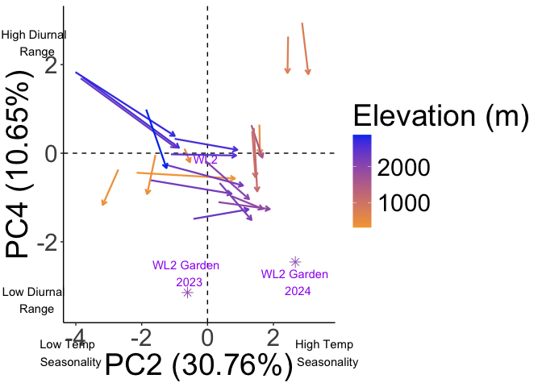
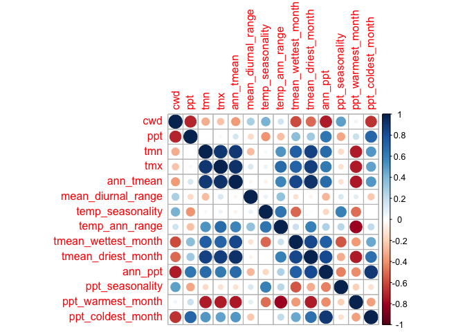

To Do:
- Save PC figures of interest 

# Climate PCAs

-   Should use this code to check the significance of the PCA:
    <https://github.com/StatQuest/pca_demo/blob/master/pca_demo.R>
-   Remember this paper: Björklund, M. 2019. Be careful with your
    principal components. Evolution 73: 2151--2158.

-   PCAs for climate during the growth season

    -   Color monthly PCA by month relative to growth season?
    -   Bioclim vars only PCA okay? or combine with other Flint
        variables? Hard to combine b/c Flint data is for each month
        within a year and Bioclim variables are yearly summaries. Could
        do one with just Flint with all months in each year included and
        one with Flint growth season yearly averages combined with
        Bioclim variables
 
## Load necessary libraries 

``` r
library(tidyverse)
```

```
## ── Attaching core tidyverse packages ──────────────────────── tidyverse 2.0.0 ──
## ✔ dplyr     1.1.4     ✔ readr     2.1.5
## ✔ forcats   1.0.0     ✔ stringr   1.5.1
## ✔ ggplot2   3.5.1     ✔ tibble    3.2.1
## ✔ lubridate 1.9.3     ✔ tidyr     1.3.1
## ✔ purrr     1.0.2     
## ── Conflicts ────────────────────────────────────────── tidyverse_conflicts() ──
## ✖ dplyr::filter() masks stats::filter()
## ✖ dplyr::lag()    masks stats::lag()
## ℹ Use the conflicted package (<http://conflicted.r-lib.org/>) to force all conflicts to become errors
```

``` r
library(ggrepel)
#library(cowplot)
library(gridExtra)
```

```
## 
## Attaching package: 'gridExtra'
## 
## The following object is masked from 'package:dplyr':
## 
##     combine
```

``` r
library(corrplot) #plotting correlations 
```

```
## corrplot 0.94 loaded
```

``` r
library(rstatix) #performing cor_test
```

```
## 
## Attaching package: 'rstatix'
## 
## The following object is masked from 'package:stats':
## 
##     filter
```

``` r
library(QBMS) #for function calc_biovars to calculate bioclim variables
library(ggfortify) #easier PCA figures
sem <- function(x, na.rm=FALSE) {
  sd(x,na.rm=na.rm)/sqrt(length(na.omit(x)))
} #standard error function 

get_legend<-function(myggplot){
  tmp <- ggplot_gtable(ggplot_build(myggplot))
  leg <- which(sapply(tmp$grobs, function(x) x$name) == "guide-box")
  legend <- tmp$grobs[[leg]]
  return(legend)
} #legend function for grid_arrange

elev_three_palette <- c("#0043F0", "#C9727F", "#F5A540") #colors from Gremer et al 2019
elev_order <- c("High", "Mid", "Low")
month_order <- c("jan","feb","mar","apr","may","jun","jul","aug","sep","oct","nov","dec")
```

## Load the Flint growth season data (from "Flint_Growth_Season.Rmd")

``` r
flint_recent_grwseason <- read_csv("../output/Climate/flint_climate_growthseason_recent.csv") %>%
  dplyr::select(month, parent.pop:tmx)
```

```
## Rows: 4980 Columns: 16
## ── Column specification ────────────────────────────────────────────────────────
## Delimiter: ","
## chr  (2): parent.pop, elevation.group
## dbl (14): month, growmonth, elev_m, PckSum, Lat, Long, year, cwd, pck, ppt, ...
## 
## ℹ Use `spec()` to retrieve the full column specification for this data.
## ℹ Specify the column types or set `show_col_types = FALSE` to quiet this message.
```

``` r
head(flint_recent_grwseason, 12)
```

```
## # A tibble: 12 × 13
##    month parent.pop elevation.group elev_m PckSum   Lat  Long  year   cwd   pck
##    <dbl> <chr>      <chr>            <dbl>  <dbl> <dbl> <dbl> <dbl> <dbl> <dbl>
##  1    12 BH         Low               511.      0  37.4 -120.  1994  29.0     0
##  2     1 BH         Low               511.      0  37.4 -120.  1994  31.3     0
##  3     2 BH         Low               511.      0  37.4 -120.  1994  41.4     0
##  4     3 BH         Low               511.      0  37.4 -120.  1994  61.4     0
##  5     4 BH         Low               511.      0  37.4 -120.  1994  58.6     0
##  6     5 BH         Low               511.      0  37.4 -120.  1994  19.1     0
##  7     6 BH         Low               511.      0  37.4 -120.  1994 115.      0
##  8    11 CC         Low               313       0  39.6 -121.  1994  27.8     0
##  9    12 CC         Low               313       0  39.6 -121.  1994  18.1     0
## 10     1 CC         Low               313       0  39.6 -121.  1994  20.6     0
## 11     2 CC         Low               313       0  39.6 -121.  1994  30.9     0
## 12     3 CC         Low               313       0  39.6 -121.  1994  51.8     0
## # ℹ 3 more variables: ppt <dbl>, tmn <dbl>, tmx <dbl>
```

``` r
flint_recent_grwseason %>% filter(parent.pop=="DPR")
```

```
## # A tibble: 300 × 13
##    month parent.pop elevation.group elev_m PckSum   Lat  Long  year   cwd   pck
##    <dbl> <chr>      <chr>            <dbl>  <dbl> <dbl> <dbl> <dbl> <dbl> <dbl>
##  1     4 DPR        Mid              1019.   91.6  39.2 -121.  1994 43.3    0  
##  2     8 DPR        Mid              1019.   91.6  39.2 -121.  1994 39.7    0  
##  3    12 DPR        Mid              1019.   91.6  39.2 -121.  1994  9.24  36.3
##  4     7 DPR        Mid              1019.   91.6  39.2 -121.  1994 39.2    0  
##  5     6 DPR        Mid              1019.   91.6  39.2 -121.  1994 41      0  
##  6     3 DPR        Mid              1019.   91.6  39.2 -121.  1994 30.1    0  
##  7     5 DPR        Mid              1019.   91.6  39.2 -121.  1994 40.5    0  
##  8    11 DPR        Mid              1019.   91.6  39.2 -121.  1994 10.8    0  
##  9    10 DPR        Mid              1019.   91.6  39.2 -121.  1994 46.6    0  
## 10     9 DPR        Mid              1019.   91.6  39.2 -121.  1994 53.1    0  
## # ℹ 290 more rows
## # ℹ 3 more variables: ppt <dbl>, tmn <dbl>, tmx <dbl>
```

``` r
flint_historical_grwseason <- read_csv("../output/Climate/flint_climate_growthseason_historical.csv") %>%
  dplyr::select(month, parent.pop:tmx)
```

```
## Rows: 4620 Columns: 16
## ── Column specification ────────────────────────────────────────────────────────
## Delimiter: ","
## chr  (2): parent.pop, elevation.group
## dbl (14): month, growmonth, elev_m, PckSum, Lat, Long, year, cwd, pck, ppt, ...
## 
## ℹ Use `spec()` to retrieve the full column specification for this data.
## ℹ Specify the column types or set `show_col_types = FALSE` to quiet this message.
```

``` r
head(flint_historical_grwseason, 12)
```

```
## # A tibble: 12 × 13
##    month parent.pop elevation.group elev_m PckSum   Lat  Long  year   cwd   pck
##    <dbl> <chr>      <chr>            <dbl>  <dbl> <dbl> <dbl> <dbl> <dbl> <dbl>
##  1    11 BH         Low               511.  0.234  37.4 -120.  1964  40.2     0
##  2    12 BH         Low               511.  0.234  37.4 -120.  1964  27.9     0
##  3     1 BH         Low               511.  0.234  37.4 -120.  1964  28.1     0
##  4     2 BH         Low               511.  0.234  37.4 -120.  1964  40.4     0
##  5     3 BH         Low               511.  0.234  37.4 -120.  1964  55.9     0
##  6     4 BH         Low               511.  0.234  37.4 -120.  1964  70.3     0
##  7     5 BH         Low               511.  0.234  37.4 -120.  1964  42.0     0
##  8     6 BH         Low               511.  0.234  37.4 -120.  1964  42.8     0
##  9    11 CC         Low               313   0.951  39.6 -121.  1964  28.6     0
## 10    12 CC         Low               313   0.951  39.6 -121.  1964  19.3     0
## 11     1 CC         Low               313   0.951  39.6 -121.  1964  19.4     0
## 12     2 CC         Low               313   0.951  39.6 -121.  1964  32.6     0
## # ℹ 3 more variables: ppt <dbl>, tmn <dbl>, tmx <dbl>
```

## Load the Bioclim growth season data (from "BioClim_Growth_Season.Rmd")

``` r
bioclim_recent_grwseason <- read_csv("../output/Climate/BioClim_growthseason_Recent.csv")
```

```
## Rows: 690 Columns: 14
## ── Column specification ────────────────────────────────────────────────────────
## Delimiter: ","
## chr  (2): parent.pop, elevation.group
## dbl (12): elev_m, year, ann_tmean, mean_diurnal_range, temp_seasonality, tem...
## 
## ℹ Use `spec()` to retrieve the full column specification for this data.
## ℹ Specify the column types or set `show_col_types = FALSE` to quiet this message.
```

``` r
bioclim_historical_grwseason <- read_csv("../output/Climate/BioClim_growthseason_Historical.csv")
```

```
## Rows: 690 Columns: 14
## ── Column specification ────────────────────────────────────────────────────────
## Delimiter: ","
## chr  (2): parent.pop, elevation.group
## dbl (12): elev_m, year, ann_tmean, mean_diurnal_range, temp_seasonality, tem...
## 
## ℹ Use `spec()` to retrieve the full column specification for this data.
## ℹ Specify the column types or set `show_col_types = FALSE` to quiet this message.
```


## All years and months included (Flint)

### Correlations - Flint Recent


``` r
#normalize the data
climate_normalized_all_flint_recent <- flint_recent_grwseason %>% select(cwd, ppt, tmn, tmx) %>% scale() #normalize the data so they're all on the same scale
head(climate_normalized_all_flint_recent)
```

```
##              cwd        ppt         tmn         tmx
## [1,] -0.86251414 -0.1500623 -0.76764081 -0.96602478
## [2,] -0.79994164 -0.2881219 -0.63215078 -0.54476885
## [3,] -0.52287391  0.2133010 -0.61807389 -0.74153103
## [4,]  0.02169808 -0.5677457 -0.09195026  0.03231214
## [5,] -0.05453654 -0.1164927  0.12800108  0.32679513
## [6,] -1.13329730 -0.3165270  0.65412471  0.71503726
```

``` r
cor.norm = cor(climate_normalized_all_flint_recent) #test correlations among the traits
corrplot(cor.norm)
```

<!-- -->

``` r
#tmn and tmx highly correlated (95%), consider removing one 
```

### PCA - Flint Recent


``` r
all_flint_recent.pc = prcomp(flint_recent_grwseason[c(9, 11:12)], scale = TRUE, center = TRUE)

str(all_flint_recent.pc)
```

```
## List of 5
##  $ sdev    : num [1:3] 1.441 0.71 0.648
##  $ rotation: num [1:3, 1:3] 0.591 -0.574 0.567 -0.1 0.645 ...
##   ..- attr(*, "dimnames")=List of 2
##   .. ..$ : chr [1:3] "cwd" "ppt" "tmn"
##   .. ..$ : chr [1:3] "PC1" "PC2" "PC3"
##  $ center  : Named num [1:3] 60.58 75.6 5.88
##   ..- attr(*, "names")= chr [1:3] "cwd" "ppt" "tmn"
##  $ scale   : Named num [1:3] 36.6 108.43 5.68
##   ..- attr(*, "names")= chr [1:3] "cwd" "ppt" "tmn"
##  $ x       : num [1:4980, 1:3] -0.859 -0.666 -0.782 0.286 0.107 ...
##   ..- attr(*, "dimnames")=List of 2
##   .. ..$ : NULL
##   .. ..$ : chr [1:3] "PC1" "PC2" "PC3"
##  - attr(*, "class")= chr "prcomp"
```

plot % Variance Explained

``` r
summary(all_flint_recent.pc)
```

```
## Importance of components:
##                           PC1    PC2    PC3
## Standard deviation     1.4409 0.7100 0.6479
## Proportion of Variance 0.6921 0.1680 0.1399
## Cumulative Proportion  0.6921 0.8601 1.0000
```

``` r
tibble(PC=str_c("PC",str_pad(1:3,2,pad="0")),
       percent_var=all_flint_recent.pc$sdev[1:3]^2/sum(all_flint_recent.pc$sdev^2)*100) %>%
  ggplot(aes(x=PC, y=percent_var)) +
  geom_col() +
  ggtitle("Percent Variance Explained")
```

<!-- -->

Combine PCs with metadata

``` r
all_flint_recent.pc.dat = data.frame(all_flint_recent.pc$x)

all_flint_recent_locs.pc = cbind(flint_recent_grwseason, all_flint_recent.pc.dat)

all_flint_recent_loadings = data.frame(varnames=rownames(all_flint_recent.pc$rotation), all_flint_recent.pc$rotation)
all_flint_recent_loadings
```

```
##     varnames        PC1        PC2        PC3
## cwd      cwd  0.5914188 -0.1002271  0.8001115
## ppt      ppt -0.5736978  0.6449753  0.5048542
## tmn      tmn  0.5666522  0.7576024 -0.3239504
```


``` r
autoplot(all_flint_recent.pc, data = flint_recent_grwseason,
         colour='elev_m', alpha=0.5,
         loadings=TRUE, loadings.colour='black', loadings.linewidth = 0.7,
         loadings.label = TRUE, loadings.label.size=8, loadings.label.colour="black", loadings.label.vjust = -0.2) +
   scale_colour_gradient(low = "#F5A540", high = "#0043F0") +
  geom_vline(xintercept = 0, linetype="dashed") + geom_hline(yintercept = 0, linetype="dashed") +
  theme_classic()
```

<!-- -->

``` r
#for plot customizations see: ?ggbiplot
```

PCs 1 and 3

``` r
autoplot(all_flint_recent.pc, data = flint_recent_grwseason,
         x=1, y=3,
         colour='elev_m', alpha=0.5,
         loadings=TRUE, loadings.colour='black', loadings.linewidth = 0.7,
         loadings.label = TRUE, loadings.label.size=8, loadings.label.colour="black", loadings.label.vjust = -0.2) +
   scale_colour_gradient(low = "#F5A540", high = "#0043F0") +
  geom_vline(xintercept = 0, linetype="dashed") + geom_hline(yintercept = 0, linetype="dashed") +
  theme_classic()
```

<!-- -->

### Correlations - Flint Historical


``` r
#normalize the data
climate_normalized_all_flint_historical <- flint_historical_grwseason %>% select(cwd, ppt, tmn, tmx) %>% scale() #normalize the data so they're all on the same scale
head(climate_normalized_all_flint_historical)
```

```
##              cwd         ppt         tmn        tmx
## [1,] -0.51979441  0.37680686 -0.29541143 -0.4545244
## [2,] -0.87681447  1.28117671 -0.07285286 -0.7038260
## [3,] -0.87126343 -0.12383791 -0.77636426 -0.9666766
## [4,] -0.51336688 -0.70526437 -0.88198528 -0.4531695
## [5,] -0.06081035 -0.05213384 -0.54060307 -0.3827147
## [6,]  0.36136149 -0.46310268 -0.11623292  0.2120864
```

``` r
cor.norm = cor(climate_normalized_all_flint_historical) #test correlations among the traits
corrplot(cor.norm)
```

<!-- -->

``` r
#tmn and tmx highly correlated, consider removing one 
```

### PCA - Flint Historical


``` r
all_flint_historical.pc = prcomp(flint_historical_grwseason[c(9, 11:12)], scale = TRUE, center = TRUE)

str(all_flint_historical.pc)
```

```
## List of 5
##  $ sdev    : num [1:3] 1.419 0.721 0.682
##  $ rotation: num [1:3, 1:3] 0.583 -0.582 0.567 -0.369 0.431 ...
##   ..- attr(*, "dimnames")=List of 2
##   .. ..$ : chr [1:3] "cwd" "ppt" "tmn"
##   .. ..$ : chr [1:3] "PC1" "PC2" "PC3"
##  $ center  : Named num [1:3] 57.95 79.27 4.64
##   ..- attr(*, "names")= chr [1:3] "cwd" "ppt" "tmn"
##  $ scale   : Named num [1:3] 34.2 109.1 5.3
##   ..- attr(*, "names")= chr [1:3] "cwd" "ppt" "tmn"
##  $ x       : num [1:4620, 1:3] -0.69 -1.298 -0.876 -0.389 -0.311 ...
##   ..- attr(*, "dimnames")=List of 2
##   .. ..$ : NULL
##   .. ..$ : chr [1:3] "PC1" "PC2" "PC3"
##  - attr(*, "class")= chr "prcomp"
```

plot % Variance Explained

``` r
summary(all_flint_historical.pc)
```

```
## Importance of components:
##                           PC1    PC2    PC3
## Standard deviation     1.4194 0.7213 0.6819
## Proportion of Variance 0.6716 0.1734 0.1550
## Cumulative Proportion  0.6716 0.8450 1.0000
```

``` r
tibble(PC=str_c("PC",str_pad(1:3,2,pad="0")),
       percent_var=all_flint_historical.pc$sdev[1:3]^2/sum(all_flint_historical.pc$sdev^2)*100) %>%
  ggplot(aes(x=PC, y=percent_var)) +
  geom_col() +
  ggtitle("Percent Variance Explained")
```

<!-- -->

Combine PCs with metadata

``` r
all_flint_historical.pc.dat = data.frame(all_flint_historical.pc$x)

all_flint_historical_locs.pc = cbind(flint_historical_grwseason, all_flint_historical.pc.dat)

all_flint_historical_loadings = data.frame(varnames=rownames(all_flint_historical.pc$rotation), all_flint_historical.pc$rotation)
all_flint_historical_loadings
```

```
##     varnames        PC1        PC2         PC3
## cwd      cwd  0.5834031 -0.3693248 -0.72335326
## ppt      ppt -0.5818847  0.4312739 -0.68950201
## tmn      tmn  0.5666136  0.8231658  0.03670208
```


``` r
autoplot(all_flint_historical.pc, data = flint_historical_grwseason,
         colour='elev_m', alpha=0.5,
         loadings=TRUE, loadings.colour='black', loadings.linewidth = 0.7,
         loadings.label = TRUE, loadings.label.size=8, loadings.label.colour="black", loadings.label.vjust = -0.2) +
   scale_colour_gradient(low = "#F5A540", high = "#0043F0") +
  geom_vline(xintercept = 0, linetype="dashed") + geom_hline(yintercept = 0, linetype="dashed") +
  theme_classic()
```

<!-- -->

PCs 1 and 3

``` r
autoplot(all_flint_historical.pc, data = flint_historical_grwseason,
         x=1, y=3,
         colour='elev_m', alpha=0.5,
         loadings=TRUE, loadings.colour='black', loadings.linewidth = 0.7,
         loadings.label = TRUE, loadings.label.size=8, loadings.label.colour="black", loadings.label.vjust = -0.2) +
   scale_colour_gradient(low = "#F5A540", high = "#0043F0") +
  geom_vline(xintercept = 0, linetype="dashed") + geom_hline(yintercept = 0, linetype="dashed") +
  theme_classic()
```

<!-- -->

## All years included (bioclim)

### Correlations - bioclim Recent


``` r
#normalize the data
climate_normalized_all_bioclim_recent <- bioclim_recent_grwseason %>% select(ann_tmean:ppt_coldest_month) %>% scale() #normalize the data so they're all on the same scale
head(climate_normalized_all_bioclim_recent)
```

```
##       ann_tmean mean_diurnal_range temp_seasonality temp_ann_range    ann_ppt
## [1,]  0.2761737          0.6138628       -1.0023399      0.3211031 -0.6686580
## [2,]  0.1726151         -1.1536434       -2.8805248     -2.1893221  0.8644685
## [3,]  0.5581316         -0.1385138       -1.5496956     -0.7530692  0.5970773
## [4,]  0.6144072          0.5212626       -0.6889491     -0.5036360 -0.4335098
## [5,] -0.4226294         -1.3041187       -2.4294195     -1.1754965  0.9673067
## [6,] -0.1403814          0.6809979       -1.6095230     -0.5398440 -0.5508902
##      ppt_seasonality tmean_wettest_month tmean_driest_month ppt_warmest_month
## [1,]      -1.7110673           0.8149577          0.8620499       -0.52448175
## [2,]      -1.1689020           1.0816768          0.3661528        1.48792262
## [3,]      -0.7061789           1.0555976          0.8936812        0.20546501
## [4,]       2.3786780           0.9026787          0.5783886       -0.36461375
## [5,]      -1.5803150           0.7888785          0.2365666        2.67727029
## [6,]      -0.8224144           0.8019181         -1.9357891       -0.05541849
##      ppt_coldest_month
## [1,]       -1.08795478
## [2,]        0.17223809
## [3,]        0.57208939
## [4,]        0.49161263
## [5,]        0.04540278
## [6,]       -0.90709311
```

``` r
cor.norm = cor(climate_normalized_all_bioclim_recent) #test correlations among the traits
corrplot(cor.norm)
```

<!-- -->

### PCA - bioclim Recent


``` r
all_bioclim_recent.pc = prcomp(bioclim_recent_grwseason[c(5:14)], scale = TRUE, center = TRUE) 

str(all_bioclim_recent.pc)
```

```
## List of 5
##  $ sdev    : num [1:10] 1.721 1.521 1.35 0.961 0.894 ...
##  $ rotation: num [1:10, 1:10] -0.4729 0.0836 -0.0875 -0.2766 -0.4374 ...
##   ..- attr(*, "dimnames")=List of 2
##   .. ..$ : chr [1:10] "ann_tmean" "mean_diurnal_range" "temp_seasonality" "temp_ann_range" ...
##   .. ..$ : chr [1:10] "PC1" "PC2" "PC3" "PC4" ...
##  $ center  : Named num [1:10] 12 13.2 6.48 29.8 545.65 ...
##   ..- attr(*, "names")= chr [1:10] "ann_tmean" "mean_diurnal_range" "temp_seasonality" "temp_ann_range" ...
##  $ scale   : Named num [1:10] 2.462 1.234 0.906 2.486 335.576 ...
##   ..- attr(*, "names")= chr [1:10] "ann_tmean" "mean_diurnal_range" "temp_seasonality" "temp_ann_range" ...
##  $ x       : num [1:690, 1:10] -0.152 0.235 -1.008 -0.693 0.644 ...
##   ..- attr(*, "dimnames")=List of 2
##   .. ..$ : NULL
##   .. ..$ : chr [1:10] "PC1" "PC2" "PC3" "PC4" ...
##  - attr(*, "class")= chr "prcomp"
```

plot % Variance Explained

``` r
summary(all_bioclim_recent.pc)
```

```
## Importance of components:
##                           PC1    PC2    PC3    PC4     PC5     PC6     PC7
## Standard deviation     1.7209 1.5213 1.3502 0.9612 0.89351 0.74108 0.54910
## Proportion of Variance 0.2962 0.2314 0.1823 0.0924 0.07984 0.05492 0.03015
## Cumulative Proportion  0.2962 0.5276 0.7099 0.8023 0.88212 0.93704 0.96719
##                            PC8     PC9    PC10
## Standard deviation     0.43075 0.31743 0.20436
## Proportion of Variance 0.01855 0.01008 0.00418
## Cumulative Proportion  0.98575 0.99582 1.00000
```

``` r
tibble(PC=str_c("PC",str_pad(1:10,2,pad="0")),
       percent_var=all_bioclim_recent.pc$sdev[1:10]^2/sum(all_bioclim_recent.pc$sdev^2)*100) %>%
  ggplot(aes(x=PC, y=percent_var)) +
  geom_col() +
  ggtitle("Percent Variance Explained")
```

<!-- -->

Combine PCs with metadata

``` r
all_bioclim_recent.pc.dat = data.frame(all_bioclim_recent.pc$x)

all_bioclim_recent_locs.pc = cbind(bioclim_recent_grwseason, all_bioclim_recent.pc.dat)

all_bioclim_recent_loadings = data.frame(varnames=rownames(all_bioclim_recent.pc$rotation), all_bioclim_recent.pc$rotation)
all_bioclim_recent_loadings
```

```
##                                varnames         PC1         PC2         PC3
## ann_tmean                     ann_tmean -0.47294969 -0.10769683 -0.18695274
## mean_diurnal_range   mean_diurnal_range  0.08355263  0.20062996 -0.39175403
## temp_seasonality       temp_seasonality -0.08752383  0.56123542 -0.01918244
## temp_ann_range           temp_ann_range -0.27663379  0.42980564 -0.32891011
## ann_ppt                         ann_ppt -0.43739126 -0.11375540  0.38785094
## ppt_seasonality         ppt_seasonality -0.02957250  0.41182770  0.28153119
## tmean_wettest_month tmean_wettest_month -0.23554729 -0.47610737 -0.26206924
## tmean_driest_month   tmean_driest_month -0.50922379 -0.05061960 -0.15030124
## ppt_warmest_month     ppt_warmest_month  0.26624536 -0.16681235  0.27372074
## ppt_coldest_month     ppt_coldest_month -0.32754730  0.09392366  0.55420724
##                              PC4         PC5          PC6         PC7
## ann_tmean            0.198121730  0.03884254  0.499322651 -0.06481732
## mean_diurnal_range   0.703035880 -0.26210066 -0.399345532  0.00351096
## temp_seasonality    -0.382382171 -0.20271266  0.156805591  0.29366880
## temp_ann_range      -0.097739404 -0.32267517  0.038230219  0.15221920
## ann_ppt             -0.009604171 -0.22563951 -0.321755149  0.11507947
## ppt_seasonality      0.470351467  0.43104495  0.404100954  0.03129445
## tmean_wettest_month  0.107799504  0.02619142  0.154677299  0.64333594
## tmean_driest_month  -0.061114330 -0.05107695 -0.002917302 -0.64372169
## ppt_warmest_month    0.175169026 -0.73458756  0.472222104 -0.11843381
## ppt_coldest_month    0.208222454 -0.07039990 -0.226714012  0.17281896
##                             PC8         PC9        PC10
## ann_tmean           -0.57567289  0.30520244  0.10457290
## mean_diurnal_range   0.02019280  0.26085679 -0.09162947
## temp_seasonality     0.20088565  0.56155529 -0.15214835
## temp_ann_range      -0.11009264 -0.67103872  0.17274594
## ann_ppt             -0.22368833 -0.09482031 -0.64692952
## ppt_seasonality      0.22692706 -0.21774610 -0.28292608
## tmean_wettest_month  0.44335953 -0.03483613 -0.03556411
## tmean_driest_month   0.54066586  0.04342030 -0.02456608
## ppt_warmest_month    0.12606652 -0.05016327 -0.02513013
## ppt_coldest_month    0.09698029  0.10558605  0.65315655
```


``` r
autoplot(all_bioclim_recent.pc, data = bioclim_recent_grwseason,
         colour='elev_m', alpha=0.5,
         loadings=TRUE, loadings.colour='black', loadings.linewidth = 0.7,
         loadings.label = TRUE, loadings.label.size=6, loadings.label.colour="black", 
         loadings.label.vjust = -0.2, loadings.label.repel=TRUE) +
   scale_colour_gradient(low = "#F5A540", high = "#0043F0") +
  geom_vline(xintercept = 0, linetype="dashed") + geom_hline(yintercept = 0, linetype="dashed") +
  theme_classic()
```

<!-- -->

PCs 3 and 4

``` r
autoplot(all_bioclim_recent.pc, data = bioclim_recent_grwseason,
         x=3, y=4,
         colour='elev_m', alpha=0.5,
         loadings=TRUE, loadings.colour='black', loadings.linewidth = 0.7,
         loadings.label = TRUE, loadings.label.size=6, loadings.label.colour="black", 
         loadings.label.vjust = -0.2, loadings.label.repel=TRUE) +
   scale_colour_gradient(low = "#F5A540", high = "#0043F0") +
  geom_vline(xintercept = 0, linetype="dashed") + geom_hline(yintercept = 0, linetype="dashed") +
  theme_classic()
```

<!-- -->

PCs 4 and 5

``` r
autoplot(all_bioclim_recent.pc, data = bioclim_recent_grwseason,
         x=4, y=5,
         colour='elev_m', alpha=0.5,
         loadings=TRUE, loadings.colour='black', loadings.linewidth = 0.7,
         loadings.label = TRUE, loadings.label.size=6, loadings.label.colour="black", 
         loadings.label.vjust = -0.2, loadings.label.repel=TRUE) +
   scale_colour_gradient(low = "#F5A540", high = "#0043F0") +
  geom_vline(xintercept = 0, linetype="dashed") + geom_hline(yintercept = 0, linetype="dashed") +
  theme_classic()
```

<!-- -->

### Correlations - bioclim Historical


``` r
#normalize the data
climate_normalized_all_bioclim_historical <- bioclim_historical_grwseason %>% select(ann_tmean:ppt_coldest_month) %>% scale() #normalize the data so they're all on the same scale
head(climate_normalized_all_bioclim_historical)
```

```
##        ann_tmean mean_diurnal_range temp_seasonality temp_ann_range     ann_ppt
## [1,] 0.004943863         0.08496148       -1.3986162     0.06319998  0.05517251
## [2,] 0.088110769        -0.33804436       -1.6594862    -0.55943285  0.14087650
## [3,] 0.562453554         0.41853691       -0.2024013     0.65199407 -0.53185276
## [4,] 0.001805490        -0.24950825       -1.0257704     0.19517107  0.38003146
## [5,] 0.450592945         0.39081349       -0.5120826     1.26109141 -0.24422639
## [6,] 0.236511017        -0.15202911       -1.1052001    -0.85721378  0.94709053
##      ppt_seasonality tmean_wettest_month tmean_driest_month ppt_warmest_month
## [1,]     -0.39890083           0.8766686         -1.7026494       -0.01293049
## [2,]     -0.63479745           1.4648974          0.5239790       -0.50592456
## [3,]     -0.02319313           0.4300906          1.1153033       -0.48463092
## [4,]     -1.09093643           0.7025789          0.0762761        0.29073534
## [5,]     -1.26741830           0.2754643          1.3242973       -0.50592456
## [6,]     -0.33998990           0.4311719          0.3516332       -0.27910099
##      ppt_coldest_month
## [1,]        -0.1570492
## [2,]        -0.2029876
## [3,]        -0.6296645
## [4,]        -0.2734897
## [5,]        -0.7154342
## [6,]         0.5339937
```

``` r
cor.norm = cor(climate_normalized_all_bioclim_historical) #test correlations among the traits
corrplot(cor.norm)
```

<!-- -->

### PCA - bioclim Historical


``` r
all_bioclim_historical.pc = prcomp(bioclim_historical_grwseason[c(5:14)], scale = TRUE, center = TRUE) 

str(all_bioclim_historical.pc)
```

```
## List of 5
##  $ sdev    : num [1:10] 1.749 1.412 1.352 0.989 0.932 ...
##  $ rotation: num [1:10, 1:10] -0.4563 -0.0359 -0.3388 -0.4612 -0.2615 ...
##   ..- attr(*, "dimnames")=List of 2
##   .. ..$ : chr [1:10] "ann_tmean" "mean_diurnal_range" "temp_seasonality" "temp_ann_range" ...
##   .. ..$ : chr [1:10] "PC1" "PC2" "PC3" "PC4" ...
##  $ center  : Named num [1:10] 10.97 13.96 6.02 29.28 530.74 ...
##   ..- attr(*, "names")= chr [1:10] "ann_tmean" "mean_diurnal_range" "temp_seasonality" "temp_ann_range" ...
##  $ scale   : Named num [1:10] 2.788 1.398 0.929 2.955 318.538 ...
##   ..- attr(*, "names")= chr [1:10] "ann_tmean" "mean_diurnal_range" "temp_seasonality" "temp_ann_range" ...
##  $ x       : num [1:690, 1:10] 1.218 0.314 -0.978 0.365 -1.026 ...
##   ..- attr(*, "dimnames")=List of 2
##   .. ..$ : NULL
##   .. ..$ : chr [1:10] "PC1" "PC2" "PC3" "PC4" ...
##  - attr(*, "class")= chr "prcomp"
```

plot % Variance Explained

``` r
summary(all_bioclim_historical.pc)
```

```
## Importance of components:
##                           PC1    PC2    PC3     PC4     PC5     PC6     PC7
## Standard deviation     1.7495 1.4116 1.3523 0.98939 0.93170 0.78260 0.57330
## Proportion of Variance 0.3061 0.1993 0.1829 0.09789 0.08681 0.06125 0.03287
## Cumulative Proportion  0.3061 0.5053 0.6882 0.78608 0.87289 0.93413 0.96700
##                            PC8     PC9    PC10
## Standard deviation     0.40079 0.32781 0.24884
## Proportion of Variance 0.01606 0.01075 0.00619
## Cumulative Proportion  0.98306 0.99381 1.00000
```

``` r
tibble(PC=str_c("PC",str_pad(1:10,2,pad="0")),
       percent_var=all_bioclim_historical.pc$sdev[1:10]^2/sum(all_bioclim_historical.pc$sdev^2)*100) %>%
  ggplot(aes(x=PC, y=percent_var)) +
  geom_col() +
  ggtitle("Percent Variance Explained")
```

<!-- -->

Combine PCs with metadata

``` r
all_bioclim_historical.pc.dat = data.frame(all_bioclim_historical.pc$x)

all_bioclim_historical_locs.pc = cbind(bioclim_historical_grwseason, all_bioclim_historical.pc.dat)

all_bioclim_historical_loadings = data.frame(varnames=rownames(all_bioclim_historical.pc$rotation), all_bioclim_historical.pc$rotation)
all_bioclim_historical_loadings
```

```
##                                varnames         PC1         PC2        PC3
## ann_tmean                     ann_tmean -0.45629135  0.23710220 -0.1730209
## mean_diurnal_range   mean_diurnal_range -0.03589931  0.20759188  0.3758794
## temp_seasonality       temp_seasonality -0.33883556 -0.21787815  0.3895847
## temp_ann_range           temp_ann_range -0.46120137  0.09915378  0.2911962
## ann_ppt                         ann_ppt -0.26150039 -0.36316478 -0.4703598
## ppt_seasonality         ppt_seasonality -0.17766595 -0.35032818  0.2834721
## tmean_wettest_month tmean_wettest_month -0.13189421  0.45294850 -0.4112170
## tmean_driest_month   tmean_driest_month -0.47786757  0.14056739 -0.1880886
## ppt_warmest_month     ppt_warmest_month  0.29109467 -0.16326031 -0.1921435
## ppt_coldest_month     ppt_coldest_month -0.18043268 -0.58068222 -0.2218475
##                             PC4         PC5         PC6          PC7
## ann_tmean            0.12434285 -0.03245174  0.40551041 -0.156410516
## mean_diurnal_range   0.53489661  0.60658285 -0.25765421 -0.096763322
## temp_seasonality    -0.43409344  0.03307222  0.12688949  0.344888005
## temp_ann_range      -0.16920098  0.26617964 -0.04672939  0.288299147
## ann_ppt             -0.01975146  0.20633185 -0.29116405  0.087176266
## ppt_seasonality      0.53514726 -0.32790971  0.44845408 -0.022024384
## tmean_wettest_month  0.27381442 -0.05439636  0.10431513  0.610768181
## tmean_driest_month  -0.14253241  0.07018660  0.01233685 -0.609538251
## ppt_warmest_month   -0.13791284  0.62464646  0.65208778  0.008220436
## ppt_coldest_month    0.28333001  0.10436874 -0.16956167  0.106683996
##                             PC8         PC9         PC10
## ann_tmean            0.58793938 -0.36611183  0.143236626
## mean_diurnal_range  -0.05985265 -0.25779750 -0.120348170
## temp_seasonality    -0.26628343 -0.52867158 -0.104705626
## temp_ann_range       0.22139721  0.66023638  0.151516214
## ann_ppt              0.20466132  0.00912860 -0.633389142
## ppt_seasonality     -0.13934819  0.23220143 -0.310659997
## tmean_wettest_month -0.38221070 -0.01468383 -0.013739820
## tmean_driest_month  -0.55382736  0.11211205  0.016777639
## ppt_warmest_month   -0.08749058  0.09769600 -0.001591372
## ppt_coldest_month   -0.09514630 -0.08812938  0.657962699
```


``` r
autoplot(all_bioclim_historical.pc, data = bioclim_historical_grwseason,
         colour='elev_m', alpha=0.5,
         loadings=TRUE, loadings.colour='black', loadings.linewidth = 0.7,
         loadings.label = TRUE, loadings.label.size=6, loadings.label.colour="black", 
         loadings.label.vjust = -0.2, loadings.label.repel=TRUE) +
   scale_colour_gradient(low = "#F5A540", high = "#0043F0") +
  geom_vline(xintercept = 0, linetype="dashed") + geom_hline(yintercept = 0, linetype="dashed") +
  theme_classic()
```

<!-- -->

PCs 3 and 4

``` r
autoplot(all_bioclim_historical.pc, data = bioclim_historical_grwseason,
         x=3, y=4,
         colour='elev_m', alpha=0.5,
         loadings=TRUE, loadings.colour='black', loadings.linewidth = 0.7,
         loadings.label = TRUE, loadings.label.size=6, loadings.label.colour="black", 
         loadings.label.vjust = -0.2, loadings.label.repel=TRUE) +
   scale_colour_gradient(low = "#F5A540", high = "#0043F0") +
  geom_vline(xintercept = 0, linetype="dashed") + geom_hline(yintercept = 0, linetype="dashed") +
  theme_classic()
```

<!-- -->

PCs 4 and 5

``` r
autoplot(all_bioclim_historical.pc, data = bioclim_historical_grwseason,
         x=4, y=5,
         colour='elev_m', alpha=0.5,
         loadings=TRUE, loadings.colour='black', loadings.linewidth = 0.7,
         loadings.label = TRUE, loadings.label.size=6, loadings.label.colour="black", 
         loadings.label.vjust = -0.2, loadings.label.repel=TRUE) +
   scale_colour_gradient(low = "#F5A540", high = "#0043F0") +
  geom_vline(xintercept = 0, linetype="dashed") + geom_hline(yintercept = 0, linetype="dashed") +
  theme_classic()
```

<!-- -->

## Monthly Averages - Flint  

### Calculate avgs


``` r
flint_recent_grwseason_mosavgs <- flint_recent_grwseason %>% 
  group_by(parent.pop, elevation.group, elev_m, Lat, Long, month) %>% 
  summarise_at(c("cwd", "ppt", "tmn", "tmx"), c(mean), na.rm = TRUE) %>% 
  mutate(TimePd = "Recent") 
flint_recent_grwseason_mosavgs
```

```
## # A tibble: 166 × 11
## # Groups:   parent.pop, elevation.group, elev_m, Lat, Long [23]
##    parent.pop elevation.group elev_m   Lat  Long month   cwd    ppt   tmn   tmx
##    <chr>      <chr>            <dbl> <dbl> <dbl> <dbl> <dbl>  <dbl> <dbl> <dbl>
##  1 BH         Low               511.  37.4 -120.     1  29.4 124.    2.81  13.9
##  2 BH         Low               511.  37.4 -120.     2  41.0  93.9   3.32  14.9
##  3 BH         Low               511.  37.4 -120.     3  53.9  90.1   4.82  17.4
##  4 BH         Low               511.  37.4 -120.     4  59.0  48.2   6.41  20.5
##  5 BH         Low               511.  37.4 -120.     5  51.4  23.2   9.78  25.7
##  6 BH         Low               511.  37.4 -120.     6  89.3   6.34 13.6   31.2
##  7 BH         Low               511.  37.4 -120.    12  30.0 111.    2.59  13.6
##  8 CC         Low               313   39.6 -121.     1  19.6 184.    4.27  13.5
##  9 CC         Low               313   39.6 -121.     2  31.4 165.    4.81  15.3
## 10 CC         Low               313   39.6 -121.     3  45.3 148.    6.18  17.8
## # ℹ 156 more rows
## # ℹ 1 more variable: TimePd <chr>
```

``` r
flint_historical_grwseason_mosavgs <- flint_historical_grwseason %>% 
  group_by(parent.pop, elevation.group, elev_m, Lat, Long, month) %>% 
  summarise_at(c("cwd", "ppt", "tmn", "tmx"), c(mean), na.rm = TRUE) %>% 
  mutate(TimePd = "Historical")
flint_historical_grwseason_mosavgs
```

```
## # A tibble: 154 × 11
## # Groups:   parent.pop, elevation.group, elev_m, Lat, Long [23]
##    parent.pop elevation.group elev_m   Lat  Long month   cwd    ppt   tmn   tmx
##    <chr>      <chr>            <dbl> <dbl> <dbl> <dbl> <dbl>  <dbl> <dbl> <dbl>
##  1 BH         Low               511.  37.4 -120.     1  28.0 104.    1.46  12.6
##  2 BH         Low               511.  37.4 -120.     2  40.4  92.2   2.76  15.0
##  3 BH         Low               511.  37.4 -120.     3  51.2 101.    4.04  16.5
##  4 BH         Low               511.  37.4 -120.     4  62.2  46.4   5.57  20.1
##  5 BH         Low               511.  37.4 -120.     5  63.5  12.6   8.83  25.8
##  6 BH         Low               511.  37.4 -120.     6  87.5   5.73 12.4   30.6
##  7 BH         Low               511.  37.4 -120.    11  43.8  82.0   4.37  17.4
##  8 BH         Low               511.  37.4 -120.    12  28.5  89.3   1.44  12.6
##  9 CC         Low               313   39.6 -121.     1  18.7 191.    2.42  12.5
## 10 CC         Low               313   39.6 -121.     2  31.1 146.    4.04  15.5
## # ℹ 144 more rows
## # ℹ 1 more variable: TimePd <chr>
```

``` r
flint_grwseason_mosavgs <- bind_rows(flint_recent_grwseason_mosavgs, flint_historical_grwseason_mosavgs) #combine into 1 dataframe 
head(flint_grwseason_mosavgs)
```

```
## # A tibble: 6 × 11
## # Groups:   parent.pop, elevation.group, elev_m, Lat, Long [1]
##   parent.pop elevation.group elev_m   Lat  Long month   cwd    ppt   tmn   tmx
##   <chr>      <chr>            <dbl> <dbl> <dbl> <dbl> <dbl>  <dbl> <dbl> <dbl>
## 1 BH         Low               511.  37.4 -120.     1  29.4 124.    2.81  13.9
## 2 BH         Low               511.  37.4 -120.     2  41.0  93.9   3.32  14.9
## 3 BH         Low               511.  37.4 -120.     3  53.9  90.1   4.82  17.4
## 4 BH         Low               511.  37.4 -120.     4  59.0  48.2   6.41  20.5
## 5 BH         Low               511.  37.4 -120.     5  51.4  23.2   9.78  25.7
## 6 BH         Low               511.  37.4 -120.     6  89.3   6.34 13.6   31.2
## # ℹ 1 more variable: TimePd <chr>
```

``` r
tail(flint_grwseason_mosavgs)
```

```
## # A tibble: 6 × 11
## # Groups:   parent.pop, elevation.group, elev_m, Lat, Long [2]
##   parent.pop elevation.group elev_m   Lat  Long month   cwd   ppt    tmn   tmx
##   <chr>      <chr>            <dbl> <dbl> <dbl> <dbl> <dbl> <dbl>  <dbl> <dbl>
## 1 YO7        High             2470.  37.8 -120.    11  33.2 149.  -5.04   7.32
## 2 YO8        High             2591.  37.8 -119.     7 117.   15.7  6.14  21.3 
## 3 YO8        High             2591.  37.8 -119.     8 113.   14.1  6.00  21.1 
## 4 YO8        High             2591.  37.8 -119.     9  98.1  32.5  2.92  17.9 
## 5 YO8        High             2591.  37.8 -119.    10  71.9  64.0 -0.564 13.3 
## 6 YO8        High             2591.  37.8 -119.    11  31.9 148.  -5.77   6.91
## # ℹ 1 more variable: TimePd <chr>
```

### Correlations - Recent + Historical


``` r
#normalize the data
climate_normalized_flint_grwseason_mosavgs <- flint_grwseason_mosavgs %>% ungroup() %>% 
  select(cwd:tmx) %>% scale() #normalize the data so they're all on the same scale
head(climate_normalized_flint_grwseason_mosavgs)
```

```
##               cwd        ppt         tmn        tmx
## [1,] -0.921478463  0.6370523 -0.46312448 -0.6766390
## [2,] -0.564920883  0.2242746 -0.36707575 -0.5376371
## [3,] -0.165578858  0.1721933 -0.08609735 -0.1940932
## [4,] -0.008743628 -0.3952891  0.20996462  0.2278868
## [5,] -0.242892723 -0.7334882  0.84073244  0.9548144
## [6,]  0.923602028 -0.9618371  1.55259007  1.7153641
```

``` r
cor.norm = cor(climate_normalized_flint_grwseason_mosavgs) #test correlations among the traits
corrplot(cor.norm)
```

<!-- -->

``` r
#tmn and tmx highly correlated, consider removing one (96%)
#tmx and ppt highly neg correlated (-82%)
```

### PCA - Recent + Historical


``` r
#flint_grwseason_mosavgs[c(8:12)]
mos_flint.pc = prcomp(flint_grwseason_mosavgs[c(7:9)], scale = TRUE, center = TRUE)

str(mos_flint.pc)
```

```
## List of 5
##  $ sdev    : num [1:3] 1.548 0.66 0.412
##  $ rotation: num [1:3, 1:3] 0.565 -0.611 0.555 -0.671 0.051 ...
##   ..- attr(*, "dimnames")=List of 2
##   .. ..$ : chr [1:3] "cwd" "ppt" "tmn"
##   .. ..$ : chr [1:3] "PC1" "PC2" "PC3"
##  $ center  : Named num [1:3] 59.31 77.36 5.28
##   ..- attr(*, "names")= chr [1:3] "cwd" "ppt" "tmn"
##  $ scale   : Named num [1:3] 32.47 73.85 5.35
##   ..- attr(*, "names")= chr [1:3] "cwd" "ppt" "tmn"
##  $ x       : num [1:320, 1:3] -1.167 -0.66 -0.246 0.353 0.777 ...
##   ..- attr(*, "dimnames")=List of 2
##   .. ..$ : NULL
##   .. ..$ : chr [1:3] "PC1" "PC2" "PC3"
##  - attr(*, "class")= chr "prcomp"
```

plot % Variance Explained

``` r
summary(mos_flint.pc)
```

```
## Importance of components:
##                           PC1    PC2     PC3
## Standard deviation     1.5475 0.6602 0.41159
## Proportion of Variance 0.7983 0.1453 0.05647
## Cumulative Proportion  0.7983 0.9435 1.00000
```

``` r
tibble(PC=str_c("PC",str_pad(1:3,2,pad="0")),
       percent_var=mos_flint.pc$sdev[1:3]^2/sum(mos_flint.pc$sdev^2)*100) %>%
  ggplot(aes(x=PC, y=percent_var)) +
  geom_col() +
  ggtitle("Percent Variance Explained")
```

<!-- -->

Combine PCs with metadata

``` r
mos_flint.pc.dat = data.frame(mos_flint.pc$x)

mos_flint_locs.pc = cbind(flint_grwseason_mosavgs, mos_flint.pc.dat)

mos_flint_loadings = data.frame(varnames=rownames(mos_flint.pc$rotation), mos_flint.pc$rotation)
mos_flint_loadings
```

```
##     varnames        PC1         PC2        PC3
## cwd      cwd  0.5650999 -0.67099258 -0.4800323
## ppt      ppt -0.6106795  0.05103173 -0.7902318
## tmn      tmn  0.5547366  0.73970583 -0.3809234
```


``` r
autoplot(mos_flint.pc, data = flint_grwseason_mosavgs,
         colour='elev_m', alpha=0.5,
         label=TRUE, label.label="month",
         loadings=TRUE, loadings.colour='black', loadings.linewidth = 0.7,
         loadings.label = TRUE, loadings.label.size=6, loadings.label.colour="black", 
         loadings.label.vjust = -0.2, loadings.label.repel=TRUE) +
   scale_colour_gradient(low = "#F5A540", high = "#0043F0") +
  geom_vline(xintercept = 0, linetype="dashed") + geom_hline(yintercept = 0, linetype="dashed") +
  theme_classic()
```

<!-- -->

``` r
#high elev seems most similar to low elev in summer months 
```


``` r
mos_flint_locs.pc_avg <- mos_flint_locs.pc %>%
  group_by(parent.pop, elev_m, TimePd,month) %>%
  summarise(across(.cols=starts_with("PC"), .fns = mean)) %>%
  ungroup()
```

```
## `summarise()` has grouped output by 'parent.pop', 'elev_m', 'TimePd'. You can
## override using the `.groups` argument.
```

``` r
mos_flint_locs.pc_avg
```

```
## # A tibble: 320 × 7
##    parent.pop elev_m TimePd     month    PC1     PC2     PC3
##    <chr>       <dbl> <chr>      <dbl>  <dbl>   <dbl>   <dbl>
##  1 BH           511. Historical     1 -1.16   0.136   0.451 
##  2 BH           511. Historical     2 -0.713  0.0517  0.301 
##  3 BH           511. Historical     3 -0.465  0.0129 -0.0447
##  4 BH           511. Historical     4  0.337 -0.0415  0.268 
##  5 BH           511. Historical     5  0.976  0.361   0.379 
##  6 BH           511. Historical     6  1.82   0.350  -0.155 
##  7 BH           511. Historical    11 -0.403  0.198   0.244 
##  8 BH           511. Historical    12 -1.03   0.113   0.601 
##  9 BH           511. Recent         1 -1.17   0.308   0.115 
## 10 BH           511. Recent         2 -0.660  0.119   0.234 
## # ℹ 310 more rows
```


``` r
mos_flint_locs.pc_avg %>% 
  ggplot(aes(x=PC1, y=PC2, shape=TimePd, color=elev_m)) +
  scale_colour_gradient(low = "#F5A540", high = "#0043F0") +
  geom_point() +
  facet_wrap(~month) +
  coord_fixed(ratio = 1.5)
```

<!-- -->

``` r
#Remember: this is growth season so high elev pops don't have winter months 
```


``` r
mos_flint_locs.pc_avg %>% 
  mutate(group=str_c(parent.pop,elev_m, month))  %>%
  ggplot(aes(x=PC1, y=PC2, shape=TimePd, color=elev_m)) +
  scale_colour_gradient(low = "#F5A540", high = "#0043F0") +
  geom_point() +
  geom_path(aes(group=group),arrow = arrow(length=unit(5, "points")))
```

<!-- -->

``` r
#high elev climate seems to be shifting to be more similar to low elev 
#hard to see which months though 
```

## Avg across years and months (Flint)

### Calculate avgs


``` r
flint_recent_grwseason_avgs <- flint_recent_grwseason %>% 
  group_by(parent.pop, elevation.group, elev_m, Lat, Long) %>% 
  summarise_at(c("cwd", "ppt", "tmn", "tmx"), c(mean), na.rm = TRUE) %>% 
  mutate(TimePd = "Recent") 
flint_recent_grwseason_avgs
```

```
## # A tibble: 23 × 10
## # Groups:   parent.pop, elevation.group, elev_m, Lat [23]
##    parent.pop elevation.group elev_m   Lat  Long   cwd   ppt   tmn   tmx TimePd
##    <chr>      <chr>            <dbl> <dbl> <dbl> <dbl> <dbl> <dbl> <dbl> <chr> 
##  1 BH         Low               511.  37.4 -120.  50.6  71.0  6.19  19.6 Recent
##  2 CC         Low               313   39.6 -121.  48.4 105.   8.56  21.0 Recent
##  3 CP2        High             2244.  38.7 -120.  75.1  78.2  3.94  16.5 Recent
##  4 CP3        High             2266.  38.7 -120.  57.8  75.4  3.36  15.7 Recent
##  5 DPR        Mid              1019.  39.2 -121.  30.4  96.9  9.06  21.9 Recent
##  6 FR         Mid               787   40.0 -121.  89.7  58.1  7.37  22.9 Recent
##  7 IH         Low               454.  39.1 -121.  40.5 100.   8.07  21.2 Recent
##  8 LV1        High             2593.  40.5 -122.  65.5  73.6  2.35  16.4 Recent
##  9 LV3        High             2354.  40.5 -122.  53.6  72.7  2.31  16.4 Recent
## 10 LVTR1      High             2741.  40.5 -122.  73.7  76.8  2.03  16.3 Recent
## # ℹ 13 more rows
```

``` r
flint_historical_grwseason_avgs <- flint_historical_grwseason %>% 
  group_by(parent.pop, elevation.group, elev_m, Lat, Long) %>% 
  summarise_at(c("cwd", "ppt", "tmn", "tmx"), c(mean), na.rm = TRUE) %>% 
  mutate(TimePd = "Historical")
flint_historical_grwseason_avgs
```

```
## # A tibble: 23 × 10
## # Groups:   parent.pop, elevation.group, elev_m, Lat [23]
##    parent.pop elevation.group elev_m   Lat  Long   cwd   ppt   tmn   tmx TimePd 
##    <chr>      <chr>            <dbl> <dbl> <dbl> <dbl> <dbl> <dbl> <dbl> <chr>  
##  1 BH         Low               511.  37.4 -120.  50.6  66.6  5.11  18.8 Histor…
##  2 CC         Low               313   39.6 -121.  42.5 112.   6.36  18.9 Histor…
##  3 CP2        High             2244.  38.7 -120.  79.7  69.0  3.99  17.6 Histor…
##  4 CP3        High             2266.  38.7 -120.  60.3  67.1  3.54  16.8 Histor…
##  5 DPR        Mid              1019.  39.2 -121.  30.0  82.5  8.02  22.2 Histor…
##  6 FR         Mid               787   40.0 -121.  87.8  57.8  6.15  23.0 Histor…
##  7 IH         Low               454.  39.1 -121.  41.5  97.9  7.07  20.9 Histor…
##  8 LV1        High             2593.  40.5 -122.  55.5 127.  -1.16  13.9 Histor…
##  9 LV3        High             2354.  40.5 -122.  43.8 125.  -1.20  13.9 Histor…
## 10 LVTR1      High             2741.  40.5 -122.  60.4 133.  -1.35  13.7 Histor…
## # ℹ 13 more rows
```

``` r
flint_grwseason_avgs <- bind_rows(flint_recent_grwseason_avgs, flint_historical_grwseason_avgs) #combine into 1 dataframe 
head(flint_grwseason_avgs)
```

```
## # A tibble: 6 × 10
## # Groups:   parent.pop, elevation.group, elev_m, Lat [6]
##   parent.pop elevation.group elev_m   Lat  Long   cwd   ppt   tmn   tmx TimePd
##   <chr>      <chr>            <dbl> <dbl> <dbl> <dbl> <dbl> <dbl> <dbl> <chr> 
## 1 BH         Low               511.  37.4 -120.  50.6  71.0  6.19  19.6 Recent
## 2 CC         Low               313   39.6 -121.  48.4 105.   8.56  21.0 Recent
## 3 CP2        High             2244.  38.7 -120.  75.1  78.2  3.94  16.5 Recent
## 4 CP3        High             2266.  38.7 -120.  57.8  75.4  3.36  15.7 Recent
## 5 DPR        Mid              1019.  39.2 -121.  30.4  96.9  9.06  21.9 Recent
## 6 FR         Mid               787   40.0 -121.  89.7  58.1  7.37  22.9 Recent
```

``` r
tail(flint_grwseason_avgs)
```

```
## # A tibble: 6 × 10
## # Groups:   parent.pop, elevation.group, elev_m, Lat [6]
##   parent.pop elevation.group elev_m   Lat  Long   cwd   ppt    tmn   tmx TimePd 
##   <chr>      <chr>            <dbl> <dbl> <dbl> <dbl> <dbl>  <dbl> <dbl> <chr>  
## 1 WR         Mid              1158   39.3 -121.  50.2  89.3  7.59   21.8 Histor…
## 2 WV         Mid               749.  40.7 -123.  57.9  62.0  6.09   22.5 Histor…
## 3 YO11       High             2872.  37.9 -119.  71.8  42.1 -0.346  14.6 Histor…
## 4 YO4        High             2158.  37.8 -120.  62.0  64.2  3.94   16.9 Histor…
## 5 YO7        High             2470.  37.8 -120.  67.9  55.2  2.43   16.5 Histor…
## 6 YO8        High             2591.  37.8 -119.  86.4  54.9  1.74   16.1 Histor…
```

``` r
write_csv(flint_grwseason_avgs, "../output/Climate/growthseason_FlintAvgs.csv")
```

### Correlations - Recent + Historical


``` r
#normalize the data
climate_normalized_flint_grwseason_avgs <- flint_grwseason_avgs %>% ungroup() %>% 
  select(cwd:tmx) %>% scale() #normalize the data so they're all on the same scale
head(climate_normalized_flint_grwseason_avgs)
```

```
##             cwd         ppt        tmn        tmx
## [1,] -0.6172020 -0.23764779  0.5500615  0.5166783
## [2,] -0.7518415  1.12860553  1.4255887  1.0406251
## [3,]  0.8805006  0.05282515 -0.2773442 -0.6693810
## [4,] -0.1778697 -0.06106440 -0.4937444 -0.9718274
## [5,] -1.8504094  0.80338679  1.6105900  1.3922648
## [6,]  1.7668993 -0.75501629  0.9867385  1.7718521
```

``` r
cor.norm = cor(climate_normalized_flint_grwseason_avgs) #test correlations among the traits
corrplot(cor.norm)
```

<!-- -->

``` r
#tmn and tmx highly correlated, consider removing one (90%)
```

### PCA - Recent + Historical


``` r
avgs_flint.pc = prcomp(flint_grwseason_avgs[c(6:8)], scale = TRUE, center = TRUE)

str(avgs_flint.pc)
```

```
## List of 5
##  $ sdev    : num [1:3] 1.333 0.999 0.475
##  $ rotation: num [1:3, 1:3] 0.7067 -0.64335 -0.29441 0.00199 -0.41431 ...
##   ..- attr(*, "dimnames")=List of 2
##   .. ..$ : chr [1:3] "cwd" "ppt" "tmn"
##   .. ..$ : chr [1:3] "PC1" "PC2" "PC3"
##  $ center  : Named num [1:3] 60.7 76.9 4.7
##   ..- attr(*, "names")= chr [1:3] "cwd" "ppt" "tmn"
##  $ scale   : Named num [1:3] 16.4 24.88 2.71
##   ..- attr(*, "names")= chr [1:3] "cwd" "ppt" "tmn"
##  $ x       : num [1:46, 1:3] -0.4452 -1.6771 0.6699 0.0589 -2.2987 ...
##   ..- attr(*, "dimnames")=List of 2
##   .. ..$ : NULL
##   .. ..$ : chr [1:3] "PC1" "PC2" "PC3"
##  - attr(*, "class")= chr "prcomp"
```

plot % Variance Explained

``` r
summary(avgs_flint.pc)
```

```
## Importance of components:
##                          PC1    PC2     PC3
## Standard deviation     1.333 0.9991 0.47517
## Proportion of Variance 0.592 0.3327 0.07526
## Cumulative Proportion  0.592 0.9247 1.00000
```

``` r
tibble(PC=str_c("PC",str_pad(1:3,2,pad="0")),
       percent_var=avgs_flint.pc$sdev[1:3]^2/sum(avgs_flint.pc$sdev^2)*100) %>%
  ggplot(aes(x=PC, y=percent_var)) +
  geom_col() +
  ggtitle("Percent Variance Explained")
```

<!-- -->

Combine PCs with metadata

``` r
avgs_flint.pc.dat = data.frame(avgs_flint.pc$x)

avgs_flint_locs.pc = cbind(flint_grwseason_avgs, avgs_flint.pc.dat)

avgs_flint_loadings = data.frame(varnames=rownames(avgs_flint.pc$rotation), avgs_flint.pc$rotation)
avgs_flint_loadings
```

```
##     varnames        PC1         PC2       PC3
## cwd      cwd  0.7067019  0.00198701 0.7075087
## ppt      ppt -0.6433471 -0.41431351 0.6437770
## tmn      tmn -0.2944096  0.91013206 0.2915178
```


``` r
autoplot(avgs_flint.pc, data = flint_grwseason_avgs,
         colour='elev_m', alpha=0.5,
         label=TRUE, label.label="parent.pop",
         loadings=TRUE, loadings.colour='black', loadings.linewidth = 0.7,
         loadings.label = TRUE, loadings.label.size=6, loadings.label.colour="black", 
         loadings.label.vjust = -0.2, loadings.label.repel=TRUE) +
   scale_colour_gradient(low = "#F5A540", high = "#0043F0") +
  geom_vline(xintercept = 0, linetype="dashed") + geom_hline(yintercept = 0, linetype="dashed") +
  theme_classic()
```

<!-- -->


``` r
avgs_flint_locs.pc_avg <- avgs_flint_locs.pc %>%
  group_by(parent.pop, elev_m, TimePd) %>%
  summarise(across(.cols=starts_with("PC"), .fns = mean)) %>%
  ungroup()
```

```
## `summarise()` has grouped output by 'parent.pop', 'elev_m'. You can override
## using the `.groups` argument.
```

``` r
avgs_flint_locs.pc_avg
```

```
## # A tibble: 46 × 6
##    parent.pop elev_m TimePd         PC1     PC2    PC3
##    <chr>       <dbl> <chr>        <dbl>   <dbl>  <dbl>
##  1 BH           511. Historical -0.212   0.309  -0.656
##  2 BH           511. Recent     -0.445   0.598  -0.429
##  3 CC           313  Historical -1.88   -0.0349  0.312
##  4 CC           313  Recent     -1.68    0.828   0.610
##  5 CP2         2244. Historical  1.10   -0.104   0.539
##  6 CP2         2244. Recent      0.670  -0.273   0.576
##  7 CP3         2266. Historical  0.359  -0.224  -0.396
##  8 CP3         2266. Recent      0.0589 -0.424  -0.309
##  9 DPR         1019. Historical -1.83    1.02   -0.823
## 10 DPR         1019. Recent     -2.30    1.13   -0.322
## # ℹ 36 more rows
```


``` r
avgs_flint_locs.pc_avg %>% 
  ggplot(aes(x=PC1, y=PC2, shape=TimePd, color=elev_m)) +
  scale_colour_gradient(low = "#F5A540", high = "#0043F0") +
  geom_point() +
  facet_wrap(~TimePd) +
  coord_fixed(ratio = 1.5)
```

<!-- -->


``` r
avgs_flint_locs.pc_avg %>% 
  mutate(group=str_c(parent.pop,elev_m))  %>%
  ggplot(aes(x=PC1, y=PC2, shape=TimePd, color=elev_m)) +
  scale_colour_gradient(low = "#F5A540", high = "#0043F0") +
  geom_point(size=2, alpha=0.7) +
  geom_vline(xintercept = 0, linetype="dashed") + geom_hline(yintercept = 0, linetype="dashed") +
  geom_path(aes(group=group),arrow = arrow(length=unit(5, "points")), linewidth = .8)
```

<!-- -->

``` r
avgs_flint_locs.pc_avg %>% 
  mutate(group=str_c(parent.pop,elev_m))  %>%
  ggplot(aes(x=PC1, y=PC2, shape=TimePd, color=elev_m)) +
  scale_colour_gradient(low = "#F5A540", high = "#0043F0") +
  geom_point(size=2, alpha=0.7) +
  geom_text_repel(aes(label = parent.pop)) +
  geom_vline(xintercept = 0, linetype="dashed") + geom_hline(yintercept = 0, linetype="dashed")  +
  geom_path(aes(group=group),arrow = arrow(length=unit(5, "points")), linewidth = .8)
```

<!-- -->

``` r
#growth season climate has shifted for high elev way more than for low elev & directions are varied 
```

## Avg across years and months (Flint + bioclim)

### Calculate avgs


``` r
bioclim_recent_grwseason_avgs <- bioclim_recent_grwseason %>% 
  group_by(parent.pop, elevation.group, elev_m) %>% 
  summarise_at(c("ann_tmean", "mean_diurnal_range", "temp_seasonality", "temp_ann_range",
                 "tmean_wettest_month", "tmean_driest_month", "ann_ppt",
                 "ppt_seasonality","ppt_warmest_month", "ppt_coldest_month"),
               c(mean), na.rm = TRUE) %>% 
  mutate(TimePd = "Recent") 
bioclim_recent_grwseason_avgs
```

```
## # A tibble: 23 × 14
## # Groups:   parent.pop, elevation.group [23]
##    parent.pop elevation.group elev_m ann_tmean mean_diurnal_range
##    <chr>      <chr>            <dbl>     <dbl>              <dbl>
##  1 BH         Low               511.     12.9                13.4
##  2 CC         Low               313      14.8                12.4
##  3 CP2        High             2244.     10.2                12.6
##  4 CP3        High             2266.      9.54               12.4
##  5 DPR        Mid              1019.     15.5                12.9
##  6 FR         Mid               787      15.1                15.5
##  7 IH         Low               454.     14.7                13.2
##  8 LV1        High             2593.      9.38               14.1
##  9 LV3        High             2354.      9.37               14.1
## 10 LVTR1      High             2741.      9.16               14.3
## # ℹ 13 more rows
## # ℹ 9 more variables: temp_seasonality <dbl>, temp_ann_range <dbl>,
## #   tmean_wettest_month <dbl>, tmean_driest_month <dbl>, ann_ppt <dbl>,
## #   ppt_seasonality <dbl>, ppt_warmest_month <dbl>, ppt_coldest_month <dbl>,
## #   TimePd <chr>
```

``` r
bioclim_historical_grwseason_avgs <- bioclim_historical_grwseason %>% 
  group_by(parent.pop, elevation.group, elev_m) %>% 
  summarise_at(c("ann_tmean", "mean_diurnal_range", "temp_seasonality", "temp_ann_range",
                 "tmean_wettest_month", "tmean_driest_month", "ann_ppt",
                 "ppt_seasonality","ppt_warmest_month", "ppt_coldest_month"),
               c(mean), na.rm = TRUE) %>% 
  mutate(TimePd = "Historical") 
bioclim_historical_grwseason_avgs
```

```
## # A tibble: 23 × 14
## # Groups:   parent.pop, elevation.group [23]
##    parent.pop elevation.group elev_m ann_tmean mean_diurnal_range
##    <chr>      <chr>            <dbl>     <dbl>              <dbl>
##  1 BH         Low               511.     12.0                13.7
##  2 CC         Low               313      12.6                12.6
##  3 CP2        High             2244.     10.8                13.7
##  4 CP3        High             2266.     10.2                13.3
##  5 DPR        Mid              1019.     15.1                14.2
##  6 FR         Mid               787      14.6                16.8
##  7 IH         Low               454.     14.0                13.8
##  8 LV1        High             2593.      6.36               15.0
##  9 LV3        High             2354.      6.35               15.1
## 10 LVTR1      High             2741.      6.19               15.1
## # ℹ 13 more rows
## # ℹ 9 more variables: temp_seasonality <dbl>, temp_ann_range <dbl>,
## #   tmean_wettest_month <dbl>, tmean_driest_month <dbl>, ann_ppt <dbl>,
## #   ppt_seasonality <dbl>, ppt_warmest_month <dbl>, ppt_coldest_month <dbl>,
## #   TimePd <chr>
```

``` r
bioclim_grwseason_avgs <- bind_rows(bioclim_recent_grwseason_avgs, bioclim_historical_grwseason_avgs) #combine into 1 dataframe 
head(bioclim_grwseason_avgs)
```

```
## # A tibble: 6 × 14
## # Groups:   parent.pop, elevation.group [6]
##   parent.pop elevation.group elev_m ann_tmean mean_diurnal_range
##   <chr>      <chr>            <dbl>     <dbl>              <dbl>
## 1 BH         Low               511.     12.9                13.4
## 2 CC         Low               313      14.8                12.4
## 3 CP2        High             2244.     10.2                12.6
## 4 CP3        High             2266.      9.54               12.4
## 5 DPR        Mid              1019.     15.5                12.9
## 6 FR         Mid               787      15.1                15.5
## # ℹ 9 more variables: temp_seasonality <dbl>, temp_ann_range <dbl>,
## #   tmean_wettest_month <dbl>, tmean_driest_month <dbl>, ann_ppt <dbl>,
## #   ppt_seasonality <dbl>, ppt_warmest_month <dbl>, ppt_coldest_month <dbl>,
## #   TimePd <chr>
```

``` r
tail(bioclim_grwseason_avgs)
```

```
## # A tibble: 6 × 14
## # Groups:   parent.pop, elevation.group [6]
##   parent.pop elevation.group elev_m ann_tmean mean_diurnal_range
##   <chr>      <chr>            <dbl>     <dbl>              <dbl>
## 1 WR         Mid              1158      14.7                14.2
## 2 WV         Mid               749.     14.3                16.4
## 3 YO11       High             2872.      7.14               15.0
## 4 YO4        High             2158.     10.4                12.9
## 5 YO7        High             2470.      9.46               14.1
## 6 YO8        High             2591.      8.92               14.4
## # ℹ 9 more variables: temp_seasonality <dbl>, temp_ann_range <dbl>,
## #   tmean_wettest_month <dbl>, tmean_driest_month <dbl>, ann_ppt <dbl>,
## #   ppt_seasonality <dbl>, ppt_warmest_month <dbl>, ppt_coldest_month <dbl>,
## #   TimePd <chr>
```

``` r
write_csv(bioclim_grwseason_avgs, "../output/Climate/growthseason_BioClimAvgs.csv")
```

Merge with flint

``` r
bioclim_flint_grwseason_avgs <- full_join(flint_grwseason_avgs, bioclim_grwseason_avgs) %>% 
  select(TimePd, parent.pop:ppt_coldest_month)
```

```
## Joining with `by = join_by(parent.pop, elevation.group, elev_m, TimePd)`
```

``` r
head(bioclim_flint_grwseason_avgs)
```

```
## # A tibble: 6 × 20
## # Groups:   parent.pop, elevation.group, elev_m, Lat [6]
##   TimePd parent.pop elevation.group elev_m   Lat  Long   cwd   ppt   tmn   tmx
##   <chr>  <chr>      <chr>            <dbl> <dbl> <dbl> <dbl> <dbl> <dbl> <dbl>
## 1 Recent BH         Low               511.  37.4 -120.  50.6  71.0  6.19  19.6
## 2 Recent CC         Low               313   39.6 -121.  48.4 105.   8.56  21.0
## 3 Recent CP2        High             2244.  38.7 -120.  75.1  78.2  3.94  16.5
## 4 Recent CP3        High             2266.  38.7 -120.  57.8  75.4  3.36  15.7
## 5 Recent DPR        Mid              1019.  39.2 -121.  30.4  96.9  9.06  21.9
## 6 Recent FR         Mid               787   40.0 -121.  89.7  58.1  7.37  22.9
## # ℹ 10 more variables: ann_tmean <dbl>, mean_diurnal_range <dbl>,
## #   temp_seasonality <dbl>, temp_ann_range <dbl>, tmean_wettest_month <dbl>,
## #   tmean_driest_month <dbl>, ann_ppt <dbl>, ppt_seasonality <dbl>,
## #   ppt_warmest_month <dbl>, ppt_coldest_month <dbl>
```


### Correlations - Recent + Historical


``` r
#normalize the data
climate_normalized_bioclim_flint_grwseason_avgs <- bioclim_flint_grwseason_avgs %>% ungroup() %>% 
  select(cwd:ppt_coldest_month) %>% scale() #normalize the data so they're all on the same scale
head(climate_normalized_bioclim_flint_grwseason_avgs)
```

```
##             cwd         ppt        tmn        tmx  ann_tmean mean_diurnal_range
## [1,] -0.6172020 -0.23764779  0.5500615  0.5166783  0.5469031         -0.1195332
## [2,] -0.7518415  1.12860553  1.4255887  1.0406251  1.2672133         -0.9777971
## [3,]  0.8805006  0.05282515 -0.2773442 -0.6693810 -0.4815115         -0.8548960
## [4,] -0.1778697 -0.06106440 -0.4937444 -0.9718274 -0.7465804         -1.0298625
## [5,] -1.8504094  0.80338679  1.6105900  1.3922648  1.5406620         -0.6198840
## [6,]  1.7668993 -0.75501629  0.9867385  1.7718521  1.4063113          1.6769223
##      temp_seasonality temp_ann_range tmean_wettest_month tmean_driest_month
## [1,]       -1.1209686    -0.07197142           1.3220079         0.83013479
## [2,]        0.2176292     0.90627987           1.5057615         1.98990615
## [3,]        1.8467349     0.26777755          -1.0659034        -0.08712226
## [4,]        1.9066012     0.24520507          -1.3111842        -0.24044817
## [5,]        0.6320417     0.64752626           0.7558527         1.54258744
## [6,]        0.7924384     1.93598312           0.6274792         1.29917434
##         ann_ppt ppt_seasonality ppt_warmest_month ppt_coldest_month
## [1,] -0.1784713      -1.2746462        -0.3680526       -0.76904922
## [2,]  1.7683680      -0.9482063        -1.1973623        1.18650529
## [3,] -0.2986810       0.4900038        -0.2830821        0.21409241
## [4,] -0.3725666       0.3468043        -0.1547530        0.02843811
## [5,]  1.8731054       0.5325080        -1.3291333        2.02788360
## [6,] -0.0646273       0.5488315        -1.1246699       -0.23405993
```

``` r
cor.norm = cor(climate_normalized_bioclim_flint_grwseason_avgs) #test correlations among the traits
cor.norm
```

```
##                              cwd          ppt          tmn        tmx
## cwd                  1.000000000 -0.705436341 -0.321135064 -0.2442397
## ppt                 -0.705436341  1.000000000  0.002345286 -0.0309802
## tmn                 -0.321135064  0.002345286  1.000000000  0.9043421
## tmx                 -0.244239688 -0.030980200  0.904342122  1.0000000
## ann_tmean           -0.290402190 -0.014367324  0.976660759  0.9749086
## mean_diurnal_range   0.198275736 -0.074783031 -0.295576646  0.1404357
## temp_seasonality     0.318540703 -0.359281428  0.212597043  0.2165986
## temp_ann_range       0.005967133 -0.164934870  0.594149922  0.7638816
## tmean_wettest_month -0.564812550  0.299482004  0.783527645  0.7651390
## tmean_driest_month  -0.446002154  0.212730550  0.923049105  0.9205245
## ann_ppt             -0.764781593  0.735711695  0.616211091  0.5391320
## ppt_seasonality      0.474607306 -0.488168824  0.113209481  0.1286005
## ppt_warmest_month    0.013355561  0.325364952 -0.826857051 -0.7642327
## ppt_coldest_month   -0.669308511  0.846232303  0.359770146  0.3217704
##                       ann_tmean mean_diurnal_range temp_seasonality
## cwd                 -0.29040219        0.198275736      0.318540703
## ppt                 -0.01436732       -0.074783031     -0.359281428
## tmn                  0.97666076       -0.295576646      0.212597043
## tmx                  0.97490864        0.140435682      0.216598637
## ann_tmean            1.00000000       -0.083487324      0.219883173
## mean_diurnal_range  -0.08348732        1.000000000     -0.008362923
## temp_seasonality     0.21988317       -0.008362923      1.000000000
## temp_ann_range       0.69430075        0.331504402      0.629673853
## tmean_wettest_month  0.79370506       -0.104990551     -0.341990317
## tmean_driest_month   0.94467002       -0.080848873      0.201868335
## ann_ppt              0.59270359       -0.222725893     -0.107209424
## ppt_seasonality      0.12376247        0.025226748      0.728700508
## ppt_warmest_month   -0.81584773        0.207532806     -0.578408441
## ppt_coldest_month    0.34956933       -0.114363623      0.043254214
##                     temp_ann_range tmean_wettest_month tmean_driest_month
## cwd                    0.005967133          -0.5648126        -0.44600215
## ppt                   -0.164934870           0.2994820         0.21273055
## tmn                    0.594149922           0.7835276         0.92304911
## tmx                    0.763881582           0.7651390         0.92052446
## ann_tmean              0.694300753           0.7937051         0.94467002
## mean_diurnal_range     0.331504402          -0.1049906        -0.08084887
## temp_seasonality       0.629673853          -0.3419903         0.20186833
## temp_ann_range         1.000000000           0.3449920         0.71014401
## tmean_wettest_month    0.344991950           1.0000000         0.82354620
## tmean_driest_month     0.710144009           0.8235462         1.00000000
## ann_ppt                0.320155603           0.7276664         0.75313122
## ppt_seasonality        0.307197738          -0.4463967        -0.04057608
## ppt_warmest_month     -0.760271119          -0.4394938        -0.77055498
## ppt_coldest_month      0.194979987           0.3611721         0.51759851
##                        ann_ppt ppt_seasonality ppt_warmest_month
## cwd                 -0.7647816      0.47460731        0.01335556
## ppt                  0.7357117     -0.48816882        0.32536495
## tmn                  0.6162111      0.11320948       -0.82685705
## tmx                  0.5391320      0.12860054       -0.76423267
## ann_tmean            0.5927036      0.12376247       -0.81584773
## mean_diurnal_range  -0.2227259      0.02522675        0.20753281
## temp_seasonality    -0.1072094      0.72870051       -0.57840844
## temp_ann_range       0.3201556      0.30719774       -0.76027112
## tmean_wettest_month  0.7276664     -0.44639665       -0.43949383
## tmean_driest_month   0.7531312     -0.04057608       -0.77055498
## ann_ppt              1.0000000     -0.37177534       -0.30947702
## ppt_seasonality     -0.3717753      1.00000000       -0.39284582
## ppt_warmest_month   -0.3094770     -0.39284582        1.00000000
## ppt_coldest_month    0.8460232     -0.07921628       -0.11536553
##                     ppt_coldest_month
## cwd                       -0.66930851
## ppt                        0.84623230
## tmn                        0.35977015
## tmx                        0.32177042
## ann_tmean                  0.34956933
## mean_diurnal_range        -0.11436362
## temp_seasonality           0.04325421
## temp_ann_range             0.19497999
## tmean_wettest_month        0.36117208
## tmean_driest_month         0.51759851
## ann_ppt                    0.84602316
## ppt_seasonality           -0.07921628
## ppt_warmest_month         -0.11536553
## ppt_coldest_month          1.00000000
```

``` r
corrplot(cor.norm)
```

<!-- -->

``` r
#tmn, tmx, tmean_driest_month and ann_tmean all highly correlated (90-98%) - only keep ann_tmean 
```

### PCA - Recent + Historical


``` r
all_bioclim_flint_avgs.pc = prcomp(bioclim_flint_grwseason_avgs[c(7, 11:15, 17:20)], scale = TRUE, center = TRUE) 
str(all_bioclim_flint_avgs.pc)
```

```
## List of 5
##  $ sdev    : num [1:10] 1.994 1.737 1.101 1.026 0.603 ...
##  $ rotation: num [1:10, 1:10] 0.3304 -0.4331 0.0865 -0.0415 -0.2928 ...
##   ..- attr(*, "dimnames")=List of 2
##   .. ..$ : chr [1:10] "cwd" "ann_tmean" "mean_diurnal_range" "temp_seasonality" ...
##   .. ..$ : chr [1:10] "PC1" "PC2" "PC3" "PC4" ...
##  $ center  : Named num [1:10] 60.7 11.48 13.58 6.25 29.54 ...
##   ..- attr(*, "names")= chr [1:10] "cwd" "ann_tmean" "mean_diurnal_range" "temp_seasonality" ...
##  $ scale   : Named num [1:10] 16.396 2.6 1.169 0.643 2.008 ...
##   ..- attr(*, "names")= chr [1:10] "cwd" "ann_tmean" "mean_diurnal_range" "temp_seasonality" ...
##  $ x       : num [1:46, 1:10] -0.819 -3.457 0.731 0.715 -3.789 ...
##   ..- attr(*, "dimnames")=List of 2
##   .. ..$ : NULL
##   .. ..$ : chr [1:10] "PC1" "PC2" "PC3" "PC4" ...
##  - attr(*, "class")= chr "prcomp"
```

plot % Variance Explained

``` r
summary(all_bioclim_flint_avgs.pc)
```

```
## Importance of components:
##                           PC1    PC2    PC3    PC4     PC5     PC6     PC7
## Standard deviation     1.9942 1.7374 1.1008 1.0262 0.60314 0.49746 0.24948
## Proportion of Variance 0.3977 0.3018 0.1212 0.1053 0.03638 0.02475 0.00622
## Cumulative Proportion  0.3977 0.6995 0.8207 0.9260 0.96239 0.98714 0.99336
##                            PC8     PC9    PC10
## Standard deviation     0.19650 0.12329 0.11197
## Proportion of Variance 0.00386 0.00152 0.00125
## Cumulative Proportion  0.99723 0.99875 1.00000
```

``` r
tibble(PC=str_c("PC",str_pad(1:10,2,pad="0")),
       percent_var=all_bioclim_flint_avgs.pc$sdev[1:10]^2/sum(all_bioclim_flint_avgs.pc$sdev^2)*100) %>%
  ggplot(aes(x=PC, y=percent_var)) +
  geom_col() +
  ggtitle("Percent Variance Explained")
```

<!-- -->

Combine PCs with metadata

``` r
all_bioclim_flint_avgs.pc.dat = data.frame(all_bioclim_flint_avgs.pc$x)

all_bioclim_flint_avgs_locs.pc = cbind(bioclim_flint_grwseason_avgs, all_bioclim_flint_avgs.pc.dat)

all_bioclim_flint_avgs_loadings = data.frame(varnames=rownames(all_bioclim_flint_avgs.pc$rotation), all_bioclim_flint_avgs.pc$rotation)
all_bioclim_flint_avgs_loadings
```

```
##                                varnames         PC1         PC2         PC3
## cwd                                 cwd  0.33035795  0.32336565  0.14513860
## ann_tmean                     ann_tmean -0.43305014  0.19004301  0.14579957
## mean_diurnal_range   mean_diurnal_range  0.08650529  0.08695809  0.72946824
## temp_seasonality       temp_seasonality -0.04146249  0.50637232 -0.25741484
## temp_ann_range           temp_ann_range -0.29282795  0.38930335  0.30747875
## tmean_wettest_month tmean_wettest_month -0.42179168 -0.14858659  0.27953724
## ann_ppt                         ann_ppt -0.45144203 -0.17793379 -0.12105398
## ppt_seasonality         ppt_seasonality  0.08143769  0.47609927 -0.27703851
## ppt_warmest_month     ppt_warmest_month  0.32074575 -0.38315031  0.03898934
## ppt_coldest_month     ppt_coldest_month -0.34229026 -0.12873807 -0.30607539
##                            PC4         PC5           PC6         PC7        PC8
## cwd                  0.2071081 -0.12793611  0.8374958393  0.03010128  0.0274088
## ann_tmean            0.2404278 -0.33465885  0.0008597795 -0.38512528  0.3293708
## mean_diurnal_range  -0.5208889 -0.15891192 -0.1107438057  0.14972974  0.2576504
## temp_seasonality    -0.2252441  0.42940610 -0.0325273015 -0.40707743  0.4104176
## temp_ann_range      -0.1590066  0.34555713  0.0400364604 -0.06347758 -0.6076659
## tmean_wettest_month  0.3201770 -0.18530473  0.0324053747 -0.22260609 -0.0196293
## ann_ppt             -0.1840513  0.09745449  0.3288920432  0.02368943 -0.2525137
## ppt_seasonality     -0.1384887 -0.65691102 -0.2336682566 -0.02967361 -0.3601942
## ppt_warmest_month   -0.3100884 -0.10083553  0.1143499023 -0.75748161 -0.2226030
## ppt_coldest_month   -0.5479373 -0.23884801  0.3267690427  0.18395222  0.2079399
##                             PC9        PC10
## cwd                 -0.01959217  0.05031077
## ann_tmean            0.31070799 -0.48160649
## mean_diurnal_range   0.14999473  0.18079712
## temp_seasonality    -0.05342718  0.32002173
## temp_ann_range      -0.22023880 -0.31632805
## tmean_wettest_month -0.48911163  0.54295720
## ann_ppt              0.63648191  0.35904005
## ppt_seasonality      0.04956549  0.22706348
## ppt_warmest_month   -0.02379300 -0.07418037
## ppt_coldest_month   -0.42644627 -0.22267968
```


``` r
autoplot(all_bioclim_flint_avgs.pc, data = bioclim_flint_grwseason_avgs,
         colour='elev_m', alpha=0.5,
         label=TRUE, label.label="parent.pop",
         loadings=TRUE, loadings.colour='black', loadings.linewidth = 0.7,
         loadings.label = TRUE, loadings.label.size=6, loadings.label.colour="black", 
         loadings.label.vjust = -0.2, loadings.label.repel=TRUE) +
   scale_colour_gradient(low = "#F5A540", high = "#0043F0") +
  geom_vline(xintercept = 0, linetype="dashed") + geom_hline(yintercept = 0, linetype="dashed") +
  theme_classic()
```

<!-- -->


``` r
autoplot(all_bioclim_flint_avgs.pc, data = bioclim_flint_grwseason_avgs,
         x=1, y=3,
         colour='elev_m', alpha=0.5,
         label=TRUE, label.label="parent.pop",
         loadings=TRUE, loadings.colour='black', loadings.linewidth = 0.7,
         loadings.label = TRUE, loadings.label.size=6, loadings.label.colour="black", 
         loadings.label.vjust = -0.2, loadings.label.repel=TRUE) +
   scale_colour_gradient(low = "#F5A540", high = "#0043F0") +
  geom_vline(xintercept = 0, linetype="dashed") + geom_hline(yintercept = 0, linetype="dashed") +
  theme_classic()
```

<!-- -->


``` r
autoplot(all_bioclim_flint_avgs.pc, data = bioclim_flint_grwseason_avgs,
         x=4, y=5,
         colour='elev_m', alpha=0.5,
         label=TRUE, label.label="parent.pop",
         loadings=TRUE, loadings.colour='black', loadings.linewidth = 0.7,
         loadings.label = TRUE, loadings.label.size=6, loadings.label.colour="black", 
         loadings.label.vjust = -0.2, loadings.label.repel=TRUE) +
   scale_colour_gradient(low = "#F5A540", high = "#0043F0") +
  geom_vline(xintercept = 0, linetype="dashed") + geom_hline(yintercept = 0, linetype="dashed") +
  theme_classic()
```

<!-- -->


``` r
all_bioclim_flint_avgs_locs.pc_avg <- all_bioclim_flint_avgs_locs.pc %>%
  group_by(parent.pop, elev_m, TimePd) %>%
  summarise(across(.cols=starts_with("PC"), .fns = mean)) %>%
  ungroup()
```

```
## `summarise()` has grouped output by 'parent.pop', 'elev_m'. You can override
## using the `.groups` argument.
```

``` r
all_bioclim_flint_avgs_locs.pc_avg
```

```
## # A tibble: 46 × 13
##    parent.pop elev_m TimePd     PC1    PC2     PC3    PC4     PC5    PC6     PC7
##    <chr>       <dbl> <chr>    <dbl>  <dbl>   <dbl>  <dbl>   <dbl>  <dbl>   <dbl>
##  1 BH           511. Histor… -0.815 -1.50   1.63    1.55   0.466  -0.442  0.419 
##  2 BH           511. Recent  -0.819 -1.23   1.13    1.50   0.204  -0.481  0.0904
##  3 CC           313  Histor… -2.06  -3.02   0.0610  0.585  0.0674  0.524 -0.267 
##  4 CC           313  Recent  -3.46  -0.308 -0.355   0.474  0.588   0.612  0.0569
##  5 CP2         2244. Histor…  1.83  -0.821  0.330   0.792 -0.743   0.600 -0.176 
##  6 CP2         2244. Recent   0.731  1.68  -1.43   -0.330  0.894   0.573 -0.215 
##  7 CP3         2266. Histor…  1.76  -1.39  -0.146   0.643 -0.387  -0.378 -0.256 
##  8 CP3         2266. Recent   0.715  1.25  -1.73   -0.515  1.33   -0.342 -0.269 
##  9 DPR         1019. Histor… -2.95   0.277  0.274  -0.608 -0.634  -1.18   0.0563
## 10 DPR         1019. Recent  -3.79   0.269 -1.30   -0.811 -0.343  -0.448  0.200 
## # ℹ 36 more rows
## # ℹ 3 more variables: PC8 <dbl>, PC9 <dbl>, PC10 <dbl>
```


``` r
all_bioclim_flint_avgs_locs.pc_avg %>% 
  ggplot(aes(x=PC1, y=PC2, shape=TimePd, color=elev_m)) +
  scale_colour_gradient(low = "#F5A540", high = "#0043F0") +
  geom_point() +
  facet_wrap(~TimePd) +
  coord_fixed(ratio = 1.5)
```

<!-- -->


``` r
all_bioclim_flint_avgs_locs.pc_avg %>% 
  mutate(group=str_c(parent.pop,elev_m))  %>%
  ggplot(aes(x=PC1, y=PC2, shape=TimePd, color=elev_m)) +
  scale_colour_gradient(low = "#F5A540", high = "#0043F0") +
  geom_point(size=2, alpha=0.7) +
  geom_vline(xintercept = 0, linetype="dashed") + geom_hline(yintercept = 0, linetype="dashed") +
  geom_path(aes(group=group),arrow = arrow(length=unit(5, "points")), linewidth = .8)
```

<!-- -->

``` r
all_bioclim_flint_avgs_locs.pc_avg %>% 
  mutate(group=str_c(parent.pop,elev_m))  %>%
  ggplot(aes(x=PC1, y=PC2, shape=TimePd, color=elev_m)) +
  scale_colour_gradient(low = "#F5A540", high = "#0043F0") +
  geom_point(size=2, alpha=0.7) +
  geom_text_repel(aes(label = parent.pop)) +
  geom_vline(xintercept = 0, linetype="dashed") + geom_hline(yintercept = 0, linetype="dashed")  +
  geom_path(aes(group=group),arrow = arrow(length=unit(5, "points")), linewidth = .8)
```

<!-- -->

``` r
#high elev climate seems to be shifting to be more similar to low elev 
```

## LM on PCs
For each PC fit a model with timepd and parent.pop/elev to test for climate change

``` r
lmer_results <- all_bioclim_flint_avgs_locs.pc %>%
  ungroup() %>% 
  select(TimePd, parent.pop, elev_m, Lat, Long, PC1:PC10) %>% 
  pivot_longer(starts_with("PC", ignore.case = FALSE), 
               names_to = "PC", values_to = "value") %>% 
  group_by(PC) %>% 
  nest(data=c(TimePd, parent.pop, elev_m, Lat, Long, value)) %>% 
  mutate(glm=map(data, ~ glm(value ~ TimePd*elev_m*Lat,
                               data=.x)),
         anova = map(glm, ~ broom.mixed::tidy(anova(.x))))

lmer_results
```

```
## # A tibble: 10 × 4
## # Groups:   PC [10]
##    PC    data              glm    anova           
##    <chr> <list>            <list> <list>          
##  1 PC1   <tibble [46 × 6]> <glm>  <tibble [8 × 7]>
##  2 PC2   <tibble [46 × 6]> <glm>  <tibble [8 × 7]>
##  3 PC3   <tibble [46 × 6]> <glm>  <tibble [8 × 7]>
##  4 PC4   <tibble [46 × 6]> <glm>  <tibble [8 × 7]>
##  5 PC5   <tibble [46 × 6]> <glm>  <tibble [8 × 7]>
##  6 PC6   <tibble [46 × 6]> <glm>  <tibble [8 × 7]>
##  7 PC7   <tibble [46 × 6]> <glm>  <tibble [8 × 7]>
##  8 PC8   <tibble [46 × 6]> <glm>  <tibble [8 × 7]>
##  9 PC9   <tibble [46 × 6]> <glm>  <tibble [8 × 7]>
## 10 PC10  <tibble [46 × 6]> <glm>  <tibble [8 × 7]>
```


``` r
PC_anova <- lmer_results %>% select(-data, -glm) %>% unnest(anova) %>%
  select(PC, term, p.value) %>%
  filter(p.value < 0.05) %>%
  arrange(term, p.value)

PC_anova
```

```
## # A tibble: 10 × 3
## # Groups:   PC [6]
##    PC    term        p.value
##    <chr> <chr>         <dbl>
##  1 PC4   Lat        1.37e-10
##  2 PC3   TimePd     1.13e- 2
##  3 PC2   TimePd     2.00e- 2
##  4 PC9   TimePd:Lat 1.50e- 2
##  5 PC4   TimePd:Lat 2.50e- 2
##  6 PC1   elev_m     5.93e-16
##  7 PC3   elev_m     3.99e- 2
##  8 PC9   elev_m:Lat 1.26e- 4
##  9 PC2   elev_m:Lat 5.53e- 3
## 10 PC7   elev_m:Lat 3.73e- 2
```


``` r
autoplot(all_bioclim_flint_avgs.pc, data = bioclim_flint_grwseason_avgs,
         x=2, y=3,
         colour='elev_m', alpha=0.5,
         label=TRUE, label.label="parent.pop",
         loadings=TRUE, loadings.colour='black', loadings.linewidth = 0.7,
         loadings.label = TRUE, loadings.label.size=6, loadings.label.colour="black", 
         loadings.label.vjust = -0.2, loadings.label.repel=TRUE) +
   scale_colour_gradient(low = "#F5A540", high = "#0043F0") +
  geom_vline(xintercept = 0, linetype="dashed") + geom_hline(yintercept = 0, linetype="dashed") +
  theme_classic()
```

<!-- -->

``` r
all_bioclim_flint_avgs_locs.pc_avg %>% 
  mutate(group=str_c(parent.pop,elev_m))  %>%
  ggplot(aes(x=PC2, y=PC3, shape=TimePd, color=elev_m)) +
  scale_colour_gradient(low = "#F5A540", high = "#0043F0") +
  geom_point(size=2, alpha=0.7) +
  geom_vline(xintercept = 0, linetype="dashed") + geom_hline(yintercept = 0, linetype="dashed") +
  geom_path(aes(group=group),arrow = arrow(length=unit(5, "points")), linewidth = .8)
```

<!-- -->

``` r
all_bioclim_flint_avgs_locs.pc_avg %>% 
  mutate(group=str_c(parent.pop,elev_m))  %>%
  ggplot(aes(x=PC2, y=PC3, shape=TimePd, color=elev_m)) +
  scale_colour_gradient(low = "#F5A540", high = "#0043F0") +
  geom_point(size=2, alpha=0.7) +
  geom_text_repel(aes(label = parent.pop)) +
  geom_vline(xintercept = 0, linetype="dashed") + geom_hline(yintercept = 0, linetype="dashed")  +
  geom_path(aes(group=group),arrow = arrow(length=unit(5, "points")), linewidth = .8)
```

<!-- -->

``` r
#high elev climate seems to be shifting to be more similar to low elev 
```


``` r
lmer_results_flint <- avgs_flint_locs.pc %>%
  ungroup() %>% 
  select(TimePd, parent.pop, elev_m, Lat, Long, PC1:PC3) %>% 
  pivot_longer(starts_with("PC", ignore.case = FALSE), 
               names_to = "PC", values_to = "value") %>% 
  group_by(PC) %>% 
  nest(data=c(TimePd, parent.pop, elev_m, Lat, Long, value)) %>% 
  mutate(glm=map(data, ~ glm(value ~ TimePd*elev_m*Lat,
                               data=.x)),
         anova = map(glm, ~ broom.mixed::tidy(anova(.x))))

lmer_results_flint
```

```
## # A tibble: 3 × 4
## # Groups:   PC [3]
##   PC    data              glm    anova           
##   <chr> <list>            <list> <list>          
## 1 PC1   <tibble [46 × 6]> <glm>  <tibble [8 × 7]>
## 2 PC2   <tibble [46 × 6]> <glm>  <tibble [8 × 7]>
## 3 PC3   <tibble [46 × 6]> <glm>  <tibble [8 × 7]>
```


``` r
PC_anova_flint <- lmer_results_flint %>% select(-data, -glm) %>% unnest(anova) %>%
  select(PC, term, p.value) %>%
  filter(p.value < 0.05) %>%
  arrange(term, p.value)

PC_anova_flint
```

```
## # A tibble: 7 × 3
## # Groups:   PC [2]
##   PC    term           p.value
##   <chr> <chr>            <dbl>
## 1 PC2   Lat        0.0000688  
## 2 PC1   Lat        0.00315    
## 3 PC2   TimePd     0.00255    
## 4 PC1   elev_m     0.000000180
## 5 PC2   elev_m     0.000000280
## 6 PC2   elev_m:Lat 0.00529    
## 7 PC1   elev_m:Lat 0.0473
```
TimePd (evidence for climate change) is significant on PC1 with just Flint climate and Flint+Bioclim (dry/warm vs. cool/snowpack)


``` r
autoplot(avgs_flint.pc, data = flint_grwseason_avgs,
         x=1, y=2,
         colour='elev_m', alpha=0.5,
         label=TRUE, label.label="parent.pop",
         loadings=TRUE, loadings.colour='black', loadings.linewidth = 0.7,
         loadings.label = TRUE, loadings.label.size=6, loadings.label.colour="black", 
         loadings.label.vjust = -0.2, loadings.label.repel=TRUE) +
   scale_colour_gradient(low = "#F5A540", high = "#0043F0") +
  geom_vline(xintercept = 0, linetype="dashed") + geom_hline(yintercept = 0, linetype="dashed") +
  theme_classic()
```

<!-- -->

``` r
avgs_flint_locs.pc_avg %>% 
  mutate(group=str_c(parent.pop,elev_m))  %>%
  ggplot(aes(x=PC1, y=PC2, shape=TimePd, color=elev_m)) +
  scale_colour_gradient(low = "#F5A540", high = "#0043F0") +
  geom_point(size=2, alpha=0.7) +
  geom_vline(xintercept = 0, linetype="dashed") + geom_hline(yintercept = 0, linetype="dashed") +
  geom_path(aes(group=group),arrow = arrow(length=unit(5, "points")), linewidth = .8)
```

<!-- -->

``` r
avgs_flint_locs.pc_avg %>% 
  mutate(group=str_c(parent.pop,elev_m))  %>%
  ggplot(aes(x=PC1, y=PC2, shape=TimePd, color=elev_m)) +
  scale_colour_gradient(low = "#F5A540", high = "#0043F0") +
  geom_point(size=2, alpha=0.7) +
  geom_text_repel(aes(label = parent.pop)) +
  geom_vline(xintercept = 0, linetype="dashed") + geom_hline(yintercept = 0, linetype="dashed")  +
  geom_path(aes(group=group),arrow = arrow(length=unit(5, "points")), linewidth = .8)
```

<!-- -->

``` r
#high elev climate seems to be shifting to be more similar to low elev 
```
