To Do:

-   Compare historical 60 years to recent 30 years as another climate change test

-   Check the significance of the PCA

    -   Remember this paper: Björklund, M. 2019. Be careful with your principal components. Evolution 73: 2151--2158.

# Climate PCAs for Growth Season

Note: No timeperiod effects when 2024 included in the PCA

## Load necessary libraries


``` r
library(tidyverse)
```

```
## ── Attaching core tidyverse packages ──────────────────────── tidyverse 2.0.0 ──
## ✔ dplyr     1.1.4     ✔ readr     2.1.5
## ✔ forcats   1.0.0     ✔ stringr   1.5.1
## ✔ ggplot2   3.5.1     ✔ tibble    3.2.1
## ✔ lubridate 1.9.3     ✔ tidyr     1.3.1
## ✔ purrr     1.0.2     
## ── Conflicts ────────────────────────────────────────── tidyverse_conflicts() ──
## ✖ dplyr::filter() masks stats::filter()
## ✖ dplyr::lag()    masks stats::lag()
## ℹ Use the conflicted package (<http://conflicted.r-lib.org/>) to force all conflicts to become errors
```

``` r
library(ggrepel)
#library(cowplot)
library(gridExtra)
```

```
## 
## Attaching package: 'gridExtra'
## 
## The following object is masked from 'package:dplyr':
## 
##     combine
```

``` r
library(corrplot) #plotting correlations 
```

```
## corrplot 0.94 loaded
```

``` r
library(QBMS) #for function calc_biovars to calculate bioclim variables
library(ggfortify) #easier PCA figures
library(vegan) #for permanova 
```

```
## Loading required package: permute
## Loading required package: lattice
```

``` r
sem <- function(x, na.rm=FALSE) {
  sd(x,na.rm=na.rm)/sqrt(length(na.omit(x)))
} #standard error function 

get_legend<-function(myggplot){
  tmp <- ggplot_gtable(ggplot_build(myggplot))
  leg <- which(sapply(tmp$grobs, function(x) x$name) == "guide-box")
  legend <- tmp$grobs[[leg]]
  return(legend)
} #legend function for grid_arrange

elev_three_palette <- c("#0043F0", "#C9727F", "#F5A540") #colors from Gremer et al 2019
elev_order <- c("High", "Mid", "Low")
month_order <- c("jan","feb","mar","apr","may","jun","jul","aug","sep","oct","nov","dec")
```

## Load the Flint growth season data (from "Flint_Growth_Season.Rmd")


``` r
flint_recent_grwseason <- read_csv("../output/Climate/flint_climate_growthseason_recent.csv") %>%
  dplyr::select(month, parent.pop:tmx)
```

```
## Rows: 4980 Columns: 16
## ── Column specification ────────────────────────────────────────────────────────
## Delimiter: ","
## chr  (2): parent.pop, elevation.group
## dbl (14): month, growmonth, elev_m, PckSum, Lat, Long, year, cwd, pck, ppt, ...
## 
## ℹ Use `spec()` to retrieve the full column specification for this data.
## ℹ Specify the column types or set `show_col_types = FALSE` to quiet this message.
```

``` r
head(flint_recent_grwseason, 12)
```

```
## # A tibble: 12 × 13
##    month parent.pop elevation.group elev_m PckSum   Lat  Long  year   cwd   pck
##    <dbl> <chr>      <chr>            <dbl>  <dbl> <dbl> <dbl> <dbl> <dbl> <dbl>
##  1    12 BH         Low               511.      0  37.4 -120.  1994  29.0     0
##  2     1 BH         Low               511.      0  37.4 -120.  1994  31.3     0
##  3     2 BH         Low               511.      0  37.4 -120.  1994  41.4     0
##  4     3 BH         Low               511.      0  37.4 -120.  1994  61.4     0
##  5     4 BH         Low               511.      0  37.4 -120.  1994  58.6     0
##  6     5 BH         Low               511.      0  37.4 -120.  1994  19.1     0
##  7     6 BH         Low               511.      0  37.4 -120.  1994 115.      0
##  8    11 CC         Low               313       0  39.6 -121.  1994  27.8     0
##  9    12 CC         Low               313       0  39.6 -121.  1994  18.1     0
## 10     1 CC         Low               313       0  39.6 -121.  1994  20.6     0
## 11     2 CC         Low               313       0  39.6 -121.  1994  30.9     0
## 12     3 CC         Low               313       0  39.6 -121.  1994  51.8     0
## # ℹ 3 more variables: ppt <dbl>, tmn <dbl>, tmx <dbl>
```

``` r
flint_historical_grwseason <- read_csv("../output/Climate/flint_climate_growthseason_historical.csv") %>%
  dplyr::select(month, parent.pop:tmx)
```

```
## Rows: 4620 Columns: 16
## ── Column specification ────────────────────────────────────────────────────────
## Delimiter: ","
## chr  (2): parent.pop, elevation.group
## dbl (14): month, growmonth, elev_m, PckSum, Lat, Long, year, cwd, pck, ppt, ...
## 
## ℹ Use `spec()` to retrieve the full column specification for this data.
## ℹ Specify the column types or set `show_col_types = FALSE` to quiet this message.
```

``` r
head(flint_historical_grwseason, 12)
```

```
## # A tibble: 12 × 13
##    month parent.pop elevation.group elev_m PckSum   Lat  Long  year   cwd   pck
##    <dbl> <chr>      <chr>            <dbl>  <dbl> <dbl> <dbl> <dbl> <dbl> <dbl>
##  1    11 BH         Low               511.  0.234  37.4 -120.  1964  40.2     0
##  2    12 BH         Low               511.  0.234  37.4 -120.  1964  27.9     0
##  3     1 BH         Low               511.  0.234  37.4 -120.  1964  28.1     0
##  4     2 BH         Low               511.  0.234  37.4 -120.  1964  40.4     0
##  5     3 BH         Low               511.  0.234  37.4 -120.  1964  55.9     0
##  6     4 BH         Low               511.  0.234  37.4 -120.  1964  70.3     0
##  7     5 BH         Low               511.  0.234  37.4 -120.  1964  42.0     0
##  8     6 BH         Low               511.  0.234  37.4 -120.  1964  42.8     0
##  9    11 CC         Low               313   0.951  39.6 -121.  1964  28.6     0
## 10    12 CC         Low               313   0.951  39.6 -121.  1964  19.3     0
## 11     1 CC         Low               313   0.951  39.6 -121.  1964  19.4     0
## 12     2 CC         Low               313   0.951  39.6 -121.  1964  32.6     0
## # ℹ 3 more variables: ppt <dbl>, tmn <dbl>, tmx <dbl>
```

### For 2024

``` r
flint_recent_grwseason_2024 <- read_csv("../output/Climate/flint_climate_growthseason_recent_2024.csv") %>%
  dplyr::select(month, parent.pop:tmx)
```

```
## Rows: 4980 Columns: 16
## ── Column specification ────────────────────────────────────────────────────────
## Delimiter: ","
## chr  (2): parent.pop, elevation.group
## dbl (14): month, growmonth, elev_m, PckSum, Lat, Long, year, cwd, pck, ppt, ...
## 
## ℹ Use `spec()` to retrieve the full column specification for this data.
## ℹ Specify the column types or set `show_col_types = FALSE` to quiet this message.
```

``` r
head(flint_recent_grwseason_2024, 12)
```

```
## # A tibble: 12 × 13
##    month parent.pop elevation.group elev_m PckSum   Lat  Long  year   cwd   pck
##    <dbl> <chr>      <chr>            <dbl>  <dbl> <dbl> <dbl> <dbl> <dbl> <dbl>
##  1    12 BH         Low               511.      0  37.4 -120.  1995  34       0
##  2     1 BH         Low               511.      0  37.4 -120.  1995  27.9     0
##  3     2 BH         Low               511.      0  37.4 -120.  1995  43.9     0
##  4     3 BH         Low               511.      0  37.4 -120.  1995  41.1     0
##  5     4 BH         Low               511.      0  37.4 -120.  1995  38.9     0
##  6     5 BH         Low               511.      0  37.4 -120.  1995  12.3     0
##  7     6 BH         Low               511.      0  37.4 -120.  1995  34.4     0
##  8    11 CC         Low               313       0  39.6 -121.  1995  35.0     0
##  9    12 CC         Low               313       0  39.6 -121.  1995  21.2     0
## 10     1 CC         Low               313       0  39.6 -121.  1995  18.0     0
## 11     2 CC         Low               313       0  39.6 -121.  1995  33.5     0
## 12     3 CC         Low               313       0  39.6 -121.  1995  34.5     0
## # ℹ 3 more variables: ppt <dbl>, tmn <dbl>, tmx <dbl>
```

``` r
flint_historical_grwseason_2024 <- read_csv("../output/Climate/flint_climate_growthseason_historical_2024.csv") %>%
  dplyr::select(month, parent.pop:tmx)
```

```
## Rows: 4650 Columns: 16
## ── Column specification ────────────────────────────────────────────────────────
## Delimiter: ","
## chr  (2): parent.pop, elevation.group
## dbl (14): month, growmonth, elev_m, PckSum, Lat, Long, year, cwd, pck, ppt, ...
## 
## ℹ Use `spec()` to retrieve the full column specification for this data.
## ℹ Specify the column types or set `show_col_types = FALSE` to quiet this message.
```

``` r
head(flint_historical_grwseason_2024, 12)
```

```
## # A tibble: 12 × 13
##    month parent.pop elevation.group elev_m PckSum   Lat  Long  year   cwd   pck
##    <dbl> <chr>      <chr>            <dbl>  <dbl> <dbl> <dbl> <dbl> <dbl> <dbl>
##  1    11 BH         Low               511.  0.234  37.4 -120.  1965  45.2     0
##  2    12 BH         Low               511.  0.234  37.4 -120.  1965  25.4     0
##  3     1 BH         Low               511.  0.234  37.4 -120.  1965  27.4     0
##  4     2 BH         Low               511.  0.234  37.4 -120.  1965  41.0     0
##  5     3 BH         Low               511.  0.234  37.4 -120.  1965  57.2     0
##  6     4 BH         Low               511.  0.234  37.4 -120.  1965  39.2     0
##  7     5 BH         Low               511.  0.234  37.4 -120.  1965  70.8     0
##  8     6 BH         Low               511.  0.234  37.4 -120.  1965  91.2     0
##  9    11 CC         Low               313   0.951  39.6 -121.  1965  30.0     0
## 10    12 CC         Low               313   0.951  39.6 -121.  1965  19.0     0
## 11     1 CC         Low               313   0.951  39.6 -121.  1965  17.4     0
## 12     2 CC         Low               313   0.951  39.6 -121.  1965  32.2     0
## # ℹ 3 more variables: ppt <dbl>, tmn <dbl>, tmx <dbl>
```


## Load the Bioclim growth season data (from "BioClim_Growth_Season.Rmd")


``` r
bioclim_recent_grwseason <- read_csv("../output/Climate/BioClim_growthseason_Recent.csv")
```

```
## Rows: 690 Columns: 14
## ── Column specification ────────────────────────────────────────────────────────
## Delimiter: ","
## chr  (2): parent.pop, elevation.group
## dbl (12): elev_m, year, ann_tmean, mean_diurnal_range, temp_seasonality, tem...
## 
## ℹ Use `spec()` to retrieve the full column specification for this data.
## ℹ Specify the column types or set `show_col_types = FALSE` to quiet this message.
```

``` r
bioclim_historical_grwseason <- read_csv("../output/Climate/BioClim_growthseason_Historical.csv")
```

```
## Rows: 690 Columns: 14
## ── Column specification ────────────────────────────────────────────────────────
## Delimiter: ","
## chr  (2): parent.pop, elevation.group
## dbl (12): elev_m, year, ann_tmean, mean_diurnal_range, temp_seasonality, tem...
## 
## ℹ Use `spec()` to retrieve the full column specification for this data.
## ℹ Specify the column types or set `show_col_types = FALSE` to quiet this message.
```

### For 2024

``` r
bioclim_recent_grwseason_2024 <- read_csv("../output/Climate/BioClim_growthseason_Recent_2024.csv")
```

```
## Rows: 690 Columns: 14
## ── Column specification ────────────────────────────────────────────────────────
## Delimiter: ","
## chr  (2): parent.pop, elevation.group
## dbl (12): elev_m, year, ann_tmean, mean_diurnal_range, temp_seasonality, tem...
## 
## ℹ Use `spec()` to retrieve the full column specification for this data.
## ℹ Specify the column types or set `show_col_types = FALSE` to quiet this message.
```

``` r
bioclim_historical_grwseason_2024 <- read_csv("../output/Climate/BioClim_growthseason_Historical_2024.csv")
```

```
## Rows: 690 Columns: 14
## ── Column specification ────────────────────────────────────────────────────────
## Delimiter: ","
## chr  (2): parent.pop, elevation.group
## dbl (12): elev_m, year, ann_tmean, mean_diurnal_range, temp_seasonality, tem...
## 
## ℹ Use `spec()` to retrieve the full column specification for this data.
## ℹ Specify the column types or set `show_col_types = FALSE` to quiet this message.
```

## Yearly averages for Flint (for climate dist calcs)

``` r
flint_grwssn_recent_yravgs <- flint_recent_grwseason %>% 
  group_by(parent.pop, elevation.group, elev_m, Lat, Long, year) %>% 
  summarise_at(c("cwd",  "pck", "ppt", "tmn", "tmx"), c(mean), na.rm = TRUE)
flint_grwssn_recent_yravgs
```

```
## # A tibble: 690 × 11
## # Groups:   parent.pop, elevation.group, elev_m, Lat, Long [23]
##    parent.pop elevation.group elev_m   Lat  Long  year   cwd   pck   ppt   tmn
##    <chr>      <chr>            <dbl> <dbl> <dbl> <dbl> <dbl> <dbl> <dbl> <dbl>
##  1 BH         Low               511.  37.4 -120.  1994  50.8     0  45.9  5.70
##  2 BH         Low               511.  37.4 -120.  1995  33.2     0 119.   6.54
##  3 BH         Low               511.  37.4 -120.  1996  35.9     0 107.   6.86
##  4 BH         Low               511.  37.4 -120.  1997  58.8     0  57.2  6.59
##  5 BH         Low               511.  37.4 -120.  1998  31.0     0 124.   5.16
##  6 BH         Low               511.  37.4 -120.  1999  53.4     0  51.5  4.63
##  7 BH         Low               511.  37.4 -120.  2000  41.5     0  89.4  6.64
##  8 BH         Low               511.  37.4 -120.  2001  54.4     0  72.9  6.10
##  9 BH         Low               511.  37.4 -120.  2002  55.0     0  48.2  5.68
## 10 BH         Low               511.  37.4 -120.  2003  44.6     0  56.6  5.88
## # ℹ 680 more rows
## # ℹ 1 more variable: tmx <dbl>
```

``` r
flint_grwssn_historical_yravgs <- flint_historical_grwseason %>% 
  group_by(parent.pop, elevation.group, elev_m, Lat, Long, year) %>% 
  summarise_at(c("cwd", "pck", "ppt", "tmn", "tmx"), c(mean), na.rm = TRUE) 
flint_grwssn_historical_yravgs
```

```
## # A tibble: 690 × 11
## # Groups:   parent.pop, elevation.group, elev_m, Lat, Long [23]
##    parent.pop elevation.group elev_m   Lat  Long  year   cwd   pck   ppt   tmn
##    <chr>      <chr>            <dbl> <dbl> <dbl> <dbl> <dbl> <dbl> <dbl> <dbl>
##  1 BH         Low               511.  37.4 -120.  1964  43.4     0  68.5  3.94
##  2 BH         Low               511.  37.4 -120.  1965  49.7     0  72.0  4.47
##  3 BH         Low               511.  37.4 -120.  1966  56.3     0  45.2  5.27
##  4 BH         Low               511.  37.4 -120.  1967  37.3     0  81.5  4.17
##  5 BH         Low               511.  37.4 -120.  1968  56.0     0  56.6  4.97
##  6 BH         Low               511.  37.4 -120.  1969  48.2     0 104.   4.76
##  7 BH         Low               511.  37.4 -120.  1970  47.5     0  80.2  5.07
##  8 BH         Low               511.  37.4 -120.  1971  46.9     0  46.4  3.64
##  9 BH         Low               511.  37.4 -120.  1972  57.8     0  40.4  4.81
## 10 BH         Low               511.  37.4 -120.  1973  52.2     0  84.9  5.59
## # ℹ 680 more rows
## # ℹ 1 more variable: tmx <dbl>
```

### For 2024

``` r
flint_grwssn_recent_yravgs_2024 <- flint_recent_grwseason_2024 %>% 
  group_by(parent.pop, elevation.group, elev_m, Lat, Long, year) %>% 
  summarise_at(c("cwd",  "pck", "ppt", "tmn", "tmx"), c(mean), na.rm = TRUE)
flint_grwssn_recent_yravgs_2024
```

```
## # A tibble: 690 × 11
## # Groups:   parent.pop, elevation.group, elev_m, Lat, Long [23]
##    parent.pop elevation.group elev_m   Lat  Long  year   cwd   pck   ppt   tmn
##    <chr>      <chr>            <dbl> <dbl> <dbl> <dbl> <dbl> <dbl> <dbl> <dbl>
##  1 BH         Low               511.  37.4 -120.  1995  33.2     0 119.   6.54
##  2 BH         Low               511.  37.4 -120.  1996  35.9     0 107.   6.86
##  3 BH         Low               511.  37.4 -120.  1997  58.8     0  57.2  6.59
##  4 BH         Low               511.  37.4 -120.  1998  31.0     0 124.   5.16
##  5 BH         Low               511.  37.4 -120.  1999  53.4     0  51.5  4.63
##  6 BH         Low               511.  37.4 -120.  2000  41.5     0  89.4  6.64
##  7 BH         Low               511.  37.4 -120.  2001  54.4     0  72.9  6.10
##  8 BH         Low               511.  37.4 -120.  2002  55.0     0  48.2  5.68
##  9 BH         Low               511.  37.4 -120.  2003  44.6     0  56.6  5.88
## 10 BH         Low               511.  37.4 -120.  2004  59.1     0  46.9  6.19
## # ℹ 680 more rows
## # ℹ 1 more variable: tmx <dbl>
```

``` r
flint_grwssn_historical_yravgs_2024 <- flint_historical_grwseason_2024 %>% 
  group_by(parent.pop, elevation.group, elev_m, Lat, Long, year) %>% 
  summarise_at(c("cwd", "pck", "ppt", "tmn", "tmx"), c(mean), na.rm = TRUE) 
flint_grwssn_historical_yravgs_2024
```

```
## # A tibble: 690 × 11
## # Groups:   parent.pop, elevation.group, elev_m, Lat, Long [23]
##    parent.pop elevation.group elev_m   Lat  Long  year   cwd   pck   ppt   tmn
##    <chr>      <chr>            <dbl> <dbl> <dbl> <dbl> <dbl> <dbl> <dbl> <dbl>
##  1 BH         Low               511.  37.4 -120.  1965  49.7     0  72.0  4.47
##  2 BH         Low               511.  37.4 -120.  1966  56.3     0  45.2  5.27
##  3 BH         Low               511.  37.4 -120.  1967  37.3     0  81.5  4.17
##  4 BH         Low               511.  37.4 -120.  1968  56.0     0  56.6  4.97
##  5 BH         Low               511.  37.4 -120.  1969  48.2     0 104.   4.76
##  6 BH         Low               511.  37.4 -120.  1970  47.5     0  80.2  5.07
##  7 BH         Low               511.  37.4 -120.  1971  46.9     0  46.4  3.64
##  8 BH         Low               511.  37.4 -120.  1972  57.8     0  40.4  4.81
##  9 BH         Low               511.  37.4 -120.  1973  52.2     0  84.9  5.59
## 10 BH         Low               511.  37.4 -120.  1974  49.7     0  56.5  4.76
## # ℹ 680 more rows
## # ℹ 1 more variable: tmx <dbl>
```

## Merge flint yrly avgs with bioclim

``` r
bioclim_flint_yrly_avgs_recent <- full_join(flint_grwssn_recent_yravgs, bioclim_recent_grwseason) 
```

```
## Joining with `by = join_by(parent.pop, elevation.group, elev_m, year)`
```

``` r
#write_csv(bioclim_flint_yrly_avgs_recent, "../output/Climate/growthseason_yrly_avgs_Recent.csv")
bioclim_flint_yrly_avgs_historical <- full_join(flint_grwssn_historical_yravgs, bioclim_historical_grwseason) 
```

```
## Joining with `by = join_by(parent.pop, elevation.group, elev_m, year)`
```

``` r
#write_csv(bioclim_flint_yrly_avgs_historical, "../output/Climate/growthseason_yrly_avgs_Historical.csv")
```

### For 2024

``` r
bioclim_flint_yrly_avgs_recent_2024 <- full_join(flint_grwssn_recent_yravgs_2024, bioclim_recent_grwseason_2024) 
```

```
## Joining with `by = join_by(parent.pop, elevation.group, elev_m, year)`
```

``` r
#write_csv(bioclim_flint_yrly_avgs_recent_2024, "../output/Climate/growthseason_yrly_avgs_Recent_2024.csv")
bioclim_flint_yrly_avgs_historical_2024 <- full_join(flint_grwssn_historical_yravgs_2024, bioclim_historical_grwseason_2024) 
```

```
## Joining with `by = join_by(parent.pop, elevation.group, elev_m, year)`
```

``` r
#write_csv(bioclim_flint_yrly_avgs_historical_2024, "../output/Climate/growthseason_yrly_avgs_Historical_2024.csv")
```

## WL2 Garden 

### 2023

``` r
WL2Grdn_flint_bioclim_grwseason <- read_csv("../output/Climate/WL2_Garden_GrwSsnClim_2023.csv") %>% 
  rename_with(~str_remove(., "_WL2"), everything())
```

```
## Rows: 1 Columns: 15
## ── Column specification ────────────────────────────────────────────────────────
## Delimiter: ","
## dbl (15): cwd_WL2, ppt_WL2, pck_WL2, tmn_WL2, tmx_WL2, ann_tmean_WL2, mean_d...
## 
## ℹ Use `spec()` to retrieve the full column specification for this data.
## ℹ Specify the column types or set `show_col_types = FALSE` to quiet this message.
```

### 2024

``` r
WL2Grdn_flint_bioclim_2024_grwseason <- read_csv("../output/Climate/WL2_Garden_GrwSsnClim_2024.csv") %>% 
  rename_with(~str_remove(., "_WL2"), everything())
```

```
## Rows: 1 Columns: 15
## ── Column specification ────────────────────────────────────────────────────────
## Delimiter: ","
## dbl (15): cwd_WL2, ppt_WL2, pck_WL2, tmn_WL2, tmx_WL2, ann_tmean_WL2, mean_d...
## 
## ℹ Use `spec()` to retrieve the full column specification for this data.
## ℹ Specify the column types or set `show_col_types = FALSE` to quiet this message.
```

## 2023 Avg across years and months (Flint + bioclim)

### Calculate avgs for flint


``` r
flint_recent_grwseason_avgs <- flint_recent_grwseason %>% 
  group_by(parent.pop, elevation.group, elev_m, Lat, Long) %>% 
  summarise_at(c("cwd", "pck", "ppt", "tmn", "tmx"), c(mean), na.rm = TRUE) %>% 
  mutate(TimePd = "Recent") 
flint_recent_grwseason_avgs
```

```
## # A tibble: 23 × 11
## # Groups:   parent.pop, elevation.group, elev_m, Lat [23]
##    parent.pop elevation.group elev_m   Lat  Long   cwd    pck   ppt   tmn   tmx
##    <chr>      <chr>            <dbl> <dbl> <dbl> <dbl>  <dbl> <dbl> <dbl> <dbl>
##  1 BH         Low               511.  37.4 -120.  50.6  0      71.0  6.19  19.6
##  2 CC         Low               313   39.6 -121.  48.4  0     105.   8.56  21.0
##  3 CP2        High             2244.  38.7 -120.  75.1 41.8    78.2  3.94  16.5
##  4 CP3        High             2266.  38.7 -120.  57.8 44.3    75.4  3.36  15.7
##  5 DPR        Mid              1019.  39.2 -121.  30.4  2.72   96.9  9.06  21.9
##  6 FR         Mid               787   40.0 -121.  89.7  4.01   58.1  7.37  22.9
##  7 IH         Low               454.  39.1 -121.  40.5  0.201 100.   8.07  21.2
##  8 LV1        High             2593.  40.5 -122.  65.5 28.0    73.6  2.35  16.4
##  9 LV3        High             2354.  40.5 -122.  53.6 28.2    72.7  2.31  16.4
## 10 LVTR1      High             2741.  40.5 -122.  73.7 29.0    76.8  2.03  16.3
## # ℹ 13 more rows
## # ℹ 1 more variable: TimePd <chr>
```

``` r
flint_historical_grwseason_avgs <- flint_historical_grwseason %>% 
  group_by(parent.pop, elevation.group, elev_m, Lat, Long) %>% 
  summarise_at(c("cwd", "pck", "ppt", "tmn", "tmx"), c(mean), na.rm = TRUE) %>% 
  mutate(TimePd = "Historical")
flint_historical_grwseason_avgs
```

```
## # A tibble: 23 × 11
## # Groups:   parent.pop, elevation.group, elev_m, Lat [23]
##    parent.pop elevation.group elev_m   Lat  Long   cwd     pck   ppt   tmn   tmx
##    <chr>      <chr>            <dbl> <dbl> <dbl> <dbl>   <dbl> <dbl> <dbl> <dbl>
##  1 BH         Low               511.  37.4 -120.  50.6  0.0292  66.6  5.11  18.8
##  2 CC         Low               313   39.6 -121.  42.5  0.119  112.   6.36  18.9
##  3 CP2        High             2244.  38.7 -120.  79.7 18.4     69.0  3.99  17.6
##  4 CP3        High             2266.  38.7 -120.  60.3 20.7     67.1  3.54  16.8
##  5 DPR        Mid              1019.  39.2 -121.  30.0  5.13    82.5  8.02  22.2
##  6 FR         Mid               787   40.0 -121.  87.8  4.54    57.8  6.15  23.0
##  7 IH         Low               454.  39.1 -121.  41.5  1.77    97.9  7.07  20.9
##  8 LV1        High             2593.  40.5 -122.  55.5 61.7    127.  -1.16  13.9
##  9 LV3        High             2354.  40.5 -122.  43.8 62.3    125.  -1.20  13.9
## 10 LVTR1      High             2741.  40.5 -122.  60.4 64.5    133.  -1.35  13.7
## # ℹ 13 more rows
## # ℹ 1 more variable: TimePd <chr>
```

``` r
flint_grwseason_avgs <- bind_rows(flint_recent_grwseason_avgs, flint_historical_grwseason_avgs) #combine into 1 dataframe 
head(flint_grwseason_avgs)
```

```
## # A tibble: 6 × 11
## # Groups:   parent.pop, elevation.group, elev_m, Lat [6]
##   parent.pop elevation.group elev_m   Lat  Long   cwd   pck   ppt   tmn   tmx
##   <chr>      <chr>            <dbl> <dbl> <dbl> <dbl> <dbl> <dbl> <dbl> <dbl>
## 1 BH         Low               511.  37.4 -120.  50.6  0     71.0  6.19  19.6
## 2 CC         Low               313   39.6 -121.  48.4  0    105.   8.56  21.0
## 3 CP2        High             2244.  38.7 -120.  75.1 41.8   78.2  3.94  16.5
## 4 CP3        High             2266.  38.7 -120.  57.8 44.3   75.4  3.36  15.7
## 5 DPR        Mid              1019.  39.2 -121.  30.4  2.72  96.9  9.06  21.9
## 6 FR         Mid               787   40.0 -121.  89.7  4.01  58.1  7.37  22.9
## # ℹ 1 more variable: TimePd <chr>
```

``` r
tail(flint_grwseason_avgs)
```

```
## # A tibble: 6 × 11
## # Groups:   parent.pop, elevation.group, elev_m, Lat [6]
##   parent.pop elevation.group elev_m   Lat  Long   cwd   pck   ppt    tmn   tmx
##   <chr>      <chr>            <dbl> <dbl> <dbl> <dbl> <dbl> <dbl>  <dbl> <dbl>
## 1 WR         Mid              1158   39.3 -121.  50.2 10.8   89.3  7.59   21.8
## 2 WV         Mid               749.  40.7 -123.  57.9  9.49  62.0  6.09   22.5
## 3 YO11       High             2872.  37.9 -119.  71.8 15.9   42.1 -0.346  14.6
## 4 YO4        High             2158.  37.8 -120.  62.0 28.6   64.2  3.94   16.9
## 5 YO7        High             2470.  37.8 -120.  67.9 16.4   55.2  2.43   16.5
## 6 YO8        High             2591.  37.8 -119.  86.4 17.8   54.9  1.74   16.1
## # ℹ 1 more variable: TimePd <chr>
```

``` r
#write_csv(flint_grwseason_avgs, "../output/Climate/growthseason_FlintAvgs.csv")
```

### Calculate avgs for bioclim


``` r
bioclim_recent_grwseason_avgs <- bioclim_recent_grwseason %>% 
  group_by(parent.pop, elevation.group, elev_m) %>% 
  summarise_at(c("ann_tmean", "mean_diurnal_range", "temp_seasonality", "temp_ann_range",
                 "tmean_wettest_month", "tmean_driest_month", "ann_ppt",
                 "ppt_seasonality","ppt_warmest_month", "ppt_coldest_month"),
               c(mean), na.rm = TRUE) %>% 
  mutate(TimePd = "Recent") 
bioclim_recent_grwseason_avgs
```

```
## # A tibble: 23 × 14
## # Groups:   parent.pop, elevation.group [23]
##    parent.pop elevation.group elev_m ann_tmean mean_diurnal_range
##    <chr>      <chr>            <dbl>     <dbl>              <dbl>
##  1 BH         Low               511.     12.9                13.4
##  2 CC         Low               313      14.8                12.4
##  3 CP2        High             2244.     10.2                12.6
##  4 CP3        High             2266.      9.54               12.4
##  5 DPR        Mid              1019.     15.5                12.9
##  6 FR         Mid               787      15.1                15.5
##  7 IH         Low               454.     14.7                13.2
##  8 LV1        High             2593.      9.38               14.1
##  9 LV3        High             2354.      9.37               14.1
## 10 LVTR1      High             2741.      9.16               14.3
## # ℹ 13 more rows
## # ℹ 9 more variables: temp_seasonality <dbl>, temp_ann_range <dbl>,
## #   tmean_wettest_month <dbl>, tmean_driest_month <dbl>, ann_ppt <dbl>,
## #   ppt_seasonality <dbl>, ppt_warmest_month <dbl>, ppt_coldest_month <dbl>,
## #   TimePd <chr>
```

``` r
bioclim_historical_grwseason_avgs <- bioclim_historical_grwseason %>% 
  group_by(parent.pop, elevation.group, elev_m) %>% 
  summarise_at(c("ann_tmean", "mean_diurnal_range", "temp_seasonality", "temp_ann_range",
                 "tmean_wettest_month", "tmean_driest_month", "ann_ppt",
                 "ppt_seasonality","ppt_warmest_month", "ppt_coldest_month"),
               c(mean), na.rm = TRUE) %>% 
  mutate(TimePd = "Historical") 
bioclim_historical_grwseason_avgs
```

```
## # A tibble: 23 × 14
## # Groups:   parent.pop, elevation.group [23]
##    parent.pop elevation.group elev_m ann_tmean mean_diurnal_range
##    <chr>      <chr>            <dbl>     <dbl>              <dbl>
##  1 BH         Low               511.     12.0                13.7
##  2 CC         Low               313      12.6                12.6
##  3 CP2        High             2244.     10.8                13.7
##  4 CP3        High             2266.     10.2                13.3
##  5 DPR        Mid              1019.     15.1                14.2
##  6 FR         Mid               787      14.6                16.8
##  7 IH         Low               454.     14.0                13.8
##  8 LV1        High             2593.      6.36               15.0
##  9 LV3        High             2354.      6.35               15.1
## 10 LVTR1      High             2741.      6.19               15.1
## # ℹ 13 more rows
## # ℹ 9 more variables: temp_seasonality <dbl>, temp_ann_range <dbl>,
## #   tmean_wettest_month <dbl>, tmean_driest_month <dbl>, ann_ppt <dbl>,
## #   ppt_seasonality <dbl>, ppt_warmest_month <dbl>, ppt_coldest_month <dbl>,
## #   TimePd <chr>
```

``` r
bioclim_grwseason_avgs <- bind_rows(bioclim_recent_grwseason_avgs, bioclim_historical_grwseason_avgs) #combine into 1 dataframe 
head(bioclim_grwseason_avgs)
```

```
## # A tibble: 6 × 14
## # Groups:   parent.pop, elevation.group [6]
##   parent.pop elevation.group elev_m ann_tmean mean_diurnal_range
##   <chr>      <chr>            <dbl>     <dbl>              <dbl>
## 1 BH         Low               511.     12.9                13.4
## 2 CC         Low               313      14.8                12.4
## 3 CP2        High             2244.     10.2                12.6
## 4 CP3        High             2266.      9.54               12.4
## 5 DPR        Mid              1019.     15.5                12.9
## 6 FR         Mid               787      15.1                15.5
## # ℹ 9 more variables: temp_seasonality <dbl>, temp_ann_range <dbl>,
## #   tmean_wettest_month <dbl>, tmean_driest_month <dbl>, ann_ppt <dbl>,
## #   ppt_seasonality <dbl>, ppt_warmest_month <dbl>, ppt_coldest_month <dbl>,
## #   TimePd <chr>
```

``` r
tail(bioclim_grwseason_avgs)
```

```
## # A tibble: 6 × 14
## # Groups:   parent.pop, elevation.group [6]
##   parent.pop elevation.group elev_m ann_tmean mean_diurnal_range
##   <chr>      <chr>            <dbl>     <dbl>              <dbl>
## 1 WR         Mid              1158      14.7                14.2
## 2 WV         Mid               749.     14.3                16.4
## 3 YO11       High             2872.      7.14               15.0
## 4 YO4        High             2158.     10.4                12.9
## 5 YO7        High             2470.      9.46               14.1
## 6 YO8        High             2591.      8.92               14.4
## # ℹ 9 more variables: temp_seasonality <dbl>, temp_ann_range <dbl>,
## #   tmean_wettest_month <dbl>, tmean_driest_month <dbl>, ann_ppt <dbl>,
## #   ppt_seasonality <dbl>, ppt_warmest_month <dbl>, ppt_coldest_month <dbl>,
## #   TimePd <chr>
```

``` r
#write_csv(bioclim_grwseason_avgs, "../output/Climate/growthseason_BioClimAvgs.csv")
```

Merge with flint


``` r
bioclim_flint_grwseason_avgs <- full_join(flint_grwseason_avgs, bioclim_grwseason_avgs) %>% 
  select(TimePd, parent.pop:ppt_coldest_month)
```

```
## Joining with `by = join_by(parent.pop, elevation.group, elev_m, TimePd)`
```

``` r
head(bioclim_flint_grwseason_avgs)
```

```
## # A tibble: 6 × 21
## # Groups:   parent.pop, elevation.group, elev_m, Lat [6]
##   TimePd parent.pop elevation.group elev_m   Lat  Long   cwd   pck   ppt   tmn
##   <chr>  <chr>      <chr>            <dbl> <dbl> <dbl> <dbl> <dbl> <dbl> <dbl>
## 1 Recent BH         Low               511.  37.4 -120.  50.6  0     71.0  6.19
## 2 Recent CC         Low               313   39.6 -121.  48.4  0    105.   8.56
## 3 Recent CP2        High             2244.  38.7 -120.  75.1 41.8   78.2  3.94
## 4 Recent CP3        High             2266.  38.7 -120.  57.8 44.3   75.4  3.36
## 5 Recent DPR        Mid              1019.  39.2 -121.  30.4  2.72  96.9  9.06
## 6 Recent FR         Mid               787   40.0 -121.  89.7  4.01  58.1  7.37
## # ℹ 11 more variables: tmx <dbl>, ann_tmean <dbl>, mean_diurnal_range <dbl>,
## #   temp_seasonality <dbl>, temp_ann_range <dbl>, tmean_wettest_month <dbl>,
## #   tmean_driest_month <dbl>, ann_ppt <dbl>, ppt_seasonality <dbl>,
## #   ppt_warmest_month <dbl>, ppt_coldest_month <dbl>
```

### Correlations - Recent + Historical


``` r
#normalize the data
climate_normalized_bioclim_flint_grwseason_avgs <- bioclim_flint_grwseason_avgs %>% ungroup() %>% 
  select(cwd:ppt_coldest_month) %>% scale() #normalize the data so they're all on the same scale
head(climate_normalized_bioclim_flint_grwseason_avgs)
```

```
##             cwd        pck         ppt        tmn        tmx  ann_tmean
## [1,] -0.6172020 -1.0311639 -0.23764779  0.5500615  0.5166783  0.5469031
## [2,] -0.7518415 -1.0311639  1.12860553  1.4255887  1.0406251  1.2672133
## [3,]  0.8805006  1.3254429  0.05282515 -0.2773442 -0.6693810 -0.4815115
## [4,] -0.1778697  1.4692660 -0.06106440 -0.4937444 -0.9718274 -0.7465804
## [5,] -1.8504094 -0.8776851  0.80338679  1.6105900  1.3922648  1.5406620
## [6,]  1.7668993 -0.8050003 -0.75501629  0.9867385  1.7718521  1.4063113
##      mean_diurnal_range temp_seasonality temp_ann_range tmean_wettest_month
## [1,]         -0.1195332       -1.1209686    -0.07197142           1.3220079
## [2,]         -0.9777971        0.2176292     0.90627987           1.5057615
## [3,]         -0.8548960        1.8467349     0.26777755          -1.0659034
## [4,]         -1.0298625        1.9066012     0.24520507          -1.3111842
## [5,]         -0.6198840        0.6320417     0.64752626           0.7558527
## [6,]          1.6769223        0.7924384     1.93598312           0.6274792
##      tmean_driest_month    ann_ppt ppt_seasonality ppt_warmest_month
## [1,]         0.83013479 -0.1784713      -1.2746462        -0.3680526
## [2,]         1.98990615  1.7683680      -0.9482063        -1.1973623
## [3,]        -0.08712226 -0.2986810       0.4900038        -0.2830821
## [4,]        -0.24044817 -0.3725666       0.3468043        -0.1547530
## [5,]         1.54258744  1.8731054       0.5325080        -1.3291333
## [6,]         1.29917434 -0.0646273       0.5488315        -1.1246699
##      ppt_coldest_month
## [1,]       -0.76904922
## [2,]        1.18650529
## [3,]        0.21409241
## [4,]        0.02843811
## [5,]        2.02788360
## [6,]       -0.23405993
```

``` r
cor.norm = cor(climate_normalized_bioclim_flint_grwseason_avgs) #test correlations among the traits
cor.norm
```

```
##                              cwd         pck          ppt          tmn
## cwd                  1.000000000  0.23774346 -0.705436341 -0.321135064
## pck                  0.237743464  1.00000000  0.180204389 -0.791573862
## ppt                 -0.705436341  0.18020439  1.000000000  0.002345286
## tmn                 -0.321135064 -0.79157386  0.002345286  1.000000000
## tmx                 -0.244239688 -0.75453631 -0.030980200  0.904342122
## ann_tmean           -0.290402190 -0.79256589 -0.014367324  0.976660759
## mean_diurnal_range   0.198275736  0.14738775 -0.074783031 -0.295576646
## temp_seasonality     0.318540703  0.18692344 -0.359281428  0.212597043
## temp_ann_range       0.005967133 -0.36067657 -0.164934870  0.594149922
## tmean_wettest_month -0.564812550 -0.84264668  0.299482004  0.783527645
## tmean_driest_month  -0.446002154 -0.69884120  0.212730550  0.923049105
## ann_ppt             -0.764781593 -0.41977866  0.735711695  0.616211091
## ppt_seasonality      0.474607306  0.21848579 -0.488168824  0.113209481
## ppt_warmest_month    0.013355561  0.57475767  0.325364952 -0.826857051
## ppt_coldest_month   -0.669308511  0.02795972  0.846232303  0.359770146
##                            tmx   ann_tmean mean_diurnal_range temp_seasonality
## cwd                 -0.2442397 -0.29040219        0.198275736      0.318540703
## pck                 -0.7545363 -0.79256589        0.147387747      0.186923444
## ppt                 -0.0309802 -0.01436732       -0.074783031     -0.359281428
## tmn                  0.9043421  0.97666076       -0.295576646      0.212597043
## tmx                  1.0000000  0.97490864        0.140435682      0.216598637
## ann_tmean            0.9749086  1.00000000       -0.083487324      0.219883173
## mean_diurnal_range   0.1404357 -0.08348732        1.000000000     -0.008362923
## temp_seasonality     0.2165986  0.21988317       -0.008362923      1.000000000
## temp_ann_range       0.7638816  0.69430075        0.331504402      0.629673853
## tmean_wettest_month  0.7651390  0.79370506       -0.104990551     -0.341990317
## tmean_driest_month   0.9205245  0.94467002       -0.080848873      0.201868335
## ann_ppt              0.5391320  0.59270359       -0.222725893     -0.107209424
## ppt_seasonality      0.1286005  0.12376247        0.025226748      0.728700508
## ppt_warmest_month   -0.7642327 -0.81584773        0.207532806     -0.578408441
## ppt_coldest_month    0.3217704  0.34956933       -0.114363623      0.043254214
##                     temp_ann_range tmean_wettest_month tmean_driest_month
## cwd                    0.005967133          -0.5648126        -0.44600215
## pck                   -0.360676569          -0.8426467        -0.69884120
## ppt                   -0.164934870           0.2994820         0.21273055
## tmn                    0.594149922           0.7835276         0.92304911
## tmx                    0.763881582           0.7651390         0.92052446
## ann_tmean              0.694300753           0.7937051         0.94467002
## mean_diurnal_range     0.331504402          -0.1049906        -0.08084887
## temp_seasonality       0.629673853          -0.3419903         0.20186833
## temp_ann_range         1.000000000           0.3449920         0.71014401
## tmean_wettest_month    0.344991950           1.0000000         0.82354620
## tmean_driest_month     0.710144009           0.8235462         1.00000000
## ann_ppt                0.320155603           0.7276664         0.75313122
## ppt_seasonality        0.307197738          -0.4463967        -0.04057608
## ppt_warmest_month     -0.760271119          -0.4394938        -0.77055498
## ppt_coldest_month      0.194979987           0.3611721         0.51759851
##                        ann_ppt ppt_seasonality ppt_warmest_month
## cwd                 -0.7647816      0.47460731        0.01335556
## pck                 -0.4197787      0.21848579        0.57475767
## ppt                  0.7357117     -0.48816882        0.32536495
## tmn                  0.6162111      0.11320948       -0.82685705
## tmx                  0.5391320      0.12860054       -0.76423267
## ann_tmean            0.5927036      0.12376247       -0.81584773
## mean_diurnal_range  -0.2227259      0.02522675        0.20753281
## temp_seasonality    -0.1072094      0.72870051       -0.57840844
## temp_ann_range       0.3201556      0.30719774       -0.76027112
## tmean_wettest_month  0.7276664     -0.44639665       -0.43949383
## tmean_driest_month   0.7531312     -0.04057608       -0.77055498
## ann_ppt              1.0000000     -0.37177534       -0.30947702
## ppt_seasonality     -0.3717753      1.00000000       -0.39284582
## ppt_warmest_month   -0.3094770     -0.39284582        1.00000000
## ppt_coldest_month    0.8460232     -0.07921628       -0.11536553
##                     ppt_coldest_month
## cwd                       -0.66930851
## pck                        0.02795972
## ppt                        0.84623230
## tmn                        0.35977015
## tmx                        0.32177042
## ann_tmean                  0.34956933
## mean_diurnal_range        -0.11436362
## temp_seasonality           0.04325421
## temp_ann_range             0.19497999
## tmean_wettest_month        0.36117208
## tmean_driest_month         0.51759851
## ann_ppt                    0.84602316
## ppt_seasonality           -0.07921628
## ppt_warmest_month         -0.11536553
## ppt_coldest_month          1.00000000
```

``` r
corrplot(cor.norm)
```

<!-- -->

``` r
#tmn, tmx, tmean_driest_month and ann_tmean all highly correlated (90-98%) - only keep ann_tmean 
```

Recent

``` r
climate_normalized_bioclim_flint_grwseason_avgs_recent <- bioclim_flint_grwseason_avgs %>% 
  ungroup() %>% 
  filter(TimePd=="Recent") %>% 
  select(tmn:tmean_driest_month, cwd, ppt, ann_ppt:ppt_coldest_month) %>% 
  scale() #normalize the data so they're all on the same scale

cor.norm_recent = cor(climate_normalized_bioclim_flint_grwseason_avgs_recent) #test correlations among the traits
cor.sig_recent <- cor.mtest(climate_normalized_bioclim_flint_grwseason_avgs_recent, method = "pearson")

corrplot(cor.norm_recent, type="upper",
         tl.srt = 45, p.mat = cor.sig_recent$p, 
         sig.level = 0.05, insig="blank")
```

<!-- -->

``` r
#800 x 734
```

Historical

``` r
climate_normalized_bioclim_flint_grwseason_avgs_historic <- bioclim_flint_grwseason_avgs %>% 
  ungroup() %>% 
  filter(TimePd=="Historical") %>% 
  select(tmn:tmean_driest_month, cwd, ppt, ann_ppt:ppt_coldest_month) %>% 
  scale() #normalize the data so they're all on the same scale

cor.norm_historic = cor(climate_normalized_bioclim_flint_grwseason_avgs_historic) #test correlations among the traits
cor.sig_historic <- cor.mtest(climate_normalized_bioclim_flint_grwseason_avgs_historic, method = "pearson")

corrplot(cor.norm_historic, type="upper",
         tl.srt = 45, p.mat = cor.sig_historic$p, 
         sig.level = 0.05, insig="blank")
```

<!-- -->

``` r
#800 x 734
```

### PCA - Recent + Historical


``` r
all_bioclim_flint_avgs.pc = prcomp(bioclim_flint_grwseason_avgs[c(7, 9, 12:16, 18:21)], scale = TRUE, center = TRUE) 
str(all_bioclim_flint_avgs.pc)
```

```
## List of 5
##  $ sdev    : num [1:11] 2.075 1.84 1.162 1.082 0.603 ...
##  $ rotation: num [1:11, 1:11] 0.3985 -0.3426 -0.3099 0.0933 0.0958 ...
##   ..- attr(*, "dimnames")=List of 2
##   .. ..$ : chr [1:11] "cwd" "ppt" "ann_tmean" "mean_diurnal_range" ...
##   .. ..$ : chr [1:11] "PC1" "PC2" "PC3" "PC4" ...
##  $ center  : Named num [1:11] 60.7 76.93 11.48 13.58 6.25 ...
##   ..- attr(*, "names")= chr [1:11] "cwd" "ppt" "ann_tmean" "mean_diurnal_range" ...
##  $ scale   : Named num [1:11] 16.396 24.878 2.6 1.169 0.643 ...
##   ..- attr(*, "names")= chr [1:11] "cwd" "ppt" "ann_tmean" "mean_diurnal_range" ...
##  $ x       : num [1:46, 1:11] -0.897 -3.537 1.074 0.96 -3.637 ...
##   ..- attr(*, "dimnames")=List of 2
##   .. ..$ : NULL
##   .. ..$ : chr [1:11] "PC1" "PC2" "PC3" "PC4" ...
##  - attr(*, "class")= chr "prcomp"
```

plot % Variance Explained


``` r
summary(all_bioclim_flint_avgs.pc)
```

```
## Importance of components:
##                           PC1    PC2    PC3    PC4     PC5     PC6     PC7
## Standard deviation     2.0751 1.8396 1.1619 1.0823 0.60315 0.52524 0.25002
## Proportion of Variance 0.3915 0.3076 0.1227 0.1065 0.03307 0.02508 0.00568
## Cumulative Proportion  0.3915 0.6991 0.8219 0.9284 0.96142 0.98650 0.99219
##                            PC8     PC9    PC10    PC11
## Standard deviation     0.19748 0.17490 0.11208 0.06161
## Proportion of Variance 0.00355 0.00278 0.00114 0.00035
## Cumulative Proportion  0.99573 0.99851 0.99965 1.00000
```

``` r
tibble(PC=str_c("PC",str_pad(1:10,2,pad="0")),
       percent_var=all_bioclim_flint_avgs.pc$sdev[1:10]^2/sum(all_bioclim_flint_avgs.pc$sdev^2)*100) %>%
  ggplot(aes(x=PC, y=percent_var)) +
  geom_col() +
  ggtitle("Percent Variance Explained")
```

<!-- -->

Combine PCs with metadata


``` r
all_bioclim_flint_avgs.pc.dat = data.frame(all_bioclim_flint_avgs.pc$x)

all_bioclim_flint_avgs_locs.pc = cbind(bioclim_flint_grwseason_avgs, all_bioclim_flint_avgs.pc.dat) 

all_bioclim_flint_avgs_loadings = data.frame(varnames=rownames(all_bioclim_flint_avgs.pc$rotation), all_bioclim_flint_avgs.pc$rotation)
all_bioclim_flint_avgs_loadings
```

```
##                                varnames         PC1         PC2         PC3
## cwd                                 cwd  0.39849883  0.15635582  0.07849969
## ppt                                 ppt -0.34255809 -0.28173564 -0.35977729
## ann_tmean                     ann_tmean -0.30987759  0.36098022  0.25201286
## mean_diurnal_range   mean_diurnal_range  0.09328002  0.02959820  0.07561616
## temp_seasonality       temp_seasonality  0.09579937  0.43368586 -0.41955976
## temp_ann_range           temp_ann_range -0.14545265  0.45428520  0.01999936
## tmean_wettest_month tmean_wettest_month -0.39457299  0.07082767  0.46155438
## ann_ppt                         ann_ppt -0.46982184  0.01119397 -0.10594821
## ppt_seasonality         ppt_seasonality  0.20167390  0.36408212 -0.37661558
## ppt_warmest_month     ppt_warmest_month  0.15281395 -0.48205764 -0.12698909
## ppt_coldest_month     ppt_coldest_month -0.38516034 -0.02143422 -0.48632958
##                              PC4          PC5         PC6         PC7
## cwd                  0.038647649 -0.134158144  0.88626629  0.02227417
## ppt                  0.133586227 -0.005401932  0.26109073  0.06261509
## ann_tmean           -0.036157332 -0.335649438  0.03813471 -0.38379571
## mean_diurnal_range   0.892236080 -0.157526953 -0.14027044  0.14193373
## temp_seasonality    -0.024000076  0.429817421 -0.03636515 -0.40607976
## temp_ann_range       0.356434196  0.344960738  0.06113016 -0.05046331
## tmean_wettest_month -0.006006842 -0.186446028  0.07063296 -0.20743654
## ann_ppt             -0.011081289  0.098001117  0.21084701 -0.01938690
## ppt_seasonality     -0.091833535 -0.655969396 -0.21126024 -0.01650423
## ppt_warmest_month    0.202522186 -0.099612032  0.02834909 -0.77101299
## ppt_coldest_month    0.077715201 -0.237005175  0.15904177  0.15017449
##                             PC8          PC9        PC10        PC11
## cwd                 -0.03650067  0.022638283 -0.05255615  0.02294077
## ppt                  0.13404646 -0.563200145  0.01517452 -0.49848037
## ann_tmean           -0.32178684  0.005039079  0.51311934 -0.28385516
## mean_diurnal_range  -0.27568178  0.079942460 -0.16510934 -0.11971508
## temp_seasonality    -0.38498912 -0.148454519 -0.32201647 -0.03487812
## temp_ann_range       0.62623194 -0.063286310  0.29246021  0.19503138
## tmean_wettest_month  0.07649203 -0.331550962 -0.58780843  0.28661855
## ann_ppt              0.12154684  0.721911131 -0.30054456 -0.29512951
## ppt_seasonality      0.37055434  0.014226961 -0.21896319 -0.12586592
## ppt_warmest_month    0.20076983  0.128813613  0.06782361  0.14296188
## ppt_coldest_month   -0.25005051  0.044226007  0.16981387  0.64132668
```


``` r
autoplot(all_bioclim_flint_avgs.pc, data = bioclim_flint_grwseason_avgs,
         colour='elev_m', alpha=0.5,
         label=TRUE, label.label="parent.pop",
         loadings=TRUE, loadings.colour='black', loadings.linewidth = 0.7,
         loadings.label = TRUE, loadings.label.size=6, loadings.label.colour="black", 
         loadings.label.vjust = -0.2, loadings.label.repel=TRUE) +
   scale_colour_gradient(low = "#F5A540", high = "#0043F0") +
  geom_vline(xintercept = 0, linetype="dashed") + geom_hline(yintercept = 0, linetype="dashed") +
  theme_classic()
```

<!-- -->


``` r
autoplot(all_bioclim_flint_avgs.pc, data = bioclim_flint_grwseason_avgs,
         x=2, y=4,
         colour='elev_m', alpha=0.5,
         label=TRUE, label.label="parent.pop",
         loadings=TRUE, loadings.colour='black', loadings.linewidth = 0.7,
         loadings.label = TRUE, loadings.label.size=6, loadings.label.colour="black", 
         loadings.label.vjust = -0.2, loadings.label.repel=TRUE) +
   scale_colour_gradient(low = "#F5A540", high = "#0043F0") +
  geom_vline(xintercept = 0, linetype="dashed") + geom_hline(yintercept = 0, linetype="dashed") +
  theme_classic()
```

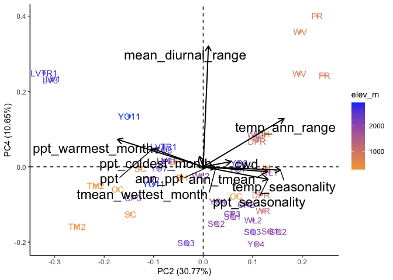<!-- -->


``` r
all_bioclim_flint_avgs_locs.pc_avg <- all_bioclim_flint_avgs_locs.pc %>%
  group_by(parent.pop, elev_m, TimePd) %>%
  summarise(across(.cols=starts_with("PC"), .fns = mean)) %>%
  ungroup() %>% 
  select(-pck)
```

```
## `summarise()` has grouped output by 'parent.pop', 'elev_m'. You can override
## using the `.groups` argument.
```

``` r
#all_bioclim_flint_avgs_locs.pc_avg
```


``` r
all_bioclim_flint_avgs_locs.pc_avg %>% 
  ggplot(aes(x=PC1, y=PC2, shape=TimePd, color=elev_m)) +
  scale_colour_gradient(low = "#F5A540", high = "#0043F0") +
  geom_point() +
  facet_wrap(~TimePd) +
  coord_fixed(ratio = 1.5)
```

<!-- -->

## 2023 - Permanova
See Jenny's github: https://github.com/jrgremer/Seedbanks_drought_deluge  

``` r
all_bioclim_flint_avgs_locs.pc_dist <- all_bioclim_flint_avgs_locs.pc %>% ungroup() %>% select(PC1:PC7)
dist_matrix_grwssn <- dist(all_bioclim_flint_avgs_locs.pc_dist, method = "euclidian") #use a distance function to calculate euclidian distance in PCA space
permanova_results_grwssn <- adonis2(dist_matrix_grwssn ~ TimePd*elev_m*Lat, data = all_bioclim_flint_avgs_locs.pc) #use adonis2 to run the permanova
#rows in data must be in same order as rows in distance matrix 
#by = NULL will assess the overall significance of all terms together

#look at output 
summary(permanova_results_grwssn)
```

```
##        Df          SumOfSqs           R2               F        
##  Min.   : 7.0   Min.   :219.7   Min.   :0.4473   Min.   :6.709  
##  1st Qu.:22.5   1st Qu.:245.6   1st Qu.:0.5000   1st Qu.:6.709  
##  Median :38.0   Median :271.5   Median :0.5527   Median :6.709  
##  Mean   :30.0   Mean   :327.4   Mean   :0.6667   Mean   :6.709  
##  3rd Qu.:41.5   3rd Qu.:381.3   3rd Qu.:0.7764   3rd Qu.:6.709  
##  Max.   :45.0   Max.   :491.1   Max.   :1.0000   Max.   :6.709  
##                                                  NA's   :2      
##      Pr(>F)     
##  Min.   :0.001  
##  1st Qu.:0.001  
##  Median :0.001  
##  Mean   :0.001  
##  3rd Qu.:0.001  
##  Max.   :0.001  
##  NA's   :2
```

``` r
permanova_results_grwssn
```

```
## Permutation test for adonis under reduced model
## Permutation: free
## Number of permutations: 999
## 
## adonis2(formula = dist_matrix_grwssn ~ TimePd * elev_m * Lat, data = all_bioclim_flint_avgs_locs.pc)
##          Df SumOfSqs      R2      F Pr(>F)    
## Model     7   271.46 0.55273 6.7085  0.001 ***
## Residual 38   219.67 0.44727                  
## Total    45   491.13 1.00000                  
## ---
## Signif. codes:  0 '***' 0.001 '**' 0.01 '*' 0.05 '.' 0.1 ' ' 1
```

``` r
permanova_results_grwssn$`Pr(>F)`
```

```
## [1] 0.001    NA    NA
```

``` r
permanova_results_grwssn_terms <- adonis2(dist_matrix_grwssn ~ TimePd*elev_m*Lat, data = all_bioclim_flint_avgs_locs.pc, by = "terms") #by = "terms" will assess significance for each term (sequentially from first to last)
permanova_results_grwssn_terms
```

```
## Permutation test for adonis under reduced model
## Terms added sequentially (first to last)
## Permutation: free
## Number of permutations: 999
## 
## adonis2(formula = dist_matrix_grwssn ~ TimePd * elev_m * Lat, data = all_bioclim_flint_avgs_locs.pc, by = "terms")
##                   Df SumOfSqs      R2       F Pr(>F)    
## TimePd             1    25.33 0.05156  4.3809  0.004 ** 
## elev_m             1   158.95 0.32363 27.4956  0.001 ***
## Lat                1    47.90 0.09753  8.2858  0.001 ***
## TimePd:elev_m      1     7.18 0.01462  1.2425  0.297    
## TimePd:Lat         1     4.44 0.00904  0.7682  0.532    
## elev_m:Lat         1    24.89 0.05067  4.3050  0.003 ** 
## TimePd:elev_m:Lat  1     2.79 0.00567  0.4818  0.750    
## Residual          38   219.67 0.44727                   
## Total             45   491.13 1.00000                   
## ---
## Signif. codes:  0 '***' 0.001 '**' 0.01 '*' 0.05 '.' 0.1 ' ' 1
```

## 2023 - LM on PCs (follow up on permanova)

For each PC fit a model with timepd and parent.pop/elev to test for climate change


``` r
lmer_results_grwssn <- all_bioclim_flint_avgs_locs.pc %>%
  ungroup() %>% 
  select(TimePd, parent.pop, elev_m, Lat, Long, PC1:PC10) %>% 
  pivot_longer(starts_with("PC", ignore.case = FALSE), 
               names_to = "PC", values_to = "value") %>% 
  group_by(PC) %>% 
  nest(data=c(TimePd, parent.pop, elev_m, Lat, Long, value)) %>% 
  mutate(glm=map(data, ~ glm(value ~ TimePd*elev_m*Lat,
                               data=.x)),
         anova = map(glm, ~ broom.mixed::tidy(anova(.x))))

#lmer_results_grwssn
```


``` r
PC_anova <- lmer_results_grwssn %>% select(-data, -glm) %>% unnest(anova) %>%
  select(PC, term, p.value) %>%
  filter(p.value < 0.05) %>%
  arrange(term, p.value)

PC_anova
```

```
## # A tibble: 12 × 3
## # Groups:   PC [7]
##    PC    term           p.value
##    <chr> <chr>            <dbl>
##  1 PC4   Lat           2.08e- 7
##  2 PC3   Lat           3.46e- 3
##  3 PC1   Lat           1.07e- 2
##  4 PC4   TimePd        2.05e- 3
##  5 PC2   TimePd        1.16e- 2
##  6 PC9   TimePd:Lat    2.42e- 2
##  7 PC8   TimePd:elev_m 4.85e- 2
##  8 PC1   elev_m        7.64e-14
##  9 PC3   elev_m        4.01e- 3
## 10 PC9   elev_m:Lat    5.36e- 4
## 11 PC2   elev_m:Lat    4.36e- 3
## 12 PC7   elev_m:Lat    2.36e- 2
```

``` r
lmer_results_grwssn %>% select(-data, -glm) %>% unnest(anova) %>%
  filter(PC=="PC2"| PC=="PC4") #the two PCs with most sig p-values for timepd
```

```
## # A tibble: 16 × 8
## # Groups:   PC [2]
##    PC    term       df deviance df.residual residual.deviance statistic  p.value
##    <chr> <chr>   <int>    <dbl>       <int>             <dbl>     <dbl>    <dbl>
##  1 PC2   NULL       NA  NA               45             152.    NA      NA      
##  2 PC2   TimePd      1  16.8             44             135.     7.04    1.16e-2
##  3 PC2   elev_m      1   8.07            43             127.     3.38    7.39e-2
##  4 PC2   Lat         1   7.31            42             120.     3.06    8.82e-2
##  5 PC2   TimePd…     1   6.11            41             114.     2.56    1.18e-1
##  6 PC2   TimePd…     1   0.975           40             113.     0.409   5.27e-1
##  7 PC2   elev_m…     1  21.9             39              91.1    9.19    4.36e-3
##  8 PC2   TimePd…     1   0.337           38              90.7    0.141   7.09e-1
##  9 PC4   NULL       NA  NA               45              52.7   NA      NA      
## 10 PC4   TimePd      1   6.19            44              46.5   11.0     2.05e-3
## 11 PC4   elev_m      1   0.435           43              46.1    0.771   3.85e-1
## 12 PC4   Lat         1  22.5             42              23.6   39.9     2.08e-7
## 13 PC4   TimePd…     1   0.0136          41              23.5    0.0241  8.77e-1
## 14 PC4   TimePd…     1   1.60            40              21.9    2.83    1.01e-1
## 15 PC4   elev_m…     1   0.319           39              21.6    0.565   4.57e-1
## 16 PC4   TimePd…     1   0.167           38              21.5    0.296   5.89e-1
```

``` r
#mod_test <- glm(PC4 ~ TimePd*elev_m*Lat, data=all_bioclim_flint_avgs_locs.pc)
#summary(mod_test)
#anova(mod_test)
```


``` r
autoplot(all_bioclim_flint_avgs.pc, data = bioclim_flint_grwseason_avgs,
         x=2, y=4,
         colour='elev_m', alpha=0.5,
         label=TRUE, label.label="parent.pop",
         loadings=TRUE, loadings.colour='black', loadings.linewidth = 0.7,
         loadings.label = TRUE, loadings.label.size=6, loadings.label.colour="black", 
         loadings.label.vjust = -0.2, loadings.label.repel=TRUE) +
   scale_colour_gradient(low = "#F5A540", high = "#0043F0") +
  geom_vline(xintercept = 0, linetype="dashed") + geom_hline(yintercept = 0, linetype="dashed") +
  theme_classic()
```

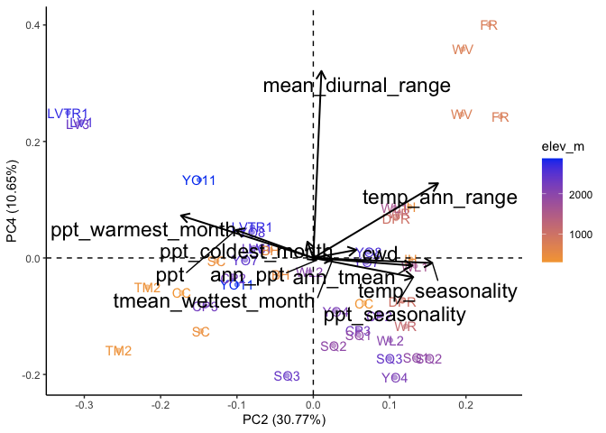<!-- -->

``` r
all_bioclim_flint_avgs_locs.pc_avg %>% 
  mutate(group=str_c(parent.pop,elev_m))  %>%
  ggplot(aes(x=PC2, y=PC4, shape=TimePd, color=elev_m)) +
  scale_colour_gradient(low = "#F5A540", high = "#0043F0") +
  geom_point(size=2, alpha=0.7) +
  geom_text_repel(aes(label = parent.pop)) +
  geom_vline(xintercept = 0, linetype="dashed") + geom_hline(yintercept = 0, linetype="dashed")  +
  geom_path(aes(group=group),arrow = arrow(length=unit(5, "points")), linewidth = .8)
```

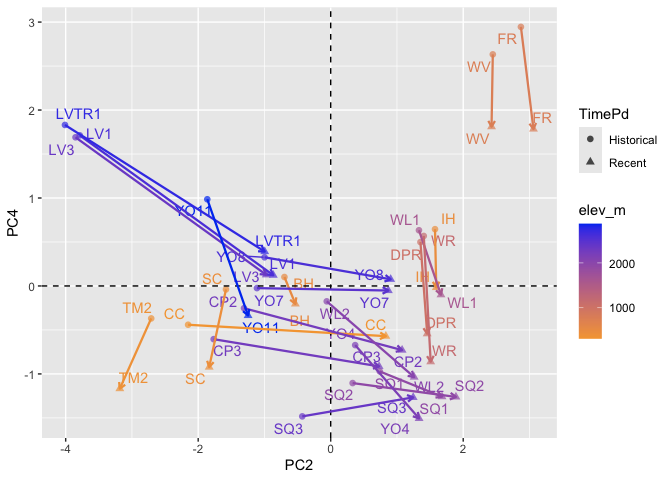<!-- -->

``` r
#high elev climate seems to be shifting to be more similar to low elev 

home_sites_pca <- all_bioclim_flint_avgs_locs.pc_avg %>% 
  mutate(group=str_c(parent.pop,elev_m))  %>%
  ggplot(aes(x=PC2, y=PC4, shape=TimePd, color=elev_m)) +
  scale_colour_gradient(low = "#F5A540", high = "#0043F0") +
  #geom_point(size=2, alpha=0.7) +
  labs(x="PC2 (30.76%)", y="PC4 (10.65%)", color="Elevation (m)") +
  geom_vline(xintercept = 0, linetype="dashed") + geom_hline(yintercept = 0, linetype="dashed") +
  annotate("text", x = -0.06, y= -0.13, label = "WL2", colour = "purple") +
  geom_path(aes(group=group),arrow = arrow(length=unit(5, "points")), linewidth = .8) +
  annotate("text", x = -4.2, y = -4.5, label = "Low Temp \n Seasonality") +
  annotate("text", x = 3.6, y = -4.5, label = "High Temp \n Seasonality") +
  annotate("text", x = -5.23, y = -3.3, label = "Low Diurnal \n Range") +
  annotate("text", x = -5.22, y = 2.5, label = "High Diurnal \n Range") +
  coord_cartesian(ylim = c(-3.5, 3), xlim = c(-4, 3.5), clip = "off") +
  theme_classic() +
  theme(text=element_text(size=28))
home_sites_pca
```

<!-- -->

``` r
#ggsave("../output/Climate/GRWSSN_PC2-PC4.png", width = 7, height = 5.5, units = "in")

#all_bioclim_flint_avgs_locs.pc_avg %>% filter(parent.pop=="WL2")
```

## 2023 Add the Garden to the Final PCA 

``` r
WL2Grdn_pc_prep <- WL2Grdn_flint_bioclim_grwseason %>% select(cwd, ppt, ann_tmean, mean_diurnal_range, temp_seasonality, temp_ann_range, tmean_wettest_month, ann_ppt, ppt_seasonality, ppt_warmest_month, ppt_coldest_month)
#scale(WL2Grdn_pc_prep, all_bioclim_flint_avgs.pc$center, all_bioclim_flint_avgs.pc$scale) %*% all_bioclim_flint_avgs.pc$rotation  #gives same result as below 
WL2Grdn_predicted <- predict(all_bioclim_flint_avgs.pc, newdata = WL2Grdn_pc_prep)

WL2Grdn_pc_prep_2024 <- WL2Grdn_flint_bioclim_2024_grwseason %>% select(cwd, ppt, ann_tmean, mean_diurnal_range, temp_seasonality, temp_ann_range, tmean_wettest_month, ann_ppt, ppt_seasonality, ppt_warmest_month, ppt_coldest_month)
WL2Grdn_2024_predicted <- predict(all_bioclim_flint_avgs.pc, newdata = WL2Grdn_pc_prep_2024)

#str(home_sites_pca) #can add predicted WL2 point to the existing plot's data 
home_sites_pca$data <- rbind(home_sites_pca$data, 
  data.frame(
    parent.pop = "WL2_Garden",
    elev_m = 2020,
    TimePd = c("2023", "2024"),
    PC1 = c(WL2Grdn_predicted[, "PC1"], WL2Grdn_2024_predicted[, "PC1"]),
    PC2 = c(WL2Grdn_predicted[, "PC2"], WL2Grdn_2024_predicted[, "PC2"]),
    PC3 = c(WL2Grdn_predicted[, "PC3"], WL2Grdn_2024_predicted[, "PC3"]),
    PC4 = c(WL2Grdn_predicted[, "PC4"], WL2Grdn_2024_predicted[, "PC4"]),
    PC5 = c(WL2Grdn_predicted[, "PC5"], WL2Grdn_2024_predicted[, "PC5"]),
    PC6 = c(WL2Grdn_predicted[, "PC6"], WL2Grdn_2024_predicted[, "PC6"]),
    PC7 = c(WL2Grdn_predicted[, "PC7"], WL2Grdn_2024_predicted[, "PC7"]),
    PC8 = c(WL2Grdn_predicted[, "PC8"], WL2Grdn_2024_predicted[, "PC8"]),
    PC9 = c(WL2Grdn_predicted[, "PC9"], WL2Grdn_2024_predicted[, "PC9"]),
    PC10 = c(WL2Grdn_predicted[, "PC10"], WL2Grdn_2024_predicted[, "PC10"]),
    PC11 = c(WL2Grdn_predicted[, "PC11"], WL2Grdn_2024_predicted[, "PC11"]),
    group = c("new", "new2")
  )
)

home_sites_pca + 
  geom_point(data=filter(home_sites_pca$data, parent.pop == "WL2_Garden"), size=3, shape = 8, show.legend = FALSE) +
  annotate("text", x = -.6, y= -2.7, label = "WL2 Garden \n 2023", colour = "purple") +
  annotate("text", x = 2.7, y= -2.9, label = "WL2 Garden \n 2024", colour = "purple") 
```

<!-- -->

``` r
#ggsave("../output/Climate/GRWSSN_PC2-PC4_PlusGarden.png", width = 7.4, height = 6, units = "in")
```

## Add the Garden to the PCA with PC1 & PC2

``` r
home_sites_pca2 <- all_bioclim_flint_avgs_locs.pc_avg %>% 
  mutate(group=str_c(parent.pop,elev_m))  %>%
  ggplot(aes(x=PC1, y=PC2, shape=TimePd, color=elev_m)) +
  scale_colour_gradient(low = "#F5A540", high = "#0043F0") +
  #geom_point(size=2, alpha=0.7) +
  labs(y="PC2 (30.76%)", x="PC1 (39.15%)", color="Elevation (m)") +
  geom_vline(xintercept = 0, linetype="dashed") + geom_hline(yintercept = 0, linetype="dashed") +
  annotate("text", x = 0.3, y= -0.18, label = "WL2", colour = "purple") +
  geom_path(aes(group=group),arrow = arrow(length=unit(5, "points")), linewidth = .8) +
  annotate("text", y = -3.4, x = -5.9, label = "Low Temp \n Seasonality") +
  annotate("text", y = 3, x = -5.9, label = "High Temp \n Seasonality") +
  annotate("text", y = -5, x = 3.3, label = "Low Ann \n PPT") +
  annotate("text", y = -5, x = -4.1, label = "High Ann \n PPT") +
  coord_cartesian(ylim = c(-3.9, 3), xlim = c(-4.5, 3.5), clip = "off") +
  theme_classic() +
  theme(text=element_text(size=28))
home_sites_pca2
```

<!-- -->

``` r
#all_bioclim_flint_avgs_locs.pc_avg %>% filter(parent.pop=="WL2")


home_sites_pca2$data <- rbind(home_sites_pca2$data, 
  data.frame(
    parent.pop = "WL2_Garden",
    elev_m = 2020,
    TimePd = c("2023", "2024"),
    PC1 = c(WL2Grdn_predicted[, "PC1"], WL2Grdn_2024_predicted[, "PC1"]),
    PC2 = c(WL2Grdn_predicted[, "PC2"], WL2Grdn_2024_predicted[, "PC2"]),
    PC3 = c(WL2Grdn_predicted[, "PC3"], WL2Grdn_2024_predicted[, "PC3"]),
    PC4 = c(WL2Grdn_predicted[, "PC4"], WL2Grdn_2024_predicted[, "PC4"]),
    PC5 = c(WL2Grdn_predicted[, "PC5"], WL2Grdn_2024_predicted[, "PC5"]),
    PC6 = c(WL2Grdn_predicted[, "PC6"], WL2Grdn_2024_predicted[, "PC6"]),
    PC7 = c(WL2Grdn_predicted[, "PC7"], WL2Grdn_2024_predicted[, "PC7"]),
    PC8 = c(WL2Grdn_predicted[, "PC8"], WL2Grdn_2024_predicted[, "PC8"]),
    PC9 = c(WL2Grdn_predicted[, "PC9"], WL2Grdn_2024_predicted[, "PC9"]),
    PC10 = c(WL2Grdn_predicted[, "PC10"], WL2Grdn_2024_predicted[, "PC10"]),
    PC11 = c(WL2Grdn_predicted[, "PC11"], WL2Grdn_2024_predicted[, "PC11"]),
    group = c("new", "new2")
  )
)

home_sites_pca2 + 
  geom_point(data=filter(home_sites_pca2$data, parent.pop == "WL2_Garden"), size=3, shape = 8, show.legend = FALSE) +
  annotate("text", y = -1.1, x= 0.5, label = "WL2 Garden \n 2023", colour = "purple") +
  annotate("text", y = 2.2, x= 2.8, label = "WL2 Garden \n 2024", colour = "purple") 
```

<!-- -->

``` r
#ggsave("../output/Climate/GRWSSN_PC1-PC2_PlusGarden.png", width = 7.4, height = 6, units = "in")
```


## 2024 Avg across years and months

### Calculate avgs for flint

``` r
flint_grwssn_recent_2024_avgs <- flint_recent_grwseason_2024 %>% 
  group_by(parent.pop, elevation.group, elev_m, Lat, Long) %>% 
  summarise_at(c("cwd",  "pck", "ppt", "tmn", "tmx"), c(mean), na.rm = TRUE) %>% 
  mutate(TimePd = "Recent") 
#flint_grwssn_recent_2024_avgs

flint_grwssn_historical_2024_avgs <- flint_historical_grwseason_2024 %>% 
  group_by(parent.pop, elevation.group, elev_m, Lat, Long) %>% 
  summarise_at(c("cwd", "pck", "ppt", "tmn", "tmx"), c(mean), na.rm = TRUE) %>% 
  mutate(TimePd = "Historical")
#flint_grwssn_historical_2024_avgs

flint_grwssn_avgs_2024 <- bind_rows(flint_grwssn_recent_2024_avgs, flint_grwssn_historical_2024_avgs) #combine into 1 dataframe 
#head(flint_grwssn_avgs_2024)
#tail(flint_grwssn_avgs_2024)
#write_csv(flint_grwssn_avgs_2024, "../output/Climate/grwssn_FlintAvgs_2024.csv")
```

### Calculate avgs for bioclim

``` r
bioclim_grwssn_recent_2024_avgs <- bioclim_recent_grwseason_2024 %>% 
  group_by(parent.pop, elevation.group, elev_m) %>% 
  summarise_at(c("ann_tmean", "mean_diurnal_range", "temp_seasonality", "temp_ann_range",
                 "tmean_wettest_month", "tmean_driest_month", "ann_ppt",
                 "ppt_seasonality","ppt_warmest_month", "ppt_coldest_month"),
               c(mean), na.rm = TRUE) %>% 
  mutate(TimePd = "Recent") 
#bioclim_grwssn_recent_2024_avgs

bioclim_grwssn_historical_2024_avgs <- bioclim_recent_grwseason_2024 %>% 
  group_by(parent.pop, elevation.group, elev_m) %>% 
  summarise_at(c("ann_tmean", "mean_diurnal_range", "temp_seasonality", "temp_ann_range",
                 "tmean_wettest_month", "tmean_driest_month", "ann_ppt",
                 "ppt_seasonality","ppt_warmest_month", "ppt_coldest_month"),
               c(mean), na.rm = TRUE) %>% 
  mutate(TimePd = "Historical") 
#bioclim_grwssn_historical_2024_avgs

bioclim_grwssn_avgs_2024 <- bind_rows(bioclim_grwssn_recent_2024_avgs, bioclim_grwssn_historical_2024_avgs) #combine into 1 dataframe 
#head(bioclim_grwssn_avgs_2024)
#tail(bioclim_grwssn_avgs_2024)
#write_csv(bioclim_grwssn_avgs_2024, "../output/Climate/grwssn_BioClimAvgs_2024.csv")
```

Merge the two 

``` r
bioclim_flint_grwseason_avgs_2024 <- full_join(flint_grwssn_avgs_2024, bioclim_grwssn_avgs_2024) %>% 
  select(TimePd, parent.pop:ppt_coldest_month) %>% 
  select(-pck)
```

```
## Joining with `by = join_by(parent.pop, elevation.group, elev_m, TimePd)`
```

``` r
#head(bioclim_flint_grwseason_avgs_2024)
```

### Correlations - Recent + Historical


``` r
#normalize the data
climate_normalized_bioclim_flint_grwseason_avgs_2024 <- bioclim_flint_grwseason_avgs_2024 %>% ungroup() %>% 
  select(cwd:ppt_coldest_month) %>% scale() #normalize the data so they're all on the same scale
head(climate_normalized_bioclim_flint_grwseason_avgs_2024)
```

```
##             cwd         ppt        tmn        tmx  ann_tmean mean_diurnal_range
## [1,] -0.6348672 -0.17943374  0.5589742  0.5070298  0.3725701          0.2081246
## [2,] -0.7605529  1.20599153  1.4353989  1.0414302  1.1741623         -0.7831240
## [3,]  0.8781842  0.03825301 -0.2501388 -0.6649817 -0.7434441         -0.6560887
## [4,] -0.1809592 -0.07350336 -0.4692867 -0.9645814 -1.0358328         -0.8433893
## [5,] -1.8624218  0.83524738  1.6163778  1.3974794  1.4758091         -0.3436319
## [6,]  1.7555879 -0.70926339  0.9958268  1.7628813  1.3203116          2.3083090
##      temp_seasonality temp_ann_range tmean_wettest_month tmean_driest_month
## [1,]      -1.48074018    -0.23313763           1.3371539          0.6671389
## [2,]      -0.08202352     0.89309583           1.5544551          1.8630661
## [3,]       1.49124724     0.12239623          -0.9856538         -0.3245801
## [4,]       1.55062718     0.09982265          -1.2288464         -0.4846686
## [5,]       0.34159462     0.64045986           0.8031939          1.3948026
## [6,]       0.46725814     2.03607136           0.6517611          1.1109979
##          ann_ppt ppt_seasonality ppt_warmest_month ppt_coldest_month
## [1,] -0.17844438     -1.53548573       -0.06706967       -0.82654577
## [2,]  1.65803949     -1.24898557       -1.16337622        1.11014969
## [3,] -0.33641749      0.11850504        0.08290415        0.05774745
## [4,] -0.40402401     -0.02385961        0.25693612       -0.12625045
## [5,]  1.71358566      0.14897046       -1.33720488        1.88482379
## [6,] -0.07989804      0.22842019       -1.05541947       -0.26929585
```

``` r
cor.norm_2024 = cor(climate_normalized_bioclim_flint_grwseason_avgs_2024) #test correlations among the traits
cor.norm_2024
```

```
##                             cwd           ppt           tmn         tmx
## cwd                  1.00000000 -0.7070352865 -0.3155640396 -0.24074420
## ppt                 -0.70703529  1.0000000000  0.0006836324 -0.03537221
## tmn                 -0.31556404  0.0006836324  1.0000000000  0.90298220
## tmx                 -0.24074420 -0.0353722114  0.9029822010  1.00000000
## ann_tmean           -0.37870945  0.1411148999  0.8934542072  0.92083051
## mean_diurnal_range   0.27989911 -0.1540955253 -0.2604707306  0.13520500
## temp_seasonality     0.41081840 -0.3923737193  0.0352141015  0.06731893
## temp_ann_range       0.16260164 -0.2596321020  0.5292327963  0.68458913
## tmean_wettest_month -0.59144873  0.3694488515  0.7317310484  0.71921391
## tmean_driest_month  -0.50202422  0.3090361302  0.8513608510  0.87676499
## ann_ppt             -0.73494521  0.6359236314  0.6813740668  0.61926953
## ppt_seasonality      0.48237094 -0.3387287598 -0.1568178034 -0.12851313
## ppt_warmest_month    0.05107064  0.1867900134 -0.7392829085 -0.73261133
## ppt_coldest_month   -0.66067335  0.7037754103  0.5126547800  0.47221346
##                       ann_tmean mean_diurnal_range temp_seasonality
## cwd                 -0.37870945         0.27989911     0.4108183980
## ppt                  0.14111490        -0.15409553    -0.3923737193
## tmn                  0.89345421        -0.26047073     0.0352141015
## tmx                  0.92083051         0.13520500     0.0673189308
## ann_tmean            1.00000000        -0.04607483    -0.0503029764
## mean_diurnal_range  -0.04607483         1.00000000     0.0748136276
## temp_seasonality    -0.05030298         0.07481363     1.0000000000
## temp_ann_range       0.57399271         0.34615079     0.6457566546
## tmean_wettest_month  0.83418331        -0.12036837    -0.5114693678
## tmean_driest_month   0.92370269        -0.05603545    -0.0149769304
## ann_ppt              0.68551433        -0.28044490    -0.1725162885
## ppt_seasonality     -0.12668855         0.13378827     0.5947379286
## ppt_warmest_month   -0.74346003         0.09358031    -0.4912981502
## ppt_coldest_month    0.51699007        -0.22801785     0.0006607858
##                     temp_ann_range tmean_wettest_month tmean_driest_month
## cwd                      0.1626016          -0.5914487        -0.50202422
## ppt                     -0.2596321           0.3694489         0.30903613
## tmn                      0.5292328           0.7317310         0.85136085
## tmx                      0.6845891           0.7192139         0.87676499
## ann_tmean                0.5739927           0.8341833         0.92370269
## mean_diurnal_range       0.3461508          -0.1203684        -0.05603545
## temp_seasonality         0.6457567          -0.5114694        -0.01497693
## temp_ann_range           1.0000000           0.1816878         0.59842904
## tmean_wettest_month      0.1816878           1.0000000         0.83794541
## tmean_driest_month       0.5984290           0.8379454         1.00000000
## ann_ppt                  0.2611289           0.7316744         0.82268510
## ppt_seasonality          0.2349034          -0.5692520        -0.31567183
## ppt_warmest_month       -0.8008303          -0.3785967        -0.73357068
## ppt_coldest_month        0.2119698           0.4521772         0.65050471
##                        ann_ppt ppt_seasonality ppt_warmest_month
## cwd                 -0.7349452       0.4823709        0.05107064
## ppt                  0.6359236      -0.3387288        0.18679001
## tmn                  0.6813741      -0.1568178       -0.73928291
## tmx                  0.6192695      -0.1285131       -0.73261133
## ann_tmean            0.6855143      -0.1266886       -0.74346003
## mean_diurnal_range  -0.2804449       0.1337883        0.09358031
## temp_seasonality    -0.1725163       0.5947379       -0.49129815
## temp_ann_range       0.2611289       0.2349034       -0.80083026
## tmean_wettest_month  0.7316744      -0.5692520       -0.37859666
## tmean_driest_month   0.8226851      -0.3156718       -0.73357068
## ann_ppt              1.0000000      -0.4493345       -0.41396360
## ppt_seasonality     -0.4493345       1.0000000       -0.20283529
## ppt_warmest_month   -0.4139636      -0.2028353        1.00000000
## ppt_coldest_month    0.8941732      -0.1306852       -0.35279235
##                     ppt_coldest_month
## cwd                     -0.6606733498
## ppt                      0.7037754103
## tmn                      0.5126547800
## tmx                      0.4722134597
## ann_tmean                0.5169900675
## mean_diurnal_range      -0.2280178523
## temp_seasonality         0.0006607858
## temp_ann_range           0.2119698286
## tmean_wettest_month      0.4521772396
## tmean_driest_month       0.6505047076
## ann_ppt                  0.8941732023
## ppt_seasonality         -0.1306852458
## ppt_warmest_month       -0.3527923456
## ppt_coldest_month        1.0000000000
```

``` r
corrplot(cor.norm_2024)
```

<!-- -->

``` r
#tmn, tmx, tmean_driest_month and ann_tmean all highly correlated (90-98%) - only keep ann_tmean 
```

Recent

``` r
climate_normalized_bioclim_flint_grwseason_avgs_2024_recent <- bioclim_flint_grwseason_avgs_2024 %>% 
  ungroup() %>% 
  filter(TimePd=="Recent") %>% 
  select(tmn:tmean_driest_month, cwd, ppt, ann_ppt:ppt_coldest_month) %>% 
  scale() #normalize the data so they're all on the same scale

cor.norm_2024_recent = cor(climate_normalized_bioclim_flint_grwseason_avgs_2024_recent) #test correlations among the traits
cor.sig_2024_recent <- cor.mtest(climate_normalized_bioclim_flint_grwseason_avgs_2024_recent, method = "pearson")

corrplot(cor.norm_2024_recent, type="upper",
         tl.srt = 45, p.mat = cor.sig_2024_recent$p, 
         sig.level = 0.05, insig="blank")
```

<!-- -->

``` r
#800 x 734
```

Historical

``` r
climate_normalized_bioclim_flint_grwseason_avgs_2024_historic <- bioclim_flint_grwseason_avgs_2024 %>% 
  ungroup() %>% 
  filter(TimePd=="Historical") %>% 
  select(tmn:tmean_driest_month, cwd, ppt, ann_ppt:ppt_coldest_month) %>% 
  scale() #normalize the data so they're all on the same scale

cor.norm_2024_historic = cor(climate_normalized_bioclim_flint_grwseason_avgs_2024_historic) #test correlations among the traits
cor.sig_2024_historic <- cor.mtest(climate_normalized_bioclim_flint_grwseason_avgs_2024_historic, method = "pearson")

corrplot(cor.norm_2024_historic, type="upper",
         tl.srt = 45, p.mat = cor.sig_2024_historic$p, 
         sig.level = 0.05, insig="blank")
```

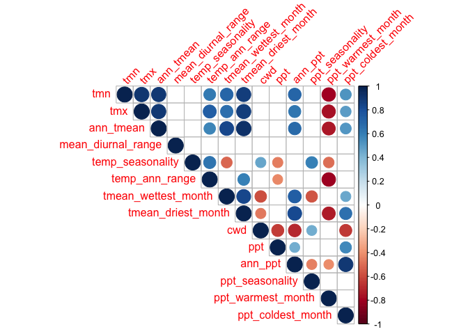<!-- -->

``` r
#800 x 734
```

### PCA - Recent + Historical


``` r
all_bioclim_flint_avgs_2024.pc = prcomp(bioclim_flint_grwseason_avgs_2024[c(7:8, 11:15, 17:20)], scale = TRUE, center = TRUE) 
str(all_bioclim_flint_avgs_2024.pc)
```

```
## List of 5
##  $ sdev    : num [1:11] 2.148 1.744 1.143 0.99 0.714 ...
##  $ rotation: num [1:11, 1:11] 0.383 -0.314 -0.342 0.129 0.167 ...
##   ..- attr(*, "dimnames")=List of 2
##   .. ..$ : chr [1:11] "cwd" "ppt" "ann_tmean" "mean_diurnal_range" ...
##   .. ..$ : chr [1:11] "PC1" "PC2" "PC3" "PC4" ...
##  $ center  : Named num [1:11] 60.82 76.45 12.06 13.13 6.45 ...
##   ..- attr(*, "names")= chr [1:11] "cwd" "ppt" "ann_tmean" "mean_diurnal_range" ...
##  $ scale   : Named num [1:11] 16.426 25.047 2.365 0.999 0.622 ...
##   ..- attr(*, "names")= chr [1:11] "cwd" "ppt" "ann_tmean" "mean_diurnal_range" ...
##  $ x       : num [1:46, 1:11] -1.04 -3.53 1.3 1.21 -3.5 ...
##   ..- attr(*, "dimnames")=List of 2
##   .. ..$ : NULL
##   .. ..$ : chr [1:11] "PC1" "PC2" "PC3" "PC4" ...
##  - attr(*, "class")= chr "prcomp"
```

plot % Variance Explained


``` r
summary(all_bioclim_flint_avgs_2024.pc)
```

```
## Importance of components:
##                           PC1    PC2    PC3     PC4    PC5     PC6     PC7
## Standard deviation     2.1476 1.7436 1.1429 0.99023 0.7144 0.51037 0.38384
## Proportion of Variance 0.4193 0.2764 0.1187 0.08914 0.0464 0.02368 0.01339
## Cumulative Proportion  0.4193 0.6957 0.8144 0.90357 0.9500 0.97365 0.98705
##                            PC8     PC9   PC10    PC11
## Standard deviation     0.28859 0.19540 0.1101 0.09429
## Proportion of Variance 0.00757 0.00347 0.0011 0.00081
## Cumulative Proportion  0.99462 0.99809 0.9992 1.00000
```

``` r
tibble(PC=str_c("PC",str_pad(1:10,2,pad="0")),
       percent_var=all_bioclim_flint_avgs_2024.pc$sdev[1:10]^2/sum(all_bioclim_flint_avgs_2024.pc$sdev^2)*100) %>%
  ggplot(aes(x=PC, y=percent_var)) +
  geom_col() +
  ggtitle("Percent Variance Explained")
```

<!-- -->

Combine PCs with metadata


``` r
all_bioclim_flint_avgs_2024.pc.dat = data.frame(all_bioclim_flint_avgs_2024.pc$x)

all_bioclim_flint_avgs_2024_locs.pc = cbind(bioclim_flint_grwseason_avgs_2024, all_bioclim_flint_avgs_2024.pc.dat)

all_bioclim_flint_avgs_2024_loadings = data.frame(varnames=rownames(all_bioclim_flint_avgs_2024.pc$rotation), all_bioclim_flint_avgs_2024.pc$rotation)
all_bioclim_flint_avgs_2024_loadings #pretty similar to 2023, PC4 a bit different though
```

```
##                                varnames         PC1         PC2         PC3
## cwd                                 cwd  0.38302788  0.16885937  0.14565877
## ppt                                 ppt -0.31373299 -0.23663885 -0.33088064
## ann_tmean                     ann_tmean -0.34188251  0.30369900  0.26142323
## mean_diurnal_range   mean_diurnal_range  0.12942384  0.11650152  0.38992552
## temp_seasonality       temp_seasonality  0.16703796  0.43548136 -0.37828231
## temp_ann_range           temp_ann_range -0.06896479  0.53255162  0.12111934
## tmean_wettest_month tmean_wettest_month -0.39890363  0.01988478  0.40990224
## ann_ppt                         ann_ppt -0.44525504  0.06576420 -0.12348857
## ppt_seasonality         ppt_seasonality  0.24265076  0.28015938 -0.37473299
## ppt_warmest_month     ppt_warmest_month  0.17160124 -0.49611805 -0.02390038
## ppt_coldest_month     ppt_coldest_month -0.37797714  0.08417185 -0.40851535
##                             PC4         PC5         PC6          PC7
## cwd                 -0.07045385 -0.02301529 -0.88204162 -0.044739688
## ppt                  0.37559119 -0.08765175 -0.22445798 -0.723597644
## ann_tmean           -0.10680129 -0.34842750 -0.04002552  0.006392057
## mean_diurnal_range   0.82731875 -0.04295881  0.11783447  0.138784033
## temp_seasonality     0.02662479  0.39298328  0.13256631 -0.146328630
## temp_ann_range       0.19203404  0.26421118 -0.03198425 -0.153176104
## tmean_wettest_month -0.11764759 -0.18047116 -0.06179732 -0.157386560
## ann_ppt              0.03871716  0.18450693 -0.21491499  0.307499751
## ppt_seasonality      0.07818153 -0.75917569  0.08977333  0.045240463
## ppt_warmest_month    0.23530701  0.02283457 -0.13060679  0.216973105
## ppt_coldest_month    0.20903833 -0.02854981 -0.24982520  0.491708555
##                             PC8         PC9        PC10        PC11
## cwd                  0.07314364  0.09695221 -0.02413518  0.05229668
## ppt                  0.03513741  0.01154065  0.10668163  0.02482672
## ann_tmean           -0.32963654  0.32688500  0.60936785 -0.03531007
## mean_diurnal_range   0.17597541  0.19883557 -0.02797367  0.16401758
## temp_seasonality    -0.33050799  0.53541851 -0.17988202  0.13023096
## temp_ann_range      -0.24562911 -0.63036856  0.01441152 -0.32846055
## tmean_wettest_month -0.19325648  0.15876769 -0.72894336 -0.05955450
## ann_ppt             -0.09172056 -0.24126972 -0.01230916  0.73424244
## ppt_seasonality     -0.12784825 -0.21205527 -0.20359259  0.16394490
## ppt_warmest_month   -0.76702022 -0.04872944  0.00181291 -0.11456235
## ppt_coldest_month    0.18382781  0.17111381 -0.10196280 -0.51087428
```


``` r
autoplot(all_bioclim_flint_avgs_2024.pc, data = bioclim_flint_grwseason_avgs_2024,
         colour='elev_m', alpha=0.5,
         label=TRUE, label.label="parent.pop",
         loadings=TRUE, loadings.colour='black', loadings.linewidth = 0.7,
         loadings.label = TRUE, loadings.label.size=6, loadings.label.colour="black", 
         loadings.label.vjust = -0.2, loadings.label.repel=TRUE) +
   scale_colour_gradient(low = "#F5A540", high = "#0043F0") +
  geom_vline(xintercept = 0, linetype="dashed") + geom_hline(yintercept = 0, linetype="dashed") +
  theme_classic()
```

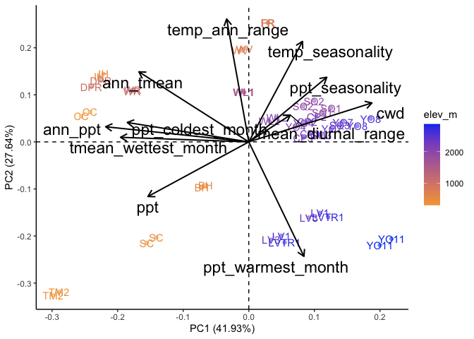<!-- -->


``` r
autoplot(all_bioclim_flint_avgs_2024.pc, data = bioclim_flint_grwseason_avgs_2024,
         x=2, y=4,
         colour='elev_m', alpha=0.5,
         label=TRUE, label.label="parent.pop",
         loadings=TRUE, loadings.colour='black', loadings.linewidth = 0.7,
         loadings.label = TRUE, loadings.label.size=6, loadings.label.colour="black", 
         loadings.label.vjust = -0.2, loadings.label.repel=TRUE) +
   scale_colour_gradient(low = "#F5A540", high = "#0043F0") +
  geom_vline(xintercept = 0, linetype="dashed") + geom_hline(yintercept = 0, linetype="dashed") +
  theme_classic()
```

<!-- -->


``` r
all_bioclim_flint_avgs_2024_locs.pc_avg <- all_bioclim_flint_avgs_2024_locs.pc %>%
  group_by(parent.pop, elev_m, TimePd) %>%
  summarise(across(.cols=starts_with("PC"), .fns = mean)) %>%
  ungroup()
```

```
## `summarise()` has grouped output by 'parent.pop', 'elev_m'. You can override
## using the `.groups` argument.
```

``` r
#all_bioclim_flint_avgs_2024_locs.pc_avg
```


``` r
all_bioclim_flint_avgs_2024_locs.pc_avg %>% 
  ggplot(aes(x=PC1, y=PC2, shape=TimePd, color=elev_m)) +
  scale_colour_gradient(low = "#F5A540", high = "#0043F0") +
  geom_point() +
  facet_wrap(~TimePd) +
  coord_fixed(ratio = 1.5)
```

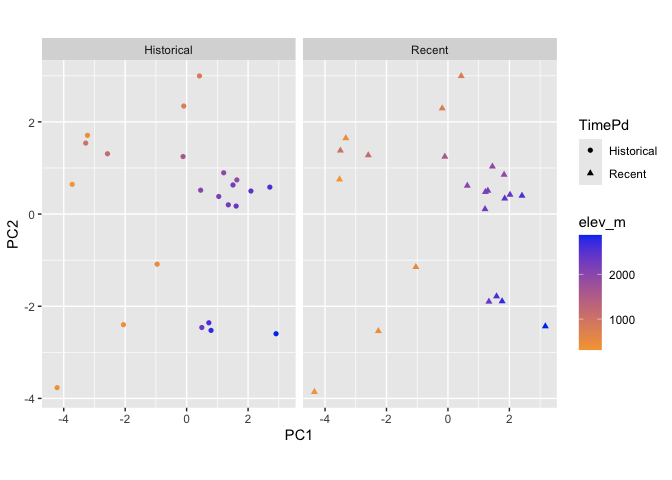<!-- -->

## 2024 - Permanova
See Jenny's github: https://github.com/jrgremer/Seedbanks_drought_deluge  

``` r
all_bioclim_flint_avgs_2024_locs.pc_dist <- all_bioclim_flint_avgs_2024_locs.pc %>% ungroup() %>% select(PC1:PC7)
dist_matrix_grwssn_2024 <- dist(all_bioclim_flint_avgs_2024_locs.pc_dist, method = "euclidian") #use a distance function to calculate euclidian distance in PCA space
permanova_results_grwssn_2024 <- adonis2(dist_matrix_grwssn_2024 ~ TimePd*elev_m*Lat, data = all_bioclim_flint_avgs_2024_locs.pc) #use adonis2 to run the permanova
#rows in data must be in same order as rows in distance matrix 
#by = NULL will assess the overall significance of all terms together

#look at output 
summary(permanova_results_grwssn_2024)
```

```
##        Df          SumOfSqs           R2               F        
##  Min.   : 7.0   Min.   :242.3   Min.   :0.4959   Min.   :5.341  
##  1st Qu.:22.5   1st Qu.:244.3   1st Qu.:0.5000   1st Qu.:5.341  
##  Median :38.0   Median :246.3   Median :0.5041   Median :5.341  
##  Mean   :30.0   Mean   :325.7   Mean   :0.6667   Mean   :5.341  
##  3rd Qu.:41.5   3rd Qu.:367.4   3rd Qu.:0.7520   3rd Qu.:5.341  
##  Max.   :45.0   Max.   :488.6   Max.   :1.0000   Max.   :5.341  
##                                                  NA's   :2      
##      Pr(>F)     
##  Min.   :0.001  
##  1st Qu.:0.001  
##  Median :0.001  
##  Mean   :0.001  
##  3rd Qu.:0.001  
##  Max.   :0.001  
##  NA's   :2
```

``` r
permanova_results_grwssn_2024
```

```
## Permutation test for adonis under reduced model
## Permutation: free
## Number of permutations: 999
## 
## adonis2(formula = dist_matrix_grwssn_2024 ~ TimePd * elev_m * Lat, data = all_bioclim_flint_avgs_2024_locs.pc)
##          Df SumOfSqs      R2      F Pr(>F)    
## Model     7   242.31 0.49595 5.3412  0.001 ***
## Residual 38   246.28 0.50405                  
## Total    45   488.59 1.00000                  
## ---
## Signif. codes:  0 '***' 0.001 '**' 0.01 '*' 0.05 '.' 0.1 ' ' 1
```

``` r
permanova_results_grwssn_2024$`Pr(>F)`
```

```
## [1] 0.001    NA    NA
```

``` r
permanova_results_grwssn_2024_terms <- adonis2(dist_matrix_grwssn_2024 ~ TimePd*elev_m*Lat, data = all_bioclim_flint_avgs_2024_locs.pc, by = "terms") #by = "terms" will assess significance for each term (sequentially from first to last)
permanova_results_grwssn_2024_terms #no significant time period effect!! 
```

```
## Permutation test for adonis under reduced model
## Terms added sequentially (first to last)
## Permutation: free
## Number of permutations: 999
## 
## adonis2(formula = dist_matrix_grwssn_2024 ~ TimePd * elev_m * Lat, data = all_bioclim_flint_avgs_2024_locs.pc, by = "terms")
##                   Df SumOfSqs      R2       F Pr(>F)    
## TimePd             1     0.62 0.00127  0.0959  0.994    
## elev_m             1   168.80 0.34550 26.0464  0.001 ***
## Lat                1    40.00 0.08186  6.1714  0.002 ** 
## TimePd:elev_m      1     1.79 0.00365  0.2755  0.905    
## TimePd:Lat         1     1.56 0.00319  0.2406  0.946    
## elev_m:Lat         1    28.68 0.05871  4.4259  0.004 ** 
## TimePd:elev_m:Lat  1     0.86 0.00176  0.1328  0.983    
## Residual          38   246.28 0.50405                   
## Total             45   488.59 1.00000                   
## ---
## Signif. codes:  0 '***' 0.001 '**' 0.01 '*' 0.05 '.' 0.1 ' ' 1
```

## 2024 - LM on PCs (follow up on permanova)

For each PC fit a model with timepd and parent.pop/elev to test for climate change


``` r
lmer_results_grwssn_2024 <- all_bioclim_flint_avgs_2024_locs.pc %>%
  ungroup() %>% 
  select(TimePd, parent.pop, elev_m, Lat, Long, PC1:PC10) %>% 
  pivot_longer(starts_with("PC", ignore.case = FALSE), 
               names_to = "PC", values_to = "value") %>% 
  group_by(PC) %>% 
  nest(data=c(TimePd, parent.pop, elev_m, Lat, Long, value)) %>% 
  mutate(glm=map(data, ~ glm(value ~ TimePd*elev_m*Lat,
                               data=.x)),
         anova = map(glm, ~ broom.mixed::tidy(anova(.x))))

#lmer_results_grwssn_2024
```


``` r
PC_anova_2024 <- lmer_results_grwssn_2024 %>% select(-data, -glm) %>% unnest(anova) %>%
  select(PC, term, p.value) %>%
  filter(p.value < 0.05) %>%
  arrange(term, p.value)

PC_anova_2024 #no main timeperiod effects
```

```
## # A tibble: 10 × 3
## # Groups:   PC [8]
##    PC    term           p.value
##    <chr> <chr>            <dbl>
##  1 PC4   Lat           2.15e-11
##  2 PC1   Lat           3.16e- 2
##  3 PC9   Lat           3.55e- 2
##  4 PC7   TimePd:Lat    1.13e- 2
##  5 PC7   TimePd:elev_m 8.57e- 3
##  6 PC1   elev_m        5.69e-14
##  7 PC3   elev_m        1.44e- 2
##  8 PC2   elev_m:Lat    4.20e- 3
##  9 PC8   elev_m:Lat    1.78e- 2
## 10 PC10  elev_m:Lat    3.01e- 2
```

``` r
#PC7 has a timepd*lat and timepd*elev effect

lmer_results_grwssn_2024 %>% select(-data, -glm) %>% unnest(anova) %>%
  filter(PC=="PC2"| PC=="PC4") #the two PCs with most sig p-values for timepd
```

```
## # A tibble: 16 × 8
## # Groups:   PC [2]
##    PC    term      df deviance df.residual residual.deviance statistic   p.value
##    <chr> <chr>  <int>    <dbl>       <int>             <dbl>     <dbl>     <dbl>
##  1 PC2   NULL      NA  NA               45             137.    NA      NA       
##  2 PC2   TimePd     1   0.0532          44             137.     0.0195  8.90e- 1
##  3 PC2   elev_m     1   5.15            43             132.     1.89    1.77e- 1
##  4 PC2   Lat        1   2.60            42             129.     0.954   3.35e- 1
##  5 PC2   TimeP…     1   0.136           41             129.     0.0501  8.24e- 1
##  6 PC2   TimeP…     1   0.111           40             129.     0.0408  8.41e- 1
##  7 PC2   elev_…     1  25.3             39             104.     9.28    4.20e- 3
##  8 PC2   TimeP…     1   0.0660          38             103.     0.0242  8.77e- 1
##  9 PC4   NULL      NA  NA               45              44.1   NA      NA       
## 10 PC4   TimePd     1   0.0738          44              44.1    0.213   6.47e- 1
## 11 PC4   elev_m     1   0.0279          43              44.0    0.0805  7.78e- 1
## 12 PC4   Lat        1  30.2             42              13.8   87.4     2.15e-11
## 13 PC4   TimeP…     1   0.261           41              13.5    0.755   3.90e- 1
## 14 PC4   TimeP…     1   0.231           40              13.3    0.666   4.19e- 1
## 15 PC4   elev_…     1   0.0117          39              13.3    0.0339  8.55e- 1
## 16 PC4   TimeP…     1   0.126           38              13.2    0.364   5.50e- 1
```

``` r
#mod_test <- glm(PC4 ~ TimePd*elev_m*Lat, data=all_bioclim_flint_avgs_2024_locs.pc)
#summary(mod_test)
#anova(mod_test)
```


``` r
autoplot(all_bioclim_flint_avgs_2024.pc, data = bioclim_flint_grwseason_avgs_2024,
         x=2, y=4,
         colour='elev_m', alpha=0.5,
         label=TRUE, label.label="parent.pop",
         loadings=TRUE, loadings.colour='black', loadings.linewidth = 0.7,
         loadings.label = TRUE, loadings.label.size=6, loadings.label.colour="black", 
         loadings.label.vjust = -0.2, loadings.label.repel=TRUE) +
   scale_colour_gradient(low = "#F5A540", high = "#0043F0") +
  geom_vline(xintercept = 0, linetype="dashed") + geom_hline(yintercept = 0, linetype="dashed") +
  theme_classic()
```

<!-- -->

``` r
all_bioclim_flint_avgs_2024_locs.pc_avg %>% 
  mutate(group=str_c(parent.pop,elev_m))  %>%
  ggplot(aes(x=PC2, y=PC4, shape=TimePd, color=elev_m)) +
  scale_colour_gradient(low = "#F5A540", high = "#0043F0") +
  geom_point(size=2, alpha=0.7) +
  geom_text_repel(aes(label = parent.pop)) +
  geom_vline(xintercept = 0, linetype="dashed") + geom_hline(yintercept = 0, linetype="dashed")  +
  geom_path(aes(group=group),arrow = arrow(length=unit(5, "points")), linewidth = .8)
```

<!-- -->

``` r
#high elev climate seems to be shifting to be more similar to low elev 

home_sites_pca_2024 <- all_bioclim_flint_avgs_2024_locs.pc_avg %>% 
  mutate(group=str_c(parent.pop,elev_m))  %>%
  ggplot(aes(x=PC2, y=PC4, shape=TimePd, color=elev_m)) +
  scale_colour_gradient(low = "#F5A540", high = "#0043F0") +
  #geom_point(size=2, alpha=0.7) +
  labs(x="PC2 (27.64%)", y="PC4 (8.91%)", color="Elevation (m)") +
  geom_vline(xintercept = 0, linetype="dashed") + geom_hline(yintercept = 0, linetype="dashed") +
  geom_path(aes(group=group),arrow = arrow(length=unit(5, "points")), linewidth = .8) +
  annotate("text", x = -4.2, y = -2.5, label = "Low Temp \n Seasonality") +
  annotate("text", x = 3.6, y = -2.5, label = "High Temp \n Seasonality") +
  annotate("text", x = -5.28, y = -1.5, label = "Low Diurnal \n Range") +
  annotate("text", x = -5.31, y = 2.5, label = "High Diurnal \n Range") +
  coord_cartesian(ylim = c(-3, 3), xlim = c(-4, 3.5), clip = "off") +
  theme_classic() +
  theme(text=element_text(size=28))
home_sites_pca_2024
```

<!-- -->

``` r
#ggsave("../output/Climate/GRWSSN_PC2-PC4_2024.png", width = 7, height = 5.5, units = "in")
```

## 2024 Add the Garden to the Final PCA 

``` r
WL2Grdn_pc_prep_2024 <- WL2Grdn_flint_bioclim_2024_grwseason %>% select(cwd, ppt, ann_tmean, mean_diurnal_range, temp_seasonality, temp_ann_range, tmean_wettest_month, ann_ppt, ppt_seasonality, ppt_warmest_month, ppt_coldest_month)
#scale(WL2Grdn_pc_prep_2024, all_bioclim_flint_avgs_2024.pc$center, all_bioclim_flint_avgs_2024.pc$scale) %*% all_bioclim_flint_avgs_2024.pc$rotation  #gives same result as below 
WL2Grdn_predicted_2024 <- predict(all_bioclim_flint_avgs_2024.pc, newdata = WL2Grdn_pc_prep_2024)
WL2Grdn_predicted_2024
```

```
##           PC1      PC2        PC3       PC4       PC5        PC6        PC7
## [1,] 2.669522 1.493067 -0.3402758 -2.584618 -1.669408 0.07717529 -0.2047608
##             PC8       PC9      PC10        PC11
## [1,] -0.9465917 -0.475255 0.7868724 -0.08319549
```

``` r
#str(home_sites_pca_2024) #can add predicted WL2 point to the existing plot's data 
home_sites_pca_2024$data <- rbind(home_sites_pca_2024$data, 
  data.frame(
    parent.pop = "WL2_Garden",
    elev_m = 2020,
    TimePd = "2024",
    PC1 = WL2Grdn_predicted_2024[, "PC1"],
    PC2 = WL2Grdn_predicted_2024[, "PC2"],
    PC3 = WL2Grdn_predicted_2024[, "PC3"],
    PC4 = WL2Grdn_predicted_2024[, "PC4"],
    PC5 = WL2Grdn_predicted_2024[, "PC5"],
    PC6 = WL2Grdn_predicted_2024[, "PC6"],
    PC7 = WL2Grdn_predicted_2024[, "PC7"],
    PC8 = WL2Grdn_predicted_2024[, "PC8"],
    PC9 = WL2Grdn_predicted_2024[, "PC9"],
    PC10 = WL2Grdn_predicted_2024[, "PC10"],
    PC11 = WL2Grdn_predicted_2024[, "PC11"],
    group = "new"
  )
)

home_sites_pca_2024 + 
  geom_point(data=filter(home_sites_pca_2024$data, parent.pop == "WL2_Garden"), size=3, shape = 8, show.legend = FALSE)
```

<!-- -->

``` r
#ggsave("../output/Climate/GRWSSN_PC2-PC4_PlusGarden_2024.png", width = 7.4, height = 6, units = "in")
```

---

## 2023 Old PCAs

### All years and months included (Flint)

#### Correlations - Flint Recent


``` r
#normalize the data
climate_normalized_all_flint_recent <- flint_recent_grwseason %>% select(cwd, ppt, tmn, tmx) %>% scale() #normalize the data so they're all on the same scale
head(climate_normalized_all_flint_recent)
```

```
##              cwd        ppt         tmn         tmx
## [1,] -0.86251414 -0.1500623 -0.76764081 -0.96602478
## [2,] -0.79994164 -0.2881219 -0.63215078 -0.54476885
## [3,] -0.52287391  0.2133010 -0.61807389 -0.74153103
## [4,]  0.02169808 -0.5677457 -0.09195026  0.03231214
## [5,] -0.05453654 -0.1164927  0.12800108  0.32679513
## [6,] -1.13329730 -0.3165270  0.65412471  0.71503726
```

``` r
cor.norm = cor(climate_normalized_all_flint_recent) #test correlations among the traits
corrplot(cor.norm)
```

<!-- -->

``` r
#tmn and tmx highly correlated (95%), consider removing one 
```

#### PCA - Flint Recent


``` r
all_flint_recent.pc = prcomp(flint_recent_grwseason[c(9, 11:12)], scale = TRUE, center = TRUE)

str(all_flint_recent.pc)
```

```
## List of 5
##  $ sdev    : num [1:3] 1.441 0.71 0.648
##  $ rotation: num [1:3, 1:3] 0.591 -0.574 0.567 -0.1 0.645 ...
##   ..- attr(*, "dimnames")=List of 2
##   .. ..$ : chr [1:3] "cwd" "ppt" "tmn"
##   .. ..$ : chr [1:3] "PC1" "PC2" "PC3"
##  $ center  : Named num [1:3] 60.58 75.6 5.88
##   ..- attr(*, "names")= chr [1:3] "cwd" "ppt" "tmn"
##  $ scale   : Named num [1:3] 36.6 108.43 5.68
##   ..- attr(*, "names")= chr [1:3] "cwd" "ppt" "tmn"
##  $ x       : num [1:4980, 1:3] -0.859 -0.666 -0.782 0.286 0.107 ...
##   ..- attr(*, "dimnames")=List of 2
##   .. ..$ : NULL
##   .. ..$ : chr [1:3] "PC1" "PC2" "PC3"
##  - attr(*, "class")= chr "prcomp"
```

plot % Variance Explained


``` r
summary(all_flint_recent.pc)
```

```
## Importance of components:
##                           PC1    PC2    PC3
## Standard deviation     1.4409 0.7100 0.6479
## Proportion of Variance 0.6921 0.1680 0.1399
## Cumulative Proportion  0.6921 0.8601 1.0000
```

``` r
tibble(PC=str_c("PC",str_pad(1:3,2,pad="0")),
       percent_var=all_flint_recent.pc$sdev[1:3]^2/sum(all_flint_recent.pc$sdev^2)*100) %>%
  ggplot(aes(x=PC, y=percent_var)) +
  geom_col() +
  ggtitle("Percent Variance Explained")
```

<!-- -->

Combine PCs with metadata


``` r
all_flint_recent.pc.dat = data.frame(all_flint_recent.pc$x)

all_flint_recent_locs.pc = cbind(flint_recent_grwseason, all_flint_recent.pc.dat)

all_flint_recent_loadings = data.frame(varnames=rownames(all_flint_recent.pc$rotation), all_flint_recent.pc$rotation)
all_flint_recent_loadings
```

```
##     varnames        PC1        PC2        PC3
## cwd      cwd  0.5914188 -0.1002271  0.8001115
## ppt      ppt -0.5736978  0.6449753  0.5048542
## tmn      tmn  0.5666522  0.7576024 -0.3239504
```


``` r
autoplot(all_flint_recent.pc, data = flint_recent_grwseason,
         colour='elev_m', alpha=0.5,
         loadings=TRUE, loadings.colour='black', loadings.linewidth = 0.7,
         loadings.label = TRUE, loadings.label.size=8, loadings.label.colour="black", loadings.label.vjust = -0.2) +
   scale_colour_gradient(low = "#F5A540", high = "#0043F0") +
  geom_vline(xintercept = 0, linetype="dashed") + geom_hline(yintercept = 0, linetype="dashed") +
  theme_classic()
```

<!-- -->

``` r
#for plot customizations see: ?ggbiplot
```

PCs 1 and 3


``` r
autoplot(all_flint_recent.pc, data = flint_recent_grwseason,
         x=1, y=3,
         colour='elev_m', alpha=0.5,
         loadings=TRUE, loadings.colour='black', loadings.linewidth = 0.7,
         loadings.label = TRUE, loadings.label.size=8, loadings.label.colour="black", loadings.label.vjust = -0.2) +
   scale_colour_gradient(low = "#F5A540", high = "#0043F0") +
  geom_vline(xintercept = 0, linetype="dashed") + geom_hline(yintercept = 0, linetype="dashed") +
  theme_classic()
```

<!-- -->

#### Correlations - Flint Historical


``` r
#normalize the data
climate_normalized_all_flint_historical <- flint_historical_grwseason %>% select(cwd, ppt, tmn, tmx) %>% scale() #normalize the data so they're all on the same scale
head(climate_normalized_all_flint_historical)
```

```
##              cwd         ppt         tmn        tmx
## [1,] -0.51979441  0.37680686 -0.29541143 -0.4545244
## [2,] -0.87681447  1.28117671 -0.07285286 -0.7038260
## [3,] -0.87126343 -0.12383791 -0.77636426 -0.9666766
## [4,] -0.51336688 -0.70526437 -0.88198528 -0.4531695
## [5,] -0.06081035 -0.05213384 -0.54060307 -0.3827147
## [6,]  0.36136149 -0.46310268 -0.11623292  0.2120864
```

``` r
cor.norm = cor(climate_normalized_all_flint_historical) #test correlations among the traits
corrplot(cor.norm)
```

<!-- -->

``` r
#tmn and tmx highly correlated, consider removing one 
```

#### PCA - Flint Historical


``` r
all_flint_historical.pc = prcomp(flint_historical_grwseason[c(9, 11:12)], scale = TRUE, center = TRUE)

str(all_flint_historical.pc)
```

```
## List of 5
##  $ sdev    : num [1:3] 1.419 0.721 0.682
##  $ rotation: num [1:3, 1:3] 0.583 -0.582 0.567 -0.369 0.431 ...
##   ..- attr(*, "dimnames")=List of 2
##   .. ..$ : chr [1:3] "cwd" "ppt" "tmn"
##   .. ..$ : chr [1:3] "PC1" "PC2" "PC3"
##  $ center  : Named num [1:3] 57.95 79.27 4.64
##   ..- attr(*, "names")= chr [1:3] "cwd" "ppt" "tmn"
##  $ scale   : Named num [1:3] 34.2 109.1 5.3
##   ..- attr(*, "names")= chr [1:3] "cwd" "ppt" "tmn"
##  $ x       : num [1:4620, 1:3] -0.69 -1.298 -0.876 -0.389 -0.311 ...
##   ..- attr(*, "dimnames")=List of 2
##   .. ..$ : NULL
##   .. ..$ : chr [1:3] "PC1" "PC2" "PC3"
##  - attr(*, "class")= chr "prcomp"
```

plot % Variance Explained


``` r
summary(all_flint_historical.pc)
```

```
## Importance of components:
##                           PC1    PC2    PC3
## Standard deviation     1.4194 0.7213 0.6819
## Proportion of Variance 0.6716 0.1734 0.1550
## Cumulative Proportion  0.6716 0.8450 1.0000
```

``` r
tibble(PC=str_c("PC",str_pad(1:3,2,pad="0")),
       percent_var=all_flint_historical.pc$sdev[1:3]^2/sum(all_flint_historical.pc$sdev^2)*100) %>%
  ggplot(aes(x=PC, y=percent_var)) +
  geom_col() +
  ggtitle("Percent Variance Explained")
```

<!-- -->

Combine PCs with metadata


``` r
all_flint_historical.pc.dat = data.frame(all_flint_historical.pc$x)

all_flint_historical_locs.pc = cbind(flint_historical_grwseason, all_flint_historical.pc.dat)

all_flint_historical_loadings = data.frame(varnames=rownames(all_flint_historical.pc$rotation), all_flint_historical.pc$rotation)
all_flint_historical_loadings
```

```
##     varnames        PC1        PC2         PC3
## cwd      cwd  0.5834031 -0.3693248 -0.72335326
## ppt      ppt -0.5818847  0.4312739 -0.68950201
## tmn      tmn  0.5666136  0.8231658  0.03670208
```


``` r
autoplot(all_flint_historical.pc, data = flint_historical_grwseason,
         colour='elev_m', alpha=0.5,
         loadings=TRUE, loadings.colour='black', loadings.linewidth = 0.7,
         loadings.label = TRUE, loadings.label.size=8, loadings.label.colour="black", loadings.label.vjust = -0.2) +
   scale_colour_gradient(low = "#F5A540", high = "#0043F0") +
  geom_vline(xintercept = 0, linetype="dashed") + geom_hline(yintercept = 0, linetype="dashed") +
  theme_classic()
```

<!-- -->

PCs 1 and 3


``` r
autoplot(all_flint_historical.pc, data = flint_historical_grwseason,
         x=1, y=3,
         colour='elev_m', alpha=0.5,
         loadings=TRUE, loadings.colour='black', loadings.linewidth = 0.7,
         loadings.label = TRUE, loadings.label.size=8, loadings.label.colour="black", loadings.label.vjust = -0.2) +
   scale_colour_gradient(low = "#F5A540", high = "#0043F0") +
  geom_vline(xintercept = 0, linetype="dashed") + geom_hline(yintercept = 0, linetype="dashed") +
  theme_classic()
```

<!-- -->

### All years included (bioclim)

#### Correlations - bioclim Recent


``` r
#normalize the data
climate_normalized_all_bioclim_recent <- bioclim_recent_grwseason %>% select(ann_tmean:ppt_coldest_month) %>% scale() #normalize the data so they're all on the same scale
head(climate_normalized_all_bioclim_recent)
```

```
##       ann_tmean mean_diurnal_range temp_seasonality temp_ann_range    ann_ppt
## [1,]  0.2761737          0.6138628       -1.0023399      0.3211031 -0.6686580
## [2,]  0.1726151         -1.1536434       -2.8805248     -2.1893221  0.8644685
## [3,]  0.5581316         -0.1385138       -1.5496956     -0.7530692  0.5970773
## [4,]  0.6144072          0.5212626       -0.6889491     -0.5036360 -0.4335098
## [5,] -0.4226294         -1.3041187       -2.4294195     -1.1754965  0.9673067
## [6,] -0.1403814          0.6809979       -1.6095230     -0.5398440 -0.5508902
##      ppt_seasonality tmean_wettest_month tmean_driest_month ppt_warmest_month
## [1,]      -1.7110673           0.8149577          0.8620499       -0.52448175
## [2,]      -1.1689020           1.0816768          0.3661528        1.48792262
## [3,]      -0.7061789           1.0555976          0.8936812        0.20546501
## [4,]       2.3786780           0.9026787          0.5783886       -0.36461375
## [5,]      -1.5803150           0.7888785          0.2365666        2.67727029
## [6,]      -0.8224144           0.8019181         -1.9357891       -0.05541849
##      ppt_coldest_month
## [1,]       -1.08795478
## [2,]        0.17223809
## [3,]        0.57208939
## [4,]        0.49161263
## [5,]        0.04540278
## [6,]       -0.90709311
```

``` r
cor.norm = cor(climate_normalized_all_bioclim_recent) #test correlations among the traits
corrplot(cor.norm)
```

<!-- -->

#### PCA - bioclim Recent


``` r
all_bioclim_recent.pc = prcomp(bioclim_recent_grwseason[c(5:14)], scale = TRUE, center = TRUE) 

str(all_bioclim_recent.pc)
```

```
## List of 5
##  $ sdev    : num [1:10] 1.721 1.521 1.35 0.961 0.894 ...
##  $ rotation: num [1:10, 1:10] -0.4729 0.0836 -0.0875 -0.2766 -0.4374 ...
##   ..- attr(*, "dimnames")=List of 2
##   .. ..$ : chr [1:10] "ann_tmean" "mean_diurnal_range" "temp_seasonality" "temp_ann_range" ...
##   .. ..$ : chr [1:10] "PC1" "PC2" "PC3" "PC4" ...
##  $ center  : Named num [1:10] 12 13.2 6.48 29.8 545.65 ...
##   ..- attr(*, "names")= chr [1:10] "ann_tmean" "mean_diurnal_range" "temp_seasonality" "temp_ann_range" ...
##  $ scale   : Named num [1:10] 2.462 1.234 0.906 2.486 335.576 ...
##   ..- attr(*, "names")= chr [1:10] "ann_tmean" "mean_diurnal_range" "temp_seasonality" "temp_ann_range" ...
##  $ x       : num [1:690, 1:10] -0.152 0.235 -1.008 -0.693 0.644 ...
##   ..- attr(*, "dimnames")=List of 2
##   .. ..$ : NULL
##   .. ..$ : chr [1:10] "PC1" "PC2" "PC3" "PC4" ...
##  - attr(*, "class")= chr "prcomp"
```

plot % Variance Explained


``` r
summary(all_bioclim_recent.pc)
```

```
## Importance of components:
##                           PC1    PC2    PC3    PC4     PC5     PC6     PC7
## Standard deviation     1.7209 1.5213 1.3502 0.9612 0.89351 0.74108 0.54910
## Proportion of Variance 0.2962 0.2314 0.1823 0.0924 0.07984 0.05492 0.03015
## Cumulative Proportion  0.2962 0.5276 0.7099 0.8023 0.88212 0.93704 0.96719
##                            PC8     PC9    PC10
## Standard deviation     0.43075 0.31743 0.20436
## Proportion of Variance 0.01855 0.01008 0.00418
## Cumulative Proportion  0.98575 0.99582 1.00000
```

``` r
tibble(PC=str_c("PC",str_pad(1:10,2,pad="0")),
       percent_var=all_bioclim_recent.pc$sdev[1:10]^2/sum(all_bioclim_recent.pc$sdev^2)*100) %>%
  ggplot(aes(x=PC, y=percent_var)) +
  geom_col() +
  ggtitle("Percent Variance Explained")
```

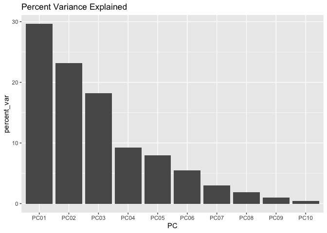<!-- -->

Combine PCs with metadata


``` r
all_bioclim_recent.pc.dat = data.frame(all_bioclim_recent.pc$x)

all_bioclim_recent_locs.pc = cbind(bioclim_recent_grwseason, all_bioclim_recent.pc.dat)

all_bioclim_recent_loadings = data.frame(varnames=rownames(all_bioclim_recent.pc$rotation), all_bioclim_recent.pc$rotation)
all_bioclim_recent_loadings
```

```
##                                varnames         PC1         PC2         PC3
## ann_tmean                     ann_tmean -0.47294969 -0.10769683 -0.18695274
## mean_diurnal_range   mean_diurnal_range  0.08355263  0.20062996 -0.39175403
## temp_seasonality       temp_seasonality -0.08752383  0.56123542 -0.01918244
## temp_ann_range           temp_ann_range -0.27663379  0.42980564 -0.32891011
## ann_ppt                         ann_ppt -0.43739126 -0.11375540  0.38785094
## ppt_seasonality         ppt_seasonality -0.02957250  0.41182770  0.28153119
## tmean_wettest_month tmean_wettest_month -0.23554729 -0.47610737 -0.26206924
## tmean_driest_month   tmean_driest_month -0.50922379 -0.05061960 -0.15030124
## ppt_warmest_month     ppt_warmest_month  0.26624536 -0.16681235  0.27372074
## ppt_coldest_month     ppt_coldest_month -0.32754730  0.09392366  0.55420724
##                              PC4         PC5          PC6         PC7
## ann_tmean            0.198121730  0.03884254  0.499322651 -0.06481732
## mean_diurnal_range   0.703035880 -0.26210066 -0.399345532  0.00351096
## temp_seasonality    -0.382382171 -0.20271266  0.156805591  0.29366880
## temp_ann_range      -0.097739404 -0.32267517  0.038230219  0.15221920
## ann_ppt             -0.009604171 -0.22563951 -0.321755149  0.11507947
## ppt_seasonality      0.470351467  0.43104495  0.404100954  0.03129445
## tmean_wettest_month  0.107799504  0.02619142  0.154677299  0.64333594
## tmean_driest_month  -0.061114330 -0.05107695 -0.002917302 -0.64372169
## ppt_warmest_month    0.175169026 -0.73458756  0.472222104 -0.11843381
## ppt_coldest_month    0.208222454 -0.07039990 -0.226714012  0.17281896
##                             PC8         PC9        PC10
## ann_tmean           -0.57567289  0.30520244  0.10457290
## mean_diurnal_range   0.02019280  0.26085679 -0.09162947
## temp_seasonality     0.20088565  0.56155529 -0.15214835
## temp_ann_range      -0.11009264 -0.67103872  0.17274594
## ann_ppt             -0.22368833 -0.09482031 -0.64692952
## ppt_seasonality      0.22692706 -0.21774610 -0.28292608
## tmean_wettest_month  0.44335953 -0.03483613 -0.03556411
## tmean_driest_month   0.54066586  0.04342030 -0.02456608
## ppt_warmest_month    0.12606652 -0.05016327 -0.02513013
## ppt_coldest_month    0.09698029  0.10558605  0.65315655
```


``` r
autoplot(all_bioclim_recent.pc, data = bioclim_recent_grwseason,
         colour='elev_m', alpha=0.5,
         loadings=TRUE, loadings.colour='black', loadings.linewidth = 0.7,
         loadings.label = TRUE, loadings.label.size=6, loadings.label.colour="black", 
         loadings.label.vjust = -0.2, loadings.label.repel=TRUE) +
   scale_colour_gradient(low = "#F5A540", high = "#0043F0") +
  geom_vline(xintercept = 0, linetype="dashed") + geom_hline(yintercept = 0, linetype="dashed") +
  theme_classic()
```

<!-- -->

PCs 3 and 4


``` r
autoplot(all_bioclim_recent.pc, data = bioclim_recent_grwseason,
         x=3, y=4,
         colour='elev_m', alpha=0.5,
         loadings=TRUE, loadings.colour='black', loadings.linewidth = 0.7,
         loadings.label = TRUE, loadings.label.size=6, loadings.label.colour="black", 
         loadings.label.vjust = -0.2, loadings.label.repel=TRUE) +
   scale_colour_gradient(low = "#F5A540", high = "#0043F0") +
  geom_vline(xintercept = 0, linetype="dashed") + geom_hline(yintercept = 0, linetype="dashed") +
  theme_classic()
```

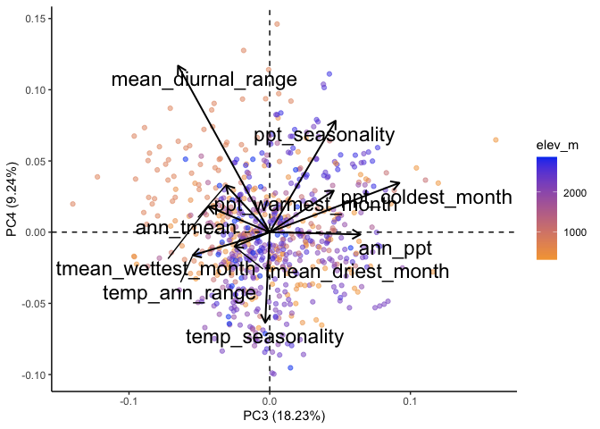<!-- -->

PCs 4 and 5


``` r
autoplot(all_bioclim_recent.pc, data = bioclim_recent_grwseason,
         x=4, y=5,
         colour='elev_m', alpha=0.5,
         loadings=TRUE, loadings.colour='black', loadings.linewidth = 0.7,
         loadings.label = TRUE, loadings.label.size=6, loadings.label.colour="black", 
         loadings.label.vjust = -0.2, loadings.label.repel=TRUE) +
   scale_colour_gradient(low = "#F5A540", high = "#0043F0") +
  geom_vline(xintercept = 0, linetype="dashed") + geom_hline(yintercept = 0, linetype="dashed") +
  theme_classic()
```

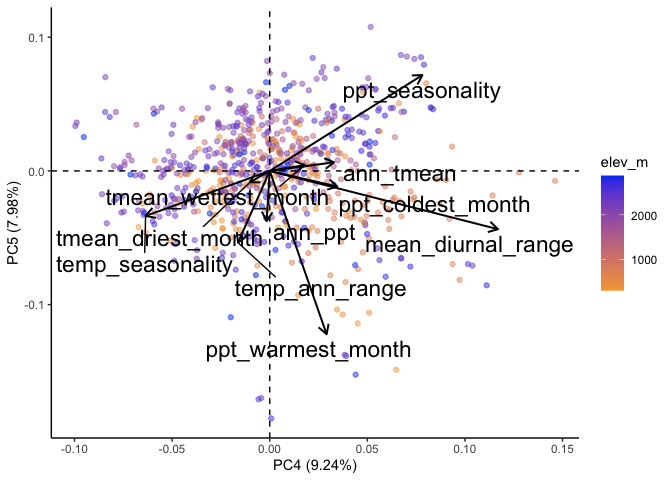<!-- -->

#### Correlations - bioclim Historical


``` r
#normalize the data
climate_normalized_all_bioclim_historical <- bioclim_historical_grwseason %>% select(ann_tmean:ppt_coldest_month) %>% scale() #normalize the data so they're all on the same scale
head(climate_normalized_all_bioclim_historical)
```

```
##        ann_tmean mean_diurnal_range temp_seasonality temp_ann_range     ann_ppt
## [1,] 0.004943863         0.08496148       -1.3986162     0.06319998  0.05517251
## [2,] 0.088110769        -0.33804436       -1.6594862    -0.55943285  0.14087650
## [3,] 0.562453554         0.41853691       -0.2024013     0.65199407 -0.53185276
## [4,] 0.001805490        -0.24950825       -1.0257704     0.19517107  0.38003146
## [5,] 0.450592945         0.39081349       -0.5120826     1.26109141 -0.24422639
## [6,] 0.236511017        -0.15202911       -1.1052001    -0.85721378  0.94709053
##      ppt_seasonality tmean_wettest_month tmean_driest_month ppt_warmest_month
## [1,]     -0.39890083           0.8766686         -1.7026494       -0.01293049
## [2,]     -0.63479745           1.4648974          0.5239790       -0.50592456
## [3,]     -0.02319313           0.4300906          1.1153033       -0.48463092
## [4,]     -1.09093643           0.7025789          0.0762761        0.29073534
## [5,]     -1.26741830           0.2754643          1.3242973       -0.50592456
## [6,]     -0.33998990           0.4311719          0.3516332       -0.27910099
##      ppt_coldest_month
## [1,]        -0.1570492
## [2,]        -0.2029876
## [3,]        -0.6296645
## [4,]        -0.2734897
## [5,]        -0.7154342
## [6,]         0.5339937
```

``` r
cor.norm = cor(climate_normalized_all_bioclim_historical) #test correlations among the traits
corrplot(cor.norm)
```

<!-- -->

#### PCA - bioclim Historical


``` r
all_bioclim_historical.pc = prcomp(bioclim_historical_grwseason[c(5:14)], scale = TRUE, center = TRUE) 

str(all_bioclim_historical.pc)
```

```
## List of 5
##  $ sdev    : num [1:10] 1.749 1.412 1.352 0.989 0.932 ...
##  $ rotation: num [1:10, 1:10] -0.4563 -0.0359 -0.3388 -0.4612 -0.2615 ...
##   ..- attr(*, "dimnames")=List of 2
##   .. ..$ : chr [1:10] "ann_tmean" "mean_diurnal_range" "temp_seasonality" "temp_ann_range" ...
##   .. ..$ : chr [1:10] "PC1" "PC2" "PC3" "PC4" ...
##  $ center  : Named num [1:10] 10.97 13.96 6.02 29.28 530.74 ...
##   ..- attr(*, "names")= chr [1:10] "ann_tmean" "mean_diurnal_range" "temp_seasonality" "temp_ann_range" ...
##  $ scale   : Named num [1:10] 2.788 1.398 0.929 2.955 318.538 ...
##   ..- attr(*, "names")= chr [1:10] "ann_tmean" "mean_diurnal_range" "temp_seasonality" "temp_ann_range" ...
##  $ x       : num [1:690, 1:10] 1.218 0.314 -0.978 0.365 -1.026 ...
##   ..- attr(*, "dimnames")=List of 2
##   .. ..$ : NULL
##   .. ..$ : chr [1:10] "PC1" "PC2" "PC3" "PC4" ...
##  - attr(*, "class")= chr "prcomp"
```

plot % Variance Explained


``` r
summary(all_bioclim_historical.pc)
```

```
## Importance of components:
##                           PC1    PC2    PC3     PC4     PC5     PC6     PC7
## Standard deviation     1.7495 1.4116 1.3523 0.98939 0.93170 0.78260 0.57330
## Proportion of Variance 0.3061 0.1993 0.1829 0.09789 0.08681 0.06125 0.03287
## Cumulative Proportion  0.3061 0.5053 0.6882 0.78608 0.87289 0.93413 0.96700
##                            PC8     PC9    PC10
## Standard deviation     0.40079 0.32781 0.24884
## Proportion of Variance 0.01606 0.01075 0.00619
## Cumulative Proportion  0.98306 0.99381 1.00000
```

``` r
tibble(PC=str_c("PC",str_pad(1:10,2,pad="0")),
       percent_var=all_bioclim_historical.pc$sdev[1:10]^2/sum(all_bioclim_historical.pc$sdev^2)*100) %>%
  ggplot(aes(x=PC, y=percent_var)) +
  geom_col() +
  ggtitle("Percent Variance Explained")
```

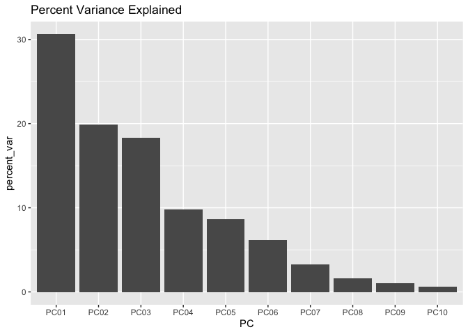<!-- -->

Combine PCs with metadata


``` r
all_bioclim_historical.pc.dat = data.frame(all_bioclim_historical.pc$x)

all_bioclim_historical_locs.pc = cbind(bioclim_historical_grwseason, all_bioclim_historical.pc.dat)

all_bioclim_historical_loadings = data.frame(varnames=rownames(all_bioclim_historical.pc$rotation), all_bioclim_historical.pc$rotation)
all_bioclim_historical_loadings
```

```
##                                varnames         PC1         PC2        PC3
## ann_tmean                     ann_tmean -0.45629135  0.23710220 -0.1730209
## mean_diurnal_range   mean_diurnal_range -0.03589931  0.20759188  0.3758794
## temp_seasonality       temp_seasonality -0.33883556 -0.21787815  0.3895847
## temp_ann_range           temp_ann_range -0.46120137  0.09915378  0.2911962
## ann_ppt                         ann_ppt -0.26150039 -0.36316478 -0.4703598
## ppt_seasonality         ppt_seasonality -0.17766595 -0.35032818  0.2834721
## tmean_wettest_month tmean_wettest_month -0.13189421  0.45294850 -0.4112170
## tmean_driest_month   tmean_driest_month -0.47786757  0.14056739 -0.1880886
## ppt_warmest_month     ppt_warmest_month  0.29109467 -0.16326031 -0.1921435
## ppt_coldest_month     ppt_coldest_month -0.18043268 -0.58068222 -0.2218475
##                             PC4         PC5         PC6          PC7
## ann_tmean            0.12434285 -0.03245174  0.40551041 -0.156410516
## mean_diurnal_range   0.53489661  0.60658285 -0.25765421 -0.096763322
## temp_seasonality    -0.43409344  0.03307222  0.12688949  0.344888005
## temp_ann_range      -0.16920098  0.26617964 -0.04672939  0.288299147
## ann_ppt             -0.01975146  0.20633185 -0.29116405  0.087176266
## ppt_seasonality      0.53514726 -0.32790971  0.44845408 -0.022024384
## tmean_wettest_month  0.27381442 -0.05439636  0.10431513  0.610768181
## tmean_driest_month  -0.14253241  0.07018660  0.01233685 -0.609538251
## ppt_warmest_month   -0.13791284  0.62464646  0.65208778  0.008220436
## ppt_coldest_month    0.28333001  0.10436874 -0.16956167  0.106683996
##                             PC8         PC9         PC10
## ann_tmean            0.58793938 -0.36611183  0.143236626
## mean_diurnal_range  -0.05985265 -0.25779750 -0.120348170
## temp_seasonality    -0.26628343 -0.52867158 -0.104705626
## temp_ann_range       0.22139721  0.66023638  0.151516214
## ann_ppt              0.20466132  0.00912860 -0.633389142
## ppt_seasonality     -0.13934819  0.23220143 -0.310659997
## tmean_wettest_month -0.38221070 -0.01468383 -0.013739820
## tmean_driest_month  -0.55382736  0.11211205  0.016777639
## ppt_warmest_month   -0.08749058  0.09769600 -0.001591372
## ppt_coldest_month   -0.09514630 -0.08812938  0.657962699
```


``` r
autoplot(all_bioclim_historical.pc, data = bioclim_historical_grwseason,
         colour='elev_m', alpha=0.5,
         loadings=TRUE, loadings.colour='black', loadings.linewidth = 0.7,
         loadings.label = TRUE, loadings.label.size=6, loadings.label.colour="black", 
         loadings.label.vjust = -0.2, loadings.label.repel=TRUE) +
   scale_colour_gradient(low = "#F5A540", high = "#0043F0") +
  geom_vline(xintercept = 0, linetype="dashed") + geom_hline(yintercept = 0, linetype="dashed") +
  theme_classic()
```

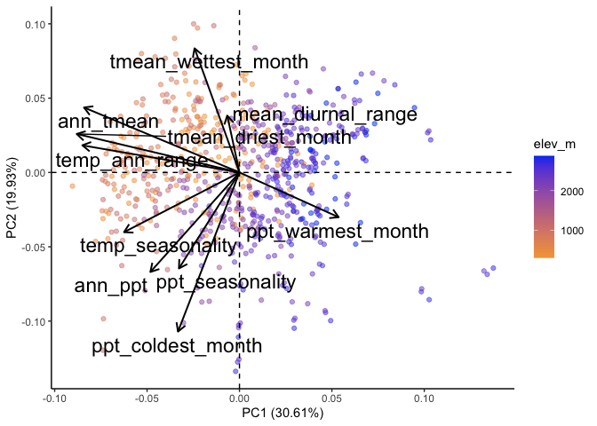<!-- -->

PCs 3 and 4


``` r
autoplot(all_bioclim_historical.pc, data = bioclim_historical_grwseason,
         x=3, y=4,
         colour='elev_m', alpha=0.5,
         loadings=TRUE, loadings.colour='black', loadings.linewidth = 0.7,
         loadings.label = TRUE, loadings.label.size=6, loadings.label.colour="black", 
         loadings.label.vjust = -0.2, loadings.label.repel=TRUE) +
   scale_colour_gradient(low = "#F5A540", high = "#0043F0") +
  geom_vline(xintercept = 0, linetype="dashed") + geom_hline(yintercept = 0, linetype="dashed") +
  theme_classic()
```

<!-- -->

PCs 4 and 5


``` r
autoplot(all_bioclim_historical.pc, data = bioclim_historical_grwseason,
         x=4, y=5,
         colour='elev_m', alpha=0.5,
         loadings=TRUE, loadings.colour='black', loadings.linewidth = 0.7,
         loadings.label = TRUE, loadings.label.size=6, loadings.label.colour="black", 
         loadings.label.vjust = -0.2, loadings.label.repel=TRUE) +
   scale_colour_gradient(low = "#F5A540", high = "#0043F0") +
  geom_vline(xintercept = 0, linetype="dashed") + geom_hline(yintercept = 0, linetype="dashed") +
  theme_classic()
```

<!-- -->

### Monthly Averages - Flint

#### Calculate avgs


``` r
flint_recent_grwseason_mosavgs <- flint_recent_grwseason %>% 
  group_by(parent.pop, elevation.group, elev_m, Lat, Long, month) %>% 
  summarise_at(c("cwd", "ppt", "tmn", "tmx"), c(mean), na.rm = TRUE) %>% 
  mutate(TimePd = "Recent") 
flint_recent_grwseason_mosavgs
```

```
## # A tibble: 166 × 11
## # Groups:   parent.pop, elevation.group, elev_m, Lat, Long [23]
##    parent.pop elevation.group elev_m   Lat  Long month   cwd    ppt   tmn   tmx
##    <chr>      <chr>            <dbl> <dbl> <dbl> <dbl> <dbl>  <dbl> <dbl> <dbl>
##  1 BH         Low               511.  37.4 -120.     1  29.4 124.    2.81  13.9
##  2 BH         Low               511.  37.4 -120.     2  41.0  93.9   3.32  14.9
##  3 BH         Low               511.  37.4 -120.     3  53.9  90.1   4.82  17.4
##  4 BH         Low               511.  37.4 -120.     4  59.0  48.2   6.41  20.5
##  5 BH         Low               511.  37.4 -120.     5  51.4  23.2   9.78  25.7
##  6 BH         Low               511.  37.4 -120.     6  89.3   6.34 13.6   31.2
##  7 BH         Low               511.  37.4 -120.    12  30.0 111.    2.59  13.6
##  8 CC         Low               313   39.6 -121.     1  19.6 184.    4.27  13.5
##  9 CC         Low               313   39.6 -121.     2  31.4 165.    4.81  15.3
## 10 CC         Low               313   39.6 -121.     3  45.3 148.    6.18  17.8
## # ℹ 156 more rows
## # ℹ 1 more variable: TimePd <chr>
```

``` r
flint_historical_grwseason_mosavgs <- flint_historical_grwseason %>% 
  group_by(parent.pop, elevation.group, elev_m, Lat, Long, month) %>% 
  summarise_at(c("cwd", "ppt", "tmn", "tmx"), c(mean), na.rm = TRUE) %>% 
  mutate(TimePd = "Historical")
flint_historical_grwseason_mosavgs
```

```
## # A tibble: 154 × 11
## # Groups:   parent.pop, elevation.group, elev_m, Lat, Long [23]
##    parent.pop elevation.group elev_m   Lat  Long month   cwd    ppt   tmn   tmx
##    <chr>      <chr>            <dbl> <dbl> <dbl> <dbl> <dbl>  <dbl> <dbl> <dbl>
##  1 BH         Low               511.  37.4 -120.     1  28.0 104.    1.46  12.6
##  2 BH         Low               511.  37.4 -120.     2  40.4  92.2   2.76  15.0
##  3 BH         Low               511.  37.4 -120.     3  51.2 101.    4.04  16.5
##  4 BH         Low               511.  37.4 -120.     4  62.2  46.4   5.57  20.1
##  5 BH         Low               511.  37.4 -120.     5  63.5  12.6   8.83  25.8
##  6 BH         Low               511.  37.4 -120.     6  87.5   5.73 12.4   30.6
##  7 BH         Low               511.  37.4 -120.    11  43.8  82.0   4.37  17.4
##  8 BH         Low               511.  37.4 -120.    12  28.5  89.3   1.44  12.6
##  9 CC         Low               313   39.6 -121.     1  18.7 191.    2.42  12.5
## 10 CC         Low               313   39.6 -121.     2  31.1 146.    4.04  15.5
## # ℹ 144 more rows
## # ℹ 1 more variable: TimePd <chr>
```

``` r
flint_grwseason_mosavgs <- bind_rows(flint_recent_grwseason_mosavgs, flint_historical_grwseason_mosavgs) #combine into 1 dataframe 
head(flint_grwseason_mosavgs)
```

```
## # A tibble: 6 × 11
## # Groups:   parent.pop, elevation.group, elev_m, Lat, Long [1]
##   parent.pop elevation.group elev_m   Lat  Long month   cwd    ppt   tmn   tmx
##   <chr>      <chr>            <dbl> <dbl> <dbl> <dbl> <dbl>  <dbl> <dbl> <dbl>
## 1 BH         Low               511.  37.4 -120.     1  29.4 124.    2.81  13.9
## 2 BH         Low               511.  37.4 -120.     2  41.0  93.9   3.32  14.9
## 3 BH         Low               511.  37.4 -120.     3  53.9  90.1   4.82  17.4
## 4 BH         Low               511.  37.4 -120.     4  59.0  48.2   6.41  20.5
## 5 BH         Low               511.  37.4 -120.     5  51.4  23.2   9.78  25.7
## 6 BH         Low               511.  37.4 -120.     6  89.3   6.34 13.6   31.2
## # ℹ 1 more variable: TimePd <chr>
```

``` r
tail(flint_grwseason_mosavgs)
```

```
## # A tibble: 6 × 11
## # Groups:   parent.pop, elevation.group, elev_m, Lat, Long [2]
##   parent.pop elevation.group elev_m   Lat  Long month   cwd   ppt    tmn   tmx
##   <chr>      <chr>            <dbl> <dbl> <dbl> <dbl> <dbl> <dbl>  <dbl> <dbl>
## 1 YO7        High             2470.  37.8 -120.    11  33.2 149.  -5.04   7.32
## 2 YO8        High             2591.  37.8 -119.     7 117.   15.7  6.14  21.3 
## 3 YO8        High             2591.  37.8 -119.     8 113.   14.1  6.00  21.1 
## 4 YO8        High             2591.  37.8 -119.     9  98.1  32.5  2.92  17.9 
## 5 YO8        High             2591.  37.8 -119.    10  71.9  64.0 -0.564 13.3 
## 6 YO8        High             2591.  37.8 -119.    11  31.9 148.  -5.77   6.91
## # ℹ 1 more variable: TimePd <chr>
```

#### Correlations - Recent + Historical


``` r
#normalize the data
climate_normalized_flint_grwseason_mosavgs <- flint_grwseason_mosavgs %>% ungroup() %>% 
  select(cwd:tmx) %>% scale() #normalize the data so they're all on the same scale
head(climate_normalized_flint_grwseason_mosavgs)
```

```
##               cwd        ppt         tmn        tmx
## [1,] -0.921478463  0.6370523 -0.46312448 -0.6766390
## [2,] -0.564920883  0.2242746 -0.36707575 -0.5376371
## [3,] -0.165578858  0.1721933 -0.08609735 -0.1940932
## [4,] -0.008743628 -0.3952891  0.20996462  0.2278868
## [5,] -0.242892723 -0.7334882  0.84073244  0.9548144
## [6,]  0.923602028 -0.9618371  1.55259007  1.7153641
```

``` r
cor.norm = cor(climate_normalized_flint_grwseason_mosavgs) #test correlations among the traits
corrplot(cor.norm)
```

<!-- -->

``` r
#tmn and tmx highly correlated, consider removing one (96%)
#tmx and ppt highly neg correlated (-82%)
```

#### PCA - Recent + Historical


``` r
#flint_grwseason_mosavgs[c(8:12)]
mos_flint.pc = prcomp(flint_grwseason_mosavgs[c(7:9)], scale = TRUE, center = TRUE)

str(mos_flint.pc)
```

```
## List of 5
##  $ sdev    : num [1:3] 1.548 0.66 0.412
##  $ rotation: num [1:3, 1:3] 0.565 -0.611 0.555 -0.671 0.051 ...
##   ..- attr(*, "dimnames")=List of 2
##   .. ..$ : chr [1:3] "cwd" "ppt" "tmn"
##   .. ..$ : chr [1:3] "PC1" "PC2" "PC3"
##  $ center  : Named num [1:3] 59.31 77.36 5.28
##   ..- attr(*, "names")= chr [1:3] "cwd" "ppt" "tmn"
##  $ scale   : Named num [1:3] 32.47 73.85 5.35
##   ..- attr(*, "names")= chr [1:3] "cwd" "ppt" "tmn"
##  $ x       : num [1:320, 1:3] -1.167 -0.66 -0.246 0.353 0.777 ...
##   ..- attr(*, "dimnames")=List of 2
##   .. ..$ : NULL
##   .. ..$ : chr [1:3] "PC1" "PC2" "PC3"
##  - attr(*, "class")= chr "prcomp"
```

plot % Variance Explained


``` r
summary(mos_flint.pc)
```

```
## Importance of components:
##                           PC1    PC2     PC3
## Standard deviation     1.5475 0.6602 0.41159
## Proportion of Variance 0.7983 0.1453 0.05647
## Cumulative Proportion  0.7983 0.9435 1.00000
```

``` r
tibble(PC=str_c("PC",str_pad(1:3,2,pad="0")),
       percent_var=mos_flint.pc$sdev[1:3]^2/sum(mos_flint.pc$sdev^2)*100) %>%
  ggplot(aes(x=PC, y=percent_var)) +
  geom_col() +
  ggtitle("Percent Variance Explained")
```

<!-- -->

Combine PCs with metadata


``` r
mos_flint.pc.dat = data.frame(mos_flint.pc$x)

mos_flint_locs.pc = cbind(flint_grwseason_mosavgs, mos_flint.pc.dat)

mos_flint_loadings = data.frame(varnames=rownames(mos_flint.pc$rotation), mos_flint.pc$rotation)
mos_flint_loadings
```

```
##     varnames        PC1         PC2        PC3
## cwd      cwd  0.5650999 -0.67099258 -0.4800323
## ppt      ppt -0.6106795  0.05103173 -0.7902318
## tmn      tmn  0.5547366  0.73970583 -0.3809234
```


``` r
autoplot(mos_flint.pc, data = flint_grwseason_mosavgs,
         colour='elev_m', alpha=0.5,
         label=TRUE, label.label="month",
         loadings=TRUE, loadings.colour='black', loadings.linewidth = 0.7,
         loadings.label = TRUE, loadings.label.size=6, loadings.label.colour="black", 
         loadings.label.vjust = -0.2, loadings.label.repel=TRUE) +
   scale_colour_gradient(low = "#F5A540", high = "#0043F0") +
  geom_vline(xintercept = 0, linetype="dashed") + geom_hline(yintercept = 0, linetype="dashed") +
  theme_classic()
```

<!-- -->

``` r
#high elev seems most similar to low elev in summer months 
```


``` r
mos_flint_locs.pc_avg <- mos_flint_locs.pc %>%
  group_by(parent.pop, elev_m, TimePd,month) %>%
  summarise(across(.cols=starts_with("PC"), .fns = mean)) %>%
  ungroup()
```

```
## `summarise()` has grouped output by 'parent.pop', 'elev_m', 'TimePd'. You can
## override using the `.groups` argument.
```

``` r
mos_flint_locs.pc_avg
```

```
## # A tibble: 320 × 7
##    parent.pop elev_m TimePd     month    PC1     PC2     PC3
##    <chr>       <dbl> <chr>      <dbl>  <dbl>   <dbl>   <dbl>
##  1 BH           511. Historical     1 -1.16   0.136   0.451 
##  2 BH           511. Historical     2 -0.713  0.0517  0.301 
##  3 BH           511. Historical     3 -0.465  0.0129 -0.0447
##  4 BH           511. Historical     4  0.337 -0.0415  0.268 
##  5 BH           511. Historical     5  0.976  0.361   0.379 
##  6 BH           511. Historical     6  1.82   0.350  -0.155 
##  7 BH           511. Historical    11 -0.403  0.198   0.244 
##  8 BH           511. Historical    12 -1.03   0.113   0.601 
##  9 BH           511. Recent         1 -1.17   0.308   0.115 
## 10 BH           511. Recent         2 -0.660  0.119   0.234 
## # ℹ 310 more rows
```


``` r
mos_flint_locs.pc_avg %>% 
  ggplot(aes(x=PC1, y=PC2, shape=TimePd, color=elev_m)) +
  scale_colour_gradient(low = "#F5A540", high = "#0043F0") +
  geom_point() +
  facet_wrap(~month) +
  coord_fixed(ratio = 1.5)
```

<!-- -->

``` r
#Remember: this is growth season so high elev pops don't have winter months 
```


``` r
mos_flint_locs.pc_avg %>% 
  mutate(group=str_c(parent.pop,elev_m, month))  %>%
  ggplot(aes(x=PC1, y=PC2, shape=TimePd, color=elev_m)) +
  scale_colour_gradient(low = "#F5A540", high = "#0043F0") +
  geom_point() +
  geom_path(aes(group=group),arrow = arrow(length=unit(5, "points")))
```

<!-- -->

``` r
#high elev climate seems to be shifting to be more similar to low elev 
#hard to see which months though 
```

### Avg across years and months (Flint)

#### Correlations - Recent + Historical


``` r
#normalize the data
climate_normalized_flint_grwseason_avgs <- flint_grwseason_avgs %>% ungroup() %>% 
  select(cwd:tmx) %>% scale() #normalize the data so they're all on the same scale
head(climate_normalized_flint_grwseason_avgs)
```

```
##             cwd        pck         ppt        tmn        tmx
## [1,] -0.6172020 -1.0311639 -0.23764779  0.5500615  0.5166783
## [2,] -0.7518415 -1.0311639  1.12860553  1.4255887  1.0406251
## [3,]  0.8805006  1.3254429  0.05282515 -0.2773442 -0.6693810
## [4,] -0.1778697  1.4692660 -0.06106440 -0.4937444 -0.9718274
## [5,] -1.8504094 -0.8776851  0.80338679  1.6105900  1.3922648
## [6,]  1.7668993 -0.8050003 -0.75501629  0.9867385  1.7718521
```

``` r
cor.norm = cor(climate_normalized_flint_grwseason_avgs) #test correlations among the traits
corrplot(cor.norm)
```

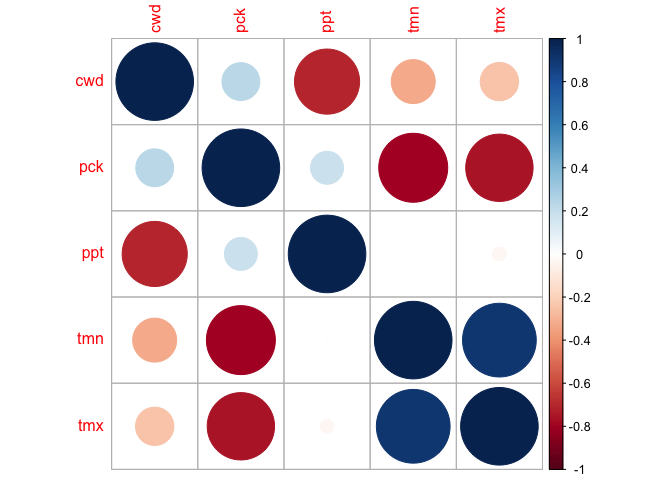<!-- -->

``` r
#tmn and tmx highly correlated, consider removing one (90%)
```

#### PCA - Recent + Historical


``` r
avgs_flint.pc = prcomp(flint_grwseason_avgs[c(6:8)], scale = TRUE, center = TRUE)

str(avgs_flint.pc)
```

```
## List of 5
##  $ sdev    : num [1:3] 1.307 1.051 0.432
##  $ rotation: num [1:3, 1:3] 0.7149 0.0628 -0.6964 0.1968 0.9376 ...
##   ..- attr(*, "dimnames")=List of 2
##   .. ..$ : chr [1:3] "cwd" "pck" "ppt"
##   .. ..$ : chr [1:3] "PC1" "PC2" "PC3"
##  $ center  : Named num [1:3] 60.7 18.3 76.9
##   ..- attr(*, "names")= chr [1:3] "cwd" "pck" "ppt"
##  $ scale   : Named num [1:3] 16.4 17.7 24.9
##   ..- attr(*, "names")= chr [1:3] "cwd" "pck" "ppt"
##  $ x       : num [1:46, 1:3] -0.34056 -1.38822 0.676 0.00767 -1.93752 ...
##   ..- attr(*, "dimnames")=List of 2
##   .. ..$ : NULL
##   .. ..$ : chr [1:3] "PC1" "PC2" "PC3"
##  - attr(*, "class")= chr "prcomp"
```

plot % Variance Explained


``` r
summary(avgs_flint.pc)
```

```
## Importance of components:
##                           PC1    PC2     PC3
## Standard deviation     1.3069 1.0512 0.43242
## Proportion of Variance 0.5693 0.3683 0.06233
## Cumulative Proportion  0.5693 0.9377 1.00000
```

``` r
tibble(PC=str_c("PC",str_pad(1:3,2,pad="0")),
       percent_var=avgs_flint.pc$sdev[1:3]^2/sum(avgs_flint.pc$sdev^2)*100) %>%
  ggplot(aes(x=PC, y=percent_var)) +
  geom_col() +
  ggtitle("Percent Variance Explained")
```

<!-- -->

Combine PCs with metadata


``` r
avgs_flint.pc.dat = data.frame(avgs_flint.pc$x)

avgs_flint_locs.pc = cbind(flint_grwseason_avgs, avgs_flint.pc.dat)

avgs_flint_loadings = data.frame(varnames=rownames(avgs_flint.pc$rotation), avgs_flint.pc$rotation)
avgs_flint_loadings
```

```
##     varnames        PC1       PC2        PC3
## cwd      cwd  0.7149381 0.1968323  0.6709103
## pck      pck  0.0628320 0.9375876 -0.3420257
## ppt      ppt -0.6963589 0.2866818  0.6579497
```


``` r
autoplot(avgs_flint.pc, data = flint_grwseason_avgs,
         colour='elev_m', alpha=0.5,
         label=TRUE, label.label="parent.pop",
         loadings=TRUE, loadings.colour='black', loadings.linewidth = 0.7,
         loadings.label = TRUE, loadings.label.size=6, loadings.label.colour="black", 
         loadings.label.vjust = -0.2, loadings.label.repel=TRUE) +
   scale_colour_gradient(low = "#F5A540", high = "#0043F0") +
  geom_vline(xintercept = 0, linetype="dashed") + geom_hline(yintercept = 0, linetype="dashed") +
  theme_classic()
```

<!-- -->


``` r
avgs_flint_locs.pc_avg <- avgs_flint_locs.pc %>%
  group_by(parent.pop, elev_m, TimePd) %>%
  summarise(across(.cols=starts_with("PC"), .fns = mean)) %>%
  ungroup()
```

```
## `summarise()` has grouped output by 'parent.pop', 'elev_m'. You can override
## using the `.groups` argument.
```

``` r
avgs_flint_locs.pc_avg
```

```
## # A tibble: 46 × 7
##    parent.pop elev_m TimePd         pck      PC1     PC2    PC3
##    <chr>       <dbl> <chr>        <dbl>    <dbl>   <dbl>  <dbl>
##  1 BH           511. Historical  0.0292 -0.215   -1.20   -0.332
##  2 BH           511. Recent      0      -0.341   -1.16   -0.218
##  3 CC           313  Historical  0.119  -1.85    -0.770   0.545
##  4 CC           313  Recent      0      -1.39    -0.791   0.591
##  5 CP2         2244. Historical 18.4     1.05     0.146   0.565
##  6 CP2         2244. Recent     41.8     0.676    1.43    0.172
##  7 CP3         2266. Historical 20.7     0.263    0.0116 -0.324
##  8 CP3         2266. Recent     44.3     0.00767  1.33   -0.662
##  9 DPR         1019. Historical  5.13   -1.54    -0.999  -0.854
## 10 DPR         1019. Recent      2.72   -1.94    -0.957  -0.413
## # ℹ 36 more rows
```


``` r
avgs_flint_locs.pc_avg %>% 
  ggplot(aes(x=PC1, y=PC2, shape=TimePd, color=elev_m)) +
  scale_colour_gradient(low = "#F5A540", high = "#0043F0") +
  geom_point() +
  facet_wrap(~TimePd) +
  coord_fixed(ratio = 1.5)
```

<!-- -->


``` r
avgs_flint_locs.pc_avg %>% 
  mutate(group=str_c(parent.pop,elev_m))  %>%
  ggplot(aes(x=PC1, y=PC2, shape=TimePd, color=elev_m)) +
  scale_colour_gradient(low = "#F5A540", high = "#0043F0") +
  geom_point(size=2, alpha=0.7) +
  geom_vline(xintercept = 0, linetype="dashed") + geom_hline(yintercept = 0, linetype="dashed") +
  geom_path(aes(group=group),arrow = arrow(length=unit(5, "points")), linewidth = .8)
```

<!-- -->

``` r
avgs_flint_locs.pc_avg %>% 
  mutate(group=str_c(parent.pop,elev_m))  %>%
  ggplot(aes(x=PC1, y=PC2, shape=TimePd, color=elev_m)) +
  scale_colour_gradient(low = "#F5A540", high = "#0043F0") +
  geom_point(size=2, alpha=0.7) +
  geom_text_repel(aes(label = parent.pop)) +
  geom_vline(xintercept = 0, linetype="dashed") + geom_hline(yintercept = 0, linetype="dashed")  +
  geom_path(aes(group=group),arrow = arrow(length=unit(5, "points")), linewidth = .8)
```

<!-- -->

``` r
#growth season climate has shifted for high elev way more than for low elev & directions are varied 
```
