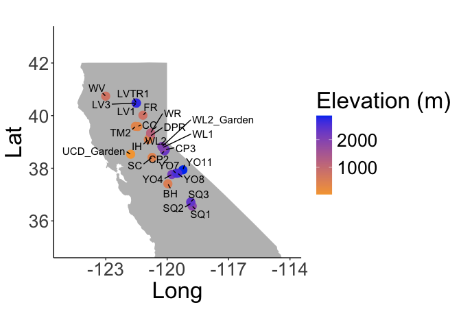
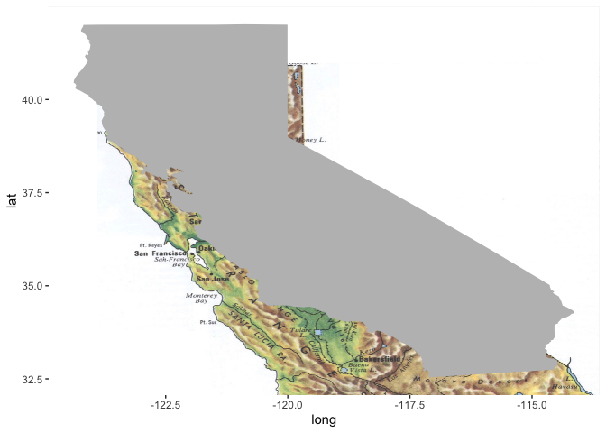
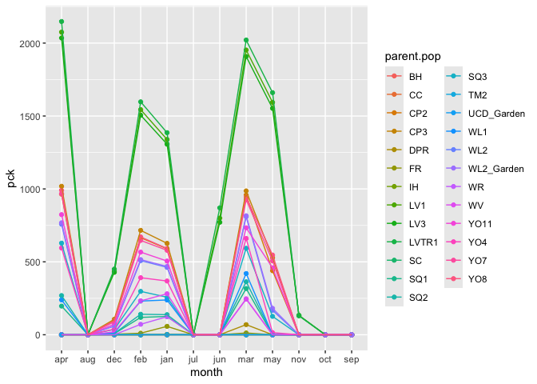
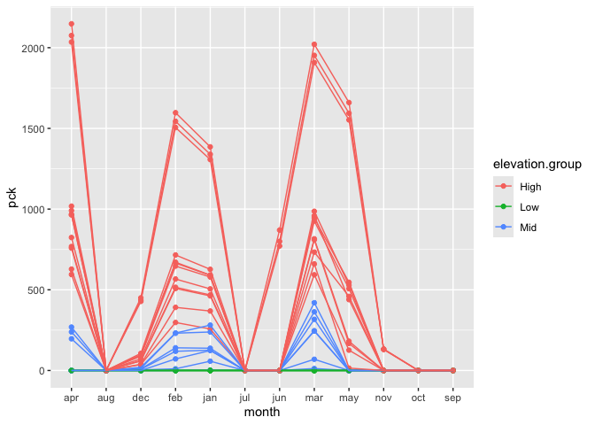
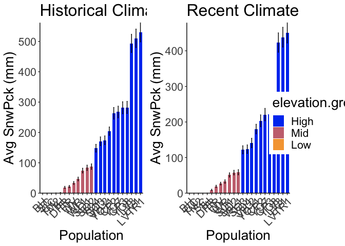
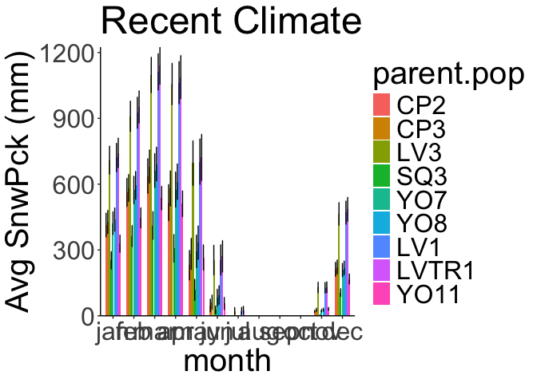
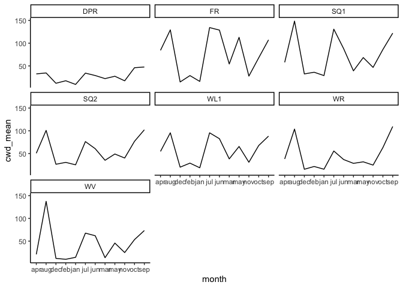
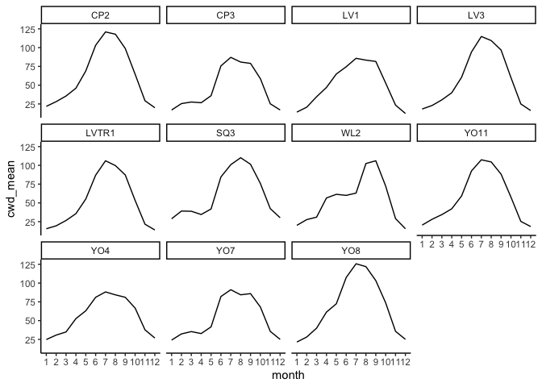

# Climate Data Preparation


## Relevant Libraries and Functions


``` r
library(tidyverse)
```

```
## ── Attaching core tidyverse packages ──────────────────────── tidyverse 2.0.0 ──
## ✔ dplyr     1.1.4     ✔ readr     2.1.5
## ✔ forcats   1.0.0     ✔ stringr   1.5.1
## ✔ ggplot2   3.5.1     ✔ tibble    3.2.1
## ✔ lubridate 1.9.3     ✔ tidyr     1.3.1
## ✔ purrr     1.0.2     
## ── Conflicts ────────────────────────────────────────── tidyverse_conflicts() ──
## ✖ dplyr::filter() masks stats::filter()
## ✖ dplyr::lag()    masks stats::lag()
## ℹ Use the conflicted package (<http://conflicted.r-lib.org/>) to force all conflicts to become errors
```

``` r
library(ggpubr) ##allows for background images
library(ggrepel)
library(cowplot)
```

```
## 
## Attaching package: 'cowplot'
## 
## The following object is masked from 'package:ggpubr':
## 
##     get_legend
## 
## The following object is masked from 'package:lubridate':
## 
##     stamp
```

``` r
library(gridExtra)
```

```
## 
## Attaching package: 'gridExtra'
## 
## The following object is masked from 'package:dplyr':
## 
##     combine
```

``` r
library(naniar) #replaces values with NA
library(jpeg)
#making topo maps:
library(elevatr)
```

```
## elevatr v0.99.0 NOTE: Version 0.99.0 of 'elevatr' uses 'sf' and 'terra'.  Use 
## of the 'sp', 'raster', and underlying 'rgdal' packages by 'elevatr' is being 
## deprecated; however, get_elev_raster continues to return a RasterLayer.  This 
## will be dropped in future versions, so please plan accordingly.
```

``` r
library(terra)
```

```
## terra 1.7.78
## 
## Attaching package: 'terra'
## 
## The following object is masked from 'package:naniar':
## 
##     shade
## 
## The following object is masked from 'package:ggpubr':
## 
##     rotate
## 
## The following object is masked from 'package:tidyr':
## 
##     extract
```

``` r
library(sf)
```

```
## Linking to GEOS 3.11.0, GDAL 3.5.3, PROJ 9.1.0; sf_use_s2() is TRUE
```

``` r
library(giscoR)
library(marmap)
```

```
## Registered S3 methods overwritten by 'adehabitatMA':
##   method                       from
##   print.SpatialPixelsDataFrame sp  
##   print.SpatialPixels          sp  
## 
## Attaching package: 'marmap'
## 
## The following object is masked from 'package:terra':
## 
##     as.raster
## 
## The following object is masked from 'package:grDevices':
## 
##     as.raster
```

``` r
sem <- function(x, na.rm=FALSE) {
  sd(x,na.rm=na.rm)/sqrt(length(na.omit(x)))
} #standard error function 

get_legend<-function(myggplot){
  tmp <- ggplot_gtable(ggplot_build(myggplot))
  leg <- which(sapply(tmp$grobs, function(x) x$name) == "guide-box")
  legend <- tmp$grobs[[leg]]
  return(legend)
} #legend function for grid_arrange

elev_three_palette <- c("#0043F0", "#C9727F", "#F5A540") #colors from Gremer et al 2019
elev_order <- c("High", "Mid", "Low")
```

## Load the pop and location data


``` r
#pop info
pops_common_garden <- read_csv("../input/UCD_Data/Pops_for_2022_UCD.csv") #pops included in both common gardens 
```

```
## Rows: 23 Columns: 11
## ── Column specification ────────────────────────────────────────────────────────
## Delimiter: ","
## chr (5): parent.pop, elevation.group, collection.priority., on.climate.PCA.,...
## dbl (5): phylogroup, maternal.families, approx.number.seeds, UCD.seed.year, ...
## lgl (1): JGI.DNA
## 
## ℹ Use `spec()` to retrieve the full column specification for this data.
## ℹ Specify the column types or set `show_col_types = FALSE` to quiet this message.
```

``` r
summary(pops_common_garden)
```

```
##   parent.pop          phylogroup    elevation.group    maternal.families
##  Length:23          Min.   :1.000   Length:23          Min.   : 3.0     
##  Class :character   1st Qu.:2.000   Class :character   1st Qu.:16.5     
##  Mode  :character   Median :4.000   Mode  :character   Median :23.0     
##                     Mean   :4.435                      Mean   :22.7     
##                     3rd Qu.:7.000                      3rd Qu.:29.5     
##                     Max.   :9.000                      Max.   :44.0     
##  approx.number.seeds UCD.seed.year  proposed.WL2.seed.year collection.priority.
##  Min.   : 100.0      Min.   :2014   Min.   :2014           Length:23           
##  1st Qu.: 500.0      1st Qu.:2018   1st Qu.:2020           Class :character    
##  Median : 500.0      Median :2020   Median :2021           Mode  :character    
##  Mean   : 608.7      Mean   :2020   Mean   :2020                               
##  3rd Qu.:1000.0      3rd Qu.:2021   3rd Qu.:2021                               
##  Max.   :1000.0      Max.   :2021   Max.   :2022                               
##  on.climate.PCA.    JGI.DNA           notes          
##  Length:23          Mode:logical   Length:23         
##  Class :character   NA's:23        Class :character  
##  Mode  :character                  Mode  :character  
##                                                      
##                                                      
## 
```

``` r
names(pops_common_garden)
```

```
##  [1] "parent.pop"             "phylogroup"             "elevation.group"       
##  [4] "maternal.families"      "approx.number.seeds"    "UCD.seed.year"         
##  [7] "proposed.WL2.seed.year" "collection.priority."   "on.climate.PCA."       
## [10] "JGI.DNA"                "notes"
```

``` r
pops_common_garden_nonotes <- pops_common_garden %>% select(parent.pop:elevation.group, UCD.seed.year)
pops_common_garden_nonotes
```

```
## # A tibble: 23 × 4
##    parent.pop phylogroup elevation.group UCD.seed.year
##    <chr>           <dbl> <chr>                   <dbl>
##  1 BH                  4 low                      2021
##  2 CC                  7 low                      2018
##  3 CP2                 2 high                     2019
##  4 CP3                 2 high                     2018
##  5 DPR                 5 mid                      2020
##  6 FR                  7 mid                      2019
##  7 IH                  5 low                      2021
##  8 LV1                 9 high                     2018
##  9 LV3                 9 high                     2018
## 10 LVTR1               9 high                     2020
## # ℹ 13 more rows
```

``` r
pops_common_garden_nonotes$elevation.group <- str_to_title(pops_common_garden$elevation.group)

#extra location info 
pop_loc <- read_csv("../input/Strep_tort_locs.csv")
```

```
## Rows: 54 Columns: 7
## ── Column specification ────────────────────────────────────────────────────────
## Delimiter: ","
## chr (6): Species epithet, Species Code, Site, Site code, Lat, Long
## dbl (1): Elevation (m)
## 
## ℹ Use `spec()` to retrieve the full column specification for this data.
## ℹ Specify the column types or set `show_col_types = FALSE` to quiet this message.
```

``` r
names(pop_loc)
```

```
## [1] "Species epithet" "Species Code"    "Site"            "Site code"      
## [5] "Lat"             "Long"            "Elevation (m)"
```

``` r
head(pop_loc)
```

```
## # A tibble: 6 × 7
##   `Species epithet` `Species Code` Site  `Site code` Lat   Long  `Elevation (m)`
##   <chr>             <chr>          <chr> <chr>       <chr> <chr>           <dbl>
## 1 Streptanthus tor… STTO           Ben … BH          37.4… -119…            511.
## 2 Streptanthus tor… STTO           Bidw… BB          39.5… -121…            283.
## 3 Streptanthus tor… STTO           Cany… CC          39.5… -121…            313 
## 4 Streptanthus tor… STTO           Cars… CP1         38.6… -120…           2422.
## 5 Streptanthus tor… STTO           Cars… CP2         38.6… -120…           2244.
## 6 Streptanthus tor… STTO           Cars… CP3         38.7… -120…           2266.
```

``` r
unique(pop_loc$`Site code`)
```

```
##  [1] "BH"     "BB"     "CC"     "CP1"    "CP2"    "CP3"    "DP"     "DPR"   
##  [9] "FR"     NA       "HH"     "IH"     "KC1"    "KC2"    "KC3"    "LV1"   
## [17] "LV2"    "LV3"    "LVTR1"  "LVTR2"  "LVTR3"  "SQ1"    "SQ2"    "SQ3"   
## [25] "SHA"    "SC"     "TM1"    "TM2"    "WR"     "WV"     "WL1"    "WL2"   
## [33] "WL3"    "WL4"    "YOSE1"  "YOSE10" "YOSE11" "YOSE12" "YOSE13" "YOSE2" 
## [41] "YOSE3"  "YOSE4"  "YOSE5"  "YOSE6"  "YOSE7"  "YOSE8"  "YOSE9"
```

``` r
unique(pops_common_garden_nonotes$parent.pop)
```

```
##  [1] "BH"    "CC"    "CP2"   "CP3"   "DPR"   "FR"    "IH"    "LV1"   "LV3"  
## [10] "LVTR1" "SC"    "SQ1"   "SQ2"   "SQ3"   "TM2"   "WL1"   "WL2"   "WR"   
## [19] "WV"    "YO11"  "YO4"   "YO7"   "YO8"
```

``` r
#need to change YOSE to YO
pop_loc_yo <- pop_loc %>% mutate(parent.pop = str_replace(`Site code`, "YOSE(\\d+)", "YO\\1")) %>% select(Lat, Long, elev_m=`Elevation (m)`, parent.pop)
unique(pop_loc_yo$parent.pop)
```

```
##  [1] "BH"    "BB"    "CC"    "CP1"   "CP2"   "CP3"   "DP"    "DPR"   "FR"   
## [10] NA      "HH"    "IH"    "KC1"   "KC2"   "KC3"   "LV1"   "LV2"   "LV3"  
## [19] "LVTR1" "LVTR2" "LVTR3" "SQ1"   "SQ2"   "SQ3"   "SHA"   "SC"    "TM1"  
## [28] "TM2"   "WR"    "WV"    "WL1"   "WL2"   "WL3"   "WL4"   "YO1"   "YO10" 
## [37] "YO11"  "YO12"  "YO13"  "YO2"   "YO3"   "YO4"   "YO5"   "YO6"   "YO7"  
## [46] "YO8"   "YO9"
```

``` r
#merge in location info
pop_elev <- left_join(pops_common_garden_nonotes, pop_loc_yo)
```

```
## Joining with `by = join_by(parent.pop)`
```

``` r
head(pop_elev)
```

```
## # A tibble: 6 × 7
##   parent.pop phylogroup elevation.group UCD.seed.year Lat      Long       elev_m
##   <chr>           <dbl> <chr>                   <dbl> <chr>    <chr>       <dbl>
## 1 BH                  4 Low                      2021 37.40985 -119.96458   511.
## 2 CC                  7 Low                      2018 39.58597 -121.43311   313 
## 3 CP2                 2 High                     2019 38.66169 -120.13065  2244.
## 4 CP3                 2 High                     2018 38.70649 -120.08797  2266.
## 5 DPR                 5 Mid                      2020 39.22846 -120.81518  1019.
## 6 FR                  7 Mid                      2019 40.01362 -121.18498   787
```

## Common Garden Sites Lat/Long


``` r
sites_loc <- tibble(parent.pop=c("UCD_Garden", "WL2_Garden"), phylogroup=NA, elevation.group=c("Low", "High"), Lat=c("38.53250", "38.82599"), Long=c("-121.78299", "-120.25090"), elev_m=c(16,2020))
sites_loc
```

```
## # A tibble: 2 × 6
##   parent.pop phylogroup elevation.group Lat      Long       elev_m
##   <chr>      <lgl>      <chr>           <chr>    <chr>       <dbl>
## 1 UCD_Garden NA         Low             38.53250 -121.78299     16
## 2 WL2_Garden NA         High            38.82599 -120.25090   2020
```

``` r
pops_gardens_locs <- bind_rows(pop_elev, sites_loc)
pops_gardens_locs
```

```
## # A tibble: 25 × 7
##    parent.pop phylogroup elevation.group UCD.seed.year Lat      Long      elev_m
##    <chr>           <dbl> <chr>                   <dbl> <chr>    <chr>      <dbl>
##  1 BH                  4 Low                      2021 37.40985 -119.964…   511.
##  2 CC                  7 Low                      2018 39.58597 -121.433…   313 
##  3 CP2                 2 High                     2019 38.66169 -120.130…  2244.
##  4 CP3                 2 High                     2018 38.70649 -120.087…  2266.
##  5 DPR                 5 Mid                      2020 39.22846 -120.815…  1019.
##  6 FR                  7 Mid                      2019 40.01362 -121.184…   787 
##  7 IH                  5 Low                      2021 39.09332 -120.921…   454.
##  8 LV1                 9 High                     2018 40.47471 -121.504…  2593.
##  9 LV3                 9 High                     2018 40.47917 -121.523…  2354.
## 10 LVTR1               9 High                     2020 40.47917 -121.5032  2741.
## # ℹ 15 more rows
```

## Map populations


``` r
sapply(pops_gardens_locs, class) #lat and long are characters, need to be numeric 
```

```
##      parent.pop      phylogroup elevation.group   UCD.seed.year             Lat 
##     "character"       "numeric"     "character"       "numeric"     "character" 
##            Long          elev_m 
##     "character"       "numeric"
```

``` r
pops_gardens_locs <- pops_gardens_locs %>% mutate_at(c("Lat", "Long"), as.double)
states <- map_data("state") %>% filter(region == "california")


#without labels 
pops_locs_no_labels <- ggplot() +
  geom_polygon(data = states, aes(x = long, y = lat, group = group), fill = "gray") +
  coord_quickmap(xlim = c(-125, -114), ylim = c(35, 43))+
  geom_point(data = pops_gardens_locs,
             aes(x = Long, y = Lat, color=elev_m),
             size = 4) +
  labs(x="Long", y="Lat", color="Elevation (m)") +
  scale_colour_gradient(low = "#F5A540", high = "#0043F0") +
  theme_classic() +
  theme(text=element_text(size=25))
#ggsave("../output/Pop_Map_NoLabels.png", width = 6, height = 4, units = "in")

#with labels 
ggplot() +
  geom_polygon(data = states, aes(x = long, y = lat, group = group), fill = "gray") +
  coord_quickmap(xlim = c(-125, -114), ylim = c(35, 43))+
  geom_point(data = pops_gardens_locs,
             aes(x = Long, y = Lat, color=elev_m),
             size = 4) +
  geom_text_repel(data = pops_gardens_locs,
         aes(x = Long, y = Lat,
             label = `parent.pop`),
         min.segment.length = 0,
         max.overlaps = 100,
        # label.padding = 1,
        # point.padding = 0.5,
         size = 4) +
  labs(x="Long", y="Lat", color="Elevation (m)") +
  scale_colour_gradient(low = "#F5A540", high = "#0043F0") +
  theme_classic() +
  theme(text=element_text(size=25))
```

<!-- -->

``` r
#ggsave("../output/Pop_Map_Labels.png", width = 12, height = 8, units = "in")
```

### Map with elevation

Overlay topographical image on graph


``` r
imgfile <- "../input/CA_TOPO_9.jpg"
img <- readJPEG(imgfile)

pops_locs_no_labels_topo <- pops_locs_no_labels +
  background_image(img)

ggplot() +
  background_image(img) +
  geom_polygon(data = states, aes(x = long, y = lat, group = group), fill = "gray")
```

<!-- -->

``` r
#ggsave("../output/California.png", width = 6.69, height=7.5, units="in")

pops_locs_no_labels_topo <- ggplot() +
  #geom_polygon(data = states, aes(x = long, y = lat, group = group), fill = "gray") +
  background_image(img) + #not perfectly aligned with the polygon 
  coord_quickmap(xlim = c(-125, -114), ylim = c(35, 43))+
  geom_point(data = pop_elev,
             aes(x = Long, y = Lat, color=elev_m),
             size = 4) +
  labs(x="Long", y="Lat", color="Elevation (m)") +
  scale_colour_gradient(low = "#F5A540", high = "#0043F0") +
  theme_classic() +
  theme(text=element_text(size=25))
#ggsave("../output/Pop_Map_Topo.png", width = 6, height=4, units="in")

pops_locs_labels_topo <- ggplot() +
  #geom_polygon(data = states, aes(x = long, y = lat, group = group), fill = "gray") +
  background_image(img) + #not perfectly aligned with the polygon 
  coord_quickmap(xlim = c(-125, -114), ylim = c(35, 43))+
  geom_point(data = pops_gardens_locs,
             aes(x = Long, y = Lat, color=elev_m),
             size = 4) +
  geom_text_repel(data = pops_gardens_locs,
         aes(x = Long, y = Lat,
             label = `parent.pop`),
         min.segment.length = 0,
         max.overlaps = 100,
        # label.padding = 1,
        # point.padding = 0.5,
         size = 4) +
  labs(x="Long", y="Lat", color="Elevation (m)") +
  scale_colour_gradient(low = "#F5A540", high = "#0043F0") +
  theme_classic() +
  theme(text=element_text(size=25))
#ggsave("../output/Pop_Map_Topo_PlusGardens.png", width = 6, height=4, units="in")
```

## Elevation group changes


``` r
names(pop_elev)
unique(pop_elev$parent.pop)
xtabs(~parent.pop+elevation.group, data = pop_elev)

pop_elev$elevation.group <- factor(pop_elev$elevation.group, levels=elev_order)
pop_elev %>% ggplot(aes(x=fct_reorder(parent.pop, elev_m), y=elev_m, fill=elevation.group)) + 
  geom_col(width = 0.7,position = position_dodge(0.75)) + 
  scale_y_continuous(expand = c(0, 0)) +
  scale_fill_manual(values=elev_three_palette) + 
  labs(title="New Elevation Classifications", x="Parent Populations", y= "Elevation (m)") + 
  theme_classic() +
  theme(text=element_text(size=20), axis.text.x = element_text(angle = 45,  hjust = 1))
#ggsave("../output/Elevation_Class_New.png", width = 12, height = 6, units = "in")
```

# Flint Climate Data (1895-2022)

-   aet (mm) = actual evapotranspiration (water transpired by plants, if
    water not limited)
-   cwd (mm) = climate water deficit (estimate of drought) = pet-aet
-   pck (mm) = snowpack (prior month pck + snow - lost snow)
-   pet (mm) = potential evapotranspiration (total amount of water that
    can evaporate from the ground or be transpired by plants)
-   ppt (mm) = precipitation
-   all above are totals or sums per month
-   tmn (deg C) = min air temp (for a given month)
-   tmx (deg C) = max air temp (for a given month)

Notes

-   Did some lit review to see what variables other people have focused
    on or found to be significant (CWD, temp, precip, AET)

-   Temperature likely highly correlated within pops w/in years

    -   Take all variables (including avg temp) for the 3 months when we
        think germination is occurring (Low: Oct-Jan, Mid: Nov-Jan,
        High: April-June)?

    -   Decided to use growth season rather than germ season: Low:
        Oct-July, Mid: Nov-Aug, High: April-Sept

## Load the climate data

Note: changed the input file from "Dimensions_All_1895-2022.csv" to
"Flint_AllSites_Aug2024.csv"


``` r
climate_data <- read_csv("../output/Flint_AllSites_Aug2024.csv") %>% select(!rowid) %>% mutate(Lat=as.character(Lat), Long=as.character(Long))
```

```
## Rows: 40222 Columns: 15
## ── Column specification ────────────────────────────────────────────────────────
## Delimiter: ","
## chr  (2): parent.pop, month
## dbl (13): rowid, phylogroup, Lat, Long, elev_m, year, aet, cwd, pck, pet, pp...
## 
## ℹ Use `spec()` to retrieve the full column specification for this data.
## ℹ Specify the column types or set `show_col_types = FALSE` to quiet this message.
```

``` r
head(climate_data)
```

```
## # A tibble: 6 × 14
##   parent.pop phylogroup Lat     Long  elev_m  year month   aet   cwd   pck   pet
##   <chr>           <dbl> <chr>   <chr>  <dbl> <dbl> <chr> <dbl> <dbl> <dbl> <dbl>
## 1 BH                  4 37.409… -119…   511.  1895 dec    3.23  27.9     0  31.1
## 2 BH                  4 37.409… -119…   511.  1895 nov    4.89  40.8     0  45.7
## 3 BH                  4 37.409… -119…   511.  1895 oct    8.9   80.8     0  89.7
## 4 BH                  4 37.409… -119…   511.  1896 apr   72.5   36.2     0 109. 
## 5 BH                  4 37.409… -119…   511.  1896 aug   24.5  149.      0 174. 
## 6 BH                  4 37.409… -119…   511.  1896 dec    3.38  30.3     0  33.7
## # ℹ 3 more variables: ppt <dbl>, tmn <dbl>, tmx <dbl>
```

``` r
names(climate_data)
```

```
##  [1] "parent.pop" "phylogroup" "Lat"        "Long"       "elev_m"    
##  [6] "year"       "month"      "aet"        "cwd"        "pck"       
## [11] "pet"        "ppt"        "tmn"        "tmx"
```

``` r
unique(climate_data$parent.pop)
```

```
##  [1] "BH"         "CC"         "CP2"        "CP3"        "DPR"       
##  [6] "FR"         "IH"         "LV1"        "LV3"        "LVTR1"     
## [11] "SC"         "SQ1"        "SQ2"        "SQ3"        "TM2"       
## [16] "WL1"        "WL2"        "WR"         "WV"         "YO11"      
## [21] "YO4"        "YO7"        "YO8"        "YO1"        "UCD_Garden"
## [26] "WL2_Garden"
```

``` r
climate_data$year = as.character(climate_data$year)
```

## Combine pop info with climate data


``` r
pop_elev_climate <- left_join(climate_data, pop_elev) %>% 
  select(parent.pop, elevation.group, elev_m, Lat:Long, year:tmx) %>% 
  filter(parent.pop!="YO1") %>% #remove YO1 from the dataset 
  mutate(elevation.group=if_else(parent.pop=="UCD_Garden", "Low", 
                                 if_else(parent.pop=="WL2_Garden", "High", elevation.group)))
```

```
## Joining with `by = join_by(parent.pop, phylogroup, Lat, Long, elev_m)`
```

``` r
#write_csv(pop_elev_climate, "../output/Climate/flint_climate_UCDpops.csv") #this is the file used in "Flint_Growth_Season.Rmd"
unique(pop_elev_climate$parent.pop)
```

```
##  [1] "BH"         "CC"         "CP2"        "CP3"        "DPR"       
##  [6] "FR"         "IH"         "LV1"        "LV3"        "LVTR1"     
## [11] "SC"         "SQ1"        "SQ2"        "SQ3"        "TM2"       
## [16] "WL1"        "WL2"        "WR"         "WV"         "YO11"      
## [21] "YO4"        "YO7"        "YO8"        "UCD_Garden" "WL2_Garden"
```

``` r
head(pop_elev_climate, 30)
```

```
## # A tibble: 30 × 14
##    parent.pop elevation.group elev_m Lat    Long  year  month    aet   cwd   pck
##    <chr>      <chr>            <dbl> <chr>  <chr> <chr> <chr>  <dbl> <dbl> <dbl>
##  1 BH         Low               511. 37.40… -119… 1895  dec     3.23  27.9     0
##  2 BH         Low               511. 37.40… -119… 1895  nov     4.89  40.8     0
##  3 BH         Low               511. 37.40… -119… 1895  oct     8.9   80.8     0
##  4 BH         Low               511. 37.40… -119… 1896  apr    72.5   36.2     0
##  5 BH         Low               511. 37.40… -119… 1896  aug    24.5  149.      0
##  6 BH         Low               511. 37.40… -119… 1896  dec     3.38  30.3     0
##  7 BH         Low               511. 37.40… -119… 1896  feb     6.57  42.8     0
##  8 BH         Low               511. 37.40… -119… 1896  jan     8.75  27.0     0
##  9 BH         Low               511. 37.40… -119… 1896  jul   133.    70.5     0
## 10 BH         Low               511. 37.40… -119… 1896  jun    90.7   96.2     0
## # ℹ 20 more rows
## # ℹ 4 more variables: pet <dbl>, ppt <dbl>, tmn <dbl>, tmx <dbl>
```

## Calculation of recent (last 30 years) and historical climate (prior 30 years)

Note: this does not include Sept-Dec 2024


``` r
pop_elev_climate_recent <- pop_elev_climate %>% filter(year>1994 & year<=2024) %>% select(parent.pop:month, cwd, pck, ppt, tmn, tmx)
head(pop_elev_climate_recent)
```

```
## # A tibble: 6 × 12
##   parent.pop elevation.group elev_m Lat     Long  year  month   cwd   pck    ppt
##   <chr>      <chr>            <dbl> <chr>   <chr> <chr> <chr> <dbl> <dbl>  <dbl>
## 1 BH         Low               511. 37.409… -119… 1995  apr    38.9     0  59.4 
## 2 BH         Low               511. 37.409… -119… 1995  aug   180.      0   0.21
## 3 BH         Low               511. 37.409… -119… 1995  dec    34       0 128.  
## 4 BH         Low               511. 37.409… -119… 1995  feb    43.9     0  31.4 
## 5 BH         Low               511. 37.409… -119… 1995  jan    27.9     0 278.  
## 6 BH         Low               511. 37.409… -119… 1995  jul    80.9     0   1.42
## # ℹ 2 more variables: tmn <dbl>, tmx <dbl>
```

``` r
tail(pop_elev_climate_recent)
```

```
## # A tibble: 6 × 12
##   parent.pop elevation.group elev_m Lat     Long  year  month   cwd   pck    ppt
##   <chr>      <chr>            <dbl> <chr>   <chr> <chr> <chr> <dbl> <dbl>  <dbl>
## 1 WL2_Garden High              2020 38.825… -120… 2024  feb    25.6  406. 226.  
## 2 WL2_Garden High              2020 38.825… -120… 2024  jan    19.8  209. 239.  
## 3 WL2_Garden High              2020 38.825… -120… 2024  jul   105.     0    5.62
## 4 WL2_Garden High              2020 38.825… -120… 2024  jun    94.5    0    0.53
## 5 WL2_Garden High              2020 38.825… -120… 2024  mar    15.6  614. 322.  
## 6 WL2_Garden High              2020 38.825… -120… 2024  may    55.5    0   47.5 
## # ℹ 2 more variables: tmn <dbl>, tmx <dbl>
```

``` r
summary(pop_elev_climate_recent)
```

```
##   parent.pop        elevation.group        elev_m           Lat           
##  Length:8900        Length:8900        Min.   :  16.0   Length:8900       
##  Class :character   Class :character   1st Qu.: 748.9   Class :character  
##  Mode  :character   Mode  :character   Median :1934.5   Mode  :character  
##                                        Mean   :1599.2                     
##                                        3rd Qu.:2353.6                     
##                                        Max.   :2872.3                     
##      Long               year              month                cwd        
##  Length:8900        Length:8900        Length:8900        Min.   :  0.00  
##  Class :character   Class :character   Class :character   1st Qu.: 25.74  
##  Mode  :character   Mode  :character   Mode  :character   Median : 47.28  
##                                                           Mean   : 56.92  
##                                                           3rd Qu.: 84.35  
##                                                           Max.   :194.73  
##       pck               ppt               tmn               tmx        
##  Min.   :   0.00   Min.   :  0.000   Min.   :-13.180   Min.   :-3.570  
##  1st Qu.:   0.00   1st Qu.:  6.662   1st Qu.: -1.610   1st Qu.: 9.588  
##  Median :   0.00   Median : 44.615   Median :  3.810   Median :15.905  
##  Mean   : 134.69   Mean   : 97.932   Mean   :  3.857   Mean   :16.720  
##  3rd Qu.:  82.44   3rd Qu.:140.575   3rd Qu.:  9.002   3rd Qu.:23.310  
##  Max.   :2183.62   Max.   :981.420   Max.   : 22.410   Max.   :37.580
```

``` r
xtabs(~parent.pop+month, data=pop_elev_climate_recent)
```

```
##             month
## parent.pop   apr aug dec feb jan jul jun mar may nov oct sep
##   BH          30  30  29  30  30  30  30  30  30  29  29  29
##   CC          30  30  29  30  30  30  30  30  30  29  29  29
##   CP2         30  30  29  30  30  30  30  30  30  29  29  29
##   CP3         30  30  29  30  30  30  30  30  30  29  29  29
##   DPR         30  30  29  30  30  30  30  30  30  29  29  29
##   FR          30  30  29  30  30  30  30  30  30  29  29  29
##   IH          30  30  29  30  30  30  30  30  30  29  29  29
##   LV1         30  30  29  30  30  30  30  30  30  29  29  29
##   LV3         30  30  29  30  30  30  30  30  30  29  29  29
##   LVTR1       30  30  29  30  30  30  30  30  30  29  29  29
##   SC          30  30  29  30  30  30  30  30  30  29  29  29
##   SQ1         30  30  29  30  30  30  30  30  30  29  29  29
##   SQ2         30  30  29  30  30  30  30  30  30  29  29  29
##   SQ3         30  30  29  30  30  30  30  30  30  29  29  29
##   TM2         30  30  29  30  30  30  30  30  30  29  29  29
##   UCD_Garden  30  30  29  30  30  30  30  30  30  29  29  29
##   WL1         30  30  29  30  30  30  30  30  30  29  29  29
##   WL2         30  30  29  30  30  30  30  30  30  29  29  29
##   WL2_Garden  30  30  29  30  30  30  30  30  30  29  29  29
##   WR          30  30  29  30  30  30  30  30  30  29  29  29
##   WV          30  30  29  30  30  30  30  30  30  29  29  29
##   YO11        30  30  29  30  30  30  30  30  30  29  29  29
##   YO4         30  30  29  30  30  30  30  30  30  29  29  29
##   YO7         30  30  29  30  30  30  30  30  30  29  29  29
##   YO8         30  30  29  30  30  30  30  30  30  29  29  29
```

``` r
pop_elev_climate_historical <- pop_elev_climate %>% filter(year<=1994 & year>1964) %>% select(parent.pop:month, cwd, pck, ppt, tmn, tmx)
head(pop_elev_climate_historical, 13)
```

```
## # A tibble: 13 × 12
##    parent.pop elevation.group elev_m Lat    Long  year  month   cwd   pck    ppt
##    <chr>      <chr>            <dbl> <chr>  <chr> <chr> <chr> <dbl> <dbl>  <dbl>
##  1 BH         Low               511. 37.40… -119… 1965  apr    39.2     0 104.  
##  2 BH         Low               511. 37.40… -119… 1965  aug    99.9     0   8.87
##  3 BH         Low               511. 37.40… -119… 1965  dec    25.4     0  94.5 
##  4 BH         Low               511. 37.40… -119… 1965  feb    41.0     0  25.9 
##  5 BH         Low               511. 37.40… -119… 1965  jan    27.4     0  88.1 
##  6 BH         Low               511. 37.40… -119… 1965  jul   119.      0   0   
##  7 BH         Low               511. 37.40… -119… 1965  jun    91.2     0   0   
##  8 BH         Low               511. 37.40… -119… 1965  mar    57.2     0  50.6 
##  9 BH         Low               511. 37.40… -119… 1965  may    70.8     0   0.05
## 10 BH         Low               511. 37.40… -119… 1965  nov    45.2     0 212.  
## 11 BH         Low               511. 37.40… -119… 1965  oct    90.1     0  10.5 
## 12 BH         Low               511. 37.40… -119… 1965  sep   119.      0   0   
## 13 BH         Low               511. 37.40… -119… 1966  apr    75.3     0  15.0 
## # ℹ 2 more variables: tmn <dbl>, tmx <dbl>
```

``` r
tail(pop_elev_climate_historical, 13)
```

```
## # A tibble: 13 × 12
##    parent.pop elevation.group elev_m Lat    Long  year  month   cwd   pck    ppt
##    <chr>      <chr>            <dbl> <chr>  <chr> <chr> <chr> <dbl> <dbl>  <dbl>
##  1 WL2_Garden High              2020 38.82… -120… 1993  sep    85.4   0     0.24
##  2 WL2_Garden High              2020 38.82… -120… 1994  apr    46.0   0    87.9 
##  3 WL2_Garden High              2020 38.82… -120… 1994  aug    97.9   0     0.51
##  4 WL2_Garden High              2020 38.82… -120… 1994  dec    21.2 382.  155.  
##  5 WL2_Garden High              2020 38.82… -120… 1994  feb    25.6 282.  220.  
##  6 WL2_Garden High              2020 38.82… -120… 1994  jan    21.3  90.0  76.5 
##  7 WL2_Garden High              2020 38.82… -120… 1994  jul   102.    0     0.24
##  8 WL2_Garden High              2020 38.82… -120… 1994  jun    91.1   0     2.91
##  9 WL2_Garden High              2020 38.82… -120… 1994  mar    37.8 151.   34.6 
## 10 WL2_Garden High              2020 38.82… -120… 1994  may    55.2   0    62.2 
## 11 WL2_Garden High              2020 38.82… -120… 1994  nov    23.6 269.  301.  
## 12 WL2_Garden High              2020 38.82… -120… 1994  oct    67.0   0    44.1 
## 13 WL2_Garden High              2020 38.82… -120… 1994  sep    90.3   0    17.2 
## # ℹ 2 more variables: tmn <dbl>, tmx <dbl>
```

``` r
xtabs(~parent.pop+month, data=pop_elev_climate_historical)
```

```
##             month
## parent.pop   apr aug dec feb jan jul jun mar may nov oct sep
##   BH          30  30  30  30  30  30  30  30  30  30  30  30
##   CC          30  30  30  30  30  30  30  30  30  30  30  30
##   CP2         30  30  30  30  30  30  30  30  30  30  30  30
##   CP3         30  30  30  30  30  30  30  30  30  30  30  30
##   DPR         30  30  30  30  30  30  30  30  30  30  30  30
##   FR          30  30  30  30  30  30  30  30  30  30  30  30
##   IH          30  30  30  30  30  30  30  30  30  30  30  30
##   LV1         30  30  30  30  30  30  30  30  30  30  30  30
##   LV3         30  30  30  30  30  30  30  30  30  30  30  30
##   LVTR1       30  30  30  30  30  30  30  30  30  30  30  30
##   SC          30  30  30  30  30  30  30  30  30  30  30  30
##   SQ1         30  30  30  30  30  30  30  30  30  30  30  30
##   SQ2         30  30  30  30  30  30  30  30  30  30  30  30
##   SQ3         30  30  30  30  30  30  30  30  30  30  30  30
##   TM2         30  30  30  30  30  30  30  30  30  30  30  30
##   UCD_Garden  30  30  30  30  30  30  30  30  30  30  30  30
##   WL1         30  30  30  30  30  30  30  30  30  30  30  30
##   WL2         30  30  30  30  30  30  30  30  30  30  30  30
##   WL2_Garden  30  30  30  30  30  30  30  30  30  30  30  30
##   WR          30  30  30  30  30  30  30  30  30  30  30  30
##   WV          30  30  30  30  30  30  30  30  30  30  30  30
##   YO11        30  30  30  30  30  30  30  30  30  30  30  30
##   YO4         30  30  30  30  30  30  30  30  30  30  30  30
##   YO7         30  30  30  30  30  30  30  30  30  30  30  30
##   YO8         30  30  30  30  30  30  30  30  30  30  30  30
```

## Snow Cover - Average across years (all months included)


``` r
pop_elev_climate_recent %>% filter(year==2006) %>% ggplot(aes(x=month, y=pck, group=parent.pop, color=parent.pop)) + geom_point() + geom_line()
```

<!-- -->

``` r
pop_elev_climate_recent %>% filter(year==2006) %>% ggplot(aes(x=month, y=pck, group=parent.pop, color=elevation.group)) + geom_point() + geom_line()
```

<!-- -->

``` r
#average snowpack across entire year for 30-year period 
recent_climate_avgs <- pop_elev_climate_recent %>% group_by(parent.pop,elevation.group ,elev_m) %>% summarise_at(c("cwd", "pck", "ppt", "tmn", "tmx"), c(mean, sem), na.rm = TRUE) 
names(recent_climate_avgs) <- gsub("fn2", "sem", colnames(recent_climate_avgs))
names(recent_climate_avgs) <-gsub("fn1", "mean", colnames(recent_climate_avgs))
recent_climate_avgs #30 year averages
```

```
## # A tibble: 25 × 13
## # Groups:   parent.pop, elevation.group [25]
##    parent.pop elevation.group elev_m cwd_mean pck_mean ppt_mean tmn_mean
##    <chr>      <chr>            <dbl>    <dbl>    <dbl>    <dbl>    <dbl>
##  1 BH         Low               511.     75.6    0         49.1    9.02 
##  2 CC         Low               313      59.8    0         85.0   10.1  
##  3 CP2        High             2244.     63.0  222.       108.     1.24 
##  4 CP3        High             2266.     46.2  241.       104.     0.583
##  5 DPR        Mid              1019.     27.3    7.57     122.     7.96 
##  6 FR         Mid               787      75.7   14.2       85.8    5.78 
##  7 IH         Low               454.     49.1    0.169     89.8    8.75 
##  8 LV1        High             2593.     49.9  451.       148.    -1.29 
##  9 LV3        High             2354.     40.9  446.       146.    -1.30 
## 10 LVTR1      High             2741.     52.2  464.       153.    -1.50 
## # ℹ 15 more rows
## # ℹ 6 more variables: tmx_mean <dbl>, cwd_sem <dbl>, pck_sem <dbl>,
## #   ppt_sem <dbl>, tmn_sem <dbl>, tmx_sem <dbl>
```

``` r
recent_climate_avgs$elevation.group <- factor(recent_climate_avgs$elevation.group, levels=elev_order)
recent_snwpck <- recent_climate_avgs %>% ggplot(aes(x=fct_reorder(parent.pop, pck_mean), y=pck_mean, fill=elevation.group)) + 
  geom_col(width = 0.7,position = position_dodge(0.75)) +
  geom_errorbar(aes(ymin=pck_mean-pck_sem,ymax=pck_mean+pck_sem),width=.2, position = 
                  position_dodge(0.75)) +
  scale_y_continuous(expand = c(0, 0)) +
  scale_fill_manual(values=elev_three_palette) + 
  #scale_fill_gradient(low = "#F5A540", high = "#0043F0") +
  labs(x="Population", y="Avg SnwPck (mm)" ,title = "Recent Climate") +
   theme_classic() +
  theme(text=element_text(size=20), axis.text.x = element_text(angle = 45,  hjust = 1))
recent_snwpck
```

<!-- -->

``` r
#ggsave("../output/Climate/All_Year_Avg_PCK_RecentClim.png", width = 12, height = 6, units = "in")

historical_climate_avgs <- pop_elev_climate_historical %>% group_by(parent.pop, elevation.group ,elev_m) %>% summarise_at(c("cwd", "pck", "ppt", "tmn", "tmx"), c(mean, sem), na.rm = TRUE) 
names(historical_climate_avgs) <- gsub("fn2", "sem", colnames(historical_climate_avgs))
names(historical_climate_avgs) <-gsub("fn1", "mean", colnames(historical_climate_avgs))
historical_climate_avgs #30 year averages
```

```
## # A tibble: 25 × 13
## # Groups:   parent.pop, elevation.group [25]
##    parent.pop elevation.group elev_m cwd_mean pck_mean ppt_mean tmn_mean
##    <chr>      <chr>            <dbl>    <dbl>    <dbl>    <dbl>    <dbl>
##  1 BH         Low               511.     74.7   0.0195     47.9    7.78 
##  2 CC         Low               313      59.8   0.0793     81.5    8.90 
##  3 CP2        High             2244.     60.8 262.        108.    -0.253
##  4 CP3        High             2266.     44.1 278.        104.    -0.802
##  5 DPR        Mid              1019.     26.7  20.0       119.     6.27 
##  6 FR         Mid               787      74.1  18.9        83.3    4.58 
##  7 IH         Low               454.     50.4   1.47       86.9    7.70 
##  8 LV1        High             2593.     46.7 506.        147.    -3.48 
##  9 LV3        High             2354.     38.1 499.        144.    -3.49 
## 10 LVTR1      High             2741.     49.4 525.        152.    -3.62 
## # ℹ 15 more rows
## # ℹ 6 more variables: tmx_mean <dbl>, cwd_sem <dbl>, pck_sem <dbl>,
## #   ppt_sem <dbl>, tmn_sem <dbl>, tmx_sem <dbl>
```

``` r
historical_climate_avgs$elevation.group <- factor(historical_climate_avgs$elevation.group, levels=elev_order)
hist_snwpck <- historical_climate_avgs %>% ggplot(aes(x=fct_reorder(parent.pop, pck_mean), y=pck_mean, fill=elevation.group)) + 
  geom_col(width = 0.7,position = position_dodge(0.75)) +
  geom_errorbar(aes(ymin=pck_mean-pck_sem,ymax=pck_mean+pck_sem),width=.2, position = 
                  position_dodge(0.75)) +
  scale_y_continuous(expand = c(0, 0)) +
  scale_fill_manual(values=elev_three_palette) + 
  #scale_fill_gradient(low = "#F5A540", high = "#0043F0") +
  labs(x="Population", y="Avg SnwPck (mm)" ,title = "Historical Climate") +
   theme_classic() +
  theme(text=element_text(size=20), axis.text.x = element_text(angle = 45,  hjust = 1))
hist_snwpck
```

<!-- -->

``` r
#ggsave("../output/Climate/All_Year_Avg_PCK_HistoricalClim.png", width = 8, height = 4, units = "in")

legend <- get_legend(hist_snwpck)
hist_snwpck <- hist_snwpck + theme(legend.position="none")
recent_snwpck <- recent_snwpck + theme(legend.position="none")
grid.arrange(hist_snwpck, recent_snwpck, legend, ncol=3, widths=c(3.12, 3.12, 1.09))
```

<!-- -->

## Consistency of winter snow cover


``` r
#monthly_pck <- pop_elev_climate_recent %>% filter(parent.pop==c("DPR","WR","WL1", "SQ1", "SQ2", "WL2", "YO4")) %>% group_by(parent.pop, elev_m, month) %>%
 # summarise(pck_mean=mean(pck), pck_sem=sem(pck))
#monthly_pck$parent.pop <- factor(monthly_pck$parent.pop, levels=c("DPR","WR","WL1", "SQ1", "SQ2", "WL2", "YO4"))

monthly_pck <- pop_elev_climate_recent %>% 
  filter(parent.pop==c("WL1", "SQ1", "SQ2", "WL2", "YO4")) %>% 
  group_by(parent.pop, elev_m, month) %>%
  summarise(pck_mean=mean(pck), pck_sem=sem(pck))
```

```
## `summarise()` has grouped output by 'parent.pop', 'elev_m'. You can override
## using the `.groups` argument.
```

``` r
monthly_pck$parent.pop <- factor(monthly_pck$parent.pop, levels=c("WL1", "SQ1", "SQ2", "WL2", "YO4"))
monthly_pck$month <- factor(monthly_pck$month, levels=c("jan", "feb", "mar", "apr", "may", "jun", "jul", "aug", "sep", "oct", "nov", "dec"))

monthly_pck %>% ggplot(aes(x=month, y=pck_mean, group=parent.pop, fill=parent.pop)) + 
  geom_col(width = 0.7,position = position_dodge(0.75)) +
  geom_errorbar(aes(ymin=pck_mean-pck_sem,ymax=pck_mean+pck_sem),width=.2, position=position_dodge(0.75)) +
  labs(title="Recent Climate", y="Avg SnwPck (mm)")  + 
  scale_y_continuous(expand = c(0, 0)) +
  theme_classic() + 
  theme(text=element_text(size=30))
```

<!-- -->

``` r
#ggsave("../output/Climate/Monthly_Avg_PCK_RecnetClim.png", width = 14, height = 6, units = "in")

#check even higher elevation
monthly_pck_high_elev <- pop_elev_climate_recent %>% 
  filter(elev_m>2200) %>%
  group_by(parent.pop, elev_m, month) %>%
  summarise(pck_mean=mean(pck), pck_sem=sem(pck))
```

```
## `summarise()` has grouped output by 'parent.pop', 'elev_m'. You can override
## using the `.groups` argument.
```

``` r
monthly_pck_high_elev$parent.pop <- factor(monthly_pck_high_elev$parent.pop, levels=c("CP2", "CP3", "LV3", "SQ3", "YO7","YO8", "LV1", "LVTR1", "YO11"))
monthly_pck_high_elev$month <- factor(monthly_pck_high_elev$month, levels=c("jan", "feb", "mar", "apr", "may", "jun", "jul", "aug", "sep", "oct", "nov", "dec"))

monthly_pck_high_elev %>% ggplot(aes(x=month, y=pck_mean, group=parent.pop, fill=parent.pop)) + 
  geom_col(width = 0.7,position = position_dodge(0.75)) +
  geom_errorbar(aes(ymin=pck_mean-pck_sem,ymax=pck_mean+pck_sem),width=.2, position=position_dodge(0.75)) +
  labs(title="Recent Climate", y="Avg SnwPck (mm)")  + 
  scale_y_continuous(expand = c(0, 0)) +
  theme_classic() + 
  theme(text=element_text(size=30))
```

<!-- -->

``` r
#ggsave("../output/Climate/Monthly_Avg_PCK_HIGHELEV_RecnetClim.png", width = 14, height = 6, units = "in")
```

## CWD Across the Year


``` r
names(pop_elev_climate_recent)
```

```
##  [1] "parent.pop"      "elevation.group" "elev_m"          "Lat"            
##  [5] "Long"            "year"            "month"           "cwd"            
##  [9] "pck"             "ppt"             "tmn"             "tmx"
```

``` r
monthly_cwd <- pop_elev_climate_recent %>% 
  group_by(parent.pop, elev_m, month) %>%
  summarise(cwd_mean=mean(cwd), pck_sem=sem(cwd))
```

```
## `summarise()` has grouped output by 'parent.pop', 'elev_m'. You can override
## using the `.groups` argument.
```

``` r
monthly_cwd
```

```
## # A tibble: 300 × 5
## # Groups:   parent.pop, elev_m [25]
##    parent.pop elev_m month cwd_mean pck_sem
##    <chr>       <dbl> <chr>    <dbl>   <dbl>
##  1 BH           511. apr       58.4   2.99 
##  2 BH           511. aug      153.    3.32 
##  3 BH           511. dec       30.0   0.376
##  4 BH           511. feb       41.0   0.514
##  5 BH           511. jan       29.4   0.433
##  6 BH           511. jul      137.    3.73 
##  7 BH           511. jun       88.9   5.12 
##  8 BH           511. mar       53.3   1.63 
##  9 BH           511. may       51.6   5.33 
## 10 BH           511. nov       45.8   0.540
## # ℹ 290 more rows
```

``` r
monthly_cwd %>% #low elev
  filter(elev_m<520) %>% 
  ggplot(aes(x=month, y=cwd_mean, group=parent.pop)) +
  geom_line() +
  theme_classic() +
  facet_wrap(~parent.pop)
```

<!-- -->

``` r
monthly_cwd %>% #mid elev
  filter(elev_m>520, elev_m<1940) %>% 
  ggplot(aes(x=month, y=cwd_mean,group=parent.pop)) +
  geom_line() +
  theme_classic() +
  facet_wrap(~parent.pop)
```

<!-- -->

``` r
monthly_cwd %>% #high elev
  filter(elev_m>1940) %>% 
  ggplot(aes(x=month, y=cwd_mean,group=parent.pop)) +
  geom_line() +
  theme_classic() +
  facet_wrap(~parent.pop)
```

<!-- -->

### Averages

#### Across last 30 years (all months included)


``` r
pop_elev_climate_avgs <- pop_elev_climate %>% filter(year>1992) %>% group_by(parent.pop, elevation.group) %>% summarise_at(c("cwd", "pck", "ppt", "tmn", "tmx"), mean, na.rm = TRUE)
pop_elev_climate_avgs #30 year averages of all climate variables 
```

```
## # A tibble: 25 × 7
## # Groups:   parent.pop [25]
##    parent.pop elevation.group   cwd     pck   ppt    tmn   tmx
##    <chr>      <chr>           <dbl>   <dbl> <dbl>  <dbl> <dbl>
##  1 BH         Low              75.7   0      49.0  8.96   23.6
##  2 CC         Low              59.6   0      85.1 10.1    23.3
##  3 CP2        High             63.0 224.    107.   1.16   13.4
##  4 CP3        High             46.3 241.    103.   0.502  12.6
##  5 DPR        Mid              27.4   9.06  121.   7.88   20.2
##  6 FR         Mid              75.6  15.9    85.8  5.72   20.1
##  7 IH         Low              49.0   0.173  89.5  8.70   22.2
##  8 LV1        High             49.8 449.    147.  -1.41   11.2
##  9 LV3        High             40.8 444.    145.  -1.41   11.2
## 10 LVTR1      High             52.0 462.    152.  -1.61   11.1
## # ℹ 15 more rows
```

``` r
pop_elev_climate_avgs$elevation.group <- factor(pop_elev_climate_avgs$elevation.group, levels=elev_order)
```
