To Do:

-   Decide between elevation classifications vs. some climate metric to
    define growth seasons

    -   Categorical Growth Seasons:
        -   Low: Oct-July

        -   Mid: Nov-Aug

        -   High: April-Sept
    -   Based on climate metrics: no snowpack and/or significant rain/lower CWD
        -   Some pops grow all all year per the criteria below, is that possible? Also, some have really short growth season (1 or 2 months), is that possible?
        -   John and Sam have code for daily data, with "first day to x event" - Ask Sam if she's calculated this for STTO pops 
    -   K means clustering to see if it splits into the 3 groups (Can
        give it the 30 year vector. Probably need to turn off scaling)

-   PCAs for climate during the growth season 

    -   Color monthly PCA by month relative to growth season?
    -   Make PCAs for historical climate too
    -   Bioclim vars only PCA okay? or combine with other Flint variables? Hard to combine b/c Flint data is for each month within a year and Bioclim variables are yearly summaries. Could do one with just Flint with all months in each year included and one with Flint growth season yearly averages combined with Bioclim variables 


## Relevant Libraries and Functions


```r
library(tidyverse)
```

```
## ── Attaching core tidyverse packages ──────────────────────── tidyverse 2.0.0 ──
## ✔ dplyr     1.1.3     ✔ readr     2.1.4
## ✔ forcats   1.0.0     ✔ stringr   1.5.0
## ✔ ggplot2   3.4.3     ✔ tibble    3.2.1
## ✔ lubridate 1.9.2     ✔ tidyr     1.3.0
## ✔ purrr     1.0.2     
## ── Conflicts ────────────────────────────────────────── tidyverse_conflicts() ──
## ✖ dplyr::filter() masks stats::filter()
## ✖ dplyr::lag()    masks stats::lag()
## ℹ Use the conflicted package (<http://conflicted.r-lib.org/>) to force all conflicts to become errors
```

```r
library(ggrepel)
library(cowplot)
```

```
## 
## Attaching package: 'cowplot'
## 
## The following object is masked from 'package:lubridate':
## 
##     stamp
```

```r
library(gridExtra)
```

```
## 
## Attaching package: 'gridExtra'
## 
## The following object is masked from 'package:dplyr':
## 
##     combine
```

```r
library(corrplot) #plotting correlations 
```

```
## corrplot 0.92 loaded
```

```r
library(rstatix) #performing cor_test
```

```
## 
## Attaching package: 'rstatix'
## 
## The following object is masked from 'package:stats':
## 
##     filter
```

```r
library(lmerTest)
```

```
## Loading required package: lme4
## Loading required package: Matrix
## 
## Attaching package: 'Matrix'
## 
## The following objects are masked from 'package:tidyr':
## 
##     expand, pack, unpack
## 
## 
## Attaching package: 'lmerTest'
## 
## The following object is masked from 'package:lme4':
## 
##     lmer
## 
## The following object is masked from 'package:stats':
## 
##     step
```

```r
library(naniar) #replaces values with NA
library(QBMS) #for function calc_biovars to calculate bioclim variables
sem <- function(x, na.rm=FALSE) {
  sd(x,na.rm=na.rm)/sqrt(length(na.omit(x)))
} #standard error function 

get_legend<-function(myggplot){
  tmp <- ggplot_gtable(ggplot_build(myggplot))
  leg <- which(sapply(tmp$grobs, function(x) x$name) == "guide-box")
  legend <- tmp$grobs[[leg]]
  return(legend)
} #legend function for grid_arrange

elev_three_palette <- c("#0043F0", "#C9727F", "#F5A540") #colors from Gremer et al 2019
elev_order <- c("High", "Mid", "Low")

#For scree plots 
#library("devtools") #The package devtools is required for the installation as factoextra is hosted on github.
#1install_github("kassambara/factoextra")
library("factoextra")
```

```
## Welcome! Want to learn more? See two factoextra-related books at https://goo.gl/ve3WBa
```

## Load the pop and location data


```r
#pop info
pops_common_garden <- read_csv("../input/UCD_Data/Pops_for_2022_UCD.csv") #pops included in common garden 
```

```
## Rows: 23 Columns: 11
## ── Column specification ────────────────────────────────────────────────────────
## Delimiter: ","
## chr (5): parent.pop, elevation.group, collection.priority., on.climate.PCA.,...
## dbl (5): phylogroup, maternal.families, approx.number.seeds, UCD.seed.year, ...
## lgl (1): JGI.DNA
## 
## ℹ Use `spec()` to retrieve the full column specification for this data.
## ℹ Specify the column types or set `show_col_types = FALSE` to quiet this message.
```

```r
summary(pops_common_garden)
```

```
##   parent.pop          phylogroup    elevation.group    maternal.families
##  Length:23          Min.   :1.000   Length:23          Min.   : 3.0     
##  Class :character   1st Qu.:2.000   Class :character   1st Qu.:16.5     
##  Mode  :character   Median :4.000   Mode  :character   Median :23.0     
##                     Mean   :4.435                      Mean   :22.7     
##                     3rd Qu.:7.000                      3rd Qu.:29.5     
##                     Max.   :9.000                      Max.   :44.0     
##  approx.number.seeds UCD.seed.year  proposed.WL2.seed.year collection.priority.
##  Min.   : 100.0      Min.   :2014   Min.   :2014           Length:23           
##  1st Qu.: 500.0      1st Qu.:2018   1st Qu.:2020           Class :character    
##  Median : 500.0      Median :2020   Median :2021           Mode  :character    
##  Mean   : 608.7      Mean   :2020   Mean   :2020                               
##  3rd Qu.:1000.0      3rd Qu.:2021   3rd Qu.:2021                               
##  Max.   :1000.0      Max.   :2021   Max.   :2022                               
##  on.climate.PCA.    JGI.DNA           notes          
##  Length:23          Mode:logical   Length:23         
##  Class :character   NA's:23        Class :character  
##  Mode  :character                  Mode  :character  
##                                                      
##                                                      
## 
```

```r
names(pops_common_garden)
```

```
##  [1] "parent.pop"             "phylogroup"             "elevation.group"       
##  [4] "maternal.families"      "approx.number.seeds"    "UCD.seed.year"         
##  [7] "proposed.WL2.seed.year" "collection.priority."   "on.climate.PCA."       
## [10] "JGI.DNA"                "notes"
```

```r
pops_common_garden_nonotes <- pops_common_garden %>% select(parent.pop:elevation.group, UCD.seed.year)
pops_common_garden_nonotes
```

```
## # A tibble: 23 × 4
##    parent.pop phylogroup elevation.group UCD.seed.year
##    <chr>           <dbl> <chr>                   <dbl>
##  1 BH                  4 low                      2021
##  2 CC                  7 low                      2018
##  3 CP2                 2 high                     2019
##  4 CP3                 2 high                     2018
##  5 DPR                 5 mid                      2020
##  6 FR                  7 mid                      2019
##  7 IH                  5 low                      2021
##  8 LV1                 9 high                     2018
##  9 LV3                 9 high                     2018
## 10 LVTR1               9 high                     2020
## # ℹ 13 more rows
```

```r
pops_common_garden_nonotes$elevation.group <- str_to_title(pops_common_garden$elevation.group)

#extra location info 
pop_loc <- read_csv("../input/Strep_tort_locs.csv")
```

```
## Rows: 54 Columns: 7
## ── Column specification ────────────────────────────────────────────────────────
## Delimiter: ","
## chr (6): Species epithet, Species Code, Site, Site code, Lat, Long
## dbl (1): Elevation (m)
## 
## ℹ Use `spec()` to retrieve the full column specification for this data.
## ℹ Specify the column types or set `show_col_types = FALSE` to quiet this message.
```

```r
names(pop_loc)
```

```
## [1] "Species epithet" "Species Code"    "Site"            "Site code"      
## [5] "Lat"             "Long"            "Elevation (m)"
```

```r
head(pop_loc)
```

```
## # A tibble: 6 × 7
##   `Species epithet` `Species Code` Site  `Site code` Lat   Long  `Elevation (m)`
##   <chr>             <chr>          <chr> <chr>       <chr> <chr>           <dbl>
## 1 Streptanthus tor… STTO           Ben … BH          37.4… -119…            511.
## 2 Streptanthus tor… STTO           Bidw… BB          39.5… -121…            283.
## 3 Streptanthus tor… STTO           Cany… CC          39.5… -121…            313 
## 4 Streptanthus tor… STTO           Cars… CP1         38.6… -120…           2422.
## 5 Streptanthus tor… STTO           Cars… CP2         38.6… -120…           2244.
## 6 Streptanthus tor… STTO           Cars… CP3         38.7… -120…           2266.
```

```r
unique(pop_loc$`Site code`)
```

```
##  [1] "BH"     "BB"     "CC"     "CP1"    "CP2"    "CP3"    "DP"     "DPR"   
##  [9] "FR"     NA       "HH"     "IH"     "KC1"    "KC2"    "KC3"    "LV1"   
## [17] "LV2"    "LV3"    "LVTR1"  "LVTR2"  "LVTR3"  "SQ1"    "SQ2"    "SQ3"   
## [25] "SHA"    "SC"     "TM1"    "TM2"    "WR"     "WV"     "WL1"    "WL2"   
## [33] "WL3"    "WL4"    "YOSE1"  "YOSE10" "YOSE11" "YOSE12" "YOSE13" "YOSE2" 
## [41] "YOSE3"  "YOSE4"  "YOSE5"  "YOSE6"  "YOSE7"  "YOSE8"  "YOSE9"
```

```r
unique(pops_common_garden_nonotes$parent.pop)
```

```
##  [1] "BH"    "CC"    "CP2"   "CP3"   "DPR"   "FR"    "IH"    "LV1"   "LV3"  
## [10] "LVTR1" "SC"    "SQ1"   "SQ2"   "SQ3"   "TM2"   "WL1"   "WL2"   "WR"   
## [19] "WV"    "YO11"  "YO4"   "YO7"   "YO8"
```

```r
#need to change YOSE to YO
pop_loc_yo <- pop_loc %>% mutate(parent.pop = str_replace(`Site code`, "YOSE(\\d+)", "YO\\1")) %>% select(Lat, Long, elev_m=`Elevation (m)`, parent.pop)
unique(pop_loc_yo$parent.pop)
```

```
##  [1] "BH"    "BB"    "CC"    "CP1"   "CP2"   "CP3"   "DP"    "DPR"   "FR"   
## [10] NA      "HH"    "IH"    "KC1"   "KC2"   "KC3"   "LV1"   "LV2"   "LV3"  
## [19] "LVTR1" "LVTR2" "LVTR3" "SQ1"   "SQ2"   "SQ3"   "SHA"   "SC"    "TM1"  
## [28] "TM2"   "WR"    "WV"    "WL1"   "WL2"   "WL3"   "WL4"   "YO1"   "YO10" 
## [37] "YO11"  "YO12"  "YO13"  "YO2"   "YO3"   "YO4"   "YO5"   "YO6"   "YO7"  
## [46] "YO8"   "YO9"
```

```r
#merge in location info
pop_elev <- left_join(pops_common_garden_nonotes, pop_loc_yo)
```

```
## Joining with `by = join_by(parent.pop)`
```

```r
head(pop_elev)
```

```
## # A tibble: 6 × 7
##   parent.pop phylogroup elevation.group UCD.seed.year Lat      Long       elev_m
##   <chr>           <dbl> <chr>                   <dbl> <chr>    <chr>       <dbl>
## 1 BH                  4 Low                      2021 37.40985 -119.96458   511.
## 2 CC                  7 Low                      2018 39.58597 -121.43311   313 
## 3 CP2                 2 High                     2019 38.66169 -120.13065  2244.
## 4 CP3                 2 High                     2018 38.70649 -120.08797  2266.
## 5 DPR                 5 Mid                      2020 39.22846 -120.81518  1019.
## 6 FR                  7 Mid                      2019 40.01362 -121.18498   787
```

## Map populations


```r
names(pop_elev)
```

```
## [1] "parent.pop"      "phylogroup"      "elevation.group" "UCD.seed.year"  
## [5] "Lat"             "Long"            "elev_m"
```

```r
sapply(pop_elev, class) #lat and long are characters, need to be numeric 
```

```
##      parent.pop      phylogroup elevation.group   UCD.seed.year             Lat 
##     "character"       "numeric"     "character"       "numeric"     "character" 
##            Long          elev_m 
##     "character"       "numeric"
```

```r
pop_elev <- pop_elev %>% mutate_at(c("Lat", "Long"), as.double)
states <- map_data("state") %>% filter(region == "california")


#without labels 
ggplot() +
  geom_polygon(data = states, aes(x = long, y = lat, group = group), fill = "gray") +
  coord_quickmap(xlim = c(-125, -114), ylim = c(35, 43))+
  geom_point(data = pop_elev,
             aes(x = Long, y = Lat, color=elev_m),
             size = 4) +
  labs(x="Long", y="Lat", color="Elevation (m)") +
  scale_colour_gradient(low = "#F5A540", high = "#0043F0") +
  theme_classic() +
  theme(text=element_text(size=25))
```

<!-- -->

```r
#ggsave("../output/Pop_Map_NoLabels.png", width = 6, height = 4, units = "in")

#with labels 
ggplot() +
  geom_polygon(data = states, aes(x = long, y = lat, group = group), fill = "gray") +
  coord_quickmap(xlim = c(-125, -114), ylim = c(35, 43))+
  geom_point(data = pop_elev,
             aes(x = Long, y = Lat, color=elev_m),
             size = 4) +
  geom_text_repel(data = pop_elev,
         aes(x = Long, y = Lat,
             label = `parent.pop`),
         min.segment.length = 0,
         max.overlaps = 100,
        # label.padding = 1,
        # point.padding = 0.5,
         size = 4) +
  labs(x="Long", y="Lat", color="Elevation (m)") +
  scale_colour_gradient(low = "#F5A540", high = "#0043F0") +
  theme_classic() +
  theme(text=element_text(size=25))
```

<!-- -->

```r
#ggsave("../output/Pop_Map_Labels.png", width = 12, height = 8, units = "in")
```

## Elevation group changes


```r
names(pop_elev)
unique(pop_elev$parent.pop)
xtabs(~parent.pop+elevation.group, data = pop_elev)

pop_elev$elevation.group <- factor(pop_elev$elevation.group, levels=elev_order)
pop_elev %>% ggplot(aes(x=fct_reorder(parent.pop, elev_m), y=elev_m, fill=elevation.group)) + 
  geom_col(width = 0.7,position = position_dodge(0.75)) + 
  scale_y_continuous(expand = c(0, 0)) +
  scale_fill_manual(values=elev_three_palette) + 
  labs(title="New Elevation Classifications", x="Parent Populations", y= "Elevation (m)") + 
  theme_classic() +
  theme(text=element_text(size=20), axis.text.x = element_text(angle = 45,  hjust = 1))
ggsave("../output/Elevation_Class_New.png", width = 12, height = 6, units = "in")
```

# Flint Climate Data (1895-2022)

-   aet (mm) = actual evapotranspiration (water transpired by plants, if
    water not limited)
-   cwd (mm) = climate water deficit (estimate of drought) = pet-aet
-   pck (mm) = snowpack (prior month pck + snow - lost snow)
-   pet (mm) = potential evapotranspiration (total amount of water that
    can evaporate from the ground or be transpired by plants)
-   ppt (mm) = precipitation
-   rch (mm) = recharge (water that penetrates below the root zone)
-   run (mm) = runoff (water that becomes streamflow)
-   str (mm) = soil water storage (avg amount of water stored in the
    soil annually)
-   all above are totals or sums per month
-   tmn (deg C) = min air temp (for a given month)
-   tmx (deg C) = max air temp (for a given month) 127 years

Notes

-   Did some lit review to see what variables other people have focused
    on or found to be significant (CWD, temp, precip, AET)

-   Temperature likely highly correlated within pops w/in years

    -   Take all variables (including avg temp) for the 3 months when we
        think germination is occurring (Low: Oct-Jan, Mid: Nov-Jan,
        High: April-June)?

    -   Decided to use growth season rather than germ season: Low:
        Oct-July, Mid: Nov-Aug, High: April-Sept

## Load the climate data


```r
climate_data <- read_csv("../input/Dimensions_All_1895-2022.csv")
```

```
## Rows: 225552 Columns: 13
## ── Column specification ────────────────────────────────────────────────────────
## Delimiter: ","
## chr  (1): pop
## dbl (12): year, month, aet, cwd, pck, pet, ppt, rch, run, str, tmn, tmx
## 
## ℹ Use `spec()` to retrieve the full column specification for this data.
## ℹ Specify the column types or set `show_col_types = FALSE` to quiet this message.
```

```r
head(climate_data)
```

```
## # A tibble: 6 × 13
##   pop     year month   aet   cwd   pck   pet   ppt   rch   run   str   tmn   tmx
##   <chr>  <dbl> <dbl> <dbl> <dbl> <dbl> <dbl> <dbl> <dbl> <dbl> <dbl> <dbl> <dbl>
## 1 CAAM-…  1895    10 25.8   62.8     0  88.6  6.78     0     0 108.   9.76  21.9
## 2 CAAM-…  1895    10 13.7   80.0     0  93.7  6.76     0     0  95.1  9.91  22.1
## 3 CAAM-…  1895    10  9.99  92.8     0 103.   6.59     0     0 129.   9.37  23.5
## 4 CAAM-…  1895    10 10.6   88.1     0  98.7 11.1      0     0 338.   9.30  23.1
## 5 CAAM-…  1895    10  8.85  90.6     0  99.4  6.29     0     0 103.   6.86  19.1
## 6 CAAM-…  1895    10 11.4   65.9     0  77.3  7.06     0     0 193.   4.45  15.9
```

```r
names(climate_data)
```

```
##  [1] "pop"   "year"  "month" "aet"   "cwd"   "pck"   "pet"   "ppt"   "rch"  
## [10] "run"   "str"   "tmn"   "tmx"
```

```r
unique(climate_data$pop)
```

```
##   [1] "CAAM-CC"    "CAAM-GB"    "CAAM-Oaks"  "CAAM-FMR"   "CAAM-IHC"  
##   [6] "CAAM-MB"    "CAAM-OCT"   "CAAN-BCB"   "CAAN1"      "CAAN2"     
##  [11] "CAAN-BCR"   "CAAN-BCT"   "CAAN-CV3"   "CAAN-CCMA"  "CAAN-GH"   
##  [16] "CAAN-UC"    "CAAN-SLSR"  "CACO1"      "CACO2"      "CACO3"     
##  [21] "CACO-GSE"   "CACO-OC"    "CACO-BC"    "CACO-Davis" "CACO-Oaks" 
##  [26] "CACO-BCR"   "CACO-ODR"   "CACO-SC"    "CAIN2"      "CAIN3"     
##  [31] "CAIN4"      "CAIN-395"   "CAIN-S-395" "CAIN-BCC"   "CAIN-BCR"  
##  [36] "CAIN-KJ"    "CAIN-MR"    "CAIN-SMR"   "STBR1"      "STBR2"     
##  [41] "STBR3"      "STBR-BCG"   "STBR-HC"    "STBR-LM"    "STBR-MPCH" 
##  [46] "STBR-MCH"   "STBR-MNJ"   "STBR-WR"    "STBR-M"     "STDI"      
##  [51] "STDI-HL"    "STDI-TM"    "STDR2"      "STDR-BR"    "STDR-45"   
##  [56] "STDR-P1"    "STDR-P2"    "STGL1"      "STGL2"      "STGL3"     
##  [61] "STGL-BCR"   "STGL-MH"    "STGL-AQSM"  "STGL-CR"    "STGL-CHM"  
##  [66] "STGL-KBR"   "STGL-MM"    "STGL-TFA"   "STGL-MRH"   "STGL-MHO"  
##  [71] "STGL-MMSP"  "STGL-MTSP"  "STGL-SG"    "STGL-SR"    "STIN"      
##  [76] "STIN-JM"    "STIN-TM"    "STPO1"      "STPO2"      "STPO3"     
##  [81] "STPO-LS"    "STPO-B"     "STPO-F"     "STPO-IHR"   "STPO-P"    
##  [86] "STPO-PU"    "STPO-R"     "STPO-RH"    "STPO-S"     "STPO-YH"   
##  [91] "BH"         "BB"         "BR"         "CC"         "CP1"       
##  [96] "CP2"        "CP3"        "CL"         "DP"         "DPR"       
## [101] "FR"         "GM"         "HH"         "HM"         "IH"        
## [106] "JB"         "KC1"        "KC2"        "KC3"        "LV1"       
## [111] "LV2"        "LV3"        "LVTR1"      "LVTR2"      "LVTR3"     
## [116] "MSH"        "PL"         "RHC"        "RB"         "RG"        
## [121] "SQ1"        "SQ2"        "SQ3"        "SH"         "SO"        
## [126] "SC"         "TM1"        "TM2"        "TFC"        "WR"        
## [131] "WV"         "WL1"        "WL2"        "WL3"        "WL4"       
## [136] "YOSE1"      "YOSE10"     "YOSE11"     "YOSE12"     "YOSE13"    
## [141] "YOSE2"      "YOSE3"      "YOSE4"      "YOSE5"      "YOSE6"     
## [146] "YOSE7"      "YOSE8"      "YOSE9"
```

```r
climate_data$year = as.character(climate_data$year)
head(climate_data)
```

```
## # A tibble: 6 × 13
##   pop    year  month   aet   cwd   pck   pet   ppt   rch   run   str   tmn   tmx
##   <chr>  <chr> <dbl> <dbl> <dbl> <dbl> <dbl> <dbl> <dbl> <dbl> <dbl> <dbl> <dbl>
## 1 CAAM-… 1895     10 25.8   62.8     0  88.6  6.78     0     0 108.   9.76  21.9
## 2 CAAM-… 1895     10 13.7   80.0     0  93.7  6.76     0     0  95.1  9.91  22.1
## 3 CAAM-… 1895     10  9.99  92.8     0 103.   6.59     0     0 129.   9.37  23.5
## 4 CAAM-… 1895     10 10.6   88.1     0  98.7 11.1      0     0 338.   9.30  23.1
## 5 CAAM-… 1895     10  8.85  90.6     0  99.4  6.29     0     0 103.   6.86  19.1
## 6 CAAM-… 1895     10 11.4   65.9     0  77.3  7.06     0     0 193.   4.45  15.9
```

```r
climate_data_yo <- climate_data %>% mutate(pop = str_replace(pop, "YOSE(\\d+)", "YO\\1")) #changing YOSE to YO 
#`(\\d+)`: This part contains a regular expression within parentheses: 
#`\\d`: Matches a digit (equivalent to `[0-9]`). 
#The double backslash `\\` is used to escape the `\` #character in R strings, so `\\d` is interpreted as `\d` in the regex, denoting a digit.
#`+`: This qualifier means "one or more of the preceding element," so `\\d+` will match one or more digits.
#`()`: Parentheses are used to define a capturing group, which means that the part of the regex within the parentheses `(\\d+)` is captured to be used in back-references or for extracting matched parts.
#\\1 references the first capturing group
unique(climate_data_yo$pop)
```

```
##   [1] "CAAM-CC"    "CAAM-GB"    "CAAM-Oaks"  "CAAM-FMR"   "CAAM-IHC"  
##   [6] "CAAM-MB"    "CAAM-OCT"   "CAAN-BCB"   "CAAN1"      "CAAN2"     
##  [11] "CAAN-BCR"   "CAAN-BCT"   "CAAN-CV3"   "CAAN-CCMA"  "CAAN-GH"   
##  [16] "CAAN-UC"    "CAAN-SLSR"  "CACO1"      "CACO2"      "CACO3"     
##  [21] "CACO-GSE"   "CACO-OC"    "CACO-BC"    "CACO-Davis" "CACO-Oaks" 
##  [26] "CACO-BCR"   "CACO-ODR"   "CACO-SC"    "CAIN2"      "CAIN3"     
##  [31] "CAIN4"      "CAIN-395"   "CAIN-S-395" "CAIN-BCC"   "CAIN-BCR"  
##  [36] "CAIN-KJ"    "CAIN-MR"    "CAIN-SMR"   "STBR1"      "STBR2"     
##  [41] "STBR3"      "STBR-BCG"   "STBR-HC"    "STBR-LM"    "STBR-MPCH" 
##  [46] "STBR-MCH"   "STBR-MNJ"   "STBR-WR"    "STBR-M"     "STDI"      
##  [51] "STDI-HL"    "STDI-TM"    "STDR2"      "STDR-BR"    "STDR-45"   
##  [56] "STDR-P1"    "STDR-P2"    "STGL1"      "STGL2"      "STGL3"     
##  [61] "STGL-BCR"   "STGL-MH"    "STGL-AQSM"  "STGL-CR"    "STGL-CHM"  
##  [66] "STGL-KBR"   "STGL-MM"    "STGL-TFA"   "STGL-MRH"   "STGL-MHO"  
##  [71] "STGL-MMSP"  "STGL-MTSP"  "STGL-SG"    "STGL-SR"    "STIN"      
##  [76] "STIN-JM"    "STIN-TM"    "STPO1"      "STPO2"      "STPO3"     
##  [81] "STPO-LS"    "STPO-B"     "STPO-F"     "STPO-IHR"   "STPO-P"    
##  [86] "STPO-PU"    "STPO-R"     "STPO-RH"    "STPO-S"     "STPO-YH"   
##  [91] "BH"         "BB"         "BR"         "CC"         "CP1"       
##  [96] "CP2"        "CP3"        "CL"         "DP"         "DPR"       
## [101] "FR"         "GM"         "HH"         "HM"         "IH"        
## [106] "JB"         "KC1"        "KC2"        "KC3"        "LV1"       
## [111] "LV2"        "LV3"        "LVTR1"      "LVTR2"      "LVTR3"     
## [116] "MSH"        "PL"         "RHC"        "RB"         "RG"        
## [121] "SQ1"        "SQ2"        "SQ3"        "SH"         "SO"        
## [126] "SC"         "TM1"        "TM2"        "TFC"        "WR"        
## [131] "WV"         "WL1"        "WL2"        "WL3"        "WL4"       
## [136] "YO1"        "YO10"       "YO11"       "YO12"       "YO13"      
## [141] "YO2"        "YO3"        "YO4"        "YO5"        "YO6"       
## [146] "YO7"        "YO8"        "YO9"
```

```r
#combine pop info with climate data
names(pop_elev)
```

```
## [1] "parent.pop"      "phylogroup"      "elevation.group" "UCD.seed.year"  
## [5] "Lat"             "Long"            "elev_m"
```

```r
names(climate_data_yo)
```

```
##  [1] "pop"   "year"  "month" "aet"   "cwd"   "pck"   "pet"   "ppt"   "rch"  
## [10] "run"   "str"   "tmn"   "tmx"
```

```r
pop_elev_climate <- left_join(pop_elev, climate_data_yo, by=c("parent.pop"="pop")) %>% select(parent.pop, elevation.group, elev_m, year:tmx)
unique(pop_elev_climate$parent.pop)
```

```
##  [1] "BH"    "CC"    "CP2"   "CP3"   "DPR"   "FR"    "IH"    "LV1"   "LV3"  
## [10] "LVTR1" "SC"    "SQ1"   "SQ2"   "SQ3"   "TM2"   "WL1"   "WL2"   "WR"   
## [19] "WV"    "YO11"  "YO4"   "YO7"   "YO8"
```

```r
#unique(pop_elev$parent.pop)
head(pop_elev_climate, 30)
```

```
## # A tibble: 30 × 15
##    parent.pop elevation.group elev_m year  month    aet   cwd   pck   pet
##    <chr>      <chr>            <dbl> <chr> <dbl>  <dbl> <dbl> <dbl> <dbl>
##  1 BH         Low               511. 1895     10   8.90  80.8     0  89.7
##  2 BH         Low               511. 1895     11   4.89  40.8     0  45.7
##  3 BH         Low               511. 1895     12   3.23  27.9     0  31.1
##  4 BH         Low               511. 1896      1   8.75  27.0     0  35.7
##  5 BH         Low               511. 1896      2   6.57  42.8     0  49.4
##  6 BH         Low               511. 1896      3  24.9   57.9     0  82.8
##  7 BH         Low               511. 1896      4  72.5   36.2     0 109. 
##  8 BH         Low               511. 1896      5 141.    11.6     0 153. 
##  9 BH         Low               511. 1896      6  90.7   96.2     0 187. 
## 10 BH         Low               511. 1896      7 133.    70.5     0 203. 
## # ℹ 20 more rows
## # ℹ 6 more variables: ppt <dbl>, rch <dbl>, run <dbl>, str <dbl>, tmn <dbl>,
## #   tmx <dbl>
```

```r
names(pop_elev_climate)
```

```
##  [1] "parent.pop"      "elevation.group" "elev_m"          "year"           
##  [5] "month"           "aet"             "cwd"             "pck"            
##  [9] "pet"             "ppt"             "rch"             "run"            
## [13] "str"             "tmn"             "tmx"
```

## BioClim Variables (https://www.worldclim.org/data/bioclim.html#google_vignette)
-   annual mean temperature (BIO1)
-   mean diurnal range (BIO2)
-   temperature seasonality (BIO4) (standard deviation *100)
-   temperature annual range (BIO7) (Max Temperature of Warmest Month - Min Temperature of Coldest Month)
-   mean temp of wettest quarter (BIO8)
-   mean temp of driest quarter (BIO9)
-   annual precipitation (BIO12) - sum of ppt for the entire year (not the avg)
-   precipitation seasonality (BIO15)  (Coefficient of Variation)
-   precip of warmest quarter (BIO18)
-   precip of coldest quarter (BIO19)

Use library QBMS, calc_biovars function: https://search.r-project.org/CRAN/refmans/QBMS/html/calc_biovars.html 
Data.frame has 4 mandatory columns (year, ppt, tmin, and tmax), and 12 rows (months) for each year sorted from Jan to Dec.

```r
pop_elev_climate_bioclim_prep <- pop_elev_climate %>% 
  rename(tmin=tmn, tmax=tmx) %>% #renaming columns so they match what calc_biovars expects
  filter(year != "1895", year !="2022") %>% #getting rid of the years where there are less than 12 months in the data
  arrange(parent.pop, year, month) #making sure the data is sorted by pop, year, then month 
head(pop_elev_climate_bioclim_prep, 60)
```

```
## # A tibble: 60 × 15
##    parent.pop elevation.group elev_m year  month     aet   cwd   pck   pet
##    <chr>      <chr>            <dbl> <chr> <dbl>   <dbl> <dbl> <dbl> <dbl>
##  1 BH         Low               511. 1896      1   8.75   27.0     0  35.7
##  2 BH         Low               511. 1896      2   6.57   42.8     0  49.4
##  3 BH         Low               511. 1896      3  24.9    57.9     0  82.8
##  4 BH         Low               511. 1896      4  72.5    36.2     0 109. 
##  5 BH         Low               511. 1896      5 141.     11.6     0 153. 
##  6 BH         Low               511. 1896      6  90.7    96.2     0 187. 
##  7 BH         Low               511. 1896      7 133.     70.5     0 203. 
##  8 BH         Low               511. 1896      8  24.5   149.      0 174. 
##  9 BH         Low               511. 1896      9   0     127.      0 127. 
## 10 BH         Low               511. 1896     10   0.450  88.6     0  89  
## # ℹ 50 more rows
## # ℹ 6 more variables: ppt <dbl>, rch <dbl>, run <dbl>, str <dbl>, tmin <dbl>,
## #   tmax <dbl>
```

```r
pop_elev_climate_bioclim <- tibble(bio1="BLANK", bio2="BLANK", bio4="BLANK", bio7="BLANK", bio8="BLANK", bio9="BLANK", bio12="BLANK", bio15="BLANK", bio18="BLANK", bio19="BLANK", year="2024") #blank tibble to bind calculations to
pop_elev_climate_bioclim
```

```
## # A tibble: 1 × 11
##   bio1  bio2  bio4  bio7  bio8  bio9  bio12 bio15 bio18 bio19 year 
##   <chr> <chr> <chr> <chr> <chr> <chr> <chr> <chr> <chr> <chr> <chr>
## 1 BLANK BLANK BLANK BLANK BLANK BLANK BLANK BLANK BLANK BLANK 2024
```

```r
popids <- unique(pop_elev_climate_bioclim_prep$parent.pop) #list of pop ids for for loop
popids
```

```
##  [1] "BH"    "CC"    "CP2"   "CP3"   "DPR"   "FR"    "IH"    "LV1"   "LV3"  
## [10] "LVTR1" "SC"    "SQ1"   "SQ2"   "SQ3"   "TM2"   "WL1"   "WL2"   "WR"   
## [19] "WV"    "YO11"  "YO4"   "YO7"   "YO8"
```

```r
for(i in popids) {
  A <- pop_elev_climate_bioclim_prep %>% filter(parent.pop==i) %>% calc_biovars() %>% mutate(parent.pop=i)
  #print(A)
  pop_elev_climate_bioclim <- bind_rows(pop_elev_climate_bioclim, A)
}
unique(pop_elev_climate_bioclim$parent.pop) #has all the populations in there!
```

```
##  [1] NA      "BH"    "CC"    "CP2"   "CP3"   "DPR"   "FR"    "IH"    "LV1"  
## [10] "LV3"   "LVTR1" "SC"    "SQ1"   "SQ2"   "SQ3"   "TM2"   "WL1"   "WL2"  
## [19] "WR"    "WV"    "YO11"  "YO4"   "YO7"   "YO8"
```

```r
pop_elev_climate_bioclim_final <- pop_elev_climate_bioclim %>% 
  mutate(across(c(bio1, bio2, bio4, bio7, bio8, bio9, bio12, bio15, bio18, bio19), as.numeric)) %>% 
  select(parent.pop, year, ann_tmean=bio1, mean_diurnal_range=bio2, temp_seasonality=bio4, temp_ann_range=bio7, tmean_wettest_quarter=bio8, tmean_driest_quarter=bio9, ann_ppt=bio12, ppt_seasonality=bio15, ppt_warmest_quarter=bio18, ppt_coldest_quarter=bio19) %>%
  filter(year!="2024")
```

```
## Warning: There were 10 warnings in `mutate()`.
## The first warning was:
## ℹ In argument: `across(...)`.
## Caused by warning:
## ! NAs introduced by coercion
## ℹ Run `dplyr::last_dplyr_warnings()` to see the 9 remaining warnings.
```

```r
head(pop_elev_climate_bioclim_final)
```

```
## # A tibble: 6 × 12
##   parent.pop year  ann_tmean mean_diurnal_range temp_seasonality temp_ann_range
##   <chr>      <chr>     <dbl>              <dbl>            <dbl>          <dbl>
## 1 BH         1896       14.8               14.0             616.           30.8
## 2 BH         1897       14.4               13.8             707.           32.8
## 3 BH         1898       14.5               14.7             700.           35.7
## 4 BH         1899       14.9               15.2             649.           34.5
## 5 BH         1900       15.0               15.0             597.           34.5
## 6 BH         1901       15.3               15.4             648.           34.2
## # ℹ 6 more variables: tmean_wettest_quarter <dbl>, tmean_driest_quarter <dbl>,
## #   ann_ppt <dbl>, ppt_seasonality <dbl>, ppt_warmest_quarter <dbl>,
## #   ppt_coldest_quarter <dbl>
```

```r
summary(pop_elev_climate_bioclim_final)
```

```
##   parent.pop            year             ann_tmean       mean_diurnal_range
##  Length:2898        Length:2898        Min.   : 0.5833   Min.   :10.53     
##  Class :character   Class :character   1st Qu.: 5.2518   1st Qu.:12.80     
##  Mode  :character   Mode  :character   Median : 8.3852   Median :13.67     
##                                        Mean   : 9.1695   Mean   :13.71     
##                                        3rd Qu.:13.0540   3rd Qu.:14.45     
##                                        Max.   :17.9667   Max.   :18.36     
##  temp_seasonality temp_ann_range  tmean_wettest_quarter tmean_driest_quarter
##  Min.   :487.5    Min.   :25.76   Min.   :-9.0350       Min.   : 1.482      
##  1st Qu.:627.7    1st Qu.:31.20   1st Qu.:-0.8413       1st Qu.:13.177      
##  Median :663.4    Median :32.67   Median : 2.2042       Median :16.637      
##  Mean   :663.2    Mean   :32.83   Mean   : 2.7025       Mean   :17.145      
##  3rd Qu.:698.5    3rd Qu.:34.27   3rd Qu.: 6.5108       3rd Qu.:21.566      
##  Max.   :835.8    Max.   :42.90   Max.   :15.0133       Max.   :26.722      
##     ann_ppt       ppt_seasonality  ppt_warmest_quarter ppt_coldest_quarter
##  Min.   : 150.4   Min.   : 51.39   Min.   :  0.000     Min.   :  56.12    
##  1st Qu.: 842.9   1st Qu.: 99.74   1st Qu.:  5.598     1st Qu.: 393.22    
##  Median :1109.6   Median :112.15   Median : 17.665     Median : 573.98    
##  Mean   :1196.5   Mean   :114.35   Mean   : 31.230     Mean   : 619.32    
##  3rd Qu.:1463.5   3rd Qu.:127.26   3rd Qu.: 42.498     3rd Qu.: 796.76    
##  Max.   :3422.3   Max.   :224.86   Max.   :339.090     Max.   :1964.74
```

```r
pop_elev_climate_bioclim_elev <- left_join(pop_elev_climate_bioclim_final, pop_elev)
```

```
## Joining with `by = join_by(parent.pop)`
```

```r
head(pop_elev_climate_bioclim_elev)
```

```
## # A tibble: 6 × 18
##   parent.pop year  ann_tmean mean_diurnal_range temp_seasonality temp_ann_range
##   <chr>      <chr>     <dbl>              <dbl>            <dbl>          <dbl>
## 1 BH         1896       14.8               14.0             616.           30.8
## 2 BH         1897       14.4               13.8             707.           32.8
## 3 BH         1898       14.5               14.7             700.           35.7
## 4 BH         1899       14.9               15.2             649.           34.5
## 5 BH         1900       15.0               15.0             597.           34.5
## 6 BH         1901       15.3               15.4             648.           34.2
## # ℹ 12 more variables: tmean_wettest_quarter <dbl>, tmean_driest_quarter <dbl>,
## #   ann_ppt <dbl>, ppt_seasonality <dbl>, ppt_warmest_quarter <dbl>,
## #   ppt_coldest_quarter <dbl>, phylogroup <dbl>, elevation.group <chr>,
## #   UCD.seed.year <dbl>, Lat <dbl>, Long <dbl>, elev_m <dbl>
```

```r
#double checking that calc_biovars is working 
BH_TEST_BIOCLIM <- pop_elev_climate_bioclim_prep %>% filter(parent.pop=="BH") %>% calc_biovars() 
#bio1
pop_elev_climate_bioclim_prep %>% filter(parent.pop=="BH") %>% filter(year=="1896") %>% mutate(tempsum=tmin+tmax) %>% mutate(avgtemp=tempsum/2) %>% group_by(year) %>% summarise(bio1=mean(avgtemp)) #14.81875, same as calc_biovars
```

```
## # A tibble: 1 × 2
##   year   bio1
##   <chr> <dbl>
## 1 1896   14.8
```

```r
#bio12 741.539997644722 from calc_biovars
pop_elev_climate_bioclim_prep %>% filter(parent.pop=="BH") %>% filter(year=="1896") %>% summarise(bio12=sum(ppt)) #741.54
```

```
## # A tibble: 1 × 1
##   bio12
##   <dbl>
## 1  742.
```

```r
pop_elev_climate_bioclim_prep %>% filter(parent.pop=="BH") %>% filter(year=="1896") %>% summarise(bio12=mean(ppt))
```

```
## # A tibble: 1 × 1
##   bio12
##   <dbl>
## 1  61.8
```


## Calculation of recent (last 30 years) and historical climate (prior 30 years)
Took out 2022 b/c only 9 months for that year 
Flint variables

```r
pop_elev_climate_recent <- pop_elev_climate %>% filter(year>1991 & year<2022) %>% select(parent.pop:month, cwd, pck, ppt, tmn, tmx)
head(pop_elev_climate_recent)
```

```
## # A tibble: 6 × 10
##   parent.pop elevation.group elev_m year  month   cwd   pck      ppt   tmn   tmx
##   <chr>      <chr>            <dbl> <chr> <dbl> <dbl> <dbl>    <dbl> <dbl> <dbl>
## 1 BH         Low               511. 1992      1  28.3     0  42.7     1.22  10.6
## 2 BH         Low               511. 1992      2  40.1     0 175.      5.26  16.0
## 3 BH         Low               511. 1992      3  52.0     0  76.3     6.21  17.4
## 4 BH         Low               511. 1992      4  75.9     0   2.19    8.31  23.6
## 5 BH         Low               511. 1992      5  78.6     0   0.0800 12.7   29.4
## 6 BH         Low               511. 1992      6  99.1     0   1.77   13.6   30.2
```

```r
tail(pop_elev_climate_recent)
```

```
## # A tibble: 6 × 10
##   parent.pop elevation.group elev_m year  month   cwd   pck    ppt    tmn   tmx
##   <chr>      <chr>            <dbl> <chr> <dbl> <dbl> <dbl>  <dbl>  <dbl> <dbl>
## 1 YO8        High             2591. 2021      7 114.     0   30.0  10.8   24.1 
## 2 YO8        High             2591. 2021      8 127.     0    3.33  9.11  22.7 
## 3 YO8        High             2591. 2021      9 107.     0    3.39  5.92  20.4 
## 4 YO8        High             2591. 2021     10  68.4    0  202.   -0.660 10.6 
## 5 YO8        High             2591. 2021     11  41.0    0   30.0  -0.820 10.8 
## 6 YO8        High             2591. 2021     12  23.3  400. 408.   -5.79   2.32
```

```r
summary(pop_elev_climate_recent)
```

```
##   parent.pop        elevation.group        elev_m           year          
##  Length:8280        Length:8280        Min.   : 313.0   Length:8280       
##  Class :character   Class :character   1st Qu.: 748.9   Class :character  
##  Mode  :character   Mode  :character   Median :1934.5   Mode  :character  
##                                        Mean   :1649.7                     
##                                        3rd Qu.:2373.2                     
##                                        Max.   :2872.3                     
##      month            cwd              pck               ppt        
##  Min.   : 1.00   Min.   :  0.00   Min.   :   0.00   Min.   :  0.00  
##  1st Qu.: 3.75   1st Qu.: 25.38   1st Qu.:   0.00   1st Qu.:  7.48  
##  Median : 6.50   Median : 46.28   Median :   0.00   Median : 48.34  
##  Mean   : 6.50   Mean   : 55.83   Mean   : 131.07   Mean   : 99.06  
##  3rd Qu.: 9.25   3rd Qu.: 82.86   3rd Qu.:  84.82   3rd Qu.:143.49  
##  Max.   :12.00   Max.   :194.73   Max.   :2183.62   Max.   :981.42  
##       tmn               tmx        
##  Min.   :-13.180   Min.   :-3.220  
##  1st Qu.: -1.863   1st Qu.: 9.398  
##  Median :  3.490   Median :15.680  
##  Mean   :  3.531   Mean   :16.506  
##  3rd Qu.:  8.650   3rd Qu.:23.020  
##  Max.   : 21.350   Max.   :37.380
```

```r
xtabs(~parent.pop+month, data=pop_elev_climate_recent)
```

```
##           month
## parent.pop  1  2  3  4  5  6  7  8  9 10 11 12
##      BH    30 30 30 30 30 30 30 30 30 30 30 30
##      CC    30 30 30 30 30 30 30 30 30 30 30 30
##      CP2   30 30 30 30 30 30 30 30 30 30 30 30
##      CP3   30 30 30 30 30 30 30 30 30 30 30 30
##      DPR   30 30 30 30 30 30 30 30 30 30 30 30
##      FR    30 30 30 30 30 30 30 30 30 30 30 30
##      IH    30 30 30 30 30 30 30 30 30 30 30 30
##      LV1   30 30 30 30 30 30 30 30 30 30 30 30
##      LV3   30 30 30 30 30 30 30 30 30 30 30 30
##      LVTR1 30 30 30 30 30 30 30 30 30 30 30 30
##      SC    30 30 30 30 30 30 30 30 30 30 30 30
##      SQ1   30 30 30 30 30 30 30 30 30 30 30 30
##      SQ2   30 30 30 30 30 30 30 30 30 30 30 30
##      SQ3   30 30 30 30 30 30 30 30 30 30 30 30
##      TM2   30 30 30 30 30 30 30 30 30 30 30 30
##      WL1   30 30 30 30 30 30 30 30 30 30 30 30
##      WL2   30 30 30 30 30 30 30 30 30 30 30 30
##      WR    30 30 30 30 30 30 30 30 30 30 30 30
##      WV    30 30 30 30 30 30 30 30 30 30 30 30
##      YO11  30 30 30 30 30 30 30 30 30 30 30 30
##      YO4   30 30 30 30 30 30 30 30 30 30 30 30
##      YO7   30 30 30 30 30 30 30 30 30 30 30 30
##      YO8   30 30 30 30 30 30 30 30 30 30 30 30
```

```r
pop_elev_climate_historical <- pop_elev_climate %>% filter(year<=1991 & year>1961) %>% select(parent.pop:month, cwd, pck, ppt, tmn, tmx)
head(pop_elev_climate_historical, 13)
```

```
## # A tibble: 13 × 10
##    parent.pop elevation.group elev_m year  month   cwd   pck     ppt   tmn   tmx
##    <chr>      <chr>            <dbl> <chr> <dbl> <dbl> <dbl>   <dbl> <dbl> <dbl>
##  1 BH         Low               511. 1962      1  28.5     0  59.8   -1.44  11.9
##  2 BH         Low               511. 1962      2  37.4     0 289.     2.55  12.5
##  3 BH         Low               511. 1962      3  45.3     0  80.6    2.15  15.0
##  4 BH         Low               511. 1962      4  74.5     0   8.19   6.16  23.9
##  5 BH         Low               511. 1962      5  70.6     0   3.08   6.72  23.8
##  6 BH         Low               511. 1962      6  97.2     0   0.820 11.6   31.5
##  7 BH         Low               511. 1962      7 127.      0   1.31  14.5   35.3
##  8 BH         Low               511. 1962      8 141.      0   0     13.9   34.4
##  9 BH         Low               511. 1962      9 125.      0   1.44  11.9   32.1
## 10 BH         Low               511. 1962     10  86.2     0  48.8    8.47  24.1
## 11 BH         Low               511. 1962     11  44.6     0   9.85   4.13  19.4
## 12 BH         Low               511. 1962     12  31.2     0  57.8    2.20  15.4
## 13 BH         Low               511. 1963      1  28.1     0 109.    -1.85  12.3
```

```r
xtabs(~parent.pop+month, data=pop_elev_climate_historical)
```

```
##           month
## parent.pop  1  2  3  4  5  6  7  8  9 10 11 12
##      BH    30 30 30 30 30 30 30 30 30 30 30 30
##      CC    30 30 30 30 30 30 30 30 30 30 30 30
##      CP2   30 30 30 30 30 30 30 30 30 30 30 30
##      CP3   30 30 30 30 30 30 30 30 30 30 30 30
##      DPR   30 30 30 30 30 30 30 30 30 30 30 30
##      FR    30 30 30 30 30 30 30 30 30 30 30 30
##      IH    30 30 30 30 30 30 30 30 30 30 30 30
##      LV1   30 30 30 30 30 30 30 30 30 30 30 30
##      LV3   30 30 30 30 30 30 30 30 30 30 30 30
##      LVTR1 30 30 30 30 30 30 30 30 30 30 30 30
##      SC    30 30 30 30 30 30 30 30 30 30 30 30
##      SQ1   30 30 30 30 30 30 30 30 30 30 30 30
##      SQ2   30 30 30 30 30 30 30 30 30 30 30 30
##      SQ3   30 30 30 30 30 30 30 30 30 30 30 30
##      TM2   30 30 30 30 30 30 30 30 30 30 30 30
##      WL1   30 30 30 30 30 30 30 30 30 30 30 30
##      WL2   30 30 30 30 30 30 30 30 30 30 30 30
##      WR    30 30 30 30 30 30 30 30 30 30 30 30
##      WV    30 30 30 30 30 30 30 30 30 30 30 30
##      YO11  30 30 30 30 30 30 30 30 30 30 30 30
##      YO4   30 30 30 30 30 30 30 30 30 30 30 30
##      YO7   30 30 30 30 30 30 30 30 30 30 30 30
##      YO8   30 30 30 30 30 30 30 30 30 30 30 30
```

Bioclim variables

```r
bioclim_recent <- pop_elev_climate_bioclim_elev %>% filter(year>1991 & year<2022) %>% #note this does not include 2022 b/c there were only 9 months of data available
   select(parent.pop, elevation.group, elev_m, year, ann_tmean:ppt_coldest_quarter)
head(bioclim_recent)
```

```
## # A tibble: 6 × 14
##   parent.pop elevation.group elev_m year  ann_tmean mean_diurnal_range
##   <chr>      <chr>            <dbl> <chr>     <dbl>              <dbl>
## 1 BH         Low               511. 1992       16.3               14.5
## 2 BH         Low               511. 1993       15.5               14.8
## 3 BH         Low               511. 1994       15.6               15.0
## 4 BH         Low               511. 1995       16.1               14.3
## 5 BH         Low               511. 1996       16.4               14.7
## 6 BH         Low               511. 1997       16.4               14.8
## # ℹ 8 more variables: temp_seasonality <dbl>, temp_ann_range <dbl>,
## #   tmean_wettest_quarter <dbl>, tmean_driest_quarter <dbl>, ann_ppt <dbl>,
## #   ppt_seasonality <dbl>, ppt_warmest_quarter <dbl>, ppt_coldest_quarter <dbl>
```

```r
tail(bioclim_recent)
```

```
## # A tibble: 6 × 14
##   parent.pop elevation.group elev_m year  ann_tmean mean_diurnal_range
##   <chr>      <chr>            <dbl> <chr>     <dbl>              <dbl>
## 1 YO8        High             2591. 2016       5.99               13.1
## 2 YO8        High             2591. 2017       5.93               12.8
## 3 YO8        High             2591. 2018       6.14               13.3
## 4 YO8        High             2591. 2019       4.76               12.5
## 5 YO8        High             2591. 2020       6.52               13.7
## 6 YO8        High             2591. 2021       6.26               12.5
## # ℹ 8 more variables: temp_seasonality <dbl>, temp_ann_range <dbl>,
## #   tmean_wettest_quarter <dbl>, tmean_driest_quarter <dbl>, ann_ppt <dbl>,
## #   ppt_seasonality <dbl>, ppt_warmest_quarter <dbl>, ppt_coldest_quarter <dbl>
```

```r
summary(bioclim_recent)
```

```
##   parent.pop        elevation.group        elev_m           year          
##  Length:690         Length:690         Min.   : 313.0   Length:690        
##  Class :character   Class :character   1st Qu.: 748.9   Class :character  
##  Mode  :character   Mode  :character   Median :1934.5   Mode  :character  
##                                        Mean   :1649.7                     
##                                        3rd Qu.:2373.2                     
##                                        Max.   :2872.3                     
##    ann_tmean      mean_diurnal_range temp_seasonality temp_ann_range 
##  Min.   : 2.112   Min.   :10.76      Min.   :542.2    Min.   :27.43  
##  1st Qu.: 6.178   1st Qu.:12.21      1st Qu.:644.1    1st Qu.:30.76  
##  Median : 9.397   Median :12.82      Median :677.1    Median :32.03  
##  Mean   :10.019   Mean   :12.97      Mean   :678.1    Mean   :32.00  
##  3rd Qu.:13.808   3rd Qu.:13.64      3rd Qu.:708.9    3rd Qu.:33.14  
##  Max.   :17.967   Max.   :15.84      Max.   :802.2    Max.   :37.72  
##  tmean_wettest_quarter tmean_driest_quarter    ann_ppt       ppt_seasonality 
##  Min.   :-5.6500       Min.   : 6.582       Min.   : 150.4   Min.   : 51.39  
##  1st Qu.:-0.2267       1st Qu.:14.363       1st Qu.: 855.4   1st Qu.:104.96  
##  Median : 3.0092       Median :17.719       Median :1096.3   Median :115.55  
##  Mean   : 3.4767       Mean   :18.228       Mean   :1188.8   Mean   :117.14  
##  3rd Qu.: 7.1037       3rd Qu.:22.481       3rd Qu.:1449.2   3rd Qu.:128.99  
##  Max.   :15.0133       Max.   :26.672       Max.   :2903.9   Max.   :224.86  
##  ppt_warmest_quarter ppt_coldest_quarter
##  Min.   :  0.000     Min.   :  56.12    
##  1st Qu.:  4.362     1st Qu.: 440.76    
##  Median : 15.030     Median : 615.12    
##  Mean   : 23.654     Mean   : 646.30    
##  3rd Qu.: 33.700     3rd Qu.: 807.90    
##  Max.   :131.590     Max.   :1747.63
```

```r
bioclim_historical <- pop_elev_climate_bioclim_elev %>% filter(year<=1991 & year>1961) %>% 
  select(parent.pop, elevation.group, elev_m, year, ann_tmean:ppt_coldest_quarter)
head(bioclim_historical)
```

```
## # A tibble: 6 × 14
##   parent.pop elevation.group elev_m year  ann_tmean mean_diurnal_range
##   <chr>      <chr>            <dbl> <chr>     <dbl>              <dbl>
## 1 BH         Low               511. 1962       15.1               16.4
## 2 BH         Low               511. 1963       14.6               14.9
## 3 BH         Low               511. 1964       14.8               15.8
## 4 BH         Low               511. 1965       14.6               15.3
## 5 BH         Low               511. 1966       15.7               16.1
## 6 BH         Low               511. 1967       15.2               15.6
## # ℹ 8 more variables: temp_seasonality <dbl>, temp_ann_range <dbl>,
## #   tmean_wettest_quarter <dbl>, tmean_driest_quarter <dbl>, ann_ppt <dbl>,
## #   ppt_seasonality <dbl>, ppt_warmest_quarter <dbl>, ppt_coldest_quarter <dbl>
```

```r
tail(bioclim_historical)
```

```
## # A tibble: 6 × 14
##   parent.pop elevation.group elev_m year  ann_tmean mean_diurnal_range
##   <chr>      <chr>            <dbl> <chr>     <dbl>              <dbl>
## 1 YO8        High             2591. 1986       4.96               13.4
## 2 YO8        High             2591. 1987       4.67               14.2
## 3 YO8        High             2591. 1988       5.24               14.6
## 4 YO8        High             2591. 1989       4.74               13.7
## 5 YO8        High             2591. 1990       4.58               13.9
## 6 YO8        High             2591. 1991       4.97               13.9
## # ℹ 8 more variables: temp_seasonality <dbl>, temp_ann_range <dbl>,
## #   tmean_wettest_quarter <dbl>, tmean_driest_quarter <dbl>, ann_ppt <dbl>,
## #   ppt_seasonality <dbl>, ppt_warmest_quarter <dbl>, ppt_coldest_quarter <dbl>
```

```r
summary(bioclim_historical)
```

```
##   parent.pop        elevation.group        elev_m           year          
##  Length:690         Length:690         Min.   : 313.0   Length:690        
##  Class :character   Class :character   1st Qu.: 748.9   Class :character  
##  Mode  :character   Mode  :character   Median :1934.5   Mode  :character  
##                                        Mean   :1649.7                     
##                                        3rd Qu.:2373.2                     
##                                        Max.   :2872.3                     
##    ann_tmean      mean_diurnal_range temp_seasonality temp_ann_range 
##  Min.   : 1.302   Min.   :10.53      Min.   :487.5    Min.   :25.76  
##  1st Qu.: 4.995   1st Qu.:12.84      1st Qu.:635.8    1st Qu.:31.27  
##  Median : 8.011   Median :13.67      Median :668.3    Median :32.66  
##  Mean   : 8.878   Mean   :13.69      Mean   :662.5    Mean   :32.66  
##  3rd Qu.:12.831   3rd Qu.:14.39      3rd Qu.:696.9    3rd Qu.:34.15  
##  Max.   :16.660   Max.   :17.01      Max.   :835.8    Max.   :39.20  
##  tmean_wettest_quarter tmean_driest_quarter    ann_ppt       ppt_seasonality 
##  Min.   :-6.640        Min.   : 1.482       Min.   : 271.0   Min.   : 60.47  
##  1st Qu.:-1.052        1st Qu.:12.398       1st Qu.: 841.7   1st Qu.: 97.94  
##  Median : 1.838        Median :15.991       Median :1110.9   Median :110.46  
##  Mean   : 2.526        Mean   :16.572       Mean   :1208.4   Mean   :113.99  
##  3rd Qu.: 6.408        3rd Qu.:21.167       3rd Qu.:1488.5   3rd Qu.:127.10  
##  Max.   :12.760        Max.   :26.722       Max.   :3422.3   Max.   :203.24  
##  ppt_warmest_quarter ppt_coldest_quarter
##  Min.   :  0.00      Min.   :  77.49    
##  1st Qu.: 11.46      1st Qu.: 379.35    
##  Median : 28.16      Median : 559.21    
##  Mean   : 43.39      Mean   : 594.48    
##  3rd Qu.: 57.34      3rd Qu.: 786.36    
##  Max.   :295.97      Max.   :1559.57
```

## Bioclim trends

```r
bioclim_recent %>% ggplot(aes(x=parent.pop, y=ann_tmean)) + geom_boxplot()
```

<!-- -->

```r
bioclim_historical %>% ggplot(aes(x=parent.pop, y=ann_tmean)) + geom_boxplot()
```

<!-- -->

```r
bioclim_recent %>% ggplot(aes(x=parent.pop, y=ann_ppt)) + geom_boxplot() #seemingly more variation in ppt across years than temperature 
```

<!-- -->

```r
bioclim_historical %>% ggplot(aes(x=parent.pop, y=ann_ppt)) + geom_boxplot()
```

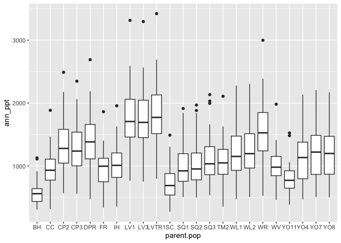<!-- -->

```r
bioclim_recent %>% ggplot(aes(x=year, y=temp_seasonality, group=parent.pop, color=parent.pop)) + geom_line()
```

<!-- -->

```r
bioclim_historical %>% ggplot(aes(x=year, y=temp_seasonality, group=parent.pop, color=parent.pop)) + geom_line()
```

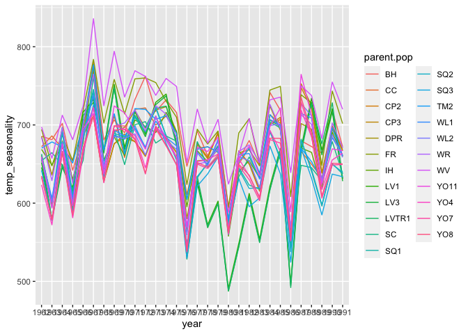<!-- -->

```r
bioclim_recent %>% ggplot(aes(x=year, y=ppt_seasonality, group=parent.pop, color=parent.pop)) + geom_line()
```

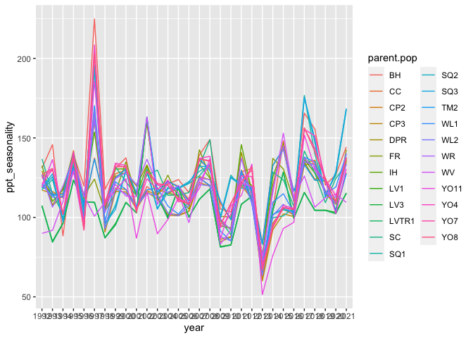<!-- -->

```r
bioclim_historical %>% ggplot(aes(x=year, y=ppt_seasonality, group=parent.pop, color=parent.pop)) + geom_line()
```

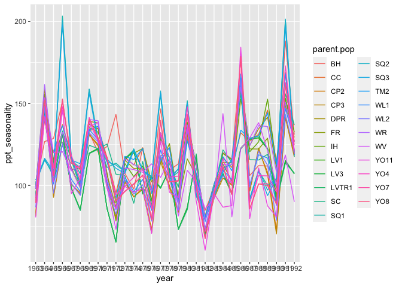<!-- -->


## Snow Cover - Average across years (all months included)


```r
names(pop_elev_climate_recent)
```

```
##  [1] "parent.pop"      "elevation.group" "elev_m"          "year"           
##  [5] "month"           "cwd"             "pck"             "ppt"            
##  [9] "tmn"             "tmx"
```

```r
pop_elev_climate_recent %>% filter(year==2006) %>% ggplot(aes(x=month, y=pck, group=parent.pop, color=parent.pop)) + geom_point() + geom_line()
```

<!-- -->

```r
pop_elev_climate_recent %>% filter(year==2006) %>% ggplot(aes(x=month, y=pck, group=parent.pop, color=elevation.group)) + geom_point() + geom_line()
```

<!-- -->

```r
#average snowpack across entire year for 30-year period 
recent_climate_avgs <- pop_elev_climate_recent %>% group_by(parent.pop,elevation.group ,elev_m) %>% summarise_at(c("cwd", "pck", "ppt", "tmn", "tmx"), c(mean, sem), na.rm = TRUE) 
names(recent_climate_avgs) <- gsub("fn2", "sem", colnames(recent_climate_avgs))
names(recent_climate_avgs) <-gsub("fn1", "mean", colnames(recent_climate_avgs))
recent_climate_avgs #30 year averages
```

```
## # A tibble: 23 × 13
## # Groups:   parent.pop, elevation.group [23]
##    parent.pop elevation.group elev_m cwd_mean pck_mean ppt_mean tmn_mean
##    <chr>      <chr>            <dbl>    <dbl>    <dbl>    <dbl>    <dbl>
##  1 BH         Low               511.     75.5    0         48.6    8.81 
##  2 CC         Low               313      59.6    0         85.7    9.97 
##  3 CP2        High             2244.     62.7  203.       106.     1.12 
##  4 CP3        High             2266.     46.2  221.       102.     0.475
##  5 DPR        Mid              1019.     27.5    8.95     122.     7.80 
##  6 FR         Mid               787      55.8   19.0       83.1    5.33 
##  7 IH         Low               454.     49.1    0.194     89.9    8.63 
##  8 LV1        High             2593.     49.4  438.       148.    -1.44 
##  9 LV3        High             2354.     57.2  423.       147.    -1.42 
## 10 LVTR1      High             2741.     51.6  451.       153.    -1.63 
## # ℹ 13 more rows
## # ℹ 6 more variables: tmx_mean <dbl>, cwd_sem <dbl>, pck_sem <dbl>,
## #   ppt_sem <dbl>, tmn_sem <dbl>, tmx_sem <dbl>
```

```r
recent_climate_avgs$elevation.group <- factor(recent_climate_avgs$elevation.group, levels=elev_order)
recent_snwpck <- recent_climate_avgs %>% ggplot(aes(x=fct_reorder(parent.pop, pck_mean), y=pck_mean, fill=elevation.group)) + 
  geom_col(width = 0.7,position = position_dodge(0.75)) +
  geom_errorbar(aes(ymin=pck_mean-pck_sem,ymax=pck_mean+pck_sem),width=.2, position = 
                  position_dodge(0.75)) +
  scale_y_continuous(expand = c(0, 0)) +
  scale_fill_manual(values=elev_three_palette) + 
  #scale_fill_gradient(low = "#F5A540", high = "#0043F0") +
  labs(x="Population", y="Avg SnwPck (mm)" ,title = "Recent Climate") +
   theme_classic() +
  theme(text=element_text(size=20), axis.text.x = element_text(angle = 45,  hjust = 1))
recent_snwpck
```

<!-- -->

```r
#ggsave("../output/Climate/All_Year_Avg_PCK_RecentClim.png", width = 12, height = 6, units = "in")

historical_climate_avgs <- pop_elev_climate_historical %>% group_by(parent.pop, elevation.group ,elev_m) %>% summarise_at(c("cwd", "pck", "ppt", "tmn", "tmx"), c(mean, sem), na.rm = TRUE) 
names(historical_climate_avgs) <- gsub("fn2", "sem", colnames(historical_climate_avgs))
names(historical_climate_avgs) <-gsub("fn1", "mean", colnames(historical_climate_avgs))
historical_climate_avgs #30 year averages
```

```
## # A tibble: 23 × 13
## # Groups:   parent.pop, elevation.group [23]
##    parent.pop elevation.group elev_m cwd_mean pck_mean ppt_mean tmn_mean
##    <chr>      <chr>            <dbl>    <dbl>    <dbl>    <dbl>    <dbl>
##  1 BH         Low               511.     74.4   0.0195     48.4    7.63 
##  2 CC         Low               313      59.9   0.0793     82.1    8.85 
##  3 CP2        High             2244.     60.3 263.        112.    -0.396
##  4 CP3        High             2266.     43.7 281.        108.    -0.938
##  5 DPR        Mid              1019.     26.3  19.0       122.     6.15 
##  6 FR         Mid               787      54.7  21.7        82.8    4.08 
##  7 IH         Low               454.     50.2   1.45       88.9    7.61 
##  8 LV1        High             2593.     46.7 510.        151.    -3.51 
##  9 LV3        High             2354.     54.6 494.        149.    -3.52 
## 10 LVTR1      High             2741.     49.3 530.        156.    -3.66 
## # ℹ 13 more rows
## # ℹ 6 more variables: tmx_mean <dbl>, cwd_sem <dbl>, pck_sem <dbl>,
## #   ppt_sem <dbl>, tmn_sem <dbl>, tmx_sem <dbl>
```

```r
historical_climate_avgs$elevation.group <- factor(historical_climate_avgs$elevation.group, levels=elev_order)
hist_snwpck <- historical_climate_avgs %>% ggplot(aes(x=fct_reorder(parent.pop, pck_mean), y=pck_mean, fill=elevation.group)) + 
  geom_col(width = 0.7,position = position_dodge(0.75)) +
  geom_errorbar(aes(ymin=pck_mean-pck_sem,ymax=pck_mean+pck_sem),width=.2, position = 
                  position_dodge(0.75)) +
  scale_y_continuous(expand = c(0, 0)) +
  scale_fill_manual(values=elev_three_palette) + 
  #scale_fill_gradient(low = "#F5A540", high = "#0043F0") +
  labs(x="Population", y="Avg SnwPck (mm)" ,title = "Historical Climate") +
   theme_classic() +
  theme(text=element_text(size=20), axis.text.x = element_text(angle = 45,  hjust = 1))
hist_snwpck
```

<!-- -->

```r
#ggsave("../output/Climate/All_Year_Avg_PCK_HistoricalClim.png", width = 8, height = 4, units = "in")

legend <- get_legend(hist_snwpck)
hist_snwpck <- hist_snwpck + theme(legend.position="none")
recent_snwpck <- recent_snwpck + theme(legend.position="none")
grid.arrange(hist_snwpck, recent_snwpck, legend, ncol=3, widths=c(3.12, 3.12, 1.09))
```

<!-- -->

## Consistency of winter snow cover


```r
#monthly_pck <- pop_elev_climate_recent %>% filter(parent.pop==c("DPR","WR","WL1", "SQ1", "SQ2", "WL2", "YO4")) %>% group_by(parent.pop, elev_m, month) %>%
 # summarise(pck_mean=mean(pck), pck_sem=sem(pck))
#monthly_pck$parent.pop <- factor(monthly_pck$parent.pop, levels=c("DPR","WR","WL1", "SQ1", "SQ2", "WL2", "YO4"))

monthly_pck <- pop_elev_climate_recent %>% 
  filter(parent.pop==c("WL1", "SQ1", "SQ2", "WL2", "YO4")) %>% 
  group_by(parent.pop, elev_m, month) %>%
  summarise(pck_mean=mean(pck), pck_sem=sem(pck))
```

```
## `summarise()` has grouped output by 'parent.pop', 'elev_m'. You can override
## using the `.groups` argument.
```

```r
monthly_pck$parent.pop <- factor(monthly_pck$parent.pop, levels=c("WL1", "SQ1", "SQ2", "WL2", "YO4"))
monthly_pck
```

```
## # A tibble: 60 × 5
## # Groups:   parent.pop, elev_m [5]
##    parent.pop elev_m month pck_mean pck_sem
##    <fct>       <dbl> <dbl>    <dbl>   <dbl>
##  1 SQ1         1921.     1    128.     51.0
##  2 SQ1         1921.     2    211.    101. 
##  3 SQ1         1921.     3     96.3    66.8
##  4 SQ1         1921.     4     62.5    35.3
##  5 SQ1         1921.     5     23.2    23.2
##  6 SQ1         1921.     6      0       0  
##  7 SQ1         1921.     7      0       0  
##  8 SQ1         1921.     8      0       0  
##  9 SQ1         1921.     9      0       0  
## 10 SQ1         1921.    10      0       0  
## # ℹ 50 more rows
```

```r
monthly_pck %>% ggplot(aes(x=month, y=pck_mean, group=parent.pop, fill=parent.pop)) + 
  geom_col(width = 0.7,position = position_dodge(0.75)) +
  geom_errorbar(aes(ymin=pck_mean-pck_sem,ymax=pck_mean+pck_sem),width=.2, position=position_dodge(0.75)) +
  labs(title="Recent Climate", y="Avg SnwPck (mm)")  + 
  scale_y_continuous(expand = c(0, 0)) +
  scale_x_continuous(breaks=c(1, 2, 3, 4, 5,6,7,8,9,10, 11, 12)) +
  theme_classic() + 
  theme(text=element_text(size=30))
```

<!-- -->

```r
#ggsave("../output/Climate/Monthly_Avg_PCK_RecnetClim.png", width = 14, height = 6, units = "in")

#check even higher elevation
monthly_pck_high_elev <- pop_elev_climate_recent %>% 
  filter(elev_m>2200) %>%
  group_by(parent.pop, elev_m, month) %>%
  summarise(pck_mean=mean(pck), pck_sem=sem(pck))
```

```
## `summarise()` has grouped output by 'parent.pop', 'elev_m'. You can override
## using the `.groups` argument.
```

```r
monthly_pck_high_elev$parent.pop <- factor(monthly_pck_high_elev$parent.pop, levels=c("CP2", "CP3", "LV3", "SQ3", "YO7","YO8", "LV1", "LVTR1", "YO11"))

monthly_pck_high_elev %>% ggplot(aes(x=month, y=pck_mean, group=parent.pop, fill=parent.pop)) + 
  geom_col(width = 0.7,position = position_dodge(0.75)) +
  geom_errorbar(aes(ymin=pck_mean-pck_sem,ymax=pck_mean+pck_sem),width=.2, position=position_dodge(0.75)) +
  labs(title="Recent Climate", y="Avg SnwPck (mm)")  + 
  scale_y_continuous(expand = c(0, 0)) +
  scale_x_continuous(breaks=c(1, 2, 3, 4, 5,6,7,8,9,10, 11, 12)) +
  theme_classic() + 
  theme(text=element_text(size=30))
```

<!-- -->

```r
#ggsave("../output/Climate/Monthly_Avg_PCK_HIGHELEV_RecnetClim.png", width = 14, height = 6, units = "in")
```

## CWD Across the Year


```r
names(pop_elev_climate_recent)
```

```
##  [1] "parent.pop"      "elevation.group" "elev_m"          "year"           
##  [5] "month"           "cwd"             "pck"             "ppt"            
##  [9] "tmn"             "tmx"
```

```r
monthly_cwd <- pop_elev_climate_recent %>% 
  group_by(parent.pop, elev_m, month) %>%
  summarise(cwd_mean=mean(cwd), pck_sem=sem(cwd))
```

```
## `summarise()` has grouped output by 'parent.pop', 'elev_m'. You can override
## using the `.groups` argument.
```

```r
monthly_cwd
```

```
## # A tibble: 276 × 5
## # Groups:   parent.pop, elev_m [23]
##    parent.pop elev_m month cwd_mean pck_sem
##    <chr>       <dbl> <dbl>    <dbl>   <dbl>
##  1 BH           511.     1     29.3   0.430
##  2 BH           511.     2     40.9   0.492
##  3 BH           511.     3     53.8   1.52 
##  4 BH           511.     4     59.0   2.92 
##  5 BH           511.     5     51.5   5.37 
##  6 BH           511.     6     87.1   5.45 
##  7 BH           511.     7    136.    4.35 
##  8 BH           511.     8    154.    3.31 
##  9 BH           511.     9    130.    1.03 
## 10 BH           511.    10     88.9   0.537
## # ℹ 266 more rows
```

```r
monthly_cwd %>% #low elev
  filter(elev_m<520) %>% 
  ggplot(aes(x=month, y=cwd_mean)) +
  geom_line() +
  scale_x_continuous(breaks=c(1, 2, 3, 4, 5,6,7,8,9,10, 11, 12)) +
  theme_classic() +
  facet_wrap(~parent.pop)
```

<!-- -->

```r
monthly_cwd %>% #mid elev
  filter(elev_m>520, elev_m<1940) %>% 
  ggplot(aes(x=month, y=cwd_mean)) +
  geom_line() +
  scale_x_continuous(breaks=c(1, 2, 3, 4, 5,6,7,8,9,10, 11, 12)) +
  theme_classic() +
  facet_wrap(~parent.pop)
```

<!-- -->

```r
monthly_cwd %>% #high elev
  filter(elev_m>1940) %>% 
  ggplot(aes(x=month, y=cwd_mean)) +
  geom_line() +
  scale_x_continuous(breaks=c(1, 2, 3, 4, 5,6,7,8,9,10, 11, 12)) +
  theme_classic() +
  facet_wrap(~parent.pop)
```

<!-- -->


## Growth Season by snow/rain 
First month with no snow pack or w/ significant rain as start of growth season
First month with snow pack or w/ significant CWD as end of growth season 
Mean height at WL2 in Oct was 7 cm --> 70 mm

### Averages and Preliminary Calcs
Recent climate 

```r
pop_elev_climate_recent %>% filter(ppt == 0) #months 7-10 usually have ppt = 0 for low elev 
```

```
## # A tibble: 553 × 10
##    parent.pop elevation.group elev_m year  month   cwd   pck   ppt   tmn   tmx
##    <chr>      <chr>            <dbl> <chr> <dbl> <dbl> <dbl> <dbl> <dbl> <dbl>
##  1 BH         Low               511. 1992      8 160.      0     0 17.1   35.4
##  2 BH         Low               511. 1992      9 132.      0     0 13.6   31.7
##  3 BH         Low               511. 1993      7 128.      0     0 15.0   32.9
##  4 BH         Low               511. 1993      8 145.      0     0 14.8   33.2
##  5 BH         Low               511. 1993      9 128.      0     0 12.7   31.9
##  6 BH         Low               511. 1994      7 174.      0     0 17.3   35.8
##  7 BH         Low               511. 1994      8 180.      0     0 16.3   35.5
##  8 BH         Low               511. 1995     10  92.1     0     0  9.55  27.6
##  9 BH         Low               511. 1996      9 132.      0     0 12.2   31.0
## 10 BH         Low               511. 1997      8 155.      0     0 16.3   33.7
## # ℹ 543 more rows
```

```r
pop_elev_climate_recent %>% filter(pck >0, ppt == 0) #in sequoia pops, 2022, ppt=0, but there was still snowpack in January 
```

```
## # A tibble: 0 × 10
## # ℹ 10 variables: parent.pop <chr>, elevation.group <chr>, elev_m <dbl>,
## #   year <chr>, month <dbl>, cwd <dbl>, pck <dbl>, ppt <dbl>, tmn <dbl>,
## #   tmx <dbl>
```

```r
pop_elev_climate_recent %>% filter(ppt > 0, tmx<1.5) %>% arrange(pck) #if the temp is less than 1.5 (Flint's criteria for snowfall) and there is precipitation then pck > 0
```

```
## # A tibble: 168 × 10
##    parent.pop elevation.group elev_m year  month   cwd   pck   ppt    tmn   tmx
##    <chr>      <chr>            <dbl> <chr> <dbl> <dbl> <dbl> <dbl>  <dbl> <dbl>
##  1 YO11       High             2872. 2001      1  19.0  98.1  91.4 -11.6  1.08 
##  2 YO11       High             2872. 1997     12  16.9 106.   69.8 -11.5  0.150
##  3 YO11       High             2872. 2007     12  17.8 107.  114.  -10.3  0.870
##  4 YO11       High             2872. 2009     12  18.1 140.  146.  -10.3  1.47 
##  5 YO11       High             2872. 2019     12  18.7 146.  153.   -7.92 0.590
##  6 YO11       High             2872. 1994     11  16.7 191.  198.  -11.1  0.330
##  7 LV3        High             2354. 2007     12  15.8 194.  200.   -8.33 0.300
##  8 LV1        High             2593. 2007     12  12.2 198.  204.   -8.54 0.340
##  9 LVTR1      High             2741. 2007     12  13.5 205.  211.   -8.72 0.25 
## 10 LV3        High             2354. 2009     12  15.6 210.  186.   -9.76 1.30 
## # ℹ 158 more rows
```

```r
#first calculate 30 year monthly averages for pck and ppt 
pop_elev_climate_recent_avgs <- pop_elev_climate_recent %>% group_by(parent.pop, elevation.group, elev_m, month) %>% summarise_at(c("cwd", "pck", "ppt", "tmn", "tmx"), c(mean, sem), na.rm = TRUE)
names(pop_elev_climate_recent_avgs) <- gsub("fn2", "sem", colnames(pop_elev_climate_recent_avgs))
names(pop_elev_climate_recent_avgs) <-gsub("fn1", "mean", colnames(pop_elev_climate_recent_avgs))
pop_elev_climate_recent_avgs #30 year averages per month for each pop
```

```
## # A tibble: 276 × 14
## # Groups:   parent.pop, elevation.group, elev_m [23]
##    parent.pop elevation.group elev_m month cwd_mean pck_mean ppt_mean tmn_mean
##    <chr>      <chr>            <dbl> <dbl>    <dbl>    <dbl>    <dbl>    <dbl>
##  1 BH         Low               511.     1     29.3        0  125.        2.68
##  2 BH         Low               511.     2     40.9        0  100.        3.43
##  3 BH         Low               511.     3     53.8        0   85.4       4.90
##  4 BH         Low               511.     4     59.0        0   47.2       6.37
##  5 BH         Low               511.     5     51.5        0   23.1       9.76
##  6 BH         Low               511.     6     87.1        0    7.43     13.4 
##  7 BH         Low               511.     7    136.         0    1.40     17.2 
##  8 BH         Low               511.     8    154.         0    0.507    16.8 
##  9 BH         Low               511.     9    130.         0    2.89     14.1 
## 10 BH         Low               511.    10     88.9        0   29.9       9.48
## # ℹ 266 more rows
## # ℹ 6 more variables: tmx_mean <dbl>, cwd_sem <dbl>, pck_sem <dbl>,
## #   ppt_sem <dbl>, tmn_sem <dbl>, tmx_sem <dbl>
```

```r
pop_elev_climate_recent_avgs <- pop_elev_climate_recent_avgs %>% mutate(PckSum=sum(pck_mean)) #estimate of average total snowpack in a year 
pop_elev_climate_recent_avgs %>% arrange(PckSum)
```

```
## # A tibble: 276 × 15
## # Groups:   parent.pop, elevation.group, elev_m [23]
##    parent.pop elevation.group elev_m month cwd_mean pck_mean ppt_mean tmn_mean
##    <chr>      <chr>            <dbl> <dbl>    <dbl>    <dbl>    <dbl>    <dbl>
##  1 BH         Low               511.     1     29.3        0  125.        2.68
##  2 BH         Low               511.     2     40.9        0  100.        3.43
##  3 BH         Low               511.     3     53.8        0   85.4       4.90
##  4 BH         Low               511.     4     59.0        0   47.2       6.37
##  5 BH         Low               511.     5     51.5        0   23.1       9.76
##  6 BH         Low               511.     6     87.1        0    7.43     13.4 
##  7 BH         Low               511.     7    136.         0    1.40     17.2 
##  8 BH         Low               511.     8    154.         0    0.507    16.8 
##  9 BH         Low               511.     9    130.         0    2.89     14.1 
## 10 BH         Low               511.    10     88.9        0   29.9       9.48
## # ℹ 266 more rows
## # ℹ 7 more variables: tmx_mean <dbl>, cwd_sem <dbl>, pck_sem <dbl>,
## #   ppt_sem <dbl>, tmn_sem <dbl>, tmx_sem <dbl>, PckSum <dbl>
```

```r
#Exploratory filters
pop_elev_climate_recent %>% filter(parent.pop=="SC") %>% filter(year==2016 | year==2017) #snow pack in Jan 2017
```

```
## # A tibble: 24 × 10
##    parent.pop elevation.group elev_m year  month   cwd   pck     ppt   tmn   tmx
##    <chr>      <chr>            <dbl> <chr> <dbl> <dbl> <dbl>   <dbl> <dbl> <dbl>
##  1 SC         Low               422. 2016      1  20.2     0 2.12e+2  4.03  12.0
##  2 SC         Low               422. 2016      2  34.6     0 3.34e+1  5.05  17.7
##  3 SC         Low               422. 2016      3  30.6     0 2.23e+2  6.17  16.9
##  4 SC         Low               422. 2016      4  37.5     0 7.73e+1  7.82  20.6
##  5 SC         Low               422. 2016      5  69.0     0 1.22e+1  9.81  24.1
##  6 SC         Low               422. 2016      6  94.8     0 0       13.2   31.8
##  7 SC         Low               422. 2016      7 142.      0 0       14.6   33.8
##  8 SC         Low               422. 2016      8 159.      0 3.00e-2 15.1   33.2
##  9 SC         Low               422. 2016      9 126.      0 0       12.8   29.8
## 10 SC         Low               422. 2016     10  80.1     0 1.83e+2  9.38  22.4
## # ℹ 14 more rows
```

```r
pop_elev_climate_recent %>% filter(parent.pop=="IH") %>% filter(pck >0) #snow pack in Jan 1993 & 2017 and Feb 2019
```

```
## # A tibble: 4 × 10
##   parent.pop elevation.group elev_m year  month   cwd   pck   ppt   tmn   tmx
##   <chr>      <chr>            <dbl> <chr> <dbl> <dbl> <dbl> <dbl> <dbl> <dbl>
## 1 IH         Low               454. 1992     12  18.8  4.13  301. 0.860 11.0 
## 2 IH         Low               454. 1993      1  15.6  5.34  364. 1.72  11.2 
## 3 IH         Low               454. 2017      1  15.6 18.0   495. 2.31  10.2 
## 4 IH         Low               454. 2019      2  19.9 42.3   429. 1.60   9.46
```

```r
pop_elev_climate_recent %>% filter(parent.pop=="SQ3") %>% filter(pck==0, ppt < 10) #high elev pops get very little rain and high cwd during growth season ...
```

```
## # A tibble: 106 × 10
##    parent.pop elevation.group elev_m year  month   cwd   pck    ppt   tmn   tmx
##    <chr>      <chr>            <dbl> <chr> <dbl> <dbl> <dbl>  <dbl> <dbl> <dbl>
##  1 SQ3        High             2373. 1992      6  95.0     0 7.54    4.84 17.6 
##  2 SQ3        High             2373. 1992      8  82.0     0 7.80   10.7  23.8 
##  3 SQ3        High             2373. 1992      9 103.      0 4.26    7.52 19.9 
##  4 SQ3        High             2373. 1992     11  39.7     0 3.78   -1.58  8.87
##  5 SQ3        High             2373. 1993      7  88.3     0 0.0200  7.11 20.9 
##  6 SQ3        High             2373. 1993      8  89.4     0 3.48    8.38 22.2 
##  7 SQ3        High             2373. 1993      9  91.6     0 0.100   7.45 20.3 
##  8 SQ3        High             2373. 1994      6  95.1     0 0.0100  6.79 19.9 
##  9 SQ3        High             2373. 1994      7 114.      0 6.24   10.3  23.9 
## 10 SQ3        High             2373. 1994      8 126.      0 0.300  11.8  24.4 
## # ℹ 96 more rows
```

Historical climate 

```r
pop_elev_climate_historical_avgs <- pop_elev_climate_historical %>% group_by(parent.pop, elevation.group, elev_m, month) %>% summarise_at(c("cwd", "pck", "ppt", "tmn", "tmx"), c(mean, sem), na.rm = TRUE)
names(pop_elev_climate_historical_avgs) <- gsub("fn2", "sem", colnames(pop_elev_climate_historical_avgs))
names(pop_elev_climate_historical_avgs) <-gsub("fn1", "mean", colnames(pop_elev_climate_historical_avgs))
pop_elev_climate_historical_avgs #30 year averages per month for each pop
```

```
## # A tibble: 276 × 14
## # Groups:   parent.pop, elevation.group, elev_m [23]
##    parent.pop elevation.group elev_m month cwd_mean pck_mean ppt_mean tmn_mean
##    <chr>      <chr>            <dbl> <dbl>    <dbl>    <dbl>    <dbl>    <dbl>
##  1 BH         Low               511.     1     28.1    0.234    98.4      1.25
##  2 BH         Low               511.     2     40.6    0        95.9      2.77
##  3 BH         Low               511.     3     50.9    0       102.       3.76
##  4 BH         Low               511.     4     61.0    0        51.0      5.44
##  5 BH         Low               511.     5     61.1    0        13.0      8.64
##  6 BH         Low               511.     6     89.3    0         4.71    12.3 
##  7 BH         Low               511.     7    127.     0         1.01    15.5 
##  8 BH         Low               511.     8    148.     0         1.82    15.1 
##  9 BH         Low               511.     9    127.     0        10.4     12.6 
## 10 BH         Low               511.    10     87.1    0        32.6      8.40
## # ℹ 266 more rows
## # ℹ 6 more variables: tmx_mean <dbl>, cwd_sem <dbl>, pck_sem <dbl>,
## #   ppt_sem <dbl>, tmn_sem <dbl>, tmx_sem <dbl>
```

```r
pop_elev_climate_historical_avgs <- pop_elev_climate_historical_avgs %>% mutate(PckSum=sum(pck_mean)) #estimate of average total snowpack in a year 
pop_elev_climate_historical_avgs %>% arrange(PckSum) #IH PckSum = 17...
```

```
## # A tibble: 276 × 15
## # Groups:   parent.pop, elevation.group, elev_m [23]
##    parent.pop elevation.group elev_m month cwd_mean pck_mean ppt_mean tmn_mean
##    <chr>      <chr>            <dbl> <dbl>    <dbl>    <dbl>    <dbl>    <dbl>
##  1 BH         Low               511.     1     28.1    0.234    98.4      1.25
##  2 BH         Low               511.     2     40.6    0        95.9      2.77
##  3 BH         Low               511.     3     50.9    0       102.       3.76
##  4 BH         Low               511.     4     61.0    0        51.0      5.44
##  5 BH         Low               511.     5     61.1    0        13.0      8.64
##  6 BH         Low               511.     6     89.3    0         4.71    12.3 
##  7 BH         Low               511.     7    127.     0         1.01    15.5 
##  8 BH         Low               511.     8    148.     0         1.82    15.1 
##  9 BH         Low               511.     9    127.     0        10.4     12.6 
## 10 BH         Low               511.    10     87.1    0        32.6      8.40
## # ℹ 266 more rows
## # ℹ 7 more variables: tmx_mean <dbl>, cwd_sem <dbl>, pck_sem <dbl>,
## #   ppt_sem <dbl>, tmn_sem <dbl>, tmx_sem <dbl>, PckSum <dbl>
```

```r
#Exploratory filters
pop_elev_climate_historical %>% filter(parent.pop=="BH") %>% filter(pck >0) #snow pack in Jan 1982
```

```
## # A tibble: 1 × 10
##   parent.pop elevation.group elev_m year  month   cwd   pck   ppt   tmn   tmx
##   <chr>      <chr>            <dbl> <chr> <dbl> <dbl> <dbl> <dbl> <dbl> <dbl>
## 1 BH         Low               511. 1982      1  24.3  7.02  203. 0.400  10.9
```

```r
pop_elev_climate_historical %>% filter(parent.pop=="SC") %>% filter(pck >0) #snow pack in Jan 1973 and 1982
```

```
## # A tibble: 2 × 10
##   parent.pop elevation.group elev_m year  month   cwd   pck   ppt   tmn   tmx
##   <chr>      <chr>            <dbl> <chr> <dbl> <dbl> <dbl> <dbl> <dbl> <dbl>
## 1 SC         Low               422. 1973      1  19.1  2.94  273. 1.21   11.0
## 2 SC         Low               422. 1982      1  18.6 15.0   209. 0.120  10.3
```

```r
pop_elev_climate_historical %>% filter(parent.pop=="CC") %>% filter(pck >0) #snow pack in Jan 1969 and 1973
```

```
## # A tibble: 2 × 10
##   parent.pop elevation.group elev_m year  month   cwd   pck   ppt   tmn   tmx
##   <chr>      <chr>            <dbl> <chr> <dbl> <dbl> <dbl> <dbl> <dbl> <dbl>
## 1 CC         Low                313 1969      1  16.7 21.4   415.  1.85  10.4
## 2 CC         Low                313 1973      1  16.8  7.10  358.  1.68  10.9
```

```r
pop_elev_climate_historical %>% filter(parent.pop=="TM2") %>% filter(pck >0) #snow pack in Dec '68, Jan-Feb '69, Dec '71, Dec '72, Jan '73, Jan '82
```

```
## # A tibble: 7 × 10
##   parent.pop elevation.group elev_m year  month   cwd   pck   ppt    tmn   tmx
##   <chr>      <chr>            <dbl> <chr> <dbl> <dbl> <dbl> <dbl>  <dbl> <dbl>
## 1 TM2        Low               379. 1968     12 10.3   6.04  263.  0.930 10.1 
## 2 TM2        Low               379. 1969      1  3.81 61.4   464.  1.49  10.0 
## 3 TM2        Low               379. 1969      2  0    30.5   312.  2.34  10.2 
## 4 TM2        Low               379. 1971     12 17.2   3.88  199.  0.340  9.62
## 5 TM2        Low               379. 1972     12 10.1  11.4   153. -0.390  8.63
## 6 TM2        Low               379. 1973      1  4.85 47.9   388.  1.27  10.4 
## 7 TM2        Low               379. 1982      1  3.91  2.98  201.  0.800  9.66
```

```r
pop_elev_climate_historical %>% filter(parent.pop=="IH") %>% filter(pck >0) #snow pack in Dec '68, Jan-Feb '69, Dec '70, Dec '71, Jan & Dec '72, Jan-Feb '73, Jan '79
```

```
## # A tibble: 11 × 10
##    parent.pop elevation.group elev_m year  month   cwd     pck   ppt     tmn
##    <chr>      <chr>            <dbl> <chr> <dbl> <dbl>   <dbl> <dbl>   <dbl>
##  1 IH         Low               454. 1968     12  16.5  17.8   230.  -0.0800
##  2 IH         Low               454. 1969      1  15.3 107.    529.   1.05  
##  3 IH         Low               454. 1969      2  19.7 129.    301.   1.14  
##  4 IH         Low               454. 1970     12  16.6  27.9   345.   1.58  
##  5 IH         Low               454. 1971     12  17.4  59.3   262.  -0.370 
##  6 IH         Low               454. 1972      1  18.3  19.6    81.1 -0.0200
##  7 IH         Low               454. 1972     12  17.1  20.4   143.  -1.83  
##  8 IH         Low               454. 1973      1  14.9 105.    381.   0.0800
##  9 IH         Low               454. 1973      2  21.6   0.480 247.   3.5   
## 10 IH         Low               454. 1979      1  17.4   4.82  227.   0.5   
## 11 IH         Low               454. 1982      1  14.9  29.3   229.  -0.220 
## # ℹ 1 more variable: tmx <dbl>
```

Simpler version (similar results to above calcs)

```r
##recent
pop_elev_climate_recent_sums <- pop_elev_climate_recent %>% 
  group_by(parent.pop, elevation.group, elev_m, year) %>% 
  summarise(PckSum=sum(pck))
```

```
## `summarise()` has grouped output by 'parent.pop', 'elevation.group', 'elev_m'.
## You can override using the `.groups` argument.
```

```r
pop_elev_climate_recent_sums_avgs <- pop_elev_climate_recent_sums %>% 
  group_by(parent.pop, elevation.group, elev_m) %>% 
  summarise(meanPckSum=mean(PckSum), semPckSum=sem(PckSum)) %>% 
  arrange(meanPckSum)
```

```
## `summarise()` has grouped output by 'parent.pop', 'elevation.group'. You can
## override using the `.groups` argument.
```

```r
pop_elev_climate_recent_sums_avgs
```

```
## # A tibble: 23 × 5
## # Groups:   parent.pop, elevation.group [23]
##    parent.pop elevation.group elev_m meanPckSum semPckSum
##    <chr>      <chr>            <dbl>      <dbl>     <dbl>
##  1 BH         Low               511.      0         0    
##  2 CC         Low               313       0         0    
##  3 TM2        Low               379.      0         0    
##  4 SC         Low               422.      0.252     0.252
##  5 IH         Low               454.      2.32      1.51 
##  6 DPR        Mid              1019.    107.       29.3  
##  7 FR         Mid               787     229.       45.8  
##  8 WV         Mid               749.    322.       51.7  
##  9 WR         Mid              1158     391.       71.7  
## 10 SQ1        Mid              1921.    613.       97.5  
## # ℹ 13 more rows
```

```r
##historical
pop_elev_climate_historical_sums <- pop_elev_climate_historical %>% 
  group_by(parent.pop, elevation.group, elev_m, year) %>% 
  summarise(PckSum=sum(pck))
```

```
## `summarise()` has grouped output by 'parent.pop', 'elevation.group', 'elev_m'.
## You can override using the `.groups` argument.
```

```r
pop_elev_climate_historical_sums_avgs <- pop_elev_climate_historical_sums %>% 
  group_by(parent.pop, elevation.group, elev_m) %>% 
  summarise(meanPckSum=mean(PckSum), semPckSum=sem(PckSum)) %>% 
  arrange(meanPckSum)
```

```
## `summarise()` has grouped output by 'parent.pop', 'elevation.group'. You can
## override using the `.groups` argument.
```

```r
pop_elev_climate_historical_sums_avgs
```

```
## # A tibble: 23 × 5
## # Groups:   parent.pop, elevation.group [23]
##    parent.pop elevation.group elev_m meanPckSum semPckSum
##    <chr>      <chr>            <dbl>      <dbl>     <dbl>
##  1 BH         Low               511.      0.234     0.234
##  2 SC         Low               422.      0.597     0.506
##  3 CC         Low               313       0.951     0.745
##  4 TM2        Low               379.      5.47      3.40 
##  5 IH         Low               454.     17.3       8.64 
##  6 DPR        Mid              1019.    228.       60.8  
##  7 FR         Mid               787     261.       62.3  
##  8 WV         Mid               749.    404.       83.5  
##  9 WR         Mid              1158     561.      110.   
## 10 WL1        Mid              1614.    892.      134.   
## # ℹ 13 more rows
```

### For each year separately

-   Populations that get less than 70 mm (b/c that's the avg height in Oct at WL2 garden) of snow pack in a year (on average): growth season = when there is no snowpack + significant rain event (> 10 mm) or lower cwd (< 88 or 86). CWD = 88 = 3rd quartile of the cwd_mean for these pops (recent climate). CWD = 86 = 3rd quartile of cwd_mean for historical climate

Jenny has used 25 mm as germinating inducing rain, 10 mm would probably be fine for sustaining (esp b/c it's a sum of ppt for the whole month) 
Raise rain for germination and leave CWD is for just growing 
-   John and Sam have code for daily data, with "first day to x event" - Ask Sam if she's calculated this for STTO pops 

Recent Climate

```r
nosnow_pops_recent <- pop_elev_climate_recent_avgs %>% filter(PckSum < 70)
unique(nosnow_pops_recent$parent.pop) #BH, CC, TM2, SC, IH 
```

```
## [1] "BH"  "CC"  "IH"  "SC"  "TM2"
```

```r
summary(nosnow_pops_recent) #3rd quartile of CWD = 88
```

```
##   parent.pop        elevation.group        elev_m          month      
##  Length:60          Length:60          Min.   :313.0   Min.   : 1.00  
##  Class :character   Class :character   1st Qu.:379.2   1st Qu.: 3.75  
##  Mode  :character   Mode  :character   Median :421.5   Median : 6.50  
##                                        Mean   :415.8   Mean   : 6.50  
##                                        3rd Qu.:454.1   3rd Qu.: 9.25  
##                                        Max.   :511.4   Max.   :12.00  
##     cwd_mean         pck_mean          ppt_mean           tmn_mean     
##  Min.   : 12.95   Min.   :0.00000   Min.   :  0.1587   Min.   : 2.366  
##  1st Qu.: 31.01   1st Qu.:0.00000   1st Qu.:  8.9782   1st Qu.: 4.874  
##  Median : 49.74   Median :0.00000   Median : 59.4208   Median : 8.649  
##  Mean   : 62.04   Mean   :0.04294   Mean   : 77.1655   Mean   : 9.172  
##  3rd Qu.: 87.57   3rd Qu.:0.00000   3rd Qu.:127.8994   3rd Qu.:13.809  
##  Max.   :167.33   Max.   :1.41000   Max.   :231.6770   Max.   :17.510  
##     tmx_mean        cwd_sem          pck_sem           ppt_sem        
##  Min.   :12.37   Min.   :0.1709   Min.   :0.00000   Min.   : 0.07712  
##  1st Qu.:16.29   1st Qu.:0.5503   1st Qu.:0.00000   1st Qu.: 2.49284  
##  Median :22.41   Median :1.6062   Median :0.00000   Median :10.03852  
##  Mean   :22.91   Mean   :2.4735   Mean   :0.04031   Mean   :10.89493  
##  3rd Qu.:30.58   3rd Qu.:4.0240   3rd Qu.:0.00000   3rd Qu.:17.03939  
##  Max.   :35.05   Max.   :9.9766   Max.   :1.41000   Max.   :27.98985  
##     tmn_sem          tmx_sem           PckSum      
##  Min.   :0.1835   Min.   :0.1742   Min.   :0.0000  
##  1st Qu.:0.2267   1st Qu.:0.2637   1st Qu.:0.0000  
##  Median :0.2440   Median :0.3399   Median :0.0000  
##  Mean   :0.2416   Mean   :0.3280   Mean   :0.5153  
##  3rd Qu.:0.2660   3rd Qu.:0.3717   3rd Qu.:0.2523  
##  Max.   :0.2791   Max.   :0.4856   Max.   :2.3243
```

```r
nosnow_pops_recent_tojoin <- nosnow_pops_recent %>% select(parent.pop:elev_m, PckSum) %>% distinct()

nosnow_pops_recent_years <- left_join(nosnow_pops_recent_tojoin, pop_elev_climate_recent) 
```

```
## Joining with `by = join_by(parent.pop, elevation.group, elev_m)`
```

```r
nosnow_pops_recent_years %>% filter(month=="7", ppt>=25) #never get >=25mm of ppt in July so can start with Aug
```

```
## # A tibble: 1 × 11
## # Groups:   parent.pop, elevation.group, elev_m [1]
##   parent.pop elevation.group elev_m PckSum year  month   cwd   pck   ppt   tmn
##   <chr>      <chr>            <dbl>  <dbl> <chr> <dbl> <dbl> <dbl> <dbl> <dbl>
## 1 BH         Low               511.      0 1992      7  82.4     0  33.7  16.0
## # ℹ 1 more variable: tmx <dbl>
```

```r
nosnow_pops_recent_years %>% filter(month=="8", ppt>=25)
```

```
## # A tibble: 3 × 11
## # Groups:   parent.pop, elevation.group, elev_m [3]
##   parent.pop elevation.group elev_m PckSum year  month   cwd   pck   ppt   tmn
##   <chr>      <chr>            <dbl>  <dbl> <chr> <dbl> <dbl> <dbl> <dbl> <dbl>
## 1 CC         Low               313    0    2003      8  71.8     0  25.1  16.2
## 2 IH         Low               454.   2.32 2003      8  54.7     0  28.8  15.0
## 3 TM2        Low               379.   0    1997      8 139.      0  25.8  15.5
## # ℹ 1 more variable: tmx <dbl>
```

```r
growyear_months <- tibble(month=c(1:12), growmonth=c(6, 7, 8, 9, 10, 11, 12, 1, 2, 3, 4, 5))

nosnow_recent_growyear_months <- full_join(growyear_months, nosnow_pops_recent_years)
```

```
## Joining with `by = join_by(month)`
```

```r
dim(nosnow_recent_growyear_months)
```

```
## [1] 1800   12
```

```r
#nosnow_recent_growyear_months %>% filter(ppt==0, cwd<88)

nosnow_first_month <- nosnow_recent_growyear_months %>%
  group_by(parent.pop, elevation.group, elev_m, year) %>% 
  filter(ppt>=25) %>% 
  arrange(growmonth) %>% 
  filter(row_number()==1) #get first month for each pop and year with germinating inducing rain 

#nosnow_first_month %>% filter(parent.pop=="IH") %>% arrange(year)

nosnow_first_month_tomerge <- nosnow_first_month %>% 
  select(parent.pop:elev_m, year, firstmonth=growmonth)

nosnow_first_month_col <- full_join(nosnow_recent_growyear_months, nosnow_first_month_tomerge)
```

```
## Joining with `by = join_by(parent.pop, elevation.group, elev_m, year)`
```

```r
dim(nosnow_first_month_col)
```

```
## [1] 1800   13
```

```r
nosnow_last_month <- nosnow_recent_growyear_months %>%
  group_by(parent.pop, elevation.group, elev_m, year) %>% 
  filter(cwd>88) %>% 
  arrange(month) %>% 
  filter(row_number()==1)

nosnow_last_month_tomerge <- nosnow_last_month %>% 
  select(parent.pop:elev_m, year, lastmonth=growmonth) #last month is in grow month not calendar month format

nosnow_last_month_col <- full_join(nosnow_first_month_col, nosnow_last_month_tomerge)
```

```
## Joining with `by = join_by(parent.pop, elevation.group, elev_m, year)`
```

```r
dim(nosnow_last_month_col)
```

```
## [1] 1800   14
```

```r
#Checking for weird cases 
nosnow_last_month_col %>% filter(is.na(lastmonth)) %>% arrange(year) #3 years when IH doesn't have a last month based on these criteria (cwd never goes above 88 in those years)
```

```
## # A tibble: 36 × 14
##    month growmonth parent.pop elevation.group elev_m PckSum year    cwd   pck
##    <dbl>     <dbl> <chr>      <chr>            <dbl>  <dbl> <chr> <dbl> <dbl>
##  1     1         6 IH         Low               454.   2.32 1998   16.3     0
##  2     2         7 IH         Low               454.   2.32 1998   21.0     0
##  3     3         8 IH         Low               454.   2.32 1998   30.3     0
##  4     4         9 IH         Low               454.   2.32 1998   21.1     0
##  5     5        10 IH         Low               454.   2.32 1998    0       0
##  6     6        11 IH         Low               454.   2.32 1998    0       0
##  7     7        12 IH         Low               454.   2.32 1998   42.5     0
##  8     8         1 IH         Low               454.   2.32 1998   83.1     0
##  9     9         2 IH         Low               454.   2.32 1998   87.6     0
## 10    10         3 IH         Low               454.   2.32 1998   68.9     0
## # ℹ 26 more rows
## # ℹ 5 more variables: ppt <dbl>, tmn <dbl>, tmx <dbl>, firstmonth <dbl>,
## #   lastmonth <dbl>
```

```r
nosnow_last_month_col %>% filter(is.na(firstmonth)) %>% arrange(year) #1 year when BH doesn't have a first month based on these criteria (ppt never above 25)
```

```
## # A tibble: 12 × 14
##    month growmonth parent.pop elevation.group elev_m PckSum year    cwd   pck
##    <dbl>     <dbl> <chr>      <chr>            <dbl>  <dbl> <chr> <dbl> <dbl>
##  1     1         6 BH         Low               511.      0 2013   28.4     0
##  2     2         7 BH         Low               511.      0 2013   40.4     0
##  3     3         8 BH         Low               511.      0 2013   61.2     0
##  4     4         9 BH         Low               511.      0 2013   74.9     0
##  5     5        10 BH         Low               511.      0 2013   75.7     0
##  6     6        11 BH         Low               511.      0 2013  101.      0
##  7     7        12 BH         Low               511.      0 2013  136.      0
##  8     8         1 BH         Low               511.      0 2013  150.      0
##  9     9         2 BH         Low               511.      0 2013  129.      0
## 10    10         3 BH         Low               511.      0 2013   86.8     0
## 11    11         4 BH         Low               511.      0 2013   47.2     0
## 12    12         5 BH         Low               511.      0 2013   31.3     0
## # ℹ 5 more variables: ppt <dbl>, tmn <dbl>, tmx <dbl>, firstmonth <dbl>,
## #   lastmonth <dbl>
```

```r
nosnow_last_month_col %>% filter(lastmonth<5) %>% arrange(parent.pop, year) #some cases where last month is less than 5 (earlier than December)
```

```
## # A tibble: 444 × 14
##    month growmonth parent.pop elevation.group elev_m PckSum year    cwd   pck
##    <dbl>     <dbl> <chr>      <chr>            <dbl>  <dbl> <chr> <dbl> <dbl>
##  1     1         6 BH         Low               511.      0 1995   27.9     0
##  2     2         7 BH         Low               511.      0 1995   43.9     0
##  3     3         8 BH         Low               511.      0 1995   41.1     0
##  4     4         9 BH         Low               511.      0 1995   38.9     0
##  5     5        10 BH         Low               511.      0 1995   12.3     0
##  6     6        11 BH         Low               511.      0 1995   34.4     0
##  7     7        12 BH         Low               511.      0 1995   80.9     0
##  8     8         1 BH         Low               511.      0 1995  180.      0
##  9     9         2 BH         Low               511.      0 1995  134.      0
## 10    10         3 BH         Low               511.      0 1995   92.1     0
## # ℹ 434 more rows
## # ℹ 5 more variables: ppt <dbl>, tmn <dbl>, tmx <dbl>, firstmonth <dbl>,
## #   lastmonth <dbl>
```

```r
nosnow_last_month_col %>% filter(lastmonth<firstmonth, lastmonth<5) %>% arrange(parent.pop, year) #most of the above are when the last month is before the first month (in growyear, not calendar year)
```

```
## # A tibble: 432 × 14
##    month growmonth parent.pop elevation.group elev_m PckSum year    cwd   pck
##    <dbl>     <dbl> <chr>      <chr>            <dbl>  <dbl> <chr> <dbl> <dbl>
##  1     1         6 BH         Low               511.      0 1995   27.9     0
##  2     2         7 BH         Low               511.      0 1995   43.9     0
##  3     3         8 BH         Low               511.      0 1995   41.1     0
##  4     4         9 BH         Low               511.      0 1995   38.9     0
##  5     5        10 BH         Low               511.      0 1995   12.3     0
##  6     6        11 BH         Low               511.      0 1995   34.4     0
##  7     7        12 BH         Low               511.      0 1995   80.9     0
##  8     8         1 BH         Low               511.      0 1995  180.      0
##  9     9         2 BH         Low               511.      0 1995  134.      0
## 10    10         3 BH         Low               511.      0 1995   92.1     0
## # ℹ 422 more rows
## # ℹ 5 more variables: ppt <dbl>, tmn <dbl>, tmx <dbl>, firstmonth <dbl>,
## #   lastmonth <dbl>
```

```r
nosnow_last_month_col %>% filter(lastmonth>firstmonth & lastmonth<5) %>% arrange(parent.pop, year) #IH 2003, first month = 1 (Aug) & last month = 2 (Sept). Seems like there was a fluke rain event in Aug, but rain picked up again in November - CONSIDER MANUALLY ADJUSTING THE GROWTH SEASON FOR THIS CASE
```

```
## # A tibble: 12 × 14
##    month growmonth parent.pop elevation.group elev_m PckSum year    cwd   pck
##    <dbl>     <dbl> <chr>      <chr>            <dbl>  <dbl> <chr> <dbl> <dbl>
##  1     1         6 IH         Low               454.   2.32 2003   20.9     0
##  2     2         7 IH         Low               454.   2.32 2003   28.0     0
##  3     3         8 IH         Low               454.   2.32 2003   41.6     0
##  4     4         9 IH         Low               454.   2.32 2003   20.4     0
##  5     5        10 IH         Low               454.   2.32 2003    0       0
##  6     6        11 IH         Low               454.   2.32 2003   57.2     0
##  7     7        12 IH         Low               454.   2.32 2003   74.5     0
##  8     8         1 IH         Low               454.   2.32 2003   54.7     0
##  9     9         2 IH         Low               454.   2.32 2003  130.      0
## 10    10         3 IH         Low               454.   2.32 2003   83.1     0
## 11    11         4 IH         Low               454.   2.32 2003   33.7     0
## 12    12         5 IH         Low               454.   2.32 2003   19.8     0
## # ℹ 5 more variables: ppt <dbl>, tmn <dbl>, tmx <dbl>, firstmonth <dbl>,
## #   lastmonth <dbl>
```

```r
nosnow_last_month_col %>% filter(lastmonth==5) %>% arrange(parent.pop, year) #0 cases where 5 is the last month 
```

```
## # A tibble: 0 × 14
## # ℹ 14 variables: month <dbl>, growmonth <dbl>, parent.pop <chr>,
## #   elevation.group <chr>, elev_m <dbl>, PckSum <dbl>, year <chr>, cwd <dbl>,
## #   pck <dbl>, ppt <dbl>, tmn <dbl>, tmx <dbl>, firstmonth <dbl>,
## #   lastmonth <dbl>
```

```r
nosnow_last_month_col %>% filter(lastmonth==firstmonth) %>% arrange(parent.pop, year) #first month and last month are never the same 
```

```
## # A tibble: 0 × 14
## # ℹ 14 variables: month <dbl>, growmonth <dbl>, parent.pop <chr>,
## #   elevation.group <chr>, elev_m <dbl>, PckSum <dbl>, year <chr>, cwd <dbl>,
## #   pck <dbl>, ppt <dbl>, tmn <dbl>, tmx <dbl>, firstmonth <dbl>,
## #   lastmonth <dbl>
```

```r
nosnow_last_month_col %>% filter(growmonth==firstmonth+1, cwd>88) %>% arrange(parent.pop, year) #2 cases where cwd is high in the second growth month 
```

```
## # A tibble: 2 × 14
##   month growmonth parent.pop elevation.group elev_m PckSum year    cwd   pck
##   <dbl>     <dbl> <chr>      <chr>            <dbl>  <dbl> <chr> <dbl> <dbl>
## 1     9         2 CC         Low               313    0    2003   107.     0
## 2     9         2 IH         Low               454.   2.32 2003   130.     0
## # ℹ 5 more variables: ppt <dbl>, tmn <dbl>, tmx <dbl>, firstmonth <dbl>,
## #   lastmonth <dbl>
```

```r
nosnow_grwseason_recent <- nosnow_last_month_col %>% #fill in all the months b/t the first and last for the full growth season 
  group_by(parent.pop, elevation.group, elev_m, year) %>% 
  filter(growmonth>=firstmonth) %>% #first and last month are in grow month format not calendar year 
  filter(ifelse(lastmonth<5, growmonth<=12, growmonth<lastmonth)) 
summary(nosnow_grwseason_recent) 
```

```
##      month         growmonth       parent.pop        elevation.group   
##  Min.   : 1.00   Min.   : 1.000   Length:1215        Length:1215       
##  1st Qu.: 3.00   1st Qu.: 5.000   Class :character   Class :character  
##  Median : 5.00   Median : 7.000   Mode  :character   Mode  :character  
##  Mean   : 5.86   Mean   : 7.018                                        
##  3rd Qu.:10.00   3rd Qu.: 9.000                                        
##  Max.   :12.00   Max.   :12.000                                        
##      elev_m          PckSum           year                cwd        
##  Min.   :313.0   Min.   :0.0000   Length:1215        Min.   :  0.00  
##  1st Qu.:379.2   1st Qu.:0.0000   Class :character   1st Qu.: 21.06  
##  Median :421.5   Median :0.0000   Mode  :character   Median : 32.59  
##  Mean   :414.2   Mean   :0.5621                      Mean   : 38.14  
##  3rd Qu.:454.1   3rd Qu.:0.2523                      3rd Qu.: 52.62  
##  Max.   :511.4   Max.   :2.3243                      Max.   :139.30  
##       pck                ppt              tmn              tmx       
##  Min.   : 0.00000   Min.   :  0.00   Min.   :-1.050   Min.   : 9.38  
##  1st Qu.: 0.00000   1st Qu.: 29.30   1st Qu.: 3.935   1st Qu.:14.16  
##  Median : 0.00000   Median : 74.92   Median : 5.890   Median :17.82  
##  Mean   : 0.02881   Mean   :109.07   Mean   : 6.722   Mean   :19.03  
##  3rd Qu.: 0.00000   3rd Qu.:152.41   3rd Qu.: 9.005   3rd Qu.:22.96  
##  Max.   :17.96000   Max.   :614.04   Max.   :19.740   Max.   :35.97  
##    firstmonth      lastmonth     
##  Min.   :1.000   Min.   : 1.000  
##  1st Qu.:3.000   1st Qu.: 2.000  
##  Median :3.000   Median :11.000  
##  Mean   :3.267   Mean   : 8.278  
##  3rd Qu.:4.000   3rd Qu.:12.000  
##  Max.   :5.000   Max.   :12.000
```

```r
nosnow_grwseason_recent %>% filter(cwd > 88) %>% filter(growmonth==firstmonth) #some cases when cwd is high in the first month (when ppt >25)
```

```
## # A tibble: 9 × 14
## # Groups:   parent.pop, elevation.group, elev_m, year [9]
##   month growmonth parent.pop elevation.group elev_m PckSum year    cwd   pck
##   <dbl>     <dbl> <chr>      <chr>            <dbl>  <dbl> <chr> <dbl> <dbl>
## 1     8         1 TM2        Low               379.  0     1997  139.      0
## 2     9         2 IH         Low               454.  2.32  2000  115.      0
## 3     9         2 IH         Low               454.  2.32  2013  121.      0
## 4     9         2 IH         Low               454.  2.32  2014  112.      0
## 5     9         2 SC         Low               422.  0.252 2019  119.      0
## 6    10         3 BH         Low               511.  0     1992   91.0     0
## 7    10         3 BH         Low               511.  0     1996   88.5     0
## 8    10         3 BH         Low               511.  0     2011   89.2     0
## 9    10         3 BH         Low               511.  0     2021   89.1     0
## # ℹ 5 more variables: ppt <dbl>, tmn <dbl>, tmx <dbl>, firstmonth <dbl>,
## #   lastmonth <dbl>
```

```r
xtabs(~parent.pop+month, data=nosnow_grwseason_recent)
```

```
##           month
## parent.pop  1  2  3  4  5  6  7  8  9 10 11 12
##        BH  29 29 29 29 29  8  1  0  0 10 26 29
##        CC  30 30 30 30 30 12  2  1  3 23 29 30
##        IH  27 27 27 27 27 27 27  1  4 21 26 27
##        SC  30 30 30 30 30 13  0  0  1 15 29 30
##        TM2 30 30 30 30 17 12  7  1  3 21 29 30
```

```r
options(max.print=1000000)
xtabs(~year+month+parent.pop, data=nosnow_grwseason_recent)
```

```
## , , parent.pop = BH
## 
##       month
## year   1 2 3 4 5 6 7 8 9 10 11 12
##   1992 1 1 1 1 1 0 0 0 0  1  1  1
##   1993 1 1 1 1 1 1 0 0 0  0  1  1
##   1994 1 1 1 1 1 0 0 0 0  1  1  1
##   1995 1 1 1 1 1 1 1 0 0  0  0  1
##   1996 1 1 1 1 1 1 0 0 0  1  1  1
##   1997 1 1 1 1 1 0 0 0 0  0  1  1
##   1998 1 1 1 1 1 1 0 0 0  0  1  1
##   1999 1 1 1 1 1 0 0 0 0  0  1  1
##   2000 1 1 1 1 1 1 0 0 0  1  1  1
##   2001 1 1 1 1 1 0 0 0 0  0  1  1
##   2002 1 1 1 1 1 0 0 0 0  0  1  1
##   2003 1 1 1 1 1 0 0 0 0  0  1  1
##   2004 1 1 1 1 1 0 0 0 0  1  1  1
##   2005 1 1 1 1 1 0 0 0 0  0  0  1
##   2006 1 1 1 1 1 0 0 0 0  0  1  1
##   2007 1 1 1 1 1 0 0 0 0  0  0  1
##   2008 1 1 1 1 1 0 0 0 0  0  1  1
##   2009 1 1 1 1 1 1 0 0 0  1  1  1
##   2010 1 1 1 1 1 0 0 0 0  1  1  1
##   2011 1 1 1 1 1 1 0 0 0  1  1  1
##   2012 1 1 1 1 1 0 0 0 0  0  1  1
##   2013 0 0 0 0 0 0 0 0 0  0  0  0
##   2014 1 1 1 1 1 0 0 0 0  0  1  1
##   2015 1 1 1 1 1 0 0 0 0  0  1  1
##   2016 1 1 1 1 1 0 0 0 0  1  1  1
##   2017 1 1 1 1 1 1 0 0 0  0  1  1
##   2018 1 1 1 1 1 0 0 0 0  0  1  1
##   2019 1 1 1 1 1 0 0 0 0  0  1  1
##   2020 1 1 1 1 1 0 0 0 0  0  1  1
##   2021 1 1 1 1 1 0 0 0 0  1  1  1
## 
## , , parent.pop = CC
## 
##       month
## year   1 2 3 4 5 6 7 8 9 10 11 12
##   1992 1 1 1 1 1 1 0 0 0  1  1  1
##   1993 1 1 1 1 1 1 0 0 0  1  1  1
##   1994 1 1 1 1 1 0 0 0 0  1  1  1
##   1995 1 1 1 1 1 1 1 0 0  0  0  1
##   1996 1 1 1 1 1 0 0 0 0  1  1  1
##   1997 1 1 1 1 1 1 1 0 0  1  1  1
##   1998 1 1 1 1 1 1 0 0 0  1  1  1
##   1999 1 1 1 1 1 1 0 0 0  1  1  1
##   2000 1 1 1 1 1 0 0 0 0  1  1  1
##   2001 1 1 1 1 1 0 0 0 0  1  1  1
##   2002 1 1 1 1 1 0 0 0 0  0  1  1
##   2003 1 1 1 1 1 0 0 1 1  1  1  1
##   2004 1 1 1 1 1 0 0 0 0  1  1  1
##   2005 1 1 1 1 1 1 0 0 0  1  1  1
##   2006 1 1 1 1 1 0 0 0 0  0  1  1
##   2007 1 1 1 1 1 0 0 0 0  1  1  1
##   2008 1 1 1 1 1 0 0 0 0  1  1  1
##   2009 1 1 1 1 1 1 0 0 0  1  1  1
##   2010 1 1 1 1 1 0 0 0 0  1  1  1
##   2011 1 1 1 1 1 1 0 0 0  1  1  1
##   2012 1 1 1 1 1 1 0 0 0  1  1  1
##   2013 1 1 1 1 1 1 0 0 1  1  1  1
##   2014 1 1 1 1 1 0 0 0 0  1  1  1
##   2015 1 1 1 1 1 0 0 0 0  0  1  1
##   2016 1 1 1 1 1 0 0 0 0  1  1  1
##   2017 1 1 1 1 1 1 0 0 0  0  1  1
##   2018 1 1 1 1 1 0 0 0 0  0  1  1
##   2019 1 1 1 1 1 0 0 0 1  1  1  1
##   2020 1 1 1 1 1 0 0 0 0  0  1  1
##   2021 1 1 1 1 1 0 0 0 0  1  1  1
## 
## , , parent.pop = IH
## 
##       month
## year   1 2 3 4 5 6 7 8 9 10 11 12
##   1992 1 1 1 1 1 1 1 0 0  1  1  1
##   1993 1 1 1 1 1 1 1 0 0  1  1  1
##   1994 1 1 1 1 1 1 1 0 0  1  1  1
##   1995 1 1 1 1 1 1 1 0 0  0  0  1
##   1996 1 1 1 1 1 1 1 0 0  1  1  1
##   1997 1 1 1 1 1 1 1 0 0  1  1  1
##   1998 0 0 0 0 0 0 0 0 0  0  0  0
##   1999 1 1 1 1 1 1 1 0 0  1  1  1
##   2000 1 1 1 1 1 1 1 0 1  1  1  1
##   2001 1 1 1 1 1 1 1 0 0  1  1  1
##   2002 1 1 1 1 1 1 1 0 0  0  1  1
##   2003 1 1 1 1 1 1 1 1 1  1  1  1
##   2004 1 1 1 1 1 1 1 0 0  1  1  1
##   2005 0 0 0 0 0 0 0 0 0  0  0  0
##   2006 1 1 1 1 1 1 1 0 0  0  1  1
##   2007 1 1 1 1 1 1 1 0 0  1  1  1
##   2008 1 1 1 1 1 1 1 0 0  1  1  1
##   2009 1 1 1 1 1 1 1 0 0  1  1  1
##   2010 1 1 1 1 1 1 1 0 0  1  1  1
##   2011 1 1 1 1 1 1 1 0 0  1  1  1
##   2012 1 1 1 1 1 1 1 0 0  1  1  1
##   2013 1 1 1 1 1 1 1 0 1  1  1  1
##   2014 1 1 1 1 1 1 1 0 1  1  1  1
##   2015 1 1 1 1 1 1 1 0 0  0  1  1
##   2016 1 1 1 1 1 1 1 0 0  1  1  1
##   2017 1 1 1 1 1 1 1 0 0  0  1  1
##   2018 1 1 1 1 1 1 1 0 0  1  1  1
##   2019 0 0 0 0 0 0 0 0 0  0  0  0
##   2020 1 1 1 1 1 1 1 0 0  0  1  1
##   2021 1 1 1 1 1 1 1 0 0  1  1  1
## 
## , , parent.pop = SC
## 
##       month
## year   1 2 3 4 5 6 7 8 9 10 11 12
##   1992 1 1 1 1 1 1 0 0 0  1  1  1
##   1993 1 1 1 1 1 1 0 0 0  0  1  1
##   1994 1 1 1 1 1 0 0 0 0  1  1  1
##   1995 1 1 1 1 1 1 0 0 0  0  0  1
##   1996 1 1 1 1 1 1 0 0 0  1  1  1
##   1997 1 1 1 1 1 1 0 0 0  1  1  1
##   1998 1 1 1 1 1 1 0 0 0  0  1  1
##   1999 1 1 1 1 1 0 0 0 0  0  1  1
##   2000 1 1 1 1 1 1 0 0 0  1  1  1
##   2001 1 1 1 1 1 0 0 0 0  0  1  1
##   2002 1 1 1 1 1 0 0 0 0  0  1  1
##   2003 1 1 1 1 1 0 0 0 0  0  1  1
##   2004 1 1 1 1 1 0 0 0 0  1  1  1
##   2005 1 1 1 1 1 1 0 0 0  0  1  1
##   2006 1 1 1 1 1 0 0 0 0  0  1  1
##   2007 1 1 1 1 1 0 0 0 0  1  1  1
##   2008 1 1 1 1 1 0 0 0 0  0  1  1
##   2009 1 1 1 1 1 0 0 0 0  1  1  1
##   2010 1 1 1 1 1 0 0 0 0  1  1  1
##   2011 1 1 1 1 1 1 0 0 0  1  1  1
##   2012 1 1 1 1 1 1 0 0 0  1  1  1
##   2013 1 1 1 1 1 1 0 0 0  0  1  1
##   2014 1 1 1 1 1 0 0 0 0  0  1  1
##   2015 1 1 1 1 1 0 0 0 0  1  1  1
##   2016 1 1 1 1 1 0 0 0 0  1  1  1
##   2017 1 1 1 1 1 1 0 0 0  0  1  1
##   2018 1 1 1 1 1 0 0 0 0  0  1  1
##   2019 1 1 1 1 1 1 0 0 1  1  1  1
##   2020 1 1 1 1 1 0 0 0 0  0  1  1
##   2021 1 1 1 1 1 0 0 0 0  1  1  1
## 
## , , parent.pop = TM2
## 
##       month
## year   1 2 3 4 5 6 7 8 9 10 11 12
##   1992 1 1 1 1 0 0 0 0 0  1  1  1
##   1993 1 1 1 1 1 1 1 0 0  1  1  1
##   1994 1 1 1 1 1 0 0 0 0  0  1  1
##   1995 1 1 1 1 1 1 1 0 0  0  0  1
##   1996 1 1 1 1 1 1 1 0 0  1  1  1
##   1997 1 1 1 1 0 0 0 1 1  1  1  1
##   1998 1 1 1 1 1 1 1 0 0  1  1  1
##   1999 1 1 1 1 0 0 0 0 0  1  1  1
##   2000 1 1 1 1 1 0 0 0 0  1  1  1
##   2001 1 1 1 1 0 0 0 0 0  1  1  1
##   2002 1 1 1 1 0 0 0 0 0  0  1  1
##   2003 1 1 1 1 1 1 0 0 0  0  1  1
##   2004 1 1 1 1 0 0 0 0 0  1  1  1
##   2005 1 1 1 1 1 1 1 0 0  1  1  1
##   2006 1 1 1 1 1 1 0 0 0  0  1  1
##   2007 1 1 1 1 0 0 0 0 0  1  1  1
##   2008 1 1 1 1 0 0 0 0 0  1  1  1
##   2009 1 1 1 1 1 1 0 0 0  1  1  1
##   2010 1 1 1 1 1 1 0 0 0  1  1  1
##   2011 1 1 1 1 1 1 1 0 0  1  1  1
##   2012 1 1 1 1 1 0 0 0 0  1  1  1
##   2013 1 1 1 1 0 0 0 0 1  1  1  1
##   2014 1 1 1 1 0 0 0 0 0  1  1  1
##   2015 1 1 1 1 0 0 0 0 0  0  1  1
##   2016 1 1 1 1 0 0 0 0 0  1  1  1
##   2017 1 1 1 1 1 1 1 0 0  0  1  1
##   2018 1 1 1 1 1 0 0 0 0  0  1  1
##   2019 1 1 1 1 1 1 0 0 1  1  1  1
##   2020 1 1 1 1 1 0 0 0 0  0  1  1
##   2021 1 1 1 1 0 0 0 0 0  1  1  1
```

```r
nosnow_grwseason_recent %>% ggplot(aes(x=month)) + geom_histogram() +
  scale_x_continuous(breaks=c(1, 2, 3, 4, 5,6,7,8,9,10, 11, 12)) +
  facet_wrap(~parent.pop)
```

```
## `stat_bin()` using `bins = 30`. Pick better value with `binwidth`.
```

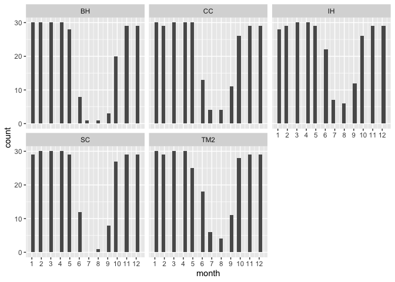<!-- -->
Apriori Assumption for growth season: Low: Oct-July

Historical Climate

```r
nosnow_pops_historical <- pop_elev_climate_historical_avgs %>% filter(PckSum < 70)
unique(nosnow_pops_historical$parent.pop)
```

```
## [1] "BH"  "CC"  "IH"  "SC"  "TM2"
```

```r
summary(nosnow_pops_historical) #3rd quartile of CWD = 87 
```

```
##   parent.pop        elevation.group        elev_m          month      
##  Length:60          Length:60          Min.   :313.0   Min.   : 1.00  
##  Class :character   Class :character   1st Qu.:379.2   1st Qu.: 3.75  
##  Mode  :character   Mode  :character   Median :421.5   Median : 6.50  
##                                        Mean   :415.8   Mean   : 6.50  
##                                        3rd Qu.:454.1   3rd Qu.: 9.25  
##                                        Max.   :511.4   Max.   :12.00  
##     cwd_mean         pck_mean         ppt_mean          tmn_mean     
##  Min.   : 12.15   Min.   :0.0000   Min.   :  1.012   Min.   : 1.218  
##  1st Qu.: 29.27   1st Qu.:0.0000   1st Qu.: 11.992   1st Qu.: 3.735  
##  Median : 55.90   Median :0.0000   Median : 67.216   Median : 7.683  
##  Mean   : 62.17   Mean   :0.4099   Mean   : 74.659   Mean   : 8.061  
##  3rd Qu.: 86.85   3rd Qu.:0.0000   3rd Qu.:133.044   3rd Qu.:12.579  
##  Max.   :163.60   Max.   :8.8330   Max.   :201.882   Max.   :16.356  
##     tmx_mean        cwd_sem           pck_sem          ppt_sem       
##  Min.   :12.27   Min.   : 0.1859   Min.   :0.0000   Min.   : 0.5719  
##  1st Qu.:15.66   1st Qu.: 0.6581   1st Qu.:0.0000   1st Qu.: 2.7875  
##  Median :22.19   Median : 1.7177   Median :0.0000   Median :10.5243  
##  Mean   :22.56   Mean   : 2.4974   Mean   :0.2836   Mean   :10.8379  
##  3rd Qu.:30.34   3rd Qu.: 3.8894   3rd Qu.:0.0000   3rd Qu.:17.4984  
##  Max.   :34.69   Max.   :10.6738   Max.   :4.9412   Max.   :24.5578  
##     tmn_sem          tmx_sem           PckSum       
##  Min.   :0.1724   Min.   :0.2166   Min.   : 0.2340  
##  1st Qu.:0.2110   1st Qu.:0.2944   1st Qu.: 0.5973  
##  Median :0.2372   Median :0.3474   Median : 0.9510  
##  Mean   :0.2447   Mean   :0.3499   Mean   : 4.9187  
##  3rd Qu.:0.2866   3rd Qu.:0.3745   3rd Qu.: 5.4673  
##  Max.   :0.3384   Max.   :0.5565   Max.   :17.3440
```

```r
nosnow_pops_historical_tojoin <- nosnow_pops_historical %>% select(parent.pop:elev_m, PckSum) %>% distinct()

nosnow_pops_historical_years <- left_join(nosnow_pops_historical_tojoin, pop_elev_climate_historical) 
```

```
## Joining with `by = join_by(parent.pop, elevation.group, elev_m)`
```

```r
nosnow_pops_historical_years %>% filter(month=="7", ppt>=25) #in 1974, ppt>25 for 4 pops in July...
```

```
## # A tibble: 4 × 11
## # Groups:   parent.pop, elevation.group, elev_m [4]
##   parent.pop elevation.group elev_m PckSum year  month   cwd   pck   ppt   tmn
##   <chr>      <chr>            <dbl>  <dbl> <chr> <dbl> <dbl> <dbl> <dbl> <dbl>
## 1 CC         Low               313   0.951 1974      7  52.4     0  58.2  16.3
## 2 IH         Low               454. 17.3   1974      7   0       0  79.3  15.4
## 3 SC         Low               422.  0.597 1974      7 127.      0  61.4  14.8
## 4 TM2        Low               379.  5.47  1974      7   0       0  59.1  15.9
## # ℹ 1 more variable: tmx <dbl>
```

```r
nosnow_pops_historical_years %>% filter(year==1974) %>% arrange(parent.pop) #cwd high and ppt low in following months 
```

```
## # A tibble: 60 × 11
## # Groups:   parent.pop, elevation.group, elev_m [5]
##    parent.pop elevation.group elev_m PckSum year  month   cwd   pck      ppt
##    <chr>      <chr>            <dbl>  <dbl> <chr> <dbl> <dbl> <dbl>    <dbl>
##  1 BH         Low               511.  0.234 1974      1  27.6     0  91.6   
##  2 BH         Low               511.  0.234 1974      2  40.5     0  28.2   
##  3 BH         Low               511.  0.234 1974      3  49.0     0 129.    
##  4 BH         Low               511.  0.234 1974      4  38.6     0  74.2   
##  5 BH         Low               511.  0.234 1974      5  73.0     0   0     
##  6 BH         Low               511.  0.234 1974      6  97.2     0   0.0300
##  7 BH         Low               511.  0.234 1974      7  68.5     0  17.0   
##  8 BH         Low               511.  0.234 1974      8 150.      0   0     
##  9 BH         Low               511.  0.234 1974      9 132.      0   0     
## 10 BH         Low               511.  0.234 1974     10  89.7     0  57.4   
## # ℹ 50 more rows
## # ℹ 2 more variables: tmn <dbl>, tmx <dbl>
```

```r
nosnow_pops_historical_years %>% filter(month=="8", ppt>=25) %>% arrange(year, parent.pop) #11 cases of ppt>25 in Aug 
```

```
## # A tibble: 11 × 11
## # Groups:   parent.pop, elevation.group, elev_m [5]
##    parent.pop elevation.group elev_m PckSum year  month   cwd   pck   ppt   tmn
##    <chr>      <chr>            <dbl>  <dbl> <chr> <dbl> <dbl> <dbl> <dbl> <dbl>
##  1 CC         Low               313   0.951 1965      8  70.3     0  38.7  16.6
##  2 TM2        Low               379.  5.47  1965      8 156.      0  39.8  16.3
##  3 CC         Low               313   0.951 1968      8  69.3     0  28.1  14.2
##  4 TM2        Low               379.  5.47  1968      8 151.      0  28.9  13.8
##  5 IH         Low               454. 17.3   1975      8  94.4     0  28.8  14.0
##  6 SC         Low               422.  0.597 1975      8 169.      0  26.9  13.4
##  7 BH         Low               511.  0.234 1976      8 168.      0  26.4  13.2
##  8 CC         Low               313   0.951 1976      8  78.0     0  37.8  13.8
##  9 IH         Low               454. 17.3   1976      8 152.      0  50.7  12.5
## 10 SC         Low               422.  0.597 1976      8 148.      0  40.5  12.7
## 11 TM2        Low               379.  5.47  1976      8 150.      0  38.3  13.4
## # ℹ 1 more variable: tmx <dbl>
```

```r
nosnow_pops_historical_years %>% filter(year==1965) %>% arrange(parent.pop)
```

```
## # A tibble: 60 × 11
## # Groups:   parent.pop, elevation.group, elev_m [5]
##    parent.pop elevation.group elev_m PckSum year  month   cwd   pck      ppt
##    <chr>      <chr>            <dbl>  <dbl> <chr> <dbl> <dbl> <dbl>    <dbl>
##  1 BH         Low               511.  0.234 1965      1  27.4     0  88.1   
##  2 BH         Low               511.  0.234 1965      2  41.0     0  25.9   
##  3 BH         Low               511.  0.234 1965      3  57.2     0  50.6   
##  4 BH         Low               511.  0.234 1965      4  39.2     0 104.    
##  5 BH         Low               511.  0.234 1965      5  70.8     0   0.0500
##  6 BH         Low               511.  0.234 1965      6  91.2     0   0     
##  7 BH         Low               511.  0.234 1965      7 119.      0   0     
##  8 BH         Low               511.  0.234 1965      8  99.9     0   8.87  
##  9 BH         Low               511.  0.234 1965      9 119.      0   0     
## 10 BH         Low               511.  0.234 1965     10  90.1     0  10.5   
## # ℹ 50 more rows
## # ℹ 2 more variables: tmn <dbl>, tmx <dbl>
```

```r
nosnow_pops_historical_years %>% filter(year==1968) %>% arrange(parent.pop) 
```

```
## # A tibble: 60 × 11
## # Groups:   parent.pop, elevation.group, elev_m [5]
##    parent.pop elevation.group elev_m PckSum year  month   cwd   pck   ppt    tmn
##    <chr>      <chr>            <dbl>  <dbl> <chr> <dbl> <dbl> <dbl> <dbl>  <dbl>
##  1 BH         Low               511.  0.234 1968      1  28.7     0  58.5 -0.350
##  2 BH         Low               511.  0.234 1968      2  44.7     0  68.2  5.55 
##  3 BH         Low               511.  0.234 1968      3  59.1     0  62.1  4.02 
##  4 BH         Low               511.  0.234 1968      4  72.2     0  19.2  4.45 
##  5 BH         Low               511.  0.234 1968      5  73.7     0  20.7  7.90 
##  6 BH         Low               511.  0.234 1968      6 101.      0   0   13.1  
##  7 BH         Low               511.  0.234 1968      7 135.      0   0   16.4  
##  8 BH         Low               511.  0.234 1968      8 149.      0   0   13.8  
##  9 BH         Low               511.  0.234 1968      9 129.      0   0   12.1  
## 10 BH         Low               511.  0.234 1968     10  87.5     0  42.3  8.06 
## # ℹ 50 more rows
## # ℹ 1 more variable: tmx <dbl>
```

```r
nosnow_pops_historical_years %>% filter(year==1975) %>% arrange(parent.pop) 
```

```
## # A tibble: 60 × 11
## # Groups:   parent.pop, elevation.group, elev_m [5]
##    parent.pop elevation.group elev_m PckSum year  month   cwd   pck      ppt
##    <chr>      <chr>            <dbl>  <dbl> <chr> <dbl> <dbl> <dbl>    <dbl>
##  1 BH         Low               511.  0.234 1975      1  28.3     0  43.9   
##  2 BH         Low               511.  0.234 1975      2  37.2     0 169.    
##  3 BH         Low               511.  0.234 1975      3  39.2     0 145.    
##  4 BH         Low               511.  0.234 1975      4  35.9     0  67.9   
##  5 BH         Low               511.  0.234 1975      5  72.4     0   2.73  
##  6 BH         Low               511.  0.234 1975      6  95.4     0   0.770 
##  7 BH         Low               511.  0.234 1975      7 121.      0   0.0300
##  8 BH         Low               511.  0.234 1975      8 103.      0   8.65  
##  9 BH         Low               511.  0.234 1975      9 130.      0   3.14  
## 10 BH         Low               511.  0.234 1975     10  84.1     0  67.7   
## # ℹ 50 more rows
## # ℹ 2 more variables: tmn <dbl>, tmx <dbl>
```

```r
nosnow_pops_historical_years %>% filter(year==1976) %>% arrange(parent.pop)
```

```
## # A tibble: 60 × 11
## # Groups:   parent.pop, elevation.group, elev_m [5]
##    parent.pop elevation.group elev_m PckSum year  month   cwd   pck    ppt
##    <chr>      <chr>            <dbl>  <dbl> <chr> <dbl> <dbl> <dbl>  <dbl>
##  1 BH         Low               511.  0.234 1976      1  29.4     0  7.71 
##  2 BH         Low               511.  0.234 1976      2  42.6     0 92.6  
##  3 BH         Low               511.  0.234 1976      3  57.1     0 39.8  
##  4 BH         Low               511.  0.234 1976      4  70.1     0 40.5  
##  5 BH         Low               511.  0.234 1976      5  79.7     0  0.240
##  6 BH         Low               511.  0.234 1976      6 112.      0  0.210
##  7 BH         Low               511.  0.234 1976      7 166.      0  0.790
##  8 BH         Low               511.  0.234 1976      8 168.      0 26.4  
##  9 BH         Low               511.  0.234 1976      9 115.      0 32.0  
## 10 BH         Low               511.  0.234 1976     10  85.0     0 23    
## # ℹ 50 more rows
## # ℹ 2 more variables: tmn <dbl>, tmx <dbl>
```

```r
#some cases where ppt remains high in following month 

growyear_months <- tibble(month=c(1:12), growmonth=c(6, 7, 8, 9, 10, 11, 12, 1, 2, 3, 4, 5))

nosnow_historical_growyear_months <- full_join(growyear_months, nosnow_pops_historical_years)
```

```
## Joining with `by = join_by(month)`
```

```r
dim(nosnow_historical_growyear_months)
```

```
## [1] 1800   12
```

```r
nosnow_first_month <- nosnow_historical_growyear_months %>%
  group_by(parent.pop, elevation.group, elev_m, year) %>% 
  filter(ppt>=25) %>% 
  arrange(growmonth) %>% 
  filter(row_number()==1) #get first month for each pop and year with germinating inducing rain 

nosnow_first_month_tomerge <- nosnow_first_month %>% 
  select(parent.pop:elev_m, year, firstmonth=growmonth)

nosnow_first_month_col <- full_join(nosnow_historical_growyear_months, nosnow_first_month_tomerge)
```

```
## Joining with `by = join_by(parent.pop, elevation.group, elev_m, year)`
```

```r
dim(nosnow_first_month_col)
```

```
## [1] 1800   13
```

```r
nosnow_last_month <- nosnow_historical_growyear_months %>%
  group_by(parent.pop, elevation.group, elev_m, year) %>% 
  filter(cwd>87) %>% #adjusted for the historical 3rd quartile of cwd
  arrange(month) %>% 
  filter(row_number()==1)

nosnow_last_month_tomerge <- nosnow_last_month %>% 
  select(parent.pop:elev_m, year, lastmonth=growmonth) #last month is in grow month not calendar month format

nosnow_last_month_col <- full_join(nosnow_first_month_col, nosnow_last_month_tomerge)
```

```
## Joining with `by = join_by(parent.pop, elevation.group, elev_m, year)`
```

```r
dim(nosnow_last_month_col)
```

```
## [1] 1800   14
```

```r
#Checking for weird cases 
nosnow_last_month_col %>% filter(is.na(lastmonth)) %>% arrange(year) #0 years where there isn't a last month
```

```
## # A tibble: 0 × 14
## # ℹ 14 variables: month <dbl>, growmonth <dbl>, parent.pop <chr>,
## #   elevation.group <chr>, elev_m <dbl>, PckSum <dbl>, year <chr>, cwd <dbl>,
## #   pck <dbl>, ppt <dbl>, tmn <dbl>, tmx <dbl>, firstmonth <dbl>,
## #   lastmonth <dbl>
```

```r
nosnow_last_month_col %>% filter(is.na(firstmonth)) %>% arrange(year) #0 years wehre there isn't a first month
```

```
## # A tibble: 0 × 14
## # ℹ 14 variables: month <dbl>, growmonth <dbl>, parent.pop <chr>,
## #   elevation.group <chr>, elev_m <dbl>, PckSum <dbl>, year <chr>, cwd <dbl>,
## #   pck <dbl>, ppt <dbl>, tmn <dbl>, tmx <dbl>, firstmonth <dbl>,
## #   lastmonth <dbl>
```

```r
nosnow_last_month_col %>% filter(lastmonth<5) %>% arrange(parent.pop, year) #some cases where last month is less than 5 (earlier than December)
```

```
## # A tibble: 420 × 14
##    month growmonth parent.pop elevation.group elev_m PckSum year    cwd   pck
##    <dbl>     <dbl> <chr>      <chr>            <dbl>  <dbl> <chr> <dbl> <dbl>
##  1     1         6 BH         Low               511.  0.234 1982   24.3  7.02
##  2     2         7 BH         Low               511.  0.234 1982   37.8  0   
##  3     3         8 BH         Low               511.  0.234 1982   39.6  0   
##  4     4         9 BH         Low               511.  0.234 1982   38.8  0   
##  5     5        10 BH         Low               511.  0.234 1982   74.0  0   
##  6     6        11 BH         Low               511.  0.234 1982   33.9  0   
##  7     7        12 BH         Low               511.  0.234 1982   79.9  0   
##  8     8         1 BH         Low               511.  0.234 1982  177.   0   
##  9     9         2 BH         Low               511.  0.234 1982  129.   0   
## 10    10         3 BH         Low               511.  0.234 1982   79.7  0   
## # ℹ 410 more rows
## # ℹ 5 more variables: ppt <dbl>, tmn <dbl>, tmx <dbl>, firstmonth <dbl>,
## #   lastmonth <dbl>
```

```r
nosnow_last_month_col %>% filter(lastmonth<firstmonth, lastmonth<5) %>% arrange(parent.pop, year) #most of the above are when the last month is before the first month (in growyear, not calendar year)
```

```
## # A tibble: 384 × 14
##    month growmonth parent.pop elevation.group elev_m PckSum year    cwd   pck
##    <dbl>     <dbl> <chr>      <chr>            <dbl>  <dbl> <chr> <dbl> <dbl>
##  1     1         6 BH         Low               511.  0.234 1982   24.3  7.02
##  2     2         7 BH         Low               511.  0.234 1982   37.8  0   
##  3     3         8 BH         Low               511.  0.234 1982   39.6  0   
##  4     4         9 BH         Low               511.  0.234 1982   38.8  0   
##  5     5        10 BH         Low               511.  0.234 1982   74.0  0   
##  6     6        11 BH         Low               511.  0.234 1982   33.9  0   
##  7     7        12 BH         Low               511.  0.234 1982   79.9  0   
##  8     8         1 BH         Low               511.  0.234 1982  177.   0   
##  9     9         2 BH         Low               511.  0.234 1982  129.   0   
## 10    10         3 BH         Low               511.  0.234 1982   79.7  0   
## # ℹ 374 more rows
## # ℹ 5 more variables: ppt <dbl>, tmn <dbl>, tmx <dbl>, firstmonth <dbl>,
## #   lastmonth <dbl>
```

```r
nosnow_last_month_col %>% filter(lastmonth>firstmonth & lastmonth<5) %>% arrange(parent.pop, year) #0 cases wehre the last month is after the first month before Dec 
```

```
## # A tibble: 0 × 14
## # ℹ 14 variables: month <dbl>, growmonth <dbl>, parent.pop <chr>,
## #   elevation.group <chr>, elev_m <dbl>, PckSum <dbl>, year <chr>, cwd <dbl>,
## #   pck <dbl>, ppt <dbl>, tmn <dbl>, tmx <dbl>, firstmonth <dbl>,
## #   lastmonth <dbl>
```

```r
nosnow_last_month_col %>% filter(lastmonth==5) %>% arrange(parent.pop, year) #0 cases where 5 is the last month 
```

```
## # A tibble: 0 × 14
## # ℹ 14 variables: month <dbl>, growmonth <dbl>, parent.pop <chr>,
## #   elevation.group <chr>, elev_m <dbl>, PckSum <dbl>, year <chr>, cwd <dbl>,
## #   pck <dbl>, ppt <dbl>, tmn <dbl>, tmx <dbl>, firstmonth <dbl>,
## #   lastmonth <dbl>
```

```r
nosnow_last_month_col %>% filter(lastmonth==firstmonth) %>% arrange(parent.pop, year) #first month and last month are the same for IH in 3 years ('72, '85, '89)
```

```
## # A tibble: 36 × 14
##    month growmonth parent.pop elevation.group elev_m PckSum year    cwd   pck
##    <dbl>     <dbl> <chr>      <chr>            <dbl>  <dbl> <chr> <dbl> <dbl>
##  1     1         6 IH         Low               454.   17.3 1972   18.3  19.6
##  2     2         7 IH         Low               454.   17.3 1972   28.4   0  
##  3     3         8 IH         Low               454.   17.3 1972   43.9   0  
##  4     4         9 IH         Low               454.   17.3 1972   48.9   0  
##  5     5        10 IH         Low               454.   17.3 1972   51.8   0  
##  6     6        11 IH         Low               454.   17.3 1972   56.7   0  
##  7     7        12 IH         Low               454.   17.3 1972   70.3   0  
##  8     8         1 IH         Low               454.   17.3 1972   86.0   0  
##  9     9         2 IH         Low               454.   17.3 1972   88.3   0  
## 10    10         3 IH         Low               454.   17.3 1972   58.9   0  
## # ℹ 26 more rows
## # ℹ 5 more variables: ppt <dbl>, tmn <dbl>, tmx <dbl>, firstmonth <dbl>,
## #   lastmonth <dbl>
```

```r
nosnow_last_month_col %>% filter(growmonth==firstmonth+1, cwd>88) %>% arrange(parent.pop, year) #8 cases where cwd is high in the second growth month 
```

```
## # A tibble: 8 × 14
##   month growmonth parent.pop elevation.group elev_m PckSum year    cwd   pck
##   <dbl>     <dbl> <chr>      <chr>            <dbl>  <dbl> <chr> <dbl> <dbl>
## 1     9         2 BH         Low               511.  0.234 1976  115.      0
## 2     9         2 CC         Low               313   0.951 1965   97.5     0
## 3     9         2 CC         Low               313   0.951 1968  104.      0
## 4     9         2 CC         Low               313   0.951 1976   93.7     0
## 5     9         2 IH         Low               454. 17.3   1975  130.      0
## 6     9         2 SC         Low               422.  0.597 1975  123.      0
## 7     9         2 SC         Low               422.  0.597 1976  105       0
## 8     9         2 TM2        Low               379.  5.47  1968   89.6     0
## # ℹ 5 more variables: ppt <dbl>, tmn <dbl>, tmx <dbl>, firstmonth <dbl>,
## #   lastmonth <dbl>
```

```r
nosnow_grwseason_historical <- nosnow_last_month_col %>% #fill in all the months b/t the first and last for the full growth season 
  group_by(parent.pop, elevation.group, elev_m, year) %>% 
  filter(growmonth>=firstmonth) %>% #first and last month are in grow month format not calendar year 
  filter(ifelse(lastmonth<5, growmonth<=12, growmonth<lastmonth)) 
summary(nosnow_grwseason_historical) 
```

```
##      month          growmonth       parent.pop        elevation.group   
##  Min.   : 1.000   Min.   : 1.000   Length:1310        Length:1310       
##  1st Qu.: 3.000   1st Qu.: 5.000   Class :character   Class :character  
##  Median : 5.000   Median : 7.000   Mode  :character   Mode  :character  
##  Mean   : 6.048   Mean   : 6.724                                        
##  3rd Qu.:10.000   3rd Qu.: 9.000                                        
##  Max.   :12.000   Max.   :12.000                                        
##      elev_m          PckSum            year                cwd        
##  Min.   :313.0   Min.   : 0.2340   Length:1310        Min.   :  0.00  
##  1st Qu.:379.2   1st Qu.: 0.5973   Class :character   1st Qu.: 21.76  
##  Median :421.5   Median : 0.9510   Mode  :character   Median : 34.30  
##  Mean   :415.4   Mean   : 5.4384                      Mean   : 41.94  
##  3rd Qu.:454.1   3rd Qu.: 5.4673                      3rd Qu.: 62.44  
##  Max.   :511.4   Max.   :17.3440                      Max.   :168.60  
##       pck                ppt              tmn              tmx       
##  Min.   :  0.0000   Min.   :  0.00   Min.   :-1.850   Min.   : 8.63  
##  1st Qu.:  0.0000   1st Qu.: 26.93   1st Qu.: 2.800   1st Qu.:13.98  
##  Median :  0.0000   Median : 66.74   Median : 5.125   Median :17.50  
##  Mean   :  0.5632   Mean   :101.04   Mean   : 5.889   Mean   :19.03  
##  3rd Qu.:  0.0000   3rd Qu.:146.22   3rd Qu.: 8.695   3rd Qu.:23.99  
##  Max.   :129.4600   Max.   :559.96   Max.   :17.920   Max.   :35.85  
##    firstmonth      lastmonth     
##  Min.   :1.000   Min.   : 1.000  
##  1st Qu.:2.000   1st Qu.: 2.000  
##  Median :3.000   Median :11.000  
##  Mean   :2.768   Mean   : 8.463  
##  3rd Qu.:3.000   3rd Qu.:11.000  
##  Max.   :5.000   Max.   :12.000
```

```r
nosnow_grwseason_historical %>% filter(cwd > 88) %>% filter(growmonth==firstmonth) #some cases when cwd is high in the first month (when ppt >25)
```

```
## # A tibble: 33 × 14
## # Groups:   parent.pop, elevation.group, elev_m, year [33]
##    month growmonth parent.pop elevation.group elev_m PckSum year    cwd   pck
##    <dbl>     <dbl> <chr>      <chr>            <dbl>  <dbl> <chr> <dbl> <dbl>
##  1     8         1 BH         Low               511.  0.234 1976  168.      0
##  2     8         1 IH         Low               454. 17.3   1975   94.4     0
##  3     8         1 IH         Low               454. 17.3   1976  152.      0
##  4     8         1 SC         Low               422.  0.597 1975  169.      0
##  5     8         1 SC         Low               422.  0.597 1976  148.      0
##  6     8         1 TM2        Low               379.  5.47  1965  156.      0
##  7     8         1 TM2        Low               379.  5.47  1968  151.      0
##  8     8         1 TM2        Low               379.  5.47  1976  150.      0
##  9     9         2 BH         Low               511.  0.234 1978  107.      0
## 10     9         2 BH         Low               511.  0.234 1982  129.      0
## # ℹ 23 more rows
## # ℹ 5 more variables: ppt <dbl>, tmn <dbl>, tmx <dbl>, firstmonth <dbl>,
## #   lastmonth <dbl>
```

```r
xtabs(~parent.pop+month, data=nosnow_grwseason_historical)
```

```
##           month
## parent.pop  1  2  3  4  5  6  7  8  9 10 11 12
##        BH  30 30 30 30 30  5  1  1  5 19 28 30
##        CC  30 30 30 30 30 13  2  3 12 26 29 30
##        IH  30 30 30 30 30 30 28  2 11 24 30 30
##        SC  30 30 30 30 30  9  0  2  7 22 29 30
##        TM2 30 30 30 30 17  9  4  3 12 27 30 30
```

```r
options(max.print=1000000)
xtabs(~year+month+parent.pop, data=nosnow_grwseason_historical)
```

```
## , , parent.pop = BH
## 
##       month
## year   1 2 3 4 5 6 7 8 9 10 11 12
##   1962 1 1 1 1 1 0 0 0 0  1  1  1
##   1963 1 1 1 1 1 0 0 0 0  1  1  1
##   1964 1 1 1 1 1 1 0 0 0  1  1  1
##   1965 1 1 1 1 1 0 0 0 0  0  1  1
##   1966 1 1 1 1 1 0 0 0 0  0  1  1
##   1967 1 1 1 1 1 1 0 0 0  0  1  1
##   1968 1 1 1 1 1 0 0 0 0  1  1  1
##   1969 1 1 1 1 1 0 0 0 0  1  1  1
##   1970 1 1 1 1 1 1 0 0 0  0  1  1
##   1971 1 1 1 1 1 0 0 0 0  0  1  1
##   1972 1 1 1 1 1 0 0 0 0  0  1  1
##   1973 1 1 1 1 1 0 0 0 0  1  1  1
##   1974 1 1 1 1 1 0 0 0 0  1  1  1
##   1975 1 1 1 1 1 0 0 0 0  1  1  1
##   1976 1 1 1 1 1 0 0 1 1  1  1  1
##   1977 1 1 1 1 1 0 0 0 0  0  1  1
##   1978 1 1 1 1 1 0 0 0 1  1  1  1
##   1979 1 1 1 1 1 0 0 0 0  1  1  1
##   1980 1 1 1 1 1 0 0 0 0  0  0  1
##   1981 1 1 1 1 1 0 0 0 0  1  1  1
##   1982 1 1 1 1 1 1 1 0 1  1  1  1
##   1983 1 1 1 1 1 0 0 0 0  0  1  1
##   1984 1 1 1 1 1 1 0 0 0  1  1  1
##   1985 1 1 1 1 1 0 0 0 0  1  1  1
##   1986 1 1 1 1 1 0 0 0 1  1  1  1
##   1987 1 1 1 1 1 0 0 0 0  1  1  1
##   1988 1 1 1 1 1 0 0 0 0  0  1  1
##   1989 1 1 1 1 1 0 0 0 1  1  1  1
##   1990 1 1 1 1 1 0 0 0 0  0  0  1
##   1991 1 1 1 1 1 0 0 0 0  1  1  1
## 
## , , parent.pop = CC
## 
##       month
## year   1 2 3 4 5 6 7 8 9 10 11 12
##   1962 1 1 1 1 1 0 0 0 0  1  1  1
##   1963 1 1 1 1 1 1 0 0 0  1  1  1
##   1964 1 1 1 1 1 1 0 0 0  1  1  1
##   1965 1 1 1 1 1 1 0 1 1  1  1  1
##   1966 1 1 1 1 1 0 0 0 0  0  1  1
##   1967 1 1 1 1 1 1 0 0 0  1  1  1
##   1968 1 1 1 1 1 0 0 1 1  1  1  1
##   1969 1 1 1 1 1 1 0 0 0  1  1  1
##   1970 1 1 1 1 1 1 0 0 0  1  1  1
##   1971 1 1 1 1 1 1 0 0 0  0  1  1
##   1972 1 1 1 1 1 0 0 0 1  1  1  1
##   1973 1 1 1 1 1 0 0 0 0  1  1  1
##   1974 1 1 1 1 1 0 0 0 0  1  1  1
##   1975 1 1 1 1 1 0 0 0 0  1  1  1
##   1976 1 1 1 1 1 0 0 1 1  1  1  1
##   1977 1 1 1 1 1 0 0 0 1  1  1  1
##   1978 1 1 1 1 1 0 0 0 1  1  1  1
##   1979 1 1 1 1 1 0 0 0 0  1  1  1
##   1980 1 1 1 1 1 1 1 0 0  0  0  1
##   1981 1 1 1 1 1 0 0 0 1  1  1  1
##   1982 1 1 1 1 1 1 1 0 1  1  1  1
##   1983 1 1 1 1 1 0 0 0 1  1  1  1
##   1984 1 1 1 1 1 1 0 0 0  1  1  1
##   1985 1 1 1 1 1 0 0 0 1  1  1  1
##   1986 1 1 1 1 1 0 0 0 1  1  1  1
##   1987 1 1 1 1 1 0 0 0 0  1  1  1
##   1988 1 1 1 1 1 1 0 0 0  0  1  1
##   1989 1 1 1 1 1 0 0 0 1  1  1  1
##   1990 1 1 1 1 1 1 0 0 0  1  1  1
##   1991 1 1 1 1 1 1 0 0 0  1  1  1
## 
## , , parent.pop = IH
## 
##       month
## year   1 2 3 4 5 6 7 8 9 10 11 12
##   1962 1 1 1 1 1 1 1 0 0  1  1  1
##   1963 1 1 1 1 1 1 1 0 0  1  1  1
##   1964 1 1 1 1 1 1 1 0 0  1  1  1
##   1965 1 1 1 1 1 1 1 0 0  0  1  1
##   1966 1 1 1 1 1 1 1 0 0  0  1  1
##   1967 1 1 1 1 1 1 1 0 0  1  1  1
##   1968 1 1 1 1 1 1 1 0 0  1  1  1
##   1969 1 1 1 1 1 1 1 0 0  1  1  1
##   1970 1 1 1 1 1 1 1 0 0  1  1  1
##   1971 1 1 1 1 1 1 1 0 0  1  1  1
##   1972 1 1 1 1 1 1 1 0 1  1  1  1
##   1973 1 1 1 1 1 1 1 0 1  1  1  1
##   1974 1 1 1 1 1 1 1 0 0  1  1  1
##   1975 1 1 1 1 1 1 1 1 1  1  1  1
##   1976 1 1 1 1 1 1 0 1 1  1  1  1
##   1977 1 1 1 1 1 1 0 0 0  0  1  1
##   1978 1 1 1 1 1 1 1 0 1  1  1  1
##   1979 1 1 1 1 1 1 1 0 0  1  1  1
##   1980 1 1 1 1 1 1 1 0 0  0  1  1
##   1981 1 1 1 1 1 1 1 0 1  1  1  1
##   1982 1 1 1 1 1 1 1 0 1  1  1  1
##   1983 1 1 1 1 1 1 1 0 1  1  1  1
##   1984 1 1 1 1 1 1 1 0 0  1  1  1
##   1985 1 1 1 1 1 1 1 0 1  1  1  1
##   1986 1 1 1 1 1 1 1 0 1  1  1  1
##   1987 1 1 1 1 1 1 1 0 0  1  1  1
##   1988 1 1 1 1 1 1 1 0 0  0  1  1
##   1989 1 1 1 1 1 1 1 0 1  1  1  1
##   1990 1 1 1 1 1 1 1 0 0  0  1  1
##   1991 1 1 1 1 1 1 1 0 0  1  1  1
## 
## , , parent.pop = SC
## 
##       month
## year   1 2 3 4 5 6 7 8 9 10 11 12
##   1962 1 1 1 1 1 0 0 0 0  1  1  1
##   1963 1 1 1 1 1 1 0 0 0  1  1  1
##   1964 1 1 1 1 1 1 0 0 0  1  1  1
##   1965 1 1 1 1 1 0 0 0 0  0  1  1
##   1966 1 1 1 1 1 0 0 0 0  0  1  1
##   1967 1 1 1 1 1 1 0 0 0  1  1  1
##   1968 1 1 1 1 1 0 0 0 0  1  1  1
##   1969 1 1 1 1 1 0 0 0 0  1  1  1
##   1970 1 1 1 1 1 1 0 0 0  1  1  1
##   1971 1 1 1 1 1 1 0 0 0  0  1  1
##   1972 1 1 1 1 1 0 0 0 1  1  1  1
##   1973 1 1 1 1 1 0 0 0 0  1  1  1
##   1974 1 1 1 1 1 1 0 0 0  1  1  1
##   1975 1 1 1 1 1 0 0 1 1  1  1  1
##   1976 1 1 1 1 1 0 0 1 1  1  1  1
##   1977 1 1 1 1 1 0 0 0 0  0  1  1
##   1978 1 1 1 1 1 0 0 0 1  1  1  1
##   1979 1 1 1 1 1 0 0 0 0  1  1  1
##   1980 1 1 1 1 1 1 0 0 0  0  0  1
##   1981 1 1 1 1 1 0 0 0 0  1  1  1
##   1982 1 1 1 1 1 0 0 0 1  1  1  1
##   1983 1 1 1 1 1 0 0 0 0  1  1  1
##   1984 1 1 1 1 1 1 0 0 0  1  1  1
##   1985 1 1 1 1 1 0 0 0 0  1  1  1
##   1986 1 1 1 1 1 0 0 0 1  1  1  1
##   1987 1 1 1 1 1 0 0 0 0  0  1  1
##   1988 1 1 1 1 1 0 0 0 0  0  1  1
##   1989 1 1 1 1 1 0 0 0 1  1  1  1
##   1990 1 1 1 1 1 0 0 0 0  0  1  1
##   1991 1 1 1 1 1 1 0 0 0  1  1  1
## 
## , , parent.pop = TM2
## 
##       month
## year   1 2 3 4 5 6 7 8 9 10 11 12
##   1962 1 1 1 1 1 0 0 0 0  1  1  1
##   1963 1 1 1 1 1 1 0 0 0  1  1  1
##   1964 1 1 1 1 0 0 0 0 0  1  1  1
##   1965 1 1 1 1 1 0 0 1 1  1  1  1
##   1966 1 1 1 1 0 0 0 0 0  0  1  1
##   1967 1 1 1 1 1 1 1 0 0  1  1  1
##   1968 1 1 1 1 0 0 0 1 1  1  1  1
##   1969 1 1 1 1 1 1 0 0 0  1  1  1
##   1970 1 1 1 1 0 0 0 0 0  1  1  1
##   1971 1 1 1 1 1 0 0 0 0  0  1  1
##   1972 1 1 1 1 0 0 0 0 1  1  1  1
##   1973 1 1 1 1 0 0 0 0 0  1  1  1
##   1974 1 1 1 1 1 0 0 0 0  1  1  1
##   1975 1 1 1 1 1 0 0 0 0  1  1  1
##   1976 1 1 1 1 0 0 0 1 1  1  1  1
##   1977 1 1 1 1 1 0 0 0 1  1  1  1
##   1978 1 1 1 1 1 0 0 0 1  1  1  1
##   1979 1 1 1 1 0 0 0 0 0  1  1  1
##   1980 1 1 1 1 1 1 1 0 0  1  1  1
##   1981 1 1 1 1 0 0 0 0 1  1  1  1
##   1982 1 1 1 1 1 1 1 0 1  1  1  1
##   1983 1 1 1 1 1 1 1 0 1  1  1  1
##   1984 1 1 1 1 0 0 0 0 0  1  1  1
##   1985 1 1 1 1 0 0 0 0 1  1  1  1
##   1986 1 1 1 1 1 0 0 0 1  1  1  1
##   1987 1 1 1 1 0 0 0 0 0  1  1  1
##   1988 1 1 1 1 1 1 0 0 0  0  1  1
##   1989 1 1 1 1 0 0 0 0 1  1  1  1
##   1990 1 1 1 1 1 1 0 0 0  1  1  1
##   1991 1 1 1 1 1 1 0 0 0  1  1  1
```

```r
#IH grows all year in 1975

nosnow_grwseason_historical %>% ggplot(aes(x=month)) + geom_histogram() +
  scale_x_continuous(breaks=c(1, 2, 3, 4, 5,6,7,8,9,10, 11, 12)) +
  facet_wrap(~parent.pop)
```

```
## `stat_bin()` using `bins = 30`. Pick better value with `binwidth`.
```

<!-- -->

-   Populations that get more than 70 mm of snow pack in a year (on average): growth season = when snowpack < 70 mm
With <70 mm as the only criteria, a lot of pops grow all year and months aren't consecutive. Need to try first month as pck==0 and following months as pck <70mm

Recent climate

```r
snow_pops_recent <- pop_elev_climate_recent_avgs %>% filter(PckSum >= 70)
unique(snow_pops_recent$parent.pop) #18 pops get some significant snowpack per year 
```

```
##  [1] "CP2"   "CP3"   "DPR"   "FR"    "LV1"   "LV3"   "LVTR1" "SQ1"   "SQ2"  
## [10] "SQ3"   "WL1"   "WL2"   "WR"    "WV"    "YO11"  "YO4"   "YO7"   "YO8"
```

```r
summary(snow_pops_recent)
```

```
##   parent.pop        elevation.group        elev_m           month      
##  Length:216         Length:216         Min.   : 748.9   Min.   : 1.00  
##  Class :character   Class :character   1st Qu.:1613.8   1st Qu.: 3.75  
##  Mode  :character   Mode  :character   Median :2200.9   Median : 6.50  
##                                        Mean   :1992.5   Mean   : 6.50  
##                                        3rd Qu.:2470.0   3rd Qu.: 9.25  
##                                        Max.   :2872.3   Max.   :12.00  
##     cwd_mean          pck_mean          ppt_mean           tmn_mean     
##  Min.   :  9.286   Min.   :   0.00   Min.   :  0.1547   Min.   :-9.566  
##  1st Qu.: 27.299   1st Qu.:   0.00   1st Qu.: 16.7425   1st Qu.:-3.289  
##  Median : 44.967   Median :  27.01   Median : 85.8398   Median : 1.360  
##  Mean   : 54.108   Mean   : 167.47   Mean   :105.1475   Mean   : 1.965  
##  3rd Qu.: 80.545   3rd Qu.: 237.79   3rd Qu.:175.5006   3rd Qu.: 6.873  
##  Max.   :147.992   Max.   :1112.78   Max.   :355.7843   Max.   :16.219  
##     tmx_mean         cwd_sem          pck_sem          ppt_sem        
##  Min.   : 1.758   Min.   :0.1430   Min.   :  0.00   Min.   : 0.07985  
##  1st Qu.: 8.172   1st Qu.:0.5688   1st Qu.:  0.00   1st Qu.: 3.65977  
##  Median :13.369   Median :1.2517   Median : 11.36   Median :13.34647  
##  Mean   :14.729   Mean   :1.7305   Mean   : 23.43   Mean   :14.96105  
##  3rd Qu.:21.431   3rd Qu.:2.6690   3rd Qu.: 43.69   3rd Qu.:23.82075  
##  Max.   :32.650   Max.   :8.9076   Max.   :106.86   Max.   :47.97252  
##     tmn_sem          tmx_sem           PckSum      
##  Min.   :0.1900   Min.   :0.1804   Min.   : 107.5  
##  1st Qu.:0.2602   1st Qu.:0.3041   1st Qu.: 613.4  
##  Median :0.2912   Median :0.3836   Median :1587.7  
##  Mean   :0.2906   Mean   :0.3643   Mean   :2009.6  
##  3rd Qu.:0.3181   3rd Qu.:0.4157   3rd Qu.:2655.8  
##  Max.   :0.4145   Max.   :0.5143   Max.   :5408.1
```

```r
snow_pops_recent_tojoin <- snow_pops_recent %>% select(parent.pop:elev_m, PckSum) %>% distinct()

snow_pops_recent_years <- left_join(snow_pops_recent_tojoin, pop_elev_climate_recent) 
```

```
## Joining with `by = join_by(parent.pop, elevation.group, elev_m)`
```

```r
summary(snow_pops_recent_years)
```

```
##   parent.pop        elevation.group        elev_m           PckSum      
##  Length:6480        Length:6480        Min.   : 748.9   Min.   : 107.5  
##  Class :character   Class :character   1st Qu.:1613.8   1st Qu.: 613.4  
##  Mode  :character   Mode  :character   Median :2200.9   Median :1587.7  
##                                        Mean   :1992.5   Mean   :2009.6  
##                                        3rd Qu.:2470.0   3rd Qu.:2655.8  
##                                        Max.   :2872.3   Max.   :5408.1  
##      year               month            cwd              pck        
##  Length:6480        Min.   : 1.00   Min.   :  0.00   Min.   :   0.0  
##  Class :character   1st Qu.: 3.75   1st Qu.: 25.14   1st Qu.:   0.0  
##  Mode  :character   Median : 6.50   Median : 45.47   Median :   0.0  
##                     Mean   : 6.50   Mean   : 54.11   Mean   : 167.5  
##                     3rd Qu.: 9.25   3rd Qu.: 81.18   3rd Qu.: 197.0  
##                     Max.   :12.00   Max.   :182.70   Max.   :2183.6  
##       ppt               tmn               tmx       
##  Min.   :  0.000   Min.   :-13.180   Min.   :-3.22  
##  1st Qu.:  9.678   1st Qu.: -3.190   1st Qu.: 8.05  
##  Median : 52.040   Median :  1.480   Median :13.61  
##  Mean   :105.147   Mean   :  1.965   Mean   :14.73  
##  3rd Qu.:153.838   3rd Qu.:  6.902   3rd Qu.:21.44  
##  Max.   :981.420   Max.   : 19.730   Max.   :35.13
```

```r
snow_first_month <- snow_pops_recent_years %>%
  group_by(parent.pop, elevation.group, elev_m, year) %>% 
  filter(pck==0) %>% 
  arrange(month) %>% 
  filter(row_number()==1) #get first month for each pop and year with no snowpack for germ

snow_first_month_tomerge <- snow_first_month %>% 
  select(parent.pop:elev_m, year, firstmonth=month)

snow_first_month_col <- full_join(snow_pops_recent_years, snow_first_month_tomerge)
```

```
## Joining with `by = join_by(parent.pop, elevation.group, elev_m, year)`
```

```r
dim(snow_first_month_col)
```

```
## [1] 6480   12
```

```r
snow_last_month <- snow_first_month_col %>%
  group_by(parent.pop, elevation.group, elev_m, year) %>% 
  filter(month>firstmonth) %>% 
  filter(pck>70) %>% 
  arrange(month) %>% 
  filter(row_number()==1) #get first month after growstart for each pop and year with pck >70 

snow_last_month_tomerge <- snow_last_month %>% 
  select(parent.pop:elev_m, year, firstmonth,lastmonth=month)

snow_last_month_col <- full_join(snow_first_month_col, snow_last_month_tomerge)
```

```
## Joining with `by = join_by(parent.pop, elevation.group, elev_m, year,
## firstmonth)`
```

```r
dim(snow_last_month_col)
```

```
## [1] 6480   13
```

```r
#check weird cases
snow_last_month_col %>% filter(is.na(firstmonth)) #no cases where there isn't a firstmonth
```

```
## # A tibble: 0 × 13
## # Groups:   parent.pop, elevation.group, elev_m [0]
## # ℹ 13 variables: parent.pop <chr>, elevation.group <chr>, elev_m <dbl>,
## #   PckSum <dbl>, year <chr>, month <dbl>, cwd <dbl>, pck <dbl>, ppt <dbl>,
## #   tmn <dbl>, tmx <dbl>, firstmonth <dbl>, lastmonth <dbl>
```

```r
snow_last_month_col %>% filter(is.na(lastmonth)) #198 cases where there isn't a lastmonth 
```

```
## # A tibble: 2,376 × 13
## # Groups:   parent.pop, elevation.group, elev_m [18]
##    parent.pop elevation.group elev_m PckSum year  month   cwd   pck    ppt
##    <chr>      <chr>            <dbl>  <dbl> <chr> <dbl> <dbl> <dbl>  <dbl>
##  1 CP2        High             2244.  2440. 1999      1  21.9  421. 299.  
##  2 CP2        High             2244.  2440. 1999      2  22.4  757. 388.  
##  3 CP2        High             2244.  2440. 1999      3  33.3  779. 110.  
##  4 CP2        High             2244.  2440. 1999      4  32.9  769. 139.  
##  5 CP2        High             2244.  2440. 1999      5  84.1  343.  26.1 
##  6 CP2        High             2244.  2440. 1999      6 111.     0   20.4 
##  7 CP2        High             2244.  2440. 1999      7 127.     0    7.67
##  8 CP2        High             2244.  2440. 1999      8  89.8    0   28.3 
##  9 CP2        High             2244.  2440. 1999      9 101.     0    7.94
## 10 CP2        High             2244.  2440. 1999     10  70.0    0   53.8 
## # ℹ 2,366 more rows
## # ℹ 4 more variables: tmn <dbl>, tmx <dbl>, firstmonth <dbl>, lastmonth <dbl>
```

```r
snow_last_month_col %>% filter(lastmonth==firstmonth+1) #12 cases where there was sig snowpack in the month after the first month of 0 snowpack 
```

```
## # A tibble: 144 × 13
## # Groups:   parent.pop, elevation.group, elev_m [9]
##    parent.pop elevation.group elev_m PckSum year  month   cwd   pck    ppt   tmn
##    <chr>      <chr>            <dbl>  <dbl> <chr> <dbl> <dbl> <dbl>  <dbl> <dbl>
##  1 CP2        High             2244.  2440. 2014      1  26.1    0   72.1  -1.45
##  2 CP2        High             2244.  2440. 2014      2  30.3  150. 267.   -3.69
##  3 CP2        High             2244.  2440. 2014      3  42.7  129. 160.   -2.43
##  4 CP2        High             2244.  2440. 2014      4  61.6    0   87.3  -1.54
##  5 CP2        High             2244.  2440. 2014      5  88.3    0   38.3   2.53
##  6 CP2        High             2244.  2440. 2014      6 118.     0    2.77  6.62
##  7 CP2        High             2244.  2440. 2014      7  90.1    0   30.3  12.3 
##  8 CP2        High             2244.  2440. 2014      8  94.7    0   14.9  10.0 
##  9 CP2        High             2244.  2440. 2014      9  91.7    0   41.0   8.24
## 10 CP2        High             2244.  2440. 2014     10  69.0    0   19.6   3.91
## # ℹ 134 more rows
## # ℹ 3 more variables: tmx <dbl>, firstmonth <dbl>, lastmonth <dbl>
```

```r
snow_last_month_col %>% filter(lastmonth==firstmonth+2) #3 cases where there was sig snowpack in the second month after the first month of 0 snowpack 
```

```
## # A tibble: 36 × 13
## # Groups:   parent.pop, elevation.group, elev_m [3]
##    parent.pop elevation.group elev_m PckSum year  month   cwd   pck      ppt
##    <chr>      <chr>            <dbl>  <dbl> <chr> <dbl> <dbl> <dbl>    <dbl>
##  1 SQ1        Mid              1921.   613. 2018      1  32.8   0    90.7   
##  2 SQ1        Mid              1921.   613. 2018      2  37.8   0    24.2   
##  3 SQ1        Mid              1921.   613. 2018      3  28.9  84.9 343.    
##  4 SQ1        Mid              1921.   613. 2018      4  52.1   0    86.1   
##  5 SQ1        Mid              1921.   613. 2018      5  76.0   0    14.4   
##  6 SQ1        Mid              1921.   613. 2018      6  95.7   0     0.0600
##  7 SQ1        Mid              1921.   613. 2018      7 150.    0    10.8   
##  8 SQ1        Mid              1921.   613. 2018      8 158.    0     0.180 
##  9 SQ1        Mid              1921.   613. 2018      9 127.    0     0.870 
## 10 SQ1        Mid              1921.   613. 2018     10  86.1   0    58.0   
## # ℹ 26 more rows
## # ℹ 4 more variables: tmn <dbl>, tmx <dbl>, firstmonth <dbl>, lastmonth <dbl>
```

```r
snow_grwseason_recent <- snow_last_month_col %>% #fill in months b/t start and stop 
  group_by(parent.pop, elevation.group, elev_m, year) %>% 
  filter(month>=firstmonth) %>% 
  filter(ifelse(is.na(lastmonth), pck<70, month<lastmonth))
summary(snow_grwseason_recent) 
```

```
##   parent.pop        elevation.group        elev_m           PckSum      
##  Length:4000        Length:4000        Min.   : 748.9   Min.   : 107.5  
##  Class :character   Class :character   1st Qu.:1158.0   1st Qu.: 391.1  
##  Mode  :character   Mode  :character   Median :2020.1   Median :1461.6  
##                                        Mean   :1853.7   Mean   :1653.4  
##                                        3rd Qu.:2373.2   3rd Qu.:2649.6  
##                                        Max.   :2872.3   Max.   :5408.1  
##                                                                         
##      year               month             cwd              pck        
##  Length:4000        Min.   : 1.000   Min.   :  0.00   Min.   : 0.000  
##  Class :character   1st Qu.: 6.000   1st Qu.: 39.01   1st Qu.: 0.000  
##  Mode  :character   Median : 8.000   Median : 66.81   Median : 0.000  
##                     Mean   : 7.707   Mean   : 67.51   Mean   : 1.413  
##                     3rd Qu.:10.000   3rd Qu.: 93.33   3rd Qu.: 0.000  
##                     Max.   :12.000   Max.   :182.70   Max.   :69.930  
##                                                                       
##       ppt               tmn               tmx          firstmonth   
##  Min.   :  0.000   Min.   :-10.440   Min.   : 2.09   Min.   :1.000  
##  1st Qu.:  3.138   1st Qu.:  1.490   1st Qu.:13.55   1st Qu.:3.000  
##  Median : 20.455   Median :  5.140   Median :19.36   Median :5.000  
##  Mean   : 51.358   Mean   :  5.346   Mean   :19.01   Mean   :4.123  
##  3rd Qu.: 66.570   3rd Qu.:  9.240   3rd Qu.:23.72   3rd Qu.:6.000  
##  Max.   :803.250   Max.   : 19.730   Max.   :35.13   Max.   :8.000  
##                                                                     
##    lastmonth    
##  Min.   : 2.00  
##  1st Qu.:12.00  
##  Median :12.00  
##  Mean   :11.72  
##  3rd Qu.:12.00  
##  Max.   :12.00  
##  NA's   :1780
```

```r
xtabs(~parent.pop+month, data=snow_grwseason_recent)
```

```
##           month
## parent.pop  1  2  3  4  5  6  7  8  9 10 11 12
##      CP2    1  0  1  2 16 26 29 29 29 29 24  7
##      CP3    0  0  0  1 14 26 30 30 30 30 24  7
##      DPR   17 22 27 28 28 28 28 28 28 28 28 24
##      FR    11 14 23 30 30 30 30 30 30 30 30 22
##      LV1    0  0  0  0  3 17 28 30 30 30 11  1
##      LV3    0  0  0  0  4 17 28 30 30 30 14  1
##      LVTR1  0  0  0  0  3 17 28 30 30 30 11  1
##      SQ1    6  7  8 18 27 28 28 28 28 28 28 16
##      SQ2    5  6  7 17 26 28 28 28 28 28 28 16
##      SQ3    1  1  2  8 22 28 30 30 30 30 29 12
##      WL1    7  6  9 19 27 27 27 27 27 27 26 14
##      WL2    1  0  1  8 21 28 29 29 29 29 28  9
##      WR    12 11 19 25 28 28 28 28 28 28 28 18
##      WV     7 13 21 30 30 30 30 30 30 30 30 18
##      YO11   0  0  0  0 13 26 30 30 30 30 23  8
##      YO4    1  3  2  9 22 29 29 29 29 29 28 10
##      YO7    1  0  1  1 12 25 29 29 29 29 22  7
##      YO8    0  0  0  2 12 25 30 30 30 30 23  7
```

```r
options(max.print=1000000)
xtabs(~year+month+parent.pop, data=snow_grwseason_recent)
```

```
## , , parent.pop = CP2
## 
##       month
## year   1 2 3 4 5 6 7 8 9 10 11 12
##   1992 0 0 0 1 1 1 1 1 1  1  1  0
##   1993 0 0 0 0 0 1 1 1 1  1  1  0
##   1994 0 0 0 0 1 1 1 1 1  1  0  0
##   1995 0 0 0 0 0 0 1 1 1  1  1  0
##   1996 0 0 0 0 0 1 1 1 1  1  1  0
##   1997 0 0 0 0 0 1 1 1 1  1  1  0
##   1998 0 0 0 0 0 0 1 1 1  1  0  0
##   1999 0 0 0 0 0 1 1 1 1  1  1  1
##   2000 0 0 0 0 1 1 1 1 1  1  1  1
##   2001 0 0 0 0 1 1 1 1 1  1  1  0
##   2002 0 0 0 0 1 1 1 1 1  1  1  0
##   2003 0 0 0 0 0 1 1 1 1  1  0  0
##   2004 0 0 0 0 1 1 1 1 1  1  1  0
##   2005 0 0 0 0 0 1 1 1 1  1  1  0
##   2006 0 0 0 0 0 1 1 1 1  1  1  0
##   2007 0 0 0 0 1 1 1 1 1  1  1  0
##   2008 0 0 0 0 1 1 1 1 1  1  1  0
##   2009 0 0 0 0 1 1 1 1 1  1  1  0
##   2010 0 0 0 0 0 1 1 1 1  1  0  0
##   2011 0 0 0 0 0 1 1 1 1  1  1  1
##   2012 0 0 0 0 1 1 1 1 1  1  1  0
##   2013 0 0 0 0 1 1 1 1 1  1  1  1
##   2014 1 0 0 0 0 0 0 0 0  0  0  0
##   2015 0 0 1 1 1 1 1 1 1  1  0  0
##   2016 0 0 0 0 1 1 1 1 1  1  1  0
##   2017 0 0 0 0 0 0 1 1 1  1  1  1
##   2018 0 0 0 0 1 1 1 1 1  1  1  1
##   2019 0 0 0 0 0 1 1 1 1  1  1  0
##   2020 0 0 0 0 1 1 1 1 1  1  1  1
##   2021 0 0 0 0 1 1 1 1 1  1  1  0
## 
## , , parent.pop = CP3
## 
##       month
## year   1 2 3 4 5 6 7 8 9 10 11 12
##   1992 0 0 0 0 1 1 1 1 1  1  1  0
##   1993 0 0 0 0 0 1 1 1 1  1  1  0
##   1994 0 0 0 0 1 1 1 1 1  1  0  0
##   1995 0 0 0 0 0 0 1 1 1  1  1  0
##   1996 0 0 0 0 0 1 1 1 1  1  0  0
##   1997 0 0 0 0 0 1 1 1 1  1  1  0
##   1998 0 0 0 0 0 0 1 1 1  1  0  0
##   1999 0 0 0 0 0 1 1 1 1  1  1  1
##   2000 0 0 0 0 0 1 1 1 1  1  1  1
##   2001 0 0 0 0 1 1 1 1 1  1  1  0
##   2002 0 0 0 0 0 1 1 1 1  1  1  0
##   2003 0 0 0 0 0 1 1 1 1  1  0  0
##   2004 0 0 0 0 1 1 1 1 1  1  1  0
##   2005 0 0 0 0 0 1 1 1 1  1  1  0
##   2006 0 0 0 0 0 1 1 1 1  1  1  0
##   2007 0 0 0 0 1 1 1 1 1  1  1  0
##   2008 0 0 0 0 1 1 1 1 1  1  1  0
##   2009 0 0 0 0 1 1 1 1 1  1  1  0
##   2010 0 0 0 0 0 1 1 1 1  1  0  0
##   2011 0 0 0 0 0 0 1 1 1  1  1  1
##   2012 0 0 0 0 1 1 1 1 1  1  1  0
##   2013 0 0 0 0 1 1 1 1 1  1  1  1
##   2014 0 0 0 0 1 1 1 1 1  1  1  0
##   2015 0 0 0 1 1 1 1 1 1  1  0  0
##   2016 0 0 0 0 0 1 1 1 1  1  1  0
##   2017 0 0 0 0 0 0 1 1 1  1  1  1
##   2018 0 0 0 0 1 1 1 1 1  1  1  1
##   2019 0 0 0 0 0 1 1 1 1  1  1  0
##   2020 0 0 0 0 1 1 1 1 1  1  1  1
##   2021 0 0 0 0 1 1 1 1 1  1  1  0
## 
## , , parent.pop = DPR
## 
##       month
## year   1 2 3 4 5 6 7 8 9 10 11 12
##   1992 1 1 1 1 1 1 1 1 1  1  1  0
##   1993 0 0 0 1 1 1 1 1 1  1  1  1
##   1994 1 1 1 1 1 1 1 1 1  1  1  1
##   1995 0 1 1 1 1 1 1 1 1  1  1  1
##   1996 0 1 1 1 1 1 1 1 1  1  1  1
##   1997 0 1 1 1 1 1 1 1 1  1  1  1
##   1998 0 0 1 1 1 1 1 1 1  1  1  1
##   1999 1 0 0 0 0 0 0 0 0  0  0  0
##   2000 0 0 1 1 1 1 1 1 1  1  1  1
##   2001 1 1 1 1 1 1 1 1 1  1  1  0
##   2002 0 1 1 1 1 1 1 1 1  1  1  1
##   2003 1 1 1 1 1 1 1 1 1  1  1  1
##   2004 0 0 1 1 1 1 1 1 1  1  1  1
##   2005 1 1 1 1 1 1 1 1 1  1  1  1
##   2006 0 1 1 1 1 1 1 1 1  1  1  1
##   2007 1 1 1 1 1 1 1 1 1  1  1  1
##   2008 0 0 1 1 1 1 1 1 1  1  1  1
##   2009 1 1 1 1 1 1 1 1 1  1  1  1
##   2010 1 1 1 1 1 1 1 1 1  1  1  1
##   2011 1 1 1 1 1 1 1 1 1  1  1  1
##   2012 1 1 1 1 1 1 1 1 1  1  1  0
##   2013 0 1 1 1 1 1 1 1 1  1  1  1
##   2014 1 1 1 1 1 1 1 1 1  1  1  1
##   2015 1 1 1 1 1 1 1 1 1  1  1  0
##   2016 0 1 1 1 1 1 1 1 1  1  1  1
##   2017 0 0 1 1 1 1 1 1 1  1  1  1
##   2018 1 1 1 1 1 1 1 1 1  1  1  1
##   2019 1 0 0 0 0 0 0 0 0  0  0  0
##   2020 1 1 1 1 1 1 1 1 1  1  1  1
##   2021 1 1 1 1 1 1 1 1 1  1  1  1
## 
## , , parent.pop = FR
## 
##       month
## year   1 2 3 4 5 6 7 8 9 10 11 12
##   1992 1 1 1 1 1 1 1 1 1  1  1  0
##   1993 0 0 0 1 1 1 1 1 1  1  1  1
##   1994 1 1 1 1 1 1 1 1 1  1  1  1
##   1995 0 0 0 1 1 1 1 1 1  1  1  1
##   1996 0 0 1 1 1 1 1 1 1  1  1  0
##   1997 0 0 1 1 1 1 1 1 1  1  1  1
##   1998 0 0 0 1 1 1 1 1 1  1  1  1
##   1999 0 0 1 1 1 1 1 1 1  1  1  1
##   2000 0 0 1 1 1 1 1 1 1  1  1  1
##   2001 1 1 1 1 1 1 1 1 1  1  1  0
##   2002 0 0 1 1 1 1 1 1 1  1  1  0
##   2003 0 1 1 1 1 1 1 1 1  1  1  0
##   2004 0 0 1 1 1 1 1 1 1  1  1  1
##   2005 0 1 1 1 1 1 1 1 1  1  1  0
##   2006 0 0 0 1 1 1 1 1 1  1  1  1
##   2007 1 1 1 1 1 1 1 1 1  1  1  1
##   2008 0 0 1 1 1 1 1 1 1  1  1  1
##   2009 1 1 1 1 1 1 1 1 1  1  1  1
##   2010 0 1 1 1 1 1 1 1 1  1  1  1
##   2011 0 0 0 1 1 1 1 1 1  1  1  1
##   2012 1 1 1 1 1 1 1 1 1  1  1  0
##   2013 0 0 1 1 1 1 1 1 1  1  1  1
##   2014 1 1 1 1 1 1 1 1 1  1  1  1
##   2015 1 1 1 1 1 1 1 1 1  1  1  1
##   2016 0 0 1 1 1 1 1 1 1  1  1  1
##   2017 0 0 0 1 1 1 1 1 1  1  1  1
##   2018 1 1 1 1 1 1 1 1 1  1  1  1
##   2019 0 0 0 1 1 1 1 1 1  1  1  1
##   2020 1 1 1 1 1 1 1 1 1  1  1  1
##   2021 1 1 1 1 1 1 1 1 1  1  1  0
## 
## , , parent.pop = LV1
## 
##       month
## year   1 2 3 4 5 6 7 8 9 10 11 12
##   1992 0 0 0 0 1 1 1 1 1  1  1  0
##   1993 0 0 0 0 0 0 1 1 1  1  0  0
##   1994 0 0 0 0 0 1 1 1 1  1  0  0
##   1995 0 0 0 0 0 0 0 1 1  1  1  0
##   1996 0 0 0 0 0 0 1 1 1  1  0  0
##   1997 0 0 0 0 0 0 1 1 1  1  0  0
##   1998 0 0 0 0 0 0 0 1 1  1  0  0
##   1999 0 0 0 0 0 0 1 1 1  1  0  0
##   2000 0 0 0 0 0 1 1 1 1  1  0  0
##   2001 0 0 0 0 0 1 1 1 1  1  0  0
##   2002 0 0 0 0 0 1 1 1 1  1  0  0
##   2003 0 0 0 0 0 0 1 1 1  1  0  0
##   2004 0 0 0 0 0 1 1 1 1  1  1  0
##   2005 0 0 0 0 0 1 1 1 1  1  0  0
##   2006 0 0 0 0 0 0 1 1 1  1  0  0
##   2007 0 0 0 0 0 1 1 1 1  1  1  0
##   2008 0 0 0 0 0 1 1 1 1  1  1  0
##   2009 0 0 0 0 0 1 1 1 1  1  1  0
##   2010 0 0 0 0 0 0 1 1 1  1  0  0
##   2011 0 0 0 0 0 0 1 1 1  1  0  0
##   2012 0 0 0 0 0 1 1 1 1  1  0  0
##   2013 0 0 0 0 0 1 1 1 1  1  1  1
##   2014 0 0 0 0 1 1 1 1 1  1  0  0
##   2015 0 0 0 0 0 1 1 1 1  1  0  0
##   2016 0 0 0 0 0 0 1 1 1  1  0  0
##   2017 0 0 0 0 0 0 1 1 1  1  0  0
##   2018 0 0 0 0 0 1 1 1 1  1  1  0
##   2019 0 0 0 0 0 0 1 1 1  1  1  0
##   2020 0 0 0 0 0 1 1 1 1  1  1  0
##   2021 0 0 0 0 1 1 1 1 1  1  1  0
## 
## , , parent.pop = LV3
## 
##       month
## year   1 2 3 4 5 6 7 8 9 10 11 12
##   1992 0 0 0 0 1 1 1 1 1  1  1  0
##   1993 0 0 0 0 0 0 1 1 1  1  0  0
##   1994 0 0 0 0 0 1 1 1 1  1  0  0
##   1995 0 0 0 0 0 0 0 1 1  1  1  0
##   1996 0 0 0 0 0 0 1 1 1  1  0  0
##   1997 0 0 0 0 0 0 1 1 1  1  0  0
##   1998 0 0 0 0 0 0 0 1 1  1  0  0
##   1999 0 0 0 0 0 0 1 1 1  1  1  0
##   2000 0 0 0 0 0 1 1 1 1  1  0  0
##   2001 0 0 0 0 0 1 1 1 1  1  0  0
##   2002 0 0 0 0 0 1 1 1 1  1  0  0
##   2003 0 0 0 0 0 0 1 1 1  1  0  0
##   2004 0 0 0 0 0 1 1 1 1  1  1  0
##   2005 0 0 0 0 0 1 1 1 1  1  0  0
##   2006 0 0 0 0 0 0 1 1 1  1  0  0
##   2007 0 0 0 0 0 1 1 1 1  1  1  0
##   2008 0 0 0 0 0 1 1 1 1  1  1  0
##   2009 0 0 0 0 0 1 1 1 1  1  1  0
##   2010 0 0 0 0 0 0 1 1 1  1  0  0
##   2011 0 0 0 0 0 0 1 1 1  1  1  0
##   2012 0 0 0 0 0 1 1 1 1  1  0  0
##   2013 0 0 0 0 0 1 1 1 1  1  1  1
##   2014 0 0 0 0 1 1 1 1 1  1  1  0
##   2015 0 0 0 0 1 1 1 1 1  1  0  0
##   2016 0 0 0 0 0 0 1 1 1  1  0  0
##   2017 0 0 0 0 0 0 1 1 1  1  0  0
##   2018 0 0 0 0 0 1 1 1 1  1  1  0
##   2019 0 0 0 0 0 0 1 1 1  1  1  0
##   2020 0 0 0 0 0 1 1 1 1  1  1  0
##   2021 0 0 0 0 1 1 1 1 1  1  1  0
## 
## , , parent.pop = LVTR1
## 
##       month
## year   1 2 3 4 5 6 7 8 9 10 11 12
##   1992 0 0 0 0 1 1 1 1 1  1  1  0
##   1993 0 0 0 0 0 0 1 1 1  1  0  0
##   1994 0 0 0 0 0 1 1 1 1  1  0  0
##   1995 0 0 0 0 0 0 0 1 1  1  1  0
##   1996 0 0 0 0 0 0 1 1 1  1  0  0
##   1997 0 0 0 0 0 0 1 1 1  1  0  0
##   1998 0 0 0 0 0 0 0 1 1  1  0  0
##   1999 0 0 0 0 0 0 1 1 1  1  0  0
##   2000 0 0 0 0 0 1 1 1 1  1  0  0
##   2001 0 0 0 0 0 1 1 1 1  1  0  0
##   2002 0 0 0 0 0 1 1 1 1  1  0  0
##   2003 0 0 0 0 0 0 1 1 1  1  0  0
##   2004 0 0 0 0 0 1 1 1 1  1  1  0
##   2005 0 0 0 0 0 1 1 1 1  1  0  0
##   2006 0 0 0 0 0 0 1 1 1  1  0  0
##   2007 0 0 0 0 0 1 1 1 1  1  1  0
##   2008 0 0 0 0 0 1 1 1 1  1  1  0
##   2009 0 0 0 0 0 1 1 1 1  1  1  0
##   2010 0 0 0 0 0 0 1 1 1  1  0  0
##   2011 0 0 0 0 0 0 1 1 1  1  1  0
##   2012 0 0 0 0 0 1 1 1 1  1  0  0
##   2013 0 0 0 0 0 1 1 1 1  1  1  1
##   2014 0 0 0 0 1 1 1 1 1  1  0  0
##   2015 0 0 0 0 0 1 1 1 1  1  0  0
##   2016 0 0 0 0 0 0 1 1 1  1  0  0
##   2017 0 0 0 0 0 0 1 1 1  1  0  0
##   2018 0 0 0 0 0 1 1 1 1  1  0  0
##   2019 0 0 0 0 0 0 1 1 1  1  1  0
##   2020 0 0 0 0 0 1 1 1 1  1  1  0
##   2021 0 0 0 0 1 1 1 1 1  1  1  0
## 
## , , parent.pop = SQ1
## 
##       month
## year   1 2 3 4 5 6 7 8 9 10 11 12
##   1992 1 1 1 1 1 1 1 1 1  1  1  0
##   1993 0 0 0 0 1 1 1 1 1  1  1  1
##   1994 1 0 0 0 0 0 0 0 0  0  0  0
##   1995 0 0 0 0 1 1 1 1 1  1  1  1
##   1996 0 0 0 0 1 1 1 1 1  1  1  0
##   1997 0 0 0 1 1 1 1 1 1  1  1  0
##   1998 0 0 0 0 0 1 1 1 1  1  1  1
##   1999 0 0 0 1 1 1 1 1 1  1  1  1
##   2000 0 0 0 1 1 1 1 1 1  1  1  1
##   2001 0 0 0 0 1 1 1 1 1  1  1  0
##   2002 0 0 0 1 1 1 1 1 1  1  1  0
##   2003 0 0 0 1 1 1 1 1 1  1  1  0
##   2004 0 0 0 1 1 1 1 1 1  1  1  1
##   2005 0 0 0 1 1 1 1 1 1  1  1  1
##   2006 0 0 0 0 1 1 1 1 1  1  1  1
##   2007 0 0 1 1 1 1 1 1 1  1  1  0
##   2008 0 0 0 1 1 1 1 1 1  1  1  1
##   2009 0 0 0 1 1 1 1 1 1  1  1  0
##   2010 0 0 0 0 1 1 1 1 1  1  1  0
##   2011 0 0 0 0 1 1 1 1 1  1  1  1
##   2012 1 1 1 1 1 1 1 1 1  1  1  0
##   2013 0 0 1 1 1 1 1 1 1  1  1  1
##   2014 1 1 1 1 1 1 1 1 1  1  1  1
##   2015 1 1 1 1 1 1 1 1 1  1  1  0
##   2016 0 0 0 1 1 1 1 1 1  1  1  1
##   2017 0 0 0 0 1 1 1 1 1  1  1  1
##   2018 1 1 0 0 0 0 0 0 0  0  0  0
##   2019 0 0 0 0 1 1 1 1 1  1  1  1
##   2020 0 1 1 1 1 1 1 1 1  1  1  1
##   2021 0 1 1 1 1 1 1 1 1  1  1  0
## 
## , , parent.pop = SQ2
## 
##       month
## year   1 2 3 4 5 6 7 8 9 10 11 12
##   1992 1 1 1 1 1 1 1 1 1  1  1  0
##   1993 0 0 0 0 1 1 1 1 1  1  1  1
##   1994 1 0 0 0 0 0 0 0 0  0  0  0
##   1995 0 0 0 0 0 1 1 1 1  1  1  1
##   1996 0 0 0 0 1 1 1 1 1  1  1  0
##   1997 0 0 0 0 1 1 1 1 1  1  1  0
##   1998 0 0 0 0 0 1 1 1 1  1  1  1
##   1999 0 0 0 1 1 1 1 1 1  1  1  1
##   2000 0 0 0 1 1 1 1 1 1  1  1  1
##   2001 0 0 0 0 1 1 1 1 1  1  1  0
##   2002 0 0 0 1 1 1 1 1 1  1  1  0
##   2003 0 0 0 1 1 1 1 1 1  1  1  0
##   2004 0 0 0 1 1 1 1 1 1  1  1  1
##   2005 0 0 0 1 1 1 1 1 1  1  1  1
##   2006 0 0 0 0 1 1 1 1 1  1  1  1
##   2007 0 0 1 1 1 1 1 1 1  1  1  0
##   2008 0 0 0 1 1 1 1 1 1  1  1  1
##   2009 0 0 0 1 1 1 1 1 1  1  1  0
##   2010 0 0 0 0 1 1 1 1 1  1  1  0
##   2011 0 0 0 0 1 1 1 1 1  1  1  1
##   2012 0 1 1 1 1 1 1 1 1  1  1  0
##   2013 0 0 0 1 1 1 1 1 1  1  1  1
##   2014 1 1 1 1 1 1 1 1 1  1  1  1
##   2015 1 1 1 1 1 1 1 1 1  1  1  0
##   2016 0 0 0 1 1 1 1 1 1  1  1  1
##   2017 0 0 0 0 1 1 1 1 1  1  1  1
##   2018 1 1 0 0 0 0 0 0 0  0  0  0
##   2019 0 0 0 0 1 1 1 1 1  1  1  1
##   2020 0 1 1 1 1 1 1 1 1  1  1  1
##   2021 0 0 1 1 1 1 1 1 1  1  1  0
## 
## , , parent.pop = SQ3
## 
##       month
## year   1 2 3 4 5 6 7 8 9 10 11 12
##   1992 0 0 0 1 1 1 1 1 1  1  1  0
##   1993 0 0 0 0 0 1 1 1 1  1  1  1
##   1994 0 0 0 0 1 1 1 1 1  1  0  0
##   1995 0 0 0 0 0 0 1 1 1  1  1  0
##   1996 0 0 0 0 1 1 1 1 1  1  1  0
##   1997 0 0 0 0 1 1 1 1 1  1  1  0
##   1998 0 0 0 0 0 0 1 1 1  1  1  1
##   1999 0 0 0 0 1 1 1 1 1  1  1  1
##   2000 0 0 0 0 1 1 1 1 1  1  1  1
##   2001 0 0 0 0 1 1 1 1 1  1  1  0
##   2002 0 0 0 0 1 1 1 1 1  1  1  0
##   2003 0 0 0 0 1 1 1 1 1  1  1  0
##   2004 0 0 0 0 1 1 1 1 1  1  1  1
##   2005 0 0 0 0 1 1 1 1 1  1  1  1
##   2006 0 0 0 0 0 1 1 1 1  1  1  1
##   2007 0 0 0 1 1 1 1 1 1  1  1  0
##   2008 0 0 0 0 1 1 1 1 1  1  1  0
##   2009 0 0 0 0 1 1 1 1 1  1  1  0
##   2010 0 0 0 0 0 1 1 1 1  1  1  0
##   2011 0 0 0 0 0 1 1 1 1  1  1  1
##   2012 0 0 0 1 1 1 1 1 1  1  1  0
##   2013 0 0 0 1 1 1 1 1 1  1  1  1
##   2014 1 1 1 1 1 1 1 1 1  1  1  0
##   2015 0 0 1 1 1 1 1 1 1  1  1  0
##   2016 0 0 0 0 1 1 1 1 1  1  1  0
##   2017 0 0 0 0 0 1 1 1 1  1  1  1
##   2018 0 0 0 0 1 1 1 1 1  1  1  1
##   2019 0 0 0 0 0 1 1 1 1  1  1  0
##   2020 0 0 0 1 1 1 1 1 1  1  1  1
##   2021 0 0 0 1 1 1 1 1 1  1  1  0
## 
## , , parent.pop = WL1
## 
##       month
## year   1 2 3 4 5 6 7 8 9 10 11 12
##   1992 1 1 1 1 1 1 1 1 1  1  1  0
##   1993 0 0 0 0 1 1 1 1 1  1  1  1
##   1994 0 0 1 1 1 1 1 1 1  1  0  0
##   1995 0 0 0 0 1 1 1 1 1  1  1  1
##   1996 0 0 0 1 1 1 1 1 1  1  1  0
##   1997 0 0 0 1 1 1 1 1 1  1  1  1
##   1998 0 0 0 0 1 1 1 1 1  1  1  1
##   1999 0 0 0 0 1 1 1 1 1  1  1  1
##   2000 0 0 0 1 1 1 1 1 1  1  1  1
##   2001 0 0 1 1 1 1 1 1 1  1  1  0
##   2002 0 0 0 1 1 1 1 1 1  1  1  0
##   2003 0 0 1 1 1 1 1 1 1  1  1  0
##   2004 0 0 0 1 1 1 1 1 1  1  1  1
##   2005 0 0 0 1 1 1 1 1 1  1  1  0
##   2006 0 0 0 0 1 1 1 1 1  1  1  1
##   2007 1 0 0 0 0 0 0 0 0  0  0  0
##   2008 0 0 0 1 1 1 1 1 1  1  1  1
##   2009 1 0 0 0 0 0 0 0 0  0  0  0
##   2010 0 0 0 1 1 1 1 1 1  1  1  0
##   2011 0 0 0 0 1 1 1 1 1  1  1  1
##   2012 1 1 1 1 1 1 1 1 1  1  1  0
##   2013 0 0 0 1 1 1 1 1 1  1  1  1
##   2014 1 1 1 1 1 1 1 1 1  1  1  1
##   2015 1 1 1 1 1 1 1 1 1  1  1  0
##   2016 0 0 0 1 1 1 1 1 1  1  1  0
##   2017 0 0 0 0 1 1 1 1 1  1  1  1
##   2018 1 1 0 0 0 0 0 0 0  0  0  0
##   2019 0 0 0 0 1 1 1 1 1  1  1  0
##   2020 0 1 1 1 1 1 1 1 1  1  1  1
##   2021 0 0 1 1 1 1 1 1 1  1  1  0
## 
## , , parent.pop = WL2
## 
##       month
## year   1 2 3 4 5 6 7 8 9 10 11 12
##   1992 0 0 0 1 1 1 1 1 1  1  1  0
##   1993 0 0 0 0 0 1 1 1 1  1  1  1
##   1994 0 0 0 1 1 1 1 1 1  1  0  0
##   1995 0 0 0 0 0 0 1 1 1  1  1  0
##   1996 0 0 0 0 1 1 1 1 1  1  1  0
##   1997 0 0 0 0 1 1 1 1 1  1  1  0
##   1998 0 0 0 0 0 1 1 1 1  1  1  0
##   1999 0 0 0 0 0 1 1 1 1  1  1  1
##   2000 0 0 0 0 1 1 1 1 1  1  1  1
##   2001 0 0 0 0 1 1 1 1 1  1  1  0
##   2002 0 0 0 0 1 1 1 1 1  1  1  0
##   2003 0 0 0 0 1 1 1 1 1  1  1  0
##   2004 0 0 0 0 1 1 1 1 1  1  1  0
##   2005 0 0 0 0 1 1 1 1 1  1  1  0
##   2006 0 0 0 0 0 1 1 1 1  1  1  1
##   2007 0 0 0 1 1 1 1 1 1  1  1  0
##   2008 0 0 0 0 1 1 1 1 1  1  1  0
##   2009 0 0 0 0 1 1 1 1 1  1  1  0
##   2010 0 0 0 0 1 1 1 1 1  1  1  0
##   2011 0 0 0 0 0 1 1 1 1  1  1  1
##   2012 0 0 0 1 1 1 1 1 1  1  1  0
##   2013 0 0 0 1 1 1 1 1 1  1  1  1
##   2014 1 0 0 0 0 0 0 0 0  0  0  0
##   2015 0 0 1 1 1 1 1 1 1  1  1  0
##   2016 0 0 0 0 1 1 1 1 1  1  1  0
##   2017 0 0 0 0 0 1 1 1 1  1  1  1
##   2018 0 0 0 0 1 1 1 1 1  1  1  1
##   2019 0 0 0 0 0 1 1 1 1  1  1  0
##   2020 0 0 0 1 1 1 1 1 1  1  1  1
##   2021 0 0 0 1 1 1 1 1 1  1  1  0
## 
## , , parent.pop = WR
## 
##       month
## year   1 2 3 4 5 6 7 8 9 10 11 12
##   1992 1 1 1 1 1 1 1 1 1  1  1  0
##   1993 0 0 0 0 1 1 1 1 1  1  1  1
##   1994 1 0 0 0 0 0 0 0 0  0  0  0
##   1995 0 0 0 0 1 1 1 1 1  1  1  1
##   1996 0 0 1 1 1 1 1 1 1  1  1  0
##   1997 0 0 1 1 1 1 1 1 1  1  1  1
##   1998 0 0 0 0 1 1 1 1 1  1  1  1
##   1999 0 0 0 1 1 1 1 1 1  1  1  1
##   2000 0 0 1 1 1 1 1 1 1  1  1  1
##   2001 1 1 1 1 1 1 1 1 1  1  1  0
##   2002 0 0 0 1 1 1 1 1 1  1  1  0
##   2003 0 0 1 1 1 1 1 1 1  1  1  0
##   2004 0 0 1 1 1 1 1 1 1  1  1  1
##   2005 0 1 1 1 1 1 1 1 1  1  1  1
##   2006 0 0 0 1 1 1 1 1 1  1  1  1
##   2007 1 1 1 1 1 1 1 1 1  1  1  0
##   2008 0 0 0 1 1 1 1 1 1  1  1  1
##   2009 1 1 1 1 1 1 1 1 1  1  1  1
##   2010 0 0 1 1 1 1 1 1 1  1  1  0
##   2011 0 0 0 1 1 1 1 1 1  1  1  1
##   2012 1 1 1 1 1 1 1 1 1  1  1  0
##   2013 0 0 1 1 1 1 1 1 1  1  1  1
##   2014 1 1 1 1 1 1 1 1 1  1  1  1
##   2015 1 1 1 1 1 1 1 1 1  1  1  0
##   2016 0 0 1 1 1 1 1 1 1  1  1  1
##   2017 0 0 0 1 1 1 1 1 1  1  1  1
##   2018 1 1 1 1 1 1 1 1 1  1  1  1
##   2019 1 0 0 0 0 0 0 0 0  0  0  0
##   2020 1 1 1 1 1 1 1 1 1  1  1  1
##   2021 1 1 1 1 1 1 1 1 1  1  1  0
## 
## , , parent.pop = WV
## 
##       month
## year   1 2 3 4 5 6 7 8 9 10 11 12
##   1992 1 1 1 1 1 1 1 1 1  1  1  0
##   1993 0 0 0 1 1 1 1 1 1  1  1  1
##   1994 0 1 1 1 1 1 1 1 1  1  1  0
##   1995 0 0 0 1 1 1 1 1 1  1  1  1
##   1996 0 0 1 1 1 1 1 1 1  1  1  0
##   1997 0 0 1 1 1 1 1 1 1  1  1  1
##   1998 0 0 0 1 1 1 1 1 1  1  1  1
##   1999 0 0 0 1 1 1 1 1 1  1  1  1
##   2000 0 0 1 1 1 1 1 1 1  1  1  1
##   2001 0 0 1 1 1 1 1 1 1  1  1  0
##   2002 0 0 1 1 1 1 1 1 1  1  1  0
##   2003 0 1 1 1 1 1 1 1 1  1  1  0
##   2004 0 0 1 1 1 1 1 1 1  1  1  1
##   2005 0 1 1 1 1 1 1 1 1  1  1  0
##   2006 0 0 0 1 1 1 1 1 1  1  1  1
##   2007 1 1 1 1 1 1 1 1 1  1  1  0
##   2008 0 0 0 1 1 1 1 1 1  1  1  1
##   2009 1 1 1 1 1 1 1 1 1  1  1  1
##   2010 0 0 1 1 1 1 1 1 1  1  1  1
##   2011 1 1 1 1 1 1 1 1 1  1  1  1
##   2012 0 1 1 1 1 1 1 1 1  1  1  0
##   2013 0 0 1 1 1 1 1 1 1  1  1  1
##   2014 1 1 1 1 1 1 1 1 1  1  1  1
##   2015 1 1 1 1 1 1 1 1 1  1  1  0
##   2016 0 0 0 1 1 1 1 1 1  1  1  0
##   2017 0 0 0 1 1 1 1 1 1  1  1  1
##   2018 1 1 1 1 1 1 1 1 1  1  1  1
##   2019 0 0 0 1 1 1 1 1 1  1  1  1
##   2020 0 1 1 1 1 1 1 1 1  1  1  1
##   2021 0 1 1 1 1 1 1 1 1  1  1  0
## 
## , , parent.pop = YO11
## 
##       month
## year   1 2 3 4 5 6 7 8 9 10 11 12
##   1992 0 0 0 0 1 1 1 1 1  1  1  0
##   1993 0 0 0 0 0 1 1 1 1  1  1  1
##   1994 0 0 0 0 1 1 1 1 1  1  0  0
##   1995 0 0 0 0 0 0 1 1 1  1  1  0
##   1996 0 0 0 0 0 1 1 1 1  1  0  0
##   1997 0 0 0 0 0 1 1 1 1  1  1  0
##   1998 0 0 0 0 0 0 1 1 1  1  1  0
##   1999 0 0 0 0 0 1 1 1 1  1  1  1
##   2000 0 0 0 0 1 1 1 1 1  1  1  1
##   2001 0 0 0 0 1 1 1 1 1  1  0  0
##   2002 0 0 0 0 0 1 1 1 1  1  0  0
##   2003 0 0 0 0 0 1 1 1 1  1  1  0
##   2004 0 0 0 0 0 1 1 1 1  1  0  0
##   2005 0 0 0 0 0 1 1 1 1  1  1  0
##   2006 0 0 0 0 0 1 1 1 1  1  1  0
##   2007 0 0 0 0 1 1 1 1 1  1  1  0
##   2008 0 0 0 0 0 1 1 1 1  1  1  0
##   2009 0 0 0 0 1 1 1 1 1  1  1  0
##   2010 0 0 0 0 0 1 1 1 1  1  0  0
##   2011 0 0 0 0 0 0 1 1 1  1  1  1
##   2012 0 0 0 0 1 1 1 1 1  1  1  0
##   2013 0 0 0 0 1 1 1 1 1  1  1  1
##   2014 0 0 0 0 1 1 1 1 1  1  1  0
##   2015 0 0 0 0 1 1 1 1 1  1  0  0
##   2016 0 0 0 0 0 1 1 1 1  1  1  0
##   2017 0 0 0 0 0 0 1 1 1  1  1  1
##   2018 0 0 0 0 1 1 1 1 1  1  1  1
##   2019 0 0 0 0 0 1 1 1 1  1  1  0
##   2020 0 0 0 0 1 1 1 1 1  1  1  1
##   2021 0 0 0 0 1 1 1 1 1  1  1  0
## 
## , , parent.pop = YO4
## 
##       month
## year   1 2 3 4 5 6 7 8 9 10 11 12
##   1992 0 0 0 1 1 1 1 1 1  1  1  0
##   1993 0 0 0 0 0 1 1 1 1  1  1  1
##   1994 0 0 0 1 1 1 1 1 1  1  0  0
##   1995 0 0 0 0 0 1 1 1 1  1  1  0
##   1996 0 0 0 0 1 1 1 1 1  1  1  0
##   1997 0 0 0 0 1 1 1 1 1  1  1  0
##   1998 0 0 0 0 0 1 1 1 1  1  1  1
##   1999 0 0 0 0 1 1 1 1 1  1  1  1
##   2000 0 0 0 0 1 1 1 1 1  1  1  1
##   2001 0 0 0 0 1 1 1 1 1  1  1  0
##   2002 0 0 0 0 1 1 1 1 1  1  1  0
##   2003 0 0 0 0 1 1 1 1 1  1  1  0
##   2004 0 0 0 0 1 1 1 1 1  1  1  1
##   2005 0 0 0 0 1 1 1 1 1  1  1  0
##   2006 0 0 0 0 0 1 1 1 1  1  1  1
##   2007 0 0 0 1 1 1 1 1 1  1  1  0
##   2008 0 0 0 0 1 1 1 1 1  1  1  0
##   2009 0 0 0 0 1 1 1 1 1  1  1  0
##   2010 0 0 0 0 1 1 1 1 1  1  1  0
##   2011 0 0 0 0 0 1 1 1 1  1  1  1
##   2012 0 0 0 1 1 1 1 1 1  1  1  0
##   2013 0 0 0 1 1 1 1 1 1  1  1  1
##   2014 1 1 1 1 1 1 1 1 1  1  1  0
##   2015 0 1 1 1 1 1 1 1 1  1  1  0
##   2016 0 0 0 0 1 1 1 1 1  1  1  0
##   2017 0 0 0 0 0 1 1 1 1  1  1  1
##   2018 0 1 0 0 0 0 0 0 0  0  0  0
##   2019 0 0 0 0 0 1 1 1 1  1  1  0
##   2020 0 0 0 1 1 1 1 1 1  1  1  1
##   2021 0 0 0 1 1 1 1 1 1  1  1  0
## 
## , , parent.pop = YO7
## 
##       month
## year   1 2 3 4 5 6 7 8 9 10 11 12
##   1992 0 0 0 0 1 1 1 1 1  1  1  0
##   1993 0 0 0 0 0 1 1 1 1  1  1  0
##   1994 0 0 0 0 1 1 1 1 1  1  0  0
##   1995 0 0 0 0 0 0 1 1 1  1  1  0
##   1996 0 0 0 0 0 1 1 1 1  1  0  0
##   1997 0 0 0 0 0 1 1 1 1  1  1  0
##   1998 0 0 0 0 0 0 1 1 1  1  0  0
##   1999 0 0 0 0 0 1 1 1 1  1  1  1
##   2000 0 0 0 0 0 1 1 1 1  1  1  1
##   2001 0 0 0 0 1 1 1 1 1  1  0  0
##   2002 0 0 0 0 0 1 1 1 1  1  1  0
##   2003 0 0 0 0 0 1 1 1 1  1  0  0
##   2004 0 0 0 0 1 1 1 1 1  1  1  0
##   2005 0 0 0 0 0 1 1 1 1  1  1  0
##   2006 0 0 0 0 0 1 1 1 1  1  1  0
##   2007 0 0 0 0 1 1 1 1 1  1  1  0
##   2008 0 0 0 0 0 1 1 1 1  1  1  0
##   2009 0 0 0 0 1 1 1 1 1  1  1  0
##   2010 0 0 0 0 0 1 1 1 1  1  0  0
##   2011 0 0 0 0 0 0 1 1 1  1  1  1
##   2012 0 0 0 0 1 1 1 1 1  1  1  0
##   2013 0 0 0 0 1 1 1 1 1  1  1  1
##   2014 1 0 0 0 0 0 0 0 0  0  0  0
##   2015 0 0 1 1 1 1 1 1 1  1  0  0
##   2016 0 0 0 0 0 1 1 1 1  1  1  0
##   2017 0 0 0 0 0 0 1 1 1  1  1  1
##   2018 0 0 0 0 1 1 1 1 1  1  1  1
##   2019 0 0 0 0 0 1 1 1 1  1  1  0
##   2020 0 0 0 0 1 1 1 1 1  1  1  1
##   2021 0 0 0 0 1 1 1 1 1  1  1  0
## 
## , , parent.pop = YO8
## 
##       month
## year   1 2 3 4 5 6 7 8 9 10 11 12
##   1992 0 0 0 0 1 1 1 1 1  1  1  0
##   1993 0 0 0 0 0 0 1 1 1  1  1  0
##   1994 0 0 0 0 1 1 1 1 1  1  0  0
##   1995 0 0 0 0 0 0 1 1 1  1  1  0
##   1996 0 0 0 0 0 1 1 1 1  1  0  0
##   1997 0 0 0 0 0 1 1 1 1  1  1  0
##   1998 0 0 0 0 0 0 1 1 1  1  0  0
##   1999 0 0 0 0 0 1 1 1 1  1  1  1
##   2000 0 0 0 0 0 1 1 1 1  1  1  1
##   2001 0 0 0 0 1 1 1 1 1  1  0  0
##   2002 0 0 0 0 0 1 1 1 1  1  1  0
##   2003 0 0 0 0 0 1 1 1 1  1  0  0
##   2004 0 0 0 0 0 1 1 1 1  1  1  0
##   2005 0 0 0 0 0 1 1 1 1  1  1  0
##   2006 0 0 0 0 0 1 1 1 1  1  1  0
##   2007 0 0 0 0 1 1 1 1 1  1  1  0
##   2008 0 0 0 0 0 1 1 1 1  1  1  0
##   2009 0 0 0 0 1 1 1 1 1  1  1  0
##   2010 0 0 0 0 0 1 1 1 1  1  0  0
##   2011 0 0 0 0 0 0 1 1 1  1  1  1
##   2012 0 0 0 0 1 1 1 1 1  1  1  0
##   2013 0 0 0 0 1 1 1 1 1  1  1  1
##   2014 0 0 0 1 1 1 1 1 1  1  1  0
##   2015 0 0 0 1 1 1 1 1 1  1  0  0
##   2016 0 0 0 0 0 1 1 1 1  1  1  0
##   2017 0 0 0 0 0 0 1 1 1  1  1  1
##   2018 0 0 0 0 1 1 1 1 1  1  1  1
##   2019 0 0 0 0 0 1 1 1 1  1  1  0
##   2020 0 0 0 0 1 1 1 1 1  1  1  1
##   2021 0 0 0 0 1 1 1 1 1  1  1  0
```

```r
snow_grwseason_recent %>% ggplot(aes(x=month)) + geom_histogram() +
  scale_x_continuous(breaks=c(1, 2, 3, 4, 5,6,7,8,9,10, 11, 12)) +
  facet_wrap(~parent.pop)
```

```
## `stat_bin()` using `bins = 30`. Pick better value with `binwidth`.
```

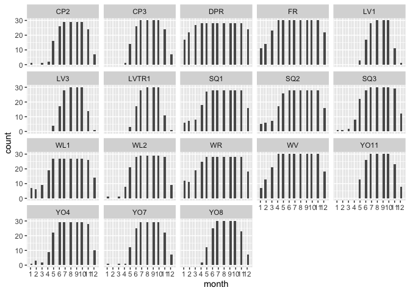<!-- -->

Historical climate

```r
snow_pops_historical <- pop_elev_climate_historical_avgs %>% filter(PckSum >= 70)
unique(snow_pops_historical$parent.pop) #18 pops get some significant snowpack per year 
```

```
##  [1] "CP2"   "CP3"   "DPR"   "FR"    "LV1"   "LV3"   "LVTR1" "SQ1"   "SQ2"  
## [10] "SQ3"   "WL1"   "WL2"   "WR"    "WV"    "YO11"  "YO4"   "YO7"   "YO8"
```

```r
summary(snow_pops_historical)
```

```
##   parent.pop        elevation.group        elev_m           month      
##  Length:216         Length:216         Min.   : 748.9   Min.   : 1.00  
##  Class :character   Class :character   1st Qu.:1613.8   1st Qu.: 3.75  
##  Mode  :character   Mode  :character   Median :2200.9   Median : 6.50  
##                                        Mean   :1992.5   Mean   : 6.50  
##                                        3rd Qu.:2470.0   3rd Qu.: 9.25  
##                                        Max.   :2872.3   Max.   :12.00  
##     cwd_mean          pck_mean          ppt_mean          tmn_mean       
##  Min.   :  8.883   Min.   :   0.00   Min.   :  3.345   Min.   :-11.4587  
##  1st Qu.: 25.637   1st Qu.:   0.00   1st Qu.: 29.058   1st Qu.: -4.6368  
##  Median : 43.329   Median :  58.06   Median : 95.651   Median :  0.0515  
##  Mean   : 51.405   Mean   : 205.17   Mean   :107.936   Mean   :  0.3620  
##  3rd Qu.: 75.666   3rd Qu.: 320.55   3rd Qu.:181.983   3rd Qu.:  4.7810  
##  Max.   :139.478   Max.   :1210.37   Max.   :299.498   Max.   : 14.3370  
##     tmx_mean         cwd_sem          pck_sem          ppt_sem      
##  Min.   : 1.071   Min.   :0.1581   Min.   :  0.00   Min.   : 1.194  
##  1st Qu.: 7.264   1st Qu.:0.5935   1st Qu.:  0.00   1st Qu.: 5.664  
##  Median :12.359   Median :1.4092   Median : 17.62   Median :14.549  
##  Mean   :13.822   Mean   :1.7050   Mean   : 27.37   Mean   :15.804  
##  3rd Qu.:20.631   3rd Qu.:2.5888   3rd Qu.: 46.21   3rd Qu.:26.063  
##  Max.   :32.312   Max.   :7.3270   Max.   :112.26   Max.   :43.279  
##     tmn_sem          tmx_sem           PckSum      
##  Min.   :0.1642   Min.   :0.1957   Min.   : 228.4  
##  1st Qu.:0.2477   1st Qu.:0.3291   1st Qu.: 891.5  
##  Median :0.2929   Median :0.3840   Median :2072.4  
##  Mean   :0.2943   Mean   :0.3860   Mean   :2462.0  
##  3rd Qu.:0.3254   3rd Qu.:0.4330   3rd Qu.:3377.5  
##  Max.   :0.4556   Max.   :0.6157   Max.   :6363.1
```

```r
snow_pops_historical_tojoin <- snow_pops_historical %>% select(parent.pop:elev_m, PckSum) %>% distinct()

snow_pops_historical_years <- left_join(snow_pops_historical_tojoin, pop_elev_climate_historical) 
```

```
## Joining with `by = join_by(parent.pop, elevation.group, elev_m)`
```

```r
summary(snow_pops_historical_years)
```

```
##   parent.pop        elevation.group        elev_m           PckSum      
##  Length:6480        Length:6480        Min.   : 748.9   Min.   : 228.4  
##  Class :character   Class :character   1st Qu.:1613.8   1st Qu.: 891.5  
##  Mode  :character   Mode  :character   Median :2200.9   Median :2072.4  
##                                        Mean   :1992.5   Mean   :2462.0  
##                                        3rd Qu.:2470.0   3rd Qu.:3377.5  
##                                        Max.   :2872.3   Max.   :6363.1  
##      year               month            cwd              pck        
##  Length:6480        Min.   : 1.00   Min.   :  0.00   Min.   :   0.0  
##  Class :character   1st Qu.: 3.75   1st Qu.: 24.02   1st Qu.:   0.0  
##  Mode  :character   Median : 6.50   Median : 44.88   Median :   0.0  
##                     Mean   : 6.50   Mean   : 51.40   Mean   : 205.2  
##                     3rd Qu.: 9.25   3rd Qu.: 75.35   3rd Qu.: 275.0  
##                     Max.   :12.00   Max.   :159.40   Max.   :2594.7  
##       ppt              tmn               tmx        
##  Min.   :  0.00   Min.   :-14.970   Min.   :-2.650  
##  1st Qu.: 14.03   1st Qu.: -4.480   1st Qu.: 7.107  
##  Median : 57.01   Median :  0.070   Median :12.885  
##  Mean   :107.94   Mean   :  0.362   Mean   :13.822  
##  3rd Qu.:149.83   3rd Qu.:  5.152   3rd Qu.:20.343  
##  Max.   :951.79   Max.   : 16.840   Max.   :35.120
```

```r
snow_pops_historical_years %>% filter(pck < 2, pck >0) %>% arrange(parent.pop, pck) #What about when snowpack is 1 mm? This mostly occurs Nov-Jan, one case in Feb and one case in July
```

```
## # A tibble: 13 × 11
## # Groups:   parent.pop, elevation.group, elev_m [9]
##    parent.pop elevation.group elev_m PckSum year  month   cwd    pck    ppt
##    <chr>      <chr>            <dbl>  <dbl> <chr> <dbl> <dbl>  <dbl>  <dbl>
##  1 CP2        High             2244.  3158. 1976      1  22.8 0.0300  25.1 
##  2 FR         Mid               787    261. 1977      1  14.1 0.0800  67   
##  3 FR         Mid               787    261. 1981      1  13.8 0.480  215.  
##  4 FR         Mid               787    261. 1964      2  22.7 1.60    11.1 
##  5 LV1        High             2593.  6124. 1978      7  76.7 1.61    14.2 
##  6 LV1        High             2593.  6124. 1976     12  13.3 1.66     9.28
##  7 LV3        High             2354.  5923. 1976     12  17.1 1.42     9.34
##  8 SQ3        High             2373.  2052. 1991      2  47.0 1.78    31.2 
##  9 WL1        Mid              1614.   892. 1979     12  20.8 1.84   162.  
## 10 WL2        High             2020.  2093. 1979     11  25.7 0.890  129.  
## 11 WL2        High             2020.  2093. 1978     11  24.8 1.36    96.8 
## 12 YO11       High             2872.  2452. 1980     11  26.0 0.0500  23.8 
## 13 YO8        High             2591.  3391. 1975     11  33.6 1.56    50.4 
## # ℹ 2 more variables: tmn <dbl>, tmx <dbl>
```

```r
snow_first_month <- snow_pops_historical_years %>%
  group_by(parent.pop, elevation.group, elev_m, year) %>% 
  filter(pck==0) %>% 
  arrange(month) %>% 
  filter(row_number()==1) #get first month for each pop and year with no snowpack for germ

snow_first_month_tomerge <- snow_first_month %>% 
  select(parent.pop:elev_m, year, firstmonth=month)

snow_first_month_col <- full_join(snow_pops_historical_years, snow_first_month_tomerge)
```

```
## Joining with `by = join_by(parent.pop, elevation.group, elev_m, year)`
```

```r
dim(snow_first_month_col)
```

```
## [1] 6480   12
```

```r
snow_last_month <- snow_first_month_col %>%
  group_by(parent.pop, elevation.group, elev_m, year) %>% 
  filter(month>firstmonth) %>% 
  filter(pck>70) %>% 
  arrange(month) %>% 
  filter(row_number()==1) #get first month after growstart for each pop and year with pck >70 

snow_last_month_tomerge <- snow_last_month %>% 
  select(parent.pop:elev_m, year, firstmonth,lastmonth=month)

snow_last_month_col <- full_join(snow_first_month_col, snow_last_month_tomerge)
```

```
## Joining with `by = join_by(parent.pop, elevation.group, elev_m, year,
## firstmonth)`
```

```r
dim(snow_last_month_col)
```

```
## [1] 6480   13
```

```r
#check weird cases
snow_last_month_col %>% filter(is.na(firstmonth)) #no cases where there isn't a firstmonth
```

```
## # A tibble: 0 × 13
## # Groups:   parent.pop, elevation.group, elev_m [0]
## # ℹ 13 variables: parent.pop <chr>, elevation.group <chr>, elev_m <dbl>,
## #   PckSum <dbl>, year <chr>, month <dbl>, cwd <dbl>, pck <dbl>, ppt <dbl>,
## #   tmn <dbl>, tmx <dbl>, firstmonth <dbl>, lastmonth <dbl>
```

```r
snow_last_month_col %>% filter(is.na(lastmonth)) #191 cases where there isn't a lastmonth 
```

```
## # A tibble: 2,292 × 13
## # Groups:   parent.pop, elevation.group, elev_m [18]
##    parent.pop elevation.group elev_m PckSum year  month   cwd   pck    ppt   tmn
##    <chr>      <chr>            <dbl>  <dbl> <chr> <dbl> <dbl> <dbl>  <dbl> <dbl>
##  1 CP2        High             2244.  3158. 1962      1  21.3  179. 107.   -7.95
##  2 CP2        High             2244.  3158. 1962      2  21.5  650. 479.   -8.15
##  3 CP2        High             2244.  3158. 1962      3  16.6  844. 212.   -9.09
##  4 CP2        High             2244.  3158. 1962      4  60.1  614.  48.3  -2.58
##  5 CP2        High             2244.  3158. 1962      5  77.5  318.  46.2  -1.77
##  6 CP2        High             2244.  3158. 1962      6 112.     0    6.90  3.23
##  7 CP2        High             2244.  3158. 1962      7 121.     0   11.5   7.48
##  8 CP2        High             2244.  3158. 1962      8 116.     0    7.21  6.18
##  9 CP2        High             2244.  3158. 1962      9  98.9    0    6.55  5.36
## 10 CP2        High             2244.  3158. 1962     10  60.2    0  288.    1.61
## # ℹ 2,282 more rows
## # ℹ 3 more variables: tmx <dbl>, firstmonth <dbl>, lastmonth <dbl>
```

```r
snow_last_month_col %>% filter(lastmonth==firstmonth+1) #9 cases where there was sig snowpack in the month after the first month of 0 snowpack
```

```
## # A tibble: 108 × 13
## # Groups:   parent.pop, elevation.group, elev_m [7]
##    parent.pop elevation.group elev_m PckSum year  month   cwd   pck     ppt
##    <chr>      <chr>            <dbl>  <dbl> <chr> <dbl> <dbl> <dbl>   <dbl>
##  1 DPR        Mid              1019.   228. 1962      1  10.9    0  132.   
##  2 DPR        Mid              1019.   228. 1962      2  11.6  173. 543.   
##  3 DPR        Mid              1019.   228. 1962      3  10.6  113. 219.   
##  4 DPR        Mid              1019.   228. 1962      4  43.8    0   55.6  
##  5 DPR        Mid              1019.   228. 1962      5  38.9    0   21.9  
##  6 DPR        Mid              1019.   228. 1962      6  40.6    0    0.860
##  7 DPR        Mid              1019.   228. 1962      7   0      0    1.09 
##  8 DPR        Mid              1019.   228. 1962      8   0      0    8.75 
##  9 DPR        Mid              1019.   228. 1962      9  57.5    0    4.95 
## 10 DPR        Mid              1019.   228. 1962     10  38.7    0  513.   
## # ℹ 98 more rows
## # ℹ 4 more variables: tmn <dbl>, tmx <dbl>, firstmonth <dbl>, lastmonth <dbl>
```

```r
snow_last_month_col %>% filter(lastmonth==firstmonth+2) #8 cases where there was sig snowpack in the second month after the first month of 0 snowpack
```

```
## # A tibble: 96 × 13
## # Groups:   parent.pop, elevation.group, elev_m [8]
##    parent.pop elevation.group elev_m PckSum year  month   cwd   pck     ppt
##    <chr>      <chr>            <dbl>  <dbl> <chr> <dbl> <dbl> <dbl>   <dbl>
##  1 DPR        Mid              1019.   228. 1991      1 11.6     0   27.5  
##  2 DPR        Mid              1019.   228. 1991      2 21.9     0   91.0  
##  3 DPR        Mid              1019.   228. 1991      3 10.6   113. 577.   
##  4 DPR        Mid              1019.   228. 1991      4 40.9     0   66.0  
##  5 DPR        Mid              1019.   228. 1991      5  5.91    0   96.2  
##  6 DPR        Mid              1019.   228. 1991      6  0       0   53.8  
##  7 DPR        Mid              1019.   228. 1991      7 38.6     0    0    
##  8 DPR        Mid              1019.   228. 1991      8  0       0    9.82 
##  9 DPR        Mid              1019.   228. 1991      9 54.8     0    0.820
## 10 DPR        Mid              1019.   228. 1991     10 37.8     0  119.   
## # ℹ 86 more rows
## # ℹ 4 more variables: tmn <dbl>, tmx <dbl>, firstmonth <dbl>, lastmonth <dbl>
```

```r
#snow_last_month_col %>% filter(year==1991)
#snow_last_month_col %>% filter(parent.pop=="DPR") %>% filter(year==1962|year==1975)
#snow_last_month_col %>% filter(parent.pop=="WR") %>% filter(year==1975|year==1986)
#snow_last_month_col %>% filter(parent.pop=="YO7") %>% filter(year==1976)
#snow_last_month_col %>% filter(parent.pop=="FR") %>% filter(year==1975)
#snow_last_month_col %>% filter(parent.pop=="SQ3") %>% filter(year==1976)


snow_grwseason_historical <- snow_last_month_col %>% #fill in months b/t start and stop 
  group_by(parent.pop, elevation.group, elev_m, year) %>% 
  filter(month>=firstmonth) %>% 
  filter(ifelse(is.na(lastmonth), pck<70, month<lastmonth))
summary(snow_grwseason_historical) 
```

```
##   parent.pop        elevation.group        elev_m           PckSum      
##  Length:3702        Length:3702        Min.   : 748.9   Min.   : 228.4  
##  Class :character   Class :character   1st Qu.:1158.0   1st Qu.: 560.8  
##  Mode  :character   Mode  :character   Median :2020.1   Median :1776.3  
##                                        Mean   :1844.7   Mean   :2016.3  
##                                        3rd Qu.:2373.2   3rd Qu.:3157.7  
##                                        Max.   :2872.3   Max.   :6363.1  
##                                                                         
##      year               month             cwd              pck        
##  Length:3702        Min.   : 1.000   Min.   :  0.00   Min.   : 0.000  
##  Class :character   1st Qu.: 6.000   1st Qu.: 40.60   1st Qu.: 0.000  
##  Mode  :character   Median : 8.000   Median : 65.75   Median : 0.000  
##                     Mean   : 7.857   Mean   : 65.78   Mean   : 1.726  
##                     3rd Qu.:10.000   3rd Qu.: 88.92   3rd Qu.: 0.000  
##                     Max.   :12.000   Max.   :159.40   Max.   :69.880  
##                                                                       
##       ppt               tmn               tmx          firstmonth   
##  Min.   :  0.000   Min.   :-13.580   Min.   : 0.82   Min.   :1.000  
##  1st Qu.:  5.965   1st Qu.:  0.620   1st Qu.:13.64   1st Qu.:3.000  
##  Median : 23.285   Median :  4.045   Median :19.02   Median :5.000  
##  Mean   : 53.734   Mean   :  4.120   Mean   :18.65   Mean   :4.518  
##  3rd Qu.: 68.930   3rd Qu.:  7.800   3rd Qu.:22.97   3rd Qu.:6.000  
##  Max.   :794.420   Max.   : 16.840   Max.   :35.12   Max.   :9.000  
##                                                                     
##    lastmonth   
##  Min.   : 2.0  
##  1st Qu.:11.0  
##  Median :12.0  
##  Mean   :11.5  
##  3rd Qu.:12.0  
##  Max.   :12.0  
##  NA's   :1721
```

```r
xtabs(~parent.pop+month, data=snow_grwseason_historical)
```

```
##           month
## parent.pop  1  2  3  4  5  6  7  8  9 10 11 12
##      CP2    0  0  0  2 11 25 30 30 30 30 16  8
##      CP3    0  0  0  1  9 24 30 30 30 30 15  8
##      DPR   10 15 22 26 27 27 27 27 27 27 27 21
##      FR     6 10 23 28 29 29 29 29 29 29 29 22
##      LV1    0  0  0  0  0 13 25 29 30 28  7  1
##      LV3    0  0  0  0  0 13 26 29 30 30  7  1
##      LVTR1  0  0  0  0  0 13 25 29 30 28  7  1
##      SQ1    2  3  2 14 26 29 29 29 29 29 29 15
##      SQ2    1  3  2 14 26 29 29 29 29 29 29 16
##      SQ3    1  1  0  3 14 26 29 29 29 29 22 11
##      WL1    2  3  5 15 29 29 29 29 29 29 27 15
##      WL2    1  2  1  6 15 29 29 29 29 29 22  8
##      WR     7  6 13 23 27 27 27 27 27 27 26 16
##      WV     4  8 17 29 30 30 30 30 30 30 30 19
##      YO11   0  0  0  0  6 23 30 30 30 30 15  7
##      YO4    1  2  1 10 18 29 29 29 29 29 22  9
##      YO7    1  0  0  1  9 22 29 29 29 29 13  6
##      YO8    0  0  0  1  8 22 30 30 30 30 14  7
```

```r
options(max.print=1000000)
xtabs(~year+month+parent.pop, data=snow_grwseason_historical)
```

```
## , , parent.pop = CP2
## 
##       month
## year   1 2 3 4 5 6 7 8 9 10 11 12
##   1962 0 0 0 0 0 1 1 1 1  1  1  1
##   1963 0 0 0 0 0 1 1 1 1  1  0  0
##   1964 0 0 0 0 0 1 1 1 1  1  0  0
##   1965 0 0 0 0 0 0 1 1 1  1  0  0
##   1966 0 0 0 0 1 1 1 1 1  1  1  0
##   1967 0 0 0 0 0 0 1 1 1  1  1  0
##   1968 0 0 0 0 1 1 1 1 1  1  0  0
##   1969 0 0 0 0 0 0 1 1 1  1  1  0
##   1970 0 0 0 0 0 1 1 1 1  1  0  0
##   1971 0 0 0 0 0 1 1 1 1  1  0  0
##   1972 0 0 0 0 1 1 1 1 1  1  0  0
##   1973 0 0 0 0 0 1 1 1 1  1  0  0
##   1974 0 0 0 0 0 1 1 1 1  1  1  0
##   1975 0 0 0 0 0 1 1 1 1  1  1  1
##   1976 0 0 0 0 1 1 1 1 1  1  1  1
##   1977 0 0 0 1 1 1 1 1 1  1  1  0
##   1978 0 0 0 0 0 1 1 1 1  1  1  0
##   1979 0 0 0 0 0 1 1 1 1  1  1  0
##   1980 0 0 0 0 0 1 1 1 1  1  1  1
##   1981 0 0 0 0 1 1 1 1 1  1  0  0
##   1982 0 0 0 0 0 0 1 1 1  1  0  0
##   1983 0 0 0 0 0 0 1 1 1  1  0  0
##   1984 0 0 0 0 0 1 1 1 1  1  0  0
##   1985 0 0 0 0 1 1 1 1 1  1  0  0
##   1986 0 0 0 0 0 1 1 1 1  1  1  1
##   1987 0 0 0 0 1 1 1 1 1  1  1  0
##   1988 0 0 0 0 1 1 1 1 1  1  0  0
##   1989 0 0 0 0 1 1 1 1 1  1  1  1
##   1990 0 0 0 1 1 1 1 1 1  1  1  1
##   1991 0 0 0 0 0 1 1 1 1  1  1  1
## 
## , , parent.pop = CP3
## 
##       month
## year   1 2 3 4 5 6 7 8 9 10 11 12
##   1962 0 0 0 0 0 1 1 1 1  1  1  1
##   1963 0 0 0 0 0 1 1 1 1  1  0  0
##   1964 0 0 0 0 0 1 1 1 1  1  0  0
##   1965 0 0 0 0 0 0 1 1 1  1  0  0
##   1966 0 0 0 0 1 1 1 1 1  1  0  0
##   1967 0 0 0 0 0 0 1 1 1  1  1  0
##   1968 0 0 0 0 1 1 1 1 1  1  0  0
##   1969 0 0 0 0 0 0 1 1 1  1  1  0
##   1970 0 0 0 0 0 1 1 1 1  1  0  0
##   1971 0 0 0 0 0 1 1 1 1  1  0  0
##   1972 0 0 0 0 0 1 1 1 1  1  0  0
##   1973 0 0 0 0 0 1 1 1 1  1  0  0
##   1974 0 0 0 0 0 1 1 1 1  1  1  0
##   1975 0 0 0 0 0 1 1 1 1  1  1  1
##   1976 0 0 0 0 1 1 1 1 1  1  1  1
##   1977 0 0 0 1 1 1 1 1 1  1  1  0
##   1978 0 0 0 0 0 1 1 1 1  1  1  0
##   1979 0 0 0 0 0 1 1 1 1  1  1  0
##   1980 0 0 0 0 0 0 1 1 1  1  1  1
##   1981 0 0 0 0 1 1 1 1 1  1  0  0
##   1982 0 0 0 0 0 0 1 1 1  1  0  0
##   1983 0 0 0 0 0 0 1 1 1  1  0  0
##   1984 0 0 0 0 0 1 1 1 1  1  0  0
##   1985 0 0 0 0 1 1 1 1 1  1  0  0
##   1986 0 0 0 0 0 1 1 1 1  1  1  1
##   1987 0 0 0 0 1 1 1 1 1  1  1  0
##   1988 0 0 0 0 1 1 1 1 1  1  0  0
##   1989 0 0 0 0 0 1 1 1 1  1  1  1
##   1990 0 0 0 0 1 1 1 1 1  1  1  1
##   1991 0 0 0 0 0 1 1 1 1  1  1  1
## 
## , , parent.pop = DPR
## 
##       month
## year   1 2 3 4 5 6 7 8 9 10 11 12
##   1962 1 0 0 0 0 0 0 0 0  0  0  0
##   1963 0 1 1 1 1 1 1 1 1  1  1  1
##   1964 0 1 1 1 1 1 1 1 1  1  1  0
##   1965 0 0 1 1 1 1 1 1 1  1  1  1
##   1966 0 0 1 1 1 1 1 1 1  1  1  1
##   1967 0 1 1 1 1 1 1 1 1  1  1  1
##   1968 0 0 1 1 1 1 1 1 1  1  1  0
##   1969 0 0 0 0 1 1 1 1 1  1  1  1
##   1970 0 0 1 1 1 1 1 1 1  1  1  0
##   1971 0 0 0 1 1 1 1 1 1  1  1  0
##   1972 0 0 1 1 1 1 1 1 1  1  1  0
##   1973 0 0 0 1 1 1 1 1 1  1  1  1
##   1974 0 0 1 1 1 1 1 1 1  1  1  1
##   1975 1 0 0 0 0 0 0 0 0  0  0  0
##   1976 1 1 1 1 1 1 1 1 1  1  1  1
##   1977 1 1 1 1 1 1 1 1 1  1  1  1
##   1978 0 1 1 1 1 1 1 1 1  1  1  1
##   1979 0 0 1 1 1 1 1 1 1  1  1  1
##   1980 0 1 1 1 1 1 1 1 1  1  1  1
##   1981 1 1 1 1 1 1 1 1 1  1  1  1
##   1982 0 0 0 1 1 1 1 1 1  1  1  1
##   1983 0 0 0 1 1 1 1 1 1  1  1  1
##   1984 1 1 1 1 1 1 1 1 1  1  1  1
##   1985 1 1 1 1 1 1 1 1 1  1  1  1
##   1986 1 1 1 1 1 1 1 1 1  1  1  1
##   1987 0 1 1 1 1 1 1 1 1  1  1  0
##   1988 0 1 1 1 1 1 1 1 1  1  1  1
##   1989 1 1 1 1 1 1 1 1 1  1  1  1
##   1990 0 0 1 1 1 1 1 1 1  1  1  1
##   1991 1 1 0 0 0 0 0 0 0  0  0  0
## 
## , , parent.pop = FR
## 
##       month
## year   1 2 3 4 5 6 7 8 9 10 11 12
##   1962 0 0 0 1 1 1 1 1 1  1  1  1
##   1963 0 1 1 1 1 1 1 1 1  1  1  1
##   1964 0 0 1 1 1 1 1 1 1  1  1  0
##   1965 0 0 1 1 1 1 1 1 1  1  1  1
##   1966 0 0 1 1 1 1 1 1 1  1  1  1
##   1967 0 0 0 1 1 1 1 1 1  1  1  1
##   1968 0 0 1 1 1 1 1 1 1  1  1  0
##   1969 0 0 0 0 1 1 1 1 1  1  1  1
##   1970 0 0 1 1 1 1 1 1 1  1  1  0
##   1971 0 0 0 1 1 1 1 1 1  1  1  0
##   1972 0 0 1 1 1 1 1 1 1  1  1  0
##   1973 0 0 0 1 1 1 1 1 1  1  1  1
##   1974 0 0 1 1 1 1 1 1 1  1  1  1
##   1975 1 0 0 0 0 0 0 0 0  0  0  0
##   1976 1 1 1 1 1 1 1 1 1  1  1  1
##   1977 0 1 1 1 1 1 1 1 1  1  1  1
##   1978 0 0 1 1 1 1 1 1 1  1  1  1
##   1979 0 0 1 1 1 1 1 1 1  1  1  1
##   1980 0 1 1 1 1 1 1 1 1  1  1  1
##   1981 0 1 1 1 1 1 1 1 1  1  1  1
##   1982 0 0 1 1 1 1 1 1 1  1  1  1
##   1983 0 0 0 1 1 1 1 1 1  1  1  0
##   1984 0 0 1 1 1 1 1 1 1  1  1  1
##   1985 1 1 1 1 1 1 1 1 1  1  1  1
##   1986 1 1 1 1 1 1 1 1 1  1  1  1
##   1987 0 0 1 1 1 1 1 1 1  1  1  0
##   1988 0 1 1 1 1 1 1 1 1  1  1  1
##   1989 1 1 1 1 1 1 1 1 1  1  1  1
##   1990 0 0 1 1 1 1 1 1 1  1  1  1
##   1991 1 1 1 1 1 1 1 1 1  1  1  1
## 
## , , parent.pop = LV1
## 
##       month
## year   1 2 3 4 5 6 7 8 9 10 11 12
##   1962 0 0 0 0 0 0 1 1 1  1  0  0
##   1963 0 0 0 0 0 0 1 1 1  1  0  0
##   1964 0 0 0 0 0 1 1 1 1  1  0  0
##   1965 0 0 0 0 0 0 1 1 1  1  0  0
##   1966 0 0 0 0 0 1 1 1 1  1  0  0
##   1967 0 0 0 0 0 0 0 1 1  1  1  0
##   1968 0 0 0 0 0 1 1 1 1  1  0  0
##   1969 0 0 0 0 0 0 1 1 1  1  1  0
##   1970 0 0 0 0 0 0 1 1 1  1  0  0
##   1971 0 0 0 0 0 0 1 1 1  1  0  0
##   1972 0 0 0 0 0 1 1 1 1  1  0  0
##   1973 0 0 0 0 0 0 1 1 1  1  0  0
##   1974 0 0 0 0 0 0 0 1 1  1  0  0
##   1975 0 0 0 0 0 0 1 1 1  1  0  0
##   1976 0 0 0 0 0 1 1 1 1  1  1  1
##   1977 0 0 0 0 0 1 1 1 1  1  0  0
##   1978 0 0 0 0 0 0 0 1 1  1  0  0
##   1979 0 0 0 0 0 1 1 1 1  1  0  0
##   1980 0 0 0 0 0 0 1 1 1  1  1  0
##   1981 0 0 0 0 0 1 1 1 1  0  0  0
##   1982 0 0 0 0 0 0 0 1 1  1  0  0
##   1983 0 0 0 0 0 0 0 0 1  1  0  0
##   1984 0 0 0 0 0 0 1 1 1  0  0  0
##   1985 0 0 0 0 0 1 1 1 1  1  0  0
##   1986 0 0 0 0 0 0 1 1 1  1  1  0
##   1987 0 0 0 0 0 1 1 1 1  1  0  0
##   1988 0 0 0 0 0 1 1 1 1  1  0  0
##   1989 0 0 0 0 0 0 1 1 1  1  0  0
##   1990 0 0 0 0 0 1 1 1 1  1  1  0
##   1991 0 0 0 0 0 1 1 1 1  1  1  0
## 
## , , parent.pop = LV3
## 
##       month
## year   1 2 3 4 5 6 7 8 9 10 11 12
##   1962 0 0 0 0 0 0 1 1 1  1  0  0
##   1963 0 0 0 0 0 0 1 1 1  1  0  0
##   1964 0 0 0 0 0 1 1 1 1  1  0  0
##   1965 0 0 0 0 0 0 1 1 1  1  0  0
##   1966 0 0 0 0 0 1 1 1 1  1  0  0
##   1967 0 0 0 0 0 0 0 1 1  1  1  0
##   1968 0 0 0 0 0 1 1 1 1  1  0  0
##   1969 0 0 0 0 0 0 1 1 1  1  1  0
##   1970 0 0 0 0 0 0 1 1 1  1  0  0
##   1971 0 0 0 0 0 0 1 1 1  1  0  0
##   1972 0 0 0 0 0 1 1 1 1  1  0  0
##   1973 0 0 0 0 0 0 1 1 1  1  0  0
##   1974 0 0 0 0 0 0 0 1 1  1  0  0
##   1975 0 0 0 0 0 0 1 1 1  1  0  0
##   1976 0 0 0 0 0 1 1 1 1  1  1  1
##   1977 0 0 0 0 0 1 1 1 1  1  0  0
##   1978 0 0 0 0 0 0 1 1 1  1  0  0
##   1979 0 0 0 0 0 1 1 1 1  1  0  0
##   1980 0 0 0 0 0 0 1 1 1  1  1  0
##   1981 0 0 0 0 0 1 1 1 1  1  0  0
##   1982 0 0 0 0 0 0 0 1 1  1  0  0
##   1983 0 0 0 0 0 0 0 0 1  1  0  0
##   1984 0 0 0 0 0 0 1 1 1  1  0  0
##   1985 0 0 0 0 0 1 1 1 1  1  0  0
##   1986 0 0 0 0 0 0 1 1 1  1  1  0
##   1987 0 0 0 0 0 1 1 1 1  1  0  0
##   1988 0 0 0 0 0 1 1 1 1  1  0  0
##   1989 0 0 0 0 0 0 1 1 1  1  0  0
##   1990 0 0 0 0 0 1 1 1 1  1  1  0
##   1991 0 0 0 0 0 1 1 1 1  1  1  0
## 
## , , parent.pop = LVTR1
## 
##       month
## year   1 2 3 4 5 6 7 8 9 10 11 12
##   1962 0 0 0 0 0 0 1 1 1  1  0  0
##   1963 0 0 0 0 0 0 1 1 1  1  0  0
##   1964 0 0 0 0 0 1 1 1 1  1  0  0
##   1965 0 0 0 0 0 0 1 1 1  1  0  0
##   1966 0 0 0 0 0 1 1 1 1  1  0  0
##   1967 0 0 0 0 0 0 0 1 1  1  1  0
##   1968 0 0 0 0 0 1 1 1 1  1  0  0
##   1969 0 0 0 0 0 0 1 1 1  1  1  0
##   1970 0 0 0 0 0 0 1 1 1  1  0  0
##   1971 0 0 0 0 0 0 1 1 1  1  0  0
##   1972 0 0 0 0 0 1 1 1 1  1  0  0
##   1973 0 0 0 0 0 0 1 1 1  1  0  0
##   1974 0 0 0 0 0 0 0 1 1  1  0  0
##   1975 0 0 0 0 0 0 1 1 1  1  0  0
##   1976 0 0 0 0 0 1 1 1 1  1  1  1
##   1977 0 0 0 0 0 1 1 1 1  1  0  0
##   1978 0 0 0 0 0 0 0 1 1  1  0  0
##   1979 0 0 0 0 0 1 1 1 1  1  0  0
##   1980 0 0 0 0 0 0 1 1 1  1  1  0
##   1981 0 0 0 0 0 1 1 1 1  0  0  0
##   1982 0 0 0 0 0 0 0 1 1  1  0  0
##   1983 0 0 0 0 0 0 0 0 1  1  0  0
##   1984 0 0 0 0 0 0 1 1 1  0  0  0
##   1985 0 0 0 0 0 1 1 1 1  1  0  0
##   1986 0 0 0 0 0 0 1 1 1  1  1  0
##   1987 0 0 0 0 0 1 1 1 1  1  0  0
##   1988 0 0 0 0 0 1 1 1 1  1  0  0
##   1989 0 0 0 0 0 0 1 1 1  1  0  0
##   1990 0 0 0 0 0 1 1 1 1  1  1  0
##   1991 0 0 0 0 0 1 1 1 1  1  1  0
## 
## , , parent.pop = SQ1
## 
##       month
## year   1 2 3 4 5 6 7 8 9 10 11 12
##   1962 0 0 0 0 1 1 1 1 1  1  1  1
##   1963 0 0 0 0 1 1 1 1 1  1  1  1
##   1964 0 0 0 1 1 1 1 1 1  1  1  0
##   1965 0 0 0 0 1 1 1 1 1  1  1  0
##   1966 0 0 0 1 1 1 1 1 1  1  1  0
##   1967 0 0 0 0 0 1 1 1 1  1  1  0
##   1968 0 0 0 1 1 1 1 1 1  1  1  0
##   1969 0 0 0 0 0 1 1 1 1  1  1  1
##   1970 0 0 0 0 1 1 1 1 1  1  1  0
##   1971 0 0 0 0 1 1 1 1 1  1  1  0
##   1972 0 0 0 1 1 1 1 1 1  1  1  0
##   1973 0 0 0 0 1 1 1 1 1  1  1  1
##   1974 0 0 0 0 1 1 1 1 1  1  1  1
##   1975 0 0 0 0 1 1 1 1 1  1  1  1
##   1976 1 1 1 1 1 1 1 1 1  1  1  1
##   1977 0 1 1 1 1 1 1 1 1  1  1  1
##   1978 0 0 0 0 1 1 1 1 1  1  1  0
##   1979 0 0 0 0 1 1 1 1 1  1  1  1
##   1980 0 0 0 0 1 1 1 1 1  1  1  1
##   1981 0 0 0 1 1 1 1 1 1  1  1  1
##   1982 0 0 0 0 1 1 1 1 1  1  1  0
##   1983 0 0 0 0 0 1 1 1 1  1  1  0
##   1984 0 0 0 1 1 1 1 1 1  1  1  0
##   1985 0 0 0 1 1 1 1 1 1  1  1  1
##   1986 0 0 0 1 1 1 1 1 1  1  1  1
##   1987 0 0 0 1 1 1 1 1 1  1  1  0
##   1988 0 0 0 1 1 1 1 1 1  1  1  0
##   1989 0 0 0 1 1 1 1 1 1  1  1  1
##   1990 0 0 0 1 1 1 1 1 1  1  1  1
##   1991 1 1 0 0 0 0 0 0 0  0  0  0
## 
## , , parent.pop = SQ2
## 
##       month
## year   1 2 3 4 5 6 7 8 9 10 11 12
##   1962 0 0 0 0 1 1 1 1 1  1  1  1
##   1963 0 0 0 0 1 1 1 1 1  1  1  1
##   1964 0 0 0 1 1 1 1 1 1  1  1  0
##   1965 0 0 0 0 1 1 1 1 1  1  1  0
##   1966 0 0 0 1 1 1 1 1 1  1  1  0
##   1967 0 0 0 0 0 1 1 1 1  1  1  0
##   1968 0 0 0 1 1 1 1 1 1  1  1  0
##   1969 0 0 0 0 0 1 1 1 1  1  1  1
##   1970 0 0 0 0 1 1 1 1 1  1  1  0
##   1971 0 0 0 0 1 1 1 1 1  1  1  0
##   1972 0 0 0 1 1 1 1 1 1  1  1  0
##   1973 0 0 0 0 1 1 1 1 1  1  1  1
##   1974 0 0 0 0 1 1 1 1 1  1  1  1
##   1975 0 0 0 0 1 1 1 1 1  1  1  1
##   1976 1 1 1 1 1 1 1 1 1  1  1  1
##   1977 0 1 1 1 1 1 1 1 1  1  1  1
##   1978 0 0 0 0 1 1 1 1 1  1  1  1
##   1979 0 0 0 0 1 1 1 1 1  1  1  1
##   1980 0 0 0 0 1 1 1 1 1  1  1  1
##   1981 0 0 0 1 1 1 1 1 1  1  1  1
##   1982 0 0 0 0 1 1 1 1 1  1  1  0
##   1983 0 0 0 0 0 1 1 1 1  1  1  0
##   1984 0 0 0 1 1 1 1 1 1  1  1  0
##   1985 0 0 0 1 1 1 1 1 1  1  1  1
##   1986 0 0 0 1 1 1 1 1 1  1  1  1
##   1987 0 0 0 1 1 1 1 1 1  1  1  0
##   1988 0 0 0 1 1 1 1 1 1  1  1  0
##   1989 0 0 0 1 1 1 1 1 1  1  1  1
##   1990 0 0 0 1 1 1 1 1 1  1  1  1
##   1991 0 1 0 0 0 0 0 0 0  0  0  0
## 
## , , parent.pop = SQ3
## 
##       month
## year   1 2 3 4 5 6 7 8 9 10 11 12
##   1962 0 0 0 0 0 1 1 1 1  1  1  1
##   1963 0 0 0 0 0 1 1 1 1  1  1  1
##   1964 0 0 0 0 1 1 1 1 1  1  0  0
##   1965 0 0 0 0 0 1 1 1 1  1  1  0
##   1966 0 0 0 0 1 1 1 1 1  1  1  0
##   1967 0 0 0 0 0 0 1 1 1  1  1  0
##   1968 0 0 0 0 1 1 1 1 1  1  1  0
##   1969 0 0 0 0 0 0 1 1 1  1  1  1
##   1970 0 0 0 0 1 1 1 1 1  1  1  0
##   1971 0 0 0 0 0 1 1 1 1  1  1  0
##   1972 0 0 0 0 1 1 1 1 1  1  0  0
##   1973 0 0 0 0 0 1 1 1 1  1  0  0
##   1974 0 0 0 0 0 1 1 1 1  1  1  0
##   1975 0 0 0 0 0 1 1 1 1  1  1  1
##   1976 1 1 0 0 0 0 0 0 0  0  0  0
##   1977 0 0 0 1 1 1 1 1 1  1  1  0
##   1978 0 0 0 0 0 1 1 1 1  1  1  0
##   1979 0 0 0 0 0 1 1 1 1  1  1  1
##   1980 0 0 0 0 0 1 1 1 1  1  1  1
##   1981 0 0 0 0 1 1 1 1 1  1  1  1
##   1982 0 0 0 0 0 1 1 1 1  1  0  0
##   1983 0 0 0 0 0 0 1 1 1  1  0  0
##   1984 0 0 0 0 1 1 1 1 1  1  0  0
##   1985 0 0 0 0 1 1 1 1 1  1  0  0
##   1986 0 0 0 0 1 1 1 1 1  1  1  1
##   1987 0 0 0 0 1 1 1 1 1  1  1  0
##   1988 0 0 0 0 1 1 1 1 1  1  1  0
##   1989 0 0 0 1 1 1 1 1 1  1  1  1
##   1990 0 0 0 1 1 1 1 1 1  1  1  1
##   1991 0 0 0 0 0 1 1 1 1  1  1  1
## 
## , , parent.pop = WL1
## 
##       month
## year   1 2 3 4 5 6 7 8 9 10 11 12
##   1962 0 0 0 0 1 1 1 1 1  1  1  1
##   1963 0 0 0 0 1 1 1 1 1  1  1  1
##   1964 0 0 0 1 1 1 1 1 1  1  1  0
##   1965 0 0 0 0 1 1 1 1 1  1  1  0
##   1966 0 0 0 1 1 1 1 1 1  1  1  1
##   1967 0 0 0 0 1 1 1 1 1  1  1  0
##   1968 0 0 0 1 1 1 1 1 1  1  1  0
##   1969 0 0 0 0 1 1 1 1 1  1  1  0
##   1970 0 0 0 0 1 1 1 1 1  1  1  0
##   1971 0 0 0 0 1 1 1 1 1  1  1  0
##   1972 0 0 0 1 1 1 1 1 1  1  1  0
##   1973 0 0 0 0 1 1 1 1 1  1  0  0
##   1974 0 0 0 0 1 1 1 1 1  1  1  1
##   1975 0 0 0 0 1 1 1 1 1  1  1  1
##   1976 1 1 1 1 1 1 1 1 1  1  1  1
##   1977 0 1 1 1 1 1 1 1 1  1  1  1
##   1978 0 0 0 0 1 1 1 1 1  1  1  1
##   1979 0 0 0 0 1 1 1 1 1  1  1  1
##   1980 0 0 0 1 1 1 1 1 1  1  1  1
##   1981 0 0 1 1 1 1 1 1 1  1  1  0
##   1982 0 0 0 0 1 1 1 1 1  1  1  0
##   1983 0 0 0 0 1 1 1 1 1  1  0  0
##   1984 0 0 0 1 1 1 1 1 1  1  1  0
##   1985 0 0 0 1 1 1 1 1 1  1  1  1
##   1986 0 0 0 1 1 1 1 1 1  1  1  1
##   1987 0 0 0 1 1 1 1 1 1  1  1  0
##   1988 0 0 1 1 1 1 1 1 1  1  1  1
##   1989 0 0 0 1 1 1 1 1 1  1  1  1
##   1990 0 0 1 1 1 1 1 1 1  1  1  1
##   1991 1 1 0 0 0 0 0 0 0  0  0  0
## 
## , , parent.pop = WL2
## 
##       month
## year   1 2 3 4 5 6 7 8 9 10 11 12
##   1962 0 0 0 0 0 1 1 1 1  1  1  1
##   1963 0 0 0 0 1 1 1 1 1  1  0  0
##   1964 0 0 0 0 1 1 1 1 1  1  0  0
##   1965 0 0 0 0 0 1 1 1 1  1  1  0
##   1966 0 0 0 0 1 1 1 1 1  1  1  0
##   1967 0 0 0 0 0 1 1 1 1  1  1  0
##   1968 0 0 0 0 1 1 1 1 1  1  1  0
##   1969 0 0 0 0 0 1 1 1 1  1  1  0
##   1970 0 0 0 0 0 1 1 1 1  1  1  0
##   1971 0 0 0 0 0 1 1 1 1  1  1  0
##   1972 0 0 0 0 1 1 1 1 1  1  1  0
##   1973 0 0 0 0 0 1 1 1 1  1  0  0
##   1974 0 0 0 0 0 1 1 1 1  1  1  0
##   1975 0 0 0 0 0 1 1 1 1  1  1  1
##   1976 1 1 1 1 1 1 1 1 1  1  1  1
##   1977 0 0 0 1 1 1 1 1 1  1  1  0
##   1978 0 0 0 0 0 1 1 1 1  1  1  0
##   1979 0 0 0 0 1 1 1 1 1  1  1  1
##   1980 0 0 0 0 0 1 1 1 1  1  1  1
##   1981 0 0 0 1 1 1 1 1 1  1  1  0
##   1982 0 0 0 0 0 1 1 1 1  1  0  0
##   1983 0 0 0 0 0 1 1 1 1  1  0  0
##   1984 0 0 0 0 0 1 1 1 1  1  0  0
##   1985 0 0 0 0 1 1 1 1 1  1  0  0
##   1986 0 0 0 0 1 1 1 1 1  1  1  1
##   1987 0 0 0 1 1 1 1 1 1  1  1  0
##   1988 0 0 0 1 1 1 1 1 1  1  1  0
##   1989 0 0 0 0 1 1 1 1 1  1  1  1
##   1990 0 0 0 1 1 1 1 1 1  1  1  1
##   1991 0 1 0 0 0 0 0 0 0  0  0  0
## 
## , , parent.pop = WR
## 
##       month
## year   1 2 3 4 5 6 7 8 9 10 11 12
##   1962 0 0 0 1 1 1 1 1 1  1  1  1
##   1963 0 1 1 1 1 1 1 1 1  1  1  1
##   1964 0 0 1 1 1 1 1 1 1  1  1  0
##   1965 0 0 0 1 1 1 1 1 1  1  1  0
##   1966 0 0 0 1 1 1 1 1 1  1  1  1
##   1967 0 0 0 0 1 1 1 1 1  1  1  0
##   1968 0 0 1 1 1 1 1 1 1  1  1  0
##   1969 0 0 0 0 1 1 1 1 1  1  1  1
##   1970 0 0 0 1 1 1 1 1 1  1  1  0
##   1971 0 0 0 1 1 1 1 1 1  1  1  0
##   1972 0 0 0 1 1 1 1 1 1  1  1  0
##   1973 0 0 0 0 1 1 1 1 1  1  0  0
##   1974 0 0 0 1 1 1 1 1 1  1  1  1
##   1975 1 0 0 0 0 0 0 0 0  0  0  0
##   1976 1 1 1 1 1 1 1 1 1  1  1  1
##   1977 1 1 1 1 1 1 1 1 1  1  1  1
##   1978 0 0 1 1 1 1 1 1 1  1  1  1
##   1979 0 0 0 1 1 1 1 1 1  1  1  1
##   1980 0 0 0 1 1 1 1 1 1  1  1  1
##   1981 1 1 1 1 1 1 1 1 1  1  1  1
##   1982 0 0 0 1 1 1 1 1 1  1  1  0
##   1983 0 0 0 0 1 1 1 1 1  1  1  0
##   1984 0 0 1 1 1 1 1 1 1  1  1  1
##   1985 1 1 1 1 1 1 1 1 1  1  1  1
##   1986 1 0 0 0 0 0 0 0 0  0  0  0
##   1987 0 0 1 1 1 1 1 1 1  1  1  0
##   1988 0 0 1 1 1 1 1 1 1  1  1  1
##   1989 0 0 1 1 1 1 1 1 1  1  1  1
##   1990 0 0 1 1 1 1 1 1 1  1  1  1
##   1991 1 1 0 0 0 0 0 0 0  0  0  0
## 
## , , parent.pop = WV
## 
##       month
## year   1 2 3 4 5 6 7 8 9 10 11 12
##   1962 0 0 1 1 1 1 1 1 1  1  1  1
##   1963 0 1 1 1 1 1 1 1 1  1  1  1
##   1964 0 0 1 1 1 1 1 1 1  1  1  0
##   1965 0 0 0 1 1 1 1 1 1  1  1  1
##   1966 0 0 0 1 1 1 1 1 1  1  1  1
##   1967 0 0 0 1 1 1 1 1 1  1  1  0
##   1968 0 0 0 1 1 1 1 1 1  1  1  0
##   1969 0 0 0 0 1 1 1 1 1  1  1  0
##   1970 0 0 0 1 1 1 1 1 1  1  1  0
##   1971 0 0 0 1 1 1 1 1 1  1  1  0
##   1972 0 0 0 1 1 1 1 1 1  1  1  0
##   1973 0 0 0 1 1 1 1 1 1  1  1  1
##   1974 0 0 0 1 1 1 1 1 1  1  1  1
##   1975 0 0 0 1 1 1 1 1 1  1  1  1
##   1976 1 1 1 1 1 1 1 1 1  1  1  1
##   1977 0 1 1 1 1 1 1 1 1  1  1  1
##   1978 0 0 1 1 1 1 1 1 1  1  1  1
##   1979 0 0 1 1 1 1 1 1 1  1  1  1
##   1980 0 1 1 1 1 1 1 1 1  1  1  1
##   1981 1 1 1 1 1 1 1 1 1  1  1  1
##   1982 0 0 0 1 1 1 1 1 1  1  1  0
##   1983 0 0 0 1 1 1 1 1 1  1  1  0
##   1984 0 0 1 1 1 1 1 1 1  1  1  0
##   1985 0 1 1 1 1 1 1 1 1  1  1  1
##   1986 1 1 1 1 1 1 1 1 1  1  1  1
##   1987 0 0 1 1 1 1 1 1 1  1  1  0
##   1988 0 0 1 1 1 1 1 1 1  1  1  1
##   1989 0 0 1 1 1 1 1 1 1  1  1  1
##   1990 0 0 1 1 1 1 1 1 1  1  1  1
##   1991 1 1 1 1 1 1 1 1 1  1  1  1
## 
## , , parent.pop = YO11
## 
##       month
## year   1 2 3 4 5 6 7 8 9 10 11 12
##   1962 0 0 0 0 0 1 1 1 1  1  1  1
##   1963 0 0 0 0 0 1 1 1 1  1  0  0
##   1964 0 0 0 0 0 1 1 1 1  1  0  0
##   1965 0 0 0 0 0 0 1 1 1  1  0  0
##   1966 0 0 0 0 1 1 1 1 1  1  0  0
##   1967 0 0 0 0 0 0 1 1 1  1  1  0
##   1968 0 0 0 0 1 1 1 1 1  1  1  0
##   1969 0 0 0 0 0 0 1 1 1  1  1  0
##   1970 0 0 0 0 0 1 1 1 1  1  0  0
##   1971 0 0 0 0 0 1 1 1 1  1  0  0
##   1972 0 0 0 0 0 1 1 1 1  1  0  0
##   1973 0 0 0 0 0 1 1 1 1  1  0  0
##   1974 0 0 0 0 0 1 1 1 1  1  1  0
##   1975 0 0 0 0 0 1 1 1 1  1  1  1
##   1976 0 0 0 0 1 1 1 1 1  1  1  1
##   1977 0 0 0 0 1 1 1 1 1  1  1  0
##   1978 0 0 0 0 0 0 1 1 1  1  0  0
##   1979 0 0 0 0 0 1 1 1 1  1  1  0
##   1980 0 0 0 0 0 0 1 1 1  1  1  1
##   1981 0 0 0 0 0 1 1 1 1  1  0  0
##   1982 0 0 0 0 0 0 1 1 1  1  0  0
##   1983 0 0 0 0 0 0 1 1 1  1  0  0
##   1984 0 0 0 0 0 1 1 1 1  1  0  0
##   1985 0 0 0 0 0 1 1 1 1  1  0  0
##   1986 0 0 0 0 0 1 1 1 1  1  1  1
##   1987 0 0 0 0 1 1 1 1 1  1  1  0
##   1988 0 0 0 0 0 1 1 1 1  1  0  0
##   1989 0 0 0 0 0 1 1 1 1  1  1  1
##   1990 0 0 0 0 1 1 1 1 1  1  1  1
##   1991 0 0 0 0 0 1 1 1 1  1  1  0
## 
## , , parent.pop = YO4
## 
##       month
## year   1 2 3 4 5 6 7 8 9 10 11 12
##   1962 0 0 0 0 0 1 1 1 1  1  1  1
##   1963 0 0 0 0 1 1 1 1 1  1  1  1
##   1964 0 0 0 1 1 1 1 1 1  1  0  0
##   1965 0 0 0 0 0 1 1 1 1  1  0  0
##   1966 0 0 0 1 1 1 1 1 1  1  1  0
##   1967 0 0 0 0 0 1 1 1 1  1  1  0
##   1968 0 0 0 1 1 1 1 1 1  1  1  0
##   1969 0 0 0 0 0 1 1 1 1  1  1  0
##   1970 0 0 0 0 1 1 1 1 1  1  1  0
##   1971 0 0 0 0 1 1 1 1 1  1  1  0
##   1972 0 0 0 0 1 1 1 1 1  1  1  0
##   1973 0 0 0 0 0 1 1 1 1  1  0  0
##   1974 0 0 0 0 1 1 1 1 1  1  1  0
##   1975 0 0 0 0 0 1 1 1 1  1  1  1
##   1976 1 1 1 1 1 1 1 1 1  1  1  1
##   1977 0 0 0 1 1 1 1 1 1  1  1  0
##   1978 0 0 0 0 0 1 1 1 1  1  1  0
##   1979 0 0 0 0 0 1 1 1 1  1  1  1
##   1980 0 0 0 0 0 1 1 1 1  1  1  1
##   1981 0 0 0 1 1 1 1 1 1  1  1  0
##   1982 0 0 0 0 0 1 1 1 1  1  0  0
##   1983 0 0 0 0 0 1 1 1 1  1  0  0
##   1984 0 0 0 0 1 1 1 1 1  1  0  0
##   1985 0 0 0 0 1 1 1 1 1  1  0  0
##   1986 0 0 0 0 1 1 1 1 1  1  1  1
##   1987 0 0 0 1 1 1 1 1 1  1  1  0
##   1988 0 0 0 1 1 1 1 1 1  1  1  0
##   1989 0 0 0 1 1 1 1 1 1  1  1  1
##   1990 0 0 0 1 1 1 1 1 1  1  1  1
##   1991 0 1 0 0 0 0 0 0 0  0  0  0
## 
## , , parent.pop = YO7
## 
##       month
## year   1 2 3 4 5 6 7 8 9 10 11 12
##   1962 0 0 0 0 0 1 1 1 1  1  1  1
##   1963 0 0 0 0 0 1 1 1 1  1  0  0
##   1964 0 0 0 0 0 1 1 1 1  1  0  0
##   1965 0 0 0 0 0 0 1 1 1  1  0  0
##   1966 0 0 0 0 1 1 1 1 1  1  0  0
##   1967 0 0 0 0 0 0 1 1 1  1  1  0
##   1968 0 0 0 0 1 1 1 1 1  1  0  0
##   1969 0 0 0 0 0 0 1 1 1  1  1  0
##   1970 0 0 0 0 0 1 1 1 1  1  0  0
##   1971 0 0 0 0 0 1 1 1 1  1  0  0
##   1972 0 0 0 0 0 1 1 1 1  1  0  0
##   1973 0 0 0 0 0 1 1 1 1  1  0  0
##   1974 0 0 0 0 0 1 1 1 1  1  1  0
##   1975 0 0 0 0 0 1 1 1 1  1  1  1
##   1976 1 0 0 0 0 0 0 0 0  0  0  0
##   1977 0 0 0 1 1 1 1 1 1  1  1  0
##   1978 0 0 0 0 0 0 1 1 1  1  0  0
##   1979 0 0 0 0 0 1 1 1 1  1  1  0
##   1980 0 0 0 0 0 0 1 1 1  1  1  1
##   1981 0 0 0 0 1 1 1 1 1  1  0  0
##   1982 0 0 0 0 0 0 1 1 1  1  0  0
##   1983 0 0 0 0 0 0 1 1 1  1  0  0
##   1984 0 0 0 0 0 1 1 1 1  1  0  0
##   1985 0 0 0 0 1 1 1 1 1  1  0  0
##   1986 0 0 0 0 0 1 1 1 1  1  1  1
##   1987 0 0 0 0 1 1 1 1 1  1  1  0
##   1988 0 0 0 0 1 1 1 1 1  1  0  0
##   1989 0 0 0 0 1 1 1 1 1  1  1  1
##   1990 0 0 0 0 1 1 1 1 1  1  1  1
##   1991 0 0 0 0 0 1 1 1 1  1  1  0
## 
## , , parent.pop = YO8
## 
##       month
## year   1 2 3 4 5 6 7 8 9 10 11 12
##   1962 0 0 0 0 0 1 1 1 1  1  1  1
##   1963 0 0 0 0 0 1 1 1 1  1  0  0
##   1964 0 0 0 0 0 1 1 1 1  1  0  0
##   1965 0 0 0 0 0 0 1 1 1  1  0  0
##   1966 0 0 0 0 1 1 1 1 1  1  0  0
##   1967 0 0 0 0 0 0 1 1 1  1  1  0
##   1968 0 0 0 0 1 1 1 1 1  1  0  0
##   1969 0 0 0 0 0 0 1 1 1  1  1  0
##   1970 0 0 0 0 0 1 1 1 1  1  0  0
##   1971 0 0 0 0 0 1 1 1 1  1  0  0
##   1972 0 0 0 0 0 1 1 1 1  1  0  0
##   1973 0 0 0 0 0 1 1 1 1  1  0  0
##   1974 0 0 0 0 0 1 1 1 1  1  1  0
##   1975 0 0 0 0 0 0 1 1 1  1  1  1
##   1976 0 0 0 0 1 1 1 1 1  1  1  1
##   1977 0 0 0 1 1 1 1 1 1  1  1  0
##   1978 0 0 0 0 0 0 1 1 1  1  0  0
##   1979 0 0 0 0 0 1 1 1 1  1  1  0
##   1980 0 0 0 0 0 0 1 1 1  1  1  1
##   1981 0 0 0 0 0 1 1 1 1  1  0  0
##   1982 0 0 0 0 0 0 1 1 1  1  0  0
##   1983 0 0 0 0 0 0 1 1 1  1  0  0
##   1984 0 0 0 0 0 1 1 1 1  1  0  0
##   1985 0 0 0 0 1 1 1 1 1  1  0  0
##   1986 0 0 0 0 0 1 1 1 1  1  1  1
##   1987 0 0 0 0 1 1 1 1 1  1  1  0
##   1988 0 0 0 0 1 1 1 1 1  1  0  0
##   1989 0 0 0 0 0 1 1 1 1  1  1  1
##   1990 0 0 0 0 1 1 1 1 1  1  1  1
##   1991 0 0 0 0 0 1 1 1 1  1  1  0
```

```r
snow_grwseason_historical %>% ggplot(aes(x=month)) + geom_histogram() +
  scale_x_continuous(breaks=c(1, 2, 3, 4, 5,6,7,8,9,10, 11, 12)) +
  facet_wrap(~parent.pop)
```

```
## `stat_bin()` using `bins = 30`. Pick better value with `binwidth`.
```

<!-- -->

Bind snow and no_snow pops together

```r
allpops_recent_grwseason <- rbind(nosnow_grwseason_recent, snow_grwseason_recent)
summary(allpops_recent_grwseason)
```

```
##      month          growmonth       parent.pop        elevation.group   
##  Min.   : 1.000   Min.   : 1.000   Length:5215        Length:5215       
##  1st Qu.: 5.000   1st Qu.: 5.000   Class :character   Class :character  
##  Median : 7.000   Median : 7.000   Mode  :character   Mode  :character  
##  Mean   : 7.277   Mean   : 7.018                                        
##  3rd Qu.:10.000   3rd Qu.: 9.000                                        
##  Max.   :12.000   Max.   :12.000                                        
##                   NA's   :4000                                          
##      elev_m           PckSum           year                cwd        
##  Min.   : 313.0   Min.   :   0.0   Length:5215        Min.   :  0.00  
##  1st Qu.: 748.9   1st Qu.: 107.5   Class :character   1st Qu.: 30.89  
##  Median :1613.8   Median : 613.4   Mode  :character   Median : 58.96  
##  Mean   :1518.4   Mean   :1268.3                      Mean   : 60.67  
##  3rd Qu.:2266.4   3rd Qu.:2162.0                      3rd Qu.: 86.77  
##  Max.   :2872.3   Max.   :5408.1                      Max.   :182.70  
##                                                                       
##       pck              ppt              tmn               tmx       
##  Min.   : 0.000   Min.   :  0.00   Min.   :-10.440   Min.   : 2.09  
##  1st Qu.: 0.000   1st Qu.:  4.68   1st Qu.:  2.260   1st Qu.:13.77  
##  Median : 0.000   Median : 29.23   Median :  5.430   Median :18.91  
##  Mean   : 1.091   Mean   : 64.80   Mean   :  5.666   Mean   :19.02  
##  3rd Qu.: 0.000   3rd Qu.: 89.72   3rd Qu.:  9.185   3rd Qu.:23.61  
##  Max.   :69.930   Max.   :803.25   Max.   : 19.740   Max.   :35.97  
##                                                                     
##    firstmonth      lastmonth   
##  Min.   :1.000   Min.   : 1.0  
##  1st Qu.:3.000   1st Qu.:11.0  
##  Median :4.000   Median :12.0  
##  Mean   :3.923   Mean   :10.5  
##  3rd Qu.:5.000   3rd Qu.:12.0  
##  Max.   :8.000   Max.   :12.0  
##                  NA's   :1780
```

```r
unique(allpops_recent_grwseason$parent.pop)
```

```
##  [1] "BH"    "CC"    "IH"    "SC"    "TM2"   "CP2"   "CP3"   "DPR"   "FR"   
## [10] "LV1"   "LV3"   "LVTR1" "SQ1"   "SQ2"   "SQ3"   "WL1"   "WL2"   "WR"   
## [19] "WV"    "YO11"  "YO4"   "YO7"   "YO8"
```

```r
allpops_historical_grwseason <- rbind(nosnow_grwseason_historical, snow_grwseason_historical)
summary(allpops_historical_grwseason)
```

```
##      month          growmonth       parent.pop        elevation.group   
##  Min.   : 1.000   Min.   : 1.000   Length:5012        Length:5012       
##  1st Qu.: 5.000   1st Qu.: 5.000   Class :character   Class :character  
##  Median : 8.000   Median : 7.000   Mode  :character   Mode  :character  
##  Mean   : 7.384   Mean   : 6.724                                        
##  3rd Qu.:10.000   3rd Qu.: 9.000                                        
##  Max.   :12.000   Max.   :12.000                                        
##                   NA's   :3702                                          
##      elev_m           PckSum             year                cwd        
##  Min.   : 313.0   Min.   :   0.234   Length:5012        Min.   :  0.00  
##  1st Qu.: 511.4   1st Qu.:  17.344   Class :character   1st Qu.: 31.74  
##  Median :1613.8   Median : 891.549   Mode  :character   Median : 59.49  
##  Mean   :1471.1   Mean   :1490.692                      Mean   : 59.55  
##  3rd Qu.:2266.4   3rd Qu.:2451.753                      3rd Qu.: 83.22  
##  Max.   :2872.3   Max.   :6363.078                      Max.   :168.60  
##                                                                         
##       pck               ppt              tmn               tmx       
##  Min.   :  0.000   Min.   :  0.00   Min.   :-13.580   Min.   : 0.82  
##  1st Qu.:  0.000   1st Qu.:  8.18   1st Qu.:  1.270   1st Qu.:13.80  
##  Median :  0.000   Median : 32.84   Median :  4.430   Median :18.68  
##  Mean   :  1.422   Mean   : 66.10   Mean   :  4.582   Mean   :18.75  
##  3rd Qu.:  0.000   3rd Qu.: 87.59   3rd Qu.:  8.030   3rd Qu.:23.18  
##  Max.   :129.460   Max.   :794.42   Max.   : 17.920   Max.   :35.85  
##                                                                      
##    firstmonth     lastmonth    
##  Min.   :1.00   Min.   : 1.00  
##  1st Qu.:3.00   1st Qu.:11.00  
##  Median :4.00   Median :11.00  
##  Mean   :4.06   Mean   :10.29  
##  3rd Qu.:5.00   3rd Qu.:12.00  
##  Max.   :9.00   Max.   :12.00  
##                 NA's   :1721
```

```r
unique(allpops_historical_grwseason$parent.pop)
```

```
##  [1] "BH"    "CC"    "IH"    "SC"    "TM2"   "CP2"   "CP3"   "DPR"   "FR"   
## [10] "LV1"   "LV3"   "LVTR1" "SQ1"   "SQ2"   "SQ3"   "WL1"   "WL2"   "WR"   
## [19] "WV"    "YO11"  "YO4"   "YO7"   "YO8"
```


## Climate traits across pops

### Totals


```r
names(allpops_recent_grwseason)
```

```
##  [1] "month"           "growmonth"       "parent.pop"      "elevation.group"
##  [5] "elev_m"          "PckSum"          "year"            "cwd"            
##  [9] "pck"             "ppt"             "tmn"             "tmx"            
## [13] "firstmonth"      "lastmonth"
```

```r
allpops_recent_grwseason_yearlytot <- allpops_recent_grwseason %>%  group_by(parent.pop, year, elevation.group) %>% summarise_at(c("pck", "ppt"), sum, na.rm = TRUE)
allpops_recent_grwseason_yearlytot$elevation.group <- factor(allpops_recent_grwseason_yearlytot$elevation.group, levels = elev_order)

recent_ppt_total <- allpops_recent_grwseason_yearlytot %>% ggplot(aes(x=year, y=ppt, group=parent.pop, color=elevation.group)) + 
  geom_point() + geom_line() + 
  scale_colour_manual(values=elev_three_palette) + 
  ggtitle("Recent Climate")  + 
  theme_classic() + 
  theme(text=element_text(size=30), axis.text.x = element_text(angle = 45, hjust = 1))
ggsave("../output/Climate/growthseasonTot_Precip_RecentClim.png", width = 12, height = 6, units = "in")

allpops_historical_grwseason_yearlytot <- allpops_historical_grwseason %>% group_by(parent.pop, year, elevation.group) %>% summarise_at(c("pck", "ppt"), sum, na.rm = TRUE)
allpops_historical_grwseason_yearlytot$elevation.group <- factor(allpops_historical_grwseason_yearlytot$elevation.group, levels = elev_order)

hist_ppt_total <- allpops_historical_grwseason_yearlytot %>% ggplot(aes(x=year, y=ppt, group=parent.pop, color=elevation.group)) + 
  geom_point() + geom_line() + 
  scale_colour_manual(values=elev_three_palette) + 
  ggtitle("Historical Climate") + 
  theme_classic() + 
  theme(text=element_text(size=30), axis.text.x = element_text(angle = 45, hjust = 1))
ggsave("../output/Climate/growthseasonTot_Precip_HistoricalClim.png", width = 12, height = 6, units = "in")

#should combine these into one figure and save that instead
legend <- get_legend(hist_ppt_total)
hist_ppt_total <- hist_ppt_total + theme(legend.position="none")
recent_ppt_total <- recent_ppt_total + theme(legend.position="none")
grid.arrange(hist_ppt_total, recent_ppt_total, legend, ncol=3, widths=c(3.12, 3.12, 1.09))
```

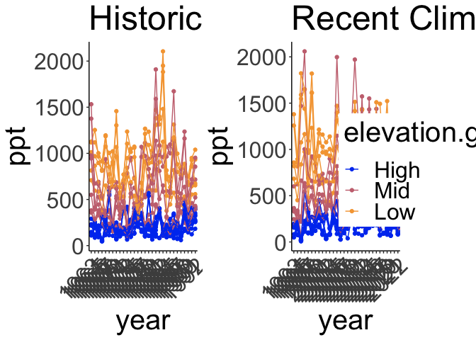<!-- -->

```r
 #2000 x 850
```

### Averages

#### Across last 30 years (all months included)


```r
pop_elev_climate_avgs <- pop_elev_climate %>% filter(year>1992) %>% group_by(parent.pop, elevation.group) %>% summarise_at(c("cwd", "pck", "ppt", "tmn", "tmx"), mean, na.rm = TRUE)
pop_elev_climate_avgs #30 year averages of all climate variables 
```

```
## # A tibble: 23 × 7
## # Groups:   parent.pop [23]
##    parent.pop elevation.group   cwd     pck   ppt    tmn   tmx
##    <chr>      <chr>           <dbl>   <dbl> <dbl>  <dbl> <dbl>
##  1 BH         Low              75.9   0      47.8  8.88   23.6
##  2 CC         Low              59.7   0      84.5 10.0    23.3
##  3 CP2        High             63.1 206.    105.   1.17   13.5
##  4 CP3        High             46.4 224.    100.   0.521  12.7
##  5 DPR        Mid              27.4   8.70  121.   7.86   20.3
##  6 FR         Mid              56.0  19.0    82.3  5.36   20.0
##  7 IH         Low              49.1   0.184  88.7  8.67   22.3
##  8 LV1        High             49.8 440.    147.  -1.38   11.2
##  9 LV3        High             57.6 426.    146.  -1.36   11.2
## 10 LVTR1      High             52.0 453.    152.  -1.58   11.2
## # ℹ 13 more rows
```

```r
pop_elev_climate_avgs$elevation.group <- factor(pop_elev_climate_avgs$elevation.group, levels=elev_order)
```

#### Recent Years - Growth Season


```r
allpops_recent_grwseason_avgs <- allpops_recent_grwseason %>% group_by(parent.pop, elevation.group, elev_m) %>% summarise_at(c("cwd", "pck", "ppt", "tmn", "tmx"), c(mean, sem), na.rm = TRUE) 
names(allpops_recent_grwseason_avgs) <- gsub("fn2", "sem", colnames(allpops_recent_grwseason_avgs))
names(allpops_recent_grwseason_avgs) <-gsub("fn1", "mean", colnames(allpops_recent_grwseason_avgs))
allpops_recent_grwseason_avgs #30 year averages during growth season months 
```

```
## # A tibble: 23 × 13
## # Groups:   parent.pop, elevation.group [23]
##    parent.pop elevation.group elev_m cwd_mean pck_mean ppt_mean tmn_mean
##    <chr>      <chr>            <dbl>    <dbl>    <dbl>    <dbl>    <dbl>
##  1 BH         Low               511.     46.0    0         77.7     5.48
##  2 CC         Low               313      41.0    0        122.      7.36
##  3 CP2        High             2244.     86.8    1.28      41.2     5.06
##  4 CP3        High             2266.     65.4    1.75      38.5     4.74
##  5 DPR        Mid              1019.     28.8    0.869    102.      8.29
##  6 FR         Mid               787      62.0    1.58      56.1     6.17
##  7 IH         Low               454.     38.9    0.102    104.      7.48
##  8 LV1        High             2593.     71.7    2.06      49.0     3.05
##  9 LV3        High             2354.     88.3    2.73      51.3     2.92
## 10 LVTR1      High             2741.     81.4    2.03      50.5     2.74
## # ℹ 13 more rows
## # ℹ 6 more variables: tmx_mean <dbl>, cwd_sem <dbl>, pck_sem <dbl>,
## #   ppt_sem <dbl>, tmn_sem <dbl>, tmx_sem <dbl>
```

```r
allpops_recent_grwseason_avgs$elevation.group <- factor(allpops_recent_grwseason_avgs$elevation.group, levels=elev_order)       

allpops_recent_grwseason_avgs %>% ggplot(aes(x=fct_reorder(parent.pop, cwd_mean), y=cwd_mean, fill=elev_m)) + 
  geom_col(width = 0.7,position = position_dodge(0.75)) +
  geom_errorbar(aes(ymin=cwd_mean-cwd_sem,ymax=cwd_mean+cwd_sem),width=.2, position = 
                  position_dodge(0.75)) +
  scale_y_continuous(expand = c(0, 0)) +
  scale_fill_gradient(low = "#F5A540", high = "#0043F0")+ 
  labs(fill="Elevation",x="Population", y="Avg CWD" ,title = "Average CWD during Growth Season - Recent Climate") +
   theme_classic() +
  theme(text=element_text(size=20), axis.text.x = element_text(angle = 45,  hjust = 1))
```

<!-- -->

```r
ggsave("../output/Climate/growthseasonAvg_CWD_RecentClim.png", width = 12, height = 6, units = "in")

allpops_recent_grwseason_avgs %>% ggplot(aes(x=fct_reorder(parent.pop, ppt_mean), y=ppt_mean, fill=elev_m)) + 
  geom_col(width = 0.7,position = position_dodge(0.75)) +
  geom_errorbar(aes(ymin=ppt_mean-ppt_sem,ymax=ppt_mean+ppt_sem),width=.2, position = 
                  position_dodge(0.75)) +
  scale_y_continuous(expand = c(0, 0)) +
  scale_fill_gradient(low = "#F5A540", high = "#0043F0") + 
  labs(fill="Elevation",x="Population", y="Avg Precip" ,title = "Average Precip during Growth Season - Recent Climate") +
   theme_classic() +
  theme(text=element_text(size=20), axis.text.x = element_text(angle = 45,  hjust = 1))
```

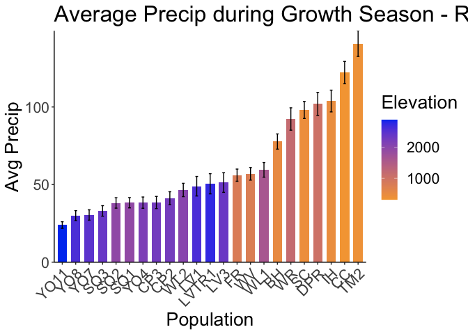<!-- -->

```r
ggsave("../output/Climate/growthseasonAvg_Precip_RecentClim.png", width = 12, height = 6, units = "in")

allpops_recent_grwseason_avgs %>% ggplot(aes(x=fct_reorder(parent.pop, tmn_mean), y=tmn_mean, fill=elev_m)) + 
  geom_col(width = 0.7,position = position_dodge(0.75)) +
  geom_errorbar(aes(ymin=tmn_mean-tmn_sem,ymax=tmn_mean+tmn_sem),width=.2, position = 
                  position_dodge(0.75)) +
  scale_y_continuous(expand = c(0, 0)) +
  scale_fill_gradient(low = "#F5A540", high = "#0043F0") + 
  labs(fill="Elevation",x="Population", y="Avg MinTemp" ,title = "Average MinTemp during Growth Season - Recent Climate") +
   theme_classic() +
  theme(text=element_text(size=20), axis.text.x = element_text(angle = 45,  hjust = 1))
```

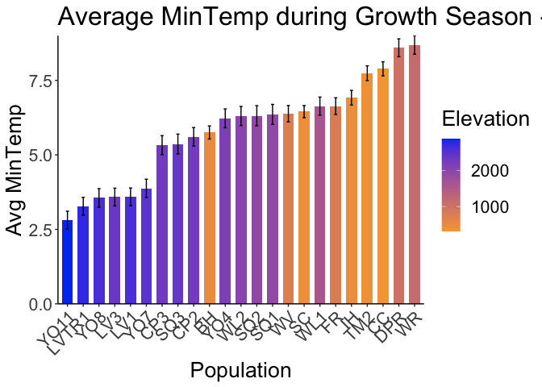<!-- -->

```r
ggsave("../output/Climate/growthseasonAvg_MinTemp_RecentClim.png", width = 12, height = 6, units = "in")

allpops_recent_grwseason_avgs %>% ggplot(aes(x=fct_reorder(parent.pop, tmx_mean), y=tmx_mean, fill=elev_m)) + 
  geom_col(width = 0.7,position = position_dodge(0.75)) +
  geom_errorbar(aes(ymin=tmx_mean-tmx_sem,ymax=tmx_mean+tmx_sem),width=.2, position = 
                  position_dodge(0.75)) +
  scale_y_continuous(expand = c(0, 0)) +
  scale_fill_gradient(low = "#F5A540", high = "#0043F0") + 
  labs(fill="Elevation",x="Population", y="Avg MaxTemp" ,title = "Average MaxTemp during Growth Season - Recent Climate") +
   theme_classic() +
  theme(text=element_text(size=20), axis.text.x = element_text(angle = 45,  hjust = 1))
```

<!-- -->

```r
ggsave("../output/Climate/growthseasonAvg_MaxTemp_RecentClim.png", width = 12, height = 6, units = "in")
```

#### Historical Years - Growth Season


```r
allpops_historical_grwseason_avgs <- allpops_historical_grwseason %>% group_by(parent.pop, elevation.group, elev_m) %>% summarise_at(c("cwd", "pck", "ppt", "tmn", "tmx"), c(mean, sem), na.rm = TRUE) 
names(allpops_historical_grwseason_avgs) <- gsub("fn2", "sem", colnames(allpops_historical_grwseason_avgs))
names(allpops_historical_grwseason_avgs) <-gsub("fn1", "mean", colnames(allpops_historical_grwseason_avgs))
allpops_historical_grwseason_avgs #30 year averages during growth season months 
```

```
## # A tibble: 23 × 13
## # Groups:   parent.pop, elevation.group [23]
##    parent.pop elevation.group elev_m cwd_mean pck_mean ppt_mean tmn_mean
##    <chr>      <chr>            <dbl>    <dbl>    <dbl>    <dbl>    <dbl>
##  1 BH         Low               511.     50.1   0.0294     71.5    4.73 
##  2 CC         Low               313      45.5   0.108     110.     6.65 
##  3 CP2        High             2244.     84.7   1.57       44.0    3.98 
##  4 CP3        High             2266.     62.3   1.86       42.3    3.64 
##  5 DPR        Mid              1019.     28.9   0.804      92.9    7.07 
##  6 FR         Mid               787      61.8   1.19       61.9    5.18 
##  7 IH         Low               454.     40.3   1.71      104.     6.51 
##  8 LV1        High             2593.     67.9   2.47       64.0    0.823
##  9 LV3        High             2354.     85.3   2.69       66.4    0.705
## 10 LVTR1      High             2741.     78.0   2.49       67.3    0.600
## # ℹ 13 more rows
## # ℹ 6 more variables: tmx_mean <dbl>, cwd_sem <dbl>, pck_sem <dbl>,
## #   ppt_sem <dbl>, tmn_sem <dbl>, tmx_sem <dbl>
```

```r
allpops_historical_grwseason_avgs$elevation.group <- factor(allpops_historical_grwseason_avgs$elevation.group, levels=elev_order)       

allpops_historical_grwseason_avgs %>% ggplot(aes(x=fct_reorder(parent.pop, cwd_mean), y=cwd_mean, fill=elev_m)) + 
  geom_col(width = 0.7,position = position_dodge(0.75)) +
  geom_errorbar(aes(ymin=cwd_mean-cwd_sem,ymax=cwd_mean+cwd_sem),width=.2, position = 
                  position_dodge(0.75)) +
  scale_y_continuous(expand = c(0, 0)) +
  scale_fill_gradient(low = "#F5A540", high = "#0043F0")+ 
  labs(fill="Elevation",x="Population", y="Avg CWD" ,title = "Average CWD during Growth Season - Historical Climate") +
   theme_classic() +
  theme(text=element_text(size=20), axis.text.x = element_text(angle = 45,  hjust = 1))
```

<!-- -->

```r
ggsave("../output/Climate/growthseasonAvg_CWD_HistoricalClim.png", width = 12, height = 6, units = "in")

allpops_historical_grwseason_avgs %>% ggplot(aes(x=fct_reorder(parent.pop, ppt_mean), y=ppt_mean, fill=elev_m)) + 
  geom_col(width = 0.7,position = position_dodge(0.75)) +
  geom_errorbar(aes(ymin=ppt_mean-ppt_sem,ymax=ppt_mean+ppt_sem),width=.2, position = 
                  position_dodge(0.75)) +
  scale_y_continuous(expand = c(0, 0)) +
  scale_fill_gradient(low = "#F5A540", high = "#0043F0") + 
  labs(fill="Elevation",x="Population", y="Avg Precip" ,title = "Average Precip during Growth Season - Historical Climate") +
   theme_classic() +
  theme(text=element_text(size=20), axis.text.x = element_text(angle = 45,  hjust = 1))
```

<!-- -->

```r
ggsave("../output/Climate/growthseasonAvg_Precip_HistoricalClim.png", width = 12, height = 6, units = "in")

allpops_historical_grwseason_avgs %>% ggplot(aes(x=fct_reorder(parent.pop, tmn_mean), y=tmn_mean, fill=elev_m)) + 
  geom_col(width = 0.7,position = position_dodge(0.75)) +
  geom_errorbar(aes(ymin=tmn_mean-tmn_sem,ymax=tmn_mean+tmn_sem),width=.2, position = 
                  position_dodge(0.75)) +
  scale_y_continuous(expand = c(0, 0)) +
  scale_fill_gradient(low = "#F5A540", high = "#0043F0") + 
  labs(fill="Elevation",x="Population", y="Avg MinTemp" ,title = "Average MinTemp during Growth Season - Historical Climate") +
   theme_classic() +
  theme(text=element_text(size=20), axis.text.x = element_text(angle = 45,  hjust = 1))
```

<!-- -->

```r
ggsave("../output/Climate/growthseasonAvg_MinTemp_HistoricalClim.png", width = 12, height = 6, units = "in")

allpops_historical_grwseason_avgs %>% ggplot(aes(x=fct_reorder(parent.pop, tmx_mean), y=tmx_mean, fill=elev_m)) + 
  geom_col(width = 0.7,position = position_dodge(0.75)) +
  geom_errorbar(aes(ymin=tmx_mean-tmx_sem,ymax=tmx_mean+tmx_sem),width=.2, position = 
                  position_dodge(0.75)) +
  scale_y_continuous(expand = c(0, 0)) +
  scale_fill_gradient(low = "#F5A540", high = "#0043F0") + 
  labs(fill="Elevation",x="Population", y="Avg MaxTemp" ,title = "Average MaxTemp during Growth Season - Historical Climate") +
   theme_classic() +
  theme(text=element_text(size=20), axis.text.x = element_text(angle = 45,  hjust = 1))
```

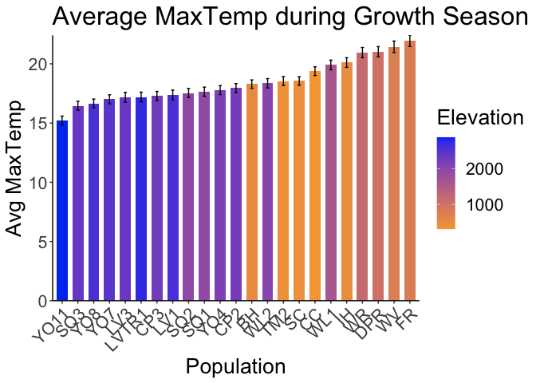<!-- -->

```r
ggsave("../output/Climate/growthseasonAvg_MaxTemp_HistoricalClim.png", width = 12, height = 6, units = "in")
```

#### Recent Years - BioClim

```r
names(bioclim_recent)
```

```
##  [1] "parent.pop"            "elevation.group"       "elev_m"               
##  [4] "year"                  "ann_tmean"             "mean_diurnal_range"   
##  [7] "temp_seasonality"      "temp_ann_range"        "tmean_wettest_quarter"
## [10] "tmean_driest_quarter"  "ann_ppt"               "ppt_seasonality"      
## [13] "ppt_warmest_quarter"   "ppt_coldest_quarter"
```

```r
bioclim_recent_avgs <- bioclim_recent %>% group_by(parent.pop, elevation.group, elev_m) %>%
  summarise_at(c("ann_tmean", "mean_diurnal_range", "temp_seasonality", "temp_ann_range", "tmean_wettest_quarter", "tmean_driest_quarter", "ann_ppt", "ppt_seasonality","ppt_warmest_quarter", "ppt_coldest_quarter"), c(mean, sem), na.rm = TRUE) 
names(bioclim_recent_avgs) <- gsub("fn2", "sem", colnames(bioclim_recent_avgs))
names(bioclim_recent_avgs) <-gsub("fn1", "avg", colnames(bioclim_recent_avgs))
bioclim_recent_avgs
```

```
## # A tibble: 23 × 23
## # Groups:   parent.pop, elevation.group [23]
##    parent.pop elevation.group elev_m ann_tmean_avg mean_diurnal_range_avg
##    <chr>      <chr>            <dbl>         <dbl>                  <dbl>
##  1 BH         Low               511.         16.2                    14.7
##  2 CC         Low               313          16.6                    13.3
##  3 CP2        High             2244.          7.28                   12.3
##  4 CP3        High             2266.          6.57                   12.2
##  5 DPR        Mid              1019.         14.0                    12.4
##  6 FR         Mid               787          12.6                    14.6
##  7 IH         Low               454.         15.4                    13.6
##  8 LV1        High             2593.          4.89                   12.7
##  9 LV3        High             2354.          4.87                   12.6
## 10 LVTR1      High             2741.          4.74                   12.8
## # ℹ 13 more rows
## # ℹ 18 more variables: temp_seasonality_avg <dbl>, temp_ann_range_avg <dbl>,
## #   tmean_wettest_quarter_avg <dbl>, tmean_driest_quarter_avg <dbl>,
## #   ann_ppt_avg <dbl>, ppt_seasonality_avg <dbl>,
## #   ppt_warmest_quarter_avg <dbl>, ppt_coldest_quarter_avg <dbl>,
## #   ann_tmean_sem <dbl>, mean_diurnal_range_sem <dbl>,
## #   temp_seasonality_sem <dbl>, temp_ann_range_sem <dbl>, …
```

```r
write_csv(bioclim_recent_avgs, "../output/Climate/Pops_BioClimAvgs_Recent.csv")

bioclim_recent_avgs %>% ggplot(aes(x=fct_reorder(parent.pop, ann_tmean_avg), y=ann_tmean_avg, fill=elev_m)) + 
  geom_col(width = 0.7,position = position_dodge(0.75)) + 
  geom_errorbar(aes(ymin=ann_tmean_avg-ann_tmean_sem,ymax=ann_tmean_avg+ann_tmean_sem),width=.2, position = position_dodge(0.75)) +
  scale_y_continuous(expand = c(0, 0)) +
  scale_fill_gradient(low = "#F5A540", high = "#0043F0") +
  labs(fill="Elevation (m)", y="Avg Annual Mean Temp", x="Population", title ="Recent Climate") +
  theme_classic() +
  theme(text=element_text(size=25), axis.text.x = element_text(angle = 45,  hjust = 1))
```

<!-- -->

```r
ggsave("../output/Climate/Bioclim_AnnMeanTmp_RecentClim.png", width = 12, height = 6, units = "in")

bioclim_recent_avgs %>% ggplot(aes(x=fct_reorder(parent.pop, mean_diurnal_range_avg), y=mean_diurnal_range_avg, fill=elev_m)) + 
  geom_col(width = 0.7,position = position_dodge(0.75)) + 
  geom_errorbar(aes(ymin=mean_diurnal_range_avg-mean_diurnal_range_sem,ymax=mean_diurnal_range_avg+mean_diurnal_range_sem),width=.2, position = position_dodge(0.75)) +
  scale_y_continuous(expand = c(0, 0)) +
  scale_fill_gradient(low = "#F5A540", high = "#0043F0") +
  labs(fill="Elevation (m)", y="Avg Diurnal Range", x="Population", title ="Recent Climate") +
  theme_classic() +
  theme(text=element_text(size=25), axis.text.x = element_text(angle = 45,  hjust = 1))
```

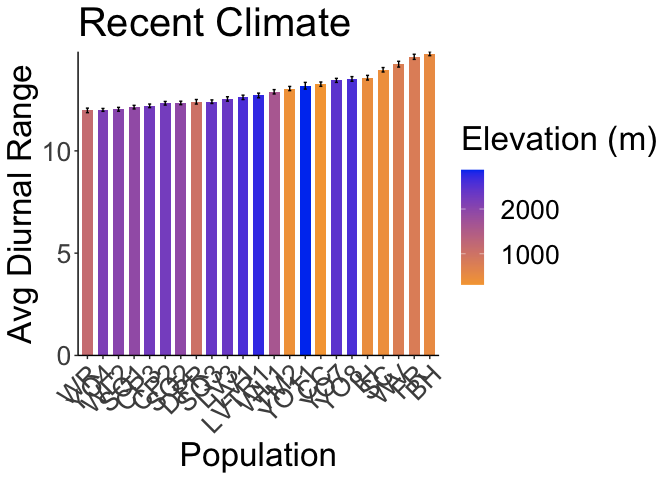<!-- -->

```r
ggsave("../output/Climate/Bioclim_DiurnalRange_RecentClim.png", width = 12, height = 6, units = "in")

bioclim_recent_avgs %>% ggplot(aes(x=fct_reorder(parent.pop, temp_seasonality_avg), y=temp_seasonality_avg, fill=elev_m)) + 
  geom_col(width = 0.7,position = position_dodge(0.75)) + 
  geom_errorbar(aes(ymin=temp_seasonality_avg-temp_seasonality_sem,ymax=temp_seasonality_avg+temp_seasonality_sem),width=.2, position = position_dodge(0.75)) +
  scale_y_continuous(expand = c(0, 0)) +
  scale_fill_gradient(low = "#F5A540", high = "#0043F0") +
  labs(fill="Elevation (m)",  x="Population", title ="Recent Climate") +
  theme_classic() +
  theme(text=element_text(size=25), axis.text.x = element_text(angle = 45,  hjust = 1))
```

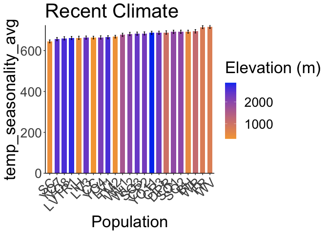<!-- -->

```r
ggsave("../output/Climate/Bioclim_TempSeasonality_RecentClim.png", width = 12, height = 6, units = "in")

bioclim_recent_avgs %>% ggplot(aes(x=fct_reorder(parent.pop, temp_ann_range_avg), y=temp_ann_range_avg, fill=elev_m)) + 
  geom_col(width = 0.7,position = position_dodge(0.75)) + 
  geom_errorbar(aes(ymin=temp_ann_range_avg-temp_ann_range_sem,ymax=temp_ann_range_avg+temp_ann_range_sem),width=.2, position = position_dodge(0.75)) +
  scale_y_continuous(expand = c(0, 0)) +
  scale_fill_gradient(low = "#F5A540", high = "#0043F0") +
  labs(fill="Elevation (m)",  x="Population", title ="Recent Climate") +
  theme_classic() +
  theme(text=element_text(size=25), axis.text.x = element_text(angle = 45,  hjust = 1))
```

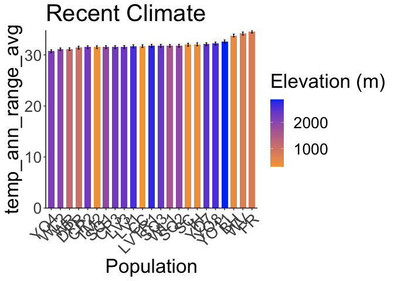<!-- -->

```r
ggsave("../output/Climate/Bioclim_AnnTmpRange_RecentClim.png", width = 12, height = 6, units = "in")

bioclim_recent_avgs %>% ggplot(aes(x=fct_reorder(parent.pop, tmean_wettest_quarter_avg), y=tmean_wettest_quarter_avg, fill=elev_m)) + 
  geom_col(width = 0.7,position = position_dodge(0.75)) + 
  geom_errorbar(aes(ymin=tmean_wettest_quarter_avg-tmean_wettest_quarter_sem,ymax=tmean_wettest_quarter_avg+tmean_wettest_quarter_sem),width=.2, position = position_dodge(0.75)) +
  scale_y_continuous(expand = c(0, 0)) +
  scale_fill_gradient(low = "#F5A540", high = "#0043F0") +
  labs(fill="Elevation (m)",  x="Population", title ="Recent Climate") +
  theme_classic() +
  theme(text=element_text(size=25), axis.text.x = element_text(angle = 45,  hjust = 1))
```

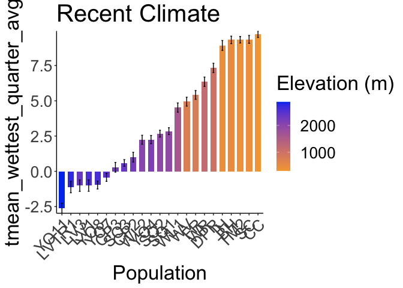<!-- -->

```r
ggsave("../output/Climate/Bioclim_TmpMeanWet_RecentClim.png", width = 12, height = 6, units = "in")

bioclim_recent_avgs %>% ggplot(aes(x=fct_reorder(parent.pop, tmean_driest_quarter_avg), y=tmean_driest_quarter_avg, fill=elev_m)) + 
  geom_col(width = 0.7,position = position_dodge(0.75)) + 
  geom_errorbar(aes(ymin=tmean_driest_quarter_avg-tmean_driest_quarter_sem,ymax=tmean_driest_quarter_avg+tmean_driest_quarter_sem),width=.2, position = position_dodge(0.75)) +
  scale_y_continuous(expand = c(0, 0)) +
  scale_fill_gradient(low = "#F5A540", high = "#0043F0") +
  labs(fill="Elevation (m)",  x="Population", title ="Recent Climate") +
  theme_classic() +
  theme(text=element_text(size=25), axis.text.x = element_text(angle = 45,  hjust = 1))
```

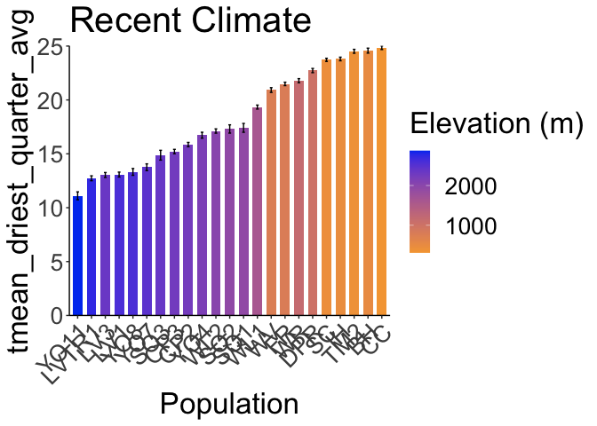<!-- -->

```r
ggsave("../output/Climate/Bioclim_TmpMeanDry_RecentClim.png", width = 12, height = 6, units = "in")

bioclim_recent_avgs %>% ggplot(aes(x=fct_reorder(parent.pop, ann_ppt_avg), y=ann_ppt_avg, fill=elev_m)) + 
  geom_col(width = 0.7,position = position_dodge(0.75)) + 
  geom_errorbar(aes(ymin=ann_ppt_avg-ann_ppt_sem,ymax=ann_ppt_avg+ann_ppt_sem),width=.2, position = position_dodge(0.75)) +
  scale_y_continuous(expand = c(0, 0)) +
  scale_fill_gradient(low = "#F5A540", high = "#0043F0") +
  labs(fill="Elevation (m)",  x="Population", title ="Recent Climate") +
  theme_classic() +
  theme(text=element_text(size=25), axis.text.x = element_text(angle = 45,  hjust = 1))
```

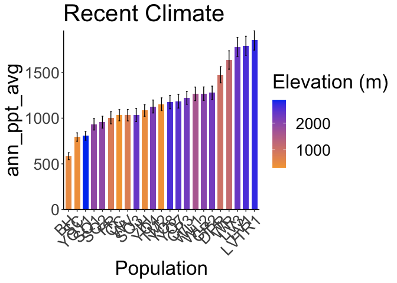<!-- -->

```r
ggsave("../output/Climate/Bioclim_AnnPPT_RecentClim.png", width = 12, height = 6, units = "in")

bioclim_recent_avgs %>% ggplot(aes(x=fct_reorder(parent.pop, ppt_seasonality_avg), y=ppt_seasonality_avg, fill=elev_m)) + 
  geom_col(width = 0.7,position = position_dodge(0.75)) + 
  geom_errorbar(aes(ymin=ppt_seasonality_avg-ppt_seasonality_sem,ymax=ppt_seasonality_avg+ppt_seasonality_sem),width=.2, position = position_dodge(0.75)) +
  scale_y_continuous(expand = c(0, 0)) +
  scale_fill_gradient(low = "#F5A540", high = "#0043F0") +
  labs(fill="Elevation (m)",  x="Population", title ="Recent Climate") +
  theme_classic() +
  theme(text=element_text(size=25), axis.text.x = element_text(angle = 45,  hjust = 1))
```

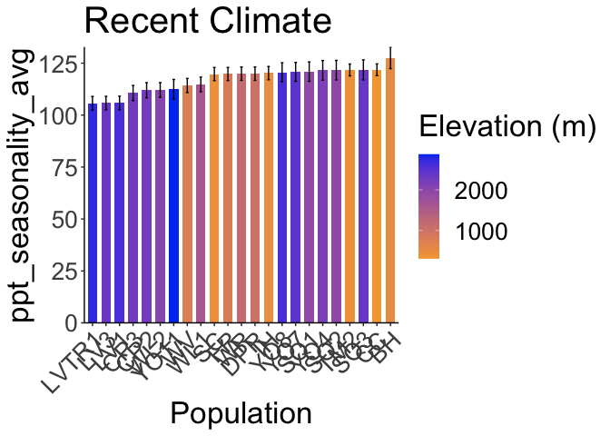<!-- -->

```r
ggsave("../output/Climate/Bioclim_PPTSeasonality_RecentClim.png", width = 12, height = 6, units = "in")

bioclim_recent_avgs %>% ggplot(aes(x=fct_reorder(parent.pop, ppt_warmest_quarter_avg), y=ppt_warmest_quarter_avg, fill=elev_m)) + 
  geom_col(width = 0.7,position = position_dodge(0.75)) + 
  geom_errorbar(aes(ymin=ppt_warmest_quarter_avg-ppt_warmest_quarter_sem,ymax=ppt_warmest_quarter_avg+ppt_warmest_quarter_sem),width=.2, position = position_dodge(0.75)) +
  scale_y_continuous(expand = c(0, 0)) +
  scale_fill_gradient(low = "#F5A540", high = "#0043F0") +
  labs(fill="Elevation (m)",  x="Population", title ="Recent Climate") +
  theme_classic() +
  theme(text=element_text(size=25), axis.text.x = element_text(angle = 45,  hjust = 1))
```

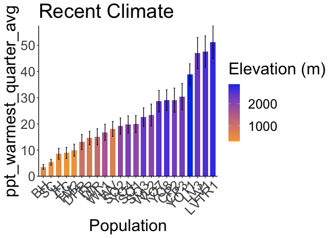<!-- -->

```r
ggsave("../output/Climate/Bioclim_PPTWarm_RecentClim.png", width = 12, height = 6, units = "in")

bioclim_recent_avgs %>% ggplot(aes(x=fct_reorder(parent.pop, ppt_coldest_quarter_avg), y=ppt_coldest_quarter_avg, fill=elev_m)) + 
  geom_col(width = 0.7,position = position_dodge(0.75)) + 
  geom_errorbar(aes(ymin=ppt_coldest_quarter_avg-ppt_coldest_quarter_sem,ymax=ppt_coldest_quarter_avg+ppt_coldest_quarter_sem),width=.2, position = position_dodge(0.75)) +
  scale_y_continuous(expand = c(0, 0)) +
  scale_fill_gradient(low = "#F5A540", high = "#0043F0") +
  labs(fill="Elevation (m)",  x="Population", title ="Recent Climate") +
  theme_classic() +
  theme(text=element_text(size=25), axis.text.x = element_text(angle = 45,  hjust = 1))
```

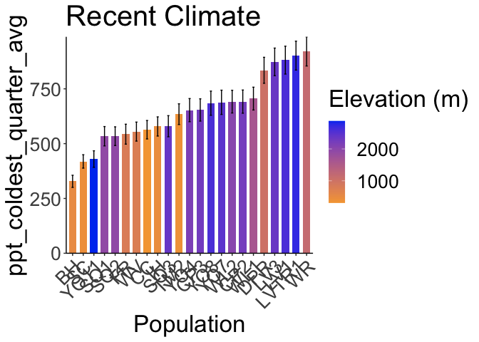<!-- -->

```r
ggsave("../output/Climate/Bioclim_PPTCold_RecentClim.png", width = 12, height = 6, units = "in")
```

#### Historical Years - BioClim

```r
names(bioclim_historical)
```

```
##  [1] "parent.pop"            "elevation.group"       "elev_m"               
##  [4] "year"                  "ann_tmean"             "mean_diurnal_range"   
##  [7] "temp_seasonality"      "temp_ann_range"        "tmean_wettest_quarter"
## [10] "tmean_driest_quarter"  "ann_ppt"               "ppt_seasonality"      
## [13] "ppt_warmest_quarter"   "ppt_coldest_quarter"
```

```r
bioclim_historical_avgs <- bioclim_historical %>% group_by(parent.pop, elevation.group, elev_m) %>%
  summarise_at(c("ann_tmean", "mean_diurnal_range", "temp_seasonality", "temp_ann_range", "tmean_wettest_quarter", "tmean_driest_quarter", "ann_ppt", "ppt_seasonality","ppt_warmest_quarter", "ppt_coldest_quarter"), c(mean, sem), na.rm = TRUE) 
names(bioclim_historical_avgs) <- gsub("fn2", "sem", colnames(bioclim_historical_avgs))
names(bioclim_historical_avgs) <-gsub("fn1", "avg", colnames(bioclim_historical_avgs))
bioclim_historical_avgs
```

```
## # A tibble: 23 × 23
## # Groups:   parent.pop, elevation.group [23]
##    parent.pop elevation.group elev_m ann_tmean_avg mean_diurnal_range_avg
##    <chr>      <chr>            <dbl>         <dbl>                  <dbl>
##  1 BH         Low               511.         15.3                    15.3
##  2 CC         Low               313          15.9                    14.1
##  3 CP2        High             2244.          6.06                   12.9
##  4 CP3        High             2266.          5.41                   12.7
##  5 DPR        Mid              1019.         12.9                    13.5
##  6 FR         Mid               787          12.0                    15.8
##  7 IH         Low               454.         14.7                    14.2
##  8 LV1        High             2593.          3.38                   13.8
##  9 LV3        High             2354.          3.35                   13.7
## 10 LVTR1      High             2741.          3.23                   13.8
## # ℹ 13 more rows
## # ℹ 18 more variables: temp_seasonality_avg <dbl>, temp_ann_range_avg <dbl>,
## #   tmean_wettest_quarter_avg <dbl>, tmean_driest_quarter_avg <dbl>,
## #   ann_ppt_avg <dbl>, ppt_seasonality_avg <dbl>,
## #   ppt_warmest_quarter_avg <dbl>, ppt_coldest_quarter_avg <dbl>,
## #   ann_tmean_sem <dbl>, mean_diurnal_range_sem <dbl>,
## #   temp_seasonality_sem <dbl>, temp_ann_range_sem <dbl>, …
```

```r
write_csv(bioclim_historical_avgs, "../output/Climate/Pops_BioClimAvgs_Historical.csv")

bioclim_historical_avgs %>% ggplot(aes(x=fct_reorder(parent.pop, ann_tmean_avg), y=ann_tmean_avg, fill=elev_m)) + 
  geom_col(width = 0.7,position = position_dodge(0.75)) + 
  geom_errorbar(aes(ymin=ann_tmean_avg-ann_tmean_sem,ymax=ann_tmean_avg+ann_tmean_sem),width=.2, position = position_dodge(0.75)) +
  scale_y_continuous(expand = c(0, 0)) +
  scale_fill_gradient(low = "#F5A540", high = "#0043F0") +
  labs(fill="Elevation (m)", y="Avg Annual Mean Temp", x="Population", title ="Historical Climate") +
  theme_classic() +
  theme(text=element_text(size=25), axis.text.x = element_text(angle = 45,  hjust = 1))
```

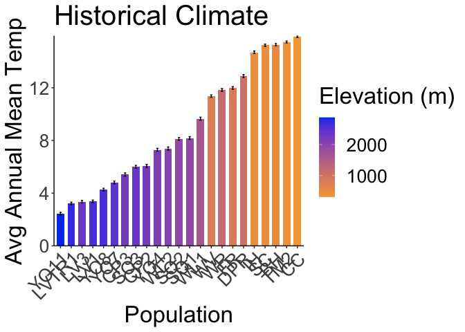<!-- -->

```r
ggsave("../output/Climate/Bioclim_AnnMeanTmp_HistoricalClim.png", width = 12, height = 6, units = "in")

bioclim_historical_avgs %>% ggplot(aes(x=fct_reorder(parent.pop, mean_diurnal_range_avg), y=mean_diurnal_range_avg, fill=elev_m)) + 
  geom_col(width = 0.7,position = position_dodge(0.75)) + 
  geom_errorbar(aes(ymin=mean_diurnal_range_avg-mean_diurnal_range_sem,ymax=mean_diurnal_range_avg+mean_diurnal_range_sem),width=.2, position = position_dodge(0.75)) +
  scale_y_continuous(expand = c(0, 0)) +
  scale_fill_gradient(low = "#F5A540", high = "#0043F0") +
  labs(fill="Elevation (m)", y="Avg Diurnal Range", x="Population", title ="Historical Climate") +
  theme_classic() +
  theme(text=element_text(size=25), axis.text.x = element_text(angle = 45,  hjust = 1))
```

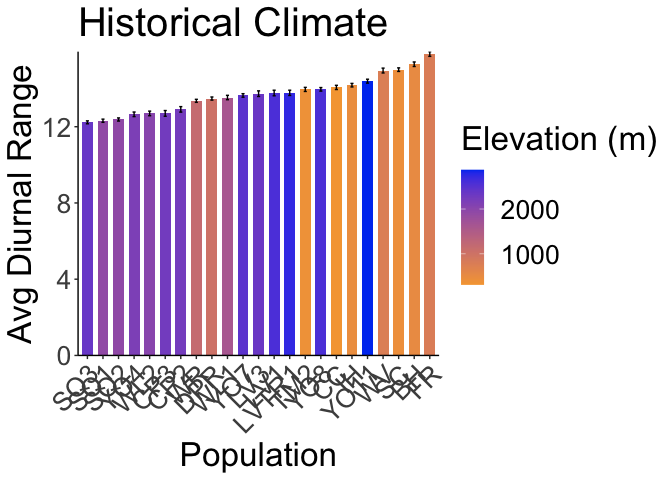<!-- -->

```r
ggsave("../output/Climate/Bioclim_DiurnalRange_HistoricalClim.png", width = 12, height = 6, units = "in")

bioclim_historical_avgs %>% ggplot(aes(x=fct_reorder(parent.pop, temp_seasonality_avg), y=temp_seasonality_avg, fill=elev_m)) + 
  geom_col(width = 0.7,position = position_dodge(0.75)) + 
  geom_errorbar(aes(ymin=temp_seasonality_avg-temp_seasonality_sem,ymax=temp_seasonality_avg+temp_seasonality_sem),width=.2, position = position_dodge(0.75)) +
  scale_y_continuous(expand = c(0, 0)) +
  scale_fill_gradient(low = "#F5A540", high = "#0043F0") +
  labs(fill="Elevation (m)",  x="Population", title ="Historical Climate") +
  theme_classic() +
  theme(text=element_text(size=25), axis.text.x = element_text(angle = 45,  hjust = 1))
```

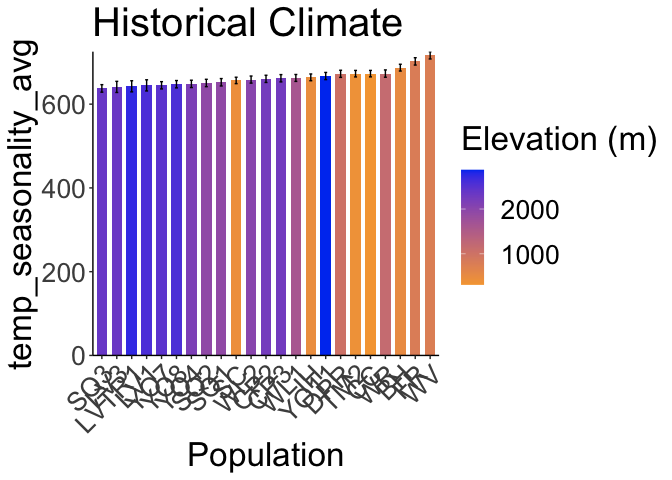<!-- -->

```r
ggsave("../output/Climate/Bioclim_TempSeasonality_HistoricalClim.png", width = 12, height = 6, units = "in")

bioclim_historical_avgs %>% ggplot(aes(x=fct_reorder(parent.pop, temp_ann_range_avg), y=temp_ann_range_avg, fill=elev_m)) + 
  geom_col(width = 0.7,position = position_dodge(0.75)) + 
  geom_errorbar(aes(ymin=temp_ann_range_avg-temp_ann_range_sem,ymax=temp_ann_range_avg+temp_ann_range_sem),width=.2, position = position_dodge(0.75)) +
  scale_y_continuous(expand = c(0, 0)) +
  scale_fill_gradient(low = "#F5A540", high = "#0043F0") +
  labs(fill="Elevation (m)",  x="Population", title ="Historical Climate") +
  theme_classic() +
  theme(text=element_text(size=25), axis.text.x = element_text(angle = 45,  hjust = 1))
```

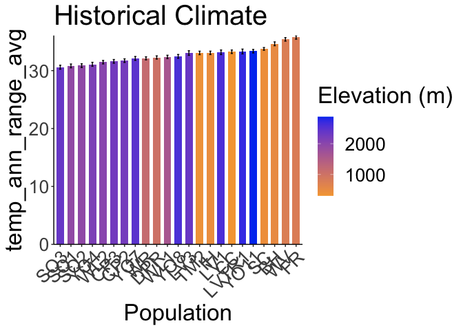<!-- -->

```r
ggsave("../output/Climate/Bioclim_AnnTmpRange_HistoricalClim.png", width = 12, height = 6, units = "in")

bioclim_historical_avgs %>% ggplot(aes(x=fct_reorder(parent.pop, tmean_wettest_quarter_avg), y=tmean_wettest_quarter_avg, fill=elev_m)) + 
  geom_col(width = 0.7,position = position_dodge(0.75)) + 
  geom_errorbar(aes(ymin=tmean_wettest_quarter_avg-tmean_wettest_quarter_sem,ymax=tmean_wettest_quarter_avg+tmean_wettest_quarter_sem),width=.2, position = position_dodge(0.75)) +
  scale_y_continuous(expand = c(0, 0)) +
  scale_fill_gradient(low = "#F5A540", high = "#0043F0") +
  labs(fill="Elevation (m)",  x="Population", title ="Historical Climate") +
  theme_classic() +
  theme(text=element_text(size=25), axis.text.x = element_text(angle = 45,  hjust = 1))
```

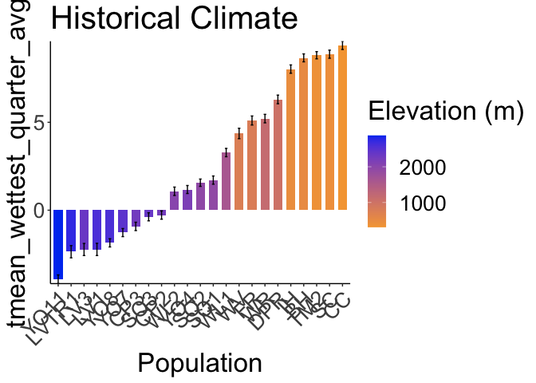<!-- -->

```r
ggsave("../output/Climate/Bioclim_TmpMeanWet_HistoricalClim.png", width = 12, height = 6, units = "in")

bioclim_historical_avgs %>% ggplot(aes(x=fct_reorder(parent.pop, tmean_driest_quarter_avg), y=tmean_driest_quarter_avg, fill=elev_m)) + 
  geom_col(width = 0.7,position = position_dodge(0.75)) + 
  geom_errorbar(aes(ymin=tmean_driest_quarter_avg-tmean_driest_quarter_sem,ymax=tmean_driest_quarter_avg+tmean_driest_quarter_sem),width=.2, position = position_dodge(0.75)) +
  scale_y_continuous(expand = c(0, 0)) +
  scale_fill_gradient(low = "#F5A540", high = "#0043F0") +
  labs(fill="Elevation (m)",  x="Population", title ="Historical Climate") +
  theme_classic() +
  theme(text=element_text(size=25), axis.text.x = element_text(angle = 45,  hjust = 1))
```

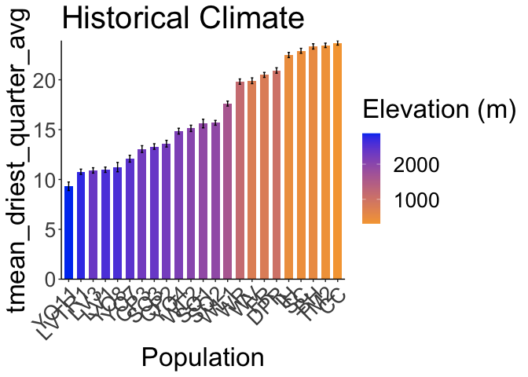<!-- -->

```r
ggsave("../output/Climate/Bioclim_TmpMeanDry_HistoricalClim.png", width = 12, height = 6, units = "in")

bioclim_historical_avgs %>% ggplot(aes(x=fct_reorder(parent.pop, ann_ppt_avg), y=ann_ppt_avg, fill=elev_m)) + 
  geom_col(width = 0.7,position = position_dodge(0.75)) + 
  geom_errorbar(aes(ymin=ann_ppt_avg-ann_ppt_sem,ymax=ann_ppt_avg+ann_ppt_sem),width=.2, position = position_dodge(0.75)) +
  scale_y_continuous(expand = c(0, 0)) +
  scale_fill_gradient(low = "#F5A540", high = "#0043F0") +
  labs(fill="Elevation (m)",  x="Population", title ="Historical Climate") +
  theme_classic() +
  theme(text=element_text(size=25), axis.text.x = element_text(angle = 45,  hjust = 1))
```

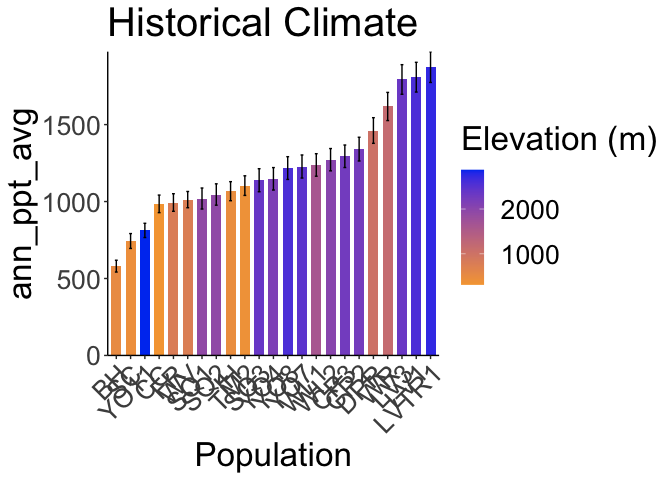<!-- -->

```r
ggsave("../output/Climate/Bioclim_AnnPPT_HistoricalClim.png", width = 12, height = 6, units = "in")

bioclim_historical_avgs %>% ggplot(aes(x=fct_reorder(parent.pop, ppt_seasonality_avg), y=ppt_seasonality_avg, fill=elev_m)) + 
  geom_col(width = 0.7,position = position_dodge(0.75)) + 
  geom_errorbar(aes(ymin=ppt_seasonality_avg-ppt_seasonality_sem,ymax=ppt_seasonality_avg+ppt_seasonality_sem),width=.2, position = position_dodge(0.75)) +
  scale_y_continuous(expand = c(0, 0)) +
  scale_fill_gradient(low = "#F5A540", high = "#0043F0") +
  labs(fill="Elevation (m)",  x="Population", title ="Historical Climate") +
  theme_classic() +
  theme(text=element_text(size=25), axis.text.x = element_text(angle = 45,  hjust = 1))
```

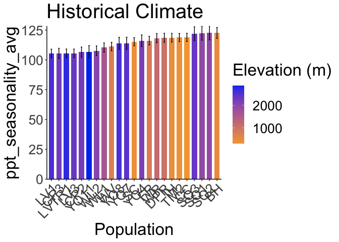<!-- -->

```r
ggsave("../output/Climate/Bioclim_PPTSeasonality_HistoricalClim.png", width = 12, height = 6, units = "in")

bioclim_historical_avgs %>% ggplot(aes(x=fct_reorder(parent.pop, ppt_warmest_quarter_avg), y=ppt_warmest_quarter_avg, fill=elev_m)) + 
  geom_col(width = 0.7,position = position_dodge(0.75)) + 
  geom_errorbar(aes(ymin=ppt_warmest_quarter_avg-ppt_warmest_quarter_sem,ymax=ppt_warmest_quarter_avg+ppt_warmest_quarter_sem),width=.2, position = position_dodge(0.75)) +
  scale_y_continuous(expand = c(0, 0)) +
  scale_fill_gradient(low = "#F5A540", high = "#0043F0") +
  labs(fill="Elevation (m)",  x="Population", title ="Historical Climate") +
  theme_classic() +
  theme(text=element_text(size=25), axis.text.x = element_text(angle = 45,  hjust = 1))
```

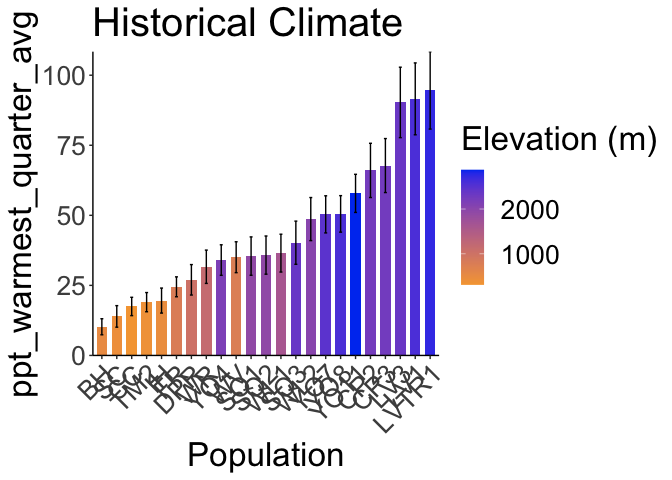<!-- -->

```r
ggsave("../output/Climate/Bioclim_PPTWarm_HistoricalClim.png", width = 12, height = 6, units = "in")

bioclim_historical_avgs %>% ggplot(aes(x=fct_reorder(parent.pop, ppt_coldest_quarter_avg), y=ppt_coldest_quarter_avg, fill=elev_m)) + 
  geom_col(width = 0.7,position = position_dodge(0.75)) + 
  geom_errorbar(aes(ymin=ppt_coldest_quarter_avg-ppt_coldest_quarter_sem,ymax=ppt_coldest_quarter_avg+ppt_coldest_quarter_sem),width=.2, position = position_dodge(0.75)) +
  scale_y_continuous(expand = c(0, 0)) +
  scale_fill_gradient(low = "#F5A540", high = "#0043F0") +
  labs(fill="Elevation (m)",  x="Population", title ="Historical Climate") +
  theme_classic() +
  theme(text=element_text(size=25), axis.text.x = element_text(angle = 45,  hjust = 1))
```

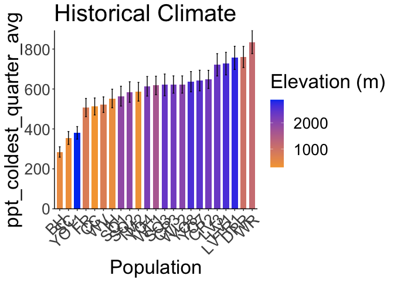<!-- -->

```r
ggsave("../output/Climate/Bioclim_PPTCold_HistoricalClim.png", width = 12, height = 6, units = "in")
```


## Climate trait correlations
Flint

```r
head(allpops_recent_grwseason)
```

```
## # A tibble: 6 × 14
## # Groups:   parent.pop, elevation.group, elev_m, year [6]
##   month growmonth parent.pop elevation.group elev_m PckSum year    cwd   pck
##   <dbl>     <dbl> <chr>      <chr>            <dbl>  <dbl> <chr> <dbl> <dbl>
## 1     1         6 BH         Low               511.      0 1992   28.3     0
## 2     1         6 BH         Low               511.      0 1993   25.6     0
## 3     1         6 BH         Low               511.      0 1994   31.3     0
## 4     1         6 BH         Low               511.      0 1995   27.9     0
## 5     1         6 BH         Low               511.      0 1996   31.3     0
## 6     1         6 BH         Low               511.      0 1997   26.1     0
## # ℹ 5 more variables: ppt <dbl>, tmn <dbl>, tmx <dbl>, firstmonth <dbl>,
## #   lastmonth <dbl>
```

```r
allpops_recent_grwseason <- tibble(allpops_recent_grwseason)
allpops_recent_grwseason %>% cor_test(cwd, ppt, tmn, tmx, method = "pearson")
```

```
## # A tibble: 16 × 8
##    var1  var2    cor statistic         p conf.low conf.high method 
##    <chr> <chr> <dbl>     <dbl>     <dbl>    <dbl>     <dbl> <chr>  
##  1 cwd   cwd    1        Inf   0            1         1     Pearson
##  2 cwd   ppt   -0.54     -45.9 0           -0.555    -0.517 Pearson
##  3 cwd   tmn    0.43      34.6 1.26e-236    0.410     0.454 Pearson
##  4 cwd   tmx    0.55      47.0 0            0.526     0.565 Pearson
##  5 ppt   cwd   -0.54     -45.9 0           -0.555    -0.517 Pearson
##  6 ppt   ppt    1        Inf   0            1         1     Pearson
##  7 ppt   tmn   -0.34     -25.9 2.55e-139   -0.362    -0.313 Pearson
##  8 ppt   tmx   -0.52     -43.4 0           -0.535    -0.495 Pearson
##  9 tmn   cwd    0.43      34.6 1.26e-236    0.410     0.454 Pearson
## 10 tmn   ppt   -0.34     -25.9 2.55e-139   -0.362    -0.313 Pearson
## 11 tmn   tmn    1        Inf   0            1         1     Pearson
## 12 tmn   tmx    0.94     193.  0            0.933     0.940 Pearson
## 13 tmx   cwd    0.55      47.0 0            0.526     0.565 Pearson
## 14 tmx   ppt   -0.52     -43.4 0           -0.535    -0.495 Pearson
## 15 tmx   tmn    0.94     193.  0            0.933     0.940 Pearson
## 16 tmx   tmx    1        Inf   0            1         1     Pearson
```

```r
recent_cor_mat <- allpops_recent_grwseason %>% select(cwd, ppt, tmn, tmx) %>% cor_mat()
recent_cor_mat
```

```
## # A tibble: 4 × 5
##   rowname   cwd   ppt   tmn   tmx
## * <chr>   <dbl> <dbl> <dbl> <dbl>
## 1 cwd      1    -0.54  0.43  0.55
## 2 ppt     -0.54  1    -0.34 -0.52
## 3 tmn      0.43 -0.34  1     0.94
## 4 tmx      0.55 -0.52  0.94  1
```

```r
recent_cor = allpops_recent_grwseason %>% select(cwd, ppt, tmn, tmx) %>% cor()
file_path= "../output/Climate/GrowthSeason_RecentClim_Cors.png"
png(width = 12, height = 6, res= 300, units = "in", file=file_path, type = "cairo")
corrplot(recent_cor)
dev.off()
```

```
## quartz_off_screen 
##                 2
```

```r
allpops_historical_grwseason <- tibble(allpops_historical_grwseason)
allpops_historical_grwseason %>% cor_test(cwd, ppt, tmn, tmx, method = "pearson")
```

```
## # A tibble: 16 × 8
##    var1  var2    cor    statistic         p conf.low conf.high method 
##    <chr> <chr> <dbl>        <dbl>     <dbl>    <dbl>     <dbl> <chr>  
##  1 cwd   cwd    1           Inf   0            1         1     Pearson
##  2 cwd   ppt   -0.51        -41.5 1.98e-323   -0.526    -0.485 Pearson
##  3 cwd   tmn    0.39         29.8 2.32e-179    0.364     0.411 Pearson
##  4 cwd   tmx    0.53         43.8 0            0.506     0.546 Pearson
##  5 ppt   cwd   -0.51        -41.5 1.98e-323   -0.526    -0.485 Pearson
##  6 ppt   ppt    1    3358796967.  0            1         1     Pearson
##  7 ppt   tmn   -0.31        -23.3 3.49e-114   -0.338    -0.288 Pearson
##  8 ppt   tmx   -0.5         -41.1 7.47e-319   -0.523    -0.481 Pearson
##  9 tmn   cwd    0.39         29.8 2.32e-179    0.364     0.411 Pearson
## 10 tmn   ppt   -0.31        -23.3 3.49e-114   -0.338    -0.288 Pearson
## 11 tmn   tmn    1           Inf   0            1         1     Pearson
## 12 tmn   tmx    0.92        166.  0            0.915     0.924 Pearson
## 13 tmx   cwd    0.53         43.8 0            0.506     0.546 Pearson
## 14 tmx   ppt   -0.5         -41.1 7.47e-319   -0.523    -0.481 Pearson
## 15 tmx   tmn    0.92        166.  0            0.915     0.924 Pearson
## 16 tmx   tmx    1           Inf   0            1         1     Pearson
```

```r
historical_cor_mat <- allpops_historical_grwseason %>% select(cwd, ppt, tmn, tmx) %>% cor_mat()
historical_cor_mat
```

```
## # A tibble: 4 × 5
##   rowname   cwd   ppt   tmn   tmx
## * <chr>   <dbl> <dbl> <dbl> <dbl>
## 1 cwd      1    -0.51  0.39  0.53
## 2 ppt     -0.51  1    -0.31 -0.5 
## 3 tmn      0.39 -0.31  1     0.92
## 4 tmx      0.53 -0.5   0.92  1
```

```r
historical_cor = allpops_historical_grwseason %>% select(cwd, ppt, tmn, tmx) %>% cor()
file_path= "../output/Climate/GrowthSeason_HistoricalClim_Cors.png"
png(width = 12, height = 6, res= 300, units = "in", file=file_path, type = "cairo")
corrplot(historical_cor)
dev.off()
```

```
## quartz_off_screen 
##                 2
```
Trait correlations are the same across recent and historical time
periods (during the growth season)

Bioclim

```r
names(bioclim_recent)
```

```
##  [1] "parent.pop"            "elevation.group"       "elev_m"               
##  [4] "year"                  "ann_tmean"             "mean_diurnal_range"   
##  [7] "temp_seasonality"      "temp_ann_range"        "tmean_wettest_quarter"
## [10] "tmean_driest_quarter"  "ann_ppt"               "ppt_seasonality"      
## [13] "ppt_warmest_quarter"   "ppt_coldest_quarter"
```

```r
bioclim_recent <- tibble(bioclim_recent)
bioclim_recent %>% cor_test(ann_tmean:ppt_coldest_quarter, method = "pearson")
```

```
## # A tibble: 100 × 8
##    var1      var2              cor statistic         p conf.low conf.high method
##    <chr>     <chr>           <dbl>     <dbl>     <dbl>    <dbl>     <dbl> <chr> 
##  1 ann_tmean ann_tmean       1        Inf    0           1          1     Pears…
##  2 ann_tmean mean_diurnal_…  0.34       9.49 3.77e- 20   0.272      0.405 Pears…
##  3 ann_tmean temp_seasonal…  0.064      1.69 9.23e-  2  -0.0106     0.138 Pears…
##  4 ann_tmean temp_ann_range  0.11       2.92 3.62e-  3   0.0363     0.184 Pears…
##  5 ann_tmean tmean_wettest…  0.94      71.6  3.06e-321   0.930      0.947 Pears…
##  6 ann_tmean tmean_driest_…  0.95      83.0  0           0.946      0.960 Pears…
##  7 ann_tmean ann_ppt        -0.31      -8.70 2.39e- 17  -0.381     -0.246 Pears…
##  8 ann_tmean ppt_seasonali…  0.2        5.33 1.34e-  7   0.126      0.270 Pears…
##  9 ann_tmean ppt_warmest_q… -0.48     -14.5  7.98e- 42  -0.539     -0.425 Pears…
## 10 ann_tmean ppt_coldest_q… -0.24      -6.60 8.11e- 11  -0.313     -0.173 Pears…
## # ℹ 90 more rows
```

```r
recent_cor_bioclim_mat <- bioclim_recent %>% select(ann_tmean:ppt_coldest_quarter) %>% cor_mat()
recent_cor_bioclim_mat
```

```
## # A tibble: 10 × 11
##    rowname          ann_tmean mean_diurnal_range temp_seasonality temp_ann_range
##  * <chr>                <dbl>              <dbl>            <dbl>          <dbl>
##  1 ann_tmean            1                  0.34             0.064          0.11 
##  2 mean_diurnal_ra…     0.34               1                0.061          0.5  
##  3 temp_seasonality     0.064              0.061            1              0.66 
##  4 temp_ann_range       0.11               0.5              0.66           1    
##  5 tmean_wettest_q…     0.94               0.28            -0.019          0.026
##  6 tmean_driest_qu…     0.95               0.31             0.16           0.17 
##  7 ann_ppt             -0.31              -0.46            -0.14          -0.27 
##  8 ppt_seasonality      0.2                0.074           -0.037         -0.064
##  9 ppt_warmest_qua…    -0.48              -0.19            -0.16          -0.066
## 10 ppt_coldest_qua…    -0.24              -0.39            -0.17          -0.26 
## # ℹ 6 more variables: tmean_wettest_quarter <dbl>, tmean_driest_quarter <dbl>,
## #   ann_ppt <dbl>, ppt_seasonality <dbl>, ppt_warmest_quarter <dbl>,
## #   ppt_coldest_quarter <dbl>
```

```r
recent_cor_bioclim = bioclim_recent %>% select(ann_tmean:ppt_coldest_quarter) %>% cor()
file_path= "../output/Climate/BioClim_RecentClim_Cors.png"
png(width = 12, height = 6, res= 300, units = "in", file=file_path, type = "cairo")
corrplot(recent_cor_bioclim)
dev.off()
```

```
## quartz_off_screen 
##                 2
```

```r
bioclim_historical <- tibble(bioclim_historical)
bioclim_historical %>% cor_test(ann_tmean:ppt_coldest_quarter, method = "pearson")
```

```
## # A tibble: 100 × 8
##    var1      var2               cor statistic        p conf.low conf.high method
##    <chr>     <chr>            <dbl>     <dbl>    <dbl>    <dbl>     <dbl> <chr> 
##  1 ann_tmean ann_tmean         1       Inf    0           1         1     Pears…
##  2 ann_tmean mean_diurnal_ra…  0.37     10.3  2.53e-23    0.300     0.429 Pears…
##  3 ann_tmean temp_seasonality  0.2       5.35 1.17e- 7    0.127     0.271 Pears…
##  4 ann_tmean temp_ann_range    0.23      6.20 9.89e-10    0.158     0.299 Pears…
##  5 ann_tmean tmean_wettest_q…  0.96     85.8  0           0.949     0.962 Pears…
##  6 ann_tmean tmean_driest_qu…  0.95     82.2  0           0.945     0.959 Pears…
##  7 ann_tmean ann_ppt          -0.36    -10.2  1.15e-22   -0.424    -0.294 Pears…
##  8 ann_tmean ppt_seasonality   0.2       5.30 1.56e- 7    0.125     0.269 Pears…
##  9 ann_tmean ppt_warmest_qua… -0.48    -14.4  4.49e-41   -0.536    -0.421 Pears…
## 10 ann_tmean ppt_coldest_qua… -0.19     -5.21 2.55e- 7   -0.265    -0.122 Pears…
## # ℹ 90 more rows
```

```r
historical_cor_bioclim_mat <- bioclim_historical %>% select(ann_tmean:ppt_coldest_quarter) %>% cor_mat()
historical_cor_bioclim_mat
```

```
## # A tibble: 10 × 11
##    rowname          ann_tmean mean_diurnal_range temp_seasonality temp_ann_range
##  * <chr>                <dbl>              <dbl>            <dbl>          <dbl>
##  1 ann_tmean             1                 0.37             0.2            0.23 
##  2 mean_diurnal_ra…      0.37              1                0.22           0.69 
##  3 temp_seasonality      0.2               0.22             1              0.65 
##  4 temp_ann_range        0.23              0.69             0.65           1    
##  5 tmean_wettest_q…      0.96              0.33             0.072          0.15 
##  6 tmean_driest_qu…      0.95              0.35             0.33           0.32 
##  7 ann_ppt              -0.36             -0.4             -0.14          -0.31 
##  8 ppt_seasonality       0.2               0.077           -0.027          0.047
##  9 ppt_warmest_qua…     -0.48             -0.17            -0.31          -0.21 
## 10 ppt_coldest_qua…     -0.19             -0.35            -0.13          -0.29 
## # ℹ 6 more variables: tmean_wettest_quarter <dbl>, tmean_driest_quarter <dbl>,
## #   ann_ppt <dbl>, ppt_seasonality <dbl>, ppt_warmest_quarter <dbl>,
## #   ppt_coldest_quarter <dbl>
```

```r
historical_cor_bioclim = bioclim_historical %>% select(ann_tmean:ppt_coldest_quarter) %>% cor()
file_path= "../output/Climate/BioClim_HistoricalClim_Cors.png"
png(width = 12, height = 6, res= 300, units = "in", file=file_path, type = "cairo")
corrplot(historical_cor_bioclim)
dev.off()
```

```
## quartz_off_screen 
##                 2
```
Correlations vary slightly between recent and historical climate 

## Climate PCAs

-   Should use this code to check the significance of the PCA:
    <https://github.com/StatQuest/pca_demo/blob/master/pca_demo.R>
-   Remember this paper: Björklund, M. 2019. Be careful with your
    principal components. Evolution 73: 2151--2158.

### All years and months included (Flint)

Produce basic PCA plots - Flint Recent


```r
#normalize the data
climate_normalized <- allpops_recent_grwseason %>% select(cwd, ppt, tmn, tmx) %>% scale() #normalize the data so they're all on the same scale
head(climate_normalized)
```

```
##             cwd        ppt        tmn        tmx
## [1,] -0.9340134 -0.2497441 -0.9013383 -1.2858827
## [2,] -1.0118972  2.5278439 -0.7797138 -1.0556326
## [3,] -0.8471874 -0.2305712 -0.6844413 -0.6258327
## [4,] -0.9461286  2.4029944 -0.1128060 -0.9297627
## [5,] -0.8463220  0.1592023 -0.4553818 -0.7808676
## [6,] -0.9957436  2.9150233 -0.3661905 -0.9696727
```

```r
cor.norm = cor(climate_normalized) #test correlations among the traits
corrplot(cor.norm)
```

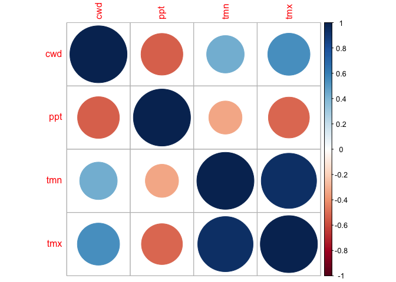<!-- -->

```r
climate.pca <- princomp(cor.norm) 
summary(climate.pca) #PC1 explains 91% of the variation, PC2 explains 9.3%, together they explain 99%
```

```
## Importance of components:
##                          Comp.1    Comp.2       Comp.3 Comp.4
## Standard deviation     1.119571 0.3477514 0.0358444403      0
## Proportion of Variance 0.911158 0.0879080 0.0009339726      0
## Cumulative Proportion  0.911158 0.9990660 1.0000000000      1
```

```r
climate.pca$loadings[, 1:2] #PC1 has high positive loading values for tmn, tmx, cwd
```

```
##         Comp.1     Comp.2
## cwd  0.4512467  0.6904085
## ppt -0.5644029 -0.2516209
## tmn  0.4458240 -0.5544344
## tmx  0.5282676 -0.3906732
```

```r
fviz_eig(climate.pca) #scree plot 
```

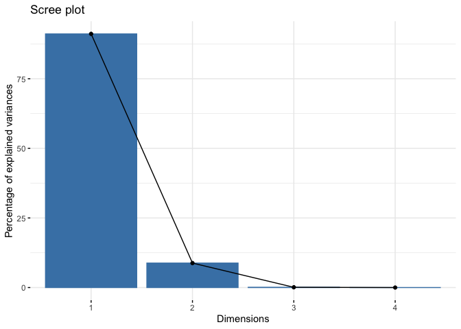<!-- -->

```r
fviz_pca_var(climate.pca, col.var = "black") #biplot
```

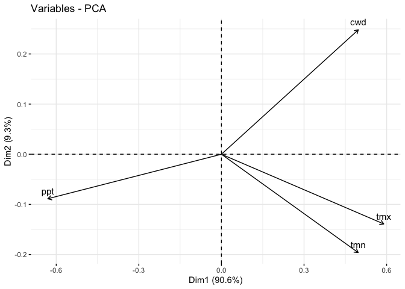<!-- -->

```r
#The goal of the third visualization is to determine how much each variable is represented in a given component. Such a quality of representation is called the Cos2 and corresponds to the square cosine, and it is computed using the fviz_cos2 function. (https://www.datacamp.com/tutorial/pca-analysis-r)
#A low value means that the variable is not perfectly represented by that component. 
#A high value, on the other hand, means a good representation of the variable on that component.
fviz_cos2(climate.pca, choice = "var", axes = 1:2) #axes says which PCs to use 
```

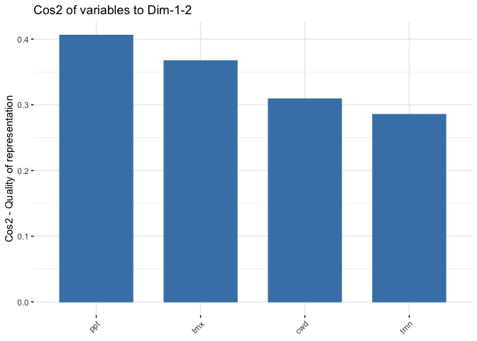<!-- -->

```r
#biplot combined wiht cos2

file_path= "../output/Climate/RecentClim_GrowthSeason_PCA.png"
png(width = 5.5, height = 5, res= 300, units = "in", file=file_path, type = "cairo")
fviz_pca_var(climate.pca, col.var = "cos2", 
            gradient.cols = c("black", "orange", "green"),
            repel = TRUE)
dev.off()
```

```
## quartz_off_screen 
##                 2
```

Overlay populations on PCA plot - Flint Recent


```r
pc = prcomp(climate_normalized, scale = TRUE)

pc_data = data.frame(pc$x)

locs_pc = cbind(allpops_recent_grwseason, pc_data)

loadings = data.frame(varnames=rownames(pc$rotation), pc$rotation)

ggplot() +
  geom_point(data = filter(locs_pc, elevation.group == "High"), aes(x = PC1, y = PC2), color = "#0043F0", alpha = 0.6) +
  geom_point(data = filter(locs_pc, elevation.group == "Mid"), aes(x = PC1, y = PC2), color = "#C9727F", alpha = 0.6) +
  geom_point(data = filter(locs_pc, elevation.group == "Low"), aes(x = PC1, y = PC2), color = "#F5A540", alpha = 0.6) +
  geom_vline(xintercept = 0, linetype="dashed") + geom_hline(yintercept = 0, linetype="dashed") +
  theme_classic()
```

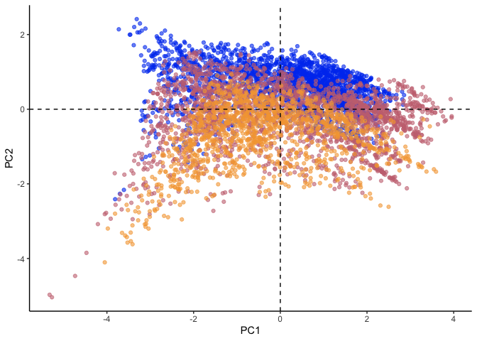<!-- -->

```r
ggsave("../output/Climate/RecentClim_PCA_Elev.png", width = 6, height = 4, units = "in")
```

### Average across all years and months (1 datapoint per pop) - Flint

Produce basic PCA plots - Flint Recent


```r
#normalize the data
climate_normalized_avgs <- allpops_recent_grwseason_avgs %>% ungroup() %>% select(cwd_mean,  ppt_mean, tmn_mean, tmx_mean) %>% scale() #normalize the data so they're all on the same scale
head(climate_normalized_avgs)
```

```
##         cwd_mean   ppt_mean    tmn_mean   tmx_mean
## [1,] -0.87171192  0.4929802  0.06812917 -0.1741032
## [2,] -1.12918772  1.8564402  1.10022273  0.2638439
## [3,]  1.20082422 -0.6288554 -0.16087245 -0.2227265
## [4,]  0.11203342 -0.7125966 -0.33691807 -0.5920547
## [5,] -1.74834788  1.2370860  1.61198995  1.4853656
## [6,] -0.06227222 -0.1720920  0.44669436  1.9126197
```

```r
cor.norm_avgs = cor(climate_normalized_avgs) #test correlations among the traits

file_path= "../output/Climate/GrowthSeason_RecentClim_Cors_Avgs.png"
png(width = 12, height = 6, res= 300, units = "in", file=file_path, type = "cairo")
corrplot(cor.norm_avgs)
dev.off()
```

```
## quartz_off_screen 
##                 2
```

```r
climate.pca_avgs <- princomp(cor.norm_avgs) 
summary(climate.pca_avgs) #PC1 explains 90% of the variation, PC2 explains 8.1%, together they explain 98%
```

```
## Importance of components:
##                           Comp.1     Comp.2      Comp.3 Comp.4
## Standard deviation     1.3530363 0.28915484 0.074703339      0
## Proportion of Variance 0.9535438 0.04354945 0.002906711      0
## Cumulative Proportion  0.9535438 0.99709329 1.000000000      1
```

```r
climate.pca_avgs$loadings[, 1:2] #PC1 has high positive loading values for tmn, tmx, cwd
```

```
##              Comp.1     Comp.2
## cwd_mean  0.5557510  0.2711216
## ppt_mean -0.5163709 -0.5524523
## tmn_mean -0.5073302  0.2595903
## tmx_mean -0.4088007  0.7442462
```

```r
fviz_eig(climate.pca_avgs) #scree plot 
```

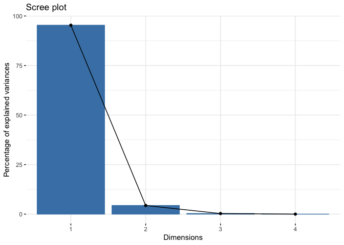<!-- -->

```r
fviz_pca_var(climate.pca_avgs, col.var = "black") #biplot
```

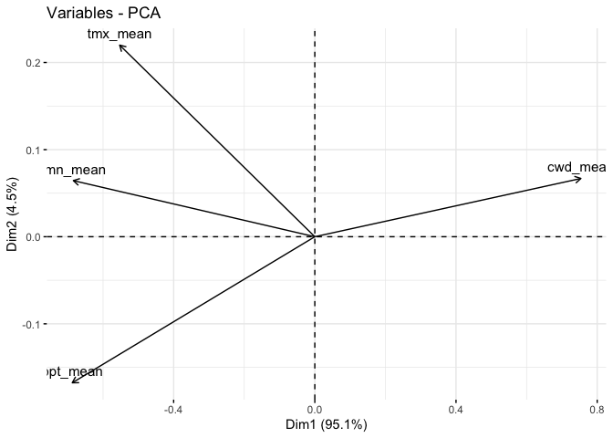<!-- -->

```r
#The goal of the third visualization is to determine how much each variable is represented in a given component. Such a quality of representation is called the Cos2 and corresponds to the square cosine, and it is computed using the fviz_cos2 function. (https://www.datacamp.com/tutorial/pca-analysis-r)
#A low value means that the variable is not perfectly represented by that component. 
#A high value, on the other hand, means a good representation of the variable on that component.
fviz_cos2(climate.pca_avgs, choice = "var", axes = 1:2) #axes says which PCs to use 
```

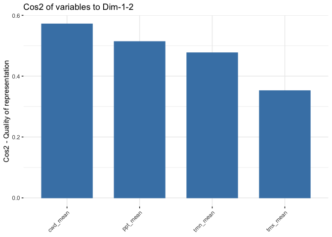<!-- -->

```r
#biplot combined wiht cos2

file_path= "../output/Climate/RecentClim_GrowthSeason_PCA_Avgs.png"
png(width = 5.5, height = 5, res= 300, units = "in", file=file_path, type = "cairo")
fviz_pca_var(climate.pca_avgs, col.var = "cos2", 
            gradient.cols = c("black", "orange", "green"),
            repel = TRUE)
dev.off()
```

```
## quartz_off_screen 
##                 2
```

Overlay populations on PCA plot - Flint Recent


```r
pc_avgs = prcomp(climate_normalized_avgs, scale = TRUE)

pc_data = data.frame(pc_avgs$x)

locs_pc = cbind(allpops_recent_grwseason_avgs, pc_data)
names(locs_pc)
```

```
##  [1] "parent.pop"      "elevation.group" "elev_m"          "cwd_mean"       
##  [5] "pck_mean"        "ppt_mean"        "tmn_mean"        "tmx_mean"       
##  [9] "cwd_sem"         "pck_sem"         "ppt_sem"         "tmn_sem"        
## [13] "tmx_sem"         "PC1"             "PC2"             "PC3"            
## [17] "PC4"
```

```r
loadings = data.frame(varnames=rownames(pc_avgs$rotation), pc_avgs$rotation)

ggplot() +
  geom_point(data = filter(locs_pc, elevation.group == "High"), size=2, aes(x = PC1, y = PC2), color = "#0043F0") +
  geom_point(data = filter(locs_pc, elevation.group == "Mid"), size=2, aes(x = PC1, y = PC2), color = "#C9727F") +
  geom_point(data = filter(locs_pc, elevation.group == "Low"), size=2, aes(x = PC1, y = PC2), color = "#F5A540") + 
  geom_label_repel(data = locs_pc, aes(x = PC1, y = PC2, label = parent.pop),
                  min.segment.length = 0, box.padding = 0.5) +
  geom_vline(xintercept = 0, linetype="dashed") + geom_hline(yintercept = 0, linetype="dashed") +
  theme_classic()
```

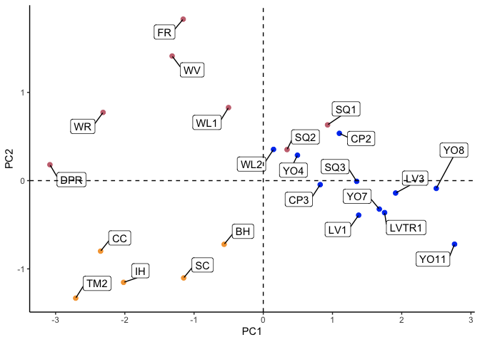<!-- -->

```r
ggsave("../output/Climate/RecentClim_PCA_Elev_Avgs.png", width = 6, height = 4, units = "in")
```

### Average across years per month (Flint)

Calculate monthly averages - Flint Recent


```r
names(allpops_recent_grwseason)
```

```
##  [1] "month"           "growmonth"       "parent.pop"      "elevation.group"
##  [5] "elev_m"          "PckSum"          "year"            "cwd"            
##  [9] "pck"             "ppt"             "tmn"             "tmx"            
## [13] "firstmonth"      "lastmonth"
```

```r
allpops_recent_grwseason_mosavgs <- allpops_recent_grwseason %>% group_by(parent.pop, elevation.group, month) %>% summarise_at(c("cwd",  "ppt", "tmn", "tmx"), c(mean, sem), na.rm = TRUE) 
names(allpops_recent_grwseason_mosavgs) <- gsub("fn2", "sem", colnames(allpops_recent_grwseason_mosavgs))
names(allpops_recent_grwseason_mosavgs) <-gsub("fn1", "mean", colnames(allpops_recent_grwseason_mosavgs))
allpops_recent_grwseason_mosavgs #30 year averages per growth season month 
```

```
## # A tibble: 247 × 11
## # Groups:   parent.pop, elevation.group [23]
##    parent.pop elevation.group month cwd_mean ppt_mean tmn_mean tmx_mean cwd_sem
##    <chr>      <chr>           <dbl>    <dbl>    <dbl>    <dbl>    <dbl>   <dbl>
##  1 BH         Low                 1     29.3   129.       2.76     13.8   0.444
##  2 BH         Low                 2     40.9   103.       3.51     15.0   0.509
##  3 BH         Low                 3     53.6    87.5      4.88     17.4   1.56 
##  4 BH         Low                 4     58.5    48.3      6.34     20.4   2.97 
##  5 BH         Low                 5     50.6    23.4      9.74     25.8   5.49 
##  6 BH         Low                 6     41.8    24.3     12.6      29.6   5.34 
##  7 BH         Low                 7     80.9     1.42    15.6      33.5  NA    
##  8 BH         Low                10     87.6    74.0      9.29     24.1   0.580
##  9 BH         Low                11     45.0    56.9      5.04     18.0   0.548
## 10 BH         Low                12     29.8   112.       2.43     13.5   0.347
## # ℹ 237 more rows
## # ℹ 3 more variables: ppt_sem <dbl>, tmn_sem <dbl>, tmx_sem <dbl>
```

```r
allpops_recent_grwseason_mosavgs$elevation.group <- factor(allpops_recent_grwseason_mosavgs$elevation.group, levels=elev_order) 
```

Produce basic PCA plots - Flint Recent

*Color by growth month relative to growth season?*


```r
names(allpops_recent_grwseason_mosavgs)
```

```
##  [1] "parent.pop"      "elevation.group" "month"           "cwd_mean"       
##  [5] "ppt_mean"        "tmn_mean"        "tmx_mean"        "cwd_sem"        
##  [9] "ppt_sem"         "tmn_sem"         "tmx_sem"
```

```r
#normalize the data
climate_normalized_mosavgs <- allpops_recent_grwseason_mosavgs %>% ungroup() %>% select(cwd_mean,  ppt_mean, tmn_mean, tmx_mean) %>% scale() #normalize the data so they're all on the same scale
head(climate_normalized_mosavgs)
```

```
##         cwd_mean   ppt_mean    tmn_mean    tmx_mean
## [1,] -0.86381036  1.1730807 -0.32392500 -0.56519207
## [2,] -0.49640236  0.7089039 -0.19276000 -0.40499983
## [3,] -0.09590962  0.4242495  0.04622095 -0.06152499
## [4,]  0.05922915 -0.2850169  0.30324161  0.35510929
## [5,] -0.18894478 -0.7357748  0.89782812  1.10724955
## [6,] -0.46975807 -0.7187571  1.39146917  1.63951553
```

```r
cor.norm_mosavgs = cor(climate_normalized_mosavgs) #test correlations among the traits

file_path= "../output/Climate/GrowthSeason_RecentClim_Cors_MonthlyAvgs.png"
png(width = 12, height = 6, res= 300, units = "in", file=file_path, type = "cairo")
corrplot(cor.norm_mosavgs)
dev.off()
```

```
## quartz_off_screen 
##                 2
```

```r
climate.pca_mosavgs <- princomp(cor.norm_mosavgs) 
summary(climate.pca_mosavgs) #PC1 explains 90% of the variation, PC2 explains 8.1%, together they explain 98%
```

```
## Importance of components:
##                           Comp.1     Comp.2       Comp.3 Comp.4
## Standard deviation     1.1931646 0.32381553 0.0237242226      0
## Proportion of Variance 0.9310562 0.06857574 0.0003680943      0
## Cumulative Proportion  0.9310562 0.99963191 1.0000000000      1
```

```r
climate.pca_mosavgs$loadings[, 1:2] #PC1 has high positive loading values for tmn, tmx, cwd
```

```
##              Comp.1     Comp.2
## cwd_mean  0.4789655  0.6443253
## ppt_mean -0.5535691 -0.2958083
## tmn_mean  0.4504181 -0.5551376
## tmx_mean  0.5111524 -0.4349307
```

```r
fviz_eig(climate.pca_mosavgs) #scree plot 
```

<!-- -->

```r
fviz_pca_var(climate.pca_mosavgs, col.var = "black") #biplot
```

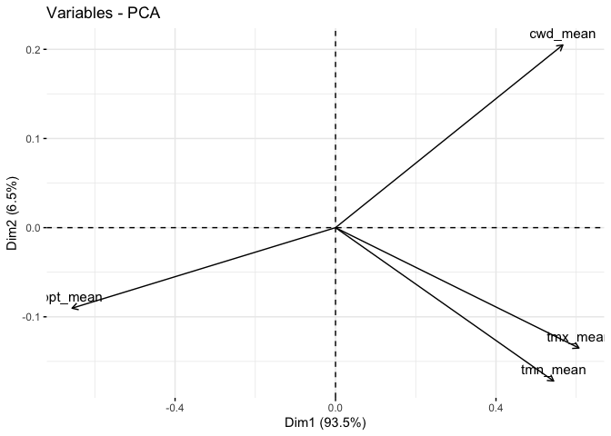<!-- -->

```r
#The goal of the third visualization is to determine how much each variable is represented in a given component. Such a quality of representation is called the Cos2 and corresponds to the square cosine, and it is computed using the fviz_cos2 function. (https://www.datacamp.com/tutorial/pca-analysis-r)
#A low value means that the variable is not perfectly represented by that component. 
#A high value, on the other hand, means a good representation of the variable on that component.
fviz_cos2(climate.pca_mosavgs, choice = "var", axes = 1:2) #axes says which PCs to use 
```

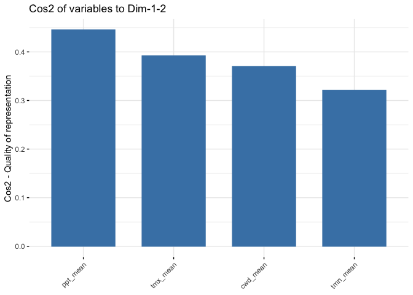<!-- -->

```r
#biplot combined wiht cos2

file_path= "../output/Climate/RecentClim_GrowthSeason_PCA_MonthlyAvgs.png"
png(width = 5.5, height = 5, res= 300, units = "in", file=file_path, type = "cairo")
fviz_pca_var(climate.pca_mosavgs, col.var = "cos2", 
            gradient.cols = c("black", "orange", "green"),
            repel = TRUE)
dev.off()
```

```
## quartz_off_screen 
##                 2
```

Overlay populations on PCA plot - Flint Recent


```r
pc_mosavgs = prcomp(climate_normalized_mosavgs, scale = TRUE)

pc_data = data.frame(pc_mosavgs$x)

locs_pc = cbind(allpops_recent_grwseason_mosavgs, pc_data)

loadings = data.frame(varnames=rownames(pc_mosavgs$rotation), pc_mosavgs$rotation)

ggplot() +
  geom_point(data = filter(locs_pc, elevation.group == "High"), size=2, aes(x = PC1, y = PC2), color = "#0043F0") +
  geom_point(data = filter(locs_pc, elevation.group == "Mid"), size=2, aes(x = PC1, y = PC2), color = "#C9727F") +
  geom_point(data = filter(locs_pc, elevation.group == "Low"), size=2, aes(x = PC1, y = PC2), color = "#F5A540") + 
  geom_text_repel(data = locs_pc, aes(x = PC1, y = PC2, label = parent.pop),
             min.segment.length = 0) +
  geom_vline(xintercept = 0, linetype="dashed") + geom_hline(yintercept = 0, linetype="dashed") +
  theme_classic()
```

```
## Warning: ggrepel: 72 unlabeled data points (too many overlaps). Consider
## increasing max.overlaps
```

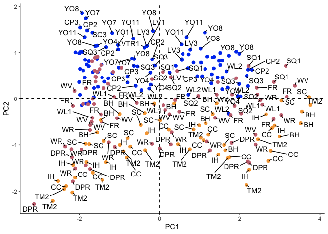<!-- -->

```r
ggsave("../output/Climate/RecentClim_PCA_Elev_MonthlyAvgs_Pops.png", width = 6, height = 4, units = "in")
```

```
## Warning: ggrepel: 132 unlabeled data points (too many overlaps). Consider
## increasing max.overlaps
```

```r
ggplot() +
  geom_point(data = filter(locs_pc, elevation.group == "High"), size=2, aes(x = PC1, y = PC2), color = "#0043F0") +
  geom_point(data = filter(locs_pc, elevation.group == "Mid"), size=2, aes(x = PC1, y = PC2), color = "#C9727F") +
  geom_point(data = filter(locs_pc, elevation.group == "Low"), size=2, aes(x = PC1, y = PC2), color = "#F5A540") + 
  geom_text_repel(data = locs_pc, aes(x = PC1, y = PC2, label = month),
                  min.segment.length = 0) +
  geom_vline(xintercept = 0, linetype="dashed") + geom_hline(yintercept = 0, linetype="dashed") +
  theme_classic()
```

```
## Warning: ggrepel: 16 unlabeled data points (too many overlaps). Consider
## increasing max.overlaps
```

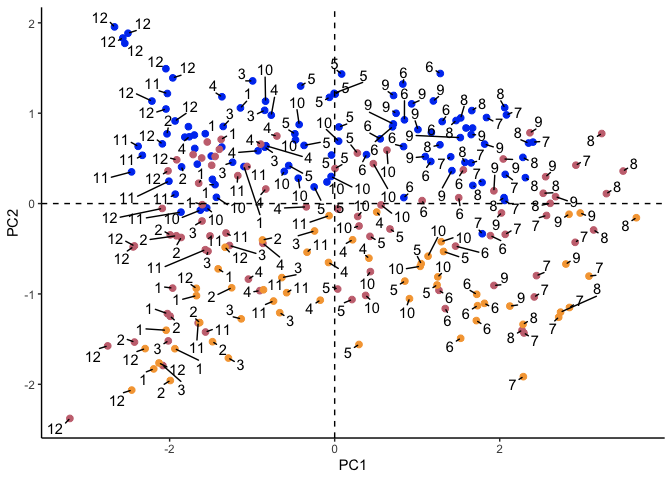<!-- -->

```r
ggsave("../output/Climate/RecentClim_PCA_Elev_MonthlyAvgs_Months.png", width = 6, height = 4, units = "in")
```

```
## Warning: ggrepel: 54 unlabeled data points (too many overlaps). Consider
## increasing max.overlaps
```

### All years included (BioClim)

Produce basic PCA plots - BioClim Recent


```r
#normalize the data
climate_normalized <- bioclim_recent %>% select(ann_tmean:ppt_coldest_quarter) %>% scale() #normalize the data so they're all on the same scale
head(climate_normalized)
```

```
##      ann_tmean mean_diurnal_range temp_seasonality temp_ann_range
## [1,]  1.488048           1.484196        0.6345835     1.51641105
## [2,]  1.292581           1.793357       -0.9850409    -0.27252427
## [3,]  1.309042           2.048352        1.1007088     1.28430291
## [4,]  1.423970           1.299199       -1.7766975    -0.69711355
## [5,]  1.493926           1.734191       -0.2298294     0.57665287
## [6,]  1.495396           1.786690       -0.5789875     0.02185609
##      tmean_wettest_quarter tmean_driest_quarter    ann_ppt ppt_seasonality
## [1,]             0.9477349            0.3062418 -1.2499359       0.6552141
## [2,]             1.3701910            1.1218507 -1.0038190       1.3630755
## [3,]             0.9804684            1.4338282 -1.4555166      -1.3703942
## [4,]             1.5323185            0.8549045 -0.6963120       1.0690546
## [5,]             1.4110117            1.4806609 -0.4258456       0.1266306
## [6,]             1.3397678            1.3117031 -1.4051095       5.1279468
##      ppt_warmest_quarter ppt_coldest_quarter
## [1,]           0.3981273          -0.8725818
## [2,]          -0.9374355          -0.5158821
## [3,]          -0.7864416          -1.4995947
## [4,]          -0.8716482          -0.6832578
## [5,]          -0.5811534          -0.2660452
## [6,]          -0.8526253          -0.8530541
```

```r
cor.norm = cor(climate_normalized) #test correlations among the traits
corrplot(cor.norm)
```

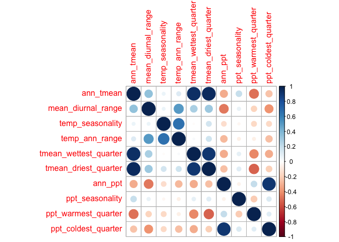<!-- -->

```r
climate.pca <- princomp(cor.norm) 
summary(climate.pca) #PC1 explains 91% of the variation, PC2 explains 9.3%, together they explain 99%
```

```
## Importance of components:
##                          Comp.1    Comp.2     Comp.3     Comp.4     Comp.5
## Standard deviation     1.150707 0.6298924 0.36071490 0.32191161 0.22017834
## Proportion of Variance 0.658955 0.1974509 0.06475219 0.05157029 0.02412545
## Cumulative Proportion  0.658955 0.8564059 0.92115807 0.97272835 0.99685381
##                             Comp.6       Comp.7       Comp.8       Comp.9
## Standard deviation     0.069756668 0.0323147710 0.0174575349 1.034719e-02
## Proportion of Variance 0.002421574 0.0005196709 0.0001516674 5.328086e-05
## Cumulative Proportion  0.999275381 0.9997950518 0.9999467191 1.000000e+00
##                             Comp.10
## Standard deviation     1.139135e-08
## Proportion of Variance 6.457681e-17
## Cumulative Proportion  1.000000e+00
```

```r
climate.pca$loadings[, 1:2] #PC1 has high positive loading values for tmn, tmx, cwd
```

```
##                            Comp.1     Comp.2
## ann_tmean              0.42218724  0.2844874
## mean_diurnal_range     0.28501158 -0.2600425
## temp_seasonality       0.10189008 -0.4042994
## temp_ann_range         0.15955805 -0.5159323
## tmean_wettest_quarter  0.41461687  0.3010946
## tmean_driest_quarter   0.41265005  0.2590390
## ann_ppt               -0.37993290  0.2892133
## ppt_seasonality        0.04697644  0.1821506
## ppt_warmest_quarter   -0.30075753 -0.2056759
## ppt_coldest_quarter   -0.35424269  0.3239069
```

```r
fviz_eig(climate.pca) #scree plot 
```

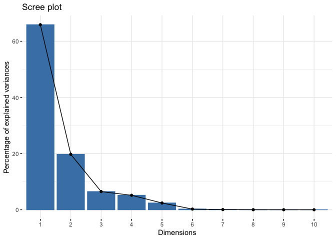<!-- -->

```r
fviz_pca_var(climate.pca, col.var = "black") #biplot
```

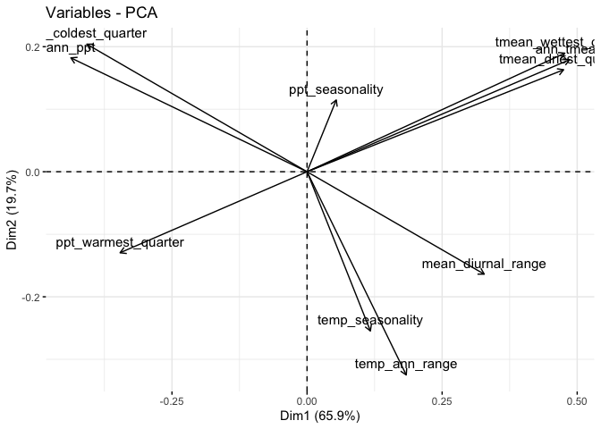<!-- -->

```r
#The goal of the third visualization is to determine how much each variable is represented in a given component. Such a quality of representation is called the Cos2 and corresponds to the square cosine, and it is computed using the fviz_cos2 function. (https://www.datacamp.com/tutorial/pca-analysis-r)
#A low value means that the variable is not perfectly represented by that component. 
#A high value, on the other hand, means a good representation of the variable on that component.
fviz_cos2(climate.pca, choice = "var", axes = 1:2) #axes says which PCs to use 
```

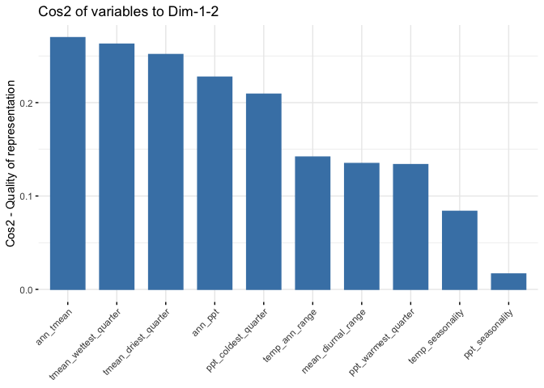<!-- -->

```r
#biplot combined wiht cos2

file_path= "../output/Climate/RecentClim_BioClim_PCA.png"
png(width = 5.5, height = 5, res= 300, units = "in", file=file_path, type = "cairo")
fviz_pca_var(climate.pca, col.var = "cos2", 
            gradient.cols = c("black", "orange", "green"),
            repel = TRUE)
dev.off()
```

```
## quartz_off_screen 
##                 2
```

Overlay populations on PCA plot - BioClim Recent


```r
pc = prcomp(climate_normalized, scale = TRUE)

pc_data = data.frame(pc$x)

locs_pc = cbind(bioclim_recent, pc_data)

loadings = data.frame(varnames=rownames(pc$rotation), pc$rotation)

ggplot() +
  geom_point(data = filter(locs_pc, elevation.group == "High"), aes(x = PC1, y = PC2), color = "#0043F0", alpha = 0.6) +
  geom_point(data = filter(locs_pc, elevation.group == "Mid"), aes(x = PC1, y = PC2), color = "#C9727F", alpha = 0.6) +
  geom_point(data = filter(locs_pc, elevation.group == "Low"), aes(x = PC1, y = PC2), color = "#F5A540", alpha = 0.6) +
  geom_vline(xintercept = 0, linetype="dashed") + geom_hline(yintercept = 0, linetype="dashed") +
  theme_classic()
```

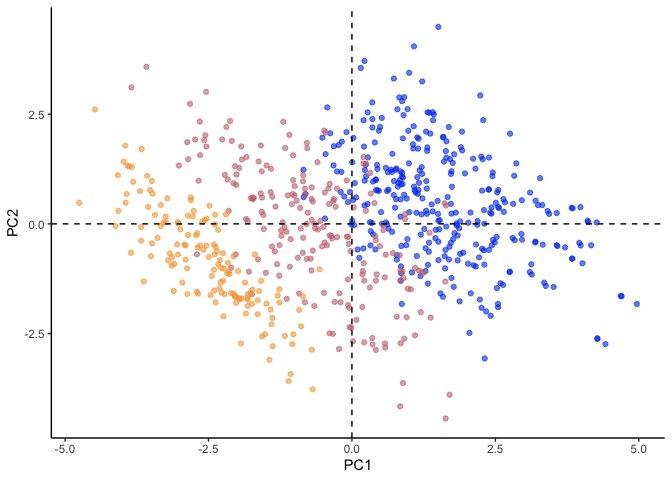<!-- -->

```r
ggsave("../output/Climate/RecentClim_BioClimPCA_Elev.png", width = 6, height = 4, units = "in")
```

### Average across all years (1 datapoint per pop) - BioClim

Produce basic PCA plots - Bioclim Recent


```r
#normalize the data
climate_normalized_avgs <- bioclim_recent_avgs %>% ungroup() %>% select(ann_tmean_avg:ppt_coldest_quarter_avg) %>% scale() #normalize the data so they're all on the same scale
head(climate_normalized_avgs)
```

```
##      ann_tmean_avg mean_diurnal_range_avg temp_seasonality_avg
## [1,]     1.4365744              2.1103241            0.7807743
## [2,]     1.5373314              0.3677399           -0.8002917
## [3,]    -0.6392846             -0.7794069            0.3106801
## [4,]    -0.8035757             -0.9284072            0.4993965
## [5,]     0.9327698             -0.6542612            0.5574192
## [6,]     0.6102852              1.9623190            2.0068328
##      temp_ann_range_avg tmean_wettest_quarter_avg tmean_driest_quarter_avg
## [1,]          1.8936564                 1.4365670                1.4092314
## [2,]         -0.3106149                 1.5348149                1.4696802
## [3,]         -0.5013491                -0.6077896               -0.5261052
## [4,]         -0.4954106                -0.7839883               -0.6694831
## [5,]         -0.6071962                 0.9485100                0.9987417
## [6,]          2.6723127                 0.4768846                0.7235035
##      ann_ppt_avg ppt_seasonality_avg ppt_warmest_quarter_avg
## [1,] -1.86140109           1.7404586              -1.3773151
## [2,] -0.49161686           0.7630087              -1.0853401
## [3,]  0.26032562          -0.8113405               0.5514082
## [4,]  0.09597021          -1.0345910               0.6482123
## [5,]  0.85590061           0.5143695              -0.7943749
## [6,] -0.58929595           0.4725516              -0.6697992
##      ppt_coldest_quarter_avg
## [1,]             -2.00643695
## [2,]             -0.51718604
## [3,]              0.28983231
## [4,]              0.05138236
## [5,]              1.19209454
## [6,]             -0.65810989
```

```r
cor.norm_avgs = cor(climate_normalized_avgs) #test correlations among the traits

file_path= "../output/Climate/BioClim_RecentClim_Cors_Avgs.png"
png(width = 12, height = 6, res= 300, units = "in", file=file_path, type = "cairo")
corrplot(cor.norm_avgs)
dev.off()
```

```
## quartz_off_screen 
##                 2
```

```r
climate.pca_avgs <- princomp(cor.norm_avgs) 
summary(climate.pca_avgs) #PC1 explains 90% of the variation, PC2 explains 8.1%, together they explain 98%
```

```
## Importance of components:
##                          Comp.1    Comp.2     Comp.3     Comp.4      Comp.5
## Standard deviation     1.677552 0.6397661 0.28391871 0.24532861 0.076839605
## Proportion of Variance 0.835020 0.1214471 0.02391844 0.01785834 0.001751923
## Cumulative Proportion  0.835020 0.9564671 0.98038557 0.99824391 0.999995834
##                              Comp.6       Comp.7       Comp.8       Comp.9
## Standard deviation     3.687709e-03 4.832704e-04 3.726029e-04 2.634748e-04
## Proportion of Variance 4.035135e-06 6.929872e-08 4.119431e-08 2.059790e-08
## Cumulative Proportion  9.999999e-01 9.999999e-01 1.000000e+00 1.000000e+00
##                        Comp.10
## Standard deviation           0
## Proportion of Variance       0
## Cumulative Proportion        1
```

```r
climate.pca_avgs$loadings[, 1:2] #PC1 has high positive loading values for tmn, tmx, cwd
```

```
##                                Comp.1     Comp.2
## ann_tmean_avg              0.36735579  0.2701106
## mean_diurnal_range_avg     0.25344989 -0.3689642
## temp_seasonality_avg       0.09229607 -0.3107929
## temp_ann_range_avg         0.19244417 -0.5407832
## tmean_wettest_quarter_avg  0.35679039  0.3009518
## tmean_driest_quarter_avg   0.35650688  0.2761101
## ann_ppt_avg               -0.34490217  0.2689878
## ppt_seasonality_avg        0.34451126  0.1037666
## ppt_warmest_quarter_avg   -0.39530741 -0.2143358
## ppt_coldest_quarter_avg   -0.32703142  0.3255710
```

```r
fviz_eig(climate.pca_avgs) #scree plot 
```

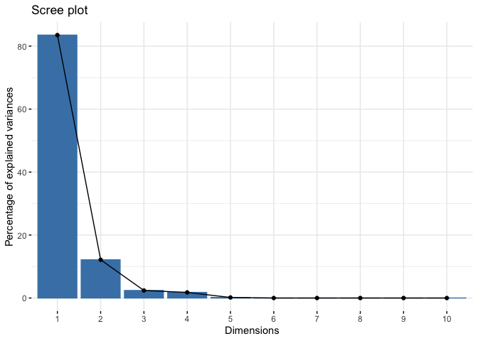<!-- -->

```r
fviz_pca_var(climate.pca_avgs, col.var = "black") #biplot
```

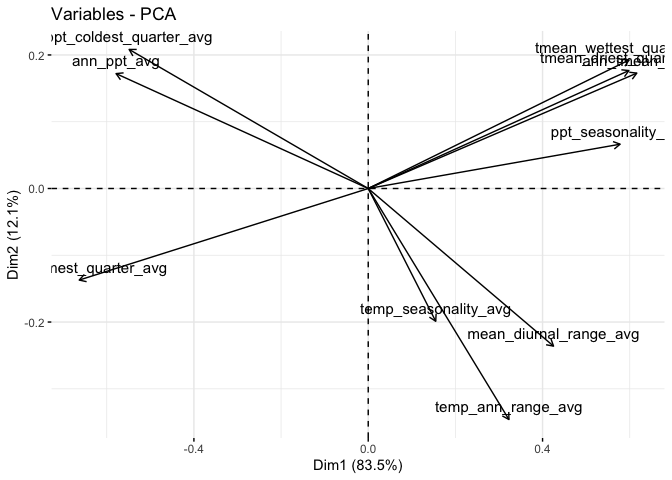<!-- -->

```r
#The goal of the third visualization is to determine how much each variable is represented in a given component. Such a quality of representation is called the Cos2 and corresponds to the square cosine, and it is computed using the fviz_cos2 function. (https://www.datacamp.com/tutorial/pca-analysis-r)
#A low value means that the variable is not perfectly represented by that component. 
#A high value, on the other hand, means a good representation of the variable on that component.
fviz_cos2(climate.pca_avgs, choice = "var", axes = 1:2) #axes says which PCs to use 
```

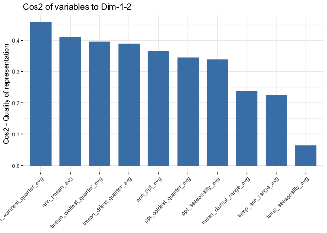<!-- -->

```r
#biplot combined wiht cos2

file_path= "../output/Climate/RecentClim_BioClim_PCA_Avgs.png"
png(width = 5.5, height = 5, res= 300, units = "in", file=file_path, type = "cairo")
fviz_pca_var(climate.pca_avgs, col.var = "cos2", 
            gradient.cols = c("black", "orange", "green"),
            repel = TRUE)
dev.off()
```

```
## quartz_off_screen 
##                 2
```

Overlay populations on PCA plot - Bioclim Recent


```r
pc_avgs = prcomp(climate_normalized_avgs, scale = TRUE)

pc_data = data.frame(pc_avgs$x)

locs_pc = cbind(bioclim_recent_avgs, pc_data)
names(locs_pc)
```

```
##  [1] "parent.pop"                "elevation.group"          
##  [3] "elev_m"                    "ann_tmean_avg"            
##  [5] "mean_diurnal_range_avg"    "temp_seasonality_avg"     
##  [7] "temp_ann_range_avg"        "tmean_wettest_quarter_avg"
##  [9] "tmean_driest_quarter_avg"  "ann_ppt_avg"              
## [11] "ppt_seasonality_avg"       "ppt_warmest_quarter_avg"  
## [13] "ppt_coldest_quarter_avg"   "ann_tmean_sem"            
## [15] "mean_diurnal_range_sem"    "temp_seasonality_sem"     
## [17] "temp_ann_range_sem"        "tmean_wettest_quarter_sem"
## [19] "tmean_driest_quarter_sem"  "ann_ppt_sem"              
## [21] "ppt_seasonality_sem"       "ppt_warmest_quarter_sem"  
## [23] "ppt_coldest_quarter_sem"   "PC1"                      
## [25] "PC2"                       "PC3"                      
## [27] "PC4"                       "PC5"                      
## [29] "PC6"                       "PC7"                      
## [31] "PC8"                       "PC9"                      
## [33] "PC10"
```

```r
loadings = data.frame(varnames=rownames(pc_avgs$rotation), pc_avgs$rotation)

ggplot() +
  geom_point(data = filter(locs_pc, elevation.group == "High"), size=2, aes(x = PC1, y = PC2), color = "#0043F0") +
  geom_point(data = filter(locs_pc, elevation.group == "Mid"), size=2, aes(x = PC1, y = PC2), color = "#C9727F") +
  geom_point(data = filter(locs_pc, elevation.group == "Low"), size=2, aes(x = PC1, y = PC2), color = "#F5A540") + 
  geom_label_repel(data = locs_pc, aes(x = PC1, y = PC2, label = parent.pop),
                  min.segment.length = 0, box.padding = 0.5) +
  geom_vline(xintercept = 0, linetype="dashed") + geom_hline(yintercept = 0, linetype="dashed") +
  theme_classic()
```

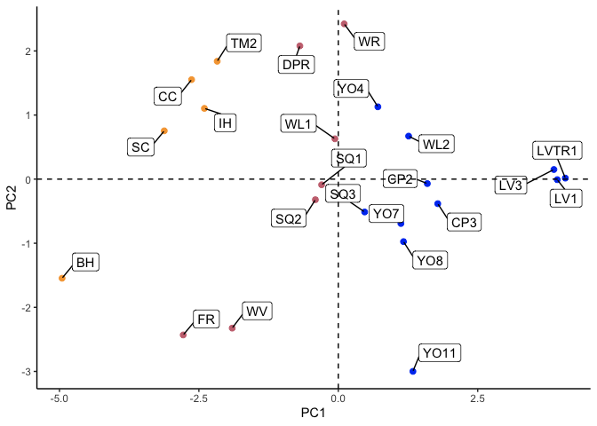<!-- -->

```r
ggsave("../output/Climate/RecentClim_BioClimPCA_Elev_Avgs.png", width = 6, height = 4, units = "in")
```
