To Do:

-   Decide between elevation classifications vs. some climate metric to
    define growth seasons

    -   Categorical Growth Seasons:
        -   Low: Oct-July

        -   Mid: Nov-Aug

        -   High: April-Sept
    -   Based on climate metrics: no snowpack and/or significant rain/lower CWD
    -   Could also compare avg snowpack across entire year between
        groups I determine as mid vs. high
    -   K means clustering to see if it splits into the 3 groups (Can
        give it the 30 year vector. Probably need to turn off scaling)

-   Create PCAs for recent and historical climate

    -   Color monthly PCA by month relative to growth season?
    -   Make PCAs for historical climate too
    -   Try PCA with bioclim variables 
        -   Calculate the bioclim variables I sent to Julin and Jenny from the data we already ahve
        -   Then add them to the PCA

-   Distance from home climate

    -   Get UCD climate data

    -   Calculate CWD


## Relevant Libraries and Functions


```r
library(tidyverse)
```

```
## ── Attaching core tidyverse packages ──────────────────────── tidyverse 2.0.0 ──
## ✔ dplyr     1.1.3     ✔ readr     2.1.4
## ✔ forcats   1.0.0     ✔ stringr   1.5.0
## ✔ ggplot2   3.4.3     ✔ tibble    3.2.1
## ✔ lubridate 1.9.2     ✔ tidyr     1.3.0
## ✔ purrr     1.0.2     
## ── Conflicts ────────────────────────────────────────── tidyverse_conflicts() ──
## ✖ dplyr::filter() masks stats::filter()
## ✖ dplyr::lag()    masks stats::lag()
## ℹ Use the conflicted package (<http://conflicted.r-lib.org/>) to force all conflicts to become errors
```

```r
library(ggrepel)
library(cowplot)
```

```
## 
## Attaching package: 'cowplot'
## 
## The following object is masked from 'package:lubridate':
## 
##     stamp
```

```r
library(gridExtra)
```

```
## 
## Attaching package: 'gridExtra'
## 
## The following object is masked from 'package:dplyr':
## 
##     combine
```

```r
library(corrplot) #plotting correlations 
```

```
## corrplot 0.92 loaded
```

```r
library(rstatix) #performing cor_test
```

```
## 
## Attaching package: 'rstatix'
## 
## The following object is masked from 'package:stats':
## 
##     filter
```

```r
library(lmerTest)
```

```
## Loading required package: lme4
## Loading required package: Matrix
## 
## Attaching package: 'Matrix'
## 
## The following objects are masked from 'package:tidyr':
## 
##     expand, pack, unpack
## 
## 
## Attaching package: 'lmerTest'
## 
## The following object is masked from 'package:lme4':
## 
##     lmer
## 
## The following object is masked from 'package:stats':
## 
##     step
```

```r
library(naniar) #replaces values with NA
library(QBMS) #for function calc_biovars to calculate bioclim variables
sem <- function(x, na.rm=FALSE) {
  sd(x,na.rm=na.rm)/sqrt(length(na.omit(x)))
} #standard error function 

get_legend<-function(myggplot){
  tmp <- ggplot_gtable(ggplot_build(myggplot))
  leg <- which(sapply(tmp$grobs, function(x) x$name) == "guide-box")
  legend <- tmp$grobs[[leg]]
  return(legend)
} #legend function for grid_arrange

elev_three_palette <- c("#0043F0", "#C9727F", "#F5A540") #colors from Gremer et al 2019
elev_order <- c("High", "Mid", "Low")

#For scree plots 
#library("devtools") #The package devtools is required for the installation as factoextra is hosted on github.
#1install_github("kassambara/factoextra")
library("factoextra")
```

```
## Welcome! Want to learn more? See two factoextra-related books at https://goo.gl/ve3WBa
```

## Load the pop and location data


```r
#pop info
pops_common_garden <- read_csv("../input/UCD_Data/Pops_for_2022_UCD.csv") #pops included in common garden 
```

```
## Rows: 23 Columns: 11
## ── Column specification ────────────────────────────────────────────────────────
## Delimiter: ","
## chr (5): parent.pop, elevation.group, collection.priority., on.climate.PCA.,...
## dbl (5): phylogroup, maternal.families, approx.number.seeds, UCD.seed.year, ...
## lgl (1): JGI.DNA
## 
## ℹ Use `spec()` to retrieve the full column specification for this data.
## ℹ Specify the column types or set `show_col_types = FALSE` to quiet this message.
```

```r
summary(pops_common_garden)
```

```
##   parent.pop          phylogroup    elevation.group    maternal.families
##  Length:23          Min.   :1.000   Length:23          Min.   : 3.0     
##  Class :character   1st Qu.:2.000   Class :character   1st Qu.:16.5     
##  Mode  :character   Median :4.000   Mode  :character   Median :23.0     
##                     Mean   :4.435                      Mean   :22.7     
##                     3rd Qu.:7.000                      3rd Qu.:29.5     
##                     Max.   :9.000                      Max.   :44.0     
##  approx.number.seeds UCD.seed.year  proposed.WL2.seed.year collection.priority.
##  Min.   : 100.0      Min.   :2014   Min.   :2014           Length:23           
##  1st Qu.: 500.0      1st Qu.:2018   1st Qu.:2020           Class :character    
##  Median : 500.0      Median :2020   Median :2021           Mode  :character    
##  Mean   : 608.7      Mean   :2020   Mean   :2020                               
##  3rd Qu.:1000.0      3rd Qu.:2021   3rd Qu.:2021                               
##  Max.   :1000.0      Max.   :2021   Max.   :2022                               
##  on.climate.PCA.    JGI.DNA           notes          
##  Length:23          Mode:logical   Length:23         
##  Class :character   NA's:23        Class :character  
##  Mode  :character                  Mode  :character  
##                                                      
##                                                      
## 
```

```r
names(pops_common_garden)
```

```
##  [1] "parent.pop"             "phylogroup"             "elevation.group"       
##  [4] "maternal.families"      "approx.number.seeds"    "UCD.seed.year"         
##  [7] "proposed.WL2.seed.year" "collection.priority."   "on.climate.PCA."       
## [10] "JGI.DNA"                "notes"
```

```r
pops_common_garden_nonotes <- pops_common_garden %>% select(parent.pop:elevation.group, UCD.seed.year)
pops_common_garden_nonotes
```

```
## # A tibble: 23 × 4
##    parent.pop phylogroup elevation.group UCD.seed.year
##    <chr>           <dbl> <chr>                   <dbl>
##  1 BH                  4 low                      2021
##  2 CC                  7 low                      2018
##  3 CP2                 2 high                     2019
##  4 CP3                 2 high                     2018
##  5 DPR                 5 mid                      2020
##  6 FR                  7 mid                      2019
##  7 IH                  5 low                      2021
##  8 LV1                 9 high                     2018
##  9 LV3                 9 high                     2018
## 10 LVTR1               9 high                     2020
## # ℹ 13 more rows
```

```r
pops_common_garden_nonotes$elevation.group <- str_to_title(pops_common_garden$elevation.group)

#extra location info 
pop_loc <- read_csv("../input/Strep_tort_locs.csv")
```

```
## Rows: 54 Columns: 7
## ── Column specification ────────────────────────────────────────────────────────
## Delimiter: ","
## chr (6): Species epithet, Species Code, Site, Site code, Lat, Long
## dbl (1): Elevation (m)
## 
## ℹ Use `spec()` to retrieve the full column specification for this data.
## ℹ Specify the column types or set `show_col_types = FALSE` to quiet this message.
```

```r
names(pop_loc)
```

```
## [1] "Species epithet" "Species Code"    "Site"            "Site code"      
## [5] "Lat"             "Long"            "Elevation (m)"
```

```r
head(pop_loc)
```

```
## # A tibble: 6 × 7
##   `Species epithet` `Species Code` Site  `Site code` Lat   Long  `Elevation (m)`
##   <chr>             <chr>          <chr> <chr>       <chr> <chr>           <dbl>
## 1 Streptanthus tor… STTO           Ben … BH          37.4… -119…            511.
## 2 Streptanthus tor… STTO           Bidw… BB          39.5… -121…            283.
## 3 Streptanthus tor… STTO           Cany… CC          39.5… -121…            313 
## 4 Streptanthus tor… STTO           Cars… CP1         38.6… -120…           2422.
## 5 Streptanthus tor… STTO           Cars… CP2         38.6… -120…           2244.
## 6 Streptanthus tor… STTO           Cars… CP3         38.7… -120…           2266.
```

```r
unique(pop_loc$`Site code`)
```

```
##  [1] "BH"     "BB"     "CC"     "CP1"    "CP2"    "CP3"    "DP"     "DPR"   
##  [9] "FR"     NA       "HH"     "IH"     "KC1"    "KC2"    "KC3"    "LV1"   
## [17] "LV2"    "LV3"    "LVTR1"  "LVTR2"  "LVTR3"  "SQ1"    "SQ2"    "SQ3"   
## [25] "SHA"    "SC"     "TM1"    "TM2"    "WR"     "WV"     "WL1"    "WL2"   
## [33] "WL3"    "WL4"    "YOSE1"  "YOSE10" "YOSE11" "YOSE12" "YOSE13" "YOSE2" 
## [41] "YOSE3"  "YOSE4"  "YOSE5"  "YOSE6"  "YOSE7"  "YOSE8"  "YOSE9"
```

```r
unique(pops_common_garden_nonotes$parent.pop)
```

```
##  [1] "BH"    "CC"    "CP2"   "CP3"   "DPR"   "FR"    "IH"    "LV1"   "LV3"  
## [10] "LVTR1" "SC"    "SQ1"   "SQ2"   "SQ3"   "TM2"   "WL1"   "WL2"   "WR"   
## [19] "WV"    "YO11"  "YO4"   "YO7"   "YO8"
```

```r
#need to change YOSE to YO
pop_loc_yo <- pop_loc %>% mutate(parent.pop = str_replace(`Site code`, "YOSE(\\d+)", "YO\\1")) %>% select(Lat, Long, elev_m=`Elevation (m)`, parent.pop)
unique(pop_loc_yo$parent.pop)
```

```
##  [1] "BH"    "BB"    "CC"    "CP1"   "CP2"   "CP3"   "DP"    "DPR"   "FR"   
## [10] NA      "HH"    "IH"    "KC1"   "KC2"   "KC3"   "LV1"   "LV2"   "LV3"  
## [19] "LVTR1" "LVTR2" "LVTR3" "SQ1"   "SQ2"   "SQ3"   "SHA"   "SC"    "TM1"  
## [28] "TM2"   "WR"    "WV"    "WL1"   "WL2"   "WL3"   "WL4"   "YO1"   "YO10" 
## [37] "YO11"  "YO12"  "YO13"  "YO2"   "YO3"   "YO4"   "YO5"   "YO6"   "YO7"  
## [46] "YO8"   "YO9"
```

```r
#merge in location info
pop_elev <- left_join(pops_common_garden_nonotes, pop_loc_yo)
```

```
## Joining with `by = join_by(parent.pop)`
```

```r
head(pop_elev)
```

```
## # A tibble: 6 × 7
##   parent.pop phylogroup elevation.group UCD.seed.year Lat      Long       elev_m
##   <chr>           <dbl> <chr>                   <dbl> <chr>    <chr>       <dbl>
## 1 BH                  4 Low                      2021 37.40985 -119.96458   511.
## 2 CC                  7 Low                      2018 39.58597 -121.43311   313 
## 3 CP2                 2 High                     2019 38.66169 -120.13065  2244.
## 4 CP3                 2 High                     2018 38.70649 -120.08797  2266.
## 5 DPR                 5 Mid                      2020 39.22846 -120.81518  1019.
## 6 FR                  7 Mid                      2019 40.01362 -121.18498   787
```

## Map populations


```r
names(pop_elev)
```

```
## [1] "parent.pop"      "phylogroup"      "elevation.group" "UCD.seed.year"  
## [5] "Lat"             "Long"            "elev_m"
```

```r
sapply(pop_elev, class) #lat and long are characters, need to be numeric 
```

```
##      parent.pop      phylogroup elevation.group   UCD.seed.year             Lat 
##     "character"       "numeric"     "character"       "numeric"     "character" 
##            Long          elev_m 
##     "character"       "numeric"
```

```r
pop_elev <- pop_elev %>% mutate_at(c("Lat", "Long"), as.double)
states <- map_data("state") %>% filter(region == "california")


#without labels 
ggplot() +
  geom_polygon(data = states, aes(x = long, y = lat, group = group), fill = "gray") +
  coord_quickmap(xlim = c(-125, -114), ylim = c(35, 43))+
  geom_point(data = pop_elev,
             aes(x = Long, y = Lat, color=elev_m),
             size = 4) +
  labs(x="Long", y="Lat", color="Elevation (m)") +
  scale_colour_gradient(low = "#F5A540", high = "#0043F0") +
  theme_classic() +
  theme(text=element_text(size=25))
```

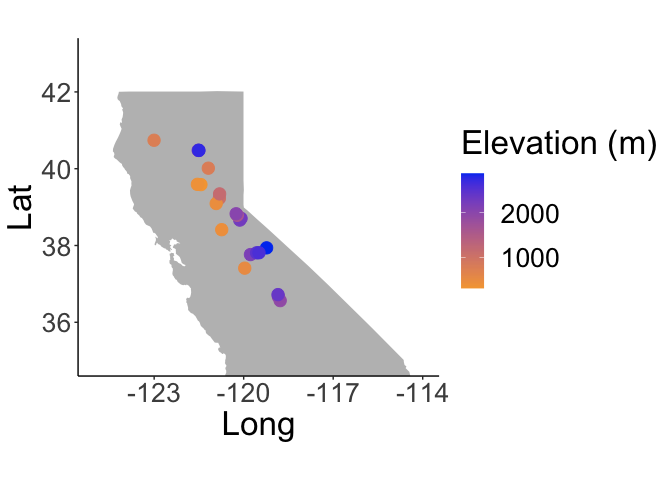<!-- -->

```r
#ggsave("../output/Pop_Map_NoLabels.png", width = 6, height = 4, units = "in")

#with labels 
ggplot() +
  geom_polygon(data = states, aes(x = long, y = lat, group = group), fill = "gray") +
  coord_quickmap(xlim = c(-125, -114), ylim = c(35, 43))+
  geom_point(data = pop_elev,
             aes(x = Long, y = Lat, color=elev_m),
             size = 4) +
  geom_text_repel(data = pop_elev,
         aes(x = Long, y = Lat,
             label = `parent.pop`),
         min.segment.length = 0,
         max.overlaps = 100,
        # label.padding = 1,
        # point.padding = 0.5,
         size = 4) +
  labs(x="Long", y="Lat", color="Elevation (m)") +
  scale_colour_gradient(low = "#F5A540", high = "#0043F0") +
  theme_classic() +
  theme(text=element_text(size=25))
```

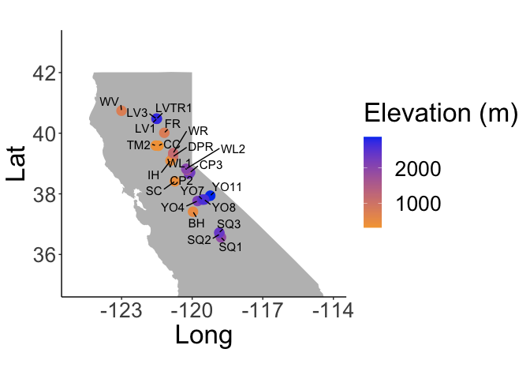<!-- -->

```r
#ggsave("../output/Pop_Map_Labels.png", width = 12, height = 8, units = "in")
```

## Elevation group changes


```r
names(pop_elev)
unique(pop_elev$parent.pop)
xtabs(~parent.pop+elevation.group, data = pop_elev)

pop_elev$elevation.group <- factor(pop_elev$elevation.group, levels=elev_order)
pop_elev %>% ggplot(aes(x=fct_reorder(parent.pop, elev_m), y=elev_m, fill=elevation.group)) + 
  geom_col(width = 0.7,position = position_dodge(0.75)) + 
  scale_y_continuous(expand = c(0, 0)) +
  scale_fill_manual(values=elev_three_palette) + 
  labs(title="New Elevation Classifications", x="Parent Populations", y= "Elevation (m)") + 
  theme_classic() +
  theme(text=element_text(size=20), axis.text.x = element_text(angle = 45,  hjust = 1))
ggsave("../output/Elevation_Class_New.png", width = 12, height = 6, units = "in")
```

# Climate Data (1895-2022)

-   aet (mm) = actual evapotranspiration (water transpired by plants, if
    water not limited)
-   cwd (mm) = climate water deficit (estimate of drought) = pet-aet
-   pck (mm) = snowpack (prior month pck + snow - lost snow)
-   pet (mm) = potential evapotranspiration (total amount of water that
    can evaporate from the ground or be transpired by plants)
-   ppt (mm) = precipitation
-   rch (mm) = recharge (water that penetrates below the root zone)
-   run (mm) = runoff (water that becomes streamflow)
-   str (mm) = soil water storage (avg amount of water stored in the
    soil annually)
-   all above are totals or sums per month
-   tmn (deg C) = min air temp (for a given month)
-   tmx (deg C) = max air temp (for a given month) 127 years

Notes

-   Did some lit review to see what variables other people have focused
    on or found to be significant (CWD, temp, precip, AET)

-   Temperature likely highly correlated within pops w/in years

    -   Take all variables (including avg temp) for the 3 months when we
        think germination is occurring (Low: Oct-Jan, Mid: Nov-Jan,
        High: April-June)?

    -   Decided to use growth season rather than germ season: Low:
        Oct-July, Mid: Nov-Aug, High: April-Sept

## Load the climate data


```r
climate_data <- read_csv("../input/Dimensions_All_1895-2022.csv")
```

```
## Rows: 225552 Columns: 13
## ── Column specification ────────────────────────────────────────────────────────
## Delimiter: ","
## chr  (1): pop
## dbl (12): year, month, aet, cwd, pck, pet, ppt, rch, run, str, tmn, tmx
## 
## ℹ Use `spec()` to retrieve the full column specification for this data.
## ℹ Specify the column types or set `show_col_types = FALSE` to quiet this message.
```

```r
head(climate_data)
```

```
## # A tibble: 6 × 13
##   pop     year month   aet   cwd   pck   pet   ppt   rch   run   str   tmn   tmx
##   <chr>  <dbl> <dbl> <dbl> <dbl> <dbl> <dbl> <dbl> <dbl> <dbl> <dbl> <dbl> <dbl>
## 1 CAAM-…  1895    10 25.8   62.8     0  88.6  6.78     0     0 108.   9.76  21.9
## 2 CAAM-…  1895    10 13.7   80.0     0  93.7  6.76     0     0  95.1  9.91  22.1
## 3 CAAM-…  1895    10  9.99  92.8     0 103.   6.59     0     0 129.   9.37  23.5
## 4 CAAM-…  1895    10 10.6   88.1     0  98.7 11.1      0     0 338.   9.30  23.1
## 5 CAAM-…  1895    10  8.85  90.6     0  99.4  6.29     0     0 103.   6.86  19.1
## 6 CAAM-…  1895    10 11.4   65.9     0  77.3  7.06     0     0 193.   4.45  15.9
```

```r
names(climate_data)
```

```
##  [1] "pop"   "year"  "month" "aet"   "cwd"   "pck"   "pet"   "ppt"   "rch"  
## [10] "run"   "str"   "tmn"   "tmx"
```

```r
unique(climate_data$pop)
```

```
##   [1] "CAAM-CC"    "CAAM-GB"    "CAAM-Oaks"  "CAAM-FMR"   "CAAM-IHC"  
##   [6] "CAAM-MB"    "CAAM-OCT"   "CAAN-BCB"   "CAAN1"      "CAAN2"     
##  [11] "CAAN-BCR"   "CAAN-BCT"   "CAAN-CV3"   "CAAN-CCMA"  "CAAN-GH"   
##  [16] "CAAN-UC"    "CAAN-SLSR"  "CACO1"      "CACO2"      "CACO3"     
##  [21] "CACO-GSE"   "CACO-OC"    "CACO-BC"    "CACO-Davis" "CACO-Oaks" 
##  [26] "CACO-BCR"   "CACO-ODR"   "CACO-SC"    "CAIN2"      "CAIN3"     
##  [31] "CAIN4"      "CAIN-395"   "CAIN-S-395" "CAIN-BCC"   "CAIN-BCR"  
##  [36] "CAIN-KJ"    "CAIN-MR"    "CAIN-SMR"   "STBR1"      "STBR2"     
##  [41] "STBR3"      "STBR-BCG"   "STBR-HC"    "STBR-LM"    "STBR-MPCH" 
##  [46] "STBR-MCH"   "STBR-MNJ"   "STBR-WR"    "STBR-M"     "STDI"      
##  [51] "STDI-HL"    "STDI-TM"    "STDR2"      "STDR-BR"    "STDR-45"   
##  [56] "STDR-P1"    "STDR-P2"    "STGL1"      "STGL2"      "STGL3"     
##  [61] "STGL-BCR"   "STGL-MH"    "STGL-AQSM"  "STGL-CR"    "STGL-CHM"  
##  [66] "STGL-KBR"   "STGL-MM"    "STGL-TFA"   "STGL-MRH"   "STGL-MHO"  
##  [71] "STGL-MMSP"  "STGL-MTSP"  "STGL-SG"    "STGL-SR"    "STIN"      
##  [76] "STIN-JM"    "STIN-TM"    "STPO1"      "STPO2"      "STPO3"     
##  [81] "STPO-LS"    "STPO-B"     "STPO-F"     "STPO-IHR"   "STPO-P"    
##  [86] "STPO-PU"    "STPO-R"     "STPO-RH"    "STPO-S"     "STPO-YH"   
##  [91] "BH"         "BB"         "BR"         "CC"         "CP1"       
##  [96] "CP2"        "CP3"        "CL"         "DP"         "DPR"       
## [101] "FR"         "GM"         "HH"         "HM"         "IH"        
## [106] "JB"         "KC1"        "KC2"        "KC3"        "LV1"       
## [111] "LV2"        "LV3"        "LVTR1"      "LVTR2"      "LVTR3"     
## [116] "MSH"        "PL"         "RHC"        "RB"         "RG"        
## [121] "SQ1"        "SQ2"        "SQ3"        "SH"         "SO"        
## [126] "SC"         "TM1"        "TM2"        "TFC"        "WR"        
## [131] "WV"         "WL1"        "WL2"        "WL3"        "WL4"       
## [136] "YOSE1"      "YOSE10"     "YOSE11"     "YOSE12"     "YOSE13"    
## [141] "YOSE2"      "YOSE3"      "YOSE4"      "YOSE5"      "YOSE6"     
## [146] "YOSE7"      "YOSE8"      "YOSE9"
```

```r
climate_data$year = as.character(climate_data$year)
head(climate_data)
```

```
## # A tibble: 6 × 13
##   pop    year  month   aet   cwd   pck   pet   ppt   rch   run   str   tmn   tmx
##   <chr>  <chr> <dbl> <dbl> <dbl> <dbl> <dbl> <dbl> <dbl> <dbl> <dbl> <dbl> <dbl>
## 1 CAAM-… 1895     10 25.8   62.8     0  88.6  6.78     0     0 108.   9.76  21.9
## 2 CAAM-… 1895     10 13.7   80.0     0  93.7  6.76     0     0  95.1  9.91  22.1
## 3 CAAM-… 1895     10  9.99  92.8     0 103.   6.59     0     0 129.   9.37  23.5
## 4 CAAM-… 1895     10 10.6   88.1     0  98.7 11.1      0     0 338.   9.30  23.1
## 5 CAAM-… 1895     10  8.85  90.6     0  99.4  6.29     0     0 103.   6.86  19.1
## 6 CAAM-… 1895     10 11.4   65.9     0  77.3  7.06     0     0 193.   4.45  15.9
```

```r
climate_data_yo <- climate_data %>% mutate(pop = str_replace(pop, "YOSE(\\d+)", "YO\\1")) #changing YOSE to YO 
#`(\\d+)`: This part contains a regular expression within parentheses: 
#`\\d`: Matches a digit (equivalent to `[0-9]`). 
#The double backslash `\\` is used to escape the `\` #character in R strings, so `\\d` is interpreted as `\d` in the regex, denoting a digit.
#`+`: This qualifier means "one or more of the preceding element," so `\\d+` will match one or more digits.
#`()`: Parentheses are used to define a capturing group, which means that the part of the regex within the parentheses `(\\d+)` is captured to be used in back-references or for extracting matched parts.
#\\1 references the first capturing group
unique(climate_data_yo$pop)
```

```
##   [1] "CAAM-CC"    "CAAM-GB"    "CAAM-Oaks"  "CAAM-FMR"   "CAAM-IHC"  
##   [6] "CAAM-MB"    "CAAM-OCT"   "CAAN-BCB"   "CAAN1"      "CAAN2"     
##  [11] "CAAN-BCR"   "CAAN-BCT"   "CAAN-CV3"   "CAAN-CCMA"  "CAAN-GH"   
##  [16] "CAAN-UC"    "CAAN-SLSR"  "CACO1"      "CACO2"      "CACO3"     
##  [21] "CACO-GSE"   "CACO-OC"    "CACO-BC"    "CACO-Davis" "CACO-Oaks" 
##  [26] "CACO-BCR"   "CACO-ODR"   "CACO-SC"    "CAIN2"      "CAIN3"     
##  [31] "CAIN4"      "CAIN-395"   "CAIN-S-395" "CAIN-BCC"   "CAIN-BCR"  
##  [36] "CAIN-KJ"    "CAIN-MR"    "CAIN-SMR"   "STBR1"      "STBR2"     
##  [41] "STBR3"      "STBR-BCG"   "STBR-HC"    "STBR-LM"    "STBR-MPCH" 
##  [46] "STBR-MCH"   "STBR-MNJ"   "STBR-WR"    "STBR-M"     "STDI"      
##  [51] "STDI-HL"    "STDI-TM"    "STDR2"      "STDR-BR"    "STDR-45"   
##  [56] "STDR-P1"    "STDR-P2"    "STGL1"      "STGL2"      "STGL3"     
##  [61] "STGL-BCR"   "STGL-MH"    "STGL-AQSM"  "STGL-CR"    "STGL-CHM"  
##  [66] "STGL-KBR"   "STGL-MM"    "STGL-TFA"   "STGL-MRH"   "STGL-MHO"  
##  [71] "STGL-MMSP"  "STGL-MTSP"  "STGL-SG"    "STGL-SR"    "STIN"      
##  [76] "STIN-JM"    "STIN-TM"    "STPO1"      "STPO2"      "STPO3"     
##  [81] "STPO-LS"    "STPO-B"     "STPO-F"     "STPO-IHR"   "STPO-P"    
##  [86] "STPO-PU"    "STPO-R"     "STPO-RH"    "STPO-S"     "STPO-YH"   
##  [91] "BH"         "BB"         "BR"         "CC"         "CP1"       
##  [96] "CP2"        "CP3"        "CL"         "DP"         "DPR"       
## [101] "FR"         "GM"         "HH"         "HM"         "IH"        
## [106] "JB"         "KC1"        "KC2"        "KC3"        "LV1"       
## [111] "LV2"        "LV3"        "LVTR1"      "LVTR2"      "LVTR3"     
## [116] "MSH"        "PL"         "RHC"        "RB"         "RG"        
## [121] "SQ1"        "SQ2"        "SQ3"        "SH"         "SO"        
## [126] "SC"         "TM1"        "TM2"        "TFC"        "WR"        
## [131] "WV"         "WL1"        "WL2"        "WL3"        "WL4"       
## [136] "YO1"        "YO10"       "YO11"       "YO12"       "YO13"      
## [141] "YO2"        "YO3"        "YO4"        "YO5"        "YO6"       
## [146] "YO7"        "YO8"        "YO9"
```

```r
#combine pop info with climate data
names(pop_elev)
```

```
## [1] "parent.pop"      "phylogroup"      "elevation.group" "UCD.seed.year"  
## [5] "Lat"             "Long"            "elev_m"
```

```r
names(climate_data_yo)
```

```
##  [1] "pop"   "year"  "month" "aet"   "cwd"   "pck"   "pet"   "ppt"   "rch"  
## [10] "run"   "str"   "tmn"   "tmx"
```

```r
pop_elev_climate <- left_join(pop_elev, climate_data_yo, by=c("parent.pop"="pop")) %>% select(parent.pop, elevation.group, elev_m, year:tmx)
unique(pop_elev_climate$parent.pop)
```

```
##  [1] "BH"    "CC"    "CP2"   "CP3"   "DPR"   "FR"    "IH"    "LV1"   "LV3"  
## [10] "LVTR1" "SC"    "SQ1"   "SQ2"   "SQ3"   "TM2"   "WL1"   "WL2"   "WR"   
## [19] "WV"    "YO11"  "YO4"   "YO7"   "YO8"
```

```r
#unique(pop_elev$parent.pop)
head(pop_elev_climate, 30)
```

```
## # A tibble: 30 × 15
##    parent.pop elevation.group elev_m year  month    aet   cwd   pck   pet
##    <chr>      <chr>            <dbl> <chr> <dbl>  <dbl> <dbl> <dbl> <dbl>
##  1 BH         Low               511. 1895     10   8.90  80.8     0  89.7
##  2 BH         Low               511. 1895     11   4.89  40.8     0  45.7
##  3 BH         Low               511. 1895     12   3.23  27.9     0  31.1
##  4 BH         Low               511. 1896      1   8.75  27.0     0  35.7
##  5 BH         Low               511. 1896      2   6.57  42.8     0  49.4
##  6 BH         Low               511. 1896      3  24.9   57.9     0  82.8
##  7 BH         Low               511. 1896      4  72.5   36.2     0 109. 
##  8 BH         Low               511. 1896      5 141.    11.6     0 153. 
##  9 BH         Low               511. 1896      6  90.7   96.2     0 187. 
## 10 BH         Low               511. 1896      7 133.    70.5     0 203. 
## # ℹ 20 more rows
## # ℹ 6 more variables: ppt <dbl>, rch <dbl>, run <dbl>, str <dbl>, tmn <dbl>,
## #   tmx <dbl>
```

```r
names(pop_elev_climate)
```

```
##  [1] "parent.pop"      "elevation.group" "elev_m"          "year"           
##  [5] "month"           "aet"             "cwd"             "pck"            
##  [9] "pet"             "ppt"             "rch"             "run"            
## [13] "str"             "tmn"             "tmx"
```

## Calculation of recent (last 30 years) and historical climate (prior 30 years)


```r
pop_elev_climate_recent <- pop_elev_climate %>% filter(year>1992) %>% select(parent.pop:month, cwd, pck, ppt, tmn, tmx)
head(pop_elev_climate_recent)
```

```
## # A tibble: 6 × 10
##   parent.pop elevation.group elev_m year  month   cwd   pck   ppt   tmn   tmx
##   <chr>      <chr>            <dbl> <chr> <dbl> <dbl> <dbl> <dbl> <dbl> <dbl>
## 1 BH         Low               511. 1993      1  25.6     0 289.   1.82  12.1
## 2 BH         Low               511. 1993      2  37.0     0 140.   3.29  13.8
## 3 BH         Low               511. 1993      3  46.0     0  89.9  7.11  18.3
## 4 BH         Low               511. 1993      4  71.2     0  12.8  6.01  19.8
## 5 BH         Low               511. 1993      5  73.7     0  12.9  9.38  25.7
## 6 BH         Low               511. 1993      6  35.7     0  33.6 11.2   29.2
```

```r
summary(pop_elev_climate_recent)
```

```
##   parent.pop        elevation.group        elev_m           year          
##  Length:8211        Length:8211        Min.   : 313.0   Length:8211       
##  Class :character   Class :character   1st Qu.: 748.9   Class :character  
##  Mode  :character   Mode  :character   Median :1934.5   Mode  :character  
##                                        Mean   :1649.7                     
##                                        3rd Qu.:2373.2                     
##                                        Max.   :2872.3                     
##      month             cwd              pck               ppt        
##  Min.   : 1.000   Min.   :  0.00   Min.   :   0.00   Min.   :  0.00  
##  1st Qu.: 3.000   1st Qu.: 25.52   1st Qu.:   0.00   1st Qu.:  7.13  
##  Median : 6.000   Median : 46.34   Median :   0.00   Median : 47.09  
##  Mean   : 6.462   Mean   : 56.08   Mean   : 132.07   Mean   : 97.82  
##  3rd Qu.: 9.000   3rd Qu.: 83.50   3rd Qu.:  87.27   3rd Qu.:141.94  
##  Max.   :12.000   Max.   :194.73   Max.   :2183.62   Max.   :981.42  
##       tmn               tmx       
##  Min.   :-13.180   Min.   :-3.22  
##  1st Qu.: -1.855   1st Qu.: 9.42  
##  Median :  3.530   Median :15.70  
##  Mean   :  3.585   Mean   :16.55  
##  3rd Qu.:  8.725   3rd Qu.:23.07  
##  Max.   : 21.350   Max.   :37.38
```

```r
xtabs(~parent.pop+month, data=pop_elev_climate_recent)
```

```
##           month
## parent.pop  1  2  3  4  5  6  7  8  9 10 11 12
##      BH    30 30 30 30 30 30 30 30 30 29 29 29
##      CC    30 30 30 30 30 30 30 30 30 29 29 29
##      CP2   30 30 30 30 30 30 30 30 30 29 29 29
##      CP3   30 30 30 30 30 30 30 30 30 29 29 29
##      DPR   30 30 30 30 30 30 30 30 30 29 29 29
##      FR    30 30 30 30 30 30 30 30 30 29 29 29
##      IH    30 30 30 30 30 30 30 30 30 29 29 29
##      LV1   30 30 30 30 30 30 30 30 30 29 29 29
##      LV3   30 30 30 30 30 30 30 30 30 29 29 29
##      LVTR1 30 30 30 30 30 30 30 30 30 29 29 29
##      SC    30 30 30 30 30 30 30 30 30 29 29 29
##      SQ1   30 30 30 30 30 30 30 30 30 29 29 29
##      SQ2   30 30 30 30 30 30 30 30 30 29 29 29
##      SQ3   30 30 30 30 30 30 30 30 30 29 29 29
##      TM2   30 30 30 30 30 30 30 30 30 29 29 29
##      WL1   30 30 30 30 30 30 30 30 30 29 29 29
##      WL2   30 30 30 30 30 30 30 30 30 29 29 29
##      WR    30 30 30 30 30 30 30 30 30 29 29 29
##      WV    30 30 30 30 30 30 30 30 30 29 29 29
##      YO11  30 30 30 30 30 30 30 30 30 29 29 29
##      YO4   30 30 30 30 30 30 30 30 30 29 29 29
##      YO7   30 30 30 30 30 30 30 30 30 29 29 29
##      YO8   30 30 30 30 30 30 30 30 30 29 29 29
```

```r
pop_elev_climate_historical <- pop_elev_climate %>% filter(year<=1992 & year>1962) %>% select(parent.pop:month, cwd, pck, ppt, tmn, tmx)
head(pop_elev_climate_historical, 13)
```

```
## # A tibble: 13 × 10
##    parent.pop elevation.group elev_m year  month   cwd   pck    ppt    tmn   tmx
##    <chr>      <chr>            <dbl> <chr> <dbl> <dbl> <dbl>  <dbl>  <dbl> <dbl>
##  1 BH         Low               511. 1963      1  28.1     0 109.   -1.85   12.3
##  2 BH         Low               511. 1963      2  43.8     0 139.    6.42   18.3
##  3 BH         Low               511. 1963      3  44.8     0 108.    2.5    15.9
##  4 BH         Low               511. 1963      4  37.1     0 144.    4.29   16.1
##  5 BH         Low               511. 1963      5  12.3     0  23.3   9.68   24.0
##  6 BH         Low               511. 1963      6  92.3     0   3.93 10.8    28.4
##  7 BH         Low               511. 1963      7 122.      0   0    12.6    33.2
##  8 BH         Low               511. 1963      8 139.      0   0    13.6    33.7
##  9 BH         Low               511. 1963      9 126.      0   6.82 13.9    31.8
## 10 BH         Low               511. 1963     10  86.9     0  42.1   9.44   24.8
## 11 BH         Low               511. 1963     11  40.8     0 133.    4.5    15.7
## 12 BH         Low               511. 1963     12  26.9     0   8.93 -0.160  10.1
## 13 BH         Low               511. 1964      1  28.1     0  65.8   0.520  11.4
```

## Snow Cover - Average across years (all months included)


```r
names(pop_elev_climate_recent)
```

```
##  [1] "parent.pop"      "elevation.group" "elev_m"          "year"           
##  [5] "month"           "cwd"             "pck"             "ppt"            
##  [9] "tmn"             "tmx"
```

```r
pop_elev_climate_recent %>% filter(year==2006) %>% ggplot(aes(x=month, y=pck, group=parent.pop, color=parent.pop)) + geom_point() + geom_line()
```

<!-- -->

```r
pop_elev_climate_recent %>% filter(year==2006) %>% ggplot(aes(x=month, y=pck, group=parent.pop, color=elevation.group)) + geom_point() + geom_line()
```

<!-- -->

```r
#average snowpack across entire year for 30-year period 
recent_climate_avgs <- pop_elev_climate_recent %>% group_by(parent.pop,elevation.group ,elev_m) %>% summarise_at(c("cwd", "pck", "ppt", "tmn", "tmx"), c(mean, sem), na.rm = TRUE) 
names(recent_climate_avgs) <- gsub("fn2", "sem", colnames(recent_climate_avgs))
names(recent_climate_avgs) <-gsub("fn1", "mean", colnames(recent_climate_avgs))
recent_climate_avgs #30 year averages
```

```
## # A tibble: 23 × 13
## # Groups:   parent.pop, elevation.group [23]
##    parent.pop elevation.group elev_m cwd_mean pck_mean ppt_mean tmn_mean
##    <chr>      <chr>            <dbl>    <dbl>    <dbl>    <dbl>    <dbl>
##  1 BH         Low               511.     75.9    0         47.8    8.88 
##  2 CC         Low               313      59.7    0         84.5   10.0  
##  3 CP2        High             2244.     63.1  206.       105.     1.17 
##  4 CP3        High             2266.     46.4  224.       100.     0.521
##  5 DPR        Mid              1019.     27.4    8.70     121.     7.86 
##  6 FR         Mid               787      56.0   19.0       82.3    5.36 
##  7 IH         Low               454.     49.1    0.184     88.7    8.67 
##  8 LV1        High             2593.     49.8  440.       147.    -1.38 
##  9 LV3        High             2354.     57.6  426.       146.    -1.36 
## 10 LVTR1      High             2741.     52.0  453.       152.    -1.58 
## # ℹ 13 more rows
## # ℹ 6 more variables: tmx_mean <dbl>, cwd_sem <dbl>, pck_sem <dbl>,
## #   ppt_sem <dbl>, tmn_sem <dbl>, tmx_sem <dbl>
```

```r
recent_climate_avgs$elevation.group <- factor(recent_climate_avgs$elevation.group, levels=elev_order)
recent_snwpck <- recent_climate_avgs %>% ggplot(aes(x=fct_reorder(parent.pop, pck_mean), y=pck_mean, fill=elevation.group)) + 
  geom_col(width = 0.7,position = position_dodge(0.75)) +
  geom_errorbar(aes(ymin=pck_mean-pck_sem,ymax=pck_mean+pck_sem),width=.2, position = 
                  position_dodge(0.75)) +
  scale_y_continuous(expand = c(0, 0)) +
  scale_fill_manual(values=elev_three_palette) + 
  #scale_fill_gradient(low = "#F5A540", high = "#0043F0") +
  labs(x="Population", y="Avg SnwPck (mm)" ,title = "Recent Climate") +
   theme_classic() +
  theme(text=element_text(size=20), axis.text.x = element_text(angle = 45,  hjust = 1))
recent_snwpck
```

<!-- -->

```r
#ggsave("../output/Climate/All_Year_Avg_PCK_RecentClim.png", width = 12, height = 6, units = "in")

historical_climate_avgs <- pop_elev_climate_historical %>% group_by(parent.pop, elevation.group ,elev_m) %>% summarise_at(c("cwd", "pck", "ppt", "tmn", "tmx"), c(mean, sem), na.rm = TRUE) 
names(historical_climate_avgs) <- gsub("fn2", "sem", colnames(historical_climate_avgs))
names(historical_climate_avgs) <-gsub("fn1", "mean", colnames(historical_climate_avgs))
historical_climate_avgs #30 year averages
```

```
## # A tibble: 23 × 13
## # Groups:   parent.pop, elevation.group [23]
##    parent.pop elevation.group elev_m cwd_mean pck_mean ppt_mean tmn_mean
##    <chr>      <chr>            <dbl>    <dbl>    <dbl>    <dbl>    <dbl>
##  1 BH         Low               511.     74.4   0.0195     48.4    7.70 
##  2 CC         Low               313      59.9   0.0793     81.2    8.89 
##  3 CP2        High             2244.     60.2 258.        111.    -0.323
##  4 CP3        High             2266.     43.6 277.        107.    -0.866
##  5 DPR        Mid              1019.     26.5  18.6       120.     6.21 
##  6 FR         Mid               787      54.8  20.9        81.5    4.16 
##  7 IH         Low               454.     50.3   1.46       87.9    7.66 
##  8 LV1        High             2593.     46.6 504.        149.    -3.46 
##  9 LV3        High             2354.     54.6 487.        148.    -3.47 
## 10 LVTR1      High             2741.     49.3 523.        154.    -3.61 
## # ℹ 13 more rows
## # ℹ 6 more variables: tmx_mean <dbl>, cwd_sem <dbl>, pck_sem <dbl>,
## #   ppt_sem <dbl>, tmn_sem <dbl>, tmx_sem <dbl>
```

```r
historical_climate_avgs$elevation.group <- factor(historical_climate_avgs$elevation.group, levels=elev_order)
hist_snwpck <- historical_climate_avgs %>% ggplot(aes(x=fct_reorder(parent.pop, pck_mean), y=pck_mean, fill=elevation.group)) + 
  geom_col(width = 0.7,position = position_dodge(0.75)) +
  geom_errorbar(aes(ymin=pck_mean-pck_sem,ymax=pck_mean+pck_sem),width=.2, position = 
                  position_dodge(0.75)) +
  scale_y_continuous(expand = c(0, 0)) +
  scale_fill_manual(values=elev_three_palette) + 
  #scale_fill_gradient(low = "#F5A540", high = "#0043F0") +
  labs(x="Population", y="Avg SnwPck (mm)" ,title = "Historical Climate") +
   theme_classic() +
  theme(text=element_text(size=20), axis.text.x = element_text(angle = 45,  hjust = 1))
hist_snwpck
```

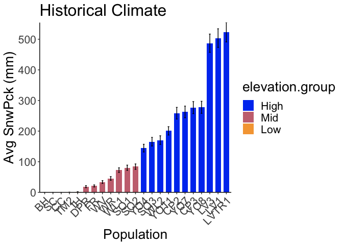<!-- -->

```r
#ggsave("../output/Climate/All_Year_Avg_PCK_HistoricalClim.png", width = 8, height = 4, units = "in")

legend <- get_legend(hist_snwpck)
hist_snwpck <- hist_snwpck + theme(legend.position="none")
recent_snwpck <- recent_snwpck + theme(legend.position="none")
grid.arrange(hist_snwpck, recent_snwpck, legend, ncol=3, widths=c(3.12, 3.12, 1.09))
```

<!-- -->

## Consistency of winter snow cover


```r
#monthly_pck <- pop_elev_climate_recent %>% filter(parent.pop==c("DPR","WR","WL1", "SQ1", "SQ2", "WL2", "YO4")) %>% group_by(parent.pop, elev_m, month) %>%
 # summarise(pck_mean=mean(pck), pck_sem=sem(pck))
#monthly_pck$parent.pop <- factor(monthly_pck$parent.pop, levels=c("DPR","WR","WL1", "SQ1", "SQ2", "WL2", "YO4"))

monthly_pck <- pop_elev_climate_recent %>% 
  filter(parent.pop==c("WL1", "SQ1", "SQ2", "WL2", "YO4")) %>% 
  group_by(parent.pop, elev_m, month) %>%
  summarise(pck_mean=mean(pck), pck_sem=sem(pck))
```

```
## Warning: There was 1 warning in `filter()`.
## ℹ In argument: `parent.pop == c("WL1", "SQ1", "SQ2", "WL2", "YO4")`.
## Caused by warning in `parent.pop == c("WL1", "SQ1", "SQ2", "WL2", "YO4")`:
## ! longer object length is not a multiple of shorter object length
```

```
## `summarise()` has grouped output by 'parent.pop', 'elev_m'. You can override
## using the `.groups` argument.
```

```r
monthly_pck$parent.pop <- factor(monthly_pck$parent.pop, levels=c("WL1", "SQ1", "SQ2", "WL2", "YO4"))
monthly_pck
```

```
## # A tibble: 60 × 5
## # Groups:   parent.pop, elev_m [5]
##    parent.pop elev_m month pck_mean pck_sem
##    <fct>       <dbl> <dbl>    <dbl>   <dbl>
##  1 SQ1         1921.     1    128.     51.0
##  2 SQ1         1921.     2    208.    102. 
##  3 SQ1         1921.     3     96.3    66.8
##  4 SQ1         1921.     4     62.5    35.3
##  5 SQ1         1921.     5     23.2    23.2
##  6 SQ1         1921.     6      0       0  
##  7 SQ1         1921.     7      0       0  
##  8 SQ1         1921.     8      0       0  
##  9 SQ1         1921.     9      0       0  
## 10 SQ1         1921.    10      0       0  
## # ℹ 50 more rows
```

```r
monthly_pck %>% ggplot(aes(x=month, y=pck_mean, group=parent.pop, fill=parent.pop)) + 
  geom_col(width = 0.7,position = position_dodge(0.75)) +
  geom_errorbar(aes(ymin=pck_mean-pck_sem,ymax=pck_mean+pck_sem),width=.2, position=position_dodge(0.75)) +
  labs(title="Recent Climate", y="Avg SnwPck (mm)")  + 
  scale_y_continuous(expand = c(0, 0)) +
  scale_x_continuous(breaks=c(1, 2, 3, 4, 5,6,7,8,9,10, 11, 12)) +
  theme_classic() + 
  theme(text=element_text(size=30))
```

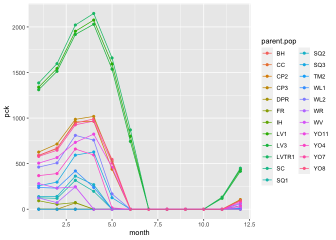<!-- -->

```r
#ggsave("../output/Climate/Monthly_Avg_PCK_RecnetClim.png", width = 14, height = 6, units = "in")

#check even higher elevation
monthly_pck_high_elev <- pop_elev_climate_recent %>% 
  filter(elev_m>2200) %>%
  group_by(parent.pop, elev_m, month) %>%
  summarise(pck_mean=mean(pck), pck_sem=sem(pck))
```

```
## `summarise()` has grouped output by 'parent.pop', 'elev_m'. You can override
## using the `.groups` argument.
```

```r
monthly_pck_high_elev$parent.pop <- factor(monthly_pck_high_elev$parent.pop, levels=c("CP2", "CP3", "LV3", "SQ3", "YO7","YO8", "LV1", "LVTR1", "YO11"))

monthly_pck_high_elev %>% ggplot(aes(x=month, y=pck_mean, group=parent.pop, fill=parent.pop)) + 
  geom_col(width = 0.7,position = position_dodge(0.75)) +
  geom_errorbar(aes(ymin=pck_mean-pck_sem,ymax=pck_mean+pck_sem),width=.2, position=position_dodge(0.75)) +
  labs(title="Recent Climate", y="Avg SnwPck (mm)")  + 
  scale_y_continuous(expand = c(0, 0)) +
  scale_x_continuous(breaks=c(1, 2, 3, 4, 5,6,7,8,9,10, 11, 12)) +
  theme_classic() + 
  theme(text=element_text(size=30))
```

<!-- -->

```r
#ggsave("../output/Climate/Monthly_Avg_PCK_HIGHELEV_RecnetClim.png", width = 14, height = 6, units = "in")
```

## CWD Across the Year


```r
names(pop_elev_climate_recent)
```

```
##  [1] "parent.pop"      "elevation.group" "elev_m"          "year"           
##  [5] "month"           "cwd"             "pck"             "ppt"            
##  [9] "tmn"             "tmx"
```

```r
monthly_cwd <- pop_elev_climate_recent %>% 
  group_by(parent.pop, elev_m, month) %>%
  summarise(cwd_mean=mean(cwd), pck_sem=sem(cwd))
```

```
## `summarise()` has grouped output by 'parent.pop', 'elev_m'. You can override
## using the `.groups` argument.
```

```r
monthly_cwd
```

```
## # A tibble: 276 × 5
## # Groups:   parent.pop, elev_m [23]
##    parent.pop elev_m month cwd_mean pck_sem
##    <chr>       <dbl> <dbl>    <dbl>   <dbl>
##  1 BH           511.     1     29.4   0.431
##  2 BH           511.     2     41.0   0.497
##  3 BH           511.     3     54.2   1.55 
##  4 BH           511.     4     59.0   2.91 
##  5 BH           511.     5     51.4   5.36 
##  6 BH           511.     6     87.3   5.47 
##  7 BH           511.     7    138.    3.94 
##  8 BH           511.     8    154.    3.31 
##  9 BH           511.     9    130.    1.09 
## 10 BH           511.    10     88.9   0.551
## # ℹ 266 more rows
```

```r
monthly_cwd %>% #low elev
  filter(elev_m<520) %>% 
  ggplot(aes(x=month, y=cwd_mean)) +
  geom_line() +
  scale_x_continuous(breaks=c(1, 2, 3, 4, 5,6,7,8,9,10, 11, 12)) +
  theme_classic() +
  facet_wrap(~parent.pop)
```

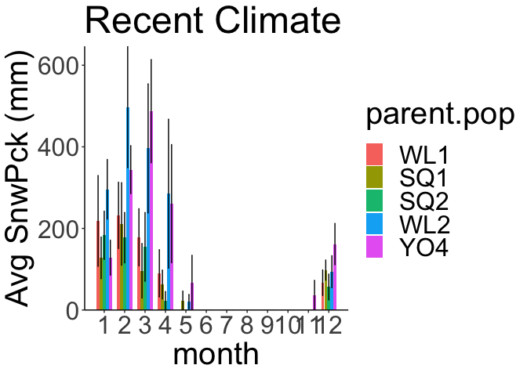<!-- -->

```r
monthly_cwd %>% #mid elev
  filter(elev_m>520, elev_m<1940) %>% 
  ggplot(aes(x=month, y=cwd_mean)) +
  geom_line() +
  scale_x_continuous(breaks=c(1, 2, 3, 4, 5,6,7,8,9,10, 11, 12)) +
  theme_classic() +
  facet_wrap(~parent.pop)
```

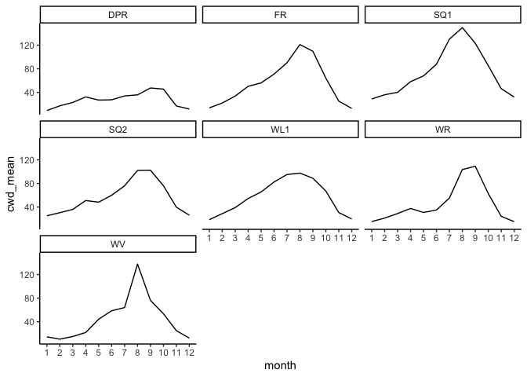<!-- -->

```r
monthly_cwd %>% #high elev
  filter(elev_m>1940) %>% 
  ggplot(aes(x=month, y=cwd_mean)) +
  geom_line() +
  scale_x_continuous(breaks=c(1, 2, 3, 4, 5,6,7,8,9,10, 11, 12)) +
  theme_classic() +
  facet_wrap(~parent.pop)
```

<!-- -->


## Growth Season by snow/rain 
First month with no snow pack or w/ significant rain as start of growth season
First month with snow pack or w/ significant CWD as end of growth season 

### Averages and Preliminary Calcs
Recent climate 

```r
head(pop_elev_climate_recent)
```

```
## # A tibble: 6 × 10
##   parent.pop elevation.group elev_m year  month   cwd   pck   ppt   tmn   tmx
##   <chr>      <chr>            <dbl> <chr> <dbl> <dbl> <dbl> <dbl> <dbl> <dbl>
## 1 BH         Low               511. 1993      1  25.6     0 289.   1.82  12.1
## 2 BH         Low               511. 1993      2  37.0     0 140.   3.29  13.8
## 3 BH         Low               511. 1993      3  46.0     0  89.9  7.11  18.3
## 4 BH         Low               511. 1993      4  71.2     0  12.8  6.01  19.8
## 5 BH         Low               511. 1993      5  73.7     0  12.9  9.38  25.7
## 6 BH         Low               511. 1993      6  35.7     0  33.6 11.2   29.2
```

```r
pop_elev_climate_recent %>% filter(ppt == 0) #months 7-10 usually have ppt = 0 for low elev 
```

```
## # A tibble: 553 × 10
##    parent.pop elevation.group elev_m year  month   cwd   pck   ppt   tmn   tmx
##    <chr>      <chr>            <dbl> <chr> <dbl> <dbl> <dbl> <dbl> <dbl> <dbl>
##  1 BH         Low               511. 1993      7 128.      0     0 15.0   32.9
##  2 BH         Low               511. 1993      8 145.      0     0 14.8   33.2
##  3 BH         Low               511. 1993      9 128.      0     0 12.7   31.9
##  4 BH         Low               511. 1994      7 174.      0     0 17.3   35.8
##  5 BH         Low               511. 1994      8 180.      0     0 16.3   35.5
##  6 BH         Low               511. 1995     10  92.1     0     0  9.55  27.6
##  7 BH         Low               511. 1996      9 132.      0     0 12.2   31.0
##  8 BH         Low               511. 1997      8 155.      0     0 16.3   33.7
##  9 BH         Low               511. 1998      8 137       0     0 17.0   35.7
## 10 BH         Low               511. 1999      7 120.      0     0 15     33.8
## # ℹ 543 more rows
```

```r
pop_elev_climate_recent %>% filter(pck >0, ppt == 0) #in sequoia pops, 2022, ppt=0, but there was still snowpack in January 
```

```
## # A tibble: 3 × 10
##   parent.pop elevation.group elev_m year  month   cwd   pck   ppt    tmn   tmx
##   <chr>      <chr>            <dbl> <chr> <dbl> <dbl> <dbl> <dbl>  <dbl> <dbl>
## 1 SQ1        Mid              1921. 2022      1  32.1  71.3     0  0.290  9.51
## 2 SQ2        Mid              1934. 2022      1  27.6  98.0     0 -0.150  9.66
## 3 SQ3        High             2373. 2022      1  32.5 236.      0 -2.07   8.38
```

```r
pop_elev_climate_recent %>% filter(ppt > 0, tmx<1.5) %>% arrange(pck) #if the temp is less than 1.5 (Flint's criteria for snowfall) and there is precipitation then pck > 0
```

```
## # A tibble: 163 × 10
##    parent.pop elevation.group elev_m year  month   cwd   pck   ppt    tmn   tmx
##    <chr>      <chr>            <dbl> <chr> <dbl> <dbl> <dbl> <dbl>  <dbl> <dbl>
##  1 YO11       High             2872. 2001      1  19.0  98.1  91.4 -11.6  1.08 
##  2 YO11       High             2872. 1997     12  16.9 106.   69.8 -11.5  0.150
##  3 YO11       High             2872. 2007     12  17.8 107.  114.  -10.3  0.870
##  4 YO11       High             2872. 2009     12  18.1 140.  146.  -10.3  1.47 
##  5 YO11       High             2872. 2019     12  18.7 146.  153.   -7.92 0.590
##  6 YO11       High             2872. 1994     11  16.7 191.  198.  -11.1  0.330
##  7 LV3        High             2354. 2007     12  15.8 194.  200.   -8.33 0.300
##  8 LV1        High             2593. 2007     12  12.2 198.  204.   -8.54 0.340
##  9 LVTR1      High             2741. 2007     12  13.5 205.  211.   -8.72 0.25 
## 10 LV3        High             2354. 2009     12  15.6 210.  186.   -9.76 1.30 
## # ℹ 153 more rows
```

```r
#first calculate 30 year monthly averages for pck and ppt 
#if snowpack = 0 all year, then use rain as metric 

pop_elev_climate_recent_avgs <- pop_elev_climate_recent %>% group_by(parent.pop, elevation.group, elev_m, month) %>% summarise_at(c("cwd", "pck", "ppt", "tmn", "tmx"), c(mean, sem), na.rm = TRUE)
names(pop_elev_climate_recent_avgs) <- gsub("fn2", "sem", colnames(pop_elev_climate_recent_avgs))
names(pop_elev_climate_recent_avgs) <-gsub("fn1", "mean", colnames(pop_elev_climate_recent_avgs))
pop_elev_climate_recent_avgs #30 year averages per month for each pop
```

```
## # A tibble: 276 × 14
## # Groups:   parent.pop, elevation.group, elev_m [23]
##    parent.pop elevation.group elev_m month cwd_mean pck_mean ppt_mean tmn_mean
##    <chr>      <chr>            <dbl> <dbl>    <dbl>    <dbl>    <dbl>    <dbl>
##  1 BH         Low               511.     1     29.4        0  124.        2.75
##  2 BH         Low               511.     2     41.0        0   94.7       3.38
##  3 BH         Low               511.     3     54.2        0   84.0       4.92
##  4 BH         Low               511.     4     59.0        0   48.6       6.35
##  5 BH         Low               511.     5     51.4        0   23.1       9.70
##  6 BH         Low               511.     6     87.3        0    7.37     13.5 
##  7 BH         Low               511.     7    138.         0    0.280    17.3 
##  8 BH         Low               511.     8    154.         0    0.616    16.9 
##  9 BH         Low               511.     9    130.         0    3.69     14.3 
## 10 BH         Low               511.    10     88.9        0   29.1       9.46
## # ℹ 266 more rows
## # ℹ 6 more variables: tmx_mean <dbl>, cwd_sem <dbl>, pck_sem <dbl>,
## #   ppt_sem <dbl>, tmn_sem <dbl>, tmx_sem <dbl>
```

```r
pop_elev_climate_recent_avgs <- pop_elev_climate_recent_avgs %>% mutate(PckSum=sum(pck_mean)) #estimate of average total snowpack in a year 
pop_elev_climate_recent_avgs %>% arrange(PckSum)
```

```
## # A tibble: 276 × 15
## # Groups:   parent.pop, elevation.group, elev_m [23]
##    parent.pop elevation.group elev_m month cwd_mean pck_mean ppt_mean tmn_mean
##    <chr>      <chr>            <dbl> <dbl>    <dbl>    <dbl>    <dbl>    <dbl>
##  1 BH         Low               511.     1     29.4        0  124.        2.75
##  2 BH         Low               511.     2     41.0        0   94.7       3.38
##  3 BH         Low               511.     3     54.2        0   84.0       4.92
##  4 BH         Low               511.     4     59.0        0   48.6       6.35
##  5 BH         Low               511.     5     51.4        0   23.1       9.70
##  6 BH         Low               511.     6     87.3        0    7.37     13.5 
##  7 BH         Low               511.     7    138.         0    0.280    17.3 
##  8 BH         Low               511.     8    154.         0    0.616    16.9 
##  9 BH         Low               511.     9    130.         0    3.69     14.3 
## 10 BH         Low               511.    10     88.9        0   29.1       9.46
## # ℹ 266 more rows
## # ℹ 7 more variables: tmx_mean <dbl>, cwd_sem <dbl>, pck_sem <dbl>,
## #   ppt_sem <dbl>, tmn_sem <dbl>, tmx_sem <dbl>, PckSum <dbl>
```

```r
#Exploratory filters
pop_elev_climate_recent %>% filter(parent.pop=="SC") %>% filter(year==2016 | year==2017) #snow pack in Jan 2017
```

```
## # A tibble: 24 × 10
##    parent.pop elevation.group elev_m year  month   cwd   pck     ppt   tmn   tmx
##    <chr>      <chr>            <dbl> <chr> <dbl> <dbl> <dbl>   <dbl> <dbl> <dbl>
##  1 SC         Low               422. 2016      1  20.2     0 2.12e+2  4.03  12.0
##  2 SC         Low               422. 2016      2  34.6     0 3.34e+1  5.05  17.7
##  3 SC         Low               422. 2016      3  30.6     0 2.23e+2  6.17  16.9
##  4 SC         Low               422. 2016      4  37.5     0 7.73e+1  7.82  20.6
##  5 SC         Low               422. 2016      5  69.0     0 1.22e+1  9.81  24.1
##  6 SC         Low               422. 2016      6  94.8     0 0       13.2   31.8
##  7 SC         Low               422. 2016      7 142.      0 0       14.6   33.8
##  8 SC         Low               422. 2016      8 159.      0 3.00e-2 15.1   33.2
##  9 SC         Low               422. 2016      9 126.      0 0       12.8   29.8
## 10 SC         Low               422. 2016     10  80.1     0 1.83e+2  9.38  22.4
## # ℹ 14 more rows
```

```r
pop_elev_climate_recent %>% filter(parent.pop=="IH") %>% filter(pck >0) #snow pack in Jan 1993 & 2017 and Feb 2019
```

```
## # A tibble: 3 × 10
##   parent.pop elevation.group elev_m year  month   cwd   pck   ppt   tmn   tmx
##   <chr>      <chr>            <dbl> <chr> <dbl> <dbl> <dbl> <dbl> <dbl> <dbl>
## 1 IH         Low               454. 1993      1  15.6  5.34  364.  1.72 11.2 
## 2 IH         Low               454. 2017      1  15.6 18.0   495.  2.31 10.2 
## 3 IH         Low               454. 2019      2  19.9 42.3   429.  1.60  9.46
```

```r
pop_elev_climate_recent %>% filter(parent.pop=="SQ3") %>% filter(pck==0, ppt < 10) #high elev pops get very little rain and high cwd during growth season ...
```

```
## # A tibble: 105 × 10
##    parent.pop elevation.group elev_m year  month   cwd   pck    ppt   tmn   tmx
##    <chr>      <chr>            <dbl> <chr> <dbl> <dbl> <dbl>  <dbl> <dbl> <dbl>
##  1 SQ3        High             2373. 1993      7  88.3     0 0.0200  7.11  20.9
##  2 SQ3        High             2373. 1993      8  89.4     0 3.48    8.38  22.2
##  3 SQ3        High             2373. 1993      9  91.6     0 0.100   7.45  20.3
##  4 SQ3        High             2373. 1994      6  95.1     0 0.0100  6.79  19.9
##  5 SQ3        High             2373. 1994      7 114.      0 6.24   10.3   23.9
##  6 SQ3        High             2373. 1994      8 126.      0 0.300  11.8   24.4
##  7 SQ3        High             2373. 1995      7  90.6     0 5.44    8.69  21.7
##  8 SQ3        High             2373. 1995      8  85.1     0 0.200   9.25  22.9
##  9 SQ3        High             2373. 1995      9  84.2     0 0.340   4.96  20.6
## 10 SQ3        High             2373. 1995     10  77.1     0 0       5.18  17.2
## # ℹ 95 more rows
```

Historical climate 

```r
pop_elev_climate_historical_avgs <- pop_elev_climate_historical %>% group_by(parent.pop, elevation.group, elev_m, month) %>% summarise_at(c("cwd", "pck", "ppt", "tmn", "tmx"), c(mean, sem), na.rm = TRUE)
names(pop_elev_climate_historical_avgs) <- gsub("fn2", "sem", colnames(pop_elev_climate_historical_avgs))
names(pop_elev_climate_historical_avgs) <-gsub("fn1", "mean", colnames(pop_elev_climate_historical_avgs))
pop_elev_climate_historical_avgs #30 year averages per month for each pop
```

```
## # A tibble: 276 × 14
## # Groups:   parent.pop, elevation.group, elev_m [23]
##    parent.pop elevation.group elev_m month cwd_mean pck_mean ppt_mean tmn_mean
##    <chr>      <chr>            <dbl> <dbl>    <dbl>    <dbl>    <dbl>    <dbl>
##  1 BH         Low               511.     1     28.1    0.234    97.8      1.34
##  2 BH         Low               511.     2     40.6    0        92.1      2.86
##  3 BH         Low               511.     3     51.2    0       102.       3.89
##  4 BH         Low               511.     4     61.1    0        50.8      5.52
##  5 BH         Low               511.     5     61.4    0        12.9      8.84
##  6 BH         Low               511.     6     89.4    0         4.74    12.4 
##  7 BH         Low               511.     7    126.     0         2.09    15.5 
##  8 BH         Low               511.     8    149.     0         1.82    15.2 
##  9 BH         Low               511.     9    127.     0        10.4     12.7 
## 10 BH         Low               511.    10     87.2    0        32.8      8.45
## # ℹ 266 more rows
## # ℹ 6 more variables: tmx_mean <dbl>, cwd_sem <dbl>, pck_sem <dbl>,
## #   ppt_sem <dbl>, tmn_sem <dbl>, tmx_sem <dbl>
```

```r
pop_elev_climate_historical_avgs <- pop_elev_climate_historical_avgs %>% mutate(PckSum=sum(pck_mean)) #estimate of average total snowpack in a year 
pop_elev_climate_historical_avgs %>% arrange(PckSum) #IH PckSum = 17...
```

```
## # A tibble: 276 × 15
## # Groups:   parent.pop, elevation.group, elev_m [23]
##    parent.pop elevation.group elev_m month cwd_mean pck_mean ppt_mean tmn_mean
##    <chr>      <chr>            <dbl> <dbl>    <dbl>    <dbl>    <dbl>    <dbl>
##  1 BH         Low               511.     1     28.1    0.234    97.8      1.34
##  2 BH         Low               511.     2     40.6    0        92.1      2.86
##  3 BH         Low               511.     3     51.2    0       102.       3.89
##  4 BH         Low               511.     4     61.1    0        50.8      5.52
##  5 BH         Low               511.     5     61.4    0        12.9      8.84
##  6 BH         Low               511.     6     89.4    0         4.74    12.4 
##  7 BH         Low               511.     7    126.     0         2.09    15.5 
##  8 BH         Low               511.     8    149.     0         1.82    15.2 
##  9 BH         Low               511.     9    127.     0        10.4     12.7 
## 10 BH         Low               511.    10     87.2    0        32.8      8.45
## # ℹ 266 more rows
## # ℹ 7 more variables: tmx_mean <dbl>, cwd_sem <dbl>, pck_sem <dbl>,
## #   ppt_sem <dbl>, tmn_sem <dbl>, tmx_sem <dbl>, PckSum <dbl>
```

```r
#Exploratory filters
pop_elev_climate_historical %>% filter(parent.pop=="BH") %>% filter(pck >0) #snow pack in Jan 1982
```

```
## # A tibble: 1 × 10
##   parent.pop elevation.group elev_m year  month   cwd   pck   ppt   tmn   tmx
##   <chr>      <chr>            <dbl> <chr> <dbl> <dbl> <dbl> <dbl> <dbl> <dbl>
## 1 BH         Low               511. 1982      1  24.3  7.02  203. 0.400  10.9
```

```r
pop_elev_climate_historical %>% filter(parent.pop=="SC") %>% filter(pck >0) #snow pack in Jan 1973 and 1982
```

```
## # A tibble: 2 × 10
##   parent.pop elevation.group elev_m year  month   cwd   pck   ppt   tmn   tmx
##   <chr>      <chr>            <dbl> <chr> <dbl> <dbl> <dbl> <dbl> <dbl> <dbl>
## 1 SC         Low               422. 1973      1  19.1  2.94  273. 1.21   11.0
## 2 SC         Low               422. 1982      1  18.6 15.0   209. 0.120  10.3
```

```r
pop_elev_climate_historical %>% filter(parent.pop=="CC") %>% filter(pck >0) #snow pack in Jan 1969 and 1973
```

```
## # A tibble: 2 × 10
##   parent.pop elevation.group elev_m year  month   cwd   pck   ppt   tmn   tmx
##   <chr>      <chr>            <dbl> <chr> <dbl> <dbl> <dbl> <dbl> <dbl> <dbl>
## 1 CC         Low                313 1969      1  16.7 21.4   415.  1.85  10.4
## 2 CC         Low                313 1973      1  16.8  7.10  358.  1.68  10.9
```

```r
pop_elev_climate_historical %>% filter(parent.pop=="TM2") %>% filter(pck >0) #snow pack in Dec '68, Jan-Feb '69, Dec '71, Dec '72, Jan '73, Jan '82
```

```
## # A tibble: 7 × 10
##   parent.pop elevation.group elev_m year  month   cwd   pck   ppt    tmn   tmx
##   <chr>      <chr>            <dbl> <chr> <dbl> <dbl> <dbl> <dbl>  <dbl> <dbl>
## 1 TM2        Low               379. 1968     12 10.3   6.04  263.  0.930 10.1 
## 2 TM2        Low               379. 1969      1  3.81 61.4   464.  1.49  10.0 
## 3 TM2        Low               379. 1969      2  0    30.5   312.  2.34  10.2 
## 4 TM2        Low               379. 1971     12 17.2   3.88  199.  0.340  9.62
## 5 TM2        Low               379. 1972     12 10.1  11.4   153. -0.390  8.63
## 6 TM2        Low               379. 1973      1  4.85 47.9   388.  1.27  10.4 
## 7 TM2        Low               379. 1982      1  3.91  2.98  201.  0.800  9.66
```

```r
pop_elev_climate_historical %>% filter(parent.pop=="IH") %>% filter(pck >0) #snow pack in Dec '68, Jan-Feb '69, Dec '70, Dec '71, Jan & Dec '72, Jan-Feb '73, Jan '79
```

```
## # A tibble: 12 × 10
##    parent.pop elevation.group elev_m year  month   cwd     pck   ppt     tmn
##    <chr>      <chr>            <dbl> <chr> <dbl> <dbl>   <dbl> <dbl>   <dbl>
##  1 IH         Low               454. 1968     12  16.5  17.8   230.  -0.0800
##  2 IH         Low               454. 1969      1  15.3 107.    529.   1.05  
##  3 IH         Low               454. 1969      2  19.7 129.    301.   1.14  
##  4 IH         Low               454. 1970     12  16.6  27.9   345.   1.58  
##  5 IH         Low               454. 1971     12  17.4  59.3   262.  -0.370 
##  6 IH         Low               454. 1972      1  18.3  19.6    81.1 -0.0200
##  7 IH         Low               454. 1972     12  17.1  20.4   143.  -1.83  
##  8 IH         Low               454. 1973      1  14.9 105.    381.   0.0800
##  9 IH         Low               454. 1973      2  21.6   0.480 247.   3.5   
## 10 IH         Low               454. 1979      1  17.4   4.82  227.   0.5   
## 11 IH         Low               454. 1982      1  14.9  29.3   229.  -0.220 
## 12 IH         Low               454. 1992     12  18.8   4.13  301.   0.860 
## # ℹ 1 more variable: tmx <dbl>
```

```r
#could just say that the cut offs for snowpack and cwd are based on recent climate 
#but in years when snowpack was in Dec and Jan, does that mean that anything that germinated in the Fall died?
```


### For each year separately

-   Populations that get less than 10 mm of snow pack in a year (on average): growth season = when there is no snowpack + significant rain event (> 10 mm) or lower cwd (< 88). CWD = 88 = 3rd quartile of the cwd_mean for these pops.
  -   Note: for historical climate, I had to change it to less than 20 mm of snow pack in a year (on average) to maintain the population classifications (low vs. mid/high). But maybe I should leave it the same and say that IH behaved more like a mid elevation population in the past?
  -   Note: the 3rd quartile of the cwd_mean for the historical climate is 86, should I change the CWD cut off criteria for the historical climate calcs?

Recent Climate

```r
nosnow_pops_recent <- pop_elev_climate_recent_avgs %>% filter(PckSum < 10)
unique(nosnow_pops_recent$parent.pop)
```

```
## [1] "BH"  "CC"  "IH"  "SC"  "TM2"
```

```r
summary(nosnow_pops_recent)
```

```
##   parent.pop        elevation.group        elev_m          month      
##  Length:60          Length:60          Min.   :313.0   Min.   : 1.00  
##  Class :character   Class :character   1st Qu.:379.2   1st Qu.: 3.75  
##  Mode  :character   Mode  :character   Median :421.5   Median : 6.50  
##                                        Mean   :415.8   Mean   : 6.50  
##                                        3rd Qu.:454.1   3rd Qu.: 9.25  
##                                        Max.   :511.4   Max.   :12.00  
##     cwd_mean         pck_mean          ppt_mean          tmn_mean     
##  Min.   : 13.25   Min.   :0.00000   Min.   :  0.091   Min.   : 2.422  
##  1st Qu.: 30.90   1st Qu.:0.00000   1st Qu.:  9.261   1st Qu.: 4.840  
##  Median : 49.60   Median :0.00000   Median : 58.586   Median : 8.589  
##  Mean   : 62.05   Mean   :0.04065   Mean   : 76.323   Mean   : 9.200  
##  3rd Qu.: 87.68   3rd Qu.:0.00000   3rd Qu.:125.271   3rd Qu.:13.960  
##  Max.   :167.46   Max.   :1.41000   Max.   :230.121   Max.   :17.574  
##     tmx_mean        cwd_sem           pck_sem           ppt_sem        
##  Min.   :12.42   Min.   : 0.1749   Min.   :0.00000   Min.   : 0.04235  
##  1st Qu.:16.36   1st Qu.: 0.5581   1st Qu.:0.00000   1st Qu.: 2.53748  
##  Median :22.31   Median : 1.6302   Median :0.00000   Median :10.15320  
##  Mean   :22.93   Mean   : 2.4580   Mean   :0.03802   Mean   :11.05515  
##  3rd Qu.:30.64   3rd Qu.: 3.9602   3rd Qu.:0.00000   3rd Qu.:17.37562  
##  Max.   :35.16   Max.   :10.0435   Max.   :1.41000   Max.   :28.92747  
##     tmn_sem          tmx_sem           PckSum      
##  Min.   :0.1791   Min.   :0.1799   Min.   :0.0000  
##  1st Qu.:0.2273   1st Qu.:0.2594   1st Qu.:0.0000  
##  Median :0.2402   Median :0.3425   Median :0.0000  
##  Mean   :0.2442   Mean   :0.3291   Mean   :0.4878  
##  3rd Qu.:0.2632   3rd Qu.:0.3730   3rd Qu.:0.2523  
##  Max.   :0.2849   Max.   :0.4670   Max.   :2.1867
```

```r
nosnow_pops_recent_tojoin <- nosnow_pops_recent %>% select(parent.pop:elev_m, PckSum) %>% distinct()

nosnow_pops_recent_years <- left_join(nosnow_pops_recent_tojoin, pop_elev_climate_recent) 
```

```
## Joining with `by = join_by(parent.pop, elevation.group, elev_m)`
```

```r
nosnow_pops_recent_years
```

```
## # A tibble: 1,785 × 11
## # Groups:   parent.pop, elevation.group, elev_m [5]
##    parent.pop elevation.group elev_m PckSum year  month   cwd   pck   ppt   tmn
##    <chr>      <chr>            <dbl>  <dbl> <chr> <dbl> <dbl> <dbl> <dbl> <dbl>
##  1 BH         Low               511.      0 1993      1  25.6     0 289.   1.82
##  2 BH         Low               511.      0 1993      2  37.0     0 140.   3.29
##  3 BH         Low               511.      0 1993      3  46.0     0  89.9  7.11
##  4 BH         Low               511.      0 1993      4  71.2     0  12.8  6.01
##  5 BH         Low               511.      0 1993      5  73.7     0  12.9  9.38
##  6 BH         Low               511.      0 1993      6  35.7     0  33.6 11.2 
##  7 BH         Low               511.      0 1993      7 128.      0   0   15.0 
##  8 BH         Low               511.      0 1993      8 145.      0   0   14.8 
##  9 BH         Low               511.      0 1993      9 128.      0   0   12.7 
## 10 BH         Low               511.      0 1993     10  90.4     0  15.6 10.3 
## # ℹ 1,775 more rows
## # ℹ 1 more variable: tmx <dbl>
```

```r
nosnow_grwseason_recent <- nosnow_pops_recent_years %>% 
  group_by(parent.pop, elevation.group, elev_m, year) %>% 
  filter(pck==0) %>%  #snowpack == 0
  filter(ifelse(ppt>=10, ppt>=10, cwd<88)) %>%  #ppt >=10, cwd < 88 (3rd quartile of cwd_mean for low elev pops)
   #heavy ppt day = day with at least 10mm of rain 
  filter(ppt >0) #take out months with no ppt
summary(nosnow_grwseason_recent)
```

```
##   parent.pop        elevation.group        elev_m          PckSum      
##  Length:1304        Length:1304        Min.   :313.0   Min.   :0.0000  
##  Class :character   Class :character   1st Qu.:379.2   1st Qu.:0.0000  
##  Mode  :character   Mode  :character   Median :421.5   Median :0.0000  
##                                        Mean   :414.1   Mean   :0.5136  
##                                        3rd Qu.:454.1   3rd Qu.:0.2523  
##                                        Max.   :511.4   Max.   :2.1867  
##      year               month             cwd              pck   
##  Length:1304        Min.   : 1.000   Min.   :  0.00   Min.   :0  
##  Class :character   1st Qu.: 3.000   1st Qu.: 21.50   1st Qu.:0  
##  Mode  :character   Median : 5.000   Median : 33.50   Median :0  
##                     Mean   : 6.057   Mean   : 41.52   Mean   :0  
##                     3rd Qu.:10.000   3rd Qu.: 58.40   3rd Qu.:0  
##                     Max.   :12.000   Max.   :166.80   Max.   :0  
##       ppt              tmn              tmx       
##  Min.   :  0.01   Min.   :-1.050   Min.   : 9.38  
##  1st Qu.: 23.69   1st Qu.: 4.080   1st Qu.:14.51  
##  Median : 66.22   Median : 6.175   Median :18.27  
##  Mean   :102.49   Mean   : 6.981   Mean   :19.45  
##  3rd Qu.:143.95   3rd Qu.: 9.457   3rd Qu.:23.89  
##  Max.   :614.04   Max.   :18.410   Max.   :35.45
```

```r
unique(nosnow_grwseason_recent$parent.pop)
```

```
## [1] "BH"  "CC"  "IH"  "SC"  "TM2"
```

```r
nosnow_grwseason_recent %>% filter(cwd > 88) #some cases when ppt > 10 when cwd is high 
```

```
## # A tibble: 60 × 11
## # Groups:   parent.pop, elevation.group, elev_m, year [55]
##    parent.pop elevation.group elev_m PckSum year  month   cwd   pck   ppt   tmn
##    <chr>      <chr>            <dbl>  <dbl> <chr> <dbl> <dbl> <dbl> <dbl> <dbl>
##  1 BH         Low               511.      0 1993     10  90.4     0  15.6 10.3 
##  2 BH         Low               511.      0 1996     10  88.5     0  54.7  8.09
##  3 BH         Low               511.      0 2001     10  91.9     0  17.0 11.1 
##  4 BH         Low               511.      0 2003      8 117.      0  10.8 16.2 
##  5 BH         Low               511.      0 2006      9 123.      0  12.5 13.4 
##  6 BH         Low               511.      0 2008     10  90.6     0  16.1  9.73
##  7 BH         Low               511.      0 2011     10  89.2     0  39.0 10.3 
##  8 BH         Low               511.      0 2012     10  90.8     0  14.4 10.3 
##  9 BH         Low               511.      0 2014      9 136.      0  16.3 15.4 
## 10 BH         Low               511.      0 2021     10  89.1     0  77.1 10.3 
## # ℹ 50 more rows
## # ℹ 1 more variable: tmx <dbl>
```

```r
xtabs(~parent.pop+month, data=nosnow_grwseason_recent)
```

```
##           month
## parent.pop  1  2  3  4  5  6  7  8  9 10 11 12
##        BH  30 30 30 30 28  8  1  1  3 20 29 29
##        CC  30 29 30 30 30 13  4  4 11 26 29 29
##        IH  28 29 30 30 29 22  7  6 12 26 29 29
##        SC  29 30 30 30 29 12  0  1  8 27 29 29
##        TM2 30 29 30 30 25 18  6  4 11 28 29 29
```

```r
xtabs(~year+month, data=nosnow_grwseason_recent)
```

```
##       month
## year   1 2 3 4 5 6 7 8 9 10 11 12
##   1993 4 5 5 5 5 5 1 3 0  5  5  5
##   1994 5 5 5 5 5 1 0 0 2  5  5  5
##   1995 5 5 5 5 5 5 3 1 0  1  5  5
##   1996 5 5 5 5 5 4 2 0 2  5  5  5
##   1997 5 5 5 5 5 4 3 3 3  5  5  5
##   1998 5 5 5 5 5 5 2 0 4  5  5  5
##   1999 5 5 5 5 4 3 0 1 0  4  5  5
##   2000 5 5 5 5 5 5 0 0 4  5  5  5
##   2001 5 5 5 5 2 1 0 0 3  5  5  5
##   2002 5 5 5 5 5 0 0 0 0  3  5  5
##   2003 5 5 5 5 5 1 0 5 0  4  5  5
##   2004 5 5 5 5 5 0 0 0 0  5  5  5
##   2005 5 5 5 5 5 4 0 0 2  5  5  5
##   2006 5 5 5 5 5 1 0 0 1  5  5  5
##   2007 5 5 5 5 5 1 2 0 3  5  5  5
##   2008 5 5 5 5 4 0 0 0 0  5  5  5
##   2009 5 5 5 5 5 4 0 0 2  5  5  5
##   2010 5 5 5 5 5 2 0 1 0  5  5  5
##   2011 5 5 5 5 5 5 0 0 0  5  5  5
##   2012 5 5 5 5 4 4 1 0 0  5  5  5
##   2013 5 5 5 5 5 4 0 0 4  5  5  5
##   2014 5 5 5 5 5 0 1 2 5  4  5  5
##   2015 5 5 5 5 4 1 3 0 0  4  5  5
##   2016 5 5 5 5 5 0 0 0 0  5  5  5
##   2017 3 5 5 5 5 5 0 0 0  4  5  5
##   2018 5 5 5 5 5 0 0 0 0  4  5  5
##   2019 5 4 5 5 5 3 0 0 4  4  5  5
##   2020 5 3 5 5 5 1 0 0 0  0  5  5
##   2021 5 5 5 5 3 1 0 0 1  5  5  5
##   2022 5 5 5 5 5 3 0 0 5  0  0  0
```

```r
nosnow_grwseason_recent %>% ggplot(aes(x=month)) + geom_histogram() +
  scale_x_continuous(breaks=c(1, 2, 3, 4, 5,6,7,8,9,10, 11, 12)) +
  facet_wrap(~parent.pop)
```

```
## `stat_bin()` using `bins = 30`. Pick better value with `binwidth`.
```

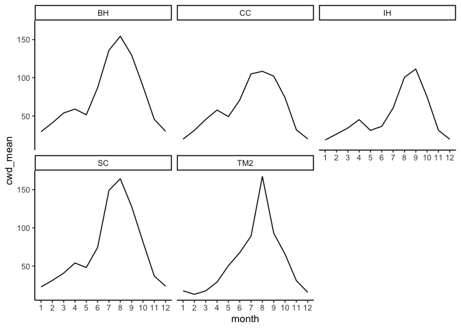<!-- -->
From means (monts where ppt <10)
BH - 87/137/154/130; June-Sept
CC - 105/108/101; July-Sept
IH - 62/98; July-Aug
SC - 75/148/163/128; June-Sept
TM2 - 90/167/91; July-Sept
Apriori Assumption for growth season: Low: Oct-July, Mid: Nov-Aug, High: April-Sept

Historical Climate

```r
nosnow_pops_historical <- pop_elev_climate_historical_avgs %>% filter(PckSum < 20)
unique(nosnow_pops_historical$parent.pop)
```

```
## [1] "BH"  "CC"  "IH"  "SC"  "TM2"
```

```r
summary(nosnow_pops_historical)
```

```
##   parent.pop        elevation.group        elev_m          month      
##  Length:60          Length:60          Min.   :313.0   Min.   : 1.00  
##  Class :character   Class :character   1st Qu.:379.2   1st Qu.: 3.75  
##  Mode  :character   Mode  :character   Median :421.5   Median : 6.50  
##                                        Mean   :415.8   Mean   : 6.50  
##                                        3rd Qu.:454.1   3rd Qu.: 9.25  
##                                        Max.   :511.4   Max.   :12.00  
##     cwd_mean         pck_mean         ppt_mean          tmn_mean     
##  Min.   : 12.42   Min.   :0.0000   Min.   :  1.819   Min.   : 1.289  
##  1st Qu.: 29.30   1st Qu.:0.0000   1st Qu.: 12.628   1st Qu.: 3.860  
##  Median : 56.24   Median :0.0000   Median : 59.672   Median : 7.729  
##  Mean   : 62.15   Mean   :0.4122   Mean   : 74.021   Mean   : 8.111  
##  3rd Qu.: 85.71   3rd Qu.:0.0000   3rd Qu.:132.070   3rd Qu.:12.590  
##  Max.   :163.81   Max.   :8.8330   Max.   :201.323   Max.   :16.337  
##     tmx_mean        cwd_sem           pck_sem          ppt_sem       
##  Min.   :12.19   Min.   : 0.1806   Min.   :0.0000   Min.   : 0.9454  
##  1st Qu.:15.76   1st Qu.: 0.6574   1st Qu.:0.0000   1st Qu.: 2.7977  
##  Median :22.22   Median : 1.7046   Median :0.0000   Median : 9.4104  
##  Mean   :22.57   Mean   : 2.5225   Mean   :0.2835   Mean   :10.4812  
##  3rd Qu.:30.26   3rd Qu.: 3.8760   3rd Qu.:0.0000   3rd Qu.:17.5874  
##  Max.   :34.61   Max.   :10.5892   Max.   :4.9412   Max.   :24.6405  
##     tmn_sem          tmx_sem           PckSum       
##  Min.   :0.1723   Min.   :0.2106   Min.   : 0.2340  
##  1st Qu.:0.2087   1st Qu.:0.3018   1st Qu.: 0.5973  
##  Median :0.2423   Median :0.3484   Median : 0.9510  
##  Mean   :0.2486   Mean   :0.3493   Mean   : 4.9463  
##  3rd Qu.:0.2850   3rd Qu.:0.3835   3rd Qu.: 5.4673  
##  Max.   :0.3254   Max.   :0.5487   Max.   :17.4817
```

```r
nosnow_pops_historical_tojoin <- nosnow_pops_historical %>% select(parent.pop:elev_m, PckSum) %>% distinct()

nosnow_pops_historical_years <- left_join(nosnow_pops_historical_tojoin, pop_elev_climate_historical) 
```

```
## Joining with `by = join_by(parent.pop, elevation.group, elev_m)`
```

```r
nosnow_pops_historical_years
```

```
## # A tibble: 1,800 × 11
## # Groups:   parent.pop, elevation.group, elev_m [5]
##    parent.pop elevation.group elev_m PckSum year  month   cwd   pck    ppt   tmn
##    <chr>      <chr>            <dbl>  <dbl> <chr> <dbl> <dbl> <dbl>  <dbl> <dbl>
##  1 BH         Low               511.  0.234 1963      1  28.1     0 109.   -1.85
##  2 BH         Low               511.  0.234 1963      2  43.8     0 139.    6.42
##  3 BH         Low               511.  0.234 1963      3  44.8     0 108.    2.5 
##  4 BH         Low               511.  0.234 1963      4  37.1     0 144.    4.29
##  5 BH         Low               511.  0.234 1963      5  12.3     0  23.3   9.68
##  6 BH         Low               511.  0.234 1963      6  92.3     0   3.93 10.8 
##  7 BH         Low               511.  0.234 1963      7 122.      0   0    12.6 
##  8 BH         Low               511.  0.234 1963      8 139.      0   0    13.6 
##  9 BH         Low               511.  0.234 1963      9 126.      0   6.82 13.9 
## 10 BH         Low               511.  0.234 1963     10  86.9     0  42.1   9.44
## # ℹ 1,790 more rows
## # ℹ 1 more variable: tmx <dbl>
```

```r
nosnow_grwseason_historical <- nosnow_pops_historical_years %>% 
  group_by(parent.pop, elevation.group, elev_m, year) %>% 
  filter(pck==0) %>%  #snowpack == 0
  filter(ifelse(ppt>=10, ppt>=10, cwd<88)) %>%  #ppt >=10, cwd < 88
   #heavy ppt day = day with at least 10mm of rain 
  filter(ppt >0) #take out months with no ppt
summary(nosnow_grwseason_historical)
```

```
##   parent.pop        elevation.group        elev_m          PckSum       
##  Length:1347        Length:1347        Min.   :313.0   Min.   : 0.2340  
##  Class :character   Class :character   1st Qu.:379.2   1st Qu.: 0.5973  
##  Mode  :character   Mode  :character   Median :421.5   Median : 0.9510  
##                                        Mean   :413.9   Mean   : 5.1575  
##                                        3rd Qu.:454.1   3rd Qu.: 5.4673  
##                                        Max.   :511.4   Max.   :17.4817  
##      year               month            cwd              pck   
##  Length:1347        Min.   : 1.00   Min.   :  0.00   Min.   :0  
##  Class :character   1st Qu.: 3.00   1st Qu.: 22.80   1st Qu.:0  
##  Mode  :character   Median : 5.00   Median : 36.60   Median :0  
##                     Mean   : 6.19   Mean   : 44.55   Mean   :0  
##                     3rd Qu.:10.00   3rd Qu.: 67.27   3rd Qu.:0  
##                     Max.   :12.00   Max.   :168.60   Max.   :0  
##       ppt              tmn              tmx       
##  Min.   :  0.01   Min.   :-1.850   Min.   : 8.90  
##  1st Qu.: 23.29   1st Qu.: 3.055   1st Qu.:14.32  
##  Median : 60.89   Median : 5.390   Median :18.22  
##  Mean   : 93.55   Mean   : 6.328   Mean   :19.66  
##  3rd Qu.:134.07   3rd Qu.: 9.325   3rd Qu.:25.06  
##  Max.   :559.96   Max.   :17.920   Max.   :35.34
```

```r
unique(nosnow_grwseason_historical$parent.pop)
```

```
## [1] "BH"  "CC"  "IH"  "SC"  "TM2"
```

```r
nosnow_grwseason_historical %>% filter(cwd > 88) #some cases when ppt > 10 when cwd is high 
```

```
## # A tibble: 77 × 11
## # Groups:   parent.pop, elevation.group, elev_m, year [67]
##    parent.pop elevation.group elev_m PckSum year  month   cwd   pck   ppt   tmn
##    <chr>      <chr>            <dbl>  <dbl> <chr> <dbl> <dbl> <dbl> <dbl> <dbl>
##  1 BH         Low               511.  0.234 1964     10  92       0  46.8 10.2 
##  2 BH         Low               511.  0.234 1965     10  90.1     0  10.5  8.44
##  3 BH         Low               511.  0.234 1972      9 130.      0  11.2 12.1 
##  4 BH         Low               511.  0.234 1974     10  89.7     0  57.4  9.74
##  5 BH         Low               511.  0.234 1976      8 168.      0  26.4 13.2 
##  6 BH         Low               511.  0.234 1976      9 115.      0  32.0 13.4 
##  7 BH         Low               511.  0.234 1977      6 125.      0  21.2 13.9 
##  8 BH         Low               511.  0.234 1978      9 107.      0  43.8 11.6 
##  9 BH         Low               511.  0.234 1979     10  90.1     0  43.9 10.0 
## 10 BH         Low               511.  0.234 1980     10  89.3     0  10.9  8.26
## # ℹ 67 more rows
## # ℹ 1 more variable: tmx <dbl>
```

```r
xtabs(~parent.pop+month, data=nosnow_grwseason_historical)
```

```
##           month
## parent.pop  1  2  3  4  5  6  7  8  9 10 11 12
##        BH  29 30 30 30 27  6  5  1  8 24 30 30
##        CC  28 30 30 30 27 19  8  6 14 28 30 30
##        IH  25 28 30 30 28 26 14  8 13 28 30 24
##        SC  28 30 30 30 26 11  2  4  9 28 30 30
##        TM2 27 29 30 30 24 18  9  6 17 28 30 27
```

```r
xtabs(~year+month, data=nosnow_grwseason_historical)
```

```
##       month
## year   1 2 3 4 5 6 7 8 9 10 11 12
##   1963 5 5 5 5 5 4 0 0 3  5  5  5
##   1964 5 5 5 5 5 5 1 0 2  5  5  5
##   1965 5 5 5 5 5 2 1 4 1  5  5  5
##   1966 5 5 5 5 4 1 1 0 0  0  5  5
##   1967 5 5 5 5 5 5 0 0 0  4  5  5
##   1968 5 5 5 5 5 1 0 4 0  5  5  3
##   1969 2 3 5 5 4 3 1 0 0  5  5  5
##   1970 5 5 5 5 2 5 0 0 0  5  5  4
##   1971 5 5 5 5 5 4 0 0 3  5  5  3
##   1972 4 5 5 5 5 3 0 0 5  5  5  3
##   1973 1 4 5 5 5 1 0 0 4  5  5  5
##   1974 5 5 5 5 3 3 5 1 0  5  5  5
##   1975 5 5 5 5 5 1 3 4 1  5  5  5
##   1976 5 5 5 5 2 2 0 5 5  5  5  5
##   1977 5 5 5 5 5 1 1 0 3  4  5  5
##   1978 5 5 5 5 4 3 2 0 5  0  5  5
##   1979 4 5 5 5 5 0 4 2 1  5  5  5
##   1980 5 5 5 5 5 4 5 0 0  5  5  5
##   1981 5 5 5 5 5 0 0 0 3  5  5  5
##   1982 1 5 5 5 5 4 4 0 5  5  5  5
##   1983 5 5 5 5 5 3 3 0 5  5  5  5
##   1984 5 5 5 5 5 5 0 3 0  5  5  5
##   1985 5 5 5 5 1 1 1 0 5  5  5  5
##   1986 5 5 5 5 5 1 0 0 5  5  5  5
##   1987 5 5 5 5 4 1 2 0 0  5  5  5
##   1988 5 5 5 5 5 3 1 0 0  4  5  5
##   1989 5 5 5 5 5 3 1 1 5  5  5  4
##   1990 5 5 5 5 5 3 0 0 0  4  5  5
##   1991 5 5 5 5 5 4 0 1 0  5  5  5
##   1992 5 5 5 5 3 4 2 0 0  5  5  4
```

```r
nosnow_grwseason_historical %>% ggplot(aes(x=month)) + geom_histogram() +
  scale_x_continuous(breaks=c(1, 2, 3, 4, 5,6,7,8,9,10, 11, 12)) +
  facet_wrap(~parent.pop)
```

```
## `stat_bin()` using `bins = 30`. Pick better value with `binwidth`.
```

<!-- -->

-   Populations that get more than 10 mm of snow pack in a year (on average): growth season = when there is no snowpack
  -   Note: for historical climate, I had to change it to greater than 20 mm of snow pack in a yar (on average)

Recent climate

```r
snow_pops_recent <- pop_elev_climate_recent_avgs %>% filter(PckSum >= 10)
unique(snow_pops_recent$parent.pop) #18 pops get some significant snowpack per year 
```

```
##  [1] "CP2"   "CP3"   "DPR"   "FR"    "LV1"   "LV3"   "LVTR1" "SQ1"   "SQ2"  
## [10] "SQ3"   "WL1"   "WL2"   "WR"    "WV"    "YO11"  "YO4"   "YO7"   "YO8"
```

```r
summary(snow_pops_recent)
```

```
##   parent.pop        elevation.group        elev_m           month      
##  Length:216         Length:216         Min.   : 748.9   Min.   : 1.00  
##  Class :character   Class :character   1st Qu.:1613.8   1st Qu.: 3.75  
##  Mode  :character   Mode  :character   Median :2200.9   Median : 6.50  
##                                        Mean   :1992.5   Mean   : 6.50  
##                                        3rd Qu.:2470.0   3rd Qu.: 9.25  
##                                        Max.   :2872.3   Max.   :12.00  
##     cwd_mean          pck_mean          ppt_mean           tmn_mean     
##  Min.   :  9.307   Min.   :   0.00   Min.   :  0.1547   Min.   :-9.581  
##  1st Qu.: 26.922   1st Qu.:   0.00   1st Qu.: 17.1638   1st Qu.:-3.248  
##  Median : 44.925   Median :  27.47   Median : 86.9938   Median : 1.303  
##  Mean   : 54.239   Mean   : 167.91   Mean   :104.1939   Mean   : 1.996  
##  3rd Qu.: 81.059   3rd Qu.: 241.39   3rd Qu.:173.3283   3rd Qu.: 6.961  
##  Max.   :149.714   Max.   :1107.82   Max.   :352.8045   Max.   :16.330  
##     tmx_mean         cwd_sem          pck_sem          ppt_sem        
##  Min.   : 1.836   Min.   :0.1418   Min.   :  0.00   Min.   : 0.07985  
##  1st Qu.: 8.231   1st Qu.:0.5847   1st Qu.:  0.00   1st Qu.: 3.66804  
##  Median :13.326   Median :1.2555   Median : 11.30   Median :13.51574  
##  Mean   :14.730   Mean   :1.7143   Mean   : 23.38   Mean   :15.11890  
##  3rd Qu.:21.445   3rd Qu.:2.5488   3rd Qu.: 43.30   3rd Qu.:24.15367  
##  Max.   :32.710   Max.   :8.6511   Max.   :106.13   Max.   :49.56038  
##     tmn_sem          tmx_sem           PckSum      
##  Min.   :0.1811   Min.   :0.1805   Min.   : 104.0  
##  1st Qu.:0.2667   1st Qu.:0.2925   1st Qu.: 611.3  
##  Median :0.2885   Median :0.3848   Median :1594.4  
##  Mean   :0.2924   Mean   :0.3624   Mean   :2014.9  
##  3rd Qu.:0.3191   3rd Qu.:0.4225   3rd Qu.:2677.0  
##  Max.   :0.4252   Max.   :0.5202   Max.   :5412.2
```

```r
snow_pops_recent_tojoin <- snow_pops_recent %>% select(parent.pop:elev_m, PckSum) %>% distinct()

snow_pops_recent_years <- left_join(snow_pops_recent_tojoin, pop_elev_climate_recent) 
```

```
## Joining with `by = join_by(parent.pop, elevation.group, elev_m)`
```

```r
summary(snow_pops_recent_years)
```

```
##   parent.pop        elevation.group        elev_m           PckSum      
##  Length:6426        Length:6426        Min.   : 748.9   Min.   : 104.0  
##  Class :character   Class :character   1st Qu.:1613.8   1st Qu.: 611.3  
##  Mode  :character   Mode  :character   Median :2200.9   Median :1594.4  
##                                        Mean   :1992.5   Mean   :2014.9  
##                                        3rd Qu.:2470.0   3rd Qu.:2677.0  
##                                        Max.   :2872.3   Max.   :5412.2  
##      year               month             cwd              pck        
##  Length:6426        Min.   : 1.000   Min.   :  0.00   Min.   :   0.0  
##  Class :character   1st Qu.: 3.000   1st Qu.: 25.26   1st Qu.:   0.0  
##  Mode  :character   Median : 6.000   Median : 45.64   Median :   0.0  
##                     Mean   : 6.462   Mean   : 54.38   Mean   : 168.7  
##                     3rd Qu.: 9.000   3rd Qu.: 81.73   3rd Qu.: 201.2  
##                     Max.   :12.000   Max.   :182.70   Max.   :2183.6  
##       ppt              tmn               tmx       
##  Min.   :  0.00   Min.   :-13.180   Min.   :-3.22  
##  1st Qu.:  9.09   1st Qu.: -3.170   1st Qu.: 8.07  
##  Median : 50.25   Median :  1.490   Median :13.61  
##  Mean   :103.86   Mean   :  2.018   Mean   :14.76  
##  3rd Qu.:151.65   3rd Qu.:  6.980   3rd Qu.:21.49  
##  Max.   :981.42   Max.   : 19.730   Max.   :35.13
```

```r
snow_pops_recent_years %>% filter(pck < 2, pck >0) %>% arrange(parent.pop, pck) #What about when snowpack is 1 mm? This mostly occurs in December
```

```
## # A tibble: 11 × 11
## # Groups:   parent.pop, elevation.group, elev_m [9]
##    parent.pop elevation.group elev_m PckSum year  month   cwd    pck    ppt
##    <chr>      <chr>            <dbl>  <dbl> <chr> <dbl> <dbl>  <dbl>  <dbl>
##  1 CP3        High             2266.  2677. 2000      5  13.3 1.64   107.  
##  2 DPR        Mid              1019.   104. 1998     12  12.4 0.0300 151.  
##  3 FR         Mid               787    227. 1997     12  13.0 0.220  112.  
##  4 SQ3        High             2373.  1466. 2018      2  40.6 1.37    23.7 
##  5 SQ3        High             2373.  1466. 2010     11  35.2 1.52   124.  
##  6 WL1        Mid              1614.   705. 2010      3  43.4 0.940  154.  
##  7 WL1        Mid              1614.   705. 1994      1  19.7 1.09    80.4 
##  8 WL2        High             2020.  1703. 2020     12  17.8 0.520   89.7 
##  9 YO11       High             2872.  2179. 2017     12  22.8 0.0300   6.53
## 10 YO7        High             2470.  2665. 2000     12  28.6 1.61    29.4 
## 11 YO8        High             2591.  2837. 2015      3  56.2 1.96    16.2 
## # ℹ 2 more variables: tmn <dbl>, tmx <dbl>
```

```r
snow_grwseason_recent <- snow_pops_recent_years %>% 
  group_by(parent.pop, elevation.group, elev_m, year) %>% 
  filter(pck==0) #snowpack == 0 to grow 
summary(snow_grwseason_recent)
```

```
##   parent.pop        elevation.group        elev_m           PckSum      
##  Length:3900        Length:3900        Min.   : 748.9   Min.   : 104.0  
##  Class :character   Class :character   1st Qu.:1158.0   1st Qu.: 386.7  
##  Mode  :character   Mode  :character   Median :2020.1   Median :1465.8  
##                                        Mean   :1843.3   Mean   :1623.5  
##                                        3rd Qu.:2373.2   3rd Qu.:2455.1  
##                                        Max.   :2872.3   Max.   :5412.2  
##      year               month             cwd              pck   
##  Length:3900        Min.   : 1.000   Min.   :  0.00   Min.   :0  
##  Class :character   1st Qu.: 6.000   1st Qu.: 42.45   1st Qu.:0  
##  Mode  :character   Median : 8.000   Median : 69.55   Median :0  
##                     Mean   : 7.553   Mean   : 70.01   Mean   :0  
##                     3rd Qu.:10.000   3rd Qu.: 94.97   3rd Qu.:0  
##                     Max.   :12.000   Max.   :182.70   Max.   :0  
##       ppt              tmn              tmx       
##  Min.   :  0.00   Min.   :-7.020   Min.   : 5.31  
##  1st Qu.:  2.51   1st Qu.: 2.127   1st Qu.:14.36  
##  Median : 18.20   Median : 5.625   Median :19.96  
##  Mean   : 46.04   Mean   : 5.892   Mean   :19.66  
##  3rd Qu.: 58.43   3rd Qu.: 9.535   3rd Qu.:23.96  
##  Max.   :791.57   Max.   :19.730   Max.   :35.13
```

```r
unique(snow_grwseason_recent$parent.pop)
```

```
##  [1] "CP2"   "CP3"   "DPR"   "FR"    "LV1"   "LV3"   "LVTR1" "SQ1"   "SQ2"  
## [10] "SQ3"   "WL1"   "WL2"   "WR"    "WV"    "YO11"  "YO4"   "YO7"   "YO8"
```

```r
xtabs(~parent.pop+month, data=snow_grwseason_recent)
```

```
##           month
## parent.pop  1  2  3  4  5  6  7  8  9 10 11 12
##      CP2    1  0  1  2 17 27 30 30 30 29 20  2
##      CP3    0  0  0  1 14 26 30 30 30 29 18  2
##      DPR   17 20 27 30 30 30 30 30 30 29 29 20
##      FR    10 11 23 30 30 30 30 30 30 29 28  9
##      LV1    0  0  0  0  2 17 28 30 30 29  5  0
##      LV3    0  0  0  0  3 17 28 30 30 29  5  0
##      LVTR1  0  0  0  0  2 17 28 30 30 29  5  0
##      SQ1    5  6  8 20 29 30 30 30 30 29 28  9
##      SQ2    4  5  6 19 28 30 30 30 30 29 28  8
##      SQ3    1  0  2  8 22 28 30 30 30 29 24  7
##      WL1    6  4 10 22 30 30 30 30 30 29 28  7
##      WL2    1  0  1  9 22 29 30 30 30 29 24  5
##      WR    11  8 20 27 30 30 30 30 30 29 28 12
##      WV     6 12 21 30 30 30 30 30 30 29 28  9
##      YO11   0  0  0  0 12 26 30 30 30 29 11  0
##      YO4    1  2  2  9 23 30 30 30 30 29 24  6
##      YO7    1  0  1  2 13 26 30 30 30 29 19  3
##      YO8    0  0  0  2 12 25 30 30 30 29 18  3
```

```r
xtabs(~elevation.group+month, data=snow_grwseason_recent) #11 "high" and 7 "mid" pops
```

```
##                month
## elevation.group   1   2   3   4   5   6   7   8   9  10  11  12
##            High   5   2   7  33 142 268 324 330 330 319 173  28
##            Mid   59  66 115 178 207 210 210 210 210 203 197  74
```

```r
xtabs(~year+month, data=snow_grwseason_recent)
```

```
##       month
## year    1  2  3  4  5  6  7  8  9 10 11 12
##   1993  0  0  0  3  7 14 18 18 18 18 14  1
##   1994  5  1  5  9 15 18 18 18 18 18  1  0
##   1995  0  1  1  3  6  8 15 18 18 18 18  2
##   1996  0  1  4  5 10 15 18 18 18 18  8  1
##   1997  0  1  4  6 10 15 18 18 18 18 13  3
##   1998  0  0  1  3  5  9 15 18 18 18  9  0
##   1999  1  0  2  6  9 15 18 18 18 18 15 12
##   2000  0  0  4  7 12 18 18 18 18 18 10 10
##   2001  3  0  5  5 15 18 18 18 18 18 10  0
##   2002  0  1  3  7 11 18 18 18 18 18 11  0
##   2003  1  3  5  7 10 15 18 18 18 18  7  0
##   2004  0  0  4  7 13 18 18 18 18 18 10  3
##   2005  1  4  4  7 10 18 18 18 18 18 15  3
##   2006  0  1  0  4  7 15 18 18 18 18 15  2
##   2007  5  3  7 10 15 18 18 18 18 18 18  0
##   2008  0  0  2  7 12 18 18 18 18 18 14  1
##   2009  5  1  4  7 15 18 18 18 18 18 15  1
##   2010  1  2  4  5  9 15 18 18 18 18  7  1
##   2011  2  2  2  4  7 11 18 18 18 18 14 14
##   2012  5  7  7 10 15 18 18 18 18 18 14  0
##   2013  0  1  5 10 15 18 18 18 18 18 18 10
##   2014 12  6  9 13 18 18 18 18 18 18 15  4
##   2015  7  8 12 14 16 18 18 18 18 18  7  0
##   2016  0  1  3  7 11 15 18 18 18 18 15  1
##   2017  0  0  1  4  7 10 18 18 18 18 13 14
##   2018  7  8  4  7 15 18 18 18 18 18 14  8
##   2019  2  0  0  4  7 15 18 18 18 18 18  2
##   2020  3  7  6 10 15 18 18 18 18 18 14  9
##   2021  3  5  7 10 18 18 18 18 18 18 18  0
##   2022  1  4  7 10 14 18 18 18 18  0  0  0
```

```r
snow_grwseason_recent %>% ggplot(aes(x=month)) + geom_histogram() +
  scale_x_continuous(breaks=c(1, 2, 3, 4, 5,6,7,8,9,10, 11, 12)) +
  facet_wrap(~parent.pop)
```

```
## `stat_bin()` using `bins = 30`. Pick better value with `binwidth`.
```

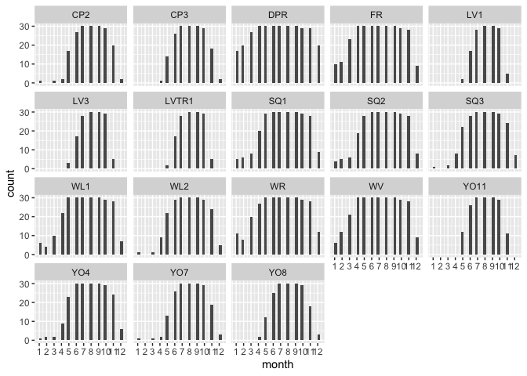<!-- -->

Historical climate

```r
snow_pops_historical <- pop_elev_climate_historical_avgs %>% filter(PckSum >= 20)
unique(snow_pops_historical$parent.pop) #18 pops get some significant snowpack per year 
```

```
##  [1] "CP2"   "CP3"   "DPR"   "FR"    "LV1"   "LV3"   "LVTR1" "SQ1"   "SQ2"  
## [10] "SQ3"   "WL1"   "WL2"   "WR"    "WV"    "YO11"  "YO4"   "YO7"   "YO8"
```

```r
summary(snow_pops_historical)
```

```
##   parent.pop        elevation.group        elev_m           month      
##  Length:216         Length:216         Min.   : 748.9   Min.   : 1.00  
##  Class :character   Class :character   1st Qu.:1613.8   1st Qu.: 3.75  
##  Mode  :character   Mode  :character   Median :2200.9   Median : 6.50  
##                                        Mean   :1992.5   Mean   : 6.50  
##                                        3rd Qu.:2470.0   3rd Qu.: 9.25  
##                                        Max.   :2872.3   Max.   :12.00  
##     cwd_mean          pck_mean          ppt_mean          tmn_mean       
##  Min.   :  8.897   Min.   :   0.00   Min.   :  3.457   Min.   :-11.4393  
##  1st Qu.: 25.998   1st Qu.:   0.00   1st Qu.: 28.658   1st Qu.: -4.5092  
##  Median : 43.295   Median :  58.06   Median : 92.601   Median :  0.1412  
##  Mean   : 51.416   Mean   : 201.44   Mean   :107.140   Mean   :  0.4229  
##  3rd Qu.: 75.074   3rd Qu.: 311.87   3rd Qu.:178.682   3rd Qu.:  4.9017  
##  Max.   :138.177   Max.   :1190.70   Max.   :295.427   Max.   : 14.2743  
##     tmx_mean         cwd_sem          pck_sem          ppt_sem      
##  Min.   : 0.956   Min.   :0.1570   Min.   :  0.00   Min.   : 1.187  
##  1st Qu.: 7.227   1st Qu.:0.5775   1st Qu.:  0.00   1st Qu.: 5.685  
##  Median :12.588   Median :1.4044   Median : 17.56   Median :13.544  
##  Mean   :13.851   Mean   :1.7257   Mean   : 27.73   Mean   :15.534  
##  3rd Qu.:20.784   3rd Qu.:2.6314   3rd Qu.: 46.20   3rd Qu.:24.399  
##  Max.   :32.254   Max.   :7.6902   Max.   :115.48   Max.   :43.817  
##     tmn_sem          tmx_sem           PckSum      
##  Min.   :0.1773   Min.   :0.1980   Min.   : 222.8  
##  1st Qu.:0.2499   1st Qu.:0.3284   1st Qu.: 871.3  
##  Median :0.2922   Median :0.3826   Median :2015.6  
##  Mean   :0.2980   Mean   :0.3862   Mean   :2417.2  
##  3rd Qu.:0.3293   3rd Qu.:0.4290   3rd Qu.:3320.9  
##  Max.   :0.4578   Max.   :0.6130   Max.   :6273.5
```

```r
snow_pops_historical_tojoin <- snow_pops_historical %>% select(parent.pop:elev_m, PckSum) %>% distinct()

snow_pops_historical_years <- left_join(snow_pops_historical_tojoin, pop_elev_climate_historical) 
```

```
## Joining with `by = join_by(parent.pop, elevation.group, elev_m)`
```

```r
summary(snow_pops_historical_years)
```

```
##   parent.pop        elevation.group        elev_m           PckSum      
##  Length:6480        Length:6480        Min.   : 748.9   Min.   : 222.8  
##  Class :character   Class :character   1st Qu.:1613.8   1st Qu.: 871.3  
##  Mode  :character   Mode  :character   Median :2200.9   Median :2015.6  
##                                        Mean   :1992.5   Mean   :2417.2  
##                                        3rd Qu.:2470.0   3rd Qu.:3320.9  
##                                        Max.   :2872.3   Max.   :6273.5  
##      year               month            cwd              pck        
##  Length:6480        Min.   : 1.00   Min.   :  0.00   Min.   :   0.0  
##  Class :character   1st Qu.: 3.75   1st Qu.: 24.13   1st Qu.:   0.0  
##  Mode  :character   Median : 6.50   Median : 44.90   Median :   0.0  
##                     Mean   : 6.50   Mean   : 51.42   Mean   : 201.4  
##                     3rd Qu.: 9.25   3rd Qu.: 75.17   3rd Qu.: 266.2  
##                     Max.   :12.00   Max.   :164.00   Max.   :2594.7  
##       ppt              tmn                tmx       
##  Min.   :  0.00   Min.   :-14.9700   Min.   :-2.65  
##  1st Qu.: 14.19   1st Qu.: -4.4600   1st Qu.: 7.09  
##  Median : 57.20   Median :  0.1600   Median :12.96  
##  Mean   :107.14   Mean   :  0.4229   Mean   :13.85  
##  3rd Qu.:148.88   3rd Qu.:  5.2400   3rd Qu.:20.35  
##  Max.   :951.79   Max.   : 16.8400   Max.   :35.12
```

```r
snow_pops_historical_years %>% filter(pck < 2, pck >0) %>% arrange(parent.pop, pck) #What about when snowpack is 1 mm? This mostly occurs Nov-Jan, one case in Feb and one case in July
```

```
## # A tibble: 13 × 11
## # Groups:   parent.pop, elevation.group, elev_m [9]
##    parent.pop elevation.group elev_m PckSum year  month   cwd    pck    ppt
##    <chr>      <chr>            <dbl>  <dbl> <chr> <dbl> <dbl>  <dbl>  <dbl>
##  1 CP2        High             2244.  3102. 1976      1  22.8 0.0300  25.1 
##  2 FR         Mid               787    251. 1977      1  14.1 0.0800  67   
##  3 FR         Mid               787    251. 1981      1  13.8 0.480  215.  
##  4 FR         Mid               787    251. 1964      2  22.7 1.60    11.1 
##  5 LV1        High             2593.  6045. 1978      7  76.7 1.61    14.2 
##  6 LV1        High             2593.  6045. 1976     12  13.3 1.66     9.28
##  7 LV3        High             2354.  5845. 1976     12  17.1 1.42     9.34
##  8 SQ3        High             2373.  1985. 1991      2  47.0 1.78    31.2 
##  9 WL1        Mid              1614.   871. 1979     12  20.8 1.84   162.  
## 10 WL2        High             2020.  2047. 1979     11  25.7 0.890  129.  
## 11 WL2        High             2020.  2047. 1978     11  24.8 1.36    96.8 
## 12 YO11       High             2872.  2409. 1980     11  26.0 0.0500  23.8 
## 13 YO8        High             2591.  3332. 1975     11  33.6 1.56    50.4 
## # ℹ 2 more variables: tmn <dbl>, tmx <dbl>
```

```r
snow_grwseason_historical <- snow_pops_historical_years %>% 
  group_by(parent.pop, elevation.group, elev_m, year) %>% 
  filter(pck==0) #snowpack == 0 to grow 
summary(snow_grwseason_historical)
```

```
##   parent.pop        elevation.group        elev_m           PckSum      
##  Length:3654        Length:3654        Min.   : 748.9   Min.   : 222.8  
##  Class :character   Class :character   1st Qu.:1158.0   1st Qu.: 545.4  
##  Mode  :character   Mode  :character   Median :1934.5   Median :1007.6  
##                                        Mean   :1824.2   Mean   :1930.0  
##                                        3rd Qu.:2373.2   3rd Qu.:3101.7  
##                                        Max.   :2872.3   Max.   :6273.5  
##      year               month             cwd              pck   
##  Length:3654        Min.   : 1.000   Min.   :  0.00   Min.   :0  
##  Class :character   1st Qu.: 6.000   1st Qu.: 45.15   1st Qu.:0  
##  Mode  :character   Median : 8.000   Median : 67.40   Median :0  
##                     Mean   : 7.654   Mean   : 67.30   Mean   :0  
##                     3rd Qu.:10.000   3rd Qu.: 89.40   3rd Qu.:0  
##                     Max.   :12.000   Max.   :164.00   Max.   :0  
##       ppt               tmn              tmx       
##  Min.   :  0.000   Min.   :-9.790   Min.   : 5.67  
##  1st Qu.:  5.385   1st Qu.: 1.140   1st Qu.:14.68  
##  Median : 21.255   Median : 4.490   Median :19.40  
##  Mean   : 47.575   Mean   : 4.643   Mean   :19.28  
##  3rd Qu.: 62.657   3rd Qu.: 8.068   3rd Qu.:23.29  
##  Max.   :778.980   Max.   :16.840   Max.   :35.12
```

```r
unique(snow_grwseason_historical$parent.pop)
```

```
##  [1] "CP2"   "CP3"   "DPR"   "FR"    "LV1"   "LV3"   "LVTR1" "SQ1"   "SQ2"  
## [10] "SQ3"   "WL1"   "WL2"   "WR"    "WV"    "YO11"  "YO4"   "YO7"   "YO8"
```

```r
xtabs(~parent.pop+month, data=snow_grwseason_historical)
```

```
##           month
## parent.pop  1  2  3  4  5  6  7  8  9 10 11 12
##      CP2    0  0  0  3 12 25 30 30 30 30 12  3
##      CP3    0  0  0  1 10 24 30 30 30 30 12  2
##      DPR   10 16 23 29 30 30 30 30 30 30 30 17
##      FR     7 11 23 29 30 30 30 30 30 30 29 15
##      LV1    0  0  0  0  1 14 25 29 30 25  2  0
##      LV3    0  0  0  0  1 14 26 29 30 25  2  0
##      LVTR1  0  0  0  0  1 14 25 29 30 25  2  0
##      SQ1    3  2  2 15 27 30 30 30 30 30 23  9
##      SQ2    2  2  2 15 27 30 30 30 30 30 23  9
##      SQ3    1  0  0  4 16 27 30 30 30 30 19  5
##      WL1    3  2  6 16 30 30 30 30 30 30 24  7
##      WL2    1  1  0  7 17 30 30 30 30 30 14  5
##      WR     8  7 15 25 30 30 30 30 30 30 28 14
##      WV     5  9 17 29 30 30 30 30 30 30 28 10
##      YO11   0  0  0  0  7 23 30 30 30 30  3  1
##      YO4    1  1  0 11 19 30 30 30 30 30 15  5
##      YO7    1  0  0  1 11 23 30 30 30 30 12  3
##      YO8    0  0  0  1  9 22 30 30 30 30 10  2
```

```r
xtabs(~elevation.group+month, data=snow_grwseason_historical) #11 "high" and 7 "mid" pops
```

```
##                month
## elevation.group   1   2   3   4   5   6   7   8   9  10  11  12
##            High   4   2   0  28 104 246 316 327 330 315 103  26
##            Mid   38  49  88 158 204 210 210 210 210 210 185  81
```

```r
xtabs(~year+month, data=snow_grwseason_historical)
```

```
##       month
## year    1  2  3  4  5  6  7  8  9 10 11 12
##   1963  0  4  4  4  9 15 18 18 18 18  7  7
##   1964  0  1  4  8 10 18 18 18 18 18  3  0
##   1965  0  0  2  4  7 10 18 18 18 18  7  0
##   1966  0  0  2  8 15 18 18 18 18 18 10  0
##   1967  0  1  1  3  5  9 15 18 18 18 14  0
##   1968  0  0  3  8 15 18 18 18 18 18  8  0
##   1969  0  0  0  0  5  9 18 18 18 18 14  1
##   1970  0  0  2  4  9 15 18 18 18 18  8  0
##   1971  0  0  0  4  8 15 18 18 18 18  8  0
##   1972  0  0  2  7 11 18 18 18 18 18  5  0
##   1973  0  0  0  3  7 15 18 18 18 18  1  0
##   1974  0  0  2  4  8 15 15 18 18 18 14  3
##   1975  3  0  0  3  7 14 18 18 18 15 11 12
##   1976 11  4  5  9 15 18 18 18 18 18 18 15
##   1977  2  7  7 14 15 18 18 18 18 18 13  3
##   1978  0  1  4  4  7 12 16 18 18 18  7  4
##   1979  0  0  3  4  8 18 18 18 18 18  9  6
##   1980  0  3  3  5  7 11 18 18 18 18 14 10
##   1981  3  4  5  9 13 18 18 18 18 15  8  4
##   1982  0  0  1  4  7 10 15 18 18 15  4  0
##   1983  0  0  0  3  5  9 15 15 18 18  4  0
##   1984  1  1  4  7  9 15 18 18 18 15  3  3
##   1985  3  4  4  7 14 18 18 18 18 18  4  4
##   1986  4  3  4  7 10 15 18 18 18 18 18 10
##   1987  0  1  4  9 15 18 18 18 18 18 12  0
##   1988  0  2  5  9 14 18 18 18 18 18  7  2
##   1989  2  2  4  9 12 15 18 18 18 15 14 14
##   1990  0  0  5 11 15 18 18 18 18 18 14  2
##   1991  6  9  1  4  8 18 18 18 18 18 14  7
##   1992  7  4  7 11 18 18 18 18 18 18 15  0
```

```r
snow_grwseason_historical %>% ggplot(aes(x=month)) + geom_histogram() +
  scale_x_continuous(breaks=c(1, 2, 3, 4, 5,6,7,8,9,10, 11, 12)) +
  facet_wrap(~parent.pop)
```

```
## `stat_bin()` using `bins = 30`. Pick better value with `binwidth`.
```

<!-- -->

Bind snow and no_snow pops together

```r
allpops_recent_grwseason <- rbind(nosnow_grwseason_recent, snow_grwseason_recent)
summary(allpops_recent_grwseason)
```

```
##   parent.pop        elevation.group        elev_m           PckSum        
##  Length:5204        Length:5204        Min.   : 313.0   Min.   :   0.000  
##  Class :character   Class :character   1st Qu.: 511.4   1st Qu.:   2.187  
##  Mode  :character   Mode  :character   Median :1613.8   Median : 611.263  
##                                        Mean   :1485.2   Mean   :1216.847  
##                                        3rd Qu.:2266.4   3rd Qu.:2178.827  
##                                        Max.   :2872.3   Max.   :5412.180  
##      year               month             cwd              pck   
##  Length:5204        Min.   : 1.000   Min.   :  0.00   Min.   :0  
##  Class :character   1st Qu.: 5.000   1st Qu.: 33.15   1st Qu.:0  
##  Mode  :character   Median : 7.000   Median : 61.40   Median :0  
##                     Mean   : 7.178   Mean   : 62.87   Mean   :0  
##                     3rd Qu.:10.000   3rd Qu.: 89.01   3rd Qu.:0  
##                     Max.   :12.000   Max.   :182.70   Max.   :0  
##       ppt              tmn              tmx       
##  Min.   :  0.00   Min.   :-7.020   Min.   : 5.31  
##  1st Qu.:  4.41   1st Qu.: 2.737   1st Qu.:14.42  
##  Median : 25.94   Median : 5.840   Median :19.49  
##  Mean   : 60.18   Mean   : 6.165   Mean   :19.60  
##  3rd Qu.: 79.86   3rd Qu.: 9.530   3rd Qu.:23.96  
##  Max.   :791.57   Max.   :19.730   Max.   :35.45
```

```r
unique(allpops_recent_grwseason$parent.pop)
```

```
##  [1] "BH"    "CC"    "IH"    "SC"    "TM2"   "CP2"   "CP3"   "DPR"   "FR"   
## [10] "LV1"   "LV3"   "LVTR1" "SQ1"   "SQ2"   "SQ3"   "WL1"   "WL2"   "WR"   
## [19] "WV"    "YO11"  "YO4"   "YO7"   "YO8"
```

```r
allpops_historical_grwseason <- rbind(nosnow_grwseason_historical, snow_grwseason_historical)
summary(allpops_historical_grwseason)
```

```
##   parent.pop        elevation.group        elev_m           PckSum        
##  Length:5001        Length:5001        Min.   : 313.0   Min.   :   0.234  
##  Class :character   Class :character   1st Qu.: 511.4   1st Qu.:  17.482  
##  Mode  :character   Mode  :character   Median :1158.0   Median : 545.419  
##                                        Mean   :1444.3   Mean   :1411.577  
##                                        3rd Qu.:2244.1   3rd Qu.:2046.749  
##                                        Max.   :2872.3   Max.   :6273.504  
##      year               month            cwd              pck   
##  Length:5001        Min.   : 1.00   Min.   :  0.00   Min.   :0  
##  Class :character   1st Qu.: 5.00   1st Qu.: 34.33   1st Qu.:0  
##  Mode  :character   Median : 8.00   Median : 61.36   Median :0  
##                     Mean   : 7.26   Mean   : 61.17   Mean   :0  
##                     3rd Qu.:10.00   3rd Qu.: 84.51   3rd Qu.:0  
##                     Max.   :12.00   Max.   :168.60   Max.   :0  
##       ppt              tmn              tmx       
##  Min.   :  0.00   Min.   :-9.790   Min.   : 5.67  
##  1st Qu.:  8.07   1st Qu.: 1.760   1st Qu.:14.55  
##  Median : 29.97   Median : 4.820   Median :19.08  
##  Mean   : 59.96   Mean   : 5.097   Mean   :19.38  
##  3rd Qu.: 80.31   3rd Qu.: 8.410   3rd Qu.:23.65  
##  Max.   :778.98   Max.   :17.920   Max.   :35.34
```

```r
unique(allpops_historical_grwseason$parent.pop)
```

```
##  [1] "BH"    "CC"    "IH"    "SC"    "TM2"   "CP2"   "CP3"   "DPR"   "FR"   
## [10] "LV1"   "LV3"   "LVTR1" "SQ1"   "SQ2"   "SQ3"   "WL1"   "WL2"   "WR"   
## [19] "WV"    "YO11"  "YO4"   "YO7"   "YO8"
```


## Climate traits across pops

### Totals


```r
names(allpops_recent_grwseason)
```

```
##  [1] "parent.pop"      "elevation.group" "elev_m"          "PckSum"         
##  [5] "year"            "month"           "cwd"             "pck"            
##  [9] "ppt"             "tmn"             "tmx"
```

```r
allpops_recent_grwseason_yearlytot <- allpops_recent_grwseason %>%  group_by(parent.pop, year, elevation.group) %>% summarise_at(c("pck", "ppt"), sum, na.rm = TRUE)
allpops_recent_grwseason_yearlytot$elevation.group <- factor(allpops_recent_grwseason_yearlytot$elevation.group, levels = elev_order)

recent_ppt_total <- allpops_recent_grwseason_yearlytot %>% ggplot(aes(x=year, y=ppt, group=parent.pop, color=elevation.group)) + 
  geom_point() + geom_line() + 
  scale_colour_manual(values=elev_three_palette) + 
  ggtitle("Recent Climate")  + 
  theme_classic() + 
  theme(text=element_text(size=30), axis.text.x = element_text(angle = 45, hjust = 1))
ggsave("../output/Climate/growthseasonTot_Precip_RecentClim.png", width = 12, height = 6, units = "in")

allpops_historical_grwseason_yearlytot <- allpops_historical_grwseason %>% group_by(parent.pop, year, elevation.group) %>% summarise_at(c("pck", "ppt"), sum, na.rm = TRUE)
allpops_historical_grwseason_yearlytot$elevation.group <- factor(allpops_historical_grwseason_yearlytot$elevation.group, levels = elev_order)

hist_ppt_total <- allpops_historical_grwseason_yearlytot %>% ggplot(aes(x=year, y=ppt, group=parent.pop, color=elevation.group)) + 
  geom_point() + geom_line() + 
  scale_colour_manual(values=elev_three_palette) + 
  ggtitle("Historical Climate") + 
  theme_classic() + 
  theme(text=element_text(size=30), axis.text.x = element_text(angle = 45, hjust = 1))
ggsave("../output/Climate/growthseasonTot_Precip_HistoricalClim.png", width = 12, height = 6, units = "in")

#should combine these into one figure and save that instead
legend <- get_legend(hist_ppt_total)
hist_ppt_total <- hist_ppt_total + theme(legend.position="none")
recent_ppt_total <- recent_ppt_total + theme(legend.position="none")
grid.arrange(hist_ppt_total, recent_ppt_total, legend, ncol=3, widths=c(3.12, 3.12, 1.09))
```

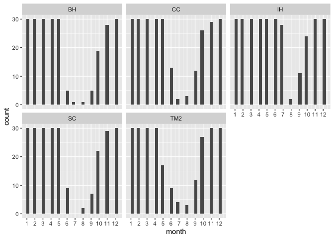<!-- -->

```r
 #2000 x 850
```

### Averages

#### Across last 30 years (all months included)


```r
pop_elev_climate_avgs <- pop_elev_climate %>% filter(year>1992) %>% group_by(parent.pop, elevation.group) %>% summarise_at(c("cwd", "pck", "ppt", "tmn", "tmx"), mean, na.rm = TRUE)
pop_elev_climate_avgs #30 year averages of all climate variables 
```

```
## # A tibble: 23 × 7
## # Groups:   parent.pop [23]
##    parent.pop elevation.group   cwd     pck   ppt    tmn   tmx
##    <chr>      <chr>           <dbl>   <dbl> <dbl>  <dbl> <dbl>
##  1 BH         Low              75.9   0      47.8  8.88   23.6
##  2 CC         Low              59.7   0      84.5 10.0    23.3
##  3 CP2        High             63.1 206.    105.   1.17   13.5
##  4 CP3        High             46.4 224.    100.   0.521  12.7
##  5 DPR        Mid              27.4   8.70  121.   7.86   20.3
##  6 FR         Mid              56.0  19.0    82.3  5.36   20.0
##  7 IH         Low              49.1   0.184  88.7  8.67   22.3
##  8 LV1        High             49.8 440.    147.  -1.38   11.2
##  9 LV3        High             57.6 426.    146.  -1.36   11.2
## 10 LVTR1      High             52.0 453.    152.  -1.58   11.2
## # ℹ 13 more rows
```

```r
pop_elev_climate_avgs$elevation.group <- factor(pop_elev_climate_avgs$elevation.group, levels=elev_order)
```

#### Recent Years - Growth Season


```r
allpops_recent_grwseason_avgs <- allpops_recent_grwseason %>% group_by(parent.pop, elevation.group, elev_m) %>% summarise_at(c("cwd", "pck", "ppt", "tmn", "tmx"), c(mean, sem), na.rm = TRUE) 
names(allpops_recent_grwseason_avgs) <- gsub("fn2", "sem", colnames(allpops_recent_grwseason_avgs))
names(allpops_recent_grwseason_avgs) <-gsub("fn1", "mean", colnames(allpops_recent_grwseason_avgs))
allpops_recent_grwseason_avgs #30 year averages during growth season months 
```

```
## # A tibble: 23 × 13
## # Groups:   parent.pop, elevation.group [23]
##    parent.pop elevation.group elev_m cwd_mean pck_mean ppt_mean tmn_mean
##    <chr>      <chr>            <dbl>    <dbl>    <dbl>    <dbl>    <dbl>
##  1 BH         Low               511.     49.2        0     70.8     5.75
##  2 CC         Low               313      43.9        0    114.      7.89
##  3 CP2        High             2244.     90.6        0     37.5     5.61
##  4 CP3        High             2266.     68.5        0     33.5     5.33
##  5 DPR        Mid              1019.     29.2        0     92.7     8.59
##  6 FR         Mid               787      65.0        0     48.9     6.64
##  7 IH         Low               454.     38.1        0    110.      6.92
##  8 LV1        High             2593.     74.8        0     44.0     3.59
##  9 LV3        High             2354.     93.5        0     43.8     3.59
## 10 LVTR1      High             2741.     85.1        0     46.0     3.28
## # ℹ 13 more rows
## # ℹ 6 more variables: tmx_mean <dbl>, cwd_sem <dbl>, pck_sem <dbl>,
## #   ppt_sem <dbl>, tmn_sem <dbl>, tmx_sem <dbl>
```

```r
allpops_recent_grwseason_avgs$elevation.group <- factor(allpops_recent_grwseason_avgs$elevation.group, levels=elev_order)       

allpops_recent_grwseason_avgs %>% ggplot(aes(x=fct_reorder(parent.pop, cwd_mean), y=cwd_mean, fill=elev_m)) + 
  geom_col(width = 0.7,position = position_dodge(0.75)) +
  geom_errorbar(aes(ymin=cwd_mean-cwd_sem,ymax=cwd_mean+cwd_sem),width=.2, position = 
                  position_dodge(0.75)) +
  scale_y_continuous(expand = c(0, 0)) +
  scale_fill_gradient(low = "#F5A540", high = "#0043F0")+ 
  labs(fill="Elevation",x="Population", y="Avg CWD" ,title = "Average CWD during Growth Season - Recent Climate") +
   theme_classic() +
  theme(text=element_text(size=20), axis.text.x = element_text(angle = 45,  hjust = 1))
```

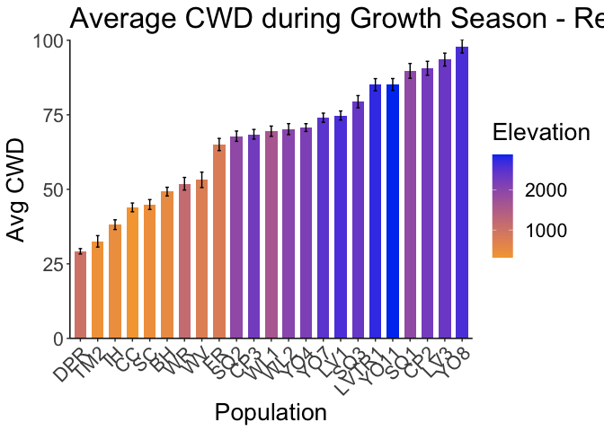<!-- -->

```r
ggsave("../output/Climate/growthseasonAvg_CWD_RecentClim.png", width = 12, height = 6, units = "in")

allpops_recent_grwseason_avgs %>% ggplot(aes(x=fct_reorder(parent.pop, ppt_mean), y=ppt_mean, fill=elev_m)) + 
  geom_col(width = 0.7,position = position_dodge(0.75)) +
  geom_errorbar(aes(ymin=ppt_mean-ppt_sem,ymax=ppt_mean+ppt_sem),width=.2, position = 
                  position_dodge(0.75)) +
  scale_y_continuous(expand = c(0, 0)) +
  scale_fill_gradient(low = "#F5A540", high = "#0043F0") + 
  labs(fill="Elevation",x="Population", y="Avg Precip" ,title = "Average Precip during Growth Season - Recent Climate") +
   theme_classic() +
  theme(text=element_text(size=20), axis.text.x = element_text(angle = 45,  hjust = 1))
```

<!-- -->

```r
ggsave("../output/Climate/growthseasonAvg_Precip_RecentClim.png", width = 12, height = 6, units = "in")

allpops_recent_grwseason_avgs %>% ggplot(aes(x=fct_reorder(parent.pop, tmn_mean), y=tmn_mean, fill=elev_m)) + 
  geom_col(width = 0.7,position = position_dodge(0.75)) +
  geom_errorbar(aes(ymin=tmn_mean-tmn_sem,ymax=tmn_mean+tmn_sem),width=.2, position = 
                  position_dodge(0.75)) +
  scale_y_continuous(expand = c(0, 0)) +
  scale_fill_gradient(low = "#F5A540", high = "#0043F0") + 
  labs(fill="Elevation",x="Population", y="Avg MinTemp" ,title = "Average MinTemp during Growth Season - Recent Climate") +
   theme_classic() +
  theme(text=element_text(size=20), axis.text.x = element_text(angle = 45,  hjust = 1))
```

<!-- -->

```r
ggsave("../output/Climate/growthseasonAvg_MinTemp_RecentClim.png", width = 12, height = 6, units = "in")

allpops_recent_grwseason_avgs %>% ggplot(aes(x=fct_reorder(parent.pop, tmx_mean), y=tmx_mean, fill=elev_m)) + 
  geom_col(width = 0.7,position = position_dodge(0.75)) +
  geom_errorbar(aes(ymin=tmx_mean-tmx_sem,ymax=tmx_mean+tmx_sem),width=.2, position = 
                  position_dodge(0.75)) +
  scale_y_continuous(expand = c(0, 0)) +
  scale_fill_gradient(low = "#F5A540", high = "#0043F0") + 
  labs(fill="Elevation",x="Population", y="Avg MaxTemp" ,title = "Average MaxTemp during Growth Season - Recent Climate") +
   theme_classic() +
  theme(text=element_text(size=20), axis.text.x = element_text(angle = 45,  hjust = 1))
```

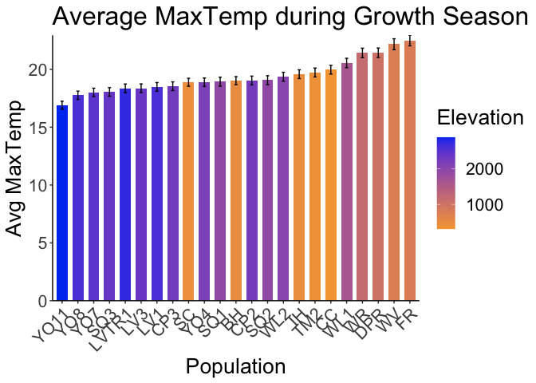<!-- -->

```r
ggsave("../output/Climate/growthseasonAvg_MaxTemp_RecentClim.png", width = 12, height = 6, units = "in")
```

#### Historical Years - Growth Season


```r
allpops_historical_grwseason_avgs <- allpops_historical_grwseason %>% group_by(parent.pop, elevation.group, elev_m) %>% summarise_at(c("cwd", "pck", "ppt", "tmn", "tmx"), c(mean, sem), na.rm = TRUE) 
names(allpops_historical_grwseason_avgs) <- gsub("fn2", "sem", colnames(allpops_historical_grwseason_avgs))
names(allpops_historical_grwseason_avgs) <-gsub("fn1", "mean", colnames(allpops_historical_grwseason_avgs))
allpops_historical_grwseason_avgs #30 year averages during growth season months 
```

```
## # A tibble: 23 × 13
## # Groups:   parent.pop, elevation.group [23]
##    parent.pop elevation.group elev_m cwd_mean pck_mean ppt_mean tmn_mean
##    <chr>      <chr>            <dbl>    <dbl>    <dbl>    <dbl>    <dbl>
##  1 BH         Low               511.     52.4        0     68.3     5.13
##  2 CC         Low               313      47.2        0    101.      7.19
##  3 CP2        High             2244.     87.2        0     40.1     4.45
##  4 CP3        High             2266.     64.2        0     39.8     4.17
##  5 DPR        Mid              1019.     29.1        0     86.3     7.35
##  6 FR         Mid               787      63.1        0     55.4     5.43
##  7 IH         Low               454.     40.8        0     99.6     6.55
##  8 LV1        High             2593.     70.5        0     52.3     1.33
##  9 LV3        High             2354.     89.3        0     51.4     1.29
## 10 LVTR1      High             2741.     81.3        0     55.0     1.11
## # ℹ 13 more rows
## # ℹ 6 more variables: tmx_mean <dbl>, cwd_sem <dbl>, pck_sem <dbl>,
## #   ppt_sem <dbl>, tmn_sem <dbl>, tmx_sem <dbl>
```

```r
allpops_historical_grwseason_avgs$elevation.group <- factor(allpops_historical_grwseason_avgs$elevation.group, levels=elev_order)       

allpops_historical_grwseason_avgs %>% ggplot(aes(x=fct_reorder(parent.pop, cwd_mean), y=cwd_mean, fill=elev_m)) + 
  geom_col(width = 0.7,position = position_dodge(0.75)) +
  geom_errorbar(aes(ymin=cwd_mean-cwd_sem,ymax=cwd_mean+cwd_sem),width=.2, position = 
                  position_dodge(0.75)) +
  scale_y_continuous(expand = c(0, 0)) +
  scale_fill_gradient(low = "#F5A540", high = "#0043F0")+ 
  labs(fill="Elevation",x="Population", y="Avg CWD" ,title = "Average CWD during Growth Season - Historical Climate") +
   theme_classic() +
  theme(text=element_text(size=20), axis.text.x = element_text(angle = 45,  hjust = 1))
```

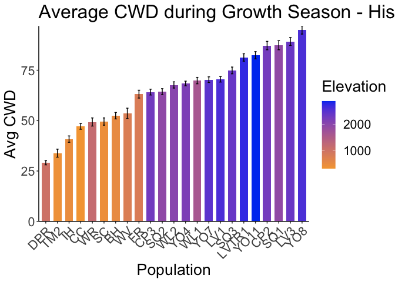<!-- -->

```r
ggsave("../output/Climate/growthseasonAvg_CWD_HistoricalClim.png", width = 12, height = 6, units = "in")

allpops_historical_grwseason_avgs %>% ggplot(aes(x=fct_reorder(parent.pop, ppt_mean), y=ppt_mean, fill=elev_m)) + 
  geom_col(width = 0.7,position = position_dodge(0.75)) +
  geom_errorbar(aes(ymin=ppt_mean-ppt_sem,ymax=ppt_mean+ppt_sem),width=.2, position = 
                  position_dodge(0.75)) +
  scale_y_continuous(expand = c(0, 0)) +
  scale_fill_gradient(low = "#F5A540", high = "#0043F0") + 
  labs(fill="Elevation",x="Population", y="Avg Precip" ,title = "Average Precip during Growth Season - Historical Climate") +
   theme_classic() +
  theme(text=element_text(size=20), axis.text.x = element_text(angle = 45,  hjust = 1))
```

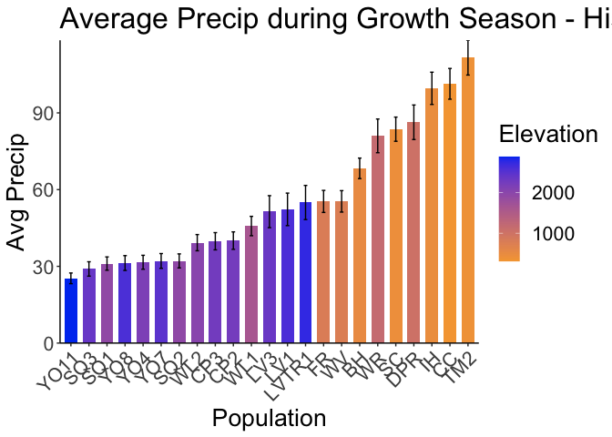<!-- -->

```r
ggsave("../output/Climate/growthseasonAvg_Precip_HistoricalClim.png", width = 12, height = 6, units = "in")

allpops_historical_grwseason_avgs %>% ggplot(aes(x=fct_reorder(parent.pop, tmn_mean), y=tmn_mean, fill=elev_m)) + 
  geom_col(width = 0.7,position = position_dodge(0.75)) +
  geom_errorbar(aes(ymin=tmn_mean-tmn_sem,ymax=tmn_mean+tmn_sem),width=.2, position = 
                  position_dodge(0.75)) +
  scale_y_continuous(expand = c(0, 0)) +
  scale_fill_gradient(low = "#F5A540", high = "#0043F0") + 
  labs(fill="Elevation",x="Population", y="Avg MinTemp" ,title = "Average MinTemp during Growth Season - Historical Climate") +
   theme_classic() +
  theme(text=element_text(size=20), axis.text.x = element_text(angle = 45,  hjust = 1))
```

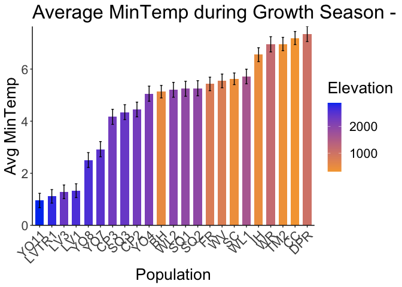<!-- -->

```r
ggsave("../output/Climate/growthseasonAvg_MinTemp_HistoricalClim.png", width = 12, height = 6, units = "in")

allpops_historical_grwseason_avgs %>% ggplot(aes(x=fct_reorder(parent.pop, tmx_mean), y=tmx_mean, fill=elev_m)) + 
  geom_col(width = 0.7,position = position_dodge(0.75)) +
  geom_errorbar(aes(ymin=tmx_mean-tmx_sem,ymax=tmx_mean+tmx_sem),width=.2, position = 
                  position_dodge(0.75)) +
  scale_y_continuous(expand = c(0, 0)) +
  scale_fill_gradient(low = "#F5A540", high = "#0043F0") + 
  labs(fill="Elevation",x="Population", y="Avg MaxTemp" ,title = "Average MaxTemp during Growth Season - Historical Climate") +
   theme_classic() +
  theme(text=element_text(size=20), axis.text.x = element_text(angle = 45,  hjust = 1))
```

<!-- -->

```r
ggsave("../output/Climate/growthseasonAvg_MaxTemp_HistoricalClim.png", width = 12, height = 6, units = "in")
```

## Climate trait correlations


```r
head(allpops_recent_grwseason)
```

```
## # A tibble: 6 × 11
## # Groups:   parent.pop, elevation.group, elev_m, year [1]
##   parent.pop elevation.group elev_m PckSum year  month   cwd   pck   ppt   tmn
##   <chr>      <chr>            <dbl>  <dbl> <chr> <dbl> <dbl> <dbl> <dbl> <dbl>
## 1 BH         Low               511.      0 1993      1  25.6     0 289.   1.82
## 2 BH         Low               511.      0 1993      2  37.0     0 140.   3.29
## 3 BH         Low               511.      0 1993      3  46.0     0  89.9  7.11
## 4 BH         Low               511.      0 1993      4  71.2     0  12.8  6.01
## 5 BH         Low               511.      0 1993      5  73.7     0  12.9  9.38
## 6 BH         Low               511.      0 1993      6  35.7     0  33.6 11.2 
## # ℹ 1 more variable: tmx <dbl>
```

```r
allpops_recent_grwseason <- tibble(allpops_recent_grwseason)
allpops_recent_grwseason %>% cor_test(cwd, ppt, tmn, tmx, method = "pearson")
```

```
## # A tibble: 16 × 8
##    var1  var2    cor    statistic         p conf.low conf.high method 
##    <chr> <chr> <dbl>        <dbl>     <dbl>    <dbl>     <dbl> <chr>  
##  1 cwd   cwd    1           Inf   0            1         1     Pearson
##  2 cwd   ppt   -0.53        -45.3 0           -0.551    -0.512 Pearson
##  3 cwd   tmn    0.42         33.1 1.86e-218    0.395     0.440 Pearson
##  4 cwd   tmx    0.53         45.0 0            0.510     0.549 Pearson
##  5 ppt   cwd   -0.53        -45.3 0           -0.551    -0.512 Pearson
##  6 ppt   ppt    1    4840219547.  0            1         1     Pearson
##  7 ppt   tmn   -0.34        -25.7 1.72e-137   -0.360    -0.312 Pearson
##  8 ppt   tmx   -0.52        -43.4 0           -0.535    -0.495 Pearson
##  9 tmn   cwd    0.42         33.1 1.86e-218    0.395     0.440 Pearson
## 10 tmn   ppt   -0.34        -25.7 1.72e-137   -0.360    -0.312 Pearson
## 11 tmn   tmn    1           Inf   0            1         1     Pearson
## 12 tmn   tmx    0.93        187.  0            0.929     0.936 Pearson
## 13 tmx   cwd    0.53         45.0 0            0.510     0.549 Pearson
## 14 tmx   ppt   -0.52        -43.4 0           -0.535    -0.495 Pearson
## 15 tmx   tmn    0.93        187.  0            0.929     0.936 Pearson
## 16 tmx   tmx    1           Inf   0            1         1     Pearson
```

```r
recent_cor_mat <- allpops_recent_grwseason %>% select(cwd, tmn, tmx) %>% cor_mat()
recent_cor_mat
```

```
## # A tibble: 3 × 4
##   rowname   cwd   tmn   tmx
## * <chr>   <dbl> <dbl> <dbl>
## 1 cwd      1     0.42  0.53
## 2 tmn      0.42  1     0.93
## 3 tmx      0.53  0.93  1
```

```r
recent_cor = allpops_recent_grwseason %>% select(cwd, ppt, tmn, tmx) %>% cor()
file_path= "../output/Climate/GrowthSeason_RecentClim_Cors.png"
png(width = 12, height = 6, res= 300, units = "in", file=file_path, type = "cairo")
corrplot(recent_cor)
dev.off()
```

```
## quartz_off_screen 
##                 2
```

```r
allpops_historical_grwseason <- tibble(allpops_historical_grwseason)
allpops_historical_grwseason %>% cor_test(cwd, ppt, tmn, tmx, method = "pearson")
```

```
## # A tibble: 16 × 8
##    var1  var2    cor    statistic         p conf.low conf.high method 
##    <chr> <chr> <dbl>        <dbl>     <dbl>    <dbl>     <dbl> <chr>  
##  1 cwd   cwd    1    3355107639.  0            1         1     Pearson
##  2 cwd   ppt   -0.5         -41.0 3.28e-317   -0.522    -0.481 Pearson
##  3 cwd   tmn    0.34         26.0 2.02e-139    0.320     0.369 Pearson
##  4 cwd   tmx    0.49         39.3 1.62e-294    0.464     0.507 Pearson
##  5 ppt   cwd   -0.5         -41.0 3.28e-317   -0.522    -0.481 Pearson
##  6 ppt   ppt    1           Inf   0            1         1     Pearson
##  7 ppt   tmn   -0.3         -22.1 2.28e-103   -0.323    -0.273 Pearson
##  8 ppt   tmx   -0.49        -40.0 5.50e-304   -0.513    -0.471 Pearson
##  9 tmn   cwd    0.34         26.0 2.02e-139    0.320     0.369 Pearson
## 10 tmn   ppt   -0.3         -22.1 2.28e-103   -0.323    -0.273 Pearson
## 11 tmn   tmn    1    3355107639.  0            1         1     Pearson
## 12 tmn   tmx    0.92        162.  0            0.912     0.921 Pearson
## 13 tmx   cwd    0.49         39.3 1.62e-294    0.464     0.507 Pearson
## 14 tmx   ppt   -0.49        -40.0 5.50e-304   -0.513    -0.471 Pearson
## 15 tmx   tmn    0.92        162.  0            0.912     0.921 Pearson
## 16 tmx   tmx    1           Inf   0            1         1     Pearson
```

```r
historical_cor_mat <- allpops_historical_grwseason %>% select(cwd, ppt, tmn, tmx) %>% cor_mat()
historical_cor_mat
```

```
## # A tibble: 4 × 5
##   rowname   cwd   ppt   tmn   tmx
## * <chr>   <dbl> <dbl> <dbl> <dbl>
## 1 cwd      1    -0.5   0.34  0.49
## 2 ppt     -0.5   1    -0.3  -0.49
## 3 tmn      0.34 -0.3   1     0.92
## 4 tmx      0.49 -0.49  0.92  1
```

```r
historical_cor = allpops_historical_grwseason %>% select(cwd, ppt, tmn, tmx) %>% cor()
file_path= "../output/Climate/GrowthSeason_HistoricalClim_Cors.png"
png(width = 12, height = 6, res= 300, units = "in", file=file_path, type = "cairo")
corrplot(historical_cor)
dev.off()
```

```
## quartz_off_screen 
##                 2
```

Trait correlations are the same across recent and historical time
periods (during the growth season)

## Climate PCAs

-   Should use this code to check the significance of the PCA:
    <https://github.com/StatQuest/pca_demo/blob/master/pca_demo.R>
-   Remember this paper: Björklund, M. 2019. Be careful with your
    principal components. Evolution 73: 2151--2158.

### All years and months included

Produce basic PCA plots


```r
#normalize the data
climate_normalized <- allpops_recent_grwseason %>% select(cwd, ppt, tmn, tmx) %>% scale() #normalize the data so they're all on the same scale
head(climate_normalized)
```

```
##             cwd        ppt         tmn         tmx
## [1,] -1.0681006  2.6876533 -0.92027201 -1.19982470
## [2,] -0.7397749  0.9429403 -0.60893615 -0.93461363
## [3,] -0.4830735  0.3493854  0.20011359 -0.21131041
## [4,]  0.2374671 -0.5565730 -0.03285882  0.03621981
## [5,]  0.3090913 -0.5555156  0.68088396  0.98455044
## [6,] -0.7795980 -0.3127831  1.05999363  1.54069029
```

```r
cor.norm = cor(climate_normalized) #test correlations among the traits
corrplot(cor.norm)
```

<!-- -->

```r
climate.pca <- princomp(cor.norm) 
summary(climate.pca) #PC1 explains 91% of the variation, PC2 explains 9.3%, together they explain 99%
```

```
## Importance of components:
##                           Comp.1     Comp.2      Comp.3 Comp.4
## Standard deviation     1.1133882 0.35690875 0.037893254      0
## Proportion of Variance 0.9058647 0.09308603 0.001049286      0
## Cumulative Proportion  0.9058647 0.99895071 1.000000000      1
```

```r
climate.pca$loadings[, 1:2] #PC1 has high positive loading values for tmn, tmx, cwd
```

```
##         Comp.1     Comp.2
## cwd  0.4466313  0.6956623
## ppt -0.5665674 -0.2488277
## tmn  0.4461289 -0.5497501
## tmx  0.5296139 -0.3897609
```

```r
fviz_eig(climate.pca) #scree plot 
```

<!-- -->

```r
fviz_pca_var(climate.pca, col.var = "black") #biplot
```

<!-- -->

```r
#The goal of the third visualization is to determine how much each variable is represented in a given component. Such a quality of representation is called the Cos2 and corresponds to the square cosine, and it is computed using the fviz_cos2 function. (https://www.datacamp.com/tutorial/pca-analysis-r)
#A low value means that the variable is not perfectly represented by that component. 
#A high value, on the other hand, means a good representation of the variable on that component.
fviz_cos2(climate.pca, choice = "var", axes = 1:2) #axes says which PCs to use 
```

<!-- -->

```r
#biplot combined wiht cos2

file_path= "../output/Climate/RecentClim_GrowthSeason_PCA.png"
png(width = 5.5, height = 5, res= 300, units = "in", file=file_path, type = "cairo")
fviz_pca_var(climate.pca, col.var = "cos2", 
            gradient.cols = c("black", "orange", "green"),
            repel = TRUE)
dev.off()
```

```
## quartz_off_screen 
##                 2
```

Overlay populations on PCA plot


```r
pc = prcomp(climate_normalized, scale = TRUE)

pc_data = data.frame(pc$x)

locs_pc = cbind(allpops_recent_grwseason, pc_data)

loadings = data.frame(varnames=rownames(pc$rotation), pc$rotation)

ggplot() +
  geom_point(data = filter(locs_pc, elevation.group == "High"), aes(x = PC1, y = PC2), color = "#0043F0", alpha = 0.6) +
  geom_point(data = filter(locs_pc, elevation.group == "Mid"), aes(x = PC1, y = PC2), color = "#C9727F", alpha = 0.6) +
  geom_point(data = filter(locs_pc, elevation.group == "Low"), aes(x = PC1, y = PC2), color = "#F5A540", alpha = 0.6) +
  geom_vline(xintercept = 0, linetype="dashed") + geom_hline(yintercept = 0, linetype="dashed") +
  theme_classic()
```

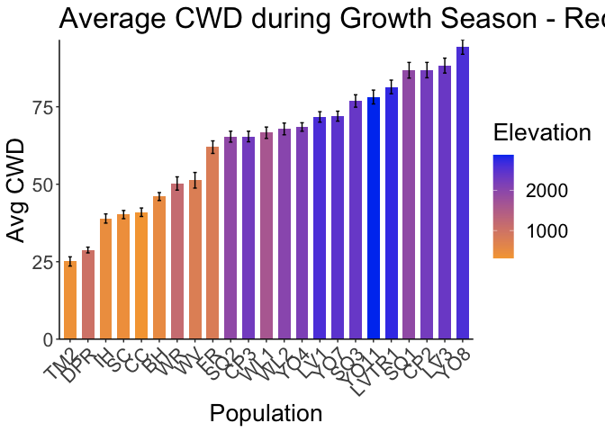<!-- -->

```r
ggsave("../output/Climate/RecentClim_PCA_Elev.png", width = 6, height = 4, units = "in")
```

### Average across all years and months (1 datapoint per pop)

Produce basic PCA plots


```r
#normalize the data
climate_normalized_avgs <- allpops_recent_grwseason_avgs %>% ungroup() %>% select(cwd_mean,  ppt_mean, tmn_mean, tmx_mean) %>% scale() #normalize the data so they're all on the same scale
head(climate_normalized_avgs)
```

```
##         cwd_mean   ppt_mean   tmn_mean   tmx_mean
## [1,] -0.84952437  0.4832246 -0.0411465 -0.2275065
## [2,] -1.11292234  1.8695013  1.2219417  0.4351143
## [3,]  1.20926597 -0.5967660 -0.1260053 -0.2200375
## [4,]  0.10742578 -0.7268686 -0.2916108 -0.5649110
## [5,] -1.84595164  1.1946986  1.6385796  1.4646613
## [6,] -0.06319325 -0.2284302  0.4820257  2.2024656
```

```r
cor.norm_avgs = cor(climate_normalized_avgs) #test correlations among the traits

file_path= "../output/Climate/GrowthSeason_RecentClim_Cors_Avgs.png"
png(width = 12, height = 6, res= 300, units = "in", file=file_path, type = "cairo")
corrplot(cor.norm_avgs)
dev.off()
```

```
## quartz_off_screen 
##                 2
```

```r
climate.pca_avgs <- princomp(cor.norm_avgs) 
summary(climate.pca_avgs) #PC1 explains 90% of the variation, PC2 explains 8.1%, together they explain 98%
```

```
## Importance of components:
##                           Comp.1     Comp.2     Comp.3       Comp.4
## Standard deviation     1.3469589 0.29181943 0.09257356 1.454628e-08
## Proportion of Variance 0.9508768 0.04463176 0.00449148 1.108969e-16
## Cumulative Proportion  0.9508768 0.99550852 1.00000000 1.000000e+00
```

```r
climate.pca_avgs$loadings[, 1:2] #PC1 has high positive loading values for tmn, tmx, cwd
```

```
##              Comp.1     Comp.2
## cwd_mean  0.5596612  0.2292785
## ppt_mean -0.5102092 -0.5747525
## tmn_mean -0.5079365  0.2207524
## tmx_mean -0.4104466  0.7538961
```

```r
fviz_eig(climate.pca_avgs) #scree plot 
```

<!-- -->

```r
fviz_pca_var(climate.pca_avgs, col.var = "black") #biplot
```

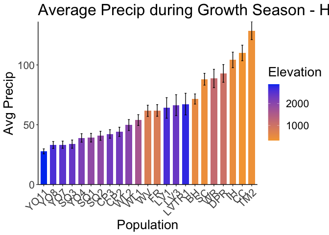<!-- -->

```r
#The goal of the third visualization is to determine how much each variable is represented in a given component. Such a quality of representation is called the Cos2 and corresponds to the square cosine, and it is computed using the fviz_cos2 function. (https://www.datacamp.com/tutorial/pca-analysis-r)
#A low value means that the variable is not perfectly represented by that component. 
#A high value, on the other hand, means a good representation of the variable on that component.
fviz_cos2(climate.pca_avgs, choice = "var", axes = 1:2) #axes says which PCs to use 
```

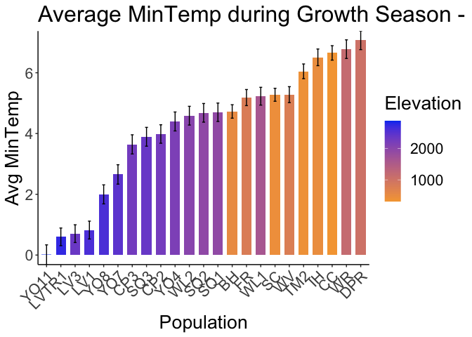<!-- -->

```r
#biplot combined wiht cos2

file_path= "../output/Climate/RecentClim_GrowthSeason_PCA_Avgs.png"
png(width = 5.5, height = 5, res= 300, units = "in", file=file_path, type = "cairo")
fviz_pca_var(climate.pca_avgs, col.var = "cos2", 
            gradient.cols = c("black", "orange", "green"),
            repel = TRUE)
dev.off()
```

```
## quartz_off_screen 
##                 2
```

Overlay populations on PCA plot


```r
pc_avgs = prcomp(climate_normalized_avgs, scale = TRUE)

pc_data = data.frame(pc_avgs$x)

locs_pc = cbind(allpops_recent_grwseason_avgs, pc_data)
names(locs_pc)
```

```
##  [1] "parent.pop"      "elevation.group" "elev_m"          "cwd_mean"       
##  [5] "pck_mean"        "ppt_mean"        "tmn_mean"        "tmx_mean"       
##  [9] "cwd_sem"         "pck_sem"         "ppt_sem"         "tmn_sem"        
## [13] "tmx_sem"         "PC1"             "PC2"             "PC3"            
## [17] "PC4"
```

```r
loadings = data.frame(varnames=rownames(pc_avgs$rotation), pc_avgs$rotation)

ggplot() +
  geom_point(data = filter(locs_pc, elevation.group == "High"), size=2, aes(x = PC1, y = PC2), color = "#0043F0") +
  geom_point(data = filter(locs_pc, elevation.group == "Mid"), size=2, aes(x = PC1, y = PC2), color = "#C9727F") +
  geom_point(data = filter(locs_pc, elevation.group == "Low"), size=2, aes(x = PC1, y = PC2), color = "#F5A540") + 
  geom_label_repel(data = locs_pc, aes(x = PC1, y = PC2, label = parent.pop),
                  min.segment.length = 0, box.padding = 0.5) +
  geom_vline(xintercept = 0, linetype="dashed") + geom_hline(yintercept = 0, linetype="dashed") +
  theme_classic()
```

<!-- -->

```r
ggsave("../output/Climate/RecentClim_PCA_Elev_Avgs.png", width = 6, height = 4, units = "in")
```

### Average across years per month

Calculate monthly averages


```r
names(allpops_recent_grwseason)
```

```
##  [1] "parent.pop"      "elevation.group" "elev_m"          "PckSum"         
##  [5] "year"            "month"           "cwd"             "pck"            
##  [9] "ppt"             "tmn"             "tmx"
```

```r
allpops_recent_grwseason_mosavgs <- allpops_recent_grwseason %>% group_by(parent.pop, elevation.group, month) %>% summarise_at(c("cwd",  "ppt", "tmn", "tmx"), c(mean, sem), na.rm = TRUE) 
names(allpops_recent_grwseason_mosavgs) <- gsub("fn2", "sem", colnames(allpops_recent_grwseason_mosavgs))
names(allpops_recent_grwseason_mosavgs) <-gsub("fn1", "mean", colnames(allpops_recent_grwseason_mosavgs))
allpops_recent_grwseason_mosavgs #30 year averages per growth season month 
```

```
## # A tibble: 245 × 11
## # Groups:   parent.pop, elevation.group [23]
##    parent.pop elevation.group month cwd_mean ppt_mean tmn_mean tmx_mean cwd_sem
##    <chr>      <chr>           <dbl>    <dbl>    <dbl>    <dbl>    <dbl>   <dbl>
##  1 BH         Low                 1     29.4   124.       2.75     13.9   0.431
##  2 BH         Low                 2     41.0    94.7      3.38     15.0   0.497
##  3 BH         Low                 3     54.2    84.0      4.92     17.6   1.55 
##  4 BH         Low                 4     59.0    48.6      6.35     20.5   2.91 
##  5 BH         Low                 5     49.5    24.8      9.67     25.6   5.57 
##  6 BH         Low                 6     41.8    24.3     12.6      29.6   5.34 
##  7 BH         Low                 7     80.9     1.42    15.6      33.5  NA    
##  8 BH         Low                 8    117.     10.8     16.2      33.9  NA    
##  9 BH         Low                 9    133.     17.7     15.8      32.5   5.40 
## 10 BH         Low                10     87.8    40.8      9.06     24.5   0.466
## # ℹ 235 more rows
## # ℹ 3 more variables: ppt_sem <dbl>, tmn_sem <dbl>, tmx_sem <dbl>
```

```r
allpops_recent_grwseason_mosavgs$elevation.group <- factor(allpops_recent_grwseason_mosavgs$elevation.group, levels=elev_order) 
```

Produce basic PCA plots

*Color by growth month relative to growth season?*


```r
names(allpops_recent_grwseason_mosavgs)
```

```
##  [1] "parent.pop"      "elevation.group" "month"           "cwd_mean"       
##  [5] "ppt_mean"        "tmn_mean"        "tmx_mean"        "cwd_sem"        
##  [9] "ppt_sem"         "tmn_sem"         "tmx_sem"
```

```r
#normalize the data
climate_normalized_mosavgs <- allpops_recent_grwseason_mosavgs %>% ungroup() %>% select(cwd_mean,  ppt_mean, tmn_mean, tmx_mean) %>% scale() #normalize the data so they're all on the same scale
head(climate_normalized_mosavgs)
```

```
##          cwd_mean   ppt_mean   tmn_mean   tmx_mean
## [1,] -0.898526179  1.2608488 -0.4279863 -0.6361238
## [2,] -0.542198673  0.6971182 -0.3126086 -0.4895391
## [3,] -0.139667523  0.4906759 -0.0327692 -0.1161993
## [4,]  0.007355232 -0.1892452  0.2271942  0.2876770
## [5,] -0.283206254 -0.6456044  0.8311697  1.0227146
## [6,] -0.519142814 -0.6544123  1.3563230  1.5919318
```

```r
cor.norm_mosavgs = cor(climate_normalized_mosavgs) #test correlations among the traits

file_path= "../output/Climate/GrowthSeason_RecentClim_Cors_MonthlyAvgs.png"
png(width = 12, height = 6, res= 300, units = "in", file=file_path, type = "cairo")
corrplot(cor.norm_mosavgs)
dev.off()
```

```
## quartz_off_screen 
##                 2
```

```r
climate.pca_mosavgs <- princomp(cor.norm_mosavgs) 
summary(climate.pca_mosavgs) #PC1 explains 90% of the variation, PC2 explains 8.1%, together they explain 98%
```

```
## Importance of components:
##                           Comp.1     Comp.2       Comp.3       Comp.4
## Standard deviation     1.1903076 0.31304473 0.0195145990 9.763764e-09
## Proportion of Variance 0.9350731 0.06467553 0.0002513312 6.291609e-17
## Cumulative Proportion  0.9350731 0.99974867 1.0000000000 1.000000e+00
```

```r
climate.pca_mosavgs$loadings[, 1:2] #PC1 has high positive loading values for tmn, tmx, cwd
```

```
##              Comp.1     Comp.2
## cwd_mean  0.4761261  0.6547751
## ppt_mean -0.5518321 -0.2885725
## tmn_mean  0.4569131 -0.5495886
## tmx_mean  0.5099174 -0.4312167
```

```r
fviz_eig(climate.pca_mosavgs) #scree plot 
```

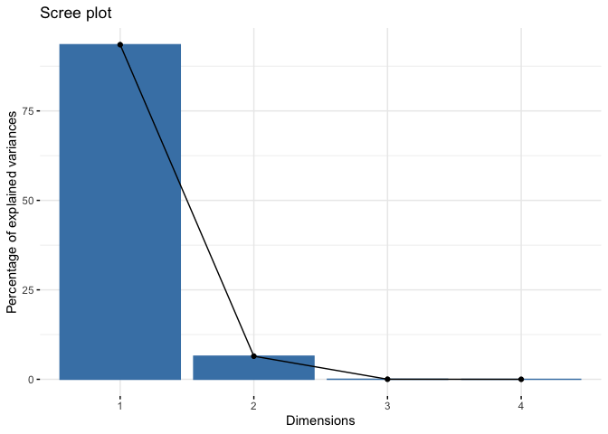<!-- -->

```r
fviz_pca_var(climate.pca_mosavgs, col.var = "black") #biplot
```

<!-- -->

```r
#The goal of the third visualization is to determine how much each variable is represented in a given component. Such a quality of representation is called the Cos2 and corresponds to the square cosine, and it is computed using the fviz_cos2 function. (https://www.datacamp.com/tutorial/pca-analysis-r)
#A low value means that the variable is not perfectly represented by that component. 
#A high value, on the other hand, means a good representation of the variable on that component.
fviz_cos2(climate.pca_mosavgs, choice = "var", axes = 1:2) #axes says which PCs to use 
```

<!-- -->

```r
#biplot combined wiht cos2

file_path= "../output/Climate/RecentClim_GrowthSeason_PCA_MonthlyAvgs.png"
png(width = 5.5, height = 5, res= 300, units = "in", file=file_path, type = "cairo")
fviz_pca_var(climate.pca_mosavgs, col.var = "cos2", 
            gradient.cols = c("black", "orange", "green"),
            repel = TRUE)
dev.off()
```

```
## quartz_off_screen 
##                 2
```

Overlay populations on PCA plot


```r
pc_mosavgs = prcomp(climate_normalized_mosavgs, scale = TRUE)

pc_data = data.frame(pc_mosavgs$x)

locs_pc = cbind(allpops_recent_grwseason_mosavgs, pc_data)

loadings = data.frame(varnames=rownames(pc_mosavgs$rotation), pc_mosavgs$rotation)

ggplot() +
  geom_point(data = filter(locs_pc, elevation.group == "High"), size=2, aes(x = PC1, y = PC2), color = "#0043F0") +
  geom_point(data = filter(locs_pc, elevation.group == "Mid"), size=2, aes(x = PC1, y = PC2), color = "#C9727F") +
  geom_point(data = filter(locs_pc, elevation.group == "Low"), size=2, aes(x = PC1, y = PC2), color = "#F5A540") + 
  geom_text_repel(data = locs_pc, aes(x = PC1, y = PC2, label = parent.pop),
             min.segment.length = 0) +
  geom_vline(xintercept = 0, linetype="dashed") + geom_hline(yintercept = 0, linetype="dashed") +
  theme_classic()
```

```
## Warning: ggrepel: 74 unlabeled data points (too many overlaps). Consider
## increasing max.overlaps
```

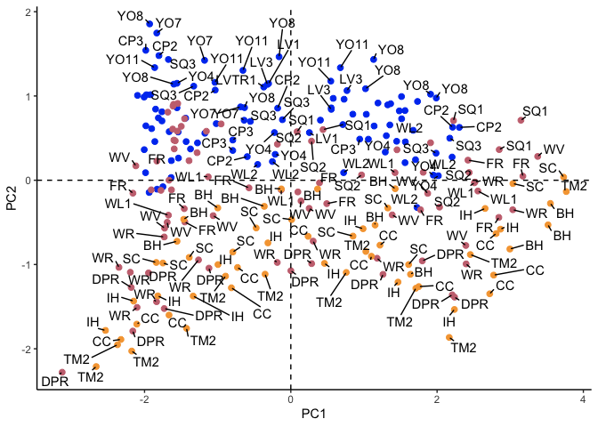<!-- -->

```r
ggsave("../output/Climate/RecentClim_PCA_Elev_MonthlyAvgs_Pops.png", width = 6, height = 4, units = "in")
```

```
## Warning: ggrepel: 129 unlabeled data points (too many overlaps). Consider
## increasing max.overlaps
```

```r
ggplot() +
  geom_point(data = filter(locs_pc, elevation.group == "High"), size=2, aes(x = PC1, y = PC2), color = "#0043F0") +
  geom_point(data = filter(locs_pc, elevation.group == "Mid"), size=2, aes(x = PC1, y = PC2), color = "#C9727F") +
  geom_point(data = filter(locs_pc, elevation.group == "Low"), size=2, aes(x = PC1, y = PC2), color = "#F5A540") + 
  geom_text_repel(data = locs_pc, aes(x = PC1, y = PC2, label = month),
                  min.segment.length = 0) +
  geom_vline(xintercept = 0, linetype="dashed") + geom_hline(yintercept = 0, linetype="dashed") +
  theme_classic()
```

```
## Warning: ggrepel: 28 unlabeled data points (too many overlaps). Consider
## increasing max.overlaps
```

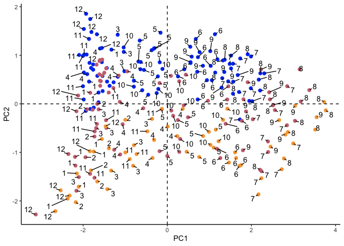<!-- -->

```r
ggsave("../output/Climate/RecentClim_PCA_Elev_MonthlyAvgs_Months.png", width = 6, height = 4, units = "in")
```

```
## Warning: ggrepel: 53 unlabeled data points (too many overlaps). Consider
## increasing max.overlaps
```
