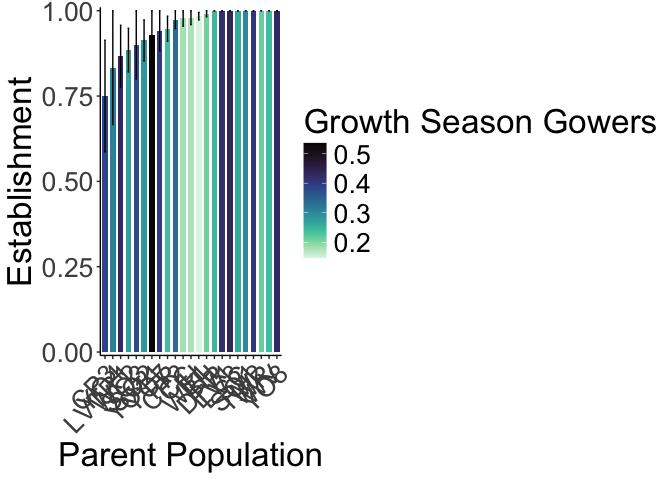
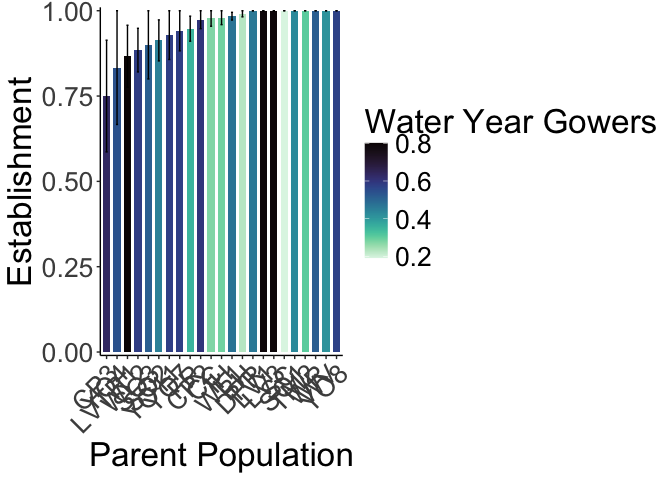

# Establishment (survival 3 weeks post transplant)

## Libraries

``` r
library(tidyverse)
```

```
## ── Attaching core tidyverse packages ──────────────────────── tidyverse 2.0.0 ──
## ✔ dplyr     1.1.4     ✔ readr     2.1.5
## ✔ forcats   1.0.0     ✔ stringr   1.5.1
## ✔ ggplot2   3.5.1     ✔ tibble    3.2.1
## ✔ lubridate 1.9.3     ✔ tidyr     1.3.1
## ✔ purrr     1.0.2     
## ── Conflicts ────────────────────────────────────────── tidyverse_conflicts() ──
## ✖ dplyr::filter() masks stats::filter()
## ✖ dplyr::lag()    masks stats::lag()
## ℹ Use the conflicted package (<http://conflicted.r-lib.org/>) to force all conflicts to become errors
```

``` r
library(magrittr)
```

```
## 
## Attaching package: 'magrittr'
## 
## The following object is masked from 'package:purrr':
## 
##     set_names
## 
## The following object is masked from 'package:tidyr':
## 
##     extract
```

``` r
#conflicted::conflicts_prefer(dplyr::filter)
library(viridis) #for pretty colors
```

```
## Loading required package: viridisLite
```

``` r
library(ggrepel) #for non-overlapping labels on plots
library(ggdist) #visualizations of distributions and uncertainty 
library(ggpubr)

#library(sp) #for calculating geographic distance 
library(geosphere) #for calculating geographic distance
library(corrplot) #plotting correlations  
```

```
## corrplot 0.94 loaded
```

``` r
library(rstatix) #performing cor_test
```

```
## 
## Attaching package: 'rstatix'
## 
## The following object is masked from 'package:stats':
## 
##     filter
```

``` r
library(lmerTest) #mixed models
```

```
## Loading required package: lme4
## Loading required package: Matrix
## 
## Attaching package: 'Matrix'
## 
## The following objects are masked from 'package:tidyr':
## 
##     expand, pack, unpack
## 
## 
## Attaching package: 'lmerTest'
## 
## The following object is masked from 'package:lme4':
## 
##     lmer
## 
## The following object is masked from 'package:stats':
## 
##     step
```

``` r
conflicted::conflicts_prefer(lmerTest::lmer)
```

```
## [conflicted] Will prefer lmerTest::lmer over any other package.
```

``` r
library(broom.mixed)
library(tidymodels)
```

```
## ── Attaching packages ────────────────────────────────────── tidymodels 1.2.0 ──
## ✔ broom        1.0.7     ✔ rsample      1.2.1
## ✔ dials        1.3.0     ✔ tune         1.2.1
## ✔ infer        1.0.7     ✔ workflows    1.1.4
## ✔ modeldata    1.4.0     ✔ workflowsets 1.1.0
## ✔ parsnip      1.2.1     ✔ yardstick    1.3.1
## ✔ recipes      1.1.0     
## ── Conflicts ───────────────────────────────────────── tidymodels_conflicts() ──
## ✖ infer::chisq_test()   masks rstatix::chisq_test()
## ✖ scales::discard()     masks purrr::discard()
## ✖ Matrix::expand()      masks tidyr::expand()
## ✖ magrittr::extract()   masks tidyr::extract()
## ✖ rstatix::filter()     masks dplyr::filter(), stats::filter()
## ✖ recipes::fixed()      masks stringr::fixed()
## ✖ dials::get_n()        masks rstatix::get_n()
## ✖ dplyr::lag()          masks stats::lag()
## ✖ Matrix::pack()        masks tidyr::pack()
## ✖ infer::prop_test()    masks rstatix::prop_test()
## ✖ magrittr::set_names() masks purrr::set_names()
## ✖ yardstick::spec()     masks readr::spec()
## ✖ recipes::step()       masks lmerTest::step(), stats::step()
## ✖ infer::t_test()       masks rstatix::t_test()
## ✖ Matrix::unpack()      masks tidyr::unpack()
## ✖ recipes::update()     masks Matrix::update(), stats::update()
## • Dig deeper into tidy modeling with R at https://www.tmwr.org
```

``` r
library(furrr) #Apply Mapping Functions in Parallel using Futures
```

```
## Loading required package: future
```

``` r
tidymodels_prefer()
# install.packages("multilevelmod")
library(multilevelmod)

library(brms)
```

```
## Loading required package: Rcpp
## 
## Attaching package: 'Rcpp'
## 
## The following object is masked from 'package:rsample':
## 
##     populate
## 
## Loading 'brms' package (version 2.22.0). Useful instructions
## can be found by typing help('brms'). A more detailed introduction
## to the package is available through vignette('brms_overview').
```

``` r
#conflicted::conflicts_prefer(brms::ar)
#conflicted::conflicts_prefer(dplyr::combine)
#conflicted::conflicts_prefer(brms::dstudent_t)
library(tidybayes) #for extracting and visiaulizing brms model output 
library(modelr) #for data grid

sem <- function(x, na.rm=FALSE) {           #for caclulating standard error
  sd(x,na.rm=na.rm)/sqrt(length(na.omit(x)))
} 

cbbPalette2 <- c("#E69F00","#000000", "#56B4E9","#009E73", "#F0E442", "#0072B2", "#D55E00", "#CC79A7")
timepd_palette <- c("#56B4E9","#D55E00")

options(mc.cores = parallel::detectCores())
```

## Load data from UCD and WL2

``` r
ucd_surv <- read_csv("../input/UCD_Data/CorrectedCSVs/UCD_transplants_pheno_mort_20231016_corrected.csv") %>% 
  rename(death.date=`Death Date`, bud.date=`Date First Bud`, flower.date=`Date First Flower`, 
         fruit.date=`Date First Fruit`, last.flower.date=`Date Last Flower`, last.fruit.date=`Date Last Fruit`) %>% 
  filter(!is.na(pop)) %>% 
  unite(Genotype, pop:rep, sep="_", remove = FALSE) %>% 
  filter(!str_detect(Genotype, "buffer")) 
```

```
## Rows: 858 Columns: 13
## ── Column specification ────────────────────────────────────────────────────────
## Delimiter: ","
## chr (10): block, col, pop, Date First Bud, Date First Flower, Date First Fru...
## dbl  (3): row, mf, rep
## 
## ℹ Use `spec()` to retrieve the full column specification for this data.
## ℹ Specify the column types or set `show_col_types = FALSE` to quiet this message.
```

``` r
#unique(ucd_surv$pop)

wl2_surv_1020 <- read_csv("../input/WL2_Data/CorrectedCSVs/WL2_mort_pheno_20231020_corrected.csv") #need to add in 10/27 mortality 
```

```
## Rows: 1826 Columns: 14
## ── Column specification ────────────────────────────────────────────────────────
## Delimiter: ","
## chr (12): block, bed, bed.col, pop, mf, rep, bud.date, flower.date, fruit.da...
## dbl  (1): bed.row
## lgl  (1): last.fruit.date
## 
## ℹ Use `spec()` to retrieve the full column specification for this data.
## ℹ Specify the column types or set `show_col_types = FALSE` to quiet this message.
```

``` r
wl2_ann_cens <- read_csv("../input/WL2_Data/CorrectedCSVs/WL2_annual_census_20231027_corrected.csv") %>% 
  unite(Genotype, pop:rep, sep="_", remove = FALSE) %>% 
  unite(BedLoc, bed:`bed-col`, sep="_", remove = FALSE) %>% 
  filter(BedLoc!="K_5_C") %>% #get rid of duplicate locations
  filter(BedLoc!="B_32_A") %>% #get rid of duplicate locations
  filter(!is.na(pop), !str_detect(Genotype, ".*buff*")) #remove buffers 
```

```
## Warning: One or more parsing issues, call `problems()` on your data frame for details,
## e.g.:
##   dat <- vroom(...)
##   problems(dat)
```

```
## Rows: 1826 Columns: 19
## ── Column specification ────────────────────────────────────────────────────────
## Delimiter: ","
## chr (10): date, block, bed, bed-col, pop, mf, rep, pheno, herbiv.y.n, survey...
## dbl  (7): bed-row, diam.mm, num.flw, num.fruit, long.fruit.cm, total.branch,...
## lgl  (2): height.cm, long.leaf.cm
## 
## ℹ Use `spec()` to retrieve the full column specification for this data.
## ℹ Specify the column types or set `show_col_types = FALSE` to quiet this message.
```

``` r
wl2_surv_1027 <- wl2_ann_cens %>% 
  filter(pheno=="X") %>% 
  select(death.date_2=date, block:bed, bed.row=`bed-row`, bed.col=`bed-col`, pop:rep) #add in 10/27 death dates
#note: 10/27 pheno dates (like flowering), not updated with this code 

wl2_surv_y1 <- left_join(wl2_surv_1020, wl2_surv_1027) %>% 
  mutate(death.date=if_else(is.na(death.date), death.date_2, death.date)) %>% 
  mutate(pop= str_replace(pop, "Y08", "YO8")) %>% 
  mutate(pop= str_replace(pop, "Y04", "YO4")) %>% 
  unite(BedLoc, bed:bed.col, sep="_", remove = FALSE) %>% 
  filter(BedLoc!="K_5_C") %>% #get rid of duplicate locations
  filter(BedLoc!="B_32_A") %>% #get rid of duplicate locations
  unite(Genotype, pop:rep, sep="_", remove = FALSE) %>% 
  filter(!is.na(pop), !str_detect(Genotype, ".*buff*")) %>%  #remove buffers 
  select(block:survey.notes)
```

```
## Joining with `by = join_by(block, bed, bed.row, bed.col, pop, mf, rep)`
```

``` r
#wl2_surv_y1_to_export <- wl2_surv_y1 %>% select(block:rep, death.date, survey.notes)
#write_csv(wl2_surv_y1_to_export, "../output/WL2_Traits/WL2_Mortality_2023.csv")
#unique(wl2_surv_y1$pop)
```

## Gower's Distance

``` r
garden_climate <- read_csv("../output/Climate/flint_climate_UCDpops.csv") %>% 
  filter(parent.pop=="WL2_Garden" | parent.pop=="UCD_Garden") %>% 
  select(parent.pop:Long) %>% 
  distinct()
```

```
## Rows: 38775 Columns: 14
## ── Column specification ────────────────────────────────────────────────────────
## Delimiter: ","
## chr  (3): parent.pop, elevation.group, month
## dbl (11): elev_m, Lat, Long, year, aet, cwd, pck, pet, ppt, tmn, tmx
## 
## ℹ Use `spec()` to retrieve the full column specification for this data.
## ℹ Specify the column types or set `show_col_types = FALSE` to quiet this message.
```

``` r
garden_climate
```

```
## # A tibble: 2 × 5
##   parent.pop elevation.group elev_m   Lat  Long
##   <chr>      <chr>            <dbl> <dbl> <dbl>
## 1 UCD_Garden Low                 16  38.5 -122.
## 2 WL2_Garden High              2020  38.8 -120.
```

``` r
#UCD LAT/LONG = 38.53250, -121.7830
#WL2 Lat/Long = 38.82599, -120.2509

ucd_gowers <- read_csv("../output/Climate/Gowers_UCD.csv") %>% 
  select(parent.pop:GrwSsn_GD, Wtr_Year_GD) %>% 
  pivot_wider(names_from = TimePd, values_from = c(GrwSsn_GD, Wtr_Year_GD)) %>% 
  mutate(UCD_Lat=38.53250, UCD_Long=-121.7830, UCD_Elev=16) %>% 
  mutate(Geographic_Dist=distHaversine(cbind(UCD_Long, UCD_Lat), cbind(Long, Lat)),
         Elev_Dist=UCD_Elev-elev_m) %>% # Calculate the distance using the haversine formula (dist in meters)
  #mutate(Lat_Dist=UCD_Lat-Lat, Long_Dist=UCD_Long-Long) %>% #Garden-Home - lat and long per Gerst et al 2011 which kept them separate for some directionality
  rename(pop=parent.pop)
```

```
## Rows: 46 Columns: 12
## ── Column specification ────────────────────────────────────────────────────────
## Delimiter: ","
## chr (3): parent.pop, elevation.group, TimePd
## dbl (9): elev_m, Lat, Long, GrwSsn_GD, GrwSsn_FLINT_GD, GrwSsn_BIOCLIM_GD, W...
## 
## ℹ Use `spec()` to retrieve the full column specification for this data.
## ℹ Specify the column types or set `show_col_types = FALSE` to quiet this message.
```

``` r
wl2_gowers_2023 <- read_csv("../output/Climate/Gowers_WL2.csv") %>% 
  select(parent.pop:GrwSsn_GD, Wtr_Year_GD) %>% 
  pivot_wider(names_from = TimePd, values_from = c(GrwSsn_GD, Wtr_Year_GD)) %>% 
  mutate(WL2_Lat=38.82599, WL2_Long=-120.2509, WL2_Elev=2020) %>% 
  mutate(Geographic_Dist=distHaversine(cbind(WL2_Long, WL2_Lat), cbind(Long, Lat)),
         Elev_Dist=WL2_Elev-elev_m) %>% # Calculate the distance using the haversine formula
  #mutate(Lat_Dist=WL2_Lat-Lat, Long_Dist=WL2_Long-Long) %>% #Garden-Home - lat and long per Gerst et al 2011 which kept them separate for some directionality
  rename(pop=parent.pop)
```

```
## Rows: 46 Columns: 12
## ── Column specification ────────────────────────────────────────────────────────
## Delimiter: ","
## chr (3): parent.pop, elevation.group, TimePd
## dbl (9): elev_m, Lat, Long, GrwSsn_GD, GrwSsn_FLINT_GD, GrwSsn_BIOCLIM_GD, W...
## 
## ℹ Use `spec()` to retrieve the full column specification for this data.
## ℹ Specify the column types or set `show_col_types = FALSE` to quiet this message.
```

## Davis - used 3 weeks to match WL2

``` r
unique(ucd_surv$pop)
```

```
##  [1] "WL2"   "CP2"   "YO11"  "CC"    "FR"    "BH"    "IH"    "LV3"   "SC"   
## [10] "LVTR1" "SQ3"   "TM2"   "WL1"   "YO7"   "DPR"   "SQ2"   "SQ1"   "YO8"  
## [19] "YO4"   "WR"    "WV"    "CP3"   "LV1"
```

``` r
ucd_surv %>% filter(rep==100)
```

```
## # A tibble: 2 × 14
##   block   row col   Genotype  pop      mf   rep bud.date flower.date fruit.date
##   <chr> <dbl> <chr> <chr>     <chr> <dbl> <dbl> <chr>    <chr>       <chr>     
## 1 L1        5 A     WL2_3_100 WL2       3   100 <NA>     <NA>        <NA>      
## 2 L2       37 C     SQ2_6_100 SQ2       6   100 <NA>     <NA>        <NA>      
## # ℹ 4 more variables: last.flower.date <chr>, last.fruit.date <chr>,
## #   death.date <chr>, Notes <chr>
```

``` r
ucd_surv %>% filter(Genotype=="WL2_4_10")
```

```
## # A tibble: 1 × 14
##   block   row col   Genotype pop      mf   rep bud.date flower.date fruit.date
##   <chr> <dbl> <chr> <chr>    <chr> <dbl> <dbl> <chr>    <chr>       <chr>     
## 1 L2       33 D     WL2_4_10 WL2       4    10 <NA>     <NA>        <NA>      
## # ℹ 4 more variables: last.flower.date <chr>, last.fruit.date <chr>,
## #   death.date <chr>, Notes <chr>
```

``` r
#there are 3 plants that died early and later had germ WL2_4_10(1/6/23), WL2_3_100(L1_5_A)-1/6/23 and SQ2_6_100(L2_37_C)-12/13/22

ucd_establishment <- ucd_surv %>% 
  left_join(ucd_gowers) %>% 
  select(block:rep, elevation.group:Wtr_Year_GD_Historical, Geographic_Dist, Elev_Dist, death.date) %>% 
  mutate(death.date=mdy(death.date)) %>% 
  mutate(Establishment=if_else(is.na(death.date), 1,
                               if_else(death.date=="2022-11-30" | death.date=="2022-12-13" | death.date=="2022-12-21", 0,
                                       1))) %>% 
  mutate(Establishment=if_else(Genotype=="SQ2_6_100", 0, Establishment))
```

```
## Joining with `by = join_by(pop)`
```

``` r
#ucd_establishment %>% filter(Establishment==0)
  
#write_csv(ucd_establishment, "../output/UCD_Traits/UCD_Establishment.csv")
```

### Bar plots

``` r
ucd_establishment %>% 
  group_by(pop, elev_m, GrwSsn_GD_Recent, GrwSsn_GD_Historical) %>% 
  summarise(meanEst=mean(Establishment, na.rm = TRUE), semEst=sem(Establishment, na.rm=TRUE)) %>% 
  ggplot(aes(x=fct_reorder(pop, meanEst), y=meanEst, fill=GrwSsn_GD_Recent)) +
  geom_col(width = 0.7,position = position_dodge(0.75)) + 
  geom_errorbar(aes(ymin=meanEst-semEst,ymax=meanEst+semEst),width=.2, position = 
                  position_dodge(0.75)) +
  theme_classic() + 
  scale_y_continuous(expand = c(0.01, 0)) +
  labs(y="Establishment", x="Parent Population", fill="Growth Season Gowers") +
  scale_fill_viridis(option="mako", direction = -1) +
  theme(text=element_text(size=25), axis.text.x = element_text(angle = 45,  hjust = 1))
```

```
## `summarise()` has grouped output by 'pop', 'elev_m', 'GrwSsn_GD_Recent'. You
## can override using the `.groups` argument.
```

<!-- -->

``` r
#ggsave("../output/UCD_Traits/UCD_Establishment_GrwSsn_GD_Recent.png", width = 12, height = 8, units = "in")

ucd_establishment %>% 
  group_by(pop, elev_m, GrwSsn_GD_Recent, Wtr_Year_GD_Recent) %>% 
  summarise(meanEst=mean(Establishment, na.rm = TRUE), semEst=sem(Establishment, na.rm=TRUE)) %>% 
  ggplot(aes(x=fct_reorder(pop, meanEst), y=meanEst, fill=Wtr_Year_GD_Recent)) +
  geom_col(width = 0.7,position = position_dodge(0.75)) + 
  geom_errorbar(aes(ymin=meanEst-semEst,ymax=meanEst+semEst),width=.2, position = 
                  position_dodge(0.75)) +
  theme_classic() + 
  scale_y_continuous(expand = c(0.01, 0)) +
  labs(y="Establishment", x="Parent Population", fill="Water Year Gowers") +
  scale_fill_viridis(option="mako", direction = -1) +
  theme(text=element_text(size=25), axis.text.x = element_text(angle = 45,  hjust = 1))
```

```
## `summarise()` has grouped output by 'pop', 'elev_m', 'GrwSsn_GD_Recent'. You
## can override using the `.groups` argument.
```

<!-- -->

``` r
#ggsave("../output/UCD_Traits/UCD_Establishment_Wtr_Year_GD_Recent.png", width = 12, height = 8, units = "in")
```


## WL2 - 3 weeks based off survival curve

``` r
wl2_establishment <- wl2_surv_y1 %>% 
  left_join(wl2_gowers_2023) %>% 
  select(block:rep, elevation.group:Wtr_Year_GD_Historical, Geographic_Dist, Elev_Dist, death.date) %>% 
  mutate(death.date=mdy(death.date)) %>% 
  mutate(Establishment=if_else(is.na(death.date), 1,
                               if_else(death.date=="2023-07-26" | death.date=="2023-08-02" | death.date=="2023-08-09", 0,
                                       1)))
```

```
## Joining with `by = join_by(pop)`
```

``` r
#write_csv(wl2_establishment, "../output/WL2_Traits/WL2_Establishment.csv")
```

### Bar plots

``` r
wl2_establishment %>% 
  group_by(pop, elev_m, GrwSsn_GD_Recent, Wtr_Year_GD_Recent) %>% 
  summarise(meanEst=mean(Establishment, na.rm = TRUE), semEst=sem(Establishment, na.rm=TRUE)) %>% 
  ggplot(aes(x=fct_reorder(pop, meanEst), y=meanEst, fill=GrwSsn_GD_Recent)) +
  geom_col(width = 0.7,position = position_dodge(0.75)) + 
  geom_errorbar(aes(ymin=meanEst-semEst,ymax=meanEst+semEst),width=.2, position = 
                  position_dodge(0.75)) +
  theme_classic() + 
  scale_y_continuous(expand = c(0.01, 0)) +
  labs(y="Establishment", x="Parent Population", fill="Growth Season Gowers") +
  scale_fill_viridis(option="mako", direction = -1) +
  theme(text=element_text(size=25), axis.text.x = element_text(angle = 45,  hjust = 1))
```

```
## `summarise()` has grouped output by 'pop', 'elev_m', 'GrwSsn_GD_Recent'. You
## can override using the `.groups` argument.
```

<!-- -->

``` r
#ggsave("../output/WL2_Traits/WL2_Establishment_GrwSsn_GD_Recent.png", width = 12, height = 8, units = "in")

wl2_establishment %>% 
  group_by(pop, elev_m, GrwSsn_GD_Recent, Wtr_Year_GD_Recent) %>% 
  summarise(meanEst=mean(Establishment, na.rm = TRUE), semEst=sem(Establishment, na.rm=TRUE)) %>% 
  ggplot(aes(x=fct_reorder(pop, meanEst), y=meanEst, fill=Wtr_Year_GD_Recent)) +
  geom_col(width = 0.7,position = position_dodge(0.75)) + 
  geom_errorbar(aes(ymin=meanEst-semEst,ymax=meanEst+semEst),width=.2, position = 
                  position_dodge(0.75)) +
  theme_classic() + 
  scale_y_continuous(expand = c(0.01, 0)) +
  labs(y="Establishment", x="Parent Population", fill="Water Year Gowers") +
  scale_fill_viridis(option="mako", direction = -1) +
  theme(text=element_text(size=25), axis.text.x = element_text(angle = 45,  hjust = 1))
```

```
## `summarise()` has grouped output by 'pop', 'elev_m', 'GrwSsn_GD_Recent'. You
## can override using the `.groups` argument.
```

<!-- -->

``` r
#ggsave("../output/WL2_Traits/WL2_Establishment_Wtr_Year_GD_Recent.png", width = 12, height = 8, units = "in")
```

## Scatterplots
### Davis

``` r
#scatter plots
GSCD_recent <- ucd_establishment %>% 
  group_by(pop, elev_m, GrwSsn_GD_Recent, GrwSsn_GD_Historical) %>% 
  summarise(meanEst=mean(Establishment, na.rm = TRUE), semEst=sem(Establishment, na.rm=TRUE)) %>% 
  ggplot(aes(x=GrwSsn_GD_Recent, y=meanEst, group = pop)) +
  geom_point(size=6) + 
  geom_errorbar(aes(ymin=meanEst-semEst,ymax=meanEst+semEst),width=.02, linewidth = 2) +
  theme_classic() + 
  scale_y_continuous(expand = c(0.01, 0)) +
  labs(y="Establishment", x="Recent Growth Season CD") +
  theme(text=element_text(size=25))
```

```
## `summarise()` has grouped output by 'pop', 'elev_m', 'GrwSsn_GD_Recent'. You
## can override using the `.groups` argument.
```

``` r
WYCD_recent <- ucd_establishment %>% 
  group_by(pop, elev_m, Wtr_Year_GD_Recent, Wtr_Year_GD_Historical) %>% 
  summarise(meanEst=mean(Establishment, na.rm = TRUE), semEst=sem(Establishment, na.rm=TRUE)) %>%
  ggplot(aes(x=Wtr_Year_GD_Recent, y=meanEst, group = pop)) +
  geom_point(size=6) + 
  geom_errorbar(aes(ymin=meanEst-semEst,ymax=meanEst+semEst),width=.02, linewidth = 2) +
  theme_classic() + 
  scale_y_continuous(expand = c(0.01, 0)) +
  labs(y="Establishment", x="Recent Water Year CD") +
  theme(text=element_text(size=25))
```

```
## `summarise()` has grouped output by 'pop', 'elev_m', 'Wtr_Year_GD_Recent'. You
## can override using the `.groups` argument.
```

``` r
GD <- ucd_establishment %>% 
  group_by(pop, elev_m, Geographic_Dist) %>% 
  summarise(meanEst=mean(Establishment, na.rm = TRUE), semEst=sem(Establishment, na.rm=TRUE)) %>% 
  ggplot(aes(x=Geographic_Dist, y=meanEst, group = pop)) +
  geom_point(size=6) + 
  geom_errorbar(aes(ymin=meanEst-semEst,ymax=meanEst+semEst),width=.02, linewidth = 2) +
  theme_classic() + 
  scale_y_continuous(expand = c(0.01, 0)) +
  labs(y="Establishment", x="Geographic Distance (m)") +
  theme(text=element_text(size=25), axis.text.x = element_text(angle = 45,  hjust = 1))
```

```
## `summarise()` has grouped output by 'pop', 'elev_m'. You can override using the
## `.groups` argument.
```

``` r
ED <- ucd_establishment %>% 
  group_by(pop, elev_m, Elev_Dist) %>% 
  summarise(meanEst=mean(Establishment, na.rm = TRUE), semEst=sem(Establishment, na.rm=TRUE)) %>% 
  ggplot(aes(x=Elev_Dist, y=meanEst, group = pop)) +
  geom_point(size=6) + 
  geom_errorbar(aes(ymin=meanEst-semEst,ymax=meanEst+semEst),width=.02, linewidth = 2) +
  theme_classic() + 
  scale_y_continuous(expand = c(0.01, 0)) +
  labs(y="Establishment", x="Elevation Distance (m)") +
  theme(text=element_text(size=25))
```

```
## `summarise()` has grouped output by 'pop', 'elev_m'. You can override using the
## `.groups` argument.
```

``` r
ucd_establishment_FIG <- ggarrange(GSCD_recent, WYCD_recent, GD, ED, ncol=2, nrow=2) 
#ggsave("../output/UCD_Traits/UCD_Establishment_SCATTERS_Recent.png", width = 24, height = 18, units = "in")
```


``` r
#scatter plots
GSCD_historic <- ucd_establishment %>% 
  group_by(pop, elev_m, GrwSsn_GD_Recent, GrwSsn_GD_Historical) %>% 
  summarise(meanEst=mean(Establishment, na.rm = TRUE), semEst=sem(Establishment, na.rm=TRUE)) %>% 
  ggplot(aes(x=GrwSsn_GD_Historical, y=meanEst, group = pop)) +
  geom_point(size=6) + 
  geom_errorbar(aes(ymin=meanEst-semEst,ymax=meanEst+semEst),width=.02, linewidth = 2) +
  theme_classic() + 
  scale_y_continuous(expand = c(0.01, 0)) +
  labs(y="Establishment", x="Historic Growth Season CD") +
  theme(text=element_text(size=25))
```

```
## `summarise()` has grouped output by 'pop', 'elev_m', 'GrwSsn_GD_Recent'. You
## can override using the `.groups` argument.
```

``` r
WYCD_historic <- ucd_establishment %>% 
  group_by(pop, elev_m, Wtr_Year_GD_Recent, Wtr_Year_GD_Historical) %>% 
  summarise(meanEst=mean(Establishment, na.rm = TRUE), semEst=sem(Establishment, na.rm=TRUE)) %>%
  ggplot(aes(x=Wtr_Year_GD_Historical, y=meanEst, group = pop)) +
  geom_point(size=6) + 
  geom_errorbar(aes(ymin=meanEst-semEst,ymax=meanEst+semEst),width=.02, linewidth = 2) +
  theme_classic() + 
  scale_y_continuous(expand = c(0.01, 0)) +
  labs(y="Establishment", x="Historic Water Year CD") +
  theme(text=element_text(size=25))
```

```
## `summarise()` has grouped output by 'pop', 'elev_m', 'Wtr_Year_GD_Recent'. You
## can override using the `.groups` argument.
```

``` r
ucd_establishment_FIG <- ggarrange(GSCD_historic, WYCD_historic, GD, ED, ncol=2, nrow=2) 
#ggsave("../output/UCD_Traits/UCD_Establishment_SCATTERS_Historic.png", width = 24, height = 18, units = "in")
```

### WL2

``` r
#scatter plots
GSCD_recent <- wl2_establishment %>% 
  group_by(pop, elev_m, GrwSsn_GD_Recent, GrwSsn_GD_Historical) %>% 
  summarise(meanEst=mean(Establishment, na.rm = TRUE), semEst=sem(Establishment, na.rm=TRUE)) %>% 
  ggplot(aes(x=GrwSsn_GD_Recent, y=meanEst, group = pop)) +
  geom_point(size=6) + 
  geom_errorbar(aes(ymin=meanEst-semEst,ymax=meanEst+semEst),width=.02, linewidth = 2) +
  theme_classic() + 
  scale_y_continuous(expand = c(0.01, 0)) +
  labs(y="Establishment", x="Recent Growth Season CD") +
  theme(text=element_text(size=25))
```

```
## `summarise()` has grouped output by 'pop', 'elev_m', 'GrwSsn_GD_Recent'. You
## can override using the `.groups` argument.
```

``` r
WYCD_recent <- wl2_establishment %>% 
  group_by(pop, elev_m, Wtr_Year_GD_Recent, Wtr_Year_GD_Historical) %>% 
  summarise(meanEst=mean(Establishment, na.rm = TRUE), semEst=sem(Establishment, na.rm=TRUE)) %>%
  ggplot(aes(x=Wtr_Year_GD_Recent, y=meanEst, group = pop)) +
  geom_point(size=6) + 
  geom_errorbar(aes(ymin=meanEst-semEst,ymax=meanEst+semEst),width=.02, linewidth = 2) +
  theme_classic() + 
  scale_y_continuous(expand = c(0.01, 0)) +
  labs(y="Establishment", x="Recent Water Year CD") +
  theme(text=element_text(size=25))
```

```
## `summarise()` has grouped output by 'pop', 'elev_m', 'Wtr_Year_GD_Recent'. You
## can override using the `.groups` argument.
```

``` r
GD <- wl2_establishment %>% 
  group_by(pop, elev_m, Geographic_Dist) %>% 
  summarise(meanEst=mean(Establishment, na.rm = TRUE), semEst=sem(Establishment, na.rm=TRUE)) %>% 
  ggplot(aes(x=Geographic_Dist, y=meanEst, group = pop)) +
  geom_point(size=6) + 
  geom_errorbar(aes(ymin=meanEst-semEst,ymax=meanEst+semEst),width=.02, linewidth = 2) +
  theme_classic() + 
  scale_y_continuous(expand = c(0.01, 0)) +
  labs(y="Establishment", x="Geographic Distance (m)") +
  theme(text=element_text(size=25), axis.text.x = element_text(angle = 45,  hjust = 1))
```

```
## `summarise()` has grouped output by 'pop', 'elev_m'. You can override using the
## `.groups` argument.
```

``` r
ED <- wl2_establishment %>% 
  group_by(pop, elev_m, Elev_Dist) %>% 
  summarise(meanEst=mean(Establishment, na.rm = TRUE), semEst=sem(Establishment, na.rm=TRUE)) %>% 
  ggplot(aes(x=Elev_Dist, y=meanEst, group = pop)) +
  geom_point(size=6) + 
  geom_errorbar(aes(ymin=meanEst-semEst,ymax=meanEst+semEst),width=.02, linewidth = 2) +
  theme_classic() + 
  scale_y_continuous(expand = c(0.01, 0)) +
  labs(y="Establishment", x="Elevation Distance (m)") +
  theme(text=element_text(size=25))
```

```
## `summarise()` has grouped output by 'pop', 'elev_m'. You can override using the
## `.groups` argument.
```

``` r
wl2_establishment_FIG <- ggarrange(GSCD_recent, WYCD_recent, GD, ED, ncol=2, nrow=2) 
#ggsave("../output/WL2_Traits/WL2_Establishment_SCATTERS_Recent.png", width = 24, height = 18, units = "in")
```


``` r
#scatter plots
GSCD_historic <- wl2_establishment %>% 
  group_by(pop, elev_m, GrwSsn_GD_Recent, GrwSsn_GD_Historical) %>% 
  summarise(meanEst=mean(Establishment, na.rm = TRUE), semEst=sem(Establishment, na.rm=TRUE)) %>% 
  ggplot(aes(x=GrwSsn_GD_Historical, y=meanEst, group = pop)) +
  geom_point(size=6) + 
  geom_errorbar(aes(ymin=meanEst-semEst,ymax=meanEst+semEst),width=.02, linewidth = 2) +
  theme_classic() + 
  scale_y_continuous(expand = c(0.01, 0)) +
  labs(y="Establishment", x="Historic Growth Season CD") +
  theme(text=element_text(size=25))
```

```
## `summarise()` has grouped output by 'pop', 'elev_m', 'GrwSsn_GD_Recent'. You
## can override using the `.groups` argument.
```

``` r
WYCD_historic <- wl2_establishment %>% 
  group_by(pop, elev_m, Wtr_Year_GD_Recent, Wtr_Year_GD_Historical) %>% 
  summarise(meanEst=mean(Establishment, na.rm = TRUE), semEst=sem(Establishment, na.rm=TRUE)) %>%
  ggplot(aes(x=Wtr_Year_GD_Historical, y=meanEst, group = pop)) +
  geom_point(size=6) + 
  geom_errorbar(aes(ymin=meanEst-semEst,ymax=meanEst+semEst),width=.02, linewidth = 2) +
  theme_classic() + 
  scale_y_continuous(expand = c(0.01, 0)) +
  labs(y="Establishment", x="Historic Water Year CD") +
  theme(text=element_text(size=25))
```

```
## `summarise()` has grouped output by 'pop', 'elev_m', 'Wtr_Year_GD_Recent'. You
## can override using the `.groups` argument.
```

``` r
wl2_establishment_FIG <- ggarrange(GSCD_historic, WYCD_historic, GD, ED, ncol=2, nrow=2) 
#ggsave("../output/WL2_Traits/WL2_Establishment_SCATTERS_Historic.png", width = 24, height = 18, units = "in")
```

## Stats

### Scaling 

``` r
wl2_establishment_scaled <- wl2_establishment %>% mutate_at(c("GrwSsn_GD_Recent","Wtr_Year_GD_Recent",                                                           "GrwSsn_GD_Historical","Wtr_Year_GD_Historical","Geographic_Dist"),
                                                            scale) 

ucd_establishment_scaled <- ucd_establishment %>% mutate_at(c("GrwSsn_GD_Recent","Wtr_Year_GD_Recent",                                                           "GrwSsn_GD_Historical","Wtr_Year_GD_Historical","Geographic_Dist"),
                                                            scale) 

#CHECK MODEL PARAMS
unique(wl2_establishment_scaled$pop)
```

```
##  [1] "TM2"   "LVTR1" "SQ2"   "YO8"   "CC"    "YO11"  "BH"    "DPR"   "CP2"  
## [10] "WL1"   "IH"    "CP3"   "SC"    "FR"    "LV3"   "YO7"   "WV"    "SQ3"  
## [19] "WL2"   "LV1"   "YO4"   "WR"    "SQ1"
```

``` r
unique(wl2_establishment_scaled$mf)
```

```
##  [1] "6"  "7"  "8"  "2"  "5"  "4"  "3"  "1"  "9"  "14" "13" "10" "11"
```

``` r
unique(wl2_establishment_scaled$block)
```

```
##  [1] "A" "B" "D" "C" "E" "F" "G" "H" "I" "J" "K" "L" "M"
```

``` r
summary(wl2_establishment_scaled)
```

```
##     block              BedLoc              bed               bed.row     
##  Length:1573        Length:1573        Length:1573        Min.   : 1.00  
##  Class :character   Class :character   Class :character   1st Qu.:12.00  
##  Mode  :character   Mode  :character   Mode  :character   Median :23.00  
##                                                           Mean   :25.31  
##                                                           3rd Qu.:39.00  
##                                                           Max.   :59.00  
##                                                                          
##    bed.col            Genotype             pop                 mf           
##  Length:1573        Length:1573        Length:1573        Length:1573       
##  Class :character   Class :character   Class :character   Class :character  
##  Mode  :character   Mode  :character   Mode  :character   Mode  :character  
##                                                                             
##                                                                             
##                                                                             
##                                                                             
##      rep            elevation.group        elev_m            Lat       
##  Length:1573        Length:1573        Min.   : 313.0   Min.   :36.56  
##  Class :character   Class :character   1st Qu.: 511.4   1st Qu.:37.81  
##  Mode  :character   Mode  :character   Median :2020.1   Median :38.71  
##                                        Mean   :1666.3   Mean   :38.72  
##                                        3rd Qu.:2470.0   3rd Qu.:39.59  
##                                        Max.   :2872.3   Max.   :40.74  
##                                                                        
##       Long        GrwSsn_GD_Recent.V1  GrwSsn_GD_Historical.V1
##  Min.   :-123.0   Min.   :-1.9632729   Min.   :-1.3943169     
##  1st Qu.:-121.2   1st Qu.:-0.8743510   1st Qu.:-0.9061194     
##  Median :-120.3   Median : 0.2411361   Median :-0.0377006     
##  Mean   :-120.4   Mean   : 0.0000000   Mean   : 0.0000000     
##  3rd Qu.:-119.6   3rd Qu.: 1.0008977   3rd Qu.: 0.7439772     
##  Max.   :-118.8   Max.   : 1.5737175   Max.   : 1.9045594     
##                                                               
##  Wtr_Year_GD_Recent.V1 Wtr_Year_GD_Historical.V1  Geographic_Dist.V1 
##  Min.   :-1.0463797    Min.   :-1.1603596        Min.   :-1.5226937  
##  1st Qu.:-0.7745928    1st Qu.:-0.9176147        1st Qu.:-0.7294617  
##  Median :-0.4740430    Median :-0.4005792        Median : 0.1448008  
##  Mean   : 0.0000000    Mean   : 0.0000000        Mean   : 0.0000000  
##  3rd Qu.: 0.8398030    3rd Qu.: 0.8455327        3rd Qu.: 0.5059584  
##  Max.   : 2.3349702    Max.   : 2.1290787        Max.   : 2.5153459  
##                                                                      
##    Elev_Dist           death.date         Establishment   
##  Min.   :-852.2950   Min.   :2023-07-11   Min.   :0.0000  
##  1st Qu.:-449.9787   1st Qu.:2023-07-26   1st Qu.:0.0000  
##  Median :  -0.1158   Median :2023-08-02   Median :0.0000  
##  Mean   : 353.6799   Mean   :2023-08-12   Mean   :0.4628  
##  3rd Qu.:1508.5706   3rd Qu.:2023-08-09   3rd Qu.:1.0000  
##  Max.   :1707.0000   Max.   :2023-10-27   Max.   :1.0000  
##                      NA's   :470
```

``` r
unique(ucd_establishment_scaled$pop)
```

```
##  [1] "WL2"   "CP2"   "YO11"  "CC"    "FR"    "BH"    "IH"    "LV3"   "SC"   
## [10] "LVTR1" "SQ3"   "TM2"   "WL1"   "YO7"   "DPR"   "SQ2"   "SQ1"   "YO8"  
## [19] "YO4"   "WR"    "WV"    "CP3"   "LV1"
```

``` r
unique(ucd_establishment_scaled$mf)
```

```
##  [1]  4 10  5  3  6  1  8  7  2  9 12
```

``` r
unique(ucd_establishment_scaled$block)
```

```
##  [1] "D1" "D2" "F1" "F2" "H1" "H2" "J1" "J2" "L1" "L2"
```

``` r
summary(ucd_establishment_scaled)
```

```
##     block                row            col              Genotype        
##  Length:757         Min.   : 3.00   Length:757         Length:757        
##  Class :character   1st Qu.:12.00   Class :character   Class :character  
##  Mode  :character   Median :22.00   Mode  :character   Mode  :character  
##                     Mean   :21.84                                        
##                     3rd Qu.:32.00                                        
##                     Max.   :42.00                                        
##                                                                          
##      pop                  mf              rep          elevation.group   
##  Length:757         Min.   : 1.000   Min.   :  1.000   Length:757        
##  Class :character   1st Qu.: 2.000   1st Qu.:  4.000   Class :character  
##  Mode  :character   Median : 4.000   Median :  8.000   Mode  :character  
##                     Mean   : 4.363   Mean   :  8.688                     
##                     3rd Qu.: 6.000   3rd Qu.: 12.000                     
##                     Max.   :12.000   Max.   :100.000                     
##                                                                          
##      elev_m            Lat             Long        GrwSsn_GD_Recent.V1 
##  Min.   : 313.0   Min.   :36.56   Min.   :-123.0   Min.   :-1.1768979  
##  1st Qu.: 511.4   1st Qu.:37.41   1st Qu.:-121.2   1st Qu.:-0.8536523  
##  Median :1613.8   Median :38.79   Median :-120.2   Median :-0.2555757  
##  Mean   :1362.2   Mean   :38.65   Mean   :-120.4   Mean   : 0.0000000  
##  3rd Qu.:2020.1   3rd Qu.:39.59   3rd Qu.:-120.0   3rd Qu.: 0.6460069  
##  Max.   :2872.3   Max.   :40.74   Max.   :-118.8   Max.   : 2.5696645  
##                                                                        
##  GrwSsn_GD_Historical.V1 Wtr_Year_GD_Recent.V1 Wtr_Year_GD_Historical.V1
##  Min.   :-0.9835052      Min.   :-1.3643995    Min.   :-1.2260429       
##  1st Qu.:-0.8935147      1st Qu.:-0.9050347    1st Qu.:-1.0338074       
##  Median :-0.3851817      Median : 0.0556001    Median : 0.1122115       
##  Mean   : 0.0000000      Mean   : 0.0000000    Mean   : 0.0000000       
##  3rd Qu.: 0.2432655      3rd Qu.: 0.7606050    3rd Qu.: 0.7204253       
##  Max.   : 2.2719145      Max.   : 2.0452643    Max.   : 2.0596897       
##                                                                         
##   Geographic_Dist.V1    Elev_Dist         death.date         Establishment   
##  Min.   :-1.2373721   Min.   :-2856.3   Min.   :2022-11-30   Min.   :0.0000  
##  1st Qu.:-0.7812455   1st Qu.:-2004.1   1st Qu.:2023-02-10   1st Qu.:1.0000  
##  Median :-0.4795199   Median :-1597.8   Median :2023-03-03   Median :1.0000  
##  Mean   : 0.0000000   Mean   :-1346.2   Mean   :2023-03-07   Mean   :0.9723  
##  3rd Qu.: 0.5648152   3rd Qu.: -495.4   3rd Qu.:2023-03-24   3rd Qu.:1.0000  
##  Max.   : 2.4171164   Max.   : -297.0   Max.   :2023-10-16   Max.   :1.0000  
##                                         NA's   :9
```

### Basic Model Workflow 

``` r
glmer.model_binomial <- 
  linear_reg() %>% 
  set_engine("glmer", family=binomial)

surv_wflow <- workflow() %>% 
  add_variables(outcomes = Establishment, predictors = c(pop, mf, block))

surv_fits <- tibble(wflow=list(
  pop = {surv_wflow %>% 
      add_model(glmer.model_binomial, formula = Establishment ~ (1|pop))},
  
  pop.mf = {surv_wflow %>% 
      add_model(glmer.model_binomial, formula = Establishment ~ (1|pop/mf))},
  
  pop.block = {surv_wflow %>% 
      add_model(glmer.model_binomial, formula = Establishment ~ (1|pop) + (1|block))},
  
  pop.mf.block = {surv_wflow %>% 
      add_model(glmer.model_binomial, formula = Establishment ~ (1|pop/mf) + (1|block))}
),
name=names(wflow)
) %>% 
  select(name,wflow)

surv_fits_wl2 <- surv_fits %>%
  mutate(fit = map(wflow, fit, data = wl2_establishment_scaled))
```

```
## boundary (singular) fit: see help('isSingular')
## boundary (singular) fit: see help('isSingular')
```

``` r
#mod_test <- glmer(Establishment ~ (1|pop) + (1|block), data=wl2_establishment_scaled, family=binomial)
#summary(mod_test)
#boundary (singular) fit: see help('isSingular') errors with mf in the model 

surv_fits_ucd <- surv_fits %>%
  mutate(fit = map(wflow, fit, data = ucd_establishment_scaled))
```

```
## boundary (singular) fit: see help('isSingular')
```

```
## Warning: There were 2 warnings in `mutate()`.
## The first warning was:
## ℹ In argument: `fit = map(wflow, fit, data = ucd_establishment_scaled)`.
## Caused by warning in `checkConv()`:
## ! unable to evaluate scaled gradient
## ℹ Run `dplyr::last_dplyr_warnings()` to see the 1 remaining warning.
```

``` r
#mod_test <- glmer(Establishment ~ (1|pop/mf) + (1|block), data=ucd_establishment_scaled, family=binomial)
#summary(mod_test)
#full model: Warning: unable to evaluate scaled gradientWarning: Model failed to converge: degenerate  Hessian with 1 negative eigenvalues
#pop.mf: boundary (singular) fit: see help('isSingular')

surv_fits_wl2 %>% mutate(glance=map(fit, glance)) %>% unnest(glance) %>% arrange(AIC) %>% select(-wflow:-sigma)
```

```
## # A tibble: 4 × 6
##   name         logLik   AIC   BIC deviance df.residual
##   <chr>         <dbl> <dbl> <dbl>    <dbl>       <int>
## 1 pop.block    -1010. 2027. 2043.    1928.        1570
## 2 pop.mf.block -1010. 2029. 2050.    1928.        1569
## 3 pop          -1060. 2125. 2135.    2071.        1571
## 4 pop.mf       -1060. 2127. 2143.    2071.        1570
```

``` r
#pop block model best by AIC and BIC

surv_fits_ucd %>% mutate(glance=map(fit, glance)) %>% unnest(glance) %>% arrange(AIC) %>% select(-wflow:-sigma)
```

```
## # A tibble: 4 × 6
##   name         logLik   AIC   BIC deviance df.residual
##   <chr>         <dbl> <dbl> <dbl>    <dbl>       <int>
## 1 pop.block     -93.4  193.  207.     160.         754
## 2 pop           -94.7  193.  203.     172.         755
## 3 pop.mf.block  -93.4  195.  213.     160.         753
## 4 pop.mf        -94.7  195.  209.     172.         754
```

``` r
#pop.block model best by AIC and BIC, issues with mf so exclude it 
```

#### Test climate and geographic distance 

``` r
surv_GD_wflow <- workflow() %>%
  add_variables(outcomes = Establishment, predictors = c(pop, mf, block, contains("GD"), Geographic_Dist)) 

surv_GD_fits <- tibble(wflow=list(
  pop.block = {surv_GD_wflow %>% 
      add_model(glmer.model_binomial, formula = Establishment ~ (1|pop) + (1|block))},
  
  GS_Recent = {surv_GD_wflow %>% 
      add_model(glmer.model_binomial, formula = Establishment ~ GrwSsn_GD_Recent + Geographic_Dist + (1|pop) + (1|block))},
  
  GS_Historical = {surv_GD_wflow %>% 
      add_model(glmer.model_binomial, formula = Establishment ~ GrwSsn_GD_Historical + Geographic_Dist + (1|pop) + (1|block))},
  
  WY_Recent = {surv_GD_wflow %>% 
      add_model(glmer.model_binomial, formula = Establishment ~ Wtr_Year_GD_Recent + Geographic_Dist + (1|pop) + (1|block))},
  
  WY_Historical = {surv_GD_wflow %>% 
      add_model(glmer.model_binomial, formula = Establishment ~ Wtr_Year_GD_Historical + Geographic_Dist + (1|pop) + (1|block))}
  
),
name=names(wflow)
) %>% 
  select(name,wflow) 

surv_GD_fits_wl2 <- surv_GD_fits %>%
  mutate(fit = map(wflow, fit, data = wl2_establishment_scaled))

surv_GD_fits_ucd <- surv_GD_fits %>%
  mutate(fit = map(wflow, fit, data = ucd_establishment_scaled))

surv_GD_fits_wl2 %>% mutate(glance=map(fit, glance)) %>% unnest(glance) %>% arrange(AIC) %>% select(-wflow:-sigma)
```

```
## # A tibble: 5 × 6
##   name          logLik   AIC   BIC deviance df.residual
##   <chr>          <dbl> <dbl> <dbl>    <dbl>       <int>
## 1 WY_Recent     -1000. 2010. 2037.    1935.        1568
## 2 WY_Historical -1004. 2018. 2045.    1931.        1568
## 3 GS_Historical -1005. 2021. 2048.    1928.        1568
## 4 GS_Recent     -1006. 2022. 2049.    1928.        1568
## 5 pop.block     -1010. 2027. 2043.    1928.        1570
```

``` r
#water year models the best

surv_GD_fits_ucd %>% mutate(glance=map(fit, glance)) %>% unnest(glance) %>% arrange(AIC) %>% select(-wflow:-sigma)
```

```
## # A tibble: 5 × 6
##   name          logLik   AIC   BIC deviance df.residual
##   <chr>          <dbl> <dbl> <dbl>    <dbl>       <int>
## 1 pop.block      -93.4  193.  207.     160.         754
## 2 WY_Historical  -91.5  193.  216.     160.         752
## 3 WY_Recent      -91.7  193.  217.     160.         752
## 4 GS_Recent      -92.7  195.  219.     161.         752
## 5 GS_Historical  -92.9  196.  219.     160.         752
```

``` r
#pop.block model best by AIC and BIC

surv_GD_fits_wl2 %>% mutate(tidy=map(fit, tidy)) %>% unnest(tidy) %>%
  filter(str_detect(term, "GD") | term=="Geographic_Dist") %>%
  drop_na(p.value) %>%
  select(-wflow:-group)# %>%
```

```
## # A tibble: 8 × 6
##   name          term                   estimate std.error statistic   p.value
##   <chr>         <chr>                     <dbl>     <dbl>     <dbl>     <dbl>
## 1 GS_Recent     GrwSsn_GD_Recent        -0.0947    0.104     -0.911 0.362    
## 2 GS_Recent     Geographic_Dist         -0.306     0.100     -3.06  0.00224  
## 3 GS_Historical GrwSsn_GD_Historical    -0.156     0.104     -1.50  0.135    
## 4 GS_Historical Geographic_Dist         -0.271     0.0993    -2.73  0.00635  
## 5 WY_Recent     Wtr_Year_GD_Recent       0.341     0.0772     4.41  0.0000104
## 6 WY_Recent     Geographic_Dist         -0.299     0.0737    -4.06  0.0000482
## 7 WY_Historical Wtr_Year_GD_Historical   0.235     0.0942     2.49  0.0126   
## 8 WY_Historical Geographic_Dist         -0.301     0.0887    -3.39  0.000692
```

``` r
#  arrange(p.value)

surv_GD_fits_ucd %>% mutate(tidy=map(fit, tidy)) %>% unnest(tidy) %>%
  filter(str_detect(term, "GD") | term=="Geographic_Dist") %>%
  drop_na(p.value) %>%
  select(-wflow:-group)# %>%
```

```
## # A tibble: 8 × 6
##   name          term                   estimate std.error statistic p.value
##   <chr>         <chr>                     <dbl>     <dbl>     <dbl>   <dbl>
## 1 GS_Recent     GrwSsn_GD_Recent        -0.279      0.308    -0.904  0.366 
## 2 GS_Recent     Geographic_Dist         -0.124      0.296    -0.420  0.674 
## 3 GS_Historical GrwSsn_GD_Historical    -0.197      0.317    -0.620  0.535 
## 4 GS_Historical Geographic_Dist         -0.145      0.307    -0.471  0.637 
## 5 WY_Recent     Wtr_Year_GD_Recent      -0.511      0.303    -1.68   0.0920
## 6 WY_Recent     Geographic_Dist         -0.105      0.285    -0.369  0.712 
## 7 WY_Historical Wtr_Year_GD_Historical  -0.547      0.310    -1.77   0.0771
## 8 WY_Historical Geographic_Dist         -0.0532     0.291    -0.183  0.855
```

``` r
#  arrange(p.value)
```
