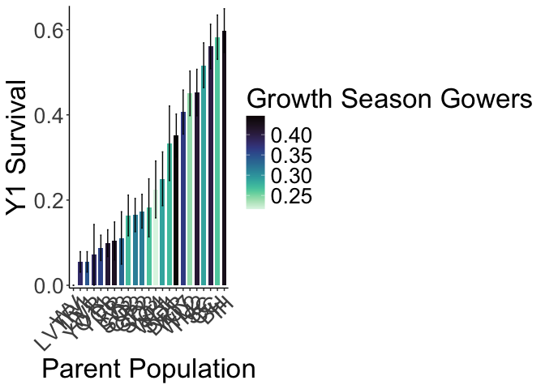
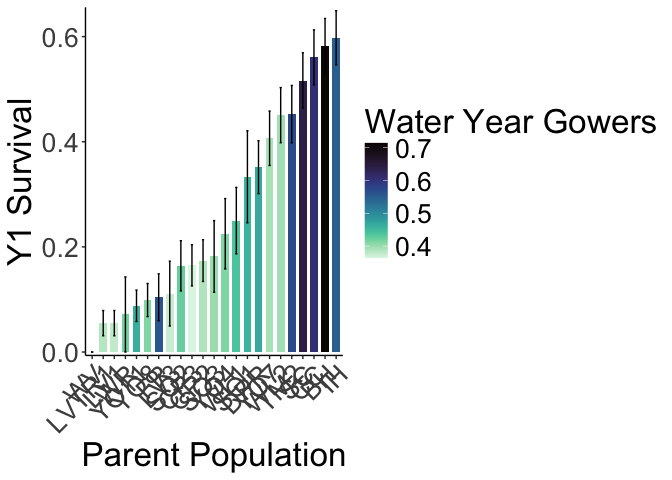
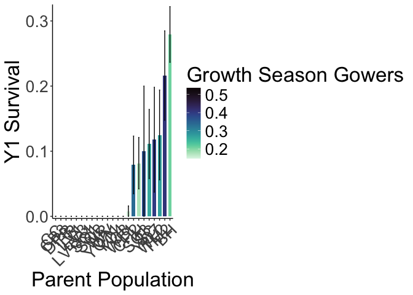
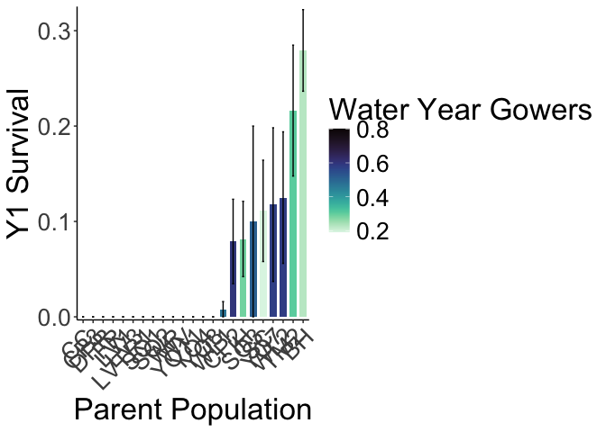

To Do:
- Look at relationship between size and survival
- Standard error correction on scatter plots?


## Relevant Libraries and Functions


``` r
library(tidyverse)
```

```
## ── Attaching core tidyverse packages ──────────────────────── tidyverse 2.0.0 ──
## ✔ dplyr     1.1.4     ✔ readr     2.1.5
## ✔ forcats   1.0.0     ✔ stringr   1.5.1
## ✔ ggplot2   3.5.1     ✔ tibble    3.2.1
## ✔ lubridate 1.9.3     ✔ tidyr     1.3.1
## ✔ purrr     1.0.2     
## ── Conflicts ────────────────────────────────────────── tidyverse_conflicts() ──
## ✖ dplyr::filter() masks stats::filter()
## ✖ dplyr::lag()    masks stats::lag()
## ℹ Use the conflicted package (<http://conflicted.r-lib.org/>) to force all conflicts to become errors
```

``` r
library(magrittr)
```

```
## 
## Attaching package: 'magrittr'
## 
## The following object is masked from 'package:purrr':
## 
##     set_names
## 
## The following object is masked from 'package:tidyr':
## 
##     extract
```

``` r
#conflicted::conflicts_prefer(dplyr::filter)
library(viridis) #for pretty colors
```

```
## Loading required package: viridisLite
```

``` r
library(ggrepel) #for non-overlapping labels on plots
library(ggdist) #visualizations of distributions and uncertainty 
library(ggpubr)

#library(sp) #for calculating geographic distance 
library(geosphere) #for calculating geographic distance
library(corrplot) #plotting correlations  
```

```
## corrplot 0.94 loaded
```

``` r
library(rstatix) #performing cor_test
```

```
## 
## Attaching package: 'rstatix'
## 
## The following object is masked from 'package:stats':
## 
##     filter
```

``` r
library(lmerTest) #mixed models
```

```
## Loading required package: lme4
## Loading required package: Matrix
## 
## Attaching package: 'Matrix'
## 
## The following objects are masked from 'package:tidyr':
## 
##     expand, pack, unpack
## 
## 
## Attaching package: 'lmerTest'
## 
## The following object is masked from 'package:lme4':
## 
##     lmer
## 
## The following object is masked from 'package:stats':
## 
##     step
```

``` r
conflicted::conflicts_prefer(lmerTest::lmer)
```

```
## [conflicted] Will prefer lmerTest::lmer over any other package.
```

``` r
library(broom.mixed)
library(tidymodels)
```

```
## ── Attaching packages ────────────────────────────────────── tidymodels 1.2.0 ──
## ✔ broom        1.0.7     ✔ rsample      1.2.1
## ✔ dials        1.3.0     ✔ tune         1.2.1
## ✔ infer        1.0.7     ✔ workflows    1.1.4
## ✔ modeldata    1.4.0     ✔ workflowsets 1.1.0
## ✔ parsnip      1.2.1     ✔ yardstick    1.3.1
## ✔ recipes      1.1.0     
## ── Conflicts ───────────────────────────────────────── tidymodels_conflicts() ──
## ✖ infer::chisq_test()   masks rstatix::chisq_test()
## ✖ scales::discard()     masks purrr::discard()
## ✖ Matrix::expand()      masks tidyr::expand()
## ✖ magrittr::extract()   masks tidyr::extract()
## ✖ rstatix::filter()     masks dplyr::filter(), stats::filter()
## ✖ recipes::fixed()      masks stringr::fixed()
## ✖ dials::get_n()        masks rstatix::get_n()
## ✖ dplyr::lag()          masks stats::lag()
## ✖ Matrix::pack()        masks tidyr::pack()
## ✖ infer::prop_test()    masks rstatix::prop_test()
## ✖ magrittr::set_names() masks purrr::set_names()
## ✖ yardstick::spec()     masks readr::spec()
## ✖ recipes::step()       masks lmerTest::step(), stats::step()
## ✖ infer::t_test()       masks rstatix::t_test()
## ✖ Matrix::unpack()      masks tidyr::unpack()
## ✖ recipes::update()     masks Matrix::update(), stats::update()
## • Search for functions across packages at https://www.tidymodels.org/find/
```

``` r
library(furrr) #Apply Mapping Functions in Parallel using Futures
```

```
## Loading required package: future
```

``` r
tidymodels_prefer()
# install.packages("multilevelmod")
library(multilevelmod)

library(brms)
```

```
## Loading required package: Rcpp
## 
## Attaching package: 'Rcpp'
## 
## The following object is masked from 'package:rsample':
## 
##     populate
## 
## Loading 'brms' package (version 2.22.0). Useful instructions
## can be found by typing help('brms'). A more detailed introduction
## to the package is available through vignette('brms_overview').
```

``` r
#conflicted::conflicts_prefer(brms::ar)
#conflicted::conflicts_prefer(dplyr::combine)
#conflicted::conflicts_prefer(brms::dstudent_t)
library(tidybayes) #for extracting and visiaulizing brms model output 
library(modelr) #for data grid

sem <- function(x, na.rm=FALSE) {           #for caclulating standard error
  sd(x,na.rm=na.rm)/sqrt(length(na.omit(x)))
} 

cbbPalette2 <- c("#E69F00","#000000", "#56B4E9","#009E73", "#F0E442", "#0072B2", "#D55E00", "#CC79A7")
timepd_palette <- c("#56B4E9","#D55E00")

options(mc.cores = parallel::detectCores())
```

## Gower's Distance

``` r
garden_climate <- read_csv("../output/Climate/flint_climate_UCDpops.csv") %>% 
  filter(parent.pop=="WL2_Garden" | parent.pop=="UCD_Garden") %>% 
  select(parent.pop:Long) %>% 
  distinct()
```

```
## Rows: 38775 Columns: 14
## ── Column specification ────────────────────────────────────────────────────────
## Delimiter: ","
## chr  (3): parent.pop, elevation.group, month
## dbl (11): elev_m, Lat, Long, year, aet, cwd, pck, pet, ppt, tmn, tmx
## 
## ℹ Use `spec()` to retrieve the full column specification for this data.
## ℹ Specify the column types or set `show_col_types = FALSE` to quiet this message.
```

``` r
garden_climate
```

```
## # A tibble: 2 × 5
##   parent.pop elevation.group elev_m   Lat  Long
##   <chr>      <chr>            <dbl> <dbl> <dbl>
## 1 UCD_Garden Low                 16  38.5 -122.
## 2 WL2_Garden High              2020  38.8 -120.
```

``` r
#UCD LAT/LONG = 38.53250, -121.7830
#WL2 Lat/Long = 38.82599, -120.2509

ucd_gowers <- read_csv("../output/Climate/Gowers_UCD.csv") %>% 
  select(parent.pop:GrwSsn_GD, Wtr_Year_GD) %>% 
  pivot_wider(names_from = TimePd, values_from = c(GrwSsn_GD, Wtr_Year_GD)) %>% 
  mutate(UCD_Lat=38.53250, UCD_Long=-121.7830, UCD_Elev=16) %>% 
  mutate(Geographic_Dist=distHaversine(cbind(UCD_Long, UCD_Lat), cbind(Long, Lat)),
         Elev_Dist=UCD_Elev-elev_m) #%>% # Calculate the distance using the haversine formula (dist in meters)
```

```
## Rows: 46 Columns: 12
## ── Column specification ────────────────────────────────────────────────────────
## Delimiter: ","
## chr (3): parent.pop, elevation.group, TimePd
## dbl (9): elev_m, Lat, Long, GrwSsn_GD, GrwSsn_FLINT_GD, GrwSsn_BIOCLIM_GD, W...
## 
## ℹ Use `spec()` to retrieve the full column specification for this data.
## ℹ Specify the column types or set `show_col_types = FALSE` to quiet this message.
```

``` r
  #mutate(Lat_Dist=UCD_Lat-Lat, Long_Dist=UCD_Long-Long) %>% #Garden-Home - lat and long per Gerst et al 2011 which kept them separate for some directionality

wl2_gowers_2023 <- read_csv("../output/Climate/Gowers_WL2.csv") %>% 
  select(parent.pop:GrwSsn_GD, Wtr_Year_GD) %>% 
  pivot_wider(names_from = TimePd, values_from = c(GrwSsn_GD, Wtr_Year_GD)) %>% 
  mutate(WL2_Lat=38.82599, WL2_Long=-120.2509, WL2_Elev=2020) %>% 
  mutate(Geographic_Dist=distHaversine(cbind(WL2_Long, WL2_Lat), cbind(Long, Lat)),
         Elev_Dist=WL2_Elev-elev_m) #%>% # Calculate the distance using the haversine formula
```

```
## Rows: 46 Columns: 12
## ── Column specification ────────────────────────────────────────────────────────
## Delimiter: ","
## chr (3): parent.pop, elevation.group, TimePd
## dbl (9): elev_m, Lat, Long, GrwSsn_GD, GrwSsn_FLINT_GD, GrwSsn_BIOCLIM_GD, W...
## 
## ℹ Use `spec()` to retrieve the full column specification for this data.
## ℹ Specify the column types or set `show_col_types = FALSE` to quiet this message.
```

``` r
  #mutate(Lat_Dist=WL2_Lat-Lat, Long_Dist=WL2_Long-Long) %>% #Garden-Home - lat and long per Gerst et al 2011 which kept them separate for some directionality
```

## Load Survival data from both Gardens

``` r
WL2_firstyear_mort <- read_csv("../input/WL2_Data/CorrectedCSVs/WL2_annual_census_20231027_corrected.csv",
                                 na = c("", "NA", "-", "N/A")) %>% 
  rename(parent.pop=pop) %>% 
  mutate(parent.pop= str_replace(parent.pop, ".*VTR.*", "LVTR1")) %>% 
  mutate(parent.pop= str_replace(parent.pop, "Y08", "YO8")) %>% 
  mutate(parent.pop= str_replace(parent.pop, "Y04", "YO4")) %>% 
  filter(!is.na(parent.pop)) %>% 
  unite(BedLoc, bed:`bed-col`, sep="_", remove = FALSE) %>% 
  unite(Genotype, parent.pop:rep, sep="_", remove = FALSE) %>% 
  filter(!str_detect(Genotype, ".*buff*")) %>% 
  unite(pop.mf, parent.pop:mf, sep="_", remove = FALSE)
```

```
## Warning: One or more parsing issues, call `problems()` on your data frame for details,
## e.g.:
##   dat <- vroom(...)
##   problems(dat)
```

```
## Rows: 1826 Columns: 19
## ── Column specification ────────────────────────────────────────────────────────
## Delimiter: ","
## chr (10): date, block, bed, bed-col, pop, mf, rep, pheno, herbiv.y.n, survey...
## dbl  (7): bed-row, diam.mm, num.flw, num.fruit, long.fruit.cm, total.branch,...
## lgl  (2): height.cm, long.leaf.cm
## 
## ℹ Use `spec()` to retrieve the full column specification for this data.
## ℹ Specify the column types or set `show_col_types = FALSE` to quiet this message.
```

``` r
head(WL2_firstyear_mort)
```

```
## # A tibble: 6 × 22
##   date   block BedLoc bed   `bed-row` `bed-col` Genotype pop.mf parent.pop mf   
##   <chr>  <chr> <chr>  <chr>     <dbl> <chr>     <chr>    <chr>  <chr>      <chr>
## 1 10/27… A     A_1_A  A             1 A         TM2_6_11 TM2_6  TM2        6    
## 2 10/27… A     A_1_B  A             1 B         LVTR1_7… LVTR1… LVTR1      7    
## 3 10/27… A     A_2_A  A             2 A         SQ2_6_14 SQ2_6  SQ2        6    
## 4 10/27… A     A_2_B  A             2 B         YO8_8_3  YO8_8  YO8        8    
## 5 10/27… A     A_3_A  A             3 A         CC_2_3   CC_2   CC         2    
## 6 10/27… A     A_3_B  A             3 B         YO11_5_… YO11_5 YO11       5    
## # ℹ 12 more variables: rep <chr>, pheno <chr>, diam.mm <dbl>, height.cm <lgl>,
## #   long.leaf.cm <lgl>, num.flw <dbl>, num.fruit <dbl>, long.fruit.cm <dbl>,
## #   total.branch <dbl>, repro.branch <dbl>, herbiv.y.n <chr>,
## #   survey.notes <chr>
```

``` r
unique(WL2_firstyear_mort$parent.pop)
```

```
##  [1] "TM2"   "LVTR1" "SQ2"   "YO8"   "CC"    "YO11"  "BH"    "DPR"   "CP2"  
## [10] "WL1"   "IH"    "CP3"   "SC"    "FR"    "LV3"   "YO7"   "WV"    "SQ3"  
## [19] "WL2"   "LV1"   "YO4"   "WR"    "SQ1"
```

``` r
WL2_firstyear_mort %>% filter(Genotype=="CC_1_2") #there are 2 CC_1_2 plants (in different field locs), CC-1-2 was planted in 13-A and not 5C according to planting notes 
```

```
## # A tibble: 2 × 22
##   date   block BedLoc bed   `bed-row` `bed-col` Genotype pop.mf parent.pop mf   
##   <chr>  <chr> <chr>  <chr>     <dbl> <chr>     <chr>    <chr>  <chr>      <chr>
## 1 10/27… M     K_13_A K            13 A         CC_1_2   CC_1   CC         1    
## 2 10/27… M     K_5_C  K             5 C         CC_1_2   CC_1   CC         1    
## # ℹ 12 more variables: rep <chr>, pheno <chr>, diam.mm <dbl>, height.cm <lgl>,
## #   long.leaf.cm <lgl>, num.flw <dbl>, num.fruit <dbl>, long.fruit.cm <dbl>,
## #   total.branch <dbl>, repro.branch <dbl>, herbiv.y.n <chr>,
## #   survey.notes <chr>
```

``` r
WL2_firstyear_mort %>% filter(Genotype=="IH_4_5") #there are 2 IH_4_5 plants (in different field locs), IH_4_5 was planted in 22B and not 32A according to planting notes 
```

```
## # A tibble: 2 × 22
##   date   block BedLoc bed   `bed-row` `bed-col` Genotype pop.mf parent.pop mf   
##   <chr>  <chr> <chr>  <chr>     <dbl> <chr>     <chr>    <chr>  <chr>      <chr>
## 1 10/27… C     B_22_B B            22 B         IH_4_5   IH_4   IH         4    
## 2 10/27… C     B_32_A B            32 A         IH_4_5   IH_4   IH         4    
## # ℹ 12 more variables: rep <chr>, pheno <chr>, diam.mm <dbl>, height.cm <lgl>,
## #   long.leaf.cm <lgl>, num.flw <dbl>, num.fruit <dbl>, long.fruit.cm <dbl>,
## #   total.branch <dbl>, repro.branch <dbl>, herbiv.y.n <chr>,
## #   survey.notes <chr>
```

``` r
WL2_firstyear_mort %>% rowwise() %>%  #checking if mf and rep can be converted to numeric 
  filter(!is.na(rep)) %>%  
  filter(is.na(as.numeric(rep)))
```

```
## # A tibble: 0 × 22
## # Rowwise: 
## # ℹ 22 variables: date <chr>, block <chr>, BedLoc <chr>, bed <chr>,
## #   bed-row <dbl>, bed-col <chr>, Genotype <chr>, pop.mf <chr>,
## #   parent.pop <chr>, mf <chr>, rep <chr>, pheno <chr>, diam.mm <dbl>,
## #   height.cm <lgl>, long.leaf.cm <lgl>, num.flw <dbl>, num.fruit <dbl>,
## #   long.fruit.cm <dbl>, total.branch <dbl>, repro.branch <dbl>,
## #   herbiv.y.n <chr>, survey.notes <chr>
```

``` r
UCD_firstyear_mort <- read_csv("../input/UCD_Data/CorrectedCSVs/Annual_Census_Transplants_All_May_2023_corrected.csv",
                           na = c("", "NA", "-", "N/A")) %>% 
  rename(parent.pop=pop) %>% 
  filter(rep != 100) %>%  #get rid of individuals that germinated in the field 
  mutate(parent.pop= str_replace(parent.pop, ".*VTR.*", "LVTR1")) %>% 
  unite(Genotype, parent.pop:rep, sep="_", remove = FALSE) %>% 
  filter(!str_detect(Genotype, ".*buff*")) %>% 
  unite(pop.mf, parent.pop:mf, sep="_", remove = FALSE)
```

```
## Rows: 858 Columns: 19
## ── Column specification ────────────────────────────────────────────────────────
## Delimiter: ","
## chr (10): date, block, col, pop, mf, rep, pheno, herb_dam, wilt_status, notes
## dbl  (9): row, diam_mm, height_cm, total_branch, longest_leaf_cm, flowers, f...
## 
## ℹ Use `spec()` to retrieve the full column specification for this data.
## ℹ Specify the column types or set `show_col_types = FALSE` to quiet this message.
```

``` r
head(UCD_firstyear_mort)
```

```
## # A tibble: 6 × 21
##   date    block   row col   Genotype pop.mf parent.pop mf    rep   pheno diam_mm
##   <chr>   <chr> <dbl> <chr> <chr>    <chr>  <chr>      <chr> <chr> <chr>   <dbl>
## 1 5/22/23 D1        3 A     WL2_4_11 WL2_4  WL2        4     11    X          NA
## 2 5/22/23 D1        3 B     CP2_10_4 CP2_10 CP2        10    4     X          NA
## 3 5/22/23 D1        4 A     YO11_4_… YO11_4 YO11       4     10    X          NA
## 4 5/22/23 D1        4 B     CC_5_12  CC_5   CC         5     12    X          NA
## 5 5/22/23 D1        5 A     FR_3_6   FR_3   FR         3     6     X          NA
## 6 5/22/23 D1        5 B     BH_5_24  BH_5   BH         5     24    X          NA
## # ℹ 10 more variables: height_cm <dbl>, total_branch <dbl>, herb_dam <chr>,
## #   wilt_status <chr>, longest_leaf_cm <dbl>, flowers <dbl>, fruits <dbl>,
## #   `longest_ fruit_cm` <dbl>, `repro_ branch` <dbl>, notes <chr>
```

``` r
unique(UCD_firstyear_mort$parent.pop)
```

```
##  [1] "WL2"   "CP2"   "YO11"  "CC"    "FR"    "BH"    "IH"    "LV3"   "SC"   
## [10] "LVTR1" "SQ3"   "TM2"   "WL1"   "YO7"   "DPR"   "SQ2"   "SQ1"   "YO8"  
## [19] "YO4"   "WR"    "WV"    "CP3"   "LV1"
```

``` r
UCD_firstyear_mort %>% rowwise() %>%  #checking if mf and rep can be converted to numeric 
  filter(!is.na(rep)) %>%  
  filter(is.na(as.numeric(rep)))
```

```
## # A tibble: 0 × 21
## # Rowwise: 
## # ℹ 21 variables: date <chr>, block <chr>, row <dbl>, col <chr>,
## #   Genotype <chr>, pop.mf <chr>, parent.pop <chr>, mf <chr>, rep <chr>,
## #   pheno <chr>, diam_mm <dbl>, height_cm <dbl>, total_branch <dbl>,
## #   herb_dam <chr>, wilt_status <chr>, longest_leaf_cm <dbl>, flowers <dbl>,
## #   fruits <dbl>, longest_ fruit_cm <dbl>, repro_ branch <dbl>, notes <chr>
```


``` r
WL2_firstyear_mort %>% filter(pheno=="X") %>% filter(!is.na(num.fruit)) #no dead that had mature fruit. 
```

```
## # A tibble: 1 × 22
##   date   block BedLoc bed   `bed-row` `bed-col` Genotype pop.mf parent.pop mf   
##   <chr>  <chr> <chr>  <chr>     <dbl> <chr>     <chr>    <chr>  <chr>      <chr>
## 1 10/27… I     F_43_C F            43 C         CC_9_11  CC_9   CC         9    
## # ℹ 12 more variables: rep <chr>, pheno <chr>, diam.mm <dbl>, height.cm <lgl>,
## #   long.leaf.cm <lgl>, num.flw <dbl>, num.fruit <dbl>, long.fruit.cm <dbl>,
## #   total.branch <dbl>, repro.branch <dbl>, herbiv.y.n <chr>,
## #   survey.notes <chr>
```


## Clean the data 

``` r
WL2_firstyear_mort_prep <- WL2_firstyear_mort %>%
  filter(BedLoc!="K_5_C") %>% 
  filter(BedLoc!="B_32_A") %>% 
  select(block, Genotype:rep, pheno) %>% 
  mutate(Site="WL2") %>%
  mutate(mf=as.double(mf), rep=as.double(rep))
names(WL2_firstyear_mort_prep)
```

```
## [1] "block"      "Genotype"   "pop.mf"     "parent.pop" "mf"        
## [6] "rep"        "pheno"      "Site"
```

``` r
UCD_firstyear_mort_prep <- UCD_firstyear_mort %>% 
  select(block, Genotype:rep, pheno) %>%
  mutate(Site="UCD") %>%
  mutate(mf=as.double(mf), rep=as.double(rep))
names(UCD_firstyear_mort_prep)
```

```
## [1] "block"      "Genotype"   "pop.mf"     "parent.pop" "mf"        
## [6] "rep"        "pheno"      "Site"
```

## Calculate First Year Survival 

``` r
#WL2_firstyear_mort %>% filter(is.na(pheno)) %>% filter(!is.na(survey.notes)) #double checking that all NAs = dead 
#UCD_firstyear_mort %>% filter(is.na(pheno)) %>% filter(!is.na(notes))

wl2_y1_surv <- WL2_firstyear_mort_prep %>% 
  left_join(wl2_gowers_2023) %>% 
  mutate(Survival=if_else(pheno=="X" | is.na(pheno), 0, 1)) %>% 
  select(block:Genotype, parent.pop:rep, elevation.group:Wtr_Year_GD_Historical, Geographic_Dist, Elev_Dist, pheno, Survival)
```

```
## Joining with `by = join_by(parent.pop)`
```

``` r
#wl2_y1_surv %>% group_by(parent.pop) %>% summarise(n=n()) %>% arrange(n) #min sample size = 3 

ucd_y1_surv <- UCD_firstyear_mort_prep %>% 
  left_join(ucd_gowers) %>% 
  mutate(Survival=if_else(pheno=="X" | is.na(pheno), 0, 1)) %>% 
  select(block:Genotype, parent.pop:rep, elevation.group:Wtr_Year_GD_Historical, Geographic_Dist, Elev_Dist, pheno, Survival)
```

```
## Joining with `by = join_by(parent.pop)`
```

``` r
#ucd_y1_surv %>% group_by(parent.pop) %>% summarise(n=n()) %>% arrange(n) #min sample size = 2 
```

### Bar plots 
WL2

``` r
wl2_y1_surv %>% 
  group_by(parent.pop, elev_m, GrwSsn_GD_Recent, Wtr_Year_GD_Recent) %>% 
  summarise(meanSurv=mean(Survival, na.rm = TRUE), semSurv=sem(Survival, na.rm=TRUE)) %>% 
  ggplot(aes(x=fct_reorder(parent.pop, meanSurv), y=meanSurv, fill=GrwSsn_GD_Recent)) +
  geom_col(width = 0.7,position = position_dodge(0.75)) + 
  geom_errorbar(aes(ymin=meanSurv-semSurv,ymax=meanSurv+semSurv),width=.2, position = 
                  position_dodge(0.75)) +
  theme_classic() + 
  scale_y_continuous(expand = c(0.01, 0)) +
  labs(y="Y1 Survival", x="Parent Population", fill="Growth Season Gowers") +
  scale_fill_viridis(option="mako", direction = -1) +
  theme(text=element_text(size=25), axis.text.x = element_text(angle = 45,  hjust = 1))
```

```
## `summarise()` has grouped output by 'parent.pop', 'elev_m', 'GrwSsn_GD_Recent'.
## You can override using the `.groups` argument.
```

<!-- -->

``` r
#ggsave("../output/WL2_Traits/WL2_Y1Surv_GrwSsn_GD_Recent.png", width = 12, height = 8, units = "in")

wl2_y1_surv %>% 
  group_by(parent.pop, elev_m, GrwSsn_GD_Recent, Wtr_Year_GD_Recent) %>% 
  summarise(meanSurv=mean(Survival, na.rm = TRUE), semSurv=sem(Survival, na.rm=TRUE)) %>% 
  ggplot(aes(x=fct_reorder(parent.pop, meanSurv), y=meanSurv, fill=Wtr_Year_GD_Recent)) +
  geom_col(width = 0.7,position = position_dodge(0.75)) + 
  geom_errorbar(aes(ymin=meanSurv-semSurv,ymax=meanSurv+semSurv),width=.2, position = 
                  position_dodge(0.75)) +
  theme_classic() + 
  scale_y_continuous(expand = c(0.01, 0)) +
  labs(y="Y1 Survival", x="Parent Population", fill="Water Year Gowers") +
  scale_fill_viridis(option="mako", direction = -1) +
  theme(text=element_text(size=25), axis.text.x = element_text(angle = 45,  hjust = 1))
```

```
## `summarise()` has grouped output by 'parent.pop', 'elev_m', 'GrwSsn_GD_Recent'.
## You can override using the `.groups` argument.
```

<!-- -->

``` r
#ggsave("../output/WL2_Traits/WL2_Y1Surv_Wtr_Year_GD_Recent.png", width = 12, height = 8, units = "in")
```

Davis

``` r
ucd_y1_surv %>% 
  group_by(parent.pop, elev_m, GrwSsn_GD_Recent, Wtr_Year_GD_Recent) %>% 
  summarise(meanSurv=mean(Survival, na.rm = TRUE), semSurv=sem(Survival, na.rm=TRUE)) %>% 
  ggplot(aes(x=fct_reorder(parent.pop, meanSurv), y=meanSurv, fill=GrwSsn_GD_Recent)) +
  geom_col(width = 0.7,position = position_dodge(0.75)) + 
  geom_errorbar(aes(ymin=meanSurv-semSurv,ymax=meanSurv+semSurv),width=.2, position = 
                  position_dodge(0.75)) +
  theme_classic() + 
  scale_y_continuous(expand = c(0.01, 0)) +
  labs(y="Y1 Survival", x="Parent Population", fill="Growth Season Gowers") +
  scale_fill_viridis(option="mako", direction = -1) +
  theme(text=element_text(size=25), axis.text.x = element_text(angle = 45,  hjust = 1))
```

```
## `summarise()` has grouped output by 'parent.pop', 'elev_m', 'GrwSsn_GD_Recent'.
## You can override using the `.groups` argument.
```

<!-- -->

``` r
#ggsave("../output/UCD_Traits/UCD_Y1Surv_GrwSsn_GD_Recent.png", width = 12, height = 8, units = "in")

ucd_y1_surv %>% 
  group_by(parent.pop, elev_m, GrwSsn_GD_Recent, Wtr_Year_GD_Recent) %>% 
  summarise(meanSurv=mean(Survival, na.rm = TRUE), semSurv=sem(Survival, na.rm=TRUE)) %>% 
  ggplot(aes(x=fct_reorder(parent.pop, meanSurv), y=meanSurv, fill=Wtr_Year_GD_Recent)) +
  geom_col(width = 0.7,position = position_dodge(0.75)) + 
  geom_errorbar(aes(ymin=meanSurv-semSurv,ymax=meanSurv+semSurv),width=.2, position = 
                  position_dodge(0.75)) +
  theme_classic() + 
  scale_y_continuous(expand = c(0.01, 0)) +
  labs(y="Y1 Survival", x="Parent Population", fill="Water Year Gowers") +
  scale_fill_viridis(option="mako", direction = -1) +
  theme(text=element_text(size=25), axis.text.x = element_text(angle = 45,  hjust = 1))
```

```
## `summarise()` has grouped output by 'parent.pop', 'elev_m', 'GrwSsn_GD_Recent'.
## You can override using the `.groups` argument.
```

<!-- -->

``` r
#ggsave("../output/UCD_Traits/UCD_Y1Surv_Wtr_Year_GD_Recent.png", width = 12, height = 8, units = "in")
```

### Scatterplots
WL2

``` r
#scatter plots
GSCD_recent <- wl2_y1_surv %>% 
  group_by(parent.pop, elev_m, GrwSsn_GD_Recent, Wtr_Year_GD_Recent) %>% 
  summarise(meanSurv=mean(Survival, na.rm = TRUE), semSurv=sem(Survival, na.rm=TRUE)) %>% 
  ggplot(aes(x=GrwSsn_GD_Recent, y=meanSurv, group = parent.pop)) +
  geom_point(size=6) + 
  geom_errorbar(aes(ymin=meanSurv-semSurv,ymax=meanSurv+semSurv),width=.02, linewidth = 2) +
  theme_classic() + 
  scale_y_continuous(expand = c(0.01, 0)) +
  labs(y="Y1 Survival", x="Recent Growth Season CD") +
  theme(text=element_text(size=25))
```

```
## `summarise()` has grouped output by 'parent.pop', 'elev_m', 'GrwSsn_GD_Recent'.
## You can override using the `.groups` argument.
```

``` r
WYCD_recent <- wl2_y1_surv %>% 
  group_by(parent.pop, elev_m, GrwSsn_GD_Recent, Wtr_Year_GD_Recent) %>% 
  summarise(meanSurv=mean(Survival, na.rm = TRUE), semSurv=sem(Survival, na.rm=TRUE)) %>% 
  ggplot(aes(x=Wtr_Year_GD_Recent, y=meanSurv, group = parent.pop)) +
  geom_point(size=6) + 
  geom_errorbar(aes(ymin=meanSurv-semSurv,ymax=meanSurv+semSurv),width=.02,linewidth = 2) +
  theme_classic() + 
  scale_y_continuous(expand = c(0.01, 0)) +
  labs(y="Y1 Survival", x="Recent Water Year CD") +
  theme(text=element_text(size=25))
```

```
## `summarise()` has grouped output by 'parent.pop', 'elev_m', 'GrwSsn_GD_Recent'.
## You can override using the `.groups` argument.
```

``` r
GD <- wl2_y1_surv %>% 
  group_by(parent.pop, elev_m, GrwSsn_GD_Recent, Wtr_Year_GD_Recent, Geographic_Dist) %>% 
  summarise(meanSurv=mean(Survival, na.rm = TRUE), semSurv=sem(Survival, na.rm=TRUE)) %>% 
  ggplot(aes(x=Geographic_Dist, y=meanSurv, group = parent.pop)) +
  geom_point(size=6) + 
  geom_errorbar(aes(ymin=meanSurv-semSurv,ymax=meanSurv+semSurv),width=.02, linewidth = 2) +
  theme_classic() + 
  scale_y_continuous(expand = c(0.01, 0)) +
  labs(y="Y1 Survival", x="Geographic Distance (m)") +
  theme(text=element_text(size=25), axis.text.x = element_text(angle = 45,  hjust = 1))
```

```
## `summarise()` has grouped output by 'parent.pop', 'elev_m', 'GrwSsn_GD_Recent',
## 'Wtr_Year_GD_Recent'. You can override using the `.groups` argument.
```

``` r
ED <- wl2_y1_surv %>% 
  group_by(parent.pop, elev_m, Elev_Dist) %>% 
  summarise(meanSurv=mean(Survival, na.rm = TRUE), semSurv=sem(Survival, na.rm=TRUE)) %>% 
  ggplot(aes(x=Elev_Dist, y=meanSurv, group = parent.pop)) +
  geom_point(size=6) + 
  geom_errorbar(aes(ymin=meanSurv-semSurv,ymax=meanSurv+semSurv),width=.02, linewidth = 2) +
  theme_classic() + 
  scale_y_continuous(expand = c(0.01, 0)) +
  labs(y="Y1 Survival", x="Elevation Distance (m)") +
  theme(text=element_text(size=25), axis.text.x = element_text(angle = 45,  hjust = 1))
```

```
## `summarise()` has grouped output by 'parent.pop', 'elev_m'. You can override
## using the `.groups` argument.
```

``` r
wl2_y1_surv_FIG <- ggarrange(GSCD_recent, WYCD_recent, GD, ED, ncol=2, nrow=2) 
#ggsave("../output/WL2_Traits/WL2_Y1_Surv_SCATTERS_Recent.png", width = 24, height = 18, units = "in")
```


``` r
#scatter plots
GSCD_historic <- wl2_y1_surv %>% 
  group_by(parent.pop, elev_m, GrwSsn_GD_Historical, Wtr_Year_GD_Historical) %>% 
  summarise(meanSurv=mean(Survival, na.rm = TRUE), semSurv=sem(Survival, na.rm=TRUE)) %>% 
  ggplot(aes(x=GrwSsn_GD_Historical, y=meanSurv, group = parent.pop)) +
  geom_point(size=6) + 
  geom_errorbar(aes(ymin=meanSurv-semSurv,ymax=meanSurv+semSurv),width=.02, linewidth = 2) +
  theme_classic() + 
  scale_y_continuous(expand = c(0.01, 0)) +
  labs(y="Y1 Survival", x="Historic Growth Season CD") +
  theme(text=element_text(size=25))
```

```
## `summarise()` has grouped output by 'parent.pop', 'elev_m',
## 'GrwSsn_GD_Historical'. You can override using the `.groups` argument.
```

``` r
WYCD_historic <- wl2_y1_surv %>% 
  group_by(parent.pop, elev_m, GrwSsn_GD_Historical, Wtr_Year_GD_Historical) %>% 
  summarise(meanSurv=mean(Survival, na.rm = TRUE), semSurv=sem(Survival, na.rm=TRUE)) %>% 
  ggplot(aes(x=Wtr_Year_GD_Historical, y=meanSurv, group = parent.pop)) +
  geom_point(size=6) + 
  geom_errorbar(aes(ymin=meanSurv-semSurv,ymax=meanSurv+semSurv),width=.02,linewidth = 2) +
  theme_classic() + 
  scale_y_continuous(expand = c(0.01, 0)) +
  labs(y="Y1 Survival", x="Historic Water Year CD") +
  theme(text=element_text(size=25))
```

```
## `summarise()` has grouped output by 'parent.pop', 'elev_m',
## 'GrwSsn_GD_Historical'. You can override using the `.groups` argument.
```

``` r
wl2_y1_surv_FIG <- ggarrange(GSCD_historic, WYCD_historic, GD, ED, ncol=2, nrow=2) 
#ggsave("../output/WL2_Traits/WL2_Y1_Surv_SCATTERS_Historic.png", width = 24, height = 18, units = "in")
```

Davis

``` r
#scatter plots
GSCD_recent <- ucd_y1_surv %>% 
  group_by(parent.pop, elev_m, GrwSsn_GD_Recent, Wtr_Year_GD_Recent) %>% 
  summarise(meanSurv=mean(Survival, na.rm = TRUE), semSurv=sem(Survival, na.rm=TRUE)) %>% 
  ggplot(aes(x=GrwSsn_GD_Recent, y=meanSurv, group = parent.pop)) +
  geom_point(size=6) + 
  geom_errorbar(aes(ymin=meanSurv-semSurv,ymax=meanSurv+semSurv),width=.02, linewidth = 2) +
  theme_classic() + 
  scale_y_continuous(expand = c(0.01, 0)) +
  labs(y="Y1 Survival", x="Recent Growth Season CD") +
  theme(text=element_text(size=25))
```

```
## `summarise()` has grouped output by 'parent.pop', 'elev_m', 'GrwSsn_GD_Recent'.
## You can override using the `.groups` argument.
```

``` r
WYCD_recent <- ucd_y1_surv %>% 
  group_by(parent.pop, elev_m, GrwSsn_GD_Recent, Wtr_Year_GD_Recent) %>% 
  summarise(meanSurv=mean(Survival, na.rm = TRUE), semSurv=sem(Survival, na.rm=TRUE)) %>% 
  ggplot(aes(x=Wtr_Year_GD_Recent, y=meanSurv, group = parent.pop)) +
  geom_point(size=6) + 
  geom_errorbar(aes(ymin=meanSurv-semSurv,ymax=meanSurv+semSurv),width=.02,linewidth = 2) +
  theme_classic() + 
  scale_y_continuous(expand = c(0.01, 0)) +
  labs(y="Y1 Survival", x="Recent Water Year CD") +
  theme(text=element_text(size=25))
```

```
## `summarise()` has grouped output by 'parent.pop', 'elev_m', 'GrwSsn_GD_Recent'.
## You can override using the `.groups` argument.
```

``` r
GD <- ucd_y1_surv %>% 
  group_by(parent.pop, elev_m, GrwSsn_GD_Recent, Wtr_Year_GD_Recent, Geographic_Dist) %>% 
  summarise(meanSurv=mean(Survival, na.rm = TRUE), semSurv=sem(Survival, na.rm=TRUE)) %>% 
  ggplot(aes(x=Geographic_Dist, y=meanSurv, group = parent.pop)) +
  geom_point(size=6) + 
  geom_errorbar(aes(ymin=meanSurv-semSurv,ymax=meanSurv+semSurv),width=.02, linewidth = 2) +
  theme_classic() + 
  scale_y_continuous(expand = c(0.01, 0)) +
  labs(y="Y1 Survival", x="Geographic Distance (m)") +
  theme(text=element_text(size=25), axis.text.x = element_text(angle = 45,  hjust = 1))
```

```
## `summarise()` has grouped output by 'parent.pop', 'elev_m', 'GrwSsn_GD_Recent',
## 'Wtr_Year_GD_Recent'. You can override using the `.groups` argument.
```

``` r
ED <- ucd_y1_surv %>% 
  group_by(parent.pop, elev_m, Elev_Dist) %>% 
  summarise(meanSurv=mean(Survival, na.rm = TRUE), semSurv=sem(Survival, na.rm=TRUE)) %>% 
  ggplot(aes(x=Elev_Dist, y=meanSurv, group = parent.pop)) +
  geom_point(size=6) + 
  geom_errorbar(aes(ymin=meanSurv-semSurv,ymax=meanSurv+semSurv),width=.02, linewidth = 2) +
  theme_classic() + 
  scale_y_continuous(expand = c(0.01, 0)) +
  labs(y="Y1 Survival", x="Elevation Distance (m)") +
  theme(text=element_text(size=25), axis.text.x = element_text(angle = 45,  hjust = 1))
```

```
## `summarise()` has grouped output by 'parent.pop', 'elev_m'. You can override
## using the `.groups` argument.
```

``` r
ucd_y1_surv_FIG <- ggarrange(GSCD_recent, WYCD_recent, GD, ED, ncol=2, nrow=2) 
#ggsave("../output/UCD_Traits/UCD_Y1_Surv_SCATTERS_Recent.png", width = 24, height = 18, units = "in")
```


``` r
#scatter plots
GSCD_historic <- ucd_y1_surv %>% 
  group_by(parent.pop, elev_m, GrwSsn_GD_Historical, Wtr_Year_GD_Historical) %>% 
  summarise(meanSurv=mean(Survival, na.rm = TRUE), semSurv=sem(Survival, na.rm=TRUE)) %>% 
  ggplot(aes(x=GrwSsn_GD_Historical, y=meanSurv, group = parent.pop)) +
  geom_point(size=6) + 
  geom_errorbar(aes(ymin=meanSurv-semSurv,ymax=meanSurv+semSurv),width=.02, linewidth = 2) +
  theme_classic() + 
  scale_y_continuous(expand = c(0.01, 0)) +
  labs(y="Y1 Survival", x="Historic Growth Season CD") +
  theme(text=element_text(size=25))
```

```
## `summarise()` has grouped output by 'parent.pop', 'elev_m',
## 'GrwSsn_GD_Historical'. You can override using the `.groups` argument.
```

``` r
WYCD_historic <- ucd_y1_surv %>% 
  group_by(parent.pop, elev_m, GrwSsn_GD_Historical, Wtr_Year_GD_Historical) %>% 
  summarise(meanSurv=mean(Survival, na.rm = TRUE), semSurv=sem(Survival, na.rm=TRUE)) %>% 
  ggplot(aes(x=Wtr_Year_GD_Historical, y=meanSurv, group = parent.pop)) +
  geom_point(size=6) + 
  geom_errorbar(aes(ymin=meanSurv-semSurv,ymax=meanSurv+semSurv),width=.02,linewidth = 2) +
  theme_classic() + 
  scale_y_continuous(expand = c(0.01, 0)) +
  labs(y="Y1 Survival", x="Historic Water Year CD") +
  theme(text=element_text(size=25))
```

```
## `summarise()` has grouped output by 'parent.pop', 'elev_m',
## 'GrwSsn_GD_Historical'. You can override using the `.groups` argument.
```

``` r
ucd_y1_surv_FIG <- ggarrange(GSCD_historic, WYCD_historic, GD, ED, ncol=2, nrow=2) 
#ggsave("../output/UCD_Traits/UCD_Y1_Surv_SCATTERS_Historic.png", width = 24, height = 18, units = "in")
```

## Stats

### Scaling 

``` r
wl2_y1_surv_scaled <- wl2_y1_surv %>% mutate_at(c("GrwSsn_GD_Recent","Wtr_Year_GD_Recent",                                                           "GrwSsn_GD_Historical","Wtr_Year_GD_Historical","Geographic_Dist"),
                                                            scale) 

ucd_y1_surv_scaled <- ucd_y1_surv %>% mutate_at(c("GrwSsn_GD_Recent","Wtr_Year_GD_Recent",                                                           "GrwSsn_GD_Historical","Wtr_Year_GD_Historical","Geographic_Dist"),
                                                            scale) 
```

### Basic Model Workflow 

``` r
glmer.model_binomial <- 
  linear_reg() %>% 
  set_engine("glmer", family=binomial)

surv_wflow <- workflow() %>% 
  add_variables(outcomes = Survival, predictors = c(parent.pop, mf, block))

surv_fits <- tibble(wflow=list(
  pop = {surv_wflow %>% 
      add_model(glmer.model_binomial, formula = Survival ~ (1|parent.pop))},
  
  pop.mf = {surv_wflow %>% 
      add_model(glmer.model_binomial, formula = Survival ~ (1|parent.pop/mf))},
  
  pop.block = {surv_wflow %>% 
      add_model(glmer.model_binomial, formula = Survival ~ (1|parent.pop) + (1|block))},
  
  pop.mf.block = {surv_wflow %>% 
      add_model(glmer.model_binomial, formula = Survival ~ (1|parent.pop/mf) + (1|block))}
),
name=names(wflow)
) %>% 
  select(name,wflow)

surv_fits_wl2 <- surv_fits %>%
  mutate(fit = map(wflow, fit, data = wl2_y1_surv_scaled))
```

```
## boundary (singular) fit: see help('isSingular')
## boundary (singular) fit: see help('isSingular')
```

``` r
#mod_test <- glmer(Survival ~ (1|parent.pop) + (1|block), data=wl2_y1_surv_scaled, family=binomial)
#summary(mod_test)
#boundary (singular) fit: see help('isSingular') errors with mf in the model 

surv_fits_ucd <- surv_fits %>%
  mutate(fit = map(wflow, fit, data = ucd_y1_surv_scaled))
#mod_test <- glmer(Survival ~ (1|parent.pop/mf) + (1|block), data=ucd_y1_surv_scaled, family=binomial)

surv_fits_wl2 %>% mutate(glance=map(fit, glance)) %>% unnest(glance) %>% arrange(AIC) %>% select(-wflow:-sigma)
```

```
## # A tibble: 4 × 6
##   name         logLik   AIC   BIC deviance df.residual
##   <chr>         <dbl> <dbl> <dbl>    <dbl>       <int>
## 1 pop.block     -809. 1623. 1639.    1505.        1570
## 2 pop.mf.block  -809. 1625. 1647.    1505.        1569
## 3 pop           -846. 1696. 1706.    1619.        1571
## 4 pop.mf        -846. 1698. 1714.    1619.        1570
```

``` r
#pop block model best by AIC and BIC

surv_fits_ucd %>% mutate(glance=map(fit, glance)) %>% unnest(glance) %>% arrange(AIC) %>% select(-wflow:-sigma)
```

```
## # A tibble: 4 × 6
##   name         logLik   AIC   BIC deviance df.residual
##   <chr>         <dbl> <dbl> <dbl>    <dbl>       <int>
## 1 pop.mf        -165.  336.  350.     264.         751
## 2 pop.mf.block  -164.  337.  355.     253.         750
## 3 pop           -168.  341.  350.     299.         752
## 4 pop.block     -167.  341.  355.     288.         751
```

``` r
#pop.mf model best by AIC and BIC, but full model = close behind and has no issues so will use that 
```

#### Test climate and geographic distance 

``` r
surv_GD_wflow_wl2 <- workflow() %>%
  add_variables(outcomes = Survival, predictors = c(parent.pop, mf, block, contains("GD"), Geographic_Dist)) 

surv_GD_fits_wl2 <- tibble(wflow=list(
  pop.block = {surv_GD_wflow_wl2 %>% 
      add_model(glmer.model_binomial, formula = Survival ~ (1|parent.pop) + (1|block))},
  
  GS_Recent = {surv_GD_wflow_wl2 %>% 
      add_model(glmer.model_binomial, formula = Survival ~ GrwSsn_GD_Recent + Geographic_Dist + (1|parent.pop) + (1|block))},
  
  GS_Historical = {surv_GD_wflow_wl2 %>% 
      add_model(glmer.model_binomial, formula = Survival ~ GrwSsn_GD_Historical + Geographic_Dist + (1|parent.pop) + (1|block))},
  
  WY_Recent = {surv_GD_wflow_wl2 %>% 
      add_model(glmer.model_binomial, formula = Survival ~ Wtr_Year_GD_Recent + Geographic_Dist + (1|parent.pop) + (1|block))},
  
  WY_Historical = {surv_GD_wflow_wl2 %>% 
      add_model(glmer.model_binomial, formula = Survival ~ Wtr_Year_GD_Historical + Geographic_Dist + (1|parent.pop) + (1|block))}
  
),
name=names(wflow)
) %>% 
  select(name,wflow) %>%
  mutate(fit = map(wflow, fit, data = wl2_y1_surv_scaled))

surv_GD_fits_wl2 %>% mutate(glance=map(fit, glance)) %>% unnest(glance) %>% arrange(AIC) %>% select(-wflow:-sigma)
```

```
## # A tibble: 5 × 6
##   name          logLik   AIC   BIC deviance df.residual
##   <chr>          <dbl> <dbl> <dbl>    <dbl>       <int>
## 1 WY_Recent      -801. 1611. 1638.    1507.        1568
## 2 WY_Historical  -805. 1620. 1646.    1506.        1568
## 3 GS_Historical  -806. 1622. 1649.    1504.        1568
## 4 pop.block      -809. 1623. 1639.    1505.        1570
## 5 GS_Recent      -807. 1624. 1651.    1505.        1568
```

``` r
#water year models the best 

surv_GD_fits_wl2 %>% mutate(tidy=map(fit, tidy)) %>% unnest(tidy) %>%
  filter(str_detect(term, "GD") | term=="Geographic_Dist") %>%
  drop_na(p.value) %>%
  select(-wflow:-group)# %>%
```

```
## # A tibble: 8 × 6
##   name          term                   estimate std.error statistic   p.value
##   <chr>         <chr>                     <dbl>     <dbl>     <dbl>     <dbl>
## 1 GS_Recent     GrwSsn_GD_Recent         -0.117     0.223    -0.522 0.602    
## 2 GS_Recent     Geographic_Dist          -0.357     0.210    -1.70  0.0890   
## 3 GS_Historical GrwSsn_GD_Historical     -0.349     0.221    -1.58  0.115    
## 4 GS_Historical Geographic_Dist          -0.297     0.203    -1.46  0.145    
## 5 WY_Recent     Wtr_Year_GD_Recent        0.749     0.173     4.34  0.0000143
## 6 WY_Recent     Geographic_Dist          -0.323     0.154    -2.10  0.0361   
## 7 WY_Historical Wtr_Year_GD_Historical    0.499     0.206     2.42  0.0155   
## 8 WY_Historical Geographic_Dist          -0.333     0.186    -1.79  0.0731
```

``` r
#  arrange(p.value)

#mod_test <- glmer(Survival ~ GrwSsn_GD_Historical + Geographic_Dist + (1|parent.pop) + (1|block), data=wl2_y1_surv_scaled, family=binomial)
#summary(mod_test)
```


``` r
surv_GD_wflow_ucd <- workflow() %>%
  add_variables(outcomes = Survival, predictors = c(parent.pop, mf, block, contains("GD"), Geographic_Dist)) 

surv_GD_fits_ucd <- tibble(wflow=list(
  pop.block = {surv_GD_wflow_ucd %>% 
      add_model(glmer.model_binomial, formula = Survival ~ (1|parent.pop/mf) + (1|block))},
  
  GS_Recent = {surv_GD_wflow_ucd %>% 
      add_model(glmer.model_binomial, formula = Survival ~ GrwSsn_GD_Recent + Geographic_Dist + (1|parent.pop/mf) + (1|block))},
  
  GS_Historical = {surv_GD_wflow_ucd %>% 
      add_model(glmer.model_binomial, formula = Survival ~ GrwSsn_GD_Historical + Geographic_Dist + (1|parent.pop/mf) + (1|block))},
  
  WY_Recent = {surv_GD_wflow_ucd %>% 
      add_model(glmer.model_binomial, formula = Survival ~ Wtr_Year_GD_Recent + Geographic_Dist + (1|parent.pop/mf) + (1|block))},
  
  WY_Historical = {surv_GD_wflow_ucd %>% 
      add_model(glmer.model_binomial, formula = Survival ~ Wtr_Year_GD_Historical + Geographic_Dist + (1|parent.pop/mf) + (1|block))}
  
),
name=names(wflow)
) %>% 
  select(name,wflow) %>%
  mutate(fit = map(wflow, fit, data = ucd_y1_surv_scaled))

surv_GD_fits_ucd %>% mutate(glance=map(fit, glance)) %>% unnest(glance) %>% arrange(AIC) %>% select(-wflow:-sigma)
```

```
## # A tibble: 5 × 6
##   name          logLik   AIC   BIC deviance df.residual
##   <chr>          <dbl> <dbl> <dbl>    <dbl>       <int>
## 1 WY_Recent      -162.  336.  364.     253.         748
## 2 WY_Historical  -162.  336.  364.     254.         748
## 3 pop.block      -164.  337.  355.     253.         750
## 4 GS_Historical  -163.  338.  366.     253.         748
## 5 GS_Recent      -163.  339.  367.     253.         748
```

``` r
#water year models the best 

surv_GD_fits_ucd %>% mutate(tidy=map(fit, tidy)) %>% unnest(tidy) %>%
  filter(str_detect(term, "GD") | term=="Geographic_Dist") %>%
  drop_na(p.value) %>%
  select(-wflow:-group)# %>%
```

```
## # A tibble: 8 × 6
##   name          term                   estimate std.error statistic p.value
##   <chr>         <chr>                     <dbl>     <dbl>     <dbl>   <dbl>
## 1 GS_Recent     GrwSsn_GD_Recent         0.0922     0.563     0.164   0.870
## 2 GS_Recent     Geographic_Dist         -0.701      0.558    -1.26    0.209
## 3 GS_Historical GrwSsn_GD_Historical    -0.406      0.651    -0.623   0.533
## 4 GS_Historical Geographic_Dist         -0.492      0.566    -0.869   0.385
## 5 WY_Recent     Wtr_Year_GD_Recent      -0.881      0.537    -1.64    0.101
## 6 WY_Recent     Geographic_Dist         -0.348      0.475    -0.733   0.463
## 7 WY_Historical Wtr_Year_GD_Historical  -0.900      0.548    -1.64    0.100
## 8 WY_Historical Geographic_Dist         -0.275      0.487    -0.564   0.573
```

``` r
#  arrange(p.value)

#mod_test <- glmer(Survival ~ Wtr_Year_GD_Historical + Geographic_Dist + (1|parent.pop/mf) + (1|block), data=ucd_y1_surv_scaled, family=binomial)
#summary(mod_test)
```


## Reaction Norms (old code)

``` r
firstyear_mort_rxnnorms <- bind_rows(UCD_firstyear_mort_prep, WL2_firstyear_mort_prep) %>% 
  mutate(Survival=if_else(pheno=="X" | is.na(pheno), 0, 1)) %>% 
  arrange(Genotype, Site)
xtabs(~pop.mf+Site, data=firstyear_mort_rxnnorms) #some pop/mfs without data at one of the sites 
head(firstyear_mort_rxnnorms)

firstyear_mort_rxnnorms_loc <- left_join(firstyear_mort_rxnnorms, gowersdist_all)
head(firstyear_mort_rxnnorms_loc)
#write_csv(firstyear_mort_rxnnorms_loc, "../output/firstyear_mort_both_sites.csv")
```

### Means by maternal family

``` r
firstyear_mort_rxnnorms_mfs <- firstyear_mort_rxnnorms_loc %>% 
  group_by(pop.mf, parent.pop, Site, elev_m, Recent_Gowers_Dist_WL2) %>% 
  summarise(N_Surv = sum(!is.na(Survival)), mean_Surv = mean(Survival,na.rm=(TRUE)), 
            sem_surv=sem(Survival, na.rm=(TRUE)))
firstyear_mort_rxnnorms_mfs %>% arrange(N_Surv)

#restrict to mfs with plants at both sites
firstyear_mort_rxnnorms_summary_mfs_wide <- firstyear_mort_rxnnorms_mfs %>% 
  select(pop.mf, Site, N_Surv) %>% 
  spread(Site, N_Surv) %>% 
  mutate(Both.Sites=if_else(!is.na(UCD) & !is.na(WL2), TRUE, FALSE)) %>% 
 filter(Both.Sites != "FALSE")
firstyear_mort_rxnnorms_summary_mfs_wide %>% arrange(Both.Sites)

firstyear_mort_rxnnorms_summary_mfs_bothsites <- left_join(firstyear_mort_rxnnorms_summary_mfs_wide, firstyear_mort_rxnnorms_mfs)
head(firstyear_mort_rxnnorms_summary_mfs_bothsites)
unique(firstyear_mort_rxnnorms_summary_mfs_bothsites$parent.pop) #still have all 23 pops 

firstyear_mort_rxnnorms_summary_mfs2 <- firstyear_mort_rxnnorms_summary_mfs_bothsites %>% 
  mutate(Site=str_replace_all(Site, "UCD", "Low Elev"), 
         Site=str_replace_all(Site, "WL2", "High Elev")) 
firstyear_mort_rxnnorms_summary_mfs2$Site <- factor(firstyear_mort_rxnnorms_summary_mfs2$Site,
                                               levels = c('Low Elev','High Elev'))

firstyear_mort_rxnnorms_summary_mfs2 %>% arrange(desc(mean_Surv))
firstyear_mort_rxnnorms_summary_mfs2 %>% 
  filter(N_Surv == 1) #26 maternal families with only 1 plant at one of the sites
```

#### Plot mf avgs 

``` r
firstyear_mort_rxnnorms_summary_mfs2 %>% 
   ggplot(aes(x=Site, y=mean_Surv, group=pop.mf, color=pop.mf)) + 
  geom_point(size=0.8) + geom_line(linewidth=0.8) +
  geom_errorbar(aes(ymin=mean_Surv-sem_surv,ymax=mean_Surv+sem_surv),width=.1) +
  theme_classic() +
   theme(text=element_text(size=25))
```


``` r
#note that there are a lot of maternal families with only 1 plant - removed those from these figures 
firstyear_mort_rxnnorms_summary_mfs2 %>% 
  filter(N_Surv != 1) %>% 
  ggplot(aes(x=Site, y=mean_Surv, group=pop.mf, color=elev_m)) + 
  geom_point(size=0.8) + geom_line(linewidth=0.8) +
 geom_errorbar(aes(ymin=mean_Surv-sem_surv,ymax=mean_Surv+sem_surv),width=.1) +
  theme_classic() + scale_colour_gradient(low = "#F5A540", high = "#0043F0")  +
  labs(y="Survival", color="Elevation (m)") +
  theme(text=element_text(size=28))
#ggsave("../output/Surv_FirstYear_RxNorms_MFAvgs.png", width = 14, height = 8, units = "in")
```


``` r
firstyear_mort_rxnnorms_summary_mfs2 %>% 
  filter(N_Surv != 1) %>% 
  filter(parent.pop=="TM2"|parent.pop=="WL2") %>%  
  ggplot(aes(x=Site, y=mean_Surv, group=pop.mf, color=parent.pop)) + 
  geom_point(size=0.8) + geom_line(linewidth=0.8) +
  geom_errorbar(aes(ymin=mean_Surv-sem_surv,ymax=mean_Surv+sem_surv),width=.1) +
  theme_classic() + 
  labs(y="Survival", color="Elevation (m)") +
  theme(text=element_text(size=25))
#ggsave("../output/Surv_FirstYear_RxNorms_TM2_WL2_MFAvgs.png", width = 12, height = 8, units = "in")

firstyear_mort_rxnnorms_summary_mfs2 %>% 
  filter(N_Surv != 1) %>% 
  filter(parent.pop=="WL2") %>%  
  ggplot(aes(x=Site, y=mean_Surv, group=pop.mf, color=parent.pop)) + 
  geom_point(size=0.8) + geom_line(linewidth=0.8) +
  geom_errorbar(aes(ymin=mean_Surv-sem_surv,ymax=mean_Surv+sem_surv),width=.1) +
  theme_classic() + 
  labs(y="Survival", color="Elevation (m)") +
  theme(text=element_text(size=25))
```

### Means by Pop

``` r
xtabs(~parent.pop+Survival, data=firstyear_mort_rxnnorms_loc)
firstyear_mort_rxnnorms_summary <- firstyear_mort_rxnnorms_loc %>% 
  group_by(parent.pop, Site, elev_m) %>% 
  summarise(N_Surv = sum(!is.na(Survival)), mean_Surv = mean(Survival,na.rm=(TRUE)), 
            sem_surv=sem(Survival, na.rm=(TRUE)))
firstyear_mort_rxnnorms_summary

firstyear_mort_rxnnorms_summary %>% arrange(N_Surv)
firstyear_mort_rxnnorms_summary %>% arrange(desc(mean_Surv))

firstyear_mort_rxnnorms_summary2 <- firstyear_mort_rxnnorms_summary %>% 
  mutate(Site=str_replace_all(Site, "UCD", "Low Elev"), 
         Site=str_replace_all(Site, "WL2", "High Elev"))
firstyear_mort_rxnnorms_summary2$Site <- factor(firstyear_mort_rxnnorms_summary2$Site,
                                               levels = c('Low Elev','High Elev'))
```

#### Plot Pop Avgs

``` r
firstyear_mort_rxnnorms_summary %>% 
   ggplot(aes(x=Site, y=mean_Surv, group=parent.pop, color=parent.pop)) + 
  geom_point(size=0.8) + geom_line(linewidth=0.8) +
  geom_errorbar(aes(ymin=mean_Surv-sem_surv,ymax=mean_Surv+sem_surv),width=.1) +
  theme_classic() +
   theme(text=element_text(size=25))
```


``` r
firstyear_mort_rxnnorms_summary2 %>% 
  filter(N_Surv != 1) %>% 
  ggplot(aes(x=Site, y=mean_Surv, group=parent.pop, color=elev_m)) + 
  geom_point(size=1.5) + geom_line(linewidth=1.5) +
  geom_errorbar(aes(ymin=mean_Surv-sem_surv,ymax=mean_Surv+sem_surv),width=.1) +
  theme_classic() + scale_colour_gradient(low = "#F5A540", high = "#0043F0")  +
  labs(y="Survival", color="Elevation (m)") + #ylim(0,1) +
  theme(text=element_text(size=28))
#ggsave("../output/Surv_FirstYear_RxNorms_ALL_PopAvgs.png", width = 14, height = 8, units = "in")
```


``` r
firstyear_mort_rxnnorms_summary2 %>% 
  filter(N_Surv != 1) %>% 
  filter(Site=="High Elev") %>% 
  ggplot(aes(x=fct_reorder(parent.pop, mean_Surv), y=mean_Surv, group=parent.pop, fill=elev_m)) + 
  geom_col(width = 0.7,position = position_dodge(0.75)) +
  geom_errorbar(aes(ymin=mean_Surv-sem_surv,ymax=mean_Surv+sem_surv),width=.1) +
  theme_classic() + scale_fill_gradient(low = "#F5A540", high = "#0043F0")  +
  labs(y="Survival", fill="Elevation (m)", x="Population") + #ylim(0,1) +
  theme(text=element_text(size=25), axis.text.x = element_text(angle = 45,  hjust = 1))
#ggsave("../output/Surv_FirstYear_WL2ONLY_ALL_PopAvgs.png", width = 14, height = 8, units = "in")
```

Combine pop and mf avgs 

``` r
firstyear_mort_rxnnorms_summary2 %>% 
  mutate(pop.mf=parent.pop) %>% 
  filter(N_Surv != 1) %>% 
  ggplot(aes(x=Site, y=mean_Surv, group=pop.mf, color=elev_m)) + 
  geom_point(size=1.5) + geom_line(linewidth=1.5, alpha=0.7) +
  geom_errorbar(aes(ymin=mean_Surv-sem_surv,ymax=mean_Surv+sem_surv),width=.1) +
  theme_classic() + scale_colour_gradient(low = "#F5A540", high = "#0043F0")  +
  labs(y="Survival", color="Elevation (m)") + #ylim(0,1) +
  theme(text=element_text(size=28)) +
 geom_line(data = firstyear_mort_rxnnorms_summary_mfs2, size=0.2) +
  geom_point(data = firstyear_mort_rxnnorms_summary_mfs2, size=0.8) 
#ggsave("../output/Surv_FirstYear_RxNorms_ALL_PopMFAvgs.png", width = 14, height = 8, units = "in")
```


``` r
firstyear_mort_rxnnorms_summary2 %>% 
  filter(!is.na(parent.pop), parent.pop!="YO8*") %>% 
  filter(N_Surv != 1) %>% 
  filter(parent.pop=="TM2"|parent.pop=="WL2") %>%  
  ggplot(aes(x=Site, y=mean_Surv, group=parent.pop, color=parent.pop)) + 
  geom_point(size=0.8) + geom_line(linewidth=0.8) +
  geom_errorbar(aes(ymin=mean_Surv-sem_surv,ymax=mean_Surv+sem_surv),width=.1) +
  theme_classic() + 
 ylim(0,1) +
  labs(y="Survival", color="Elevation (m)") +
  theme(text=element_text(size=25))
#ggsave("../output/Surv_FirstYear_RxNorms_TM2_WL2_PopAvgs.png", width = 12, height = 8, units = "in")
```

### Stats

#### Combine size (two months) and survival (three months)

``` r
size_survival <- left_join(twomonths_rxnnorms_loc, firstyear_mort_rxnnorms_loc) %>% 
  #twomonths_rxnnorms_loc is from "Single_Time_Size_RxnNorms.Rmd"
  mutate(mf=as.character(mf))
head(size_survival)
names(size_survival)
summary(size_survival)
```

#### Log Reg Survival 

``` r
lmesurv1 <- glmer(Survival ~ elev_m*Site + (1|parent.pop/mf), 
                  data = size_survival, 
                  family = binomial(link = "logit"), 
                  nAGQ=0, #uses the adaptive Gaussian quadrature instead the Laplace approximation. Ask Julin about this 
                  control=glmerControl(optimizer="bobyqa",optCtrl=list(maxfun=2e5))) 
lmesurv2 <- glmer(Survival ~ elev_m*Site + (1|parent.pop/mf), data = size_survival, family = binomial(link = "logit"), nAGQ=0) 
lmesurv3 <- glmer(Survival ~ elev_m*Site + (1|parent.pop/mf), data = size_survival, family = binomial(link = "logit"), control=glmerControl(optimizer="bobyqa",optCtrl=list(maxfun=2e5))) #this one results in a warnign 
summary(lmesurv1)
anova(lmesurv1)
glance(lmesurv1)
emtrends(lmesurv1, pairwise ~ Site, var = "elev_m")
emmip(lmesurv1, Site ~ elev_m, cov.reduce = range) #low elev pops have a steeper increase in survival from low to high elev garden than higher elev pops 
#ranova(lmesurv) doesn't work for lme4
#to test for significance of random effect: 
#the most common way to do this is to use a likelihood ratio test, i.e. fit the full and reduced models (the reduced model is the model with the focal variance(s) set to zero). 
m0 <- glmer(Survival ~ elev_m + (1|parent.pop), data = size_survival, family = binomial("logit")) 
m00 <- glm(Survival~ elev_m, size_survival, family = binomial("logit"))
anova(lmesurv1,m0, m00) #model with both random effects has a higher likelihood (better fit)
```

#### Log Reg survival ~ size 
Height

``` r
basiclogit_height <- glm(Survival ~ height.cm, data = size_survival, family = "binomial")
basiclogit_height
summary(basiclogit_height)

logit_height <- glm(Survival ~ height.cm + Site, data = size_survival, family = "binomial")
summary(logit_height)

logit_height2 <- glmer(Survival ~ height.cm*Site + (1|parent.pop/mf), data = size_survival, family = binomial(link = "logit"), nAGQ=0) 
summary(logit_height2)
emtrends(logit_height2, pairwise ~ Site, var = "height.cm")
emmip(logit_height2, Site ~ height.cm, cov.reduce = range)
```

Length

``` r
logit_length2 <- glmer(Survival ~ long.leaf.cm*Site + (1|parent.pop/mf), data = size_survival, family = binomial(link = "logit"), nAGQ=0) 
summary(logit_length2)
emtrends(logit_length2, pairwise ~ Site, var = "long.leaf.cm")
emmip(logit_length2, Site ~ long.leaf.cm, cov.reduce = range)
```


#### Figures 

``` r
size_survival %>% 
  ggplot(aes(x=height.cm, y=Survival)) +
  geom_point()
```


``` r
size_surv_pop_avgs <- size_survival %>% 
  group_by(parent.pop, Site, elev_m) %>% 
  summarise(N_Surv = sum(!is.na(Survival)), mean_Surv = mean(Survival,na.rm=(TRUE)), 
            sem_surv=sem(Survival, na.rm=(TRUE)), 
            N_height = sum(!is.na(height.cm)), mean_height.cm = mean(height.cm,na.rm=(TRUE)), 
            sem_height.cm=sem(height.cm, na.rm=(TRUE)), N_length = sum(!is.na(long.leaf.cm)),
            mean_long.leaf.cm=mean(long.leaf.cm, na.rm=(TRUE)), 
            sem_long.leaf.cm=sem(long.leaf.cm, na.rm=TRUE))

size_surv_pop_avgs %>% arrange(desc(mean_height.cm))

size_surv_pop_avgs2 <- size_surv_pop_avgs %>% 
  mutate(Site=str_replace_all(Site, "UCD", "Low Elev"), 
         Site=str_replace_all(Site, "WL2", "High Elev"))
size_surv_pop_avgs2$Site <- factor(size_surv_pop_avgs2$Site,
                                               levels = c('Low Elev','High Elev'))
```


``` r
size_surv_pop_avgs2 %>% 
  ggplot(aes(x=mean_height.cm, y=mean_Surv, group=parent.pop, color=elev_m)) +
  geom_point(size=8) +
  theme_classic() + scale_colour_gradient(low = "#F5A540", high = "#0043F0")  +
  labs(x="Height (cm)" ,y="Survival", color="Elevation (m)") +
  theme(text=element_text(size=28)) +
  facet_wrap(vars(Site), scales="free")
#ggsave("../output/Surv_Height_BothGardens.png", width = 18, height = 8, units = "in")

size_surv_pop_avgs2 %>% 
  ggplot(aes(x=mean_long.leaf.cm, y=mean_Surv, group=parent.pop, color=elev_m)) +
  geom_point(size=8) +
  theme_classic() + scale_colour_gradient(low = "#F5A540", high = "#0043F0")  +
  labs(x="Leaf Length (cm)" ,y="Survival", color="Elevation (m)") +
  theme(text=element_text(size=28)) +
  facet_wrap(vars(Site), scales="free")
#ggsave("../output/Surv_Length_BothGardens.png", width = 18, height = 8, units = "in")

size_surv_pop_avgs %>% 
  filter(Site=="UCD") %>% 
  ggplot(aes(x=mean_height.cm, y=mean_Surv, group=parent.pop, color=elev_m)) +
  geom_point(size=1) +
  theme_classic() + scale_colour_gradient(low = "#F5A540", high = "#0043F0")  +
  labs(x="Height (cm)" ,y="Survival", color="Elevation (m)", title="Low Elevation Garden") +
  theme(text=element_text(size=25))

size_surv_pop_avgs %>% 
  filter(Site=="UCD") %>% 
  ggplot(aes(x=mean_height.cm, y=mean_Surv)) +
  geom_point(size=1) +
  geom_smooth() +
  theme_classic()  +
  labs(x="Height (cm)" ,y="Survival", color="Elevation (m)", title="Low Elevation Garden") +
  theme(text=element_text(size=25))

size_surv_pop_avgs %>% 
  filter(Site=="WL2") %>% 
  ggplot(aes(x=mean_height.cm, y=mean_Surv, group=parent.pop, color=elev_m)) +
  geom_point(size=1) +
  theme_classic() + scale_colour_gradient(low = "#F5A540", high = "#0043F0")  +
  labs(x="Height (cm)" ,y="Survival", color="Elevation (m)", title="High Elevation Garden") +
  theme(text=element_text(size=25))

size_surv_pop_avgs %>% 
  filter(Site=="WL2") %>% 
  ggplot(aes(x=mean_height.cm, y=mean_Surv)) +
  geom_point(size=1) +
  geom_smooth() +
  theme_classic()  +
  labs(x="Height (cm)" ,y="Survival", color="Elevation (m)", title="High Elevation Garden") +
  theme(text=element_text(size=25))
```


