# First Year Survival (surv to ann census)

To Do:

-   Standard error correction on scatter plots


## Relevant Libraries and Functions


``` r
library(tidyverse)
```

```
## ── Attaching core tidyverse packages ──────────────────────── tidyverse 2.0.0 ──
## ✔ dplyr     1.1.4     ✔ readr     2.1.5
## ✔ forcats   1.0.0     ✔ stringr   1.5.1
## ✔ ggplot2   3.5.1     ✔ tibble    3.2.1
## ✔ lubridate 1.9.3     ✔ tidyr     1.3.1
## ✔ purrr     1.0.2     
## ── Conflicts ────────────────────────────────────────── tidyverse_conflicts() ──
## ✖ dplyr::filter() masks stats::filter()
## ✖ dplyr::lag()    masks stats::lag()
## ℹ Use the conflicted package (<http://conflicted.r-lib.org/>) to force all conflicts to become errors
```

``` r
library(magrittr)
```

```
## 
## Attaching package: 'magrittr'
## 
## The following object is masked from 'package:purrr':
## 
##     set_names
## 
## The following object is masked from 'package:tidyr':
## 
##     extract
```

``` r
#conflicted::conflicts_prefer(dplyr::filter)
library(viridis) #for pretty colors
```

```
## Loading required package: viridisLite
```

``` r
library(ggrepel) #for non-overlapping labels on plots
library(ggdist) #visualizations of distributions and uncertainty 
library(ggpubr)

#library(sp) #for calculating geographic distance 
library(geosphere) #for calculating geographic distance
library(corrplot) #plotting correlations  
```

```
## corrplot 0.94 loaded
```

``` r
library(rstatix) #performing cor_test
```

```
## 
## Attaching package: 'rstatix'
## 
## The following object is masked from 'package:stats':
## 
##     filter
```

``` r
library(lmerTest) #mixed models
```

```
## Loading required package: lme4
## Loading required package: Matrix
## 
## Attaching package: 'Matrix'
## 
## The following objects are masked from 'package:tidyr':
## 
##     expand, pack, unpack
## 
## 
## Attaching package: 'lmerTest'
## 
## The following object is masked from 'package:lme4':
## 
##     lmer
## 
## The following object is masked from 'package:stats':
## 
##     step
```

``` r
conflicted::conflicts_prefer(lmerTest::lmer)
```

```
## [conflicted] Will prefer lmerTest::lmer over any other package.
```

``` r
library(broom.mixed)
library(tidymodels)
```

```
## ── Attaching packages ────────────────────────────────────── tidymodels 1.2.0 ──
## ✔ broom        1.0.7     ✔ rsample      1.2.1
## ✔ dials        1.3.0     ✔ tune         1.2.1
## ✔ infer        1.0.7     ✔ workflows    1.1.4
## ✔ modeldata    1.4.0     ✔ workflowsets 1.1.0
## ✔ parsnip      1.2.1     ✔ yardstick    1.3.1
## ✔ recipes      1.1.0     
## ── Conflicts ───────────────────────────────────────── tidymodels_conflicts() ──
## ✖ infer::chisq_test()   masks rstatix::chisq_test()
## ✖ scales::discard()     masks purrr::discard()
## ✖ Matrix::expand()      masks tidyr::expand()
## ✖ magrittr::extract()   masks tidyr::extract()
## ✖ rstatix::filter()     masks dplyr::filter(), stats::filter()
## ✖ recipes::fixed()      masks stringr::fixed()
## ✖ dials::get_n()        masks rstatix::get_n()
## ✖ dplyr::lag()          masks stats::lag()
## ✖ Matrix::pack()        masks tidyr::pack()
## ✖ infer::prop_test()    masks rstatix::prop_test()
## ✖ magrittr::set_names() masks purrr::set_names()
## ✖ yardstick::spec()     masks readr::spec()
## ✖ recipes::step()       masks lmerTest::step(), stats::step()
## ✖ infer::t_test()       masks rstatix::t_test()
## ✖ Matrix::unpack()      masks tidyr::unpack()
## ✖ recipes::update()     masks Matrix::update(), stats::update()
## • Learn how to get started at https://www.tidymodels.org/start/
```

``` r
library(furrr) #Apply Mapping Functions in Parallel using Futures
```

```
## Loading required package: future
```

``` r
tidymodels_prefer()
# install.packages("multilevelmod")
library(multilevelmod)

library(brms)
```

```
## Loading required package: Rcpp
## 
## Attaching package: 'Rcpp'
## 
## The following object is masked from 'package:rsample':
## 
##     populate
## 
## Loading 'brms' package (version 2.22.0). Useful instructions
## can be found by typing help('brms'). A more detailed introduction
## to the package is available through vignette('brms_overview').
```

``` r
#conflicted::conflicts_prefer(brms::ar)
#conflicted::conflicts_prefer(dplyr::combine)
#conflicted::conflicts_prefer(brms::dstudent_t)
library(tidybayes) #for extracting and visiaulizing brms model output 
library(modelr) #for data grid

sem <- function(x, na.rm=FALSE) {           #for caclulating standard error
  sd(x,na.rm=na.rm)/sqrt(length(na.omit(x)))
} 

cbbPalette2 <- c("#E69F00","#000000", "#56B4E9","#009E73", "#F0E442", "#0072B2", "#D55E00", "#CC79A7")
timepd_palette <- c("#56B4E9","#D55E00")

options(mc.cores = parallel::detectCores())
```

## Gower's Distance


``` r
garden_climate <- read_csv("../output/Climate/flint_climate_UCDpops.csv") %>% 
  rename(pop=parent.pop) %>% 
  filter(pop=="WL2_Garden" | pop=="UCD_Garden") %>% 
  select(pop:Long) %>% 
  distinct()
```

```
## Rows: 38775 Columns: 14
## ── Column specification ────────────────────────────────────────────────────────
## Delimiter: ","
## chr  (3): parent.pop, elevation.group, month
## dbl (11): elev_m, Lat, Long, year, aet, cwd, pck, pet, ppt, tmn, tmx
## 
## ℹ Use `spec()` to retrieve the full column specification for this data.
## ℹ Specify the column types or set `show_col_types = FALSE` to quiet this message.
```

``` r
garden_climate
```

```
## # A tibble: 2 × 5
##   pop        elevation.group elev_m   Lat  Long
##   <chr>      <chr>            <dbl> <dbl> <dbl>
## 1 UCD_Garden Low                 16  38.5 -122.
## 2 WL2_Garden High              2020  38.8 -120.
```

``` r
#UCD LAT/LONG = 38.53250, -121.7830
#WL2 Lat/Long = 38.82599, -120.2509

ucd_gowers <- read_csv("../output/Climate/Gowers_UCD.csv") %>% 
  rename(pop=parent.pop) %>% 
  select(pop:GrwSsn_GD, Wtr_Year_GD) %>% 
  pivot_wider(names_from = TimePd, values_from = c(GrwSsn_GD, Wtr_Year_GD)) %>% 
  mutate(UCD_Lat=38.53250, UCD_Long=-121.7830, UCD_Elev=16) %>% 
  mutate(Geographic_Dist=distHaversine(cbind(UCD_Long, UCD_Lat), cbind(Long, Lat)),
         Elev_Dist=elev_m-UCD_Elev) #%>% # Calculate the distance using the haversine formula (dist in meters)
```

```
## Rows: 46 Columns: 12
## ── Column specification ────────────────────────────────────────────────────────
## Delimiter: ","
## chr (3): parent.pop, elevation.group, TimePd
## dbl (9): elev_m, Lat, Long, GrwSsn_GD, GrwSsn_FLINT_GD, GrwSsn_BIOCLIM_GD, W...
## 
## ℹ Use `spec()` to retrieve the full column specification for this data.
## ℹ Specify the column types or set `show_col_types = FALSE` to quiet this message.
```

``` r
  #mutate(Lat_Dist=UCD_Lat-Lat, Long_Dist=UCD_Long-Long) %>% #Garden-Home - lat and long per Gerst et al 2011 which kept them separate for some directionality

wl2_gowers_2023 <- read_csv("../output/Climate/Gowers_WL2.csv") %>% 
  rename(pop=parent.pop) %>% 
  select(pop:GrwSsn_GD, Wtr_Year_GD) %>% 
  pivot_wider(names_from = TimePd, values_from = c(GrwSsn_GD, Wtr_Year_GD)) %>% 
  mutate(WL2_Lat=38.82599, WL2_Long=-120.2509, WL2_Elev=2020) %>% 
  mutate(Geographic_Dist=distHaversine(cbind(WL2_Long, WL2_Lat), cbind(Long, Lat)),
         Elev_Dist=elev_m-WL2_Elev) #%>% # Calculate the distance using the haversine formula
```

```
## Rows: 46 Columns: 12
## ── Column specification ────────────────────────────────────────────────────────
## Delimiter: ","
## chr (3): parent.pop, elevation.group, TimePd
## dbl (9): elev_m, Lat, Long, GrwSsn_GD, GrwSsn_FLINT_GD, GrwSsn_BIOCLIM_GD, W...
## 
## ℹ Use `spec()` to retrieve the full column specification for this data.
## ℹ Specify the column types or set `show_col_types = FALSE` to quiet this message.
```

``` r
  #mutate(Lat_Dist=WL2_Lat-Lat, Long_Dist=WL2_Long-Long) %>% #Garden-Home - lat and long per Gerst et al 2011 which kept them separate for some directionality
```

## Climate Subtraction Distances


``` r
ucd_wtr_year_sub_recent <- read_csv("../output/Climate/full_year_Subtraction_Dist_from_Home_Davis_Recent.csv") %>% 
  select(parent.pop, Wtr_Year_TempDist_Recent=ann_tmean_dist, Wtr_Year_PPTDist_Recent=ann_ppt_dist)
```

```
## Rows: 23 Columns: 18
## ── Column specification ────────────────────────────────────────────────────────
## Delimiter: ","
## chr  (2): parent.pop, elevation.group
## dbl (16): elev_m, ppt_dist, cwd_dist, pck_dist, tmn_dist, tmx_dist, ann_tmea...
## 
## ℹ Use `spec()` to retrieve the full column specification for this data.
## ℹ Specify the column types or set `show_col_types = FALSE` to quiet this message.
```

``` r
ucd_wtr_year_sub_historic <- read_csv("../output/Climate/full_year_Subtraction_Dist_from_Home_Davis_Historical.csv") %>%
  select(parent.pop, Wtr_Year_TempDist_Historic=ann_tmean_dist, Wtr_Year_PPTDist_Historic=ann_ppt_dist)
```

```
## Rows: 23 Columns: 18
## ── Column specification ────────────────────────────────────────────────────────
## Delimiter: ","
## chr  (2): parent.pop, elevation.group
## dbl (16): elev_m, ppt_dist, cwd_dist, pck_dist, tmn_dist, tmx_dist, ann_tmea...
## 
## ℹ Use `spec()` to retrieve the full column specification for this data.
## ℹ Specify the column types or set `show_col_types = FALSE` to quiet this message.
```

``` r
ucd_grwssn_sub_recent <- read_csv("../output/Climate/grwssn_Subtraction_Dist_from_Home_Davis_Recent.csv") %>% 
  select(parent.pop, GrwSsn_TempDist_Recent=ann_tmean_dist, GrwSsn_PPTDist_Recent=ann_ppt_dist)
```

```
## Rows: 23 Columns: 17
## ── Column specification ────────────────────────────────────────────────────────
## Delimiter: ","
## chr  (2): parent.pop, elevation.group
## dbl (15): elev_m, ppt_dist, cwd_dist, tmn_dist, tmx_dist, ann_tmean_dist, me...
## 
## ℹ Use `spec()` to retrieve the full column specification for this data.
## ℹ Specify the column types or set `show_col_types = FALSE` to quiet this message.
```

``` r
ucd_grwssn_sub_historic <- read_csv("../output/Climate/grwssn_Subtraction_Dist_from_Home_Davis_Historical.csv") %>% 
  select(parent.pop, GrwSsn_TempDist_Historic=ann_tmean_dist, GrwSsn_PPTDist_Historic=ann_ppt_dist)
```

```
## Rows: 23 Columns: 17
## ── Column specification ────────────────────────────────────────────────────────
## Delimiter: ","
## chr  (2): parent.pop, elevation.group
## dbl (15): elev_m, ppt_dist, cwd_dist, tmn_dist, tmx_dist, ann_tmean_dist, me...
## 
## ℹ Use `spec()` to retrieve the full column specification for this data.
## ℹ Specify the column types or set `show_col_types = FALSE` to quiet this message.
```

``` r
ucd_sub_dist <- ucd_wtr_year_sub_recent %>% 
  left_join(ucd_wtr_year_sub_historic) %>% 
  left_join(ucd_grwssn_sub_recent) %>% 
  left_join(ucd_grwssn_sub_historic) %>% 
  rename(pop=parent.pop) %>% 
  left_join(ucd_gowers)
```

```
## Joining with `by = join_by(parent.pop)`
## Joining with `by = join_by(parent.pop)`
## Joining with `by = join_by(parent.pop)`
## Joining with `by = join_by(pop)`
```

``` r
wl2_wtr_year_sub_recent <- read_csv("../output/Climate/full_year_Subtraction_Dist_from_Home_WL2_Recent.csv") %>% 
  select(parent.pop, Wtr_Year_TempDist_Recent=ann_tmean_dist, Wtr_Year_PPTDist_Recent=ann_ppt_dist)
```

```
## Rows: 23 Columns: 18
## ── Column specification ────────────────────────────────────────────────────────
## Delimiter: ","
## chr  (2): parent.pop, elevation.group
## dbl (16): elev_m, ppt_dist, cwd_dist, pck_dist, tmn_dist, tmx_dist, ann_tmea...
## 
## ℹ Use `spec()` to retrieve the full column specification for this data.
## ℹ Specify the column types or set `show_col_types = FALSE` to quiet this message.
```

``` r
wl2_wtr_year_sub_historic <- read_csv("../output/Climate/full_year_Subtraction_Dist_from_Home_WL2_Historical.csv") %>% 
  select(parent.pop, Wtr_Year_TempDist_Historic=ann_tmean_dist, Wtr_Year_PPTDist_Historic=ann_ppt_dist)
```

```
## Rows: 23 Columns: 18
## ── Column specification ────────────────────────────────────────────────────────
## Delimiter: ","
## chr  (2): parent.pop, elevation.group
## dbl (16): elev_m, ppt_dist, cwd_dist, pck_dist, tmn_dist, tmx_dist, ann_tmea...
## 
## ℹ Use `spec()` to retrieve the full column specification for this data.
## ℹ Specify the column types or set `show_col_types = FALSE` to quiet this message.
```

``` r
wl2_grwssn_sub_recent <- read_csv("../output/Climate/grwssn_Subtraction_Dist_from_Home_WL2_Recent.csv") %>% 
  select(parent.pop, GrwSsn_TempDist_Recent=ann_tmean_dist, GrwSsn_PPTDist_Recent=ann_ppt_dist)
```

```
## Rows: 23 Columns: 17
## ── Column specification ────────────────────────────────────────────────────────
## Delimiter: ","
## chr  (2): parent.pop, elevation.group
## dbl (15): elev_m, ppt_dist, cwd_dist, tmn_dist, tmx_dist, ann_tmean_dist, me...
## 
## ℹ Use `spec()` to retrieve the full column specification for this data.
## ℹ Specify the column types or set `show_col_types = FALSE` to quiet this message.
```

``` r
wl2_grwssn_sub_historic <- read_csv("../output/Climate/grwssn_Subtraction_Dist_from_Home_WL2_Historical.csv") %>% 
  select(parent.pop, GrwSsn_TempDist_Historic=ann_tmean_dist, GrwSsn_PPTDist_Historic=ann_ppt_dist)
```

```
## Rows: 23 Columns: 17
## ── Column specification ────────────────────────────────────────────────────────
## Delimiter: ","
## chr  (2): parent.pop, elevation.group
## dbl (15): elev_m, ppt_dist, cwd_dist, tmn_dist, tmx_dist, ann_tmean_dist, me...
## 
## ℹ Use `spec()` to retrieve the full column specification for this data.
## ℹ Specify the column types or set `show_col_types = FALSE` to quiet this message.
```

``` r
wl2_sub_dist_2023 <- wl2_wtr_year_sub_recent %>% 
  left_join(wl2_wtr_year_sub_historic) %>% 
  left_join(wl2_grwssn_sub_recent) %>% 
  left_join(wl2_grwssn_sub_historic) %>% 
  rename(pop=parent.pop) %>% 
  left_join(wl2_gowers_2023)
```

```
## Joining with `by = join_by(parent.pop)`
## Joining with `by = join_by(parent.pop)`
## Joining with `by = join_by(parent.pop)`
## Joining with `by = join_by(pop)`
```

## Load Survival data from both Gardens


``` r
WL2_firstyear_mort <- read_csv("../input/WL2_Data/CorrectedCSVs/WL2_annual_census_20231027_corrected.csv",
                                 na = c("", "NA", "-", "N/A")) %>% 
  mutate(pop= str_replace(pop, ".*VTR.*", "LVTR1")) %>% 
  mutate(pop= str_replace(pop, "Y08", "YO8")) %>% 
  mutate(pop= str_replace(pop, "Y04", "YO4")) %>% 
  filter(!is.na(pop)) %>% 
  unite(BedLoc, bed:`bed-col`, sep="_", remove = FALSE) %>% 
  unite(Genotype, pop:rep, sep="_", remove = FALSE) %>% 
  filter(!str_detect(Genotype, ".*buff*")) %>% 
  unite(pop.mf, pop:mf, sep="_", remove = FALSE)
```

```
## Warning: One or more parsing issues, call `problems()` on your data frame for details,
## e.g.:
##   dat <- vroom(...)
##   problems(dat)
```

```
## Rows: 1826 Columns: 19
## ── Column specification ────────────────────────────────────────────────────────
## Delimiter: ","
## chr (10): date, block, bed, bed-col, pop, mf, rep, pheno, herbiv.y.n, survey...
## dbl  (7): bed-row, diam.mm, num.flw, num.fruit, long.fruit.cm, total.branch,...
## lgl  (2): height.cm, long.leaf.cm
## 
## ℹ Use `spec()` to retrieve the full column specification for this data.
## ℹ Specify the column types or set `show_col_types = FALSE` to quiet this message.
```

``` r
head(WL2_firstyear_mort)
```

```
## # A tibble: 6 × 22
##   date  block BedLoc bed   `bed-row` `bed-col` Genotype pop.mf pop   mf    rep  
##   <chr> <chr> <chr>  <chr>     <dbl> <chr>     <chr>    <chr>  <chr> <chr> <chr>
## 1 10/2… A     A_1_A  A             1 A         TM2_6_11 TM2_6  TM2   6     11   
## 2 10/2… A     A_1_B  A             1 B         LVTR1_7… LVTR1… LVTR1 7     1    
## 3 10/2… A     A_2_A  A             2 A         SQ2_6_14 SQ2_6  SQ2   6     14   
## 4 10/2… A     A_2_B  A             2 B         YO8_8_3  YO8_8  YO8   8     3    
## 5 10/2… A     A_3_A  A             3 A         CC_2_3   CC_2   CC    2     3    
## 6 10/2… A     A_3_B  A             3 B         YO11_5_… YO11_5 YO11  5     14   
## # ℹ 11 more variables: pheno <chr>, diam.mm <dbl>, height.cm <lgl>,
## #   long.leaf.cm <lgl>, num.flw <dbl>, num.fruit <dbl>, long.fruit.cm <dbl>,
## #   total.branch <dbl>, repro.branch <dbl>, herbiv.y.n <chr>,
## #   survey.notes <chr>
```

``` r
unique(WL2_firstyear_mort$pop)
```

```
##  [1] "TM2"   "LVTR1" "SQ2"   "YO8"   "CC"    "YO11"  "BH"    "DPR"   "CP2"  
## [10] "WL1"   "IH"    "CP3"   "SC"    "FR"    "LV3"   "YO7"   "WV"    "SQ3"  
## [19] "WL2"   "LV1"   "YO4"   "WR"    "SQ1"
```

``` r
WL2_firstyear_mort %>% filter(Genotype=="CC_1_2") #there are 2 CC_1_2 plants (in different field locs), CC-1-2 was planted in 13-A and not 5C according to planting notes 
```

```
## # A tibble: 2 × 22
##   date  block BedLoc bed   `bed-row` `bed-col` Genotype pop.mf pop   mf    rep  
##   <chr> <chr> <chr>  <chr>     <dbl> <chr>     <chr>    <chr>  <chr> <chr> <chr>
## 1 10/2… M     K_13_A K            13 A         CC_1_2   CC_1   CC    1     2    
## 2 10/2… M     K_5_C  K             5 C         CC_1_2   CC_1   CC    1     2    
## # ℹ 11 more variables: pheno <chr>, diam.mm <dbl>, height.cm <lgl>,
## #   long.leaf.cm <lgl>, num.flw <dbl>, num.fruit <dbl>, long.fruit.cm <dbl>,
## #   total.branch <dbl>, repro.branch <dbl>, herbiv.y.n <chr>,
## #   survey.notes <chr>
```

``` r
WL2_firstyear_mort %>% filter(Genotype=="IH_4_5") #there are 2 IH_4_5 plants (in different field locs), IH_4_5 was planted in 22B and not 32A according to planting notes 
```

```
## # A tibble: 2 × 22
##   date  block BedLoc bed   `bed-row` `bed-col` Genotype pop.mf pop   mf    rep  
##   <chr> <chr> <chr>  <chr>     <dbl> <chr>     <chr>    <chr>  <chr> <chr> <chr>
## 1 10/2… C     B_22_B B            22 B         IH_4_5   IH_4   IH    4     5    
## 2 10/2… C     B_32_A B            32 A         IH_4_5   IH_4   IH    4     5    
## # ℹ 11 more variables: pheno <chr>, diam.mm <dbl>, height.cm <lgl>,
## #   long.leaf.cm <lgl>, num.flw <dbl>, num.fruit <dbl>, long.fruit.cm <dbl>,
## #   total.branch <dbl>, repro.branch <dbl>, herbiv.y.n <chr>,
## #   survey.notes <chr>
```

``` r
WL2_firstyear_mort %>% rowwise() %>%  #checking if mf and rep can be converted to numeric 
  filter(!is.na(rep)) %>%  
  filter(is.na(as.numeric(rep)))
```

```
## # A tibble: 0 × 22
## # Rowwise: 
## # ℹ 22 variables: date <chr>, block <chr>, BedLoc <chr>, bed <chr>,
## #   bed-row <dbl>, bed-col <chr>, Genotype <chr>, pop.mf <chr>, pop <chr>,
## #   mf <chr>, rep <chr>, pheno <chr>, diam.mm <dbl>, height.cm <lgl>,
## #   long.leaf.cm <lgl>, num.flw <dbl>, num.fruit <dbl>, long.fruit.cm <dbl>,
## #   total.branch <dbl>, repro.branch <dbl>, herbiv.y.n <chr>,
## #   survey.notes <chr>
```

``` r
UCD_firstyear_mort <- read_csv("../input/UCD_Data/CorrectedCSVs/Annual_Census_Transplants_All_May_2023_corrected.csv",
                           na = c("", "NA", "-", "N/A")) %>% 
  mutate(pop= str_replace(pop, ".*VTR.*", "LVTR1")) %>% 
  unite(Genotype, pop:rep, sep="_", remove = FALSE) %>% 
  filter(!str_detect(Genotype, ".*buff*")) %>% 
  unite(pop.mf, pop:mf, sep="_", remove = FALSE)
```

```
## Rows: 858 Columns: 19
## ── Column specification ────────────────────────────────────────────────────────
## Delimiter: ","
## chr (10): date, block, col, pop, mf, rep, pheno, herb_dam, wilt_status, notes
## dbl  (9): row, diam_mm, height_cm, total_branch, longest_leaf_cm, flowers, f...
## 
## ℹ Use `spec()` to retrieve the full column specification for this data.
## ℹ Specify the column types or set `show_col_types = FALSE` to quiet this message.
```

``` r
head(UCD_firstyear_mort)
```

```
## # A tibble: 6 × 21
##   date    block   row col   Genotype  pop.mf pop   mf    rep   pheno diam_mm
##   <chr>   <chr> <dbl> <chr> <chr>     <chr>  <chr> <chr> <chr> <chr>   <dbl>
## 1 5/22/23 D1        3 A     WL2_4_11  WL2_4  WL2   4     11    X          NA
## 2 5/22/23 D1        3 B     CP2_10_4  CP2_10 CP2   10    4     X          NA
## 3 5/22/23 D1        4 A     YO11_4_10 YO11_4 YO11  4     10    X          NA
## 4 5/22/23 D1        4 B     CC_5_12   CC_5   CC    5     12    X          NA
## 5 5/22/23 D1        5 A     FR_3_6    FR_3   FR    3     6     X          NA
## 6 5/22/23 D1        5 B     BH_5_24   BH_5   BH    5     24    X          NA
## # ℹ 10 more variables: height_cm <dbl>, total_branch <dbl>, herb_dam <chr>,
## #   wilt_status <chr>, longest_leaf_cm <dbl>, flowers <dbl>, fruits <dbl>,
## #   `longest_ fruit_cm` <dbl>, `repro_ branch` <dbl>, notes <chr>
```

``` r
unique(UCD_firstyear_mort$pop)
```

```
##  [1] "WL2"   "CP2"   "YO11"  "CC"    "FR"    "BH"    "IH"    "LV3"   "SC"   
## [10] "LVTR1" "SQ3"   "TM2"   "WL1"   "YO7"   "DPR"   "SQ2"   "SQ1"   "YO8"  
## [19] "YO4"   "WR"    "WV"    "CP3"   "LV1"
```

``` r
UCD_firstyear_mort %>% rowwise() %>%  #checking if mf and rep can be converted to numeric 
  filter(!is.na(rep)) %>%  
  filter(is.na(as.numeric(rep)))
```

```
## # A tibble: 0 × 21
## # Rowwise: 
## # ℹ 21 variables: date <chr>, block <chr>, row <dbl>, col <chr>,
## #   Genotype <chr>, pop.mf <chr>, pop <chr>, mf <chr>, rep <chr>, pheno <chr>,
## #   diam_mm <dbl>, height_cm <dbl>, total_branch <dbl>, herb_dam <chr>,
## #   wilt_status <chr>, longest_leaf_cm <dbl>, flowers <dbl>, fruits <dbl>,
## #   longest_ fruit_cm <dbl>, repro_ branch <dbl>, notes <chr>
```

``` r
#UCD_firstyear_mort %>% filter(rep==100) #need to convert these to dead
```


``` r
WL2_firstyear_mort %>% filter(pheno=="X") %>% filter(!is.na(num.fruit)) #no dead that had mature fruit. 
```

```
## # A tibble: 1 × 22
##   date  block BedLoc bed   `bed-row` `bed-col` Genotype pop.mf pop   mf    rep  
##   <chr> <chr> <chr>  <chr>     <dbl> <chr>     <chr>    <chr>  <chr> <chr> <chr>
## 1 10/2… I     F_43_C F            43 C         CC_9_11  CC_9   CC    9     11   
## # ℹ 11 more variables: pheno <chr>, diam.mm <dbl>, height.cm <lgl>,
## #   long.leaf.cm <lgl>, num.flw <dbl>, num.fruit <dbl>, long.fruit.cm <dbl>,
## #   total.branch <dbl>, repro.branch <dbl>, herbiv.y.n <chr>,
## #   survey.notes <chr>
```

## Clean the data


``` r
WL2_firstyear_mort_prep <- WL2_firstyear_mort %>%
  filter(BedLoc!="K_5_C") %>% 
  filter(BedLoc!="B_32_A") %>% 
  select(block, Genotype:rep, pheno) %>% 
  mutate(Site="WL2") %>%
  mutate(mf=as.double(mf), rep=as.double(rep))
names(WL2_firstyear_mort_prep)
```

```
## [1] "block"    "Genotype" "pop.mf"   "pop"      "mf"       "rep"      "pheno"   
## [8] "Site"
```

``` r
UCD_firstyear_mort_prep <- UCD_firstyear_mort %>% 
  select(block, Genotype:rep, pheno) %>%
  mutate(Site="UCD") %>%
  mutate(mf=as.double(mf), rep=as.double(rep))
names(UCD_firstyear_mort_prep)
```

```
## [1] "block"    "Genotype" "pop.mf"   "pop"      "mf"       "rep"      "pheno"   
## [8] "Site"
```

## Establishment


``` r
ucd_est <- read_csv("../output/UCD_Traits/UCD_Establishment.csv") %>% select(block:rep, Establishment) 
```

```
## Rows: 757 Columns: 19
## ── Column specification ────────────────────────────────────────────────────────
## Delimiter: ","
## chr   (5): block, col, Genotype, pop, elevation.group
## dbl  (13): row, mf, rep, elev_m, Lat, Long, GrwSsn_GD_Recent, GrwSsn_GD_Hist...
## date  (1): death.date
## 
## ℹ Use `spec()` to retrieve the full column specification for this data.
## ℹ Specify the column types or set `show_col_types = FALSE` to quiet this message.
```

``` r
wl2_est <- read_csv("../output/WL2_Traits/WL2_Establishment.csv") %>% select(block:rep, Establishment) 
```

```
## Rows: 1573 Columns: 21
## ── Column specification ────────────────────────────────────────────────────────
## Delimiter: ","
## chr   (7): block, BedLoc, bed, bed.col, Genotype, pop, elevation.group
## dbl  (13): bed.row, mf, rep, elev_m, Lat, Long, GrwSsn_GD_Recent, GrwSsn_GD_...
## date  (1): death.date
## 
## ℹ Use `spec()` to retrieve the full column specification for this data.
## ℹ Specify the column types or set `show_col_types = FALSE` to quiet this message.
```

## Calculate First Year Survival


``` r
#WL2_firstyear_mort %>% filter(is.na(pheno)) %>% filter(!is.na(survey.notes)) #double checking that all NAs = dead 
#UCD_firstyear_mort %>% filter(is.na(pheno)) %>% filter(!is.na(notes))

wl2_y1_surv <- WL2_firstyear_mort_prep %>% 
  left_join(wl2_est) %>% 
  left_join(wl2_gowers_2023) %>% 
  filter(Establishment==1) %>% 
  mutate(Survival=if_else(pheno=="X" | is.na(pheno), 0, 1)) %>% 
  select(block:Genotype, pop:rep, elevation.group:Wtr_Year_GD_Historical, Geographic_Dist, Elev_Dist, pheno, Survival)
```

```
## Joining with `by = join_by(block, Genotype, pop, mf, rep)`
## Joining with `by = join_by(pop)`
```

``` r
#wl2_y1_surv %>% group_by(pop) %>% summarise(n=n()) %>% arrange(n) #min sample size = 4 

ucd_y1_surv <- UCD_firstyear_mort_prep %>% 
  left_join(ucd_est) %>% 
  mutate(Establishment = if_else(Genotype=="WL2_4_100", 1, Establishment)) %>% #take into account the later germ plant that established and later died (coded as WL2_4_10 in establishment data sheet)
  left_join(ucd_gowers) %>% 
  filter(Establishment==1) %>% 
  mutate(Survival=if_else(pheno=="X" | is.na(pheno), 0, 1)) %>% 
  mutate(Survival=if_else(rep==100, 0, Survival)) %>% 
  select(block:Genotype, pop:rep, elevation.group:Wtr_Year_GD_Historical, Geographic_Dist, Elev_Dist, pheno, Survival)
```

```
## Joining with `by = join_by(block, Genotype, pop, mf, rep)`
## Joining with `by = join_by(pop)`
```

``` r
#ucd_y1_surv %>% group_by(pop) %>% summarise(n=n()) %>% arrange(n) #min sample size = 2 

#ucd_y1_surv %>% filter(rep==100)
```


``` r
wl2_y1_surv_sub_dist <- wl2_y1_surv %>% 
  select(block:rep, Survival) %>% 
  left_join(wl2_sub_dist_2023)
```

```
## Joining with `by = join_by(pop)`
```

``` r
unique(wl2_y1_surv_sub_dist$block)
```

```
##  [1] "A" "B" "D" "C" "E" "F" "G" "H" "I" "J" "K" "L" "M"
```

``` r
unique(wl2_y1_surv_sub_dist$pop)
```

```
##  [1] "TM2"   "CC"    "CP2"   "IH"    "CP3"   "SQ2"   "YO11"  "BH"    "LVTR1"
## [10] "SQ3"   "WL2"   "FR"    "WL1"   "YO4"   "SC"    "DPR"   "YO7"   "LV1"  
## [19] "LV3"   "YO8"   "SQ1"   "WR"
```

``` r
unique(wl2_y1_surv_sub_dist$mf)
```

```
##  [1]  6  2  5  3  8  7  4  9  1 14 10 13 11
```

``` r
ucd_y1_surv_sub_dist <- ucd_y1_surv %>% 
  select(block:rep, Survival) %>% 
  left_join(ucd_sub_dist)
```

```
## Joining with `by = join_by(pop)`
```

``` r
unique(ucd_y1_surv_sub_dist$block)
```

```
##  [1] "D1" "D2" "F1" "F2" "H1" "H2" "J1" "J2" "L1" "L2"
```

``` r
unique(ucd_y1_surv_sub_dist$pop)
```

```
##  [1] "WL2"   "CP2"   "YO11"  "CC"    "FR"    "BH"    "IH"    "LV3"   "SC"   
## [10] "LVTR1" "SQ3"   "TM2"   "WL1"   "YO7"   "DPR"   "SQ2"   "SQ1"   "YO8"  
## [19] "YO4"   "WR"    "WV"    "CP3"   "LV1"
```

``` r
unique(ucd_y1_surv_sub_dist$mf)
```

```
##  [1]  4 10  5  3  6  1  8  7  2  9 12
```

### Bar plots

WL2


``` r
wl2_y1_surv %>% 
  group_by(pop, elev_m, GrwSsn_GD_Recent, Wtr_Year_GD_Recent) %>% 
  summarise(meanSurv=mean(Survival, na.rm = TRUE), semSurv=sem(Survival, na.rm=TRUE)) %>% 
  ggplot(aes(x=fct_reorder(pop, meanSurv), y=meanSurv, fill=GrwSsn_GD_Recent)) +
  geom_col(width = 0.7,position = position_dodge(0.75)) + 
  geom_errorbar(aes(ymin=meanSurv-semSurv,ymax=meanSurv+semSurv),width=.2, position = 
                  position_dodge(0.75)) +
  theme_classic() + 
  scale_y_continuous(expand = c(0.01, 0)) +
  labs(y="Y1 Survival", x="Parent Population", fill="Growth Season Gowers") +
  scale_fill_viridis(option="mako", direction = -1) +
  theme(text=element_text(size=25), axis.text.x = element_text(angle = 45,  hjust = 1))
```

```
## `summarise()` has grouped output by 'pop', 'elev_m', 'GrwSsn_GD_Recent'. You
## can override using the `.groups` argument.
```

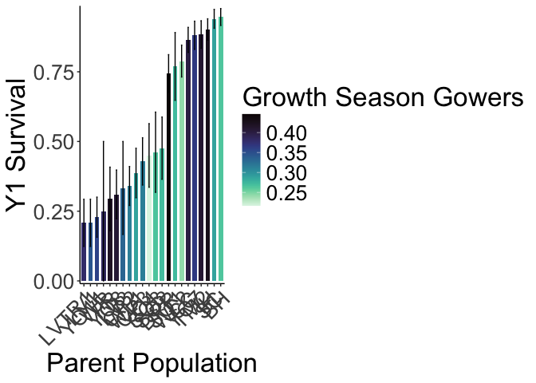<!-- -->

``` r
#ggsave("../output/WL2_Traits/WL2_Y1Surv_GrwSsn_GD_Recent.png", width = 12, height = 8, units = "in")

wl2_y1_surv %>% 
  group_by(pop, elev_m, GrwSsn_GD_Recent, Wtr_Year_GD_Recent) %>% 
  summarise(meanSurv=mean(Survival, na.rm = TRUE), semSurv=sem(Survival, na.rm=TRUE)) %>% 
  ggplot(aes(x=fct_reorder(pop, meanSurv), y=meanSurv, fill=Wtr_Year_GD_Recent)) +
  geom_col(width = 0.7,position = position_dodge(0.75)) + 
  geom_errorbar(aes(ymin=meanSurv-semSurv,ymax=meanSurv+semSurv),width=.2, position = 
                  position_dodge(0.75)) +
  theme_classic() + 
  scale_y_continuous(expand = c(0.01, 0)) +
  labs(y="Y1 Survival", x="Parent Population", fill="Water Year Gowers") +
  scale_fill_viridis(option="mako", direction = -1) +
  theme(text=element_text(size=25), axis.text.x = element_text(angle = 45,  hjust = 1))
```

```
## `summarise()` has grouped output by 'pop', 'elev_m', 'GrwSsn_GD_Recent'. You
## can override using the `.groups` argument.
```

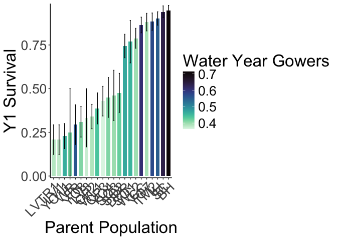<!-- -->

``` r
#ggsave("../output/WL2_Traits/WL2_Y1Surv_Wtr_Year_GD_Recent.png", width = 12, height = 8, units = "in")
```

Davis


``` r
ucd_y1_surv %>% 
  group_by(pop, elev_m, GrwSsn_GD_Recent, Wtr_Year_GD_Recent) %>% 
  summarise(meanSurv=mean(Survival, na.rm = TRUE), semSurv=sem(Survival, na.rm=TRUE)) %>% 
  ggplot(aes(x=fct_reorder(pop, meanSurv), y=meanSurv, fill=GrwSsn_GD_Recent)) +
  geom_col(width = 0.7,position = position_dodge(0.75)) + 
  geom_errorbar(aes(ymin=meanSurv-semSurv,ymax=meanSurv+semSurv),width=.2, position = 
                  position_dodge(0.75)) +
  theme_classic() + 
  scale_y_continuous(expand = c(0.01, 0)) +
  labs(y="Y1 Survival", x="Parent Population", fill="Growth Season Gowers") +
  scale_fill_viridis(option="mako", direction = -1) +
  theme(text=element_text(size=25), axis.text.x = element_text(angle = 45,  hjust = 1))
```

```
## `summarise()` has grouped output by 'pop', 'elev_m', 'GrwSsn_GD_Recent'. You
## can override using the `.groups` argument.
```

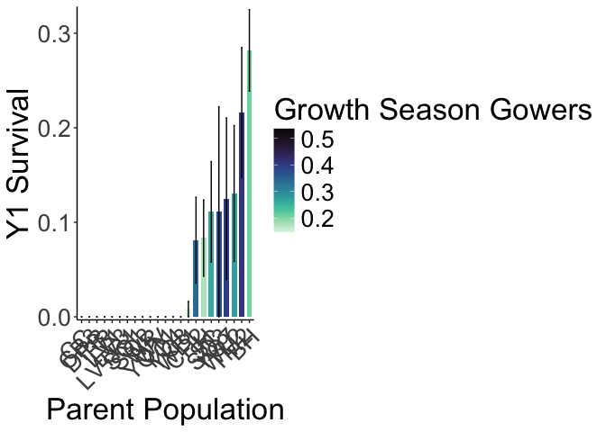<!-- -->

``` r
#ggsave("../output/UCD_Traits/UCD_Y1Surv_GrwSsn_GD_Recent.png", width = 12, height = 8, units = "in")

ucd_y1_surv %>% 
  group_by(pop, elev_m, GrwSsn_GD_Recent, Wtr_Year_GD_Recent) %>% 
  summarise(meanSurv=mean(Survival, na.rm = TRUE), semSurv=sem(Survival, na.rm=TRUE)) %>% 
  ggplot(aes(x=fct_reorder(pop, meanSurv), y=meanSurv, fill=Wtr_Year_GD_Recent)) +
  geom_col(width = 0.7,position = position_dodge(0.75)) + 
  geom_errorbar(aes(ymin=meanSurv-semSurv,ymax=meanSurv+semSurv),width=.2, position = 
                  position_dodge(0.75)) +
  theme_classic() + 
  scale_y_continuous(expand = c(0.01, 0)) +
  labs(y="Y1 Survival", x="Parent Population", fill="Water Year Gowers") +
  scale_fill_viridis(option="mako", direction = -1) +
  theme(text=element_text(size=25), axis.text.x = element_text(angle = 45,  hjust = 1))
```

```
## `summarise()` has grouped output by 'pop', 'elev_m', 'GrwSsn_GD_Recent'. You
## can override using the `.groups` argument.
```

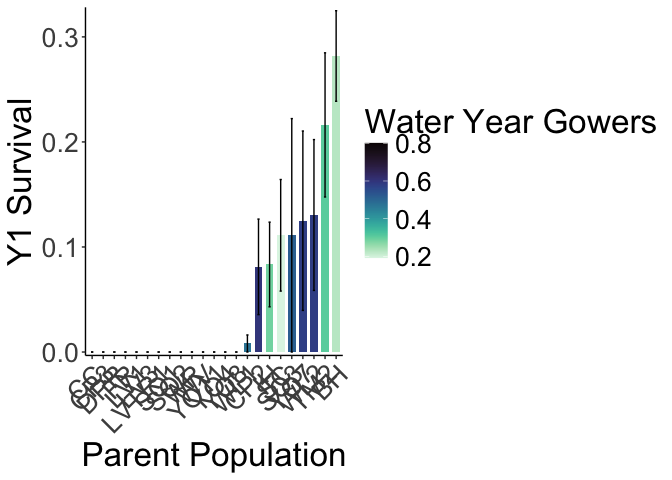<!-- -->

``` r
#ggsave("../output/UCD_Traits/UCD_Y1Surv_Wtr_Year_GD_Recent.png", width = 12, height = 8, units = "in")
```

### Scatterplots

WL2


``` r
#scatter plots
GSCD_recent <- wl2_y1_surv %>% 
  group_by(pop, elev_m, GrwSsn_GD_Recent, Wtr_Year_GD_Recent) %>% 
  summarise(meanSurv=mean(Survival, na.rm = TRUE), semSurv=sem(Survival, na.rm=TRUE)) %>% 
  ggplot(aes(x=GrwSsn_GD_Recent, y=meanSurv, group = pop)) +
  geom_point(size=6) + 
  geom_errorbar(aes(ymin=meanSurv-semSurv,ymax=meanSurv+semSurv),width=.02, linewidth = 2) +
  theme_classic() + 
  scale_y_continuous(expand = c(0.01, 0)) +
  labs(y="Y1 Survival", x="Recent Growth Season CD") +
  theme(text=element_text(size=25))
```

```
## `summarise()` has grouped output by 'pop', 'elev_m', 'GrwSsn_GD_Recent'. You
## can override using the `.groups` argument.
```

``` r
WYCD_recent <- wl2_y1_surv %>% 
  group_by(pop, elev_m, GrwSsn_GD_Recent, Wtr_Year_GD_Recent) %>% 
  summarise(meanSurv=mean(Survival, na.rm = TRUE), semSurv=sem(Survival, na.rm=TRUE)) %>% 
  ggplot(aes(x=Wtr_Year_GD_Recent, y=meanSurv, group = pop)) +
  geom_point(size=6) + 
  geom_errorbar(aes(ymin=meanSurv-semSurv,ymax=meanSurv+semSurv),width=.02,linewidth = 2) +
  theme_classic() + 
  scale_y_continuous(expand = c(0.01, 0)) +
  labs(y="Y1 Survival", x="Recent Water Year CD") +
  theme(text=element_text(size=25))
```

```
## `summarise()` has grouped output by 'pop', 'elev_m', 'GrwSsn_GD_Recent'. You
## can override using the `.groups` argument.
```

``` r
GD <- wl2_y1_surv %>% 
  group_by(pop, elev_m, GrwSsn_GD_Recent, Wtr_Year_GD_Recent, Geographic_Dist) %>% 
  summarise(meanSurv=mean(Survival, na.rm = TRUE), semSurv=sem(Survival, na.rm=TRUE)) %>% 
  ggplot(aes(x=Geographic_Dist, y=meanSurv, group = pop)) +
  geom_point(size=6) + 
  geom_errorbar(aes(ymin=meanSurv-semSurv,ymax=meanSurv+semSurv),width=.02, linewidth = 2) +
  theme_classic() + 
  scale_y_continuous(expand = c(0.01, 0)) +
  labs(y="Y1 Survival", x="Geographic Distance (m)") +
  theme(text=element_text(size=25), axis.text.x = element_text(angle = 45,  hjust = 1))
```

```
## `summarise()` has grouped output by 'pop', 'elev_m', 'GrwSsn_GD_Recent',
## 'Wtr_Year_GD_Recent'. You can override using the `.groups` argument.
```

``` r
ED <- wl2_y1_surv %>% 
  group_by(pop, elev_m, Elev_Dist) %>% 
  summarise(meanSurv=mean(Survival, na.rm = TRUE), semSurv=sem(Survival, na.rm=TRUE)) %>% 
  ggplot(aes(x=Elev_Dist, y=meanSurv, group = pop)) +
  geom_point(size=6) + 
  geom_errorbar(aes(ymin=meanSurv-semSurv,ymax=meanSurv+semSurv),width=.02, linewidth = 2) +
  theme_classic() + 
  scale_y_continuous(expand = c(0.01, 0)) +
  labs(y="Y1 Survival", x="Elevation Distance (m)") +
  theme(text=element_text(size=25), axis.text.x = element_text(angle = 45,  hjust = 1))
```

```
## `summarise()` has grouped output by 'pop', 'elev_m'. You can override using the
## `.groups` argument.
```

``` r
wl2_y1_surv_FIG <- ggarrange(GSCD_recent, WYCD_recent, GD, ED, ncol=2, nrow=2) 
ggsave("../output/WL2_Traits/WL2_Y1_Surv_SCATTERS_Recent.png", width = 24, height = 18, units = "in")
```


``` r
#scatter plots
GSCD_historic <- wl2_y1_surv %>% 
  group_by(pop, elev_m, GrwSsn_GD_Historical, Wtr_Year_GD_Historical) %>% 
  summarise(meanSurv=mean(Survival, na.rm = TRUE), semSurv=sem(Survival, na.rm=TRUE)) %>% 
  ggplot(aes(x=GrwSsn_GD_Historical, y=meanSurv, group = pop)) +
  geom_point(size=6) + 
  geom_errorbar(aes(ymin=meanSurv-semSurv,ymax=meanSurv+semSurv),width=.02, linewidth = 2) +
  theme_classic() + 
  scale_y_continuous(expand = c(0.01, 0)) +
  labs(y="Y1 Survival", x="Historic Growth Season CD") +
  theme(text=element_text(size=25))
```

```
## `summarise()` has grouped output by 'pop', 'elev_m', 'GrwSsn_GD_Historical'.
## You can override using the `.groups` argument.
```

``` r
WYCD_historic <- wl2_y1_surv %>% 
  group_by(pop, elev_m, GrwSsn_GD_Historical, Wtr_Year_GD_Historical) %>% 
  summarise(meanSurv=mean(Survival, na.rm = TRUE), semSurv=sem(Survival, na.rm=TRUE)) %>% 
  ggplot(aes(x=Wtr_Year_GD_Historical, y=meanSurv, group = pop)) +
  geom_point(size=6) + 
  geom_errorbar(aes(ymin=meanSurv-semSurv,ymax=meanSurv+semSurv),width=.02,linewidth = 2) +
  theme_classic() + 
  scale_y_continuous(expand = c(0.01, 0)) +
  labs(y="Y1 Survival", x="Historic Water Year CD") +
  theme(text=element_text(size=25))
```

```
## `summarise()` has grouped output by 'pop', 'elev_m', 'GrwSsn_GD_Historical'.
## You can override using the `.groups` argument.
```

``` r
wl2_y1_surv_FIG <- ggarrange(GSCD_historic, WYCD_historic, GD, ED, ncol=2, nrow=2) 
ggsave("../output/WL2_Traits/WL2_Y1_Surv_SCATTERS_Historic.png", width = 24, height = 18, units = "in")
```

Davis


``` r
#scatter plots
GSCD_recent <- ucd_y1_surv %>% 
  filter(pop!="WV") %>% #Only 2 indivs for WV
  group_by(pop, elev_m, GrwSsn_GD_Recent, Wtr_Year_GD_Recent) %>% 
  summarise(meanSurv=mean(Survival, na.rm = TRUE), semSurv=sem(Survival, na.rm=TRUE)) %>% 
  ggplot(aes(x=GrwSsn_GD_Recent, y=meanSurv, group = pop)) +
  geom_point(size=6) + 
  geom_errorbar(aes(ymin=meanSurv-semSurv,ymax=meanSurv+semSurv),width=.02, linewidth = 2) +
  theme_classic() + 
  scale_y_continuous(expand = c(0.01, 0)) +
  labs(y="Y1 Survival", x="Recent Growth Season CD") +
  theme(text=element_text(size=25))
```

```
## `summarise()` has grouped output by 'pop', 'elev_m', 'GrwSsn_GD_Recent'. You
## can override using the `.groups` argument.
```

``` r
WYCD_recent <- ucd_y1_surv %>% 
  filter(pop!="WV") %>% #Only 2 indivs for WV
  group_by(pop, elev_m, GrwSsn_GD_Recent, Wtr_Year_GD_Recent) %>% 
  summarise(meanSurv=mean(Survival, na.rm = TRUE), semSurv=sem(Survival, na.rm=TRUE)) %>% 
  ggplot(aes(x=Wtr_Year_GD_Recent, y=meanSurv, group = pop)) +
  geom_point(size=6) + 
  geom_errorbar(aes(ymin=meanSurv-semSurv,ymax=meanSurv+semSurv),width=.02,linewidth = 2) +
  theme_classic() + 
  scale_y_continuous(expand = c(0.01, 0)) +
  labs(y="Y1 Survival", x="Recent Water Year CD") +
  theme(text=element_text(size=25))
```

```
## `summarise()` has grouped output by 'pop', 'elev_m', 'GrwSsn_GD_Recent'. You
## can override using the `.groups` argument.
```

``` r
GD <- ucd_y1_surv %>% 
  filter(pop!="WV") %>% #Only 2 indivs for WV
  group_by(pop, elev_m, GrwSsn_GD_Recent, Wtr_Year_GD_Recent, Geographic_Dist) %>% 
  summarise(meanSurv=mean(Survival, na.rm = TRUE), semSurv=sem(Survival, na.rm=TRUE)) %>% 
  ggplot(aes(x=Geographic_Dist, y=meanSurv, group = pop)) +
  geom_point(size=6) + 
  geom_errorbar(aes(ymin=meanSurv-semSurv,ymax=meanSurv+semSurv),width=.02, linewidth = 2) +
  theme_classic() + 
  scale_y_continuous(expand = c(0.01, 0)) +
  labs(y="Y1 Survival", x="Geographic Distance (m)") +
  theme(text=element_text(size=25), axis.text.x = element_text(angle = 45,  hjust = 1))
```

```
## `summarise()` has grouped output by 'pop', 'elev_m', 'GrwSsn_GD_Recent',
## 'Wtr_Year_GD_Recent'. You can override using the `.groups` argument.
```

``` r
ED <- ucd_y1_surv %>% 
  filter(pop!="WV") %>% #Only 2 indivs for WV
  group_by(pop, elev_m, Elev_Dist) %>% 
  summarise(meanSurv=mean(Survival, na.rm = TRUE), semSurv=sem(Survival, na.rm=TRUE)) %>% 
  ggplot(aes(x=Elev_Dist, y=meanSurv, group = pop)) +
  geom_point(size=6) + 
  geom_errorbar(aes(ymin=meanSurv-semSurv,ymax=meanSurv+semSurv),width=.02, linewidth = 2) +
  theme_classic() + 
  scale_y_continuous(expand = c(0.01, 0)) +
  labs(y="Y1 Survival", x="Elevation Distance (m)") +
  theme(text=element_text(size=25), axis.text.x = element_text(angle = 45,  hjust = 1))
```

```
## `summarise()` has grouped output by 'pop', 'elev_m'. You can override using the
## `.groups` argument.
```

``` r
ucd_y1_surv_FIG <- ggarrange(GSCD_recent, WYCD_recent, GD, ED, ncol=2, nrow=2) 
ggsave("../output/UCD_Traits/UCD_Y1_Surv_SCATTERS_Recent.png", width = 24, height = 18, units = "in")
```


``` r
#scatter plots
GSCD_historic <- ucd_y1_surv %>% 
  filter(pop!="WV") %>% #Only 2 indivs for WV
  group_by(pop, elev_m, GrwSsn_GD_Historical, Wtr_Year_GD_Historical) %>% 
  summarise(meanSurv=mean(Survival, na.rm = TRUE), semSurv=sem(Survival, na.rm=TRUE)) %>% 
  ggplot(aes(x=GrwSsn_GD_Historical, y=meanSurv, group = pop)) +
  geom_point(size=6) + 
  geom_errorbar(aes(ymin=meanSurv-semSurv,ymax=meanSurv+semSurv),width=.02, linewidth = 2) +
  theme_classic() + 
  scale_y_continuous(expand = c(0.01, 0)) +
  labs(y="Y1 Survival", x="Historic Growth Season CD") +
  theme(text=element_text(size=25))
```

```
## `summarise()` has grouped output by 'pop', 'elev_m', 'GrwSsn_GD_Historical'.
## You can override using the `.groups` argument.
```

``` r
WYCD_historic <- ucd_y1_surv %>% 
  filter(pop!="WV") %>% #Only 2 indivs for WV
  group_by(pop, elev_m, GrwSsn_GD_Historical, Wtr_Year_GD_Historical) %>% 
  summarise(meanSurv=mean(Survival, na.rm = TRUE), semSurv=sem(Survival, na.rm=TRUE)) %>% 
  ggplot(aes(x=Wtr_Year_GD_Historical, y=meanSurv, group = pop)) +
  geom_point(size=6) + 
  geom_errorbar(aes(ymin=meanSurv-semSurv,ymax=meanSurv+semSurv),width=.02,linewidth = 2) +
  theme_classic() + 
  scale_y_continuous(expand = c(0.01, 0)) +
  labs(y="Y1 Survival", x="Historic Water Year CD") +
  theme(text=element_text(size=25))
```

```
## `summarise()` has grouped output by 'pop', 'elev_m', 'GrwSsn_GD_Historical'.
## You can override using the `.groups` argument.
```

``` r
ucd_y1_surv_FIG <- ggarrange(GSCD_historic, WYCD_historic, GD, ED, ncol=2, nrow=2) 
ggsave("../output/UCD_Traits/UCD_Y1_Surv_SCATTERS_Historic.png", width = 24, height = 18, units = "in")
```

#### Directional Distance


``` r
#scatter plots - recent
GSCD_prob_recent <- wl2_y1_surv_sub_dist %>% 
  group_by(pop, elev_m, GrwSsn_TempDist_Recent, GrwSsn_TempDist_Historic) %>% 
  summarise(meanEst=mean(Survival, na.rm = TRUE), semEst=sem(Survival, na.rm=TRUE)) %>% 
  ggplot(aes(x=GrwSsn_TempDist_Recent, y=meanEst, group = pop)) +
  geom_point(size=6) + 
  geom_errorbar(aes(ymin=meanEst-semEst,ymax=meanEst+semEst),width=.3, linewidth = 2) +
  theme_classic() + 
  scale_y_continuous(expand = c(0.01, 0)) +
  labs(y="Y1 Survival", x="Recent Growth Season Temp Dist") +
  theme(text=element_text(size=30))
```

```
## `summarise()` has grouped output by 'pop', 'elev_m', 'GrwSsn_TempDist_Recent'.
## You can override using the `.groups` argument.
```

``` r
WYCD_prob_recent <- wl2_y1_surv_sub_dist %>% 
  group_by(pop, elev_m, Wtr_Year_TempDist_Recent, Wtr_Year_TempDist_Historic) %>% 
  summarise(meanEst=mean(Survival, na.rm = TRUE), semEst=sem(Survival, na.rm=TRUE)) %>% 
  ggplot(aes(x=Wtr_Year_TempDist_Recent, y=meanEst, group = pop)) +
  geom_point(size=6) + 
  geom_errorbar(aes(ymin=meanEst-semEst,ymax=meanEst+semEst),width=.3,linewidth = 2) +
  theme_classic() + 
  scale_y_continuous(expand = c(0.01, 0)) +
  labs(y="Y1 Survival", x="Recent Water Year Temp Dist") +
  theme(text=element_text(size=30))
```

```
## `summarise()` has grouped output by 'pop', 'elev_m',
## 'Wtr_Year_TempDist_Recent'. You can override using the `.groups` argument.
```

``` r
GD_prob <- wl2_y1_surv_sub_dist %>% 
  group_by(pop, elev_m, GrwSsn_TempDist_Recent, Wtr_Year_TempDist_Recent, Geographic_Dist) %>% 
  summarise(meanEst=mean(Survival, na.rm = TRUE), semEst=sem(Survival, na.rm=TRUE)) %>% 
  ggplot(aes(x=Geographic_Dist, y=meanEst, group = pop)) +
  geom_point(size=6) + 
  geom_errorbar(aes(ymin=meanEst-semEst,ymax=meanEst+semEst),width=.2, linewidth = 2) +
  theme_classic() + 
  scale_y_continuous(expand = c(0.01, 0)) +
  labs(y="Y1 Survival", x="Geographic Distance (m)") +
  theme(text=element_text(size=30), axis.text.x = element_text(angle = 45,  hjust = 1))
```

```
## `summarise()` has grouped output by 'pop', 'elev_m', 'GrwSsn_TempDist_Recent',
## 'Wtr_Year_TempDist_Recent'. You can override using the `.groups` argument.
```

``` r
ED_prob <- wl2_y1_surv_sub_dist %>% 
  group_by(pop, elev_m, Elev_Dist) %>% 
  summarise(meanEst=mean(Survival, na.rm = TRUE), semEst=sem(Survival, na.rm=TRUE)) %>% 
  ggplot(aes(x=Elev_Dist, y=meanEst, group = pop)) +
  geom_point(size=6) + 
  geom_errorbar(aes(ymin=meanEst-semEst,ymax=meanEst+semEst),width=.3, linewidth = 2) +
  theme_classic() + 
  scale_y_continuous(expand = c(0.01, 0)) +
  labs(y="Y1 Survival", x="Elevation Distance (m)") +
  theme(text=element_text(size=30))
```

```
## `summarise()` has grouped output by 'pop', 'elev_m'. You can override using the
## `.groups` argument.
```

``` r
WL2_y1_surv_sub_FIG_prob_recent <- ggarrange(GSCD_prob_recent, WYCD_prob_recent, GD_prob, ED_prob, ncol=2, nrow=2) 
ggsave("../output/WL2_Traits/WL2_Y1_Surv_TmpSubDist_SCATTERS_Recent.png", width = 24, height = 18, units = "in")
```


``` r
#scatter plots - historic
GSCD_prob_historic <- wl2_y1_surv_sub_dist %>% 
  group_by(pop, elev_m, GrwSsn_TempDist_Recent, GrwSsn_TempDist_Historic) %>% 
  summarise(meanEst=mean(Survival, na.rm = TRUE), semEst=sem(Survival, na.rm=TRUE)) %>% 
  ggplot(aes(x=GrwSsn_TempDist_Historic, y=meanEst, group = pop)) +
  geom_point(size=6) + 
  geom_errorbar(aes(ymin=meanEst-semEst,ymax=meanEst+semEst),width=.3, linewidth = 2) +
  theme_classic() + 
  scale_y_continuous(expand = c(0.01, 0)) +
  labs(y="Y1 Survival", x="Historic Growth Season Temp Dist") +
  theme(text=element_text(size=30))
```

```
## `summarise()` has grouped output by 'pop', 'elev_m', 'GrwSsn_TempDist_Recent'.
## You can override using the `.groups` argument.
```

``` r
WYCD_prob_historic <- wl2_y1_surv_sub_dist %>% 
  group_by(pop, elev_m, Wtr_Year_TempDist_Recent, Wtr_Year_TempDist_Historic) %>% 
  summarise(meanEst=mean(Survival, na.rm = TRUE), semEst=sem(Survival, na.rm=TRUE)) %>% 
  ggplot(aes(x=Wtr_Year_TempDist_Historic, y=meanEst, group = pop)) +
  geom_point(size=6) + 
  geom_errorbar(aes(ymin=meanEst-semEst,ymax=meanEst+semEst),width=.3,linewidth = 2) +
  theme_classic() + 
  scale_y_continuous(expand = c(0.01, 0)) +
  labs(y="Y1 Survival", x="Historic Water Year Temp Dist") +
  theme(text=element_text(size=30))
```

```
## `summarise()` has grouped output by 'pop', 'elev_m',
## 'Wtr_Year_TempDist_Recent'. You can override using the `.groups` argument.
```

``` r
WL2_y1_surv_sub_FIG_prob_historic <- ggarrange(GSCD_prob_historic, WYCD_prob_historic, GD_prob, ED_prob, ncol=2, nrow=2) 
ggsave("../output/WL2_Traits/WL2_Y1_Surv_TmpSubDist_SCATTERS_Historic.png", width = 24, height = 18, units = "in")
```


``` r
#scatter plots - recent
GSCD_prob_recent <- ucd_y1_surv_sub_dist %>% 
  filter(pop!="WV") %>% #Only 2 indivs for WV
  group_by(pop, elev_m, GrwSsn_TempDist_Recent, GrwSsn_TempDist_Historic) %>% 
  summarise(meanEst=mean(Survival, na.rm = TRUE), semEst=sem(Survival, na.rm=TRUE)) %>% 
  ggplot(aes(x=GrwSsn_TempDist_Recent, y=meanEst, group = pop)) +
  geom_point(size=6) + 
  geom_errorbar(aes(ymin=meanEst-semEst,ymax=meanEst+semEst),width=.3, linewidth = 2) +
  theme_classic() + 
  scale_y_continuous(expand = c(0.01, 0)) +
  labs(y="Y1 Survival", x="Recent Growth Season Temp Dist") +
  theme(text=element_text(size=30))
```

```
## `summarise()` has grouped output by 'pop', 'elev_m', 'GrwSsn_TempDist_Recent'.
## You can override using the `.groups` argument.
```

``` r
WYCD_prob_recent <- ucd_y1_surv_sub_dist %>% 
  filter(pop!="WV") %>% #Only 2 indivs for WV
  group_by(pop, elev_m, Wtr_Year_TempDist_Recent, Wtr_Year_TempDist_Historic) %>% 
  summarise(meanEst=mean(Survival, na.rm = TRUE), semEst=sem(Survival, na.rm=TRUE)) %>% 
  ggplot(aes(x=Wtr_Year_TempDist_Recent, y=meanEst, group = pop)) +
  geom_point(size=6) + 
  geom_errorbar(aes(ymin=meanEst-semEst,ymax=meanEst+semEst),width=.3,linewidth = 2) +
  theme_classic() + 
  scale_y_continuous(expand = c(0.01, 0)) +
  labs(y="Y1 Survival", x="Recent Water Year Temp Dist") +
  theme(text=element_text(size=30))
```

```
## `summarise()` has grouped output by 'pop', 'elev_m',
## 'Wtr_Year_TempDist_Recent'. You can override using the `.groups` argument.
```

``` r
GD_prob <- ucd_y1_surv_sub_dist %>% 
  filter(pop!="WV") %>% #Only 2 indivs for WV
  group_by(pop, elev_m, GrwSsn_TempDist_Recent, Wtr_Year_TempDist_Recent, Geographic_Dist) %>% 
  summarise(meanEst=mean(Survival, na.rm = TRUE), semEst=sem(Survival, na.rm=TRUE)) %>% 
  ggplot(aes(x=Geographic_Dist, y=meanEst, group = pop)) +
  geom_point(size=6) + 
  geom_errorbar(aes(ymin=meanEst-semEst,ymax=meanEst+semEst),width=.3, linewidth = 2) +
  theme_classic() + 
  scale_y_continuous(expand = c(0.01, 0)) +
  labs(y="Y1 Survival", x="Geographic Distance (m)") +
  theme(text=element_text(size=30), axis.text.x = element_text(angle = 45,  hjust = 1))
```

```
## `summarise()` has grouped output by 'pop', 'elev_m', 'GrwSsn_TempDist_Recent',
## 'Wtr_Year_TempDist_Recent'. You can override using the `.groups` argument.
```

``` r
ED_prob <- ucd_y1_surv_sub_dist %>% 
  filter(pop!="WV") %>% #Only 2 indivs for WV
  group_by(pop, elev_m, Elev_Dist) %>% 
  summarise(meanEst=mean(Survival, na.rm = TRUE), semEst=sem(Survival, na.rm=TRUE)) %>% 
  ggplot(aes(x=Elev_Dist, y=meanEst, group = pop)) +
  geom_point(size=6) + 
  geom_errorbar(aes(ymin=meanEst-semEst,ymax=meanEst+semEst),width=.3, linewidth = 2) +
  theme_classic() + 
  scale_y_continuous(expand = c(0.01, 0)) +
  labs(y="Y1 Survival", x="Elevation Distance (m)") +
  theme(text=element_text(size=30))
```

```
## `summarise()` has grouped output by 'pop', 'elev_m'. You can override using the
## `.groups` argument.
```

``` r
UCD_y1_surv_sub_FIG_prob_recent <- ggarrange(GSCD_prob_recent, WYCD_prob_recent, GD_prob, ED_prob, ncol=2, nrow=2) 
ggsave("../output/UCD_Traits/UCD_Y1_Surv_TmpSubDist_SCATTERS_Recent.png", width = 24, height = 18, units = "in")
```


``` r
#scatter plots - historic
GSCD_prob_historic <- ucd_y1_surv_sub_dist %>% 
  filter(pop!="WV") %>% #Only 2 indivs for WV
  group_by(pop, elev_m, GrwSsn_TempDist_Recent, GrwSsn_TempDist_Historic) %>% 
  summarise(meanEst=mean(Survival, na.rm = TRUE), semEst=sem(Survival, na.rm=TRUE)) %>% 
  ggplot(aes(x=GrwSsn_TempDist_Historic, y=meanEst, group = pop)) +
  geom_point(size=6) + 
  geom_errorbar(aes(ymin=meanEst-semEst,ymax=meanEst+semEst),width=.3, linewidth = 2) +
  theme_classic() + 
  scale_y_continuous(expand = c(0.01, 0)) +
  labs(y="Y1 Survival", x="Historic Growth Season Temp Dist") +
  theme(text=element_text(size=30))
```

```
## `summarise()` has grouped output by 'pop', 'elev_m', 'GrwSsn_TempDist_Recent'.
## You can override using the `.groups` argument.
```

``` r
WYCD_prob_historic <- ucd_y1_surv_sub_dist %>% 
  filter(pop!="WV") %>% #Only 2 indivs for WV
  group_by(pop, elev_m, Wtr_Year_TempDist_Recent, Wtr_Year_TempDist_Historic) %>% 
  summarise(meanEst=mean(Survival, na.rm = TRUE), semEst=sem(Survival, na.rm=TRUE)) %>% 
  ggplot(aes(x=Wtr_Year_TempDist_Historic, y=meanEst, group = pop)) +
  geom_point(size=6) + 
  geom_errorbar(aes(ymin=meanEst-semEst,ymax=meanEst+semEst),width=.3,linewidth = 2) +
  theme_classic() + 
  scale_y_continuous(expand = c(0.01, 0)) +
  labs(y="Y1 Survival", x="Historic Water Year Temp Dist") +
  theme(text=element_text(size=30))
```

```
## `summarise()` has grouped output by 'pop', 'elev_m',
## 'Wtr_Year_TempDist_Recent'. You can override using the `.groups` argument.
```

``` r
UCD_y1_surv_sub_FIG_prob_historic <- ggarrange(GSCD_prob_historic, WYCD_prob_historic, GD_prob, ED_prob, ncol=2, nrow=2) 
ggsave("../output/UCD_Traits/UCD_Y1_Surv_TmpSubDist_SCATTERS_Historic.png", width = 24, height = 18, units = "in")
```


``` r
#scatter plots - recent
GSCD_prob_recent <- wl2_y1_surv_sub_dist %>% 
  group_by(pop, elev_m, GrwSsn_PPTDist_Recent, GrwSsn_PPTDist_Historic) %>% 
  summarise(meanEst=mean(Survival, na.rm = TRUE), semEst=sem(Survival, na.rm=TRUE)) %>% 
  ggplot(aes(x=GrwSsn_PPTDist_Recent, y=meanEst, group = pop)) +
  geom_point(size=6) + 
  geom_errorbar(aes(ymin=meanEst-semEst,ymax=meanEst+semEst),width=0.3, linewidth = 2) +
  theme_classic() + 
  scale_y_continuous(expand = c(0.01, 0)) +
  labs(y="Y1 Survival", x="Recent Growth Season PPT Dist") +
  theme(text=element_text(size=30))
```

```
## `summarise()` has grouped output by 'pop', 'elev_m', 'GrwSsn_PPTDist_Recent'.
## You can override using the `.groups` argument.
```

``` r
WYCD_prob_recent <- wl2_y1_surv_sub_dist %>% 
  group_by(pop, elev_m, Wtr_Year_PPTDist_Recent, Wtr_Year_PPTDist_Historic) %>% 
  summarise(meanEst=mean(Survival, na.rm = TRUE), semEst=sem(Survival, na.rm=TRUE)) %>% 
  ggplot(aes(x=Wtr_Year_PPTDist_Recent, y=meanEst, group = pop)) +
  geom_point(size=6) + 
  geom_errorbar(aes(ymin=meanEst-semEst,ymax=meanEst+semEst),width=.3,linewidth = 2) +
  theme_classic() + 
  scale_y_continuous(expand = c(0.01, 0)) +
  labs(y="Y1 Survival", x="Recent Water Year PPT Dist") +
  theme(text=element_text(size=30))
```

```
## `summarise()` has grouped output by 'pop', 'elev_m', 'Wtr_Year_PPTDist_Recent'.
## You can override using the `.groups` argument.
```

``` r
GD_prob <- wl2_y1_surv_sub_dist %>% 
  group_by(pop, elev_m, GrwSsn_PPTDist_Recent, Wtr_Year_PPTDist_Recent, Geographic_Dist) %>% 
  summarise(meanEst=mean(Survival, na.rm = TRUE), semEst=sem(Survival, na.rm=TRUE)) %>% 
  ggplot(aes(x=Geographic_Dist, y=meanEst, group = pop)) +
  geom_point(size=6) + 
  geom_errorbar(aes(ymin=meanEst-semEst,ymax=meanEst+semEst),width=.2, linewidth = 2) +
  theme_classic() + 
  scale_y_continuous(expand = c(0.01, 0)) +
  labs(y="Y1 Survival", x="Geographic Distance (m)") +
  theme(text=element_text(size=30), axis.text.x = element_text(angle = 45,  hjust = 1))
```

```
## `summarise()` has grouped output by 'pop', 'elev_m', 'GrwSsn_PPTDist_Recent',
## 'Wtr_Year_PPTDist_Recent'. You can override using the `.groups` argument.
```

``` r
ED_prob <- wl2_y1_surv_sub_dist %>% 
  group_by(pop, elev_m, Elev_Dist) %>% 
  summarise(meanEst=mean(Survival, na.rm = TRUE), semEst=sem(Survival, na.rm=TRUE)) %>% 
  ggplot(aes(x=Elev_Dist, y=meanEst, group = pop)) +
  geom_point(size=6) + 
  geom_errorbar(aes(ymin=meanEst-semEst,ymax=meanEst+semEst),width=.3, linewidth = 2) +
  theme_classic() + 
  scale_y_continuous(expand = c(0.01, 0)) +
  labs(y="Y1 Survival", x="Elevation Distance (m)") +
  theme(text=element_text(size=30))
```

```
## `summarise()` has grouped output by 'pop', 'elev_m'. You can override using the
## `.groups` argument.
```

``` r
WL2_y1_surv_sub_FIG_prob_recent <- ggarrange(GSCD_prob_recent, WYCD_prob_recent, GD_prob, ED_prob, ncol=2, nrow=2) 
ggsave("../output/WL2_Traits/WL2_Y1_Surv_PPTSubDist_SCATTERS_Recent.png", width = 24, height = 18, units = "in")
```


``` r
#scatter plots - historic
GSCD_prob_historic <- wl2_y1_surv_sub_dist %>% 
  group_by(pop, elev_m, GrwSsn_PPTDist_Recent, GrwSsn_PPTDist_Historic) %>% 
  summarise(meanEst=mean(Survival, na.rm = TRUE), semEst=sem(Survival, na.rm=TRUE)) %>% 
  ggplot(aes(x=GrwSsn_PPTDist_Historic, y=meanEst, group = pop)) +
  geom_point(size=6) + 
  geom_errorbar(aes(ymin=meanEst-semEst,ymax=meanEst+semEst),width=.3, linewidth = 2) +
  theme_classic() + 
  scale_y_continuous(expand = c(0.01, 0)) +
  labs(y="Y1 Survival", x="Historic Growth Season PPT Dist") +
  theme(text=element_text(size=30))
```

```
## `summarise()` has grouped output by 'pop', 'elev_m', 'GrwSsn_PPTDist_Recent'.
## You can override using the `.groups` argument.
```

``` r
WYCD_prob_historic <- wl2_y1_surv_sub_dist %>% 
  group_by(pop, elev_m, Wtr_Year_PPTDist_Recent, Wtr_Year_PPTDist_Historic) %>% 
  summarise(meanEst=mean(Survival, na.rm = TRUE), semEst=sem(Survival, na.rm=TRUE)) %>% 
  ggplot(aes(x=Wtr_Year_PPTDist_Historic, y=meanEst, group = pop)) +
  geom_point(size=6) + 
  geom_errorbar(aes(ymin=meanEst-semEst,ymax=meanEst+semEst),width=.3,linewidth = 2) +
  theme_classic() + 
  scale_y_continuous(expand = c(0.01, 0)) +
  labs(y="Y1 Survival", x="Historic Water Year PPT Dist") +
  theme(text=element_text(size=30))
```

```
## `summarise()` has grouped output by 'pop', 'elev_m', 'Wtr_Year_PPTDist_Recent'.
## You can override using the `.groups` argument.
```

``` r
WL2_y1_surv_sub_FIG_prob_historic <- ggarrange(GSCD_prob_historic, WYCD_prob_historic, GD_prob, ED_prob, ncol=2, nrow=2) 
ggsave("../output/WL2_Traits/WL2_Y1_Surv_PPTSubDist_SCATTERS_Historic.png", width = 24, height = 18, units = "in")
```


``` r
#scatter plots - recent
GSCD_prob_recent <- ucd_y1_surv_sub_dist %>% 
  filter(pop!="WV") %>% #Only 2 indivs for WV
  group_by(pop, elev_m, GrwSsn_PPTDist_Recent, GrwSsn_PPTDist_Historic) %>% 
  summarise(meanEst=mean(Survival, na.rm = TRUE), semEst=sem(Survival, na.rm=TRUE)) %>% 
  ggplot(aes(x=GrwSsn_PPTDist_Recent, y=meanEst, group = pop)) +
  geom_point(size=6) + 
  geom_errorbar(aes(ymin=meanEst-semEst,ymax=meanEst+semEst),width=.3, linewidth = 2) +
  theme_classic() + 
  scale_y_continuous(expand = c(0.01, 0)) +
  labs(y="Y1 Survival", x="Recent Growth Season PPT Dist") +
  theme(text=element_text(size=30))
```

```
## `summarise()` has grouped output by 'pop', 'elev_m', 'GrwSsn_PPTDist_Recent'.
## You can override using the `.groups` argument.
```

``` r
WYCD_prob_recent <- ucd_y1_surv_sub_dist %>% 
  filter(pop!="WV") %>% #Only 2 indivs for WV
  group_by(pop, elev_m, Wtr_Year_PPTDist_Recent, Wtr_Year_PPTDist_Historic) %>% 
  summarise(meanEst=mean(Survival, na.rm = TRUE), semEst=sem(Survival, na.rm=TRUE)) %>% 
  ggplot(aes(x=Wtr_Year_PPTDist_Recent, y=meanEst, group = pop)) +
  geom_point(size=6) + 
  geom_errorbar(aes(ymin=meanEst-semEst,ymax=meanEst+semEst),width=.3,linewidth = 2) +
  theme_classic() + 
  scale_y_continuous(expand = c(0.01, 0)) +
  labs(y="Y1 Survival", x="Recent Water Year PPT Dist") +
  theme(text=element_text(size=30))
```

```
## `summarise()` has grouped output by 'pop', 'elev_m', 'Wtr_Year_PPTDist_Recent'.
## You can override using the `.groups` argument.
```

``` r
GD_prob <- ucd_y1_surv_sub_dist %>% 
  filter(pop!="WV") %>% #Only 2 indivs for WV
  group_by(pop, elev_m, GrwSsn_PPTDist_Recent, Wtr_Year_PPTDist_Recent, Geographic_Dist) %>% 
  summarise(meanEst=mean(Survival, na.rm = TRUE), semEst=sem(Survival, na.rm=TRUE)) %>% 
  ggplot(aes(x=Geographic_Dist, y=meanEst, group = pop)) +
  geom_point(size=6) + 
  geom_errorbar(aes(ymin=meanEst-semEst,ymax=meanEst+semEst),width=.3, linewidth = 2) +
  theme_classic() + 
  scale_y_continuous(expand = c(0.01, 0)) +
  labs(y="Y1 Survival", x="Geographic Distance (m)") +
  theme(text=element_text(size=30), axis.text.x = element_text(angle = 45,  hjust = 1))
```

```
## `summarise()` has grouped output by 'pop', 'elev_m', 'GrwSsn_PPTDist_Recent',
## 'Wtr_Year_PPTDist_Recent'. You can override using the `.groups` argument.
```

``` r
ED_prob <- ucd_y1_surv_sub_dist %>% 
  filter(pop!="WV") %>% #Only 2 indivs for WV
  group_by(pop, elev_m, Elev_Dist) %>% 
  summarise(meanEst=mean(Survival, na.rm = TRUE), semEst=sem(Survival, na.rm=TRUE)) %>% 
  ggplot(aes(x=Elev_Dist, y=meanEst, group = pop)) +
  geom_point(size=6) + 
  geom_errorbar(aes(ymin=meanEst-semEst,ymax=meanEst+semEst),width=.3, linewidth = 2) +
  theme_classic() + 
  scale_y_continuous(expand = c(0.01, 0)) +
  labs(y="Y1 Survival", x="Elevation Distance (m)") +
  theme(text=element_text(size=30))
```

```
## `summarise()` has grouped output by 'pop', 'elev_m'. You can override using the
## `.groups` argument.
```

``` r
UCD_y1_surv_sub_FIG_prob_recent <- ggarrange(GSCD_prob_recent, WYCD_prob_recent, GD_prob, ED_prob, ncol=2, nrow=2) 
ggsave("../output/UCD_Traits/UCD_Y1_Surv_PPTSubDist_SCATTERS_Recent.png", width = 24, height = 18, units = "in")
```


``` r
#scatter plots - historic
GSCD_prob_historic <- ucd_y1_surv_sub_dist %>% 
  filter(pop!="WV") %>% #Only 2 indivs for WV
  group_by(pop, elev_m, GrwSsn_PPTDist_Recent, GrwSsn_PPTDist_Historic) %>% 
  summarise(meanEst=mean(Survival, na.rm = TRUE), semEst=sem(Survival, na.rm=TRUE)) %>% 
  ggplot(aes(x=GrwSsn_PPTDist_Historic, y=meanEst, group = pop)) +
  geom_point(size=6) + 
  geom_errorbar(aes(ymin=meanEst-semEst,ymax=meanEst+semEst),width=.3, linewidth = 2) +
  theme_classic() + 
  scale_y_continuous(expand = c(0.01, 0)) +
  labs(y="Y1 Survival", x="Historic Growth Season PPT Dist") +
  theme(text=element_text(size=30))
```

```
## `summarise()` has grouped output by 'pop', 'elev_m', 'GrwSsn_PPTDist_Recent'.
## You can override using the `.groups` argument.
```

``` r
WYCD_prob_historic <- ucd_y1_surv_sub_dist %>% 
  filter(pop!="WV") %>% #Only 2 indivs for WV
  group_by(pop, elev_m, Wtr_Year_PPTDist_Recent, Wtr_Year_PPTDist_Historic) %>% 
  summarise(meanEst=mean(Survival, na.rm = TRUE), semEst=sem(Survival, na.rm=TRUE)) %>% 
  ggplot(aes(x=Wtr_Year_PPTDist_Historic, y=meanEst, group = pop)) +
  geom_point(size=6) + 
  geom_errorbar(aes(ymin=meanEst-semEst,ymax=meanEst+semEst),width=.3,linewidth = 2) +
  theme_classic() + 
  scale_y_continuous(expand = c(0.01, 0)) +
  labs(y="Y1 Survival", x="Historic Water Year PPT Dist") +
  theme(text=element_text(size=30))
```

```
## `summarise()` has grouped output by 'pop', 'elev_m', 'Wtr_Year_PPTDist_Recent'.
## You can override using the `.groups` argument.
```

``` r
UCD_y1_surv_sub_FIG_prob_historic <- ggarrange(GSCD_prob_historic, WYCD_prob_historic, GD_prob, ED_prob, ncol=2, nrow=2) 
ggsave("../output/UCD_Traits/UCD_Y1_Surv_PPTSubDist_SCATTERS_Historic.png", width = 24, height = 18, units = "in")
```

## Stats

### Scaling


``` r
wl2_y1_surv %>% group_by(pop) %>% summarise(n=n()) %>% arrange(n) #CHECK SAMPLE SIZE
```

```
## # A tibble: 22 × 2
##    pop       n
##    <chr> <int>
##  1 WR        4
##  2 LV3       9
##  3 SQ1      13
##  4 SQ3      13
##  5 FR       17
##  6 YO4      20
##  7 SQ2      21
##  8 LV1      24
##  9 LVTR1    24
## 10 YO8      29
## # ℹ 12 more rows
```

``` r
wl2_y1_surv_scaled <- wl2_y1_surv %>% mutate_at(c("GrwSsn_GD_Recent","Wtr_Year_GD_Recent",                                                           "GrwSsn_GD_Historical","Wtr_Year_GD_Historical","Geographic_Dist"),
                                                            scale) 

ucd_y1_surv %>% group_by(pop) %>% summarise(n=n()) %>% arrange(n) #CHECK SAMPLE SIZE
```

```
## # A tibble: 23 × 2
##    pop       n
##    <chr> <int>
##  1 WV        2
##  2 LV1       3
##  3 YO4       5
##  4 CP3       6
##  5 SQ3       9
##  6 WR        9
##  7 LVTR1    13
##  8 YO11     13
##  9 YO8      13
## 10 YO7      16
## # ℹ 13 more rows
```

``` r
ucd_y1_surv_scaled <- ucd_y1_surv %>% 
  filter(pop!="WV") %>% #Only 2 indivs for WV
  mutate_at(c("GrwSsn_GD_Recent","Wtr_Year_GD_Recent",                                                           "GrwSsn_GD_Historical","Wtr_Year_GD_Historical","Geographic_Dist"),
                                                            scale) 

#CHECK MODEL PARAMS
unique(wl2_y1_surv_scaled$pop)
```

```
##  [1] "TM2"   "CC"    "CP2"   "IH"    "CP3"   "SQ2"   "YO11"  "BH"    "LVTR1"
## [10] "SQ3"   "WL2"   "FR"    "WL1"   "YO4"   "SC"    "DPR"   "YO7"   "LV1"  
## [19] "LV3"   "YO8"   "SQ1"   "WR"
```

``` r
unique(wl2_y1_surv_scaled$mf)
```

```
##  [1]  6  2  5  3  8  7  4  9  1 14 10 13 11
```

``` r
unique(wl2_y1_surv_scaled$block)
```

```
##  [1] "A" "B" "D" "C" "E" "F" "G" "H" "I" "J" "K" "L" "M"
```

``` r
summary(wl2_y1_surv_scaled)
```

```
##     block             Genotype             pop                  mf        
##  Length:728         Length:728         Length:728         Min.   : 1.000  
##  Class :character   Class :character   Class :character   1st Qu.: 3.000  
##  Mode  :character   Mode  :character   Mode  :character   Median : 5.000  
##                                                           Mean   : 4.637  
##                                                           3rd Qu.: 6.000  
##                                                           Max.   :14.000  
##       rep         elevation.group        elev_m            Lat       
##  Min.   : 1.000   Length:728         Min.   : 313.0   Min.   :36.56  
##  1st Qu.: 4.000   Class :character   1st Qu.: 454.1   1st Qu.:37.81  
##  Median : 7.000   Mode  :character   Median :1767.4   Median :38.79  
##  Mean   : 7.555                      Mean   :1486.4   Mean   :38.67  
##  3rd Qu.:11.000                      3rd Qu.:2266.4   3rd Qu.:39.23  
##  Max.   :27.000                      Max.   :2872.3   Max.   :40.48  
##       Long        GrwSsn_GD_Recent.V1  GrwSsn_GD_Historical.V1
##  Min.   :-121.6   Min.   :-1.8396424   Min.   :-1.4050531     
##  1st Qu.:-120.9   1st Qu.:-0.8003951   1st Qu.:-0.8729351     
##  Median :-120.3   Median : 0.0399001   Median :-0.4763225     
##  Mean   :-120.4   Mean   : 0.0000000   Mean   : 0.0000000     
##  3rd Qu.:-120.0   3rd Qu.: 0.9893082   3rd Qu.: 0.9256122     
##  Max.   :-118.8   Max.   : 1.5359970   Max.   : 2.1906060     
##  Wtr_Year_GD_Recent.V1 Wtr_Year_GD_Historical.V1  Geographic_Dist.V1 
##  Min.   :-1.1561955    Min.   :-1.2104604        Min.   :-1.4423029  
##  1st Qu.:-0.8632869    1st Qu.:-0.9808746        1st Qu.:-0.6107142  
##  Median :-0.2966493    Median :-0.4918676        Median : 0.2632173  
##  Mean   : 0.0000000    Mean   : 0.0000000        Mean   : 0.0000000  
##  3rd Qu.: 0.7486519    3rd Qu.: 0.7132481        3rd Qu.: 0.4346561  
##  Max.   : 2.0585579    Max.   : 1.9006580        Max.   : 2.3333499  
##    Elev_Dist          pheno              Survival     
##  Min.   :-1707.0   Length:728         Min.   :0.0000  
##  1st Qu.:-1565.9   Class :character   1st Qu.:0.0000  
##  Median : -252.6   Mode  :character   Median :1.0000  
##  Mean   : -533.6                      Mean   :0.6429  
##  3rd Qu.:  246.4                      3rd Qu.:1.0000  
##  Max.   :  852.3                      Max.   :1.0000
```

``` r
unique(ucd_y1_surv_scaled$pop)
```

```
##  [1] "WL2"   "CP2"   "YO11"  "CC"    "FR"    "BH"    "IH"    "LV3"   "SC"   
## [10] "LVTR1" "SQ3"   "TM2"   "WL1"   "YO7"   "DPR"   "SQ2"   "SQ1"   "YO8"  
## [19] "YO4"   "WR"    "CP3"   "LV1"
```

``` r
unique(ucd_y1_surv_scaled$mf)
```

```
##  [1]  4 10  5  3  6  1  8  7  2  9 12
```

``` r
unique(ucd_y1_surv_scaled$block)
```

```
##  [1] "D1" "D2" "F1" "F2" "H1" "H2" "J1" "J2" "L1" "L2"
```

``` r
summary(ucd_y1_surv_scaled)
```

```
##     block             Genotype             pop                  mf        
##  Length:734         Length:734         Length:734         Min.   : 1.000  
##  Class :character   Class :character   Class :character   1st Qu.: 2.000  
##  Mode  :character   Mode  :character   Mode  :character   Median : 4.000  
##                                                           Mean   : 4.343  
##                                                           3rd Qu.: 6.000  
##                                                           Max.   :12.000  
##       rep          elevation.group        elev_m            Lat       
##  Min.   :  1.000   Length:734         Min.   : 313.0   Min.   :36.56  
##  1st Qu.:  4.000   Class :character   1st Qu.: 511.4   1st Qu.:37.41  
##  Median :  7.500   Mode  :character   Median :1613.8   Median :38.79  
##  Mean   :  8.729                      Mean   :1350.9   Mean   :38.64  
##  3rd Qu.: 12.000                      3rd Qu.:2020.1   3rd Qu.:39.59  
##  Max.   :100.000                      Max.   :2872.3   Max.   :40.48  
##       Long        GrwSsn_GD_Recent.V1  GrwSsn_GD_Historical.V1
##  Min.   :-121.6   Min.   :-1.1685201   Min.   :-0.9759097     
##  1st Qu.:-121.2   1st Qu.:-0.8455109   1st Qu.:-0.8861133     
##  Median :-120.2   Median :-0.2841470   Median :-0.3788771     
##  Mean   :-120.4   Mean   : 0.0000000   Mean   : 0.0000000     
##  3rd Qu.:-120.0   3rd Qu.: 0.6530518   3rd Qu.: 0.2482141     
##  Max.   :-118.8   Max.   : 2.5753028   Max.   : 2.2724861     
##  Wtr_Year_GD_Recent.V1 Wtr_Year_GD_Historical.V1  Geographic_Dist.V1 
##  Min.   :-1.3490667    Min.   :-1.2100890        Min.   :-1.2302781  
##  1st Qu.:-0.8908981    1st Qu.:-1.0183353        1st Qu.:-0.8110917  
##  Median : 0.0672353    Median : 0.1248113        Median :-0.4717116  
##  Mean   : 0.0000000    Mean   : 0.0000000        Mean   : 0.0000000  
##  3rd Qu.: 0.7704044    3rd Qu.: 0.7315006        3rd Qu.: 0.4809988  
##  Max.   : 2.0517185    Max.   : 2.0674083        Max.   : 2.4276553  
##    Elev_Dist         pheno              Survival      
##  Min.   : 297.0   Length:734         Min.   :0.00000  
##  1st Qu.: 495.4   Class :character   1st Qu.:0.00000  
##  Median :1597.8   Mode  :character   Median :0.00000  
##  Mean   :1334.9                      Mean   :0.07766  
##  3rd Qu.:2004.1                      3rd Qu.:0.00000  
##  Max.   :2856.3                      Max.   :1.00000
```


``` r
wl2_y1_surv_scaled_sub <- wl2_y1_surv_sub_dist %>% 
  mutate_at(c("Wtr_Year_TempDist_Recent",  "Wtr_Year_PPTDist_Recent", 
                 "Wtr_Year_TempDist_Historic", "Wtr_Year_PPTDist_Historic",
                 "GrwSsn_TempDist_Recent", "GrwSsn_PPTDist_Recent",
                 "GrwSsn_TempDist_Historic", "GrwSsn_PPTDist_Historic",
              "Geographic_Dist"), scale)

ucd_y1_surv_scaled_sub <- ucd_y1_surv_sub_dist %>% 
  filter(pop!="WV") %>% #Only 2 indivs for WV
  mutate_at(c("Wtr_Year_TempDist_Recent",  "Wtr_Year_PPTDist_Recent", 
                 "Wtr_Year_TempDist_Historic", "Wtr_Year_PPTDist_Historic",
                 "GrwSsn_TempDist_Recent", "GrwSsn_PPTDist_Recent",
                 "GrwSsn_TempDist_Historic", "GrwSsn_PPTDist_Historic",
              "Geographic_Dist"), scale)
```

### Basic Model Workflow


``` r
glmer.model_binomial <- 
  linear_reg() %>% 
  set_engine("glmer", family=binomial)

surv_wflow <- workflow() %>% 
  add_variables(outcomes = Survival, predictors = c(pop, mf, block))

surv_fits <- tibble(wflow=list(
  pop = {surv_wflow %>% 
      add_model(glmer.model_binomial, formula = Survival ~ (1|pop))},
  
  pop.mf = {surv_wflow %>% 
      add_model(glmer.model_binomial, formula = Survival ~ (1|pop/mf))},
  
  pop.block = {surv_wflow %>% 
      add_model(glmer.model_binomial, formula = Survival ~ (1|pop) + (1|block))},
  
  pop.mf.block = {surv_wflow %>% 
      add_model(glmer.model_binomial, formula = Survival ~ (1|pop/mf) + (1|block))}
),
name=names(wflow)
) %>% 
  select(name,wflow)

surv_fits_wl2 <- surv_fits %>%
  mutate(fit = map(wflow, fit, data = wl2_y1_surv_scaled))
#mod_test <- glmer(Survival ~ (1|pop/mf) + (1|block), data=wl2_y1_surv_scaled, family=binomial)
#summary(mod_test)
#no issues with mf 

surv_fits_ucd <- surv_fits %>%
  mutate(fit = map(wflow, fit, data = ucd_y1_surv_scaled))
#mod_test <- glmer(Survival ~ (1|pop/mf) + (1|block), data=ucd_y1_surv_scaled, family=binomial)

surv_fits_wl2 %>% mutate(glance=map(fit, glance)) %>% unnest(glance) %>% arrange(AIC) %>% select(-wflow:-sigma)
```

```
## # A tibble: 4 × 6
##   name         logLik   AIC   BIC deviance df.residual
##   <chr>         <dbl> <dbl> <dbl>    <dbl>       <int>
## 1 pop.block     -372.  749.  763.     646.         725
## 2 pop.mf.block  -372.  751.  769.     644.         724
## 3 pop           -382.  768.  778.     696.         726
## 4 pop.mf        -382.  770.  784.     689.         725
```

``` r
#pop block model best by AIC and BIC, full model close behind

surv_fits_ucd %>% mutate(glance=map(fit, glance)) %>% unnest(glance) %>% arrange(AIC) %>% select(-wflow:-sigma)
```

```
## # A tibble: 4 × 6
##   name         logLik   AIC   BIC deviance df.residual
##   <chr>         <dbl> <dbl> <dbl>    <dbl>       <int>
## 1 pop.mf        -164.  335.  349.     265.         731
## 2 pop.mf.block  -163.  335.  353.     253.         730
## 3 pop           -167.  339.  348.     297.         732
## 4 pop.block     -166.  339.  352.     285.         731
```

``` r
#pop.mf model best by AIC and BIC, but full model = close behind and has no issues so will use that 
```

#### Test climate and geographic distance


``` r
surv_GD_wflow <- workflow() %>%
  add_variables(outcomes = Survival, predictors = c(pop, mf, block, contains("GD"), Geographic_Dist)) 

surv_GD_fits <- tibble(wflow=list(
  pop.block = {surv_GD_wflow %>% 
      add_model(glmer.model_binomial, formula = Survival ~ (1|pop/mf) + (1|block))},
  
  GS_Recent = {surv_GD_wflow %>% 
      add_model(glmer.model_binomial, formula = Survival ~ GrwSsn_GD_Recent + Geographic_Dist + (1|pop/mf) + (1|block))},
  
  GS_Historical = {surv_GD_wflow %>% 
      add_model(glmer.model_binomial, formula = Survival ~ GrwSsn_GD_Historical + Geographic_Dist + (1|pop/mf) + (1|block))},
  
  WY_Recent = {surv_GD_wflow %>% 
      add_model(glmer.model_binomial, formula = Survival ~ Wtr_Year_GD_Recent + Geographic_Dist + (1|pop/mf) + (1|block))},
  
  WY_Historical = {surv_GD_wflow %>% 
      add_model(glmer.model_binomial, formula = Survival ~ Wtr_Year_GD_Historical + Geographic_Dist + (1|pop/mf) + (1|block))}
  
),
name=names(wflow)
) %>% 
  select(name,wflow) 

surv_GD_fits_wl2 <- surv_GD_fits %>%
  mutate(fit = map(wflow, fit, data = wl2_y1_surv_scaled))

surv_GD_fits_ucd <- surv_GD_fits %>%
  mutate(fit = map(wflow, fit, data = ucd_y1_surv_scaled))

surv_GD_fits_wl2 %>% mutate(glance=map(fit, glance)) %>% unnest(glance) %>% arrange(AIC) %>% select(-wflow:-sigma)
```

```
## # A tibble: 5 × 6
##   name          logLik   AIC   BIC deviance df.residual
##   <chr>          <dbl> <dbl> <dbl>    <dbl>       <int>
## 1 WY_Recent      -364.  740.  768.     645.         722
## 2 WY_Historical  -368.  748.  776.     645.         722
## 3 pop.block      -372.  751.  769.     644.         724
## 4 GS_Historical  -370.  753.  780.     645.         722
## 5 GS_Recent      -371.  754.  782.     645.         722
```

``` r
#water year models the best

surv_GD_fits_ucd %>% mutate(glance=map(fit, glance)) %>% unnest(glance) %>% arrange(AIC) %>% select(-wflow:-sigma)
```

```
## # A tibble: 5 × 6
##   name          logLik   AIC   BIC deviance df.residual
##   <chr>          <dbl> <dbl> <dbl>    <dbl>       <int>
## 1 WY_Recent      -161.  335.  362.     254.         728
## 2 WY_Historical  -161.  335.  362.     254.         728
## 3 pop.block      -163.  335.  353.     253.         730
## 4 GS_Historical  -162.  337.  365.     253.         728
## 5 GS_Recent      -163.  337.  365.     254.         728
```

``` r
#water year models the best 

surv_GD_fits_wl2 %>% mutate(tidy=map(fit, tidy)) %>% unnest(tidy) %>%
  filter(str_detect(term, "GD") | term=="Geographic_Dist") %>%
  drop_na(p.value) %>%
  select(-wflow:-group)# %>%
```

```
## # A tibble: 8 × 6
##   name          term                   estimate std.error statistic   p.value
##   <chr>         <chr>                     <dbl>     <dbl>     <dbl>     <dbl>
## 1 GS_Recent     GrwSsn_GD_Recent        -0.0723     0.334    -0.217 0.829    
## 2 GS_Recent     Geographic_Dist         -0.238      0.291    -0.820 0.412    
## 3 GS_Historical GrwSsn_GD_Historical    -0.371      0.289    -1.28  0.200    
## 4 GS_Historical Geographic_Dist         -0.171      0.286    -0.598 0.550    
## 5 WY_Recent     Wtr_Year_GD_Recent       1.19       0.272     4.38  0.0000116
## 6 WY_Recent     Geographic_Dist         -0.207      0.210    -0.984 0.325    
## 7 WY_Historical Wtr_Year_GD_Historical   0.831      0.315     2.63  0.00843  
## 8 WY_Historical Geographic_Dist         -0.218      0.253    -0.862 0.389
```

``` r
#  arrange(p.value)

surv_GD_fits_ucd %>% mutate(tidy=map(fit, tidy)) %>% unnest(tidy) %>%
  filter(str_detect(term, "GD") | term=="Geographic_Dist") %>%
  drop_na(p.value) %>%
  select(-wflow:-group)# %>%
```

```
## # A tibble: 8 × 6
##   name          term                   estimate std.error statistic p.value
##   <chr>         <chr>                     <dbl>     <dbl>     <dbl>   <dbl>
## 1 GS_Recent     GrwSsn_GD_Recent          0.104     0.561     0.186   0.853
## 2 GS_Recent     Geographic_Dist          -0.672     0.557    -1.21    0.228
## 3 GS_Historical GrwSsn_GD_Historical     -0.402     0.653    -0.616   0.538
## 4 GS_Historical Geographic_Dist          -0.457     0.568    -0.805   0.421
## 5 WY_Recent     Wtr_Year_GD_Recent       -0.867     0.539    -1.61    0.108
## 6 WY_Recent     Geographic_Dist          -0.318     0.477    -0.666   0.506
## 7 WY_Historical Wtr_Year_GD_Historical   -0.883     0.550    -1.61    0.108
## 8 WY_Historical Geographic_Dist          -0.247     0.490    -0.505   0.614
```

``` r
#  arrange(p.value)

#mod_test <- glmer(Survival ~ Wtr_Year_GD_Historical + Geographic_Dist + (1|pop/mf) + (1|block), data=ucd_y1_surv_scaled, family=binomial)
#summary(mod_test)
```


``` r
surv_GD_wflow_sub <- workflow() %>%
  add_variables(outcomes = Survival, predictors = c(pop, mf, block, contains("Dist"))) 

surv_GD_fits_sub <- tibble(wflow=list(
  pop.block = {surv_GD_wflow_sub %>% 
      add_model(glmer.model_binomial, formula = Survival ~ (1|pop/mf) + (1|block))},
  
  GS_Recent = {surv_GD_wflow_sub %>% 
      add_model(glmer.model_binomial, formula = Survival ~ GrwSsn_TempDist_Recent + GrwSsn_PPTDist_Recent + Geographic_Dist + (1|pop/mf) + (1|block))},
  
  GS_Historical = {surv_GD_wflow_sub %>% 
      add_model(glmer.model_binomial, formula = Survival ~ GrwSsn_TempDist_Historic + GrwSsn_PPTDist_Historic + Geographic_Dist + (1|pop/mf) + (1|block))},
  
  WY_Recent = {surv_GD_wflow_sub %>% 
      add_model(glmer.model_binomial, formula = Survival ~ Wtr_Year_TempDist_Recent + Wtr_Year_PPTDist_Recent + Geographic_Dist + (1|pop/mf) + (1|block))},
  
  WY_Historical = {surv_GD_wflow_sub %>% 
      add_model(glmer.model_binomial, formula = Survival ~ Wtr_Year_TempDist_Historic + Wtr_Year_PPTDist_Historic + Geographic_Dist + (1|pop/mf) + (1|block))}
  
),
name=names(wflow)
) %>% 
  select(name,wflow) 

surv_GD_fits_wl2_sub <- surv_GD_fits_sub %>%
  mutate(fit = map(wflow, fit, data = wl2_y1_surv_scaled_sub))

surv_GD_fits_ucd_sub <- surv_GD_fits_sub %>%
  mutate(fit = map(wflow, fit, data = ucd_y1_surv_scaled_sub))

surv_GD_fits_wl2_sub %>% mutate(glance=map(fit, glance)) %>% unnest(glance) %>% arrange(AIC) %>% select(-wflow:-sigma)
```

```
## # A tibble: 5 × 6
##   name          logLik   AIC   BIC deviance df.residual
##   <chr>          <dbl> <dbl> <dbl>    <dbl>       <int>
## 1 WY_Recent      -362.  738.  770.     644.         721
## 2 WY_Historical  -362.  738.  770.     644.         721
## 3 GS_Historical  -367.  748.  780.     644.         721
## 4 GS_Recent      -367.  748.  781.     643.         721
## 5 pop.block      -372.  751.  769.     644.         724
```

``` r
#water year models the best

surv_GD_fits_ucd_sub %>% mutate(glance=map(fit, glance)) %>% unnest(glance) %>% arrange(AIC) %>% select(-wflow:-sigma)
```

```
## # A tibble: 5 × 6
##   name          logLik   AIC   BIC deviance df.residual
##   <chr>          <dbl> <dbl> <dbl>    <dbl>       <int>
## 1 WY_Recent      -160.  334.  366.     255.         727
## 2 WY_Historical  -160.  335.  367.     255.         727
## 3 pop.block      -163.  335.  353.     253.         730
## 4 GS_Recent      -162.  338.  370.     254.         727
## 5 GS_Historical  -163.  339.  371.     253.         727
```

``` r
#water year models the best 

surv_GD_fits_wl2_sub %>% mutate(tidy=map(fit, tidy)) %>% unnest(tidy) %>%
  filter(str_detect(term, "Dist")) %>%
  drop_na(p.value) %>%
  select(-wflow:-group)# %>%
```

```
## # A tibble: 12 × 6
##    name          term                       estimate std.error statistic p.value
##    <chr>         <chr>                         <dbl>     <dbl>     <dbl>   <dbl>
##  1 GS_Recent     GrwSsn_TempDist_Recent       0.148      0.372    0.397  6.91e-1
##  2 GS_Recent     GrwSsn_PPTDist_Recent        0.844      0.429    1.96   4.94e-2
##  3 GS_Recent     Geographic_Dist              0.0405     0.256    0.158  8.74e-1
##  4 GS_Historical GrwSsn_TempDist_Historic     0.427      0.305    1.40   1.62e-1
##  5 GS_Historical GrwSsn_PPTDist_Historic      0.644      0.350    1.84   6.55e-2
##  6 GS_Historical Geographic_Dist              0.0134     0.252    0.0532 9.58e-1
##  7 WY_Recent     Wtr_Year_TempDist_Recent     1.02       0.260    3.91   9.26e-5
##  8 WY_Recent     Wtr_Year_PPTDist_Recent     -0.366      0.230   -1.59   1.11e-1
##  9 WY_Recent     Geographic_Dist             -0.0811     0.193   -0.419  6.75e-1
## 10 WY_Historical Wtr_Year_TempDist_Historic   1.00       0.271    3.71   2.09e-4
## 11 WY_Historical Wtr_Year_PPTDist_Historic   -0.356      0.241   -1.48   1.40e-1
## 12 WY_Historical Geographic_Dist             -0.0410     0.194   -0.212  8.32e-1
```

``` r
#  arrange(p.value)

surv_GD_fits_ucd_sub %>% mutate(tidy=map(fit, tidy)) %>% unnest(tidy) %>%
  filter(str_detect(term, "Dist")) %>%
  drop_na(p.value) %>%
  select(-wflow:-group)# %>%
```

```
## # A tibble: 12 × 6
##    name          term                       estimate std.error statistic p.value
##    <chr>         <chr>                         <dbl>     <dbl>     <dbl>   <dbl>
##  1 GS_Recent     GrwSsn_TempDist_Recent       -0.661     0.622    -1.06   0.288 
##  2 GS_Recent     GrwSsn_PPTDist_Recent         0.695     0.798     0.871  0.384 
##  3 GS_Recent     Geographic_Dist              -0.402     0.710    -0.567  0.571 
##  4 GS_Historical GrwSsn_TempDist_Historic     -0.156     0.612    -0.255  0.799 
##  5 GS_Historical GrwSsn_PPTDist_Historic       0.278     0.603     0.461  0.645 
##  6 GS_Historical Geographic_Dist              -0.517     0.671    -0.770  0.441 
##  7 WY_Recent     Wtr_Year_TempDist_Recent     -0.192     0.606    -0.316  0.752 
##  8 WY_Recent     Wtr_Year_PPTDist_Recent      -1.39      0.722    -1.92   0.0544
##  9 WY_Recent     Geographic_Dist              -0.807     0.578    -1.39   0.163 
## 10 WY_Historical Wtr_Year_TempDist_Historic   -0.160     0.639    -0.251  0.802 
## 11 WY_Historical Wtr_Year_PPTDist_Historic    -1.29      0.720    -1.79   0.0740
## 12 WY_Historical Geographic_Dist              -0.669     0.569    -1.18   0.240
```

``` r
#  arrange(p.value)
```

## Fitness \~ Size

### Load the size data & Combine with Survival 

#### Size (two months)


``` r
twomonths_size <- read_csv("../output/TwoMonths_Size_BothSites.csv")
```

```
## Rows: 2330 Columns: 23
## ── Column specification ────────────────────────────────────────────────────────
## Delimiter: ","
## chr  (7): BedLoc, block, Genotype, pop.mf, parent.pop, Site, elevation.group
## dbl (16): mf, rep, height.cm, long.leaf.cm, Garden_Lat, Garden_Long, Garden_...
## 
## ℹ Use `spec()` to retrieve the full column specification for this data.
## ℹ Specify the column types or set `show_col_types = FALSE` to quiet this message.
```

``` r
names(twomonths_size)
```

```
##  [1] "BedLoc"                 "block"                  "Genotype"              
##  [4] "pop.mf"                 "parent.pop"             "mf"                    
##  [7] "rep"                    "height.cm"              "long.leaf.cm"          
## [10] "Site"                   "Garden_Lat"             "Garden_Long"           
## [13] "Garden_Elev"            "elevation.group"        "elev_m"                
## [16] "Lat"                    "Long"                   "GrwSsn_GD_Recent"      
## [19] "GrwSsn_GD_Historical"   "Wtr_Year_GD_Recent"     "Wtr_Year_GD_Historical"
## [22] "Geographic_Dist"        "Elev_Dist"
```

``` r
twomonths_size_ucd <- twomonths_size %>% filter(Site=="UCD") %>% select(BedLoc:Site) %>% rename(pop=parent.pop)
head(twomonths_size_ucd)
```

```
## # A tibble: 6 × 10
##   BedLoc  block Genotype pop.mf pop      mf   rep height.cm long.leaf.cm Site 
##   <chr>   <chr> <chr>    <chr>  <chr> <dbl> <dbl>     <dbl>        <dbl> <chr>
## 1 D1_9_C  D1    BH_1_8   BH_1   BH        1     8       2.1          2.2 UCD  
## 2 D2_30_D D2    BH_1_10  BH_1   BH        1    10       2.3          1.8 UCD  
## 3 J2_37_B J2    BH_1_7   BH_1   BH        1     7       3            3.2 UCD  
## 4 D1_19_B D1    BH_2_8   BH_2   BH        2     8       3.7          2.7 UCD  
## 5 D2_29_D D2    BH_2_9   BH_2   BH        2     9       2.9          3.3 UCD  
## 6 F1_17_B F1    BH_2_10  BH_2   BH        2    10       3.4          2.8 UCD
```

``` r
ucd_y1_surv_mossize <- left_join(ucd_y1_surv, twomonths_size_ucd) 
```

```
## Joining with `by = join_by(block, Genotype, pop, mf, rep)`
```

``` r
twomonths_size_wl2 <- twomonths_size %>% filter(Site=="WL2") %>% select(BedLoc:Site) %>% rename(pop=parent.pop)
head(twomonths_size_wl2)
```

```
## # A tibble: 6 × 10
##   BedLoc block Genotype pop.mf pop      mf   rep height.cm long.leaf.cm Site 
##   <chr>  <chr> <chr>    <chr>  <chr> <dbl> <dbl>     <dbl>        <dbl> <chr>
## 1 A_7_D  A     BH_1_3   BH_1   BH        1     3      NA           NA   WL2  
## 2 A_37_D B     BH_1_4   BH_1   BH        1     4       2.1          3.4 WL2  
## 3 B_6_C  D     BH_1_6   BH_1   BH        1     6      NA           NA   WL2  
## 4 B_46_D C     BH_1_5   BH_1   BH        1     5      NA           NA   WL2  
## 5 C_40_B E     BH_1_7   BH_1   BH        1     7       3.8          2.6 WL2  
## 6 D_30_B G     BH_1_9   BH_1   BH        1     9      NA           NA   WL2
```

``` r
wl2_y1_surv_mossize <- left_join(wl2_y1_surv, twomonths_size_wl2)
```

```
## Joining with `by = join_by(block, Genotype, pop, mf, rep)`
```

#### Stem Diameter and Basal Branches from Annual Census 


``` r
ann_cens_size <- read_csv("../output/AnnCens_Size_BothSites_Y1.csv")
```

```
## Rows: 1636 Columns: 26
## ── Column specification ────────────────────────────────────────────────────────
## Delimiter: ","
## chr  (7): BedLoc, block, Genotype, pop.mf, parent.pop, Site, elevation.group
## dbl (19): mf, rep, diam.mm, height.cm, long.leaf.cm, total.branch, repro.bra...
## 
## ℹ Use `spec()` to retrieve the full column specification for this data.
## ℹ Specify the column types or set `show_col_types = FALSE` to quiet this message.
```

``` r
names(ann_cens_size)
```

```
##  [1] "BedLoc"                 "block"                  "Genotype"              
##  [4] "pop.mf"                 "parent.pop"             "mf"                    
##  [7] "rep"                    "diam.mm"                "height.cm"             
## [10] "long.leaf.cm"           "total.branch"           "repro.branch"          
## [13] "Site"                   "Garden_Lat"             "Garden_Long"           
## [16] "Garden_Elev"            "elevation.group"        "elev_m"                
## [19] "Lat"                    "Long"                   "GrwSsn_GD_Recent"      
## [22] "GrwSsn_GD_Historical"   "Wtr_Year_GD_Recent"     "Wtr_Year_GD_Historical"
## [25] "Geographic_Dist"        "Elev_Dist"
```

``` r
ann_cens_size_ucd <- ann_cens_size %>% filter(Site=="UCD") %>% select(BedLoc:diam.mm, total.branch, Site) %>% rename(pop=parent.pop)
head(ann_cens_size_ucd)
```

```
## # A tibble: 6 × 10
##   BedLoc  block Genotype pop.mf pop      mf   rep diam.mm total.branch Site 
##   <chr>   <chr> <chr>    <chr>  <chr> <dbl> <dbl>   <dbl>        <dbl> <chr>
## 1 J2_37_B J2    BH_1_7   BH_1   BH        1     7    16.1           11 UCD  
## 2 D2_29_D D2    BH_2_9   BH_2   BH        2     9    12.5            3 UCD  
## 3 F2_35_D F2    BH_2_1   BH_2   BH        2     1    14.2            3 UCD  
## 4 H1_4_B  H1    BH_2_12  BH_2   BH        2    12    13.0            1 UCD  
## 5 J2_25_D J2    BH_2_5   BH_2   BH        2     5    15.4            3 UCD  
## 6 L1_10_A L1    BH_2_14  BH_2   BH        2    14    20.1            5 UCD
```

``` r
ucd_y1_surv_annsize <- left_join(ucd_y1_surv, ann_cens_size_ucd) 
```

```
## Joining with `by = join_by(block, Genotype, pop, mf, rep)`
```

``` r
ann_cens_size_wl2 <- ann_cens_size %>% filter(Site=="WL2") %>% select(BedLoc:diam.mm, total.branch, Site) %>% rename(pop=parent.pop)
head(ann_cens_size_wl2)
```

```
## # A tibble: 6 × 10
##   BedLoc block Genotype pop.mf pop      mf   rep diam.mm total.branch Site 
##   <chr>  <chr> <chr>    <chr>  <chr> <dbl> <dbl>   <dbl>        <dbl> <chr>
## 1 A_7_D  A     BH_1_3   BH_1   BH        1     3   NA              NA WL2  
## 2 A_37_D B     BH_1_4   BH_1   BH        1     4    1.89            1 WL2  
## 3 B_6_C  D     BH_1_6   BH_1   BH        1     6   NA              NA WL2  
## 4 B_46_D C     BH_1_5   BH_1   BH        1     5   NA              NA WL2  
## 5 C_40_B E     BH_1_7   BH_1   BH        1     7    2.06            1 WL2  
## 6 D_30_B G     BH_1_9   BH_1   BH        1     9   NA              NA WL2
```

``` r
wl2_y1_surv_annsize <- left_join(wl2_y1_surv, ann_cens_size_wl2)
```

```
## Joining with `by = join_by(block, Genotype, pop, mf, rep)`
```

#### Merge all 

``` r
ucd_y1_surv_size <- left_join(ucd_y1_surv_mossize, ucd_y1_surv_annsize)
```

```
## Joining with `by = join_by(block, Genotype, pop, mf, rep, elevation.group,
## elev_m, Lat, Long, GrwSsn_GD_Recent, GrwSsn_GD_Historical, Wtr_Year_GD_Recent,
## Wtr_Year_GD_Historical, Geographic_Dist, Elev_Dist, pheno, Survival, BedLoc,
## pop.mf, Site)`
```

``` r
ucd_y1_surv_size %>% filter(!is.na(diam.mm))
```

```
## # A tibble: 63 × 24
##    block Genotype pop      mf   rep elevation.group elev_m   Lat  Long
##    <chr> <chr>    <chr> <dbl> <dbl> <chr>            <dbl> <dbl> <dbl>
##  1 D2    BH_5_15  BH        5    15 Low               511.  37.4 -120.
##  2 D2    BH_4_3   BH        4     3 Low               511.  37.4 -120.
##  3 D2    TM2_4_11 TM2       4    11 Low               379.  39.6 -122.
##  4 D1    YO7_8_1  YO7       8     1 High             2470.  37.8 -120.
##  5 D2    BH_4_13  BH        4    13 Low               511.  37.4 -120.
##  6 D2    BH_2_9   BH        2     9 Low               511.  37.4 -120.
##  7 D2    BH_3_6   BH        3     6 Low               511.  37.4 -120.
##  8 F1    BH_6_9   BH        6     9 Low               511.  37.4 -120.
##  9 F2    WL2_3_13 WL2       3    13 High             2020.  38.8 -120.
## 10 F2    BH_4_5   BH        4     5 Low               511.  37.4 -120.
## # ℹ 53 more rows
## # ℹ 15 more variables: GrwSsn_GD_Recent <dbl>, GrwSsn_GD_Historical <dbl>,
## #   Wtr_Year_GD_Recent <dbl>, Wtr_Year_GD_Historical <dbl>,
## #   Geographic_Dist <dbl>, Elev_Dist <dbl>, pheno <chr>, Survival <dbl>,
## #   BedLoc <chr>, pop.mf <chr>, height.cm <dbl>, long.leaf.cm <dbl>,
## #   Site <chr>, diam.mm <dbl>, total.branch <dbl>
```

``` r
wl2_y1_surv_size <- left_join(wl2_y1_surv_mossize, wl2_y1_surv_annsize)
```

```
## Joining with `by = join_by(block, Genotype, pop, mf, rep, elevation.group,
## elev_m, Lat, Long, GrwSsn_GD_Recent, GrwSsn_GD_Historical, Wtr_Year_GD_Recent,
## Wtr_Year_GD_Historical, Geographic_Dist, Elev_Dist, pheno, Survival, BedLoc,
## pop.mf, Site)`
```

``` r
wl2_y1_surv_size %>% filter(!is.na(diam.mm))
```

```
## # A tibble: 469 × 24
##    block Genotype pop      mf   rep elevation.group elev_m   Lat  Long
##    <chr> <chr>    <chr> <dbl> <dbl> <chr>            <dbl> <dbl> <dbl>
##  1 A     TM2_6_11 TM2       6    11 Low               379.  39.6 -122.
##  2 A     CC_2_3   CC        2     3 Low               313   39.6 -121.
##  3 A     CP2_5_1  CP2       5     1 High             2244.  38.7 -120.
##  4 A     CC_5_3   CC        5     3 Low               313   39.6 -121.
##  5 A     CC_3_3   CC        3     3 Low               313   39.6 -121.
##  6 A     IH_5_3   IH        5     3 Low               454.  39.1 -121.
##  7 A     CP3_5_9  CP3       5     9 High             2266.  38.7 -120.
##  8 A     SQ2_8_9  SQ2       8     9 Mid              1934.  36.7 -119.
##  9 A     YO11_7_9 YO11      7     9 High             2872.  37.9 -119.
## 10 A     CP2_4_1  CP2       4     1 High             2244.  38.7 -120.
## # ℹ 459 more rows
## # ℹ 15 more variables: GrwSsn_GD_Recent <dbl>, GrwSsn_GD_Historical <dbl>,
## #   Wtr_Year_GD_Recent <dbl>, Wtr_Year_GD_Historical <dbl>,
## #   Geographic_Dist <dbl>, Elev_Dist <dbl>, pheno <chr>, Survival <dbl>,
## #   BedLoc <chr>, pop.mf <chr>, height.cm <dbl>, long.leaf.cm <dbl>,
## #   Site <chr>, diam.mm <dbl>, total.branch <dbl>
```

### Figures of Survival \~ Size 


``` r
ucd_y1_surv_size %>% 
  ggplot(aes(x=height.cm, y=Survival)) +
  geom_point()
```

```
## Warning: Removed 122 rows containing missing values or values outside the scale range
## (`geom_point()`).
```

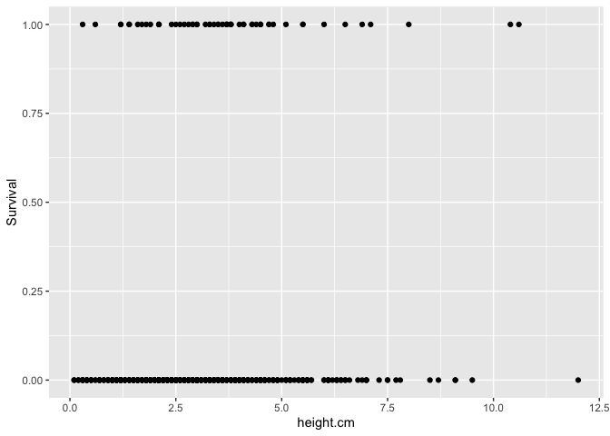<!-- -->

``` r
ucd_y1_surv_size %>% 
  ggplot(aes(x=long.leaf.cm, y=Survival)) +
  geom_point()
```

```
## Warning: Removed 123 rows containing missing values or values outside the scale range
## (`geom_point()`).
```

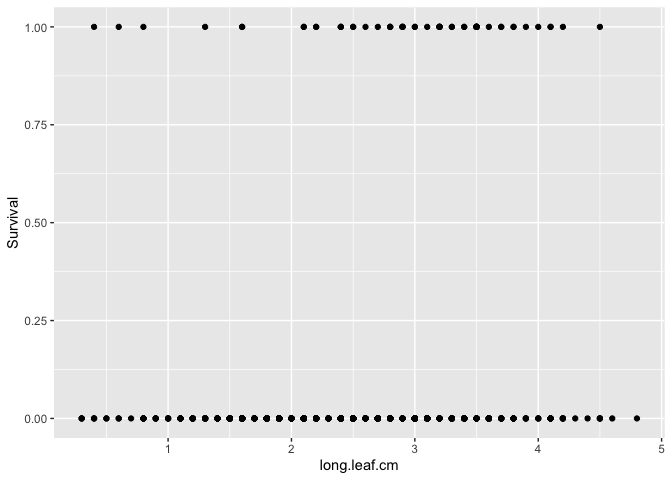<!-- -->

``` r
ucd_y1_surv_size %>% 
  ggplot(aes(x=diam.mm, y=Survival)) +
  geom_point()
```

```
## Warning: Removed 673 rows containing missing values or values outside the scale range
## (`geom_point()`).
```

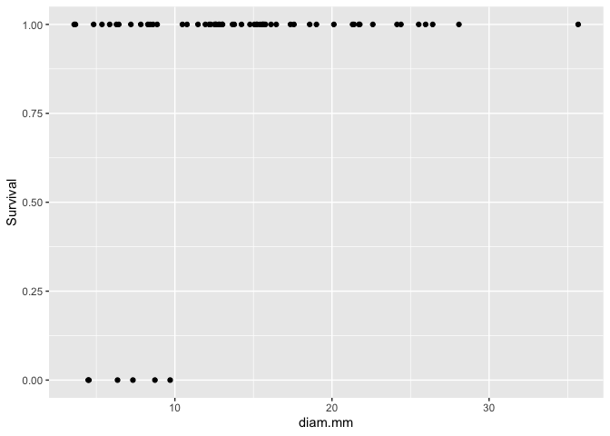<!-- -->

``` r
ucd_y1_surv_size %>% #not enough variation in surv
  ggplot(aes(x=total.branch, y=Survival)) +
  geom_point()
```

```
## Warning: Removed 673 rows containing missing values or values outside the scale range
## (`geom_point()`).
```

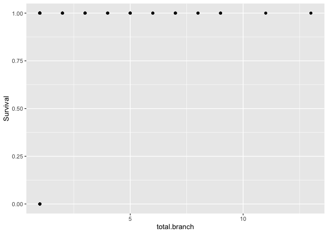<!-- -->


``` r
wl2_y1_surv_size %>% 
  ggplot(aes(x=height.cm, y=Survival)) +
  geom_point()
```

```
## Warning: Removed 86 rows containing missing values or values outside the scale range
## (`geom_point()`).
```

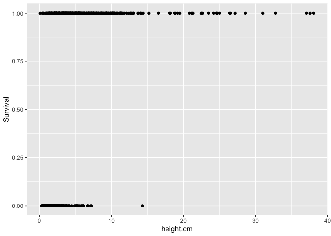<!-- -->

``` r
wl2_y1_surv_size %>% 
  ggplot(aes(x=long.leaf.cm, y=Survival)) +
  geom_point()
```

```
## Warning: Removed 170 rows containing missing values or values outside the scale range
## (`geom_point()`).
```

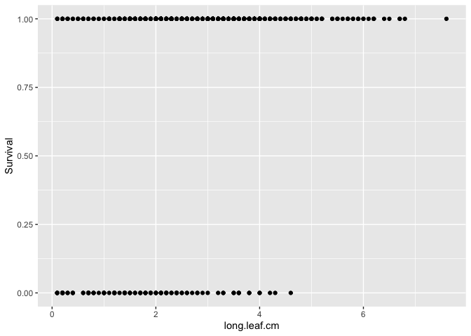<!-- -->

``` r
wl2_y1_surv_size %>% #prob not enough var in surv
  ggplot(aes(x=diam.mm, y=Survival)) +
  geom_point()
```

```
## Warning: Removed 259 rows containing missing values or values outside the scale range
## (`geom_point()`).
```

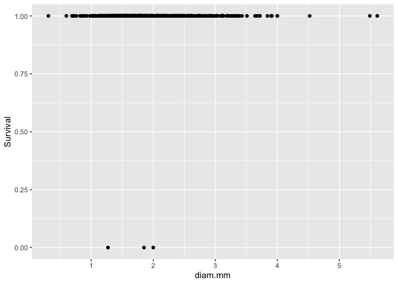<!-- -->

``` r
wl2_y1_surv_size %>% #not enough variation in surv
  ggplot(aes(x=total.branch, y=Survival)) +
  geom_point()
```

```
## Warning: Removed 257 rows containing missing values or values outside the scale range
## (`geom_point()`).
```

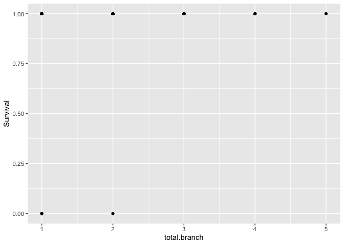<!-- -->


``` r
ucd_size_surv_pop_avgs <- ucd_y1_surv_size %>% 
  group_by(pop, elev_m) %>% 
  summarise(N_Surv = sum(!is.na(Survival)), 
            mean_Surv = mean(Survival,na.rm=(TRUE)), sem_surv=sem(Survival, na.rm=(TRUE)), 
            N_height = sum(!is.na(height.cm)), 
            mean_height.cm = mean(height.cm,na.rm=(TRUE)), sem_height.cm=sem(height.cm, na.rm=(TRUE)), 
            N_length = sum(!is.na(long.leaf.cm)),
            mean_long.leaf.cm=mean(long.leaf.cm, na.rm=(TRUE)), sem_long.leaf.cm=sem(long.leaf.cm, na.rm=TRUE),
            N_diam = sum(!is.na(diam.mm)), 
            mean_diam.mm = mean(diam.mm,na.rm=(TRUE)), sem_diam.mm=sem(diam.mm, na.rm=(TRUE)), 
            N_total.branch = sum(!is.na(total.branch)),
            mean_total.branch=mean(total.branch, na.rm=(TRUE)), sem_total.branch=sem(total.branch, na.rm=TRUE))
```

```
## `summarise()` has grouped output by 'pop'. You can override using the `.groups`
## argument.
```

``` r
ucd_size_surv_pop_avgs %>% arrange(N_height)
```

```
## # A tibble: 23 × 17
## # Groups:   pop [23]
##    pop   elev_m N_Surv mean_Surv sem_surv N_height mean_height.cm sem_height.cm
##    <chr>  <dbl>  <int>     <dbl>    <dbl>    <int>          <dbl>         <dbl>
##  1 LV1    2593.      3     0        0            1           1.2         NA    
##  2 WV      749.      2     0        0            1           3.9         NA    
##  3 YO4    2158.      5     0        0            5           2.24         0.191
##  4 CP3    2266.      6     0        0            6           1.23         0.436
##  5 WR     1158       9     0        0            7           2.77         0.534
##  6 YO11   2872.     13     0        0            8           2.44         0.304
##  7 LVTR1  2741.     13     0        0            9           1.78         0.293
##  8 SQ3    2373.      9     0.111    0.111        9           1.01         0.223
##  9 YO8    2591.     13     0        0            9           2.51         0.425
## 10 SQ2    1934.     21     0        0           14           1.11         0.177
## # ℹ 13 more rows
## # ℹ 9 more variables: N_length <int>, mean_long.leaf.cm <dbl>,
## #   sem_long.leaf.cm <dbl>, N_diam <int>, mean_diam.mm <dbl>,
## #   sem_diam.mm <dbl>, N_total.branch <int>, mean_total.branch <dbl>,
## #   sem_total.branch <dbl>
```


``` r
wl2_size_surv_pop_avgs <- wl2_y1_surv_size %>% 
  group_by(pop, elev_m) %>% 
  summarise(N_Surv = sum(!is.na(Survival)), 
            mean_Surv = mean(Survival,na.rm=(TRUE)), sem_surv=sem(Survival, na.rm=(TRUE)), 
            N_height = sum(!is.na(height.cm)), 
            mean_height.cm = mean(height.cm,na.rm=(TRUE)), sem_height.cm=sem(height.cm, na.rm=(TRUE)), 
            N_length = sum(!is.na(long.leaf.cm)),
            mean_long.leaf.cm=mean(long.leaf.cm, na.rm=(TRUE)), sem_long.leaf.cm=sem(long.leaf.cm, na.rm=TRUE),
            N_diam = sum(!is.na(diam.mm)), 
            mean_diam.mm = mean(diam.mm,na.rm=(TRUE)), sem_diam.mm=sem(diam.mm, na.rm=(TRUE)), 
            N_total.branch = sum(!is.na(total.branch)),
            mean_total.branch=mean(total.branch, na.rm=(TRUE)), sem_total.branch=sem(total.branch, na.rm=TRUE))
```

```
## `summarise()` has grouped output by 'pop'. You can override using the `.groups`
## argument.
```

``` r
wl2_size_surv_pop_avgs %>% arrange(N_height)
```

```
## # A tibble: 22 × 17
## # Groups:   pop [22]
##    pop   elev_m N_Surv mean_Surv sem_surv N_height mean_height.cm sem_height.cm
##    <chr>  <dbl>  <int>     <dbl>    <dbl>    <int>          <dbl>         <dbl>
##  1 WR     1158       4     0.25    0.25          3           5.07         1.42 
##  2 LV3    2354.      9     0.333   0.167         8           2.55         0.338
##  3 SQ3    2373.     13     0.462   0.144        11           1.43         0.189
##  4 FR      787      17     0.294   0.114        13           4.39         0.986
##  5 SQ1    1921.     13     0.769   0.122        13           2.59         0.271
##  6 LV1    2593.     24     0.208   0.0847       18           2.06         0.234
##  7 LVTR1  2741.     24     0.208   0.0847       19           2.13         0.278
##  8 YO4    2158.     20     0.45    0.114        19           3.87         0.484
##  9 SQ2    1934.     21     0.476   0.112        21           2.06         0.278
## 10 YO8    2591.     29     0.310   0.0874       23           2.93         0.284
## # ℹ 12 more rows
## # ℹ 9 more variables: N_length <int>, mean_long.leaf.cm <dbl>,
## #   sem_long.leaf.cm <dbl>, N_diam <int>, mean_diam.mm <dbl>,
## #   sem_diam.mm <dbl>, N_total.branch <int>, mean_total.branch <dbl>,
## #   sem_total.branch <dbl>
```


``` r
ucd_y1_surv_size %>% 
  drop_na(Survival, height.cm) %>% 
  group_by(pop, elev_m) %>% 
  summarise(N_Surv = sum(!is.na(Survival)), 
            mean_Surv = mean(Survival,na.rm=(TRUE)), sem_surv=sem(Survival, na.rm=(TRUE)), 
            N_height = sum(!is.na(height.cm)), 
            mean_height.cm = mean(height.cm,na.rm=(TRUE)), sem_height.cm=sem(height.cm, na.rm=(TRUE))) %>% 
  filter(N_height>2) %>% 
  ggplot(aes(x=mean_height.cm, y=mean_Surv, group=pop, color=elev_m)) +
  geom_point(size=4) +
  theme_classic() + 
  scale_colour_gradient(low = "#F5A540", high = "#0043F0")  +
  labs(x="Height (cm)", y="First Year Survival", color="Elevation (m)", title="Low Elevation Garden") +
  theme(text=element_text(size=25))
```

```
## `summarise()` has grouped output by 'pop'. You can override using the `.groups`
## argument.
```

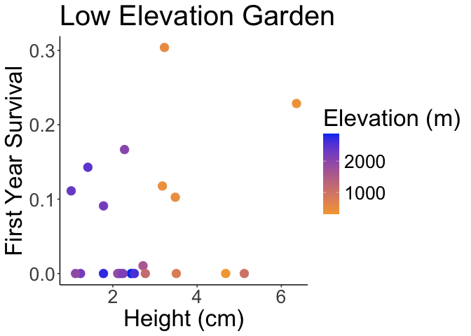<!-- -->

``` r
ucd_y1_surv_size %>% 
  drop_na(Survival, long.leaf.cm) %>% 
  group_by(pop, elev_m) %>% 
  summarise(N_Surv = sum(!is.na(Survival)), 
            mean_Surv = mean(Survival,na.rm=(TRUE)), sem_surv=sem(Survival, na.rm=(TRUE)), 
            N_length = sum(!is.na(long.leaf.cm)),
            mean_long.leaf.cm=mean(long.leaf.cm, na.rm=(TRUE)), sem_long.leaf.cm=sem(long.leaf.cm, na.rm=TRUE)) %>% 
  filter(N_length>2) %>% 
  ggplot(aes(x=mean_long.leaf.cm, y=mean_Surv, group=pop, color=elev_m)) +
  geom_point(size=4) +
  scale_y_continuous(expand = c(0.01, 0.01)) +
  theme_classic() + 
  scale_colour_gradient(low = "#F5A540", high = "#0043F0")  +
  labs(x="Leaf Length (cm)" ,y="First Year Survival", color="Elevation (m)", title="Low Elevation Garden") +
  theme(text=element_text(size=25))
```

```
## `summarise()` has grouped output by 'pop'. You can override using the `.groups`
## argument.
```

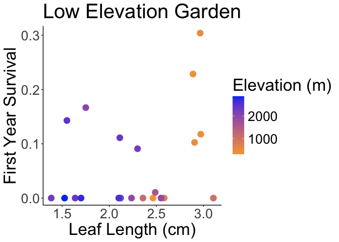<!-- -->

``` r
ucd_y1_surv_size %>% 
  drop_na(Survival, diam.mm) %>% 
  group_by(pop, elev_m) %>% 
  summarise(N_Surv = sum(!is.na(Survival)), 
            mean_Surv = mean(Survival,na.rm=(TRUE)), sem_surv=sem(Survival, na.rm=(TRUE)), 
            N_diam = sum(!is.na(diam.mm)), 
            mean_diam.mm = mean(diam.mm,na.rm=(TRUE)), sem_diam.mm=sem(diam.mm, na.rm=(TRUE))) %>% 
  filter(N_diam>2) %>% 
  ggplot(aes(x=mean_diam.mm, y=mean_Surv, group=pop, color=elev_m)) +
  geom_point(size=4) +
  scale_y_continuous(expand = c(0.01, 0.01)) +
  theme_classic() + 
  scale_colour_gradient(low = "#F5A540", high = "#0043F0")  +
  labs(x="Stem Diameter (mm)" ,y="First Year Survival", color="Elevation (m)", title="Low Elevation Garden") +
  theme(text=element_text(size=25))
```

```
## `summarise()` has grouped output by 'pop'. You can override using the `.groups`
## argument.
```

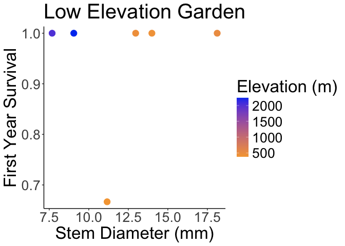<!-- -->

``` r
ucd_y1_surv_size %>% 
  drop_na(Survival, total.branch) %>% 
  group_by(pop, elev_m) %>% 
  summarise(N_Surv = sum(!is.na(Survival)), 
            mean_Surv = mean(Survival,na.rm=(TRUE)), sem_surv=sem(Survival, na.rm=(TRUE)), 
            N_total.branch = sum(!is.na(total.branch)),
            mean_total.branch=mean(total.branch, na.rm=(TRUE)), sem_total.branch=sem(total.branch, na.rm=TRUE)) %>% 
  filter(N_total.branch>2) %>% 
  ggplot(aes(x=mean_total.branch, y=mean_Surv, group=pop, color=elev_m)) +
  geom_point(size=4) +
  scale_y_continuous(expand = c(0.01, 0.01)) +
  theme_classic() +
  scale_colour_gradient(low = "#F5A540", high = "#0043F0")  +
  labs(x="Basal Branch N" ,y="First Year Survival", color="Elevation (m)", title="Low Elevation Garden") +
  theme(text=element_text(size=25))
```

```
## `summarise()` has grouped output by 'pop'. You can override using the `.groups`
## argument.
```

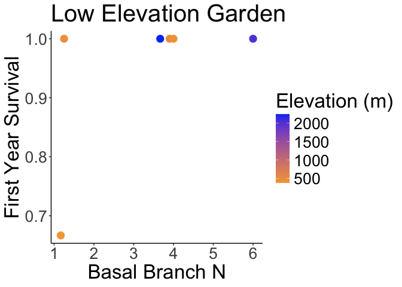<!-- -->


``` r
wl2_y1_surv_size %>% 
  drop_na(Survival, height.cm) %>% 
  group_by(pop, elev_m) %>% 
  summarise(N_Surv = sum(!is.na(Survival)), 
            mean_Surv = mean(Survival,na.rm=(TRUE)), sem_surv=sem(Survival, na.rm=(TRUE)), 
            N_height = sum(!is.na(height.cm)), 
            mean_height.cm = mean(height.cm,na.rm=(TRUE)), sem_height.cm=sem(height.cm, na.rm=(TRUE))) %>% 
  filter(N_height>2) %>% 
  ggplot(aes(x=mean_height.cm, y=mean_Surv, group=pop, color=elev_m)) +
  geom_point(size=4) +
  theme_classic() + 
  scale_colour_gradient(low = "#F5A540", high = "#0043F0")  +
  labs(x="Height (cm)", y="First Year Survival", color="Elevation (m)", title="High Elevation Garden") +
  theme(text=element_text(size=25))
```

```
## `summarise()` has grouped output by 'pop'. You can override using the `.groups`
## argument.
```

<!-- -->

``` r
wl2_y1_surv_size %>% 
  drop_na(Survival, long.leaf.cm) %>% 
  group_by(pop, elev_m) %>% 
  summarise(N_Surv = sum(!is.na(Survival)), 
            mean_Surv = mean(Survival,na.rm=(TRUE)), sem_surv=sem(Survival, na.rm=(TRUE)), 
            N_length = sum(!is.na(long.leaf.cm)),
            mean_long.leaf.cm=mean(long.leaf.cm, na.rm=(TRUE)), sem_long.leaf.cm=sem(long.leaf.cm, na.rm=TRUE)) %>% 
  filter(N_length>2) %>% 
  ggplot(aes(x=mean_long.leaf.cm, y=mean_Surv, group=pop, color=elev_m)) +
  geom_point(size=4) +
  scale_y_continuous(expand = c(0.01, 0.01)) +
  theme_classic() + 
  scale_colour_gradient(low = "#F5A540", high = "#0043F0")  +
  labs(x="Leaf Length (cm)" ,y="First Year Survival", color="Elevation (m)", title="High Elevation Garden") +
  theme(text=element_text(size=25))
```

```
## `summarise()` has grouped output by 'pop'. You can override using the `.groups`
## argument.
```

<!-- -->

``` r
wl2_y1_surv_size %>% 
  drop_na(Survival, diam.mm) %>% 
  group_by(pop, elev_m) %>% 
  summarise(N_Surv = sum(!is.na(Survival)), 
            mean_Surv = mean(Survival,na.rm=(TRUE)), sem_surv=sem(Survival, na.rm=(TRUE)), 
            N_diam = sum(!is.na(diam.mm)), 
            mean_diam.mm = mean(diam.mm,na.rm=(TRUE)), sem_diam.mm=sem(diam.mm, na.rm=(TRUE))) %>% 
  filter(N_diam>2) %>% 
  ggplot(aes(x=mean_diam.mm, y=mean_Surv, group=pop, color=elev_m)) +
  geom_point(size=4) +
  scale_y_continuous(expand = c(0.01, 0.01)) +
  theme_classic() + 
  scale_colour_gradient(low = "#F5A540", high = "#0043F0")  +
  labs(x="Stem Diameter (mm)" ,y="First Year Survival", color="Elevation (m)", title="High Elevation Garden") +
  theme(text=element_text(size=25))
```

```
## `summarise()` has grouped output by 'pop'. You can override using the `.groups`
## argument.
```

<!-- -->

``` r
wl2_y1_surv_size %>% 
  drop_na(Survival, total.branch) %>% 
  group_by(pop, elev_m) %>% 
  summarise(N_Surv = sum(!is.na(Survival)), 
            mean_Surv = mean(Survival,na.rm=(TRUE)), sem_surv=sem(Survival, na.rm=(TRUE)), 
            N_total.branch = sum(!is.na(total.branch)),
            mean_total.branch=mean(total.branch, na.rm=(TRUE)), sem_total.branch=sem(total.branch, na.rm=TRUE)) %>% 
  filter(N_total.branch>2) %>% 
  ggplot(aes(x=mean_total.branch, y=mean_Surv, group=pop, color=elev_m)) +
  geom_point(size=4) +
  scale_y_continuous(expand = c(0.01, 0.01)) +
  theme_classic() +
  scale_colour_gradient(low = "#F5A540", high = "#0043F0")  +
  labs(x="Basal Branch N" ,y="First Year Survival", color="Elevation (m)", title="High Elevation Garden") +
  theme(text=element_text(size=25))
```

```
## `summarise()` has grouped output by 'pop'. You can override using the `.groups`
## argument.
```

<!-- -->

### Stats

Log Reg survival \~ size

#### Check for correlations between traits 


``` r
size_normalized_ucd <- ucd_y1_surv_size %>% 
  select(height.cm, long.leaf.cm, diam.mm, total.branch) %>% 
  drop_na(height.cm, long.leaf.cm, diam.mm, total.branch) %>% scale() #normalize the data so they're all on the same scale
#head(size_normalized_ucd)
cor.norm_ucd = cor(size_normalized_ucd) #test correlations among the traits
cor.sig_ucd <- cor.mtest(size_normalized_ucd, method="pearson") #test significance of corrs
corrplot(cor.norm_ucd, type = "upper",
         tl.srt = 45, p.mat = cor.sig_ucd$p, 
         sig.level = 0.05, insig="blank") 
```

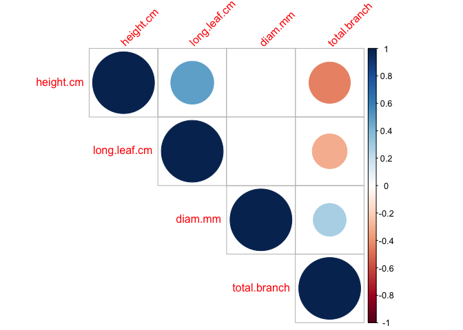<!-- -->

``` r
#no strong correlations
cor.norm_ucd
```

```
##               height.cm long.leaf.cm    diam.mm total.branch
## height.cm     1.0000000    0.4834421 -0.0844292   -0.4471783
## long.leaf.cm  0.4834421    1.0000000  0.1732493   -0.3172139
## diam.mm      -0.0844292    0.1732493  1.0000000    0.2818504
## total.branch -0.4471783   -0.3172139  0.2818504    1.0000000
```

``` r
cor.sig_ucd$p
```

```
##                 height.cm long.leaf.cm    diam.mm total.branch
## height.cm    0.000000e+00 5.980653e-05 0.51060705 0.0002385214
## long.leaf.cm 5.980653e-05 0.000000e+00 0.17450156 0.0113032763
## diam.mm      5.106071e-01 1.745016e-01 0.00000000 0.0252274608
## total.branch 2.385214e-04 1.130328e-02 0.02522746 0.0000000000
```

``` r
size_normalized_wl2 <- wl2_y1_surv_size %>% 
  select(height.cm, long.leaf.cm, diam.mm, total.branch) %>% 
  drop_na(height.cm, long.leaf.cm, diam.mm, total.branch) %>% scale() #normalize the data so they're all on the same scale
#head(size_normalized_wl2)
cor.norm_wl2 = cor(size_normalized_wl2) #test correlations among the traits
cor.sig_wl2 <- cor.mtest(size_normalized_wl2, method="pearson") #test significance of corrs
corrplot(cor.norm_wl2, type = "upper",
         tl.srt = 45, p.mat = cor.sig_wl2$p, 
         sig.level = 0.05, insig="blank")  
```

<!-- -->

``` r
#longest leaf and diam are 65% correlated, no other strong corrs
cor.norm_wl2
```

```
##                height.cm long.leaf.cm      diam.mm total.branch
## height.cm     1.00000000   0.09103923  0.265216745 -0.162316479
## long.leaf.cm  0.09103923   1.00000000  0.657810905 -0.076327518
## diam.mm       0.26521675   0.65781091  1.000000000 -0.001915143
## total.branch -0.16231648  -0.07632752 -0.001915143  1.000000000
```

``` r
cor.sig_wl2$p
```

```
##                 height.cm long.leaf.cm      diam.mm total.branch
## height.cm    0.000000e+00 5.282735e-02 9.914070e-09 0.0005239727
## long.leaf.cm 5.282735e-02 0.000000e+00 1.727520e-57 0.1047137866
## diam.mm      9.914070e-09 1.727520e-57 0.000000e+00 0.9675757751
## total.branch 5.239727e-04 1.047138e-01 9.675758e-01 0.0000000000
```


``` r
ucd_y1_surv_size_formod <- ucd_y1_surv_size %>% 
  drop_na(Survival, height.cm, long.leaf.cm) %>% 
  filter(pop!="WV", pop!="LV1")

wl2_y1_surv_height_formod <- wl2_y1_surv_size %>% 
  drop_na(Survival, height.cm) 

wl2_y1_surv_length_formod <- wl2_y1_surv_size %>% 
  drop_na(Survival, long.leaf.cm) 
```


#### Height


``` r
ucd_basiclogit_height <- glm(Survival ~ height.cm, data = ucd_y1_surv_size_formod, family = "binomial")
summary(ucd_basiclogit_height)
```

```
## 
## Call:
## glm(formula = Survival ~ height.cm, family = "binomial", data = ucd_y1_surv_size_formod)
## 
## Coefficients:
##             Estimate Std. Error z value Pr(>|z|)    
## (Intercept) -3.06930    0.29285  -10.48  < 2e-16 ***
## height.cm    0.23878    0.07085    3.37 0.000751 ***
## ---
## Signif. codes:  0 '***' 0.001 '**' 0.01 '*' 0.05 '.' 0.1 ' ' 1
## 
## (Dispersion parameter for binomial family taken to be 1)
## 
##     Null deviance: 378.92  on 610  degrees of freedom
## Residual deviance: 368.41  on 609  degrees of freedom
## AIC: 372.41
## 
## Number of Fisher Scoring iterations: 5
```

``` r
ucd_logit_height2 <- glmer(Survival ~ height.cm + (1|pop/mf) + (1|block), data = ucd_y1_surv_size_formod, family = binomial(link = "logit")) 
summary(ucd_logit_height2)
```

```
## Generalized linear mixed model fit by maximum likelihood (Laplace
##   Approximation) [glmerMod]
##  Family: binomial  ( logit )
## Formula: Survival ~ height.cm + (1 | pop/mf) + (1 | block)
##    Data: ucd_y1_surv_size_formod
## 
##      AIC      BIC   logLik deviance df.resid 
##    317.8    339.8   -153.9    307.8      606 
## 
## Scaled residuals: 
##     Min      1Q  Median      3Q     Max 
## -1.0910 -0.2836 -0.1159 -0.0839  5.8330 
## 
## Random effects:
##  Groups Name        Variance Std.Dev.
##  mf:pop (Intercept) 0.7265   0.8523  
##  pop    (Intercept) 2.8982   1.7024  
##  block  (Intercept) 0.1882   0.4338  
## Number of obs: 611, groups:  mf:pop, 120; pop, 21; block, 10
## 
## Fixed effects:
##             Estimate Std. Error z value Pr(>|z|)    
## (Intercept)  -4.8942     0.8309  -5.890 3.86e-09 ***
## height.cm     0.3131     0.1286   2.435   0.0149 *  
## ---
## Signif. codes:  0 '***' 0.001 '**' 0.01 '*' 0.05 '.' 0.1 ' ' 1
## 
## Correlation of Fixed Effects:
##           (Intr)
## height.cm -0.577
```

``` r
wl2_basiclogit_height <- glm(Survival ~ height.cm, data = wl2_y1_surv_height_formod, family = "binomial")
summary(wl2_basiclogit_height)
```

```
## 
## Call:
## glm(formula = Survival ~ height.cm, family = "binomial", data = wl2_y1_surv_height_formod)
## 
## Coefficients:
##             Estimate Std. Error z value Pr(>|z|)    
## (Intercept) -1.16873    0.20498  -5.702 1.19e-08 ***
## height.cm    0.58278    0.06151   9.474  < 2e-16 ***
## ---
## Signif. codes:  0 '***' 0.001 '**' 0.01 '*' 0.05 '.' 0.1 ' ' 1
## 
## (Dispersion parameter for binomial family taken to be 1)
## 
##     Null deviance: 752.18  on 641  degrees of freedom
## Residual deviance: 564.67  on 640  degrees of freedom
## AIC: 568.67
## 
## Number of Fisher Scoring iterations: 6
```

``` r
wl2_logit_height2 <- glmer(Survival ~ height.cm + (1|pop/mf) + (1|block), data = wl2_y1_surv_height_formod, family = binomial(link = "logit"), nAGQ=0) 
```

```
## boundary (singular) fit: see help('isSingular')
```

``` r
#nAGQ = integer scalar - the number of points per axis for evaluating the adaptive Gauss-Hermite approximation to the log-likelihood.
#A value of zero uses a faster but less exact form of parameter estimation for GLMMs by optimizing the random effects and the fixed-effects coefficients in the penalized iteratively reweighted least squares step.
#changed it to zero here b/c got a convergence error without it 
summary(wl2_logit_height2)
```

```
## Generalized linear mixed model fit by maximum likelihood (Adaptive
##   Gauss-Hermite Quadrature, nAGQ = 0) [glmerMod]
##  Family: binomial  ( logit )
## Formula: Survival ~ height.cm + (1 | pop/mf) + (1 | block)
##    Data: wl2_y1_surv_height_formod
## 
##      AIC      BIC   logLik deviance df.resid 
##    449.9    472.2   -220.0    439.9      637 
## 
## Scaled residuals: 
##     Min      1Q  Median      3Q     Max 
## -9.5853 -0.2774  0.0954  0.2760  2.8019 
## 
## Random effects:
##  Groups Name        Variance Std.Dev.
##  mf:pop (Intercept) 0.000    0.000   
##  pop    (Intercept) 3.613    1.901   
##  block  (Intercept) 1.337    1.156   
## Number of obs: 642, groups:  mf:pop, 134; pop, 22; block, 13
## 
## Fixed effects:
##             Estimate Std. Error z value Pr(>|z|)    
## (Intercept) -0.36673    0.62866  -0.583     0.56    
## height.cm    0.37169    0.08978   4.140 3.47e-05 ***
## ---
## Signif. codes:  0 '***' 0.001 '**' 0.01 '*' 0.05 '.' 0.1 ' ' 1
## 
## Correlation of Fixed Effects:
##           (Intr)
## height.cm -0.498
## optimizer (bobyqa) convergence code: 0 (OK)
## boundary (singular) fit: see help('isSingular')
```

``` r
#boundary (singular) fit: see help('isSingular') - unclear why 
```

#### Length


``` r
ucd_logit_length2 <- glmer(Survival ~ long.leaf.cm + (1|pop/mf) + (1|block), data = ucd_y1_surv_size_formod, family = binomial(link = "logit"))
summary(ucd_logit_length2)
```

```
## Generalized linear mixed model fit by maximum likelihood (Laplace
##   Approximation) [glmerMod]
##  Family: binomial  ( logit )
## Formula: Survival ~ long.leaf.cm + (1 | pop/mf) + (1 | block)
##    Data: ucd_y1_surv_size_formod
## 
##      AIC      BIC   logLik deviance df.resid 
##    318.5    340.6   -154.3    308.5      606 
## 
## Scaled residuals: 
##     Min      1Q  Median      3Q     Max 
## -1.2805 -0.3015 -0.1194 -0.0864  7.5789 
## 
## Random effects:
##  Groups Name        Variance Std.Dev.
##  mf:pop (Intercept) 0.6403   0.8002  
##  pop    (Intercept) 2.7078   1.6455  
##  block  (Intercept) 0.1704   0.4127  
## Number of obs: 611, groups:  mf:pop, 120; pop, 21; block, 10
## 
## Fixed effects:
##              Estimate Std. Error z value Pr(>|z|)    
## (Intercept)   -5.1107     0.8725  -5.857 4.71e-09 ***
## long.leaf.cm   0.5040     0.2211   2.279   0.0226 *  
## ---
## Signif. codes:  0 '***' 0.001 '**' 0.01 '*' 0.05 '.' 0.1 ' ' 1
## 
## Correlation of Fixed Effects:
##             (Intr)
## long.lef.cm -0.651
```

``` r
wl2_logit_length2 <- glmer(Survival ~ long.leaf.cm + (1|pop/mf) + (1|block), data = wl2_y1_surv_length_formod, family = binomial(link = "logit")) 
```

```
## boundary (singular) fit: see help('isSingular')
```

``` r
summary(wl2_logit_length2)
```

```
## Generalized linear mixed model fit by maximum likelihood (Laplace
##   Approximation) [glmerMod]
##  Family: binomial  ( logit )
## Formula: Survival ~ long.leaf.cm + (1 | pop/mf) + (1 | block)
##    Data: wl2_y1_surv_length_formod
## 
##      AIC      BIC   logLik deviance df.resid 
##    361.8    383.4   -175.9    351.8      553 
## 
## Scaled residuals: 
##     Min      1Q  Median      3Q     Max 
## -7.4797  0.0545  0.1220  0.2511  2.4122 
## 
## Random effects:
##  Groups Name        Variance  Std.Dev. 
##  mf:pop (Intercept) 1.398e-09 3.739e-05
##  pop    (Intercept) 4.182e+00 2.045e+00
##  block  (Intercept) 1.205e+00 1.098e+00
## Number of obs: 558, groups:  mf:pop, 126; pop, 22; block, 13
## 
## Fixed effects:
##              Estimate Std. Error z value Pr(>|z|)    
## (Intercept)    0.3042     0.6650   0.457 0.647344    
## long.leaf.cm   0.5876     0.1624   3.619 0.000296 ***
## ---
## Signif. codes:  0 '***' 0.001 '**' 0.01 '*' 0.05 '.' 0.1 ' ' 1
## 
## Correlation of Fixed Effects:
##             (Intr)
## long.lef.cm -0.504
## optimizer (Nelder_Mead) convergence code: 0 (OK)
## boundary (singular) fit: see help('isSingular')
```

``` r
#boundary (singular) fit: see help('isSingular') mf starts explaining very little variation 
```

#### Height and Length

``` r
ucd_logit_size <- glmer(Survival ~ height.cm + long.leaf.cm + (1|pop/mf) + (1|block), data = ucd_y1_surv_size_formod, family = binomial(link = "logit"))
summary(ucd_logit_size)
```

```
## Generalized linear mixed model fit by maximum likelihood (Laplace
##   Approximation) [glmerMod]
##  Family: binomial  ( logit )
## Formula: Survival ~ height.cm + long.leaf.cm + (1 | pop/mf) + (1 | block)
##    Data: ucd_y1_surv_size_formod
## 
##      AIC      BIC   logLik deviance df.resid 
##    317.8    344.3   -152.9    305.8      605 
## 
## Scaled residuals: 
##     Min      1Q  Median      3Q     Max 
## -1.1417 -0.2826 -0.1191 -0.0853  6.3088 
## 
## Random effects:
##  Groups Name        Variance Std.Dev.
##  mf:pop (Intercept) 0.7416   0.8612  
##  pop    (Intercept) 2.7115   1.6467  
##  block  (Intercept) 0.1505   0.3880  
## Number of obs: 611, groups:  mf:pop, 120; pop, 21; block, 10
## 
## Fixed effects:
##              Estimate Std. Error z value Pr(>|z|)    
## (Intercept)   -5.4303     0.9178  -5.916 3.29e-09 ***
## height.cm      0.2304     0.1406   1.638    0.101    
## long.leaf.cm   0.3387     0.2431   1.393    0.164    
## ---
## Signif. codes:  0 '***' 0.001 '**' 0.01 '*' 0.05 '.' 0.1 ' ' 1
## 
## Correlation of Fixed Effects:
##             (Intr) hght.c
## height.cm   -0.285       
## long.lef.cm -0.466 -0.402
```

``` r
tidy(ucd_logit_size)
```

```
## # A tibble: 6 × 7
##   effect   group  term            estimate std.error statistic  p.value
##   <chr>    <chr>  <chr>              <dbl>     <dbl>     <dbl>    <dbl>
## 1 fixed    <NA>   (Intercept)       -5.43      0.918     -5.92  3.29e-9
## 2 fixed    <NA>   height.cm          0.230     0.141      1.64  1.01e-1
## 3 fixed    <NA>   long.leaf.cm       0.339     0.243      1.39  1.64e-1
## 4 ran_pars mf:pop sd__(Intercept)    0.861    NA         NA    NA      
## 5 ran_pars pop    sd__(Intercept)    1.65     NA         NA    NA      
## 6 ran_pars block  sd__(Intercept)    0.388    NA         NA    NA
```

``` r
wl2_logit_size <- glmer(Survival ~ height.cm + long.leaf.cm + (1|pop/mf) + (1|block), data = wl2_y1_surv_length_formod, family = binomial(link = "logit")) 
summary(wl2_logit_size)
```

```
## Generalized linear mixed model fit by maximum likelihood (Laplace
##   Approximation) [glmerMod]
##  Family: binomial  ( logit )
## Formula: Survival ~ height.cm + long.leaf.cm + (1 | pop/mf) + (1 | block)
##    Data: wl2_y1_surv_length_formod
## 
##      AIC      BIC   logLik deviance df.resid 
##    357.0    382.9   -172.5    345.0      551 
## 
## Scaled residuals: 
##     Min      1Q  Median      3Q     Max 
## -8.9931  0.0364  0.1163  0.2667  1.9498 
## 
## Random effects:
##  Groups Name        Variance  Std.Dev. 
##  mf:pop (Intercept) 5.466e-07 0.0007394
##  pop    (Intercept) 2.817e+00 1.6783575
##  block  (Intercept) 1.145e+00 1.0701421
## Number of obs: 557, groups:  mf:pop, 126; pop, 22; block, 13
## 
## Fixed effects:
##              Estimate Std. Error z value Pr(>|z|)   
## (Intercept)   -0.4854     0.6712  -0.723  0.46952   
## height.cm      0.2298     0.0961   2.391  0.01679 * 
## long.leaf.cm   0.4895     0.1685   2.905  0.00368 **
## ---
## Signif. codes:  0 '***' 0.001 '**' 0.01 '*' 0.05 '.' 0.1 ' ' 1
## 
## Correlation of Fixed Effects:
##             (Intr) hght.c
## height.cm   -0.415       
## long.lef.cm -0.373 -0.264
```

``` r
tidy(wl2_logit_size)
```

```
## # A tibble: 6 × 7
##   effect   group  term             estimate std.error statistic  p.value
##   <chr>    <chr>  <chr>               <dbl>     <dbl>     <dbl>    <dbl>
## 1 fixed    <NA>   (Intercept)     -0.485       0.671     -0.723  0.470  
## 2 fixed    <NA>   height.cm        0.230       0.0961     2.39   0.0168 
## 3 fixed    <NA>   long.leaf.cm     0.490       0.169      2.90   0.00368
## 4 ran_pars mf:pop sd__(Intercept)  0.000739   NA         NA     NA      
## 5 ran_pars pop    sd__(Intercept)  1.68       NA         NA     NA      
## 6 ran_pars block  sd__(Intercept)  1.07       NA         NA     NA
```


Not enough variation in surv for stem diameter and branch # 

