# Growth Season by snow/rain

-   First month with no snow pack or w/ significant rain as start of
    growth season

    -   This month isn't included in the final "growth season" - because
        we're saying how close are the conditions upon establishment

-   First month with snow pack or w/ significant CWD as end of growth
    season
    
    -   This month is included in the final "growth season" - because
        that month is likely a month when they're maturing seeds (esp at lower elevs)

Mean height at WL2 in Oct was 7 cm --\> 70 mm

## Relevant Libraries and Functions


```r
library(tidyverse)
```

```
## ── Attaching core tidyverse packages ──────────────────────── tidyverse 2.0.0 ──
## ✔ dplyr     1.1.3     ✔ readr     2.1.4
## ✔ forcats   1.0.0     ✔ stringr   1.5.0
## ✔ ggplot2   3.4.3     ✔ tibble    3.2.1
## ✔ lubridate 1.9.2     ✔ tidyr     1.3.0
## ✔ purrr     1.0.2     
## ── Conflicts ────────────────────────────────────────── tidyverse_conflicts() ──
## ✖ dplyr::filter() masks stats::filter()
## ✖ dplyr::lag()    masks stats::lag()
## ℹ Use the conflicted package (<http://conflicted.r-lib.org/>) to force all conflicts to become errors
```

```r
library(ggrepel)
library(cowplot)
```

```
## 
## Attaching package: 'cowplot'
## 
## The following object is masked from 'package:lubridate':
## 
##     stamp
```

```r
library(gridExtra)
```

```
## 
## Attaching package: 'gridExtra'
## 
## The following object is masked from 'package:dplyr':
## 
##     combine
```

```r
library(corrplot) #plotting correlations 
```

```
## corrplot 0.92 loaded
```

```r
library(rstatix) #performing cor_test
```

```
## 
## Attaching package: 'rstatix'
## 
## The following object is masked from 'package:stats':
## 
##     filter
```

```r
library(naniar) #replaces values with NA
sem <- function(x, na.rm=FALSE) {
  sd(x,na.rm=na.rm)/sqrt(length(na.omit(x)))
} #standard error function 

get_legend<-function(myggplot){
  tmp <- ggplot_gtable(ggplot_build(myggplot))
  leg <- which(sapply(tmp$grobs, function(x) x$name) == "guide-box")
  legend <- tmp$grobs[[leg]]
  return(legend)
} #legend function for grid_arrange

true_round <- function(number, digits) {
  posneg <- sign(number)
  number <- abs(number) * 10^digits
  number <- number + 0.5 + sqrt(.Machine$double.eps)
  number <- trunc(number)
  number <- number / 10 ^ digits
  number * posneg
} #rounding function that bypasses R's round to even default

elev_three_palette <- c("#0043F0", "#C9727F", "#F5A540") #colors from Gremer et al 2019
elev_order <- c("High", "Mid", "Low")
```

## Load the data (from "Climate_Prep.Rmd")


```r
pop_elev_climate <- read_csv("../output/Climate/flint_climate_UCDpops.csv")
```

```
## Rows: 35052 Columns: 15
## ── Column specification ────────────────────────────────────────────────────────
## Delimiter: ","
## chr  (2): parent.pop, elevation.group
## dbl (13): elev_m, year, month, aet, cwd, pck, pet, ppt, rch, run, str, tmn, tmx
## 
## ℹ Use `spec()` to retrieve the full column specification for this data.
## ℹ Specify the column types or set `show_col_types = FALSE` to quiet this message.
```

## Calculation of recent (last 30 years) and historical climate (prior 30 years)

Took out 2022 b/c only 9 months for that year Flint variables


```r
pop_elev_climate_recent <- pop_elev_climate %>% filter(year>1991 & year<2022) %>% select(parent.pop:month, cwd, pck, ppt, tmn, tmx)
head(pop_elev_climate_recent)
```

```
## # A tibble: 6 × 10
##   parent.pop elevation.group elev_m  year month   cwd   pck      ppt   tmn   tmx
##   <chr>      <chr>            <dbl> <dbl> <dbl> <dbl> <dbl>    <dbl> <dbl> <dbl>
## 1 BH         Low               511.  1992     1  28.3     0  42.7     1.22  10.6
## 2 BH         Low               511.  1992     2  40.1     0 175.      5.26  16.0
## 3 BH         Low               511.  1992     3  52.0     0  76.3     6.21  17.4
## 4 BH         Low               511.  1992     4  75.9     0   2.19    8.31  23.6
## 5 BH         Low               511.  1992     5  78.6     0   0.0800 12.7   29.4
## 6 BH         Low               511.  1992     6  99.1     0   1.77   13.6   30.2
```

```r
xtabs(~parent.pop+month, data=pop_elev_climate_recent) #check that there's 30 years for all pops and months 
```

```
##           month
## parent.pop  1  2  3  4  5  6  7  8  9 10 11 12
##      BH    30 30 30 30 30 30 30 30 30 30 30 30
##      CC    30 30 30 30 30 30 30 30 30 30 30 30
##      CP2   30 30 30 30 30 30 30 30 30 30 30 30
##      CP3   30 30 30 30 30 30 30 30 30 30 30 30
##      DPR   30 30 30 30 30 30 30 30 30 30 30 30
##      FR    30 30 30 30 30 30 30 30 30 30 30 30
##      IH    30 30 30 30 30 30 30 30 30 30 30 30
##      LV1   30 30 30 30 30 30 30 30 30 30 30 30
##      LV3   30 30 30 30 30 30 30 30 30 30 30 30
##      LVTR1 30 30 30 30 30 30 30 30 30 30 30 30
##      SC    30 30 30 30 30 30 30 30 30 30 30 30
##      SQ1   30 30 30 30 30 30 30 30 30 30 30 30
##      SQ2   30 30 30 30 30 30 30 30 30 30 30 30
##      SQ3   30 30 30 30 30 30 30 30 30 30 30 30
##      TM2   30 30 30 30 30 30 30 30 30 30 30 30
##      WL1   30 30 30 30 30 30 30 30 30 30 30 30
##      WL2   30 30 30 30 30 30 30 30 30 30 30 30
##      WR    30 30 30 30 30 30 30 30 30 30 30 30
##      WV    30 30 30 30 30 30 30 30 30 30 30 30
##      YO11  30 30 30 30 30 30 30 30 30 30 30 30
##      YO4   30 30 30 30 30 30 30 30 30 30 30 30
##      YO7   30 30 30 30 30 30 30 30 30 30 30 30
##      YO8   30 30 30 30 30 30 30 30 30 30 30 30
```

```r
pop_elev_climate_historical <- pop_elev_climate %>% filter(year<=1991 & year>1961) %>% select(parent.pop:month, cwd, pck, ppt, tmn, tmx)
head(pop_elev_climate_historical, 13)
```

```
## # A tibble: 13 × 10
##    parent.pop elevation.group elev_m  year month   cwd   pck     ppt   tmn   tmx
##    <chr>      <chr>            <dbl> <dbl> <dbl> <dbl> <dbl>   <dbl> <dbl> <dbl>
##  1 BH         Low               511.  1962     1  28.5     0  59.8   -1.44  11.9
##  2 BH         Low               511.  1962     2  37.4     0 289.     2.55  12.5
##  3 BH         Low               511.  1962     3  45.3     0  80.6    2.15  15.0
##  4 BH         Low               511.  1962     4  74.5     0   8.19   6.16  23.9
##  5 BH         Low               511.  1962     5  70.6     0   3.08   6.72  23.8
##  6 BH         Low               511.  1962     6  97.2     0   0.820 11.6   31.5
##  7 BH         Low               511.  1962     7 127.      0   1.31  14.5   35.3
##  8 BH         Low               511.  1962     8 141.      0   0     13.9   34.4
##  9 BH         Low               511.  1962     9 125.      0   1.44  11.9   32.1
## 10 BH         Low               511.  1962    10  86.2     0  48.8    8.47  24.1
## 11 BH         Low               511.  1962    11  44.6     0   9.85   4.13  19.4
## 12 BH         Low               511.  1962    12  31.2     0  57.8    2.20  15.4
## 13 BH         Low               511.  1963     1  28.1     0 109.    -1.85  12.3
```

```r
summary(pop_elev_climate_historical)
```

```
##   parent.pop        elevation.group        elev_m            year     
##  Length:8280        Length:8280        Min.   : 313.0   Min.   :1962  
##  Class :character   Class :character   1st Qu.: 748.9   1st Qu.:1969  
##  Mode  :character   Mode  :character   Median :1934.5   Median :1976  
##                                        Mean   :1649.7   Mean   :1976  
##                                        3rd Qu.:2373.2   3rd Qu.:1984  
##                                        Max.   :2872.3   Max.   :1991  
##      month            cwd              pck              ppt        
##  Min.   : 1.00   Min.   :  0.00   Min.   :   0.0   Min.   :  0.00  
##  1st Qu.: 3.75   1st Qu.: 24.56   1st Qu.:   0.0   1st Qu.: 11.57  
##  Median : 6.50   Median : 46.16   Median :   0.0   Median : 52.00  
##  Mean   : 6.50   Mean   : 53.74   Mean   : 160.7   Mean   :100.70  
##  3rd Qu.: 9.25   3rd Qu.: 77.74   3rd Qu.: 152.1   3rd Qu.:141.53  
##  Max.   :12.00   Max.   :202.50   Max.   :2594.7   Max.   :951.79  
##       tmn               tmx        
##  Min.   :-14.970   Min.   :-2.650  
##  1st Qu.: -3.150   1st Qu.: 8.498  
##  Median :  1.920   Median :15.020  
##  Mean   :  2.036   Mean   :15.721  
##  3rd Qu.:  7.082   3rd Qu.:22.180  
##  Max.   : 18.820   Max.   :37.760
```

```r
xtabs(~parent.pop+month, data=pop_elev_climate_historical) #check that there's 30 years for all pops and months 
```

```
##           month
## parent.pop  1  2  3  4  5  6  7  8  9 10 11 12
##      BH    30 30 30 30 30 30 30 30 30 30 30 30
##      CC    30 30 30 30 30 30 30 30 30 30 30 30
##      CP2   30 30 30 30 30 30 30 30 30 30 30 30
##      CP3   30 30 30 30 30 30 30 30 30 30 30 30
##      DPR   30 30 30 30 30 30 30 30 30 30 30 30
##      FR    30 30 30 30 30 30 30 30 30 30 30 30
##      IH    30 30 30 30 30 30 30 30 30 30 30 30
##      LV1   30 30 30 30 30 30 30 30 30 30 30 30
##      LV3   30 30 30 30 30 30 30 30 30 30 30 30
##      LVTR1 30 30 30 30 30 30 30 30 30 30 30 30
##      SC    30 30 30 30 30 30 30 30 30 30 30 30
##      SQ1   30 30 30 30 30 30 30 30 30 30 30 30
##      SQ2   30 30 30 30 30 30 30 30 30 30 30 30
##      SQ3   30 30 30 30 30 30 30 30 30 30 30 30
##      TM2   30 30 30 30 30 30 30 30 30 30 30 30
##      WL1   30 30 30 30 30 30 30 30 30 30 30 30
##      WL2   30 30 30 30 30 30 30 30 30 30 30 30
##      WR    30 30 30 30 30 30 30 30 30 30 30 30
##      WV    30 30 30 30 30 30 30 30 30 30 30 30
##      YO11  30 30 30 30 30 30 30 30 30 30 30 30
##      YO4   30 30 30 30 30 30 30 30 30 30 30 30
##      YO7   30 30 30 30 30 30 30 30 30 30 30 30
##      YO8   30 30 30 30 30 30 30 30 30 30 30 30
```

## Averages and Preliminary Calcs

### Recent climate


```r
pop_elev_climate_recent %>% filter(ppt == 0) #months 7-10 usually have ppt = 0 for low elev 
```

```
## # A tibble: 553 × 10
##    parent.pop elevation.group elev_m  year month   cwd   pck   ppt   tmn   tmx
##    <chr>      <chr>            <dbl> <dbl> <dbl> <dbl> <dbl> <dbl> <dbl> <dbl>
##  1 BH         Low               511.  1992     8 160.      0     0 17.1   35.4
##  2 BH         Low               511.  1992     9 132.      0     0 13.6   31.7
##  3 BH         Low               511.  1993     7 128.      0     0 15.0   32.9
##  4 BH         Low               511.  1993     8 145.      0     0 14.8   33.2
##  5 BH         Low               511.  1993     9 128.      0     0 12.7   31.9
##  6 BH         Low               511.  1994     7 174.      0     0 17.3   35.8
##  7 BH         Low               511.  1994     8 180.      0     0 16.3   35.5
##  8 BH         Low               511.  1995    10  92.1     0     0  9.55  27.6
##  9 BH         Low               511.  1996     9 132.      0     0 12.2   31.0
## 10 BH         Low               511.  1997     8 155.      0     0 16.3   33.7
## # ℹ 543 more rows
```

```r
pop_elev_climate_recent %>% filter(pck >0, ppt == 0) #in sequoia pops, 2022, ppt=0, but there was still snowpack in January 
```

```
## # A tibble: 0 × 10
## # ℹ 10 variables: parent.pop <chr>, elevation.group <chr>, elev_m <dbl>,
## #   year <dbl>, month <dbl>, cwd <dbl>, pck <dbl>, ppt <dbl>, tmn <dbl>,
## #   tmx <dbl>
```

```r
pop_elev_climate_recent %>% filter(ppt > 0, tmx<1.5) %>% arrange(pck) #if the temp is less than 1.5 (Flint's criteria for snowfall) and there is precipitation then pck > 0
```

```
## # A tibble: 168 × 10
##    parent.pop elevation.group elev_m  year month   cwd   pck   ppt    tmn   tmx
##    <chr>      <chr>            <dbl> <dbl> <dbl> <dbl> <dbl> <dbl>  <dbl> <dbl>
##  1 YO11       High             2872.  2001     1  19.0  98.1  91.4 -11.6  1.08 
##  2 YO11       High             2872.  1997    12  16.9 106.   69.8 -11.5  0.150
##  3 YO11       High             2872.  2007    12  17.8 107.  114.  -10.3  0.870
##  4 YO11       High             2872.  2009    12  18.1 140.  146.  -10.3  1.47 
##  5 YO11       High             2872.  2019    12  18.7 146.  153.   -7.92 0.590
##  6 YO11       High             2872.  1994    11  16.7 191.  198.  -11.1  0.330
##  7 LV3        High             2354.  2007    12  15.8 194.  200.   -8.33 0.300
##  8 LV1        High             2593.  2007    12  12.2 198.  204.   -8.54 0.340
##  9 LVTR1      High             2741.  2007    12  13.5 205.  211.   -8.72 0.25 
## 10 LV3        High             2354.  2009    12  15.6 210.  186.   -9.76 1.30 
## # ℹ 158 more rows
```

```r
#first calculate 30 year monthly averages for pck and ppt 
pop_elev_climate_recent_avgs <- pop_elev_climate_recent %>% 
  group_by(parent.pop, elevation.group, elev_m, month) %>% 
  summarise_at(c("cwd", "pck", "ppt", "tmn", "tmx"), c(mean, sem), na.rm = TRUE)
names(pop_elev_climate_recent_avgs) <- gsub("fn2", "sem", colnames(pop_elev_climate_recent_avgs))
names(pop_elev_climate_recent_avgs) <-gsub("fn1", "mean", colnames(pop_elev_climate_recent_avgs))
pop_elev_climate_recent_avgs #30 year averages per month for each pop
```

```
## # A tibble: 276 × 14
## # Groups:   parent.pop, elevation.group, elev_m [23]
##    parent.pop elevation.group elev_m month cwd_mean pck_mean ppt_mean tmn_mean
##    <chr>      <chr>            <dbl> <dbl>    <dbl>    <dbl>    <dbl>    <dbl>
##  1 BH         Low               511.     1     29.3        0  125.        2.68
##  2 BH         Low               511.     2     40.9        0  100.        3.43
##  3 BH         Low               511.     3     53.8        0   85.4       4.90
##  4 BH         Low               511.     4     59.0        0   47.2       6.37
##  5 BH         Low               511.     5     51.5        0   23.1       9.76
##  6 BH         Low               511.     6     87.1        0    7.43     13.4 
##  7 BH         Low               511.     7    136.         0    1.40     17.2 
##  8 BH         Low               511.     8    154.         0    0.507    16.8 
##  9 BH         Low               511.     9    130.         0    2.89     14.1 
## 10 BH         Low               511.    10     88.9        0   29.9       9.48
## # ℹ 266 more rows
## # ℹ 6 more variables: tmx_mean <dbl>, cwd_sem <dbl>, pck_sem <dbl>,
## #   ppt_sem <dbl>, tmn_sem <dbl>, tmx_sem <dbl>
```

```r
pop_elev_climate_recent_avgs <- pop_elev_climate_recent_avgs %>% mutate(PckSum=sum(pck_mean)) #estimate of average total snowpack in a year 
pop_elev_climate_recent_avgs %>% arrange(PckSum)
```

```
## # A tibble: 276 × 15
## # Groups:   parent.pop, elevation.group, elev_m [23]
##    parent.pop elevation.group elev_m month cwd_mean pck_mean ppt_mean tmn_mean
##    <chr>      <chr>            <dbl> <dbl>    <dbl>    <dbl>    <dbl>    <dbl>
##  1 BH         Low               511.     1     29.3        0  125.        2.68
##  2 BH         Low               511.     2     40.9        0  100.        3.43
##  3 BH         Low               511.     3     53.8        0   85.4       4.90
##  4 BH         Low               511.     4     59.0        0   47.2       6.37
##  5 BH         Low               511.     5     51.5        0   23.1       9.76
##  6 BH         Low               511.     6     87.1        0    7.43     13.4 
##  7 BH         Low               511.     7    136.         0    1.40     17.2 
##  8 BH         Low               511.     8    154.         0    0.507    16.8 
##  9 BH         Low               511.     9    130.         0    2.89     14.1 
## 10 BH         Low               511.    10     88.9        0   29.9       9.48
## # ℹ 266 more rows
## # ℹ 7 more variables: tmx_mean <dbl>, cwd_sem <dbl>, pck_sem <dbl>,
## #   ppt_sem <dbl>, tmn_sem <dbl>, tmx_sem <dbl>, PckSum <dbl>
```

```r
#Exploratory filters
pop_elev_climate_recent %>% filter(parent.pop=="SC") %>% filter(year==2016 | year==2017) #snow pack in Jan 2017
```

```
## # A tibble: 24 × 10
##    parent.pop elevation.group elev_m  year month   cwd   pck     ppt   tmn   tmx
##    <chr>      <chr>            <dbl> <dbl> <dbl> <dbl> <dbl>   <dbl> <dbl> <dbl>
##  1 SC         Low               422.  2016     1  20.2     0 2.12e+2  4.03  12.0
##  2 SC         Low               422.  2016     2  34.6     0 3.34e+1  5.05  17.7
##  3 SC         Low               422.  2016     3  30.6     0 2.23e+2  6.17  16.9
##  4 SC         Low               422.  2016     4  37.5     0 7.73e+1  7.82  20.6
##  5 SC         Low               422.  2016     5  69.0     0 1.22e+1  9.81  24.1
##  6 SC         Low               422.  2016     6  94.8     0 0       13.2   31.8
##  7 SC         Low               422.  2016     7 142.      0 0       14.6   33.8
##  8 SC         Low               422.  2016     8 159.      0 3.00e-2 15.1   33.2
##  9 SC         Low               422.  2016     9 126.      0 0       12.8   29.8
## 10 SC         Low               422.  2016    10  80.1     0 1.83e+2  9.38  22.4
## # ℹ 14 more rows
```

```r
pop_elev_climate_recent %>% filter(parent.pop=="IH") %>% filter(pck >0) #snow pack in Jan 1993 & 2017 and Feb 2019
```

```
## # A tibble: 4 × 10
##   parent.pop elevation.group elev_m  year month   cwd   pck   ppt   tmn   tmx
##   <chr>      <chr>            <dbl> <dbl> <dbl> <dbl> <dbl> <dbl> <dbl> <dbl>
## 1 IH         Low               454.  1992    12  18.8  4.13  301. 0.860 11.0 
## 2 IH         Low               454.  1993     1  15.6  5.34  364. 1.72  11.2 
## 3 IH         Low               454.  2017     1  15.6 18.0   495. 2.31  10.2 
## 4 IH         Low               454.  2019     2  19.9 42.3   429. 1.60   9.46
```

```r
pop_elev_climate_recent %>% filter(parent.pop=="SQ3") %>% filter(pck==0, ppt < 10) #high elev pops get very little rain and high cwd during growth season ...
```

```
## # A tibble: 106 × 10
##    parent.pop elevation.group elev_m  year month   cwd   pck    ppt   tmn   tmx
##    <chr>      <chr>            <dbl> <dbl> <dbl> <dbl> <dbl>  <dbl> <dbl> <dbl>
##  1 SQ3        High             2373.  1992     6  95.0     0 7.54    4.84 17.6 
##  2 SQ3        High             2373.  1992     8  82.0     0 7.80   10.7  23.8 
##  3 SQ3        High             2373.  1992     9 103.      0 4.26    7.52 19.9 
##  4 SQ3        High             2373.  1992    11  39.7     0 3.78   -1.58  8.87
##  5 SQ3        High             2373.  1993     7  88.3     0 0.0200  7.11 20.9 
##  6 SQ3        High             2373.  1993     8  89.4     0 3.48    8.38 22.2 
##  7 SQ3        High             2373.  1993     9  91.6     0 0.100   7.45 20.3 
##  8 SQ3        High             2373.  1994     6  95.1     0 0.0100  6.79 19.9 
##  9 SQ3        High             2373.  1994     7 114.      0 6.24   10.3  23.9 
## 10 SQ3        High             2373.  1994     8 126.      0 0.300  11.8  24.4 
## # ℹ 96 more rows
```

### Historical climate


```r
pop_elev_climate_historical_avgs <- pop_elev_climate_historical %>% 
  group_by(parent.pop, elevation.group, elev_m, month) %>% 
  summarise_at(c("cwd", "pck", "ppt", "tmn", "tmx"), c(mean, sem), na.rm = TRUE)
names(pop_elev_climate_historical_avgs) <- gsub("fn2", "sem", colnames(pop_elev_climate_historical_avgs))
names(pop_elev_climate_historical_avgs) <-gsub("fn1", "mean", colnames(pop_elev_climate_historical_avgs))
pop_elev_climate_historical_avgs #30 year averages per month for each pop
```

```
## # A tibble: 276 × 14
## # Groups:   parent.pop, elevation.group, elev_m [23]
##    parent.pop elevation.group elev_m month cwd_mean pck_mean ppt_mean tmn_mean
##    <chr>      <chr>            <dbl> <dbl>    <dbl>    <dbl>    <dbl>    <dbl>
##  1 BH         Low               511.     1     28.1    0.234    98.4      1.25
##  2 BH         Low               511.     2     40.6    0        95.9      2.77
##  3 BH         Low               511.     3     50.9    0       102.       3.76
##  4 BH         Low               511.     4     61.0    0        51.0      5.44
##  5 BH         Low               511.     5     61.1    0        13.0      8.64
##  6 BH         Low               511.     6     89.3    0         4.71    12.3 
##  7 BH         Low               511.     7    127.     0         1.01    15.5 
##  8 BH         Low               511.     8    148.     0         1.82    15.1 
##  9 BH         Low               511.     9    127.     0        10.4     12.6 
## 10 BH         Low               511.    10     87.1    0        32.6      8.40
## # ℹ 266 more rows
## # ℹ 6 more variables: tmx_mean <dbl>, cwd_sem <dbl>, pck_sem <dbl>,
## #   ppt_sem <dbl>, tmn_sem <dbl>, tmx_sem <dbl>
```

```r
pop_elev_climate_historical_avgs <- pop_elev_climate_historical_avgs %>%
  mutate(PckSum=sum(pck_mean)) #estimate of average total snowpack in a year 
pop_elev_climate_historical_avgs %>% arrange(PckSum)
```

```
## # A tibble: 276 × 15
## # Groups:   parent.pop, elevation.group, elev_m [23]
##    parent.pop elevation.group elev_m month cwd_mean pck_mean ppt_mean tmn_mean
##    <chr>      <chr>            <dbl> <dbl>    <dbl>    <dbl>    <dbl>    <dbl>
##  1 BH         Low               511.     1     28.1    0.234    98.4      1.25
##  2 BH         Low               511.     2     40.6    0        95.9      2.77
##  3 BH         Low               511.     3     50.9    0       102.       3.76
##  4 BH         Low               511.     4     61.0    0        51.0      5.44
##  5 BH         Low               511.     5     61.1    0        13.0      8.64
##  6 BH         Low               511.     6     89.3    0         4.71    12.3 
##  7 BH         Low               511.     7    127.     0         1.01    15.5 
##  8 BH         Low               511.     8    148.     0         1.82    15.1 
##  9 BH         Low               511.     9    127.     0        10.4     12.6 
## 10 BH         Low               511.    10     87.1    0        32.6      8.40
## # ℹ 266 more rows
## # ℹ 7 more variables: tmx_mean <dbl>, cwd_sem <dbl>, pck_sem <dbl>,
## #   ppt_sem <dbl>, tmn_sem <dbl>, tmx_sem <dbl>, PckSum <dbl>
```

```r
#Exploratory filters
pop_elev_climate_historical %>% filter(parent.pop=="BH") %>% filter(pck >0) #snow pack in Jan 1982
```

```
## # A tibble: 1 × 10
##   parent.pop elevation.group elev_m  year month   cwd   pck   ppt   tmn   tmx
##   <chr>      <chr>            <dbl> <dbl> <dbl> <dbl> <dbl> <dbl> <dbl> <dbl>
## 1 BH         Low               511.  1982     1  24.3  7.02  203. 0.400  10.9
```

```r
pop_elev_climate_historical %>% filter(parent.pop=="SC") %>% filter(pck >0) #snow pack in Jan 1973 and 1982
```

```
## # A tibble: 2 × 10
##   parent.pop elevation.group elev_m  year month   cwd   pck   ppt   tmn   tmx
##   <chr>      <chr>            <dbl> <dbl> <dbl> <dbl> <dbl> <dbl> <dbl> <dbl>
## 1 SC         Low               422.  1973     1  19.1  2.94  273. 1.21   11.0
## 2 SC         Low               422.  1982     1  18.6 15.0   209. 0.120  10.3
```

```r
pop_elev_climate_historical %>% filter(parent.pop=="CC") %>% filter(pck >0) #snow pack in Jan 1969 and 1973
```

```
## # A tibble: 2 × 10
##   parent.pop elevation.group elev_m  year month   cwd   pck   ppt   tmn   tmx
##   <chr>      <chr>            <dbl> <dbl> <dbl> <dbl> <dbl> <dbl> <dbl> <dbl>
## 1 CC         Low                313  1969     1  16.7 21.4   415.  1.85  10.4
## 2 CC         Low                313  1973     1  16.8  7.10  358.  1.68  10.9
```

```r
pop_elev_climate_historical %>% filter(parent.pop=="TM2") %>% filter(pck >0) #snow pack in Dec '68, Jan-Feb '69, Dec '71, Dec '72, Jan '73, Jan '82
```

```
## # A tibble: 7 × 10
##   parent.pop elevation.group elev_m  year month   cwd   pck   ppt    tmn   tmx
##   <chr>      <chr>            <dbl> <dbl> <dbl> <dbl> <dbl> <dbl>  <dbl> <dbl>
## 1 TM2        Low               379.  1968    12 10.3   6.04  263.  0.930 10.1 
## 2 TM2        Low               379.  1969     1  3.81 61.4   464.  1.49  10.0 
## 3 TM2        Low               379.  1969     2  0    30.5   312.  2.34  10.2 
## 4 TM2        Low               379.  1971    12 17.2   3.88  199.  0.340  9.62
## 5 TM2        Low               379.  1972    12 10.1  11.4   153. -0.390  8.63
## 6 TM2        Low               379.  1973     1  4.85 47.9   388.  1.27  10.4 
## 7 TM2        Low               379.  1982     1  3.91  2.98  201.  0.800  9.66
```

```r
pop_elev_climate_historical %>% filter(parent.pop=="IH") %>% filter(pck >0) #snow pack in Dec '68, Jan-Feb '69, Dec '70, Dec '71, Jan & Dec '72, Jan-Feb '73, Jan '79
```

```
## # A tibble: 11 × 10
##    parent.pop elevation.group elev_m  year month   cwd     pck   ppt     tmn
##    <chr>      <chr>            <dbl> <dbl> <dbl> <dbl>   <dbl> <dbl>   <dbl>
##  1 IH         Low               454.  1968    12  16.5  17.8   230.  -0.0800
##  2 IH         Low               454.  1969     1  15.3 107.    529.   1.05  
##  3 IH         Low               454.  1969     2  19.7 129.    301.   1.14  
##  4 IH         Low               454.  1970    12  16.6  27.9   345.   1.58  
##  5 IH         Low               454.  1971    12  17.4  59.3   262.  -0.370 
##  6 IH         Low               454.  1972     1  18.3  19.6    81.1 -0.0200
##  7 IH         Low               454.  1972    12  17.1  20.4   143.  -1.83  
##  8 IH         Low               454.  1973     1  14.9 105.    381.   0.0800
##  9 IH         Low               454.  1973     2  21.6   0.480 247.   3.5   
## 10 IH         Low               454.  1979     1  17.4   4.82  227.   0.5   
## 11 IH         Low               454.  1982     1  14.9  29.3   229.  -0.220 
## # ℹ 1 more variable: tmx <dbl>
```

### Simpler version (similar results to above calcs)
Take the sum of snowpack within each year and then average that 
In code above, take average snowpack for each month (across all years) and then sum that 

```r
##recent
pop_elev_climate_recent_sums <- pop_elev_climate_recent %>% 
  group_by(parent.pop, elevation.group, elev_m, year) %>% 
  summarise(PckSum=sum(pck))
```

```
## `summarise()` has grouped output by 'parent.pop', 'elevation.group', 'elev_m'.
## You can override using the `.groups` argument.
```

```r
pop_elev_climate_recent_sums_avgs <- pop_elev_climate_recent_sums %>% 
  group_by(parent.pop, elevation.group, elev_m) %>% 
  summarise(meanPckSum=mean(PckSum), semPckSum=sem(PckSum)) %>% 
  arrange(meanPckSum)
```

```
## `summarise()` has grouped output by 'parent.pop', 'elevation.group'. You can
## override using the `.groups` argument.
```

```r
pop_elev_climate_recent_sums_avgs
```

```
## # A tibble: 23 × 5
## # Groups:   parent.pop, elevation.group [23]
##    parent.pop elevation.group elev_m meanPckSum semPckSum
##    <chr>      <chr>            <dbl>      <dbl>     <dbl>
##  1 BH         Low               511.      0         0    
##  2 CC         Low               313       0         0    
##  3 TM2        Low               379.      0         0    
##  4 SC         Low               422.      0.252     0.252
##  5 IH         Low               454.      2.32      1.51 
##  6 DPR        Mid              1019.    107.       29.3  
##  7 FR         Mid               787     229.       45.8  
##  8 WV         Mid               749.    322.       51.7  
##  9 WR         Mid              1158     391.       71.7  
## 10 SQ1        Mid              1921.    613.       97.5  
## # ℹ 13 more rows
```

```r
##historical
pop_elev_climate_historical_sums <- pop_elev_climate_historical %>% 
  group_by(parent.pop, elevation.group, elev_m, year) %>% 
  summarise(PckSum=sum(pck))
```

```
## `summarise()` has grouped output by 'parent.pop', 'elevation.group', 'elev_m'.
## You can override using the `.groups` argument.
```

```r
pop_elev_climate_historical_sums_avgs <- pop_elev_climate_historical_sums %>% 
  group_by(parent.pop, elevation.group, elev_m) %>% 
  summarise(meanPckSum=mean(PckSum), semPckSum=sem(PckSum)) %>% 
  arrange(meanPckSum)
```

```
## `summarise()` has grouped output by 'parent.pop', 'elevation.group'. You can
## override using the `.groups` argument.
```

```r
pop_elev_climate_historical_sums_avgs
```

```
## # A tibble: 23 × 5
## # Groups:   parent.pop, elevation.group [23]
##    parent.pop elevation.group elev_m meanPckSum semPckSum
##    <chr>      <chr>            <dbl>      <dbl>     <dbl>
##  1 BH         Low               511.      0.234     0.234
##  2 SC         Low               422.      0.597     0.506
##  3 CC         Low               313       0.951     0.745
##  4 TM2        Low               379.      5.47      3.40 
##  5 IH         Low               454.     17.3       8.64 
##  6 DPR        Mid              1019.    228.       60.8  
##  7 FR         Mid               787     261.       62.3  
##  8 WV         Mid               749.    404.       83.5  
##  9 WR         Mid              1158     561.      110.   
## 10 WL1        Mid              1614.    892.      134.   
## # ℹ 13 more rows
```

## Populations that get less than 70 mm (b/c that's the avg height in Oct at WL2 garden) of snow pack in a year (on average)

-   First month = ppt \>= 25

    -   Remember this month is not included in the final "growth season"

    -   Jenny has used 25 mm as germinating inducing rain (esp b/c it's
        a sum of ppt for the whole month), 10 mm would probably be fine
        for sustaining growth

-   Last month = cwd \> 3rd quartile of CWD for those groups of pops

    -   Remember this month is included in the final "growth season"

### Recent Climate

Prep

```r
nosnow_pops_recent <- pop_elev_climate_recent_avgs %>% filter(PckSum < 70)
unique(nosnow_pops_recent$parent.pop) #BH, CC, TM2, SC, IH 
```

```
## [1] "BH"  "CC"  "IH"  "SC"  "TM2"
```

```r
summary(nosnow_pops_recent) #3rd quartile of CWD = 88
```

```
##   parent.pop        elevation.group        elev_m          month      
##  Length:60          Length:60          Min.   :313.0   Min.   : 1.00  
##  Class :character   Class :character   1st Qu.:379.2   1st Qu.: 3.75  
##  Mode  :character   Mode  :character   Median :421.5   Median : 6.50  
##                                        Mean   :415.8   Mean   : 6.50  
##                                        3rd Qu.:454.1   3rd Qu.: 9.25  
##                                        Max.   :511.4   Max.   :12.00  
##     cwd_mean         pck_mean          ppt_mean           tmn_mean     
##  Min.   : 12.95   Min.   :0.00000   Min.   :  0.1587   Min.   : 2.366  
##  1st Qu.: 31.01   1st Qu.:0.00000   1st Qu.:  8.9782   1st Qu.: 4.874  
##  Median : 49.74   Median :0.00000   Median : 59.4208   Median : 8.649  
##  Mean   : 62.04   Mean   :0.04294   Mean   : 77.1655   Mean   : 9.172  
##  3rd Qu.: 87.57   3rd Qu.:0.00000   3rd Qu.:127.8994   3rd Qu.:13.809  
##  Max.   :167.33   Max.   :1.41000   Max.   :231.6770   Max.   :17.510  
##     tmx_mean        cwd_sem          pck_sem           ppt_sem        
##  Min.   :12.37   Min.   :0.1709   Min.   :0.00000   Min.   : 0.07712  
##  1st Qu.:16.29   1st Qu.:0.5503   1st Qu.:0.00000   1st Qu.: 2.49284  
##  Median :22.41   Median :1.6062   Median :0.00000   Median :10.03852  
##  Mean   :22.91   Mean   :2.4735   Mean   :0.04031   Mean   :10.89493  
##  3rd Qu.:30.58   3rd Qu.:4.0240   3rd Qu.:0.00000   3rd Qu.:17.03939  
##  Max.   :35.05   Max.   :9.9766   Max.   :1.41000   Max.   :27.98985  
##     tmn_sem          tmx_sem           PckSum      
##  Min.   :0.1835   Min.   :0.1742   Min.   :0.0000  
##  1st Qu.:0.2267   1st Qu.:0.2637   1st Qu.:0.0000  
##  Median :0.2440   Median :0.3399   Median :0.0000  
##  Mean   :0.2416   Mean   :0.3280   Mean   :0.5153  
##  3rd Qu.:0.2660   3rd Qu.:0.3717   3rd Qu.:0.2523  
##  Max.   :0.2791   Max.   :0.4856   Max.   :2.3243
```

```r
nosnow_pops_recent_tojoin <- nosnow_pops_recent %>% select(parent.pop:elev_m, PckSum) %>% distinct()

nosnow_pops_recent_years <- left_join(nosnow_pops_recent_tojoin, pop_elev_climate_recent) 
```

```
## Joining with `by = join_by(parent.pop, elevation.group, elev_m)`
```

```r
nosnow_pops_recent_years %>% filter(month=="7", ppt>=25) #never get >=25mm of ppt in July 
```

```
## # A tibble: 1 × 11
## # Groups:   parent.pop, elevation.group, elev_m [1]
##   parent.pop elevation.group elev_m PckSum  year month   cwd   pck   ppt   tmn
##   <chr>      <chr>            <dbl>  <dbl> <dbl> <dbl> <dbl> <dbl> <dbl> <dbl>
## 1 BH         Low               511.      0  1992     7  82.4     0  33.7  16.0
## # ℹ 1 more variable: tmx <dbl>
```

```r
nosnow_pops_recent_years %>% filter(month=="8", ppt>=25) #sometimes get >= 25 mm of ppt in Aug
```

```
## # A tibble: 3 × 11
## # Groups:   parent.pop, elevation.group, elev_m [3]
##   parent.pop elevation.group elev_m PckSum  year month   cwd   pck   ppt   tmn
##   <chr>      <chr>            <dbl>  <dbl> <dbl> <dbl> <dbl> <dbl> <dbl> <dbl>
## 1 CC         Low               313    0     2003     8  71.8     0  25.1  16.2
## 2 IH         Low               454.   2.32  2003     8  54.7     0  28.8  15.0
## 3 TM2        Low               379.   0     1997     8 139.      0  25.8  15.5
## # ℹ 1 more variable: tmx <dbl>
```

```r
#going to start in Sept though due to afterripening requirements 

growyear_months <- tibble(month=c(1:12), growmonth=c(5, 6, 7, 8, 9, 10, 11, 12, 1, 2, 3, 4))

nosnow_recent_growyear_months <- full_join(growyear_months, nosnow_pops_recent_years)
```

```
## Joining with `by = join_by(month)`
```

```r
dim(nosnow_recent_growyear_months)
```

```
## [1] 1800   12
```

```r
#nosnow_recent_growyear_months %>% filter(ppt==0, cwd<88)
```

First month 

```r
nosnow_recent_first_month <- nosnow_recent_growyear_months %>%
  group_by(parent.pop, elevation.group, elev_m, year) %>% 
  filter(ppt>=25) %>% 
  arrange(growmonth) %>% 
  filter(row_number()==1) #get first month for each pop and year with germinating inducing rain 

#nosnow_recent_first_month %>% filter(parent.pop=="IH") %>% arrange(year)

nosnow_recent_first_month_tomerge <- nosnow_recent_first_month %>% 
  select(parent.pop:elev_m, year, firstmonth=growmonth)

nosnow_recent_first_month_col <- full_join(nosnow_recent_growyear_months, nosnow_recent_first_month_tomerge)
```

```
## Joining with `by = join_by(parent.pop, elevation.group, elev_m, year)`
```

```r
dim(nosnow_recent_first_month_col)
```

```
## [1] 1800   13
```

Last month

```r
nosnow_recent_last_month <- nosnow_recent_growyear_months %>%
  group_by(parent.pop, elevation.group, elev_m, year) %>% 
  filter(cwd>88) %>% #last month is when cwd gets too high 
  arrange(month) %>% 
  filter(row_number()==1)

nosnow_recent_last_month_tomerge <- nosnow_recent_last_month %>% 
  select(parent.pop:elev_m, year, lastmonth=growmonth) #last month is in grow month not calendar month format

nosnow_recent_last_month_col <- full_join(nosnow_recent_first_month_col, nosnow_recent_last_month_tomerge) %>% 
  select(firstmonth, lastmonth, month:tmx)
```

```
## Joining with `by = join_by(parent.pop, elevation.group, elev_m, year)`
```

```r
dim(nosnow_recent_last_month_col)
```

```
## [1] 1800   14
```

Checking for weird cases 

```r
summary(nosnow_recent_last_month_col)
```

```
##    firstmonth      lastmonth         month         growmonth    
##  Min.   :1.000   Min.   : 1.00   Min.   : 1.00   Min.   : 1.00  
##  1st Qu.:2.000   1st Qu.:10.00   1st Qu.: 3.75   1st Qu.: 3.75  
##  Median :2.000   Median :10.00   Median : 6.50   Median : 6.50  
##  Mean   :2.376   Mean   : 9.98   Mean   : 6.50   Mean   : 6.50  
##  3rd Qu.:3.000   3rd Qu.:11.00   3rd Qu.: 9.25   3rd Qu.: 9.25  
##  Max.   :4.000   Max.   :12.00   Max.   :12.00   Max.   :12.00  
##  NA's   :12      NA's   :36                                     
##   parent.pop        elevation.group        elev_m          PckSum      
##  Length:1800        Length:1800        Min.   :313.0   Min.   :0.0000  
##  Class :character   Class :character   1st Qu.:379.2   1st Qu.:0.0000  
##  Mode  :character   Mode  :character   Median :421.5   Median :0.0000  
##                                        Mean   :415.8   Mean   :0.5153  
##                                        3rd Qu.:454.1   3rd Qu.:0.2523  
##                                        Max.   :511.4   Max.   :2.3243  
##                                                                        
##       year           cwd              pck                ppt         
##  Min.   :1992   Min.   :  0.00   Min.   : 0.00000   Min.   :  0.000  
##  1st Qu.:1999   1st Qu.: 27.51   1st Qu.: 0.00000   1st Qu.:  1.508  
##  Median :2006   Median : 49.26   Median : 0.00000   Median : 33.215  
##  Mean   :2006   Mean   : 62.04   Mean   : 0.04294   Mean   : 77.165  
##  3rd Qu.:2014   3rd Qu.: 90.86   3rd Qu.: 0.00000   3rd Qu.:116.450  
##  Max.   :2021   Max.   :194.73   Max.   :42.30000   Max.   :614.040  
##                                                                      
##       tmn              tmx       
##  Min.   :-1.050   Min.   : 9.38  
##  1st Qu.: 4.817   1st Qu.:15.68  
##  Median : 8.215   Median :22.08  
##  Mean   : 9.172   Mean   :22.91  
##  3rd Qu.:13.960   3rd Qu.:30.86  
##  Max.   :21.350   Max.   :37.38  
## 
```

```r
nosnow_recent_last_month_col %>% filter(is.na(lastmonth)) %>% arrange(year) #3 years (1998, 2005, 2019) when IH doesn't have a last month based on these criteria (cwd never goes above 88 in those years)
```

```
## # A tibble: 36 × 14
##    firstmonth lastmonth month growmonth parent.pop elevation.group elev_m PckSum
##         <dbl>     <dbl> <dbl>     <dbl> <chr>      <chr>            <dbl>  <dbl>
##  1          1        NA     1         5 IH         Low               454.   2.32
##  2          1        NA     2         6 IH         Low               454.   2.32
##  3          1        NA     3         7 IH         Low               454.   2.32
##  4          1        NA     4         8 IH         Low               454.   2.32
##  5          1        NA     5         9 IH         Low               454.   2.32
##  6          1        NA     6        10 IH         Low               454.   2.32
##  7          1        NA     7        11 IH         Low               454.   2.32
##  8          1        NA     8        12 IH         Low               454.   2.32
##  9          1        NA     9         1 IH         Low               454.   2.32
## 10          1        NA    10         2 IH         Low               454.   2.32
## # ℹ 26 more rows
## # ℹ 6 more variables: year <dbl>, cwd <dbl>, pck <dbl>, ppt <dbl>, tmn <dbl>,
## #   tmx <dbl>
```

```r
#****CAN EXCLUDE THESE CASES
nosnow_recent_last_month_col %>% filter(is.na(firstmonth)) %>% arrange(year) #1 year when BH doesn't have a first month based on these criteria (ppt never above 25)
```

```
## # A tibble: 12 × 14
##    firstmonth lastmonth month growmonth parent.pop elevation.group elev_m PckSum
##         <dbl>     <dbl> <dbl>     <dbl> <chr>      <chr>            <dbl>  <dbl>
##  1         NA        10     1         5 BH         Low               511.      0
##  2         NA        10     2         6 BH         Low               511.      0
##  3         NA        10     3         7 BH         Low               511.      0
##  4         NA        10     4         8 BH         Low               511.      0
##  5         NA        10     5         9 BH         Low               511.      0
##  6         NA        10     6        10 BH         Low               511.      0
##  7         NA        10     7        11 BH         Low               511.      0
##  8         NA        10     8        12 BH         Low               511.      0
##  9         NA        10     9         1 BH         Low               511.      0
## 10         NA        10    10         2 BH         Low               511.      0
## 11         NA        10    11         3 BH         Low               511.      0
## 12         NA        10    12         4 BH         Low               511.      0
## # ℹ 6 more variables: year <dbl>, cwd <dbl>, pck <dbl>, ppt <dbl>, tmn <dbl>,
## #   tmx <dbl>
```

```r
#****CAN EXCLUDE THIS CASE 
nosnow_recent_last_month_col %>% filter(lastmonth<4) %>% arrange(parent.pop, year) #some cases where last month is less than 4 (earlier than December)
```

```
## # A tibble: 108 × 14
##    firstmonth lastmonth month growmonth parent.pop elevation.group elev_m PckSum
##         <dbl>     <dbl> <dbl>     <dbl> <chr>      <chr>            <dbl>  <dbl>
##  1          2         1     1         5 CC         Low                313      0
##  2          2         1     2         6 CC         Low                313      0
##  3          2         1     3         7 CC         Low                313      0
##  4          2         1     4         8 CC         Low                313      0
##  5          2         1     5         9 CC         Low                313      0
##  6          2         1     6        10 CC         Low                313      0
##  7          2         1     7        11 CC         Low                313      0
##  8          2         1     8        12 CC         Low                313      0
##  9          2         1     9         1 CC         Low                313      0
## 10          2         1    10         2 CC         Low                313      0
## # ℹ 98 more rows
## # ℹ 6 more variables: year <dbl>, cwd <dbl>, pck <dbl>, ppt <dbl>, tmn <dbl>,
## #   tmx <dbl>
```

```r
nosnow_recent_last_month_col %>% filter(lastmonth<firstmonth, lastmonth<4) %>% arrange(parent.pop, year) #all of the above are when the last month is before the first month (in growyear, not calendar year)
```

```
## # A tibble: 108 × 14
##    firstmonth lastmonth month growmonth parent.pop elevation.group elev_m PckSum
##         <dbl>     <dbl> <dbl>     <dbl> <chr>      <chr>            <dbl>  <dbl>
##  1          2         1     1         5 CC         Low                313      0
##  2          2         1     2         6 CC         Low                313      0
##  3          2         1     3         7 CC         Low                313      0
##  4          2         1     4         8 CC         Low                313      0
##  5          2         1     5         9 CC         Low                313      0
##  6          2         1     6        10 CC         Low                313      0
##  7          2         1     7        11 CC         Low                313      0
##  8          2         1     8        12 CC         Low                313      0
##  9          2         1     9         1 CC         Low                313      0
## 10          2         1    10         2 CC         Low                313      0
## # ℹ 98 more rows
## # ℹ 6 more variables: year <dbl>, cwd <dbl>, pck <dbl>, ppt <dbl>, tmn <dbl>,
## #   tmx <dbl>
```

```r
#****NEED TO CONVERT LAST MONTH TO CALENDAR YEAR FORMAT FOR AVG CALCS 
nosnow_recent_last_month_col %>% filter(lastmonth>firstmonth & lastmonth<4) %>% arrange(parent.pop, year) #0 cases where last month is after the first month 
```

```
## # A tibble: 0 × 14
## # ℹ 14 variables: firstmonth <dbl>, lastmonth <dbl>, month <dbl>,
## #   growmonth <dbl>, parent.pop <chr>, elevation.group <chr>, elev_m <dbl>,
## #   PckSum <dbl>, year <dbl>, cwd <dbl>, pck <dbl>, ppt <dbl>, tmn <dbl>,
## #   tmx <dbl>
```

```r
nosnow_recent_last_month_col %>% filter(lastmonth==1) %>% arrange(parent.pop, year) #9 cases where Sept is last month 
```

```
## # A tibble: 108 × 14
##    firstmonth lastmonth month growmonth parent.pop elevation.group elev_m PckSum
##         <dbl>     <dbl> <dbl>     <dbl> <chr>      <chr>            <dbl>  <dbl>
##  1          2         1     1         5 CC         Low                313      0
##  2          2         1     2         6 CC         Low                313      0
##  3          2         1     3         7 CC         Low                313      0
##  4          2         1     4         8 CC         Low                313      0
##  5          2         1     5         9 CC         Low                313      0
##  6          2         1     6        10 CC         Low                313      0
##  7          2         1     7        11 CC         Low                313      0
##  8          2         1     8        12 CC         Low                313      0
##  9          2         1     9         1 CC         Low                313      0
## 10          2         1    10         2 CC         Low                313      0
## # ℹ 98 more rows
## # ℹ 6 more variables: year <dbl>, cwd <dbl>, pck <dbl>, ppt <dbl>, tmn <dbl>,
## #   tmx <dbl>
```

```r
nosnow_recent_last_month_col %>% filter(lastmonth==4) #0 cases where Oct-Dec is the last month
```

```
## # A tibble: 0 × 14
## # ℹ 14 variables: firstmonth <dbl>, lastmonth <dbl>, month <dbl>,
## #   growmonth <dbl>, parent.pop <chr>, elevation.group <chr>, elev_m <dbl>,
## #   PckSum <dbl>, year <dbl>, cwd <dbl>, pck <dbl>, ppt <dbl>, tmn <dbl>,
## #   tmx <dbl>
```

```r
nosnow_recent_last_month_col %>% filter(firstmonth>4) #0 cases where first month is after December
```

```
## # A tibble: 0 × 14
## # ℹ 14 variables: firstmonth <dbl>, lastmonth <dbl>, month <dbl>,
## #   growmonth <dbl>, parent.pop <chr>, elevation.group <chr>, elev_m <dbl>,
## #   PckSum <dbl>, year <dbl>, cwd <dbl>, pck <dbl>, ppt <dbl>, tmn <dbl>,
## #   tmx <dbl>
```

```r
nosnow_recent_last_month_col %>% filter(lastmonth==firstmonth) %>% arrange(parent.pop, year) #first month and last month are never the same 
```

```
## # A tibble: 0 × 14
## # ℹ 14 variables: firstmonth <dbl>, lastmonth <dbl>, month <dbl>,
## #   growmonth <dbl>, parent.pop <chr>, elevation.group <chr>, elev_m <dbl>,
## #   PckSum <dbl>, year <dbl>, cwd <dbl>, pck <dbl>, ppt <dbl>, tmn <dbl>,
## #   tmx <dbl>
```

```r
nosnow_recent_last_month_col %>% filter(growmonth==firstmonth+1, cwd>88) %>% arrange(parent.pop, year) #0 cases where cwd is high in the second growth month 
```

```
## # A tibble: 0 × 14
## # ℹ 14 variables: firstmonth <dbl>, lastmonth <dbl>, month <dbl>,
## #   growmonth <dbl>, parent.pop <chr>, elevation.group <chr>, elev_m <dbl>,
## #   PckSum <dbl>, year <dbl>, cwd <dbl>, pck <dbl>, ppt <dbl>, tmn <dbl>,
## #   tmx <dbl>
```

```r
nosnow_recent_last_month_col %>% filter(growmonth==lastmonth) %>% arrange(cwd, ppt)
```

```
## # A tibble: 147 × 14
##    firstmonth lastmonth month growmonth parent.pop elevation.group elev_m PckSum
##         <dbl>     <dbl> <dbl>     <dbl> <chr>      <chr>            <dbl>  <dbl>
##  1          3        10     6        10 SC         Low               422.  0.252
##  2          2        10     6        10 CC         Low               313   0    
##  3          2        10     6        10 CC         Low               313   0    
##  4          2         9     5         9 TM2        Low               379.  0    
##  5          3        12     8        12 IH         Low               454.  2.32 
##  6          2        10     6        10 CC         Low               313   0    
##  7          3         9     5         9 TM2        Low               379.  0    
##  8          2        10     6        10 CC         Low               313   0    
##  9          2        10     6        10 SC         Low               422.  0.252
## 10          2        10     6        10 CC         Low               313   0    
## # ℹ 137 more rows
## # ℹ 6 more variables: year <dbl>, cwd <dbl>, pck <dbl>, ppt <dbl>, tmn <dbl>,
## #   tmx <dbl>
```

Average first and last month

```r
#remove IH: 1998, 2005, 2019
#remove BH: 2013
#convert last month to cal year for avg calc 

nosnow_recentfirst_last_month_for_calc <- nosnow_recent_last_month_col %>% 
  filter(!(parent.pop=="IH" & year==1998)) %>% 
  filter(!(parent.pop=="IH" & year==2005)) %>% 
  filter(!(parent.pop=="IH" & year==2019)) %>% 
  filter(!(parent.pop=="BH" & year==2013)) %>% 
  mutate(lastmonth_cal=if_else(lastmonth<=4, lastmonth+8, lastmonth-4)) %>% 
  select(firstmonth:lastmonth, lastmonth_cal, parent.pop, elevation.group, elev_m, year) %>% 
  distinct()

nosnow_recent_avg_first_last_month <- nosnow_recentfirst_last_month_for_calc %>% 
  group_by(parent.pop, elevation.group, elev_m) %>% 
  summarise(AvgFirstMonth=mean(firstmonth), First_sem=sem(firstmonth),
            AvgLastMonth=mean(lastmonth), Last_sem=sem(lastmonth),
            AvgLastMonth_cal=mean(lastmonth_cal), Last_cal_sem=sem(lastmonth_cal))
```

```
## `summarise()` has grouped output by 'parent.pop', 'elevation.group'. You can
## override using the `.groups` argument.
```

```r
nosnow_recent_avg_first_last_month
```

```
## # A tibble: 5 × 9
## # Groups:   parent.pop, elevation.group [5]
##   parent.pop elevation.group elev_m AvgFirstMonth First_sem AvgLastMonth
##   <chr>      <chr>            <dbl>         <dbl>     <dbl>        <dbl>
## 1 BH         Low               511.          2.76     0.118        10.3 
## 2 CC         Low               313           2.23     0.114        10.1 
## 3 IH         Low               454.          2.19     0.131         8.74
## 4 SC         Low               422.          2.5      0.115        10.4 
## 5 TM2        Low               379.          2.27     0.117        10.2 
## # ℹ 3 more variables: Last_sem <dbl>, AvgLastMonth_cal <dbl>,
## #   Last_cal_sem <dbl>
```

```r
#2 in growmonth = October 
#8 in growmonth = April - w/o converting last month to calendar year format, the cases where growmonth=1 is pulling the last month much earlier and with a much greater standard error --> wrong!
#8 in lastmonth_cal = August 

#Used Standard Rounding
nosnow_avg_first_last_month_recent <- nosnow_recent_avg_first_last_month %>% 
  mutate(AvgFirstMonth=true_round(AvgFirstMonth, 0), 
         AvgLastMonth=if_else(parent.pop=="IH", 12, true_round(AvgLastMonth, 0))) %>% #in growmonth format
  select(parent.pop:elev_m, AvgFirstMonth, AvgLastMonth)
nosnow_recent_avg_first_last_month
```

```
## # A tibble: 5 × 9
## # Groups:   parent.pop, elevation.group [5]
##   parent.pop elevation.group elev_m AvgFirstMonth First_sem AvgLastMonth
##   <chr>      <chr>            <dbl>         <dbl>     <dbl>        <dbl>
## 1 BH         Low               511.          2.76     0.118        10.3 
## 2 CC         Low               313           2.23     0.114        10.1 
## 3 IH         Low               454.          2.19     0.131         8.74
## 4 SC         Low               422.          2.5      0.115        10.4 
## 5 TM2        Low               379.          2.27     0.117        10.2 
## # ℹ 3 more variables: Last_sem <dbl>, AvgLastMonth_cal <dbl>,
## #   Last_cal_sem <dbl>
```

```r
nosnow_avg_first_last_month_recent
```

```
## # A tibble: 5 × 5
## # Groups:   parent.pop, elevation.group [5]
##   parent.pop elevation.group elev_m AvgFirstMonth AvgLastMonth
##   <chr>      <chr>            <dbl>         <dbl>        <dbl>
## 1 BH         Low               511.             3           10
## 2 CC         Low               313              2           10
## 3 IH         Low               454.             2           12
## 4 SC         Low               422.             3           10
## 5 TM2        Low               379.             2           10
```

```r
nosnow_recent_avg_first_last_month_allmonths <- left_join(nosnow_recent_growyear_months, nosnow_avg_first_last_month_recent)
```

```
## Joining with `by = join_by(parent.pop, elevation.group, elev_m)`
```
Apriori Assumption for growth season: Low: Oct-July

Fill in all the months b/t the first and last for the full growth season 

```r
nosnow_grwseason_recent <- nosnow_recent_avg_first_last_month_allmonths %>% 
  group_by(parent.pop, elevation.group, elev_m, year) %>% 
  filter(growmonth>AvgFirstMonth) %>% #first and last month are in grow month format not calendar year 
  filter(growmonth<=AvgLastMonth) %>% 
  arrange(year,parent.pop, growmonth)
summary(nosnow_grwseason_recent) 
```

```
##      month          growmonth       parent.pop        elevation.group   
##  Min.   : 1.000   Min.   : 3.000   Length:1200        Length:1200       
##  1st Qu.: 2.750   1st Qu.: 5.000   Class :character   Class :character  
##  Median : 4.500   Median : 7.000   Mode  :character   Mode  :character  
##  Mean   : 5.325   Mean   : 6.925                                        
##  3rd Qu.: 6.250   3rd Qu.: 9.000                                        
##  Max.   :12.000   Max.   :12.000                                        
##      elev_m          PckSum            year           cwd        
##  Min.   :313.0   Min.   :0.0000   Min.   :1992   Min.   :  0.00  
##  1st Qu.:379.2   1st Qu.:0.0000   1st Qu.:1999   1st Qu.: 20.90  
##  Median :421.5   Median :0.0000   Median :2006   Median : 32.16  
##  Mean   :415.2   Mean   :0.6252   Mean   :2006   Mean   : 40.41  
##  3rd Qu.:454.1   3rd Qu.:0.7703   3rd Qu.:2014   3rd Qu.: 56.69  
##  Max.   :511.4   Max.   :2.3243   Max.   :2021   Max.   :172.80  
##       pck                ppt              tmn              tmx       
##  Min.   : 0.00000   Min.   :  0.00   Min.   :-1.050   Min.   : 9.38  
##  1st Qu.: 0.00000   1st Qu.: 15.34   1st Qu.: 3.930   1st Qu.:14.05  
##  Median : 0.00000   Median : 68.04   Median : 5.910   Median :17.80  
##  Mean   : 0.06442   Mean   :105.06   Mean   : 7.084   Mean   :19.66  
##  3rd Qu.: 0.00000   3rd Qu.:153.14   3rd Qu.: 9.812   3rd Qu.:24.70  
##  Max.   :42.30000   Max.   :614.04   Max.   :19.740   Max.   :35.97  
##  AvgFirstMonth   AvgLastMonth 
##  Min.   :2.00   Min.   :10.0  
##  1st Qu.:2.00   1st Qu.:10.0  
##  Median :2.00   Median :10.0  
##  Mean   :2.35   Mean   :10.5  
##  3rd Qu.:3.00   3rd Qu.:10.5  
##  Max.   :3.00   Max.   :12.0
```

```r
xtabs(~parent.pop+month, data=nosnow_grwseason_recent)
```

```
##           month
## parent.pop  1  2  3  4  5  6  7  8 11 12
##        BH  30 30 30 30 30 30  0  0  0 30
##        CC  30 30 30 30 30 30  0  0 30 30
##        IH  30 30 30 30 30 30 30 30 30 30
##        SC  30 30 30 30 30 30  0  0  0 30
##        TM2 30 30 30 30 30 30  0  0 30 30
```

```r
nosnow_grwseason_recent %>% ggplot(aes(x=month)) + geom_histogram() +
  scale_x_continuous(breaks=c(1, 2, 3, 4, 5,6,7,8,9,10, 11, 12)) +
  facet_wrap(~parent.pop)
```

```
## `stat_bin()` using `bins = 30`. Pick better value with `binwidth`.
```

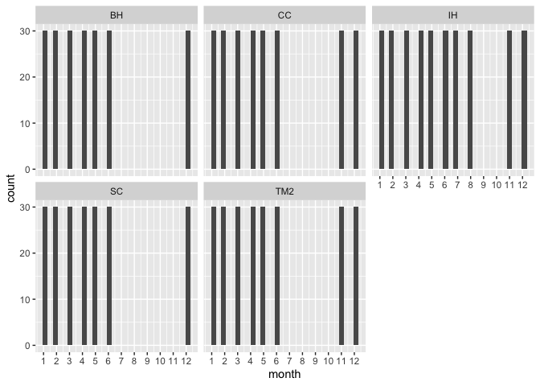<!-- -->


### Historical Climate

Prep

```r
nosnow_pops_historical <- pop_elev_climate_historical_avgs %>% filter(PckSum < 70)
unique(nosnow_pops_historical$parent.pop)
```

```
## [1] "BH"  "CC"  "IH"  "SC"  "TM2"
```

```r
summary(nosnow_pops_historical) #3rd quartile of CWD = 87 
```

```
##   parent.pop        elevation.group        elev_m          month      
##  Length:60          Length:60          Min.   :313.0   Min.   : 1.00  
##  Class :character   Class :character   1st Qu.:379.2   1st Qu.: 3.75  
##  Mode  :character   Mode  :character   Median :421.5   Median : 6.50  
##                                        Mean   :415.8   Mean   : 6.50  
##                                        3rd Qu.:454.1   3rd Qu.: 9.25  
##                                        Max.   :511.4   Max.   :12.00  
##     cwd_mean         pck_mean         ppt_mean          tmn_mean     
##  Min.   : 12.15   Min.   :0.0000   Min.   :  1.012   Min.   : 1.218  
##  1st Qu.: 29.27   1st Qu.:0.0000   1st Qu.: 11.992   1st Qu.: 3.735  
##  Median : 55.90   Median :0.0000   Median : 67.216   Median : 7.683  
##  Mean   : 62.17   Mean   :0.4099   Mean   : 74.659   Mean   : 8.061  
##  3rd Qu.: 86.85   3rd Qu.:0.0000   3rd Qu.:133.044   3rd Qu.:12.579  
##  Max.   :163.60   Max.   :8.8330   Max.   :201.882   Max.   :16.356  
##     tmx_mean        cwd_sem           pck_sem          ppt_sem       
##  Min.   :12.27   Min.   : 0.1859   Min.   :0.0000   Min.   : 0.5719  
##  1st Qu.:15.66   1st Qu.: 0.6581   1st Qu.:0.0000   1st Qu.: 2.7875  
##  Median :22.19   Median : 1.7177   Median :0.0000   Median :10.5243  
##  Mean   :22.56   Mean   : 2.4974   Mean   :0.2836   Mean   :10.8379  
##  3rd Qu.:30.34   3rd Qu.: 3.8894   3rd Qu.:0.0000   3rd Qu.:17.4984  
##  Max.   :34.69   Max.   :10.6738   Max.   :4.9412   Max.   :24.5578  
##     tmn_sem          tmx_sem           PckSum       
##  Min.   :0.1724   Min.   :0.2166   Min.   : 0.2340  
##  1st Qu.:0.2110   1st Qu.:0.2944   1st Qu.: 0.5973  
##  Median :0.2372   Median :0.3474   Median : 0.9510  
##  Mean   :0.2447   Mean   :0.3499   Mean   : 4.9187  
##  3rd Qu.:0.2866   3rd Qu.:0.3745   3rd Qu.: 5.4673  
##  Max.   :0.3384   Max.   :0.5565   Max.   :17.3440
```

```r
nosnow_pops_historical_tojoin <- nosnow_pops_historical %>% select(parent.pop:elev_m, PckSum) %>% distinct()

nosnow_pops_historical_years <- left_join(nosnow_pops_historical_tojoin, pop_elev_climate_historical) 
```

```
## Joining with `by = join_by(parent.pop, elevation.group, elev_m)`
```

```r
nosnow_pops_historical_years %>% filter(month=="7", ppt>=25) #in 1974, ppt>25 for 4 pops in July... unlikely seeds would have after ripened enough 
```

```
## # A tibble: 4 × 11
## # Groups:   parent.pop, elevation.group, elev_m [4]
##   parent.pop elevation.group elev_m PckSum  year month   cwd   pck   ppt   tmn
##   <chr>      <chr>            <dbl>  <dbl> <dbl> <dbl> <dbl> <dbl> <dbl> <dbl>
## 1 CC         Low               313   0.951  1974     7  52.4     0  58.2  16.3
## 2 IH         Low               454. 17.3    1974     7   0       0  79.3  15.4
## 3 SC         Low               422.  0.597  1974     7 127.      0  61.4  14.8
## 4 TM2        Low               379.  5.47   1974     7   0       0  59.1  15.9
## # ℹ 1 more variable: tmx <dbl>
```

```r
nosnow_pops_historical_years %>% filter(month=="8", ppt>=25) %>% arrange(year, parent.pop) #11 cases of ppt>25 in Aug 
```

```
## # A tibble: 11 × 11
## # Groups:   parent.pop, elevation.group, elev_m [5]
##    parent.pop elevation.group elev_m PckSum  year month   cwd   pck   ppt   tmn
##    <chr>      <chr>            <dbl>  <dbl> <dbl> <dbl> <dbl> <dbl> <dbl> <dbl>
##  1 CC         Low               313   0.951  1965     8  70.3     0  38.7  16.6
##  2 TM2        Low               379.  5.47   1965     8 156.      0  39.8  16.3
##  3 CC         Low               313   0.951  1968     8  69.3     0  28.1  14.2
##  4 TM2        Low               379.  5.47   1968     8 151.      0  28.9  13.8
##  5 IH         Low               454. 17.3    1975     8  94.4     0  28.8  14.0
##  6 SC         Low               422.  0.597  1975     8 169.      0  26.9  13.4
##  7 BH         Low               511.  0.234  1976     8 168.      0  26.4  13.2
##  8 CC         Low               313   0.951  1976     8  78.0     0  37.8  13.8
##  9 IH         Low               454. 17.3    1976     8 152.      0  50.7  12.5
## 10 SC         Low               422.  0.597  1976     8 148.      0  40.5  12.7
## 11 TM2        Low               379.  5.47   1976     8 150.      0  38.3  13.4
## # ℹ 1 more variable: tmx <dbl>
```

```r
nosnow_pops_historical_years %>% filter(year==1965) %>% arrange(parent.pop)
```

```
## # A tibble: 60 × 11
## # Groups:   parent.pop, elevation.group, elev_m [5]
##    parent.pop elevation.group elev_m PckSum  year month   cwd   pck      ppt
##    <chr>      <chr>            <dbl>  <dbl> <dbl> <dbl> <dbl> <dbl>    <dbl>
##  1 BH         Low               511.  0.234  1965     1  27.4     0  88.1   
##  2 BH         Low               511.  0.234  1965     2  41.0     0  25.9   
##  3 BH         Low               511.  0.234  1965     3  57.2     0  50.6   
##  4 BH         Low               511.  0.234  1965     4  39.2     0 104.    
##  5 BH         Low               511.  0.234  1965     5  70.8     0   0.0500
##  6 BH         Low               511.  0.234  1965     6  91.2     0   0     
##  7 BH         Low               511.  0.234  1965     7 119.      0   0     
##  8 BH         Low               511.  0.234  1965     8  99.9     0   8.87  
##  9 BH         Low               511.  0.234  1965     9 119.      0   0     
## 10 BH         Low               511.  0.234  1965    10  90.1     0  10.5   
## # ℹ 50 more rows
## # ℹ 2 more variables: tmn <dbl>, tmx <dbl>
```

```r
nosnow_pops_historical_years %>% filter(year==1968) %>% arrange(parent.pop) 
```

```
## # A tibble: 60 × 11
## # Groups:   parent.pop, elevation.group, elev_m [5]
##    parent.pop elevation.group elev_m PckSum  year month   cwd   pck   ppt    tmn
##    <chr>      <chr>            <dbl>  <dbl> <dbl> <dbl> <dbl> <dbl> <dbl>  <dbl>
##  1 BH         Low               511.  0.234  1968     1  28.7     0  58.5 -0.350
##  2 BH         Low               511.  0.234  1968     2  44.7     0  68.2  5.55 
##  3 BH         Low               511.  0.234  1968     3  59.1     0  62.1  4.02 
##  4 BH         Low               511.  0.234  1968     4  72.2     0  19.2  4.45 
##  5 BH         Low               511.  0.234  1968     5  73.7     0  20.7  7.90 
##  6 BH         Low               511.  0.234  1968     6 101.      0   0   13.1  
##  7 BH         Low               511.  0.234  1968     7 135.      0   0   16.4  
##  8 BH         Low               511.  0.234  1968     8 149.      0   0   13.8  
##  9 BH         Low               511.  0.234  1968     9 129.      0   0   12.1  
## 10 BH         Low               511.  0.234  1968    10  87.5     0  42.3  8.06 
## # ℹ 50 more rows
## # ℹ 1 more variable: tmx <dbl>
```

```r
nosnow_pops_historical_years %>% filter(year==1975) %>% arrange(parent.pop) 
```

```
## # A tibble: 60 × 11
## # Groups:   parent.pop, elevation.group, elev_m [5]
##    parent.pop elevation.group elev_m PckSum  year month   cwd   pck      ppt
##    <chr>      <chr>            <dbl>  <dbl> <dbl> <dbl> <dbl> <dbl>    <dbl>
##  1 BH         Low               511.  0.234  1975     1  28.3     0  43.9   
##  2 BH         Low               511.  0.234  1975     2  37.2     0 169.    
##  3 BH         Low               511.  0.234  1975     3  39.2     0 145.    
##  4 BH         Low               511.  0.234  1975     4  35.9     0  67.9   
##  5 BH         Low               511.  0.234  1975     5  72.4     0   2.73  
##  6 BH         Low               511.  0.234  1975     6  95.4     0   0.770 
##  7 BH         Low               511.  0.234  1975     7 121.      0   0.0300
##  8 BH         Low               511.  0.234  1975     8 103.      0   8.65  
##  9 BH         Low               511.  0.234  1975     9 130.      0   3.14  
## 10 BH         Low               511.  0.234  1975    10  84.1     0  67.7   
## # ℹ 50 more rows
## # ℹ 2 more variables: tmn <dbl>, tmx <dbl>
```

```r
nosnow_pops_historical_years %>% filter(year==1976) %>% arrange(parent.pop)
```

```
## # A tibble: 60 × 11
## # Groups:   parent.pop, elevation.group, elev_m [5]
##    parent.pop elevation.group elev_m PckSum  year month   cwd   pck    ppt
##    <chr>      <chr>            <dbl>  <dbl> <dbl> <dbl> <dbl> <dbl>  <dbl>
##  1 BH         Low               511.  0.234  1976     1  29.4     0  7.71 
##  2 BH         Low               511.  0.234  1976     2  42.6     0 92.6  
##  3 BH         Low               511.  0.234  1976     3  57.1     0 39.8  
##  4 BH         Low               511.  0.234  1976     4  70.1     0 40.5  
##  5 BH         Low               511.  0.234  1976     5  79.7     0  0.240
##  6 BH         Low               511.  0.234  1976     6 112.      0  0.210
##  7 BH         Low               511.  0.234  1976     7 166.      0  0.790
##  8 BH         Low               511.  0.234  1976     8 168.      0 26.4  
##  9 BH         Low               511.  0.234  1976     9 115.      0 32.0  
## 10 BH         Low               511.  0.234  1976    10  85.0     0 23    
## # ℹ 50 more rows
## # ℹ 2 more variables: tmn <dbl>, tmx <dbl>
```

```r
#some cases where ppt remains high in following month 

#going to start in Sept though due to afterripening requirements 
growyear_months <- tibble(month=c(1:12), growmonth=c(5, 6, 7, 8, 9, 10, 11, 12, 1, 2, 3, 4))

nosnow_historical_growyear_months <- full_join(growyear_months, nosnow_pops_historical_years)
```

```
## Joining with `by = join_by(month)`
```

```r
dim(nosnow_historical_growyear_months)
```

```
## [1] 1800   12
```

First month 

```r
nosnow_historical_first_month <- nosnow_historical_growyear_months %>%
  group_by(parent.pop, elevation.group, elev_m, year) %>% 
  filter(ppt>=25) %>% 
  arrange(growmonth) %>% 
  filter(row_number()==1) #get first month for each pop and year with germinating inducing rain 

nosnow_historical_first_month_tomerge <- nosnow_historical_first_month %>% 
  select(parent.pop:elev_m, year, firstmonth=growmonth)

nosnow_historical_first_month_col <- full_join(nosnow_historical_growyear_months, nosnow_historical_first_month_tomerge)
```

```
## Joining with `by = join_by(parent.pop, elevation.group, elev_m, year)`
```

```r
dim(nosnow_historical_first_month_col)
```

```
## [1] 1800   13
```

Last month 

```r
nosnow_historical_last_month <- nosnow_historical_growyear_months %>%
  group_by(parent.pop, elevation.group, elev_m, year) %>% 
  filter(cwd>87) %>% #adjusted for the historical 3rd quartile of cwd
  arrange(month) %>% 
  filter(row_number()==1)

nosnow_historical_last_month_tomerge <- nosnow_historical_last_month %>% 
  select(parent.pop:elev_m, year, lastmonth=growmonth) #last month is in grow month not calendar month format

nosnow_historical_last_month_col <- full_join(nosnow_historical_first_month_col, nosnow_historical_last_month_tomerge)  %>% 
  select(firstmonth, lastmonth, month:tmx)
```

```
## Joining with `by = join_by(parent.pop, elevation.group, elev_m, year)`
```

```r
dim(nosnow_historical_last_month_col)
```

```
## [1] 1800   14
```

Checking for weird cases

```r
summary(nosnow_historical_last_month_col)
```

```
##    firstmonth      lastmonth      month         growmonth    
##  Min.   :1.000   Min.   : 1   Min.   : 1.00   Min.   : 1.00  
##  1st Qu.:1.000   1st Qu.:10   1st Qu.: 3.75   1st Qu.: 3.75  
##  Median :2.000   Median :10   Median : 6.50   Median : 6.50  
##  Mean   :2.007   Mean   :10   Mean   : 6.50   Mean   : 6.50  
##  3rd Qu.:2.000   3rd Qu.:11   3rd Qu.: 9.25   3rd Qu.: 9.25  
##  Max.   :4.000   Max.   :12   Max.   :12.00   Max.   :12.00  
##   parent.pop        elevation.group        elev_m          PckSum       
##  Length:1800        Length:1800        Min.   :313.0   Min.   : 0.2340  
##  Class :character   Class :character   1st Qu.:379.2   1st Qu.: 0.5973  
##  Mode  :character   Mode  :character   Median :421.5   Median : 0.9510  
##                                        Mean   :415.8   Mean   : 4.9187  
##                                        3rd Qu.:454.1   3rd Qu.: 5.4673  
##                                        Max.   :511.4   Max.   :17.3440  
##       year           cwd              pck                ppt         
##  Min.   :1962   Min.   :  0.00   Min.   :  0.0000   Min.   :  0.000  
##  1st Qu.:1969   1st Qu.: 27.59   1st Qu.:  0.0000   1st Qu.:  3.922  
##  Median :1976   Median : 51.55   Median :  0.0000   Median : 35.865  
##  Mean   :1976   Mean   : 62.17   Mean   :  0.4099   Mean   : 74.659  
##  3rd Qu.:1984   3rd Qu.: 89.04   3rd Qu.:  0.0000   3rd Qu.:107.838  
##  Max.   :1991   Max.   :202.50   Max.   :129.4600   Max.   :559.960  
##       tmn              tmx       
##  Min.   :-1.850   Min.   : 8.63  
##  1st Qu.: 3.757   1st Qu.:15.23  
##  Median : 7.610   Median :22.35  
##  Mean   : 8.061   Mean   :22.56  
##  3rd Qu.:12.720   3rd Qu.:30.20  
##  Max.   :18.820   Max.   :37.76
```

```r
nosnow_historical_last_month_col %>% filter(is.na(lastmonth)) %>% arrange(year) #0 years where there isn't a last month
```

```
## # A tibble: 0 × 14
## # ℹ 14 variables: firstmonth <dbl>, lastmonth <dbl>, month <dbl>,
## #   growmonth <dbl>, parent.pop <chr>, elevation.group <chr>, elev_m <dbl>,
## #   PckSum <dbl>, year <dbl>, cwd <dbl>, pck <dbl>, ppt <dbl>, tmn <dbl>,
## #   tmx <dbl>
```

```r
nosnow_historical_last_month_col %>% filter(is.na(firstmonth)) %>% arrange(year) #0 years where there isn't a first month
```

```
## # A tibble: 0 × 14
## # ℹ 14 variables: firstmonth <dbl>, lastmonth <dbl>, month <dbl>,
## #   growmonth <dbl>, parent.pop <chr>, elevation.group <chr>, elev_m <dbl>,
## #   PckSum <dbl>, year <dbl>, cwd <dbl>, pck <dbl>, ppt <dbl>, tmn <dbl>,
## #   tmx <dbl>
```

```r
nosnow_historical_last_month_col %>% filter(lastmonth<4) %>% arrange(parent.pop, year) #some cases where last month is less than 4 (earlier than December)
```

```
## # A tibble: 96 × 14
##    firstmonth lastmonth month growmonth parent.pop elevation.group elev_m PckSum
##         <dbl>     <dbl> <dbl>     <dbl> <chr>      <chr>            <dbl>  <dbl>
##  1          2         1     1         5 IH         Low               454.   17.3
##  2          2         1     2         6 IH         Low               454.   17.3
##  3          2         1     3         7 IH         Low               454.   17.3
##  4          2         1     4         8 IH         Low               454.   17.3
##  5          2         1     5         9 IH         Low               454.   17.3
##  6          2         1     6        10 IH         Low               454.   17.3
##  7          2         1     7        11 IH         Low               454.   17.3
##  8          2         1     8        12 IH         Low               454.   17.3
##  9          2         1     9         1 IH         Low               454.   17.3
## 10          2         1    10         2 IH         Low               454.   17.3
## # ℹ 86 more rows
## # ℹ 6 more variables: year <dbl>, cwd <dbl>, pck <dbl>, ppt <dbl>, tmn <dbl>,
## #   tmx <dbl>
```

```r
nosnow_historical_last_month_col %>% filter(lastmonth<firstmonth, lastmonth<4) %>% arrange(parent.pop, year) #most of the above are when the last month is before the first month (in growyear, not calendar year)
```

```
## # A tibble: 72 × 14
##    firstmonth lastmonth month growmonth parent.pop elevation.group elev_m PckSum
##         <dbl>     <dbl> <dbl>     <dbl> <chr>      <chr>            <dbl>  <dbl>
##  1          2         1     1         5 IH         Low               454.   17.3
##  2          2         1     2         6 IH         Low               454.   17.3
##  3          2         1     3         7 IH         Low               454.   17.3
##  4          2         1     4         8 IH         Low               454.   17.3
##  5          2         1     5         9 IH         Low               454.   17.3
##  6          2         1     6        10 IH         Low               454.   17.3
##  7          2         1     7        11 IH         Low               454.   17.3
##  8          2         1     8        12 IH         Low               454.   17.3
##  9          2         1     9         1 IH         Low               454.   17.3
## 10          2         1    10         2 IH         Low               454.   17.3
## # ℹ 62 more rows
## # ℹ 6 more variables: year <dbl>, cwd <dbl>, pck <dbl>, ppt <dbl>, tmn <dbl>,
## #   tmx <dbl>
```

```r
#****NEED TO CONVERT LAST MONTH TO CALENDAR YEAR FORMAT FOR AVG CALCS 
nosnow_historical_last_month_col %>% filter(lastmonth>firstmonth & lastmonth<4) %>% arrange(parent.pop, year) #0 cases where the last month is after the first month before Dec 
```

```
## # A tibble: 0 × 14
## # ℹ 14 variables: firstmonth <dbl>, lastmonth <dbl>, month <dbl>,
## #   growmonth <dbl>, parent.pop <chr>, elevation.group <chr>, elev_m <dbl>,
## #   PckSum <dbl>, year <dbl>, cwd <dbl>, pck <dbl>, ppt <dbl>, tmn <dbl>,
## #   tmx <dbl>
```

```r
nosnow_historical_last_month_col %>% filter(lastmonth==firstmonth) %>% arrange(parent.pop, year) #first month and last month are the same for IH in 2 years ('72, '89)
```

```
## # A tibble: 24 × 14
##    firstmonth lastmonth month growmonth parent.pop elevation.group elev_m PckSum
##         <dbl>     <dbl> <dbl>     <dbl> <chr>      <chr>            <dbl>  <dbl>
##  1          1         1     1         5 IH         Low               454.   17.3
##  2          1         1     2         6 IH         Low               454.   17.3
##  3          1         1     3         7 IH         Low               454.   17.3
##  4          1         1     4         8 IH         Low               454.   17.3
##  5          1         1     5         9 IH         Low               454.   17.3
##  6          1         1     6        10 IH         Low               454.   17.3
##  7          1         1     7        11 IH         Low               454.   17.3
##  8          1         1     8        12 IH         Low               454.   17.3
##  9          1         1     9         1 IH         Low               454.   17.3
## 10          1         1    10         2 IH         Low               454.   17.3
## # ℹ 14 more rows
## # ℹ 6 more variables: year <dbl>, cwd <dbl>, pck <dbl>, ppt <dbl>, tmn <dbl>,
## #   tmx <dbl>
```

```r
#****CAN DROP THESE CASES (IF GO WITH THE AVG FIRST/LAST MONTH OPTION)

nosnow_historical_last_month_col %>% filter(lastmonth==1) %>% arrange(parent.pop, year) #8 cases where Sept is last month 
```

```
## # A tibble: 96 × 14
##    firstmonth lastmonth month growmonth parent.pop elevation.group elev_m PckSum
##         <dbl>     <dbl> <dbl>     <dbl> <chr>      <chr>            <dbl>  <dbl>
##  1          2         1     1         5 IH         Low               454.   17.3
##  2          2         1     2         6 IH         Low               454.   17.3
##  3          2         1     3         7 IH         Low               454.   17.3
##  4          2         1     4         8 IH         Low               454.   17.3
##  5          2         1     5         9 IH         Low               454.   17.3
##  6          2         1     6        10 IH         Low               454.   17.3
##  7          2         1     7        11 IH         Low               454.   17.3
##  8          2         1     8        12 IH         Low               454.   17.3
##  9          2         1     9         1 IH         Low               454.   17.3
## 10          2         1    10         2 IH         Low               454.   17.3
## # ℹ 86 more rows
## # ℹ 6 more variables: year <dbl>, cwd <dbl>, pck <dbl>, ppt <dbl>, tmn <dbl>,
## #   tmx <dbl>
```

```r
nosnow_historical_last_month_col %>% filter(lastmonth==4) #0 cases where Oct-Dec is the last month
```

```
## # A tibble: 0 × 14
## # ℹ 14 variables: firstmonth <dbl>, lastmonth <dbl>, month <dbl>,
## #   growmonth <dbl>, parent.pop <chr>, elevation.group <chr>, elev_m <dbl>,
## #   PckSum <dbl>, year <dbl>, cwd <dbl>, pck <dbl>, ppt <dbl>, tmn <dbl>,
## #   tmx <dbl>
```

```r
nosnow_historical_last_month_col %>% filter(firstmonth>4) #0 cases where first month is after December
```

```
## # A tibble: 0 × 14
## # ℹ 14 variables: firstmonth <dbl>, lastmonth <dbl>, month <dbl>,
## #   growmonth <dbl>, parent.pop <chr>, elevation.group <chr>, elev_m <dbl>,
## #   PckSum <dbl>, year <dbl>, cwd <dbl>, pck <dbl>, ppt <dbl>, tmn <dbl>,
## #   tmx <dbl>
```

```r
nosnow_historical_last_month_col %>% filter(growmonth==firstmonth+1, cwd>87) %>% arrange(parent.pop, year) #1 case where cwd is high in the second growth month 
```

```
## # A tibble: 1 × 14
##   firstmonth lastmonth month growmonth parent.pop elevation.group elev_m PckSum
##        <dbl>     <dbl> <dbl>     <dbl> <chr>      <chr>            <dbl>  <dbl>
## 1          1        10    10         2 BH         Low               511.  0.234
## # ℹ 6 more variables: year <dbl>, cwd <dbl>, pck <dbl>, ppt <dbl>, tmn <dbl>,
## #   tmx <dbl>
```

```r
nosnow_historical_last_month_col %>% filter(growmonth==lastmonth) %>% arrange(cwd, ppt)
```

```
## # A tibble: 150 × 14
##    firstmonth lastmonth month growmonth parent.pop elevation.group elev_m PckSum
##         <dbl>     <dbl> <dbl>     <dbl> <chr>      <chr>            <dbl>  <dbl>
##  1          2         9     5         9 TM2        Low               379.  5.47 
##  2          2        12     8        12 IH         Low               454. 17.3  
##  3          2        10     6        10 TM2        Low               379.  5.47 
##  4          1        10     6        10 CC         Low               313   0.951
##  5          3        10     6        10 SC         Low               422.  0.597
##  6          1        10     6        10 TM2        Low               379.  5.47 
##  7          1        10     6        10 CC         Low               313   0.951
##  8          3        10     6        10 CC         Low               313   0.951
##  9          2         9     5         9 TM2        Low               379.  5.47 
## 10          1        10     6        10 CC         Low               313   0.951
## # ℹ 140 more rows
## # ℹ 6 more variables: year <dbl>, cwd <dbl>, pck <dbl>, ppt <dbl>, tmn <dbl>,
## #   tmx <dbl>
```

Average first and last month

```r
#remove IH: 1972, 1989
#convert last month to cal year for avg calc 

nosnow_historicalfirst_last_month_for_calc <- nosnow_historical_last_month_col %>% 
  filter(!(parent.pop=="IH" & year==1972)) %>% 
  filter(!(parent.pop=="IH" & year==1989)) %>% 
  mutate(lastmonth_cal=if_else(lastmonth<=4, lastmonth+8, lastmonth-4)) %>% 
  select(firstmonth:lastmonth, lastmonth_cal, parent.pop, elevation.group, elev_m, year) %>% 
  distinct()

nosnow_historical_avg_first_last_month <- nosnow_historicalfirst_last_month_for_calc %>% 
  group_by(parent.pop, elevation.group, elev_m) %>% 
  summarise(AvgFirstMonth=mean(firstmonth), First_sem=sem(firstmonth),
            AvgLastMonth=mean(lastmonth), Last_sem=sem(lastmonth),
            AvgLastMonth_cal=mean(lastmonth_cal), Last_cal_sem=sem(lastmonth_cal))
```

```
## `summarise()` has grouped output by 'parent.pop', 'elevation.group'. You can
## override using the `.groups` argument.
```

```r
nosnow_historical_avg_first_last_month
```

```
## # A tibble: 5 × 9
## # Groups:   parent.pop, elevation.group [5]
##   parent.pop elevation.group elev_m AvgFirstMonth First_sem AvgLastMonth
##   <chr>      <chr>            <dbl>         <dbl>     <dbl>        <dbl>
## 1 BH         Low               511.          2.27     0.151        10.2 
## 2 CC         Low               313           1.93     0.143        10.5 
## 3 IH         Low               454.          1.93     0.135         9.57
## 4 SC         Low               422.          2.17     0.136        10.3 
## 5 TM2        Low               379.          1.8      0.121        10   
## # ℹ 3 more variables: Last_sem <dbl>, AvgLastMonth_cal <dbl>,
## #   Last_cal_sem <dbl>
```

```r
#2 in growmonth = October 
#9 in growmonth = May - w/o converting last month to calendar year format, the cases where growmonth=1 is pulling the last month much earlier and with a much greater standard error --> wrong!
#8 in lastmonth_cal = August 

#Used Standard Rounding
nosnow_avg_first_last_month_historical <- nosnow_historical_avg_first_last_month %>% 
  mutate(AvgFirstMonth=true_round(AvgFirstMonth, 0), 
         AvgLastMonth=if_else(parent.pop=="IH", 12, true_round(AvgLastMonth, 0))) %>% #in growmonth format
  select(parent.pop:elev_m, AvgFirstMonth, AvgLastMonth)
nosnow_historical_avg_first_last_month
```

```
## # A tibble: 5 × 9
## # Groups:   parent.pop, elevation.group [5]
##   parent.pop elevation.group elev_m AvgFirstMonth First_sem AvgLastMonth
##   <chr>      <chr>            <dbl>         <dbl>     <dbl>        <dbl>
## 1 BH         Low               511.          2.27     0.151        10.2 
## 2 CC         Low               313           1.93     0.143        10.5 
## 3 IH         Low               454.          1.93     0.135         9.57
## 4 SC         Low               422.          2.17     0.136        10.3 
## 5 TM2        Low               379.          1.8      0.121        10   
## # ℹ 3 more variables: Last_sem <dbl>, AvgLastMonth_cal <dbl>,
## #   Last_cal_sem <dbl>
```

```r
nosnow_avg_first_last_month_historical
```

```
## # A tibble: 5 × 5
## # Groups:   parent.pop, elevation.group [5]
##   parent.pop elevation.group elev_m AvgFirstMonth AvgLastMonth
##   <chr>      <chr>            <dbl>         <dbl>        <dbl>
## 1 BH         Low               511.             2           10
## 2 CC         Low               313              2           11
## 3 IH         Low               454.             2           12
## 4 SC         Low               422.             2           10
## 5 TM2        Low               379.             2           10
```

```r
nosnow_historical_avg_first_last_month_allmonths <- left_join(nosnow_historical_growyear_months, nosnow_avg_first_last_month_historical)
```

```
## Joining with `by = join_by(parent.pop, elevation.group, elev_m)`
```

Fill in all the months b/t the first and last for the full growth season 

```r
nosnow_grwseason_historical <- nosnow_historical_avg_first_last_month_allmonths %>% 
  group_by(parent.pop, elevation.group, elev_m, year) %>% 
  filter(growmonth>AvgFirstMonth) %>% #first and last month are in grow month format not calendar year 
  filter(growmonth<=AvgLastMonth) %>% 
  arrange(year,parent.pop, growmonth)
summary(nosnow_grwseason_historical) 
```

```
##      month          growmonth       parent.pop        elevation.group   
##  Min.   : 1.000   Min.   : 3.000   Length:1290        Length:1290       
##  1st Qu.: 3.000   1st Qu.: 5.000   Class :character   Class :character  
##  Median : 5.000   Median : 7.000   Mode  :character   Mode  :character  
##  Mean   : 5.628   Mean   : 6.837                                        
##  3rd Qu.: 8.000   3rd Qu.: 9.000                                        
##  Max.   :12.000   Max.   :12.000                                        
##      elev_m          PckSum             year           cwd        
##  Min.   :313.0   Min.   : 0.2340   Min.   :1962   Min.   :  0.00  
##  1st Qu.:379.2   1st Qu.: 0.5973   1st Qu.:1969   1st Qu.: 21.89  
##  Median :421.5   Median : 0.9510   Median :1976   Median : 34.33  
##  Mean   :415.2   Mean   : 5.4044   Mean   :1976   Mean   : 43.64  
##  3rd Qu.:454.1   3rd Qu.: 5.4673   3rd Qu.:1984   3rd Qu.: 61.50  
##  Max.   :511.4   Max.   :17.3440   Max.   :1991   Max.   :183.92  
##       pck                ppt              tmn              tmx       
##  Min.   :  0.0000   Min.   :  0.00   Min.   :-1.850   Min.   : 8.63  
##  1st Qu.:  0.0000   1st Qu.: 13.58   1st Qu.: 2.760   1st Qu.:13.93  
##  Median :  0.0000   Median : 58.52   Median : 5.030   Median :17.25  
##  Mean   :  0.5719   Mean   : 94.82   Mean   : 6.188   Mean   :19.56  
##  3rd Qu.:  0.0000   3rd Qu.:145.06   3rd Qu.: 9.168   3rd Qu.:25.19  
##  Max.   :129.4600   Max.   :559.96   Max.   :18.290   Max.   :36.45  
##  AvgFirstMonth  AvgLastMonth  
##  Min.   :2     Min.   :10.00  
##  1st Qu.:2     1st Qu.:10.00  
##  Median :2     Median :10.00  
##  Mean   :2     Mean   :10.67  
##  3rd Qu.:2     3rd Qu.:11.00  
##  Max.   :2     Max.   :12.00
```

```r
xtabs(~parent.pop+month, data=nosnow_grwseason_historical)
```

```
##           month
## parent.pop  1  2  3  4  5  6  7  8 11 12
##        BH  30 30 30 30 30 30  0  0 30 30
##        CC  30 30 30 30 30 30 30  0 30 30
##        IH  30 30 30 30 30 30 30 30 30 30
##        SC  30 30 30 30 30 30  0  0 30 30
##        TM2 30 30 30 30 30 30  0  0 30 30
```

```r
nosnow_grwseason_historical %>% ggplot(aes(x=month)) + geom_histogram() +
  scale_x_continuous(breaks=c(1, 2, 3, 4, 5,6,7,8,9,10, 11, 12)) +
  facet_wrap(~parent.pop)
```

```
## `stat_bin()` using `bins = 30`. Pick better value with `binwidth`.
```

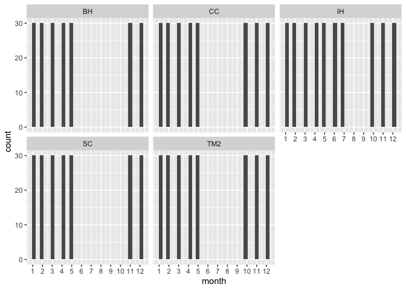<!-- -->

## Populations that get more than 70 mm of snow pack in a year (on average)

-   First month = snowpack = 0 and min temp > 0

    -   Remember this month is not included in the final "growth season"

-   Last month = snowpack. \> 70 mm OR pck > 0 and min temp < 0 OR min temp < -5 (moderate freeze)

Note: “The month name of the snowpack file (that is, pckmar.asc) relates to the first day of the next month (that is, station observations on April 1st correlate with the snowpack file for March)." But this makes sense, a survey on April 1 gives a sense for the total snowpack in March. 

### Recent climate

Prep

```r
snow_pops_recent <- pop_elev_climate_recent_avgs %>% filter(PckSum >= 70)
unique(snow_pops_recent$parent.pop) #18 pops get some significant snowpack per year 
```

```
##  [1] "CP2"   "CP3"   "DPR"   "FR"    "LV1"   "LV3"   "LVTR1" "SQ1"   "SQ2"  
## [10] "SQ3"   "WL1"   "WL2"   "WR"    "WV"    "YO11"  "YO4"   "YO7"   "YO8"
```

```r
summary(snow_pops_recent)
```

```
##   parent.pop        elevation.group        elev_m           month      
##  Length:216         Length:216         Min.   : 748.9   Min.   : 1.00  
##  Class :character   Class :character   1st Qu.:1613.8   1st Qu.: 3.75  
##  Mode  :character   Mode  :character   Median :2200.9   Median : 6.50  
##                                        Mean   :1992.5   Mean   : 6.50  
##                                        3rd Qu.:2470.0   3rd Qu.: 9.25  
##                                        Max.   :2872.3   Max.   :12.00  
##     cwd_mean          pck_mean          ppt_mean           tmn_mean     
##  Min.   :  9.286   Min.   :   0.00   Min.   :  0.1547   Min.   :-9.566  
##  1st Qu.: 27.299   1st Qu.:   0.00   1st Qu.: 16.7425   1st Qu.:-3.289  
##  Median : 44.967   Median :  27.01   Median : 85.8398   Median : 1.360  
##  Mean   : 54.108   Mean   : 167.47   Mean   :105.1475   Mean   : 1.965  
##  3rd Qu.: 80.545   3rd Qu.: 237.79   3rd Qu.:175.5006   3rd Qu.: 6.873  
##  Max.   :147.992   Max.   :1112.78   Max.   :355.7843   Max.   :16.219  
##     tmx_mean         cwd_sem          pck_sem          ppt_sem        
##  Min.   : 1.758   Min.   :0.1430   Min.   :  0.00   Min.   : 0.07985  
##  1st Qu.: 8.172   1st Qu.:0.5688   1st Qu.:  0.00   1st Qu.: 3.65977  
##  Median :13.369   Median :1.2517   Median : 11.36   Median :13.34647  
##  Mean   :14.729   Mean   :1.7305   Mean   : 23.43   Mean   :14.96105  
##  3rd Qu.:21.431   3rd Qu.:2.6690   3rd Qu.: 43.69   3rd Qu.:23.82075  
##  Max.   :32.650   Max.   :8.9076   Max.   :106.86   Max.   :47.97252  
##     tmn_sem          tmx_sem           PckSum      
##  Min.   :0.1900   Min.   :0.1804   Min.   : 107.5  
##  1st Qu.:0.2602   1st Qu.:0.3041   1st Qu.: 613.4  
##  Median :0.2912   Median :0.3836   Median :1587.7  
##  Mean   :0.2906   Mean   :0.3643   Mean   :2009.6  
##  3rd Qu.:0.3181   3rd Qu.:0.4157   3rd Qu.:2655.8  
##  Max.   :0.4145   Max.   :0.5143   Max.   :5408.1
```

```r
snow_pops_recent_tojoin <- snow_pops_recent %>% select(parent.pop:elev_m, PckSum) %>% distinct()

snow_pops_recent_years <- left_join(snow_pops_recent_tojoin, pop_elev_climate_recent) 
```

```
## Joining with `by = join_by(parent.pop, elevation.group, elev_m)`
```

```r
summary(snow_pops_recent_years)
```

```
##   parent.pop        elevation.group        elev_m           PckSum      
##  Length:6480        Length:6480        Min.   : 748.9   Min.   : 107.5  
##  Class :character   Class :character   1st Qu.:1613.8   1st Qu.: 613.4  
##  Mode  :character   Mode  :character   Median :2200.9   Median :1587.7  
##                                        Mean   :1992.5   Mean   :2009.6  
##                                        3rd Qu.:2470.0   3rd Qu.:2655.8  
##                                        Max.   :2872.3   Max.   :5408.1  
##       year          month            cwd              pck        
##  Min.   :1992   Min.   : 1.00   Min.   :  0.00   Min.   :   0.0  
##  1st Qu.:1999   1st Qu.: 3.75   1st Qu.: 25.14   1st Qu.:   0.0  
##  Median :2006   Median : 6.50   Median : 45.47   Median :   0.0  
##  Mean   :2006   Mean   : 6.50   Mean   : 54.11   Mean   : 167.5  
##  3rd Qu.:2014   3rd Qu.: 9.25   3rd Qu.: 81.18   3rd Qu.: 197.0  
##  Max.   :2021   Max.   :12.00   Max.   :182.70   Max.   :2183.6  
##       ppt               tmn               tmx       
##  Min.   :  0.000   Min.   :-13.180   Min.   :-3.22  
##  1st Qu.:  9.678   1st Qu.: -3.190   1st Qu.: 8.05  
##  Median : 52.040   Median :  1.480   Median :13.61  
##  Mean   :105.147   Mean   :  1.965   Mean   :14.73  
##  3rd Qu.:153.838   3rd Qu.:  6.902   3rd Qu.:21.44  
##  Max.   :981.420   Max.   : 19.730   Max.   :35.13
```

First month 

```r
snow_recent_first_month <- snow_pops_recent_years %>%
  group_by(parent.pop, elevation.group, elev_m, year) %>% 
  filter(pck==0) %>% 
  filter(tmn > 0) %>% 
  arrange(month) %>% 
  filter(row_number()==1) #get first month for each pop and year with no snowpack for germ

snow_recent_first_month_tomerge <- snow_recent_first_month %>% 
  select(parent.pop:elev_m, year, firstmonth=month)

snow_recent_first_month_col <- full_join(snow_pops_recent_years, snow_recent_first_month_tomerge)
```

```
## Joining with `by = join_by(parent.pop, elevation.group, elev_m, year)`
```

```r
dim(snow_recent_first_month_col)
```

```
## [1] 6480   12
```

Last month

```r
snow_recent_last_month <- snow_recent_first_month_col %>%
  group_by(parent.pop, elevation.group, elev_m, year) %>% 
  filter(month>firstmonth) %>% 
  filter(if_else(pck>70, pck>70, 
                 if_else(tmn < 0, pck>0, tmn <= -5))) %>%  #-5 is moderate freeze (Pardee et al. 2017)
  arrange(month) %>% 
  filter(row_number()==1) #get first month after growstart for each pop and year with pck >70 

snow_recent_last_month_tomerge <- snow_recent_last_month %>% 
  select(parent.pop:elev_m, year, firstmonth,lastmonth=month)

snow_recent_last_month_col <- full_join(snow_recent_first_month_col, snow_recent_last_month_tomerge) %>% 
  select(firstmonth, lastmonth, year:tmx)
```

```
## Joining with `by = join_by(parent.pop, elevation.group, elev_m, year,
## firstmonth)`
## Adding missing grouping variables: `parent.pop`, `elevation.group`, `elev_m`
```

```r
dim(snow_recent_last_month_col)
```

```
## [1] 6480   12
```

Check weird cases

```r
summary(snow_recent_last_month_col)
```

```
##   parent.pop        elevation.group        elev_m         firstmonth   
##  Length:6480        Length:6480        Min.   : 748.9   Min.   :1.000  
##  Class :character   Class :character   1st Qu.:1613.8   1st Qu.:4.000  
##  Mode  :character   Mode  :character   Median :2200.9   Median :5.000  
##                                        Mean   :1992.5   Mean   :4.809  
##                                        3rd Qu.:2470.0   3rd Qu.:6.000  
##                                        Max.   :2872.3   Max.   :8.000  
##                                                                        
##    lastmonth          year          month            cwd        
##  Min.   : 2.00   Min.   :1992   Min.   : 1.00   Min.   :  0.00  
##  1st Qu.:11.00   1st Qu.:1999   1st Qu.: 3.75   1st Qu.: 25.14  
##  Median :12.00   Median :2006   Median : 6.50   Median : 45.47  
##  Mean   :11.37   Mean   :2006   Mean   : 6.50   Mean   : 54.11  
##  3rd Qu.:12.00   3rd Qu.:2014   3rd Qu.: 9.25   3rd Qu.: 81.18  
##  Max.   :12.00   Max.   :2021   Max.   :12.00   Max.   :182.70  
##  NA's   :1308                                                   
##       pck              ppt               tmn               tmx       
##  Min.   :   0.0   Min.   :  0.000   Min.   :-13.180   Min.   :-3.22  
##  1st Qu.:   0.0   1st Qu.:  9.678   1st Qu.: -3.190   1st Qu.: 8.05  
##  Median :   0.0   Median : 52.040   Median :  1.480   Median :13.61  
##  Mean   : 167.5   Mean   :105.147   Mean   :  1.965   Mean   :14.73  
##  3rd Qu.: 197.0   3rd Qu.:153.838   3rd Qu.:  6.902   3rd Qu.:21.44  
##  Max.   :2183.6   Max.   :981.420   Max.   : 19.730   Max.   :35.13  
## 
```

```r
snow_recent_last_month_col %>% filter(is.na(firstmonth)) #no cases where there isn't a firstmonth
```

```
## # A tibble: 0 × 12
## # Groups:   parent.pop, elevation.group, elev_m [0]
## # ℹ 12 variables: parent.pop <chr>, elevation.group <chr>, elev_m <dbl>,
## #   firstmonth <dbl>, lastmonth <dbl>, year <dbl>, month <dbl>, cwd <dbl>,
## #   pck <dbl>, ppt <dbl>, tmn <dbl>, tmx <dbl>
```

```r
snow_recent_last_month_col %>% filter(is.na(lastmonth)) #109 cases where there isn't a lastmonth 
```

```
## # A tibble: 1,308 × 12
## # Groups:   parent.pop, elevation.group, elev_m [14]
##    parent.pop elevation.group elev_m firstmonth lastmonth  year month   cwd
##    <chr>      <chr>            <dbl>      <dbl>     <dbl> <dbl> <dbl> <dbl>
##  1 CP2        High             2244.          6        NA  2011     1  23.5
##  2 CP2        High             2244.          6        NA  2011     2  27.1
##  3 CP2        High             2244.          6        NA  2011     3  19.9
##  4 CP2        High             2244.          6        NA  2011     4  34.5
##  5 CP2        High             2244.          6        NA  2011     5  30.3
##  6 CP2        High             2244.          6        NA  2011     6  63.0
##  7 CP2        High             2244.          6        NA  2011     7  84.2
##  8 CP2        High             2244.          6        NA  2011     8 122. 
##  9 CP2        High             2244.          6        NA  2011     9 104. 
## 10 CP2        High             2244.          6        NA  2011    10  66.2
## # ℹ 1,298 more rows
## # ℹ 4 more variables: pck <dbl>, ppt <dbl>, tmn <dbl>, tmx <dbl>
```

```r
#***WHAT TO DO FOR THESE CASES? Make the last month 12 (Dec)
#*Temperature never goes below 0, no snow_pack, or min temp > -5 

snow_recent_last_month_col %>% filter(lastmonth==firstmonth) %>% arrange(parent.pop, year) #no cases where last month is first month 
```

```
## # A tibble: 0 × 12
## # Groups:   parent.pop, elevation.group, elev_m [0]
## # ℹ 12 variables: parent.pop <chr>, elevation.group <chr>, elev_m <dbl>,
## #   firstmonth <dbl>, lastmonth <dbl>, year <dbl>, month <dbl>, cwd <dbl>,
## #   pck <dbl>, ppt <dbl>, tmn <dbl>, tmx <dbl>
```

```r
snow_recent_last_month_col %>% filter(lastmonth==firstmonth+1) %>% arrange(parent.pop, year) 
```

```
## # A tibble: 132 × 12
## # Groups:   parent.pop, elevation.group, elev_m [5]
##    parent.pop elevation.group elev_m firstmonth lastmonth  year month   cwd
##    <chr>      <chr>            <dbl>      <dbl>     <dbl> <dbl> <dbl> <dbl>
##  1 DPR        Mid              1019.          1         2  1994     1  11.4
##  2 DPR        Mid              1019.          1         2  1994     2  18.3
##  3 DPR        Mid              1019.          1         2  1994     3  30.1
##  4 DPR        Mid              1019.          1         2  1994     4  43.3
##  5 DPR        Mid              1019.          1         2  1994     5  40.5
##  6 DPR        Mid              1019.          1         2  1994     6  41  
##  7 DPR        Mid              1019.          1         2  1994     7  39.2
##  8 DPR        Mid              1019.          1         2  1994     8  39.7
##  9 DPR        Mid              1019.          1         2  1994     9  53.1
## 10 DPR        Mid              1019.          1         2  1994    10  46.6
## # ℹ 122 more rows
## # ℹ 4 more variables: pck <dbl>, ppt <dbl>, tmn <dbl>, tmx <dbl>
```

```r
#***I added a temperature requirement for temp >0 for the first month and still get 11 cases where there is heavy snow in the month after the first month 
snow_recent_last_month_col %>% filter(lastmonth==firstmonth+2) #1 case where there was sig snowpack in the second month after the first month of 0 snowpack (WL1 - 2018)
```

```
## # A tibble: 12 × 12
## # Groups:   parent.pop, elevation.group, elev_m [1]
##    parent.pop elevation.group elev_m firstmonth lastmonth  year month   cwd
##    <chr>      <chr>            <dbl>      <dbl>     <dbl> <dbl> <dbl> <dbl>
##  1 WL1        Mid              1614.          1         3  2018     1  21.2
##  2 WL1        Mid              1614.          1         3  2018     2  30  
##  3 WL1        Mid              1614.          1         3  2018     3  28.8
##  4 WL1        Mid              1614.          1         3  2018     4  44.4
##  5 WL1        Mid              1614.          1         3  2018     5  80.3
##  6 WL1        Mid              1614.          1         3  2018     6  98.1
##  7 WL1        Mid              1614.          1         3  2018     7 110. 
##  8 WL1        Mid              1614.          1         3  2018     8 105. 
##  9 WL1        Mid              1614.          1         3  2018     9  92.3
## 10 WL1        Mid              1614.          1         3  2018    10  68.0
## 11 WL1        Mid              1614.          1         3  2018    11  32.5
## 12 WL1        Mid              1614.          1         3  2018    12  20.6
## # ℹ 4 more variables: pck <dbl>, ppt <dbl>, tmn <dbl>, tmx <dbl>
```

```r
heavysnow_recent <- snow_recent_last_month_col %>% filter(lastmonth==firstmonth+1) %>% filter(month==firstmonth)
summary(heavysnow_recent)
```

```
##   parent.pop        elevation.group        elev_m       firstmonth   
##  Length:11          Length:11          Min.   :1019   Min.   :1.000  
##  Class :character   Class :character   1st Qu.:1019   1st Qu.:1.000  
##  Mode  :character   Mode  :character   Median :1158   Median :1.000  
##                                        Mean   :1359   Mean   :1.091  
##                                        3rd Qu.:1614   3rd Qu.:1.000  
##                                        Max.   :2158   Max.   :2.000  
##    lastmonth          year          month            cwd             pck   
##  Min.   :2.000   Min.   :1994   Min.   :1.000   Min.   : 6.28   Min.   :0  
##  1st Qu.:2.000   1st Qu.:2000   1st Qu.:1.000   1st Qu.:13.10   1st Qu.:0  
##  Median :2.000   Median :2009   Median :1.000   Median :16.55   Median :0  
##  Mean   :2.091   Mean   :2008   Mean   :1.091   Mean   :17.15   Mean   :0  
##  3rd Qu.:2.000   3rd Qu.:2014   3rd Qu.:1.000   3rd Qu.:21.71   3rd Qu.:0  
##  Max.   :3.000   Max.   :2019   Max.   :2.000   Max.   :30.69   Max.   :0  
##       ppt              tmn             tmx       
##  Min.   : 52.89   Min.   :0.080   Min.   :10.42  
##  1st Qu.: 76.53   1st Qu.:0.455   1st Qu.:11.37  
##  Median :108.51   Median :1.510   Median :11.51  
##  Mean   :170.60   Mean   :1.270   Mean   :11.95  
##  3rd Qu.:252.41   3rd Qu.:1.935   3rd Qu.:12.23  
##  Max.   :397.32   Max.   :2.910   Max.   :14.15
```

```r
unique(heavysnow_recent$parent.pop)
```

```
## [1] "DPR" "WL1" "WL2" "WR"  "YO4"
```

```r
heavysnow_recent %>% filter(elev_m>1800)
```

```
## # A tibble: 2 × 12
## # Groups:   parent.pop, elevation.group, elev_m [2]
##   parent.pop elevation.group elev_m firstmonth lastmonth  year month   cwd   pck
##   <chr>      <chr>            <dbl>      <dbl>     <dbl> <dbl> <dbl> <dbl> <dbl>
## 1 WL2        High             2020.          1         2  2014     1  23.6     0
## 2 YO4        High             2158.          1         2  2014     1  30.7     0
## # ℹ 3 more variables: ppt <dbl>, tmn <dbl>, tmx <dbl>
```

```r
#"DPR" "WL1" "WL2" "WR", "YO4" 
#****CHECK TEMPS FOR THESE CASES - MAYBE adjust TEMP REQUIREMENT 
#*Temps range from just above freezing (0.080) to 2.9 (which seems like an acceptable temp given we vernalize at 4C)
#*OR START THE CHECK IN FEB FOR POPS > 6000 FT (ONLY 2 ABOVE 6000 FEET, both in 2014)
#*OR just take these cases out
```

Average first and last month

```r
#for cases with no last month - make last month 12
#remove cases where last month is first month +1 or 2 

snow_recentfirst_last_month_for_calc <- snow_recent_last_month_col %>% 
  mutate(lastmonth=if_else(is.na(lastmonth), 12, lastmonth)) %>% 
  filter(lastmonth > firstmonth+2) %>% 
  select(firstmonth:lastmonth, parent.pop, elevation.group, elev_m, year) %>% 
  distinct()
#snow_recentfirst_last_month_for_calc %>% filter(parent.pop=="CP2", year=="2011") converting last month to 12 worked for the cases where it was NA before 

snow_recent_avg_first_last_month <- snow_recentfirst_last_month_for_calc %>% 
  group_by(parent.pop, elevation.group, elev_m) %>% 
  summarise(AvgFirstMonth=mean(firstmonth), First_sem=sem(firstmonth),
            AvgLastMonth=mean(lastmonth), Last_sem=sem(lastmonth)) %>% 
  arrange(elevation.group, elev_m)
```

```
## `summarise()` has grouped output by 'parent.pop', 'elevation.group'. You can
## override using the `.groups` argument.
```

```r
snow_recent_avg_first_last_month
```

```
## # A tibble: 18 × 7
## # Groups:   parent.pop, elevation.group [18]
##    parent.pop elevation.group elev_m AvgFirstMonth First_sem AvgLastMonth
##    <chr>      <chr>            <dbl>         <dbl>     <dbl>        <dbl>
##  1 WL2        High             2020.          5.14    0.155          11.8
##  2 YO4        High             2158.          5       0.165          11.8
##  3 CP2        High             2244.          5.5     0.133          11.7
##  4 CP3        High             2266.          5.67    0.130          11.6
##  5 LV3        High             2354.          6.4     0.141          11.2
##  6 SQ3        High             2373.          5.33    0.111          11.8
##  7 YO7        High             2470.          5.8     0.121          11.7
##  8 YO8        High             2591.          6       0.107          11.6
##  9 LV1        High             2593.          6.43    0.133          11.2
## 10 LVTR1      High             2741.          6.43    0.133          11.2
## 11 YO11       High             2872.          6.13    0.0926         11.4
## 12 WV         Mid               749.          3.07    0.172          12.0
## 13 FR         Mid               787           2.8     0.188          12.0
## 14 DPR        Mid              1019.          1.77    0.178          12  
## 15 WR         Mid              1158           2.85    0.260          12  
## 16 WL1        Mid              1614.          4.07    0.220          12.0
## 17 SQ1        Mid              1921.          4.37    0.195          12.0
## 18 SQ2        Mid              1934.          4.63    0.148          12.0
## # ℹ 1 more variable: Last_sem <dbl>
```

```r
#Start = May-June for "high" elev, Feb-May for "mid" elevation 
#End = Nov-Dec

#Used Standard Rounding
snow_avg_first_last_month_recent <- snow_recent_avg_first_last_month %>% 
  mutate(AvgFirstMonth=true_round(AvgFirstMonth, 0), AvgLastMonth=true_round(AvgLastMonth, 0)) %>% 
  select(parent.pop:elev_m, AvgFirstMonth, AvgLastMonth)
snow_recent_avg_first_last_month
```

```
## # A tibble: 18 × 7
## # Groups:   parent.pop, elevation.group [18]
##    parent.pop elevation.group elev_m AvgFirstMonth First_sem AvgLastMonth
##    <chr>      <chr>            <dbl>         <dbl>     <dbl>        <dbl>
##  1 WL2        High             2020.          5.14    0.155          11.8
##  2 YO4        High             2158.          5       0.165          11.8
##  3 CP2        High             2244.          5.5     0.133          11.7
##  4 CP3        High             2266.          5.67    0.130          11.6
##  5 LV3        High             2354.          6.4     0.141          11.2
##  6 SQ3        High             2373.          5.33    0.111          11.8
##  7 YO7        High             2470.          5.8     0.121          11.7
##  8 YO8        High             2591.          6       0.107          11.6
##  9 LV1        High             2593.          6.43    0.133          11.2
## 10 LVTR1      High             2741.          6.43    0.133          11.2
## 11 YO11       High             2872.          6.13    0.0926         11.4
## 12 WV         Mid               749.          3.07    0.172          12.0
## 13 FR         Mid               787           2.8     0.188          12.0
## 14 DPR        Mid              1019.          1.77    0.178          12  
## 15 WR         Mid              1158           2.85    0.260          12  
## 16 WL1        Mid              1614.          4.07    0.220          12.0
## 17 SQ1        Mid              1921.          4.37    0.195          12.0
## 18 SQ2        Mid              1934.          4.63    0.148          12.0
## # ℹ 1 more variable: Last_sem <dbl>
```

```r
snow_avg_first_last_month_recent
```

```
## # A tibble: 18 × 5
## # Groups:   parent.pop, elevation.group [18]
##    parent.pop elevation.group elev_m AvgFirstMonth AvgLastMonth
##    <chr>      <chr>            <dbl>         <dbl>        <dbl>
##  1 WL2        High             2020.             5           12
##  2 YO4        High             2158.             5           12
##  3 CP2        High             2244.             6           12
##  4 CP3        High             2266.             6           12
##  5 LV3        High             2354.             6           11
##  6 SQ3        High             2373.             5           12
##  7 YO7        High             2470.             6           12
##  8 YO8        High             2591.             6           12
##  9 LV1        High             2593.             6           11
## 10 LVTR1      High             2741.             6           11
## 11 YO11       High             2872.             6           11
## 12 WV         Mid               749.             3           12
## 13 FR         Mid               787              3           12
## 14 DPR        Mid              1019.             2           12
## 15 WR         Mid              1158              3           12
## 16 WL1        Mid              1614.             4           12
## 17 SQ1        Mid              1921.             4           12
## 18 SQ2        Mid              1934.             5           12
```

```r
snow_recent_avg_first_last_month_allmonths <- left_join(snow_pops_recent_years, snow_avg_first_last_month_recent)
```

```
## Joining with `by = join_by(parent.pop, elevation.group, elev_m)`
```

Fill in months b/t start and stop 

```r
snow_grwseason_recent <- snow_recent_avg_first_last_month_allmonths %>% 
  group_by(parent.pop, elevation.group, elev_m, year) %>% 
  filter(month>AvgFirstMonth) %>% 
  filter(month<=AvgLastMonth)
summary(snow_grwseason_recent) 
```

```
##   parent.pop        elevation.group        elev_m           PckSum      
##  Length:3750        Length:3750        Min.   : 748.9   Min.   : 107.5  
##  Class :character   Class :character   1st Qu.:1158.0   1st Qu.: 391.1  
##  Mode  :character   Mode  :character   Median :2020.1   Median :1461.6  
##                                        Mean   :1858.7   Mean   :1682.8  
##                                        3rd Qu.:2373.2   3rd Qu.:2649.6  
##                                        Max.   :2872.3   Max.   :5408.1  
##       year          month             cwd              pck        
##  Min.   :1992   Min.   : 3.000   Min.   :  0.00   Min.   :  0.00  
##  1st Qu.:1999   1st Qu.: 7.000   1st Qu.: 32.38   1st Qu.:  0.00  
##  Median :2006   Median : 9.000   Median : 65.81   Median :  0.00  
##  Mean   :2006   Mean   : 8.696   Mean   : 65.72   Mean   : 18.52  
##  3rd Qu.:2014   3rd Qu.:11.000   3rd Qu.: 93.33   3rd Qu.:  0.00  
##  Max.   :2021   Max.   :12.000   Max.   :182.70   Max.   :618.37  
##       ppt               tmn               tmx        AvgFirstMonth  
##  Min.   :  0.000   Min.   :-11.090   Min.   :-0.10   Min.   :2.000  
##  1st Qu.:  2.652   1st Qu.:  1.073   1st Qu.:12.61   1st Qu.:3.000  
##  Median : 21.085   Median :  5.785   Median :20.11   Median :5.000  
##  Mean   : 66.867   Mean   :  5.246   Mean   :18.73   Mean   :4.552  
##  3rd Qu.: 86.582   3rd Qu.:  9.630   3rd Qu.:24.15   3rd Qu.:6.000  
##  Max.   :894.020   Max.   : 19.730   Max.   :35.13   Max.   :6.000  
##   AvgLastMonth  
##  Min.   :11.00  
##  1st Qu.:12.00  
##  Median :12.00  
##  Mean   :11.84  
##  3rd Qu.:12.00  
##  Max.   :12.00
```

```r
xtabs(~parent.pop+month, data=snow_grwseason_recent)
```

```
##           month
## parent.pop  3  4  5  6  7  8  9 10 11 12
##      CP2    0  0  0  0 30 30 30 30 30 30
##      CP3    0  0  0  0 30 30 30 30 30 30
##      DPR   30 30 30 30 30 30 30 30 30 30
##      FR     0 30 30 30 30 30 30 30 30 30
##      LV1    0  0  0  0 30 30 30 30 30  0
##      LV3    0  0  0  0 30 30 30 30 30  0
##      LVTR1  0  0  0  0 30 30 30 30 30  0
##      SQ1    0  0 30 30 30 30 30 30 30 30
##      SQ2    0  0  0 30 30 30 30 30 30 30
##      SQ3    0  0  0 30 30 30 30 30 30 30
##      WL1    0  0 30 30 30 30 30 30 30 30
##      WL2    0  0  0 30 30 30 30 30 30 30
##      WR     0 30 30 30 30 30 30 30 30 30
##      WV     0 30 30 30 30 30 30 30 30 30
##      YO11   0  0  0  0 30 30 30 30 30  0
##      YO4    0  0  0 30 30 30 30 30 30 30
##      YO7    0  0  0  0 30 30 30 30 30 30
##      YO8    0  0  0  0 30 30 30 30 30 30
```

```r
snow_grwseason_recent %>% ggplot(aes(x=month)) + geom_histogram() +
  scale_x_continuous(breaks=c(1, 2, 3, 4, 5,6,7,8,9,10, 11, 12)) +
  facet_wrap(~parent.pop)
```

```
## `stat_bin()` using `bins = 30`. Pick better value with `binwidth`.
```

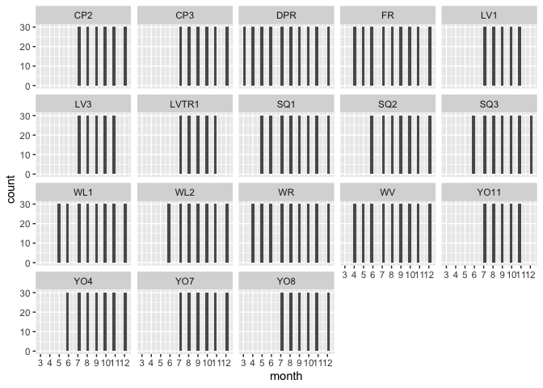<!-- -->

### Historical climate

Prep

```r
snow_pops_historical <- pop_elev_climate_historical_avgs %>% filter(PckSum >= 70)
unique(snow_pops_historical$parent.pop) #18 pops get some significant snowpack per year 
```

```
##  [1] "CP2"   "CP3"   "DPR"   "FR"    "LV1"   "LV3"   "LVTR1" "SQ1"   "SQ2"  
## [10] "SQ3"   "WL1"   "WL2"   "WR"    "WV"    "YO11"  "YO4"   "YO7"   "YO8"
```

```r
summary(snow_pops_historical)
```

```
##   parent.pop        elevation.group        elev_m           month      
##  Length:216         Length:216         Min.   : 748.9   Min.   : 1.00  
##  Class :character   Class :character   1st Qu.:1613.8   1st Qu.: 3.75  
##  Mode  :character   Mode  :character   Median :2200.9   Median : 6.50  
##                                        Mean   :1992.5   Mean   : 6.50  
##                                        3rd Qu.:2470.0   3rd Qu.: 9.25  
##                                        Max.   :2872.3   Max.   :12.00  
##     cwd_mean          pck_mean          ppt_mean          tmn_mean       
##  Min.   :  8.883   Min.   :   0.00   Min.   :  3.345   Min.   :-11.4587  
##  1st Qu.: 25.637   1st Qu.:   0.00   1st Qu.: 29.058   1st Qu.: -4.6368  
##  Median : 43.329   Median :  58.06   Median : 95.651   Median :  0.0515  
##  Mean   : 51.405   Mean   : 205.17   Mean   :107.936   Mean   :  0.3620  
##  3rd Qu.: 75.666   3rd Qu.: 320.55   3rd Qu.:181.983   3rd Qu.:  4.7810  
##  Max.   :139.478   Max.   :1210.37   Max.   :299.498   Max.   : 14.3370  
##     tmx_mean         cwd_sem          pck_sem          ppt_sem      
##  Min.   : 1.071   Min.   :0.1581   Min.   :  0.00   Min.   : 1.194  
##  1st Qu.: 7.264   1st Qu.:0.5935   1st Qu.:  0.00   1st Qu.: 5.664  
##  Median :12.359   Median :1.4092   Median : 17.62   Median :14.549  
##  Mean   :13.822   Mean   :1.7050   Mean   : 27.37   Mean   :15.804  
##  3rd Qu.:20.631   3rd Qu.:2.5888   3rd Qu.: 46.21   3rd Qu.:26.063  
##  Max.   :32.312   Max.   :7.3270   Max.   :112.26   Max.   :43.279  
##     tmn_sem          tmx_sem           PckSum      
##  Min.   :0.1642   Min.   :0.1957   Min.   : 228.4  
##  1st Qu.:0.2477   1st Qu.:0.3291   1st Qu.: 891.5  
##  Median :0.2929   Median :0.3840   Median :2072.4  
##  Mean   :0.2943   Mean   :0.3860   Mean   :2462.0  
##  3rd Qu.:0.3254   3rd Qu.:0.4330   3rd Qu.:3377.5  
##  Max.   :0.4556   Max.   :0.6157   Max.   :6363.1
```

```r
snow_pops_historical_tojoin <- snow_pops_historical %>% select(parent.pop:elev_m, PckSum) %>% distinct()

snow_pops_historical_years <- left_join(snow_pops_historical_tojoin, pop_elev_climate_historical) 
```

```
## Joining with `by = join_by(parent.pop, elevation.group, elev_m)`
```

```r
summary(snow_pops_historical_years)
```

```
##   parent.pop        elevation.group        elev_m           PckSum      
##  Length:6480        Length:6480        Min.   : 748.9   Min.   : 228.4  
##  Class :character   Class :character   1st Qu.:1613.8   1st Qu.: 891.5  
##  Mode  :character   Mode  :character   Median :2200.9   Median :2072.4  
##                                        Mean   :1992.5   Mean   :2462.0  
##                                        3rd Qu.:2470.0   3rd Qu.:3377.5  
##                                        Max.   :2872.3   Max.   :6363.1  
##       year          month            cwd              pck        
##  Min.   :1962   Min.   : 1.00   Min.   :  0.00   Min.   :   0.0  
##  1st Qu.:1969   1st Qu.: 3.75   1st Qu.: 24.02   1st Qu.:   0.0  
##  Median :1976   Median : 6.50   Median : 44.88   Median :   0.0  
##  Mean   :1976   Mean   : 6.50   Mean   : 51.40   Mean   : 205.2  
##  3rd Qu.:1984   3rd Qu.: 9.25   3rd Qu.: 75.35   3rd Qu.: 275.0  
##  Max.   :1991   Max.   :12.00   Max.   :159.40   Max.   :2594.7  
##       ppt              tmn               tmx        
##  Min.   :  0.00   Min.   :-14.970   Min.   :-2.650  
##  1st Qu.: 14.03   1st Qu.: -4.480   1st Qu.: 7.107  
##  Median : 57.01   Median :  0.070   Median :12.885  
##  Mean   :107.94   Mean   :  0.362   Mean   :13.822  
##  3rd Qu.:149.83   3rd Qu.:  5.152   3rd Qu.:20.343  
##  Max.   :951.79   Max.   : 16.840   Max.   :35.120
```

```r
snow_pops_historical_years %>% filter(pck < 2, pck >0) %>% arrange(parent.pop, pck) #What about when snowpack is 1 mm? This mostly occurs Nov-Jan, one case in Feb and one case in July
```

```
## # A tibble: 13 × 11
## # Groups:   parent.pop, elevation.group, elev_m [9]
##    parent.pop elevation.group elev_m PckSum  year month   cwd    pck    ppt
##    <chr>      <chr>            <dbl>  <dbl> <dbl> <dbl> <dbl>  <dbl>  <dbl>
##  1 CP2        High             2244.  3158.  1976     1  22.8 0.0300  25.1 
##  2 FR         Mid               787    261.  1977     1  14.1 0.0800  67   
##  3 FR         Mid               787    261.  1981     1  13.8 0.480  215.  
##  4 FR         Mid               787    261.  1964     2  22.7 1.60    11.1 
##  5 LV1        High             2593.  6124.  1978     7  76.7 1.61    14.2 
##  6 LV1        High             2593.  6124.  1976    12  13.3 1.66     9.28
##  7 LV3        High             2354.  5923.  1976    12  17.1 1.42     9.34
##  8 SQ3        High             2373.  2052.  1991     2  47.0 1.78    31.2 
##  9 WL1        Mid              1614.   892.  1979    12  20.8 1.84   162.  
## 10 WL2        High             2020.  2093.  1979    11  25.7 0.890  129.  
## 11 WL2        High             2020.  2093.  1978    11  24.8 1.36    96.8 
## 12 YO11       High             2872.  2452.  1980    11  26.0 0.0500  23.8 
## 13 YO8        High             2591.  3391.  1975    11  33.6 1.56    50.4 
## # ℹ 2 more variables: tmn <dbl>, tmx <dbl>
```

First month 

```r
snow_historical_first_month <- snow_pops_historical_years %>%
  group_by(parent.pop, elevation.group, elev_m, year) %>% 
  filter(pck==0) %>% 
  filter(tmn > 0) %>% 
  arrange(month) %>% 
  filter(row_number()==1) #get first month for each pop and year with no snowpack for germ

snow_historical_first_month_tomerge <- snow_historical_first_month %>% 
  select(parent.pop:elev_m, year, firstmonth=month)

snow_historical_first_month_col <- full_join(snow_pops_historical_years, snow_historical_first_month_tomerge)
```

```
## Joining with `by = join_by(parent.pop, elevation.group, elev_m, year)`
```

```r
dim(snow_historical_first_month_col)
```

```
## [1] 6480   12
```

Last month

```r
snow_historical_last_month <- snow_historical_first_month_col %>%
  group_by(parent.pop, elevation.group, elev_m, year) %>% 
  filter(month>firstmonth) %>% 
  filter(if_else(pck>70, pck>70, 
                 if_else(tmn < 0, pck>0, tmn <= -5))) %>%  #-5 is moderate freeze (Pardee et al. 2017) 
  arrange(month) %>% 
  filter(row_number()==1) #get first month after growstart for each pop and year with pck >70 

snow_historical_last_month_tomerge <- snow_historical_last_month %>% 
  select(parent.pop:elev_m, year, firstmonth,lastmonth=month)

snow_historical_last_month_col <- full_join(snow_historical_first_month_col, snow_historical_last_month_tomerge) %>% 
  select(firstmonth, lastmonth, year:tmx)
```

```
## Joining with `by = join_by(parent.pop, elevation.group, elev_m, year,
## firstmonth)`
## Adding missing grouping variables: `parent.pop`, `elevation.group`, `elev_m`
```

```r
dim(snow_historical_last_month_col)
```

```
## [1] 6480   12
```

check weird cases

```r
snow_historical_last_month_col %>% filter(is.na(firstmonth)) #no cases where there isn't a firstmonth
```

```
## # A tibble: 0 × 12
## # Groups:   parent.pop, elevation.group, elev_m [0]
## # ℹ 12 variables: parent.pop <chr>, elevation.group <chr>, elev_m <dbl>,
## #   firstmonth <dbl>, lastmonth <dbl>, year <dbl>, month <dbl>, cwd <dbl>,
## #   pck <dbl>, ppt <dbl>, tmn <dbl>, tmx <dbl>
```

```r
snow_historical_last_month_col %>% filter(is.na(lastmonth)) %>% arrange(elev_m) #120 cases where there isn't a lastmonth 
```

```
## # A tibble: 1,440 × 12
## # Groups:   parent.pop, elevation.group, elev_m [15]
##    parent.pop elevation.group elev_m firstmonth lastmonth  year month   cwd
##    <chr>      <chr>            <dbl>      <dbl>     <dbl> <dbl> <dbl> <dbl>
##  1 WV         Mid               749.          4        NA  1962     1  16.2
##  2 WV         Mid               749.          4        NA  1962     2  14.3
##  3 WV         Mid               749.          4        NA  1962     3  24.9
##  4 WV         Mid               749.          4        NA  1962     4  44.7
##  5 WV         Mid               749.          4        NA  1962     5  72.4
##  6 WV         Mid               749.          4        NA  1962     6  94.4
##  7 WV         Mid               749.          4        NA  1962     7 104. 
##  8 WV         Mid               749.          4        NA  1962     8 126. 
##  9 WV         Mid               749.          4        NA  1962     9  50.9
## 10 WV         Mid               749.          4        NA  1962    10  18.0
## # ℹ 1,430 more rows
## # ℹ 4 more variables: pck <dbl>, ppt <dbl>, tmn <dbl>, tmx <dbl>
```

```r
#****range of elevations 

snow_historical_last_month_col %>% filter(lastmonth==firstmonth) #no cases where last month is first month 
```

```
## # A tibble: 0 × 12
## # Groups:   parent.pop, elevation.group, elev_m [0]
## # ℹ 12 variables: parent.pop <chr>, elevation.group <chr>, elev_m <dbl>,
## #   firstmonth <dbl>, lastmonth <dbl>, year <dbl>, month <dbl>, cwd <dbl>,
## #   pck <dbl>, ppt <dbl>, tmn <dbl>, tmx <dbl>
```

```r
snow_historical_last_month_col %>% filter(lastmonth==firstmonth+1) #4 cases where there was sig snowpack in the month after the first month of 0 snowpack
```

```
## # A tibble: 48 × 12
## # Groups:   parent.pop, elevation.group, elev_m [3]
##    parent.pop elevation.group elev_m firstmonth lastmonth  year month   cwd
##    <chr>      <chr>            <dbl>      <dbl>     <dbl> <dbl> <dbl> <dbl>
##  1 FR         Mid                787          2         3  1991     1  14.6
##  2 FR         Mid                787          2         3  1991     2  26  
##  3 FR         Mid                787          2         3  1991     3  24.6
##  4 FR         Mid                787          2         3  1991     4  55.5
##  5 FR         Mid                787          2         3  1991     5  51.4
##  6 FR         Mid                787          2         3  1991     6  43.5
##  7 FR         Mid                787          2         3  1991     7 100. 
##  8 FR         Mid                787          2         3  1991     8  92.4
##  9 FR         Mid                787          2         3  1991     9 117. 
## 10 FR         Mid                787          2         3  1991    10  70.7
## # ℹ 38 more rows
## # ℹ 4 more variables: pck <dbl>, ppt <dbl>, tmn <dbl>, tmx <dbl>
```

```r
snow_historical_last_month_col %>% filter(lastmonth==firstmonth+2) #7 cases where there was sig snowpack in the second month after the first month of 0 snowpack
```

```
## # A tibble: 84 × 12
## # Groups:   parent.pop, elevation.group, elev_m [4]
##    parent.pop elevation.group elev_m firstmonth lastmonth  year month   cwd
##    <chr>      <chr>            <dbl>      <dbl>     <dbl> <dbl> <dbl> <dbl>
##  1 DPR        Mid              1019.          1         3  1991     1 11.6 
##  2 DPR        Mid              1019.          1         3  1991     2 21.9 
##  3 DPR        Mid              1019.          1         3  1991     3 10.6 
##  4 DPR        Mid              1019.          1         3  1991     4 40.9 
##  5 DPR        Mid              1019.          1         3  1991     5  5.91
##  6 DPR        Mid              1019.          1         3  1991     6  0   
##  7 DPR        Mid              1019.          1         3  1991     7 38.6 
##  8 DPR        Mid              1019.          1         3  1991     8  0   
##  9 DPR        Mid              1019.          1         3  1991     9 54.8 
## 10 DPR        Mid              1019.          1         3  1991    10 37.8 
## # ℹ 74 more rows
## # ℹ 4 more variables: pck <dbl>, ppt <dbl>, tmn <dbl>, tmx <dbl>
```

```r
heavysnow_historical <- snow_historical_last_month_col %>% filter(lastmonth==firstmonth+1) %>% filter(month==firstmonth)
summary(heavysnow_historical)
```

```
##   parent.pop        elevation.group        elev_m       firstmonth  
##  Length:4           Length:4           Min.   : 787   Min.   :1.00  
##  Class :character   Class :character   1st Qu.:1065   1st Qu.:1.75  
##  Mode  :character   Mode  :character   Median :1158   Median :2.00  
##                                        Mean   :1179   Mean   :1.75  
##                                        3rd Qu.:1272   3rd Qu.:2.00  
##                                        Max.   :1614   Max.   :2.00  
##    lastmonth         year          month           cwd             pck   
##  Min.   :2.00   Min.   :1986   Min.   :1.00   Min.   :17.51   Min.   :0  
##  1st Qu.:2.75   1st Qu.:1990   1st Qu.:1.75   1st Qu.:23.74   1st Qu.:0  
##  Median :3.00   Median :1991   Median :2.00   Median :25.91   Median :0  
##  Mean   :2.75   Mean   :1990   Mean   :1.75   Mean   :25.96   Mean   :0  
##  3rd Qu.:3.00   3rd Qu.:1991   3rd Qu.:2.00   3rd Qu.:28.12   3rd Qu.:0  
##  Max.   :3.00   Max.   :1991   Max.   :2.00   Max.   :34.50   Max.   :0  
##       ppt              tmn             tmx       
##  Min.   : 49.59   Min.   :1.640   Min.   :13.03  
##  1st Qu.: 63.10   1st Qu.:1.715   1st Qu.:13.57  
##  Median : 78.72   Median :2.325   Median :14.99  
##  Mean   :118.01   Mean   :2.400   Mean   :14.97  
##  3rd Qu.:133.63   3rd Qu.:3.010   3rd Qu.:16.39  
##  Max.   :265.03   Max.   :3.310   Max.   :16.85
```

```r
unique(heavysnow_historical$parent.pop)
```

```
## [1] "FR"  "WL1" "WR"
```

```r
heavysnow_historical %>% filter(elev_m>1800)
```

```
## # A tibble: 0 × 12
## # Groups:   parent.pop, elevation.group, elev_m [0]
## # ℹ 12 variables: parent.pop <chr>, elevation.group <chr>, elev_m <dbl>,
## #   firstmonth <dbl>, lastmonth <dbl>, year <dbl>, month <dbl>, cwd <dbl>,
## #   pck <dbl>, ppt <dbl>, tmn <dbl>, tmx <dbl>
```

```r
#"FR" "WL1" "WR"  
#****CHECK TEMPS FOR THESE CASES - MAYBE adjust TEMP REQUIREMENT 
#*Temps range from 1.640 to 3.3 (which seems like an acceptable temp given we vernalize at 4C)
#*OR START THE CHECK IN FEB FOR POPS > 6000 FT (ALL BELOW 6000 FT)
#*OR just take these cases out

#snow_historical_last_month_col %>% filter(year==1991)
#snow_historical_last_month_col %>% filter(parent.pop=="DPR") %>% filter(year==1962|year==1975)
#snow_historical_last_month_col %>% filter(parent.pop=="WR") %>% filter(year==1975|year==1986)
#snow_historical_last_month_col %>% filter(parent.pop=="YO7") %>% filter(year==1976)
#snow_historical_last_month_col %>% filter(parent.pop=="FR") %>% filter(year==1975)
#snow_historical_last_month_col %>% filter(parent.pop=="SQ3") %>% filter(year==1976)
```

Average first and last month 

```r
#for cases with no last month - make last month 12
#remove cases where last month is first month +1 or 2 

snow_historicalfirst_last_month_for_calc <- snow_historical_last_month_col %>% 
  mutate(lastmonth=if_else(is.na(lastmonth), 12, lastmonth)) %>% 
  filter(lastmonth > firstmonth+2) %>% 
  select(firstmonth:lastmonth, parent.pop, elevation.group, elev_m, year) %>% 
  distinct()

snow_historical_avg_first_last_month <- snow_historicalfirst_last_month_for_calc %>% 
  group_by(parent.pop, elevation.group, elev_m) %>% 
  summarise(AvgFirstMonth=mean(firstmonth), First_sem=sem(firstmonth),
            AvgLastMonth=mean(lastmonth), Last_sem=sem(lastmonth)) %>% 
  arrange(elevation.group, elev_m)
```

```
## `summarise()` has grouped output by 'parent.pop', 'elevation.group'. You can
## override using the `.groups` argument.
```

```r
snow_historical_avg_first_last_month
```

```
## # A tibble: 18 × 7
## # Groups:   parent.pop, elevation.group [18]
##    parent.pop elevation.group elev_m AvgFirstMonth First_sem AvgLastMonth
##    <chr>      <chr>            <dbl>         <dbl>     <dbl>        <dbl>
##  1 WL2        High             2020.          5.47    0.124          11.5
##  2 YO4        High             2158.          5.4     0.123          11.5
##  3 CP2        High             2244.          5.87    0.124          11.4
##  4 CP3        High             2266.          6.07    0.106          11.4
##  5 LV3        High             2354.          6.71    0.113          10.9
##  6 SQ3        High             2373.          5.7     0.128          11.6
##  7 YO7        High             2470.          6.2     0.0884         11.4
##  8 YO8        High             2591.          6.27    0.0821         11.3
##  9 LV1        High             2593.          6.75    0.122          10.9
## 10 LVTR1      High             2741.          6.75    0.122          10.9
## 11 YO11       High             2872.          6.47    0.0926         11.1
## 12 WV         Mid               749.          3.63    0.206          12  
## 13 FR         Mid               787           3.24    0.177          12  
## 14 DPR        Mid              1019.          2.90    0.207          12  
## 15 WR         Mid              1158           3.68    0.186          11.9
## 16 WL1        Mid              1614.          4.59    0.105          11.8
## 17 SQ1        Mid              1921.          4.83    0.108          11.8
## 18 SQ2        Mid              1934.          4.9     0.1            11.8
## # ℹ 1 more variable: Last_sem <dbl>
```

```r
#Start = May-July for "high" elev, March-May for "mid" elevation 
#End = Nov-Dec
#interestingly, the starts are later than recent climate and ends are earlier in some cases 

#Used Standard Rounding
snow_avg_first_last_month_historical <- snow_historical_avg_first_last_month %>% 
  mutate(AvgFirstMonth=true_round(AvgFirstMonth, 0), AvgLastMonth=true_round(AvgLastMonth, 0)) %>% 
  select(parent.pop:elev_m, AvgFirstMonth, AvgLastMonth)
snow_historical_avg_first_last_month
```

```
## # A tibble: 18 × 7
## # Groups:   parent.pop, elevation.group [18]
##    parent.pop elevation.group elev_m AvgFirstMonth First_sem AvgLastMonth
##    <chr>      <chr>            <dbl>         <dbl>     <dbl>        <dbl>
##  1 WL2        High             2020.          5.47    0.124          11.5
##  2 YO4        High             2158.          5.4     0.123          11.5
##  3 CP2        High             2244.          5.87    0.124          11.4
##  4 CP3        High             2266.          6.07    0.106          11.4
##  5 LV3        High             2354.          6.71    0.113          10.9
##  6 SQ3        High             2373.          5.7     0.128          11.6
##  7 YO7        High             2470.          6.2     0.0884         11.4
##  8 YO8        High             2591.          6.27    0.0821         11.3
##  9 LV1        High             2593.          6.75    0.122          10.9
## 10 LVTR1      High             2741.          6.75    0.122          10.9
## 11 YO11       High             2872.          6.47    0.0926         11.1
## 12 WV         Mid               749.          3.63    0.206          12  
## 13 FR         Mid               787           3.24    0.177          12  
## 14 DPR        Mid              1019.          2.90    0.207          12  
## 15 WR         Mid              1158           3.68    0.186          11.9
## 16 WL1        Mid              1614.          4.59    0.105          11.8
## 17 SQ1        Mid              1921.          4.83    0.108          11.8
## 18 SQ2        Mid              1934.          4.9     0.1            11.8
## # ℹ 1 more variable: Last_sem <dbl>
```

```r
snow_avg_first_last_month_historical
```

```
## # A tibble: 18 × 5
## # Groups:   parent.pop, elevation.group [18]
##    parent.pop elevation.group elev_m AvgFirstMonth AvgLastMonth
##    <chr>      <chr>            <dbl>         <dbl>        <dbl>
##  1 WL2        High             2020.             5           11
##  2 YO4        High             2158.             5           12
##  3 CP2        High             2244.             6           11
##  4 CP3        High             2266.             6           11
##  5 LV3        High             2354.             7           11
##  6 SQ3        High             2373.             6           12
##  7 YO7        High             2470.             6           11
##  8 YO8        High             2591.             6           11
##  9 LV1        High             2593.             7           11
## 10 LVTR1      High             2741.             7           11
## 11 YO11       High             2872.             6           11
## 12 WV         Mid               749.             4           12
## 13 FR         Mid               787              3           12
## 14 DPR        Mid              1019.             3           12
## 15 WR         Mid              1158              4           12
## 16 WL1        Mid              1614.             5           12
## 17 SQ1        Mid              1921.             5           12
## 18 SQ2        Mid              1934.             5           12
```

```r
snow_historical_avg_first_last_month_allmonths <- left_join(snow_pops_historical_years, snow_avg_first_last_month_historical)
```

```
## Joining with `by = join_by(parent.pop, elevation.group, elev_m)`
```

Fill in months b/t start and stop

```r
snow_grwseason_historical <- snow_historical_avg_first_last_month_allmonths %>%
  group_by(parent.pop, elevation.group, elev_m, year) %>% 
  filter(month>AvgFirstMonth) %>% 
  filter(month<=AvgLastMonth)
summary(snow_grwseason_historical) 
```

```
##   parent.pop        elevation.group        elev_m           PckSum      
##  Length:3330        Length:3330        Min.   : 748.9   Min.   : 228.4  
##  Class :character   Class :character   1st Qu.:1158.0   1st Qu.: 560.8  
##  Mode  :character   Mode  :character   Median :2020.1   Median :1776.3  
##                                        Mean   :1839.9   Mean   :1996.4  
##                                        3rd Qu.:2373.2   3rd Qu.:3157.7  
##                                        Max.   :2872.3   Max.   :6363.1  
##       year          month            cwd              pck        
##  Min.   :1962   Min.   : 4.00   Min.   :  0.00   Min.   :  0.00  
##  1st Qu.:1969   1st Qu.: 7.00   1st Qu.: 34.69   1st Qu.:  0.00  
##  Median :1976   Median : 9.00   Median : 64.06   Median :  0.00  
##  Mean   :1976   Mean   : 8.82   Mean   : 63.39   Mean   : 19.82  
##  3rd Qu.:1984   3rd Qu.:10.00   3rd Qu.: 87.92   3rd Qu.:  0.00  
##  Max.   :1991   Max.   :12.00   Max.   :159.40   Max.   :882.99  
##       ppt               tmn               tmx        AvgFirstMonth  
##  Min.   :  0.000   Min.   :-10.090   Min.   : 0.49   Min.   :3.000  
##  1st Qu.:  5.655   1st Qu.:  0.000   1st Qu.:12.29   1st Qu.:4.000  
##  Median : 25.415   Median :  4.680   Median :19.62   Median :5.000  
##  Mean   : 72.715   Mean   :  4.126   Mean   :18.39   Mean   :5.027  
##  3rd Qu.: 90.892   3rd Qu.:  8.370   3rd Qu.:23.64   3rd Qu.:6.000  
##  Max.   :951.790   Max.   : 16.840   Max.   :35.12   Max.   :7.000  
##   AvgLastMonth  
##  Min.   :11.00  
##  1st Qu.:11.00  
##  Median :12.00  
##  Mean   :11.61  
##  3rd Qu.:12.00  
##  Max.   :12.00
```

```r
xtabs(~parent.pop+month, data=snow_grwseason_historical)
```

```
##           month
## parent.pop  4  5  6  7  8  9 10 11 12
##      CP2    0  0  0 30 30 30 30 30  0
##      CP3    0  0  0 30 30 30 30 30  0
##      DPR   30 30 30 30 30 30 30 30 30
##      FR    30 30 30 30 30 30 30 30 30
##      LV1    0  0  0  0 30 30 30 30  0
##      LV3    0  0  0  0 30 30 30 30  0
##      LVTR1  0  0  0  0 30 30 30 30  0
##      SQ1    0  0 30 30 30 30 30 30 30
##      SQ2    0  0 30 30 30 30 30 30 30
##      SQ3    0  0  0 30 30 30 30 30 30
##      WL1    0  0 30 30 30 30 30 30 30
##      WL2    0  0 30 30 30 30 30 30  0
##      WR     0 30 30 30 30 30 30 30 30
##      WV     0 30 30 30 30 30 30 30 30
##      YO11   0  0  0 30 30 30 30 30  0
##      YO4    0  0 30 30 30 30 30 30 30
##      YO7    0  0  0 30 30 30 30 30  0
##      YO8    0  0  0 30 30 30 30 30  0
```

```r
snow_grwseason_historical %>% ggplot(aes(x=month)) + geom_histogram() +
  scale_x_continuous(breaks=c(1, 2, 3, 4, 5,6,7,8,9,10, 11, 12)) +
  facet_wrap(~parent.pop)
```

```
## `stat_bin()` using `bins = 30`. Pick better value with `binwidth`.
```

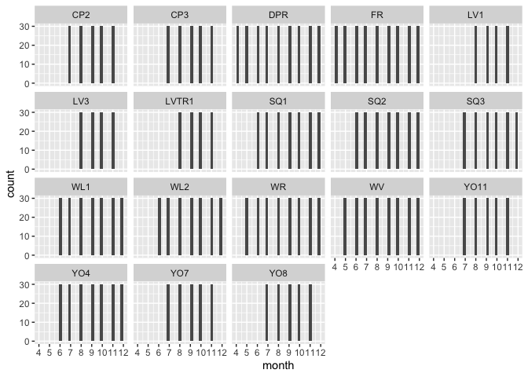<!-- -->

## Bind snow and no_snow pops together


```r
unique(nosnow_grwseason_recent$parent.pop)
```

```
## [1] "BH"  "CC"  "IH"  "SC"  "TM2"
```

```r
unique(snow_grwseason_recent$parent.pop)
```

```
##  [1] "CP2"   "CP3"   "DPR"   "FR"    "LV1"   "LV3"   "LVTR1" "SQ1"   "SQ2"  
## [10] "SQ3"   "WL1"   "WL2"   "WR"    "WV"    "YO11"  "YO4"   "YO7"   "YO8"
```

```r
allpops_recent_grwseason <- rbind(nosnow_grwseason_recent, snow_grwseason_recent)
summary(allpops_recent_grwseason)
```

```
##      month          growmonth       parent.pop        elevation.group   
##  Min.   : 1.000   Min.   : 3.000   Length:4950        Length:4950       
##  1st Qu.: 6.000   1st Qu.: 5.000   Class :character   Class :character  
##  Median : 8.000   Median : 7.000   Mode  :character   Mode  :character  
##  Mean   : 7.879   Mean   : 6.925                                        
##  3rd Qu.:10.000   3rd Qu.: 9.000                                        
##  Max.   :12.000   Max.   :12.000                                        
##                   NA's   :3750                                          
##      elev_m           PckSum            year           cwd        
##  Min.   : 313.0   Min.   :   0.0   Min.   :1992   Min.   :  0.00  
##  1st Qu.: 748.9   1st Qu.: 107.5   1st Qu.:1999   1st Qu.: 28.06  
##  Median :1613.8   Median : 613.4   Median :2006   Median : 57.02  
##  Mean   :1508.8   Mean   :1275.0   Mean   :2006   Mean   : 59.58  
##  3rd Qu.:2266.4   3rd Qu.:2162.0   3rd Qu.:2014   3rd Qu.: 88.27  
##  Max.   :2872.3   Max.   :5408.1   Max.   :2021   Max.   :182.70  
##                                                                   
##       pck              ppt               tmn               tmx       
##  Min.   :  0.00   Min.   :  0.000   Min.   :-11.090   Min.   :-0.10  
##  1st Qu.:  0.00   1st Qu.:  3.792   1st Qu.:  2.210   1st Qu.:13.28  
##  Median :  0.00   Median : 28.785   Median :  5.855   Median :19.41  
##  Mean   : 14.05   Mean   : 76.126   Mean   :  5.692   Mean   :18.95  
##  3rd Qu.:  0.00   3rd Qu.:106.858   3rd Qu.:  9.670   3rd Qu.:24.22  
##  Max.   :618.37   Max.   :894.020   Max.   : 19.740   Max.   :35.97  
##                                                                      
##  AvgFirstMonth    AvgLastMonth  
##  Min.   :2.000   Min.   :10.00  
##  1st Qu.:3.000   1st Qu.:11.00  
##  Median :4.000   Median :12.00  
##  Mean   :4.018   Mean   :11.52  
##  3rd Qu.:6.000   3rd Qu.:12.00  
##  Max.   :6.000   Max.   :12.00  
## 
```

```r
unique(allpops_recent_grwseason$parent.pop)
```

```
##  [1] "BH"    "CC"    "IH"    "SC"    "TM2"   "CP2"   "CP3"   "DPR"   "FR"   
## [10] "LV1"   "LV3"   "LVTR1" "SQ1"   "SQ2"   "SQ3"   "WL1"   "WL2"   "WR"   
## [19] "WV"    "YO11"  "YO4"   "YO7"   "YO8"
```

```r
write_csv(allpops_recent_grwseason, "../output/Climate/flint_climate_growthseason_recent.csv")

unique(nosnow_grwseason_historical$parent.pop)
```

```
## [1] "BH"  "CC"  "IH"  "SC"  "TM2"
```

```r
unique(snow_grwseason_historical$parent.pop)
```

```
##  [1] "CP2"   "CP3"   "DPR"   "FR"    "LV1"   "LV3"   "LVTR1" "SQ1"   "SQ2"  
## [10] "SQ3"   "WL1"   "WL2"   "WR"    "WV"    "YO11"  "YO4"   "YO7"   "YO8"
```

```r
allpops_historical_grwseason <- rbind(nosnow_grwseason_historical, snow_grwseason_historical)
summary(allpops_historical_grwseason)
```

```
##      month          growmonth       parent.pop        elevation.group   
##  Min.   : 1.000   Min.   : 3.000   Length:4620        Length:4620       
##  1st Qu.: 6.000   1st Qu.: 5.000   Class :character   Class :character  
##  Median : 8.000   Median : 7.000   Mode  :character   Mode  :character  
##  Mean   : 7.929   Mean   : 6.837                                        
##  3rd Qu.:10.000   3rd Qu.: 9.000                                        
##  Max.   :12.000   Max.   :12.000                                        
##                   NA's   :3330                                          
##      elev_m           PckSum              year           cwd        
##  Min.   : 313.0   Min.   :   0.234   Min.   :1962   Min.   :  0.00  
##  1st Qu.: 511.4   1st Qu.:  17.344   1st Qu.:1969   1st Qu.: 28.68  
##  Median :1385.9   Median : 726.184   Median :1976   Median : 56.81  
##  Mean   :1442.1   Mean   :1440.480   Mean   :1976   Mean   : 57.88  
##  3rd Qu.:2244.1   3rd Qu.:2092.554   3rd Qu.:1984   3rd Qu.: 83.43  
##  Max.   :2872.3   Max.   :6363.078   Max.   :1991   Max.   :183.92  
##                                                                     
##       pck              ppt               tmn               tmx       
##  Min.   :  0.00   Min.   :  0.000   Min.   :-10.090   Min.   : 0.49  
##  1st Qu.:  0.00   1st Qu.:  6.987   1st Qu.:  1.160   1st Qu.:13.18  
##  Median :  0.00   Median : 32.960   Median :  4.840   Median :18.98  
##  Mean   : 14.45   Mean   : 78.886   Mean   :  4.702   Mean   :18.72  
##  3rd Qu.:  0.00   3rd Qu.:107.480   3rd Qu.:  8.520   3rd Qu.:23.89  
##  Max.   :882.99   Max.   :951.790   Max.   : 18.290   Max.   :36.45  
##                                                                      
##  AvgFirstMonth    AvgLastMonth  
##  Min.   :2.000   Min.   :10.00  
##  1st Qu.:2.000   1st Qu.:11.00  
##  Median :4.500   Median :12.00  
##  Mean   :4.182   Mean   :11.35  
##  3rd Qu.:6.000   3rd Qu.:12.00  
##  Max.   :7.000   Max.   :12.00  
## 
```

```r
unique(allpops_historical_grwseason$parent.pop)
```

```
##  [1] "BH"    "CC"    "IH"    "SC"    "TM2"   "CP2"   "CP3"   "DPR"   "FR"   
## [10] "LV1"   "LV3"   "LVTR1" "SQ1"   "SQ2"   "SQ3"   "WL1"   "WL2"   "WR"   
## [19] "WV"    "YO11"  "YO4"   "YO7"   "YO8"
```

```r
write_csv(allpops_historical_grwseason, "../output/Climate/flint_climate_growthseason_historical.csv")
```


## Climate traits across pops

### Totals


```r
names(allpops_recent_grwseason)
```

```
##  [1] "month"           "growmonth"       "parent.pop"      "elevation.group"
##  [5] "elev_m"          "PckSum"          "year"            "cwd"            
##  [9] "pck"             "ppt"             "tmn"             "tmx"            
## [13] "AvgFirstMonth"   "AvgLastMonth"
```

```r
allpops_recent_grwseason_yearlytot <- allpops_recent_grwseason %>%  group_by(parent.pop, year, elevation.group) %>% summarise_at(c("pck", "ppt"), sum, na.rm = TRUE)
allpops_recent_grwseason_yearlytot$elevation.group <- factor(allpops_recent_grwseason_yearlytot$elevation.group, levels = elev_order)

recent_ppt_total <- allpops_recent_grwseason_yearlytot %>% ggplot(aes(x=year, y=ppt, group=parent.pop, color=elevation.group)) + 
  geom_point() + geom_line() + 
  scale_colour_manual(values=elev_three_palette) + 
  ggtitle("Recent Climate")  + 
  theme_classic() + 
  theme(text=element_text(size=30), axis.text.x = element_text(angle = 45, hjust = 1))
ggsave("../output/Climate/growthseasonTot_Precip_RecentClim.png", width = 12, height = 6, units = "in")

allpops_historical_grwseason_yearlytot <- allpops_historical_grwseason %>% group_by(parent.pop, year, elevation.group) %>% summarise_at(c("pck", "ppt"), sum, na.rm = TRUE)
allpops_historical_grwseason_yearlytot$elevation.group <- factor(allpops_historical_grwseason_yearlytot$elevation.group, levels = elev_order)

hist_ppt_total <- allpops_historical_grwseason_yearlytot %>% ggplot(aes(x=year, y=ppt, group=parent.pop, color=elevation.group)) + 
  geom_point() + geom_line() + 
  scale_colour_manual(values=elev_three_palette) + 
  ggtitle("Historical Climate") + 
  theme_classic() + 
  theme(text=element_text(size=30), axis.text.x = element_text(angle = 45, hjust = 1))
ggsave("../output/Climate/growthseasonTot_Precip_HistoricalClim.png", width = 12, height = 6, units = "in")

#should combine these into one figure and save that instead
legend <- get_legend(hist_ppt_total)
hist_ppt_total <- hist_ppt_total + theme(legend.position="none")
recent_ppt_total <- recent_ppt_total + theme(legend.position="none")
grid.arrange(hist_ppt_total, recent_ppt_total, legend, ncol=3, widths=c(3.12, 3.12, 1.09))
```

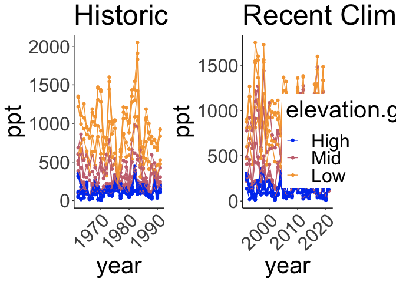<!-- -->

```r
 #2000 x 850
```

### Monthly Averages

#### Recent Years - Growth Season

```r
allpops_recent_grwseason_mosavgs <- allpops_recent_grwseason %>% group_by(parent.pop, elevation.group, elev_m, month) %>% summarise_at(c("cwd", "pck", "ppt", "tmn", "tmx"), c(mean, sem), na.rm = TRUE) 
names(allpops_recent_grwseason_mosavgs) <- gsub("fn2", "sem", colnames(allpops_recent_grwseason_mosavgs))
names(allpops_recent_grwseason_mosavgs) <-gsub("fn1", "mean", colnames(allpops_recent_grwseason_mosavgs))
allpops_recent_grwseason_mosavgs #30 year averages during growth season months 
```

```
## # A tibble: 165 × 14
## # Groups:   parent.pop, elevation.group, elev_m [23]
##    parent.pop elevation.group elev_m month cwd_mean pck_mean ppt_mean tmn_mean
##    <chr>      <chr>            <dbl> <dbl>    <dbl>    <dbl>    <dbl>    <dbl>
##  1 BH         Low               511.     1     29.3        0   125.       2.68
##  2 BH         Low               511.     2     40.9        0   100.       3.43
##  3 BH         Low               511.     3     53.8        0    85.4      4.90
##  4 BH         Low               511.     4     59.0        0    47.2      6.37
##  5 BH         Low               511.     5     51.5        0    23.1      9.76
##  6 BH         Low               511.     6     87.1        0     7.43    13.4 
##  7 BH         Low               511.    12     29.8        0   109.       2.37
##  8 CC         Low               313      1     19.6        0   187.       4.11
##  9 CC         Low               313      2     31.2        0   179.       4.92
## 10 CC         Low               313      3     45.4        0   145.       6.29
## # ℹ 155 more rows
## # ℹ 6 more variables: tmx_mean <dbl>, cwd_sem <dbl>, pck_sem <dbl>,
## #   ppt_sem <dbl>, tmn_sem <dbl>, tmx_sem <dbl>
```

```r
allpops_recent_grwseason_mosavgs$elevation.group <- factor(allpops_recent_grwseason_mosavgs$elevation.group, levels=elev_order)       

allpops_recent_grwseason_mosavgs %>% ggplot(aes(x=month, y=cwd_mean, fill=elev_m)) + 
  geom_col(width = 0.7,position = position_dodge(0.75)) +
  geom_errorbar(aes(ymin=cwd_mean-cwd_sem,ymax=cwd_mean+cwd_sem),width=.2, position = 
                  position_dodge(0.75)) +
  scale_y_continuous(expand = c(0, 0)) +
  scale_x_continuous(breaks=c(1, 2, 3, 4, 5, 6, 7, 8, 9, 10, 11, 12)) +
  scale_fill_gradient(low = "#F5A540", high = "#0043F0")+ 
  labs(fill="Elevation",x="Population", y="Avg CWD" ,title = "Average CWD during Growth Season - Recent Climate") +
   theme_classic() +
  theme(text=element_text(size=20), axis.text.x = element_text(angle = 45,  hjust = 1)) + 
  facet_wrap(~parent.pop)
```

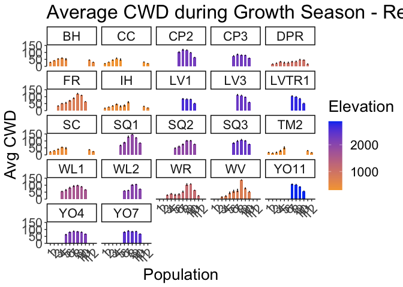<!-- -->

```r
ggsave("../output/Climate/growthseasonAvg_Monthly_CWD_RecentClim.png", width = 16, height = 10, units = "in")

allpops_recent_grwseason_mosavgs %>% ggplot(aes(x=month, y=ppt_mean, fill=elev_m)) + 
  geom_col(width = 0.7,position = position_dodge(0.75)) +
  geom_errorbar(aes(ymin=ppt_mean-ppt_sem,ymax=ppt_mean+ppt_sem),width=.2, position = 
                  position_dodge(0.75)) +
  scale_y_continuous(expand = c(0, 0)) +
  scale_fill_gradient(low = "#F5A540", high = "#0043F0") + 
  labs(fill="Elevation",x="Population", y="Avg Precip" ,title = "Average Precip during Growth Season - Recent Climate") +
   theme_classic() +
  theme(text=element_text(size=20), axis.text.x = element_text(angle = 45,  hjust = 1))+ 
  facet_wrap(~parent.pop)
```

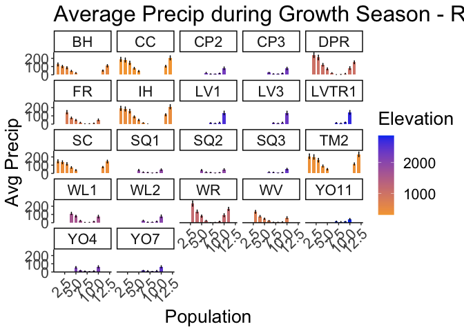<!-- -->

```r
ggsave("../output/Climate/growthseasonAvg_Monthly_Precip_RecentClim.png", width = 12, height = 6, units = "in")

allpops_recent_grwseason_mosavgs %>% ggplot(aes(x=month, y=tmn_mean, fill=elev_m)) + 
  geom_col(width = 0.7,position = position_dodge(0.75)) +
  geom_errorbar(aes(ymin=tmn_mean-tmn_sem,ymax=tmn_mean+tmn_sem),width=.2, position = 
                  position_dodge(0.75)) +
  scale_y_continuous(expand = c(0, 0)) +
  scale_fill_gradient(low = "#F5A540", high = "#0043F0") + 
  labs(fill="Elevation",x="Population", y="Avg MinTemp" ,title = "Average MinTemp during Growth Season - Recent Climate") +
   theme_classic() +
  theme(text=element_text(size=20), axis.text.x = element_text(angle = 45,  hjust = 1))+ 
  facet_wrap(~parent.pop)
```

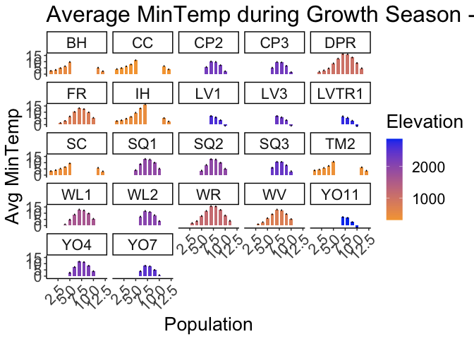<!-- -->

```r
ggsave("../output/Climate/growthseasonAvg_Monthly_MinTemp_RecentClim.png", width = 12, height = 6, units = "in")

allpops_recent_grwseason_mosavgs %>% ggplot(aes(x=month, y=tmx_mean, fill=elev_m)) + 
  geom_col(width = 0.7,position = position_dodge(0.75)) +
  geom_errorbar(aes(ymin=tmx_mean-tmx_sem,ymax=tmx_mean+tmx_sem),width=.2, position = 
                  position_dodge(0.75)) +
  scale_y_continuous(expand = c(0, 0)) +
  scale_fill_gradient(low = "#F5A540", high = "#0043F0") + 
  labs(fill="Elevation",x="Population", y="Avg MaxTemp" ,title = "Average MaxTemp during Growth Season - Recent Climate") +
   theme_classic() +
  theme(text=element_text(size=20), axis.text.x = element_text(angle = 45,  hjust = 1))+ 
  facet_wrap(~parent.pop)
```

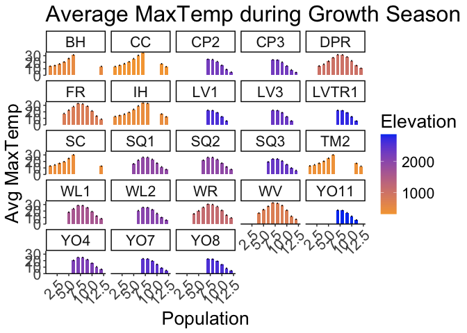<!-- -->

```r
ggsave("../output/Climate/growthseasonAvg_Monthly_MaxTemp_RecentClim.png", width = 12, height = 6, units = "in")
```

#### Historical Years - Growth Season

```r
allpops_historical_grwseason_mosavgs <- allpops_historical_grwseason %>% group_by(parent.pop, elevation.group, elev_m, month) %>% summarise_at(c("cwd", "pck", "ppt", "tmn", "tmx"), c(mean, sem), na.rm = TRUE) 
names(allpops_historical_grwseason_mosavgs) <- gsub("fn2", "sem", colnames(allpops_historical_grwseason_mosavgs))
names(allpops_historical_grwseason_mosavgs) <-gsub("fn1", "mean", colnames(allpops_historical_grwseason_mosavgs))
allpops_historical_grwseason_mosavgs #30 year averages during growth season months 
```

```
## # A tibble: 154 × 14
## # Groups:   parent.pop, elevation.group, elev_m [23]
##    parent.pop elevation.group elev_m month cwd_mean pck_mean ppt_mean tmn_mean
##    <chr>      <chr>            <dbl> <dbl>    <dbl>    <dbl>    <dbl>    <dbl>
##  1 BH         Low               511.     1     28.1    0.234    98.4      1.25
##  2 BH         Low               511.     2     40.6    0        95.9      2.77
##  3 BH         Low               511.     3     50.9    0       102.       3.76
##  4 BH         Low               511.     4     61.0    0        51.0      5.44
##  5 BH         Low               511.     5     61.1    0        13.0      8.64
##  6 BH         Low               511.     6     89.3    0         4.71    12.3 
##  7 BH         Low               511.    11     43.6    0        85.5      4.36
##  8 BH         Low               511.    12     28.5    0        84.2      1.43
##  9 CC         Low               313      1     18.8    0.951   181.       2.29
## 10 CC         Low               313      2     31.3    0       145.       4.07
## # ℹ 144 more rows
## # ℹ 6 more variables: tmx_mean <dbl>, cwd_sem <dbl>, pck_sem <dbl>,
## #   ppt_sem <dbl>, tmn_sem <dbl>, tmx_sem <dbl>
```

```r
allpops_historical_grwseason_mosavgs$elevation.group <- factor(allpops_historical_grwseason_mosavgs$elevation.group, levels=elev_order)       

allpops_historical_grwseason_mosavgs %>% ggplot(aes(x=month, y=cwd_mean, fill=elev_m)) + 
  geom_col(width = 0.7,position = position_dodge(0.75)) +
  geom_errorbar(aes(ymin=cwd_mean-cwd_sem,ymax=cwd_mean+cwd_sem),width=.2, position = 
                  position_dodge(0.75)) +
  scale_y_continuous(expand = c(0, 0)) +
  scale_x_continuous(breaks=c(1, 2, 3, 4, 5, 6, 7, 8, 9, 10, 11, 12)) +
  scale_fill_gradient(low = "#F5A540", high = "#0043F0")+ 
  labs(fill="Elevation",x="Population", y="Avg CWD" ,title = "Average CWD during Growth Season - Historical Climate") +
   theme_classic() +
  theme(text=element_text(size=20), axis.text.x = element_text(angle = 45,  hjust = 1)) + 
  facet_wrap(~parent.pop)
```

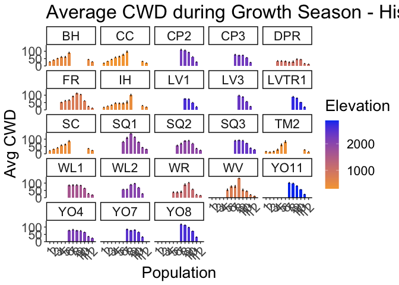<!-- -->

```r
ggsave("../output/Climate/growthseasonAvg_Monthly_CWD_HistoricalClim.png", width = 16, height = 10, units = "in")

allpops_historical_grwseason_mosavgs %>% ggplot(aes(x=month, y=ppt_mean, fill=elev_m)) + 
  geom_col(width = 0.7,position = position_dodge(0.75)) +
  geom_errorbar(aes(ymin=ppt_mean-ppt_sem,ymax=ppt_mean+ppt_sem),width=.2, position = 
                  position_dodge(0.75)) +
  scale_y_continuous(expand = c(0, 0)) +
  scale_fill_gradient(low = "#F5A540", high = "#0043F0") + 
  labs(fill="Elevation",x="Population", y="Avg Precip" ,title = "Average Precip during Growth Season - Historical Climate") +
   theme_classic() +
  theme(text=element_text(size=20), axis.text.x = element_text(angle = 45,  hjust = 1))+ 
  facet_wrap(~parent.pop)
```

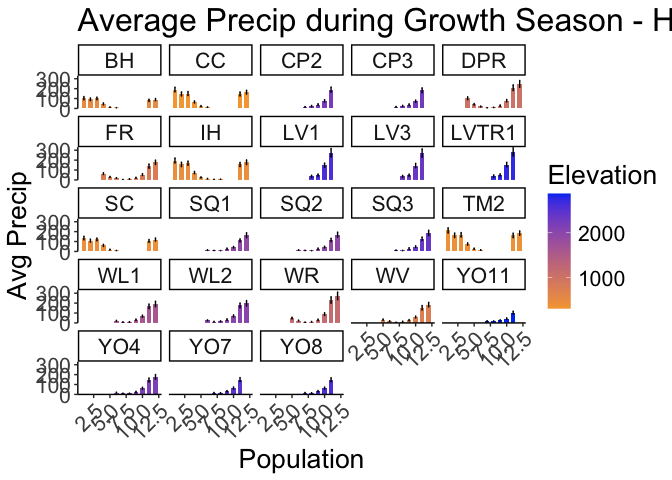<!-- -->

```r
ggsave("../output/Climate/growthseasonAvg_Monthly_Precip_HistoricalClim.png", width = 12, height = 6, units = "in")

allpops_historical_grwseason_mosavgs %>% ggplot(aes(x=month, y=tmn_mean, fill=elev_m)) + 
  geom_col(width = 0.7,position = position_dodge(0.75)) +
  geom_errorbar(aes(ymin=tmn_mean-tmn_sem,ymax=tmn_mean+tmn_sem),width=.2, position = 
                  position_dodge(0.75)) +
  scale_y_continuous(expand = c(0, 0)) +
  scale_fill_gradient(low = "#F5A540", high = "#0043F0") + 
  labs(fill="Elevation",x="Population", y="Avg MinTemp" ,title = "Average MinTemp during Growth Season - Historical Climate") +
   theme_classic() +
  theme(text=element_text(size=20), axis.text.x = element_text(angle = 45,  hjust = 1))+ 
  facet_wrap(~parent.pop)
```

<!-- -->

```r
ggsave("../output/Climate/growthseasonAvg_Monthly_MinTemp_HistoricalClim.png", width = 12, height = 6, units = "in")

allpops_historical_grwseason_mosavgs %>% ggplot(aes(x=month, y=tmx_mean, fill=elev_m)) + 
  geom_col(width = 0.7,position = position_dodge(0.75)) +
  geom_errorbar(aes(ymin=tmx_mean-tmx_sem,ymax=tmx_mean+tmx_sem),width=.2, position = 
                  position_dodge(0.75)) +
  scale_y_continuous(expand = c(0, 0)) +
  scale_fill_gradient(low = "#F5A540", high = "#0043F0") + 
  labs(fill="Elevation",x="Population", y="Avg MaxTemp" ,title = "Average MaxTemp during Growth Season - Historical Climate") +
   theme_classic() +
  theme(text=element_text(size=20), axis.text.x = element_text(angle = 45,  hjust = 1))+ 
  facet_wrap(~parent.pop)
```

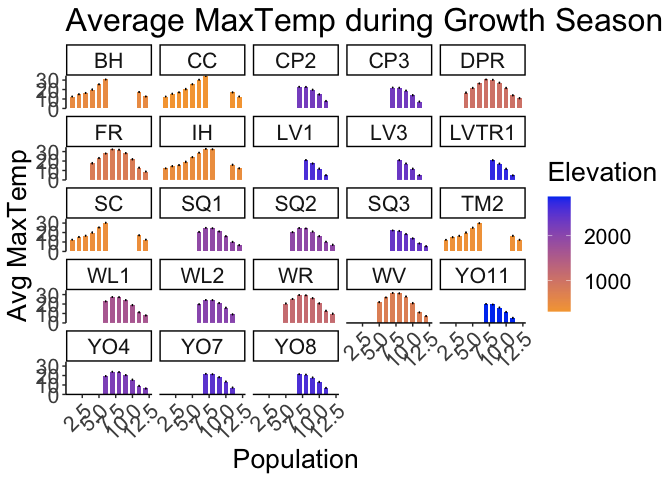<!-- -->

```r
ggsave("../output/Climate/growthseasonAvg_Monthly_MaxTemp_HistoricalClim.png", width = 12, height = 6, units = "in")
```


### 30 Year Averages

#### Recent Years - Growth Season


```r
allpops_recent_grwseason_avgs <- allpops_recent_grwseason %>% group_by(parent.pop, elevation.group, elev_m) %>% summarise_at(c("cwd", "pck", "ppt", "tmn", "tmx"), c(mean, sem), na.rm = TRUE) 
names(allpops_recent_grwseason_avgs) <- gsub("fn2", "sem", colnames(allpops_recent_grwseason_avgs))
names(allpops_recent_grwseason_avgs) <-gsub("fn1", "mean", colnames(allpops_recent_grwseason_avgs))
allpops_recent_grwseason_avgs #30 year averages during growth season months 
```

```
## # A tibble: 23 × 13
## # Groups:   parent.pop, elevation.group [23]
##    parent.pop elevation.group elev_m cwd_mean pck_mean ppt_mean tmn_mean
##    <chr>      <chr>            <dbl>    <dbl>    <dbl>    <dbl>    <dbl>
##  1 BH         Low               511.     50.2    0         71.2     6.13
##  2 CC         Low               313      40.7    0        120.      7.40
##  3 CP2        High             2244.     74.9   40.3       77.0     3.79
##  4 CP3        High             2266.     57.7   42.6       74.3     3.22
##  5 DPR        Mid              1019.     30.3    2.89      96.4     8.97
##  6 FR         Mid               787      66.7    4.87      56.2     6.97
##  7 IH         Low               454.     40.3    0.232    101.      8.04
##  8 LV1        High             2593.     65.1   27.7       75.6     2.20
##  9 LV3        High             2354.     80.8   26.0       75.1     2.21
## 10 LVTR1      High             2741.     73.3   28.6       78.8     1.90
## # ℹ 13 more rows
## # ℹ 6 more variables: tmx_mean <dbl>, cwd_sem <dbl>, pck_sem <dbl>,
## #   ppt_sem <dbl>, tmn_sem <dbl>, tmx_sem <dbl>
```

```r
allpops_recent_grwseason_avgs$elevation.group <- factor(allpops_recent_grwseason_avgs$elevation.group, levels=elev_order)       

allpops_recent_grwseason_avgs %>% ggplot(aes(x=fct_reorder(parent.pop, cwd_mean), y=cwd_mean, fill=elev_m)) + 
  geom_col(width = 0.7,position = position_dodge(0.75)) +
  geom_errorbar(aes(ymin=cwd_mean-cwd_sem,ymax=cwd_mean+cwd_sem),width=.2, position = 
                  position_dodge(0.75)) +
  scale_y_continuous(expand = c(0, 0)) +
  scale_fill_gradient(low = "#F5A540", high = "#0043F0")+ 
  labs(fill="Elevation",x="Population", y="Avg CWD" ,title = "Average CWD during Growth Season - Recent Climate") +
   theme_classic() +
  theme(text=element_text(size=20), axis.text.x = element_text(angle = 45,  hjust = 1))
```

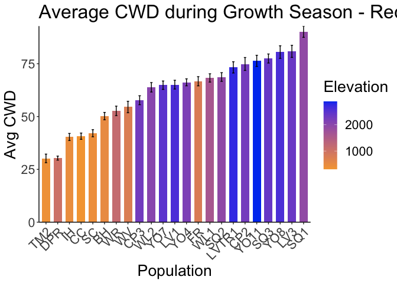<!-- -->

```r
ggsave("../output/Climate/growthseasonAvg_CWD_RecentClim.png", width = 12, height = 6, units = "in")

allpops_recent_grwseason_avgs %>% ggplot(aes(x=fct_reorder(parent.pop, ppt_mean), y=ppt_mean, fill=elev_m)) + 
  geom_col(width = 0.7,position = position_dodge(0.75)) +
  geom_errorbar(aes(ymin=ppt_mean-ppt_sem,ymax=ppt_mean+ppt_sem),width=.2, position = 
                  position_dodge(0.75)) +
  scale_y_continuous(expand = c(0, 0)) +
  scale_fill_gradient(low = "#F5A540", high = "#0043F0") + 
  labs(fill="Elevation",x="Population", y="Avg Precip" ,title = "Average Precip during Growth Season - Recent Climate") +
   theme_classic() +
  theme(text=element_text(size=20), axis.text.x = element_text(angle = 45,  hjust = 1))
```

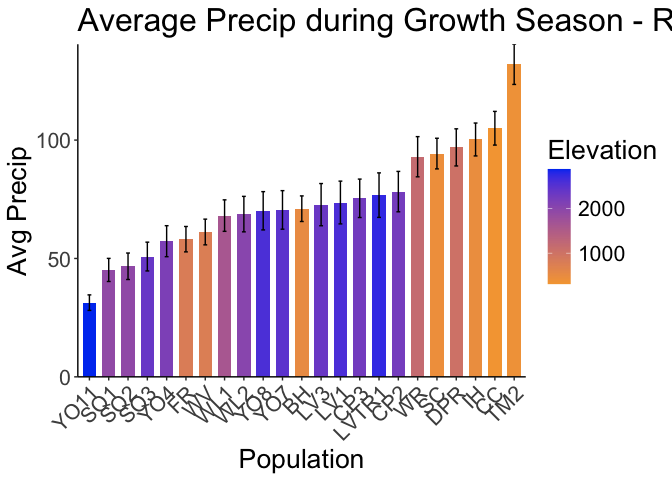<!-- -->

```r
ggsave("../output/Climate/growthseasonAvg_Precip_RecentClim.png", width = 12, height = 6, units = "in")

allpops_recent_grwseason_avgs %>% ggplot(aes(x=fct_reorder(parent.pop, tmn_mean), y=tmn_mean, fill=elev_m)) + 
  geom_col(width = 0.7,position = position_dodge(0.75)) +
  geom_errorbar(aes(ymin=tmn_mean-tmn_sem,ymax=tmn_mean+tmn_sem),width=.2, position = 
                  position_dodge(0.75)) +
  scale_y_continuous(expand = c(0, 0)) +
  scale_fill_gradient(low = "#F5A540", high = "#0043F0") + 
  labs(fill="Elevation",x="Population", y="Avg MinTemp" ,title = "Average MinTemp during Growth Season - Recent Climate") +
   theme_classic() +
  theme(text=element_text(size=20), axis.text.x = element_text(angle = 45,  hjust = 1))
```

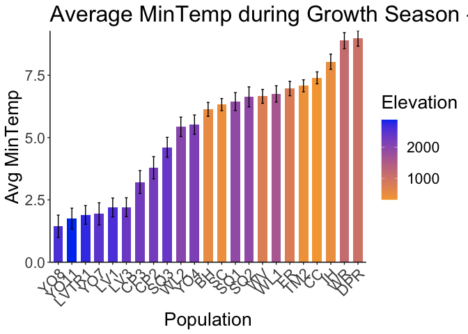<!-- -->

```r
ggsave("../output/Climate/growthseasonAvg_MinTemp_RecentClim.png", width = 12, height = 6, units = "in")

allpops_recent_grwseason_avgs %>% ggplot(aes(x=fct_reorder(parent.pop, tmx_mean), y=tmx_mean, fill=elev_m)) + 
  geom_col(width = 0.7,position = position_dodge(0.75)) +
  geom_errorbar(aes(ymin=tmx_mean-tmx_sem,ymax=tmx_mean+tmx_sem),width=.2, position = 
                  position_dodge(0.75)) +
  scale_y_continuous(expand = c(0, 0)) +
  scale_fill_gradient(low = "#F5A540", high = "#0043F0") + 
  labs(fill="Elevation",x="Population", y="Avg MaxTemp" ,title = "Average MaxTemp during Growth Season - Recent Climate") +
   theme_classic() +
  theme(text=element_text(size=20), axis.text.x = element_text(angle = 45,  hjust = 1))
```

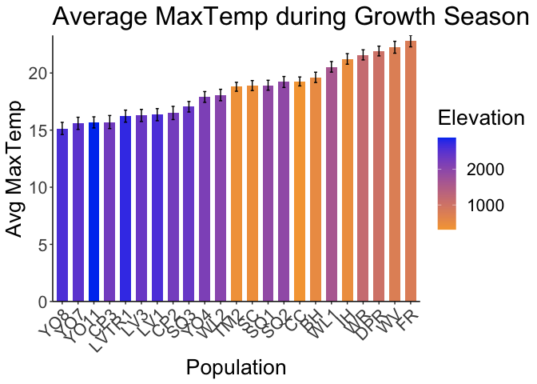<!-- -->

```r
ggsave("../output/Climate/growthseasonAvg_MaxTemp_RecentClim.png", width = 12, height = 6, units = "in")
```

#### Historical Years - Growth Season


```r
allpops_historical_grwseason_avgs <- allpops_historical_grwseason %>% group_by(parent.pop, elevation.group, elev_m) %>% summarise_at(c("cwd", "pck", "ppt", "tmn", "tmx"), c(mean, sem), na.rm = TRUE) 
names(allpops_historical_grwseason_avgs) <- gsub("fn2", "sem", colnames(allpops_historical_grwseason_avgs))
names(allpops_historical_grwseason_avgs) <-gsub("fn1", "mean", colnames(allpops_historical_grwseason_avgs))
allpops_historical_grwseason_avgs #30 year averages during growth season months 
```

```
## # A tibble: 23 × 13
## # Groups:   parent.pop, elevation.group [23]
##    parent.pop elevation.group elev_m cwd_mean pck_mean ppt_mean tmn_mean
##    <chr>      <chr>            <dbl>    <dbl>    <dbl>    <dbl>    <dbl>
##  1 BH         Low               511.     50.4   0.0292     66.8     4.99
##  2 CC         Low               313      49.0   0.106      99.1     7.41
##  3 CP2        High             2244.     79.9  19.4        72.2     3.92
##  4 CP3        High             2266.     60.4  21.8        70.2     3.49
##  5 DPR        Mid              1019.     29.8   4.69       84.3     7.96
##  6 FR         Mid               787      65.4   4.96       57.6     5.72
##  7 IH         Low               454.     41.5   1.73       97.7     6.99
##  8 LV1        High             2593.     55.4  63.8       135.     -1.13
##  9 LV3        High             2354.     66.8  60.8       134.     -1.18
## 10 LVTR1      High             2741.     60.3  66.8       141.     -1.32
## # ℹ 13 more rows
## # ℹ 6 more variables: tmx_mean <dbl>, cwd_sem <dbl>, pck_sem <dbl>,
## #   ppt_sem <dbl>, tmn_sem <dbl>, tmx_sem <dbl>
```

```r
allpops_historical_grwseason_avgs$elevation.group <- factor(allpops_historical_grwseason_avgs$elevation.group, levels=elev_order)       

allpops_historical_grwseason_avgs %>% ggplot(aes(x=fct_reorder(parent.pop, cwd_mean), y=cwd_mean, fill=elev_m)) + 
  geom_col(width = 0.7,position = position_dodge(0.75)) +
  geom_errorbar(aes(ymin=cwd_mean-cwd_sem,ymax=cwd_mean+cwd_sem),width=.2, position = 
                  position_dodge(0.75)) +
  scale_y_continuous(expand = c(0, 0)) +
  scale_fill_gradient(low = "#F5A540", high = "#0043F0")+ 
  labs(fill="Elevation",x="Population", y="Avg CWD" ,title = "Average CWD during Growth Season - Historical Climate") +
   theme_classic() +
  theme(text=element_text(size=20), axis.text.x = element_text(angle = 45,  hjust = 1))
```

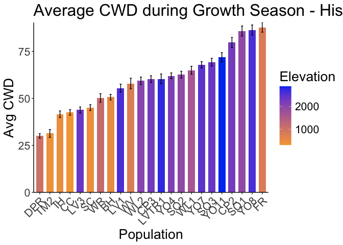<!-- -->

```r
ggsave("../output/Climate/growthseasonAvg_CWD_HistoricalClim.png", width = 12, height = 6, units = "in")

allpops_historical_grwseason_avgs %>% ggplot(aes(x=fct_reorder(parent.pop, ppt_mean), y=ppt_mean, fill=elev_m)) + 
  geom_col(width = 0.7,position = position_dodge(0.75)) +
  geom_errorbar(aes(ymin=ppt_mean-ppt_sem,ymax=ppt_mean+ppt_sem),width=.2, position = 
                  position_dodge(0.75)) +
  scale_y_continuous(expand = c(0, 0)) +
  scale_fill_gradient(low = "#F5A540", high = "#0043F0") + 
  labs(fill="Elevation",x="Population", y="Avg Precip" ,title = "Average Precip during Growth Season - Historical Climate") +
   theme_classic() +
  theme(text=element_text(size=20), axis.text.x = element_text(angle = 45,  hjust = 1))
```

<!-- -->

```r
ggsave("../output/Climate/growthseasonAvg_Precip_HistoricalClim.png", width = 12, height = 6, units = "in")

allpops_historical_grwseason_avgs %>% ggplot(aes(x=fct_reorder(parent.pop, tmn_mean), y=tmn_mean, fill=elev_m)) + 
  geom_col(width = 0.7,position = position_dodge(0.75)) +
  geom_errorbar(aes(ymin=tmn_mean-tmn_sem,ymax=tmn_mean+tmn_sem),width=.2, position = 
                  position_dodge(0.75)) +
  scale_y_continuous(expand = c(0, 0)) +
  scale_fill_gradient(low = "#F5A540", high = "#0043F0") + 
  labs(fill="Elevation",x="Population", y="Avg MinTemp" ,title = "Average MinTemp during Growth Season - Historical Climate") +
   theme_classic() +
  theme(text=element_text(size=20), axis.text.x = element_text(angle = 45,  hjust = 1))
```

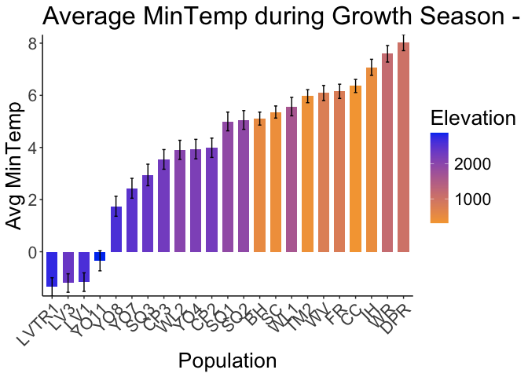<!-- -->

```r
ggsave("../output/Climate/growthseasonAvg_MinTemp_HistoricalClim.png", width = 12, height = 6, units = "in")

allpops_historical_grwseason_avgs %>% ggplot(aes(x=fct_reorder(parent.pop, tmx_mean), y=tmx_mean, fill=elev_m)) + 
  geom_col(width = 0.7,position = position_dodge(0.75)) +
  geom_errorbar(aes(ymin=tmx_mean-tmx_sem,ymax=tmx_mean+tmx_sem),width=.2, position = 
                  position_dodge(0.75)) +
  scale_y_continuous(expand = c(0, 0)) +
  scale_fill_gradient(low = "#F5A540", high = "#0043F0") + 
  labs(fill="Elevation",x="Population", y="Avg MaxTemp" ,title = "Average MaxTemp during Growth Season - Historical Climate") +
   theme_classic() +
  theme(text=element_text(size=20), axis.text.x = element_text(angle = 45,  hjust = 1))
```

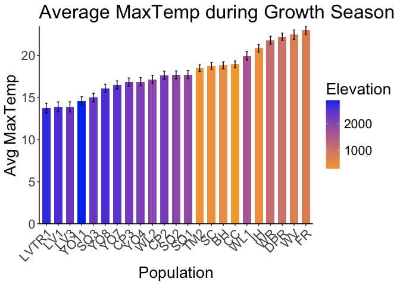<!-- -->

```r
ggsave("../output/Climate/growthseasonAvg_MaxTemp_HistoricalClim.png", width = 12, height = 6, units = "in")
```

## Climate trait correlations

```r
head(allpops_recent_grwseason)
```

```
## # A tibble: 6 × 14
## # Groups:   parent.pop, elevation.group, elev_m, year [1]
##   month growmonth parent.pop elevation.group elev_m PckSum  year   cwd   pck
##   <dbl>     <dbl> <chr>      <chr>            <dbl>  <dbl> <dbl> <dbl> <dbl>
## 1    12         4 BH         Low               511.      0  1992  27.8     0
## 2     1         5 BH         Low               511.      0  1992  28.3     0
## 3     2         6 BH         Low               511.      0  1992  40.1     0
## 4     3         7 BH         Low               511.      0  1992  52.0     0
## 5     4         8 BH         Low               511.      0  1992  75.9     0
## 6     5         9 BH         Low               511.      0  1992  78.6     0
## # ℹ 5 more variables: ppt <dbl>, tmn <dbl>, tmx <dbl>, AvgFirstMonth <dbl>,
## #   AvgLastMonth <dbl>
```

```r
allpops_recent_grwseason <- tibble(allpops_recent_grwseason)
allpops_recent_grwseason %>% cor_test(cwd, ppt, tmn, tmx, method = "pearson")
```

```
## # A tibble: 16 × 8
##    var1  var2    cor statistic         p conf.low conf.high method 
##    <chr> <chr> <dbl>     <dbl>     <dbl>    <dbl>     <dbl> <chr>  
##  1 cwd   cwd    1        Inf   0            1         1     Pearson
##  2 cwd   ppt   -0.57     -48.8 0           -0.589    -0.551 Pearson
##  3 cwd   tmn    0.52      42.4 0            0.495     0.536 Pearson
##  4 cwd   tmx    0.61      53.6 0            0.588     0.623 Pearson
##  5 ppt   cwd   -0.57     -48.8 0           -0.589    -0.551 Pearson
##  6 ppt   ppt    1        Inf   0            1         1     Pearson
##  7 ppt   tmn   -0.49     -39.7 2.13e-299   -0.512    -0.470 Pearson
##  8 ppt   tmx   -0.63     -56.5 0           -0.643    -0.609 Pearson
##  9 tmn   cwd    0.52      42.4 0            0.495     0.536 Pearson
## 10 tmn   ppt   -0.49     -39.7 2.13e-299   -0.512    -0.470 Pearson
## 11 tmn   tmn    1        Inf   0            1         1     Pearson
## 12 tmn   tmx    0.95     213.  0            0.947     0.952 Pearson
## 13 tmx   cwd    0.61      53.6 0            0.588     0.623 Pearson
## 14 tmx   ppt   -0.63     -56.5 0           -0.643    -0.609 Pearson
## 15 tmx   tmn    0.95     213.  0            0.947     0.952 Pearson
## 16 tmx   tmx    1        Inf   0            1         1     Pearson
```

```r
recent_cor_mat <- allpops_recent_grwseason %>% select(cwd, ppt, tmn, tmx) %>% cor_mat()
recent_cor_mat
```

```
## # A tibble: 4 × 5
##   rowname   cwd   ppt   tmn   tmx
## * <chr>   <dbl> <dbl> <dbl> <dbl>
## 1 cwd      1    -0.57  0.52  0.61
## 2 ppt     -0.57  1    -0.49 -0.63
## 3 tmn      0.52 -0.49  1     0.95
## 4 tmx      0.61 -0.63  0.95  1
```

```r
recent_cor = allpops_recent_grwseason %>% select(cwd, ppt, tmn, tmx) %>% cor()
file_path= "../output/Climate/GrowthSeason_RecentClim_Cors.png"
png(width = 12, height = 6, res= 300, units = "in", file=file_path, type = "cairo")
corrplot(recent_cor)
dev.off()
```

```
## quartz_off_screen 
##                 2
```

```r
allpops_historical_grwseason <- tibble(allpops_historical_grwseason)
allpops_historical_grwseason %>% cor_test(cwd, ppt, tmn, tmx, method = "pearson")
```

```
## # A tibble: 16 × 8
##    var1  var2    cor statistic         p conf.low conf.high method 
##    <chr> <chr> <dbl>     <dbl>     <dbl>    <dbl>     <dbl> <chr>  
##  1 cwd   cwd    1        Inf   0            1         1     Pearson
##  2 cwd   ppt   -0.53     -42.3 0           -0.549    -0.508 Pearson
##  3 cwd   tmn    0.48      37.2 4.30e-265    0.458     0.502 Pearson
##  4 cwd   tmx    0.59      49.5 0            0.569     0.607 Pearson
##  5 ppt   cwd   -0.53     -42.3 0           -0.549    -0.508 Pearson
##  6 ppt   ppt    1        Inf   0            1         1     Pearson
##  7 ppt   tmn   -0.49     -37.9 5.68e-274   -0.509    -0.465 Pearson
##  8 ppt   tmx   -0.62     -54.0 0           -0.639    -0.604 Pearson
##  9 tmn   cwd    0.48      37.2 4.30e-265    0.458     0.502 Pearson
## 10 tmn   ppt   -0.49     -37.9 5.68e-274   -0.509    -0.465 Pearson
## 11 tmn   tmn    1        Inf   0            1         1     Pearson
## 12 tmn   tmx    0.94     186.  0            0.936     0.943 Pearson
## 13 tmx   cwd    0.59      49.5 0            0.569     0.607 Pearson
## 14 tmx   ppt   -0.62     -54.0 0           -0.639    -0.604 Pearson
## 15 tmx   tmn    0.94     186.  0            0.936     0.943 Pearson
## 16 tmx   tmx    1        Inf   0            1         1     Pearson
```

```r
historical_cor_mat <- allpops_historical_grwseason %>% select(cwd, ppt, tmn, tmx) %>% cor_mat()
historical_cor_mat
```

```
## # A tibble: 4 × 5
##   rowname   cwd   ppt   tmn   tmx
## * <chr>   <dbl> <dbl> <dbl> <dbl>
## 1 cwd      1    -0.53  0.48  0.59
## 2 ppt     -0.53  1    -0.49 -0.62
## 3 tmn      0.48 -0.49  1     0.94
## 4 tmx      0.59 -0.62  0.94  1
```

```r
historical_cor = allpops_historical_grwseason %>% select(cwd, ppt, tmn, tmx) %>% cor()
file_path= "../output/Climate/GrowthSeason_HistoricalClim_Cors.png"
png(width = 12, height = 6, res= 300, units = "in", file=file_path, type = "cairo")
corrplot(historical_cor)
dev.off()
```

```
## quartz_off_screen 
##                 2
```
Trait correlations are the same across recent and historical time
periods (during the growth season)
