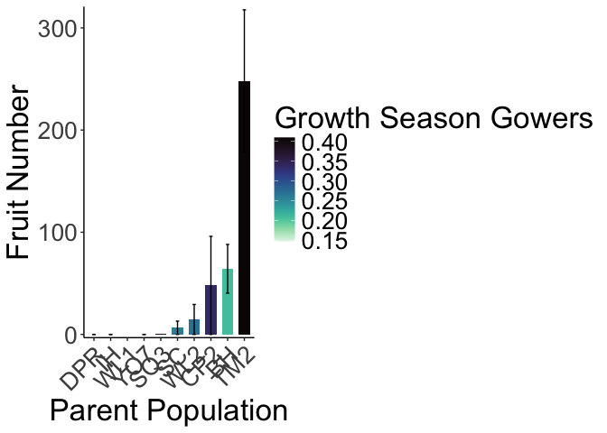
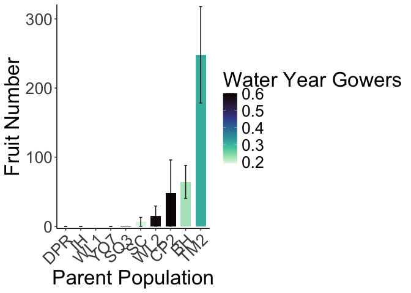
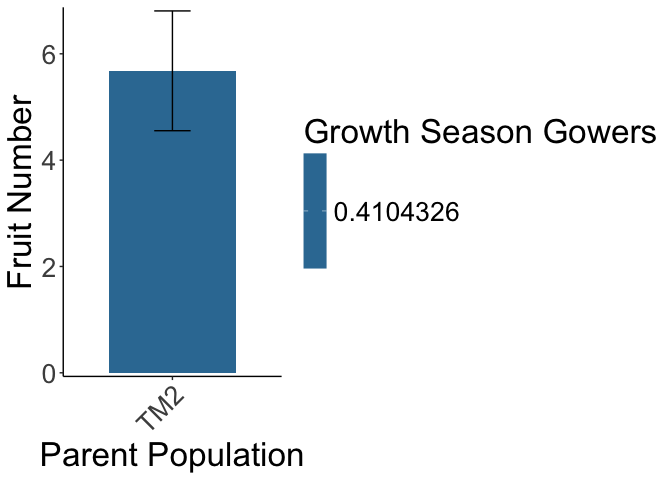
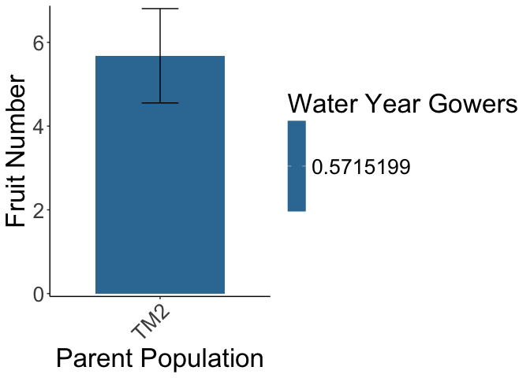

# Year 1 Fruit Production

## Libraries

``` r
library(tidyverse)
```

```
## ── Attaching core tidyverse packages ──────────────────────── tidyverse 2.0.0 ──
## ✔ dplyr     1.1.4     ✔ readr     2.1.5
## ✔ forcats   1.0.0     ✔ stringr   1.5.1
## ✔ ggplot2   3.5.1     ✔ tibble    3.2.1
## ✔ lubridate 1.9.3     ✔ tidyr     1.3.1
## ✔ purrr     1.0.2     
## ── Conflicts ────────────────────────────────────────── tidyverse_conflicts() ──
## ✖ dplyr::filter() masks stats::filter()
## ✖ dplyr::lag()    masks stats::lag()
## ℹ Use the conflicted package (<http://conflicted.r-lib.org/>) to force all conflicts to become errors
```

``` r
library(magrittr)
```

```
## 
## Attaching package: 'magrittr'
## 
## The following object is masked from 'package:purrr':
## 
##     set_names
## 
## The following object is masked from 'package:tidyr':
## 
##     extract
```

``` r
#conflicted::conflicts_prefer(dplyr::filter)
library(viridis) #for pretty colors
```

```
## Loading required package: viridisLite
```

``` r
library(ggrepel) #for non-overlapping labels on plots
library(ggdist) #visualizations of distributions and uncertainty 
library(ggpubr)

#library(sp) #for calculating geographic distance 
library(geosphere) #for calculating geographic distance
library(corrplot) #plotting correlations  
```

```
## corrplot 0.94 loaded
```

``` r
library(rstatix) #performing cor_test
```

```
## 
## Attaching package: 'rstatix'
## 
## The following object is masked from 'package:stats':
## 
##     filter
```

``` r
library(lmerTest) #mixed models
```

```
## Loading required package: lme4
## Loading required package: Matrix
## 
## Attaching package: 'Matrix'
## 
## The following objects are masked from 'package:tidyr':
## 
##     expand, pack, unpack
## 
## 
## Attaching package: 'lmerTest'
## 
## The following object is masked from 'package:lme4':
## 
##     lmer
## 
## The following object is masked from 'package:stats':
## 
##     step
```

``` r
conflicted::conflicts_prefer(lmerTest::lmer)
```

```
## [conflicted] Will prefer lmerTest::lmer over any other package.
```

``` r
library(broom.mixed)
library(tidymodels)
```

```
## ── Attaching packages ────────────────────────────────────── tidymodels 1.2.0 ──
## ✔ broom        1.0.7     ✔ rsample      1.2.1
## ✔ dials        1.3.0     ✔ tune         1.2.1
## ✔ infer        1.0.7     ✔ workflows    1.1.4
## ✔ modeldata    1.4.0     ✔ workflowsets 1.1.0
## ✔ parsnip      1.2.1     ✔ yardstick    1.3.1
## ✔ recipes      1.1.0     
## ── Conflicts ───────────────────────────────────────── tidymodels_conflicts() ──
## ✖ infer::chisq_test()   masks rstatix::chisq_test()
## ✖ scales::discard()     masks purrr::discard()
## ✖ Matrix::expand()      masks tidyr::expand()
## ✖ magrittr::extract()   masks tidyr::extract()
## ✖ rstatix::filter()     masks dplyr::filter(), stats::filter()
## ✖ recipes::fixed()      masks stringr::fixed()
## ✖ dials::get_n()        masks rstatix::get_n()
## ✖ dplyr::lag()          masks stats::lag()
## ✖ Matrix::pack()        masks tidyr::pack()
## ✖ infer::prop_test()    masks rstatix::prop_test()
## ✖ magrittr::set_names() masks purrr::set_names()
## ✖ yardstick::spec()     masks readr::spec()
## ✖ recipes::step()       masks lmerTest::step(), stats::step()
## ✖ infer::t_test()       masks rstatix::t_test()
## ✖ Matrix::unpack()      masks tidyr::unpack()
## ✖ recipes::update()     masks Matrix::update(), stats::update()
## • Learn how to get started at https://www.tidymodels.org/start/
```

``` r
library(furrr) #Apply Mapping Functions in Parallel using Futures
```

```
## Loading required package: future
```

``` r
tidymodels_prefer()
# install.packages("multilevelmod")
library(multilevelmod)

library(brms)
```

```
## Loading required package: Rcpp
## 
## Attaching package: 'Rcpp'
## 
## The following object is masked from 'package:rsample':
## 
##     populate
## 
## Loading 'brms' package (version 2.22.0). Useful instructions
## can be found by typing help('brms'). A more detailed introduction
## to the package is available through vignette('brms_overview').
```

``` r
#conflicted::conflicts_prefer(brms::ar)
#conflicted::conflicts_prefer(dplyr::combine)
#conflicted::conflicts_prefer(brms::dstudent_t)
library(tidybayes) #for extracting and visiaulizing brms model output 
library(modelr) #for data grid

sem <- function(x, na.rm=FALSE) {           #for caclulating standard error
  sd(x,na.rm=na.rm)/sqrt(length(na.omit(x)))
} 

cbbPalette2 <- c("#E69F00","#000000", "#56B4E9","#009E73", "#F0E442", "#0072B2", "#D55E00", "#CC79A7")
timepd_palette <- c("#56B4E9","#D55E00")

options(mc.cores = parallel::detectCores())
```

## Need the UCD 2023 and WL2 2023 & 2024 annual census data sheets (for fruit number)

``` r
ucd_ann_cens <- read_csv("../output/UCD_Traits/UCD2023_Annual_Census_Combined.csv") %>%  #note this is only for plants with annual census data 
  rename(pop=parent.pop) %>% 
  filter(!is.na(pop)) %>% 
  filter(rep != 100) %>% #get rid of individuals that germinated in the field 
  unite(Genotype, pop:rep, sep="_", remove = FALSE) 
```

```
## Rows: 63 Columns: 20
## ── Column specification ────────────────────────────────────────────────────────
## Delimiter: ","
## chr  (4): block, col, parent.pop, elevation.group
## dbl (16): row, mf, rep, diam, height, total_branch, longest_leaf, flowers, f...
## 
## ℹ Use `spec()` to retrieve the full column specification for this data.
## ℹ Specify the column types or set `show_col_types = FALSE` to quiet this message.
```

``` r
wl2_ann_cens <- read_csv("../input/WL2_Data/CorrectedCSVs/WL2_annual_census_20231027_corrected.csv") %>% 
  unite(Genotype, pop:rep, sep="_", remove = FALSE) %>% 
  unite(BedLoc, bed:`bed-col`, sep="_", remove = FALSE) %>% 
  filter(BedLoc!="K_5_C") %>% #get rid of duplicate locations
  filter(BedLoc!="B_32_A") %>% #get rid of duplicate locations
  filter(!is.na(pop), !str_detect(Genotype, ".*buff*")) #remove buffers 
```

```
## Warning: One or more parsing issues, call `problems()` on your data frame for details,
## e.g.:
##   dat <- vroom(...)
##   problems(dat)
```

```
## Rows: 1826 Columns: 19
## ── Column specification ────────────────────────────────────────────────────────
## Delimiter: ","
## chr (10): date, block, bed, bed-col, pop, mf, rep, pheno, herbiv.y.n, survey...
## dbl  (7): bed-row, diam.mm, num.flw, num.fruit, long.fruit.cm, total.branch,...
## lgl  (2): height.cm, long.leaf.cm
## 
## ℹ Use `spec()` to retrieve the full column specification for this data.
## ℹ Specify the column types or set `show_col_types = FALSE` to quiet this message.
```

## Gower's Distance

``` r
garden_climate <- read_csv("../output/Climate/flint_climate_UCDpops.csv") %>% 
  filter(parent.pop=="WL2_Garden" | parent.pop=="UCD_Garden") %>% 
  select(parent.pop:Long) %>% 
  distinct()
```

```
## Rows: 38775 Columns: 14
## ── Column specification ────────────────────────────────────────────────────────
## Delimiter: ","
## chr  (3): parent.pop, elevation.group, month
## dbl (11): elev_m, Lat, Long, year, aet, cwd, pck, pet, ppt, tmn, tmx
## 
## ℹ Use `spec()` to retrieve the full column specification for this data.
## ℹ Specify the column types or set `show_col_types = FALSE` to quiet this message.
```

``` r
garden_climate
```

```
## # A tibble: 2 × 5
##   parent.pop elevation.group elev_m   Lat  Long
##   <chr>      <chr>            <dbl> <dbl> <dbl>
## 1 UCD_Garden Low                 16  38.5 -122.
## 2 WL2_Garden High              2020  38.8 -120.
```

``` r
#UCD LAT/LONG = 38.53250, -121.7830
#WL2 Lat/Long = 38.82599, -120.2509

ucd_gowers <- read_csv("../output/Climate/Gowers_UCD.csv") %>% 
  select(parent.pop:GrwSsn_GD, Wtr_Year_GD) %>% 
  pivot_wider(names_from = TimePd, values_from = c(GrwSsn_GD, Wtr_Year_GD)) %>% 
  mutate(UCD_Lat=38.53250, UCD_Long=-121.7830, UCD_Elev=16) %>% 
  mutate(Geographic_Dist=distHaversine(cbind(UCD_Long, UCD_Lat), cbind(Long, Lat)),
         Elev_Dist=UCD_Elev-elev_m) %>% # Calculate the distance using the haversine formula (dist in meters)
  #mutate(Lat_Dist=UCD_Lat-Lat, Long_Dist=UCD_Long-Long) %>% #Garden-Home - lat and long per Gerst et al 2011 which kept them separate for some directionality
  rename(pop=parent.pop)
```

```
## Rows: 46 Columns: 12
## ── Column specification ────────────────────────────────────────────────────────
## Delimiter: ","
## chr (3): parent.pop, elevation.group, TimePd
## dbl (9): elev_m, Lat, Long, GrwSsn_GD, GrwSsn_FLINT_GD, GrwSsn_BIOCLIM_GD, W...
## 
## ℹ Use `spec()` to retrieve the full column specification for this data.
## ℹ Specify the column types or set `show_col_types = FALSE` to quiet this message.
```

``` r
wl2_gowers_2023 <- read_csv("../output/Climate/Gowers_WL2.csv") %>% 
  select(parent.pop:GrwSsn_GD, Wtr_Year_GD) %>% 
  pivot_wider(names_from = TimePd, values_from = c(GrwSsn_GD, Wtr_Year_GD)) %>% 
  mutate(WL2_Lat=38.82599, WL2_Long=-120.2509, WL2_Elev=2020) %>% 
  mutate(Geographic_Dist=distHaversine(cbind(WL2_Long, WL2_Lat), cbind(Long, Lat)),
         Elev_Dist=WL2_Elev-elev_m) %>% # Calculate the distance using the haversine formula
  #mutate(Lat_Dist=WL2_Lat-Lat, Long_Dist=WL2_Long-Long) %>% #Garden-Home - lat and long per Gerst et al 2011 which kept them separate for some directionality
  rename(pop=parent.pop)
```

```
## Rows: 46 Columns: 12
## ── Column specification ────────────────────────────────────────────────────────
## Delimiter: ","
## chr (3): parent.pop, elevation.group, TimePd
## dbl (9): elev_m, Lat, Long, GrwSsn_GD, GrwSsn_FLINT_GD, GrwSsn_BIOCLIM_GD, W...
## 
## ℹ Use `spec()` to retrieve the full column specification for this data.
## ℹ Specify the column types or set `show_col_types = FALSE` to quiet this message.
```

## Davis

``` r
ucd_fruits <- ucd_ann_cens %>% select(block:rep, elevation.group, elev_m, Lat:Long, flowers, fruits) %>%  #note this is only for plants that survived to rep 
  mutate(FrFlN=fruits+flowers) %>% 
  left_join(ucd_gowers)
```

```
## Joining with `by = join_by(pop, elevation.group, elev_m, Lat, Long)`
```

``` r
ucd_fruits %>% group_by(pop) %>% summarise(n=n()) %>% arrange(n) #SQ3 & WL1 only 1 individual 
```

```
## # A tibble: 10 × 2
##    pop       n
##    <chr> <int>
##  1 SQ3       1
##  2 WL1       1
##  3 DPR       2
##  4 YO7       2
##  5 CP2       3
##  6 WL2       3
##  7 IH        4
##  8 SC        4
##  9 TM2      12
## 10 BH       31
```

``` r
ucd_fruits %>% filter(FrFlN>0) %>% arrange(pop) #DPR 2 indivs, BH and TM2 lots, rest only 1 indiv ...
```

```
## # A tibble: 33 × 23
##    block   row col   Genotype pop      mf   rep elevation.group elev_m   Lat
##    <chr> <dbl> <chr> <chr>    <chr> <dbl> <dbl> <chr>            <dbl> <dbl>
##  1 D2       26 B     BH_5_15  BH        5    15 Low               511.  37.4
##  2 D2       29 D     BH_2_9   BH        2     9 Low               511.  37.4
##  3 D2       35 D     BH_3_6   BH        3     6 Low               511.  37.4
##  4 F2       35 D     BH_2_1   BH        2     1 Low               511.  37.4
##  5 H2       24 B     BH_5_29  BH        5    29 Low               511.  37.4
##  6 J1       10 C     BH_3_1   BH        3     1 Low               511.  37.4
##  7 J1       19 C     BH_5_20  BH        5    20 Low               511.  37.4
##  8 J2       23 D     BH_4_9   BH        4     9 Low               511.  37.4
##  9 J2       25 D     BH_2_5   BH        2     5 Low               511.  37.4
## 10 J2       37 B     BH_1_7   BH        1     7 Low               511.  37.4
## # ℹ 23 more rows
## # ℹ 13 more variables: Long <dbl>, flowers <dbl>, fruits <dbl>, FrFlN <dbl>,
## #   GrwSsn_GD_Recent <dbl>, GrwSsn_GD_Historical <dbl>,
## #   Wtr_Year_GD_Recent <dbl>, Wtr_Year_GD_Historical <dbl>, UCD_Lat <dbl>,
## #   UCD_Long <dbl>, UCD_Elev <dbl>, Geographic_Dist <dbl>, Elev_Dist <dbl>
```

``` r
ucd_fruits %>% filter(fruits>0) %>% arrange(pop) #only BH and TM2 with greater than 1 indiv 
```

```
## # A tibble: 30 × 23
##    block   row col   Genotype pop      mf   rep elevation.group elev_m   Lat
##    <chr> <dbl> <chr> <chr>    <chr> <dbl> <dbl> <chr>            <dbl> <dbl>
##  1 D2       26 B     BH_5_15  BH        5    15 Low               511.  37.4
##  2 D2       29 D     BH_2_9   BH        2     9 Low               511.  37.4
##  3 D2       35 D     BH_3_6   BH        3     6 Low               511.  37.4
##  4 F2       35 D     BH_2_1   BH        2     1 Low               511.  37.4
##  5 H2       24 B     BH_5_29  BH        5    29 Low               511.  37.4
##  6 J1       10 C     BH_3_1   BH        3     1 Low               511.  37.4
##  7 J1       19 C     BH_5_20  BH        5    20 Low               511.  37.4
##  8 J2       23 D     BH_4_9   BH        4     9 Low               511.  37.4
##  9 J2       25 D     BH_2_5   BH        2     5 Low               511.  37.4
## 10 J2       37 B     BH_1_7   BH        1     7 Low               511.  37.4
## # ℹ 20 more rows
## # ℹ 13 more variables: Long <dbl>, flowers <dbl>, fruits <dbl>, FrFlN <dbl>,
## #   GrwSsn_GD_Recent <dbl>, GrwSsn_GD_Historical <dbl>,
## #   Wtr_Year_GD_Recent <dbl>, Wtr_Year_GD_Historical <dbl>, UCD_Lat <dbl>,
## #   UCD_Long <dbl>, UCD_Elev <dbl>, Geographic_Dist <dbl>, Elev_Dist <dbl>
```

``` r
#write_csv(ucd_fruits, "../output/UCD_Traits/UCD_Fruits.csv")
```

### Bar Plots 

``` r
ucd_fruits %>% 
  group_by(pop, elev_m, GrwSsn_GD_Recent, Wtr_Year_GD_Recent) %>% 
  summarise(meanFruits=mean(fruits, na.rm = TRUE), semFruits=sem(fruits, na.rm=TRUE)) %>% 
  ggplot(aes(x=fct_reorder(pop, meanFruits), y=meanFruits, fill=GrwSsn_GD_Recent)) +
  geom_col(width = 0.7,position = position_dodge(0.75)) + 
  geom_errorbar(aes(ymin=meanFruits-semFruits,ymax=meanFruits+semFruits),width=.2, position = 
                  position_dodge(0.75)) +
  theme_classic() + 
  scale_y_continuous(expand = c(0.01, 0)) +
  labs(y="Fruit Number", x="Parent Population", fill="Growth Season Gowers") +
  scale_fill_viridis(option="mako", direction = -1) +
  theme(text=element_text(size=25), axis.text.x = element_text(angle = 45,  hjust = 1))
```

```
## `summarise()` has grouped output by 'pop', 'elev_m', 'GrwSsn_GD_Recent'. You
## can override using the `.groups` argument.
```

<!-- -->

``` r
#ggsave("../output/UCD_Traits/UCD_Fruits_GrwSsn_GD_Recent.png", width = 12, height = 8, units = "in")

ucd_fruits %>% 
  group_by(pop, elev_m, GrwSsn_GD_Recent, Wtr_Year_GD_Recent) %>% 
  summarise(meanFruits=mean(fruits, na.rm = TRUE), semFruits=sem(fruits, na.rm=TRUE)) %>% 
  ggplot(aes(x=fct_reorder(pop, meanFruits), y=meanFruits, fill=Wtr_Year_GD_Recent)) +
  geom_col(width = 0.7,position = position_dodge(0.75)) + 
  geom_errorbar(aes(ymin=meanFruits-semFruits,ymax=meanFruits+semFruits),width=.2, position = 
                  position_dodge(0.75)) +
  theme_classic() + 
  scale_y_continuous(expand = c(0.01, 0)) +
  labs(y="Fruit Number", x="Parent Population", fill="Water Year Gowers") +
  scale_fill_viridis(option="mako", direction = -1) +
  theme(text=element_text(size=25), axis.text.x = element_text(angle = 45,  hjust = 1))
```

```
## `summarise()` has grouped output by 'pop', 'elev_m', 'GrwSsn_GD_Recent'. You
## can override using the `.groups` argument.
```

<!-- -->

``` r
#ggsave("../output/UCD_Traits/UCD_Fruits_Wtr_Year_GD_Recent.png", width = 12, height = 8, units = "in")
```

## WL2

``` r
wl2_fruits_y1 <- wl2_ann_cens %>% select(block:rep, flowers=num.flw, fruits=num.fruit) %>% 
  filter(fruits>0) %>% 
  mutate(FrFlN=fruits+flowers) %>% 
  left_join(wl2_gowers_2023)
```

```
## Joining with `by = join_by(pop)`
```

``` r
summary(wl2_fruits_y1)
```

```
##     block              BedLoc              bed               bed-row     
##  Length:25          Length:25          Length:25          Min.   : 1.00  
##  Class :character   Class :character   Class :character   1st Qu.:21.00  
##  Mode  :character   Mode  :character   Mode  :character   Median :31.00  
##                                                           Mean   :29.48  
##                                                           3rd Qu.:40.00  
##                                                           Max.   :56.00  
##    bed-col            Genotype             pop                 mf           
##  Length:25          Length:25          Length:25          Length:25         
##  Class :character   Class :character   Class :character   Class :character  
##  Mode  :character   Mode  :character   Mode  :character   Mode  :character  
##                                                                             
##                                                                             
##                                                                             
##      rep               flowers          fruits          FrFlN      
##  Length:25          Min.   : 0.00   Min.   : 1.00   Min.   : 2.00  
##  Class :character   1st Qu.: 1.00   1st Qu.: 2.00   1st Qu.: 4.00  
##  Mode  :character   Median : 2.00   Median : 3.00   Median : 6.00  
##                     Mean   : 3.04   Mean   : 5.68   Mean   : 8.72  
##                     3rd Qu.: 4.00   3rd Qu.: 7.00   3rd Qu.:11.00  
##                     Max.   :20.00   Max.   :22.00   Max.   :35.00  
##  elevation.group        elev_m           Lat             Long       
##  Length:25          Min.   :379.2   Min.   :39.59   Min.   :-121.6  
##  Class :character   1st Qu.:379.2   1st Qu.:39.59   1st Qu.:-121.6  
##  Mode  :character   Median :379.2   Median :39.59   Median :-121.6  
##                     Mean   :379.2   Mean   :39.59   Mean   :-121.6  
##                     3rd Qu.:379.2   3rd Qu.:39.59   3rd Qu.:-121.6  
##                     Max.   :379.2   Max.   :39.59   Max.   :-121.6  
##  GrwSsn_GD_Recent GrwSsn_GD_Historical Wtr_Year_GD_Recent
##  Min.   :0.4104   Min.   :0.4037       Min.   :0.5715    
##  1st Qu.:0.4104   1st Qu.:0.4037       1st Qu.:0.5715    
##  Median :0.4104   Median :0.4037       Median :0.5715    
##  Mean   :0.4104   Mean   :0.4037       Mean   :0.5715    
##  3rd Qu.:0.4104   3rd Qu.:0.4037       3rd Qu.:0.5715    
##  Max.   :0.4104   Max.   :0.4037       Max.   :0.5715    
##  Wtr_Year_GD_Historical    WL2_Lat         WL2_Long         WL2_Elev   
##  Min.   :0.5403         Min.   :38.83   Min.   :-120.3   Min.   :2020  
##  1st Qu.:0.5403         1st Qu.:38.83   1st Qu.:-120.3   1st Qu.:2020  
##  Median :0.5403         Median :38.83   Median :-120.3   Median :2020  
##  Mean   :0.5403         Mean   :38.83   Mean   :-120.3   Mean   :2020  
##  3rd Qu.:0.5403         3rd Qu.:38.83   3rd Qu.:-120.3   3rd Qu.:2020  
##  Max.   :0.5403         Max.   :38.83   Max.   :-120.3   Max.   :2020  
##  Geographic_Dist    Elev_Dist   
##  Min.   :140893   Min.   :1641  
##  1st Qu.:140893   1st Qu.:1641  
##  Median :140893   Median :1641  
##  Mean   :140893   Mean   :1641  
##  3rd Qu.:140893   3rd Qu.:1641  
##  Max.   :140893   Max.   :1641
```

``` r
#wl2_fruits_y1 %>% group_by(pop) %>% summarise(n=n()) %>% arrange(n) #all TM2
#write_csv(wl2_fruits_y1, "../output/WL2_Traits/WL2_Fruits_Y1.csv")
```

### Bar Plots

``` r
wl2_fruits_y1 %>% 
  group_by(pop, elev_m, GrwSsn_GD_Recent, Wtr_Year_GD_Recent) %>% 
  summarise(meanFruits=mean(fruits, na.rm = TRUE), semFruits=sem(fruits, na.rm=TRUE)) %>%
  filter(pop!="WV") %>% 
  ggplot(aes(x=fct_reorder(pop, meanFruits), y=meanFruits, fill=GrwSsn_GD_Recent)) +
  geom_col(width = 0.7,position = position_dodge(0.75)) + 
  geom_errorbar(aes(ymin=meanFruits-semFruits,ymax=meanFruits+semFruits),width=.2, position = 
                  position_dodge(0.75)) +
  theme_classic() + 
  scale_y_continuous(expand = c(0.01, 0)) +
  labs(y="Fruit Number", x="Parent Population", fill="Growth Season Gowers") +
  scale_fill_viridis(option="mako", direction = -1) +
  theme(text=element_text(size=25), axis.text.x = element_text(angle = 45,  hjust = 1))
```

```
## `summarise()` has grouped output by 'pop', 'elev_m', 'GrwSsn_GD_Recent'. You
## can override using the `.groups` argument.
```

<!-- -->

``` r
#ggsave("../output/WL2_Traits/WL2_FruitsY1_GrwSsn_GD_Recent.png", width = 12, height = 8, units = "in")

wl2_fruits_y1 %>% 
  group_by(pop, elev_m, GrwSsn_GD_Recent, Wtr_Year_GD_Recent) %>% 
  summarise(meanFruits=mean(fruits, na.rm = TRUE), semFruits=sem(fruits, na.rm=TRUE)) %>% 
  filter(pop!="WV") %>% 
  ggplot(aes(x=fct_reorder(pop, meanFruits), y=meanFruits, fill=Wtr_Year_GD_Recent)) +
  geom_col(width = 0.7,position = position_dodge(0.75)) + 
  geom_errorbar(aes(ymin=meanFruits-semFruits,ymax=meanFruits+semFruits),width=.2, position = 
                  position_dodge(0.75)) +
  theme_classic() + 
  scale_y_continuous(expand = c(0.01, 0)) +
  labs(y="Fruit Number", x="Parent Population", fill="Water Year Gowers") +
  scale_fill_viridis(option="mako", direction = -1) +
  theme(text=element_text(size=25), axis.text.x = element_text(angle = 45,  hjust = 1))
```

```
## `summarise()` has grouped output by 'pop', 'elev_m', 'GrwSsn_GD_Recent'. You
## can override using the `.groups` argument.
```

<!-- -->

``` r
#ggsave("../output/WL2_Traits/WL2_FruitsY1_Wtr_Year_GD_Recent.png", width = 12, height = 8, units = "in")
```

## Scatterplots
### Davis

``` r
#scatter plots - recent
GSCD_prob_recent <- ucd_fruits %>% 
  group_by(pop, elev_m, GrwSsn_GD_Recent, GrwSsn_GD_Historical) %>% 
  summarise(meanFruits=mean(fruits, na.rm = TRUE), semFruits=sem(fruits, na.rm=TRUE)) %>% 
  ggplot(aes(x=GrwSsn_GD_Recent, y=meanFruits, group = pop)) +
  geom_point(size=6) + 
  geom_errorbar(aes(ymin=meanFruits-semFruits,ymax=meanFruits+semFruits),width=.02, linewidth = 2) +
  theme_classic() + 
  scale_y_continuous(expand = c(0.01, 0)) +
  labs(y="Fruit Number", x="Recent Growth Season CD", color="Growth Season \n Climate Distance") +
  theme(text=element_text(size=30))
```

```
## `summarise()` has grouped output by 'pop', 'elev_m', 'GrwSsn_GD_Recent'. You
## can override using the `.groups` argument.
```

``` r
WYCD_prob_recent <- ucd_fruits %>% 
  group_by(pop, elev_m, Wtr_Year_GD_Recent, Wtr_Year_GD_Historical) %>% 
  summarise(meanFruits=mean(fruits, na.rm = TRUE), semFruits=sem(fruits, na.rm=TRUE)) %>% 
  ggplot(aes(x=Wtr_Year_GD_Recent, y=meanFruits, group = pop)) +
  geom_point(size=6) + 
  geom_errorbar(aes(ymin=meanFruits-semFruits,ymax=meanFruits+semFruits),width=.02,linewidth = 2) +
  theme_classic() + 
  scale_y_continuous(expand = c(0.01, 0)) +
  labs(y="Fruit Number", x="Recent Water Year CD", color="Water Year \n Climate Distance") +
  theme(text=element_text(size=30))
```

```
## `summarise()` has grouped output by 'pop', 'elev_m', 'Wtr_Year_GD_Recent'. You
## can override using the `.groups` argument.
```

``` r
GD_prob <- ucd_fruits %>% 
  group_by(pop, elev_m, GrwSsn_GD_Recent, Wtr_Year_GD_Recent, Geographic_Dist) %>% 
  summarise(meanFruits=mean(fruits, na.rm = TRUE), semFruits=sem(fruits, na.rm=TRUE)) %>% 
  ggplot(aes(x=Geographic_Dist, y=meanFruits, group = pop)) +
  geom_point(size=6) + 
  geom_errorbar(aes(ymin=meanFruits-semFruits,ymax=meanFruits+semFruits),width=.02, linewidth = 2) +
  theme_classic() + 
  scale_y_continuous(expand = c(0.01, 0)) +
  labs(y="Fruit Number", x="Geographic Distance (m)") +
  theme(text=element_text(size=30), axis.text.x = element_text(angle = 45,  hjust = 1))
```

```
## `summarise()` has grouped output by 'pop', 'elev_m', 'GrwSsn_GD_Recent',
## 'Wtr_Year_GD_Recent'. You can override using the `.groups` argument.
```

``` r
ED_prob <- ucd_fruits %>% 
  group_by(pop, elev_m, Elev_Dist) %>% 
  summarise(meanFruits=mean(fruits, na.rm = TRUE), semFruits=sem(fruits, na.rm=TRUE)) %>% 
  ggplot(aes(x=Elev_Dist, y=meanFruits, group = pop)) +
  geom_point(size=6) + 
  geom_errorbar(aes(ymin=meanFruits-semFruits,ymax=meanFruits+semFruits),width=.02, linewidth = 2) +
  theme_classic() + 
  scale_y_continuous(expand = c(0.01, 0)) +
  labs(y="Fruit Number", x="Elevation Distance (m)") +
  theme(text=element_text(size=30))
```

```
## `summarise()` has grouped output by 'pop', 'elev_m'. You can override using the
## `.groups` argument.
```

``` r
ucd_fruits_FIG_prob_recent_recent <- ggarrange(GSCD_prob_recent, WYCD_prob_recent, GD_prob, ED_prob, ncol=2, nrow=2) 
#ggsave("../output/UCD_Traits/UCD_fruits_SCATTERS_Recent.png", width = 24, height = 18, units = "in")
```


``` r
#scatter plots - historic
GSCD_prob_historic <- ucd_fruits %>% 
  group_by(pop, elev_m, GrwSsn_GD_Recent, GrwSsn_GD_Historical) %>% 
  summarise(meanFruits=mean(fruits, na.rm = TRUE), semFruits=sem(fruits, na.rm=TRUE)) %>% 
  ggplot(aes(x=GrwSsn_GD_Historical, y=meanFruits, group = pop)) +
  geom_point(size=6) + 
  geom_errorbar(aes(ymin=meanFruits-semFruits,ymax=meanFruits+semFruits),width=.02, linewidth = 2) +
  theme_classic() + 
  scale_y_continuous(expand = c(0.01, 0)) +
  labs(y="Fruit Number", x="Historic Growth Season CD", color="Growth Season \n Climate Distance") +
  theme(text=element_text(size=30))
```

```
## `summarise()` has grouped output by 'pop', 'elev_m', 'GrwSsn_GD_Recent'. You
## can override using the `.groups` argument.
```

``` r
WYCD_prob_historic <- ucd_fruits %>% 
  group_by(pop, elev_m, Wtr_Year_GD_Recent, Wtr_Year_GD_Historical) %>% 
  summarise(meanFruits=mean(fruits, na.rm = TRUE), semFruits=sem(fruits, na.rm=TRUE)) %>% 
  ggplot(aes(x=Wtr_Year_GD_Historical, y=meanFruits, group = pop)) +
  geom_point(size=6) + 
  geom_errorbar(aes(ymin=meanFruits-semFruits,ymax=meanFruits+semFruits),width=.02,linewidth = 2) +
  theme_classic() + 
  scale_y_continuous(expand = c(0.01, 0)) +
  labs(y="Fruit Number", x="Historic Water Year CD", color="Water Year \n Climate Distance") +
  theme(text=element_text(size=30))
```

```
## `summarise()` has grouped output by 'pop', 'elev_m', 'Wtr_Year_GD_Recent'. You
## can override using the `.groups` argument.
```

``` r
ucd_fruits_FIG_prob_historic_historic <- ggarrange(GSCD_prob_historic, WYCD_prob_historic, GD_prob, ED_prob, ncol=2, nrow=2) 
#ggsave("../output/UCD_Traits/UCD_fruits_SCATTERS_Historic.png", width = 24, height = 18, units = "in")
```

### WL2

``` r
#scatter plots - recent
GSCD_prob_recent <- wl2_fruits_y1 %>% 
  group_by(pop, elev_m, GrwSsn_GD_Recent, GrwSsn_GD_Historical) %>% 
  summarise(meanFruits=mean(fruits, na.rm = TRUE), semFruits=sem(fruits, na.rm=TRUE)) %>% 
  ggplot(aes(x=GrwSsn_GD_Recent, y=meanFruits, group = pop)) +
  geom_point(size=6) + 
  geom_errorbar(aes(ymin=meanFruits-semFruits,ymax=meanFruits+semFruits),width=.02, linewidth = 2) +
  theme_classic() + 
  scale_y_continuous(expand = c(0.01, 0)) +
  labs(y="Fruit Number", x="Recent Growth Season CD", color="Growth Season \n Climate Distance") +
  theme(text=element_text(size=30))
```

```
## `summarise()` has grouped output by 'pop', 'elev_m', 'GrwSsn_GD_Recent'. You
## can override using the `.groups` argument.
```

``` r
WYCD_prob_recent <- wl2_fruits_y1 %>% 
  group_by(pop, elev_m, Wtr_Year_GD_Recent, Wtr_Year_GD_Historical) %>% 
  summarise(meanFruits=mean(fruits, na.rm = TRUE), semFruits=sem(fruits, na.rm=TRUE)) %>% 
  ggplot(aes(x=Wtr_Year_GD_Recent, y=meanFruits, group = pop)) +
  geom_point(size=6) + 
  geom_errorbar(aes(ymin=meanFruits-semFruits,ymax=meanFruits+semFruits),width=.02,linewidth = 2) +
  theme_classic() + 
  scale_y_continuous(expand = c(0.01, 0)) +
  labs(y="Fruit Number", x="Recent Water Year CD", color="Water Year \n Climate Distance") +
  theme(text=element_text(size=30))
```

```
## `summarise()` has grouped output by 'pop', 'elev_m', 'Wtr_Year_GD_Recent'. You
## can override using the `.groups` argument.
```

``` r
GD_prob <- wl2_fruits_y1 %>% 
  group_by(pop, elev_m, GrwSsn_GD_Recent, Wtr_Year_GD_Recent, Geographic_Dist) %>% 
  summarise(meanFruits=mean(fruits, na.rm = TRUE), semFruits=sem(fruits, na.rm=TRUE)) %>% 
  ggplot(aes(x=Geographic_Dist, y=meanFruits, group = pop)) +
  geom_point(size=6) + 
  geom_errorbar(aes(ymin=meanFruits-semFruits,ymax=meanFruits+semFruits),width=.02, linewidth = 2) +
  theme_classic() + 
  scale_y_continuous(expand = c(0.01, 0)) +
  labs(y="Fruit Number", x="Geographic Distance (m)") +
  theme(text=element_text(size=30), axis.text.x = element_text(angle = 45,  hjust = 1))
```

```
## `summarise()` has grouped output by 'pop', 'elev_m', 'GrwSsn_GD_Recent',
## 'Wtr_Year_GD_Recent'. You can override using the `.groups` argument.
```

``` r
ED_prob <- wl2_fruits_y1 %>% 
  group_by(pop, elev_m, Elev_Dist) %>% 
  summarise(meanFruits=mean(fruits, na.rm = TRUE), semFruits=sem(fruits, na.rm=TRUE)) %>% 
  ggplot(aes(x=Elev_Dist, y=meanFruits, group = pop)) +
  geom_point(size=6) + 
  geom_errorbar(aes(ymin=meanFruits-semFruits,ymax=meanFruits+semFruits),width=.02, linewidth = 2) +
  theme_classic() + 
  scale_y_continuous(expand = c(0.01, 0)) +
  labs(y="Fruit Number", x="Elevation Distance (m)") +
  theme(text=element_text(size=30))
```

```
## `summarise()` has grouped output by 'pop', 'elev_m'. You can override using the
## `.groups` argument.
```

``` r
wl2_fruits_y1_FIG_prob_recent_recent <- ggarrange(GSCD_prob_recent, WYCD_prob_recent, GD_prob, ED_prob, ncol=2, nrow=2) 
#ggsave("../output/WL2_Traits/WL2_fruits_y1_SCATTERS_Recent.png", width = 24, height = 18, units = "in")
```


``` r
#scatter plots - historic
GSCD_prob_historic <- wl2_fruits_y1 %>% 
  group_by(pop, elev_m, GrwSsn_GD_Recent, GrwSsn_GD_Historical) %>% 
  summarise(meanFruits=mean(fruits, na.rm = TRUE), semFruits=sem(fruits, na.rm=TRUE)) %>% 
  ggplot(aes(x=GrwSsn_GD_Historical, y=meanFruits, group = pop)) +
  geom_point(size=6) + 
  geom_errorbar(aes(ymin=meanFruits-semFruits,ymax=meanFruits+semFruits),width=.02, linewidth = 2) +
  theme_classic() + 
  scale_y_continuous(expand = c(0.01, 0)) +
  labs(y="Fruit Number", x="Historic Growth Season CD", color="Growth Season \n Climate Distance") +
  theme(text=element_text(size=30))
```

```
## `summarise()` has grouped output by 'pop', 'elev_m', 'GrwSsn_GD_Recent'. You
## can override using the `.groups` argument.
```

``` r
WYCD_prob_historic <- wl2_fruits_y1 %>% 
  group_by(pop, elev_m, Wtr_Year_GD_Recent, Wtr_Year_GD_Historical) %>% 
  summarise(meanFruits=mean(fruits, na.rm = TRUE), semFruits=sem(fruits, na.rm=TRUE)) %>% 
  ggplot(aes(x=Wtr_Year_GD_Historical, y=meanFruits, group = pop)) +
  geom_point(size=6) + 
  geom_errorbar(aes(ymin=meanFruits-semFruits,ymax=meanFruits+semFruits),width=.02,linewidth = 2) +
  theme_classic() + 
  scale_y_continuous(expand = c(0.01, 0)) +
  labs(y="Fruit Number", x="Historic Water Year CD", color="Water Year \n Climate Distance") +
  theme(text=element_text(size=30))
```

```
## `summarise()` has grouped output by 'pop', 'elev_m', 'Wtr_Year_GD_Recent'. You
## can override using the `.groups` argument.
```

``` r
wl2_fruits_y1_FIG_prob_historic_historic <- ggarrange(GSCD_prob_historic, WYCD_prob_historic, GD_prob, ED_prob, ncol=2, nrow=2) 
#ggsave("../output/WL2_Traits/WL2_fruits_y1_SCATTERS_Historic.png", width = 24, height = 18, units = "in")
```

## No Stats due to low sample sizes (within pops)
