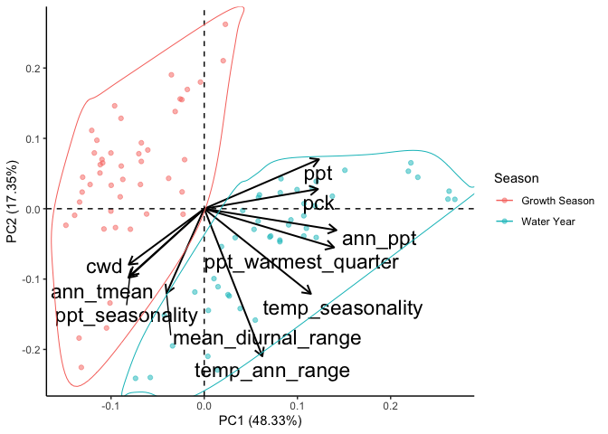
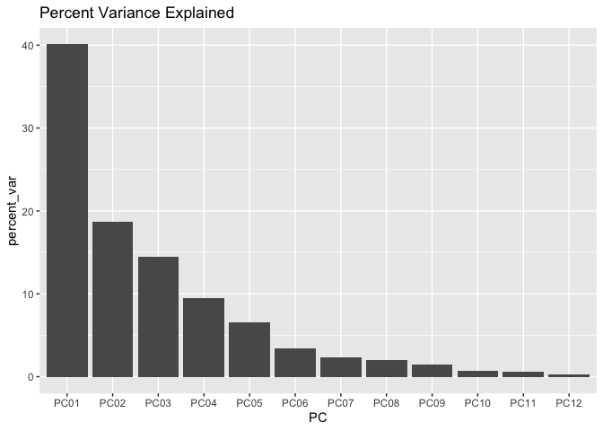
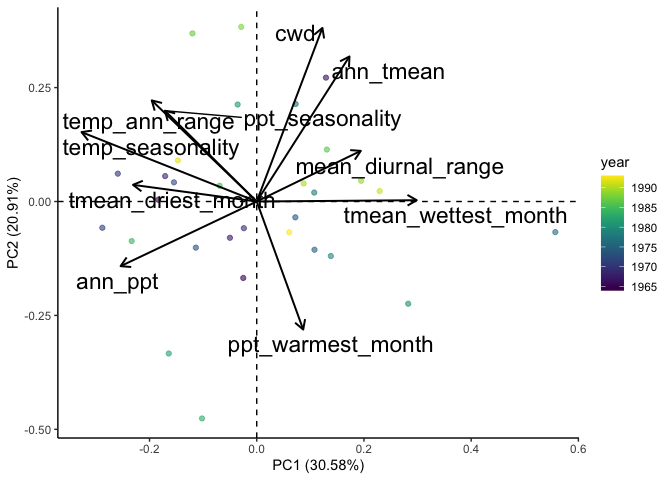
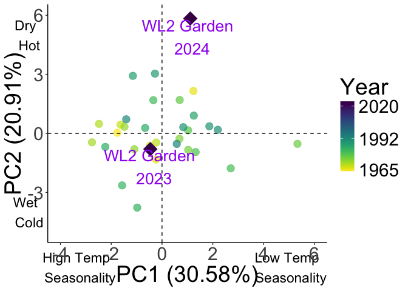

# Additional PCAs for paper 

## Libraries 

``` r
library(tidyverse)
```

```
## ── Attaching core tidyverse packages ──────────────────────── tidyverse 2.0.0 ──
## ✔ dplyr     1.1.4     ✔ readr     2.1.5
## ✔ forcats   1.0.0     ✔ stringr   1.5.1
## ✔ ggplot2   3.5.1     ✔ tibble    3.2.1
## ✔ lubridate 1.9.3     ✔ tidyr     1.3.1
## ✔ purrr     1.0.2     
## ── Conflicts ────────────────────────────────────────── tidyverse_conflicts() ──
## ✖ dplyr::filter() masks stats::filter()
## ✖ dplyr::lag()    masks stats::lag()
## ℹ Use the conflicted package (<http://conflicted.r-lib.org/>) to force all conflicts to become errors
```

``` r
library(ggalt) #for geom_encircle
```

```
## Registered S3 methods overwritten by 'ggalt':
##   method                  from   
##   grid.draw.absoluteGrob  ggplot2
##   grobHeight.absoluteGrob ggplot2
##   grobWidth.absoluteGrob  ggplot2
##   grobX.absoluteGrob      ggplot2
##   grobY.absoluteGrob      ggplot2
```

``` r
library(corrplot) #plotting correlations 
```

```
## corrplot 0.94 loaded
```

``` r
library(ggfortify) #easier PCA figures
```

```
## Registered S3 method overwritten by 'ggfortify':
##   method        from 
##   fortify.table ggalt
```

``` r
library(QBMS) #for function calc_biovars to calculate bioclim variables
library(viridis) #for color scale 
```

```
## Loading required package: viridisLite
```

## Combine Water Year and Growing Season PCAs

### Water Year Averages

``` r
flint_all_year_avgs <- read_csv("../output/Climate/fullyear_FlintAvgs_wtr_year.csv")
```

```
## Rows: 46 Columns: 11
## ── Column specification ────────────────────────────────────────────────────────
## Delimiter: ","
## chr (3): parent.pop, elevation.group, TimePd
## dbl (8): elev_m, Lat, Long, cwd, pck, ppt, tmn, tmx
## 
## ℹ Use `spec()` to retrieve the full column specification for this data.
## ℹ Specify the column types or set `show_col_types = FALSE` to quiet this message.
```

``` r
bioclim_all_year_avgs <- read_csv("../output/Climate/fullyear_BioClimAvgs_wtr_year.csv")
```

```
## Rows: 46 Columns: 16
## ── Column specification ────────────────────────────────────────────────────────
## Delimiter: ","
## chr  (3): parent.pop, elevation.group, TimePd
## dbl (13): elev_m, Lat, Long, ann_tmean, mean_diurnal_range, temp_seasonality...
## 
## ℹ Use `spec()` to retrieve the full column specification for this data.
## ℹ Specify the column types or set `show_col_types = FALSE` to quiet this message.
```

``` r
#Merge
bioclim_flint_all_year_avgs <- full_join(flint_all_year_avgs, bioclim_all_year_avgs) %>% 
  select(TimePd, parent.pop:ppt_coldest_quarter) %>% 
  mutate(Season="Water Year")
```

```
## Joining with `by = join_by(parent.pop, elevation.group, elev_m, Lat, Long,
## TimePd)`
```

``` r
names(bioclim_flint_all_year_avgs)
```

```
##  [1] "TimePd"                "parent.pop"            "elevation.group"      
##  [4] "elev_m"                "Lat"                   "Long"                 
##  [7] "cwd"                   "pck"                   "ppt"                  
## [10] "tmn"                   "tmx"                   "ann_tmean"            
## [13] "mean_diurnal_range"    "temp_seasonality"      "temp_ann_range"       
## [16] "tmean_wettest_quarter" "tmean_driest_quarter"  "ann_ppt"              
## [19] "ppt_seasonality"       "ppt_warmest_quarter"   "ppt_coldest_quarter"  
## [22] "Season"
```

### Growth Season Averages

``` r
flint_grwseason_avgs <- read_csv("../output/Climate/growthseason_FlintAvgs.csv")
```

```
## Rows: 46 Columns: 11
## ── Column specification ────────────────────────────────────────────────────────
## Delimiter: ","
## chr (3): parent.pop, elevation.group, TimePd
## dbl (8): elev_m, Lat, Long, cwd, pck, ppt, tmn, tmx
## 
## ℹ Use `spec()` to retrieve the full column specification for this data.
## ℹ Specify the column types or set `show_col_types = FALSE` to quiet this message.
```

``` r
bioclim_grwseason_avgs <- read_csv("../output/Climate/growthseason_BioClimAvgs.csv")
```

```
## Rows: 46 Columns: 14
## ── Column specification ────────────────────────────────────────────────────────
## Delimiter: ","
## chr  (3): parent.pop, elevation.group, TimePd
## dbl (11): elev_m, ann_tmean, mean_diurnal_range, temp_seasonality, temp_ann_...
## 
## ℹ Use `spec()` to retrieve the full column specification for this data.
## ℹ Specify the column types or set `show_col_types = FALSE` to quiet this message.
```

``` r
#Merge
bioclim_flint_grwseason_avgs <- full_join(flint_grwseason_avgs, bioclim_grwseason_avgs) %>% 
  select(TimePd, parent.pop:ppt_coldest_month) %>% 
  rename(tmean_wettest_quarter=tmean_wettest_month, 
         tmean_driest_quarter=tmean_driest_month,
         ppt_warmest_quarter=ppt_warmest_month,
         ppt_coldest_quarter=ppt_coldest_month) %>% 
  mutate(Season="Growth Season")
```

```
## Joining with `by = join_by(parent.pop, elevation.group, elev_m, TimePd)`
```

``` r
names(bioclim_flint_grwseason_avgs) #change month to quarter
```

```
##  [1] "TimePd"                "parent.pop"            "elevation.group"      
##  [4] "elev_m"                "Lat"                   "Long"                 
##  [7] "cwd"                   "pck"                   "ppt"                  
## [10] "tmn"                   "tmx"                   "ann_tmean"            
## [13] "mean_diurnal_range"    "temp_seasonality"      "temp_ann_range"       
## [16] "tmean_wettest_quarter" "tmean_driest_quarter"  "ann_ppt"              
## [19] "ppt_seasonality"       "ppt_warmest_quarter"   "ppt_coldest_quarter"  
## [22] "Season"
```

### Dataframe with a column for seasonal summary 

``` r
wtryr_grwssn_avgs <- bind_rows(bioclim_flint_all_year_avgs, bioclim_flint_grwseason_avgs)
```

### Correlations - Recent + Historical


``` r
#normalize the data
climate_normalized_wtryr_grwssn_avgs <- wtryr_grwssn_avgs %>% ungroup() %>% 
  select(cwd:ppt_coldest_quarter) %>% scale() #normalize the data so they're all on the same scale

cor.norm = cor(climate_normalized_wtryr_grwssn_avgs) #test correlations among the traits
cor.sig <- cor.mtest(climate_normalized_wtryr_grwssn_avgs, method = "pearson")

corrplot(cor.norm, type="upper",
         tl.srt = 45, p.mat = cor.sig$p, 
         sig.level = 0.05, insig="blank")
```

<!-- -->

``` r
#tmn, tmx, tmean_wettest_quarter, tmean_driest_quarter and ann_tmean all highly correlated (92-99%) - only keep ann_tmean 
#ann_ppt and ppt_coldest_quarter highly correlated (96%) - only keep ann_ppt 
#ppt_coldest_quarter and ppt_warmest_quarter (92%) - only keek ppt_warmest_quarter
```

### PCA - Recent + Historical

``` r
wtryr_grwssn_avgs.pc = prcomp(wtryr_grwssn_avgs[c(7:9, 12:15, 18:20)], scale = TRUE, center = TRUE)
str(wtryr_grwssn_avgs.pc)
```

```
## List of 5
##  $ sdev    : num [1:10] 2.198 1.317 1.14 1.002 0.713 ...
##  $ rotation: num [1:10, 1:10] -0.247 0.372 0.375 -0.248 -0.123 ...
##   ..- attr(*, "dimnames")=List of 2
##   .. ..$ : chr [1:10] "cwd" "pck" "ppt" "ann_tmean" ...
##   .. ..$ : chr [1:10] "PC1" "PC2" "PC3" "PC4" ...
##  $ center  : Named num [1:10] 57.9 83.8 88.2 10.5 13.4 ...
##   ..- attr(*, "names")= chr [1:10] "cwd" "pck" "ppt" "ann_tmean" ...
##  $ scale   : Named num [1:10] 14.45 130.61 27.93 3.74 1.08 ...
##   ..- attr(*, "names")= chr [1:10] "cwd" "pck" "ppt" "ann_tmean" ...
##  $ x       : num [1:92, 1:10] -1.554 -0.213 2.257 2.532 1.961 ...
##   ..- attr(*, "dimnames")=List of 2
##   .. ..$ : NULL
##   .. ..$ : chr [1:10] "PC1" "PC2" "PC3" "PC4" ...
##  - attr(*, "class")= chr "prcomp"
```

plot % Variance Explained


``` r
summary(wtryr_grwssn_avgs.pc)
```

```
## Importance of components:
##                           PC1    PC2    PC3    PC4     PC5     PC6     PC7
## Standard deviation     2.1983 1.3173 1.1404 1.0021 0.71262 0.51400 0.47578
## Proportion of Variance 0.4833 0.1735 0.1301 0.1004 0.05078 0.02642 0.02264
## Cumulative Proportion  0.4833 0.6568 0.7869 0.8873 0.93805 0.96447 0.98711
##                            PC8     PC9    PC10
## Standard deviation     0.29570 0.16825 0.11465
## Proportion of Variance 0.00874 0.00283 0.00131
## Cumulative Proportion  0.99585 0.99869 1.00000
```

``` r
tibble(PC=str_c("PC",str_pad(1:10,2,pad="0")),
       percent_var=wtryr_grwssn_avgs.pc$sdev[1:10]^2/sum(wtryr_grwssn_avgs.pc$sdev^2)*100) %>%
  ggplot(aes(x=PC, y=percent_var)) +
  geom_col() +
  ggtitle("Percent Variance Explained")
```

<!-- -->

Combine PCs with metadata


``` r
wtryr_grwssn_avgs.pc.dat = data.frame(wtryr_grwssn_avgs.pc$x)

wtryr_grwssn_avgs_locs.pc = cbind(wtryr_grwssn_avgs, wtryr_grwssn_avgs.pc.dat)

wtryr_grwssn_avgs_loadings = data.frame(varnames=rownames(wtryr_grwssn_avgs.pc$rotation), wtryr_grwssn_avgs.pc$rotation)
wtryr_grwssn_avgs_loadings
```

```
##                                varnames        PC1         PC2         PC3
## cwd                                 cwd -0.2467869 -0.24204061  0.59416539
## pck                                 pck  0.3717771  0.08522297  0.39404325
## ppt                                 ppt  0.3750428  0.21398227 -0.22673679
## ann_tmean                     ann_tmean -0.2478222 -0.29889638 -0.59815700
## mean_diurnal_range   mean_diurnal_range -0.1231616 -0.36651876  0.05755816
## temp_seasonality       temp_seasonality  0.3487722 -0.36848150  0.05050116
## temp_ann_range           temp_ann_range  0.1900110 -0.63894945 -0.10377049
## ann_ppt                         ann_ppt  0.4322113 -0.09288147 -0.17124771
## ppt_seasonality         ppt_seasonality -0.2428413 -0.28967722  0.14155060
## ppt_warmest_quarter ppt_warmest_quarter  0.4243956 -0.16767546  0.12846037
##                             PC4         PC5          PC6         PC7
## cwd                  0.07587132 -0.21552759  0.545649558  0.39266624
## pck                 -0.07114227  0.30196995 -0.198779712  0.35181658
## ppt                 -0.08504118  0.38413787  0.519292286  0.08853978
## ann_tmean            0.12458551 -0.05881532  0.308747028  0.28104490
## mean_diurnal_range  -0.78726079  0.27320311  0.170452081 -0.29604264
## temp_seasonality     0.19465690 -0.37979997  0.084490042 -0.47211213
## temp_ann_range      -0.06611719  0.03964960 -0.432233513  0.39731682
## ann_ppt              0.11394879  0.09657246  0.174414257  0.19170516
## ppt_seasonality      0.53315648  0.68740365  0.003095675 -0.28113417
## ppt_warmest_quarter  0.08453563 -0.09503050  0.210513124 -0.22590645
##                              PC8          PC9        PC10
## cwd                 -0.148057214 -0.008478785 -0.03685687
## pck                  0.508041060  0.422130549  0.05842525
## ppt                 -0.431280421  0.193681816  0.32608555
## ann_tmean            0.490618566  0.203102032  0.12729714
## mean_diurnal_range   0.114381154  0.010889959 -0.15121509
## temp_seasonality    -0.078936179  0.562662857 -0.07099867
## temp_ann_range      -0.368140878 -0.102958251  0.21934666
## ann_ppt              0.023979689 -0.249178788 -0.78936292
## ppt_seasonality     -0.006499217 -0.013638353 -0.03201181
## ppt_warmest_quarter  0.371220992 -0.594463011  0.41539545
```


``` r
autoplot(wtryr_grwssn_avgs.pc, data = wtryr_grwssn_avgs,
         colour='elev_m', alpha=0.5,
         #label=TRUE, label.label="parent.pop",
         loadings=TRUE, loadings.colour='black', loadings.linewidth = 0.7,
         loadings.label = TRUE, loadings.label.size=6, loadings.label.colour="black", 
         loadings.label.vjust = -0.2, loadings.label.repel=TRUE) +
   scale_colour_gradient(low = "#F5A540", high = "#0043F0") +
  geom_vline(xintercept = 0, linetype="dashed") + geom_hline(yintercept = 0, linetype="dashed") +
  theme_classic()
```

<!-- -->


``` r
autoplot(wtryr_grwssn_avgs.pc, data = wtryr_grwssn_avgs,
         colour='Season', alpha=0.5,
         #label=TRUE, label.label="parent.pop",
         loadings=TRUE, loadings.colour='black', loadings.linewidth = 0.7,
         loadings.label = TRUE, loadings.label.size=6, loadings.label.colour="black", 
         loadings.label.vjust = -0.2, loadings.label.repel=TRUE) +
  geom_vline(xintercept = 0, linetype="dashed") + geom_hline(yintercept = 0, linetype="dashed") +
  theme_classic() +
  geom_encircle(aes(group=Season, colour = Season))
```

<!-- -->


``` r
autoplot(wtryr_grwssn_avgs.pc, data = wtryr_grwssn_avgs,
          x=1, y=3,
         colour='Season', alpha=0.5,
         #label=TRUE, label.label="parent.pop",
         loadings=TRUE, loadings.colour='black', loadings.linewidth = 0.7,
         loadings.label = TRUE, loadings.label.size=6, loadings.label.colour="black", 
         loadings.label.vjust = -0.2, loadings.label.repel=TRUE) +
  geom_vline(xintercept = 0, linetype="dashed") + geom_hline(yintercept = 0, linetype="dashed") +
  theme_classic() +
  geom_encircle(aes(group=Season, colour = Season))
```

<!-- -->


## WL2-only PCA to show climate variation across years

### Load Data for WL2

#### Water Year

``` r
yrly_avgs_recent_wtryr <- read_csv("../output/Climate/fullyear_wtr_year_avgs_Recent.csv") %>% 
  filter(parent.pop=="WL2")
```

```
## Rows: 690 Columns: 21
## ── Column specification ────────────────────────────────────────────────────────
## Delimiter: ","
## chr  (2): parent.pop, elevation.group
## dbl (19): elev_m, Lat, Long, year, cwd, pck, ppt, tmn, tmx, ann_tmean, mean_...
## 
## ℹ Use `spec()` to retrieve the full column specification for this data.
## ℹ Specify the column types or set `show_col_types = FALSE` to quiet this message.
```

``` r
yrly_avgs_hist_wtryr <- read_csv("../output/Climate/fullyear_wtr_year_avgs_Historical.csv") %>% 
  filter(parent.pop=="WL2")
```

```
## Rows: 690 Columns: 21
## ── Column specification ────────────────────────────────────────────────────────
## Delimiter: ","
## chr  (2): parent.pop, elevation.group
## dbl (19): elev_m, Lat, Long, year, cwd, pck, ppt, tmn, tmx, ann_tmean, mean_...
## 
## ℹ Use `spec()` to retrieve the full column specification for this data.
## ℹ Specify the column types or set `show_col_types = FALSE` to quiet this message.
```

#### Growth Season 

``` r
yrly_avgs_recent_grwseason <- read_csv("../output/Climate/growthseason_yrly_avgs_Recent.csv") %>% 
  filter(parent.pop=="WL2")
```

```
## Rows: 690 Columns: 21
## ── Column specification ────────────────────────────────────────────────────────
## Delimiter: ","
## chr  (2): parent.pop, elevation.group
## dbl (19): elev_m, Lat, Long, year, cwd, pck, ppt, tmn, tmx, ann_tmean, mean_...
## 
## ℹ Use `spec()` to retrieve the full column specification for this data.
## ℹ Specify the column types or set `show_col_types = FALSE` to quiet this message.
```

``` r
yrly_avgs_hist_grwseason <- read_csv("../output/Climate/growthseason_yrly_avgs_Historical.csv") %>% 
  filter(parent.pop=="WL2")
```

```
## Rows: 690 Columns: 21
## ── Column specification ────────────────────────────────────────────────────────
## Delimiter: ","
## chr  (2): parent.pop, elevation.group
## dbl (19): elev_m, Lat, Long, year, cwd, pck, ppt, tmn, tmx, ann_tmean, mean_...
## 
## ℹ Use `spec()` to retrieve the full column specification for this data.
## ℹ Specify the column types or set `show_col_types = FALSE` to quiet this message.
```

#### WL2 Garden 2023 - Water Year 

``` r
flint_all_year_wtr_yr <- read_csv("../output/Climate/flint_all_year_wtr_yr.csv")
```

```
## Rows: 38775 Columns: 16
## ── Column specification ────────────────────────────────────────────────────────
## Delimiter: ","
## chr  (3): parent.pop, elevation.group, month
## dbl (13): elev_m, Lat, Long, year, aet, cwd, pck, pet, ppt, tmn, tmx, month_...
## 
## ℹ Use `spec()` to retrieve the full column specification for this data.
## ℹ Specify the column types or set `show_col_types = FALSE` to quiet this message.
```

``` r
pop_elev <- flint_all_year_wtr_yr %>% select(parent.pop:Long) %>% distinct()

bioclim_allyear_prep_WL2Grdn <- flint_all_year_wtr_yr %>% 
  filter(parent.pop == "WL2_Garden") %>%  #only keep WL2 garden
  rename(tmin=tmn, tmax=tmx, year_cal=year, year=wtr_yr) %>% #rename columns to match what calc_biovars expects, also make sure it uses water year 
  filter(year=="2023") %>% #year of the experiment only 
  arrange(parent.pop, year, month)

bioclim_all_year_WL2Grdn <- bioclim_allyear_prep_WL2Grdn %>% 
  calc_biovars() %>% 
  mutate(parent.pop="WL2_Garden", year=="2023") 

bioclim_all_year_final_WL2Grdn <- bioclim_all_year_WL2Grdn %>% 
  select(parent.pop, year, ann_tmean=bio1, mean_diurnal_range=bio2, 
         temp_seasonality=bio4, temp_ann_range=bio7, tmean_wettest_quarter=bio8,
         tmean_driest_quarter=bio9, ann_ppt=bio12, ppt_seasonality=bio15,
         ppt_warmest_quarter=bio18, ppt_coldest_quarter=bio19) 

WL2Grdn_elev_bioclim_all_year <- left_join(bioclim_all_year_final_WL2Grdn, pop_elev) %>% 
  select(parent.pop, elevation.group:Long, year:ppt_coldest_quarter)
```

```
## Joining with `by = join_by(parent.pop)`
```

``` r
WL2Grdn_elev_bioclim_all_year
```

```
##   parent.pop elevation.group elev_m      Lat      Long year ann_tmean
## 1 WL2_Garden            High   2020 38.82599 -120.2509 2023   6.92125
##   mean_diurnal_range temp_seasonality temp_ann_range tmean_wettest_quarter
## 1           10.31917         758.8279           32.1                -0.555
##   tmean_driest_quarter ann_ppt ppt_seasonality ppt_warmest_quarter
## 1                 9.33 2486.31        119.8368              115.79
##   ppt_coldest_quarter
## 1             1480.39
```

``` r
WL2Grdn_flint_all_year <- flint_all_year_wtr_yr %>% 
  filter(parent.pop == "WL2_Garden", wtr_yr=="2023") %>%  #only keep WL2 garden
  select(parent.pop:month, wtr_yr, cwd, pck, ppt, tmn, tmx)

WL2Grdn_flint_all_year_summary <- WL2Grdn_flint_all_year %>% 
  group_by(parent.pop, elevation.group, elev_m, Lat, Long) %>% 
  summarise_at(c("cwd",  "pck", "ppt", "tmn", "tmx"), c(mean), na.rm = TRUE) 

WL2Grdn_flint_bioclim_all_year <- left_join(WL2Grdn_flint_all_year_summary, WL2Grdn_elev_bioclim_all_year) %>% 
  select(-year)
```

```
## Joining with `by = join_by(parent.pop, elevation.group, elev_m, Lat, Long)`
```

#### WL2 Garden 2024 - Water Year (need to add flint_all_year_wtr_yr to this script)

``` r
bioclim_2024_allyear_prep_WL2Grdn <- flint_all_year_wtr_yr %>% 
  filter(parent.pop == "WL2_Garden") %>%  #only keep WL2 garden
  rename(tmin=tmn, tmax=tmx, year_cal=year, year=wtr_yr) %>% #rename columns to match what calc_biovars expects, also make sure it uses water year 
  filter(year=="2024") %>% #year of the experiment only 
  arrange(parent.pop, year, month)

bioclim_2024_all_year_WL2Grdn <- bioclim_2024_allyear_prep_WL2Grdn %>% 
  calc_biovars() %>% 
  mutate(parent.pop="WL2_Garden", year=="2024") 

bioclim_2024_all_year_final_WL2Grdn <- bioclim_2024_all_year_WL2Grdn %>% 
  select(parent.pop, year, ann_tmean=bio1, mean_diurnal_range=bio2, 
         temp_seasonality=bio4, temp_ann_range=bio7, tmean_wettest_quarter=bio8,
         tmean_driest_quarter=bio9, ann_ppt=bio12, ppt_seasonality=bio15,
         ppt_warmest_quarter=bio18, ppt_coldest_quarter=bio19) 

WL2Grdn_elev_bioclim_2024_all_year <- left_join(bioclim_2024_all_year_final_WL2Grdn, pop_elev) %>% 
  select(parent.pop, elevation.group:Long, year:ppt_coldest_quarter)
```

```
## Joining with `by = join_by(parent.pop)`
```

``` r
WL2Grdn_elev_bioclim_2024_all_year
```

```
##   parent.pop elevation.group elev_m      Lat      Long year ann_tmean
## 1 WL2_Garden            High   2020 38.82599 -120.2509 2024  8.952917
##   mean_diurnal_range temp_seasonality temp_ann_range tmean_wettest_quarter
## 1           10.32917         758.4948          31.36              1.296667
##   tmean_driest_quarter ann_ppt ppt_seasonality ppt_warmest_quarter
## 1               12.885 1193.99        109.3371               78.71
##   ppt_coldest_quarter
## 1              621.81
```

``` r
WL2Grdn_flint_2024_all_year <- flint_all_year_wtr_yr %>% 
  filter(parent.pop == "WL2_Garden", wtr_yr=="2024") %>%  #only keep WL2 garden
  select(parent.pop:month, wtr_yr, cwd, pck, ppt, tmn, tmx)

WL2Grdn_flint_2024_all_year_summary <- WL2Grdn_flint_2024_all_year %>% 
  group_by(parent.pop, elevation.group, elev_m, Lat, Long) %>% 
  summarise_at(c("cwd",  "pck", "ppt", "tmn", "tmx"), c(mean), na.rm = TRUE) 

WL2Grdn_flint_bioclim_2024_all_year <- left_join(WL2Grdn_flint_2024_all_year_summary, WL2Grdn_elev_bioclim_2024_all_year) %>% 
  select(-year)
```

```
## Joining with `by = join_by(parent.pop, elevation.group, elev_m, Lat, Long)`
```

#### WL2 Garden 2023 - Growth Season

``` r
WL2Grdn_flint_bioclim_grwseason <- read_csv("../output/Climate/WL2_Garden_GrwSsnClim_2023.csv") %>% 
  rename_with(~str_remove(., "_WL2"), everything())
```

```
## Rows: 1 Columns: 15
## ── Column specification ────────────────────────────────────────────────────────
## Delimiter: ","
## dbl (15): cwd_WL2, ppt_WL2, pck_WL2, tmn_WL2, tmx_WL2, ann_tmean_WL2, mean_d...
## 
## ℹ Use `spec()` to retrieve the full column specification for this data.
## ℹ Specify the column types or set `show_col_types = FALSE` to quiet this message.
```

#### WL2 Garden2024 Growth Season 

``` r
WL2Grdn_flint_bioclim_2024_grwseason <- read_csv("../output/Climate/WL2_Garden_GrwSsnClim_2024.csv") %>% 
  rename_with(~str_remove(., "_WL2"), everything())
```

```
## Rows: 1 Columns: 15
## ── Column specification ────────────────────────────────────────────────────────
## Delimiter: ","
## dbl (15): cwd_WL2, ppt_WL2, pck_WL2, tmn_WL2, tmx_WL2, ann_tmean_WL2, mean_d...
## 
## ℹ Use `spec()` to retrieve the full column specification for this data.
## ℹ Specify the column types or set `show_col_types = FALSE` to quiet this message.
```

### Correlations - Recent

#### Water Year 

``` r
#normalize the data
clim_norm_wtryr_yrly_avgs_recent <- yrly_avgs_recent_wtryr %>% ungroup() %>% 
  select(cwd:ppt_coldest_quarter) %>% scale() #normalize the data so they're all on the same scale

cor.norm = cor(clim_norm_wtryr_yrly_avgs_recent) #test correlations among the traits
cor.sig <- cor.mtest(clim_norm_wtryr_yrly_avgs_recent, method = "pearson")

corrplot(cor.norm, type="upper",
         tl.srt = 45, p.mat = cor.sig$p, 
         sig.level = 0.05, insig="blank")
```

<!-- -->

``` r
cor.norm
```

```
##                               cwd        pck         ppt        tmn        tmx
## cwd                    1.00000000 -0.7297153 -0.80353281  0.6511703  0.8066576
## pck                   -0.72971526  1.0000000  0.89652911 -0.5013478 -0.7669680
## ppt                   -0.80353281  0.8965291  1.00000000 -0.5132808 -0.7856973
## tmn                    0.65117035 -0.5013478 -0.51328077  1.0000000  0.7512332
## tmx                    0.80665755 -0.7669680 -0.78569726  0.7512332  1.0000000
## ann_tmean              0.78248203 -0.6837967 -0.70033663  0.9298265  0.9414089
## mean_diurnal_range     0.30843885 -0.4519132 -0.46336637 -0.2428807  0.4578128
## temp_seasonality       0.13205005  0.2673448  0.08636822 -0.1557830 -0.2139038
## temp_ann_range         0.05060283  0.1520024  0.04027001 -0.3392298 -0.1658560
## tmean_wettest_quarter  0.43323704 -0.4406433 -0.43175643  0.6764464  0.4809632
## tmean_driest_quarter   0.27945434 -0.3762356 -0.32521939  0.1205013  0.2587942
## ann_ppt               -0.80353281  0.8965291  1.00000000 -0.5132808 -0.7856973
## ppt_seasonality        0.19163925  0.1048452 -0.05983299  0.4162315  0.2078766
## ppt_warmest_quarter   -0.34550949  0.2875241  0.37043495 -0.1466606 -0.2668945
## ppt_coldest_quarter   -0.71977753  0.8489163  0.86553130 -0.4222418 -0.6145092
##                        ann_tmean mean_diurnal_range temp_seasonality
## cwd                    0.7824820          0.3084388       0.13205005
## pck                   -0.6837967         -0.4519132       0.26734478
## ppt                   -0.7003366         -0.4633664       0.08636822
## tmn                    0.9298265         -0.2428807      -0.15578302
## tmx                    0.9414089          0.4578128      -0.21390384
## ann_tmean              1.0000000          0.1311419      -0.19886275
## mean_diurnal_range     0.1311419          1.0000000      -0.10453970
## temp_seasonality      -0.1988627         -0.1045397       1.00000000
## temp_ann_range        -0.2658122          0.2131732       0.77628649
## tmean_wettest_quarter  0.6138094         -0.2042801      -0.04360258
## tmean_driest_quarter   0.2058627          0.2180385       0.01540793
## ann_ppt               -0.7003366         -0.4633664       0.08636822
## ppt_seasonality        0.3285869         -0.2551342       0.07387496
## ppt_warmest_quarter   -0.2237459         -0.1947077       0.00870671
## ppt_coldest_quarter   -0.5583728         -0.3343979       0.04653791
##                       temp_ann_range tmean_wettest_quarter tmean_driest_quarter
## cwd                      0.050602835            0.43323704           0.27945434
## pck                      0.152002361           -0.44064326          -0.37623556
## ppt                      0.040270013           -0.43175643          -0.32521939
## tmn                     -0.339229846            0.67644637           0.12050125
## tmx                     -0.165856030            0.48096322           0.25879423
## ann_tmean               -0.265812218            0.61380943           0.20586265
## mean_diurnal_range       0.213173188           -0.20428008           0.21803852
## temp_seasonality         0.776286493           -0.04360258           0.01540793
## temp_ann_range           1.000000000           -0.31976988           0.05551153
## tmean_wettest_quarter   -0.319769881            1.00000000          -0.11481818
## tmean_driest_quarter     0.055511533           -0.11481818           1.00000000
## ann_ppt                  0.040270013           -0.43175643          -0.32521939
## ppt_seasonality         -0.103769280            0.34443691          -0.39384827
## ppt_warmest_quarter     -0.017528710            0.01802134          -0.64806592
## ppt_coldest_quarter      0.004125411           -0.55645651          -0.21071720
##                           ann_ppt ppt_seasonality ppt_warmest_quarter
## cwd                   -0.80353281      0.19163925         -0.34550949
## pck                    0.89652911      0.10484518          0.28752407
## ppt                    1.00000000     -0.05983299          0.37043495
## tmn                   -0.51328077      0.41623145         -0.14666063
## tmx                   -0.78569726      0.20787663         -0.26689454
## ann_tmean             -0.70033663      0.32858694         -0.22374590
## mean_diurnal_range    -0.46336637     -0.25513422         -0.19470769
## temp_seasonality       0.08636822      0.07387496          0.00870671
## temp_ann_range         0.04027001     -0.10376928         -0.01752871
## tmean_wettest_quarter -0.43175643      0.34443691          0.01802134
## tmean_driest_quarter  -0.32521939     -0.39384827         -0.64806592
## ann_ppt                1.00000000     -0.05983299          0.37043495
## ppt_seasonality       -0.05983299      1.00000000          0.12195932
## ppt_warmest_quarter    0.37043495      0.12195932          1.00000000
## ppt_coldest_quarter    0.86553130      0.08327715          0.23875648
##                       ppt_coldest_quarter
## cwd                          -0.719777532
## pck                           0.848916284
## ppt                           0.865531302
## tmn                          -0.422241800
## tmx                          -0.614509219
## ann_tmean                    -0.558372801
## mean_diurnal_range           -0.334397911
## temp_seasonality              0.046537908
## temp_ann_range                0.004125411
## tmean_wettest_quarter        -0.556456509
## tmean_driest_quarter         -0.210717204
## ann_ppt                       0.865531302
## ppt_seasonality               0.083277145
## ppt_warmest_quarter           0.238756481
## ppt_coldest_quarter           1.000000000
```

``` r
#tmn, tmx, and ann_tmean highly correlated - only keep ann_tmean
#ann_ppt and ppt 100% correlated - only keep ann_ppt 
```

#### Growth Season 

``` r
#normalize the data
clim_norm_grwssn_yrly_avgs_recent <- yrly_avgs_recent_grwseason %>% ungroup() %>% 
  select(cwd:ppt_coldest_month) %>% scale() #normalize the data so they're all on the same scale

cor.norm = cor(clim_norm_grwssn_yrly_avgs_recent) #test correlations among the traits
cor.sig <- cor.mtest(clim_norm_grwssn_yrly_avgs_recent, method = "pearson")

corrplot(cor.norm, type="upper",
         tl.srt = 45, p.mat = cor.sig$p, 
         sig.level = 0.05, insig="blank")
```

<!-- -->

``` r
cor.norm
```

```
##                             cwd         pck         ppt         tmn         tmx
## cwd                  1.00000000  0.16851079  0.27676114  0.54005065  0.58836528
## pck                  0.16851079  1.00000000  0.67664323  0.03784292 -0.33844295
## ppt                  0.27676114  0.67664323  1.00000000  0.16331187 -0.25918583
## tmn                  0.54005065  0.03784292  0.16331187  1.00000000  0.56212263
## tmx                  0.58836528 -0.33844295 -0.25918583  0.56212263  1.00000000
## ann_tmean            0.63433762 -0.14646356 -0.02797047  0.90942196  0.85515739
## mean_diurnal_range  -0.07898053 -0.35922215 -0.43107741 -0.63749730  0.27885417
## temp_seasonality     0.53643916  0.49321058  0.37178229  0.10854939 -0.01053076
## temp_ann_range       0.46795630  0.17093048  0.03457971 -0.17006036  0.13760694
## ann_ppt              0.27676114  0.67664323  1.00000000  0.16331187 -0.25918583
## ppt_seasonality      0.25179573  0.34053640  0.38347772  0.25606848  0.34086633
## tmean_wettest_month -0.28760117 -0.57249352 -0.31836932 -0.07160395 -0.04054417
## tmean_driest_month  -0.05375354  0.35305304  0.34720557 -0.03471607 -0.45753412
## ppt_warmest_month    0.31556026  0.10500612  0.17902965  0.26184075  0.26946884
## ppt_coldest_month    0.26661954  0.70213972  0.92301018  0.21415820 -0.10751458
##                       ann_tmean mean_diurnal_range temp_seasonality
## cwd                  0.63433762        -0.07898053       0.53643916
## pck                 -0.14646356        -0.35922215       0.49321058
## ppt                 -0.02797047        -0.43107741       0.37178229
## tmn                  0.90942196        -0.63749730       0.10854939
## tmx                  0.85515739         0.27885417      -0.01053076
## ann_tmean            1.00000000        -0.25934236       0.06273969
## mean_diurnal_range  -0.25934236         1.00000000      -0.13585217
## temp_seasonality     0.06273969        -0.13585217       1.00000000
## temp_ann_range      -0.03739380         0.32565505       0.76157097
## ann_ppt             -0.02797047        -0.43107741       0.37178229
## ppt_seasonality      0.33189551         0.02020451       0.17756887
## tmean_wettest_month -0.06526603         0.04537348      -0.48792524
## tmean_driest_month  -0.25182463        -0.38591118       0.28570722
## ppt_warmest_month    0.29961195        -0.05300920       0.22271091
## ppt_coldest_month    0.08016438        -0.34882632       0.34849461
##                     temp_ann_range     ann_ppt ppt_seasonality
## cwd                     0.46795630  0.27676114      0.25179573
## pck                     0.17093048  0.67664323      0.34053640
## ppt                     0.03457971  1.00000000      0.38347772
## tmn                    -0.17006036  0.16331187      0.25606848
## tmx                     0.13760694 -0.25918583      0.34086633
## ann_tmean              -0.03739380 -0.02797047      0.33189551
## mean_diurnal_range      0.32565505 -0.43107741      0.02020451
## temp_seasonality        0.76157097  0.37178229      0.17756887
## temp_ann_range          1.00000000  0.03457971      0.01160288
## ann_ppt                 0.03457971  1.00000000      0.38347772
## ppt_seasonality         0.01160288  0.38347772      1.00000000
## tmean_wettest_month    -0.48035492 -0.31836932     -0.35578175
## tmean_driest_month      0.16650810  0.34720557     -0.06784429
## ppt_warmest_month       0.13335295  0.17902965      0.06818169
## ppt_coldest_month       0.02702625  0.92301018      0.64161205
##                     tmean_wettest_month tmean_driest_month ppt_warmest_month
## cwd                         -0.28760117        -0.05375354        0.31556026
## pck                         -0.57249352         0.35305304        0.10500612
## ppt                         -0.31836932         0.34720557        0.17902965
## tmn                         -0.07160395        -0.03471607        0.26184075
## tmx                         -0.04054417        -0.45753412        0.26946884
## ann_tmean                   -0.06526603        -0.25182463        0.29961195
## mean_diurnal_range           0.04537348        -0.38591118       -0.05300920
## temp_seasonality            -0.48792524         0.28570722        0.22271091
## temp_ann_range              -0.48035492         0.16650810        0.13335295
## ann_ppt                     -0.31836932         0.34720557        0.17902965
## ppt_seasonality             -0.35578175        -0.06784429        0.06818169
## tmean_wettest_month          1.00000000        -0.11432904       -0.16537177
## tmean_driest_month          -0.11432904         1.00000000       -0.40755272
## ppt_warmest_month           -0.16537177        -0.40755272        1.00000000
## ppt_coldest_month           -0.40672099         0.29700657        0.22060409
##                     ppt_coldest_month
## cwd                        0.26661954
## pck                        0.70213972
## ppt                        0.92301018
## tmn                        0.21415820
## tmx                       -0.10751458
## ann_tmean                  0.08016438
## mean_diurnal_range        -0.34882632
## temp_seasonality           0.34849461
## temp_ann_range             0.02702625
## ann_ppt                    0.92301018
## ppt_seasonality            0.64161205
## tmean_wettest_month       -0.40672099
## tmean_driest_month         0.29700657
## ppt_warmest_month          0.22060409
## ppt_coldest_month          1.00000000
```

``` r
#tmn, tmx, and ann_tmean highly correlated - only keep ann_tmean
#ann_ppt, and ppt_coldest_month highly correlated - only keep ann_ppt 
```

### PCA - Recent

#### Water Year

``` r
yrly_avgs_recent_wtryr.pc = prcomp(yrly_avgs_recent_wtryr[c(7:8, 12:21)], scale = TRUE, center = TRUE)
str(yrly_avgs_recent_wtryr.pc)
```

```
## List of 5
##  $ sdev    : num [1:12] 2.193 1.496 1.317 1.065 0.885 ...
##  $ rotation: num [1:12, 1:12] -0.3966 0.4238 -0.3737 -0.186 0.0706 ...
##   ..- attr(*, "dimnames")=List of 2
##   .. ..$ : chr [1:12] "cwd" "pck" "ann_tmean" "mean_diurnal_range" ...
##   .. ..$ : chr [1:12] "PC1" "PC2" "PC3" "PC4" ...
##  $ center  : Named num [1:12] 53.74 155.44 8.56 11.94 685.57 ...
##   ..- attr(*, "names")= chr [1:12] "cwd" "pck" "ann_tmean" "mean_diurnal_range" ...
##  $ scale   : Named num [1:12] 3.575 155.337 0.808 0.613 43.722 ...
##   ..- attr(*, "names")= chr [1:12] "cwd" "pck" "ann_tmean" "mean_diurnal_range" ...
##  $ x       : num [1:30, 1:12] -1.645 3.377 0.878 1.278 3.024 ...
##   ..- attr(*, "dimnames")=List of 2
##   .. ..$ : NULL
##   .. ..$ : chr [1:12] "PC1" "PC2" "PC3" "PC4" ...
##  - attr(*, "class")= chr "prcomp"
```

plot % Variance Explained


``` r
summary(yrly_avgs_recent_wtryr.pc)
```

```
## Importance of components:
##                           PC1    PC2    PC3     PC4     PC5     PC6     PC7
## Standard deviation     2.1935 1.4958 1.3170 1.06541 0.88507 0.63888 0.53197
## Proportion of Variance 0.4009 0.1864 0.1445 0.09459 0.06528 0.03401 0.02358
## Cumulative Proportion  0.4009 0.5874 0.7319 0.82652 0.89180 0.92581 0.94940
##                            PC8    PC9    PC10    PC11    PC12
## Standard deviation     0.49250 0.4186 0.30140 0.26497 0.16847
## Proportion of Variance 0.02021 0.0146 0.00757 0.00585 0.00237
## Cumulative Proportion  0.96961 0.9842 0.99178 0.99763 1.00000
```

``` r
tibble(PC=str_c("PC",str_pad(1:12,2,pad="0")),
       percent_var=yrly_avgs_recent_wtryr.pc$sdev[1:12]^2/sum(yrly_avgs_recent_wtryr.pc$sdev^2)*100) %>%
  ggplot(aes(x=PC, y=percent_var)) +
  geom_col() +
  ggtitle("Percent Variance Explained")
```

<!-- -->

Combine PCs with metadata


``` r
yrly_avgs_recent_wtryr.pc.dat = data.frame(yrly_avgs_recent_wtryr.pc$x)

yrly_avgs_recent_wtryr_locs.pc = cbind(yrly_avgs_recent_wtryr, yrly_avgs_recent_wtryr.pc.dat) %>% 
  select(parent.pop:year, PC1:PC12)

yrly_avgs_recent_wtryr_loadings = data.frame(varnames=rownames(yrly_avgs_recent_wtryr.pc$rotation), yrly_avgs_recent_wtryr.pc$rotation)
yrly_avgs_recent_wtryr_loadings
```

```
##                                    varnames         PC1         PC2         PC3
## cwd                                     cwd -0.39656638  0.01555317 -0.22668902
## pck                                     pck  0.42378132 -0.03127865 -0.10362559
## ann_tmean                         ann_tmean -0.37365062 -0.22376873 -0.05251531
## mean_diurnal_range       mean_diurnal_range -0.18595422  0.33596418  0.10275786
## temp_seasonality           temp_seasonality  0.07057292  0.25608263 -0.64689738
## temp_ann_range               temp_ann_range  0.06500314  0.42305441 -0.52724633
## tmean_wettest_quarter tmean_wettest_quarter -0.25319888 -0.40210478 -0.16649452
## tmean_driest_quarter   tmean_driest_quarter -0.18226102  0.40131158  0.22647378
## ann_ppt                             ann_ppt  0.43074496 -0.04751299  0.04834146
## ppt_seasonality             ppt_seasonality -0.02432681 -0.41749151 -0.34278064
## ppt_warmest_quarter     ppt_warmest_quarter  0.19501341 -0.30283969 -0.15003467
## ppt_coldest_quarter     ppt_coldest_quarter  0.39781001 -0.01656076  0.08206836
##                               PC4          PC5          PC6         PC7
## cwd                   -0.06096991  0.136056513 -0.251598525 -0.24092465
## pck                   -0.17965969  0.101693001  0.077290204  0.14466671
## ann_tmean             -0.14422194  0.171208497 -0.474731991  0.16109283
## mean_diurnal_range     0.50921001  0.464340189  0.111297172  0.55785771
## temp_seasonality      -0.14741718 -0.180856610 -0.043998733  0.14114323
## temp_ann_range         0.11951923  0.009214233 -0.009501439 -0.02772538
## tmean_wettest_quarter -0.10574194 -0.402082533  0.242665591  0.63345650
## tmean_driest_quarter  -0.45821221 -0.104571840 -0.391408106  0.22029460
## ann_ppt               -0.11391809 -0.055295047 -0.119409364  0.23305338
## ppt_seasonality       -0.20442432  0.606211354  0.135161670 -0.04493912
## ppt_warmest_quarter    0.57344978 -0.204694231 -0.588303560  0.01634114
## ppt_coldest_quarter   -0.20770779  0.329201873 -0.316584065  0.23829257
##                               PC8         PC9        PC10        PC11
## cwd                    0.46715209  0.32078262  0.43186520  0.13798771
## pck                    0.26073306  0.11946470  0.05459344 -0.76028837
## ann_tmean              0.27157823 -0.44354857 -0.23791802 -0.26554500
## mean_diurnal_range     0.06292412  0.16561201  0.06016295 -0.04865458
## temp_seasonality       0.08877239  0.41635686 -0.33370083  0.08920007
## temp_ann_range        -0.15175508 -0.63234270  0.18028319  0.01348028
## tmean_wettest_quarter -0.01520252 -0.05991070  0.08484098  0.11431602
## tmean_driest_quarter  -0.48734296  0.16768863  0.19362077 -0.15325781
## ann_ppt                0.21703660 -0.11494720  0.63498860  0.22216666
## ppt_seasonality       -0.47821724  0.09578858  0.17180386  0.01111483
## ppt_warmest_quarter   -0.27772383  0.17389098  0.05561422 -0.10883225
## ppt_coldest_quarter    0.12042202 -0.03344472 -0.35485509  0.47330653
##                              PC12
## cwd                   -0.34763395
## pck                   -0.27549788
## ann_tmean              0.32941165
## mean_diurnal_range     0.07821359
## temp_seasonality       0.36622427
## temp_ann_range        -0.26079015
## tmean_wettest_quarter -0.29898102
## tmean_driest_quarter  -0.07222361
## ann_ppt                0.46083702
## ppt_seasonality        0.10263276
## ppt_warmest_quarter   -0.09126336
## ppt_coldest_quarter   -0.40081328
```


``` r
autoplot(yrly_avgs_recent_wtryr.pc, data = yrly_avgs_recent_wtryr,
         colour='year', alpha=0.6,
         #label=TRUE, label.label="parent.pop",
         loadings=TRUE, loadings.colour='black', loadings.linewidth = 0.7,
         loadings.label = TRUE, loadings.label.size=6, loadings.label.colour="black", 
         loadings.label.vjust = -0.2, loadings.label.repel=TRUE) +
   scale_color_viridis() +
  geom_vline(xintercept = 0, linetype="dashed") + geom_hline(yintercept = 0, linetype="dashed") +
  theme_classic()
```

<!-- -->


``` r
home_sites_pca <- yrly_avgs_recent_wtryr_locs.pc %>%  
  mutate(group=str_c(year))  %>%
  ggplot(aes(x=PC1, y=PC2, color=year)) +
  scale_color_viridis() +
  geom_point(size=2, alpha=0.7) +
  labs(x="PC1 (40.1%)", y="PC2 (18.64%)", color="Year") +
  geom_vline(xintercept = 0, linetype="dashed") + geom_hline(yintercept = 0, linetype="dashed") +
  annotate("text", x = -4, y = -7.6, label = "Dry \n No Snow") +
  annotate("text", x = 6.5, y = -7.6, label = "Wet \n Snow") +
  annotate("text", x = -5.4, y = -5, label = "Low Temp \n Range") +
  annotate("text", x = -5.4, y = 3, label = "High Temp \n Range") +
  coord_cartesian(ylim = c(-6, 4), xlim = c(-4,7.3), clip = "off") +
  theme_classic() +
  theme(text=element_text(size=28))

## add WL2 garden 2023 and 2024
WL2Grdn_pc_prep <- WL2Grdn_flint_bioclim_all_year %>% ungroup() %>% select(cwd:pck, ann_tmean, mean_diurnal_range, temp_seasonality, temp_ann_range, tmean_wettest_quarter, tmean_driest_quarter, ann_ppt, ppt_seasonality, ppt_warmest_quarter, ppt_coldest_quarter)
WL2Grdn_predicted <- predict(yrly_avgs_recent_wtryr.pc, newdata = WL2Grdn_pc_prep)

WL2Grdn_pc_prep_2024 <- WL2Grdn_flint_bioclim_2024_all_year %>% ungroup() %>% select(cwd:pck, ann_tmean, mean_diurnal_range, temp_seasonality, temp_ann_range, tmean_wettest_quarter, tmean_driest_quarter, ann_ppt, ppt_seasonality, ppt_warmest_quarter, ppt_coldest_quarter)
WL2Grdn_2024_predicted <- predict(yrly_avgs_recent_wtryr.pc, newdata = WL2Grdn_pc_prep_2024)

#str(home_sites_pca) #can add predicted WL2 point to the existing plot's data 
home_sites_pca$data <- rbind(home_sites_pca$data, 
  data.frame(
    parent.pop = "WL2_Garden",
    elevation.group="High",
    elev_m = 2020,
    Lat = 38.8263,
    Long=-120.2524,
    year = c(2023, 2024),
    PC1 = c(WL2Grdn_predicted[, "PC1"], WL2Grdn_2024_predicted[, "PC1"]),
    PC2 = c(WL2Grdn_predicted[, "PC2"], WL2Grdn_2024_predicted[, "PC2"]),
    PC3 = c(WL2Grdn_predicted[, "PC3"], WL2Grdn_2024_predicted[, "PC3"]),
    PC4 = c(WL2Grdn_predicted[, "PC4"], WL2Grdn_2024_predicted[, "PC4"]),
    PC5 = c(WL2Grdn_predicted[, "PC5"], WL2Grdn_2024_predicted[, "PC5"]),
    PC6 = c(WL2Grdn_predicted[, "PC6"], WL2Grdn_2024_predicted[, "PC6"]),
    PC7 = c(WL2Grdn_predicted[, "PC7"], WL2Grdn_2024_predicted[, "PC7"]),
    PC8 = c(WL2Grdn_predicted[, "PC8"], WL2Grdn_2024_predicted[, "PC8"]),
    PC9 = c(WL2Grdn_predicted[, "PC9"], WL2Grdn_2024_predicted[, "PC9"]),
    PC10 = c(WL2Grdn_predicted[, "PC10"], WL2Grdn_2024_predicted[, "PC10"]),
    PC11 = c(WL2Grdn_predicted[, "PC11"], WL2Grdn_2024_predicted[, "PC11"]),
    PC12 = c(WL2Grdn_predicted[, "PC12"], WL2Grdn_2024_predicted[, "PC12"]),
    group = c("new", "new2")
  )
)

home_sites_pca + 
  geom_point(data=filter(home_sites_pca$data, parent.pop == "WL2_Garden"), size=3, shape = 8, show_guide = FALSE) +
  annotate("text", x = 7, y= -0.7, label = "WL2 Garden \n 2023", colour = "purple") +
  annotate("text", x = -.14, y= -0.4, label = "WL2 Garden \n 2024", colour = "purple") 
```

```
## Warning: The `show_guide` argument of `layer()` is deprecated as of ggplot2 2.0.0.
## ℹ Please use the `show.legend` argument instead.
## This warning is displayed once every 8 hours.
## Call `lifecycle::last_lifecycle_warnings()` to see where this warning was
## generated.
```

<!-- -->

``` r
#ggsave("../output/Climate/Wtr_Year_WL2ONLYRecent_PC1-PC2.png", width = 7.4, height = 6, units = "in")
```

#### Growth Season 

``` r
yrly_avgs_recent_grwseason.pc = prcomp(yrly_avgs_recent_grwseason[c(7:8, 12:20)], scale = TRUE, center = TRUE)
str(yrly_avgs_recent_grwseason.pc)
```

```
## List of 5
##  $ sdev    : num [1:11] 1.87 1.45 1.31 1.07 0.98 ...
##  $ rotation: num [1:11, 1:11] -0.344 -0.398 -0.13 0.164 -0.438 ...
##   ..- attr(*, "dimnames")=List of 2
##   .. ..$ : chr [1:11] "cwd" "pck" "ann_tmean" "mean_diurnal_range" ...
##   .. ..$ : chr [1:11] "PC1" "PC2" "PC3" "PC4" ...
##  $ center  : Named num [1:11] 64.05 28.79 11.83 12.51 6.88 ...
##   ..- attr(*, "names")= chr [1:11] "cwd" "pck" "ann_tmean" "mean_diurnal_range" ...
##  $ scale   : Named num [1:11] 5.485 26.726 0.678 0.732 0.699 ...
##   ..- attr(*, "names")= chr [1:11] "cwd" "pck" "ann_tmean" "mean_diurnal_range" ...
##  $ x       : num [1:30, 1:11] -2.946 2.039 -1.312 1.934 0.575 ...
##   ..- attr(*, "dimnames")=List of 2
##   .. ..$ : NULL
##   .. ..$ : chr [1:11] "PC1" "PC2" "PC3" "PC4" ...
##  - attr(*, "class")= chr "prcomp"
```

plot % Variance Explained


``` r
summary(yrly_avgs_recent_grwseason.pc)
```

```
## Importance of components:
##                           PC1    PC2    PC3    PC4     PC5     PC6     PC7
## Standard deviation     1.8686 1.4466 1.3099 1.0695 0.98034 0.75942 0.59071
## Proportion of Variance 0.3174 0.1903 0.1560 0.1040 0.08737 0.05243 0.03172
## Cumulative Proportion  0.3174 0.5077 0.6637 0.7676 0.85501 0.90744 0.93916
##                            PC8     PC9    PC10    PC11
## Standard deviation     0.55019 0.45642 0.30064 0.26049
## Proportion of Variance 0.02752 0.01894 0.00822 0.00617
## Cumulative Proportion  0.96668 0.98561 0.99383 1.00000
```

``` r
tibble(PC=str_c("PC",str_pad(1:11,2,pad="0")),
       percent_var=yrly_avgs_recent_grwseason.pc$sdev[1:11]^2/sum(yrly_avgs_recent_grwseason.pc$sdev^2)*100) %>%
  ggplot(aes(x=PC, y=percent_var)) +
  geom_col() +
  ggtitle("Percent Variance Explained")
```

<!-- -->

Combine PCs with metadata


``` r
yrly_avgs_recent_grwseason.pc.dat = data.frame(yrly_avgs_recent_grwseason.pc$x)

yrly_avgs_recent_grwseason_locs.pc = cbind(yrly_avgs_recent_grwseason, yrly_avgs_recent_grwseason.pc.dat) %>% 
  select(parent.pop:year, PC1:PC11)

yrly_avgs_recent_grwseason_loadings = data.frame(varnames=rownames(yrly_avgs_recent_grwseason.pc$rotation), yrly_avgs_recent_grwseason.pc$rotation)
yrly_avgs_recent_grwseason_loadings
```

```
##                                varnames        PC1          PC2         PC3
## cwd                                 cwd -0.3435300 -0.373195013  0.05710737
## pck                                 pck -0.3981554  0.299986921  0.07459177
## ann_tmean                     ann_tmean -0.1297566 -0.445205144  0.40550952
## mean_diurnal_range   mean_diurnal_range  0.1635195 -0.274416035 -0.50029387
## temp_seasonality       temp_seasonality -0.4383223 -0.032408330 -0.27335661
## temp_ann_range           temp_ann_range -0.3024173 -0.166446266 -0.56432237
## ann_ppt                         ann_ppt -0.3649071  0.254895247  0.26298856
## ppt_seasonality         ppt_seasonality -0.2485175 -0.107271781  0.23919284
## tmean_wettest_month tmean_wettest_month  0.3823999  0.007542854  0.15608897
## tmean_driest_month   tmean_driest_month -0.1661726  0.505551135 -0.08985599
## ppt_warmest_month     ppt_warmest_month -0.1659525 -0.369254957  0.15634979
##                             PC4         PC5         PC6         PC7         PC8
## cwd                 -0.32066506 -0.16757180  0.22206132 -0.49893084 -0.04570092
## pck                  0.25588593  0.14861360 -0.09734312 -0.24162526  0.34176239
## ann_tmean           -0.27967591 -0.30435408 -0.20940472  0.05951213 -0.08737380
## mean_diurnal_range   0.39600996 -0.15736391  0.31300361 -0.16923276 -0.24489237
## temp_seasonality    -0.21202577  0.07818026  0.11299207  0.31306221  0.49275182
## temp_ann_range      -0.15769984 -0.02464874  0.04206955  0.12304699 -0.06212409
## ann_ppt              0.14228445  0.13649704  0.49224604 -0.28179780 -0.27061384
## ppt_seasonality      0.51991946 -0.50991168  0.19259950  0.45856463  0.06432957
## tmean_wettest_month -0.29860253  0.03927477  0.70538005  0.17026073  0.31569923
## tmean_driest_month  -0.37082683 -0.23446118  0.05896468  0.30315901 -0.53042629
## ppt_warmest_month    0.09794143  0.70040220  0.06645199  0.36982388 -0.32931973
##                            PC9        PC10        PC11
## cwd                 -0.1525376  0.52360065 -0.10386437
## pck                 -0.6429525 -0.21953740 -0.11003650
## ann_tmean           -0.1379822 -0.57631355  0.20848266
## mean_diurnal_range  -0.2946350 -0.16185269  0.40802772
## temp_seasonality     0.1704511  0.06495357  0.54238394
## temp_ann_range       0.1160620 -0.35402019 -0.61427385
## ann_ppt              0.4408500 -0.30956178  0.09330972
## ppt_seasonality      0.0149632  0.21448960 -0.20358878
## tmean_wettest_month -0.2486296 -0.14668819 -0.17056914
## tmean_driest_month  -0.3354840  0.10400840  0.12706099
## ppt_warmest_month   -0.2145523  0.12487346 -0.01569682
```


``` r
autoplot(yrly_avgs_recent_grwseason.pc, data = yrly_avgs_recent_grwseason,
         colour='year', alpha=0.6,
         #label=TRUE, label.label="parent.pop",
         loadings=TRUE, loadings.colour='black', loadings.linewidth = 0.7,
         loadings.label = TRUE, loadings.label.size=6, loadings.label.colour="black", 
         loadings.label.vjust = -0.2, loadings.label.repel=TRUE) +
   scale_color_viridis() +
  geom_vline(xintercept = 0, linetype="dashed") + geom_hline(yintercept = 0, linetype="dashed") +
  theme_classic()
```

<!-- -->


``` r
home_sites_pca <- yrly_avgs_recent_grwseason_locs.pc %>%  
  mutate(group=str_c(year))  %>%
  ggplot(aes(x=PC1, y=PC2, color=year)) +
  scale_color_viridis() +
  geom_point(size=2, alpha=0.7) +
  labs(x="PC1 (31.74%)", y="PC2 (19.02%)", color="Year") +
  geom_vline(xintercept = 0, linetype="dashed") + geom_hline(yintercept = 0, linetype="dashed") +
  annotate("text", x = -3.5, y = -5.3, label = "High Temp \n Seasonality") +
  annotate("text", x = 3, y = -5.3, label = "Low Temp \n Seasonality") +
  annotate("text", x = -5, y = -3, label = "High Ann \n Temp") +
  annotate("text", x = -5, y = 3, label = "Low Ann \n Temp") +
  coord_cartesian(ylim = c(-4, 4), xlim = c(-4,4), clip = "off") +
  theme_classic() +
  theme(text=element_text(size=28))

## add WL2 garden 2023 and 2024
WL2Grdn_pc_prep <- WL2Grdn_flint_bioclim_grwseason %>% ungroup() %>% select(cwd, pck, ann_tmean, mean_diurnal_range, temp_seasonality, temp_ann_range, tmean_wettest_month, tmean_driest_month, ann_ppt, ppt_seasonality, ppt_warmest_month)
WL2Grdn_predicted <- predict(yrly_avgs_recent_grwseason.pc, newdata = WL2Grdn_pc_prep)

WL2Grdn_pc_prep_2024 <- WL2Grdn_flint_bioclim_2024_grwseason %>% ungroup() %>% select(cwd, pck, ann_tmean, mean_diurnal_range, temp_seasonality, temp_ann_range, tmean_wettest_month, tmean_driest_month, ann_ppt, ppt_seasonality, ppt_warmest_month)
WL2Grdn_2024_predicted <- predict(yrly_avgs_recent_grwseason.pc, newdata = WL2Grdn_pc_prep_2024)

#str(home_sites_pca) #can add predicted WL2 point to the existing plot's data 
home_sites_pca$data <- rbind(home_sites_pca$data, 
  data.frame(
    parent.pop = "WL2_Garden",
    elevation.group="High",
    elev_m = 2020,
    Lat = 38.8263,
    Long=-120.2524,
    year = c(2023, 2024),
    PC1 = c(WL2Grdn_predicted[, "PC1"], WL2Grdn_2024_predicted[, "PC1"]),
    PC2 = c(WL2Grdn_predicted[, "PC2"], WL2Grdn_2024_predicted[, "PC2"]),
    PC3 = c(WL2Grdn_predicted[, "PC3"], WL2Grdn_2024_predicted[, "PC3"]),
    PC4 = c(WL2Grdn_predicted[, "PC4"], WL2Grdn_2024_predicted[, "PC4"]),
    PC5 = c(WL2Grdn_predicted[, "PC5"], WL2Grdn_2024_predicted[, "PC5"]),
    PC6 = c(WL2Grdn_predicted[, "PC6"], WL2Grdn_2024_predicted[, "PC6"]),
    PC7 = c(WL2Grdn_predicted[, "PC7"], WL2Grdn_2024_predicted[, "PC7"]),
    PC8 = c(WL2Grdn_predicted[, "PC8"], WL2Grdn_2024_predicted[, "PC8"]),
    PC9 = c(WL2Grdn_predicted[, "PC9"], WL2Grdn_2024_predicted[, "PC9"]),
    PC10 = c(WL2Grdn_predicted[, "PC10"], WL2Grdn_2024_predicted[, "PC10"]),
    PC11 = c(WL2Grdn_predicted[, "PC11"], WL2Grdn_2024_predicted[, "PC11"]),
    group = c("new", "new2")
  )
)

home_sites_pca + 
  geom_point(data=filter(home_sites_pca$data, parent.pop == "WL2_Garden"), size=3, shape = 8, show_guide = FALSE) +
  annotate("text", x = 2, y= 2, label = "WL2 Garden \n 2023", colour = "purple") +
  annotate("text", x = -1.3, y= -3.8, label = "WL2 Garden \n 2024", colour = "purple") 
```

<!-- -->

``` r
#ggsave("../output/Climate/GRWSSN_WL2ONLYRecent_PC1-PC2.png", width = 7.4, height = 6, units = "in")
```

### Corrleations - Historical 

#### Water Year

``` r
#normalize the data
clim_norm_wtryr_yrly_avgs_hist <- yrly_avgs_hist_wtryr %>% ungroup() %>% 
  select(cwd:ppt_coldest_quarter) %>% scale() #normalize the data so they're all on the same scale

cor.norm = cor(clim_norm_wtryr_yrly_avgs_hist) #test correlations among the traits
cor.sig <- cor.mtest(clim_norm_wtryr_yrly_avgs_hist, method = "pearson")

corrplot(cor.norm, type="upper",
         tl.srt = 45, p.mat = cor.sig$p, 
         sig.level = 0.05, insig="blank")
```

<!-- -->

``` r
cor.norm
```

```
##                               cwd        pck         ppt        tmn
## cwd                    1.00000000 -0.7930577 -0.78564538  0.6563386
## pck                   -0.79305771  1.0000000  0.86214852 -0.4399154
## ppt                   -0.78564538  0.8621485  1.00000000 -0.3197119
## tmn                    0.65633863 -0.4399154 -0.31971185  1.0000000
## tmx                    0.85629452 -0.7802360 -0.77891250  0.6700762
## ann_tmean              0.83117635 -0.6736911 -0.60934827  0.9077527
## mean_diurnal_range     0.30673045 -0.4672107 -0.60823675 -0.3374180
## temp_seasonality       0.07416133  0.1052796 -0.09961666 -0.1264677
## temp_ann_range         0.37513419 -0.3413013 -0.46252362 -0.0932175
## tmean_wettest_quarter  0.12517372 -0.3545019 -0.22844005  0.3016488
## tmean_driest_quarter   0.53118684 -0.2664649 -0.37091015  0.5478068
## ann_ppt               -0.78564538  0.8621485  1.00000000 -0.3197119
## ppt_seasonality        0.01376505  0.2099746  0.06631444  0.1155159
## ppt_warmest_quarter   -0.53389603  0.5680713  0.80125433 -0.1551814
## ppt_coldest_quarter   -0.60497018  0.8126248  0.80526806 -0.2507331
##                                tmx   ann_tmean mean_diurnal_range
## cwd                    0.856294518  0.83117635         0.30673045
## pck                   -0.780235986 -0.67369110        -0.46721069
## ppt                   -0.778912505 -0.60934827        -0.60823675
## tmn                    0.670076153  0.90775270        -0.33741805
## tmx                    1.000000000  0.91965932         0.47266477
## ann_tmean              0.919659321  1.00000000         0.08861162
## mean_diurnal_range     0.472664769  0.08861162         1.00000000
## temp_seasonality      -0.044450849 -0.09203032         0.09376985
## temp_ann_range         0.305720919  0.12346020         0.49837384
## tmean_wettest_quarter  0.258013658  0.30540642        -0.03090866
## tmean_driest_quarter   0.390121885  0.51029958        -0.15560904
## ann_ppt               -0.778912505 -0.60934827        -0.60823675
## ppt_seasonality       -0.009791125  0.05558137        -0.14955617
## ppt_warmest_quarter   -0.513449762 -0.37227581        -0.46691314
## ppt_coldest_quarter   -0.587529882 -0.46469468        -0.44742148
##                       temp_seasonality temp_ann_range tmean_wettest_quarter
## cwd                         0.07416133     0.37513419            0.12517372
## pck                         0.10527964    -0.34130126           -0.35450187
## ppt                        -0.09961666    -0.46252362           -0.22844005
## tmn                        -0.12646767    -0.09321750            0.30164880
## tmx                        -0.04445085     0.30572092            0.25801366
## ann_tmean                  -0.09203032     0.12346020            0.30540642
## mean_diurnal_range          0.09376985     0.49837384           -0.03090866
## temp_seasonality            1.00000000     0.63360118           -0.28108465
## temp_ann_range              0.63360118     1.00000000           -0.12692559
## tmean_wettest_quarter      -0.28108465    -0.12692559            1.00000000
## tmean_driest_quarter        0.14967159     0.01512620           -0.08333593
## ann_ppt                    -0.09961666    -0.46252362           -0.22844005
## ppt_seasonality             0.21318921     0.05529624           -0.06218370
## ppt_warmest_quarter        -0.26009501    -0.36243224           -0.10385917
## ppt_coldest_quarter        -0.19703992    -0.41689691           -0.49772072
##                       tmean_driest_quarter     ann_ppt ppt_seasonality
## cwd                             0.53118684 -0.78564538     0.013765048
## pck                            -0.26646492  0.86214852     0.209974609
## ppt                            -0.37091015  1.00000000     0.066314441
## tmn                             0.54780682 -0.31971185     0.115515877
## tmx                             0.39012189 -0.77891250    -0.009791125
## ann_tmean                       0.51029958 -0.60934827     0.055581374
## mean_diurnal_range             -0.15560904 -0.60823675    -0.149556169
## temp_seasonality                0.14967159 -0.09961666     0.213189214
## temp_ann_range                  0.01512620 -0.46252362     0.055296237
## tmean_wettest_quarter          -0.08333593 -0.22844005    -0.062183698
## tmean_driest_quarter            1.00000000 -0.37091015     0.106932208
## ann_ppt                        -0.37091015  1.00000000     0.066314441
## ppt_seasonality                 0.10693221  0.06631444     1.000000000
## ppt_warmest_quarter            -0.52236880  0.80125433    -0.080397271
## ppt_coldest_quarter            -0.16860868  0.80526806     0.204663777
##                       ppt_warmest_quarter ppt_coldest_quarter
## cwd                           -0.53389603          -0.6049702
## pck                            0.56807135           0.8126248
## ppt                            0.80125433           0.8052681
## tmn                           -0.15518138          -0.2507331
## tmx                           -0.51344976          -0.5875299
## ann_tmean                     -0.37227581          -0.4646947
## mean_diurnal_range            -0.46691314          -0.4474215
## temp_seasonality              -0.26009501          -0.1970399
## temp_ann_range                -0.36243224          -0.4168969
## tmean_wettest_quarter         -0.10385917          -0.4977207
## tmean_driest_quarter          -0.52236880          -0.1686087
## ann_ppt                        0.80125433           0.8052681
## ppt_seasonality               -0.08039727           0.2046638
## ppt_warmest_quarter            1.00000000           0.5576868
## ppt_coldest_quarter            0.55768676           1.0000000
```

``` r
#tmn, tmx and ann_tmean highly correlated - only keep ann_tmean
#ann_ppt and ppt 100% correlated - only keep ann_ppt 
```

#### Growth Season 

``` r
#normalize the data
clim_norm_grwssn_yrly_avgs_hist <- yrly_avgs_hist_grwseason %>% ungroup() %>% 
  select(cwd:ppt_coldest_month) %>% scale() #normalize the data so they're all on the same scale

cor.norm = cor(clim_norm_grwssn_yrly_avgs_hist) #test correlations among the traits
cor.sig <- cor.mtest(clim_norm_grwssn_yrly_avgs_hist, method = "pearson")

corrplot(cor.norm, type="upper",
         tl.srt = 45, p.mat = cor.sig$p, 
         sig.level = 0.05, insig="blank")
```

<!-- -->

``` r
cor.norm
```

```
##                             cwd         pck         ppt          tmn
## cwd                  1.00000000 -0.30640375 -0.27588020  0.671542371
## pck                 -0.30640375  1.00000000  0.91026840 -0.227784714
## ppt                 -0.27588020  0.91026840  1.00000000 -0.248608466
## tmn                  0.67154237 -0.22778471 -0.24860847  1.000000000
## tmx                  0.69909185 -0.57485013 -0.52214283  0.650134026
## ann_tmean            0.75504498 -0.45146548 -0.43184982  0.898231302
## mean_diurnal_range   0.11603765 -0.46114790 -0.37184428 -0.315400305
## temp_seasonality    -0.02143284  0.38081449  0.32819717 -0.009154106
## temp_ann_range       0.10195373 -0.02923953 -0.06320081 -0.134164909
## ann_ppt             -0.27588020  0.91026840  1.00000000 -0.248608466
## ppt_seasonality      0.26323529  0.45631779  0.46237575  0.113568937
## tmean_wettest_month  0.18812286 -0.41768971 -0.39134940  0.099759555
## tmean_driest_month  -0.21176352  0.15029419  0.22970877  0.162497337
## ppt_warmest_month   -0.20784338  0.13636209  0.02217187  0.019052584
## ppt_coldest_month   -0.13612964  0.89236651  0.90064740 -0.133715159
##                             tmx    ann_tmean mean_diurnal_range
## cwd                  0.69909185  0.755044982         0.11603765
## pck                 -0.57485013 -0.451465475        -0.46114790
## ppt                 -0.52214283 -0.431849817        -0.37184428
## tmn                  0.65013403  0.898231302        -0.31540031
## tmx                  1.00000000  0.917928953         0.51598492
## ann_tmean            0.91792895  1.000000000         0.13378682
## mean_diurnal_range   0.51598492  0.133786822         1.00000000
## temp_seasonality    -0.28848567 -0.171656480        -0.34997731
## temp_ann_range      -0.06549844 -0.107943136         0.06945075
## ann_ppt             -0.52214283 -0.431849817        -0.37184428
## ppt_seasonality      0.01409298  0.067452956        -0.11043311
## tmean_wettest_month  0.30864564  0.230628397         0.27300978
## tmean_driest_month  -0.14215132  0.002620606        -0.36073115
## ppt_warmest_month   -0.13686888 -0.069224352        -0.19241847
## ppt_coldest_month   -0.35829566 -0.277078950        -0.29673848
##                     temp_seasonality temp_ann_range     ann_ppt ppt_seasonality
## cwd                     -0.021432840     0.10195373 -0.27588020      0.26323529
## pck                      0.380814487    -0.02923953  0.91026840      0.45631779
## ppt                      0.328197169    -0.06320081  1.00000000      0.46237575
## tmn                     -0.009154106    -0.13416491 -0.24860847      0.11356894
## tmx                     -0.288485666    -0.06549844 -0.52214283      0.01409298
## ann_tmean               -0.171656480    -0.10794314 -0.43184982      0.06745296
## mean_diurnal_range      -0.349977309     0.06945075 -0.37184428     -0.11043311
## temp_seasonality         1.000000000     0.76647725  0.32819717      0.32709087
## temp_ann_range           0.766477252     1.00000000 -0.06320081      0.09810899
## ann_ppt                  0.328197169    -0.06320081  1.00000000      0.46237575
## ppt_seasonality          0.327090870     0.09810899  0.46237575      1.00000000
## tmean_wettest_month     -0.585186348    -0.39902153 -0.39134940     -0.19293840
## tmean_driest_month       0.379391784     0.06227717  0.22970877      0.19275585
## ppt_warmest_month       -0.238340408    -0.29681750  0.02217187     -0.33949960
## ppt_coldest_month        0.346178386    -0.03074978  0.90064740      0.71130157
##                     tmean_wettest_month tmean_driest_month ppt_warmest_month
## cwd                          0.18812286       -0.211763525       -0.20784338
## pck                         -0.41768971        0.150294188        0.13636209
## ppt                         -0.39134940        0.229708767        0.02217187
## tmn                          0.09975955        0.162497337        0.01905258
## tmx                          0.30864564       -0.142151323       -0.13686888
## ann_tmean                    0.23062840        0.002620606       -0.06922435
## mean_diurnal_range           0.27300978       -0.360731147       -0.19241847
## temp_seasonality            -0.58518635        0.379391784       -0.23834041
## temp_ann_range              -0.39902153        0.062277167       -0.29681750
## ann_ppt                     -0.39134940        0.229708767        0.02217187
## ppt_seasonality             -0.19293840        0.192755853       -0.33949960
## tmean_wettest_month          1.00000000       -0.422832435       -0.01351911
## tmean_driest_month          -0.42283244        1.000000000       -0.29767930
## ppt_warmest_month           -0.01351911       -0.297679296        1.00000000
## ppt_coldest_month           -0.38461114        0.210570762       -0.02425382
##                     ppt_coldest_month
## cwd                       -0.13612964
## pck                        0.89236651
## ppt                        0.90064740
## tmn                       -0.13371516
## tmx                       -0.35829566
## ann_tmean                 -0.27707895
## mean_diurnal_range        -0.29673848
## temp_seasonality           0.34617839
## temp_ann_range            -0.03074978
## ann_ppt                    0.90064740
## ppt_seasonality            0.71130157
## tmean_wettest_month       -0.38461114
## tmean_driest_month         0.21057076
## ppt_warmest_month         -0.02425382
## ppt_coldest_month          1.00000000
```

``` r
#tmx, and ann_tmean highly correlated - only keep ann_tmean
#ppt, ppt_coldest_month, pck, and ann_ppt highly corr - only keep ann_ppt
```

### PCA - Historical 

#### Water Year

``` r
yrly_avgs_hist_wtryr.pc = prcomp(yrly_avgs_hist_wtryr[c(7:8, 12:21)], scale = TRUE, center = TRUE)
str(yrly_avgs_hist_wtryr.pc)
```

```
## List of 5
##  $ sdev    : num [1:12] 2.276 1.396 1.274 0.984 0.883 ...
##  $ rotation: num [1:12, 1:12] 0.3815 -0.3959 0.3153 0.2388 0.0748 ...
##   ..- attr(*, "dimnames")=List of 2
##   .. ..$ : chr [1:12] "cwd" "pck" "ann_tmean" "mean_diurnal_range" ...
##   .. ..$ : chr [1:12] "PC1" "PC2" "PC3" "PC4" ...
##  $ center  : Named num [1:12] 50.56 178.53 7.44 12.63 658.81 ...
##   ..- attr(*, "names")= chr [1:12] "cwd" "pck" "ann_tmean" "mean_diurnal_range" ...
##  $ scale   : Named num [1:12] 2.701 125.782 0.781 0.696 45.825 ...
##   ..- attr(*, "names")= chr [1:12] "cwd" "pck" "ann_tmean" "mean_diurnal_range" ...
##  $ x       : num [1:30, 1:12] 1.004 -3.668 2.613 -2.113 0.859 ...
##   ..- attr(*, "dimnames")=List of 2
##   .. ..$ : NULL
##   .. ..$ : chr [1:12] "PC1" "PC2" "PC3" "PC4" ...
##  - attr(*, "class")= chr "prcomp"
```

plot % Variance Explained


``` r
summary(yrly_avgs_hist_wtryr.pc)
```

```
## Importance of components:
##                           PC1    PC2    PC3     PC4     PC5     PC6     PC7
## Standard deviation     2.2764 1.3958 1.2744 0.98448 0.88254 0.83178 0.50211
## Proportion of Variance 0.4318 0.1624 0.1353 0.08077 0.06491 0.05765 0.02101
## Cumulative Proportion  0.4318 0.5942 0.7295 0.81031 0.87521 0.93287 0.95388
##                            PC8     PC9    PC10    PC11    PC12
## Standard deviation     0.46301 0.39598 0.29215 0.25899 0.17284
## Proportion of Variance 0.01786 0.01307 0.00711 0.00559 0.00249
## Cumulative Proportion  0.97174 0.98481 0.99192 0.99751 1.00000
```

``` r
tibble(PC=str_c("PC",str_pad(1:12,2,pad="0")),
       percent_var=yrly_avgs_hist_wtryr.pc$sdev[1:12]^2/sum(yrly_avgs_hist_wtryr.pc$sdev^2)*100) %>%
  ggplot(aes(x=PC, y=percent_var)) +
  geom_col() +
  ggtitle("Percent Variance Explained")
```

<!-- -->

Combine PCs with metadata


``` r
yrly_avgs_hist_wtryr.pc.dat = data.frame(yrly_avgs_hist_wtryr.pc$x)

yrly_avgs_hist_wtryr_locs.pc = cbind(yrly_avgs_hist_wtryr, yrly_avgs_hist_wtryr.pc.dat) %>% 
  select(parent.pop:year, PC1:PC12)

yrly_avgs_hist_wtryr_loadings = data.frame(varnames=rownames(yrly_avgs_hist_wtryr.pc$rotation), yrly_avgs_hist_wtryr.pc$rotation)
yrly_avgs_hist_wtryr_loadings
```

```
##                                    varnames         PC1         PC2         PC3
## cwd                                     cwd  0.38146928  0.07212044  0.20908861
## pck                                     pck -0.39589104 -0.17726988  0.12596090
## ann_tmean                         ann_tmean  0.31525186  0.26257697  0.29377357
## mean_diurnal_range       mean_diurnal_range  0.23884374 -0.22875438 -0.43244026
## temp_seasonality           temp_seasonality  0.07481069 -0.59072097  0.11894097
## temp_ann_range               temp_ann_range  0.22491340 -0.49644161 -0.15256376
## tmean_wettest_quarter tmean_wettest_quarter  0.12631532  0.42745746 -0.19416629
## tmean_driest_quarter   tmean_driest_quarter  0.19802322  0.03110105  0.58929269
## ann_ppt                             ann_ppt -0.42160084  0.01300413  0.05994421
## ppt_seasonality             ppt_seasonality -0.03125874 -0.19583767  0.41998601
## ppt_warmest_quarter     ppt_warmest_quarter -0.33867002  0.14758953 -0.10991020
## ppt_coldest_quarter     ppt_coldest_quarter -0.36952430 -0.05198009  0.22947209
##                               PC4          PC5         PC6         PC7
## cwd                   -0.10948944 -0.005030375 -0.37496579 -0.06721743
## pck                    0.05371709  0.018313825  0.14071226  0.33424024
## ann_tmean              0.02511972  0.013448493 -0.41747397  0.28280797
## mean_diurnal_range    -0.19158688 -0.472951809  0.03092046  0.33288686
## temp_seasonality       0.23395096  0.450793588  0.04219837 -0.09728578
## temp_ann_range         0.12713647  0.156942008 -0.32363309  0.39288964
## tmean_wettest_quarter  0.63474132  0.164800683  0.21797928  0.44467448
## tmean_driest_quarter  -0.25743077  0.194616225  0.31490642  0.25706646
## ann_ppt                0.05464489  0.153983581 -0.11133689  0.15367865
## ppt_seasonality        0.59045029 -0.595924619 -0.08026851 -0.19191566
## ppt_warmest_quarter    0.05368408  0.183642534 -0.61428485 -0.07369256
## ppt_coldest_quarter   -0.23070878 -0.265203611 -0.12237323  0.44659442
##                                PC8          PC9        PC10        PC11
## cwd                    0.029350871  0.065948746 -0.78380400 -0.12227147
## pck                    0.279688384 -0.004493022 -0.33448726  0.64554219
## ann_tmean              0.391248058 -0.354109107  0.41319546  0.13904675
## mean_diurnal_range     0.428901130  0.349774315  0.03865903 -0.15247323
## temp_seasonality       0.457448426 -0.110561608 -0.03068613 -0.24285849
## temp_ann_range        -0.574939409  0.014496911  0.10476859  0.13666992
## tmean_wettest_quarter -0.008272755  0.066420713 -0.18510650 -0.12875310
## tmean_driest_quarter  -0.091324859  0.552770183  0.15440865 -0.02204368
## ann_ppt                0.060794066  0.107592302  0.04052571 -0.56843286
## ppt_seasonality       -0.052867610  0.167511414  0.07369881 -0.01730921
## ppt_warmest_quarter    0.108572732  0.531382735  0.08790540  0.13912761
## ppt_coldest_quarter   -0.131832155 -0.321699923 -0.12930123 -0.29706676
##                              PC12
## cwd                    0.11798847
## pck                    0.23321640
## ann_tmean              0.14750316
## mean_diurnal_range     0.02051789
## temp_seasonality      -0.28409011
## temp_ann_range         0.13916986
## tmean_wettest_quarter -0.18164776
## tmean_driest_quarter  -0.07025175
## ann_ppt                0.64478679
## ppt_seasonality        0.02576285
## ppt_warmest_quarter   -0.33289212
## ppt_coldest_quarter   -0.49423994
```


``` r
autoplot(yrly_avgs_hist_wtryr.pc, data = yrly_avgs_hist_wtryr,
         colour='year', alpha=0.6,
         #label=TRUE, label.label="parent.pop",
         loadings=TRUE, loadings.colour='black', loadings.linewidth = 0.7,
         loadings.label = TRUE, loadings.label.size=6, loadings.label.colour="black", 
         loadings.label.vjust = -0.2, loadings.label.repel=TRUE) +
   scale_color_viridis() +
  geom_vline(xintercept = 0, linetype="dashed") + geom_hline(yintercept = 0, linetype="dashed") +
  theme_classic()
```

<!-- -->

``` r
home_sites_pca <- yrly_avgs_hist_wtryr_locs.pc %>%  
  mutate(group=str_c(year))  %>%
  ggplot(aes(x=PC1, y=PC2, color=year)) +
  scale_color_viridis() +
  geom_point(size=2, alpha=0.7) +
  labs(x="PC1 (43.18%)", y="PC2 (16.24)", color="Year") +
  geom_vline(xintercept = 0, linetype="dashed") + geom_hline(yintercept = 0, linetype="dashed") +
  annotate("text", x = -6, y = -5.3, label = "Wet \n Snow") +
  annotate("text", x = 3, y = -5.3, label = "Dry \n No Snow") +
  annotate("text", x = -8, y = -3, label = "High Temp \n Seasonality") +
  annotate("text", x = -8, y = 2.5, label = "Low Temp \n Seasonality") +
  coord_cartesian(ylim = c(-4, 3), xlim = c(-6.5,4), clip = "off") +
  theme_classic() +
  theme(text=element_text(size=28))

## add WL2 garden 2023 and 2024
WL2Grdn_pc_prep <- WL2Grdn_flint_bioclim_all_year %>% ungroup() %>% select(cwd, pck, ann_tmean, mean_diurnal_range, temp_seasonality, temp_ann_range, tmean_wettest_quarter, tmean_driest_quarter, ann_ppt, ppt_seasonality, ppt_warmest_quarter, ppt_coldest_quarter)
WL2Grdn_predicted <- predict(yrly_avgs_hist_wtryr.pc, newdata = WL2Grdn_pc_prep)

WL2Grdn_pc_prep_2024 <- WL2Grdn_flint_bioclim_2024_all_year %>% ungroup() %>% select(cwd, pck, ann_tmean, mean_diurnal_range, temp_seasonality, temp_ann_range, tmean_wettest_quarter, tmean_driest_quarter, ann_ppt, ppt_seasonality, ppt_warmest_quarter, ppt_coldest_quarter)
WL2Grdn_2024_predicted <- predict(yrly_avgs_hist_wtryr.pc, newdata = WL2Grdn_pc_prep_2024)

#str(home_sites_pca) #can add predicted WL2 point to the existing plot's data 
home_sites_pca$data <- rbind(home_sites_pca$data, 
  data.frame(
    parent.pop = "WL2_Garden",
    elevation.group="High",
    elev_m = 2020,
    Lat = 38.8263,
    Long=-120.2524,
    year = c(2023, 2024),
    PC1 = c(WL2Grdn_predicted[, "PC1"], WL2Grdn_2024_predicted[, "PC1"]),
    PC2 = c(WL2Grdn_predicted[, "PC2"], WL2Grdn_2024_predicted[, "PC2"]),
    PC3 = c(WL2Grdn_predicted[, "PC3"], WL2Grdn_2024_predicted[, "PC3"]),
    PC4 = c(WL2Grdn_predicted[, "PC4"], WL2Grdn_2024_predicted[, "PC4"]),
    PC5 = c(WL2Grdn_predicted[, "PC5"], WL2Grdn_2024_predicted[, "PC5"]),
    PC6 = c(WL2Grdn_predicted[, "PC6"], WL2Grdn_2024_predicted[, "PC6"]),
    PC7 = c(WL2Grdn_predicted[, "PC7"], WL2Grdn_2024_predicted[, "PC7"]),
    PC8 = c(WL2Grdn_predicted[, "PC8"], WL2Grdn_2024_predicted[, "PC8"]),
    PC9 = c(WL2Grdn_predicted[, "PC9"], WL2Grdn_2024_predicted[, "PC9"]),
    PC10 = c(WL2Grdn_predicted[, "PC10"], WL2Grdn_2024_predicted[, "PC10"]),
    PC11 = c(WL2Grdn_predicted[, "PC11"], WL2Grdn_2024_predicted[, "PC11"]),
    PC12 = c(WL2Grdn_predicted[, "PC12"], WL2Grdn_2024_predicted[, "PC12"]),
    group = c("new", "new2")
  )
)

home_sites_pca + 
  geom_point(data=filter(home_sites_pca$data, parent.pop == "WL2_Garden"), size=3, shape = 8, show_guide = FALSE) +
  annotate("text", x = -6, y= -3.2, label = "WL2 Garden \n 2023", colour = "purple") +
  annotate("text", x = 1.4, y= -0.4, label = "WL2 Garden \n 2024", colour = "purple") 
```

<!-- -->

``` r
#ggsave("../output/Climate/Wtr_Year_WL2ONLYHist_PC1-PC2.png", width = 7.4, height = 6, units = "in")
```

#### Growth Season 

``` r
yrly_avgs_hist_grwseason.pc = prcomp(yrly_avgs_hist_grwseason[c(7, 12:20)], scale = TRUE, center = TRUE)
str(yrly_avgs_hist_grwseason.pc)
```

```
## List of 5
##  $ sdev    : num [1:10] 1.749 1.446 1.177 1.05 0.985 ...
##  $ rotation: num [1:10, 1:10] 0.178 0.252 0.283 -0.476 -0.285 ...
##   ..- attr(*, "dimnames")=List of 2
##   .. ..$ : chr [1:10] "cwd" "ann_tmean" "mean_diurnal_range" "temp_seasonality" ...
##   .. ..$ : chr [1:10] "PC1" "PC2" "PC3" "PC4" ...
##  $ center  : Named num [1:10] 59.34 10.52 13.23 6.55 29.84 ...
##   ..- attr(*, "names")= chr [1:10] "cwd" "ann_tmean" "mean_diurnal_range" "temp_seasonality" ...
##  $ scale   : Named num [1:10] 4.006 0.775 0.718 0.805 2.282 ...
##   ..- attr(*, "names")= chr [1:10] "cwd" "ann_tmean" "mean_diurnal_range" "temp_seasonality" ...
##  $ x       : num [1:30, 1:10] -1.761 -0.241 1.237 -0.479 -1.636 ...
##   ..- attr(*, "dimnames")=List of 2
##   .. ..$ : NULL
##   .. ..$ : chr [1:10] "PC1" "PC2" "PC3" "PC4" ...
##  - attr(*, "class")= chr "prcomp"
```

plot % Variance Explained


``` r
summary(yrly_avgs_hist_grwseason.pc)
```

```
## Importance of components:
##                           PC1    PC2    PC3    PC4     PC5     PC6     PC7
## Standard deviation     1.7488 1.4459 1.1769 1.0500 0.98531 0.77478 0.56559
## Proportion of Variance 0.3058 0.2091 0.1385 0.1102 0.09708 0.06003 0.03199
## Cumulative Proportion  0.3058 0.5149 0.6534 0.7636 0.86073 0.92076 0.95275
##                            PC8     PC9    PC10
## Standard deviation     0.51793 0.35795 0.27597
## Proportion of Variance 0.02683 0.01281 0.00762
## Cumulative Proportion  0.97957 0.99238 1.00000
```

``` r
tibble(PC=str_c("PC",str_pad(1:10,2,pad="0")),
       percent_var=yrly_avgs_hist_grwseason.pc$sdev[1:10]^2/sum(yrly_avgs_hist_grwseason.pc$sdev^2)*100) %>%
  ggplot(aes(x=PC, y=percent_var)) +
  geom_col() +
  ggtitle("Percent Variance Explained")
```

<!-- -->

Combine PCs with metadata


``` r
yrly_avgs_hist_grwseason.pc.dat = data.frame(yrly_avgs_hist_grwseason.pc$x)

yrly_avgs_hist_grwseason_locs.pc = cbind(yrly_avgs_hist_grwseason, yrly_avgs_hist_grwseason.pc.dat) %>% 
  select(parent.pop:year, PC1:PC10)

yrly_avgs_hist_grwseason_loadings = data.frame(varnames=rownames(yrly_avgs_hist_grwseason.pc$rotation), yrly_avgs_hist_grwseason.pc$rotation)
yrly_avgs_hist_grwseason_loadings
```

```
##                                varnames        PC1          PC2         PC3
## cwd                                 cwd  0.1784188  0.554746462  0.22284302
## ann_tmean                     ann_tmean  0.2519411  0.463721119  0.27721604
## mean_diurnal_range   mean_diurnal_range  0.2827126  0.161936686 -0.37924969
## temp_seasonality       temp_seasonality -0.4759631  0.221879714 -0.21047988
## temp_ann_range           temp_ann_range -0.2852663  0.323168135 -0.56297391
## ann_ppt                         ann_ppt -0.3698385 -0.206618428  0.35773722
## ppt_seasonality         ppt_seasonality -0.2494726  0.290264120  0.42651709
## tmean_wettest_month tmean_wettest_month  0.4346160  0.004179803  0.09338550
## tmean_driest_month   tmean_driest_month -0.3361501  0.053347681  0.21540606
## ppt_warmest_month     ppt_warmest_month  0.1262667 -0.409291419  0.05837083
##                            PC4          PC5         PC6         PC7         PC8
## cwd                 -0.1822353 -0.266241210  0.02662792 -0.33539195  0.03312497
## ann_tmean           -0.3644356  0.086019159 -0.21656437  0.08336285  0.27558102
## mean_diurnal_range   0.4728234 -0.004033986 -0.60480930  0.16300463  0.29193701
## temp_seasonality    -0.1717696 -0.133766211  0.20005120  0.19753417  0.24694912
## temp_ann_range      -0.0918338 -0.182350297  0.13582974  0.13580809  0.10584456
## ann_ppt              0.2780314 -0.305201937 -0.08209794 -0.29969006  0.62206048
## ppt_seasonality      0.3964273 -0.282242459 -0.08246325  0.50774949 -0.40439067
## tmean_wettest_month  0.2420155  0.050805981  0.64409281  0.39629092  0.39796601
## tmean_driest_month  -0.1306624  0.711724132 -0.17084680  0.26806800  0.20554340
## ppt_warmest_month   -0.5122270 -0.434296562 -0.26559724  0.46903961  0.12011497
##                             PC9         PC10
## cwd                  0.59565733  0.193825349
## ann_tmean           -0.57145626 -0.219249701
## mean_diurnal_range   0.08550293  0.203810501
## temp_seasonality    -0.22538583  0.664609380
## temp_ann_range       0.15175482 -0.620027956
## ann_ppt             -0.01799778 -0.195615390
## ppt_seasonality     -0.02249263 -0.078297397
## tmean_wettest_month  0.10388757 -0.012095140
## tmean_driest_month   0.41073559 -0.046179937
## ppt_warmest_month    0.23909173  0.002747038
```


``` r
autoplot(yrly_avgs_hist_grwseason.pc, data = yrly_avgs_hist_grwseason,
         colour='year', alpha=0.6,
         #label=TRUE, label.label="parent.pop",
         loadings=TRUE, loadings.colour='black', loadings.linewidth = 0.7,
         loadings.label = TRUE, loadings.label.size=6, loadings.label.colour="black", 
         loadings.label.vjust = -0.2, loadings.label.repel=TRUE) +
   scale_color_viridis() +
  geom_vline(xintercept = 0, linetype="dashed") + geom_hline(yintercept = 0, linetype="dashed") +
  theme_classic()
```

<!-- -->

``` r
home_sites_pca <- yrly_avgs_hist_grwseason_locs.pc %>%  
  mutate(group=str_c(year))  %>%
  ggplot(aes(x=PC1, y=PC2, color=year)) +
  scale_color_viridis() +
  geom_point(size=2, alpha=0.7) +
  labs(x="PC1 (30.58%)", y="PC2 (20.91%)", color="Year") +
  geom_vline(xintercept = 0, linetype="dashed") + geom_hline(yintercept = 0, linetype="dashed") +
  annotate("text", x = -3.3, y = -6.8, label = "High Temp \n Seasonality") +
  annotate("text", x = 5, y = -6.8, label = "Low Temp \n Seasonality") +
  annotate("text", x = -5, y = -4, label = "Wet \n Cold") +
  annotate("text", x = -5, y = 5, label = "Dry \n Hot") +
  coord_cartesian(ylim = c(-5, 6), xlim = c(-4,6), clip = "off") +
  theme_classic() +
  theme(text=element_text(size=28))

## add WL2 garden 2023 and 2024
WL2Grdn_pc_prep <- WL2Grdn_flint_bioclim_grwseason %>% ungroup() %>% select(cwd, ann_tmean, mean_diurnal_range, temp_seasonality, temp_ann_range, tmean_wettest_month, tmean_driest_month, ann_ppt, ppt_seasonality, ppt_warmest_month)
WL2Grdn_predicted <- predict(yrly_avgs_hist_grwseason.pc, newdata = WL2Grdn_pc_prep)

WL2Grdn_pc_prep_2024 <- WL2Grdn_flint_bioclim_2024_grwseason %>% ungroup() %>% select(cwd, ann_tmean, mean_diurnal_range, temp_seasonality, temp_ann_range, tmean_wettest_month, tmean_driest_month, ann_ppt, ppt_seasonality, ppt_warmest_month)
WL2Grdn_2024_predicted <- predict(yrly_avgs_hist_grwseason.pc, newdata = WL2Grdn_pc_prep_2024)

#str(home_sites_pca) #can add predicted WL2 point to the existing plot's data 
home_sites_pca$data <- rbind(home_sites_pca$data, 
  data.frame(
    parent.pop = "WL2_Garden",
    elevation.group="High",
    elev_m = 2020,
    Lat = 38.8263,
    Long=-120.2524,
    year = c(2023, 2024),
    PC1 = c(WL2Grdn_predicted[, "PC1"], WL2Grdn_2024_predicted[, "PC1"]),
    PC2 = c(WL2Grdn_predicted[, "PC2"], WL2Grdn_2024_predicted[, "PC2"]),
    PC3 = c(WL2Grdn_predicted[, "PC3"], WL2Grdn_2024_predicted[, "PC3"]),
    PC4 = c(WL2Grdn_predicted[, "PC4"], WL2Grdn_2024_predicted[, "PC4"]),
    PC5 = c(WL2Grdn_predicted[, "PC5"], WL2Grdn_2024_predicted[, "PC5"]),
    PC6 = c(WL2Grdn_predicted[, "PC6"], WL2Grdn_2024_predicted[, "PC6"]),
    PC7 = c(WL2Grdn_predicted[, "PC7"], WL2Grdn_2024_predicted[, "PC7"]),
    PC8 = c(WL2Grdn_predicted[, "PC8"], WL2Grdn_2024_predicted[, "PC8"]),
    PC9 = c(WL2Grdn_predicted[, "PC9"], WL2Grdn_2024_predicted[, "PC9"]),
    PC10 = c(WL2Grdn_predicted[, "PC10"], WL2Grdn_2024_predicted[, "PC10"]),
    group = c("new", "new2")
  )
)

home_sites_pca + 
  geom_point(data=filter(home_sites_pca$data, parent.pop == "WL2_Garden"), size=3, shape = 8, show_guide = FALSE) +
  annotate("text", x = -0.4, y= -1.5, label = "WL2 Garden \n 2023", colour = "purple") +
  annotate("text", x = 1.1, y= 5, label = "WL2 Garden \n 2024", colour = "purple") 
```

<!-- -->

``` r
#ggsave("../output/Climate/GRWSSN_WL2ONLYHist_PC1-PC2.png", width = 7.4, height = 6, units = "in")
```
