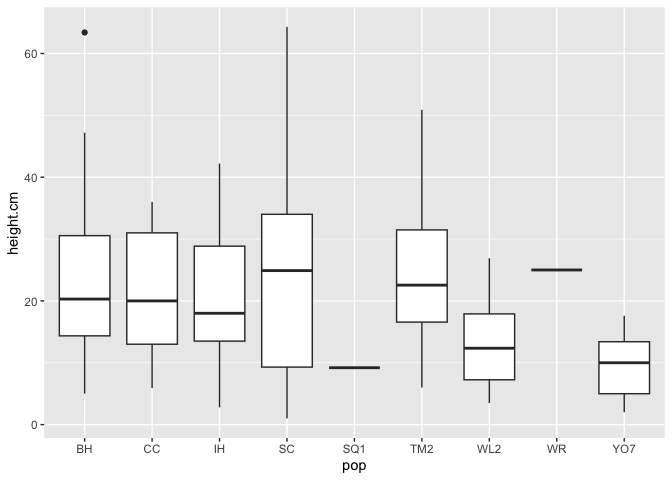
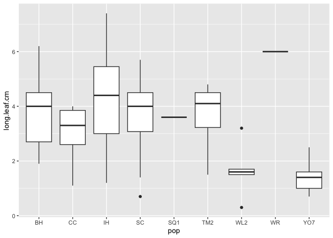
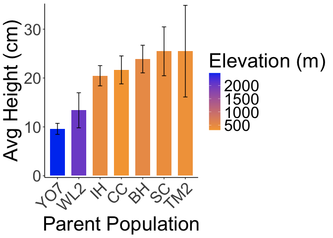
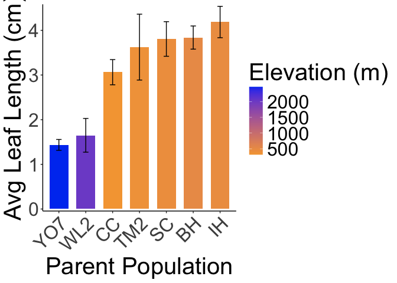

# Post-Winter Size at WL2

## Relevant Libraries and Functions


``` r
library(tidyverse)
```

```
## ── Attaching core tidyverse packages ──────────────────────── tidyverse 2.0.0 ──
## ✔ dplyr     1.1.4     ✔ readr     2.1.5
## ✔ forcats   1.0.0     ✔ stringr   1.5.1
## ✔ ggplot2   3.5.1     ✔ tibble    3.2.1
## ✔ lubridate 1.9.3     ✔ tidyr     1.3.1
## ✔ purrr     1.0.2     
## ── Conflicts ────────────────────────────────────────── tidyverse_conflicts() ──
## ✖ dplyr::filter() masks stats::filter()
## ✖ dplyr::lag()    masks stats::lag()
## ℹ Use the conflicted package (<http://conflicted.r-lib.org/>) to force all conflicts to become errors
```

``` r
library(lmerTest) #for mixed effect models
```

```
## Loading required package: lme4
## Loading required package: Matrix
## 
## Attaching package: 'Matrix'
## 
## The following objects are masked from 'package:tidyr':
## 
##     expand, pack, unpack
## 
## 
## Attaching package: 'lmerTest'
## 
## The following object is masked from 'package:lme4':
## 
##     lmer
## 
## The following object is masked from 'package:stats':
## 
##     step
```

``` r
library(emmeans) #for post-hoc pairwise comparisons 
```

```
## Welcome to emmeans.
## Caution: You lose important information if you filter this package's results.
## See '? untidy'
```

``` r
library(naniar) #replaces values with NA
library(ggnewscale)
library(corrplot) #plotting correlations 
```

```
## corrplot 0.94 loaded
```

``` r
library(geosphere) #for calculating geographic distance
conflicted::conflicts_prefer(lmerTest::lmer)
```

```
## [conflicted] Will prefer lmerTest::lmer over any other package.
```

``` r
conflicted::conflicts_prefer(dplyr::filter)
```

```
## [conflicted] Will prefer dplyr::filter over any other package.
```

``` r
sem <- function(x, na.rm=FALSE) {           #for calculating standard error
  sd(x,na.rm=na.rm)/sqrt(length(na.omit(x)))
} 

elev_three_palette <- c("#0043F0", "#C9727F", "#F5A540") #colors from Gremer et al 2019
elev_order <- c("High", "Mid", "Low") #for proper arrangement in figures 
```

## Load Size data


``` r
wl2_y2_pops <- read_csv("../input/WL2_Data/Final_2023_2024_Pop_Loc_Info.csv") %>%
  select(Pop.Type:unique.ID) %>% 
  filter(Pop.Type=="2023-survivor") %>% 
  select(Pop.Type, loc:bed, row=bedrow, col=bedcol, pop:unique.ID)
```

```
## Rows: 1217 Columns: 15
## ── Column specification ────────────────────────────────────────────────────────
## Delimiter: ","
## chr (8): Pop.Type, status, block, loc, bed, bedcol, pop, unique.ID
## dbl (7): bed.block.order, bed.order, AB.CD.order, column.order, bedrow, mf, rep
## 
## ℹ Use `spec()` to retrieve the full column specification for this data.
## ℹ Specify the column types or set `show_col_types = FALSE` to quiet this message.
```

``` r
wl2_blocks <- read_csv("../input/WL2_Data/CorrectedCSVs/WL2_mort_pheno_20231020_corrected.csv") %>% 
  unite(BedLoc, bed:bed.col, sep="_", remove = FALSE) %>% 
  filter(BedLoc!="K_5_C") %>% #get rid of duplicate locations
  select(block, pop, mf, rep) %>% #add in block info 
  mutate(mf=as.double(mf), rep=as.double(rep)) #convert to num
```

```
## Rows: 1826 Columns: 14
## ── Column specification ────────────────────────────────────────────────────────
## Delimiter: ","
## chr (12): block, bed, bed.col, pop, mf, rep, bud.date, flower.date, fruit.da...
## dbl  (1): bed.row
## lgl  (1): last.fruit.date
## 
## ℹ Use `spec()` to retrieve the full column specification for this data.
## ℹ Specify the column types or set `show_col_types = FALSE` to quiet this message.
```

```
## Warning: There were 2 warnings in `mutate()`.
## The first warning was:
## ℹ In argument: `mf = as.double(mf)`.
## Caused by warning:
## ! NAs introduced by coercion
## ℹ Run `dplyr::last_dplyr_warnings()` to see the 1 remaining warning.
```

``` r
wl2_y2_pops_blocks <- left_join(wl2_y2_pops, wl2_blocks)
```

```
## Joining with `by = join_by(pop, mf, rep)`
```

``` r
wl2_post_winter_2024 <- read_csv("../input/WL2_Data/WL2_size_survey_20240618_2023Plants_corrected.csv") %>% filter(Pop.Type!="2023-TM2-fruit") %>% select(-block, -wrongID)
```

```
## Rows: 159 Columns: 15
## ── Column specification ────────────────────────────────────────────────────────
## Delimiter: ","
## chr (9): Pop.Type, loc, bed, col, pop, unique.ID, wrongID, herbiv.y.n, surve...
## dbl (5): row, mf, rep, height.cm, long.leaf.cm
## lgl (1): block
## 
## ℹ Use `spec()` to retrieve the full column specification for this data.
## ℹ Specify the column types or set `show_col_types = FALSE` to quiet this message.
```

``` r
wl2_post_winter_2024_pops <- left_join(wl2_y2_pops_blocks, wl2_post_winter_2024) %>%  
  rename(Genotype=unique.ID)
```

```
## Joining with `by = join_by(Pop.Type, loc, bed, row, col, pop, mf, rep,
## unique.ID)`
```

``` r
write_csv(wl2_post_winter_2024_pops, "../output/WL2_Traits/WL2_PostWinter_Size.csv")
```

## Load the pop and location data


``` r
wl2_gowers_2024 <- read_csv("../output/Climate/Gowers_WL2_2024.csv") %>% 
  pivot_wider(names_from = TimePd, values_from = c(GrwSsn_GD, Wtr_Year_GD)) %>% 
  mutate(WL2_Lat=38.82599, WL2_Long=-120.2509, WL2_Elev=2020) %>% 
  mutate(Geographic_Dist=distHaversine(cbind(WL2_Long, WL2_Lat), cbind(Long, Lat)),
         Elev_Dist=elev_m-WL2_Elev) %>% # Calculate the distance using the haversine formula
  rename(pop=parent.pop)
```

```
## Rows: 46 Columns: 8
## ── Column specification ────────────────────────────────────────────────────────
## Delimiter: ","
## chr (3): parent.pop, elevation.group, TimePd
## dbl (5): elev_m, Lat, Long, GrwSsn_GD, Wtr_Year_GD
## 
## ℹ Use `spec()` to retrieve the full column specification for this data.
## ℹ Specify the column types or set `show_col_types = FALSE` to quiet this message.
```

## Add in location info


``` r
wl2_post_winter_2024_pops_loc <- left_join(wl2_post_winter_2024_pops, wl2_gowers_2024)
```

```
## Joining with `by = join_by(pop)`
```

``` r
head(wl2_post_winter_2024_pops_loc)
```

```
## # A tibble: 6 × 27
##   Pop.Type    loc   bed     row col   pop      mf   rep Genotype block height.cm
##   <chr>       <chr> <chr> <dbl> <chr> <chr> <dbl> <dbl> <chr>    <chr>     <dbl>
## 1 2023-survi… A_6_B A         6 B     CC        3     3 CC_3_3   A          NA  
## 2 2023-survi… A_16… A        16 B     BH        3     3 BH_3_3   A          NA  
## 3 2023-survi… A_17… A        17 A     BH        7     3 BH_7_3   A          38.7
## 4 2023-survi… A_18… A        18 A     BH        4     3 BH_4_3   A          13.2
## 5 2023-survi… A_24… A        24 A     WL2       7     9 WL2_7_9  A          26.9
## 6 2023-survi… A_32… A        32 B     IH        7     4 IH_7_4   B          32.5
## # ℹ 16 more variables: long.leaf.cm <dbl>, herbiv.y.n <chr>,
## #   survey.notes <chr>, elevation.group <chr>, elev_m <dbl>, Lat <dbl>,
## #   Long <dbl>, GrwSsn_GD_Recent <dbl>, GrwSsn_GD_Historical <dbl>,
## #   Wtr_Year_GD_Recent <dbl>, Wtr_Year_GD_Historical <dbl>, WL2_Lat <dbl>,
## #   WL2_Long <dbl>, WL2_Elev <dbl>, Geographic_Dist <dbl>, Elev_Dist <dbl>
```

## Pop Trends

``` r
wl2_post_winter_2024_pops_loc %>% 
  filter(!is.na(height.cm)) %>% 
  ggplot(aes(x=pop, y=height.cm)) +
  geom_boxplot()
```

<!-- -->

``` r
wl2_post_winter_2024_pops_loc %>% 
  filter(!is.na(long.leaf.cm)) %>% 
  ggplot(aes(x=pop, y=long.leaf.cm)) +
  geom_boxplot()
```

<!-- -->


``` r
wl2_post_winter_2024_summary <- wl2_post_winter_2024_pops_loc %>% 
  group_by(pop, elev_m) %>% 
  summarise(N_height = sum(!is.na(height.cm)), 
            mean_height.cm = mean(height.cm, na.rm=TRUE), sem_height.cm=sem(height.cm, na.rm=TRUE), 
            N_length = sum(!is.na(long.leaf.cm)),
            mean_long.leaf.cm=mean(long.leaf.cm, na.rm=TRUE), sem_long.leaf.cm=sem(long.leaf.cm, na.rm=TRUE))
```

```
## `summarise()` has grouped output by 'pop'. You can override using the `.groups`
## argument.
```

``` r
wl2_post_winter_2024_summary %>% arrange(N_height) 
```

```
## # A tibble: 10 × 8
## # Groups:   pop [10]
##    pop   elev_m N_height mean_height.cm sem_height.cm N_length mean_long.leaf.cm
##    <chr>  <dbl>    <int>          <dbl>         <dbl>    <int>             <dbl>
##  1 LV1    2593.        0          NaN           NA           0            NaN   
##  2 SQ1    1921.        1            9.2         NA           1              3.6 
##  3 WR     1158         1           25           NA           1              6   
##  4 TM2     379.        4           25.5          9.38        4              3.62
##  5 WL2    2020.        6           13.4          3.58        6              1.65
##  6 CC      313        13           21.7          2.87       11              3.06
##  7 SC      422.       15           25.5          4.99       14              3.81
##  8 YO7    2470.       17            9.6          1.13       17              1.44
##  9 BH      511.       23           23.9          2.82       23              3.84
## 10 IH      454.       23           20.5          2.07       23              4.19
## # ℹ 1 more variable: sem_long.leaf.cm <dbl>
```

``` r
#Sample size too low for LV1, SQ1, WR
#different sample sizes depending on the trait 
```


``` r
wl2_post_winter_2024_summary %>% 
  filter(N_height>2) %>% 
  ggplot(aes(x=fct_reorder(pop, mean_height.cm), y=mean_height.cm, fill=elev_m)) +
  geom_col(width = 0.7,position = position_dodge(0.75)) + 
  geom_errorbar(aes(ymin=mean_height.cm-sem_height.cm,ymax=mean_height.cm+sem_height.cm),width=.2, 
                position = position_dodge(0.75)) +
  theme_classic() + 
  scale_y_continuous(expand = c(0.01, 0)) +
  labs(y="Avg Height (cm)", x="Parent Population", fill="Elevation (m)") +
  scale_fill_gradient(low = "#F5A540", high = "#0043F0")  +
  theme(text=element_text(size=30), axis.text.x = element_text(angle = 45,  hjust = 1))
```

<!-- -->

``` r
wl2_post_winter_2024_summary %>% 
  filter(N_length>2) %>% 
  ggplot(aes(x=fct_reorder(pop, mean_long.leaf.cm), y=mean_long.leaf.cm, fill=elev_m)) +
  geom_col(width = 0.7,position = position_dodge(0.75)) + 
  geom_errorbar(aes(ymin=mean_long.leaf.cm-sem_long.leaf.cm,ymax=mean_long.leaf.cm+sem_long.leaf.cm),width=.2, 
                position = position_dodge(0.75)) +
  theme_classic() + 
  scale_y_continuous(expand = c(0.01, 0)) +
  labs(y="Avg Leaf Length (cm)", x="Parent Population", fill="Elevation (m)") +
  scale_fill_gradient(low = "#F5A540", high = "#0043F0")  +
  theme(text=element_text(size=30), axis.text.x = element_text(angle = 45,  hjust = 1))
```

<!-- -->

