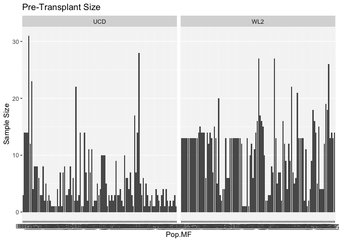
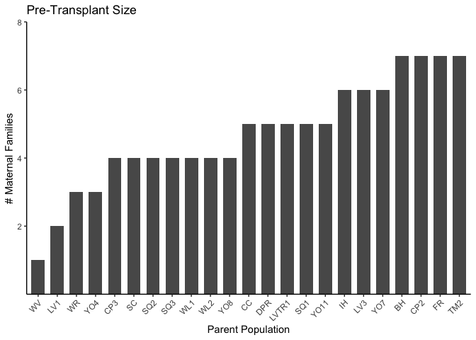
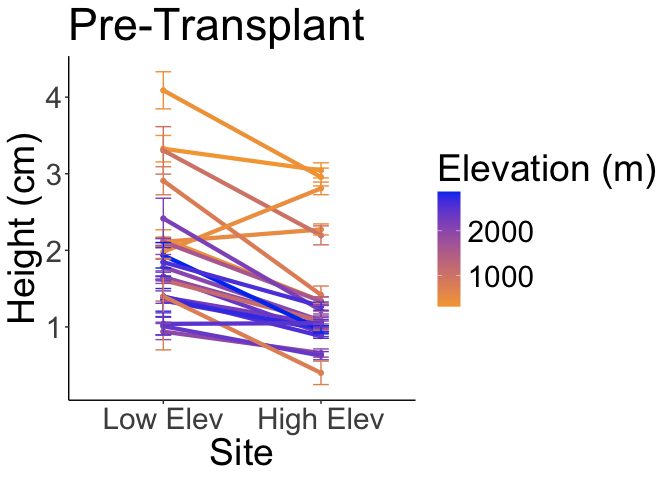
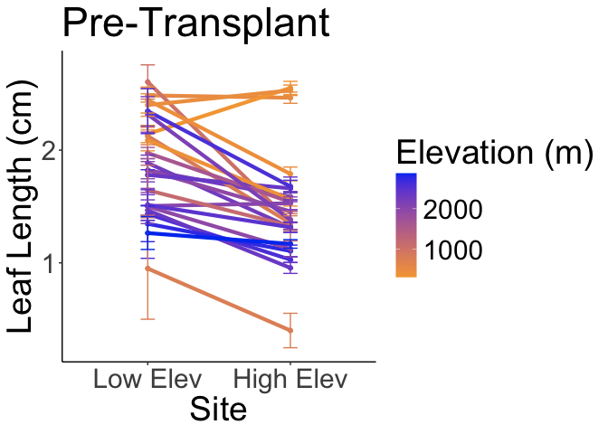
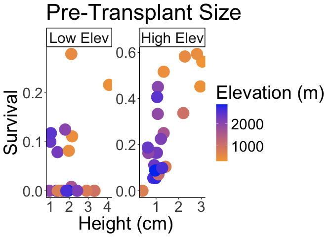
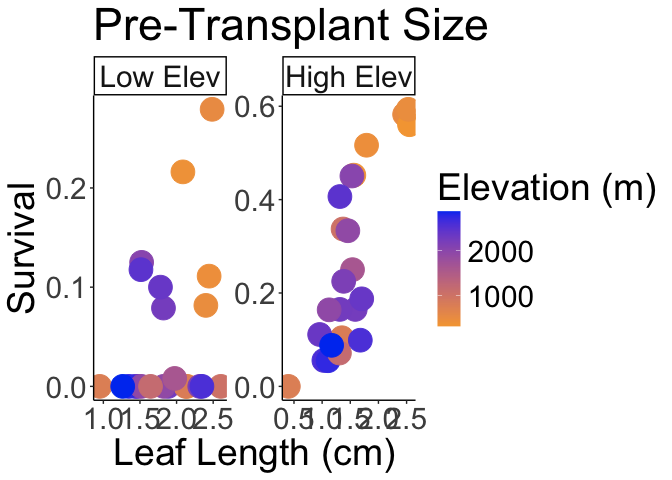
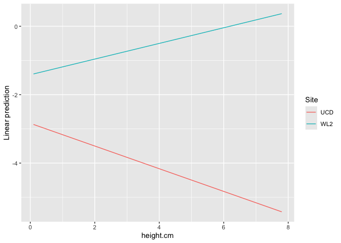
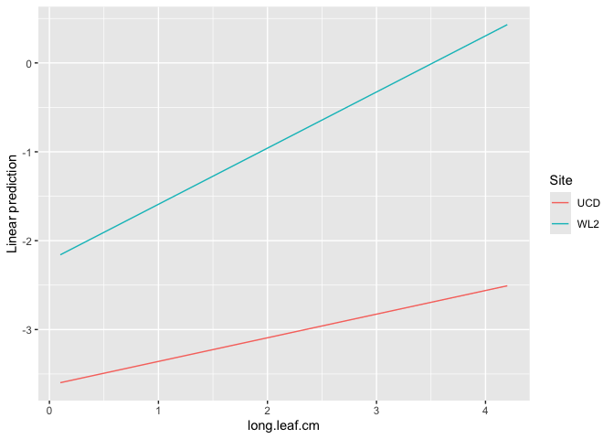

# Pre-Transplant Size for both gardens 
There shouldn't be any large differences since the plants were grown in the same environment pre-transplant. 
Is there a relationship between pre-transplant size and survival to the end of the first year? Does that differ across gardens?

## Relevant Libraries and Functions


``` r
library(tidyverse)
```

```
## ── Attaching core tidyverse packages ──────────────────────── tidyverse 2.0.0 ──
## ✔ dplyr     1.1.4     ✔ readr     2.1.5
## ✔ forcats   1.0.0     ✔ stringr   1.5.1
## ✔ ggplot2   3.5.1     ✔ tibble    3.2.1
## ✔ lubridate 1.9.3     ✔ tidyr     1.3.1
## ✔ purrr     1.0.2     
## ── Conflicts ────────────────────────────────────────── tidyverse_conflicts() ──
## ✖ dplyr::filter() masks stats::filter()
## ✖ dplyr::lag()    masks stats::lag()
## ℹ Use the conflicted package (<http://conflicted.r-lib.org/>) to force all conflicts to become errors
```

``` r
library(tidymodels)
```

```
## ── Attaching packages ────────────────────────────────────── tidymodels 1.2.0 ──
## ✔ broom        1.0.7     ✔ rsample      1.2.1
## ✔ dials        1.3.0     ✔ tune         1.2.1
## ✔ infer        1.0.7     ✔ workflows    1.1.4
## ✔ modeldata    1.4.0     ✔ workflowsets 1.1.0
## ✔ parsnip      1.2.1     ✔ yardstick    1.3.1
## ✔ recipes      1.1.0     
## ── Conflicts ───────────────────────────────────────── tidymodels_conflicts() ──
## ✖ scales::discard() masks purrr::discard()
## ✖ dplyr::filter()   masks stats::filter()
## ✖ recipes::fixed()  masks stringr::fixed()
## ✖ dplyr::lag()      masks stats::lag()
## ✖ yardstick::spec() masks readr::spec()
## ✖ recipes::step()   masks stats::step()
## • Use suppressPackageStartupMessages() to eliminate package startup messages
```

``` r
tidymodels_prefer()
library(lmerTest) #for mixed effect models
```

```
## Loading required package: lme4
## Loading required package: Matrix
## 
## Attaching package: 'Matrix'
## 
## The following objects are masked from 'package:tidyr':
## 
##     expand, pack, unpack
```

``` r
conflicted::conflicts_prefer(lmerTest::lmer)
```

```
## [conflicted] Will prefer lmerTest::lmer over any other package.
```

``` r
library(broom.mixed) #tidy method for lmerTest
library(emmeans) #for post-hoc pairwise comparisons 
```

```
## Welcome to emmeans.
## Caution: You lose important information if you filter this package's results.
## See '? untidy'
```

``` r
library(naniar) #replaces values with NA

sem <- function(x, na.rm=FALSE) {           #for caclulating standard error
  sd(x,na.rm=na.rm)/sqrt(length(na.omit(x)))
} 

elev_three_palette <- c("#0043F0", "#C9727F", "#F5A540") #colors from Gremer et al 2019
elev_order <- c("High", "Mid", "Low") #for proper arrangement in figures 
```

## Load the pop and location data


``` r
#pop info
pops_common_garden <- read_csv("../input/WL2_Data/Pops_for_2023_WL2.csv") #pops included in common garden 
```

```
## Rows: 23 Columns: 5
## ── Column specification ────────────────────────────────────────────────────────
## Delimiter: ","
## chr (2): parent.pop, elevation.group
## dbl (2): phylogroup, seed year
## lgl (1): notes
## 
## ℹ Use `spec()` to retrieve the full column specification for this data.
## ℹ Specify the column types or set `show_col_types = FALSE` to quiet this message.
```

``` r
pops_common_garden_nonotes <- pops_common_garden %>% select(parent.pop, elevation.group) #subset columns

#extra location info 
pop_loc <- read_csv("../input/Strep_tort_locs.csv")
```

```
## Rows: 54 Columns: 7
## ── Column specification ────────────────────────────────────────────────────────
## Delimiter: ","
## chr (6): Species epithet, Species Code, Site, Site code, Lat, Long
## dbl (1): Elevation (m)
## 
## ℹ Use `spec()` to retrieve the full column specification for this data.
## ℹ Specify the column types or set `show_col_types = FALSE` to quiet this message.
```

``` r
#need to change YOSE to YO
pop_loc_yo <- pop_loc %>% mutate(parent.pop = str_replace(`Site code`, "YOSE(\\d+)", "YO\\1")) %>% select(Lat, Long, elev_m=`Elevation (m)`, parent.pop)

#merge in location info
pop_elev <- left_join(pops_common_garden_nonotes, pop_loc_yo)
```

```
## Joining with `by = join_by(parent.pop)`
```

## Load Pre-Transplant Size data from both Gardens

``` r
ucd_pretrans_size <- read_csv("../input/UCD_Data/CorrectedCSVs/UCD_garden_size_measurements_20221128_corrected.csv",
                              na = c("", "NA", "-", "N/A"))
```

```
## Warning: One or more parsing issues, call `problems()` on your data frame for details,
## e.g.:
##   dat <- vroom(...)
##   problems(dat)
```

```
## Rows: 2264 Columns: 7
## ── Column specification ────────────────────────────────────────────────────────
## Delimiter: ","
## chr (2): parent.pop, Notes
## dbl (5): mf, rep, germinated?, Height (cm), Longest leaf (cm)
## 
## ℹ Use `spec()` to retrieve the full column specification for this data.
## ℹ Specify the column types or set `show_col_types = FALSE` to quiet this message.
```

``` r
head(ucd_pretrans_size) #includes germs and non-germs 
```

```
## # A tibble: 6 × 7
##   parent.pop    mf   rep `germinated?` `Height (cm)` `Longest leaf (cm)` Notes
##   <chr>      <dbl> <dbl>         <dbl>         <dbl>               <dbl> <chr>
## 1 BH             1     1             0            NA                  NA <NA> 
## 2 BH             1     2             0            NA                  NA <NA> 
## 3 BH             1     3             0            NA                  NA <NA> 
## 4 BH             1     4             0            NA                  NA <NA> 
## 5 BH             1     5             0            NA                  NA <NA> 
## 6 BH             1     6             0            NA                  NA <NA>
```

``` r
ucd_pretrans_size_germonly <- ucd_pretrans_size %>% 
  rename(germ = `germinated?`, height.cm = `Height (cm)`, long.leaf.cm=`Longest leaf (cm)`) %>% 
  filter(germ==1) %>% 
  unite(Genotype, parent.pop:rep, sep="_", remove = FALSE) %>% 
  unite(pop.mf, parent.pop:mf, sep="_", remove = FALSE)
head(ucd_pretrans_size_germonly)
```

```
## # A tibble: 6 × 9
##   Genotype pop.mf parent.pop    mf   rep  germ height.cm long.leaf.cm Notes
##   <chr>    <chr>  <chr>      <dbl> <dbl> <dbl>     <dbl>        <dbl> <chr>
## 1 BH_1_7   BH_1   BH             1     7     1       1.7          1.9 <NA> 
## 2 BH_1_8   BH_1   BH             1     8     1       1.7          1.6 <NA> 
## 3 BH_1_10  BH_1   BH             1    10     1       1.2          1.5 <NA> 
## 4 BH_2_1   BH_2   BH             2     1     1       1.4          2.7 <NA> 
## 5 BH_2_2   BH_2   BH             2     2     1       1.4          1.3 <NA> 
## 6 BH_2_3   BH_2   BH             2     3     1       1.1          1.7 <NA>
```

``` r
unique(ucd_pretrans_size_germonly$parent.pop) #looks correct
```

```
##  [1] "BH"    "CC"    "CP2"   "CP3"   "DPR"   "FR"    "IH"    "LV1"   "LV3"  
## [10] "LVTR1" "SC"    "SQ1"   "SQ2"   "SQ3"   "TM2"   "WL1"   "WL2"   "WR"   
## [19] "WV"    "YO11"  "YO4"   "YO7"   "YO8"
```


``` r
wl2_pretrans_size1 <- read_csv("../input/WL2_Data/CorrectedCSVs/WL2_DNA_Collection_Size_survey_combined20230703_corrected.csv")
```

```
## Rows: 1427 Columns: 7
## ── Column specification ────────────────────────────────────────────────────────
## Delimiter: ","
## chr (2): Pop, Notes
## dbl (5): mf, rep, DNA, height (cm), longest leaf (cm)
## 
## ℹ Use `spec()` to retrieve the full column specification for this data.
## ℹ Specify the column types or set `show_col_types = FALSE` to quiet this message.
```

``` r
wl2_pretrans_size2 <- read_csv("../input/WL2_Data/CorrectedCSVs/WL2_Extras_DNA_collection_size_survey_combined20230706_corrected.csv") %>% 
  filter(!is.na(`height (cm)`)) #to get rid of genotypes that were measured on the other data sheet (NAs on this sheet)
```

```
## Rows: 152 Columns: 7
## ── Column specification ────────────────────────────────────────────────────────
## Delimiter: ","
## chr (2): Pop, Notes
## dbl (5): mf, rep, DNA, height (cm), longest leaf (cm)
## 
## ℹ Use `spec()` to retrieve the full column specification for this data.
## ℹ Specify the column types or set `show_col_types = FALSE` to quiet this message.
```

``` r
wl2_pretrans_size_all <- bind_rows(wl2_pretrans_size1, wl2_pretrans_size2) %>%
  rename(parent.pop=Pop, height.cm = `height (cm)`, long.leaf.cm=`longest leaf (cm)`) %>% 
  unite(Genotype, parent.pop:rep, sep="_", remove = FALSE) %>% 
  unite(pop.mf, parent.pop:mf, sep="_", remove = FALSE)
head(wl2_pretrans_size_all)
```

```
## # A tibble: 6 × 9
##   Genotype pop.mf parent.pop    mf   rep   DNA height.cm long.leaf.cm Notes
##   <chr>    <chr>  <chr>      <dbl> <dbl> <dbl>     <dbl>        <dbl> <chr>
## 1 CP2_1_1  CP2_1  CP2            1     1     1       0.5          1.6 KN   
## 2 CP2_1_2  CP2_1  CP2            1     2     1       0.7          1.8 KN   
## 3 CP2_1_3  CP2_1  CP2            1     3     1       1.1          1.8 KN   
## 4 CP2_1_4  CP2_1  CP2            1     4     1       0.8          1.6 KN   
## 5 CP2_1_5  CP2_1  CP2            1     5     1       0.9          1.8 KN   
## 6 CP2_1_6  CP2_1  CP2            1     6     1       1            1.9 KN
```

## Merge the two sites

``` r
ucd_pretrans_size_prep <- ucd_pretrans_size_germonly %>% select(Genotype:rep, height.cm:long.leaf.cm) %>%
  mutate(Site="UCD")
names(ucd_pretrans_size_prep)
```

```
## [1] "Genotype"     "pop.mf"       "parent.pop"   "mf"           "rep"         
## [6] "height.cm"    "long.leaf.cm" "Site"
```

``` r
wl2_pretrans_size_prep <- wl2_pretrans_size_all %>% select(Genotype:rep, height.cm:long.leaf.cm) %>%
  mutate(Site="WL2")
names(wl2_pretrans_size_prep)
```

```
## [1] "Genotype"     "pop.mf"       "parent.pop"   "mf"           "rep"         
## [6] "height.cm"    "long.leaf.cm" "Site"
```

``` r
pretrans_rxnnorms <- bind_rows(ucd_pretrans_size_prep, wl2_pretrans_size_prep) %>% 
  arrange(pop.mf, Site)
head(pretrans_rxnnorms)
```

```
## # A tibble: 6 × 8
##   Genotype pop.mf parent.pop    mf   rep height.cm long.leaf.cm Site 
##   <chr>    <chr>  <chr>      <dbl> <dbl>     <dbl>        <dbl> <chr>
## 1 BH_1_7   BH_1   BH             1     7       1.7          1.9 UCD  
## 2 BH_1_8   BH_1   BH             1     8       1.7          1.6 UCD  
## 3 BH_1_10  BH_1   BH             1    10       1.2          1.5 UCD  
## 4 BH_1_1   BH_1   BH             1     1       2            2.2 WL2  
## 5 BH_1_2   BH_1   BH             1     2       2.3          2.1 WL2  
## 6 BH_1_3   BH_1   BH             1     3       3.6          2.6 WL2
```

## Add in Location Info

``` r
pretrans_rxnnorms_loc <-left_join(pretrans_rxnnorms, pop_elev) 
```

```
## Joining with `by = join_by(parent.pop)`
```

``` r
head(pretrans_rxnnorms_loc)
```

```
## # A tibble: 6 × 12
##   Genotype pop.mf parent.pop    mf   rep height.cm long.leaf.cm Site 
##   <chr>    <chr>  <chr>      <dbl> <dbl>     <dbl>        <dbl> <chr>
## 1 BH_1_7   BH_1   BH             1     7       1.7          1.9 UCD  
## 2 BH_1_8   BH_1   BH             1     8       1.7          1.6 UCD  
## 3 BH_1_10  BH_1   BH             1    10       1.2          1.5 UCD  
## 4 BH_1_1   BH_1   BH             1     1       2            2.2 WL2  
## 5 BH_1_2   BH_1   BH             1     2       2.3          2.1 WL2  
## 6 BH_1_3   BH_1   BH             1     3       3.6          2.6 WL2  
## # ℹ 4 more variables: elevation.group <chr>, Lat <chr>, Long <chr>,
## #   elev_m <dbl>
```


## Load survival to end of first year data

``` r
firstyear_surv <- read_csv("../output/firstyear_mort_both_sites.csv")
```

```
## Rows: 2327 Columns: 14
## ── Column specification ────────────────────────────────────────────────────────
## Delimiter: ","
## chr (6): Genotype, pop.mf, parent.pop, pheno, Site, elevation.group
## dbl (8): mf, rep, Survival, elev_m, Recent_Gowers_Dist_UCD, Historic_Gowers_...
## 
## ℹ Use `spec()` to retrieve the full column specification for this data.
## ℹ Specify the column types or set `show_col_types = FALSE` to quiet this message.
```

``` r
head(firstyear_surv)
```

```
## # A tibble: 6 × 14
##   Genotype pop.mf parent.pop    mf   rep pheno Site  Survival elevation.group
##   <chr>    <chr>  <chr>      <dbl> <dbl> <chr> <chr>    <dbl> <chr>          
## 1 BH_1_1   BH_1   BH             1     1 V     WL2          1 Low            
## 2 BH_1_10  BH_1   BH             1    10 X     UCD          0 Low            
## 3 BH_1_10  BH_1   BH             1    10 V     WL2          1 Low            
## 4 BH_1_11  BH_1   BH             1    11 <NA>  WL2          0 Low            
## 5 BH_1_12  BH_1   BH             1    12 V     WL2          1 Low            
## 6 BH_1_13  BH_1   BH             1    13 V     WL2          1 Low            
## # ℹ 5 more variables: elev_m <dbl>, Recent_Gowers_Dist_UCD <dbl>,
## #   Historic_Gowers_Dist_UCD <dbl>, Recent_Gowers_Dist_WL2 <dbl>,
## #   Historic_Gowers_Dist_WL2 <dbl>
```

``` r
firstyear_surv_merge_prep <- firstyear_surv %>% select(Genotype:rep, Site:Survival)
```

## Merge size and survival

``` r
pretrans_surv <- left_join(pretrans_rxnnorms_loc, firstyear_surv_merge_prep)
```

```
## Joining with `by = join_by(Genotype, pop.mf, parent.pop, mf, rep, Site)`
```

``` r
pretrans_surv %>% filter(is.na(Survival)) #12 genotypes with no survival information... likely did not survive to the time of planting 
```

```
## # A tibble: 12 × 13
##    Genotype  pop.mf  parent.pop    mf   rep height.cm long.leaf.cm Site 
##    <chr>     <chr>   <chr>      <dbl> <dbl>     <dbl>        <dbl> <chr>
##  1 DPR_4_2   DPR_4   DPR            4     2       1.4          0.9 WL2  
##  2 DPR_5_1   DPR_5   DPR            5     1      NA           NA   WL2  
##  3 LV1_6_7   LV1_6   LV1            6     7       1            0.8 WL2  
##  4 LVTR1_2_6 LVTR1_2 LVTR1          2     6      NA           NA   WL2  
##  5 LVTR1_6_3 LVTR1_6 LVTR1          6     3      NA           NA   WL2  
##  6 SQ1_14_4  SQ1_14  SQ1           14     4      NA           NA   WL2  
##  7 SQ2_6_1   SQ2_6   SQ2            6     1       0.6          1.1 UCD  
##  8 SQ3_2_2   SQ3_2   SQ3            2     2       0.2          0.3 WL2  
##  9 WL1_2_9   WL1_2   WL1            2     9      NA           NA   WL2  
## 10 WL2_3_8   WL2_3   WL2            3     8      NA           NA   UCD  
## 11 WL2_4_10  WL2_4   WL2            4    10       1.7          1.1 UCD  
## 12 WR_1_7    WR_1    WR             1     7       0.7          1.6 WL2  
## # ℹ 5 more variables: elevation.group <chr>, Lat <chr>, Long <chr>,
## #   elev_m <dbl>, Survival <dbl>
```

``` r
pretrans_surv_complete <- pretrans_surv %>% filter(!is.na(Survival))
```

## Maternal Family Sample Sizes 

``` r
#restrict to mfs with data at both sites 
pretrans_surv_mfs_wide <- pretrans_surv_complete %>% 
  group_by(pop.mf, parent.pop, Site, elev_m) %>% 
  summarise(N_height = sum(!is.na(height.cm))) %>% 
  select(pop.mf, Site, N_height) %>% 
  spread(Site, N_height) %>% 
  mutate(Both.Sites=if_else(!is.na(UCD) & !is.na(WL2), TRUE, FALSE)) %>% 
  filter(Both.Sites != "FALSE")
```

```
## `summarise()` has grouped output by 'pop.mf', 'parent.pop', 'Site'. You can
## override using the `.groups` argument.
## Adding missing grouping variables: `parent.pop`
```

``` r
pretrans_surv_mfs_bothsites <- left_join(pretrans_surv_mfs_wide, pretrans_surv_complete)
```

```
## Joining with `by = join_by(parent.pop, pop.mf)`
```

``` r
mf_sample_size <- pretrans_surv_mfs_bothsites %>% 
  count(parent.pop, pop.mf, Site) %>% 
  arrange(n)
mf_sample_size
```

```
## # A tibble: 216 × 4
## # Groups:   pop.mf, parent.pop [108]
##    pop.mf parent.pop Site      n
##    <chr>  <chr>      <chr> <int>
##  1 CP3_5  CP3        UCD       1
##  2 CP3_6  CP3        UCD       1
##  3 CP3_7  CP3        UCD       1
##  4 DPR_3  DPR        UCD       1
##  5 DPR_5  DPR        UCD       1
##  6 DPR_7  DPR        UCD       1
##  7 LV1_4  LV1        UCD       1
##  8 LV1_6  LV1        UCD       1
##  9 LV3_1  LV3        WL2       1
## 10 LV3_2  LV3        WL2       1
## # ℹ 206 more rows
```

``` r
summary(mf_sample_size)
```

```
##     pop.mf           parent.pop            Site                 n         
##  Length:216         Length:216         Length:216         Min.   : 1.000  
##  Class :character   Class :character   Class :character   1st Qu.: 3.000  
##  Mode  :character   Mode  :character   Mode  :character   Median : 7.000  
##                                                           Mean   : 8.125  
##                                                           3rd Qu.:13.000  
##                                                           Max.   :31.000
```

``` r
mf_sample_size %>% 
  ggplot(aes(x=pop.mf, y=n)) +
  geom_col() + 
  labs(x="Pop.MF", y="Sample Size", title="Pre-Transplant Size") +
  facet_wrap(~Site)
```

<!-- -->

``` r
mf_per_pop <- pretrans_surv_mfs_bothsites %>% 
  select(parent.pop, pop.mf) %>% 
  distinct() %>% 
  group_by(parent.pop) %>% 
  summarise(n = n()) %>% 
  arrange(n)

mf_per_pop %>% 
  ggplot(aes(x=fct_reorder(parent.pop, n), y=n)) +
  geom_col(width = 0.7,position = position_dodge(0.75)) + 
  theme_classic() +
  scale_y_continuous(limits = c(0,8), breaks = c(2, 4, 6, 8), expand = c(0, 0)) +
  theme(axis.text.x = element_text(angle = 45,  hjust = 1)) +
  labs(x="Parent Population", y="# Maternal Families", title="Pre-Transplant Size")
```

<!-- -->

## Plot Reaction Norms

### Means by Pop

``` r
pretrans_rxnnorms_summary <- pretrans_rxnnorms_loc %>% 
  group_by(parent.pop, Site, elev_m) %>% 
  summarise(N_height = sum(!is.na(height.cm)), mean_height.cm = mean(height.cm,na.rm=(TRUE)), 
            sem_height.cm=sem(height.cm, na.rm=(TRUE)), N_length = sum(!is.na(long.leaf.cm)),
            mean_long.leaf.cm=mean(long.leaf.cm, na.rm=(TRUE)), 
            sem_long.leaf.cm=sem(long.leaf.cm, na.rm=TRUE)) %>% 
  mutate(Site=str_replace_all(Site, "UCD", "Low Elev"), 
         Site=str_replace_all(Site, "WL2", "High Elev"))
```

```
## `summarise()` has grouped output by 'parent.pop', 'Site'. You can override
## using the `.groups` argument.
```

``` r
pretrans_rxnnorms_summary
```

```
## # A tibble: 46 × 9
## # Groups:   parent.pop, Site [46]
##    parent.pop Site      elev_m N_height mean_height.cm sem_height.cm N_length
##    <chr>      <chr>      <dbl>    <int>          <dbl>         <dbl>    <int>
##  1 BH         Low Elev    511.      111          2.11         0.0625      111
##  2 BH         High Elev   511.       91          2.27         0.0722       91
##  3 CC         Low Elev    313        44          3.33         0.173        44
##  4 CC         High Elev   313        91          3.04         0.0987       91
##  5 CP2        Low Elev   2244.       38          1.39         0.0809       38
##  6 CP2        High Elev  2244.       91          1.04         0.0388       91
##  7 CP3        Low Elev   2266.        7          1.34         0.282         7
##  8 CP3        High Elev  2266.       91          0.971        0.0339       91
##  9 DPR        Low Elev   1019.       22          3.30         0.310        22
## 10 DPR        High Elev  1019.       90          2.20         0.124        90
## # ℹ 36 more rows
## # ℹ 2 more variables: mean_long.leaf.cm <dbl>, sem_long.leaf.cm <dbl>
```

``` r
pretrans_rxnnorms_summary$Site <- factor(pretrans_rxnnorms_summary$Site,
                                               levels = c('Low Elev','High Elev'))
```

### Plot Pop Avgs

``` r
pretrans_rxnnorms_summary %>% 
  filter(N_height != 1) %>% 
  ggplot(aes(x=Site, y=mean_height.cm, group=parent.pop, color=elev_m)) + 
  geom_point(size=1.5) + geom_line(linewidth=1.5) +
  geom_errorbar(aes(ymin=mean_height.cm-sem_height.cm,ymax=mean_height.cm+sem_height.cm),width=.1) +
  theme_classic() + scale_colour_gradient(low = "#F5A540", high = "#0043F0")  +
  labs(y="Height (cm)", color="Elevation (m)", title = "Pre-Transplant") +
 # ylim(0,4) +
  theme(text=element_text(size=28)) 
```

<!-- -->

``` r
ggsave("../output/PreTrans_RxNorms_Height_ALL_PopAvgs.png", width = 14, height = 8, units = "in")

pretrans_rxnnorms_summary %>% 
  filter(N_length != 1) %>% 
  ggplot(aes(x=Site, y=mean_long.leaf.cm, group=parent.pop, color=elev_m)) + 
  geom_point(size=1.5) + geom_line(linewidth=1.5) +
  geom_errorbar(aes(ymin=mean_long.leaf.cm-sem_long.leaf.cm,
                    ymax=mean_long.leaf.cm+sem_long.leaf.cm),width=.1) +
  theme_classic() + scale_colour_gradient(low = "#F5A540", high = "#0043F0")  +
  labs(y="Leaf Length (cm)", color="Elevation (m)", title = "Pre-Transplant") +
  theme(text=element_text(size=28))
```

<!-- -->

``` r
ggsave("../output/PreTrans_RxNorms_LongestLength_ALL_PopAvgs.png", width = 14, height = 8, units = "in")
```
Plants were overall smaller when planted at WL2 than at Davis.

## Connection to survival to end of first year

``` r
pretrans_surv_pop_avgs <- pretrans_surv_complete %>% 
  group_by(parent.pop, Site, elev_m) %>% 
  summarise(N_Surv = sum(!is.na(Survival)), mean_Surv = mean(Survival,na.rm=(TRUE)), 
            sem_surv=sem(Survival, na.rm=(TRUE)), 
            N_height = sum(!is.na(height.cm)), mean_height.cm = mean(height.cm,na.rm=(TRUE)), 
            sem_height.cm=sem(height.cm, na.rm=(TRUE)), N_length = sum(!is.na(long.leaf.cm)),
            mean_long.leaf.cm=mean(long.leaf.cm, na.rm=(TRUE)), 
            sem_long.leaf.cm=sem(long.leaf.cm, na.rm=TRUE)) %>% 
  mutate(Site=str_replace_all(Site, "UCD", "Low Elev"), 
         Site=str_replace_all(Site, "WL2", "High Elev"))
```

```
## `summarise()` has grouped output by 'parent.pop', 'Site'. You can override
## using the `.groups` argument.
```

``` r
pretrans_surv_pop_avgs %>% arrange(desc(mean_height.cm))
```

```
## # A tibble: 46 × 12
## # Groups:   parent.pop, Site [46]
##    parent.pop Site      elev_m N_Surv mean_Surv sem_surv N_height mean_height.cm
##    <chr>      <chr>      <dbl>  <int>     <dbl>    <dbl>    <int>          <dbl>
##  1 TM2        Low Elev    379.     37     0.216   0.0686       37           4.09
##  2 CC         Low Elev    313      44     0       0            44           3.33
##  3 DPR        Low Elev   1019.     22     0       0            22           3.30
##  4 CC         High Elev   313      91     0.560   0.0523       91           3.04
##  5 TM2        High Elev   379.     84     0.452   0.0546       84           2.96
##  6 FR         Low Elev    787      38     0       0            36           2.91
##  7 IH         High Elev   454.     91     0.593   0.0518       91           2.81
##  8 YO4        Low Elev   2158.      6     0       0             6           2.42
##  9 BH         High Elev   511.     91     0.582   0.0520       91           2.27
## 10 DPR        High Elev  1019.     89     0.337   0.0504       89           2.20
## # ℹ 36 more rows
## # ℹ 4 more variables: sem_height.cm <dbl>, N_length <int>,
## #   mean_long.leaf.cm <dbl>, sem_long.leaf.cm <dbl>
```

``` r
pretrans_surv_pop_avgs$Site <- factor(pretrans_surv_pop_avgs$Site,
                                               levels = c('Low Elev','High Elev'))
```


``` r
pretrans_surv_pop_avgs %>% 
  ggplot(aes(x=mean_height.cm, y=mean_Surv, group=parent.pop, color=elev_m)) +
  geom_point(size=8) +
  theme_classic() + scale_colour_gradient(low = "#F5A540", high = "#0043F0")  +
  labs(x="Height (cm)" ,y="Survival", color="Elevation (m)",title = "Pre-Transplant Size") +
  theme(text=element_text(size=28)) +
  facet_wrap(vars(Site), scales="free")
```

<!-- -->

``` r
ggsave("../output/Surv_PreTrans_Height_BothGardens.png", width = 18, height = 8, units = "in")

pretrans_surv_pop_avgs %>% 
  ggplot(aes(x=mean_long.leaf.cm, y=mean_Surv, group=parent.pop, color=elev_m)) +
  geom_point(size=8) +
  theme_classic() + scale_colour_gradient(low = "#F5A540", high = "#0043F0")  +
  labs(x="Leaf Length (cm)" ,y="Survival", color="Elevation (m)", title = "Pre-Transplant Size") +
  theme(text=element_text(size=28)) +
  facet_wrap(vars(Site), scales="free")
```

<!-- -->

``` r
ggsave("../output/Surv_PreTrans_Length_BothGardens.png", width = 18, height = 8, units = "in")
```

### Log Reg survival ~ size 
Height

``` r
basiclogit_height <- glm(Survival ~ height.cm, data = pretrans_surv_complete, family = "binomial")
basiclogit_height
```

```
## 
## Call:  glm(formula = Survival ~ height.cm, family = "binomial", data = pretrans_surv_complete)
## 
## Coefficients:
## (Intercept)    height.cm  
##     -1.7190       0.2708  
## 
## Degrees of Freedom: 2311 Total (i.e. Null);  2310 Residual
##   (9 observations deleted due to missingness)
## Null Deviance:	    2467 
## Residual Deviance: 2432 	AIC: 2436
```

``` r
summary(basiclogit_height)
```

```
## 
## Call:
## glm(formula = Survival ~ height.cm, family = "binomial", data = pretrans_surv_complete)
## 
## Coefficients:
##             Estimate Std. Error z value Pr(>|z|)    
## (Intercept) -1.71903    0.09742 -17.646  < 2e-16 ***
## height.cm    0.27084    0.04491   6.031 1.63e-09 ***
## ---
## Signif. codes:  0 '***' 0.001 '**' 0.01 '*' 0.05 '.' 0.1 ' ' 1
## 
## (Dispersion parameter for binomial family taken to be 1)
## 
##     Null deviance: 2467.3  on 2311  degrees of freedom
## Residual deviance: 2431.8  on 2310  degrees of freedom
##   (9 observations deleted due to missingness)
## AIC: 2435.8
## 
## Number of Fisher Scoring iterations: 4
```

``` r
basiclogit_height2 <- glmer(Survival ~ height.cm + (1|parent.pop/mf), data = pretrans_surv_complete, family = binomial(link = "logit"))
summary(basiclogit_height2)
```

```
## Generalized linear mixed model fit by maximum likelihood (Laplace
##   Approximation) [glmerMod]
##  Family: binomial  ( logit )
## Formula: Survival ~ height.cm + (1 | parent.pop/mf)
##    Data: pretrans_surv_complete
## 
##      AIC      BIC   logLik deviance df.resid 
##   2225.9   2248.9  -1109.0   2217.9     2308 
## 
## Scaled residuals: 
##     Min      1Q  Median      3Q     Max 
## -1.0235 -0.6255 -0.3185 -0.2221  4.4857 
## 
## Random effects:
##  Groups        Name        Variance Std.Dev.
##  mf:parent.pop (Intercept) 0.1527   0.3908  
##  parent.pop    (Intercept) 0.9734   0.9866  
## Number of obs: 2312, groups:  mf:parent.pop, 173; parent.pop, 23
## 
## Fixed effects:
##             Estimate Std. Error z value Pr(>|z|)    
## (Intercept) -1.64439    0.24854  -6.616 3.69e-11 ***
## height.cm   -0.03114    0.06957  -0.448    0.654    
## ---
## Signif. codes:  0 '***' 0.001 '**' 0.01 '*' 0.05 '.' 0.1 ' ' 1
## 
## Correlation of Fixed Effects:
##           (Intr)
## height.cm -0.425
```

``` r
logit_height <- glm(Survival ~ height.cm*Site*elev_m, data = pretrans_surv_complete, family = "binomial")
summary(logit_height)
```

```
## 
## Call:
## glm(formula = Survival ~ height.cm * Site * elev_m, family = "binomial", 
##     data = pretrans_surv_complete)
## 
## Coefficients:
##                            Estimate Std. Error z value Pr(>|z|)   
## (Intercept)              -1.5440886  0.5135630  -3.007  0.00264 **
## height.cm                 0.1906472  0.1966738   0.969  0.33237   
## SiteWL2                   1.6527532  0.5729029   2.885  0.00392 **
## elev_m                   -0.0003897  0.0004756  -0.819  0.41255   
## height.cm:SiteWL2        -0.1171912  0.2229239  -0.526  0.59910   
## height.cm:elev_m         -0.0004891  0.0002771  -1.765  0.07755 . 
## SiteWL2:elev_m           -0.0004297  0.0004989  -0.861  0.38912   
## height.cm:SiteWL2:elev_m  0.0005769  0.0002948   1.957  0.05032 . 
## ---
## Signif. codes:  0 '***' 0.001 '**' 0.01 '*' 0.05 '.' 0.1 ' ' 1
## 
## (Dispersion parameter for binomial family taken to be 1)
## 
##     Null deviance: 2467.3  on 2311  degrees of freedom
## Residual deviance: 2087.8  on 2304  degrees of freedom
##   (9 observations deleted due to missingness)
## AIC: 2103.8
## 
## Number of Fisher Scoring iterations: 6
```

``` r
logit_height2 <- glmer(Survival ~ height.cm*Site*elev_m + (1|parent.pop/mf), data = pretrans_surv_complete, family = binomial(link = "logit")) 
```

```
## Warning: Some predictor variables are on very different scales: consider
## rescaling
```

```
## Warning in checkConv(attr(opt, "derivs"), opt$par, ctrl = control$checkConv, :
## Model failed to converge with max|grad| = 0.0996635 (tol = 0.002, component 1)
```

```
## Warning in checkConv(attr(opt, "derivs"), opt$par, ctrl = control$checkConv, : Model is nearly unidentifiable: very large eigenvalue
##  - Rescale variables?;Model is nearly unidentifiable: large eigenvalue ratio
##  - Rescale variables?
```

``` r
summary(logit_height2)
```

```
## Generalized linear mixed model fit by maximum likelihood (Laplace
##   Approximation) [glmerMod]
##  Family: binomial  ( logit )
## Formula: Survival ~ height.cm * Site * elev_m + (1 | parent.pop/mf)
##    Data: pretrans_surv_complete
## 
##      AIC      BIC   logLik deviance df.resid 
##   2021.9   2079.3  -1000.9   2001.9     2302 
## 
## Scaled residuals: 
##     Min      1Q  Median      3Q     Max 
## -1.6015 -0.4684 -0.2978 -0.1070  6.8102 
## 
## Random effects:
##  Groups        Name        Variance Std.Dev.
##  mf:parent.pop (Intercept) 0.02825  0.1681  
##  parent.pop    (Intercept) 0.45174  0.6721  
## Number of obs: 2312, groups:  mf:parent.pop, 173; parent.pop, 23
## 
## Fixed effects:
##                            Estimate Std. Error z value Pr(>|z|)    
## (Intercept)              -2.3882810  0.6196147  -3.854 0.000116 ***
## height.cm                 0.3013593  0.1963181   1.535 0.124770    
## SiteWL2                   2.3268222  0.5912320   3.936  8.3e-05 ***
## elev_m                   -0.0002815  0.0004776  -0.589 0.555598    
## height.cm:SiteWL2        -0.2363297  0.2209070  -1.070 0.284703    
## height.cm:elev_m         -0.0003975  0.0002598  -1.530 0.125986    
## SiteWL2:elev_m           -0.0005700  0.0004700  -1.213 0.225183    
## height.cm:SiteWL2:elev_m  0.0005005  0.0002748   1.821 0.068615 .  
## ---
## Signif. codes:  0 '***' 0.001 '**' 0.01 '*' 0.05 '.' 0.1 ' ' 1
## 
## Correlation of Fixed Effects:
##             (Intr) hght.c SitWL2 elev_m hg.:SWL2 hgh.:_ SWL2:_
## height.cm   -0.729                                            
## SiteWL2     -0.741  0.705                                     
## elev_m      -0.729  0.710  0.567                              
## hght.c:SWL2  0.614 -0.805 -0.864 -0.590                       
## hght.cm:lv_  0.359 -0.710 -0.338 -0.784  0.566                
## SitWL2:lv_m  0.558 -0.677 -0.717 -0.866  0.756    0.761       
## hgh.:SWL2:_ -0.320  0.621  0.426  0.711 -0.693   -0.899 -0.834
## fit warnings:
## Some predictor variables are on very different scales: consider rescaling
## optimizer (Nelder_Mead) convergence code: 0 (OK)
## Model failed to converge with max|grad| = 0.0996635 (tol = 0.002, component 1)
## Model is nearly unidentifiable: very large eigenvalue
##  - Rescale variables?
## Model is nearly unidentifiable: large eigenvalue ratio
##  - Rescale variables?
```

``` r
emtrends(logit_height2, pairwise ~ Site, var = "height.cm")
```

```
## NOTE: Results may be misleading due to involvement in interactions
```

```
## $emtrends
##  Site height.cm.trend    SE  df asymp.LCL asymp.UCL
##  UCD           -0.321 0.301 Inf   -0.9106     0.269
##  WL2            0.226 0.122 Inf   -0.0132     0.466
## 
## Confidence level used: 0.95 
## 
## $contrasts
##  contrast  estimate   SE  df z.ratio p.value
##  UCD - WL2   -0.547 0.32 Inf  -1.711  0.0871
```

``` r
emmip(logit_height2, Site ~ height.cm, cov.reduce = range)
```

```
## NOTE: Results may be misleading due to involvement in interactions
```

<!-- -->

Length

``` r
basiclogit_length <- glm(Survival ~ long.leaf.cm, data = pretrans_surv_complete, family = "binomial")
summary(basiclogit_length)
```

```
## 
## Call:
## glm(formula = Survival ~ long.leaf.cm, family = "binomial", data = pretrans_surv_complete)
## 
## Coefficients:
##              Estimate Std. Error z value Pr(>|z|)    
## (Intercept)  -2.32424    0.14221 -16.344   <2e-16 ***
## long.leaf.cm  0.60329    0.07052   8.555   <2e-16 ***
## ---
## Signif. codes:  0 '***' 0.001 '**' 0.01 '*' 0.05 '.' 0.1 ' ' 1
## 
## (Dispersion parameter for binomial family taken to be 1)
## 
##     Null deviance: 2466.8  on 2310  degrees of freedom
## Residual deviance: 2391.7  on 2309  degrees of freedom
##   (10 observations deleted due to missingness)
## AIC: 2395.7
## 
## Number of Fisher Scoring iterations: 4
```

``` r
basiclogit_length2 <- glmer(Survival ~ long.leaf.cm + (1|parent.pop/mf), data = pretrans_surv_complete, family = binomial(link = "logit"))
summary(basiclogit_length2)
```

```
## Generalized linear mixed model fit by maximum likelihood (Laplace
##   Approximation) [glmerMod]
##  Family: binomial  ( logit )
## Formula: Survival ~ long.leaf.cm + (1 | parent.pop/mf)
##    Data: pretrans_surv_complete
## 
##      AIC      BIC   logLik deviance df.resid 
##   2219.0   2242.0  -1105.5   2211.0     2307 
## 
## Scaled residuals: 
##     Min      1Q  Median      3Q     Max 
## -1.1212 -0.6092 -0.3172 -0.2237  4.5071 
## 
## Random effects:
##  Groups        Name        Variance Std.Dev.
##  mf:parent.pop (Intercept) 0.1573   0.3966  
##  parent.pop    (Intercept) 0.8224   0.9069  
## Number of obs: 2311, groups:  mf:parent.pop, 173; parent.pop, 23
## 
## Fixed effects:
##              Estimate Std. Error z value Pr(>|z|)    
## (Intercept)  -2.08873    0.26127  -7.995  1.3e-15 ***
## long.leaf.cm  0.24510    0.09435   2.598  0.00938 ** 
## ---
## Signif. codes:  0 '***' 0.001 '**' 0.01 '*' 0.05 '.' 0.1 ' ' 1
## 
## Correlation of Fixed Effects:
##             (Intr)
## long.lef.cm -0.598
```

``` r
logit_length2 <- glmer(Survival ~ long.leaf.cm*Site + (1|parent.pop/mf), data = pretrans_surv_complete, family = binomial(link = "logit")) 
summary(logit_length2)
```

```
## Generalized linear mixed model fit by maximum likelihood (Laplace
##   Approximation) [glmerMod]
##  Family: binomial  ( logit )
## Formula: Survival ~ long.leaf.cm * Site + (1 | parent.pop/mf)
##    Data: pretrans_surv_complete
## 
##      AIC      BIC   logLik deviance df.resid 
##   2003.1   2037.6   -995.6   1991.1     2305 
## 
## Scaled residuals: 
##     Min      1Q  Median      3Q     Max 
## -1.8642 -0.4630 -0.2979 -0.1379  5.7361 
## 
## Random effects:
##  Groups        Name        Variance Std.Dev.
##  mf:parent.pop (Intercept) 0.003121 0.05586 
##  parent.pop    (Intercept) 0.733516 0.85646 
## Number of obs: 2311, groups:  mf:parent.pop, 173; parent.pop, 23
## 
## Fixed effects:
##                      Estimate Std. Error z value Pr(>|z|)    
## (Intercept)           -3.6245     0.5231  -6.929 4.24e-12 ***
## long.leaf.cm           0.2662     0.2104   1.265  0.20579    
## SiteWL2                1.4023     0.5263   2.664  0.00772 ** 
## long.leaf.cm:SiteWL2   0.3656     0.2295   1.593  0.11118    
## ---
## Signif. codes:  0 '***' 0.001 '**' 0.01 '*' 0.05 '.' 0.1 ' ' 1
## 
## Correlation of Fixed Effects:
##             (Intr) lng.l. SitWL2
## long.lef.cm -0.881              
## SiteWL2     -0.867  0.850       
## lng.l.:SWL2  0.801 -0.865 -0.948
```

``` r
emtrends(logit_length2, pairwise ~ Site, var = "long.leaf.cm")
```

```
## $emtrends
##  Site long.leaf.cm.trend    SE  df asymp.LCL asymp.UCL
##  UCD               0.266 0.210 Inf    -0.146     0.679
##  WL2               0.632 0.116 Inf     0.405     0.858
## 
## Confidence level used: 0.95 
## 
## $contrasts
##  contrast  estimate   SE  df z.ratio p.value
##  UCD - WL2   -0.366 0.23 Inf  -1.593  0.1112
```

``` r
emmip(logit_length2, Site ~ long.leaf.cm, cov.reduce = range)
```

<!-- -->
