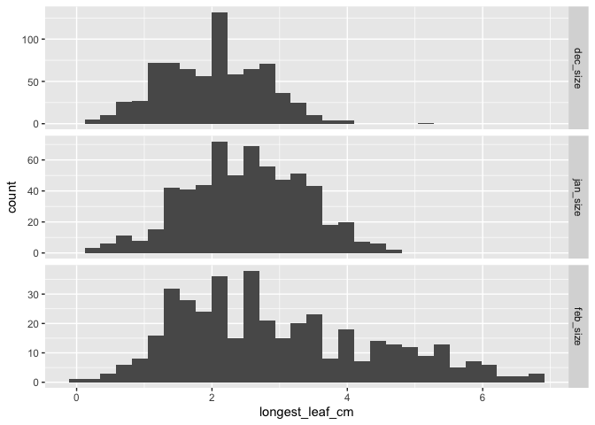
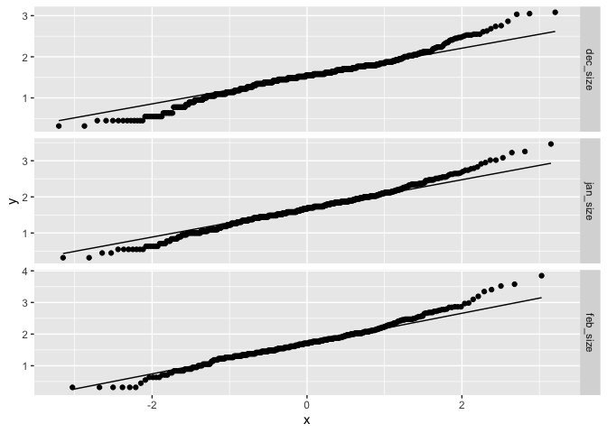
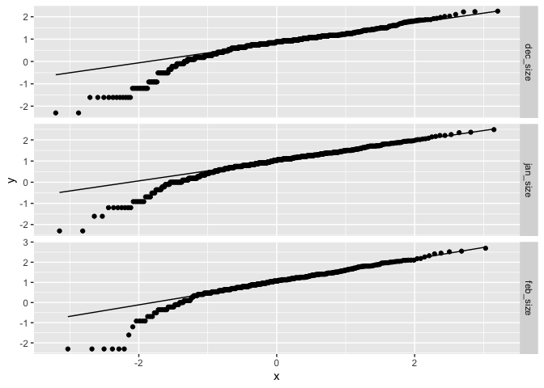
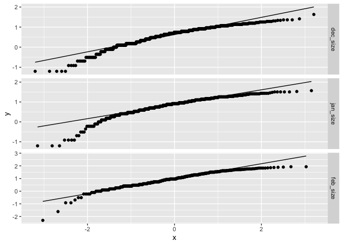
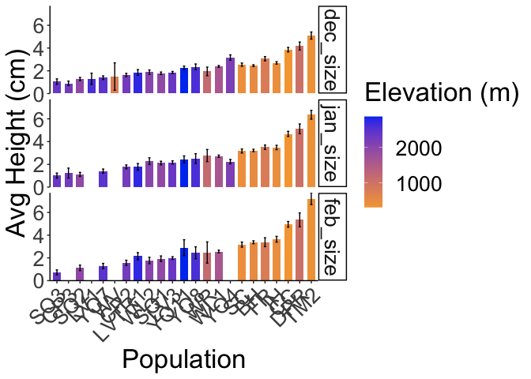

To Do:

-   Figure out how to get Ranova output with map syntax 

-   ASK JULIN AND JENNY HOW WE FEEL ABOUT A SAMPLE SIZE OF 2

-   Calculate regression b/t height and longest leaf?

-   Analyze Pre-transplant size

    -   How predictive is this of survival in the field?

-   emmeans package for post-hoc pairwise comparisons

-   Analyze growth (remove rep# 100)

    -   Include pre-transplant size

    -   Get growth curve code from Julin

    -   Is the growth rate lower for high elev b/c drier and biennial?


## Relevant Libraries and Functions


```r
library(tidyverse)
```

```
## ── Attaching core tidyverse packages ──────────────────────── tidyverse 2.0.0 ──
## ✔ dplyr     1.1.3     ✔ readr     2.1.4
## ✔ forcats   1.0.0     ✔ stringr   1.5.0
## ✔ ggplot2   3.4.3     ✔ tibble    3.2.1
## ✔ lubridate 1.9.2     ✔ tidyr     1.3.0
## ✔ purrr     1.0.2     
## ── Conflicts ────────────────────────────────────────── tidyverse_conflicts() ──
## ✖ dplyr::filter() masks stats::filter()
## ✖ dplyr::lag()    masks stats::lag()
## ℹ Use the conflicted package (<http://conflicted.r-lib.org/>) to force all conflicts to become errors
```

```r
library(lmerTest) #for mixed effect models
```

```
## Loading required package: lme4
## Loading required package: Matrix
## 
## Attaching package: 'Matrix'
## 
## The following objects are masked from 'package:tidyr':
## 
##     expand, pack, unpack
## 
## 
## Attaching package: 'lmerTest'
## 
## The following object is masked from 'package:lme4':
## 
##     lmer
## 
## The following object is masked from 'package:stats':
## 
##     step
```

```r
library(emmeans) #for post-hoc pairwise comparisons 
library(naniar) #replaces values with NA
library(corrplot) #plotting correlations 
```

```
## corrplot 0.92 loaded
```

```r
library(rstatix) #performing cor_test
```

```
## 
## Attaching package: 'rstatix'
## 
## The following object is masked from 'package:stats':
## 
##     filter
```

```r
sem <- function(x, na.rm=FALSE) {
  sd(x,na.rm=na.rm)/sqrt(length(na.omit(x)))
} #standard error function 

elev_three_palette <- c("#0043F0", "#C9727F", "#F5A540") #colors from Gremer et al 2019
elev_order <- c("High", "Mid", "Low")
```

## Load the pop and location data


```r
#pop info
pops_common_garden <- read_csv("../input/UCD_Data/Pops_for_2022_UCD.csv") #pops included in common garden 
```

```
## Rows: 23 Columns: 11
## ── Column specification ────────────────────────────────────────────────────────
## Delimiter: ","
## chr (5): parent.pop, elevation.group, collection.priority., on.climate.PCA.,...
## dbl (5): phylogroup, maternal.families, approx.number.seeds, UCD.seed.year, ...
## lgl (1): JGI.DNA
## 
## ℹ Use `spec()` to retrieve the full column specification for this data.
## ℹ Specify the column types or set `show_col_types = FALSE` to quiet this message.
```

```r
summary(pops_common_garden)
```

```
##   parent.pop          phylogroup    elevation.group    maternal.families
##  Length:23          Min.   :1.000   Length:23          Min.   : 3.0     
##  Class :character   1st Qu.:2.000   Class :character   1st Qu.:16.5     
##  Mode  :character   Median :4.000   Mode  :character   Median :23.0     
##                     Mean   :4.435                      Mean   :22.7     
##                     3rd Qu.:7.000                      3rd Qu.:29.5     
##                     Max.   :9.000                      Max.   :44.0     
##  approx.number.seeds UCD.seed.year  proposed.WL2.seed.year collection.priority.
##  Min.   : 100.0      Min.   :2014   Min.   :2014           Length:23           
##  1st Qu.: 500.0      1st Qu.:2018   1st Qu.:2020           Class :character    
##  Median : 500.0      Median :2020   Median :2021           Mode  :character    
##  Mean   : 608.7      Mean   :2020   Mean   :2020                               
##  3rd Qu.:1000.0      3rd Qu.:2021   3rd Qu.:2021                               
##  Max.   :1000.0      Max.   :2021   Max.   :2022                               
##  on.climate.PCA.    JGI.DNA           notes          
##  Length:23          Mode:logical   Length:23         
##  Class :character   NA's:23        Class :character  
##  Mode  :character                  Mode  :character  
##                                                      
##                                                      
## 
```

```r
pops_common_garden_nonotes <- pops_common_garden %>% select(parent.pop:elevation.group, UCD.seed.year)
pops_common_garden_nonotes$elevation.group <- str_to_title(pops_common_garden_nonotes$elevation.group)

#extra location info 
pop_loc <- read_csv("../input/Strep_tort_locs.csv")
```

```
## Rows: 54 Columns: 7
## ── Column specification ────────────────────────────────────────────────────────
## Delimiter: ","
## chr (6): Species epithet, Species Code, Site, Site code, Lat, Long
## dbl (1): Elevation (m)
## 
## ℹ Use `spec()` to retrieve the full column specification for this data.
## ℹ Specify the column types or set `show_col_types = FALSE` to quiet this message.
```

```r
unique(pop_loc$`Site code`)
```

```
##  [1] "BH"     "BB"     "CC"     "CP1"    "CP2"    "CP3"    "DP"     "DPR"   
##  [9] "FR"     NA       "HH"     "IH"     "KC1"    "KC2"    "KC3"    "LV1"   
## [17] "LV2"    "LV3"    "LVTR1"  "LVTR2"  "LVTR3"  "SQ1"    "SQ2"    "SQ3"   
## [25] "SHA"    "SC"     "TM1"    "TM2"    "WR"     "WV"     "WL1"    "WL2"   
## [33] "WL3"    "WL4"    "YOSE1"  "YOSE10" "YOSE11" "YOSE12" "YOSE13" "YOSE2" 
## [41] "YOSE3"  "YOSE4"  "YOSE5"  "YOSE6"  "YOSE7"  "YOSE8"  "YOSE9"
```

```r
unique(pops_common_garden_nonotes$parent.pop)
```

```
##  [1] "BH"    "CC"    "CP2"   "CP3"   "DPR"   "FR"    "IH"    "LV1"   "LV3"  
## [10] "LVTR1" "SC"    "SQ1"   "SQ2"   "SQ3"   "TM2"   "WL1"   "WL2"   "WR"   
## [19] "WV"    "YO11"  "YO4"   "YO7"   "YO8"
```

```r
#need to change YOSE to YO
pop_loc_yo <- pop_loc %>% mutate(parent.pop = str_replace(`Site code`, "YOSE(\\d+)", "YO\\1")) %>% select(Lat, Long, elev_m=`Elevation (m)`, parent.pop)
unique(pop_loc_yo$parent.pop)
```

```
##  [1] "BH"    "BB"    "CC"    "CP1"   "CP2"   "CP3"   "DP"    "DPR"   "FR"   
## [10] NA      "HH"    "IH"    "KC1"   "KC2"   "KC3"   "LV1"   "LV2"   "LV3"  
## [19] "LVTR1" "LVTR2" "LVTR3" "SQ1"   "SQ2"   "SQ3"   "SHA"   "SC"    "TM1"  
## [28] "TM2"   "WR"    "WV"    "WL1"   "WL2"   "WL3"   "WL4"   "YO1"   "YO10" 
## [37] "YO11"  "YO12"  "YO13"  "YO2"   "YO3"   "YO4"   "YO5"   "YO6"   "YO7"  
## [46] "YO8"   "YO9"
```

```r
#merge in location info
pop_elev <- left_join(pops_common_garden_nonotes, pop_loc_yo)
```

```
## Joining with `by = join_by(parent.pop)`
```

```r
head(pop_elev)
```

```
## # A tibble: 6 × 7
##   parent.pop phylogroup elevation.group UCD.seed.year Lat      Long       elev_m
##   <chr>           <dbl> <chr>                   <dbl> <chr>    <chr>       <dbl>
## 1 BH                  4 Low                      2021 37.40985 -119.96458   511.
## 2 CC                  7 Low                      2018 39.58597 -121.43311   313 
## 3 CP2                 2 High                     2019 38.66169 -120.13065  2244.
## 4 CP3                 2 High                     2018 38.70649 -120.08797  2266.
## 5 DPR                 5 Mid                      2020 39.22846 -120.81518  1019.
## 6 FR                  7 Mid                      2019 40.01362 -121.18498   787
```

## Load size data using map


```r
files <- dir("../input/UCD_Data/CorrectedCSVs/",
             pattern="Size_survey_transplants_2022.*csv|Size_survey_transplants.*0127.*csv|Size_survey_transplants.*0217.*csv",
             full.names = TRUE)
files
```

```
## [1] "../input/UCD_Data/CorrectedCSVs//Size_survey_transplants_20221213_corrected.csv"
## [2] "../input/UCD_Data/CorrectedCSVs//Size_survey_transplants_20230127_corrected.csv"
## [3] "../input/UCD_Data/CorrectedCSVs//Size_survey_transplants_20230217_corrected.csv"
```

```r
single_time_all <- tibble(path=files, filename=basename(path)) %>%
  mutate(survey_date=str_extract(filename, "2[0-9]*"),
         survey_date=lubridate::ymd(survey_date),
         survey_month=c("dec_size", "jan_size", "feb_size"))
single_time_all
```

```
## # A tibble: 3 × 4
##   path                                         filename survey_date survey_month
##   <chr>                                        <chr>    <date>      <chr>       
## 1 ../input/UCD_Data/CorrectedCSVs//Size_surve… Size_su… 2022-12-13  dec_size    
## 2 ../input/UCD_Data/CorrectedCSVs//Size_surve… Size_su… 2023-01-27  jan_size    
## 3 ../input/UCD_Data/CorrectedCSVs//Size_surve… Size_su… 2023-02-17  feb_size
```

```r
single_time_all <- single_time_all %>% 
  mutate(sheets=map(path, 
                    read_csv,
                    na = c("", "NA", "-", "N/A"))) %>% 
  select(-path)
```

```
## Rows: 858 Columns: 10
## ── Column specification ────────────────────────────────────────────────────────
## Delimiter: ","
## chr (5): block, column, parent.pop, death date, Notes
## dbl (5): row, mf, rep, height (cm), longest leaf (cm)
## 
## ℹ Use `spec()` to retrieve the full column specification for this data.
## ℹ Specify the column types or set `show_col_types = FALSE` to quiet this message.
## New names:
## Rows: 858 Columns: 10
## ── Column specification ────────────────────────────────────────────────────────
## Delimiter: ","
## chr (5): block, col, pop, Notes, ...10
## dbl (5): row, mf, rep, height (cm), longest leaf (cm)
## 
## ℹ Use `spec()` to retrieve the full column specification for this data.
## ℹ Specify the column types or set `show_col_types = FALSE` to quiet this message.
## Rows: 858 Columns: 11
## ── Column specification ────────────────────────────────────────────────────────
## Delimiter: ","
## chr (7): survey date, block, col, pop, mf, herbivory (Y or N), Notes
## dbl (4): row, rep, height (cm), longest leaf (cm)
## 
## ℹ Use `spec()` to retrieve the full column specification for this data.
## ℹ Specify the column types or set `show_col_types = FALSE` to quiet this message.
```

```r
single_time_all
```

```
## # A tibble: 3 × 4
##   filename                                   survey_date survey_month sheets    
##   <chr>                                      <date>      <chr>        <list>    
## 1 Size_survey_transplants_20221213_correcte… 2022-12-13  dec_size     <spc_tbl_>
## 2 Size_survey_transplants_20230127_correcte… 2023-01-27  jan_size     <spc_tbl_>
## 3 Size_survey_transplants_20230217_correcte… 2023-02-17  feb_size     <spc_tbl_>
```

```r
map(single_time_all$sheets, head, 10) #check to make sure the datasheets look good 
```

```
## [[1]]
## # A tibble: 10 × 10
##    block   row column parent.pop    mf   rep `height (cm)` `longest leaf (cm)`
##    <chr> <dbl> <chr>  <chr>      <dbl> <dbl>         <dbl>               <dbl>
##  1 D1        1 A      buffer        NA    NA          NA                  NA  
##  2 D1        1 B      buffer        NA    NA          NA                  NA  
##  3 D1        2 A      buffer        NA    NA          NA                  NA  
##  4 D1        2 B      buffer        NA    NA          NA                  NA  
##  5 D1        3 A      WL2            4    11           2.1                 1  
##  6 D1        3 B      CP2           10     4           1                   0.8
##  7 D1        4 A      YO11           4    10           2.3                 2.6
##  8 D1        4 B      CC             5    12           3.5                 2.7
##  9 D1        5 A      FR             3     6           4.1                 2.7
## 10 D1        5 B      BH             5    24           4.2                 4.1
## # ℹ 2 more variables: `death date` <chr>, Notes <chr>
## 
## [[2]]
## # A tibble: 10 × 10
##    block   row col   pop       mf   rep `height (cm)` `longest leaf (cm)` Notes
##    <chr> <dbl> <chr> <chr>  <dbl> <dbl>         <dbl>               <dbl> <chr>
##  1 D1        1 A     buffer    NA    NA          NA                  NA   <NA> 
##  2 D1        1 B     buffer    NA    NA          NA                  NA   <NA> 
##  3 D1        2 A     buffer    NA    NA          NA                  NA   <NA> 
##  4 D1        2 B     buffer    NA    NA          NA                  NA   <NA> 
##  5 D1        3 A     WL2        4    11           1.3                 0.9 <NA> 
##  6 D1        3 B     CP2       10     4          NA                  NA   dead 
##  7 D1        4 A     YO11       4    10          NA                  NA   dead 
##  8 D1        4 B     CC         5    12           3.7                 2.4 <NA> 
##  9 D1        5 A     FR         3     6           4.1                 3.6 <NA> 
## 10 D1        5 B     BH         5    24           3.9                 4.2 <NA> 
## # ℹ 1 more variable: ...10 <chr>
## 
## [[3]]
## # A tibble: 10 × 11
##    `survey date` block   row col   pop    mf      rep `height (cm)`
##    <chr>         <chr> <dbl> <chr> <chr>  <chr> <dbl>         <dbl>
##  1 2/17/23       D1        1 A     buffer <NA>     NA          NA  
##  2 2/17/23       D1        1 B     buffer <NA>     NA          NA  
##  3 2/17/23       D1        2 A     buffer <NA>     NA          NA  
##  4 2/17/23       D1        2 B     buffer <NA>     NA          NA  
##  5 2/17/23       D1        3 A     WL2    4        11           1.5
##  6 2/17/23       D1        3 B     CP2    10        4          NA  
##  7 2/17/23       D1        4 A     YO11   4        10          NA  
##  8 2/17/23       D1        4 B     CC     5        12           3.4
##  9 2/17/23       D1        5 A     FR     3         6           3.5
## 10 2/17/23       D1        5 B     BH     5        24           4.3
## # ℹ 3 more variables: `longest leaf (cm)` <dbl>, `herbivory (Y or N)` <chr>,
## #   Notes <chr>
```

```r
single_time_all$sheets[[3]] %>%  rowwise() %>% filter(!is.na(mf)) %>%  filter(is.na(as.numeric(mf))) #. for a buffer --> safe to convert to double
```

```
## Warning: There was 1 warning in `filter()`.
## ℹ In argument: `is.na(as.numeric(mf))`.
## ℹ In row 528.
## Caused by warning:
## ! NAs introduced by coercion
```

```
## # A tibble: 1 × 11
## # Rowwise: 
##   `survey date` block   row col   pop    mf      rep `height (cm)`
##   <chr>         <chr> <dbl> <chr> <chr>  <chr> <dbl>         <dbl>
## 1 2/17/23       J1        1 D     buffer .        NA            NA
## # ℹ 3 more variables: `longest leaf (cm)` <dbl>, `herbivory (Y or N)` <chr>,
## #   Notes <chr>
```

```r
single_time_all$sheets[[3]] <- single_time_all$sheets[[3]] %>% mutate(mf=as.double(mf)) #fix mf in third sheet
```

```
## Warning: There was 1 warning in `mutate()`.
## ℹ In argument: `mf = as.double(mf)`.
## Caused by warning:
## ! NAs introduced by coercion
```

```r
map(single_time_all$sheets, colnames) %>% #check the column names 
  unlist() %>%
  unique() %>%
  sort()
```

```
##  [1] "...10"              "block"              "col"               
##  [4] "column"             "death date"         "height (cm)"       
##  [7] "herbivory (Y or N)" "longest leaf (cm)"  "mf"                
## [10] "Notes"              "parent.pop"         "pop"               
## [13] "rep"                "row"                "survey date"
```

```r
single_time_all$sheets[[1]] <- single_time_all$sheets[[1]] %>% rename(pop=parent.pop, col=column) #fix names in first sheet

#unnest to perform tidyverse functions 
single_time_all2 <- single_time_all %>% unnest(sheets) %>%
  rename(height_cm = `height (cm)`, longest_leaf_cm = `longest leaf (cm)`, parent.pop=pop) %>% 
  filter(parent.pop != "buffer") %>% 
  mutate(parent.pop= str_replace(parent.pop, ".*VTR.*", "LVTR1")) %>% 
  filter(rep != 100)
head(single_time_all2)
```

```
## # A tibble: 6 × 16
##   filename     survey_date survey_month block   row col   parent.pop    mf   rep
##   <chr>        <date>      <chr>        <chr> <dbl> <chr> <chr>      <dbl> <dbl>
## 1 Size_survey… 2022-12-13  dec_size     D1        3 A     WL2            4    11
## 2 Size_survey… 2022-12-13  dec_size     D1        3 B     CP2           10     4
## 3 Size_survey… 2022-12-13  dec_size     D1        4 A     YO11           4    10
## 4 Size_survey… 2022-12-13  dec_size     D1        4 B     CC             5    12
## 5 Size_survey… 2022-12-13  dec_size     D1        5 A     FR             3     6
## 6 Size_survey… 2022-12-13  dec_size     D1        5 B     BH             5    24
## # ℹ 7 more variables: height_cm <dbl>, longest_leaf_cm <dbl>,
## #   `death date` <chr>, Notes <chr>, ...10 <chr>, `survey date` <chr>,
## #   `herbivory (Y or N)` <chr>
```

```r
unique(single_time_all2$parent.pop)
```

```
##  [1] "WL2"   "CP2"   "YO11"  "CC"    "FR"    "BH"    "IH"    "LV3"   "SC"   
## [10] "LVTR1" "SQ3"   "TM2"   "WL1"   "YO7"   "DPR"   "SQ2"   "SQ1"   "YO8"  
## [19] "YO4"   "WR"    "WV"    "CP3"   "LV1"
```

```r
#merge in pop loc info
single_time_all2_elev <- left_join(single_time_all2, pop_elev) %>% select(survey_date:Notes, `herbivory (Y or N)`, elevation.group,Lat, Long, elev_m)
```

```
## Joining with `by = join_by(parent.pop)`
```

```r
head(single_time_all2_elev)
```

```
## # A tibble: 6 × 17
##   survey_date survey_month block   row col   parent.pop    mf   rep height_cm
##   <date>      <chr>        <chr> <dbl> <chr> <chr>      <dbl> <dbl>     <dbl>
## 1 2022-12-13  dec_size     D1        3 A     WL2            4    11       2.1
## 2 2022-12-13  dec_size     D1        3 B     CP2           10     4       1  
## 3 2022-12-13  dec_size     D1        4 A     YO11           4    10       2.3
## 4 2022-12-13  dec_size     D1        4 B     CC             5    12       3.5
## 5 2022-12-13  dec_size     D1        5 A     FR             3     6       4.1
## 6 2022-12-13  dec_size     D1        5 B     BH             5    24       4.2
## # ℹ 8 more variables: longest_leaf_cm <dbl>, `death date` <chr>, Notes <chr>,
## #   `herbivory (Y or N)` <chr>, elevation.group <chr>, Lat <chr>, Long <chr>,
## #   elev_m <dbl>
```

```r
names(single_time_all2_elev)
```

```
##  [1] "survey_date"        "survey_month"       "block"             
##  [4] "row"                "col"                "parent.pop"        
##  [7] "mf"                 "rep"                "height_cm"         
## [10] "longest_leaf_cm"    "death date"         "Notes"             
## [13] "herbivory (Y or N)" "elevation.group"    "Lat"               
## [16] "Long"               "elev_m"
```

## Check Sample sizes at each survey
If any pops only have 1 individual, filter those pops out 


```r
sample_sizes <- single_time_all2_elev %>% 
  filter(!is.na(height_cm)) %>% 
  group_by(survey_month, parent.pop) %>% 
  summarise(samplesize=n()) %>% 
  arrange(survey_month, samplesize)
```

```
## `summarise()` has grouped output by 'survey_month'. You can override using the
## `.groups` argument.
```

```r
sample_sizes
```

```
## # A tibble: 67 × 3
## # Groups:   survey_month [3]
##    survey_month parent.pop samplesize
##    <chr>        <chr>           <int>
##  1 dec_size     WV                  2
##  2 dec_size     LV1                 3
##  3 dec_size     CP3                 6
##  4 dec_size     YO4                 6
##  5 dec_size     WR                  9
##  6 dec_size     SQ3                10
##  7 dec_size     LVTR1              13
##  8 dec_size     YO11               13
##  9 dec_size     YO8                13
## 10 dec_size     YO7                16
## # ℹ 57 more rows
```

```r
#Dec WV has only 2 individuals 
#Jan LV1 and WV only have 1 indiv
#Feb LV1, YO4 have 1 individual, YO11 has only 2 individuals 

single_time_all_sample_sizes <- left_join(single_time_all2_elev, sample_sizes)
```

```
## Joining with `by = join_by(survey_month, parent.pop)`
```

```r
single_time_all_sample_sizes %>% filter(samplesize == 1)
```

```
## # A tibble: 14 × 18
##    survey_date survey_month block   row col   parent.pop    mf   rep height_cm
##    <date>      <chr>        <chr> <dbl> <chr> <chr>      <dbl> <dbl>     <dbl>
##  1 2023-01-27  jan_size     D1        5 C     WV             4    10       3.9
##  2 2023-01-27  jan_size     F1        3 A     LV1            6     6      NA  
##  3 2023-01-27  jan_size     H1       19 D     LV1            4     5       1.2
##  4 2023-01-27  jan_size     L1        9 A     WV             4     4      NA  
##  5 2023-01-27  jan_size     L2       40 A     LV1            7     2      NA  
##  6 2023-02-17  feb_size     D2       38 A     YO4            4     5      NA  
##  7 2023-02-17  feb_size     F1        3 A     LV1            6     6      NA  
##  8 2023-02-17  feb_size     F1        5 D     YO4            1    13      NA  
##  9 2023-02-17  feb_size     F2       28 D     YO4            4     4       1.8
## 10 2023-02-17  feb_size     H1       19 D     LV1            4     5       0.9
## 11 2023-02-17  feb_size     J1       15 B     YO4            1     1      NA  
## 12 2023-02-17  feb_size     J2       23 C     YO4            4     3      NA  
## 13 2023-02-17  feb_size     L2       36 B     YO4            2     2      NA  
## 14 2023-02-17  feb_size     L2       40 A     LV1            7     2      NA  
## # ℹ 9 more variables: longest_leaf_cm <dbl>, `death date` <chr>, Notes <chr>,
## #   `herbivory (Y or N)` <chr>, elevation.group <chr>, Lat <chr>, Long <chr>,
## #   elev_m <dbl>, samplesize <int>
```

```r
single_time_all_GTONE <- single_time_all_sample_sizes %>% filter(samplesize > 1) #only pops with greater than one individual alive at a given survey 
```

## Summary plots


```r
single_time_all_GTONE$survey_month <- factor(single_time_all_GTONE$survey_month, levels = c("dec_size","jan_size","feb_size"))
#Histograms
single_time_all_GTONE %>% select(height_cm, longest_leaf_cm) %>% 
  names() %>% 
  map(~ggplot(single_time_all_GTONE, aes_string(x = .)) + 
        geom_histogram() + 
        facet_grid(survey_month ~ ., scales = "free"))
```

```
## Warning: `aes_string()` was deprecated in ggplot2 3.0.0.
## ℹ Please use tidy evaluation idioms with `aes()`.
## ℹ See also `vignette("ggplot2-in-packages")` for more information.
## This warning is displayed once every 8 hours.
## Call `lifecycle::last_lifecycle_warnings()` to see where this warning was
## generated.
```

```
## [[1]]
```

```
## `stat_bin()` using `bins = 30`. Pick better value with `binwidth`.
```

```
## Warning: Removed 488 rows containing non-finite values (`stat_bin()`).
```

<!-- -->

```
## 
## [[2]]
```

```
## `stat_bin()` using `bins = 30`. Pick better value with `binwidth`.
```

```
## Warning: Removed 490 rows containing non-finite values (`stat_bin()`).
```

<!-- -->

```r
#qq plots 
single_time_all_GTONE %>% select(height_cm, longest_leaf_cm) %>% 
  names() %>% 
  map(~ggplot(single_time_all_GTONE, aes_string(sample = .)) + 
       stat_qq() +
        stat_qq_line() +
        facet_grid(survey_month ~ ., scales="free"))
```

```
## [[1]]
```

```
## Warning: Removed 488 rows containing non-finite values (`stat_qq()`).
```

```
## Warning: Removed 488 rows containing non-finite values (`stat_qq_line()`).
```

<!-- -->

```
## 
## [[2]]
```

```
## Warning: Removed 490 rows containing non-finite values (`stat_qq()`).
```

```
## Warning: Removed 490 rows containing non-finite values (`stat_qq_line()`).
```

<!-- -->

```r
#all months height is right skewed
#feb longest leaf very slightly right skewed


#Transformations:
single_time_all_GTONE_transf <- single_time_all_GTONE %>% 
  mutate(sheight_cm=sqrt(height_cm), logheight_cm=log(height_cm),log10height_cm=log10(height_cm),
         slongest_leaf_cm=sqrt(longest_leaf_cm), loglongest_leaf_cm=log(longest_leaf_cm),
         log10longest_leaf_cm=log10(longest_leaf_cm))

single_time_all_GTONE_transf$survey_month <- factor(single_time_all_GTONE_transf$survey_month, levels = c("dec_size","jan_size","feb_size"))

single_time_all_GTONE_transf %>% select(ends_with("cm")) %>% 
  names() %>% 
  map(~ggplot(single_time_all_GTONE_transf, aes_string(x = .)) + 
        geom_histogram() + 
        facet_grid(survey_month ~ ., scales = "free"))
```

```
## [[1]]
```

```
## `stat_bin()` using `bins = 30`. Pick better value with `binwidth`.
```

```
## Warning: Removed 488 rows containing non-finite values (`stat_bin()`).
```

<!-- -->

```
## 
## [[2]]
```

```
## `stat_bin()` using `bins = 30`. Pick better value with `binwidth`.
```

```
## Warning: Removed 490 rows containing non-finite values (`stat_bin()`).
```

<!-- -->

```
## 
## [[3]]
```

```
## `stat_bin()` using `bins = 30`. Pick better value with `binwidth`.
```

```
## Warning: Removed 488 rows containing non-finite values (`stat_bin()`).
```

<!-- -->

```
## 
## [[4]]
```

```
## `stat_bin()` using `bins = 30`. Pick better value with `binwidth`.
```

```
## Warning: Removed 488 rows containing non-finite values (`stat_bin()`).
```

<!-- -->

```
## 
## [[5]]
```

```
## `stat_bin()` using `bins = 30`. Pick better value with `binwidth`.
```

```
## Warning: Removed 488 rows containing non-finite values (`stat_bin()`).
```

<!-- -->

```
## 
## [[6]]
```

```
## `stat_bin()` using `bins = 30`. Pick better value with `binwidth`.
```

```
## Warning: Removed 490 rows containing non-finite values (`stat_bin()`).
```

<!-- -->

```
## 
## [[7]]
```

```
## `stat_bin()` using `bins = 30`. Pick better value with `binwidth`.
```

```
## Warning: Removed 490 rows containing non-finite values (`stat_bin()`).
```

<!-- -->

```
## 
## [[8]]
```

```
## `stat_bin()` using `bins = 30`. Pick better value with `binwidth`.
```

```
## Warning: Removed 490 rows containing non-finite values (`stat_bin()`).
```

<!-- -->

```r
single_time_all_GTONE_transf %>% select(ends_with("cm")) %>% 
  names() %>% 
  map(~ggplot(single_time_all_GTONE_transf, aes_string(sample = .)) + 
       stat_qq() +
        stat_qq_line() +
        facet_grid(survey_month ~ ., scales="free"))
```

```
## [[1]]
```

```
## Warning: Removed 488 rows containing non-finite values (`stat_qq()`).
```

```
## Warning: Removed 488 rows containing non-finite values (`stat_qq_line()`).
```

<!-- -->

```
## 
## [[2]]
```

```
## Warning: Removed 490 rows containing non-finite values (`stat_qq()`).
```

```
## Warning: Removed 490 rows containing non-finite values (`stat_qq_line()`).
```

<!-- -->

```
## 
## [[3]]
```

```
## Warning: Removed 488 rows containing non-finite values (`stat_qq()`).
```

```
## Warning: Removed 488 rows containing non-finite values (`stat_qq_line()`).
```

<!-- -->

```
## 
## [[4]]
```

```
## Warning: Removed 488 rows containing non-finite values (`stat_qq()`).
## Removed 488 rows containing non-finite values (`stat_qq_line()`).
```

<!-- -->

```
## 
## [[5]]
```

```
## Warning: Removed 488 rows containing non-finite values (`stat_qq()`).
## Removed 488 rows containing non-finite values (`stat_qq_line()`).
```

<!-- -->

```
## 
## [[6]]
```

```
## Warning: Removed 490 rows containing non-finite values (`stat_qq()`).
```

```
## Warning: Removed 490 rows containing non-finite values (`stat_qq_line()`).
```

<!-- -->

```
## 
## [[7]]
```

```
## Warning: Removed 490 rows containing non-finite values (`stat_qq()`).
## Removed 490 rows containing non-finite values (`stat_qq_line()`).
```

<!-- -->

```
## 
## [[8]]
```

```
## Warning: Removed 490 rows containing non-finite values (`stat_qq()`).
## Removed 490 rows containing non-finite values (`stat_qq_line()`).
```

<!-- -->

```r
#square root transformation is the best for height (all months)
#no transformations greatly improve Feb distribution 
```

## Relationship between heigh and longest leaf 

### Plotting Height and Length Together

```r
single_time_all_GTONE_transf %>% ggplot(aes(x=height_cm, y=longest_leaf_cm)) +
  geom_point() +
  geom_smooth() +
  facet_grid(survey_month ~ ., scales="free")
```

```
## `geom_smooth()` using method = 'loess' and formula = 'y ~ x'
```

```
## Warning: Removed 490 rows containing non-finite values (`stat_smooth()`).
```

```
## Warning: Removed 490 rows containing missing values (`geom_point()`).
```

<!-- -->

```r
#generally positive relationship, but a lot more variability at lower heights 
#maybe a more logarithmic scale than linear 

single_time_all_GTONE_transf %>% ggplot(aes(x=longest_leaf_cm, y=height_cm)) +
  geom_point() +
  geom_smooth() +
  facet_grid(survey_month ~ ., scales="free") #opposite direction
```

```
## `geom_smooth()` using method = 'loess' and formula = 'y ~ x'
```

```
## Warning: Removed 490 rows containing non-finite values (`stat_smooth()`).
## Removed 490 rows containing missing values (`geom_point()`).
```

<!-- -->

### Calculating correlation b/t the two

```r
single_time_all_GTONE_transf %>% cor_test(height_cm, longest_leaf_cm, method = "pearson") #all months 
```

```
## # A tibble: 1 × 8
##   var1      var2              cor statistic         p conf.low conf.high method 
##   <chr>     <chr>           <dbl>     <dbl>     <dbl>    <dbl>     <dbl> <chr>  
## 1 height_cm longest_leaf_cm  0.52      25.5 1.45e-122    0.486     0.554 Pearson
```

```r
#r=0.52, P <0.0001

single_time_all_GTONE_transf %>% group_by(survey_month) %>% 
  cor_test(height_cm, longest_leaf_cm, method = "pearson")
```

```
## # A tibble: 3 × 9
##   survey_month var1     var2    cor statistic        p conf.low conf.high method
##   <fct>        <chr>    <chr> <dbl>     <dbl>    <dbl>    <dbl>     <dbl> <chr> 
## 1 dec_size     height_… long…  0.51      16.2 1.31e-50    0.457     0.563 Pears…
## 2 jan_size     height_… long…  0.47      13.0 3.61e-34    0.401     0.525 Pears…
## 3 feb_size     height_… long…  0.51      11.9 3.21e-28    0.434     0.578 Pears…
```

```r
#Dec r=0.51, P <0.0001
#Jan r=0.47, P <0.0001
#Feb r=0.51, P <0.0001
```

## Calculating means by pop (and elev) 


```r
single_time_all_GTONE_transf_summary <- single_time_all_GTONE_transf %>% 
  group_by(survey_month, parent.pop, elev_m) %>% 
  summarise(mean_height_cm = mean(height_cm,na.rm=(TRUE)), 
            sem_height_cm=sem(height_cm, na.rm=(TRUE)),
            mean_longest_leaf_cm=mean(longest_leaf_cm, na.rm=(TRUE)), 
            sem_longest_leaf_cm=sem(longest_leaf_cm, na.rm=TRUE))
```

```
## `summarise()` has grouped output by 'survey_month', 'parent.pop'. You can
## override using the `.groups` argument.
```

```r
single_time_all_GTONE_transf_summary
```

```
## # A tibble: 63 × 7
## # Groups:   survey_month, parent.pop [63]
##    survey_month parent.pop elev_m mean_height_cm sem_height_cm
##    <fct>        <chr>       <dbl>          <dbl>         <dbl>
##  1 dec_size     BH           511.           2.45        0.0779
##  2 dec_size     CC           313            3.86        0.198 
##  3 dec_size     CP2         2244.           1.64        0.139 
##  4 dec_size     CP3         2266.           0.9         0.193 
##  5 dec_size     DPR         1019.           4.18        0.352 
##  6 dec_size     FR           787            3.06        0.186 
##  7 dec_size     IH           454.           2.70        0.108 
##  8 dec_size     LV1         2593.           1.3         0.493 
##  9 dec_size     LV3         2354.           1.84        0.0994
## 10 dec_size     LVTR1       2741.           1.85        0.251 
## # ℹ 53 more rows
## # ℹ 2 more variables: mean_longest_leaf_cm <dbl>, sem_longest_leaf_cm <dbl>
```

## Figures of averages 

### Avg Height Figure

```r
single_time_all_GTONE_transf_summary$survey_month <- factor(single_time_all_GTONE_transf_summary$survey_month, levels = c("dec_size","jan_size","feb_size"))

single_time_all_GTONE_transf_summary %>% 
  ggplot(aes(x=fct_reorder(parent.pop, mean_height_cm), y=mean_height_cm, fill=elev_m)) +
  geom_col(width = 0.7,position = position_dodge(0.75)) + 
  geom_errorbar(aes(ymin=mean_height_cm-sem_height_cm,ymax=mean_height_cm+sem_height_cm),width=.2, position = 
                  position_dodge(0.75)) +
  scale_y_continuous(expand = c(0, 0)) +
  scale_fill_gradient(low = "#F5A540", high = "#0043F0") +
  labs(fill="Elevation (m)", y="Avg Height (cm)", x="Population") +
   theme_classic() +
  theme(text=element_text(size=25), axis.text.x = element_text(angle = 45,  hjust = 1)) +
  facet_grid(survey_month ~ .)
```

<!-- -->

```r
ggsave("../output/UCD_Traits/Single_Time_Height.png", width = 14, height = 18, units = "in")
```


### Avg Longest Leaf Figure

```r
single_time_all_GTONE_transf_summary %>% 
  ggplot(aes(x=fct_reorder(parent.pop, mean_longest_leaf_cm), y=mean_longest_leaf_cm, fill=elev_m)) +
  geom_col(width = 0.7,position = position_dodge(0.75)) + 
  geom_errorbar(aes(ymin=mean_longest_leaf_cm-sem_longest_leaf_cm,ymax=mean_longest_leaf_cm+sem_longest_leaf_cm),width=.2, position = 
                  position_dodge(0.75)) +
  scale_y_continuous(expand = c(0, 0)) +
  scale_fill_gradient(low = "#F5A540", high = "#0043F0") +
  labs(fill="Elevation (m)", y="Avg Longest Leaf (cm)", x="Population") +
   theme_classic() +
  theme(text=element_text(size=25), axis.text.x = element_text(angle = 45,  hjust = 1)) +
  facet_grid(survey_month ~ .)
```

<!-- -->

```r
ggsave("../output/UCD_Traits/Single_Time_Longest_Leaf.png", width = 14, height = 18, units = "in")
```

## Mixed Effects Models

```r
#prep data for model
single_time_split_by_month <- single_time_all_GTONE_transf %>% 
  select(survey_month, elev_m, parent.pop, mf, sheight_cm, longest_leaf_cm) %>% 
  group_nest(survey_month)
single_time_split_by_month
```

```
## # A tibble: 3 × 2
##   survey_month               data
##   <fct>        <list<tibble[,5]>>
## 1 dec_size              [757 × 5]
## 2 jan_size              [752 × 5]
## 3 feb_size              [737 × 5]
```

```r
model_by_month <- 
  single_time_split_by_month %>% 
  mutate(height_model_1 = map(data, ~ lmer(sheight_cm ~ (1|parent.pop/mf), data = .x)),
         height_model_2 = map(data, ~ lmer(sheight_cm ~ elev_m + (1|parent.pop/mf), data = .x)),
         leaf_model_1 = map(data, ~ lmer(longest_leaf_cm ~ (1|parent.pop/mf), data = .x)), 
         leaf_model_2 = map(data, ~ lmer(longest_leaf_cm ~ elev_m + (1|parent.pop/mf), data = .x)),)
```

```
## boundary (singular) fit: see help('isSingular')
## boundary (singular) fit: see help('isSingular')
```

```r
model_by_month
```

```
## # A tibble: 3 × 6
##   survey_month      data height_model_1 height_model_2 leaf_model_1 leaf_model_2
##   <fct>        <list<ti> <list>         <list>         <list>       <list>      
## 1 dec_size     [757 × 5] <lmrMdLmT>     <lmrMdLmT>     <lmrMdLmT>   <lmrMdLmT>  
## 2 jan_size     [752 × 5] <lmrMdLmT>     <lmrMdLmT>     <lmrMdLmT>   <lmrMdLmT>  
## 3 feb_size     [737 × 5] <lmrMdLmT>     <lmrMdLmT>     <lmrMdLmT>   <lmrMdLmT>
```

```r
library(broom.mixed)
model_by_month %>% 
  mutate(coef = map(height_model_1, tidy)) %>% 
  select(survey_month, coef) %>% 
  unnest(cols = c(coef))
```

```
## # A tibble: 12 × 9
##    survey_month effect  group term  estimate std.error statistic    df   p.value
##    <fct>        <chr>   <chr> <chr>    <dbl>     <dbl>     <dbl> <dbl>     <dbl>
##  1 dec_size     fixed   <NA>  (Int…    1.44     0.0695      20.8  21.8  7.55e-16
##  2 dec_size     ran_pa… mf:p… sd__…    0.124   NA           NA    NA   NA       
##  3 dec_size     ran_pa… pare… sd__…    0.317   NA           NA    NA   NA       
##  4 dec_size     ran_pa… Resi… sd__…    0.300   NA           NA    NA   NA       
##  5 jan_size     fixed   <NA>  (Int…    1.57     0.0872      18.0  20.2  6.67e-14
##  6 jan_size     ran_pa… mf:p… sd__…    0.129   NA           NA    NA   NA       
##  7 jan_size     ran_pa… pare… sd__…    0.386   NA           NA    NA   NA       
##  8 jan_size     ran_pa… Resi… sd__…    0.324   NA           NA    NA   NA       
##  9 feb_size     fixed   <NA>  (Int…    1.59     0.109       14.6  18.6  1.23e-11
## 10 feb_size     ran_pa… mf:p… sd__…    0.155   NA           NA    NA   NA       
## 11 feb_size     ran_pa… pare… sd__…    0.452   NA           NA    NA   NA       
## 12 feb_size     ran_pa… Resi… sd__…    0.356   NA           NA    NA   NA
```

```r
#get Julin's code for comparing models 

#figure out how to get the below output:
#ranova(lmeheight)
#VarCorr(lmeheight) %>% 
 # as.data.frame() %>% 
  #mutate(var.pct = vcov/sum(vcov)*100)
```
