# Reaction Norms of Size (between UCD and WL2)

## Relevant Libraries and Functions


```r
library(tidyverse)
```

```
## ── Attaching core tidyverse packages ──────────────────────── tidyverse 2.0.0 ──
## ✔ dplyr     1.1.3     ✔ readr     2.1.4
## ✔ forcats   1.0.0     ✔ stringr   1.5.0
## ✔ ggplot2   3.4.3     ✔ tibble    3.2.1
## ✔ lubridate 1.9.2     ✔ tidyr     1.3.0
## ✔ purrr     1.0.2     
## ── Conflicts ────────────────────────────────────────── tidyverse_conflicts() ──
## ✖ dplyr::filter() masks stats::filter()
## ✖ dplyr::lag()    masks stats::lag()
## ℹ Use the conflicted package (<http://conflicted.r-lib.org/>) to force all conflicts to become errors
```

```r
library(tidymodels)
```

```
## ── Attaching packages ────────────────────────────────────── tidymodels 1.1.1 ──
## ✔ broom        1.0.5     ✔ rsample      1.2.0
## ✔ dials        1.2.0     ✔ tune         1.1.2
## ✔ infer        1.0.5     ✔ workflows    1.1.3
## ✔ modeldata    1.2.0     ✔ workflowsets 1.0.1
## ✔ parsnip      1.1.1     ✔ yardstick    1.2.0
## ✔ recipes      1.0.8     
## ── Conflicts ───────────────────────────────────────── tidymodels_conflicts() ──
## ✖ scales::discard() masks purrr::discard()
## ✖ dplyr::filter()   masks stats::filter()
## ✖ recipes::fixed()  masks stringr::fixed()
## ✖ dplyr::lag()      masks stats::lag()
## ✖ yardstick::spec() masks readr::spec()
## ✖ recipes::step()   masks stats::step()
## • Use suppressPackageStartupMessages() to eliminate package startup messages
```

```r
tidymodels_prefer()
library(lmerTest) #for mixed effect models
```

```
## Loading required package: lme4
## Loading required package: Matrix
## 
## Attaching package: 'Matrix'
## 
## The following objects are masked from 'package:tidyr':
## 
##     expand, pack, unpack
```

```r
conflicted::conflicts_prefer(lmerTest::lmer)
```

```
## [conflicted] Will prefer lmerTest::lmer over any other package.
```

```r
library(broom.mixed) #tidy method for lmerTest
library(emmeans) #for post-hoc pairwise comparisons 
library(naniar) #replaces values with NA
library(corrplot) #plotting correlations 
```

```
## corrplot 0.92 loaded
```

```r
library(rstatix) #performing cor_test
sem <- function(x, na.rm=FALSE) {           #for caclulating standard error
  sd(x,na.rm=na.rm)/sqrt(length(na.omit(x)))
} 

elev_three_palette <- c("#0043F0", "#C9727F", "#F5A540") #colors from Gremer et al 2019
elev_order <- c("High", "Mid", "Low") #for proper arrangement in figures 
```

## Load the pop and location data


```r
#pop info
pops_common_garden <- read_csv("../input/WL2_Data/Pops_for_2023_WL2.csv") #pops included in common garden 
```

```
## Rows: 23 Columns: 5
## ── Column specification ────────────────────────────────────────────────────────
## Delimiter: ","
## chr (2): parent.pop, elevation.group
## dbl (2): phylogroup, seed year
## lgl (1): notes
## 
## ℹ Use `spec()` to retrieve the full column specification for this data.
## ℹ Specify the column types or set `show_col_types = FALSE` to quiet this message.
```

```r
summary(pops_common_garden)
```

```
##   parent.pop          phylogroup    elevation.group      seed year   
##  Length:23          Min.   :1.000   Length:23          Min.   :2014  
##  Class :character   1st Qu.:2.000   Class :character   1st Qu.:2020  
##  Mode  :character   Median :4.000   Mode  :character   Median :2021  
##                     Mean   :4.435                      Mean   :2020  
##                     3rd Qu.:7.000                      3rd Qu.:2021  
##                     Max.   :9.000                      Max.   :2022  
##   notes        
##  Mode:logical  
##  NA's:23       
##                
##                
##                
## 
```

```r
pops_common_garden_nonotes <- pops_common_garden %>% select(parent.pop:`seed year`)
pops_common_garden_nonotes$elevation.group <- str_to_title(pops_common_garden_nonotes$elevation.group)

#extra location info 
pop_loc <- read_csv("../input/Strep_tort_locs.csv")
```

```
## Rows: 54 Columns: 7
## ── Column specification ────────────────────────────────────────────────────────
## Delimiter: ","
## chr (6): Species epithet, Species Code, Site, Site code, Lat, Long
## dbl (1): Elevation (m)
## 
## ℹ Use `spec()` to retrieve the full column specification for this data.
## ℹ Specify the column types or set `show_col_types = FALSE` to quiet this message.
```

```r
unique(pop_loc$`Site code`)
```

```
##  [1] "BH"     "BB"     "CC"     "CP1"    "CP2"    "CP3"    "DP"     "DPR"   
##  [9] "FR"     NA       "HH"     "IH"     "KC1"    "KC2"    "KC3"    "LV1"   
## [17] "LV2"    "LV3"    "LVTR1"  "LVTR2"  "LVTR3"  "SQ1"    "SQ2"    "SQ3"   
## [25] "SHA"    "SC"     "TM1"    "TM2"    "WR"     "WV"     "WL1"    "WL2"   
## [33] "WL3"    "WL4"    "YOSE1"  "YOSE10" "YOSE11" "YOSE12" "YOSE13" "YOSE2" 
## [41] "YOSE3"  "YOSE4"  "YOSE5"  "YOSE6"  "YOSE7"  "YOSE8"  "YOSE9"
```

```r
unique(pops_common_garden_nonotes$parent.pop)
```

```
##  [1] "BH"    "CC"    "CP2"   "CP3"   "DPR"   "FR"    "IH"    "LV1"   "LV3"  
## [10] "LVTR1" "SC"    "SQ1"   "SQ2"   "SQ3"   "TM2"   "WL1"   "WL2"   "WR"   
## [19] "WV"    "YO11"  "YO4"   "YO7"   "YO8"
```

```r
#need to change YOSE to YO
pop_loc_yo <- pop_loc %>% mutate(parent.pop = str_replace(`Site code`, "YOSE(\\d+)", "YO\\1")) %>% select(Lat, Long, elev_m=`Elevation (m)`, parent.pop)
unique(pop_loc_yo$parent.pop)
```

```
##  [1] "BH"    "BB"    "CC"    "CP1"   "CP2"   "CP3"   "DP"    "DPR"   "FR"   
## [10] NA      "HH"    "IH"    "KC1"   "KC2"   "KC3"   "LV1"   "LV2"   "LV3"  
## [19] "LVTR1" "LVTR2" "LVTR3" "SQ1"   "SQ2"   "SQ3"   "SHA"   "SC"    "TM1"  
## [28] "TM2"   "WR"    "WV"    "WL1"   "WL2"   "WL3"   "WL4"   "YO1"   "YO10" 
## [37] "YO11"  "YO12"  "YO13"  "YO2"   "YO3"   "YO4"   "YO5"   "YO6"   "YO7"  
## [46] "YO8"   "YO9"
```

```r
#merge in location info
pop_elev <- left_join(pops_common_garden_nonotes, pop_loc_yo)
```

```
## Joining with `by = join_by(parent.pop)`
```

```r
head(pop_elev)
```

```
## # A tibble: 6 × 7
##   parent.pop phylogroup elevation.group `seed year` Lat      Long       elev_m
##   <chr>           <dbl> <chr>                 <dbl> <chr>    <chr>       <dbl>
## 1 BH                  4 Low                    2021 37.40985 -119.96458   511.
## 2 CC                  7 Low                    2018 39.58597 -121.43311   313 
## 3 CP2                 2 High                   2022 38.66169 -120.13065  2244.
## 4 CP3                 2 High                   2022 38.70649 -120.08797  2266.
## 5 DPR                 5 Mid                    2020 39.22846 -120.81518  1019.
## 6 FR                  7 Mid                    2022 40.01362 -121.18498   787
```

## Load Size data from both Gardens
Starting with just 2 months in the field 

```r
WL2_twomonths_size <- read_csv("../input/WL2_Data/CorrectedCSVs/WL2_size_survey_20230913_corrected.csv", 
                               na = c("", "NA", "-", "N/A")) %>% 
  rename(parent.pop=pop) %>% 
  mutate(parent.pop= str_replace(parent.pop, ".*VTR.*", "LVTR1")) %>% 
  unite(Genotype, parent.pop:rep, sep="_", remove = FALSE) 
```

```
## Rows: 1826 Columns: 11
## ── Column specification ────────────────────────────────────────────────────────
## Delimiter: ","
## chr (8): block, bed, bed.col, pop, mf, rep, herbiv.y.n, survey.notes
## dbl (3): bed.row, height.cm, long.leaf.cm
## 
## ℹ Use `spec()` to retrieve the full column specification for this data.
## ℹ Specify the column types or set `show_col_types = FALSE` to quiet this message.
```

```r
head(WL2_twomonths_size)
```

```
## # A tibble: 6 × 12
##   block bed   bed.row bed.col Genotype  parent.pop mf    rep   height.cm
##   <chr> <chr>   <dbl> <chr>   <chr>     <chr>      <chr> <chr>     <dbl>
## 1 A     A           1 A       TM2_6_11  TM2        6     11         19.2
## 2 A     A           1 B       LVTR1_7_1 LVTR1      7     1          NA  
## 3 A     A           2 A       SQ2_6_14  SQ2        6     14         NA  
## 4 A     A           2 B       YO8_8_3   YO8        8     3          NA  
## 5 A     A           3 A       CC_2_3    CC         2     3           8.7
## 6 A     A           3 B       YO11_5_14 YO11       5     14         NA  
## # ℹ 3 more variables: long.leaf.cm <dbl>, herbiv.y.n <chr>, survey.notes <chr>
```

```r
dim(WL2_twomonths_size)
```

```
## [1] 1826   12
```

```r
summary(WL2_twomonths_size)
```

```
##     block               bed               bed.row     bed.col         
##  Length:1826        Length:1826        Min.   : 1   Length:1826       
##  Class :character   Class :character   1st Qu.:11   Class :character  
##  Mode  :character   Mode  :character   Median :22   Mode  :character  
##                                        Mean   :25                     
##                                        3rd Qu.:39                     
##                                        Max.   :60                     
##                                                                       
##    Genotype          parent.pop             mf                rep           
##  Length:1826        Length:1826        Length:1826        Length:1826       
##  Class :character   Class :character   Class :character   Class :character  
##  Mode  :character   Mode  :character   Mode  :character   Mode  :character  
##                                                                             
##                                                                             
##                                                                             
##                                                                             
##    height.cm       long.leaf.cm   herbiv.y.n        survey.notes      
##  Min.   : 0.100   Min.   :0.10   Length:1826        Length:1826       
##  1st Qu.: 2.200   1st Qu.:1.70   Class :character   Class :character  
##  Median : 3.900   Median :2.60   Mode  :character   Mode  :character  
##  Mean   : 5.567   Mean   :2.74                                        
##  3rd Qu.: 7.100   3rd Qu.:3.60                                        
##  Max.   :38.100   Max.   :7.60                                        
##  NA's   :1183     NA's   :1268
```

```r
WL2_twomonths_size %>% rowwise() %>% filter(!is.na(mf), mf != "buffer") %>%  filter(is.na(as.numeric(mf)))
```

```
## # A tibble: 0 × 12
## # Rowwise: 
## # ℹ 12 variables: block <chr>, bed <chr>, bed.row <dbl>, bed.col <chr>,
## #   Genotype <chr>, parent.pop <chr>, mf <chr>, rep <chr>, height.cm <dbl>,
## #   long.leaf.cm <dbl>, herbiv.y.n <chr>, survey.notes <chr>
```

```r
WL2_twomonths_size %>% rowwise() %>% filter(!is.na(rep), rep != "buffer") %>%  filter(is.na(as.numeric(rep))) #all buffer rows 
```

```
## # A tibble: 0 × 12
## # Rowwise: 
## # ℹ 12 variables: block <chr>, bed <chr>, bed.row <dbl>, bed.col <chr>,
## #   Genotype <chr>, parent.pop <chr>, mf <chr>, rep <chr>, height.cm <dbl>,
## #   long.leaf.cm <dbl>, herbiv.y.n <chr>, survey.notes <chr>
```

```r
UCD_twomonths_size <- read_csv("../input/UCD_Data/CorrectedCSVs/Size_survey_transplants_20230127_corrected.csv", 
                               na = c("", "NA", "-", "N/A")) %>% 
  rename(height.cm = `height (cm)`, long.leaf.cm = `longest leaf (cm)`, parent.pop=pop) %>% 
  mutate(parent.pop= str_replace(parent.pop, ".*VTR.*", "LVTR1")) %>% 
  filter(rep != 100)  %>% #get rid of individuals that germinated in the field 
  unite(Genotype, parent.pop:rep, sep="_", remove = FALSE)
```

```
## New names:
## Rows: 858 Columns: 10
## ── Column specification
## ──────────────────────────────────────────────────────── Delimiter: "," chr
## (5): block, col, pop, Notes, ...10 dbl (5): row, mf, rep, height (cm), longest
## leaf (cm)
## ℹ Use `spec()` to retrieve the full column specification for this data. ℹ
## Specify the column types or set `show_col_types = FALSE` to quiet this message.
## • `` -> `...10`
```

```r
head(UCD_twomonths_size)
```

```
## # A tibble: 6 × 11
##   block   row col   Genotype parent.pop    mf   rep height.cm long.leaf.cm Notes
##   <chr> <dbl> <chr> <chr>    <chr>      <dbl> <dbl>     <dbl>        <dbl> <chr>
## 1 D1        3 A     WL2_4_11 WL2            4    11       1.3          0.9 <NA> 
## 2 D1        3 B     CP2_10_4 CP2           10     4      NA           NA   dead 
## 3 D1        4 A     YO11_4_… YO11           4    10      NA           NA   dead 
## 4 D1        4 B     CC_5_12  CC             5    12       3.7          2.4 <NA> 
## 5 D1        5 A     FR_3_6   FR             3     6       4.1          3.6 <NA> 
## 6 D1        5 B     BH_5_24  BH             5    24       3.9          4.2 <NA> 
## # ℹ 1 more variable: ...10 <chr>
```

```r
dim(UCD_twomonths_size)
```

```
## [1] 757  11
```

```r
summary(UCD_twomonths_size)
```

```
##     block                row            col              Genotype        
##  Length:757         Min.   : 3.00   Length:757         Length:757        
##  Class :character   1st Qu.:12.00   Class :character   Class :character  
##  Mode  :character   Median :22.00   Mode  :character   Mode  :character  
##                     Mean   :21.84                                        
##                     3rd Qu.:32.00                                        
##                     Max.   :42.00                                        
##                                                                          
##   parent.pop              mf              rep           height.cm     
##  Length:757         Min.   : 1.000   Min.   : 1.000   Min.   : 0.100  
##  Class :character   1st Qu.: 2.000   1st Qu.: 4.000   1st Qu.: 2.000  
##  Mode  :character   Median : 4.000   Median : 7.000   Median : 2.800  
##                     Mean   : 4.363   Mean   : 8.436   Mean   : 3.034  
##                     3rd Qu.: 6.000   3rd Qu.:12.000   3rd Qu.: 3.800  
##                     Max.   :12.000   Max.   :31.000   Max.   :12.000  
##                                                       NA's   :143     
##   long.leaf.cm      Notes              ...10          
##  Min.   :0.300   Length:757         Length:757        
##  1st Qu.:1.900   Class :character   Class :character  
##  Median :2.500   Mode  :character   Mode  :character  
##  Mean   :2.487                                        
##  3rd Qu.:3.100                                        
##  Max.   :4.800                                        
##  NA's   :144
```

```r
UCD_twomonths_size %>% filter(!is.na(...10)) #extra notes 
```

```
## # A tibble: 2 × 11
##   block   row col   Genotype parent.pop    mf   rep height.cm long.leaf.cm Notes
##   <chr> <dbl> <chr> <chr>    <chr>      <dbl> <dbl>     <dbl>        <dbl> <chr>
## 1 H2       28 A     WL1_1_8  WL1            1     8      NA           NA   <NA> 
## 2 L1       17 B     FR_2_1   FR             2     1       1.7          1.7 wilt…
## # ℹ 1 more variable: ...10 <chr>
```

## Merge the Data

```r
WL2_twomonths_size_prep <- WL2_twomonths_size %>% select(Genotype:long.leaf.cm) %>% mutate(Site="WL2") %>%
  mutate(mf=as.double(mf), rep=as.double(rep))
```

```
## Warning: There were 2 warnings in `mutate()`.
## The first warning was:
## ℹ In argument: `mf = as.double(mf)`.
## Caused by warning:
## ! NAs introduced by coercion
## ℹ Run `dplyr::last_dplyr_warnings()` to see the 1 remaining warning.
```

```r
names(WL2_twomonths_size_prep)
```

```
## [1] "Genotype"     "parent.pop"   "mf"           "rep"          "height.cm"   
## [6] "long.leaf.cm" "Site"
```

```r
UCD_twomonths_size_prep <- UCD_twomonths_size %>% select(Genotype:long.leaf.cm) %>% mutate(Site="UCD")
names(UCD_twomonths_size_prep)
```

```
## [1] "Genotype"     "parent.pop"   "mf"           "rep"          "height.cm"   
## [6] "long.leaf.cm" "Site"
```

```r
twomonths_rxnnorms <- bind_rows(UCD_twomonths_size_prep, WL2_twomonths_size_prep) %>% 
  filter(!str_detect(Genotype, ".*buffer.*")) %>% 
  filter(!is.na(height.cm)) %>% 
  arrange(Genotype, Site)
#xtabs(~Genotype+Site, data=twomonths_rxnnorms)
head(twomonths_rxnnorms)
```

```
## # A tibble: 6 × 7
##   Genotype parent.pop    mf   rep height.cm long.leaf.cm Site 
##   <chr>    <chr>      <dbl> <dbl>     <dbl>        <dbl> <chr>
## 1 BH_1_1   BH             1     1       4.4          3.4 WL2  
## 2 BH_1_10  BH             1    10       2.3          1.8 UCD  
## 3 BH_1_10  BH             1    10       5.9          4.9 WL2  
## 4 BH_1_12  BH             1    12       6.1          4   WL2  
## 5 BH_1_13  BH             1    13       3.3          3.2 WL2  
## 6 BH_1_4   BH             1     4       2.1          3.4 WL2
```

```r
twomonths_rxnnorms_siten <- twomonths_rxnnorms %>% group_by(Genotype) %>% summarise(SiteN=sum(!is.na(Genotype))) %>% filter(SiteN==2)
twomonths_rxnnorms_siten
```

```
## # A tibble: 172 × 2
##    Genotype SiteN
##    <chr>    <int>
##  1 BH_1_10      2
##  2 BH_1_7       2
##  3 BH_2_1       2
##  4 BH_2_10      2
##  5 BH_2_11      2
##  6 BH_2_12      2
##  7 BH_2_13      2
##  8 BH_2_2       2
##  9 BH_2_3       2
## 10 BH_2_4       2
## # ℹ 162 more rows
```

```r
twomonths_rxnnorms_bothsites <- left_join(twomonths_rxnnorms_siten, twomonths_rxnnorms)
```

```
## Joining with `by = join_by(Genotype)`
```

```r
dim(twomonths_rxnnorms_bothsites)
```

```
## [1] 344   8
```

```r
head(twomonths_rxnnorms_bothsites)
```

```
## # A tibble: 6 × 8
##   Genotype SiteN parent.pop    mf   rep height.cm long.leaf.cm Site 
##   <chr>    <int> <chr>      <dbl> <dbl>     <dbl>        <dbl> <chr>
## 1 BH_1_10      2 BH             1    10       2.3          1.8 UCD  
## 2 BH_1_10      2 BH             1    10       5.9          4.9 WL2  
## 3 BH_1_7       2 BH             1     7       3            3.2 UCD  
## 4 BH_1_7       2 BH             1     7       3.8          2.6 WL2  
## 5 BH_2_1       2 BH             2     1       3.7          3.2 UCD  
## 6 BH_2_1       2 BH             2     1       7.2          4   WL2
```

```r
unique(twomonths_rxnnorms_bothsites$parent.pop)
```

```
##  [1] "BH"    "CC"    "CP2"   "CP3"   "DPR"   "FR"    "IH"    "LV3"   "LVTR1"
## [10] "SC"    "SQ1"   "SQ2"   "SQ3"   "TM2"   "WL1"   "WL2"   "YO11"  "YO4"  
## [19] "YO7"   "YO8"
```

```r
xtabs(~parent.pop + Site, data=twomonths_rxnnorms_bothsites)
```

```
##           Site
## parent.pop UCD WL2
##      BH     44  44
##      CC     16  16
##      CP2     8   8
##      CP3     3   3
##      DPR     4   4
##      FR      2   2
##      IH     18  18
##      LV3     3   3
##      LVTR1   3   3
##      SC     18  18
##      SQ1     3   3
##      SQ2     5   5
##      SQ3     2   2
##      TM2    10  10
##      WL1    19  19
##      WL2     7   7
##      YO11    2   2
##      YO4     2   2
##      YO7     2   2
##      YO8     1   1
```

## Add in location info

```r
twomonths_rxnnorms_bothsites_loc <- left_join(twomonths_rxnnorms_bothsites, pop_elev)
```

```
## Joining with `by = join_by(parent.pop)`
```

```r
head(twomonths_rxnnorms_bothsites_loc)
```

```
## # A tibble: 6 × 14
##   Genotype SiteN parent.pop    mf   rep height.cm long.leaf.cm Site  phylogroup
##   <chr>    <int> <chr>      <dbl> <dbl>     <dbl>        <dbl> <chr>      <dbl>
## 1 BH_1_10      2 BH             1    10       2.3          1.8 UCD            4
## 2 BH_1_10      2 BH             1    10       5.9          4.9 WL2            4
## 3 BH_1_7       2 BH             1     7       3            3.2 UCD            4
## 4 BH_1_7       2 BH             1     7       3.8          2.6 WL2            4
## 5 BH_2_1       2 BH             2     1       3.7          3.2 UCD            4
## 6 BH_2_1       2 BH             2     1       7.2          4   WL2            4
## # ℹ 5 more variables: elevation.group <chr>, `seed year` <dbl>, Lat <chr>,
## #   Long <chr>, elev_m <dbl>
```


## Plot Reaction Norms
All Genotypes Colored by Pop

```r
twomonths_rxnnorms_bothsites_loc %>% 
  ggplot(aes(x=Site, y=height.cm, group=Genotype, color=parent.pop)) + 
  geom_point(size=0.8) + geom_line(linewidth=0.8) +
  theme_classic() 
```

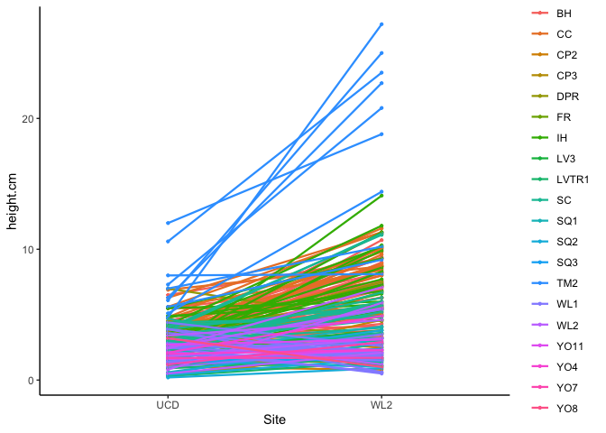<!-- -->

```r
twomonths_rxnnorms_bothsites_loc %>% 
  ggplot(aes(x=Site, y=long.leaf.cm, group=Genotype, color=parent.pop)) + 
  geom_point(size=0.8) + geom_line(linewidth=0.8) +
  theme_classic() 
```

```
## Warning: Removed 18 rows containing missing values (`geom_point()`).
```

```
## Warning: Removed 18 rows containing missing values (`geom_line()`).
```

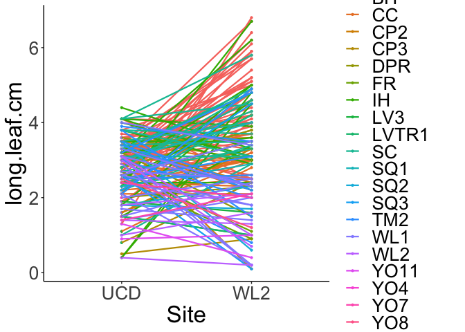<!-- -->
All Genotypes colored by elevation

```r
twomonths_rxnnorms_bothsites_loc %>% 
  ggplot(aes(x=Site, y=height.cm, group=Genotype, color=elev_m)) + 
  geom_point(size=0.8) + geom_line(linewidth=0.8) +
  theme_classic() + scale_colour_gradient(low = "#F5A540", high = "#0043F0")
```

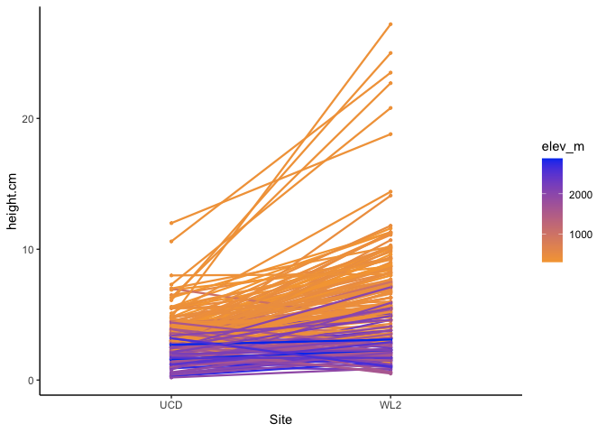<!-- -->

```r
twomonths_rxnnorms_bothsites_loc %>% 
  ggplot(aes(x=Site, y=long.leaf.cm, group=Genotype, color=elev_m)) + 
  geom_point(size=0.8) + geom_line(linewidth=0.8) +
  theme_classic() + scale_colour_gradient(low = "#F5A540", high = "#0043F0")
```

```
## Warning: Removed 18 rows containing missing values (`geom_point()`).
```

```
## Warning: Removed 18 rows containing missing values (`geom_line()`).
```

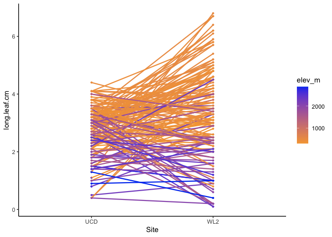<!-- -->

Just TM2 and WL2

```r
twomonths_rxnnorms_bothsites_loc %>% 
  filter(parent.pop=="TM2"|parent.pop=="WL2") %>% 
  ggplot(aes(x=Site, y=height.cm, group=Genotype, color=parent.pop)) + 
  geom_point(size=0.8) + geom_line(linewidth=0.8) +
  theme_classic() 
```

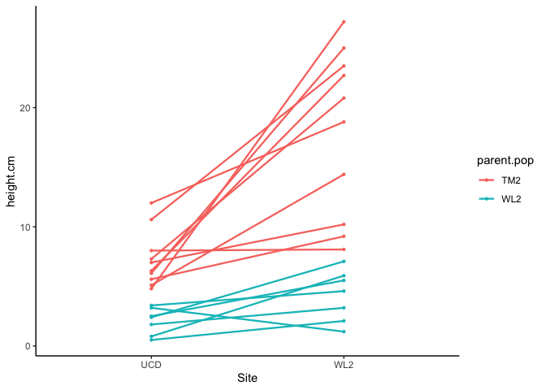<!-- -->

```r
twomonths_rxnnorms_bothsites_loc %>% 
  filter(parent.pop=="TM2"|parent.pop=="WL2") %>% 
  ggplot(aes(x=Site, y=long.leaf.cm, group=Genotype, color=parent.pop)) + 
  geom_point(size=0.8) + geom_line(linewidth=0.8) +
  theme_classic() 
```

```
## Warning: Removed 1 rows containing missing values (`geom_point()`).
```

```
## Warning: Removed 1 row containing missing values (`geom_line()`).
```

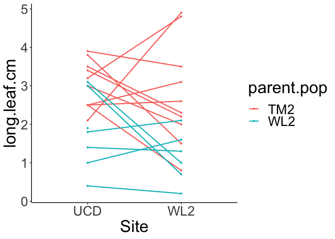<!-- -->


Means by Pop

```r
twomonths_rxnnorms_summary <- twomonths_rxnnorms_bothsites_loc %>% 
  group_by(parent.pop, Site, elev_m) %>% 
  summarise(N_height = sum(!is.na(height.cm)), mean_height.cm = mean(height.cm,na.rm=(TRUE)), 
            sem_height.cm=sem(height.cm, na.rm=(TRUE)), N_length = sum(!is.na(long.leaf.cm)),
            mean_long.leaf.cm=mean(long.leaf.cm, na.rm=(TRUE)), 
            sem_long.leaf.cm=sem(long.leaf.cm, na.rm=TRUE))
```

```
## `summarise()` has grouped output by 'parent.pop', 'Site'. You can override
## using the `.groups` argument.
```

```r
twomonths_rxnnorms_summary
```

```
## # A tibble: 40 × 9
## # Groups:   parent.pop, Site [40]
##    parent.pop Site  elev_m N_height mean_height.cm sem_height.cm N_length
##    <chr>      <chr>  <dbl>    <int>          <dbl>         <dbl>    <int>
##  1 BH         UCD     511.       44           3.32         0.142       44
##  2 BH         WL2     511.       44           6.78         0.298       44
##  3 CC         UCD     313        16           4.28         0.378       16
##  4 CC         WL2     313        16           8.88         0.496       16
##  5 CP2        UCD    2244.        8           2.11         0.473        8
##  6 CP2        WL2    2244.        8           2.69         0.522        5
##  7 CP3        UCD    2266.        3           0.6          0.3          3
##  8 CP3        WL2    2266.        3           2.17         0.376        2
##  9 DPR        UCD    1019.        4           4.75         0.803        4
## 10 DPR        WL2    1019.        4           5.28         0.857        4
## # ℹ 30 more rows
## # ℹ 2 more variables: mean_long.leaf.cm <dbl>, sem_long.leaf.cm <dbl>
```

Plot Pop Avgs

```r
twomonths_rxnnorms_summary %>% 
   ggplot(aes(x=Site, y=mean_height.cm, group=parent.pop, color=parent.pop)) + 
  geom_point(size=0.8) + geom_line(linewidth=0.8) +
  geom_errorbar(aes(ymin=mean_height.cm-sem_height.cm,ymax=mean_height.cm+sem_height.cm),width=.2) +
  theme_classic() 
```

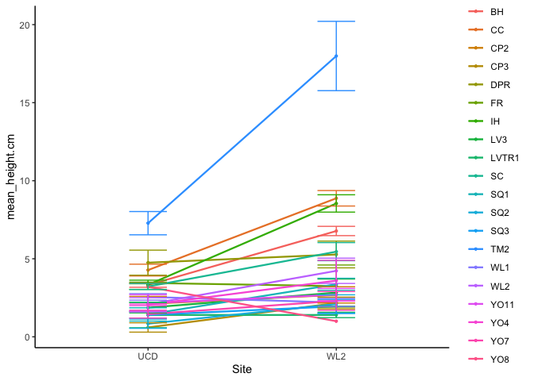<!-- -->

```r
twomonths_rxnnorms_summary %>% 
   ggplot(aes(x=Site, y=mean_long.leaf.cm, group=parent.pop, color=parent.pop)) + 
  geom_point(size=0.8) + geom_line(linewidth=0.8) +
  geom_errorbar(aes(ymin=mean_long.leaf.cm-sem_long.leaf.cm,ymax=mean_long.leaf.cm+sem_long.leaf.cm),width=.2) +
  theme_classic() 
```

```
## Warning: Removed 1 rows containing missing values (`geom_point()`).
```

```
## Warning: Removed 1 row containing missing values (`geom_line()`).
```

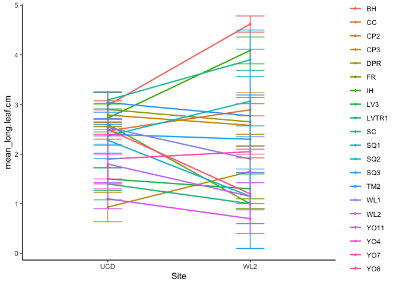<!-- -->


```r
twomonths_rxnnorms_summary %>% 
   ggplot(aes(x=Site, y=mean_height.cm, group=parent.pop, color=elev_m)) + 
  geom_point(size=0.8) + geom_line(linewidth=0.8) +
  geom_errorbar(aes(ymin=mean_height.cm-sem_height.cm,ymax=mean_height.cm+sem_height.cm),width=.2) +
  theme_classic() + scale_colour_gradient(low = "#F5A540", high = "#0043F0")
```

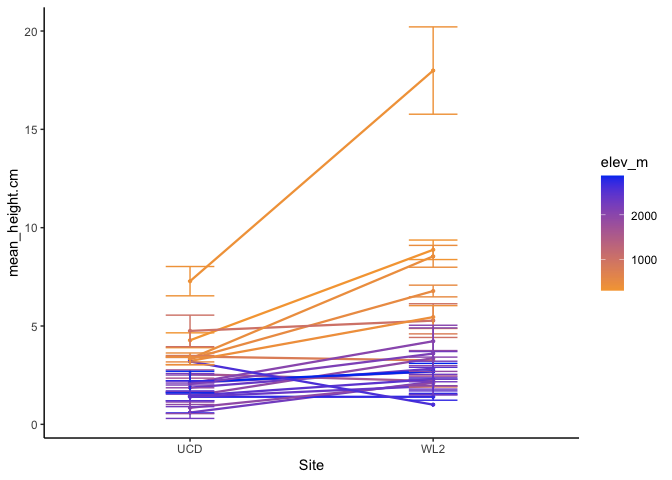<!-- -->

```r
twomonths_rxnnorms_summary %>% 
   ggplot(aes(x=Site, y=mean_long.leaf.cm, group=parent.pop, color=elev_m)) + 
  geom_point(size=0.8) + geom_line(linewidth=0.8) +
  geom_errorbar(aes(ymin=mean_long.leaf.cm-sem_long.leaf.cm,ymax=mean_long.leaf.cm+sem_long.leaf.cm),width=.2) +
  theme_classic() + scale_colour_gradient(low = "#F5A540", high = "#0043F0")
```

```
## Warning: Removed 1 rows containing missing values (`geom_point()`).
```

```
## Warning: Removed 1 row containing missing values (`geom_line()`).
```

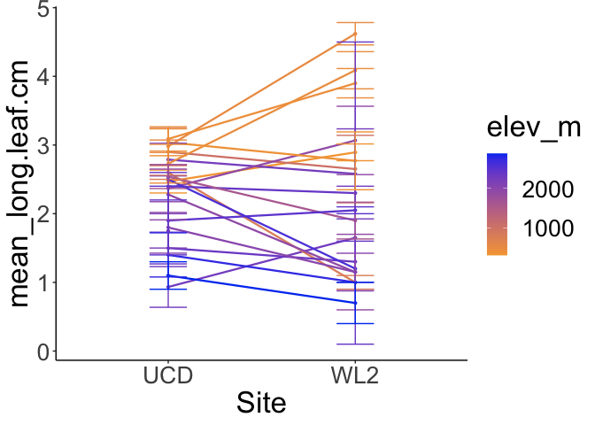<!-- -->


```r
twomonths_rxnnorms_summary %>% 
  filter(parent.pop=="TM2"|parent.pop=="WL2") %>%  
   ggplot(aes(x=Site, y=mean_height.cm, group=parent.pop, color=parent.pop)) + 
  geom_point(size=0.8) + geom_line(linewidth=0.8) +
  geom_errorbar(aes(ymin=mean_height.cm-sem_height.cm,ymax=mean_height.cm+sem_height.cm),width=.2) +
  theme_classic() 
```

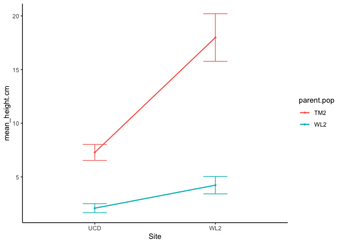<!-- -->

```r
twomonths_rxnnorms_summary %>% 
  filter(parent.pop=="TM2"|parent.pop=="WL2") %>%  
   ggplot(aes(x=Site, y=mean_long.leaf.cm, group=parent.pop, color=parent.pop)) + 
  geom_point(size=0.8) + geom_line(linewidth=0.8) +
  geom_errorbar(aes(ymin=mean_long.leaf.cm-sem_long.leaf.cm,ymax=mean_long.leaf.cm+sem_long.leaf.cm),width=.2) +
  theme_classic() 
```

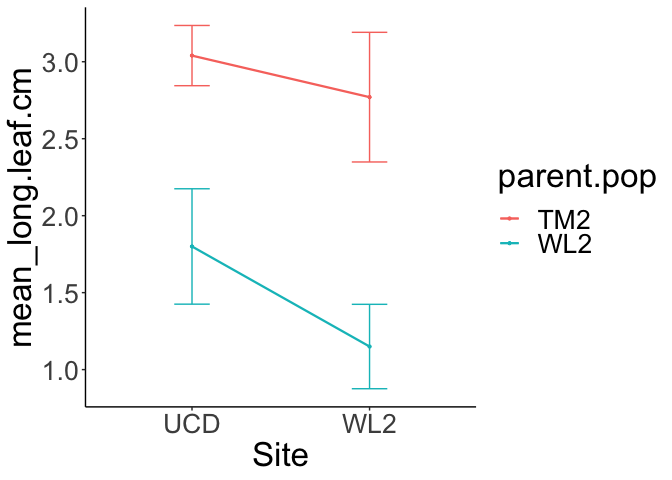<!-- -->


Means by Elevation

```r
twomonths_rxnnorms_summary2 <- twomonths_rxnnorms_bothsites_loc %>% 
  group_by(elevation.group, Site) %>% 
  summarise(N_height = sum(!is.na(height.cm)), mean_height.cm = mean(height.cm,na.rm=(TRUE)), 
            sem_height.cm=sem(height.cm, na.rm=(TRUE)), N_length = sum(!is.na(long.leaf.cm)),
            mean_long.leaf.cm=mean(long.leaf.cm, na.rm=(TRUE)), 
            sem_long.leaf.cm=sem(long.leaf.cm, na.rm=TRUE))
```

```
## `summarise()` has grouped output by 'elevation.group'. You can override using
## the `.groups` argument.
```

```r
twomonths_rxnnorms_summary2
```

```
## # A tibble: 6 × 8
## # Groups:   elevation.group [3]
##   elevation.group Site  N_height mean_height.cm sem_height.cm N_length
##   <chr>           <chr>    <int>          <dbl>         <dbl>    <int>
## 1 High            UCD         33           1.83         0.182       33
## 2 High            WL2         33           2.8          0.277       23
## 3 Low             UCD        106           3.82         0.166      106
## 4 Low             WL2        106           8.23         0.430      106
## 5 Mid             UCD         33           2.52         0.248       32
## 6 Mid             WL2         33           2.73         0.272       26
## # ℹ 2 more variables: mean_long.leaf.cm <dbl>, sem_long.leaf.cm <dbl>
```


```r
twomonths_rxnnorms_summary2$elevation.group <- factor(twomonths_rxnnorms_summary2$elevation.group, levels = c('High','Mid', 'Low'))
twomonths_rxnnorms_summary2 %>% 
   ggplot(aes(x=Site, y=mean_height.cm, group=elevation.group, color=elevation.group)) + 
  geom_point(size=0.8) + geom_line(linewidth=0.8) +
  geom_errorbar(aes(ymin=mean_height.cm-sem_height.cm,ymax=mean_height.cm+sem_height.cm),width=.2) +
  theme_classic() + scale_colour_manual(values=elev_three_palette)
```

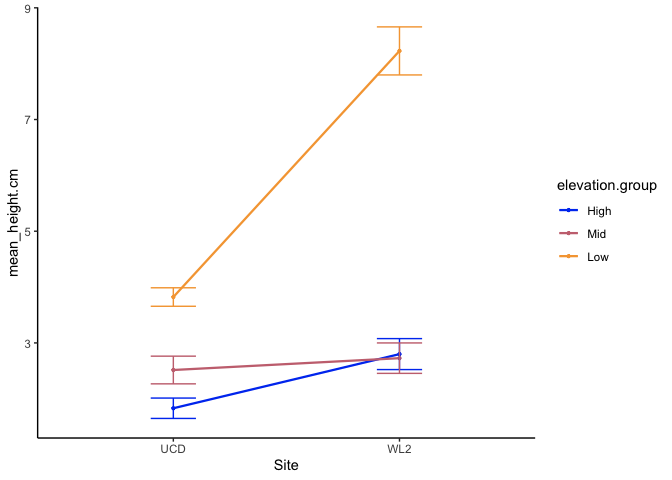<!-- -->

```r
twomonths_rxnnorms_summary2 %>% 
   ggplot(aes(x=Site, y=mean_long.leaf.cm, group=elevation.group, color=elevation.group)) + 
  geom_point(size=0.8) + geom_line(linewidth=0.8) +
  geom_errorbar(aes(ymin=mean_long.leaf.cm-sem_long.leaf.cm,ymax=mean_long.leaf.cm+sem_long.leaf.cm),width=.2) +
  theme_classic() + scale_colour_manual(values=elev_three_palette)
```

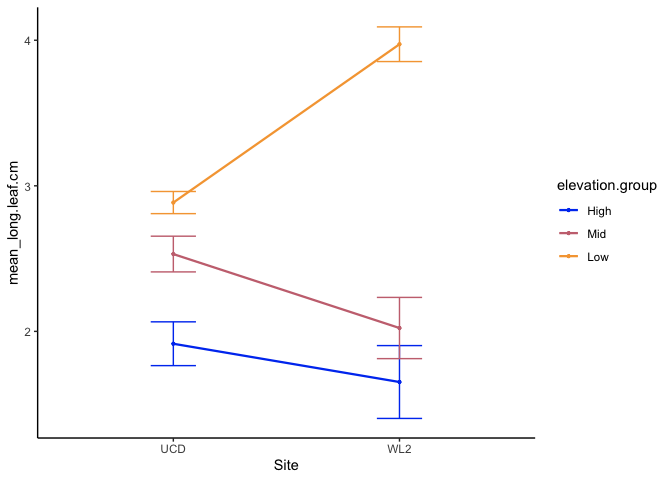<!-- -->
