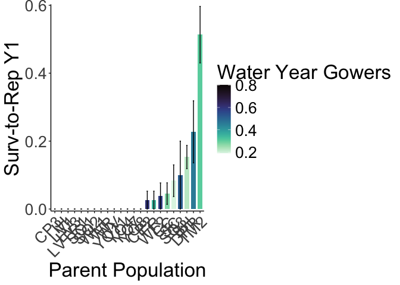

# Survival to Bolting in Year 1 
To Think about:
- Should we be getting rid of plants that germinated in the field or including those as original plants that died??
  - Only 3 total plants (2 WL2 and 1 SQ2) so maybe it doesn't really make a difference 

## Libraries

``` r
library(tidyverse)
```

```
## ── Attaching core tidyverse packages ──────────────────────── tidyverse 2.0.0 ──
## ✔ dplyr     1.1.4     ✔ readr     2.1.5
## ✔ forcats   1.0.0     ✔ stringr   1.5.1
## ✔ ggplot2   3.5.1     ✔ tibble    3.2.1
## ✔ lubridate 1.9.3     ✔ tidyr     1.3.1
## ✔ purrr     1.0.2     
## ── Conflicts ────────────────────────────────────────── tidyverse_conflicts() ──
## ✖ dplyr::filter() masks stats::filter()
## ✖ dplyr::lag()    masks stats::lag()
## ℹ Use the conflicted package (<http://conflicted.r-lib.org/>) to force all conflicts to become errors
```

``` r
library(magrittr)
```

```
## 
## Attaching package: 'magrittr'
## 
## The following object is masked from 'package:purrr':
## 
##     set_names
## 
## The following object is masked from 'package:tidyr':
## 
##     extract
```

``` r
#conflicted::conflicts_prefer(dplyr::filter)
library(viridis) #for pretty colors
```

```
## Loading required package: viridisLite
```

``` r
library(ggrepel) #for non-overlapping labels on plots
library(ggdist) #visualizations of distributions and uncertainty 
library(ggpubr)

#library(sp) #for calculating geographic distance 
library(geosphere) #for calculating geographic distance
library(corrplot) #plotting correlations  
```

```
## corrplot 0.94 loaded
```

``` r
library(rstatix) #performing cor_test
```

```
## 
## Attaching package: 'rstatix'
## 
## The following object is masked from 'package:stats':
## 
##     filter
```

``` r
library(lmerTest) #mixed models
```

```
## Loading required package: lme4
## Loading required package: Matrix
## 
## Attaching package: 'Matrix'
## 
## The following objects are masked from 'package:tidyr':
## 
##     expand, pack, unpack
## 
## 
## Attaching package: 'lmerTest'
## 
## The following object is masked from 'package:lme4':
## 
##     lmer
## 
## The following object is masked from 'package:stats':
## 
##     step
```

``` r
conflicted::conflicts_prefer(lmerTest::lmer)
```

```
## [conflicted] Will prefer lmerTest::lmer over any other package.
```

``` r
library(broom.mixed)
library(tidymodels)
```

```
## ── Attaching packages ────────────────────────────────────── tidymodels 1.2.0 ──
## ✔ broom        1.0.7     ✔ rsample      1.2.1
## ✔ dials        1.3.0     ✔ tune         1.2.1
## ✔ infer        1.0.7     ✔ workflows    1.1.4
## ✔ modeldata    1.4.0     ✔ workflowsets 1.1.0
## ✔ parsnip      1.2.1     ✔ yardstick    1.3.1
## ✔ recipes      1.1.0     
## ── Conflicts ───────────────────────────────────────── tidymodels_conflicts() ──
## ✖ infer::chisq_test()   masks rstatix::chisq_test()
## ✖ scales::discard()     masks purrr::discard()
## ✖ Matrix::expand()      masks tidyr::expand()
## ✖ magrittr::extract()   masks tidyr::extract()
## ✖ rstatix::filter()     masks dplyr::filter(), stats::filter()
## ✖ recipes::fixed()      masks stringr::fixed()
## ✖ dials::get_n()        masks rstatix::get_n()
## ✖ dplyr::lag()          masks stats::lag()
## ✖ Matrix::pack()        masks tidyr::pack()
## ✖ infer::prop_test()    masks rstatix::prop_test()
## ✖ magrittr::set_names() masks purrr::set_names()
## ✖ yardstick::spec()     masks readr::spec()
## ✖ recipes::step()       masks lmerTest::step(), stats::step()
## ✖ infer::t_test()       masks rstatix::t_test()
## ✖ Matrix::unpack()      masks tidyr::unpack()
## ✖ recipes::update()     masks Matrix::update(), stats::update()
## • Use suppressPackageStartupMessages() to eliminate package startup messages
```

``` r
library(furrr) #Apply Mapping Functions in Parallel using Futures
```

```
## Loading required package: future
```

``` r
tidymodels_prefer()
# install.packages("multilevelmod")
library(multilevelmod)

library(brms)
```

```
## Loading required package: Rcpp
## 
## Attaching package: 'Rcpp'
## 
## The following object is masked from 'package:rsample':
## 
##     populate
## 
## Loading 'brms' package (version 2.22.0). Useful instructions
## can be found by typing help('brms'). A more detailed introduction
## to the package is available through vignette('brms_overview').
```

``` r
#conflicted::conflicts_prefer(brms::ar)
#conflicted::conflicts_prefer(dplyr::combine)
#conflicted::conflicts_prefer(brms::dstudent_t)
library(tidybayes) #for extracting and visiaulizing brms model output 
library(modelr) #for data grid

sem <- function(x, na.rm=FALSE) {           #for caclulating standard error
  sd(x,na.rm=na.rm)/sqrt(length(na.omit(x)))
} 

cbbPalette2 <- c("#E69F00","#000000", "#56B4E9","#009E73", "#F0E442", "#0072B2", "#D55E00", "#CC79A7")
timepd_palette <- c("#56B4E9","#D55E00")

options(mc.cores = parallel::detectCores())
```

## Load WL2 surv

``` r
wl2_ann_cens <- read_csv("../input/WL2_Data/CorrectedCSVs/WL2_annual_census_20231027_corrected.csv") %>% 
  unite(Genotype, pop:rep, sep="_", remove = FALSE) %>% 
  unite(BedLoc, bed:`bed-col`, sep="_", remove = FALSE) %>% 
  filter(BedLoc!="K_5_C") %>% #get rid of duplicate locations
  filter(BedLoc!="B_32_A") %>% #get rid of duplicate locations
  filter(!is.na(pop), !str_detect(Genotype, ".*buff*")) #remove buffers 
```

```
## Warning: One or more parsing issues, call `problems()` on your data frame for details,
## e.g.:
##   dat <- vroom(...)
##   problems(dat)
```

```
## Rows: 1826 Columns: 19
## ── Column specification ────────────────────────────────────────────────────────
## Delimiter: ","
## chr (10): date, block, bed, bed-col, pop, mf, rep, pheno, herbiv.y.n, survey...
## dbl  (7): bed-row, diam.mm, num.flw, num.fruit, long.fruit.cm, total.branch,...
## lgl  (2): height.cm, long.leaf.cm
## 
## ℹ Use `spec()` to retrieve the full column specification for this data.
## ℹ Specify the column types or set `show_col_types = FALSE` to quiet this message.
```

``` r
wl2_surv_1020 <- read_csv("../input/WL2_Data/CorrectedCSVs/WL2_mort_pheno_20231020_corrected.csv") #need to add in 10/27 mortality 
```

```
## Rows: 1826 Columns: 14
## ── Column specification ────────────────────────────────────────────────────────
## Delimiter: ","
## chr (12): block, bed, bed.col, pop, mf, rep, bud.date, flower.date, fruit.da...
## dbl  (1): bed.row
## lgl  (1): last.fruit.date
## 
## ℹ Use `spec()` to retrieve the full column specification for this data.
## ℹ Specify the column types or set `show_col_types = FALSE` to quiet this message.
```

``` r
wl2_surv_1027 <- wl2_ann_cens %>% 
  filter(pheno=="X") %>% 
  select(death.date_2=date, block:bed, bed.row=`bed-row`, bed.col=`bed-col`, pop:rep) #add in 10/27 death dates
#note: 10/27 pheno dates (like flowering), not updated with this code 
wl2_surv_y1 <- left_join(wl2_surv_1020, wl2_surv_1027) %>% 
  mutate(death.date=if_else(is.na(death.date), death.date_2, death.date)) %>% 
  mutate(pop= str_replace(pop, "Y08", "YO8")) %>% 
  mutate(pop= str_replace(pop, "Y04", "YO4")) %>% 
  unite(BedLoc, bed:bed.col, sep="_", remove = FALSE) %>% 
  filter(BedLoc!="K_5_C") %>% #get rid of duplicate locations
  filter(BedLoc!="B_32_A") %>% #get rid of duplicate locations
  unite(Genotype, pop:rep, sep="_", remove = FALSE) %>% 
  filter(!is.na(pop), !str_detect(Genotype, ".*buff*")) %>%  #remove buffers 
  select(block:survey.notes)
```

```
## Joining with `by = join_by(block, bed, bed.row, bed.col, pop, mf, rep)`
```

``` r
#wl2_surv_y1_to_export <- wl2_surv_y1 %>% select(block:rep, death.date, survey.notes)
#write_csv(wl2_surv_y1_to_export, "../output/WL2_Traits/WL2_Mortality_2023.csv")
#unique(wl2_surv_y1$pop)
```


## Load UCD Surv

``` r
ucd_surv <- read_csv("../input/UCD_Data/CorrectedCSVs/UCD_transplants_pheno_mort_20231016_corrected.csv") %>% 
  rename(death.date=`Death Date`, bud.date=`Date First Bud`, flower.date=`Date First Flower`, 
         fruit.date=`Date First Fruit`, last.flower.date=`Date Last Flower`, last.fruit.date=`Date Last Fruit`) %>% 
  filter(!is.na(pop)) %>% 
  unite(BedLoc, block:col, sep="_", remove = FALSE) %>% 
  unite(Genotype, pop:rep, sep="_", remove = FALSE) 
```

```
## Rows: 858 Columns: 13
## ── Column specification ────────────────────────────────────────────────────────
## Delimiter: ","
## chr (10): block, col, pop, Date First Bud, Date First Flower, Date First Fru...
## dbl  (3): row, mf, rep
## 
## ℹ Use `spec()` to retrieve the full column specification for this data.
## ℹ Specify the column types or set `show_col_types = FALSE` to quiet this message.
```

``` r
#unique(ucd_surv$pop)
#this has 1 more row than the annual census dataset --> WL2_4_10 died in Jan (1/6/23), new germ germinated so it was converted to rep 100
#including the plant above tehre are 3 plants in this scenario, WL2_3_100(L1_5_A)-1/6/23 and SQ2_6_100(L2_37_C)-12/13/22
```

## Gower's Distance

``` r
garden_climate <- read_csv("../output/Climate/flint_climate_UCDpops.csv") %>% 
  filter(parent.pop=="WL2_Garden" | parent.pop=="UCD_Garden") %>% 
  select(parent.pop:Long) %>% 
  distinct()
```

```
## Rows: 38775 Columns: 14
## ── Column specification ────────────────────────────────────────────────────────
## Delimiter: ","
## chr  (3): parent.pop, elevation.group, month
## dbl (11): elev_m, Lat, Long, year, aet, cwd, pck, pet, ppt, tmn, tmx
## 
## ℹ Use `spec()` to retrieve the full column specification for this data.
## ℹ Specify the column types or set `show_col_types = FALSE` to quiet this message.
```

``` r
garden_climate
```

```
## # A tibble: 2 × 5
##   parent.pop elevation.group elev_m   Lat  Long
##   <chr>      <chr>            <dbl> <dbl> <dbl>
## 1 UCD_Garden Low                 16  38.5 -122.
## 2 WL2_Garden High              2020  38.8 -120.
```

``` r
#UCD LAT/LONG = 38.53250, -121.7830
#WL2 Lat/Long = 38.82599, -120.2509

ucd_gowers <- read_csv("../output/Climate/Gowers_UCD.csv") %>% 
  select(parent.pop:GrwSsn_GD, Wtr_Year_GD) %>% 
  pivot_wider(names_from = TimePd, values_from = c(GrwSsn_GD, Wtr_Year_GD)) %>% 
  mutate(UCD_Lat=38.53250, UCD_Long=-121.7830, UCD_Elev=16) %>% 
  mutate(Geographic_Dist=distHaversine(cbind(UCD_Long, UCD_Lat), cbind(Long, Lat)),
         Elev_Dist=UCD_Elev-elev_m) %>% # Calculate the distance using the haversine formula (dist in meters)
  #mutate(Lat_Dist=UCD_Lat-Lat, Long_Dist=UCD_Long-Long) %>% #Garden-Home - lat and long per Gerst et al 2011 which kept them separate for some directionality
  rename(pop=parent.pop)
```

```
## Rows: 46 Columns: 12
## ── Column specification ────────────────────────────────────────────────────────
## Delimiter: ","
## chr (3): parent.pop, elevation.group, TimePd
## dbl (9): elev_m, Lat, Long, GrwSsn_GD, GrwSsn_FLINT_GD, GrwSsn_BIOCLIM_GD, W...
## 
## ℹ Use `spec()` to retrieve the full column specification for this data.
## ℹ Specify the column types or set `show_col_types = FALSE` to quiet this message.
```

``` r
wl2_gowers_2023 <- read_csv("../output/Climate/Gowers_WL2.csv") %>% 
  select(parent.pop:GrwSsn_GD, Wtr_Year_GD) %>% 
  pivot_wider(names_from = TimePd, values_from = c(GrwSsn_GD, Wtr_Year_GD)) %>% 
  mutate(WL2_Lat=38.82599, WL2_Long=-120.2509, WL2_Elev=2020) %>% 
  mutate(Geographic_Dist=distHaversine(cbind(WL2_Long, WL2_Lat), cbind(Long, Lat)),
         Elev_Dist=WL2_Elev-elev_m) %>% # Calculate the distance using the haversine formula
  #mutate(Lat_Dist=WL2_Lat-Lat, Long_Dist=WL2_Long-Long) %>% #Garden-Home - lat and long per Gerst et al 2011 which kept them separate for some directionality
  rename(pop=parent.pop)
```

```
## Rows: 46 Columns: 12
## ── Column specification ────────────────────────────────────────────────────────
## Delimiter: ","
## chr (3): parent.pop, elevation.group, TimePd
## dbl (9): elev_m, Lat, Long, GrwSsn_GD, GrwSsn_FLINT_GD, GrwSsn_BIOCLIM_GD, W...
## 
## ℹ Use `spec()` to retrieve the full column specification for this data.
## ℹ Specify the column types or set `show_col_types = FALSE` to quiet this message.
```

## Davis

``` r
ucd_surv %>% filter(!is.na(bud.date), is.na(fruit.date)) #all plants that initiated reproduction, but did not finish, have a death date 
```

```
## # A tibble: 18 × 15
##    BedLoc  block   row col   Genotype pop      mf   rep bud.date flower.date
##    <chr>   <chr> <dbl> <chr> <chr>    <chr> <dbl> <dbl> <chr>    <chr>      
##  1 D2_37_B D2       37 B     TM2_6_5  TM2       6     5 3/17/23  <NA>       
##  2 F1_8_A  F1        8 A     TM2_2_2  TM2       2     2 3/22/23  <NA>       
##  3 F1_6_C  F1        6 C     DPR_6_9  DPR       6     9 3/31/23  <NA>       
##  4 F2_40_C F2       40 C     DPR_7_4  DPR       7     4 3/17/23  <NA>       
##  5 H1_4_B  H1        4 B     BH_2_12  BH        2    12 5/30/23  <NA>       
##  6 H1_5_B  H1        5 B     SC_4_2   SC        4     2 5/11/23  <NA>       
##  7 H1_12_B H1       12 B     FR_2_8   FR        2     8 4/17/23  <NA>       
##  8 H1_15_B H1       15 B     CC_3_3   CC        3     3 4/10/23  <NA>       
##  9 H1_16_A H1       16 A     CC_4_10  CC        4    10 4/17/23  <NA>       
## 10 H1_17_B H1       17 B     DPR_5_2  DPR       5     2 3/22/23  4/13/23    
## 11 H1_6_C  H1        6 C     TM2_1_5  TM2       1     5 3/22/23  <NA>       
## 12 H2_25_C H2       25 C     DPR_2_6  DPR       2     6 3/22/23  <NA>       
## 13 H2_30_D H2       30 D     TM2_1_6  TM2       1     6 3/22/23  <NA>       
## 14 J1_6_B  J1        6 B     DPR_6_10 DPR       6    10 3/31/23  4/17/23    
## 15 J1_19_B J1       19 B     BH_3_11  BH        3    11 5/18/23  <NA>       
## 16 J2_33_B J2       33 B     TM2_2_6  TM2       2     6 3/22/23  <NA>       
## 17 L1_4_A  L1        4 A     SC_5_8   SC        5     8 4/13/22  <NA>       
## 18 L2_30_A L2       30 A     TM2_1_12 TM2       1    12 3/22/23  4/13/23    
## # ℹ 5 more variables: fruit.date <chr>, last.flower.date <chr>,
## #   last.fruit.date <chr>, death.date <chr>, Notes <chr>
```

``` r
ucd_surv %>% filter(!is.na(bud.date), !is.na(death.date)) #many plants with a bud date, have a later death date 
```

```
## # A tibble: 46 × 15
##    BedLoc  block   row col   Genotype pop      mf   rep bud.date flower.date
##    <chr>   <chr> <dbl> <chr> <chr>    <chr> <dbl> <dbl> <chr>    <chr>      
##  1 D2_31_B D2       31 B     TM2_4_11 TM2       4    11 4/10/23  4/24/23    
##  2 D2_37_B D2       37 B     TM2_6_5  TM2       6     5 3/17/23  <NA>       
##  3 D2_35_D D2       35 D     BH_3_6   BH        3     6 5/1/23   5/18/23    
##  4 F1_8_A  F1        8 A     TM2_2_2  TM2       2     2 3/22/23  <NA>       
##  5 F1_4_C  F1        4 C     TM2_5_7  TM2       5     7 3/17/23  4/17/23    
##  6 F1_6_C  F1        6 C     DPR_6_9  DPR       6     9 3/31/23  <NA>       
##  7 F2_35_D F2       35 D     BH_2_1   BH        2     1 5/22/23  6/5/23     
##  8 F2_40_C F2       40 C     DPR_7_4  DPR       7     4 3/17/23  <NA>       
##  9 F2_40_D F2       40 D     TM2_1_4  TM2       1     4 3/17/23  4/17/23    
## 10 H1_4_B  H1        4 B     BH_2_12  BH        2    12 5/30/23  <NA>       
## # ℹ 36 more rows
## # ℹ 5 more variables: fruit.date <chr>, last.flower.date <chr>,
## #   last.fruit.date <chr>, death.date <chr>, Notes <chr>
```

``` r
ucd_surv %>% filter(!is.na(bud.date), is.na(death.date)) #some budding plants do not have a death date
```

```
## # A tibble: 4 × 15
##   BedLoc  block   row col   Genotype pop      mf   rep bud.date flower.date
##   <chr>   <chr> <dbl> <chr> <chr>    <chr> <dbl> <dbl> <chr>    <chr>      
## 1 D2_26_B D2       26 B     BH_5_15  BH        5    15 5/18/23  5/30/23    
## 2 D2_29_D D2       29 D     BH_2_9   BH        2     9 6/1/23   6/12/23    
## 3 J2_25_D J2       25 D     BH_2_5   BH        2     5 5/8/23   5/22/23    
## 4 L1_13_C L1       13 C     BH_3_13  BH        3    13 4/27/23  5/15/23    
## # ℹ 5 more variables: fruit.date <chr>, last.flower.date <chr>,
## #   last.fruit.date <chr>, death.date <chr>, Notes <chr>
```

``` r
ucd_surv %>% filter(is.na(bud.date), !is.na(flower.date)) #did not miss any budding plants
```

```
## # A tibble: 0 × 15
## # ℹ 15 variables: BedLoc <chr>, block <chr>, row <dbl>, col <chr>,
## #   Genotype <chr>, pop <chr>, mf <dbl>, rep <dbl>, bud.date <chr>,
## #   flower.date <chr>, fruit.date <chr>, last.flower.date <chr>,
## #   last.fruit.date <chr>, death.date <chr>, Notes <chr>
```

``` r
ucd_surv %>% filter(is.na(bud.date), !is.na(fruit.date)) #did not miss any budding plants 
```

```
## # A tibble: 0 × 15
## # ℹ 15 variables: BedLoc <chr>, block <chr>, row <dbl>, col <chr>,
## #   Genotype <chr>, pop <chr>, mf <dbl>, rep <dbl>, bud.date <chr>,
## #   flower.date <chr>, fruit.date <chr>, last.flower.date <chr>,
## #   last.fruit.date <chr>, death.date <chr>, Notes <chr>
```


``` r
ucd_surv_to_rep <- ucd_surv %>% 
  filter(!str_detect(Genotype, "buffer")) %>% 
  left_join(ucd_gowers) %>% 
  mutate(death.date=mdy(death.date)) %>% 
  mutate(SurvtoRep_Y1=if_else(is.na(bud.date), 0, 1)) %>% 
  select(block:rep, elevation.group:Wtr_Year_GD_Historical, Geographic_Dist, Elev_Dist, bud.date, death.date, SurvtoRep_Y1) 
```

```
## Joining with `by = join_by(pop)`
```

``` r
#ucd_surv_to_rep %>% filter(rep==100) #double check 0 for rep 100s
#ucd_surv_to_rep %>% filter(Genotype=="WL2_4_10")

#write_csv(ucd_surv_to_rep, "../output/UCD_Traits/UCD_SurvtoRep.csv")
```

### Bar plots 

``` r
ucd_surv_to_rep %>% 
  group_by(pop, elev_m, GrwSsn_GD_Recent, Wtr_Year_GD_Recent) %>% 
  summarise(meanSurv=mean(SurvtoRep_Y1, na.rm = TRUE), semSurv=sem(SurvtoRep_Y1, na.rm=TRUE)) %>% 
  ggplot(aes(x=fct_reorder(pop, meanSurv), y=meanSurv, fill=GrwSsn_GD_Recent)) +
  geom_col(width = 0.7,position = position_dodge(0.75)) + 
  geom_errorbar(aes(ymin=meanSurv-semSurv,ymax=meanSurv+semSurv),width=.2, position = 
                  position_dodge(0.75)) +
  theme_classic() + 
  scale_y_continuous(expand = c(0.01, 0)) +
  labs(y="Surv-to-Rep Y1", x="Parent Population", fill="Growth Season Gowers") +
  scale_fill_viridis(option="mako", direction = -1) +
  theme(text=element_text(size=25), axis.text.x = element_text(angle = 45,  hjust = 1))
```

```
## `summarise()` has grouped output by 'pop', 'elev_m', 'GrwSsn_GD_Recent'. You
## can override using the `.groups` argument.
```

<!-- -->

``` r
#ggsave("../output/UCD_Traits/UCD_SurvtoRepY1_GrwSsn_GD_Recent.png", width = 12, height = 8, units = "in")

ucd_surv_to_rep %>% 
  group_by(pop, elev_m, GrwSsn_GD_Recent, Wtr_Year_GD_Recent) %>% 
  summarise(meanSurv=mean(SurvtoRep_Y1, na.rm = TRUE), semSurv=sem(SurvtoRep_Y1, na.rm=TRUE)) %>% 
  ggplot(aes(x=fct_reorder(pop, meanSurv), y=meanSurv, fill=Wtr_Year_GD_Recent)) +
  geom_col(width = 0.7,position = position_dodge(0.75)) + 
  geom_errorbar(aes(ymin=meanSurv-semSurv,ymax=meanSurv+semSurv),width=.2, position = 
                  position_dodge(0.75)) +
  theme_classic() + 
  scale_y_continuous(expand = c(0.01, 0)) +
  labs(y="Surv-to-Rep Y1", x="Parent Population", fill="Water Year Gowers") +
  scale_fill_viridis(option="mako", direction = -1) +
  theme(text=element_text(size=25), axis.text.x = element_text(angle = 45,  hjust = 1))
```

```
## `summarise()` has grouped output by 'pop', 'elev_m', 'GrwSsn_GD_Recent'. You
## can override using the `.groups` argument.
```

<!-- -->

``` r
#ggsave("../output/UCD_Traits/UCD_SurvtoRepY1_Wtr_Year_GD_Recent.png", width = 12, height = 8, units = "in")
```


## WL2

``` r
wl2_ann_cens %>% filter(pheno=="B") #check for any plants that started budding the week of the annual census 
```

```
## # A tibble: 1 × 21
##   date   block BedLoc bed   `bed-row` `bed-col` Genotype pop   mf    rep   pheno
##   <chr>  <chr> <chr>  <chr>     <dbl> <chr>     <chr>    <chr> <chr> <chr> <chr>
## 1 10/27… J     F_2_B  F             2 B         TM2_1_11 TM2   1     11    B    
## # ℹ 10 more variables: diam.mm <dbl>, height.cm <lgl>, long.leaf.cm <lgl>,
## #   num.flw <dbl>, num.fruit <dbl>, long.fruit.cm <dbl>, total.branch <dbl>,
## #   repro.branch <dbl>, herbiv.y.n <chr>, survey.notes <chr>
```


``` r
wl2_surv_y1 %>% filter(!is.na(bud.date), is.na(fruit.date)) #some plants initiated reproduction but did not make fruits
```

```
## # A tibble: 8 × 16
##   block BedLoc bed   bed.row bed.col Genotype pop   mf    rep   bud.date
##   <chr> <chr>  <chr>   <dbl> <chr>   <chr>    <chr> <chr> <chr> <chr>   
## 1 A     A_23_A A          23 A       FR_7_3   FR    7     3     9/6/23  
## 2 B     A_46_B A          46 B       TM2_3_11 TM2   3     11    9/20/23 
## 3 I     E_48_D E          48 D       TM2_1_10 TM2   1     10    8/2/23  
## 4 I     F_21_D F          21 D       FR_7_11  FR    7     11    8/30/23 
## 5 L     H_13_A H          13 A       TM2_2_6  TM2   2     6     10/20/23
## 6 K     H_21_B H          21 B       TM2_1_12 TM2   1     12    8/2/23  
## 7 L     H_6_C  H           6 C       TM2_5_11 TM2   5     11    8/2/23  
## 8 M     J_10_D J          10 D       TM2_3_10 TM2   3     10    8/2/23  
## # ℹ 6 more variables: flower.date <chr>, fruit.date <chr>,
## #   last.flower.date <chr>, last.fruit.date <lgl>, death.date <chr>,
## #   survey.notes <chr>
```

``` r
wl2_surv_y1 %>% filter(!is.na(bud.date), !is.na(death.date))  #most of above lived
```

```
## # A tibble: 3 × 16
##   block BedLoc bed   bed.row bed.col Genotype pop   mf    rep   bud.date
##   <chr> <chr>  <chr>   <dbl> <chr>   <chr>    <chr> <chr> <chr> <chr>   
## 1 A     A_23_A A          23 A       FR_7_3   FR    7     3     9/6/23  
## 2 I     E_48_D E          48 D       TM2_1_10 TM2   1     10    8/2/23  
## 3 M     J_10_D J          10 D       TM2_3_10 TM2   3     10    8/2/23  
## # ℹ 6 more variables: flower.date <chr>, fruit.date <chr>,
## #   last.flower.date <chr>, last.fruit.date <lgl>, death.date <chr>,
## #   survey.notes <chr>
```

``` r
wl2_surv_y1 %>% filter(is.na(bud.date), !is.na(flower.date)) #didn't miss any budding plants
```

```
## # A tibble: 0 × 16
## # ℹ 16 variables: block <chr>, BedLoc <chr>, bed <chr>, bed.row <dbl>,
## #   bed.col <chr>, Genotype <chr>, pop <chr>, mf <chr>, rep <chr>,
## #   bud.date <chr>, flower.date <chr>, fruit.date <chr>,
## #   last.flower.date <chr>, last.fruit.date <lgl>, death.date <chr>,
## #   survey.notes <chr>
```

``` r
wl2_surv_y1 %>% filter(is.na(bud.date), !is.na(fruit.date)) #didn't miss any budding plants 
```

```
## # A tibble: 0 × 16
## # ℹ 16 variables: block <chr>, BedLoc <chr>, bed <chr>, bed.row <dbl>,
## #   bed.col <chr>, Genotype <chr>, pop <chr>, mf <chr>, rep <chr>,
## #   bud.date <chr>, flower.date <chr>, fruit.date <chr>,
## #   last.flower.date <chr>, last.fruit.date <lgl>, death.date <chr>,
## #   survey.notes <chr>
```

``` r
wl2_surv_y1 %>% filter(!is.na(last.flower.date)) #NAs
```

```
## # A tibble: 2 × 16
##   block BedLoc bed   bed.row bed.col Genotype pop   mf    rep   bud.date
##   <chr> <chr>  <chr>   <dbl> <chr>   <chr>    <chr> <chr> <chr> <chr>   
## 1 G     D_16_C D          16 C       TM2_6_13 TM2   6     13    <NA>    
## 2 L     I_8_A  I           8 A       WL1_7_16 WL1   7     16    <NA>    
## # ℹ 6 more variables: flower.date <chr>, fruit.date <chr>,
## #   last.flower.date <chr>, last.fruit.date <lgl>, death.date <chr>,
## #   survey.notes <chr>
```

``` r
wl2_surv_y1 %>% filter(!is.na(last.fruit.date)) #none 
```

```
## # A tibble: 0 × 16
## # ℹ 16 variables: block <chr>, BedLoc <chr>, bed <chr>, bed.row <dbl>,
## #   bed.col <chr>, Genotype <chr>, pop <chr>, mf <chr>, rep <chr>,
## #   bud.date <chr>, flower.date <chr>, fruit.date <chr>,
## #   last.flower.date <chr>, last.fruit.date <lgl>, death.date <chr>,
## #   survey.notes <chr>
```

``` r
wl2_surv_y1 %>% filter(is.na(bud.date))
```

```
## # A tibble: 1,539 × 16
##    block BedLoc bed   bed.row bed.col Genotype   pop   mf    rep   bud.date
##    <chr> <chr>  <chr>   <dbl> <chr>   <chr>      <chr> <chr> <chr> <chr>   
##  1 A     A_1_B  A           1 B       LVTR1_7_1  LVTR1 7     1     <NA>    
##  2 A     A_2_A  A           2 A       SQ2_6_14   SQ2   6     14    <NA>    
##  3 A     A_2_B  A           2 B       YO8_8_3    YO8   8     3     <NA>    
##  4 A     A_3_A  A           3 A       CC_2_3     CC    2     3     <NA>    
##  5 A     A_3_B  A           3 B       YO11_5_14  YO11  5     14    <NA>    
##  6 A     A_4_A  A           4 A       BH_6_3     BH    6     3     <NA>    
##  7 A     A_4_B  A           4 B       DPR_4_8    DPR   4     8     <NA>    
##  8 A     A_5_A  A           5 A       CP2_5_1    CP2   5     1     <NA>    
##  9 A     A_5_B  A           5 B       LVTR1_3_12 LVTR1 3     12    <NA>    
## 10 A     A_6_A  A           6 A       CC_5_3     CC    5     3     <NA>    
## # ℹ 1,529 more rows
## # ℹ 6 more variables: flower.date <chr>, fruit.date <chr>,
## #   last.flower.date <chr>, last.fruit.date <lgl>, death.date <chr>,
## #   survey.notes <chr>
```

``` r
wl2_surv_to_rep_y1 <- wl2_surv_y1 %>% 
  left_join(wl2_gowers_2023) %>% 
  mutate(death.date=mdy(death.date)) %>% 
  mutate(bud.date=if_else(Genotype=="TM2_1_11", "10/27/23", bud.date)) %>% #add in bud date for plant that started budding the week of the annual census 
  mutate(SurvtoRep_Y1=if_else(is.na(bud.date), 0, 1)) %>% 
  select(block:rep, elevation.group:Wtr_Year_GD_Historical, Geographic_Dist, Elev_Dist, bud.date, death.date, SurvtoRep_Y1) 
```

```
## Joining with `by = join_by(pop)`
```

``` r
#wl2_surv_to_rep_y1 %>% filter(SurvtoRep_Y1>0)
#this is quite uninteresting since only TM2 and FR budded in year 1 

#write_csv(wl2_surv_to_rep_y1, "../output/WL2_Traits/WL2_SurvtoRep_y1.csv")
```

### Bar plots 

``` r
wl2_surv_to_rep_y1 %>% 
  group_by(pop, elev_m, GrwSsn_GD_Recent, Wtr_Year_GD_Recent) %>% 
  summarise(meanSurv=mean(SurvtoRep_Y1, na.rm = TRUE), semSurv=sem(SurvtoRep_Y1, na.rm=TRUE)) %>% 
  ggplot(aes(x=fct_reorder(pop, meanSurv), y=meanSurv, fill=GrwSsn_GD_Recent)) +
  geom_col(width = 0.7,position = position_dodge(0.75)) + 
  geom_errorbar(aes(ymin=meanSurv-semSurv,ymax=meanSurv+semSurv),width=.2, position = 
                  position_dodge(0.75)) +
  theme_classic() + 
  scale_y_continuous(expand = c(0.01, 0)) +
  labs(y="Surv-to-Rep Y1", x="Parent Population", fill="Growth Season Gowers") +
  scale_fill_viridis(option="mako", direction = -1) +
  theme(text=element_text(size=25), axis.text.x = element_text(angle = 45,  hjust = 1))
```

```
## `summarise()` has grouped output by 'pop', 'elev_m', 'GrwSsn_GD_Recent'. You
## can override using the `.groups` argument.
```

<!-- -->

``` r
#ggsave("../output/WL2_Traits/WL2_SurvtoRepY1_GrwSsn_GD_Recent.png", width = 12, height = 8, units = "in")

wl2_surv_to_rep_y1 %>% 
  group_by(pop, elev_m, GrwSsn_GD_Recent, Wtr_Year_GD_Recent) %>% 
  summarise(meanSurv=mean(SurvtoRep_Y1, na.rm = TRUE), semSurv=sem(SurvtoRep_Y1, na.rm=TRUE)) %>% 
  ggplot(aes(x=fct_reorder(pop, meanSurv), y=meanSurv, fill=Wtr_Year_GD_Recent)) +
  geom_col(width = 0.7,position = position_dodge(0.75)) + 
  geom_errorbar(aes(ymin=meanSurv-semSurv,ymax=meanSurv+semSurv),width=.2, position = 
                  position_dodge(0.75)) +
  theme_classic() + 
  scale_y_continuous(expand = c(0.01, 0)) +
  labs(y="Surv-to-Rep Y1", x="Parent Population", fill="Water Year Gowers") +
  scale_fill_viridis(option="mako", direction = -1) +
  theme(text=element_text(size=25), axis.text.x = element_text(angle = 45,  hjust = 1))
```

```
## `summarise()` has grouped output by 'pop', 'elev_m', 'GrwSsn_GD_Recent'. You
## can override using the `.groups` argument.
```

<!-- -->

``` r
#ggsave("../output/WL2_Traits/WL2_SurvtoRepY1_Wtr_Year_GD_Recent.png", width = 12, height = 8, units = "in")
```

## Scatterplots

### Davis

``` r
#scatter plots
GSCD_recent <- ucd_surv_to_rep %>% 
  group_by(pop, elev_m, GrwSsn_GD_Recent, Wtr_Year_GD_Recent) %>% 
  summarise(meanSurv=mean(SurvtoRep_Y1, na.rm = TRUE), semSurv=sem(SurvtoRep_Y1, na.rm=TRUE)) %>% 
  ggplot(aes(x=GrwSsn_GD_Recent, y=meanSurv, group = pop)) +
  geom_point(size=6) + 
  geom_errorbar(aes(ymin=meanSurv-semSurv,ymax=meanSurv+semSurv),width=.02, linewidth = 2) +
  theme_classic() + 
  scale_y_continuous(expand = c(0.01, 0)) +
  labs(y="SurvtoRep_Y1", x="Recent Growth Season CD") +
  theme(text=element_text(size=25))
```

```
## `summarise()` has grouped output by 'pop', 'elev_m', 'GrwSsn_GD_Recent'. You
## can override using the `.groups` argument.
```

``` r
WYCD_recent <- ucd_surv_to_rep %>% 
  group_by(pop, elev_m, GrwSsn_GD_Recent, Wtr_Year_GD_Recent) %>% 
  summarise(meanSurv=mean(SurvtoRep_Y1, na.rm = TRUE), semSurv=sem(SurvtoRep_Y1, na.rm=TRUE)) %>% 
  ggplot(aes(x=Wtr_Year_GD_Recent, y=meanSurv, group = pop)) +
  geom_point(size=6) + 
  geom_errorbar(aes(ymin=meanSurv-semSurv,ymax=meanSurv+semSurv),width=.02, linewidth = 2) +
  theme_classic() + 
  scale_y_continuous(expand = c(0.01, 0)) +
  labs(y="SurvtoRep_Y1", x="Recent Water Year CD") +
  theme(text=element_text(size=25))
```

```
## `summarise()` has grouped output by 'pop', 'elev_m', 'GrwSsn_GD_Recent'. You
## can override using the `.groups` argument.
```

``` r
GD <- ucd_surv_to_rep %>% 
  group_by(pop, elev_m, Geographic_Dist) %>% 
  summarise(meanSurv=mean(SurvtoRep_Y1, na.rm = TRUE), semSurv=sem(SurvtoRep_Y1, na.rm=TRUE)) %>% 
  ggplot(aes(x=Geographic_Dist, y=meanSurv, group = pop)) +
  geom_point(size=6) + 
  geom_errorbar(aes(ymin=meanSurv-semSurv,ymax=meanSurv+semSurv),width=.02, linewidth = 2) +
  theme_classic() + 
  scale_y_continuous(expand = c(0.01, 0)) +
  labs(y="SurvtoRep_Y1", x="Geographic Distance (m)") +
  theme(text=element_text(size=25), axis.text.x = element_text(angle = 45,  hjust = 1))
```

```
## `summarise()` has grouped output by 'pop', 'elev_m'. You can override using the
## `.groups` argument.
```

``` r
ED <- ucd_surv_to_rep %>% 
  group_by(pop, elev_m, Elev_Dist) %>% 
  summarise(meanSurv=mean(SurvtoRep_Y1, na.rm = TRUE), semSurv=sem(SurvtoRep_Y1, na.rm=TRUE)) %>% 
  ggplot(aes(x=Elev_Dist, y=meanSurv, group = pop)) +
  geom_point(size=6) + 
  geom_errorbar(aes(ymin=meanSurv-semSurv,ymax=meanSurv+semSurv),width=.02, linewidth = 2) +
  theme_classic() + 
  scale_y_continuous(expand = c(0.01, 0)) +
  labs(y="SurvtoRep_Y1", x="Elevation Distance (m)") +
  theme(text=element_text(size=25), axis.text.x = element_text(angle = 45,  hjust = 1))
```

```
## `summarise()` has grouped output by 'pop', 'elev_m'. You can override using the
## `.groups` argument.
```

``` r
ucd_surv_to_rep_y1_FIG <- ggarrange(GSCD_recent, WYCD_recent, GD, ED, ncol=2, nrow=2) 
#ggsave("../output/UCD_Traits/UCD_SurvtoRep_Y1_SCATTERS_Recent.png", width = 24, height = 18, units = "in")
```


``` r
#scatter plots
GSCD_historic <- ucd_surv_to_rep %>% 
  group_by(pop, elev_m, GrwSsn_GD_Historical, Wtr_Year_GD_Historical) %>% 
  summarise(meanSurv=mean(SurvtoRep_Y1, na.rm = TRUE), semSurv=sem(SurvtoRep_Y1, na.rm=TRUE)) %>% 
  ggplot(aes(x=GrwSsn_GD_Historical, y=meanSurv, group = pop)) +
  geom_point(size=6) + 
  geom_errorbar(aes(ymin=meanSurv-semSurv,ymax=meanSurv+semSurv),width=.02, linewidth = 2) +
  theme_classic() + 
  scale_y_continuous(expand = c(0.01, 0)) +
  labs(y="SurvtoRep_Y1", x="Historic Growth Season CD") +
  theme(text=element_text(size=25))
```

```
## `summarise()` has grouped output by 'pop', 'elev_m', 'GrwSsn_GD_Historical'.
## You can override using the `.groups` argument.
```

``` r
WYCD_historic <- ucd_surv_to_rep %>% 
  group_by(pop, elev_m, GrwSsn_GD_Historical, Wtr_Year_GD_Historical) %>% 
  summarise(meanSurv=mean(SurvtoRep_Y1, na.rm = TRUE), semSurv=sem(SurvtoRep_Y1, na.rm=TRUE)) %>% 
  ggplot(aes(x=Wtr_Year_GD_Historical, y=meanSurv, group = pop)) +
  geom_point(size=6) + 
  geom_errorbar(aes(ymin=meanSurv-semSurv,ymax=meanSurv+semSurv),width=.02, linewidth = 2) +
  theme_classic() + 
  scale_y_continuous(expand = c(0.01, 0)) +
  labs(y="SurvtoRep_Y1", x="Historic Water Year CD") +
  theme(text=element_text(size=25))
```

```
## `summarise()` has grouped output by 'pop', 'elev_m', 'GrwSsn_GD_Historical'.
## You can override using the `.groups` argument.
```

``` r
ucd_surv_to_rep_y1_FIG <- ggarrange(GSCD_historic, WYCD_historic, GD, ED, ncol=2, nrow=2) 
#ggsave("../output/UCD_Traits/UCD_SurvtoRep_Y1_SCATTERS_Historic.png", width = 24, height = 18, units = "in")
```

### WL2

``` r
#scatter plots
GSCD_recent <- wl2_surv_to_rep_y1 %>% 
  group_by(pop, elev_m, GrwSsn_GD_Recent, Wtr_Year_GD_Recent) %>% 
  summarise(meanSurv=mean(SurvtoRep_Y1, na.rm = TRUE), semSurv=sem(SurvtoRep_Y1, na.rm=TRUE)) %>% 
  ggplot(aes(x=GrwSsn_GD_Recent, y=meanSurv, group = pop)) +
  geom_point(size=6) + 
  geom_errorbar(aes(ymin=meanSurv-semSurv,ymax=meanSurv+semSurv),width=.02, linewidth = 2) +
  theme_classic() + 
  scale_y_continuous(expand = c(0.01, 0)) +
  labs(y="SurvtoRep_Y1", x="Recent Growth Season CD") +
  theme(text=element_text(size=25))
```

```
## `summarise()` has grouped output by 'pop', 'elev_m', 'GrwSsn_GD_Recent'. You
## can override using the `.groups` argument.
```

``` r
WYCD_recent <- wl2_surv_to_rep_y1 %>% 
  group_by(pop, elev_m, GrwSsn_GD_Recent, Wtr_Year_GD_Recent) %>% 
  summarise(meanSurv=mean(SurvtoRep_Y1, na.rm = TRUE), semSurv=sem(SurvtoRep_Y1, na.rm=TRUE)) %>% 
  ggplot(aes(x=Wtr_Year_GD_Recent, y=meanSurv, group = pop)) +
  geom_point(size=6) + 
  geom_errorbar(aes(ymin=meanSurv-semSurv,ymax=meanSurv+semSurv),width=.02, linewidth = 2) +
  theme_classic() + 
  scale_y_continuous(expand = c(0.01, 0)) +
  labs(y="SurvtoRep_Y1", x="Recent Water Year CD") +
  theme(text=element_text(size=25))
```

```
## `summarise()` has grouped output by 'pop', 'elev_m', 'GrwSsn_GD_Recent'. You
## can override using the `.groups` argument.
```

``` r
GD <- wl2_surv_to_rep_y1 %>% 
  group_by(pop, elev_m, Geographic_Dist) %>% 
  summarise(meanSurv=mean(SurvtoRep_Y1, na.rm = TRUE), semSurv=sem(SurvtoRep_Y1, na.rm=TRUE)) %>% 
  ggplot(aes(x=Geographic_Dist, y=meanSurv, group = pop)) +
  geom_point(size=6) + 
  geom_errorbar(aes(ymin=meanSurv-semSurv,ymax=meanSurv+semSurv),width=.02, linewidth = 2) +
  theme_classic() + 
  scale_y_continuous(expand = c(0.01, 0)) +
  labs(y="SurvtoRep_Y1", x="Geographic Distance (m)") +
  theme(text=element_text(size=25), axis.text.x = element_text(angle = 45,  hjust = 1))
```

```
## `summarise()` has grouped output by 'pop', 'elev_m'. You can override using the
## `.groups` argument.
```

``` r
ED <- wl2_surv_to_rep_y1 %>% 
  group_by(pop, elev_m, Elev_Dist) %>% 
  summarise(meanSurv=mean(SurvtoRep_Y1, na.rm = TRUE), semSurv=sem(SurvtoRep_Y1, na.rm=TRUE)) %>% 
  ggplot(aes(x=Elev_Dist, y=meanSurv, group = pop)) +
  geom_point(size=6) + 
  geom_errorbar(aes(ymin=meanSurv-semSurv,ymax=meanSurv+semSurv),width=.02, linewidth = 2) +
  theme_classic() + 
  scale_y_continuous(expand = c(0.01, 0)) +
  labs(y="SurvtoRep_Y1", x="Elevation Distance (m)") +
  theme(text=element_text(size=25), axis.text.x = element_text(angle = 45,  hjust = 1))
```

```
## `summarise()` has grouped output by 'pop', 'elev_m'. You can override using the
## `.groups` argument.
```

``` r
wl2_surv_to_rep_y1_FIG <- ggarrange(GSCD_recent, WYCD_recent, GD, ED, ncol=2, nrow=2) 
#ggsave("../output/WL2_Traits/WL2_SurvtoRep_Y1_SCATTERS_Recent.png", width = 24, height = 18, units = "in")
```


``` r
#scatter plots
GSCD_historic <- wl2_surv_to_rep_y1 %>% 
  group_by(pop, elev_m, GrwSsn_GD_Historical, Wtr_Year_GD_Historical) %>% 
  summarise(meanSurv=mean(SurvtoRep_Y1, na.rm = TRUE), semSurv=sem(SurvtoRep_Y1, na.rm=TRUE)) %>% 
  ggplot(aes(x=GrwSsn_GD_Historical, y=meanSurv, group = pop)) +
  geom_point(size=6) + 
  geom_errorbar(aes(ymin=meanSurv-semSurv,ymax=meanSurv+semSurv),width=.02, linewidth = 2) +
  theme_classic() + 
  scale_y_continuous(expand = c(0.01, 0)) +
  labs(y="SurvtoRep_Y1", x="Historic Growth Season CD") +
  theme(text=element_text(size=25))
```

```
## `summarise()` has grouped output by 'pop', 'elev_m', 'GrwSsn_GD_Historical'.
## You can override using the `.groups` argument.
```

``` r
WYCD_historic <- wl2_surv_to_rep_y1 %>% 
  group_by(pop, elev_m, GrwSsn_GD_Historical, Wtr_Year_GD_Historical) %>% 
  summarise(meanSurv=mean(SurvtoRep_Y1, na.rm = TRUE), semSurv=sem(SurvtoRep_Y1, na.rm=TRUE)) %>% 
  ggplot(aes(x=Wtr_Year_GD_Historical, y=meanSurv, group = pop)) +
  geom_point(size=6) + 
  geom_errorbar(aes(ymin=meanSurv-semSurv,ymax=meanSurv+semSurv),width=.02, linewidth = 2) +
  theme_classic() + 
  scale_y_continuous(expand = c(0.01, 0)) +
  labs(y="SurvtoRep_Y1", x="Historic Water Year CD") +
  theme(text=element_text(size=25))
```

```
## `summarise()` has grouped output by 'pop', 'elev_m', 'GrwSsn_GD_Historical'.
## You can override using the `.groups` argument.
```

``` r
wl2_surv_to_rep_y1_FIG <- ggarrange(GSCD_historic, WYCD_historic, GD, ED, ncol=2, nrow=2) 
#ggsave("../output/WL2_Traits/WL2_SurvtoRep_Y1_SCATTERS_Historic.png", width = 24, height = 18, units = "in")
```

## Stats

No stats for WL2 since only 2 pops with surv

### Scaling 

``` r
ucd_surv_to_rep_scaled <- ucd_surv_to_rep %>% mutate_at(c("GrwSsn_GD_Recent","Wtr_Year_GD_Recent",                                                           "GrwSsn_GD_Historical","Wtr_Year_GD_Historical","Geographic_Dist"),
                                                            scale) 
```

### Basic Model Workflow 

``` r
glmer.model_binomial <- 
  linear_reg() %>% 
  set_engine("glmer", family=binomial)

surv_wflow <- workflow() %>% 
  add_variables(outcomes = SurvtoRep_Y1, predictors = c(pop, mf, block))

surv_fits <- tibble(wflow=list(
  pop = {surv_wflow %>% 
      add_model(glmer.model_binomial, formula = SurvtoRep_Y1 ~ (1|pop))},
  
  pop.mf = {surv_wflow %>% 
      add_model(glmer.model_binomial, formula = SurvtoRep_Y1 ~ (1|pop/mf))},
  
  pop.block = {surv_wflow %>% 
      add_model(glmer.model_binomial, formula = SurvtoRep_Y1 ~ (1|pop) + (1|block))},
  
  pop.mf.block = {surv_wflow %>% 
      add_model(glmer.model_binomial, formula = SurvtoRep_Y1 ~ (1|pop/mf) + (1|block))}
),
name=names(wflow)
) %>% 
  select(name,wflow)

surv_fits_ucd <- surv_fits %>%
  mutate(fit = map(wflow, fit, data = ucd_surv_to_rep_scaled))
#mod_test <- glmer(SurvtoRep_Y1 ~ (1|pop/mf) + (1|block), data=ucd_surv_to_rep_scaled, family=binomial)
#summary(mod_test)

surv_fits_ucd %>% mutate(glance=map(fit, glance)) %>% unnest(glance) %>% arrange(AIC) %>% select(-wflow:-sigma)
```

```
## # A tibble: 4 × 6
##   name         logLik   AIC   BIC deviance df.residual
##   <chr>         <dbl> <dbl> <dbl>    <dbl>       <int>
## 1 pop.block     -141.  287.  301.     231.         754
## 2 pop           -142.  288.  297.     245.         755
## 3 pop.mf.block  -140.  288.  307.     219.         753
## 4 pop.mf        -141.  289.  302.     233.         754
```

``` r
#pop.block model best by AIC and BIC, but no issues with full model 
```


``` r
surv_GD_wflow_ucd <- workflow() %>%
  add_variables(outcomes = SurvtoRep_Y1, predictors = c(pop, mf, block, contains("GD"), Geographic_Dist)) 

surv_GD_fits_ucd <- tibble(wflow=list(
  pop.block = {surv_GD_wflow_ucd %>% 
      add_model(glmer.model_binomial, formula = SurvtoRep_Y1 ~ (1|pop/mf) + (1|block))},
  
  GS_Recent = {surv_GD_wflow_ucd %>% 
      add_model(glmer.model_binomial, formula = SurvtoRep_Y1 ~ GrwSsn_GD_Recent + Geographic_Dist + (1|pop/mf) + (1|block))},
  
  GS_Historical = {surv_GD_wflow_ucd %>% 
      add_model(glmer.model_binomial, formula = SurvtoRep_Y1 ~ GrwSsn_GD_Historical + Geographic_Dist + (1|pop/mf) + (1|block))},
  
  WY_Recent = {surv_GD_wflow_ucd %>% 
      add_model(glmer.model_binomial, formula = SurvtoRep_Y1 ~ Wtr_Year_GD_Recent + Geographic_Dist + (1|pop/mf) + (1|block))},
  
  WY_Historical = {surv_GD_wflow_ucd %>% 
      add_model(glmer.model_binomial, formula = SurvtoRep_Y1 ~ Wtr_Year_GD_Historical + Geographic_Dist + (1|pop/mf) + (1|block))}
  
),
name=names(wflow)
) %>% 
  select(name,wflow) %>%
  mutate(fit = map(wflow, fit, data = ucd_surv_to_rep_scaled))

surv_GD_fits_ucd %>% mutate(glance=map(fit, glance)) %>% unnest(glance) %>% arrange(AIC) %>% select(-wflow:-sigma)
```

```
## # A tibble: 5 × 6
##   name          logLik   AIC   BIC deviance df.residual
##   <chr>          <dbl> <dbl> <dbl>    <dbl>       <int>
## 1 WY_Historical  -136.  285.  313.     221.         751
## 2 WY_Recent      -137.  285.  313.     220.         751
## 3 pop.block      -140.  288.  307.     219.         753
## 4 GS_Historical  -139.  289.  317.     219.         751
## 5 GS_Recent      -139.  290.  317.     220.         751
```

``` r
#water year models the best 

surv_GD_fits_ucd %>% mutate(tidy=map(fit, tidy)) %>% unnest(tidy) %>%
  filter(str_detect(term, "GD") | term=="Geographic_Dist") %>%
  drop_na(p.value) %>%
  select(-wflow:-group)# %>%
```

```
## # A tibble: 8 × 6
##   name          term                   estimate std.error statistic p.value
##   <chr>         <chr>                     <dbl>     <dbl>     <dbl>   <dbl>
## 1 GS_Recent     GrwSsn_GD_Recent          0.137     0.648     0.211  0.833 
## 2 GS_Recent     Geographic_Dist          -0.952     0.635    -1.50   0.134 
## 3 GS_Historical GrwSsn_GD_Historical     -0.544     0.766    -0.711  0.477 
## 4 GS_Historical Geographic_Dist          -0.672     0.645    -1.04   0.297 
## 5 WY_Recent     Wtr_Year_GD_Recent       -1.32      0.667    -1.97   0.0483
## 6 WY_Recent     Geographic_Dist          -0.464     0.537    -0.865  0.387 
## 7 WY_Historical Wtr_Year_GD_Historical   -1.41      0.675    -2.10   0.0361
## 8 WY_Historical Geographic_Dist          -0.320     0.542    -0.590  0.555
```

``` r
#  arrange(p.value)

#mod_test <- glmer(SurvtoRep_Y1 ~ GrwSsn_GD_Historical + Geographic_Dist + (1|pop/mf) + (1|block), data=ucd_surv_to_rep_scaled, family=binomial)
#summary(mod_test)
```
