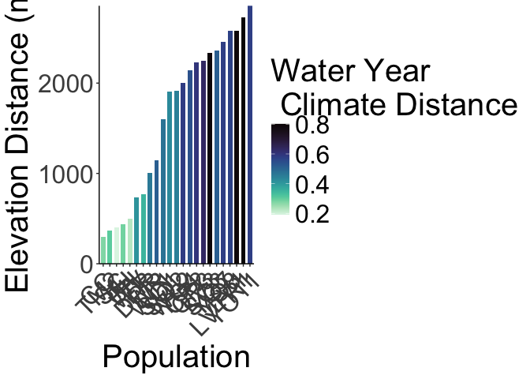

# Total Fitness at both sites 

Total Fitness: p(Establishment)*p(Surv to Rep - y1)*Fruits(y1) + p(Winter Surv)*p(Surv to Rep - y2)*Fruits(y2)

## Libraries

``` r
library(tidyverse)
```

```
## ── Attaching core tidyverse packages ──────────────────────── tidyverse 2.0.0 ──
## ✔ dplyr     1.1.4     ✔ readr     2.1.5
## ✔ forcats   1.0.0     ✔ stringr   1.5.1
## ✔ ggplot2   3.5.1     ✔ tibble    3.2.1
## ✔ lubridate 1.9.3     ✔ tidyr     1.3.1
## ✔ purrr     1.0.2     
## ── Conflicts ────────────────────────────────────────── tidyverse_conflicts() ──
## ✖ dplyr::filter() masks stats::filter()
## ✖ dplyr::lag()    masks stats::lag()
## ℹ Use the conflicted package (<http://conflicted.r-lib.org/>) to force all conflicts to become errors
```

``` r
library(magrittr)
```

```
## 
## Attaching package: 'magrittr'
## 
## The following object is masked from 'package:purrr':
## 
##     set_names
## 
## The following object is masked from 'package:tidyr':
## 
##     extract
```

``` r
#conflicted::conflicts_prefer(dplyr::filter)
library(viridis) #for pretty colors
```

```
## Loading required package: viridisLite
```

``` r
library(ggrepel) #for non-overlapping labels on plots
library(ggdist) #visualizations of distributions and uncertainty 
library(ggpubr)

#library(sp) #for calculating geographic distance 
library(geosphere) #for calculating geographic distance
library(corrplot) #plotting correlations  
```

```
## corrplot 0.94 loaded
```

``` r
library(rstatix) #performing cor_test
```

```
## 
## Attaching package: 'rstatix'
## 
## The following object is masked from 'package:stats':
## 
##     filter
```

``` r
library(lmerTest) #mixed models
```

```
## Loading required package: lme4
## Loading required package: Matrix
## 
## Attaching package: 'Matrix'
## 
## The following objects are masked from 'package:tidyr':
## 
##     expand, pack, unpack
## 
## 
## Attaching package: 'lmerTest'
## 
## The following object is masked from 'package:lme4':
## 
##     lmer
## 
## The following object is masked from 'package:stats':
## 
##     step
```

``` r
conflicted::conflicts_prefer(lmerTest::lmer)
```

```
## [conflicted] Will prefer lmerTest::lmer over any other package.
```

``` r
library(broom.mixed)
library(tidymodels)
```

```
## ── Attaching packages ────────────────────────────────────── tidymodels 1.2.0 ──
## ✔ broom        1.0.7     ✔ rsample      1.2.1
## ✔ dials        1.3.0     ✔ tune         1.2.1
## ✔ infer        1.0.7     ✔ workflows    1.1.4
## ✔ modeldata    1.4.0     ✔ workflowsets 1.1.0
## ✔ parsnip      1.2.1     ✔ yardstick    1.3.1
## ✔ recipes      1.1.0     
## ── Conflicts ───────────────────────────────────────── tidymodels_conflicts() ──
## ✖ infer::chisq_test()   masks rstatix::chisq_test()
## ✖ scales::discard()     masks purrr::discard()
## ✖ Matrix::expand()      masks tidyr::expand()
## ✖ magrittr::extract()   masks tidyr::extract()
## ✖ rstatix::filter()     masks dplyr::filter(), stats::filter()
## ✖ recipes::fixed()      masks stringr::fixed()
## ✖ dials::get_n()        masks rstatix::get_n()
## ✖ dplyr::lag()          masks stats::lag()
## ✖ Matrix::pack()        masks tidyr::pack()
## ✖ infer::prop_test()    masks rstatix::prop_test()
## ✖ magrittr::set_names() masks purrr::set_names()
## ✖ yardstick::spec()     masks readr::spec()
## ✖ recipes::step()       masks lmerTest::step(), stats::step()
## ✖ infer::t_test()       masks rstatix::t_test()
## ✖ Matrix::unpack()      masks tidyr::unpack()
## ✖ recipes::update()     masks Matrix::update(), stats::update()
## • Search for functions across packages at https://www.tidymodels.org/find/
```

``` r
library(furrr) #Apply Mapping Functions in Parallel using Futures
```

```
## Loading required package: future
```

``` r
tidymodels_prefer()
# install.packages("multilevelmod")
library(multilevelmod)

library(brms)
```

```
## Loading required package: Rcpp
## 
## Attaching package: 'Rcpp'
## 
## The following object is masked from 'package:rsample':
## 
##     populate
## 
## Loading 'brms' package (version 2.22.0). Useful instructions
## can be found by typing help('brms'). A more detailed introduction
## to the package is available through vignette('brms_overview').
```

``` r
#conflicted::conflicts_prefer(brms::ar)
#conflicted::conflicts_prefer(dplyr::combine)
#conflicted::conflicts_prefer(brms::dstudent_t)
library(tidybayes) #for extracting and visiaulizing brms model output 
library(modelr) #for data grid

sem <- function(x, na.rm=FALSE) {           #for caclulating standard error
  sd(x,na.rm=na.rm)/sqrt(length(na.omit(x)))
} 

cbbPalette2 <- c("#E69F00","#000000", "#56B4E9","#009E73", "#F0E442", "#0072B2", "#D55E00", "#CC79A7")
timepd_palette <- c("#56B4E9","#D55E00")

options(mc.cores = parallel::detectCores())
```

## Gower's Distance

``` r
garden_climate <- read_csv("../output/Climate/flint_climate_UCDpops.csv") %>% 
  filter(parent.pop=="WL2_Garden" | parent.pop=="UCD_Garden") %>% 
  select(parent.pop:Long) %>% 
  distinct()
```

```
## Rows: 38775 Columns: 14
## ── Column specification ────────────────────────────────────────────────────────
## Delimiter: ","
## chr  (3): parent.pop, elevation.group, month
## dbl (11): elev_m, Lat, Long, year, aet, cwd, pck, pet, ppt, tmn, tmx
## 
## ℹ Use `spec()` to retrieve the full column specification for this data.
## ℹ Specify the column types or set `show_col_types = FALSE` to quiet this message.
```

``` r
garden_climate
```

```
## # A tibble: 2 × 5
##   parent.pop elevation.group elev_m   Lat  Long
##   <chr>      <chr>            <dbl> <dbl> <dbl>
## 1 UCD_Garden Low                 16  38.5 -122.
## 2 WL2_Garden High              2020  38.8 -120.
```

``` r
#UCD LAT/LONG = 38.53250, -121.7830
#WL2 Lat/Long = 38.82599, -120.2509

ucd_gowers <- read_csv("../output/Climate/Gowers_UCD.csv") %>% 
  select(parent.pop:GrwSsn_GD, Wtr_Year_GD) %>% 
  pivot_wider(names_from = TimePd, values_from = c(GrwSsn_GD, Wtr_Year_GD)) %>% 
  mutate(UCD_Lat=38.53250, UCD_Long=-121.7830, UCD_Elev=16) %>% 
  mutate(Geographic_Dist=distHaversine(cbind(UCD_Long, UCD_Lat), cbind(Long, Lat)),
         Elev_Dist=UCD_Elev-elev_m) %>% # Calculate the distance using the haversine formula (dist in meters)
  #mutate(Lat_Dist=UCD_Lat-Lat, Long_Dist=UCD_Long-Long) %>% #Garden-Home - lat and long per Gerst et al 2011 which kept them separate for some directionality
  rename(pop=parent.pop)
```

```
## Rows: 46 Columns: 12
## ── Column specification ────────────────────────────────────────────────────────
## Delimiter: ","
## chr (3): parent.pop, elevation.group, TimePd
## dbl (9): elev_m, Lat, Long, GrwSsn_GD, GrwSsn_FLINT_GD, GrwSsn_BIOCLIM_GD, W...
## 
## ℹ Use `spec()` to retrieve the full column specification for this data.
## ℹ Specify the column types or set `show_col_types = FALSE` to quiet this message.
```

``` r
wl2_gowers_2023 <- read_csv("../output/Climate/Gowers_WL2.csv") %>% 
  select(parent.pop:GrwSsn_GD, Wtr_Year_GD) %>% 
  pivot_wider(names_from = TimePd, values_from = c(GrwSsn_GD, Wtr_Year_GD)) %>% 
  mutate(WL2_Lat=38.82599, WL2_Long=-120.2509, WL2_Elev=2020) %>% 
  mutate(Geographic_Dist=distHaversine(cbind(WL2_Long, WL2_Lat), cbind(Long, Lat)),
         Elev_Dist=WL2_Elev-elev_m) %>% # Calculate the distance using the haversine formula
  #mutate(Lat_Dist=WL2_Lat-Lat, Long_Dist=WL2_Long-Long) %>% #Garden-Home - lat and long per Gerst et al 2011 which kept them separate for some directionality
  rename(pop=parent.pop)
```

```
## Rows: 46 Columns: 12
## ── Column specification ────────────────────────────────────────────────────────
## Delimiter: ","
## chr (3): parent.pop, elevation.group, TimePd
## dbl (9): elev_m, Lat, Long, GrwSsn_GD, GrwSsn_FLINT_GD, GrwSsn_BIOCLIM_GD, W...
## 
## ℹ Use `spec()` to retrieve the full column specification for this data.
## ℹ Specify the column types or set `show_col_types = FALSE` to quiet this message.
```

``` r
wl2_gowers_2024 <- read_csv("../output/Climate/Gowers_WL2_2024.csv") %>% 
  pivot_wider(names_from = TimePd, values_from = c(GrwSsn_GD, Wtr_Year_GD)) %>% 
  mutate(WL2_Lat=38.82599, WL2_Long=-120.2509, WL2_Elev=2020) %>% 
  mutate(Geographic_Dist=distHaversine(cbind(WL2_Long, WL2_Lat), cbind(Long, Lat)),
         Elev_Dist=WL2_Elev-elev_m) %>% # Calculate the distance using the haversine formula
  rename(pop=parent.pop)
```

```
## Rows: 46 Columns: 8
## ── Column specification ────────────────────────────────────────────────────────
## Delimiter: ","
## chr (3): parent.pop, elevation.group, TimePd
## dbl (5): elev_m, Lat, Long, GrwSsn_GD, Wtr_Year_GD
## 
## ℹ Use `spec()` to retrieve the full column specification for this data.
## ℹ Specify the column types or set `show_col_types = FALSE` to quiet this message.
```

### Climate Subtraction Distance

``` r
wl2_wtr_year_sub_recent <- read_csv("../output/Climate/full_year_Subtraction_Dist_from_WL2_Recent.csv")
```

```
## Rows: 23 Columns: 18
## ── Column specification ────────────────────────────────────────────────────────
## Delimiter: ","
## chr  (2): parent.pop, elevation.group
## dbl (16): elev_m, ppt_dist, cwd_dist, pck_dist, tmn_dist, tmx_dist, ann_tmea...
## 
## ℹ Use `spec()` to retrieve the full column specification for this data.
## ℹ Specify the column types or set `show_col_types = FALSE` to quiet this message.
```

``` r
wl2_grwssn_sub_recent <- read_csv("../output/Climate/grwssn_Subtraction_Dist_from_WL2_Recent.csv")
```

```
## Rows: 23 Columns: 17
## ── Column specification ────────────────────────────────────────────────────────
## Delimiter: ","
## chr  (2): parent.pop, elevation.group
## dbl (15): elev_m, ppt_dist, cwd_dist, tmn_dist, tmx_dist, ann_tmean_dist, me...
## 
## ℹ Use `spec()` to retrieve the full column specification for this data.
## ℹ Specify the column types or set `show_col_types = FALSE` to quiet this message.
```

``` r
wl2_wtr_year_sub_historic <- read_csv("../output/Climate/full_year_Subtraction_Dist_from_WL2_Historical.csv")
```

```
## Rows: 23 Columns: 18
## ── Column specification ────────────────────────────────────────────────────────
## Delimiter: ","
## chr  (2): parent.pop, elevation.group
## dbl (16): elev_m, ppt_dist, cwd_dist, pck_dist, tmn_dist, tmx_dist, ann_tmea...
## 
## ℹ Use `spec()` to retrieve the full column specification for this data.
## ℹ Specify the column types or set `show_col_types = FALSE` to quiet this message.
```

``` r
wl2_grwssn_sub_historic <- read_csv("../output/Climate/grwssn_Subtraction_Dist_from_WL2_Historical.csv")
```

```
## Rows: 23 Columns: 17
## ── Column specification ────────────────────────────────────────────────────────
## Delimiter: ","
## chr  (2): parent.pop, elevation.group
## dbl (15): elev_m, ppt_dist, cwd_dist, tmn_dist, tmx_dist, ann_tmean_dist, me...
## 
## ℹ Use `spec()` to retrieve the full column specification for this data.
## ℹ Specify the column types or set `show_col_types = FALSE` to quiet this message.
```

``` r
ucd_wtr_year_sub_recent <- read_csv("../output/Climate/full_year_Subtraction_Dist_from_Davis_Recent.csv")
```

```
## Rows: 23 Columns: 18
## ── Column specification ────────────────────────────────────────────────────────
## Delimiter: ","
## chr  (2): parent.pop, elevation.group
## dbl (16): elev_m, cwd_dist, ppt_dist, pck_dist, tmn_dist, tmx_dist, ann_tmea...
## 
## ℹ Use `spec()` to retrieve the full column specification for this data.
## ℹ Specify the column types or set `show_col_types = FALSE` to quiet this message.
```

``` r
ucd_grwssn_sub_recent <- read_csv("../output/Climate/grwssn_Subtraction_Dist_from_Davis_Recent.csv")
```

```
## Rows: 23 Columns: 17
## ── Column specification ────────────────────────────────────────────────────────
## Delimiter: ","
## chr  (2): parent.pop, elevation.group
## dbl (15): elev_m, cwd_dist, ppt_dist, tmn_dist, tmx_dist, ann_tmean_dist, me...
## 
## ℹ Use `spec()` to retrieve the full column specification for this data.
## ℹ Specify the column types or set `show_col_types = FALSE` to quiet this message.
```

``` r
ucd_wtr_year_sub_historic <- read_csv("../output/Climate/full_year_Subtraction_Dist_from_Davis_Historical.csv")
```

```
## Rows: 23 Columns: 18
## ── Column specification ────────────────────────────────────────────────────────
## Delimiter: ","
## chr  (2): parent.pop, elevation.group
## dbl (16): elev_m, cwd_dist, ppt_dist, pck_dist, tmn_dist, tmx_dist, ann_tmea...
## 
## ℹ Use `spec()` to retrieve the full column specification for this data.
## ℹ Specify the column types or set `show_col_types = FALSE` to quiet this message.
```

``` r
ucd_grwssn_sub_historic <- read_csv("../output/Climate/grwssn_Subtraction_Dist_from_Davis_Historical.csv")
```

```
## Rows: 23 Columns: 17
## ── Column specification ────────────────────────────────────────────────────────
## Delimiter: ","
## chr  (2): parent.pop, elevation.group
## dbl (15): elev_m, cwd_dist, ppt_dist, tmn_dist, tmx_dist, ann_tmean_dist, me...
## 
## ℹ Use `spec()` to retrieve the full column specification for this data.
## ℹ Specify the column types or set `show_col_types = FALSE` to quiet this message.
```

### Check Geographic distance

``` r
ucd_gowers %>% 
  ggplot(aes(x=fct_reorder(pop, Geographic_Dist), y=Geographic_Dist, fill=Wtr_Year_GD_Recent)) +
  geom_col(width = 0.7,position = position_dodge(0.75)) + 
  labs(y="Geographic Distance (m)", x="Population", fill="Water Year \n Climate Distance") +
  theme_classic() +
  scale_fill_viridis(option="mako", direction = -1) +
  scale_y_continuous(expand = c(0, 0)) +
  theme(text=element_text(size=25), axis.text.x = element_text(angle = 45,  hjust = 1)) 
```

<!-- -->

``` r
#ggsave("../output/UCD_GeoDist.png", width = 12, height = 8, units = "in")

wl2_gowers_2023 %>% 
  ggplot(aes(x=fct_reorder(pop, Geographic_Dist), y=Geographic_Dist, fill=Wtr_Year_GD_Recent)) +
  geom_col(width = 0.7,position = position_dodge(0.75)) + 
  labs(y="Geographic Distance (m)", x="Population", fill="Water Year \n Climate Distance") +
  theme_classic() +
  scale_fill_viridis(option="mako", direction = -1) +
  scale_y_continuous(expand = c(0, 0)) +
  theme(text=element_text(size=25), axis.text.x = element_text(angle = 45,  hjust = 1)) 
```

<!-- -->

``` r
#ggsave("../output/WL2_GeoDist.png", width = 12, height = 8, units = "in")

## Correlation between geo distance and climate distance
dist_normalized_ucd <- ucd_gowers %>% select(GrwSsn_GD_Recent:Wtr_Year_GD_Historical, Geographic_Dist) %>% scale() #normalize the data so they're all on the same scale
head(dist_normalized_ucd)
```

```
##      GrwSsn_GD_Recent GrwSsn_GD_Historical Wtr_Year_GD_Recent
## [1,]       -1.6097060           -1.2333603         -0.1315203
## [2,]       -1.3382567           -1.1474561         -1.1969789
## [3,]       -1.2850999           -0.4727036         -1.2642964
## [4,]       -1.0167626           -0.7218352         -1.5426334
## [5,]       -0.9763752           -1.1382829          0.1207765
## [6,]       -0.7209606           -0.6622060         -0.8308996
##      Wtr_Year_GD_Historical Geographic_Dist
## [1,]            -0.23592699      -0.6952727
## [2,]            -1.20442321      -1.2574269
## [3,]            -1.41622323      -0.9389442
## [4,]            -1.56054173       0.1566691
## [5,]            -0.09358015      -0.9043893
## [6,]            -0.68940252      -0.2454393
```

``` r
cor.norm_ucd = cor(dist_normalized_ucd) #test correlations among the traits
corrplot(cor.norm_ucd) #geo dist not strongly correlated to any of the climate distances, yay!
```

<!-- -->

``` r
dist_normalized_wl2 <- wl2_gowers_2023 %>% select(GrwSsn_GD_Recent:Wtr_Year_GD_Historical, Geographic_Dist) %>% scale() #normalize the data so they're all on the same scale
head(dist_normalized_wl2)
```

```
##      GrwSsn_GD_Recent GrwSsn_GD_Historical Wtr_Year_GD_Recent
## [1,]        -1.833317           -1.2596750        -0.55370936
## [2,]        -1.455148           -0.9558987        -0.70954714
## [3,]        -1.125343           -0.8544994         2.59044284
## [4,]        -1.101859           -0.8071114        -0.68765718
## [5,]        -1.030343           -1.3312671        -0.42580349
## [6,]        -1.007116           -1.0792942        -0.09912854
##      Wtr_Year_GD_Historical Geographic_Dist
## [1,]             -0.9912435      -0.1460960
## [2,]             -0.8148273      -1.4956828
## [3,]              2.3402079       0.2224374
## [4,]             -0.9594762       1.3552251
## [5,]             -0.8741359       1.4205701
## [6,]             -0.4711787       1.5545268
```

``` r
cor.norm_wl2 = cor(dist_normalized_wl2) #test correlations among the traits
corrplot(cor.norm_wl2) #geo dist not strongly correlated to any of the climate distances, yay!
```

<!-- -->

### Checking elevation distance

``` r
ucd_gowers %>% 
  ggplot(aes(x=fct_reorder(pop, Elev_Dist), y=Elev_Dist, fill=Wtr_Year_GD_Recent)) +
  geom_col(width = 0.7,position = position_dodge(0.75)) + 
  labs(y="Elevation Distance (m)", x="Population", fill="Water Year \n Climate Distance") +
  theme_classic() +
  scale_fill_viridis(option="mako", direction = -1) +
  scale_y_continuous(expand = c(0, 0)) +
  theme(text=element_text(size=25), axis.text.x = element_text(angle = 45,  hjust = 1)) 
```

<!-- -->

``` r
#ggsave("../output/UCD_ElevDist.png", width = 12, height = 8, units = "in")

wl2_gowers_2023 %>% 
  ggplot(aes(x=fct_reorder(pop, Elev_Dist), y=Elev_Dist, fill=Wtr_Year_GD_Recent)) +
  geom_col(width = 0.7,position = position_dodge(0.75)) + 
  labs(y="Elevation Distance (m)", x="Population", fill="Water Year \n Climate Distance") +
  theme_classic() +
  scale_fill_viridis(option="mako", direction = -1) +
  scale_y_continuous(expand = c(0, 0)) +
  theme(text=element_text(size=25), axis.text.x = element_text(angle = 45,  hjust = 1)) 
```

<!-- -->

``` r
#ggsave("../output/WL2_ElevDist.png", width = 12, height = 8, units = "in")

## Correlation between elev distance and climate distance
dist_normalized_ucd <- ucd_gowers %>% select(GrwSsn_GD_Recent:Wtr_Year_GD_Historical, Elev_Dist) %>% scale() #normalize the data so they're all on the same scale
head(dist_normalized_ucd)
```

```
##      GrwSsn_GD_Recent GrwSsn_GD_Historical Wtr_Year_GD_Recent
## [1,]       -1.6097060           -1.2333603         -0.1315203
## [2,]       -1.3382567           -1.1474561         -1.1969789
## [3,]       -1.2850999           -0.4727036         -1.2642964
## [4,]       -1.0167626           -0.7218352         -1.5426334
## [5,]       -0.9763752           -1.1382829          0.1207765
## [6,]       -0.7209606           -0.6622060         -0.8308996
##      Wtr_Year_GD_Historical Elev_Dist
## [1,]            -0.23592699 0.0405207
## [2,]            -1.20442321 1.3494437
## [3,]            -1.41622323 1.5087322
## [4,]            -1.56054173 1.2847715
## [5,]            -0.09358015 0.5550090
## [6,]            -0.68940252 0.9737443
```

``` r
cor.norm_ucd = cor(dist_normalized_ucd) #test correlations among the traits
corrplot(cor.norm_ucd) ##elev dist strongly neg correlated w/ water year climate distances
```

<!-- -->

``` r
dist_normalized_wl2 <- wl2_gowers_2023 %>% select(GrwSsn_GD_Recent:Wtr_Year_GD_Historical, Elev_Dist) %>% scale() #normalize the data so they're all on the same scale
head(dist_normalized_wl2)
```

```
##      GrwSsn_GD_Recent GrwSsn_GD_Historical Wtr_Year_GD_Recent
## [1,]        -1.833317           -1.2596750        -0.55370936
## [2,]        -1.455148           -0.9558987        -0.70954714
## [3,]        -1.125343           -0.8544994         2.59044284
## [4,]        -1.101859           -0.8071114        -0.68765718
## [5,]        -1.030343           -1.3312671        -0.42580349
## [6,]        -1.007116           -1.0792942        -0.09912854
##      Wtr_Year_GD_Historical  Elev_Dist
## [1,]             -0.9912435 -0.5731767
## [2,]             -0.8148273 -0.4180323
## [3,]              2.3402079  1.2847715
## [4,]             -0.9594762 -0.8165136
## [5,]             -0.8741359 -0.3213456
## [6,]             -0.4711787 -0.3062049
```

``` r
cor.norm_wl2 = cor(dist_normalized_wl2) #test correlations among the traits
corrplot(cor.norm_wl2) #elev positively correlated with recent water year climate distance 
```

<!-- -->


### WL2 Avg Gowers

``` r
wl2_gowers_2023_prep <- wl2_gowers_2023 %>% rename_with(~paste0(., "_2023"), 6:9)
wl2_gowers_2024_prep <- wl2_gowers_2024 %>% rename_with(~paste0(., "_2024"), 6:9)

wl2_gowers_avg <- bind_rows(wl2_gowers_2023, wl2_gowers_2024) %>% 
  group_by(pop, elevation.group, elev_m, Geographic_Dist) %>% 
  summarise_at(c("GrwSsn_GD_Recent",  "GrwSsn_GD_Historical", "Wtr_Year_GD_Recent", "Wtr_Year_GD_Historical"), c(mean), na.rm = TRUE)
wl2_gowers_avg
```

```
## # A tibble: 23 × 8
## # Groups:   pop, elevation.group, elev_m [23]
##    pop   elevation.group elev_m Geographic_Dist GrwSsn_GD_Recent
##    <chr> <chr>            <dbl>           <dbl>            <dbl>
##  1 BH    Low               511.         159626.            0.312
##  2 CC    Low               313          132498.            0.417
##  3 CP2   High             2244.          21060.            0.301
##  4 CP3   High             2266.          19415.            0.324
##  5 DPR   Mid              1019.          66246.            0.439
##  6 FR    Mid               787          154694.            0.386
##  7 IH    Low               454.          65203.            0.440
##  8 LV1   High             2593.         212682.            0.379
##  9 LV3   High             2354.         213902.            0.380
## 10 LVTR1 High             2741.         213038.            0.404
## # ℹ 13 more rows
## # ℹ 3 more variables: GrwSsn_GD_Historical <dbl>, Wtr_Year_GD_Recent <dbl>,
## #   Wtr_Year_GD_Historical <dbl>
```


## Load Davis Fitness Components 

``` r
ucd_establishment <- read_csv("../output/UCD_Traits/UCD_Establishment.csv")
```

```
## Rows: 755 Columns: 19
## ── Column specification ────────────────────────────────────────────────────────
## Delimiter: ","
## chr   (5): block, col, Genotype, pop, elevation.group
## dbl  (13): row, mf, rep, elev_m, Lat, Long, GrwSsn_GD_Recent, GrwSsn_GD_Hist...
## date  (1): death.date
## 
## ℹ Use `spec()` to retrieve the full column specification for this data.
## ℹ Specify the column types or set `show_col_types = FALSE` to quiet this message.
```

``` r
ucd_surv_to_rep <- read_csv("../output/UCD_Traits/UCD_SurvtoRep.csv")
```

```
## Rows: 755 Columns: 20
## ── Column specification ────────────────────────────────────────────────────────
## Delimiter: ","
## chr   (6): block, col, Genotype, pop, elevation.group, bud.date
## dbl  (13): row, mf, rep, elev_m, Lat, Long, GrwSsn_GD_Recent, GrwSsn_GD_Hist...
## date  (1): death.date
## 
## ℹ Use `spec()` to retrieve the full column specification for this data.
## ℹ Specify the column types or set `show_col_types = FALSE` to quiet this message.
```

``` r
ucd_fruits <- read_csv("../output/UCD_Traits/UCD_Fruits.csv")
```

```
## Rows: 63 Columns: 22
## ── Column specification ────────────────────────────────────────────────────────
## Delimiter: ","
## chr  (5): block, col, Genotype, pop, elevation.group
## dbl (17): row, mf, rep, elev_m, Lat, Long, flowers, fruits, GrwSsn_GD_Recent...
## 
## ℹ Use `spec()` to retrieve the full column specification for this data.
## ℹ Specify the column types or set `show_col_types = FALSE` to quiet this message.
```

### UCD - Check summer survival (equivalent to winter)

``` r
ucd_surv <- read_csv("../input/UCD_Data/CorrectedCSVs/UCD_transplants_pheno_mort_20231016_corrected.csv") %>% 
  rename(death.date=`Death Date`, bud.date=`Date First Bud`, flower.date=`Date First Flower`, 
         fruit.date=`Date First Fruit`, last.flower.date=`Date Last Flower`, last.fruit.date=`Date Last Fruit`) %>% 
  filter(!is.na(pop)) %>% 
  filter(rep != 100) %>% #get rid of individuals that germinated in the field 
  unite(Genotype, pop:rep, sep="_", remove = FALSE) 
```

```
## Rows: 858 Columns: 13
## ── Column specification ────────────────────────────────────────────────────────
## Delimiter: ","
## chr (10): block, col, pop, Date First Bud, Date First Flower, Date First Fru...
## dbl  (3): row, mf, rep
## 
## ℹ Use `spec()` to retrieve the full column specification for this data.
## ℹ Specify the column types or set `show_col_types = FALSE` to quiet this message.
```

``` r
#unique(ucd_surv$pop)
```


``` r
ucd_surv %>% filter(is.na(death.date)) #filter the alive plants on 10/16/23
```

```
## # A tibble: 9 × 14
##   block   row col   Genotype pop      mf   rep bud.date flower.date fruit.date
##   <chr> <dbl> <chr> <chr>    <chr> <dbl> <dbl> <chr>    <chr>       <chr>     
## 1 D2       26 B     BH_5_15  BH        5    15 5/18/23  5/30/23     6/5/23    
## 2 D2       30 B     BH_4_3   BH        4     3 <NA>     <NA>        <NA>      
## 3 D2       29 D     BH_2_9   BH        2     9 6/1/23   6/12/23     6/15/23   
## 4 F1       15 A     BH_6_9   BH        6     9 <NA>     <NA>        <NA>      
## 5 F2       29 B     BH_4_5   BH        4     5 <NA>     <NA>        <NA>      
## 6 F2       40 B     BH_5_12  BH        5    12 <NA>     <NA>        <NA>      
## 7 J2       25 D     BH_2_5   BH        2     5 5/8/23   5/22/23     5/25/23   
## 8 J2       32 D     BH_3_12  BH        3    12 <NA>     <NA>        <NA>      
## 9 L1       13 C     BH_3_13  BH        3    13 4/27/23  5/15/23     5/22/23   
## # ℹ 4 more variables: last.flower.date <chr>, last.fruit.date <chr>,
## #   death.date <chr>, Notes <chr>
```

``` r
#9 plants alive in October, all BH 
#5 did not reproduce in year 1 
```

## Load WL2 Fitness Components 

``` r
wl2_establishment <- read_csv("../output/WL2_Traits/WL2_Establishment.csv")
```

```
## Rows: 1573 Columns: 21
## ── Column specification ────────────────────────────────────────────────────────
## Delimiter: ","
## chr   (7): block, BedLoc, bed, bed.col, Genotype, pop, elevation.group
## dbl  (13): bed.row, mf, rep, elev_m, Lat, Long, GrwSsn_GD_Recent, GrwSsn_GD_...
## date  (1): death.date
## 
## ℹ Use `spec()` to retrieve the full column specification for this data.
## ℹ Specify the column types or set `show_col_types = FALSE` to quiet this message.
```

``` r
wl2_surv_to_rep_y1 <- read_csv("../output/WL2_Traits/WL2_SurvtoRep_y1.csv")
```

```
## Rows: 1573 Columns: 22
## ── Column specification ────────────────────────────────────────────────────────
## Delimiter: ","
## chr   (8): block, BedLoc, bed, bed.col, Genotype, pop, elevation.group, bud....
## dbl  (13): bed.row, mf, rep, elev_m, Lat, Long, GrwSsn_GD_Recent, GrwSsn_GD_...
## date  (1): death.date
## 
## ℹ Use `spec()` to retrieve the full column specification for this data.
## ℹ Specify the column types or set `show_col_types = FALSE` to quiet this message.
```

``` r
wl2_fruits_y1 <- read_csv("../output/WL2_Traits/WL2_Fruits_Y1.csv")
```

```
## Rows: 1573 Columns: 24
## ── Column specification ────────────────────────────────────────────────────────
## Delimiter: ","
## chr  (7): block, BedLoc, bed, bed-col, Genotype, pop, elevation.group
## dbl (17): bed-row, mf, rep, flowers, fruits, elev_m, Lat, Long, GrwSsn_GD_Re...
## 
## ℹ Use `spec()` to retrieve the full column specification for this data.
## ℹ Specify the column types or set `show_col_types = FALSE` to quiet this message.
```

``` r
winter_surv <- read_csv("../output/WL2_Traits/WL2_WinterSurv.csv")
```

```
## Rows: 469 Columns: 21
## ── Column specification ────────────────────────────────────────────────────────
## Delimiter: ","
## chr  (8): block, BedLoc, bed, bed- col, Genotype, pop, elevation.group, deat...
## dbl (13): bed- row, mf, rep, elev_m, Lat, Long, GrwSsn_GD_Recent, GrwSsn_GD_...
## 
## ℹ Use `spec()` to retrieve the full column specification for this data.
## ℹ Specify the column types or set `show_col_types = FALSE` to quiet this message.
```

``` r
wl2_surv_to_rep_y2 <- read_csv("../output/WL2_Traits/WL2_Surv_to_Rep_Y2.csv")
```

```
## Rows: 135 Columns: 22
## ── Column specification ────────────────────────────────────────────────────────
## Delimiter: ","
## chr  (9): Pop.Type, loc, bed, col, pop, Genotype, elevation.group, bud.date,...
## dbl (13): row, mf, rep, elev_m, Lat, Long, GrwSsn_GD_Recent, GrwSsn_GD_Histo...
## 
## ℹ Use `spec()` to retrieve the full column specification for this data.
## ℹ Specify the column types or set `show_col_types = FALSE` to quiet this message.
```

``` r
wl2_fruits_y2 <- read_csv("../output/WL2_Traits/WL2_Fruits_Y2.csv")
```

```
## Rows: 135 Columns: 24
## ── Column specification ────────────────────────────────────────────────────────
## Delimiter: ","
## chr  (7): Pop.Type, loc, bed, col, pop, Genotype, elevation.group
## dbl (17): row, mf, rep, flowers, fruits, elev_m, Lat, Long, GrwSsn_GD_Recent...
## 
## ℹ Use `spec()` to retrieve the full column specification for this data.
## ℹ Specify the column types or set `show_col_types = FALSE` to quiet this message.
```


## Davis - No Year 2
p(Establishment)*p(Surv to Rep - y1)*Fruits(y1) 

``` r
#per individual:
ucd_total_fitness <- left_join(ucd_establishment, ucd_surv_to_rep) %>% 
  left_join(ucd_fruits) %>% 
  select(block:Wtr_Year_GD_Historical, Geographic_Dist, Elev_Dist, Establishment, SurvtoRep_Y1:fruits) %>% 
  mutate(fruits=if_else(is.na(fruits), 0, fruits)) %>% 
  mutate(Total_Fitness=Establishment*SurvtoRep_Y1*fruits)
```

```
## Joining with `by = join_by(block, row, col, Genotype, pop, mf, rep,
## elevation.group, elev_m, Lat, Long, GrwSsn_GD_Recent, GrwSsn_GD_Historical,
## Wtr_Year_GD_Recent, Wtr_Year_GD_Historical, Geographic_Dist, Elev_Dist,
## death.date)`
## Joining with `by = join_by(block, row, col, Genotype, pop, mf, rep,
## elevation.group, elev_m, Lat, Long, GrwSsn_GD_Recent, GrwSsn_GD_Historical,
## Wtr_Year_GD_Recent, Wtr_Year_GD_Historical, Geographic_Dist, Elev_Dist)`
```

``` r
head(ucd_total_fitness)
```

```
## # A tibble: 6 × 22
##   block   row col   Genotype  pop      mf   rep elevation.group elev_m   Lat
##   <chr> <dbl> <chr> <chr>     <chr> <dbl> <dbl> <chr>            <dbl> <dbl>
## 1 D1        3 A     WL2_4_11  WL2       4    11 High             2020.  38.8
## 2 D1        3 B     CP2_10_4  CP2      10     4 High             2244.  38.7
## 3 D1        4 A     YO11_4_10 YO11      4    10 High             2872.  37.9
## 4 D1        4 B     CC_5_12   CC        5    12 Low               313   39.6
## 5 D1        5 A     FR_3_6    FR        3     6 Mid               787   40.0
## 6 D1        5 B     BH_5_24   BH        5    24 Low               511.  37.4
## # ℹ 12 more variables: Long <dbl>, GrwSsn_GD_Recent <dbl>,
## #   GrwSsn_GD_Historical <dbl>, Wtr_Year_GD_Recent <dbl>,
## #   Wtr_Year_GD_Historical <dbl>, Geographic_Dist <dbl>, Elev_Dist <dbl>,
## #   Establishment <dbl>, SurvtoRep_Y1 <dbl>, flowers <dbl>, fruits <dbl>,
## #   Total_Fitness <dbl>
```

``` r
ucd_total_fitness %>% filter(Total_Fitness>0)
```

```
## # A tibble: 30 × 22
##    block   row col   Genotype pop      mf   rep elevation.group elev_m   Lat
##    <chr> <dbl> <chr> <chr>    <chr> <dbl> <dbl> <chr>            <dbl> <dbl>
##  1 D2       26 B     BH_5_15  BH        5    15 Low               511.  37.4
##  2 D2       31 B     TM2_4_11 TM2       4    11 Low               379.  39.6
##  3 D2       29 D     BH_2_9   BH        2     9 Low               511.  37.4
##  4 D2       35 D     BH_3_6   BH        3     6 Low               511.  37.4
##  5 F1        4 C     TM2_5_7  TM2       5     7 Low               379.  39.6
##  6 F2       35 D     BH_2_1   BH        2     1 Low               511.  37.4
##  7 F2       40 D     TM2_1_4  TM2       1     4 Low               379.  39.6
##  8 H1       19 A     TM2_5_1  TM2       5     1 Low               379.  39.6
##  9 H2       24 B     BH_5_29  BH        5    29 Low               511.  37.4
## 10 H2       36 B     TM2_3_1  TM2       3     1 Low               379.  39.6
## # ℹ 20 more rows
## # ℹ 12 more variables: Long <dbl>, GrwSsn_GD_Recent <dbl>,
## #   GrwSsn_GD_Historical <dbl>, Wtr_Year_GD_Recent <dbl>,
## #   Wtr_Year_GD_Historical <dbl>, Geographic_Dist <dbl>, Elev_Dist <dbl>,
## #   Establishment <dbl>, SurvtoRep_Y1 <dbl>, flowers <dbl>, fruits <dbl>,
## #   Total_Fitness <dbl>
```

``` r
ucd_total_fitness %>% group_by(pop) %>% summarise(n=n()) %>% arrange(n)
```

```
## # A tibble: 23 × 2
##    pop       n
##    <chr> <int>
##  1 WV        2
##  2 LV1       3
##  3 YO4       6
##  4 CP3       8
##  5 WR        9
##  6 SQ3      10
##  7 YO8      13
##  8 YO11     14
##  9 LVTR1    15
## 10 YO7      17
## # ℹ 13 more rows
```

``` r
#only 2 WV plants 
```

### Bar Plots 

``` r
ucd_total_fitness %>% 
  group_by(pop, elev_m, GrwSsn_GD_Recent, Wtr_Year_GD_Recent) %>% 
  summarise(meanFruits=mean(Total_Fitness, na.rm = TRUE), semFruits=sem(Total_Fitness, na.rm=TRUE)) %>% 
  ggplot(aes(x=fct_reorder(pop, meanFruits), y=meanFruits, fill=GrwSsn_GD_Recent)) +
  geom_col(width = 0.7,position = position_dodge(0.75)) + 
  geom_errorbar(aes(ymin=meanFruits-semFruits,ymax=meanFruits+semFruits),width=.2, position = 
                  position_dodge(0.75)) +
  theme_classic() + 
  scale_y_continuous(expand = c(0.01, 0)) +
  labs(y="Total Fitness", x="Parent Population", fill="Growth Season Gowers") +
  scale_fill_viridis(option="mako", direction = -1) +
  theme(text=element_text(size=25), axis.text.x = element_text(angle = 45,  hjust = 1))
```

```
## `summarise()` has grouped output by 'pop', 'elev_m', 'GrwSsn_GD_Recent'. You
## can override using the `.groups` argument.
```

<!-- -->

``` r
#ggsave("../output/UCD_Traits/UCD_Total_Fitness_GrwSsn_GD_Recent.png", width = 12, height = 8, units = "in")

ucd_total_fitness %>% 
  group_by(pop, elev_m, GrwSsn_GD_Recent, Wtr_Year_GD_Recent) %>% 
  summarise(meanFruits=mean(Total_Fitness, na.rm = TRUE), semFruits=sem(Total_Fitness, na.rm=TRUE)) %>% 
  ggplot(aes(x=fct_reorder(pop, meanFruits), y=meanFruits, fill=Wtr_Year_GD_Recent)) +
  geom_col(width = 0.7,position = position_dodge(0.75)) + 
  geom_errorbar(aes(ymin=meanFruits-semFruits,ymax=meanFruits+semFruits),width=.2, position = 
                  position_dodge(0.75)) +
  theme_classic() + 
  scale_y_continuous(expand = c(0.01, 0)) +
  labs(y="Total Fitness", x="Parent Population", fill="Water Year Gowers") +
  scale_fill_viridis(option="mako", direction = -1) +
  theme(text=element_text(size=25), axis.text.x = element_text(angle = 45,  hjust = 1))
```

```
## `summarise()` has grouped output by 'pop', 'elev_m', 'GrwSsn_GD_Recent'. You
## can override using the `.groups` argument.
```

<!-- -->

``` r
#ggsave("../output/UCD_Traits/UCD_Total_Fitness_Wtr_Year_GD_Recent.png", width = 12, height = 8, units = "in")
```

## WL2
*Used average Gowers

p(Establishment)*p(Surv to Rep - y1)*Fruits(y1) + p(Winter Surv)*p(Surv to Rep - y2)*Fruits(y2)

``` r
wl2_fruits_y1_prep <- wl2_fruits_y1 %>% 
  select(block:BedLoc, Genotype:rep, elevation.group:Long, y1_flowers=flowers, y1_fruits=fruits)

winter_surv_prep <- winter_surv %>% select(block:BedLoc, Genotype:Long, WinterSurv) 
wl2_surv_to_rep_y2_prep <- wl2_surv_to_rep_y2 %>% select(pop:Long, SurvtoRep_y2) 
wl2_fruits_y2_prep <- wl2_fruits_y2 %>% 
  select(pop:Genotype, elevation.group:Long, y2_flowers=flowers, y2_fruits=fruits)

wl2_total_fitness <- left_join(wl2_establishment, wl2_surv_to_rep_y1) %>% 
  left_join(wl2_fruits_y1_prep) %>% 
  left_join(winter_surv_prep) %>% 
  left_join(wl2_surv_to_rep_y2_prep) %>% 
  left_join(wl2_fruits_y2_prep) %>% 
  left_join(wl2_gowers_avg) %>% 
  select(block:Wtr_Year_GD_Historical, Geographic_Dist, Elev_Dist, Establishment, SurvtoRep_Y1:y2_fruits) %>% 
  mutate(y1_fruits=if_else(is.na(y1_fruits), 0, y1_fruits),
         y2_fruits=if_else(is.na(y2_fruits), 0, y2_fruits),
         WinterSurv=if_else(is.na(WinterSurv), 0, WinterSurv),
         SurvtoRep_y2=if_else(is.na(SurvtoRep_y2), 0, SurvtoRep_y2)) %>% 
  mutate(Total_Fitness=(Establishment*SurvtoRep_Y1*y1_fruits) + (WinterSurv*SurvtoRep_y2*y2_fruits))
```

```
## Joining with `by = join_by(block, BedLoc, bed, bed.row, bed.col, Genotype, pop,
## mf, rep, elevation.group, elev_m, Lat, Long, GrwSsn_GD_Recent,
## GrwSsn_GD_Historical, Wtr_Year_GD_Recent, Wtr_Year_GD_Historical,
## Geographic_Dist, Elev_Dist, death.date)`
## Joining with `by = join_by(block, BedLoc, Genotype, pop, mf, rep,
## elevation.group, elev_m, Lat, Long)`
## Joining with `by = join_by(block, BedLoc, Genotype, pop, mf, rep,
## elevation.group, elev_m, Lat, Long)`
## Joining with `by = join_by(Genotype, pop, mf, rep, elevation.group, elev_m,
## Lat, Long)`
## Joining with `by = join_by(Genotype, pop, mf, rep, elevation.group, elev_m,
## Lat, Long)`
## Joining with `by = join_by(pop, elevation.group, elev_m, GrwSsn_GD_Recent,
## GrwSsn_GD_Historical, Wtr_Year_GD_Recent, Wtr_Year_GD_Historical,
## Geographic_Dist)`
```

``` r
wl2_total_fitness %>% group_by(pop) %>% summarise(n=n()) %>% arrange(n)
```

```
## # A tibble: 23 × 2
##    pop       n
##    <chr> <int>
##  1 WV        3
##  2 WR       14
##  3 LV3      27
##  4 SQ1      30
##  5 SQ3      33
##  6 YO4      40
##  7 FR       48
##  8 WL1      48
##  9 SQ2      61
## 10 TM2      84
## # ℹ 13 more rows
```

### Bar Plots

``` r
wl2_total_fitness %>% 
  group_by(pop, elev_m, GrwSsn_GD_Recent, Wtr_Year_GD_Recent) %>% 
  summarise(meanFruits=mean(Total_Fitness, na.rm = TRUE), semFruits=sem(Total_Fitness, na.rm=TRUE)) %>% 
  ggplot(aes(x=fct_reorder(pop, meanFruits), y=meanFruits, fill=GrwSsn_GD_Recent)) +
  geom_col(width = 0.7,position = position_dodge(0.75)) + 
  geom_errorbar(aes(ymin=meanFruits-semFruits,ymax=meanFruits+semFruits),
                width=.2, position = position_dodge(0.75)) +
  theme_classic() + 
  scale_y_continuous(expand = c(0.01, 0)) +
  labs(y="Total Fitness", x="Parent Population", fill="Growth Season Gowers") +
  scale_fill_viridis(option="mako", direction = -1) +
  theme(text=element_text(size=25), axis.text.x = element_text(angle = 45,  hjust = 1))
```

```
## `summarise()` has grouped output by 'pop', 'elev_m', 'GrwSsn_GD_Recent'. You
## can override using the `.groups` argument.
```

<!-- -->

``` r
#ggsave("../output/WL2_Traits/WL2_Total_Fitness_GrwSsn_GD_Recent.png", width = 12, height = 8, units = "in")

wl2_total_fitness %>% 
  group_by(pop, elev_m, GrwSsn_GD_Recent, Wtr_Year_GD_Recent) %>% 
  summarise(meanFruits=mean(Total_Fitness, na.rm = TRUE), semFruits=sem(Total_Fitness, na.rm=TRUE)) %>% 
  ggplot(aes(x=fct_reorder(pop, meanFruits), y=meanFruits, fill=Wtr_Year_GD_Recent)) +
  geom_col(width = 0.7,position = position_dodge(0.75)) + 
  geom_errorbar(aes(ymin=meanFruits-semFruits,ymax=meanFruits+semFruits),width=.2, position = 
                  position_dodge(0.75)) +
  theme_classic() + 
  scale_y_continuous(expand = c(0.01, 0)) +
  labs(y="Total Fitness", x="Parent Population", fill="Water Year Gowers") +
  scale_fill_viridis(option="mako", direction = -1) +
  theme(text=element_text(size=25), axis.text.x = element_text(angle = 45,  hjust = 1))
```

```
## `summarise()` has grouped output by 'pop', 'elev_m', 'GrwSsn_GD_Recent'. You
## can override using the `.groups` argument.
```

<!-- -->

``` r
#ggsave("../output/WL2_Traits/WL2_Total_Fitness_Wtr_Year_GD_Recent.png", width = 12, height = 8, units = "in")

wl2_total_fitness %>% filter(pop=="WR") #Only 1 WR plant with fitness > 0 
```

```
## # A tibble: 14 × 28
##    block BedLoc bed   bed.row bed.col Genotype pop      mf   rep elevation.group
##    <chr> <chr>  <chr>   <dbl> <chr>   <chr>    <chr> <dbl> <dbl> <chr>          
##  1 B     A_37_A A          37 A       WR_2_2   WR        2     2 Mid            
##  2 A     A_11_D A          11 D       WR_2_7   WR        2     7 Mid            
##  3 B     A_53_D A          53 D       WR_2_23  WR        2    23 Mid            
##  4 C     B_49_B B          49 B       WR_1_2   WR        1     2 Mid            
##  5 D     C_10_A C          10 A       WR_2_10  WR        2    10 Mid            
##  6 E     C_43_C C          43 C       WR_2_19  WR        2    19 Mid            
##  7 F     D_42_A D          42 A       WR_2_16  WR        2    16 Mid            
##  8 G     D_3_C  D           3 C       WR_1_1   WR        1     1 Mid            
##  9 H     E_20_A E          20 A       WR_2_20  WR        2    20 Mid            
## 10 H     E_23_B E          23 B       WR_3_2   WR        3     2 Mid            
## 11 J     F_3_D  F           3 D       WR_2_11  WR        2    11 Mid            
## 12 I     F_10_D F          10 D       WR_2_18  WR        2    18 Mid            
## 13 K     G_33_B G          33 B       WR_2_15  WR        2    15 Mid            
## 14 L     H_14_D H          14 D       WR_2_21  WR        2    21 Mid            
## # ℹ 18 more variables: elev_m <dbl>, Lat <dbl>, Long <dbl>,
## #   GrwSsn_GD_Recent <dbl>, GrwSsn_GD_Historical <dbl>,
## #   Wtr_Year_GD_Recent <dbl>, Wtr_Year_GD_Historical <dbl>,
## #   Geographic_Dist <dbl>, Elev_Dist <dbl>, Establishment <dbl>,
## #   SurvtoRep_Y1 <dbl>, y1_flowers <dbl>, y1_fruits <dbl>, WinterSurv <dbl>,
## #   SurvtoRep_y2 <dbl>, y2_flowers <dbl>, y2_fruits <dbl>, Total_Fitness <dbl>
```

## Scatterplots

### Davis

``` r
#scatter plots
GSCD <- ucd_total_fitness %>% 
  group_by(pop, elev_m, GrwSsn_GD_Recent, GrwSsn_GD_Historical) %>% 
  summarise(meanEst=mean(Total_Fitness, na.rm = TRUE), semEst=sem(Total_Fitness, na.rm=TRUE)) %>% 
  pivot_longer(cols = starts_with("GrwSsn"), names_to = "TimePd", values_to = "GrwSsn_CD") %>% 
  mutate(TimePd=str_replace(TimePd, "GrwSsn_GD_", "")) %>% 
  ggplot(aes(x=GrwSsn_CD, y=meanEst, color=TimePd, group = pop)) +
  geom_point(size=6, alpha=0.7) + 
  geom_errorbar(aes(ymin=meanEst-semEst,ymax=meanEst+semEst),width=.02, linewidth = 2) +
  #geom_text_repel(aes(x = GrwSsn_CD, y = meanEst,
  #          label = `pop`),
  #      min.segment.length = 0.8,
  #      max.overlaps = 100,
  #      #label.padding = 1,
  #      #point.padding = 0.8,
  #      size = 4) +
  theme_classic() + 
  scale_y_continuous(expand = c(0.01, 0)) +
  labs(y="Total Fitness", x="Growth Season CD", color="Time Period") +
  scale_color_manual(values=timepd_palette) +
  theme(text=element_text(size=25))
```

```
## `summarise()` has grouped output by 'pop', 'elev_m', 'GrwSsn_GD_Recent'. You
## can override using the `.groups` argument.
```

``` r
WYCD <- ucd_total_fitness %>% 
  group_by(pop, elev_m, Wtr_Year_GD_Recent, Wtr_Year_GD_Historical) %>% 
  summarise(meanEst=mean(Total_Fitness, na.rm = TRUE), semEst=sem(Total_Fitness, na.rm=TRUE)) %>%
  pivot_longer(cols = starts_with("Wtr_Year"), names_to = "TimePd", values_to = "Wtr_Year_CD") %>% 
  mutate(TimePd=str_replace(TimePd, "Wtr_Year_GD_", "")) %>% 
  ggplot(aes(x=Wtr_Year_CD, y=meanEst, color=TimePd, group = pop)) +
  geom_point(size=6, alpha=0.7) + 
  geom_errorbar(aes(ymin=meanEst-semEst,ymax=meanEst+semEst),width=.02, linewidth = 2) +
  #geom_text_repel(aes(x = Wtr_Year_CD, y = meanEst,
  #          label = `pop`),
  #      min.segment.length = 0.8,
  #      max.overlaps = 100,
  #      #label.padding = 1,
  #      #point.padding = 0.8,
  #      size = 4) +
  theme_classic() + 
  scale_y_continuous(expand = c(0.01, 0)) +
  labs(y="Total Fitness", x="Water Year CD", color="Time Period") +
  scale_color_manual(values=timepd_palette) +
  theme(text=element_text(size=25))
```

```
## `summarise()` has grouped output by 'pop', 'elev_m', 'Wtr_Year_GD_Recent'. You
## can override using the `.groups` argument.
```

``` r
GD <- ucd_total_fitness %>% 
  group_by(pop, elev_m, Geographic_Dist) %>% 
  summarise(meanEst=mean(Total_Fitness, na.rm = TRUE), semEst=sem(Total_Fitness, na.rm=TRUE)) %>% 
  ggplot(aes(x=Geographic_Dist, y=meanEst, group = pop)) +
  geom_point(size=6) + 
  geom_errorbar(aes(ymin=meanEst-semEst,ymax=meanEst+semEst),width=.02, linewidth = 2) +
  #geom_text_repel(aes(x = Geographic_Dist, y = meanEst,
  #          label = `pop`),
  #      min.segment.length = 0.8,
  #      max.overlaps = 100,
  #      #label.padding = 1,
  #      #point.padding = 0.8,
  #      size = 4) +
  theme_classic() + 
  scale_y_continuous(expand = c(0.01, 0)) +
  labs(y="Total Fitness", x="Geographic Distance (m)") +
  theme(text=element_text(size=25), axis.text.x = element_text(angle = 45,  hjust = 1))
```

```
## `summarise()` has grouped output by 'pop', 'elev_m'. You can override using the
## `.groups` argument.
```

``` r
ED <- ucd_total_fitness %>% 
  group_by(pop, elev_m, Elev_Dist) %>% 
  summarise(meanEst=mean(Total_Fitness, na.rm = TRUE), semEst=sem(Total_Fitness, na.rm=TRUE)) %>% 
  ggplot(aes(x=Elev_Dist, y=meanEst, group = pop)) +
  geom_point(size=6) + 
  geom_errorbar(aes(ymin=meanEst-semEst,ymax=meanEst+semEst),width=.02, linewidth = 2) +
  #geom_text_repel(aes(x = Elev_Dist, y = meanEst,
  #          label = `pop`),
  #      min.segment.length = 0.8,
  #      max.overlaps = 100,
  #      #label.padding = 1,
  #      #point.padding = 0.8,
  #      size = 4) +
  theme_classic() + 
  scale_y_continuous(expand = c(0.01, 0)) +
  labs(y="Total Fitness", x="Elevation Distance (m)") +
  theme(text=element_text(size=25))
```

```
## `summarise()` has grouped output by 'pop', 'elev_m'. You can override using the
## `.groups` argument.
```

``` r
ucd_total_fitness_FIG <- ggarrange(GSCD, WYCD, GD, ED, ncol=2, nrow=2) 
#ggsave("../output/UCD_Traits/UCD_Total_Fitness_SCATTERS.png", width = 24, height = 18, units = "in")
```

### WL2

``` r
#scatter plots
GSCD <- wl2_total_fitness %>% 
  group_by(pop, elev_m, GrwSsn_GD_Recent, GrwSsn_GD_Historical) %>% 
  summarise(meanEst=mean(Total_Fitness, na.rm = TRUE), semEst=sem(Total_Fitness, na.rm=TRUE)) %>% 
  pivot_longer(cols = starts_with("GrwSsn"), names_to = "TimePd", values_to = "GrwSsn_CD") %>% 
  mutate(TimePd=str_replace(TimePd, "GrwSsn_GD_", "")) %>% 
  ggplot(aes(x=GrwSsn_CD, y=meanEst, color=TimePd, group = pop)) +
  geom_point(size=6) + 
  geom_errorbar(aes(ymin=meanEst-semEst,ymax=meanEst+semEst),width=.02, linewidth = 2) +
  #geom_text_repel(aes(x = GrwSsn_CD, y = meanEst,
  #          label = `pop`),
  #      min.segment.length = 0.8,
  #      max.overlaps = 100,
  #      #label.padding = 1,
  #      #point.padding = 0.8,
  #      size = 4) +
  theme_classic() + 
  scale_y_continuous(expand = c(0.01, 0)) +
  labs(y="Total Fitness", x="Growth Season CD", color="Growth Season \n Climate Distance") +
  scale_color_manual(values=timepd_palette) +
  theme(text=element_text(size=25))
```

```
## `summarise()` has grouped output by 'pop', 'elev_m', 'GrwSsn_GD_Recent'. You
## can override using the `.groups` argument.
```

``` r
WYCD <- wl2_total_fitness %>% 
  group_by(pop, elev_m, Wtr_Year_GD_Recent, Wtr_Year_GD_Historical) %>% 
  summarise(meanEst=mean(Total_Fitness, na.rm = TRUE), semEst=sem(Total_Fitness, na.rm=TRUE)) %>% 
  pivot_longer(cols = starts_with("Wtr_Year"), names_to = "TimePd", values_to = "Wtr_Year_CD") %>% 
  mutate(TimePd=str_replace(TimePd, "Wtr_Year_GD_", "")) %>% 
  ggplot(aes(x=Wtr_Year_CD, y=meanEst, color=TimePd, group = pop)) +
  geom_point(size=6) + 
  geom_errorbar(aes(ymin=meanEst-semEst,ymax=meanEst+semEst),width=.02,linewidth = 2) +
  #geom_text_repel(aes(x = Wtr_Year_CD, y = meanEst,
  #          label = `pop`),
  #      min.segment.length = 0.8,
  #      max.overlaps = 100,
  #      #label.padding = 1,
  #      #point.padding = 0.8,
  #      size = 4) +
  theme_classic() + 
  scale_y_continuous(expand = c(0.01, 0)) +
  labs(y="Total Fitness", x="Water Year CD", color="Water Year \n Climate Distance") +
  scale_color_manual(values=timepd_palette) +
  theme(text=element_text(size=25))
```

```
## `summarise()` has grouped output by 'pop', 'elev_m', 'Wtr_Year_GD_Recent'. You
## can override using the `.groups` argument.
```

``` r
GD <- wl2_total_fitness %>% 
  group_by(pop, elev_m, GrwSsn_GD_Recent, Wtr_Year_GD_Recent, Geographic_Dist) %>% 
  summarise(meanEst=mean(Total_Fitness, na.rm = TRUE), semEst=sem(Total_Fitness, na.rm=TRUE)) %>% 
  ggplot(aes(x=Geographic_Dist, y=meanEst, group = pop)) +
  geom_point(size=6) + 
  geom_errorbar(aes(ymin=meanEst-semEst,ymax=meanEst+semEst),width=.02, linewidth = 2) +
  #geom_text_repel(aes(x = Geographic_Dist, y = meanEst,
  #          label = `pop`),
  #      min.segment.length = 0.8,
  #      max.overlaps = 100,
  #      #label.padding = 1,
  #      #point.padding = 0.8,
  #      size = 4) +
  theme_classic() + 
  scale_y_continuous(expand = c(0.01, 0)) +
  labs(y="Total Fitness", x="Geographic Distance (m)") +
  theme(text=element_text(size=25), axis.text.x = element_text(angle = 45,  hjust = 1))
```

```
## `summarise()` has grouped output by 'pop', 'elev_m', 'GrwSsn_GD_Recent',
## 'Wtr_Year_GD_Recent'. You can override using the `.groups` argument.
```

``` r
ED <- wl2_total_fitness %>% 
  group_by(pop, elev_m, Elev_Dist) %>% 
  summarise(meanEst=mean(Total_Fitness, na.rm = TRUE), semEst=sem(Total_Fitness, na.rm=TRUE)) %>% 
  ggplot(aes(x=Elev_Dist, y=meanEst, group = pop)) +
  geom_point(size=6) + 
  geom_errorbar(aes(ymin=meanEst-semEst,ymax=meanEst+semEst),width=.02, linewidth = 2) +
  #geom_text_repel(aes(x = Elev_Dist, y = meanEst,
  #          label = `pop`),
  #      min.segment.length = 0.8,
  #      max.overlaps = 100,
  #      #label.padding = 1,
  #      #point.padding = 0.8,
  #      size = 4) +
  theme_classic() + 
  scale_y_continuous(expand = c(0.01, 0)) +
  labs(y="Total Fitness", x="Elevation Distance (m)") +
  theme(text=element_text(size=25))
```

```
## `summarise()` has grouped output by 'pop', 'elev_m'. You can override using the
## `.groups` argument.
```

``` r
WL2_total_fitness_FIG <- ggarrange(GSCD, WYCD, GD, ED, ncol=2, nrow=2) 
#ggsave("../output/WL2_Traits/WL2_Total_Fitness_SCATTERS.png", width = 24, height = 18, units = "in")
```

## Stats 

### Check Distributions 

``` r
wl2_total_fitness %>% 
  ggplot(aes(x=Total_Fitness)) +
  geom_histogram()
```

```
## `stat_bin()` using `bins = 30`. Pick better value with `binwidth`.
```

<!-- -->

``` r
ucd_total_fitness %>% 
  ggplot(aes(x=Total_Fitness)) +
  geom_histogram()
```

```
## `stat_bin()` using `bins = 30`. Pick better value with `binwidth`.
```

<!-- -->

### Transformations and Scaling 

``` r
wl2_total_fitness_scaled <- wl2_total_fitness %>% mutate_at(c("GrwSsn_GD_Recent","Wtr_Year_GD_Recent",                                                           "GrwSsn_GD_Historical","Wtr_Year_GD_Historical","Geographic_Dist"),
                                                            scale) %>% 
  mutate(logTotalFitness=log(Total_Fitness+1),
         log10TotalFitness=log10(Total_Fitness+1)) #log transformation, add 1 for 0s 

wl2_total_fitness_scaled %>% #didn't help much 
  ggplot(aes(x=logTotalFitness)) +
  geom_histogram()
```

```
## `stat_bin()` using `bins = 30`. Pick better value with `binwidth`.
```

<!-- -->

``` r
wl2_total_fitness_scaled %>% #didn't help much 
  ggplot(aes(x=log10TotalFitness)) +
  geom_histogram()
```

```
## `stat_bin()` using `bins = 30`. Pick better value with `binwidth`.
```

<!-- -->

``` r
ucd_total_fitness_scaled <- ucd_total_fitness %>% mutate_at(c("GrwSsn_GD_Recent","Wtr_Year_GD_Recent",
                                                              "GrwSsn_GD_Historical","Wtr_Year_GD_Historical",
                                                              "Geographic_Dist"), scale) %>% 
  mutate(logTotalFitness=log(Total_Fitness+1),
         log10TotalFitness=log10(Total_Fitness+1)) #log transformation, add 1 for 0s 

ucd_total_fitness_scaled %>% #didn't help much 
  ggplot(aes(x=logTotalFitness)) +
  geom_histogram()
```

```
## `stat_bin()` using `bins = 30`. Pick better value with `binwidth`.
```

<!-- -->

``` r
ucd_total_fitness_scaled %>% #didn't help much 
  ggplot(aes(x=log10TotalFitness)) +
  geom_histogram()
```

```
## `stat_bin()` using `bins = 30`. Pick better value with `binwidth`.
```

<!-- -->

Split total fitness into probability of fitness and total reproductive output since it is so zero inflated. 

### Prob of total fitness > 0

``` r
#wl2_total_fitness_scaled %>% filter(is.na(Total_Fitness)) #no NAs
#ucd_total_fitness_scaled  %>% filter(is.na(Total_Fitness)) #no NAs

wl2_prob_fitness <- wl2_total_fitness_scaled %>% 
  mutate(ProbFitness=if_else(Total_Fitness==0, 0, 1))

wl2_estab_means <- wl2_prob_fitness %>% # summary for plotting
  group_by(pop) %>%
  summarize(Survival = mean(ProbFitness))

#wl2_prob_fitness %>% group_by(pop, mf, ProbFitness) %>% summarise(n())

ucd_prob_fitness <- ucd_total_fitness_scaled %>% 
  mutate(ProbFitness=if_else(Total_Fitness==0, 0, 1))

ucd_estab_means <- ucd_prob_fitness %>% # summary for plotting
  group_by(pop) %>%
  summarize(Survival = mean(ProbFitness))

#ucd_prob_fitness %>% group_by(pop, mf, ProbFitness) %>% summarise(n())
```

#### Basic Model Workflow 

``` r
glmer.model_binomial <- 
  linear_reg() %>% 
  set_engine("glmer", family=binomial)

prob_fitness_wflow <- workflow() %>% 
  add_variables(outcomes = ProbFitness, predictors = c(pop, mf, block))

prob_fitness_fits <- tibble(wflow=list(
  pop = {prob_fitness_wflow %>% 
      add_model(glmer.model_binomial, formula = ProbFitness ~ (1|pop))},
  
  pop.mf = {prob_fitness_wflow %>% 
      add_model(glmer.model_binomial, formula = ProbFitness ~ (1|pop/mf))},
  
  pop.block = {prob_fitness_wflow %>% 
      add_model(glmer.model_binomial, formula = ProbFitness ~ (1|pop) + (1|block))},
  
  pop.mf.block = {prob_fitness_wflow %>% 
      add_model(glmer.model_binomial, formula = ProbFitness ~ (1|pop/mf) + (1|block))}
),
name=names(wflow)
) %>% 
  select(name,wflow)

prob_fitness_fits_wl2 <- prob_fitness_fits %>%
  mutate(fit = map(wflow, fit, data = wl2_prob_fitness))
```

```
## Warning: There were 2 warnings in `mutate()`.
## The first warning was:
## ℹ In argument: `fit = map(wflow, fit, data = wl2_prob_fitness)`.
## Caused by warning in `checkConv()`:
## ! Model failed to converge with max|grad| = 0.0846978 (tol = 0.002, component 1)
## ℹ Run `dplyr::last_dplyr_warnings()` to see the 1 remaining warning.
```

``` r
#mod_test <- glmer(ProbFitness ~ (1|pop/mf), data=wl2_prob_fitness, family=binomial)
#Warning: Model failed to converge with max|grad| = 0.0846977 (tol = 0.002, component 1)Warning: Model is nearly unidentifiable: very large eigenvalue
 #- Rescale variables? But can't scale character variables, maybe something wrong with mf sample sizes 
#summary(mod_test)

prob_fitness_fits_ucd <- prob_fitness_fits %>%
  mutate(fit = map(wflow, fit, data = ucd_prob_fitness))

prob_fitness_fits_wl2 %>% mutate(glance=map(fit, glance)) %>% unnest(glance) %>% arrange(AIC) %>% select(-wflow:-sigma)
```

```
## # A tibble: 4 × 6
##   name         logLik   AIC   BIC deviance df.residual
##   <chr>         <dbl> <dbl> <dbl>    <dbl>       <int>
## 1 pop.block     -280.  567.  583.     476.        1570
## 2 pop.mf.block  -280.  568.  589.     456.        1569
## 3 pop           -292.  589.  599.     528.        1571
## 4 pop.mf        -292.  590.  606.     511.        1570
```

``` r
#model with pop and block (but excluding mf) is best by AIC and BIC

prob_fitness_fits_ucd %>% mutate(glance=map(fit, glance)) %>% unnest(glance) %>% arrange(AIC) %>% select(-wflow:-sigma)
```

```
## # A tibble: 4 × 6
##   name         logLik   AIC   BIC deviance df.residual
##   <chr>         <dbl> <dbl> <dbl>    <dbl>       <int>
## 1 pop.mf        -97.1  200.  214.     145.         752
## 2 pop           -98.9  202.  211.     169.         753
## 3 pop.mf.block  -97.1  202.  221.     143.         751
## 4 pop.block     -98.9  204.  218.     168.         752
```

``` r
#model with pop and mf (but excluding block) preferred by AIC, model with just pop preferred by BIC 
```

#### VISUALIZE 

``` r
prob_fitness_nd_wl2 <- data_grid(wl2_prob_fitness, pop)

prob_fitness_predict_fun <- function(m, nd = prob_fitness_nd_wl2) {
  predict(m, 
          newdata = nd,
          type = "response",
          re.form = ~(1|pop)
  ) #%>%
    #subtract(1, .) # convert hazard to survivorship
}

# 100 seconds
system.time (prob_fitness_fits_wl2 <- prob_fitness_fits_wl2 %>%
               mutate(
                 bootstrap = map(fit, \(x) {
                   extract_fit_engine(x) %>% 
                     bootMer(FUN = prob_fitness_predict_fun, 
                             re.form = ~ (1|pop),
                             nsim = 1000,
                             parallel = "multicore",
                             ncpus = 7
                     ) } #bootMer
                 ),  
                 tidyboot = map(bootstrap, tidy, conf.int = TRUE),
                 tidyboot = map(tidyboot, \(x) cbind(prob_fitness_nd_wl2, x))
               ) # mutate
) # system.time
```

```
##     user   system  elapsed 
## 1359.938   18.355  212.477
```

``` r
prob_fitness_fits_wl2 %>%
  select(name, tidyboot) %>%
  unnest(tidyboot) %>%
  ggplot(aes(x=pop)) +
  geom_col(aes(y=Survival), data = wl2_estab_means, fill="skyblue") +
  geom_pointrange(aes(y=statistic, ymax = conf.high, ymin = conf.low, color=name), position = position_dodge(width = .75)) +
  ylab("Prob Fitness >0") +
  scale_color_viridis_d() +
  theme(axis.text.x = element_text(angle=90, hjust=1, vjust=.5))
```

<!-- -->

``` r
#the model with pop and block seems to be underestimating the means whereas the model with just pop seems to match the data better...

#wl2_estab_means %>% 
#  ggplot(aes(x=pop, y=Survival)) +
#  geom_col()

#prob_fitness_fits_wl2 %>%
#  select(name, bootstrap) %>%
#  mutate(tidyboot = map(bootstrap, tidy, conf.int = TRUE)) %>%
#  unnest(tidyboot)
```


``` r
prob_fitness_nd_ucd <- data_grid(ucd_prob_fitness, pop)

prob_fitness_predict_fun <- function(m, nd = prob_fitness_nd_ucd) {
  predict(m, 
          newdata = nd,
          type = "response",
          re.form = ~(1|pop)
  ) #%>%
    #subtract(1, .) # convert hazard to survivorship
}

# 100 seconds
system.time (prob_fitness_fits_ucd <- prob_fitness_fits_ucd %>%  
               mutate(
                 bootstrap = map(fit, \(x) {
                   extract_fit_engine(x) %>% 
                     bootMer(FUN = prob_fitness_predict_fun, 
                             re.form = ~ (1|pop),
                             nsim = 1000,
                             parallel = "multicore",
                             ncpus = 7
                     ) } #bootMer
                 ),  
                 tidyboot = map(bootstrap, tidy, conf.int = TRUE),
                 tidyboot = map(tidyboot, \(x) cbind(prob_fitness_nd_ucd, x))
               ) # mutate
) # system.time
```

```
##    user  system elapsed 
## 990.723  12.637 154.692
```

``` r
prob_fitness_fits_ucd %>%
  select(name, tidyboot) %>%
  unnest(tidyboot) %>%
  ggplot(aes(x=pop)) +
  geom_col(aes(y=Survival), data = ucd_estab_means, fill="skyblue") +
  geom_pointrange(aes(y=statistic, ymax = conf.high, ymin = conf.low, color=name), position = position_dodge(width = .75)) +
   ylab("Prob Fitness >0") +
  scale_color_viridis_d() +
  theme(axis.text.x = element_text(angle=90, hjust=1, vjust=.5))
```

<!-- -->

``` r
#pop.mf seems to be underestimating the means, model with just pop seems to match the data better...
```


#### Test climate and geographic distance 

``` r
prob_fitness_GD_wflow_wl2 <- workflow() %>%
  add_variables(outcomes = ProbFitness, predictors = c(pop, block, contains("GD"), Geographic_Dist)) 

prob_fitness_GD_fits_wl2 <- tibble(wflow=list(
  pop.block = {prob_fitness_GD_wflow_wl2 %>% 
      add_model(glmer.model_binomial, formula = ProbFitness ~ (1|pop) + (1|block))},
  
  GS_Recent = {prob_fitness_GD_wflow_wl2 %>% 
      add_model(glmer.model_binomial, formula = ProbFitness ~ GrwSsn_GD_Recent + Geographic_Dist + (1|pop) + (1|block))},
  
  GS_Historical = {prob_fitness_GD_wflow_wl2 %>% 
      add_model(glmer.model_binomial, formula = ProbFitness ~ GrwSsn_GD_Historical + Geographic_Dist + (1|pop) + (1|block))},
  
  WY_Recent = {prob_fitness_GD_wflow_wl2 %>% 
      add_model(glmer.model_binomial, formula = ProbFitness ~ Wtr_Year_GD_Recent + Geographic_Dist + (1|pop) + (1|block))},
  
  WY_Historical = {prob_fitness_GD_wflow_wl2 %>% 
      add_model(glmer.model_binomial, formula = ProbFitness ~ Wtr_Year_GD_Historical + Geographic_Dist + (1|pop) + (1|block))}
  
),
name=names(wflow)
) %>% 
  select(name,wflow) %>%
  mutate(fit = map(wflow, fit, data = wl2_prob_fitness))
```

```
## Warning: There were 2 warnings in `mutate()`.
## The first warning was:
## ℹ In argument: `fit = map(wflow, fit, data = wl2_prob_fitness)`.
## Caused by warning in `checkConv()`:
## ! Model failed to converge with max|grad| = 0.0747177 (tol = 0.002, component 1)
## ℹ Run `dplyr::last_dplyr_warnings()` to see the 1 remaining warning.
```

``` r
prob_fitness_GD_fits_wl2 %>% mutate(glance=map(fit, glance)) %>% unnest(glance) %>% arrange(AIC) %>% select(-wflow:-sigma)
```

```
## # A tibble: 5 × 6
##   name          logLik   AIC   BIC deviance df.residual
##   <chr>          <dbl> <dbl> <dbl>    <dbl>       <int>
## 1 WY_Recent      -276.  561.  588.     477.        1568
## 2 WY_Historical  -278.  566.  592.     477.        1568
## 3 pop.block      -280.  567.  583.     476.        1570
## 4 GS_Historical  -280.  570.  597.     476.        1568
## 5 GS_Recent      -280.  570.  597.     476.        1568
```

``` r
#water year models preferred by AIC 

prob_fitness_GD_fits_wl2 %>% mutate(tidy=map(fit, tidy)) %>% unnest(tidy) %>%
  filter(str_detect(term, "GD") | term=="Geographic_Dist") %>%
  drop_na(p.value) %>%
  select(-wflow:-group)# %>%
```

```
## # A tibble: 8 × 6
##   name          term                   estimate std.error statistic p.value
##   <chr>         <chr>                     <dbl>     <dbl>     <dbl>   <dbl>
## 1 GS_Recent     GrwSsn_GD_Recent          0.217  0.000946   229.    0      
## 2 GS_Recent     Geographic_Dist          -0.576  0.000946  -608.    0      
## 3 GS_Historical GrwSsn_GD_Historical     -0.428  0.833       -0.513 0.608  
## 4 GS_Historical Geographic_Dist          -0.540  0.759       -0.711 0.477  
## 5 WY_Recent     Wtr_Year_GD_Recent        1.79   0.632        2.83  0.00473
## 6 WY_Recent     Geographic_Dist          -0.488  0.585       -0.834 0.404  
## 7 WY_Historical Wtr_Year_GD_Historical    1.38   0.646        2.14  0.0324 
## 8 WY_Historical Geographic_Dist          -0.506  0.640       -0.792 0.429
```

``` r
#  arrange(p.value)
# recent and historical CD are sig, geo dist is not sig in those models. The GS_RECENT model had convergence issues.

#mod_test <- glmer(ProbFitness ~ GrwSsn_GD_Recent + Geographic_Dist + (1|pop) + (1|block), data=wl2_prob_fitness, family=binomial)
#Warning: Model failed to converge with max|grad| = 0.0747217 (tol = 0.002, component 1)Warning: Model is nearly unidentifiable: very large eigenvalue
# - Rescale variables? - But the variables were already scaled 
```

#### Model Workflow

``` r
prob_fitness_GD_wflow_ucd <- workflow() %>%
  add_variables(outcomes = ProbFitness, predictors = c(pop, mf, contains("GD"), Geographic_Dist)) 

prob_fitness_GD_fits_ucd <- tibble(wflow=list(
  pop.MF = {prob_fitness_GD_wflow_ucd %>% 
      add_model(glmer.model_binomial, formula = ProbFitness ~ (1|pop/mf))},
  
  GS_Recent = {prob_fitness_GD_wflow_ucd %>% 
      add_model(glmer.model_binomial, formula = ProbFitness ~ GrwSsn_GD_Recent + Geographic_Dist + (1|pop/mf))},
  
  GS_Historical = {prob_fitness_GD_wflow_ucd %>% 
      add_model(glmer.model_binomial, formula = ProbFitness ~ GrwSsn_GD_Historical + Geographic_Dist + (1|pop/mf))},
  
  WY_Recent = {prob_fitness_GD_wflow_ucd %>% 
      add_model(glmer.model_binomial, formula = ProbFitness ~ Wtr_Year_GD_Recent + Geographic_Dist + (1|pop/mf))},
  
  WY_Historical = {prob_fitness_GD_wflow_ucd %>% 
      add_model(glmer.model_binomial, formula = ProbFitness ~ Wtr_Year_GD_Historical + Geographic_Dist + (1|pop/mf))}
  
),
name=names(wflow)
) %>% 
  select(name,wflow) %>%
  mutate(fit = map(wflow, fit, data = ucd_prob_fitness))

prob_fitness_GD_fits_ucd %>% mutate(glance=map(fit, glance)) %>% unnest(glance) %>% arrange(AIC) %>% select(-wflow:-sigma)
```

```
## # A tibble: 5 × 6
##   name          logLik   AIC   BIC deviance df.residual
##   <chr>          <dbl> <dbl> <dbl>    <dbl>       <int>
## 1 pop.MF         -97.1  200.  214.     145.         752
## 2 WY_Historical  -95.9  202.  225.     147.         750
## 3 WY_Recent      -96.0  202.  225.     147.         750
## 4 GS_Recent      -96.8  204.  227.     145.         750
## 5 GS_Historical  -97.0  204.  227.     145.         750
```

``` r
#pop.mf preferred by AIC & BIC, WY models are close after

prob_fitness_GD_fits_ucd %>% mutate(tidy=map(fit, tidy)) %>% unnest(tidy) %>%
  filter(str_detect(term, "GD") | term=="Geographic_Dist") %>%
  drop_na(p.value) %>%
  select(-wflow:-group)# %>%
```

```
## # A tibble: 8 × 6
##   name          term                   estimate std.error statistic p.value
##   <chr>         <chr>                     <dbl>     <dbl>     <dbl>   <dbl>
## 1 GS_Recent     GrwSsn_GD_Recent         0.488      0.774    0.630    0.528
## 2 GS_Recent     Geographic_Dist         -0.425      0.732   -0.580    0.562
## 3 GS_Historical GrwSsn_GD_Historical    -0.155      0.878   -0.177    0.860
## 4 GS_Historical Geographic_Dist         -0.215      0.752   -0.286    0.775
## 5 WY_Recent     Wtr_Year_GD_Recent      -1.15       0.800   -1.44     0.151
## 6 WY_Recent     Geographic_Dist          0.0366     0.614    0.0596   0.952
## 7 WY_Historical Wtr_Year_GD_Historical  -1.25       0.810   -1.54     0.124
## 8 WY_Historical Geographic_Dist          0.161      0.622    0.259    0.796
```

``` r
#  arrange(p.value)
# no distances significant 
```

### Total Fitness for plants with any rep

``` r
wl2_rep_output <- wl2_total_fitness_scaled %>% 
  filter(Total_Fitness > 0) %>% 
  filter(pop!="SQ1", pop!="WR") #remove these pops b/c only 1 individual in dataset 
#wl2_rep_output
dim(wl2_rep_output) #98 plants 
```

```
## [1] 96 30
```

``` r
wl2_rep_output %>% #still skewed
  ggplot(aes(x=Total_Fitness)) +
  geom_histogram()
```

```
## `stat_bin()` using `bins = 30`. Pick better value with `binwidth`.
```

<!-- -->

``` r
wl2_rep_output %>% #helped some 
  ggplot(aes(x=logTotalFitness)) +
  geom_histogram()
```

```
## `stat_bin()` using `bins = 30`. Pick better value with `binwidth`.
```

<!-- -->

``` r
wl2_rep_output %>% #helped some
  ggplot(aes(x=log10TotalFitness)) +
  geom_histogram()
```

```
## `stat_bin()` using `bins = 30`. Pick better value with `binwidth`.
```

<!-- -->

``` r
wl2_fitness_means <- wl2_rep_output %>% # summary for plotting
  group_by(pop) %>%
  filter(pop!="SQ1", pop!="WR") %>%  #remove these pops b/c only 1 individual in dataset 
  summarize(meanTotalFitness = mean(Total_Fitness), n=n())

ucd_rep_output <- ucd_total_fitness_scaled %>% 
  filter(Total_Fitness > 0)
#ucd_rep_output
dim(ucd_rep_output) #30 plants 
```

```
## [1] 30 24
```

``` r
ucd_rep_output %>% 
  ggplot(aes(x=Total_Fitness)) +
  geom_histogram()
```

```
## `stat_bin()` using `bins = 30`. Pick better value with `binwidth`.
```

<!-- -->

``` r
ucd_rep_output %>% 
  ggplot(aes(x=logTotalFitness)) +
  geom_histogram()
```

```
## `stat_bin()` using `bins = 30`. Pick better value with `binwidth`.
```

<!-- -->

``` r
ucd_rep_output %>% 
  ggplot(aes(x=log10TotalFitness)) +
  geom_histogram()
```

```
## `stat_bin()` using `bins = 30`. Pick better value with `binwidth`.
```

<!-- -->

``` r
ucd_fitness_means <- ucd_rep_output %>% # summary for plotting
  group_by(pop) %>%
  summarize(meanTotalFitness = mean(Total_Fitness))
```

Poisson not appropriate?  assumes mean = variance...


``` r
wl2_rep_output %>%
  group_by(pop) %>%
  summarize(mean=mean(Total_Fitness),
            var=var(Total_Fitness))
```

```
## # A tibble: 7 × 3
##   pop    mean   var
##   <chr> <dbl> <dbl>
## 1 BH     28.4  386.
## 2 CC     17    242.
## 3 IH     14.5  177.
## 4 SC     20.6  325.
## 5 TM2    10.3  541.
## 6 WL2    22.4  641.
## 7 YO7    21.9  661.
```

no, overdispersed

histograms

``` r
wl2_rep_output %>%
  select(pop, Total_Fitness) %>%
  ggplot(aes(x=Total_Fitness)) +
  geom_histogram(bins = 10) +
  facet_wrap(~pop, scales="free_y")
```

<!-- -->

Can't use workflow with glmer.nb
In Journal of Ecology paper: "For fruit production, we evaluated models using negative binomial, Poisson, and normal distributions. We rescaled fruit count values by dividing by the global mean and used negative binomial GLMMs (function glmer.nb in R; Bates, 2015)"

``` r
rep_output_models_nb <- tribble(
  ~name,          ~f,
  "1_pop",              "Total_Fitness ~ (1|pop)", 
  "2_pop.mf",           "Total_Fitness ~  (1|pop/mf)", 
  "3_pop.block",           "Total_Fitness ~ (1|pop) + (1|block)", 
  "4_pop.mf.block", "Total_Fitness ~  (1|pop/mf) + (1|block)"
)

#run the models 
rep_output_models_nb_wl2 <- rep_output_models_nb %>%
  mutate(glmer.nb = map(f, ~ glmer.nb(as.formula(.), 
                            data = wl2_rep_output)), #run the models 
         predict = map(glmer.nb, predict, type = "response"), # predicting from original data...
        # type = response is for glm models, back transforms probabilities from logit scale 
         glance = map(glmer.nb, glance)) #glance at the model results

rep_output_models_nb_wl2 %>% select(-f, -glmer.nb) %>% unnest(glance) %>% arrange(BIC) #look at the model fitting info 
```

```
## # A tibble: 4 × 9
##   name           predict     nobs sigma logLik   AIC   BIC deviance df.residual
##   <chr>          <list>     <int> <dbl>  <dbl> <dbl> <dbl>    <dbl>       <dbl>
## 1 3_pop.block    <dbl [96]>    96     1  -357.  722.  733.     86.1          92
## 2 4_pop.mf.block <dbl [96]>    96     1  -357.  724.  737.     82.2          91
## 3 1_pop          <dbl [96]>    96     1  -375.  756.  764.    103.           93
## 4 2_pop.mf       <dbl [96]>    96     1  -375.  757.  767.     95.1          92
```

``` r
rep_output_models_nb_wl2 %>% select(-f, -glmer.nb) %>% unnest(glance) %>% arrange(AIC) #look at the model fitting info 
```

```
## # A tibble: 4 × 9
##   name           predict     nobs sigma logLik   AIC   BIC deviance df.residual
##   <chr>          <list>     <int> <dbl>  <dbl> <dbl> <dbl>    <dbl>       <dbl>
## 1 3_pop.block    <dbl [96]>    96     1  -357.  722.  733.     86.1          92
## 2 4_pop.mf.block <dbl [96]>    96     1  -357.  724.  737.     82.2          91
## 3 1_pop          <dbl [96]>    96     1  -375.  756.  764.    103.           93
## 4 2_pop.mf       <dbl [96]>    96     1  -375.  757.  767.     95.1          92
```

``` r
#model with pop.block best by AIC and BIC 
 

rep_output_models_nb_ucd <- rep_output_models_nb %>%
  filter(name!="2_pop.mf", name!="3_pop.block") %>% #pwrssUpdate did not converge in (maxit) iterations
  mutate(glmer.nb = map(f, ~ glmer.nb(as.formula(.), 
                            data = ucd_rep_output)), #run the models 
         predict = map(glmer.nb, predict, type = "response"), # predicting from original data...
        # type = response is for glm models, back transforms probabilities
         glance = map(glmer.nb, glance)) #glance at the model results
```

```
## boundary (singular) fit: see help('isSingular')
## 
## boundary (singular) fit: see help('isSingular')
```

``` r
rep_output_models_nb_ucd %>% select(-f, -glmer.nb) %>% unnest(glance) %>% arrange(BIC) #look at the model fitting info 
```

```
## # A tibble: 2 × 9
##   name           predict     nobs sigma logLik   AIC   BIC deviance df.residual
##   <chr>          <list>     <int> <dbl>  <dbl> <dbl> <dbl>    <dbl>       <dbl>
## 1 1_pop          <dbl [30]>    30     1  -179.  363.  367.     37.2          27
## 2 4_pop.mf.block <dbl [30]>    30     1  -179.  367.  374.     37.2          25
```

``` r
rep_output_models_nb_ucd %>% select(-f, -glmer.nb) %>% unnest(glance) %>% arrange(AIC) #look at the model fitting info 
```

```
## # A tibble: 2 × 9
##   name           predict     nobs sigma logLik   AIC   BIC deviance df.residual
##   <chr>          <list>     <int> <dbl>  <dbl> <dbl> <dbl>    <dbl>       <dbl>
## 1 1_pop          <dbl [30]>    30     1  -179.  363.  367.     37.2          27
## 2 4_pop.mf.block <dbl [30]>    30     1  -179.  367.  374.     37.2          25
```

``` r
#model with just pop is best by AIC and BIC, but "boundary (singular) fit" error for both models 

#mod_test <- glmer.nb(Total_Fitness ~ (1|pop), data=ucd_rep_output)
#plot(mod_test, which = 1) 
#qqnorm(resid(mod_test))
#qqline(resid(mod_test))  
```

### Predicted vs. Observed Rep Output

``` r
wl2_rep_output %>% 
  cbind(predicted={rep_output_models_nb_wl2 %>% filter(name=="3_pop.block") %>% pull(predict) %>% unlist()}) %>%
  ggplot(aes(x=Total_Fitness, y = predicted)) +
  geom_point(alpha=.2) +
  geom_abline(color="skyblue2") +
  facet_wrap(~pop, scales="free")
```

<!-- -->

#### Test climate and geographic distance 

``` r
rep_output_models_nb_CD_GD <- tribble(
  ~name,          ~f,
  "1_pop.block",      "Total_Fitness ~  (1|pop) + (1|block)", 
  "2_GS_Recent",      "Total_Fitness ~  GrwSsn_GD_Recent + Geographic_Dist + (1|pop) + (1|block)", 
  "3_GS_Historical",  "Total_Fitness ~  GrwSsn_GD_Historical + Geographic_Dist + (1|pop) + (1|block)", 
  "4_WY_Recent",      "Total_Fitness ~  Wtr_Year_GD_Recent + Geographic_Dist +(1|pop) + (1|block)",
  "5_WY_Historical",  "Total_Fitness ~  Wtr_Year_GD_Historical + Geographic_Dist + (1|pop) + (1|block)"
)

#run the models 
rep_output_models_nb_CD_GD_wl2 <- rep_output_models_nb_CD_GD %>%
  filter(name!="2_GS_Recent") %>% #Warning: unable to evaluate scaled gradientWarning: Model failed to converge: degenerate  Hessian with 1 negative eigenvalues
  filter(name!="3_GS_Historical") %>%  #Warning: Model failed to converge with max|grad| = 0.00383601 (tol = 0.002, component 1)Warning: Model failed to converge with max|grad| = 0.00229312 (tol = 0.002, component 1)
  mutate(glmer.nb = map(f, ~ glmer.nb(as.formula(.), 
                            data = wl2_rep_output)), #run the models 
         predict = map(glmer.nb, predict, type = "response"), # predicting from original data...
        # type = response is for glm models, back transforms probabilities from logit scale 
         glance = map(glmer.nb, glance)) #glance at the model results


rep_output_models_nb_CD_GD_wl2 %>% select(-f, -glmer.nb) %>% unnest(glance) %>% arrange(BIC) #look at the model fitting info 
```

```
## # A tibble: 3 × 9
##   name            predict     nobs sigma logLik   AIC   BIC deviance df.residual
##   <chr>           <list>     <int> <dbl>  <dbl> <dbl> <dbl>    <dbl>       <dbl>
## 1 1_pop.block     <dbl [96]>    96     1  -357.  722.  733.     86.1          92
## 2 4_WY_Recent     <dbl [96]>    96     1  -357.  726.  741.     86.1          90
## 3 5_WY_Historical <dbl [96]>    96     1  -357.  726.  741.     86.1          90
```

``` r
rep_output_models_nb_CD_GD_wl2 %>% select(-f, -glmer.nb) %>% unnest(glance) %>% arrange(AIC) #look at the model fitting info 
```

```
## # A tibble: 3 × 9
##   name            predict     nobs sigma logLik   AIC   BIC deviance df.residual
##   <chr>           <list>     <int> <dbl>  <dbl> <dbl> <dbl>    <dbl>       <dbl>
## 1 1_pop.block     <dbl [96]>    96     1  -357.  722.  733.     86.1          92
## 2 4_WY_Recent     <dbl [96]>    96     1  -357.  726.  741.     86.1          90
## 3 5_WY_Historical <dbl [96]>    96     1  -357.  726.  741.     86.1          90
```

``` r
mod_test <- glmer.nb(Total_Fitness ~ Wtr_Year_GD_Historical + Geographic_Dist + (1|pop) + (1|block), data=wl2_rep_output)
plot(mod_test, which = 1) 
```

<!-- -->

``` r
qqnorm(resid(mod_test))
qqline(resid(mod_test))  
```

<!-- -->


