# Total Fitness at both sites

Total Fitness: p(Establishment)*p(Surv to Rep - y1)*Fruits(y1) + p(Winter Surv)*p(Surv to Rep - y2)*Fruits(y2)

Relating phenology and plasticity to fitness:

-   Prob of fitness \~

    -   plasticity in size (height, leaf length y1)

    -   days to budding

    -   plasticity in days to budding

    -   Budding duration

-   Total fitness \~

    -   Days to budding

    -   Plasticity in days to budding

    -   Budding duration

-   Standard error correction on scatter plots

## Libraries


``` r
library(tidyverse)
```

```
## ── Attaching core tidyverse packages ──────────────────────── tidyverse 2.0.0 ──
## ✔ dplyr     1.1.4     ✔ readr     2.1.5
## ✔ forcats   1.0.0     ✔ stringr   1.5.1
## ✔ ggplot2   3.5.1     ✔ tibble    3.2.1
## ✔ lubridate 1.9.3     ✔ tidyr     1.3.1
## ✔ purrr     1.0.2     
## ── Conflicts ────────────────────────────────────────── tidyverse_conflicts() ──
## ✖ dplyr::filter() masks stats::filter()
## ✖ dplyr::lag()    masks stats::lag()
## ℹ Use the conflicted package (<http://conflicted.r-lib.org/>) to force all conflicts to become errors
```

``` r
library(magrittr)
```

```
## 
## Attaching package: 'magrittr'
## 
## The following object is masked from 'package:purrr':
## 
##     set_names
## 
## The following object is masked from 'package:tidyr':
## 
##     extract
```

``` r
#conflicted::conflicts_prefer(dplyr::filter)
library(viridis) #for pretty colors
```

```
## Loading required package: viridisLite
```

``` r
library(ggrepel) #for non-overlapping labels on plots
library(ggdist) #visualizations of distributions and uncertainty 
library(ggpubr)
library(cowplot) #plot_grid
```

```
## 
## Attaching package: 'cowplot'
## 
## The following object is masked from 'package:ggpubr':
## 
##     get_legend
## 
## The following object is masked from 'package:lubridate':
## 
##     stamp
```

``` r
#library(sp) #for calculating geographic distance 
library(geosphere) #for calculating geographic distance
library(corrplot) #plotting correlations  
```

```
## corrplot 0.94 loaded
```

``` r
library(rstatix) #performing cor_test
```

```
## 
## Attaching package: 'rstatix'
## 
## The following object is masked from 'package:stats':
## 
##     filter
```

``` r
library(lmerTest) #mixed models
```

```
## Loading required package: lme4
## Loading required package: Matrix
## 
## Attaching package: 'Matrix'
## 
## The following objects are masked from 'package:tidyr':
## 
##     expand, pack, unpack
## 
## 
## Attaching package: 'lmerTest'
## 
## The following object is masked from 'package:lme4':
## 
##     lmer
## 
## The following object is masked from 'package:stats':
## 
##     step
```

``` r
conflicted::conflicts_prefer(lmerTest::lmer)
```

```
## [conflicted] Will prefer lmerTest::lmer over any other package.
```

``` r
 library(emmeans) #least squared means 
```

```
## Welcome to emmeans.
## Caution: You lose important information if you filter this package's results.
## See '? untidy'
```

``` r
library(broom.mixed)
library(tidymodels)
```

```
## ── Attaching packages ────────────────────────────────────── tidymodels 1.2.0 ──
## ✔ broom        1.0.7     ✔ rsample      1.2.1
## ✔ dials        1.3.0     ✔ tune         1.2.1
## ✔ infer        1.0.7     ✔ workflows    1.1.4
## ✔ modeldata    1.4.0     ✔ workflowsets 1.1.0
## ✔ parsnip      1.2.1     ✔ yardstick    1.3.1
## ✔ recipes      1.1.0     
## ── Conflicts ───────────────────────────────────────── tidymodels_conflicts() ──
## ✖ infer::chisq_test()   masks rstatix::chisq_test()
## ✖ scales::discard()     masks purrr::discard()
## ✖ Matrix::expand()      masks tidyr::expand()
## ✖ magrittr::extract()   masks tidyr::extract()
## ✖ rstatix::filter()     masks dplyr::filter(), stats::filter()
## ✖ recipes::fixed()      masks stringr::fixed()
## ✖ dials::get_n()        masks rstatix::get_n()
## ✖ dplyr::lag()          masks stats::lag()
## ✖ Matrix::pack()        masks tidyr::pack()
## ✖ infer::prop_test()    masks rstatix::prop_test()
## ✖ magrittr::set_names() masks purrr::set_names()
## ✖ yardstick::spec()     masks readr::spec()
## ✖ recipes::step()       masks lmerTest::step(), stats::step()
## ✖ infer::t_test()       masks rstatix::t_test()
## ✖ Matrix::unpack()      masks tidyr::unpack()
## ✖ recipes::update()     masks Matrix::update(), stats::update()
## • Search for functions across packages at https://www.tidymodels.org/find/
```

``` r
library(furrr) #Apply Mapping Functions in Parallel using Futures
```

```
## Loading required package: future
```

``` r
tidymodels_prefer()
# install.packages("multilevelmod")
library(multilevelmod)

library(brms)
```

```
## Loading required package: Rcpp
## 
## Attaching package: 'Rcpp'
## 
## The following object is masked from 'package:rsample':
## 
##     populate
## 
## Loading 'brms' package (version 2.22.0). Useful instructions
## can be found by typing help('brms'). A more detailed introduction
## to the package is available through vignette('brms_overview').
```

``` r
#conflicted::conflicts_prefer(brms::ar)
#conflicted::conflicts_prefer(dplyr::combine)
#conflicted::conflicts_prefer(brms::dstudent_t)
library(tidybayes) #for extracting and visiaulizing brms model output 
library(modelr) #for data grid

sem <- function(x, na.rm=FALSE) {           #for caclulating standard error
  sd(x,na.rm=na.rm)/sqrt(length(na.omit(x)))
} 

#load inv.logit function
inv.logit <- function(f,a) {
  a <- (1-2*a)
  (a*(1+exp(f))+(exp(f)-1))/(2*a*(1+exp(f)))
}

cbbPalette2 <- c("#E69F00","#000000", "#56B4E9","#009E73", "#F0E442", "#0072B2", "#D55E00", "#CC79A7")
timepd_palette <- c("#56B4E9","#D55E00")

options(mc.cores = parallel::detectCores())
```

## Gower's Distance


``` r
garden_climate <- read_csv("../output/Climate/flint_climate_UCDpops.csv") %>% 
  filter(parent.pop=="WL2_Garden" | parent.pop=="UCD_Garden") %>% 
  select(parent.pop:Long) %>% 
  distinct()
```

```
## Rows: 38775 Columns: 14
## ── Column specification ────────────────────────────────────────────────────────
## Delimiter: ","
## chr  (3): parent.pop, elevation.group, month
## dbl (11): elev_m, Lat, Long, year, aet, cwd, pck, pet, ppt, tmn, tmx
## 
## ℹ Use `spec()` to retrieve the full column specification for this data.
## ℹ Specify the column types or set `show_col_types = FALSE` to quiet this message.
```

``` r
garden_climate
```

```
## # A tibble: 2 × 5
##   parent.pop elevation.group elev_m   Lat  Long
##   <chr>      <chr>            <dbl> <dbl> <dbl>
## 1 UCD_Garden Low                 16  38.5 -122.
## 2 WL2_Garden High              2020  38.8 -120.
```

``` r
#UCD LAT/LONG = 38.53250, -121.7830
#WL2 Lat/Long = 38.82599, -120.2509

ucd_gowers <- read_csv("../output/Climate/Gowers_UCD.csv") %>% 
  select(parent.pop:GrwSsn_GD, Wtr_Year_GD) %>% 
  pivot_wider(names_from = TimePd, values_from = c(GrwSsn_GD, Wtr_Year_GD)) %>% 
  mutate(UCD_Lat=38.53250, UCD_Long=-121.7830, UCD_Elev=16) %>% 
  mutate(Geographic_Dist=distHaversine(cbind(UCD_Long, UCD_Lat), cbind(Long, Lat)),
         Elev_Dist=elev_m-UCD_Elev) %>% # Calculate the distance using the haversine formula (dist in meters)
  #mutate(Lat_Dist=UCD_Lat-Lat, Long_Dist=UCD_Long-Long) %>% #Garden-Home - lat and long per Gerst et al 2011 which kept them separate for some directionality
  rename(pop=parent.pop)
```

```
## Rows: 46 Columns: 12
## ── Column specification ────────────────────────────────────────────────────────
## Delimiter: ","
## chr (3): parent.pop, elevation.group, TimePd
## dbl (9): elev_m, Lat, Long, GrwSsn_GD, GrwSsn_FLINT_GD, GrwSsn_BIOCLIM_GD, W...
## 
## ℹ Use `spec()` to retrieve the full column specification for this data.
## ℹ Specify the column types or set `show_col_types = FALSE` to quiet this message.
```

``` r
wl2_gowers_2023 <- read_csv("../output/Climate/Gowers_WL2.csv") %>% 
  select(parent.pop:GrwSsn_GD, Wtr_Year_GD) %>% 
  pivot_wider(names_from = TimePd, values_from = c(GrwSsn_GD, Wtr_Year_GD)) %>% 
  mutate(WL2_Lat=38.82599, WL2_Long=-120.2509, WL2_Elev=2020) %>% 
  mutate(Geographic_Dist=distHaversine(cbind(WL2_Long, WL2_Lat), cbind(Long, Lat)),
         Elev_Dist=elev_m-WL2_Elev) %>% # Calculate the distance using the haversine formula
  #mutate(Lat_Dist=WL2_Lat-Lat, Long_Dist=WL2_Long-Long) %>% #Garden-Home - lat and long per Gerst et al 2011 which kept them separate for some directionality
  rename(pop=parent.pop)
```

```
## Rows: 46 Columns: 12
## ── Column specification ────────────────────────────────────────────────────────
## Delimiter: ","
## chr (3): parent.pop, elevation.group, TimePd
## dbl (9): elev_m, Lat, Long, GrwSsn_GD, GrwSsn_FLINT_GD, GrwSsn_BIOCLIM_GD, W...
## 
## ℹ Use `spec()` to retrieve the full column specification for this data.
## ℹ Specify the column types or set `show_col_types = FALSE` to quiet this message.
```

``` r
wl2_gowers_2324 <- read_csv("../output/Climate/Gowers_WL2_2324.csv") %>% 
  select(parent.pop:GrwSsn_GD, Wtr_Year_GD) %>% 
  pivot_wider(names_from = TimePd, values_from = c(GrwSsn_GD, Wtr_Year_GD)) %>% 
  mutate(WL2_Lat=38.82599, WL2_Long=-120.2509, WL2_Elev=2020) %>% 
  mutate(Geographic_Dist=distHaversine(cbind(WL2_Long, WL2_Lat), cbind(Long, Lat)),
         Elev_Dist=elev_m-WL2_Elev) %>% # Calculate the distance using the haversine formula
  rename(pop=parent.pop)
```

```
## Rows: 46 Columns: 8
## ── Column specification ────────────────────────────────────────────────────────
## Delimiter: ","
## chr (3): parent.pop, elevation.group, TimePd
## dbl (5): elev_m, Lat, Long, GrwSsn_GD, Wtr_Year_GD
## 
## ℹ Use `spec()` to retrieve the full column specification for this data.
## ℹ Specify the column types or set `show_col_types = FALSE` to quiet this message.
```

### Climate Subtraction Distance


``` r
ucd_wtr_year_sub_recent <- read_csv("../output/Climate/full_year_Subtraction_Dist_from_Home_Davis_Recent.csv") %>% 
  select(parent.pop, Wtr_Year_TempDist_Recent=ann_tmean_dist, Wtr_Year_PPTDist_Recent=ann_ppt_dist)
```

```
## Rows: 23 Columns: 18
## ── Column specification ────────────────────────────────────────────────────────
## Delimiter: ","
## chr  (2): parent.pop, elevation.group
## dbl (16): elev_m, ppt_dist, cwd_dist, pck_dist, tmn_dist, tmx_dist, ann_tmea...
## 
## ℹ Use `spec()` to retrieve the full column specification for this data.
## ℹ Specify the column types or set `show_col_types = FALSE` to quiet this message.
```

``` r
ucd_wtr_year_sub_historic <- read_csv("../output/Climate/full_year_Subtraction_Dist_from_Home_Davis_Historical.csv") %>% 
  select(parent.pop, Wtr_Year_TempDist_Historic=ann_tmean_dist, Wtr_Year_PPTDist_Historic=ann_ppt_dist)
```

```
## Rows: 23 Columns: 18
## ── Column specification ────────────────────────────────────────────────────────
## Delimiter: ","
## chr  (2): parent.pop, elevation.group
## dbl (16): elev_m, ppt_dist, cwd_dist, pck_dist, tmn_dist, tmx_dist, ann_tmea...
## 
## ℹ Use `spec()` to retrieve the full column specification for this data.
## ℹ Specify the column types or set `show_col_types = FALSE` to quiet this message.
```

``` r
ucd_grwssn_sub_recent <- read_csv("../output/Climate/grwssn_Subtraction_Dist_from_Home_Davis_Recent.csv") %>% 
  select(parent.pop, GrwSsn_TempDist_Recent=ann_tmean_dist, GrwSsn_PPTDist_Recent=ann_ppt_dist)
```

```
## Rows: 23 Columns: 17
## ── Column specification ────────────────────────────────────────────────────────
## Delimiter: ","
## chr  (2): parent.pop, elevation.group
## dbl (15): elev_m, ppt_dist, cwd_dist, tmn_dist, tmx_dist, ann_tmean_dist, me...
## 
## ℹ Use `spec()` to retrieve the full column specification for this data.
## ℹ Specify the column types or set `show_col_types = FALSE` to quiet this message.
```

``` r
ucd_grwssn_sub_historic <- read_csv("../output/Climate/grwssn_Subtraction_Dist_from_Home_Davis_Historical.csv") %>% 
  select(parent.pop, GrwSsn_TempDist_Historic=ann_tmean_dist, GrwSsn_PPTDist_Historic=ann_ppt_dist)
```

```
## Rows: 23 Columns: 17
## ── Column specification ────────────────────────────────────────────────────────
## Delimiter: ","
## chr  (2): parent.pop, elevation.group
## dbl (15): elev_m, ppt_dist, cwd_dist, tmn_dist, tmx_dist, ann_tmean_dist, me...
## 
## ℹ Use `spec()` to retrieve the full column specification for this data.
## ℹ Specify the column types or set `show_col_types = FALSE` to quiet this message.
```

``` r
ucd_sub_dist <- ucd_wtr_year_sub_recent %>% 
  left_join(ucd_wtr_year_sub_historic) %>% 
  left_join(ucd_grwssn_sub_recent) %>% 
  left_join(ucd_grwssn_sub_historic) %>% 
  rename(pop=parent.pop) %>% 
  left_join(ucd_gowers)
```

```
## Joining with `by = join_by(parent.pop)`
## Joining with `by = join_by(parent.pop)`
## Joining with `by = join_by(parent.pop)`
## Joining with `by = join_by(pop)`
```

``` r
wl2_wtr_year_sub_recent <- read_csv("../output/Climate/full_year_Subtraction_Dist_from_Home_WL2_Recent.csv") %>% 
  select(parent.pop, Wtr_Year_TempDist_Recent=ann_tmean_dist, Wtr_Year_PPTDist_Recent=ann_ppt_dist)
```

```
## Rows: 23 Columns: 18
## ── Column specification ────────────────────────────────────────────────────────
## Delimiter: ","
## chr  (2): parent.pop, elevation.group
## dbl (16): elev_m, ppt_dist, cwd_dist, pck_dist, tmn_dist, tmx_dist, ann_tmea...
## 
## ℹ Use `spec()` to retrieve the full column specification for this data.
## ℹ Specify the column types or set `show_col_types = FALSE` to quiet this message.
```

``` r
wl2_wtr_year_sub_historic <- read_csv("../output/Climate/full_year_Subtraction_Dist_from_Home_WL2_Historical.csv") %>% 
  select(parent.pop, Wtr_Year_TempDist_Historic=ann_tmean_dist, Wtr_Year_PPTDist_Historic=ann_ppt_dist)
```

```
## Rows: 23 Columns: 18
## ── Column specification ────────────────────────────────────────────────────────
## Delimiter: ","
## chr  (2): parent.pop, elevation.group
## dbl (16): elev_m, ppt_dist, cwd_dist, pck_dist, tmn_dist, tmx_dist, ann_tmea...
## 
## ℹ Use `spec()` to retrieve the full column specification for this data.
## ℹ Specify the column types or set `show_col_types = FALSE` to quiet this message.
```

``` r
wl2_grwssn_sub_recent <- read_csv("../output/Climate/grwssn_Subtraction_Dist_from_Home_WL2_Recent.csv") %>% 
  select(parent.pop, GrwSsn_TempDist_Recent=ann_tmean_dist, GrwSsn_PPTDist_Recent=ann_ppt_dist)
```

```
## Rows: 23 Columns: 17
## ── Column specification ────────────────────────────────────────────────────────
## Delimiter: ","
## chr  (2): parent.pop, elevation.group
## dbl (15): elev_m, ppt_dist, cwd_dist, tmn_dist, tmx_dist, ann_tmean_dist, me...
## 
## ℹ Use `spec()` to retrieve the full column specification for this data.
## ℹ Specify the column types or set `show_col_types = FALSE` to quiet this message.
```

``` r
wl2_grwssn_sub_historic <- read_csv("../output/Climate/grwssn_Subtraction_Dist_from_Home_WL2_Historical.csv") %>% 
  select(parent.pop, GrwSsn_TempDist_Historic=ann_tmean_dist, GrwSsn_PPTDist_Historic=ann_ppt_dist)
```

```
## Rows: 23 Columns: 17
## ── Column specification ────────────────────────────────────────────────────────
## Delimiter: ","
## chr  (2): parent.pop, elevation.group
## dbl (15): elev_m, ppt_dist, cwd_dist, tmn_dist, tmx_dist, ann_tmean_dist, me...
## 
## ℹ Use `spec()` to retrieve the full column specification for this data.
## ℹ Specify the column types or set `show_col_types = FALSE` to quiet this message.
```

``` r
wl2_sub_dist_2023 <- wl2_wtr_year_sub_recent %>% 
  left_join(wl2_wtr_year_sub_historic) %>% 
  left_join(wl2_grwssn_sub_recent) %>% 
  left_join(wl2_grwssn_sub_historic) %>% 
  rename(pop=parent.pop) %>% 
  left_join(wl2_gowers_2023)
```

```
## Joining with `by = join_by(parent.pop)`
## Joining with `by = join_by(parent.pop)`
## Joining with `by = join_by(parent.pop)`
## Joining with `by = join_by(pop)`
```

``` r
wl2_wtr_year_sub_recent_2324 <- read_csv("../output/Climate/full_year_Subtraction_Dist_from_Home_WL2_2324_Recent.csv") %>% 
  select(parent.pop, Wtr_Year_TempDist_Recent=ann_tmean_dist, Wtr_Year_PPTDist_Recent=ann_ppt_dist)
```

```
## Rows: 23 Columns: 18
## ── Column specification ────────────────────────────────────────────────────────
## Delimiter: ","
## chr  (2): parent.pop, elevation.group
## dbl (16): elev_m, ppt_dist, cwd_dist, pck_dist, tmn_dist, tmx_dist, ann_tmea...
## 
## ℹ Use `spec()` to retrieve the full column specification for this data.
## ℹ Specify the column types or set `show_col_types = FALSE` to quiet this message.
```

``` r
wl2_wtr_year_sub_historic_2324 <- read_csv("../output/Climate/full_year_Subtraction_Dist_from_Home_WL2_2324_Historical.csv") %>% 
  select(parent.pop, Wtr_Year_TempDist_Historic=ann_tmean_dist, Wtr_Year_PPTDist_Historic=ann_ppt_dist)
```

```
## Rows: 23 Columns: 18
## ── Column specification ────────────────────────────────────────────────────────
## Delimiter: ","
## chr  (2): parent.pop, elevation.group
## dbl (16): elev_m, ppt_dist, cwd_dist, pck_dist, tmn_dist, tmx_dist, ann_tmea...
## 
## ℹ Use `spec()` to retrieve the full column specification for this data.
## ℹ Specify the column types or set `show_col_types = FALSE` to quiet this message.
```

``` r
wl2_grwssn_sub_recent_2324 <- read_csv("../output/Climate/grwssn_Subtraction_Dist_from_Home_WL2_2324_Recent.csv") %>% 
  select(parent.pop, GrwSsn_TempDist_Recent=ann_tmean_dist, GrwSsn_PPTDist_Recent=ann_ppt_dist)
```

```
## Rows: 23 Columns: 18
## ── Column specification ────────────────────────────────────────────────────────
## Delimiter: ","
## chr  (2): parent.pop, elevation.group
## dbl (16): elev_m, ppt_dist, cwd_dist, pck_dist, tmn_dist, tmx_dist, ann_tmea...
## 
## ℹ Use `spec()` to retrieve the full column specification for this data.
## ℹ Specify the column types or set `show_col_types = FALSE` to quiet this message.
```

``` r
wl2_grwssn_sub_historic_2324 <- read_csv("../output/Climate/grwssn_Subtraction_Dist_from_Home_WL2_2324_Historical.csv") %>% 
  select(parent.pop, GrwSsn_TempDist_Historic=ann_tmean_dist, GrwSsn_PPTDist_Historic=ann_ppt_dist)
```

```
## Rows: 23 Columns: 18
## ── Column specification ────────────────────────────────────────────────────────
## Delimiter: ","
## chr  (2): parent.pop, elevation.group
## dbl (16): elev_m, ppt_dist, cwd_dist, pck_dist, tmn_dist, tmx_dist, ann_tmea...
## 
## ℹ Use `spec()` to retrieve the full column specification for this data.
## ℹ Specify the column types or set `show_col_types = FALSE` to quiet this message.
```

``` r
wl2_sub_dist_2324 <- wl2_wtr_year_sub_recent_2324 %>% 
  left_join(wl2_wtr_year_sub_historic_2324) %>% 
  left_join(wl2_grwssn_sub_recent_2324) %>% 
  left_join(wl2_grwssn_sub_historic_2324) %>% 
  rename(pop=parent.pop) %>% 
  left_join(wl2_gowers_2324)
```

```
## Joining with `by = join_by(parent.pop)`
## Joining with `by = join_by(parent.pop)`
## Joining with `by = join_by(parent.pop)`
## Joining with `by = join_by(pop)`
```

### Check Geographic distance


``` r
ucd_gowers %>% 
  ggplot(aes(x=fct_reorder(pop, Geographic_Dist), y=Geographic_Dist, fill=Wtr_Year_GD_Recent)) +
  geom_col(width = 0.7,position = position_dodge(0.75)) + 
  labs(y="Geographic Distance (m)", x="Population", fill="Water Year \n Climate Distance") +
  theme_classic() +
  scale_fill_viridis(option="mako", direction = -1) +
  scale_y_continuous(expand = c(0, 0)) +
  theme(text=element_text(size=30), axis.text.x = element_text(angle = 45,  hjust = 1)) 
```

<!-- -->

``` r
##ggsave("../output/UCD_GeoDist.png", width = 12, height = 8, units = "in")

wl2_gowers_2023 %>% 
  ggplot(aes(x=fct_reorder(pop, Geographic_Dist), y=Geographic_Dist, fill=Wtr_Year_GD_Recent)) +
  geom_col(width = 0.7,position = position_dodge(0.75)) + 
  labs(y="Geographic Distance (m)", x="Population", fill="Water Year \n Climate Distance") +
  theme_classic() +
  scale_fill_viridis(option="mako", direction = -1) +
  scale_y_continuous(expand = c(0, 0)) +
  theme(text=element_text(size=30), axis.text.x = element_text(angle = 45,  hjust = 1)) 
```

<!-- -->

``` r
##ggsave("../output/WL2_GeoDist.png", width = 12, height = 8, units = "in")
```

### Checking elevation distance


``` r
ucd_gowers %>% 
  ggplot(aes(x=fct_reorder(pop, Elev_Dist), y=Elev_Dist, fill=Wtr_Year_GD_Recent)) +
  geom_col(width = 0.7,position = position_dodge(0.75)) + 
  labs(y="Elevation Distance (m)", x="Population", fill="Water Year \n Climate Distance") +
  theme_classic() +
  scale_fill_viridis(option="mako", direction = -1) +
  scale_y_continuous(expand = c(0, 0)) +
  theme(text=element_text(size=30), axis.text.x = element_text(angle = 45,  hjust = 1)) 
```

<!-- -->

``` r
##ggsave("../output/UCD_ElevDist.png", width = 12, height = 8, units = "in")

wl2_gowers_2023 %>% 
  ggplot(aes(x=fct_reorder(pop, Elev_Dist), y=Elev_Dist, fill=Wtr_Year_GD_Recent)) +
  geom_col(width = 0.7,position = position_dodge(0.75)) + 
  labs(y="Elevation Distance (m)", x="Population", fill="Water Year \n Climate Distance") +
  theme_classic() +
  scale_fill_viridis(option="mako", direction = -1) +
  scale_y_continuous(expand = c(0, 0)) +
  theme(text=element_text(size=30), axis.text.x = element_text(angle = 45,  hjust = 1)) 
```

<!-- -->

``` r
##ggsave("../output/WL2_ElevDist.png", width = 12, height = 8, units = "in")

## Correlation between geo dist, elev distance and climate distance
dist_normalized_ucd <- ucd_gowers %>% select(GrwSsn_GD_Recent:Wtr_Year_GD_Historical, Geographic_Dist, Elev_Dist) %>% scale() #normalize the data so they're all on the same scale
#head(dist_normalized_ucd)
cor.norm_ucd = cor(dist_normalized_ucd) #test correlations among the traits
cor.sig_ucd <- cor.mtest(dist_normalized_ucd, method="pearson") #test significance of corrs
corrplot(cor.norm_ucd, type = "upper",
         tl.srt = 45, p.mat = cor.sig_ucd$p, 
         sig.level = 0.05, insig="blank") 
```

<!-- -->

``` r
#geo dist not strongly correlated to any of the climate distances, yay!
##elev dist strongly neg correlated w/ water year climate distances
cor.norm_ucd
```

```
##                        GrwSsn_GD_Recent GrwSsn_GD_Historical Wtr_Year_GD_Recent
## GrwSsn_GD_Recent              1.0000000            0.8972582          0.6482056
## GrwSsn_GD_Historical          0.8972582            1.0000000          0.7379906
## Wtr_Year_GD_Recent            0.6482056            0.7379906          1.0000000
## Wtr_Year_GD_Historical        0.6657164            0.7572907          0.9917719
## Geographic_Dist               0.3460049            0.4052347          0.2653609
## Elev_Dist                     0.7271052            0.7224108          0.8675939
##                        Wtr_Year_GD_Historical Geographic_Dist Elev_Dist
## GrwSsn_GD_Recent                    0.6657164       0.3460049 0.7271052
## GrwSsn_GD_Historical                0.7572907       0.4052347 0.7224108
## Wtr_Year_GD_Recent                  0.9917719       0.2653609 0.8675939
## Wtr_Year_GD_Historical              1.0000000       0.3561851 0.8925871
## Geographic_Dist                     0.3561851       1.0000000 0.4878989
## Elev_Dist                           0.8925871       0.4878989 1.0000000
```

``` r
cor.sig_ucd$p
```

```
##                        GrwSsn_GD_Recent GrwSsn_GD_Historical Wtr_Year_GD_Recent
## GrwSsn_GD_Recent           0.000000e+00         6.636656e-09       8.230289e-04
## GrwSsn_GD_Historical       6.636656e-09         0.000000e+00       5.831530e-05
## Wtr_Year_GD_Recent         8.230289e-04         5.831530e-05       0.000000e+00
## Wtr_Year_GD_Historical     5.261204e-04         2.867690e-05       3.101678e-20
## Geographic_Dist            1.058240e-01         5.507529e-02       2.210493e-01
## Elev_Dist                  8.478282e-05         9.910339e-05       8.314402e-08
##                        Wtr_Year_GD_Historical Geographic_Dist    Elev_Dist
## GrwSsn_GD_Recent                 5.261204e-04      0.10582403 8.478282e-05
## GrwSsn_GD_Historical             2.867690e-05      0.05507529 9.910339e-05
## Wtr_Year_GD_Recent               3.101678e-20      0.22104926 8.314402e-08
## Wtr_Year_GD_Historical           0.000000e+00      0.09528187 1.036304e-08
## Geographic_Dist                  9.528187e-02      0.00000000 1.818720e-02
## Elev_Dist                        1.036304e-08      0.01818720 0.000000e+00
```

``` r
dist_normalized_wl2 <- wl2_gowers_2023 %>% select(GrwSsn_GD_Recent:Wtr_Year_GD_Historical, Geographic_Dist, Elev_Dist) %>% scale() #normalize the data so they're all on the same scale
#head(dist_normalized_wl2)
cor.norm_wl2 = cor(dist_normalized_wl2) #test correlations among the traits
cor.sig_wl2 <- cor.mtest(dist_normalized_wl2, method="pearson") #test significance of corrs
corrplot(cor.norm_wl2, type = "upper",
         tl.srt = 45, p.mat = cor.sig_wl2$p, 
         sig.level = 0.05, insig="blank")  
```

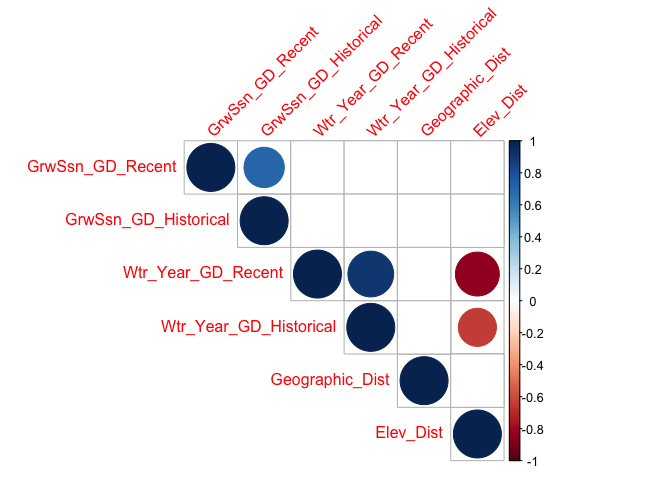<!-- -->

``` r
#geo dist not strongly correlated to any of the climate distances, yay!
#elev positively correlated with recent water year climate distance 
cor.norm_wl2
```

```
##                        GrwSsn_GD_Recent GrwSsn_GD_Historical Wtr_Year_GD_Recent
## GrwSsn_GD_Recent             1.00000000          0.705771990         0.14809664
## GrwSsn_GD_Historical         0.70577199          1.000000000        -0.03628892
## Wtr_Year_GD_Recent           0.14809664         -0.036288921         1.00000000
## Wtr_Year_GD_Historical       0.19667486          0.178860737         0.90975192
## Geographic_Dist             -0.04557585          0.158902960        -0.03289052
## Elev_Dist                   -0.29181347         -0.002644714        -0.83765753
##                        Wtr_Year_GD_Historical Geographic_Dist    Elev_Dist
## GrwSsn_GD_Recent                   0.19667486     -0.04557585 -0.291813470
## GrwSsn_GD_Historical               0.17886074      0.15890296 -0.002644714
## Wtr_Year_GD_Recent                 0.90975192     -0.03289052 -0.837657531
## Wtr_Year_GD_Historical             1.00000000     -0.01638341 -0.630953627
## Geographic_Dist                   -0.01638341      1.00000000  0.120265996
## Elev_Dist                         -0.63095363      0.12026600  1.000000000
```

``` r
cor.sig_wl2$p
```

```
##                        GrwSsn_GD_Recent GrwSsn_GD_Historical Wtr_Year_GD_Recent
## GrwSsn_GD_Recent           0.0000000000         0.0001682413       5.000746e-01
## GrwSsn_GD_Historical       0.0001682413         0.0000000000       8.694290e-01
## Wtr_Year_GD_Recent         0.5000746180         0.8694289858       0.000000e+00
## Wtr_Year_GD_Historical     0.3684133774         0.4141764059       1.799870e-09
## Geographic_Dist            0.8364067730         0.4689460802       8.815688e-01
## Elev_Dist                  0.1766734200         0.9904445606       6.154535e-07
##                        Wtr_Year_GD_Historical Geographic_Dist    Elev_Dist
## GrwSsn_GD_Recent                 3.684134e-01       0.8364068 1.766734e-01
## GrwSsn_GD_Historical             4.141764e-01       0.4689461 9.904446e-01
## Wtr_Year_GD_Recent               1.799870e-09       0.8815688 6.154535e-07
## Wtr_Year_GD_Historical           0.000000e+00       0.9408552 1.245920e-03
## Geographic_Dist                  9.408552e-01       0.0000000 5.846527e-01
## Elev_Dist                        1.245920e-03       0.5846527 0.000000e+00
```

### WL2 Avg Gowers


``` r
wl2_gowers_2023_prep <- wl2_gowers_2023 %>% rename_with(~paste0(., "_2023"), 6:9)
wl2_gowers_2324_prep <- wl2_gowers_2324 %>% rename_with(~paste0(., "_2024"), 6:9)

wl2_gowers_avg <- bind_rows(wl2_gowers_2023, wl2_gowers_2324) %>% 
  group_by(pop, elevation.group, elev_m, Geographic_Dist, Elev_Dist) %>% 
  summarise_at(c("GrwSsn_GD_Recent",  "GrwSsn_GD_Historical", "Wtr_Year_GD_Recent", "Wtr_Year_GD_Historical"), c(mean), na.rm = TRUE)
wl2_gowers_avg
```

```
## # A tibble: 23 × 9
## # Groups:   pop, elevation.group, elev_m, Geographic_Dist [23]
##    pop   elevation.group elev_m Geographic_Dist Elev_Dist GrwSsn_GD_Recent
##    <chr> <chr>            <dbl>           <dbl>     <dbl>            <dbl>
##  1 BH    Low               511.         159626.    -1509.            0.312
##  2 CC    Low               313          132498.    -1707             0.418
##  3 CP2   High             2244.          21060.      224.            0.305
##  4 CP3   High             2266.          19415.      246.            0.327
##  5 DPR   Mid              1019.          66246.    -1001.            0.440
##  6 FR    Mid               787          154694.    -1233             0.388
##  7 IH    Low               454.          65203.    -1566.            0.442
##  8 LV1   High             2593.         212682.      573.            0.377
##  9 LV3   High             2354.         213902.      334.            0.378
## 10 LVTR1 High             2741.         213038.      721.            0.402
## # ℹ 13 more rows
## # ℹ 3 more variables: GrwSsn_GD_Historical <dbl>, Wtr_Year_GD_Recent <dbl>,
## #   Wtr_Year_GD_Historical <dbl>
```


``` r
grw_recent_fig <- wl2_gowers_avg %>% 
  ggplot(aes(x=fct_reorder(pop, GrwSsn_GD_Recent), y=GrwSsn_GD_Recent, group=pop, fill=elev_m)) +
  geom_col(width = 0.7,position = position_dodge(0.75)) +
  scale_y_continuous(expand = c(0, 0)) +
  scale_fill_gradient(low = "#F5A540", high = "#0043F0") +
  labs(y="Gowers Envtal Distance \n from WL2", fill="Elevation (m)", x="Population", title = "Recent Climate") +
  theme_classic() +
  theme(text=element_text(size=25), axis.text.x = element_text(angle = 45,  hjust = 1))

grw_historical_fig <- wl2_gowers_avg %>% 
  ggplot(aes(x=fct_reorder(pop, GrwSsn_GD_Historical), y=GrwSsn_GD_Historical, group=pop, fill=elev_m)) +
  geom_col(width = 0.7,position = position_dodge(0.75)) +
  scale_y_continuous(expand = c(0, 0)) +
  scale_fill_gradient(low = "#F5A540", high = "#0043F0") +
  labs(y="Gowers Envtal Distance \n from WL2", fill="Elevation (m)", x="Population", title="Historic Climate") +
  theme_classic() +
  theme(text=element_text(size=25), axis.text.x = element_text(angle = 45,  hjust = 1)) 
  

plot_grid(grw_historical_fig, grw_recent_fig)
```

<!-- -->

``` r
#ggsave("../output/Climate/AVG_growthseason_Gowers_fromWL2_2324.png", width = 24, height = 8, units = "in")
```


``` r
wtr_recent_fig <- wl2_gowers_avg %>% 
  ggplot(aes(x=fct_reorder(pop, Wtr_Year_GD_Recent), y=Wtr_Year_GD_Recent, group=pop, fill=elev_m)) +
  geom_col(width = 0.7,position = position_dodge(0.75)) +
  scale_y_continuous(expand = c(0, 0)) +
  scale_fill_gradient(low = "#F5A540", high = "#0043F0") +
  labs(y="Gowers Envtal Distance \n from WL2", fill="Elevation (m)", x="Population", title = "Recent Climate") +
  theme_classic() +
  theme(text=element_text(size=25), axis.text.x = element_text(angle = 45,  hjust = 1))

wtr_historical_fig <- wl2_gowers_avg %>% 
  ggplot(aes(x=fct_reorder(pop, Wtr_Year_GD_Historical), y=Wtr_Year_GD_Historical, group=pop, fill=elev_m)) +
  geom_col(width = 0.7,position = position_dodge(0.75)) +
  scale_y_continuous(expand = c(0, 0)) +
  scale_fill_gradient(low = "#F5A540", high = "#0043F0") +
  labs(y="Gowers Envtal Distance \n from WL2", fill="Elevation (m)", x="Population", title="Historic Climate") +
  theme_classic() +
  theme(text=element_text(size=25), axis.text.x = element_text(angle = 45,  hjust = 1)) 
  

plot_grid(wtr_historical_fig, wtr_recent_fig)
```

<!-- -->

``` r
#ggsave("../output/Climate/AVG_wtryr_Gowers_fromWL2_2324.png", width = 24, height = 8, units = "in")
```

#### For Subtraction Distances


``` r
wl2_sub_dist_2023_prep <- wl2_sub_dist_2023 %>% 
  select(pop:GrwSsn_PPTDist_Historic)
wl2_sub_dist_2324_prep <- wl2_sub_dist_2324 %>% 
  select(pop:GrwSsn_PPTDist_Historic) 

wl2_sub_dist_avg <- bind_rows(wl2_sub_dist_2023_prep, wl2_sub_dist_2324_prep) %>% 
  group_by(pop) %>% 
  summarise_at(c("Wtr_Year_TempDist_Recent",  "Wtr_Year_PPTDist_Recent", 
                 "Wtr_Year_TempDist_Historic", "Wtr_Year_PPTDist_Historic",
                 "GrwSsn_TempDist_Recent", "GrwSsn_PPTDist_Recent",
                 "GrwSsn_TempDist_Historic", "GrwSsn_PPTDist_Historic"), c(mean), na.rm = TRUE) %>% 
  left_join(wl2_gowers_avg)
```

```
## Joining with `by = join_by(pop)`
```

``` r
wl2_sub_dist_avg
```

```
## # A tibble: 23 × 17
##    pop   Wtr_Year_TempDist_Recent Wtr_Year_PPTDist_Recent Wtr_Year_TempDist_Hi…¹
##    <chr>                    <dbl>                   <dbl>                  <dbl>
##  1 BH                       8.30                  -1257.                    7.39
##  2 CC                       8.71                   -826.                    7.98
##  3 CP2                     -0.653                  -552.                   -1.83
##  4 CP3                     -1.36                   -607.                   -2.48
##  5 DPR                      6.12                   -384.                    5.02
##  6 FR                       4.97                   -821.                    4.39
##  7 IH                       7.49                   -767.                    6.82
##  8 LV1                     -3.02                    -83.2                  -4.53
##  9 LV3                     -3.01                   -115.                   -4.53
## 10 LVTR1                   -3.17                    -24.7                  -4.67
## # ℹ 13 more rows
## # ℹ abbreviated name: ¹​Wtr_Year_TempDist_Historic
## # ℹ 13 more variables: Wtr_Year_PPTDist_Historic <dbl>,
## #   GrwSsn_TempDist_Recent <dbl>, GrwSsn_PPTDist_Recent <dbl>,
## #   GrwSsn_TempDist_Historic <dbl>, GrwSsn_PPTDist_Historic <dbl>,
## #   elevation.group <chr>, elev_m <dbl>, Geographic_Dist <dbl>,
## #   Elev_Dist <dbl>, GrwSsn_GD_Recent <dbl>, GrwSsn_GD_Historical <dbl>, …
```

Correlations


``` r
wl2_sub_dist_avgs_scaled <- wl2_sub_dist_avg %>% ungroup() %>% 
  select(Wtr_Year_TempDist_Recent:GrwSsn_PPTDist_Historic, Geographic_Dist) %>% scale() #normalize the data so they're all on the same scale

cor.norm = cor(wl2_sub_dist_avgs_scaled) #test correlations among the traits
cor.sig <- cor.mtest(wl2_sub_dist_avgs_scaled, method = "pearson")

corrplot(cor.norm, type="upper",
         tl.srt = 45, p.mat = cor.sig$p, 
         sig.level = 0.05, insig="blank")
```

<!-- -->

## Load Davis Fitness Components


``` r
ucd_establishment <- read_csv("../output/UCD_Traits/UCD_Establishment.csv")
```

```
## Rows: 757 Columns: 19
## ── Column specification ────────────────────────────────────────────────────────
## Delimiter: ","
## chr   (5): block, col, Genotype, pop, elevation.group
## dbl  (13): row, mf, rep, elev_m, Lat, Long, GrwSsn_GD_Recent, GrwSsn_GD_Hist...
## date  (1): death.date
## 
## ℹ Use `spec()` to retrieve the full column specification for this data.
## ℹ Specify the column types or set `show_col_types = FALSE` to quiet this message.
```

``` r
ucd_surv_to_rep <- read_csv("../output/UCD_Traits/UCD_SurvtoRep.csv")
```

```
## Rows: 736 Columns: 20
## ── Column specification ────────────────────────────────────────────────────────
## Delimiter: ","
## chr   (6): block, col, Genotype, pop, elevation.group, bud.date
## dbl  (13): row, mf, rep, elev_m, Lat, Long, GrwSsn_GD_Recent, GrwSsn_GD_Hist...
## date  (1): death.date
## 
## ℹ Use `spec()` to retrieve the full column specification for this data.
## ℹ Specify the column types or set `show_col_types = FALSE` to quiet this message.
```

``` r
ucd_fruits <- read_csv("../output/UCD_Traits/UCD_Fruits.csv")
```

```
## Rows: 63 Columns: 23
## ── Column specification ────────────────────────────────────────────────────────
## Delimiter: ","
## chr  (5): block, col, Genotype, pop, elevation.group
## dbl (18): row, mf, rep, elev_m, Lat, Long, flowers, fruits, FrFlN, GrwSsn_GD...
## 
## ℹ Use `spec()` to retrieve the full column specification for this data.
## ℹ Specify the column types or set `show_col_types = FALSE` to quiet this message.
```

### UCD - Check summer survival (equivalent to winter)


``` r
ucd_surv <- read_csv("../input/UCD_Data/CorrectedCSVs/UCD_transplants_pheno_mort_20231016_corrected.csv") %>% 
  rename(death.date=`Death Date`, bud.date=`Date First Bud`, flower.date=`Date First Flower`, 
         fruit.date=`Date First Fruit`, last.flower.date=`Date Last Flower`, last.fruit.date=`Date Last Fruit`) %>% 
  filter(!is.na(pop)) %>% 
  filter(rep != 100) %>% #get rid of individuals that germinated in the field 
  unite(Genotype, pop:rep, sep="_", remove = FALSE) 
```

```
## Rows: 858 Columns: 13
## ── Column specification ────────────────────────────────────────────────────────
## Delimiter: ","
## chr (10): block, col, pop, Date First Bud, Date First Flower, Date First Fru...
## dbl  (3): row, mf, rep
## 
## ℹ Use `spec()` to retrieve the full column specification for this data.
## ℹ Specify the column types or set `show_col_types = FALSE` to quiet this message.
```

``` r
#unique(ucd_surv$pop)
```


``` r
ucd_surv %>% filter(is.na(death.date)) #filter the alive plants on 10/16/23
```

```
## # A tibble: 9 × 14
##   block   row col   Genotype pop      mf   rep bud.date flower.date fruit.date
##   <chr> <dbl> <chr> <chr>    <chr> <dbl> <dbl> <chr>    <chr>       <chr>     
## 1 D2       26 B     BH_5_15  BH        5    15 5/18/23  5/30/23     6/5/23    
## 2 D2       30 B     BH_4_3   BH        4     3 <NA>     <NA>        <NA>      
## 3 D2       29 D     BH_2_9   BH        2     9 6/1/23   6/12/23     6/15/23   
## 4 F1       15 A     BH_6_9   BH        6     9 <NA>     <NA>        <NA>      
## 5 F2       29 B     BH_4_5   BH        4     5 <NA>     <NA>        <NA>      
## 6 F2       40 B     BH_5_12  BH        5    12 <NA>     <NA>        <NA>      
## 7 J2       25 D     BH_2_5   BH        2     5 5/8/23   5/22/23     5/25/23   
## 8 J2       32 D     BH_3_12  BH        3    12 <NA>     <NA>        <NA>      
## 9 L1       13 C     BH_3_13  BH        3    13 4/27/23  5/15/23     5/22/23   
## # ℹ 4 more variables: last.flower.date <chr>, last.fruit.date <chr>,
## #   death.date <chr>, Notes <chr>
```

``` r
#9 plants alive in October, all BH 
#5 did not reproduce in year 1 
```

## Load WL2 Fitness Components


``` r
wl2_establishment <- read_csv("../output/WL2_Traits/WL2_Establishment.csv")
```

```
## Rows: 1573 Columns: 21
## ── Column specification ────────────────────────────────────────────────────────
## Delimiter: ","
## chr   (7): block, BedLoc, bed, bed.col, Genotype, pop, elevation.group
## dbl  (13): bed.row, mf, rep, elev_m, Lat, Long, GrwSsn_GD_Recent, GrwSsn_GD_...
## date  (1): death.date
## 
## ℹ Use `spec()` to retrieve the full column specification for this data.
## ℹ Specify the column types or set `show_col_types = FALSE` to quiet this message.
```

``` r
wl2_surv_to_rep_y1 <- read_csv("../output/WL2_Traits/WL2_SurvtoRep_y1.csv")
```

```
## Rows: 728 Columns: 22
## ── Column specification ────────────────────────────────────────────────────────
## Delimiter: ","
## chr   (8): block, BedLoc, bed, bed.col, Genotype, pop, elevation.group, bud....
## dbl  (13): bed.row, mf, rep, elev_m, Lat, Long, GrwSsn_GD_Recent, GrwSsn_GD_...
## date  (1): death.date
## 
## ℹ Use `spec()` to retrieve the full column specification for this data.
## ℹ Specify the column types or set `show_col_types = FALSE` to quiet this message.
```

``` r
wl2_fruits_y1 <- read_csv("../output/WL2_Traits/WL2_Fruits_Y1.csv")
```

```
## Rows: 25 Columns: 25
## ── Column specification ────────────────────────────────────────────────────────
## Delimiter: ","
## chr  (7): block, BedLoc, bed, bed-col, Genotype, pop, elevation.group
## dbl (18): bed-row, mf, rep, flowers, fruits, FrFlN, elev_m, Lat, Long, GrwSs...
## 
## ℹ Use `spec()` to retrieve the full column specification for this data.
## ℹ Specify the column types or set `show_col_types = FALSE` to quiet this message.
```

``` r
winter_surv <- read_csv("../output/WL2_Traits/WL2_WinterSurv_2324.csv")
```

```
## Rows: 469 Columns: 21
## ── Column specification ────────────────────────────────────────────────────────
## Delimiter: ","
## chr  (8): block, BedLoc, bed, bed- col, Genotype, pop, elevation.group, deat...
## dbl (13): bed- row, mf, rep, elev_m, Lat, Long, GrwSsn_GD_Recent, GrwSsn_GD_...
## 
## ℹ Use `spec()` to retrieve the full column specification for this data.
## ℹ Specify the column types or set `show_col_types = FALSE` to quiet this message.
```

``` r
wl2_surv_to_rep_y2 <- read_csv("../output/WL2_Traits/WL2_Surv_to_Rep_Y2_2324.csv")
```

```
## Rows: 135 Columns: 23
## ── Column specification ────────────────────────────────────────────────────────
## Delimiter: ","
## chr (10): Pop.Type, loc, bed, col, pop, Genotype, block, elevation.group, bu...
## dbl (13): row, mf, rep, elev_m, Lat, Long, GrwSsn_GD_Recent, GrwSsn_GD_Histo...
## 
## ℹ Use `spec()` to retrieve the full column specification for this data.
## ℹ Specify the column types or set `show_col_types = FALSE` to quiet this message.
```

``` r
wl2_fruits_y2 <- read_csv("../output/WL2_Traits/WL2_Fruits_Y2_2324.csv")
```

```
## Rows: 73 Columns: 26
## ── Column specification ────────────────────────────────────────────────────────
## Delimiter: ","
## chr  (8): Pop.Type, loc, bed, col, pop, Genotype, block, elevation.group
## dbl (18): row, mf, rep, flowers, fruits, FrFlN, elev_m, Lat, Long, GrwSsn_GD...
## 
## ℹ Use `spec()` to retrieve the full column specification for this data.
## ℹ Specify the column types or set `show_col_types = FALSE` to quiet this message.
```

## Davis - No Year 2

p(Establishment)*p(Surv to Rep - y1)*Fruits(y1)


``` r
#per individual:
ucd_total_fitness <- left_join(ucd_establishment, ucd_surv_to_rep) %>% 
  left_join(ucd_fruits) %>% 
  select(block:Wtr_Year_GD_Historical, Geographic_Dist, Elev_Dist, Establishment, SurvtoRep_Y1:fruits) %>% 
  mutate(SurvtoRep_Y1=if_else(is.na(SurvtoRep_Y1), 0, SurvtoRep_Y1),
         fruits=if_else(is.na(fruits), 0, fruits)) %>% 
  mutate(Total_Fitness=Establishment*SurvtoRep_Y1*fruits)
```

```
## Joining with `by = join_by(block, row, col, Genotype, pop, mf, rep,
## elevation.group, elev_m, Lat, Long, GrwSsn_GD_Recent, GrwSsn_GD_Historical,
## Wtr_Year_GD_Recent, Wtr_Year_GD_Historical, Geographic_Dist, Elev_Dist,
## death.date)`
## Joining with `by = join_by(block, row, col, Genotype, pop, mf, rep,
## elevation.group, elev_m, Lat, Long, GrwSsn_GD_Recent, GrwSsn_GD_Historical,
## Wtr_Year_GD_Recent, Wtr_Year_GD_Historical, Geographic_Dist, Elev_Dist)`
```

``` r
ucd_total_fitness %>% group_by(pop) %>% summarise(n=n()) %>% arrange(n) #only 2 WV plants 
```

```
## # A tibble: 23 × 2
##    pop       n
##    <chr> <int>
##  1 WV        2
##  2 LV1       3
##  3 YO4       6
##  4 CP3       8
##  5 WR        9
##  6 SQ3      10
##  7 YO8      13
##  8 YO11     14
##  9 LVTR1    15
## 10 YO7      17
## # ℹ 13 more rows
```

``` r
ucd_total_fitness %>% 
  filter(Total_Fitness>0) %>% 
  group_by(pop) %>% 
  summarise(n=n()) %>% 
  arrange(n) #only TM2 and BH have greater than 1 indiv
```

```
## # A tibble: 6 × 2
##   pop       n
##   <chr> <int>
## 1 CP2       1
## 2 SC        1
## 3 SQ3       1
## 4 WL2       1
## 5 TM2      11
## 6 BH       15
```

``` r
unique(ucd_total_fitness$block)
```

```
##  [1] "D1" "D2" "F1" "F2" "H1" "H2" "J1" "J2" "L1" "L2"
```

``` r
unique(ucd_total_fitness$pop)
```

```
##  [1] "WL2"   "CP2"   "YO11"  "CC"    "FR"    "BH"    "IH"    "LV3"   "SC"   
## [10] "LVTR1" "SQ3"   "TM2"   "WL1"   "YO7"   "DPR"   "SQ2"   "SQ1"   "YO8"  
## [19] "YO4"   "WR"    "WV"    "CP3"   "LV1"
```

``` r
unique(ucd_total_fitness$mf)
```

```
##  [1]  4 10  5  3  6  1  8  7  2  9 12
```


``` r
ucd_total_fitness_sub_dist <- ucd_total_fitness %>% 
  select(block:rep, Establishment:Total_Fitness) %>% 
  left_join(ucd_sub_dist)
```

```
## Joining with `by = join_by(pop)`
```

``` r
unique(ucd_total_fitness_sub_dist$block)
```

```
##  [1] "D1" "D2" "F1" "F2" "H1" "H2" "J1" "J2" "L1" "L2"
```

``` r
unique(ucd_total_fitness_sub_dist$pop)
```

```
##  [1] "WL2"   "CP2"   "YO11"  "CC"    "FR"    "BH"    "IH"    "LV3"   "SC"   
## [10] "LVTR1" "SQ3"   "TM2"   "WL1"   "YO7"   "DPR"   "SQ2"   "SQ1"   "YO8"  
## [19] "YO4"   "WR"    "WV"    "CP3"   "LV1"
```

``` r
unique(ucd_total_fitness_sub_dist$mf)
```

```
##  [1]  4 10  5  3  6  1  8  7  2  9 12
```

### Bar Plots


``` r
ucd_total_fitness %>% 
  group_by(pop, elev_m, GrwSsn_GD_Recent, Wtr_Year_GD_Recent) %>% 
  summarise(meanFruits=mean(Total_Fitness, na.rm = TRUE), semFruits=sem(Total_Fitness, na.rm=TRUE)) %>% 
  ggplot(aes(x=fct_reorder(pop, meanFruits), y=meanFruits, fill=GrwSsn_GD_Recent)) +
  geom_col(width = 0.7,position = position_dodge(0.75)) + 
  geom_errorbar(aes(ymin=meanFruits-semFruits,ymax=meanFruits+semFruits),width=.2, position = 
                  position_dodge(0.75)) +
  theme_classic() + 
  scale_y_continuous(expand = c(0.01, 0)) +
  labs(y="Total Fitness", x="Parent Population", fill="Growth Season Gowers") +
  scale_fill_viridis(option="mako", direction = -1) +
  theme(text=element_text(size=30), axis.text.x = element_text(angle = 45,  hjust = 1))
```

```
## `summarise()` has grouped output by 'pop', 'elev_m', 'GrwSsn_GD_Recent'. You
## can override using the `.groups` argument.
```

<!-- -->

``` r
##ggsave("../output/UCD_Traits/UCD_Total_Fitness_GrwSsn_GD_Recent.png", width = 12, height = 8, units = "in")

ucd_total_fitness %>% 
  group_by(pop, elev_m, GrwSsn_GD_Recent, Wtr_Year_GD_Recent) %>% 
  summarise(meanFruits=mean(Total_Fitness, na.rm = TRUE), semFruits=sem(Total_Fitness, na.rm=TRUE)) %>% 
  ggplot(aes(x=fct_reorder(pop, meanFruits), y=meanFruits, fill=Wtr_Year_GD_Recent)) +
  geom_col(width = 0.7,position = position_dodge(0.75)) + 
  geom_errorbar(aes(ymin=meanFruits-semFruits,ymax=meanFruits+semFruits),width=.2, position = 
                  position_dodge(0.75)) +
  theme_classic() + 
  scale_y_continuous(expand = c(0.01, 0)) +
  labs(y="Total Fitness", x="Parent Population", fill="Water Year Gowers") +
  scale_fill_viridis(option="mako", direction = -1) +
  theme(text=element_text(size=30), axis.text.x = element_text(angle = 45,  hjust = 1))
```

```
## `summarise()` has grouped output by 'pop', 'elev_m', 'GrwSsn_GD_Recent'. You
## can override using the `.groups` argument.
```

<!-- -->

``` r
##ggsave("../output/UCD_Traits/UCD_Total_Fitness_Wtr_Year_GD_Recent.png", width = 12, height = 8, units = "in")
```

### Scatterplots


``` r
#scatter plots
GSCD <- ucd_total_fitness %>% 
  group_by(pop, elev_m, GrwSsn_GD_Recent, GrwSsn_GD_Historical) %>% 
  summarise(meanEst=mean(Total_Fitness, na.rm = TRUE), semEst=sem(Total_Fitness, na.rm=TRUE)) %>% 
  pivot_longer(cols = starts_with("GrwSsn"), names_to = "TimePd", values_to = "GrwSsn_CD") %>% 
  mutate(TimePd=str_replace(TimePd, "GrwSsn_GD_", "")) %>% 
  ggplot(aes(x=GrwSsn_CD, y=meanEst, color=TimePd, group = pop)) +
  geom_point(size=6, alpha=0.7) + 
  geom_errorbar(aes(ymin=meanEst-semEst,ymax=meanEst+semEst),width=.02, linewidth = 2) +
  theme_classic() + 
  scale_y_continuous(expand = c(0.01, 0)) +
  labs(y="Total Fitness", x="Growth Season CD", color="Time Period") +
  scale_color_manual(values=timepd_palette) +
  theme(text=element_text(size=30))
```

```
## `summarise()` has grouped output by 'pop', 'elev_m', 'GrwSsn_GD_Recent'. You
## can override using the `.groups` argument.
```

``` r
WYCD <- ucd_total_fitness %>% 
  group_by(pop, elev_m, Wtr_Year_GD_Recent, Wtr_Year_GD_Historical) %>% 
  summarise(meanEst=mean(Total_Fitness, na.rm = TRUE), semEst=sem(Total_Fitness, na.rm=TRUE)) %>%
  pivot_longer(cols = starts_with("Wtr_Year"), names_to = "TimePd", values_to = "Wtr_Year_CD") %>% 
  mutate(TimePd=str_replace(TimePd, "Wtr_Year_GD_", "")) %>% 
  ggplot(aes(x=Wtr_Year_CD, y=meanEst, color=TimePd, group = pop)) +
  geom_point(size=6, alpha=0.7) + 
  geom_errorbar(aes(ymin=meanEst-semEst,ymax=meanEst+semEst),width=.02, linewidth = 2) +
  theme_classic() + 
  scale_y_continuous(expand = c(0.01, 0)) +
  labs(y="Total Fitness", x="Water Year CD", color="Time Period") +
  scale_color_manual(values=timepd_palette) +
  theme(text=element_text(size=30))
```

```
## `summarise()` has grouped output by 'pop', 'elev_m', 'Wtr_Year_GD_Recent'. You
## can override using the `.groups` argument.
```

``` r
GD <- ucd_total_fitness %>% 
  group_by(pop, elev_m, Geographic_Dist) %>% 
  summarise(meanEst=mean(Total_Fitness, na.rm = TRUE), semEst=sem(Total_Fitness, na.rm=TRUE)) %>% 
  ggplot(aes(x=Geographic_Dist, y=meanEst, group = pop)) +
  geom_point(size=6) + 
  geom_errorbar(aes(ymin=meanEst-semEst,ymax=meanEst+semEst),width=.02, linewidth = 2) +
  theme_classic() + 
  scale_y_continuous(expand = c(0.01, 0)) +
  labs(y="Total Fitness", x="Geographic Distance (m)") +
  theme(text=element_text(size=30), axis.text.x = element_text(angle = 45,  hjust = 1))
```

```
## `summarise()` has grouped output by 'pop', 'elev_m'. You can override using the
## `.groups` argument.
```

``` r
ED <- ucd_total_fitness %>% 
  group_by(pop, elev_m, Elev_Dist) %>% 
  summarise(meanEst=mean(Total_Fitness, na.rm = TRUE), semEst=sem(Total_Fitness, na.rm=TRUE)) %>% 
  ggplot(aes(x=Elev_Dist, y=meanEst, group = pop)) +
  geom_point(size=6) + 
  geom_errorbar(aes(ymin=meanEst-semEst,ymax=meanEst+semEst),width=.02, linewidth = 2) +
  theme_classic() + 
  scale_y_continuous(expand = c(0.01, 0)) +
  labs(y="Total Fitness", x="Elevation Distance (m)") +
  theme(text=element_text(size=30))
```

```
## `summarise()` has grouped output by 'pop', 'elev_m'. You can override using the
## `.groups` argument.
```

``` r
ucd_total_fitness_FIG <- ggarrange(GSCD, WYCD, GD, ED, ncol=2, nrow=2) 
#ggsave("../output/UCD_Traits/UCD_Total_Fitness_SCATTERS.png", width = 24, height = 18, units = "in")
```

## WL2

\*Used average Gowers

p(Establishment)*p(Surv to Rep - y1)*Fruits(y1) + p(Winter Surv)*p(Surv to Rep - y2)*Fruits(y2)


``` r
wl2_fruits_y1_prep <- wl2_fruits_y1 %>% 
  select(block:BedLoc, Genotype:rep, elevation.group:Long, y1_flowers=flowers, y1_fruits=fruits)

winter_surv_prep <- winter_surv %>% select(block:BedLoc, Genotype:Long, WinterSurv) 
wl2_surv_to_rep_y2_prep <- wl2_surv_to_rep_y2 %>% select(pop:Long, SurvtoRep_y2) 
wl2_fruits_y2_prep <- wl2_fruits_y2 %>% 
  select(pop:Genotype, elevation.group:Long, y2_flowers=flowers, y2_fruits=fruits)

wl2_total_fitness <- left_join(wl2_establishment, wl2_surv_to_rep_y1) %>% 
  left_join(wl2_fruits_y1_prep) %>% 
  left_join(winter_surv_prep) %>% 
  left_join(wl2_surv_to_rep_y2_prep) %>% 
  left_join(wl2_fruits_y2_prep) %>% 
  left_join(wl2_gowers_avg) %>% 
  select(block:Wtr_Year_GD_Historical, Geographic_Dist, Elev_Dist, Establishment, SurvtoRep_Y1:y2_fruits) %>% 
  mutate(SurvtoRep_Y1=if_else(is.na(SurvtoRep_Y1), 0, SurvtoRep_Y1),
         y1_fruits=if_else(is.na(y1_fruits), 0, y1_fruits),
         y2_fruits=if_else(is.na(y2_fruits), 0, y2_fruits),
         WinterSurv=if_else(is.na(WinterSurv), 0, WinterSurv),
         SurvtoRep_y2=if_else(is.na(SurvtoRep_y2), 0, SurvtoRep_y2)) %>% 
  mutate(Total_Fitness=(Establishment*SurvtoRep_Y1*y1_fruits) + (WinterSurv*SurvtoRep_y2*y2_fruits))
```

```
## Joining with `by = join_by(block, BedLoc, bed, bed.row, bed.col, Genotype, pop,
## mf, rep, elevation.group, elev_m, Lat, Long, GrwSsn_GD_Recent,
## GrwSsn_GD_Historical, Wtr_Year_GD_Recent, Wtr_Year_GD_Historical,
## Geographic_Dist, Elev_Dist, death.date)`
## Joining with `by = join_by(block, BedLoc, Genotype, pop, mf, rep,
## elevation.group, elev_m, Lat, Long)`
## Joining with `by = join_by(block, BedLoc, Genotype, pop, mf, rep,
## elevation.group, elev_m, Lat, Long)`
## Joining with `by = join_by(block, Genotype, pop, mf, rep, elevation.group,
## elev_m, Lat, Long)`
## Joining with `by = join_by(Genotype, pop, mf, rep, elevation.group, elev_m,
## Lat, Long)`
## Joining with `by = join_by(pop, elevation.group, elev_m, GrwSsn_GD_Recent,
## GrwSsn_GD_Historical, Wtr_Year_GD_Recent, Wtr_Year_GD_Historical,
## Geographic_Dist, Elev_Dist)`
```

``` r
wl2_total_fitness %>% group_by(pop) %>% summarise(n=n()) %>% arrange(n) 
```

```
## # A tibble: 23 × 2
##    pop       n
##    <chr> <int>
##  1 WV        3
##  2 WR       14
##  3 LV3      27
##  4 SQ1      30
##  5 SQ3      33
##  6 YO4      40
##  7 FR       48
##  8 WL1      48
##  9 SQ2      61
## 10 TM2      84
## # ℹ 13 more rows
```

``` r
wl2_total_fitness %>% 
  filter(Total_Fitness>0) %>% 
  group_by(pop) %>% 
  summarise(n=n()) %>% 
  arrange(n) #SQ1 and WR only have 1 indiv 
```

```
## # A tibble: 9 × 2
##   pop       n
##   <chr> <int>
## 1 SQ1       1
## 2 WR        1
## 3 WL2       5
## 4 CC        9
## 5 SC       10
## 6 IH       13
## 7 YO7      15
## 8 BH       16
## 9 TM2      28
```

``` r
unique(wl2_total_fitness$block)
```

```
##  [1] "A" "B" "D" "C" "E" "F" "G" "H" "I" "J" "K" "L" "M"
```

``` r
unique(wl2_total_fitness$pop)
```

```
##  [1] "TM2"   "LVTR1" "SQ2"   "YO8"   "CC"    "YO11"  "BH"    "DPR"   "CP2"  
## [10] "WL1"   "IH"    "CP3"   "SC"    "FR"    "LV3"   "YO7"   "WV"    "SQ3"  
## [19] "WL2"   "LV1"   "YO4"   "WR"    "SQ1"
```

``` r
unique(wl2_total_fitness$mf)
```

```
##  [1]  6  7  8  2  5  4  3  1  9 14 13 10 11
```


``` r
wl2_total_fitness_sub_dist <- wl2_total_fitness %>% 
  select(block:rep, Establishment:Total_Fitness) %>% 
  left_join(wl2_sub_dist_avg)
```

```
## Joining with `by = join_by(pop)`
```

``` r
unique(wl2_total_fitness_sub_dist$block)
```

```
##  [1] "A" "B" "D" "C" "E" "F" "G" "H" "I" "J" "K" "L" "M"
```

``` r
unique(wl2_total_fitness_sub_dist$pop)
```

```
##  [1] "TM2"   "LVTR1" "SQ2"   "YO8"   "CC"    "YO11"  "BH"    "DPR"   "CP2"  
## [10] "WL1"   "IH"    "CP3"   "SC"    "FR"    "LV3"   "YO7"   "WV"    "SQ3"  
## [19] "WL2"   "LV1"   "YO4"   "WR"    "SQ1"
```

``` r
unique(wl2_total_fitness_sub_dist$mf)
```

```
##  [1]  6  7  8  2  5  4  3  1  9 14 13 10 11
```

### Bar Plots


``` r
wl2_total_fitness %>% 
  group_by(pop, elev_m, GrwSsn_GD_Recent, Wtr_Year_GD_Recent) %>% 
  summarise(meanFruits=mean(Total_Fitness, na.rm = TRUE), semFruits=sem(Total_Fitness, na.rm=TRUE)) %>% 
  ggplot(aes(x=fct_reorder(pop, meanFruits), y=meanFruits, fill=GrwSsn_GD_Recent)) +
  geom_col(width = 0.7,position = position_dodge(0.75)) + 
  geom_errorbar(aes(ymin=meanFruits-semFruits,ymax=meanFruits+semFruits),
                width=.2, position = position_dodge(0.75)) +
  theme_classic() + 
  scale_y_continuous(expand = c(0.01, 0)) +
  labs(y="Total Fitness", x="Parent Population", fill="Growth Season Gowers") +
  scale_fill_viridis(option="mako", direction = -1) +
  theme(text=element_text(size=30), axis.text.x = element_text(angle = 45,  hjust = 1))
```

```
## `summarise()` has grouped output by 'pop', 'elev_m', 'GrwSsn_GD_Recent'. You
## can override using the `.groups` argument.
```

<!-- -->

``` r
##ggsave("../output/WL2_Traits/WL2_Total_Fitness_GrwSsn_GD_Recent.png", width = 12, height = 8, units = "in")

wl2_total_fitness %>% 
  group_by(pop, elev_m, GrwSsn_GD_Recent, Wtr_Year_GD_Recent) %>% 
  summarise(meanFruits=mean(Total_Fitness, na.rm = TRUE), semFruits=sem(Total_Fitness, na.rm=TRUE)) %>% 
  ggplot(aes(x=fct_reorder(pop, meanFruits), y=meanFruits, fill=Wtr_Year_GD_Recent)) +
  geom_col(width = 0.7,position = position_dodge(0.75)) + 
  geom_errorbar(aes(ymin=meanFruits-semFruits,ymax=meanFruits+semFruits),width=.2, position = 
                  position_dodge(0.75)) +
  theme_classic() + 
  scale_y_continuous(expand = c(0.01, 0)) +
  labs(y="Total Fitness", x="Parent Population", fill="Water Year Gowers") +
  scale_fill_viridis(option="mako", direction = -1) +
  theme(text=element_text(size=30), axis.text.x = element_text(angle = 45,  hjust = 1))
```

```
## `summarise()` has grouped output by 'pop', 'elev_m', 'GrwSsn_GD_Recent'. You
## can override using the `.groups` argument.
```

<!-- -->

``` r
##ggsave("../output/WL2_Traits/WL2_Total_Fitness_Wtr_Year_GD_Recent.png", width = 12, height = 8, units = "in")
```

### Scatterplots


``` r
#scatter plots
GSCD <- wl2_total_fitness %>% 
  group_by(pop, elev_m, GrwSsn_GD_Recent, GrwSsn_GD_Historical) %>% 
  summarise(meanEst=mean(Total_Fitness, na.rm = TRUE), semEst=sem(Total_Fitness, na.rm=TRUE)) %>% 
  pivot_longer(cols = starts_with("GrwSsn"), names_to = "TimePd", values_to = "GrwSsn_CD") %>% 
  mutate(TimePd=str_replace(TimePd, "GrwSsn_GD_", "")) %>% 
  ggplot(aes(x=GrwSsn_CD, y=meanEst, color=TimePd, group = pop)) +
  geom_point(size=6) + 
  geom_errorbar(aes(ymin=meanEst-semEst,ymax=meanEst+semEst),width=.02, linewidth = 2) +
  theme_classic() + 
  scale_y_continuous(expand = c(0.01, 0)) +
  labs(y="Total Fitness", x="Growth Season CD", color="Growth Season \n Climate Distance") +
  scale_color_manual(values=timepd_palette) +
  theme(text=element_text(size=30))
```

```
## `summarise()` has grouped output by 'pop', 'elev_m', 'GrwSsn_GD_Recent'. You
## can override using the `.groups` argument.
```

``` r
WYCD <- wl2_total_fitness %>% 
  group_by(pop, elev_m, Wtr_Year_GD_Recent, Wtr_Year_GD_Historical) %>% 
  summarise(meanEst=mean(Total_Fitness, na.rm = TRUE), semEst=sem(Total_Fitness, na.rm=TRUE)) %>% 
  pivot_longer(cols = starts_with("Wtr_Year"), names_to = "TimePd", values_to = "Wtr_Year_CD") %>% 
  mutate(TimePd=str_replace(TimePd, "Wtr_Year_GD_", "")) %>% 
  ggplot(aes(x=Wtr_Year_CD, y=meanEst, color=TimePd, group = pop)) +
  geom_point(size=6) + 
  geom_errorbar(aes(ymin=meanEst-semEst,ymax=meanEst+semEst),width=.02,linewidth = 2) +
  theme_classic() + 
  scale_y_continuous(expand = c(0.01, 0)) +
  labs(y="Total Fitness", x="Water Year CD", color="Water Year \n Climate Distance") +
  scale_color_manual(values=timepd_palette) +
  theme(text=element_text(size=30))
```

```
## `summarise()` has grouped output by 'pop', 'elev_m', 'Wtr_Year_GD_Recent'. You
## can override using the `.groups` argument.
```

``` r
GD <- wl2_total_fitness %>% 
  group_by(pop, elev_m, GrwSsn_GD_Recent, Wtr_Year_GD_Recent, Geographic_Dist) %>% 
  summarise(meanEst=mean(Total_Fitness, na.rm = TRUE), semEst=sem(Total_Fitness, na.rm=TRUE)) %>% 
  ggplot(aes(x=Geographic_Dist, y=meanEst, group = pop)) +
  geom_point(size=6) + 
  geom_errorbar(aes(ymin=meanEst-semEst,ymax=meanEst+semEst),width=.02, linewidth = 2) +
  theme_classic() + 
  scale_y_continuous(expand = c(0.01, 0)) +
  labs(y="Total Fitness", x="Geographic Distance (m)") +
  theme(text=element_text(size=30), axis.text.x = element_text(angle = 45,  hjust = 1))
```

```
## `summarise()` has grouped output by 'pop', 'elev_m', 'GrwSsn_GD_Recent',
## 'Wtr_Year_GD_Recent'. You can override using the `.groups` argument.
```

``` r
ED <- wl2_total_fitness %>% 
  group_by(pop, elev_m, Elev_Dist) %>% 
  summarise(meanEst=mean(Total_Fitness, na.rm = TRUE), semEst=sem(Total_Fitness, na.rm=TRUE)) %>% 
  ggplot(aes(x=Elev_Dist, y=meanEst, group = pop)) +
  geom_point(size=6) + 
  geom_errorbar(aes(ymin=meanEst-semEst,ymax=meanEst+semEst),width=.02, linewidth = 2) +
  theme_classic() + 
  scale_y_continuous(expand = c(0.01, 0)) +
  labs(y="Total Fitness", x="Elevation Distance (m)") +
  theme(text=element_text(size=30))
```

```
## `summarise()` has grouped output by 'pop', 'elev_m'. You can override using the
## `.groups` argument.
```

``` r
WL2_total_fitness_FIG <- ggarrange(GSCD, WYCD, GD, ED, ncol=2, nrow=2) 
#ggsave("../output/WL2_Traits/WL2_Total_Fitness_SCATTERS.png", width = 24, height = 18, units = "in")
```

## Stats

### Check Distributions


``` r
wl2_total_fitness %>% 
  ggplot(aes(x=Total_Fitness)) +
  geom_histogram()
```

```
## `stat_bin()` using `bins = 30`. Pick better value with `binwidth`.
```

<!-- -->

``` r
ucd_total_fitness %>% 
  ggplot(aes(x=Total_Fitness)) +
  geom_histogram()
```

```
## `stat_bin()` using `bins = 30`. Pick better value with `binwidth`.
```

<!-- -->

### Transformations and Scaling


``` r
wl2_total_fitness_scaled <- wl2_total_fitness %>% 
  mutate_at(c("GrwSsn_GD_Recent","Wtr_Year_GD_Recent",                                                           "GrwSsn_GD_Historical","Wtr_Year_GD_Historical",
              "Geographic_Dist"),scale) %>% 
  mutate(logTotalFitness=log(Total_Fitness+1),
         log10TotalFitness=log10(Total_Fitness+1)) #log transformation, add 1 for 0s 

wl2_total_fitness_scaled %>% #didn't help much 
  ggplot(aes(x=logTotalFitness)) +
  geom_histogram()
```

```
## `stat_bin()` using `bins = 30`. Pick better value with `binwidth`.
```

<!-- -->

``` r
wl2_total_fitness_scaled %>% #didn't help much 
  ggplot(aes(x=log10TotalFitness)) +
  geom_histogram()
```

```
## `stat_bin()` using `bins = 30`. Pick better value with `binwidth`.
```

<!-- -->

``` r
ucd_total_fitness_scaled <- ucd_total_fitness %>% 
  mutate_at(c("GrwSsn_GD_Recent","Wtr_Year_GD_Recent",
              "GrwSsn_GD_Historical","Wtr_Year_GD_Historical",
              "Geographic_Dist"), scale) %>% 
  mutate(logTotalFitness=log(Total_Fitness+1),
         log10TotalFitness=log10(Total_Fitness+1)) #log transformation, add 1 for 0s 

ucd_total_fitness_scaled %>% #didn't help much 
  ggplot(aes(x=logTotalFitness)) +
  geom_histogram()
```

```
## `stat_bin()` using `bins = 30`. Pick better value with `binwidth`.
```

<!-- -->

``` r
ucd_total_fitness_scaled %>% #didn't help much 
  ggplot(aes(x=log10TotalFitness)) +
  geom_histogram()
```

```
## `stat_bin()` using `bins = 30`. Pick better value with `binwidth`.
```

<!-- -->


``` r
wl2_total_fitness_scaled_sub <- wl2_total_fitness_sub_dist %>% 
  mutate_at(c("Wtr_Year_TempDist_Recent",  "Wtr_Year_PPTDist_Recent", 
                 "Wtr_Year_TempDist_Historic", "Wtr_Year_PPTDist_Historic",
                 "GrwSsn_TempDist_Recent", "GrwSsn_PPTDist_Recent",
                 "GrwSsn_TempDist_Historic", "GrwSsn_PPTDist_Historic",
              "Geographic_Dist"), scale) %>% 
  mutate(logTotalFitness=log(Total_Fitness+1),
         log10TotalFitness=log10(Total_Fitness+1)) #log transformation, add 1 for 0s 

ucd_total_fitness_scaled_sub <- ucd_total_fitness_sub_dist %>% 
  mutate_at(c("Wtr_Year_TempDist_Recent",  "Wtr_Year_PPTDist_Recent", 
                 "Wtr_Year_TempDist_Historic", "Wtr_Year_PPTDist_Historic",
                 "GrwSsn_TempDist_Recent", "GrwSsn_PPTDist_Recent",
                 "GrwSsn_TempDist_Historic", "GrwSsn_PPTDist_Historic",
              "Geographic_Dist"), scale) %>% 
  mutate(logTotalFitness=log(Total_Fitness+1),
         log10TotalFitness=log10(Total_Fitness+1)) #log transformation, add 1 for 0s 
```

Split total fitness into probability of fitness and total reproductive output since it is so zero inflated.

### Prob of total fitness \> 0

#### Calculations


``` r
#wl2_total_fitness_scaled %>% filter(is.na(Total_Fitness)) #no NAs
#ucd_total_fitness_scaled  %>% filter(is.na(Total_Fitness)) #no NAs

wl2_prob_fitness <- wl2_total_fitness_scaled %>% 
  mutate(ProbFitness=if_else(Total_Fitness==0, 0, 1))

wl2_estab_means <- wl2_prob_fitness %>% # summary for plotting
  group_by(pop) %>%
  summarize(Survival = mean(ProbFitness), n=n()) %>% 
  arrange(n)
wl2_estab_means
```

```
## # A tibble: 23 × 3
##    pop   Survival     n
##    <chr>    <dbl> <int>
##  1 WV      0          3
##  2 WR      0.0714    14
##  3 LV3     0         27
##  4 SQ1     0.0333    30
##  5 SQ3     0         33
##  6 YO4     0         40
##  7 FR      0         48
##  8 WL1     0         48
##  9 SQ2     0         61
## 10 TM2     0.333     84
## # ℹ 13 more rows
```

``` r
#wl2_prob_fitness %>% group_by(pop, mf, ProbFitness) %>% summarise(n())

wl2_prob_fitness_to_save <- wl2_total_fitness %>% 
   mutate(ProbFitness=if_else(Total_Fitness==0, 0, 1)) %>% 
  select(block:Elev_Dist, ProbFitness)
#write_csv(wl2_prob_fitness_to_save, "../output/WL2_Traits/WL2_ProbFitness.csv")
```


``` r
wl2_prob_fitness_sub <- wl2_total_fitness_scaled_sub %>% 
  mutate(ProbFitness=if_else(Total_Fitness==0, 0, 1))
```


``` r
ucd_prob_fitness <- ucd_total_fitness_scaled %>% 
  filter(pop!="WV") %>% #ONLY 2 INDIVS 
  mutate(ProbFitness=if_else(Total_Fitness==0, 0, 1))

ucd_estab_means <- ucd_prob_fitness %>% # summary for plotting
  group_by(pop) %>% #only 2 indivs for WV -remove
  summarize(Survival = mean(ProbFitness),  n=n()) %>% 
  arrange(n)
ucd_estab_means
```

```
## # A tibble: 22 × 3
##    pop   Survival     n
##    <chr>    <dbl> <int>
##  1 LV1        0       3
##  2 YO4        0       6
##  3 CP3        0       8
##  4 WR         0       9
##  5 SQ3        0.1    10
##  6 YO8        0      13
##  7 YO11       0      14
##  8 LVTR1      0      15
##  9 YO7        0      17
## 10 DPR        0      22
## # ℹ 12 more rows
```

``` r
#ucd_prob_fitness %>% group_by(pop, mf, ProbFitness) %>% summarise(n())

ucd_prob_fitness_to_save <- ucd_total_fitness %>% 
  filter(SurvtoRep_Y1==1) %>% 
  filter(pop!="WV") %>% #ONLY 2 INDIVS 
  mutate(ProbFruits=if_else(Total_Fitness==0, 0, 1))
#write_csv(ucd_prob_fitness_to_save, "../output/UCD_Traits/ProbFruits_UCD.csv")
```


``` r
ucd_prob_fitness_sub <- ucd_total_fitness_scaled_sub %>% 
  filter(pop!="WV") %>% #ONLY 2 INDIVS 
  mutate(ProbFitness=if_else(Total_Fitness==0, 0, 1))
```

#### Plots


``` r
wl2_total_fitness_sub_dist %>% 
  mutate(ProbFitness=if_else(Total_Fitness==0, 0, 1)) %>% 
  group_by(pop, elev_m, GrwSsn_TempDist_Recent) %>% 
  summarise(meanEst=mean(ProbFitness, na.rm = TRUE), semEst=sem(ProbFitness, na.rm=TRUE)) %>% 
  filter(!is.na(meanEst)) %>% 
  ggplot(aes(x=fct_reorder(pop, meanEst), y=meanEst, fill=GrwSsn_TempDist_Recent)) +
  geom_col(width = 0.7,position = position_dodge(0.75)) + 
  geom_errorbar(aes(ymin=meanEst-semEst,ymax=meanEst+semEst),width=.2, position = 
                  position_dodge(0.75)) +
  theme_classic() + 
  scale_y_continuous(expand = c(0.01, 0)) +
  labs(y="Probability of Successfully Reproducing", x="Parent Population", fill="Temp Dist") +
  scale_fill_viridis(option="mako", direction = -1) +
  theme(text=element_text(size=30), axis.text.x = element_text(angle = 45,  hjust = 1))
```

```
## `summarise()` has grouped output by 'pop', 'elev_m'. You can override using the
## `.groups` argument.
```

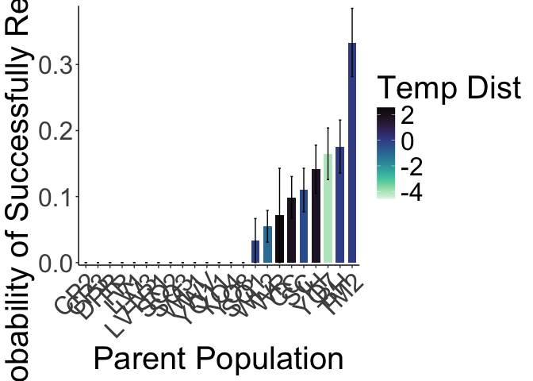<!-- -->


``` r
#scatter plots - recent
GSCD_prob_recent <- wl2_total_fitness %>% 
  mutate(ProbFitness=if_else(Total_Fitness==0, 0, 1)) %>% 
  group_by(pop, elev_m, GrwSsn_GD_Recent, GrwSsn_GD_Historical) %>% 
  summarise(meanEst=mean(ProbFitness, na.rm = TRUE), semEst=sem(ProbFitness, na.rm=TRUE)) %>% 
  ggplot(aes(x=GrwSsn_GD_Recent, y=meanEst, group = pop)) +
  geom_point(size=6) + 
  geom_errorbar(aes(ymin=meanEst-semEst,ymax=meanEst+semEst),width=.02, linewidth = 2) +
  theme_classic() + 
  scale_y_continuous(expand = c(0.01, 0)) +
  labs(y="Probability of Successfully Reproducing", x="Recent Growth Season CD") +
  theme(text=element_text(size=30))
```

```
## `summarise()` has grouped output by 'pop', 'elev_m', 'GrwSsn_GD_Recent'. You
## can override using the `.groups` argument.
```

``` r
WYCD_prob_recent <- wl2_total_fitness %>% 
  mutate(ProbFitness=if_else(Total_Fitness==0, 0, 1)) %>% 
  group_by(pop, elev_m, Wtr_Year_GD_Recent, Wtr_Year_GD_Historical) %>% 
  summarise(meanEst=mean(ProbFitness, na.rm = TRUE), semEst=sem(ProbFitness, na.rm=TRUE)) %>% 
  ggplot(aes(x=Wtr_Year_GD_Recent, y=meanEst, group = pop)) +
  geom_point(size=6) + 
  geom_errorbar(aes(ymin=meanEst-semEst,ymax=meanEst+semEst),width=.02,linewidth = 2) +
  theme_classic() + 
  scale_y_continuous(expand = c(0.01, 0)) +
  labs(y="Probability of Successfully Reproducing", x="Recent Water Year CD") +
  theme(text=element_text(size=30))
```

```
## `summarise()` has grouped output by 'pop', 'elev_m', 'Wtr_Year_GD_Recent'. You
## can override using the `.groups` argument.
```

``` r
GD_prob <- wl2_total_fitness %>% 
  mutate(ProbFitness=if_else(Total_Fitness==0, 0, 1)) %>% 
  group_by(pop, elev_m, GrwSsn_GD_Recent, Wtr_Year_GD_Recent, Geographic_Dist) %>% 
  summarise(meanEst=mean(ProbFitness, na.rm = TRUE), semEst=sem(ProbFitness, na.rm=TRUE)) %>% 
  ggplot(aes(x=Geographic_Dist, y=meanEst, group = pop)) +
  geom_point(size=6) + 
  geom_errorbar(aes(ymin=meanEst-semEst,ymax=meanEst+semEst),width=.02, linewidth = 2) +
  theme_classic() + 
  scale_y_continuous(expand = c(0.01, 0)) +
  labs(y="Probability of Successfully Reproducing", x="Geographic Distance (m)") +
  theme(text=element_text(size=30), axis.text.x = element_text(angle = 45,  hjust = 1))
```

```
## `summarise()` has grouped output by 'pop', 'elev_m', 'GrwSsn_GD_Recent',
## 'Wtr_Year_GD_Recent'. You can override using the `.groups` argument.
```

``` r
ED_prob <- wl2_total_fitness %>% 
  mutate(ProbFitness=if_else(Total_Fitness==0, 0, 1)) %>% 
  group_by(pop, elev_m, Elev_Dist) %>% 
  summarise(meanEst=mean(ProbFitness, na.rm = TRUE), semEst=sem(ProbFitness, na.rm=TRUE)) %>% 
  ggplot(aes(x=Elev_Dist, y=meanEst, group = pop)) +
  geom_point(size=6) + 
  geom_errorbar(aes(ymin=meanEst-semEst,ymax=meanEst+semEst),width=.02, linewidth = 2) +
  theme_classic() + 
  scale_y_continuous(expand = c(0.01, 0)) +
  labs(y="Probability of Successfully Reproducing", x="Elevation Distance (m)") +
  theme(text=element_text(size=30))
```

```
## `summarise()` has grouped output by 'pop', 'elev_m'. You can override using the
## `.groups` argument.
```

``` r
WL2_total_fitness_FIG_prob_recent_recent <- ggarrange(GSCD_prob_recent, WYCD_prob_recent, GD_prob, ED_prob, ncol=2, nrow=2) 
##ggsave("../output/WL2_Traits/WL2_ProbFitness_SCATTERS_Recent.png", width = 24, height = 18, units = "in")
```


``` r
#scatter plots - historic
GSCD_prob_historic <- wl2_total_fitness %>% 
  mutate(ProbFitness=if_else(Total_Fitness==0, 0, 1)) %>% 
  group_by(pop, elev_m, GrwSsn_GD_Recent, GrwSsn_GD_Historical) %>% 
  summarise(meanEst=mean(ProbFitness, na.rm = TRUE), semEst=sem(ProbFitness, na.rm=TRUE)) %>% 
  ggplot(aes(x=GrwSsn_GD_Historical, y=meanEst, group = pop)) +
  geom_point(size=6) + 
  geom_errorbar(aes(ymin=meanEst-semEst,ymax=meanEst+semEst),width=.02, linewidth = 2) +
  theme_classic() + 
  scale_y_continuous(expand = c(0.01, 0)) +
  labs(y="Probability of Successfully Reproducing", x="Historic Growth Season CD") +
  theme(text=element_text(size=30))
```

```
## `summarise()` has grouped output by 'pop', 'elev_m', 'GrwSsn_GD_Recent'. You
## can override using the `.groups` argument.
```

``` r
WYCD_prob_historic <- wl2_total_fitness %>% 
  mutate(ProbFitness=if_else(Total_Fitness==0, 0, 1)) %>% 
  group_by(pop, elev_m, Wtr_Year_GD_Recent, Wtr_Year_GD_Historical) %>% 
  summarise(meanEst=mean(ProbFitness, na.rm = TRUE), semEst=sem(ProbFitness, na.rm=TRUE)) %>% 
  ggplot(aes(x=Wtr_Year_GD_Historical, y=meanEst, group = pop)) +
  geom_point(size=6) + 
  geom_errorbar(aes(ymin=meanEst-semEst,ymax=meanEst+semEst),width=.02,linewidth = 2) +
  theme_classic() + 
  scale_y_continuous(expand = c(0.01, 0)) +
  labs(y="Probability of Successfully Reproducing", x="Historic Water Year CD") +
  theme(text=element_text(size=30))
```

```
## `summarise()` has grouped output by 'pop', 'elev_m', 'Wtr_Year_GD_Recent'. You
## can override using the `.groups` argument.
```

``` r
WL2_total_fitness_FIG_prob_historic_historic <- ggarrange(GSCD_prob_historic, WYCD_prob_historic, GD_prob, ED_prob, ncol=2, nrow=2) 
##ggsave("../output/WL2_Traits/WL2_ProbFitness_SCATTERS_Historic.png", width = 24, height = 18, units = "in")
```


``` r
#scatter plots - recent
GSCD_prob_recent <- ucd_total_fitness %>% 
  filter(pop!="WV") %>% #ONLY 2 INDIVS 
  mutate(ProbFitness=if_else(Total_Fitness==0, 0, 1)) %>% 
  group_by(pop, elev_m, GrwSsn_GD_Recent, GrwSsn_GD_Historical) %>% 
  summarise(meanEst=mean(ProbFitness, na.rm = TRUE), semEst=sem(ProbFitness, na.rm=TRUE)) %>% 
  ggplot(aes(x=GrwSsn_GD_Recent, y=meanEst, group = pop)) +
  geom_point(size=6) + 
  geom_errorbar(aes(ymin=meanEst-semEst,ymax=meanEst+semEst),width=.02, linewidth = 2) +
  theme_classic() + 
  scale_y_continuous(expand = c(0.01, 0)) +
  labs(y="Probability of Successfully Reproducing", x="Recent Growth Season CD") +
  theme(text=element_text(size=30))
```

```
## `summarise()` has grouped output by 'pop', 'elev_m', 'GrwSsn_GD_Recent'. You
## can override using the `.groups` argument.
```

``` r
WYCD_prob_recent <- ucd_total_fitness %>% 
  filter(pop!="WV") %>% #ONLY 2 INDIVS 
  mutate(ProbFitness=if_else(Total_Fitness==0, 0, 1)) %>% 
  group_by(pop, elev_m, Wtr_Year_GD_Recent, Wtr_Year_GD_Historical) %>% 
  summarise(meanEst=mean(ProbFitness, na.rm = TRUE), semEst=sem(ProbFitness, na.rm=TRUE)) %>% 
  ggplot(aes(x=Wtr_Year_GD_Recent, y=meanEst, group = pop)) +
  geom_point(size=6) + 
  geom_errorbar(aes(ymin=meanEst-semEst,ymax=meanEst+semEst),width=.02,linewidth = 2) +
  theme_classic() + 
  scale_y_continuous(expand = c(0.01, 0)) +
  labs(y="Probability of Successfully Reproducing", x="Recent Water Year CD") +
  theme(text=element_text(size=30))
```

```
## `summarise()` has grouped output by 'pop', 'elev_m', 'Wtr_Year_GD_Recent'. You
## can override using the `.groups` argument.
```

``` r
GD_prob <- ucd_total_fitness %>% 
  filter(pop!="WV") %>% #ONLY 2 INDIVS 
  mutate(ProbFitness=if_else(Total_Fitness==0, 0, 1)) %>% 
  group_by(pop, elev_m, GrwSsn_GD_Recent, Wtr_Year_GD_Recent, Geographic_Dist) %>% 
  summarise(meanEst=mean(ProbFitness, na.rm = TRUE), semEst=sem(ProbFitness, na.rm=TRUE)) %>% 
  ggplot(aes(x=Geographic_Dist, y=meanEst, group = pop)) +
  geom_point(size=6) + 
  geom_errorbar(aes(ymin=meanEst-semEst,ymax=meanEst+semEst),width=.02, linewidth = 2) +
  theme_classic() + 
  scale_y_continuous(expand = c(0.01, 0)) +
  labs(y="Probability of Successfully Reproducing", x="Geographic Distance (m)") +
  theme(text=element_text(size=30), axis.text.x = element_text(angle = 45,  hjust = 1))
```

```
## `summarise()` has grouped output by 'pop', 'elev_m', 'GrwSsn_GD_Recent',
## 'Wtr_Year_GD_Recent'. You can override using the `.groups` argument.
```

``` r
ED_prob <- ucd_total_fitness %>% 
  filter(pop!="WV") %>% #ONLY 2 INDIVS 
  mutate(ProbFitness=if_else(Total_Fitness==0, 0, 1)) %>% 
  group_by(pop, elev_m, Elev_Dist) %>% 
  summarise(meanEst=mean(ProbFitness, na.rm = TRUE), semEst=sem(ProbFitness, na.rm=TRUE)) %>% 
  ggplot(aes(x=Elev_Dist, y=meanEst, group = pop)) +
  geom_point(size=6) + 
  geom_errorbar(aes(ymin=meanEst-semEst,ymax=meanEst+semEst),width=.02, linewidth = 2) +
  theme_classic() + 
  scale_y_continuous(expand = c(0.01, 0)) +
  labs(y="Probability of Successfully Reproducing", x="Elevation Distance (m)") +
  theme(text=element_text(size=30))
```

```
## `summarise()` has grouped output by 'pop', 'elev_m'. You can override using the
## `.groups` argument.
```

``` r
UCD_total_fitness_FIG_prob_recent_recent <- ggarrange(GSCD_prob_recent, WYCD_prob_recent, GD_prob, ED_prob, ncol=2, nrow=2) 
##ggsave("../output/UCD_Traits/UCD_ProbFitness_SCATTERS_Recent.png", width = 24, height = 18, units = "in")
```


``` r
#scatter plots - historic
GSCD_prob_historic <- ucd_total_fitness %>% 
  filter(pop!="WV") %>% #ONLY 2 INDIVS 
  mutate(ProbFitness=if_else(Total_Fitness==0, 0, 1)) %>% 
  group_by(pop, elev_m, GrwSsn_GD_Recent, GrwSsn_GD_Historical) %>% 
  summarise(meanEst=mean(ProbFitness, na.rm = TRUE), semEst=sem(ProbFitness, na.rm=TRUE)) %>% 
  ggplot(aes(x=GrwSsn_GD_Historical, y=meanEst, group = pop)) +
  geom_point(size=6) + 
  geom_errorbar(aes(ymin=meanEst-semEst,ymax=meanEst+semEst),width=.02, linewidth = 2) +
  theme_classic() + 
  scale_y_continuous(expand = c(0.01, 0)) +
  labs(y="Probability of Successfully Reproducing", x="Historic Growth Season CD") +
  theme(text=element_text(size=30))
```

```
## `summarise()` has grouped output by 'pop', 'elev_m', 'GrwSsn_GD_Recent'. You
## can override using the `.groups` argument.
```

``` r
WYCD_prob_historic <- ucd_total_fitness %>% 
  filter(pop!="WV") %>% #ONLY 2 INDIVS 
  mutate(ProbFitness=if_else(Total_Fitness==0, 0, 1)) %>% 
  group_by(pop, elev_m, Wtr_Year_GD_Recent, Wtr_Year_GD_Historical) %>% 
  summarise(meanEst=mean(ProbFitness, na.rm = TRUE), semEst=sem(ProbFitness, na.rm=TRUE)) %>% 
  ggplot(aes(x=Wtr_Year_GD_Historical, y=meanEst, group = pop)) +
  geom_point(size=6) + 
  geom_errorbar(aes(ymin=meanEst-semEst,ymax=meanEst+semEst),width=.02,linewidth = 2) +
  theme_classic() + 
  scale_y_continuous(expand = c(0.01, 0)) +
  labs(y="Probability of Successfully Reproducing", x="Historic Water Year CD") +
  theme(text=element_text(size=30))
```

```
## `summarise()` has grouped output by 'pop', 'elev_m', 'Wtr_Year_GD_Recent'. You
## can override using the `.groups` argument.
```

``` r
UCD_total_fitness_FIG_prob_historic_historic <- ggarrange(GSCD_prob_historic, WYCD_prob_historic, GD_prob, ED_prob, ncol=2, nrow=2) 
##ggsave("../output/UCD_Traits/UCD_ProbFitness_SCATTERS_Historic.png", width = 24, height = 18, units = "in")
```


``` r
#scatter plots - recent
GSCD_prob_recent <- wl2_total_fitness_sub_dist %>% 
  mutate(ProbFitness=if_else(Total_Fitness==0, 0, 1)) %>% 
  group_by(pop, elev_m, GrwSsn_TempDist_Recent, GrwSsn_TempDist_Historic) %>% 
  summarise(meanEst=mean(ProbFitness, na.rm = TRUE), semEst=sem(ProbFitness, na.rm=TRUE)) %>% 
  ggplot(aes(x=GrwSsn_TempDist_Recent, y=meanEst, group = pop)) +
  geom_point(size=6) + 
  geom_errorbar(aes(ymin=meanEst-semEst,ymax=meanEst+semEst),width=.3, linewidth = 2) +
  theme_classic() + 
  scale_y_continuous(expand = c(0.01, 0)) +
  labs(y="Probability of Successfully Reproducing", x="Recent Growth Season Temp Dist") +
  theme(text=element_text(size=30))
```

```
## `summarise()` has grouped output by 'pop', 'elev_m', 'GrwSsn_TempDist_Recent'.
## You can override using the `.groups` argument.
```

``` r
WYCD_prob_recent <- wl2_total_fitness_sub_dist %>% 
  mutate(ProbFitness=if_else(Total_Fitness==0, 0, 1)) %>% 
  group_by(pop, elev_m, Wtr_Year_TempDist_Recent, Wtr_Year_TempDist_Historic) %>% 
  summarise(meanEst=mean(ProbFitness, na.rm = TRUE), semEst=sem(ProbFitness, na.rm=TRUE)) %>% 
  ggplot(aes(x=Wtr_Year_TempDist_Recent, y=meanEst, group = pop)) +
  geom_point(size=6) + 
  geom_errorbar(aes(ymin=meanEst-semEst,ymax=meanEst+semEst),width=.3,linewidth = 2) +
  theme_classic() + 
  scale_y_continuous(expand = c(0.01, 0)) +
  labs(y="Probability of Successfully Reproducing", x="Recent Water Year Temp Dist") +
  theme(text=element_text(size=30))
```

```
## `summarise()` has grouped output by 'pop', 'elev_m',
## 'Wtr_Year_TempDist_Recent'. You can override using the `.groups` argument.
```

``` r
GD_prob <- wl2_total_fitness_sub_dist %>% 
  mutate(ProbFitness=if_else(Total_Fitness==0, 0, 1)) %>% 
  group_by(pop, elev_m, GrwSsn_TempDist_Recent, Wtr_Year_TempDist_Recent, Geographic_Dist) %>% 
  summarise(meanEst=mean(ProbFitness, na.rm = TRUE), semEst=sem(ProbFitness, na.rm=TRUE)) %>% 
  ggplot(aes(x=Geographic_Dist, y=meanEst, group = pop)) +
  geom_point(size=6) + 
  geom_errorbar(aes(ymin=meanEst-semEst,ymax=meanEst+semEst),width=.2, linewidth = 2) +
  theme_classic() + 
  scale_y_continuous(expand = c(0.01, 0)) +
  labs(y="Probability of Successfully Reproducing", x="Geographic Distance (m)") +
  theme(text=element_text(size=30), axis.text.x = element_text(angle = 45,  hjust = 1))
```

```
## `summarise()` has grouped output by 'pop', 'elev_m', 'GrwSsn_TempDist_Recent',
## 'Wtr_Year_TempDist_Recent'. You can override using the `.groups` argument.
```

``` r
ED_prob <- wl2_total_fitness_sub_dist %>% 
  mutate(ProbFitness=if_else(Total_Fitness==0, 0, 1)) %>% 
  group_by(pop, elev_m, Elev_Dist) %>% 
  summarise(meanEst=mean(ProbFitness, na.rm = TRUE), semEst=sem(ProbFitness, na.rm=TRUE)) %>% 
  ggplot(aes(x=Elev_Dist, y=meanEst, group = pop)) +
  geom_point(size=6) + 
  geom_errorbar(aes(ymin=meanEst-semEst,ymax=meanEst+semEst),width=.3, linewidth = 2) +
  theme_classic() + 
  scale_y_continuous(expand = c(0.01, 0)) +
  labs(y="Probability of Successfully Reproducing", x="Elevation Distance (m)") +
  theme(text=element_text(size=30))
```

```
## `summarise()` has grouped output by 'pop', 'elev_m'. You can override using the
## `.groups` argument.
```

``` r
WL2_total_fitness_sub_FIG_prob_recent_recent <- ggarrange(GSCD_prob_recent, WYCD_prob_recent, GD_prob, ED_prob, ncol=2, nrow=2) 
##ggsave("../output/WL2_Traits/WL2_ProbFitness_TmpSubDist_SCATTERS_Recent.png", width = 24, height = 18, units = "in")
```


``` r
#scatter plots - historic
GSCD_prob_historic <- wl2_total_fitness_sub_dist %>% 
  mutate(ProbFitness=if_else(Total_Fitness==0, 0, 1)) %>% 
  group_by(pop, elev_m, GrwSsn_TempDist_Recent, GrwSsn_TempDist_Historic) %>% 
  summarise(meanEst=mean(ProbFitness, na.rm = TRUE), semEst=sem(ProbFitness, na.rm=TRUE)) %>% 
  ggplot(aes(x=GrwSsn_TempDist_Historic, y=meanEst, group = pop)) +
  geom_point(size=6) + 
  geom_errorbar(aes(ymin=meanEst-semEst,ymax=meanEst+semEst),width=.3, linewidth = 2) +
  theme_classic() + 
  scale_y_continuous(expand = c(0.01, 0)) +
  labs(y="Probability of Successfully Reproducing", x="Historic Growth Season Temp Dist") +
  theme(text=element_text(size=30))
```

```
## `summarise()` has grouped output by 'pop', 'elev_m', 'GrwSsn_TempDist_Recent'.
## You can override using the `.groups` argument.
```

``` r
WYCD_prob_historic <- wl2_total_fitness_sub_dist %>% 
  mutate(ProbFitness=if_else(Total_Fitness==0, 0, 1)) %>% 
  group_by(pop, elev_m, Wtr_Year_TempDist_Recent, Wtr_Year_TempDist_Historic) %>% 
  summarise(meanEst=mean(ProbFitness, na.rm = TRUE), semEst=sem(ProbFitness, na.rm=TRUE)) %>% 
  ggplot(aes(x=Wtr_Year_TempDist_Historic, y=meanEst, group = pop)) +
  geom_point(size=6) + 
  geom_errorbar(aes(ymin=meanEst-semEst,ymax=meanEst+semEst),width=.3,linewidth = 2) +
  theme_classic() + 
  scale_y_continuous(expand = c(0.01, 0)) +
  labs(y="Probability of Successfully Reproducing", x="Historic Water Year Temp Dist") +
  theme(text=element_text(size=30))
```

```
## `summarise()` has grouped output by 'pop', 'elev_m',
## 'Wtr_Year_TempDist_Recent'. You can override using the `.groups` argument.
```

``` r
WL2_total_fitness_sub_FIG_prob_historic_historic <- ggarrange(GSCD_prob_historic, WYCD_prob_historic, GD_prob, ED_prob, ncol=2, nrow=2) 
##ggsave("../output/WL2_Traits/WL2_ProbFitness_TmpSubDist_SCATTERS_Historic.png", width = 24, height = 18, units = "in")
```


``` r
#scatter plots - recent
GSCD_prob_recent <- ucd_total_fitness_sub_dist %>% 
  filter(pop!="WV") %>% #ONLY 2 INDIVS 
  mutate(ProbFitness=if_else(Total_Fitness==0, 0, 1)) %>% 
  group_by(pop, elev_m, GrwSsn_TempDist_Recent, GrwSsn_TempDist_Historic) %>% 
  summarise(meanEst=mean(ProbFitness, na.rm = TRUE), semEst=sem(ProbFitness, na.rm=TRUE)) %>% 
  ggplot(aes(x=GrwSsn_TempDist_Recent, y=meanEst, group = pop)) +
  geom_point(size=6) + 
  geom_errorbar(aes(ymin=meanEst-semEst,ymax=meanEst+semEst),width=.3, linewidth = 2) +
  theme_classic() + 
  scale_y_continuous(expand = c(0.01, 0)) +
  labs(y="Probability of Successfully Reproducing", x="Recent Growth Season Temp Dist") +
  theme(text=element_text(size=30))
```

```
## `summarise()` has grouped output by 'pop', 'elev_m', 'GrwSsn_TempDist_Recent'.
## You can override using the `.groups` argument.
```

``` r
WYCD_prob_recent <- ucd_total_fitness_sub_dist %>% 
  filter(pop!="WV") %>% #ONLY 2 INDIVS 
  mutate(ProbFitness=if_else(Total_Fitness==0, 0, 1)) %>% 
  group_by(pop, elev_m, Wtr_Year_TempDist_Recent, Wtr_Year_TempDist_Historic) %>% 
  summarise(meanEst=mean(ProbFitness, na.rm = TRUE), semEst=sem(ProbFitness, na.rm=TRUE)) %>% 
  ggplot(aes(x=Wtr_Year_TempDist_Recent, y=meanEst, group = pop)) +
  geom_point(size=6) + 
  geom_errorbar(aes(ymin=meanEst-semEst,ymax=meanEst+semEst),width=.3,linewidth = 2) +
  theme_classic() + 
  scale_y_continuous(expand = c(0.01, 0)) +
  labs(y="Probability of Successfully Reproducing", x="Recent Water Year Temp Dist") +
  theme(text=element_text(size=30))
```

```
## `summarise()` has grouped output by 'pop', 'elev_m',
## 'Wtr_Year_TempDist_Recent'. You can override using the `.groups` argument.
```

``` r
GD_prob <- ucd_total_fitness_sub_dist %>% 
  filter(pop!="WV") %>% #ONLY 2 INDIVS 
  mutate(ProbFitness=if_else(Total_Fitness==0, 0, 1)) %>% 
  group_by(pop, elev_m, GrwSsn_TempDist_Recent, Wtr_Year_TempDist_Recent, Geographic_Dist) %>% 
  summarise(meanEst=mean(ProbFitness, na.rm = TRUE), semEst=sem(ProbFitness, na.rm=TRUE)) %>% 
  ggplot(aes(x=Geographic_Dist, y=meanEst, group = pop)) +
  geom_point(size=6) + 
  geom_errorbar(aes(ymin=meanEst-semEst,ymax=meanEst+semEst),width=.3, linewidth = 2) +
  theme_classic() + 
  scale_y_continuous(expand = c(0.01, 0)) +
  labs(y="Probability of Successfully Reproducing", x="Geographic Distance (m)") +
  theme(text=element_text(size=30), axis.text.x = element_text(angle = 45,  hjust = 1))
```

```
## `summarise()` has grouped output by 'pop', 'elev_m', 'GrwSsn_TempDist_Recent',
## 'Wtr_Year_TempDist_Recent'. You can override using the `.groups` argument.
```

``` r
ED_prob <- ucd_total_fitness_sub_dist %>% 
  filter(pop!="WV") %>% #ONLY 2 INDIVS 
  mutate(ProbFitness=if_else(Total_Fitness==0, 0, 1)) %>% 
  group_by(pop, elev_m, Elev_Dist) %>% 
  summarise(meanEst=mean(ProbFitness, na.rm = TRUE), semEst=sem(ProbFitness, na.rm=TRUE)) %>% 
  ggplot(aes(x=Elev_Dist, y=meanEst, group = pop)) +
  geom_point(size=6) + 
  geom_errorbar(aes(ymin=meanEst-semEst,ymax=meanEst+semEst),width=.3, linewidth = 2) +
  theme_classic() + 
  scale_y_continuous(expand = c(0.01, 0)) +
  labs(y="Probability of Successfully Reproducing", x="Elevation Distance (m)") +
  theme(text=element_text(size=30))
```

```
## `summarise()` has grouped output by 'pop', 'elev_m'. You can override using the
## `.groups` argument.
```

``` r
UCD_total_fitness_sub_FIG_prob_recent_recent <- ggarrange(GSCD_prob_recent, WYCD_prob_recent, GD_prob, ED_prob, ncol=2, nrow=2) 
#ggsave("../output/UCD_Traits/UCD_ProbFitness_TmpSubDist_SCATTERS_Recent.png", width = 24, height = 18, units = "in")
```


``` r
#scatter plots - historic
GSCD_prob_historic <- ucd_total_fitness_sub_dist %>% 
  filter(pop!="WV") %>% #ONLY 2 INDIVS 
  mutate(ProbFitness=if_else(Total_Fitness==0, 0, 1)) %>% 
  group_by(pop, elev_m, GrwSsn_TempDist_Recent, GrwSsn_TempDist_Historic) %>% 
  summarise(meanEst=mean(ProbFitness, na.rm = TRUE), semEst=sem(ProbFitness, na.rm=TRUE)) %>% 
  ggplot(aes(x=GrwSsn_TempDist_Historic, y=meanEst, group = pop)) +
  geom_point(size=6) + 
  geom_errorbar(aes(ymin=meanEst-semEst,ymax=meanEst+semEst),width=.3, linewidth = 2) +
  theme_classic() + 
  scale_y_continuous(expand = c(0.01, 0)) +
  labs(y="Probability of Successfully Reproducing", x="Historic Growth Season Temp Dist") +
  theme(text=element_text(size=30))
```

```
## `summarise()` has grouped output by 'pop', 'elev_m', 'GrwSsn_TempDist_Recent'.
## You can override using the `.groups` argument.
```

``` r
WYCD_prob_historic <- ucd_total_fitness_sub_dist %>% 
  filter(pop!="WV") %>% #ONLY 2 INDIVS 
  mutate(ProbFitness=if_else(Total_Fitness==0, 0, 1)) %>% 
  group_by(pop, elev_m, Wtr_Year_TempDist_Recent, Wtr_Year_TempDist_Historic) %>% 
  summarise(meanEst=mean(ProbFitness, na.rm = TRUE), semEst=sem(ProbFitness, na.rm=TRUE)) %>% 
  ggplot(aes(x=Wtr_Year_TempDist_Historic, y=meanEst, group = pop)) +
  geom_point(size=6) + 
  geom_errorbar(aes(ymin=meanEst-semEst,ymax=meanEst+semEst),width=.3,linewidth = 2) +
  theme_classic() + 
  scale_y_continuous(expand = c(0.01, 0)) +
  labs(y="Probability of Successfully Reproducing", x="Historic Water Year Temp Dist") +
  theme(text=element_text(size=30))
```

```
## `summarise()` has grouped output by 'pop', 'elev_m',
## 'Wtr_Year_TempDist_Recent'. You can override using the `.groups` argument.
```

``` r
UCD_total_fitness_sub_FIG_prob_historic_historic <- ggarrange(GSCD_prob_historic, WYCD_prob_historic, GD_prob, ED_prob, ncol=2, nrow=2) 
#ggsave("../output/UCD_Traits/UCD_ProbFitness_TmpSubDist_SCATTERS_Historic.png", width = 24, height = 18, units = "in")
```


``` r
#scatter plots - recent
GSCD_prob_recent <- wl2_total_fitness_sub_dist %>% 
  mutate(ProbFitness=if_else(Total_Fitness==0, 0, 1)) %>% 
  group_by(pop, elev_m, GrwSsn_PPTDist_Recent, GrwSsn_PPTDist_Historic) %>% 
  summarise(meanEst=mean(ProbFitness, na.rm = TRUE), semEst=sem(ProbFitness, na.rm=TRUE)) %>% 
  ggplot(aes(x=GrwSsn_PPTDist_Recent, y=meanEst, group = pop)) +
  geom_point(size=6) + 
  geom_errorbar(aes(ymin=meanEst-semEst,ymax=meanEst+semEst),width=0.3, linewidth = 2) +
  theme_classic() + 
  scale_y_continuous(expand = c(0.01, 0)) +
  labs(y="Probability of Successfully Reproducing", x="Recent Growth Season PPT Dist") +
  theme(text=element_text(size=30))
```

```
## `summarise()` has grouped output by 'pop', 'elev_m', 'GrwSsn_PPTDist_Recent'.
## You can override using the `.groups` argument.
```

``` r
WYCD_prob_recent <- wl2_total_fitness_sub_dist %>% 
  mutate(ProbFitness=if_else(Total_Fitness==0, 0, 1)) %>% 
  group_by(pop, elev_m, Wtr_Year_PPTDist_Recent, Wtr_Year_PPTDist_Historic) %>% 
  summarise(meanEst=mean(ProbFitness, na.rm = TRUE), semEst=sem(ProbFitness, na.rm=TRUE)) %>% 
  ggplot(aes(x=Wtr_Year_PPTDist_Recent, y=meanEst, group = pop)) +
  geom_point(size=6) + 
  geom_errorbar(aes(ymin=meanEst-semEst,ymax=meanEst+semEst),width=.3,linewidth = 2) +
  theme_classic() + 
  scale_y_continuous(expand = c(0.01, 0)) +
  labs(y="Probability of Successfully Reproducing", x="Recent Water Year PPT Dist") +
  theme(text=element_text(size=30))
```

```
## `summarise()` has grouped output by 'pop', 'elev_m', 'Wtr_Year_PPTDist_Recent'.
## You can override using the `.groups` argument.
```

``` r
GD_prob <- wl2_total_fitness_sub_dist %>% 
  mutate(ProbFitness=if_else(Total_Fitness==0, 0, 1)) %>% 
  group_by(pop, elev_m, GrwSsn_PPTDist_Recent, Wtr_Year_PPTDist_Recent, Geographic_Dist) %>% 
  summarise(meanEst=mean(ProbFitness, na.rm = TRUE), semEst=sem(ProbFitness, na.rm=TRUE)) %>% 
  ggplot(aes(x=Geographic_Dist, y=meanEst, group = pop)) +
  geom_point(size=6) + 
  geom_errorbar(aes(ymin=meanEst-semEst,ymax=meanEst+semEst),width=.2, linewidth = 2) +
  theme_classic() + 
  scale_y_continuous(expand = c(0.01, 0)) +
  labs(y="Probability of Successfully Reproducing", x="Geographic Distance (m)") +
  theme(text=element_text(size=30), axis.text.x = element_text(angle = 45,  hjust = 1))
```

```
## `summarise()` has grouped output by 'pop', 'elev_m', 'GrwSsn_PPTDist_Recent',
## 'Wtr_Year_PPTDist_Recent'. You can override using the `.groups` argument.
```

``` r
ED_prob <- wl2_total_fitness_sub_dist %>% 
  mutate(ProbFitness=if_else(Total_Fitness==0, 0, 1)) %>% 
  group_by(pop, elev_m, Elev_Dist) %>% 
  summarise(meanEst=mean(ProbFitness, na.rm = TRUE), semEst=sem(ProbFitness, na.rm=TRUE)) %>% 
  ggplot(aes(x=Elev_Dist, y=meanEst, group = pop)) +
  geom_point(size=6) + 
  geom_errorbar(aes(ymin=meanEst-semEst,ymax=meanEst+semEst),width=.3, linewidth = 2) +
  theme_classic() + 
  scale_y_continuous(expand = c(0.01, 0)) +
  labs(y="Probability of Successfully Reproducing", x="Elevation Distance (m)") +
  theme(text=element_text(size=30))
```

```
## `summarise()` has grouped output by 'pop', 'elev_m'. You can override using the
## `.groups` argument.
```

``` r
WL2_total_fitness_sub_FIG_prob_recent_recent <- ggarrange(GSCD_prob_recent, WYCD_prob_recent, GD_prob, ED_prob, ncol=2, nrow=2) 
#ggsave("../output/WL2_Traits/WL2_ProbFitness_PPTSubDist_SCATTERS_Recent.png", width = 24, height = 18, units = "in")
```


``` r
#scatter plots - historic
GSCD_prob_historic <- wl2_total_fitness_sub_dist %>% 
  mutate(ProbFitness=if_else(Total_Fitness==0, 0, 1)) %>% 
  group_by(pop, elev_m, GrwSsn_PPTDist_Recent, GrwSsn_PPTDist_Historic) %>% 
  summarise(meanEst=mean(ProbFitness, na.rm = TRUE), semEst=sem(ProbFitness, na.rm=TRUE)) %>% 
  ggplot(aes(x=GrwSsn_PPTDist_Historic, y=meanEst, group = pop)) +
  geom_point(size=6) + 
  geom_errorbar(aes(ymin=meanEst-semEst,ymax=meanEst+semEst),width=.3, linewidth = 2) +
  theme_classic() + 
  scale_y_continuous(expand = c(0.01, 0)) +
  labs(y="Probability of Successfully Reproducing", x="Historic Growth Season PPT Dist") +
  theme(text=element_text(size=30))
```

```
## `summarise()` has grouped output by 'pop', 'elev_m', 'GrwSsn_PPTDist_Recent'.
## You can override using the `.groups` argument.
```

``` r
WYCD_prob_historic <- wl2_total_fitness_sub_dist %>% 
  mutate(ProbFitness=if_else(Total_Fitness==0, 0, 1)) %>% 
  group_by(pop, elev_m, Wtr_Year_PPTDist_Recent, Wtr_Year_PPTDist_Historic) %>% 
  summarise(meanEst=mean(ProbFitness, na.rm = TRUE), semEst=sem(ProbFitness, na.rm=TRUE)) %>% 
  ggplot(aes(x=Wtr_Year_PPTDist_Historic, y=meanEst, group = pop)) +
  geom_point(size=6) + 
  geom_errorbar(aes(ymin=meanEst-semEst,ymax=meanEst+semEst),width=.3,linewidth = 2) +
  theme_classic() + 
  scale_y_continuous(expand = c(0.01, 0)) +
  labs(y="Probability of Successfully Reproducing", x="Historic Water Year PPT Dist") +
  theme(text=element_text(size=30))
```

```
## `summarise()` has grouped output by 'pop', 'elev_m', 'Wtr_Year_PPTDist_Recent'.
## You can override using the `.groups` argument.
```

``` r
WL2_total_fitness_sub_FIG_prob_historic_historic <- ggarrange(GSCD_prob_historic, WYCD_prob_historic, GD_prob, ED_prob, ncol=2, nrow=2) 
#ggsave("../output/WL2_Traits/WL2_ProbFitness_PPTSubDist_SCATTERS_Historic.png", width = 24, height = 18, units = "in")
```


``` r
#scatter plots - recent
GSCD_prob_recent <- ucd_total_fitness_sub_dist %>% 
  filter(pop!="WV") %>% #ONLY 2 INDIVS 
  mutate(ProbFitness=if_else(Total_Fitness==0, 0, 1)) %>% 
  group_by(pop, elev_m, GrwSsn_PPTDist_Recent, GrwSsn_PPTDist_Historic) %>% 
  summarise(meanEst=mean(ProbFitness, na.rm = TRUE), semEst=sem(ProbFitness, na.rm=TRUE)) %>% 
  ggplot(aes(x=GrwSsn_PPTDist_Recent, y=meanEst, group = pop)) +
  geom_point(size=6) + 
  geom_errorbar(aes(ymin=meanEst-semEst,ymax=meanEst+semEst),width=.3, linewidth = 2) +
  theme_classic() + 
  scale_y_continuous(expand = c(0.01, 0)) +
  labs(y="Probability of Successfully Reproducing", x="Recent Growth Season PPT Dist") +
  theme(text=element_text(size=30))
```

```
## `summarise()` has grouped output by 'pop', 'elev_m', 'GrwSsn_PPTDist_Recent'.
## You can override using the `.groups` argument.
```

``` r
WYCD_prob_recent <- ucd_total_fitness_sub_dist %>% 
  filter(pop!="WV") %>% #ONLY 2 INDIVS 
  mutate(ProbFitness=if_else(Total_Fitness==0, 0, 1)) %>% 
  group_by(pop, elev_m, Wtr_Year_PPTDist_Recent, Wtr_Year_PPTDist_Historic) %>% 
  summarise(meanEst=mean(ProbFitness, na.rm = TRUE), semEst=sem(ProbFitness, na.rm=TRUE)) %>% 
  ggplot(aes(x=Wtr_Year_PPTDist_Recent, y=meanEst, group = pop)) +
  geom_point(size=6) + 
  geom_errorbar(aes(ymin=meanEst-semEst,ymax=meanEst+semEst),width=.3,linewidth = 2) +
  theme_classic() + 
  scale_y_continuous(expand = c(0.01, 0)) +
  labs(y="Probability of Successfully Reproducing", x="Recent Water Year PPT Dist") +
  theme(text=element_text(size=30))
```

```
## `summarise()` has grouped output by 'pop', 'elev_m', 'Wtr_Year_PPTDist_Recent'.
## You can override using the `.groups` argument.
```

``` r
GD_prob <- ucd_total_fitness_sub_dist %>% 
  filter(pop!="WV") %>% #ONLY 2 INDIVS 
  mutate(ProbFitness=if_else(Total_Fitness==0, 0, 1)) %>% 
  group_by(pop, elev_m, GrwSsn_PPTDist_Recent, Wtr_Year_PPTDist_Recent, Geographic_Dist) %>% 
  summarise(meanEst=mean(ProbFitness, na.rm = TRUE), semEst=sem(ProbFitness, na.rm=TRUE)) %>% 
  ggplot(aes(x=Geographic_Dist, y=meanEst, group = pop)) +
  geom_point(size=6) + 
  geom_errorbar(aes(ymin=meanEst-semEst,ymax=meanEst+semEst),width=.3, linewidth = 2) +
  theme_classic() + 
  scale_y_continuous(expand = c(0.01, 0)) +
  labs(y="Probability of Successfully Reproducing", x="Geographic Distance (m)") +
  theme(text=element_text(size=30), axis.text.x = element_text(angle = 45,  hjust = 1))
```

```
## `summarise()` has grouped output by 'pop', 'elev_m', 'GrwSsn_PPTDist_Recent',
## 'Wtr_Year_PPTDist_Recent'. You can override using the `.groups` argument.
```

``` r
ED_prob <- ucd_total_fitness_sub_dist %>% 
  filter(pop!="WV") %>% #ONLY 2 INDIVS 
  mutate(ProbFitness=if_else(Total_Fitness==0, 0, 1)) %>% 
  group_by(pop, elev_m, Elev_Dist) %>% 
  summarise(meanEst=mean(ProbFitness, na.rm = TRUE), semEst=sem(ProbFitness, na.rm=TRUE)) %>% 
  ggplot(aes(x=Elev_Dist, y=meanEst, group = pop)) +
  geom_point(size=6) + 
  geom_errorbar(aes(ymin=meanEst-semEst,ymax=meanEst+semEst),width=.3, linewidth = 2) +
  theme_classic() + 
  scale_y_continuous(expand = c(0.01, 0)) +
  labs(y="Probability of Successfully Reproducing", x="Elevation Distance (m)") +
  theme(text=element_text(size=30))
```

```
## `summarise()` has grouped output by 'pop', 'elev_m'. You can override using the
## `.groups` argument.
```

``` r
UCD_total_fitness_sub_FIG_prob_recent_recent <- ggarrange(GSCD_prob_recent, WYCD_prob_recent, GD_prob, ED_prob, ncol=2, nrow=2) 
#ggsave("../output/UCD_Traits/UCD_ProbFitness_PPTSubDist_SCATTERS_Recent.png", width = 24, height = 18, units = "in")
```


``` r
#scatter plots - historic
GSCD_prob_historic <- ucd_total_fitness_sub_dist %>% 
  filter(pop!="WV") %>% #ONLY 2 INDIVS 
  mutate(ProbFitness=if_else(Total_Fitness==0, 0, 1)) %>% 
  group_by(pop, elev_m, GrwSsn_PPTDist_Recent, GrwSsn_PPTDist_Historic) %>% 
  summarise(meanEst=mean(ProbFitness, na.rm = TRUE), semEst=sem(ProbFitness, na.rm=TRUE)) %>% 
  ggplot(aes(x=GrwSsn_PPTDist_Historic, y=meanEst, group = pop)) +
  geom_point(size=6) + 
  geom_errorbar(aes(ymin=meanEst-semEst,ymax=meanEst+semEst),width=.3, linewidth = 2) +
  theme_classic() + 
  scale_y_continuous(expand = c(0.01, 0)) +
  labs(y="Probability of Successfully Reproducing", x="Historic Growth Season PPT Dist") +
  theme(text=element_text(size=30))
```

```
## `summarise()` has grouped output by 'pop', 'elev_m', 'GrwSsn_PPTDist_Recent'.
## You can override using the `.groups` argument.
```

``` r
WYCD_prob_historic <- ucd_total_fitness_sub_dist %>% 
  filter(pop!="WV") %>% #ONLY 2 INDIVS 
  mutate(ProbFitness=if_else(Total_Fitness==0, 0, 1)) %>% 
  group_by(pop, elev_m, Wtr_Year_PPTDist_Recent, Wtr_Year_PPTDist_Historic) %>% 
  summarise(meanEst=mean(ProbFitness, na.rm = TRUE), semEst=sem(ProbFitness, na.rm=TRUE)) %>% 
  ggplot(aes(x=Wtr_Year_PPTDist_Historic, y=meanEst, group = pop)) +
  geom_point(size=6) + 
  geom_errorbar(aes(ymin=meanEst-semEst,ymax=meanEst+semEst),width=.3,linewidth = 2) +
  theme_classic() + 
  scale_y_continuous(expand = c(0.01, 0)) +
  labs(y="Probability of Successfully Reproducing", x="Historic Water Year PPT Dist") +
  theme(text=element_text(size=30))
```

```
## `summarise()` has grouped output by 'pop', 'elev_m', 'Wtr_Year_PPTDist_Recent'.
## You can override using the `.groups` argument.
```

``` r
UCD_total_fitness_sub_FIG_prob_historic_historic <- ggarrange(GSCD_prob_historic, WYCD_prob_historic, GD_prob, ED_prob, ncol=2, nrow=2) 
#ggsave("../output/UCD_Traits/UCD_ProbFitness_PPTSubDist_SCATTERS_Historic.png", width = 24, height = 18, units = "in")
```

#### Figures for paper


``` r
prob_fitness_summary <- wl2_total_fitness %>%  
  mutate(ProbFitness=if_else(Total_Fitness==0, 0, 1)) %>% 
  group_by(pop, elev_m, Geographic_Dist, Wtr_Year_GD_Recent) %>% 
  summarise(meanEst=mean(ProbFitness, na.rm = TRUE), semEst=sem(ProbFitness, na.rm=TRUE)) %>%
  mutate(RepYear=if_else(meanEst==0, "None",
                         if_else(pop=="TM2", "Both Years", "Year 2 Only")))
```

```
## `summarise()` has grouped output by 'pop', 'elev_m', 'Geographic_Dist'. You can
## override using the `.groups` argument.
```

``` r
prob_fitness_summary$RepYear <- factor(prob_fitness_summary$RepYear,
                                               levels = c('None','Year 2 Only', 'Both Years'))

prob_fitness_summary_sub <- wl2_total_fitness_sub_dist %>%  
  mutate(ProbFitness=if_else(Total_Fitness==0, 0, 1)) %>% 
  group_by(pop, elev_m, Wtr_Year_TempDist_Recent, Wtr_Year_PPTDist_Recent) %>% 
  summarise(meanEst=mean(ProbFitness, na.rm = TRUE), semEst=sem(ProbFitness, na.rm=TRUE)) %>%
  mutate(RepYear=if_else(meanEst==0, "None",
                         if_else(pop=="TM2", "Both Years", "Year 2 Only")))
```

```
## `summarise()` has grouped output by 'pop', 'elev_m',
## 'Wtr_Year_TempDist_Recent'. You can override using the `.groups` argument.
```

``` r
prob_fitness_summary_sub$RepYear <- factor(prob_fitness_summary_sub$RepYear,
                                               levels = c('None','Year 2 Only', 'Both Years'))

GD_prob <- prob_fitness_summary %>% 
  ggplot(aes(x=Geographic_Dist, y=meanEst, group = pop, color=elev_m)) +
  scale_colour_gradient(low = "#F5A540", high = "#0043F0") +
  geom_point(aes(shape=RepYear), size=6) + 
  geom_errorbar(aes(ymin=meanEst-semEst,ymax=meanEst+semEst),width=.2, linewidth = 2) +
  annotate("text", x = 136.2622, y= 0.095, label = "WL2", 
           colour = "purple", fontface="bold", size = 22 / .pt) +
  theme_classic() + 
  scale_y_continuous(expand = c(0.01, 0)) +
  labs(y="Probability of \n Successfully Reproducing", x="Geographic Distance (m)", 
       color="Elevation (m)", shape="Rep Year(s)") +
  theme(text=element_text(size=30), axis.text.x = element_text(angle = 45,  hjust = 1))

WYCD_prob_recent <- prob_fitness_summary %>% 
  ggplot(aes(x=Wtr_Year_GD_Recent, y=meanEst, group = pop, color=elev_m)) +
  scale_colour_gradient(low = "#F5A540", high = "#0043F0") +
  geom_point(aes(shape=RepYear), size=6) + 
  geom_errorbar(aes(ymin=meanEst-semEst,ymax=meanEst+semEst),width=.02,linewidth = 2) +
  annotate("text", x = 0.3959884, y= 0.095, label = "WL2", 
           colour = "purple", fontface="bold", size = 22 / .pt) +
  theme_classic() + 
  scale_y_continuous(expand = c(0.01, 0)) +
  labs(y="Probability of \n Successfully Reproducing", x="Recent Water Year Climate Dist", 
       color="Elevation (m)", shape="Rep Year(s)") +
  theme(text=element_text(size=30))

WYtemp_prob_recent <- prob_fitness_summary_sub %>% 
  ggplot(aes(x=Wtr_Year_TempDist_Recent, y=meanEst, group = pop, color=elev_m)) +
  scale_colour_gradient(low = "#F5A540", high = "#0043F0") +
  geom_point(aes(shape=RepYear), size=6) + 
  geom_errorbar(aes(ymin=meanEst-semEst,ymax=meanEst+semEst),width=.3,linewidth = 2) +
  annotate("text", x = 0.6300972	, y= 0.095, label = "WL2", 
           colour = "purple", fontface="bold", size = 22 / .pt) +
  theme_classic() + 
  scale_y_continuous(expand = c(0.01, 0)) +
  labs(y="Probability of \n Successfully Reproducing", x="Recent Water Year Temp Dist (°C)", 
       color="Elevation (m)", shape="Rep Year(s)") +
  theme(text=element_text(size=30))

WYppt_prob_recent <- prob_fitness_summary_sub %>% 
  ggplot(aes(x=Wtr_Year_PPTDist_Recent, y=meanEst, group = pop, color=elev_m)) +
  scale_colour_gradient(low = "#F5A540", high = "#0043F0") +
  geom_point(aes(shape=RepYear), size=6) + 
  geom_errorbar(aes(ymin=meanEst-semEst,ymax=meanEst+semEst),width=.3,linewidth = 2) +
  annotate("text", x = -546.96536, y= 0.095, label = "WL2", 
           colour = "purple", fontface="bold", size = 22 / .pt) +
  theme_classic() + 
  scale_y_continuous(expand = c(0.01, 0)) +
  labs(y="Probability of \n Successfully Reproducing", x="Recent Water Year PPT Dist (mm)", 
       color="Elevation (m)", shape="Rep Year(s)") +
  theme(text=element_text(size=30))

WL2_prob_fitness_for_paper <- ggarrange(GD_prob, WYCD_prob_recent, 
                                        WYtemp_prob_recent, WYppt_prob_recent, 
                                        labels = c("A)", "B)", "C)", "D)"), 
                                        font.label = list(size=30, face = "plain"), 
                                        ncol=2, nrow=2) 
ggsave("../output/WL2_Traits/WL2_ProbFitness_SCATTERS_Summary_Recent_2324.png", width = 26, height = 18, units = "in")
```


``` r
prob_fitness_summary_sub_grw <- wl2_total_fitness_sub_dist %>%  
  mutate(ProbFitness=if_else(Total_Fitness==0, 0, 1)) %>% 
  group_by(pop, elev_m, GrwSsn_PPTDist_Recent, GrwSsn_PPTDist_Historic) %>% 
  summarise(meanEst=mean(ProbFitness, na.rm = TRUE), semEst=sem(ProbFitness, na.rm=TRUE)) %>%
  mutate(RepYear=if_else(meanEst==0, "None",
                         if_else(pop=="TM2", "Both Years", "Year 2 Only")))
```

```
## `summarise()` has grouped output by 'pop', 'elev_m', 'GrwSsn_PPTDist_Recent'.
## You can override using the `.groups` argument.
```

``` r
prob_fitness_summary_sub_grw$RepYear <- factor(prob_fitness_summary_sub_grw$RepYear,
                                               levels = c('None','Year 2 Only', 'Both Years'))

GSCD_prob_recent <- prob_fitness_summary_sub_grw %>% 
  ggplot(aes(x=GrwSsn_PPTDist_Recent, y=meanEst, group = pop, color=elev_m)) +
  scale_colour_gradient(low = "#F5A540", high = "#0043F0") +
  geom_point(aes(shape=RepYear), size=6) + 
  geom_errorbar(aes(ymin=meanEst-semEst,ymax=meanEst+semEst),width=0.3, linewidth = 2) +
  annotate("text", x = 197.24399, y= 0.095, label = "WL2", 
           colour = "purple", fontface="bold", size = 22 / .pt) +
  theme_classic() + 
  scale_y_continuous(expand = c(0.01, 0)) +
  labs(y="Probability of Successfully Reproducing", x="Recent Growth Season PPT Dist",
       color="Elevation (m)", shape="Rep Year(s)") +
  theme(text=element_text(size=30))

GSCD_prob_historic <- prob_fitness_summary_sub_grw %>% 
  ggplot(aes(x=GrwSsn_PPTDist_Historic, y=meanEst, group = pop, color=elev_m)) +
  scale_colour_gradient(low = "#F5A540", high = "#0043F0") +
  geom_point(aes(shape=RepYear), size=6) + 
  geom_errorbar(aes(ymin=meanEst-semEst,ymax=meanEst+semEst),width=.3, linewidth = 2) +
  annotate("text", x = 250.881330, y= 0.095, label = "WL2", 
           colour = "purple", fontface="bold", size = 22 / .pt) +
  theme_classic() + 
  scale_y_continuous(expand = c(0.01, 0)) +
  labs(y="Probability of Successfully Reproducing", x="Historic Growth Season PPT Dist",
       color="Elevation (m)", shape="Rep Year(s)") +
  theme(text=element_text(size=30))

WL2_prob_fitness_for_paper2 <- ggarrange(GSCD_prob_historic,
                                         GSCD_prob_recent,
                                        ncol=2, nrow=1) 
ggsave("../output/WL2_Traits/WL2_ProbFitness_SCATTERS_PPT_GRWSSN_2324.png", width = 26, height = 9, units = "in")
```


#### Attempt at calculating mean and standard error in logit scale

Get Block means

``` r
##block summary
wl2_prob_fit_block_summary <- wl2_total_fitness %>%  
  mutate(ProbFitness=if_else(Total_Fitness==0, 0, 1)) %>% 
  group_by(pop, block, Geographic_Dist, 
           Wtr_Year_GD_Recent, Wtr_Year_GD_Historical, GrwSsn_GD_Recent, GrwSsn_GD_Historical) %>% 
  summarise(meanProbBlock=mean(ProbFitness, na.rm = TRUE), n=n())
```

```
## `summarise()` has grouped output by 'pop', 'block', 'Geographic_Dist',
## 'Wtr_Year_GD_Recent', 'Wtr_Year_GD_Historical', 'GrwSsn_GD_Recent'. You can
## override using the `.groups` argument.
```

``` r
#double check this mostly matches getting means across blocks 
wl2_prob_fit_block_summary %>% group_by(pop, Geographic_Dist) %>% 
  summarise(meanProb=mean(meanProbBlock, na.rm = TRUE), 
            semProb=sem(meanProbBlock,  na.rm=TRUE))
```

```
## `summarise()` has grouped output by 'pop'. You can override using the `.groups`
## argument.
```

```
## # A tibble: 23 × 4
## # Groups:   pop [23]
##    pop   Geographic_Dist meanProb semProb
##    <chr>           <dbl>    <dbl>   <dbl>
##  1 BH            159626.   0.176   0.0540
##  2 CC            132498.   0.0989  0.0298
##  3 CP2            21060.   0       0     
##  4 CP3            19415.   0       0     
##  5 DPR            66246.   0       0     
##  6 FR            154694.   0       0     
##  7 IH             65203.   0.143   0.0458
##  8 LV1           212682.   0       0     
##  9 LV3           213902.   0       0     
## 10 LVTR1         213038.   0       0     
## # ℹ 13 more rows
```

``` r
wl2_total_fitness %>%  
  mutate(ProbFitness=if_else(Total_Fitness==0, 0, 1)) %>%
  group_by(pop, Geographic_Dist) %>% 
  summarise(meanProb=mean(ProbFitness, na.rm = TRUE), 
            semProb=sem(ProbFitness,  na.rm=TRUE))
```

```
## `summarise()` has grouped output by 'pop'. You can override using the `.groups`
## argument.
```

```
## # A tibble: 23 × 4
## # Groups:   pop [23]
##    pop   Geographic_Dist meanProb semProb
##    <chr>           <dbl>    <dbl>   <dbl>
##  1 BH            159626.   0.176   0.0401
##  2 CC            132498.   0.0989  0.0315
##  3 CP2            21060.   0       0     
##  4 CP3            19415.   0       0     
##  5 DPR            66246.   0       0     
##  6 FR            154694.   0       0     
##  7 IH             65203.   0.141   0.0365
##  8 LV1           212682.   0       0     
##  9 LV3           213902.   0       0     
## 10 LVTR1         213038.   0       0     
## # ℹ 13 more rows
```

Use Car::loigt and Jenny's inv.logit function 

``` r
#check back transformation works 
wl2_prob_fit_block_summary %>% 
  mutate(logitBlockMean=car::logit(meanProbBlock, adjust = 0.025)) %>% 
  mutate(BTlogit=inv.logit(logitBlockMean, a=0.025))
```

```
## # A tibble: 288 × 11
## # Groups:   pop, block, Geographic_Dist, Wtr_Year_GD_Recent,
## #   Wtr_Year_GD_Historical, GrwSsn_GD_Recent [288]
##    pop   block Geographic_Dist Wtr_Year_GD_Recent Wtr_Year_GD_Historical
##    <chr> <chr>           <dbl>              <dbl>                  <dbl>
##  1 BH    A             159626.              0.714                  0.647
##  2 BH    B             159626.              0.714                  0.647
##  3 BH    C             159626.              0.714                  0.647
##  4 BH    D             159626.              0.714                  0.647
##  5 BH    E             159626.              0.714                  0.647
##  6 BH    F             159626.              0.714                  0.647
##  7 BH    G             159626.              0.714                  0.647
##  8 BH    H             159626.              0.714                  0.647
##  9 BH    I             159626.              0.714                  0.647
## 10 BH    J             159626.              0.714                  0.647
## # ℹ 278 more rows
## # ℹ 6 more variables: GrwSsn_GD_Recent <dbl>, GrwSsn_GD_Historical <dbl>,
## #   meanProbBlock <dbl>, n <int>, logitBlockMean <dbl>, BTlogit <dbl>
```

``` r
#check back transformation of means 
wl2_prob_fit_block_summary %>% 
  mutate(logitBlockMean=car::logit(meanProbBlock, adjust = 0.025)) %>% 
  ungroup() %>% 
  group_by(pop, Geographic_Dist, 
           Wtr_Year_GD_Recent, Wtr_Year_GD_Historical, 
           GrwSsn_GD_Recent, GrwSsn_GD_Historical) %>% 
  summarise(meanProb=mean(meanProbBlock, na.rm=TRUE), 
            semProb=sem(meanProbBlock, na.rm=TRUE),
            meanLogit=mean(logitBlockMean, na.rm=TRUE), 
            semLogit=sem(logitBlockMean, na.rm=TRUE)) %>% 
  mutate(Btmean=inv.logit(meanLogit, a=0.025)) #much smaller values than meanProb...
```

```
## `summarise()` has grouped output by 'pop', 'Geographic_Dist',
## 'Wtr_Year_GD_Recent', 'Wtr_Year_GD_Historical', 'GrwSsn_GD_Recent'. You can
## override using the `.groups` argument.
```

```
## # A tibble: 23 × 11
## # Groups:   pop, Geographic_Dist, Wtr_Year_GD_Recent, Wtr_Year_GD_Historical,
## #   GrwSsn_GD_Recent [23]
##    pop   Geographic_Dist Wtr_Year_GD_Recent Wtr_Year_GD_Historical
##    <chr>           <dbl>              <dbl>                  <dbl>
##  1 BH            159626.              0.714                  0.647
##  2 CC            132498.              0.606                  0.569
##  3 CP2            21060.              0.387                  0.437
##  4 CP3            19415.              0.364                  0.423
##  5 DPR            66246.              0.468                  0.457
##  6 FR            154694.              0.559                  0.554
##  7 IH             65203.              0.551                  0.530
##  8 LV1           212682.              0.378                  0.463
##  9 LV3           213902.              0.373                  0.466
## 10 LVTR1         213038.              0.385                  0.465
## # ℹ 13 more rows
## # ℹ 7 more variables: GrwSsn_GD_Recent <dbl>, GrwSsn_GD_Historical <dbl>,
## #   meanProb <dbl>, semProb <dbl>, meanLogit <dbl>, semLogit <dbl>,
## #   Btmean <dbl>
```

``` r
#try without 0s and 1s
wl2_logit_compare2 <- wl2_prob_fit_block_summary %>% 
  filter(meanProbBlock>0, meanProbBlock<1) %>% 
  mutate(logitBlockMean=car::logit(meanProbBlock, adjust = 0.025)) %>% 
  ungroup() %>% 
  group_by(pop, Geographic_Dist, 
           Wtr_Year_GD_Recent, Wtr_Year_GD_Historical, 
           GrwSsn_GD_Recent, GrwSsn_GD_Historical) %>% 
  summarise(meanProb=mean(meanProbBlock, na.rm=TRUE), 
            semProb=sem(meanProbBlock, na.rm=TRUE),
            meanLogit=mean(logitBlockMean, na.rm=TRUE), 
            semLogit=sem(logitBlockMean, na.rm=TRUE)) %>% 
  mutate(Btmean=inv.logit(meanLogit, a=0.025)) #much smaller values than meanProb...
```

```
## `summarise()` has grouped output by 'pop', 'Geographic_Dist',
## 'Wtr_Year_GD_Recent', 'Wtr_Year_GD_Historical', 'GrwSsn_GD_Recent'. You can
## override using the `.groups` argument.
```

Make comparison figures 

``` r
wl2_logit_compare <- wl2_prob_fit_block_summary %>% 
  mutate(logitBlockMean=car::logit(meanProbBlock, adjust = 0.025)) %>% 
  ungroup() %>% 
  group_by(pop, Geographic_Dist, 
           Wtr_Year_GD_Recent, Wtr_Year_GD_Historical, 
           GrwSsn_GD_Recent, GrwSsn_GD_Historical) %>% 
  summarise(meanProb=mean(meanProbBlock, na.rm=TRUE), 
            semProb=sem(meanProbBlock, na.rm=TRUE),
            meanLogit=mean(logitBlockMean, na.rm=TRUE), 
            semLogit=sem(logitBlockMean, na.rm=TRUE)) %>% 
  mutate(Btmean=inv.logit(meanLogit, a=0.025)) %>% 
  mutate(HighError=meanLogit+semLogit, LowError=meanLogit-semLogit) %>% 
  mutate(Btmean=inv.logit(meanLogit, a=0.025),
         BtHigh=inv.logit(HighError, a=0.025),
         BtLow=inv.logit(LowError, a=0.025))
```

```
## `summarise()` has grouped output by 'pop', 'Geographic_Dist',
## 'Wtr_Year_GD_Recent', 'Wtr_Year_GD_Historical', 'GrwSsn_GD_Recent'. You can
## override using the `.groups` argument.
```

``` r
wl2_logit_compare %>% 
  ggplot(aes(x=Wtr_Year_GD_Recent, y=Btmean, group = pop)) +
  geom_point(size=6) + 
  geom_errorbar(aes(ymin=BtLow,ymax=BtHigh), width=.02, linewidth = 2) +
  theme_classic() + 
  scale_y_continuous(expand = c(0.01, 0)) +
  ggtitle("Back-Transformed from Logit Scale")
```

<!-- -->

``` r
wl2_logit_compare %>% 
  ggplot(aes(x=Wtr_Year_GD_Recent, y=meanProb, group = pop)) +
  geom_point(size=6) + 
  geom_errorbar(aes(ymin=meanProb-semProb,ymax=meanProb+semProb), width=.02, linewidth = 2) +
  theme_classic() + 
  scale_y_continuous(expand = c(0.01, 0)) +
  ggtitle("Raw Means")
```

<!-- -->

Make comparison figures - With 0s removed 

``` r
wl2_logit_compare2 <- wl2_prob_fit_block_summary %>% 
  filter(meanProbBlock>0, meanProbBlock<1) %>% 
  mutate(logitBlockMean=car::logit(meanProbBlock, adjust = 0.025)) %>% 
  ungroup() %>% 
  group_by(pop, Geographic_Dist, 
           Wtr_Year_GD_Recent, Wtr_Year_GD_Historical, 
           GrwSsn_GD_Recent, GrwSsn_GD_Historical) %>% 
  summarise(meanProb=mean(meanProbBlock, na.rm=TRUE), 
            semProb=sem(meanProbBlock, na.rm=TRUE),
            meanLogit=mean(logitBlockMean, na.rm=TRUE), 
            semLogit=sem(logitBlockMean, na.rm=TRUE)) %>% 
  mutate(Btmean=inv.logit(meanLogit, a=0.025)) %>% 
  mutate(HighError=meanLogit+semLogit, LowError=meanLogit-semLogit) %>% 
  mutate(Btmean=inv.logit(meanLogit, a=0.025),
         BtHigh=inv.logit(HighError, a=0.025),
         BtLow=inv.logit(LowError, a=0.025))
```

```
## `summarise()` has grouped output by 'pop', 'Geographic_Dist',
## 'Wtr_Year_GD_Recent', 'Wtr_Year_GD_Historical', 'GrwSsn_GD_Recent'. You can
## override using the `.groups` argument.
```

``` r
wl2_logit_compare2 %>% 
  ggplot(aes(x=Wtr_Year_GD_Recent, y=Btmean, group = pop)) +
  geom_point(size=6) + 
  geom_errorbar(aes(ymin=BtLow,ymax=BtHigh), width=.02, linewidth = 2) +
  theme_classic() + 
  scale_y_continuous(expand = c(0.01, 0)) +
  ggtitle("Back-Transformed from Logit Scale - No 0s and 1s")
```

<!-- -->

``` r
wl2_logit_compare2 %>% 
  ggplot(aes(x=Wtr_Year_GD_Recent, y=meanProb, group = pop)) +
  geom_point(size=6) + 
  geom_errorbar(aes(ymin=meanProb-semProb,ymax=meanProb+semProb), width=.02, linewidth = 2) +
  theme_classic() + 
  scale_y_continuous(expand = c(0.01, 0)) +
  ggtitle("Raw Means - No 0s and 1s")
```

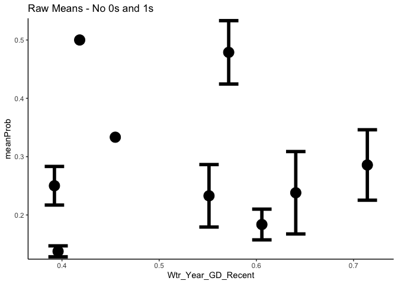<!-- -->

Try boot::logit and boot::inv.logit 

``` r
#double check that back transformation works 
wl2_prob_fit_block_summary %>% 
  mutate(logitBlockMean=boot::logit(meanProbBlock + 0.001)) %>% 
  mutate(btProb=boot::inv.logit(logitBlockMean)-0.001)
```

```
## # A tibble: 288 × 11
## # Groups:   pop, block, Geographic_Dist, Wtr_Year_GD_Recent,
## #   Wtr_Year_GD_Historical, GrwSsn_GD_Recent [288]
##    pop   block Geographic_Dist Wtr_Year_GD_Recent Wtr_Year_GD_Historical
##    <chr> <chr>           <dbl>              <dbl>                  <dbl>
##  1 BH    A             159626.              0.714                  0.647
##  2 BH    B             159626.              0.714                  0.647
##  3 BH    C             159626.              0.714                  0.647
##  4 BH    D             159626.              0.714                  0.647
##  5 BH    E             159626.              0.714                  0.647
##  6 BH    F             159626.              0.714                  0.647
##  7 BH    G             159626.              0.714                  0.647
##  8 BH    H             159626.              0.714                  0.647
##  9 BH    I             159626.              0.714                  0.647
## 10 BH    J             159626.              0.714                  0.647
## # ℹ 278 more rows
## # ℹ 6 more variables: GrwSsn_GD_Recent <dbl>, GrwSsn_GD_Historical <dbl>,
## #   meanProbBlock <dbl>, n <int>, logitBlockMean <dbl>, btProb <dbl>
```

``` r
#means are wrong b/c of 0 conversions 
boot::inv.logit((-0.911395862 +  -6.906754779)/2)-0.001 ##logit =  0.01866459
```

```
## [1] 0.01866459
```

``` r
(2.857143e-01 + -4.336809e-19)/2 #non-logit = 0.1428571
```

```
## [1] 0.1428571
```

``` r
boot::inv.logit((-0.911395862 +  0)/2)-0.001 #convert logit zeros = 0.3870069 - also wrong ...
```

```
## [1] 0.3870069
```

``` r
#likely b/c when I'm taking the mean, the +0.001 is being manipulated??
#((x - lb) / (ub - lb))
```


``` r
##logit scale
wl2_prob_fit_block_summary %>% 
  mutate(logitBlockMean=boot::logit(meanProbBlock + 0.001)) %>% 
  group_by(pop, Geographic_Dist) %>% 
  summarise(meanLogit=mean(logitBlockMean), 
            semLogit=sem(logitBlockMean)) %>% 
  ggplot(aes(x=Geographic_Dist, y=meanLogit, group = pop)) +
  geom_point(size=6) + 
  geom_errorbar(aes(ymin=meanLogit+semLogit,ymax=meanLogit-semLogit),width=.2, linewidth = 2) +
  theme_classic() + 
  scale_y_continuous(expand = c(0.01, 0)) +
  ggtitle("Logit Scale")
```

```
## `summarise()` has grouped output by 'pop'. You can override using the `.groups`
## argument.
```

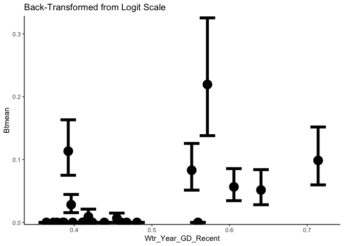<!-- -->

``` r
##back transformed from logit 
wl2_prob_fit_block_summary %>% 
  mutate(logitBlockMean=boot::logit(meanProbBlock + 0.001)) %>% 
  group_by(pop, Geographic_Dist) %>% 
  summarise(meanLogit=mean(logitBlockMean), 
            semLogit=sem(logitBlockMean)) %>% 
    mutate(HighError=meanLogit+semLogit, LowError=meanLogit-semLogit) %>% 
  mutate(btProb=boot::inv.logit(meanLogit)-0.001, 
         btHighError=boot::inv.logit(HighError)-0.001,
         btLowError=boot::inv.logit(LowError)-0.001) %>% 
  ggplot(aes(x=Geographic_Dist, y=btProb, group = pop)) +
  geom_point(size=6) + 
  geom_errorbar(aes(ymin=btLowError,ymax=btHighError),width=.2, linewidth = 2) +
  theme_classic() + 
  scale_y_continuous(expand = c(0.01, 0)) +
  ggtitle("Back-Transformed from Logit Scale")
```

```
## `summarise()` has grouped output by 'pop'. You can override using the `.groups`
## argument.
```

<!-- -->

``` r
##non-logit scale 
wl2_total_fitness_sub_dist %>%  
  mutate(ProbFitness=if_else(Total_Fitness==0, 0, 1)) %>% 
  group_by(pop, block, Geographic_Dist) %>% 
  summarise(meanProbBlock=mean(ProbFitness, na.rm = TRUE) + 0.001, n=n()) %>% 
  group_by(pop, Geographic_Dist) %>% 
  summarise(meanProb=mean(meanProbBlock, na.rm = TRUE), 
            semProb=sem(meanProbBlock,  na.rm=TRUE)) %>% 
  ggplot(aes(x=Geographic_Dist, y=meanProb, group = pop)) +
  geom_point(size=6) + 
  geom_errorbar(aes(ymin=meanProb-semProb,ymax=meanProb+semProb),width=.2, linewidth = 2) +
  theme_classic() + 
  scale_y_continuous(expand = c(0.01, 0)) +
  ggtitle("Raw Means")
```

```
## `summarise()` has grouped output by 'pop', 'block'. You can override using the
## `.groups` argument.
## `summarise()` has grouped output by 'pop'. You can override using the `.groups`
## argument.
```

<!-- -->

#### Basic Model Workflow


``` r
glmer.model_binomial <- 
  linear_reg() %>% 
  set_engine("glmer", family=binomial)

prob_fitness_wflow <- workflow() %>% 
  add_variables(outcomes = ProbFitness, predictors = c(pop, mf, block))

prob_fitness_fits <- tibble(wflow=list(
  pop = {prob_fitness_wflow %>% 
      add_model(glmer.model_binomial, formula = ProbFitness ~ (1|pop))},
  
  pop.mf = {prob_fitness_wflow %>% 
      add_model(glmer.model_binomial, formula = ProbFitness ~ (1|pop/mf))},
  
  pop.block = {prob_fitness_wflow %>% 
      add_model(glmer.model_binomial, formula = ProbFitness ~ (1|pop) + (1|block))},
  
  pop.mf.block = {prob_fitness_wflow %>% 
      add_model(glmer.model_binomial, formula = ProbFitness ~ (1|pop/mf) + (1|block))}
),
name=names(wflow)
) %>% 
  select(name,wflow)

prob_fitness_fits_wl2 <- prob_fitness_fits %>%
  mutate(fit = map(wflow, fit, data = wl2_prob_fitness))
```

```
## Warning: There were 2 warnings in `mutate()`.
## The first warning was:
## ℹ In argument: `fit = map(wflow, fit, data = wl2_prob_fitness)`.
## Caused by warning in `checkConv()`:
## ! Model failed to converge with max|grad| = 0.0846978 (tol = 0.002, component 1)
## ℹ Run `dplyr::last_dplyr_warnings()` to see the 1 remaining warning.
```

``` r
#mod_test <- glmer(ProbFitness ~ (1|pop/mf), data=wl2_prob_fitness, family=binomial)
#Warning: Model failed to converge with max|grad| = 0.0846977 (tol = 0.002, component 1)Warning: Model is nearly unidentifiable: very large eigenvalue
 #- Rescale variables? But can't scale character variables, maybe something wrong with mf sample sizes 
#summary(mod_test)

prob_fitness_fits_ucd <- prob_fitness_fits %>%
  mutate(fit = map(wflow, fit, data = ucd_prob_fitness))

prob_fitness_fits_wl2 %>% mutate(glance=map(fit, glance)) %>% unnest(glance) %>% arrange(AIC) %>% select(-wflow:-sigma)
```

```
## # A tibble: 4 × 6
##   name         logLik   AIC   BIC deviance df.residual
##   <chr>         <dbl> <dbl> <dbl>    <dbl>       <int>
## 1 pop.block     -280.  567.  583.     476.        1570
## 2 pop.mf.block  -280.  568.  589.     456.        1569
## 3 pop           -292.  589.  599.     528.        1571
## 4 pop.mf        -292.  590.  606.     511.        1570
```

``` r
#model with pop and block (but excluding mf) is best by AIC and BIC

prob_fitness_fits_ucd %>% mutate(glance=map(fit, glance)) %>% unnest(glance) %>% arrange(AIC) %>% select(-wflow:-sigma)
```

```
## # A tibble: 4 × 6
##   name         logLik   AIC   BIC deviance df.residual
##   <chr>         <dbl> <dbl> <dbl>    <dbl>       <int>
## 1 pop.mf        -97.1  200.  214.     146.         752
## 2 pop           -98.9  202.  211.     169.         753
## 3 pop.mf.block  -97.1  202.  221.     143.         751
## 4 pop.block     -98.9  204.  218.     168.         752
```

``` r
#model with pop and mf (but excluding block) preferred by AIC, model with just pop preferred by BIC 
```

#### VISUALIZE


``` r
prob_fitness_nd_wl2 <- data_grid(wl2_prob_fitness, pop)

prob_fitness_predict_fun <- function(m, nd = prob_fitness_nd_wl2) {
  predict(m, 
          newdata = nd,
          type = "response",
          re.form = ~(1|pop)
  ) 
}

# 100 seconds
system.time (prob_fitness_fits_wl2 <- prob_fitness_fits_wl2 %>%
               mutate(
                 bootstrap = map(fit, \(x) {
                   extract_fit_engine(x) %>% 
                     bootMer(FUN = prob_fitness_predict_fun, 
                             re.form = ~ (1|pop),
                             nsim = 1000,
                             parallel = "multicore",
                             ncpus = 7
                     ) } #bootMer
                 ),  
                 tidyboot = map(bootstrap, tidy, conf.int = TRUE),
                 tidyboot = map(tidyboot, \(x) cbind(prob_fitness_nd_wl2, x))
               ) # mutate
) # system.time

prob_fitness_fits_wl2 %>%
  select(name, tidyboot) %>%
  unnest(tidyboot) %>%
  ggplot(aes(x=pop)) +
  geom_col(aes(y=Survival), data = wl2_estab_means, fill="skyblue") +
  geom_pointrange(aes(y=statistic, ymax = conf.high, ymin = conf.low, color=name), position = position_dodge(width = .75)) +
  ylab("Prob Fitness >0") +
  scale_color_viridis_d() +
  theme(axis.text.x = element_text(angle=90, hjust=1, vjust=.5))
#the model with pop and block seems to be underestimating the means whereas the model with just pop seems to match the data better...

#wl2_estab_means %>% 
#  ggplot(aes(x=pop, y=Survival)) +
#  geom_col()

#prob_fitness_fits_wl2 %>%
#  select(name, bootstrap) %>%
#  mutate(tidyboot = map(bootstrap, tidy, conf.int = TRUE)) %>%
#  unnest(tidyboot)
```


``` r
prob_fitness_nd_ucd <- data_grid(ucd_prob_fitness, pop)

prob_fitness_predict_fun <- function(m, nd = prob_fitness_nd_ucd) {
  predict(m, 
          newdata = nd,
          type = "response",
          re.form = ~(1|pop)
  )
}

# 100 seconds
system.time (prob_fitness_fits_ucd <- prob_fitness_fits_ucd %>%  
               mutate(
                 bootstrap = map(fit, \(x) {
                   extract_fit_engine(x) %>% 
                     bootMer(FUN = prob_fitness_predict_fun, 
                             re.form = ~ (1|pop),
                             nsim = 1000,
                             parallel = "multicore",
                             ncpus = 7
                     ) } #bootMer
                 ),  
                 tidyboot = map(bootstrap, tidy, conf.int = TRUE),
                 tidyboot = map(tidyboot, \(x) cbind(prob_fitness_nd_ucd, x))
               ) # mutate
) # system.time

prob_fitness_fits_ucd %>%
  select(name, tidyboot) %>%
  unnest(tidyboot) %>%
  ggplot(aes(x=pop)) +
  geom_col(aes(y=Survival), data = ucd_estab_means, fill="skyblue") +
  geom_pointrange(aes(y=statistic, ymax = conf.high, ymin = conf.low, color=name), position = position_dodge(width = .75)) +
   ylab("Prob Fitness >0") +
  scale_color_viridis_d() +
  theme(axis.text.x = element_text(angle=90, hjust=1, vjust=.5))
#pop.mf seems to be underestimating the means, model with just pop seems to match the data better...
```

#### Test climate and geographic distance


``` r
prob_fitness_GD_wflow_wl2 <- workflow() %>%
  add_variables(outcomes = ProbFitness, predictors = c(pop, block, contains("GD"), Geographic_Dist)) 

prob_fitness_GD_fits_wl2 <- tibble(wflow=list(
  pop.block = {prob_fitness_GD_wflow_wl2 %>% 
      add_model(glmer.model_binomial, formula = ProbFitness ~ (1|pop) + (1|block))},
  
  GS_Recent = {prob_fitness_GD_wflow_wl2 %>% 
      add_model(glmer.model_binomial, formula = ProbFitness ~ GrwSsn_GD_Recent + Geographic_Dist + (1|pop) + (1|block))},
  
  GS_Historical = {prob_fitness_GD_wflow_wl2 %>% 
      add_model(glmer.model_binomial, formula = ProbFitness ~ GrwSsn_GD_Historical + Geographic_Dist + (1|pop) + (1|block))},
  
  WY_Recent = {prob_fitness_GD_wflow_wl2 %>% 
      add_model(glmer.model_binomial, formula = ProbFitness ~ Wtr_Year_GD_Recent + Geographic_Dist + (1|pop) + (1|block))},
  
  WY_Historical = {prob_fitness_GD_wflow_wl2 %>% 
      add_model(glmer.model_binomial, formula = ProbFitness ~ Wtr_Year_GD_Historical + Geographic_Dist + (1|pop) + (1|block))}
  
),
name=names(wflow)
) %>% 
  select(name,wflow) %>%
  mutate(fit = map(wflow, fit, data = wl2_prob_fitness))
```

```
## Warning: There were 2 warnings in `mutate()`.
## The first warning was:
## ℹ In argument: `fit = map(wflow, fit, data = wl2_prob_fitness)`.
## Caused by warning in `checkConv()`:
## ! Model failed to converge with max|grad| = 0.0747177 (tol = 0.002, component 1)
## ℹ Run `dplyr::last_dplyr_warnings()` to see the 1 remaining warning.
```

``` r
prob_fitness_GD_fits_wl2 %>% mutate(glance=map(fit, glance)) %>% unnest(glance) %>% arrange(AIC) %>% select(-wflow:-sigma)
```

```
## # A tibble: 5 × 6
##   name          logLik   AIC   BIC deviance df.residual
##   <chr>          <dbl> <dbl> <dbl>    <dbl>       <int>
## 1 WY_Recent      -276.  561.  588.     477.        1568
## 2 WY_Historical  -278.  566.  592.     477.        1568
## 3 pop.block      -280.  567.  583.     476.        1570
## 4 GS_Historical  -280.  570.  597.     476.        1568
## 5 GS_Recent      -280.  570.  597.     476.        1568
```

``` r
#water year models preferred by AIC 

prob_fitness_GD_fits_wl2 %>% mutate(tidy=map(fit, tidy)) %>% unnest(tidy) %>%
  filter(str_detect(term, "GD") | term=="Geographic_Dist") %>%
  drop_na(p.value) %>%
  select(-wflow:-group)# %>%
```

```
## # A tibble: 8 × 6
##   name          term                   estimate std.error statistic p.value
##   <chr>         <chr>                     <dbl>     <dbl>     <dbl>   <dbl>
## 1 GS_Recent     GrwSsn_GD_Recent          0.217  0.000946   229.    0      
## 2 GS_Recent     Geographic_Dist          -0.576  0.000946  -608.    0      
## 3 GS_Historical GrwSsn_GD_Historical     -0.428  0.833       -0.513 0.608  
## 4 GS_Historical Geographic_Dist          -0.540  0.759       -0.711 0.477  
## 5 WY_Recent     Wtr_Year_GD_Recent        1.79   0.632        2.83  0.00473
## 6 WY_Recent     Geographic_Dist          -0.488  0.585       -0.834 0.404  
## 7 WY_Historical Wtr_Year_GD_Historical    1.38   0.646        2.14  0.0324 
## 8 WY_Historical Geographic_Dist          -0.506  0.640       -0.792 0.429
```

``` r
#  arrange(p.value)
# recent and historical water year CD are sig, geo dist is not sig in those models. The GS_RECENT model had convergence issues.

mod_test <- glmer(ProbFitness ~ GrwSsn_GD_Recent + Geographic_Dist + (1|pop) + (1|block), data=wl2_prob_fitness, family=binomial)
```

```
## Warning in checkConv(attr(opt, "derivs"), opt$par, ctrl = control$checkConv, :
## Model failed to converge with max|grad| = 0.0747177 (tol = 0.002, component 1)
```

```
## Warning in checkConv(attr(opt, "derivs"), opt$par, ctrl = control$checkConv, : Model is nearly unidentifiable: very large eigenvalue
##  - Rescale variables?
```

``` r
#summary(mod_test)
#Warning: Model failed to converge with max|grad| = 0.0747217 (tol = 0.002, component 1)Warning: Model is nearly unidentifiable: very large eigenvalue
# - Rescale variables? - But the variables were already scaled 
```


``` r
prob_fitness_SUB_wflow_wl2 <- workflow() %>%
  add_variables(outcomes = ProbFitness, predictors = c(pop, block, contains("Dist"))) 

prob_fitness_SUB_fits_wl2 <- tibble(wflow=list(
  pop.block = {prob_fitness_SUB_wflow_wl2 %>% 
      add_model(glmer.model_binomial, formula = ProbFitness ~ (1|pop) + (1|block))},
  
  GS_Recent = {prob_fitness_SUB_wflow_wl2 %>% 
      add_model(glmer.model_binomial, formula = ProbFitness ~ GrwSsn_TempDist_Recent + GrwSsn_PPTDist_Recent+ Geographic_Dist + (1|pop) + (1|block))},
  
  GS_Historical = {prob_fitness_SUB_wflow_wl2 %>% 
      add_model(glmer.model_binomial, formula = ProbFitness ~ GrwSsn_TempDist_Historic + GrwSsn_PPTDist_Historic + Geographic_Dist + (1|pop) + (1|block))},
  
  WY_Recent = {prob_fitness_SUB_wflow_wl2 %>% 
      add_model(glmer.model_binomial, formula = ProbFitness ~ Wtr_Year_TempDist_Recent + Wtr_Year_PPTDist_Recent + Geographic_Dist + (1|pop) + (1|block))},
  
  WY_Historical = {prob_fitness_SUB_wflow_wl2 %>% 
      add_model(glmer.model_binomial, formula = ProbFitness ~ Wtr_Year_TempDist_Historic + Wtr_Year_PPTDist_Historic + Geographic_Dist + (1|pop) + (1|block))}
  
),
name=names(wflow)
) %>% 
  select(name,wflow) %>%
  mutate(fit = map(wflow, fit, data = wl2_prob_fitness_sub))

prob_fitness_SUB_fits_wl2 %>% mutate(glance=map(fit, glance)) %>% unnest(glance) %>% arrange(AIC) %>% select(-wflow:-sigma)
```

```
## # A tibble: 5 × 6
##   name          logLik   AIC   BIC deviance df.residual
##   <chr>          <dbl> <dbl> <dbl>    <dbl>       <int>
## 1 WY_Historical  -275.  561.  594.     477.        1567
## 2 WY_Recent      -275.  561.  594.     477.        1567
## 3 GS_Historical  -277.  565.  597.     476.        1567
## 4 GS_Recent      -277.  565.  598.     477.        1567
## 5 pop.block      -280.  567.  583.     476.        1570
```

``` r
prob_fitness_SUB_fits_wl2 %>% mutate(tidy=map(fit, tidy)) %>% unnest(tidy) %>%
  filter(str_detect(term, "Dist") | term=="Geographic_Dist") %>%
  drop_na(p.value) %>%
  select(-wflow:-group)# %>%
```

```
## # A tibble: 12 × 6
##    name          term                       estimate std.error statistic p.value
##    <chr>         <chr>                         <dbl>     <dbl>     <dbl>   <dbl>
##  1 GS_Recent     GrwSsn_TempDist_Recent      -0.242      0.933   -0.260   0.795 
##  2 GS_Recent     GrwSsn_PPTDist_Recent        1.96       0.978    2.01    0.0448
##  3 GS_Recent     Geographic_Dist              0.113      0.642    0.176   0.860 
##  4 GS_Historical GrwSsn_TempDist_Historic     0.418      0.843    0.497   0.619 
##  5 GS_Historical GrwSsn_PPTDist_Historic      1.55       0.807    1.92    0.0554
##  6 GS_Historical Geographic_Dist             -0.0568     0.631   -0.0900  0.928 
##  7 WY_Recent     Wtr_Year_TempDist_Recent     1.78       0.741    2.40    0.0164
##  8 WY_Recent     Wtr_Year_PPTDist_Recent     -0.588      0.758   -0.775   0.438 
##  9 WY_Recent     Geographic_Dist             -0.309      0.584   -0.528   0.597 
## 10 WY_Historical Wtr_Year_TempDist_Historic   1.75       0.763    2.29    0.0222
## 11 WY_Historical Wtr_Year_PPTDist_Historic   -0.589      0.783   -0.753   0.452 
## 12 WY_Historical Geographic_Dist             -0.239      0.566   -0.423   0.672
```

``` r
#  arrange(p.value)

mod_test <- glmer(ProbFitness ~ GrwSsn_TempDist_Recent + GrwSsn_PPTDist_Recent+ Geographic_Dist + (1|pop) + (1|block), data=wl2_prob_fitness_sub, family=binomial)
summary(mod_test)
```

```
## Generalized linear mixed model fit by maximum likelihood (Laplace
##   Approximation) [glmerMod]
##  Family: binomial  ( logit )
## Formula: ProbFitness ~ GrwSsn_TempDist_Recent + GrwSsn_PPTDist_Recent +  
##     Geographic_Dist + (1 | pop) + (1 | block)
##    Data: wl2_prob_fitness_sub
## 
##      AIC      BIC   logLik deviance df.resid 
##    565.4    597.6   -276.7    553.4     1567 
## 
## Scaled residuals: 
##     Min      1Q  Median      3Q     Max 
## -1.4228 -0.2611 -0.0441 -0.0288  4.9333 
## 
## Random effects:
##  Groups Name        Variance Std.Dev.
##  pop    (Intercept) 5.6844   2.3842  
##  block  (Intercept) 0.7012   0.8374  
## Number of obs: 1573, groups:  pop, 23; block, 13
## 
## Fixed effects:
##                        Estimate Std. Error z value Pr(>|z|)    
## (Intercept)             -5.3208     0.9429  -5.643 1.67e-08 ***
## GrwSsn_TempDist_Recent  -0.2424     0.9331  -0.260   0.7951    
## GrwSsn_PPTDist_Recent    1.9625     0.9778   2.007   0.0448 *  
## Geographic_Dist          0.1129     0.6417   0.176   0.8603    
## ---
## Signif. codes:  0 '***' 0.001 '**' 0.01 '*' 0.05 '.' 0.1 ' ' 1
## 
## Correlation of Fixed Effects:
##             (Intr) GS_TD_ GS_PPT
## GrwSsn_TD_R -0.173              
## GrwS_PPTD_R -0.193 -0.658       
## Gegrphc_Dst -0.090 -0.138  0.335
```

Model comparison


``` r
m1 <-  glmer(ProbFitness ~ Wtr_Year_TempDist_Recent + GrwSsn_PPTDist_Recent + Geographic_Dist + (1|pop) + (1|block), data=wl2_prob_fitness_sub, family=binomial)
m2 <- glmer(ProbFitness ~ Wtr_Year_TempDist_Recent + Geographic_Dist + (1|pop) + (1|block), data=wl2_prob_fitness_sub, family=binomial)
m3 <- glmer(ProbFitness ~  GrwSsn_PPTDist_Recent + Geographic_Dist + (1|pop) + (1|block), data=wl2_prob_fitness_sub, family=binomial)
anova(m1, m2, m3)
```

```
## Data: wl2_prob_fitness_sub
## Models:
## m2: ProbFitness ~ Wtr_Year_TempDist_Recent + Geographic_Dist + (1 | pop) + (1 | block)
## m3: ProbFitness ~ GrwSsn_PPTDist_Recent + Geographic_Dist + (1 | pop) + (1 | block)
## m1: ProbFitness ~ Wtr_Year_TempDist_Recent + GrwSsn_PPTDist_Recent + Geographic_Dist + (1 | pop) + (1 | block)
##    npar    AIC    BIC  logLik deviance  Chisq Df Pr(>Chisq)  
## m2    5 560.10 586.90 -275.05   550.10                       
## m3    5 563.50 590.30 -276.75   553.50 0.0000  0             
## m1    6 562.05 594.22 -275.03   550.05 3.4449  1    0.06345 .
## ---
## Signif. codes:  0 '***' 0.001 '**' 0.01 '*' 0.05 '.' 0.1 ' ' 1
```

Keep block in for UCD


``` r
prob_fitness_GD_wflow_ucd <- workflow() %>%
  add_variables(outcomes = ProbFitness, predictors = c(pop, mf, block, contains("GD"), Geographic_Dist)) 

prob_fitness_GD_fits_ucd <- tibble(wflow=list(
  pop.mf.block = {prob_fitness_GD_wflow_ucd %>% 
      add_model(glmer.model_binomial, formula = ProbFitness ~ (1|pop/mf) + (1|block))},
  
  GS_Recent = {prob_fitness_GD_wflow_ucd %>% 
      add_model(glmer.model_binomial, formula = ProbFitness ~ GrwSsn_GD_Recent + Geographic_Dist + (1|pop/mf) + (1|block))},
  
  GS_Historical = {prob_fitness_GD_wflow_ucd %>% 
      add_model(glmer.model_binomial, formula = ProbFitness ~ GrwSsn_GD_Historical + Geographic_Dist + (1|pop/mf) + (1|block))},
  
  WY_Recent = {prob_fitness_GD_wflow_ucd %>% 
      add_model(glmer.model_binomial, formula = ProbFitness ~ Wtr_Year_GD_Recent + Geographic_Dist + (1|pop/mf) + (1|block))},
  
  WY_Historical = {prob_fitness_GD_wflow_ucd %>% 
      add_model(glmer.model_binomial, formula = ProbFitness ~ Wtr_Year_GD_Historical + Geographic_Dist + (1|pop/mf) + (1|block))}
  
),
name=names(wflow)
) %>% 
  select(name,wflow) %>%
  mutate(fit = map(wflow, fit, data = ucd_prob_fitness))
```

```
## Warning: There were 3 warnings in `mutate()`.
## The first warning was:
## ℹ In argument: `fit = map(wflow, fit, data = ucd_prob_fitness)`.
## Caused by warning in `checkConv()`:
## ! Model failed to converge with max|grad| = 0.0515053 (tol = 0.002, component 1)
## ℹ Run `dplyr::last_dplyr_warnings()` to see the 2 remaining warnings.
```

``` r
prob_fitness_GD_fits_ucd %>% mutate(glance=map(fit, glance)) %>% unnest(glance) %>% arrange(AIC) %>% select(-wflow:-sigma)
```

```
## # A tibble: 5 × 6
##   name          logLik   AIC   BIC deviance df.residual
##   <chr>          <dbl> <dbl> <dbl>    <dbl>       <int>
## 1 pop.mf.block   -97.1  202.  221.     143.         751
## 2 WY_Historical  -95.9  204.  232.     146.         749
## 3 WY_Recent      -96.0  204.  232.     145.         749
## 4 GS_Recent      -96.9  206.  234.     144.         749
## 5 GS_Historical  -97.0  206.  234.     144.         749
```

``` r
#pop.mf.block preferred by AIC & BIC, WY models are close after

prob_fitness_GD_fits_ucd %>% mutate(tidy=map(fit, tidy)) %>% unnest(tidy) %>%
  filter(str_detect(term, "GD") | term=="Geographic_Dist") %>%
  drop_na(p.value) %>%
  select(-wflow:-group)# %>%
```

```
## # A tibble: 8 × 6
##   name          term                   estimate std.error statistic   p.value
##   <chr>         <chr>                     <dbl>     <dbl>     <dbl>     <dbl>
## 1 GS_Recent     GrwSsn_GD_Recent         0.515    0.00139   370.    0        
## 2 GS_Recent     Geographic_Dist         -0.436    0.00139  -314.    0        
## 3 GS_Historical GrwSsn_GD_Historical    -0.163    0.880      -0.185 8.53e-  1
## 4 GS_Historical Geographic_Dist         -0.202    0.758      -0.266 7.90e-  1
## 5 WY_Recent     Wtr_Year_GD_Recent      -1.16     0.00146  -796.    0        
## 6 WY_Recent     Geographic_Dist          0.0523   0.00146    35.7   7.54e-280
## 7 WY_Historical Wtr_Year_GD_Historical  -1.26     0.808      -1.56  1.19e-  1
## 8 WY_Historical Geographic_Dist          0.179    0.625       0.287 7.74e-  1
```

``` r
#  arrange(p.value)

mod_test <- glmer(ProbFitness ~ Wtr_Year_GD_Historical + Geographic_Dist + (1|pop/mf) + (1|block), data=ucd_prob_fitness, family=binomial)
#model failed to converge for growth season and water year recent 
```


``` r
prob_fitness_SUB_wflow_ucd <- workflow() %>%
  add_variables(outcomes = ProbFitness, predictors = c(pop, mf, block, contains("Dist"))) 

prob_fitness_SUB_fits_ucd <- tibble(wflow=list(
  pop.block = {prob_fitness_SUB_wflow_ucd %>% 
      add_model(glmer.model_binomial, formula = ProbFitness ~ (1|pop/mf) + (1|block))},
  
  GS_Recent = {prob_fitness_SUB_wflow_ucd %>% 
      add_model(glmer.model_binomial, formula = ProbFitness ~ GrwSsn_TempDist_Recent + GrwSsn_PPTDist_Recent+ Geographic_Dist + (1|pop/mf) + (1|block))},
  
  GS_Historical = {prob_fitness_SUB_wflow_ucd %>% 
      add_model(glmer.model_binomial, formula = ProbFitness ~ GrwSsn_TempDist_Historic + GrwSsn_PPTDist_Historic + Geographic_Dist + (1|pop/mf) + (1|block))},
  
  WY_Recent = {prob_fitness_SUB_wflow_ucd %>% 
      add_model(glmer.model_binomial, formula = ProbFitness ~ Wtr_Year_TempDist_Recent + Wtr_Year_PPTDist_Recent + Geographic_Dist + (1|pop/mf) + (1|block))},
  
  WY_Historical = {prob_fitness_SUB_wflow_ucd %>% 
      add_model(glmer.model_binomial, formula = ProbFitness ~ Wtr_Year_TempDist_Historic + Wtr_Year_PPTDist_Historic + Geographic_Dist + (1|pop/mf) + (1|block))}
  
),
name=names(wflow)
) %>% 
  select(name,wflow) %>%
  mutate(fit = map(wflow, fit, data = ucd_prob_fitness_sub))
```

```
## Warning: There were 2 warnings in `mutate()`.
## The first warning was:
## ℹ In argument: `fit = map(wflow, fit, data = ucd_prob_fitness_sub)`.
## Caused by warning in `checkConv()`:
## ! Model failed to converge with max|grad| = 0.0471973 (tol = 0.002, component 1)
## ℹ Run `dplyr::last_dplyr_warnings()` to see the 1 remaining warning.
```

``` r
prob_fitness_SUB_fits_ucd %>% mutate(glance=map(fit, glance)) %>% unnest(glance) %>% arrange(AIC) %>% select(-wflow:-sigma)
```

```
## # A tibble: 5 × 6
##   name          logLik   AIC   BIC deviance df.residual
##   <chr>          <dbl> <dbl> <dbl>    <dbl>       <int>
## 1 pop.block      -97.1  202.  221.     143.         751
## 2 WY_Recent      -95.6  205.  237.     146.         748
## 3 WY_Historical  -95.6  205.  238.     145.         748
## 4 GS_Recent      -96.4  207.  239.     144.         748
## 5 GS_Historical  -96.5  207.  239.     145.         748
```

``` r
prob_fitness_SUB_fits_ucd %>% mutate(tidy=map(fit, tidy)) %>% unnest(tidy) %>%
  filter(str_detect(term, "Dist") | term=="Geographic_Dist") %>%
  drop_na(p.value) %>%
  select(-wflow:-group)# %>%
```

```
## # A tibble: 12 × 6
##    name          term                      estimate std.error statistic  p.value
##    <chr>         <chr>                        <dbl>     <dbl>     <dbl>    <dbl>
##  1 GS_Recent     GrwSsn_TempDist_Recent     -0.739    0.845      -0.875 3.82e- 1
##  2 GS_Recent     GrwSsn_PPTDist_Recent       1.24     1.08        1.15  2.49e- 1
##  3 GS_Recent     Geographic_Dist             0.369    0.897       0.412 6.81e- 1
##  4 GS_Historical GrwSsn_TempDist_Historic   -0.302    0.774      -0.390 6.97e- 1
##  5 GS_Historical GrwSsn_PPTDist_Historic     0.920    0.837       1.10  2.72e- 1
##  6 GS_Historical Geographic_Dist             0.194    0.833       0.232 8.16e- 1
##  7 WY_Recent     Wtr_Year_TempDist_Recent    0.541    0.00150   359.    0       
##  8 WY_Recent     Wtr_Year_PPTDist_Recent    -1.00     0.00150  -667.    0       
##  9 WY_Recent     Geographic_Dist            -0.0318   0.00150   -21.2   2.00e-99
## 10 WY_Historical Wtr_Year_TempDist_Histor…   0.593    0.00151   392.    0       
## 11 WY_Historical Wtr_Year_PPTDist_Historic  -0.908    0.00151  -600.    0       
## 12 WY_Historical Geographic_Dist             0.0103   0.00151     6.80  1.06e-11
```

``` r
#  arrange(p.value)

mod_test <- glmer(ProbFitness ~ Wtr_Year_TempDist_Historic + Wtr_Year_PPTDist_Historic + Geographic_Dist + (1|pop/mf) + (1|block), data=ucd_prob_fitness_sub, family=binomial)
```

```
## Warning in checkConv(attr(opt, "derivs"), opt$par, ctrl = control$checkConv, :
## Model failed to converge with max|grad| = 0.0468076 (tol = 0.002, component 1)
```

``` r
#Water year recent and historic models failed to converge 
```

#### Test plasticity in size 

``` r
size_plasticity <- read_csv("../output/TwoMonths_Size_Slopes.csv") %>% rename(pop=parent.pop)
```

```
## Rows: 23 Columns: 3
## ── Column specification ────────────────────────────────────────────────────────
## Delimiter: ","
## chr (1): parent.pop
## dbl (2): height_slope, length_slope
## 
## ℹ Use `spec()` to retrieve the full column specification for this data.
## ℹ Specify the column types or set `show_col_types = FALSE` to quiet this message.
```

``` r
wl2_prob_fit_plas <- wl2_prob_fitness %>% 
  select(block, Genotype:Elev_Dist, ProbFitness) %>% 
  left_join(size_plasticity) #%>% 
```

```
## Joining with `by = join_by(pop)`
```

``` r
  #mutate_at(c("height_slope","length_slope"),scale) 
head(wl2_prob_fit_plas)
```

```
## # A tibble: 6 × 18
##   block Genotype  pop      mf   rep elevation.group elev_m   Lat  Long
##   <chr> <chr>     <chr> <dbl> <dbl> <chr>            <dbl> <dbl> <dbl>
## 1 A     TM2_6_11  TM2       6    11 Low               379.  39.6 -122.
## 2 A     LVTR1_7_1 LVTR1     7     1 High             2741.  40.5 -122.
## 3 A     SQ2_6_14  SQ2       6    14 Mid              1934.  36.7 -119.
## 4 A     YO8_8_3   YO8       8     3 High             2591.  37.8 -119.
## 5 A     CC_2_3    CC        2     3 Low               313   39.6 -121.
## 6 A     YO11_5_14 YO11      5    14 High             2872.  37.9 -119.
## # ℹ 9 more variables: GrwSsn_GD_Recent <dbl[,1]>,
## #   GrwSsn_GD_Historical <dbl[,1]>, Wtr_Year_GD_Recent <dbl[,1]>,
## #   Wtr_Year_GD_Historical <dbl[,1]>, Geographic_Dist <dbl[,1]>,
## #   Elev_Dist <dbl>, ProbFitness <dbl>, height_slope <dbl>, length_slope <dbl>
```

``` r
wl2_prob_fit_plas %>% 
  ggplot(aes(length_slope)) +
  geom_histogram()
```

```
## `stat_bin()` using `bins = 30`. Pick better value with `binwidth`.
```

```
## Warning: Removed 3 rows containing non-finite outside the scale range
## (`stat_bin()`).
```

<!-- -->

``` r
wl2_prob_fit_plas %>% 
  ggplot(aes(height_slope)) +
  geom_histogram()
```

```
## `stat_bin()` using `bins = 30`. Pick better value with `binwidth`.
```

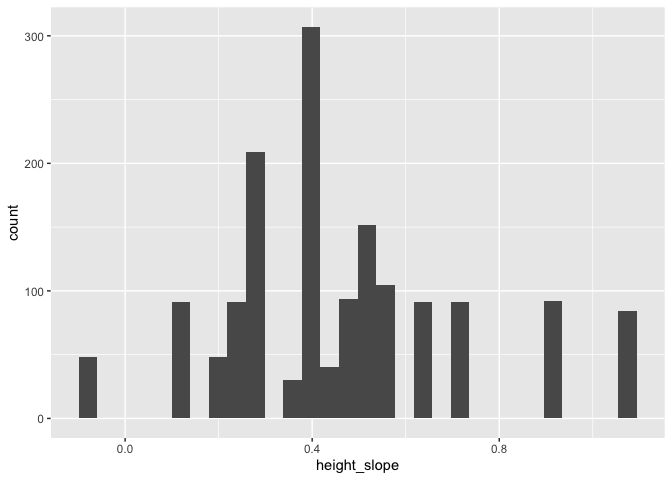<!-- -->

``` r
ucd_prob_fit_plas <- ucd_prob_fitness %>% 
  select(block, Genotype:Elev_Dist, ProbFitness) %>% 
  left_join(size_plasticity) #%>% 
```

```
## Joining with `by = join_by(pop)`
```

``` r
# mutate_at(c("height_slope","length_slope"),scale) 
head(ucd_prob_fit_plas)
```

```
## # A tibble: 6 × 18
##   block Genotype  pop      mf   rep elevation.group elev_m   Lat  Long
##   <chr> <chr>     <chr> <dbl> <dbl> <chr>            <dbl> <dbl> <dbl>
## 1 D1    WL2_4_11  WL2       4    11 High             2020.  38.8 -120.
## 2 D1    CP2_10_4  CP2      10     4 High             2244.  38.7 -120.
## 3 D1    YO11_4_10 YO11      4    10 High             2872.  37.9 -119.
## 4 D1    CC_5_12   CC        5    12 Low               313   39.6 -121.
## 5 D1    FR_3_6    FR        3     6 Mid               787   40.0 -121.
## 6 D1    BH_5_24   BH        5    24 Low               511.  37.4 -120.
## # ℹ 9 more variables: GrwSsn_GD_Recent <dbl[,1]>,
## #   GrwSsn_GD_Historical <dbl[,1]>, Wtr_Year_GD_Recent <dbl[,1]>,
## #   Wtr_Year_GD_Historical <dbl[,1]>, Geographic_Dist <dbl[,1]>,
## #   Elev_Dist <dbl>, ProbFitness <dbl>, height_slope <dbl>, length_slope <dbl>
```

``` r
ucd_prob_fit_plas %>% 
  ggplot(aes(length_slope)) +
  geom_histogram()
```

```
## `stat_bin()` using `bins = 30`. Pick better value with `binwidth`.
```

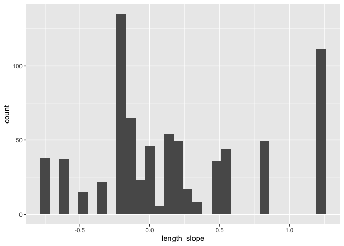<!-- -->

``` r
ucd_prob_fit_plas %>% 
  ggplot(aes(height_slope)) +
  geom_histogram()
```

```
## `stat_bin()` using `bins = 30`. Pick better value with `binwidth`.
```

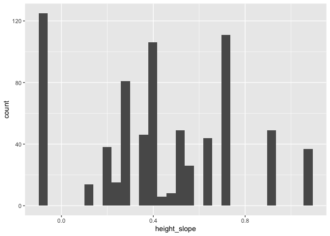<!-- -->


``` r
wl2_glmer1 <- glmer(ProbFitness ~ height_slope + (1|pop) + (1|block), data=wl2_prob_fit_plas, family = binomial)
summary(wl2_glmer1) #plasticity in height sig and positive 
```

```
## Generalized linear mixed model fit by maximum likelihood (Laplace
##   Approximation) [glmerMod]
##  Family: binomial  ( logit )
## Formula: ProbFitness ~ height_slope + (1 | pop) + (1 | block)
##    Data: wl2_prob_fit_plas
## 
##      AIC      BIC   logLik deviance df.resid 
##    552.5    573.9   -272.2    544.5     1569 
## 
## Scaled residuals: 
##     Min      1Q  Median      3Q     Max 
## -1.4518 -0.2598 -0.0595 -0.0323  5.3036 
## 
## Random effects:
##  Groups Name        Variance Std.Dev.
##  pop    (Intercept) 2.2973   1.5157  
##  block  (Intercept) 0.6984   0.8357  
## Number of obs: 1573, groups:  pop, 23; block, 13
## 
## Fixed effects:
##              Estimate Std. Error z value Pr(>|z|)    
## (Intercept)    -8.767      1.505  -5.825  5.7e-09 ***
## height_slope    8.293      2.170   3.823 0.000132 ***
## ---
## Signif. codes:  0 '***' 0.001 '**' 0.01 '*' 0.05 '.' 0.1 ' ' 1
## 
## Correlation of Fixed Effects:
##             (Intr)
## height_slop -0.924
```

``` r
wl2_glmer2 <- glmer(ProbFitness ~ length_slope + (1|pop) + (1|block), data=wl2_prob_fit_plas, family = binomial)
summary(wl2_glmer2) #plasticity in length sig and positive 
```

```
## Generalized linear mixed model fit by maximum likelihood (Laplace
##   Approximation) [glmerMod]
##  Family: binomial  ( logit )
## Formula: ProbFitness ~ length_slope + (1 | pop) + (1 | block)
##    Data: wl2_prob_fit_plas
## 
##      AIC      BIC   logLik deviance df.resid 
##    564.1    585.5   -278.0    556.1     1566 
## 
## Scaled residuals: 
##     Min      1Q  Median      3Q     Max 
## -1.3906 -0.2678 -0.0436 -0.0257  4.9073 
## 
## Random effects:
##  Groups Name        Variance Std.Dev.
##  pop    (Intercept) 7.7827   2.7898  
##  block  (Intercept) 0.7004   0.8369  
## Number of obs: 1570, groups:  pop, 22; block, 13
## 
## Fixed effects:
##              Estimate Std. Error z value Pr(>|z|)    
## (Intercept)    -5.973      1.122  -5.326 1.01e-07 ***
## length_slope    3.328      1.689   1.970   0.0489 *  
## ---
## Signif. codes:  0 '***' 0.001 '**' 0.01 '*' 0.05 '.' 0.1 ' ' 1
## 
## Correlation of Fixed Effects:
##             (Intr)
## length_slop -0.500
```

``` r
wl2_glmer3 <- glmer(ProbFitness ~ height_slope + length_slope + (1|pop) + (1|block), data=wl2_prob_fit_plas, family = binomial)
summary(wl2_glmer3) #when both in the model, only height plasticity = sig 
```

```
## Generalized linear mixed model fit by maximum likelihood (Laplace
##   Approximation) [glmerMod]
##  Family: binomial  ( logit )
## Formula: ProbFitness ~ height_slope + length_slope + (1 | pop) + (1 |  
##     block)
##    Data: wl2_prob_fit_plas
## 
##      AIC      BIC   logLik deviance df.resid 
##    551.4    578.2   -270.7    541.4     1565 
## 
## Scaled residuals: 
##     Min      1Q  Median      3Q     Max 
## -1.4188 -0.2590 -0.0582 -0.0295  5.4444 
## 
## Random effects:
##  Groups Name        Variance Std.Dev.
##  pop    (Intercept) 1.8370   1.3554  
##  block  (Intercept) 0.6926   0.8322  
## Number of obs: 1570, groups:  pop, 22; block, 13
## 
## Fixed effects:
##              Estimate Std. Error z value Pr(>|z|)    
## (Intercept)   -8.6638     1.4152  -6.122 9.24e-10 ***
## height_slope   7.6508     1.9574   3.909 9.28e-05 ***
## length_slope   1.4977     0.9032   1.658   0.0973 .  
## ---
## Signif. codes:  0 '***' 0.001 '**' 0.01 '*' 0.05 '.' 0.1 ' ' 1
## 
## Correlation of Fixed Effects:
##             (Intr) hght_s
## height_slop -0.902       
## length_slop -0.303  0.097
```

``` r
tidy(wl2_glmer3)
```

```
## # A tibble: 5 × 7
##   effect   group term            estimate std.error statistic   p.value
##   <chr>    <chr> <chr>              <dbl>     <dbl>     <dbl>     <dbl>
## 1 fixed    <NA>  (Intercept)       -8.66      1.42      -6.12  9.24e-10
## 2 fixed    <NA>  height_slope       7.65      1.96       3.91  9.28e- 5
## 3 fixed    <NA>  length_slope       1.50      0.903      1.66  9.73e- 2
## 4 ran_pars pop   sd__(Intercept)    1.36     NA         NA    NA       
## 5 ran_pars block sd__(Intercept)    0.832    NA         NA    NA
```


``` r
ucd_glmer1 <- glmer(ProbFitness ~ height_slope + (1|pop/mf) + (1|block), data=ucd_prob_fit_plas, family = binomial)
```

```
## boundary (singular) fit: see help('isSingular')
```

``` r
#boundary (singular) fit: see help('isSingular') - block explains 0 var 
summary(ucd_glmer1) #plasticity in height is sig and positive 
```

```
## Generalized linear mixed model fit by maximum likelihood (Laplace
##   Approximation) [glmerMod]
##  Family: binomial  ( logit )
## Formula: ProbFitness ~ height_slope + (1 | pop/mf) + (1 | block)
##    Data: ucd_prob_fit_plas
## 
##      AIC      BIC   logLik deviance df.resid 
##    197.5    220.7    -93.8    187.5      750 
## 
## Scaled residuals: 
##     Min      1Q  Median      3Q     Max 
## -1.0176 -0.1183 -0.0677 -0.0308  6.8424 
## 
## Random effects:
##  Groups Name        Variance Std.Dev.
##  mf:pop (Intercept) 1.082    1.040   
##  pop    (Intercept) 1.651    1.285   
##  block  (Intercept) 0.000    0.000   
## Number of obs: 755, groups:  mf:pop, 132; pop, 22; block, 10
## 
## Fixed effects:
##              Estimate Std. Error z value Pr(>|z|)    
## (Intercept)    -7.919      1.462  -5.415 6.12e-08 ***
## height_slope    5.657      1.959   2.888  0.00388 ** 
## ---
## Signif. codes:  0 '***' 0.001 '**' 0.01 '*' 0.05 '.' 0.1 ' ' 1
## 
## Correlation of Fixed Effects:
##             (Intr)
## height_slop -0.874
## optimizer (Nelder_Mead) convergence code: 0 (OK)
## boundary (singular) fit: see help('isSingular')
```

``` r
ucd_glmer2 <- glmer(ProbFitness ~ length_slope + (1|pop/mf) + (1|block), data=ucd_prob_fit_plas, family = binomial) 
summary(ucd_glmer2) #plasticity in length not sig
```

```
## Generalized linear mixed model fit by maximum likelihood (Laplace
##   Approximation) [glmerMod]
##  Family: binomial  ( logit )
## Formula: ProbFitness ~ length_slope + (1 | pop/mf) + (1 | block)
##    Data: ucd_prob_fit_plas
## 
##      AIC      BIC   logLik deviance df.resid 
##    204.0    227.2    -97.0    194.0      750 
## 
## Scaled residuals: 
##     Min      1Q  Median      3Q     Max 
## -0.9877 -0.1255 -0.0427 -0.0334  5.4912 
## 
## Random effects:
##  Groups Name        Variance Std.Dev.
##  mf:pop (Intercept) 1.05178  1.0256  
##  pop    (Intercept) 6.43133  2.5360  
##  block  (Intercept) 0.05533  0.2352  
## Number of obs: 755, groups:  mf:pop, 132; pop, 22; block, 10
## 
## Fixed effects:
##              Estimate Std. Error z value Pr(>|z|)    
## (Intercept)   -6.0754     1.2648  -4.803 1.56e-06 ***
## length_slope   0.6628     1.4814   0.447    0.655    
## ---
## Signif. codes:  0 '***' 0.001 '**' 0.01 '*' 0.05 '.' 0.1 ' ' 1
## 
## Correlation of Fixed Effects:
##             (Intr)
## length_slop -0.238
```

``` r
ucd_glmer3 <- glmer(ProbFitness ~ height_slope + length_slope + (1|pop/mf) + (1|block), data=ucd_prob_fit_plas, family = binomial)
summary(ucd_glmer3)
```

```
## Generalized linear mixed model fit by maximum likelihood (Laplace
##   Approximation) [glmerMod]
##  Family: binomial  ( logit )
## Formula: ProbFitness ~ height_slope + length_slope + (1 | pop/mf) + (1 |  
##     block)
##    Data: ucd_prob_fit_plas
## 
##      AIC      BIC   logLik deviance df.resid 
##    199.5    227.2    -93.7    187.5      749 
## 
## Scaled residuals: 
##     Min      1Q  Median      3Q     Max 
## -1.0238 -0.1202 -0.0655 -0.0304  6.8758 
## 
## Random effects:
##  Groups Name        Variance Std.Dev.
##  mf:pop (Intercept) 1.10033  1.0490  
##  pop    (Intercept) 1.64932  1.2843  
##  block  (Intercept) 0.05596  0.2366  
## Number of obs: 755, groups:  mf:pop, 132; pop, 22; block, 10
## 
## Fixed effects:
##              Estimate Std. Error z value Pr(>|z|)    
## (Intercept)  -7.96390    1.48160  -5.375 7.65e-08 ***
## height_slope  5.66724    1.96670   2.882  0.00396 ** 
## length_slope  0.04907    0.90140   0.054  0.95658    
## ---
## Signif. codes:  0 '***' 0.001 '**' 0.01 '*' 0.05 '.' 0.1 ' ' 1
## 
## Correlation of Fixed Effects:
##             (Intr) hght_s
## height_slop -0.862       
## length_slop -0.086 -0.046
```

``` r
tidy(ucd_glmer3)
```

```
## # A tibble: 6 × 7
##   effect   group  term            estimate std.error statistic       p.value
##   <chr>    <chr>  <chr>              <dbl>     <dbl>     <dbl>         <dbl>
## 1 fixed    <NA>   (Intercept)      -7.96       1.48    -5.38    0.0000000765
## 2 fixed    <NA>   height_slope      5.67       1.97     2.88    0.00396     
## 3 fixed    <NA>   length_slope      0.0491     0.901    0.0544  0.957       
## 4 ran_pars mf:pop sd__(Intercept)   1.05      NA       NA      NA           
## 5 ran_pars pop    sd__(Intercept)   1.28      NA       NA      NA           
## 6 ran_pars block  sd__(Intercept)   0.237     NA       NA      NA
```

### Total Fitness for plants with any rep

#### Calculations


``` r
wl2_total_fitness_scaled %>% filter(Total_Fitness > 0) %>% 
  group_by(pop) %>% summarise(n=n()) %>% arrange(n) #7 pops with greater than 1 indiv 
```

```
## # A tibble: 9 × 2
##   pop       n
##   <chr> <int>
## 1 SQ1       1
## 2 WR        1
## 3 WL2       5
## 4 CC        9
## 5 SC       10
## 6 IH       13
## 7 YO7      15
## 8 BH       16
## 9 TM2      28
```

``` r
wl2_rep_output <- wl2_total_fitness_scaled %>% 
  filter(Total_Fitness > 0) %>% 
  filter(pop!="SQ1", pop!="WR") %>% #remove these pops b/c only 1 individual in dataset 
  mutate(Total_Fitness_Scaled=round(Total_Fitness/mean(Total_Fitness)),
         logTotalFitness=log(Total_Fitness))
dim(wl2_rep_output) #96 plants 
```

```
## [1] 96 31
```

``` r
wl2_rep_output %>% #still skewed
  ggplot(aes(x=Total_Fitness)) +
  geom_histogram()
```

```
## `stat_bin()` using `bins = 30`. Pick better value with `binwidth`.
```

<!-- -->

``` r
wl2_rep_output %>% #good enough!
  ggplot(aes(x=logTotalFitness)) +
  geom_histogram()
```

```
## `stat_bin()` using `bins = 30`. Pick better value with `binwidth`.
```

<!-- -->

``` r
wl2_rep_output %>% #helped some
  ggplot(aes(x=log10TotalFitness)) +
  geom_histogram()
```

```
## `stat_bin()` using `bins = 30`. Pick better value with `binwidth`.
```

<!-- -->

``` r
wl2_rep_output %>% #helped some
  ggplot(aes(x=Total_Fitness_Scaled)) +
  geom_histogram()
```

```
## `stat_bin()` using `bins = 30`. Pick better value with `binwidth`.
```

<!-- -->

``` r
wl2_fitness_means <- wl2_rep_output %>% # summary for plotting
  group_by(pop) %>%
  summarize(meanTotalFitness = mean(Total_Fitness), n=n())

wl2_rep_output_to_save <- wl2_total_fitness %>% 
  filter(Total_Fitness > 0) %>% 
  mutate(logTotalFitness=log(Total_Fitness)) %>% 
  select(block:Elev_Dist, Total_Fitness:logTotalFitness)
#write_csv(wl2_rep_output_to_save, "../output/WL2_Traits/WL2_TotalRepOutput.csv")
```


``` r
wl2_rep_output_sub <- wl2_total_fitness_scaled_sub %>% 
  filter(Total_Fitness > 0) %>% 
  filter(pop!="SQ1", pop!="WR") %>% #remove these pops b/c only 1 individual in dataset 
  mutate(logTotalFitness=log(Total_Fitness),
         log10TotalFitness=log10(Total_Fitness))

wl2_rep_output_sub %>% #still skewed
  ggplot(aes(x=Total_Fitness)) +
  geom_histogram()
```

```
## `stat_bin()` using `bins = 30`. Pick better value with `binwidth`.
```

<!-- -->

``` r
wl2_rep_output_sub %>% #good enough!
  ggplot(aes(x=logTotalFitness)) +
  geom_histogram()
```

```
## `stat_bin()` using `bins = 30`. Pick better value with `binwidth`.
```

<!-- -->


``` r
ucd_total_fitness_scaled %>% filter(Total_Fitness > 0) %>% 
  group_by(pop) %>% summarise(n=n()) %>% arrange(n) #only BH and TM2 have greater than 1 individual --> DOESN'T MAKE SENSE TO MODEL 
```

```
## # A tibble: 6 × 2
##   pop       n
##   <chr> <int>
## 1 CP2       1
## 2 SC        1
## 3 SQ3       1
## 4 WL2       1
## 5 TM2      11
## 6 BH       15
```

``` r
ucd_rep_output <- ucd_total_fitness_scaled %>% 
  filter(pop=="BH" | pop=="TM2") %>%  #all other pops only have 1 indiv 
  filter(Total_Fitness > 0)
dim(ucd_rep_output) #26 plants 
```

```
## [1] 26 24
```

``` r
ucd_rep_output %>% 
  ggplot(aes(x=Total_Fitness)) +
  geom_histogram()
```

```
## `stat_bin()` using `bins = 30`. Pick better value with `binwidth`.
```

<!-- -->

``` r
ucd_rep_output %>%  #looks fine 
  ggplot(aes(x=logTotalFitness)) +
  geom_histogram()
```

```
## `stat_bin()` using `bins = 30`. Pick better value with `binwidth`.
```

<!-- -->

``` r
ucd_rep_output %>% 
  ggplot(aes(x=log10TotalFitness)) +
  geom_histogram()
```

```
## `stat_bin()` using `bins = 30`. Pick better value with `binwidth`.
```

<!-- -->

``` r
ucd_fitness_means <- ucd_rep_output %>% 
  group_by(pop) %>%
  summarize(meanTotalFitness = mean(Total_Fitness), semTotalFitness=sem(Total_Fitness), n=n())
ucd_fitness_means
```

```
## # A tibble: 2 × 4
##   pop   meanTotalFitness semTotalFitness     n
##   <chr>            <dbl>           <dbl> <int>
## 1 BH                133.            43.2    15
## 2 TM2               271.            72.2    11
```


``` r
ucd_rep_output_sub <- ucd_total_fitness_scaled_sub %>% 
  filter(Total_Fitness > 0) %>% 
  filter(pop=="BH" | pop=="TM2") %>%  #all other pops only have 1 indiv 
  mutate(logTotalFitness=log(Total_Fitness),
         log10TotalFitness=log10(Total_Fitness))

ucd_rep_output_sub %>% #still skewed
  ggplot(aes(x=Total_Fitness)) +
  geom_histogram()
```

```
## `stat_bin()` using `bins = 30`. Pick better value with `binwidth`.
```

<!-- -->

``` r
ucd_rep_output_sub %>% #okayish
  ggplot(aes(x=logTotalFitness)) +
  geom_histogram()
```

```
## `stat_bin()` using `bins = 30`. Pick better value with `binwidth`.
```

<!-- -->

#### Plots


``` r
#scatter plots - recent
GSCD_repoutput_recent <- wl2_total_fitness %>% 
  filter(Total_Fitness > 0) %>% 
  filter(pop!="SQ1", pop!="WR") %>% 
  group_by(pop, elev_m, GrwSsn_GD_Recent, GrwSsn_GD_Historical) %>% 
  summarise(meanEst=mean(Total_Fitness, na.rm = TRUE), semEst=sem(Total_Fitness, na.rm=TRUE)) %>% 
  ggplot(aes(x=GrwSsn_GD_Recent, y=meanEst, group = pop)) +
  geom_point(size=6) + 
  geom_errorbar(aes(ymin=meanEst-semEst,ymax=meanEst+semEst),width=.02, linewidth = 2) +
  theme_classic() + 
  scale_y_continuous(expand = c(0.01, 0)) +
  labs(y="Total Fruit Number", x="Recent Growth Season CD", color="Growth Season \n Climate Distance") +
  scale_color_manual(values=timepd_palette) +
  theme(text=element_text(size=30))
```

```
## `summarise()` has grouped output by 'pop', 'elev_m', 'GrwSsn_GD_Recent'. You
## can override using the `.groups` argument.
```

``` r
WYCD_repoutput_recent <- wl2_total_fitness %>% 
  filter(Total_Fitness > 0) %>% 
  filter(pop!="SQ1", pop!="WR") %>% 
  group_by(pop, elev_m, Wtr_Year_GD_Recent, Wtr_Year_GD_Historical) %>% 
  summarise(meanEst=mean(Total_Fitness, na.rm = TRUE), semEst=sem(Total_Fitness, na.rm=TRUE)) %>% 
  ggplot(aes(x=Wtr_Year_GD_Recent, y=meanEst, group = pop)) +
  geom_point(size=6) + 
  geom_errorbar(aes(ymin=meanEst-semEst,ymax=meanEst+semEst),width=.02,linewidth = 2) +
  theme_classic() + 
  scale_y_continuous(expand = c(0.01, 0)) +
  labs(y="Total Fruit Number", x="Recent Water Year CD", color="Water Year \n Climate Distance") +
  scale_color_manual(values=timepd_palette) +
  theme(text=element_text(size=30))
```

```
## `summarise()` has grouped output by 'pop', 'elev_m', 'Wtr_Year_GD_Recent'. You
## can override using the `.groups` argument.
```

``` r
GD_repoutput <- wl2_total_fitness %>% 
  filter(Total_Fitness > 0) %>% 
  filter(pop!="SQ1", pop!="WR") %>% 
  group_by(pop, elev_m, GrwSsn_GD_Recent, Wtr_Year_GD_Recent, Geographic_Dist) %>% 
  summarise(meanEst=mean(Total_Fitness, na.rm = TRUE), semEst=sem(Total_Fitness, na.rm=TRUE)) %>% 
  ggplot(aes(x=Geographic_Dist, y=meanEst, group = pop)) +
  geom_point(size=6) + 
  geom_errorbar(aes(ymin=meanEst-semEst,ymax=meanEst+semEst),width=.02, linewidth = 2) +
  theme_classic() + 
  scale_y_continuous(expand = c(0.01, 0)) +
  labs(y="Total Fruit Number", x="Geographic Distance (m)") +
  theme(text=element_text(size=30), axis.text.x = element_text(angle = 45,  hjust = 1))
```

```
## `summarise()` has grouped output by 'pop', 'elev_m', 'GrwSsn_GD_Recent',
## 'Wtr_Year_GD_Recent'. You can override using the `.groups` argument.
```

``` r
ED_repoutput <- wl2_total_fitness %>% 
  filter(Total_Fitness > 0) %>% 
  filter(pop!="SQ1", pop!="WR") %>% 
  group_by(pop, elev_m, Elev_Dist) %>% 
  summarise(meanEst=mean(Total_Fitness, na.rm = TRUE), semEst=sem(Total_Fitness, na.rm=TRUE)) %>% 
  ggplot(aes(x=Elev_Dist, y=meanEst, group = pop)) +
  geom_point(size=6) + 
  geom_errorbar(aes(ymin=meanEst-semEst,ymax=meanEst+semEst),width=.02, linewidth = 2) +
  theme_classic() + 
  scale_y_continuous(expand = c(0.01, 0)) +
  labs(y="Total Fruit Number", x="Elevation Distance (m)") +
  theme(text=element_text(size=30))
```

```
## `summarise()` has grouped output by 'pop', 'elev_m'. You can override using the
## `.groups` argument.
```

``` r
WL2_total_fitness_FIG_repoutput_recent_recent <- ggarrange(GSCD_repoutput_recent, WYCD_repoutput_recent, GD_repoutput, ED_repoutput, ncol=2, nrow=2) 
#ggsave("../output/WL2_Traits/WL2_Total_RepOutput_SCATTERS_Recent.png", width = 24, height = 18, units = "in")
```


``` r
#scatter plots - historic
GSCD_repoutput_historic <- wl2_total_fitness %>% 
  filter(Total_Fitness > 0) %>% 
  filter(pop!="SQ1", pop!="WR") %>% 
  group_by(pop, elev_m, GrwSsn_GD_Recent, GrwSsn_GD_Historical) %>% 
  summarise(meanEst=mean(Total_Fitness, na.rm = TRUE), semEst=sem(Total_Fitness, na.rm=TRUE)) %>% 
  ggplot(aes(x=GrwSsn_GD_Historical, y=meanEst, group = pop)) +
  geom_point(size=6) + 
  geom_errorbar(aes(ymin=meanEst-semEst,ymax=meanEst+semEst),width=.02, linewidth = 2) +
  theme_classic() + 
  scale_y_continuous(expand = c(0.01, 0)) +
  labs(y="Total Fruit Number", x="Historic Growth Season CD", color="Growth Season \n Climate Distance") +
  scale_color_manual(values=timepd_palette) +
  theme(text=element_text(size=30))
```

```
## `summarise()` has grouped output by 'pop', 'elev_m', 'GrwSsn_GD_Recent'. You
## can override using the `.groups` argument.
```

``` r
WYCD_repoutput_historic <- wl2_total_fitness %>% 
  filter(Total_Fitness > 0) %>% 
  filter(pop!="SQ1", pop!="WR") %>% 
  group_by(pop, elev_m, Wtr_Year_GD_Recent, Wtr_Year_GD_Historical) %>% 
  summarise(meanEst=mean(Total_Fitness, na.rm = TRUE), semEst=sem(Total_Fitness, na.rm=TRUE)) %>% 
  ggplot(aes(x=Wtr_Year_GD_Historical, y=meanEst, group = pop)) +
  geom_point(size=6) + 
  geom_errorbar(aes(ymin=meanEst-semEst,ymax=meanEst+semEst),width=.02,linewidth = 2) +
  theme_classic() + 
  scale_y_continuous(expand = c(0.01, 0)) +
  labs(y="Total Fruit Number", x="Historic Water Year CD", color="Water Year \n Climate Distance") +
  scale_color_manual(values=timepd_palette) +
  theme(text=element_text(size=30))
```

```
## `summarise()` has grouped output by 'pop', 'elev_m', 'Wtr_Year_GD_Recent'. You
## can override using the `.groups` argument.
```

``` r
WL2_total_fitness_FIG_repoutput_historic_historic <- ggarrange(GSCD_repoutput_historic, WYCD_repoutput_historic, GD_repoutput, ED_repoutput, ncol=2, nrow=2) 
#ggsave("../output/WL2_Traits/WL2_Total_RepOutput_SCATTERS_Historic.png", width = 24, height = 18, units = "in")
```


``` r
#scatter plots - recent
GSCD_repoutput_recent <- ucd_total_fitness %>% 
  filter(pop=="BH" | pop=="TM2") %>%  #all other pops only have 1 indiv 
  filter(Total_Fitness > 0) %>% 
  group_by(pop, elev_m, GrwSsn_GD_Recent, GrwSsn_GD_Historical) %>% 
  summarise(meanEst=mean(Total_Fitness, na.rm = TRUE), semEst=sem(Total_Fitness, na.rm=TRUE)) %>% 
  ggplot(aes(x=GrwSsn_GD_Recent, y=meanEst, group = pop)) +
  geom_point(size=6) + 
  geom_errorbar(aes(ymin=meanEst-semEst,ymax=meanEst+semEst),width=.02, linewidth = 2) +
  theme_classic() + 
  scale_y_continuous(expand = c(0.01, 0)) +
  labs(y="Total Fruit Number", x="Recent Growth Season CD", color="Growth Season \n Climate Distance") +
  scale_color_manual(values=timepd_palette) +
  theme(text=element_text(size=30))
```

```
## `summarise()` has grouped output by 'pop', 'elev_m', 'GrwSsn_GD_Recent'. You
## can override using the `.groups` argument.
```

``` r
WYCD_repoutput_recent <- ucd_total_fitness %>% 
  filter(pop=="BH" | pop=="TM2") %>%  #all other pops only have 1 indiv 
  filter(Total_Fitness > 0) %>% 
  group_by(pop, elev_m, Wtr_Year_GD_Recent, Wtr_Year_GD_Historical) %>% 
  summarise(meanEst=mean(Total_Fitness, na.rm = TRUE), semEst=sem(Total_Fitness, na.rm=TRUE)) %>% 
  ggplot(aes(x=Wtr_Year_GD_Recent, y=meanEst, group = pop)) +
  geom_point(size=6) + 
  geom_errorbar(aes(ymin=meanEst-semEst,ymax=meanEst+semEst),width=.02,linewidth = 2) +
  theme_classic() + 
  scale_y_continuous(expand = c(0.01, 0)) +
  labs(y="Total Fruit Number", x="Recent Water Year CD", color="Water Year \n Climate Distance") +
  scale_color_manual(values=timepd_palette) +
  theme(text=element_text(size=30))
```

```
## `summarise()` has grouped output by 'pop', 'elev_m', 'Wtr_Year_GD_Recent'. You
## can override using the `.groups` argument.
```

``` r
GD_repoutput <- ucd_total_fitness %>% 
  filter(pop=="BH" | pop=="TM2") %>%  #all other pops only have 1 indiv 
  filter(Total_Fitness > 0) %>% 
  group_by(pop, elev_m, GrwSsn_GD_Recent, Wtr_Year_GD_Recent, Geographic_Dist) %>% 
  summarise(meanEst=mean(Total_Fitness, na.rm = TRUE), semEst=sem(Total_Fitness, na.rm=TRUE)) %>% 
  ggplot(aes(x=Geographic_Dist, y=meanEst, group = pop)) +
  geom_point(size=6) + 
  geom_errorbar(aes(ymin=meanEst-semEst,ymax=meanEst+semEst),width=.02, linewidth = 2) +
  theme_classic() + 
  scale_y_continuous(expand = c(0.01, 0)) +
  labs(y="Total Fruit Number", x="Geographic Distance (m)") +
  theme(text=element_text(size=30), axis.text.x = element_text(angle = 45,  hjust = 1))
```

```
## `summarise()` has grouped output by 'pop', 'elev_m', 'GrwSsn_GD_Recent',
## 'Wtr_Year_GD_Recent'. You can override using the `.groups` argument.
```

``` r
ED_repoutput <- ucd_total_fitness %>% 
  filter(pop=="BH" | pop=="TM2") %>%  #all other pops only have 1 indiv 
  filter(Total_Fitness > 0) %>% 
  group_by(pop, elev_m, Elev_Dist) %>% 
  summarise(meanEst=mean(Total_Fitness, na.rm = TRUE), semEst=sem(Total_Fitness, na.rm=TRUE)) %>% 
  ggplot(aes(x=Elev_Dist, y=meanEst, group = pop)) +
  geom_point(size=6) + 
  geom_errorbar(aes(ymin=meanEst-semEst,ymax=meanEst+semEst),width=.02, linewidth = 2) +
  theme_classic() + 
  scale_y_continuous(expand = c(0.01, 0)) +
  labs(y="Total Fruit Number", x="Elevation Distance (m)") +
  theme(text=element_text(size=30))
```

```
## `summarise()` has grouped output by 'pop', 'elev_m'. You can override using the
## `.groups` argument.
```

``` r
UCD_total_fitness_FIG_repoutput_recent_recent <- ggarrange(GSCD_repoutput_recent, WYCD_repoutput_recent, GD_repoutput, ED_repoutput, ncol=2, nrow=2) 
##ggsave("../output/UCD_Traits/UCD_Total_RepOutput_SCATTERS_Recent.png", width = 24, height = 18, units = "in")
```


``` r
#scatter plots - historic
GSCD_repoutput_historic <- ucd_total_fitness %>% 
  filter(pop=="BH" | pop=="TM2") %>%  #all other pops only have 1 indiv 
  filter(Total_Fitness > 0) %>% 
  group_by(pop, elev_m, GrwSsn_GD_Recent, GrwSsn_GD_Historical) %>% 
  summarise(meanEst=mean(Total_Fitness, na.rm = TRUE), semEst=sem(Total_Fitness, na.rm=TRUE)) %>% 
  ggplot(aes(x=GrwSsn_GD_Historical, y=meanEst, group = pop)) +
  geom_point(size=6) + 
  geom_errorbar(aes(ymin=meanEst-semEst,ymax=meanEst+semEst),width=.02, linewidth = 2) +
  theme_classic() + 
  scale_y_continuous(expand = c(0.01, 0)) +
  labs(y="Total Fruit Number", x="Historic Growth Season CD") +
  scale_color_manual(values=timepd_palette) +
  theme(text=element_text(size=30))
```

```
## `summarise()` has grouped output by 'pop', 'elev_m', 'GrwSsn_GD_Recent'. You
## can override using the `.groups` argument.
```

``` r
WYCD_repoutput_historic <- ucd_total_fitness %>% 
  filter(pop=="BH" | pop=="TM2") %>%  #all other pops only have 1 indiv 
  filter(Total_Fitness > 0) %>% 
  group_by(pop, elev_m, Wtr_Year_GD_Recent, Wtr_Year_GD_Historical) %>% 
  summarise(meanEst=mean(Total_Fitness, na.rm = TRUE), semEst=sem(Total_Fitness, na.rm=TRUE)) %>% 
  ggplot(aes(x=Wtr_Year_GD_Historical, y=meanEst, group = pop)) +
  geom_point(size=6) + 
  geom_errorbar(aes(ymin=meanEst-semEst,ymax=meanEst+semEst),width=.02,linewidth = 2) +
  theme_classic() + 
  scale_y_continuous(expand = c(0.01, 0)) +
  labs(y="Total Fruit Number", x="Historic Water Year CD") +
  scale_color_manual(values=timepd_palette) +
  theme(text=element_text(size=30))
```

```
## `summarise()` has grouped output by 'pop', 'elev_m', 'Wtr_Year_GD_Recent'. You
## can override using the `.groups` argument.
```

``` r
UCD_total_fitness_FIG_repoutput_historic_historic <- ggarrange(GSCD_repoutput_historic, WYCD_repoutput_historic, GD_repoutput, ED_repoutput, ncol=2, nrow=2) 
#ggsave("../output/UCD_Traits/UCD_Total_RepOutput_SCATTERS_Historic.png", width = 24, height = 18, units = "in")
```


``` r
#scatter plots - recent
GSCD_repoutput_recent <- wl2_total_fitness_sub_dist %>% 
  filter(Total_Fitness > 0) %>% 
  filter(pop!="SQ1", pop!="WR") %>% 
  group_by(pop, elev_m, GrwSsn_TempDist_Recent, GrwSsn_TempDist_Historic) %>% 
  summarise(meanEst=mean(Total_Fitness, na.rm = TRUE), semEst=sem(Total_Fitness, na.rm=TRUE)) %>% 
  ggplot(aes(x=GrwSsn_TempDist_Recent, y=meanEst, group = pop)) +
  geom_point(size=6) + 
  geom_errorbar(aes(ymin=meanEst-semEst,ymax=meanEst+semEst),width=.02, linewidth = 2) +
  theme_classic() + 
  scale_y_continuous(expand = c(0.01, 0)) +
  labs(y="Total Fruit Number", x="Recent Growth Season Temp Dist") +
  theme(text=element_text(size=30))
```

```
## `summarise()` has grouped output by 'pop', 'elev_m', 'GrwSsn_TempDist_Recent'.
## You can override using the `.groups` argument.
```

``` r
WYCD_repoutput_recent <- wl2_total_fitness_sub_dist %>% 
  filter(Total_Fitness > 0) %>% 
  filter(pop!="SQ1", pop!="WR") %>% 
  group_by(pop, elev_m, Wtr_Year_TempDist_Recent, Wtr_Year_TempDist_Historic) %>% 
  summarise(meanEst=mean(Total_Fitness, na.rm = TRUE), semEst=sem(Total_Fitness, na.rm=TRUE)) %>% 
  ggplot(aes(x=Wtr_Year_TempDist_Recent, y=meanEst, group = pop)) +
  geom_point(size=6) + 
  geom_errorbar(aes(ymin=meanEst-semEst,ymax=meanEst+semEst),width=.02,linewidth = 2) +
  theme_classic() + 
  scale_y_continuous(expand = c(0.01, 0)) +
  labs(y="Total Fruit Number", x="Recent Water Year Temp Dist") +
  theme(text=element_text(size=30))
```

```
## `summarise()` has grouped output by 'pop', 'elev_m',
## 'Wtr_Year_TempDist_Recent'. You can override using the `.groups` argument.
```

``` r
GD_repoutput <- wl2_total_fitness_sub_dist %>% 
  filter(Total_Fitness > 0) %>% 
  filter(pop!="SQ1", pop!="WR") %>% 
  group_by(pop, elev_m, GrwSsn_TempDist_Recent, Wtr_Year_TempDist_Recent, Geographic_Dist) %>% 
  summarise(meanEst=mean(Total_Fitness, na.rm = TRUE), semEst=sem(Total_Fitness, na.rm=TRUE)) %>% 
  ggplot(aes(x=Geographic_Dist, y=meanEst, group = pop)) +
  geom_point(size=6) + 
  geom_errorbar(aes(ymin=meanEst-semEst,ymax=meanEst+semEst),width=.02, linewidth = 2) +
  theme_classic() + 
  scale_y_continuous(expand = c(0.01, 0)) +
  labs(y="Total Fruit Number", x="Geographic Distance (m)") +
  theme(text=element_text(size=30), axis.text.x = element_text(angle = 45,  hjust = 1))
```

```
## `summarise()` has grouped output by 'pop', 'elev_m', 'GrwSsn_TempDist_Recent',
## 'Wtr_Year_TempDist_Recent'. You can override using the `.groups` argument.
```

``` r
ED_repoutput <- wl2_total_fitness_sub_dist %>% 
  filter(Total_Fitness > 0) %>% 
  filter(pop!="SQ1", pop!="WR") %>% 
  group_by(pop, elev_m, Elev_Dist) %>% 
  summarise(meanEst=mean(Total_Fitness, na.rm = TRUE), semEst=sem(Total_Fitness, na.rm=TRUE)) %>% 
  ggplot(aes(x=Elev_Dist, y=meanEst, group = pop)) +
  geom_point(size=6) + 
  geom_errorbar(aes(ymin=meanEst-semEst,ymax=meanEst+semEst),width=.02, linewidth = 2) +
  theme_classic() + 
  scale_y_continuous(expand = c(0.01, 0)) +
  labs(y="Total Fruit Number", x="Elevation Distance (m)") +
  theme(text=element_text(size=30))
```

```
## `summarise()` has grouped output by 'pop', 'elev_m'. You can override using the
## `.groups` argument.
```

``` r
WL2_total_fitness_sub_dist_FIG_repoutput_recent_recent <- ggarrange(GSCD_repoutput_recent, WYCD_repoutput_recent, GD_repoutput, ED_repoutput, ncol=2, nrow=2) 
#ggsave("../output/WL2_Traits/WL2_Total_RepOutput_TmpSubDist_SCATTERS_Recent.png", width = 24, height = 18, units = "in")
```


``` r
#scatter plots - historic
GSCD_repoutput_historic <- wl2_total_fitness_sub_dist %>% 
  filter(Total_Fitness > 0) %>% 
  filter(pop!="SQ1", pop!="WR") %>% 
  group_by(pop, elev_m, GrwSsn_TempDist_Recent, GrwSsn_TempDist_Historic) %>% 
  summarise(meanEst=mean(Total_Fitness, na.rm = TRUE), semEst=sem(Total_Fitness, na.rm=TRUE)) %>% 
  ggplot(aes(x=GrwSsn_TempDist_Historic, y=meanEst, group = pop)) +
  geom_point(size=6) + 
  geom_errorbar(aes(ymin=meanEst-semEst,ymax=meanEst+semEst),width=.02, linewidth = 2) +
  theme_classic() + 
  scale_y_continuous(expand = c(0.01, 0)) +
  labs(y="Total Fruit Number", x="Historic Growth Season Temp Dist") +
  theme(text=element_text(size=30))
```

```
## `summarise()` has grouped output by 'pop', 'elev_m', 'GrwSsn_TempDist_Recent'.
## You can override using the `.groups` argument.
```

``` r
WYCD_repoutput_historic <- wl2_total_fitness_sub_dist %>% 
  filter(Total_Fitness > 0) %>% 
  filter(pop!="SQ1", pop!="WR") %>% 
  group_by(pop, elev_m, Wtr_Year_TempDist_Recent, Wtr_Year_TempDist_Historic) %>% 
  summarise(meanEst=mean(Total_Fitness, na.rm = TRUE), semEst=sem(Total_Fitness, na.rm=TRUE)) %>% 
  ggplot(aes(x=Wtr_Year_TempDist_Historic, y=meanEst, group = pop)) +
  geom_point(size=6) + 
  geom_errorbar(aes(ymin=meanEst-semEst,ymax=meanEst+semEst),width=.02,linewidth = 2) +
  theme_classic() + 
  scale_y_continuous(expand = c(0.01, 0)) +
  labs(y="Total Fruit Number", x="Historic Water Year Temp Dist") +
  theme(text=element_text(size=30))
```

```
## `summarise()` has grouped output by 'pop', 'elev_m',
## 'Wtr_Year_TempDist_Recent'. You can override using the `.groups` argument.
```

``` r
WL2_total_fitness_sub_dist_FIG_repoutput_historic_historic <- ggarrange(GSCD_repoutput_historic, WYCD_repoutput_historic, GD_repoutput, ED_repoutput, ncol=2, nrow=2) 
#ggsave("../output/WL2_Traits/WL2_Total_RepOutput_TmpSubDist_SCATTERS_Historic.png", width = 24, height = 18, units = "in")
```


``` r
#scatter plots - recent
GSCD_repoutput_recent <- wl2_total_fitness_sub_dist %>% 
  filter(Total_Fitness > 0) %>% 
  filter(pop!="SQ1", pop!="WR") %>% 
  group_by(pop, elev_m, GrwSsn_PPTDist_Recent, GrwSsn_PPTDist_Historic) %>% 
  summarise(meanEst=mean(Total_Fitness, na.rm = TRUE), semEst=sem(Total_Fitness, na.rm=TRUE)) %>% 
  ggplot(aes(x=GrwSsn_PPTDist_Recent, y=meanEst, group = pop)) +
  geom_point(size=6) + 
  geom_errorbar(aes(ymin=meanEst-semEst,ymax=meanEst+semEst),width=.02, linewidth = 2) +
  theme_classic() + 
  scale_y_continuous(expand = c(0.01, 0)) +
  labs(y="Total Fruit Number", x="Recent Growth Season PPT Dist") +
  theme(text=element_text(size=30))
```

```
## `summarise()` has grouped output by 'pop', 'elev_m', 'GrwSsn_PPTDist_Recent'.
## You can override using the `.groups` argument.
```

``` r
WYCD_repoutput_recent <- wl2_total_fitness_sub_dist %>% 
  filter(Total_Fitness > 0) %>% 
  filter(pop!="SQ1", pop!="WR") %>% 
  group_by(pop, elev_m, Wtr_Year_PPTDist_Recent, Wtr_Year_PPTDist_Historic) %>% 
  summarise(meanEst=mean(Total_Fitness, na.rm = TRUE), semEst=sem(Total_Fitness, na.rm=TRUE)) %>% 
  ggplot(aes(x=Wtr_Year_PPTDist_Recent, y=meanEst, group = pop)) +
  geom_point(size=6) + 
  geom_errorbar(aes(ymin=meanEst-semEst,ymax=meanEst+semEst),width=.02,linewidth = 2) +
  theme_classic() + 
  scale_y_continuous(expand = c(0.01, 0)) +
  labs(y="Total Fruit Number", x="Recent Water Year PPT Dist") +
  theme(text=element_text(size=30))
```

```
## `summarise()` has grouped output by 'pop', 'elev_m', 'Wtr_Year_PPTDist_Recent'.
## You can override using the `.groups` argument.
```

``` r
GD_repoutput <- wl2_total_fitness_sub_dist %>% 
  filter(Total_Fitness > 0) %>% 
  filter(pop!="SQ1", pop!="WR") %>% 
  group_by(pop, elev_m, GrwSsn_PPTDist_Recent, Wtr_Year_PPTDist_Recent, Geographic_Dist) %>% 
  summarise(meanEst=mean(Total_Fitness, na.rm = TRUE), semEst=sem(Total_Fitness, na.rm=TRUE)) %>% 
  ggplot(aes(x=Geographic_Dist, y=meanEst, group = pop)) +
  geom_point(size=6) + 
  geom_errorbar(aes(ymin=meanEst-semEst,ymax=meanEst+semEst),width=.02, linewidth = 2) +
  theme_classic() + 
  scale_y_continuous(expand = c(0.01, 0)) +
  labs(y="Total Fruit Number", x="Geographic Distance (m)") +
  theme(text=element_text(size=30), axis.text.x = element_text(angle = 45,  hjust = 1))
```

```
## `summarise()` has grouped output by 'pop', 'elev_m', 'GrwSsn_PPTDist_Recent',
## 'Wtr_Year_PPTDist_Recent'. You can override using the `.groups` argument.
```

``` r
ED_repoutput <- wl2_total_fitness_sub_dist %>% 
  filter(Total_Fitness > 0) %>% 
  filter(pop!="SQ1", pop!="WR") %>% 
  group_by(pop, elev_m, Elev_Dist) %>% 
  summarise(meanEst=mean(Total_Fitness, na.rm = TRUE), semEst=sem(Total_Fitness, na.rm=TRUE)) %>% 
  ggplot(aes(x=Elev_Dist, y=meanEst, group = pop)) +
  geom_point(size=6) + 
  geom_errorbar(aes(ymin=meanEst-semEst,ymax=meanEst+semEst),width=.02, linewidth = 2) +
  theme_classic() + 
  scale_y_continuous(expand = c(0.01, 0)) +
  labs(y="Total Fruit Number", x="Elevation Distance (m)") +
  theme(text=element_text(size=30))
```

```
## `summarise()` has grouped output by 'pop', 'elev_m'. You can override using the
## `.groups` argument.
```

``` r
WL2_total_fitness_sub_dist_FIG_repoutput_recent_recent <- ggarrange(GSCD_repoutput_recent, WYCD_repoutput_recent, GD_repoutput, ED_repoutput, ncol=2, nrow=2) 
#ggsave("../output/WL2_Traits/WL2_Total_RepOutput_PPTSubDist_SCATTERS_Recent.png", width = 24, height = 18, units = "in")
```


``` r
#scatter plots - historic
GSCD_repoutput_historic <- wl2_total_fitness_sub_dist %>% 
  filter(Total_Fitness > 0) %>% 
  filter(pop!="SQ1", pop!="WR") %>% 
  group_by(pop, elev_m, GrwSsn_PPTDist_Recent, GrwSsn_PPTDist_Historic) %>% 
  summarise(meanEst=mean(Total_Fitness, na.rm = TRUE), semEst=sem(Total_Fitness, na.rm=TRUE)) %>% 
  ggplot(aes(x=GrwSsn_PPTDist_Historic, y=meanEst, group = pop)) +
  geom_point(size=6) + 
  geom_errorbar(aes(ymin=meanEst-semEst,ymax=meanEst+semEst),width=.02, linewidth = 2) +
  theme_classic() + 
  scale_y_continuous(expand = c(0.01, 0)) +
  labs(y="Total Fruit Number", x="Historic Growth Season PPT Dist") +
  theme(text=element_text(size=30))
```

```
## `summarise()` has grouped output by 'pop', 'elev_m', 'GrwSsn_PPTDist_Recent'.
## You can override using the `.groups` argument.
```

``` r
WYCD_repoutput_historic <- wl2_total_fitness_sub_dist %>% 
  filter(Total_Fitness > 0) %>% 
  filter(pop!="SQ1", pop!="WR") %>% 
  group_by(pop, elev_m, Wtr_Year_PPTDist_Recent, Wtr_Year_PPTDist_Historic) %>% 
  summarise(meanEst=mean(Total_Fitness, na.rm = TRUE), semEst=sem(Total_Fitness, na.rm=TRUE)) %>% 
  ggplot(aes(x=Wtr_Year_PPTDist_Historic, y=meanEst, group = pop)) +
  geom_point(size=6) + 
  geom_errorbar(aes(ymin=meanEst-semEst,ymax=meanEst+semEst),width=.02,linewidth = 2) +
  theme_classic() + 
  scale_y_continuous(expand = c(0.01, 0)) +
  labs(y="Total Fruit Number", x="Historic Water Year PPT Dist") +
  theme(text=element_text(size=30))
```

```
## `summarise()` has grouped output by 'pop', 'elev_m', 'Wtr_Year_PPTDist_Recent'.
## You can override using the `.groups` argument.
```

``` r
WL2_total_fitness_sub_dist_FIG_repoutput_historic_historic <- ggarrange(GSCD_repoutput_historic, WYCD_repoutput_historic, GD_repoutput, ED_repoutput, ncol=2, nrow=2) 
#ggsave("../output/WL2_Traits/WL2_Total_RepOutput_PPTSubDist_SCATTERS_Historic.png", width = 24, height = 18, units = "in")
```

#### Figure for Paper

``` r
GSCD_temp <- wl2_total_fitness_sub_dist %>% 
  filter(Total_Fitness > 0) %>% 
  filter(pop!="SQ1", pop!="WR") %>% 
  group_by(pop, elev_m, GrwSsn_TempDist_Recent, GrwSsn_TempDist_Historic) %>% 
  summarise(meanEst=mean(Total_Fitness, na.rm = TRUE), semEst=sem(Total_Fitness, na.rm=TRUE)) %>% 
  ggplot(aes(x=GrwSsn_TempDist_Historic, y=meanEst, group = pop, color=elev_m)) +
  scale_colour_gradient(low = "#F5A540", high = "#0043F0") +
  geom_point(size=6) + 
  geom_errorbar(aes(ymin=meanEst-semEst,ymax=meanEst+semEst),width=.02, linewidth = 2) +
  annotate("text", x = -2.1, y= 22.40000, label = "WL2", 
           colour = "purple", fontface="bold", size = 22 / .pt) +
  theme_classic() + 
  theme_classic() + 
  scale_y_continuous(expand = c(0.01, 0)) +
  labs(y="Total Fruit Number", x="Historic Growth Season Temp Dist", colour="Elevation (m)") +
  theme(text=element_text(size=30))
```

```
## `summarise()` has grouped output by 'pop', 'elev_m', 'GrwSsn_TempDist_Recent'.
## You can override using the `.groups` argument.
```

``` r
GSCD_ppt <- wl2_total_fitness_sub_dist %>% 
  filter(Total_Fitness > 0) %>% 
  filter(pop!="SQ1", pop!="WR") %>% 
  group_by(pop, elev_m, GrwSsn_PPTDist_Recent, GrwSsn_PPTDist_Historic) %>% 
  summarise(meanEst=mean(Total_Fitness, na.rm = TRUE), semEst=sem(Total_Fitness, na.rm=TRUE)) %>% 
  ggplot(aes(x=GrwSsn_PPTDist_Historic, y=meanEst, group = pop, color=elev_m)) +
  scale_colour_gradient(low = "#F5A540", high = "#0043F0") +
  geom_point(size=6) + 
  geom_errorbar(aes(ymin=meanEst-semEst,ymax=meanEst+semEst),width=.02, linewidth = 2) +
  annotate("text", x = 305	, y= 22.40000, label = "WL2", 
           colour = "purple", fontface="bold", size = 22 / .pt) +
  theme_classic() + 
  theme_classic() + 
  scale_y_continuous(expand = c(0.01, 0)) +
  labs(y="Total Fruit Number", x="Historic Growth Season PPT Dist", colour="Elevation (m)") +
  theme(text=element_text(size=30))
```

```
## `summarise()` has grouped output by 'pop', 'elev_m', 'GrwSsn_PPTDist_Recent'.
## You can override using the `.groups` argument.
```

``` r
WL2_tot_fitness_for_paper <- ggarrange(GSCD_temp, GSCD_ppt, 
                                        ncol=2, nrow=1) 
ggsave("../output/WL2_Traits/WL2_Total_RepOutput_SCATTERS_GRWSSN_Historic_tmpppt_2324.png", width = 26, height = 9, units = "in")
```


#### Checking Poisson for Total Fitness

Poisson not appropriate b/c assumes mean = variance...


``` r
wl2_rep_output %>%
  group_by(pop) %>%
  summarize(mean=mean(Total_Fitness),
            var=var(Total_Fitness))
```

```
## # A tibble: 7 × 3
##   pop    mean   var
##   <chr> <dbl> <dbl>
## 1 BH     28.4  386.
## 2 CC     17    242.
## 3 IH     14.5  177.
## 4 SC     20.6  325.
## 5 TM2    10.3  541.
## 6 WL2    22.4  641.
## 7 YO7    21.9  661.
```

no, overdispersed

histograms


``` r
wl2_rep_output %>%
  select(pop, Total_Fitness) %>%
  ggplot(aes(x=Total_Fitness)) +
  geom_histogram(bins = 10) +
  facet_wrap(~pop, scales="free_y")
```

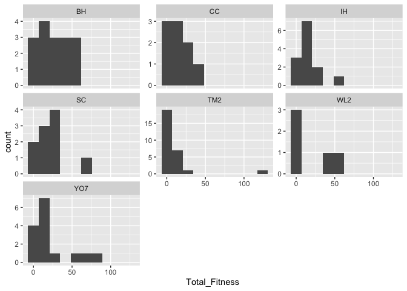<!-- -->

#### Basic Model Workflow


``` r
rep_output_modelslog <- tribble(
  ~name,          ~f,
  "1_pop",              "logTotalFitness ~ (1|pop)", 
  "2_pop.mf",           "logTotalFitness ~  (1|pop/mf)", 
  "3_pop.block",        "logTotalFitness ~ (1|pop) + (1|block)", 
  "4_pop.mf.block",     "logTotalFitness ~  (1|pop/mf) + (1|block)"
)

#run the models 
rep_output_modelslog <- rep_output_modelslog %>%
  mutate(lmer = map(f, ~ lmer(as.formula(.), 
                            data = wl2_rep_output)), #run the models 
         predict = map(lmer, predict), # predicting from original data...
         glance = map(lmer, glance)) #glance at the model results
```

```
## boundary (singular) fit: see help('isSingular')
## boundary (singular) fit: see help('isSingular')
```

``` r
rep_output_modelslog %>% select(-f, -lmer) %>% unnest(glance) %>% arrange(BIC) #look at the model fitting info 
```

```
## # A tibble: 4 × 9
##   name           predict     nobs sigma logLik   AIC   BIC REMLcrit df.residual
##   <chr>          <list>     <int> <dbl>  <dbl> <dbl> <dbl>    <dbl>       <int>
## 1 3_pop.block    <dbl [96]>    96 0.871  -135.  278.  288.     270.          92
## 2 4_pop.mf.block <dbl [96]>    96 0.871  -135.  280.  293.     270.          91
## 3 1_pop          <dbl [96]>    96 1.07   -147.  299.  307.     293.          93
## 4 2_pop.mf       <dbl [96]>    96 1.07   -147.  301.  312.     293.          92
```

``` r
rep_output_modelslog %>% select(-f, -lmer) %>% unnest(glance) %>% arrange(AIC) #look at the model fitting info 
```

```
## # A tibble: 4 × 9
##   name           predict     nobs sigma logLik   AIC   BIC REMLcrit df.residual
##   <chr>          <list>     <int> <dbl>  <dbl> <dbl> <dbl>    <dbl>       <int>
## 1 3_pop.block    <dbl [96]>    96 0.871  -135.  278.  288.     270.          92
## 2 4_pop.mf.block <dbl [96]>    96 0.871  -135.  280.  293.     270.          91
## 3 1_pop          <dbl [96]>    96 1.07   -147.  299.  307.     293.          93
## 4 2_pop.mf       <dbl [96]>    96 1.07   -147.  301.  312.     293.          92
```

``` r
#model with pop.block best by AIC and BIC 

mod_test <- lmer(logTotalFitness ~  (1|pop) + (1|block), data=wl2_rep_output)
plot(mod_test, which = 1) 
```

<!-- -->

``` r
qqnorm(resid(mod_test))
qqline(resid(mod_test)) 
```

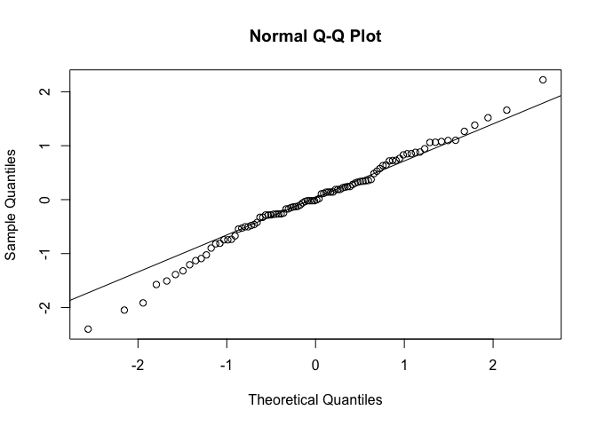<!-- -->

``` r
summary(mod_test)
```

```
## Linear mixed model fit by REML. t-tests use Satterthwaite's method [
## lmerModLmerTest]
## Formula: logTotalFitness ~ (1 | pop) + (1 | block)
##    Data: wl2_rep_output
## 
## REML criterion at convergence: 270.1
## 
## Scaled residuals: 
##      Min       1Q   Median       3Q      Max 
## -2.75709 -0.49543 -0.01317  0.56835  2.55101 
## 
## Random effects:
##  Groups   Name        Variance Std.Dev.
##  block    (Intercept) 0.3189   0.5647  
##  pop      (Intercept) 0.1535   0.3918  
##  Residual             0.7582   0.8708  
## Number of obs: 96, groups:  block, 12; pop, 7
## 
## Fixed effects:
##             Estimate Std. Error     df t value Pr(>|t|)    
## (Intercept)    2.243      0.245 15.072   9.153 1.52e-07 ***
## ---
## Signif. codes:  0 '***' 0.001 '**' 0.01 '*' 0.05 '.' 0.1 ' ' 1
```

``` r
#mf gives "boundary (singular) fit: see help('isSingular')" so take it out 
```

#### Predicted vs. Observed Rep Output


``` r
wl2_rep_output %>% 
  cbind(predicted={rep_output_modelslog %>% filter(name=="3_pop.block") %>% pull(predict) %>% unlist()}) %>%
  ggplot(aes(x=logTotalFitness, y = predicted)) +
  geom_point(alpha=.2) +
  geom_abline(color="skyblue2") +
  facet_wrap(~pop, scales="free")
```

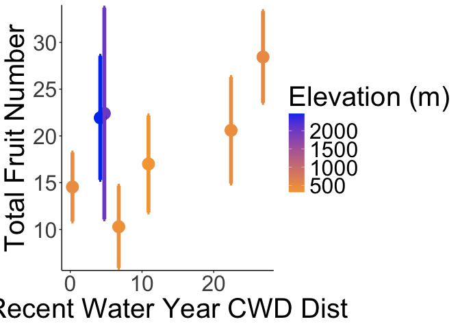<!-- -->

#### Test climate and geographic distance


``` r
rep_output_models_log_CD_GD <- tribble(
  ~name,          ~f,
  "1_pop.block",      "logTotalFitness ~  (1|pop) + (1|block)", 
  "2_GS_Recent",      "logTotalFitness ~  GrwSsn_GD_Recent + Geographic_Dist + (1|pop) + (1|block)", 
  "3_GS_Historical",  "logTotalFitness ~  GrwSsn_GD_Historical + Geographic_Dist + (1|pop) + (1|block)", 
  "4_WY_Recent",      "logTotalFitness ~  Wtr_Year_GD_Recent + Geographic_Dist +(1|pop) + (1|block)",
  "5_WY_Historical",  "logTotalFitness ~  Wtr_Year_GD_Historical + Geographic_Dist + (1|pop) + (1|block)"
)

#run the models 
rep_output_models_log_CD_GD <- rep_output_models_log_CD_GD %>%
  mutate(lmer = map(f, ~ lmer(as.formula(.), 
                            data = wl2_rep_output)), #run the models 
         predict = map(lmer, predict), # predicting from original data...
         glance = map(lmer, glance)) #glance at the model results

rep_output_models_log_CD_GD %>% select(-f, -lmer) %>% unnest(glance) %>% arrange(BIC) #look at the model fitting info 
```

```
## # A tibble: 5 × 9
##   name            predict     nobs sigma logLik   AIC   BIC REMLcrit df.residual
##   <chr>           <list>     <int> <dbl>  <dbl> <dbl> <dbl>    <dbl>       <int>
## 1 1_pop.block     <dbl [96]>    96 0.871  -135.  278.  288.     270.          92
## 2 3_GS_Historical <dbl [96]>    96 0.873  -134.  280.  295.     268.          90
## 3 2_GS_Recent     <dbl [96]>    96 0.874  -135.  282.  298.     270.          90
## 4 4_WY_Recent     <dbl [96]>    96 0.873  -136.  284.  299.     272.          90
## 5 5_WY_Historical <dbl [96]>    96 0.873  -136.  284.  300.     272.          90
```

``` r
rep_output_models_log_CD_GD %>% select(-f, -lmer) %>% unnest(glance) %>% arrange(AIC) #look at the model fitting info 
```

```
## # A tibble: 5 × 9
##   name            predict     nobs sigma logLik   AIC   BIC REMLcrit df.residual
##   <chr>           <list>     <int> <dbl>  <dbl> <dbl> <dbl>    <dbl>       <int>
## 1 1_pop.block     <dbl [96]>    96 0.871  -135.  278.  288.     270.          92
## 2 3_GS_Historical <dbl [96]>    96 0.873  -134.  280.  295.     268.          90
## 3 2_GS_Recent     <dbl [96]>    96 0.874  -135.  282.  298.     270.          90
## 4 4_WY_Recent     <dbl [96]>    96 0.873  -136.  284.  299.     272.          90
## 5 5_WY_Historical <dbl [96]>    96 0.873  -136.  284.  300.     272.          90
```

``` r
#pop block best by AIC and BIC ...

#pop.mf preferred by AIC & BIC, WY models are close after
rep_output_models_log_CD_GD %>% mutate(tidy=map(lmer, tidy)) %>% unnest(tidy) %>%
  select(name, term:p.value) %>% 
  filter(str_detect(term, "GD") | term=="Geographic_Dist") %>%
  drop_na(p.value)
```

```
## # A tibble: 8 × 7
##   name            term                estimate std.error statistic    df p.value
##   <chr>           <chr>                  <dbl>     <dbl>     <dbl> <dbl>   <dbl>
## 1 2_GS_Recent     GrwSsn_GD_Recent    -0.254       0.162   -1.57    4.80  0.180 
## 2 2_GS_Recent     Geographic_Dist      0.195       0.276    0.707   5.73  0.507 
## 3 3_GS_Historical GrwSsn_GD_Historic… -0.509       0.194   -2.62    4.15  0.0564
## 4 3_GS_Historical Geographic_Dist      0.121       0.220    0.552   6.54  0.599 
## 5 4_WY_Recent     Wtr_Year_GD_Recent  -0.00853     0.219   -0.0389  4.84  0.971 
## 6 4_WY_Recent     Geographic_Dist      0.0916      0.361    0.254   5.37  0.809 
## 7 5_WY_Historical Wtr_Year_GD_Histor…  0.0102      0.200    0.0510  4.97  0.961 
## 8 5_WY_Historical Geographic_Dist      0.0790      0.346    0.228   5.45  0.828
```

``` r
#  arrange(p.value)

#only GrwSSn historical marginally significant p=0.056... no other distances significant 
```


``` r
rep_output_SUB_models_log_CD_GD <- tribble(
  ~name,          ~f,
  "1_pop.block",      "logTotalFitness ~  (1|pop) + (1|block)", 
  "2_GS_Recent",      "logTotalFitness ~  GrwSsn_TempDist_Recent + GrwSsn_PPTDist_Recent + Geographic_Dist + (1|pop) + (1|block)", 
  "3a_GS_Historical",  "logTotalFitness ~  GrwSsn_TempDist_Historic + GrwSsn_PPTDist_Historic + Geographic_Dist + (1|pop) + (1|block)", 
  "3b_GS_Historical",  "logTotalFitness ~  GrwSsn_TempDist_Historic*GrwSsn_PPTDist_Historic + Geographic_Dist + (1|pop) + (1|block)", 
  "3c_GS_Historical",  "logTotalFitness ~  GrwSsn_TempDist_Historic + Geographic_Dist + (1|pop) + (1|block)", 
  "3d_GS_Historical",  "logTotalFitness ~  GrwSsn_PPTDist_Historic + Geographic_Dist + (1|pop) + (1|block)", 
  "4_WY_Recent",      "logTotalFitness ~  Wtr_Year_TempDist_Recent + Wtr_Year_PPTDist_Recent + Geographic_Dist +(1|pop) + (1|block)",
  "5_WY_Historical",  "logTotalFitness ~  Wtr_Year_TempDist_Historic + Wtr_Year_PPTDist_Historic + Geographic_Dist + (1|pop) + (1|block)"
)

#run the models 
rep_output_SUB_models_log_CD_GD <- rep_output_SUB_models_log_CD_GD %>%
  mutate(lmer = map(f, ~ lmer(as.formula(.), 
                            data = wl2_rep_output_sub)), #run the models 
         predict = map(lmer, predict), # predicting from original data...
         glance = map(lmer, glance)) #glance at the model results
```

```
## boundary (singular) fit: see help('isSingular')
## boundary (singular) fit: see help('isSingular')
```

``` r
rep_output_SUB_models_log_CD_GD %>% select(-f, -lmer) %>% unnest(glance) %>% arrange(BIC) #look at the model fitting info 
```

```
## # A tibble: 8 × 9
##   name             predict  nobs sigma logLik   AIC   BIC REMLcrit df.residual
##   <chr>            <list>  <int> <dbl>  <dbl> <dbl> <dbl>    <dbl>       <int>
## 1 1_pop.block      <dbl>      96 0.871  -135.  278.  288.     270.          92
## 2 3d_GS_Historical <dbl>      96 0.871  -134.  281.  296.     269.          90
## 3 3a_GS_Historical <dbl>      96 0.872  -133.  279.  297.     265.          89
## 4 3c_GS_Historical <dbl>      96 0.872  -135.  282.  297.     270.          90
## 5 2_GS_Recent      <dbl>      96 0.875  -133.  281.  299.     267.          89
## 6 5_WY_Historical  <dbl>      96 0.875  -134.  282.  300.     268.          89
## 7 4_WY_Recent      <dbl>      96 0.876  -134.  282.  300.     268.          89
## 8 3b_GS_Historical <dbl>      96 0.877  -133.  283.  303.     267.          88
```

``` r
rep_output_SUB_models_log_CD_GD %>% select(-f, -lmer) %>% unnest(glance) %>% arrange(AIC) #look at the model fitting info 
```

```
## # A tibble: 8 × 9
##   name             predict  nobs sigma logLik   AIC   BIC REMLcrit df.residual
##   <chr>            <list>  <int> <dbl>  <dbl> <dbl> <dbl>    <dbl>       <int>
## 1 1_pop.block      <dbl>      96 0.871  -135.  278.  288.     270.          92
## 2 3a_GS_Historical <dbl>      96 0.872  -133.  279.  297.     265.          89
## 3 3d_GS_Historical <dbl>      96 0.871  -134.  281.  296.     269.          90
## 4 2_GS_Recent      <dbl>      96 0.875  -133.  281.  299.     267.          89
## 5 5_WY_Historical  <dbl>      96 0.875  -134.  282.  300.     268.          89
## 6 4_WY_Recent      <dbl>      96 0.876  -134.  282.  300.     268.          89
## 7 3c_GS_Historical <dbl>      96 0.872  -135.  282.  297.     270.          90
## 8 3b_GS_Historical <dbl>      96 0.877  -133.  283.  303.     267.          88
```

``` r
#pop block best by AIC and BIC ...

#pop.mf preferred by AIC & BIC, WY models are close after
rep_output_SUB_models_log_CD_GD %>% mutate(tidy=map(lmer, tidy)) %>% unnest(tidy) %>%
  select(name, term, estimate:p.value) %>% 
  filter(str_detect(term, "Dist")) %>%
  drop_na(p.value)
```

```
## # A tibble: 20 × 7
##    name             term              estimate std.error statistic    df p.value
##    <chr>            <chr>                <dbl>     <dbl>     <dbl> <dbl>   <dbl>
##  1 2_GS_Recent      GrwSsn_TempDist_…   0.302      0.182    1.66    2.32 2.21e-1
##  2 2_GS_Recent      GrwSsn_PPTDist_R…  -0.549      0.133   -4.12    1.42 9.35e-2
##  3 2_GS_Recent      Geographic_Dist     0.125      0.175    0.711   4.19 5.15e-1
##  4 3a_GS_Historical GrwSsn_TempDist_…   0.779      0.334    2.34   87.0  2.17e-2
##  5 3a_GS_Historical GrwSsn_PPTDist_H…  -0.618      0.142   -4.34   86.9  3.84e-5
##  6 3a_GS_Historical Geographic_Dist     0.0967     0.169    0.571  85.5  5.69e-1
##  7 3b_GS_Historical GrwSsn_TempDist_…   0.796      0.342    2.33   86.9  2.22e-2
##  8 3b_GS_Historical GrwSsn_PPTDist_H…  -0.603      0.157   -3.84   86.5  2.35e-4
##  9 3b_GS_Historical Geographic_Dist     0.0871     0.175    0.497  84.9  6.20e-1
## 10 3b_GS_Historical GrwSsn_TempDist_…  -0.0436     0.189   -0.231  88.2  8.18e-1
## 11 3c_GS_Historical GrwSsn_TempDist_…  -0.341      0.365   -0.933   5.00 3.94e-1
## 12 3c_GS_Historical Geographic_Dist     0.0823     0.299    0.275   6.16 7.92e-1
## 13 3d_GS_Historical GrwSsn_PPTDist_H…  -0.306      0.118   -2.60    3.88 6.20e-2
## 14 3d_GS_Historical Geographic_Dist     0.0679     0.219    0.309   6.61 7.67e-1
## 15 4_WY_Recent      Wtr_Year_TempDis…  -0.449      0.157   -2.86    2.18 9.40e-2
## 16 4_WY_Recent      Wtr_Year_PPTDist…  -0.585      0.196   -2.99    1.94 9.99e-2
## 17 4_WY_Recent      Geographic_Dist    -0.0170     0.210   -0.0809  3.58 9.40e-1
## 18 5_WY_Historical  Wtr_Year_TempDis…  -0.498      0.174   -2.87    2.32 8.70e-2
## 19 5_WY_Historical  Wtr_Year_PPTDist…  -0.615      0.219   -2.81    2.17 9.72e-2
## 20 5_WY_Historical  Geographic_Dist     0.0106     0.213    0.0499  3.90 9.63e-1
```

``` r
#  arrange(p.value)

mod_test <- lmer(logTotalFitness ~  GrwSsn_TempDist_Historic + Geographic_Dist + (1|pop) + (1|block), data=wl2_rep_output_sub)
plot(mod_test, which = 1) 
```

<!-- -->

``` r
qqnorm(resid(mod_test))
qqline(resid(mod_test)) 
```

<!-- -->

``` r
summary(mod_test)
```

```
## Linear mixed model fit by REML. t-tests use Satterthwaite's method [
## lmerModLmerTest]
## Formula: logTotalFitness ~ GrwSsn_TempDist_Historic + Geographic_Dist +  
##     (1 | pop) + (1 | block)
##    Data: wl2_rep_output_sub
## 
## REML criterion at convergence: 270
## 
## Scaled residuals: 
##      Min       1Q   Median       3Q      Max 
## -2.73919 -0.49817  0.02599  0.55998  2.55089 
## 
## Random effects:
##  Groups   Name        Variance Std.Dev.
##  block    (Intercept) 0.3245   0.5697  
##  pop      (Intercept) 0.1825   0.4272  
##  Residual             0.7604   0.8720  
## Number of obs: 96, groups:  block, 12; pop, 7
## 
## Fixed effects:
##                          Estimate Std. Error       df t value Pr(>|t|)    
## (Intercept)               2.40896    0.30576  8.63705   7.879 3.17e-05 ***
## GrwSsn_TempDist_Historic -0.34105    0.36543  4.99948  -0.933    0.394    
## Geographic_Dist           0.08225    0.29883  6.16211   0.275    0.792    
## ---
## Signif. codes:  0 '***' 0.001 '**' 0.01 '*' 0.05 '.' 0.1 ' ' 1
## 
## Correlation of Fixed Effects:
##             (Intr) GS_TD_
## GrwSsn_TD_H -0.522       
## Gegrphc_Dst  0.181  0.011
```

``` r
#boundary (singular) fit: see help('isSingular') for GRWSSN historic models a&b - pop explains 0 variance 
```

Troubleshoot weird GrwSsn-Temp_Dist results (positive coefficient, but figure indicates it should be neg...)


``` r
wl2_rep_output_sub %>% group_by(pop, GrwSsn_TempDist_Historic) %>% summarise(meanFruits=mean(logTotalFitness)) %>% arrange(GrwSsn_TempDist_Historic)
```

```
## `summarise()` has grouped output by 'pop'. You can override using the `.groups`
## argument.
```

```
## # A tibble: 7 × 3
## # Groups:   pop [7]
##   pop   GrwSsn_TempDist_Historic[,1] meanFruits
##   <chr>                        <dbl>      <dbl>
## 1 YO7                        -0.479        2.57
## 2 WL2                        -0.0718       2.45
## 3 BH                          0.484        3.03
## 4 SC                          0.517        2.57
## 5 TM2                         0.583        1.54
## 6 CC                          0.745        2.28
## 7 IH                          1.25         2.26
```

``` r
mod_test <- lmer(logTotalFitness ~  GrwSsn_TempDist_Historic + GrwSsn_PPTDist_Historic + Geographic_Dist + (1|block), data=wl2_rep_output_sub)
summary(mod_test)
```

```
## Linear mixed model fit by REML. t-tests use Satterthwaite's method [
## lmerModLmerTest]
## Formula: 
## logTotalFitness ~ GrwSsn_TempDist_Historic + GrwSsn_PPTDist_Historic +  
##     Geographic_Dist + (1 | block)
##    Data: wl2_rep_output_sub
## 
## REML criterion at convergence: 265.1
## 
## Scaled residuals: 
##      Min       1Q   Median       3Q      Max 
## -2.65182 -0.51275  0.01721  0.58893  2.63395 
## 
## Random effects:
##  Groups   Name        Variance Std.Dev.
##  block    (Intercept) 0.3007   0.5483  
##  Residual             0.7601   0.8718  
## Number of obs: 96, groups:  block, 12
## 
## Fixed effects:
##                          Estimate Std. Error       df t value Pr(>|t|)    
## (Intercept)               2.33465    0.20309 17.82605  11.496 1.12e-09 ***
## GrwSsn_TempDist_Historic  0.77947    0.33354 87.04425   2.337   0.0217 *  
## GrwSsn_PPTDist_Historic  -0.61772    0.14234 86.85801  -4.340 3.84e-05 ***
## Geographic_Dist           0.09675    0.16928 85.48894   0.571   0.5692    
## ---
## Signif. codes:  0 '***' 0.001 '**' 0.01 '*' 0.05 '.' 0.1 ' ' 1
## 
## Correlation of Fixed Effects:
##             (Intr) GS_TD_ GS_PPT
## GrwSsn_TD_H -0.241              
## GrwS_PPTD_H  0.031 -0.831       
## Gegrphc_Dst -0.023  0.186 -0.147
```

``` r
ranova(mod_test)
```

```
## ANOVA-like table for random-effects: Single term deletions
## 
## Model:
## logTotalFitness ~ GrwSsn_TempDist_Historic + GrwSsn_PPTDist_Historic + Geographic_Dist + (1 | block)
##             npar  logLik    AIC    LRT Df Pr(>Chisq)    
## <none>         6 -132.54 277.08                         
## (1 | block)    5 -143.48 296.95 21.869  1  2.919e-06 ***
## ---
## Signif. codes:  0 '***' 0.001 '**' 0.01 '*' 0.05 '.' 0.1 ' ' 1
```

``` r
anova(mod_test)
```

```
## Type III Analysis of Variance Table with Satterthwaite's method
##                           Sum Sq Mean Sq NumDF  DenDF F value   Pr(>F)    
## GrwSsn_TempDist_Historic  4.1510  4.1510     1 87.044  5.4612  0.02174 *  
## GrwSsn_PPTDist_Historic  14.3143 14.3143     1 86.858 18.8325 3.84e-05 ***
## Geographic_Dist           0.2482  0.2482     1 85.489  0.3266  0.56916    
## ---
## Signif. codes:  0 '***' 0.001 '**' 0.01 '*' 0.05 '.' 0.1 ' ' 1
```

``` r
wl2_rep_output_sub %>% 
  cbind(predicted={rep_output_SUB_models_log_CD_GD %>% filter(name=="3a_GS_Historical") %>% pull(predict) %>% unlist()}) %>%
  ggplot(aes(x=logTotalFitness, y = predicted)) +
  geom_point(alpha=.2) +
  geom_abline(color="skyblue2") 
```

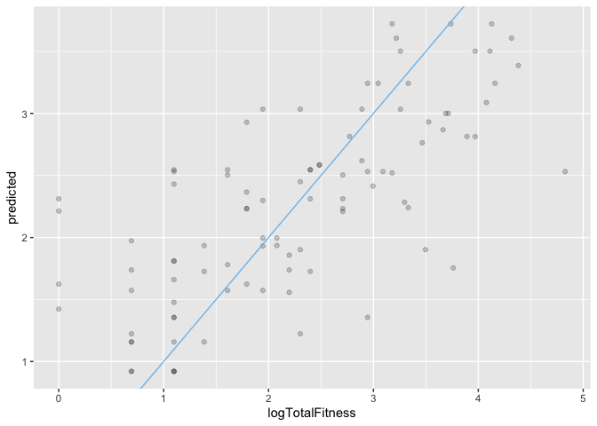<!-- -->

``` r
#overall, the predictions seem to match the observed data...

wl2_rep_output_sub %>% 
  cbind(predicted={rep_output_SUB_models_log_CD_GD %>% filter(name=="3a_GS_Historical") %>% pull(predict) %>% unlist()}) %>%
  ggplot(aes(x=logTotalFitness, y = predicted)) +
  geom_point(alpha=.2) +
  geom_abline(color="skyblue2") +
  facet_wrap(~block, scales="free")
```

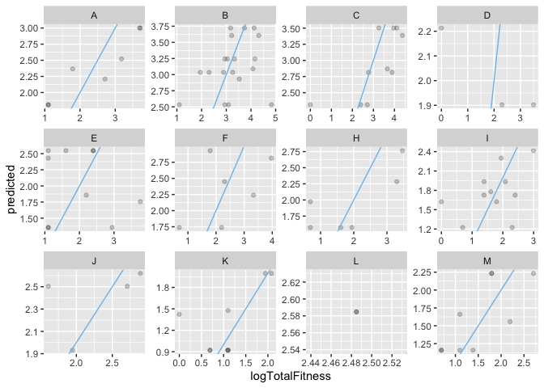<!-- -->

``` r
#some blocks with fewer data points --> weaker predictions 


wl2_rep_output_sub %>% 
  cbind(predicted={rep_output_SUB_models_log_CD_GD %>% filter(name=="3a_GS_Historical") %>% pull(predict) %>% unlist()}) %>%
  ggplot(aes(x=GrwSsn_TempDist_Historic, y = predicted)) +
  geom_point() 
```

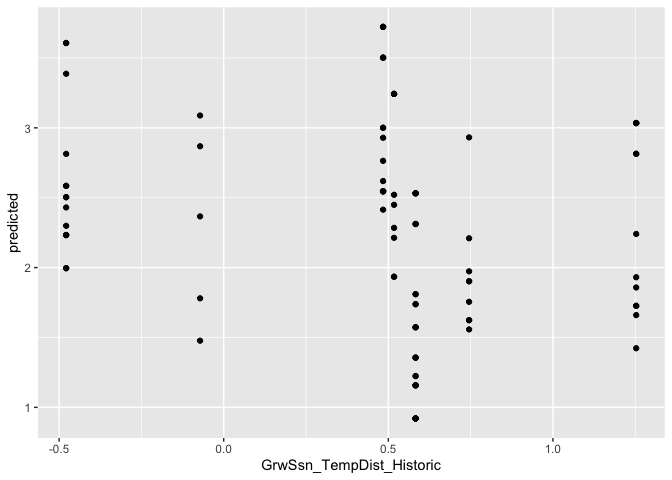<!-- -->

``` r
mod_test2 <- lmer(logTotalFitness ~  GrwSsn_TempDist_Historic + Geographic_Dist + (1|block), data=wl2_rep_output_sub)
summary(mod_test2)
```

```
## Linear mixed model fit by REML. t-tests use Satterthwaite's method [
## lmerModLmerTest]
## Formula: logTotalFitness ~ GrwSsn_TempDist_Historic + Geographic_Dist +  
##     (1 | block)
##    Data: wl2_rep_output_sub
## 
## REML criterion at convergence: 280.3
## 
## Scaled residuals: 
##      Min       1Q   Median       3Q      Max 
## -3.05197 -0.53174 -0.04506  0.62903  1.95260 
## 
## Random effects:
##  Groups   Name        Variance Std.Dev.
##  block    (Intercept) 0.3791   0.6157  
##  Residual             0.9010   0.9492  
## Number of obs: 96, groups:  block, 12
## 
## Fixed effects:
##                          Estimate Std. Error      df t value Pr(>|t|)    
## (Intercept)                2.3615     0.2253 17.6300  10.481 5.34e-09 ***
## GrwSsn_TempDist_Historic  -0.4247     0.2022 88.8704  -2.100   0.0386 *  
## Geographic_Dist           -0.0104     0.1824 86.3516  -0.057   0.9547    
## ---
## Signif. codes:  0 '***' 0.001 '**' 0.01 '*' 0.05 '.' 0.1 ' ' 1
## 
## Correlation of Fixed Effects:
##             (Intr) GS_TD_
## GrwSsn_TD_H -0.380       
## Gegrphc_Dst -0.019  0.116
```
