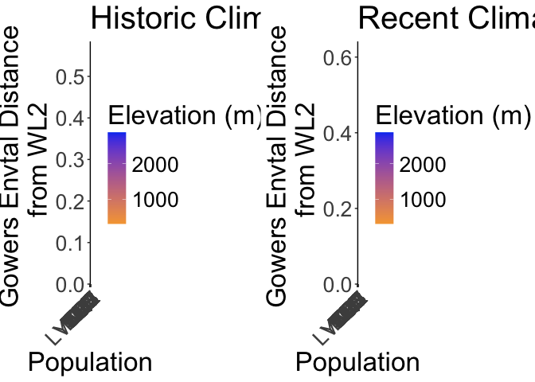
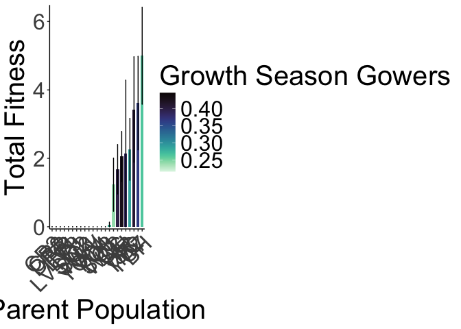
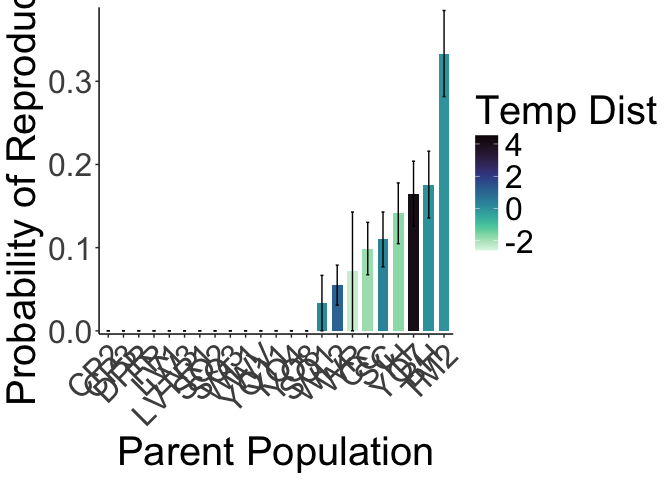
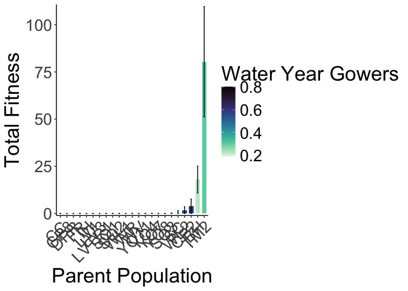

# Total Fitness at both sites 
To Do:
- add in geographic distance 

Total Fitness: p(Establishment)*p(Surv to Rep - y1)*Fruits(y1) + p(Winter Surv)*p(Surv to Rep - y2)*Fruits(y2)

## Libraries

``` r
library(tidyverse)
```

```
## ── Attaching core tidyverse packages ──────────────────────── tidyverse 2.0.0 ──
## ✔ dplyr     1.1.4     ✔ readr     2.1.5
## ✔ forcats   1.0.0     ✔ stringr   1.5.1
## ✔ ggplot2   3.5.1     ✔ tibble    3.2.1
## ✔ lubridate 1.9.3     ✔ tidyr     1.3.1
## ✔ purrr     1.0.2     
## ── Conflicts ────────────────────────────────────────── tidyverse_conflicts() ──
## ✖ dplyr::filter() masks stats::filter()
## ✖ dplyr::lag()    masks stats::lag()
## ℹ Use the conflicted package (<http://conflicted.r-lib.org/>) to force all conflicts to become errors
```

``` r
#conflicted::conflicts_prefer(dplyr::filter)
library(viridis) #for pretty colors
```

```
## Loading required package: viridisLite
```

``` r
library(sp) #for calculating geographic distance 

library(brms)
```

```
## Loading required package: Rcpp
## Loading 'brms' package (version 2.22.0). Useful instructions
## can be found by typing help('brms'). A more detailed introduction
## to the package is available through vignette('brms_overview').
## 
## Attaching package: 'brms'
## 
## The following object is masked from 'package:stats':
## 
##     ar
```

``` r
#conflicted::conflicts_prefer(brms::ar)
#conflicted::conflicts_prefer(dplyr::combine)
#conflicted::conflicts_prefer(brms::dstudent_t)
library(tidybayes) #for extracting and visiaulizing brms model output 
```

```
## 
## Attaching package: 'tidybayes'
## 
## The following objects are masked from 'package:brms':
## 
##     dstudent_t, pstudent_t, qstudent_t, rstudent_t
```

``` r
library(modelr) #for data grid

sem <- function(x, na.rm=FALSE) {           #for caclulating standard error
  sd(x,na.rm=na.rm)/sqrt(length(na.omit(x)))
} 
```

## Year 2 Pop Info

``` r
wl2_y2_pops <- read_csv("../input/WL2_Data/Final_2023_2024_Pop_Loc_Info.csv") %>%
  select(Pop.Type:unique.ID) %>% 
  filter(Pop.Type=="2023-survivor") %>% 
  select(Pop.Type, loc:bed, row=bedrow, col=bedcol, pop:unique.ID)
```

```
## Rows: 1217 Columns: 15
## ── Column specification ────────────────────────────────────────────────────────
## Delimiter: ","
## chr (8): Pop.Type, status, block, loc, bed, bedcol, pop, unique.ID
## dbl (7): bed.block.order, bed.order, AB.CD.order, column.order, bedrow, mf, rep
## 
## ℹ Use `spec()` to retrieve the full column specification for this data.
## ℹ Specify the column types or set `show_col_types = FALSE` to quiet this message.
```


## Need the UCD 2023 and WL2 2023 & 2024 annual census data sheets (for fruit number)

``` r
ucd_ann_cens <- read_csv("../output/UCD_Traits/UCD2023_Annual_Census_Combined.csv") %>%  #note this is only for plants that survived to rep 
  rename(pop=parent.pop) %>% 
  filter(!is.na(pop)) %>% 
  filter(rep != 100) %>% #get rid of individuals that germinated in the field 
  unite(Genotype, pop:rep, sep="_", remove = FALSE) 
```

```
## Rows: 63 Columns: 20
## ── Column specification ────────────────────────────────────────────────────────
## Delimiter: ","
## chr  (4): block, col, parent.pop, elevation.group
## dbl (16): row, mf, rep, diam, height, total_branch, longest_leaf, flowers, f...
## 
## ℹ Use `spec()` to retrieve the full column specification for this data.
## ℹ Specify the column types or set `show_col_types = FALSE` to quiet this message.
```

``` r
wl2_ann_cens <- read_csv("../input/WL2_Data/CorrectedCSVs/WL2_annual_census_20231027_corrected.csv") %>% 
  unite(Genotype, pop:rep, sep="_", remove = FALSE) %>% 
  unite(BedLoc, bed:`bed-col`, sep="_", remove = FALSE) %>% 
  filter(BedLoc!="K_5_C") %>% #get rid of duplicate locations
  filter(BedLoc!="B_32_A") %>% #get rid of duplicate locations
  filter(!is.na(pop), !str_detect(Genotype, ".*buff*")) #remove buffers 
```

```
## Warning: One or more parsing issues, call `problems()` on your data frame for details,
## e.g.:
##   dat <- vroom(...)
##   problems(dat)
```

```
## Rows: 1826 Columns: 19
## ── Column specification ────────────────────────────────────────────────────────
## Delimiter: ","
## chr (10): date, block, bed, bed-col, pop, mf, rep, pheno, herbiv.y.n, survey...
## dbl  (7): bed-row, diam.mm, num.flw, num.fruit, long.fruit.cm, total.branch,...
## lgl  (2): height.cm, long.leaf.cm
## 
## ℹ Use `spec()` to retrieve the full column specification for this data.
## ℹ Specify the column types or set `show_col_types = FALSE` to quiet this message.
```

``` r
wl2_ann_cens_2024 <- read_csv("../input/WL2_Data/WL2_Annual_Census_20241023_corrected.csv")
```

```
## Rows: 1217 Columns: 15
## ── Column specification ────────────────────────────────────────────────────────
## Delimiter: ","
## chr (9): bed, col, unique.ID, phen, long.fruit.cm, total.branch, survey.date...
## dbl (6): row, diam.mm, num.flw, num.fruit, overhd.diam, overhd.perp
## 
## ℹ Use `spec()` to retrieve the full column specification for this data.
## ℹ Specify the column types or set `show_col_types = FALSE` to quiet this message.
```

``` r
wl2_ann_cens_2024_pops <- left_join(wl2_y2_pops, wl2_ann_cens_2024) %>%  
  rename(Genotype=unique.ID)
```

```
## Joining with `by = join_by(bed, row, col, unique.ID)`
```


## Need surv post-transplant shock, surv to rep both years, and winter survival

``` r
ucd_surv <- read_csv("../input/UCD_Data/CorrectedCSVs/UCD_transplants_pheno_mort_20231016_corrected.csv") %>% 
  rename(death.date=`Death Date`, bud.date=`Date First Bud`, flower.date=`Date First Flower`, 
         fruit.date=`Date First Fruit`, last.flower.date=`Date Last Flower`, last.fruit.date=`Date Last Fruit`) %>% 
  filter(!is.na(pop)) %>% 
  filter(rep != 100) %>% #get rid of individuals that germinated in the field 
  unite(Genotype, pop:rep, sep="_", remove = FALSE) 
```

```
## Rows: 858 Columns: 13
## ── Column specification ────────────────────────────────────────────────────────
## Delimiter: ","
## chr (10): block, col, pop, Date First Bud, Date First Flower, Date First Fru...
## dbl  (3): row, mf, rep
## 
## ℹ Use `spec()` to retrieve the full column specification for this data.
## ℹ Specify the column types or set `show_col_types = FALSE` to quiet this message.
```

``` r
#unique(ucd_surv$pop)

wl2_surv_1020 <- read_csv("../input/WL2_Data/CorrectedCSVs/WL2_mort_pheno_20231020_corrected.csv") #need to add in 10/27 mortality 
```

```
## Rows: 1826 Columns: 14
## ── Column specification ────────────────────────────────────────────────────────
## Delimiter: ","
## chr (12): block, bed, bed.col, pop, mf, rep, bud.date, flower.date, fruit.da...
## dbl  (1): bed.row
## lgl  (1): last.fruit.date
## 
## ℹ Use `spec()` to retrieve the full column specification for this data.
## ℹ Specify the column types or set `show_col_types = FALSE` to quiet this message.
```

``` r
wl2_surv_1027 <- wl2_ann_cens %>% 
  filter(pheno=="X") %>% 
  select(death.date_2=date, block:bed, bed.row=`bed-row`, bed.col=`bed-col`, pop:rep) #add in 10/27 death dates
#note: 10/27 pheno dates (like flowering), not updated with this code 
wl2_surv_y1 <- left_join(wl2_surv_1020, wl2_surv_1027) %>% 
  mutate(death.date=if_else(is.na(death.date), death.date_2, death.date)) %>% 
  mutate(pop= str_replace(pop, "Y08", "YO8")) %>% 
  mutate(pop= str_replace(pop, "Y04", "YO4")) %>% 
  unite(BedLoc, bed:bed.col, sep="_", remove = FALSE) %>% 
  filter(BedLoc!="K_5_C") %>% #get rid of duplicate locations
  filter(BedLoc!="B_32_A") %>% #get rid of duplicate locations
  unite(Genotype, pop:rep, sep="_", remove = FALSE) %>% 
  filter(!is.na(pop), !str_detect(Genotype, ".*buff*")) %>%  #remove buffers 
  select(block:survey.notes)
```

```
## Joining with `by = join_by(block, bed, bed.row, bed.col, pop, mf, rep)`
```

``` r
#wl2_surv_y1_to_export <- wl2_surv_y1 %>% select(block:rep, death.date, survey.notes)
#write_csv(wl2_surv_y1_to_export, "../output/WL2_Traits/WL2_Mortality_2023.csv")
#unique(wl2_surv_y1$pop)

wl2_20241023 <- read_csv("../input/WL2_Data/WL2_mort_pheno_20241023_corrected.csv") %>% #note this has 2023 and 2024 plants
  select(-block)
```

```
## Rows: 1217 Columns: 13
## ── Column specification ────────────────────────────────────────────────────────
## Delimiter: ","
## chr (12): block, bed, col, unique.ID, bud.date, flower.date, fruit.date, las...
## dbl  (1): row
## 
## ℹ Use `spec()` to retrieve the full column specification for this data.
## ℹ Specify the column types or set `show_col_types = FALSE` to quiet this message.
```

``` r
wl2_surv_y2 <- left_join(wl2_y2_pops, wl2_20241023) %>%  
  rename(Genotype=unique.ID)
```

```
## Joining with `by = join_by(bed, row, col, unique.ID)`
```

``` r
#unique(wl2_surv_y2$pop) #only 10 pops with winter surv 

post_winter <- read_csv("../input/WL2_Data/WL2_status_check_20240603_corrected.csv",
                         na = c("", "NA", "-", "N/A")) 
```

```
## Rows: 1826 Columns: 9
## ── Column specification ────────────────────────────────────────────────────────
## Delimiter: ","
## chr (8): block, bed, bed- col, pop, mf, rep, death.date, survey.notes
## dbl (1): bed- row
## 
## ℹ Use `spec()` to retrieve the full column specification for this data.
## ℹ Specify the column types or set `show_col_types = FALSE` to quiet this message.
```

``` r
post_winter_clean <- post_winter %>% 
  mutate(pop= str_replace(pop, "iH", "IH")) %>% 
  mutate(pop= str_replace(pop, "1H", "IH")) %>% 
  mutate(pop= str_replace(pop, "cc", "CC")) %>% 
  unite(BedLoc, bed:`bed- col`, sep="_", remove = FALSE) %>% 
  filter(BedLoc!="K_5_C") %>% #get rid of duplicate locations
  filter(BedLoc!="B_32_A") %>% #get rid of duplicate locations
  unite(Genotype, pop:rep, sep="_", remove = FALSE) %>% 
  filter(pop!="buffer", !str_detect(mf, "buf")) %>% 
  mutate(mf=as.double(mf), rep=as.double(rep))
unique(post_winter_clean$pop)
```

```
##  [1] "TM2"   "LVTR1" "SQ2"   "YO8"   "CC"    "YO11"  "BH"    "DPR"   "CP2"  
## [10] "WL1"   "IH"    "CP3"   "SC"    "FR"    "LV3"   "YO7"   "WV"    "SQ3"  
## [19] "WL2"   "LV1"   "YO4"   "WR"    "SQ1"
```

## Gower's Distance

``` r
garden_climate <- read_csv("../output/Climate/flint_climate_UCDpops.csv") %>% 
  filter(parent.pop=="WL2_Garden" | parent.pop=="UCD_Garden") %>% 
  select(parent.pop:Long) %>% 
  distinct()
```

```
## Rows: 38775 Columns: 14
## ── Column specification ────────────────────────────────────────────────────────
## Delimiter: ","
## chr  (3): parent.pop, elevation.group, month
## dbl (11): elev_m, Lat, Long, year, aet, cwd, pck, pet, ppt, tmn, tmx
## 
## ℹ Use `spec()` to retrieve the full column specification for this data.
## ℹ Specify the column types or set `show_col_types = FALSE` to quiet this message.
```

``` r
garden_climate
```

```
## # A tibble: 2 × 5
##   parent.pop elevation.group elev_m   Lat  Long
##   <chr>      <chr>            <dbl> <dbl> <dbl>
## 1 UCD_Garden Low                 16  38.5 -122.
## 2 WL2_Garden High              2020  38.8 -120.
```

``` r
#UCD LAT/LONG = 38.53250, -121.7830
#WL2 Lat/Long = 38.82599, -120.2509

ucd_gowers <- read_csv("../output/Climate/Gowers_UCD.csv") %>% 
  select(parent.pop:GrwSsn_GD, Wtr_Year_GD) %>% 
  pivot_wider(names_from = TimePd, values_from = c(GrwSsn_GD, Wtr_Year_GD)) %>% 
  #mutate(Geographic_Dist=spDistsN1()) %>%  #Great Circle distance (shortest distance b/t 2 points on the surface of a sphere)
  #mutate(Lat_Dist=38.53250-Lat, Long_Dist=-121.7830-Long) %>% #Garden-Home - lat and long per Gerst et al 2011 which kept them separate for some directionality
  rename(pop=parent.pop)
```

```
## Rows: 46 Columns: 12
## ── Column specification ────────────────────────────────────────────────────────
## Delimiter: ","
## chr (3): parent.pop, elevation.group, TimePd
## dbl (9): elev_m, Lat, Long, GrwSsn_GD, GrwSsn_FLINT_GD, GrwSsn_BIOCLIM_GD, W...
## 
## ℹ Use `spec()` to retrieve the full column specification for this data.
## ℹ Specify the column types or set `show_col_types = FALSE` to quiet this message.
```

``` r
wl2_gowers_2023 <- read_csv("../output/Climate/Gowers_WL2.csv") %>% 
  select(parent.pop:GrwSsn_GD, Wtr_Year_GD) %>% 
  pivot_wider(names_from = TimePd, values_from = c(GrwSsn_GD, Wtr_Year_GD)) %>% 
  #mutate(Lat_Dist=38.82599-Lat, Long_Dist=-120.2509-Long) %>% #Garden-Home - lat and long per Gerst et al 2011 which kept them separate for some directionality
  rename(pop=parent.pop)
```

```
## Rows: 46 Columns: 12
## ── Column specification ────────────────────────────────────────────────────────
## Delimiter: ","
## chr (3): parent.pop, elevation.group, TimePd
## dbl (9): elev_m, Lat, Long, GrwSsn_GD, GrwSsn_FLINT_GD, GrwSsn_BIOCLIM_GD, W...
## 
## ℹ Use `spec()` to retrieve the full column specification for this data.
## ℹ Specify the column types or set `show_col_types = FALSE` to quiet this message.
```

``` r
wl2_gowers_2024 <- read_csv("../output/Climate/Gowers_WL2_2024.csv") %>% 
  pivot_wider(names_from = TimePd, values_from = c(GrwSsn_GD, Wtr_Year_GD)) %>% 
  #mutate(Lat_Dist=38.82599-Lat, Long_Dist=-120.2509-Long) %>% #Garden-Home - lat and long per Gerst et al 2011 which kept them separate for some directionality
  rename(pop=parent.pop)
```

```
## Rows: 46 Columns: 8
## ── Column specification ────────────────────────────────────────────────────────
## Delimiter: ","
## chr (3): parent.pop, elevation.group, TimePd
## dbl (5): elev_m, Lat, Long, GrwSsn_GD, Wtr_Year_GD
## 
## ℹ Use `spec()` to retrieve the full column specification for this data.
## ℹ Specify the column types or set `show_col_types = FALSE` to quiet this message.
```

### WL2 Avg Gowers

``` r
wl2_gowers_2023_prep <- wl2_gowers_2023 %>% rename_with(~paste0(., "_2023"), 6:9)
wl2_gowers_2024_prep <- wl2_gowers_2024 %>% rename_with(~paste0(., "_2024"), 6:9)

wl2_gowers_avg <- bind_rows(wl2_gowers_2023, wl2_gowers_2024) %>% 
  group_by(pop, elevation.group, elev_m, Lat, Long) %>% 
  summarise_at(c("GrwSsn_GD_Recent",  "GrwSsn_GD_Historical", "Wtr_Year_GD_Recent", "Wtr_Year_GD_Historical"), c(mean), na.rm = TRUE)
wl2_gowers_avg
```

```
## # A tibble: 23 × 9
## # Groups:   pop, elevation.group, elev_m, Lat [23]
##    pop   elevation.group elev_m   Lat  Long GrwSsn_GD_Recent
##    <chr> <chr>            <dbl> <dbl> <dbl>            <dbl>
##  1 BH    Low               511.  37.4 -120.            0.312
##  2 CC    Low               313   39.6 -121.            0.417
##  3 CP2   High             2244.  38.7 -120.            0.301
##  4 CP3   High             2266.  38.7 -120.            0.324
##  5 DPR   Mid              1019.  39.2 -121.            0.439
##  6 FR    Mid               787   40.0 -121.            0.386
##  7 IH    Low               454.  39.1 -121.            0.440
##  8 LV1   High             2593.  40.5 -122.            0.379
##  9 LV3   High             2354.  40.5 -122.            0.380
## 10 LVTR1 High             2741.  40.5 -122.            0.404
## # ℹ 13 more rows
## # ℹ 3 more variables: GrwSsn_GD_Historical <dbl>, Wtr_Year_GD_Recent <dbl>,
## #   Wtr_Year_GD_Historical <dbl>
```


## p(Establishment)
Davis - used 3 weeks to match WL2

``` r
unique(ucd_surv$pop)
```

```
##  [1] "WL2"   "CP2"   "YO11"  "CC"    "FR"    "BH"    "IH"    "LV3"   "SC"   
## [10] "LVTR1" "SQ3"   "TM2"   "WL1"   "YO7"   "DPR"   "SQ2"   "SQ1"   "YO8"  
## [19] "YO4"   "WR"    "WV"    "CP3"   "LV1"
```

``` r
ucd_establishment <- ucd_surv %>% 
  left_join(ucd_gowers) %>% 
  select(block:rep, elevation.group:Wtr_Year_GD_Historical, death.date) %>% 
  mutate(death.date=mdy(death.date)) %>% 
  mutate(Establishment=if_else(is.na(death.date), 1,
                               if_else(death.date=="2022-11-30" | death.date=="2022-12-13" | death.date=="2022-12-21", 0,
                                       1)))
```

```
## Joining with `by = join_by(pop)`
```

``` r
ucd_establishment %>% 
  group_by(pop, elev_m, GrwSsn_GD_Recent, Wtr_Year_GD_Recent) %>% 
  summarise(meanEst=mean(Establishment, na.rm = TRUE), semEst=sem(Establishment, na.rm=TRUE)) %>% 
  ggplot(aes(x=fct_reorder(pop, meanEst), y=meanEst, fill=GrwSsn_GD_Recent)) +
  geom_col(width = 0.7,position = position_dodge(0.75)) + 
  geom_errorbar(aes(ymin=meanEst-semEst,ymax=meanEst+semEst),width=.2, position = 
                  position_dodge(0.75)) +
  theme_classic() + 
  scale_y_continuous(expand = c(0.01, 0)) +
  labs(y="Establishment", x="Parent Population", fill="Growth Season Gowers") +
  scale_fill_viridis(option="mako", direction = -1) +
  theme(text=element_text(size=25), axis.text.x = element_text(angle = 45,  hjust = 1))
```

```
## `summarise()` has grouped output by 'pop', 'elev_m', 'GrwSsn_GD_Recent'. You
## can override using the `.groups` argument.
```

<!-- -->

``` r
ggsave("../output/UCD_Traits/UCD_Establishment_GrwSsn_GD_Recent.png", width = 12, height = 8, units = "in")

ucd_establishment %>% 
  group_by(pop, elev_m, GrwSsn_GD_Recent, Wtr_Year_GD_Recent) %>% 
  summarise(meanEst=mean(Establishment, na.rm = TRUE), semEst=sem(Establishment, na.rm=TRUE)) %>% 
  ggplot(aes(x=fct_reorder(pop, meanEst), y=meanEst, fill=Wtr_Year_GD_Recent)) +
  geom_col(width = 0.7,position = position_dodge(0.75)) + 
  geom_errorbar(aes(ymin=meanEst-semEst,ymax=meanEst+semEst),width=.2, position = 
                  position_dodge(0.75)) +
  theme_classic() + 
  scale_y_continuous(expand = c(0.01, 0)) +
  labs(y="Establishment", x="Parent Population", fill="Water Year Gowers") +
  scale_fill_viridis(option="mako", direction = -1) +
  theme(text=element_text(size=25), axis.text.x = element_text(angle = 45,  hjust = 1))
```

```
## `summarise()` has grouped output by 'pop', 'elev_m', 'GrwSsn_GD_Recent'. You
## can override using the `.groups` argument.
```

<!-- -->

``` r
ggsave("../output/UCD_Traits/UCD_Establishment_Wtr_Year_GD_Recent.png", width = 12, height = 8, units = "in")
```


WL2 - 3 weeks based off survival curve

``` r
wl2_establishment <- wl2_surv_y1 %>% 
  left_join(wl2_gowers_2023) %>% 
  select(block:rep, elevation.group:Wtr_Year_GD_Historical, death.date) %>% 
  mutate(death.date=mdy(death.date)) %>% 
  mutate(Establishment=if_else(is.na(death.date), 1,
                               if_else(death.date=="2023-07-26" | death.date=="2023-08-02" | death.date=="2023-08-09", 0,
                                       1)))
```

```
## Joining with `by = join_by(pop)`
```

``` r
wl2_establishment %>% 
  group_by(pop, elev_m, GrwSsn_GD_Recent, Wtr_Year_GD_Recent) %>% 
  summarise(meanEst=mean(Establishment, na.rm = TRUE), semEst=sem(Establishment, na.rm=TRUE)) %>% 
  ggplot(aes(x=fct_reorder(pop, meanEst), y=meanEst, fill=GrwSsn_GD_Recent)) +
  geom_col(width = 0.7,position = position_dodge(0.75)) + 
  geom_errorbar(aes(ymin=meanEst-semEst,ymax=meanEst+semEst),width=.2, position = 
                  position_dodge(0.75)) +
  theme_classic() + 
  scale_y_continuous(expand = c(0.01, 0)) +
  labs(y="Establishment", x="Parent Population", fill="Growth Season Gowers") +
  scale_fill_viridis(option="mako", direction = -1) +
  theme(text=element_text(size=25), axis.text.x = element_text(angle = 45,  hjust = 1))
```

```
## `summarise()` has grouped output by 'pop', 'elev_m', 'GrwSsn_GD_Recent'. You
## can override using the `.groups` argument.
```

<!-- -->

``` r
ggsave("../output/WL2_Traits/WL2_Establishment_GrwSsn_GD_Recent.png", width = 12, height = 8, units = "in")

wl2_establishment %>% 
  group_by(pop, elev_m, GrwSsn_GD_Recent, Wtr_Year_GD_Recent) %>% 
  summarise(meanEst=mean(Establishment, na.rm = TRUE), semEst=sem(Establishment, na.rm=TRUE)) %>% 
  ggplot(aes(x=fct_reorder(pop, meanEst), y=meanEst, fill=Wtr_Year_GD_Recent)) +
  geom_col(width = 0.7,position = position_dodge(0.75)) + 
  geom_errorbar(aes(ymin=meanEst-semEst,ymax=meanEst+semEst),width=.2, position = 
                  position_dodge(0.75)) +
  theme_classic() + 
  scale_y_continuous(expand = c(0.01, 0)) +
  labs(y="Establishment", x="Parent Population", fill="Water Year Gowers") +
  scale_fill_viridis(option="mako", direction = -1) +
  theme(text=element_text(size=25), axis.text.x = element_text(angle = 45,  hjust = 1))
```

```
## `summarise()` has grouped output by 'pop', 'elev_m', 'GrwSsn_GD_Recent'. You
## can override using the `.groups` argument.
```

<!-- -->

``` r
ggsave("../output/WL2_Traits/WL2_Establishment_Wtr_Year_GD_Recent.png", width = 12, height = 8, units = "in")
```

### Stats

``` r
est_UCD_bf1 <- brmsformula(Establishment ~ Wtr_Year_GD_Recent + (1|pop))

get_prior(est_UCD_bf1, family = "bernoulli", data = ucd_establishment)
```

```
##                 prior     class               coef group resp dpar nlpar lb ub
##                (flat)         b                                               
##                (flat)         b Wtr_Year_GD_Recent                            
##  student_t(3, 0, 2.5) Intercept                                               
##  student_t(3, 0, 2.5)        sd                                           0   
##  student_t(3, 0, 2.5)        sd                      pop                  0   
##  student_t(3, 0, 2.5)        sd          Intercept   pop                  0   
##        source
##       default
##  (vectorized)
##       default
##       default
##  (vectorized)
##  (vectorized)
```

``` r
prior1 <- c(set_prior(prior = 'normal(0, 1)', class='Intercept'),
            set_prior(prior = 'normal(0, 1)', class='sd'))
```


``` r
est_UCD_m1 <- brm(est_UCD_bf1, 
                             family = "bernoulli",
                             data = ucd_establishment,
                             cores=4,
                             iter = 5000, #increased iterations b/c complex model
                             sample_prior = "yes", # needed for hypothesis testing
                             control = list(adapt_delta = 0.9),
                             prior=prior1) #increased adapt_delta to help with divergent transitions
```

```
## Compiling Stan program...
```

```
## Trying to compile a simple C file
```

```
## Running /Library/Frameworks/R.framework/Resources/bin/R CMD SHLIB foo.c
## using C compiler: ‘Apple clang version 16.0.0 (clang-1600.0.26.3)’
## using SDK: ‘’
## clang -arch arm64 -I"/Library/Frameworks/R.framework/Resources/include" -DNDEBUG   -I"/Users/bqc/Library/R/arm64/4.4/library/Rcpp/include/"  -I"/Users/bqc/Library/R/arm64/4.4/library/RcppEigen/include/"  -I"/Users/bqc/Library/R/arm64/4.4/library/RcppEigen/include/unsupported"  -I"/Users/bqc/Library/R/arm64/4.4/library/BH/include" -I"/Users/bqc/Library/R/arm64/4.4/library/StanHeaders/include/src/"  -I"/Users/bqc/Library/R/arm64/4.4/library/StanHeaders/include/"  -I"/Users/bqc/Library/R/arm64/4.4/library/RcppParallel/include/"  -I"/Users/bqc/Library/R/arm64/4.4/library/rstan/include" -DEIGEN_NO_DEBUG  -DBOOST_DISABLE_ASSERTS  -DBOOST_PENDING_INTEGER_LOG2_HPP  -DSTAN_THREADS  -DUSE_STANC3 -DSTRICT_R_HEADERS  -DBOOST_PHOENIX_NO_VARIADIC_EXPRESSION  -D_HAS_AUTO_PTR_ETC=0  -include '/Users/bqc/Library/R/arm64/4.4/library/StanHeaders/include/stan/math/prim/fun/Eigen.hpp'  -D_REENTRANT -DRCPP_PARALLEL_USE_TBB=1   -I/opt/R/arm64/include    -fPIC  -falign-functions=64 -Wall -g -O2  -c foo.c -o foo.o
## In file included from <built-in>:1:
## In file included from /Users/bqc/Library/R/arm64/4.4/library/StanHeaders/include/stan/math/prim/fun/Eigen.hpp:22:
## In file included from /Users/bqc/Library/R/arm64/4.4/library/RcppEigen/include/Eigen/Dense:1:
## In file included from /Users/bqc/Library/R/arm64/4.4/library/RcppEigen/include/Eigen/Core:19:
## /Users/bqc/Library/R/arm64/4.4/library/RcppEigen/include/Eigen/src/Core/util/Macros.h:679:10: fatal error: 'cmath' file not found
##   679 | #include <cmath>
##       |          ^~~~~~~
## 1 error generated.
## make: *** [foo.o] Error 1
```

```
## Start sampling
```


``` r
prior_summary(est_UCD_m1)
```

```
##         prior     class               coef group resp dpar nlpar lb ub
##        (flat)         b                                               
##        (flat)         b Wtr_Year_GD_Recent                            
##  normal(0, 1) Intercept                                               
##  normal(0, 1)        sd                                           0   
##  normal(0, 1)        sd                      pop                  0   
##  normal(0, 1)        sd          Intercept   pop                  0   
##        source
##       default
##  (vectorized)
##          user
##          user
##  (vectorized)
##  (vectorized)
```

``` r
summary(est_UCD_m1)
```

```
##  Family: bernoulli 
##   Links: mu = logit 
## Formula: Establishment ~ Wtr_Year_GD_Recent + (1 | pop) 
##    Data: ucd_establishment (Number of observations: 755) 
##   Draws: 4 chains, each with iter = 5000; warmup = 2500; thin = 1;
##          total post-warmup draws = 10000
## 
## Multilevel Hyperparameters:
## ~pop (Number of levels: 23) 
##               Estimate Est.Error l-95% CI u-95% CI Rhat Bulk_ESS Tail_ESS
## sd(Intercept)     0.69      0.36     0.06     1.44 1.00     2750     3264
## 
## Regression Coefficients:
##                    Estimate Est.Error l-95% CI u-95% CI Rhat Bulk_ESS Tail_ESS
## Intercept              4.57      0.84     2.96     6.27 1.00     5400     5516
## Wtr_Year_GD_Recent    -2.49      1.61    -5.70     0.63 1.00     5745     5799
## 
## Draws were sampled using sampling(NUTS). For each parameter, Bulk_ESS
## and Tail_ESS are effective sample size measures, and Rhat is the potential
## scale reduction factor on split chains (at convergence, Rhat = 1).
```

``` r
#Rhat <1.05 (good!)
#ESS > 1000 (good!)
```


``` r
plot(est_UCD_m1,  nvariables = 3, ask=FALSE) #plots look a little better with prior distribution adjustments 
```

<!-- -->

``` r
#pairs(est_UCD_m1)

pp_check(est_UCD_m1)  # posterior predictive checks
```

```
## Using 10 posterior draws for ppc type 'dens_overlay' by default.
```

<!-- -->

``` r
#The main use of this function is to check if you model predicts your data accurately (using the estimates). If it does, then you can use that model to generate new data and make accurate predictions.
#light blue = 10 random draws or distributions created by the model
#dark blue = posterior distribution
#some diffs between draws 
```

To calcualte the stats we need to extract the posterior samples, and add the Intercept to each pop random effect, and then compute the stats.


``` r
intercept <- as_draws_df(est_UCD_m1, variable = "b_Intercept") %>% as_tibble() %>% select(starts_with("b"))

r_pops_raw <- as_draws_df(est_UCD_m1, variable = "*r_", regex = TRUE) %>% as_tibble() %>% select(starts_with("r"))

r_pops <- r_pops_raw %>% mutate(across(everything(), ~ .x + intercept$b_Intercept))
```

#### Hypothesis Testing 


``` r
hypothesis(est_UCD_m1,
           class = NULL,
           hypothesis = "r_pop[BH,Intercept] > 0",
           scope = "standard")
```

```
## Hypothesis Tests for class :
##                 Hypothesis Estimate Est.Error CI.Lower CI.Upper Evid.Ratio
## 1 (r_pop[BH,Interce... > 0     0.32      0.63    -0.55     1.49        2.2
##   Post.Prob Star
## 1      0.69     
## ---
## 'CI': 90%-CI for one-sided and 95%-CI for two-sided hypotheses.
## '*': For one-sided hypotheses, the posterior probability exceeds 95%;
## for two-sided hypotheses, the value tested against lies outside the 95%-CI.
## Posterior probabilities of point hypotheses assume equal prior probabilities.
```

test whether WV increases survival probability *more* than other pops

``` r
hypothesis(est_UCD_m1,
           class = NULL,
           hypothesis = "r_pop[TM2,Intercept] > r_pop[WL2,Intercept]",
           scope = "standard")
```

```
## Hypothesis Tests for class :
##                 Hypothesis Estimate Est.Error CI.Lower CI.Upper Evid.Ratio
## 1 (r_pop[TM2,Interc... > 0     0.81      0.94    -0.43     2.56       4.61
##   Post.Prob Star
## 1      0.82     
## ---
## 'CI': 90%-CI for one-sided and 95%-CI for two-sided hypotheses.
## '*': For one-sided hypotheses, the posterior probability exceeds 95%;
## for two-sided hypotheses, the value tested against lies outside the 95%-CI.
## Posterior probabilities of point hypotheses assume equal prior probabilities.
```

``` r
#Posterior probability that TM2 establishment is higher than WL2 is 81%
```

#### Tidy Plot 

``` r
ucd_establishment %>% 
  data_grid(pop, Wtr_Year_GD_Recent) %>%
  add_epred_draws(est_UCD_m1) %>%
  ggplot(aes(y = pop, x = .epred)) +
  stat_slab() +
  theme_classic() +
  labs(x="Posterior Survival Predictions", y="Parent Population", title="UCD Establishment") #+
```

<!-- -->

``` r
 # theme(text=element_text(size=25)) 
```

## p(Surv to Rep - y1)
Davis

``` r
ucd_surv %>% filter(!is.na(bud.date), is.na(fruit.date)) #all plants that initiated reproduction, but did not finish, have a death date 
```

```
## # A tibble: 18 × 14
##    block   row col   Genotype pop      mf   rep bud.date flower.date fruit.date
##    <chr> <dbl> <chr> <chr>    <chr> <dbl> <dbl> <chr>    <chr>       <chr>     
##  1 D2       37 B     TM2_6_5  TM2       6     5 3/17/23  <NA>        <NA>      
##  2 F1        8 A     TM2_2_2  TM2       2     2 3/22/23  <NA>        <NA>      
##  3 F1        6 C     DPR_6_9  DPR       6     9 3/31/23  <NA>        <NA>      
##  4 F2       40 C     DPR_7_4  DPR       7     4 3/17/23  <NA>        <NA>      
##  5 H1        4 B     BH_2_12  BH        2    12 5/30/23  <NA>        <NA>      
##  6 H1        5 B     SC_4_2   SC        4     2 5/11/23  <NA>        <NA>      
##  7 H1       12 B     FR_2_8   FR        2     8 4/17/23  <NA>        <NA>      
##  8 H1       15 B     CC_3_3   CC        3     3 4/10/23  <NA>        <NA>      
##  9 H1       16 A     CC_4_10  CC        4    10 4/17/23  <NA>        <NA>      
## 10 H1       17 B     DPR_5_2  DPR       5     2 3/22/23  4/13/23     <NA>      
## 11 H1        6 C     TM2_1_5  TM2       1     5 3/22/23  <NA>        <NA>      
## 12 H2       25 C     DPR_2_6  DPR       2     6 3/22/23  <NA>        <NA>      
## 13 H2       30 D     TM2_1_6  TM2       1     6 3/22/23  <NA>        <NA>      
## 14 J1        6 B     DPR_6_10 DPR       6    10 3/31/23  4/17/23     <NA>      
## 15 J1       19 B     BH_3_11  BH        3    11 5/18/23  <NA>        <NA>      
## 16 J2       33 B     TM2_2_6  TM2       2     6 3/22/23  <NA>        <NA>      
## 17 L1        4 A     SC_5_8   SC        5     8 4/13/22  <NA>        <NA>      
## 18 L2       30 A     TM2_1_12 TM2       1    12 3/22/23  4/13/23     <NA>      
## # ℹ 4 more variables: last.flower.date <chr>, last.fruit.date <chr>,
## #   death.date <chr>, Notes <chr>
```

``` r
ucd_surv %>% filter(!is.na(bud.date), !is.na(death.date)) #many plants with a bud date, have a later death date 
```

```
## # A tibble: 46 × 14
##    block   row col   Genotype pop      mf   rep bud.date flower.date fruit.date
##    <chr> <dbl> <chr> <chr>    <chr> <dbl> <dbl> <chr>    <chr>       <chr>     
##  1 D2       31 B     TM2_4_11 TM2       4    11 4/10/23  4/24/23     5/1/23    
##  2 D2       37 B     TM2_6_5  TM2       6     5 3/17/23  <NA>        <NA>      
##  3 D2       35 D     BH_3_6   BH        3     6 5/1/23   5/18/23     5/22/23   
##  4 F1        8 A     TM2_2_2  TM2       2     2 3/22/23  <NA>        <NA>      
##  5 F1        4 C     TM2_5_7  TM2       5     7 3/17/23  4/17/23     4/24/23   
##  6 F1        6 C     DPR_6_9  DPR       6     9 3/31/23  <NA>        <NA>      
##  7 F2       35 D     BH_2_1   BH        2     1 5/22/23  6/5/23      6/15/23   
##  8 F2       40 C     DPR_7_4  DPR       7     4 3/17/23  <NA>        <NA>      
##  9 F2       40 D     TM2_1_4  TM2       1     4 3/17/23  4/17/23     5/11/23   
## 10 H1        4 B     BH_2_12  BH        2    12 5/30/23  <NA>        <NA>      
## # ℹ 36 more rows
## # ℹ 4 more variables: last.flower.date <chr>, last.fruit.date <chr>,
## #   death.date <chr>, Notes <chr>
```

``` r
ucd_surv %>% filter(!is.na(bud.date), is.na(death.date)) #some budding plants do not have a death date
```

```
## # A tibble: 4 × 14
##   block   row col   Genotype pop      mf   rep bud.date flower.date fruit.date
##   <chr> <dbl> <chr> <chr>    <chr> <dbl> <dbl> <chr>    <chr>       <chr>     
## 1 D2       26 B     BH_5_15  BH        5    15 5/18/23  5/30/23     6/5/23    
## 2 D2       29 D     BH_2_9   BH        2     9 6/1/23   6/12/23     6/15/23   
## 3 J2       25 D     BH_2_5   BH        2     5 5/8/23   5/22/23     5/25/23   
## 4 L1       13 C     BH_3_13  BH        3    13 4/27/23  5/15/23     5/22/23   
## # ℹ 4 more variables: last.flower.date <chr>, last.fruit.date <chr>,
## #   death.date <chr>, Notes <chr>
```

``` r
ucd_surv %>% filter(is.na(bud.date), !is.na(flower.date)) #did not miss any budding plants
```

```
## # A tibble: 0 × 14
## # ℹ 14 variables: block <chr>, row <dbl>, col <chr>, Genotype <chr>, pop <chr>,
## #   mf <dbl>, rep <dbl>, bud.date <chr>, flower.date <chr>, fruit.date <chr>,
## #   last.flower.date <chr>, last.fruit.date <chr>, death.date <chr>,
## #   Notes <chr>
```

``` r
ucd_surv %>% filter(is.na(bud.date), !is.na(fruit.date)) #did not miss any budding plants 
```

```
## # A tibble: 0 × 14
## # ℹ 14 variables: block <chr>, row <dbl>, col <chr>, Genotype <chr>, pop <chr>,
## #   mf <dbl>, rep <dbl>, bud.date <chr>, flower.date <chr>, fruit.date <chr>,
## #   last.flower.date <chr>, last.fruit.date <chr>, death.date <chr>,
## #   Notes <chr>
```

``` r
ucd_surv_to_rep <- ucd_surv %>% 
  left_join(ucd_gowers) %>% 
  mutate(death.date=mdy(death.date)) %>% 
  mutate(SurvtoRep_Y1=if_else(is.na(bud.date), 0, 1)) %>% 
  select(block:rep, elevation.group:Wtr_Year_GD_Historical, bud.date, death.date, SurvtoRep_Y1) 
```

```
## Joining with `by = join_by(pop)`
```

``` r
ucd_surv_to_rep %>% 
  group_by(pop, elev_m, GrwSsn_GD_Recent, Wtr_Year_GD_Recent) %>% 
  summarise(meanSurv=mean(SurvtoRep_Y1, na.rm = TRUE), semSurv=sem(SurvtoRep_Y1, na.rm=TRUE)) %>% 
  ggplot(aes(x=fct_reorder(pop, meanSurv), y=meanSurv, fill=GrwSsn_GD_Recent)) +
  geom_col(width = 0.7,position = position_dodge(0.75)) + 
  geom_errorbar(aes(ymin=meanSurv-semSurv,ymax=meanSurv+semSurv),width=.2, position = 
                  position_dodge(0.75)) +
  theme_classic() + 
  scale_y_continuous(expand = c(0.01, 0)) +
  labs(y="Surv-to-Rep Y1", x="Parent Population", fill="Growth Season Gowers") +
  scale_fill_viridis(option="mako", direction = -1) +
  theme(text=element_text(size=25), axis.text.x = element_text(angle = 45,  hjust = 1))
```

```
## `summarise()` has grouped output by 'pop', 'elev_m', 'GrwSsn_GD_Recent'. You
## can override using the `.groups` argument.
```

<!-- -->

``` r
ggsave("../output/UCD_Traits/UCD_SurvtoRepY1_GrwSsn_GD_Recent.png", width = 12, height = 8, units = "in")

ucd_surv_to_rep %>% 
  group_by(pop, elev_m, GrwSsn_GD_Recent, Wtr_Year_GD_Recent) %>% 
  summarise(meanSurv=mean(SurvtoRep_Y1, na.rm = TRUE), semSurv=sem(SurvtoRep_Y1, na.rm=TRUE)) %>% 
  ggplot(aes(x=fct_reorder(pop, meanSurv), y=meanSurv, fill=Wtr_Year_GD_Recent)) +
  geom_col(width = 0.7,position = position_dodge(0.75)) + 
  geom_errorbar(aes(ymin=meanSurv-semSurv,ymax=meanSurv+semSurv),width=.2, position = 
                  position_dodge(0.75)) +
  theme_classic() + 
  scale_y_continuous(expand = c(0.01, 0)) +
  labs(y="Surv-to-Rep Y1", x="Parent Population", fill="Water Year Gowers") +
  scale_fill_viridis(option="mako", direction = -1) +
  theme(text=element_text(size=25), axis.text.x = element_text(angle = 45,  hjust = 1))
```

```
## `summarise()` has grouped output by 'pop', 'elev_m', 'GrwSsn_GD_Recent'. You
## can override using the `.groups` argument.
```

<!-- -->

``` r
ggsave("../output/UCD_Traits/UCD_SurvtoRepY1_Wtr_Year_GD_Recent.png", width = 12, height = 8, units = "in")
```


WL2

``` r
wl2_ann_cens %>% filter(pheno=="B") #check for any plants that started budding the week of the annual census 
```

```
## # A tibble: 1 × 21
##   date   block BedLoc bed   `bed-row` `bed-col` Genotype pop   mf    rep   pheno
##   <chr>  <chr> <chr>  <chr>     <dbl> <chr>     <chr>    <chr> <chr> <chr> <chr>
## 1 10/27… J     F_2_B  F             2 B         TM2_1_11 TM2   1     11    B    
## # ℹ 10 more variables: diam.mm <dbl>, height.cm <lgl>, long.leaf.cm <lgl>,
## #   num.flw <dbl>, num.fruit <dbl>, long.fruit.cm <dbl>, total.branch <dbl>,
## #   repro.branch <dbl>, herbiv.y.n <chr>, survey.notes <chr>
```


``` r
wl2_surv_y1 %>% filter(!is.na(bud.date), is.na(fruit.date)) #some plants initiated reproduction but did not make fruits
```

```
## # A tibble: 8 × 16
##   block BedLoc bed   bed.row bed.col Genotype pop   mf    rep   bud.date
##   <chr> <chr>  <chr>   <dbl> <chr>   <chr>    <chr> <chr> <chr> <chr>   
## 1 A     A_23_A A          23 A       FR_7_3   FR    7     3     9/6/23  
## 2 B     A_46_B A          46 B       TM2_3_11 TM2   3     11    9/20/23 
## 3 I     E_48_D E          48 D       TM2_1_10 TM2   1     10    8/2/23  
## 4 I     F_21_D F          21 D       FR_7_11  FR    7     11    8/30/23 
## 5 L     H_13_A H          13 A       TM2_2_6  TM2   2     6     10/20/23
## 6 K     H_21_B H          21 B       TM2_1_12 TM2   1     12    8/2/23  
## 7 L     H_6_C  H           6 C       TM2_5_11 TM2   5     11    8/2/23  
## 8 M     J_10_D J          10 D       TM2_3_10 TM2   3     10    8/2/23  
## # ℹ 6 more variables: flower.date <chr>, fruit.date <chr>,
## #   last.flower.date <chr>, last.fruit.date <lgl>, death.date <chr>,
## #   survey.notes <chr>
```

``` r
wl2_surv_y1 %>% filter(!is.na(bud.date), !is.na(death.date))  #most of above lived
```

```
## # A tibble: 3 × 16
##   block BedLoc bed   bed.row bed.col Genotype pop   mf    rep   bud.date
##   <chr> <chr>  <chr>   <dbl> <chr>   <chr>    <chr> <chr> <chr> <chr>   
## 1 A     A_23_A A          23 A       FR_7_3   FR    7     3     9/6/23  
## 2 I     E_48_D E          48 D       TM2_1_10 TM2   1     10    8/2/23  
## 3 M     J_10_D J          10 D       TM2_3_10 TM2   3     10    8/2/23  
## # ℹ 6 more variables: flower.date <chr>, fruit.date <chr>,
## #   last.flower.date <chr>, last.fruit.date <lgl>, death.date <chr>,
## #   survey.notes <chr>
```

``` r
wl2_surv_y1 %>% filter(is.na(bud.date), !is.na(flower.date)) #didn't miss any budding plants
```

```
## # A tibble: 0 × 16
## # ℹ 16 variables: block <chr>, BedLoc <chr>, bed <chr>, bed.row <dbl>,
## #   bed.col <chr>, Genotype <chr>, pop <chr>, mf <chr>, rep <chr>,
## #   bud.date <chr>, flower.date <chr>, fruit.date <chr>,
## #   last.flower.date <chr>, last.fruit.date <lgl>, death.date <chr>,
## #   survey.notes <chr>
```

``` r
wl2_surv_y1 %>% filter(is.na(bud.date), !is.na(fruit.date)) #didn't miss any budding plants 
```

```
## # A tibble: 0 × 16
## # ℹ 16 variables: block <chr>, BedLoc <chr>, bed <chr>, bed.row <dbl>,
## #   bed.col <chr>, Genotype <chr>, pop <chr>, mf <chr>, rep <chr>,
## #   bud.date <chr>, flower.date <chr>, fruit.date <chr>,
## #   last.flower.date <chr>, last.fruit.date <lgl>, death.date <chr>,
## #   survey.notes <chr>
```

``` r
wl2_surv_y1 %>% filter(!is.na(last.flower.date)) #NAs
```

```
## # A tibble: 2 × 16
##   block BedLoc bed   bed.row bed.col Genotype pop   mf    rep   bud.date
##   <chr> <chr>  <chr>   <dbl> <chr>   <chr>    <chr> <chr> <chr> <chr>   
## 1 G     D_16_C D          16 C       TM2_6_13 TM2   6     13    <NA>    
## 2 L     I_8_A  I           8 A       WL1_7_16 WL1   7     16    <NA>    
## # ℹ 6 more variables: flower.date <chr>, fruit.date <chr>,
## #   last.flower.date <chr>, last.fruit.date <lgl>, death.date <chr>,
## #   survey.notes <chr>
```

``` r
wl2_surv_y1 %>% filter(!is.na(last.fruit.date)) #none 
```

```
## # A tibble: 0 × 16
## # ℹ 16 variables: block <chr>, BedLoc <chr>, bed <chr>, bed.row <dbl>,
## #   bed.col <chr>, Genotype <chr>, pop <chr>, mf <chr>, rep <chr>,
## #   bud.date <chr>, flower.date <chr>, fruit.date <chr>,
## #   last.flower.date <chr>, last.fruit.date <lgl>, death.date <chr>,
## #   survey.notes <chr>
```

``` r
wl2_surv_y1 %>% filter(is.na(bud.date))
```

```
## # A tibble: 1,539 × 16
##    block BedLoc bed   bed.row bed.col Genotype   pop   mf    rep   bud.date
##    <chr> <chr>  <chr>   <dbl> <chr>   <chr>      <chr> <chr> <chr> <chr>   
##  1 A     A_1_B  A           1 B       LVTR1_7_1  LVTR1 7     1     <NA>    
##  2 A     A_2_A  A           2 A       SQ2_6_14   SQ2   6     14    <NA>    
##  3 A     A_2_B  A           2 B       YO8_8_3    YO8   8     3     <NA>    
##  4 A     A_3_A  A           3 A       CC_2_3     CC    2     3     <NA>    
##  5 A     A_3_B  A           3 B       YO11_5_14  YO11  5     14    <NA>    
##  6 A     A_4_A  A           4 A       BH_6_3     BH    6     3     <NA>    
##  7 A     A_4_B  A           4 B       DPR_4_8    DPR   4     8     <NA>    
##  8 A     A_5_A  A           5 A       CP2_5_1    CP2   5     1     <NA>    
##  9 A     A_5_B  A           5 B       LVTR1_3_12 LVTR1 3     12    <NA>    
## 10 A     A_6_A  A           6 A       CC_5_3     CC    5     3     <NA>    
## # ℹ 1,529 more rows
## # ℹ 6 more variables: flower.date <chr>, fruit.date <chr>,
## #   last.flower.date <chr>, last.fruit.date <lgl>, death.date <chr>,
## #   survey.notes <chr>
```

``` r
wl2_surv_to_rep_y1 <- wl2_surv_y1 %>% 
  left_join(wl2_gowers_2023) %>% 
  mutate(death.date=mdy(death.date)) %>% 
  mutate(bud.date=if_else(Genotype=="TM2_1_11", "10/27/23", bud.date)) %>% #add in bud date for plant that started budding the week of the annual census 
  mutate(SurvtoRep_Y1=if_else(is.na(bud.date), 0, 1)) %>% 
  select(block:rep, elevation.group:Wtr_Year_GD_Historical, bud.date, death.date, SurvtoRep_Y1) 
```

```
## Joining with `by = join_by(pop)`
```

``` r
#this is quite uninteresting since only TM2 and FR budded in year 1 

wl2_surv_to_rep_y1 %>% 
  group_by(pop, elev_m, GrwSsn_GD_Recent, Wtr_Year_GD_Recent) %>% 
  summarise(meanSurv=mean(SurvtoRep_Y1, na.rm = TRUE), semSurv=sem(SurvtoRep_Y1, na.rm=TRUE)) %>% 
  ggplot(aes(x=fct_reorder(pop, meanSurv), y=meanSurv, fill=GrwSsn_GD_Recent)) +
  geom_col(width = 0.7,position = position_dodge(0.75)) + 
  geom_errorbar(aes(ymin=meanSurv-semSurv,ymax=meanSurv+semSurv),width=.2, position = 
                  position_dodge(0.75)) +
  theme_classic() + 
  scale_y_continuous(expand = c(0.01, 0)) +
  labs(y="Surv-to-Rep Y1", x="Parent Population", fill="Growth Season Gowers") +
  scale_fill_viridis(option="mako", direction = -1) +
  theme(text=element_text(size=25), axis.text.x = element_text(angle = 45,  hjust = 1))
```

```
## `summarise()` has grouped output by 'pop', 'elev_m', 'GrwSsn_GD_Recent'. You
## can override using the `.groups` argument.
```

<!-- -->

``` r
ggsave("../output/WL2_Traits/WL2_SurvtoRepY1_GrwSsn_GD_Recent.png", width = 12, height = 8, units = "in")

wl2_surv_to_rep_y1 %>% 
  group_by(pop, elev_m, GrwSsn_GD_Recent, Wtr_Year_GD_Recent) %>% 
  summarise(meanSurv=mean(SurvtoRep_Y1, na.rm = TRUE), semSurv=sem(SurvtoRep_Y1, na.rm=TRUE)) %>% 
  ggplot(aes(x=fct_reorder(pop, meanSurv), y=meanSurv, fill=Wtr_Year_GD_Recent)) +
  geom_col(width = 0.7,position = position_dodge(0.75)) + 
  geom_errorbar(aes(ymin=meanSurv-semSurv,ymax=meanSurv+semSurv),width=.2, position = 
                  position_dodge(0.75)) +
  theme_classic() + 
  scale_y_continuous(expand = c(0.01, 0)) +
  labs(y="Surv-to-Rep Y1", x="Parent Population", fill="Water Year Gowers") +
  scale_fill_viridis(option="mako", direction = -1) +
  theme(text=element_text(size=25), axis.text.x = element_text(angle = 45,  hjust = 1))
```

```
## `summarise()` has grouped output by 'pop', 'elev_m', 'GrwSsn_GD_Recent'. You
## can override using the `.groups` argument.
```

<!-- -->

``` r
ggsave("../output/WL2_Traits/WL2_SurvtoRepY1_Wtr_Year_GD_Recent.png", width = 12, height = 8, units = "in")
```

### Scatterplots
Davis

``` r
#scatter plots
ucd_surv_to_rep %>% 
  group_by(pop, elev_m, GrwSsn_GD_Recent, Wtr_Year_GD_Recent) %>% 
  summarise(meanSurv=mean(SurvtoRep_Y1, na.rm = TRUE), semSurv=sem(SurvtoRep_Y1, na.rm=TRUE)) %>% 
  ggplot(aes(x=GrwSsn_GD_Recent, y=meanSurv, color=GrwSsn_GD_Recent, group = pop)) +
  geom_point(size=3) + 
  geom_errorbar(aes(ymin=meanSurv-semSurv,ymax=meanSurv+semSurv),width=.01, position = 
                  position_dodge(0.75)) +
  #geom_text_repel(aes(x = GrwSsn_GD_Recent, y = meanSurv,
  #          label = `pop`),
  #      min.segment.length = 0.8,
  #      max.overlaps = 100,
  #      #label.padding = 1,
  #      #point.padding = 0.8,
  #      size = 4) +
  theme_classic() + 
  scale_y_continuous(expand = c(0.01, 0)) +
  labs(y="Surv-to-Rep Y1", x="Growth Season Gowers", color="Growth Season Gowers") +
  scale_color_viridis(option="mako", direction = -1) #+
```

```
## `summarise()` has grouped output by 'pop', 'elev_m', 'GrwSsn_GD_Recent'. You
## can override using the `.groups` argument.
```

```
## Warning: `position_dodge()` requires non-overlapping x intervals.
```

<!-- -->

``` r
  #theme(text=element_text(size=25), axis.text.x = element_text(angle = 45,  hjust = 1))

ucd_surv_to_rep %>% 
  group_by(pop, elev_m, GrwSsn_GD_Recent, Wtr_Year_GD_Recent) %>% 
  summarise(meanSurv=mean(SurvtoRep_Y1, na.rm = TRUE), semSurv=sem(SurvtoRep_Y1, na.rm=TRUE)) %>% 
  ggplot(aes(x=Wtr_Year_GD_Recent, y=meanSurv, color=Wtr_Year_GD_Recent, group = pop)) +
  geom_point(size=3) + 
  geom_errorbar(aes(ymin=meanSurv-semSurv,ymax=meanSurv+semSurv),width=.01, position = 
                  position_dodge(0.75)) +
  #geom_text_repel(aes(x = Wtr_Year_GD_Recent, y = meanSurv,
  #          label = `pop`),
  #      min.segment.length = 0.8,
  #      max.overlaps = 100,
  #      #label.padding = 1,
  #      #point.padding = 0.8,
  #      size = 4) +
  theme_classic() + 
  scale_y_continuous(expand = c(0.01, 0)) +
  labs(y="Surv-to-Rep Y1", x="Growth Season Gowers", color="Water Year Gowers") +
  scale_color_viridis(option="mako", direction = -1) #+
```

```
## `summarise()` has grouped output by 'pop', 'elev_m', 'GrwSsn_GD_Recent'. You
## can override using the `.groups` argument.
```

```
## Warning: `position_dodge()` requires non-overlapping x intervals.
```

<!-- -->

``` r
  #theme(text=element_text(size=25), axis.text.x = element_text(angle = 45,  hjust = 1))
```

WL2

``` r
#scatter plots
wl2_surv_to_rep_y1 %>% 
  group_by(pop, elev_m, GrwSsn_GD_Recent, Wtr_Year_GD_Recent) %>% 
  summarise(meanSurv=mean(SurvtoRep_Y1, na.rm = TRUE), semSurv=sem(SurvtoRep_Y1, na.rm=TRUE)) %>% 
  ggplot(aes(x=GrwSsn_GD_Recent, y=meanSurv, color=GrwSsn_GD_Recent, group = pop)) +
  geom_point(size=3) + 
  geom_errorbar(aes(ymin=meanSurv-semSurv,ymax=meanSurv+semSurv),width=.01, position = 
                  position_dodge(0.75)) +
  #geom_text_repel(aes(x = GrwSsn_GD_Recent, y = meanSurv,
  #          label = `pop`),
  #      min.segment.length = 0.8,
  #      max.overlaps = 100,
  #      #label.padding = 1,
  #      #point.padding = 0.8,
  #      size = 4) +
  theme_classic() + 
  scale_y_continuous(expand = c(0.01, 0)) +
  labs(y="Surv-to-Rep Y1", x="Growth Season Gowers", color="Growth Season Gowers") +
  scale_color_viridis(option="mako", direction = -1) #+
```

```
## `summarise()` has grouped output by 'pop', 'elev_m', 'GrwSsn_GD_Recent'. You
## can override using the `.groups` argument.
```

```
## Warning: `position_dodge()` requires non-overlapping x intervals.
```

<!-- -->

``` r
  #theme(text=element_text(size=25), axis.text.x = element_text(angle = 45,  hjust = 1))

wl2_surv_to_rep_y1 %>% 
  group_by(pop, elev_m, GrwSsn_GD_Recent, Wtr_Year_GD_Recent) %>% 
  summarise(meanSurv=mean(SurvtoRep_Y1, na.rm = TRUE), semSurv=sem(SurvtoRep_Y1, na.rm=TRUE)) %>% 
  ggplot(aes(x=Wtr_Year_GD_Recent, y=meanSurv, color=Wtr_Year_GD_Recent, group = pop)) +
  geom_point(size=3) + 
  geom_errorbar(aes(ymin=meanSurv-semSurv,ymax=meanSurv+semSurv),width=.01, position = 
                  position_dodge(0.75)) +
  #geom_text_repel(aes(x = Wtr_Year_GD_Recent, y = meanSurv,
  #          label = `pop`),
  #      min.segment.length = 0.8,
  #      max.overlaps = 100,
  #      #label.padding = 1,
  #      #point.padding = 0.8,
  #      size = 4) +
  theme_classic() + 
  scale_y_continuous(expand = c(0.01, 0)) +
  labs(y="Surv-to-Rep Y1", x="Growth Season Gowers", color="Water Year Gowers") +
  scale_color_viridis(option="mako", direction = -1) #+
```

```
## `summarise()` has grouped output by 'pop', 'elev_m', 'GrwSsn_GD_Recent'. You
## can override using the `.groups` argument.
```

```
## Warning: `position_dodge()` requires non-overlapping x intervals.
```

<!-- -->

``` r
  #theme(text=element_text(size=25), axis.text.x = element_text(angle = 45,  hjust = 1))
```

## Fruits(y1) 
*What to do about flower #?

Davis

``` r
ucd_fruits <- ucd_ann_cens %>% select(block:rep, elevation.group, elev_m, Lat:Long, flowers, fruits) %>%  #note this is only for plants that survived to rep 
  left_join(ucd_gowers)
```

```
## Joining with `by = join_by(pop, elevation.group, elev_m, Lat, Long)`
```

``` r
ucd_fruits %>% 
  group_by(pop, elev_m, GrwSsn_GD_Recent, Wtr_Year_GD_Recent) %>% 
  summarise(meanFruits=mean(fruits, na.rm = TRUE), semFruits=sem(fruits, na.rm=TRUE)) %>% 
  ggplot(aes(x=fct_reorder(pop, meanFruits), y=meanFruits, fill=GrwSsn_GD_Recent)) +
  geom_col(width = 0.7,position = position_dodge(0.75)) + 
  geom_errorbar(aes(ymin=meanFruits-semFruits,ymax=meanFruits+semFruits),width=.2, position = 
                  position_dodge(0.75)) +
  theme_classic() + 
  scale_y_continuous(expand = c(0.01, 0)) +
  labs(y="Fruit Number", x="Parent Population", fill="Growth Season Gowers") +
  scale_fill_viridis(option="mako", direction = -1) +
  theme(text=element_text(size=25), axis.text.x = element_text(angle = 45,  hjust = 1))
```

```
## `summarise()` has grouped output by 'pop', 'elev_m', 'GrwSsn_GD_Recent'. You
## can override using the `.groups` argument.
```

<!-- -->

``` r
ggsave("../output/UCD_Traits/UCD_Fruits_GrwSsn_GD_Recent.png", width = 12, height = 8, units = "in")

ucd_fruits %>% 
  group_by(pop, elev_m, GrwSsn_GD_Recent, Wtr_Year_GD_Recent) %>% 
  summarise(meanFruits=mean(fruits, na.rm = TRUE), semFruits=sem(fruits, na.rm=TRUE)) %>% 
  ggplot(aes(x=fct_reorder(pop, meanFruits), y=meanFruits, fill=Wtr_Year_GD_Recent)) +
  geom_col(width = 0.7,position = position_dodge(0.75)) + 
  geom_errorbar(aes(ymin=meanFruits-semFruits,ymax=meanFruits+semFruits),width=.2, position = 
                  position_dodge(0.75)) +
  theme_classic() + 
  scale_y_continuous(expand = c(0.01, 0)) +
  labs(y="Fruit Number", x="Parent Population", fill="Water Year Gowers") +
  scale_fill_viridis(option="mako", direction = -1) +
  theme(text=element_text(size=25), axis.text.x = element_text(angle = 45,  hjust = 1))
```

```
## `summarise()` has grouped output by 'pop', 'elev_m', 'GrwSsn_GD_Recent'. You
## can override using the `.groups` argument.
```

<!-- -->

``` r
ggsave("../output/UCD_Traits/UCD_Fruits_Wtr_Year_GD_Recent.png", width = 12, height = 8, units = "in")
```

WL2

``` r
wl2_fruits_y1 <- wl2_ann_cens %>% select(block:rep, flowers=num.flw, fruits=num.fruit) %>% 
  left_join(wl2_gowers_2023)
```

```
## Joining with `by = join_by(pop)`
```

``` r
wl2_fruits_y1 %>% 
  group_by(pop, elev_m, GrwSsn_GD_Recent, Wtr_Year_GD_Recent) %>% 
  summarise(meanFruits=mean(fruits, na.rm = TRUE), semFruits=sem(fruits, na.rm=TRUE)) %>%
  filter(pop!="WV") %>% 
  ggplot(aes(x=fct_reorder(pop, meanFruits), y=meanFruits, fill=GrwSsn_GD_Recent)) +
  geom_col(width = 0.7,position = position_dodge(0.75)) + 
  geom_errorbar(aes(ymin=meanFruits-semFruits,ymax=meanFruits+semFruits),width=.2, position = 
                  position_dodge(0.75)) +
  theme_classic() + 
  scale_y_continuous(expand = c(0.01, 0)) +
  labs(y="Fruit Number", x="Parent Population", fill="Growth Season Gowers") +
  scale_fill_viridis(option="mako", direction = -1) +
  theme(text=element_text(size=25), axis.text.x = element_text(angle = 45,  hjust = 1))
```

```
## `summarise()` has grouped output by 'pop', 'elev_m', 'GrwSsn_GD_Recent'. You
## can override using the `.groups` argument.
```

<!-- -->

``` r
ggsave("../output/WL2_Traits/WL2_FruitsY1_GrwSsn_GD_Recent.png", width = 12, height = 8, units = "in")

wl2_fruits_y1 %>% 
  group_by(pop, elev_m, GrwSsn_GD_Recent, Wtr_Year_GD_Recent) %>% 
  summarise(meanFruits=mean(fruits, na.rm = TRUE), semFruits=sem(fruits, na.rm=TRUE)) %>% 
  filter(pop!="WV") %>% 
  ggplot(aes(x=fct_reorder(pop, meanFruits), y=meanFruits, fill=Wtr_Year_GD_Recent)) +
  geom_col(width = 0.7,position = position_dodge(0.75)) + 
  geom_errorbar(aes(ymin=meanFruits-semFruits,ymax=meanFruits+semFruits),width=.2, position = 
                  position_dodge(0.75)) +
  theme_classic() + 
  scale_y_continuous(expand = c(0.01, 0)) +
  labs(y="Fruit Number", x="Parent Population", fill="Water Year Gowers") +
  scale_fill_viridis(option="mako", direction = -1) +
  theme(text=element_text(size=25), axis.text.x = element_text(angle = 45,  hjust = 1))
```

```
## `summarise()` has grouped output by 'pop', 'elev_m', 'GrwSsn_GD_Recent'. You
## can override using the `.groups` argument.
```

<!-- -->

``` r
ggsave("../output/WL2_Traits/WL2_FruitsY1_Wtr_Year_GD_Recent.png", width = 12, height = 8, units = "in")
```


## p(Winter Surv)
WL2
*Used only water year gowers distance for 2024 b/c that's the only one that includes the winter months 

``` r
#wl2_surv_y1 %>% filter(is.na(death.date)) - 470 plants alive on 10/27
post_winter_clean %>% filter(is.na(death.date)) #44 plants with no death date, most have a death date of 10/27
```

```
## # A tibble: 44 × 11
##    block BedLoc bed   `bed- row` `bed- col` Genotype  pop      mf   rep
##    <chr> <chr>  <chr>      <dbl> <chr>      <chr>     <chr> <dbl> <dbl>
##  1 B     A_37_B A             37 B          WL2_8_10  WL2       8    10
##  2 B     A_58_A A             58 A          YO8_1_13  YO8       1    13
##  3 B     A_57_D A             57 D          YO11_4_13 YO11      4    13
##  4 C     B_32_B B             32 B          SQ3_6_5   SQ3       6     5
##  5 C     B_33_D B             33 D          YO4_1_1   YO4       1     1
##  6 D     C_6_D  C              6 D          WL1_7_20  WL1       7    20
##  7 D     C_7_D  C              7 D          WL1_10_4  WL1      10     4
##  8 D     C_13_D C             13 D          WL1_7_8   WL1       7     8
##  9 E     C_36_D C             36 D          LVTR1_6_5 LVTR1     6     5
## 10 E     C_40_D C             40 D          YO11_8_16 YO11      8    16
## # ℹ 34 more rows
## # ℹ 2 more variables: death.date <chr>, survey.notes <chr>
```

``` r
#A-37-B, no death date on any data sheet, was dying on 9/20 so may have just been missed in June 2024

winter_surv <- post_winter_clean %>% 
  left_join(wl2_gowers_2024) %>% 
  filter(death.date == "A" | death.date == "B" | death.date == "C" | death.date == "D") %>% 
  mutate(WinterSurv=if_else(death.date=="D", 0, 1)) %>% 
  select(block:rep, elevation.group:Wtr_Year_GD_Historical, death.date, WinterSurv) 
```

```
## Joining with `by = join_by(pop)`
```

``` r
dim(winter_surv) #only 469 rows because A_37_B not included 
```

```
## [1] 469  19
```

``` r
#winter_surv %>% filter(death.date!="D") #135 plants survived 

winter_surv %>% 
  group_by(pop, elev_m, Wtr_Year_GD_Recent) %>% 
  summarise(meanSurv=mean(WinterSurv, na.rm = TRUE), semSurv=sem(WinterSurv, na.rm=TRUE)) %>% 
  filter(pop != "WR") %>% #only 1 plant 
  ggplot(aes(x=fct_reorder(pop, meanSurv), y=meanSurv, fill=Wtr_Year_GD_Recent)) +
  geom_col(width = 0.7,position = position_dodge(0.75)) + 
  geom_errorbar(aes(ymin=meanSurv-semSurv,ymax=meanSurv+semSurv),width=.2, position = 
                  position_dodge(0.75)) +
  theme_classic() + 
  scale_y_continuous(expand = c(0.01, 0)) +
  labs(y="Winter Surv", x="Parent Population", fill="Water Year Gowers") +
  scale_fill_viridis(option="mako", direction = -1) +
  theme(text=element_text(size=25), axis.text.x = element_text(angle = 45,  hjust = 1))
```

```
## `summarise()` has grouped output by 'pop', 'elev_m'. You can override using the
## `.groups` argument.
```

<!-- -->

``` r
ggsave("../output/WL2_Traits/WL2_WinterSurv_Wtr_Year_GD_Recent.png", width = 12, height = 8, units = "in")
```


## p(Surv to Rep - y2)
WL2

``` r
wl2_surv_y2 %>% filter(!is.na(bud.date), is.na(fruit.date)) #some plants initiated reproduction but did not make fruits
```

```
## # A tibble: 10 × 17
##    Pop.Type      loc    bed     row col   pop      mf   rep Genotype bud.date
##    <chr>         <chr>  <chr> <dbl> <chr> <chr> <dbl> <dbl> <chr>    <chr>   
##  1 2023-survivor A_14_D A        14 D     CC        8     3 CC_8_3   6/18/24 
##  2 2023-survivor C_6_A  C         6 A     CC        1     6 CC_1_6   6/18/24 
##  3 2023-survivor D_3_B  D         3 B     IH        5     9 IH_5_9   7/2/24  
##  4 2023-survivor D_21_A D        21 A     SC        5     9 SC_5_9   6/25/24 
##  5 2023-survivor D_25_C D        25 C     CC        2     9 CC_2_9   7/9/24  
##  6 2023-survivor E_22_A E        22 A     IH        2    10 IH_2_10  7/16/24 
##  7 2023-survivor E_23_D E        23 D     IH        5    10 IH_5_10  6/25/24 
##  8 2023-survivor F_7_B  F         7 B     IH        1    12 IH_1_12  6/25/24 
##  9 2023-survivor F_43_B F        43 B     CC        8    11 CC_8_11  6/25/24 
## 10 2023-survivor H_11_B H        11 B     IH        2     1 IH_2_1   7/23/24 
## # ℹ 7 more variables: flower.date <chr>, fruit.date <chr>, last.FL.date <chr>,
## #   last.FR.date <chr>, death.date <chr>, missing.date <chr>,
## #   survey.notes <chr>
```

``` r
#1 plant with a last flower date, but no fruit date, this plant did not make any fruits per the notes 
wl2_surv_y2 %>% filter(!is.na(bud.date), !is.na(death.date))  #bud date and death date for a lot of plants
```

```
## # A tibble: 74 × 17
##    Pop.Type      loc    bed     row col   pop      mf   rep Genotype bud.date
##    <chr>         <chr>  <chr> <dbl> <chr> <chr> <dbl> <dbl> <chr>    <chr>   
##  1 2023-survivor A_17_A A        17 A     BH        7     3 BH_7_3   6/18/24 
##  2 2023-survivor A_18_A A        18 A     BH        4     3 BH_4_3   6/18/24 
##  3 2023-survivor A_24_A A        24 A     WL2       7     9 WL2_7_9  6/18/24 
##  4 2023-survivor A_32_B A        32 B     IH        7     4 IH_7_4   6/18/24 
##  5 2023-survivor A_35_A A        35 A     SC        8     4 SC_8_4   6/18/24 
##  6 2023-survivor A_36_A A        36 A     BH        3     4 BH_3_4   6/18/24 
##  7 2023-survivor A_39_B A        39 B     WL2       7    10 WL2_7_10 6/18/24 
##  8 2023-survivor A_45_B A        45 B     IH        2     4 IH_2_4   7/2/24  
##  9 2023-survivor A_49_A A        49 A     YO7       7    23 YO7_7_23 6/18/24 
## 10 2023-survivor A_53_A A        53 A     CC        4     4 CC_4_4   6/18/24 
## # ℹ 64 more rows
## # ℹ 7 more variables: flower.date <chr>, fruit.date <chr>, last.FL.date <chr>,
## #   last.FR.date <chr>, death.date <chr>, missing.date <chr>,
## #   survey.notes <chr>
```

``` r
wl2_surv_y2 %>% filter(is.na(bud.date), !is.na(flower.date)) #3 plants without a bud date, but with a flower date
```

```
## # A tibble: 3 × 17
##   Pop.Type      loc    bed     row col   pop      mf   rep Genotype bud.date
##   <chr>         <chr>  <chr> <dbl> <chr> <chr> <dbl> <dbl> <chr>    <chr>   
## 1 2023-survivor B_56_A B        56 A     SC        6    15 SC_6_15  <NA>    
## 2 2023-survivor C_2_C  C         2 C     SC        5     6 SC_5_6   <NA>    
## 3 2023-survivor F_26_A F        26 A     WL2       8     4 WL2_8_4  <NA>    
## # ℹ 7 more variables: flower.date <chr>, fruit.date <chr>, last.FL.date <chr>,
## #   last.FR.date <chr>, death.date <chr>, missing.date <chr>,
## #   survey.notes <chr>
```

``` r
wl2_surv_y2 %>% filter(is.na(bud.date), !is.na(fruit.date)) #4 plants without a bud date, but with a fruit date  
```

```
## # A tibble: 4 × 17
##   Pop.Type      loc    bed     row col   pop      mf   rep Genotype bud.date
##   <chr>         <chr>  <chr> <dbl> <chr> <chr> <dbl> <dbl> <chr>    <chr>   
## 1 2023-survivor B_56_A B        56 A     SC        6    15 SC_6_15  <NA>    
## 2 2023-survivor C_2_C  C         2 C     SC        5     6 SC_5_6   <NA>    
## 3 2023-survivor C_2_D  C         2 D     CC        9     6 CC_9_6   <NA>    
## 4 2023-survivor F_26_A F        26 A     WL2       8     4 WL2_8_4  <NA>    
## # ℹ 7 more variables: flower.date <chr>, fruit.date <chr>, last.FL.date <chr>,
## #   last.FR.date <chr>, death.date <chr>, missing.date <chr>,
## #   survey.notes <chr>
```

``` r
wl2_surv_y2 %>% filter(is.na(bud.date), !is.na(last.FL.date)) #same plants as above
```

```
## # A tibble: 4 × 17
##   Pop.Type      loc    bed     row col   pop      mf   rep Genotype bud.date
##   <chr>         <chr>  <chr> <dbl> <chr> <chr> <dbl> <dbl> <chr>    <chr>   
## 1 2023-survivor B_56_A B        56 A     SC        6    15 SC_6_15  <NA>    
## 2 2023-survivor C_2_C  C         2 C     SC        5     6 SC_5_6   <NA>    
## 3 2023-survivor C_2_D  C         2 D     CC        9     6 CC_9_6   <NA>    
## 4 2023-survivor F_26_A F        26 A     WL2       8     4 WL2_8_4  <NA>    
## # ℹ 7 more variables: flower.date <chr>, fruit.date <chr>, last.FL.date <chr>,
## #   last.FR.date <chr>, death.date <chr>, missing.date <chr>,
## #   survey.notes <chr>
```

``` r
wl2_surv_y2 %>% filter(is.na(bud.date), !is.na(last.FR.date)) #same plants as above 
```

```
## # A tibble: 3 × 17
##   Pop.Type      loc    bed     row col   pop      mf   rep Genotype bud.date
##   <chr>         <chr>  <chr> <dbl> <chr> <chr> <dbl> <dbl> <chr>    <chr>   
## 1 2023-survivor B_56_A B        56 A     SC        6    15 SC_6_15  <NA>    
## 2 2023-survivor C_2_C  C         2 C     SC        5     6 SC_5_6   <NA>    
## 3 2023-survivor C_2_D  C         2 D     CC        9     6 CC_9_6   <NA>    
## # ℹ 7 more variables: flower.date <chr>, fruit.date <chr>, last.FL.date <chr>,
## #   last.FR.date <chr>, death.date <chr>, missing.date <chr>,
## #   survey.notes <chr>
```

``` r
wl2_surv_to_rep_y2 <- wl2_surv_y2 %>% 
  left_join(wl2_gowers_2023) %>% 
  mutate(bud.date=if_else(Genotype=="SC_6_15" | Genotype=="SC_5_6" | 
                            Genotype=="CC_9_6" | Genotype=="WL2_8_4",
                          "Missed", bud.date)) %>% #add in bud date for plants with a later rep date 
  mutate(SurvtoRep_y2=if_else(is.na(bud.date), 0, 1)) %>% 
  select(Pop.Type:Genotype, elevation.group:Wtr_Year_GD_Historical, bud.date, death.date, SurvtoRep_y2) 
```

```
## Joining with `by = join_by(pop)`
```

``` r
wl2_surv_to_rep_y2 %>% group_by(pop) %>% summarise(n=n()) %>% arrange(n)
```

```
## # A tibble: 10 × 2
##    pop       n
##    <chr> <int>
##  1 LV1       1
##  2 SQ1       1
##  3 WR        1
##  4 TM2       6
##  5 WL2       6
##  6 CC       17
##  7 YO7      18
##  8 SC       22
##  9 BH       29
## 10 IH       34
```

``` r
#LV1, SQ1, and WR only have 1 indiv alive in 2024

wl2_surv_to_rep_y2 %>% 
  group_by(pop, elev_m, GrwSsn_GD_Recent, Wtr_Year_GD_Recent) %>% 
  summarise(meanSurv=mean(SurvtoRep_y2, na.rm = TRUE), semSurv=sem(SurvtoRep_y2, na.rm=TRUE)) %>% 
  filter(pop != "LV1", pop !="SQ1", pop !="WR") %>% 
  ggplot(aes(x=fct_reorder(pop, meanSurv), y=meanSurv, fill=GrwSsn_GD_Recent)) +
  geom_col(width = 0.7,position = position_dodge(0.75)) + 
  geom_errorbar(aes(ymin=meanSurv-semSurv,ymax=meanSurv+semSurv),width=.2, position = 
                  position_dodge(0.75)) +
  theme_classic() + 
  scale_y_continuous(expand = c(0.01, 0)) +
  labs(y="Surv-to-Rep Y2", x="Parent Population", fill="Growth Season Gowers") +
  scale_fill_viridis(option="mako", direction = -1) +
  theme(text=element_text(size=25), axis.text.x = element_text(angle = 45,  hjust = 1))
```

```
## `summarise()` has grouped output by 'pop', 'elev_m', 'GrwSsn_GD_Recent'. You
## can override using the `.groups` argument.
```

<!-- -->

``` r
ggsave("../output/WL2_Traits/WL2_SurvtoRepY2_GrwSsn_GD_Recent.png", width = 12, height = 8, units = "in")

wl2_surv_to_rep_y2 %>% 
  group_by(pop, elev_m, GrwSsn_GD_Recent, Wtr_Year_GD_Recent) %>% 
  summarise(meanSurv=mean(SurvtoRep_y2, na.rm = TRUE), semSurv=sem(SurvtoRep_y2, na.rm=TRUE)) %>% 
  filter(pop != "LV1", pop !="SQ1", pop !="WR") %>% 
  ggplot(aes(x=fct_reorder(pop, meanSurv), y=meanSurv, fill=Wtr_Year_GD_Recent)) +
  geom_col(width = 0.7,position = position_dodge(0.75)) + 
  geom_errorbar(aes(ymin=meanSurv-semSurv,ymax=meanSurv+semSurv),width=.2, position = 
                  position_dodge(0.75)) +
  theme_classic() + 
  scale_y_continuous(expand = c(0.01, 0)) +
  labs(y="Surv-to-Rep Y2", x="Parent Population", fill="Water Year Gowers") +
  scale_fill_viridis(option="mako", direction = -1) +
  theme(text=element_text(size=25), axis.text.x = element_text(angle = 45,  hjust = 1))
```

```
## `summarise()` has grouped output by 'pop', 'elev_m', 'GrwSsn_GD_Recent'. You
## can override using the `.groups` argument.
```

<!-- -->

``` r
ggsave("../output/WL2_Traits/WL2_SurvtoRepY2_Wtr_Year_GD_Recent.png", width = 12, height = 8, units = "in")
```


## Fruits(y2)
WL2

``` r
wl2_fruits_y2 <- wl2_ann_cens_2024_pops %>% select(Pop.Type:Genotype, flowers=num.flw, fruits=num.fruit) %>% 
  left_join(wl2_gowers_2024)
```

```
## Joining with `by = join_by(pop)`
```

``` r
wl2_fruits_y2 %>% 
  group_by(pop, elev_m, GrwSsn_GD_Recent, Wtr_Year_GD_Recent) %>% 
  summarise(meanFruits=mean(fruits, na.rm = TRUE), semFruits=sem(fruits, na.rm=TRUE)) %>%
  filter(pop != "LV1", pop !="SQ1", pop !="WR") %>% 
  ggplot(aes(x=fct_reorder(pop, meanFruits), y=meanFruits, fill=GrwSsn_GD_Recent)) +
  geom_col(width = 0.7,position = position_dodge(0.75)) + 
  geom_errorbar(aes(ymin=meanFruits-semFruits,ymax=meanFruits+semFruits),width=.2, position = 
                  position_dodge(0.75)) +
  theme_classic() + 
  scale_y_continuous(expand = c(0.01, 0)) +
  labs(y="Fruit Number", x="Parent Population", fill="Growth Season Gowers") +
  scale_fill_viridis(option="mako", direction = -1) +
  theme(text=element_text(size=25), axis.text.x = element_text(angle = 45,  hjust = 1))
```

```
## `summarise()` has grouped output by 'pop', 'elev_m', 'GrwSsn_GD_Recent'. You
## can override using the `.groups` argument.
```

<!-- -->

``` r
ggsave("../output/WL2_Traits/WL2_FruitsY2_GrwSsn_GD_Recent.png", width = 12, height = 8, units = "in")

wl2_fruits_y2 %>% 
  group_by(pop, elev_m, GrwSsn_GD_Recent, Wtr_Year_GD_Recent) %>% 
  summarise(meanFruits=mean(fruits, na.rm = TRUE), semFruits=sem(fruits, na.rm=TRUE)) %>% 
  filter(pop != "LV1", pop !="SQ1", pop !="WR") %>% 
  ggplot(aes(x=fct_reorder(pop, meanFruits), y=meanFruits, fill=Wtr_Year_GD_Recent)) +
  geom_col(width = 0.7,position = position_dodge(0.75)) + 
  geom_errorbar(aes(ymin=meanFruits-semFruits,ymax=meanFruits+semFruits),width=.2, position = 
                  position_dodge(0.75)) +
  theme_classic() + 
  scale_y_continuous(expand = c(0.01, 0)) +
  labs(y="Fruit Number", x="Parent Population", fill="Water Year Gowers") +
  scale_fill_viridis(option="mako", direction = -1) +
  theme(text=element_text(size=25), axis.text.x = element_text(angle = 45,  hjust = 1))
```

```
## `summarise()` has grouped output by 'pop', 'elev_m', 'GrwSsn_GD_Recent'. You
## can override using the `.groups` argument.
```

<!-- -->

``` r
ggsave("../output/WL2_Traits/WL2_FruitsY2_Wtr_Year_GD_Recent.png", width = 12, height = 8, units = "in")

wl2_fruits_y2 %>% filter(pop=="TM2") #only 3 of the 6 made fruits and those 3 had wide variation (2, 19, 125)
```

```
## # A tibble: 6 × 19
##   Pop.Type     loc   bed     row col   pop      mf   rep Genotype flowers fruits
##   <chr>        <chr> <chr> <dbl> <chr> <chr> <dbl> <dbl> <chr>      <dbl>  <dbl>
## 1 2023-surviv… B_56… B        56 C     TM2       1     3 TM2_1_3        0    125
## 2 2023-surviv… C_23… C        23 D     TM2       4    12 TM2_4_12       0     19
## 3 2023-surviv… D_19… D        19 A     TM2       7    18 TM2_7_18      NA     NA
## 4 2023-surviv… E_49… E        49 B     TM2       6     4 TM2_6_4        0      2
## 5 2023-surviv… F_24… F        24 A     TM2       2     4 TM2_2_4       NA     NA
## 6 2023-surviv… H_13… H        13 A     TM2       2     6 TM2_2_6       NA     NA
## # ℹ 8 more variables: elevation.group <chr>, elev_m <dbl>, Lat <dbl>,
## #   Long <dbl>, GrwSsn_GD_Recent <dbl>, GrwSsn_GD_Historical <dbl>,
## #   Wtr_Year_GD_Recent <dbl>, Wtr_Year_GD_Historical <dbl>
```


## Total fitness

Davis - No Year 2
p(Establishment)*p(Surv to Rep - y1)*Fruits(y1) 

``` r
names(ucd_establishment)
```

```
##  [1] "block"                  "row"                    "col"                   
##  [4] "Genotype"               "pop"                    "mf"                    
##  [7] "rep"                    "elevation.group"        "elev_m"                
## [10] "Lat"                    "Long"                   "GrwSsn_GD_Recent"      
## [13] "GrwSsn_GD_Historical"   "Wtr_Year_GD_Recent"     "Wtr_Year_GD_Historical"
## [16] "death.date"             "Establishment"
```

``` r
names(ucd_surv_to_rep)
```

```
##  [1] "block"                  "row"                    "col"                   
##  [4] "Genotype"               "pop"                    "mf"                    
##  [7] "rep"                    "elevation.group"        "elev_m"                
## [10] "Lat"                    "Long"                   "GrwSsn_GD_Recent"      
## [13] "GrwSsn_GD_Historical"   "Wtr_Year_GD_Recent"     "Wtr_Year_GD_Historical"
## [16] "bud.date"               "death.date"             "SurvtoRep_Y1"
```

``` r
names(ucd_fruits)
```

```
##  [1] "block"                  "row"                    "col"                   
##  [4] "Genotype"               "pop"                    "mf"                    
##  [7] "rep"                    "elevation.group"        "elev_m"                
## [10] "Lat"                    "Long"                   "flowers"               
## [13] "fruits"                 "GrwSsn_GD_Recent"       "GrwSsn_GD_Historical"  
## [16] "Wtr_Year_GD_Recent"     "Wtr_Year_GD_Historical"
```

``` r
#per individual:
ucd_total_fitness <- left_join(ucd_establishment, ucd_surv_to_rep) %>% 
  left_join(ucd_fruits) %>% 
  select(block:Wtr_Year_GD_Historical, Establishment, SurvtoRep_Y1:fruits) %>% 
  mutate(fruits=if_else(is.na(fruits), 0, fruits)) %>% 
  mutate(Total_Fitness=Establishment*SurvtoRep_Y1*fruits)
```

```
## Joining with `by = join_by(block, row, col, Genotype, pop, mf, rep,
## elevation.group, elev_m, Lat, Long, GrwSsn_GD_Recent, GrwSsn_GD_Historical,
## Wtr_Year_GD_Recent, Wtr_Year_GD_Historical, death.date)`
## Joining with `by = join_by(block, row, col, Genotype, pop, mf, rep,
## elevation.group, elev_m, Lat, Long, GrwSsn_GD_Recent, GrwSsn_GD_Historical,
## Wtr_Year_GD_Recent, Wtr_Year_GD_Historical)`
```

``` r
head(ucd_total_fitness)
```

```
## # A tibble: 6 × 20
##   block   row col   Genotype  pop      mf   rep elevation.group elev_m   Lat
##   <chr> <dbl> <chr> <chr>     <chr> <dbl> <dbl> <chr>            <dbl> <dbl>
## 1 D1        3 A     WL2_4_11  WL2       4    11 High             2020.  38.8
## 2 D1        3 B     CP2_10_4  CP2      10     4 High             2244.  38.7
## 3 D1        4 A     YO11_4_10 YO11      4    10 High             2872.  37.9
## 4 D1        4 B     CC_5_12   CC        5    12 Low               313   39.6
## 5 D1        5 A     FR_3_6    FR        3     6 Mid               787   40.0
## 6 D1        5 B     BH_5_24   BH        5    24 Low               511.  37.4
## # ℹ 10 more variables: Long <dbl>, GrwSsn_GD_Recent <dbl>,
## #   GrwSsn_GD_Historical <dbl>, Wtr_Year_GD_Recent <dbl>,
## #   Wtr_Year_GD_Historical <dbl>, Establishment <dbl>, SurvtoRep_Y1 <dbl>,
## #   flowers <dbl>, fruits <dbl>, Total_Fitness <dbl>
```

``` r
ucd_total_fitness %>% filter(Total_Fitness>0)
```

```
## # A tibble: 30 × 20
##    block   row col   Genotype pop      mf   rep elevation.group elev_m   Lat
##    <chr> <dbl> <chr> <chr>    <chr> <dbl> <dbl> <chr>            <dbl> <dbl>
##  1 D2       26 B     BH_5_15  BH        5    15 Low               511.  37.4
##  2 D2       31 B     TM2_4_11 TM2       4    11 Low               379.  39.6
##  3 D2       29 D     BH_2_9   BH        2     9 Low               511.  37.4
##  4 D2       35 D     BH_3_6   BH        3     6 Low               511.  37.4
##  5 F1        4 C     TM2_5_7  TM2       5     7 Low               379.  39.6
##  6 F2       35 D     BH_2_1   BH        2     1 Low               511.  37.4
##  7 F2       40 D     TM2_1_4  TM2       1     4 Low               379.  39.6
##  8 H1       19 A     TM2_5_1  TM2       5     1 Low               379.  39.6
##  9 H2       24 B     BH_5_29  BH        5    29 Low               511.  37.4
## 10 H2       36 B     TM2_3_1  TM2       3     1 Low               379.  39.6
## # ℹ 20 more rows
## # ℹ 10 more variables: Long <dbl>, GrwSsn_GD_Recent <dbl>,
## #   GrwSsn_GD_Historical <dbl>, Wtr_Year_GD_Recent <dbl>,
## #   Wtr_Year_GD_Historical <dbl>, Establishment <dbl>, SurvtoRep_Y1 <dbl>,
## #   flowers <dbl>, fruits <dbl>, Total_Fitness <dbl>
```

``` r
ucd_total_fitness %>% group_by(pop) %>% summarise(n=n()) %>% arrange(n)
```

```
## # A tibble: 23 × 2
##    pop       n
##    <chr> <int>
##  1 WV        2
##  2 LV1       3
##  3 YO4       6
##  4 CP3       8
##  5 WR        9
##  6 SQ3      10
##  7 YO8      13
##  8 YO11     14
##  9 LVTR1    15
## 10 YO7      17
## # ℹ 13 more rows
```

``` r
#only 2 WV plants 

ucd_total_fitness %>% 
  group_by(pop, elev_m, GrwSsn_GD_Recent, Wtr_Year_GD_Recent) %>% 
  summarise(meanFruits=mean(Total_Fitness, na.rm = TRUE), semFruits=sem(Total_Fitness, na.rm=TRUE)) %>% 
  ggplot(aes(x=fct_reorder(pop, meanFruits), y=meanFruits, fill=GrwSsn_GD_Recent)) +
  geom_col(width = 0.7,position = position_dodge(0.75)) + 
  geom_errorbar(aes(ymin=meanFruits-semFruits,ymax=meanFruits+semFruits),width=.2, position = 
                  position_dodge(0.75)) +
  theme_classic() + 
  scale_y_continuous(expand = c(0.01, 0)) +
  labs(y="Total Fitness", x="Parent Population", fill="Growth Season Gowers") +
  scale_fill_viridis(option="mako", direction = -1) +
  theme(text=element_text(size=25), axis.text.x = element_text(angle = 45,  hjust = 1))
```

```
## `summarise()` has grouped output by 'pop', 'elev_m', 'GrwSsn_GD_Recent'. You
## can override using the `.groups` argument.
```

<!-- -->

``` r
ggsave("../output/UCD_Traits/UCD_Total_Fitness_GrwSsn_GD_Recent.png", width = 12, height = 8, units = "in")

ucd_total_fitness %>% 
  group_by(pop, elev_m, GrwSsn_GD_Recent, Wtr_Year_GD_Recent) %>% 
  summarise(meanFruits=mean(Total_Fitness, na.rm = TRUE), semFruits=sem(Total_Fitness, na.rm=TRUE)) %>% 
  ggplot(aes(x=fct_reorder(pop, meanFruits), y=meanFruits, fill=Wtr_Year_GD_Recent)) +
  geom_col(width = 0.7,position = position_dodge(0.75)) + 
  geom_errorbar(aes(ymin=meanFruits-semFruits,ymax=meanFruits+semFruits),width=.2, position = 
                  position_dodge(0.75)) +
  theme_classic() + 
  scale_y_continuous(expand = c(0.01, 0)) +
  labs(y="Total Fitness", x="Parent Population", fill="Water Year Gowers") +
  scale_fill_viridis(option="mako", direction = -1) +
  theme(text=element_text(size=25), axis.text.x = element_text(angle = 45,  hjust = 1))
```

```
## `summarise()` has grouped output by 'pop', 'elev_m', 'GrwSsn_GD_Recent'. You
## can override using the `.groups` argument.
```

<!-- -->

``` r
ggsave("../output/UCD_Traits/UCD_Total_Fitness_Wtr_Year_GD_Recent.png", width = 12, height = 8, units = "in")
```

WL2
*Used average Gowers

p(Establishment)*p(Surv to Rep - y1)*Fruits(y1) + p(Winter Surv)*p(Surv to Rep - y2)*Fruits(y2)

``` r
wl2_fruits_y1_prep <- wl2_fruits_y1 %>% 
  select(block:BedLoc, Genotype:rep, elevation.group:Long, y1_flowers=flowers, y1_fruits=fruits)

winter_surv_prep <- winter_surv %>% select(block:BedLoc, Genotype:Long, WinterSurv) %>% 
  mutate(mf=as.character(mf), rep=as.character(rep))
wl2_surv_to_rep_y2_prep <- wl2_surv_to_rep_y2 %>% select(pop:Long, SurvtoRep_y2) %>% 
  mutate(mf=as.character(mf), rep=as.character(rep))
wl2_fruits_y2_prep <- wl2_fruits_y2 %>% 
  select(pop:Genotype, elevation.group:Long, y2_flowers=flowers, y2_fruits=fruits) %>% 
  mutate(mf=as.character(mf), rep=as.character(rep))

wl2_total_fitness <- left_join(wl2_establishment, wl2_surv_to_rep_y1) %>% 
  left_join(wl2_fruits_y1_prep) %>% 
  left_join(winter_surv_prep) %>% 
  left_join(wl2_surv_to_rep_y2_prep) %>% 
  left_join(wl2_fruits_y2_prep) %>% 
  left_join(wl2_gowers_avg) %>% 
  select(block:Wtr_Year_GD_Historical, Establishment, SurvtoRep_Y1:y2_fruits) %>% 
  mutate(y1_fruits=if_else(is.na(y1_fruits), 0, y1_fruits),
         y2_fruits=if_else(is.na(y2_fruits), 0, y2_fruits),
         WinterSurv=if_else(is.na(WinterSurv), 0, WinterSurv),
         SurvtoRep_y2=if_else(is.na(SurvtoRep_y2), 0, SurvtoRep_y2)) %>% 
  mutate(Total_Fitness=(Establishment*SurvtoRep_Y1*y1_fruits) + (WinterSurv*SurvtoRep_y2*y2_fruits))
```

```
## Joining with `by = join_by(block, BedLoc, bed, bed.row, bed.col, Genotype, pop,
## mf, rep, elevation.group, elev_m, Lat, Long, GrwSsn_GD_Recent,
## GrwSsn_GD_Historical, Wtr_Year_GD_Recent, Wtr_Year_GD_Historical, death.date)`
## Joining with `by = join_by(block, BedLoc, Genotype, pop, mf, rep,
## elevation.group, elev_m, Lat, Long)`
## Joining with `by = join_by(block, BedLoc, Genotype, pop, mf, rep,
## elevation.group, elev_m, Lat, Long)`
## Joining with `by = join_by(Genotype, pop, mf, rep, elevation.group, elev_m,
## Lat, Long)`
## Joining with `by = join_by(Genotype, pop, mf, rep, elevation.group, elev_m,
## Lat, Long)`
## Joining with `by = join_by(pop, elevation.group, elev_m, Lat, Long,
## GrwSsn_GD_Recent, GrwSsn_GD_Historical, Wtr_Year_GD_Recent,
## Wtr_Year_GD_Historical)`
```

``` r
wl2_total_fitness %>% group_by(pop) %>% summarise(n=n()) %>% arrange(n)
```

```
## # A tibble: 23 × 2
##    pop       n
##    <chr> <int>
##  1 WV        3
##  2 WR       14
##  3 LV3      27
##  4 SQ1      30
##  5 SQ3      33
##  6 YO4      40
##  7 FR       48
##  8 WL1      48
##  9 SQ2      61
## 10 TM2      84
## # ℹ 13 more rows
```

``` r
wl2_total_fitness %>% 
  group_by(pop, elev_m, GrwSsn_GD_Recent, Wtr_Year_GD_Recent) %>% 
  summarise(meanFruits=mean(Total_Fitness, na.rm = TRUE), semFruits=sem(Total_Fitness, na.rm=TRUE)) %>% 
  ggplot(aes(x=fct_reorder(pop, meanFruits), y=meanFruits, fill=GrwSsn_GD_Recent)) +
  geom_col(width = 0.7,position = position_dodge(0.75)) + 
  geom_errorbar(aes(ymin=meanFruits-semFruits,ymax=meanFruits+semFruits),
                width=.2, position = position_dodge(0.75)) +
  theme_classic() + 
  scale_y_continuous(expand = c(0.01, 0)) +
  labs(y="Total Fitness", x="Parent Population", fill="Growth Season Gowers") +
  scale_fill_viridis(option="mako", direction = -1) +
  theme(text=element_text(size=25), axis.text.x = element_text(angle = 45,  hjust = 1))
```

```
## `summarise()` has grouped output by 'pop', 'elev_m', 'GrwSsn_GD_Recent'. You
## can override using the `.groups` argument.
```

<!-- -->

``` r
ggsave("../output/WL2_Traits/WL2_Total_Fitness_GrwSsn_GD_Recent.png", width = 12, height = 8, units = "in")

wl2_total_fitness %>% 
  group_by(pop, elev_m, GrwSsn_GD_Recent, Wtr_Year_GD_Recent) %>% 
  summarise(meanFruits=mean(Total_Fitness, na.rm = TRUE), semFruits=sem(Total_Fitness, na.rm=TRUE)) %>% 
  ggplot(aes(x=fct_reorder(pop, meanFruits), y=meanFruits, fill=Wtr_Year_GD_Recent)) +
  geom_col(width = 0.7,position = position_dodge(0.75)) + 
  geom_errorbar(aes(ymin=meanFruits-semFruits,ymax=meanFruits+semFruits),width=.2, position = 
                  position_dodge(0.75)) +
  theme_classic() + 
  scale_y_continuous(expand = c(0.01, 0)) +
  labs(y="Total Fitness", x="Parent Population", fill="Water Year Gowers") +
  scale_fill_viridis(option="mako", direction = -1) +
  theme(text=element_text(size=25), axis.text.x = element_text(angle = 45,  hjust = 1))
```

```
## `summarise()` has grouped output by 'pop', 'elev_m', 'GrwSsn_GD_Recent'. You
## can override using the `.groups` argument.
```

<!-- -->

``` r
ggsave("../output/WL2_Traits/WL2_Total_Fitness_Wtr_Year_GD_Recent.png", width = 12, height = 8, units = "in")

wl2_total_fitness %>% filter(pop=="WR") #Only 1 WR plant with fitness > 0 
```

```
## # A tibble: 14 × 26
##    block BedLoc bed   bed.row bed.col Genotype pop   mf    rep   elevation.group
##    <chr> <chr>  <chr>   <dbl> <chr>   <chr>    <chr> <chr> <chr> <chr>          
##  1 B     A_37_A A          37 A       WR_2_2   WR    2     2     Mid            
##  2 A     A_11_D A          11 D       WR_2_7   WR    2     7     Mid            
##  3 B     A_53_D A          53 D       WR_2_23  WR    2     23    Mid            
##  4 C     B_49_B B          49 B       WR_1_2   WR    1     2     Mid            
##  5 D     C_10_A C          10 A       WR_2_10  WR    2     10    Mid            
##  6 E     C_43_C C          43 C       WR_2_19  WR    2     19    Mid            
##  7 F     D_42_A D          42 A       WR_2_16  WR    2     16    Mid            
##  8 G     D_3_C  D           3 C       WR_1_1   WR    1     1     Mid            
##  9 H     E_20_A E          20 A       WR_2_20  WR    2     20    Mid            
## 10 H     E_23_B E          23 B       WR_3_2   WR    3     2     Mid            
## 11 J     F_3_D  F           3 D       WR_2_11  WR    2     11    Mid            
## 12 I     F_10_D F          10 D       WR_2_18  WR    2     18    Mid            
## 13 K     G_33_B G          33 B       WR_2_15  WR    2     15    Mid            
## 14 L     H_14_D H          14 D       WR_2_21  WR    2     21    Mid            
## # ℹ 16 more variables: elev_m <dbl>, Lat <dbl>, Long <dbl>,
## #   GrwSsn_GD_Recent <dbl>, GrwSsn_GD_Historical <dbl>,
## #   Wtr_Year_GD_Recent <dbl>, Wtr_Year_GD_Historical <dbl>,
## #   Establishment <dbl>, SurvtoRep_Y1 <dbl>, y1_flowers <dbl>, y1_fruits <dbl>,
## #   WinterSurv <dbl>, SurvtoRep_y2 <dbl>, y2_flowers <dbl>, y2_fruits <dbl>,
## #   Total_Fitness <dbl>
```

### Scatterplots
Davis

``` r
#scatter plots
ucd_total_fitness %>% 
  group_by(pop, elev_m, GrwSsn_GD_Recent, Wtr_Year_GD_Recent) %>% 
  summarise(meanFruits=mean(Total_Fitness, na.rm = TRUE), semFruits=sem(Total_Fitness, na.rm=TRUE)) %>% 
  ggplot(aes(x=GrwSsn_GD_Recent, y=meanFruits, color=GrwSsn_GD_Recent, group = pop)) +
  geom_point(size=3) + 
  geom_errorbar(aes(ymin=meanFruits-semFruits,ymax=meanFruits+semFruits),width=.01, position = 
                  position_dodge(0.75)) +
  #geom_text_repel(aes(x = GrwSsn_GD_Recent, y = meanFruits,
  #          label = `pop`),
  #      min.segment.length = 0.8,
  #      max.overlaps = 100,
  #      #label.padding = 1,
  #      #point.padding = 0.8,
  #      size = 4) +
  theme_classic() + 
  scale_y_continuous(expand = c(0.01, 0)) +
  labs(y="Total Fitness", x="Growth Season Gowers", color="Growth Season Gowers") +
  scale_color_viridis(option="mako", direction = -1) #+
```

```
## `summarise()` has grouped output by 'pop', 'elev_m', 'GrwSsn_GD_Recent'. You
## can override using the `.groups` argument.
```

```
## Warning: `position_dodge()` requires non-overlapping x intervals.
```

<!-- -->

``` r
  #theme(text=element_text(size=25), axis.text.x = element_text(angle = 45,  hjust = 1))

ucd_total_fitness %>% 
  group_by(pop, elev_m, GrwSsn_GD_Recent, Wtr_Year_GD_Recent) %>% 
  summarise(meanFruits=mean(Total_Fitness, na.rm = TRUE), semFruits=sem(Total_Fitness, na.rm=TRUE)) %>% 
  ggplot(aes(x=Wtr_Year_GD_Recent, y=meanFruits, color=Wtr_Year_GD_Recent, group = pop)) +
  geom_point(size=3) + 
  geom_errorbar(aes(ymin=meanFruits-semFruits,ymax=meanFruits+semFruits),width=.01, position = 
                  position_dodge(0.75)) +
  #geom_text_repel(aes(x = Wtr_Year_GD_Recent, y = meanFruits,
  #          label = `pop`),
  #      min.segment.length = 0.8,
  #      max.overlaps = 100,
  #      #label.padding = 1,
  #      #point.padding = 0.8,
  #      size = 4) +
  theme_classic() + 
  scale_y_continuous(expand = c(0.01, 0)) +
  labs(y="Total Fitness", x="Growth Season Gowers", color="Water Year Gowers") +
  scale_color_viridis(option="mako", direction = -1) #+
```

```
## `summarise()` has grouped output by 'pop', 'elev_m', 'GrwSsn_GD_Recent'. You
## can override using the `.groups` argument.
```

```
## Warning: `position_dodge()` requires non-overlapping x intervals.
```

<!-- -->

``` r
  #theme(text=element_text(size=25), axis.text.x = element_text(angle = 45,  hjust = 1))
```

WL2

``` r
#scatter plots
wl2_total_fitness %>% 
  group_by(pop, elev_m, GrwSsn_GD_Recent, Wtr_Year_GD_Recent) %>% 
  summarise(meanFruits=mean(Total_Fitness, na.rm = TRUE), semFruits=sem(Total_Fitness, na.rm=TRUE)) %>% 
  ggplot(aes(x=GrwSsn_GD_Recent, y=meanFruits, color=GrwSsn_GD_Recent, group = pop)) +
  geom_point(size=3) + 
  geom_errorbar(aes(ymin=meanFruits-semFruits,ymax=meanFruits+semFruits),width=.01, position = 
                  position_dodge(0.75)) +
  #geom_text_repel(aes(x = GrwSsn_GD_Recent, y = meanFruits,
  #          label = `pop`),
  #      min.segment.length = 0.8,
  #      max.overlaps = 100,
  #      #label.padding = 1,
  #      #point.padding = 0.8,
  #      size = 4) +
  theme_classic() + 
  scale_y_continuous(expand = c(0.01, 0)) +
  labs(y="Total Fitness", x="Growth Season Gowers", color="Growth Season Gowers") +
  scale_color_viridis(option="mako", direction = -1) #+
```

```
## `summarise()` has grouped output by 'pop', 'elev_m', 'GrwSsn_GD_Recent'. You
## can override using the `.groups` argument.
```

```
## Warning: `position_dodge()` requires non-overlapping x intervals.
```

<!-- -->

``` r
  #theme(text=element_text(size=25), axis.text.x = element_text(angle = 45,  hjust = 1))

wl2_total_fitness %>% 
  group_by(pop, elev_m, GrwSsn_GD_Recent, Wtr_Year_GD_Recent) %>% 
  summarise(meanFruits=mean(Total_Fitness, na.rm = TRUE), semFruits=sem(Total_Fitness, na.rm=TRUE)) %>% 
  ggplot(aes(x=Wtr_Year_GD_Recent, y=meanFruits, color=Wtr_Year_GD_Recent, group = pop)) +
  geom_point(size=3) + 
  geom_errorbar(aes(ymin=meanFruits-semFruits,ymax=meanFruits+semFruits),width=.01, position = 
                  position_dodge(0.75)) +
  #geom_text_repel(aes(x = Wtr_Year_GD_Recent, y = meanFruits,
  #          label = `pop`),
  #      min.segment.length = 0.8,
  #      max.overlaps = 100,
  #      #label.padding = 1,
  #      #point.padding = 0.8,
  #      size = 4) +
  theme_classic() + 
  scale_y_continuous(expand = c(0.01, 0)) +
  labs(y="Total Fitness", x="Growth Season Gowers", color="Water Year Gowers") +
  scale_color_viridis(option="mako", direction = -1) #+
```

```
## `summarise()` has grouped output by 'pop', 'elev_m', 'GrwSsn_GD_Recent'. You
## can override using the `.groups` argument.
```

```
## Warning: `position_dodge()` requires non-overlapping x intervals.
```

<!-- -->

``` r
  #theme(text=element_text(size=25), axis.text.x = element_text(angle = 45,  hjust = 1))
```
