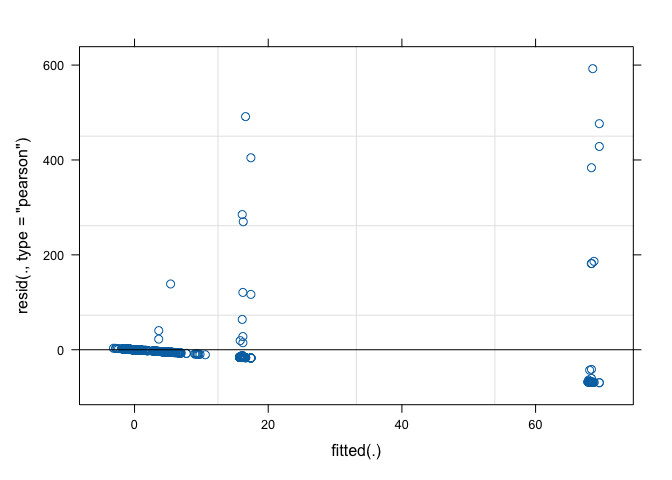
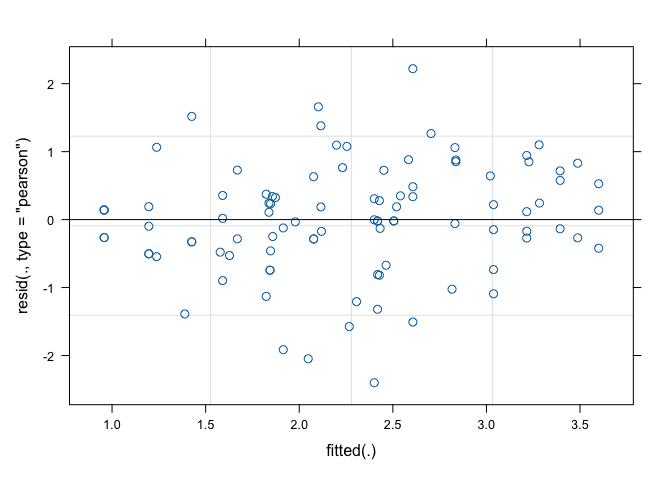
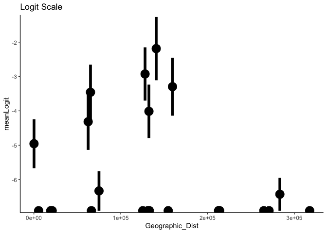
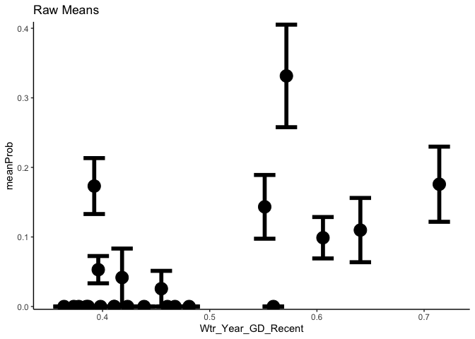
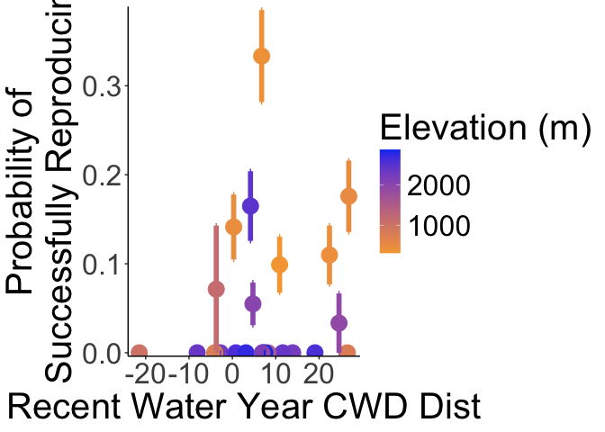

# Total Fitness at both sites 

Total Fitness: p(Establishment)*p(Surv to Rep - y1)*Fruits(y1) + p(Winter Surv)*p(Surv to Rep - y2)*Fruits(y2)

## Libraries

``` r
library(tidyverse)
```

```
## ── Attaching core tidyverse packages ──────────────────────── tidyverse 2.0.0 ──
## ✔ dplyr     1.1.4     ✔ readr     2.1.5
## ✔ forcats   1.0.0     ✔ stringr   1.5.1
## ✔ ggplot2   3.5.1     ✔ tibble    3.2.1
## ✔ lubridate 1.9.3     ✔ tidyr     1.3.1
## ✔ purrr     1.0.2     
## ── Conflicts ────────────────────────────────────────── tidyverse_conflicts() ──
## ✖ dplyr::filter() masks stats::filter()
## ✖ dplyr::lag()    masks stats::lag()
## ℹ Use the conflicted package (<http://conflicted.r-lib.org/>) to force all conflicts to become errors
```

``` r
library(magrittr)
```

```
## 
## Attaching package: 'magrittr'
## 
## The following object is masked from 'package:purrr':
## 
##     set_names
## 
## The following object is masked from 'package:tidyr':
## 
##     extract
```

``` r
#conflicted::conflicts_prefer(dplyr::filter)
library(viridis) #for pretty colors
```

```
## Loading required package: viridisLite
```

``` r
library(ggrepel) #for non-overlapping labels on plots
library(ggdist) #visualizations of distributions and uncertainty 
library(ggpubr)

#library(sp) #for calculating geographic distance 
library(geosphere) #for calculating geographic distance
library(corrplot) #plotting correlations  
```

```
## corrplot 0.94 loaded
```

``` r
library(rstatix) #performing cor_test
```

```
## 
## Attaching package: 'rstatix'
## 
## The following object is masked from 'package:stats':
## 
##     filter
```

``` r
library(lmerTest) #mixed models
```

```
## Loading required package: lme4
## Loading required package: Matrix
## 
## Attaching package: 'Matrix'
## 
## The following objects are masked from 'package:tidyr':
## 
##     expand, pack, unpack
## 
## 
## Attaching package: 'lmerTest'
## 
## The following object is masked from 'package:lme4':
## 
##     lmer
## 
## The following object is masked from 'package:stats':
## 
##     step
```

``` r
conflicted::conflicts_prefer(lmerTest::lmer)
```

```
## [conflicted] Will prefer lmerTest::lmer over any other package.
```

``` r
library(broom.mixed)
library(tidymodels)
```

```
## ── Attaching packages ────────────────────────────────────── tidymodels 1.2.0 ──
## ✔ broom        1.0.7     ✔ rsample      1.2.1
## ✔ dials        1.3.0     ✔ tune         1.2.1
## ✔ infer        1.0.7     ✔ workflows    1.1.4
## ✔ modeldata    1.4.0     ✔ workflowsets 1.1.0
## ✔ parsnip      1.2.1     ✔ yardstick    1.3.1
## ✔ recipes      1.1.0     
## ── Conflicts ───────────────────────────────────────── tidymodels_conflicts() ──
## ✖ infer::chisq_test()   masks rstatix::chisq_test()
## ✖ scales::discard()     masks purrr::discard()
## ✖ Matrix::expand()      masks tidyr::expand()
## ✖ magrittr::extract()   masks tidyr::extract()
## ✖ rstatix::filter()     masks dplyr::filter(), stats::filter()
## ✖ recipes::fixed()      masks stringr::fixed()
## ✖ dials::get_n()        masks rstatix::get_n()
## ✖ dplyr::lag()          masks stats::lag()
## ✖ Matrix::pack()        masks tidyr::pack()
## ✖ infer::prop_test()    masks rstatix::prop_test()
## ✖ magrittr::set_names() masks purrr::set_names()
## ✖ yardstick::spec()     masks readr::spec()
## ✖ recipes::step()       masks lmerTest::step(), stats::step()
## ✖ infer::t_test()       masks rstatix::t_test()
## ✖ Matrix::unpack()      masks tidyr::unpack()
## ✖ recipes::update()     masks Matrix::update(), stats::update()
## • Learn how to get started at https://www.tidymodels.org/start/
```

``` r
library(furrr) #Apply Mapping Functions in Parallel using Futures
```

```
## Loading required package: future
```

``` r
tidymodels_prefer()
# install.packages("multilevelmod")
library(multilevelmod)

library(brms)
```

```
## Loading required package: Rcpp
## 
## Attaching package: 'Rcpp'
## 
## The following object is masked from 'package:rsample':
## 
##     populate
## 
## Loading 'brms' package (version 2.22.0). Useful instructions
## can be found by typing help('brms'). A more detailed introduction
## to the package is available through vignette('brms_overview').
```

``` r
#conflicted::conflicts_prefer(brms::ar)
#conflicted::conflicts_prefer(dplyr::combine)
#conflicted::conflicts_prefer(brms::dstudent_t)
library(tidybayes) #for extracting and visiaulizing brms model output 
library(modelr) #for data grid

sem <- function(x, na.rm=FALSE) {           #for caclulating standard error
  sd(x,na.rm=na.rm)/sqrt(length(na.omit(x)))
} 

cbbPalette2 <- c("#E69F00","#000000", "#56B4E9","#009E73", "#F0E442", "#0072B2", "#D55E00", "#CC79A7")
timepd_palette <- c("#56B4E9","#D55E00")

options(mc.cores = parallel::detectCores())
```

## Year 2 Pop Info

``` r
wl2_y2_pops <- read_csv("../input/WL2_Data/Final_2023_2024_Pop_Loc_Info.csv") %>%
  select(Pop.Type:unique.ID) %>% 
  filter(Pop.Type=="2023-survivor") %>% 
  select(Pop.Type, loc:bed, row=bedrow, col=bedcol, pop:unique.ID)
```

```
## Rows: 1217 Columns: 15
## ── Column specification ────────────────────────────────────────────────────────
## Delimiter: ","
## chr (8): Pop.Type, status, block, loc, bed, bedcol, pop, unique.ID
## dbl (7): bed.block.order, bed.order, AB.CD.order, column.order, bedrow, mf, rep
## 
## ℹ Use `spec()` to retrieve the full column specification for this data.
## ℹ Specify the column types or set `show_col_types = FALSE` to quiet this message.
```


## Need the UCD 2023 and WL2 2023 & 2024 annual census data sheets (for fruit number)

``` r
ucd_ann_cens <- read_csv("../output/UCD_Traits/UCD2023_Annual_Census_Combined.csv") %>%  #note this is only for plants that survived to rep 
  rename(pop=parent.pop) %>% 
  filter(!is.na(pop)) %>% 
  filter(rep != 100) %>% #get rid of individuals that germinated in the field 
  unite(Genotype, pop:rep, sep="_", remove = FALSE) 
```

```
## Rows: 63 Columns: 20
## ── Column specification ────────────────────────────────────────────────────────
## Delimiter: ","
## chr  (4): block, col, parent.pop, elevation.group
## dbl (16): row, mf, rep, diam, height, total_branch, longest_leaf, flowers, f...
## 
## ℹ Use `spec()` to retrieve the full column specification for this data.
## ℹ Specify the column types or set `show_col_types = FALSE` to quiet this message.
```

``` r
wl2_ann_cens <- read_csv("../input/WL2_Data/CorrectedCSVs/WL2_annual_census_20231027_corrected.csv") %>% 
  unite(Genotype, pop:rep, sep="_", remove = FALSE) %>% 
  unite(BedLoc, bed:`bed-col`, sep="_", remove = FALSE) %>% 
  filter(BedLoc!="K_5_C") %>% #get rid of duplicate locations
  filter(BedLoc!="B_32_A") %>% #get rid of duplicate locations
  filter(!is.na(pop), !str_detect(Genotype, ".*buff*")) #remove buffers 
```

```
## Warning: One or more parsing issues, call `problems()` on your data frame for details,
## e.g.:
##   dat <- vroom(...)
##   problems(dat)
```

```
## Rows: 1826 Columns: 19
## ── Column specification ────────────────────────────────────────────────────────
## Delimiter: ","
## chr (10): date, block, bed, bed-col, pop, mf, rep, pheno, herbiv.y.n, survey...
## dbl  (7): bed-row, diam.mm, num.flw, num.fruit, long.fruit.cm, total.branch,...
## lgl  (2): height.cm, long.leaf.cm
## 
## ℹ Use `spec()` to retrieve the full column specification for this data.
## ℹ Specify the column types or set `show_col_types = FALSE` to quiet this message.
```

``` r
wl2_ann_cens_2024 <- read_csv("../input/WL2_Data/WL2_Annual_Census_20241023_corrected.csv")
```

```
## Rows: 1217 Columns: 15
## ── Column specification ────────────────────────────────────────────────────────
## Delimiter: ","
## chr (9): bed, col, unique.ID, phen, long.fruit.cm, total.branch, survey.date...
## dbl (6): row, diam.mm, num.flw, num.fruit, overhd.diam, overhd.perp
## 
## ℹ Use `spec()` to retrieve the full column specification for this data.
## ℹ Specify the column types or set `show_col_types = FALSE` to quiet this message.
```

``` r
wl2_ann_cens_2024_pops <- left_join(wl2_y2_pops, wl2_ann_cens_2024) %>%  
  rename(Genotype=unique.ID)
```

```
## Joining with `by = join_by(bed, row, col, unique.ID)`
```


## Need surv post-transplant shock, surv to rep both years, and winter survival

``` r
ucd_surv <- read_csv("../input/UCD_Data/CorrectedCSVs/UCD_transplants_pheno_mort_20231016_corrected.csv") %>% 
  rename(death.date=`Death Date`, bud.date=`Date First Bud`, flower.date=`Date First Flower`, 
         fruit.date=`Date First Fruit`, last.flower.date=`Date Last Flower`, last.fruit.date=`Date Last Fruit`) %>% 
  filter(!is.na(pop)) %>% 
  filter(rep != 100) %>% #get rid of individuals that germinated in the field 
  unite(Genotype, pop:rep, sep="_", remove = FALSE) 
```

```
## Rows: 858 Columns: 13
## ── Column specification ────────────────────────────────────────────────────────
## Delimiter: ","
## chr (10): block, col, pop, Date First Bud, Date First Flower, Date First Fru...
## dbl  (3): row, mf, rep
## 
## ℹ Use `spec()` to retrieve the full column specification for this data.
## ℹ Specify the column types or set `show_col_types = FALSE` to quiet this message.
```

``` r
#unique(ucd_surv$pop)

wl2_surv_1020 <- read_csv("../input/WL2_Data/CorrectedCSVs/WL2_mort_pheno_20231020_corrected.csv") #need to add in 10/27 mortality 
```

```
## Rows: 1826 Columns: 14
## ── Column specification ────────────────────────────────────────────────────────
## Delimiter: ","
## chr (12): block, bed, bed.col, pop, mf, rep, bud.date, flower.date, fruit.da...
## dbl  (1): bed.row
## lgl  (1): last.fruit.date
## 
## ℹ Use `spec()` to retrieve the full column specification for this data.
## ℹ Specify the column types or set `show_col_types = FALSE` to quiet this message.
```

``` r
wl2_surv_1027 <- wl2_ann_cens %>% 
  filter(pheno=="X") %>% 
  select(death.date_2=date, block:bed, bed.row=`bed-row`, bed.col=`bed-col`, pop:rep) #add in 10/27 death dates
#note: 10/27 pheno dates (like flowering), not updated with this code 
wl2_surv_y1 <- left_join(wl2_surv_1020, wl2_surv_1027) %>% 
  mutate(death.date=if_else(is.na(death.date), death.date_2, death.date)) %>% 
  mutate(pop= str_replace(pop, "Y08", "YO8")) %>% 
  mutate(pop= str_replace(pop, "Y04", "YO4")) %>% 
  unite(BedLoc, bed:bed.col, sep="_", remove = FALSE) %>% 
  filter(BedLoc!="K_5_C") %>% #get rid of duplicate locations
  filter(BedLoc!="B_32_A") %>% #get rid of duplicate locations
  unite(Genotype, pop:rep, sep="_", remove = FALSE) %>% 
  filter(!is.na(pop), !str_detect(Genotype, ".*buff*")) %>%  #remove buffers 
  select(block:survey.notes)
```

```
## Joining with `by = join_by(block, bed, bed.row, bed.col, pop, mf, rep)`
```

``` r
#wl2_surv_y1_to_export <- wl2_surv_y1 %>% select(block:rep, death.date, survey.notes)
#write_csv(wl2_surv_y1_to_export, "../output/WL2_Traits/WL2_Mortality_2023.csv")
#unique(wl2_surv_y1$pop)

wl2_20241023 <- read_csv("../input/WL2_Data/WL2_mort_pheno_20241023_corrected.csv") %>% #note this has 2023 and 2024 plants
  select(-block)
```

```
## Rows: 1217 Columns: 13
## ── Column specification ────────────────────────────────────────────────────────
## Delimiter: ","
## chr (12): block, bed, col, unique.ID, bud.date, flower.date, fruit.date, las...
## dbl  (1): row
## 
## ℹ Use `spec()` to retrieve the full column specification for this data.
## ℹ Specify the column types or set `show_col_types = FALSE` to quiet this message.
```

``` r
wl2_surv_y2 <- left_join(wl2_y2_pops, wl2_20241023) %>%  
  rename(Genotype=unique.ID)
```

```
## Joining with `by = join_by(bed, row, col, unique.ID)`
```

``` r
#unique(wl2_surv_y2$pop) #only 10 pops with winter surv 

post_winter <- read_csv("../input/WL2_Data/WL2_status_check_20240603_corrected.csv",
                         na = c("", "NA", "-", "N/A")) 
```

```
## Rows: 1826 Columns: 9
## ── Column specification ────────────────────────────────────────────────────────
## Delimiter: ","
## chr (8): block, bed, bed- col, pop, mf, rep, death.date, survey.notes
## dbl (1): bed- row
## 
## ℹ Use `spec()` to retrieve the full column specification for this data.
## ℹ Specify the column types or set `show_col_types = FALSE` to quiet this message.
```

``` r
post_winter_clean <- post_winter %>% 
  mutate(pop= str_replace(pop, "iH", "IH")) %>% 
  mutate(pop= str_replace(pop, "1H", "IH")) %>% 
  mutate(pop= str_replace(pop, "cc", "CC")) %>% 
  unite(BedLoc, bed:`bed- col`, sep="_", remove = FALSE) %>% 
  filter(BedLoc!="K_5_C") %>% #get rid of duplicate locations
  filter(BedLoc!="B_32_A") %>% #get rid of duplicate locations
  unite(Genotype, pop:rep, sep="_", remove = FALSE) %>% 
  filter(pop!="buffer", !str_detect(mf, "buf")) %>% 
  mutate(mf=as.double(mf), rep=as.double(rep))
unique(post_winter_clean$pop)
```

```
##  [1] "TM2"   "LVTR1" "SQ2"   "YO8"   "CC"    "YO11"  "BH"    "DPR"   "CP2"  
## [10] "WL1"   "IH"    "CP3"   "SC"    "FR"    "LV3"   "YO7"   "WV"    "SQ3"  
## [19] "WL2"   "LV1"   "YO4"   "WR"    "SQ1"
```

## Gower's Distance

``` r
garden_climate <- read_csv("../output/Climate/flint_climate_UCDpops.csv") %>% 
  filter(parent.pop=="WL2_Garden" | parent.pop=="UCD_Garden") %>% 
  select(parent.pop:Long) %>% 
  distinct()
```

```
## Rows: 38775 Columns: 14
## ── Column specification ────────────────────────────────────────────────────────
## Delimiter: ","
## chr  (3): parent.pop, elevation.group, month
## dbl (11): elev_m, Lat, Long, year, aet, cwd, pck, pet, ppt, tmn, tmx
## 
## ℹ Use `spec()` to retrieve the full column specification for this data.
## ℹ Specify the column types or set `show_col_types = FALSE` to quiet this message.
```

``` r
garden_climate
```

```
## # A tibble: 2 × 5
##   parent.pop elevation.group elev_m   Lat  Long
##   <chr>      <chr>            <dbl> <dbl> <dbl>
## 1 UCD_Garden Low                 16  38.5 -122.
## 2 WL2_Garden High              2020  38.8 -120.
```

``` r
#UCD LAT/LONG = 38.53250, -121.7830
#WL2 Lat/Long = 38.82599, -120.2509

ucd_gowers <- read_csv("../output/Climate/Gowers_UCD.csv") %>% 
  select(parent.pop:GrwSsn_GD, Wtr_Year_GD) %>% 
  pivot_wider(names_from = TimePd, values_from = c(GrwSsn_GD, Wtr_Year_GD)) %>% 
  mutate(UCD_Lat=38.53250, UCD_Long=-121.7830, UCD_Elev=16) %>% 
  mutate(Geographic_Dist=distHaversine(cbind(UCD_Long, UCD_Lat), cbind(Long, Lat)),
         Elev_Dist=UCD_Elev-elev_m) %>% # Calculate the distance using the haversine formula (dist in meters)
  #mutate(Lat_Dist=UCD_Lat-Lat, Long_Dist=UCD_Long-Long) %>% #Garden-Home - lat and long per Gerst et al 2011 which kept them separate for some directionality
  rename(pop=parent.pop)
```

```
## Rows: 46 Columns: 12
## ── Column specification ────────────────────────────────────────────────────────
## Delimiter: ","
## chr (3): parent.pop, elevation.group, TimePd
## dbl (9): elev_m, Lat, Long, GrwSsn_GD, GrwSsn_FLINT_GD, GrwSsn_BIOCLIM_GD, W...
## 
## ℹ Use `spec()` to retrieve the full column specification for this data.
## ℹ Specify the column types or set `show_col_types = FALSE` to quiet this message.
```

``` r
wl2_gowers_2023 <- read_csv("../output/Climate/Gowers_WL2.csv") %>% 
  select(parent.pop:GrwSsn_GD, Wtr_Year_GD) %>% 
  pivot_wider(names_from = TimePd, values_from = c(GrwSsn_GD, Wtr_Year_GD)) %>% 
  mutate(WL2_Lat=38.82599, WL2_Long=-120.2509, WL2_Elev=2020) %>% 
  mutate(Geographic_Dist=distHaversine(cbind(WL2_Long, WL2_Lat), cbind(Long, Lat)),
         Elev_Dist=WL2_Elev-elev_m) %>% # Calculate the distance using the haversine formula
  #mutate(Lat_Dist=WL2_Lat-Lat, Long_Dist=WL2_Long-Long) %>% #Garden-Home - lat and long per Gerst et al 2011 which kept them separate for some directionality
  rename(pop=parent.pop)
```

```
## Rows: 46 Columns: 12
## ── Column specification ────────────────────────────────────────────────────────
## Delimiter: ","
## chr (3): parent.pop, elevation.group, TimePd
## dbl (9): elev_m, Lat, Long, GrwSsn_GD, GrwSsn_FLINT_GD, GrwSsn_BIOCLIM_GD, W...
## 
## ℹ Use `spec()` to retrieve the full column specification for this data.
## ℹ Specify the column types or set `show_col_types = FALSE` to quiet this message.
```

``` r
wl2_gowers_2024 <- read_csv("../output/Climate/Gowers_WL2_2024.csv") %>% 
  pivot_wider(names_from = TimePd, values_from = c(GrwSsn_GD, Wtr_Year_GD)) %>% 
  mutate(WL2_Lat=38.82599, WL2_Long=-120.2509, WL2_Elev=2020) %>% 
  mutate(Geographic_Dist=distHaversine(cbind(WL2_Long, WL2_Lat), cbind(Long, Lat)),
         Elev_Dist=WL2_Elev-elev_m) %>% # Calculate the distance using the haversine formula
  rename(pop=parent.pop)
```

```
## Rows: 46 Columns: 8
## ── Column specification ────────────────────────────────────────────────────────
## Delimiter: ","
## chr (3): parent.pop, elevation.group, TimePd
## dbl (5): elev_m, Lat, Long, GrwSsn_GD, Wtr_Year_GD
## 
## ℹ Use `spec()` to retrieve the full column specification for this data.
## ℹ Specify the column types or set `show_col_types = FALSE` to quiet this message.
```

### Check Geographic distance

``` r
ucd_gowers %>% 
  ggplot(aes(x=fct_reorder(pop, Geographic_Dist), y=Geographic_Dist, fill=Wtr_Year_GD_Recent)) +
  geom_col(width = 0.7,position = position_dodge(0.75)) + 
  labs(y="Geographic Distance (m)", x="Population", fill="Water Year \n Climate Distance") +
  theme_classic() +
  scale_fill_viridis(option="mako", direction = -1) +
  scale_y_continuous(expand = c(0, 0)) +
  theme(text=element_text(size=25), axis.text.x = element_text(angle = 45,  hjust = 1)) 
```

<!-- -->

``` r
#ggsave("../output/UCD_GeoDist.png", width = 12, height = 8, units = "in")

wl2_gowers_2023 %>% 
  ggplot(aes(x=fct_reorder(pop, Geographic_Dist), y=Geographic_Dist, fill=Wtr_Year_GD_Recent)) +
  geom_col(width = 0.7,position = position_dodge(0.75)) + 
  labs(y="Geographic Distance (m)", x="Population", fill="Water Year \n Climate Distance") +
  theme_classic() +
  scale_fill_viridis(option="mako", direction = -1) +
  scale_y_continuous(expand = c(0, 0)) +
  theme(text=element_text(size=25), axis.text.x = element_text(angle = 45,  hjust = 1)) 
```

<!-- -->

``` r
#ggsave("../output/WL2_GeoDist.png", width = 12, height = 8, units = "in")

## Correlation between geo distance and climate distance
dist_normalized_ucd <- ucd_gowers %>% select(GrwSsn_GD_Recent:Wtr_Year_GD_Historical, Geographic_Dist) %>% scale() #normalize the data so they're all on the same scale
head(dist_normalized_ucd)
```

```
##      GrwSsn_GD_Recent GrwSsn_GD_Historical Wtr_Year_GD_Recent
## [1,]       -1.6097060           -1.2333603         -0.1315203
## [2,]       -1.3382567           -1.1474561         -1.1969789
## [3,]       -1.2850999           -0.4727036         -1.2642964
## [4,]       -1.0167626           -0.7218352         -1.5426334
## [5,]       -0.9763752           -1.1382829          0.1207765
## [6,]       -0.7209606           -0.6622060         -0.8308996
##      Wtr_Year_GD_Historical Geographic_Dist
## [1,]            -0.23592699      -0.6952727
## [2,]            -1.20442321      -1.2574269
## [3,]            -1.41622323      -0.9389442
## [4,]            -1.56054173       0.1566691
## [5,]            -0.09358015      -0.9043893
## [6,]            -0.68940252      -0.2454393
```

``` r
cor.norm_ucd = cor(dist_normalized_ucd) #test correlations among the traits
corrplot(cor.norm_ucd) #geo dist not strongly correlated to any of the climate distances, yay!
```

<!-- -->

``` r
dist_normalized_wl2 <- wl2_gowers_2023 %>% select(GrwSsn_GD_Recent:Wtr_Year_GD_Historical, Geographic_Dist) %>% scale() #normalize the data so they're all on the same scale
head(dist_normalized_wl2)
```

```
##      GrwSsn_GD_Recent GrwSsn_GD_Historical Wtr_Year_GD_Recent
## [1,]        -1.833317           -1.2596750        -0.55370936
## [2,]        -1.455148           -0.9558987        -0.70954714
## [3,]        -1.125343           -0.8544994         2.59044284
## [4,]        -1.101859           -0.8071114        -0.68765718
## [5,]        -1.030343           -1.3312671        -0.42580349
## [6,]        -1.007116           -1.0792942        -0.09912854
##      Wtr_Year_GD_Historical Geographic_Dist
## [1,]             -0.9912435      -0.1460960
## [2,]             -0.8148273      -1.4956828
## [3,]              2.3402079       0.2224374
## [4,]             -0.9594762       1.3552251
## [5,]             -0.8741359       1.4205701
## [6,]             -0.4711787       1.5545268
```

``` r
cor.norm_wl2 = cor(dist_normalized_wl2) #test correlations among the traits
corrplot(cor.norm_wl2) #geo dist not strongly correlated to any of the climate distances, yay!
```

<!-- -->

### Checking elevation distance

``` r
ucd_gowers %>% 
  ggplot(aes(x=fct_reorder(pop, Elev_Dist), y=Elev_Dist, fill=Wtr_Year_GD_Recent)) +
  geom_col(width = 0.7,position = position_dodge(0.75)) + 
  labs(y="Elevation Distance (m)", x="Population", fill="Water Year \n Climate Distance") +
  theme_classic() +
  scale_fill_viridis(option="mako", direction = -1) +
  scale_y_continuous(expand = c(0, 0)) +
  theme(text=element_text(size=25), axis.text.x = element_text(angle = 45,  hjust = 1)) 
```

<!-- -->

``` r
#ggsave("../output/UCD_ElevDist.png", width = 12, height = 8, units = "in")

wl2_gowers_2023 %>% 
  ggplot(aes(x=fct_reorder(pop, Elev_Dist), y=Elev_Dist, fill=Wtr_Year_GD_Recent)) +
  geom_col(width = 0.7,position = position_dodge(0.75)) + 
  labs(y="Elevation Distance (m)", x="Population", fill="Water Year \n Climate Distance") +
  theme_classic() +
  scale_fill_viridis(option="mako", direction = -1) +
  scale_y_continuous(expand = c(0, 0)) +
  theme(text=element_text(size=25), axis.text.x = element_text(angle = 45,  hjust = 1)) 
```

<!-- -->

``` r
#ggsave("../output/WL2_ElevDist.png", width = 12, height = 8, units = "in")

## Correlation between elev distance and climate distance
dist_normalized_ucd <- ucd_gowers %>% select(GrwSsn_GD_Recent:Wtr_Year_GD_Historical, Elev_Dist) %>% scale() #normalize the data so they're all on the same scale
head(dist_normalized_ucd)
```

```
##      GrwSsn_GD_Recent GrwSsn_GD_Historical Wtr_Year_GD_Recent
## [1,]       -1.6097060           -1.2333603         -0.1315203
## [2,]       -1.3382567           -1.1474561         -1.1969789
## [3,]       -1.2850999           -0.4727036         -1.2642964
## [4,]       -1.0167626           -0.7218352         -1.5426334
## [5,]       -0.9763752           -1.1382829          0.1207765
## [6,]       -0.7209606           -0.6622060         -0.8308996
##      Wtr_Year_GD_Historical Elev_Dist
## [1,]            -0.23592699 0.0405207
## [2,]            -1.20442321 1.3494437
## [3,]            -1.41622323 1.5087322
## [4,]            -1.56054173 1.2847715
## [5,]            -0.09358015 0.5550090
## [6,]            -0.68940252 0.9737443
```

``` r
cor.norm_ucd = cor(dist_normalized_ucd) #test correlations among the traits
corrplot(cor.norm_ucd) ##elev dist strongly neg correlated w/ water year climate distances
```

<!-- -->

``` r
dist_normalized_wl2 <- wl2_gowers_2023 %>% select(GrwSsn_GD_Recent:Wtr_Year_GD_Historical, Elev_Dist) %>% scale() #normalize the data so they're all on the same scale
head(dist_normalized_wl2)
```

```
##      GrwSsn_GD_Recent GrwSsn_GD_Historical Wtr_Year_GD_Recent
## [1,]        -1.833317           -1.2596750        -0.55370936
## [2,]        -1.455148           -0.9558987        -0.70954714
## [3,]        -1.125343           -0.8544994         2.59044284
## [4,]        -1.101859           -0.8071114        -0.68765718
## [5,]        -1.030343           -1.3312671        -0.42580349
## [6,]        -1.007116           -1.0792942        -0.09912854
##      Wtr_Year_GD_Historical  Elev_Dist
## [1,]             -0.9912435 -0.5731767
## [2,]             -0.8148273 -0.4180323
## [3,]              2.3402079  1.2847715
## [4,]             -0.9594762 -0.8165136
## [5,]             -0.8741359 -0.3213456
## [6,]             -0.4711787 -0.3062049
```

``` r
cor.norm_wl2 = cor(dist_normalized_wl2) #test correlations among the traits
corrplot(cor.norm_wl2) #elev positively correlated with recent water year climate distance 
```

<!-- -->


### WL2 Avg Gowers

``` r
wl2_gowers_2023_prep <- wl2_gowers_2023 %>% rename_with(~paste0(., "_2023"), 6:9)
wl2_gowers_2024_prep <- wl2_gowers_2024 %>% rename_with(~paste0(., "_2024"), 6:9)

wl2_gowers_avg <- bind_rows(wl2_gowers_2023, wl2_gowers_2024) %>% 
  group_by(pop, elevation.group, elev_m, Geographic_Dist) %>% 
  summarise_at(c("GrwSsn_GD_Recent",  "GrwSsn_GD_Historical", "Wtr_Year_GD_Recent", "Wtr_Year_GD_Historical"), c(mean), na.rm = TRUE)
wl2_gowers_avg
```

```
## # A tibble: 23 × 8
## # Groups:   pop, elevation.group, elev_m [23]
##    pop   elevation.group elev_m Geographic_Dist GrwSsn_GD_Recent
##    <chr> <chr>            <dbl>           <dbl>            <dbl>
##  1 BH    Low               511.         159626.            0.312
##  2 CC    Low               313          132498.            0.417
##  3 CP2   High             2244.          21060.            0.301
##  4 CP3   High             2266.          19415.            0.324
##  5 DPR   Mid              1019.          66246.            0.439
##  6 FR    Mid               787          154694.            0.386
##  7 IH    Low               454.          65203.            0.440
##  8 LV1   High             2593.         212682.            0.379
##  9 LV3   High             2354.         213902.            0.380
## 10 LVTR1 High             2741.         213038.            0.404
## # ℹ 13 more rows
## # ℹ 3 more variables: GrwSsn_GD_Historical <dbl>, Wtr_Year_GD_Recent <dbl>,
## #   Wtr_Year_GD_Historical <dbl>
```


## p(Establishment)
Davis - used 3 weeks to match WL2

``` r
unique(ucd_surv$pop)
```

```
##  [1] "WL2"   "CP2"   "YO11"  "CC"    "FR"    "BH"    "IH"    "LV3"   "SC"   
## [10] "LVTR1" "SQ3"   "TM2"   "WL1"   "YO7"   "DPR"   "SQ2"   "SQ1"   "YO8"  
## [19] "YO4"   "WR"    "WV"    "CP3"   "LV1"
```

``` r
ucd_establishment <- ucd_surv %>% 
  left_join(ucd_gowers) %>% 
  select(block:rep, elevation.group:Wtr_Year_GD_Historical, Geographic_Dist, Elev_Dist, death.date) %>% 
  mutate(death.date=mdy(death.date)) %>% 
  mutate(Establishment=if_else(is.na(death.date), 1,
                               if_else(death.date=="2022-11-30" | death.date=="2022-12-13" | death.date=="2022-12-21", 0,
                                       1)))
```

```
## Joining with `by = join_by(pop)`
```

``` r
ucd_establishment %>% 
  group_by(pop, elev_m, GrwSsn_GD_Recent, GrwSsn_GD_Historical) %>% 
  summarise(meanEst=mean(Establishment, na.rm = TRUE), semEst=sem(Establishment, na.rm=TRUE)) %>% 
  ggplot(aes(x=fct_reorder(pop, meanEst), y=meanEst, fill=GrwSsn_GD_Recent)) +
  geom_col(width = 0.7,position = position_dodge(0.75)) + 
  geom_errorbar(aes(ymin=meanEst-semEst,ymax=meanEst+semEst),width=.2, position = 
                  position_dodge(0.75)) +
  theme_classic() + 
  scale_y_continuous(expand = c(0.01, 0)) +
  labs(y="Establishment", x="Parent Population", fill="Growth Season Gowers") +
  scale_fill_viridis(option="mako", direction = -1) +
  theme(text=element_text(size=25), axis.text.x = element_text(angle = 45,  hjust = 1))
```

```
## `summarise()` has grouped output by 'pop', 'elev_m', 'GrwSsn_GD_Recent'. You
## can override using the `.groups` argument.
```

<!-- -->

``` r
#ggsave("../output/UCD_Traits/UCD_Establishment_GrwSsn_GD_Recent.png", width = 12, height = 8, units = "in")

ucd_establishment %>% 
  group_by(pop, elev_m, GrwSsn_GD_Recent, Wtr_Year_GD_Recent) %>% 
  summarise(meanEst=mean(Establishment, na.rm = TRUE), semEst=sem(Establishment, na.rm=TRUE)) %>% 
  ggplot(aes(x=fct_reorder(pop, meanEst), y=meanEst, fill=Wtr_Year_GD_Recent)) +
  geom_col(width = 0.7,position = position_dodge(0.75)) + 
  geom_errorbar(aes(ymin=meanEst-semEst,ymax=meanEst+semEst),width=.2, position = 
                  position_dodge(0.75)) +
  theme_classic() + 
  scale_y_continuous(expand = c(0.01, 0)) +
  labs(y="Establishment", x="Parent Population", fill="Water Year Gowers") +
  scale_fill_viridis(option="mako", direction = -1) +
  theme(text=element_text(size=25), axis.text.x = element_text(angle = 45,  hjust = 1))
```

```
## `summarise()` has grouped output by 'pop', 'elev_m', 'GrwSsn_GD_Recent'. You
## can override using the `.groups` argument.
```

<!-- -->

``` r
#ggsave("../output/UCD_Traits/UCD_Establishment_Wtr_Year_GD_Recent.png", width = 12, height = 8, units = "in")
```


WL2 - 3 weeks based off survival curve

``` r
wl2_establishment <- wl2_surv_y1 %>% 
  left_join(wl2_gowers_2023) %>% 
  select(block:rep, elevation.group:Wtr_Year_GD_Historical, Geographic_Dist, Elev_Dist, death.date) %>% 
  mutate(death.date=mdy(death.date)) %>% 
  mutate(Establishment=if_else(is.na(death.date), 1,
                               if_else(death.date=="2023-07-26" | death.date=="2023-08-02" | death.date=="2023-08-09", 0,
                                       1)))
```

```
## Joining with `by = join_by(pop)`
```

``` r
wl2_establishment %>% 
  group_by(pop, elev_m, GrwSsn_GD_Recent, Wtr_Year_GD_Recent) %>% 
  summarise(meanEst=mean(Establishment, na.rm = TRUE), semEst=sem(Establishment, na.rm=TRUE)) %>% 
  ggplot(aes(x=fct_reorder(pop, meanEst), y=meanEst, fill=GrwSsn_GD_Recent)) +
  geom_col(width = 0.7,position = position_dodge(0.75)) + 
  geom_errorbar(aes(ymin=meanEst-semEst,ymax=meanEst+semEst),width=.2, position = 
                  position_dodge(0.75)) +
  theme_classic() + 
  scale_y_continuous(expand = c(0.01, 0)) +
  labs(y="Establishment", x="Parent Population", fill="Growth Season Gowers") +
  scale_fill_viridis(option="mako", direction = -1) +
  theme(text=element_text(size=25), axis.text.x = element_text(angle = 45,  hjust = 1))
```

```
## `summarise()` has grouped output by 'pop', 'elev_m', 'GrwSsn_GD_Recent'. You
## can override using the `.groups` argument.
```

<!-- -->

``` r
#ggsave("../output/WL2_Traits/WL2_Establishment_GrwSsn_GD_Recent.png", width = 12, height = 8, units = "in")

wl2_establishment %>% 
  group_by(pop, elev_m, GrwSsn_GD_Recent, Wtr_Year_GD_Recent) %>% 
  summarise(meanEst=mean(Establishment, na.rm = TRUE), semEst=sem(Establishment, na.rm=TRUE)) %>% 
  ggplot(aes(x=fct_reorder(pop, meanEst), y=meanEst, fill=Wtr_Year_GD_Recent)) +
  geom_col(width = 0.7,position = position_dodge(0.75)) + 
  geom_errorbar(aes(ymin=meanEst-semEst,ymax=meanEst+semEst),width=.2, position = 
                  position_dodge(0.75)) +
  theme_classic() + 
  scale_y_continuous(expand = c(0.01, 0)) +
  labs(y="Establishment", x="Parent Population", fill="Water Year Gowers") +
  scale_fill_viridis(option="mako", direction = -1) +
  theme(text=element_text(size=25), axis.text.x = element_text(angle = 45,  hjust = 1))
```

```
## `summarise()` has grouped output by 'pop', 'elev_m', 'GrwSsn_GD_Recent'. You
## can override using the `.groups` argument.
```

<!-- -->

``` r
#ggsave("../output/WL2_Traits/WL2_Establishment_Wtr_Year_GD_Recent.png", width = 12, height = 8, units = "in")
```

### Scatterplots
Davis

``` r
#scatter plots
GSCD <- ucd_establishment %>% 
  group_by(pop, elev_m, GrwSsn_GD_Recent, GrwSsn_GD_Historical) %>% 
  summarise(meanEst=mean(Establishment, na.rm = TRUE), semEst=sem(Establishment, na.rm=TRUE)) %>% 
  pivot_longer(cols = starts_with("GrwSsn"), names_to = "TimePd", values_to = "GrwSsn_CD") %>% 
  mutate(TimePd=str_replace(TimePd, "GrwSsn_GD_", "")) %>% 
  ggplot(aes(x=GrwSsn_CD, y=meanEst, color=TimePd, group = pop)) +
  geom_point(size=6, alpha=0.7) + 
  geom_errorbar(aes(ymin=meanEst-semEst,ymax=meanEst+semEst),width=.02, linewidth = 2) +
  #geom_text_repel(aes(x = GrwSsn_CD, y = meanEst,
  #          label = `pop`),
  #      min.segment.length = 0.8,
  #      max.overlaps = 100,
  #      #label.padding = 1,
  #      #point.padding = 0.8,
  #      size = 4) +
  theme_classic() + 
  scale_y_continuous(expand = c(0.01, 0)) +
  labs(y="Establishment", x="Growth Season CD", color="Time Period") +
  scale_color_manual(values=timepd_palette) +
  theme(text=element_text(size=25))
```

```
## `summarise()` has grouped output by 'pop', 'elev_m', 'GrwSsn_GD_Recent'. You
## can override using the `.groups` argument.
```

``` r
WYCD <- ucd_establishment %>% 
  group_by(pop, elev_m, Wtr_Year_GD_Recent, Wtr_Year_GD_Historical) %>% 
  summarise(meanEst=mean(Establishment, na.rm = TRUE), semEst=sem(Establishment, na.rm=TRUE)) %>%
  pivot_longer(cols = starts_with("Wtr_Year"), names_to = "TimePd", values_to = "Wtr_Year_CD") %>% 
  mutate(TimePd=str_replace(TimePd, "Wtr_Year_GD_", "")) %>% 
  ggplot(aes(x=Wtr_Year_CD, y=meanEst, color=TimePd, group = pop)) +
  geom_point(size=6, alpha=0.7) + 
  geom_errorbar(aes(ymin=meanEst-semEst,ymax=meanEst+semEst),width=.02, linewidth = 2) +
  #geom_text_repel(aes(x = Wtr_Year_CD, y = meanEst,
  #          label = `pop`),
  #      min.segment.length = 0.8,
  #      max.overlaps = 100,
  #      #label.padding = 1,
  #      #point.padding = 0.8,
  #      size = 4) +
  theme_classic() + 
  scale_y_continuous(expand = c(0.01, 0)) +
  labs(y="Establishment", x="Water Year CD", color="Time Period") +
  scale_color_manual(values=timepd_palette) +
  theme(text=element_text(size=25))
```

```
## `summarise()` has grouped output by 'pop', 'elev_m', 'Wtr_Year_GD_Recent'. You
## can override using the `.groups` argument.
```

``` r
GD <- ucd_establishment %>% 
  group_by(pop, elev_m, Geographic_Dist) %>% 
  summarise(meanEst=mean(Establishment, na.rm = TRUE), semEst=sem(Establishment, na.rm=TRUE)) %>% 
  ggplot(aes(x=Geographic_Dist, y=meanEst, group = pop)) +
  geom_point(size=6) + 
  geom_errorbar(aes(ymin=meanEst-semEst,ymax=meanEst+semEst),width=.02, linewidth = 2) +
  #geom_text_repel(aes(x = Geographic_Dist, y = meanEst,
  #          label = `pop`),
  #      min.segment.length = 0.8,
  #      max.overlaps = 100,
  #      #label.padding = 1,
  #      #point.padding = 0.8,
  #      size = 4) +
  theme_classic() + 
  scale_y_continuous(expand = c(0.01, 0)) +
  labs(y="Establishment", x="Geographic Distance (m)") +
  theme(text=element_text(size=25), axis.text.x = element_text(angle = 45,  hjust = 1))
```

```
## `summarise()` has grouped output by 'pop', 'elev_m'. You can override using the
## `.groups` argument.
```

``` r
ED <- ucd_establishment %>% 
  group_by(pop, elev_m, Elev_Dist) %>% 
  summarise(meanEst=mean(Establishment, na.rm = TRUE), semEst=sem(Establishment, na.rm=TRUE)) %>% 
  ggplot(aes(x=Elev_Dist, y=meanEst, group = pop)) +
  geom_point(size=6) + 
  geom_errorbar(aes(ymin=meanEst-semEst,ymax=meanEst+semEst),width=.02, linewidth = 2) +
  #geom_text_repel(aes(x = Elev_Dist, y = meanEst,
  #          label = `pop`),
  #      min.segment.length = 0.8,
  #      max.overlaps = 100,
  #      #label.padding = 1,
  #      #point.padding = 0.8,
  #      size = 4) +
  theme_classic() + 
  scale_y_continuous(expand = c(0.01, 0)) +
  labs(y="Establishment", x="Elevation Distance (m)") +
  theme(text=element_text(size=25))
```

```
## `summarise()` has grouped output by 'pop', 'elev_m'. You can override using the
## `.groups` argument.
```

``` r
ucd_establishment_FIG <- ggarrange(GSCD, WYCD, GD, ED, ncol=2, nrow=2) 
#ggsave("../output/UCD_Traits/UCD_Establishment_SCATTERS.png", width = 24, height = 18, units = "in")
```

WL2

``` r
#scatter plots
GSCD <- wl2_establishment %>% 
  group_by(pop, elev_m, GrwSsn_GD_Recent, GrwSsn_GD_Historical) %>% 
  summarise(meanEst=mean(Establishment, na.rm = TRUE), semEst=sem(Establishment, na.rm=TRUE)) %>% 
  pivot_longer(cols = starts_with("GrwSsn"), names_to = "TimePd", values_to = "GrwSsn_CD") %>% 
  mutate(TimePd=str_replace(TimePd, "GrwSsn_GD_", "")) %>% 
  ggplot(aes(x=GrwSsn_CD, y=meanEst, color=TimePd, group = pop)) +
  geom_point(size=6) + 
  geom_errorbar(aes(ymin=meanEst-semEst,ymax=meanEst+semEst),width=.02, linewidth = 2) +
  #geom_text_repel(aes(x = GrwSsn_CD, y = meanEst,
  #          label = `pop`),
  #      min.segment.length = 0.8,
  #      max.overlaps = 100,
  #      #label.padding = 1,
  #      #point.padding = 0.8,
  #      size = 4) +
  theme_classic() + 
  scale_y_continuous(expand = c(0.01, 0)) +
  labs(y="Establishment", x="Growth Season CD", color="Growth Season \n Climate Distance") +
  scale_color_manual(values=timepd_palette) +
  theme(text=element_text(size=25))
```

```
## `summarise()` has grouped output by 'pop', 'elev_m', 'GrwSsn_GD_Recent'. You
## can override using the `.groups` argument.
```

``` r
WYCD <- wl2_establishment %>% 
  group_by(pop, elev_m, Wtr_Year_GD_Recent, Wtr_Year_GD_Historical) %>% 
  summarise(meanEst=mean(Establishment, na.rm = TRUE), semEst=sem(Establishment, na.rm=TRUE)) %>% 
  pivot_longer(cols = starts_with("Wtr_Year"), names_to = "TimePd", values_to = "Wtr_Year_CD") %>% 
  mutate(TimePd=str_replace(TimePd, "Wtr_Year_GD_", "")) %>% 
  ggplot(aes(x=Wtr_Year_CD, y=meanEst, color=TimePd, group = pop)) +
  geom_point(size=6) + 
  geom_errorbar(aes(ymin=meanEst-semEst,ymax=meanEst+semEst),width=.02,linewidth = 2) +
  #geom_text_repel(aes(x = Wtr_Year_CD, y = meanEst,
  #          label = `pop`),
  #      min.segment.length = 0.8,
  #      max.overlaps = 100,
  #      #label.padding = 1,
  #      #point.padding = 0.8,
  #      size = 4) +
  theme_classic() + 
  scale_y_continuous(expand = c(0.01, 0)) +
  labs(y="Establishment", x="Water Year CD", color="Water Year \n Climate Distance") +
  scale_color_manual(values=timepd_palette) +
  theme(text=element_text(size=25))
```

```
## `summarise()` has grouped output by 'pop', 'elev_m', 'Wtr_Year_GD_Recent'. You
## can override using the `.groups` argument.
```

``` r
GD <- wl2_establishment %>% 
  group_by(pop, elev_m, GrwSsn_GD_Recent, Wtr_Year_GD_Recent, Geographic_Dist) %>% 
  summarise(meanEst=mean(Establishment, na.rm = TRUE), semEst=sem(Establishment, na.rm=TRUE)) %>% 
  ggplot(aes(x=Geographic_Dist, y=meanEst, group = pop)) +
  geom_point(size=6) + 
  geom_errorbar(aes(ymin=meanEst-semEst,ymax=meanEst+semEst),width=.02, linewidth = 2) +
  #geom_text_repel(aes(x = Geographic_Dist, y = meanEst,
  #          label = `pop`),
  #      min.segment.length = 0.8,
  #      max.overlaps = 100,
  #      #label.padding = 1,
  #      #point.padding = 0.8,
  #      size = 4) +
  theme_classic() + 
  scale_y_continuous(expand = c(0.01, 0)) +
  labs(y="Establishment", x="Geographic Distance (m)") +
  theme(text=element_text(size=25), axis.text.x = element_text(angle = 45,  hjust = 1))
```

```
## `summarise()` has grouped output by 'pop', 'elev_m', 'GrwSsn_GD_Recent',
## 'Wtr_Year_GD_Recent'. You can override using the `.groups` argument.
```

``` r
ED <- wl2_establishment %>% 
  group_by(pop, elev_m, Elev_Dist) %>% 
  summarise(meanEst=mean(Establishment, na.rm = TRUE), semEst=sem(Establishment, na.rm=TRUE)) %>% 
  ggplot(aes(x=Elev_Dist, y=meanEst, group = pop)) +
  geom_point(size=6) + 
  geom_errorbar(aes(ymin=meanEst-semEst,ymax=meanEst+semEst),width=.02, linewidth = 2) +
  #geom_text_repel(aes(x = Elev_Dist, y = meanEst,
  #          label = `pop`),
  #      min.segment.length = 0.8,
  #      max.overlaps = 100,
  #      #label.padding = 1,
  #      #point.padding = 0.8,
  #      size = 4) +
  theme_classic() + 
  scale_y_continuous(expand = c(0.01, 0)) +
  labs(y="Establishment", x="Elevation Distance (m)") +
  theme(text=element_text(size=25))
```

```
## `summarise()` has grouped output by 'pop', 'elev_m'. You can override using the
## `.groups` argument.
```

``` r
WL2_establishment_FIG <- ggarrange(GSCD, WYCD, GD, ED, ncol=2, nrow=2) 
#ggsave("../output/WL2_Traits/WL2_Establishment_SCATTERS.png", width = 24, height = 18, units = "in")
```

## p(Surv to Rep - y1)
Davis

``` r
ucd_surv %>% filter(!is.na(bud.date), is.na(fruit.date)) #all plants that initiated reproduction, but did not finish, have a death date 
```

```
## # A tibble: 18 × 14
##    block   row col   Genotype pop      mf   rep bud.date flower.date fruit.date
##    <chr> <dbl> <chr> <chr>    <chr> <dbl> <dbl> <chr>    <chr>       <chr>     
##  1 D2       37 B     TM2_6_5  TM2       6     5 3/17/23  <NA>        <NA>      
##  2 F1        8 A     TM2_2_2  TM2       2     2 3/22/23  <NA>        <NA>      
##  3 F1        6 C     DPR_6_9  DPR       6     9 3/31/23  <NA>        <NA>      
##  4 F2       40 C     DPR_7_4  DPR       7     4 3/17/23  <NA>        <NA>      
##  5 H1        4 B     BH_2_12  BH        2    12 5/30/23  <NA>        <NA>      
##  6 H1        5 B     SC_4_2   SC        4     2 5/11/23  <NA>        <NA>      
##  7 H1       12 B     FR_2_8   FR        2     8 4/17/23  <NA>        <NA>      
##  8 H1       15 B     CC_3_3   CC        3     3 4/10/23  <NA>        <NA>      
##  9 H1       16 A     CC_4_10  CC        4    10 4/17/23  <NA>        <NA>      
## 10 H1       17 B     DPR_5_2  DPR       5     2 3/22/23  4/13/23     <NA>      
## 11 H1        6 C     TM2_1_5  TM2       1     5 3/22/23  <NA>        <NA>      
## 12 H2       25 C     DPR_2_6  DPR       2     6 3/22/23  <NA>        <NA>      
## 13 H2       30 D     TM2_1_6  TM2       1     6 3/22/23  <NA>        <NA>      
## 14 J1        6 B     DPR_6_10 DPR       6    10 3/31/23  4/17/23     <NA>      
## 15 J1       19 B     BH_3_11  BH        3    11 5/18/23  <NA>        <NA>      
## 16 J2       33 B     TM2_2_6  TM2       2     6 3/22/23  <NA>        <NA>      
## 17 L1        4 A     SC_5_8   SC        5     8 4/13/22  <NA>        <NA>      
## 18 L2       30 A     TM2_1_12 TM2       1    12 3/22/23  4/13/23     <NA>      
## # ℹ 4 more variables: last.flower.date <chr>, last.fruit.date <chr>,
## #   death.date <chr>, Notes <chr>
```

``` r
ucd_surv %>% filter(!is.na(bud.date), !is.na(death.date)) #many plants with a bud date, have a later death date 
```

```
## # A tibble: 46 × 14
##    block   row col   Genotype pop      mf   rep bud.date flower.date fruit.date
##    <chr> <dbl> <chr> <chr>    <chr> <dbl> <dbl> <chr>    <chr>       <chr>     
##  1 D2       31 B     TM2_4_11 TM2       4    11 4/10/23  4/24/23     5/1/23    
##  2 D2       37 B     TM2_6_5  TM2       6     5 3/17/23  <NA>        <NA>      
##  3 D2       35 D     BH_3_6   BH        3     6 5/1/23   5/18/23     5/22/23   
##  4 F1        8 A     TM2_2_2  TM2       2     2 3/22/23  <NA>        <NA>      
##  5 F1        4 C     TM2_5_7  TM2       5     7 3/17/23  4/17/23     4/24/23   
##  6 F1        6 C     DPR_6_9  DPR       6     9 3/31/23  <NA>        <NA>      
##  7 F2       35 D     BH_2_1   BH        2     1 5/22/23  6/5/23      6/15/23   
##  8 F2       40 C     DPR_7_4  DPR       7     4 3/17/23  <NA>        <NA>      
##  9 F2       40 D     TM2_1_4  TM2       1     4 3/17/23  4/17/23     5/11/23   
## 10 H1        4 B     BH_2_12  BH        2    12 5/30/23  <NA>        <NA>      
## # ℹ 36 more rows
## # ℹ 4 more variables: last.flower.date <chr>, last.fruit.date <chr>,
## #   death.date <chr>, Notes <chr>
```

``` r
ucd_surv %>% filter(!is.na(bud.date), is.na(death.date)) #some budding plants do not have a death date
```

```
## # A tibble: 4 × 14
##   block   row col   Genotype pop      mf   rep bud.date flower.date fruit.date
##   <chr> <dbl> <chr> <chr>    <chr> <dbl> <dbl> <chr>    <chr>       <chr>     
## 1 D2       26 B     BH_5_15  BH        5    15 5/18/23  5/30/23     6/5/23    
## 2 D2       29 D     BH_2_9   BH        2     9 6/1/23   6/12/23     6/15/23   
## 3 J2       25 D     BH_2_5   BH        2     5 5/8/23   5/22/23     5/25/23   
## 4 L1       13 C     BH_3_13  BH        3    13 4/27/23  5/15/23     5/22/23   
## # ℹ 4 more variables: last.flower.date <chr>, last.fruit.date <chr>,
## #   death.date <chr>, Notes <chr>
```

``` r
ucd_surv %>% filter(is.na(bud.date), !is.na(flower.date)) #did not miss any budding plants
```

```
## # A tibble: 0 × 14
## # ℹ 14 variables: block <chr>, row <dbl>, col <chr>, Genotype <chr>, pop <chr>,
## #   mf <dbl>, rep <dbl>, bud.date <chr>, flower.date <chr>, fruit.date <chr>,
## #   last.flower.date <chr>, last.fruit.date <chr>, death.date <chr>,
## #   Notes <chr>
```

``` r
ucd_surv %>% filter(is.na(bud.date), !is.na(fruit.date)) #did not miss any budding plants 
```

```
## # A tibble: 0 × 14
## # ℹ 14 variables: block <chr>, row <dbl>, col <chr>, Genotype <chr>, pop <chr>,
## #   mf <dbl>, rep <dbl>, bud.date <chr>, flower.date <chr>, fruit.date <chr>,
## #   last.flower.date <chr>, last.fruit.date <chr>, death.date <chr>,
## #   Notes <chr>
```

``` r
ucd_surv_to_rep <- ucd_surv %>% 
  left_join(ucd_gowers) %>% 
  mutate(death.date=mdy(death.date)) %>% 
  mutate(SurvtoRep_Y1=if_else(is.na(bud.date), 0, 1)) %>% 
  select(block:rep, elevation.group:Wtr_Year_GD_Historical, Geographic_Dist, Elev_Dist, bud.date, death.date, SurvtoRep_Y1) 
```

```
## Joining with `by = join_by(pop)`
```

``` r
ucd_surv_to_rep %>% 
  group_by(pop, elev_m, GrwSsn_GD_Recent, Wtr_Year_GD_Recent) %>% 
  summarise(meanSurv=mean(SurvtoRep_Y1, na.rm = TRUE), semSurv=sem(SurvtoRep_Y1, na.rm=TRUE)) %>% 
  ggplot(aes(x=fct_reorder(pop, meanSurv), y=meanSurv, fill=GrwSsn_GD_Recent)) +
  geom_col(width = 0.7,position = position_dodge(0.75)) + 
  geom_errorbar(aes(ymin=meanSurv-semSurv,ymax=meanSurv+semSurv),width=.2, position = 
                  position_dodge(0.75)) +
  theme_classic() + 
  scale_y_continuous(expand = c(0.01, 0)) +
  labs(y="Surv-to-Rep Y1", x="Parent Population", fill="Growth Season Gowers") +
  scale_fill_viridis(option="mako", direction = -1) +
  theme(text=element_text(size=25), axis.text.x = element_text(angle = 45,  hjust = 1))
```

```
## `summarise()` has grouped output by 'pop', 'elev_m', 'GrwSsn_GD_Recent'. You
## can override using the `.groups` argument.
```

<!-- -->

``` r
#ggsave("../output/UCD_Traits/UCD_SurvtoRepY1_GrwSsn_GD_Recent.png", width = 12, height = 8, units = "in")

ucd_surv_to_rep %>% 
  group_by(pop, elev_m, GrwSsn_GD_Recent, Wtr_Year_GD_Recent) %>% 
  summarise(meanSurv=mean(SurvtoRep_Y1, na.rm = TRUE), semSurv=sem(SurvtoRep_Y1, na.rm=TRUE)) %>% 
  ggplot(aes(x=fct_reorder(pop, meanSurv), y=meanSurv, fill=Wtr_Year_GD_Recent)) +
  geom_col(width = 0.7,position = position_dodge(0.75)) + 
  geom_errorbar(aes(ymin=meanSurv-semSurv,ymax=meanSurv+semSurv),width=.2, position = 
                  position_dodge(0.75)) +
  theme_classic() + 
  scale_y_continuous(expand = c(0.01, 0)) +
  labs(y="Surv-to-Rep Y1", x="Parent Population", fill="Water Year Gowers") +
  scale_fill_viridis(option="mako", direction = -1) +
  theme(text=element_text(size=25), axis.text.x = element_text(angle = 45,  hjust = 1))
```

```
## `summarise()` has grouped output by 'pop', 'elev_m', 'GrwSsn_GD_Recent'. You
## can override using the `.groups` argument.
```

<!-- -->

``` r
#ggsave("../output/UCD_Traits/UCD_SurvtoRepY1_Wtr_Year_GD_Recent.png", width = 12, height = 8, units = "in")
```


WL2

``` r
wl2_ann_cens %>% filter(pheno=="B") #check for any plants that started budding the week of the annual census 
```

```
## # A tibble: 1 × 21
##   date   block BedLoc bed   `bed-row` `bed-col` Genotype pop   mf    rep   pheno
##   <chr>  <chr> <chr>  <chr>     <dbl> <chr>     <chr>    <chr> <chr> <chr> <chr>
## 1 10/27… J     F_2_B  F             2 B         TM2_1_11 TM2   1     11    B    
## # ℹ 10 more variables: diam.mm <dbl>, height.cm <lgl>, long.leaf.cm <lgl>,
## #   num.flw <dbl>, num.fruit <dbl>, long.fruit.cm <dbl>, total.branch <dbl>,
## #   repro.branch <dbl>, herbiv.y.n <chr>, survey.notes <chr>
```


``` r
wl2_surv_y1 %>% filter(!is.na(bud.date), is.na(fruit.date)) #some plants initiated reproduction but did not make fruits
```

```
## # A tibble: 8 × 16
##   block BedLoc bed   bed.row bed.col Genotype pop   mf    rep   bud.date
##   <chr> <chr>  <chr>   <dbl> <chr>   <chr>    <chr> <chr> <chr> <chr>   
## 1 A     A_23_A A          23 A       FR_7_3   FR    7     3     9/6/23  
## 2 B     A_46_B A          46 B       TM2_3_11 TM2   3     11    9/20/23 
## 3 I     E_48_D E          48 D       TM2_1_10 TM2   1     10    8/2/23  
## 4 I     F_21_D F          21 D       FR_7_11  FR    7     11    8/30/23 
## 5 L     H_13_A H          13 A       TM2_2_6  TM2   2     6     10/20/23
## 6 K     H_21_B H          21 B       TM2_1_12 TM2   1     12    8/2/23  
## 7 L     H_6_C  H           6 C       TM2_5_11 TM2   5     11    8/2/23  
## 8 M     J_10_D J          10 D       TM2_3_10 TM2   3     10    8/2/23  
## # ℹ 6 more variables: flower.date <chr>, fruit.date <chr>,
## #   last.flower.date <chr>, last.fruit.date <lgl>, death.date <chr>,
## #   survey.notes <chr>
```

``` r
wl2_surv_y1 %>% filter(!is.na(bud.date), !is.na(death.date))  #most of above lived
```

```
## # A tibble: 3 × 16
##   block BedLoc bed   bed.row bed.col Genotype pop   mf    rep   bud.date
##   <chr> <chr>  <chr>   <dbl> <chr>   <chr>    <chr> <chr> <chr> <chr>   
## 1 A     A_23_A A          23 A       FR_7_3   FR    7     3     9/6/23  
## 2 I     E_48_D E          48 D       TM2_1_10 TM2   1     10    8/2/23  
## 3 M     J_10_D J          10 D       TM2_3_10 TM2   3     10    8/2/23  
## # ℹ 6 more variables: flower.date <chr>, fruit.date <chr>,
## #   last.flower.date <chr>, last.fruit.date <lgl>, death.date <chr>,
## #   survey.notes <chr>
```

``` r
wl2_surv_y1 %>% filter(is.na(bud.date), !is.na(flower.date)) #didn't miss any budding plants
```

```
## # A tibble: 0 × 16
## # ℹ 16 variables: block <chr>, BedLoc <chr>, bed <chr>, bed.row <dbl>,
## #   bed.col <chr>, Genotype <chr>, pop <chr>, mf <chr>, rep <chr>,
## #   bud.date <chr>, flower.date <chr>, fruit.date <chr>,
## #   last.flower.date <chr>, last.fruit.date <lgl>, death.date <chr>,
## #   survey.notes <chr>
```

``` r
wl2_surv_y1 %>% filter(is.na(bud.date), !is.na(fruit.date)) #didn't miss any budding plants 
```

```
## # A tibble: 0 × 16
## # ℹ 16 variables: block <chr>, BedLoc <chr>, bed <chr>, bed.row <dbl>,
## #   bed.col <chr>, Genotype <chr>, pop <chr>, mf <chr>, rep <chr>,
## #   bud.date <chr>, flower.date <chr>, fruit.date <chr>,
## #   last.flower.date <chr>, last.fruit.date <lgl>, death.date <chr>,
## #   survey.notes <chr>
```

``` r
wl2_surv_y1 %>% filter(!is.na(last.flower.date)) #NAs
```

```
## # A tibble: 2 × 16
##   block BedLoc bed   bed.row bed.col Genotype pop   mf    rep   bud.date
##   <chr> <chr>  <chr>   <dbl> <chr>   <chr>    <chr> <chr> <chr> <chr>   
## 1 G     D_16_C D          16 C       TM2_6_13 TM2   6     13    <NA>    
## 2 L     I_8_A  I           8 A       WL1_7_16 WL1   7     16    <NA>    
## # ℹ 6 more variables: flower.date <chr>, fruit.date <chr>,
## #   last.flower.date <chr>, last.fruit.date <lgl>, death.date <chr>,
## #   survey.notes <chr>
```

``` r
wl2_surv_y1 %>% filter(!is.na(last.fruit.date)) #none 
```

```
## # A tibble: 0 × 16
## # ℹ 16 variables: block <chr>, BedLoc <chr>, bed <chr>, bed.row <dbl>,
## #   bed.col <chr>, Genotype <chr>, pop <chr>, mf <chr>, rep <chr>,
## #   bud.date <chr>, flower.date <chr>, fruit.date <chr>,
## #   last.flower.date <chr>, last.fruit.date <lgl>, death.date <chr>,
## #   survey.notes <chr>
```

``` r
wl2_surv_y1 %>% filter(is.na(bud.date))
```

```
## # A tibble: 1,539 × 16
##    block BedLoc bed   bed.row bed.col Genotype   pop   mf    rep   bud.date
##    <chr> <chr>  <chr>   <dbl> <chr>   <chr>      <chr> <chr> <chr> <chr>   
##  1 A     A_1_B  A           1 B       LVTR1_7_1  LVTR1 7     1     <NA>    
##  2 A     A_2_A  A           2 A       SQ2_6_14   SQ2   6     14    <NA>    
##  3 A     A_2_B  A           2 B       YO8_8_3    YO8   8     3     <NA>    
##  4 A     A_3_A  A           3 A       CC_2_3     CC    2     3     <NA>    
##  5 A     A_3_B  A           3 B       YO11_5_14  YO11  5     14    <NA>    
##  6 A     A_4_A  A           4 A       BH_6_3     BH    6     3     <NA>    
##  7 A     A_4_B  A           4 B       DPR_4_8    DPR   4     8     <NA>    
##  8 A     A_5_A  A           5 A       CP2_5_1    CP2   5     1     <NA>    
##  9 A     A_5_B  A           5 B       LVTR1_3_12 LVTR1 3     12    <NA>    
## 10 A     A_6_A  A           6 A       CC_5_3     CC    5     3     <NA>    
## # ℹ 1,529 more rows
## # ℹ 6 more variables: flower.date <chr>, fruit.date <chr>,
## #   last.flower.date <chr>, last.fruit.date <lgl>, death.date <chr>,
## #   survey.notes <chr>
```

``` r
wl2_surv_to_rep_y1 <- wl2_surv_y1 %>% 
  left_join(wl2_gowers_2023) %>% 
  mutate(death.date=mdy(death.date)) %>% 
  mutate(bud.date=if_else(Genotype=="TM2_1_11", "10/27/23", bud.date)) %>% #add in bud date for plant that started budding the week of the annual census 
  mutate(SurvtoRep_Y1=if_else(is.na(bud.date), 0, 1)) %>% 
  select(block:rep, elevation.group:Wtr_Year_GD_Historical, Geographic_Dist, Elev_Dist, bud.date, death.date, SurvtoRep_Y1) 
```

```
## Joining with `by = join_by(pop)`
```

``` r
#this is quite uninteresting since only TM2 and FR budded in year 1 

wl2_surv_to_rep_y1 %>% 
  group_by(pop, elev_m, GrwSsn_GD_Recent, Wtr_Year_GD_Recent) %>% 
  summarise(meanSurv=mean(SurvtoRep_Y1, na.rm = TRUE), semSurv=sem(SurvtoRep_Y1, na.rm=TRUE)) %>% 
  ggplot(aes(x=fct_reorder(pop, meanSurv), y=meanSurv, fill=GrwSsn_GD_Recent)) +
  geom_col(width = 0.7,position = position_dodge(0.75)) + 
  geom_errorbar(aes(ymin=meanSurv-semSurv,ymax=meanSurv+semSurv),width=.2, position = 
                  position_dodge(0.75)) +
  theme_classic() + 
  scale_y_continuous(expand = c(0.01, 0)) +
  labs(y="Surv-to-Rep Y1", x="Parent Population", fill="Growth Season Gowers") +
  scale_fill_viridis(option="mako", direction = -1) +
  theme(text=element_text(size=25), axis.text.x = element_text(angle = 45,  hjust = 1))
```

```
## `summarise()` has grouped output by 'pop', 'elev_m', 'GrwSsn_GD_Recent'. You
## can override using the `.groups` argument.
```

<!-- -->

``` r
#ggsave("../output/WL2_Traits/WL2_SurvtoRepY1_GrwSsn_GD_Recent.png", width = 12, height = 8, units = "in")

wl2_surv_to_rep_y1 %>% 
  group_by(pop, elev_m, GrwSsn_GD_Recent, Wtr_Year_GD_Recent) %>% 
  summarise(meanSurv=mean(SurvtoRep_Y1, na.rm = TRUE), semSurv=sem(SurvtoRep_Y1, na.rm=TRUE)) %>% 
  ggplot(aes(x=fct_reorder(pop, meanSurv), y=meanSurv, fill=Wtr_Year_GD_Recent)) +
  geom_col(width = 0.7,position = position_dodge(0.75)) + 
  geom_errorbar(aes(ymin=meanSurv-semSurv,ymax=meanSurv+semSurv),width=.2, position = 
                  position_dodge(0.75)) +
  theme_classic() + 
  scale_y_continuous(expand = c(0.01, 0)) +
  labs(y="Surv-to-Rep Y1", x="Parent Population", fill="Water Year Gowers") +
  scale_fill_viridis(option="mako", direction = -1) +
  theme(text=element_text(size=25), axis.text.x = element_text(angle = 45,  hjust = 1))
```

```
## `summarise()` has grouped output by 'pop', 'elev_m', 'GrwSsn_GD_Recent'. You
## can override using the `.groups` argument.
```

<!-- -->

``` r
#ggsave("../output/WL2_Traits/WL2_SurvtoRepY1_Wtr_Year_GD_Recent.png", width = 12, height = 8, units = "in")
```

### Scatterplots
Davis

``` r
#scatter plots
GSCD <- ucd_surv_to_rep %>% 
  group_by(pop, elev_m, GrwSsn_GD_Recent, Wtr_Year_GD_Recent) %>% 
  summarise(meanSurv=mean(SurvtoRep_Y1, na.rm = TRUE), semSurv=sem(SurvtoRep_Y1, na.rm=TRUE)) %>% 
  ggplot(aes(x=GrwSsn_GD_Recent, y=meanSurv, color=GrwSsn_GD_Recent, group = pop)) +
  geom_point(size=6) + 
  geom_errorbar(aes(ymin=meanSurv-semSurv,ymax=meanSurv+semSurv),width=.02, linewidth = 2) +
  #geom_text_repel(aes(x = GrwSsn_GD_Recent, y = meanSurv,
  #          label = `pop`),
  #      min.segment.length = 0.8,
  #      max.overlaps = 100,
  #      #label.padding = 1,
  #      #point.padding = 0.8,
  #      size = 4) +
  theme_classic() + 
  scale_y_continuous(expand = c(0.01, 0)) +
  labs(y="SurvtoRep_Y1", x="Growth Season CD", color="Growth Season \n Climate Distance") +
  scale_color_viridis(option="mako", direction = -1) +
  theme(text=element_text(size=25))
```

```
## `summarise()` has grouped output by 'pop', 'elev_m', 'GrwSsn_GD_Recent'. You
## can override using the `.groups` argument.
```

``` r
WYCD <- ucd_surv_to_rep %>% 
  group_by(pop, elev_m, GrwSsn_GD_Recent, Wtr_Year_GD_Recent) %>% 
  summarise(meanSurv=mean(SurvtoRep_Y1, na.rm = TRUE), semSurv=sem(SurvtoRep_Y1, na.rm=TRUE)) %>% 
  ggplot(aes(x=Wtr_Year_GD_Recent, y=meanSurv, color=Wtr_Year_GD_Recent, group = pop)) +
  geom_point(size=6) + 
  geom_errorbar(aes(ymin=meanSurv-semSurv,ymax=meanSurv+semSurv),width=.02, linewidth = 2) +
  #geom_text_repel(aes(x = Wtr_Year_GD_Recent, y = meanSurv,
  #          label = `pop`),
  #      min.segment.length = 0.8,
  #      max.overlaps = 100,
  #      #label.padding = 1,
  #      #point.padding = 0.8,
  #      size = 4) +
  theme_classic() + 
  scale_y_continuous(expand = c(0.01, 0)) +
  labs(y="SurvtoRep_Y1", x="Water Year CD", color="Water Year \n Climate Distance") +
  scale_color_viridis(option="mako", direction = -1) +
  theme(text=element_text(size=25))
```

```
## `summarise()` has grouped output by 'pop', 'elev_m', 'GrwSsn_GD_Recent'. You
## can override using the `.groups` argument.
```

``` r
GD <- ucd_surv_to_rep %>% 
  group_by(pop, elev_m, Geographic_Dist) %>% 
  summarise(meanSurv=mean(SurvtoRep_Y1, na.rm = TRUE), semSurv=sem(SurvtoRep_Y1, na.rm=TRUE)) %>% 
  ggplot(aes(x=Geographic_Dist, y=meanSurv, color=Geographic_Dist, group = pop)) +
  geom_point(size=6) + 
  geom_errorbar(aes(ymin=meanSurv-semSurv,ymax=meanSurv+semSurv),width=.02, linewidth = 2) +
  #geom_text_repel(aes(x = Geographic_Dist, y = meanSurv,
  #          label = `pop`),
  #      min.segment.length = 0.8,
  #      max.overlaps = 100,
  #      #label.padding = 1,
  #      #point.padding = 0.8,
  #      size = 4) +
  theme_classic() + 
  scale_y_continuous(expand = c(0.01, 0)) +
  labs(y="SurvtoRep_Y1", x="Geographic Distance (m)", color="Geographic Distance") +
  scale_color_viridis(option="mako", direction = -1) +
  theme(text=element_text(size=25), axis.text.x = element_text(angle = 45,  hjust = 1))
```

```
## `summarise()` has grouped output by 'pop', 'elev_m'. You can override using the
## `.groups` argument.
```

``` r
ucd_surv_to_rep_y1_FIG <- ggarrange(GSCD, WYCD, GD, ncol=2, nrow=2) 
#ggsave("../output/UCD_Traits/UCD_SurvtoRep_Y1_SCATTERS.png", width = 24, height = 18, units = "in")
```

WL2

``` r
#scatter plots
GSCD <- wl2_surv_to_rep_y1 %>% 
  group_by(pop, elev_m, GrwSsn_GD_Recent, Wtr_Year_GD_Recent) %>% 
  summarise(meanSurv=mean(SurvtoRep_Y1, na.rm = TRUE), semSurv=sem(SurvtoRep_Y1, na.rm=TRUE)) %>% 
  ggplot(aes(x=GrwSsn_GD_Recent, y=meanSurv, color=GrwSsn_GD_Recent, group = pop)) +
  geom_point(size=6) + 
  geom_errorbar(aes(ymin=meanSurv-semSurv,ymax=meanSurv+semSurv),width=.02, linewidth = 2) +
  #geom_text_repel(aes(x = GrwSsn_GD_Recent, y = meanSurv,
  #          label = `pop`),
  #      min.segment.length = 0.8,
  #      max.overlaps = 100,
  #      #label.padding = 1,
  #      #point.padding = 0.8,
  #      size = 4) +
  theme_classic() + 
  scale_y_continuous(expand = c(0.01, 0)) +
  labs(y="SurvtoRep_Y1", x="Growth Season CD", color="Growth Season \n Climate Distance") +
  scale_color_viridis(option="mako", direction = -1) +
  theme(text=element_text(size=25))
```

```
## `summarise()` has grouped output by 'pop', 'elev_m', 'GrwSsn_GD_Recent'. You
## can override using the `.groups` argument.
```

``` r
WYCD <- wl2_surv_to_rep_y1 %>% 
  group_by(pop, elev_m, GrwSsn_GD_Recent, Wtr_Year_GD_Recent) %>% 
  summarise(meanSurv=mean(SurvtoRep_Y1, na.rm = TRUE), semSurv=sem(SurvtoRep_Y1, na.rm=TRUE)) %>% 
  ggplot(aes(x=Wtr_Year_GD_Recent, y=meanSurv, color=Wtr_Year_GD_Recent, group = pop)) +
  geom_point(size=6) + 
  geom_errorbar(aes(ymin=meanSurv-semSurv,ymax=meanSurv+semSurv),width=.02,linewidth = 2) +
  #geom_text_repel(aes(x = Wtr_Year_GD_Recent, y = meanSurv,
  #          label = `pop`),
  #      min.segment.length = 0.8,
  #      max.overlaps = 100,
  #      #label.padding = 1,
  #      #point.padding = 0.8,
  #      size = 4) +
  theme_classic() + 
  scale_y_continuous(expand = c(0.01, 0)) +
  labs(y="SurvtoRep_Y1", x="Water Year CD", color="Water Year \n Climate Distance") +
  scale_color_viridis(option="mako", direction = -1) +
  theme(text=element_text(size=25))
```

```
## `summarise()` has grouped output by 'pop', 'elev_m', 'GrwSsn_GD_Recent'. You
## can override using the `.groups` argument.
```

``` r
GD <- wl2_surv_to_rep_y1 %>% 
  group_by(pop, elev_m, GrwSsn_GD_Recent, Wtr_Year_GD_Recent, Geographic_Dist) %>% 
  summarise(meanSurv=mean(SurvtoRep_Y1, na.rm = TRUE), semSurv=sem(SurvtoRep_Y1, na.rm=TRUE)) %>% 
  ggplot(aes(x=Geographic_Dist, y=meanSurv, color=Geographic_Dist, group = pop)) +
  geom_point(size=6) + 
  geom_errorbar(aes(ymin=meanSurv-semSurv,ymax=meanSurv+semSurv),width=.02, linewidth = 2) +
  #geom_text_repel(aes(x = Geographic_Dist, y = meanSurv,
  #          label = `pop`),
  #      min.segment.length = 0.8,
  #      max.overlaps = 100,
  #      #label.padding = 1,
  #      #point.padding = 0.8,
  #      size = 4) +
  theme_classic() + 
  scale_y_continuous(expand = c(0.01, 0)) +
  labs(y="SurvtoRep_Y1", x="Geographic Distance (m)", color="Geographic Distance") +
  scale_color_viridis(option="mako", direction = -1) +
  theme(text=element_text(size=25), axis.text.x = element_text(angle = 45,  hjust = 1))
```

```
## `summarise()` has grouped output by 'pop', 'elev_m', 'GrwSsn_GD_Recent',
## 'Wtr_Year_GD_Recent'. You can override using the `.groups` argument.
```

``` r
WL2_surv_to_rep_y1_FIG <- ggarrange(GSCD, WYCD, GD, ncol=2, nrow=2) 
#ggsave("../output/WL2_Traits/WL2_SurvtoRep_Y1_SCATTERS.png", width = 24, height = 18, units = "in")
```

## Fruits(y1) 
*What to do about flower #?

Davis

``` r
ucd_fruits <- ucd_ann_cens %>% select(block:rep, elevation.group, elev_m, Lat:Long, flowers, fruits) %>%  #note this is only for plants that survived to rep 
  left_join(ucd_gowers)
```

```
## Joining with `by = join_by(pop, elevation.group, elev_m, Lat, Long)`
```

``` r
ucd_fruits %>% 
  group_by(pop, elev_m, GrwSsn_GD_Recent, Wtr_Year_GD_Recent) %>% 
  summarise(meanFruits=mean(fruits, na.rm = TRUE), semFruits=sem(fruits, na.rm=TRUE)) %>% 
  ggplot(aes(x=fct_reorder(pop, meanFruits), y=meanFruits, fill=GrwSsn_GD_Recent)) +
  geom_col(width = 0.7,position = position_dodge(0.75)) + 
  geom_errorbar(aes(ymin=meanFruits-semFruits,ymax=meanFruits+semFruits),width=.2, position = 
                  position_dodge(0.75)) +
  theme_classic() + 
  scale_y_continuous(expand = c(0.01, 0)) +
  labs(y="Fruit Number", x="Parent Population", fill="Growth Season Gowers") +
  scale_fill_viridis(option="mako", direction = -1) +
  theme(text=element_text(size=25), axis.text.x = element_text(angle = 45,  hjust = 1))
```

```
## `summarise()` has grouped output by 'pop', 'elev_m', 'GrwSsn_GD_Recent'. You
## can override using the `.groups` argument.
```

<!-- -->

``` r
#ggsave("../output/UCD_Traits/UCD_Fruits_GrwSsn_GD_Recent.png", width = 12, height = 8, units = "in")

ucd_fruits %>% 
  group_by(pop, elev_m, GrwSsn_GD_Recent, Wtr_Year_GD_Recent) %>% 
  summarise(meanFruits=mean(fruits, na.rm = TRUE), semFruits=sem(fruits, na.rm=TRUE)) %>% 
  ggplot(aes(x=fct_reorder(pop, meanFruits), y=meanFruits, fill=Wtr_Year_GD_Recent)) +
  geom_col(width = 0.7,position = position_dodge(0.75)) + 
  geom_errorbar(aes(ymin=meanFruits-semFruits,ymax=meanFruits+semFruits),width=.2, position = 
                  position_dodge(0.75)) +
  theme_classic() + 
  scale_y_continuous(expand = c(0.01, 0)) +
  labs(y="Fruit Number", x="Parent Population", fill="Water Year Gowers") +
  scale_fill_viridis(option="mako", direction = -1) +
  theme(text=element_text(size=25), axis.text.x = element_text(angle = 45,  hjust = 1))
```

```
## `summarise()` has grouped output by 'pop', 'elev_m', 'GrwSsn_GD_Recent'. You
## can override using the `.groups` argument.
```

<!-- -->

``` r
#ggsave("../output/UCD_Traits/UCD_Fruits_Wtr_Year_GD_Recent.png", width = 12, height = 8, units = "in")
```

WL2

``` r
wl2_fruits_y1 <- wl2_ann_cens %>% select(block:rep, flowers=num.flw, fruits=num.fruit) %>% 
  left_join(wl2_gowers_2023)
```

```
## Joining with `by = join_by(pop)`
```

``` r
wl2_fruits_y1 %>% 
  group_by(pop, elev_m, GrwSsn_GD_Recent, Wtr_Year_GD_Recent) %>% 
  summarise(meanFruits=mean(fruits, na.rm = TRUE), semFruits=sem(fruits, na.rm=TRUE)) %>%
  filter(pop!="WV") %>% 
  ggplot(aes(x=fct_reorder(pop, meanFruits), y=meanFruits, fill=GrwSsn_GD_Recent)) +
  geom_col(width = 0.7,position = position_dodge(0.75)) + 
  geom_errorbar(aes(ymin=meanFruits-semFruits,ymax=meanFruits+semFruits),width=.2, position = 
                  position_dodge(0.75)) +
  theme_classic() + 
  scale_y_continuous(expand = c(0.01, 0)) +
  labs(y="Fruit Number", x="Parent Population", fill="Growth Season Gowers") +
  scale_fill_viridis(option="mako", direction = -1) +
  theme(text=element_text(size=25), axis.text.x = element_text(angle = 45,  hjust = 1))
```

```
## `summarise()` has grouped output by 'pop', 'elev_m', 'GrwSsn_GD_Recent'. You
## can override using the `.groups` argument.
```

<!-- -->

``` r
#ggsave("../output/WL2_Traits/WL2_FruitsY1_GrwSsn_GD_Recent.png", width = 12, height = 8, units = "in")

wl2_fruits_y1 %>% 
  group_by(pop, elev_m, GrwSsn_GD_Recent, Wtr_Year_GD_Recent) %>% 
  summarise(meanFruits=mean(fruits, na.rm = TRUE), semFruits=sem(fruits, na.rm=TRUE)) %>% 
  filter(pop!="WV") %>% 
  ggplot(aes(x=fct_reorder(pop, meanFruits), y=meanFruits, fill=Wtr_Year_GD_Recent)) +
  geom_col(width = 0.7,position = position_dodge(0.75)) + 
  geom_errorbar(aes(ymin=meanFruits-semFruits,ymax=meanFruits+semFruits),width=.2, position = 
                  position_dodge(0.75)) +
  theme_classic() + 
  scale_y_continuous(expand = c(0.01, 0)) +
  labs(y="Fruit Number", x="Parent Population", fill="Water Year Gowers") +
  scale_fill_viridis(option="mako", direction = -1) +
  theme(text=element_text(size=25), axis.text.x = element_text(angle = 45,  hjust = 1))
```

```
## `summarise()` has grouped output by 'pop', 'elev_m', 'GrwSsn_GD_Recent'. You
## can override using the `.groups` argument.
```

<!-- -->

``` r
#ggsave("../output/WL2_Traits/WL2_FruitsY1_Wtr_Year_GD_Recent.png", width = 12, height = 8, units = "in")
```

### Scatterplots
Davis

``` r
#scatter plots
GSCD <- ucd_fruits %>% 
  group_by(pop, elev_m, GrwSsn_GD_Recent, Wtr_Year_GD_Recent) %>% 
  summarise(meanFruits=mean(fruits, na.rm = TRUE), semFruits=sem(fruits, na.rm=TRUE)) %>% 
  ggplot(aes(x=GrwSsn_GD_Recent, y=meanFruits, color=GrwSsn_GD_Recent, group = pop)) +
  geom_point(size=6) + 
  geom_errorbar(aes(ymin=meanFruits-semFruits,ymax=meanFruits+semFruits),width=.02, linewidth = 2) +
  #geom_text_repel(aes(x = GrwSsn_GD_Recent, y = meanFruits,
  #          label = `pop`),
  #      min.segment.length = 0.8,
  #      max.overlaps = 100,
  #      #label.padding = 1,
  #      #point.padding = 0.8,
  #      size = 4) +
  theme_classic() + 
  scale_y_continuous(expand = c(0.01, 0)) +
  labs(y="Fruit Number", x="Growth Season CD", color="Growth Season \n Climate Distance") +
  scale_color_viridis(option="mako", direction = -1) +
  theme(text=element_text(size=25))
```

```
## `summarise()` has grouped output by 'pop', 'elev_m', 'GrwSsn_GD_Recent'. You
## can override using the `.groups` argument.
```

``` r
WYCD <- ucd_fruits %>% 
  group_by(pop, elev_m, GrwSsn_GD_Recent, Wtr_Year_GD_Recent) %>% 
  summarise(meanFruits=mean(fruits, na.rm = TRUE), semFruits=sem(fruits, na.rm=TRUE)) %>% 
  ggplot(aes(x=Wtr_Year_GD_Recent, y=meanFruits, color=Wtr_Year_GD_Recent, group = pop)) +
  geom_point(size=6) + 
  geom_errorbar(aes(ymin=meanFruits-semFruits,ymax=meanFruits+semFruits),width=.02, linewidth = 2) +
  #geom_text_repel(aes(x = Wtr_Year_GD_Recent, y = meanFruits,
  #          label = `pop`),
  #      min.segment.length = 0.8,
  #      max.overlaps = 100,
  #      #label.padding = 1,
  #      #point.padding = 0.8,
  #      size = 4) +
  theme_classic() + 
  scale_y_continuous(expand = c(0.01, 0)) +
  labs(y="Fruit Number", x="Water Year CD", color="Water Year \n Climate Distance") +
  scale_color_viridis(option="mako", direction = -1) +
  theme(text=element_text(size=25))
```

```
## `summarise()` has grouped output by 'pop', 'elev_m', 'GrwSsn_GD_Recent'. You
## can override using the `.groups` argument.
```

``` r
GD <- ucd_fruits %>% 
  group_by(pop, elev_m, Geographic_Dist) %>% 
  summarise(meanFruits=mean(fruits, na.rm = TRUE), semFruits=sem(fruits, na.rm=TRUE)) %>% 
  ggplot(aes(x=Geographic_Dist, y=meanFruits, color=Geographic_Dist, group = pop)) +
  geom_point(size=6) + 
  geom_errorbar(aes(ymin=meanFruits-semFruits,ymax=meanFruits+semFruits),width=.02, linewidth = 2) +
  #geom_text_repel(aes(x = Geographic_Dist, y = meanFruits,
  #          label = `pop`),
  #      min.segment.length = 0.8,
  #      max.overlaps = 100,
  #      #label.padding = 1,
  #      #point.padding = 0.8,
  #      size = 4) +
  theme_classic() + 
  scale_y_continuous(expand = c(0.01, 0)) +
  labs(y="Fruit Number", x="Geographic Distance (m)", color="Geographic Distance") +
  scale_color_viridis(option="mako", direction = -1) +
  theme(text=element_text(size=25), axis.text.x = element_text(angle = 45,  hjust = 1))
```

```
## `summarise()` has grouped output by 'pop', 'elev_m'. You can override using the
## `.groups` argument.
```

``` r
ucd_fruits_FIG <- ggarrange(GSCD, WYCD, GD, ncol=2, nrow=2) 
#ggsave("../output/UCD_Traits/UCD_fruits_SCATTERS.png", width = 24, height = 18, units = "in")
```

WL2

``` r
#scatter plots
GSCD <- wl2_fruits_y1 %>% 
  group_by(pop, elev_m, GrwSsn_GD_Recent, Wtr_Year_GD_Recent) %>% 
  summarise(meanFruits=mean(fruits, na.rm = TRUE), semFruits=sem(fruits, na.rm=TRUE)) %>% 
  ggplot(aes(x=GrwSsn_GD_Recent, y=meanFruits, color=GrwSsn_GD_Recent, group = pop)) +
  geom_point(size=6) + 
  geom_errorbar(aes(ymin=meanFruits-semFruits,ymax=meanFruits+semFruits),width=.02, linewidth = 2) +
  #geom_text_repel(aes(x = GrwSsn_GD_Recent, y = meanFruits,
  #          label = `pop`),
  #      min.segment.length = 0.8,
  #      max.overlaps = 100,
  #      #label.padding = 1,
  #      #point.padding = 0.8,
  #      size = 4) +
  theme_classic() + 
  scale_y_continuous(expand = c(0.01, 0)) +
  labs(y="Fruit Number", x="Growth Season CD", color="Growth Season \n Climate Distance") +
  scale_color_viridis(option="mako", direction = -1) +
  theme(text=element_text(size=25))
```

```
## `summarise()` has grouped output by 'pop', 'elev_m', 'GrwSsn_GD_Recent'. You
## can override using the `.groups` argument.
```

``` r
WYCD <- wl2_fruits_y1 %>% 
  group_by(pop, elev_m, GrwSsn_GD_Recent, Wtr_Year_GD_Recent) %>% 
  summarise(meanFruits=mean(fruits, na.rm = TRUE), semFruits=sem(fruits, na.rm=TRUE)) %>% 
  ggplot(aes(x=Wtr_Year_GD_Recent, y=meanFruits, color=Wtr_Year_GD_Recent, group = pop)) +
  geom_point(size=6) + 
  geom_errorbar(aes(ymin=meanFruits-semFruits,ymax=meanFruits+semFruits),width=.02,linewidth = 2) +
  #geom_text_repel(aes(x = Wtr_Year_GD_Recent, y = meanFruits,
  #          label = `pop`),
  #      min.segment.length = 0.8,
  #      max.overlaps = 100,
  #      #label.padding = 1,
  #      #point.padding = 0.8,
  #      size = 4) +
  theme_classic() + 
  scale_y_continuous(expand = c(0.01, 0)) +
  labs(y="Fruit Number", x="Water Year CD", color="Water Year \n Climate Distance") +
  scale_color_viridis(option="mako", direction = -1) +
  theme(text=element_text(size=25))
```

```
## `summarise()` has grouped output by 'pop', 'elev_m', 'GrwSsn_GD_Recent'. You
## can override using the `.groups` argument.
```

``` r
GD <- wl2_fruits_y1 %>% 
  group_by(pop, elev_m, GrwSsn_GD_Recent, Wtr_Year_GD_Recent, Geographic_Dist) %>% 
  summarise(meanFruits=mean(fruits, na.rm = TRUE), semFruits=sem(fruits, na.rm=TRUE)) %>% 
  ggplot(aes(x=Geographic_Dist, y=meanFruits, color=Geographic_Dist, group = pop)) +
  geom_point(size=6) + 
  geom_errorbar(aes(ymin=meanFruits-semFruits,ymax=meanFruits+semFruits),width=.02, linewidth = 2) +
  #geom_text_repel(aes(x = Geographic_Dist, y = meanFruits,
  #          label = `pop`),
  #      min.segment.length = 0.8,
  #      max.overlaps = 100,
  #      #label.padding = 1,
  #      #point.padding = 0.8,
  #      size = 4) +
  theme_classic() + 
  scale_y_continuous(expand = c(0.01, 0)) +
  labs(y="Fruit Number", x="Geographic Distance (m)", color="Geographic Distance") +
  scale_color_viridis(option="mako", direction = -1) +
  theme(text=element_text(size=25), axis.text.x = element_text(angle = 45,  hjust = 1))
```

```
## `summarise()` has grouped output by 'pop', 'elev_m', 'GrwSsn_GD_Recent',
## 'Wtr_Year_GD_Recent'. You can override using the `.groups` argument.
```

``` r
wl2_fruits_y1_FIG <- ggarrange(GSCD, WYCD, GD, ncol=2, nrow=2) 
```

```
## Warning: Removed 1 row containing missing values or values outside the scale range
## (`geom_point()`).
## Removed 1 row containing missing values or values outside the scale range
## (`geom_point()`).
## Removed 1 row containing missing values or values outside the scale range
## (`geom_point()`).
```

``` r
#ggsave("../output/WL2_Traits/WL2_fruits_y1_SCATTERS.png", width = 24, height = 18, units = "in")
```

## p(Winter Surv)
UCD - Check summer survival (equivalent to winter)

``` r
ucd_surv %>% filter(is.na(death.date)) #filter the alive plants on 10/16/23
```

```
## # A tibble: 9 × 14
##   block   row col   Genotype pop      mf   rep bud.date flower.date fruit.date
##   <chr> <dbl> <chr> <chr>    <chr> <dbl> <dbl> <chr>    <chr>       <chr>     
## 1 D2       26 B     BH_5_15  BH        5    15 5/18/23  5/30/23     6/5/23    
## 2 D2       30 B     BH_4_3   BH        4     3 <NA>     <NA>        <NA>      
## 3 D2       29 D     BH_2_9   BH        2     9 6/1/23   6/12/23     6/15/23   
## 4 F1       15 A     BH_6_9   BH        6     9 <NA>     <NA>        <NA>      
## 5 F2       29 B     BH_4_5   BH        4     5 <NA>     <NA>        <NA>      
## 6 F2       40 B     BH_5_12  BH        5    12 <NA>     <NA>        <NA>      
## 7 J2       25 D     BH_2_5   BH        2     5 5/8/23   5/22/23     5/25/23   
## 8 J2       32 D     BH_3_12  BH        3    12 <NA>     <NA>        <NA>      
## 9 L1       13 C     BH_3_13  BH        3    13 4/27/23  5/15/23     5/22/23   
## # ℹ 4 more variables: last.flower.date <chr>, last.fruit.date <chr>,
## #   death.date <chr>, Notes <chr>
```

``` r
#9 plants alive in October, all BH 
#5 did not reproduce in year 1 
```


WL2
*Used only water year gowers distance for 2024 b/c that's the only one that includes the winter months 

``` r
#wl2_surv_y1 %>% filter(is.na(death.date)) - 470 plants alive on 10/27
post_winter_clean %>% filter(is.na(death.date)) #44 plants with no death date, most have a death date of 10/27
```

```
## # A tibble: 44 × 11
##    block BedLoc bed   `bed- row` `bed- col` Genotype  pop      mf   rep
##    <chr> <chr>  <chr>      <dbl> <chr>      <chr>     <chr> <dbl> <dbl>
##  1 B     A_37_B A             37 B          WL2_8_10  WL2       8    10
##  2 B     A_58_A A             58 A          YO8_1_13  YO8       1    13
##  3 B     A_57_D A             57 D          YO11_4_13 YO11      4    13
##  4 C     B_32_B B             32 B          SQ3_6_5   SQ3       6     5
##  5 C     B_33_D B             33 D          YO4_1_1   YO4       1     1
##  6 D     C_6_D  C              6 D          WL1_7_20  WL1       7    20
##  7 D     C_7_D  C              7 D          WL1_10_4  WL1      10     4
##  8 D     C_13_D C             13 D          WL1_7_8   WL1       7     8
##  9 E     C_36_D C             36 D          LVTR1_6_5 LVTR1     6     5
## 10 E     C_40_D C             40 D          YO11_8_16 YO11      8    16
## # ℹ 34 more rows
## # ℹ 2 more variables: death.date <chr>, survey.notes <chr>
```

``` r
#A-37-B, no death date on any data sheet, was dying on 9/20 so may have just been missed in June 2024

winter_surv <- post_winter_clean %>% 
  left_join(wl2_gowers_2024) %>% 
  filter(death.date == "A" | death.date == "B" | death.date == "C" | death.date == "D") %>% 
  mutate(WinterSurv=if_else(death.date=="D", 0, 1)) %>% 
  select(block:rep, elevation.group:Wtr_Year_GD_Historical, Geographic_Dist, Elev_Dist, death.date, WinterSurv) 
```

```
## Joining with `by = join_by(pop)`
```

``` r
dim(winter_surv) #only 469 rows because A_37_B not included 
```

```
## [1] 469  21
```

``` r
#winter_surv %>% filter(death.date!="D") #135 plants survived 

winter_surv %>% 
  group_by(pop, elev_m, Wtr_Year_GD_Recent) %>% 
  summarise(meanSurv=mean(WinterSurv, na.rm = TRUE), semSurv=sem(WinterSurv, na.rm=TRUE)) %>% 
  filter(pop != "WR") %>% #only 1 plant 
  ggplot(aes(x=fct_reorder(pop, meanSurv), y=meanSurv, fill=Wtr_Year_GD_Recent)) +
  geom_col(width = 0.7,position = position_dodge(0.75)) + 
  geom_errorbar(aes(ymin=meanSurv-semSurv,ymax=meanSurv+semSurv),width=.2, position = 
                  position_dodge(0.75)) +
  theme_classic() + 
  scale_y_continuous(expand = c(0.01, 0)) +
  labs(y="Winter Surv", x="Parent Population", fill="Water Year Gowers") +
  scale_fill_viridis(option="mako", direction = -1) +
  theme(text=element_text(size=25), axis.text.x = element_text(angle = 45,  hjust = 1))
```

```
## `summarise()` has grouped output by 'pop', 'elev_m'. You can override using the
## `.groups` argument.
```

<!-- -->

``` r
#ggsave("../output/WL2_Traits/WL2_WinterSurv_Wtr_Year_GD_Recent.png", width = 12, height = 8, units = "in")
```

### Scatterplots
WL2

``` r
#scatter plots
GSCD <- winter_surv %>% 
  group_by(pop, elev_m, GrwSsn_GD_Recent, Wtr_Year_GD_Recent) %>% 
  summarise(meanSurv=mean(WinterSurv, na.rm = TRUE), semSurv=sem(WinterSurv, na.rm=TRUE)) %>% 
  ggplot(aes(x=GrwSsn_GD_Recent, y=meanSurv, color=GrwSsn_GD_Recent, group = pop)) +
  geom_point(size=6) + 
  geom_errorbar(aes(ymin=meanSurv-semSurv,ymax=meanSurv+semSurv),width=.02, linewidth = 2) +
  #geom_text_repel(aes(x = GrwSsn_GD_Recent, y = meanSurv,
  #          label = `pop`),
  #      min.segment.length = 0.8,
  #      max.overlaps = 100,
  #      #label.padding = 1,
  #      #point.padding = 0.8,
  #      size = 4) +
  theme_classic() + 
  scale_y_continuous(expand = c(0.01, 0)) +
  labs(y="Winter Surv", x="Growth Season CD", color="Growth Season \n Climate Distance") +
  scale_color_viridis(option="mako", direction = -1) +
  theme(text=element_text(size=25))
```

```
## `summarise()` has grouped output by 'pop', 'elev_m', 'GrwSsn_GD_Recent'. You
## can override using the `.groups` argument.
```

``` r
WYCD <- winter_surv %>% 
  group_by(pop, elev_m, GrwSsn_GD_Recent, Wtr_Year_GD_Recent) %>% 
  summarise(meanSurv=mean(WinterSurv, na.rm = TRUE), semSurv=sem(WinterSurv, na.rm=TRUE)) %>% 
  ggplot(aes(x=Wtr_Year_GD_Recent, y=meanSurv, color=Wtr_Year_GD_Recent, group = pop)) +
  geom_point(size=6) + 
  geom_errorbar(aes(ymin=meanSurv-semSurv,ymax=meanSurv+semSurv),width=.02,linewidth = 2) +
  #geom_text_repel(aes(x = Wtr_Year_GD_Recent, y = meanSurv,
  #          label = `pop`),
  #      min.segment.length = 0.8,
  #      max.overlaps = 100,
  #      #label.padding = 1,
  #      #point.padding = 0.8,
  #      size = 4) +
  theme_classic() + 
  scale_y_continuous(expand = c(0.01, 0)) +
  labs(y="Winter Surv", x="Water Year CD", color="Water Year \n Climate Distance") +
  scale_color_viridis(option="mako", direction = -1) +
  theme(text=element_text(size=25))
```

```
## `summarise()` has grouped output by 'pop', 'elev_m', 'GrwSsn_GD_Recent'. You
## can override using the `.groups` argument.
```

``` r
GD <- winter_surv %>% 
  group_by(pop, elev_m, GrwSsn_GD_Recent, Wtr_Year_GD_Recent, Geographic_Dist) %>% 
  summarise(meanSurv=mean(WinterSurv, na.rm = TRUE), semSurv=sem(WinterSurv, na.rm=TRUE)) %>% 
  ggplot(aes(x=Geographic_Dist, y=meanSurv, color=Geographic_Dist, group = pop)) +
  geom_point(size=6) + 
  geom_errorbar(aes(ymin=meanSurv-semSurv,ymax=meanSurv+semSurv),width=.02, linewidth = 2) +
  #geom_text_repel(aes(x = Geographic_Dist, y = meanSurv,
  #          label = `pop`),
  #      min.segment.length = 0.8,
  #      max.overlaps = 100,
  #      #label.padding = 1,
  #      #point.padding = 0.8,
  #      size = 4) +
  theme_classic() + 
  scale_y_continuous(expand = c(0.01, 0)) +
  labs(y="Winter Surv", x="Geographic Distance (m)", color="Geographic Distance") +
  scale_color_viridis(option="mako", direction = -1) +
  theme(text=element_text(size=25), axis.text.x = element_text(angle = 45,  hjust = 1))
```

```
## `summarise()` has grouped output by 'pop', 'elev_m', 'GrwSsn_GD_Recent',
## 'Wtr_Year_GD_Recent'. You can override using the `.groups` argument.
```

``` r
wl2_winter_surv_FIG <- ggarrange(GSCD, WYCD, GD, ncol=2, nrow=2) 
#ggsave("../output/WL2_Traits/WL2_WinterSurv_SCATTERS.png", width = 24, height = 18, units = "in")
```

## p(Surv to Rep - y2)
WL2

``` r
wl2_surv_y2 %>% filter(!is.na(bud.date), is.na(fruit.date)) #some plants initiated reproduction but did not make fruits
```

```
## # A tibble: 10 × 17
##    Pop.Type      loc    bed     row col   pop      mf   rep Genotype bud.date
##    <chr>         <chr>  <chr> <dbl> <chr> <chr> <dbl> <dbl> <chr>    <chr>   
##  1 2023-survivor A_14_D A        14 D     CC        8     3 CC_8_3   6/18/24 
##  2 2023-survivor C_6_A  C         6 A     CC        1     6 CC_1_6   6/18/24 
##  3 2023-survivor D_3_B  D         3 B     IH        5     9 IH_5_9   7/2/24  
##  4 2023-survivor D_21_A D        21 A     SC        5     9 SC_5_9   6/25/24 
##  5 2023-survivor D_25_C D        25 C     CC        2     9 CC_2_9   7/9/24  
##  6 2023-survivor E_22_A E        22 A     IH        2    10 IH_2_10  7/16/24 
##  7 2023-survivor E_23_D E        23 D     IH        5    10 IH_5_10  6/25/24 
##  8 2023-survivor F_7_B  F         7 B     IH        1    12 IH_1_12  6/25/24 
##  9 2023-survivor F_43_B F        43 B     CC        8    11 CC_8_11  6/25/24 
## 10 2023-survivor H_11_B H        11 B     IH        2     1 IH_2_1   7/23/24 
## # ℹ 7 more variables: flower.date <chr>, fruit.date <chr>, last.FL.date <chr>,
## #   last.FR.date <chr>, death.date <chr>, missing.date <chr>,
## #   survey.notes <chr>
```

``` r
#1 plant with a last flower date, but no fruit date, this plant did not make any fruits per the notes 
wl2_surv_y2 %>% filter(!is.na(bud.date), !is.na(death.date))  #bud date and death date for a lot of plants
```

```
## # A tibble: 74 × 17
##    Pop.Type      loc    bed     row col   pop      mf   rep Genotype bud.date
##    <chr>         <chr>  <chr> <dbl> <chr> <chr> <dbl> <dbl> <chr>    <chr>   
##  1 2023-survivor A_17_A A        17 A     BH        7     3 BH_7_3   6/18/24 
##  2 2023-survivor A_18_A A        18 A     BH        4     3 BH_4_3   6/18/24 
##  3 2023-survivor A_24_A A        24 A     WL2       7     9 WL2_7_9  6/18/24 
##  4 2023-survivor A_32_B A        32 B     IH        7     4 IH_7_4   6/18/24 
##  5 2023-survivor A_35_A A        35 A     SC        8     4 SC_8_4   6/18/24 
##  6 2023-survivor A_36_A A        36 A     BH        3     4 BH_3_4   6/18/24 
##  7 2023-survivor A_39_B A        39 B     WL2       7    10 WL2_7_10 6/18/24 
##  8 2023-survivor A_45_B A        45 B     IH        2     4 IH_2_4   7/2/24  
##  9 2023-survivor A_49_A A        49 A     YO7       7    23 YO7_7_23 6/18/24 
## 10 2023-survivor A_53_A A        53 A     CC        4     4 CC_4_4   6/18/24 
## # ℹ 64 more rows
## # ℹ 7 more variables: flower.date <chr>, fruit.date <chr>, last.FL.date <chr>,
## #   last.FR.date <chr>, death.date <chr>, missing.date <chr>,
## #   survey.notes <chr>
```

``` r
wl2_surv_y2 %>% filter(is.na(bud.date), !is.na(flower.date)) #3 plants without a bud date, but with a flower date
```

```
## # A tibble: 3 × 17
##   Pop.Type      loc    bed     row col   pop      mf   rep Genotype bud.date
##   <chr>         <chr>  <chr> <dbl> <chr> <chr> <dbl> <dbl> <chr>    <chr>   
## 1 2023-survivor B_56_A B        56 A     SC        6    15 SC_6_15  <NA>    
## 2 2023-survivor C_2_C  C         2 C     SC        5     6 SC_5_6   <NA>    
## 3 2023-survivor F_26_A F        26 A     WL2       8     4 WL2_8_4  <NA>    
## # ℹ 7 more variables: flower.date <chr>, fruit.date <chr>, last.FL.date <chr>,
## #   last.FR.date <chr>, death.date <chr>, missing.date <chr>,
## #   survey.notes <chr>
```

``` r
wl2_surv_y2 %>% filter(is.na(bud.date), !is.na(fruit.date)) #4 plants without a bud date, but with a fruit date  
```

```
## # A tibble: 4 × 17
##   Pop.Type      loc    bed     row col   pop      mf   rep Genotype bud.date
##   <chr>         <chr>  <chr> <dbl> <chr> <chr> <dbl> <dbl> <chr>    <chr>   
## 1 2023-survivor B_56_A B        56 A     SC        6    15 SC_6_15  <NA>    
## 2 2023-survivor C_2_C  C         2 C     SC        5     6 SC_5_6   <NA>    
## 3 2023-survivor C_2_D  C         2 D     CC        9     6 CC_9_6   <NA>    
## 4 2023-survivor F_26_A F        26 A     WL2       8     4 WL2_8_4  <NA>    
## # ℹ 7 more variables: flower.date <chr>, fruit.date <chr>, last.FL.date <chr>,
## #   last.FR.date <chr>, death.date <chr>, missing.date <chr>,
## #   survey.notes <chr>
```

``` r
wl2_surv_y2 %>% filter(is.na(bud.date), !is.na(last.FL.date)) #same plants as above
```

```
## # A tibble: 4 × 17
##   Pop.Type      loc    bed     row col   pop      mf   rep Genotype bud.date
##   <chr>         <chr>  <chr> <dbl> <chr> <chr> <dbl> <dbl> <chr>    <chr>   
## 1 2023-survivor B_56_A B        56 A     SC        6    15 SC_6_15  <NA>    
## 2 2023-survivor C_2_C  C         2 C     SC        5     6 SC_5_6   <NA>    
## 3 2023-survivor C_2_D  C         2 D     CC        9     6 CC_9_6   <NA>    
## 4 2023-survivor F_26_A F        26 A     WL2       8     4 WL2_8_4  <NA>    
## # ℹ 7 more variables: flower.date <chr>, fruit.date <chr>, last.FL.date <chr>,
## #   last.FR.date <chr>, death.date <chr>, missing.date <chr>,
## #   survey.notes <chr>
```

``` r
wl2_surv_y2 %>% filter(is.na(bud.date), !is.na(last.FR.date)) #same plants as above 
```

```
## # A tibble: 3 × 17
##   Pop.Type      loc    bed     row col   pop      mf   rep Genotype bud.date
##   <chr>         <chr>  <chr> <dbl> <chr> <chr> <dbl> <dbl> <chr>    <chr>   
## 1 2023-survivor B_56_A B        56 A     SC        6    15 SC_6_15  <NA>    
## 2 2023-survivor C_2_C  C         2 C     SC        5     6 SC_5_6   <NA>    
## 3 2023-survivor C_2_D  C         2 D     CC        9     6 CC_9_6   <NA>    
## # ℹ 7 more variables: flower.date <chr>, fruit.date <chr>, last.FL.date <chr>,
## #   last.FR.date <chr>, death.date <chr>, missing.date <chr>,
## #   survey.notes <chr>
```

``` r
wl2_surv_to_rep_y2 <- wl2_surv_y2 %>% 
  left_join(wl2_gowers_2023) %>% 
  mutate(bud.date=if_else(Genotype=="SC_6_15" | Genotype=="SC_5_6" | 
                            Genotype=="CC_9_6" | Genotype=="WL2_8_4",
                          "Missed", bud.date)) %>% #add in bud date for plants with a later rep date 
  mutate(SurvtoRep_y2=if_else(is.na(bud.date), 0, 1)) %>% 
  select(Pop.Type:Genotype, elevation.group:Wtr_Year_GD_Historical, Geographic_Dist, Elev_Dist, bud.date, death.date, SurvtoRep_y2) 
```

```
## Joining with `by = join_by(pop)`
```

``` r
wl2_surv_to_rep_y2 %>% group_by(pop) %>% summarise(n=n()) %>% arrange(n)
```

```
## # A tibble: 10 × 2
##    pop       n
##    <chr> <int>
##  1 LV1       1
##  2 SQ1       1
##  3 WR        1
##  4 TM2       6
##  5 WL2       6
##  6 CC       17
##  7 YO7      18
##  8 SC       22
##  9 BH       29
## 10 IH       34
```

``` r
#LV1, SQ1, and WR only have 1 indiv alive in 2024

wl2_surv_to_rep_y2 %>% 
  group_by(pop, elev_m, GrwSsn_GD_Recent, Wtr_Year_GD_Recent) %>% 
  summarise(meanSurv=mean(SurvtoRep_y2, na.rm = TRUE), semSurv=sem(SurvtoRep_y2, na.rm=TRUE)) %>% 
  filter(pop != "LV1", pop !="SQ1", pop !="WR") %>% 
  ggplot(aes(x=fct_reorder(pop, meanSurv), y=meanSurv, fill=GrwSsn_GD_Recent)) +
  geom_col(width = 0.7,position = position_dodge(0.75)) + 
  geom_errorbar(aes(ymin=meanSurv-semSurv,ymax=meanSurv+semSurv),width=.2, position = 
                  position_dodge(0.75)) +
  theme_classic() + 
  scale_y_continuous(expand = c(0.01, 0)) +
  labs(y="Surv-to-Rep Y2", x="Parent Population", fill="Growth Season Gowers") +
  scale_fill_viridis(option="mako", direction = -1) +
  theme(text=element_text(size=25), axis.text.x = element_text(angle = 45,  hjust = 1))
```

```
## `summarise()` has grouped output by 'pop', 'elev_m', 'GrwSsn_GD_Recent'. You
## can override using the `.groups` argument.
```

<!-- -->

``` r
#ggsave("../output/WL2_Traits/WL2_SurvtoRepY2_GrwSsn_GD_Recent.png", width = 12, height = 8, units = "in")

wl2_surv_to_rep_y2 %>% 
  group_by(pop, elev_m, GrwSsn_GD_Recent, Wtr_Year_GD_Recent) %>% 
  summarise(meanSurv=mean(SurvtoRep_y2, na.rm = TRUE), semSurv=sem(SurvtoRep_y2, na.rm=TRUE)) %>% 
  filter(pop != "LV1", pop !="SQ1", pop !="WR") %>% 
  ggplot(aes(x=fct_reorder(pop, meanSurv), y=meanSurv, fill=Wtr_Year_GD_Recent)) +
  geom_col(width = 0.7,position = position_dodge(0.75)) + 
  geom_errorbar(aes(ymin=meanSurv-semSurv,ymax=meanSurv+semSurv),width=.2, position = 
                  position_dodge(0.75)) +
  theme_classic() + 
  scale_y_continuous(expand = c(0.01, 0)) +
  labs(y="Surv-to-Rep Y2", x="Parent Population", fill="Water Year Gowers") +
  scale_fill_viridis(option="mako", direction = -1) +
  theme(text=element_text(size=25), axis.text.x = element_text(angle = 45,  hjust = 1))
```

```
## `summarise()` has grouped output by 'pop', 'elev_m', 'GrwSsn_GD_Recent'. You
## can override using the `.groups` argument.
```

<!-- -->

``` r
#ggsave("../output/WL2_Traits/WL2_SurvtoRepY2_Wtr_Year_GD_Recent.png", width = 12, height = 8, units = "in")
```

### Scatterplots
WL2

``` r
#scatter plots
GSCD <- wl2_surv_to_rep_y2 %>% 
  group_by(pop, elev_m, GrwSsn_GD_Recent, Wtr_Year_GD_Recent) %>% 
  summarise(meanSurv=mean(SurvtoRep_y2, na.rm = TRUE), semSurv=sem(SurvtoRep_y2, na.rm=TRUE)) %>% 
  ggplot(aes(x=GrwSsn_GD_Recent, y=meanSurv, color=GrwSsn_GD_Recent, group = pop)) +
  geom_point(size=6) + 
  geom_errorbar(aes(ymin=meanSurv-semSurv,ymax=meanSurv+semSurv),width=.02, linewidth = 2) +
  #geom_text_repel(aes(x = GrwSsn_GD_Recent, y = meanSurv,
  #          label = `pop`),
  #      min.segment.length = 0.8,
  #      max.overlaps = 100,
  #      #label.padding = 1,
  #      #point.padding = 0.8,
  #      size = 4) +
  theme_classic() + 
  scale_y_continuous(expand = c(0.01, 0)) +
  labs(y="Surv-to-Rep Y2", x="Growth Season CD", color="Growth Season \n Climate Distance") +
  scale_color_viridis(option="mako", direction = -1) +
  theme(text=element_text(size=25))
```

```
## `summarise()` has grouped output by 'pop', 'elev_m', 'GrwSsn_GD_Recent'. You
## can override using the `.groups` argument.
```

``` r
WYCD <- wl2_surv_to_rep_y2 %>% 
  group_by(pop, elev_m, GrwSsn_GD_Recent, Wtr_Year_GD_Recent) %>% 
  summarise(meanSurv=mean(SurvtoRep_y2, na.rm = TRUE), semSurv=sem(SurvtoRep_y2, na.rm=TRUE)) %>% 
  ggplot(aes(x=Wtr_Year_GD_Recent, y=meanSurv, color=Wtr_Year_GD_Recent, group = pop)) +
  geom_point(size=6) + 
  geom_errorbar(aes(ymin=meanSurv-semSurv,ymax=meanSurv+semSurv),width=.02,linewidth = 2) +
  #geom_text_repel(aes(x = Wtr_Year_GD_Recent, y = meanSurv,
  #          label = `pop`),
  #      min.segment.length = 0.8,
  #      max.overlaps = 100,
  #      #label.padding = 1,
  #      #point.padding = 0.8,
  #      size = 4) +
  theme_classic() + 
  scale_y_continuous(expand = c(0.01, 0)) +
  labs(y="Surv-to-Rep Y2", x="Water Year CD", color="Water Year \n Climate Distance") +
  scale_color_viridis(option="mako", direction = -1) +
  theme(text=element_text(size=25))
```

```
## `summarise()` has grouped output by 'pop', 'elev_m', 'GrwSsn_GD_Recent'. You
## can override using the `.groups` argument.
```

``` r
GD <- wl2_surv_to_rep_y2 %>% 
  group_by(pop, elev_m, GrwSsn_GD_Recent, Wtr_Year_GD_Recent, Geographic_Dist) %>% 
  summarise(meanSurv=mean(SurvtoRep_y2, na.rm = TRUE), semSurv=sem(SurvtoRep_y2, na.rm=TRUE)) %>% 
  ggplot(aes(x=Geographic_Dist, y=meanSurv, color=Geographic_Dist, group = pop)) +
  geom_point(size=6) + 
  geom_errorbar(aes(ymin=meanSurv-semSurv,ymax=meanSurv+semSurv),width=.02, linewidth = 2) +
  #geom_text_repel(aes(x = Geographic_Dist, y = meanSurv,
  #          label = `pop`),
  #      min.segment.length = 0.8,
  #      max.overlaps = 100,
  #      #label.padding = 1,
  #      #point.padding = 0.8,
  #      size = 4) +
  theme_classic() + 
  scale_y_continuous(expand = c(0.01, 0)) +
  labs(y="Surv-to-Rep Y2", x="Geographic Distance (m)", color="Geographic Distance") +
  scale_color_viridis(option="mako", direction = -1) +
  theme(text=element_text(size=25), axis.text.x = element_text(angle = 45,  hjust = 1))
```

```
## `summarise()` has grouped output by 'pop', 'elev_m', 'GrwSsn_GD_Recent',
## 'Wtr_Year_GD_Recent'. You can override using the `.groups` argument.
```

``` r
wl2_wl2_surv_to_rep_y2_FIG <- ggarrange(GSCD, WYCD, GD, ncol=2, nrow=2) 
#ggsave("../output/WL2_Traits/WL2_SurvtoRep_y2_SCATTERS.png", width = 24, height = 18, units = "in")
```

## Fruits(y2)
WL2

``` r
wl2_fruits_y2 <- wl2_ann_cens_2024_pops %>% select(Pop.Type:Genotype, flowers=num.flw, fruits=num.fruit) %>% 
  left_join(wl2_gowers_2024)
```

```
## Joining with `by = join_by(pop)`
```

``` r
wl2_fruits_y2 %>% 
  group_by(pop, elev_m, GrwSsn_GD_Recent, Wtr_Year_GD_Recent) %>% 
  summarise(meanFruits=mean(fruits, na.rm = TRUE), semFruits=sem(fruits, na.rm=TRUE)) %>%
  filter(pop != "LV1", pop !="SQ1", pop !="WR") %>% 
  ggplot(aes(x=fct_reorder(pop, meanFruits), y=meanFruits, fill=GrwSsn_GD_Recent)) +
  geom_col(width = 0.7,position = position_dodge(0.75)) + 
  geom_errorbar(aes(ymin=meanFruits-semFruits,ymax=meanFruits+semFruits),width=.2, position = 
                  position_dodge(0.75)) +
  theme_classic() + 
  scale_y_continuous(expand = c(0.01, 0)) +
  labs(y="Fruit Number", x="Parent Population", fill="Growth Season Gowers") +
  scale_fill_viridis(option="mako", direction = -1) +
  theme(text=element_text(size=25), axis.text.x = element_text(angle = 45,  hjust = 1))
```

```
## `summarise()` has grouped output by 'pop', 'elev_m', 'GrwSsn_GD_Recent'. You
## can override using the `.groups` argument.
```

<!-- -->

``` r
#ggsave("../output/WL2_Traits/WL2_FruitsY2_GrwSsn_GD_Recent.png", width = 12, height = 8, units = "in")

wl2_fruits_y2 %>% 
  group_by(pop, elev_m, GrwSsn_GD_Recent, Wtr_Year_GD_Recent) %>% 
  summarise(meanFruits=mean(fruits, na.rm = TRUE), semFruits=sem(fruits, na.rm=TRUE)) %>% 
  filter(pop != "LV1", pop !="SQ1", pop !="WR") %>% 
  ggplot(aes(x=fct_reorder(pop, meanFruits), y=meanFruits, fill=Wtr_Year_GD_Recent)) +
  geom_col(width = 0.7,position = position_dodge(0.75)) + 
  geom_errorbar(aes(ymin=meanFruits-semFruits,ymax=meanFruits+semFruits),width=.2, position = 
                  position_dodge(0.75)) +
  theme_classic() + 
  scale_y_continuous(expand = c(0.01, 0)) +
  labs(y="Fruit Number", x="Parent Population", fill="Water Year Gowers") +
  scale_fill_viridis(option="mako", direction = -1) +
  theme(text=element_text(size=25), axis.text.x = element_text(angle = 45,  hjust = 1))
```

```
## `summarise()` has grouped output by 'pop', 'elev_m', 'GrwSsn_GD_Recent'. You
## can override using the `.groups` argument.
```

<!-- -->

``` r
#ggsave("../output/WL2_Traits/WL2_FruitsY2_Wtr_Year_GD_Recent.png", width = 12, height = 8, units = "in")

wl2_fruits_y2 %>% filter(pop=="TM2") #only 3 of the 6 made fruits and those 3 had wide variation (2, 19, 125)
```

```
## # A tibble: 6 × 24
##   Pop.Type     loc   bed     row col   pop      mf   rep Genotype flowers fruits
##   <chr>        <chr> <chr> <dbl> <chr> <chr> <dbl> <dbl> <chr>      <dbl>  <dbl>
## 1 2023-surviv… B_56… B        56 C     TM2       1     3 TM2_1_3        0    125
## 2 2023-surviv… C_23… C        23 D     TM2       4    12 TM2_4_12       0     19
## 3 2023-surviv… D_19… D        19 A     TM2       7    18 TM2_7_18      NA     NA
## 4 2023-surviv… E_49… E        49 B     TM2       6     4 TM2_6_4        0      2
## 5 2023-surviv… F_24… F        24 A     TM2       2     4 TM2_2_4       NA     NA
## 6 2023-surviv… H_13… H        13 A     TM2       2     6 TM2_2_6       NA     NA
## # ℹ 13 more variables: elevation.group <chr>, elev_m <dbl>, Lat <dbl>,
## #   Long <dbl>, GrwSsn_GD_Recent <dbl>, GrwSsn_GD_Historical <dbl>,
## #   Wtr_Year_GD_Recent <dbl>, Wtr_Year_GD_Historical <dbl>, WL2_Lat <dbl>,
## #   WL2_Long <dbl>, WL2_Elev <dbl>, Geographic_Dist <dbl>, Elev_Dist <dbl>
```

### Scatterplots
WL2

``` r
#scatter plots
GSCD <- wl2_fruits_y2 %>% 
  group_by(pop, elev_m, GrwSsn_GD_Recent, Wtr_Year_GD_Recent) %>% 
  summarise(meanFruits=mean(fruits, na.rm = TRUE), semFruits=sem(fruits, na.rm=TRUE)) %>% 
  ggplot(aes(x=GrwSsn_GD_Recent, y=meanFruits, color=GrwSsn_GD_Recent, group = pop)) +
  geom_point(size=6) + 
  geom_errorbar(aes(ymin=meanFruits-semFruits,ymax=meanFruits+semFruits),width=.02, linewidth = 2) +
  #geom_text_repel(aes(x = GrwSsn_GD_Recent, y = meanFruits,
  #          label = `pop`),
  #      min.segment.length = 0.8,
  #      max.overlaps = 100,
  #      #label.padding = 1,
  #      #point.padding = 0.8,
  #      size = 4) +
  theme_classic() + 
  scale_y_continuous(expand = c(0.01, 0)) +
  labs(y="Fruit Number", x="Growth Season CD", color="Growth Season \n Climate Distance") +
  scale_color_viridis(option="mako", direction = -1) +
  theme(text=element_text(size=25))
```

```
## `summarise()` has grouped output by 'pop', 'elev_m', 'GrwSsn_GD_Recent'. You
## can override using the `.groups` argument.
```

``` r
WYCD <- wl2_fruits_y2 %>% 
  group_by(pop, elev_m, GrwSsn_GD_Recent, Wtr_Year_GD_Recent) %>% 
  summarise(meanFruits=mean(fruits, na.rm = TRUE), semFruits=sem(fruits, na.rm=TRUE)) %>% 
  ggplot(aes(x=Wtr_Year_GD_Recent, y=meanFruits, color=Wtr_Year_GD_Recent, group = pop)) +
  geom_point(size=6) + 
  geom_errorbar(aes(ymin=meanFruits-semFruits,ymax=meanFruits+semFruits),width=.02,linewidth = 2) +
  #geom_text_repel(aes(x = Wtr_Year_GD_Recent, y = meanFruits,
  #          label = `pop`),
  #      min.segment.length = 0.8,
  #      max.overlaps = 100,
  #      #label.padding = 1,
  #      #point.padding = 0.8,
  #      size = 4) +
  theme_classic() + 
  scale_y_continuous(expand = c(0.01, 0)) +
  labs(y="Fruit Number", x="Water Year CD", color="Water Year \n Climate Distance") +
  scale_color_viridis(option="mako", direction = -1) +
  theme(text=element_text(size=25))
```

```
## `summarise()` has grouped output by 'pop', 'elev_m', 'GrwSsn_GD_Recent'. You
## can override using the `.groups` argument.
```

``` r
GD <- wl2_fruits_y2 %>% 
  group_by(pop, elev_m, GrwSsn_GD_Recent, Wtr_Year_GD_Recent, Geographic_Dist) %>% 
  summarise(meanFruits=mean(fruits, na.rm = TRUE), semFruits=sem(fruits, na.rm=TRUE)) %>% 
  ggplot(aes(x=Geographic_Dist, y=meanFruits, color=Geographic_Dist, group = pop)) +
  geom_point(size=6) + 
  geom_errorbar(aes(ymin=meanFruits-semFruits,ymax=meanFruits+semFruits),width=.02, linewidth = 2) +
  #geom_text_repel(aes(x = Geographic_Dist, y = meanFruits,
  #          label = `pop`),
  #      min.segment.length = 0.8,
  #      max.overlaps = 100,
  #      #label.padding = 1,
  #      #point.padding = 0.8,
  #      size = 4) +
  theme_classic() + 
  scale_y_continuous(expand = c(0.01, 0)) +
  labs(y="Fruit Number", x="Geographic Distance (m)", color="Geographic Distance") +
  scale_color_viridis(option="mako", direction = -1) +
  theme(text=element_text(size=25), axis.text.x = element_text(angle = 45,  hjust = 1))
```

```
## `summarise()` has grouped output by 'pop', 'elev_m', 'GrwSsn_GD_Recent',
## 'Wtr_Year_GD_Recent'. You can override using the `.groups` argument.
```

``` r
wl2_winter_surv_FIG <- ggarrange(GSCD, WYCD, GD, ncol=2, nrow=2) 
```

```
## Warning: Removed 1 row containing missing values or values outside the scale range
## (`geom_point()`).
## Removed 1 row containing missing values or values outside the scale range
## (`geom_point()`).
## Removed 1 row containing missing values or values outside the scale range
## (`geom_point()`).
```

``` r
#ggsave("../output/WL2_Traits/WL2_fruits_y2_SCATTERS.png", width = 24, height = 18, units = "in")
```

## Total fitness

Davis - No Year 2
p(Establishment)*p(Surv to Rep - y1)*Fruits(y1) 

``` r
names(ucd_establishment)
```

```
##  [1] "block"                  "row"                    "col"                   
##  [4] "Genotype"               "pop"                    "mf"                    
##  [7] "rep"                    "elevation.group"        "elev_m"                
## [10] "Lat"                    "Long"                   "GrwSsn_GD_Recent"      
## [13] "GrwSsn_GD_Historical"   "Wtr_Year_GD_Recent"     "Wtr_Year_GD_Historical"
## [16] "Geographic_Dist"        "Elev_Dist"              "death.date"            
## [19] "Establishment"
```

``` r
names(ucd_surv_to_rep)
```

```
##  [1] "block"                  "row"                    "col"                   
##  [4] "Genotype"               "pop"                    "mf"                    
##  [7] "rep"                    "elevation.group"        "elev_m"                
## [10] "Lat"                    "Long"                   "GrwSsn_GD_Recent"      
## [13] "GrwSsn_GD_Historical"   "Wtr_Year_GD_Recent"     "Wtr_Year_GD_Historical"
## [16] "Geographic_Dist"        "Elev_Dist"              "bud.date"              
## [19] "death.date"             "SurvtoRep_Y1"
```

``` r
names(ucd_fruits)
```

```
##  [1] "block"                  "row"                    "col"                   
##  [4] "Genotype"               "pop"                    "mf"                    
##  [7] "rep"                    "elevation.group"        "elev_m"                
## [10] "Lat"                    "Long"                   "flowers"               
## [13] "fruits"                 "GrwSsn_GD_Recent"       "GrwSsn_GD_Historical"  
## [16] "Wtr_Year_GD_Recent"     "Wtr_Year_GD_Historical" "UCD_Lat"               
## [19] "UCD_Long"               "UCD_Elev"               "Geographic_Dist"       
## [22] "Elev_Dist"
```

``` r
#per individual:
ucd_total_fitness <- left_join(ucd_establishment, ucd_surv_to_rep) %>% 
  left_join(ucd_fruits) %>% 
  select(block:Wtr_Year_GD_Historical, Geographic_Dist, Elev_Dist, Establishment, SurvtoRep_Y1:fruits) %>% 
  mutate(fruits=if_else(is.na(fruits), 0, fruits)) %>% 
  mutate(Total_Fitness=Establishment*SurvtoRep_Y1*fruits)
```

```
## Joining with `by = join_by(block, row, col, Genotype, pop, mf, rep,
## elevation.group, elev_m, Lat, Long, GrwSsn_GD_Recent, GrwSsn_GD_Historical,
## Wtr_Year_GD_Recent, Wtr_Year_GD_Historical, Geographic_Dist, Elev_Dist,
## death.date)`
## Joining with `by = join_by(block, row, col, Genotype, pop, mf, rep,
## elevation.group, elev_m, Lat, Long, GrwSsn_GD_Recent, GrwSsn_GD_Historical,
## Wtr_Year_GD_Recent, Wtr_Year_GD_Historical, Geographic_Dist, Elev_Dist)`
```

``` r
head(ucd_total_fitness)
```

```
## # A tibble: 6 × 22
##   block   row col   Genotype  pop      mf   rep elevation.group elev_m   Lat
##   <chr> <dbl> <chr> <chr>     <chr> <dbl> <dbl> <chr>            <dbl> <dbl>
## 1 D1        3 A     WL2_4_11  WL2       4    11 High             2020.  38.8
## 2 D1        3 B     CP2_10_4  CP2      10     4 High             2244.  38.7
## 3 D1        4 A     YO11_4_10 YO11      4    10 High             2872.  37.9
## 4 D1        4 B     CC_5_12   CC        5    12 Low               313   39.6
## 5 D1        5 A     FR_3_6    FR        3     6 Mid               787   40.0
## 6 D1        5 B     BH_5_24   BH        5    24 Low               511.  37.4
## # ℹ 12 more variables: Long <dbl>, GrwSsn_GD_Recent <dbl>,
## #   GrwSsn_GD_Historical <dbl>, Wtr_Year_GD_Recent <dbl>,
## #   Wtr_Year_GD_Historical <dbl>, Geographic_Dist <dbl>, Elev_Dist <dbl>,
## #   Establishment <dbl>, SurvtoRep_Y1 <dbl>, flowers <dbl>, fruits <dbl>,
## #   Total_Fitness <dbl>
```

``` r
ucd_total_fitness %>% filter(Total_Fitness>0)
```

```
## # A tibble: 30 × 22
##    block   row col   Genotype pop      mf   rep elevation.group elev_m   Lat
##    <chr> <dbl> <chr> <chr>    <chr> <dbl> <dbl> <chr>            <dbl> <dbl>
##  1 D2       26 B     BH_5_15  BH        5    15 Low               511.  37.4
##  2 D2       31 B     TM2_4_11 TM2       4    11 Low               379.  39.6
##  3 D2       29 D     BH_2_9   BH        2     9 Low               511.  37.4
##  4 D2       35 D     BH_3_6   BH        3     6 Low               511.  37.4
##  5 F1        4 C     TM2_5_7  TM2       5     7 Low               379.  39.6
##  6 F2       35 D     BH_2_1   BH        2     1 Low               511.  37.4
##  7 F2       40 D     TM2_1_4  TM2       1     4 Low               379.  39.6
##  8 H1       19 A     TM2_5_1  TM2       5     1 Low               379.  39.6
##  9 H2       24 B     BH_5_29  BH        5    29 Low               511.  37.4
## 10 H2       36 B     TM2_3_1  TM2       3     1 Low               379.  39.6
## # ℹ 20 more rows
## # ℹ 12 more variables: Long <dbl>, GrwSsn_GD_Recent <dbl>,
## #   GrwSsn_GD_Historical <dbl>, Wtr_Year_GD_Recent <dbl>,
## #   Wtr_Year_GD_Historical <dbl>, Geographic_Dist <dbl>, Elev_Dist <dbl>,
## #   Establishment <dbl>, SurvtoRep_Y1 <dbl>, flowers <dbl>, fruits <dbl>,
## #   Total_Fitness <dbl>
```

``` r
ucd_total_fitness %>% group_by(pop) %>% summarise(n=n()) %>% arrange(n)
```

```
## # A tibble: 23 × 2
##    pop       n
##    <chr> <int>
##  1 WV        2
##  2 LV1       3
##  3 YO4       6
##  4 CP3       8
##  5 WR        9
##  6 SQ3      10
##  7 YO8      13
##  8 YO11     14
##  9 LVTR1    15
## 10 YO7      17
## # ℹ 13 more rows
```

``` r
#only 2 WV plants 

ucd_total_fitness %>% 
  group_by(pop, elev_m, GrwSsn_GD_Recent, Wtr_Year_GD_Recent) %>% 
  summarise(meanFruits=mean(Total_Fitness, na.rm = TRUE), semFruits=sem(Total_Fitness, na.rm=TRUE)) %>% 
  ggplot(aes(x=fct_reorder(pop, meanFruits), y=meanFruits, fill=GrwSsn_GD_Recent)) +
  geom_col(width = 0.7,position = position_dodge(0.75)) + 
  geom_errorbar(aes(ymin=meanFruits-semFruits,ymax=meanFruits+semFruits),width=.2, position = 
                  position_dodge(0.75)) +
  theme_classic() + 
  scale_y_continuous(expand = c(0.01, 0)) +
  labs(y="Total Fitness", x="Parent Population", fill="Growth Season Gowers") +
  scale_fill_viridis(option="mako", direction = -1) +
  theme(text=element_text(size=25), axis.text.x = element_text(angle = 45,  hjust = 1))
```

```
## `summarise()` has grouped output by 'pop', 'elev_m', 'GrwSsn_GD_Recent'. You
## can override using the `.groups` argument.
```

<!-- -->

``` r
#ggsave("../output/UCD_Traits/UCD_Total_Fitness_GrwSsn_GD_Recent.png", width = 12, height = 8, units = "in")

ucd_total_fitness %>% 
  group_by(pop, elev_m, GrwSsn_GD_Recent, Wtr_Year_GD_Recent) %>% 
  summarise(meanFruits=mean(Total_Fitness, na.rm = TRUE), semFruits=sem(Total_Fitness, na.rm=TRUE)) %>% 
  ggplot(aes(x=fct_reorder(pop, meanFruits), y=meanFruits, fill=Wtr_Year_GD_Recent)) +
  geom_col(width = 0.7,position = position_dodge(0.75)) + 
  geom_errorbar(aes(ymin=meanFruits-semFruits,ymax=meanFruits+semFruits),width=.2, position = 
                  position_dodge(0.75)) +
  theme_classic() + 
  scale_y_continuous(expand = c(0.01, 0)) +
  labs(y="Total Fitness", x="Parent Population", fill="Water Year Gowers") +
  scale_fill_viridis(option="mako", direction = -1) +
  theme(text=element_text(size=25), axis.text.x = element_text(angle = 45,  hjust = 1))
```

```
## `summarise()` has grouped output by 'pop', 'elev_m', 'GrwSsn_GD_Recent'. You
## can override using the `.groups` argument.
```

<!-- -->

``` r
#ggsave("../output/UCD_Traits/UCD_Total_Fitness_Wtr_Year_GD_Recent.png", width = 12, height = 8, units = "in")
```

WL2
*Used average Gowers

p(Establishment)*p(Surv to Rep - y1)*Fruits(y1) + p(Winter Surv)*p(Surv to Rep - y2)*Fruits(y2)

``` r
wl2_fruits_y1_prep <- wl2_fruits_y1 %>% 
  select(block:BedLoc, Genotype:rep, elevation.group:Long, y1_flowers=flowers, y1_fruits=fruits)

winter_surv_prep <- winter_surv %>% select(block:BedLoc, Genotype:Long, WinterSurv) %>% 
  mutate(mf=as.character(mf), rep=as.character(rep))
wl2_surv_to_rep_y2_prep <- wl2_surv_to_rep_y2 %>% select(pop:Long, SurvtoRep_y2) %>% 
  mutate(mf=as.character(mf), rep=as.character(rep))
wl2_fruits_y2_prep <- wl2_fruits_y2 %>% 
  select(pop:Genotype, elevation.group:Long, y2_flowers=flowers, y2_fruits=fruits) %>% 
  mutate(mf=as.character(mf), rep=as.character(rep))

wl2_total_fitness <- left_join(wl2_establishment, wl2_surv_to_rep_y1) %>% 
  left_join(wl2_fruits_y1_prep) %>% 
  left_join(winter_surv_prep) %>% 
  left_join(wl2_surv_to_rep_y2_prep) %>% 
  left_join(wl2_fruits_y2_prep) %>% 
  left_join(wl2_gowers_avg) %>% 
  select(block:Wtr_Year_GD_Historical, Geographic_Dist, Elev_Dist, Establishment, SurvtoRep_Y1:y2_fruits) %>% 
  mutate(y1_fruits=if_else(is.na(y1_fruits), 0, y1_fruits),
         y2_fruits=if_else(is.na(y2_fruits), 0, y2_fruits),
         WinterSurv=if_else(is.na(WinterSurv), 0, WinterSurv),
         SurvtoRep_y2=if_else(is.na(SurvtoRep_y2), 0, SurvtoRep_y2)) %>% 
  mutate(Total_Fitness=(Establishment*SurvtoRep_Y1*y1_fruits) + (WinterSurv*SurvtoRep_y2*y2_fruits))
```

```
## Joining with `by = join_by(block, BedLoc, bed, bed.row, bed.col, Genotype, pop,
## mf, rep, elevation.group, elev_m, Lat, Long, GrwSsn_GD_Recent,
## GrwSsn_GD_Historical, Wtr_Year_GD_Recent, Wtr_Year_GD_Historical,
## Geographic_Dist, Elev_Dist, death.date)`
## Joining with `by = join_by(block, BedLoc, Genotype, pop, mf, rep,
## elevation.group, elev_m, Lat, Long)`
## Joining with `by = join_by(block, BedLoc, Genotype, pop, mf, rep,
## elevation.group, elev_m, Lat, Long)`
## Joining with `by = join_by(Genotype, pop, mf, rep, elevation.group, elev_m,
## Lat, Long)`
## Joining with `by = join_by(Genotype, pop, mf, rep, elevation.group, elev_m,
## Lat, Long)`
## Joining with `by = join_by(pop, elevation.group, elev_m, GrwSsn_GD_Recent,
## GrwSsn_GD_Historical, Wtr_Year_GD_Recent, Wtr_Year_GD_Historical,
## Geographic_Dist)`
```

``` r
wl2_total_fitness %>% group_by(pop) %>% summarise(n=n()) %>% arrange(n)
```

```
## # A tibble: 23 × 2
##    pop       n
##    <chr> <int>
##  1 WV        3
##  2 WR       14
##  3 LV3      27
##  4 SQ1      30
##  5 SQ3      33
##  6 YO4      40
##  7 FR       48
##  8 WL1      48
##  9 SQ2      61
## 10 TM2      84
## # ℹ 13 more rows
```

``` r
wl2_total_fitness %>% 
  group_by(pop, elev_m, GrwSsn_GD_Recent, Wtr_Year_GD_Recent) %>% 
  summarise(meanFruits=mean(Total_Fitness, na.rm = TRUE), semFruits=sem(Total_Fitness, na.rm=TRUE)) %>% 
  ggplot(aes(x=fct_reorder(pop, meanFruits), y=meanFruits, fill=GrwSsn_GD_Recent)) +
  geom_col(width = 0.7,position = position_dodge(0.75)) + 
  geom_errorbar(aes(ymin=meanFruits-semFruits,ymax=meanFruits+semFruits),
                width=.2, position = position_dodge(0.75)) +
  theme_classic() + 
  scale_y_continuous(expand = c(0.01, 0)) +
  labs(y="Total Fitness", x="Parent Population", fill="Growth Season Gowers") +
  scale_fill_viridis(option="mako", direction = -1) +
  theme(text=element_text(size=25), axis.text.x = element_text(angle = 45,  hjust = 1))
```

```
## `summarise()` has grouped output by 'pop', 'elev_m', 'GrwSsn_GD_Recent'. You
## can override using the `.groups` argument.
```

<!-- -->

``` r
#ggsave("../output/WL2_Traits/WL2_Total_Fitness_GrwSsn_GD_Recent.png", width = 12, height = 8, units = "in")

wl2_total_fitness %>% 
  group_by(pop, elev_m, GrwSsn_GD_Recent, Wtr_Year_GD_Recent) %>% 
  summarise(meanFruits=mean(Total_Fitness, na.rm = TRUE), semFruits=sem(Total_Fitness, na.rm=TRUE)) %>% 
  ggplot(aes(x=fct_reorder(pop, meanFruits), y=meanFruits, fill=Wtr_Year_GD_Recent)) +
  geom_col(width = 0.7,position = position_dodge(0.75)) + 
  geom_errorbar(aes(ymin=meanFruits-semFruits,ymax=meanFruits+semFruits),width=.2, position = 
                  position_dodge(0.75)) +
  theme_classic() + 
  scale_y_continuous(expand = c(0.01, 0)) +
  labs(y="Total Fitness", x="Parent Population", fill="Water Year Gowers") +
  scale_fill_viridis(option="mako", direction = -1) +
  theme(text=element_text(size=25), axis.text.x = element_text(angle = 45,  hjust = 1))
```

```
## `summarise()` has grouped output by 'pop', 'elev_m', 'GrwSsn_GD_Recent'. You
## can override using the `.groups` argument.
```

<!-- -->

``` r
#ggsave("../output/WL2_Traits/WL2_Total_Fitness_Wtr_Year_GD_Recent.png", width = 12, height = 8, units = "in")

wl2_total_fitness %>% filter(pop=="WR") #Only 1 WR plant with fitness > 0 
```

```
## # A tibble: 14 × 28
##    block BedLoc bed   bed.row bed.col Genotype pop   mf    rep   elevation.group
##    <chr> <chr>  <chr>   <dbl> <chr>   <chr>    <chr> <chr> <chr> <chr>          
##  1 B     A_37_A A          37 A       WR_2_2   WR    2     2     Mid            
##  2 A     A_11_D A          11 D       WR_2_7   WR    2     7     Mid            
##  3 B     A_53_D A          53 D       WR_2_23  WR    2     23    Mid            
##  4 C     B_49_B B          49 B       WR_1_2   WR    1     2     Mid            
##  5 D     C_10_A C          10 A       WR_2_10  WR    2     10    Mid            
##  6 E     C_43_C C          43 C       WR_2_19  WR    2     19    Mid            
##  7 F     D_42_A D          42 A       WR_2_16  WR    2     16    Mid            
##  8 G     D_3_C  D           3 C       WR_1_1   WR    1     1     Mid            
##  9 H     E_20_A E          20 A       WR_2_20  WR    2     20    Mid            
## 10 H     E_23_B E          23 B       WR_3_2   WR    3     2     Mid            
## 11 J     F_3_D  F           3 D       WR_2_11  WR    2     11    Mid            
## 12 I     F_10_D F          10 D       WR_2_18  WR    2     18    Mid            
## 13 K     G_33_B G          33 B       WR_2_15  WR    2     15    Mid            
## 14 L     H_14_D H          14 D       WR_2_21  WR    2     21    Mid            
## # ℹ 18 more variables: elev_m <dbl>, Lat <dbl>, Long <dbl>,
## #   GrwSsn_GD_Recent <dbl>, GrwSsn_GD_Historical <dbl>,
## #   Wtr_Year_GD_Recent <dbl>, Wtr_Year_GD_Historical <dbl>,
## #   Geographic_Dist <dbl>, Elev_Dist <dbl>, Establishment <dbl>,
## #   SurvtoRep_Y1 <dbl>, y1_flowers <dbl>, y1_fruits <dbl>, WinterSurv <dbl>,
## #   SurvtoRep_y2 <dbl>, y2_flowers <dbl>, y2_fruits <dbl>, Total_Fitness <dbl>
```

### Scatterplots
Davis

``` r
#scatter plots
GSCD <- ucd_total_fitness %>% 
  group_by(pop, elev_m, GrwSsn_GD_Recent, GrwSsn_GD_Historical) %>% 
  summarise(meanEst=mean(Total_Fitness, na.rm = TRUE), semEst=sem(Total_Fitness, na.rm=TRUE)) %>% 
  pivot_longer(cols = starts_with("GrwSsn"), names_to = "TimePd", values_to = "GrwSsn_CD") %>% 
  mutate(TimePd=str_replace(TimePd, "GrwSsn_GD_", "")) %>% 
  ggplot(aes(x=GrwSsn_CD, y=meanEst, color=TimePd, group = pop)) +
  geom_point(size=6, alpha=0.7) + 
  geom_errorbar(aes(ymin=meanEst-semEst,ymax=meanEst+semEst),width=.02, linewidth = 2) +
  #geom_text_repel(aes(x = GrwSsn_CD, y = meanEst,
  #          label = `pop`),
  #      min.segment.length = 0.8,
  #      max.overlaps = 100,
  #      #label.padding = 1,
  #      #point.padding = 0.8,
  #      size = 4) +
  theme_classic() + 
  scale_y_continuous(expand = c(0.01, 0)) +
  labs(y="Total Fitness", x="Growth Season CD", color="Time Period") +
  scale_color_manual(values=timepd_palette) +
  theme(text=element_text(size=25))
```

```
## `summarise()` has grouped output by 'pop', 'elev_m', 'GrwSsn_GD_Recent'. You
## can override using the `.groups` argument.
```

``` r
WYCD <- ucd_total_fitness %>% 
  group_by(pop, elev_m, Wtr_Year_GD_Recent, Wtr_Year_GD_Historical) %>% 
  summarise(meanEst=mean(Total_Fitness, na.rm = TRUE), semEst=sem(Total_Fitness, na.rm=TRUE)) %>%
  pivot_longer(cols = starts_with("Wtr_Year"), names_to = "TimePd", values_to = "Wtr_Year_CD") %>% 
  mutate(TimePd=str_replace(TimePd, "Wtr_Year_GD_", "")) %>% 
  ggplot(aes(x=Wtr_Year_CD, y=meanEst, color=TimePd, group = pop)) +
  geom_point(size=6, alpha=0.7) + 
  geom_errorbar(aes(ymin=meanEst-semEst,ymax=meanEst+semEst),width=.02, linewidth = 2) +
  #geom_text_repel(aes(x = Wtr_Year_CD, y = meanEst,
  #          label = `pop`),
  #      min.segment.length = 0.8,
  #      max.overlaps = 100,
  #      #label.padding = 1,
  #      #point.padding = 0.8,
  #      size = 4) +
  theme_classic() + 
  scale_y_continuous(expand = c(0.01, 0)) +
  labs(y="Total Fitness", x="Water Year CD", color="Time Period") +
  scale_color_manual(values=timepd_palette) +
  theme(text=element_text(size=25))
```

```
## `summarise()` has grouped output by 'pop', 'elev_m', 'Wtr_Year_GD_Recent'. You
## can override using the `.groups` argument.
```

``` r
GD <- ucd_total_fitness %>% 
  group_by(pop, elev_m, Geographic_Dist) %>% 
  summarise(meanEst=mean(Total_Fitness, na.rm = TRUE), semEst=sem(Total_Fitness, na.rm=TRUE)) %>% 
  ggplot(aes(x=Geographic_Dist, y=meanEst, group = pop)) +
  geom_point(size=6) + 
  geom_errorbar(aes(ymin=meanEst-semEst,ymax=meanEst+semEst),width=.02, linewidth = 2) +
  #geom_text_repel(aes(x = Geographic_Dist, y = meanEst,
  #          label = `pop`),
  #      min.segment.length = 0.8,
  #      max.overlaps = 100,
  #      #label.padding = 1,
  #      #point.padding = 0.8,
  #      size = 4) +
  theme_classic() + 
  scale_y_continuous(expand = c(0.01, 0)) +
  labs(y="Total Fitness", x="Geographic Distance (m)") +
  theme(text=element_text(size=25), axis.text.x = element_text(angle = 45,  hjust = 1))
```

```
## `summarise()` has grouped output by 'pop', 'elev_m'. You can override using the
## `.groups` argument.
```

``` r
ED <- ucd_total_fitness %>% 
  group_by(pop, elev_m, Elev_Dist) %>% 
  summarise(meanEst=mean(Total_Fitness, na.rm = TRUE), semEst=sem(Total_Fitness, na.rm=TRUE)) %>% 
  ggplot(aes(x=Elev_Dist, y=meanEst, group = pop)) +
  geom_point(size=6) + 
  geom_errorbar(aes(ymin=meanEst-semEst,ymax=meanEst+semEst),width=.02, linewidth = 2) +
  #geom_text_repel(aes(x = Elev_Dist, y = meanEst,
  #          label = `pop`),
  #      min.segment.length = 0.8,
  #      max.overlaps = 100,
  #      #label.padding = 1,
  #      #point.padding = 0.8,
  #      size = 4) +
  theme_classic() + 
  scale_y_continuous(expand = c(0.01, 0)) +
  labs(y="Total Fitness", x="Elevation Distance (m)") +
  theme(text=element_text(size=25))
```

```
## `summarise()` has grouped output by 'pop', 'elev_m'. You can override using the
## `.groups` argument.
```

``` r
ucd_total_fitness_FIG <- ggarrange(GSCD, WYCD, GD, ED, ncol=2, nrow=2) 
#ggsave("../output/UCD_Traits/UCD_Total_Fitness_SCATTERS.png", width = 24, height = 18, units = "in")
```

WL2

``` r
#scatter plots
GSCD <- wl2_total_fitness %>% 
  group_by(pop, elev_m, GrwSsn_GD_Recent, GrwSsn_GD_Historical) %>% 
  summarise(meanEst=mean(Total_Fitness, na.rm = TRUE), semEst=sem(Total_Fitness, na.rm=TRUE)) %>% 
  pivot_longer(cols = starts_with("GrwSsn"), names_to = "TimePd", values_to = "GrwSsn_CD") %>% 
  mutate(TimePd=str_replace(TimePd, "GrwSsn_GD_", "")) %>% 
  ggplot(aes(x=GrwSsn_CD, y=meanEst, color=TimePd, group = pop)) +
  geom_point(size=6) + 
  geom_errorbar(aes(ymin=meanEst-semEst,ymax=meanEst+semEst),width=.02, linewidth = 2) +
  #geom_text_repel(aes(x = GrwSsn_CD, y = meanEst,
  #          label = `pop`),
  #      min.segment.length = 0.8,
  #      max.overlaps = 100,
  #      #label.padding = 1,
  #      #point.padding = 0.8,
  #      size = 4) +
  theme_classic() + 
  scale_y_continuous(expand = c(0.01, 0)) +
  labs(y="Total Fitness", x="Growth Season CD", color="Growth Season \n Climate Distance") +
  scale_color_manual(values=timepd_palette) +
  theme(text=element_text(size=25))
```

```
## `summarise()` has grouped output by 'pop', 'elev_m', 'GrwSsn_GD_Recent'. You
## can override using the `.groups` argument.
```

``` r
WYCD <- wl2_total_fitness %>% 
  group_by(pop, elev_m, Wtr_Year_GD_Recent, Wtr_Year_GD_Historical) %>% 
  summarise(meanEst=mean(Total_Fitness, na.rm = TRUE), semEst=sem(Total_Fitness, na.rm=TRUE)) %>% 
  pivot_longer(cols = starts_with("Wtr_Year"), names_to = "TimePd", values_to = "Wtr_Year_CD") %>% 
  mutate(TimePd=str_replace(TimePd, "Wtr_Year_GD_", "")) %>% 
  ggplot(aes(x=Wtr_Year_CD, y=meanEst, color=TimePd, group = pop)) +
  geom_point(size=6) + 
  geom_errorbar(aes(ymin=meanEst-semEst,ymax=meanEst+semEst),width=.02,linewidth = 2) +
  #geom_text_repel(aes(x = Wtr_Year_CD, y = meanEst,
  #          label = `pop`),
  #      min.segment.length = 0.8,
  #      max.overlaps = 100,
  #      #label.padding = 1,
  #      #point.padding = 0.8,
  #      size = 4) +
  theme_classic() + 
  scale_y_continuous(expand = c(0.01, 0)) +
  labs(y="Total Fitness", x="Water Year CD", color="Water Year \n Climate Distance") +
  scale_color_manual(values=timepd_palette) +
  theme(text=element_text(size=25))
```

```
## `summarise()` has grouped output by 'pop', 'elev_m', 'Wtr_Year_GD_Recent'. You
## can override using the `.groups` argument.
```

``` r
GD <- wl2_total_fitness %>% 
  group_by(pop, elev_m, GrwSsn_GD_Recent, Wtr_Year_GD_Recent, Geographic_Dist) %>% 
  summarise(meanEst=mean(Total_Fitness, na.rm = TRUE), semEst=sem(Total_Fitness, na.rm=TRUE)) %>% 
  ggplot(aes(x=Geographic_Dist, y=meanEst, group = pop)) +
  geom_point(size=6) + 
  geom_errorbar(aes(ymin=meanEst-semEst,ymax=meanEst+semEst),width=.02, linewidth = 2) +
  #geom_text_repel(aes(x = Geographic_Dist, y = meanEst,
  #          label = `pop`),
  #      min.segment.length = 0.8,
  #      max.overlaps = 100,
  #      #label.padding = 1,
  #      #point.padding = 0.8,
  #      size = 4) +
  theme_classic() + 
  scale_y_continuous(expand = c(0.01, 0)) +
  labs(y="Total Fitness", x="Geographic Distance (m)") +
  theme(text=element_text(size=25), axis.text.x = element_text(angle = 45,  hjust = 1))
```

```
## `summarise()` has grouped output by 'pop', 'elev_m', 'GrwSsn_GD_Recent',
## 'Wtr_Year_GD_Recent'. You can override using the `.groups` argument.
```

``` r
ED <- wl2_total_fitness %>% 
  group_by(pop, elev_m, Elev_Dist) %>% 
  summarise(meanEst=mean(Total_Fitness, na.rm = TRUE), semEst=sem(Total_Fitness, na.rm=TRUE)) %>% 
  ggplot(aes(x=Elev_Dist, y=meanEst, group = pop)) +
  geom_point(size=6) + 
  geom_errorbar(aes(ymin=meanEst-semEst,ymax=meanEst+semEst),width=.02, linewidth = 2) +
  #geom_text_repel(aes(x = Elev_Dist, y = meanEst,
  #          label = `pop`),
  #      min.segment.length = 0.8,
  #      max.overlaps = 100,
  #      #label.padding = 1,
  #      #point.padding = 0.8,
  #      size = 4) +
  theme_classic() + 
  scale_y_continuous(expand = c(0.01, 0)) +
  labs(y="Total Fitness", x="Elevation Distance (m)") +
  theme(text=element_text(size=25))
```

```
## `summarise()` has grouped output by 'pop', 'elev_m'. You can override using the
## `.groups` argument.
```

``` r
WL2_total_fitness_FIG <- ggarrange(GSCD, WYCD, GD, ED, ncol=2, nrow=2) 
#ggsave("../output/WL2_Traits/WL2_Total_Fitness_SCATTERS.png", width = 24, height = 18, units = "in")
```

### Stats 

#### Check Distributions 

``` r
wl2_total_fitness %>% 
  ggplot(aes(x=Total_Fitness)) +
  geom_histogram()
```

```
## `stat_bin()` using `bins = 30`. Pick better value with `binwidth`.
```

<!-- -->

``` r
ucd_total_fitness %>% 
  ggplot(aes(x=Total_Fitness)) +
  geom_histogram()
```

```
## `stat_bin()` using `bins = 30`. Pick better value with `binwidth`.
```

<!-- -->

#### Transformations and Scaling 

``` r
wl2_total_fitness_scaled <- wl2_total_fitness %>% mutate_at(c("GrwSsn_GD_Recent","Wtr_Year_GD_Recent",                                                           "GrwSsn_GD_Historical","Wtr_Year_GD_Historical","Geographic_Dist"),
                                                            scale) %>% 
  mutate(logTotalFitness=log(Total_Fitness+1),
         log10TotalFitness=log10(Total_Fitness+1)) #log transformation, add 1 for 0s 

wl2_total_fitness_scaled %>% #didn't help much 
  ggplot(aes(x=logTotalFitness)) +
  geom_histogram()
```

```
## `stat_bin()` using `bins = 30`. Pick better value with `binwidth`.
```

<!-- -->

``` r
wl2_total_fitness_scaled %>% #didn't help much 
  ggplot(aes(x=log10TotalFitness)) +
  geom_histogram()
```

```
## `stat_bin()` using `bins = 30`. Pick better value with `binwidth`.
```

<!-- -->

``` r
ucd_total_fitness_scaled <- ucd_total_fitness %>% mutate_at(c("GrwSsn_GD_Recent","Wtr_Year_GD_Recent",
                                                              "GrwSsn_GD_Historical","Wtr_Year_GD_Historical",
                                                              "Geographic_Dist"), scale) %>% 
  mutate(logTotalFitness=log(Total_Fitness+1),
         log10TotalFitness=log10(Total_Fitness+1)) #log transformation, add 1 for 0s 

ucd_total_fitness_scaled %>% #didn't help much 
  ggplot(aes(x=logTotalFitness)) +
  geom_histogram()
```

```
## `stat_bin()` using `bins = 30`. Pick better value with `binwidth`.
```

<!-- -->

``` r
ucd_total_fitness_scaled %>% #didn't help much 
  ggplot(aes(x=log10TotalFitness)) +
  geom_histogram()
```

```
## `stat_bin()` using `bins = 30`. Pick better value with `binwidth`.
```

<!-- -->

#### Models 
WL2

``` r
wl2_total_fitness_gs_mod1 <- lmer(Total_Fitness ~ GrwSsn_GD_Recent + GrwSsn_GD_Historical + Geographic_Dist + (1|pop) + (1|block), data=wl2_total_fitness_scaled)
#summary(wl2_total_fitness_gs_mod1)
#ranova(wl2_total_fitness_gs_mod1)
#anova(wl2_total_fitness_gs_mod1)
#tidy(wl2_total_fitness_gs_mod1)
plot(wl2_total_fitness_gs_mod1, which = 1) #residuals vs. fitted plot, slightly better, but still not great
```

<!-- -->

``` r
qqnorm(resid(wl2_total_fitness_gs_mod1))
qqline(resid(wl2_total_fitness_gs_mod1))  #QQ plot: points do not fall nicely on the line --> bad (long tail)
```

<!-- -->

``` r
## Poisson distribution
wl2_total_fitness_gs_mod2 <- glmer(Total_Fitness ~ GrwSsn_GD_Recent + GrwSsn_GD_Historical + Geographic_Dist + (1|pop) + (1|block), data=wl2_total_fitness_scaled, family = "poisson")
plot(wl2_total_fitness_gs_mod2, which = 1) #residuals vs. fitted plot: seems to be a pattern --> bad 
```

<!-- -->

``` r
qqnorm(resid(wl2_total_fitness_gs_mod2))
qqline(resid(wl2_total_fitness_gs_mod2))  #QQ plot: still not good 
```

<!-- -->

``` r
##Log Transformation
wl2_total_fitness_gs_mod3 <- lmer(logTotalFitness ~ GrwSsn_GD_Recent + GrwSsn_GD_Historical + Geographic_Dist + (1|pop) + (1|block), data=wl2_total_fitness_scaled)
plot(wl2_total_fitness_gs_mod3, which = 1) #residuals vs. fitted plot: seems to be a pattern --> bad 
```

<!-- -->

``` r
qqnorm(resid(wl2_total_fitness_gs_mod3))
qqline(resid(wl2_total_fitness_gs_mod3))  #QQ plot: still not good 
```

<!-- -->

``` r
wl2_total_fitness_wy_mod1 <- lmer(Total_Fitness ~ Wtr_Year_GD_Recent + Wtr_Year_GD_Historical + Geographic_Dist + (1|pop) + (1|block), data=wl2_total_fitness_scaled)
#summary(wl2_total_fitness_wy_mod1)
#ranova(wl2_total_fitness_wy_mod1)
#anova(wl2_total_fitness_wy_mod1)
#tidy(wl2_total_fitness_wy_mod1)
plot(wl2_total_fitness_wy_mod1, which = 1) #residuals vs. fitted plot: seems to be a pattern --> bad 
```

<!-- -->

``` r
qqnorm(resid(wl2_total_fitness_wy_mod1))
qqline(resid(wl2_total_fitness_wy_mod1))  #QQ plot: points do not fall nicely on the line --> bad (long tail)
```

<!-- -->

``` r
## Poisson distribution
wl2_total_fitness_wy_mod2 <- glmer(Total_Fitness ~ Wtr_Year_GD_Recent + Wtr_Year_GD_Historical + Geographic_Dist + (1|pop) + (1|block), data=wl2_total_fitness_scaled, family = "poisson")
plot(wl2_total_fitness_wy_mod2, which = 1) #residuals vs. fitted plot: seems to be a pattern --> bad 
```

<!-- -->

``` r
qqnorm(resid(wl2_total_fitness_wy_mod2))
qqline(resid(wl2_total_fitness_wy_mod2))  #QQ plot: still not good 
```

<!-- -->

DAVIS 

``` r
ucd_total_fitness_gs_mod1 <- lmer(Total_Fitness ~ GrwSsn_GD_Recent + GrwSsn_GD_Historical + Geographic_Dist + (1|pop) + (1|block), data=ucd_total_fitness_scaled)
#summary(ucd_total_fitness_gs_mod1)
#ranova(ucd_total_fitness_gs_mod1)
#anova(ucd_total_fitness_gs_mod1)
#tidy(ucd_total_fitness_gs_mod1)
plot(ucd_total_fitness_gs_mod1, which = 1) #residuals vs. fitted plot, seems to be a pattern --> bad 
```

<!-- -->

``` r
qqnorm(resid(ucd_total_fitness_gs_mod1))
qqline(resid(ucd_total_fitness_gs_mod1))  #QQ plot: points do not fall nicely on the line --> bad (tail on both ends)
```

<!-- -->

``` r
## Poisson distribution
ucd_total_fitness_gs_mod2 <- glmer(Total_Fitness ~ GrwSsn_GD_Recent + GrwSsn_GD_Historical + Geographic_Dist + (1|pop) + (1|block), data=ucd_total_fitness_scaled, family = "poisson")
plot(ucd_total_fitness_gs_mod2, which = 1) #residuals vs. fitted plot: seems to be a pattern --> bad 
```

<!-- -->

``` r
qqnorm(resid(ucd_total_fitness_gs_mod2))
qqline(resid(ucd_total_fitness_gs_mod2))  #QQ plot: still not good 
```

<!-- -->

``` r
ucd_total_fitness_wy_mod1 <- lmer(Total_Fitness ~ Wtr_Year_GD_Recent + Wtr_Year_GD_Historical + Geographic_Dist + (1|pop) + (1|block), data=ucd_total_fitness_scaled)
#summary(ucd_total_fitness_wy_mod1)
#ranova(ucd_total_fitness_wy_mod1)
#anova(ucd_total_fitness_wy_mod1)
#tidy(ucd_total_fitness_wy_mod1)
plot(ucd_total_fitness_wy_mod1, which = 1) #residuals vs. fitted plot, seems to be a pattern --> bad 
```

<!-- -->

``` r
qqnorm(resid(ucd_total_fitness_wy_mod1))
qqline(resid(ucd_total_fitness_wy_mod1))  #QQ plot: points do not fall nicely on the line --> bad (tail on both ends)
```

<!-- -->

``` r
## Poisson distribution
ucd_total_fitness_wy_mod2 <- glmer(Total_Fitness ~ Wtr_Year_GD_Recent + Wtr_Year_GD_Historical + Geographic_Dist + (1|pop) + (1|block), data=ucd_total_fitness_scaled, family = "poisson")
plot(ucd_total_fitness_wy_mod2, which = 1) #residuals vs. fitted plot: seems to be a pattern --> bad 
```

<!-- -->

``` r
qqnorm(resid(ucd_total_fitness_wy_mod2))
qqline(resid(ucd_total_fitness_wy_mod2))  #QQ plot: still not good 
```

<!-- -->

#### Prob of total fitness > 0

``` r
wl2_total_fitness_scaled %>% filter(is.na(Total_Fitness)) #no NAs
```

```
## # A tibble: 0 × 30
## # ℹ 30 variables: block <chr>, BedLoc <chr>, bed <chr>, bed.row <dbl>,
## #   bed.col <chr>, Genotype <chr>, pop <chr>, mf <chr>, rep <chr>,
## #   elevation.group <chr>, elev_m <dbl>, Lat <dbl>, Long <dbl>,
## #   GrwSsn_GD_Recent <dbl[,1]>, GrwSsn_GD_Historical <dbl[,1]>,
## #   Wtr_Year_GD_Recent <dbl[,1]>, Wtr_Year_GD_Historical <dbl[,1]>,
## #   Geographic_Dist <dbl[,1]>, Elev_Dist <dbl>, Establishment <dbl>,
## #   SurvtoRep_Y1 <dbl>, y1_flowers <dbl>, y1_fruits <dbl>, WinterSurv <dbl>, …
```

``` r
ucd_total_fitness_scaled  %>% filter(is.na(Total_Fitness)) #no NAs
```

```
## # A tibble: 0 × 24
## # ℹ 24 variables: block <chr>, row <dbl>, col <chr>, Genotype <chr>, pop <chr>,
## #   mf <dbl>, rep <dbl>, elevation.group <chr>, elev_m <dbl>, Lat <dbl>,
## #   Long <dbl>, GrwSsn_GD_Recent <dbl[,1]>, GrwSsn_GD_Historical <dbl[,1]>,
## #   Wtr_Year_GD_Recent <dbl[,1]>, Wtr_Year_GD_Historical <dbl[,1]>,
## #   Geographic_Dist <dbl[,1]>, Elev_Dist <dbl>, Establishment <dbl>,
## #   SurvtoRep_Y1 <dbl>, flowers <dbl>, fruits <dbl>, Total_Fitness <dbl>,
## #   logTotalFitness <dbl>, log10TotalFitness <dbl>
```

``` r
wl2_prob_fitness <- wl2_total_fitness_scaled %>% 
  mutate(ProbFitness=if_else(Total_Fitness==0, 0, 1))

wl2_estab_means <- wl2_prob_fitness %>% # summary for plotting
  group_by(pop) %>%
  summarize(Survival = mean(ProbFitness))

#wl2_prob_fitness %>% group_by(pop, mf, ProbFitness) %>% summarise(n())

ucd_prob_fitness <- ucd_total_fitness_scaled %>% 
  mutate(ProbFitness=if_else(Total_Fitness==0, 0, 1))

ucd_estab_means <- ucd_prob_fitness %>% # summary for plotting
  group_by(pop) %>%
  summarize(Survival = mean(ProbFitness))

#ucd_prob_fitness %>% group_by(pop, mf, ProbFitness) %>% summarise(n())
```

Basic Model Workflow 

``` r
glmer.model_binomial <- 
  linear_reg() %>% 
  set_engine("glmer", family=binomial)

prob_fitness_wflow <- workflow() %>% 
  add_variables(outcomes = ProbFitness, predictors = c(pop, mf, block))

prob_fitness_fits <- tibble(wflow=list(
  pop = {prob_fitness_wflow %>% 
      add_model(glmer.model_binomial, formula = ProbFitness ~ (1|pop))},
  
  pop.mf = {prob_fitness_wflow %>% 
      add_model(glmer.model_binomial, formula = ProbFitness ~ (1|pop/mf))},
  
  pop.block = {prob_fitness_wflow %>% 
      add_model(glmer.model_binomial, formula = ProbFitness ~ (1|pop) + (1|block))},
  
  pop.mf.block = {prob_fitness_wflow %>% 
      add_model(glmer.model_binomial, formula = ProbFitness ~ (1|pop/mf) + (1|block))}
),
name=names(wflow)
) %>% 
  select(name,wflow)

prob_fitness_fits_wl2 <- prob_fitness_fits %>%
  mutate(fit = map(wflow, fit, data = wl2_prob_fitness))
```

```
## Warning: There were 2 warnings in `mutate()`.
## The first warning was:
## ℹ In argument: `fit = map(wflow, fit, data = wl2_prob_fitness)`.
## Caused by warning in `checkConv()`:
## ! Model failed to converge with max|grad| = 0.0846977 (tol = 0.002, component 1)
## ℹ Run `dplyr::last_dplyr_warnings()` to see the 1 remaining warning.
```

``` r
#mod_test <- glmer(ProbFitness ~ (1|pop/mf), data=wl2_prob_fitness, family=binomial)
#Warning: Model failed to converge with max|grad| = 0.0846977 (tol = 0.002, component 1)Warning: Model is nearly unidentifiable: very large eigenvalue
 #- Rescale variables? But can't scale character variables, maybe something wrong with mf sample sizes 
#summary(mod_test)

prob_fitness_fits_ucd <- prob_fitness_fits %>%
  mutate(fit = map(wflow, fit, data = ucd_prob_fitness))

prob_fitness_fits_wl2 %>% mutate(glance=map(fit, glance)) %>% unnest(glance) %>% arrange(AIC) %>% select(-wflow:-sigma)
```

```
## # A tibble: 4 × 6
##   name         logLik   AIC   BIC deviance df.residual
##   <chr>         <dbl> <dbl> <dbl>    <dbl>       <int>
## 1 pop.block     -280.  567.  583.     476.        1570
## 2 pop.mf.block  -280.  568.  589.     456.        1569
## 3 pop           -292.  589.  599.     528.        1571
## 4 pop.mf        -292.  590.  606.     511.        1570
```

``` r
#model with pop and block (but excluding mf) is best by AIC and BIC

prob_fitness_fits_ucd %>% mutate(glance=map(fit, glance)) %>% unnest(glance) %>% arrange(AIC) %>% select(-wflow:-sigma)
```

```
## # A tibble: 4 × 6
##   name         logLik   AIC   BIC deviance df.residual
##   <chr>         <dbl> <dbl> <dbl>    <dbl>       <int>
## 1 pop.mf        -97.1  200.  214.     145.         752
## 2 pop           -98.9  202.  211.     169.         753
## 3 pop.mf.block  -97.1  202.  221.     143.         751
## 4 pop.block     -98.9  204.  218.     168.         752
```

``` r
#model with pop and mf (but excluding block) preferred by AIC, model with just pop preferred by BIC 
```

VISUALIZE 

``` r
prob_fitness_nd_wl2 <- data_grid(wl2_prob_fitness, pop)

prob_fitness_predict_fun <- function(m, nd = prob_fitness_nd_wl2) {
  predict(m, 
          newdata = nd,
          type = "response",
          re.form = ~(1|pop)
  ) #%>%
    #subtract(1, .) # convert hazard to survivorship
}

# 100 seconds
system.time (prob_fitness_fits_wl2 <- prob_fitness_fits_wl2 %>%
               mutate(
                 bootstrap = map(fit, \(x) {
                   extract_fit_engine(x) %>% 
                     bootMer(FUN = prob_fitness_predict_fun, 
                             re.form = ~ (1|pop),
                             nsim = 1000,
                             parallel = "multicore",
                             ncpus = 7
                     ) } #bootMer
                 ),  
                 tidyboot = map(bootstrap, tidy, conf.int = TRUE),
                 tidyboot = map(tidyboot, \(x) cbind(prob_fitness_nd_wl2, x))
               ) # mutate
) # system.time
```

```
##     user   system  elapsed 
## 1316.547    9.646  202.694
```

``` r
prob_fitness_fits_wl2 %>%
  select(name, tidyboot) %>%
  unnest(tidyboot) %>%
  ggplot(aes(x=pop)) +
  geom_col(aes(y=Survival), data = wl2_estab_means, fill="skyblue") +
  geom_pointrange(aes(y=statistic, ymax = conf.high, ymin = conf.low, color=name), position = position_dodge(width = .75)) +
  ylab("Prob Fitness >0") +
  scale_color_viridis_d() +
  theme(axis.text.x = element_text(angle=90, hjust=1, vjust=.5))
```

<!-- -->

``` r
#the model with pop and block seems to be underestimating the means whereas the model with just pop seems to match the data better...

#wl2_estab_means %>% 
#  ggplot(aes(x=pop, y=Survival)) +
#  geom_col()

#prob_fitness_fits_wl2 %>%
#  select(name, bootstrap) %>%
#  mutate(tidyboot = map(bootstrap, tidy, conf.int = TRUE)) %>%
#  unnest(tidyboot)
```

``` r
prob_fitness_nd_ucd <- data_grid(ucd_prob_fitness, pop)

prob_fitness_predict_fun <- function(m, nd = prob_fitness_nd_ucd) {
  predict(m, 
          newdata = nd,
          type = "response",
          re.form = ~(1|pop)
  ) #%>%
    #subtract(1, .) # convert hazard to survivorship
}

# 100 seconds
system.time (prob_fitness_fits_ucd <- prob_fitness_fits_ucd %>%  
               mutate(
                 bootstrap = map(fit, \(x) {
                   extract_fit_engine(x) %>% 
                     bootMer(FUN = prob_fitness_predict_fun, 
                             re.form = ~ (1|pop),
                             nsim = 1000,
                             parallel = "multicore",
                             ncpus = 7
                     ) } #bootMer
                 ),  
                 tidyboot = map(bootstrap, tidy, conf.int = TRUE),
                 tidyboot = map(tidyboot, \(x) cbind(prob_fitness_nd_ucd, x))
               ) # mutate
) # system.time
```

```
##    user  system elapsed 
## 964.806   5.970 147.922
```

``` r
prob_fitness_fits_ucd %>%
  select(name, tidyboot) %>%
  unnest(tidyboot) %>%
  ggplot(aes(x=pop)) +
  geom_col(aes(y=Survival), data = ucd_estab_means, fill="skyblue") +
  geom_pointrange(aes(y=statistic, ymax = conf.high, ymin = conf.low, color=name), position = position_dodge(width = .75)) +
   ylab("Prob Fitness >0") +
  scale_color_viridis_d() +
  theme(axis.text.x = element_text(angle=90, hjust=1, vjust=.5))
```

<!-- -->

``` r
#pop.mf seems to be underestimating the means, model with just pop seems to match the data better...
```


##### Test climate and geographic distance 

``` r
prob_fitness_GD_wflow_wl2 <- workflow() %>%
  add_variables(outcomes = ProbFitness, predictors = c(pop, block, contains("GD"), Geographic_Dist)) 

prob_fitness_GD_fits_wl2 <- tibble(wflow=list(
  pop.block = {prob_fitness_GD_wflow_wl2 %>% 
      add_model(glmer.model_binomial, formula = ProbFitness ~ (1|pop) + (1|block))},
  
  GS_Recent = {prob_fitness_GD_wflow_wl2 %>% 
      add_model(glmer.model_binomial, formula = ProbFitness ~ GrwSsn_GD_Recent + Geographic_Dist + (1|pop) + (1|block))},
  
  GS_Historical = {prob_fitness_GD_wflow_wl2 %>% 
      add_model(glmer.model_binomial, formula = ProbFitness ~ GrwSsn_GD_Historical + Geographic_Dist + (1|pop) + (1|block))},
  
  WY_Recent = {prob_fitness_GD_wflow_wl2 %>% 
      add_model(glmer.model_binomial, formula = ProbFitness ~ Wtr_Year_GD_Recent + Geographic_Dist + (1|pop) + (1|block))},
  
  WY_Historical = {prob_fitness_GD_wflow_wl2 %>% 
      add_model(glmer.model_binomial, formula = ProbFitness ~ Wtr_Year_GD_Historical + Geographic_Dist + (1|pop) + (1|block))}
  
),
name=names(wflow)
) %>% 
  select(name,wflow) %>%
  mutate(fit = map(wflow, fit, data = wl2_prob_fitness))
```

```
## Warning: There were 2 warnings in `mutate()`.
## The first warning was:
## ℹ In argument: `fit = map(wflow, fit, data = wl2_prob_fitness)`.
## Caused by warning in `checkConv()`:
## ! Model failed to converge with max|grad| = 0.0747217 (tol = 0.002, component 1)
## ℹ Run `dplyr::last_dplyr_warnings()` to see the 1 remaining warning.
```

``` r
prob_fitness_GD_fits_wl2 %>% mutate(glance=map(fit, glance)) %>% unnest(glance) %>% arrange(AIC) %>% select(-wflow:-sigma)
```

```
## # A tibble: 5 × 6
##   name          logLik   AIC   BIC deviance df.residual
##   <chr>          <dbl> <dbl> <dbl>    <dbl>       <int>
## 1 WY_Recent      -276.  561.  588.     477.        1568
## 2 WY_Historical  -278.  566.  592.     477.        1568
## 3 pop.block      -280.  567.  583.     476.        1570
## 4 GS_Historical  -280.  570.  597.     476.        1568
## 5 GS_Recent      -280.  570.  597.     476.        1568
```

``` r
#water year models preferred by AIC 

prob_fitness_GD_fits_wl2 %>% mutate(tidy=map(fit, tidy)) %>% unnest(tidy) %>%
  filter(str_detect(term, "GD") | term=="Geographic_Dist") %>%
  drop_na(p.value) %>%
  select(-wflow:-group)# %>%
```

```
## # A tibble: 8 × 6
##   name          term                   estimate std.error statistic p.value
##   <chr>         <chr>                     <dbl>     <dbl>     <dbl>   <dbl>
## 1 GS_Recent     GrwSsn_GD_Recent          0.217  0.000946   229.    0      
## 2 GS_Recent     Geographic_Dist          -0.575  0.000946  -608.    0      
## 3 GS_Historical GrwSsn_GD_Historical     -0.428  0.833       -0.513 0.608  
## 4 GS_Historical Geographic_Dist          -0.540  0.759       -0.711 0.477  
## 5 WY_Recent     Wtr_Year_GD_Recent        1.79   0.632        2.83  0.00472
## 6 WY_Recent     Geographic_Dist          -0.488  0.585       -0.834 0.404  
## 7 WY_Historical Wtr_Year_GD_Historical    1.38   0.646        2.14  0.0323 
## 8 WY_Historical Geographic_Dist          -0.506  0.640       -0.792 0.429
```

``` r
#  arrange(p.value)
# recent and historical CD are sig, geo dist is not sig in those models. The GS_RECENT model had convergence issues.

#mod_test <- glmer(ProbFitness ~ GrwSsn_GD_Recent + Geographic_Dist + (1|pop) + (1|block), data=wl2_prob_fitness, family=binomial)
#Warning: Model failed to converge with max|grad| = 0.0747217 (tol = 0.002, component 1)Warning: Model is nearly unidentifiable: very large eigenvalue
# - Rescale variables? - But the variables were already scaled 
```


``` r
prob_fitness_GD_wflow_ucd <- workflow() %>%
  add_variables(outcomes = ProbFitness, predictors = c(pop, mf, contains("GD"), Geographic_Dist)) 

prob_fitness_GD_fits_ucd <- tibble(wflow=list(
  pop.MF = {prob_fitness_GD_wflow_ucd %>% 
      add_model(glmer.model_binomial, formula = ProbFitness ~ (1|pop/mf))},
  
  GS_Recent = {prob_fitness_GD_wflow_ucd %>% 
      add_model(glmer.model_binomial, formula = ProbFitness ~ GrwSsn_GD_Recent + Geographic_Dist + (1|pop/mf))},
  
  GS_Historical = {prob_fitness_GD_wflow_ucd %>% 
      add_model(glmer.model_binomial, formula = ProbFitness ~ GrwSsn_GD_Historical + Geographic_Dist + (1|pop/mf))},
  
  WY_Recent = {prob_fitness_GD_wflow_ucd %>% 
      add_model(glmer.model_binomial, formula = ProbFitness ~ Wtr_Year_GD_Recent + Geographic_Dist + (1|pop/mf))},
  
  WY_Historical = {prob_fitness_GD_wflow_ucd %>% 
      add_model(glmer.model_binomial, formula = ProbFitness ~ Wtr_Year_GD_Historical + Geographic_Dist + (1|pop/mf))}
  
),
name=names(wflow)
) %>% 
  select(name,wflow) %>%
  mutate(fit = map(wflow, fit, data = ucd_prob_fitness))

prob_fitness_GD_fits_ucd %>% mutate(glance=map(fit, glance)) %>% unnest(glance) %>% arrange(AIC) %>% select(-wflow:-sigma)
```

```
## # A tibble: 5 × 6
##   name          logLik   AIC   BIC deviance df.residual
##   <chr>          <dbl> <dbl> <dbl>    <dbl>       <int>
## 1 pop.MF         -97.1  200.  214.     145.         752
## 2 WY_Historical  -95.9  202.  225.     147.         750
## 3 WY_Recent      -96.0  202.  225.     147.         750
## 4 GS_Recent      -96.8  204.  227.     145.         750
## 5 GS_Historical  -97.0  204.  227.     145.         750
```

``` r
#pop.mf preferred by AIC & BIC, WY models are close after

prob_fitness_GD_fits_ucd %>% mutate(tidy=map(fit, tidy)) %>% unnest(tidy) %>%
  filter(str_detect(term, "GD") | term=="Geographic_Dist") %>%
  drop_na(p.value) %>%
  select(-wflow:-group)# %>%
```

```
## # A tibble: 8 × 6
##   name          term                   estimate std.error statistic p.value
##   <chr>         <chr>                     <dbl>     <dbl>     <dbl>   <dbl>
## 1 GS_Recent     GrwSsn_GD_Recent         0.488      0.774    0.630    0.528
## 2 GS_Recent     Geographic_Dist         -0.425      0.732   -0.580    0.562
## 3 GS_Historical GrwSsn_GD_Historical    -0.155      0.877   -0.177    0.860
## 4 GS_Historical Geographic_Dist         -0.215      0.752   -0.286    0.775
## 5 WY_Recent     Wtr_Year_GD_Recent      -1.15       0.800   -1.44     0.151
## 6 WY_Recent     Geographic_Dist          0.0366     0.614    0.0596   0.952
## 7 WY_Historical Wtr_Year_GD_Historical  -1.25       0.810   -1.54     0.124
## 8 WY_Historical Geographic_Dist          0.161      0.622    0.259    0.796
```

``` r
#  arrange(p.value)
# no distances significant 
```

#### Total Fitness for plants with any rep

``` r
wl2_rep_output <- wl2_total_fitness_scaled %>% 
  filter(Total_Fitness > 0)
#wl2_rep_output
dim(wl2_rep_output) #98 plants 
```

```
## [1] 98 30
```

``` r
wl2_rep_output %>% #still skewed, but poisson might work now 
  ggplot(aes(x=Total_Fitness)) +
  geom_histogram()
```

```
## `stat_bin()` using `bins = 30`. Pick better value with `binwidth`.
```

<!-- -->

``` r
wl2_rep_output %>% #helped some 
  ggplot(aes(x=logTotalFitness)) +
  geom_histogram()
```

```
## `stat_bin()` using `bins = 30`. Pick better value with `binwidth`.
```

<!-- -->

``` r
wl2_rep_output %>% #helped some
  ggplot(aes(x=log10TotalFitness)) +
  geom_histogram()
```

```
## `stat_bin()` using `bins = 30`. Pick better value with `binwidth`.
```

<!-- -->

``` r
wl2_fitness_means <- wl2_rep_output %>% # summary for plotting
  group_by(pop) %>%
  summarize(Fruits = mean(Total_Fitness))

ucd_rep_output <- ucd_total_fitness_scaled %>% 
  filter(Total_Fitness > 0)
#ucd_rep_output
dim(ucd_rep_output) #30 plants 
```

```
## [1] 30 24
```

``` r
ucd_rep_output %>% 
  ggplot(aes(x=Total_Fitness)) +
  geom_histogram()
```

```
## `stat_bin()` using `bins = 30`. Pick better value with `binwidth`.
```

<!-- -->

``` r
ucd_rep_output %>% 
  ggplot(aes(x=logTotalFitness)) +
  geom_histogram()
```

```
## `stat_bin()` using `bins = 30`. Pick better value with `binwidth`.
```

<!-- -->

``` r
ucd_rep_output %>% 
  ggplot(aes(x=log10TotalFitness)) +
  geom_histogram()
```

```
## `stat_bin()` using `bins = 30`. Pick better value with `binwidth`.
```

<!-- -->

``` r
ucd_fitness_means <- ucd_rep_output %>% # summary for plotting
  group_by(pop) %>%
  summarize(Fruits = mean(Total_Fitness))
```

Basic Model Workflow 

``` r
glmer.model_poisson <- 
  linear_reg() %>% 
  set_engine("glmer", family=poisson)

rep_output_wflow <- workflow() %>% 
  add_variables(outcomes = Total_Fitness, predictors = c(pop, mf, block))

rep_output_fits <- tibble(wflow=list(
  pop = {rep_output_wflow %>% 
      add_model(glmer.model_poisson, formula = Total_Fitness ~ (1|pop))},
  
  pop.mf = {rep_output_wflow %>% 
      add_model(glmer.model_poisson, formula = Total_Fitness ~ (1|pop/mf))},
  
  pop.block = {rep_output_wflow %>% 
      add_model(glmer.model_poisson, formula = Total_Fitness ~ (1|pop) + (1|block))},
  
  pop.mf.block = {rep_output_wflow %>% 
      add_model(glmer.model_poisson, formula = Total_Fitness ~ (1|pop/mf) + (1|block))}
),
name=names(wflow)
) %>% 
  select(name,wflow)

rep_output_fits_wl2 <- rep_output_fits %>%
  mutate(fit = map(wflow, fit, data = wl2_rep_output))

rep_output_fits_ucd <- rep_output_fits %>%
  mutate(fit = map(wflow, fit, data = ucd_rep_output))
```

```
## boundary (singular) fit: see help('isSingular')
## boundary (singular) fit: see help('isSingular')
```

``` r
#boundary (singular) fit: see help('isSingular')
#boundary (singular) fit: see help('isSingular')
mod_test <- glmer(Total_Fitness ~ (1|pop/mf) + (1|block), data=ucd_rep_output, family=poisson)
```

```
## boundary (singular) fit: see help('isSingular')
```

``` r
plot(mod_test, which = 1) #seems fine 
```

<!-- -->

``` r
qqnorm(resid(mod_test))
qqline(resid(mod_test))  #QQ plot: not the best 
```

<!-- -->

``` r
rep_output_fits_wl2 %>% mutate(glance=map(fit, glance)) %>% unnest(glance) %>% arrange(AIC) %>% select(-wflow:-sigma)
```

```
## # A tibble: 4 × 6
##   name         logLik   AIC   BIC deviance df.residual
##   <chr>         <dbl> <dbl> <dbl>    <dbl>       <int>
## 1 pop.mf.block  -546. 1099. 1109.     480.          94
## 2 pop.block     -671. 1348. 1356.     838.          95
## 3 pop.mf        -762. 1529. 1537.     948.          95
## 4 pop          -1037. 2077. 2082.    1629.          96
```

``` r
#model with pop,mf,block is best by AIC and BIC 

rep_output_fits_ucd %>% mutate(glance=map(fit, glance)) %>% unnest(glance) %>% arrange(AIC) %>% select(-wflow:-sigma)
```

```
## # A tibble: 4 × 6
##   name         logLik   AIC   BIC deviance df.residual
##   <chr>         <dbl> <dbl> <dbl>    <dbl>       <int>
## 1 pop.mf.block  -958. 1924. 1929.    1598.          26
## 2 pop.block    -1530. 3066. 3070.    2788.          27
## 3 pop.mf       -1880. 3767. 3771.    3494.          27
## 4 pop          -2806. 5616. 5619.    5399.          28
```

``` r
#model with pop,mf,block is best by AIC and BIC - but that model was singular...
```

VISUALIZE 

``` r
rep_output_nd_wl2 <- data_grid(wl2_rep_output, pop)

rep_output_predict_fun <- function(m, nd = rep_output_nd_wl2) {
  predict(m, 
          newdata = nd,
          type = "response",
          re.form = ~(1|pop)
  ) #%>%
    #subtract(1, .) # convert hazard to survivorship
}

# 100 seconds
system.time (rep_output_fits_wl2 <- rep_output_fits_wl2 %>%
               mutate(
                 bootstrap = map(fit, \(x) {
                   extract_fit_engine(x) %>% 
                     bootMer(FUN = rep_output_predict_fun, 
                             re.form = ~ (1|pop),
                             nsim = 1000,
                             parallel = "multicore",
                             ncpus = 7
                     ) } #bootMer
                 ),  
                 tidyboot = map(bootstrap, tidy, conf.int = TRUE),
                 tidyboot = map(tidyboot, \(x) cbind(rep_output_nd_wl2, x))
               ) # mutate
) # system.time
```

```
##    user  system elapsed 
## 181.515   4.058  28.283
```

``` r
rep_output_fits_wl2 %>%
  select(name, tidyboot) %>%
  unnest(tidyboot) %>%
  ggplot(aes(x=pop)) +
  geom_col(aes(y=Fruits), data = wl2_fitness_means, fill="skyblue") +
  geom_pointrange(aes(y=statistic, ymax = conf.high, ymin = conf.low, color=name), position = position_dodge(width = .75)) +
  ylab("Reproductive Output") +
  scale_color_viridis_d() +
  theme(axis.text.x = element_text(angle=90, hjust=1, vjust=.5))
```

<!-- -->

``` r
#wl2_fitness_means %>% 
#  ggplot(aes(x=pop, y=Fruits)) +
#  geom_col()

#rep_output_fits_wl2 %>%
#  select(name, bootstrap) %>%
#  mutate(tidyboot = map(bootstrap, tidy, conf.int = TRUE)) %>%
#  unnest(tidyboot)
```

``` r
rep_output_nd_ucd <- data_grid(ucd_rep_output, pop)

rep_output_predict_fun <- function(m, nd = rep_output_nd_ucd) {
  predict(m, 
          newdata = nd,
          type = "response",
          re.form = ~(1|pop)
  ) #%>%
    #subtract(1, .) # convert hazard to survivorship
}

# 100 seconds
system.time (rep_output_fits_ucd <- rep_output_fits_ucd %>%  
               mutate(
                 bootstrap = map(fit, \(x) {
                   extract_fit_engine(x) %>% 
                     bootMer(FUN = rep_output_predict_fun, 
                             re.form = ~ (1|pop),
                             nsim = 1000,
                             parallel = "multicore",
                             ncpus = 7
                     ) } #bootMer
                 ),  
                 tidyboot = map(bootstrap, tidy, conf.int = TRUE),
                 tidyboot = map(tidyboot, \(x) cbind(rep_output_nd_ucd, x))
               ) # mutate
) # system.time
```

```
##    user  system elapsed 
## 162.717   4.385  25.637
```

``` r
rep_output_fits_ucd %>%
  select(name, tidyboot) %>%
  unnest(tidyboot) %>%
  ggplot(aes(x=pop)) +
  geom_col(aes(y=Fruits), data = ucd_fitness_means, fill="skyblue") +
  geom_pointrange(aes(y=statistic, ymax = conf.high, ymin = conf.low, color=name), position = position_dodge(width = .75)) +
   ylab("Reproductive Output") +
  scale_color_viridis_d() +
  theme(axis.text.x = element_text(angle=90, hjust=1, vjust=.5))
```

<!-- -->


##### Test climate and geographic distance 

``` r
rep_output_GD_wflow_wl2 <- workflow() %>%
  add_variables(outcomes = Total_Fitness, predictors = c(pop, block, contains("GD"), Geographic_Dist)) 

rep_output_GD_fits_wl2 <- tibble(wflow=list(
  pop.block = {rep_output_GD_wflow_wl2 %>% 
      add_model(glmer.model_poisson, formula = Total_Fitness ~ (1|pop) + (1|block))},
  
  GS_Recent = {rep_output_GD_wflow_wl2 %>% 
      add_model(glmer.model_poisson, formula = Total_Fitness ~ GrwSsn_GD_Recent + Geographic_Dist + (1|pop) + (1|block))},
  
  GS_Historical = {rep_output_GD_wflow_wl2 %>% 
      add_model(glmer.model_poisson, formula = Total_Fitness ~ GrwSsn_GD_Historical + Geographic_Dist + (1|pop) + (1|block))},
  
  WY_Recent = {rep_output_GD_wflow_wl2 %>% 
      add_model(glmer.model_poisson, formula = Total_Fitness ~ Wtr_Year_GD_Recent + Geographic_Dist + (1|pop) + (1|block))},
  
  WY_Historical = {rep_output_GD_wflow_wl2 %>% 
      add_model(glmer.model_poisson, formula = Total_Fitness ~ Wtr_Year_GD_Historical + Geographic_Dist + (1|pop) + (1|block))}
  
),
name=names(wflow)
) %>% 
  select(name,wflow) %>%
  mutate(fit = map(wflow, fit, data = wl2_rep_output))

rep_output_GD_fits_wl2 %>% mutate(glance=map(fit, glance)) %>% unnest(glance) %>% arrange(AIC) %>% select(-wflow:-sigma)
```

```
## # A tibble: 5 × 6
##   name          logLik   AIC   BIC deviance df.residual
##   <chr>          <dbl> <dbl> <dbl>    <dbl>       <int>
## 1 GS_Recent      -668. 1346. 1359.     837.          93
## 2 WY_Recent      -668. 1347. 1359.     837.          93
## 3 GS_Historical  -668. 1347. 1360.     837.          93
## 4 WY_Historical  -668. 1347. 1360.     837.          93
## 5 pop.block      -671. 1348. 1356.     838.          95
```

``` r
#water year models preferred by AIC 

rep_output_GD_fits_wl2 %>% mutate(tidy=map(fit, tidy)) %>% unnest(tidy) %>%
  filter(str_detect(term, "GD") | term=="Geographic_Dist") %>%
  drop_na(p.value) %>%
  select(-wflow:-group)# %>%
```

```
## # A tibble: 8 × 6
##   name          term                   estimate std.error statistic p.value
##   <chr>         <chr>                     <dbl>     <dbl>     <dbl>   <dbl>
## 1 GS_Recent     GrwSsn_GD_Recent         0.142      0.206     0.688  0.492 
## 2 GS_Recent     Geographic_Dist         -0.588      0.255    -2.31   0.0208
## 3 GS_Historical GrwSsn_GD_Historical     0.125      0.315     0.397  0.691 
## 4 GS_Historical Geographic_Dist         -0.571      0.260    -2.20   0.0280
## 5 WY_Recent     Wtr_Year_GD_Recent       0.109      0.207     0.527  0.598 
## 6 WY_Recent     Geographic_Dist         -0.615      0.263    -2.34   0.0193
## 7 WY_Historical Wtr_Year_GD_Historical   0.0703     0.184     0.382  0.703 
## 8 WY_Historical Geographic_Dist         -0.601      0.260    -2.31   0.0207
```

``` r
#  arrange(p.value)
# recent and historical CD are sig, geo dist is not sig in those models. The GS_RECENT model had convergence issues.

#mod_test <- glmer(Total_Fitness ~ GrwSsn_GD_Recent + Geographic_Dist + (1|pop) + (1|block), data=wl2_rep_output, family=poisson)
#Warning: Model failed to converge with max|grad| = 0.0747217 (tol = 0.002, component 1)Warning: Model is nearly unidentifiable: very large eigenvalue
# - Rescale variables? - But the variables were already scaled 
```


``` r
rep_output_GD_wflow_ucd <- workflow() %>%
  add_variables(outcomes = Total_Fitness, predictors = c(pop, mf, contains("GD"), Geographic_Dist)) 

rep_output_GD_fits_ucd <- tibble(wflow=list(
  pop.MF = {rep_output_GD_wflow_ucd %>% 
      add_model(glmer.model_poisson, formula = Total_Fitness ~ (1|pop/mf))},
  
  GS_Recent = {rep_output_GD_wflow_ucd %>% 
      add_model(glmer.model_poisson, formula = Total_Fitness ~ GrwSsn_GD_Recent + Geographic_Dist + (1|pop/mf))},
  
  GS_Historical = {rep_output_GD_wflow_ucd %>% 
      add_model(glmer.model_poisson, formula = Total_Fitness ~ GrwSsn_GD_Historical + Geographic_Dist + (1|pop/mf))},
  
  WY_Recent = {rep_output_GD_wflow_ucd %>% 
      add_model(glmer.model_poisson, formula = Total_Fitness ~ Wtr_Year_GD_Recent + Geographic_Dist + (1|pop/mf))},
  
  WY_Historical = {rep_output_GD_wflow_ucd %>% 
      add_model(glmer.model_poisson, formula = Total_Fitness ~ Wtr_Year_GD_Historical + Geographic_Dist + (1|pop/mf))}
  
),
name=names(wflow)
) %>% 
  select(name,wflow) %>%
  mutate(fit = map(wflow, fit, data = ucd_rep_output))
```

```
## boundary (singular) fit: see help('isSingular')
## boundary (singular) fit: see help('isSingular')
## boundary (singular) fit: see help('isSingular')
## boundary (singular) fit: see help('isSingular')
```

``` r
rep_output_GD_fits_ucd %>% mutate(glance=map(fit, glance)) %>% unnest(glance) %>% arrange(AIC) %>% select(-wflow:-sigma)
```

```
## # A tibble: 5 × 6
##   name          logLik   AIC   BIC deviance df.residual
##   <chr>          <dbl> <dbl> <dbl>    <dbl>       <int>
## 1 WY_Historical -1878. 3766. 3773.    3494.          25
## 2 WY_Recent     -1878. 3766. 3773.    3494.          25
## 3 GS_Recent     -1878. 3766. 3773.    3493.          25
## 4 GS_Historical -1878. 3767. 3774.    3493.          25
## 5 pop.MF        -1880. 3767. 3771.    3494.          27
```

``` r
#pop.mf preferred by AIC & BIC, WY models are close after

rep_output_GD_fits_ucd %>% mutate(tidy=map(fit, tidy)) %>% unnest(tidy) %>%
  filter(str_detect(term, "GD") | term=="Geographic_Dist") %>%
  drop_na(p.value) %>%
  select(-wflow:-group)# %>%
```

```
## # A tibble: 8 × 6
##   name          term                   estimate std.error statistic p.value
##   <chr>         <chr>                     <dbl>     <dbl>     <dbl>   <dbl>
## 1 GS_Recent     GrwSsn_GD_Recent         -0.302     0.498    -0.605  0.545 
## 2 GS_Recent     Geographic_Dist          -1.09      0.518    -2.10   0.0359
## 3 GS_Historical GrwSsn_GD_Historical     -0.511     0.934    -0.547  0.584 
## 4 GS_Historical Geographic_Dist          -1.00      0.476    -2.10   0.0355
## 5 WY_Recent     Wtr_Year_GD_Recent       -0.360     0.517    -0.695  0.487 
## 6 WY_Recent     Geographic_Dist          -0.931     0.463    -2.01   0.0443
## 7 WY_Historical Wtr_Year_GD_Historical   -0.444     0.508    -0.875  0.382 
## 8 WY_Historical Geographic_Dist          -0.882     0.465    -1.90   0.0578
```

``` r
#  arrange(p.value)
# no distances significant 
```
