To Do:

-   Finalize linear models

-   Pull out Site slopes for each pop as estimate of plasticity to compare to prob of fitness

-   Try using ggcirlce to make different sized points for environmental distance

-   Lines = elevation Points = distance from home, filter by site? - how to represent it though? dark black = close, light gray = far?

# Reaction Norms of Size (between UCD and WL2) - Two Months Post-Transplanting

## Relevant Libraries and Functions


``` r
library(tidyverse)
```

```
## ── Attaching core tidyverse packages ──────────────────────── tidyverse 2.0.0 ──
## ✔ dplyr     1.1.4     ✔ readr     2.1.5
## ✔ forcats   1.0.0     ✔ stringr   1.5.1
## ✔ ggplot2   3.5.1     ✔ tibble    3.2.1
## ✔ lubridate 1.9.3     ✔ tidyr     1.3.1
## ✔ purrr     1.0.2     
## ── Conflicts ────────────────────────────────────────── tidyverse_conflicts() ──
## ✖ dplyr::filter() masks stats::filter()
## ✖ dplyr::lag()    masks stats::lag()
## ℹ Use the conflicted package (<http://conflicted.r-lib.org/>) to force all conflicts to become errors
```

``` r
library(lmerTest) #for mixed effect models
```

```
## Loading required package: lme4
## Loading required package: Matrix
## 
## Attaching package: 'Matrix'
## 
## The following objects are masked from 'package:tidyr':
## 
##     expand, pack, unpack
## 
## 
## Attaching package: 'lmerTest'
## 
## The following object is masked from 'package:lme4':
## 
##     lmer
## 
## The following object is masked from 'package:stats':
## 
##     step
```

``` r
library(emmeans) #for post-hoc pairwise comparisons 
```

```
## Welcome to emmeans.
## Caution: You lose important information if you filter this package's results.
## See '? untidy'
```

``` r
library(naniar) #replaces values with NA
library(ggnewscale)
library(corrplot) #plotting correlations 
```

```
## corrplot 0.94 loaded
```

``` r
library(geosphere) #for calculating geographic distance
conflicted::conflicts_prefer(lmerTest::lmer)
```

```
## [conflicted] Will prefer lmerTest::lmer over any other package.
```

``` r
conflicted::conflicts_prefer(dplyr::filter)
```

```
## [conflicted] Will prefer dplyr::filter over any other package.
```

``` r
sem <- function(x, na.rm=FALSE) {           #for calculating standard error
  sd(x,na.rm=na.rm)/sqrt(length(na.omit(x)))
} 

elev_three_palette <- c("#0043F0", "#C9727F", "#F5A540") #colors from Gremer et al 2019
elev_order <- c("High", "Mid", "Low") #for proper arrangement in figures 
```

## Load Size data from both Gardens


``` r
WL2_twomonths_size <- read_csv("../input/WL2_Data/CorrectedCSVs/WL2_size_survey_20230913_corrected.csv", 
                               na = c("", "NA", "-", "N/A")) %>% 
  filter(!is.na(pop)) %>% 
  rename(parent.pop=pop) %>% 
  mutate(parent.pop= str_replace(parent.pop, ".*VTR.*", "LVTR1")) %>% 
  unite(BedLoc, bed:bed.col, sep="_", remove = FALSE) %>% 
  filter(BedLoc!="K_5_C") %>% 
  filter(BedLoc!="B_32_A") %>% 
  unite(Genotype, parent.pop:rep, sep="_", remove = FALSE) %>% 
  filter(!str_detect(Genotype, ".*buff*")) %>% 
  unite(pop.mf, parent.pop:mf, sep="_", remove = FALSE)
```

```
## Rows: 1826 Columns: 11
## ── Column specification ────────────────────────────────────────────────────────
## Delimiter: ","
## chr (8): block, bed, bed.col, pop, mf, rep, herbiv.y.n, survey.notes
## dbl (3): bed.row, height.cm, long.leaf.cm
## 
## ℹ Use `spec()` to retrieve the full column specification for this data.
## ℹ Specify the column types or set `show_col_types = FALSE` to quiet this message.
```

``` r
head(WL2_twomonths_size)
```

```
## # A tibble: 6 × 14
##   block BedLoc bed   bed.row bed.col Genotype  pop.mf  parent.pop mf    rep  
##   <chr> <chr>  <chr>   <dbl> <chr>   <chr>     <chr>   <chr>      <chr> <chr>
## 1 A     A_1_A  A           1 A       TM2_6_11  TM2_6   TM2        6     11   
## 2 A     A_1_B  A           1 B       LVTR1_7_1 LVTR1_7 LVTR1      7     1    
## 3 A     A_2_A  A           2 A       SQ2_6_14  SQ2_6   SQ2        6     14   
## 4 A     A_2_B  A           2 B       YO8_8_3   YO8_8   YO8        8     3    
## 5 A     A_3_A  A           3 A       CC_2_3    CC_2    CC         2     3    
## 6 A     A_3_B  A           3 B       YO11_5_14 YO11_5  YO11       5     14   
## # ℹ 4 more variables: height.cm <dbl>, long.leaf.cm <dbl>, herbiv.y.n <chr>,
## #   survey.notes <chr>
```

``` r
dim(WL2_twomonths_size) #2 extra rows...
```

```
## [1] 1575   14
```

``` r
#summary(WL2_twomonths_size)
WL2_twomonths_size %>% rowwise() %>% filter(!is.na(mf), mf != "buffer") %>%  filter(is.na(as.numeric(mf)))
```

```
## # A tibble: 0 × 14
## # Rowwise: 
## # ℹ 14 variables: block <chr>, BedLoc <chr>, bed <chr>, bed.row <dbl>,
## #   bed.col <chr>, Genotype <chr>, pop.mf <chr>, parent.pop <chr>, mf <chr>,
## #   rep <chr>, height.cm <dbl>, long.leaf.cm <dbl>, herbiv.y.n <chr>,
## #   survey.notes <chr>
```

``` r
WL2_twomonths_size %>% rowwise() %>% filter(!is.na(rep), rep != "buffer") %>%  filter(is.na(as.numeric(rep))) #all buffer rows 
```

```
## # A tibble: 0 × 14
## # Rowwise: 
## # ℹ 14 variables: block <chr>, BedLoc <chr>, bed <chr>, bed.row <dbl>,
## #   bed.col <chr>, Genotype <chr>, pop.mf <chr>, parent.pop <chr>, mf <chr>,
## #   rep <chr>, height.cm <dbl>, long.leaf.cm <dbl>, herbiv.y.n <chr>,
## #   survey.notes <chr>
```

``` r
unique(WL2_twomonths_size$parent.pop) #all pops with * are buffers
```

```
##  [1] "TM2"   "LVTR1" "SQ2"   "YO8"   "CC"    "YO11"  "BH"    "DPR"   "CP2"  
## [10] "WL1"   "IH"    "CP3"   "SC"    "FR"    "LV3"   "YO7"   "WV"    "SQ3"  
## [19] "WL2"   "LV1"   "YO4"   "WR"    "SQ1"
```

``` r
UCD_twomonths_size <- read_csv("../input/UCD_Data/CorrectedCSVs/Size_survey_transplants_20230127_corrected.csv", 
                               na = c("", "NA", "-", "N/A")) %>% 
  rename(height.cm = `height (cm)`, long.leaf.cm = `longest leaf (cm)`, parent.pop=pop) %>% 
  mutate(parent.pop= str_replace(parent.pop, ".*VTR.*", "LVTR1")) %>% 
  unite(BedLoc, block:col, sep="_", remove = FALSE) %>% 
  filter(rep != 100)  %>% #get rid of individuals that germinated in the field 
  unite(Genotype, parent.pop:rep, sep="_", remove = FALSE) %>% 
  filter(!str_detect(Genotype, ".*buff*")) %>% 
  unite(pop.mf, parent.pop:mf, sep="_", remove = FALSE)
```

```
## New names:
## Rows: 858 Columns: 10
## ── Column specification
## ──────────────────────────────────────────────────────── Delimiter: "," chr
## (5): block, col, pop, Notes, ...10 dbl (5): row, mf, rep, height (cm), longest
## leaf (cm)
## ℹ Use `spec()` to retrieve the full column specification for this data. ℹ
## Specify the column types or set `show_col_types = FALSE` to quiet this message.
## • `` -> `...10`
```

``` r
head(UCD_twomonths_size)
```

```
## # A tibble: 6 × 13
##   BedLoc block   row col   Genotype  pop.mf parent.pop    mf   rep height.cm
##   <chr>  <chr> <dbl> <chr> <chr>     <chr>  <chr>      <dbl> <dbl>     <dbl>
## 1 D1_3_A D1        3 A     WL2_4_11  WL2_4  WL2            4    11       1.3
## 2 D1_3_B D1        3 B     CP2_10_4  CP2_10 CP2           10     4      NA  
## 3 D1_4_A D1        4 A     YO11_4_10 YO11_4 YO11           4    10      NA  
## 4 D1_4_B D1        4 B     CC_5_12   CC_5   CC             5    12       3.7
## 5 D1_5_A D1        5 A     FR_3_6    FR_3   FR             3     6       4.1
## 6 D1_5_B D1        5 B     BH_5_24   BH_5   BH             5    24       3.9
## # ℹ 3 more variables: long.leaf.cm <dbl>, Notes <chr>, ...10 <chr>
```

``` r
dim(UCD_twomonths_size) #correct number of rows 
```

```
## [1] 757  13
```

``` r
#summary(UCD_twomonths_size)
unique(UCD_twomonths_size$parent.pop) #all pops with * are buffers
```

```
##  [1] "WL2"   "CP2"   "YO11"  "CC"    "FR"    "BH"    "IH"    "LV3"   "SC"   
## [10] "LVTR1" "SQ3"   "TM2"   "WL1"   "YO7"   "DPR"   "SQ2"   "SQ1"   "YO8"  
## [19] "YO4"   "WR"    "WV"    "CP3"   "LV1"
```

``` r
UCD_twomonths_size %>% filter(!is.na(...10)) #extra notes 
```

```
## # A tibble: 2 × 13
##   BedLoc  block   row col   Genotype pop.mf parent.pop    mf   rep height.cm
##   <chr>   <chr> <dbl> <chr> <chr>    <chr>  <chr>      <dbl> <dbl>     <dbl>
## 1 H2_28_A H2       28 A     WL1_1_8  WL1_1  WL1            1     8      NA  
## 2 L1_17_B L1       17 B     FR_2_1   FR_2   FR             2     1       1.7
## # ℹ 3 more variables: long.leaf.cm <dbl>, Notes <chr>, ...10 <chr>
```

### Merge the Data


``` r
WL2_twomonths_size_prep <- WL2_twomonths_size %>% 
  filter(BedLoc!="C_4_D", BedLoc!="C_5_D") %>% 
  select(block:BedLoc, Genotype:long.leaf.cm) %>% 
  mutate(Site="WL2") %>%
  mutate(mf=as.double(mf), rep=as.double(rep)) 
names(WL2_twomonths_size_prep)
```

```
##  [1] "block"        "BedLoc"       "Genotype"     "pop.mf"       "parent.pop"  
##  [6] "mf"           "rep"          "height.cm"    "long.leaf.cm" "Site"
```

``` r
UCD_twomonths_size_prep <- UCD_twomonths_size %>% 
  select(BedLoc:block, Genotype:long.leaf.cm) %>% mutate(Site="UCD")
names(UCD_twomonths_size_prep)
```

```
##  [1] "BedLoc"       "block"        "Genotype"     "pop.mf"       "parent.pop"  
##  [6] "mf"           "rep"          "height.cm"    "long.leaf.cm" "Site"
```

``` r
twomonths_rxnnorms <- bind_rows(UCD_twomonths_size_prep, WL2_twomonths_size_prep) %>% 
  arrange(pop.mf, Site)
head(twomonths_rxnnorms)
```

```
## # A tibble: 6 × 10
##   BedLoc  block Genotype pop.mf parent.pop    mf   rep height.cm long.leaf.cm
##   <chr>   <chr> <chr>    <chr>  <chr>      <dbl> <dbl>     <dbl>        <dbl>
## 1 D1_9_C  D1    BH_1_8   BH_1   BH             1     8       2.1          2.2
## 2 D2_30_D D2    BH_1_10  BH_1   BH             1    10       2.3          1.8
## 3 J2_37_B J2    BH_1_7   BH_1   BH             1     7       3            3.2
## 4 A_7_D   A     BH_1_3   BH_1   BH             1     3      NA           NA  
## 5 A_37_D  B     BH_1_4   BH_1   BH             1     4       2.1          3.4
## 6 B_6_C   D     BH_1_6   BH_1   BH             1     6      NA           NA  
## # ℹ 1 more variable: Site <chr>
```

## Load the pop and location data


``` r
ucd_gowers_size <- read_csv("../output/Climate/Gowers_UCD.csv") %>% 
  select(parent.pop:GrwSsn_GD, Wtr_Year_GD) %>% 
  pivot_wider(names_from = TimePd, values_from = c(GrwSsn_GD, Wtr_Year_GD)) %>% 
  mutate(Site="UCD", Garden_Lat=38.53250, Garden_Long=-121.7830, Garden_Elev=16) %>% 
  mutate(Geographic_Dist=distHaversine(cbind(Garden_Long, Garden_Lat), cbind(Long, Lat)),
         Elev_Dist=elev_m-Garden_Elev) # Calculate the distance using the haversine formula (dist in meters)
```

```
## Rows: 46 Columns: 12
## ── Column specification ────────────────────────────────────────────────────────
## Delimiter: ","
## chr (3): parent.pop, elevation.group, TimePd
## dbl (9): elev_m, Lat, Long, GrwSsn_GD, GrwSsn_FLINT_GD, GrwSsn_BIOCLIM_GD, W...
## 
## ℹ Use `spec()` to retrieve the full column specification for this data.
## ℹ Specify the column types or set `show_col_types = FALSE` to quiet this message.
```

``` r
wl2_gowers_2023_size <- read_csv("../output/Climate/Gowers_WL2.csv") %>% 
  select(parent.pop:GrwSsn_GD, Wtr_Year_GD) %>% 
  pivot_wider(names_from = TimePd, values_from = c(GrwSsn_GD, Wtr_Year_GD)) %>% 
  mutate(Site="WL2", Garden_Lat=38.82599, Garden_Long=-120.2509, Garden_Elev=2020) %>% 
  mutate(Geographic_Dist=distHaversine(cbind(Garden_Long, Garden_Lat), cbind(Long, Lat)),
         Elev_Dist=elev_m-Garden_Elev) # Calculate the distance using the haversine formula
```

```
## Rows: 46 Columns: 12
## ── Column specification ────────────────────────────────────────────────────────
## Delimiter: ","
## chr (3): parent.pop, elevation.group, TimePd
## dbl (9): elev_m, Lat, Long, GrwSsn_GD, GrwSsn_FLINT_GD, GrwSsn_BIOCLIM_GD, W...
## 
## ℹ Use `spec()` to retrieve the full column specification for this data.
## ℹ Specify the column types or set `show_col_types = FALSE` to quiet this message.
```

``` r
gowersdist_all <- bind_rows(ucd_gowers_size, wl2_gowers_2023_size) %>% 
  select(Site, Garden_Lat:Garden_Elev, parent.pop:Wtr_Year_GD_Historical, Geographic_Dist:Elev_Dist)
head(gowersdist_all)
```

```
## # A tibble: 6 × 15
##   Site  Garden_Lat Garden_Long Garden_Elev parent.pop elevation.group elev_m
##   <chr>      <dbl>       <dbl>       <dbl> <chr>      <chr>            <dbl>
## 1 UCD         38.5       -122.          16 WL1        Mid              1614.
## 2 UCD         38.5       -122.          16 IH         Low               454.
## 3 UCD         38.5       -122.          16 CC         Low               313 
## 4 UCD         38.5       -122.          16 BH         Low               511.
## 5 UCD         38.5       -122.          16 WR         Mid              1158 
## 6 UCD         38.5       -122.          16 FR         Mid               787 
## # ℹ 8 more variables: Lat <dbl>, Long <dbl>, GrwSsn_GD_Recent <dbl>,
## #   GrwSsn_GD_Historical <dbl>, Wtr_Year_GD_Recent <dbl>,
## #   Wtr_Year_GD_Historical <dbl>, Geographic_Dist <dbl>, Elev_Dist <dbl>
```

## Add in location info


``` r
twomonths_rxnnorms_loc <-left_join(twomonths_rxnnorms, gowersdist_all) 
```

```
## Joining with `by = join_by(parent.pop, Site)`
```

``` r
head(twomonths_rxnnorms_loc)
```

```
## # A tibble: 6 × 23
##   BedLoc  block Genotype pop.mf parent.pop    mf   rep height.cm long.leaf.cm
##   <chr>   <chr> <chr>    <chr>  <chr>      <dbl> <dbl>     <dbl>        <dbl>
## 1 D1_9_C  D1    BH_1_8   BH_1   BH             1     8       2.1          2.2
## 2 D2_30_D D2    BH_1_10  BH_1   BH             1    10       2.3          1.8
## 3 J2_37_B J2    BH_1_7   BH_1   BH             1     7       3            3.2
## 4 A_7_D   A     BH_1_3   BH_1   BH             1     3      NA           NA  
## 5 A_37_D  B     BH_1_4   BH_1   BH             1     4       2.1          3.4
## 6 B_6_C   D     BH_1_6   BH_1   BH             1     6      NA           NA  
## # ℹ 14 more variables: Site <chr>, Garden_Lat <dbl>, Garden_Long <dbl>,
## #   Garden_Elev <dbl>, elevation.group <chr>, elev_m <dbl>, Lat <dbl>,
## #   Long <dbl>, GrwSsn_GD_Recent <dbl>, GrwSsn_GD_Historical <dbl>,
## #   Wtr_Year_GD_Recent <dbl>, Wtr_Year_GD_Historical <dbl>,
## #   Geographic_Dist <dbl>, Elev_Dist <dbl>
```

``` r
#write_csv(twomonths_rxnnorms_loc, "../output/TwoMonths_Size_BothSites.csv")
```

## Plot Reaction Norms

### Means by maternal family


``` r
twomonths_rxnnorms_summary_mfs <- twomonths_rxnnorms_loc %>% 
  group_by(pop.mf, parent.pop, Site, elev_m) %>% 
  summarise(N_height = sum(!is.na(height.cm)), mean_height.cm = mean(height.cm,na.rm=(TRUE)), 
            sem_height.cm=sem(height.cm, na.rm=(TRUE)), N_length = sum(!is.na(long.leaf.cm)),
            mean_long.leaf.cm=mean(long.leaf.cm, na.rm=(TRUE)), 
            sem_long.leaf.cm=sem(long.leaf.cm, na.rm=TRUE))
```

```
## `summarise()` has grouped output by 'pop.mf', 'parent.pop', 'Site'. You can
## override using the `.groups` argument.
```

``` r
#twomonths_rxnnorms_summary_mfs %>% arrange(N_height)

#restrict to mfs with plants at both sites
twomonths_rxnnorms_summary_mfs_wide <- twomonths_rxnnorms_summary_mfs %>% 
  select(pop.mf, Site, N_height) %>% 
  spread(Site, N_height) %>% 
  mutate(Both.Sites=if_else(!is.na(UCD) & !is.na(WL2), TRUE, FALSE)) %>% 
  filter(Both.Sites != "FALSE")
```

```
## Adding missing grouping variables: `parent.pop`
```

``` r
#twomonths_rxnnorms_summary_mfs_wide %>% arrange(Both.Sites)

twomonths_rxnnorms_summary_mfs_bothsites <- left_join(twomonths_rxnnorms_summary_mfs_wide, twomonths_rxnnorms_summary_mfs)
```

```
## Joining with `by = join_by(parent.pop, pop.mf)`
```

``` r
#twomonths_rxnnorms_summary_mfs_bothsites

twomonths_rxnnorms_summary_mfs2 <- twomonths_rxnnorms_summary_mfs_bothsites %>% 
  mutate(Site=str_replace_all(Site, "UCD", "Low Elev"), 
         Site=str_replace_all(Site, "WL2", "High Elev")) 
twomonths_rxnnorms_summary_mfs2$Site <- factor(twomonths_rxnnorms_summary_mfs2$Site,
                                               levels = c('Low Elev','High Elev'))

twomonths_rxnnorms_summary_mfs2 %>% filter(N_height!=1) %>% filter(is.na(sem_height.cm))
```

```
## # A tibble: 21 × 13
## # Groups:   pop.mf, parent.pop [20]
##    parent.pop pop.mf   UCD   WL2 Both.Sites Site  elev_m N_height mean_height.cm
##    <chr>      <chr>  <int> <int> <lgl>      <fct>  <dbl>    <int>          <dbl>
##  1 CP3        CP3_7      0     1 TRUE       Low …  2266.        0            NaN
##  2 DPR        DPR_3      0     5 TRUE       Low …  1019.        0            NaN
##  3 FR         FR_1       6     0 TRUE       High…   787         0            NaN
##  4 FR         FR_3       3     0 TRUE       High…   787         0            NaN
##  5 LV1        LV1_6      0     3 TRUE       Low …  2593.        0            NaN
##  6 LV3        LV3_1     11     0 TRUE       High…  2354.        0            NaN
##  7 LV3        LV3_2      3     0 TRUE       High…  2354.        0            NaN
##  8 LVTR1      LVTR1…     2     0 TRUE       High…  2741.        0            NaN
##  9 SQ1        SQ1_3      0     0 TRUE       Low …  1921.        0            NaN
## 10 SQ1        SQ1_3      0     0 TRUE       High…  1921.        0            NaN
## # ℹ 11 more rows
## # ℹ 4 more variables: sem_height.cm <dbl>, N_length <int>,
## #   mean_long.leaf.cm <dbl>, sem_long.leaf.cm <dbl>
```

``` r
#20 maternal families with 0 plants left alive at one of the sites by these measurements. 
```

### Plot mf avgs


``` r
twomonths_rxnnorms_summary_mfs %>% 
   ggplot(aes(x=Site, y=mean_height.cm, group=pop.mf, color=pop.mf)) + 
  geom_point(size=0.8) + geom_line(linewidth=0.8) +
  geom_errorbar(aes(ymin=mean_height.cm-sem_height.cm,ymax=mean_height.cm+sem_height.cm),width=.2) +
  theme_classic() +
   theme(text=element_text(size=25))

twomonths_rxnnorms_summary_mfs %>% 
   ggplot(aes(x=Site, y=mean_long.leaf.cm, group=pop.mf, color=pop.mf)) + 
  geom_point(size=0.8) + geom_line(linewidth=0.8) +
  geom_errorbar(aes(ymin=mean_long.leaf.cm-sem_long.leaf.cm,ymax=mean_long.leaf.cm+sem_long.leaf.cm),width=.2) +
  theme_classic() +
   theme(text=element_text(size=25))
```


``` r
#note that there are a lot of maternal families with only 1 plant - removed those from these figures 
twomonths_rxnnorms_summary_mfs2 %>% 
  filter(N_height >2) %>% 
  ggplot(aes(x=Site, y=mean_height.cm, group=pop.mf, color=elev_m)) + 
  geom_point(size=0.8) + geom_line(linewidth=0.8) +
  geom_errorbar(aes(ymin=mean_height.cm-sem_height.cm,ymax=mean_height.cm+sem_height.cm),width=.1) +
  theme_classic() + scale_colour_gradient(low = "#F5A540", high = "#0043F0")  +
  labs(y="Height (cm)", color="Elevation (m)") +
  theme(text=element_text(size=28))
```

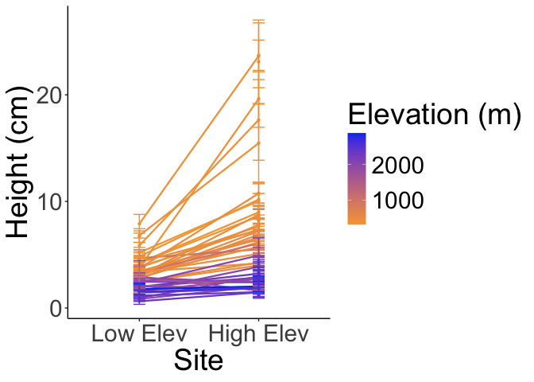<!-- -->

``` r
ggsave("../output/TwoMonths_RxNorms_Height_MFAvgs.png", width = 14, height = 8, units = "in")

twomonths_rxnnorms_summary_mfs2 %>% 
  filter(N_length>2) %>% 
  ggplot(aes(x=Site, y=mean_long.leaf.cm, group=pop.mf, color=elev_m)) + 
  geom_point(size=0.8) + geom_line(linewidth=0.8) +
  geom_errorbar(aes(ymin=mean_long.leaf.cm-sem_long.leaf.cm,ymax=mean_long.leaf.cm+sem_long.leaf.cm),
                width=.1) +
  theme_classic() + scale_colour_gradient(low = "#F5A540", high = "#0043F0")  +
  labs(y="Leaf Length (cm)", color="Elevation (m)") +
  theme(text=element_text(size=28))
```

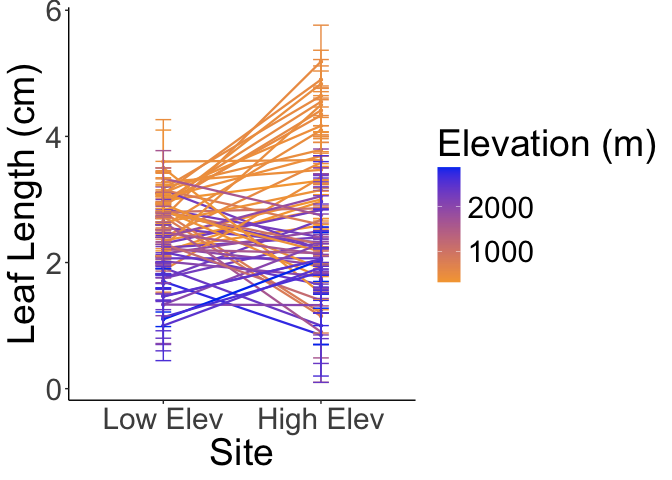<!-- -->

``` r
ggsave("../output/TwoMonths_RxNorms_LongestLength_MFAvgs.png", width = 14, height = 8, units = "in")
```


``` r
twomonths_rxnnorms_summary_mfs2 %>% 
  filter(N_height >2) %>% 
  filter(parent.pop=="BH"|parent.pop=="WL1"|parent.pop=="CP2") %>%  
  ggplot(aes(x=Site, y=mean_height.cm, group=pop.mf, color=elev_m)) + 
  geom_point(size=0.8) + geom_line(linewidth=0.8) +
  geom_errorbar(aes(ymin=mean_height.cm-sem_height.cm,ymax=mean_height.cm+sem_height.cm),width=.1) +
  theme_classic() + scale_colour_gradient(low = "#F5A540", high = "#0043F0")  +
  labs(y="Height (cm)", color="Elevation (m)") +
  theme(text=element_text(size=28))
```

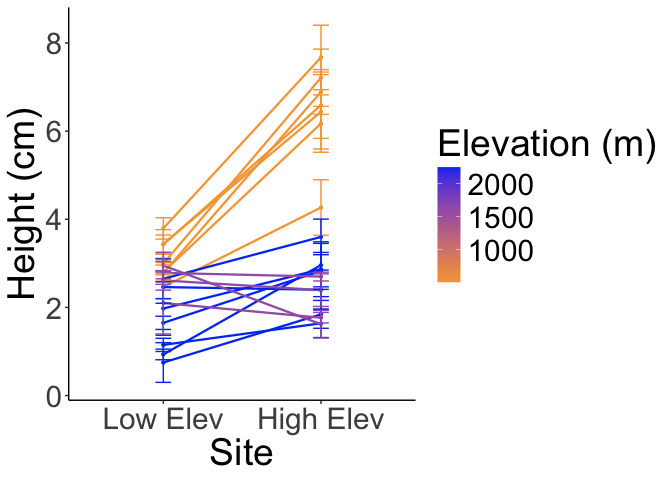<!-- -->

``` r
#ggsave("../output/TwoMonths_RxNorms_Height_BH_WL1_CP2_MFAvgs.png", width = 14, height = 8, units = "in")

twomonths_rxnnorms_summary_mfs2 %>% 
  filter(N_length >2) %>% 
  filter(parent.pop=="BH"|parent.pop=="WL1"|parent.pop=="CP2") %>%  
  ggplot(aes(x=Site, y=mean_long.leaf.cm, group=pop.mf, color=elev_m)) + 
  geom_point(size=0.8) + geom_line(linewidth=0.8) +
  geom_errorbar(aes(ymin=mean_long.leaf.cm-sem_long.leaf.cm,ymax=mean_long.leaf.cm+sem_long.leaf.cm),
                width=.1) +
  theme_classic() + scale_colour_gradient(low = "#F5A540", high = "#0043F0")  +
  labs(y="Leaf Length (cm)", color="Elevation (m)") +
  theme(text=element_text(size=28))
```

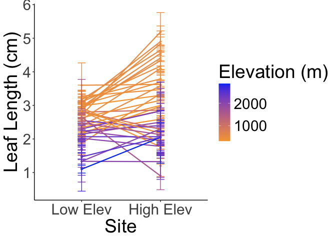<!-- -->

``` r
#ggsave("../output/TwoMonths_RxNorms_LongestLength_BH_WL1_CP2_MFAvgs.png", width = 14, height = 8, units = "in")
```

### Means by Pop


``` r
twomonths_rxnnorms_summary_pops <- twomonths_rxnnorms_loc %>% 
  filter(!is.na(parent.pop)) %>% 
  group_by(parent.pop, Site, elev_m, Wtr_Year_GD_Recent, Wtr_Year_GD_Historical) %>% 
  summarise(N_height = sum(!is.na(height.cm)), mean_height.cm = mean(height.cm,na.rm=(TRUE)), 
            sem_height.cm=sem(height.cm, na.rm=(TRUE)), N_length = sum(!is.na(long.leaf.cm)),
            mean_long.leaf.cm=mean(long.leaf.cm, na.rm=(TRUE)), 
            sem_long.leaf.cm=sem(long.leaf.cm, na.rm=TRUE))
```

```
## `summarise()` has grouped output by 'parent.pop', 'Site', 'elev_m',
## 'Wtr_Year_GD_Recent'. You can override using the `.groups` argument.
```

``` r
#twomonths_rxnnorms_summary_pops

twomonths_rxnnorms_summary_pops %>% arrange(N_height)
```

```
## # A tibble: 46 × 11
## # Groups:   parent.pop, Site, elev_m, Wtr_Year_GD_Recent [46]
##    parent.pop Site  elev_m Wtr_Year_GD_Recent Wtr_Year_GD_Historical N_height
##    <chr>      <chr>  <dbl>              <dbl>                  <dbl>    <int>
##  1 WV         WL2     749.              0.481                  0.493        0
##  2 LV1        UCD    2593.              0.791                  0.789        1
##  3 WV         UCD     749.              0.410                  0.441        1
##  4 WR         WL2    1158               0.418                  0.407        3
##  5 YO4        UCD    2158.              0.540                  0.525        5
##  6 CP3        UCD    2266.              0.636                  0.640        6
##  7 WR         UCD    1158               0.515                  0.483        7
##  8 LV3        WL2    2354.              0.373                  0.466        8
##  9 YO11       UCD    2872.              0.579                  0.583        8
## 10 LVTR1      UCD    2741.              0.801                  0.801        9
## # ℹ 36 more rows
## # ℹ 5 more variables: mean_height.cm <dbl>, sem_height.cm <dbl>,
## #   N_length <int>, mean_long.leaf.cm <dbl>, sem_long.leaf.cm <dbl>
```

``` r
twomonths_rxnnorms_summary_pops %>% filter(elev_m>2800) %>% filter(Site=="WL2") %>% summary()
```

```
##   parent.pop            Site               elev_m     Wtr_Year_GD_Recent
##  Length:1           Length:1           Min.   :2872   Min.   :0.4605    
##  Class :character   Class :character   1st Qu.:2872   1st Qu.:0.4605    
##  Mode  :character   Mode  :character   Median :2872   Median :0.4605    
##                                        Mean   :2872   Mean   :0.4605    
##                                        3rd Qu.:2872   3rd Qu.:0.4605    
##                                        Max.   :2872   Max.   :0.4605    
##  Wtr_Year_GD_Historical    N_height  mean_height.cm  sem_height.cm   
##  Min.   :0.5558         Min.   :28   Min.   :2.625   Min.   :0.2669  
##  1st Qu.:0.5558         1st Qu.:28   1st Qu.:2.625   1st Qu.:0.2669  
##  Median :0.5558         Median :28   Median :2.625   Median :0.2669  
##  Mean   :0.5558         Mean   :28   Mean   :2.625   Mean   :0.2669  
##  3rd Qu.:0.5558         3rd Qu.:28   3rd Qu.:2.625   3rd Qu.:0.2669  
##  Max.   :0.5558         Max.   :28   Max.   :2.625   Max.   :0.2669  
##     N_length  mean_long.leaf.cm sem_long.leaf.cm
##  Min.   :22   Min.   :1.941     Min.   :0.2728  
##  1st Qu.:22   1st Qu.:1.941     1st Qu.:0.2728  
##  Median :22   Median :1.941     Median :0.2728  
##  Mean   :22   Mean   :1.941     Mean   :0.2728  
##  3rd Qu.:22   3rd Qu.:1.941     3rd Qu.:0.2728  
##  Max.   :22   Max.   :1.941     Max.   :0.2728
```

``` r
twomonths_rxnnorms_summary_pops %>% filter(elev_m>2800) %>% filter(Site=="UCD") %>% summary()
```

```
##   parent.pop            Site               elev_m     Wtr_Year_GD_Recent
##  Length:1           Length:1           Min.   :2872   Min.   :0.5789    
##  Class :character   Class :character   1st Qu.:2872   1st Qu.:0.5789    
##  Mode  :character   Mode  :character   Median :2872   Median :0.5789    
##                                        Mean   :2872   Mean   :0.5789    
##                                        3rd Qu.:2872   3rd Qu.:0.5789    
##                                        Max.   :2872   Max.   :0.5789    
##  Wtr_Year_GD_Historical    N_height mean_height.cm  sem_height.cm   
##  Min.   :0.5831         Min.   :8   Min.   :2.438   Min.   :0.3041  
##  1st Qu.:0.5831         1st Qu.:8   1st Qu.:2.438   1st Qu.:0.3041  
##  Median :0.5831         Median :8   Median :2.438   Median :0.3041  
##  Mean   :0.5831         Mean   :8   Mean   :2.438   Mean   :0.3041  
##  3rd Qu.:0.5831         3rd Qu.:8   3rd Qu.:2.438   3rd Qu.:0.3041  
##  Max.   :0.5831         Max.   :8   Max.   :2.438   Max.   :0.3041  
##     N_length mean_long.leaf.cm sem_long.leaf.cm
##  Min.   :8   Min.   :1.525     Min.   :0.1623  
##  1st Qu.:8   1st Qu.:1.525     1st Qu.:0.1623  
##  Median :8   Median :1.525     Median :0.1623  
##  Mean   :8   Mean   :1.525     Mean   :0.1623  
##  3rd Qu.:8   3rd Qu.:1.525     3rd Qu.:0.1623  
##  Max.   :8   Max.   :1.525     Max.   :0.1623
```

``` r
twomonths_rxnnorms_summary_pops2 <- twomonths_rxnnorms_summary_pops %>% 
  mutate(Site=str_replace_all(Site, "UCD", "Low Elev"), 
         Site=str_replace_all(Site, "WL2", "High Elev"))
twomonths_rxnnorms_summary_pops2$Site <- factor(twomonths_rxnnorms_summary_pops2$Site,
                                               levels = c('Low Elev','High Elev'))
#no data for WV at high elevation (dead by the time of these measurements)
```

### Plot Pop Avgs


``` r
twomonths_rxnnorms_summary_pops %>% 
  filter(N_height>2) %>% 
   ggplot(aes(x=Site, y=mean_height.cm, group=parent.pop, color=parent.pop)) + 
  geom_point(size=0.8) + geom_line(linewidth=0.8) +
  geom_errorbar(aes(ymin=mean_height.cm-sem_height.cm,ymax=mean_height.cm+sem_height.cm),width=.1) +
  theme_classic() +
   theme(text=element_text(size=25))
```

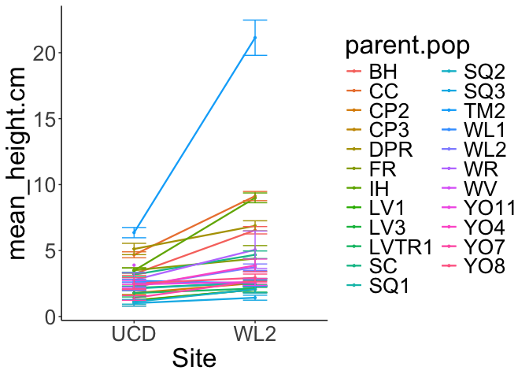<!-- -->

``` r
ggsave("../output/TwoMonths_RxNorms_Height_ALL_PopAvgs2.png", width = 12, height = 8, units = "in")

twomonths_rxnnorms_summary_pops %>% 
  filter(N_length>2) %>% 
   ggplot(aes(x=Site, y=mean_long.leaf.cm, group=parent.pop, color=parent.pop)) + 
  geom_point(size=0.8) + geom_line(linewidth=0.8) +
  geom_errorbar(aes(ymin=mean_long.leaf.cm-sem_long.leaf.cm,ymax=mean_long.leaf.cm+sem_long.leaf.cm),width=.1) +
  theme_classic() +
   theme(text=element_text(size=25))
```

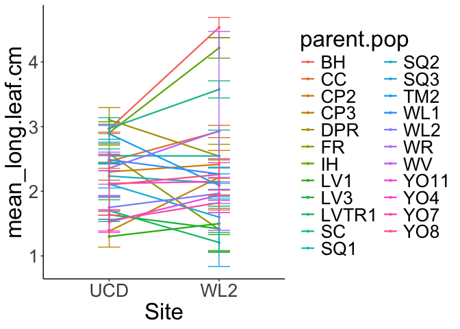<!-- -->

``` r
ggsave("../output/TwoMonths_RxNorms_LongestLength_ALL_PopAvgs2.png", width = 12, height = 8, units = "in")
```


``` r
twomonths_rxnnorms_summary_pops2 %>% 
  filter(N_height >2) %>% 
  ggplot(aes(x=Site, y=mean_height.cm, group=parent.pop, color=elev_m)) + 
  geom_point(size=1.5) + geom_line(linewidth=1.5) +
  geom_errorbar(aes(ymin=mean_height.cm-sem_height.cm,ymax=mean_height.cm+sem_height.cm),width=.1) +
  theme_classic() + scale_colour_gradient(low = "#F5A540", high = "#0043F0")  +
  labs(y="Height (cm)", color="Elevation (m)") +
 # ylim(0,4) +
  theme(text=element_text(size=28))
```

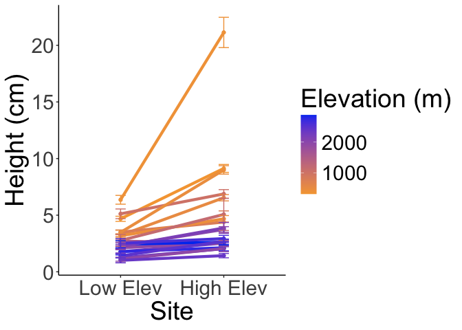<!-- -->

``` r
ggsave("../output/TwoMonths_RxNorms_Height_ALL_PopAvgs.png", width = 14, height = 8, units = "in")

twomonths_rxnnorms_summary_pops2 %>% 
  filter(N_length >2) %>% 
  ggplot(aes(x=Site, y=mean_long.leaf.cm, group=parent.pop, color=elev_m)) + 
  geom_point(size=1.5) + geom_line(linewidth=1.5) +
  geom_errorbar(aes(ymin=mean_long.leaf.cm-sem_long.leaf.cm,
                    ymax=mean_long.leaf.cm+sem_long.leaf.cm),width=.1) +
  theme_classic() + scale_colour_gradient(low = "#F5A540", high = "#0043F0")  +
  labs(y="Leaf Length (cm)", color="Elevation (m)") +
  theme(text=element_text(size=28))
```

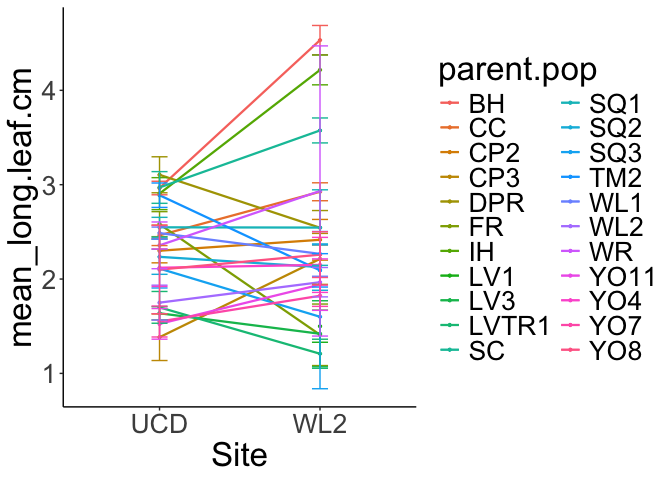<!-- -->

``` r
ggsave("../output/TwoMonths_RxNorms_LongestLength_ALL_PopAvgs.png", width = 14, height = 8, units = "in")
```

### By Gowers Distance


``` r
ggplot() +
  geom_line(data = filter(twomonths_rxnnorms_summary_pops2, N_height>2), linewidth=1.5, aes(x = Site, y = mean_height.cm, group=parent.pop, color=elev_m)) + scale_colour_gradient(low = "#F5A540", high = "#0043F0") +
  labs(color="Elevation (m)") +
   
  # start a new scale
  new_scale_colour() +
  
  geom_point(data = filter(twomonths_rxnnorms_summary_pops2, N_height>2), 
             size=2.5, aes(x = Site,y = mean_height.cm, color=Wtr_Year_GD_Recent), alpha=0.9) +
  geom_errorbar(data = filter(twomonths_rxnnorms_summary_pops2, N_height >2), 
                aes(x=Site, y=mean_height.cm,ymin=mean_height.cm-sem_height.cm,ymax=mean_height.cm+sem_height.cm,
                    color=Wtr_Year_GD_Recent), alpha=0.9, width=.1) +
  theme_classic() + scale_colour_gradientn(colours = c("black", "grey80")) +
  labs(y="Height (cm)", color="Envtal Dist \n(from garden year)") +
  theme(text=element_text(size=28))
```

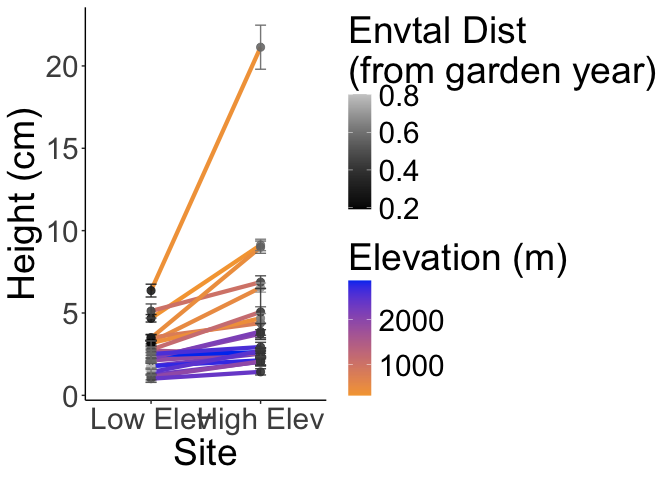<!-- -->

``` r
ggsave("../output/TwoMonths_RxNorms_Height_ALL_PopAvgs_Gowers.png", width = 14, height = 8, units = "in")
```


``` r
ggplot() +
  geom_line(data = filter(twomonths_rxnnorms_summary_pops2, N_length >2), linewidth=1.5, aes(x = Site, y = mean_long.leaf.cm, group=parent.pop, color=elev_m)) + scale_colour_gradient(low = "#F5A540", high = "#0043F0") +
  labs(color="Elevation (m)") +
   
  # start a new scale
  new_scale_colour() +
  
  geom_point(data = filter(twomonths_rxnnorms_summary_pops2, N_length >2), 
             size=2.5, aes(x = Site,y = mean_long.leaf.cm, color=Wtr_Year_GD_Recent), alpha=0.9) +
  geom_errorbar(data = filter(twomonths_rxnnorms_summary_pops2, N_length >2), 
                aes(x=Site, y=mean_long.leaf.cm,ymin=mean_long.leaf.cm-sem_long.leaf.cm,ymax=mean_long.leaf.cm+sem_long.leaf.cm,
                    color=Wtr_Year_GD_Recent), alpha=0.9, width=.1) +
  theme_classic() + scale_colour_gradientn(colours = c("black", "grey80")) +
  labs(y="Leaf Length (cm)", color="Envtal Dist \n(from garden year)") +
  theme(text=element_text(size=28))
```

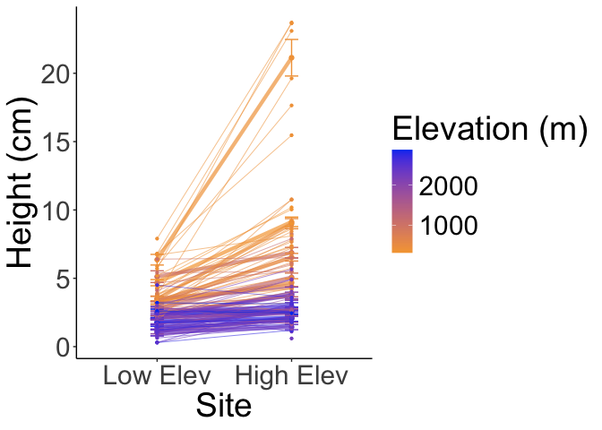<!-- -->

``` r
ggsave("../output/TwoMonths_RxNorms_LongestLength_ALL_PopAvgs_Gowers.png", width = 14, height = 8, units = "in")
```

### Combine mf and pop averages


``` r
twomonths_rxnnorms_summary_pops2 %>% 
  mutate(pop.mf=parent.pop) %>% 
  filter(N_height >2) %>% 
  ggplot(aes(x=Site, y=mean_height.cm, group=pop.mf, color=elev_m)) + 
  geom_point(size=1.5) + geom_line(linewidth=1.5, alpha=0.7) +
  geom_errorbar(aes(ymin=mean_height.cm-sem_height.cm,ymax=mean_height.cm+sem_height.cm),width=.1) +
  theme_classic() + scale_colour_gradient(low = "#F5A540", high = "#0043F0")  +
  labs(y="Height (cm)", color="Elevation (m)") +
  theme(text=element_text(size=28)) +
 geom_line(data = twomonths_rxnnorms_summary_mfs2, size=0.2) +
  geom_point(data = twomonths_rxnnorms_summary_mfs2, size=0.8) 
```

```
## Warning: Using `size` aesthetic for lines was deprecated in ggplot2 3.4.0.
## ℹ Please use `linewidth` instead.
## This warning is displayed once every 8 hours.
## Call `lifecycle::last_lifecycle_warnings()` to see where this warning was
## generated.
```

```
## Warning: Removed 21 rows containing missing values or values outside the scale range
## (`geom_line()`).
```

```
## Warning: Removed 21 rows containing missing values or values outside the scale range
## (`geom_point()`).
```

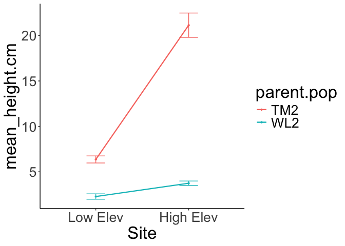<!-- -->

``` r
ggsave("../output/TwoMonths_RxNorms_Height_ALL_PopMFAvgs.png", width = 14, height = 8, units = "in")
```

```
## Warning: Removed 21 rows containing missing values or values outside the scale range
## (`geom_line()`).
## Removed 21 rows containing missing values or values outside the scale range
## (`geom_point()`).
```

``` r
twomonths_rxnnorms_summary_pops2 %>% 
  mutate(pop.mf=parent.pop) %>% 
  filter(N_length >2) %>% 
  ggplot(aes(x=Site, y=mean_long.leaf.cm, group=pop.mf, color=elev_m)) + 
  geom_point(size=1.5) + geom_line(linewidth=1.5,  alpha=0.7) +
  geom_errorbar(aes(ymin=mean_long.leaf.cm-sem_long.leaf.cm,
                    ymax=mean_long.leaf.cm+sem_long.leaf.cm),width=.1) +
  theme_classic() + scale_colour_gradient(low = "#F5A540", high = "#0043F0")  +
  labs(y="Leaf Length (cm)", color="Elevation (m)") +
  theme(text=element_text(size=28)) +
geom_line(data = twomonths_rxnnorms_summary_mfs2, size=0.2) +
  geom_point(data = twomonths_rxnnorms_summary_mfs2, size=0.8) 
```

```
## Warning: Removed 25 rows containing missing values or values outside the scale range
## (`geom_line()`).
```

```
## Warning: Removed 25 rows containing missing values or values outside the scale range
## (`geom_point()`).
```

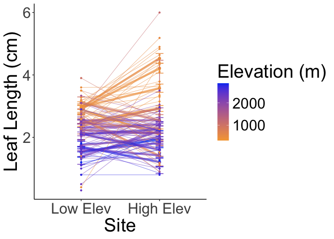<!-- -->

``` r
ggsave("../output/TwoMonths_RxNorms_LongestLength_ALL_PopMFAvgs.png", width = 14, height = 8, units = "in")
```

```
## Warning: Removed 25 rows containing missing values or values outside the scale range
## (`geom_line()`).
## Removed 25 rows containing missing values or values outside the scale range
## (`geom_point()`).
```


``` r
twomonths_rxnnorms_summary_pops2 %>% 
  filter(parent.pop=="TM2"|parent.pop=="WL2") %>%  
   ggplot(aes(x=Site, y=mean_height.cm, group=parent.pop, color=parent.pop)) + 
  geom_point(size=0.8) + geom_line(linewidth=0.8) +
  geom_errorbar(aes(ymin=mean_height.cm-sem_height.cm,ymax=mean_height.cm+sem_height.cm),width=.2) +
  theme_classic()  +
   theme(text=element_text(size=25))
```

<!-- -->

``` r
ggsave("../output/TwoMonths_RxNorms_Height_TM2_WL2_PopAvgs.png", width = 12, height = 8, units = "in")

twomonths_rxnnorms_summary_pops2 %>% 
  filter(parent.pop=="TM2"|parent.pop=="WL2") %>%  
   ggplot(aes(x=Site, y=mean_long.leaf.cm, group=parent.pop, color=parent.pop)) + 
  geom_point(size=0.8) + geom_line(linewidth=0.8) +
  geom_errorbar(aes(ymin=mean_long.leaf.cm-sem_long.leaf.cm,ymax=mean_long.leaf.cm+sem_long.leaf.cm),width=.2) +
  theme_classic()  +
   theme(text=element_text(size=25))
```

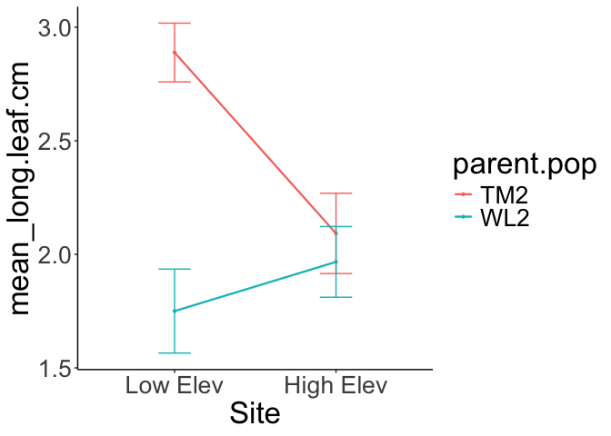<!-- -->

``` r
ggsave("../output/TwoMonths_RxNorms_LongestLength_TM2_WL2_PopAvgs.png", width = 12, height = 8, units = "in")
```

### Means by Elevation


``` r
twomonths_rxnnorms_summary_elev <- twomonths_rxnnorms_loc %>% 
  group_by(elevation.group, Site) %>% 
  summarise(N_height = sum(!is.na(height.cm)), mean_height.cm = mean(height.cm,na.rm=(TRUE)), 
            sem_height.cm=sem(height.cm, na.rm=(TRUE)), N_length = sum(!is.na(long.leaf.cm)),
            mean_long.leaf.cm=mean(long.leaf.cm, na.rm=(TRUE)), 
            sem_long.leaf.cm=sem(long.leaf.cm, na.rm=TRUE))
```

```
## `summarise()` has grouped output by 'elevation.group'. You can override using
## the `.groups` argument.
```

``` r
twomonths_rxnnorms_summary_elev
```

```
## # A tibble: 6 × 8
## # Groups:   elevation.group [3]
##   elevation.group Site  N_height mean_height.cm sem_height.cm N_length
##   <chr>           <chr>    <int>          <dbl>         <dbl>    <int>
## 1 High            UCD        163           1.94        0.0811      163
## 2 High            WL2        284           2.73        0.0885      216
## 3 Low             UCD        243           3.91        0.112       243
## 4 Low             WL2        246           9.53        0.415       246
## 5 Mid             UCD        208           2.87        0.100       207
## 6 Mid             WL2        112           4.01        0.262        96
## # ℹ 2 more variables: mean_long.leaf.cm <dbl>, sem_long.leaf.cm <dbl>
```


``` r
twomonths_rxnnorms_summary_elev$elevation.group <- factor(twomonths_rxnnorms_summary_elev$elevation.group, levels = c('High','Mid', 'Low'))
twomonths_rxnnorms_summary_elev %>% 
   ggplot(aes(x=Site, y=mean_height.cm, group=elevation.group, color=elevation.group)) + 
  geom_point(size=0.8) + geom_line(linewidth=0.8) +
  geom_errorbar(aes(ymin=mean_height.cm-sem_height.cm,ymax=mean_height.cm+sem_height.cm),width=.2) +
  theme_classic() + scale_colour_manual(values=elev_three_palette)
```

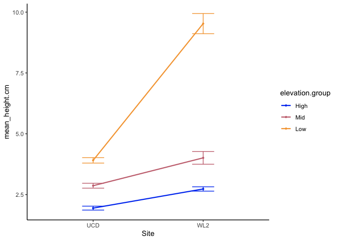<!-- -->

``` r
twomonths_rxnnorms_summary_elev %>% 
   ggplot(aes(x=Site, y=mean_long.leaf.cm, group=elevation.group, color=elevation.group)) + 
  geom_point(size=0.8) + geom_line(linewidth=0.8) +
  geom_errorbar(aes(ymin=mean_long.leaf.cm-sem_long.leaf.cm,ymax=mean_long.leaf.cm+sem_long.leaf.cm),width=.2) +
  theme_classic() + scale_colour_manual(values=elev_three_palette)
```

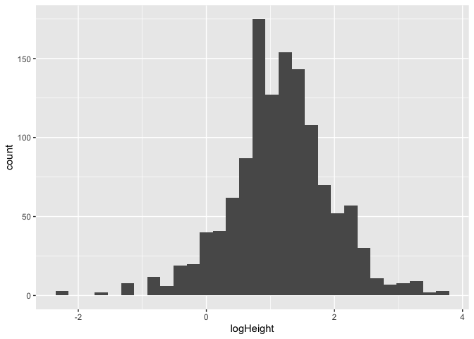<!-- -->

## Stats

### Scaling

Center and scale/transform height and longest leaf in the plasticity models to get slopes that aren’t biased by plant size

#### Check distributions 

``` r
twomonths_rxnnorms_loc %>% 
  ggplot(aes(height.cm)) +
  geom_histogram() #pretty skewed
```

```
## `stat_bin()` using `bins = 30`. Pick better value with `binwidth`.
```

```
## Warning: Removed 1074 rows containing non-finite outside the scale range
## (`stat_bin()`).
```

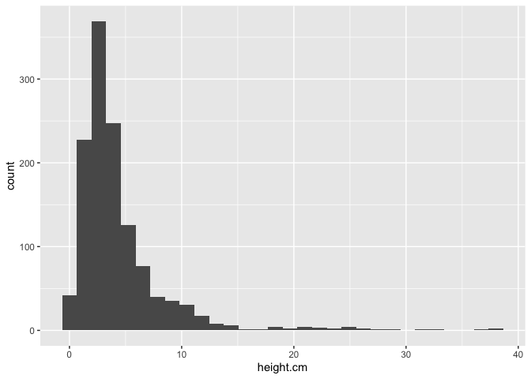<!-- -->

``` r
twomonths_rxnnorms_loc %>% 
  mutate(logHeight=log(height.cm)) %>% 
  ggplot(aes(logHeight))+
  geom_histogram() #looks better 
```

```
## `stat_bin()` using `bins = 30`. Pick better value with `binwidth`.
```

```
## Warning: Removed 1074 rows containing non-finite outside the scale range
## (`stat_bin()`).
```

<!-- -->

``` r
twomonths_rxnnorms_loc %>% 
  ggplot(aes(long.leaf.cm)) +
  geom_histogram() #looks fine 
```

```
## `stat_bin()` using `bins = 30`. Pick better value with `binwidth`.
```

```
## Warning: Removed 1159 rows containing non-finite outside the scale range
## (`stat_bin()`).
```

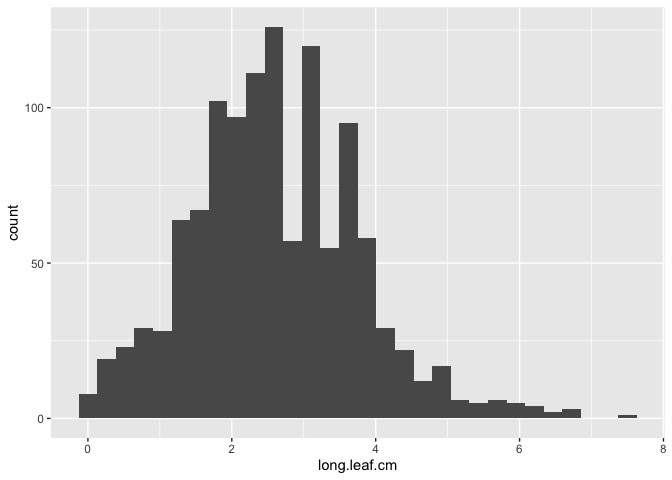<!-- -->

Test that log transformation will help 

``` r
#Case where size doubles between sites:
##Plant 1: 2.3 --> 4.6
4.6-2.3 #2.3
```

```
## [1] 2.3
```

``` r
log(4.6)-log(2.3) #0.6931472
```

```
## [1] 0.6931472
```

``` r
##Plant 2: 4.5 --> 9 
9-4.5 #4.5
```

```
## [1] 4.5
```

``` r
log(9)-log(4.5) #0.6931472
```

```
## [1] 0.6931472
```

``` r
#Log transformation makes the difference between the two be on the same scale 
```

Test Centering and Scaling for Length

``` r
#use same case as above chunk 
test <- tibble(length=c(2.3, 4.6, 4.5, 9), Site=c("UCD", "WL2","UCD", "WL2"), pop=c(1,1,2,2)) %>% 
  group_by(pop) %>% 
  mutate(length_scaled = scale(length))
test #the same 
```

```
## # A tibble: 4 × 4
## # Groups:   pop [2]
##   length Site    pop length_scaled[,1]
##    <dbl> <chr> <dbl>             <dbl>
## 1    2.3 UCD       1            -0.707
## 2    4.6 WL2       1             0.707
## 3    4.5 UCD       2            -0.707
## 4    9   WL2       2             0.707
```


``` r
twomonths_rxnnorms_loc_scale <- twomonths_rxnnorms_loc %>% 
  mutate(logHeight=log(height.cm)) %>% 
  group_by(parent.pop) %>% 
  mutate(length_scaled = scale(long.leaf.cm)) %>% 
  ungroup()
```


### Height


``` r
lmeheight2 <- lmer(logHeight ~ Site + (1|parent.pop/mf), data = twomonths_rxnnorms_loc_scale) #no block b/c nested within site?
summary(lmeheight2)
```

```
## Linear mixed model fit by REML. t-tests use Satterthwaite's method [
## lmerModLmerTest]
## Formula: logHeight ~ Site + (1 | parent.pop/mf)
##    Data: twomonths_rxnnorms_loc_scale
## 
## REML criterion at convergence: 2044.7
## 
## Scaled residuals: 
##     Min      1Q  Median      3Q     Max 
## -5.7925 -0.4749  0.1362  0.6345  2.4934 
## 
## Random effects:
##  Groups        Name        Variance Std.Dev.
##  mf:parent.pop (Intercept) 0.02616  0.1617  
##  parent.pop    (Intercept) 0.34471  0.5871  
##  Residual                  0.26065  0.5105  
## Number of obs: 1256, groups:  mf:parent.pop, 168; parent.pop, 23
## 
## Fixed effects:
##              Estimate Std. Error        df t value Pr(>|t|)    
## (Intercept) 7.275e-01  1.270e-01 2.300e+01   5.731 7.76e-06 ***
## SiteWL2     5.138e-01  3.329e-02 1.196e+03  15.437  < 2e-16 ***
## ---
## Signif. codes:  0 '***' 0.001 '**' 0.01 '*' 0.05 '.' 0.1 ' ' 1
## 
## Correlation of Fixed Effects:
##         (Intr)
## SiteWL2 -0.146
```

``` r
#ranova(lmeheight2) 
#anova(lmeheight2)

lmeheight3 <- lmer(logHeight ~ Site + (Site|parent.pop) + (1|pop.mf), data = twomonths_rxnnorms_loc_scale) 
summary(lmeheight3)
```

```
## Linear mixed model fit by REML. t-tests use Satterthwaite's method [
## lmerModLmerTest]
## Formula: logHeight ~ Site + (Site | parent.pop) + (1 | pop.mf)
##    Data: twomonths_rxnnorms_loc_scale
## 
## REML criterion at convergence: 1976.2
## 
## Scaled residuals: 
##     Min      1Q  Median      3Q     Max 
## -6.0749 -0.4233  0.1162  0.6168  2.6307 
## 
## Random effects:
##  Groups     Name        Variance Std.Dev. Corr
##  pop.mf     (Intercept) 0.02095  0.1447       
##  parent.pop (Intercept) 0.27178  0.5213       
##             SiteWL2     0.08582  0.2929   0.24
##  Residual               0.24305  0.4930       
## Number of obs: 1256, groups:  pop.mf, 168; parent.pop, 23
## 
## Fixed effects:
##             Estimate Std. Error       df t value Pr(>|t|)    
## (Intercept)  0.76116    0.11414 21.54946   6.669 1.17e-06 ***
## SiteWL2      0.44431    0.07307 23.50924   6.081 3.05e-06 ***
## ---
## Signif. codes:  0 '***' 0.001 '**' 0.01 '*' 0.05 '.' 0.1 ' ' 1
## 
## Correlation of Fixed Effects:
##         (Intr)
## SiteWL2 0.098
```

``` r
ranova(lmeheight3) 
```

```
## ANOVA-like table for random-effects: Single term deletions
## 
## Model:
## logHeight ~ Site + (Site | parent.pop) + (1 | pop.mf)
##                             npar   logLik    AIC    LRT Df Pr(>Chisq)    
## <none>                         7  -988.08 1990.2                         
## Site in (Site | parent.pop)    5 -1022.35 2054.7 68.530  2  1.315e-15 ***
## (1 | pop.mf)                   6  -996.06 2004.1 15.954  1  6.489e-05 ***
## ---
## Signif. codes:  0 '***' 0.001 '**' 0.01 '*' 0.05 '.' 0.1 ' ' 1
```

``` r
anova(lmeheight3)
```

```
## Type III Analysis of Variance Table with Satterthwaite's method
##      Sum Sq Mean Sq NumDF  DenDF F value    Pr(>F)    
## Site 8.9873  8.9873     1 23.509  36.977 3.048e-06 ***
## ---
## Signif. codes:  0 '***' 0.001 '**' 0.01 '*' 0.05 '.' 0.1 ' ' 1
```

``` r
coef(lmeheight3)$parent.pop
```

```
##       (Intercept)     SiteWL2
## BH     1.09078096  0.71457060
## CC     1.48235134  0.65115754
## CP2    0.38699547  0.40032009
## CP3    0.05078109  0.46011979
## DPR    1.50931161  0.41255208
## FR     1.12250564  0.18114834
## IH     1.20556708  0.91887060
## LV1    0.28818394  0.28644982
## LV3    0.64647405  0.28103149
## LVTR1  0.37746452  0.24684576
## SC     1.05930158  0.40128365
## SQ1    0.58001591  0.35377840
## SQ2    0.04073006  0.53364976
## SQ3   -0.17033316  0.41193631
## TM2    1.79764724  1.08468465
## WL1    0.92782709 -0.06915743
## WL2    0.67512643  0.51740523
## WR     0.91404923  0.54141617
## WV     1.06541874  0.48574373
## YO11   0.73194359  0.12284829
## YO4    0.72631821  0.43515213
## YO7    0.30935876  0.56318421
## YO8    0.68879322  0.28416135
```

``` r
height_slopes <- coef(lmeheight3)$parent.pop %>% 
  rename(height_slope=SiteWL2) %>% select(-`(Intercept)`) %>% 
  rownames_to_column(var="parent.pop")
```

### Length


``` r
lmelength2 <- lmer(length_scaled ~ Site + (1|parent.pop/mf), data = twomonths_rxnnorms_loc_scale) #no block b/c nested within site?
```

```
## boundary (singular) fit: see help('isSingular')
```

``` r
summary(lmelength2) #boundary (singular) fit: see help('isSingular') - mf explains little variation 
```

```
## Linear mixed model fit by REML. t-tests use Satterthwaite's method [
## lmerModLmerTest]
## Formula: length_scaled ~ Site + (1 | parent.pop/mf)
##    Data: twomonths_rxnnorms_loc_scale
## 
## REML criterion at convergence: 3291.3
## 
## Scaled residuals: 
##     Min      1Q  Median      3Q     Max 
## -3.1261 -0.6624  0.0322  0.6547  3.4844 
## 
## Random effects:
##  Groups        Name        Variance  Std.Dev. 
##  mf:parent.pop (Intercept) 0.000e+00 0.000e+00
##  parent.pop    (Intercept) 7.259e-31 8.520e-16
##  Residual                  9.696e-01 9.847e-01
## Number of obs: 1170, groups:  mf:parent.pop, 161; parent.pop, 22
## 
## Fixed effects:
##               Estimate Std. Error         df t value Pr(>|t|)    
## (Intercept)   -0.10987    0.03980 1168.00000  -2.760  0.00587 ** 
## SiteWL2        0.23036    0.05764 1168.00000   3.997 6.82e-05 ***
## ---
## Signif. codes:  0 '***' 0.001 '**' 0.01 '*' 0.05 '.' 0.1 ' ' 1
## 
## Correlation of Fixed Effects:
##         (Intr)
## SiteWL2 -0.691
## optimizer (nloptwrap) convergence code: 0 (OK)
## boundary (singular) fit: see help('isSingular')
```

``` r
#ranova(lmelength2) 
#anova(lmelength2)

lmelength3 <- lmer(length_scaled ~ Site + (1|parent.pop), data = twomonths_rxnnorms_loc_scale) #remove mf 
```

```
## boundary (singular) fit: see help('isSingular')
```

``` r
#boundary (singular) fit: see help('isSingular') - pop also explains little variation 
summary(lmelength3) 
```

```
## Linear mixed model fit by REML. t-tests use Satterthwaite's method [
## lmerModLmerTest]
## Formula: length_scaled ~ Site + (1 | parent.pop)
##    Data: twomonths_rxnnorms_loc_scale
## 
## REML criterion at convergence: 3291.3
## 
## Scaled residuals: 
##     Min      1Q  Median      3Q     Max 
## -3.1261 -0.6624  0.0322  0.6547  3.4844 
## 
## Random effects:
##  Groups     Name        Variance  Std.Dev. 
##  parent.pop (Intercept) 6.438e-31 8.024e-16
##  Residual               9.696e-01 9.847e-01
## Number of obs: 1170, groups:  parent.pop, 22
## 
## Fixed effects:
##               Estimate Std. Error         df t value Pr(>|t|)    
## (Intercept)   -0.10987    0.03980 1168.00000  -2.760  0.00587 ** 
## SiteWL2        0.23036    0.05764 1168.00000   3.997 6.82e-05 ***
## ---
## Signif. codes:  0 '***' 0.001 '**' 0.01 '*' 0.05 '.' 0.1 ' ' 1
## 
## Correlation of Fixed Effects:
##         (Intr)
## SiteWL2 -0.691
## optimizer (nloptwrap) convergence code: 0 (OK)
## boundary (singular) fit: see help('isSingular')
```

``` r
ranova(lmelength3) 
```

```
## ANOVA-like table for random-effects: Single term deletions
## 
## Model:
## length_scaled ~ Site + (1 | parent.pop)
##                  npar  logLik    AIC LRT Df Pr(>Chisq)
## <none>              4 -1645.7 3299.3                  
## (1 | parent.pop)    3 -1645.7 3297.3   0  1          1
```

``` r
anova(lmelength3)
```

```
## Type III Analysis of Variance Table with Satterthwaite's method
##      Sum Sq Mean Sq NumDF DenDF F value    Pr(>F)    
## Site 15.489  15.489     1  1168  15.975 6.822e-05 ***
## ---
## Signif. codes:  0 '***' 0.001 '**' 0.01 '*' 0.05 '.' 0.1 ' ' 1
```

``` r
lmtest <- lm(length_scaled ~ Site, data = twomonths_rxnnorms_loc_scale)
summary(lmtest) #taking pop out doesn't change Site effect - keep pop in 
```

```
## 
## Call:
## lm(formula = length_scaled ~ Site, data = twomonths_rxnnorms_loc_scale)
## 
## Residuals:
##     Min      1Q  Median      3Q     Max 
## -3.0783 -0.6523  0.0318  0.6446  3.4311 
## 
## Coefficients:
##             Estimate Std. Error t value Pr(>|t|)    
## (Intercept) -0.10987    0.03980  -2.760  0.00587 ** 
## SiteWL2      0.23036    0.05764   3.997 6.82e-05 ***
## ---
## Signif. codes:  0 '***' 0.001 '**' 0.01 '*' 0.05 '.' 0.1 ' ' 1
## 
## Residual standard error: 0.9847 on 1168 degrees of freedom
##   (1160 observations deleted due to missingness)
## Multiple R-squared:  0.01349,	Adjusted R-squared:  0.01265 
## F-statistic: 15.97 on 1 and 1168 DF,  p-value: 6.822e-05
```

``` r
lmelength4 <- lmer(length_scaled ~ Site + (Site|parent.pop), data = twomonths_rxnnorms_loc_scale) 
```

```
## boundary (singular) fit: see help('isSingular')
```

``` r
summary(lmelength4)
```

```
## Linear mixed model fit by REML. t-tests use Satterthwaite's method [
## lmerModLmerTest]
## Formula: length_scaled ~ Site + (Site | parent.pop)
##    Data: twomonths_rxnnorms_loc_scale
## 
## REML criterion at convergence: 3213.8
## 
## Scaled residuals: 
##     Min      1Q  Median      3Q     Max 
## -3.1062 -0.6439  0.0140  0.6176  3.3294 
## 
## Random effects:
##  Groups     Name        Variance Std.Dev. Corr 
##  parent.pop (Intercept) 0.04863  0.2205        
##             SiteWL2     0.27536  0.5247   -1.00
##  Residual               0.88318  0.9398        
## Number of obs: 1170, groups:  parent.pop, 22
## 
## Fixed effects:
##             Estimate Std. Error       df t value Pr(>|t|)
## (Intercept) -0.06400    0.06360 26.59342  -1.006    0.323
## SiteWL2      0.08615    0.12953 23.58025   0.665    0.512
## 
## Correlation of Fixed Effects:
##         (Intr)
## SiteWL2 -0.886
## optimizer (nloptwrap) convergence code: 0 (OK)
## boundary (singular) fit: see help('isSingular')
```

``` r
ranova(lmelength4) 
```

```
## boundary (singular) fit: see help('isSingular')
```

```
## ANOVA-like table for random-effects: Single term deletions
## 
## Model:
## length_scaled ~ Site + (Site | parent.pop)
##                             npar  logLik    AIC    LRT Df Pr(>Chisq)    
## <none>                         6 -1606.9 3225.8                         
## Site in (Site | parent.pop)    4 -1645.7 3299.3 77.559  2  < 2.2e-16 ***
## ---
## Signif. codes:  0 '***' 0.001 '**' 0.01 '*' 0.05 '.' 0.1 ' ' 1
```

``` r
anova(lmelength4)
```

```
## Type III Analysis of Variance Table with Satterthwaite's method
##      Sum Sq Mean Sq NumDF DenDF F value Pr(>F)
## Site 0.3907  0.3907     1 23.58  0.4424 0.5124
```

``` r
coef(lmelength4)$parent.pop
```

```
##        (Intercept)       SiteWL2
## BH    -0.537016167  1.2117139500
## CC    -0.251307555  0.5318569781
## CP2   -0.077032343  0.1171609842
## CP3   -0.165698841  0.3281470497
## DPR    0.125267356 -0.3642205855
## FR     0.294751164 -0.7675152139
## IH    -0.377851766  0.8329748288
## LV1   -0.076386787  0.1156248523
## LV3    0.036413845 -0.1527895127
## LVTR1  0.167380453 -0.4644306633
## SC    -0.241364007  0.5081958421
## SQ1   -0.027444948 -0.0008345362
## SQ2   -0.004144857 -0.0562781889
## SQ3    0.047410879 -0.1789574670
## TM2    0.231934284 -0.6180395157
## WL1    0.062435966 -0.2147103629
## WL2   -0.102201124  0.1770512717
## WR    -0.113480485  0.2038910370
## YO11  -0.122290950  0.2248559492
## YO4   -0.054541248  0.0636423744
## YO7   -0.144198041  0.2769848941
## YO8   -0.078680300  0.1210823738
```

``` r
length_slopes <- coef(lmelength4)$parent.pop %>% 
  rename(length_slope=SiteWL2) %>% select(-`(Intercept)`) %>% 
  rownames_to_column(var="parent.pop")
```

### Export Site slopes 

``` r
site_slopes <- left_join(height_slopes, length_slopes)
```

```
## Joining with `by = join_by(parent.pop)`
```

``` r
write_csv(site_slopes, "../output/TwoMonths_Size_Slopes.csv")
```

