To Do:

-   Add climate to the models!

Original Design - 23 pops, 7 mfs, 13 reps

-   Note: this analysis is for transplant beds only

## Questions:

-   Is there more variation b/t populations than b/t mfs?
-   Are certain traits related to fitness?
-   Did low elevation populations perform better than high elevation
    populations?
-   Connection to climate of home site?


## Relevant Libraries and Functions


```r
library(tidyverse)
```

```
## ── Attaching core tidyverse packages ──────────────────────── tidyverse 2.0.0 ──
## ✔ dplyr     1.1.3     ✔ readr     2.1.4
## ✔ forcats   1.0.0     ✔ stringr   1.5.0
## ✔ ggplot2   3.4.3     ✔ tibble    3.2.1
## ✔ lubridate 1.9.2     ✔ tidyr     1.3.0
## ✔ purrr     1.0.2     
## ── Conflicts ────────────────────────────────────────── tidyverse_conflicts() ──
## ✖ dplyr::filter() masks stats::filter()
## ✖ dplyr::lag()    masks stats::lag()
## ℹ Use the conflicted package (<http://conflicted.r-lib.org/>) to force all conflicts to become errors
```

```r
library(tidymodels)
```

```
## ── Attaching packages ────────────────────────────────────── tidymodels 1.1.1 ──
## ✔ broom        1.0.5     ✔ rsample      1.2.0
## ✔ dials        1.2.0     ✔ tune         1.1.2
## ✔ infer        1.0.5     ✔ workflows    1.1.3
## ✔ modeldata    1.2.0     ✔ workflowsets 1.0.1
## ✔ parsnip      1.1.1     ✔ yardstick    1.2.0
## ✔ recipes      1.0.8     
## ── Conflicts ───────────────────────────────────────── tidymodels_conflicts() ──
## ✖ scales::discard() masks purrr::discard()
## ✖ dplyr::filter()   masks stats::filter()
## ✖ recipes::fixed()  masks stringr::fixed()
## ✖ dplyr::lag()      masks stats::lag()
## ✖ yardstick::spec() masks readr::spec()
## ✖ recipes::step()   masks stats::step()
## • Use suppressPackageStartupMessages() to eliminate package startup messages
```

```r
tidymodels_prefer()
library(lmerTest) #for mixed effect models
```

```
## Loading required package: lme4
## Loading required package: Matrix
## 
## Attaching package: 'Matrix'
## 
## The following objects are masked from 'package:tidyr':
## 
##     expand, pack, unpack
```

```r
conflicted::conflicts_prefer(lmerTest::lmer)
```

```
## [conflicted] Will prefer lmerTest::lmer over any other package.
```

```r
library(broom.mixed) #tidy method for lmerTest and glmer
library(corrplot) #plotting correlations 
```

```
## corrplot 0.92 loaded
```

```r
library(rstatix) #performing cor_test
library(naniar) #replaces values with NA
sem <- function(x, na.rm=FALSE) {
  sd(x,na.rm=na.rm)/sqrt(length(na.omit(x)))
} #standard error function 

elev_three_palette <- c("#0043F0", "#C9727F", "#F5A540") #colors from Gremer et al 2019
elev_order <- c("High", "Mid", "Low")

#For scree plots 
#library("devtools") #The package devtools is required for the installation as factoextra is hosted on github.
#1install_github("kassambara/factoextra")
library("factoextra")
```

```
## Welcome! Want to learn more? See two factoextra-related books at https://goo.gl/ve3WBa
```

## Load the pop and location data


```r
#pop info
pops_common_garden <- read_csv("../input/UCD_Data/Pops_for_2022_UCD.csv") #pops included in common garden 
```

```
## Rows: 23 Columns: 11
## ── Column specification ────────────────────────────────────────────────────────
## Delimiter: ","
## chr (5): parent.pop, elevation.group, collection.priority., on.climate.PCA.,...
## dbl (5): phylogroup, maternal.families, approx.number.seeds, UCD.seed.year, ...
## lgl (1): JGI.DNA
## 
## ℹ Use `spec()` to retrieve the full column specification for this data.
## ℹ Specify the column types or set `show_col_types = FALSE` to quiet this message.
```

```r
summary(pops_common_garden)
```

```
##   parent.pop          phylogroup    elevation.group    maternal.families
##  Length:23          Min.   :1.000   Length:23          Min.   : 3.0     
##  Class :character   1st Qu.:2.000   Class :character   1st Qu.:16.5     
##  Mode  :character   Median :4.000   Mode  :character   Median :23.0     
##                     Mean   :4.435                      Mean   :22.7     
##                     3rd Qu.:7.000                      3rd Qu.:29.5     
##                     Max.   :9.000                      Max.   :44.0     
##  approx.number.seeds UCD.seed.year  proposed.WL2.seed.year collection.priority.
##  Min.   : 100.0      Min.   :2014   Min.   :2014           Length:23           
##  1st Qu.: 500.0      1st Qu.:2018   1st Qu.:2020           Class :character    
##  Median : 500.0      Median :2020   Median :2021           Mode  :character    
##  Mean   : 608.7      Mean   :2020   Mean   :2020                               
##  3rd Qu.:1000.0      3rd Qu.:2021   3rd Qu.:2021                               
##  Max.   :1000.0      Max.   :2021   Max.   :2022                               
##  on.climate.PCA.    JGI.DNA           notes          
##  Length:23          Mode:logical   Length:23         
##  Class :character   NA's:23        Class :character  
##  Mode  :character                  Mode  :character  
##                                                      
##                                                      
## 
```

```r
pops_common_garden_nonotes <- pops_common_garden %>% select(parent.pop:elevation.group, UCD.seed.year)
pops_common_garden_nonotes$elevation.group <- str_to_title(pops_common_garden_nonotes$elevation.group)

#extra location info 
pop_loc <- read_csv("../input/Strep_tort_locs.csv")
```

```
## Rows: 54 Columns: 7
## ── Column specification ────────────────────────────────────────────────────────
## Delimiter: ","
## chr (6): Species epithet, Species Code, Site, Site code, Lat, Long
## dbl (1): Elevation (m)
## 
## ℹ Use `spec()` to retrieve the full column specification for this data.
## ℹ Specify the column types or set `show_col_types = FALSE` to quiet this message.
```

```r
unique(pop_loc$`Site code`)
```

```
##  [1] "BH"     "BB"     "CC"     "CP1"    "CP2"    "CP3"    "DP"     "DPR"   
##  [9] "FR"     NA       "HH"     "IH"     "KC1"    "KC2"    "KC3"    "LV1"   
## [17] "LV2"    "LV3"    "LVTR1"  "LVTR2"  "LVTR3"  "SQ1"    "SQ2"    "SQ3"   
## [25] "SHA"    "SC"     "TM1"    "TM2"    "WR"     "WV"     "WL1"    "WL2"   
## [33] "WL3"    "WL4"    "YOSE1"  "YOSE10" "YOSE11" "YOSE12" "YOSE13" "YOSE2" 
## [41] "YOSE3"  "YOSE4"  "YOSE5"  "YOSE6"  "YOSE7"  "YOSE8"  "YOSE9"
```

```r
unique(pops_common_garden_nonotes$parent.pop)
```

```
##  [1] "BH"    "CC"    "CP2"   "CP3"   "DPR"   "FR"    "IH"    "LV1"   "LV3"  
## [10] "LVTR1" "SC"    "SQ1"   "SQ2"   "SQ3"   "TM2"   "WL1"   "WL2"   "WR"   
## [19] "WV"    "YO11"  "YO4"   "YO7"   "YO8"
```

```r
#need to change YOSE to YO
pop_loc_yo <- pop_loc %>% mutate(parent.pop = str_replace(`Site code`, "YOSE(\\d+)", "YO\\1")) %>% select(Lat, Long, elev_m=`Elevation (m)`, parent.pop)
unique(pop_loc_yo$parent.pop)
```

```
##  [1] "BH"    "BB"    "CC"    "CP1"   "CP2"   "CP3"   "DP"    "DPR"   "FR"   
## [10] NA      "HH"    "IH"    "KC1"   "KC2"   "KC3"   "LV1"   "LV2"   "LV3"  
## [19] "LVTR1" "LVTR2" "LVTR3" "SQ1"   "SQ2"   "SQ3"   "SHA"   "SC"    "TM1"  
## [28] "TM2"   "WR"    "WV"    "WL1"   "WL2"   "WL3"   "WL4"   "YO1"   "YO10" 
## [37] "YO11"  "YO12"  "YO13"  "YO2"   "YO3"   "YO4"   "YO5"   "YO6"   "YO7"  
## [46] "YO8"   "YO9"
```

```r
#merge in location info
pop_elev <- left_join(pops_common_garden_nonotes, pop_loc_yo)
```

```
## Joining with `by = join_by(parent.pop)`
```

```r
head(pop_elev)
```

```
## # A tibble: 6 × 7
##   parent.pop phylogroup elevation.group UCD.seed.year Lat      Long       elev_m
##   <chr>           <dbl> <chr>                   <dbl> <chr>    <chr>       <dbl>
## 1 BH                  4 Low                      2021 37.40985 -119.96458   511.
## 2 CC                  7 Low                      2018 39.58597 -121.43311   313 
## 3 CP2                 2 High                     2019 38.66169 -120.13065  2244.
## 4 CP3                 2 High                     2018 38.70649 -120.08797  2266.
## 5 DPR                 5 Mid                      2020 39.22846 -120.81518  1019.
## 6 FR                  7 Mid                      2019 40.01362 -121.18498   787
```

## Load the annual census data


```r
#Note: BQC edited the csvs prior to importing to R b/c the first row of the transplants sheets was not the heading row (veg, repo info and not block, mf etc...) 
anncensustrans.0522 <- read_csv("../input/UCD_Data/CorrectedCSVs/Annual_Census_Transplants_All_May_2023_corrected.csv")
```

```
## Rows: 858 Columns: 19
## ── Column specification ────────────────────────────────────────────────────────
## Delimiter: ","
## chr (10): date, block, col, pop, mf, rep, pheno, herb_dam, wilt_status, notes
## dbl  (9): row, diam_mm, height_cm, total_branch, longest_leaf_cm, flowers, f...
## 
## ℹ Use `spec()` to retrieve the full column specification for this data.
## ℹ Specify the column types or set `show_col_types = FALSE` to quiet this message.
```

```r
names(anncensustrans.0522) <- gsub(" ", "", colnames(anncensustrans.0522)) 
anncensustrans.0522 %>% rowwise() %>% filter(!is.na(mf)) %>% filter(is.na(as.numeric(mf))) #mf = X when pop = buffer
```

```
## Warning: There were 5 warnings in `filter()`.
## The first warning was:
## ℹ In argument: `is.na(as.numeric(mf))`.
## ℹ In row 528.
## Caused by warning:
## ! NAs introduced by coercion
## ℹ Run `dplyr::last_dplyr_warnings()` to see the 4 remaining warnings.
```

```
## # A tibble: 5 × 19
## # Rowwise: 
##   date  block   row col   pop   mf    rep   pheno diam_mm height_cm total_branch
##   <chr> <chr> <dbl> <chr> <chr> <chr> <chr> <chr>   <dbl>     <dbl>        <dbl>
## 1 5/22… J1        0 C     buff… X     X     X          NA        NA           NA
## 2 5/22… J1        1 C     buff… X     X     X          NA        NA           NA
## 3 5/22… J1        1 D     buff… X     X     X          NA        NA           NA
## 4 5/22… J1        2 C     buff… X     X     X          NA        NA           NA
## 5 5/22… J1        2 D     buff… X     X     X          NA        NA           NA
## # ℹ 8 more variables: herb_dam <chr>, wilt_status <chr>, longest_leaf_cm <dbl>,
## #   flowers <dbl>, fruits <dbl>, longest_fruit_cm <dbl>, repro_branch <dbl>,
## #   notes <chr>
```

```r
anncensustrans.0522 %>% rowwise() %>% filter(!is.na(rep)) %>% filter(is.na(as.numeric(rep)))
```

```
## Warning: There were 5 warnings in `filter()`.
## The first warning was:
## ℹ In argument: `is.na(as.numeric(rep))`.
## ℹ In row 528.
## Caused by warning:
## ! NAs introduced by coercion
## ℹ Run `dplyr::last_dplyr_warnings()` to see the 4 remaining warnings.
```

```
## # A tibble: 5 × 19
## # Rowwise: 
##   date  block   row col   pop   mf    rep   pheno diam_mm height_cm total_branch
##   <chr> <chr> <dbl> <chr> <chr> <chr> <chr> <chr>   <dbl>     <dbl>        <dbl>
## 1 5/22… J1        0 C     buff… X     X     X          NA        NA           NA
## 2 5/22… J1        1 C     buff… X     X     X          NA        NA           NA
## 3 5/22… J1        1 D     buff… X     X     X          NA        NA           NA
## 4 5/22… J1        2 C     buff… X     X     X          NA        NA           NA
## 5 5/22… J1        2 D     buff… X     X     X          NA        NA           NA
## # ℹ 8 more variables: herb_dam <chr>, wilt_status <chr>, longest_leaf_cm <dbl>,
## #   flowers <dbl>, fruits <dbl>, longest_fruit_cm <dbl>, repro_branch <dbl>,
## #   notes <chr>
```

```r
anncensustrans.0522 %>% filter(pheno != "X" & is.na(diam_mm)) #no living plants without a diameter
```

```
## # A tibble: 0 × 19
## # ℹ 19 variables: date <chr>, block <chr>, row <dbl>, col <chr>, pop <chr>,
## #   mf <chr>, rep <chr>, pheno <chr>, diam_mm <dbl>, height_cm <dbl>,
## #   total_branch <dbl>, herb_dam <chr>, wilt_status <chr>,
## #   longest_leaf_cm <dbl>, flowers <dbl>, fruits <dbl>, longest_fruit_cm <dbl>,
## #   repro_branch <dbl>, notes <chr>
```

```r
anncensustrans.0522_alive <- anncensustrans.0522 %>% filter(!is.na(diam_mm)) %>% mutate_at(c("mf", "rep"), as.double) #used diameter instead of pheno to filter b/c some dying plants were measured 
summary(anncensustrans.0522_alive)
```

```
##      date              block                row            col           
##  Length:64          Length:64          Min.   : 3.00   Length:64         
##  Class :character   Class :character   1st Qu.:13.00   Class :character  
##  Mode  :character   Mode  :character   Median :24.50   Mode  :character  
##                                        Mean   :21.70                     
##                                        3rd Qu.:30.25                     
##                                        Max.   :41.00                     
##                                                                          
##      pop                  mf             rep            pheno          
##  Length:64          Min.   :1.000   Min.   :  1.00   Length:64         
##  Class :character   1st Qu.:3.000   1st Qu.:  4.00   Class :character  
##  Mode  :character   Median :4.000   Median :  9.00   Mode  :character  
##                     Mean   :4.094   Mean   : 10.06                     
##                     3rd Qu.:5.000   3rd Qu.: 12.00                     
##                     Max.   :8.000   Max.   :100.00                     
##                                                                        
##     diam_mm        height_cm       total_branch      herb_dam        
##  Min.   : 2.19   Min.   :  5.50   Min.   : 1.000   Length:64         
##  1st Qu.: 7.13   1st Qu.: 16.32   1st Qu.: 1.000   Class :character  
##  Median :11.49   Median : 30.00   Median : 1.000   Mode  :character  
##  Mean   :11.38   Mean   : 35.23   Mean   : 2.594                     
##  3rd Qu.:14.79   3rd Qu.: 50.65   3rd Qu.: 3.250                     
##  Max.   :23.35   Max.   :109.50   Max.   :13.000                     
##                                                                      
##  wilt_status        longest_leaf_cm     flowers           fruits      
##  Length:64          Min.   : 1.200   Min.   :  0.00   Min.   :  0.00  
##  Class :character   1st Qu.: 4.075   1st Qu.:  0.00   1st Qu.:  0.00  
##  Mode  :character   Median : 6.150   Median :  0.00   Median :  0.00  
##                     Mean   : 5.971   Mean   : 12.55   Mean   : 46.17  
##                     3rd Qu.: 7.450   3rd Qu.: 10.00   3rd Qu.:  3.00  
##                     Max.   :10.100   Max.   :149.00   Max.   :661.00  
##                     NA's   :30                                        
##  longest_fruit_cm  repro_branch     notes          
##  Min.   : 0.000   Min.   :0.00   Length:64         
##  1st Qu.: 0.000   1st Qu.:0.00   Class :character  
##  Median : 0.000   Median :1.00   Mode  :character  
##  Mean   : 1.741   Mean   :0.75                     
##  3rd Qu.: 2.700   3rd Qu.:1.00                     
##  Max.   :10.800   Max.   :4.00                     
##  NA's   :3        NA's   :4
```

```r
anncensustrans.0626 <- read_csv("../input/UCD_Data/CorrectedCSVs/Annual_Census_transplants_20230626_corrected.csv")
```

```
## Rows: 858 Columns: 19
## ── Column specification ────────────────────────────────────────────────────────
## Delimiter: ","
## chr  (8): date, block, col, pop, pheno, herb_dam, wilt_status, notes
## dbl (11): row, mf, rep, diam_mm, height_cm, total_branch, longest_leaf_cm, f...
## 
## ℹ Use `spec()` to retrieve the full column specification for this data.
## ℹ Specify the column types or set `show_col_types = FALSE` to quiet this message.
```

```r
names(anncensustrans.0626) <- gsub(" ", "", colnames(anncensustrans.0626))
anncensustrans.0626 %>% filter(pheno == "X" & !is.na(diam_mm)) #no dead plants that have size info
```

```
## # A tibble: 0 × 19
## # ℹ 19 variables: date <chr>, block <chr>, row <dbl>, col <chr>, pop <chr>,
## #   mf <dbl>, rep <dbl>, pheno <chr>, diam_mm <dbl>, height_cm <dbl>,
## #   total_branch <dbl>, herb_dam <chr>, wilt_status <chr>,
## #   longest_leaf_cm <dbl>, flowers <dbl>, fruits <dbl>, longest_fruit_cm <dbl>,
## #   repro_branch <dbl>, notes <chr>
```

```r
anncensustrans.0626_alive <- anncensustrans.0626 %>% filter(pheno != "X")
summary(anncensustrans.0626_alive) #56 plants alive 
```

```
##      date              block                row            col           
##  Length:56          Length:56          Min.   : 3.00   Length:56         
##  Class :character   Class :character   1st Qu.:12.25   Class :character  
##  Mode  :character   Mode  :character   Median :25.00   Mode  :character  
##                                        Mean   :21.73                     
##                                        3rd Qu.:31.00                     
##                                        Max.   :41.00                     
##                                                                          
##      pop                  mf             rep            pheno          
##  Length:56          Min.   :1.000   Min.   :  1.00   Length:56         
##  Class :character   1st Qu.:3.000   1st Qu.:  4.00   Class :character  
##  Mode  :character   Median :4.000   Median :  9.00   Mode  :character  
##                     Mean   :4.054   Mean   : 10.39                     
##                     3rd Qu.:5.000   3rd Qu.: 12.25                     
##                     Max.   :8.000   Max.   :100.00                     
##                                                                        
##     diam_mm        height_cm       total_branch      herb_dam        
##  Min.   : 3.59   Min.   :  5.80   Min.   : 1.000   Length:56         
##  1st Qu.:10.45   1st Qu.: 20.77   1st Qu.: 1.000   Class :character  
##  Median :14.24   Median : 36.00   Median : 1.500   Mode  :character  
##  Mean   :15.12   Mean   : 43.83   Mean   : 2.946                     
##  3rd Qu.:19.34   3rd Qu.: 64.92   3rd Qu.: 4.250                     
##  Max.   :35.67   Max.   :111.90   Max.   :11.000                     
##  NA's   :5                                                           
##  wilt_status        longest_leaf_cm    flowers           fruits      
##  Length:56          Min.   :1.200   Min.   :  0.00   Min.   :  0.00  
##  Class :character   1st Qu.:3.100   1st Qu.:  3.00   1st Qu.:  3.25  
##  Mode  :character   Median :5.100   Median :  7.00   Median : 62.00  
##                     Mean   :5.176   Mean   : 19.43   Mean   :151.37  
##                     3rd Qu.:6.700   3rd Qu.: 22.75   3rd Qu.:261.00  
##                     Max.   :9.500   Max.   :183.00   Max.   :508.00  
##                     NA's   :27      NA's   :26       NA's   :26      
##  longest_fruit_cm  repro_branch      notes          
##  Min.   : 1.300   Min.   :0.000   Length:56         
##  1st Qu.: 6.000   1st Qu.:0.000   Class :character  
##  Median : 8.400   Median :1.000   Mode  :character  
##  Mean   : 7.789   Mean   :1.036                     
##  3rd Qu.: 9.700   3rd Qu.:1.000                     
##  Max.   :12.900   Max.   :7.000                     
##  NA's   :29
```

```r
#quick summary info
levels(as.factor(anncensustrans.0522_alive$pop)) #out of 23 pops, only 10 alive still (BH, CP2, DPR, IH, SC, SQ3, TM2, WL1, WL2, YO7)
```

```
##  [1] "BH"  "CP2" "DPR" "IH"  "SC"  "SQ3" "TM2" "WL1" "WL2" "YO7"
```

```r
levels(as.factor(anncensustrans.0626_alive$pop)) #only 9 pops alive (no DPR)
```

```
## [1] "BH"  "CP2" "IH"  "SC"  "SQ3" "TM2" "WL1" "WL2" "YO7"
```

```r
#B = budding
#F = floweirng
#P = post flowering (has fruits)
#S = senescing (applies to TM2 only)
#V = vegetative 
xtabs(~pheno+pop, data = anncensustrans.0522_alive) 
```

```
##      pop
## pheno BH CP2 DPR IH SC SQ3 TM2 WL1 WL2 YO7
##     B  6   1   0  0  1   0   0   0   0   0
##     F  2   0   0  0  0   1   0   0   0   0
##     P  5   0   0  0  1   0   8   0   1   0
##     V 18   2   0  4  2   0   0   1   3   2
##     X  0   0   2  0  0   0   4   0   0   0
```

```r
xtabs(~pheno+pop, data = anncensustrans.0626_alive) #vegetative decreases for BH & CP2 --> may have reproductive data for some new individuals 
```

```
##      pop
## pheno BH CP2 IH SC SQ3 TM2 WL1 WL2 YO7
##     B  0   0  0  1   0   0   0   0   0
##     F  2   0  0  0   0   0   0   0   0
##     P 15   1  0  1   1   0   0   1   0
##     S  0   0  0  0   0   8   0   0   0
##     V 13   1  4  2   0   0   1   3   2
```

## Prep for Merge


```r
anncensustrans_0522_alive_tomerge <- anncensustrans.0522_alive %>% select(block:col, parent.pop=pop, mf:rep, pheno.0522=pheno, diam.0522=diam_mm, height.0522=height_cm, total_branch.0522=total_branch, herb_dam.0522=herb_dam, wilt_status.0522=wilt_status, longest_leaf.0522=longest_leaf_cm, flowers.0522=flowers, fruits.0522=fruits, longest_fruit.0522=longest_fruit_cm, repro_branch.0522=repro_branch)
names(anncensustrans_0522_alive_tomerge)
```

```
##  [1] "block"              "row"                "col"               
##  [4] "parent.pop"         "mf"                 "rep"               
##  [7] "pheno.0522"         "diam.0522"          "height.0522"       
## [10] "total_branch.0522"  "herb_dam.0522"      "wilt_status.0522"  
## [13] "longest_leaf.0522"  "flowers.0522"       "fruits.0522"       
## [16] "longest_fruit.0522" "repro_branch.0522"
```

```r
anncensustrans_0626_alive_tomerge <- anncensustrans.0626_alive %>% select(block:col, parent.pop=pop, mf:rep, pheno.0626=pheno, diam.0626=diam_mm, height.0626=height_cm, total_branch.0626=total_branch, herb_dam.0626=herb_dam, wilt_status.0626=wilt_status, longest_leaf.0626=longest_leaf_cm, flowers.0626=flowers, fruits.0626=fruits, longest_fruit.0626=longest_fruit_cm, repro_branch.0626=repro_branch)
names(anncensustrans_0626_alive_tomerge)
```

```
##  [1] "block"              "row"                "col"               
##  [4] "parent.pop"         "mf"                 "rep"               
##  [7] "pheno.0626"         "diam.0626"          "height.0626"       
## [10] "total_branch.0626"  "herb_dam.0626"      "wilt_status.0626"  
## [13] "longest_leaf.0626"  "flowers.0626"       "fruits.0626"       
## [16] "longest_fruit.0626" "repro_branch.0626"
```

## Merge dataframes

-   Combine 0522 and 0626
    -   if an individual is sampled twice use the maximum value - add in
        pop elevation info


```r
anncensustrans_all_alive <- full_join(anncensustrans_0522_alive_tomerge, anncensustrans_0626_alive_tomerge)
```

```
## Joining with `by = join_by(block, row, col, parent.pop, mf, rep)`
```

```r
dim(anncensustrans_all_alive) #64 rows , 28 cols
```

```
## [1] 64 28
```

```r
#convert to long 
anncensustrans_all_alive_long <- reshape(anncensustrans_all_alive, direction = "long", sep = ".",
                                      idvar=c("block", "row", "col", "parent.pop", "mf", "rep"),
                                      varying =c("pheno.0522", "diam.0522", "height.0522", "total_branch.0522", "herb_dam.0522", "wilt_status.0522", "longest_leaf.0522", "flowers.0522", "fruits.0522", "longest_fruit.0522", "repro_branch.0522", "pheno.0626", "diam.0626", "height.0626", "total_branch.0626", "herb_dam.0626", "wilt_status.0626", "longest_leaf.0626", "flowers.0626", "fruits.0626", "longest_fruit.0626", "repro_branch.0626"))
dim(anncensustrans_all_alive_long)
```

```
## [1] 128  18
```

```r
anncensustrans_all_alive_max <- anncensustrans_all_alive_long %>% 
  group_by(block, row, col, parent.pop, mf, rep) %>% 
  summarise_if(is.double, max, na.rm=TRUE) %>% 
  select(-time)
```

```
## Warning: There were 32 warnings in `summarise()`.
## The first warning was:
## ℹ In argument: `longest_leaf = .Primitive("max")(longest_leaf, na.rm = TRUE)`.
## ℹ In group 6: `block = "D2"`, `row = 31`, `col = "B"`, `parent.pop = "TM2"`,
##   `mf = 4`, `rep = 11`.
## Caused by warning:
## ! no non-missing arguments to max; returning -Inf
## ℹ Run `dplyr::last_dplyr_warnings()` to see the 31 remaining warnings.
```

```r
head(anncensustrans_all_alive_max) #some cases where max of different variables comes from different dates 
```

```
## # A tibble: 6 × 14
## # Groups:   block, row, col, parent.pop, mf [6]
##   block   row col   parent.pop    mf   rep  diam height total_branch
##   <chr> <dbl> <chr> <chr>      <dbl> <dbl> <dbl>  <dbl>        <dbl>
## 1 D1        4 D     YO7            8     1  7.83    8.3            9
## 2 D2       26 B     BH             5    15 15.2    66.6            7
## 3 D2       29 C     BH             4    13 24.1    26.8            3
## 4 D2       29 D     BH             2     9 12.5    38.1            3
## 5 D2       30 B     BH             4     3 18.6    65              5
## 6 D2       31 B     TM2            4    11 12.9    59.4            1
## # ℹ 5 more variables: longest_leaf <dbl>, flowers <dbl>, fruits <dbl>,
## #   longest_fruit <dbl>, repro_branch <dbl>
```

```r
summary(anncensustrans_all_alive_max) #getting -Inf for longest_leaf and repro_branch b/c N/A at both times
```

```
##     block                row            col             parent.pop       
##  Length:64          Min.   : 3.00   Length:64          Length:64         
##  Class :character   1st Qu.:13.00   Class :character   Class :character  
##  Mode  :character   Median :24.50   Mode  :character   Mode  :character  
##                     Mean   :21.70                                        
##                     3rd Qu.:30.25                                        
##                     Max.   :41.00                                        
##        mf             rep              diam           height      
##  Min.   :1.000   Min.   :  1.00   Min.   : 3.59   Min.   :  5.50  
##  1st Qu.:3.000   1st Qu.:  4.00   1st Qu.: 8.70   1st Qu.: 21.35  
##  Median :4.000   Median :  9.00   Median :13.03   Median : 38.30  
##  Mean   :4.094   Mean   : 10.06   Mean   :14.05   Mean   : 44.15  
##  3rd Qu.:5.000   3rd Qu.: 12.00   3rd Qu.:17.41   3rd Qu.: 65.20  
##  Max.   :8.000   Max.   :100.00   Max.   :35.67   Max.   :111.90  
##   total_branch     longest_leaf       flowers           fruits      
##  Min.   : 1.000   Min.   :  -Inf   Min.   :  0.00   Min.   :  0.00  
##  1st Qu.: 1.000   1st Qu.:  -Inf   1st Qu.:  0.00   1st Qu.:  0.00  
##  Median : 2.000   Median : 2.950   Median :  0.50   Median :  0.00  
##  Mean   : 3.328   Mean   :  -Inf   Mean   : 17.84   Mean   : 80.97  
##  3rd Qu.: 5.000   3rd Qu.: 6.625   3rd Qu.: 20.25   3rd Qu.: 44.00  
##  Max.   :13.000   Max.   :10.100   Max.   :183.00   Max.   :661.00  
##  longest_fruit    repro_branch 
##  Min.   : -Inf   Min.   :-Inf  
##  1st Qu.: 0.00   1st Qu.:   0  
##  Median : 0.00   Median :   1  
##  Mean   : -Inf   Mean   :-Inf  
##  3rd Qu.: 6.95   3rd Qu.:   1  
##  Max.   :12.90   Max.   :   7
```

```r
#anncensustrans_all_alive_max %>% filter(longest_leaf==-Inf)
#anncensustrans_all_alive_long %>% filter(block=="D1", row==4)
#head(anncensustrans_all_alive_max)

#add in pop elevation info
anncensustrans_all_alive_max_elev <- left_join(anncensustrans_all_alive_max, pop_elev)
```

```
## Joining with `by = join_by(parent.pop)`
```

```r
names(anncensustrans_all_alive_max_elev)
```

```
##  [1] "block"           "row"             "col"             "parent.pop"     
##  [5] "mf"              "rep"             "diam"            "height"         
##  [9] "total_branch"    "longest_leaf"    "flowers"         "fruits"         
## [13] "longest_fruit"   "repro_branch"    "phylogroup"      "elevation.group"
## [17] "UCD.seed.year"   "Lat"             "Long"            "elev_m"
```

```r
anncensustrans_all_alive_max_elev %>% group_by(parent.pop, mf) %>% 
  filter(!is.na(diam)) %>% 
  summarise(n=n()) #low replication at maternal family level 
```

```
## `summarise()` has grouped output by 'parent.pop'. You can override using the
## `.groups` argument.
```

```
## # A tibble: 27 × 3
## # Groups:   parent.pop [10]
##    parent.pop    mf     n
##    <chr>      <dbl> <int>
##  1 BH             1     1
##  2 BH             2     5
##  3 BH             3     7
##  4 BH             4     8
##  5 BH             5     6
##  6 BH             6     2
##  7 BH             7     2
##  8 CP2            1     1
##  9 CP2            3     2
## 10 DPR            5     1
## # ℹ 17 more rows
```

```r
anncensustrans_all_alive_max_elev_noinf <- anncensustrans_all_alive_max_elev %>% 
  mutate_if(is.double, list(~na_if(., -Inf))) %>%  #replace -INf with NAs
  filter(parent.pop != "WL1") %>%                  #take out pops with only 1 individual alive 
  filter(parent.pop != "SQ3") %>% 
  mutate(longest_fruit = na_if(longest_fruit, 0)) %>%  #change 0 branches to NA
  filter(rep != 100) #get rid of individuals that germinated in the field 
```

```
## `mutate_if()` ignored the following grouping variables:
## • Columns `block`, `row`, `col`, `parent.pop`, `mf`
```

```r
summary(anncensustrans_all_alive_max_elev_noinf)
```

```
##     block                row           col             parent.pop       
##  Length:61          Min.   : 3.0   Length:61          Length:61         
##  Class :character   1st Qu.:13.0   Class :character   Class :character  
##  Mode  :character   Median :25.0   Mode  :character   Mode  :character  
##                     Mean   :22.1                                        
##                     3rd Qu.:30.0                                        
##                     Max.   :41.0                                        
##                                                                         
##        mf             rep              diam           height      
##  Min.   :1.000   Min.   : 1.000   Min.   : 3.67   Min.   :  5.50  
##  1st Qu.:3.000   1st Qu.: 4.000   1st Qu.: 8.87   1st Qu.: 24.50  
##  Median :4.000   Median : 9.000   Median :13.67   Median : 43.00  
##  Mean   :4.148   Mean   : 8.689   Mean   :14.44   Mean   : 45.33  
##  3rd Qu.:5.000   3rd Qu.:12.000   3rd Qu.:17.58   3rd Qu.: 65.80  
##  Max.   :8.000   Max.   :29.000   Max.   :35.67   Max.   :111.90  
##                                                                   
##   total_branch     longest_leaf       flowers           fruits      
##  Min.   : 1.000   Min.   : 1.200   Min.   :  0.00   Min.   :  0.00  
##  1st Qu.: 1.000   1st Qu.: 5.200   1st Qu.:  0.00   1st Qu.:  0.00  
##  Median : 2.000   Median : 6.600   Median :  1.00   Median :  0.00  
##  Mean   : 3.279   Mean   : 6.285   Mean   : 18.62   Mean   : 84.93  
##  3rd Qu.: 5.000   3rd Qu.: 8.000   3rd Qu.: 21.00   3rd Qu.: 44.00  
##  Max.   :13.000   Max.   :10.100   Max.   :183.00   Max.   :661.00  
##                   NA's   :27                                        
##  longest_fruit     repro_branch    phylogroup    elevation.group   
##  Min.   : 1.300   Min.   :0.00   Min.   :1.000   Length:61         
##  1st Qu.: 5.600   1st Qu.:0.00   1st Qu.:4.000   Class :character  
##  Median : 8.400   Median :1.00   Median :4.000   Mode  :character  
##  Mean   : 7.572   Mean   :1.05   Mean   :4.197                     
##  3rd Qu.: 9.200   3rd Qu.:1.00   3rd Qu.:5.000                     
##  Max.   :12.900   Max.   :6.00   Max.   :6.000                     
##  NA's   :32       NA's   :1                                        
##  UCD.seed.year      Lat                Long               elev_m      
##  Min.   :2019   Length:61          Length:61          Min.   : 379.2  
##  1st Qu.:2021   Class :character   Class :character   1st Qu.: 421.5  
##  Median :2021   Mode  :character   Mode  :character   Median : 511.4  
##  Mean   :2021                                         Mean   : 716.0  
##  3rd Qu.:2021                                         3rd Qu.: 511.4  
##  Max.   :2021                                         Max.   :2470.0  
## 
```

## Summary plots

-   diam
-   height
-   total_branch
-   longest_leaf
-   flowers
-   fruits
-   longest_fruit
-   repro_branch


```r
anncensustrans_all_alive_max_elev_noinf <- as_tibble(anncensustrans_all_alive_max_elev_noinf) #convert to tibble so that the map function can use it 

#Histograms
anncensustrans_all_alive_max_elev_noinf %>% 
  select(diam, height, total_branch, longest_leaf, flowers, fruits, longest_fruit, repro_branch) %>% 
  names() %>% 
  map(~ggplot(anncensustrans_all_alive_max_elev_noinf, aes_string(x = .)) + 
        geom_histogram())
```

```
## Warning: `aes_string()` was deprecated in ggplot2 3.0.0.
## ℹ Please use tidy evaluation idioms with `aes()`.
## ℹ See also `vignette("ggplot2-in-packages")` for more information.
## This warning is displayed once every 8 hours.
## Call `lifecycle::last_lifecycle_warnings()` to see where this warning was
## generated.
```

```
## [[1]]
```

```
## `stat_bin()` using `bins = 30`. Pick better value with `binwidth`.
```

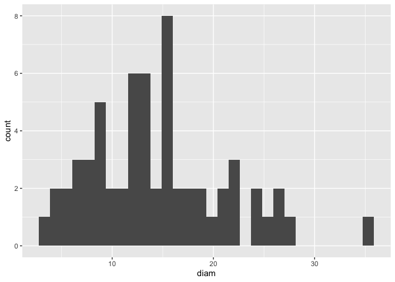<!-- -->

```
## 
## [[2]]
```

```
## `stat_bin()` using `bins = 30`. Pick better value with `binwidth`.
```

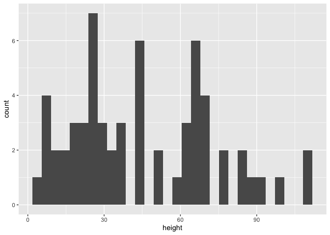<!-- -->

```
## 
## [[3]]
```

```
## `stat_bin()` using `bins = 30`. Pick better value with `binwidth`.
```

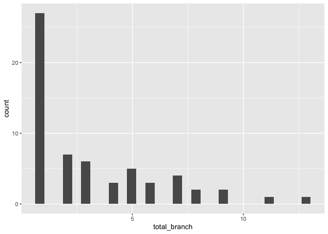<!-- -->

```
## 
## [[4]]
```

```
## `stat_bin()` using `bins = 30`. Pick better value with `binwidth`.
```

```
## Warning: Removed 27 rows containing non-finite values (`stat_bin()`).
```

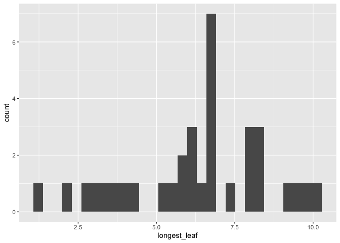<!-- -->

```
## 
## [[5]]
```

```
## `stat_bin()` using `bins = 30`. Pick better value with `binwidth`.
```

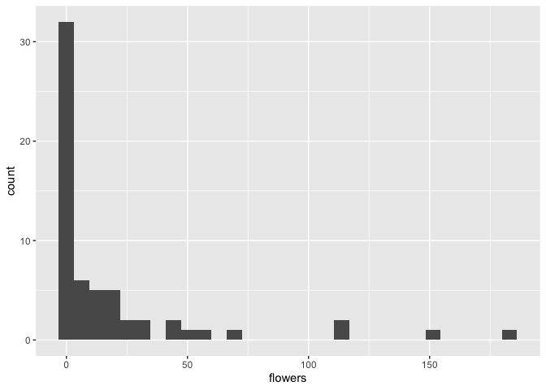<!-- -->

```
## 
## [[6]]
```

```
## `stat_bin()` using `bins = 30`. Pick better value with `binwidth`.
```

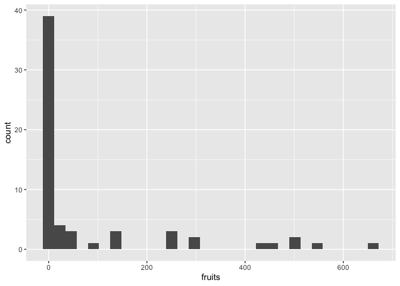<!-- -->

```
## 
## [[7]]
```

```
## `stat_bin()` using `bins = 30`. Pick better value with `binwidth`.
```

```
## Warning: Removed 32 rows containing non-finite values (`stat_bin()`).
```

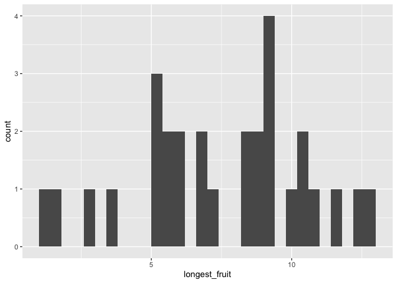<!-- -->

```
## 
## [[8]]
```

```
## `stat_bin()` using `bins = 30`. Pick better value with `binwidth`.
```

```
## Warning: Removed 1 rows containing non-finite values (`stat_bin()`).
```

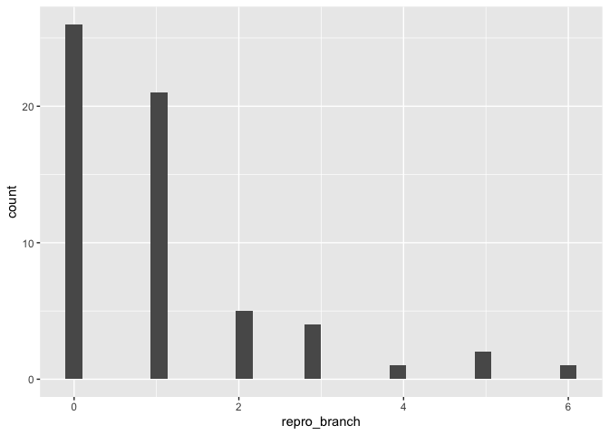<!-- -->

```r
#qq plots 
anncensustrans_all_alive_max_elev_noinf %>% 
  select(diam, height, total_branch, longest_leaf, flowers, fruits, longest_fruit, repro_branch) %>% 
  names() %>% 
  map(~ggplot(anncensustrans_all_alive_max_elev_noinf, aes_string(sample = .)) + 
       stat_qq() +
        stat_qq_line())
```

```
## [[1]]
```

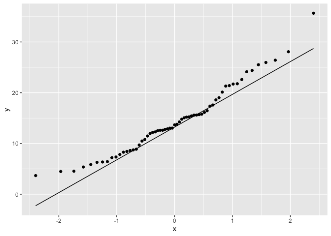<!-- -->

```
## 
## [[2]]
```

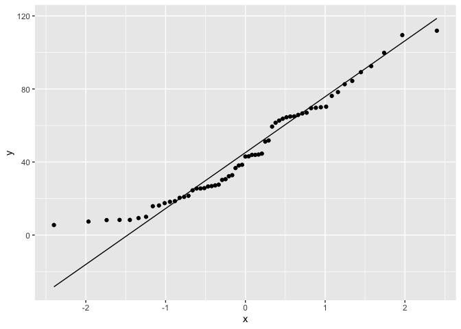<!-- -->

```
## 
## [[3]]
```

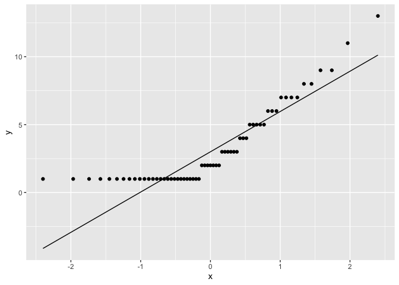<!-- -->

```
## 
## [[4]]
```

```
## Warning: Removed 27 rows containing non-finite values (`stat_qq()`).
```

```
## Warning: Removed 27 rows containing non-finite values (`stat_qq_line()`).
```

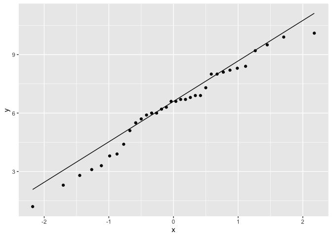<!-- -->

```
## 
## [[5]]
```

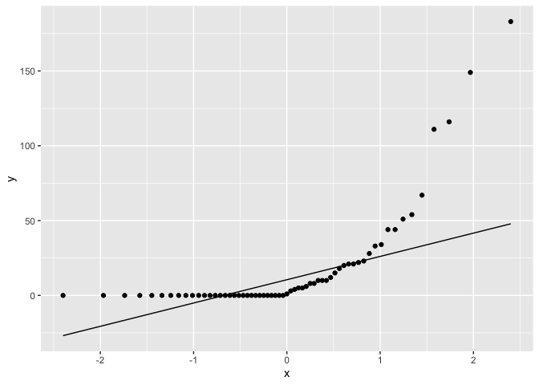<!-- -->

```
## 
## [[6]]
```

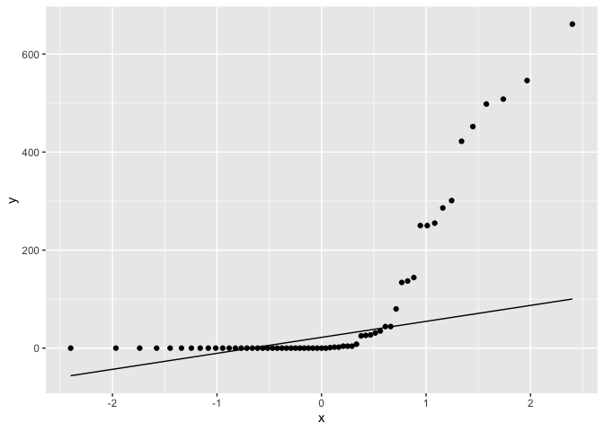<!-- -->

```
## 
## [[7]]
```

```
## Warning: Removed 32 rows containing non-finite values (`stat_qq()`).
```

```
## Warning: Removed 32 rows containing non-finite values (`stat_qq_line()`).
```

<!-- -->

```
## 
## [[8]]
```

```
## Warning: Removed 1 rows containing non-finite values (`stat_qq()`).
```

```
## Warning: Removed 1 rows containing non-finite values (`stat_qq_line()`).
```

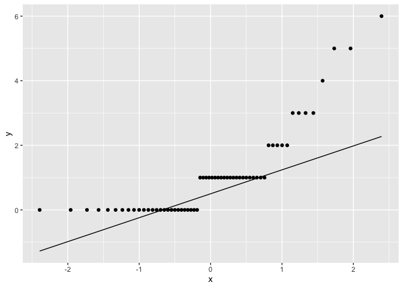<!-- -->

```r
# diam close to normal 
# height close to normal 
# total_branch heavily right skewed 
# longest_leaf close to normal 
# flowers heavily right skewed (0 inflated)
# fruits heavily right skewed (0 inflated)
# longest_fruit roughly normal, but low replication --> no stats
# repro_branch right skewed 

#Transformations:
#anncensustrans_all_alive_max_elev_noinf %>% mutate(stbr = sqrt(total_branch)) %>% ggplot(aes(x=stbr)) + geom_histogram() #log, 1og10, and sqrt transformation didn't work 

#anncensustrans_all_alive_max_elev_noinf %>% mutate(lrbr = log10(repro_branch)) %>% ggplot(aes(x=lrbr)) + geom_histogram() #log, 1og10, and sqrt transformation didn't work 

#Box Plots 
anncensustrans_all_alive_max_elev_noinf %>% ggplot(aes(x=parent.pop, y=diam)) + geom_boxplot()
```

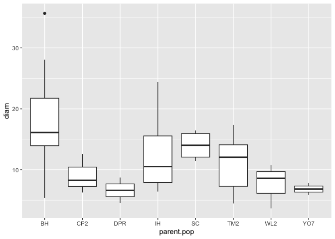<!-- -->

```r
anncensustrans_all_alive_max_elev_noinf %>% ggplot(aes(x=parent.pop, y=height)) + geom_boxplot()
```

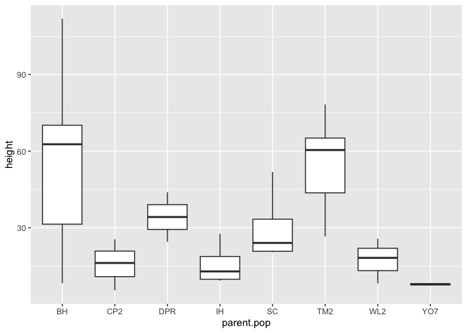<!-- -->

```r
anncensustrans_all_alive_max_elev_noinf %>% ggplot(aes(x=parent.pop, y=total_branch)) + geom_boxplot()
```

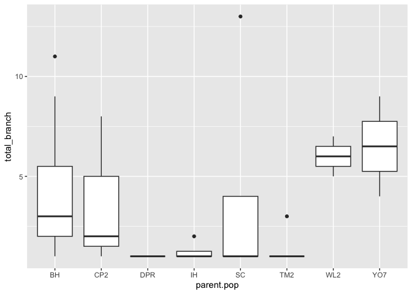<!-- -->

```r
anncensustrans_all_alive_max_elev_noinf %>% ggplot(aes(x=parent.pop, y=longest_leaf)) + geom_boxplot()
```

```
## Warning: Removed 27 rows containing non-finite values (`stat_boxplot()`).
```

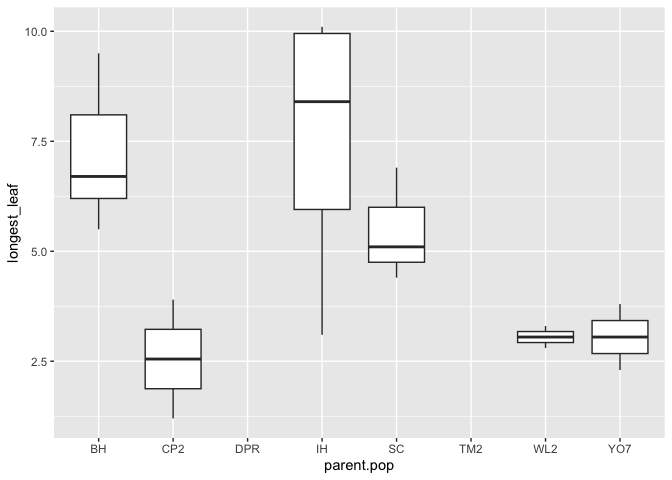<!-- -->

```r
anncensustrans_all_alive_max_elev_noinf %>% ggplot(aes(x=parent.pop, y=flowers)) + geom_boxplot()
```

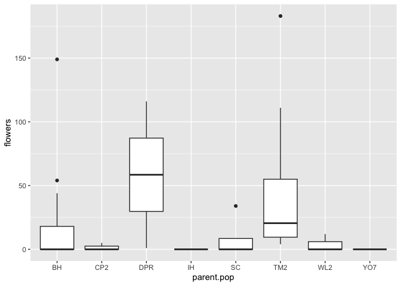<!-- -->

```r
anncensustrans_all_alive_max_elev_noinf %>% ggplot(aes(x=parent.pop, y=fruits)) + geom_boxplot()
```

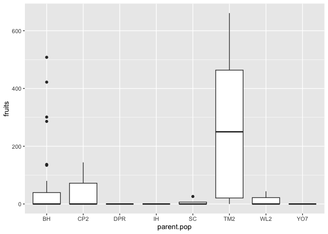<!-- -->

```r
anncensustrans_all_alive_max_elev_noinf %>% ggplot(aes(x=parent.pop, y=longest_fruit)) + geom_boxplot()
```

```
## Warning: Removed 32 rows containing non-finite values (`stat_boxplot()`).
```

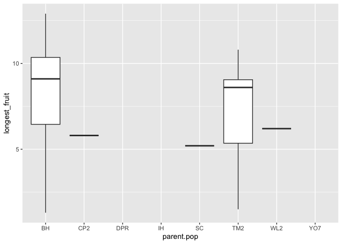<!-- -->

```r
anncensustrans_all_alive_max_elev_noinf %>% ggplot(aes(x=parent.pop, y=repro_branch)) + geom_boxplot()
```

```
## Warning: Removed 1 rows containing non-finite values (`stat_boxplot()`).
```

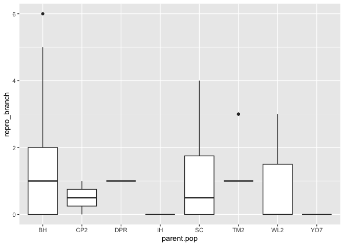<!-- -->

```r
#variation across populations for diam, height, and longest leaf (maybe total_branch & repro_branch, not # flowers, prob not # fruits (all low except TM2), not longest_fruit)
```

## Relationships between traits

-   Plot branching pattern with other size metrics for idea of shape


```r
anncensustrans_all_alive_max_elev_noinf %>% ggplot(aes(x=total_branch, y=repro_branch)) +
  geom_point()  #repro_branches is so 0 skewed it's hard to tell if there's a relationship 
```

```
## Warning: Removed 1 rows containing missing values (`geom_point()`).
```

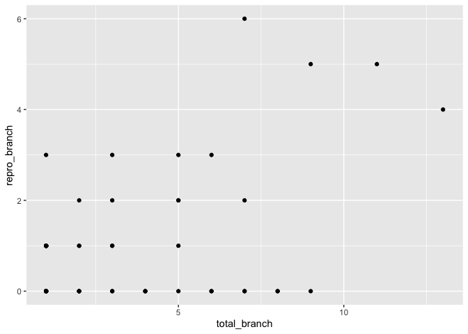<!-- -->

```r
anncensustrans_all_alive_max_elev_noinf %>% ggplot(aes(x=total_branch, y=diam)) +
  geom_point() +
  geom_smooth()
```

```
## `geom_smooth()` using method = 'loess' and formula = 'y ~ x'
```

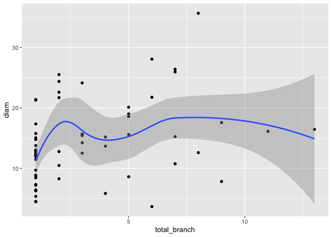<!-- -->

```r
anncensustrans_all_alive_max_elev_noinf %>% ggplot(aes(x=total_branch, y=height)) +
  geom_point() +
  geom_smooth()
```

```
## `geom_smooth()` using method = 'loess' and formula = 'y ~ x'
```

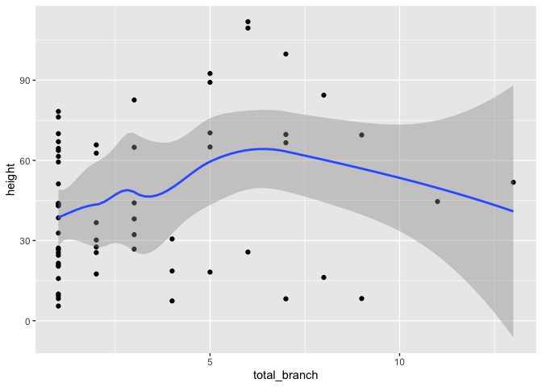<!-- -->

```r
anncensustrans_all_alive_max_elev_noinf %>% ggplot(aes(x=total_branch, y=longest_leaf)) +
  geom_point() +
  geom_smooth()
```

```
## `geom_smooth()` using method = 'loess' and formula = 'y ~ x'
```

```
## Warning: Removed 27 rows containing non-finite values (`stat_smooth()`).
```

```
## Warning: Removed 27 rows containing missing values (`geom_point()`).
```

<!-- -->

No clear relationships between branching and other size traits.

What about diameter and height?


```r
anncensustrans_all_alive_max_elev_noinf %>% ggplot(aes(x=diam, y=height)) +
  geom_point() +
  geom_smooth()
```

```
## `geom_smooth()` using method = 'loess' and formula = 'y ~ x'
```

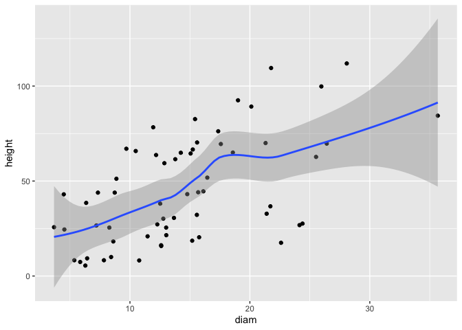<!-- -->

There seems to be a positive relationship between height and diameter.

What about diameter and longest leaf?


```r
anncensustrans_all_alive_max_elev_noinf %>% ggplot(aes(x=diam, y=longest_leaf)) +
  geom_point() +
  geom_smooth()
```

```
## `geom_smooth()` using method = 'loess' and formula = 'y ~ x'
```

```
## Warning: Removed 27 rows containing non-finite values (`stat_smooth()`).
```

```
## Warning: Removed 27 rows containing missing values (`geom_point()`).
```

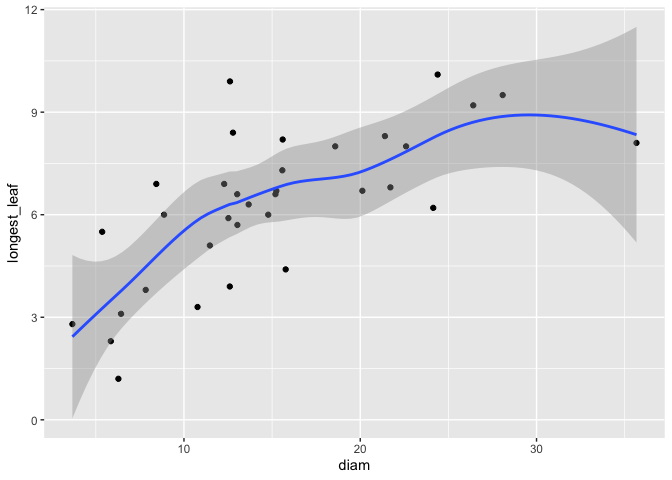<!-- -->

There seems to be a positive relationship between height and length of
the longest leaf.

What about height and longest leaf?


```r
anncensustrans_all_alive_max_elev_noinf %>% ggplot(aes(x=height, y=longest_leaf)) +
  geom_point() +
  geom_smooth()
```

```
## `geom_smooth()` using method = 'loess' and formula = 'y ~ x'
```

```
## Warning: Removed 27 rows containing non-finite values (`stat_smooth()`).
```

```
## Warning: Removed 27 rows containing missing values (`geom_point()`).
```

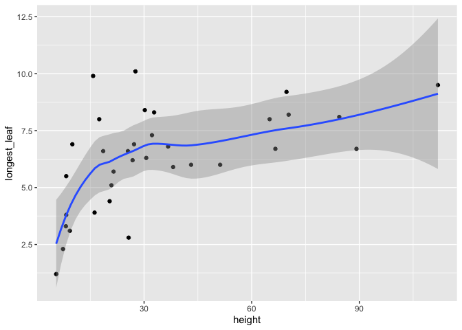<!-- -->

Positive relationship between height and longest leaf seems to plateau.

## Relationships between Climate and Traits (fix this after figuring out climate data)


```r
names(anncensustrans_all_alive_max_elev)
ggplot(anncensustrans_all_alive_max_elev, aes(x = tmx, y = diam))+
  geom_point()

ggplot(anncensustrans_all_alive_max_elev, aes(x = ppt, y = diam))+
  geom_point()


ggplot(anncensustrans_all_alive_max_elev, aes(x = pck, y = diam))+
  geom_point()

ggplot(anncensustrans_all_alive_max_elev, aes(x = tmn, y = height))+
  geom_point()
ggplot(anncensustrans_all_alive_max_elev, aes(x = tmn, y = longest_leaf))+
  geom_point()
```

## Calculating means by pop (and elev)


```r
anncensustrans_all_alive_summary <- anncensustrans_all_alive_max_elev_noinf %>% 
  group_by(parent.pop, elevation.group, elev_m) %>% 
  summarise(meanDiam=mean(diam, na.rm = TRUE), sem_diam=sem(diam, na.rm=TRUE), 
            meanHeight = mean(height,na.rm=(TRUE)), sem_height=sem(height, na.rm=(TRUE)), 
            meanLongestLeaf=mean(longest_leaf, na.rm=(TRUE)), sem_leaf=sem(longest_leaf, na.rm=TRUE), 
            meanTotBr=mean(total_branch, na.rm = TRUE), sem_totbr=sem(total_branch, na.rm=TRUE), 
            meanRepBr=mean(repro_branch, na.rm=TRUE), semRepBr=sem(repro_branch, na.rm=TRUE), 
            meanFruits=mean(fruits, na.rm = TRUE), semFruits=sem(fruits, na.rm=TRUE), 
            meanLongFruit=mean(longest_fruit, na.rm = TRUE), semLongFruit=sem(longest_fruit, na.rm = TRUE), 
            meanFl=mean(flowers, na.rm=TRUE), semFl=sem(flowers, na.rm=TRUE))
```

```
## `summarise()` has grouped output by 'parent.pop', 'elevation.group'. You can
## override using the `.groups` argument.
```

```r
anncensustrans_all_alive_summary 
```

```
## # A tibble: 8 × 19
## # Groups:   parent.pop, elevation.group [8]
##   parent.pop elevation.group elev_m meanDiam sem_diam meanHeight sem_height
##   <chr>      <chr>            <dbl>    <dbl>    <dbl>      <dbl>      <dbl>
## 1 BH         Low               511.    18.1      1.14      55.9        5.14
## 2 CP2        High             2244.     9.05     1.86      15.7        5.78
## 3 DPR        Mid              1019.     6.63     2.1       34.2        9.7 
## 4 IH         Low               454.    13.0      4.02      15.7        4.23
## 5 SC         Low               422.    14.0      1.24      30.1        7.41
## 6 TM2        Low               379.    11.2      1.19      55.6        4.63
## 7 WL2        High             2020.     7.68     2.10      17.4        5.07
## 8 YO7        High             2470.     6.84     0.99       7.85       0.45
## # ℹ 12 more variables: meanLongestLeaf <dbl>, sem_leaf <dbl>, meanTotBr <dbl>,
## #   sem_totbr <dbl>, meanRepBr <dbl>, semRepBr <dbl>, meanFruits <dbl>,
## #   semFruits <dbl>, meanLongFruit <dbl>, semLongFruit <dbl>, meanFl <dbl>,
## #   semFl <dbl>
```

```r
#write_csv(anncensustrans_all_alive_summary, file ="../output/UCD_Traits/anncensus_traitavgs.csv")
anncensustrans_all_alive_max_elev_noinf %>% filter(parent.pop=="DPR") %>% select(flowers) #one DPR plant had 1 flower and the other had 116 (massive variation)
```

```
## # A tibble: 2 × 1
##   flowers
##     <dbl>
## 1     116
## 2       1
```

```r
anncensustrans_all_alive_max_elev_logregs <- anncensustrans_all_alive_max_elev_noinf %>% 
  mutate(bTotBr=ifelse(total_branch==1, 0, 1), 
         bRepBr=ifelse(repro_branch==0, 0, 1), 
         bFruits=ifelse(fruits==0, 0, 1), 
         bFlowers=ifelse(flowers==0, 0, 1)) 

anncensustrans_all_alive_summary_logregs <- anncensustrans_all_alive_max_elev_logregs %>% 
  group_by(parent.pop, elevation.group, elev_m) %>% 
  summarise(probTotBr = mean(bTotBr, na.rm = TRUE), sem_totbr=sem(bTotBr, na.rm = TRUE),
            probRepBr=mean(bRepBr, na.rm = TRUE), semRepBr=sem(bRepBr,na.rm = TRUE), 
            probFruits=mean(bFruits, na.rm = TRUE), semFruits=sem(bFruits, na.rm = TRUE), 
            probFlowers=mean(bFlowers, na.rm = TRUE), semFl=sem(bFlowers, na.rm = TRUE))
```

```
## `summarise()` has grouped output by 'parent.pop', 'elevation.group'. You can
## override using the `.groups` argument.
```

```r
anncensustrans_all_alive_summary_logregs 
```

```
## # A tibble: 8 × 11
## # Groups:   parent.pop, elevation.group [8]
##   parent.pop elevation.group elev_m probTotBr sem_totbr probRepBr semRepBr
##   <chr>      <chr>            <dbl>     <dbl>     <dbl>     <dbl>    <dbl>
## 1 BH         Low               511.    0.774     0.0763     0.516   0.0912
## 2 CP2        High             2244.    0.667     0.333      0.5     0.5   
## 3 DPR        Mid              1019.    0         0          1       0     
## 4 IH         Low               454.    0.25      0.25       0       0     
## 5 SC         Low               422.    0.25      0.25       0.5     0.289 
## 6 TM2        Low               379.    0.0833    0.0833     1       0     
## 7 WL2        High             2020.    1         0          0.333   0.333 
## 8 YO7        High             2470.    1         0          0       0     
## # ℹ 4 more variables: probFruits <dbl>, semFruits <dbl>, probFlowers <dbl>,
## #   semFl <dbl>
```

```r
#write_csv(anncensustrans_all_alive_summary_logregs, file ="../output/UCD_Traits/anncensus_traitprobs.csv")
```

## Mixed Effects Models (and figures of trait means)

### Diam


```r
anncensustrans_all_alive_summary %>% ggplot(aes(x=fct_reorder(parent.pop, meanDiam), y=meanDiam, fill=elev_m)) +
  geom_col(width = 0.7,position = position_dodge(0.75)) + 
  geom_errorbar(aes(ymin=meanDiam-sem_diam,ymax=meanDiam+sem_diam),width=.2, position = 
                  position_dodge(0.75)) +
  scale_y_continuous(expand = c(0, 0)) +
  #scale_fill_manual(values=elev_three_palette) + 
  scale_fill_gradient(low = "#F5A540", high = "#0043F0") +
  labs(fill="Elevation (m)", y="Avg Diam (mm)", x="Population") +
   theme_classic() +
  theme(text=element_text(size=25), axis.text.x = element_text(angle = 45,  hjust = 1))
```

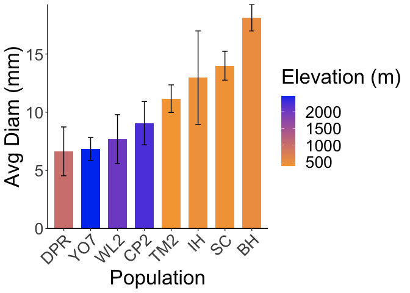<!-- -->

```r
#ggsave("../output/UCD_Traits/AvgDiam.png", width = 8, height = 6, units = "in")

lmediam2 = lmerTest::lmer(diam ~ (1|parent.pop/mf), data=anncensustrans_all_alive_max_elev_noinf)
summary(lmediam2)
```

```
## Linear mixed model fit by REML. t-tests use Satterthwaite's method [
## lmerModLmerTest]
## Formula: diam ~ (1 | parent.pop/mf)
##    Data: anncensustrans_all_alive_max_elev_noinf
## 
## REML criterion at convergence: 387.7
## 
## Scaled residuals: 
##     Min      1Q  Median      3Q     Max 
## -2.1416 -0.6903 -0.1557  0.5869  3.2580 
## 
## Random effects:
##  Groups        Name        Variance Std.Dev.
##  mf:parent.pop (Intercept)  0.8998  0.9486  
##  parent.pop    (Intercept) 12.5710  3.5456  
##  Residual                  30.1273  5.4888  
## Number of obs: 61, groups:  mf:parent.pop, 25; parent.pop, 8
## 
## Fixed effects:
##             Estimate Std. Error     df t value Pr(>|t|)    
## (Intercept)   11.605      1.594  8.249   7.279 7.33e-05 ***
## ---
## Signif. codes:  0 '***' 0.001 '**' 0.01 '*' 0.05 '.' 0.1 ' ' 1
```

```r
ranova(lmediam2) #no maternal family effect b/c maybe not enough individuals 
```

```
## ANOVA-like table for random-effects: Single term deletions
## 
## Model:
## diam ~ (1 | mf:parent.pop) + (1 | parent.pop)
##                     npar  logLik    AIC    LRT Df Pr(>Chisq)  
## <none>                 4 -193.83 395.67                       
## (1 | mf:parent.pop)    3 -193.85 393.70 0.0362  1     0.8490  
## (1 | parent.pop)       3 -197.02 400.04 6.3709  1     0.0116 *
## ---
## Signif. codes:  0 '***' 0.001 '**' 0.01 '*' 0.05 '.' 0.1 ' ' 1
```

```r
#could try assigning unique names and "un-nesting" them 
VarCorr(lmediam2) %>% 
  as.data.frame() %>% 
  mutate(var.pct = vcov/sum(vcov)*100)
```

```
##             grp        var1 var2       vcov     sdcor   var.pct
## 1 mf:parent.pop (Intercept) <NA>  0.8998274 0.9485923  2.063912
## 2    parent.pop (Intercept) <NA> 12.5709953 3.5455599 28.833789
## 3      Residual        <NA> <NA> 30.1273156 5.4888355 69.102298
```

```r
#EMM_diam=emmeans(lmediam2,pairwise~parent.pop)
#EMM_diam

#COME BACK TO THE BELOW WHEN CLIMATE DATA FIGURED OUT 
#lmediam3 = lmer(diam ~ ppt + (1|parent.pop/mf), #data=anncensustrans_all_alive_max_elev_noinf)
#summary(lmediam3)
#ranova(lmediam3) 
##singular warning b/c we only have one value for each pop #(multiple maternal families have one value)
#
#lmediam4 = lmer(diam ~ ppt + (1|parent.pop), #data=anncensustrans_all_alive_max_elev_noinf)
#summary(lmediam4)
#ranova(lmediam4) 
```

### Total_branch

-   Tried code for poisson regression or logistic regression with mixed
    effects

    -   Had to use glmer for this

        -   Used family = poisson for traits with poisson distribution

            -   Couldn't use ranova so used a loglikihood test to test
                for the significance of the random effects

        -   Use family = binomial(logit) for logit link

            -   Tried family = binomial for Prob_Total_Branch (1 or
                greater than 1). Couldn't include random effects so
                parent.pop is in the model as a fixed effect.


```r
anncensustrans_all_alive_summary %>% ggplot(aes(x=fct_reorder(parent.pop, meanTotBr), y=meanTotBr, fill=elev_m)) +
  geom_col(width = 0.7,position = position_dodge(0.75)) + 
  geom_errorbar(aes(ymin=meanTotBr-sem_totbr,ymax=meanTotBr+sem_totbr),width=.2, position = 
                  position_dodge(0.75)) +
  scale_y_continuous(expand = c(0, 0)) +
  #scale_fill_manual(values=elev_three_palette) +
  scale_fill_gradient(low = "#F5A540", high = "#0043F0") +
  labs(fill="Elevation (m)", x="Population", y="Avg # Total Branches") +
   theme_classic() +
  theme(text=element_text(size=25), axis.text.x = element_text(angle = 45,  hjust = 1)) #large standard error bars 
```

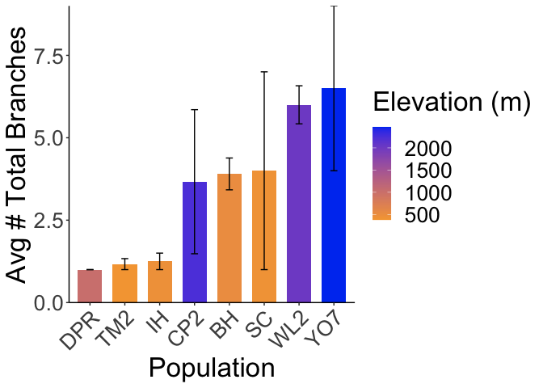<!-- -->

```r
#ggsave("../output/UCD_Traits/AvgTotBsBr.png", width = 8, height = 6, units = "in")

#Poisson regression 
lmetotal_branch <- glmer(total_branch ~ (1|parent.pop/mf), data = anncensustrans_all_alive_max_elev_noinf, family = poisson(link = "log")) 
summary(lmetotal_branch)
```

```
## Generalized linear mixed model fit by maximum likelihood (Laplace
##   Approximation) [glmerMod]
##  Family: poisson  ( log )
## Formula: total_branch ~ (1 | parent.pop/mf)
##    Data: anncensustrans_all_alive_max_elev_noinf
## 
##      AIC      BIC   logLik deviance df.resid 
##    282.2    288.6   -138.1    276.2       58 
## 
## Scaled residuals: 
##     Min      1Q  Median      3Q     Max 
## -1.8675 -0.7445 -0.2390  0.7347  3.3455 
## 
## Random effects:
##  Groups        Name        Variance Std.Dev.
##  mf:parent.pop (Intercept) 0.1572   0.3965  
##  parent.pop    (Intercept) 0.2877   0.5364  
## Number of obs: 61, groups:  mf:parent.pop, 25; parent.pop, 8
## 
## Fixed effects:
##             Estimate Std. Error z value Pr(>|z|)    
## (Intercept)   0.9970     0.2401   4.152 3.29e-05 ***
## ---
## Signif. codes:  0 '***' 0.001 '**' 0.01 '*' 0.05 '.' 0.1 ' ' 1
```

```r
VarCorr(lmetotal_branch) %>% 
  as.data.frame() %>% 
  mutate(var.pct = vcov/sum(vcov)*100)
```

```
##             grp        var1 var2      vcov     sdcor var.pct
## 1 mf:parent.pop (Intercept) <NA> 0.1571879 0.3964692 35.3307
## 2    parent.pop (Intercept) <NA> 0.2877166 0.5363922 64.6693
```

```r
glance(lmetotal_branch)
```

```
## # A tibble: 1 × 7
##    nobs sigma logLik   AIC   BIC deviance df.residual
##   <int> <dbl>  <dbl> <dbl> <dbl>    <dbl>       <int>
## 1    61     1  -138.  282.  289.     67.8          58
```

```r
#ranova(lmetotal_branch) doesn't work for lme4
#to test for significance of random effect: https://bbolker.github.io/mixedmodels-misc/glmmFAQ.html#testing-significance-of-random-effects
#the most common way to do this is to use a likelihood ratio test, i.e. fit the full and reduced models (the reduced model is the model with the focal variance(s) set to zero). 
m0 <- glmer(total_branch ~ (1|parent.pop), data = anncensustrans_all_alive_max_elev_noinf, family = poisson(link = "log")) 
m00 <- lm(total_branch~1, anncensustrans_all_alive_max_elev_noinf)
anova(lmetotal_branch,m0, m00) #model with both random effects has a higher likelihood (better fit)
```

```
## Data: anncensustrans_all_alive_max_elev_noinf
## Models:
## m0: total_branch ~ (1 | parent.pop)
## m00: total_branch ~ 1
## lmetotal_branch: total_branch ~ (1 | parent.pop/mf)
##                 npar    AIC    BIC  logLik deviance  Chisq Df Pr(>Chisq)    
## m0                 2 284.10 288.32 -140.05   280.10                         
## m00                2 306.68 310.90 -151.34   302.68  0.000  0               
## lmetotal_branch    3 282.22 288.55 -138.11   276.22 26.459  1  2.691e-07 ***
## ---
## Signif. codes:  0 '***' 0.001 '**' 0.01 '*' 0.05 '.' 0.1 ' ' 1
```

```r
anncensustrans_all_alive_summary_logregs %>% ggplot(aes(x=fct_reorder(parent.pop, probTotBr), y=probTotBr, fill=elev_m)) +
  geom_col(width = 0.7,position = position_dodge(0.75)) + 
  geom_errorbar(aes(ymin=probTotBr-sem_totbr,ymax=probTotBr+sem_totbr),width=.2, position = 
                  position_dodge(0.75)) +
  scale_y_continuous(expand = c(0, 0.01)) +
  #scale_fill_manual(values=elev_three_palette) +
  scale_fill_gradient(low = "#F5A540", high = "#0043F0") +
  labs(fill="Elevation (m)", x="Population", y="Prob. of Total Branches > 1") +
   theme_classic() +
  theme(text=element_text(size=25), axis.text.x = element_text(angle = 45,  hjust = 1)) 
```

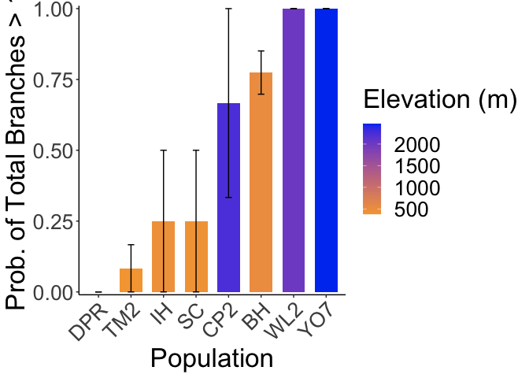<!-- -->

```r
#ggsave("../output/UCD_Traits/ProbTotBsBr.png", width = 8, height = 6, units = "in")

totbr_logreg=glm(bTotBr ~ parent.pop, data=anncensustrans_all_alive_max_elev_logregs, family = binomial())
summary(totbr_logreg) #this is not the correct model b/c it treats parent pop as a fixed effect and doesn't take into account maternal families 
```

```
## 
## Call:
## glm(formula = bTotBr ~ parent.pop, family = binomial(), data = anncensustrans_all_alive_max_elev_logregs)
## 
## Coefficients:
##                Estimate Std. Error z value Pr(>|z|)   
## (Intercept)      1.2321     0.4296   2.868  0.00413 **
## parent.popCP2   -0.5390     1.2979  -0.415  0.67793   
## parent.popDPR  -19.7982  4612.2020  -0.004  0.99658   
## parent.popIH    -2.3308     1.2320  -1.892  0.05851 . 
## parent.popSC    -2.3308     1.2320  -1.892  0.05851 . 
## parent.popTM2   -3.6300     1.1294  -3.214  0.00131 **
## parent.popWL2   17.3339  3765.8472   0.005  0.99633   
## parent.popYO7   17.3339  4612.2020   0.004  0.99700   
## ---
## Signif. codes:  0 '***' 0.001 '**' 0.01 '*' 0.05 '.' 0.1 ' ' 1
## 
## (Dispersion parameter for binomial family taken to be 1)
## 
##     Null deviance: 83.759  on 60  degrees of freedom
## Residual deviance: 52.818  on 53  degrees of freedom
## AIC: 68.818
## 
## Number of Fisher Scoring iterations: 17
```

### Repro_branch


```r
anncensustrans_all_alive_summary %>% ggplot(aes(x=fct_reorder(parent.pop, meanRepBr), y=meanRepBr, fill=elev_m)) +
  geom_col(width = 0.7,position = position_dodge(0.75)) + 
  geom_errorbar(aes(ymin=meanRepBr-semRepBr,ymax=meanRepBr+semRepBr),width=.2, position = 
                  position_dodge(0.75)) +
  scale_y_continuous(expand = c(0.01, 0)) +
  #scale_fill_manual(values=elev_three_palette) +
  scale_fill_gradient(low = "#F5A540", high = "#0043F0") +
  labs(fill="Elevation (m)", x="Population", y="Avg # Reproductive Branches") +
   theme_classic() +
  theme(text=element_text(size=25), axis.text.x = element_text(angle = 45,  hjust = 1)) #mostly the same except 1 SQ3 plant with a lot
```

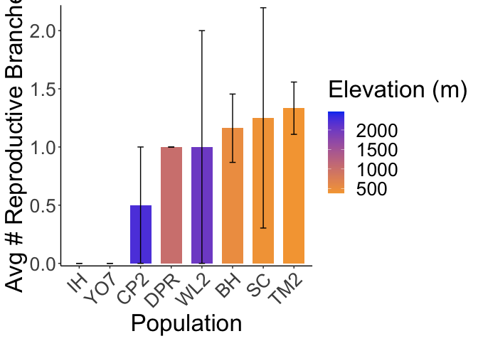<!-- -->

```r
#ggsave("../output/UCD_Traits/AvgRepBsBr.png", width = 8, height = 6, units = "in")

#poisson regression 
lmerepro_branch <- glmer(repro_branch ~ (1|parent.pop/mf), data = anncensustrans_all_alive_max_elev_noinf, family = poisson(link = "log")) 
```

```
## boundary (singular) fit: see help('isSingular')
```

```r
summary(lmerepro_branch)
```

```
## Generalized linear mixed model fit by maximum likelihood (Laplace
##   Approximation) [glmerMod]
##  Family: poisson  ( log )
## Formula: repro_branch ~ (1 | parent.pop/mf)
##    Data: anncensustrans_all_alive_max_elev_noinf
## 
##      AIC      BIC   logLik deviance df.resid 
##    184.3    190.6    -89.1    178.3       57 
## 
## Scaled residuals: 
##     Min      1Q  Median      3Q     Max 
## -1.1595 -0.8697 -0.1890  0.0646  4.0152 
## 
## Random effects:
##  Groups        Name        Variance  Std.Dev. 
##  mf:parent.pop (Intercept) 1.927e-01 4.390e-01
##  parent.pop    (Intercept) 5.441e-10 2.333e-05
## Number of obs: 60, groups:  mf:parent.pop, 25; parent.pop, 8
## 
## Fixed effects:
##             Estimate Std. Error z value Pr(>|z|)
## (Intercept) -0.07663    0.20638  -0.371     0.71
## optimizer (Nelder_Mead) convergence code: 0 (OK)
## boundary (singular) fit: see help('isSingular')
```

```r
VarCorr(lmerepro_branch) %>% 
  as.data.frame() %>% 
  mutate(var.pct = vcov/sum(vcov)*100)
```

```
##             grp        var1 var2         vcov        sdcor      var.pct
## 1 mf:parent.pop (Intercept) <NA> 1.927094e-01 4.389868e-01 1.000000e+02
## 2    parent.pop (Intercept) <NA> 5.440839e-10 2.332561e-05 2.823338e-07
```

```r
glance(lmerepro_branch)
```

```
## # A tibble: 1 × 7
##    nobs sigma logLik   AIC   BIC deviance df.residual
##   <int> <dbl>  <dbl> <dbl> <dbl>    <dbl>       <int>
## 1    60     1  -89.1  184.  191.     81.5          57
```

```r
m0 <- glmer(repro_branch ~ (1|parent.pop), data = anncensustrans_all_alive_max_elev_noinf, family = poisson(link = "log")) 
```

```
## boundary (singular) fit: see help('isSingular')
```

```r
m00 <- lm(repro_branch~1, anncensustrans_all_alive_max_elev_noinf)
anova(lmerepro_branch,m0, m00) #model with both random effects has a higher likelihood (better fit)
```

```
## Data: anncensustrans_all_alive_max_elev_noinf
## Models:
## m0: repro_branch ~ (1 | parent.pop)
## m00: repro_branch ~ 1
## lmerepro_branch: repro_branch ~ (1 | parent.pop/mf)
##                 npar    AIC    BIC   logLik deviance  Chisq Df Pr(>Chisq)    
## m0                 2 183.78 187.97  -89.891   179.78                         
## m00                2 212.18 216.36 -104.088   208.18  0.000  0               
## lmerepro_branch    3 184.28 190.56  -89.139   178.28 29.898  1  4.553e-08 ***
## ---
## Signif. codes:  0 '***' 0.001 '**' 0.01 '*' 0.05 '.' 0.1 ' ' 1
```

```r
anncensustrans_all_alive_summary_logregs %>% ggplot(aes(x=fct_reorder(parent.pop, probRepBr), y=probRepBr, fill=elev_m)) +
  geom_col(width = 0.7,position = position_dodge(0.75)) + 
  geom_errorbar(aes(ymin=probRepBr-semRepBr,ymax=probRepBr+semRepBr),width=.2, position = 
                  position_dodge(0.75)) +
  scale_y_continuous(expand = c(0.01, 0)) +
  #scale_fill_manual(values=elev_three_palette) +
  scale_fill_gradient(low = "#F5A540", high = "#0043F0") +
  labs(fill="Elevation (m)", x="Population", y="Prob. Repro. Branches > 0") +
   theme_classic() +
  theme(text=element_text(size=25), axis.text.x = element_text(angle = 45,  hjust = 1))
```

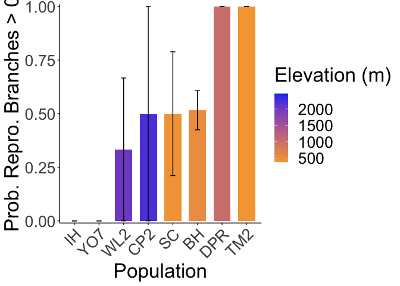<!-- -->

```r
#ggsave("../output/UCD_Traits/ProbRepBsBr.png", width = 8, height = 6, units = "in")
```

### Fruits


```r
anncensustrans_all_alive_summary %>% ggplot(aes(x=fct_reorder(parent.pop, meanFruits), y=meanFruits, fill=elev_m)) +
  geom_col(width = 0.7,position = position_dodge(0.75)) + 
  geom_errorbar(aes(ymin=meanFruits-semFruits,ymax=meanFruits+semFruits),width=.2, position = 
                  position_dodge(0.75)) +
  scale_y_continuous(expand = c(0.01, 0)) +
  #scale_fill_manual(values=elev_three_palette) +
  scale_fill_gradient(low = "#F5A540", high = "#0043F0") +
  labs(fill="Elevation (m)", x="Population", y="Avg # Fruits") +
   theme_classic() +
  theme(text=element_text(size=25), axis.text.x = element_text(angle = 45,  hjust = 1)) #mostly the same (low), except TM2 had way more fruits than the other populations 
```

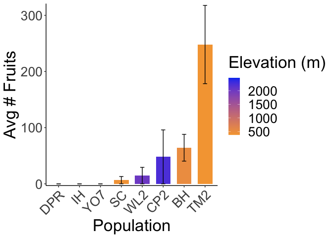<!-- -->

```r
#ggsave("../output/UCD_Traits/AvgFruits.png", width = 8, height = 6, units = "in")

#poisson regression 
lmefruits <- glmer(fruits ~ (1|parent.pop/mf), data = anncensustrans_all_alive_max_elev_noinf, family = poisson(link = "log")) 
summary(lmefruits)
```

```
## Generalized linear mixed model fit by maximum likelihood (Laplace
##   Approximation) [glmerMod]
##  Family: poisson  ( log )
## Formula: fruits ~ (1 | parent.pop/mf)
##    Data: anncensustrans_all_alive_max_elev_noinf
## 
##      AIC      BIC   logLik deviance df.resid 
##   6411.5   6417.8  -3202.7   6405.5       58 
## 
## Scaled residuals: 
##      Min       1Q   Median       3Q      Max 
## -14.6819  -4.6761  -0.3939   0.0257  28.2561 
## 
## Random effects:
##  Groups        Name        Variance Std.Dev.
##  mf:parent.pop (Intercept) 11.68    3.417   
##  parent.pop    (Intercept) 10.31    3.212   
## Number of obs: 61, groups:  mf:parent.pop, 25; parent.pop, 8
## 
## Fixed effects:
##             Estimate Std. Error z value Pr(>|z|)
## (Intercept)   -1.229      1.884  -0.652    0.514
```

```r
VarCorr(lmefruits) %>% 
  as.data.frame() %>% 
  mutate(var.pct = vcov/sum(vcov)*100)
```

```
##             grp        var1 var2     vcov    sdcor  var.pct
## 1 mf:parent.pop (Intercept) <NA> 11.67716 3.417186 53.09785
## 2    parent.pop (Intercept) <NA> 10.31461 3.211637 46.90215
```

```r
glance(lmefruits)
```

```
## # A tibble: 1 × 7
##    nobs sigma logLik   AIC   BIC deviance df.residual
##   <int> <dbl>  <dbl> <dbl> <dbl>    <dbl>       <int>
## 1    61     1 -3203. 6411. 6418.    6103.          58
```

```r
m0 <- glmer(fruits ~ (1|parent.pop), data = anncensustrans_all_alive_max_elev_noinf, family = poisson(link = "log")) 
m00 <- lm(fruits~1, anncensustrans_all_alive_max_elev_noinf)
anova(lmefruits,m0, m00) #model without random effects has a higher likelihood
```

```
## Data: anncensustrans_all_alive_max_elev_noinf
## Models:
## m0: fruits ~ (1 | parent.pop)
## m00: fruits ~ 1
## lmefruits: fruits ~ (1 | parent.pop/mf)
##           npar    AIC    BIC  logLik deviance  Chisq Df Pr(>Chisq)
## m0           2 9518.8 9523.1 -4757.4   9514.8                     
## m00          2  798.4  802.7  -397.2    794.4 8720.4  0           
## lmefruits    3 6411.5 6417.8 -3202.7   6405.5    0.0  1          1
```

```r
anncensustrans_all_alive_summary_logregs %>% ggplot(aes(x=fct_reorder(parent.pop, probFruits), y=probFruits, fill=elev_m)) +
  geom_col(width = 0.7,position = position_dodge(0.75)) + 
  geom_errorbar(aes(ymin=probFruits-semFruits,ymax=probFruits+semFruits),width=.2, position = 
                  position_dodge(0.75)) +
  scale_y_continuous(expand = c(0.01, 0)) +
  #scale_fill_manual(values=elev_three_palette) +
  scale_fill_gradient(low = "#F5A540", high = "#0043F0") +
  labs(fill="Elevation (m)", x="Population", y="Prob. of Fruits") +
   theme_classic() +
  theme(text=element_text(size=25), axis.text.x = element_text(angle = 45,  hjust = 1)) 
```

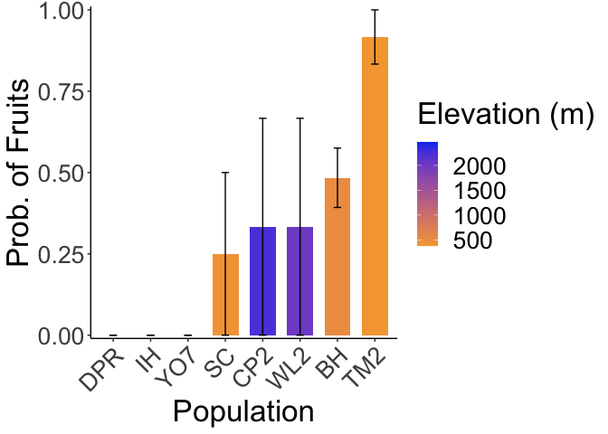<!-- -->

```r
#ggsave("../output/UCD_Traits/ProbFruits.png", width = 8, height = 6, units = "in")
```

### Longest_fruit


```r
#only 2 populations with multiple fruits to calculate a mean from 
anncensustrans_all_alive_summary %>% ggplot(aes(x=parent.pop, y=meanLongFruit, fill=elev_m)) +
  geom_col(width = 0.7,position = position_dodge(0.75)) + 
  geom_errorbar(aes(ymin=meanLongFruit-semLongFruit,ymax=meanLongFruit+semLongFruit),width=.2, position = 
                  position_dodge(0.75)) +
  scale_y_continuous(expand = c(0.01, 0)) +
  #scale_fill_manual(values=elev_three_palette) +
  scale_fill_gradient(low = "#F5A540", high = "#0043F0") +
  labs(fill="Elevation (m)", x="Population", y="Avg Longest Fruit (cm)") +
   theme_classic() +
  theme(text=element_text(size=25), axis.text.x = element_text(angle = 45,  hjust = 1)) #mostly the same (low), except TM2 had way more fruits than the other populations 
```

```
## Warning: Removed 3 rows containing missing values (`geom_col()`).
```

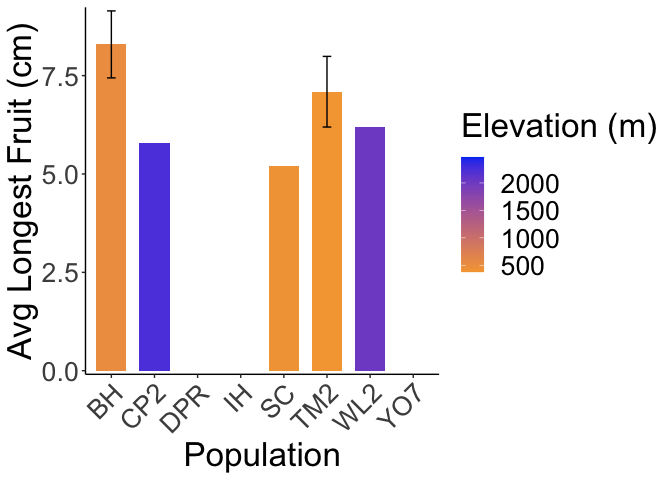<!-- -->

```r
#ggsave("../output/UCD_Traits/AvgLongestFruits.png", width = 8, height = 6, units = "in")

#stats not necessary 
#lmelongest_fruit = lmer(longest_fruit ~ (1|parent.pop/mf), data=anncensustrans_all_alive_max_elev_noinf)
#summary(lmelongest_fruit)
#ranova(lmelongest_fruit)
#VarCorr(lmelongest_fruit) %>% 
#  as.data.frame() %>% 
#  mutate(var.pct = vcov/sum(vcov)*100)
```

### Flowers


```r
anncensustrans_all_alive_summary %>% ggplot(aes(x=fct_reorder(parent.pop, meanFl), y=meanFl, fill=elev_m)) +
  geom_col(width = 0.7,position = position_dodge(0.75)) + 
  geom_errorbar(aes(ymin=meanFl-semFl,ymax=meanFl+semFl),width=.2, position = 
                  position_dodge(0.75)) +
  scale_y_continuous(expand = c(0.01, 0)) +
  #scale_fill_manual(values=elev_three_palette) +
  scale_fill_gradient(low = "#F5A540", high = "#0043F0") +
  labs(fill="Elevation (m)", x="Population", y="Avg # Flowers") +
   theme_classic() +
  theme(text=element_text(size=25), axis.text.x = element_text(angle = 45,  hjust = 1)) #mostly the same (low), except TM2 had way more fruits than the other populations 
```

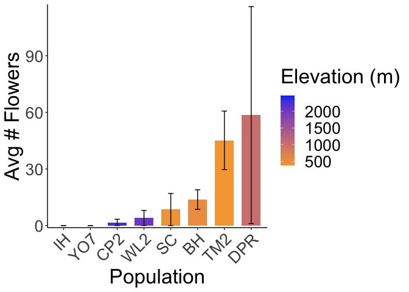<!-- -->

```r
#ggsave("../output/UCD_Traits/AvgFlowers.png", width = 8, height = 6, units = "in")

#poisson regression 
lmeflowers <- glmer(flowers ~ (1|parent.pop/mf), data = anncensustrans_all_alive_max_elev_noinf, family = poisson(link = "log")) 
summary(lmeflowers)
```

```
## Generalized linear mixed model fit by maximum likelihood (Laplace
##   Approximation) [glmerMod]
##  Family: poisson  ( log )
## Formula: flowers ~ (1 | parent.pop/mf)
##    Data: anncensustrans_all_alive_max_elev_noinf
## 
##      AIC      BIC   logLik deviance df.resid 
##   1387.3   1393.7   -690.7   1381.3       58 
## 
## Scaled residuals: 
##     Min      1Q  Median      3Q     Max 
## -6.1322 -2.6402 -0.5054  0.3898 19.0836 
## 
## Random effects:
##  Groups        Name        Variance Std.Dev.
##  mf:parent.pop (Intercept) 5.032    2.243   
##  parent.pop    (Intercept) 3.150    1.775   
## Number of obs: 61, groups:  mf:parent.pop, 25; parent.pop, 8
## 
## Fixed effects:
##             Estimate Std. Error z value Pr(>|z|)
## (Intercept)   0.1627     0.9629   0.169    0.866
```

```r
VarCorr(lmeflowers) %>% 
  as.data.frame() %>% 
  mutate(var.pct = vcov/sum(vcov)*100)
```

```
##             grp        var1 var2     vcov    sdcor  var.pct
## 1 mf:parent.pop (Intercept) <NA> 5.032000 2.243212 61.50294
## 2    parent.pop (Intercept) <NA> 3.149723 1.774746 38.49706
```

```r
glance(lmeflowers)
```

```
## # A tibble: 1 × 7
##    nobs sigma logLik   AIC   BIC deviance df.residual
##   <int> <dbl>  <dbl> <dbl> <dbl>    <dbl>       <int>
## 1    61     1  -691. 1387. 1394.    1122.          58
```

```r
m0 <- glmer(flowers ~ (1|parent.pop), data = anncensustrans_all_alive_max_elev_noinf, family = poisson(link = "log")) 
m00 <- lm(flowers~1, anncensustrans_all_alive_max_elev_noinf)
anova(lmeflowers,m0, m00) #model without random effects has a higher likelihood
```

```
## Data: anncensustrans_all_alive_max_elev_noinf
## Models:
## m0: flowers ~ (1 | parent.pop)
## m00: flowers ~ 1
## lmeflowers: flowers ~ (1 | parent.pop/mf)
##            npar     AIC     BIC   logLik deviance  Chisq Df Pr(>Chisq)
## m0            2 2141.82 2146.04 -1068.91  2137.82                     
## m00           2  615.59  619.81  -305.80   611.59 1526.2  0           
## lmeflowers    3 1387.32 1393.65  -690.66  1381.32    0.0  1          1
```

```r
anncensustrans_all_alive_summary_logregs %>% ggplot(aes(x=fct_reorder(parent.pop, probFlowers), y=probFlowers, fill=elev_m)) +
  geom_col(width = 0.7,position = position_dodge(0.75)) + 
  geom_errorbar(aes(ymin=probFlowers-semFl,ymax=probFlowers+semFl),width=.2, position = 
                  position_dodge(0.75)) +
  scale_y_continuous(expand = c(0.01, 0)) +
  #scale_fill_manual(values=elev_three_palette) +
  scale_fill_gradient(low = "#F5A540", high = "#0043F0") +
  labs(fill="Elevation (m)", x="Population", y="Prob. of Flowers") +
   theme_classic() +
  theme(text=element_text(size=25), axis.text.x = element_text(angle = 45,  hjust = 1)) 
```

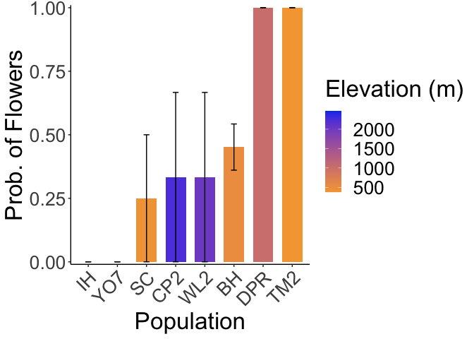<!-- -->

```r
#ggsave("../output/UCD_Traits/ProbFlowers.png", width = 8, height = 6, units = "in")
```

### Height


```r
anncensustrans_all_alive_summary %>% ggplot(aes(x=fct_reorder(parent.pop, meanHeight), y=meanHeight, fill=elev_m)) +
  geom_col(width = 0.7,position = position_dodge(0.75)) + 
  geom_errorbar(aes(ymin=meanHeight-sem_height,ymax=meanHeight+sem_height),width=.2, position = 
                  position_dodge(0.75)) +
  scale_y_continuous(expand = c(0, 0)) +
  #scale_fill_manual(values=elev_three_palette) + 
  scale_fill_gradient(low = "#F5A540", high = "#0043F0") +
  labs(fill="Elevation", x="Population") +
   theme_classic() +
  theme(text=element_text(size=25), axis.text.x = element_text(angle = 45,  hjust = 1))
```

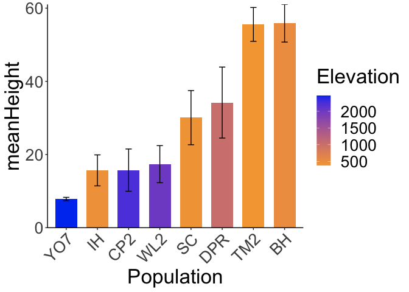<!-- -->

```r
#ggsave("../output/UCD_Traits/AvgHeight_AnnCensus.png", width = 8, height = 6, units = "in")

lmeheight = lmer(height ~ (1|parent.pop/mf), data=anncensustrans_all_alive_max_elev_noinf)
```

```
## boundary (singular) fit: see help('isSingular')
```

```r
summary(lmeheight)
```

```
## Linear mixed model fit by REML. t-tests use Satterthwaite's method [
## lmerModLmerTest]
## Formula: height ~ (1 | parent.pop/mf)
##    Data: anncensustrans_all_alive_max_elev_noinf
## 
## REML criterion at convergence: 560.2
## 
## Scaled residuals: 
##     Min      1Q  Median      3Q     Max 
## -1.9985 -0.6028 -0.2019  0.5208  2.4783 
## 
## Random effects:
##  Groups        Name        Variance Std.Dev.
##  mf:parent.pop (Intercept)   0.0     0.00   
##  parent.pop    (Intercept) 294.3    17.16   
##  Residual                  535.5    23.14   
## Number of obs: 61, groups:  mf:parent.pop, 25; parent.pop, 8
## 
## Fixed effects:
##             Estimate Std. Error     df t value Pr(>|t|)   
## (Intercept)   31.952      7.329  8.079    4.36  0.00236 **
## ---
## Signif. codes:  0 '***' 0.001 '**' 0.01 '*' 0.05 '.' 0.1 ' ' 1
## optimizer (nloptwrap) convergence code: 0 (OK)
## boundary (singular) fit: see help('isSingular')
```

```r
ranova(lmeheight)
```

```
## ANOVA-like table for random-effects: Single term deletions
## 
## Model:
## height ~ (1 | mf:parent.pop) + (1 | parent.pop)
##                     npar  logLik    AIC   LRT Df Pr(>Chisq)   
## <none>                 4 -280.12 568.25                       
## (1 | mf:parent.pop)    3 -280.12 566.25 0.000  1   1.000000   
## (1 | parent.pop)       3 -284.24 574.47 8.225  1   0.004132 **
## ---
## Signif. codes:  0 '***' 0.001 '**' 0.01 '*' 0.05 '.' 0.1 ' ' 1
```

### Longest_leaf


```r
anncensustrans_all_alive_summary %>% ggplot(aes(x=parent.pop, y=meanLongestLeaf, fill=elev_m)) +
  geom_col(width = 0.7,position = position_dodge(0.75)) + 
  geom_errorbar(aes(ymin=meanLongestLeaf-sem_leaf,ymax=meanLongestLeaf+sem_leaf),width=.2, position = 
                  position_dodge(0.75)) +
  scale_y_continuous(expand = c(0, 0)) +
   #scale_fill_manual(values=elev_three_palette) +
  scale_fill_gradient(low = "#F5A540", high = "#0043F0") +
  labs(fill="Elevation") +
   theme_classic() +
  xlab("Population") +
  theme(text=element_text(size=25), axis.text.x = element_text(angle = 45,  hjust = 1))
```

```
## Warning: Removed 2 rows containing missing values (`geom_col()`).
```

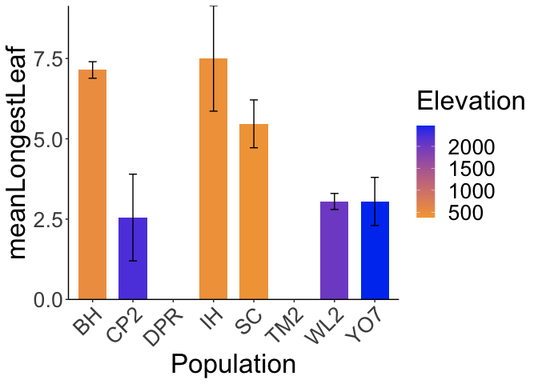<!-- -->

```r
#ggsave("../output/UCD_Traits/AvgLongLeaf_AnnCensus.png", width = 8, height = 6, units = "in")

lmelongest_leaf = lmer(longest_leaf ~ (1|parent.pop/mf), data=anncensustrans_all_alive_max_elev_noinf)
summary(lmelongest_leaf)
```

```
## Linear mixed model fit by REML. t-tests use Satterthwaite's method [
## lmerModLmerTest]
## Formula: longest_leaf ~ (1 | parent.pop/mf)
##    Data: anncensustrans_all_alive_max_elev_noinf
## 
## REML criterion at convergence: 136
## 
## Scaled residuals: 
##      Min       1Q   Median       3Q      Max 
## -1.96591 -0.64888 -0.08278  0.60513  1.63572 
## 
## Random effects:
##  Groups        Name        Variance Std.Dev.
##  mf:parent.pop (Intercept) 0.8075   0.8986  
##  parent.pop    (Intercept) 3.8441   1.9606  
##  Residual                  1.9364   1.3916  
## Number of obs: 34, groups:  mf:parent.pop, 17; parent.pop, 6
## 
## Fixed effects:
##             Estimate Std. Error     df t value Pr(>|t|)   
## (Intercept)   4.9495     0.9006 5.0210   5.496  0.00269 **
## ---
## Signif. codes:  0 '***' 0.001 '**' 0.01 '*' 0.05 '.' 0.1 ' ' 1
```

```r
ranova(lmelongest_leaf)
```

```
## ANOVA-like table for random-effects: Single term deletions
## 
## Model:
## longest_leaf ~ (1 | mf:parent.pop) + (1 | parent.pop)
##                     npar  logLik    AIC    LRT Df Pr(>Chisq)  
## <none>                 4 -67.981 143.96                       
## (1 | mf:parent.pop)    3 -68.023 142.05 0.0844  1    0.77147  
## (1 | parent.pop)       3 -70.371 146.74 4.7799  1    0.02879 *
## ---
## Signif. codes:  0 '***' 0.001 '**' 0.01 '*' 0.05 '.' 0.1 ' ' 1
```
