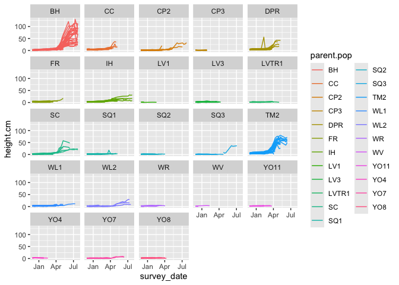
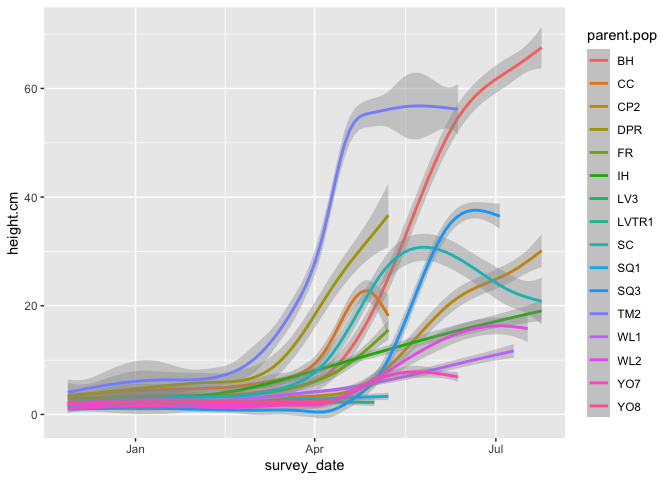
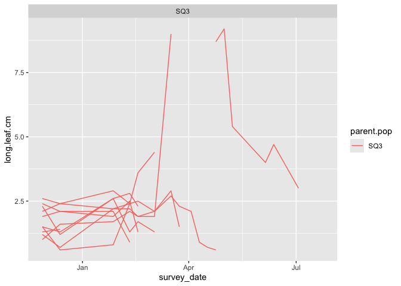
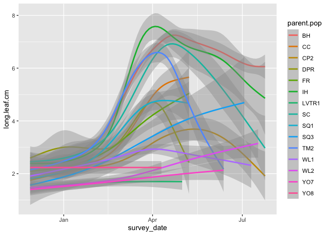

# Analyze growth

-   Get growth curve code from Julin

-   Is the growth rate lower for high elev b/c drier and biennial?


## Libraries 

```r
library(tidyverse)
```

```
## ── Attaching core tidyverse packages ──────────────────────── tidyverse 2.0.0 ──
## ✔ dplyr     1.1.4     ✔ readr     2.1.5
## ✔ forcats   1.0.0     ✔ stringr   1.5.1
## ✔ ggplot2   3.5.1     ✔ tibble    3.2.1
## ✔ lubridate 1.9.3     ✔ tidyr     1.3.1
## ✔ purrr     1.0.2     
## ── Conflicts ────────────────────────────────────────── tidyverse_conflicts() ──
## ✖ dplyr::filter() masks stats::filter()
## ✖ dplyr::lag()    masks stats::lag()
## ℹ Use the conflicted package (<http://conflicted.r-lib.org/>) to force all conflicts to become errors
```

## Need to make a csv file with all survey data for each plant 

Get list of size files 

```r
pretrans_ucd <-  dir("../input/UCD_Data/CorrectedCSVs/",
             pattern=".*20221128.*csv",
             full.names=TRUE)
pretrans_ucd
```

```
## [1] "../input/UCD_Data/CorrectedCSVs//UCD_garden_size_measurements_20221128_corrected.csv"
```

```r
posttrans_ucd <- dir("../input/UCD_Data/CorrectedCSVs/",
             pattern="Size_survey_transplants.*corrected.*csv",
             full.names=TRUE)
posttrans_ucd
```

```
##  [1] "../input/UCD_Data/CorrectedCSVs//Size_survey_transplants_20221213_corrected.csv"
##  [2] "../input/UCD_Data/CorrectedCSVs//Size_survey_transplants_20230127_corrected.csv"
##  [3] "../input/UCD_Data/CorrectedCSVs//Size_survey_transplants_20230210_corrected.csv"
##  [4] "../input/UCD_Data/CorrectedCSVs//Size_survey_transplants_20230217_corrected.csv"
##  [5] "../input/UCD_Data/CorrectedCSVs//Size_survey_transplants_20230303_corrected.csv"
##  [6] "../input/UCD_Data/CorrectedCSVs//Size_survey_transplants_20230317_corrected.csv"
##  [7] "../input/UCD_Data/CorrectedCSVs//Size_survey_transplants_20230324_corrected.csv"
##  [8] "../input/UCD_Data/CorrectedCSVs//Size_survey_transplants_20230403_corrected.csv"
##  [9] "../input/UCD_Data/CorrectedCSVs//Size_survey_transplants_20230410_corrected.csv"
## [10] "../input/UCD_Data/CorrectedCSVs//Size_survey_transplants_20230417_corrected.csv"
## [11] "../input/UCD_Data/CorrectedCSVs//Size_survey_transplants_20230424_corrected.csv"
## [12] "../input/UCD_Data/CorrectedCSVs//Size_survey_transplants_20230501_corrected.csv"
## [13] "../input/UCD_Data/CorrectedCSVs//Size_survey_transplants_20230508_corrected.csv"
## [14] "../input/UCD_Data/CorrectedCSVs//Size_survey_transplants_20230605_corrected.csv"
## [15] "../input/UCD_Data/CorrectedCSVs//Size_survey_transplants_20230612_corrected.csv"
## [16] "../input/UCD_Data/CorrectedCSVs//Size_survey_transplants_20230703_corrected.csv"
## [17] "../input/UCD_Data/CorrectedCSVs//Size_survey_transplants_20230710_corrected.csv"
## [18] "../input/UCD_Data/CorrectedCSVs//Size_survey_transplants_20230717_corrected.csv"
## [19] "../input/UCD_Data/CorrectedCSVs//Size_survey_transplants_20230724_corrected.csv"
```

Add data to a tibble

```r
pretrans_dat_ucd <- tibble(path=pretrans_ucd, filename=basename(path))
pretrans_dat_ucd
```

```
## # A tibble: 1 × 2
##   path                                                                  filename
##   <chr>                                                                 <chr>   
## 1 ../input/UCD_Data/CorrectedCSVs//UCD_garden_size_measurements_202211… UCD_gar…
```

```r
posttrans_dat_ucd <- tibble(path=posttrans_ucd, filename=basename(path))
posttrans_dat_ucd
```

```
## # A tibble: 19 × 2
##    path                                                                 filename
##    <chr>                                                                <chr>   
##  1 ../input/UCD_Data/CorrectedCSVs//Size_survey_transplants_20221213_c… Size_su…
##  2 ../input/UCD_Data/CorrectedCSVs//Size_survey_transplants_20230127_c… Size_su…
##  3 ../input/UCD_Data/CorrectedCSVs//Size_survey_transplants_20230210_c… Size_su…
##  4 ../input/UCD_Data/CorrectedCSVs//Size_survey_transplants_20230217_c… Size_su…
##  5 ../input/UCD_Data/CorrectedCSVs//Size_survey_transplants_20230303_c… Size_su…
##  6 ../input/UCD_Data/CorrectedCSVs//Size_survey_transplants_20230317_c… Size_su…
##  7 ../input/UCD_Data/CorrectedCSVs//Size_survey_transplants_20230324_c… Size_su…
##  8 ../input/UCD_Data/CorrectedCSVs//Size_survey_transplants_20230403_c… Size_su…
##  9 ../input/UCD_Data/CorrectedCSVs//Size_survey_transplants_20230410_c… Size_su…
## 10 ../input/UCD_Data/CorrectedCSVs//Size_survey_transplants_20230417_c… Size_su…
## 11 ../input/UCD_Data/CorrectedCSVs//Size_survey_transplants_20230424_c… Size_su…
## 12 ../input/UCD_Data/CorrectedCSVs//Size_survey_transplants_20230501_c… Size_su…
## 13 ../input/UCD_Data/CorrectedCSVs//Size_survey_transplants_20230508_c… Size_su…
## 14 ../input/UCD_Data/CorrectedCSVs//Size_survey_transplants_20230605_c… Size_su…
## 15 ../input/UCD_Data/CorrectedCSVs//Size_survey_transplants_20230612_c… Size_su…
## 16 ../input/UCD_Data/CorrectedCSVs//Size_survey_transplants_20230703_c… Size_su…
## 17 ../input/UCD_Data/CorrectedCSVs//Size_survey_transplants_20230710_c… Size_su…
## 18 ../input/UCD_Data/CorrectedCSVs//Size_survey_transplants_20230717_c… Size_su…
## 19 ../input/UCD_Data/CorrectedCSVs//Size_survey_transplants_20230724_c… Size_su…
```

```r
all_ucd_size <- bind_rows(pretrans_dat_ucd, posttrans_dat_ucd) %>% 
  mutate(survey_date=str_extract(filename, "2[0-9]*"),
         survey_date=lubridate::ymd(survey_date))
all_ucd_size
```

```
## # A tibble: 20 × 3
##    path                                                     filename survey_date
##    <chr>                                                    <chr>    <date>     
##  1 ../input/UCD_Data/CorrectedCSVs//UCD_garden_size_measur… UCD_gar… 2022-11-28 
##  2 ../input/UCD_Data/CorrectedCSVs//Size_survey_transplant… Size_su… 2022-12-13 
##  3 ../input/UCD_Data/CorrectedCSVs//Size_survey_transplant… Size_su… 2023-01-27 
##  4 ../input/UCD_Data/CorrectedCSVs//Size_survey_transplant… Size_su… 2023-02-10 
##  5 ../input/UCD_Data/CorrectedCSVs//Size_survey_transplant… Size_su… 2023-02-17 
##  6 ../input/UCD_Data/CorrectedCSVs//Size_survey_transplant… Size_su… 2023-03-03 
##  7 ../input/UCD_Data/CorrectedCSVs//Size_survey_transplant… Size_su… 2023-03-17 
##  8 ../input/UCD_Data/CorrectedCSVs//Size_survey_transplant… Size_su… 2023-03-24 
##  9 ../input/UCD_Data/CorrectedCSVs//Size_survey_transplant… Size_su… 2023-04-03 
## 10 ../input/UCD_Data/CorrectedCSVs//Size_survey_transplant… Size_su… 2023-04-10 
## 11 ../input/UCD_Data/CorrectedCSVs//Size_survey_transplant… Size_su… 2023-04-17 
## 12 ../input/UCD_Data/CorrectedCSVs//Size_survey_transplant… Size_su… 2023-04-24 
## 13 ../input/UCD_Data/CorrectedCSVs//Size_survey_transplant… Size_su… 2023-05-01 
## 14 ../input/UCD_Data/CorrectedCSVs//Size_survey_transplant… Size_su… 2023-05-08 
## 15 ../input/UCD_Data/CorrectedCSVs//Size_survey_transplant… Size_su… 2023-06-05 
## 16 ../input/UCD_Data/CorrectedCSVs//Size_survey_transplant… Size_su… 2023-06-12 
## 17 ../input/UCD_Data/CorrectedCSVs//Size_survey_transplant… Size_su… 2023-07-03 
## 18 ../input/UCD_Data/CorrectedCSVs//Size_survey_transplant… Size_su… 2023-07-10 
## 19 ../input/UCD_Data/CorrectedCSVs//Size_survey_transplant… Size_su… 2023-07-17 
## 20 ../input/UCD_Data/CorrectedCSVs//Size_survey_transplant… Size_su… 2023-07-24
```

Read in the files

```r
all_ucd_size2 <- all_ucd_size %>%
  mutate(sheets=map(path, 
                    read_csv, 
                    #col_types=cols(.default=col_character()), # forces all columns to be character
                                                              # this is needed because of data sheet problems that cause some numerics to be imported as character  
                    na = c("", "NA", "-", "N/A") # sets NA strings. 
                    )) %>%
  select(-path)
```

```
## Rows: 2264 Columns: 7
## ── Column specification ────────────────────────────────────────────────────────
## Delimiter: ","
## chr (2): parent.pop, Notes
## dbl (5): mf, rep, germinated?, Height (cm), Longest leaf (cm)
## 
## ℹ Use `spec()` to retrieve the full column specification for this data.
## ℹ Specify the column types or set `show_col_types = FALSE` to quiet this message.
## Rows: 858 Columns: 10
## ── Column specification ────────────────────────────────────────────────────────
## Delimiter: ","
## chr (5): block, column, parent.pop, death date, Notes
## dbl (5): row, mf, rep, height (cm), longest leaf (cm)
## 
## ℹ Use `spec()` to retrieve the full column specification for this data.
## ℹ Specify the column types or set `show_col_types = FALSE` to quiet this message.
## New names:
## Rows: 858 Columns: 10
## ── Column specification ────────────────────────────────────────────────────────
## Delimiter: ","
## chr (5): block, col, pop, Notes, ...10
## dbl (5): row, mf, rep, height (cm), longest leaf (cm)
## 
## ℹ Use `spec()` to retrieve the full column specification for this data.
## ℹ Specify the column types or set `show_col_types = FALSE` to quiet this message.
## Rows: 858 Columns: 10
## ── Column specification ────────────────────────────────────────────────────────
## Delimiter: ","
## chr (5): block, col, pop, herbivory (Y or N), Notes
## dbl (5): row, mf, rep, height (cm), longest leaf (cm)
## 
## ℹ Use `spec()` to retrieve the full column specification for this data.
## ℹ Specify the column types or set `show_col_types = FALSE` to quiet this message.
## Rows: 858 Columns: 11
## ── Column specification ────────────────────────────────────────────────────────
## Delimiter: ","
## chr (7): survey date, block, col, pop, mf, herbivory (Y or N), Notes
## dbl (4): row, rep, height (cm), longest leaf (cm)
## 
## ℹ Use `spec()` to retrieve the full column specification for this data.
## ℹ Specify the column types or set `show_col_types = FALSE` to quiet this message.
## Rows: 858 Columns: 10
## ── Column specification ────────────────────────────────────────────────────────
## Delimiter: ","
## chr (5): block, col, pop, herbivory (Y or N), Notes
## dbl (5): row, mf, rep, height (cm), longest leaf (cm)
## 
## ℹ Use `spec()` to retrieve the full column specification for this data.
## ℹ Specify the column types or set `show_col_types = FALSE` to quiet this message.
## Rows: 858 Columns: 11
## ── Column specification ────────────────────────────────────────────────────────
## Delimiter: ","
## chr (6): survey date, block, col, pop, herbivory (Y or N), Notes
## dbl (5): row, mf, rep, height (cm), longest leaf (cm)
## 
## ℹ Use `spec()` to retrieve the full column specification for this data.
## ℹ Specify the column types or set `show_col_types = FALSE` to quiet this message.
## Rows: 858 Columns: 11
## ── Column specification ────────────────────────────────────────────────────────
## Delimiter: ","
## chr (6): survey date, block, col, pop, herbivory (Y or N), Notes
## dbl (5): row, mf, rep, height (cm), longest leaf (cm)
## 
## ℹ Use `spec()` to retrieve the full column specification for this data.
## ℹ Specify the column types or set `show_col_types = FALSE` to quiet this message.
## Rows: 858 Columns: 11
## ── Column specification ────────────────────────────────────────────────────────
## Delimiter: ","
## chr (6): 4/3/23, block, col, pop, herbivory (Y or N), Notes
## dbl (5): row, mf, rep, height (cm), longest leaf (cm)
## 
## ℹ Use `spec()` to retrieve the full column specification for this data.
## ℹ Specify the column types or set `show_col_types = FALSE` to quiet this message.
## Rows: 897 Columns: 11
## ── Column specification ────────────────────────────────────────────────────────
## Delimiter: ","
## chr (6): survey date, block, col, pop, herbivory (Y or N), Notes
## dbl (5): row, mf, rep, height (cm), longest leaf (cm)
## 
## ℹ Use `spec()` to retrieve the full column specification for this data.
## ℹ Specify the column types or set `show_col_types = FALSE` to quiet this message.
## Rows: 858 Columns: 11
## ── Column specification ────────────────────────────────────────────────────────
## Delimiter: ","
## chr (6): survey date, block, col, pop, herbivory (Y or N), Notes
## dbl (5): row, mf, rep, height (cm), longest leaf (cm)
## 
## ℹ Use `spec()` to retrieve the full column specification for this data.
## ℹ Specify the column types or set `show_col_types = FALSE` to quiet this message.
## New names:
## Rows: 858 Columns: 12
## ── Column specification ────────────────────────────────────────────────────────
## Delimiter: ","
## chr (6): Date, block, col, pop, herbivory (Y or N), Notes
## dbl (5): row, mf, rep, height (cm), longest leaf (cm)
## lgl (1): ...12
## 
## ℹ Use `spec()` to retrieve the full column specification for this data.
## ℹ Specify the column types or set `show_col_types = FALSE` to quiet this message.
## Rows: 858 Columns: 12
## ── Column specification ────────────────────────────────────────────────────────
## Delimiter: ","
## chr (7): date, block, col, pop, herbivory (Y or N), wilting status, Notes
## dbl (5): row, mf, rep, height (cm), longest leaf (cm)
## 
## ℹ Use `spec()` to retrieve the full column specification for this data.
## ℹ Specify the column types or set `show_col_types = FALSE` to quiet this message.
## Rows: 858 Columns: 12
## ── Column specification ────────────────────────────────────────────────────────
## Delimiter: ","
## chr (7): survey date, block, col, pop, herbivory (Y or N), wilting status, N...
## dbl (5): row, mf, rep, height (cm), longest leaf (cm)
## 
## ℹ Use `spec()` to retrieve the full column specification for this data.
## ℹ Specify the column types or set `show_col_types = FALSE` to quiet this message.
## Rows: 858 Columns: 12
## ── Column specification ────────────────────────────────────────────────────────
## Delimiter: ","
## chr (7): Date, block, col, pop, herbivory (Y or N), wilting status, Notes
## dbl (5): row, mf, rep, height (cm), longest leaf (cm)
## 
## ℹ Use `spec()` to retrieve the full column specification for this data.
## ℹ Specify the column types or set `show_col_types = FALSE` to quiet this message.
## Rows: 858 Columns: 12
## ── Column specification ────────────────────────────────────────────────────────
## Delimiter: ","
## chr (6): Date, block, col, pop, herbivory (Y or N), wilting status
## dbl (5): row, mf, rep, height (cm), longest leaf (cm)
## lgl (1): Notes
## 
## ℹ Use `spec()` to retrieve the full column specification for this data.
## ℹ Specify the column types or set `show_col_types = FALSE` to quiet this message.
## Rows: 897 Columns: 12
## ── Column specification ────────────────────────────────────────────────────────
## Delimiter: ","
## chr (6): survey date, block, col, pop, herbivory (Y or N), wilting status
## dbl (5): row, mf, rep, height (cm), longest leaf (cm)
## lgl (1): Notes
## 
## ℹ Use `spec()` to retrieve the full column specification for this data.
## ℹ Specify the column types or set `show_col_types = FALSE` to quiet this message.
## Rows: 897 Columns: 12
## ── Column specification ────────────────────────────────────────────────────────
## Delimiter: ","
## chr (6): survey date, block, col, pop, herbivory (Y or N), wilting status
## dbl (5): row, mf, rep, height (cm), longest leaf (cm)
## lgl (1): Notes
## 
## ℹ Use `spec()` to retrieve the full column specification for this data.
## ℹ Specify the column types or set `show_col_types = FALSE` to quiet this message.
## Rows: 897 Columns: 12
## ── Column specification ────────────────────────────────────────────────────────
## Delimiter: ","
## chr (7): survey date, block, col, pop, herbivory (Y or N), wilting status, N...
## dbl (5): row, mf, rep, height (cm), longest leaf (cm)
## 
## ℹ Use `spec()` to retrieve the full column specification for this data.
## ℹ Specify the column types or set `show_col_types = FALSE` to quiet this message.
## Rows: 897 Columns: 12
## ── Column specification ────────────────────────────────────────────────────────
## Delimiter: ","
## chr (6): survey date, block, col, pop, herbivory (Y or N), wilting status
## dbl (5): row, mf, rep, height (cm), longest leaf (cm)
## lgl (1): Notes
## 
## ℹ Use `spec()` to retrieve the full column specification for this data.
## ℹ Specify the column types or set `show_col_types = FALSE` to quiet this message.
```

```
## Warning: There was 1 warning in `mutate()`.
## ℹ In argument: `sheets = map(path, read_csv, na = c("", "NA", "-", "N/A"))`.
## Caused by warning:
## ! One or more parsing issues, call `problems()` on your data frame for details,
## e.g.:
##   dat <- vroom(...)
##   problems(dat)
```

```r
all_ucd_size2
```

```
## # A tibble: 20 × 3
##    filename                                            survey_date sheets    
##    <chr>                                               <date>      <list>    
##  1 UCD_garden_size_measurements_20221128_corrected.csv 2022-11-28  <spc_tbl_>
##  2 Size_survey_transplants_20221213_corrected.csv      2022-12-13  <spc_tbl_>
##  3 Size_survey_transplants_20230127_corrected.csv      2023-01-27  <spc_tbl_>
##  4 Size_survey_transplants_20230210_corrected.csv      2023-02-10  <spc_tbl_>
##  5 Size_survey_transplants_20230217_corrected.csv      2023-02-17  <spc_tbl_>
##  6 Size_survey_transplants_20230303_corrected.csv      2023-03-03  <spc_tbl_>
##  7 Size_survey_transplants_20230317_corrected.csv      2023-03-17  <spc_tbl_>
##  8 Size_survey_transplants_20230324_corrected.csv      2023-03-24  <spc_tbl_>
##  9 Size_survey_transplants_20230403_corrected.csv      2023-04-03  <spc_tbl_>
## 10 Size_survey_transplants_20230410_corrected.csv      2023-04-10  <spc_tbl_>
## 11 Size_survey_transplants_20230417_corrected.csv      2023-04-17  <spc_tbl_>
## 12 Size_survey_transplants_20230424_corrected.csv      2023-04-24  <spc_tbl_>
## 13 Size_survey_transplants_20230501_corrected.csv      2023-05-01  <spc_tbl_>
## 14 Size_survey_transplants_20230508_corrected.csv      2023-05-08  <spc_tbl_>
## 15 Size_survey_transplants_20230605_corrected.csv      2023-06-05  <spc_tbl_>
## 16 Size_survey_transplants_20230612_corrected.csv      2023-06-12  <spc_tbl_>
## 17 Size_survey_transplants_20230703_corrected.csv      2023-07-03  <spc_tbl_>
## 18 Size_survey_transplants_20230710_corrected.csv      2023-07-10  <spc_tbl_>
## 19 Size_survey_transplants_20230717_corrected.csv      2023-07-17  <spc_tbl_>
## 20 Size_survey_transplants_20230724_corrected.csv      2023-07-24  <spc_tbl_>
```


Check for data issues

```r
map(all_ucd_size2$sheets, colnames) %>% #get unique column names 
  unlist() %>%
  unique() %>%
  sort()
```

```
##  [1] "...10"              "...12"              "4/3/23"            
##  [4] "block"              "col"                "column"            
##  [7] "date"               "Date"               "death date"        
## [10] "germinated?"        "height (cm)"        "Height (cm)"       
## [13] "herbivory (Y or N)" "longest leaf (cm)"  "Longest leaf (cm)" 
## [16] "mf"                 "Notes"              "parent.pop"        
## [19] "pop"                "rep"                "row"               
## [22] "survey date"        "wilting status"
```

```r
#size columns sometimes uppercase for initial size census 
#pop is "parent.pop" for 1128 and 1213 

map(all_ucd_size2$sheets, head,10) #look at first 10 lines of each sheet 
```

```
## [[1]]
## # A tibble: 10 × 7
##    parent.pop    mf   rep `germinated?` `Height (cm)` `Longest leaf (cm)` Notes
##    <chr>      <dbl> <dbl>         <dbl>         <dbl>               <dbl> <chr>
##  1 BH             1     1             0          NA                  NA   <NA> 
##  2 BH             1     2             0          NA                  NA   <NA> 
##  3 BH             1     3             0          NA                  NA   <NA> 
##  4 BH             1     4             0          NA                  NA   <NA> 
##  5 BH             1     5             0          NA                  NA   <NA> 
##  6 BH             1     6             0          NA                  NA   <NA> 
##  7 BH             1     7             1           1.7                 1.9 <NA> 
##  8 BH             1     8             1           1.7                 1.6 <NA> 
##  9 BH             1     9             0          NA                  NA   <NA> 
## 10 BH             1    10             1           1.2                 1.5 <NA> 
## 
## [[2]]
## # A tibble: 10 × 10
##    block   row column parent.pop    mf   rep `height (cm)` `longest leaf (cm)`
##    <chr> <dbl> <chr>  <chr>      <dbl> <dbl>         <dbl>               <dbl>
##  1 D1        1 A      buffer        NA    NA          NA                  NA  
##  2 D1        1 B      buffer        NA    NA          NA                  NA  
##  3 D1        2 A      buffer        NA    NA          NA                  NA  
##  4 D1        2 B      buffer        NA    NA          NA                  NA  
##  5 D1        3 A      WL2            4    11           2.1                 1  
##  6 D1        3 B      CP2           10     4           1                   0.8
##  7 D1        4 A      YO11           4    10           2.3                 2.6
##  8 D1        4 B      CC             5    12           3.5                 2.7
##  9 D1        5 A      FR             3     6           4.1                 2.7
## 10 D1        5 B      BH             5    24           4.2                 4.1
## # ℹ 2 more variables: `death date` <chr>, Notes <chr>
## 
## [[3]]
## # A tibble: 10 × 10
##    block   row col   pop       mf   rep `height (cm)` `longest leaf (cm)` Notes
##    <chr> <dbl> <chr> <chr>  <dbl> <dbl>         <dbl>               <dbl> <chr>
##  1 D1        1 A     buffer    NA    NA          NA                  NA   <NA> 
##  2 D1        1 B     buffer    NA    NA          NA                  NA   <NA> 
##  3 D1        2 A     buffer    NA    NA          NA                  NA   <NA> 
##  4 D1        2 B     buffer    NA    NA          NA                  NA   <NA> 
##  5 D1        3 A     WL2        4    11           1.3                 0.9 <NA> 
##  6 D1        3 B     CP2       10     4          NA                  NA   dead 
##  7 D1        4 A     YO11       4    10          NA                  NA   dead 
##  8 D1        4 B     CC         5    12           3.7                 2.4 <NA> 
##  9 D1        5 A     FR         3     6           4.1                 3.6 <NA> 
## 10 D1        5 B     BH         5    24           3.9                 4.2 <NA> 
## # ℹ 1 more variable: ...10 <chr>
## 
## [[4]]
## # A tibble: 10 × 10
##    block   row col   pop       mf   rep `height (cm)` `longest leaf (cm)`
##    <chr> <dbl> <chr> <chr>  <dbl> <dbl>         <dbl>               <dbl>
##  1 D1        1 A     buffer    NA    NA          NA                  NA  
##  2 D1        1 B     buffer    NA    NA          NA                  NA  
##  3 D1        2 A     buffer    NA    NA          NA                  NA  
##  4 D1        2 B     buffer    NA    NA          NA                  NA  
##  5 D1        3 A     WL2        4    11           1.6                 1.2
##  6 D1        3 B     CP2       10     4          NA                  NA  
##  7 D1        4 A     YO11       4    10          NA                  NA  
##  8 D1        4 B     CC         5    12           3.9                 1.8
##  9 D1        5 A     FR         3     6           5                   3.3
## 10 D1        5 B     BH         5    24           4.6                 2.5
## # ℹ 2 more variables: `herbivory (Y or N)` <chr>, Notes <chr>
## 
## [[5]]
## # A tibble: 10 × 11
##    `survey date` block   row col   pop    mf      rep `height (cm)`
##    <chr>         <chr> <dbl> <chr> <chr>  <chr> <dbl>         <dbl>
##  1 2/17/23       D1        1 A     buffer <NA>     NA          NA  
##  2 2/17/23       D1        1 B     buffer <NA>     NA          NA  
##  3 2/17/23       D1        2 A     buffer <NA>     NA          NA  
##  4 2/17/23       D1        2 B     buffer <NA>     NA          NA  
##  5 2/17/23       D1        3 A     WL2    4        11           1.5
##  6 2/17/23       D1        3 B     CP2    10        4          NA  
##  7 2/17/23       D1        4 A     YO11   4        10          NA  
##  8 2/17/23       D1        4 B     CC     5        12           3.4
##  9 2/17/23       D1        5 A     FR     3         6           3.5
## 10 2/17/23       D1        5 B     BH     5        24           4.3
## # ℹ 3 more variables: `longest leaf (cm)` <dbl>, `herbivory (Y or N)` <chr>,
## #   Notes <chr>
## 
## [[6]]
## # A tibble: 10 × 10
##    block   row col   pop       mf   rep `height (cm)` `longest leaf (cm)`
##    <chr> <dbl> <chr> <chr>  <dbl> <dbl>         <dbl>               <dbl>
##  1 D1        1 A     buffer    NA    NA          NA                  NA  
##  2 D1        1 B     buffer    NA    NA          NA                  NA  
##  3 D1        2 A     buffer    NA    NA          NA                  NA  
##  4 D1        2 B     buffer    NA    NA          NA                  NA  
##  5 D1        3 A     WL2        4    11           2.1                 1.9
##  6 D1        3 B     CP2       10     4          NA                  NA  
##  7 D1        4 A     YO11       4    10          NA                  NA  
##  8 D1        4 B     CC         5    12          NA                  NA  
##  9 D1        5 A     FR         3     6          NA                  NA  
## 10 D1        5 B     BH         5    24          NA                  NA  
## # ℹ 2 more variables: `herbivory (Y or N)` <chr>, Notes <chr>
## 
## [[7]]
## # A tibble: 10 × 11
##    `survey date` block   row col   pop       mf   rep `height (cm)`
##    <chr>         <chr> <dbl> <chr> <chr>  <dbl> <dbl>         <dbl>
##  1 3/17/23       D1        1 A     buffer    NA    NA            NA
##  2 3/17/23       D1        1 B     buffer    NA    NA            NA
##  3 3/17/23       D1        2 A     buffer    NA    NA            NA
##  4 3/17/23       D1        2 B     buffer    NA    NA            NA
##  5 3/17/23       D1        3 A     WL2        4    11             2
##  6 3/17/23       D1        3 B     CP2       10     4            NA
##  7 3/17/23       D1        4 A     YO11       4    10            NA
##  8 3/17/23       D1        4 B     CC         5    12            NA
##  9 3/17/23       D1        5 A     FR         3     6            NA
## 10 3/17/23       D1        5 B     BH         5    24            NA
## # ℹ 3 more variables: `longest leaf (cm)` <dbl>, `herbivory (Y or N)` <chr>,
## #   Notes <chr>
## 
## [[8]]
## # A tibble: 10 × 11
##    `survey date` block   row col   pop       mf   rep `height (cm)`
##    <chr>         <chr> <dbl> <chr> <chr>  <dbl> <dbl>         <dbl>
##  1 3/24/23       D1        1 A     buffer    NA    NA          NA  
##  2 3/24/23       D1        1 B     buffer    NA    NA          NA  
##  3 3/24/23       D1        2 A     buffer    NA    NA          NA  
##  4 3/24/23       D1        2 B     buffer    NA    NA          NA  
##  5 3/24/23       D1        3 A     WL2        4    11           1.7
##  6 3/24/23       D1        3 B     CP2       10     4          NA  
##  7 3/24/23       D1        4 A     YO11       4    10          NA  
##  8 3/24/23       D1        4 B     CC         5    12          NA  
##  9 3/24/23       D1        5 A     FR         3     6          NA  
## 10 3/24/23       D1        5 B     BH         5    24          NA  
## # ℹ 3 more variables: `longest leaf (cm)` <dbl>, `herbivory (Y or N)` <chr>,
## #   Notes <chr>
## 
## [[9]]
## # A tibble: 10 × 11
##    `4/3/23` block   row col   pop       mf   rep `height (cm)`
##    <chr>    <chr> <dbl> <chr> <chr>  <dbl> <dbl>         <dbl>
##  1 4/3/23   D1        1 A     buffer    NA    NA          NA  
##  2 4/3/23   D1        1 B     buffer    NA    NA          NA  
##  3 4/3/23   D1        2 A     buffer    NA    NA          NA  
##  4 4/3/23   D1        2 B     buffer    NA    NA          NA  
##  5 4/3/23   D1        3 A     WL2        4    11           1.4
##  6 4/3/23   D1        3 B     CP2       10     4          NA  
##  7 4/3/23   D1        4 A     YO11       4    10          NA  
##  8 4/3/23   D1        4 B     CC         5    12          NA  
##  9 4/3/23   D1        5 A     FR         3     6          NA  
## 10 4/3/23   D1        5 B     BH         5    24          NA  
## # ℹ 3 more variables: `longest leaf (cm)` <dbl>, `herbivory (Y or N)` <chr>,
## #   Notes <chr>
## 
## [[10]]
## # A tibble: 10 × 11
##    `survey date` block   row col   pop       mf   rep `height (cm)`
##    <chr>         <chr> <dbl> <chr> <chr>  <dbl> <dbl>         <dbl>
##  1 4/10/23       D1        1 A     buffer    NA    NA          NA  
##  2 4/10/23       D1        1 B     buffer    NA    NA          NA  
##  3 4/10/23       D1        2 A     buffer    NA    NA          NA  
##  4 4/10/23       D1        2 B     buffer    NA    NA          NA  
##  5 4/10/23       D1        3 A     WL2        4    11           1.3
##  6 4/10/23       D1        3 B     CP2       10     4          NA  
##  7 4/10/23       D1        4 A     YO11       4    10          NA  
##  8 4/10/23       D1        4 B     CC         5    12          NA  
##  9 4/10/23       D1        5 A     FR         3     6          NA  
## 10 4/10/23       D1        5 B     BH         5    24          NA  
## # ℹ 3 more variables: `longest leaf (cm)` <dbl>, `herbivory (Y or N)` <chr>,
## #   Notes <chr>
## 
## [[11]]
## # A tibble: 10 × 11
##    `survey date` block   row col   pop       mf   rep `height (cm)`
##    <chr>         <chr> <dbl> <chr> <chr>  <dbl> <dbl>         <dbl>
##  1 4/17/23       D1        1 A     buffer    NA    NA          NA  
##  2 4/17/23       D1        1 B     buffer    NA    NA          NA  
##  3 4/17/23       D1        2 A     buffer    NA    NA          NA  
##  4 4/17/23       D1        2 B     buffer    NA    NA          NA  
##  5 4/17/23       D1        3 A     WL2        4    11           1.5
##  6 4/17/23       D1        3 B     CP2       10     4          NA  
##  7 4/17/23       D1        4 A     YO11       4    10          NA  
##  8 4/17/23       D1        4 B     CC         5    12          NA  
##  9 4/17/23       D1        5 A     FR         3     6          NA  
## 10 4/17/23       D1        5 B     BH         5    24          NA  
## # ℹ 3 more variables: `longest leaf (cm)` <dbl>, `herbivory (Y or N)` <chr>,
## #   Notes <chr>
## 
## [[12]]
## # A tibble: 10 × 12
##    Date    block   row col   pop      mf   rep `height (cm)` `longest leaf (cm)`
##    <chr>   <chr> <dbl> <chr> <chr> <dbl> <dbl>         <dbl>               <dbl>
##  1 4/24/23 D1        1 A     buff…    NA    NA            NA                  NA
##  2 4/24/23 D1        1 B     buff…    NA    NA            NA                  NA
##  3 4/24/23 D1        2 A     buff…    NA    NA            NA                  NA
##  4 4/24/23 D1        2 B     buff…    NA    NA            NA                  NA
##  5 4/24/23 D1        3 A     WL2       4    11            NA                  NA
##  6 4/24/23 D1        3 B     CP2      10     4            NA                  NA
##  7 4/24/23 D1        4 A     YO11      4    10            NA                  NA
##  8 4/24/23 D1        4 B     CC        5    12            NA                  NA
##  9 4/24/23 D1        5 A     FR        3     6            NA                  NA
## 10 4/24/23 D1        5 B     BH        5    24            NA                  NA
## # ℹ 3 more variables: `herbivory (Y or N)` <chr>, Notes <chr>, ...12 <lgl>
## 
## [[13]]
## # A tibble: 10 × 12
##    date    block   row col   pop      mf   rep `height (cm)` `longest leaf (cm)`
##    <chr>   <chr> <dbl> <chr> <chr> <dbl> <dbl>         <dbl>               <dbl>
##  1 5/1/20… D1        1 A     buff…    NA    NA            NA                  NA
##  2 5/1/20… D1        1 B     buff…    NA    NA            NA                  NA
##  3 5/1/20… D1        2 A     buff…    NA    NA            NA                  NA
##  4 5/1/20… D1        2 B     buff…    NA    NA            NA                  NA
##  5 5/1/20… D1        3 A     WL2       4    11            NA                  NA
##  6 5/1/20… D1        3 B     CP2      10     4            NA                  NA
##  7 5/1/20… D1        4 A     YO11      4    10            NA                  NA
##  8 5/1/20… D1        4 B     CC        5    12            NA                  NA
##  9 5/1/20… D1        5 A     FR        3     6            NA                  NA
## 10 5/1/20… D1        5 B     BH        5    24            NA                  NA
## # ℹ 3 more variables: `herbivory (Y or N)` <chr>, `wilting status` <chr>,
## #   Notes <chr>
## 
## [[14]]
## # A tibble: 10 × 12
##    `survey date` block   row col   pop       mf   rep `height (cm)`
##    <chr>         <chr> <dbl> <chr> <chr>  <dbl> <dbl>         <dbl>
##  1 5/8/23        D1        1 A     buffer    NA    NA            NA
##  2 5/8/23        D1        1 B     buffer    NA    NA            NA
##  3 5/8/23        D1        2 A     buffer    NA    NA            NA
##  4 5/8/23        D1        2 B     buffer    NA    NA            NA
##  5 5/8/23        D1        3 A     WL2        4    11            NA
##  6 5/8/23        D1        3 B     CP2       10     4            NA
##  7 5/8/23        D1        4 A     YO11       4    10            NA
##  8 5/8/23        D1        4 B     CC         5    12            NA
##  9 5/8/23        D1        5 A     FR         3     6            NA
## 10 5/8/23        D1        5 B     BH         5    24            NA
## # ℹ 4 more variables: `longest leaf (cm)` <dbl>, `herbivory (Y or N)` <chr>,
## #   `wilting status` <chr>, Notes <chr>
## 
## [[15]]
## # A tibble: 10 × 12
##    Date   block   row col   pop       mf   rep `height (cm)` `longest leaf (cm)`
##    <chr>  <chr> <dbl> <chr> <chr>  <dbl> <dbl>         <dbl>               <dbl>
##  1 6/5/23 D1        1 A     buffer    NA    NA            NA                  NA
##  2 6/5/23 D1        1 B     buffer    NA    NA            NA                  NA
##  3 6/5/23 D1        2 A     buffer    NA    NA            NA                  NA
##  4 6/5/23 D1        2 B     buffer    NA    NA            NA                  NA
##  5 6/5/23 D1        3 A     WL2        4    11            NA                  NA
##  6 6/5/23 D1        3 B     CP2       10     4            NA                  NA
##  7 6/5/23 D1        4 A     YO11       4    10            NA                  NA
##  8 6/5/23 D1        4 B     CC         5    12            NA                  NA
##  9 6/5/23 D1        5 A     FR         3     6            NA                  NA
## 10 6/5/23 D1        5 B     BH         5    24            NA                  NA
## # ℹ 3 more variables: `herbivory (Y or N)` <chr>, `wilting status` <chr>,
## #   Notes <chr>
## 
## [[16]]
## # A tibble: 10 × 12
##    Date    block   row col   pop      mf   rep `height (cm)` `longest leaf (cm)`
##    <chr>   <chr> <dbl> <chr> <chr> <dbl> <dbl>         <dbl>               <dbl>
##  1 6/12/23 D1        1 A     buff…    NA    NA            NA                  NA
##  2 6/12/23 D1        1 B     buff…    NA    NA            NA                  NA
##  3 6/12/23 D1        2 A     buff…    NA    NA            NA                  NA
##  4 6/12/23 D1        2 B     buff…    NA    NA            NA                  NA
##  5 6/12/23 D1        3 A     WL2       4    11            NA                  NA
##  6 6/12/23 D1        3 B     CP2      10     4            NA                  NA
##  7 6/12/23 D1        4 A     YO11      4    10            NA                  NA
##  8 6/12/23 D1        4 B     CC        5    12            NA                  NA
##  9 6/12/23 D1        5 A     FR        3     6            NA                  NA
## 10 6/12/23 D1        5 B     BH        5    24            NA                  NA
## # ℹ 3 more variables: `herbivory (Y or N)` <chr>, `wilting status` <chr>,
## #   Notes <lgl>
## 
## [[17]]
## # A tibble: 10 × 12
##    `survey date` block   row col   pop       mf   rep `height (cm)`
##    <chr>         <chr> <dbl> <chr> <chr>  <dbl> <dbl>         <dbl>
##  1 7/3/23        D1        1 A     buffer    NA    NA            NA
##  2 7/3/23        D1        1 B     buffer    NA    NA            NA
##  3 7/3/23        D1        2 A     buffer    NA    NA            NA
##  4 7/3/23        D1        2 B     buffer    NA    NA            NA
##  5 7/3/23        D1        3 A     WL2        4    11            NA
##  6 7/3/23        D1        3 B     CP2       10     4            NA
##  7 7/3/23        D1        4 A     YO11       4    10            NA
##  8 7/3/23        D1        4 B     CC         5    12            NA
##  9 7/3/23        D1        5 A     FR         3     6            NA
## 10 7/3/23        D1        5 B     BH         5    24            NA
## # ℹ 4 more variables: `longest leaf (cm)` <dbl>, `herbivory (Y or N)` <chr>,
## #   `wilting status` <chr>, Notes <lgl>
## 
## [[18]]
## # A tibble: 10 × 12
##    `survey date` block   row col   pop       mf   rep `height (cm)`
##    <chr>         <chr> <dbl> <chr> <chr>  <dbl> <dbl>         <dbl>
##  1 7/10/23       D1        1 A     buffer    NA    NA            NA
##  2 7/10/23       D1        1 B     buffer    NA    NA            NA
##  3 7/10/23       D1        2 A     buffer    NA    NA            NA
##  4 7/10/23       D1        2 B     buffer    NA    NA            NA
##  5 7/10/23       D1        3 A     WL2        4    11            NA
##  6 7/10/23       D1        3 B     CP2       10     4            NA
##  7 7/10/23       D1        4 A     YO11       4    10            NA
##  8 7/10/23       D1        4 B     CC         5    12            NA
##  9 7/10/23       D1        5 A     FR         3     6            NA
## 10 7/10/23       D1        5 B     BH         5    24            NA
## # ℹ 4 more variables: `longest leaf (cm)` <dbl>, `herbivory (Y or N)` <chr>,
## #   `wilting status` <chr>, Notes <lgl>
## 
## [[19]]
## # A tibble: 10 × 12
##    `survey date` block   row col   pop       mf   rep `height (cm)`
##    <chr>         <chr> <dbl> <chr> <chr>  <dbl> <dbl>         <dbl>
##  1 7/17/23       D1        1 A     buffer    NA    NA            NA
##  2 7/17/23       D1        1 B     buffer    NA    NA            NA
##  3 7/17/23       D1        2 A     buffer    NA    NA            NA
##  4 7/17/23       D1        2 B     buffer    NA    NA            NA
##  5 7/17/23       D1        3 A     WL2        4    11            NA
##  6 7/17/23       D1        3 B     CP2       10     4            NA
##  7 7/17/23       D1        4 A     YO11       4    10            NA
##  8 7/17/23       D1        4 B     CC         5    12            NA
##  9 7/17/23       D1        5 A     FR         3     6            NA
## 10 7/17/23       D1        5 B     BH         5    24            NA
## # ℹ 4 more variables: `longest leaf (cm)` <dbl>, `herbivory (Y or N)` <chr>,
## #   `wilting status` <chr>, Notes <chr>
## 
## [[20]]
## # A tibble: 10 × 12
##    `survey date` block   row col   pop       mf   rep `height (cm)`
##    <chr>         <chr> <dbl> <chr> <chr>  <dbl> <dbl>         <dbl>
##  1 7/24/23       D1        1 A     buffer    NA    NA            NA
##  2 7/24/23       D1        1 B     buffer    NA    NA            NA
##  3 7/24/23       D1        2 A     buffer    NA    NA            NA
##  4 7/24/23       D1        2 B     buffer    NA    NA            NA
##  5 7/24/23       D1        3 A     WL2        4    11            NA
##  6 7/24/23       D1        3 B     CP2       10     4            NA
##  7 7/24/23       D1        4 A     YO11       4    10            NA
##  8 7/24/23       D1        4 B     CC         5    12            NA
##  9 7/24/23       D1        5 A     FR         3     6            NA
## 10 7/24/23       D1        5 B     BH         5    24            NA
## # ℹ 4 more variables: `longest leaf (cm)` <dbl>, `herbivory (Y or N)` <chr>,
## #   `wilting status` <chr>, Notes <lgl>
```

```r
#1213 read in height and longest leaf as characters - check why 
#0210 read in height and longest leaf as characters - check why 

all_ucd_size2$sheets[[1]] <- all_ucd_size2$sheets[[1]] %>% rename(pop=parent.pop, `height (cm)`=`Height (cm)`, `longest leaf (cm)`=`Longest leaf (cm)`) 
all_ucd_size2$sheets[[2]] <- all_ucd_size2$sheets[[2]] %>% rename(pop=parent.pop) 

all_ucd_size2$sheets[[2]] %>% rowwise() %>% filter(!is.na(`height (cm)`)) %>%  filter(is.na(as.numeric(`height (cm)`))) #character issue was caused by "N/A" so I added that to the previous code chunk so R could recognize it as NA
```

```
## # A tibble: 0 × 10
## # Rowwise: 
## # ℹ 10 variables: block <chr>, row <dbl>, column <chr>, pop <chr>, mf <dbl>,
## #   rep <dbl>, height (cm) <dbl>, longest leaf (cm) <dbl>, death date <chr>,
## #   Notes <chr>
```

```r
all_ucd_size2$sheets[[4]] %>% rowwise() %>% filter(!is.na(`height (cm)`)) %>%  filter(is.na(as.numeric(`height (cm)`))) #character issue due to a ) in height column - fixed this in the original csv file 
```

```
## # A tibble: 0 × 10
## # Rowwise: 
## # ℹ 10 variables: block <chr>, row <dbl>, col <chr>, pop <chr>, mf <dbl>,
## #   rep <dbl>, height (cm) <dbl>, longest leaf (cm) <dbl>,
## #   herbivory (Y or N) <chr>, Notes <chr>
```

```r
all_ucd_size2$sheets[[5]] %>% rowwise() %>% filter(!is.na(mf)) %>%  filter(is.na(as.numeric(mf))) #"." for mf on a buffer row 
```

```
## Warning: There was 1 warning in `filter()`.
## ℹ In argument: `is.na(as.numeric(mf))`.
## ℹ In row 528.
## Caused by warning:
## ! NAs introduced by coercion
```

```
## # A tibble: 1 × 11
## # Rowwise: 
##   `survey date` block   row col   pop    mf      rep `height (cm)`
##   <chr>         <chr> <dbl> <chr> <chr>  <chr> <dbl>         <dbl>
## 1 2/17/23       J1        1 D     buffer .        NA            NA
## # ℹ 3 more variables: `longest leaf (cm)` <dbl>, `herbivory (Y or N)` <chr>,
## #   Notes <chr>
```

```r
all_ucd_size2$sheets[[5]] <- all_ucd_size2$sheets[[5]] %>% mutate(mf=as.double(mf)) #convert mf to numeric
```

```
## Warning: There was 1 warning in `mutate()`.
## ℹ In argument: `mf = as.double(mf)`.
## Caused by warning:
## ! NAs introduced by coercion
```

```r
all_ucd_size2$sheets[[1]] <- all_ucd_size2$sheets[[1]] %>% filter(`germinated?`== 1) #keep germs only from pretrans size 
#ALL ISSUES FIXED!
```

Combine the data

```r
all_ucd_size_all <- all_ucd_size2 %>% unnest(sheets) %>%
  rename(germ = `germinated?`, height.cm = `height (cm)`, 
         long.leaf.cm = `longest leaf (cm)`, parent.pop=pop) %>% 
  filter(parent.pop != "buffer") %>% 
  mutate(parent.pop= str_replace(parent.pop, ".*VTR.*", "LVTR1")) %>% 
  filter(rep != 100) %>% #get rid of individuals that germinated in the field 
  unite(Genotype, parent.pop:rep, sep="_", remove = FALSE) %>% 
  unite(pop.mf, parent.pop:mf, sep="_", remove = FALSE) %>% 
  select(survey_date, block, Genotype:Notes)
head(all_ucd_size_all)
```

```
## # A tibble: 6 × 11
##   survey_date block Genotype pop.mf parent.pop    mf   rep  germ height.cm
##   <date>      <chr> <chr>    <chr>  <chr>      <dbl> <dbl> <dbl>     <dbl>
## 1 2022-11-28  <NA>  BH_1_7   BH_1   BH             1     7     1       1.7
## 2 2022-11-28  <NA>  BH_1_8   BH_1   BH             1     8     1       1.7
## 3 2022-11-28  <NA>  BH_1_10  BH_1   BH             1    10     1       1.2
## 4 2022-11-28  <NA>  BH_2_1   BH_2   BH             2     1     1       1.4
## 5 2022-11-28  <NA>  BH_2_2   BH_2   BH             2     2     1       1.4
## 6 2022-11-28  <NA>  BH_2_3   BH_2   BH             2     3     1       1.1
## # ℹ 2 more variables: long.leaf.cm <dbl>, Notes <chr>
```

```r
unique(all_ucd_size_all$parent.pop) #all 23 pops!
```

```
##  [1] "BH"    "CC"    "CP2"   "CP3"   "DPR"   "FR"    "IH"    "LV1"   "LV3"  
## [10] "LVTR1" "SC"    "SQ1"   "SQ2"   "SQ3"   "TM2"   "WL1"   "WL2"   "WR"   
## [19] "WV"    "YO11"  "YO4"   "YO7"   "YO8"
```

```r
#write_csv(all_ucd_size_all, "../output/UCD_Traits/UCD_Size_Combined.csv")
```

## Pop Location Info


## Quick figure

```r
all_ucd_size_all %>% 
  ggplot(aes(group=Genotype, x=survey_date, y=height.cm, col=parent.pop)) + 
  geom_line() + facet_wrap(~parent.pop)
```

```
## Warning: Removed 10529 rows containing missing values or values outside the scale range
## (`geom_line()`).
```

<!-- -->

```r
all_ucd_size_all %>% 
  group_by(parent.pop) %>% 
  filter(n() > 10) %>% 
  ggplot(aes(color=parent.pop, x=survey_date, y=height.cm, group=parent.pop)) + 
  geom_smooth() #this is not great b/c many populations died before April
```

```
## `geom_smooth()` using method = 'gam' and formula = 'y ~ s(x, bs = "cs")'
```

```
## Warning: Removed 10538 rows containing non-finite outside the scale range
## (`stat_smooth()`).
```

```
## Warning: Failed to fit group 4.
## Caused by error in `smooth.construct.cr.smooth.spec()`:
## ! x has insufficient unique values to support 10 knots: reduce k.
```

```
## Warning: Failed to fit group 8.
## Caused by error in `smooth.construct.cr.smooth.spec()`:
## ! x has insufficient unique values to support 10 knots: reduce k.
```

```
## Warning: Failed to fit group 13.
## Caused by error in `smooth.construct.cr.smooth.spec()`:
## ! x has insufficient unique values to support 10 knots: reduce k.
```

```
## Warning: Failed to fit group 18.
## Caused by error in `smooth.construct.cr.smooth.spec()`:
## ! x has insufficient unique values to support 10 knots: reduce k.
```

```
## Warning: Failed to fit group 19.
## Caused by error in `smooth.construct.cr.smooth.spec()`:
## ! x has insufficient unique values to support 10 knots: reduce k.
```

```
## Warning: Failed to fit group 20.
## Caused by error in `smooth.construct.cr.smooth.spec()`:
## ! x has insufficient unique values to support 10 knots: reduce k.
```

```
## Warning: Failed to fit group 21.
## Caused by error in `smooth.construct.cr.smooth.spec()`:
## ! x has insufficient unique values to support 10 knots: reduce k.
```

<!-- -->


```r
all_ucd_size_all %>% 
  filter(parent.pop=="SQ3") %>% 
  ggplot(aes(group=Genotype, x=survey_date, y=long.leaf.cm, col=parent.pop)) + 
  geom_line() + facet_wrap(~parent.pop)
```

```
## Warning: Removed 130 rows containing missing values or values outside the scale range
## (`geom_line()`).
```

<!-- -->

```r
all_ucd_size_all %>% 
  group_by(parent.pop) %>% 
  filter(n() > 10) %>% 
  ggplot(aes(color=parent.pop, x=survey_date, y=long.leaf.cm, group=parent.pop)) + 
  geom_smooth() #this is not great b/c many populations died before April
```

```
## `geom_smooth()` using method = 'gam' and formula = 'y ~ s(x, bs = "cs")'
```

```
## Warning: Removed 10552 rows containing non-finite outside the scale range
## (`stat_smooth()`).
```

```
## Warning: Failed to fit group 4.
## Caused by error in `smooth.construct.cr.smooth.spec()`:
## ! x has insufficient unique values to support 10 knots: reduce k.
```

```
## Warning: Failed to fit group 8.
## Caused by error in `smooth.construct.cr.smooth.spec()`:
## ! x has insufficient unique values to support 10 knots: reduce k.
```

```
## Warning: Failed to fit group 9.
## Caused by error in `smooth.construct.cr.smooth.spec()`:
## ! x has insufficient unique values to support 10 knots: reduce k.
```

```
## Warning: Failed to fit group 13.
## Caused by error in `smooth.construct.cr.smooth.spec()`:
## ! x has insufficient unique values to support 10 knots: reduce k.
```

```
## Warning: Failed to fit group 18.
## Caused by error in `smooth.construct.cr.smooth.spec()`:
## ! x has insufficient unique values to support 10 knots: reduce k.
```

```
## Warning: Failed to fit group 19.
## Caused by error in `smooth.construct.cr.smooth.spec()`:
## ! x has insufficient unique values to support 10 knots: reduce k.
```

```
## Warning: Failed to fit group 20.
## Caused by error in `smooth.construct.cr.smooth.spec()`:
## ! x has insufficient unique values to support 10 knots: reduce k.
```

```
## Warning: Failed to fit group 21.
## Caused by error in `smooth.construct.cr.smooth.spec()`:
## ! x has insufficient unique values to support 10 knots: reduce k.
```

<!-- -->

```r
all_ucd_size_all %>% filter(parent.pop=="SQ3") %>% filter(Genotype=="SQ3_4_3") #SOMETHING WEIRD HAPPENED WITH THIS PLANT 
```

```
## # A tibble: 20 × 11
##    survey_date block Genotype pop.mf parent.pop    mf   rep  germ height.cm
##    <date>      <chr> <chr>    <chr>  <chr>      <dbl> <dbl> <dbl>     <dbl>
##  1 2022-11-28  <NA>  SQ3_4_3  SQ3_4  SQ3            4     3     1       1  
##  2 2022-12-13  L1    SQ3_4_3  SQ3_4  SQ3            4     3    NA       0.4
##  3 2023-01-27  L1    SQ3_4_3  SQ3_4  SQ3            4     3    NA       1.2
##  4 2023-02-10  L1    SQ3_4_3  SQ3_4  SQ3            4     3    NA       0.4
##  5 2023-02-17  L1    SQ3_4_3  SQ3_4  SQ3            4     3    NA       0.4
##  6 2023-03-03  L1    SQ3_4_3  SQ3_4  SQ3            4     3    NA       0.5
##  7 2023-03-17  L1    SQ3_4_3  SQ3_4  SQ3            4     3    NA      NA  
##  8 2023-03-24  L1    SQ3_4_3  SQ3_4  SQ3            4     3    NA       0.6
##  9 2023-04-03  L1    SQ3_4_3  SQ3_4  SQ3            4     3    NA      NA  
## 10 2023-04-10  L1    SQ3_4_3  SQ3_4  SQ3            4     3    NA       0.1
## 11 2023-04-17  L1    SQ3_4_3  SQ3_4  SQ3            4     3    NA      NA  
## 12 2023-04-24  L1    SQ3_4_3  SQ3_4  SQ3            4     3    NA       9.6
## 13 2023-05-01  L1    SQ3_4_3  SQ3_4  SQ3            4     3    NA       5.1
## 14 2023-05-08  L1    SQ3_4_3  SQ3_4  SQ3            4     3    NA       8.8
## 15 2023-06-05  L1    SQ3_4_3  SQ3_4  SQ3            4     3    NA      36.9
## 16 2023-06-12  L1    SQ3_4_3  SQ3_4  SQ3            4     3    NA      34.1
## 17 2023-07-03  L1    SQ3_4_3  SQ3_4  SQ3            4     3    NA      36.5
## 18 2023-07-10  L1    SQ3_4_3  SQ3_4  SQ3            4     3    NA      NA  
## 19 2023-07-17  L1    SQ3_4_3  SQ3_4  SQ3            4     3    NA      NA  
## 20 2023-07-24  L1    SQ3_4_3  SQ3_4  SQ3            4     3    NA      NA  
## # ℹ 2 more variables: long.leaf.cm <dbl>, Notes <chr>
```

```r
unique(all_ucd_size_all$survey_date)
```

```
##  [1] "2022-11-28" "2022-12-13" "2023-01-27" "2023-02-10" "2023-02-17"
##  [6] "2023-03-03" "2023-03-17" "2023-03-24" "2023-04-03" "2023-04-10"
## [11] "2023-04-17" "2023-04-24" "2023-05-01" "2023-05-08" "2023-06-05"
## [16] "2023-06-12" "2023-07-03" "2023-07-10" "2023-07-17" "2023-07-24"
```

## Calculate growth rate?
