# Comparison of Size Traits at UCD Garden

Question: - Should we calculate a regression b/t height and longest leaf?

To Do:

Add climate to the models!


## Relevant Libraries and Functions


```r
library(tidyverse)
```

```
## ── Attaching core tidyverse packages ──────────────────────── tidyverse 2.0.0 ──
## ✔ dplyr     1.1.3     ✔ readr     2.1.4
## ✔ forcats   1.0.0     ✔ stringr   1.5.0
## ✔ ggplot2   3.4.3     ✔ tibble    3.2.1
## ✔ lubridate 1.9.2     ✔ tidyr     1.3.0
## ✔ purrr     1.0.2     
## ── Conflicts ────────────────────────────────────────── tidyverse_conflicts() ──
## ✖ dplyr::filter() masks stats::filter()
## ✖ dplyr::lag()    masks stats::lag()
## ℹ Use the conflicted package (<http://conflicted.r-lib.org/>) to force all conflicts to become errors
```

```r
library(tidymodels)
```

```
## ── Attaching packages ────────────────────────────────────── tidymodels 1.1.1 ──
## ✔ broom        1.0.5     ✔ rsample      1.2.0
## ✔ dials        1.2.0     ✔ tune         1.1.2
## ✔ infer        1.0.5     ✔ workflows    1.1.3
## ✔ modeldata    1.2.0     ✔ workflowsets 1.0.1
## ✔ parsnip      1.1.1     ✔ yardstick    1.2.0
## ✔ recipes      1.0.8     
## ── Conflicts ───────────────────────────────────────── tidymodels_conflicts() ──
## ✖ scales::discard() masks purrr::discard()
## ✖ dplyr::filter()   masks stats::filter()
## ✖ recipes::fixed()  masks stringr::fixed()
## ✖ dplyr::lag()      masks stats::lag()
## ✖ yardstick::spec() masks readr::spec()
## ✖ recipes::step()   masks stats::step()
## • Learn how to get started at https://www.tidymodels.org/start/
```

```r
tidymodels_prefer()
library(lmerTest) #for mixed effect models
```

```
## Loading required package: lme4
## Loading required package: Matrix
## 
## Attaching package: 'Matrix'
## 
## The following objects are masked from 'package:tidyr':
## 
##     expand, pack, unpack
```

```r
conflicted::conflicts_prefer(lmerTest::lmer)
```

```
## [conflicted] Will prefer lmerTest::lmer over any other package.
```

```r
library(broom.mixed) #tidy method for lmerTest
library(emmeans) #for post-hoc pairwise comparisons 
library(naniar) #replaces values with NA
library(corrplot) #plotting correlations 
```

```
## corrplot 0.92 loaded
```

```r
library(rstatix) #performing cor_test
sem <- function(x, na.rm=FALSE) {           #for caclulating standard error
  sd(x,na.rm=na.rm)/sqrt(length(na.omit(x)))
} 

elev_three_palette <- c("#0043F0", "#C9727F", "#F5A540") #colors from Gremer et al 2019
elev_order <- c("High", "Mid", "Low") #for proper arrangement in figures 
```

## Load the pop and location data


```r
#pop info
pops_common_garden <- read_csv("../input/UCD_Data/Pops_for_2022_UCD.csv") #pops included in common garden 
```

```
## Rows: 23 Columns: 11
## ── Column specification ────────────────────────────────────────────────────────
## Delimiter: ","
## chr (5): parent.pop, elevation.group, collection.priority., on.climate.PCA.,...
## dbl (5): phylogroup, maternal.families, approx.number.seeds, UCD.seed.year, ...
## lgl (1): JGI.DNA
## 
## ℹ Use `spec()` to retrieve the full column specification for this data.
## ℹ Specify the column types or set `show_col_types = FALSE` to quiet this message.
```

```r
summary(pops_common_garden)
```

```
##   parent.pop          phylogroup    elevation.group    maternal.families
##  Length:23          Min.   :1.000   Length:23          Min.   : 3.0     
##  Class :character   1st Qu.:2.000   Class :character   1st Qu.:16.5     
##  Mode  :character   Median :4.000   Mode  :character   Median :23.0     
##                     Mean   :4.435                      Mean   :22.7     
##                     3rd Qu.:7.000                      3rd Qu.:29.5     
##                     Max.   :9.000                      Max.   :44.0     
##  approx.number.seeds UCD.seed.year  proposed.WL2.seed.year collection.priority.
##  Min.   : 100.0      Min.   :2014   Min.   :2014           Length:23           
##  1st Qu.: 500.0      1st Qu.:2018   1st Qu.:2020           Class :character    
##  Median : 500.0      Median :2020   Median :2021           Mode  :character    
##  Mean   : 608.7      Mean   :2020   Mean   :2020                               
##  3rd Qu.:1000.0      3rd Qu.:2021   3rd Qu.:2021                               
##  Max.   :1000.0      Max.   :2021   Max.   :2022                               
##  on.climate.PCA.    JGI.DNA           notes          
##  Length:23          Mode:logical   Length:23         
##  Class :character   NA's:23        Class :character  
##  Mode  :character                  Mode  :character  
##                                                      
##                                                      
## 
```

```r
pops_common_garden_nonotes <- pops_common_garden %>% select(parent.pop:elevation.group, UCD.seed.year)
pops_common_garden_nonotes$elevation.group <- str_to_title(pops_common_garden_nonotes$elevation.group)

#extra location info 
pop_loc <- read_csv("../input/Strep_tort_locs.csv")
```

```
## Rows: 54 Columns: 7
## ── Column specification ────────────────────────────────────────────────────────
## Delimiter: ","
## chr (6): Species epithet, Species Code, Site, Site code, Lat, Long
## dbl (1): Elevation (m)
## 
## ℹ Use `spec()` to retrieve the full column specification for this data.
## ℹ Specify the column types or set `show_col_types = FALSE` to quiet this message.
```

```r
unique(pop_loc$`Site code`)
```

```
##  [1] "BH"     "BB"     "CC"     "CP1"    "CP2"    "CP3"    "DP"     "DPR"   
##  [9] "FR"     NA       "HH"     "IH"     "KC1"    "KC2"    "KC3"    "LV1"   
## [17] "LV2"    "LV3"    "LVTR1"  "LVTR2"  "LVTR3"  "SQ1"    "SQ2"    "SQ3"   
## [25] "SHA"    "SC"     "TM1"    "TM2"    "WR"     "WV"     "WL1"    "WL2"   
## [33] "WL3"    "WL4"    "YOSE1"  "YOSE10" "YOSE11" "YOSE12" "YOSE13" "YOSE2" 
## [41] "YOSE3"  "YOSE4"  "YOSE5"  "YOSE6"  "YOSE7"  "YOSE8"  "YOSE9"
```

```r
unique(pops_common_garden_nonotes$parent.pop)
```

```
##  [1] "BH"    "CC"    "CP2"   "CP3"   "DPR"   "FR"    "IH"    "LV1"   "LV3"  
## [10] "LVTR1" "SC"    "SQ1"   "SQ2"   "SQ3"   "TM2"   "WL1"   "WL2"   "WR"   
## [19] "WV"    "YO11"  "YO4"   "YO7"   "YO8"
```

```r
#need to change YOSE to YO
pop_loc_yo <- pop_loc %>% mutate(parent.pop = str_replace(`Site code`, "YOSE(\\d+)", "YO\\1")) %>% select(Lat, Long, elev_m=`Elevation (m)`, parent.pop)
unique(pop_loc_yo$parent.pop)
```

```
##  [1] "BH"    "BB"    "CC"    "CP1"   "CP2"   "CP3"   "DP"    "DPR"   "FR"   
## [10] NA      "HH"    "IH"    "KC1"   "KC2"   "KC3"   "LV1"   "LV2"   "LV3"  
## [19] "LVTR1" "LVTR2" "LVTR3" "SQ1"   "SQ2"   "SQ3"   "SHA"   "SC"    "TM1"  
## [28] "TM2"   "WR"    "WV"    "WL1"   "WL2"   "WL3"   "WL4"   "YO1"   "YO10" 
## [37] "YO11"  "YO12"  "YO13"  "YO2"   "YO3"   "YO4"   "YO5"   "YO6"   "YO7"  
## [46] "YO8"   "YO9"
```

```r
#merge in location info
pop_elev <- left_join(pops_common_garden_nonotes, pop_loc_yo)
```

```
## Joining with `by = join_by(parent.pop)`
```

```r
head(pop_elev)
```

```
## # A tibble: 6 × 7
##   parent.pop phylogroup elevation.group UCD.seed.year Lat      Long       elev_m
##   <chr>           <dbl> <chr>                   <dbl> <chr>    <chr>       <dbl>
## 1 BH                  4 Low                      2021 37.40985 -119.96458   511.
## 2 CC                  7 Low                      2018 39.58597 -121.43311   313 
## 3 CP2                 2 High                     2019 38.66169 -120.13065  2244.
## 4 CP3                 2 High                     2018 38.70649 -120.08797  2266.
## 5 DPR                 5 Mid                      2020 39.22846 -120.81518  1019.
## 6 FR                  7 Mid                      2019 40.01362 -121.18498   787
```

## Load size data using map


```r
files <- dir("../input/UCD_Data/CorrectedCSVs/",
             pattern="Size_survey_transplants_2022.*csv|Size_survey_transplants.*0127.*csv|Size_survey_transplants.*0217.*csv",
             full.names = TRUE)   #get list of desired files 
files
```

```
## [1] "../input/UCD_Data/CorrectedCSVs//Size_survey_transplants_20221213_corrected.csv"
## [2] "../input/UCD_Data/CorrectedCSVs//Size_survey_transplants_20230127_corrected.csv"
## [3] "../input/UCD_Data/CorrectedCSVs//Size_survey_transplants_20230217_corrected.csv"
```

```r
single_time_all <- tibble(path=files, filename=basename(path)) %>%  #make a tibble with the filenames and paths 
  mutate(survey_date=str_extract(filename, "2[0-9]*"),              #extract survey date from filenames
         survey_date=lubridate::ymd(survey_date),                   #format the date column 
         survey_month=c("dec_size", "jan_size", "feb_size"))        #make a column for month
single_time_all
```

```
## # A tibble: 3 × 4
##   path                                         filename survey_date survey_month
##   <chr>                                        <chr>    <date>      <chr>       
## 1 ../input/UCD_Data/CorrectedCSVs//Size_surve… Size_su… 2022-12-13  dec_size    
## 2 ../input/UCD_Data/CorrectedCSVs//Size_surve… Size_su… 2023-01-27  jan_size    
## 3 ../input/UCD_Data/CorrectedCSVs//Size_surve… Size_su… 2023-02-17  feb_size
```

```r
single_time_all <- single_time_all %>%                              #read in the data to "sheets" column
  mutate(sheets=map(path, 
                    read_csv,
                    na = c("", "NA", "-", "N/A"))) %>%              #set NA strings 
  select(-path)
```

```
## Rows: 858 Columns: 10
## ── Column specification ────────────────────────────────────────────────────────
## Delimiter: ","
## chr (5): block, column, parent.pop, death date, Notes
## dbl (5): row, mf, rep, height (cm), longest leaf (cm)
## 
## ℹ Use `spec()` to retrieve the full column specification for this data.
## ℹ Specify the column types or set `show_col_types = FALSE` to quiet this message.
## New names:
## Rows: 858 Columns: 10
## ── Column specification ────────────────────────────────────────────────────────
## Delimiter: ","
## chr (5): block, col, pop, Notes, ...10
## dbl (5): row, mf, rep, height (cm), longest leaf (cm)
## 
## ℹ Use `spec()` to retrieve the full column specification for this data.
## ℹ Specify the column types or set `show_col_types = FALSE` to quiet this message.
## Rows: 858 Columns: 11
## ── Column specification ────────────────────────────────────────────────────────
## Delimiter: ","
## chr (7): survey date, block, col, pop, mf, herbivory (Y or N), Notes
## dbl (4): row, rep, height (cm), longest leaf (cm)
## 
## ℹ Use `spec()` to retrieve the full column specification for this data.
## ℹ Specify the column types or set `show_col_types = FALSE` to quiet this message.
```

```r
single_time_all
```

```
## # A tibble: 3 × 4
##   filename                                   survey_date survey_month sheets    
##   <chr>                                      <date>      <chr>        <list>    
## 1 Size_survey_transplants_20221213_correcte… 2022-12-13  dec_size     <spc_tbl_>
## 2 Size_survey_transplants_20230127_correcte… 2023-01-27  jan_size     <spc_tbl_>
## 3 Size_survey_transplants_20230217_correcte… 2023-02-17  feb_size     <spc_tbl_>
```

```r
map(single_time_all$sheets, head, 10)          #check to make sure the datasheets look good 
```

```
## [[1]]
## # A tibble: 10 × 10
##    block   row column parent.pop    mf   rep `height (cm)` `longest leaf (cm)`
##    <chr> <dbl> <chr>  <chr>      <dbl> <dbl>         <dbl>               <dbl>
##  1 D1        1 A      buffer        NA    NA          NA                  NA  
##  2 D1        1 B      buffer        NA    NA          NA                  NA  
##  3 D1        2 A      buffer        NA    NA          NA                  NA  
##  4 D1        2 B      buffer        NA    NA          NA                  NA  
##  5 D1        3 A      WL2            4    11           2.1                 1  
##  6 D1        3 B      CP2           10     4           1                   0.8
##  7 D1        4 A      YO11           4    10           2.3                 2.6
##  8 D1        4 B      CC             5    12           3.5                 2.7
##  9 D1        5 A      FR             3     6           4.1                 2.7
## 10 D1        5 B      BH             5    24           4.2                 4.1
## # ℹ 2 more variables: `death date` <chr>, Notes <chr>
## 
## [[2]]
## # A tibble: 10 × 10
##    block   row col   pop       mf   rep `height (cm)` `longest leaf (cm)` Notes
##    <chr> <dbl> <chr> <chr>  <dbl> <dbl>         <dbl>               <dbl> <chr>
##  1 D1        1 A     buffer    NA    NA          NA                  NA   <NA> 
##  2 D1        1 B     buffer    NA    NA          NA                  NA   <NA> 
##  3 D1        2 A     buffer    NA    NA          NA                  NA   <NA> 
##  4 D1        2 B     buffer    NA    NA          NA                  NA   <NA> 
##  5 D1        3 A     WL2        4    11           1.3                 0.9 <NA> 
##  6 D1        3 B     CP2       10     4          NA                  NA   dead 
##  7 D1        4 A     YO11       4    10          NA                  NA   dead 
##  8 D1        4 B     CC         5    12           3.7                 2.4 <NA> 
##  9 D1        5 A     FR         3     6           4.1                 3.6 <NA> 
## 10 D1        5 B     BH         5    24           3.9                 4.2 <NA> 
## # ℹ 1 more variable: ...10 <chr>
## 
## [[3]]
## # A tibble: 10 × 11
##    `survey date` block   row col   pop    mf      rep `height (cm)`
##    <chr>         <chr> <dbl> <chr> <chr>  <chr> <dbl>         <dbl>
##  1 2/17/23       D1        1 A     buffer <NA>     NA          NA  
##  2 2/17/23       D1        1 B     buffer <NA>     NA          NA  
##  3 2/17/23       D1        2 A     buffer <NA>     NA          NA  
##  4 2/17/23       D1        2 B     buffer <NA>     NA          NA  
##  5 2/17/23       D1        3 A     WL2    4        11           1.5
##  6 2/17/23       D1        3 B     CP2    10        4          NA  
##  7 2/17/23       D1        4 A     YO11   4        10          NA  
##  8 2/17/23       D1        4 B     CC     5        12           3.4
##  9 2/17/23       D1        5 A     FR     3         6           3.5
## 10 2/17/23       D1        5 B     BH     5        24           4.3
## # ℹ 3 more variables: `longest leaf (cm)` <dbl>, `herbivory (Y or N)` <chr>,
## #   Notes <chr>
```

```r
single_time_all$sheets[[3]] %>%  rowwise() %>% filter(!is.na(mf)) %>%  filter(is.na(as.numeric(mf)))  #"." for a buffer --> safe to convert to double
```

```
## Warning: There was 1 warning in `filter()`.
## ℹ In argument: `is.na(as.numeric(mf))`.
## ℹ In row 528.
## Caused by warning:
## ! NAs introduced by coercion
```

```
## # A tibble: 1 × 11
## # Rowwise: 
##   `survey date` block   row col   pop    mf      rep `height (cm)`
##   <chr>         <chr> <dbl> <chr> <chr>  <chr> <dbl>         <dbl>
## 1 2/17/23       J1        1 D     buffer .        NA            NA
## # ℹ 3 more variables: `longest leaf (cm)` <dbl>, `herbivory (Y or N)` <chr>,
## #   Notes <chr>
```

```r
single_time_all$sheets[[3]] <- single_time_all$sheets[[3]] %>% mutate(mf=as.double(mf)) #fix mf in third sheet
```

```
## Warning: There was 1 warning in `mutate()`.
## ℹ In argument: `mf = as.double(mf)`.
## Caused by warning:
## ! NAs introduced by coercion
```

```r
map(single_time_all$sheets, colnames) %>% #check the column names 
  unlist() %>%
  unique() %>%
  sort()
```

```
##  [1] "...10"              "block"              "col"               
##  [4] "column"             "death date"         "height (cm)"       
##  [7] "herbivory (Y or N)" "longest leaf (cm)"  "mf"                
## [10] "Notes"              "parent.pop"         "pop"               
## [13] "rep"                "row"                "survey date"
```

```r
single_time_all$sheets[[1]] <- single_time_all$sheets[[1]] %>% rename(pop=parent.pop, col=column) #fix names in first sheet

#unnest to perform tidyverse functions 
single_time_all2 <- single_time_all %>% unnest(sheets) %>%
  rename(height_cm = `height (cm)`, longest_leaf_cm = `longest leaf (cm)`, parent.pop=pop) %>% 
  filter(parent.pop != "buffer") %>% 
  mutate(parent.pop= str_replace(parent.pop, ".*VTR.*", "LVTR1")) %>% 
  filter(rep != 100) #get rid of individuals that germinated in the field 
head(single_time_all2)
```

```
## # A tibble: 6 × 16
##   filename     survey_date survey_month block   row col   parent.pop    mf   rep
##   <chr>        <date>      <chr>        <chr> <dbl> <chr> <chr>      <dbl> <dbl>
## 1 Size_survey… 2022-12-13  dec_size     D1        3 A     WL2            4    11
## 2 Size_survey… 2022-12-13  dec_size     D1        3 B     CP2           10     4
## 3 Size_survey… 2022-12-13  dec_size     D1        4 A     YO11           4    10
## 4 Size_survey… 2022-12-13  dec_size     D1        4 B     CC             5    12
## 5 Size_survey… 2022-12-13  dec_size     D1        5 A     FR             3     6
## 6 Size_survey… 2022-12-13  dec_size     D1        5 B     BH             5    24
## # ℹ 7 more variables: height_cm <dbl>, longest_leaf_cm <dbl>,
## #   `death date` <chr>, Notes <chr>, ...10 <chr>, `survey date` <chr>,
## #   `herbivory (Y or N)` <chr>
```

```r
unique(single_time_all2$parent.pop)
```

```
##  [1] "WL2"   "CP2"   "YO11"  "CC"    "FR"    "BH"    "IH"    "LV3"   "SC"   
## [10] "LVTR1" "SQ3"   "TM2"   "WL1"   "YO7"   "DPR"   "SQ2"   "SQ1"   "YO8"  
## [19] "YO4"   "WR"    "WV"    "CP3"   "LV1"
```

```r
#merge in pop loc info
single_time_all2_elev <- left_join(single_time_all2, pop_elev) %>% select(survey_date:Notes, `herbivory (Y or N)`, elevation.group,Lat, Long, elev_m)
```

```
## Joining with `by = join_by(parent.pop)`
```

```r
head(single_time_all2_elev)
```

```
## # A tibble: 6 × 17
##   survey_date survey_month block   row col   parent.pop    mf   rep height_cm
##   <date>      <chr>        <chr> <dbl> <chr> <chr>      <dbl> <dbl>     <dbl>
## 1 2022-12-13  dec_size     D1        3 A     WL2            4    11       2.1
## 2 2022-12-13  dec_size     D1        3 B     CP2           10     4       1  
## 3 2022-12-13  dec_size     D1        4 A     YO11           4    10       2.3
## 4 2022-12-13  dec_size     D1        4 B     CC             5    12       3.5
## 5 2022-12-13  dec_size     D1        5 A     FR             3     6       4.1
## 6 2022-12-13  dec_size     D1        5 B     BH             5    24       4.2
## # ℹ 8 more variables: longest_leaf_cm <dbl>, `death date` <chr>, Notes <chr>,
## #   `herbivory (Y or N)` <chr>, elevation.group <chr>, Lat <chr>, Long <chr>,
## #   elev_m <dbl>
```

```r
names(single_time_all2_elev)
```

```
##  [1] "survey_date"        "survey_month"       "block"             
##  [4] "row"                "col"                "parent.pop"        
##  [7] "mf"                 "rep"                "height_cm"         
## [10] "longest_leaf_cm"    "death date"         "Notes"             
## [13] "herbivory (Y or N)" "elevation.group"    "Lat"               
## [16] "Long"               "elev_m"
```

## Check Sample sizes at each survey

If any pops only have 1 individual, filter those pops out.

Also, create a data set that removes pops with 2 or less individuals for comparison.


```r
sample_sizes <- single_time_all2_elev %>% 
  filter(!is.na(height_cm)) %>% 
  group_by(survey_month, parent.pop) %>% 
  summarise(samplesize=n()) %>% 
  arrange(samplesize)
```

```
## `summarise()` has grouped output by 'survey_month'. You can override using the
## `.groups` argument.
```

```r
  #arrange(survey_month, samplesize)
sample_sizes
```

```
## # A tibble: 67 × 3
## # Groups:   survey_month [3]
##    survey_month parent.pop samplesize
##    <chr>        <chr>           <int>
##  1 feb_size     LV1                 1
##  2 feb_size     YO4                 1
##  3 jan_size     LV1                 1
##  4 jan_size     WV                  1
##  5 dec_size     WV                  2
##  6 feb_size     YO11                2
##  7 dec_size     LV1                 3
##  8 feb_size     LVTR1               4
##  9 feb_size     SQ2                 4
## 10 feb_size     WR                  4
## # ℹ 57 more rows
```

```r
#Dec WV has only 2 individuals 
#Jan LV1 and WV only have 1 indiv
#Feb LV1, YO4 have 1 individual, YO11 has only 2 individuals 

single_time_all_sample_sizes <- left_join(single_time_all2_elev, sample_sizes)
```

```
## Joining with `by = join_by(survey_month, parent.pop)`
```

```r
single_time_all_sample_sizes %>% filter(samplesize == 1)
```

```
## # A tibble: 14 × 18
##    survey_date survey_month block   row col   parent.pop    mf   rep height_cm
##    <date>      <chr>        <chr> <dbl> <chr> <chr>      <dbl> <dbl>     <dbl>
##  1 2023-01-27  jan_size     D1        5 C     WV             4    10       3.9
##  2 2023-01-27  jan_size     F1        3 A     LV1            6     6      NA  
##  3 2023-01-27  jan_size     H1       19 D     LV1            4     5       1.2
##  4 2023-01-27  jan_size     L1        9 A     WV             4     4      NA  
##  5 2023-01-27  jan_size     L2       40 A     LV1            7     2      NA  
##  6 2023-02-17  feb_size     D2       38 A     YO4            4     5      NA  
##  7 2023-02-17  feb_size     F1        3 A     LV1            6     6      NA  
##  8 2023-02-17  feb_size     F1        5 D     YO4            1    13      NA  
##  9 2023-02-17  feb_size     F2       28 D     YO4            4     4       1.8
## 10 2023-02-17  feb_size     H1       19 D     LV1            4     5       0.9
## 11 2023-02-17  feb_size     J1       15 B     YO4            1     1      NA  
## 12 2023-02-17  feb_size     J2       23 C     YO4            4     3      NA  
## 13 2023-02-17  feb_size     L2       36 B     YO4            2     2      NA  
## 14 2023-02-17  feb_size     L2       40 A     LV1            7     2      NA  
## # ℹ 9 more variables: longest_leaf_cm <dbl>, `death date` <chr>, Notes <chr>,
## #   `herbivory (Y or N)` <chr>, elevation.group <chr>, Lat <chr>, Long <chr>,
## #   elev_m <dbl>, samplesize <int>
```

```r
single_time_all_GTONE <- single_time_all_sample_sizes %>% filter(samplesize > 1) #only pops with greater than one individual alive at a given survey 

single_time_all_GTTWO <- single_time_all_sample_sizes %>% filter(samplesize > 2) #only pops with greater than two individuals alive at a given survey 
```

## Summary plots

When sample size is greater than one:


```r
single_time_all_GTONE$survey_month <- factor(single_time_all_GTONE$survey_month, levels = c("dec_size","jan_size","feb_size")) #ensures the months are printed in chronological order 

#Histograms
single_time_all_GTONE %>% select(height_cm, longest_leaf_cm) %>% 
  names() %>% 
  map(~ggplot(single_time_all_GTONE, aes_string(x = .)) + 
        geom_histogram() + 
        facet_grid(survey_month ~ ., scales = "free"))
```

```
## Warning: `aes_string()` was deprecated in ggplot2 3.0.0.
## ℹ Please use tidy evaluation idioms with `aes()`.
## ℹ See also `vignette("ggplot2-in-packages")` for more information.
## This warning is displayed once every 8 hours.
## Call `lifecycle::last_lifecycle_warnings()` to see where this warning was
## generated.
```

```
## [[1]]
```

```
## `stat_bin()` using `bins = 30`. Pick better value with `binwidth`.
```

```
## Warning: Removed 488 rows containing non-finite values (`stat_bin()`).
```

<!-- -->

```
## 
## [[2]]
```

```
## `stat_bin()` using `bins = 30`. Pick better value with `binwidth`.
```

```
## Warning: Removed 490 rows containing non-finite values (`stat_bin()`).
```

<!-- -->

```r
#prints height first then longest leaf 

#qq plots 
single_time_all_GTONE %>% select(height_cm, longest_leaf_cm) %>% 
  names() %>% 
  map(~ggplot(single_time_all_GTONE, aes_string(sample = .)) + 
       stat_qq() +
        stat_qq_line() +
        facet_grid(survey_month ~ ., scales="free"))
```

```
## [[1]]
```

```
## Warning: Removed 488 rows containing non-finite values (`stat_qq()`).
```

```
## Warning: Removed 488 rows containing non-finite values (`stat_qq_line()`).
```

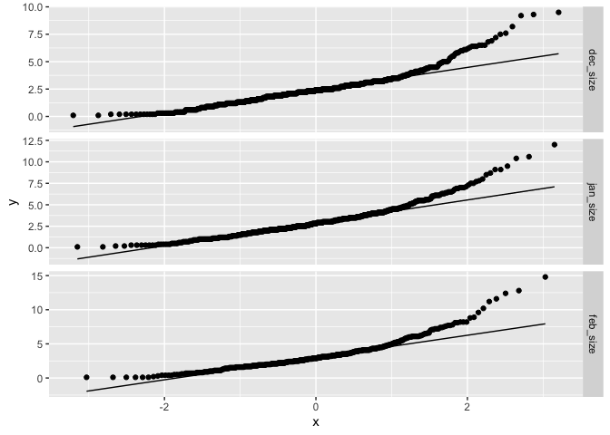<!-- -->

```
## 
## [[2]]
```

```
## Warning: Removed 490 rows containing non-finite values (`stat_qq()`).
```

```
## Warning: Removed 490 rows containing non-finite values (`stat_qq_line()`).
```

<!-- -->

```r
#all months height is right skewed
#feb longest leaf very slightly right skewed


#Transformations:
single_time_all_GTONE_transf <- single_time_all_GTONE %>% 
  mutate(sheight_cm=sqrt(height_cm), logheight_cm=log(height_cm),log10height_cm=log10(height_cm),
         slongest_leaf_cm=sqrt(longest_leaf_cm), loglongest_leaf_cm=log(longest_leaf_cm),
         log10longest_leaf_cm=log10(longest_leaf_cm))

single_time_all_GTONE_transf$survey_month <- factor(single_time_all_GTONE_transf$survey_month, levels = c("dec_size","jan_size","feb_size"))

single_time_all_GTONE_transf %>% select(ends_with("cm")) %>% 
  names() %>% 
  map(~ggplot(single_time_all_GTONE_transf, aes_string(x = .)) + 
        geom_histogram() + 
        facet_grid(survey_month ~ ., scales = "free"))
```

```
## [[1]]
```

```
## `stat_bin()` using `bins = 30`. Pick better value with `binwidth`.
```

```
## Warning: Removed 488 rows containing non-finite values (`stat_bin()`).
```

<!-- -->

```
## 
## [[2]]
```

```
## `stat_bin()` using `bins = 30`. Pick better value with `binwidth`.
```

```
## Warning: Removed 490 rows containing non-finite values (`stat_bin()`).
```

<!-- -->

```
## 
## [[3]]
```

```
## `stat_bin()` using `bins = 30`. Pick better value with `binwidth`.
```

```
## Warning: Removed 488 rows containing non-finite values (`stat_bin()`).
```

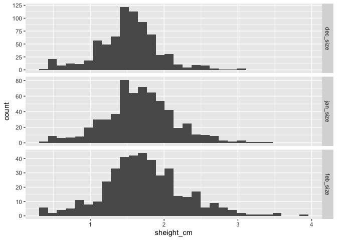<!-- -->

```
## 
## [[4]]
```

```
## `stat_bin()` using `bins = 30`. Pick better value with `binwidth`.
```

```
## Warning: Removed 488 rows containing non-finite values (`stat_bin()`).
```

<!-- -->

```
## 
## [[5]]
```

```
## `stat_bin()` using `bins = 30`. Pick better value with `binwidth`.
```

```
## Warning: Removed 488 rows containing non-finite values (`stat_bin()`).
```

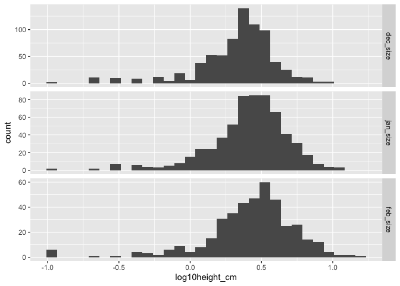<!-- -->

```
## 
## [[6]]
```

```
## `stat_bin()` using `bins = 30`. Pick better value with `binwidth`.
```

```
## Warning: Removed 490 rows containing non-finite values (`stat_bin()`).
```

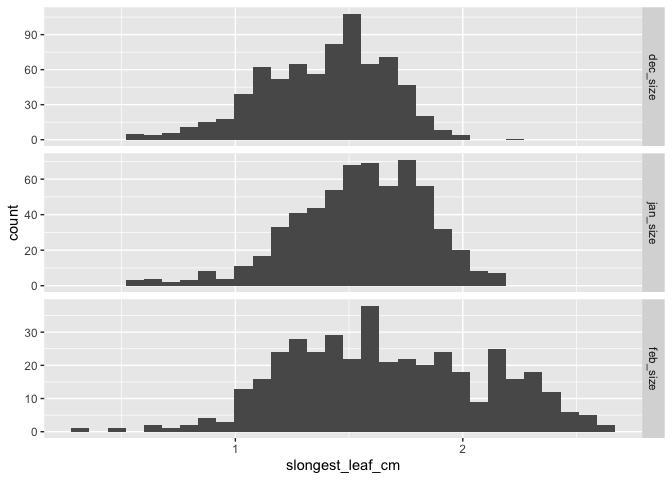<!-- -->

```
## 
## [[7]]
```

```
## `stat_bin()` using `bins = 30`. Pick better value with `binwidth`.
```

```
## Warning: Removed 490 rows containing non-finite values (`stat_bin()`).
```

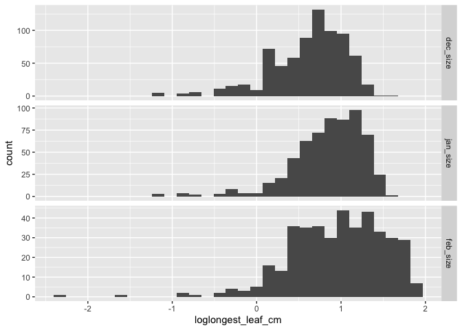<!-- -->

```
## 
## [[8]]
```

```
## `stat_bin()` using `bins = 30`. Pick better value with `binwidth`.
```

```
## Warning: Removed 490 rows containing non-finite values (`stat_bin()`).
```

<!-- -->

```r
#prints in the following order: height, longest leaf, sheight, logheight, log10height, slongest_leaf_cm, loglongest_leaf_cm, log10longest_leaf_cm

single_time_all_GTONE_transf %>% select(ends_with("cm")) %>% 
  names() %>% 
  map(~ggplot(single_time_all_GTONE_transf, aes_string(sample = .)) + 
       stat_qq() +
        stat_qq_line() +
        facet_grid(survey_month ~ ., scales="free"))
```

```
## [[1]]
```

```
## Warning: Removed 488 rows containing non-finite values (`stat_qq()`).
```

```
## Warning: Removed 488 rows containing non-finite values (`stat_qq_line()`).
```

<!-- -->

```
## 
## [[2]]
```

```
## Warning: Removed 490 rows containing non-finite values (`stat_qq()`).
```

```
## Warning: Removed 490 rows containing non-finite values (`stat_qq_line()`).
```

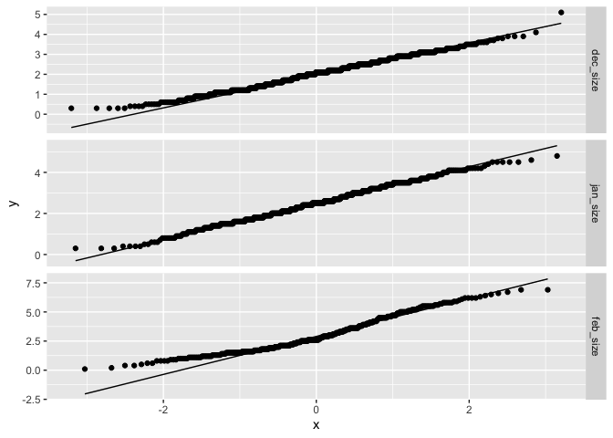<!-- -->

```
## 
## [[3]]
```

```
## Warning: Removed 488 rows containing non-finite values (`stat_qq()`).
```

```
## Warning: Removed 488 rows containing non-finite values (`stat_qq_line()`).
```

<!-- -->

```
## 
## [[4]]
```

```
## Warning: Removed 488 rows containing non-finite values (`stat_qq()`).
## Removed 488 rows containing non-finite values (`stat_qq_line()`).
```

<!-- -->

```
## 
## [[5]]
```

```
## Warning: Removed 488 rows containing non-finite values (`stat_qq()`).
## Removed 488 rows containing non-finite values (`stat_qq_line()`).
```

<!-- -->

```
## 
## [[6]]
```

```
## Warning: Removed 490 rows containing non-finite values (`stat_qq()`).
```

```
## Warning: Removed 490 rows containing non-finite values (`stat_qq_line()`).
```

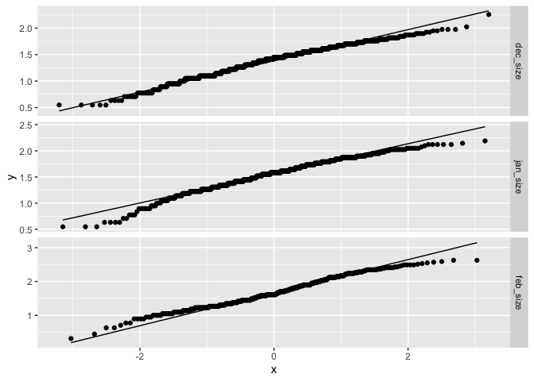<!-- -->

```
## 
## [[7]]
```

```
## Warning: Removed 490 rows containing non-finite values (`stat_qq()`).
## Removed 490 rows containing non-finite values (`stat_qq_line()`).
```

<!-- -->

```
## 
## [[8]]
```

```
## Warning: Removed 490 rows containing non-finite values (`stat_qq()`).
## Removed 490 rows containing non-finite values (`stat_qq_line()`).
```

<!-- -->

```r
#square root transformation is the best for height (all months)
#no transformations greatly improve Feb distribution 
```

When sample size is greater than two:


```r
single_time_all_GTTWO$survey_month <- factor(single_time_all_GTTWO$survey_month, levels = c("dec_size","jan_size","feb_size")) #ensures the months are printed in chronological order

#Histograms
single_time_all_GTTWO %>% select(height_cm, longest_leaf_cm) %>% 
  names() %>% 
  map(~ggplot(single_time_all_GTTWO, aes_string(x = .)) + 
        geom_histogram() + 
        facet_grid(survey_month ~ ., scales = "free"))
```

```
## [[1]]
```

```
## `stat_bin()` using `bins = 30`. Pick better value with `binwidth`.
```

```
## Warning: Removed 476 rows containing non-finite values (`stat_bin()`).
```

<!-- -->

```
## 
## [[2]]
```

```
## `stat_bin()` using `bins = 30`. Pick better value with `binwidth`.
```

```
## Warning: Removed 478 rows containing non-finite values (`stat_bin()`).
```

<!-- -->

```r
#prints height first then longest leaf 

#qq plots 
single_time_all_GTTWO %>% select(height_cm, longest_leaf_cm) %>% 
  names() %>% 
  map(~ggplot(single_time_all_GTTWO, aes_string(sample = .)) + 
       stat_qq() +
        stat_qq_line() +
        facet_grid(survey_month ~ ., scales="free"))
```

```
## [[1]]
```

```
## Warning: Removed 476 rows containing non-finite values (`stat_qq()`).
```

```
## Warning: Removed 476 rows containing non-finite values (`stat_qq_line()`).
```

<!-- -->

```
## 
## [[2]]
```

```
## Warning: Removed 478 rows containing non-finite values (`stat_qq()`).
```

```
## Warning: Removed 478 rows containing non-finite values (`stat_qq_line()`).
```

<!-- -->

```r
#all months height is right skewed, similar to GTONE results 
#feb longest leaf very slightly right skewed, similar to GTONE results 


#Transformations:
single_time_all_GTTWO_transf <- single_time_all_GTTWO %>% 
  mutate(sheight_cm=sqrt(height_cm), logheight_cm=log(height_cm),log10height_cm=log10(height_cm),
         slongest_leaf_cm=sqrt(longest_leaf_cm), loglongest_leaf_cm=log(longest_leaf_cm),
         log10longest_leaf_cm=log10(longest_leaf_cm))

single_time_all_GTTWO_transf$survey_month <- factor(single_time_all_GTTWO_transf$survey_month, levels = c("dec_size","jan_size","feb_size"))

single_time_all_GTTWO_transf %>% select(ends_with("cm")) %>% 
  names() %>% 
  map(~ggplot(single_time_all_GTTWO_transf, aes_string(x = .)) + 
        geom_histogram() + 
        facet_grid(survey_month ~ ., scales = "free"))
```

```
## [[1]]
```

```
## `stat_bin()` using `bins = 30`. Pick better value with `binwidth`.
```

```
## Warning: Removed 476 rows containing non-finite values (`stat_bin()`).
```

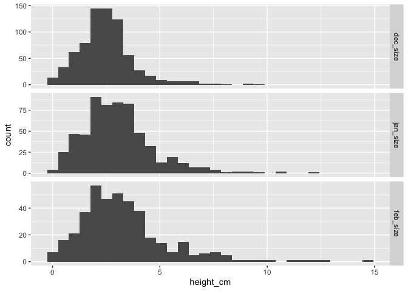<!-- -->

```
## 
## [[2]]
```

```
## `stat_bin()` using `bins = 30`. Pick better value with `binwidth`.
```

```
## Warning: Removed 478 rows containing non-finite values (`stat_bin()`).
```

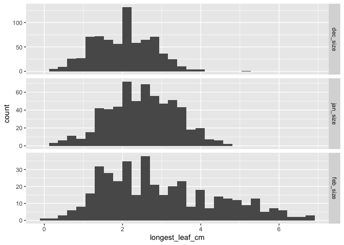<!-- -->

```
## 
## [[3]]
```

```
## `stat_bin()` using `bins = 30`. Pick better value with `binwidth`.
```

```
## Warning: Removed 476 rows containing non-finite values (`stat_bin()`).
```

<!-- -->

```
## 
## [[4]]
```

```
## `stat_bin()` using `bins = 30`. Pick better value with `binwidth`.
```

```
## Warning: Removed 476 rows containing non-finite values (`stat_bin()`).
```

<!-- -->

```
## 
## [[5]]
```

```
## `stat_bin()` using `bins = 30`. Pick better value with `binwidth`.
```

```
## Warning: Removed 476 rows containing non-finite values (`stat_bin()`).
```

<!-- -->

```
## 
## [[6]]
```

```
## `stat_bin()` using `bins = 30`. Pick better value with `binwidth`.
```

```
## Warning: Removed 478 rows containing non-finite values (`stat_bin()`).
```

<!-- -->

```
## 
## [[7]]
```

```
## `stat_bin()` using `bins = 30`. Pick better value with `binwidth`.
```

```
## Warning: Removed 478 rows containing non-finite values (`stat_bin()`).
```

<!-- -->

```
## 
## [[8]]
```

```
## `stat_bin()` using `bins = 30`. Pick better value with `binwidth`.
```

```
## Warning: Removed 478 rows containing non-finite values (`stat_bin()`).
```

<!-- -->

```r
#prints in the following order: height, longest leaf, sheight, logheight, log10height, slongest_leaf_cm, loglongest_leaf_cm, log10longest_leaf_cm

single_time_all_GTTWO_transf %>% select(ends_with("cm")) %>% 
  names() %>% 
  map(~ggplot(single_time_all_GTTWO_transf, aes_string(sample = .)) + 
       stat_qq() +
        stat_qq_line() +
        facet_grid(survey_month ~ ., scales="free"))
```

```
## [[1]]
```

```
## Warning: Removed 476 rows containing non-finite values (`stat_qq()`).
```

```
## Warning: Removed 476 rows containing non-finite values (`stat_qq_line()`).
```

<!-- -->

```
## 
## [[2]]
```

```
## Warning: Removed 478 rows containing non-finite values (`stat_qq()`).
```

```
## Warning: Removed 478 rows containing non-finite values (`stat_qq_line()`).
```

<!-- -->

```
## 
## [[3]]
```

```
## Warning: Removed 476 rows containing non-finite values (`stat_qq()`).
```

```
## Warning: Removed 476 rows containing non-finite values (`stat_qq_line()`).
```

<!-- -->

```
## 
## [[4]]
```

```
## Warning: Removed 476 rows containing non-finite values (`stat_qq()`).
## Removed 476 rows containing non-finite values (`stat_qq_line()`).
```

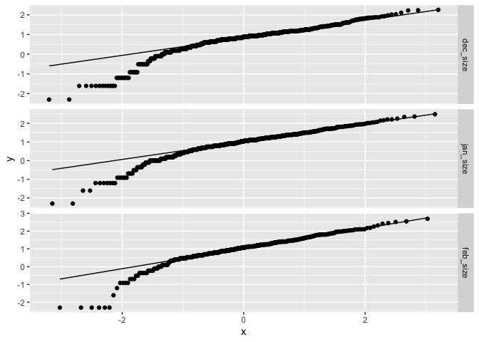<!-- -->

```
## 
## [[5]]
```

```
## Warning: Removed 476 rows containing non-finite values (`stat_qq()`).
## Removed 476 rows containing non-finite values (`stat_qq_line()`).
```

<!-- -->

```
## 
## [[6]]
```

```
## Warning: Removed 478 rows containing non-finite values (`stat_qq()`).
```

```
## Warning: Removed 478 rows containing non-finite values (`stat_qq_line()`).
```

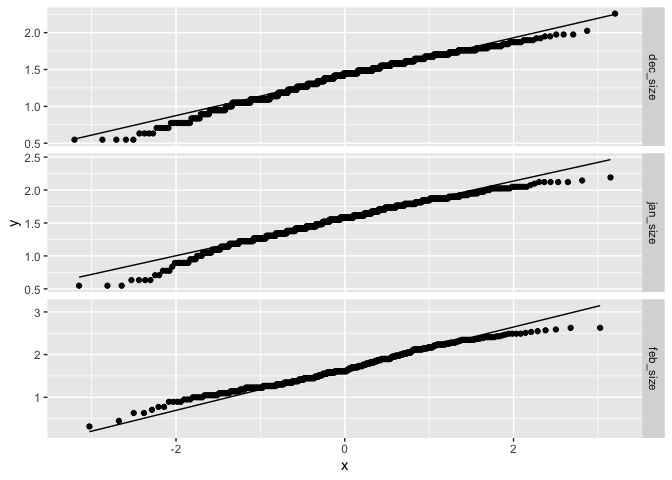<!-- -->

```
## 
## [[7]]
```

```
## Warning: Removed 478 rows containing non-finite values (`stat_qq()`).
## Removed 478 rows containing non-finite values (`stat_qq_line()`).
```

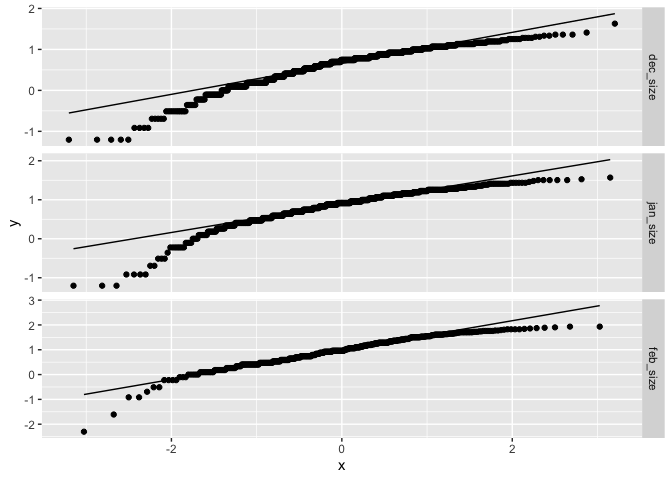<!-- -->

```
## 
## [[8]]
```

```
## Warning: Removed 478 rows containing non-finite values (`stat_qq()`).
## Removed 478 rows containing non-finite values (`stat_qq_line()`).
```

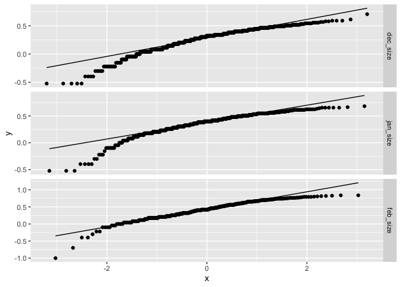<!-- -->

```r
#square root transformation is the best for height (all months), similar to GTONE results 
#no transformations greatly improve Feb distribution, similar to GTONE results 
```

## Relationship between height and longest leaf

### Plotting Height and Length Together


```r
single_time_all_GTONE_transf %>% ggplot(aes(x=height_cm, y=longest_leaf_cm)) +
  geom_point() +
  geom_smooth() +
  facet_grid(survey_month ~ ., scales="free")
```

```
## `geom_smooth()` using method = 'loess' and formula = 'y ~ x'
```

```
## Warning: Removed 490 rows containing non-finite values (`stat_smooth()`).
```

```
## Warning: Removed 490 rows containing missing values (`geom_point()`).
```

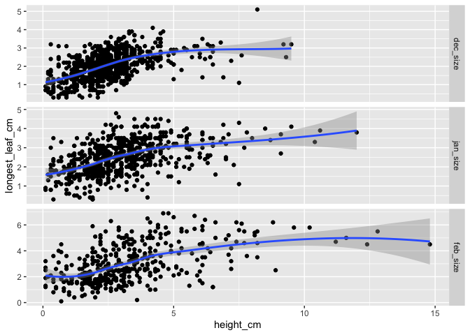<!-- -->

```r
#generally positive relationship, but a lot more variability at lower heights 
#relationship not necessarily linear

single_time_all_GTONE_transf %>% ggplot(aes(x=longest_leaf_cm, y=height_cm)) +
  geom_point() +
  geom_smooth() +
  facet_grid(survey_month ~ ., scales="free") #flipped axes
```

```
## `geom_smooth()` using method = 'loess' and formula = 'y ~ x'
```

```
## Warning: Removed 490 rows containing non-finite values (`stat_smooth()`).
## Removed 490 rows containing missing values (`geom_point()`).
```

<!-- -->

```r
#lots of variability across lengths 
```

When you're tall, you likely have bigger leaves, but when you're short, you can have big or small leaves, with a slight trend for bigger leaves the taller you are?

### Calculating correlation b/t the two


```r
single_time_all_GTONE_transf %>% cor_test(height_cm, longest_leaf_cm, method = "pearson") #all months 
```

```
## # A tibble: 1 × 8
##   var1      var2              cor statistic         p conf.low conf.high method 
##   <chr>     <chr>           <dbl>     <dbl>     <dbl>    <dbl>     <dbl> <chr>  
## 1 height_cm longest_leaf_cm  0.52      25.5 1.45e-122    0.486     0.554 Pearson
```

```r
#Note, I used the pearson method event though height is not normally distributed...something to consider if we actually want to use this analysis
#r=0.52, P <0.0001

single_time_all_GTONE_transf %>% group_by(survey_month) %>% 
  cor_test(height_cm, longest_leaf_cm, method = "pearson") #separate test for each month
```

```
## # A tibble: 3 × 9
##   survey_month var1     var2    cor statistic        p conf.low conf.high method
##   <fct>        <chr>    <chr> <dbl>     <dbl>    <dbl>    <dbl>     <dbl> <chr> 
## 1 dec_size     height_… long…  0.51      16.2 1.31e-50    0.457     0.563 Pears…
## 2 jan_size     height_… long…  0.47      13.0 3.61e-34    0.401     0.525 Pears…
## 3 feb_size     height_… long…  0.51      11.9 3.21e-28    0.434     0.578 Pears…
```

```r
#Dec r=0.51, P <0.0001
#Jan r=0.47, P <0.0001
#Feb r=0.51, P <0.0001

summary(lm(sheight_cm ~ longest_leaf_cm, data=single_time_all_GTONE_transf))
```

```
## 
## Call:
## lm(formula = sheight_cm ~ longest_leaf_cm, data = single_time_all_GTONE_transf)
## 
## Residuals:
##     Min      1Q  Median      3Q     Max 
## -1.4965 -0.2349 -0.0037  0.2266  1.7270 
## 
## Coefficients:
##                 Estimate Std. Error t value Pr(>|t|)    
## (Intercept)      1.05611    0.02406   43.89   <2e-16 ***
## longest_leaf_cm  0.23643    0.00914   25.87   <2e-16 ***
## ---
## Signif. codes:  0 '***' 0.001 '**' 0.01 '*' 0.05 '.' 0.1 ' ' 1
## 
## Residual standard error: 0.4099 on 1754 degrees of freedom
##   (490 observations deleted due to missingness)
## Multiple R-squared:  0.2761,	Adjusted R-squared:  0.2757 
## F-statistic: 669.1 on 1 and 1754 DF,  p-value: < 2.2e-16
```

## Calculating means by pop (and elev)


```r
single_time_all_GTONE_transf_summary <- single_time_all_GTONE_transf %>% 
  group_by(survey_month, parent.pop, elev_m) %>% 
  summarise(N_height = sum(!is.na(height_cm)), mean_height_cm = mean(height_cm,na.rm=(TRUE)), 
            sem_height_cm=sem(height_cm, na.rm=(TRUE)), N_length = sum(!is.na(longest_leaf_cm)),
            mean_longest_leaf_cm=mean(longest_leaf_cm, na.rm=(TRUE)), 
            sem_longest_leaf_cm=sem(longest_leaf_cm, na.rm=TRUE)) %>% 
  arrange(survey_month, elev_m)
```

```
## `summarise()` has grouped output by 'survey_month', 'parent.pop'. You can
## override using the `.groups` argument.
```

```r
single_time_all_GTONE_transf_summary
```

```
## # A tibble: 63 × 9
## # Groups:   survey_month, parent.pop [63]
##    survey_month parent.pop elev_m N_height mean_height_cm sem_height_cm N_length
##    <fct>        <chr>       <dbl>    <int>          <dbl>         <dbl>    <int>
##  1 dec_size     CC           313        43           3.86        0.198        43
##  2 dec_size     TM2          379.       37           5.10        0.314        37
##  3 dec_size     SC           422.       36           2.54        0.141        36
##  4 dec_size     IH           454.       48           2.70        0.108        48
##  5 dec_size     BH           511.      110           2.45        0.0779      110
##  6 dec_size     WV           749.        2           1.5         1.2           2
##  7 dec_size     FR           787        36           3.06        0.186        36
##  8 dec_size     DPR         1019.       22           4.18        0.352        22
##  9 dec_size     WR          1158         9           1.94        0.378         9
## 10 dec_size     WL1         1614.      124           2.39        0.0726      124
## # ℹ 53 more rows
## # ℹ 2 more variables: mean_longest_leaf_cm <dbl>, sem_longest_leaf_cm <dbl>
```

```r
#write_csv(single_time_all_GTONE_transf_summary, file ="../output/UCD_Traits/single_time_size_summary.csv")
```

## Figures of averages

### Avg Height Figure


```r
single_time_all_GTONE_transf_summary$survey_month <- factor(single_time_all_GTONE_transf_summary$survey_month, levels = c("dec_size","jan_size","feb_size"))

single_time_all_GTONE_transf_summary %>% 
  ggplot(aes(x=fct_reorder(parent.pop, mean_height_cm), y=mean_height_cm, fill=elev_m)) +
  geom_col(width = 0.7,position = position_dodge(0.75)) + 
  geom_errorbar(aes(ymin=mean_height_cm-sem_height_cm,ymax=mean_height_cm+sem_height_cm),width=.2, position = 
                  position_dodge(0.75)) +
  scale_y_continuous(expand = c(0, 0)) +
  scale_fill_gradient(low = "#F5A540", high = "#0043F0") +
  labs(fill="Elevation (m)", y="Avg Height (cm)", x="Population") +
   theme_classic() +
  theme(text=element_text(size=25), axis.text.x = element_text(angle = 45,  hjust = 1)) +
  facet_grid(survey_month ~ .)
```

<!-- -->

```r
#ggsave("../output/UCD_Traits/Single_Time_Height.png", width = 14, height = 18, units = "in")
```

### Avg Longest Leaf Figure


```r
single_time_all_GTONE_transf_summary %>% 
  ggplot(aes(x=fct_reorder(parent.pop, mean_longest_leaf_cm), y=mean_longest_leaf_cm, fill=elev_m)) +
  geom_col(width = 0.7,position = position_dodge(0.75)) + 
  geom_errorbar(aes(ymin=mean_longest_leaf_cm-sem_longest_leaf_cm,ymax=mean_longest_leaf_cm+sem_longest_leaf_cm),width=.2, position = 
                  position_dodge(0.75)) +
  scale_y_continuous(expand = c(0, 0)) +
  scale_fill_gradient(low = "#F5A540", high = "#0043F0") +
  labs(fill="Elevation (m)", y="Avg Longest Leaf (cm)", x="Population") +
   theme_classic() +
  theme(text=element_text(size=25), axis.text.x = element_text(angle = 45,  hjust = 1)) +
  facet_grid(survey_month ~ .)
```

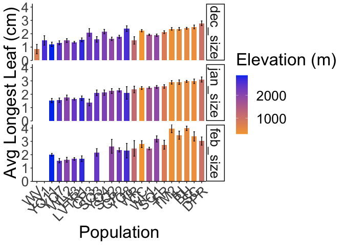<!-- -->

```r
#ggsave("../output/UCD_Traits/Single_Time_Longest_Leaf.png", width = 14, height = 18, units = "in")
```

## Mixed Effects Models

### With a sample size of greater than 1 per pop
Prep data for model

```r
single_time_split_by_month_GTONE <- single_time_all_GTONE_transf %>% 
  select(survey_month, elev_m, parent.pop, mf, sheight_cm, longest_leaf_cm) %>% 
  group_nest(survey_month)
single_time_split_by_month_GTONE #the data column contains the parameters in the model 
```

```
## # A tibble: 3 × 2
##   survey_month               data
##   <fct>        <list<tibble[,5]>>
## 1 dec_size              [757 × 5]
## 2 jan_size              [752 × 5]
## 3 feb_size              [737 × 5]
```

```r
model_by_month_GTONE <- 
  single_time_split_by_month_GTONE %>% 
  mutate(height_model_1 = map(data, ~ lmer(sheight_cm ~ (1|parent.pop/mf), data = .x)),
         height_model_2 = map(data, ~ lmer(sheight_cm ~ elev_m + (1|parent.pop/mf), data = .x)),
         leaf_model_1 = map(data, ~ lmer(longest_leaf_cm ~ (1|parent.pop/mf), data = .x)), 
         leaf_model_2 = map(data, ~ lmer(longest_leaf_cm ~ elev_m + (1|parent.pop/mf), data = .x)),)
```

```
## boundary (singular) fit: see help('isSingular')
## boundary (singular) fit: see help('isSingular')
```

```r
model_by_month_GTONE
```

```
## # A tibble: 3 × 6
##   survey_month      data height_model_1 height_model_2 leaf_model_1 leaf_model_2
##   <fct>        <list<ti> <list>         <list>         <list>       <list>      
## 1 dec_size     [757 × 5] <lmrMdLmT>     <lmrMdLmT>     <lmrMdLmT>   <lmrMdLmT>  
## 2 jan_size     [752 × 5] <lmrMdLmT>     <lmrMdLmT>     <lmrMdLmT>   <lmrMdLmT>  
## 3 feb_size     [737 × 5] <lmrMdLmT>     <lmrMdLmT>     <lmrMdLmT>   <lmrMdLmT>
```

Summary output for one model across survey_months 

```r
model_by_month_GTONE %>% 
  mutate(coef = map(height_model_1, tidy)) %>% 
  select(survey_month, coef) %>% 
  unnest(cols = c(coef))
```

```
## # A tibble: 12 × 9
##    survey_month effect  group term  estimate std.error statistic    df   p.value
##    <fct>        <chr>   <chr> <chr>    <dbl>     <dbl>     <dbl> <dbl>     <dbl>
##  1 dec_size     fixed   <NA>  (Int…    1.44     0.0695      20.8  21.8  7.55e-16
##  2 dec_size     ran_pa… mf:p… sd__…    0.124   NA           NA    NA   NA       
##  3 dec_size     ran_pa… pare… sd__…    0.317   NA           NA    NA   NA       
##  4 dec_size     ran_pa… Resi… sd__…    0.300   NA           NA    NA   NA       
##  5 jan_size     fixed   <NA>  (Int…    1.57     0.0872      18.0  20.2  6.67e-14
##  6 jan_size     ran_pa… mf:p… sd__…    0.129   NA           NA    NA   NA       
##  7 jan_size     ran_pa… pare… sd__…    0.386   NA           NA    NA   NA       
##  8 jan_size     ran_pa… Resi… sd__…    0.324   NA           NA    NA   NA       
##  9 feb_size     fixed   <NA>  (Int…    1.59     0.109       14.6  18.6  1.23e-11
## 10 feb_size     ran_pa… mf:p… sd__…    0.155   NA           NA    NA   NA       
## 11 feb_size     ran_pa… pare… sd__…    0.452   NA           NA    NA   NA       
## 12 feb_size     ran_pa… Resi… sd__…    0.356   NA           NA    NA   NA
```

Ranova output for each model (across months)

```r
#Model without random effects printed first, then nested predictor and then the predictor that nest was in
#(1 | mf:parent.pop) 
#(1 | parent.pop)
model_by_month_GTONE %>% #height with just pop and mf
  mutate(ranova = map(height_model_1, ranova)) %>% 
  select(survey_month, ranova) %>% 
  unnest(cols = c(ranova))
```

```
## # A tibble: 9 × 7
##   survey_month  npar logLik   AIC   LRT    Df `Pr(>Chisq)`
##   <fct>        <int>  <dbl> <dbl> <dbl> <dbl>        <dbl>
## 1 dec_size         4  -228.  463.  NA      NA    NA       
## 2 dec_size         3  -240.  486.  24.8     1     6.27e- 7
## 3 dec_size         3  -276.  558.  96.1     1     1.11e-22
## 4 jan_size         4  -240.  488.  NA      NA    NA       
## 5 jan_size         3  -249.  505.  18.5     1     1.69e- 5
## 6 jan_size         3  -292.  590. 104.      1     2.05e-24
## 7 feb_size         4  -208.  425.  NA      NA    NA       
## 8 feb_size         3  -215.  435.  12.7     1     3.57e- 4
## 9 feb_size         3  -250.  506.  83.5     1     6.48e-20
```


```r
model_by_month_GTONE %>% #height with elev, pop, and mf
  mutate(ranova = map(height_model_2, ranova)) %>% 
  select(survey_month, ranova) %>% 
  unnest(cols = c(ranova))
```

```
## # A tibble: 9 × 7
##   survey_month  npar logLik   AIC   LRT    Df `Pr(>Chisq)`
##   <fct>        <int>  <dbl> <dbl> <dbl> <dbl>        <dbl>
## 1 dec_size         5  -231.  472.  NA      NA    NA       
## 2 dec_size         4  -244.  495.  24.9     1     6.13e- 7
## 3 dec_size         4  -256.  519.  49.3     1     2.23e-12
## 4 jan_size         5  -240.  489.  NA      NA    NA       
## 5 jan_size         4  -249.  506.  18.4     1     1.81e- 5
## 6 jan_size         4  -261.  530.  42.1     1     8.50e-11
## 7 feb_size         5  -210.  430.  NA      NA    NA       
## 8 feb_size         4  -216.  440.  12.4     1     4.30e- 4
## 9 feb_size         4  -227.  462.  33.9     1     5.68e- 9
```


```r
model_by_month_GTONE %>% #length with just pop and mf
  mutate(ranova = map(leaf_model_1, ranova)) %>% 
  select(survey_month, ranova) %>% 
  unnest(cols = c(ranova))
```

```
## # A tibble: 9 × 7
##   survey_month  npar logLik   AIC       LRT    Df `Pr(>Chisq)`
##   <fct>        <int>  <dbl> <dbl>     <dbl> <dbl>        <dbl>
## 1 dec_size         4  -749. 1506. NA           NA    NA       
## 2 dec_size         3  -750. 1507.  2.85e+ 0     1     9.13e- 2
## 3 dec_size         3  -780. 1565.  6.11e+ 1     1     5.37e-15
## 4 jan_size         4  -706. 1420. NA           NA    NA       
## 5 jan_size         3  -707. 1420.  2.23e+ 0     1     1.35e- 1
## 6 jan_size         3  -734. 1473.  5.51e+ 1     1     1.12e-13
## 7 feb_size         4  -686. 1381. NA           NA    NA       
## 8 feb_size         3  -686. 1379.  1.14e-12     1     1.00e+ 0
## 9 feb_size         3  -712. 1429.  5.06e+ 1     1     1.12e-12
```


```r
model_by_month_GTONE %>% #length with elev, pop, and mf
  mutate(ranova = map(leaf_model_2, ranova)) %>% 
  select(survey_month, ranova) %>% 
  unnest(cols = c(ranova))
```

```
## # A tibble: 9 × 7
##   survey_month  npar logLik   AIC       LRT    Df `Pr(>Chisq)`
##   <fct>        <int>  <dbl> <dbl>     <dbl> <dbl>        <dbl>
## 1 dec_size         5  -752. 1513. NA           NA   NA        
## 2 dec_size         4  -753. 1514.  2.89e+ 0     1    0.0893   
## 3 dec_size         4  -760. 1529.  1.75e+ 1     1    0.0000289
## 4 jan_size         5  -702. 1415. NA           NA   NA        
## 5 jan_size         4  -704. 1415.  2.32e+ 0     1    0.128    
## 6 jan_size         4  -709. 1426.  1.35e+ 1     1    0.000240 
## 7 feb_size         5  -685. 1381. NA           NA   NA        
## 8 feb_size         4  -685. 1379. -6.75e-11     1    1        
## 9 feb_size         4  -693. 1393.  1.44e+ 1     1    0.000147
```

Summary for all models per survey month

```r
tidy_models_GTONE <- model_by_month_GTONE %>% #get tidy summary of each model 
  mutate(coef_1 = map(height_model_1, tidy),
            coef_2 = map(height_model_2, tidy),
            coef_3 = map(leaf_model_1, tidy),
            coef_4 = map(leaf_model_2, tidy)) %>% 
  select(survey_month, coef_1:coef_4)
tidy_models_GTONE
```

```
## # A tibble: 3 × 5
##   survey_month coef_1           coef_2           coef_3           coef_4  
##   <fct>        <list>           <list>           <list>           <list>  
## 1 dec_size     <tibble [4 × 8]> <tibble [5 × 8]> <tibble [4 × 8]> <tibble>
## 2 jan_size     <tibble [4 × 8]> <tibble [5 × 8]> <tibble [4 × 8]> <tibble>
## 3 feb_size     <tibble [4 × 8]> <tibble [5 × 8]> <tibble [4 × 8]> <tibble>
```

```r
tidy_models_GTONE_dec <- tidy_models_GTONE %>% filter(survey_month == "dec_size")
tidy_models_GTONE_jan <- tidy_models_GTONE %>% filter(survey_month == "jan_size")
tidy_models_GTONE_feb <- tidy_models_GTONE %>% filter(survey_month == "feb_size")

#convert to long 
models_long_GTONEdec <- reshape(tidy_models_GTONE_dec, direction = "long", sep = "_",
                           idvar = "survey_month", 
                            varying = c("coef_1", "coef_2", "coef_3", "coef_4")) %>% 
                unnest(coef) %>% 
  rename("model"="time") %>% 
  mutate(model = if_else(model==1, "height_model_1", 
                         if_else(model==2, "height_model_2",
                                 if_else(model==3, "leaf_model_1",
                                         "leaf_model_2"))))
models_long_GTONEdec
```

```
## # A tibble: 18 × 10
##    survey_month model      effect group term  estimate std.error statistic    df
##    <fct>        <chr>      <chr>  <chr> <chr>    <dbl>     <dbl>     <dbl> <dbl>
##  1 dec_size     height_mo… fixed  <NA>  (Int…  1.44e+0   6.95e-2     20.8   21.8
##  2 dec_size     height_mo… ran_p… mf:p… sd__…  1.24e-1  NA           NA     NA  
##  3 dec_size     height_mo… ran_p… pare… sd__…  3.17e-1  NA           NA     NA  
##  4 dec_size     height_mo… ran_p… Resi… sd__…  3.00e-1  NA           NA     NA  
##  5 dec_size     height_mo… fixed  <NA>  (Int…  1.83e+0   1.14e-1     16.0   17.6
##  6 dec_size     height_mo… fixed  <NA>  elev… -2.33e-4   6.18e-5     -3.78  18.3
##  7 dec_size     height_mo… ran_p… mf:p… sd__…  1.25e-1  NA           NA     NA  
##  8 dec_size     height_mo… ran_p… pare… sd__…  2.37e-1  NA           NA     NA  
##  9 dec_size     height_mo… ran_p… Resi… sd__…  3.00e-1  NA           NA     NA  
## 10 dec_size     leaf_mode… fixed  <NA>  (Int…  1.90e+0   9.72e-2     19.6   20.9
## 11 dec_size     leaf_mode… ran_p… mf:p… sd__…  1.26e-1  NA           NA     NA  
## 12 dec_size     leaf_mode… ran_p… pare… sd__…  4.30e-1  NA           NA     NA  
## 13 dec_size     leaf_mode… ran_p… Resi… sd__…  6.33e-1  NA           NA     NA  
## 14 dec_size     leaf_mode… fixed  <NA>  (Int…  2.45e+0   1.42e-1     17.2   12.5
## 15 dec_size     leaf_mode… fixed  <NA>  elev… -3.35e-4   7.85e-5     -4.27  14.0
## 16 dec_size     leaf_mode… ran_p… mf:p… sd__…  1.28e-1  NA           NA     NA  
## 17 dec_size     leaf_mode… ran_p… pare… sd__…  2.81e-1  NA           NA     NA  
## 18 dec_size     leaf_mode… ran_p… Resi… sd__…  6.35e-1  NA           NA     NA  
## # ℹ 1 more variable: p.value <dbl>
```

```r
#write_csv(models_long_GTONEdec, "../output/UCD_Traits/12132022_Size_Models_GTONE.csv")

models_long_GTONEjan <- reshape(tidy_models_GTONE_jan, direction = "long", sep = "_",
                           idvar = "survey_month", 
                            varying = c("coef_1", "coef_2", "coef_3", "coef_4")) %>% 
                unnest(coef) %>% 
  rename("model"="time") %>% 
  mutate(model = if_else(model==1, "height_model_1", 
                         if_else(model==2, "height_model_2",
                                 if_else(model==3, "leaf_model_1",
                                         "leaf_model_2"))))
models_long_GTONEjan
```

```
## # A tibble: 18 × 10
##    survey_month model      effect group term  estimate std.error statistic    df
##    <fct>        <chr>      <chr>  <chr> <chr>    <dbl>     <dbl>     <dbl> <dbl>
##  1 jan_size     height_mo… fixed  <NA>  (Int…  1.57e+0   8.72e-2     18.0   20.2
##  2 jan_size     height_mo… ran_p… mf:p… sd__…  1.29e-1  NA           NA     NA  
##  3 jan_size     height_mo… ran_p… pare… sd__…  3.86e-1  NA           NA     NA  
##  4 jan_size     height_mo… ran_p… Resi… sd__…  3.24e-1  NA           NA     NA  
##  5 jan_size     height_mo… fixed  <NA>  (Int…  2.14e+0   1.18e-1     18.1   16.6
##  6 jan_size     height_mo… fixed  <NA>  elev… -3.49e-4   6.48e-5     -5.38  17.9
##  7 jan_size     height_mo… ran_p… mf:p… sd__…  1.29e-1  NA           NA     NA  
##  8 jan_size     height_mo… ran_p… pare… sd__…  2.36e-1  NA           NA     NA  
##  9 jan_size     height_mo… ran_p… Resi… sd__…  3.24e-1  NA           NA     NA  
## 10 jan_size     leaf_mode… fixed  <NA>  (Int…  2.29e+0   1.16e-1     19.9   19.9
## 11 jan_size     leaf_mode… ran_p… mf:p… sd__…  1.47e-1  NA           NA     NA  
## 12 jan_size     leaf_mode… ran_p… pare… sd__…  4.91e-1  NA           NA     NA  
## 13 jan_size     leaf_mode… ran_p… Resi… sd__…  7.27e-1  NA           NA     NA  
## 14 jan_size     leaf_mode… fixed  <NA>  (Int…  3.09e+0   1.30e-1     23.8   15.1
## 15 jan_size     leaf_mode… fixed  <NA>  elev… -4.95e-4   7.44e-5     -6.65  18.6
## 16 jan_size     leaf_mode… ran_p… mf:p… sd__…  1.45e-1  NA           NA     NA  
## 17 jan_size     leaf_mode… ran_p… pare… sd__…  2.31e-1  NA           NA     NA  
## 18 jan_size     leaf_mode… ran_p… Resi… sd__…  7.26e-1  NA           NA     NA  
## # ℹ 1 more variable: p.value <dbl>
```

```r
write_csv(models_long_GTONEjan, "../output/UCD_Traits/01272023_Size_Models_GTONE.csv")

models_long_GTONEfeb <-  reshape(tidy_models_GTONE_feb, direction = "long", sep = "_",
                           idvar = "survey_month", 
                            varying = c("coef_1", "coef_2", "coef_3", "coef_4")) %>% 
                unnest(coef) %>% 
  rename("model"="time") %>% 
  mutate(model = if_else(model==1, "height_model_1", 
                         if_else(model==2, "height_model_2",
                                 if_else(model==3, "leaf_model_1",
                                         "leaf_model_2"))))
models_long_GTONEfeb
```

```
## # A tibble: 18 × 10
##    survey_month model      effect group term  estimate std.error statistic    df
##    <fct>        <chr>      <chr>  <chr> <chr>    <dbl>     <dbl>     <dbl> <dbl>
##  1 feb_size     height_mo… fixed  <NA>  (Int…  1.59e+0   1.09e-1     14.6   18.6
##  2 feb_size     height_mo… ran_p… mf:p… sd__…  1.55e-1  NA           NA     NA  
##  3 feb_size     height_mo… ran_p… pare… sd__…  4.52e-1  NA           NA     NA  
##  4 feb_size     height_mo… ran_p… Resi… sd__…  3.56e-1  NA           NA     NA  
##  5 feb_size     height_mo… fixed  <NA>  (Int…  2.19e+0   1.46e-1     15.0   13.7
##  6 feb_size     height_mo… fixed  <NA>  elev… -3.88e-4   8.36e-5     -4.63  15.7
##  7 feb_size     height_mo… ran_p… mf:p… sd__…  1.55e-1  NA           NA     NA  
##  8 feb_size     height_mo… ran_p… pare… sd__…  2.88e-1  NA           NA     NA  
##  9 feb_size     height_mo… ran_p… Resi… sd__…  3.57e-1  NA           NA     NA  
## 10 feb_size     leaf_mode… fixed  <NA>  (Int…  2.68e+0   1.86e-1     14.4   19.5
## 11 feb_size     leaf_mode… ran_p… mf:p… sd__…  0        NA           NA     NA  
## 12 feb_size     leaf_mode… ran_p… pare… sd__…  7.12e-1  NA           NA     NA  
## 13 feb_size     leaf_mode… ran_p… Resi… sd__…  1.26e+0  NA           NA     NA  
## 14 feb_size     leaf_mode… fixed  <NA>  (Int…  3.77e+0   2.19e-1     17.3   13.8
## 15 feb_size     leaf_mode… fixed  <NA>  elev… -7.41e-4   1.35e-4     -5.48  18.8
## 16 feb_size     leaf_mode… ran_p… mf:p… sd__…  0        NA           NA     NA  
## 17 feb_size     leaf_mode… ran_p… pare… sd__…  3.73e-1  NA           NA     NA  
## 18 feb_size     leaf_mode… ran_p… Resi… sd__…  1.26e+0  NA           NA     NA  
## # ℹ 1 more variable: p.value <dbl>
```

```r
write_csv(models_long_GTONEfeb, "../output/UCD_Traits/02172023_Size_Models_GTONE.csv")
```

### With a sample size of greater than 2 per pop
Prep data for model

```r
single_time_split_by_month_GTTWO <- single_time_all_GTTWO_transf %>% 
  select(survey_month, elev_m, parent.pop, mf, sheight_cm, longest_leaf_cm) %>% 
  group_nest(survey_month)
single_time_split_by_month_GTTWO #the data column contains the parameters in the model 
```

```
## # A tibble: 3 × 2
##   survey_month               data
##   <fct>        <list<tibble[,5]>>
## 1 dec_size              [755 × 5]
## 2 jan_size              [752 × 5]
## 3 feb_size              [723 × 5]
```

```r
model_by_month_GTTWO <- 
  single_time_split_by_month_GTTWO %>% 
  mutate(height_model_1 = map(data, ~ lmer(sheight_cm ~ (1|parent.pop/mf), data = .x)),
         height_model_2 = map(data, ~ lmer(sheight_cm ~ elev_m + (1|parent.pop/mf), data = .x)),
         leaf_model_1 = map(data, ~ lmer(longest_leaf_cm ~ (1|parent.pop/mf), data = .x)), 
         leaf_model_2 = map(data, ~ lmer(longest_leaf_cm ~ elev_m + (1|parent.pop/mf), data = .x)),)
```

```
## boundary (singular) fit: see help('isSingular')
## boundary (singular) fit: see help('isSingular')
```

```r
model_by_month_GTTWO
```

```
## # A tibble: 3 × 6
##   survey_month      data height_model_1 height_model_2 leaf_model_1 leaf_model_2
##   <fct>        <list<ti> <list>         <list>         <list>       <list>      
## 1 dec_size     [755 × 5] <lmrMdLmT>     <lmrMdLmT>     <lmrMdLmT>   <lmrMdLmT>  
## 2 jan_size     [752 × 5] <lmrMdLmT>     <lmrMdLmT>     <lmrMdLmT>   <lmrMdLmT>  
## 3 feb_size     [723 × 5] <lmrMdLmT>     <lmrMdLmT>     <lmrMdLmT>   <lmrMdLmT>
```

Summary output for one model across survey_months 

```r
model_by_month_GTTWO %>% 
  mutate(coef = map(height_model_1, tidy)) %>% 
  select(survey_month, coef) %>% 
  unnest(cols = c(coef))
```

```
## # A tibble: 12 × 9
##    survey_month effect  group term  estimate std.error statistic    df   p.value
##    <fct>        <chr>   <chr> <chr>    <dbl>     <dbl>     <dbl> <dbl>     <dbl>
##  1 dec_size     fixed   <NA>  (Int…    1.45     0.0707      20.6  20.8  2.79e-15
##  2 dec_size     ran_pa… mf:p… sd__…    0.125   NA           NA    NA   NA       
##  3 dec_size     ran_pa… pare… sd__…    0.318   NA           NA    NA   NA       
##  4 dec_size     ran_pa… Resi… sd__…    0.299   NA           NA    NA   NA       
##  5 jan_size     fixed   <NA>  (Int…    1.57     0.0872      18.0  20.2  6.67e-14
##  6 jan_size     ran_pa… mf:p… sd__…    0.129   NA           NA    NA   NA       
##  7 jan_size     ran_pa… pare… sd__…    0.386   NA           NA    NA   NA       
##  8 jan_size     ran_pa… Resi… sd__…    0.324   NA           NA    NA   NA       
##  9 feb_size     fixed   <NA>  (Int…    1.58     0.114       14.0  17.3  7.68e-11
## 10 feb_size     ran_pa… mf:p… sd__…    0.156   NA           NA    NA   NA       
## 11 feb_size     ran_pa… pare… sd__…    0.462   NA           NA    NA   NA       
## 12 feb_size     ran_pa… Resi… sd__…    0.357   NA           NA    NA   NA
```

Ranova output for each model (across months)

```r
#Model without random effects printed first, then nested predictor and then the predictor that nest was in
#(1 | mf:parent.pop) 
#(1 | parent.pop)
model_by_month_GTTWO %>% #height with just pop and mf
  mutate(ranova = map(height_model_1, ranova)) %>% 
  select(survey_month, ranova) %>% 
  unnest(cols = c(ranova))
```

```
## # A tibble: 9 × 7
##   survey_month  npar logLik   AIC   LRT    Df `Pr(>Chisq)`
##   <fct>        <int>  <dbl> <dbl> <dbl> <dbl>        <dbl>
## 1 dec_size         4  -224.  456.  NA      NA    NA       
## 2 dec_size         3  -237.  479.  25.5     1     4.50e- 7
## 3 dec_size         3  -272.  550.  96.0     1     1.16e-22
## 4 jan_size         4  -240.  488.  NA      NA    NA       
## 5 jan_size         3  -249.  505.  18.5     1     1.69e- 5
## 6 jan_size         3  -292.  590. 104.      1     2.05e-24
## 7 feb_size         4  -207.  423.  NA      NA    NA       
## 8 feb_size         3  -214.  433.  12.8     1     3.49e- 4
## 9 feb_size         3  -249.  504.  83.4     1     6.72e-20
```


```r
model_by_month_GTTWO %>% #height with elev, pop and mf
  mutate(ranova = map(height_model_2, ranova)) %>% 
  select(survey_month, ranova) %>% 
  unnest(cols = c(ranova))
```

```
## # A tibble: 9 × 7
##   survey_month  npar logLik   AIC   LRT    Df `Pr(>Chisq)`
##   <fct>        <int>  <dbl> <dbl> <dbl> <dbl>        <dbl>
## 1 dec_size         5  -226.  463.  NA      NA    NA       
## 2 dec_size         4  -239.  486.  25.4     1     4.71e- 7
## 3 dec_size         4  -251.  510.  48.9     1     2.75e-12
## 4 jan_size         5  -240.  489.  NA      NA    NA       
## 5 jan_size         4  -249.  506.  18.4     1     1.81e- 5
## 6 jan_size         4  -261.  530.  42.1     1     8.50e-11
## 7 feb_size         5  -208.  426.  NA      NA    NA       
## 8 feb_size         4  -214.  436.  12.4     1     4.22e- 4
## 9 feb_size         4  -224.  456.  32.3     1     1.31e- 8
```


```r
model_by_month_GTTWO %>% #length with just pop and mf
  mutate(ranova = map(leaf_model_1, ranova)) %>% 
  select(survey_month, ranova) %>% 
  unnest(cols = c(ranova))
```

```
## # A tibble: 9 × 7
##   survey_month  npar logLik   AIC       LRT    Df `Pr(>Chisq)`
##   <fct>        <int>  <dbl> <dbl>     <dbl> <dbl>        <dbl>
## 1 dec_size         4  -746. 1500. NA           NA    NA       
## 2 dec_size         3  -747. 1501.  2.82e+ 0     1     9.29e- 2
## 3 dec_size         3  -776. 1559.  6.09e+ 1     1     6.02e-15
## 4 jan_size         4  -706. 1420. NA           NA    NA       
## 5 jan_size         3  -707. 1420.  2.23e+ 0     1     1.35e- 1
## 6 jan_size         3  -734. 1473.  5.51e+ 1     1     1.12e-13
## 7 feb_size         4  -684. 1375. NA           NA    NA       
## 8 feb_size         3  -684. 1373.  2.27e-13     1     1.00e+ 0
## 9 feb_size         3  -709. 1423.  5.03e+ 1     1     1.35e-12
```


```r
model_by_month_GTTWO %>% #length with elev pop and mf
  mutate(ranova = map(leaf_model_2, ranova)) %>% 
  select(survey_month, ranova) %>% 
  unnest(cols = c(ranova))
```

```
## # A tibble: 9 × 7
##   survey_month  npar logLik   AIC       LRT    Df `Pr(>Chisq)`
##   <fct>        <int>  <dbl> <dbl>     <dbl> <dbl>        <dbl>
## 1 dec_size         5  -747. 1504. NA           NA   NA        
## 2 dec_size         4  -748. 1505.  2.75e+ 0     1    0.0972   
## 3 dec_size         4  -755. 1519.  1.68e+ 1     1    0.0000422
## 4 jan_size         5  -702. 1415. NA           NA   NA        
## 5 jan_size         4  -704. 1415.  2.32e+ 0     1    0.128    
## 6 jan_size         4  -709. 1426.  1.35e+ 1     1    0.000240 
## 7 feb_size         5  -683. 1376. NA           NA   NA        
## 8 feb_size         4  -683. 1374. -2.05e-12     1    1        
## 9 feb_size         4  -690. 1388.  1.43e+ 1     1    0.000153
```


Summary for all models per survey month

```r
tidy_models_GTTWO <- model_by_month_GTTWO %>% #get tidy summary of each model 
  mutate(coef_1 = map(height_model_1, tidy),
            coef_2 = map(height_model_2, tidy),
            coef_3 = map(leaf_model_1, tidy),
            coef_4 = map(leaf_model_2, tidy)) %>% 
  select(survey_month, coef_1:coef_4)
tidy_models_GTTWO
```

```
## # A tibble: 3 × 5
##   survey_month coef_1           coef_2           coef_3           coef_4  
##   <fct>        <list>           <list>           <list>           <list>  
## 1 dec_size     <tibble [4 × 8]> <tibble [5 × 8]> <tibble [4 × 8]> <tibble>
## 2 jan_size     <tibble [4 × 8]> <tibble [5 × 8]> <tibble [4 × 8]> <tibble>
## 3 feb_size     <tibble [4 × 8]> <tibble [5 × 8]> <tibble [4 × 8]> <tibble>
```

```r
tidy_models_GTTWO_dec <- tidy_models_GTTWO %>% filter(survey_month == "dec_size")
tidy_models_GTTWO_jan <- tidy_models_GTTWO %>% filter(survey_month == "jan_size")
tidy_models_GTTWO_feb <- tidy_models_GTTWO %>% filter(survey_month == "feb_size")

#convert to long 
models_long_GTTWOdec <- reshape(tidy_models_GTTWO_dec, direction = "long", sep = "_",
                           idvar = "survey_month", 
                            varying = c("coef_1", "coef_2", "coef_3", "coef_4")) %>% 
                unnest(coef) %>% 
  rename("model"="time") %>% 
  mutate(model = if_else(model==1, "height_model_1", 
                         if_else(model==2, "height_model_2",
                                 if_else(model==3, "leaf_model_1",
                                         "leaf_model_2"))))
models_long_GTTWOdec
```

```
## # A tibble: 18 × 10
##    survey_month model      effect group term  estimate std.error statistic    df
##    <fct>        <chr>      <chr>  <chr> <chr>    <dbl>     <dbl>     <dbl> <dbl>
##  1 dec_size     height_mo… fixed  <NA>  (Int…  1.45e+0   7.07e-2     20.6   20.8
##  2 dec_size     height_mo… ran_p… mf:p… sd__…  1.25e-1  NA           NA     NA  
##  3 dec_size     height_mo… ran_p… pare… sd__…  3.18e-1  NA           NA     NA  
##  4 dec_size     height_mo… ran_p… Resi… sd__…  2.99e-1  NA           NA     NA  
##  5 dec_size     height_mo… fixed  <NA>  (Int…  1.87e+0   1.13e-1     16.5   17.2
##  6 dec_size     height_mo… fixed  <NA>  elev… -2.50e-4   6.08e-5     -4.12  18.3
##  7 dec_size     height_mo… ran_p… mf:p… sd__…  1.25e-1  NA           NA     NA  
##  8 dec_size     height_mo… ran_p… pare… sd__…  2.29e-1  NA           NA     NA  
##  9 dec_size     height_mo… ran_p… Resi… sd__…  2.99e-1  NA           NA     NA  
## 10 dec_size     leaf_mode… fixed  <NA>  (Int…  1.93e+0   9.60e-2     20.1   21.0
## 11 dec_size     leaf_mode… ran_p… mf:p… sd__…  1.25e-1  NA           NA     NA  
## 12 dec_size     leaf_mode… ran_p… pare… sd__…  4.18e-1  NA           NA     NA  
## 13 dec_size     leaf_mode… ran_p… Resi… sd__…  6.33e-1  NA           NA     NA  
## 14 dec_size     leaf_mode… fixed  <NA>  (Int…  2.52e+0   1.35e-1     18.7   13.2
## 15 dec_size     leaf_mode… fixed  <NA>  elev… -3.61e-4   7.40e-5     -4.88  15.2
## 16 dec_size     leaf_mode… ran_p… mf:p… sd__…  1.25e-1  NA           NA     NA  
## 17 dec_size     leaf_mode… ran_p… pare… sd__…  2.59e-1  NA           NA     NA  
## 18 dec_size     leaf_mode… ran_p… Resi… sd__…  6.34e-1  NA           NA     NA  
## # ℹ 1 more variable: p.value <dbl>
```

```r
#write_csv(models_long_GTTWOdec, "../output/UCD_Traits/12132022_Size_Models_GTTWO.csv")

models_long_GTTWOjan <- reshape(tidy_models_GTTWO_jan, direction = "long", sep = "_",
                           idvar = "survey_month", 
                            varying = c("coef_1", "coef_2", "coef_3", "coef_4")) %>% 
                unnest(coef) %>% 
  rename("model"="time") %>% 
  mutate(model = if_else(model==1, "height_model_1", 
                         if_else(model==2, "height_model_2",
                                 if_else(model==3, "leaf_model_1",
                                         "leaf_model_2"))))
models_long_GTTWOjan
```

```
## # A tibble: 18 × 10
##    survey_month model      effect group term  estimate std.error statistic    df
##    <fct>        <chr>      <chr>  <chr> <chr>    <dbl>     <dbl>     <dbl> <dbl>
##  1 jan_size     height_mo… fixed  <NA>  (Int…  1.57e+0   8.72e-2     18.0   20.2
##  2 jan_size     height_mo… ran_p… mf:p… sd__…  1.29e-1  NA           NA     NA  
##  3 jan_size     height_mo… ran_p… pare… sd__…  3.86e-1  NA           NA     NA  
##  4 jan_size     height_mo… ran_p… Resi… sd__…  3.24e-1  NA           NA     NA  
##  5 jan_size     height_mo… fixed  <NA>  (Int…  2.14e+0   1.18e-1     18.1   16.6
##  6 jan_size     height_mo… fixed  <NA>  elev… -3.49e-4   6.48e-5     -5.38  17.9
##  7 jan_size     height_mo… ran_p… mf:p… sd__…  1.29e-1  NA           NA     NA  
##  8 jan_size     height_mo… ran_p… pare… sd__…  2.36e-1  NA           NA     NA  
##  9 jan_size     height_mo… ran_p… Resi… sd__…  3.24e-1  NA           NA     NA  
## 10 jan_size     leaf_mode… fixed  <NA>  (Int…  2.29e+0   1.16e-1     19.9   19.9
## 11 jan_size     leaf_mode… ran_p… mf:p… sd__…  1.47e-1  NA           NA     NA  
## 12 jan_size     leaf_mode… ran_p… pare… sd__…  4.91e-1  NA           NA     NA  
## 13 jan_size     leaf_mode… ran_p… Resi… sd__…  7.27e-1  NA           NA     NA  
## 14 jan_size     leaf_mode… fixed  <NA>  (Int…  3.09e+0   1.30e-1     23.8   15.1
## 15 jan_size     leaf_mode… fixed  <NA>  elev… -4.95e-4   7.44e-5     -6.65  18.6
## 16 jan_size     leaf_mode… ran_p… mf:p… sd__…  1.45e-1  NA           NA     NA  
## 17 jan_size     leaf_mode… ran_p… pare… sd__…  2.31e-1  NA           NA     NA  
## 18 jan_size     leaf_mode… ran_p… Resi… sd__…  7.26e-1  NA           NA     NA  
## # ℹ 1 more variable: p.value <dbl>
```

```r
write_csv(models_long_GTTWOjan, "../output/UCD_Traits/01272023_Size_Models_GTTWO.csv")

models_long_GTTWOfeb <-  reshape(tidy_models_GTTWO_feb, direction = "long", sep = "_",
                           idvar = "survey_month", 
                            varying = c("coef_1", "coef_2", "coef_3", "coef_4")) %>% 
                unnest(coef) %>% 
  rename("model"="time") %>% 
  mutate(model = if_else(model==1, "height_model_1", 
                         if_else(model==2, "height_model_2",
                                 if_else(model==3, "leaf_model_1",
                                         "leaf_model_2"))))
models_long_GTTWOfeb
```

```
## # A tibble: 18 × 10
##    survey_month model      effect group term  estimate std.error statistic    df
##    <fct>        <chr>      <chr>  <chr> <chr>    <dbl>     <dbl>     <dbl> <dbl>
##  1 feb_size     height_mo… fixed  <NA>  (Int…  1.58e+0   1.14e-1     14.0   17.3
##  2 feb_size     height_mo… ran_p… mf:p… sd__…  1.56e-1  NA           NA     NA  
##  3 feb_size     height_mo… ran_p… pare… sd__…  4.62e-1  NA           NA     NA  
##  4 feb_size     height_mo… ran_p… Resi… sd__…  3.57e-1  NA           NA     NA  
##  5 feb_size     height_mo… fixed  <NA>  (Int…  2.23e+0   1.42e-1     15.7   13.6
##  6 feb_size     height_mo… fixed  <NA>  elev… -4.30e-4   8.38e-5     -5.14  15.1
##  7 feb_size     height_mo… ran_p… mf:p… sd__…  1.55e-1  NA           NA     NA  
##  8 feb_size     height_mo… ran_p… pare… sd__…  2.74e-1  NA           NA     NA  
##  9 feb_size     height_mo… ran_p… Resi… sd__…  3.57e-1  NA           NA     NA  
## 10 feb_size     leaf_mode… fixed  <NA>  (Int…  2.69e+0   1.90e-1     14.2   18.3
## 11 feb_size     leaf_mode… ran_p… mf:p… sd__…  0        NA           NA     NA  
## 12 feb_size     leaf_mode… ran_p… pare… sd__…  7.18e-1  NA           NA     NA  
## 13 feb_size     leaf_mode… ran_p… Resi… sd__…  1.26e+0  NA           NA     NA  
## 14 feb_size     leaf_mode… fixed  <NA>  (Int…  3.78e+0   2.22e-1     17.1   13.3
## 15 feb_size     leaf_mode… fixed  <NA>  elev… -7.52e-4   1.39e-4     -5.40  17.4
## 16 feb_size     leaf_mode… ran_p… mf:p… sd__…  0        NA           NA     NA  
## 17 feb_size     leaf_mode… ran_p… pare… sd__…  3.76e-1  NA           NA     NA  
## 18 feb_size     leaf_mode… ran_p… Resi… sd__…  1.26e+0  NA           NA     NA  
## # ℹ 1 more variable: p.value <dbl>
```

```r
write_csv(models_long_GTTWOfeb, "../output/UCD_Traits/02172023_Size_Models_GTTWO.csv")
```
Results similar to GTONE case for ranova and elev_m as a fixed effect. 
