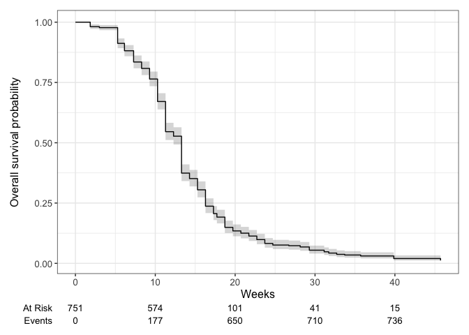
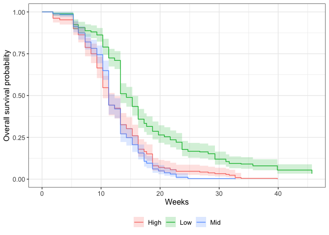

# Survival Analysis 

See tutorial: https://www.emilyzabor.com/tutorials/survival_analysis_in_r_tutorial.html

## Libraries

``` r
# install.packages(c("ggsurvfit", "gtsummary"))
library(tidyverse) #includes lubridate, which we need 
```

```
## ── Attaching core tidyverse packages ──────────────────────── tidyverse 2.0.0 ──
## ✔ dplyr     1.1.4     ✔ readr     2.1.5
## ✔ forcats   1.0.0     ✔ stringr   1.5.1
## ✔ ggplot2   3.5.1     ✔ tibble    3.2.1
## ✔ lubridate 1.9.3     ✔ tidyr     1.3.1
## ✔ purrr     1.0.2     
## ── Conflicts ────────────────────────────────────────── tidyverse_conflicts() ──
## ✖ dplyr::filter() masks stats::filter()
## ✖ dplyr::lag()    masks stats::lag()
## ℹ Use the conflicted package (<http://conflicted.r-lib.org/>) to force all conflicts to become errors
```

``` r
library(ggsurvfit)
library(gtsummary)
library(survival)
```

## Read in the data
Need to come back to this to check the data for issues!!

``` r
ucd_surv <- read_csv("../input/UCD_Data/CorrectedCSVs/UCD_transplants_pheno_mort_20231016_corrected.csv",
                     na = c("", "NA", "-", "N/A")) %>% #note this only goes to 10/20 need to come back and change this to include dates after this
  select(block:rep, death.date=`Death Date`, Notes) %>% 
  rename(parent.pop=pop) %>% 
  filter(rep != 100) %>% #get rid of individuals that germinated in the field 
  filter(!is.na(parent.pop)) %>% 
   unite(BedLoc, block:col, sep="_", remove = FALSE) %>% 
  unite(Genotype, parent.pop:rep, sep="_", remove = FALSE) %>% 
  filter(!str_detect(Genotype, ".*buff*")) %>% 
  unite(pop.mf, parent.pop:mf, sep="_", remove = FALSE)
```

```
## Rows: 858 Columns: 13
## ── Column specification ────────────────────────────────────────────────────────
## Delimiter: ","
## chr (10): block, col, pop, Date First Bud, Date First Flower, Date First Fru...
## dbl  (3): row, mf, rep
## 
## ℹ Use `spec()` to retrieve the full column specification for this data.
## ℹ Specify the column types or set `show_col_types = FALSE` to quiet this message.
```

``` r
head(ucd_surv)
```

```
## # A tibble: 6 × 11
##   BedLoc block   row col   Genotype  pop.mf parent.pop    mf   rep death.date
##   <chr>  <chr> <dbl> <chr> <chr>     <chr>  <chr>      <dbl> <dbl> <chr>     
## 1 D1_3_A D1        3 A     WL2_4_11  WL2_4  WL2            4    11 4/24/23   
## 2 D1_3_B D1        3 B     CP2_10_4  CP2_10 CP2           10     4 1/27/23   
## 3 D1_4_A D1        4 A     YO11_4_10 YO11_4 YO11           4    10 1/12/23   
## 4 D1_4_B D1        4 B     CC_5_12   CC_5   CC             5    12 2/10/23   
## 5 D1_5_A D1        5 A     FR_3_6    FR_3   FR             3     6 2/24/23   
## 6 D1_5_B D1        5 B     BH_5_24   BH_5   BH             5    24 3/3/23    
## # ℹ 1 more variable: Notes <chr>
```

``` r
unique(ucd_surv$parent.pop) #there's an SQ with no number - need to check on this 
```

```
##  [1] "WL2"   "CP2"   "YO11"  "CC"    "FR"    "BH"    "IH"    "LV3"   "SC"   
## [10] "LVTR1" "SQ3"   "TM2"   "WL1"   "YO7"   "DPR"   "SQ2"   "SQ1"   "SQ"   
## [19] "YO8"   "YO4"   "WR"    "WV"    "CP3"   "LV1"
```

``` r
ucd_surv %>% rowwise() %>%  #checking if mf and rep can be converted to numeric 
  filter(!is.na(rep)) %>%  
  filter(is.na(as.numeric(rep)))
```

```
## # A tibble: 0 × 11
## # Rowwise: 
## # ℹ 11 variables: BedLoc <chr>, block <chr>, row <dbl>, col <chr>,
## #   Genotype <chr>, pop.mf <chr>, parent.pop <chr>, mf <dbl>, rep <dbl>,
## #   death.date <chr>, Notes <chr>
```

As weeks

``` r
ucd_surv_dates <- ucd_surv %>% 
  mutate(mf=as.double(mf), rep=as.double(rep)) %>% 
  mutate(planting.date="11/30/22", #could try to make this more specific to when certain blocks were planted 
         last_fup_date=if_else(is.na(death.date), "10/16/23", death.date)) %>%  #need this to calculate survival times
  mutate(planting.date=mdy(planting.date), last_fup_date=mdy(last_fup_date)) %>% #convert to date objects
  mutate(os_weeks=as.duration(planting.date %--% last_fup_date) / dweeks(1), #observed number of weeks
         status=if_else(is.na(death.date), 0, 1)) %>% #0=censured (alive in this case), 1=dead
  filter(os_weeks > 0) %>% #there is one case of a plant that was dead at planting, so just removed it since this is survival post- transplanting
  select(-Notes)
head(ucd_surv_dates)
```

```
## # A tibble: 6 × 14
##   BedLoc block   row col   Genotype  pop.mf parent.pop    mf   rep death.date
##   <chr>  <chr> <dbl> <chr> <chr>     <chr>  <chr>      <dbl> <dbl> <chr>     
## 1 D1_3_A D1        3 A     WL2_4_11  WL2_4  WL2            4    11 4/24/23   
## 2 D1_3_B D1        3 B     CP2_10_4  CP2_10 CP2           10     4 1/27/23   
## 3 D1_4_A D1        4 A     YO11_4_10 YO11_4 YO11           4    10 1/12/23   
## 4 D1_4_B D1        4 B     CC_5_12   CC_5   CC             5    12 2/10/23   
## 5 D1_5_A D1        5 A     FR_3_6    FR_3   FR             3     6 2/24/23   
## 6 D1_5_B D1        5 B     BH_5_24   BH_5   BH             5    24 3/3/23    
## # ℹ 4 more variables: planting.date <date>, last_fup_date <date>,
## #   os_weeks <dbl>, status <dbl>
```

``` r
unique(ucd_surv_dates$os_weeks)
```

```
##  [1] 20.714286  8.285714  6.142857 10.285714 12.285714 13.285714 11.285714
##  [8]  9.285714 15.285714 18.714286 17.285714 17.714286  7.285714  5.285714
## [15] 14.285714 45.714286 21.714286 29.285714 16.285714 23.714286 39.857143
## [22]  1.857143 22.714286  3.000000 33.714286 19.714286 28.142857 32.714286
## [29] 24.714286 26.714286 31.142857 31.714286 35.714286
```

## Location Info
Note: the below files include climate distance which is not finalized yet (as of 10/3)

``` r
gowersdist_UCD <- read_csv("../output/Climate/Pops_GowersEnvtalDist_UCD.csv") %>% 
  rename(Recent_Gowers_Dist_UCD = Recent_Gowers_Dist, Historic_Gowers_Dist_UCD = Historic_Gowers_Dist)
```

```
## Rows: 23 Columns: 5
## ── Column specification ────────────────────────────────────────────────────────
## Delimiter: ","
## chr (2): parent.pop, elevation.group
## dbl (3): elev_m, Recent_Gowers_Dist, Historic_Gowers_Dist
## 
## ℹ Use `spec()` to retrieve the full column specification for this data.
## ℹ Specify the column types or set `show_col_types = FALSE` to quiet this message.
```

``` r
head(gowersdist_UCD)
```

```
## # A tibble: 6 × 5
##   parent.pop elevation.group elev_m Recent_Gowers_Dist_UCD
##   <chr>      <chr>            <dbl>                  <dbl>
## 1 BH         Low               511.                  0.273
## 2 CC         Low               313                   0.331
## 3 CP2        High             2244.                  0.445
## 4 CP3        High             2266.                  0.476
## 5 DPR        Mid              1019.                  0.267
## 6 FR         Mid               787                   0.296
## # ℹ 1 more variable: Historic_Gowers_Dist_UCD <dbl>
```

``` r
gowersdist_WL2 <- read_csv("../output/Climate/Pops_GowersEnvtalDist_WL2.csv") %>% 
  rename(Recent_Gowers_Dist_WL2 = Recent_Gowers_Dist, Historic_Gowers_Dist_WL2 = Historic_Gowers_Dist)
```

```
## Rows: 23 Columns: 5
## ── Column specification ────────────────────────────────────────────────────────
## Delimiter: ","
## chr (2): parent.pop, elevation.group
## dbl (3): elev_m, Recent_Gowers_Dist, Historic_Gowers_Dist
## 
## ℹ Use `spec()` to retrieve the full column specification for this data.
## ℹ Specify the column types or set `show_col_types = FALSE` to quiet this message.
```

``` r
head(gowersdist_WL2)
```

```
## # A tibble: 6 × 5
##   parent.pop elevation.group elev_m Recent_Gowers_Dist_WL2
##   <chr>      <chr>            <dbl>                  <dbl>
## 1 BH         Low               511.                  0.555
## 2 CC         Low               313                   0.682
## 3 CP2        High             2244.                  0.626
## 4 CP3        High             2266.                  0.629
## 5 DPR        Mid              1019.                  0.743
## 6 FR         Mid               787                   0.599
## # ℹ 1 more variable: Historic_Gowers_Dist_WL2 <dbl>
```

``` r
gowersdist_all <- full_join(gowersdist_UCD, gowersdist_WL2)
```

```
## Joining with `by = join_by(parent.pop, elevation.group, elev_m)`
```

``` r
head(gowersdist_all)
```

```
## # A tibble: 6 × 7
##   parent.pop elevation.group elev_m Recent_Gowers_Dist_UCD
##   <chr>      <chr>            <dbl>                  <dbl>
## 1 BH         Low               511.                  0.273
## 2 CC         Low               313                   0.331
## 3 CP2        High             2244.                  0.445
## 4 CP3        High             2266.                  0.476
## 5 DPR        Mid              1019.                  0.267
## 6 FR         Mid               787                   0.296
## # ℹ 3 more variables: Historic_Gowers_Dist_UCD <dbl>,
## #   Recent_Gowers_Dist_WL2 <dbl>, Historic_Gowers_Dist_WL2 <dbl>
```


``` r
ucd_surv_dates_loc <- left_join(ucd_surv_dates, gowersdist_all)
```

```
## Joining with `by = join_by(parent.pop)`
```

## Create Survival Objects and Curves

``` r
Surv(ucd_surv_dates_loc$os_weeks, ucd_surv_dates_loc$status)[1:10] #show the first 10 observations of the survival object
```

```
##  [1] 20.714286  8.285714  6.142857 10.285714 12.285714 13.285714 13.285714
##  [8] 13.285714 11.285714  9.285714
```

``` r
#There will be one entry for each subject that is the survival time, which is followed by a + if the subject was censored.
```

"The survfit() function creates survival curves using the Kaplan-Meier method based on a formula. Let’s generate the overall survival curve for the entire cohort, assign it to object s1, and look at the structure using str():"

``` r
s1 <- survfit(Surv(os_weeks, status) ~ 1, data = ucd_surv_dates_loc)
str(s1)
```

```
## List of 16
##  $ n        : int 751
##  $ time     : num [1:33] 1.86 3 5.29 6.14 7.29 ...
##  $ n.risk   : num [1:33] 751 737 734 685 662 627 607 574 504 410 ...
##  $ n.event  : num [1:33] 14 3 49 23 35 20 33 70 94 14 ...
##  $ n.censor : num [1:33] 0 0 0 0 0 0 0 0 0 0 ...
##  $ surv     : num [1:33] 0.981 0.977 0.912 0.881 0.835 ...
##  $ std.err  : num [1:33] 0.00503 0.00555 0.01133 0.01338 0.01623 ...
##  $ cumhaz   : num [1:33] 0.0186 0.0227 0.0895 0.123 0.1759 ...
##  $ std.chaz : num [1:33] 0.00498 0.00551 0.01101 0.01305 0.01582 ...
##  $ type     : chr "right"
##  $ logse    : logi TRUE
##  $ conf.int : num 0.95
##  $ conf.type: chr "log"
##  $ lower    : num [1:33] 0.972 0.967 0.892 0.859 0.809 ...
##  $ upper    : num [1:33] 0.991 0.988 0.933 0.905 0.862 ...
##  $ call     : language survfit(formula = Surv(os_weeks, status) ~ 1, data = ucd_surv_dates_loc)
##  - attr(*, "class")= chr "survfit"
```

``` r
#time: the timepoints at which the curve has a step, i.e. at least one event occurred
#surv: the estimate of survival at the corresponding time
```

## Survival Plot

``` r
survfit2(Surv(os_weeks, status) ~ 1, data = ucd_surv_dates_loc) %>% 
  ggsurvfit() +
  labs(
    x = "Weeks",
    y = "Overall survival probability"
  ) + 
  add_confidence_interval() +
  add_risktable() #at risk = plants still alive, event=plants dead
```

<!-- -->

## Estimating x-week survival

``` r
summary(survfit(Surv(os_weeks, status) ~ 1, data = ucd_surv_dates_loc), times = 8) #survival for 2 months
```

```
## Call: survfit(formula = Surv(os_weeks, status) ~ 1, data = ucd_surv_dates_loc)
## 
##  time n.risk n.event survival std.err lower 95% CI upper 95% CI
##     8    627     124    0.835  0.0135        0.809        0.862
```

``` r
#2 month survival probability is 84%
```

## Estimating median survival time

``` r
survfit(Surv(os_weeks, status) ~ 1, data = ucd_surv_dates_loc) 
```

```
## Call: survfit(formula = Surv(os_weeks, status) ~ 1, data = ucd_surv_dates_loc)
## 
##        n events median 0.95LCL 0.95UCL
## [1,] 751    742   13.3    12.3    13.3
```

``` r
#median survival time is 13.3 weeks 
```

## Compare Survival between Populations 
Plot survival differences

``` r
survfit2(Surv(os_weeks, status) ~ elevation.group, data = ucd_surv_dates_loc) %>% 
  ggsurvfit() +
  labs(
    x = "Weeks",
    y = "Overall survival probability") + 
  add_confidence_interval() 
```

<!-- -->

``` r
survfit(Surv(os_weeks, status) ~ parent.pop, data = ucd_surv_dates_loc) #median survival lengths for each pop
```

```
## Call: survfit(formula = Surv(os_weeks, status) ~ parent.pop, data = ucd_surv_dates_loc)
## 
##                    n events median 0.95LCL 0.95UCL
## parent.pop=BH    110    101  15.79   13.29    17.3
## parent.pop=CC     44     44  13.29   11.29    15.3
## parent.pop=CP2    38     38  13.29   10.29    14.3
## parent.pop=CP3     8      8   9.29    8.29      NA
## parent.pop=DPR    22     22  14.29   12.29    18.7
## parent.pop=FR     37     37  11.29   11.29    13.3
## parent.pop=IH     49     49  13.29   13.29    14.3
## parent.pop=LV1     3      3   7.29    5.29      NA
## parent.pop=LV3    65     65  11.29   10.29    13.3
## parent.pop=LVTR1  15     15  10.29    7.29    18.7
## parent.pop=SC     36     36  13.29   11.29    16.3
## parent.pop=SQ      1      1   5.29      NA      NA
## parent.pop=SQ1    46     46  11.29   11.29    13.3
## parent.pop=SQ2    21     21  10.29    8.29    11.3
## parent.pop=SQ3    10     10  13.79   11.29      NA
## parent.pop=TM2    37     37  18.71   16.29    23.7
## parent.pop=WL1   125    125  11.29   11.29    13.3
## parent.pop=WL2    23     23  16.29   11.29    20.7
## parent.pop=WR      9      9  11.29   10.29      NA
## parent.pop=WV      2      2   9.79    8.29      NA
## parent.pop=YO11   14     14   9.29    7.29    16.3
## parent.pop=YO4     6      6   9.79    9.29      NA
## parent.pop=YO7    17     17  15.29   10.29    18.7
## parent.pop=YO8    13     13  11.29    7.29      NA
```

"We can conduct between-group significance tests using a log-rank test. The log-rank test equally weights observations over the entire follow-up time and is the most common way to compare survival times between groups."

``` r
survdiff(Surv(os_weeks, status) ~ parent.pop, data = ucd_surv_dates_loc)
```

```
## Call:
## survdiff(formula = Surv(os_weeks, status) ~ parent.pop, data = ucd_surv_dates_loc)
## 
##                    N Observed Expected (O-E)^2/E (O-E)^2/V
## parent.pop=BH    110      101 181.5165    35.715    62.419
## parent.pop=CC     44       44  39.4605     0.522     0.651
## parent.pop=CP2    38       38  34.8903     0.277     0.340
## parent.pop=CP3     8        8   1.9219    19.223    20.626
## parent.pop=DPR    22       22  24.3192     0.221     0.269
## parent.pop=FR     37       37  27.5950     3.205     3.900
## parent.pop=IH     49       49  53.6479     0.403     0.512
## parent.pop=LV1     3        3   1.1606     2.915     3.390
## parent.pop=LV3    65       65  45.1669     8.709    10.928
## parent.pop=LVTR1  15       15   9.2613     3.556     4.174
## parent.pop=SC     36       36  39.7116     0.347     0.429
## parent.pop=SQ      1        1   0.0895     9.266     9.794
## parent.pop=SQ1    46       46  33.7330     4.461     5.452
## parent.pop=SQ2    21       21  10.2836    11.167    12.952
## parent.pop=SQ3    10       10  11.5820     0.216     0.258
## parent.pop=TM2    37       37  61.9774    10.066    13.207
## parent.pop=WL1   125      125  92.8105    11.164    15.215
## parent.pop=WL2    23       23  29.7057     1.514     1.857
## parent.pop=WR      9        9   6.8044     0.708     0.835
## parent.pop=WV      2        2   0.7785     1.917     2.114
## parent.pop=YO11   14       14   6.0585    10.410    11.934
## parent.pop=YO4     6        6   2.2105     6.496     7.279
## parent.pop=YO7    17       17  18.5361     0.127     0.154
## parent.pop=YO8    13       13   8.7787     2.030     2.384
## 
##  Chisq= 186  on 23 degrees of freedom, p= <2e-16
```

``` r
#significant difference in overall survival according to population
```

## Cox regression model
"We may want to quantify an effect size for a single variable, or include more than one variable into a regression model to account for the effects of multiple variables.
The Cox regression model is a semi-parametric model that can be used to fit univariable and multivariable regression models that have survival outcomes.:

``` r
coxph(Surv(os_weeks, status) ~ parent.pop, data = ucd_surv_dates_loc) %>% 
  tbl_regression(exp = TRUE) 
```

```{=html}
<div id="brxekuegda" style="padding-left:0px;padding-right:0px;padding-top:10px;padding-bottom:10px;overflow-x:auto;overflow-y:auto;width:auto;height:auto;">
<style>#brxekuegda table {
  font-family: system-ui, 'Segoe UI', Roboto, Helvetica, Arial, sans-serif, 'Apple Color Emoji', 'Segoe UI Emoji', 'Segoe UI Symbol', 'Noto Color Emoji';
  -webkit-font-smoothing: antialiased;
  -moz-osx-font-smoothing: grayscale;
}

#brxekuegda thead, #brxekuegda tbody, #brxekuegda tfoot, #brxekuegda tr, #brxekuegda td, #brxekuegda th {
  border-style: none;
}

#brxekuegda p {
  margin: 0;
  padding: 0;
}

#brxekuegda .gt_table {
  display: table;
  border-collapse: collapse;
  line-height: normal;
  margin-left: auto;
  margin-right: auto;
  color: #333333;
  font-size: 16px;
  font-weight: normal;
  font-style: normal;
  background-color: #FFFFFF;
  width: auto;
  border-top-style: solid;
  border-top-width: 2px;
  border-top-color: #A8A8A8;
  border-right-style: none;
  border-right-width: 2px;
  border-right-color: #D3D3D3;
  border-bottom-style: solid;
  border-bottom-width: 2px;
  border-bottom-color: #A8A8A8;
  border-left-style: none;
  border-left-width: 2px;
  border-left-color: #D3D3D3;
}

#brxekuegda .gt_caption {
  padding-top: 4px;
  padding-bottom: 4px;
}

#brxekuegda .gt_title {
  color: #333333;
  font-size: 125%;
  font-weight: initial;
  padding-top: 4px;
  padding-bottom: 4px;
  padding-left: 5px;
  padding-right: 5px;
  border-bottom-color: #FFFFFF;
  border-bottom-width: 0;
}

#brxekuegda .gt_subtitle {
  color: #333333;
  font-size: 85%;
  font-weight: initial;
  padding-top: 3px;
  padding-bottom: 5px;
  padding-left: 5px;
  padding-right: 5px;
  border-top-color: #FFFFFF;
  border-top-width: 0;
}

#brxekuegda .gt_heading {
  background-color: #FFFFFF;
  text-align: center;
  border-bottom-color: #FFFFFF;
  border-left-style: none;
  border-left-width: 1px;
  border-left-color: #D3D3D3;
  border-right-style: none;
  border-right-width: 1px;
  border-right-color: #D3D3D3;
}

#brxekuegda .gt_bottom_border {
  border-bottom-style: solid;
  border-bottom-width: 2px;
  border-bottom-color: #D3D3D3;
}

#brxekuegda .gt_col_headings {
  border-top-style: solid;
  border-top-width: 2px;
  border-top-color: #D3D3D3;
  border-bottom-style: solid;
  border-bottom-width: 2px;
  border-bottom-color: #D3D3D3;
  border-left-style: none;
  border-left-width: 1px;
  border-left-color: #D3D3D3;
  border-right-style: none;
  border-right-width: 1px;
  border-right-color: #D3D3D3;
}

#brxekuegda .gt_col_heading {
  color: #333333;
  background-color: #FFFFFF;
  font-size: 100%;
  font-weight: normal;
  text-transform: inherit;
  border-left-style: none;
  border-left-width: 1px;
  border-left-color: #D3D3D3;
  border-right-style: none;
  border-right-width: 1px;
  border-right-color: #D3D3D3;
  vertical-align: bottom;
  padding-top: 5px;
  padding-bottom: 6px;
  padding-left: 5px;
  padding-right: 5px;
  overflow-x: hidden;
}

#brxekuegda .gt_column_spanner_outer {
  color: #333333;
  background-color: #FFFFFF;
  font-size: 100%;
  font-weight: normal;
  text-transform: inherit;
  padding-top: 0;
  padding-bottom: 0;
  padding-left: 4px;
  padding-right: 4px;
}

#brxekuegda .gt_column_spanner_outer:first-child {
  padding-left: 0;
}

#brxekuegda .gt_column_spanner_outer:last-child {
  padding-right: 0;
}

#brxekuegda .gt_column_spanner {
  border-bottom-style: solid;
  border-bottom-width: 2px;
  border-bottom-color: #D3D3D3;
  vertical-align: bottom;
  padding-top: 5px;
  padding-bottom: 5px;
  overflow-x: hidden;
  display: inline-block;
  width: 100%;
}

#brxekuegda .gt_spanner_row {
  border-bottom-style: hidden;
}

#brxekuegda .gt_group_heading {
  padding-top: 8px;
  padding-bottom: 8px;
  padding-left: 5px;
  padding-right: 5px;
  color: #333333;
  background-color: #FFFFFF;
  font-size: 100%;
  font-weight: initial;
  text-transform: inherit;
  border-top-style: solid;
  border-top-width: 2px;
  border-top-color: #D3D3D3;
  border-bottom-style: solid;
  border-bottom-width: 2px;
  border-bottom-color: #D3D3D3;
  border-left-style: none;
  border-left-width: 1px;
  border-left-color: #D3D3D3;
  border-right-style: none;
  border-right-width: 1px;
  border-right-color: #D3D3D3;
  vertical-align: middle;
  text-align: left;
}

#brxekuegda .gt_empty_group_heading {
  padding: 0.5px;
  color: #333333;
  background-color: #FFFFFF;
  font-size: 100%;
  font-weight: initial;
  border-top-style: solid;
  border-top-width: 2px;
  border-top-color: #D3D3D3;
  border-bottom-style: solid;
  border-bottom-width: 2px;
  border-bottom-color: #D3D3D3;
  vertical-align: middle;
}

#brxekuegda .gt_from_md > :first-child {
  margin-top: 0;
}

#brxekuegda .gt_from_md > :last-child {
  margin-bottom: 0;
}

#brxekuegda .gt_row {
  padding-top: 8px;
  padding-bottom: 8px;
  padding-left: 5px;
  padding-right: 5px;
  margin: 10px;
  border-top-style: solid;
  border-top-width: 1px;
  border-top-color: #D3D3D3;
  border-left-style: none;
  border-left-width: 1px;
  border-left-color: #D3D3D3;
  border-right-style: none;
  border-right-width: 1px;
  border-right-color: #D3D3D3;
  vertical-align: middle;
  overflow-x: hidden;
}

#brxekuegda .gt_stub {
  color: #333333;
  background-color: #FFFFFF;
  font-size: 100%;
  font-weight: initial;
  text-transform: inherit;
  border-right-style: solid;
  border-right-width: 2px;
  border-right-color: #D3D3D3;
  padding-left: 5px;
  padding-right: 5px;
}

#brxekuegda .gt_stub_row_group {
  color: #333333;
  background-color: #FFFFFF;
  font-size: 100%;
  font-weight: initial;
  text-transform: inherit;
  border-right-style: solid;
  border-right-width: 2px;
  border-right-color: #D3D3D3;
  padding-left: 5px;
  padding-right: 5px;
  vertical-align: top;
}

#brxekuegda .gt_row_group_first td {
  border-top-width: 2px;
}

#brxekuegda .gt_row_group_first th {
  border-top-width: 2px;
}

#brxekuegda .gt_summary_row {
  color: #333333;
  background-color: #FFFFFF;
  text-transform: inherit;
  padding-top: 8px;
  padding-bottom: 8px;
  padding-left: 5px;
  padding-right: 5px;
}

#brxekuegda .gt_first_summary_row {
  border-top-style: solid;
  border-top-color: #D3D3D3;
}

#brxekuegda .gt_first_summary_row.thick {
  border-top-width: 2px;
}

#brxekuegda .gt_last_summary_row {
  padding-top: 8px;
  padding-bottom: 8px;
  padding-left: 5px;
  padding-right: 5px;
  border-bottom-style: solid;
  border-bottom-width: 2px;
  border-bottom-color: #D3D3D3;
}

#brxekuegda .gt_grand_summary_row {
  color: #333333;
  background-color: #FFFFFF;
  text-transform: inherit;
  padding-top: 8px;
  padding-bottom: 8px;
  padding-left: 5px;
  padding-right: 5px;
}

#brxekuegda .gt_first_grand_summary_row {
  padding-top: 8px;
  padding-bottom: 8px;
  padding-left: 5px;
  padding-right: 5px;
  border-top-style: double;
  border-top-width: 6px;
  border-top-color: #D3D3D3;
}

#brxekuegda .gt_last_grand_summary_row_top {
  padding-top: 8px;
  padding-bottom: 8px;
  padding-left: 5px;
  padding-right: 5px;
  border-bottom-style: double;
  border-bottom-width: 6px;
  border-bottom-color: #D3D3D3;
}

#brxekuegda .gt_striped {
  background-color: rgba(128, 128, 128, 0.05);
}

#brxekuegda .gt_table_body {
  border-top-style: solid;
  border-top-width: 2px;
  border-top-color: #D3D3D3;
  border-bottom-style: solid;
  border-bottom-width: 2px;
  border-bottom-color: #D3D3D3;
}

#brxekuegda .gt_footnotes {
  color: #333333;
  background-color: #FFFFFF;
  border-bottom-style: none;
  border-bottom-width: 2px;
  border-bottom-color: #D3D3D3;
  border-left-style: none;
  border-left-width: 2px;
  border-left-color: #D3D3D3;
  border-right-style: none;
  border-right-width: 2px;
  border-right-color: #D3D3D3;
}

#brxekuegda .gt_footnote {
  margin: 0px;
  font-size: 90%;
  padding-top: 4px;
  padding-bottom: 4px;
  padding-left: 5px;
  padding-right: 5px;
}

#brxekuegda .gt_sourcenotes {
  color: #333333;
  background-color: #FFFFFF;
  border-bottom-style: none;
  border-bottom-width: 2px;
  border-bottom-color: #D3D3D3;
  border-left-style: none;
  border-left-width: 2px;
  border-left-color: #D3D3D3;
  border-right-style: none;
  border-right-width: 2px;
  border-right-color: #D3D3D3;
}

#brxekuegda .gt_sourcenote {
  font-size: 90%;
  padding-top: 4px;
  padding-bottom: 4px;
  padding-left: 5px;
  padding-right: 5px;
}

#brxekuegda .gt_left {
  text-align: left;
}

#brxekuegda .gt_center {
  text-align: center;
}

#brxekuegda .gt_right {
  text-align: right;
  font-variant-numeric: tabular-nums;
}

#brxekuegda .gt_font_normal {
  font-weight: normal;
}

#brxekuegda .gt_font_bold {
  font-weight: bold;
}

#brxekuegda .gt_font_italic {
  font-style: italic;
}

#brxekuegda .gt_super {
  font-size: 65%;
}

#brxekuegda .gt_footnote_marks {
  font-size: 75%;
  vertical-align: 0.4em;
  position: initial;
}

#brxekuegda .gt_asterisk {
  font-size: 100%;
  vertical-align: 0;
}

#brxekuegda .gt_indent_1 {
  text-indent: 5px;
}

#brxekuegda .gt_indent_2 {
  text-indent: 10px;
}

#brxekuegda .gt_indent_3 {
  text-indent: 15px;
}

#brxekuegda .gt_indent_4 {
  text-indent: 20px;
}

#brxekuegda .gt_indent_5 {
  text-indent: 25px;
}

#brxekuegda .katex-display {
  display: inline-flex !important;
  margin-bottom: 0.75em !important;
}

#brxekuegda div.Reactable > div.rt-table > div.rt-thead > div.rt-tr.rt-tr-group-header > div.rt-th-group:after {
  height: 0px !important;
}
</style>
<table class="gt_table" data-quarto-disable-processing="false" data-quarto-bootstrap="false">
  <thead>
    <tr class="gt_col_headings">
      <th class="gt_col_heading gt_columns_bottom_border gt_left" rowspan="1" colspan="1" scope="col" id="&lt;span class='gt_from_md'&gt;&lt;strong&gt;Characteristic&lt;/strong&gt;&lt;/span&gt;"><span class='gt_from_md'><strong>Characteristic</strong></span></th>
      <th class="gt_col_heading gt_columns_bottom_border gt_center" rowspan="1" colspan="1" scope="col" id="&lt;span class='gt_from_md'&gt;&lt;strong&gt;HR&lt;/strong&gt;&lt;/span&gt;&lt;span class=&quot;gt_footnote_marks&quot; style=&quot;white-space:nowrap;font-style:italic;font-weight:normal;line-height: 0;&quot;&gt;&lt;sup&gt;1&lt;/sup&gt;&lt;/span&gt;"><span class='gt_from_md'><strong>HR</strong></span><span class="gt_footnote_marks" style="white-space:nowrap;font-style:italic;font-weight:normal;line-height: 0;"><sup>1</sup></span></th>
      <th class="gt_col_heading gt_columns_bottom_border gt_center" rowspan="1" colspan="1" scope="col" id="&lt;span class='gt_from_md'&gt;&lt;strong&gt;95% CI&lt;/strong&gt;&lt;/span&gt;&lt;span class=&quot;gt_footnote_marks&quot; style=&quot;white-space:nowrap;font-style:italic;font-weight:normal;line-height: 0;&quot;&gt;&lt;sup&gt;1&lt;/sup&gt;&lt;/span&gt;"><span class='gt_from_md'><strong>95% CI</strong></span><span class="gt_footnote_marks" style="white-space:nowrap;font-style:italic;font-weight:normal;line-height: 0;"><sup>1</sup></span></th>
      <th class="gt_col_heading gt_columns_bottom_border gt_center" rowspan="1" colspan="1" scope="col" id="&lt;span class='gt_from_md'&gt;&lt;strong&gt;p-value&lt;/strong&gt;&lt;/span&gt;"><span class='gt_from_md'><strong>p-value</strong></span></th>
    </tr>
  </thead>
  <tbody class="gt_table_body">
    <tr><td headers="label" class="gt_row gt_left">parent.pop</td>
<td headers="estimate" class="gt_row gt_center"><br /></td>
<td headers="conf.low" class="gt_row gt_center"><br /></td>
<td headers="p.value" class="gt_row gt_center"><br /></td></tr>
    <tr><td headers="label" class="gt_row gt_left">    BH</td>
<td headers="estimate" class="gt_row gt_center">—</td>
<td headers="conf.low" class="gt_row gt_center">—</td>
<td headers="p.value" class="gt_row gt_center"><br /></td></tr>
    <tr><td headers="label" class="gt_row gt_left">    CC</td>
<td headers="estimate" class="gt_row gt_center">2.55</td>
<td headers="conf.low" class="gt_row gt_center">1.76, 3.69</td>
<td headers="p.value" class="gt_row gt_center"><0.001</td></tr>
    <tr><td headers="label" class="gt_row gt_left">    CP2</td>
<td headers="estimate" class="gt_row gt_center">2.40</td>
<td headers="conf.low" class="gt_row gt_center">1.64, 3.51</td>
<td headers="p.value" class="gt_row gt_center"><0.001</td></tr>
    <tr><td headers="label" class="gt_row gt_left">    CP3</td>
<td headers="estimate" class="gt_row gt_center">12.6</td>
<td headers="conf.low" class="gt_row gt_center">6.02, 26.4</td>
<td headers="p.value" class="gt_row gt_center"><0.001</td></tr>
    <tr><td headers="label" class="gt_row gt_left">    DPR</td>
<td headers="estimate" class="gt_row gt_center">1.99</td>
<td headers="conf.low" class="gt_row gt_center">1.24, 3.18</td>
<td headers="p.value" class="gt_row gt_center">0.004</td></tr>
    <tr><td headers="label" class="gt_row gt_left">    FR</td>
<td headers="estimate" class="gt_row gt_center">3.32</td>
<td headers="conf.low" class="gt_row gt_center">2.24, 4.92</td>
<td headers="p.value" class="gt_row gt_center"><0.001</td></tr>
    <tr><td headers="label" class="gt_row gt_left">    IH</td>
<td headers="estimate" class="gt_row gt_center">1.89</td>
<td headers="conf.low" class="gt_row gt_center">1.34, 2.68</td>
<td headers="p.value" class="gt_row gt_center"><0.001</td></tr>
    <tr><td headers="label" class="gt_row gt_left">    LV1</td>
<td headers="estimate" class="gt_row gt_center">7.43</td>
<td headers="conf.low" class="gt_row gt_center">2.34, 23.6</td>
<td headers="p.value" class="gt_row gt_center"><0.001</td></tr>
    <tr><td headers="label" class="gt_row gt_left">    LV3</td>
<td headers="estimate" class="gt_row gt_center">3.53</td>
<td headers="conf.low" class="gt_row gt_center">2.53, 4.93</td>
<td headers="p.value" class="gt_row gt_center"><0.001</td></tr>
    <tr><td headers="label" class="gt_row gt_left">    LVTR1</td>
<td headers="estimate" class="gt_row gt_center">3.83</td>
<td headers="conf.low" class="gt_row gt_center">2.20, 6.65</td>
<td headers="p.value" class="gt_row gt_center"><0.001</td></tr>
    <tr><td headers="label" class="gt_row gt_left">    SC</td>
<td headers="estimate" class="gt_row gt_center">1.96</td>
<td headers="conf.low" class="gt_row gt_center">1.33, 2.89</td>
<td headers="p.value" class="gt_row gt_center"><0.001</td></tr>
    <tr><td headers="label" class="gt_row gt_left">    SQ</td>
<td headers="estimate" class="gt_row gt_center">48.3</td>
<td headers="conf.low" class="gt_row gt_center">6.60, 354</td>
<td headers="p.value" class="gt_row gt_center"><0.001</td></tr>
    <tr><td headers="label" class="gt_row gt_left">    SQ1</td>
<td headers="estimate" class="gt_row gt_center">3.28</td>
<td headers="conf.low" class="gt_row gt_center">2.27, 4.73</td>
<td headers="p.value" class="gt_row gt_center"><0.001</td></tr>
    <tr><td headers="label" class="gt_row gt_left">    SQ2</td>
<td headers="estimate" class="gt_row gt_center">5.38</td>
<td headers="conf.low" class="gt_row gt_center">3.31, 8.75</td>
<td headers="p.value" class="gt_row gt_center"><0.001</td></tr>
    <tr><td headers="label" class="gt_row gt_left">    SQ3</td>
<td headers="estimate" class="gt_row gt_center">1.85</td>
<td headers="conf.low" class="gt_row gt_center">0.96, 3.57</td>
<td headers="p.value" class="gt_row gt_center">0.065</td></tr>
    <tr><td headers="label" class="gt_row gt_left">    TM2</td>
<td headers="estimate" class="gt_row gt_center">1.20</td>
<td headers="conf.low" class="gt_row gt_center">0.82, 1.77</td>
<td headers="p.value" class="gt_row gt_center">0.4</td></tr>
    <tr><td headers="label" class="gt_row gt_left">    WL1</td>
<td headers="estimate" class="gt_row gt_center">3.27</td>
<td headers="conf.low" class="gt_row gt_center">2.46, 4.34</td>
<td headers="p.value" class="gt_row gt_center"><0.001</td></tr>
    <tr><td headers="label" class="gt_row gt_left">    WL2</td>
<td headers="estimate" class="gt_row gt_center">1.53</td>
<td headers="conf.low" class="gt_row gt_center">0.97, 2.42</td>
<td headers="p.value" class="gt_row gt_center">0.068</td></tr>
    <tr><td headers="label" class="gt_row gt_left">    WR</td>
<td headers="estimate" class="gt_row gt_center">3.27</td>
<td headers="conf.low" class="gt_row gt_center">1.64, 6.53</td>
<td headers="p.value" class="gt_row gt_center"><0.001</td></tr>
    <tr><td headers="label" class="gt_row gt_left">    WV</td>
<td headers="estimate" class="gt_row gt_center">7.51</td>
<td headers="conf.low" class="gt_row gt_center">1.84, 30.7</td>
<td headers="p.value" class="gt_row gt_center">0.005</td></tr>
    <tr><td headers="label" class="gt_row gt_left">    YO11</td>
<td headers="estimate" class="gt_row gt_center">5.94</td>
<td headers="conf.low" class="gt_row gt_center">3.35, 10.5</td>
<td headers="p.value" class="gt_row gt_center"><0.001</td></tr>
    <tr><td headers="label" class="gt_row gt_left">    YO4</td>
<td headers="estimate" class="gt_row gt_center">7.85</td>
<td headers="conf.low" class="gt_row gt_center">3.40, 18.1</td>
<td headers="p.value" class="gt_row gt_center"><0.001</td></tr>
    <tr><td headers="label" class="gt_row gt_left">    YO7</td>
<td headers="estimate" class="gt_row gt_center">1.98</td>
<td headers="conf.low" class="gt_row gt_center">1.18, 3.34</td>
<td headers="p.value" class="gt_row gt_center">0.010</td></tr>
    <tr><td headers="label" class="gt_row gt_left">    YO8</td>
<td headers="estimate" class="gt_row gt_center">3.62</td>
<td headers="conf.low" class="gt_row gt_center">2.01, 6.52</td>
<td headers="p.value" class="gt_row gt_center"><0.001</td></tr>
  </tbody>
  
  <tfoot class="gt_footnotes">
    <tr>
      <td class="gt_footnote" colspan="4"><span class="gt_footnote_marks" style="white-space:nowrap;font-style:italic;font-weight:normal;line-height: 0;"><sup>1</sup></span> <span class='gt_from_md'>HR = Hazard Ratio, CI = Confidence Interval</span></td>
    </tr>
  </tfoot>
</table>
</div>
```

``` r
# hazard ratio (HR) represents the ratio of hazards between two groups at any particular point in time. 
#A HR < 1 indicates reduced hazard of death whereas a HR > 1 indicates an increased hazard of death.
```
