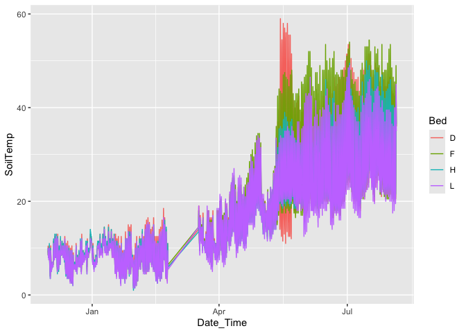
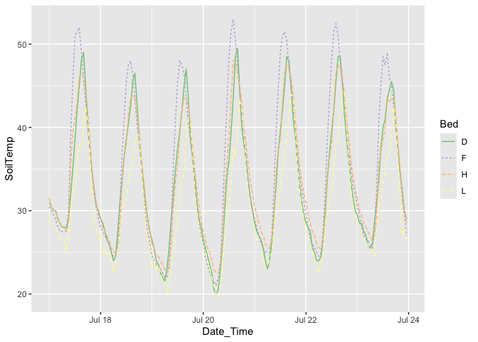
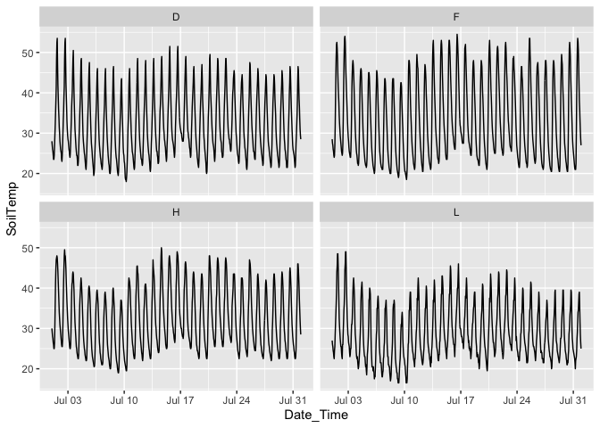
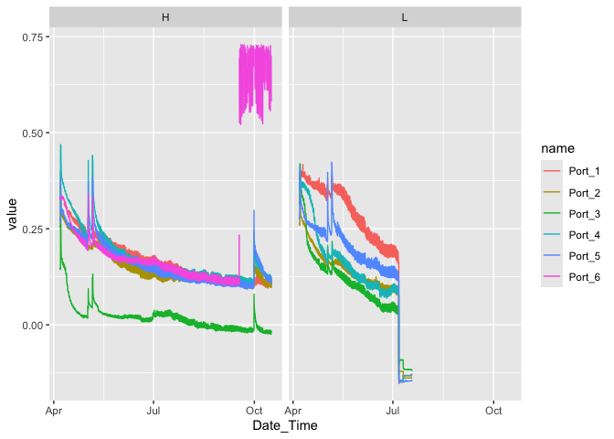

Add climate to best base model

# Survival Analysis

## Libraries


``` r
# install.packages("multilevelmod")
library(tidyverse) 
```

```
## ── Attaching core tidyverse packages ──────────────────────── tidyverse 2.0.0 ──
## ✔ dplyr     1.1.4     ✔ readr     2.1.5
## ✔ forcats   1.0.0     ✔ stringr   1.5.1
## ✔ ggplot2   3.5.1     ✔ tibble    3.2.1
## ✔ lubridate 1.9.3     ✔ tidyr     1.3.1
## ✔ purrr     1.0.2     
## ── Conflicts ────────────────────────────────────────── tidyverse_conflicts() ──
## ✖ dplyr::filter() masks stats::filter()
## ✖ dplyr::lag()    masks stats::lag()
## ℹ Use the conflicted package (<http://conflicted.r-lib.org/>) to force all conflicts to become errors
```

``` r
library(magrittr)
```

```
## 
## Attaching package: 'magrittr'
## 
## The following object is masked from 'package:purrr':
## 
##     set_names
## 
## The following object is masked from 'package:tidyr':
## 
##     extract
```

``` r
library(ggrepel)
library(lme4)
```

```
## Loading required package: Matrix
## 
## Attaching package: 'Matrix'
## 
## The following objects are masked from 'package:tidyr':
## 
##     expand, pack, unpack
```

``` r
library(ggdist)
library(tidymodels)
```

```
## ── Attaching packages ────────────────────────────────────── tidymodels 1.2.0 ──
## ✔ broom        1.0.7     ✔ rsample      1.2.1
## ✔ dials        1.3.0     ✔ tune         1.2.1
## ✔ infer        1.0.7     ✔ workflows    1.1.4
## ✔ modeldata    1.4.0     ✔ workflowsets 1.1.0
## ✔ parsnip      1.2.1     ✔ yardstick    1.3.1
## ✔ recipes      1.1.0     
## ── Conflicts ───────────────────────────────────────── tidymodels_conflicts() ──
## ✖ scales::discard()     masks purrr::discard()
## ✖ Matrix::expand()      masks tidyr::expand()
## ✖ magrittr::extract()   masks tidyr::extract()
## ✖ dplyr::filter()       masks stats::filter()
## ✖ recipes::fixed()      masks stringr::fixed()
## ✖ dplyr::lag()          masks stats::lag()
## ✖ Matrix::pack()        masks tidyr::pack()
## ✖ magrittr::set_names() masks purrr::set_names()
## ✖ yardstick::spec()     masks readr::spec()
## ✖ recipes::step()       masks stats::step()
## ✖ Matrix::unpack()      masks tidyr::unpack()
## ✖ recipes::update()     masks Matrix::update(), stats::update()
## • Dig deeper into tidy modeling with R at https://www.tmwr.org
```

``` r
library(multilevelmod)
library(broom.mixed)
library(modelr)
```

```
## 
## Attaching package: 'modelr'
## 
## The following objects are masked from 'package:yardstick':
## 
##     mae, mape, rmse
## 
## The following object is masked from 'package:broom':
## 
##     bootstrap
```

``` r
library(furrr)
```

```
## Loading required package: future
```

``` r
library(zoo)
```

```
## 
## Attaching package: 'zoo'
## 
## The following objects are masked from 'package:base':
## 
##     as.Date, as.Date.numeric
```

``` r
tidymodels_prefer()
options(mc.cores = parallel::detectCores())
```

## Read in the plant data

``` r
ucd_surv <- read_csv("../input/UCD_Data/CorrectedCSVs/UCD_transplants_pheno_mort_20231016_corrected.csv") %>% 
  filter(rep != 100) #get rid of individuals that germinated in the field
```

```
## Rows: 858 Columns: 13
## ── Column specification ────────────────────────────────────────────────────────
## Delimiter: ","
## chr (10): block, col, pop, Date First Bud, Date First Flower, Date First Fru...
## dbl  (3): row, mf, rep
## 
## ℹ Use `spec()` to retrieve the full column specification for this data.
## ℹ Specify the column types or set `show_col_types = FALSE` to quiet this message.
```

``` r
head(ucd_surv)
```

```
## # A tibble: 6 × 13
##   block   row col   pop      mf   rep `Date First Bud` `Date First Flower`
##   <chr> <dbl> <chr> <chr> <dbl> <dbl> <chr>            <chr>              
## 1 D1        3 A     WL2       4    11 <NA>             <NA>               
## 2 D1        3 B     CP2      10     4 <NA>             <NA>               
## 3 D1        4 A     YO11      4    10 <NA>             <NA>               
## 4 D1        4 B     CC        5    12 <NA>             <NA>               
## 5 D1        5 A     FR        3     6 <NA>             <NA>               
## 6 D1        5 B     BH        5    24 <NA>             <NA>               
## # ℹ 5 more variables: `Date First Fruit` <chr>, `Date Last Flower` <chr>,
## #   `Date Last Fruit` <chr>, `Death Date` <chr>, Notes <chr>
```

``` r
unique(ucd_surv$pop) #pops look correct 
```

```
##  [1] "WL2"   "CP2"   "YO11"  "CC"    "FR"    "BH"    "IH"    "LV3"   "SC"   
## [10] "LVTR1" "SQ3"   "TM2"   "WL1"   "YO7"   "DPR"   "SQ2"   "SQ1"   "YO8"  
## [19] "YO4"   "WR"    "WV"    "CP3"   "LV1"
```

As weeks

``` r
ucd_surv %>% filter(is.na(`Death Date`),!is.na(Notes)) #no plants that seemed to disappear 
```

```
## # A tibble: 1 × 13
##   block   row col   pop      mf   rep `Date First Bud` `Date First Flower`
##   <chr> <dbl> <chr> <chr> <dbl> <dbl> <chr>            <chr>              
## 1 D2       30 B     BH        4     3 <NA>             <NA>               
## # ℹ 5 more variables: `Date First Fruit` <chr>, `Date Last Flower` <chr>,
## #   `Date Last Fruit` <chr>, `Death Date` <chr>, Notes <chr>
```

``` r
ucd_surv_dates <- ucd_surv %>%  
  rename(parent.pop = pop, death.date=`Death Date`) %>%
  unite("Genotype", parent.pop:rep, remove = FALSE) %>% 
  filter(!is.na(parent.pop)) %>% 
  mutate(planting.date="11/30/22", #could try to make this more specific to when certain blocks were planted 
         last_fup_date=if_else(is.na(death.date), "10/16/23", death.date)) %>%  #need this to calculate survival times
  mutate(planting.date=mdy(planting.date), last_fup_date=mdy(last_fup_date)) %>% #convert to date objects
  mutate(os_weeks=as.duration(planting.date %--% last_fup_date) / dweeks(1), #observed number of weeks
         status=if_else(is.na(death.date), 0, 1)) %>% #0=censured (alive in this case), 1=dead
  filter(os_weeks > 0) %>% #remove any that died at planting since this is survival post- transplanting
  select(block:rep, death.date, planting.date:status)
head(ucd_surv_dates)
```

```
## # A tibble: 6 × 12
##   block   row col   Genotype  parent.pop    mf   rep death.date planting.date
##   <chr> <dbl> <chr> <chr>     <chr>      <dbl> <dbl> <chr>      <date>       
## 1 D1        3 A     WL2_4_11  WL2            4    11 4/24/23    2022-11-30   
## 2 D1        3 B     CP2_10_4  CP2           10     4 1/27/23    2022-11-30   
## 3 D1        4 A     YO11_4_10 YO11           4    10 1/12/23    2022-11-30   
## 4 D1        4 B     CC_5_12   CC             5    12 2/10/23    2022-11-30   
## 5 D1        5 A     FR_3_6    FR             3     6 2/24/23    2022-11-30   
## 6 D1        5 B     BH_5_24   BH             5    24 3/3/23     2022-11-30   
## # ℹ 3 more variables: last_fup_date <date>, os_weeks <dbl>, status <dbl>
```

``` r
unique(ucd_surv_dates$os_weeks) %>% sort()
```

```
##  [1]  1.857143  3.000000  5.285714  6.142857  7.285714  8.285714  9.285714
##  [8] 10.285714 11.285714 12.285714 13.285714 14.285714 15.285714 16.285714
## [15] 17.285714 17.714286 18.714286 19.714286 20.714286 21.714286 22.714286
## [22] 23.714286 24.714286 26.714286 28.142857 29.285714 31.142857 31.714286
## [29] 32.714286 33.714286 35.714286 39.857143 45.714286
```

## Read in soil temp
Transplants only in beds D, F, H, J, L - Remove Bed A from data set 
No temperatures were taken from 2/23/23 to 3/17/23 and after 8/4

``` r
temp <- read_csv("../input/UCD_Data/iButton_Data/UCD_iButton_Data_Corrected.csv") %>%
  filter(Bed != "A") %>% 
  mutate(Date_Time = mdy_hm(Date_Time))
```

```
## Rows: 27080 Columns: 3
## ── Column specification ────────────────────────────────────────────────────────
## Delimiter: ","
## chr (2): Bed, Date_Time
## dbl (1): SoilTemp
## 
## ℹ Use `spec()` to retrieve the full column specification for this data.
## ℹ Specify the column types or set `show_col_types = FALSE` to quiet this message.
```

``` r
head(temp)
```

```
## # A tibble: 6 × 3
##   Bed   Date_Time           SoilTemp
##   <chr> <dttm>                 <dbl>
## 1 D     2022-11-30 16:27:00     10.5
## 2 D     2022-11-30 17:27:00      9.5
## 3 D     2022-11-30 18:27:00      9  
## 4 D     2022-11-30 19:27:00      9  
## 5 D     2022-11-30 20:27:00      8.5
## 6 D     2022-11-30 21:27:00      8.5
```

``` r
skimr::skim(temp)
```


Table: Data summary

|                         |      |
|:------------------------|:-----|
|Name                     |temp  |
|Number of rows           |21664 |
|Number of columns        |3     |
|_______________________  |      |
|Column type frequency:   |      |
|character                |1     |
|numeric                  |1     |
|POSIXct                  |1     |
|________________________ |      |
|Group variables          |None  |


**Variable type: character**

|skim_variable | n_missing| complete_rate| min| max| empty| n_unique| whitespace|
|:-------------|---------:|-------------:|---:|---:|-----:|--------:|----------:|
|Bed           |         0|             1|   1|   1|     0|        4|          0|


**Variable type: numeric**

|skim_variable | n_missing| complete_rate|  mean|    sd| p0| p25|  p50|  p75| p100|hist  |
|:-------------|---------:|-------------:|-----:|-----:|--:|---:|----:|----:|----:|:-----|
|SoilTemp      |         0|             1| 18.03| 11.03|  1|   9| 15.5| 24.5|   59|▇▆▃▂▁ |


**Variable type: POSIXct**

|skim_variable | n_missing| complete_rate|min                 |max                 |median              | n_unique|
|:-------------|---------:|-------------:|:-------------------|:-------------------|:-------------------|--------:|
|Date_Time     |         0|             1|2022-11-30 16:26:00 |2023-08-04 19:01:00 |2023-04-13 23:55:00 |    12152|


``` r
temp %>% ggplot(aes(x=Date_Time, y = SoilTemp, color= Bed)) + 
  geom_line()
```

<!-- -->

``` r
#Take a closer look
temp %>% mutate(month = month(Date_Time)) %>%
  filter(Date_Time > ymd("2023-07-17"), Date_Time <= ymd("2023-07-24")) %>%
  ggplot(aes(x=Date_Time, y = SoilTemp, color= Bed, lty = Bed)) + 
  geom_line() +
  scale_color_brewer(type="qual", palette = "Accent")
```

<!-- -->

``` r
temp %>% mutate(month = month(Date_Time)) %>%
  filter(month==7) %>%
  ggplot(aes(x=Date_Time, y = SoilTemp)) + 
  geom_line() +
  scale_color_brewer(type="qual", palette = "Accent") +
  facet_wrap(~Bed)
```

<!-- -->

Average across beds 


``` r
temp_summary <- temp %>%
  group_by(Date_Time) %>% 
  summarise(AvgSoilTemp=mean(SoilTemp, na.rm=TRUE)) %>% #avg across beds 
  mutate(Date=as.Date(Date_Time)) %>%
  filter(Date != min(Date), Date != max(Date)) %>% # trim ragged ends
  group_by(Date) %>% #summarize hourly data by date
  summarize(
    min_temp_d = min(AvgSoilTemp),
    max_temp_d = max(AvgSoilTemp),
    mean_temp_d = mean(AvgSoilTemp)
  ) %>%
  mutate(
    across(ends_with("temp_d"), \(x) rollmean(x, k = 7, align = "right", fill = NA), .names="{.col}1_7"),
    across(ends_with("temp_d"), \(x) rollmean(x, k = 13, align = "right", fill = NA), .names="{.col}1_13"), # 13 so I can get the first survey date
    across(ends_with("1_7"), \(x) dplyr::lag(x, 6), .names = "{.col}_13") 
  ) %>%
  rename_with(\(x) str_replace(x, "1_7_13", "6_13"))

temp_summary
```

```
## # A tibble: 225 × 13
##    Date       min_temp_d max_temp_d mean_temp_d min_temp_d1_7 max_temp_d1_7
##    <date>          <dbl>      <dbl>       <dbl>         <dbl>         <dbl>
##  1 2022-12-01       5.5        10.8        8.16         NA             NA  
##  2 2022-12-02       3.5        10.2        6.38         NA             NA  
##  3 2022-12-03       5           7          6.16         NA             NA  
##  4 2022-12-04       6          11.8        8.21         NA             NA  
##  5 2022-12-05       7.5        12.8        9.38         NA             NA  
##  6 2022-12-06       7          13          9.29         NA             NA  
##  7 2022-12-07       4.75       12.8        8.10          5.61          11.2
##  8 2022-12-08       5.5        10.2        7.88          5.61          11.1
##  9 2022-12-09       6.5        12.2        8.99          6.04          11.4
## 10 2022-12-10       8.5        11.5        9.52          6.54          12.0
## # ℹ 215 more rows
## # ℹ 7 more variables: mean_temp_d1_7 <dbl>, min_temp_d1_13 <dbl>,
## #   max_temp_d1_13 <dbl>, mean_temp_d1_13 <dbl>, min_temp_d6_13 <dbl>,
## #   max_temp_d6_13 <dbl>, mean_temp_d6_13 <dbl>
```

## Read in soil moisture
Remove Beds E, N since no transplants in those beds 

H - Started logging 4/6 at 2pm- port 1 error/unplugged until 4/10 - 6 probes
L - Started logging 4/6 at 2pm - 5 probes 
End date = 10/16

``` r
moisture <- read_csv("../input/UCD_Data/Soil_Moisture/UCD_Soil_VWC_Corrected.csv") %>%
  filter(Bed != "E", Bed!="N") %>% 
  mutate(Date_Time = mdy_hm(Date_Time)) 
```

```
## Rows: 14206 Columns: 8
## ── Column specification ────────────────────────────────────────────────────────
## Delimiter: ","
## chr (2): Bed, Date_Time
## dbl (6): Port_1, Port_2, Port_3, Port_4, Port_5, Port_6
## 
## ℹ Use `spec()` to retrieve the full column specification for this data.
## ℹ Specify the column types or set `show_col_types = FALSE` to quiet this message.
```

``` r
head(moisture)
```

```
## # A tibble: 6 × 8
##   Bed   Date_Time           Port_1 Port_2 Port_3 Port_4 Port_5 Port_6
##   <chr> <dttm>               <dbl>  <dbl>  <dbl>  <dbl>  <dbl>  <dbl>
## 1 H     2023-04-06 14:00:00     NA  0.255  0.15   0.33   0.274  0.325
## 2 H     2023-04-06 15:00:00     NA  0.256  0.15   0.332  0.275  0.325
## 3 H     2023-04-06 16:00:00     NA  0.257  0.149  0.333  0.276  0.327
## 4 H     2023-04-06 17:00:00     NA  0.258  0.149  0.333  0.276  0.327
## 5 H     2023-04-06 18:00:00     NA  0.257  0.148  0.333  0.275  0.328
## 6 H     2023-04-06 19:00:00     NA  0.257  0.147  0.332  0.273  0.328
```

``` r
skimr::skim(moisture)
```


Table: Data summary

|                         |         |
|:------------------------|:--------|
|Name                     |moisture |
|Number of rows           |7104     |
|Number of columns        |8        |
|_______________________  |         |
|Column type frequency:   |         |
|character                |1        |
|numeric                  |6        |
|POSIXct                  |1        |
|________________________ |         |
|Group variables          |None     |


**Variable type: character**

|skim_variable | n_missing| complete_rate| min| max| empty| n_unique| whitespace|
|:-------------|---------:|-------------:|---:|---:|-----:|--------:|----------:|
|Bed           |         0|             1|   1|   1|     0|        2|          0|


**Variable type: numeric**

|skim_variable | n_missing| complete_rate| mean|   sd|    p0|  p25|  p50|  p75| p100|hist  |
|:-------------|---------:|-------------:|----:|----:|-----:|----:|----:|----:|----:|:-----|
|Port_1        |        94|          0.99| 0.19| 0.11| -0.15| 0.12| 0.18| 0.26| 0.42|▁▁▇▅▃ |
|Port_2        |         0|          1.00| 0.14| 0.07| -0.14| 0.11| 0.13| 0.17| 0.37|▁▁▇▃▁ |
|Port_3        |         0|          1.00| 0.05| 0.08| -0.12| 0.00| 0.02| 0.07| 0.42|▂▇▂▁▁ |
|Port_4        |         0|          1.00| 0.16| 0.10| -0.15| 0.12| 0.14| 0.19| 0.47|▁▁▇▂▁ |
|Port_5        |         0|          1.00| 0.16| 0.09| -0.15| 0.12| 0.16| 0.22| 0.42|▁▁▇▃▁ |
|Port_6        |      2854|          0.60| 0.20| 0.13|  0.10| 0.13| 0.16| 0.21| 0.73|▇▁▁▁▁ |


**Variable type: POSIXct**

|skim_variable | n_missing| complete_rate|min                 |max                 |median              | n_unique|
|:-------------|---------:|-------------:|:-------------------|:-------------------|:-------------------|--------:|
|Date_Time     |         0|             1|2023-04-06 14:00:00 |2023-10-16 13:00:00 |2023-06-19 14:00:00 |     4632|


``` r
moisture %>% pivot_longer(Port_1:Port_6) %>%
  ggplot(aes(x=Date_Time, y = value, color= name)) + 
  geom_line() +
  facet_wrap(~Bed)
```

```
## Warning: Removed 2567 rows containing missing values or values outside the scale range
## (`geom_line()`).
```

<!-- -->

Will average across the ports and beds 


``` r
moisture_summary <- moisture %>%
  mutate(Port_1=if_else(Port_1<0, 0, Port_1),
         Port_2=if_else(Port_2<0, 0, Port_2),
         Port_3=if_else(Port_3<0, 0, Port_3),
         Port_4=if_else(Port_4<0, 0, Port_4),
         Port_5=if_else(Port_5<0, 0, Port_5),
         Port_6=if_else(Port_5<0, 0, Port_6)) %>%  #convert negatives to zeros (negatives result from extremely dry soil --> air pockets)
  group_by(Date_Time) %>%
  summarise(s_moisture=mean(c_across(Port_1:Port_6), na.rm=TRUE)) %>% 
  mutate(Date=as.Date(Date_Time)) %>%
  group_by(Date) %>%
  summarize(
    mean_moisture_d = mean(s_moisture)
  ) %>%
  mutate(
    s_moisture_1_7 = rollmean(mean_moisture_d, k = 7, align = "right", fill = "extend"),
    s_moisture_1_14 = rollmean(mean_moisture_d, k = 13, align = "right", fill = "extend"),
    s_moisture_7_14 = dplyr::lag(s_moisture_1_7, 7)
  )

moisture_summary
```

```
## # A tibble: 194 × 5
##    Date       mean_moisture_d s_moisture_1_7 s_moisture_1_14 s_moisture_7_14
##    <date>               <dbl>          <dbl>           <dbl>           <dbl>
##  1 2023-04-06           0.293          0.306           0.284          NA    
##  2 2023-04-07           0.339          0.306           0.284          NA    
##  3 2023-04-08           0.316          0.306           0.284          NA    
##  4 2023-04-09           0.309          0.306           0.284          NA    
##  5 2023-04-10           0.304          0.306           0.284          NA    
##  6 2023-04-11           0.297          0.306           0.284          NA    
##  7 2023-04-12           0.287          0.306           0.284          NA    
##  8 2023-04-13           0.273          0.304           0.284           0.306
##  9 2023-04-14           0.266          0.293           0.284           0.306
## 10 2023-04-15           0.262          0.285           0.284           0.306
## # ℹ 184 more rows
```

## Reformat to be one row per plant per week


``` r
ucd_ind <- ucd_surv_dates %>% 
  complete(Genotype, last_fup_date) %>%
  group_by(Genotype) %>%
  mutate(across(c(-status, -last_fup_date, -os_weeks, -planting.date), \(x) ifelse(all(is.na(unique(x))), NA,unique(na.omit(x))))) %>%
  mutate(planting.date = unique(na.omit(planting.date)),
         os_weeks=as.duration(planting.date %--% last_fup_date) / dweeks(1),
           dead = ifelse((is.na(death.date) | mdy(death.date) > last_fup_date), 0, 1)) %>% # 0 is alive, 1 is dead
  filter(cumsum(dead) < 2) %>% # you can't die more than once
  ungroup() 

ucd_ind %>% select(Genotype, last_fup_date, os_weeks, dead)
```

```
## # A tibble: 8,860 × 4
##    Genotype last_fup_date os_weeks  dead
##    <chr>    <date>           <dbl> <dbl>
##  1 BH_1_10  2022-12-13        1.86     0
##  2 BH_1_10  2022-12-21        3        0
##  3 BH_1_10  2023-01-06        5.29     0
##  4 BH_1_10  2023-01-12        6.14     0
##  5 BH_1_10  2023-01-20        7.29     0
##  6 BH_1_10  2023-01-27        8.29     0
##  7 BH_1_10  2023-02-03        9.29     0
##  8 BH_1_10  2023-02-10       10.3      0
##  9 BH_1_10  2023-02-17       11.3      0
## 10 BH_1_10  2023-02-24       12.3      0
## # ℹ 8,850 more rows
```

Split data into establishment and survival data sets. (We will only use survival set for this analysis)


``` r
ucd_ind_surv <- ucd_ind %>% filter(os_weeks > 3) %>%
  mutate(os_weeks_f = factor(os_weeks))

ucd_surv_means <- ucd_ind_surv %>%
  group_by(parent.pop, os_weeks) %>%
  summarize(survivorship = 1-mean(dead))
```

```
## `summarise()` has grouped output by 'parent.pop'. You can override using the
## `.groups` argument.
```

## add climate data


``` r
ucd_ind_surv_climate <- ucd_ind_surv %>% 
  left_join(temp_summary, by = c("last_fup_date" = "Date")) %>%
  left_join(moisture_summary, by = c("last_fup_date" = "Date"))
```

## Temp analysis

check basic model forms


``` r
glmer.model <- 
  linear_reg() %>%
  set_engine("glmer", family = binomial)

temp_wflow <- workflow() %>%
  add_variables(outcomes = dead, predictors = c(parent.pop, mf, block, os_weeks, contains("temp_d"))) 

temp_fits <- tibble(wflow=list(

  # The best base model from earlier analyses:
  pop.mf.weeks.block ={temp_wflow %>% 
      add_model(glmer.model, formula = dead ~ os_weeks + (1|parent.pop/mf) + (1|block))},
  
  min.temp.1.7 ={temp_wflow %>% 
      add_model(glmer.model, formula = dead ~ min_temp_d1_7 + os_weeks + (1|parent.pop/mf) + (1|block))},
  
  mean.temp.1.7 ={temp_wflow %>% 
      add_model(glmer.model, formula = dead ~ mean_temp_d1_7 + os_weeks + (1|parent.pop/mf) + (1|block))},
  
  max.temp.1.7 ={temp_wflow %>% 
      add_model(glmer.model, formula = dead ~ max_temp_d1_7 + os_weeks + (1|parent.pop/mf) + (1|block))},
  
  min.temp.1.13 ={temp_wflow %>% 
      add_model(glmer.model, formula = dead ~ min_temp_d1_13 + os_weeks + (1|parent.pop/mf) + (1|block))},
  
  mean.temp.1.13 ={temp_wflow %>% 
      add_model(glmer.model, formula = dead ~ mean_temp_d1_13 + os_weeks + (1|parent.pop/mf) + (1|block))},
  
  max.temp.1.13 ={temp_wflow %>% 
      add_model(glmer.model, formula = dead ~ max_temp_d1_13 + os_weeks + (1|parent.pop/mf) + (1|block))},
  
  min.temp.6.13 ={temp_wflow %>% 
      add_model(glmer.model, formula = dead ~ min_temp_d6_13 + os_weeks + (1|parent.pop/mf) + (1|block))},
  
  mean.temp.6.13 ={temp_wflow %>% 
      add_model(glmer.model, formula = dead ~ mean_temp_d6_13 + os_weeks + (1|parent.pop/mf) + (1|block))},
  
  max.temp.6.13 ={temp_wflow %>% 
      add_model(glmer.model, formula = dead ~ max_temp_d6_13 + os_weeks + (1|parent.pop/mf) + (1|block))}
),
name=names(wflow)
) %>% 
  select(name,wflow)
temp_fits
```

```
## # A tibble: 10 × 2
##    name               wflow       
##    <chr>              <named list>
##  1 pop.mf.weeks.block <workflow>  
##  2 min.temp.1.7       <workflow>  
##  3 mean.temp.1.7      <workflow>  
##  4 max.temp.1.7       <workflow>  
##  5 min.temp.1.13      <workflow>  
##  6 mean.temp.1.13     <workflow>  
##  7 max.temp.1.13      <workflow>  
##  8 min.temp.6.13      <workflow>  
##  9 mean.temp.6.13     <workflow>  
## 10 max.temp.6.13      <workflow>
```


``` r
system.time(
  temp_fits <- temp_fits %>%
  mutate(fit = map(wflow, fit, data = drop_na(ucd_ind_surv_climate, contains("temp_d")), .progress = TRUE))
)
```

```
## ■■■■■■■ 20% | ETA: 8s

 ■■■■■■■■■■ 30% | ETA: 7s

 ■■■■■■■■■■■■■ 40% | ETA: 6s
## ■■■■■■■■■■■■■■■■ 50% | ETA: 5s

 ■■■■■■■■■■■■■■■■■■■ 60% | ETA: 4s
## ■■■■■■■■■■■■■■■■■■■■■■ 70% | ETA: 3s

 ■■■■■■■■■■■■■■■■■■■■■■■■■ 80% | ETA: 2s
## ■■■■■■■■■■■■■■■■■■■■■■■■■■■■ 90% | ETA: 1s
```

```
##    user  system elapsed 
##  11.288   0.188  11.677
```


``` r
temp_fits %>% pull(fit)
```

```
## $pop.mf.weeks.block
## ══ Workflow [trained] ══════════════════════════════════════════════════════════
## Preprocessor: Variables
## Model: linear_reg()
## 
## ── Preprocessor ────────────────────────────────────────────────────────────────
## Outcomes: dead
## Predictors: c(parent.pop, mf, block, os_weeks, contains("temp_d"))
## 
## ── Model ───────────────────────────────────────────────────────────────────────
## Generalized linear mixed model fit by maximum likelihood (Laplace
##   Approximation) [glmerMod]
##  Family: binomial  ( logit )
## Formula: dead ~ os_weeks + (1 | parent.pop/mf) + (1 | block)
##    Data: data
##       AIC       BIC    logLik  deviance  df.resid 
##  3603.726  3637.401 -1796.863  3593.726      6211 
## Random effects:
##  Groups        Name        Std.Dev.
##  mf:parent.pop (Intercept) 0.3331  
##  parent.pop    (Intercept) 0.6101  
##  block         (Intercept) 0.2355  
## Number of obs: 6216, groups:  mf:parent.pop, 132; parent.pop, 23; block, 10
## Fixed Effects:
## (Intercept)     os_weeks  
##    -3.23381      0.09612  
## 
## $min.temp.1.7
## ══ Workflow [trained] ══════════════════════════════════════════════════════════
## Preprocessor: Variables
## Model: linear_reg()
## 
## ── Preprocessor ────────────────────────────────────────────────────────────────
## Outcomes: dead
## Predictors: c(parent.pop, mf, block, os_weeks, contains("temp_d"))
## 
## ── Model ───────────────────────────────────────────────────────────────────────
## Generalized linear mixed model fit by maximum likelihood (Laplace
##   Approximation) [glmerMod]
##  Family: binomial  ( logit )
## Formula: dead ~ min_temp_d1_7 + os_weeks + (1 | parent.pop/mf) + (1 |  
##     block)
##    Data: data
##       AIC       BIC    logLik  deviance  df.resid 
##  3579.553  3619.963 -1783.777  3567.553      6210 
## Random effects:
##  Groups        Name        Std.Dev.
##  mf:parent.pop (Intercept) 0.3212  
##  parent.pop    (Intercept) 0.6072  
##  block         (Intercept) 0.2434  
## Number of obs: 6216, groups:  mf:parent.pop, 132; parent.pop, 23; block, 10
## Fixed Effects:
##   (Intercept)  min_temp_d1_7       os_weeks  
##      -3.19572       -0.08983        0.14532  
## 
## $mean.temp.1.7
## ══ Workflow [trained] ══════════════════════════════════════════════════════════
## Preprocessor: Variables
## Model: linear_reg()
## 
## ── Preprocessor ────────────────────────────────────────────────────────────────
## Outcomes: dead
## Predictors: c(parent.pop, mf, block, os_weeks, contains("temp_d"))
## 
## ── Model ───────────────────────────────────────────────────────────────────────
## Generalized linear mixed model fit by maximum likelihood (Laplace
##   Approximation) [glmerMod]
##  Family: binomial  ( logit )
## Formula: dead ~ mean_temp_d1_7 + os_weeks + (1 | parent.pop/mf) + (1 |  
##     block)
##    Data: data
##       AIC       BIC    logLik  deviance  df.resid 
##  3569.943  3610.353 -1778.972  3557.943      6210 
## Random effects:
##  Groups        Name        Std.Dev.
##  mf:parent.pop (Intercept) 0.3219  
##  parent.pop    (Intercept) 0.6087  
##  block         (Intercept) 0.2476  
## Number of obs: 6216, groups:  mf:parent.pop, 132; parent.pop, 23; block, 10
## Fixed Effects:
##    (Intercept)  mean_temp_d1_7        os_weeks  
##       -3.12652        -0.09629         0.17400  
## 
## $max.temp.1.7
## ══ Workflow [trained] ══════════════════════════════════════════════════════════
## Preprocessor: Variables
## Model: linear_reg()
## 
## ── Preprocessor ────────────────────────────────────────────────────────────────
## Outcomes: dead
## Predictors: c(parent.pop, mf, block, os_weeks, contains("temp_d"))
## 
## ── Model ───────────────────────────────────────────────────────────────────────
## Generalized linear mixed model fit by maximum likelihood (Laplace
##   Approximation) [glmerMod]
##  Family: binomial  ( logit )
## Formula: dead ~ max_temp_d1_7 + os_weeks + (1 | parent.pop/mf) + (1 |  
##     block)
##    Data: data
##       AIC       BIC    logLik  deviance  df.resid 
##  3566.505  3606.914 -1777.252  3554.505      6210 
## Random effects:
##  Groups        Name        Std.Dev.
##  mf:parent.pop (Intercept) 0.3258  
##  parent.pop    (Intercept) 0.6120  
##  block         (Intercept) 0.2519  
## Number of obs: 6216, groups:  mf:parent.pop, 132; parent.pop, 23; block, 10
## Fixed Effects:
##   (Intercept)  max_temp_d1_7       os_weeks  
##      -3.09041       -0.07803        0.18620  
## 
## $min.temp.1.13
## ══ Workflow [trained] ══════════════════════════════════════════════════════════
## Preprocessor: Variables
## Model: linear_reg()
## 
## ── Preprocessor ────────────────────────────────────────────────────────────────
## Outcomes: dead
## Predictors: c(parent.pop, mf, block, os_weeks, contains("temp_d"))
## 
## ── Model ───────────────────────────────────────────────────────────────────────
## Generalized linear mixed model fit by maximum likelihood (Laplace
##   Approximation) [glmerMod]
##  Family: binomial  ( logit )
## Formula: dead ~ min_temp_d1_13 + os_weeks + (1 | parent.pop/mf) + (1 |  
##     block)
##    Data: data
##       AIC       BIC    logLik  deviance  df.resid 
##  3563.479  3603.888 -1775.739  3551.479      6210 
## Random effects:
##  Groups        Name        Std.Dev.
##  mf:parent.pop (Intercept) 0.3188  
##  parent.pop    (Intercept) 0.6105  
##  block         (Intercept) 0.2481  
## Number of obs: 6216, groups:  mf:parent.pop, 132; parent.pop, 23; block, 10
## Fixed Effects:
##    (Intercept)  min_temp_d1_13        os_weeks  
##        -3.1570         -0.1159          0.1564  
## 
## $mean.temp.1.13
## ══ Workflow [trained] ══════════════════════════════════════════════════════════
## Preprocessor: Variables
## Model: linear_reg()
## 
## ── Preprocessor ────────────────────────────────────────────────────────────────
## Outcomes: dead
## Predictors: c(parent.pop, mf, block, os_weeks, contains("temp_d"))
## 
## ── Model ───────────────────────────────────────────────────────────────────────
## Generalized linear mixed model fit by maximum likelihood (Laplace
##   Approximation) [glmerMod]
##  Family: binomial  ( logit )
## Formula: dead ~ mean_temp_d1_13 + os_weeks + (1 | parent.pop/mf) + (1 |  
##     block)
##    Data: data
##       AIC       BIC    logLik  deviance  df.resid 
##  3556.643  3597.052 -1772.321  3544.643      6210 
## Random effects:
##  Groups        Name        Std.Dev.
##  mf:parent.pop (Intercept) 0.3216  
##  parent.pop    (Intercept) 0.6136  
##  block         (Intercept) 0.2531  
## Number of obs: 6216, groups:  mf:parent.pop, 132; parent.pop, 23; block, 10
## Fixed Effects:
##     (Intercept)  mean_temp_d1_13         os_weeks  
##         -3.0869          -0.1171           0.1875  
## 
## $max.temp.1.13
## ══ Workflow [trained] ══════════════════════════════════════════════════════════
## Preprocessor: Variables
## Model: linear_reg()
## 
## ── Preprocessor ────────────────────────────────────────────────────────────────
## Outcomes: dead
## Predictors: c(parent.pop, mf, block, os_weeks, contains("temp_d"))
## 
## ── Model ───────────────────────────────────────────────────────────────────────
## Generalized linear mixed model fit by maximum likelihood (Laplace
##   Approximation) [glmerMod]
##  Family: binomial  ( logit )
## Formula: dead ~ max_temp_d1_13 + os_weeks + (1 | parent.pop/mf) + (1 |  
##     block)
##    Data: data
##       AIC       BIC    logLik  deviance  df.resid 
##  3557.224  3597.633 -1772.612  3545.224      6210 
## Random effects:
##  Groups        Name        Std.Dev.
##  mf:parent.pop (Intercept) 0.3279  
##  parent.pop    (Intercept) 0.6182  
##  block         (Intercept) 0.2581  
## Number of obs: 6216, groups:  mf:parent.pop, 132; parent.pop, 23; block, 10
## Fixed Effects:
##    (Intercept)  max_temp_d1_13        os_weeks  
##       -3.06824        -0.09545         0.20436  
## 
## $min.temp.6.13
## ══ Workflow [trained] ══════════════════════════════════════════════════════════
## Preprocessor: Variables
## Model: linear_reg()
## 
## ── Preprocessor ────────────────────────────────────────────────────────────────
## Outcomes: dead
## Predictors: c(parent.pop, mf, block, os_weeks, contains("temp_d"))
## 
## ── Model ───────────────────────────────────────────────────────────────────────
## Generalized linear mixed model fit by maximum likelihood (Laplace
##   Approximation) [glmerMod]
##  Family: binomial  ( logit )
## Formula: dead ~ min_temp_d6_13 + os_weeks + (1 | parent.pop/mf) + (1 |  
##     block)
##    Data: data
##       AIC       BIC    logLik  deviance  df.resid 
##  3560.300  3600.709 -1774.150  3548.300      6210 
## Random effects:
##  Groups        Name        Std.Dev.
##  mf:parent.pop (Intercept) 0.3186  
##  parent.pop    (Intercept) 0.6135  
##  block         (Intercept) 0.2499  
## Number of obs: 6216, groups:  mf:parent.pop, 132; parent.pop, 23; block, 10
## Fixed Effects:
##    (Intercept)  min_temp_d6_13        os_weeks  
##        -3.1075         -0.1079          0.1479  
## 
## $mean.temp.6.13
## ══ Workflow [trained] ══════════════════════════════════════════════════════════
## Preprocessor: Variables
## Model: linear_reg()
## 
## ── Preprocessor ────────────────────────────────────────────────────────────────
## Outcomes: dead
## Predictors: c(parent.pop, mf, block, os_weeks, contains("temp_d"))
## 
## ── Model ───────────────────────────────────────────────────────────────────────
## Generalized linear mixed model fit by maximum likelihood (Laplace
##   Approximation) [glmerMod]
##  Family: binomial  ( logit )
## Formula: dead ~ mean_temp_d6_13 + os_weeks + (1 | parent.pop/mf) + (1 |  
##     block)
##    Data: data
##       AIC       BIC    logLik  deviance  df.resid 
##  3557.175  3597.584 -1772.587  3545.175      6210 
## Random effects:
##  Groups        Name        Std.Dev.
##  mf:parent.pop (Intercept) 0.3222  
##  parent.pop    (Intercept) 0.6173  
##  block         (Intercept) 0.2541  
## Number of obs: 6216, groups:  mf:parent.pop, 132; parent.pop, 23; block, 10
## Fixed Effects:
##     (Intercept)  mean_temp_d6_13         os_weeks  
##         -3.0568          -0.1056           0.1739  
## 
## $max.temp.6.13
## ══ Workflow [trained] ══════════════════════════════════════════════════════════
## Preprocessor: Variables
## Model: linear_reg()
## 
## ── Preprocessor ────────────────────────────────────────────────────────────────
## Outcomes: dead
## Predictors: c(parent.pop, mf, block, os_weeks, contains("temp_d"))
## 
## ── Model ───────────────────────────────────────────────────────────────────────
## Generalized linear mixed model fit by maximum likelihood (Laplace
##   Approximation) [glmerMod]
##  Family: binomial  ( logit )
## Formula: dead ~ max_temp_d6_13 + os_weeks + (1 | parent.pop/mf) + (1 |  
##     block)
##    Data: data
##       AIC       BIC    logLik  deviance  df.resid 
##  3562.060  3602.469 -1775.030  3550.060      6210 
## Random effects:
##  Groups        Name        Std.Dev.
##  mf:parent.pop (Intercept) 0.3286  
##  parent.pop    (Intercept) 0.6218  
##  block         (Intercept) 0.2572  
## Number of obs: 6216, groups:  mf:parent.pop, 132; parent.pop, 23; block, 10
## Fixed Effects:
##    (Intercept)  max_temp_d6_13        os_weeks  
##       -3.07292        -0.08244         0.18622
```


``` r
temp_fits %>% 
  mutate(glance=map(fit, glance)) %>% 
  unnest(glance) %>% 
  arrange(BIC) %>%
  select(-wflow:-fit, -sigma)
```

```
## # A tibble: 10 × 7
##    name                nobs logLik   AIC   BIC deviance df.residual
##    <chr>              <int>  <dbl> <dbl> <dbl>    <dbl>       <int>
##  1 mean.temp.1.13      6216 -1772. 3557. 3597.    3409.        6210
##  2 mean.temp.6.13      6216 -1773. 3557. 3598.    3409.        6210
##  3 max.temp.1.13       6216 -1773. 3557. 3598.    3408.        6210
##  4 min.temp.6.13       6216 -1774. 3560. 3601.    3414.        6210
##  5 max.temp.6.13       6216 -1775. 3562. 3602.    3412.        6210
##  6 min.temp.1.13       6216 -1776. 3563. 3604.    3417.        6210
##  7 max.temp.1.7        6216 -1777. 3567. 3607.    3418.        6210
##  8 mean.temp.1.7       6216 -1779. 3570. 3610.    3423.        6210
##  9 min.temp.1.7        6216 -1784. 3580. 3620.    3433.        6210
## 10 pop.mf.weeks.block  6216 -1797. 3604. 3637.    3456.        6211
```

get p-values


``` r
temp_fits %>%
  mutate(tidy=map(fit, tidy)) %>%
  select(name, tidy) %>%
  unnest(tidy) %>%
  filter(str_detect(term, "temp")) %>%
  arrange(p.value)
```

```
## # A tibble: 9 × 8
##   name           effect group term         estimate std.error statistic  p.value
##   <chr>          <chr>  <chr> <chr>           <dbl>     <dbl>     <dbl>    <dbl>
## 1 mean.temp.1.13 fixed  <NA>  mean_temp_d…  -0.117     0.0168     -6.97 3.22e-12
## 2 mean.temp.6.13 fixed  <NA>  mean_temp_d…  -0.106     0.0152     -6.95 3.71e-12
## 3 max.temp.1.13  fixed  <NA>  max_temp_d1…  -0.0955    0.0137     -6.94 3.85e-12
## 4 min.temp.6.13  fixed  <NA>  min_temp_d6…  -0.108     0.0161     -6.70 2.08e-11
## 5 max.temp.6.13  fixed  <NA>  max_temp_d6…  -0.0824    0.0125     -6.61 3.79e-11
## 6 min.temp.1.13  fixed  <NA>  min_temp_d1…  -0.116     0.0180     -6.45 1.14e-10
## 7 max.temp.1.7   fixed  <NA>  max_temp_d1…  -0.0780    0.0125     -6.26 3.88e-10
## 8 mean.temp.1.7  fixed  <NA>  mean_temp_d…  -0.0963    0.0162     -5.95 2.76e- 9
## 9 min.temp.1.7   fixed  <NA>  min_temp_d1…  -0.0898    0.0177     -5.08 3.70e- 7
```

## Moisture analysis

check basic model forms


``` r
glmer.model <- 
  linear_reg() %>%
  set_engine("glmer", family = binomial)

moisture_wflow <- workflow() %>%
  add_variables(outcomes = dead, predictors = c(parent.pop, mf, block, os_weeks, contains("s_moisture") )) 

moisture_fits <- tibble(wflow=list(

  # The best base model from earlier analyses:
  pop.weeks.block ={moisture_wflow %>% 
      add_model(glmer.model, formula = dead ~ os_weeks + (1|parent.pop/mf) + (1|block))},
  
    s_moisture1.7 ={moisture_wflow %>% 
      add_model(glmer.model, formula = dead ~ s_moisture_1_7 + os_weeks + (1|parent.pop/mf) + (1|block))},
  
      s_moisture1.14 ={moisture_wflow %>% 
      add_model(glmer.model, formula = dead ~ s_moisture_1_14 + os_weeks + (1|parent.pop/mf) + (1|block))},
      
          s_moisture7.14 ={moisture_wflow %>% 
      add_model(glmer.model, formula = dead ~ s_moisture_7_14 + os_weeks + (1|parent.pop/mf) + (1|block))}
),
name=names(wflow)
) %>% 
  select(name,wflow)
moisture_fits
```

```
## # A tibble: 4 × 2
##   name            wflow       
##   <chr>           <named list>
## 1 pop.weeks.block <workflow>  
## 2 s_moisture1.7   <workflow>  
## 3 s_moisture1.14  <workflow>  
## 4 s_moisture7.14  <workflow>
```


``` r
system.time(
  moisture_fits <- moisture_fits %>%
  mutate(fit = map(wflow, fit, data = drop_na(ucd_ind_surv_climate, contains("s_moisture")), .progress = TRUE))
)
```

```
## boundary (singular) fit: see help('isSingular')
## boundary (singular) fit: see help('isSingular')
## boundary (singular) fit: see help('isSingular')
```

```
##    user  system elapsed 
##   1.041   0.003   1.046
```
Singularity warnings for 3/4 models b/c of mf 

``` r
moisture_fits %>% pull(fit)
```

```
## $pop.weeks.block
## ══ Workflow [trained] ══════════════════════════════════════════════════════════
## Preprocessor: Variables
## Model: linear_reg()
## 
## ── Preprocessor ────────────────────────────────────────────────────────────────
## Outcomes: dead
## Predictors: c(parent.pop, mf, block, os_weeks, contains("s_moisture"))
## 
## ── Model ───────────────────────────────────────────────────────────────────────
## Generalized linear mixed model fit by maximum likelihood (Laplace
##   Approximation) [glmerMod]
##  Family: binomial  ( logit )
## Formula: dead ~ os_weeks + (1 | parent.pop/mf) + (1 | block)
##    Data: data
##       AIC       BIC    logLik  deviance  df.resid 
##  611.1864  635.2261 -300.5932  601.1864       900 
## Random effects:
##  Groups        Name        Std.Dev.
##  mf:parent.pop (Intercept) 0.0000  
##  parent.pop    (Intercept) 0.7945  
##  block         (Intercept) 0.1734  
## Number of obs: 905, groups:  mf:parent.pop, 46; parent.pop, 16; block, 10
## Fixed Effects:
## (Intercept)     os_weeks  
##     -4.4923       0.1164  
## optimizer (Nelder_Mead) convergence code: 0 (OK) ; 0 optimizer warnings; 1 lme4 warnings 
## 
## $s_moisture1.7
## ══ Workflow [trained] ══════════════════════════════════════════════════════════
## Preprocessor: Variables
## Model: linear_reg()
## 
## ── Preprocessor ────────────────────────────────────────────────────────────────
## Outcomes: dead
## Predictors: c(parent.pop, mf, block, os_weeks, contains("s_moisture"))
## 
## ── Model ───────────────────────────────────────────────────────────────────────
## Generalized linear mixed model fit by maximum likelihood (Laplace
##   Approximation) [glmerMod]
##  Family: binomial  ( logit )
## Formula: dead ~ s_moisture_1_7 + os_weeks + (1 | parent.pop/mf) + (1 |  
##     block)
##    Data: data
##       AIC       BIC    logLik  deviance  df.resid 
##  610.8018  639.6494 -299.4009  598.8018       899 
## Random effects:
##  Groups        Name        Std.Dev.
##  mf:parent.pop (Intercept) 0.0000  
##  parent.pop    (Intercept) 0.7363  
##  block         (Intercept) 0.1823  
## Number of obs: 905, groups:  mf:parent.pop, 46; parent.pop, 16; block, 10
## Fixed Effects:
##    (Intercept)  s_moisture_1_7        os_weeks  
##        -6.4195          5.2433          0.1531  
## optimizer (Nelder_Mead) convergence code: 0 (OK) ; 0 optimizer warnings; 1 lme4 warnings 
## 
## $s_moisture1.14
## ══ Workflow [trained] ══════════════════════════════════════════════════════════
## Preprocessor: Variables
## Model: linear_reg()
## 
## ── Preprocessor ────────────────────────────────────────────────────────────────
## Outcomes: dead
## Predictors: c(parent.pop, mf, block, os_weeks, contains("s_moisture"))
## 
## ── Model ───────────────────────────────────────────────────────────────────────
## Generalized linear mixed model fit by maximum likelihood (Laplace
##   Approximation) [glmerMod]
##  Family: binomial  ( logit )
## Formula: dead ~ s_moisture_1_14 + os_weeks + (1 | parent.pop/mf) + (1 |  
##     block)
##    Data: data
##       AIC       BIC    logLik  deviance  df.resid 
##  611.1579  640.0055 -299.5789  599.1579       899 
## Random effects:
##  Groups        Name        Std.Dev. 
##  mf:parent.pop (Intercept) 0.0002097
##  parent.pop    (Intercept) 0.7384478
##  block         (Intercept) 0.1822877
## Number of obs: 905, groups:  mf:parent.pop, 46; parent.pop, 16; block, 10
## Fixed Effects:
##     (Intercept)  s_moisture_1_14         os_weeks  
##         -6.2325           4.5345           0.1497  
## 
## $s_moisture7.14
## ══ Workflow [trained] ══════════════════════════════════════════════════════════
## Preprocessor: Variables
## Model: linear_reg()
## 
## ── Preprocessor ────────────────────────────────────────────────────────────────
## Outcomes: dead
## Predictors: c(parent.pop, mf, block, os_weeks, contains("s_moisture"))
## 
## ── Model ───────────────────────────────────────────────────────────────────────
## Generalized linear mixed model fit by maximum likelihood (Laplace
##   Approximation) [glmerMod]
##  Family: binomial  ( logit )
## Formula: dead ~ s_moisture_7_14 + os_weeks + (1 | parent.pop/mf) + (1 |  
##     block)
##    Data: data
##       AIC       BIC    logLik  deviance  df.resid 
##  611.7896  640.6372 -299.8948  599.7896       899 
## Random effects:
##  Groups        Name        Std.Dev. 
##  mf:parent.pop (Intercept) 6.129e-05
##  parent.pop    (Intercept) 7.476e-01
##  block         (Intercept) 1.812e-01
## Number of obs: 905, groups:  mf:parent.pop, 46; parent.pop, 16; block, 10
## Fixed Effects:
##     (Intercept)  s_moisture_7_14         os_weeks  
##         -5.8378           3.2924           0.1423  
## optimizer (Nelder_Mead) convergence code: 0 (OK) ; 0 optimizer warnings; 1 lme4 warnings
```


``` r
moisture_fits %>% 
  mutate(glance=map(fit, glance)) %>% 
  unnest(glance) %>% 
  arrange(BIC) %>%
  select(-wflow:-fit, -sigma)
```

```
## # A tibble: 4 × 7
##   name             nobs logLik   AIC   BIC deviance df.residual
##   <chr>           <int>  <dbl> <dbl> <dbl>    <dbl>       <int>
## 1 pop.weeks.block   905  -301.  611.  635.     570.         900
## 2 s_moisture1.7     905  -299.  611.  640.     569.         899
## 3 s_moisture1.14    905  -300.  611.  640.     570.         899
## 4 s_moisture7.14    905  -300.  612.  641.     570.         899
```
Only 905 observations since soil moisture was only measured starting in April  

get p-values


``` r
moisture_fits %>%
  mutate(tidy=map(fit, tidy)) %>%
  select(name, tidy) %>%
  unnest(tidy) %>%
  filter(str_detect(term, "moisture"))
```

```
## # A tibble: 3 × 8
##   name           effect group term          estimate std.error statistic p.value
##   <chr>          <chr>  <chr> <chr>            <dbl>     <dbl>     <dbl>   <dbl>
## 1 s_moisture1.7  fixed  <NA>  s_moisture_1…     5.24      3.37      1.56   0.119
## 2 s_moisture1.14 fixed  <NA>  s_moisture_1…     4.53      3.14      1.44   0.149
## 3 s_moisture7.14 fixed  <NA>  s_moisture_7…     3.29      2.75      1.20   0.231
```
