# Climate Distance at the Davis Garden
What happens if I drop the bioclim?
CWD might change the results too
But maybe similar because the life history differences are allowing them to pick the same time
Annual data might give a different result, worth presenting it both ways because that helps highlight the importance of the life history differences 
To get confidence intervals could do some bootstrapping - samples some of the 30 years and calculates it and so on - Julin could help with the code 


Options:

-   Basic subtraction as in Moran et al 2017 (garden site - home site)

-   Gower's environmental distance metric as in Rutter and Fenster 2007

-   From PCAs "We calculated an overall environmental distance using
    PCA, with EDij corresponding to the Euclidian distance between i and
    j based on PCA1 & PCA2." as in Moran et al 2017

Davis CWD

Evapotranspiration can be computed as reference, potential, or actual
evapotranspiration.   Reference evapotranspiration is that from a grass
surface that is well-watered.  Potential evapotranspiration is that from
a surface that has unlimited water (such as a lake). 

-   CWD = PET - AET

    -   PET = modeled on an hourly basis from solar radiation that is
        modeled using topgraphic shading and cloudiness

        -   Priestley-Taylor Equation

        -   Still figuring out how to calculate this. The people we
            reached out to say Eto(ref) is similar to PET, but not quite
            the same...

    -   AET = PET x monthly Kv for each vegtype when soil is above
        wilting point

        -   Kv values used by flint for different veg types is in the
            control file - can't access the control file because they're
            currently revising the data release

## Relevant Libraries and Functions


```r
library(raster)
```

```
## Loading required package: sp
```

```r
library(tidyverse)
```

```
## ── Attaching core tidyverse packages ──────────────────────── tidyverse 2.0.0 ──
## ✔ dplyr     1.1.4     ✔ readr     2.1.5
## ✔ forcats   1.0.0     ✔ stringr   1.5.1
## ✔ ggplot2   3.5.1     ✔ tibble    3.2.1
## ✔ lubridate 1.9.3     ✔ tidyr     1.3.1
## ✔ purrr     1.0.2
```

```
## ── Conflicts ────────────────────────────────────────── tidyverse_conflicts() ──
## ✖ tidyr::extract() masks raster::extract()
## ✖ dplyr::filter()  masks stats::filter()
## ✖ dplyr::lag()     masks stats::lag()
## ✖ dplyr::select()  masks raster::select()
## ℹ Use the conflicted package (<http://conflicted.r-lib.org/>) to force all conflicts to become errors
```

```r
library(conflicted)
conflicts_prefer(dplyr::select())
```

```
## [conflicted] Will prefer dplyr::select over any other package.
```

```r
conflicts_prefer(dplyr::filter)
```

```
## [conflicted] Will prefer dplyr::filter over any other package.
```

```r
library(ggrepel)
library(cowplot)
library(gridExtra)
library(naniar) #replaces values with NA
sem <- function(x, na.rm=FALSE) {
  sd(x,na.rm=na.rm)/sqrt(length(na.omit(x)))
} #standard error function 

get_legend<-function(myggplot){
  tmp <- ggplot_gtable(ggplot_build(myggplot))
  leg <- which(sapply(tmp$grobs, function(x) x$name) == "guide-box")
  legend <- tmp$grobs[[leg]]
  return(legend)
} #legend function for grid_arrange

elev_three_palette <- c("#0043F0", "#C9727F", "#F5A540") #colors from Gremer et al 2019
elev_order <- c("High", "Mid", "Low")
```

## Home Climates

### Flint


```r
pops_flint_recent_avgs <- read_csv("../output/Climate/Pops_FlintAvgs_Recent.csv") %>% 
  select(parent.pop:tmx_mean)
```

```
## Rows: 23 Columns: 13
## ── Column specification ────────────────────────────────────────────────────────
## Delimiter: ","
## chr  (2): parent.pop, elevation.group
## dbl (11): elev_m, cwd_mean, pck_mean, ppt_mean, tmn_mean, tmx_mean, cwd_sem,...
## 
## ℹ Use `spec()` to retrieve the full column specification for this data.
## ℹ Specify the column types or set `show_col_types = FALSE` to quiet this message.
```

```r
head(pops_flint_recent_avgs)
```

```
## # A tibble: 6 × 8
##   parent.pop elevation.group elev_m cwd_mean pck_mean ppt_mean tmn_mean tmx_mean
##   <chr>      <chr>            <dbl>    <dbl>    <dbl>    <dbl>    <dbl>    <dbl>
## 1 BH         Low               511.     50.2     0        71.2     6.13     19.6
## 2 CC         Low               313      40.7     0       120.      7.40     19.3
## 3 CP2        High             2244.     74.9    40.3      77.0     3.79     16.5
## 4 CP3        High             2266.     57.7    42.6      74.3     3.22     15.7
## 5 DPR        Mid              1019.     30.3     2.89     96.4     8.97     21.9
## 6 FR         Mid               787      66.7     4.87     56.2     6.97     22.8
```

```r
pops_flint_historic_avgs <- read_csv("../output/Climate/Pops_FlintAvgs_Historic.csv") %>% 
  select(parent.pop:tmx_mean)
```

```
## Rows: 23 Columns: 13
## ── Column specification ────────────────────────────────────────────────────────
## Delimiter: ","
## chr  (2): parent.pop, elevation.group
## dbl (11): elev_m, cwd_mean, pck_mean, ppt_mean, tmn_mean, tmx_mean, cwd_sem,...
## 
## ℹ Use `spec()` to retrieve the full column specification for this data.
## ℹ Specify the column types or set `show_col_types = FALSE` to quiet this message.
```

```r
head(pops_flint_historic_avgs)
```

```
## # A tibble: 6 × 8
##   parent.pop elevation.group elev_m cwd_mean pck_mean ppt_mean tmn_mean tmx_mean
##   <chr>      <chr>            <dbl>    <dbl>    <dbl>    <dbl>    <dbl>    <dbl>
## 1 BH         Low               511.     50.4   0.0292     66.8     4.99     18.8
## 2 CC         Low               313      49.0   0.106      99.1     7.41     20.6
## 3 CP2        High             2244.     79.9  19.4        72.2     3.92     17.6
## 4 CP3        High             2266.     60.4  21.8        70.2     3.49     16.8
## 5 DPR        Mid              1019.     29.8   4.69       84.3     7.96     22.2
## 6 FR         Mid               787      65.4   4.96       57.6     5.72     22.8
```

```r
names(pops_flint_historic_avgs)
```

```
## [1] "parent.pop"      "elevation.group" "elev_m"          "cwd_mean"       
## [5] "pck_mean"        "ppt_mean"        "tmn_mean"        "tmx_mean"
```

### BioClim


```r
pops_bioclim_recent_avgs <- read_csv("../output/Climate/Pops_BioClimAvgs_Recent.csv") %>% 
  select(parent.pop:ppt_coldest_month_avg)
```

```
## Rows: 23 Columns: 23
## ── Column specification ────────────────────────────────────────────────────────
## Delimiter: ","
## chr  (2): parent.pop, elevation.group
## dbl (21): elev_m, ann_tmean_avg, mean_diurnal_range_avg, temp_seasonality_av...
## 
## ℹ Use `spec()` to retrieve the full column specification for this data.
## ℹ Specify the column types or set `show_col_types = FALSE` to quiet this message.
```

```r
head(pops_bioclim_recent_avgs)
```

```
## # A tibble: 6 × 13
##   parent.pop elevation.group elev_m ann_tmean_avg mean_diurnal_range_avg
##   <chr>      <chr>            <dbl>         <dbl>                  <dbl>
## 1 BH         Low               511.         12.9                    13.5
## 2 CC         Low               313          13.3                    11.9
## 3 CP2        High             2244.         10.1                    12.7
## 4 CP3        High             2266.          9.46                   12.5
## 5 DPR        Mid              1019.         15.4                    13.0
## 6 FR         Mid               787          14.9                    15.8
## # ℹ 8 more variables: temp_seasonality_avg <dbl>, temp_ann_range_avg <dbl>,
## #   tmean_wettest_month_avg <dbl>, tmean_driest_month_avg <dbl>,
## #   ann_ppt_avg <dbl>, ppt_seasonality_avg <dbl>, ppt_warmest_month_avg <dbl>,
## #   ppt_coldest_month_avg <dbl>
```

```r
pops_bioclim_historical_avgs <- read_csv("../output/Climate/Pops_BioClimAvgs_Historical.csv")  %>% 
  select(parent.pop:ppt_coldest_month_avg)
```

```
## Rows: 23 Columns: 23
## ── Column specification ────────────────────────────────────────────────────────
## Delimiter: ","
## chr  (2): parent.pop, elevation.group
## dbl (21): elev_m, ann_tmean_avg, mean_diurnal_range_avg, temp_seasonality_av...
## 
## ℹ Use `spec()` to retrieve the full column specification for this data.
## ℹ Specify the column types or set `show_col_types = FALSE` to quiet this message.
```

```r
head(pops_bioclim_historical_avgs)
```

```
## # A tibble: 6 × 13
##   parent.pop elevation.group elev_m ann_tmean_avg mean_diurnal_range_avg
##   <chr>      <chr>            <dbl>         <dbl>                  <dbl>
## 1 BH         Low               511.          11.9                   13.8
## 2 CC         Low               313           14.0                   13.2
## 3 CP2        High             2244.          10.8                   13.7
## 4 CP3        High             2266.          10.2                   13.3
## 5 DPR        Mid              1019.          15.1                   14.2
## 6 FR         Mid               787           14.3                   17.1
## # ℹ 8 more variables: temp_seasonality_avg <dbl>, temp_ann_range_avg <dbl>,
## #   tmean_wettest_month_avg <dbl>, tmean_driest_month_avg <dbl>,
## #   ann_ppt_avg <dbl>, ppt_seasonality_avg <dbl>, ppt_warmest_month_avg <dbl>,
## #   ppt_coldest_month_avg <dbl>
```

```r
names(pops_bioclim_historical_avgs)
```

```
##  [1] "parent.pop"              "elevation.group"        
##  [3] "elev_m"                  "ann_tmean_avg"          
##  [5] "mean_diurnal_range_avg"  "temp_seasonality_avg"   
##  [7] "temp_ann_range_avg"      "tmean_wettest_month_avg"
##  [9] "tmean_driest_month_avg"  "ann_ppt_avg"            
## [11] "ppt_seasonality_avg"     "ppt_warmest_month_avg"  
## [13] "ppt_coldest_month_avg"
```

## Davis Climate Data (Nov 2022-Oct 2023)

### From CIMIS


```r
davis_climate <- read_csv("../input/CIMS_Davis_monthly.csv")
```

```
## New names:
## Rows: 14 Columns: 30
## ── Column specification
## ──────────────────────────────────────────────────────── Delimiter: "," chr
## (16): Stn Name, CIMIS Region, Month Year, qc...6, qc...8, qc...10, qc...... dbl
## (14): Stn Id, Total ETo (mm), Total Precip (mm), Avg Sol Rad (W/sq.m), A...
## ℹ Use `spec()` to retrieve the full column specification for this data. ℹ
## Specify the column types or set `show_col_types = FALSE` to quiet this message.
## • `qc` -> `qc...6`
## • `qc` -> `qc...8`
## • `qc` -> `qc...10`
## • `qc` -> `qc...12`
## • `qc` -> `qc...14`
## • `qc` -> `qc...16`
## • `qc` -> `qc...18`
## • `qc` -> `qc...20`
## • `qc` -> `qc...22`
## • `qc` -> `qc...24`
## • `qc` -> `qc...26`
## • `qc` -> `qc...28`
## • `qc` -> `qc...30`
```

```r
head(davis_climate)
```

```
## # A tibble: 6 × 30
##   `Stn Id` `Stn Name` `CIMIS Region`    `Month Year` `Total ETo (mm)` qc...6
##      <dbl> <chr>      <chr>             <chr>                   <dbl> <chr> 
## 1        6 Davis      Sacramento Valley Nov 2022                 56.4 <NA>  
## 2        6 Davis      Sacramento Valley Dec 2022                 20.1 <NA>  
## 3        6 Davis      Sacramento Valley Jan 2023                 45.4 <NA>  
## 4        6 Davis      Sacramento Valley Feb 2023                 54.0 <NA>  
## 5        6 Davis      Sacramento Valley Mar 2023                 70.8 <NA>  
## 6        6 Davis      Sacramento Valley Apr 2023                146.  <NA>  
## # ℹ 24 more variables: `Total Precip (mm)` <dbl>, qc...8 <chr>,
## #   `Avg Sol Rad (W/sq.m)` <dbl>, qc...10 <chr>, `Avg Vap Pres (kPa)` <dbl>,
## #   qc...12 <chr>, `Avg Max Air Temp (C)` <dbl>, qc...14 <chr>,
## #   `Avg Min Air Temp (C)` <dbl>, qc...16 <chr>, `Avg Air Temp (C)` <dbl>,
## #   qc...18 <chr>, `Avg Max Rel Hum (%)` <dbl>, qc...20 <chr>,
## #   `Avg Min Rel Hum (%)` <dbl>, qc...22 <chr>, `Avg Rel Hum (%)` <dbl>,
## #   qc...24 <chr>, `Avg Dew Point (C)` <dbl>, qc...26 <chr>, …
```

```r
davis_climate_short <- davis_climate %>% 
  select(month_year=`Month Year`, refet=`Total ETo (mm)`, ppt=`Total Precip (mm)`,
         avg_sol_rad=`Avg Sol Rad (W/sq.m)`, avg_vapor_pres=`Avg Vap Pres (kPa)`,
         tmx=`Avg Max Air Temp (C)`, tmn=`Avg Min Air Temp (C)`, tavg=`Avg Air Temp (C)`,
         avg_max_rel_hum=`Avg Max Rel Hum (%)`, avg_min_rel_hum=`Avg Min Rel Hum (%)`,
         avg_rel_hum=`Avg Rel Hum (%)`, avg_dew_pt=`Avg Dew Point (C)`,
         avg_wind_spd=`Avg Wind Speed (m/s)`, avg_soil_temp=`Avg Soil Temp (C)`) %>% 
  separate(month_year, c("month", "year"), " ", remove = FALSE) %>% 
  mutate(month=match(month, month.abb),  t_diurnal = (tmx-tmn))
summary(davis_climate_short)
```

```
##   month_year            month            year               refet       
##  Length:14          Min.   : 1.000   Length:14          Min.   : 20.06  
##  Class :character   1st Qu.: 4.250   Class :character   1st Qu.: 54.64  
##  Mode  :character   Median : 7.500   Mode  :character   Median : 85.82  
##                     Mean   : 7.214                      Mean   :104.34  
##                     3rd Qu.:10.750                      3rd Qu.:155.41  
##                     Max.   :12.000                      Max.   :211.62  
##       ppt           avg_sol_rad    avg_vapor_pres       tmx       
##  Min.   :  0.000   Min.   : 63.0   Min.   :0.700   Min.   :11.30  
##  1st Qu.:  5.725   1st Qu.:117.0   1st Qu.:0.900   1st Qu.:14.82  
##  Median : 29.850   Median :167.0   Median :1.000   Median :21.20  
##  Mean   : 69.436   Mean   :189.7   Mean   :1.114   Mean   :21.76  
##  3rd Qu.:113.850   3rd Qu.:280.2   3rd Qu.:1.375   3rd Qu.:28.00  
##  Max.   :247.400   Max.   :328.0   Max.   :1.600   Max.   :34.00  
##       tmn              tavg       avg_max_rel_hum avg_min_rel_hum
##  Min.   : 2.200   Min.   : 7.10   Min.   :86.00   Min.   :30.00  
##  1st Qu.: 4.675   1st Qu.: 9.45   1st Qu.:89.00   1st Qu.:34.50  
##  Median : 6.450   Median :13.65   Median :91.00   Median :40.50  
##  Mean   : 7.671   Mean   :14.49   Mean   :90.86   Mean   :44.57  
##  3rd Qu.:11.175   3rd Qu.:19.27   3rd Qu.:92.75   3rd Qu.:53.50  
##  Max.   :14.700   Max.   :24.00   Max.   :97.00   Max.   :72.00  
##   avg_rel_hum      avg_dew_pt      avg_wind_spd  avg_soil_temp  
##  Min.   :54.00   Min.   : 2.500   Min.   :1.80   Min.   : 8.30  
##  1st Qu.:58.50   1st Qu.: 5.025   1st Qu.:2.10   1st Qu.:10.30  
##  Median :62.50   Median : 6.550   Median :2.30   Median :13.05  
##  Mean   :65.86   Mean   : 7.736   Mean   :2.35   Mean   :14.21  
##  3rd Qu.:73.00   3rd Qu.:11.325   3rd Qu.:2.40   3rd Qu.:17.77  
##  Max.   :88.00   Max.   :14.200   Max.   :3.30   Max.   :21.90  
##    t_diurnal    
##  Min.   : 7.90  
##  1st Qu.:11.20  
##  Median :14.45  
##  Mean   :14.09  
##  3rd Qu.:16.68  
##  Max.   :20.60
```

```r
names(davis_climate_short)
```

```
##  [1] "month_year"      "month"           "year"            "refet"          
##  [5] "ppt"             "avg_sol_rad"     "avg_vapor_pres"  "tmx"            
##  [9] "tmn"             "tavg"            "avg_max_rel_hum" "avg_min_rel_hum"
## [13] "avg_rel_hum"     "avg_dew_pt"      "avg_wind_spd"    "avg_soil_temp"  
## [17] "t_diurnal"
```

```r
davis_climate_short_flint <- davis_climate_short %>% #get the means for the variables to compare to home sites 
  summarise(ppt_mean_Davis=mean(ppt), tmn_mean_Davis=mean(tmn), tmx_mean_Davis=mean(tmx))
```

### BioClim

-   annual mean temperature (BIO1)

-   mean diurnal range (BIO2) - (Mean of monthly (max temp - min temp))

-   temperature seasonality (BIO4) (standard deviation \*100)

-   temperature annual range (BIO7) (Max Temperature of Warmest Month -
    Min Temperature of Coldest Month)

-   annual precipitation (BIO12) - sum of ppt for the entire year (not
    the avg)

-   precipitation seasonality (BIO15) (Coefficient of Variation)

-   mean temp of wettest quarter (BIO8) - CHANGED TO mean temp of
    wettest month

-   mean temp of driest quarter (BIO9) - CHANGED TO mean temp of driest
    month

-   precip of warmest quarter (BIO18) - CHANGED TO precip of warmest
    month

-   precip of coldest quarter (BIO19) - CHANGED TO precip of coldest
    month

Calculating wettest, driest, warmest, and coldest months


```r
davis_wettest_month <- davis_climate_short %>%  
  slice_max(ppt)

davis_driest_month <- davis_climate_short %>%  #there's more than one driest month
  slice_min(ppt)

davis_warmest_month <- davis_climate_short %>% 
  slice_max(tavg)

davis_coldest_month <- davis_climate_short %>%
  slice_min(tavg)
```

Bio 1, 2, 4, 7, 12, 15


```r
bioclim_davis_calc <- davis_climate_short %>% 
  summarise(ann_tmean=mean(tavg),  #Bio1 - Annual Mean Temperature
            mean_diurnal_range=mean(t_diurnal), #Bio2 - Mean Diurnal Range
            temp_seasonality=sd(tavg), #Bio4 - Temperature Seasonality
            temp_ann_range=(max(tmx))-(min(tmn)), #bio7 - temp annual range
            ann_ppt=sum(ppt), #bio12 - annual precip
            ppt_seasonality=cv(ppt+1)) #bio15 - Precipitation Seasonality (+1 to avoid strange CVs for areas where mean rainfaill is < 1)
bioclim_davis_calc
```

```
## # A tibble: 1 × 6
##   ann_tmean mean_diurnal_range temp_seasonality temp_ann_range ann_ppt
##       <dbl>              <dbl>            <dbl>          <dbl>   <dbl>
## 1      14.5               14.1             5.90           31.8    972.
## # ℹ 1 more variable: ppt_seasonality <dbl>
```

Bio 8(Q), 9(Q), 18(Q), 19(Q)


```r
#bio8 = tmean_wettest_month
bio8_davis <- davis_wettest_month %>% 
  dplyr::select(tmean_wettest_month=tavg)

#bio9 = tmean_driest_month
bio9_davis <- davis_driest_month %>% 
  summarise(tmean_driest_month=mean(tavg)) #taking the average b/c multiple driest months 

bio8_9_davis <- bind_cols(bio8_davis, bio9_davis)

#bio18 = ppt_warmest_month
bio18_davis <- davis_warmest_month %>% 
  dplyr::select(ppt_warmest_month=ppt)

#bio19 = ppt_coldest_month
bio19_davis <- davis_wettest_month %>% 
  dplyr::select(ppt_coldest_month=ppt)

bio18_19_davis <- bind_cols(bio18_davis, bio19_davis)

all_periods_davis <- bind_cols(bio8_9_davis, bio18_19_davis)
```

Merge all bioclims


```r
davis_bioclim_final <- bind_cols(bioclim_davis_calc, all_periods_davis) %>% 
  select_all(.funs = funs(paste0(., "_Davis")))
```

```
## Warning: `funs()` was deprecated in dplyr 0.8.0.
## ℹ Please use a list of either functions or lambdas:
## 
## # Simple named list: list(mean = mean, median = median)
## 
## # Auto named with `tibble::lst()`: tibble::lst(mean, median)
## 
## # Using lambdas list(~ mean(., trim = .2), ~ median(., na.rm = TRUE))
## Call `lifecycle::last_lifecycle_warnings()` to see where this warning was
## generated.
```

```r
summary(davis_bioclim_final)
```

```
##  ann_tmean_Davis mean_diurnal_range_Davis temp_seasonality_Davis
##  Min.   :14.49   Min.   :14.09            Min.   :5.902         
##  1st Qu.:14.49   1st Qu.:14.09            1st Qu.:5.902         
##  Median :14.49   Median :14.09            Median :5.902         
##  Mean   :14.49   Mean   :14.09            Mean   :5.902         
##  3rd Qu.:14.49   3rd Qu.:14.09            3rd Qu.:5.902         
##  Max.   :14.49   Max.   :14.09            Max.   :5.902         
##  temp_ann_range_Davis ann_ppt_Davis   ppt_seasonality_Davis
##  Min.   :31.8         Min.   :972.1   Min.   :117.4        
##  1st Qu.:31.8         1st Qu.:972.1   1st Qu.:117.4        
##  Median :31.8         Median :972.1   Median :117.4        
##  Mean   :31.8         Mean   :972.1   Mean   :117.4        
##  3rd Qu.:31.8         3rd Qu.:972.1   3rd Qu.:117.4        
##  Max.   :31.8         Max.   :972.1   Max.   :117.4        
##  tmean_wettest_month_Davis tmean_driest_month_Davis ppt_warmest_month_Davis
##  Min.   :9                 Min.   :18.75            Min.   :122.7          
##  1st Qu.:9                 1st Qu.:18.75            1st Qu.:122.7          
##  Median :9                 Median :18.75            Median :122.7          
##  Mean   :9                 Mean   :18.75            Mean   :122.7          
##  3rd Qu.:9                 3rd Qu.:18.75            3rd Qu.:122.7          
##  Max.   :9                 Max.   :18.75            Max.   :122.7          
##  ppt_coldest_month_Davis
##  Min.   :247.4          
##  1st Qu.:247.4          
##  Median :247.4          
##  Mean   :247.4          
##  3rd Qu.:247.4          
##  Max.   :247.4
```

## Davis Climate Trends


```r
davis_climate_short$month_year <- factor(davis_climate_short$month_year, levels = c("Nov 2022","Dec 2022","Jan 2023", "Feb 2023", "Mar 2023", "Apr 2023", "May 2023", "Jun 2023", "Jul 2023", "Aug 2023", "Sep 2023", "Oct 2023"))
davis_climate_short %>% ggplot(aes(x=month_year, y=tavg)) + geom_point() + theme_classic()
```

<!-- -->

```r
davis_climate_short %>% ggplot(aes(x=month_year, y=ppt)) + geom_point() + theme_classic()
```

<!-- -->

```r
davis_climate_short %>% ggplot(aes(x=month_year, y=tmx)) + geom_point() + theme_classic()
```

<!-- -->

```r
davis_climate_short %>% ggplot(aes(x=month_year, y=avg_rel_hum)) + geom_point() + theme_classic()
```

<!-- -->

```r
davis_climate_short %>% ggplot(aes(x=month_year, y=avg_wind_spd)) + geom_point() + theme_classic()
```

<!-- -->

```r
davis_climate_short %>% ggplot(aes(x=month_year, y=avg_sol_rad)) + geom_point() + theme_classic()
```

<!-- -->

## Gower's Climate Distance

(1/P) \* SUM ((absolute value(Ai - Bi)) / range(i)) for each variable

-   P = number of environmental variables = 13 (without CWD)

-   Ai = 30 year avg of that variable for the home site

-   Bi = Nov 2022-Oct 2023 avg of that variable for the Davis garden

-   Range(i) = maximum - minimum of that variable in the whole data set
    (across sites)

### Combine the flint and bioclim variables 


```r
davis_climate_all <- bind_cols(davis_climate_short_flint, davis_bioclim_final)
dim(davis_climate_all)
```

```
## [1]  1 13
```

```r
home_climates_all_recent <- left_join(pops_flint_recent_avgs, pops_bioclim_recent_avgs)
```

```
## Joining with `by = join_by(parent.pop, elevation.group, elev_m)`
```

```r
home_climates_all_historic <- left_join(pops_flint_historic_avgs, pops_bioclim_historical_avgs)
```

```
## Joining with `by = join_by(parent.pop, elevation.group, elev_m)`
```

```r
davis_home_climate_recent <- bind_cols(davis_climate_all, home_climates_all_recent)
summary(davis_home_climate_recent)
```

```
##  ppt_mean_Davis  tmn_mean_Davis  tmx_mean_Davis  ann_tmean_Davis
##  Min.   :69.44   Min.   :7.671   Min.   :21.76   Min.   :14.49  
##  1st Qu.:69.44   1st Qu.:7.671   1st Qu.:21.76   1st Qu.:14.49  
##  Median :69.44   Median :7.671   Median :21.76   Median :14.49  
##  Mean   :69.44   Mean   :7.671   Mean   :21.76   Mean   :14.49  
##  3rd Qu.:69.44   3rd Qu.:7.671   3rd Qu.:21.76   3rd Qu.:14.49  
##  Max.   :69.44   Max.   :7.671   Max.   :21.76   Max.   :14.49  
##  mean_diurnal_range_Davis temp_seasonality_Davis temp_ann_range_Davis
##  Min.   :14.09            Min.   :5.902          Min.   :31.8        
##  1st Qu.:14.09            1st Qu.:5.902          1st Qu.:31.8        
##  Median :14.09            Median :5.902          Median :31.8        
##  Mean   :14.09            Mean   :5.902          Mean   :31.8        
##  3rd Qu.:14.09            3rd Qu.:5.902          3rd Qu.:31.8        
##  Max.   :14.09            Max.   :5.902          Max.   :31.8        
##  ann_ppt_Davis   ppt_seasonality_Davis tmean_wettest_month_Davis
##  Min.   :972.1   Min.   :117.4         Min.   :9                
##  1st Qu.:972.1   1st Qu.:117.4         1st Qu.:9                
##  Median :972.1   Median :117.4         Median :9                
##  Mean   :972.1   Mean   :117.4         Mean   :9                
##  3rd Qu.:972.1   3rd Qu.:117.4         3rd Qu.:9                
##  Max.   :972.1   Max.   :117.4         Max.   :9                
##  tmean_driest_month_Davis ppt_warmest_month_Davis ppt_coldest_month_Davis
##  Min.   :18.75            Min.   :122.7           Min.   :247.4          
##  1st Qu.:18.75            1st Qu.:122.7           1st Qu.:247.4          
##  Median :18.75            Median :122.7           Median :247.4          
##  Mean   :18.75            Mean   :122.7           Mean   :247.4          
##  3rd Qu.:18.75            3rd Qu.:122.7           3rd Qu.:247.4          
##  Max.   :18.75            Max.   :122.7           Max.   :247.4          
##   parent.pop        elevation.group        elev_m          cwd_mean    
##  Length:23          Length:23          Min.   : 313.0   Min.   :30.19  
##  Class :character   Class :character   1st Qu.: 767.9   1st Qu.:51.44  
##  Mode  :character   Mode  :character   Median :1934.5   Median :65.09  
##                                        Mean   :1649.7   Mean   :61.56  
##                                        3rd Qu.:2363.4   3rd Qu.:74.08  
##                                        Max.   :2872.3   Max.   :90.15  
##     pck_mean         ppt_mean         tmn_mean        tmx_mean    
##  Min.   : 0.000   Min.   : 30.53   Min.   :1.440   Min.   :15.15  
##  1st Qu.: 3.881   1st Qu.: 59.31   1st Qu.:2.711   1st Qu.:16.32  
##  Median : 9.421   Median : 71.15   Median :6.131   Median :18.79  
##  Mean   :16.102   Mean   : 74.48   Mean   :5.229   Mean   :18.50  
##  3rd Qu.:26.819   3rd Qu.: 86.00   3rd Qu.:6.858   3rd Qu.:20.08  
##  Max.   :42.633   Max.   :134.08   Max.   :8.974   Max.   :22.79  
##  ann_tmean_avg    mean_diurnal_range_avg temp_seasonality_avg
##  Min.   : 8.293   Min.   :11.72          Min.   :5.063       
##  1st Qu.: 9.367   1st Qu.:12.53          1st Qu.:5.977       
##  Median :12.611   Median :12.95          Median :6.595       
##  Mean   :11.866   Mean   :13.27          Mean   :6.397       
##  3rd Qu.:13.487   3rd Qu.:13.86          3rd Qu.:6.836       
##  Max.   :15.449   Max.   :15.82          Max.   :7.448       
##  temp_ann_range_avg tmean_wettest_month_avg tmean_driest_month_avg
##  Min.   :27.04      Min.   :-0.5857         Min.   :11.16         
##  1st Qu.:27.64      1st Qu.: 2.6197         1st Qu.:13.61         
##  Median :29.95      Median : 3.6793         Median :16.45         
##  Mean   :29.70      Mean   : 4.3796         Mean   :17.50         
##  3rd Qu.:30.72      3rd Qu.: 6.9492         3rd Qu.:20.17         
##  Max.   :33.80      Max.   : 8.9263         Max.   :24.52         
##   ann_ppt_avg     ppt_seasonality_avg ppt_warmest_month_avg
##  Min.   : 152.7   Min.   : 93.3       Min.   : 0.124       
##  1st Qu.: 385.9   1st Qu.:119.5       1st Qu.: 4.046       
##  Median : 462.2   Median :131.1       Median : 6.736       
##  Mean   : 546.1   Mean   :124.7       Mean   : 7.511       
##  3rd Qu.: 608.3   3rd Qu.:134.6       3rd Qu.:11.765       
##  Max.   :1072.7   Max.   :144.2       Max.   :16.999       
##  ppt_coldest_month_avg
##  Min.   : 86.4        
##  1st Qu.:222.5        
##  Median :244.4        
##  Mean   :250.6        
##  3rd Qu.:255.8        
##  Max.   :368.0
```

```r
davis_home_climate_historic <- bind_cols(davis_climate_all, home_climates_all_historic)
summary(davis_home_climate_historic)
```

```
##  ppt_mean_Davis  tmn_mean_Davis  tmx_mean_Davis  ann_tmean_Davis
##  Min.   :69.44   Min.   :7.671   Min.   :21.76   Min.   :14.49  
##  1st Qu.:69.44   1st Qu.:7.671   1st Qu.:21.76   1st Qu.:14.49  
##  Median :69.44   Median :7.671   Median :21.76   Median :14.49  
##  Mean   :69.44   Mean   :7.671   Mean   :21.76   Mean   :14.49  
##  3rd Qu.:69.44   3rd Qu.:7.671   3rd Qu.:21.76   3rd Qu.:14.49  
##  Max.   :69.44   Max.   :7.671   Max.   :21.76   Max.   :14.49  
##  mean_diurnal_range_Davis temp_seasonality_Davis temp_ann_range_Davis
##  Min.   :14.09            Min.   :5.902          Min.   :31.8        
##  1st Qu.:14.09            1st Qu.:5.902          1st Qu.:31.8        
##  Median :14.09            Median :5.902          Median :31.8        
##  Mean   :14.09            Mean   :5.902          Mean   :31.8        
##  3rd Qu.:14.09            3rd Qu.:5.902          3rd Qu.:31.8        
##  Max.   :14.09            Max.   :5.902          Max.   :31.8        
##  ann_ppt_Davis   ppt_seasonality_Davis tmean_wettest_month_Davis
##  Min.   :972.1   Min.   :117.4         Min.   :9                
##  1st Qu.:972.1   1st Qu.:117.4         1st Qu.:9                
##  Median :972.1   Median :117.4         Median :9                
##  Mean   :972.1   Mean   :117.4         Mean   :9                
##  3rd Qu.:972.1   3rd Qu.:117.4         3rd Qu.:9                
##  Max.   :972.1   Max.   :117.4         Max.   :9                
##  tmean_driest_month_Davis ppt_warmest_month_Davis ppt_coldest_month_Davis
##  Min.   :18.75            Min.   :122.7           Min.   :247.4          
##  1st Qu.:18.75            1st Qu.:122.7           1st Qu.:247.4          
##  Median :18.75            Median :122.7           Median :247.4          
##  Mean   :18.75            Mean   :122.7           Mean   :247.4          
##  3rd Qu.:18.75            3rd Qu.:122.7           3rd Qu.:247.4          
##  Max.   :18.75            Max.   :122.7           Max.   :247.4          
##   parent.pop        elevation.group        elev_m          cwd_mean    
##  Length:23          Length:23          Min.   : 313.0   Min.   :29.82  
##  Class :character   Class :character   1st Qu.: 767.9   1st Qu.:50.42  
##  Mode  :character   Mode  :character   Median :1934.5   Median :62.23  
##                                        Mean   :1649.7   Mean   :60.13  
##                                        3rd Qu.:2363.4   3rd Qu.:67.35  
##                                        Max.   :2872.3   Max.   :86.70  
##     pck_mean           ppt_mean         tmn_mean         tmx_mean    
##  Min.   : 0.02925   Min.   : 43.39   Min.   :-1.320   Min.   :13.68  
##  1st Qu.: 4.82657   1st Qu.: 57.97   1st Qu.: 2.660   1st Qu.:16.26  
##  Median :13.83071   Median : 70.23   Median : 4.994   Median :17.73  
##  Mean   :18.51763   Mean   : 80.10   Mean   : 4.043   Mean   :18.08  
##  3rd Qu.:20.59057   3rd Qu.: 94.10   3rd Qu.: 5.812   3rd Qu.:20.29  
##  Max.   :66.79433   Max.   :140.94   Max.   : 7.961   Max.   :22.79  
##  ann_tmean_avg    mean_diurnal_range_avg temp_seasonality_avg
##  Min.   : 6.180   Min.   :12.13          Min.   :5.094       
##  1st Qu.: 9.201   1st Qu.:13.28          1st Qu.:5.578       
##  Median :11.349   Median :13.83          Median :5.709       
##  Mean   :11.059   Mean   :14.03          Mean   :5.980       
##  3rd Qu.:13.323   3rd Qu.:14.68          3rd Qu.:6.441       
##  Max.   :15.056   Max.   :17.07          Max.   :6.926       
##  temp_ann_range_avg tmean_wettest_month_avg tmean_driest_month_avg
##  Min.   :26.40      Min.   :0.9437          Min.   : 9.469        
##  1st Qu.:27.10      1st Qu.:2.4414          1st Qu.:13.148        
##  Median :28.58      Median :4.1755          Median :15.523        
##  Mean   :29.26      Mean   :4.9413          Mean   :16.452        
##  3rd Qu.:30.80      3rd Qu.:7.6199          3rd Qu.:19.861        
##  Max.   :34.42      Max.   :9.2245          Max.   :23.965        
##   ann_ppt_avg    ppt_seasonality_avg ppt_warmest_month_avg
##  Min.   :217.0   Min.   : 90.89      Min.   : 1.549       
##  1st Qu.:361.6   1st Qu.:109.92      1st Qu.: 4.478       
##  Median :502.6   Median :121.09      Median : 8.702       
##  Mean   :528.2   Mean   :117.95      Mean   :10.153       
##  3rd Qu.:620.1   3rd Qu.:128.17      3rd Qu.:13.175       
##  Max.   :997.0   Max.   :136.73      Max.   :26.298       
##  ppt_coldest_month_avg
##  Min.   :120.8        
##  1st Qu.:199.7        
##  Median :219.8        
##  Mean   :245.9        
##  3rd Qu.:322.7        
##  Max.   :351.2
```

```r
variables <- c("ppt_mean", "tmn_mean", "tmx_mean", "ann_tmean_avg",
                 "mean_diurnal_range_avg","temp_seasonality_avg","temp_ann_range_avg",
                 "tmean_wettest_month_avg", "tmean_driest_month_avg","ann_ppt_avg", 
                 "ppt_seasonality_avg", "ppt_warmest_month_avg", "ppt_coldest_month_avg")
```

### Figure out the range for each variable 


```r
davis_range_prep <- davis_climate_all %>% 
  mutate(parent.pop="Davis")

colnames(davis_range_prep) <- sub("_Davis", "_avg", colnames(davis_range_prep)) #remove Davis from column names
davis_range_prep <- davis_range_prep %>% rename(ppt_mean=ppt_mean_avg, tmn_mean=tmn_mean_avg, tmx_mean=tmx_mean_avg)

##Recent
range_merge_recent <- bind_rows(home_climates_all_recent, davis_range_prep)
names(range_merge_recent)
```

```
##  [1] "parent.pop"              "elevation.group"        
##  [3] "elev_m"                  "cwd_mean"               
##  [5] "pck_mean"                "ppt_mean"               
##  [7] "tmn_mean"                "tmx_mean"               
##  [9] "ann_tmean_avg"           "mean_diurnal_range_avg" 
## [11] "temp_seasonality_avg"    "temp_ann_range_avg"     
## [13] "tmean_wettest_month_avg" "tmean_driest_month_avg" 
## [15] "ann_ppt_avg"             "ppt_seasonality_avg"    
## [17] "ppt_warmest_month_avg"   "ppt_coldest_month_avg"
```

```r
summary(range_merge_recent)
```

```
##   parent.pop        elevation.group        elev_m          cwd_mean    
##  Length:24          Length:24          Min.   : 313.0   Min.   :30.19  
##  Class :character   Class :character   1st Qu.: 767.9   1st Qu.:51.44  
##  Mode  :character   Mode  :character   Median :1934.5   Median :65.09  
##                                        Mean   :1649.7   Mean   :61.56  
##                                        3rd Qu.:2363.4   3rd Qu.:74.08  
##                                        Max.   :2872.3   Max.   :90.15  
##                                        NA's   :1        NA's   :1      
##     pck_mean         ppt_mean         tmn_mean        tmx_mean    
##  Min.   : 0.000   Min.   : 30.53   Min.   :1.440   Min.   :15.15  
##  1st Qu.: 3.881   1st Qu.: 60.46   1st Qu.:2.963   1st Qu.:16.33  
##  Median : 9.421   Median : 70.51   Median :6.227   Median :18.85  
##  Mean   :16.102   Mean   : 74.27   Mean   :5.331   Mean   :18.64  
##  3rd Qu.:26.819   3rd Qu.: 82.40   3rd Qu.:6.994   3rd Qu.:20.71  
##  Max.   :42.633   Max.   :134.08   Max.   :8.974   Max.   :22.79  
##  NA's   :1                                                        
##  ann_tmean_avg    mean_diurnal_range_avg temp_seasonality_avg
##  Min.   : 8.293   Min.   :11.72          Min.   :5.063       
##  1st Qu.: 9.414   1st Qu.:12.56          1st Qu.:5.967       
##  Median :12.648   Median :13.07          Median :6.566       
##  Mean   :11.975   Mean   :13.31          Mean   :6.376       
##  3rd Qu.:13.847   3rd Qu.:13.96          3rd Qu.:6.829       
##  Max.   :15.449   Max.   :15.82          Max.   :7.448       
##                                                              
##  temp_ann_range_avg tmean_wettest_month_avg tmean_driest_month_avg
##  Min.   :27.04      Min.   :-0.5857         Min.   :11.16         
##  1st Qu.:27.68      1st Qu.: 2.6386         1st Qu.:13.67         
##  Median :29.98      Median : 3.8904         Median :16.88         
##  Mean   :29.78      Mean   : 4.5721         Mean   :17.55         
##  3rd Qu.:30.79      3rd Qu.: 7.2135         3rd Qu.:20.10         
##  Max.   :33.80      Max.   : 9.0000         Max.   :24.52         
##                                                                   
##   ann_ppt_avg     ppt_seasonality_avg ppt_warmest_month_avg
##  Min.   : 152.7   Min.   : 93.3       Min.   :  0.124      
##  1st Qu.: 390.0   1st Qu.:116.3       1st Qu.:  4.412      
##  Median : 465.6   Median :129.8       Median :  7.082      
##  Mean   : 563.9   Mean   :124.4       Mean   : 12.310      
##  3rd Qu.: 706.2   3rd Qu.:134.6       3rd Qu.: 14.120      
##  Max.   :1072.7   Max.   :144.2       Max.   :122.700      
##                                                            
##  ppt_coldest_month_avg
##  Min.   : 86.4        
##  1st Qu.:222.6        
##  Median :244.4        
##  Mean   :250.4        
##  3rd Qu.:255.7        
##  Max.   :368.0        
## 
```

```r
davis_home_climate_ranges_recent <- range_merge_recent %>% 
  summarise(ppt_mean_range=max(ppt_mean)-min(ppt_mean), 
            tmn_mean_range=max(tmn_mean)-min(tmn_mean), 
            tmx_mean_range=max(tmx_mean)-min(tmx_mean), 
            ann_tmean_avg_range=max(ann_tmean_avg)-min(ann_tmean_avg),
            mean_diurnal_range_avg_range=max(mean_diurnal_range_avg)-min(mean_diurnal_range_avg),
            temp_seasonality_avg_range=max(temp_seasonality_avg)-min(temp_seasonality_avg),
            temp_ann_range_avg_range=max(temp_ann_range_avg)-min(temp_ann_range_avg),
            tmean_wettest_month_avg_range=max(tmean_wettest_month_avg)-min(tmean_wettest_month_avg),
            tmean_driest_month_avg_range=max(tmean_driest_month_avg)-min(tmean_driest_month_avg),
            ann_ppt_avg_range=max(ann_ppt_avg)-min(ann_ppt_avg), 
            ppt_seasonality_avg_range=max(ppt_seasonality_avg)-min(ppt_seasonality_avg),
            ppt_warmest_month_avg_range=max(ppt_warmest_month_avg)-min(ppt_warmest_month_avg), 
            ppt_coldest_month_avg_range=max(ppt_coldest_month_avg)-min(ppt_coldest_month_avg))
davis_home_climate_ranges_recent
```

```
## # A tibble: 1 × 13
##   ppt_mean_range tmn_mean_range tmx_mean_range ann_tmean_avg_range
##            <dbl>          <dbl>          <dbl>               <dbl>
## 1           104.           7.53           7.64                7.16
## # ℹ 9 more variables: mean_diurnal_range_avg_range <dbl>,
## #   temp_seasonality_avg_range <dbl>, temp_ann_range_avg_range <dbl>,
## #   tmean_wettest_month_avg_range <dbl>, tmean_driest_month_avg_range <dbl>,
## #   ann_ppt_avg_range <dbl>, ppt_seasonality_avg_range <dbl>,
## #   ppt_warmest_month_avg_range <dbl>, ppt_coldest_month_avg_range <dbl>
```

```r
davis_home_climate_with_ranges_recent <- bind_cols(davis_home_climate_recent, davis_home_climate_ranges_recent)
names(davis_home_climate_with_ranges_recent)
```

```
##  [1] "ppt_mean_Davis"                "tmn_mean_Davis"               
##  [3] "tmx_mean_Davis"                "ann_tmean_Davis"              
##  [5] "mean_diurnal_range_Davis"      "temp_seasonality_Davis"       
##  [7] "temp_ann_range_Davis"          "ann_ppt_Davis"                
##  [9] "ppt_seasonality_Davis"         "tmean_wettest_month_Davis"    
## [11] "tmean_driest_month_Davis"      "ppt_warmest_month_Davis"      
## [13] "ppt_coldest_month_Davis"       "parent.pop"                   
## [15] "elevation.group"               "elev_m"                       
## [17] "cwd_mean"                      "pck_mean"                     
## [19] "ppt_mean"                      "tmn_mean"                     
## [21] "tmx_mean"                      "ann_tmean_avg"                
## [23] "mean_diurnal_range_avg"        "temp_seasonality_avg"         
## [25] "temp_ann_range_avg"            "tmean_wettest_month_avg"      
## [27] "tmean_driest_month_avg"        "ann_ppt_avg"                  
## [29] "ppt_seasonality_avg"           "ppt_warmest_month_avg"        
## [31] "ppt_coldest_month_avg"         "ppt_mean_range"               
## [33] "tmn_mean_range"                "tmx_mean_range"               
## [35] "ann_tmean_avg_range"           "mean_diurnal_range_avg_range" 
## [37] "temp_seasonality_avg_range"    "temp_ann_range_avg_range"     
## [39] "tmean_wettest_month_avg_range" "tmean_driest_month_avg_range" 
## [41] "ann_ppt_avg_range"             "ppt_seasonality_avg_range"    
## [43] "ppt_warmest_month_avg_range"   "ppt_coldest_month_avg_range"
```

```r
##Historic
range_merge_historic <- bind_rows(home_climates_all_historic, davis_range_prep)
names(range_merge_historic)
```

```
##  [1] "parent.pop"              "elevation.group"        
##  [3] "elev_m"                  "cwd_mean"               
##  [5] "pck_mean"                "ppt_mean"               
##  [7] "tmn_mean"                "tmx_mean"               
##  [9] "ann_tmean_avg"           "mean_diurnal_range_avg" 
## [11] "temp_seasonality_avg"    "temp_ann_range_avg"     
## [13] "tmean_wettest_month_avg" "tmean_driest_month_avg" 
## [15] "ann_ppt_avg"             "ppt_seasonality_avg"    
## [17] "ppt_warmest_month_avg"   "ppt_coldest_month_avg"
```

```r
summary(range_merge_historic)
```

```
##   parent.pop        elevation.group        elev_m          cwd_mean    
##  Length:24          Length:24          Min.   : 313.0   Min.   :29.82  
##  Class :character   Class :character   1st Qu.: 767.9   1st Qu.:50.42  
##  Mode  :character   Mode  :character   Median :1934.5   Median :62.23  
##                                        Mean   :1649.7   Mean   :60.13  
##                                        3rd Qu.:2363.4   3rd Qu.:67.35  
##                                        Max.   :2872.3   Max.   :86.70  
##                                        NA's   :1        NA's   :1      
##     pck_mean           ppt_mean         tmn_mean         tmx_mean    
##  Min.   : 0.02925   Min.   : 43.39   Min.   :-1.320   Min.   :13.68  
##  1st Qu.: 4.82657   1st Qu.: 58.18   1st Qu.: 2.777   1st Qu.:16.36  
##  Median :13.83071   Median : 69.83   Median : 4.994   Median :18.09  
##  Mean   :18.51763   Mean   : 79.66   Mean   : 4.194   Mean   :18.23  
##  3rd Qu.:20.59057   3rd Qu.: 92.28   3rd Qu.: 5.940   3rd Qu.:20.67  
##  Max.   :66.79433   Max.   :140.94   Max.   : 7.961   Max.   :22.79  
##  NA's   :1                                                           
##  ann_tmean_avg   mean_diurnal_range_avg temp_seasonality_avg temp_ann_range_avg
##  Min.   : 6.18   Min.   :12.13          Min.   :5.094        Min.   :26.40     
##  1st Qu.: 9.32   1st Qu.:13.31          1st Qu.:5.582        1st Qu.:27.17     
##  Median :11.62   Median :13.93          Median :5.806        Median :28.70     
##  Mean   :11.20   Mean   :14.04          Mean   :5.976        Mean   :29.37     
##  3rd Qu.:13.93   3rd Qu.:14.56          3rd Qu.:6.418        3rd Qu.:30.91     
##  Max.   :15.06   Max.   :17.07          Max.   :6.926        Max.   :34.42     
##                                                                                
##  tmean_wettest_month_avg tmean_driest_month_avg  ann_ppt_avg   
##  Min.   :0.9437          Min.   : 9.469         Min.   :217.0  
##  1st Qu.:2.5025          1st Qu.:13.279         1st Qu.:361.9  
##  Median :4.7241          Median :15.727         Median :510.3  
##  Mean   :5.1104          Mean   :16.548         Mean   :546.7  
##  3rd Qu.:8.1109          3rd Qu.:19.647         3rd Qu.:688.2  
##  Max.   :9.2245          Max.   :23.965         Max.   :997.0  
##                                                                
##  ppt_seasonality_avg ppt_warmest_month_avg ppt_coldest_month_avg
##  Min.   : 90.89      Min.   :  1.549       Min.   :120.8        
##  1st Qu.:109.95      1st Qu.:  4.594       1st Qu.:203.1        
##  Median :120.53      Median :  8.795       Median :221.4        
##  Mean   :117.92      Mean   : 14.842       Mean   :245.9        
##  3rd Qu.:127.61      3rd Qu.: 13.689       3rd Qu.:322.3        
##  Max.   :136.73      Max.   :122.700       Max.   :351.2        
## 
```

```r
davis_home_climate_ranges_historic <- range_merge_historic %>% 
  summarise(ppt_mean_range=max(ppt_mean)-min(ppt_mean), 
            tmn_mean_range=max(tmn_mean)-min(tmn_mean), 
            tmx_mean_range=max(tmx_mean)-min(tmx_mean), 
            ann_tmean_avg_range=max(ann_tmean_avg)-min(ann_tmean_avg),
            mean_diurnal_range_avg_range=max(mean_diurnal_range_avg)-min(mean_diurnal_range_avg),
            temp_seasonality_avg_range=max(temp_seasonality_avg)-min(temp_seasonality_avg),
            temp_ann_range_avg_range=max(temp_ann_range_avg)-min(temp_ann_range_avg),
            tmean_wettest_month_avg_range=max(tmean_wettest_month_avg)-min(tmean_wettest_month_avg),
            tmean_driest_month_avg_range=max(tmean_driest_month_avg)-min(tmean_driest_month_avg),
            ann_ppt_avg_range=max(ann_ppt_avg)-min(ann_ppt_avg), 
            ppt_seasonality_avg_range=max(ppt_seasonality_avg)-min(ppt_seasonality_avg),
            ppt_warmest_month_avg_range=max(ppt_warmest_month_avg)-min(ppt_warmest_month_avg), 
            ppt_coldest_month_avg_range=max(ppt_coldest_month_avg)-min(ppt_coldest_month_avg))
davis_home_climate_ranges_historic
```

```
## # A tibble: 1 × 13
##   ppt_mean_range tmn_mean_range tmx_mean_range ann_tmean_avg_range
##            <dbl>          <dbl>          <dbl>               <dbl>
## 1           97.6           9.28           9.11                8.88
## # ℹ 9 more variables: mean_diurnal_range_avg_range <dbl>,
## #   temp_seasonality_avg_range <dbl>, temp_ann_range_avg_range <dbl>,
## #   tmean_wettest_month_avg_range <dbl>, tmean_driest_month_avg_range <dbl>,
## #   ann_ppt_avg_range <dbl>, ppt_seasonality_avg_range <dbl>,
## #   ppt_warmest_month_avg_range <dbl>, ppt_coldest_month_avg_range <dbl>
```

```r
davis_home_climate_with_ranges_historic <- bind_cols(davis_home_climate_historic, davis_home_climate_ranges_historic)
names(davis_home_climate_with_ranges_historic)
```

```
##  [1] "ppt_mean_Davis"                "tmn_mean_Davis"               
##  [3] "tmx_mean_Davis"                "ann_tmean_Davis"              
##  [5] "mean_diurnal_range_Davis"      "temp_seasonality_Davis"       
##  [7] "temp_ann_range_Davis"          "ann_ppt_Davis"                
##  [9] "ppt_seasonality_Davis"         "tmean_wettest_month_Davis"    
## [11] "tmean_driest_month_Davis"      "ppt_warmest_month_Davis"      
## [13] "ppt_coldest_month_Davis"       "parent.pop"                   
## [15] "elevation.group"               "elev_m"                       
## [17] "cwd_mean"                      "pck_mean"                     
## [19] "ppt_mean"                      "tmn_mean"                     
## [21] "tmx_mean"                      "ann_tmean_avg"                
## [23] "mean_diurnal_range_avg"        "temp_seasonality_avg"         
## [25] "temp_ann_range_avg"            "tmean_wettest_month_avg"      
## [27] "tmean_driest_month_avg"        "ann_ppt_avg"                  
## [29] "ppt_seasonality_avg"           "ppt_warmest_month_avg"        
## [31] "ppt_coldest_month_avg"         "ppt_mean_range"               
## [33] "tmn_mean_range"                "tmx_mean_range"               
## [35] "ann_tmean_avg_range"           "mean_diurnal_range_avg_range" 
## [37] "temp_seasonality_avg_range"    "temp_ann_range_avg_range"     
## [39] "tmean_wettest_month_avg_range" "tmean_driest_month_avg_range" 
## [41] "ann_ppt_avg_range"             "ppt_seasonality_avg_range"    
## [43] "ppt_warmest_month_avg_range"   "ppt_coldest_month_avg_range"
```

### Recent Gowers Calc

```r
gowers_calc_each_var_recent <- davis_home_climate_with_ranges_recent %>% 
  mutate(ppt_mean_gowers=abs(ppt_mean_Davis - ppt_mean) / ppt_mean_range,
         tmn_mean_gowers=abs(tmn_mean_Davis - tmn_mean) / tmn_mean_range,
         tmx_mean_gowers=abs(tmx_mean_Davis - tmx_mean) / tmx_mean_range,
         ann_tmean_gowers=abs(ann_tmean_Davis - ann_tmean_avg) / ann_tmean_avg_range,
         mean_diurnal_range_gowers=abs(mean_diurnal_range_Davis - mean_diurnal_range_avg) / mean_diurnal_range_avg_range,
         temp_seasonality_gowers=abs(temp_seasonality_Davis - temp_seasonality_avg) / temp_seasonality_avg_range,
         temp_ann_range_gowers=abs(temp_ann_range_Davis - temp_ann_range_avg) / temp_ann_range_avg_range,
         tmean_wettest_month_gowers=abs(tmean_wettest_month_Davis - tmean_wettest_month_avg) / tmean_wettest_month_avg_range,
         tmean_driest_month_gowers=abs(tmean_driest_month_Davis - tmean_driest_month_avg) / tmean_driest_month_avg_range,
         ann_ppt_gowers=abs(ann_ppt_Davis - ann_ppt_avg) / ann_ppt_avg_range,
         ppt_seasonality_gowers=abs(ppt_seasonality_Davis - ppt_seasonality_avg) / ppt_seasonality_avg_range,
         ppt_warmest_month_gowers=abs(ppt_warmest_month_Davis - ppt_warmest_month_avg) / ppt_warmest_month_avg_range,
         ppt_coldest_month_gowers=abs(ppt_coldest_month_Davis - ppt_coldest_month_avg) / ppt_coldest_month_avg_range) %>% 
  dplyr::select(parent.pop, elevation.group, elev_m, ends_with("_gowers"))

davis_home_climate_with_ranges_recent
```

```
## # A tibble: 23 × 44
##    ppt_mean_Davis tmn_mean_Davis tmx_mean_Davis ann_tmean_Davis
##             <dbl>          <dbl>          <dbl>           <dbl>
##  1           69.4           7.67           21.8            14.5
##  2           69.4           7.67           21.8            14.5
##  3           69.4           7.67           21.8            14.5
##  4           69.4           7.67           21.8            14.5
##  5           69.4           7.67           21.8            14.5
##  6           69.4           7.67           21.8            14.5
##  7           69.4           7.67           21.8            14.5
##  8           69.4           7.67           21.8            14.5
##  9           69.4           7.67           21.8            14.5
## 10           69.4           7.67           21.8            14.5
## # ℹ 13 more rows
## # ℹ 40 more variables: mean_diurnal_range_Davis <dbl>,
## #   temp_seasonality_Davis <dbl>, temp_ann_range_Davis <dbl>,
## #   ann_ppt_Davis <dbl>, ppt_seasonality_Davis <dbl>,
## #   tmean_wettest_month_Davis <dbl>, tmean_driest_month_Davis <dbl>,
## #   ppt_warmest_month_Davis <dbl>, ppt_coldest_month_Davis <dbl>,
## #   parent.pop <chr>, elevation.group <chr>, elev_m <dbl>, cwd_mean <dbl>, …
```

```r
gowers_calc_each_var_recent
```

```
## # A tibble: 23 × 16
##    parent.pop elevation.group elev_m ppt_mean_gowers tmn_mean_gowers
##    <chr>      <chr>            <dbl>           <dbl>           <dbl>
##  1 BH         Low               511.          0.0166          0.204 
##  2 CC         Low               313           0.488           0.0367
##  3 CP2        High             2244.          0.0734          0.515 
##  4 CP3        High             2266.          0.0467          0.591 
##  5 DPR        Mid              1019.          0.261           0.173 
##  6 FR         Mid               787           0.128           0.0935
##  7 IH         Low               454.          0.305           0.0492
##  8 LV1        High             2593.          0.0591          0.727 
##  9 LV3        High             2354.          0.0547          0.725 
## 10 LVTR1      High             2741.          0.0905          0.766 
## # ℹ 13 more rows
## # ℹ 11 more variables: tmx_mean_gowers <dbl>, ann_tmean_gowers <dbl>,
## #   mean_diurnal_range_gowers <dbl>, temp_seasonality_gowers <dbl>,
## #   temp_ann_range_gowers <dbl>, tmean_wettest_month_gowers <dbl>,
## #   tmean_driest_month_gowers <dbl>, ann_ppt_gowers <dbl>,
## #   ppt_seasonality_gowers <dbl>, ppt_warmest_month_gowers <dbl>,
## #   ppt_coldest_month_gowers <dbl>
```

```r
gowers_calc_per_pop_recent <- gowers_calc_each_var_recent %>% 
  mutate(Recent_Gowers_Dist=(1/13)*(ppt_mean_gowers + tmn_mean_gowers + tmx_mean_gowers +
                                ann_tmean_gowers + mean_diurnal_range_gowers +
                                temp_seasonality_gowers +temp_ann_range_gowers +
                                tmean_wettest_month_gowers +
                                tmean_driest_month_gowers +ann_ppt_gowers +
                                ppt_seasonality_gowers + ppt_warmest_month_gowers +
                                ppt_coldest_month_gowers)) %>% 
  dplyr::select(parent.pop, elevation.group, elev_m, Recent_Gowers_Dist)

gowers_calc_per_pop_recent
```

```
## # A tibble: 23 × 4
##    parent.pop elevation.group elev_m Recent_Gowers_Dist
##    <chr>      <chr>            <dbl>              <dbl>
##  1 BH         Low               511.              0.273
##  2 CC         Low               313               0.331
##  3 CP2        High             2244.              0.445
##  4 CP3        High             2266.              0.476
##  5 DPR        Mid              1019.              0.267
##  6 FR         Mid               787               0.296
##  7 IH         Low               454.              0.239
##  8 LV1        High             2593.              0.448
##  9 LV3        High             2354.              0.449
## 10 LVTR1      High             2741.              0.459
## # ℹ 13 more rows
```

### Historic Gowers Calc

```r
gowers_calc_each_var_historic <- davis_home_climate_with_ranges_historic %>% 
  mutate(ppt_mean_gowers=abs(ppt_mean_Davis - ppt_mean) / ppt_mean_range,
         tmn_mean_gowers=abs(tmn_mean_Davis - tmn_mean) / tmn_mean_range,
         tmx_mean_gowers=abs(tmx_mean_Davis - tmx_mean) / tmx_mean_range,
         ann_tmean_gowers=abs(ann_tmean_Davis - ann_tmean_avg) / ann_tmean_avg_range,
         mean_diurnal_range_gowers=abs(mean_diurnal_range_Davis - mean_diurnal_range_avg) / mean_diurnal_range_avg_range,
         temp_seasonality_gowers=abs(temp_seasonality_Davis - temp_seasonality_avg) / temp_seasonality_avg_range,
         temp_ann_range_gowers=abs(temp_ann_range_Davis - temp_ann_range_avg) / temp_ann_range_avg_range,
         tmean_wettest_month_gowers=abs(tmean_wettest_month_Davis - tmean_wettest_month_avg) / tmean_wettest_month_avg_range,
         tmean_driest_month_gowers=abs(tmean_driest_month_Davis - tmean_driest_month_avg) / tmean_driest_month_avg_range,
         ann_ppt_gowers=abs(ann_ppt_Davis - ann_ppt_avg) / ann_ppt_avg_range,
         ppt_seasonality_gowers=abs(ppt_seasonality_Davis - ppt_seasonality_avg) / ppt_seasonality_avg_range,
         ppt_warmest_month_gowers=abs(ppt_warmest_month_Davis - ppt_warmest_month_avg) / ppt_warmest_month_avg_range,
         ppt_coldest_month_gowers=abs(ppt_coldest_month_Davis - ppt_coldest_month_avg) / ppt_coldest_month_avg_range) %>% 
  dplyr::select(parent.pop, elevation.group, elev_m, ends_with("_gowers"))

  
gowers_calc_per_pop_historic <- gowers_calc_each_var_historic %>% 
  mutate(Historic_Gowers_Dist=(1/13)*(ppt_mean_gowers + tmn_mean_gowers + tmx_mean_gowers +
                                ann_tmean_gowers + mean_diurnal_range_gowers +
                                temp_seasonality_gowers +temp_ann_range_gowers +
                                tmean_wettest_month_gowers +
                                tmean_driest_month_gowers +ann_ppt_gowers +
                                ppt_seasonality_gowers + ppt_warmest_month_gowers +
                                ppt_coldest_month_gowers)) %>% 
  dplyr::select(parent.pop, elevation.group, elev_m, Historic_Gowers_Dist)

gowers_calc_per_pop_historic
```

```
## # A tibble: 23 × 4
##    parent.pop elevation.group elev_m Historic_Gowers_Dist
##    <chr>      <chr>            <dbl>                <dbl>
##  1 BH         Low               511.                0.295
##  2 CC         Low               313                 0.238
##  3 CP2        High             2244.                0.374
##  4 CP3        High             2266.                0.407
##  5 DPR        Mid              1019.                0.216
##  6 FR         Mid               787                 0.318
##  7 IH         Low               454.                0.237
##  8 LV1        High             2593.                0.598
##  9 LV3        High             2354.                0.601
## 10 LVTR1      High             2741.                0.612
## # ℹ 13 more rows
```

### Merge recent and historic

```r
gowers_all_time <- full_join(gowers_calc_per_pop_recent, gowers_calc_per_pop_historic)
```

```
## Joining with `by = join_by(parent.pop, elevation.group, elev_m)`
```

```r
gowers_all_time
```

```
## # A tibble: 23 × 5
##    parent.pop elevation.group elev_m Recent_Gowers_Dist Historic_Gowers_Dist
##    <chr>      <chr>            <dbl>              <dbl>                <dbl>
##  1 BH         Low               511.              0.273                0.295
##  2 CC         Low               313               0.331                0.238
##  3 CP2        High             2244.              0.445                0.374
##  4 CP3        High             2266.              0.476                0.407
##  5 DPR        Mid              1019.              0.267                0.216
##  6 FR         Mid               787               0.296                0.318
##  7 IH         Low               454.              0.239                0.237
##  8 LV1        High             2593.              0.448                0.598
##  9 LV3        High             2354.              0.449                0.601
## 10 LVTR1      High             2741.              0.459                0.612
## # ℹ 13 more rows
```

```r
names(gowers_all_time)
```

```
## [1] "parent.pop"           "elevation.group"      "elev_m"              
## [4] "Recent_Gowers_Dist"   "Historic_Gowers_Dist"
```

```r
write_csv(gowers_all_time, "../output/Climate/Pops_GowersEnvtalDist_UCD.csv")
```

Figures

```r
gowers_rec_fig <- gowers_all_time %>% 
  ggplot(aes(x=fct_reorder(parent.pop, Recent_Gowers_Dist), y=Recent_Gowers_Dist, group=parent.pop, fill=elev_m)) +
  geom_col(width = 0.7,position = position_dodge(0.75)) +
  scale_y_continuous(expand = c(0, 0), (limits=c(0, 0.6))) +
  scale_fill_gradient(low = "#F5A540", high = "#0043F0") +
   labs(fill="Elevation (m)",x="Population", title="Recent Climate", y="Gowers Envtal Distance \n from Davis") +
  theme_classic() +
  theme(text=element_text(size=25), axis.text.x = element_text(angle = 45,  hjust = 1))
ggsave("../output/Climate/Gowers_Recent_fromDavis.png", width = 12, height = 6, units = "in")

gowers_hist_fig <- gowers_all_time %>% 
  ggplot(aes(x=fct_reorder(parent.pop, Historic_Gowers_Dist), y=Historic_Gowers_Dist, group=parent.pop, fill=elev_m)) +
  geom_col(width = 0.7,position = position_dodge(0.75)) +
  scale_y_continuous(expand = c(0, 0)) +
  scale_fill_gradient(low = "#F5A540", high = "#0043F0") +
  labs(fill="Elevation (m)",x="Population", title="Historic Climate", y="Gowers Envtal Distance \n from Davis") +
  theme_classic() +
  theme(text=element_text(size=25), axis.text.x = element_text(angle = 45,  hjust = 1))
ggsave("../output/Climate/Gowers_Historic_fromDavis.png", width = 12, height = 6, units = "in")

#should combine these into one figure and save that instead
legend <- get_legend(gowers_rec_fig)
gowers_hist_fig <- gowers_hist_fig + theme(legend.position="none")
gowers_rec_fig <- gowers_rec_fig + theme(legend.position="none")
grid.arrange(gowers_hist_fig, gowers_rec_fig, legend, ncol=3, widths=c(3.12, 3.12, 1.09))
```

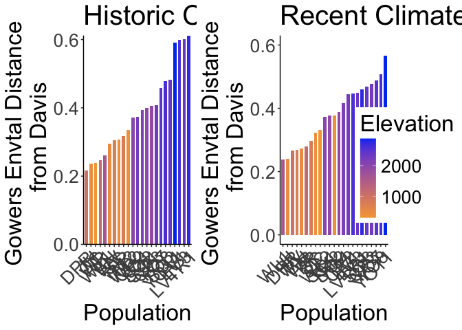<!-- -->

```r
 #2000 x 850
```


## Flint Climate Distance

### Subtraction


```r
recent_flint_dist_prep <- bind_cols(davis_climate_short_flint, pops_flint_recent_avgs)
names(recent_flint_dist_prep)
```

```
##  [1] "ppt_mean_Davis"  "tmn_mean_Davis"  "tmx_mean_Davis"  "parent.pop"     
##  [5] "elevation.group" "elev_m"          "cwd_mean"        "pck_mean"       
##  [9] "ppt_mean"        "tmn_mean"        "tmx_mean"
```

```r
recent_flint_dist <- recent_flint_dist_prep %>% 
  mutate(ppt_mean_dist=ppt_mean_Davis - ppt_mean,
         tmn_mean_dist=tmn_mean_Davis - tmn_mean,
         tmx_mean_dist=tmx_mean_Davis - tmx_mean) %>% 
 dplyr::select(parent.pop, elevation.group, elev_m, ends_with("_dist"))

historic_flint_dist_prep <- bind_cols(davis_climate_short_flint, pops_flint_historic_avgs)
names(historic_flint_dist_prep)
```

```
##  [1] "ppt_mean_Davis"  "tmn_mean_Davis"  "tmx_mean_Davis"  "parent.pop"     
##  [5] "elevation.group" "elev_m"          "cwd_mean"        "pck_mean"       
##  [9] "ppt_mean"        "tmn_mean"        "tmx_mean"
```

```r
historic_flint_dist <- historic_flint_dist_prep %>% 
  mutate(ppt_mean_dist=ppt_mean_Davis - ppt_mean,
         tmn_mean_dist=tmn_mean_Davis - tmn_mean,
         tmx_mean_dist=tmx_mean_Davis - tmx_mean) %>% 
 dplyr::select(parent.pop, elevation.group, elev_m, ends_with("_dist"))
```

Figures Recent (subtraction distance)


```r
recent_flint_dist %>% 
  ggplot(aes(x=fct_reorder(parent.pop, ppt_mean_dist), y=ppt_mean_dist, group=parent.pop, fill=elev_m)) +
  geom_col(width = 0.7,position = position_dodge(0.75)) +
  scale_y_continuous(expand = c(0, 0)) +
  scale_fill_gradient(low = "#F5A540", high = "#0043F0") +
  labs(fill="Elevation (m)",x="Population") +
  theme_classic() +
  theme(text=element_text(size=25), axis.text.x = element_text(angle = 45,  hjust = 1))
```

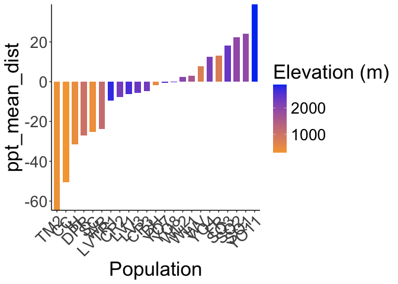<!-- -->

```r
ggsave("../output/Climate/MeanPPT_DistfromDavis_RecentClim.png", width = 12, height = 6, units = "in")

recent_flint_dist %>% 
  ggplot(aes(x=fct_reorder(parent.pop, tmn_mean_dist), y=tmn_mean_dist, group=parent.pop, fill=elev_m)) +
  geom_col(width = 0.7,position = position_dodge(0.75)) +
  scale_y_continuous(expand = c(0, 0)) +
  scale_fill_gradient(low = "#F5A540", high = "#0043F0") +
  labs(fill="Elevation (m)",x="Population") +
  theme_classic() +
  theme(text=element_text(size=25), axis.text.x = element_text(angle = 45,  hjust = 1))
```

<!-- -->

```r
ggsave("../output/Climate/MeanTMN_DistfromDavis_RecentClim.png", width = 12, height = 6, units = "in")

recent_flint_dist %>% 
  ggplot(aes(x=fct_reorder(parent.pop, tmx_mean_dist), y=tmx_mean_dist, group=parent.pop, fill=elev_m)) +
  geom_col(width = 0.7,position = position_dodge(0.75)) +
  scale_y_continuous(expand = c(0, 0)) +
  scale_fill_gradient(low = "#F5A540", high = "#0043F0") +
  labs(fill="Elevation (m)",x="Population") +
  theme_classic() +
  theme(text=element_text(size=25), axis.text.x = element_text(angle = 45,  hjust = 1))
```

<!-- -->

```r
ggsave("../output/Climate/MeanTMX_DistfromDavis_RecentClim.png", width = 12, height = 6, units = "in")
```

Figures Historical (subtraction distance)


```r
historic_flint_dist %>% 
  ggplot(aes(x=fct_reorder(parent.pop, ppt_mean_dist), y=ppt_mean_dist, group=parent.pop, fill=elev_m)) +
  geom_col(width = 0.7,position = position_dodge(0.75)) +
  scale_y_continuous(expand = c(0, 0)) +
  scale_fill_gradient(low = "#F5A540", high = "#0043F0") +
  labs(fill="Elevation (m)",x="Population") +
  theme_classic() +
  theme(text=element_text(size=25), axis.text.x = element_text(angle = 45,  hjust = 1))
```

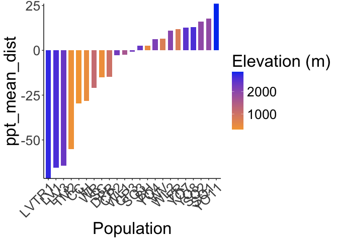<!-- -->

```r
ggsave("../output/Climate/MeanPPT_DistfromDavis_HistoricalClim.png", width = 12, height = 6, units = "in")

historic_flint_dist %>% 
  ggplot(aes(x=fct_reorder(parent.pop, tmn_mean_dist), y=tmn_mean_dist, group=parent.pop, fill=elev_m)) +
  geom_col(width = 0.7,position = position_dodge(0.75)) +
  scale_y_continuous(expand = c(0, 0)) +
  scale_fill_gradient(low = "#F5A540", high = "#0043F0") +
  labs(fill="Elevation (m)",x="Population") +
  theme_classic() +
  theme(text=element_text(size=25), axis.text.x = element_text(angle = 45,  hjust = 1))
```

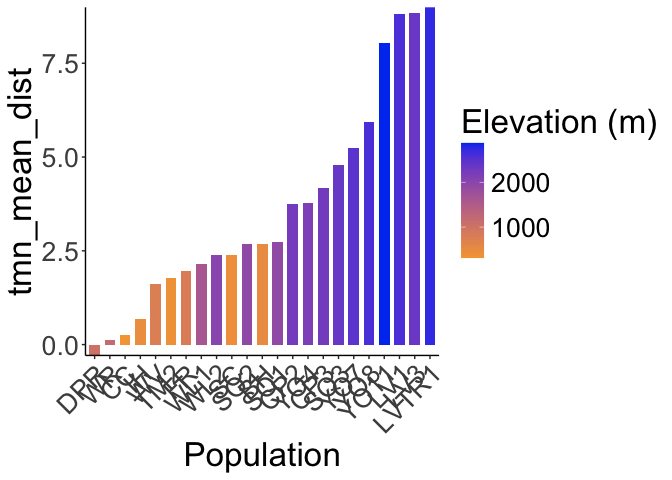<!-- -->

```r
ggsave("../output/Climate/MeanTMN_DistfromDavis_HistoricalClim.png", width = 12, height = 6, units = "in")

historic_flint_dist %>% 
  ggplot(aes(x=fct_reorder(parent.pop, tmx_mean_dist), y=tmx_mean_dist, group=parent.pop, fill=elev_m)) +
  geom_col(width = 0.7,position = position_dodge(0.75)) +
  scale_y_continuous(expand = c(0, 0)) +
  scale_fill_gradient(low = "#F5A540", high = "#0043F0") +
  labs(fill="Elevation (m)",x="Population") +
  theme_classic() +
  theme(text=element_text(size=25), axis.text.x = element_text(angle = 45,  hjust = 1))
```

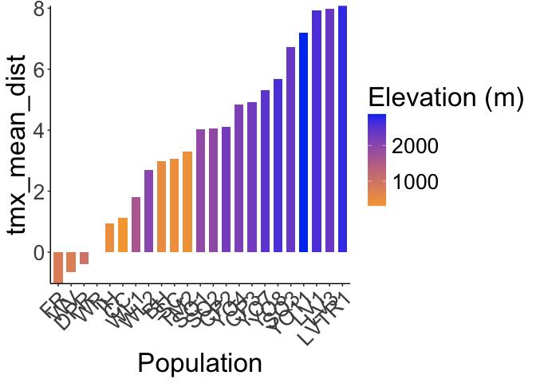<!-- -->

```r
ggsave("../output/Climate/MeanTMX_DistfromDavis_HistoricalClim.png", width = 12, height = 6, units = "in")
```

## Bioclim Climate Distance

### Subtraction


```r
#Recent
names(pops_bioclim_recent_avgs)
```

```
##  [1] "parent.pop"              "elevation.group"        
##  [3] "elev_m"                  "ann_tmean_avg"          
##  [5] "mean_diurnal_range_avg"  "temp_seasonality_avg"   
##  [7] "temp_ann_range_avg"      "tmean_wettest_month_avg"
##  [9] "tmean_driest_month_avg"  "ann_ppt_avg"            
## [11] "ppt_seasonality_avg"     "ppt_warmest_month_avg"  
## [13] "ppt_coldest_month_avg"
```

```r
recent_bioclim_dist_prep <- bind_cols(davis_bioclim_final, pops_bioclim_recent_avgs)
recent_bioclim_dist <- recent_bioclim_dist_prep %>% 
  mutate(ann_tmean_dist=ann_tmean_Davis - ann_tmean_avg,
         mean_diurnal_range_dist=mean_diurnal_range_Davis - mean_diurnal_range_avg,
         temp_seasonality_dist=temp_seasonality_Davis - temp_seasonality_avg,
         temp_ann_range_dist=temp_ann_range_Davis - temp_ann_range_avg,
         tmean_wettest_month_dist=tmean_wettest_month_Davis - tmean_wettest_month_avg,
         tmean_driest_month_dist=tmean_driest_month_Davis - tmean_driest_month_avg,
         ann_ppt_dist=ann_ppt_Davis - ann_ppt_avg,
         ppt_seasonality_dist=ppt_seasonality_Davis - ppt_seasonality_avg, 
         ppt_warmest_month_dist=ppt_warmest_month_Davis - ppt_warmest_month_avg,
         ppt_coldest_month_dist=ppt_coldest_month_Davis - ppt_coldest_month_avg) %>% 
 dplyr::select(parent.pop, elevation.group, elev_m, ends_with("_dist"))
recent_bioclim_dist
```

```
## # A tibble: 23 × 13
##    parent.pop elevation.group elev_m ann_tmean_dist mean_diurnal_range_dist
##    <chr>      <chr>            <dbl>          <dbl>                   <dbl>
##  1 BH         Low               511.          1.61                  0.599  
##  2 CC         Low               313           1.16                  2.22   
##  3 CP2        High             2244.          4.34                  1.37   
##  4 CP3        High             2266.          5.03                  1.60   
##  5 DPR        Mid              1019.         -0.963                 1.14   
##  6 FR         Mid               787          -0.392                -1.74   
##  7 IH         Low               454.         -0.152                 0.896  
##  8 LV1        High             2593.          5.21                 -0.0713 
##  9 LV3        High             2354.          5.24                  0.00938
## 10 LVTR1      High             2741.          5.42                 -0.239  
## # ℹ 13 more rows
## # ℹ 8 more variables: temp_seasonality_dist <dbl>, temp_ann_range_dist <dbl>,
## #   tmean_wettest_month_dist <dbl>, tmean_driest_month_dist <dbl>,
## #   ann_ppt_dist <dbl>, ppt_seasonality_dist <dbl>,
## #   ppt_warmest_month_dist <dbl>, ppt_coldest_month_dist <dbl>
```

```r
#Historical
names(pops_bioclim_historical_avgs)
```

```
##  [1] "parent.pop"              "elevation.group"        
##  [3] "elev_m"                  "ann_tmean_avg"          
##  [5] "mean_diurnal_range_avg"  "temp_seasonality_avg"   
##  [7] "temp_ann_range_avg"      "tmean_wettest_month_avg"
##  [9] "tmean_driest_month_avg"  "ann_ppt_avg"            
## [11] "ppt_seasonality_avg"     "ppt_warmest_month_avg"  
## [13] "ppt_coldest_month_avg"
```

```r
historical_bioclim_dist_prep <- bind_cols(davis_bioclim_final, pops_bioclim_historical_avgs)
historical_bioclim_dist <- historical_bioclim_dist_prep %>% 
  mutate(ann_tmean_dist=ann_tmean_Davis - ann_tmean_avg,
         mean_diurnal_range_dist=mean_diurnal_range_Davis - mean_diurnal_range_avg,
         temp_seasonality_dist=temp_seasonality_Davis - temp_seasonality_avg,
         temp_ann_range_dist=temp_ann_range_Davis - temp_ann_range_avg,
         tmean_wettest_month_dist=tmean_wettest_month_Davis - tmean_wettest_month_avg,
         tmean_driest_month_dist=tmean_driest_month_Davis - tmean_driest_month_avg,
         ann_ppt_dist=ann_ppt_Davis - ann_ppt_avg,
         ppt_seasonality_dist=ppt_seasonality_Davis - ppt_seasonality_avg, 
         ppt_warmest_month_dist=ppt_warmest_month_Davis - ppt_warmest_month_avg,
         ppt_coldest_month_dist=ppt_coldest_month_Davis - ppt_coldest_month_avg) %>% 
  dplyr::select(parent.pop, elevation.group, elev_m, ends_with("_dist"))
historical_bioclim_dist
```

```
## # A tibble: 23 × 13
##    parent.pop elevation.group elev_m ann_tmean_dist mean_diurnal_range_dist
##    <chr>      <chr>            <dbl>          <dbl>                   <dbl>
##  1 BH         Low               511.          2.60                    0.308
##  2 CC         Low               313           0.472                   0.871
##  3 CP2        High             2244.          3.70                    0.362
##  4 CP3        High             2266.          4.33                    0.749
##  5 DPR        Mid              1019.         -0.570                  -0.104
##  6 FR         Mid               787           0.231                  -2.99 
##  7 IH         Low               454.          0.579                   0.256
##  8 LV1        High             2593.          8.13                   -0.886
##  9 LV3        High             2354.          8.19                   -0.865
## 10 LVTR1      High             2741.          8.31                   -0.913
## # ℹ 13 more rows
## # ℹ 8 more variables: temp_seasonality_dist <dbl>, temp_ann_range_dist <dbl>,
## #   tmean_wettest_month_dist <dbl>, tmean_driest_month_dist <dbl>,
## #   ann_ppt_dist <dbl>, ppt_seasonality_dist <dbl>,
## #   ppt_warmest_month_dist <dbl>, ppt_coldest_month_dist <dbl>
```

Figures Recent (subtraction distance)


```r
recent_bioclim_dist %>% 
  ggplot(aes(x=fct_reorder(parent.pop, ann_tmean_dist), y=ann_tmean_dist, group=parent.pop, fill=elev_m)) +
  geom_col(width = 0.7,position = position_dodge(0.75)) +
  scale_y_continuous(expand = c(0, 0)) +
  scale_fill_gradient(low = "#F5A540", high = "#0043F0") +
  labs(fill="Elevation (m)",x="Population") +
  theme_classic() +
  theme(text=element_text(size=25), axis.text.x = element_text(angle = 45,  hjust = 1))
```

<!-- -->

```r
ggsave("../output/Climate/Ann_Tmean_DistfromDavis_RecentClim.png", width = 12, height = 6, units = "in")

recent_bioclim_dist %>% 
  ggplot(aes(x=fct_reorder(parent.pop, mean_diurnal_range_dist), y=mean_diurnal_range_dist, group=parent.pop, fill=elev_m)) +
  geom_col(width = 0.7,position = position_dodge(0.75)) +
  scale_y_continuous(expand = c(0, 0)) +
  scale_fill_gradient(low = "#F5A540", high = "#0043F0") +
  labs(fill="Elevation (m)",x="Population") +
  theme_classic() +
  theme(text=element_text(size=25), axis.text.x = element_text(angle = 45,  hjust = 1))
```

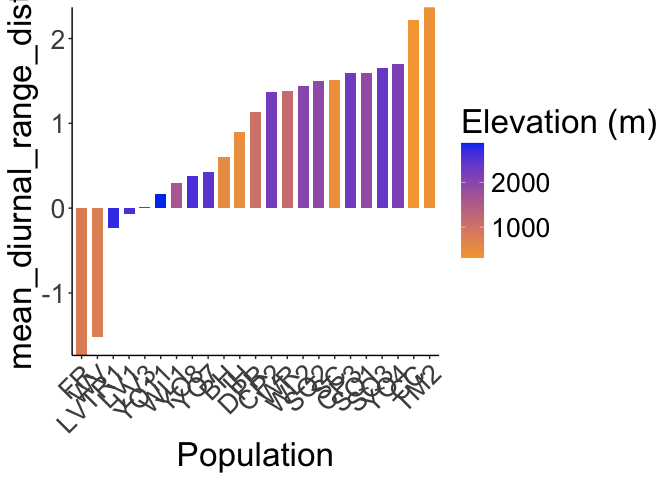<!-- -->

```r
ggsave("../output/Climate/Diurnal_Range_DistfromDavis_RecentClim.png", width = 12, height = 6, units = "in")

recent_bioclim_dist %>% 
  ggplot(aes(x=fct_reorder(parent.pop, temp_seasonality_dist), y=temp_seasonality_dist, group=parent.pop, fill=elev_m)) +
  geom_col(width = 0.7,position = position_dodge(0.75)) +
  scale_y_continuous(expand = c(0, 0)) +
  scale_fill_gradient(low = "#F5A540", high = "#0043F0") +
  labs(fill="Elevation (m)",x="Population") +
  theme_classic() +
  theme(text=element_text(size=25), axis.text.x = element_text(angle = 45,  hjust = 1))
```

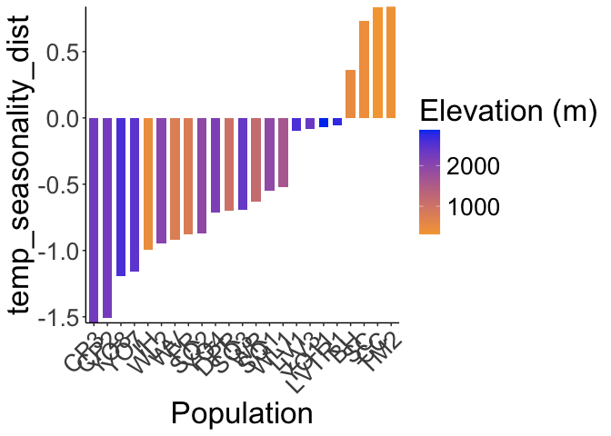<!-- -->

```r
ggsave("../output/Climate/Temp_Seasonality_DistfromDavis_RecentClim.png", width = 12, height = 6, units = "in")

recent_bioclim_dist %>% 
  ggplot(aes(x=fct_reorder(parent.pop, temp_ann_range_dist), y=temp_ann_range_dist, group=parent.pop, fill=elev_m)) +
  geom_col(width = 0.7,position = position_dodge(0.75)) +
  scale_y_continuous(expand = c(0, 0)) +
  scale_fill_gradient(low = "#F5A540", high = "#0043F0") +
  labs(fill="Elevation (m)",x="Population") +
  theme_classic() +
  theme(text=element_text(size=25), axis.text.x = element_text(angle = 45,  hjust = 1))
```

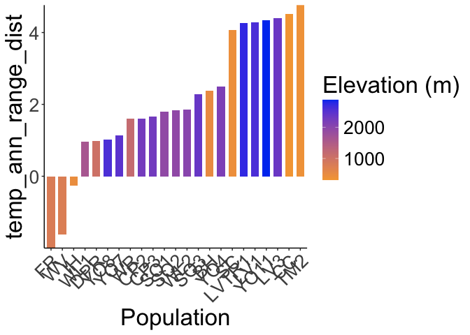<!-- -->

```r
ggsave("../output/Climate/Temp_Ann_Range_DistfromDavis_RecentClim.png", width = 12, height = 6, units = "in")

recent_bioclim_dist %>% 
  ggplot(aes(x=fct_reorder(parent.pop, tmean_wettest_month_dist), y=tmean_wettest_month_dist, group=parent.pop, fill=elev_m)) +
  geom_col(width = 0.7,position = position_dodge(0.75)) +
  scale_y_continuous(expand = c(0, 0)) +
  scale_fill_gradient(low = "#F5A540", high = "#0043F0") +
  labs(fill="Elevation (m)",x="Population") +
  theme_classic() +
  theme(text=element_text(size=25), axis.text.x = element_text(angle = 45,  hjust = 1))
```

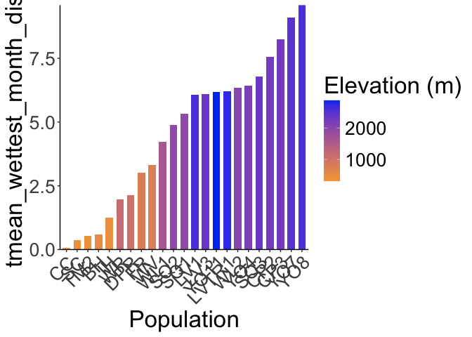<!-- -->

```r
ggsave("../output/Climate/Temp_Wet_DistfromDavis_RecentClim.png", width = 12, height = 6, units = "in")

recent_bioclim_dist %>% 
  ggplot(aes(x=fct_reorder(parent.pop, tmean_driest_month_dist), y=tmean_driest_month_dist, group=parent.pop, fill=elev_m)) +
  geom_col(width = 0.7,position = position_dodge(0.75)) +
  scale_y_continuous(expand = c(0, 0)) +
  scale_fill_gradient(low = "#F5A540", high = "#0043F0") +
  labs(fill="Elevation (m)",x="Population") +
  theme_classic() +
  theme(text=element_text(size=25), axis.text.x = element_text(angle = 45,  hjust = 1))
```

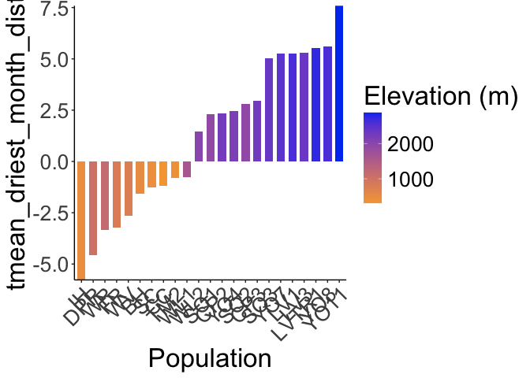<!-- -->

```r
ggsave("../output/Climate/Temp_Dry_DistfromDavis_RecentClim.png", width = 12, height = 6, units = "in")

recent_bioclim_dist %>% 
  ggplot(aes(x=fct_reorder(parent.pop, ann_ppt_dist), y=ann_ppt_dist, group=parent.pop, fill=elev_m)) +
  geom_col(width = 0.7,position = position_dodge(0.75)) +
  scale_y_continuous(expand = c(0, 0)) +
  scale_fill_gradient(low = "#F5A540", high = "#0043F0") +
  labs(fill="Elevation (m)",x="Population") +
  theme_classic() +
  theme(text=element_text(size=25), axis.text.x = element_text(angle = 45,  hjust = 1))
```

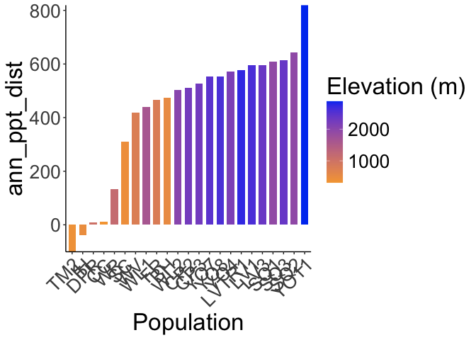<!-- -->

```r
ggsave("../output/Climate/Ann_PPT_DistfromDavis_RecentClim.png", width = 12, height = 6, units = "in")

recent_bioclim_dist %>% 
  ggplot(aes(x=fct_reorder(parent.pop, ppt_seasonality_dist), y=ppt_seasonality_dist, group=parent.pop, fill=elev_m)) +
  geom_col(width = 0.7,position = position_dodge(0.75)) +
  scale_y_continuous(expand = c(0, 0)) +
  scale_fill_gradient(low = "#F5A540", high = "#0043F0") +
  labs(fill="Elevation (m)",x="Population") +
  theme_classic() +
  theme(text=element_text(size=25), axis.text.x = element_text(angle = 45,  hjust = 1))
```

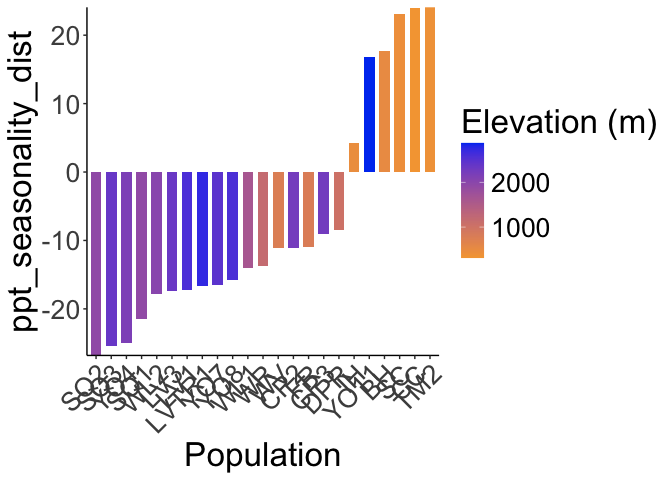<!-- -->

```r
ggsave("../output/Climate/PPT_Seasonality_DistfromDavis_RecentClim.png", width = 12, height = 6, units = "in")

recent_bioclim_dist %>% 
  ggplot(aes(x=fct_reorder(parent.pop, ppt_warmest_month_dist), y=ppt_warmest_month_dist, group=parent.pop, fill=elev_m)) +
  geom_col(width = 0.7,position = position_dodge(0.75)) +
  scale_y_continuous(expand = c(0, 0)) +
  scale_fill_gradient(low = "#F5A540", high = "#0043F0") +
  labs(fill="Elevation (m)",x="Population") +
  theme_classic() +
  theme(text=element_text(size=25), axis.text.x = element_text(angle = 45,  hjust = 1))
```

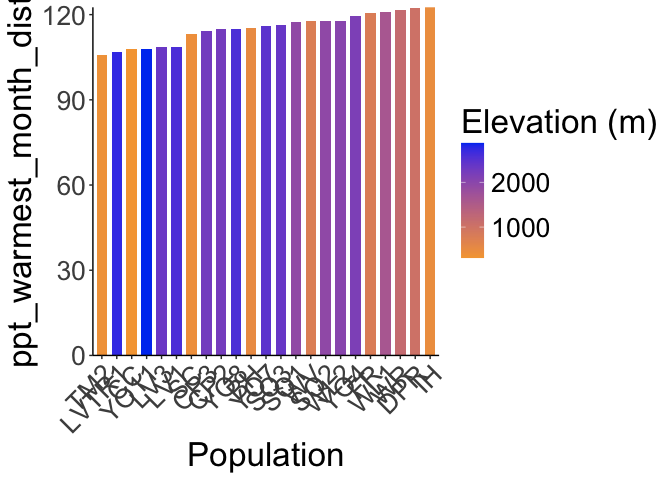<!-- -->

```r
ggsave("../output/Climate/PPT_Warm_DistfromDavis_RecentClim.png", width = 12, height = 6, units = "in")

recent_bioclim_dist %>% 
  ggplot(aes(x=fct_reorder(parent.pop, ppt_coldest_month_dist), y=ppt_coldest_month_dist, group=parent.pop, fill=elev_m)) +
  geom_col(width = 0.7,position = position_dodge(0.75)) +
  scale_y_continuous(expand = c(0, 0)) +
  scale_fill_gradient(low = "#F5A540", high = "#0043F0") +
  labs(fill="Elevation (m)",x="Population") +
  theme_classic() +
  theme(text=element_text(size=25), axis.text.x = element_text(angle = 45,  hjust = 1))
```

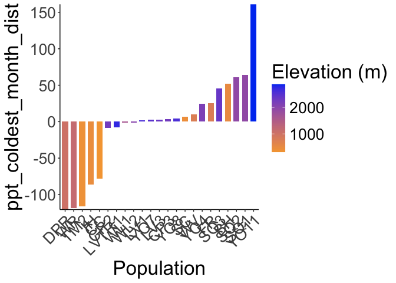<!-- -->

```r
ggsave("../output/Climate/PPT_Cold_DistfromDavis_RecentClim.png", width = 12, height = 6, units = "in")
```

Historical (subtraction distance)


```r
historical_bioclim_dist %>% 
  ggplot(aes(x=fct_reorder(parent.pop, ann_tmean_dist), y=ann_tmean_dist, group=parent.pop, fill=elev_m)) +
  geom_col(width = 0.7,position = position_dodge(0.75)) +
  scale_y_continuous(expand = c(0, 0)) +
  scale_fill_gradient(low = "#F5A540", high = "#0043F0") +
  labs(fill="Elevation (m)",x="Population") +
  theme_classic() +
  theme(text=element_text(size=25), axis.text.x = element_text(angle = 45,  hjust = 1))
```

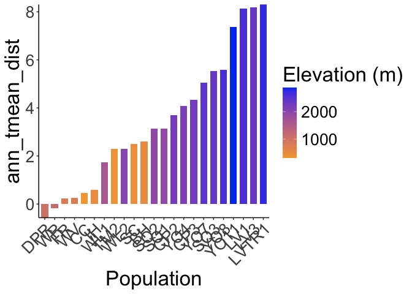<!-- -->

```r
ggsave("../output/Climate/Ann_Tmean_DistfromDavis_HistoricalClim.png", width = 12, height = 6, units = "in")

historical_bioclim_dist %>% 
  ggplot(aes(x=fct_reorder(parent.pop, mean_diurnal_range_dist), y=mean_diurnal_range_dist, group=parent.pop, fill=elev_m)) +
  geom_col(width = 0.7,position = position_dodge(0.75)) +
  scale_y_continuous(expand = c(0, 0)) +
  scale_fill_gradient(low = "#F5A540", high = "#0043F0") +
  labs(fill="Elevation (m)",x="Population") +
  theme_classic() +
  theme(text=element_text(size=25), axis.text.x = element_text(angle = 45,  hjust = 1))
```

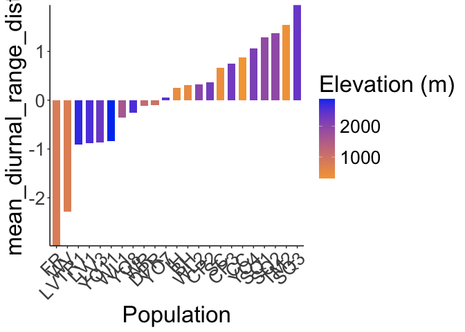<!-- -->

```r
ggsave("../output/Climate/Diurnal_Range_DistfromDavis_HistoricalClim.png", width = 12, height = 6, units = "in")

historical_bioclim_dist %>% 
  ggplot(aes(x=fct_reorder(parent.pop, temp_seasonality_dist), y=temp_seasonality_dist, group=parent.pop, fill=elev_m)) +
  geom_col(width = 0.7,position = position_dodge(0.75)) +
  scale_y_continuous(expand = c(0, 0)) +
  scale_fill_gradient(low = "#F5A540", high = "#0043F0") +
  labs(fill="Elevation (m)",x="Population") +
  theme_classic() +
  theme(text=element_text(size=25), axis.text.x = element_text(angle = 45,  hjust = 1))
```

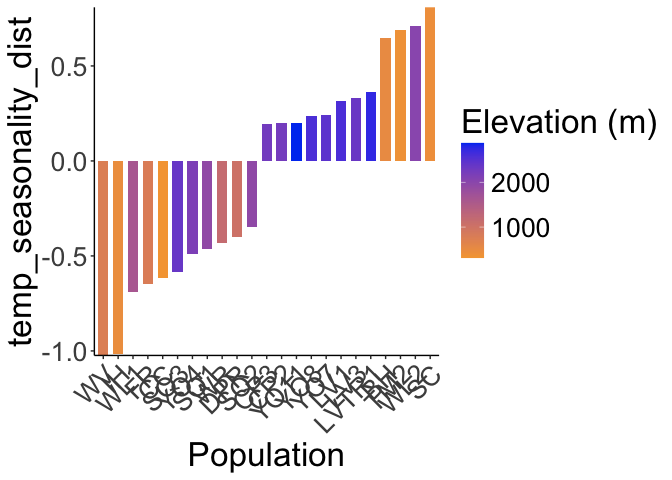<!-- -->

```r
ggsave("../output/Climate/Temp_Seasonality_DistfromDavis_HistoricalClim.png", width = 12, height = 6, units = "in")

historical_bioclim_dist %>% 
  ggplot(aes(x=fct_reorder(parent.pop, temp_ann_range_dist), y=temp_ann_range_dist, group=parent.pop, fill=elev_m)) +
  geom_col(width = 0.7,position = position_dodge(0.75)) +
  scale_y_continuous(expand = c(0, 0)) +
  scale_fill_gradient(low = "#F5A540", high = "#0043F0") +
  labs(fill="Elevation (m)",x="Population") +
  theme_classic() +
  theme(text=element_text(size=25), axis.text.x = element_text(angle = 45,  hjust = 1))
```

<!-- -->

```r
ggsave("../output/Climate/Temp_Ann_Range_DistfromDavis_HistoricalClim.png", width = 12, height = 6, units = "in")

historical_bioclim_dist %>% 
  ggplot(aes(x=fct_reorder(parent.pop, tmean_wettest_month_dist), y=tmean_wettest_month_dist, group=parent.pop, fill=elev_m)) +
  geom_col(width = 0.7,position = position_dodge(0.75)) +
  scale_y_continuous(expand = c(0, 0)) +
  scale_fill_gradient(low = "#F5A540", high = "#0043F0") +
  labs(fill="Elevation (m)",x="Population") +
  theme_classic() +
  theme(text=element_text(size=25), axis.text.x = element_text(angle = 45,  hjust = 1))
```

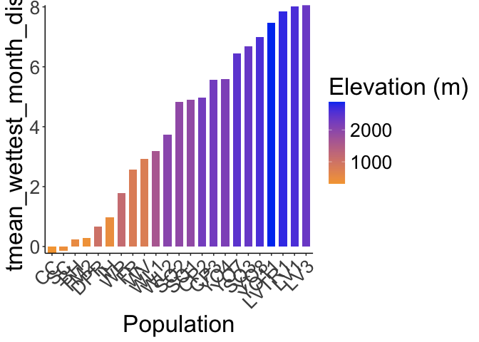<!-- -->

```r
ggsave("../output/Climate/Temp_Wet_DistfromDavis_HistoricalClim.png", width = 12, height = 6, units = "in")

historical_bioclim_dist %>% 
  ggplot(aes(x=fct_reorder(parent.pop, tmean_driest_month_dist), y=tmean_driest_month_dist, group=parent.pop, fill=elev_m)) +
  geom_col(width = 0.7,position = position_dodge(0.75)) +
  scale_y_continuous(expand = c(0, 0)) +
  scale_fill_gradient(low = "#F5A540", high = "#0043F0") +
  labs(fill="Elevation (m)",x="Population") +
  theme_classic() +
  theme(text=element_text(size=25), axis.text.x = element_text(angle = 45,  hjust = 1))
```

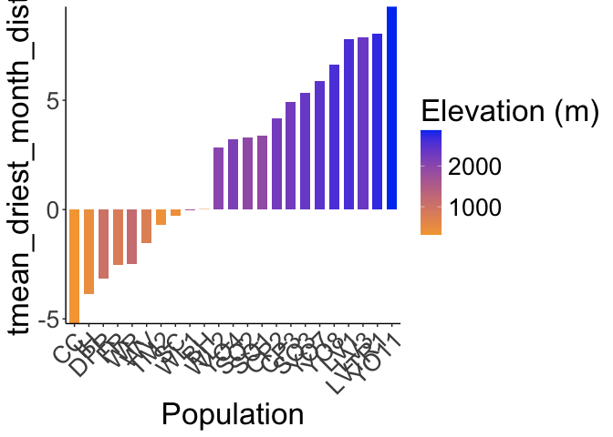<!-- -->

```r
ggsave("../output/Climate/Temp_Dry_DistfromDavis_HistoricalClim.png", width = 12, height = 6, units = "in")

historical_bioclim_dist %>% 
  ggplot(aes(x=fct_reorder(parent.pop, ann_ppt_dist), y=ann_ppt_dist, group=parent.pop, fill=elev_m)) +
  geom_col(width = 0.7,position = position_dodge(0.75)) +
  scale_y_continuous(expand = c(0, 0)) +
  scale_fill_gradient(low = "#F5A540", high = "#0043F0") +
  labs(fill="Elevation (m)",x="Population") +
  theme_classic() +
  theme(text=element_text(size=25), axis.text.x = element_text(angle = 45,  hjust = 1))
```

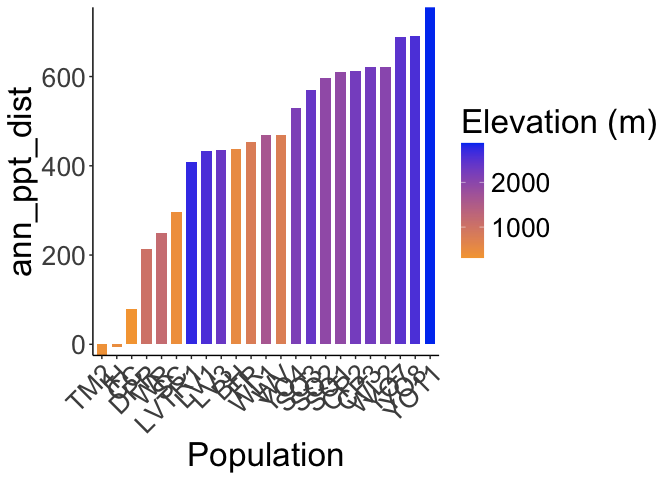<!-- -->

```r
ggsave("../output/Climate/Ann_PPT_DistfromDavis_HistoricalClim.png", width = 12, height = 6, units = "in")

historical_bioclim_dist %>% 
  ggplot(aes(x=fct_reorder(parent.pop, ppt_seasonality_dist), y=ppt_seasonality_dist, group=parent.pop, fill=elev_m)) +
  geom_col(width = 0.7,position = position_dodge(0.75)) +
  scale_y_continuous(expand = c(0, 0)) +
  scale_fill_gradient(low = "#F5A540", high = "#0043F0") +
  labs(fill="Elevation (m)",x="Population") +
  theme_classic() +
  theme(text=element_text(size=25), axis.text.x = element_text(angle = 45,  hjust = 1))
```

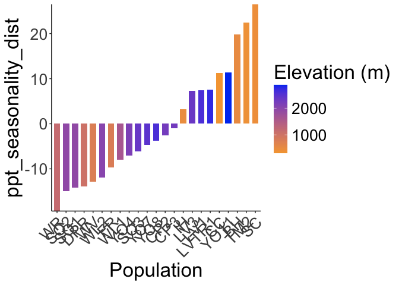<!-- -->

```r
ggsave("../output/Climate/PPT_Seasonality_DistfromDavis_HistoricalClim.png", width = 12, height = 6, units = "in")

historical_bioclim_dist %>% 
  ggplot(aes(x=fct_reorder(parent.pop, ppt_warmest_month_dist), y=ppt_warmest_month_dist, group=parent.pop, fill=elev_m)) +
  geom_col(width = 0.7,position = position_dodge(0.75)) +
  scale_y_continuous(expand = c(0, 0)) +
  scale_fill_gradient(low = "#F5A540", high = "#0043F0") +
  labs(fill="Elevation (m)",x="Population") +
  theme_classic() +
  theme(text=element_text(size=25), axis.text.x = element_text(angle = 45,  hjust = 1))
```

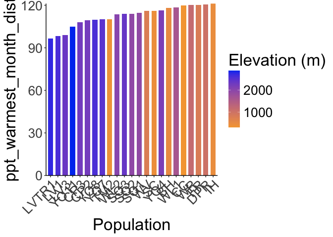<!-- -->

```r
ggsave("../output/Climate/PPT_Warm_DistfromDavis_HistoricalClim.png", width = 12, height = 6, units = "in")

historical_bioclim_dist %>% 
  ggplot(aes(x=fct_reorder(parent.pop, ppt_coldest_month_dist), y=ppt_coldest_month_dist, group=parent.pop, fill=elev_m)) +
  geom_col(width = 0.7,position = position_dodge(0.75)) +
  scale_y_continuous(expand = c(0, 0)) +
  scale_fill_gradient(low = "#F5A540", high = "#0043F0") +
  labs(fill="Elevation (m)",x="Population") +
  theme_classic() +
  theme(text=element_text(size=25), axis.text.x = element_text(angle = 45,  hjust = 1))
```

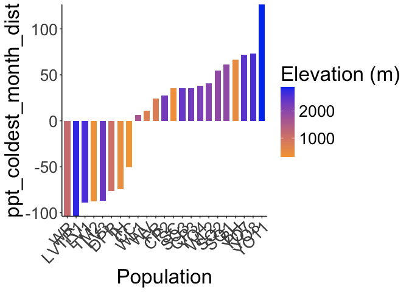<!-- -->

```r
ggsave("../output/Climate/PPT_Cold_DistfromDavis_HistoricalClim.png", width = 12, height = 6, units = "in")
```
