# Climate Distance at the Davis Garden
Options:
-   Basic subtraction as in Moran et al 2017 (garden site - home site)
-   Gower’s environmental distance metric as in Rutter and Fenster 2007
-   From PCAs "We calculated an overall environmental distance using PCA, with EDij correspond- ing to the Euclidian distance between i and j based on PCA1 & PCA2." as in Moran et al 2017

## Relevant Libraries and Functions


```r
library(tidyverse)
```

```
## ── Attaching core tidyverse packages ──────────────────────── tidyverse 2.0.0 ──
## ✔ dplyr     1.1.3     ✔ readr     2.1.4
## ✔ forcats   1.0.0     ✔ stringr   1.5.0
## ✔ ggplot2   3.4.3     ✔ tibble    3.2.1
## ✔ lubridate 1.9.2     ✔ tidyr     1.3.0
## ✔ purrr     1.0.2     
## ── Conflicts ────────────────────────────────────────── tidyverse_conflicts() ──
## ✖ dplyr::filter() masks stats::filter()
## ✖ dplyr::lag()    masks stats::lag()
## ℹ Use the conflicted package (<http://conflicted.r-lib.org/>) to force all conflicts to become errors
```

```r
library(ggrepel)
library(cowplot)
```

```
## 
## Attaching package: 'cowplot'
## 
## The following object is masked from 'package:lubridate':
## 
##     stamp
```

```r
library(gridExtra)
```

```
## 
## Attaching package: 'gridExtra'
## 
## The following object is masked from 'package:dplyr':
## 
##     combine
```

```r
library(corrplot) #plotting correlations 
```

```
## corrplot 0.92 loaded
```

```r
library(rstatix) #performing cor_test
```

```
## 
## Attaching package: 'rstatix'
## 
## The following object is masked from 'package:stats':
## 
##     filter
```

```r
library(naniar) #replaces values with NA
library(QBMS) #for function calc_biovars to calculate bioclim variables
sem <- function(x, na.rm=FALSE) {
  sd(x,na.rm=na.rm)/sqrt(length(na.omit(x)))
} #standard error function 

get_legend<-function(myggplot){
  tmp <- ggplot_gtable(ggplot_build(myggplot))
  leg <- which(sapply(tmp$grobs, function(x) x$name) == "guide-box")
  legend <- tmp$grobs[[leg]]
  return(legend)
} #legend function for grid_arrange

elev_three_palette <- c("#0043F0", "#C9727F", "#F5A540") #colors from Gremer et al 2019
elev_order <- c("High", "Mid", "Low")

#For scree plots 
#library("devtools") #The package devtools is required for the installation as factoextra is hosted on github.
#1install_github("kassambara/factoextra")
library("factoextra")
```

```
## Welcome! Want to learn more? See two factoextra-related books at https://goo.gl/ve3WBa
```

## Home Climates (Flint Data)


## Davis Climate Data (Nov 2022-Oct 2023)
Paltineanu et al 2012 calcualted climate water deficit as ppt (as a sum) - ref evaopotranspiration (refet). But I don't think this is correct b/c I got negative numbers for that calcualtion and minimum CWD is supposed to be 0...

```r
davis_climate <- read_csv("../input/CIMS_Davis_monthly.csv")
```

```
## New names:
## Rows: 14 Columns: 30
## ── Column specification
## ──────────────────────────────────────────────────────── Delimiter: "," chr
## (16): Stn Name, CIMIS Region, Month Year, qc...6, qc...8, qc...10, qc...... dbl
## (14): Stn Id, Total ETo (mm), Total Precip (mm), Avg Sol Rad (W/sq.m), A...
## ℹ Use `spec()` to retrieve the full column specification for this data. ℹ
## Specify the column types or set `show_col_types = FALSE` to quiet this message.
## • `qc` -> `qc...6`
## • `qc` -> `qc...8`
## • `qc` -> `qc...10`
## • `qc` -> `qc...12`
## • `qc` -> `qc...14`
## • `qc` -> `qc...16`
## • `qc` -> `qc...18`
## • `qc` -> `qc...20`
## • `qc` -> `qc...22`
## • `qc` -> `qc...24`
## • `qc` -> `qc...26`
## • `qc` -> `qc...28`
## • `qc` -> `qc...30`
```

```r
head(davis_climate)
```

```
## # A tibble: 6 × 30
##   `Stn Id` `Stn Name` `CIMIS Region`    `Month Year` `Total ETo (mm)` qc...6
##      <dbl> <chr>      <chr>             <chr>                   <dbl> <chr> 
## 1        6 Davis      Sacramento Valley Nov 2022                 56.4 <NA>  
## 2        6 Davis      Sacramento Valley Dec 2022                 20.1 <NA>  
## 3        6 Davis      Sacramento Valley Jan 2023                 45.4 <NA>  
## 4        6 Davis      Sacramento Valley Feb 2023                 54.0 <NA>  
## 5        6 Davis      Sacramento Valley Mar 2023                 70.8 <NA>  
## 6        6 Davis      Sacramento Valley Apr 2023                146.  <NA>  
## # ℹ 24 more variables: `Total Precip (mm)` <dbl>, qc...8 <chr>,
## #   `Avg Sol Rad (W/sq.m)` <dbl>, qc...10 <chr>, `Avg Vap Pres (kPa)` <dbl>,
## #   qc...12 <chr>, `Avg Max Air Temp (C)` <dbl>, qc...14 <chr>,
## #   `Avg Min Air Temp (C)` <dbl>, qc...16 <chr>, `Avg Air Temp (C)` <dbl>,
## #   qc...18 <chr>, `Avg Max Rel Hum (%)` <dbl>, qc...20 <chr>,
## #   `Avg Min Rel Hum (%)` <dbl>, qc...22 <chr>, `Avg Rel Hum (%)` <dbl>,
## #   qc...24 <chr>, `Avg Dew Point (C)` <dbl>, qc...26 <chr>, …
```

```r
davis_climate_short <- davis_climate %>% 
  select(month_year=`Month Year`, refet=`Total ETo (mm)`, ppt=`Total Precip (mm)`,
         avg_sol_rad=`Avg Sol Rad (W/sq.m)`, avg_vapor_pres=`Avg Vap Pres (kPa)`,
         tmx=`Avg Max Air Temp (C)`, tmn=`Avg Min Air Temp (C)`, tavg=`Avg Air Temp (C)`,
         avg_max_rel_hum=`Avg Max Rel Hum (%)`, avg_min_rel_hum=`Avg Min Rel Hum (%)`,
         avg_rel_hum=`Avg Rel Hum (%)`, avg_dew_pt=`Avg Dew Point (C)`,
         avg_wind_spd=`Avg Wind Speed (m/s)`, avg_soil_temp=`Avg Soil Temp (C)`) %>% 
  separate(month_year, c("month", "year"), " ", remove = FALSE) %>% 
  mutate(month=match(month, month.abb), cwd=ppt-refet)
davis_climate_short
```

```
## # A tibble: 14 × 17
##    month_year month year  refet   ppt avg_sol_rad avg_vapor_pres   tmx   tmn
##    <chr>      <int> <chr> <dbl> <dbl>       <dbl>          <dbl> <dbl> <dbl>
##  1 Nov 2022      11 2022   56.4  37.8         117            0.8  17     3  
##  2 Dec 2022      12 2022   20.1 176            63            0.9  11.3   3.4
##  3 Jan 2023       1 2023   45.4 247.           94            0.9  13.3   4.6
##  4 Feb 2023       2 2023   54.0  65.1         132            0.7  14.3   2.2
##  5 Mar 2023       3 2023   70.8 187.          166            0.9  14.5   5  
##  6 Apr 2023       4 2023  146.    4.4         278            1    22.7   7.2
##  7 May 2023       5 2023  159.   12.4         287            1.3  24.8   9.9
##  8 Jun 2023       6 2023  187.    0           319            1.4  28.6  11.6
##  9 Jul 2023       7 2023  212.    0.1         328            1.6  34    13.4
## 10 Aug 2023       8 2023  187.  123.          281            1.6  33.5  14.7
## 11 Sep 2023       9 2023  131.    9.7         229            1.4  28.9  12.2
## 12 Oct 2023      10 2023  101.    0           168            1.2  26.2   9.6
## 13 Nov 2023      11 2023   61.6  21.9         117            0.9  19.7   5.7
## 14 Dec 2023      12 2023   30.6  87.3          77            1    15.8   4.9
## # ℹ 8 more variables: tavg <dbl>, avg_max_rel_hum <dbl>, avg_min_rel_hum <dbl>,
## #   avg_rel_hum <dbl>, avg_dew_pt <dbl>, avg_wind_spd <dbl>,
## #   avg_soil_temp <dbl>, cwd <dbl>
```

```r
summary(davis_climate_short)
```

```
##   month_year            month            year               refet       
##  Length:14          Min.   : 1.000   Length:14          Min.   : 20.06  
##  Class :character   1st Qu.: 4.250   Class :character   1st Qu.: 54.64  
##  Mode  :character   Median : 7.500   Mode  :character   Median : 85.82  
##                     Mean   : 7.214                      Mean   :104.34  
##                     3rd Qu.:10.750                      3rd Qu.:155.41  
##                     Max.   :12.000                      Max.   :211.62  
##       ppt           avg_sol_rad    avg_vapor_pres       tmx       
##  Min.   :  0.000   Min.   : 63.0   Min.   :0.700   Min.   :11.30  
##  1st Qu.:  5.725   1st Qu.:117.0   1st Qu.:0.900   1st Qu.:14.82  
##  Median : 29.850   Median :167.0   Median :1.000   Median :21.20  
##  Mean   : 69.436   Mean   :189.7   Mean   :1.114   Mean   :21.76  
##  3rd Qu.:113.850   3rd Qu.:280.2   3rd Qu.:1.375   3rd Qu.:28.00  
##  Max.   :247.400   Max.   :328.0   Max.   :1.600   Max.   :34.00  
##       tmn              tavg       avg_max_rel_hum avg_min_rel_hum
##  Min.   : 2.200   Min.   : 7.10   Min.   :86.00   Min.   :30.00  
##  1st Qu.: 4.675   1st Qu.: 9.45   1st Qu.:89.00   1st Qu.:34.50  
##  Median : 6.450   Median :13.65   Median :91.00   Median :40.50  
##  Mean   : 7.671   Mean   :14.49   Mean   :90.86   Mean   :44.57  
##  3rd Qu.:11.175   3rd Qu.:19.27   3rd Qu.:92.75   3rd Qu.:53.50  
##  Max.   :14.700   Max.   :24.00   Max.   :97.00   Max.   :72.00  
##   avg_rel_hum      avg_dew_pt      avg_wind_spd  avg_soil_temp  
##  Min.   :54.00   Min.   : 2.500   Min.   :1.80   Min.   : 8.30  
##  1st Qu.:58.50   1st Qu.: 5.025   1st Qu.:2.10   1st Qu.:10.30  
##  Median :62.50   Median : 6.550   Median :2.30   Median :13.05  
##  Mean   :65.86   Mean   : 7.736   Mean   :2.35   Mean   :14.21  
##  3rd Qu.:73.00   3rd Qu.:11.325   3rd Qu.:2.40   3rd Qu.:17.77  
##  Max.   :88.00   Max.   :14.200   Max.   :3.30   Max.   :21.90  
##       cwd         
##  Min.   :-211.52  
##  1st Qu.:-136.58  
##  Median : -51.93  
##  Mean   : -34.90  
##  3rd Qu.:  45.25  
##  Max.   : 201.96
```

## BioClim Variables (https://www.worldclim.org/data/bioclim.html#google_vignette)
-   annual mean temperature (BIO1)
-   mean diurnal range (BIO2)
-   temperature seasonality (BIO4) (standard deviation *100)
-   temperature annual range (BIO7) (Max Temperature of Warmest Month - Min Temperature of Coldest Month)
-   mean temp of wettest quarter (BIO8)
-   mean temp of driest quarter (BIO9)
-   annual precipitation (BIO12) - sum of ppt for the entire year (not the avg)
-   precipitation seasonality (BIO15)  (Coefficient of Variation)
-   precip of warmest quarter (BIO18)
-   precip of coldest quarter (BIO19)

Use library QBMS, calc_biovars function: https://search.r-project.org/CRAN/refmans/QBMS/html/calc_biovars.html 
Data.frame has 4 mandatory columns (year, ppt, tmin, and tmax), and 12 rows (months) for each year sorted from Jan to Dec.

For home climate 

```r
pops_bioclim_recent_avgs <- read_csv("../output/Climate/Pops_BioClimAvgs_Recent.csv") %>% 
  select(parent.pop:ppt_coldest_quarter_avg)
```

```
## Rows: 23 Columns: 23
## ── Column specification ────────────────────────────────────────────────────────
## Delimiter: ","
## chr  (2): parent.pop, elevation.group
## dbl (21): elev_m, ann_tmean_avg, mean_diurnal_range_avg, temp_seasonality_av...
## 
## ℹ Use `spec()` to retrieve the full column specification for this data.
## ℹ Specify the column types or set `show_col_types = FALSE` to quiet this message.
```

```r
head(pops_bioclim_recent_avgs)
```

```
## # A tibble: 6 × 13
##   parent.pop elevation.group elev_m ann_tmean_avg mean_diurnal_range_avg
##   <chr>      <chr>            <dbl>         <dbl>                  <dbl>
## 1 BH         Low               511.         16.2                    14.8
## 2 CC         Low               313          16.6                    13.3
## 3 CP2        High             2244.          7.28                   12.3
## 4 CP3        High             2266.          6.57                   12.2
## 5 DPR        Mid              1019.         14.0                    12.4
## 6 FR         Mid               787          12.6                    14.6
## # ℹ 8 more variables: temp_seasonality_avg <dbl>, temp_ann_range_avg <dbl>,
## #   tmean_wettest_quarter_avg <dbl>, tmean_driest_quarter_avg <dbl>,
## #   ann_ppt_avg <dbl>, ppt_seasonality_avg <dbl>,
## #   ppt_warmest_quarter_avg <dbl>, ppt_coldest_quarter_avg <dbl>
```

```r
pops_bioclim_historical_avgs <- read_csv("../output/Climate/Pops_BioClimAvgs_Historical.csv")  %>% 
  select(parent.pop:ppt_coldest_quarter_avg)
```

```
## Rows: 23 Columns: 23
## ── Column specification ────────────────────────────────────────────────────────
## Delimiter: ","
## chr  (2): parent.pop, elevation.group
## dbl (21): elev_m, ann_tmean_avg, mean_diurnal_range_avg, temp_seasonality_av...
## 
## ℹ Use `spec()` to retrieve the full column specification for this data.
## ℹ Specify the column types or set `show_col_types = FALSE` to quiet this message.
```

```r
head(pops_bioclim_historical_avgs)
```

```
## # A tibble: 6 × 13
##   parent.pop elevation.group elev_m ann_tmean_avg mean_diurnal_range_avg
##   <chr>      <chr>            <dbl>         <dbl>                  <dbl>
## 1 BH         Low               511.         15.3                    15.2
## 2 CC         Low               313          15.9                    14.0
## 3 CP2        High             2244.          6.10                   12.8
## 4 CP3        High             2266.          5.45                   12.6
## 5 DPR        Mid              1019.         12.9                    13.5
## 6 FR         Mid               787          12.0                    15.8
## # ℹ 8 more variables: temp_seasonality_avg <dbl>, temp_ann_range_avg <dbl>,
## #   tmean_wettest_quarter_avg <dbl>, tmean_driest_quarter_avg <dbl>,
## #   ann_ppt_avg <dbl>, ppt_seasonality_avg <dbl>,
## #   ppt_warmest_quarter_avg <dbl>, ppt_coldest_quarter_avg <dbl>
```

For Davis Climate
Had to exclude 2022

```r
davis_bioclim <- davis_climate_short %>% 
  filter(year=="2023") %>% 
  rename(tmin=tmn, tmax=tmx) %>% 
  calc_biovars()
davis_bioclim
```

```
##               bio1             bio2             bio3             bio4 bio5 bio6
## 1 15.7208333333333 14.6083333333333 45.9381551362683 571.801214398744   34  2.2
##   bio7             bio8             bio9            bio10            bio11
## 1 31.8 8.98333333333333 20.3833333333333 22.7833333333333 8.98333333333333
##   bio12 bio13 bio14           bio15 bio16 bio17 bio18 bio19 year
## 1 758.3 247.4     0 129.51528078212 499.8  12.5 132.5 499.8 2023
```

```r
davis_bioclim_final <- davis_bioclim %>% 
  mutate(across(c(bio1, bio2, bio4, bio7, bio8, bio9, bio12, bio15, bio18, bio19), as.numeric)) %>% 
  select(ann_tmean_Davis=bio1, mean_diurnal_range_Davis=bio2,
         temp_seasonality_Davis=bio4, temp_ann_range_Davis=bio7,
         tmean_wettest_quarter_Davis=bio8, tmean_driest_quarter_Davis=bio9,
         ann_ppt_Davis=bio12, ppt_seasonality_Davis=bio15, 
         ppt_warmest_quarter_Davis=bio18, ppt_coldest_quarter_Davis=bio19) 
davis_bioclim_final
```

```
##   ann_tmean_Davis mean_diurnal_range_Davis temp_seasonality_Davis
## 1        15.72083                 14.60833               571.8012
##   temp_ann_range_Davis tmean_wettest_quarter_Davis tmean_driest_quarter_Davis
## 1                 31.8                    8.983333                   20.38333
##   ann_ppt_Davis ppt_seasonality_Davis ppt_warmest_quarter_Davis
## 1         758.3              129.5153                     132.5
##   ppt_coldest_quarter_Davis
## 1                     499.8
```


## Davis Climate Trends

```r
davis_climate_short$month_year <- factor(davis_climate_short$month_year, levels = c("Nov 2022","Dec 2022","Jan 2023", "Feb 2023", "Mar 2023", "Apr 2023", "May 2023", "Jun 2023", "Jul 2023", "Aug 2023", "Sep 2023", "Oct 2023"))
davis_climate_short %>% ggplot(aes(x=month_year, y=tavg)) + geom_point() + theme_classic()
```

<!-- -->

```r
davis_climate_short %>% ggplot(aes(x=month_year, y=ppt)) + geom_point() + theme_classic()
```

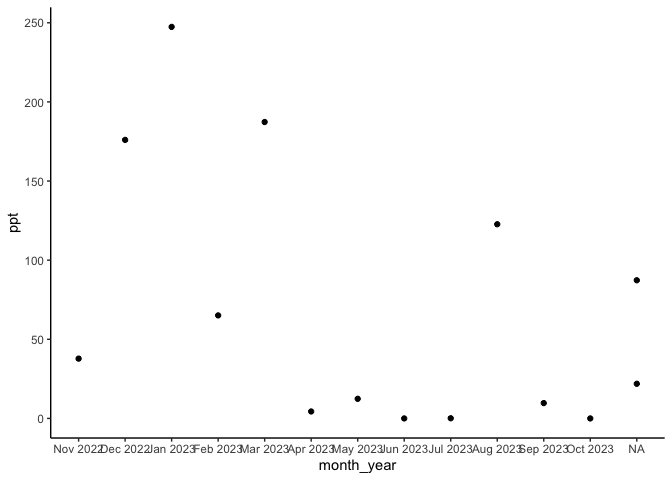<!-- -->

```r
davis_climate_short %>% ggplot(aes(x=month_year, y=tmx)) + geom_point() + theme_classic()
```

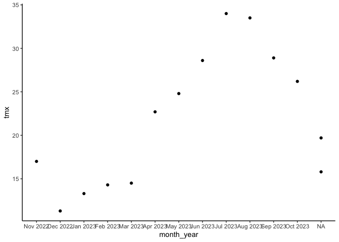<!-- -->

```r
davis_climate_short %>% ggplot(aes(x=month_year, y=avg_rel_hum)) + geom_point() + theme_classic()
```

<!-- -->

```r
davis_climate_short %>% ggplot(aes(x=month_year, y=avg_wind_spd)) + geom_point() + theme_classic()
```

<!-- -->

```r
davis_climate_short %>% ggplot(aes(x=month_year, y=avg_sol_rad)) + geom_point() + theme_classic()
```

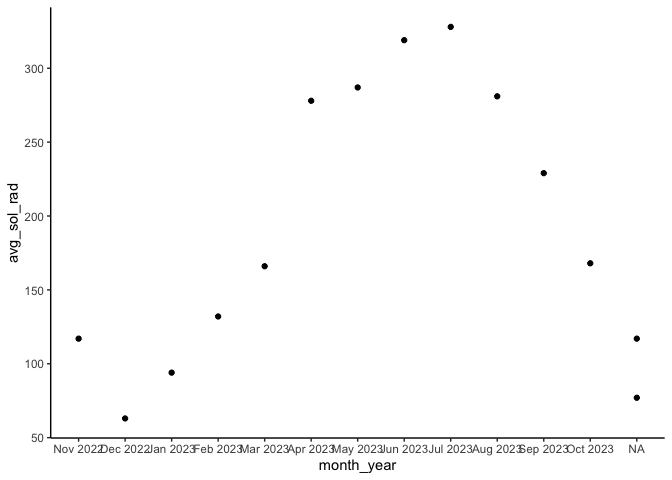<!-- -->


## Bioclim Climate Distance

### Subtraction

```r
#Recent
names(pops_bioclim_recent_avgs)
```

```
##  [1] "parent.pop"                "elevation.group"          
##  [3] "elev_m"                    "ann_tmean_avg"            
##  [5] "mean_diurnal_range_avg"    "temp_seasonality_avg"     
##  [7] "temp_ann_range_avg"        "tmean_wettest_quarter_avg"
##  [9] "tmean_driest_quarter_avg"  "ann_ppt_avg"              
## [11] "ppt_seasonality_avg"       "ppt_warmest_quarter_avg"  
## [13] "ppt_coldest_quarter_avg"
```

```r
recent_bioclim_dist <- bind_cols(davis_bioclim_final, pops_bioclim_recent_avgs)
recent_bioclim_dist <- recent_bioclim_dist %>% 
  mutate(ann_tmean_dist=ann_tmean_Davis - ann_tmean_avg,
         mean_diurnal_range_dist=mean_diurnal_range_Davis - mean_diurnal_range_avg,
         temp_seasonality_dist=temp_seasonality_Davis - temp_seasonality_avg,
         temp_ann_range_dist=temp_ann_range_Davis - temp_ann_range_avg,
         tmean_wettest_quarter_dist=tmean_wettest_quarter_Davis - tmean_wettest_quarter_avg,
         tmean_driest_quarter_dist=tmean_driest_quarter_Davis - tmean_driest_quarter_avg,
         ann_ppt_dist=ann_ppt_Davis - ann_ppt_avg,
         ppt_seasonality_dist=ppt_seasonality_Davis - ppt_seasonality_avg, 
         ppt_warmest_quarter_dist=ppt_warmest_quarter_Davis - ppt_warmest_quarter_avg,
         ppt_coldest_quarter_dist=ppt_coldest_quarter_Davis - ppt_coldest_quarter_avg) %>% 
  select(parent.pop, elevation.group, elev_m, ends_with("_dist"))
recent_bioclim_dist
```

```
##    parent.pop elevation.group    elev_m ann_tmean_dist mean_diurnal_range_dist
## 1          BH             Low  511.4294   -0.450632192             -0.14321842
## 2          CC             Low  313.0000   -0.879928156              1.34784480
## 3         CP2            High 2244.1329    8.445344821              2.28051725
## 4         CP3            High 2266.3822    9.150186791              2.40698279
## 5         DPR             Mid 1018.5919    1.712801718              2.20859194
## 6          FR             Mid  787.0000    3.106264375              0.01074715
## 7          IH             Low  454.1298    0.311192558              1.03106330
## 8         LV1            High 2593.4166   10.832370699              1.99267242
## 9         LV3            High 2353.5507   10.846781612              2.06977012
## 10      LVTR1            High 2741.3898   10.977385061              1.89896549
## 11         SC             Low  421.5178   -0.002715503              0.64387937
## 12        SQ1             Mid 1921.0366    6.015474155              2.47077586
## 13        SQ2             Mid 1934.4512    6.198362081              2.26574713
## 14        SQ3            High 2373.1707    8.324770108              2.20413793
## 15        TM2             Low  379.1527   -0.523304602              1.56091958
## 16        WL1             Mid 1613.8372    4.928706896              1.71977014
## 17        WL2            High 2020.1158    7.176968374              2.57497124
## 18         WR             Mid 1158.0000    2.696623561              2.63020111
## 19         WV             Mid  748.8571    3.522356342              0.37074717
## 20       YO11            High 2872.2950   11.781810355              1.42385058
## 21        YO4            High 2157.5739    7.180229887              2.60522989
## 22        YO7            High 2469.9787    9.716709762              1.16244251
## 23        YO8            High 2590.9784   10.190215543              1.09129317
##    temp_seasonality_dist temp_ann_range_dist tmean_wettest_quarter_dist
## 1             -119.96727         -1.97827581                -0.39643680
## 2              -91.20519          0.17448266                -0.78201151
## 3             -112.57714          0.29931031                 7.92247124
## 4             -116.23029          0.29034500                 8.64241377
## 5             -116.97034          0.44482770                 1.60925289
## 6             -142.57698         -2.69310344                 3.53436779
## 7              -90.54048         -0.21448275                 0.01988503
## 8              -93.60537          0.18551724                 9.91718391
## 9              -91.94008          0.32034455                 9.92574714
## 10             -90.05654          0.10344823                10.02379313
## 11             -72.52494         -0.11482754                -0.42850574
## 12            -121.16641          0.25931040                 6.09798851
## 13            -121.69127         -0.01862083                 6.28206898
## 14            -112.65572         -0.02103451                 8.36402298
## 15             -95.83790          0.35310354                -0.39247128
## 16            -105.18284          0.07310357                 4.40678163
## 17            -110.11742          0.73931024                 6.69672412
## 18            -123.04845          0.74379314                 2.58804597
## 19            -143.68112         -2.34034464                 4.00988507
## 20            -115.22827         -0.77586206                11.53201151
## 21             -92.54645          1.14620699                 6.68068966
## 22             -84.45195         -0.23793097                 9.36637931
## 23             -88.36654         -0.36103442                 9.90781610
##    tmean_driest_quarter_dist ann_ppt_dist ppt_seasonality_dist
## 1                 -4.3637931    174.18552             1.910215
## 2                 -4.4782759   -273.86827             7.685606
## 3                  4.5074713   -518.67586            17.544837
## 4                  5.1514943   -464.33828            18.878472
## 5                 -2.3665517   -716.48414             9.558946
## 6                 -1.1090230   -245.64620             9.722750
## 7                 -3.4308045   -325.27965             9.292813
## 8                  7.2814943  -1033.56758            23.654888
## 9                  7.3206321  -1019.32414            23.718063
## 10                 7.6316092  -1093.60448            23.792586
## 11                -3.3483908    -35.15828             9.750219
## 12                 2.7821265   -174.94793             8.589289
## 13                 2.8790805   -197.57448             7.860221
## 14                 5.3121264   -275.88173             7.720492
## 15                -4.1470116   -394.30931             7.778425
## 16                 1.0343678   -507.79965            14.746966
## 17                 3.2517816   -509.34862            17.420645
## 18                -1.4312643   -878.06793             9.573866
## 19                -0.5237356   -274.54276            15.242861
## 20                 9.1294253    -47.68517            17.090327
## 21                 3.4703448   -369.39517             7.970947
## 22                 6.4535632   -426.62587             8.680219
## 23                 6.8864369   -417.53931             8.878315
##    ppt_warmest_quarter_dist ppt_coldest_quarter_dist
## 1                 128.94448                171.72000
## 2                 123.59655                -63.69275
## 3                 103.44690               -191.90586
## 4                 102.09759               -153.83311
## 5                 119.44000               -334.77759
## 6                 117.87483                -43.38103
## 7                 123.91655                -78.57689
## 8                  84.90172               -381.17103
## 9                  85.51586               -373.11000
## 10                 81.26862               -401.74414
## 11                127.16103                 80.92931
## 12                112.57931                -34.04655
## 13                113.35517                -34.20034
## 14                109.91897                -79.70173
## 15                122.52345               -134.61828
## 16                115.72172               -205.66621
## 17                109.10276               -191.82207
## 18                117.42586               -420.91069
## 19                114.43414                -55.12069
## 20                 93.67345                 70.12034
## 21                112.72241               -153.01862
## 22                103.83138               -188.71345
## 23                103.47276               -184.68862
```

```r
#Historical
names(pops_bioclim_historical_avgs)
```

```
##  [1] "parent.pop"                "elevation.group"          
##  [3] "elev_m"                    "ann_tmean_avg"            
##  [5] "mean_diurnal_range_avg"    "temp_seasonality_avg"     
##  [7] "temp_ann_range_avg"        "tmean_wettest_quarter_avg"
##  [9] "tmean_driest_quarter_avg"  "ann_ppt_avg"              
## [11] "ppt_seasonality_avg"       "ppt_warmest_quarter_avg"  
## [13] "ppt_coldest_quarter_avg"
```

```r
historical_bioclim_dist <- bind_cols(davis_bioclim_final, pops_bioclim_historical_avgs)
historical_bioclim_dist <- historical_bioclim_dist %>% 
  mutate(ann_tmean_dist=ann_tmean_Davis - ann_tmean_avg,
         mean_diurnal_range_dist=mean_diurnal_range_Davis - mean_diurnal_range_avg,
         temp_seasonality_dist=temp_seasonality_Davis - temp_seasonality_avg,
         temp_ann_range_dist=temp_ann_range_Davis - temp_ann_range_avg,
         tmean_wettest_quarter_dist=tmean_wettest_quarter_Davis - tmean_wettest_quarter_avg,
         tmean_driest_quarter_dist=tmean_driest_quarter_Davis - tmean_driest_quarter_avg,
         ann_ppt_dist=ann_ppt_Davis - ann_ppt_avg,
         ppt_seasonality_dist=ppt_seasonality_Davis - ppt_seasonality_avg, 
         ppt_warmest_quarter_dist=ppt_warmest_quarter_Davis - ppt_warmest_quarter_avg,
         ppt_coldest_quarter_dist=ppt_coldest_quarter_Davis - ppt_coldest_quarter_avg) %>% 
  select(parent.pop, elevation.group, elev_m, ends_with("_dist"))
historical_bioclim_dist
```

```
##    parent.pop elevation.group    elev_m ann_tmean_dist mean_diurnal_range_dist
## 1          BH             Low  511.4294      0.4099444              -0.6063890
## 2          CC             Low  313.0000     -0.1861528               0.5695277
## 3         CP2            High 2244.1329      9.6188611               1.7587778
## 4         CP3            High 2266.3822     10.2663194               1.9665278
## 5         DPR             Mid 1018.5919      2.7788334               1.1462778
## 6          FR             Mid  787.0000      3.6818333              -1.1554445
## 7          IH             Low  454.1298      0.9830833               0.4572778
## 8         LV1            High 2593.4166     12.3003750               0.8400833
## 9         LV3            High 2353.5507     12.3286667               0.8753889
## 10      LVTR1            High 2741.3898     12.4472917               0.8351945
## 11         SC             Low  421.5178      0.4716806              -0.3544722
## 12        SQ1             Mid 1921.0366      7.4856944               2.3194444
## 13        SQ2             Mid 1934.4512      7.5473195               2.2610278
## 14        SQ3            High 2373.1707      9.6759028               2.4067500
## 15        TM2             Low  379.1527      0.2202083               0.6701944
## 16        WL1             Mid 1613.8372      6.0223194               1.1227500
## 17        WL2            High 2020.1158      8.2917361               1.9554167
## 18         WR             Mid 1158.0000      3.8433055               1.2619999
## 19         WV             Mid  748.8571      4.3043472              -0.3036389
## 20       YO11            High 2872.2950     13.2347222               0.2297778
## 21        YO4            High 2157.5739      8.3847222               2.0305000
## 22        YO7            High 2469.9787     10.8769861               1.0021389
## 23        YO8            High 2590.9784     11.4177778               0.6841111
##    temp_seasonality_dist temp_ann_range_dist tmean_wettest_quarter_dist
## 1             -116.05794         -2.76233362                  0.3012778
## 2             -101.24713         -1.42900007                 -0.2492222
## 3              -88.87557          0.08233333                  9.2075556
## 4              -90.04126          0.21099995                  9.8495555
## 5             -100.15027         -0.48666665                  2.6386667
## 6             -131.15869         -3.91700015                  3.8540556
## 7              -91.91312         -1.21533352                  0.9282778
## 8              -73.16745         -1.36566668                 11.3887778
## 9              -69.61650         -1.23400002                 11.3925556
## 10             -70.51955         -1.47299995                 11.5122778
## 11             -84.97023         -1.92266653                  0.1021667
## 12             -80.06886          0.99933347                  7.2077778
## 13             -78.48230          0.96966670                  7.3537778
## 14             -65.49991          1.25799983                  9.2896111
## 15            -101.13789         -1.23766684                  0.1670555
## 16             -91.12935         -0.59633331                  5.6590555
## 17             -86.88422          0.31933327                  7.8536667
## 18            -100.84518         -0.36300003                  3.7286111
## 19            -145.98966         -3.54099997                  4.7613333
## 20             -95.77703         -1.59099967                 12.8637778
## 21             -77.75525          0.66033331                  7.7725000
## 22             -73.71771         -0.35199993                 10.2186111
## 23             -76.41159         -0.69333345                 10.8023333
##    tmean_driest_quarter_dist ann_ppt_dist ppt_seasonality_dist
## 1                 -2.8326668    178.07167             8.275987
## 2                 -3.3156111   -216.46767            11.161969
## 3                  6.7628889   -575.64133            23.238193
## 4                  7.3078889   -529.40433            24.260138
## 5                 -0.5749444   -685.74567            11.037542
## 6                 -0.1376111   -220.23567            13.616693
## 7                 -2.1200001   -295.93167            10.985710
## 8                  9.3663334  -1026.72266            24.506849
## 9                  9.4351111  -1011.75366            24.472230
## 10                 9.5685555  -1091.25367            24.489516
## 11                -2.5298333     18.62466            14.151123
## 12                 4.9130000   -258.90033             9.486783
## 13                 4.8396111   -285.18133             9.268700
## 14                 7.2197777   -378.06534             9.868571
## 15                -3.0606111   -334.06333            11.155768
## 16                 2.7228333   -469.10733            19.216007
## 17                 5.2100556   -504.59500            22.004539
## 18                 0.5373333   -840.93366            11.361602
## 19                 0.3379445   -252.42167            18.558506
## 20                11.1796111    -52.77833            23.496083
## 21                 5.6525555   -386.42900            14.977939
## 22                 8.4238889   -466.92933            16.899791
## 23                 9.2622778   -456.77967            16.896967
##    ppt_warmest_quarter_dist ppt_coldest_quarter_dist
## 1                 121.23167                216.85367
## 2                 115.35233                -13.37967
## 3                  64.09800               -145.11400
## 4                  62.40267               -119.44700
## 5                 105.98667               -258.29200
## 6                 108.21433                 -4.28500
## 7                 113.16967                -52.79400
## 8                  38.12267               -230.09033
## 9                  42.45600               -224.05600
## 10                 38.17000               -258.95200
## 11                118.53867                143.45800
## 12                 95.52367                -54.73433
## 13                 94.79100                -75.03733
## 14                 89.89667               -110.21967
## 15                113.83133                -86.98433
## 16                 95.24300               -115.15133
## 17                 82.36867               -119.87733
## 18                101.37200               -332.60767
## 19                 97.04400                -25.31800
## 20                 74.40633                121.54867
## 21                 95.95033               -106.99400
## 22                 79.90600               -136.89767
## 23                 79.96700               -131.44166
```

Figures
Recent (subtraction distance)

```r
recent_bioclim_dist %>% 
  ggplot(aes(x=fct_reorder(parent.pop, ann_tmean_dist), y=ann_tmean_dist, group=parent.pop, fill=elev_m)) +
  geom_col(width = 0.7,position = position_dodge(0.75)) +
  scale_y_continuous(expand = c(0, 0)) +
  scale_fill_gradient(low = "#F5A540", high = "#0043F0") +
  labs(fill="Elevation (m)",x="Population") +
  theme_classic() +
  theme(text=element_text(size=14), axis.text.x = element_text(angle = 45,  hjust = 1))
```

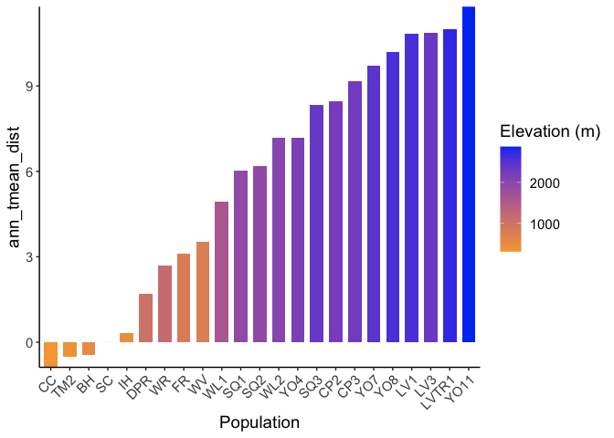<!-- -->

```r
recent_bioclim_dist %>% 
  ggplot(aes(x=fct_reorder(parent.pop, mean_diurnal_range_dist), y=mean_diurnal_range_dist, group=parent.pop, fill=elev_m)) +
  geom_col(width = 0.7,position = position_dodge(0.75)) +
  scale_y_continuous(expand = c(0, 0)) +
  scale_fill_gradient(low = "#F5A540", high = "#0043F0") +
  labs(fill="Elevation (m)",x="Population") +
  theme_classic() +
  theme(text=element_text(size=14), axis.text.x = element_text(angle = 45,  hjust = 1))
```

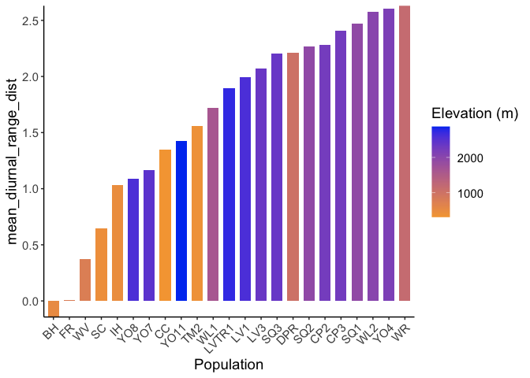<!-- -->

```r
recent_bioclim_dist %>% 
  ggplot(aes(x=fct_reorder(parent.pop, temp_seasonality_dist), y=temp_seasonality_dist, group=parent.pop, fill=elev_m)) +
  geom_col(width = 0.7,position = position_dodge(0.75)) +
  scale_y_continuous(expand = c(0, 0)) +
  scale_fill_gradient(low = "#F5A540", high = "#0043F0") +
  labs(fill="Elevation (m)",x="Population") +
  theme_classic() +
  theme(text=element_text(size=14), axis.text.x = element_text(angle = 45,  hjust = 1))
```

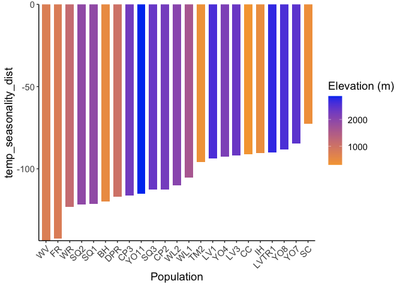<!-- -->

```r
recent_bioclim_dist %>% 
  ggplot(aes(x=fct_reorder(parent.pop, temp_ann_range_dist), y=temp_ann_range_dist, group=parent.pop, fill=elev_m)) +
  geom_col(width = 0.7,position = position_dodge(0.75)) +
  scale_y_continuous(expand = c(0, 0)) +
  scale_fill_gradient(low = "#F5A540", high = "#0043F0") +
  labs(fill="Elevation (m)",x="Population") +
  theme_classic() +
  theme(text=element_text(size=14), axis.text.x = element_text(angle = 45,  hjust = 1))
```

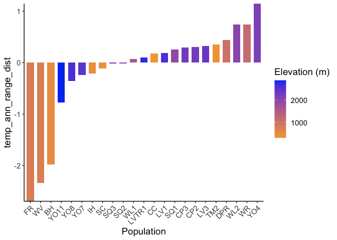<!-- -->

```r
recent_bioclim_dist %>% 
  ggplot(aes(x=fct_reorder(parent.pop, tmean_wettest_quarter_dist), y=tmean_wettest_quarter_dist, group=parent.pop, fill=elev_m)) +
  geom_col(width = 0.7,position = position_dodge(0.75)) +
  scale_y_continuous(expand = c(0, 0)) +
  scale_fill_gradient(low = "#F5A540", high = "#0043F0") +
  labs(fill="Elevation (m)",x="Population") +
  theme_classic() +
  theme(text=element_text(size=14), axis.text.x = element_text(angle = 45,  hjust = 1))
```

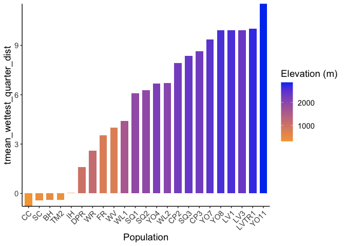<!-- -->

```r
recent_bioclim_dist %>% 
  ggplot(aes(x=fct_reorder(parent.pop, tmean_driest_quarter_dist), y=tmean_driest_quarter_dist, group=parent.pop, fill=elev_m)) +
  geom_col(width = 0.7,position = position_dodge(0.75)) +
  scale_y_continuous(expand = c(0, 0)) +
  scale_fill_gradient(low = "#F5A540", high = "#0043F0") +
  labs(fill="Elevation (m)",x="Population") +
  theme_classic() +
  theme(text=element_text(size=14), axis.text.x = element_text(angle = 45,  hjust = 1))
```

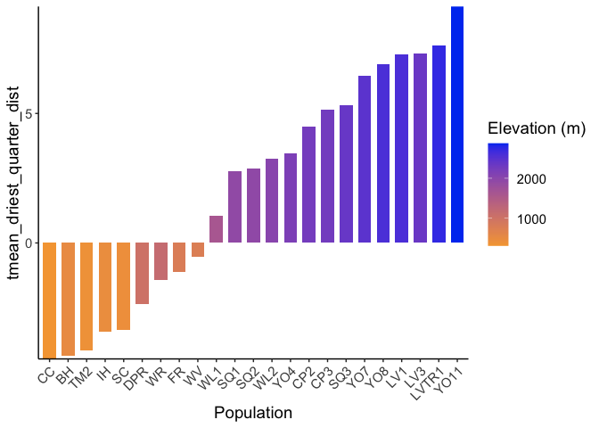<!-- -->

```r
recent_bioclim_dist %>% 
  ggplot(aes(x=fct_reorder(parent.pop, ann_ppt_dist), y=ann_ppt_dist, group=parent.pop, fill=elev_m)) +
  geom_col(width = 0.7,position = position_dodge(0.75)) +
  scale_y_continuous(expand = c(0, 0)) +
  scale_fill_gradient(low = "#F5A540", high = "#0043F0") +
  labs(fill="Elevation (m)",x="Population") +
  theme_classic() +
  theme(text=element_text(size=14), axis.text.x = element_text(angle = 45,  hjust = 1))
```

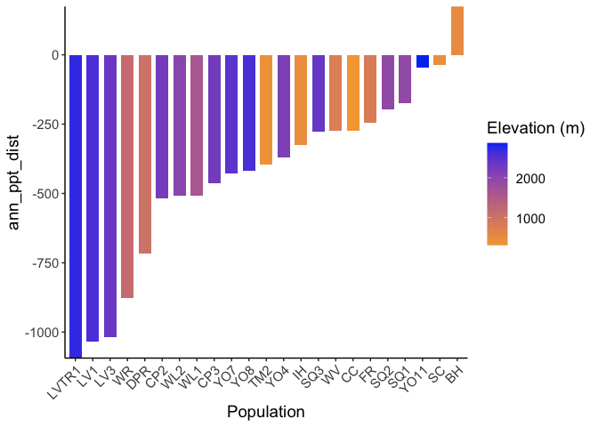<!-- -->

```r
recent_bioclim_dist %>% 
  ggplot(aes(x=fct_reorder(parent.pop, ppt_seasonality_dist), y=ppt_seasonality_dist, group=parent.pop, fill=elev_m)) +
  geom_col(width = 0.7,position = position_dodge(0.75)) +
  scale_y_continuous(expand = c(0, 0)) +
  scale_fill_gradient(low = "#F5A540", high = "#0043F0") +
  labs(fill="Elevation (m)",x="Population") +
  theme_classic() +
  theme(text=element_text(size=14), axis.text.x = element_text(angle = 45,  hjust = 1))
```

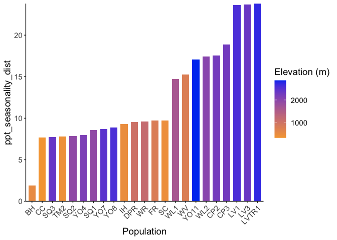<!-- -->

```r
recent_bioclim_dist %>% 
  ggplot(aes(x=fct_reorder(parent.pop, ppt_warmest_quarter_dist), y=ppt_warmest_quarter_dist, group=parent.pop, fill=elev_m)) +
  geom_col(width = 0.7,position = position_dodge(0.75)) +
  scale_y_continuous(expand = c(0, 0)) +
  scale_fill_gradient(low = "#F5A540", high = "#0043F0") +
  labs(fill="Elevation (m)",x="Population") +
  theme_classic() +
  theme(text=element_text(size=14), axis.text.x = element_text(angle = 45,  hjust = 1))
```

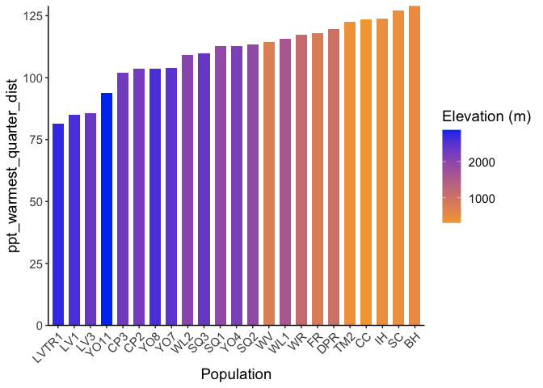<!-- -->

```r
recent_bioclim_dist %>% 
  ggplot(aes(x=fct_reorder(parent.pop, ppt_coldest_quarter_dist), y=ppt_coldest_quarter_dist, group=parent.pop, fill=elev_m)) +
  geom_col(width = 0.7,position = position_dodge(0.75)) +
  scale_y_continuous(expand = c(0, 0)) +
  scale_fill_gradient(low = "#F5A540", high = "#0043F0") +
  labs(fill="Elevation (m)",x="Population") +
  theme_classic() +
  theme(text=element_text(size=14), axis.text.x = element_text(angle = 45,  hjust = 1))
```

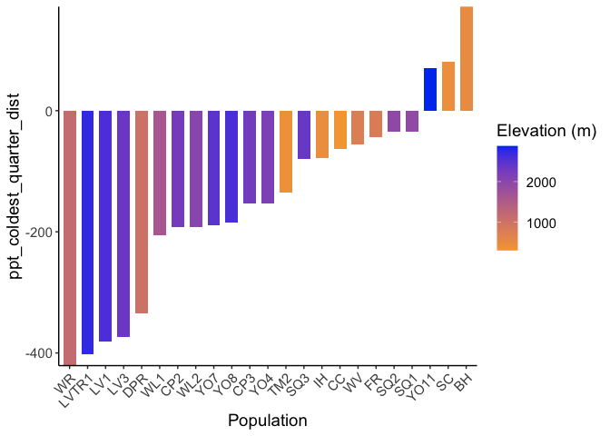<!-- -->

Historical (subtraction distance)

```r
historical_bioclim_dist %>% 
  ggplot(aes(x=fct_reorder(parent.pop, ann_tmean_dist), y=ann_tmean_dist, group=parent.pop, fill=elev_m)) +
  geom_col(width = 0.7,position = position_dodge(0.75)) +
  scale_y_continuous(expand = c(0, 0)) +
  scale_fill_gradient(low = "#F5A540", high = "#0043F0") +
  labs(fill="Elevation (m)",x="Population") +
  theme_classic() +
  theme(text=element_text(size=14), axis.text.x = element_text(angle = 45,  hjust = 1))
```

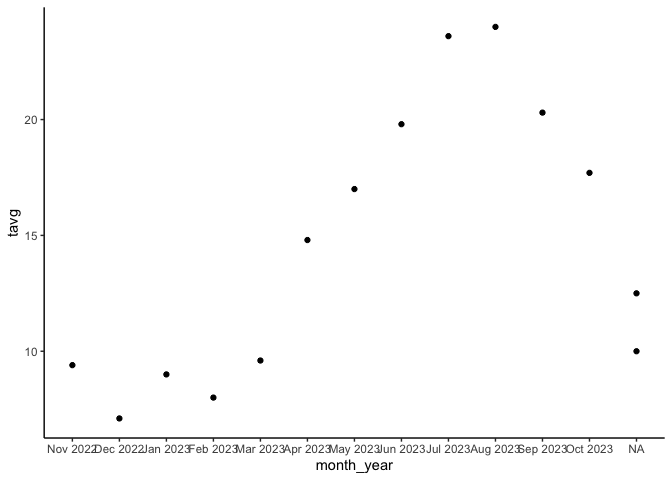<!-- -->

```r
historical_bioclim_dist %>% 
  ggplot(aes(x=fct_reorder(parent.pop, mean_diurnal_range_dist), y=mean_diurnal_range_dist, group=parent.pop, fill=elev_m)) +
  geom_col(width = 0.7,position = position_dodge(0.75)) +
  scale_y_continuous(expand = c(0, 0)) +
  scale_fill_gradient(low = "#F5A540", high = "#0043F0") +
  labs(fill="Elevation (m)",x="Population") +
  theme_classic() +
  theme(text=element_text(size=14), axis.text.x = element_text(angle = 45,  hjust = 1))
```

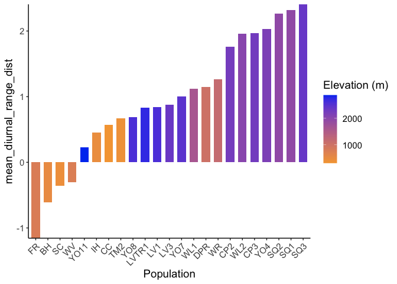<!-- -->

```r
historical_bioclim_dist %>% 
  ggplot(aes(x=fct_reorder(parent.pop, temp_seasonality_dist), y=temp_seasonality_dist, group=parent.pop, fill=elev_m)) +
  geom_col(width = 0.7,position = position_dodge(0.75)) +
  scale_y_continuous(expand = c(0, 0)) +
  scale_fill_gradient(low = "#F5A540", high = "#0043F0") +
  labs(fill="Elevation (m)",x="Population") +
  theme_classic() +
  theme(text=element_text(size=14), axis.text.x = element_text(angle = 45,  hjust = 1))
```

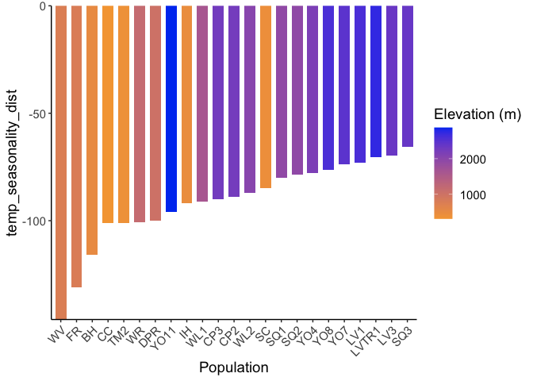<!-- -->

```r
historical_bioclim_dist %>% 
  ggplot(aes(x=fct_reorder(parent.pop, temp_ann_range_dist), y=temp_ann_range_dist, group=parent.pop, fill=elev_m)) +
  geom_col(width = 0.7,position = position_dodge(0.75)) +
  scale_y_continuous(expand = c(0, 0)) +
  scale_fill_gradient(low = "#F5A540", high = "#0043F0") +
  labs(fill="Elevation (m)",x="Population") +
  theme_classic() +
  theme(text=element_text(size=14), axis.text.x = element_text(angle = 45,  hjust = 1))
```

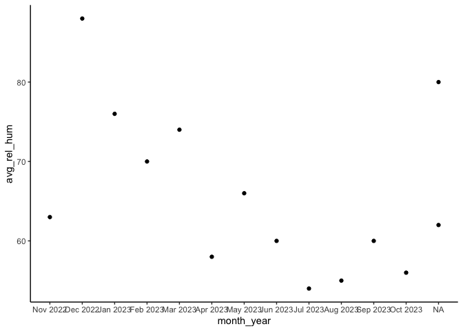<!-- -->

```r
historical_bioclim_dist %>% 
  ggplot(aes(x=fct_reorder(parent.pop, tmean_wettest_quarter_dist), y=tmean_wettest_quarter_dist, group=parent.pop, fill=elev_m)) +
  geom_col(width = 0.7,position = position_dodge(0.75)) +
  scale_y_continuous(expand = c(0, 0)) +
  scale_fill_gradient(low = "#F5A540", high = "#0043F0") +
  labs(fill="Elevation (m)",x="Population") +
  theme_classic() +
  theme(text=element_text(size=14), axis.text.x = element_text(angle = 45,  hjust = 1))
```

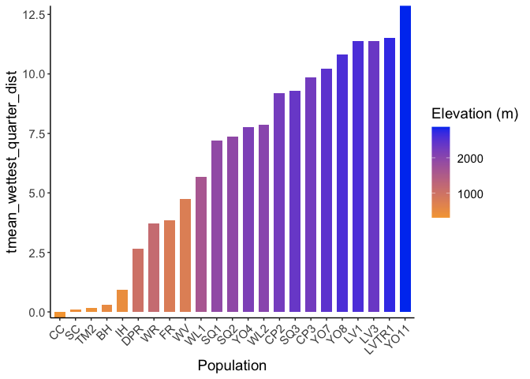<!-- -->

```r
historical_bioclim_dist %>% 
  ggplot(aes(x=fct_reorder(parent.pop, tmean_driest_quarter_dist), y=tmean_driest_quarter_dist, group=parent.pop, fill=elev_m)) +
  geom_col(width = 0.7,position = position_dodge(0.75)) +
  scale_y_continuous(expand = c(0, 0)) +
  scale_fill_gradient(low = "#F5A540", high = "#0043F0") +
  labs(fill="Elevation (m)",x="Population") +
  theme_classic() +
  theme(text=element_text(size=14), axis.text.x = element_text(angle = 45,  hjust = 1))
```

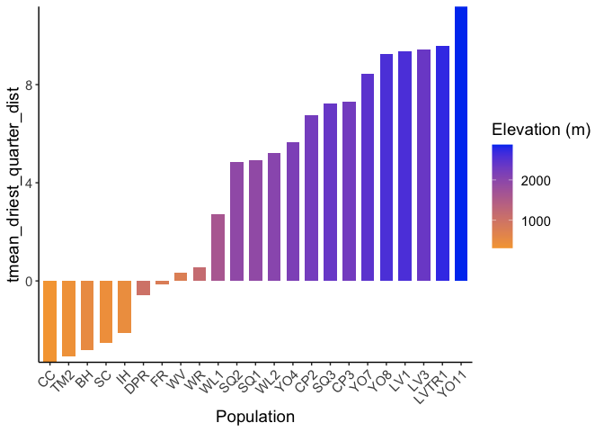<!-- -->

```r
historical_bioclim_dist %>% 
  ggplot(aes(x=fct_reorder(parent.pop, ann_ppt_dist), y=ann_ppt_dist, group=parent.pop, fill=elev_m)) +
  geom_col(width = 0.7,position = position_dodge(0.75)) +
  scale_y_continuous(expand = c(0, 0)) +
  scale_fill_gradient(low = "#F5A540", high = "#0043F0") +
  labs(fill="Elevation (m)",x="Population") +
  theme_classic() +
  theme(text=element_text(size=14), axis.text.x = element_text(angle = 45,  hjust = 1))
```

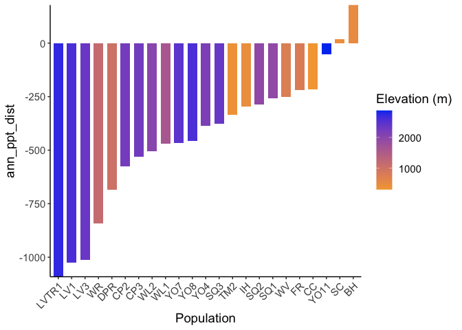<!-- -->

```r
historical_bioclim_dist %>% 
  ggplot(aes(x=fct_reorder(parent.pop, ppt_seasonality_dist), y=ppt_seasonality_dist, group=parent.pop, fill=elev_m)) +
  geom_col(width = 0.7,position = position_dodge(0.75)) +
  scale_y_continuous(expand = c(0, 0)) +
  scale_fill_gradient(low = "#F5A540", high = "#0043F0") +
  labs(fill="Elevation (m)",x="Population") +
  theme_classic() +
  theme(text=element_text(size=14), axis.text.x = element_text(angle = 45,  hjust = 1))
```

<!-- -->

```r
historical_bioclim_dist %>% 
  ggplot(aes(x=fct_reorder(parent.pop, ppt_warmest_quarter_dist), y=ppt_warmest_quarter_dist, group=parent.pop, fill=elev_m)) +
  geom_col(width = 0.7,position = position_dodge(0.75)) +
  scale_y_continuous(expand = c(0, 0)) +
  scale_fill_gradient(low = "#F5A540", high = "#0043F0") +
  labs(fill="Elevation (m)",x="Population") +
  theme_classic() +
  theme(text=element_text(size=14), axis.text.x = element_text(angle = 45,  hjust = 1))
```

<!-- -->

```r
historical_bioclim_dist %>% 
  ggplot(aes(x=fct_reorder(parent.pop, ppt_coldest_quarter_dist), y=ppt_coldest_quarter_dist, group=parent.pop, fill=elev_m)) +
  geom_col(width = 0.7,position = position_dodge(0.75)) +
  scale_y_continuous(expand = c(0, 0)) +
  scale_fill_gradient(low = "#F5A540", high = "#0043F0") +
  labs(fill="Elevation (m)",x="Population") +
  theme_classic() +
  theme(text=element_text(size=14), axis.text.x = element_text(angle = 45,  hjust = 1))
```

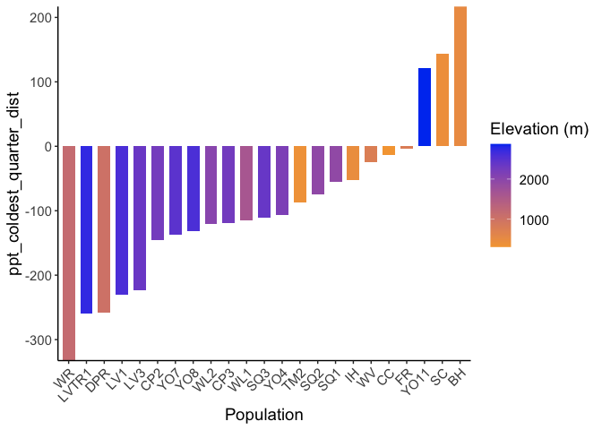<!-- -->

