To Do: 
- - Edit this code to be for all year data! - Should the distance still be from when the plants were growing? Or should it be for full 2022 and 2023?


# Climate Distance at the Davis Garden
Annual data might give a different result, worth presenting it both ways because that helps highlight the importance of the life history differences 
To get confidence intervals could do some bootstrapping - samples some of the 30 years and calculates it and so on - Julin could help with the code 


Options:

-   Basic subtraction as in Moran et al 2017 (garden site - home site)

-   Gower's environmental distance metric as in Rutter and Fenster 2007

-   From PCAs "We calculated an overall environmental distance using
    PCA, with EDij corresponding to the Euclidian distance between i and
    j based on PCA1 & PCA2." as in Moran et al 2017

## Relevant Libraries and Functions


``` r
library(raster)
```

```
## Loading required package: sp
```

``` r
library(tidyverse)
```

```
## ── Attaching core tidyverse packages ──────────────────────── tidyverse 2.0.0 ──
## ✔ dplyr     1.1.4     ✔ readr     2.1.5
## ✔ forcats   1.0.0     ✔ stringr   1.5.1
## ✔ ggplot2   3.5.1     ✔ tibble    3.2.1
## ✔ lubridate 1.9.3     ✔ tidyr     1.3.1
## ✔ purrr     1.0.2
```

```
## ── Conflicts ────────────────────────────────────────── tidyverse_conflicts() ──
## ✖ tidyr::extract() masks raster::extract()
## ✖ dplyr::filter()  masks stats::filter()
## ✖ dplyr::lag()     masks stats::lag()
## ✖ dplyr::select()  masks raster::select()
## ℹ Use the conflicted package (<http://conflicted.r-lib.org/>) to force all conflicts to become errors
```

``` r
library(conflicted)
conflicts_prefer(dplyr::select())
```

```
## [conflicted] Will prefer dplyr::select over any other package.
```

``` r
conflicts_prefer(dplyr::filter)
```

```
## [conflicted] Will prefer dplyr::filter over any other package.
```

``` r
library(ggrepel)
library(cowplot)
library(gridExtra)
library(naniar) #replaces values with NA

get_legend<-function(myggplot){
  tmp <- ggplot_gtable(ggplot_build(myggplot))
  leg <- which(sapply(tmp$grobs, function(x) x$name) == "guide-box")
  legend <- tmp$grobs[[leg]]
  return(legend)
} #legend function for grid_arrange

elev_three_palette <- c("#0043F0", "#C9727F", "#F5A540") #colors from Gremer et al 2019
elev_order <- c("High", "Mid", "Low")
```

## Home Climates

### Flint


``` r
pops_flint_avgs <- read_csv("../output/Climate/fullyear_FlintAvgs.csv")
```

```
## Rows: 46 Columns: 11
## ── Column specification ────────────────────────────────────────────────────────
## Delimiter: ","
## chr (3): parent.pop, elevation.group, TimePd
## dbl (8): elev_m, Lat, Long, cwd, pck, ppt, tmn, tmx
## 
## ℹ Use `spec()` to retrieve the full column specification for this data.
## ℹ Specify the column types or set `show_col_types = FALSE` to quiet this message.
```

``` r
head(pops_flint_avgs)
```

```
## # A tibble: 6 × 11
##   parent.pop elevation.group elev_m   Lat  Long   cwd    pck   ppt    tmn   tmx
##   <chr>      <chr>            <dbl> <dbl> <dbl> <dbl>  <dbl> <dbl>  <dbl> <dbl>
## 1 BH         Low               511.  37.4 -120.  75.9   0     48.5  8.93   23.6
## 2 CC         Low               313   39.6 -121.  59.9   0     84.3 10.0    23.3
## 3 CP2        High             2244.  38.7 -120.  62.9 218.   107.   1.18   13.4
## 4 CP3        High             2266.  38.7 -120.  46.2 236.   103.   0.529  12.6
## 5 DPR        Mid              1019.  39.2 -121.  27.5   7.63 121.   7.89   20.2
## 6 FR         Mid               787   40.0 -121.  75.5  14.1   84.9  5.70   20.1
## # ℹ 1 more variable: TimePd <chr>
```

``` r
unique(pops_flint_avgs$parent.pop) #only home pops
```

```
##  [1] "BH"    "CC"    "CP2"   "CP3"   "DPR"   "FR"    "IH"    "LV1"   "LV3"  
## [10] "LVTR1" "SC"    "SQ1"   "SQ2"   "SQ3"   "TM2"   "WL1"   "WL2"   "WR"   
## [19] "WV"    "YO11"  "YO4"   "YO7"   "YO8"
```

``` r
unique(pops_flint_avgs$TimePd) # recent and historical timeperiod 
```

```
## [1] "Recent"     "Historical"
```

``` r
pops_flint_recent_avgs <- pops_flint_avgs %>% filter(TimePd=="Recent")
head(pops_flint_recent_avgs)
```

```
## # A tibble: 6 × 11
##   parent.pop elevation.group elev_m   Lat  Long   cwd    pck   ppt    tmn   tmx
##   <chr>      <chr>            <dbl> <dbl> <dbl> <dbl>  <dbl> <dbl>  <dbl> <dbl>
## 1 BH         Low               511.  37.4 -120.  75.9   0     48.5  8.93   23.6
## 2 CC         Low               313   39.6 -121.  59.9   0     84.3 10.0    23.3
## 3 CP2        High             2244.  38.7 -120.  62.9 218.   107.   1.18   13.4
## 4 CP3        High             2266.  38.7 -120.  46.2 236.   103.   0.529  12.6
## 5 DPR        Mid              1019.  39.2 -121.  27.5   7.63 121.   7.89   20.2
## 6 FR         Mid               787   40.0 -121.  75.5  14.1   84.9  5.70   20.1
## # ℹ 1 more variable: TimePd <chr>
```

``` r
pops_flint_historic_avgs <-  pops_flint_avgs %>% filter(TimePd=="Historical")
head(pops_flint_historic_avgs)
```

```
## # A tibble: 6 × 11
##   parent.pop elevation.group elev_m   Lat  Long   cwd     pck   ppt    tmn   tmx
##   <chr>      <chr>            <dbl> <dbl> <dbl> <dbl>   <dbl> <dbl>  <dbl> <dbl>
## 1 BH         Low               511.  37.4 -120.  74.5 1.95e-2  48.3  7.74   22.9
## 2 CC         Low               313   39.6 -121.  59.7 7.93e-2  81.9  8.90   22.9
## 3 CP2        High             2244.  38.7 -120.  60.4 2.65e+2 110.  -0.305  12.5
## 4 CP3        High             2266.  38.7 -120.  43.8 2.82e+2 106.  -0.852  11.8
## 5 DPR        Mid              1019.  39.2 -121.  26.5 2.05e+1 120.   6.23   19.7
## 6 FR         Mid               787   40.0 -121.  74.0 1.92e+1  84.2  4.54   20.1
## # ℹ 1 more variable: TimePd <chr>
```

``` r
names(pops_flint_historic_avgs)
```

```
##  [1] "parent.pop"      "elevation.group" "elev_m"          "Lat"            
##  [5] "Long"            "cwd"             "pck"             "ppt"            
##  [9] "tmn"             "tmx"             "TimePd"
```

### BioClim


``` r
pops_bioclim_avgs <-  read_csv("../output/Climate/fullyear_BioClimAvgs.csv") 
```

```
## Rows: 46 Columns: 16
## ── Column specification ────────────────────────────────────────────────────────
## Delimiter: ","
## chr  (3): parent.pop, elevation.group, TimePd
## dbl (13): elev_m, Lat, Long, ann_tmean, mean_diurnal_range, temp_seasonality...
## 
## ℹ Use `spec()` to retrieve the full column specification for this data.
## ℹ Specify the column types or set `show_col_types = FALSE` to quiet this message.
```

``` r
head(pops_bioclim_avgs)
```

```
## # A tibble: 6 × 16
##   parent.pop elevation.group elev_m   Lat  Long ann_tmean mean_diurnal_range
##   <chr>      <chr>            <dbl> <dbl> <dbl>     <dbl>              <dbl>
## 1 BH         Low               511.  37.4 -120.     16.2                14.6
## 2 CC         Low               313   39.6 -121.     16.7                13.2
## 3 CP2        High             2244.  38.7 -120.      7.30               12.2
## 4 CP3        High             2266.  38.7 -120.      6.59               12.1
## 5 DPR        Mid              1019.  39.2 -121.     14.1                12.4
## 6 FR         Mid               787   40.0 -121.     12.9                14.4
## # ℹ 9 more variables: temp_seasonality <dbl>, temp_ann_range <dbl>,
## #   tmean_wettest_quarter <dbl>, tmean_driest_quarter <dbl>, ann_ppt <dbl>,
## #   ppt_seasonality <dbl>, ppt_warmest_quarter <dbl>,
## #   ppt_coldest_quarter <dbl>, TimePd <chr>
```

``` r
unique(pops_bioclim_avgs$parent.pop) #only home pops
```

```
##  [1] "BH"    "CC"    "CP2"   "CP3"   "DPR"   "FR"    "IH"    "LV1"   "LV3"  
## [10] "LVTR1" "SC"    "SQ1"   "SQ2"   "SQ3"   "TM2"   "WL1"   "WL2"   "WR"   
## [19] "WV"    "YO11"  "YO4"   "YO7"   "YO8"
```

``` r
unique(pops_bioclim_avgs$TimePd) # recent and historical timeperiod 
```

```
## [1] "Recent"     "Historical"
```

``` r
pops_bioclim_recent_avgs <- pops_bioclim_avgs %>%  filter(TimePd=="Recent")
head(pops_bioclim_recent_avgs)
```

```
## # A tibble: 6 × 16
##   parent.pop elevation.group elev_m   Lat  Long ann_tmean mean_diurnal_range
##   <chr>      <chr>            <dbl> <dbl> <dbl>     <dbl>              <dbl>
## 1 BH         Low               511.  37.4 -120.     16.2                14.6
## 2 CC         Low               313   39.6 -121.     16.7                13.2
## 3 CP2        High             2244.  38.7 -120.      7.30               12.2
## 4 CP3        High             2266.  38.7 -120.      6.59               12.1
## 5 DPR        Mid              1019.  39.2 -121.     14.1                12.4
## 6 FR         Mid               787   40.0 -121.     12.9                14.4
## # ℹ 9 more variables: temp_seasonality <dbl>, temp_ann_range <dbl>,
## #   tmean_wettest_quarter <dbl>, tmean_driest_quarter <dbl>, ann_ppt <dbl>,
## #   ppt_seasonality <dbl>, ppt_warmest_quarter <dbl>,
## #   ppt_coldest_quarter <dbl>, TimePd <chr>
```

``` r
pops_bioclim_historical_avgs <- pops_bioclim_avgs %>% filter(TimePd=="Historical")
head(pops_bioclim_historical_avgs)
```

```
## # A tibble: 6 × 16
##   parent.pop elevation.group elev_m   Lat  Long ann_tmean mean_diurnal_range
##   <chr>      <chr>            <dbl> <dbl> <dbl>     <dbl>              <dbl>
## 1 BH         Low               511.  37.4 -120.     15.3                15.2
## 2 CC         Low               313   39.6 -121.     15.9                14.0
## 3 CP2        High             2244.  38.7 -120.      6.11               12.8
## 4 CP3        High             2266.  38.7 -120.      5.45               12.6
## 5 DPR        Mid              1019.  39.2 -121.     13.0                13.5
## 6 FR         Mid               787   40.0 -121.     12.3                15.6
## # ℹ 9 more variables: temp_seasonality <dbl>, temp_ann_range <dbl>,
## #   tmean_wettest_quarter <dbl>, tmean_driest_quarter <dbl>, ann_ppt <dbl>,
## #   ppt_seasonality <dbl>, ppt_warmest_quarter <dbl>,
## #   ppt_coldest_quarter <dbl>, TimePd <chr>
```

``` r
names(pops_bioclim_historical_avgs)
```

```
##  [1] "parent.pop"            "elevation.group"       "elev_m"               
##  [4] "Lat"                   "Long"                  "ann_tmean"            
##  [7] "mean_diurnal_range"    "temp_seasonality"      "temp_ann_range"       
## [10] "tmean_wettest_quarter" "tmean_driest_quarter"  "ann_ppt"              
## [13] "ppt_seasonality"       "ppt_warmest_quarter"   "ppt_coldest_quarter"  
## [16] "TimePd"
```

## Davis Climate Data (Nov 2022-Oct 2023)

### From Flint (changed this from CIMIS)


``` r
davis_climate <- read_csv("../output/Climate/flint_climate_UCDpops.csv") %>% 
  filter(parent.pop=="UCD_Garden") %>% 
  filter(year>=2022, year<2024) %>% 
  filter(if_else(year==2022, month=="nov" | month=="dec",
                 month!="nov" & month !="dec")) %>% 
  mutate(tavg = (tmn + tmx)/2, t_diurnal = (tmx-tmn))
```

```
## Rows: 38675 Columns: 14
## ── Column specification ────────────────────────────────────────────────────────
## Delimiter: ","
## chr  (3): parent.pop, elevation.group, month
## dbl (11): elev_m, Lat, Long, year, aet, cwd, pck, pet, ppt, tmn, tmx
## 
## ℹ Use `spec()` to retrieve the full column specification for this data.
## ℹ Specify the column types or set `show_col_types = FALSE` to quiet this message.
```

``` r
head(davis_climate)
```

```
## # A tibble: 6 × 16
##   parent.pop elevation.group elev_m   Lat  Long  year month   aet   cwd   pck
##   <chr>      <chr>            <dbl> <dbl> <dbl> <dbl> <chr> <dbl> <dbl> <dbl>
## 1 UCD_Garden Low                 16  38.5 -122.  2022 dec    3.74  20.5     0
## 2 UCD_Garden Low                 16  38.5 -122.  2022 nov    3.77  33.3     0
## 3 UCD_Garden Low                 16  38.5 -122.  2023 apr   29.4   88.9     0
## 4 UCD_Garden Low                 16  38.5 -122.  2023 aug   42.4  139.      0
## 5 UCD_Garden Low                 16  38.5 -122.  2023 feb    8.57  29.9     0
## 6 UCD_Garden Low                 16  38.5 -122.  2023 jan    5.42  21.7     0
## # ℹ 6 more variables: pet <dbl>, ppt <dbl>, tmn <dbl>, tmx <dbl>, tavg <dbl>,
## #   t_diurnal <dbl>
```

``` r
summary(davis_climate)
```

```
##   parent.pop        elevation.group        elev_m        Lat       
##  Length:12          Length:12          Min.   :16   Min.   :38.53  
##  Class :character   Class :character   1st Qu.:16   1st Qu.:38.53  
##  Mode  :character   Mode  :character   Median :16   Median :38.53  
##                                        Mean   :16   Mean   :38.53  
##                                        3rd Qu.:16   3rd Qu.:38.53  
##                                        Max.   :16   Max.   :38.53  
##       Long             year         month                aet        
##  Min.   :-121.8   Min.   :2022   Length:12          Min.   : 3.740  
##  1st Qu.:-121.8   1st Qu.:2023   Class :character   1st Qu.: 5.298  
##  Median :-121.8   Median :2023   Mode  :character   Median :19.155  
##  Mean   :-121.8   Mean   :2023                      Mean   :25.706  
##  3rd Qu.:-121.8   3rd Qu.:2023                      3rd Qu.:44.822  
##  Max.   :-121.8   Max.   :2023                      Max.   :60.480  
##       cwd              pck         pet              ppt         
##  Min.   : 20.46   Min.   :0   Min.   : 24.20   Min.   :  0.000  
##  1st Qu.: 32.48   1st Qu.:0   1st Qu.: 38.15   1st Qu.:  0.415  
##  Median : 85.09   Median :0   Median :102.25   Median : 15.850  
##  Mean   : 79.91   Mean   :0   Mean   :105.62   Mean   : 60.338  
##  3rd Qu.:115.29   3rd Qu.:0   3rd Qu.:168.95   3rd Qu.: 83.745  
##  Max.   :144.82   Max.   :0   Max.   :205.30   Max.   :258.000  
##       tmn              tmx             tavg          t_diurnal    
##  Min.   : 2.360   Min.   :11.62   Min.   : 7.275   Min.   : 8.69  
##  1st Qu.: 4.497   1st Qu.:14.57   1st Qu.: 9.669   1st Qu.:11.51  
##  Median : 8.720   Median :23.41   Median :16.067   Median :14.70  
##  Mean   : 8.487   Mean   :22.48   Mean   :15.484   Mean   :13.99  
##  3rd Qu.:12.342   3rd Qu.:28.16   3rd Qu.:20.253   3rd Qu.:15.75  
##  Max.   :15.470   Max.   :34.37   Max.   :24.520   Max.   :19.75
```

``` r
davis_climate_flint <- davis_climate %>% #get the means for the variables to compare to home sites 
  summarise(cwd_Davis=mean(cwd),ppt_Davis=mean(ppt), pck_Davis=mean(pck), tmn_Davis=mean(tmn), tmx_Davis=mean(tmx))
davis_climate_flint
```

```
## # A tibble: 1 × 5
##   cwd_Davis ppt_Davis pck_Davis tmn_Davis tmx_Davis
##       <dbl>     <dbl>     <dbl>     <dbl>     <dbl>
## 1      79.9      60.3         0      8.49      22.5
```
## Davis Climate Trends

``` r
davis_climate$month <- factor(davis_climate$month, levels = c("nov","dec","jan", "feb", "mar", "apr", "may", "jun", "jul", "aug", "sep", "oct"))

davis_climate %>% 
  ggplot(aes(x=month,y=cwd)) +
  geom_point()
```

<!-- -->

``` r
davis_climate %>% 
  ggplot(aes(x=month,y=tmx)) +
  geom_point()
```

<!-- -->

``` r
davis_climate %>% 
  ggplot(aes(x=month,y=tmn)) +
  geom_point()
```

<!-- -->

``` r
davis_climate %>% 
  ggplot(aes(x=month,y=ppt)) +
  geom_point()
```

<!-- -->

### BioClim

Calculating wettest, driest, warmest, and coldest months

Note I called these "quarter" instead of month for merging with the home climate quarter data.

``` r
davis_wettest_quarter <- davis_climate %>%  
  slice_max(ppt)

davis_driest_quarter <- davis_climate %>% 
  slice_min(ppt)

davis_warmest_quarter <- davis_climate %>% 
  slice_max(tavg)

davis_coldest_quarter <- davis_climate %>%
  slice_min(tavg)
```

Bio 1, 2, 4, 7, 12, 15


``` r
bioclim_davis_calc <- davis_climate %>% 
  summarise(ann_tmean=mean(tavg),  #Bio1 - Annual Mean Temperature
            mean_diurnal_range=mean(t_diurnal), #Bio2 - Mean Diurnal Range
            temp_seasonality=sd(tavg), #Bio4 - Temperature Seasonality
            temp_ann_range=(max(tmx))-(min(tmn)), #bio7 - temp annual range
            ann_ppt=sum(ppt), #bio12 - annual precip
            ppt_seasonality=cv(ppt+1)) #bio15 - Precipitation Seasonality (+1 to avoid strange CVs for areas where mean rainfaill is < 1)
bioclim_davis_calc
```

```
## # A tibble: 1 × 6
##   ann_tmean mean_diurnal_range temp_seasonality temp_ann_range ann_ppt
##       <dbl>              <dbl>            <dbl>          <dbl>   <dbl>
## 1      15.5               14.0             6.34           32.0    724.
## # ℹ 1 more variable: ppt_seasonality <dbl>
```

Bio 8(Q), 9(Q), 18(Q), 19(Q)


``` r
#bio8 = tmean_wettest_quarter
bio8_davis <- davis_wettest_quarter %>% 
  dplyr::select(tmean_wettest_quarter=tavg)

#bio9 = tmean_driest_quarter
bio9_davis <- davis_driest_quarter %>% 
  dplyr::select(tmean_driest_quarter=tavg)

bio8_9_davis <- bind_cols(bio8_davis, bio9_davis)

#bio18 = ppt_warmest_quarter
bio18_davis <- davis_warmest_quarter %>% 
  dplyr::select(ppt_warmest_quarter=ppt)

#bio19 = ppt_coldest_quarter
bio19_davis <- davis_wettest_quarter %>% 
  dplyr::select(ppt_coldest_quarter=ppt)

bio18_19_davis <- bind_cols(bio18_davis, bio19_davis)

all_periods_davis <- bind_cols(bio8_9_davis, bio18_19_davis)
```

Merge all bioclims


``` r
davis_bioclim_final <- bind_cols(bioclim_davis_calc, all_periods_davis) %>% 
  rename_with(~paste0(., "_Davis"), 1:10)
summary(davis_bioclim_final)
```

```
##  ann_tmean_Davis mean_diurnal_range_Davis temp_seasonality_Davis
##  Min.   :15.48   Min.   :14               Min.   :6.339         
##  1st Qu.:15.48   1st Qu.:14               1st Qu.:6.339         
##  Median :15.48   Median :14               Median :6.339         
##  Mean   :15.48   Mean   :14               Mean   :6.339         
##  3rd Qu.:15.48   3rd Qu.:14               3rd Qu.:6.339         
##  Max.   :15.48   Max.   :14               Max.   :6.339         
##  temp_ann_range_Davis ann_ppt_Davis   ppt_seasonality_Davis
##  Min.   :32.01        Min.   :724.1   Min.   :144.2        
##  1st Qu.:32.01        1st Qu.:724.1   1st Qu.:144.2        
##  Median :32.01        Median :724.1   Median :144.2        
##  Mean   :32.01        Mean   :724.1   Mean   :144.2        
##  3rd Qu.:32.01        3rd Qu.:724.1   3rd Qu.:144.2        
##  Max.   :32.01        Max.   :724.1   Max.   :144.2        
##  tmean_wettest_quarter_Davis tmean_driest_quarter_Davis
##  Min.   :9.305               Min.   :24.5              
##  1st Qu.:9.305               1st Qu.:24.5              
##  Median :9.305               Median :24.5              
##  Mean   :9.305               Mean   :24.5              
##  3rd Qu.:9.305               3rd Qu.:24.5              
##  Max.   :9.305               Max.   :24.5              
##  ppt_warmest_quarter_Davis ppt_coldest_quarter_Davis
##  Min.   :0.16              Min.   :258              
##  1st Qu.:0.16              1st Qu.:258              
##  Median :0.16              Median :258              
##  Mean   :0.16              Mean   :258              
##  3rd Qu.:0.16              3rd Qu.:258              
##  Max.   :0.16              Max.   :258
```

## Gower's Climate Distance

(1/P) \* SUM ((absolute value(Ai - Bi)) / range(i)) for each variable

-   P = number of environmental variables = 13 (without CWD)

-   Ai = 30 year avg of that variable for the home site

-   Bi = Nov 2022-Oct 2023 avg of that variable for the Davis garden

-   Range(i) = maximum - minimum of that variable in the whole data set
    (across sites)

### Combine the flint and bioclim variables 


``` r
davis_climate_all <- bind_cols(davis_climate_flint, davis_bioclim_final)
dim(davis_climate_all)
```

```
## [1]  1 15
```

``` r
home_climates_all_recent <- left_join(pops_flint_recent_avgs, pops_bioclim_recent_avgs)
```

```
## Joining with `by = join_by(parent.pop, elevation.group, elev_m, Lat, Long,
## TimePd)`
```

``` r
home_climates_all_historic <- left_join(pops_flint_historic_avgs, pops_bioclim_historical_avgs)
```

```
## Joining with `by = join_by(parent.pop, elevation.group, elev_m, Lat, Long,
## TimePd)`
```

``` r
davis_home_climate_recent <- bind_cols(davis_climate_all, home_climates_all_recent)
summary(davis_home_climate_recent)
```

```
##    cwd_Davis       ppt_Davis       pck_Davis   tmn_Davis       tmx_Davis    
##  Min.   :79.91   Min.   :60.34   Min.   :0   Min.   :8.487   Min.   :22.48  
##  1st Qu.:79.91   1st Qu.:60.34   1st Qu.:0   1st Qu.:8.487   1st Qu.:22.48  
##  Median :79.91   Median :60.34   Median :0   Median :8.487   Median :22.48  
##  Mean   :79.91   Mean   :60.34   Mean   :0   Mean   :8.487   Mean   :22.48  
##  3rd Qu.:79.91   3rd Qu.:60.34   3rd Qu.:0   3rd Qu.:8.487   3rd Qu.:22.48  
##  Max.   :79.91   Max.   :60.34   Max.   :0   Max.   :8.487   Max.   :22.48  
##  ann_tmean_Davis mean_diurnal_range_Davis temp_seasonality_Davis
##  Min.   :15.48   Min.   :14               Min.   :6.339         
##  1st Qu.:15.48   1st Qu.:14               1st Qu.:6.339         
##  Median :15.48   Median :14               Median :6.339         
##  Mean   :15.48   Mean   :14               Mean   :6.339         
##  3rd Qu.:15.48   3rd Qu.:14               3rd Qu.:6.339         
##  Max.   :15.48   Max.   :14               Max.   :6.339         
##  temp_ann_range_Davis ann_ppt_Davis   ppt_seasonality_Davis
##  Min.   :32.01        Min.   :724.1   Min.   :144.2        
##  1st Qu.:32.01        1st Qu.:724.1   1st Qu.:144.2        
##  Median :32.01        Median :724.1   Median :144.2        
##  Mean   :32.01        Mean   :724.1   Mean   :144.2        
##  3rd Qu.:32.01        3rd Qu.:724.1   3rd Qu.:144.2        
##  Max.   :32.01        Max.   :724.1   Max.   :144.2        
##  tmean_wettest_quarter_Davis tmean_driest_quarter_Davis
##  Min.   :9.305               Min.   :24.5              
##  1st Qu.:9.305               1st Qu.:24.5              
##  Median :9.305               Median :24.5              
##  Mean   :9.305               Mean   :24.5              
##  3rd Qu.:9.305               3rd Qu.:24.5              
##  Max.   :9.305               Max.   :24.5              
##  ppt_warmest_quarter_Davis ppt_coldest_quarter_Davis  parent.pop       
##  Min.   :0.16              Min.   :258               Length:23         
##  1st Qu.:0.16              1st Qu.:258               Class :character  
##  Median :0.16              Median :258               Mode  :character  
##  Mean   :0.16              Mean   :258                                 
##  3rd Qu.:0.16              3rd Qu.:258                                 
##  Max.   :0.16              Max.   :258                                 
##  elevation.group        elev_m            Lat             Long       
##  Length:23          Min.   : 313.0   Min.   :36.56   Min.   :-123.0  
##  Class :character   1st Qu.: 767.9   1st Qu.:37.81   1st Qu.:-121.3  
##  Mode  :character   Median :1934.5   Median :38.79   Median :-120.3  
##                     Mean   :1649.7   Mean   :38.74   Mean   :-120.4  
##                     3rd Qu.:2363.4   3rd Qu.:39.59   3rd Qu.:-119.7  
##                     Max.   :2872.3   Max.   :40.74   Max.   :-118.8  
##       cwd             pck              ppt              tmn          
##  Min.   :27.53   Min.   :  0.00   Min.   : 48.50   Min.   :-2.57564  
##  1st Qu.:49.57   1st Qu.: 10.88   1st Qu.: 84.64   1st Qu.:-0.05428  
##  Median :55.94   Median : 65.18   Median : 94.31   Median : 3.41272  
##  Mean   :56.19   Mean   :136.70   Mean   : 99.04   Mean   : 3.61545  
##  3rd Qu.:61.78   3rd Qu.:225.93   3rd Qu.:107.40   3rd Qu.: 7.50051  
##  Max.   :75.87   Max.   :453.99   Max.   :151.23   Max.   :10.03667  
##       tmx           TimePd            ann_tmean      mean_diurnal_range
##  Min.   :10.42   Length:23          Min.   : 3.923   Min.   :11.88     
##  1st Qu.:12.65   Class :character   1st Qu.: 6.298   1st Qu.:12.25     
##  Median :15.68   Mode  :character   Median : 9.545   Median :12.71     
##  Mean   :16.50                      Mean   :10.059   Mean   :12.89     
##  3rd Qu.:20.18                      3rd Qu.:13.572   3rd Qu.:13.33     
##  Max.   :23.57                      Max.   :16.660   Max.   :14.64     
##  temp_seasonality temp_ann_range  tmean_wettest_quarter tmean_driest_quarter
##  Min.   :647.3    Min.   :30.67   Min.   :-1.6558       Min.   : 6.672      
##  1st Qu.:666.4    1st Qu.:31.55   1st Qu.: 0.2719       1st Qu.: 9.622      
##  Median :686.0    Median :31.74   Median : 3.4503       Median :12.628      
##  Mean   :681.9    Mean   :31.99   Mean   : 3.9105       Mean   :13.267      
##  3rd Qu.:694.1    3rd Qu.:32.06   3rd Qu.: 7.3811       3rd Qu.:16.829      
##  Max.   :719.8    Max.   :34.27   Max.   :10.3001       Max.   :19.894      
##     ann_ppt     ppt_seasonality ppt_warmest_quarter ppt_coldest_quarter
##  Min.   : 582   Min.   :108.1   Min.   : 47.65      Min.   :329.3      
##  1st Qu.:1016   1st Qu.:115.0   1st Qu.: 91.04      1st Qu.:550.5      
##  Median :1132   Median :122.9   Median :100.25      Median :622.8      
##  Mean   :1188   Mean   :119.7   Mean   :110.72      Mean   :620.1      
##  3rd Qu.:1289   3rd Qu.:123.9   3rd Qu.:125.81      3rd Qu.:656.0      
##  Max.   :1815   Max.   :130.2   Max.   :187.23      Max.   :860.6
```

``` r
davis_home_climate_historic <- bind_cols(davis_climate_all, home_climates_all_historic)
summary(davis_home_climate_historic)
```

```
##    cwd_Davis       ppt_Davis       pck_Davis   tmn_Davis       tmx_Davis    
##  Min.   :79.91   Min.   :60.34   Min.   :0   Min.   :8.487   Min.   :22.48  
##  1st Qu.:79.91   1st Qu.:60.34   1st Qu.:0   1st Qu.:8.487   1st Qu.:22.48  
##  Median :79.91   Median :60.34   Median :0   Median :8.487   Median :22.48  
##  Mean   :79.91   Mean   :60.34   Mean   :0   Mean   :8.487   Mean   :22.48  
##  3rd Qu.:79.91   3rd Qu.:60.34   3rd Qu.:0   3rd Qu.:8.487   3rd Qu.:22.48  
##  Max.   :79.91   Max.   :60.34   Max.   :0   Max.   :8.487   Max.   :22.48  
##  ann_tmean_Davis mean_diurnal_range_Davis temp_seasonality_Davis
##  Min.   :15.48   Min.   :14               Min.   :6.339         
##  1st Qu.:15.48   1st Qu.:14               1st Qu.:6.339         
##  Median :15.48   Median :14               Median :6.339         
##  Mean   :15.48   Mean   :14               Mean   :6.339         
##  3rd Qu.:15.48   3rd Qu.:14               3rd Qu.:6.339         
##  Max.   :15.48   Max.   :14               Max.   :6.339         
##  temp_ann_range_Davis ann_ppt_Davis   ppt_seasonality_Davis
##  Min.   :32.01        Min.   :724.1   Min.   :144.2        
##  1st Qu.:32.01        1st Qu.:724.1   1st Qu.:144.2        
##  Median :32.01        Median :724.1   Median :144.2        
##  Mean   :32.01        Mean   :724.1   Mean   :144.2        
##  3rd Qu.:32.01        3rd Qu.:724.1   3rd Qu.:144.2        
##  Max.   :32.01        Max.   :724.1   Max.   :144.2        
##  tmean_wettest_quarter_Davis tmean_driest_quarter_Davis
##  Min.   :9.305               Min.   :24.5              
##  1st Qu.:9.305               1st Qu.:24.5              
##  Median :9.305               Median :24.5              
##  Mean   :9.305               Mean   :24.5              
##  3rd Qu.:9.305               3rd Qu.:24.5              
##  Max.   :9.305               Max.   :24.5              
##  ppt_warmest_quarter_Davis ppt_coldest_quarter_Davis  parent.pop       
##  Min.   :0.16              Min.   :258               Length:23         
##  1st Qu.:0.16              1st Qu.:258               Class :character  
##  Median :0.16              Median :258               Mode  :character  
##  Mean   :0.16              Mean   :258                                 
##  3rd Qu.:0.16              3rd Qu.:258                                 
##  Max.   :0.16              Max.   :258                                 
##  elevation.group        elev_m            Lat             Long       
##  Length:23          Min.   : 313.0   Min.   :36.56   Min.   :-123.0  
##  Class :character   1st Qu.: 767.9   1st Qu.:37.81   1st Qu.:-121.3  
##  Mode  :character   Median :1934.5   Median :38.79   Median :-120.3  
##                     Mean   :1649.7   Mean   :38.74   Mean   :-120.4  
##                     3rd Qu.:2363.4   3rd Qu.:39.59   3rd Qu.:-119.7  
##                     Max.   :2872.3   Max.   :40.74   Max.   :-118.8  
##       cwd             pck                ppt              tmn        
##  Min.   :26.47   Min.   :  0.0195   Min.   : 48.25   Min.   :-4.694  
##  1st Qu.:47.93   1st Qu.: 19.8433   1st Qu.: 84.22   1st Qu.:-1.402  
##  Median :52.70   Median : 86.8927   Median : 94.60   Median : 2.027  
##  Mean   :53.88   Mean   :161.6397   Mean   : 99.71   Mean   : 2.121  
##  3rd Qu.:60.04   3rd Qu.:266.3463   3rd Qu.:107.97   3rd Qu.: 5.722  
##  Max.   :74.53   Max.   :529.1297   Max.   :154.83   Max.   : 8.898  
##       tmx            TimePd            ann_tmean      mean_diurnal_range
##  Min.   : 9.685   Length:23          Min.   : 2.496   Min.   :12.18     
##  1st Qu.:11.708   Class :character   1st Qu.: 5.153   1st Qu.:12.73     
##  Median :14.359   Mode  :character   Median : 8.193   Median :13.79     
##  Mean   :15.762                      Mean   : 8.942   Mean   :13.64     
##  3rd Qu.:19.896                      3rd Qu.:12.640   3rd Qu.:14.10     
##  Max.   :22.948                      Max.   :15.919   Max.   :15.56     
##  temp_seasonality temp_ann_range  tmean_wettest_quarter tmean_driest_quarter
##  Min.   :638.7    Min.   :30.59   Min.   :-3.350        Min.   : 5.388      
##  1st Qu.:650.4    1st Qu.:31.66   1st Qu.:-0.519        1st Qu.: 8.519      
##  Median :662.1    Median :32.53   Median : 2.350        Median :11.322      
##  Mean   :663.3    Mean   :32.64   Mean   : 3.045        Mean   :12.303      
##  3rd Qu.:671.7    3rd Qu.:33.30   3rd Qu.: 6.087        3rd Qu.:16.264      
##  Max.   :718.9    Max.   :35.29   Max.   : 9.625        Max.   :19.303      
##     ann_ppt     ppt_seasonality ppt_warmest_quarter ppt_coldest_quarter
##  Min.   : 579   Min.   :104.4   Min.   : 64.71      Min.   :285.3      
##  1st Qu.:1011   1st Qu.:108.1   1st Qu.:103.40      1st Qu.:511.0      
##  Median :1135   Median :115.8   Median :117.04      Median :581.0      
##  Mean   :1197   Mean   :114.0   Mean   :129.93      Mean   :579.6      
##  3rd Qu.:1296   3rd Qu.:118.9   3rd Qu.:148.38      3rd Qu.:627.3      
##  Max.   :1858   Max.   :122.8   Max.   :228.91      Max.   :802.3
```

``` r
names(davis_home_climate_historic)
```

```
##  [1] "cwd_Davis"                   "ppt_Davis"                  
##  [3] "pck_Davis"                   "tmn_Davis"                  
##  [5] "tmx_Davis"                   "ann_tmean_Davis"            
##  [7] "mean_diurnal_range_Davis"    "temp_seasonality_Davis"     
##  [9] "temp_ann_range_Davis"        "ann_ppt_Davis"              
## [11] "ppt_seasonality_Davis"       "tmean_wettest_quarter_Davis"
## [13] "tmean_driest_quarter_Davis"  "ppt_warmest_quarter_Davis"  
## [15] "ppt_coldest_quarter_Davis"   "parent.pop"                 
## [17] "elevation.group"             "elev_m"                     
## [19] "Lat"                         "Long"                       
## [21] "cwd"                         "pck"                        
## [23] "ppt"                         "tmn"                        
## [25] "tmx"                         "TimePd"                     
## [27] "ann_tmean"                   "mean_diurnal_range"         
## [29] "temp_seasonality"            "temp_ann_range"             
## [31] "tmean_wettest_quarter"       "tmean_driest_quarter"       
## [33] "ann_ppt"                     "ppt_seasonality"            
## [35] "ppt_warmest_quarter"         "ppt_coldest_quarter"
```

### Figure out the range for each variable 


``` r
davis_range_prep <- davis_climate_all %>% 
  mutate(parent.pop="Davis") %>% 
  rename_with(~str_remove(., "_Davis"), everything())
```

#### Recent

``` r
range_merge_recent <- bind_rows(home_climates_all_recent, davis_range_prep)
names(range_merge_recent)
```

```
##  [1] "parent.pop"            "elevation.group"       "elev_m"               
##  [4] "Lat"                   "Long"                  "cwd"                  
##  [7] "pck"                   "ppt"                   "tmn"                  
## [10] "tmx"                   "TimePd"                "ann_tmean"            
## [13] "mean_diurnal_range"    "temp_seasonality"      "temp_ann_range"       
## [16] "tmean_wettest_quarter" "tmean_driest_quarter"  "ann_ppt"              
## [19] "ppt_seasonality"       "ppt_warmest_quarter"   "ppt_coldest_quarter"
```

``` r
summary(range_merge_recent)
```

```
##   parent.pop        elevation.group        elev_m            Lat       
##  Length:24          Length:24          Min.   : 313.0   Min.   :36.56  
##  Class :character   Class :character   1st Qu.: 767.9   1st Qu.:37.81  
##  Mode  :character   Mode  :character   Median :1934.5   Median :38.79  
##                                        Mean   :1649.7   Mean   :38.74  
##                                        3rd Qu.:2363.4   3rd Qu.:39.59  
##                                        Max.   :2872.3   Max.   :40.74  
##                                        NA's   :1        NA's   :1      
##       Long             cwd             pck               ppt        
##  Min.   :-123.0   Min.   :27.53   Min.   :  0.000   Min.   : 48.50  
##  1st Qu.:-121.3   1st Qu.:49.70   1st Qu.:  5.766   1st Qu.: 83.25  
##  Median :-120.3   Median :55.99   Median : 64.300   Median : 94.24  
##  Mean   :-120.4   Mean   :57.18   Mean   :131.008   Mean   : 97.42  
##  3rd Qu.:-119.7   3rd Qu.:64.21   3rd Qu.:221.850   3rd Qu.:107.37  
##  Max.   :-118.8   Max.   :79.91   Max.   :453.994   Max.   :151.23  
##  NA's   :1                                                          
##       tmn               tmx           TimePd            ann_tmean     
##  Min.   :-2.5756   Min.   :10.42   Length:24          Min.   : 3.923  
##  1st Qu.: 0.2372   1st Qu.:12.65   Class :character   1st Qu.: 6.442  
##  Median : 3.5736   Median :15.72   Mode  :character   Median : 9.647  
##  Mean   : 3.8184   Mean   :16.75                      Mean   :10.285  
##  3rd Qu.: 8.0370   3rd Qu.:20.73                      3rd Qu.:14.409  
##  Max.   :10.0367   Max.   :23.57                      Max.   :16.660  
##                                                                       
##  mean_diurnal_range temp_seasonality  temp_ann_range  tmean_wettest_quarter
##  Min.   :11.88      Min.   :  6.339   Min.   :30.67   Min.   :-1.6558      
##  1st Qu.:12.25      1st Qu.:666.004   1st Qu.:31.55   1st Qu.: 0.3846      
##  Median :12.74      Median :683.786   Median :31.75   Median : 3.6046      
##  Mean   :12.93      Mean   :653.725   Mean   :31.99   Mean   : 4.1352      
##  3rd Qu.:13.41      3rd Qu.:692.852   3rd Qu.:32.05   3rd Qu.: 8.2134      
##  Max.   :14.64      Max.   :719.817   Max.   :34.27   Max.   :10.3001      
##                                                                            
##  tmean_driest_quarter    ann_ppt     ppt_seasonality ppt_warmest_quarter
##  Min.   : 6.672       Min.   : 582   Min.   :108.1   Min.   :  0.16     
##  1st Qu.: 9.889       1st Qu.: 999   1st Qu.:115.0   1st Qu.: 88.95     
##  Median :12.795       Median :1131   Median :123.1   Median : 99.21     
##  Mean   :13.734       Mean   :1169   Mean   :120.8   Mean   :106.11     
##  3rd Qu.:17.657       3rd Qu.:1288   3rd Qu.:124.0   3rd Qu.:124.94     
##  Max.   :24.495       Max.   :1815   Max.   :144.2   Max.   :187.23     
##                                                                         
##  ppt_coldest_quarter
##  Min.   :258.0      
##  1st Qu.:540.4      
##  Median :617.4      
##  Mean   :605.1      
##  3rd Qu.:655.9      
##  Max.   :860.6      
## 
```

``` r
davis_home_climate_ranges_recent <- range_merge_recent %>% 
  summarise(cwd_range=max(cwd)-min(cwd),
            ppt_range=max(ppt)-min(ppt), 
            tmn_range=max(tmn)-min(tmn), 
            tmx_range=max(tmx)-min(tmx), 
            ann_tmean_range=max(ann_tmean)-min(ann_tmean),
            mean_diurnal_range_range=max(mean_diurnal_range)-min(mean_diurnal_range),
            temp_seasonality_range=max(temp_seasonality)-min(temp_seasonality),
            temp_ann_range_range=max(temp_ann_range)-min(temp_ann_range),
            tmean_wettest_quarter_range=max(tmean_wettest_quarter)-min(tmean_wettest_quarter),
            tmean_driest_quarter_range=max(tmean_driest_quarter)-min(tmean_driest_quarter),
            ann_ppt_range=max(ann_ppt)-min(ann_ppt), 
            ppt_seasonality_range=max(ppt_seasonality)-min(ppt_seasonality),
            ppt_warmest_quarter_range=max(ppt_warmest_quarter)-min(ppt_warmest_quarter), 
            ppt_coldest_quarter_range=max(ppt_coldest_quarter)-min(ppt_coldest_quarter))
davis_home_climate_ranges_recent
```

```
## # A tibble: 1 × 14
##   cwd_range ppt_range tmn_range tmx_range ann_tmean_range mean_diurnal_range_r…¹
##       <dbl>     <dbl>     <dbl>     <dbl>           <dbl>                  <dbl>
## 1      52.4      103.      12.6      13.1            12.7                   2.76
## # ℹ abbreviated name: ¹​mean_diurnal_range_range
## # ℹ 8 more variables: temp_seasonality_range <dbl>, temp_ann_range_range <dbl>,
## #   tmean_wettest_quarter_range <dbl>, tmean_driest_quarter_range <dbl>,
## #   ann_ppt_range <dbl>, ppt_seasonality_range <dbl>,
## #   ppt_warmest_quarter_range <dbl>, ppt_coldest_quarter_range <dbl>
```

``` r
davis_home_climate_with_ranges_recent <- bind_cols(davis_home_climate_recent, davis_home_climate_ranges_recent)
names(davis_home_climate_with_ranges_recent)
```

```
##  [1] "cwd_Davis"                   "ppt_Davis"                  
##  [3] "pck_Davis"                   "tmn_Davis"                  
##  [5] "tmx_Davis"                   "ann_tmean_Davis"            
##  [7] "mean_diurnal_range_Davis"    "temp_seasonality_Davis"     
##  [9] "temp_ann_range_Davis"        "ann_ppt_Davis"              
## [11] "ppt_seasonality_Davis"       "tmean_wettest_quarter_Davis"
## [13] "tmean_driest_quarter_Davis"  "ppt_warmest_quarter_Davis"  
## [15] "ppt_coldest_quarter_Davis"   "parent.pop"                 
## [17] "elevation.group"             "elev_m"                     
## [19] "Lat"                         "Long"                       
## [21] "cwd"                         "pck"                        
## [23] "ppt"                         "tmn"                        
## [25] "tmx"                         "TimePd"                     
## [27] "ann_tmean"                   "mean_diurnal_range"         
## [29] "temp_seasonality"            "temp_ann_range"             
## [31] "tmean_wettest_quarter"       "tmean_driest_quarter"       
## [33] "ann_ppt"                     "ppt_seasonality"            
## [35] "ppt_warmest_quarter"         "ppt_coldest_quarter"        
## [37] "cwd_range"                   "ppt_range"                  
## [39] "tmn_range"                   "tmx_range"                  
## [41] "ann_tmean_range"             "mean_diurnal_range_range"   
## [43] "temp_seasonality_range"      "temp_ann_range_range"       
## [45] "tmean_wettest_quarter_range" "tmean_driest_quarter_range" 
## [47] "ann_ppt_range"               "ppt_seasonality_range"      
## [49] "ppt_warmest_quarter_range"   "ppt_coldest_quarter_range"
```

#### Historic

``` r
range_merge_historic <- bind_rows(home_climates_all_historic, davis_range_prep)
names(range_merge_historic)
```

```
##  [1] "parent.pop"            "elevation.group"       "elev_m"               
##  [4] "Lat"                   "Long"                  "cwd"                  
##  [7] "pck"                   "ppt"                   "tmn"                  
## [10] "tmx"                   "TimePd"                "ann_tmean"            
## [13] "mean_diurnal_range"    "temp_seasonality"      "temp_ann_range"       
## [16] "tmean_wettest_quarter" "tmean_driest_quarter"  "ann_ppt"              
## [19] "ppt_seasonality"       "ppt_warmest_quarter"   "ppt_coldest_quarter"
```

``` r
summary(range_merge_historic)
```

```
##   parent.pop        elevation.group        elev_m            Lat       
##  Length:24          Length:24          Min.   : 313.0   Min.   :36.56  
##  Class :character   Class :character   1st Qu.: 767.9   1st Qu.:37.81  
##  Mode  :character   Mode  :character   Median :1934.5   Median :38.79  
##                                        Mean   :1649.7   Mean   :38.74  
##                                        3rd Qu.:2363.4   3rd Qu.:39.59  
##                                        Max.   :2872.3   Max.   :40.74  
##                                        NA's   :1        NA's   :1      
##       Long             cwd             pck              ppt        
##  Min.   :-123.0   Min.   :26.47   Min.   :  0.00   Min.   : 48.25  
##  1st Qu.:-121.3   1st Qu.:48.59   1st Qu.: 14.78   1st Qu.: 84.12  
##  Median :-120.3   Median :52.87   Median : 84.87   Median : 94.19  
##  Mean   :-120.4   Mean   :54.97   Mean   :154.90   Mean   : 98.07  
##  3rd Qu.:-119.7   3rd Qu.:61.48   3rd Qu.:265.57   3rd Qu.:106.98  
##  Max.   :-118.8   Max.   :79.91   Max.   :529.13   Max.   :154.83  
##  NA's   :1                                                         
##       tmn              tmx            TimePd            ann_tmean     
##  Min.   :-4.694   Min.   : 9.685   Length:24          Min.   : 2.496  
##  1st Qu.:-1.127   1st Qu.:11.735   Class :character   1st Qu.: 5.304  
##  Median : 2.072   Median :14.376   Mode  :character   Median : 8.224  
##  Mean   : 2.386   Mean   :16.042                      Mean   : 9.214  
##  3rd Qu.: 6.591   3rd Qu.:20.537                      3rd Qu.:13.408  
##  Max.   : 8.898   Max.   :22.948                      Max.   :15.919  
##                                                                       
##  mean_diurnal_range temp_seasonality  temp_ann_range  tmean_wettest_quarter
##  Min.   :12.18      Min.   :  6.339   Min.   :30.59   Min.   :-3.3496      
##  1st Qu.:12.77      1st Qu.:649.099   1st Qu.:31.69   1st Qu.:-0.3841      
##  Median :13.80      Median :660.972   Median :32.45   Median : 2.4707      
##  Mean   :13.66      Mean   :635.897   Mean   :32.61   Mean   : 3.3061      
##  3rd Qu.:14.07      3rd Qu.:671.620   3rd Qu.:33.28   3rd Qu.: 6.8911      
##  Max.   :15.56      Max.   :718.931   Max.   :35.29   Max.   : 9.6246      
##                                                                            
##  tmean_driest_quarter    ann_ppt     ppt_seasonality ppt_warmest_quarter
##  Min.   : 5.388       Min.   : 579   Min.   :104.4   Min.   :  0.16     
##  1st Qu.: 8.670       1st Qu.:1009   1st Qu.:108.3   1st Qu.: 99.10     
##  Median :11.347       Median :1130   Median :115.9   Median :116.95     
##  Mean   :12.811       Mean   :1177   Mean   :115.2   Mean   :124.53     
##  3rd Qu.:16.945       3rd Qu.:1284   3rd Qu.:118.9   3rd Qu.:148.35     
##  Max.   :24.495       Max.   :1858   Max.   :144.2   Max.   :228.91     
##                                                                         
##  ppt_coldest_quarter
##  Min.   :258.0      
##  1st Qu.:505.0      
##  Median :577.0      
##  Mean   :566.2      
##  3rd Qu.:622.6      
##  Max.   :802.3      
## 
```

``` r
davis_home_climate_ranges_historic <- range_merge_historic %>% 
  summarise(cwd_range=max(cwd)-min(cwd),
            ppt_range=max(ppt)-min(ppt), 
            tmn_range=max(tmn)-min(tmn), 
            tmx_range=max(tmx)-min(tmx), 
            ann_tmean_range=max(ann_tmean)-min(ann_tmean),
            mean_diurnal_range_range=max(mean_diurnal_range)-min(mean_diurnal_range),
            temp_seasonality_range=max(temp_seasonality)-min(temp_seasonality),
            temp_ann_range_range=max(temp_ann_range)-min(temp_ann_range),
            tmean_wettest_quarter_range=max(tmean_wettest_quarter)-min(tmean_wettest_quarter),
            tmean_driest_quarter_range=max(tmean_driest_quarter)-min(tmean_driest_quarter),
            ann_ppt_range=max(ann_ppt)-min(ann_ppt), 
            ppt_seasonality_range=max(ppt_seasonality)-min(ppt_seasonality),
            ppt_warmest_quarter_range=max(ppt_warmest_quarter)-min(ppt_warmest_quarter), 
            ppt_coldest_quarter_range=max(ppt_coldest_quarter)-min(ppt_coldest_quarter))
davis_home_climate_ranges_historic
```

```
## # A tibble: 1 × 14
##   cwd_range ppt_range tmn_range tmx_range ann_tmean_range mean_diurnal_range_r…¹
##       <dbl>     <dbl>     <dbl>     <dbl>           <dbl>                  <dbl>
## 1      53.4      107.      13.6      13.3            13.4                   3.38
## # ℹ abbreviated name: ¹​mean_diurnal_range_range
## # ℹ 8 more variables: temp_seasonality_range <dbl>, temp_ann_range_range <dbl>,
## #   tmean_wettest_quarter_range <dbl>, tmean_driest_quarter_range <dbl>,
## #   ann_ppt_range <dbl>, ppt_seasonality_range <dbl>,
## #   ppt_warmest_quarter_range <dbl>, ppt_coldest_quarter_range <dbl>
```

``` r
davis_home_climate_with_ranges_historic <- bind_cols(davis_home_climate_historic, davis_home_climate_ranges_historic)
names(davis_home_climate_with_ranges_historic)
```

```
##  [1] "cwd_Davis"                   "ppt_Davis"                  
##  [3] "pck_Davis"                   "tmn_Davis"                  
##  [5] "tmx_Davis"                   "ann_tmean_Davis"            
##  [7] "mean_diurnal_range_Davis"    "temp_seasonality_Davis"     
##  [9] "temp_ann_range_Davis"        "ann_ppt_Davis"              
## [11] "ppt_seasonality_Davis"       "tmean_wettest_quarter_Davis"
## [13] "tmean_driest_quarter_Davis"  "ppt_warmest_quarter_Davis"  
## [15] "ppt_coldest_quarter_Davis"   "parent.pop"                 
## [17] "elevation.group"             "elev_m"                     
## [19] "Lat"                         "Long"                       
## [21] "cwd"                         "pck"                        
## [23] "ppt"                         "tmn"                        
## [25] "tmx"                         "TimePd"                     
## [27] "ann_tmean"                   "mean_diurnal_range"         
## [29] "temp_seasonality"            "temp_ann_range"             
## [31] "tmean_wettest_quarter"       "tmean_driest_quarter"       
## [33] "ann_ppt"                     "ppt_seasonality"            
## [35] "ppt_warmest_quarter"         "ppt_coldest_quarter"        
## [37] "cwd_range"                   "ppt_range"                  
## [39] "tmn_range"                   "tmx_range"                  
## [41] "ann_tmean_range"             "mean_diurnal_range_range"   
## [43] "temp_seasonality_range"      "temp_ann_range_range"       
## [45] "tmean_wettest_quarter_range" "tmean_driest_quarter_range" 
## [47] "ann_ppt_range"               "ppt_seasonality_range"      
## [49] "ppt_warmest_quarter_range"   "ppt_coldest_quarter_range"
```

### Recent Gowers Calc

``` r
gowers_calc_each_var_recent <- davis_home_climate_with_ranges_recent %>% 
  mutate(cwd_gowers=abs(cwd_Davis-cwd) / cwd_range,
         ppt_gowers=abs(ppt_Davis - ppt) / ppt_range,
         tmn_gowers=abs(tmn_Davis - tmn) / tmn_range,
         tmx_gowers=abs(tmx_Davis - tmx) / tmx_range,
         ann_tmean_gowers=abs(ann_tmean_Davis - ann_tmean) / ann_tmean_range,
         mean_diurnal_range_gowers=abs(mean_diurnal_range_Davis - mean_diurnal_range) / mean_diurnal_range_range,
         temp_seasonality_gowers=abs(temp_seasonality_Davis - temp_seasonality) / temp_seasonality_range,
         temp_ann_range_gowers=abs(temp_ann_range_Davis - temp_ann_range) / temp_ann_range_range,
         tmean_wettest_quarter_gowers=abs(tmean_wettest_quarter_Davis - tmean_wettest_quarter) / tmean_wettest_quarter_range,
         tmean_driest_quarter_gowers=abs(tmean_driest_quarter_Davis - tmean_driest_quarter) / tmean_driest_quarter_range,
         ann_ppt_gowers=abs(ann_ppt_Davis - ann_ppt) / ann_ppt_range,
         ppt_seasonality_gowers=abs(ppt_seasonality_Davis - ppt_seasonality) / ppt_seasonality_range,
         ppt_warmest_quarter_gowers=abs(ppt_warmest_quarter_Davis - ppt_warmest_quarter) / ppt_warmest_quarter_range,
         ppt_coldest_quarter_gowers=abs(ppt_coldest_quarter_Davis - ppt_coldest_quarter) / ppt_coldest_quarter_range) %>% 
  dplyr::select(parent.pop, elevation.group, elev_m, ends_with("_gowers"))

gowers_calc_per_pop_recent <- gowers_calc_each_var_recent %>% 
  mutate(Recent_Gowers_Dist=(1/14)*(cwd_gowers + ppt_gowers + tmn_gowers + tmx_gowers +
                                ann_tmean_gowers + mean_diurnal_range_gowers +
                                temp_seasonality_gowers +temp_ann_range_gowers +
                                tmean_wettest_quarter_gowers +
                                tmean_driest_quarter_gowers +ann_ppt_gowers +
                                ppt_seasonality_gowers + ppt_warmest_quarter_gowers +
                                ppt_coldest_quarter_gowers)) %>% 
  dplyr::select(parent.pop, elevation.group, elev_m, Recent_Gowers_Dist)

gowers_calc_per_pop_recent
```

```
## # A tibble: 23 × 4
##    parent.pop elevation.group elev_m Recent_Gowers_Dist
##    <chr>      <chr>            <dbl>              <dbl>
##  1 BH         Low               511.              0.235
##  2 CC         Low               313               0.301
##  3 CP2        High             2244.              0.606
##  4 CP3        High             2266.              0.641
##  5 DPR        Mid              1019.              0.492
##  6 FR         Mid               787               0.374
##  7 IH         Low               454.              0.303
##  8 LV1        High             2593.              0.780
##  9 LV3        High             2354.              0.785
## 10 LVTR1      High             2741.              0.790
## # ℹ 13 more rows
```

### Historic Gowers Calc

``` r
gowers_calc_each_var_historic <- davis_home_climate_with_ranges_historic %>% 
  mutate(cwd_gowers=abs(cwd_Davis-cwd) / cwd_range,
         ppt_gowers=abs(ppt_Davis - ppt) / ppt_range,
         tmn_gowers=abs(tmn_Davis - tmn) / tmn_range,
         tmx_gowers=abs(tmx_Davis - tmx) / tmx_range,
         ann_tmean_gowers=abs(ann_tmean_Davis - ann_tmean) / ann_tmean_range,
         mean_diurnal_range_gowers=abs(mean_diurnal_range_Davis - mean_diurnal_range) / mean_diurnal_range_range,
         temp_seasonality_gowers=abs(temp_seasonality_Davis - temp_seasonality) / temp_seasonality_range,
         temp_ann_range_gowers=abs(temp_ann_range_Davis - temp_ann_range) / temp_ann_range_range,
         tmean_wettest_quarter_gowers=abs(tmean_wettest_quarter_Davis - tmean_wettest_quarter) / tmean_wettest_quarter_range,
         tmean_driest_quarter_gowers=abs(tmean_driest_quarter_Davis - tmean_driest_quarter) / tmean_driest_quarter_range,
         ann_ppt_gowers=abs(ann_ppt_Davis - ann_ppt) / ann_ppt_range,
         ppt_seasonality_gowers=abs(ppt_seasonality_Davis - ppt_seasonality) / ppt_seasonality_range,
         ppt_warmest_quarter_gowers=abs(ppt_warmest_quarter_Davis - ppt_warmest_quarter) / ppt_warmest_quarter_range,
         ppt_coldest_quarter_gowers=abs(ppt_coldest_quarter_Davis - ppt_coldest_quarter) / ppt_coldest_quarter_range) %>% 
  dplyr::select(parent.pop, elevation.group, elev_m, ends_with("_gowers"))

  
gowers_calc_per_pop_historic <- gowers_calc_each_var_historic %>% 
  mutate(Historic_Gowers_Dist=(1/14)*(cwd_gowers + ppt_gowers + tmn_gowers + tmx_gowers +
                                ann_tmean_gowers + mean_diurnal_range_gowers +
                                temp_seasonality_gowers +temp_ann_range_gowers +
                                tmean_wettest_quarter_gowers +
                                tmean_driest_quarter_gowers +ann_ppt_gowers +
                                ppt_seasonality_gowers + ppt_warmest_quarter_gowers +
                                ppt_coldest_quarter_gowers)) %>% 
  dplyr::select(parent.pop, elevation.group, elev_m, Historic_Gowers_Dist)

gowers_calc_per_pop_historic
```

```
## # A tibble: 23 × 4
##    parent.pop elevation.group elev_m Historic_Gowers_Dist
##    <chr>      <chr>            <dbl>                <dbl>
##  1 BH         Low               511.                0.245
##  2 CC         Low               313                 0.276
##  3 CP2        High             2244.                0.606
##  4 CP3        High             2266.                0.643
##  5 DPR        Mid              1019.                0.473
##  6 FR         Mid               787                 0.408
##  7 IH         Low               454.                0.316
##  8 LV1        High             2593.                0.778
##  9 LV3        High             2354.                0.780
## 10 LVTR1      High             2741.                0.788
## # ℹ 13 more rows
```

### Merge recent and historic

``` r
gowers_all_time <- full_join(gowers_calc_per_pop_recent, gowers_calc_per_pop_historic)
```

```
## Joining with `by = join_by(parent.pop, elevation.group, elev_m)`
```

``` r
gowers_all_time
```

```
## # A tibble: 23 × 5
##    parent.pop elevation.group elev_m Recent_Gowers_Dist Historic_Gowers_Dist
##    <chr>      <chr>            <dbl>              <dbl>                <dbl>
##  1 BH         Low               511.              0.235                0.245
##  2 CC         Low               313               0.301                0.276
##  3 CP2        High             2244.              0.606                0.606
##  4 CP3        High             2266.              0.641                0.643
##  5 DPR        Mid              1019.              0.492                0.473
##  6 FR         Mid               787               0.374                0.408
##  7 IH         Low               454.              0.303                0.316
##  8 LV1        High             2593.              0.780                0.778
##  9 LV3        High             2354.              0.785                0.780
## 10 LVTR1      High             2741.              0.790                0.788
## # ℹ 13 more rows
```

``` r
names(gowers_all_time)
```

```
## [1] "parent.pop"           "elevation.group"      "elev_m"              
## [4] "Recent_Gowers_Dist"   "Historic_Gowers_Dist"
```

``` r
write_csv(gowers_all_time, "../output/Climate/full_year_GowersEnvtalDist_UCD.csv")
```

Figures

``` r
gowers_rec_fig <- gowers_all_time %>% 
  ggplot(aes(x=fct_reorder(parent.pop, Recent_Gowers_Dist), y=Recent_Gowers_Dist, group=parent.pop, fill=elev_m)) +
  geom_col(width = 0.7,position = position_dodge(0.75)) +
  scale_y_continuous(expand = c(0, 0)) +
  scale_fill_gradient(low = "#F5A540", high = "#0043F0") +
  labs(y="Gowers Envtal Distance \n from Davis", fill="Elevation (m)", x="Population", title="Recent Climate") +
  theme_classic() +
  theme(text=element_text(size=25), axis.text.x = element_text(angle = 45,  hjust = 1))
ggsave("../output/Climate/full_year_Gowers_Recent_fromDavis.png", width = 12, height = 6, units = "in")

gowers_hist_fig <- gowers_all_time %>% 
  ggplot(aes(x=fct_reorder(parent.pop, Historic_Gowers_Dist), y=Historic_Gowers_Dist, group=parent.pop, fill=elev_m)) +
  geom_col(width = 0.7,position = position_dodge(0.75)) +
  scale_y_continuous(expand = c(0, 0)) +
  scale_fill_gradient(low = "#F5A540", high = "#0043F0") +
  labs(fill="Elevation (m)",x="Population", title="Historic Climate", y="Gowers Envtal Distance \n from Davis") +
  theme_classic() +
  theme(text=element_text(size=25), axis.text.x = element_text(angle = 45,  hjust = 1))
ggsave("../output/Climate/full_year_Gowers_Historic_fromDavis.png", width = 12, height = 6, units = "in")

#should combine these into one figure and save that instead
legend <- get_legend(gowers_rec_fig)
gowers_hist_fig <- gowers_hist_fig + theme(legend.position="none")
gowers_rec_fig <- gowers_rec_fig + theme(legend.position="none")
grid.arrange(gowers_hist_fig, gowers_rec_fig, legend, ncol=3, widths=c(3.12, 3.12, 1.09))
```

<!-- -->

``` r
 #2000 x 850
```


## Flint Climate Distance

### Gowers

#### Recent

``` r
gowers_calc_each_var_recent_flint <- davis_home_climate_with_ranges_recent %>% 
  mutate(cwd_gowers=abs(cwd_Davis-cwd) / cwd_range,
         ppt_gowers=abs(ppt_Davis - ppt) / ppt_range,
         tmn_gowers=abs(tmn_Davis - tmn) / tmn_range,
         tmx_gowers=abs(tmx_Davis - tmx) / tmx_range) %>% 
  dplyr::select(parent.pop, elevation.group, elev_m, ends_with("_gowers"))
  
gowers_calc_per_pop_recent_flint <- gowers_calc_each_var_recent_flint %>% 
  mutate(Recent_Gowers_Dist=(1/4)*(cwd_gowers + ppt_gowers + tmn_gowers + tmx_gowers)) %>% 
  dplyr::select(parent.pop, elevation.group, elev_m, Recent_Gowers_Dist)

gowers_calc_per_pop_recent_flint
```

```
## # A tibble: 23 × 4
##    parent.pop elevation.group elev_m Recent_Gowers_Dist
##    <chr>      <chr>            <dbl>              <dbl>
##  1 BH         Low               511.             0.0775
##  2 CC         Low               313              0.200 
##  3 CP2        High             2244.             0.513 
##  4 CP3        High             2266.             0.609 
##  5 DPR        Mid              1019.             0.452 
##  6 FR         Mid               787              0.181 
##  7 IH         Low               454.             0.225 
##  8 LV1        High             2593.             0.762 
##  9 LV3        High             2354.             0.798 
## 10 LVTR1      High             2741.             0.769 
## # ℹ 13 more rows
```

#### Historic

``` r
gowers_calc_each_var_historic_flint <- davis_home_climate_with_ranges_historic %>% 
  mutate(cwd_gowers=abs(cwd_Davis-cwd) / cwd_range,
         ppt_gowers=abs(ppt_Davis - ppt) / ppt_range,
         tmn_gowers=abs(tmn_Davis - tmn) / tmn_range,
         tmx_gowers=abs(tmx_Davis - tmx) / tmx_range) %>% 
  dplyr::select(parent.pop, elevation.group, elev_m, ends_with("_gowers"))

  
gowers_calc_per_pop_historic_flint <- gowers_calc_each_var_historic_flint %>% 
  mutate(Historic_Gowers_Dist=(1/4)*(cwd_gowers + ppt_gowers + tmn_gowers + tmx_gowers)) %>% 
  dplyr::select(parent.pop, elevation.group, elev_m, Historic_Gowers_Dist)

gowers_calc_per_pop_historic_flint
```

```
## # A tibble: 23 × 4
##    parent.pop elevation.group elev_m Historic_Gowers_Dist
##    <chr>      <chr>            <dbl>                <dbl>
##  1 BH         Low               511.               0.0761
##  2 CC         Low               313                0.162 
##  3 CP2        High             2244.               0.557 
##  4 CP3        High             2266.               0.650 
##  5 DPR        Mid              1019.               0.485 
##  6 FR         Mid               787                0.201 
##  7 IH         Low               454.               0.231 
##  8 LV1        High             2593.               0.815 
##  9 LV3        High             2354.               0.848 
## 10 LVTR1      High             2741.               0.821 
## # ℹ 13 more rows
```

#### Merge recent and historic

``` r
gowers_all_time_flint <- full_join(gowers_calc_per_pop_recent_flint, gowers_calc_per_pop_historic_flint)
```

```
## Joining with `by = join_by(parent.pop, elevation.group, elev_m)`
```

``` r
gowers_all_time_flint
```

```
## # A tibble: 23 × 5
##    parent.pop elevation.group elev_m Recent_Gowers_Dist Historic_Gowers_Dist
##    <chr>      <chr>            <dbl>              <dbl>                <dbl>
##  1 BH         Low               511.             0.0775               0.0761
##  2 CC         Low               313              0.200                0.162 
##  3 CP2        High             2244.             0.513                0.557 
##  4 CP3        High             2266.             0.609                0.650 
##  5 DPR        Mid              1019.             0.452                0.485 
##  6 FR         Mid               787              0.181                0.201 
##  7 IH         Low               454.             0.225                0.231 
##  8 LV1        High             2593.             0.762                0.815 
##  9 LV3        High             2354.             0.798                0.848 
## 10 LVTR1      High             2741.             0.769                0.821 
## # ℹ 13 more rows
```

``` r
names(gowers_all_time_flint)
```

```
## [1] "parent.pop"           "elevation.group"      "elev_m"              
## [4] "Recent_Gowers_Dist"   "Historic_Gowers_Dist"
```

``` r
write_csv(gowers_all_time_flint, "../output/Climate/full_year_GowersEnvtalDist_UCDFlint.csv")
```

Figures

``` r
gowers_rec_fig_flint <- gowers_all_time_flint %>% 
  ggplot(aes(x=fct_reorder(parent.pop, Recent_Gowers_Dist), y=Recent_Gowers_Dist, group=parent.pop, fill=elev_m)) +
  geom_col(width = 0.7,position = position_dodge(0.75)) +
  scale_y_continuous(expand = c(0, 0)) +
  scale_fill_gradient(low = "#F5A540", high = "#0043F0") +
  labs(y="Gowers Envtal Distance \n from Davis", fill="Elevation (m)", x="Population", title="Recent Climate") +
  theme_classic() +
  theme(text=element_text(size=25), axis.text.x = element_text(angle = 45,  hjust = 1))
#ggsave("../output/Climate/full_year_Gowers_RecentFlint_fromDavis.png", width = 12, height = 6, units = "in")

gowers_hist_fig_flint <- gowers_all_time_flint %>% 
  ggplot(aes(x=fct_reorder(parent.pop, Historic_Gowers_Dist), y=Historic_Gowers_Dist, group=parent.pop, fill=elev_m)) +
  geom_col(width = 0.7,position = position_dodge(0.75)) +
  scale_y_continuous(expand = c(0, 0)) +
  scale_fill_gradient(low = "#F5A540", high = "#0043F0") +
  labs(fill="Elevation (m)",x="Population", title="Historic Climate", y="Gowers Envtal Distance \n from Davis") +
  theme_classic() +
  theme(text=element_text(size=25), axis.text.x = element_text(angle = 45,  hjust = 1))
#ggsave("../output/Climate/full_year_Gowers_HistoricFlint_fromDavis.png", width = 12, height = 6, units = "in")

#should combine these into one figure and save that instead
legend <- get_legend(gowers_rec_fig_flint)
gowers_hist_fig_flint <- gowers_hist_fig_flint + theme(legend.position="none")
gowers_rec_fig_flint <- gowers_rec_fig_flint + theme(legend.position="none")
grid.arrange(gowers_hist_fig_flint, gowers_rec_fig_flint, legend, ncol=3, widths=c(3.12, 3.12, 1.09))
```

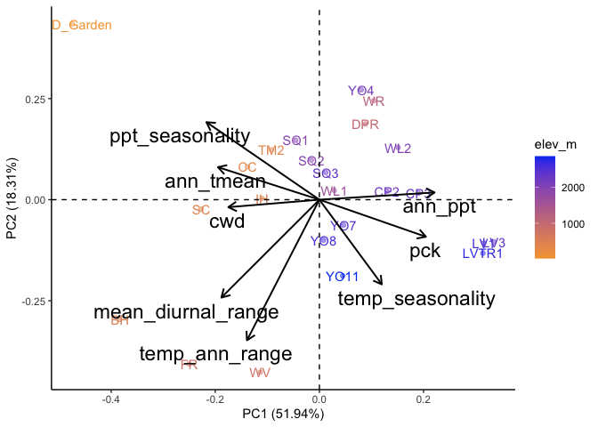<!-- -->

``` r
 #2000 x 850
```

### Subtraction


``` r
recent_flint_dist_prep <- bind_cols(davis_climate_flint, pops_flint_recent_avgs)
names(recent_flint_dist_prep)
```

```
##  [1] "cwd_Davis"       "ppt_Davis"       "pck_Davis"       "tmn_Davis"      
##  [5] "tmx_Davis"       "parent.pop"      "elevation.group" "elev_m"         
##  [9] "Lat"             "Long"            "cwd"             "pck"            
## [13] "ppt"             "tmn"             "tmx"             "TimePd"
```

``` r
recent_flint_dist <- recent_flint_dist_prep %>% 
  mutate(cwd_dist=cwd_Davis - cwd,
         ppt_dist=ppt_Davis - ppt,
         tmn_dist=tmn_Davis - tmn,
         tmx_dist=tmx_Davis - tmx) %>% 
 dplyr::select(parent.pop, elevation.group, elev_m, ends_with("_dist"))

historic_flint_dist_prep <- bind_cols(davis_climate_flint, pops_flint_historic_avgs)
names(historic_flint_dist_prep)
```

```
##  [1] "cwd_Davis"       "ppt_Davis"       "pck_Davis"       "tmn_Davis"      
##  [5] "tmx_Davis"       "parent.pop"      "elevation.group" "elev_m"         
##  [9] "Lat"             "Long"            "cwd"             "pck"            
## [13] "ppt"             "tmn"             "tmx"             "TimePd"
```

``` r
historic_flint_dist <- historic_flint_dist_prep %>% 
  mutate(cwd_dist=cwd_Davis - cwd,
         ppt_dist=ppt_Davis - ppt,
         tmn_dist=tmn_Davis - tmn,
         tmx_dist=tmx_Davis - tmx) %>% 
 dplyr::select(parent.pop, elevation.group, elev_m, ends_with("_dist"))
```

Figures Recent (subtraction distance)


``` r
recent_flint_dist %>% 
  ggplot(aes(x=fct_reorder(parent.pop, cwd_dist), y=cwd_dist, group=parent.pop, fill=elev_m)) +
  geom_col(width = 0.7,position = position_dodge(0.75)) +
  scale_y_continuous(expand = c(0, 0)) +
  scale_fill_gradient(low = "#F5A540", high = "#0043F0") +
  labs(fill="Elevation (m)",x="Population") +
  theme_classic() +
  theme(text=element_text(size=25), axis.text.x = element_text(angle = 45,  hjust = 1))
```

<!-- -->

``` r
ggsave("../output/Climate/all-year_MeanCWD_DistfromDavis_RecentClim.png", width = 12, height = 6, units = "in")

recent_flint_dist %>% 
  ggplot(aes(x=fct_reorder(parent.pop, ppt_dist), y=ppt_dist, group=parent.pop, fill=elev_m)) +
  geom_col(width = 0.7,position = position_dodge(0.75)) +
  scale_y_continuous(expand = c(0, 0)) +
  scale_fill_gradient(low = "#F5A540", high = "#0043F0") +
  labs(fill="Elevation (m)",x="Population") +
  theme_classic() +
  theme(text=element_text(size=25), axis.text.x = element_text(angle = 45,  hjust = 1))
```

<!-- -->

``` r
ggsave("../output/Climate/all-year_MeanPPT_DistfromDavis_RecentClim.png", width = 12, height = 6, units = "in")

recent_flint_dist %>% 
  ggplot(aes(x=fct_reorder(parent.pop, tmn_dist), y=tmn_dist, group=parent.pop, fill=elev_m)) +
  geom_col(width = 0.7,position = position_dodge(0.75)) +
  scale_y_continuous(expand = c(0, 0)) +
  scale_fill_gradient(low = "#F5A540", high = "#0043F0") +
  labs(fill="Elevation (m)",x="Population") +
  theme_classic() +
  theme(text=element_text(size=25), axis.text.x = element_text(angle = 45,  hjust = 1))
```

<!-- -->

``` r
ggsave("../output/Climate/all-year_MeanTMN_DistfromDavis_RecentClim.png", width = 12, height = 6, units = "in")

recent_flint_dist %>% 
  ggplot(aes(x=fct_reorder(parent.pop, tmx_dist), y=tmx_dist, group=parent.pop, fill=elev_m)) +
  geom_col(width = 0.7,position = position_dodge(0.75)) +
  scale_y_continuous(expand = c(0, 0)) +
  scale_fill_gradient(low = "#F5A540", high = "#0043F0") +
  labs(fill="Elevation (m)",x="Population") +
  theme_classic() +
  theme(text=element_text(size=25), axis.text.x = element_text(angle = 45,  hjust = 1))
```

<!-- -->

``` r
ggsave("../output/Climate/all-year_MeanTMX_DistfromDavis_RecentClim.png", width = 12, height = 6, units = "in")
```

Figures Historical (subtraction distance)


``` r
historic_flint_dist %>% 
  ggplot(aes(x=fct_reorder(parent.pop, cwd_dist), y=cwd_dist, group=parent.pop, fill=elev_m)) +
  geom_col(width = 0.7,position = position_dodge(0.75)) +
  scale_y_continuous(expand = c(0, 0)) +
  scale_fill_gradient(low = "#F5A540", high = "#0043F0") +
  labs(fill="Elevation (m)",x="Population") +
  theme_classic() +
  theme(text=element_text(size=25), axis.text.x = element_text(angle = 45,  hjust = 1))
```

<!-- -->

``` r
ggsave("../output/Climate/all-year_MeanCWD_DistfromDavis_HistoricalClim.png", width = 12, height = 6, units = "in")

historic_flint_dist %>% 
  ggplot(aes(x=fct_reorder(parent.pop, ppt_dist), y=ppt_dist, group=parent.pop, fill=elev_m)) +
  geom_col(width = 0.7,position = position_dodge(0.75)) +
  scale_y_continuous(expand = c(0, 0)) +
  scale_fill_gradient(low = "#F5A540", high = "#0043F0") +
  labs(fill="Elevation (m)",x="Population") +
  theme_classic() +
  theme(text=element_text(size=25), axis.text.x = element_text(angle = 45,  hjust = 1))
```

<!-- -->

``` r
ggsave("../output/Climate/all-year_MeanPPT_DistfromDavis_HistoricalClim.png", width = 12, height = 6, units = "in")

historic_flint_dist %>% 
  ggplot(aes(x=fct_reorder(parent.pop, tmn_dist), y=tmn_dist, group=parent.pop, fill=elev_m)) +
  geom_col(width = 0.7,position = position_dodge(0.75)) +
  scale_y_continuous(expand = c(0, 0)) +
  scale_fill_gradient(low = "#F5A540", high = "#0043F0") +
  labs(fill="Elevation (m)",x="Population") +
  theme_classic() +
  theme(text=element_text(size=25), axis.text.x = element_text(angle = 45,  hjust = 1))
```

<!-- -->

``` r
ggsave("../output/Climate/all-year_MeanTMN_DistfromDavis_HistoricalClim.png", width = 12, height = 6, units = "in")

historic_flint_dist %>% 
  ggplot(aes(x=fct_reorder(parent.pop, tmx_dist), y=tmx_dist, group=parent.pop, fill=elev_m)) +
  geom_col(width = 0.7,position = position_dodge(0.75)) +
  scale_y_continuous(expand = c(0, 0)) +
  scale_fill_gradient(low = "#F5A540", high = "#0043F0") +
  labs(fill="Elevation (m)",x="Population") +
  theme_classic() +
  theme(text=element_text(size=25), axis.text.x = element_text(angle = 45,  hjust = 1))
```

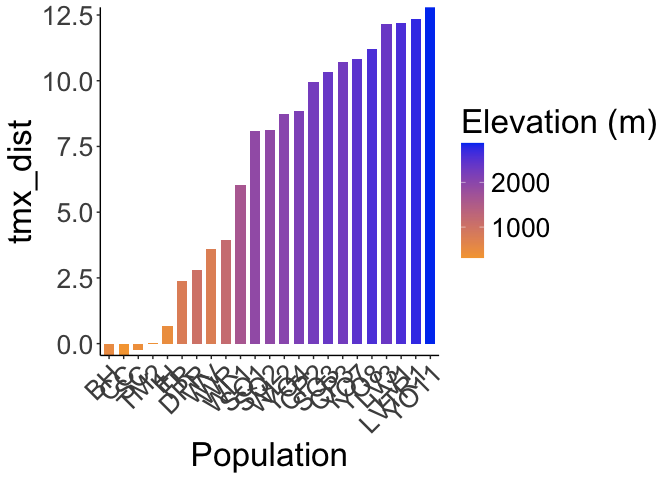<!-- -->

``` r
ggsave("../output/Climate/all-year_MeanTMX_DistfromDavis_HistoricalClim.png", width = 12, height = 6, units = "in")
```

## Bioclim Climate Distance

### Gowers

#### Recent

``` r
gowers_calc_each_var_recent_bioclim <- davis_home_climate_with_ranges_recent %>% 
  mutate(ann_tmean_gowers=abs(ann_tmean_Davis - ann_tmean) / ann_tmean_range,
         mean_diurnal_range_gowers=abs(mean_diurnal_range_Davis - mean_diurnal_range) / mean_diurnal_range_range,
         temp_seasonality_gowers=abs(temp_seasonality_Davis - temp_seasonality) / temp_seasonality_range,
         temp_ann_range_gowers=abs(temp_ann_range_Davis - temp_ann_range) / temp_ann_range_range,
         tmean_wettest_quarter_gowers=abs(tmean_wettest_quarter_Davis - tmean_wettest_quarter) / tmean_wettest_quarter_range,
         tmean_driest_quarter_gowers=abs(tmean_driest_quarter_Davis - tmean_driest_quarter) / tmean_driest_quarter_range,
         ann_ppt_gowers=abs(ann_ppt_Davis - ann_ppt) / ann_ppt_range,
         ppt_seasonality_gowers=abs(ppt_seasonality_Davis - ppt_seasonality) / ppt_seasonality_range,
         ppt_warmest_quarter_gowers=abs(ppt_warmest_quarter_Davis - ppt_warmest_quarter) / ppt_warmest_quarter_range,
         ppt_coldest_quarter_gowers=abs(ppt_coldest_quarter_Davis - ppt_coldest_quarter) / ppt_coldest_quarter_range) %>% 
  dplyr::select(parent.pop, elevation.group, elev_m, ends_with("_gowers"))
  
gowers_calc_per_pop_recent_bioclim <- gowers_calc_each_var_recent_bioclim %>% 
  mutate(Recent_Gowers_Dist=(1/10)*(ann_tmean_gowers + mean_diurnal_range_gowers +
                                temp_seasonality_gowers +temp_ann_range_gowers +
                                tmean_wettest_quarter_gowers +
                                tmean_driest_quarter_gowers +ann_ppt_gowers +
                                ppt_seasonality_gowers + ppt_warmest_quarter_gowers +
                                ppt_coldest_quarter_gowers)) %>% 
  dplyr::select(parent.pop, elevation.group, elev_m, Recent_Gowers_Dist)

gowers_calc_per_pop_recent_bioclim
```

```
## # A tibble: 23 × 4
##    parent.pop elevation.group elev_m Recent_Gowers_Dist
##    <chr>      <chr>            <dbl>              <dbl>
##  1 BH         Low               511.              0.298
##  2 CC         Low               313               0.341
##  3 CP2        High             2244.              0.643
##  4 CP3        High             2266.              0.654
##  5 DPR        Mid              1019.              0.507
##  6 FR         Mid               787               0.451
##  7 IH         Low               454.              0.334
##  8 LV1        High             2593.              0.787
##  9 LV3        High             2354.              0.780
## 10 LVTR1      High             2741.              0.799
## # ℹ 13 more rows
```

#### Historic

``` r
gowers_calc_each_var_historic_bioclim <- davis_home_climate_with_ranges_historic %>% 
  mutate(ann_tmean_gowers=abs(ann_tmean_Davis - ann_tmean) / ann_tmean_range,
         mean_diurnal_range_gowers=abs(mean_diurnal_range_Davis - mean_diurnal_range) / mean_diurnal_range_range,
         temp_seasonality_gowers=abs(temp_seasonality_Davis - temp_seasonality) / temp_seasonality_range,
         temp_ann_range_gowers=abs(temp_ann_range_Davis - temp_ann_range) / temp_ann_range_range,
         tmean_wettest_quarter_gowers=abs(tmean_wettest_quarter_Davis - tmean_wettest_quarter) / tmean_wettest_quarter_range,
         tmean_driest_quarter_gowers=abs(tmean_driest_quarter_Davis - tmean_driest_quarter) / tmean_driest_quarter_range,
         ann_ppt_gowers=abs(ann_ppt_Davis - ann_ppt) / ann_ppt_range,
         ppt_seasonality_gowers=abs(ppt_seasonality_Davis - ppt_seasonality) / ppt_seasonality_range,
         ppt_warmest_quarter_gowers=abs(ppt_warmest_quarter_Davis - ppt_warmest_quarter) / ppt_warmest_quarter_range,
         ppt_coldest_quarter_gowers=abs(ppt_coldest_quarter_Davis - ppt_coldest_quarter) / ppt_coldest_quarter_range) %>% 
  dplyr::select(parent.pop, elevation.group, elev_m, ends_with("_gowers"))

  
gowers_calc_per_pop_historic_bioclim <- gowers_calc_each_var_historic_bioclim %>% 
  mutate(Historic_Gowers_Dist=(1/10)*(ann_tmean_gowers + mean_diurnal_range_gowers +
                                temp_seasonality_gowers +temp_ann_range_gowers +
                                tmean_wettest_quarter_gowers +
                                tmean_driest_quarter_gowers +ann_ppt_gowers +
                                ppt_seasonality_gowers + ppt_warmest_quarter_gowers +
                                ppt_coldest_quarter_gowers)) %>% 
  dplyr::select(parent.pop, elevation.group, elev_m, Historic_Gowers_Dist)

gowers_calc_per_pop_historic_bioclim
```

```
## # A tibble: 23 × 4
##    parent.pop elevation.group elev_m Historic_Gowers_Dist
##    <chr>      <chr>            <dbl>                <dbl>
##  1 BH         Low               511.                0.312
##  2 CC         Low               313                 0.322
##  3 CP2        High             2244.                0.626
##  4 CP3        High             2266.                0.640
##  5 DPR        Mid              1019.                0.469
##  6 FR         Mid               787                 0.490
##  7 IH         Low               454.                0.350
##  8 LV1        High             2593.                0.763
##  9 LV3        High             2354.                0.752
## 10 LVTR1      High             2741.                0.774
## # ℹ 13 more rows
```

#### Merge recent and historic

``` r
gowers_all_time_bioclim <- full_join(gowers_calc_per_pop_recent_bioclim, gowers_calc_per_pop_historic_bioclim)
```

```
## Joining with `by = join_by(parent.pop, elevation.group, elev_m)`
```

``` r
gowers_all_time_bioclim
```

```
## # A tibble: 23 × 5
##    parent.pop elevation.group elev_m Recent_Gowers_Dist Historic_Gowers_Dist
##    <chr>      <chr>            <dbl>              <dbl>                <dbl>
##  1 BH         Low               511.              0.298                0.312
##  2 CC         Low               313               0.341                0.322
##  3 CP2        High             2244.              0.643                0.626
##  4 CP3        High             2266.              0.654                0.640
##  5 DPR        Mid              1019.              0.507                0.469
##  6 FR         Mid               787               0.451                0.490
##  7 IH         Low               454.              0.334                0.350
##  8 LV1        High             2593.              0.787                0.763
##  9 LV3        High             2354.              0.780                0.752
## 10 LVTR1      High             2741.              0.799                0.774
## # ℹ 13 more rows
```

``` r
names(gowers_all_time_bioclim)
```

```
## [1] "parent.pop"           "elevation.group"      "elev_m"              
## [4] "Recent_Gowers_Dist"   "Historic_Gowers_Dist"
```

``` r
write_csv(gowers_all_time_bioclim, "../output/Climate/full_year_GowersEnvtalDist_UCDbioclim.csv")
```

Figures

``` r
gowers_rec_fig_bioclim <- gowers_all_time_bioclim %>% 
  ggplot(aes(x=fct_reorder(parent.pop, Recent_Gowers_Dist), y=Recent_Gowers_Dist, group=parent.pop, fill=elev_m)) +
  geom_col(width = 0.7,position = position_dodge(0.75)) +
  scale_y_continuous(expand = c(0, 0)) +
  scale_fill_gradient(low = "#F5A540", high = "#0043F0") +
  labs(y="Gowers Envtal Distance \n from Davis", fill="Elevation (m)", x="Population", title="Recent Climate") +
  theme_classic() +
  theme(text=element_text(size=25), axis.text.x = element_text(angle = 45,  hjust = 1))
#ggsave("../output/Climate/full_year_Gowers_Recentbioclim_fromDavis.png", width = 12, height = 6, units = "in")

gowers_hist_fig_bioclim <- gowers_all_time_bioclim %>% 
  ggplot(aes(x=fct_reorder(parent.pop, Historic_Gowers_Dist), y=Historic_Gowers_Dist, group=parent.pop, fill=elev_m)) +
  geom_col(width = 0.7,position = position_dodge(0.75)) +
  scale_y_continuous(expand = c(0, 0)) +
  scale_fill_gradient(low = "#F5A540", high = "#0043F0") +
  labs(fill="Elevation (m)",x="Population", title="Historic Climate", y="Gowers Envtal Distance \n from Davis") +
  theme_classic() +
  theme(text=element_text(size=25), axis.text.x = element_text(angle = 45,  hjust = 1))
#ggsave("../output/Climate/full_year_Gowers_Historicbioclim_fromDavis.png", width = 12, height = 6, units = "in")

#should combine these into one figure and save that instead
legend <- get_legend(gowers_rec_fig_bioclim)
gowers_hist_fig_bioclim <- gowers_hist_fig_bioclim + theme(legend.position="none")
gowers_rec_fig_bioclim <- gowers_rec_fig_bioclim + theme(legend.position="none")
grid.arrange(gowers_hist_fig_bioclim, gowers_rec_fig_bioclim, legend, ncol=3, widths=c(3.12, 3.12, 1.09))
```

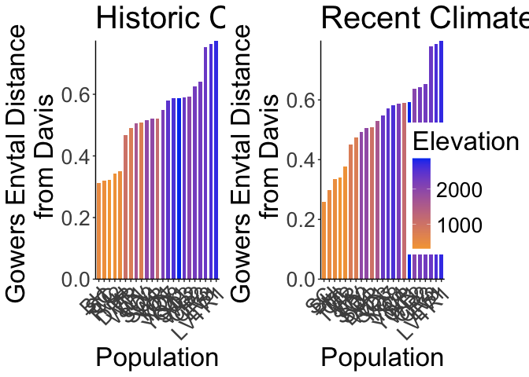<!-- -->

``` r
 #2000 x 850
```

### Subtraction


``` r
#Recent
names(pops_bioclim_recent_avgs)
```

```
##  [1] "parent.pop"            "elevation.group"       "elev_m"               
##  [4] "Lat"                   "Long"                  "ann_tmean"            
##  [7] "mean_diurnal_range"    "temp_seasonality"      "temp_ann_range"       
## [10] "tmean_wettest_quarter" "tmean_driest_quarter"  "ann_ppt"              
## [13] "ppt_seasonality"       "ppt_warmest_quarter"   "ppt_coldest_quarter"  
## [16] "TimePd"
```

``` r
recent_bioclim_dist_prep <- bind_cols(davis_bioclim_final, pops_bioclim_recent_avgs)
recent_bioclim_dist <- recent_bioclim_dist_prep %>% 
  mutate(ann_tmean_dist=ann_tmean_Davis - ann_tmean,
         mean_diurnal_range_dist=mean_diurnal_range_Davis - mean_diurnal_range,
         temp_seasonality_dist=temp_seasonality_Davis - temp_seasonality,
         temp_ann_range_dist=temp_ann_range_Davis - temp_ann_range,
         tmean_wettest_quarter_dist=tmean_wettest_quarter_Davis - tmean_wettest_quarter,
         tmean_driest_quarter_dist=tmean_driest_quarter_Davis - tmean_driest_quarter,
         ann_ppt_dist=ann_ppt_Davis - ann_ppt,
         ppt_seasonality_dist=ppt_seasonality_Davis - ppt_seasonality, 
         ppt_warmest_quarter_dist=ppt_warmest_quarter_Davis - ppt_warmest_quarter,
         ppt_coldest_quarter_dist=ppt_coldest_quarter_Davis - ppt_coldest_quarter) %>% 
 dplyr::select(parent.pop, elevation.group, elev_m, ends_with("_dist"))
recent_bioclim_dist
```

```
## # A tibble: 23 × 13
##    parent.pop elevation.group elev_m ann_tmean_dist mean_diurnal_range_dist
##    <chr>      <chr>            <dbl>          <dbl>                   <dbl>
##  1 BH         Low               511.        -0.765                   -0.644
##  2 CC         Low               313         -1.18                     0.748
##  3 CP2        High             2244.         8.19                     1.77 
##  4 CP3        High             2266.         8.90                     1.88 
##  5 DPR        Mid              1019.         1.42                     1.64 
##  6 FR         Mid               787          2.57                    -0.414
##  7 IH         Low               454.         0.0418                   0.462
##  8 LV1        High             2593.        10.5                      1.40 
##  9 LV3        High             2354.        10.5                      1.38 
## 10 LVTR1      High             2741.        10.7                      1.29 
## # ℹ 13 more rows
## # ℹ 8 more variables: temp_seasonality_dist <dbl>, temp_ann_range_dist <dbl>,
## #   tmean_wettest_quarter_dist <dbl>, tmean_driest_quarter_dist <dbl>,
## #   ann_ppt_dist <dbl>, ppt_seasonality_dist <dbl>,
## #   ppt_warmest_quarter_dist <dbl>, ppt_coldest_quarter_dist <dbl>
```

``` r
#Historical
names(pops_bioclim_historical_avgs)
```

```
##  [1] "parent.pop"            "elevation.group"       "elev_m"               
##  [4] "Lat"                   "Long"                  "ann_tmean"            
##  [7] "mean_diurnal_range"    "temp_seasonality"      "temp_ann_range"       
## [10] "tmean_wettest_quarter" "tmean_driest_quarter"  "ann_ppt"              
## [13] "ppt_seasonality"       "ppt_warmest_quarter"   "ppt_coldest_quarter"  
## [16] "TimePd"
```

``` r
historical_bioclim_dist_prep <- bind_cols(davis_bioclim_final, pops_bioclim_historical_avgs)
historical_bioclim_dist <- historical_bioclim_dist_prep %>% 
  mutate(ann_tmean_dist=ann_tmean_Davis - ann_tmean,
         mean_diurnal_range_dist=mean_diurnal_range_Davis - mean_diurnal_range,
         temp_seasonality_dist=temp_seasonality_Davis - temp_seasonality,
         temp_ann_range_dist=temp_ann_range_Davis - temp_ann_range,
         tmean_wettest_quarter_dist=tmean_wettest_quarter_Davis - tmean_wettest_quarter,
         tmean_driest_quarter_dist=tmean_driest_quarter_Davis - tmean_driest_quarter,
         ann_ppt_dist=ann_ppt_Davis - ann_ppt,
         ppt_seasonality_dist=ppt_seasonality_Davis - ppt_seasonality, 
         ppt_warmest_quarter_dist=ppt_warmest_quarter_Davis - ppt_warmest_quarter,
         ppt_coldest_quarter_dist=ppt_coldest_quarter_Davis - ppt_coldest_quarter) %>% 
  dplyr::select(parent.pop, elevation.group, elev_m, ends_with("_dist"))
historical_bioclim_dist
```

```
## # A tibble: 23 × 13
##    parent.pop elevation.group elev_m ann_tmean_dist mean_diurnal_range_dist
##    <chr>      <chr>            <dbl>          <dbl>                   <dbl>
##  1 BH         Low               511.          0.142                 -1.22  
##  2 CC         Low               313          -0.435                 -0.0477
##  3 CP2        High             2244.          9.38                   1.18  
##  4 CP3        High             2266.         10.0                    1.38  
##  5 DPR        Mid              1019.          2.53                   0.534 
##  6 FR         Mid               787           3.16                  -1.57  
##  7 IH         Low               454.          0.725                 -0.157 
##  8 LV1        High             2593.         12.1                    0.200 
##  9 LV3        High             2354.         12.1                    0.182 
## 10 LVTR1      High             2741.         12.2                    0.199 
## # ℹ 13 more rows
## # ℹ 8 more variables: temp_seasonality_dist <dbl>, temp_ann_range_dist <dbl>,
## #   tmean_wettest_quarter_dist <dbl>, tmean_driest_quarter_dist <dbl>,
## #   ann_ppt_dist <dbl>, ppt_seasonality_dist <dbl>,
## #   ppt_warmest_quarter_dist <dbl>, ppt_coldest_quarter_dist <dbl>
```

Figures Recent (subtraction distance)


``` r
recent_bioclim_dist %>% 
  ggplot(aes(x=fct_reorder(parent.pop, ann_tmean_dist), y=ann_tmean_dist, group=parent.pop, fill=elev_m)) +
  geom_col(width = 0.7,position = position_dodge(0.75)) +
  scale_y_continuous(expand = c(0, 0)) +
  scale_fill_gradient(low = "#F5A540", high = "#0043F0") +
  labs(fill="Elevation (m)",x="Population") +
  theme_classic() +
  theme(text=element_text(size=25), axis.text.x = element_text(angle = 45,  hjust = 1))
```

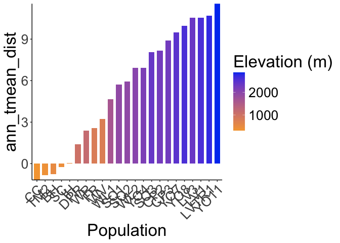<!-- -->

``` r
ggsave("../output/Climate/all-year_Ann_Tmean_DistfromDavis_RecentClim.png", width = 12, height = 6, units = "in")

recent_bioclim_dist %>% 
  ggplot(aes(x=fct_reorder(parent.pop, mean_diurnal_range_dist), y=mean_diurnal_range_dist, group=parent.pop, fill=elev_m)) +
  geom_col(width = 0.7,position = position_dodge(0.75)) +
  scale_y_continuous(expand = c(0, 0)) +
  scale_fill_gradient(low = "#F5A540", high = "#0043F0") +
  labs(fill="Elevation (m)",x="Population") +
  theme_classic() +
  theme(text=element_text(size=25), axis.text.x = element_text(angle = 45,  hjust = 1))
```

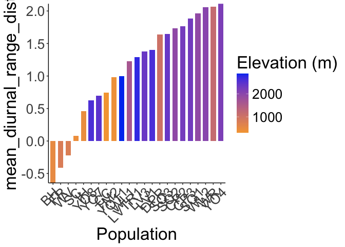<!-- -->

``` r
ggsave("../output/Climate/all-year_Diurnal_Range_DistfromDavis_RecentClim.png", width = 12, height = 6, units = "in")

recent_bioclim_dist %>% 
  ggplot(aes(x=fct_reorder(parent.pop, temp_seasonality_dist), y=temp_seasonality_dist, group=parent.pop, fill=elev_m)) +
  geom_col(width = 0.7,position = position_dodge(0.75)) +
  scale_y_continuous(expand = c(0, 0)) +
  scale_fill_gradient(low = "#F5A540", high = "#0043F0") +
  labs(fill="Elevation (m)",x="Population") +
  theme_classic() +
  theme(text=element_text(size=25), axis.text.x = element_text(angle = 45,  hjust = 1))
```

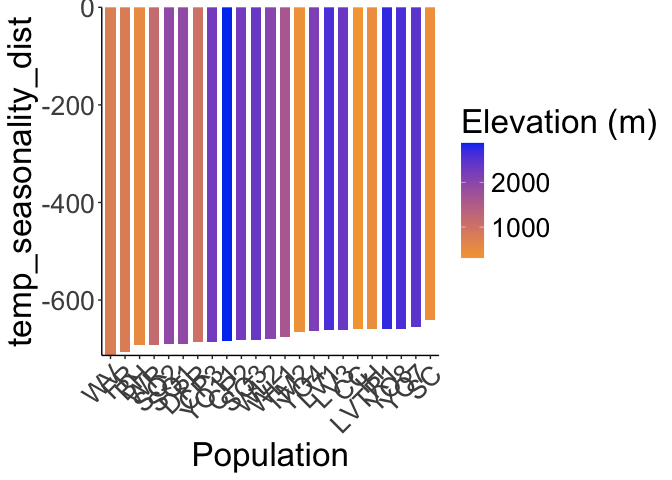<!-- -->

``` r
ggsave("../output/Climate/all-year_Temp_Seasonality_DistfromDavis_RecentClim.png", width = 12, height = 6, units = "in")

recent_bioclim_dist %>% 
  ggplot(aes(x=fct_reorder(parent.pop, temp_ann_range_dist), y=temp_ann_range_dist, group=parent.pop, fill=elev_m)) +
  geom_col(width = 0.7,position = position_dodge(0.75)) +
  scale_y_continuous(expand = c(0, 0)) +
  scale_fill_gradient(low = "#F5A540", high = "#0043F0") +
  labs(fill="Elevation (m)",x="Population") +
  theme_classic() +
  theme(text=element_text(size=25), axis.text.x = element_text(angle = 45,  hjust = 1))
```

<!-- -->

``` r
ggsave("../output/Climate/all-year_Temp_Ann_Range_DistfromDavis_RecentClim.png", width = 12, height = 6, units = "in")

recent_bioclim_dist %>% 
  ggplot(aes(x=fct_reorder(parent.pop, tmean_wettest_quarter_dist), y=tmean_wettest_quarter_dist, group=parent.pop, fill=elev_m)) +
  geom_col(width = 0.7,position = position_dodge(0.75)) +
  scale_y_continuous(expand = c(0, 0)) +
  scale_fill_gradient(low = "#F5A540", high = "#0043F0") +
  labs(fill="Elevation (m)",x="Population") +
  theme_classic() +
  theme(text=element_text(size=25), axis.text.x = element_text(angle = 45,  hjust = 1))
```

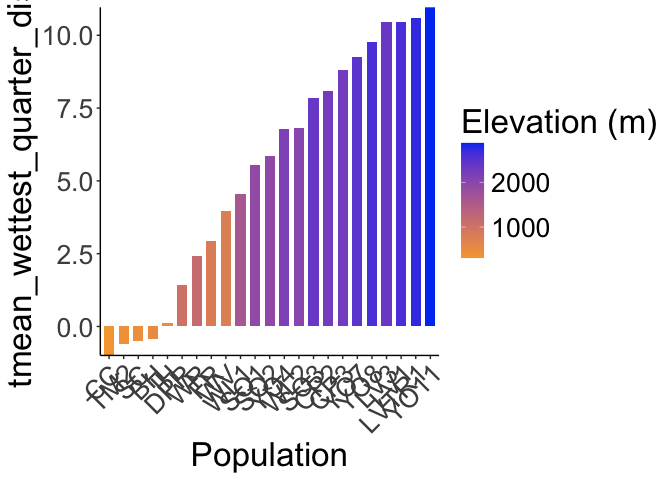<!-- -->

``` r
ggsave("../output/Climate/all-year_Temp_Wet_DistfromDavis_RecentClim.png", width = 12, height = 6, units = "in")

recent_bioclim_dist %>% 
  ggplot(aes(x=fct_reorder(parent.pop, tmean_driest_quarter_dist), y=tmean_driest_quarter_dist, group=parent.pop, fill=elev_m)) +
  geom_col(width = 0.7,position = position_dodge(0.75)) +
  scale_y_continuous(expand = c(0, 0)) +
  scale_fill_gradient(low = "#F5A540", high = "#0043F0") +
  labs(fill="Elevation (m)",x="Population") +
  theme_classic() +
  theme(text=element_text(size=25), axis.text.x = element_text(angle = 45,  hjust = 1))
```

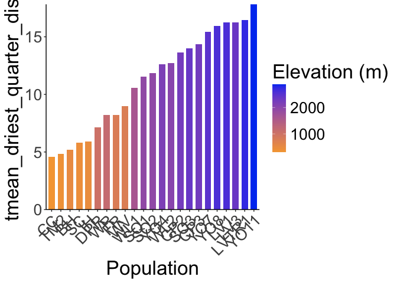<!-- -->

``` r
ggsave("../output/Climate/all-year_Temp_Dry_DistfromDavis_RecentClim.png", width = 12, height = 6, units = "in")

recent_bioclim_dist %>% 
  ggplot(aes(x=fct_reorder(parent.pop, ann_ppt_dist), y=ann_ppt_dist, group=parent.pop, fill=elev_m)) +
  geom_col(width = 0.7,position = position_dodge(0.75)) +
  scale_y_continuous(expand = c(0, 0)) +
  scale_fill_gradient(low = "#F5A540", high = "#0043F0") +
  labs(fill="Elevation (m)",x="Population") +
  theme_classic() +
  theme(text=element_text(size=25), axis.text.x = element_text(angle = 45,  hjust = 1))
```

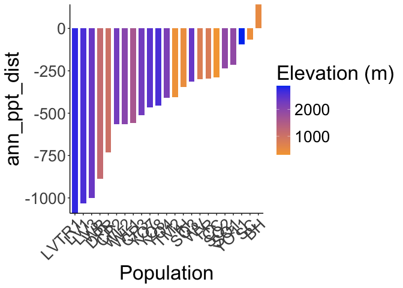<!-- -->

``` r
ggsave("../output/Climate/all-year_Ann_PPT_DistfromDavis_RecentClim.png", width = 12, height = 6, units = "in")

recent_bioclim_dist %>% 
  ggplot(aes(x=fct_reorder(parent.pop, ppt_seasonality_dist), y=ppt_seasonality_dist, group=parent.pop, fill=elev_m)) +
  geom_col(width = 0.7,position = position_dodge(0.75)) +
  scale_y_continuous(expand = c(0, 0)) +
  scale_fill_gradient(low = "#F5A540", high = "#0043F0") +
  labs(fill="Elevation (m)",x="Population") +
  theme_classic() +
  theme(text=element_text(size=25), axis.text.x = element_text(angle = 45,  hjust = 1))
```

<!-- -->

``` r
ggsave("../output/Climate/all-year_PPT_Seasonality_DistfromDavis_RecentClim.png", width = 12, height = 6, units = "in")

recent_bioclim_dist %>% 
  ggplot(aes(x=fct_reorder(parent.pop, ppt_warmest_quarter_dist), y=ppt_warmest_quarter_dist, group=parent.pop, fill=elev_m)) +
  geom_col(width = 0.7,position = position_dodge(0.75)) +
  scale_y_continuous(expand = c(0, 0)) +
  scale_fill_gradient(low = "#F5A540", high = "#0043F0") +
  labs(fill="Elevation (m)",x="Population") +
  theme_classic() +
  theme(text=element_text(size=25), axis.text.x = element_text(angle = 45,  hjust = 1))
```

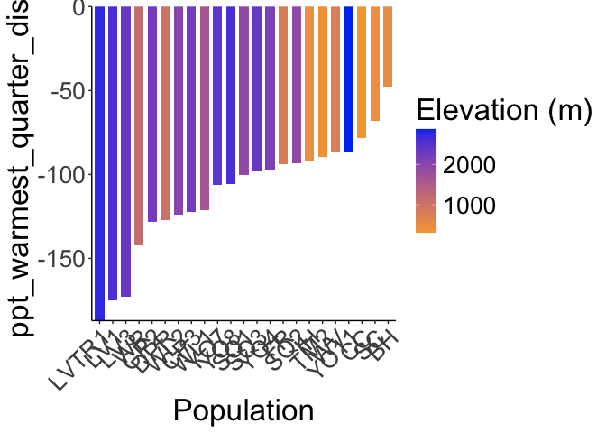<!-- -->

``` r
ggsave("../output/Climate/all-year_PPT_Warm_DistfromDavis_RecentClim.png", width = 12, height = 6, units = "in")

recent_bioclim_dist %>% 
  ggplot(aes(x=fct_reorder(parent.pop, ppt_coldest_quarter_dist), y=ppt_coldest_quarter_dist, group=parent.pop, fill=elev_m)) +
  geom_col(width = 0.7,position = position_dodge(0.75)) +
  scale_y_continuous(expand = c(0, 0)) +
  scale_fill_gradient(low = "#F5A540", high = "#0043F0") +
  labs(fill="Elevation (m)",x="Population") +
  theme_classic() +
  theme(text=element_text(size=25), axis.text.x = element_text(angle = 45,  hjust = 1))
```

<!-- -->

``` r
ggsave("../output/Climate/all-year_PPT_Cold_DistfromDavis_RecentClim.png", width = 12, height = 6, units = "in")
```

Historical (subtraction distance)


``` r
historical_bioclim_dist %>% 
  ggplot(aes(x=fct_reorder(parent.pop, ann_tmean_dist), y=ann_tmean_dist, group=parent.pop, fill=elev_m)) +
  geom_col(width = 0.7,position = position_dodge(0.75)) +
  scale_y_continuous(expand = c(0, 0)) +
  scale_fill_gradient(low = "#F5A540", high = "#0043F0") +
  labs(fill="Elevation (m)",x="Population") +
  theme_classic() +
  theme(text=element_text(size=25), axis.text.x = element_text(angle = 45,  hjust = 1))
```

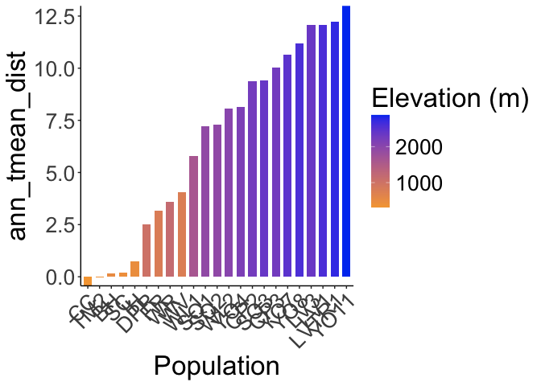<!-- -->

``` r
ggsave("../output/Climate/all-year_Ann_Tmean_DistfromDavis_HistoricalClim.png", width = 12, height = 6, units = "in")

historical_bioclim_dist %>% 
  ggplot(aes(x=fct_reorder(parent.pop, mean_diurnal_range_dist), y=mean_diurnal_range_dist, group=parent.pop, fill=elev_m)) +
  geom_col(width = 0.7,position = position_dodge(0.75)) +
  scale_y_continuous(expand = c(0, 0)) +
  scale_fill_gradient(low = "#F5A540", high = "#0043F0") +
  labs(fill="Elevation (m)",x="Population") +
  theme_classic() +
  theme(text=element_text(size=25), axis.text.x = element_text(angle = 45,  hjust = 1))
```

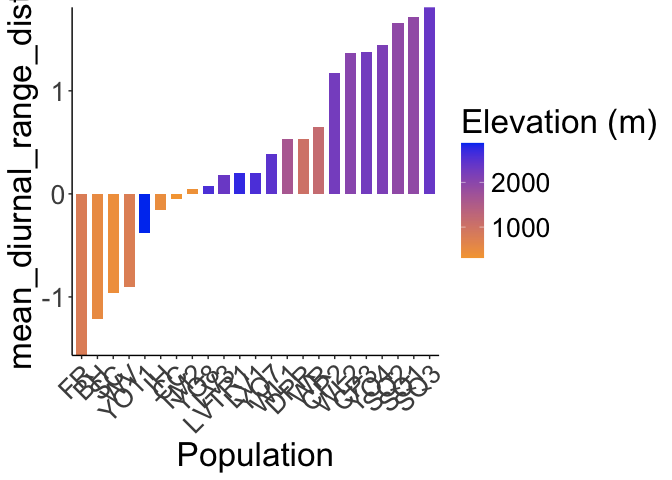<!-- -->

``` r
ggsave("../output/Climate/all-year_Diurnal_Range_DistfromDavis_HistoricalClim.png", width = 12, height = 6, units = "in")

historical_bioclim_dist %>% 
  ggplot(aes(x=fct_reorder(parent.pop, temp_seasonality_dist), y=temp_seasonality_dist, group=parent.pop, fill=elev_m)) +
  geom_col(width = 0.7,position = position_dodge(0.75)) +
  scale_y_continuous(expand = c(0, 0)) +
  scale_fill_gradient(low = "#F5A540", high = "#0043F0") +
  labs(fill="Elevation (m)",x="Population") +
  theme_classic() +
  theme(text=element_text(size=25), axis.text.x = element_text(angle = 45,  hjust = 1))
```

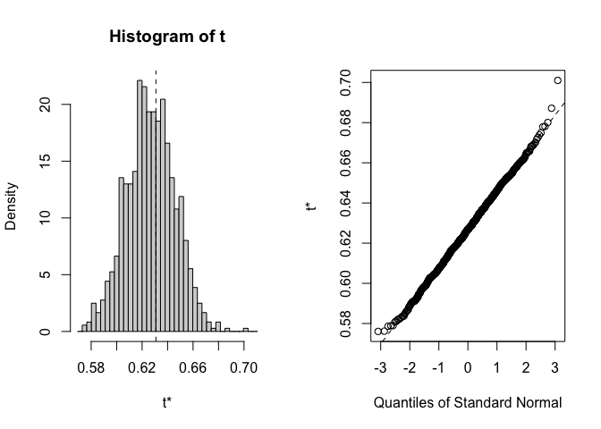<!-- -->

``` r
ggsave("../output/Climate/all-year_Temp_Seasonality_DistfromDavis_HistoricalClim.png", width = 12, height = 6, units = "in")

historical_bioclim_dist %>% 
  ggplot(aes(x=fct_reorder(parent.pop, temp_ann_range_dist), y=temp_ann_range_dist, group=parent.pop, fill=elev_m)) +
  geom_col(width = 0.7,position = position_dodge(0.75)) +
  scale_y_continuous(expand = c(0, 0)) +
  scale_fill_gradient(low = "#F5A540", high = "#0043F0") +
  labs(fill="Elevation (m)",x="Population") +
  theme_classic() +
  theme(text=element_text(size=25), axis.text.x = element_text(angle = 45,  hjust = 1))
```

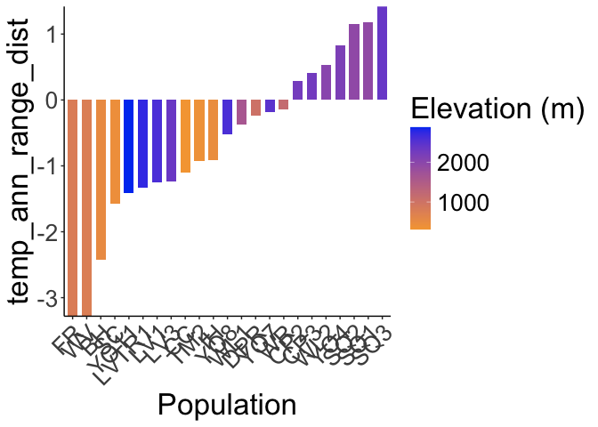<!-- -->

``` r
ggsave("../output/Climate/all-year_Temp_Ann_Range_DistfromDavis_HistoricalClim.png", width = 12, height = 6, units = "in")

historical_bioclim_dist %>% 
  ggplot(aes(x=fct_reorder(parent.pop, tmean_wettest_quarter_dist), y=tmean_wettest_quarter_dist, group=parent.pop, fill=elev_m)) +
  geom_col(width = 0.7,position = position_dodge(0.75)) +
  scale_y_continuous(expand = c(0, 0)) +
  scale_fill_gradient(low = "#F5A540", high = "#0043F0") +
  labs(fill="Elevation (m)",x="Population") +
  theme_classic() +
  theme(text=element_text(size=25), axis.text.x = element_text(angle = 45,  hjust = 1))
```

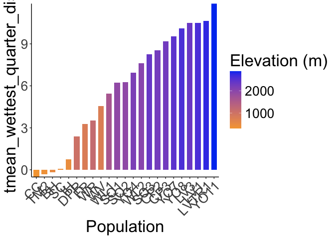<!-- -->

``` r
ggsave("../output/Climate/all-year_Temp_Wet_DistfromDavis_HistoricalClim.png", width = 12, height = 6, units = "in")

historical_bioclim_dist %>% 
  ggplot(aes(x=fct_reorder(parent.pop, tmean_driest_quarter_dist), y=tmean_driest_quarter_dist, group=parent.pop, fill=elev_m)) +
  geom_col(width = 0.7,position = position_dodge(0.75)) +
  scale_y_continuous(expand = c(0, 0)) +
  scale_fill_gradient(low = "#F5A540", high = "#0043F0") +
  labs(fill="Elevation (m)",x="Population") +
  theme_classic() +
  theme(text=element_text(size=25), axis.text.x = element_text(angle = 45,  hjust = 1))
```

<!-- -->

``` r
ggsave("../output/Climate/all-year_Temp_Dry_DistfromDavis_HistoricalClim.png", width = 12, height = 6, units = "in")

historical_bioclim_dist %>% 
  ggplot(aes(x=fct_reorder(parent.pop, ann_ppt_dist), y=ann_ppt_dist, group=parent.pop, fill=elev_m)) +
  geom_col(width = 0.7,position = position_dodge(0.75)) +
  scale_y_continuous(expand = c(0, 0)) +
  scale_fill_gradient(low = "#F5A540", high = "#0043F0") +
  labs(fill="Elevation (m)",x="Population") +
  theme_classic() +
  theme(text=element_text(size=25), axis.text.x = element_text(angle = 45,  hjust = 1))
```

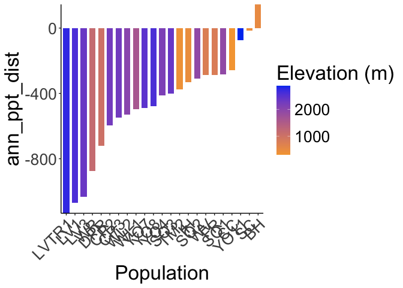<!-- -->

``` r
ggsave("../output/Climate/all-year_Ann_PPT_DistfromDavis_HistoricalClim.png", width = 12, height = 6, units = "in")

historical_bioclim_dist %>% 
  ggplot(aes(x=fct_reorder(parent.pop, ppt_seasonality_dist), y=ppt_seasonality_dist, group=parent.pop, fill=elev_m)) +
  geom_col(width = 0.7,position = position_dodge(0.75)) +
  scale_y_continuous(expand = c(0, 0)) +
  scale_fill_gradient(low = "#F5A540", high = "#0043F0") +
  labs(fill="Elevation (m)",x="Population") +
  theme_classic() +
  theme(text=element_text(size=25), axis.text.x = element_text(angle = 45,  hjust = 1))
```

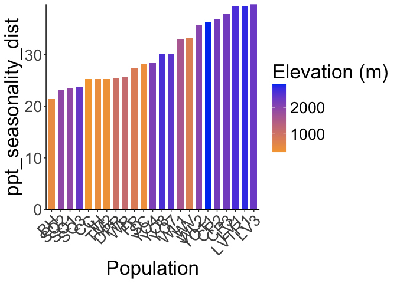<!-- -->

``` r
ggsave("../output/Climate/all-year_PPT_Seasonality_DistfromDavis_HistoricalClim.png", width = 12, height = 6, units = "in")

historical_bioclim_dist %>% 
  ggplot(aes(x=fct_reorder(parent.pop, ppt_warmest_quarter_dist), y=ppt_warmest_quarter_dist, group=parent.pop, fill=elev_m)) +
  geom_col(width = 0.7,position = position_dodge(0.75)) +
  scale_y_continuous(expand = c(0, 0)) +
  scale_fill_gradient(low = "#F5A540", high = "#0043F0") +
  labs(fill="Elevation (m)",x="Population") +
  theme_classic() +
  theme(text=element_text(size=25), axis.text.x = element_text(angle = 45,  hjust = 1))
```

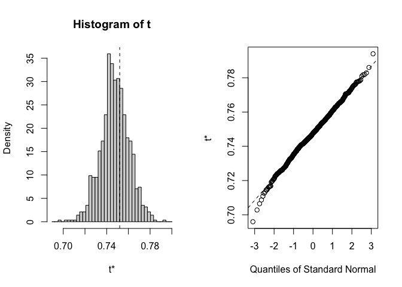<!-- -->

``` r
ggsave("../output/Climate/all-year_PPT_Warm_DistfromDavis_HistoricalClim.png", width = 12, height = 6, units = "in")

historical_bioclim_dist %>% 
  ggplot(aes(x=fct_reorder(parent.pop, ppt_coldest_quarter_dist), y=ppt_coldest_quarter_dist, group=parent.pop, fill=elev_m)) +
  geom_col(width = 0.7,position = position_dodge(0.75)) +
  scale_y_continuous(expand = c(0, 0)) +
  scale_fill_gradient(low = "#F5A540", high = "#0043F0") +
  labs(fill="Elevation (m)",x="Population") +
  theme_classic() +
  theme(text=element_text(size=25), axis.text.x = element_text(angle = 45,  hjust = 1))
```

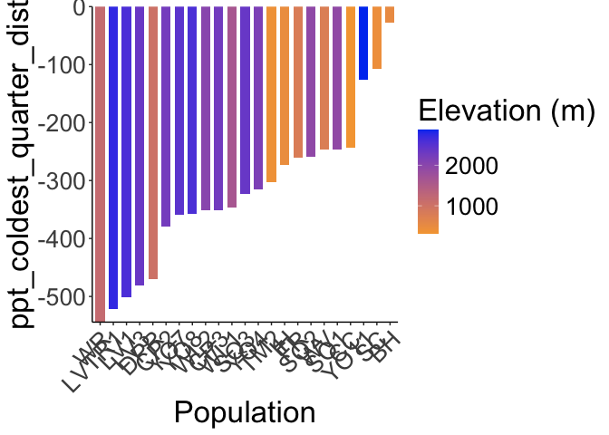<!-- -->

``` r
ggsave("../output/Climate/all-year_PPT_Cold_DistfromDavis_HistoricalClim.png", width = 12, height = 6, units = "in")
```
