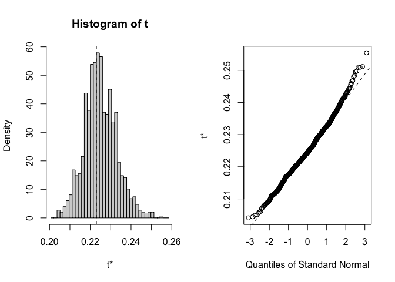
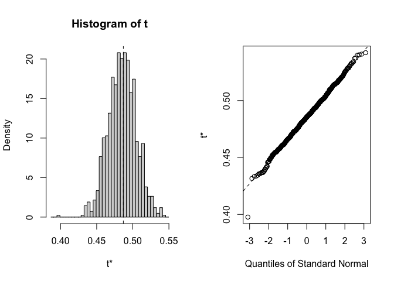
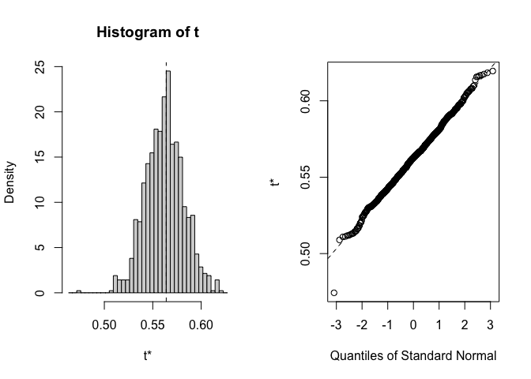
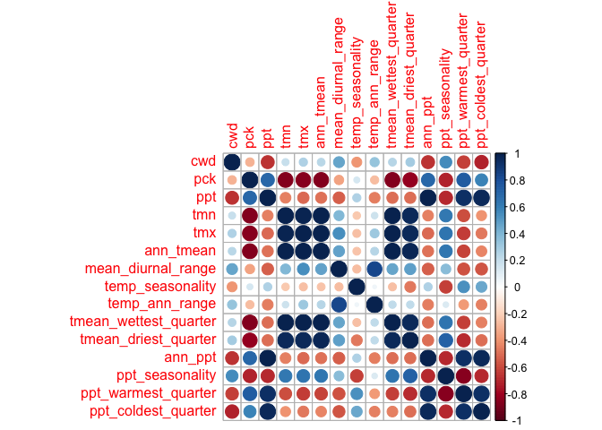
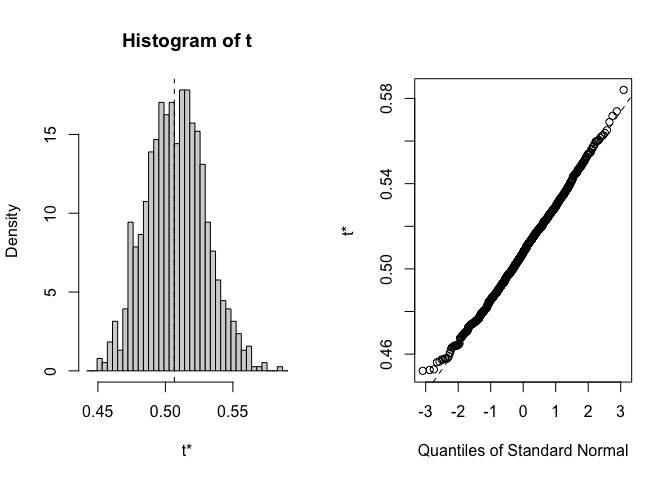
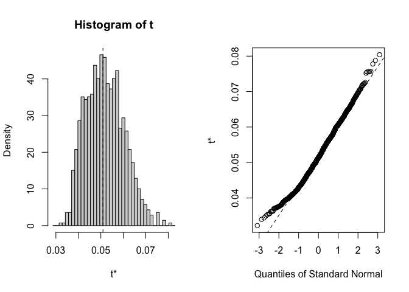
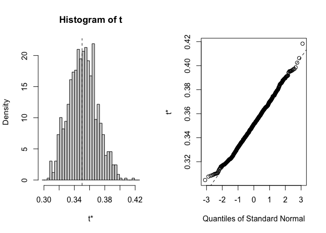

# Climate Distance at the Davis Garden

Annual data might give a different result, worth presenting it both ways
because that helps highlight the importance of the life history
differences

\*Used "water year" with a start date of Nov 1 b/c that's the first
month UCD was planted and includes all the months we collected data from
WL2. This (as opposed to calendar year) allowed for the inclusion of the
2022 months at the UCD garden

Options:

-   Basic subtraction as in Moran et al 2017 (garden site - home site)

-   Gower's environmental distance metric as in Rutter and Fenster 2007

-   From PCAs "We calculated an overall environmental distance using
    PCA, with EDij corresponding to the Euclidian distance between i and
    j based on PCA1 & PCA2." as in Moran et al 2017

## Relevant Libraries and Functions


``` r
library(raster) #for cv function 
```

```
## Loading required package: sp
```

``` r
library(tidyverse)
```

```
## ── Attaching core tidyverse packages ──────────────────────── tidyverse 2.0.0 ──
## ✔ dplyr     1.1.4     ✔ readr     2.1.5
## ✔ forcats   1.0.0     ✔ stringr   1.5.1
## ✔ ggplot2   3.5.1     ✔ tibble    3.2.1
## ✔ lubridate 1.9.3     ✔ tidyr     1.3.1
## ✔ purrr     1.0.2
```

```
## ── Conflicts ────────────────────────────────────────── tidyverse_conflicts() ──
## ✖ tidyr::extract() masks raster::extract()
## ✖ dplyr::filter()  masks stats::filter()
## ✖ dplyr::lag()     masks stats::lag()
## ✖ dplyr::select()  masks raster::select()
## ℹ Use the conflicted package (<http://conflicted.r-lib.org/>) to force all conflicts to become errors
```

``` r
library(conflicted)
conflicts_prefer(dplyr::select())
```

```
## [conflicted] Will prefer dplyr::select over any other package.
```

``` r
conflicts_prefer(dplyr::filter)
```

```
## [conflicted] Will prefer dplyr::filter over any other package.
```

``` r
library(cowplot) #for combining plots 
library(boot)
library(broom)

get_legend<-function(myggplot){
  tmp <- ggplot_gtable(ggplot_build(myggplot))
  leg <- which(sapply(tmp$grobs, function(x) x$name) == "guide-box")
  legend <- tmp$grobs[[leg]]
  return(legend)
} #legend function for grid_arrange

elev_three_palette <- c("#0043F0", "#C9727F", "#F5A540") #colors from Gremer et al 2019
elev_order <- c("High", "Mid", "Low")
```

## Davis Climate Data (Nov 2022-Oct 2023)

### From Flint (changed this from CIMIS)


``` r
davis_climate <- read_csv("../output/Climate/flint_climate_UCDpops.csv") %>% 
  filter(parent.pop=="UCD_Garden") %>% 
  filter(year>=2022, year<2024) %>% 
  filter(if_else(year==2022, month=="nov" | month=="dec",
                 month!="nov" & month !="dec")) %>% 
  mutate(tavg = (tmn + tmx)/2, t_diurnal = (tmx-tmn))
```

```
## Rows: 38675 Columns: 14
## ── Column specification ────────────────────────────────────────────────────────
## Delimiter: ","
## chr  (3): parent.pop, elevation.group, month
## dbl (11): elev_m, Lat, Long, year, aet, cwd, pck, pet, ppt, tmn, tmx
## 
## ℹ Use `spec()` to retrieve the full column specification for this data.
## ℹ Specify the column types or set `show_col_types = FALSE` to quiet this message.
```

``` r
head(davis_climate)
```

```
## # A tibble: 6 × 16
##   parent.pop elevation.group elev_m   Lat  Long  year month   aet   cwd   pck
##   <chr>      <chr>            <dbl> <dbl> <dbl> <dbl> <chr> <dbl> <dbl> <dbl>
## 1 UCD_Garden Low                 16  38.5 -122.  2022 dec    3.74  20.5     0
## 2 UCD_Garden Low                 16  38.5 -122.  2022 nov    3.77  33.3     0
## 3 UCD_Garden Low                 16  38.5 -122.  2023 apr   29.4   88.9     0
## 4 UCD_Garden Low                 16  38.5 -122.  2023 aug   42.4  139.      0
## 5 UCD_Garden Low                 16  38.5 -122.  2023 feb    8.57  29.9     0
## 6 UCD_Garden Low                 16  38.5 -122.  2023 jan    5.42  21.7     0
## # ℹ 6 more variables: pet <dbl>, ppt <dbl>, tmn <dbl>, tmx <dbl>, tavg <dbl>,
## #   t_diurnal <dbl>
```

``` r
summary(davis_climate)
```

```
##   parent.pop        elevation.group        elev_m        Lat       
##  Length:12          Length:12          Min.   :16   Min.   :38.53  
##  Class :character   Class :character   1st Qu.:16   1st Qu.:38.53  
##  Mode  :character   Mode  :character   Median :16   Median :38.53  
##                                        Mean   :16   Mean   :38.53  
##                                        3rd Qu.:16   3rd Qu.:38.53  
##                                        Max.   :16   Max.   :38.53  
##       Long             year         month                aet        
##  Min.   :-121.8   Min.   :2022   Length:12          Min.   : 3.740  
##  1st Qu.:-121.8   1st Qu.:2023   Class :character   1st Qu.: 5.298  
##  Median :-121.8   Median :2023   Mode  :character   Median :19.155  
##  Mean   :-121.8   Mean   :2023                      Mean   :25.706  
##  3rd Qu.:-121.8   3rd Qu.:2023                      3rd Qu.:44.822  
##  Max.   :-121.8   Max.   :2023                      Max.   :60.480  
##       cwd              pck         pet              ppt         
##  Min.   : 20.46   Min.   :0   Min.   : 24.20   Min.   :  0.000  
##  1st Qu.: 32.48   1st Qu.:0   1st Qu.: 38.15   1st Qu.:  0.415  
##  Median : 85.09   Median :0   Median :102.25   Median : 15.850  
##  Mean   : 79.91   Mean   :0   Mean   :105.62   Mean   : 60.338  
##  3rd Qu.:115.29   3rd Qu.:0   3rd Qu.:168.95   3rd Qu.: 83.745  
##  Max.   :144.82   Max.   :0   Max.   :205.30   Max.   :258.000  
##       tmn              tmx             tavg          t_diurnal    
##  Min.   : 2.360   Min.   :11.62   Min.   : 7.275   Min.   : 8.69  
##  1st Qu.: 4.497   1st Qu.:14.57   1st Qu.: 9.669   1st Qu.:11.51  
##  Median : 8.720   Median :23.41   Median :16.067   Median :14.70  
##  Mean   : 8.487   Mean   :22.48   Mean   :15.484   Mean   :13.99  
##  3rd Qu.:12.342   3rd Qu.:28.16   3rd Qu.:20.253   3rd Qu.:15.75  
##  Max.   :15.470   Max.   :34.37   Max.   :24.520   Max.   :19.75
```

``` r
davis_climate_flint <- davis_climate %>% #get the means for the variables to compare to home sites 
  summarise(cwd_Davis=mean(cwd),ppt_Davis=mean(ppt), pck_Davis=mean(pck), tmn_Davis=mean(tmn), tmx_Davis=mean(tmx))
davis_climate_flint
```

```
## # A tibble: 1 × 5
##   cwd_Davis ppt_Davis pck_Davis tmn_Davis tmx_Davis
##       <dbl>     <dbl>     <dbl>     <dbl>     <dbl>
## 1      79.9      60.3         0      8.49      22.5
```

## Davis Climate Trends


``` r
davis_climate$month <- factor(davis_climate$month, levels = c("nov","dec","jan", "feb", "mar", "apr", "may", "jun", "jul", "aug", "sep", "oct"))

davis_climate %>% 
  ggplot(aes(x=month,y=cwd)) +
  geom_point()
```

<!-- -->

``` r
davis_climate %>% 
  ggplot(aes(x=month,y=tmx)) +
  geom_point()
```

<!-- -->

``` r
davis_climate %>% 
  ggplot(aes(x=month,y=tmn)) +
  geom_point()
```

<!-- -->

``` r
davis_climate %>% 
  ggplot(aes(x=month,y=ppt)) +
  geom_point() 
```

<!-- -->

### BioClim

Calculating wettest, driest, warmest, and coldest months

Note I called these "quarter" instead of month for merging with the home
climate quarter data.


``` r
davis_wettest_quarter <- davis_climate %>%  
  slice_max(ppt)

davis_driest_quarter <- davis_climate %>% 
  slice_min(ppt)

davis_warmest_quarter <- davis_climate %>% 
  slice_max(tavg)

davis_coldest_quarter <- davis_climate %>%
  slice_min(tavg)
```

Bio 1, 2, 4, 7, 12, 15


``` r
bioclim_davis_calc <- davis_climate %>% 
  summarise(ann_tmean=mean(tavg),  #Bio1 - Annual Mean Temperature
            mean_diurnal_range=mean(t_diurnal), #Bio2 - Mean Diurnal Range
            temp_seasonality=sd(tavg), #Bio4 - Temperature Seasonality
            temp_ann_range=(max(tmx))-(min(tmn)), #bio7 - temp annual range
            ann_ppt=sum(ppt), #bio12 - annual precip
            ppt_seasonality=cv(ppt+1)) #bio15 - Precipitation Seasonality (+1 to avoid strange CVs for areas where mean rainfaill is < 1)
bioclim_davis_calc
```

```
## # A tibble: 1 × 6
##   ann_tmean mean_diurnal_range temp_seasonality temp_ann_range ann_ppt
##       <dbl>              <dbl>            <dbl>          <dbl>   <dbl>
## 1      15.5               14.0             6.34           32.0    724.
## # ℹ 1 more variable: ppt_seasonality <dbl>
```

Bio 8(Q), 9(Q), 18(Q), 19(Q)


``` r
#bio8 = tmean_wettest_quarter
bio8_davis <- davis_wettest_quarter %>% 
  dplyr::select(tmean_wettest_quarter=tavg)

#bio9 = tmean_driest_quarter
bio9_davis <- davis_driest_quarter %>% 
  dplyr::select(tmean_driest_quarter=tavg)

bio8_9_davis <- bind_cols(bio8_davis, bio9_davis)

#bio18 = ppt_warmest_quarter
bio18_davis <- davis_warmest_quarter %>% 
  dplyr::select(ppt_warmest_quarter=ppt)

#bio19 = ppt_coldest_quarter
bio19_davis <- davis_wettest_quarter %>% 
  dplyr::select(ppt_coldest_quarter=ppt)

bio18_19_davis <- bind_cols(bio18_davis, bio19_davis)

all_periods_davis <- bind_cols(bio8_9_davis, bio18_19_davis)
```

Merge all bioclims


``` r
davis_bioclim_final <- bind_cols(bioclim_davis_calc, all_periods_davis) %>% 
  rename_with(~paste0(., "_Davis"), 1:10)
summary(davis_bioclim_final)
```

```
##  ann_tmean_Davis mean_diurnal_range_Davis temp_seasonality_Davis
##  Min.   :15.48   Min.   :14               Min.   :6.339         
##  1st Qu.:15.48   1st Qu.:14               1st Qu.:6.339         
##  Median :15.48   Median :14               Median :6.339         
##  Mean   :15.48   Mean   :14               Mean   :6.339         
##  3rd Qu.:15.48   3rd Qu.:14               3rd Qu.:6.339         
##  Max.   :15.48   Max.   :14               Max.   :6.339         
##  temp_ann_range_Davis ann_ppt_Davis   ppt_seasonality_Davis
##  Min.   :32.01        Min.   :724.1   Min.   :144.2        
##  1st Qu.:32.01        1st Qu.:724.1   1st Qu.:144.2        
##  Median :32.01        Median :724.1   Median :144.2        
##  Mean   :32.01        Mean   :724.1   Mean   :144.2        
##  3rd Qu.:32.01        3rd Qu.:724.1   3rd Qu.:144.2        
##  Max.   :32.01        Max.   :724.1   Max.   :144.2        
##  tmean_wettest_quarter_Davis tmean_driest_quarter_Davis
##  Min.   :9.305               Min.   :24.5              
##  1st Qu.:9.305               1st Qu.:24.5              
##  Median :9.305               Median :24.5              
##  Mean   :9.305               Mean   :24.5              
##  3rd Qu.:9.305               3rd Qu.:24.5              
##  Max.   :9.305               Max.   :24.5              
##  ppt_warmest_quarter_Davis ppt_coldest_quarter_Davis
##  Min.   :0.16              Min.   :258              
##  1st Qu.:0.16              1st Qu.:258              
##  Median :0.16              Median :258              
##  Mean   :0.16              Mean   :258              
##  3rd Qu.:0.16              3rd Qu.:258              
##  Max.   :0.16              Max.   :258
```

## Gower's Climate Distance

(1/P) \* SUM ((absolute value(Ai - Bi)) / range(i)) for each variable

-   P = number of environmental variables = 15

-   Ai = 30 year avg of that variable for the home site

-   Bi = Nov 2022-Oct 2023 avg of that variable for the Davis garden

-   Range(i) = maximum - minimum of that variable in the whole data set
    (across sites)

### Prep Davis data for range calculations 


``` r
davis_climate_all <- bind_cols(davis_climate_flint, davis_bioclim_final)

davis_range_prep <- davis_climate_all %>% 
  mutate(parent.pop="Davis") %>% 
  rename_with(~str_remove(., "_Davis"), everything())
```

### Bootstrapping 
#### Load data with all 30 years

``` r
recent_clim_boot <- read_csv("../output/Climate/fullyear_wtr_year_avgs_Recent.csv")
```

```
## Rows: 690 Columns: 21
## ── Column specification ────────────────────────────────────────────────────────
## Delimiter: ","
## chr  (2): parent.pop, elevation.group
## dbl (19): elev_m, Lat, Long, year, cwd, pck, ppt, tmn, tmx, ann_tmean, mean_...
## 
## ℹ Use `spec()` to retrieve the full column specification for this data.
## ℹ Specify the column types or set `show_col_types = FALSE` to quiet this message.
```

``` r
recent_clim_boot_nest <- recent_clim_boot %>% nest(.by=year) #nest to prepare for bootstrapping 
recent_clim_boot_nest
```

```
## # A tibble: 30 × 2
##     year data              
##    <dbl> <list>            
##  1  1994 <tibble [23 × 20]>
##  2  1995 <tibble [23 × 20]>
##  3  1996 <tibble [23 × 20]>
##  4  1997 <tibble [23 × 20]>
##  5  1998 <tibble [23 × 20]>
##  6  1999 <tibble [23 × 20]>
##  7  2000 <tibble [23 × 20]>
##  8  2001 <tibble [23 × 20]>
##  9  2002 <tibble [23 × 20]>
## 10  2003 <tibble [23 × 20]>
## # ℹ 20 more rows
```

``` r
historical_clim_boot <- read_csv("../output/Climate/fullyear_wtr_year_avgs_Historical.csv")
```

```
## Rows: 690 Columns: 21
## ── Column specification ────────────────────────────────────────────────────────
## Delimiter: ","
## chr  (2): parent.pop, elevation.group
## dbl (19): elev_m, Lat, Long, year, cwd, pck, ppt, tmn, tmx, ann_tmean, mean_...
## 
## ℹ Use `spec()` to retrieve the full column specification for this data.
## ℹ Specify the column types or set `show_col_types = FALSE` to quiet this message.
```

``` r
historical_clim_boot_nest <- historical_clim_boot %>% nest(.by=year)
historical_clim_boot_nest
```

```
## # A tibble: 30 × 2
##     year data              
##    <dbl> <list>            
##  1  1964 <tibble [23 × 20]>
##  2  1965 <tibble [23 × 20]>
##  3  1966 <tibble [23 × 20]>
##  4  1967 <tibble [23 × 20]>
##  5  1968 <tibble [23 × 20]>
##  6  1969 <tibble [23 × 20]>
##  7  1970 <tibble [23 × 20]>
##  8  1971 <tibble [23 × 20]>
##  9  1972 <tibble [23 × 20]>
## 10  1973 <tibble [23 × 20]>
## # ℹ 20 more rows
```

#### Create the gower_calc function 

``` r
#data <- recent_clim_boot_nest
#P=14

gowers_calc <- function(data, indices, P) { #function with all of the code necessary for calculating gowers distance 
  #data = _clim_boot (recent or historical) - needs to be nested by year; P = # climate variables 

  #need to make davis_range_prep before running this function 
  
  data <-data[indices,] # subset per bootstrap indices
  
  data <- data %>% unnest(data) #unnest so the function can access the climate data
  
  data_means <- data %>% 
    group_by(parent.pop, elevation.group, elev_m, Lat, Long) %>% 
    summarise_at(c("cwd",  "pck", "ppt", "tmn", "tmx", "ann_tmean", "mean_diurnal_range", 
                   "temp_seasonality", "temp_ann_range",
                 "tmean_wettest_quarter", "tmean_driest_quarter", "ann_ppt",
                 "ppt_seasonality","ppt_warmest_quarter", "ppt_coldest_quarter"),
               c(mean), na.rm = TRUE) #get 30 year averages for each climate variable 
  
  range_merge <- bind_rows(data_means, davis_range_prep)
  
  davis_home_climate_ranges <- range_merge %>% #calculate ranges
    ungroup() %>% 
  summarise(cwd_range=max(cwd)-min(cwd),
            pck_range=max(pck)-min(pck),
            ppt_range=max(ppt)-min(ppt), 
            tmn_range=max(tmn)-min(tmn), 
            tmx_range=max(tmx)-min(tmx), 
            ann_tmean_range=max(ann_tmean)-min(ann_tmean),
            mean_diurnal_range_range=max(mean_diurnal_range)-min(mean_diurnal_range),
            temp_seasonality_range=max(temp_seasonality)-min(temp_seasonality),
            temp_ann_range_range=max(temp_ann_range)-min(temp_ann_range),
            tmean_wettest_quarter_range=max(tmean_wettest_quarter)-min(tmean_wettest_quarter),
            tmean_driest_quarter_range=max(tmean_driest_quarter)-min(tmean_driest_quarter),
            ann_ppt_range=max(ann_ppt)-min(ann_ppt), 
            ppt_seasonality_range=max(ppt_seasonality)-min(ppt_seasonality),
            ppt_warmest_quarter_range=max(ppt_warmest_quarter)-min(ppt_warmest_quarter), 
            ppt_coldest_quarter_range=max(ppt_coldest_quarter)-min(ppt_coldest_quarter))
  
  davis_home_climate <- bind_cols(davis_climate_all, data_means) #add davis climate data to home climate data 
  
  davis_home_climate_with_ranges <- bind_cols(davis_home_climate, davis_home_climate_ranges) #add in ranges 
  
  gowers_calc_each_var <- davis_home_climate_with_ranges %>% #variable by variable calc
  mutate(cwd_gowers=abs(cwd_Davis-cwd) / cwd_range,
         pck_gowers=abs(pck_Davis-pck) / pck_range,
         ppt_gowers=abs(ppt_Davis - ppt) / ppt_range,
         tmn_gowers=abs(tmn_Davis - tmn) / tmn_range,
         tmx_gowers=abs(tmx_Davis - tmx) / tmx_range,
         ann_tmean_gowers=abs(ann_tmean_Davis - ann_tmean) / ann_tmean_range,
         mean_diurnal_range_gowers=abs(mean_diurnal_range_Davis - mean_diurnal_range) / mean_diurnal_range_range,
         temp_seasonality_gowers=abs(temp_seasonality_Davis - temp_seasonality) / temp_seasonality_range,
         temp_ann_range_gowers=abs(temp_ann_range_Davis - temp_ann_range) / temp_ann_range_range,
         tmean_wettest_quarter_gowers=abs(tmean_wettest_quarter_Davis - tmean_wettest_quarter) / tmean_wettest_quarter_range,
         tmean_driest_quarter_gowers=abs(tmean_driest_quarter_Davis - tmean_driest_quarter) / tmean_driest_quarter_range,
         ann_ppt_gowers=abs(ann_ppt_Davis - ann_ppt) / ann_ppt_range,
         ppt_seasonality_gowers=abs(ppt_seasonality_Davis - ppt_seasonality) / ppt_seasonality_range,
         ppt_warmest_quarter_gowers=abs(ppt_warmest_quarter_Davis - ppt_warmest_quarter) / ppt_warmest_quarter_range,
         ppt_coldest_quarter_gowers=abs(ppt_coldest_quarter_Davis - ppt_coldest_quarter) / ppt_coldest_quarter_range) %>% 
  dplyr::select(parent.pop, elevation.group, elev_m, ends_with("_gowers"))

 gowers_calc_per_pop <- gowers_calc_each_var %>% #final gowers calc 
  mutate(Gowers_Dist=(1/P)*(cwd_gowers + pck_gowers + ppt_gowers + tmn_gowers + tmx_gowers +
                                ann_tmean_gowers + mean_diurnal_range_gowers +
                                temp_seasonality_gowers +temp_ann_range_gowers +
                                tmean_wettest_quarter_gowers +
                                tmean_driest_quarter_gowers +ann_ppt_gowers +
                                ppt_seasonality_gowers + ppt_warmest_quarter_gowers +
                                ppt_coldest_quarter_gowers)) %>% 
  dplyr::select(parent.pop, elevation.group, elev_m, Gowers_Dist)
  
 gowers_calc_per_pop %>% pull(Gowers_Dist) #make the result a vector 
   }

#gowers_calc(recent_clim_boot_nest, P=15) #the function works
```

#### Perform the bootstrap sampling 
Recent

``` r
gowers.boot_recent <- boot(data=recent_clim_boot_nest, statistic=gowers_calc, R=1000, P=15) #will sample each row (year) with replacement 
gowers.boot_recent$t0 #looks correct 
```

```
##  [1] 0.2258347 0.2741580 0.6006224 0.6359000 0.4602717 0.3494019 0.2858453
##  [8] 0.7914464 0.7954913 0.8012928 0.1920826 0.4284632 0.4457962 0.5146283
## [15] 0.3053494 0.4708242 0.5828742 0.5146265 0.4101416 0.5788534 0.5396814
## [22] 0.5787872 0.5717606
```

``` r
#str(gowers.boot_recent)

for(i in 1:23) {
  plot(gowers.boot_recent, index=i) #distributions look normal for the most part 
}
```

<!-- --><!-- --><!-- --><!-- --><!-- --><!-- --><!-- --><!-- --><!-- --><!-- --><!-- --><!-- --><!-- --><!-- --><!-- --><!-- --><!-- --><!-- --><!-- --><!-- --><!-- --><!-- --><!-- -->

``` r
#boot.ci(gowers.boot_recent, type="norm", index = 1) # for the first pop
boot_recent_results <- tidy(gowers.boot_recent,conf.int=TRUE,conf.method="norm") %>%  #all pops
  rename(Gowers_Dist = statistic) %>% 
  mutate(TimePd="Recent")
```

Historical

``` r
gowers.boot_historical <- boot(data=historical_clim_boot_nest, statistic=gowers_calc, R=1000, P=15) #will sample each row (year) with replacement 
gowers.boot_historical$t0 #looks correct 
```

```
##  [1] 0.2321699 0.2568375 0.6028634 0.6396478 0.4422507 0.3810693 0.2930394
##  [8] 0.7888906 0.7910061 0.8014085 0.2229969 0.4635438 0.4869071 0.5639142
## [15] 0.2804400 0.4585796 0.5656480 0.4829103 0.4411298 0.5830731 0.5254463
## [22] 0.5897844 0.5812688
```

``` r
#str(gowers.boot_historical)

for(i in 1:23) {
  plot(gowers.boot_historical, index=i) #distributions look normal for the most part 
}
```

<!-- --><!-- --><!-- --><!-- --><!-- --><!-- --><!-- --><!-- --><!-- --><!-- --><!-- --><!-- --><!-- --><!-- --><!-- --><!-- --><!-- --><!-- --><!-- --><!-- --><!-- --><!-- --><!-- -->

``` r
#boot.ci(gowers.boot_historical, type="norm", index = 1) # for the first pop
boot_historical_results <- tidy(gowers.boot_historical,conf.int=TRUE,conf.method="norm") %>%  #all pops
  rename(Gowers_Dist = statistic) %>% 
  mutate(TimePd="Historical")
```

#### Plot the results 

``` r
pops <- recent_clim_boot %>% select(parent.pop, elevation.group, elev_m, Lat, Long) %>% unique()

boot_gowers_recent_pops <- bind_cols(pops, boot_recent_results) %>% arrange(Gowers_Dist)
boot_gowers_historical_pops <- bind_cols(pops, boot_historical_results) %>% arrange(Gowers_Dist)
boot_gowers_results_all <- bind_rows(boot_gowers_recent_pops, boot_gowers_historical_pops)
write_csv(boot_gowers_results_all, "../output/Climate/full_year_GowersEnvtalDist_UCD_wtr_year.csv")

recent_fig <- boot_gowers_results_all %>% 
  filter(TimePd=="Recent") %>% 
  ggplot(aes(x=fct_reorder(parent.pop, Gowers_Dist), y=Gowers_Dist, group=parent.pop, fill=elev_m)) +
  geom_col(width = 0.7,position = position_dodge(0.75)) +
  geom_errorbar(aes(ymin=conf.low, ymax=conf.high),
                width=.1, position = position_dodge(0.75)) +
  scale_y_continuous(expand = c(0, 0)) +
  scale_fill_gradient(low = "#F5A540", high = "#0043F0") +
  labs(y="Gowers Envtal Distance \n from Davis", fill="Elevation (m)", x="Population", title = "Recent Climate") +
  theme_classic() +
  theme(text=element_text(size=25), axis.text.x = element_text(angle = 45,  hjust = 1))

historical_fig <- boot_gowers_results_all %>% 
  filter(TimePd=="Recent") %>% 
  ggplot(aes(x=fct_reorder(parent.pop, Gowers_Dist), y=Gowers_Dist, group=parent.pop, fill=elev_m)) +
  geom_col(width = 0.7,position = position_dodge(0.75)) +
  geom_errorbar(aes(ymin=conf.low, ymax=conf.high),
                width=.1, position = position_dodge(0.75)) +
  scale_y_continuous(expand = c(0, 0)) +
  scale_fill_gradient(low = "#F5A540", high = "#0043F0") +
  labs(y="Gowers Envtal Distance \n from Davis", fill="Elevation (m)", x="Population", title="Historic Climate") +
  theme_classic() +
  theme(text=element_text(size=25), axis.text.x = element_text(angle = 45,  hjust = 1)) 
  

plot_grid(historical_fig, recent_fig)
```

<!-- -->

``` r
ggsave("../output/Climate/full_year_Gowers_fromDavis_wtr_year.png", width = 24, height = 8, units = "in")
```

## Flint Climate Distance

### Gowers

``` r
#need to modify the gowers_calc function to only include Flint variables 
gowers_calc_flint <- function(data, indices, P) { #function with all of the code necessary for calculating gowers distance 
  #data = _clim_boot (recent or historical) - needs to be nested by year; P = # climate variables 
  #need to make davis_range_prep before running this function 
  
  data <-data[indices,] # subset per bootstrap indices
  
  data <- data %>% unnest(data) #unnest so the function can access the climate data
  
  data_means <- data %>% 
    group_by(parent.pop, elevation.group, elev_m, Lat, Long) %>% 
    summarise_at(c("cwd",  "pck", "ppt", "tmn", "tmx"),
               c(mean), na.rm = TRUE) #get 30 year averages for each climate variable 
  
  range_merge <- bind_rows(data_means, davis_range_prep)
  
  davis_home_climate_ranges <- range_merge %>% #calculate ranges
    ungroup() %>% 
  summarise(cwd_range=max(cwd)-min(cwd),
            pck_range=max(pck)-min(pck),
            ppt_range=max(ppt)-min(ppt), 
            tmn_range=max(tmn)-min(tmn), 
            tmx_range=max(tmx)-min(tmx))
  
  davis_home_climate <- bind_cols(davis_climate_all, data_means) #add davis climate data to home climate data 
  
  davis_home_climate_with_ranges <- bind_cols(davis_home_climate, davis_home_climate_ranges) #add in ranges 
  
  gowers_calc_each_var <- davis_home_climate_with_ranges %>% #variable by variable calc
  mutate(cwd_gowers=abs(cwd_Davis-cwd) / cwd_range,
         pck_gowers=abs(pck_Davis-pck) / pck_range,
         ppt_gowers=abs(ppt_Davis - ppt) / ppt_range,
         tmn_gowers=abs(tmn_Davis - tmn) / tmn_range,
         tmx_gowers=abs(tmx_Davis - tmx) / tmx_range)

 gowers_calc_per_pop <- gowers_calc_each_var %>% #final gowers calc 
  mutate(Gowers_Dist=(1/P)*(cwd_gowers + pck_gowers + ppt_gowers + tmn_gowers + tmx_gowers)) %>% 
  dplyr::select(parent.pop, elevation.group, elev_m, Gowers_Dist)
 
 gowers_calc_per_pop %>% pull(Gowers_Dist) #make the result a vector 
   }
```

#### Recent


``` r
recent_clim_boot_flint_nest <- recent_clim_boot %>% select(parent.pop:tmx) %>% nest(.by=year)

gowers.boot_flint_recent <- boot(data=recent_clim_boot_flint_nest, statistic=gowers_calc_flint, R=1000, P=5) #will sample each row (year) with replacement 
gowers.boot_flint_recent$t0 #looks correct 
```

```
##  [1] 0.06148443 0.15976363 0.50661555 0.59147692 0.36618020 0.15122582
##  [7] 0.18044270 0.80464242 0.83100030 0.81570911 0.05094854 0.26202428
## [13] 0.34212057 0.43370373 0.18386515 0.35014331 0.47399126 0.36474473
## [19] 0.29423862 0.54922662 0.43085109 0.57490561 0.53769304
```

``` r
#str(gowers.boot_flint_recent)

for(i in 1:23) {
  plot(gowers.boot_flint_recent, index=i) #distributions look normal for the most part 
}
```

<!-- --><!-- --><!-- --><!-- --><!-- --><!-- --><!-- --><!-- --><!-- --><!-- --><!-- --><!-- --><!-- --><!-- --><!-- --><!-- --><!-- --><!-- --><!-- --><!-- --><!-- --><!-- --><!-- -->

``` r
#boot.ci(gowers.boot_flint_recent, type="norm", index = 1) # for the first pop
boot_flint_recent_results <- tidy(gowers.boot_flint_recent,conf.int=TRUE,conf.method="norm") %>%  #all pops
  rename(Gowers_Dist = statistic) %>% 
  mutate(TimePd="Recent")
```

#### Historic


``` r
historical_clim_boot_flint_nest <- historical_clim_boot %>% select(parent.pop:tmx) %>% nest(.by=year)

gowers.boot_flint_historical <- boot(data=historical_clim_boot_flint_nest, statistic=gowers_calc_flint, R=1000, P=5) #will sample each row (year) with replacement 
gowers.boot_flint_historical$t0 #looks correct 
```

```
##  [1] 0.06050692 0.12923793 0.54693151 0.62756937 0.39647425 0.16835468
##  [7] 0.18555941 0.84520222 0.86905782 0.85678635 0.04382321 0.33392429
## [13] 0.40378893 0.49813102 0.16202204 0.37073887 0.50096582 0.40499582
## [19] 0.31672254 0.57200096 0.46557822 0.60667976 0.57277814
```

``` r
#str(gowers.boot_flint_historical)

for(i in 1:23) {
  plot(gowers.boot_flint_historical, index=i) #distributions look normal for the most part 
}
```

<!-- --><!-- --><!-- --><!-- --><!-- --><!-- --><!-- --><!-- --><!-- --><!-- --><!-- --><!-- --><!-- --><!-- --><!-- --><!-- --><!-- --><!-- --><!-- --><!-- --><!-- --><!-- --><!-- -->

``` r
#boot.ci(gowers.boot_flint_historical, type="norm", index = 1) # for the first pop
boot_flint_historical_results <- tidy(gowers.boot_flint_historical,conf.int=TRUE,conf.method="norm") %>%  #all pops
  rename(Gowers_Dist = statistic) %>% 
  mutate(TimePd="Historical")
```

#### Plot the results 


``` r
boot_flint_gowers_recent_pops <- bind_cols(pops, boot_flint_recent_results) %>% arrange(Gowers_Dist)
boot_flint_gowers_historical_pops <- bind_cols(pops, boot_flint_historical_results) %>% arrange(Gowers_Dist)
boot_flint_gowers_results_all <- bind_rows(boot_flint_gowers_recent_pops, boot_flint_gowers_historical_pops)
write_csv(boot_flint_gowers_results_all, "../output/Climate/full_year_GowersEnvtalDist_UCDFlint_wtr_year.csv")

recent_fig <- boot_flint_gowers_results_all %>% 
  filter(TimePd=="Recent") %>% 
  ggplot(aes(x=fct_reorder(parent.pop, Gowers_Dist), y=Gowers_Dist, group=parent.pop, fill=elev_m)) +
  geom_col(width = 0.7,position = position_dodge(0.75)) +
  geom_errorbar(aes(ymin=conf.low, ymax=conf.high),
                width=.1, position = position_dodge(0.75)) +
  scale_y_continuous(expand = c(0, 0)) +
  scale_fill_gradient(low = "#F5A540", high = "#0043F0") +
  labs(y="Gowers Envtal Distance \n from Davis", fill="Elevation (m)", x="Population", title = "Recent Climate") +
  theme_classic() +
  theme(text=element_text(size=25), axis.text.x = element_text(angle = 45,  hjust = 1))

historical_fig <- boot_flint_gowers_results_all %>% 
  filter(TimePd=="Recent") %>% 
  ggplot(aes(x=fct_reorder(parent.pop, Gowers_Dist), y=Gowers_Dist, group=parent.pop, fill=elev_m)) +
  geom_col(width = 0.7,position = position_dodge(0.75)) +
  geom_errorbar(aes(ymin=conf.low, ymax=conf.high),
                width=.1, position = position_dodge(0.75)) +
  scale_y_continuous(expand = c(0, 0)) +
  scale_fill_gradient(low = "#F5A540", high = "#0043F0") +
  labs(y="Gowers Envtal Distance \n from Davis", fill="Elevation (m)", x="Population", title="Historic Climate") +
  theme_classic() +
  theme(text=element_text(size=25), axis.text.x = element_text(angle = 45,  hjust = 1)) 

plot_grid(historical_fig, recent_fig)
```

<!-- -->

``` r
ggsave("../output/Climate/full_year_Gowers_Flint_fromDavis_wtr_year.png", width = 24, height = 8, units = "in")
```

### Subtraction


``` r
pops_flint_avgs <- read_csv("../output/Climate/fullyear_FlintAvgs_wtr_year.csv")
```

```
## Rows: 46 Columns: 11
## ── Column specification ────────────────────────────────────────────────────────
## Delimiter: ","
## chr (3): parent.pop, elevation.group, TimePd
## dbl (8): elev_m, Lat, Long, cwd, pck, ppt, tmn, tmx
## 
## ℹ Use `spec()` to retrieve the full column specification for this data.
## ℹ Specify the column types or set `show_col_types = FALSE` to quiet this message.
```

``` r
pops_flint_recent_avgs <- pops_flint_avgs %>% filter(TimePd=="Recent")
recent_flint_dist_prep <- bind_cols(davis_climate_flint, pops_flint_recent_avgs)
names(recent_flint_dist_prep)
```

```
##  [1] "cwd_Davis"       "ppt_Davis"       "pck_Davis"       "tmn_Davis"      
##  [5] "tmx_Davis"       "parent.pop"      "elevation.group" "elev_m"         
##  [9] "Lat"             "Long"            "cwd"             "pck"            
## [13] "ppt"             "tmn"             "tmx"             "TimePd"
```

``` r
recent_flint_dist <- recent_flint_dist_prep %>% 
  mutate(cwd_dist=cwd_Davis - cwd,
         ppt_dist=ppt_Davis - ppt,
         pck_dist=pck_Davis - pck,
         tmn_dist=tmn_Davis - tmn,
         tmx_dist=tmx_Davis - tmx) %>% 
 dplyr::select(parent.pop, elevation.group, elev_m, ends_with("_dist"))

pops_flint_historic_avgs <-  pops_flint_avgs %>% filter(TimePd=="Historical")
historic_flint_dist_prep <- bind_cols(davis_climate_flint, pops_flint_historic_avgs)
names(historic_flint_dist_prep)
```

```
##  [1] "cwd_Davis"       "ppt_Davis"       "pck_Davis"       "tmn_Davis"      
##  [5] "tmx_Davis"       "parent.pop"      "elevation.group" "elev_m"         
##  [9] "Lat"             "Long"            "cwd"             "pck"            
## [13] "ppt"             "tmn"             "tmx"             "TimePd"
```

``` r
historic_flint_dist <- historic_flint_dist_prep %>% 
  mutate(cwd_dist=cwd_Davis - cwd,
         ppt_dist=ppt_Davis - ppt,
         pck_dist=pck_Davis - pck,
         tmn_dist=tmn_Davis - tmn,
         tmx_dist=tmx_Davis - tmx) %>% 
 dplyr::select(parent.pop, elevation.group, elev_m, ends_with("_dist"))
```

Figures Recent (subtraction distance)


``` r
recent_flint_dist %>% 
  ggplot(aes(x=fct_reorder(parent.pop, cwd_dist), y=cwd_dist, group=parent.pop, fill=elev_m)) +
  geom_col(width = 0.7,position = position_dodge(0.75)) +
  scale_y_continuous(expand = c(0, 0)) +
  scale_fill_gradient(low = "#F5A540", high = "#0043F0") +
  labs(fill="Elevation (m)",x="Population") +
  theme_classic() +
  theme(text=element_text(size=25), axis.text.x = element_text(angle = 45,  hjust = 1))
```

<!-- -->

``` r
#ggsave("../output/Climate/all-year_MeanCWD_DistfromDavis_RecentClim_wtr_year.png", width = 12, height = 6, units = "in")

recent_flint_dist %>% 
  ggplot(aes(x=fct_reorder(parent.pop, pck_dist), y=pck_dist, group=parent.pop, fill=elev_m)) +
  geom_col(width = 0.7,position = position_dodge(0.75)) +
  scale_y_continuous(expand = c(0, 0)) +
  scale_fill_gradient(low = "#F5A540", high = "#0043F0") +
  labs(fill="Elevation (m)",x="Population") +
  theme_classic() +
  theme(text=element_text(size=25), axis.text.x = element_text(angle = 45,  hjust = 1))
```

<!-- -->

``` r
#ggsave("../output/Climate/all-year_MeanPCK_DistfromDavis_RecentClim_wtr_year.png", width = 12, height = 6, units = "in")

recent_flint_dist %>% 
  ggplot(aes(x=fct_reorder(parent.pop, ppt_dist), y=ppt_dist, group=parent.pop, fill=elev_m)) +
  geom_col(width = 0.7,position = position_dodge(0.75)) +
  scale_y_continuous(expand = c(0, 0)) +
  scale_fill_gradient(low = "#F5A540", high = "#0043F0") +
  labs(fill="Elevation (m)",x="Population") +
  theme_classic() +
  theme(text=element_text(size=25), axis.text.x = element_text(angle = 45,  hjust = 1))
```

<!-- -->

``` r
#ggsave("../output/Climate/all-year_MeanPPT_DistfromDavis_RecentClim_wtr_year.png", width = 12, height = 6, units = "in")

recent_flint_dist %>% 
  ggplot(aes(x=fct_reorder(parent.pop, tmn_dist), y=tmn_dist, group=parent.pop, fill=elev_m)) +
  geom_col(width = 0.7,position = position_dodge(0.75)) +
  scale_y_continuous(expand = c(0, 0)) +
  scale_fill_gradient(low = "#F5A540", high = "#0043F0") +
  labs(fill="Elevation (m)",x="Population") +
  theme_classic() +
  theme(text=element_text(size=25), axis.text.x = element_text(angle = 45,  hjust = 1))
```

<!-- -->

``` r
#ggsave("../output/Climate/all-year_MeanTMN_DistfromDavis_RecentClim_wtr_year.png", width = 12, height = 6, units = "in")

recent_flint_dist %>% 
  ggplot(aes(x=fct_reorder(parent.pop, tmx_dist), y=tmx_dist, group=parent.pop, fill=elev_m)) +
  geom_col(width = 0.7,position = position_dodge(0.75)) +
  scale_y_continuous(expand = c(0, 0)) +
  scale_fill_gradient(low = "#F5A540", high = "#0043F0") +
  labs(fill="Elevation (m)",x="Population") +
  theme_classic() +
  theme(text=element_text(size=25), axis.text.x = element_text(angle = 45,  hjust = 1))
```

<!-- -->

``` r
#ggsave("../output/Climate/all-year_MeanTMX_DistfromDavis_RecentClim_wtr_year.png", width = 12, height = 6, units = "in")
```

Figures Historical (subtraction distance)


``` r
historic_flint_dist %>% 
  ggplot(aes(x=fct_reorder(parent.pop, cwd_dist), y=cwd_dist, group=parent.pop, fill=elev_m)) +
  geom_col(width = 0.7,position = position_dodge(0.75)) +
  scale_y_continuous(expand = c(0, 0)) +
  scale_fill_gradient(low = "#F5A540", high = "#0043F0") +
  labs(fill="Elevation (m)",x="Population") +
  theme_classic() +
  theme(text=element_text(size=25), axis.text.x = element_text(angle = 45,  hjust = 1))
```

<!-- -->

``` r
#ggsave("../output/Climate/all-year_MeanCWD_DistfromDavis_HistoricalClim_wtr_year.png", width = 12, height = 6, units = "in")

historic_flint_dist %>% 
  ggplot(aes(x=fct_reorder(parent.pop, pck_dist), y=pck_dist, group=parent.pop, fill=elev_m)) +
  geom_col(width = 0.7,position = position_dodge(0.75)) +
  scale_y_continuous(expand = c(0, 0)) +
  scale_fill_gradient(low = "#F5A540", high = "#0043F0") +
  labs(fill="Elevation (m)",x="Population") +
  theme_classic() +
  theme(text=element_text(size=25), axis.text.x = element_text(angle = 45,  hjust = 1))
```

<!-- -->

``` r
#ggsave("../output/Climate/all-year_MeanPCK_DistfromDavis_HistoricalClim_wtr_year.png", width = 12, height = 6, units = "in")

historic_flint_dist %>% 
  ggplot(aes(x=fct_reorder(parent.pop, ppt_dist), y=ppt_dist, group=parent.pop, fill=elev_m)) +
  geom_col(width = 0.7,position = position_dodge(0.75)) +
  scale_y_continuous(expand = c(0, 0)) +
  scale_fill_gradient(low = "#F5A540", high = "#0043F0") +
  labs(fill="Elevation (m)",x="Population") +
  theme_classic() +
  theme(text=element_text(size=25), axis.text.x = element_text(angle = 45,  hjust = 1))
```

<!-- -->

``` r
#ggsave("../output/Climate/all-year_MeanPPT_DistfromDavis_HistoricalClim_wtr_year.png", width = 12, height = 6, units = "in")

historic_flint_dist %>% 
  ggplot(aes(x=fct_reorder(parent.pop, tmn_dist), y=tmn_dist, group=parent.pop, fill=elev_m)) +
  geom_col(width = 0.7,position = position_dodge(0.75)) +
  scale_y_continuous(expand = c(0, 0)) +
  scale_fill_gradient(low = "#F5A540", high = "#0043F0") +
  labs(fill="Elevation (m)",x="Population") +
  theme_classic() +
  theme(text=element_text(size=25), axis.text.x = element_text(angle = 45,  hjust = 1))
```

<!-- -->

``` r
#ggsave("../output/Climate/all-year_MeanTMN_DistfromDavis_HistoricalClim_wtr_year.png", width = 12, height = 6, units = "in")

historic_flint_dist %>% 
  ggplot(aes(x=fct_reorder(parent.pop, tmx_dist), y=tmx_dist, group=parent.pop, fill=elev_m)) +
  geom_col(width = 0.7,position = position_dodge(0.75)) +
  scale_y_continuous(expand = c(0, 0)) +
  scale_fill_gradient(low = "#F5A540", high = "#0043F0") +
  labs(fill="Elevation (m)",x="Population") +
  theme_classic() +
  theme(text=element_text(size=25), axis.text.x = element_text(angle = 45,  hjust = 1))
```

<!-- -->

``` r
#ggsave("../output/Climate/all-year_MeanTMX_DistfromDavis_HistoricalClim_wtr_year.png", width = 12, height = 6, units = "in")
```

## Bioclim Climate Distance

### Gowers

``` r
#need to modify the gowers_calc function to only include bioclim variables 
gowers_calc_bioclim <- function(data, indices, P) { #function with all of the code necessary for calculating gowers distance 
  #data = _clim_boot (recent or historical) - needs to be nested by year; P = # climate variables 
  #need to make davis_range_prep before running this function 
  
  data <-data[indices,] # subset per bootstrap indices
  
  data <- data %>% unnest(data) #unnest so the function can access the climate data
  
  data_means <- data %>% 
    group_by(parent.pop, elevation.group, elev_m, Lat, Long) %>% 
    summarise_at(c("ann_tmean", "mean_diurnal_range", 
                   "temp_seasonality", "temp_ann_range",
                 "tmean_wettest_quarter", "tmean_driest_quarter", "ann_ppt",
                 "ppt_seasonality","ppt_warmest_quarter", "ppt_coldest_quarter"),
               c(mean), na.rm = TRUE) #get 30 year averages for each climate variable 
  
  range_merge <- bind_rows(data_means, davis_range_prep)
  
  davis_home_climate_ranges <- range_merge %>% #calculate ranges
    ungroup() %>% 
  summarise(ann_tmean_range=max(ann_tmean)-min(ann_tmean),
            mean_diurnal_range_range=max(mean_diurnal_range)-min(mean_diurnal_range),
            temp_seasonality_range=max(temp_seasonality)-min(temp_seasonality),
            temp_ann_range_range=max(temp_ann_range)-min(temp_ann_range),
            tmean_wettest_quarter_range=max(tmean_wettest_quarter)-min(tmean_wettest_quarter),
            tmean_driest_quarter_range=max(tmean_driest_quarter)-min(tmean_driest_quarter),
            ann_ppt_range=max(ann_ppt)-min(ann_ppt), 
            ppt_seasonality_range=max(ppt_seasonality)-min(ppt_seasonality),
            ppt_warmest_quarter_range=max(ppt_warmest_quarter)-min(ppt_warmest_quarter), 
            ppt_coldest_quarter_range=max(ppt_coldest_quarter)-min(ppt_coldest_quarter))
  
  davis_home_climate <- bind_cols(davis_climate_all, data_means) #add davis climate data to home climate data 
  
  davis_home_climate_with_ranges <- bind_cols(davis_home_climate, davis_home_climate_ranges) #add in ranges 
  
  gowers_calc_each_var <- davis_home_climate_with_ranges %>% #variable by variable calc
  mutate(ann_tmean_gowers=abs(ann_tmean_Davis - ann_tmean) / ann_tmean_range,
         mean_diurnal_range_gowers=abs(mean_diurnal_range_Davis - mean_diurnal_range) / mean_diurnal_range_range,
         temp_seasonality_gowers=abs(temp_seasonality_Davis - temp_seasonality) / temp_seasonality_range,
         temp_ann_range_gowers=abs(temp_ann_range_Davis - temp_ann_range) / temp_ann_range_range,
         tmean_wettest_quarter_gowers=abs(tmean_wettest_quarter_Davis - tmean_wettest_quarter) / tmean_wettest_quarter_range,
         tmean_driest_quarter_gowers=abs(tmean_driest_quarter_Davis - tmean_driest_quarter) / tmean_driest_quarter_range,
         ann_ppt_gowers=abs(ann_ppt_Davis - ann_ppt) / ann_ppt_range,
         ppt_seasonality_gowers=abs(ppt_seasonality_Davis - ppt_seasonality) / ppt_seasonality_range,
         ppt_warmest_quarter_gowers=abs(ppt_warmest_quarter_Davis - ppt_warmest_quarter) / ppt_warmest_quarter_range,
         ppt_coldest_quarter_gowers=abs(ppt_coldest_quarter_Davis - ppt_coldest_quarter) / ppt_coldest_quarter_range) %>% 
  dplyr::select(parent.pop, elevation.group, elev_m, ends_with("_gowers"))

 gowers_calc_per_pop <- gowers_calc_each_var %>% #final gowers calc 
  mutate(Gowers_Dist=(1/P)*(ann_tmean_gowers + mean_diurnal_range_gowers +
                                temp_seasonality_gowers +temp_ann_range_gowers +
                                tmean_wettest_quarter_gowers +
                                tmean_driest_quarter_gowers +ann_ppt_gowers +
                                ppt_seasonality_gowers + ppt_warmest_quarter_gowers +
                                ppt_coldest_quarter_gowers)) %>% 
  dplyr::select(parent.pop, elevation.group, elev_m, Gowers_Dist)
 
 gowers_calc_per_pop %>% pull(Gowers_Dist) #make the result a vector 
   }
```

#### Recent


``` r
recent_clim_boot_bioclim_nest <- recent_clim_boot %>% select(parent.pop:year, ann_tmean:ppt_coldest_quarter) %>% nest(.by=year)

gowers.boot_bioclim_recent <- boot(data=recent_clim_boot_bioclim_nest, statistic=gowers_calc_bioclim, R=1000, P=10) #will sample each row (year) with replacement 
gowers.boot_bioclim_recent$t0 #looks correct 
```

```
##  [1] 0.3080099 0.3313552 0.6476258 0.6581115 0.5073175 0.4484900 0.3385466
##  [8] 0.7848484 0.7777368 0.7940846 0.2626496 0.5116827 0.4976341 0.5550906
## [15] 0.3660915 0.5311646 0.6373157 0.5895674 0.4680930 0.5936668 0.5940966
## [22] 0.5807280 0.5887944
```

``` r
#str(gowers.boot_bioclim_recent)

for(i in 1:23) {
  plot(gowers.boot_bioclim_recent, index=i) #distributions look normal for the most part 
}
```

<!-- --><!-- --><!-- --><!-- --><!-- --><!-- --><!-- --><!-- --><!-- --><!-- --><!-- --><!-- --><!-- --><!-- --><!-- --><!-- --><!-- --><!-- --><!-- --><!-- --><!-- --><!-- --><!-- -->

``` r
#boot.ci(gowers.boot_bioclim_recent, type="norm", index = 1) # for the first pop
boot_bioclim_recent_results <- tidy(gowers.boot_bioclim_recent,conf.int=TRUE,conf.method="norm") %>%  #all pops
  rename(Gowers_Dist = statistic) %>% 
  mutate(TimePd="Recent")
```

#### Historic


``` r
historical_clim_boot_bioclim_nest <- historical_clim_boot %>% select(parent.pop:year, ann_tmean:ppt_coldest_quarter) %>% nest(.by=year)

gowers.boot_bioclim_historical <- boot(data=historical_clim_boot_bioclim_nest, statistic=gowers_calc_bioclim, R=1000, P=10) #will sample each row (year) with replacement 
gowers.boot_bioclim_historical$t0 #looks correct 
```

```
##  [1] 0.3180013 0.3206373 0.6308294 0.6456870 0.4651389 0.4874267 0.3467794
##  [8] 0.7607347 0.7519802 0.7737196 0.3125837 0.5283536 0.5284662 0.5968057
## [15] 0.3396490 0.5025000 0.5979890 0.5218675 0.5033334 0.5886092 0.5553803
## [22] 0.5813368 0.5855142
```

``` r
#str(gowers.boot_bioclim_historical)

for(i in 1:23) {
  plot(gowers.boot_bioclim_historical, index=i) #distributions look normal for the most part 
}
```

<!-- --><!-- --><!-- --><!-- --><!-- --><!-- --><!-- --><!-- --><!-- --><!-- --><!-- --><!-- --><!-- --><!-- --><!-- --><!-- --><!-- --><!-- --><!-- --><!-- --><!-- --><!-- --><!-- -->

``` r
#boot.ci(gowers.boot_bioclim_historical, type="norm", index = 1) # for the first pop
boot_bioclim_historical_results <- tidy(gowers.boot_bioclim_historical,conf.int=TRUE,conf.method="norm") %>%  #all pops
  rename(Gowers_Dist = statistic) %>% 
  mutate(TimePd="Historical")
```

#### Plot the results 


``` r
boot_bioclim_gowers_recent_pops <- bind_cols(pops, boot_bioclim_recent_results) %>% arrange(Gowers_Dist)
boot_bioclim_gowers_historical_pops <- bind_cols(pops, boot_bioclim_historical_results) %>% arrange(Gowers_Dist)
boot_bioclim_gowers_results_all <- bind_rows(boot_bioclim_gowers_recent_pops, boot_bioclim_gowers_historical_pops)
write_csv(boot_bioclim_gowers_results_all, "../output/Climate/full_year_GowersEnvtalDist_UCDbioclim_wtr_year.csv")

recent_fig <- boot_bioclim_gowers_results_all %>% 
  filter(TimePd=="Recent") %>% 
  ggplot(aes(x=fct_reorder(parent.pop, Gowers_Dist), y=Gowers_Dist, group=parent.pop, fill=elev_m)) +
  geom_col(width = 0.7,position = position_dodge(0.75)) +
  geom_errorbar(aes(ymin=conf.low, ymax=conf.high),
                width=.1, position = position_dodge(0.75)) +
  scale_y_continuous(expand = c(0, 0)) +
  scale_fill_gradient(low = "#F5A540", high = "#0043F0") +
  labs(y="Gowers Envtal Distance \n from Davis", fill="Elevation (m)", x="Population", title = "Recent Climate") +
  theme_classic() +
  theme(text=element_text(size=25), axis.text.x = element_text(angle = 45,  hjust = 1))

historical_fig <- boot_bioclim_gowers_results_all %>% 
  filter(TimePd=="Recent") %>% 
  ggplot(aes(x=fct_reorder(parent.pop, Gowers_Dist), y=Gowers_Dist, group=parent.pop, fill=elev_m)) +
  geom_col(width = 0.7,position = position_dodge(0.75)) +
  geom_errorbar(aes(ymin=conf.low, ymax=conf.high),
                width=.1, position = position_dodge(0.75)) +
  scale_y_continuous(expand = c(0, 0)) +
  scale_fill_gradient(low = "#F5A540", high = "#0043F0") +
  labs(y="Gowers Envtal Distance \n from Davis", fill="Elevation (m)", x="Population", title="Historic Climate") +
  theme_classic() +
  theme(text=element_text(size=25), axis.text.x = element_text(angle = 45,  hjust = 1)) 

plot_grid(historical_fig, recent_fig)
```

<!-- -->

``` r
ggsave("../output/Climate/full_year_Gowers_BioClim_fromDavis_wtr_year.png", width = 24, height = 8, units = "in")
```

### Subtraction


``` r
pops_bioclim_avgs <-  read_csv("../output/Climate/fullyear_BioClimAvgs_wtr_year.csv") 
```

```
## Rows: 46 Columns: 16
## ── Column specification ────────────────────────────────────────────────────────
## Delimiter: ","
## chr  (3): parent.pop, elevation.group, TimePd
## dbl (13): elev_m, Lat, Long, ann_tmean, mean_diurnal_range, temp_seasonality...
## 
## ℹ Use `spec()` to retrieve the full column specification for this data.
## ℹ Specify the column types or set `show_col_types = FALSE` to quiet this message.
```

``` r
#Recent
pops_bioclim_recent_avgs <- pops_bioclim_avgs %>%  filter(TimePd=="Recent")
recent_bioclim_dist_prep <- bind_cols(davis_bioclim_final, pops_bioclim_recent_avgs)
recent_bioclim_dist <- recent_bioclim_dist_prep %>% 
  mutate(ann_tmean_dist=ann_tmean_Davis - ann_tmean,
         mean_diurnal_range_dist=mean_diurnal_range_Davis - mean_diurnal_range,
         temp_seasonality_dist=temp_seasonality_Davis - temp_seasonality,
         temp_ann_range_dist=temp_ann_range_Davis - temp_ann_range,
         tmean_wettest_quarter_dist=tmean_wettest_quarter_Davis - tmean_wettest_quarter,
         tmean_driest_quarter_dist=tmean_driest_quarter_Davis - tmean_driest_quarter,
         ann_ppt_dist=ann_ppt_Davis - ann_ppt,
         ppt_seasonality_dist=ppt_seasonality_Davis - ppt_seasonality, 
         ppt_warmest_quarter_dist=ppt_warmest_quarter_Davis - ppt_warmest_quarter,
         ppt_coldest_quarter_dist=ppt_coldest_quarter_Davis - ppt_coldest_quarter) %>% 
 dplyr::select(parent.pop, elevation.group, elev_m, ends_with("_dist"))
recent_bioclim_dist
```

```
## # A tibble: 23 × 13
##    parent.pop elevation.group elev_m ann_tmean_dist mean_diurnal_range_dist
##    <chr>      <chr>            <dbl>          <dbl>                   <dbl>
##  1 BH         Low               511.        -0.750                   -0.658
##  2 CC         Low               313         -1.16                     0.731
##  3 CP2        High             2244.         8.20                     1.76 
##  4 CP3        High             2266.         8.91                     1.87 
##  5 DPR        Mid              1019.         1.43                     1.62 
##  6 FR         Mid               787          2.58                    -0.428
##  7 IH         Low               454.         0.0529                   0.446
##  8 LV1        High             2593.        10.6                      1.39 
##  9 LV3        High             2354.        10.6                      1.37 
## 10 LVTR1      High             2741.        10.7                      1.28 
## # ℹ 13 more rows
## # ℹ 8 more variables: temp_seasonality_dist <dbl>, temp_ann_range_dist <dbl>,
## #   tmean_wettest_quarter_dist <dbl>, tmean_driest_quarter_dist <dbl>,
## #   ann_ppt_dist <dbl>, ppt_seasonality_dist <dbl>,
## #   ppt_warmest_quarter_dist <dbl>, ppt_coldest_quarter_dist <dbl>
```

``` r
#Historical
pops_bioclim_historical_avgs <- pops_bioclim_avgs %>% filter(TimePd=="Historical")
historical_bioclim_dist_prep <- bind_cols(davis_bioclim_final, pops_bioclim_historical_avgs)
historical_bioclim_dist <- historical_bioclim_dist_prep %>% 
  mutate(ann_tmean_dist=ann_tmean_Davis - ann_tmean,
         mean_diurnal_range_dist=mean_diurnal_range_Davis - mean_diurnal_range,
         temp_seasonality_dist=temp_seasonality_Davis - temp_seasonality,
         temp_ann_range_dist=temp_ann_range_Davis - temp_ann_range,
         tmean_wettest_quarter_dist=tmean_wettest_quarter_Davis - tmean_wettest_quarter,
         tmean_driest_quarter_dist=tmean_driest_quarter_Davis - tmean_driest_quarter,
         ann_ppt_dist=ann_ppt_Davis - ann_ppt,
         ppt_seasonality_dist=ppt_seasonality_Davis - ppt_seasonality, 
         ppt_warmest_quarter_dist=ppt_warmest_quarter_Davis - ppt_warmest_quarter,
         ppt_coldest_quarter_dist=ppt_coldest_quarter_Davis - ppt_coldest_quarter) %>% 
  dplyr::select(parent.pop, elevation.group, elev_m, ends_with("_dist"))
historical_bioclim_dist
```

```
## # A tibble: 23 × 13
##    parent.pop elevation.group elev_m ann_tmean_dist mean_diurnal_range_dist
##    <chr>      <chr>            <dbl>          <dbl>                   <dbl>
##  1 BH         Low               511.          0.153                 -1.20  
##  2 CC         Low               313          -0.430                 -0.0327
##  3 CP2        High             2244.          9.37                   1.17  
##  4 CP3        High             2266.         10.0                    1.38  
##  5 DPR        Mid              1019.          2.53                   0.540 
##  6 FR         Mid               787           3.16                  -1.56  
##  7 IH         Low               454.          0.730                 -0.145 
##  8 LV1        High             2593.         12.1                    0.216 
##  9 LV3        High             2354.         12.1                    0.197 
## 10 LVTR1      High             2741.         12.2                    0.216 
## # ℹ 13 more rows
## # ℹ 8 more variables: temp_seasonality_dist <dbl>, temp_ann_range_dist <dbl>,
## #   tmean_wettest_quarter_dist <dbl>, tmean_driest_quarter_dist <dbl>,
## #   ann_ppt_dist <dbl>, ppt_seasonality_dist <dbl>,
## #   ppt_warmest_quarter_dist <dbl>, ppt_coldest_quarter_dist <dbl>
```

Figures Recent (subtraction distance)


``` r
recent_bioclim_dist %>% 
  ggplot(aes(x=fct_reorder(parent.pop, ann_tmean_dist), y=ann_tmean_dist, group=parent.pop, fill=elev_m)) +
  geom_col(width = 0.7,position = position_dodge(0.75)) +
  scale_y_continuous(expand = c(0, 0)) +
  scale_fill_gradient(low = "#F5A540", high = "#0043F0") +
  labs(fill="Elevation (m)",x="Population") +
  theme_classic() +
  theme(text=element_text(size=25), axis.text.x = element_text(angle = 45,  hjust = 1))
```

<!-- -->

``` r
#ggsave("../output/Climate/all-year_Ann_Tmean_DistfromDavis_RecentClim_wtr_year.png", width = 12, height = 6, units = "in")

recent_bioclim_dist %>% 
  ggplot(aes(x=fct_reorder(parent.pop, mean_diurnal_range_dist), y=mean_diurnal_range_dist, group=parent.pop, fill=elev_m)) +
  geom_col(width = 0.7,position = position_dodge(0.75)) +
  scale_y_continuous(expand = c(0, 0)) +
  scale_fill_gradient(low = "#F5A540", high = "#0043F0") +
  labs(fill="Elevation (m)",x="Population") +
  theme_classic() +
  theme(text=element_text(size=25), axis.text.x = element_text(angle = 45,  hjust = 1))
```

<!-- -->

``` r
#ggsave("../output/Climate/all-year_Diurnal_Range_DistfromDavis_RecentClim_wtr_year.png", width = 12, height = 6, units = "in")

recent_bioclim_dist %>% 
  ggplot(aes(x=fct_reorder(parent.pop, temp_seasonality_dist), y=temp_seasonality_dist, group=parent.pop, fill=elev_m)) +
  geom_col(width = 0.7,position = position_dodge(0.75)) +
  scale_y_continuous(expand = c(0, 0)) +
  scale_fill_gradient(low = "#F5A540", high = "#0043F0") +
  labs(fill="Elevation (m)",x="Population") +
  theme_classic() +
  theme(text=element_text(size=25), axis.text.x = element_text(angle = 45,  hjust = 1))
```

<!-- -->

``` r
#ggsave("../output/Climate/all-year_Temp_Seasonality_DistfromDavis_RecentClim_wtr_year.png", width = 12, height = 6, units = "in")

recent_bioclim_dist %>% 
  ggplot(aes(x=fct_reorder(parent.pop, temp_ann_range_dist), y=temp_ann_range_dist, group=parent.pop, fill=elev_m)) +
  geom_col(width = 0.7,position = position_dodge(0.75)) +
  scale_y_continuous(expand = c(0, 0)) +
  scale_fill_gradient(low = "#F5A540", high = "#0043F0") +
  labs(fill="Elevation (m)",x="Population") +
  theme_classic() +
  theme(text=element_text(size=25), axis.text.x = element_text(angle = 45,  hjust = 1))
```

<!-- -->

``` r
#ggsave("../output/Climate/all-year_Temp_Ann_Range_DistfromDavis_RecentClim_wtr_year.png", width = 12, height = 6, units = "in")

recent_bioclim_dist %>% 
  ggplot(aes(x=fct_reorder(parent.pop, tmean_wettest_quarter_dist), y=tmean_wettest_quarter_dist, group=parent.pop, fill=elev_m)) +
  geom_col(width = 0.7,position = position_dodge(0.75)) +
  scale_y_continuous(expand = c(0, 0)) +
  scale_fill_gradient(low = "#F5A540", high = "#0043F0") +
  labs(fill="Elevation (m)",x="Population") +
  theme_classic() +
  theme(text=element_text(size=25), axis.text.x = element_text(angle = 45,  hjust = 1))
```

<!-- -->

``` r
#ggsave("../output/Climate/all-year_Temp_Wet_DistfromDavis_RecentClim_wtr_year.png", width = 12, height = 6, units = "in")

recent_bioclim_dist %>% 
  ggplot(aes(x=fct_reorder(parent.pop, tmean_driest_quarter_dist), y=tmean_driest_quarter_dist, group=parent.pop, fill=elev_m)) +
  geom_col(width = 0.7,position = position_dodge(0.75)) +
  scale_y_continuous(expand = c(0, 0)) +
  scale_fill_gradient(low = "#F5A540", high = "#0043F0") +
  labs(fill="Elevation (m)",x="Population") +
  theme_classic() +
  theme(text=element_text(size=25), axis.text.x = element_text(angle = 45,  hjust = 1))
```

<!-- -->

``` r
#ggsave("../output/Climate/all-year_Temp_Dry_DistfromDavis_RecentClim_wtr_year.png", width = 12, height = 6, units = "in")

recent_bioclim_dist %>% 
  ggplot(aes(x=fct_reorder(parent.pop, ann_ppt_dist), y=ann_ppt_dist, group=parent.pop, fill=elev_m)) +
  geom_col(width = 0.7,position = position_dodge(0.75)) +
  scale_y_continuous(expand = c(0, 0)) +
  scale_fill_gradient(low = "#F5A540", high = "#0043F0") +
  labs(fill="Elevation (m)",x="Population") +
  theme_classic() +
  theme(text=element_text(size=25), axis.text.x = element_text(angle = 45,  hjust = 1))
```

<!-- -->

``` r
#ggsave("../output/Climate/all-year_Ann_PPT_DistfromDavis_RecentClim_wtr_year.png", width = 12, height = 6, units = "in")

recent_bioclim_dist %>% 
  ggplot(aes(x=fct_reorder(parent.pop, ppt_seasonality_dist), y=ppt_seasonality_dist, group=parent.pop, fill=elev_m)) +
  geom_col(width = 0.7,position = position_dodge(0.75)) +
  scale_y_continuous(expand = c(0, 0)) +
  scale_fill_gradient(low = "#F5A540", high = "#0043F0") +
  labs(fill="Elevation (m)",x="Population") +
  theme_classic() +
  theme(text=element_text(size=25), axis.text.x = element_text(angle = 45,  hjust = 1))
```

<!-- -->

``` r
#ggsave("../output/Climate/all-year_PPT_Seasonality_DistfromDavis_RecentClim_wtr_year.png", width = 12, height = 6, units = "in")

recent_bioclim_dist %>% 
  ggplot(aes(x=fct_reorder(parent.pop, ppt_warmest_quarter_dist), y=ppt_warmest_quarter_dist, group=parent.pop, fill=elev_m)) +
  geom_col(width = 0.7,position = position_dodge(0.75)) +
  scale_y_continuous(expand = c(0, 0)) +
  scale_fill_gradient(low = "#F5A540", high = "#0043F0") +
  labs(fill="Elevation (m)",x="Population") +
  theme_classic() +
  theme(text=element_text(size=25), axis.text.x = element_text(angle = 45,  hjust = 1))
```

<!-- -->

``` r
#ggsave("../output/Climate/all-year_PPT_Warm_DistfromDavis_RecentClim_wtr_year.png", width = 12, height = 6, units = "in")

recent_bioclim_dist %>% 
  ggplot(aes(x=fct_reorder(parent.pop, ppt_coldest_quarter_dist), y=ppt_coldest_quarter_dist, group=parent.pop, fill=elev_m)) +
  geom_col(width = 0.7,position = position_dodge(0.75)) +
  scale_y_continuous(expand = c(0, 0)) +
  scale_fill_gradient(low = "#F5A540", high = "#0043F0") +
  labs(fill="Elevation (m)",x="Population") +
  theme_classic() +
  theme(text=element_text(size=25), axis.text.x = element_text(angle = 45,  hjust = 1))
```

<!-- -->

``` r
#ggsave("../output/Climate/all-year_PPT_Cold_DistfromDavis_RecentClim_wtr_year.png", width = 12, height = 6, units = "in")
```

Historical (subtraction distance)


``` r
historical_bioclim_dist %>% 
  ggplot(aes(x=fct_reorder(parent.pop, ann_tmean_dist), y=ann_tmean_dist, group=parent.pop, fill=elev_m)) +
  geom_col(width = 0.7,position = position_dodge(0.75)) +
  scale_y_continuous(expand = c(0, 0)) +
  scale_fill_gradient(low = "#F5A540", high = "#0043F0") +
  labs(fill="Elevation (m)",x="Population") +
  theme_classic() +
  theme(text=element_text(size=25), axis.text.x = element_text(angle = 45,  hjust = 1))
```

<!-- -->

``` r
#ggsave("../output/Climate/all-year_Ann_Tmean_DistfromDavis_HistoricalClim_wtr_year.png", width = 12, height = 6, units = "in")

historical_bioclim_dist %>% 
  ggplot(aes(x=fct_reorder(parent.pop, mean_diurnal_range_dist), y=mean_diurnal_range_dist, group=parent.pop, fill=elev_m)) +
  geom_col(width = 0.7,position = position_dodge(0.75)) +
  scale_y_continuous(expand = c(0, 0)) +
  scale_fill_gradient(low = "#F5A540", high = "#0043F0") +
  labs(fill="Elevation (m)",x="Population") +
  theme_classic() +
  theme(text=element_text(size=25), axis.text.x = element_text(angle = 45,  hjust = 1))
```

<!-- -->

``` r
#ggsave("../output/Climate/all-year_Diurnal_Range_DistfromDavis_HistoricalClim_wtr_year.png", width = 12, height = 6, units = "in")

historical_bioclim_dist %>% 
  ggplot(aes(x=fct_reorder(parent.pop, temp_seasonality_dist), y=temp_seasonality_dist, group=parent.pop, fill=elev_m)) +
  geom_col(width = 0.7,position = position_dodge(0.75)) +
  scale_y_continuous(expand = c(0, 0)) +
  scale_fill_gradient(low = "#F5A540", high = "#0043F0") +
  labs(fill="Elevation (m)",x="Population") +
  theme_classic() +
  theme(text=element_text(size=25), axis.text.x = element_text(angle = 45,  hjust = 1))
```

<!-- -->

``` r
#ggsave("../output/Climate/all-year_Temp_Seasonality_DistfromDavis_HistoricalClim_wtr_year.png", width = 12, height = 6, units = "in")

historical_bioclim_dist %>% 
  ggplot(aes(x=fct_reorder(parent.pop, temp_ann_range_dist), y=temp_ann_range_dist, group=parent.pop, fill=elev_m)) +
  geom_col(width = 0.7,position = position_dodge(0.75)) +
  scale_y_continuous(expand = c(0, 0)) +
  scale_fill_gradient(low = "#F5A540", high = "#0043F0") +
  labs(fill="Elevation (m)",x="Population") +
  theme_classic() +
  theme(text=element_text(size=25), axis.text.x = element_text(angle = 45,  hjust = 1))
```

<!-- -->

``` r
#ggsave("../output/Climate/all-year_Temp_Ann_Range_DistfromDavis_HistoricalClim_wtr_year.png", width = 12, height = 6, units = "in")

historical_bioclim_dist %>% 
  ggplot(aes(x=fct_reorder(parent.pop, tmean_wettest_quarter_dist), y=tmean_wettest_quarter_dist, group=parent.pop, fill=elev_m)) +
  geom_col(width = 0.7,position = position_dodge(0.75)) +
  scale_y_continuous(expand = c(0, 0)) +
  scale_fill_gradient(low = "#F5A540", high = "#0043F0") +
  labs(fill="Elevation (m)",x="Population") +
  theme_classic() +
  theme(text=element_text(size=25), axis.text.x = element_text(angle = 45,  hjust = 1))
```

<!-- -->

``` r
#ggsave("../output/Climate/all-year_Temp_Wet_DistfromDavis_HistoricalClim_wtr_year.png", width = 12, height = 6, units = "in")

historical_bioclim_dist %>% 
  ggplot(aes(x=fct_reorder(parent.pop, tmean_driest_quarter_dist), y=tmean_driest_quarter_dist, group=parent.pop, fill=elev_m)) +
  geom_col(width = 0.7,position = position_dodge(0.75)) +
  scale_y_continuous(expand = c(0, 0)) +
  scale_fill_gradient(low = "#F5A540", high = "#0043F0") +
  labs(fill="Elevation (m)",x="Population") +
  theme_classic() +
  theme(text=element_text(size=25), axis.text.x = element_text(angle = 45,  hjust = 1))
```

<!-- -->

``` r
#ggsave("../output/Climate/all-year_Temp_Dry_DistfromDavis_HistoricalClim_wtr_year.png", width = 12, height = 6, units = "in")

historical_bioclim_dist %>% 
  ggplot(aes(x=fct_reorder(parent.pop, ann_ppt_dist), y=ann_ppt_dist, group=parent.pop, fill=elev_m)) +
  geom_col(width = 0.7,position = position_dodge(0.75)) +
  scale_y_continuous(expand = c(0, 0)) +
  scale_fill_gradient(low = "#F5A540", high = "#0043F0") +
  labs(fill="Elevation (m)",x="Population") +
  theme_classic() +
  theme(text=element_text(size=25), axis.text.x = element_text(angle = 45,  hjust = 1))
```

<!-- -->

``` r
#ggsave("../output/Climate/all-year_Ann_PPT_DistfromDavis_HistoricalClim_wtr_year.png", width = 12, height = 6, units = "in")

historical_bioclim_dist %>% 
  ggplot(aes(x=fct_reorder(parent.pop, ppt_seasonality_dist), y=ppt_seasonality_dist, group=parent.pop, fill=elev_m)) +
  geom_col(width = 0.7,position = position_dodge(0.75)) +
  scale_y_continuous(expand = c(0, 0)) +
  scale_fill_gradient(low = "#F5A540", high = "#0043F0") +
  labs(fill="Elevation (m)",x="Population") +
  theme_classic() +
  theme(text=element_text(size=25), axis.text.x = element_text(angle = 45,  hjust = 1))
```

<!-- -->

``` r
#ggsave("../output/Climate/all-year_PPT_Seasonality_DistfromDavis_HistoricalClim_wtr_year.png", width = 12, height = 6, units = "in")

historical_bioclim_dist %>% 
  ggplot(aes(x=fct_reorder(parent.pop, ppt_warmest_quarter_dist), y=ppt_warmest_quarter_dist, group=parent.pop, fill=elev_m)) +
  geom_col(width = 0.7,position = position_dodge(0.75)) +
  scale_y_continuous(expand = c(0, 0)) +
  scale_fill_gradient(low = "#F5A540", high = "#0043F0") +
  labs(fill="Elevation (m)",x="Population") +
  theme_classic() +
  theme(text=element_text(size=25), axis.text.x = element_text(angle = 45,  hjust = 1))
```

<!-- -->

``` r
#ggsave("../output/Climate/all-year_PPT_Warm_DistfromDavis_HistoricalClim_wtr_year.png", width = 12, height = 6, units = "in")

historical_bioclim_dist %>% 
  ggplot(aes(x=fct_reorder(parent.pop, ppt_coldest_quarter_dist), y=ppt_coldest_quarter_dist, group=parent.pop, fill=elev_m)) +
  geom_col(width = 0.7,position = position_dodge(0.75)) +
  scale_y_continuous(expand = c(0, 0)) +
  scale_fill_gradient(low = "#F5A540", high = "#0043F0") +
  labs(fill="Elevation (m)",x="Population") +
  theme_classic() +
  theme(text=element_text(size=25), axis.text.x = element_text(angle = 45,  hjust = 1))
```

<!-- -->

``` r
#ggsave("../output/Climate/all-year_PPT_Cold_DistfromDavis_HistoricalClim_wtr_year.png", width = 12, height = 6, units = "in")
```
