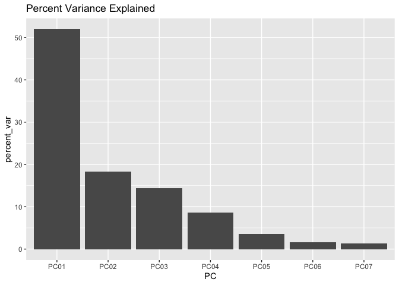
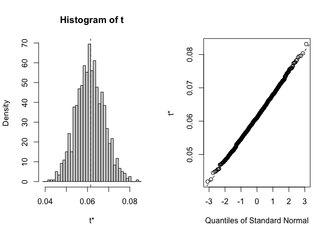

To do:

-   To get confidence intervals could do some bootstrapping - samples
    some of the 30 years and calculates it and so on - Julin could help
    with the code

    -   Need a function that does the climate distance calculation


# Climate Distance at the Davis Garden

Annual data might give a different result, worth presenting it both ways
because that helps highlight the importance of the life history
differences

\*Used "water year" with a start date of Nov 1 b/c that's the first
month UCD was planted and includes all the months we collected data from
WL2. This (as opposed to calendar year) allowed for the inclusion of the
2022 months at the UCD garden

Options:

-   Basic subtraction as in Moran et al 2017 (garden site - home site)

-   Gower's environmental distance metric as in Rutter and Fenster 2007

-   From PCAs "We calculated an overall environmental distance using
    PCA, with EDij corresponding to the Euclidian distance between i and
    j based on PCA1 & PCA2." as in Moran et al 2017

## Relevant Libraries and Functions


``` r
library(raster)
```

```
## Loading required package: sp
```

``` r
library(tidyverse)
```

```
## ── Attaching core tidyverse packages ──────────────────────── tidyverse 2.0.0 ──
## ✔ dplyr     1.1.4     ✔ readr     2.1.5
## ✔ forcats   1.0.0     ✔ stringr   1.5.1
## ✔ ggplot2   3.5.1     ✔ tibble    3.2.1
## ✔ lubridate 1.9.3     ✔ tidyr     1.3.1
## ✔ purrr     1.0.2
```

```
## ── Conflicts ────────────────────────────────────────── tidyverse_conflicts() ──
## ✖ tidyr::extract() masks raster::extract()
## ✖ dplyr::filter()  masks stats::filter()
## ✖ dplyr::lag()     masks stats::lag()
## ✖ dplyr::select()  masks raster::select()
## ℹ Use the conflicted package (<http://conflicted.r-lib.org/>) to force all conflicts to become errors
```

``` r
library(conflicted)
conflicts_prefer(dplyr::select())
```

```
## [conflicted] Will prefer dplyr::select over any other package.
```

``` r
conflicts_prefer(dplyr::filter)
```

```
## [conflicted] Will prefer dplyr::filter over any other package.
```

``` r
library(ggrepel)
library(cowplot)
library(gridExtra)
library(naniar) #replaces values with NA

get_legend<-function(myggplot){
  tmp <- ggplot_gtable(ggplot_build(myggplot))
  leg <- which(sapply(tmp$grobs, function(x) x$name) == "guide-box")
  legend <- tmp$grobs[[leg]]
  return(legend)
} #legend function for grid_arrange

elev_three_palette <- c("#0043F0", "#C9727F", "#F5A540") #colors from Gremer et al 2019
elev_order <- c("High", "Mid", "Low")
```

## Home Climates

### Flint


``` r
pops_flint_avgs <- read_csv("../output/Climate/fullyear_FlintAvgs_wtr_year.csv")
```

```
## Rows: 46 Columns: 11
## ── Column specification ────────────────────────────────────────────────────────
## Delimiter: ","
## chr (3): parent.pop, elevation.group, TimePd
## dbl (8): elev_m, Lat, Long, cwd, pck, ppt, tmn, tmx
## 
## ℹ Use `spec()` to retrieve the full column specification for this data.
## ℹ Specify the column types or set `show_col_types = FALSE` to quiet this message.
```

``` r
head(pops_flint_avgs)
```

```
## # A tibble: 6 × 11
##   parent.pop elevation.group elev_m   Lat  Long   cwd    pck   ppt    tmn   tmx
##   <chr>      <chr>            <dbl> <dbl> <dbl> <dbl>  <dbl> <dbl>  <dbl> <dbl>
## 1 BH         Low               511.  37.4 -120.  75.9   0     48.6  8.91   23.6
## 2 CC         Low               313   39.6 -121.  59.9   0     84.5 10.0    23.3
## 3 CP2        High             2244.  38.7 -120.  62.9 218.   107.   1.16   13.4
## 4 CP3        High             2266.  38.7 -120.  46.2 236.   103.   0.512  12.6
## 5 DPR        Mid              1019.  39.2 -121.  27.5   7.63 121.   7.87   20.2
## 6 FR         Mid               787   40.0 -121.  75.5  14.1   84.9  5.69   20.1
## # ℹ 1 more variable: TimePd <chr>
```

``` r
unique(pops_flint_avgs$parent.pop) #only home pops
```

```
##  [1] "BH"    "CC"    "CP2"   "CP3"   "DPR"   "FR"    "IH"    "LV1"   "LV3"  
## [10] "LVTR1" "SC"    "SQ1"   "SQ2"   "SQ3"   "TM2"   "WL1"   "WL2"   "WR"   
## [19] "WV"    "YO11"  "YO4"   "YO7"   "YO8"
```

``` r
unique(pops_flint_avgs$TimePd) # recent and historical timeperiod 
```

```
## [1] "Recent"     "Historical"
```

``` r
pops_flint_recent_avgs <- pops_flint_avgs %>% filter(TimePd=="Recent")
head(pops_flint_recent_avgs)
```

```
## # A tibble: 6 × 11
##   parent.pop elevation.group elev_m   Lat  Long   cwd    pck   ppt    tmn   tmx
##   <chr>      <chr>            <dbl> <dbl> <dbl> <dbl>  <dbl> <dbl>  <dbl> <dbl>
## 1 BH         Low               511.  37.4 -120.  75.9   0     48.6  8.91   23.6
## 2 CC         Low               313   39.6 -121.  59.9   0     84.5 10.0    23.3
## 3 CP2        High             2244.  38.7 -120.  62.9 218.   107.   1.16   13.4
## 4 CP3        High             2266.  38.7 -120.  46.2 236.   103.   0.512  12.6
## 5 DPR        Mid              1019.  39.2 -121.  27.5   7.63 121.   7.87   20.2
## 6 FR         Mid               787   40.0 -121.  75.5  14.1   84.9  5.69   20.1
## # ℹ 1 more variable: TimePd <chr>
```

``` r
pops_flint_historic_avgs <-  pops_flint_avgs %>% filter(TimePd=="Historical")
head(pops_flint_historic_avgs)
```

```
## # A tibble: 6 × 11
##   parent.pop elevation.group elev_m   Lat  Long   cwd     pck   ppt    tmn   tmx
##   <chr>      <chr>            <dbl> <dbl> <dbl> <dbl>   <dbl> <dbl>  <dbl> <dbl>
## 1 BH         Low               511.  37.4 -120.  74.5 1.95e-2  48.4  7.73   22.9
## 2 CC         Low               313   39.6 -121.  59.6 7.93e-2  82.0  8.90   22.9
## 3 CP2        High             2244.  38.7 -120.  60.4 2.65e+2 110.  -0.303  12.5
## 4 CP3        High             2266.  38.7 -120.  43.8 2.82e+2 107.  -0.850  11.8
## 5 DPR        Mid              1019.  39.2 -121.  26.4 2.05e+1 121.   6.23   19.7
## 6 FR         Mid               787   40.0 -121.  74.0 1.92e+1  84.3  4.55   20.1
## # ℹ 1 more variable: TimePd <chr>
```

``` r
names(pops_flint_historic_avgs)
```

```
##  [1] "parent.pop"      "elevation.group" "elev_m"          "Lat"            
##  [5] "Long"            "cwd"             "pck"             "ppt"            
##  [9] "tmn"             "tmx"             "TimePd"
```

### BioClim


``` r
pops_bioclim_avgs <-  read_csv("../output/Climate/fullyear_BioClimAvgs_wtr_year.csv") 
```

```
## Rows: 46 Columns: 16
## ── Column specification ────────────────────────────────────────────────────────
## Delimiter: ","
## chr  (3): parent.pop, elevation.group, TimePd
## dbl (13): elev_m, Lat, Long, ann_tmean, mean_diurnal_range, temp_seasonality...
## 
## ℹ Use `spec()` to retrieve the full column specification for this data.
## ℹ Specify the column types or set `show_col_types = FALSE` to quiet this message.
```

``` r
head(pops_bioclim_avgs)
```

```
## # A tibble: 6 × 16
##   parent.pop elevation.group elev_m   Lat  Long ann_tmean mean_diurnal_range
##   <chr>      <chr>            <dbl> <dbl> <dbl>     <dbl>              <dbl>
## 1 BH         Low               511.  37.4 -120.     16.2                14.7
## 2 CC         Low               313   39.6 -121.     16.6                13.3
## 3 CP2        High             2244.  38.7 -120.      7.28               12.2
## 4 CP3        High             2266.  38.7 -120.      6.58               12.1
## 5 DPR        Mid              1019.  39.2 -121.     14.1                12.4
## 6 FR         Mid               787   40.0 -121.     12.9                14.4
## # ℹ 9 more variables: temp_seasonality <dbl>, temp_ann_range <dbl>,
## #   tmean_wettest_quarter <dbl>, tmean_driest_quarter <dbl>, ann_ppt <dbl>,
## #   ppt_seasonality <dbl>, ppt_warmest_quarter <dbl>,
## #   ppt_coldest_quarter <dbl>, TimePd <chr>
```

``` r
unique(pops_bioclim_avgs$parent.pop) #only home pops
```

```
##  [1] "BH"    "CC"    "CP2"   "CP3"   "DPR"   "FR"    "IH"    "LV1"   "LV3"  
## [10] "LVTR1" "SC"    "SQ1"   "SQ2"   "SQ3"   "TM2"   "WL1"   "WL2"   "WR"   
## [19] "WV"    "YO11"  "YO4"   "YO7"   "YO8"
```

``` r
unique(pops_bioclim_avgs$TimePd) # recent and historical timeperiod 
```

```
## [1] "Recent"     "Historical"
```

``` r
pops_bioclim_recent_avgs <- pops_bioclim_avgs %>%  filter(TimePd=="Recent")
head(pops_bioclim_recent_avgs)
```

```
## # A tibble: 6 × 16
##   parent.pop elevation.group elev_m   Lat  Long ann_tmean mean_diurnal_range
##   <chr>      <chr>            <dbl> <dbl> <dbl>     <dbl>              <dbl>
## 1 BH         Low               511.  37.4 -120.     16.2                14.7
## 2 CC         Low               313   39.6 -121.     16.6                13.3
## 3 CP2        High             2244.  38.7 -120.      7.28               12.2
## 4 CP3        High             2266.  38.7 -120.      6.58               12.1
## 5 DPR        Mid              1019.  39.2 -121.     14.1                12.4
## 6 FR         Mid               787   40.0 -121.     12.9                14.4
## # ℹ 9 more variables: temp_seasonality <dbl>, temp_ann_range <dbl>,
## #   tmean_wettest_quarter <dbl>, tmean_driest_quarter <dbl>, ann_ppt <dbl>,
## #   ppt_seasonality <dbl>, ppt_warmest_quarter <dbl>,
## #   ppt_coldest_quarter <dbl>, TimePd <chr>
```

``` r
pops_bioclim_historical_avgs <- pops_bioclim_avgs %>% filter(TimePd=="Historical")
head(pops_bioclim_historical_avgs)
```

```
## # A tibble: 6 × 16
##   parent.pop elevation.group elev_m   Lat  Long ann_tmean mean_diurnal_range
##   <chr>      <chr>            <dbl> <dbl> <dbl>     <dbl>              <dbl>
## 1 BH         Low               511.  37.4 -120.     15.3                15.2
## 2 CC         Low               313   39.6 -121.     15.9                14.0
## 3 CP2        High             2244.  38.7 -120.      6.11               12.8
## 4 CP3        High             2266.  38.7 -120.      5.46               12.6
## 5 DPR        Mid              1019.  39.2 -121.     13.0                13.5
## 6 FR         Mid               787   40.0 -121.     12.3                15.6
## # ℹ 9 more variables: temp_seasonality <dbl>, temp_ann_range <dbl>,
## #   tmean_wettest_quarter <dbl>, tmean_driest_quarter <dbl>, ann_ppt <dbl>,
## #   ppt_seasonality <dbl>, ppt_warmest_quarter <dbl>,
## #   ppt_coldest_quarter <dbl>, TimePd <chr>
```

``` r
names(pops_bioclim_historical_avgs)
```

```
##  [1] "parent.pop"            "elevation.group"       "elev_m"               
##  [4] "Lat"                   "Long"                  "ann_tmean"            
##  [7] "mean_diurnal_range"    "temp_seasonality"      "temp_ann_range"       
## [10] "tmean_wettest_quarter" "tmean_driest_quarter"  "ann_ppt"              
## [13] "ppt_seasonality"       "ppt_warmest_quarter"   "ppt_coldest_quarter"  
## [16] "TimePd"
```

## Davis Climate Data (Nov 2022-Oct 2023)

### From Flint (changed this from CIMIS)


``` r
davis_climate <- read_csv("../output/Climate/flint_climate_UCDpops.csv") %>% 
  filter(parent.pop=="UCD_Garden") %>% 
  filter(year>=2022, year<2024) %>% 
  filter(if_else(year==2022, month=="nov" | month=="dec",
                 month!="nov" & month !="dec")) %>% 
  mutate(tavg = (tmn + tmx)/2, t_diurnal = (tmx-tmn))
```

```
## Rows: 38675 Columns: 14
## ── Column specification ────────────────────────────────────────────────────────
## Delimiter: ","
## chr  (3): parent.pop, elevation.group, month
## dbl (11): elev_m, Lat, Long, year, aet, cwd, pck, pet, ppt, tmn, tmx
## 
## ℹ Use `spec()` to retrieve the full column specification for this data.
## ℹ Specify the column types or set `show_col_types = FALSE` to quiet this message.
```

``` r
head(davis_climate)
```

```
## # A tibble: 6 × 16
##   parent.pop elevation.group elev_m   Lat  Long  year month   aet   cwd   pck
##   <chr>      <chr>            <dbl> <dbl> <dbl> <dbl> <chr> <dbl> <dbl> <dbl>
## 1 UCD_Garden Low                 16  38.5 -122.  2022 dec    3.74  20.5     0
## 2 UCD_Garden Low                 16  38.5 -122.  2022 nov    3.77  33.3     0
## 3 UCD_Garden Low                 16  38.5 -122.  2023 apr   29.4   88.9     0
## 4 UCD_Garden Low                 16  38.5 -122.  2023 aug   42.4  139.      0
## 5 UCD_Garden Low                 16  38.5 -122.  2023 feb    8.57  29.9     0
## 6 UCD_Garden Low                 16  38.5 -122.  2023 jan    5.42  21.7     0
## # ℹ 6 more variables: pet <dbl>, ppt <dbl>, tmn <dbl>, tmx <dbl>, tavg <dbl>,
## #   t_diurnal <dbl>
```

``` r
summary(davis_climate)
```

```
##   parent.pop        elevation.group        elev_m        Lat       
##  Length:12          Length:12          Min.   :16   Min.   :38.53  
##  Class :character   Class :character   1st Qu.:16   1st Qu.:38.53  
##  Mode  :character   Mode  :character   Median :16   Median :38.53  
##                                        Mean   :16   Mean   :38.53  
##                                        3rd Qu.:16   3rd Qu.:38.53  
##                                        Max.   :16   Max.   :38.53  
##       Long             year         month                aet        
##  Min.   :-121.8   Min.   :2022   Length:12          Min.   : 3.740  
##  1st Qu.:-121.8   1st Qu.:2023   Class :character   1st Qu.: 5.298  
##  Median :-121.8   Median :2023   Mode  :character   Median :19.155  
##  Mean   :-121.8   Mean   :2023                      Mean   :25.706  
##  3rd Qu.:-121.8   3rd Qu.:2023                      3rd Qu.:44.822  
##  Max.   :-121.8   Max.   :2023                      Max.   :60.480  
##       cwd              pck         pet              ppt         
##  Min.   : 20.46   Min.   :0   Min.   : 24.20   Min.   :  0.000  
##  1st Qu.: 32.48   1st Qu.:0   1st Qu.: 38.15   1st Qu.:  0.415  
##  Median : 85.09   Median :0   Median :102.25   Median : 15.850  
##  Mean   : 79.91   Mean   :0   Mean   :105.62   Mean   : 60.338  
##  3rd Qu.:115.29   3rd Qu.:0   3rd Qu.:168.95   3rd Qu.: 83.745  
##  Max.   :144.82   Max.   :0   Max.   :205.30   Max.   :258.000  
##       tmn              tmx             tavg          t_diurnal    
##  Min.   : 2.360   Min.   :11.62   Min.   : 7.275   Min.   : 8.69  
##  1st Qu.: 4.497   1st Qu.:14.57   1st Qu.: 9.669   1st Qu.:11.51  
##  Median : 8.720   Median :23.41   Median :16.067   Median :14.70  
##  Mean   : 8.487   Mean   :22.48   Mean   :15.484   Mean   :13.99  
##  3rd Qu.:12.342   3rd Qu.:28.16   3rd Qu.:20.253   3rd Qu.:15.75  
##  Max.   :15.470   Max.   :34.37   Max.   :24.520   Max.   :19.75
```

``` r
davis_climate_flint <- davis_climate %>% #get the means for the variables to compare to home sites 
  summarise(cwd_Davis=mean(cwd),ppt_Davis=mean(ppt), pck_Davis=mean(pck), tmn_Davis=mean(tmn), tmx_Davis=mean(tmx))
davis_climate_flint
```

```
## # A tibble: 1 × 5
##   cwd_Davis ppt_Davis pck_Davis tmn_Davis tmx_Davis
##       <dbl>     <dbl>     <dbl>     <dbl>     <dbl>
## 1      79.9      60.3         0      8.49      22.5
```

## Davis Climate Trends


``` r
davis_climate$month <- factor(davis_climate$month, levels = c("nov","dec","jan", "feb", "mar", "apr", "may", "jun", "jul", "aug", "sep", "oct"))

davis_climate %>% 
  ggplot(aes(x=month,y=cwd)) +
  geom_point()
```

<!-- -->

``` r
davis_climate %>% 
  ggplot(aes(x=month,y=tmx)) +
  geom_point()
```

<!-- -->

``` r
davis_climate %>% 
  ggplot(aes(x=month,y=tmn)) +
  geom_point()
```

<!-- -->

``` r
davis_climate %>% 
  ggplot(aes(x=month,y=ppt)) +
  geom_point() 
```

<!-- -->

### BioClim

Calculating wettest, driest, warmest, and coldest months

Note I called these "quarter" instead of month for merging with the home
climate quarter data.


``` r
davis_wettest_quarter <- davis_climate %>%  
  slice_max(ppt)

davis_driest_quarter <- davis_climate %>% 
  slice_min(ppt)

davis_warmest_quarter <- davis_climate %>% 
  slice_max(tavg)

davis_coldest_quarter <- davis_climate %>%
  slice_min(tavg)
```

Bio 1, 2, 4, 7, 12, 15


``` r
bioclim_davis_calc <- davis_climate %>% 
  summarise(ann_tmean=mean(tavg),  #Bio1 - Annual Mean Temperature
            mean_diurnal_range=mean(t_diurnal), #Bio2 - Mean Diurnal Range
            temp_seasonality=sd(tavg), #Bio4 - Temperature Seasonality
            temp_ann_range=(max(tmx))-(min(tmn)), #bio7 - temp annual range
            ann_ppt=sum(ppt), #bio12 - annual precip
            ppt_seasonality=cv(ppt+1)) #bio15 - Precipitation Seasonality (+1 to avoid strange CVs for areas where mean rainfaill is < 1)
bioclim_davis_calc
```

```
## # A tibble: 1 × 6
##   ann_tmean mean_diurnal_range temp_seasonality temp_ann_range ann_ppt
##       <dbl>              <dbl>            <dbl>          <dbl>   <dbl>
## 1      15.5               14.0             6.34           32.0    724.
## # ℹ 1 more variable: ppt_seasonality <dbl>
```

Bio 8(Q), 9(Q), 18(Q), 19(Q)


``` r
#bio8 = tmean_wettest_quarter
bio8_davis <- davis_wettest_quarter %>% 
  dplyr::select(tmean_wettest_quarter=tavg)

#bio9 = tmean_driest_quarter
bio9_davis <- davis_driest_quarter %>% 
  dplyr::select(tmean_driest_quarter=tavg)

bio8_9_davis <- bind_cols(bio8_davis, bio9_davis)

#bio18 = ppt_warmest_quarter
bio18_davis <- davis_warmest_quarter %>% 
  dplyr::select(ppt_warmest_quarter=ppt)

#bio19 = ppt_coldest_quarter
bio19_davis <- davis_wettest_quarter %>% 
  dplyr::select(ppt_coldest_quarter=ppt)

bio18_19_davis <- bind_cols(bio18_davis, bio19_davis)

all_periods_davis <- bind_cols(bio8_9_davis, bio18_19_davis)
```

Merge all bioclims


``` r
davis_bioclim_final <- bind_cols(bioclim_davis_calc, all_periods_davis) %>% 
  rename_with(~paste0(., "_Davis"), 1:10)
summary(davis_bioclim_final)
```

```
##  ann_tmean_Davis mean_diurnal_range_Davis temp_seasonality_Davis
##  Min.   :15.48   Min.   :14               Min.   :6.339         
##  1st Qu.:15.48   1st Qu.:14               1st Qu.:6.339         
##  Median :15.48   Median :14               Median :6.339         
##  Mean   :15.48   Mean   :14               Mean   :6.339         
##  3rd Qu.:15.48   3rd Qu.:14               3rd Qu.:6.339         
##  Max.   :15.48   Max.   :14               Max.   :6.339         
##  temp_ann_range_Davis ann_ppt_Davis   ppt_seasonality_Davis
##  Min.   :32.01        Min.   :724.1   Min.   :144.2        
##  1st Qu.:32.01        1st Qu.:724.1   1st Qu.:144.2        
##  Median :32.01        Median :724.1   Median :144.2        
##  Mean   :32.01        Mean   :724.1   Mean   :144.2        
##  3rd Qu.:32.01        3rd Qu.:724.1   3rd Qu.:144.2        
##  Max.   :32.01        Max.   :724.1   Max.   :144.2        
##  tmean_wettest_quarter_Davis tmean_driest_quarter_Davis
##  Min.   :9.305               Min.   :24.5              
##  1st Qu.:9.305               1st Qu.:24.5              
##  Median :9.305               Median :24.5              
##  Mean   :9.305               Mean   :24.5              
##  3rd Qu.:9.305               3rd Qu.:24.5              
##  Max.   :9.305               Max.   :24.5              
##  ppt_warmest_quarter_Davis ppt_coldest_quarter_Davis
##  Min.   :0.16              Min.   :258              
##  1st Qu.:0.16              1st Qu.:258              
##  Median :0.16              Median :258              
##  Mean   :0.16              Mean   :258              
##  3rd Qu.:0.16              3rd Qu.:258              
##  Max.   :0.16              Max.   :258
```

## Gower's Climate Distance

(1/P) \* SUM ((absolute value(Ai - Bi)) / range(i)) for each variable

-   P = number of environmental variables = 13 (without CWD)

-   Ai = 30 year avg of that variable for the home site

-   Bi = Nov 2022-Oct 2023 avg of that variable for the Davis garden

-   Range(i) = maximum - minimum of that variable in the whole data set
    (across sites)

### Combine the flint and bioclim variables


``` r
davis_climate_all <- bind_cols(davis_climate_flint, davis_bioclim_final)
dim(davis_climate_all)
```

```
## [1]  1 15
```

``` r
home_climates_all_recent <- left_join(pops_flint_recent_avgs, pops_bioclim_recent_avgs)
```

```
## Joining with `by = join_by(parent.pop, elevation.group, elev_m, Lat, Long,
## TimePd)`
```

``` r
home_climates_all_historic <- left_join(pops_flint_historic_avgs, pops_bioclim_historical_avgs)
```

```
## Joining with `by = join_by(parent.pop, elevation.group, elev_m, Lat, Long,
## TimePd)`
```

``` r
davis_home_climate_recent <- bind_cols(davis_climate_all, home_climates_all_recent)
summary(davis_home_climate_recent)
```

```
##    cwd_Davis       ppt_Davis       pck_Davis   tmn_Davis       tmx_Davis    
##  Min.   :79.91   Min.   :60.34   Min.   :0   Min.   :8.487   Min.   :22.48  
##  1st Qu.:79.91   1st Qu.:60.34   1st Qu.:0   1st Qu.:8.487   1st Qu.:22.48  
##  Median :79.91   Median :60.34   Median :0   Median :8.487   Median :22.48  
##  Mean   :79.91   Mean   :60.34   Mean   :0   Mean   :8.487   Mean   :22.48  
##  3rd Qu.:79.91   3rd Qu.:60.34   3rd Qu.:0   3rd Qu.:8.487   3rd Qu.:22.48  
##  Max.   :79.91   Max.   :60.34   Max.   :0   Max.   :8.487   Max.   :22.48  
##  ann_tmean_Davis mean_diurnal_range_Davis temp_seasonality_Davis
##  Min.   :15.48   Min.   :14               Min.   :6.339         
##  1st Qu.:15.48   1st Qu.:14               1st Qu.:6.339         
##  Median :15.48   Median :14               Median :6.339         
##  Mean   :15.48   Mean   :14               Mean   :6.339         
##  3rd Qu.:15.48   3rd Qu.:14               3rd Qu.:6.339         
##  Max.   :15.48   Max.   :14               Max.   :6.339         
##  temp_ann_range_Davis ann_ppt_Davis   ppt_seasonality_Davis
##  Min.   :32.01        Min.   :724.1   Min.   :144.2        
##  1st Qu.:32.01        1st Qu.:724.1   1st Qu.:144.2        
##  Median :32.01        Median :724.1   Median :144.2        
##  Mean   :32.01        Mean   :724.1   Mean   :144.2        
##  3rd Qu.:32.01        3rd Qu.:724.1   3rd Qu.:144.2        
##  Max.   :32.01        Max.   :724.1   Max.   :144.2        
##  tmean_wettest_quarter_Davis tmean_driest_quarter_Davis
##  Min.   :9.305               Min.   :24.5              
##  1st Qu.:9.305               1st Qu.:24.5              
##  Median :9.305               Median :24.5              
##  Mean   :9.305               Mean   :24.5              
##  3rd Qu.:9.305               3rd Qu.:24.5              
##  Max.   :9.305               Max.   :24.5              
##  ppt_warmest_quarter_Davis ppt_coldest_quarter_Davis  parent.pop       
##  Min.   :0.16              Min.   :258               Length:23         
##  1st Qu.:0.16              1st Qu.:258               Class :character  
##  Median :0.16              Median :258               Mode  :character  
##  Mean   :0.16              Mean   :258                                 
##  3rd Qu.:0.16              3rd Qu.:258                                 
##  Max.   :0.16              Max.   :258                                 
##  elevation.group        elev_m            Lat             Long       
##  Length:23          Min.   : 313.0   Min.   :36.56   Min.   :-123.0  
##  Class :character   1st Qu.: 767.9   1st Qu.:37.81   1st Qu.:-121.3  
##  Mode  :character   Median :1934.5   Median :38.79   Median :-120.3  
##                     Mean   :1649.7   Mean   :38.74   Mean   :-120.4  
##                     3rd Qu.:2363.4   3rd Qu.:39.59   3rd Qu.:-119.7  
##                     Max.   :2872.3   Max.   :40.74   Max.   :-118.8  
##       cwd             pck              ppt              tmn          
##  Min.   :27.52   Min.   :  0.00   Min.   : 48.58   Min.   :-2.59814  
##  1st Qu.:49.56   1st Qu.: 10.88   1st Qu.: 84.71   1st Qu.:-0.06981  
##  Median :55.93   Median : 65.23   Median : 94.32   Median : 3.40014  
##  Mean   :56.19   Mean   :136.78   Mean   : 99.07   Mean   : 3.59801  
##  3rd Qu.:61.77   3rd Qu.:226.07   3rd Qu.:107.21   3rd Qu.: 7.48090  
##  Max.   :75.86   Max.   :454.27   Max.   :151.28   Max.   :10.01417  
##       tmx           TimePd            ann_tmean      mean_diurnal_range
##  Min.   :10.42   Length:23          Min.   : 3.910   Min.   :11.89     
##  1st Qu.:12.65   Class :character   1st Qu.: 6.288   1st Qu.:12.25     
##  Median :15.67   Mode  :character   Median : 9.535   Median :12.72     
##  Mean   :16.50                      Mean   :10.048   Mean   :12.90     
##  3rd Qu.:20.18                      3rd Qu.:13.560   3rd Qu.:13.34     
##  Max.   :23.56                      Max.   :16.646   Max.   :14.65     
##  temp_seasonality temp_ann_range  tmean_wettest_quarter tmean_driest_quarter
##  Min.   :647.9    Min.   :30.62   Min.   :-1.4982       Min.   : 6.575      
##  1st Qu.:666.9    1st Qu.:31.57   1st Qu.: 0.4829       1st Qu.: 9.059      
##  Median :685.6    Median :31.82   Median : 3.4333       Median :12.232      
##  Mean   :681.8    Mean   :32.06   Mean   : 4.0041       Mean   :12.906      
##  3rd Qu.:694.0    3rd Qu.:32.17   3rd Qu.: 7.0698       3rd Qu.:16.764      
##  Max.   :720.1    Max.   :34.40   Max.   :10.3360       Max.   :19.491      
##     ann_ppt     ppt_seasonality ppt_warmest_quarter ppt_coldest_quarter
##  Min.   : 583   Min.   :109.3   Min.   : 47.65      Min.   :329.9      
##  1st Qu.:1017   1st Qu.:114.6   1st Qu.: 91.04      1st Qu.:549.4      
##  Median :1132   Median :123.2   Median :104.76      Median :623.2      
##  Mean   :1189   Mean   :120.2   Mean   :111.22      Mean   :620.4      
##  3rd Qu.:1287   3rd Qu.:124.8   3rd Qu.:125.64      3rd Qu.:654.9      
##  Max.   :1815   Max.   :128.9   Max.   :187.23      Max.   :862.7
```

``` r
davis_home_climate_historic <- bind_cols(davis_climate_all, home_climates_all_historic)
summary(davis_home_climate_historic)
```

```
##    cwd_Davis       ppt_Davis       pck_Davis   tmn_Davis       tmx_Davis    
##  Min.   :79.91   Min.   :60.34   Min.   :0   Min.   :8.487   Min.   :22.48  
##  1st Qu.:79.91   1st Qu.:60.34   1st Qu.:0   1st Qu.:8.487   1st Qu.:22.48  
##  Median :79.91   Median :60.34   Median :0   Median :8.487   Median :22.48  
##  Mean   :79.91   Mean   :60.34   Mean   :0   Mean   :8.487   Mean   :22.48  
##  3rd Qu.:79.91   3rd Qu.:60.34   3rd Qu.:0   3rd Qu.:8.487   3rd Qu.:22.48  
##  Max.   :79.91   Max.   :60.34   Max.   :0   Max.   :8.487   Max.   :22.48  
##  ann_tmean_Davis mean_diurnal_range_Davis temp_seasonality_Davis
##  Min.   :15.48   Min.   :14               Min.   :6.339         
##  1st Qu.:15.48   1st Qu.:14               1st Qu.:6.339         
##  Median :15.48   Median :14               Median :6.339         
##  Mean   :15.48   Mean   :14               Mean   :6.339         
##  3rd Qu.:15.48   3rd Qu.:14               3rd Qu.:6.339         
##  Max.   :15.48   Max.   :14               Max.   :6.339         
##  temp_ann_range_Davis ann_ppt_Davis   ppt_seasonality_Davis
##  Min.   :32.01        Min.   :724.1   Min.   :144.2        
##  1st Qu.:32.01        1st Qu.:724.1   1st Qu.:144.2        
##  Median :32.01        Median :724.1   Median :144.2        
##  Mean   :32.01        Mean   :724.1   Mean   :144.2        
##  3rd Qu.:32.01        3rd Qu.:724.1   3rd Qu.:144.2        
##  Max.   :32.01        Max.   :724.1   Max.   :144.2        
##  tmean_wettest_quarter_Davis tmean_driest_quarter_Davis
##  Min.   :9.305               Min.   :24.5              
##  1st Qu.:9.305               1st Qu.:24.5              
##  Median :9.305               Median :24.5              
##  Mean   :9.305               Mean   :24.5              
##  3rd Qu.:9.305               3rd Qu.:24.5              
##  Max.   :9.305               Max.   :24.5              
##  ppt_warmest_quarter_Davis ppt_coldest_quarter_Davis  parent.pop       
##  Min.   :0.16              Min.   :258               Length:23         
##  1st Qu.:0.16              1st Qu.:258               Class :character  
##  Median :0.16              Median :258               Mode  :character  
##  Mean   :0.16              Mean   :258                                 
##  3rd Qu.:0.16              3rd Qu.:258                                 
##  Max.   :0.16              Max.   :258                                 
##  elevation.group        elev_m            Lat             Long       
##  Length:23          Min.   : 313.0   Min.   :36.56   Min.   :-123.0  
##  Class :character   1st Qu.: 767.9   1st Qu.:37.81   1st Qu.:-121.3  
##  Mode  :character   Median :1934.5   Median :38.79   Median :-120.3  
##                     Mean   :1649.7   Mean   :38.74   Mean   :-120.4  
##                     3rd Qu.:2363.4   3rd Qu.:39.59   3rd Qu.:-119.7  
##                     Max.   :2872.3   Max.   :40.74   Max.   :-118.8  
##       cwd             pck                ppt              tmn        
##  Min.   :26.45   Min.   :  0.0195   Min.   : 48.40   Min.   :-4.691  
##  1st Qu.:47.93   1st Qu.: 19.8433   1st Qu.: 84.43   1st Qu.:-1.400  
##  Median :52.68   Median : 86.8739   Median : 95.04   Median : 2.023  
##  Mean   :53.87   Mean   :161.8520   Mean   : 99.98   Mean   : 2.123  
##  3rd Qu.:60.03   3rd Qu.:266.8888   3rd Qu.:108.49   3rd Qu.: 5.722  
##  Max.   :74.51   Max.   :529.7280   Max.   :155.03   Max.   : 8.900  
##       tmx            TimePd            ann_tmean      mean_diurnal_range
##  Min.   : 9.689   Length:23          Min.   : 2.499   Min.   :12.19     
##  1st Qu.:11.713   Class :character   1st Qu.: 5.156   1st Qu.:12.73     
##  Median :14.360   Mode  :character   Median : 8.191   Median :13.78     
##  Mean   :15.760                      Mean   : 8.942   Mean   :13.64     
##  3rd Qu.:19.891                      3rd Qu.:12.639   3rd Qu.:14.08     
##  Max.   :22.931                      Max.   :15.914   Max.   :15.56     
##  temp_seasonality temp_ann_range  tmean_wettest_quarter tmean_driest_quarter
##  Min.   :637.8    Min.   :30.54   Min.   :-2.570        Min.   : 5.237      
##  1st Qu.:649.3    1st Qu.:31.53   1st Qu.:-0.048        1st Qu.: 8.407      
##  Median :660.9    Median :32.26   Median : 3.043        Median :11.450      
##  Mean   :662.6    Mean   :32.45   Mean   : 3.429        Mean   :12.176      
##  3rd Qu.:671.6    3rd Qu.:33.01   3rd Qu.: 6.479        3rd Qu.:16.116      
##  Max.   :718.6    Max.   :35.12   Max.   : 9.818        Max.   :18.947      
##     ann_ppt       ppt_seasonality ppt_warmest_quarter ppt_coldest_quarter
##  Min.   : 580.8   Min.   :102.5   Min.   : 64.71      Min.   :283.6      
##  1st Qu.:1013.2   1st Qu.:105.4   1st Qu.:103.95      1st Qu.:508.3      
##  Median :1140.4   Median :113.6   Median :119.45      Median :559.9      
##  Mean   :1199.7   Mean   :111.6   Mean   :132.47      Mean   :570.4      
##  3rd Qu.:1301.8   3rd Qu.:116.6   3rd Qu.:151.90      3rd Qu.:608.0      
##  Max.   :1860.3   Max.   :119.6   Max.   :228.91      Max.   :796.6
```

``` r
names(davis_home_climate_historic)
```

```
##  [1] "cwd_Davis"                   "ppt_Davis"                  
##  [3] "pck_Davis"                   "tmn_Davis"                  
##  [5] "tmx_Davis"                   "ann_tmean_Davis"            
##  [7] "mean_diurnal_range_Davis"    "temp_seasonality_Davis"     
##  [9] "temp_ann_range_Davis"        "ann_ppt_Davis"              
## [11] "ppt_seasonality_Davis"       "tmean_wettest_quarter_Davis"
## [13] "tmean_driest_quarter_Davis"  "ppt_warmest_quarter_Davis"  
## [15] "ppt_coldest_quarter_Davis"   "parent.pop"                 
## [17] "elevation.group"             "elev_m"                     
## [19] "Lat"                         "Long"                       
## [21] "cwd"                         "pck"                        
## [23] "ppt"                         "tmn"                        
## [25] "tmx"                         "TimePd"                     
## [27] "ann_tmean"                   "mean_diurnal_range"         
## [29] "temp_seasonality"            "temp_ann_range"             
## [31] "tmean_wettest_quarter"       "tmean_driest_quarter"       
## [33] "ann_ppt"                     "ppt_seasonality"            
## [35] "ppt_warmest_quarter"         "ppt_coldest_quarter"
```

### Figure out the range for each variable


``` r
davis_range_prep <- davis_climate_all %>% 
  mutate(parent.pop="Davis") %>% 
  rename_with(~str_remove(., "_Davis"), everything())
```

#### Recent


``` r
range_merge_recent <- bind_rows(home_climates_all_recent, davis_range_prep)
names(range_merge_recent)
```

```
##  [1] "parent.pop"            "elevation.group"       "elev_m"               
##  [4] "Lat"                   "Long"                  "cwd"                  
##  [7] "pck"                   "ppt"                   "tmn"                  
## [10] "tmx"                   "TimePd"                "ann_tmean"            
## [13] "mean_diurnal_range"    "temp_seasonality"      "temp_ann_range"       
## [16] "tmean_wettest_quarter" "tmean_driest_quarter"  "ann_ppt"              
## [19] "ppt_seasonality"       "ppt_warmest_quarter"   "ppt_coldest_quarter"
```

``` r
summary(range_merge_recent)
```

```
##   parent.pop        elevation.group        elev_m            Lat       
##  Length:24          Length:24          Min.   : 313.0   Min.   :36.56  
##  Class :character   Class :character   1st Qu.: 767.9   1st Qu.:37.81  
##  Mode  :character   Mode  :character   Median :1934.5   Median :38.79  
##                                        Mean   :1649.7   Mean   :38.74  
##                                        3rd Qu.:2363.4   3rd Qu.:39.59  
##                                        Max.   :2872.3   Max.   :40.74  
##                                        NA's   :1        NA's   :1      
##       Long             cwd             pck               ppt        
##  Min.   :-123.0   Min.   :27.52   Min.   :  0.000   Min.   : 48.58  
##  1st Qu.:-121.3   1st Qu.:49.69   1st Qu.:  5.766   1st Qu.: 83.42  
##  Median :-120.3   Median :55.98   Median : 64.332   Median : 94.29  
##  Mean   :-120.4   Mean   :57.17   Mean   :131.081   Mean   : 97.45  
##  3rd Qu.:-119.7   3rd Qu.:64.20   3rd Qu.:221.988   3rd Qu.:107.15  
##  Max.   :-118.8   Max.   :79.91   Max.   :454.267   Max.   :151.28  
##  NA's   :1                                                          
##       tmn               tmx           TimePd            ann_tmean     
##  Min.   :-2.5981   Min.   :10.42   Length:24          Min.   : 3.910  
##  1st Qu.: 0.2213   1st Qu.:12.65   Class :character   1st Qu.: 6.431  
##  Median : 3.5593   Median :15.71   Mode  :character   Median : 9.636  
##  Mean   : 3.8017   Mean   :16.75                      Mean   :10.274  
##  3rd Qu.: 8.0218   3rd Qu.:20.73                      3rd Qu.:14.397  
##  Max.   :10.0142   Max.   :23.56                      Max.   :16.646  
##                                                                       
##  mean_diurnal_range temp_seasonality  temp_ann_range  tmean_wettest_quarter
##  Min.   :11.89      Min.   :  6.339   Min.   :30.62   Min.   :-1.4982      
##  1st Qu.:12.26      1st Qu.:666.696   1st Qu.:31.58   1st Qu.: 0.6642      
##  Median :12.75      Median :683.386   Median :31.83   Median : 3.5174      
##  Mean   :12.94      Mean   :653.648   Mean   :32.06   Mean   : 4.2250      
##  3rd Qu.:13.42      3rd Qu.:692.872   3rd Qu.:32.13   3rd Qu.: 8.0089      
##  Max.   :14.65      Max.   :720.148   Max.   :34.40   Max.   :10.3360      
##                                                                            
##  tmean_driest_quarter    ann_ppt     ppt_seasonality ppt_warmest_quarter
##  Min.   : 6.575       Min.   : 583   Min.   :109.3   Min.   :  0.16     
##  1st Qu.: 9.321       1st Qu.:1001   1st Qu.:114.8   1st Qu.: 88.95     
##  Median :12.319       Median :1131   Median :123.3   Median :103.54     
##  Mean   :13.389       Mean   :1169   Mean   :121.2   Mean   :106.59     
##  3rd Qu.:17.514       3rd Qu.:1286   3rd Qu.:125.0   3rd Qu.:124.68     
##  Max.   :24.495       Max.   :1815   Max.   :144.2   Max.   :187.23     
##                                                                         
##  ppt_coldest_quarter
##  Min.   :258.0      
##  1st Qu.:538.8      
##  Median :617.8      
##  Mean   :605.3      
##  3rd Qu.:654.8      
##  Max.   :862.7      
## 
```

``` r
davis_home_climate_ranges_recent <- range_merge_recent %>% 
  summarise(cwd_range=max(cwd)-min(cwd),
            ppt_range=max(ppt)-min(ppt), 
            tmn_range=max(tmn)-min(tmn), 
            tmx_range=max(tmx)-min(tmx), 
            ann_tmean_range=max(ann_tmean)-min(ann_tmean),
            mean_diurnal_range_range=max(mean_diurnal_range)-min(mean_diurnal_range),
            temp_seasonality_range=max(temp_seasonality)-min(temp_seasonality),
            temp_ann_range_range=max(temp_ann_range)-min(temp_ann_range),
            tmean_wettest_quarter_range=max(tmean_wettest_quarter)-min(tmean_wettest_quarter),
            tmean_driest_quarter_range=max(tmean_driest_quarter)-min(tmean_driest_quarter),
            ann_ppt_range=max(ann_ppt)-min(ann_ppt), 
            ppt_seasonality_range=max(ppt_seasonality)-min(ppt_seasonality),
            ppt_warmest_quarter_range=max(ppt_warmest_quarter)-min(ppt_warmest_quarter), 
            ppt_coldest_quarter_range=max(ppt_coldest_quarter)-min(ppt_coldest_quarter))
davis_home_climate_ranges_recent
```

```
## # A tibble: 1 × 14
##   cwd_range ppt_range tmn_range tmx_range ann_tmean_range mean_diurnal_range_r…¹
##       <dbl>     <dbl>     <dbl>     <dbl>           <dbl>                  <dbl>
## 1      52.4      103.      12.6      13.1            12.7                   2.76
## # ℹ abbreviated name: ¹​mean_diurnal_range_range
## # ℹ 8 more variables: temp_seasonality_range <dbl>, temp_ann_range_range <dbl>,
## #   tmean_wettest_quarter_range <dbl>, tmean_driest_quarter_range <dbl>,
## #   ann_ppt_range <dbl>, ppt_seasonality_range <dbl>,
## #   ppt_warmest_quarter_range <dbl>, ppt_coldest_quarter_range <dbl>
```

``` r
davis_home_climate_with_ranges_recent <- bind_cols(davis_home_climate_recent, davis_home_climate_ranges_recent)
names(davis_home_climate_with_ranges_recent)
```

```
##  [1] "cwd_Davis"                   "ppt_Davis"                  
##  [3] "pck_Davis"                   "tmn_Davis"                  
##  [5] "tmx_Davis"                   "ann_tmean_Davis"            
##  [7] "mean_diurnal_range_Davis"    "temp_seasonality_Davis"     
##  [9] "temp_ann_range_Davis"        "ann_ppt_Davis"              
## [11] "ppt_seasonality_Davis"       "tmean_wettest_quarter_Davis"
## [13] "tmean_driest_quarter_Davis"  "ppt_warmest_quarter_Davis"  
## [15] "ppt_coldest_quarter_Davis"   "parent.pop"                 
## [17] "elevation.group"             "elev_m"                     
## [19] "Lat"                         "Long"                       
## [21] "cwd"                         "pck"                        
## [23] "ppt"                         "tmn"                        
## [25] "tmx"                         "TimePd"                     
## [27] "ann_tmean"                   "mean_diurnal_range"         
## [29] "temp_seasonality"            "temp_ann_range"             
## [31] "tmean_wettest_quarter"       "tmean_driest_quarter"       
## [33] "ann_ppt"                     "ppt_seasonality"            
## [35] "ppt_warmest_quarter"         "ppt_coldest_quarter"        
## [37] "cwd_range"                   "ppt_range"                  
## [39] "tmn_range"                   "tmx_range"                  
## [41] "ann_tmean_range"             "mean_diurnal_range_range"   
## [43] "temp_seasonality_range"      "temp_ann_range_range"       
## [45] "tmean_wettest_quarter_range" "tmean_driest_quarter_range" 
## [47] "ann_ppt_range"               "ppt_seasonality_range"      
## [49] "ppt_warmest_quarter_range"   "ppt_coldest_quarter_range"
```

#### Historic


``` r
range_merge_historic <- bind_rows(home_climates_all_historic, davis_range_prep)
names(range_merge_historic)
```

```
##  [1] "parent.pop"            "elevation.group"       "elev_m"               
##  [4] "Lat"                   "Long"                  "cwd"                  
##  [7] "pck"                   "ppt"                   "tmn"                  
## [10] "tmx"                   "TimePd"                "ann_tmean"            
## [13] "mean_diurnal_range"    "temp_seasonality"      "temp_ann_range"       
## [16] "tmean_wettest_quarter" "tmean_driest_quarter"  "ann_ppt"              
## [19] "ppt_seasonality"       "ppt_warmest_quarter"   "ppt_coldest_quarter"
```

``` r
summary(range_merge_historic)
```

```
##   parent.pop        elevation.group        elev_m            Lat       
##  Length:24          Length:24          Min.   : 313.0   Min.   :36.56  
##  Class :character   Class :character   1st Qu.: 767.9   1st Qu.:37.81  
##  Mode  :character   Mode  :character   Median :1934.5   Median :38.79  
##                                        Mean   :1649.7   Mean   :38.74  
##                                        3rd Qu.:2363.4   3rd Qu.:39.59  
##                                        Max.   :2872.3   Max.   :40.74  
##                                        NA's   :1        NA's   :1      
##       Long             cwd             pck              ppt        
##  Min.   :-123.0   Min.   :26.45   Min.   :  0.00   Min.   : 48.40  
##  1st Qu.:-121.3   1st Qu.:48.59   1st Qu.: 14.78   1st Qu.: 84.23  
##  Median :-120.3   Median :52.86   Median : 84.85   Median : 94.53  
##  Mean   :-120.4   Mean   :54.95   Mean   :155.11   Mean   : 98.32  
##  3rd Qu.:-119.7   3rd Qu.:61.47   3rd Qu.:266.11   3rd Qu.:107.51  
##  Max.   :-118.8   Max.   :79.91   Max.   :529.73   Max.   :155.03  
##  NA's   :1                                                         
##       tmn              tmx            TimePd            ann_tmean     
##  Min.   :-4.691   Min.   : 9.689   Length:24          Min.   : 2.499  
##  1st Qu.:-1.125   1st Qu.:11.740   Class :character   1st Qu.: 5.308  
##  Median : 2.069   Median :14.376   Mode  :character   Median : 8.222  
##  Mean   : 2.389   Mean   :16.040                      Mean   : 9.215  
##  3rd Qu.: 6.591   3rd Qu.:20.531                      3rd Qu.:13.404  
##  Max.   : 8.900   Max.   :22.931                      Max.   :15.914  
##                                                                       
##  mean_diurnal_range temp_seasonality  temp_ann_range  tmean_wettest_quarter
##  Min.   :12.19      Min.   :  6.339   Min.   :30.54   Min.   :-2.56956     
##  1st Qu.:12.78      1st Qu.:647.940   1st Qu.:31.56   1st Qu.: 0.03675     
##  Median :13.78      Median :659.859   Median :32.25   Median : 3.05586     
##  Mean   :13.65      Mean   :635.286   Mean   :32.43   Mean   : 3.67386     
##  3rd Qu.:14.06      3rd Qu.:671.575   3rd Qu.:32.99   3rd Qu.: 7.33582     
##  Max.   :15.56      Max.   :718.583   Max.   :35.12   Max.   : 9.81833     
##                                                                            
##  tmean_driest_quarter    ann_ppt       ppt_seasonality ppt_warmest_quarter
##  Min.   : 5.237       Min.   : 580.8   Min.   :102.5   Min.   :  0.16     
##  1st Qu.: 8.594       1st Qu.:1010.8   1st Qu.:105.6   1st Qu.: 99.10     
##  Median :11.453       Median :1134.4   Median :114.3   Median :118.65     
##  Mean   :12.689       Mean   :1179.9   Mean   :112.9   Mean   :126.96     
##  3rd Qu.:16.698       3rd Qu.:1290.1   3rd Qu.:116.7   3rd Qu.:150.11     
##  Max.   :24.495       Max.   :1860.3   Max.   :144.2   Max.   :228.91     
##                                                                           
##  ppt_coldest_quarter
##  Min.   :258.0      
##  1st Qu.:502.1      
##  Median :557.9      
##  Mean   :557.4      
##  3rd Qu.:602.8      
##  Max.   :796.6      
## 
```

``` r
davis_home_climate_ranges_historic <- range_merge_historic %>% 
  summarise(cwd_range=max(cwd)-min(cwd),
            ppt_range=max(ppt)-min(ppt), 
            tmn_range=max(tmn)-min(tmn), 
            tmx_range=max(tmx)-min(tmx), 
            ann_tmean_range=max(ann_tmean)-min(ann_tmean),
            mean_diurnal_range_range=max(mean_diurnal_range)-min(mean_diurnal_range),
            temp_seasonality_range=max(temp_seasonality)-min(temp_seasonality),
            temp_ann_range_range=max(temp_ann_range)-min(temp_ann_range),
            tmean_wettest_quarter_range=max(tmean_wettest_quarter)-min(tmean_wettest_quarter),
            tmean_driest_quarter_range=max(tmean_driest_quarter)-min(tmean_driest_quarter),
            ann_ppt_range=max(ann_ppt)-min(ann_ppt), 
            ppt_seasonality_range=max(ppt_seasonality)-min(ppt_seasonality),
            ppt_warmest_quarter_range=max(ppt_warmest_quarter)-min(ppt_warmest_quarter), 
            ppt_coldest_quarter_range=max(ppt_coldest_quarter)-min(ppt_coldest_quarter))
davis_home_climate_ranges_historic
```

```
## # A tibble: 1 × 14
##   cwd_range ppt_range tmn_range tmx_range ann_tmean_range mean_diurnal_range_r…¹
##       <dbl>     <dbl>     <dbl>     <dbl>           <dbl>                  <dbl>
## 1      53.5      107.      13.6      13.2            13.4                   3.36
## # ℹ abbreviated name: ¹​mean_diurnal_range_range
## # ℹ 8 more variables: temp_seasonality_range <dbl>, temp_ann_range_range <dbl>,
## #   tmean_wettest_quarter_range <dbl>, tmean_driest_quarter_range <dbl>,
## #   ann_ppt_range <dbl>, ppt_seasonality_range <dbl>,
## #   ppt_warmest_quarter_range <dbl>, ppt_coldest_quarter_range <dbl>
```

``` r
davis_home_climate_with_ranges_historic <- bind_cols(davis_home_climate_historic, davis_home_climate_ranges_historic)
names(davis_home_climate_with_ranges_historic)
```

```
##  [1] "cwd_Davis"                   "ppt_Davis"                  
##  [3] "pck_Davis"                   "tmn_Davis"                  
##  [5] "tmx_Davis"                   "ann_tmean_Davis"            
##  [7] "mean_diurnal_range_Davis"    "temp_seasonality_Davis"     
##  [9] "temp_ann_range_Davis"        "ann_ppt_Davis"              
## [11] "ppt_seasonality_Davis"       "tmean_wettest_quarter_Davis"
## [13] "tmean_driest_quarter_Davis"  "ppt_warmest_quarter_Davis"  
## [15] "ppt_coldest_quarter_Davis"   "parent.pop"                 
## [17] "elevation.group"             "elev_m"                     
## [19] "Lat"                         "Long"                       
## [21] "cwd"                         "pck"                        
## [23] "ppt"                         "tmn"                        
## [25] "tmx"                         "TimePd"                     
## [27] "ann_tmean"                   "mean_diurnal_range"         
## [29] "temp_seasonality"            "temp_ann_range"             
## [31] "tmean_wettest_quarter"       "tmean_driest_quarter"       
## [33] "ann_ppt"                     "ppt_seasonality"            
## [35] "ppt_warmest_quarter"         "ppt_coldest_quarter"        
## [37] "cwd_range"                   "ppt_range"                  
## [39] "tmn_range"                   "tmx_range"                  
## [41] "ann_tmean_range"             "mean_diurnal_range_range"   
## [43] "temp_seasonality_range"      "temp_ann_range_range"       
## [45] "tmean_wettest_quarter_range" "tmean_driest_quarter_range" 
## [47] "ann_ppt_range"               "ppt_seasonality_range"      
## [49] "ppt_warmest_quarter_range"   "ppt_coldest_quarter_range"
```

### Recent Gowers Calc


``` r
gowers_calc_each_var_recent <- davis_home_climate_with_ranges_recent %>% 
  mutate(cwd_gowers=abs(cwd_Davis-cwd) / cwd_range,
         ppt_gowers=abs(ppt_Davis - ppt) / ppt_range,
         tmn_gowers=abs(tmn_Davis - tmn) / tmn_range,
         tmx_gowers=abs(tmx_Davis - tmx) / tmx_range,
         ann_tmean_gowers=abs(ann_tmean_Davis - ann_tmean) / ann_tmean_range,
         mean_diurnal_range_gowers=abs(mean_diurnal_range_Davis - mean_diurnal_range) / mean_diurnal_range_range,
         temp_seasonality_gowers=abs(temp_seasonality_Davis - temp_seasonality) / temp_seasonality_range,
         temp_ann_range_gowers=abs(temp_ann_range_Davis - temp_ann_range) / temp_ann_range_range,
         tmean_wettest_quarter_gowers=abs(tmean_wettest_quarter_Davis - tmean_wettest_quarter) / tmean_wettest_quarter_range,
         tmean_driest_quarter_gowers=abs(tmean_driest_quarter_Davis - tmean_driest_quarter) / tmean_driest_quarter_range,
         ann_ppt_gowers=abs(ann_ppt_Davis - ann_ppt) / ann_ppt_range,
         ppt_seasonality_gowers=abs(ppt_seasonality_Davis - ppt_seasonality) / ppt_seasonality_range,
         ppt_warmest_quarter_gowers=abs(ppt_warmest_quarter_Davis - ppt_warmest_quarter) / ppt_warmest_quarter_range,
         ppt_coldest_quarter_gowers=abs(ppt_coldest_quarter_Davis - ppt_coldest_quarter) / ppt_coldest_quarter_range) %>% 
  dplyr::select(parent.pop, elevation.group, elev_m, ends_with("_gowers"))

gowers_calc_per_pop_recent <- gowers_calc_each_var_recent %>% 
  mutate(Recent_Gowers_Dist=(1/14)*(cwd_gowers + ppt_gowers + tmn_gowers + tmx_gowers +
                                ann_tmean_gowers + mean_diurnal_range_gowers +
                                temp_seasonality_gowers +temp_ann_range_gowers +
                                tmean_wettest_quarter_gowers +
                                tmean_driest_quarter_gowers +ann_ppt_gowers +
                                ppt_seasonality_gowers + ppt_warmest_quarter_gowers +
                                ppt_coldest_quarter_gowers)) %>% 
  dplyr::select(parent.pop, elevation.group, elev_m, Recent_Gowers_Dist)

gowers_calc_per_pop_recent
```

```
## # A tibble: 23 × 4
##    parent.pop elevation.group elev_m Recent_Gowers_Dist
##    <chr>      <chr>            <dbl>              <dbl>
##  1 BH         Low               511.              0.242
##  2 CC         Low               313               0.294
##  3 CP2        High             2244.              0.609
##  4 CP3        High             2266.              0.644
##  5 DPR        Mid              1019.              0.492
##  6 FR         Mid               787               0.372
##  7 IH         Low               454.              0.306
##  8 LV1        High             2593.              0.779
##  9 LV3        High             2354.              0.784
## 10 LVTR1      High             2741.              0.787
## # ℹ 13 more rows
```

### Historic Gowers Calc


``` r
gowers_calc_each_var_historic <- davis_home_climate_with_ranges_historic %>% 
  mutate(cwd_gowers=abs(cwd_Davis-cwd) / cwd_range,
         ppt_gowers=abs(ppt_Davis - ppt) / ppt_range,
         tmn_gowers=abs(tmn_Davis - tmn) / tmn_range,
         tmx_gowers=abs(tmx_Davis - tmx) / tmx_range,
         ann_tmean_gowers=abs(ann_tmean_Davis - ann_tmean) / ann_tmean_range,
         mean_diurnal_range_gowers=abs(mean_diurnal_range_Davis - mean_diurnal_range) / mean_diurnal_range_range,
         temp_seasonality_gowers=abs(temp_seasonality_Davis - temp_seasonality) / temp_seasonality_range,
         temp_ann_range_gowers=abs(temp_ann_range_Davis - temp_ann_range) / temp_ann_range_range,
         tmean_wettest_quarter_gowers=abs(tmean_wettest_quarter_Davis - tmean_wettest_quarter) / tmean_wettest_quarter_range,
         tmean_driest_quarter_gowers=abs(tmean_driest_quarter_Davis - tmean_driest_quarter) / tmean_driest_quarter_range,
         ann_ppt_gowers=abs(ann_ppt_Davis - ann_ppt) / ann_ppt_range,
         ppt_seasonality_gowers=abs(ppt_seasonality_Davis - ppt_seasonality) / ppt_seasonality_range,
         ppt_warmest_quarter_gowers=abs(ppt_warmest_quarter_Davis - ppt_warmest_quarter) / ppt_warmest_quarter_range,
         ppt_coldest_quarter_gowers=abs(ppt_coldest_quarter_Davis - ppt_coldest_quarter) / ppt_coldest_quarter_range) %>% 
  dplyr::select(parent.pop, elevation.group, elev_m, ends_with("_gowers"))

  
gowers_calc_per_pop_historic <- gowers_calc_each_var_historic %>% 
  mutate(Historic_Gowers_Dist=(1/14)*(cwd_gowers + ppt_gowers + tmn_gowers + tmx_gowers +
                                ann_tmean_gowers + mean_diurnal_range_gowers +
                                temp_seasonality_gowers +temp_ann_range_gowers +
                                tmean_wettest_quarter_gowers +
                                tmean_driest_quarter_gowers +ann_ppt_gowers +
                                ppt_seasonality_gowers + ppt_warmest_quarter_gowers +
                                ppt_coldest_quarter_gowers)) %>% 
  dplyr::select(parent.pop, elevation.group, elev_m, Historic_Gowers_Dist)

gowers_calc_per_pop_historic
```

```
## # A tibble: 23 × 4
##    parent.pop elevation.group elev_m Historic_Gowers_Dist
##    <chr>      <chr>            <dbl>                <dbl>
##  1 BH         Low               511.                0.249
##  2 CC         Low               313                 0.275
##  3 CP2        High             2244.                0.610
##  4 CP3        High             2266.                0.647
##  5 DPR        Mid              1019.                0.471
##  6 FR         Mid               787                 0.406
##  7 IH         Low               454.                0.314
##  8 LV1        High             2593.                0.776
##  9 LV3        High             2354.                0.780
## 10 LVTR1      High             2741.                0.787
## # ℹ 13 more rows
```

### Merge recent and historic


``` r
gowers_all_time <- full_join(gowers_calc_per_pop_recent, gowers_calc_per_pop_historic)
```

```
## Joining with `by = join_by(parent.pop, elevation.group, elev_m)`
```

``` r
gowers_all_time
```

```
## # A tibble: 23 × 5
##    parent.pop elevation.group elev_m Recent_Gowers_Dist Historic_Gowers_Dist
##    <chr>      <chr>            <dbl>              <dbl>                <dbl>
##  1 BH         Low               511.              0.242                0.249
##  2 CC         Low               313               0.294                0.275
##  3 CP2        High             2244.              0.609                0.610
##  4 CP3        High             2266.              0.644                0.647
##  5 DPR        Mid              1019.              0.492                0.471
##  6 FR         Mid               787               0.372                0.406
##  7 IH         Low               454.              0.306                0.314
##  8 LV1        High             2593.              0.779                0.776
##  9 LV3        High             2354.              0.784                0.780
## 10 LVTR1      High             2741.              0.787                0.787
## # ℹ 13 more rows
```

``` r
names(gowers_all_time)
```

```
## [1] "parent.pop"           "elevation.group"      "elev_m"              
## [4] "Recent_Gowers_Dist"   "Historic_Gowers_Dist"
```

``` r
write_csv(gowers_all_time, "../output/Climate/full_year_GowersEnvtalDist_UCD_wtr_year.csv")
```

Figures


``` r
gowers_rec_fig <- gowers_all_time %>% 
  ggplot(aes(x=fct_reorder(parent.pop, Recent_Gowers_Dist), y=Recent_Gowers_Dist, group=parent.pop, fill=elev_m)) +
  geom_col(width = 0.7,position = position_dodge(0.75)) +
  scale_y_continuous(expand = c(0, 0)) +
  scale_fill_gradient(low = "#F5A540", high = "#0043F0") +
  labs(y="Gowers Envtal Distance \n from Davis", fill="Elevation (m)", x="Population", title="Recent Climate") +
  theme_classic() +
  theme(text=element_text(size=25), axis.text.x = element_text(angle = 45,  hjust = 1))
ggsave("../output/Climate/full_year_Gowers_Recent_fromDavis_wtr_year.png", width = 12, height = 6, units = "in")

gowers_hist_fig <- gowers_all_time %>% 
  ggplot(aes(x=fct_reorder(parent.pop, Historic_Gowers_Dist), y=Historic_Gowers_Dist, group=parent.pop, fill=elev_m)) +
  geom_col(width = 0.7,position = position_dodge(0.75)) +
  scale_y_continuous(expand = c(0, 0)) +
  scale_fill_gradient(low = "#F5A540", high = "#0043F0") +
  labs(fill="Elevation (m)",x="Population", title="Historic Climate", y="Gowers Envtal Distance \n from Davis") +
  theme_classic() +
  theme(text=element_text(size=25), axis.text.x = element_text(angle = 45,  hjust = 1))
ggsave("../output/Climate/full_year_Gowers_Historic_fromDavis_wtr_year.png", width = 12, height = 6, units = "in")

#should combine these into one figure and save that instead
legend <- get_legend(gowers_rec_fig)
gowers_hist_fig <- gowers_hist_fig + theme(legend.position="none")
gowers_rec_fig <- gowers_rec_fig + theme(legend.position="none")
grid.arrange(gowers_hist_fig, gowers_rec_fig, legend, ncol=3, widths=c(3.12, 3.12, 1.09))
```

<!-- -->

``` r
 #2000 x 850
```

## Flint Climate Distance

### Gowers

#### Recent


``` r
gowers_calc_each_var_recent_flint <- davis_home_climate_with_ranges_recent %>% 
  mutate(cwd_gowers=abs(cwd_Davis-cwd) / cwd_range,
         ppt_gowers=abs(ppt_Davis - ppt) / ppt_range,
         tmn_gowers=abs(tmn_Davis - tmn) / tmn_range,
         tmx_gowers=abs(tmx_Davis - tmx) / tmx_range) %>% 
  dplyr::select(parent.pop, elevation.group, elev_m, ends_with("_gowers"))
  
gowers_calc_per_pop_recent_flint <- gowers_calc_each_var_recent_flint %>% 
  mutate(Recent_Gowers_Dist=(1/4)*(cwd_gowers + ppt_gowers + tmn_gowers + tmx_gowers)) %>% 
  dplyr::select(parent.pop, elevation.group, elev_m, Recent_Gowers_Dist)

gowers_calc_per_pop_recent_flint
```

```
## # A tibble: 23 × 4
##    parent.pop elevation.group elev_m Recent_Gowers_Dist
##    <chr>      <chr>            <dbl>              <dbl>
##  1 BH         Low               511.             0.0769
##  2 CC         Low               313              0.200 
##  3 CP2        High             2244.             0.513 
##  4 CP3        High             2266.             0.609 
##  5 DPR        Mid              1019.             0.454 
##  6 FR         Mid               787              0.181 
##  7 IH         Low               454.             0.225 
##  8 LV1        High             2593.             0.763 
##  9 LV3        High             2354.             0.799 
## 10 LVTR1      High             2741.             0.770 
## # ℹ 13 more rows
```

#### Historic


``` r
gowers_calc_each_var_historic_flint <- davis_home_climate_with_ranges_historic %>% 
  mutate(cwd_gowers=abs(cwd_Davis-cwd) / cwd_range,
         ppt_gowers=abs(ppt_Davis - ppt) / ppt_range,
         tmn_gowers=abs(tmn_Davis - tmn) / tmn_range,
         tmx_gowers=abs(tmx_Davis - tmx) / tmx_range) %>% 
  dplyr::select(parent.pop, elevation.group, elev_m, ends_with("_gowers"))

  
gowers_calc_per_pop_historic_flint <- gowers_calc_each_var_historic_flint %>% 
  mutate(Historic_Gowers_Dist=(1/4)*(cwd_gowers + ppt_gowers + tmn_gowers + tmx_gowers)) %>% 
  dplyr::select(parent.pop, elevation.group, elev_m, Historic_Gowers_Dist)

gowers_calc_per_pop_historic_flint
```

```
## # A tibble: 23 × 4
##    parent.pop elevation.group elev_m Historic_Gowers_Dist
##    <chr>      <chr>            <dbl>                <dbl>
##  1 BH         Low               511.               0.0756
##  2 CC         Low               313                0.162 
##  3 CP2        High             2244.               0.558 
##  4 CP3        High             2266.               0.651 
##  5 DPR        Mid              1019.               0.486 
##  6 FR         Mid               787                0.201 
##  7 IH         Low               454.               0.231 
##  8 LV1        High             2593.               0.815 
##  9 LV3        High             2354.               0.849 
## 10 LVTR1      High             2741.               0.821 
## # ℹ 13 more rows
```

#### Merge recent and historic


``` r
gowers_all_time_flint <- full_join(gowers_calc_per_pop_recent_flint, gowers_calc_per_pop_historic_flint)
```

```
## Joining with `by = join_by(parent.pop, elevation.group, elev_m)`
```

``` r
gowers_all_time_flint
```

```
## # A tibble: 23 × 5
##    parent.pop elevation.group elev_m Recent_Gowers_Dist Historic_Gowers_Dist
##    <chr>      <chr>            <dbl>              <dbl>                <dbl>
##  1 BH         Low               511.             0.0769               0.0756
##  2 CC         Low               313              0.200                0.162 
##  3 CP2        High             2244.             0.513                0.558 
##  4 CP3        High             2266.             0.609                0.651 
##  5 DPR        Mid              1019.             0.454                0.486 
##  6 FR         Mid               787              0.181                0.201 
##  7 IH         Low               454.             0.225                0.231 
##  8 LV1        High             2593.             0.763                0.815 
##  9 LV3        High             2354.             0.799                0.849 
## 10 LVTR1      High             2741.             0.770                0.821 
## # ℹ 13 more rows
```

``` r
names(gowers_all_time_flint)
```

```
## [1] "parent.pop"           "elevation.group"      "elev_m"              
## [4] "Recent_Gowers_Dist"   "Historic_Gowers_Dist"
```

``` r
write_csv(gowers_all_time_flint, "../output/Climate/full_year_GowersEnvtalDist_UCDFlint_wtr_year.csv")
```

Figures


``` r
gowers_rec_fig_flint <- gowers_all_time_flint %>% 
  ggplot(aes(x=fct_reorder(parent.pop, Recent_Gowers_Dist), y=Recent_Gowers_Dist, group=parent.pop, fill=elev_m)) +
  geom_col(width = 0.7,position = position_dodge(0.75)) +
  scale_y_continuous(expand = c(0, 0)) +
  scale_fill_gradient(low = "#F5A540", high = "#0043F0") +
  labs(y="Gowers Envtal Distance \n from Davis", fill="Elevation (m)", x="Population", title="Recent Climate") +
  theme_classic() +
  theme(text=element_text(size=25), axis.text.x = element_text(angle = 45,  hjust = 1))
#ggsave("../output/Climate/full_year_Gowers_RecentFlint_fromDavis_wtr_year.png", width = 12, height = 6, units = "in")

gowers_hist_fig_flint <- gowers_all_time_flint %>% 
  ggplot(aes(x=fct_reorder(parent.pop, Historic_Gowers_Dist), y=Historic_Gowers_Dist, group=parent.pop, fill=elev_m)) +
  geom_col(width = 0.7,position = position_dodge(0.75)) +
  scale_y_continuous(expand = c(0, 0)) +
  scale_fill_gradient(low = "#F5A540", high = "#0043F0") +
  labs(fill="Elevation (m)",x="Population", title="Historic Climate", y="Gowers Envtal Distance \n from Davis") +
  theme_classic() +
  theme(text=element_text(size=25), axis.text.x = element_text(angle = 45,  hjust = 1))
#ggsave("../output/Climate/full_year_Gowers_HistoricFlint_fromDavis_wtr_year.png", width = 12, height = 6, units = "in")

#should combine these into one figure and save that instead
legend <- get_legend(gowers_rec_fig_flint)
gowers_hist_fig_flint <- gowers_hist_fig_flint + theme(legend.position="none")
gowers_rec_fig_flint <- gowers_rec_fig_flint + theme(legend.position="none")
grid.arrange(gowers_hist_fig_flint, gowers_rec_fig_flint, legend, ncol=3, widths=c(3.12, 3.12, 1.09))
```

<!-- -->

``` r
 #2000 x 850
```

### Subtraction


``` r
recent_flint_dist_prep <- bind_cols(davis_climate_flint, pops_flint_recent_avgs)
names(recent_flint_dist_prep)
```

```
##  [1] "cwd_Davis"       "ppt_Davis"       "pck_Davis"       "tmn_Davis"      
##  [5] "tmx_Davis"       "parent.pop"      "elevation.group" "elev_m"         
##  [9] "Lat"             "Long"            "cwd"             "pck"            
## [13] "ppt"             "tmn"             "tmx"             "TimePd"
```

``` r
recent_flint_dist <- recent_flint_dist_prep %>% 
  mutate(cwd_dist=cwd_Davis - cwd,
         ppt_dist=ppt_Davis - ppt,
         tmn_dist=tmn_Davis - tmn,
         tmx_dist=tmx_Davis - tmx) %>% 
 dplyr::select(parent.pop, elevation.group, elev_m, ends_with("_dist"))

historic_flint_dist_prep <- bind_cols(davis_climate_flint, pops_flint_historic_avgs)
names(historic_flint_dist_prep)
```

```
##  [1] "cwd_Davis"       "ppt_Davis"       "pck_Davis"       "tmn_Davis"      
##  [5] "tmx_Davis"       "parent.pop"      "elevation.group" "elev_m"         
##  [9] "Lat"             "Long"            "cwd"             "pck"            
## [13] "ppt"             "tmn"             "tmx"             "TimePd"
```

``` r
historic_flint_dist <- historic_flint_dist_prep %>% 
  mutate(cwd_dist=cwd_Davis - cwd,
         ppt_dist=ppt_Davis - ppt,
         tmn_dist=tmn_Davis - tmn,
         tmx_dist=tmx_Davis - tmx) %>% 
 dplyr::select(parent.pop, elevation.group, elev_m, ends_with("_dist"))
```

Figures Recent (subtraction distance)


``` r
recent_flint_dist %>% 
  ggplot(aes(x=fct_reorder(parent.pop, cwd_dist), y=cwd_dist, group=parent.pop, fill=elev_m)) +
  geom_col(width = 0.7,position = position_dodge(0.75)) +
  scale_y_continuous(expand = c(0, 0)) +
  scale_fill_gradient(low = "#F5A540", high = "#0043F0") +
  labs(fill="Elevation (m)",x="Population") +
  theme_classic() +
  theme(text=element_text(size=25), axis.text.x = element_text(angle = 45,  hjust = 1))
```

<!-- -->

``` r
ggsave("../output/Climate/all-year_MeanCWD_DistfromDavis_RecentClim_wtr_year.png", width = 12, height = 6, units = "in")

recent_flint_dist %>% 
  ggplot(aes(x=fct_reorder(parent.pop, ppt_dist), y=ppt_dist, group=parent.pop, fill=elev_m)) +
  geom_col(width = 0.7,position = position_dodge(0.75)) +
  scale_y_continuous(expand = c(0, 0)) +
  scale_fill_gradient(low = "#F5A540", high = "#0043F0") +
  labs(fill="Elevation (m)",x="Population") +
  theme_classic() +
  theme(text=element_text(size=25), axis.text.x = element_text(angle = 45,  hjust = 1))
```

<!-- -->

``` r
ggsave("../output/Climate/all-year_MeanPPT_DistfromDavis_RecentClim_wtr_year.png", width = 12, height = 6, units = "in")

recent_flint_dist %>% 
  ggplot(aes(x=fct_reorder(parent.pop, tmn_dist), y=tmn_dist, group=parent.pop, fill=elev_m)) +
  geom_col(width = 0.7,position = position_dodge(0.75)) +
  scale_y_continuous(expand = c(0, 0)) +
  scale_fill_gradient(low = "#F5A540", high = "#0043F0") +
  labs(fill="Elevation (m)",x="Population") +
  theme_classic() +
  theme(text=element_text(size=25), axis.text.x = element_text(angle = 45,  hjust = 1))
```

<!-- -->

``` r
ggsave("../output/Climate/all-year_MeanTMN_DistfromDavis_RecentClim_wtr_year.png", width = 12, height = 6, units = "in")

recent_flint_dist %>% 
  ggplot(aes(x=fct_reorder(parent.pop, tmx_dist), y=tmx_dist, group=parent.pop, fill=elev_m)) +
  geom_col(width = 0.7,position = position_dodge(0.75)) +
  scale_y_continuous(expand = c(0, 0)) +
  scale_fill_gradient(low = "#F5A540", high = "#0043F0") +
  labs(fill="Elevation (m)",x="Population") +
  theme_classic() +
  theme(text=element_text(size=25), axis.text.x = element_text(angle = 45,  hjust = 1))
```

<!-- -->

``` r
ggsave("../output/Climate/all-year_MeanTMX_DistfromDavis_RecentClim_wtr_year.png", width = 12, height = 6, units = "in")
```

Figures Historical (subtraction distance)


``` r
historic_flint_dist %>% 
  ggplot(aes(x=fct_reorder(parent.pop, cwd_dist), y=cwd_dist, group=parent.pop, fill=elev_m)) +
  geom_col(width = 0.7,position = position_dodge(0.75)) +
  scale_y_continuous(expand = c(0, 0)) +
  scale_fill_gradient(low = "#F5A540", high = "#0043F0") +
  labs(fill="Elevation (m)",x="Population") +
  theme_classic() +
  theme(text=element_text(size=25), axis.text.x = element_text(angle = 45,  hjust = 1))
```

<!-- -->

``` r
ggsave("../output/Climate/all-year_MeanCWD_DistfromDavis_HistoricalClim_wtr_year.png", width = 12, height = 6, units = "in")

historic_flint_dist %>% 
  ggplot(aes(x=fct_reorder(parent.pop, ppt_dist), y=ppt_dist, group=parent.pop, fill=elev_m)) +
  geom_col(width = 0.7,position = position_dodge(0.75)) +
  scale_y_continuous(expand = c(0, 0)) +
  scale_fill_gradient(low = "#F5A540", high = "#0043F0") +
  labs(fill="Elevation (m)",x="Population") +
  theme_classic() +
  theme(text=element_text(size=25), axis.text.x = element_text(angle = 45,  hjust = 1))
```

<!-- -->

``` r
ggsave("../output/Climate/all-year_MeanPPT_DistfromDavis_HistoricalClim_wtr_year.png", width = 12, height = 6, units = "in")

historic_flint_dist %>% 
  ggplot(aes(x=fct_reorder(parent.pop, tmn_dist), y=tmn_dist, group=parent.pop, fill=elev_m)) +
  geom_col(width = 0.7,position = position_dodge(0.75)) +
  scale_y_continuous(expand = c(0, 0)) +
  scale_fill_gradient(low = "#F5A540", high = "#0043F0") +
  labs(fill="Elevation (m)",x="Population") +
  theme_classic() +
  theme(text=element_text(size=25), axis.text.x = element_text(angle = 45,  hjust = 1))
```

<!-- -->

``` r
ggsave("../output/Climate/all-year_MeanTMN_DistfromDavis_HistoricalClim_wtr_year.png", width = 12, height = 6, units = "in")

historic_flint_dist %>% 
  ggplot(aes(x=fct_reorder(parent.pop, tmx_dist), y=tmx_dist, group=parent.pop, fill=elev_m)) +
  geom_col(width = 0.7,position = position_dodge(0.75)) +
  scale_y_continuous(expand = c(0, 0)) +
  scale_fill_gradient(low = "#F5A540", high = "#0043F0") +
  labs(fill="Elevation (m)",x="Population") +
  theme_classic() +
  theme(text=element_text(size=25), axis.text.x = element_text(angle = 45,  hjust = 1))
```

<!-- -->

``` r
ggsave("../output/Climate/all-year_MeanTMX_DistfromDavis_HistoricalClim_wtr_year.png", width = 12, height = 6, units = "in")
```

## Bioclim Climate Distance

### Gowers

#### Recent


``` r
gowers_calc_each_var_recent_bioclim <- davis_home_climate_with_ranges_recent %>% 
  mutate(ann_tmean_gowers=abs(ann_tmean_Davis - ann_tmean) / ann_tmean_range,
         mean_diurnal_range_gowers=abs(mean_diurnal_range_Davis - mean_diurnal_range) / mean_diurnal_range_range,
         temp_seasonality_gowers=abs(temp_seasonality_Davis - temp_seasonality) / temp_seasonality_range,
         temp_ann_range_gowers=abs(temp_ann_range_Davis - temp_ann_range) / temp_ann_range_range,
         tmean_wettest_quarter_gowers=abs(tmean_wettest_quarter_Davis - tmean_wettest_quarter) / tmean_wettest_quarter_range,
         tmean_driest_quarter_gowers=abs(tmean_driest_quarter_Davis - tmean_driest_quarter) / tmean_driest_quarter_range,
         ann_ppt_gowers=abs(ann_ppt_Davis - ann_ppt) / ann_ppt_range,
         ppt_seasonality_gowers=abs(ppt_seasonality_Davis - ppt_seasonality) / ppt_seasonality_range,
         ppt_warmest_quarter_gowers=abs(ppt_warmest_quarter_Davis - ppt_warmest_quarter) / ppt_warmest_quarter_range,
         ppt_coldest_quarter_gowers=abs(ppt_coldest_quarter_Davis - ppt_coldest_quarter) / ppt_coldest_quarter_range) %>% 
  dplyr::select(parent.pop, elevation.group, elev_m, ends_with("_gowers"))
  
gowers_calc_per_pop_recent_bioclim <- gowers_calc_each_var_recent_bioclim %>% 
  mutate(Recent_Gowers_Dist=(1/10)*(ann_tmean_gowers + mean_diurnal_range_gowers +
                                temp_seasonality_gowers +temp_ann_range_gowers +
                                tmean_wettest_quarter_gowers +
                                tmean_driest_quarter_gowers +ann_ppt_gowers +
                                ppt_seasonality_gowers + ppt_warmest_quarter_gowers +
                                ppt_coldest_quarter_gowers)) %>% 
  dplyr::select(parent.pop, elevation.group, elev_m, Recent_Gowers_Dist)

gowers_calc_per_pop_recent_bioclim
```

```
## # A tibble: 23 × 4
##    parent.pop elevation.group elev_m Recent_Gowers_Dist
##    <chr>      <chr>            <dbl>              <dbl>
##  1 BH         Low               511.              0.308
##  2 CC         Low               313               0.331
##  3 CP2        High             2244.              0.648
##  4 CP3        High             2266.              0.658
##  5 DPR        Mid              1019.              0.507
##  6 FR         Mid               787               0.448
##  7 IH         Low               454.              0.339
##  8 LV1        High             2593.              0.785
##  9 LV3        High             2354.              0.778
## 10 LVTR1      High             2741.              0.794
## # ℹ 13 more rows
```

#### Historic


``` r
gowers_calc_each_var_historic_bioclim <- davis_home_climate_with_ranges_historic %>% 
  mutate(ann_tmean_gowers=abs(ann_tmean_Davis - ann_tmean) / ann_tmean_range,
         mean_diurnal_range_gowers=abs(mean_diurnal_range_Davis - mean_diurnal_range) / mean_diurnal_range_range,
         temp_seasonality_gowers=abs(temp_seasonality_Davis - temp_seasonality) / temp_seasonality_range,
         temp_ann_range_gowers=abs(temp_ann_range_Davis - temp_ann_range) / temp_ann_range_range,
         tmean_wettest_quarter_gowers=abs(tmean_wettest_quarter_Davis - tmean_wettest_quarter) / tmean_wettest_quarter_range,
         tmean_driest_quarter_gowers=abs(tmean_driest_quarter_Davis - tmean_driest_quarter) / tmean_driest_quarter_range,
         ann_ppt_gowers=abs(ann_ppt_Davis - ann_ppt) / ann_ppt_range,
         ppt_seasonality_gowers=abs(ppt_seasonality_Davis - ppt_seasonality) / ppt_seasonality_range,
         ppt_warmest_quarter_gowers=abs(ppt_warmest_quarter_Davis - ppt_warmest_quarter) / ppt_warmest_quarter_range,
         ppt_coldest_quarter_gowers=abs(ppt_coldest_quarter_Davis - ppt_coldest_quarter) / ppt_coldest_quarter_range) %>% 
  dplyr::select(parent.pop, elevation.group, elev_m, ends_with("_gowers"))

  
gowers_calc_per_pop_historic_bioclim <- gowers_calc_each_var_historic_bioclim %>% 
  mutate(Historic_Gowers_Dist=(1/10)*(ann_tmean_gowers + mean_diurnal_range_gowers +
                                temp_seasonality_gowers +temp_ann_range_gowers +
                                tmean_wettest_quarter_gowers +
                                tmean_driest_quarter_gowers +ann_ppt_gowers +
                                ppt_seasonality_gowers + ppt_warmest_quarter_gowers +
                                ppt_coldest_quarter_gowers)) %>% 
  dplyr::select(parent.pop, elevation.group, elev_m, Historic_Gowers_Dist)

gowers_calc_per_pop_historic_bioclim
```

```
## # A tibble: 23 × 4
##    parent.pop elevation.group elev_m Historic_Gowers_Dist
##    <chr>      <chr>            <dbl>                <dbl>
##  1 BH         Low               511.                0.318
##  2 CC         Low               313                 0.321
##  3 CP2        High             2244.                0.631
##  4 CP3        High             2266.                0.646
##  5 DPR        Mid              1019.                0.465
##  6 FR         Mid               787                 0.487
##  7 IH         Low               454.                0.347
##  8 LV1        High             2593.                0.761
##  9 LV3        High             2354.                0.752
## 10 LVTR1      High             2741.                0.774
## # ℹ 13 more rows
```

#### Merge recent and historic


``` r
gowers_all_time_bioclim <- full_join(gowers_calc_per_pop_recent_bioclim, gowers_calc_per_pop_historic_bioclim)
```

```
## Joining with `by = join_by(parent.pop, elevation.group, elev_m)`
```

``` r
gowers_all_time_bioclim
```

```
## # A tibble: 23 × 5
##    parent.pop elevation.group elev_m Recent_Gowers_Dist Historic_Gowers_Dist
##    <chr>      <chr>            <dbl>              <dbl>                <dbl>
##  1 BH         Low               511.              0.308                0.318
##  2 CC         Low               313               0.331                0.321
##  3 CP2        High             2244.              0.648                0.631
##  4 CP3        High             2266.              0.658                0.646
##  5 DPR        Mid              1019.              0.507                0.465
##  6 FR         Mid               787               0.448                0.487
##  7 IH         Low               454.              0.339                0.347
##  8 LV1        High             2593.              0.785                0.761
##  9 LV3        High             2354.              0.778                0.752
## 10 LVTR1      High             2741.              0.794                0.774
## # ℹ 13 more rows
```

``` r
names(gowers_all_time_bioclim)
```

```
## [1] "parent.pop"           "elevation.group"      "elev_m"              
## [4] "Recent_Gowers_Dist"   "Historic_Gowers_Dist"
```

``` r
write_csv(gowers_all_time_bioclim, "../output/Climate/full_year_GowersEnvtalDist_UCDbioclim_wtr_year.csv")
```

Figures


``` r
gowers_rec_fig_bioclim <- gowers_all_time_bioclim %>% 
  ggplot(aes(x=fct_reorder(parent.pop, Recent_Gowers_Dist), y=Recent_Gowers_Dist, group=parent.pop, fill=elev_m)) +
  geom_col(width = 0.7,position = position_dodge(0.75)) +
  scale_y_continuous(expand = c(0, 0)) +
  scale_fill_gradient(low = "#F5A540", high = "#0043F0") +
  labs(y="Gowers Envtal Distance \n from Davis", fill="Elevation (m)", x="Population", title="Recent Climate") +
  theme_classic() +
  theme(text=element_text(size=25), axis.text.x = element_text(angle = 45,  hjust = 1))
#ggsave("../output/Climate/full_year_Gowers_Recentbioclim_fromDavis_wtr_year.png", width = 12, height = 6, units = "in")

gowers_hist_fig_bioclim <- gowers_all_time_bioclim %>% 
  ggplot(aes(x=fct_reorder(parent.pop, Historic_Gowers_Dist), y=Historic_Gowers_Dist, group=parent.pop, fill=elev_m)) +
  geom_col(width = 0.7,position = position_dodge(0.75)) +
  scale_y_continuous(expand = c(0, 0)) +
  scale_fill_gradient(low = "#F5A540", high = "#0043F0") +
  labs(fill="Elevation (m)",x="Population", title="Historic Climate", y="Gowers Envtal Distance \n from Davis") +
  theme_classic() +
  theme(text=element_text(size=25), axis.text.x = element_text(angle = 45,  hjust = 1))
#ggsave("../output/Climate/full_year_Gowers_Historicbioclim_fromDavis_wtr_year.png", width = 12, height = 6, units = "in")

#should combine these into one figure and save that instead
legend <- get_legend(gowers_rec_fig_bioclim)
gowers_hist_fig_bioclim <- gowers_hist_fig_bioclim + theme(legend.position="none")
gowers_rec_fig_bioclim <- gowers_rec_fig_bioclim + theme(legend.position="none")
grid.arrange(gowers_hist_fig_bioclim, gowers_rec_fig_bioclim, legend, ncol=3, widths=c(3.12, 3.12, 1.09))
```

<!-- -->

``` r
 #2000 x 850
```

### Subtraction


``` r
#Recent
names(pops_bioclim_recent_avgs)
```

```
##  [1] "parent.pop"            "elevation.group"       "elev_m"               
##  [4] "Lat"                   "Long"                  "ann_tmean"            
##  [7] "mean_diurnal_range"    "temp_seasonality"      "temp_ann_range"       
## [10] "tmean_wettest_quarter" "tmean_driest_quarter"  "ann_ppt"              
## [13] "ppt_seasonality"       "ppt_warmest_quarter"   "ppt_coldest_quarter"  
## [16] "TimePd"
```

``` r
recent_bioclim_dist_prep <- bind_cols(davis_bioclim_final, pops_bioclim_recent_avgs)
recent_bioclim_dist <- recent_bioclim_dist_prep %>% 
  mutate(ann_tmean_dist=ann_tmean_Davis - ann_tmean,
         mean_diurnal_range_dist=mean_diurnal_range_Davis - mean_diurnal_range,
         temp_seasonality_dist=temp_seasonality_Davis - temp_seasonality,
         temp_ann_range_dist=temp_ann_range_Davis - temp_ann_range,
         tmean_wettest_quarter_dist=tmean_wettest_quarter_Davis - tmean_wettest_quarter,
         tmean_driest_quarter_dist=tmean_driest_quarter_Davis - tmean_driest_quarter,
         ann_ppt_dist=ann_ppt_Davis - ann_ppt,
         ppt_seasonality_dist=ppt_seasonality_Davis - ppt_seasonality, 
         ppt_warmest_quarter_dist=ppt_warmest_quarter_Davis - ppt_warmest_quarter,
         ppt_coldest_quarter_dist=ppt_coldest_quarter_Davis - ppt_coldest_quarter) %>% 
 dplyr::select(parent.pop, elevation.group, elev_m, ends_with("_dist"))
recent_bioclim_dist
```

```
## # A tibble: 23 × 13
##    parent.pop elevation.group elev_m ann_tmean_dist mean_diurnal_range_dist
##    <chr>      <chr>            <dbl>          <dbl>                   <dbl>
##  1 BH         Low               511.        -0.750                   -0.658
##  2 CC         Low               313         -1.16                     0.731
##  3 CP2        High             2244.         8.20                     1.76 
##  4 CP3        High             2266.         8.91                     1.87 
##  5 DPR        Mid              1019.         1.43                     1.62 
##  6 FR         Mid               787          2.58                    -0.428
##  7 IH         Low               454.         0.0529                   0.446
##  8 LV1        High             2593.        10.6                      1.39 
##  9 LV3        High             2354.        10.6                      1.37 
## 10 LVTR1      High             2741.        10.7                      1.28 
## # ℹ 13 more rows
## # ℹ 8 more variables: temp_seasonality_dist <dbl>, temp_ann_range_dist <dbl>,
## #   tmean_wettest_quarter_dist <dbl>, tmean_driest_quarter_dist <dbl>,
## #   ann_ppt_dist <dbl>, ppt_seasonality_dist <dbl>,
## #   ppt_warmest_quarter_dist <dbl>, ppt_coldest_quarter_dist <dbl>
```

``` r
#Historical
names(pops_bioclim_historical_avgs)
```

```
##  [1] "parent.pop"            "elevation.group"       "elev_m"               
##  [4] "Lat"                   "Long"                  "ann_tmean"            
##  [7] "mean_diurnal_range"    "temp_seasonality"      "temp_ann_range"       
## [10] "tmean_wettest_quarter" "tmean_driest_quarter"  "ann_ppt"              
## [13] "ppt_seasonality"       "ppt_warmest_quarter"   "ppt_coldest_quarter"  
## [16] "TimePd"
```

``` r
historical_bioclim_dist_prep <- bind_cols(davis_bioclim_final, pops_bioclim_historical_avgs)
historical_bioclim_dist <- historical_bioclim_dist_prep %>% 
  mutate(ann_tmean_dist=ann_tmean_Davis - ann_tmean,
         mean_diurnal_range_dist=mean_diurnal_range_Davis - mean_diurnal_range,
         temp_seasonality_dist=temp_seasonality_Davis - temp_seasonality,
         temp_ann_range_dist=temp_ann_range_Davis - temp_ann_range,
         tmean_wettest_quarter_dist=tmean_wettest_quarter_Davis - tmean_wettest_quarter,
         tmean_driest_quarter_dist=tmean_driest_quarter_Davis - tmean_driest_quarter,
         ann_ppt_dist=ann_ppt_Davis - ann_ppt,
         ppt_seasonality_dist=ppt_seasonality_Davis - ppt_seasonality, 
         ppt_warmest_quarter_dist=ppt_warmest_quarter_Davis - ppt_warmest_quarter,
         ppt_coldest_quarter_dist=ppt_coldest_quarter_Davis - ppt_coldest_quarter) %>% 
  dplyr::select(parent.pop, elevation.group, elev_m, ends_with("_dist"))
historical_bioclim_dist
```

```
## # A tibble: 23 × 13
##    parent.pop elevation.group elev_m ann_tmean_dist mean_diurnal_range_dist
##    <chr>      <chr>            <dbl>          <dbl>                   <dbl>
##  1 BH         Low               511.          0.153                 -1.20  
##  2 CC         Low               313          -0.430                 -0.0327
##  3 CP2        High             2244.          9.37                   1.17  
##  4 CP3        High             2266.         10.0                    1.38  
##  5 DPR        Mid              1019.          2.53                   0.540 
##  6 FR         Mid               787           3.16                  -1.56  
##  7 IH         Low               454.          0.730                 -0.145 
##  8 LV1        High             2593.         12.1                    0.216 
##  9 LV3        High             2354.         12.1                    0.197 
## 10 LVTR1      High             2741.         12.2                    0.216 
## # ℹ 13 more rows
## # ℹ 8 more variables: temp_seasonality_dist <dbl>, temp_ann_range_dist <dbl>,
## #   tmean_wettest_quarter_dist <dbl>, tmean_driest_quarter_dist <dbl>,
## #   ann_ppt_dist <dbl>, ppt_seasonality_dist <dbl>,
## #   ppt_warmest_quarter_dist <dbl>, ppt_coldest_quarter_dist <dbl>
```

Figures Recent (subtraction distance)


``` r
recent_bioclim_dist %>% 
  ggplot(aes(x=fct_reorder(parent.pop, ann_tmean_dist), y=ann_tmean_dist, group=parent.pop, fill=elev_m)) +
  geom_col(width = 0.7,position = position_dodge(0.75)) +
  scale_y_continuous(expand = c(0, 0)) +
  scale_fill_gradient(low = "#F5A540", high = "#0043F0") +
  labs(fill="Elevation (m)",x="Population") +
  theme_classic() +
  theme(text=element_text(size=25), axis.text.x = element_text(angle = 45,  hjust = 1))
```

<!-- -->

``` r
ggsave("../output/Climate/all-year_Ann_Tmean_DistfromDavis_RecentClim_wtr_year.png", width = 12, height = 6, units = "in")

recent_bioclim_dist %>% 
  ggplot(aes(x=fct_reorder(parent.pop, mean_diurnal_range_dist), y=mean_diurnal_range_dist, group=parent.pop, fill=elev_m)) +
  geom_col(width = 0.7,position = position_dodge(0.75)) +
  scale_y_continuous(expand = c(0, 0)) +
  scale_fill_gradient(low = "#F5A540", high = "#0043F0") +
  labs(fill="Elevation (m)",x="Population") +
  theme_classic() +
  theme(text=element_text(size=25), axis.text.x = element_text(angle = 45,  hjust = 1))
```

<!-- -->

``` r
ggsave("../output/Climate/all-year_Diurnal_Range_DistfromDavis_RecentClim_wtr_year.png", width = 12, height = 6, units = "in")

recent_bioclim_dist %>% 
  ggplot(aes(x=fct_reorder(parent.pop, temp_seasonality_dist), y=temp_seasonality_dist, group=parent.pop, fill=elev_m)) +
  geom_col(width = 0.7,position = position_dodge(0.75)) +
  scale_y_continuous(expand = c(0, 0)) +
  scale_fill_gradient(low = "#F5A540", high = "#0043F0") +
  labs(fill="Elevation (m)",x="Population") +
  theme_classic() +
  theme(text=element_text(size=25), axis.text.x = element_text(angle = 45,  hjust = 1))
```

<!-- -->

``` r
ggsave("../output/Climate/all-year_Temp_Seasonality_DistfromDavis_RecentClim_wtr_year.png", width = 12, height = 6, units = "in")

recent_bioclim_dist %>% 
  ggplot(aes(x=fct_reorder(parent.pop, temp_ann_range_dist), y=temp_ann_range_dist, group=parent.pop, fill=elev_m)) +
  geom_col(width = 0.7,position = position_dodge(0.75)) +
  scale_y_continuous(expand = c(0, 0)) +
  scale_fill_gradient(low = "#F5A540", high = "#0043F0") +
  labs(fill="Elevation (m)",x="Population") +
  theme_classic() +
  theme(text=element_text(size=25), axis.text.x = element_text(angle = 45,  hjust = 1))
```

<!-- -->

``` r
ggsave("../output/Climate/all-year_Temp_Ann_Range_DistfromDavis_RecentClim_wtr_year.png", width = 12, height = 6, units = "in")

recent_bioclim_dist %>% 
  ggplot(aes(x=fct_reorder(parent.pop, tmean_wettest_quarter_dist), y=tmean_wettest_quarter_dist, group=parent.pop, fill=elev_m)) +
  geom_col(width = 0.7,position = position_dodge(0.75)) +
  scale_y_continuous(expand = c(0, 0)) +
  scale_fill_gradient(low = "#F5A540", high = "#0043F0") +
  labs(fill="Elevation (m)",x="Population") +
  theme_classic() +
  theme(text=element_text(size=25), axis.text.x = element_text(angle = 45,  hjust = 1))
```

<!-- -->

``` r
ggsave("../output/Climate/all-year_Temp_Wet_DistfromDavis_RecentClim_wtr_year.png", width = 12, height = 6, units = "in")

recent_bioclim_dist %>% 
  ggplot(aes(x=fct_reorder(parent.pop, tmean_driest_quarter_dist), y=tmean_driest_quarter_dist, group=parent.pop, fill=elev_m)) +
  geom_col(width = 0.7,position = position_dodge(0.75)) +
  scale_y_continuous(expand = c(0, 0)) +
  scale_fill_gradient(low = "#F5A540", high = "#0043F0") +
  labs(fill="Elevation (m)",x="Population") +
  theme_classic() +
  theme(text=element_text(size=25), axis.text.x = element_text(angle = 45,  hjust = 1))
```

<!-- -->

``` r
ggsave("../output/Climate/all-year_Temp_Dry_DistfromDavis_RecentClim_wtr_year.png", width = 12, height = 6, units = "in")

recent_bioclim_dist %>% 
  ggplot(aes(x=fct_reorder(parent.pop, ann_ppt_dist), y=ann_ppt_dist, group=parent.pop, fill=elev_m)) +
  geom_col(width = 0.7,position = position_dodge(0.75)) +
  scale_y_continuous(expand = c(0, 0)) +
  scale_fill_gradient(low = "#F5A540", high = "#0043F0") +
  labs(fill="Elevation (m)",x="Population") +
  theme_classic() +
  theme(text=element_text(size=25), axis.text.x = element_text(angle = 45,  hjust = 1))
```

<!-- -->

``` r
ggsave("../output/Climate/all-year_Ann_PPT_DistfromDavis_RecentClim_wtr_year.png", width = 12, height = 6, units = "in")

recent_bioclim_dist %>% 
  ggplot(aes(x=fct_reorder(parent.pop, ppt_seasonality_dist), y=ppt_seasonality_dist, group=parent.pop, fill=elev_m)) +
  geom_col(width = 0.7,position = position_dodge(0.75)) +
  scale_y_continuous(expand = c(0, 0)) +
  scale_fill_gradient(low = "#F5A540", high = "#0043F0") +
  labs(fill="Elevation (m)",x="Population") +
  theme_classic() +
  theme(text=element_text(size=25), axis.text.x = element_text(angle = 45,  hjust = 1))
```

<!-- -->

``` r
ggsave("../output/Climate/all-year_PPT_Seasonality_DistfromDavis_RecentClim_wtr_year.png", width = 12, height = 6, units = "in")

recent_bioclim_dist %>% 
  ggplot(aes(x=fct_reorder(parent.pop, ppt_warmest_quarter_dist), y=ppt_warmest_quarter_dist, group=parent.pop, fill=elev_m)) +
  geom_col(width = 0.7,position = position_dodge(0.75)) +
  scale_y_continuous(expand = c(0, 0)) +
  scale_fill_gradient(low = "#F5A540", high = "#0043F0") +
  labs(fill="Elevation (m)",x="Population") +
  theme_classic() +
  theme(text=element_text(size=25), axis.text.x = element_text(angle = 45,  hjust = 1))
```

<!-- -->

``` r
ggsave("../output/Climate/all-year_PPT_Warm_DistfromDavis_RecentClim_wtr_year.png", width = 12, height = 6, units = "in")

recent_bioclim_dist %>% 
  ggplot(aes(x=fct_reorder(parent.pop, ppt_coldest_quarter_dist), y=ppt_coldest_quarter_dist, group=parent.pop, fill=elev_m)) +
  geom_col(width = 0.7,position = position_dodge(0.75)) +
  scale_y_continuous(expand = c(0, 0)) +
  scale_fill_gradient(low = "#F5A540", high = "#0043F0") +
  labs(fill="Elevation (m)",x="Population") +
  theme_classic() +
  theme(text=element_text(size=25), axis.text.x = element_text(angle = 45,  hjust = 1))
```

<!-- -->

``` r
ggsave("../output/Climate/all-year_PPT_Cold_DistfromDavis_RecentClim_wtr_year.png", width = 12, height = 6, units = "in")
```

Historical (subtraction distance)


``` r
historical_bioclim_dist %>% 
  ggplot(aes(x=fct_reorder(parent.pop, ann_tmean_dist), y=ann_tmean_dist, group=parent.pop, fill=elev_m)) +
  geom_col(width = 0.7,position = position_dodge(0.75)) +
  scale_y_continuous(expand = c(0, 0)) +
  scale_fill_gradient(low = "#F5A540", high = "#0043F0") +
  labs(fill="Elevation (m)",x="Population") +
  theme_classic() +
  theme(text=element_text(size=25), axis.text.x = element_text(angle = 45,  hjust = 1))
```

<!-- -->

``` r
ggsave("../output/Climate/all-year_Ann_Tmean_DistfromDavis_HistoricalClim_wtr_year.png", width = 12, height = 6, units = "in")

historical_bioclim_dist %>% 
  ggplot(aes(x=fct_reorder(parent.pop, mean_diurnal_range_dist), y=mean_diurnal_range_dist, group=parent.pop, fill=elev_m)) +
  geom_col(width = 0.7,position = position_dodge(0.75)) +
  scale_y_continuous(expand = c(0, 0)) +
  scale_fill_gradient(low = "#F5A540", high = "#0043F0") +
  labs(fill="Elevation (m)",x="Population") +
  theme_classic() +
  theme(text=element_text(size=25), axis.text.x = element_text(angle = 45,  hjust = 1))
```

<!-- -->

``` r
ggsave("../output/Climate/all-year_Diurnal_Range_DistfromDavis_HistoricalClim_wtr_year.png", width = 12, height = 6, units = "in")

historical_bioclim_dist %>% 
  ggplot(aes(x=fct_reorder(parent.pop, temp_seasonality_dist), y=temp_seasonality_dist, group=parent.pop, fill=elev_m)) +
  geom_col(width = 0.7,position = position_dodge(0.75)) +
  scale_y_continuous(expand = c(0, 0)) +
  scale_fill_gradient(low = "#F5A540", high = "#0043F0") +
  labs(fill="Elevation (m)",x="Population") +
  theme_classic() +
  theme(text=element_text(size=25), axis.text.x = element_text(angle = 45,  hjust = 1))
```

<!-- -->

``` r
ggsave("../output/Climate/all-year_Temp_Seasonality_DistfromDavis_HistoricalClim_wtr_year.png", width = 12, height = 6, units = "in")

historical_bioclim_dist %>% 
  ggplot(aes(x=fct_reorder(parent.pop, temp_ann_range_dist), y=temp_ann_range_dist, group=parent.pop, fill=elev_m)) +
  geom_col(width = 0.7,position = position_dodge(0.75)) +
  scale_y_continuous(expand = c(0, 0)) +
  scale_fill_gradient(low = "#F5A540", high = "#0043F0") +
  labs(fill="Elevation (m)",x="Population") +
  theme_classic() +
  theme(text=element_text(size=25), axis.text.x = element_text(angle = 45,  hjust = 1))
```

<!-- -->

``` r
ggsave("../output/Climate/all-year_Temp_Ann_Range_DistfromDavis_HistoricalClim_wtr_year.png", width = 12, height = 6, units = "in")

historical_bioclim_dist %>% 
  ggplot(aes(x=fct_reorder(parent.pop, tmean_wettest_quarter_dist), y=tmean_wettest_quarter_dist, group=parent.pop, fill=elev_m)) +
  geom_col(width = 0.7,position = position_dodge(0.75)) +
  scale_y_continuous(expand = c(0, 0)) +
  scale_fill_gradient(low = "#F5A540", high = "#0043F0") +
  labs(fill="Elevation (m)",x="Population") +
  theme_classic() +
  theme(text=element_text(size=25), axis.text.x = element_text(angle = 45,  hjust = 1))
```

<!-- -->

``` r
ggsave("../output/Climate/all-year_Temp_Wet_DistfromDavis_HistoricalClim_wtr_year.png", width = 12, height = 6, units = "in")

historical_bioclim_dist %>% 
  ggplot(aes(x=fct_reorder(parent.pop, tmean_driest_quarter_dist), y=tmean_driest_quarter_dist, group=parent.pop, fill=elev_m)) +
  geom_col(width = 0.7,position = position_dodge(0.75)) +
  scale_y_continuous(expand = c(0, 0)) +
  scale_fill_gradient(low = "#F5A540", high = "#0043F0") +
  labs(fill="Elevation (m)",x="Population") +
  theme_classic() +
  theme(text=element_text(size=25), axis.text.x = element_text(angle = 45,  hjust = 1))
```

<!-- -->

``` r
ggsave("../output/Climate/all-year_Temp_Dry_DistfromDavis_HistoricalClim_wtr_year.png", width = 12, height = 6, units = "in")

historical_bioclim_dist %>% 
  ggplot(aes(x=fct_reorder(parent.pop, ann_ppt_dist), y=ann_ppt_dist, group=parent.pop, fill=elev_m)) +
  geom_col(width = 0.7,position = position_dodge(0.75)) +
  scale_y_continuous(expand = c(0, 0)) +
  scale_fill_gradient(low = "#F5A540", high = "#0043F0") +
  labs(fill="Elevation (m)",x="Population") +
  theme_classic() +
  theme(text=element_text(size=25), axis.text.x = element_text(angle = 45,  hjust = 1))
```

<!-- -->

``` r
ggsave("../output/Climate/all-year_Ann_PPT_DistfromDavis_HistoricalClim_wtr_year.png", width = 12, height = 6, units = "in")

historical_bioclim_dist %>% 
  ggplot(aes(x=fct_reorder(parent.pop, ppt_seasonality_dist), y=ppt_seasonality_dist, group=parent.pop, fill=elev_m)) +
  geom_col(width = 0.7,position = position_dodge(0.75)) +
  scale_y_continuous(expand = c(0, 0)) +
  scale_fill_gradient(low = "#F5A540", high = "#0043F0") +
  labs(fill="Elevation (m)",x="Population") +
  theme_classic() +
  theme(text=element_text(size=25), axis.text.x = element_text(angle = 45,  hjust = 1))
```

<!-- -->

``` r
ggsave("../output/Climate/all-year_PPT_Seasonality_DistfromDavis_HistoricalClim_wtr_year.png", width = 12, height = 6, units = "in")

historical_bioclim_dist %>% 
  ggplot(aes(x=fct_reorder(parent.pop, ppt_warmest_quarter_dist), y=ppt_warmest_quarter_dist, group=parent.pop, fill=elev_m)) +
  geom_col(width = 0.7,position = position_dodge(0.75)) +
  scale_y_continuous(expand = c(0, 0)) +
  scale_fill_gradient(low = "#F5A540", high = "#0043F0") +
  labs(fill="Elevation (m)",x="Population") +
  theme_classic() +
  theme(text=element_text(size=25), axis.text.x = element_text(angle = 45,  hjust = 1))
```

<!-- -->

``` r
ggsave("../output/Climate/all-year_PPT_Warm_DistfromDavis_HistoricalClim_wtr_year.png", width = 12, height = 6, units = "in")

historical_bioclim_dist %>% 
  ggplot(aes(x=fct_reorder(parent.pop, ppt_coldest_quarter_dist), y=ppt_coldest_quarter_dist, group=parent.pop, fill=elev_m)) +
  geom_col(width = 0.7,position = position_dodge(0.75)) +
  scale_y_continuous(expand = c(0, 0)) +
  scale_fill_gradient(low = "#F5A540", high = "#0043F0") +
  labs(fill="Elevation (m)",x="Population") +
  theme_classic() +
  theme(text=element_text(size=25), axis.text.x = element_text(angle = 45,  hjust = 1))
```

<!-- -->

``` r
ggsave("../output/Climate/all-year_PPT_Cold_DistfromDavis_HistoricalClim_wtr_year.png", width = 12, height = 6, units = "in")
```
