# Climate Distance at the Davis Garden
Annual data might give a different result, worth presenting it both ways because that helps highlight the importance of the life history differences 
To get confidence intervals could do some bootstrapping - samples some of the 30 years and calculates it and so on - Julin could help with the code 


Options:

-   Basic subtraction as in Moran et al 2017 (garden site - home site)

-   Gower's environmental distance metric as in Rutter and Fenster 2007

-   From PCAs "We calculated an overall environmental distance using
    PCA, with EDij corresponding to the Euclidian distance between i and
    j based on PCA1 & PCA2." as in Moran et al 2017

## Relevant Libraries and Functions


``` r
library(raster)
```

```
## Loading required package: sp
```

``` r
library(tidyverse)
```

```
## ── Attaching core tidyverse packages ──────────────────────── tidyverse 2.0.0 ──
## ✔ dplyr     1.1.4     ✔ readr     2.1.5
## ✔ forcats   1.0.0     ✔ stringr   1.5.1
## ✔ ggplot2   3.5.1     ✔ tibble    3.2.1
## ✔ lubridate 1.9.3     ✔ tidyr     1.3.1
## ✔ purrr     1.0.2
```

```
## ── Conflicts ────────────────────────────────────────── tidyverse_conflicts() ──
## ✖ tidyr::extract() masks raster::extract()
## ✖ dplyr::filter()  masks stats::filter()
## ✖ dplyr::lag()     masks stats::lag()
## ✖ dplyr::select()  masks raster::select()
## ℹ Use the conflicted package (<http://conflicted.r-lib.org/>) to force all conflicts to become errors
```

``` r
library(conflicted)
conflicts_prefer(dplyr::select())
```

```
## [conflicted] Will prefer dplyr::select over any other package.
```

``` r
conflicts_prefer(dplyr::filter)
```

```
## [conflicted] Will prefer dplyr::filter over any other package.
```

``` r
library(cowplot)
library(boot)
library(broom)

get_legend<-function(myggplot){
  tmp <- ggplot_gtable(ggplot_build(myggplot))
  leg <- which(sapply(tmp$grobs, function(x) x$name) == "guide-box")
  legend <- tmp$grobs[[leg]]
  return(legend)
} #legend function for grid_arrange

elev_three_palette <- c("#0043F0", "#C9727F", "#F5A540") #colors from Gremer et al 2019
elev_order <- c("High", "Mid", "Low")
```

## Davis Climate Data (Nov 2022-Oct 2023)

### From Flint (changed this from CIMIS)


``` r
davis_climate <- read_csv("../output/Climate/flint_climate_UCDpops.csv") %>% 
  filter(parent.pop=="UCD_Garden") %>% 
  filter(year>=2022, year<2024) %>% 
  filter(if_else(year==2022, month=="nov" | month=="dec",
                 month!="nov" & month !="dec")) %>% 
  mutate(tavg = (tmn + tmx)/2, t_diurnal = (tmx-tmn))
```

```
## Rows: 38675 Columns: 14
## ── Column specification ────────────────────────────────────────────────────────
## Delimiter: ","
## chr  (3): parent.pop, elevation.group, month
## dbl (11): elev_m, Lat, Long, year, aet, cwd, pck, pet, ppt, tmn, tmx
## 
## ℹ Use `spec()` to retrieve the full column specification for this data.
## ℹ Specify the column types or set `show_col_types = FALSE` to quiet this message.
```

``` r
head(davis_climate)
```

```
## # A tibble: 6 × 16
##   parent.pop elevation.group elev_m   Lat  Long  year month   aet   cwd   pck
##   <chr>      <chr>            <dbl> <dbl> <dbl> <dbl> <chr> <dbl> <dbl> <dbl>
## 1 UCD_Garden Low                 16  38.5 -122.  2022 dec    3.74  20.5     0
## 2 UCD_Garden Low                 16  38.5 -122.  2022 nov    3.77  33.3     0
## 3 UCD_Garden Low                 16  38.5 -122.  2023 apr   29.4   88.9     0
## 4 UCD_Garden Low                 16  38.5 -122.  2023 aug   42.4  139.      0
## 5 UCD_Garden Low                 16  38.5 -122.  2023 feb    8.57  29.9     0
## 6 UCD_Garden Low                 16  38.5 -122.  2023 jan    5.42  21.7     0
## # ℹ 6 more variables: pet <dbl>, ppt <dbl>, tmn <dbl>, tmx <dbl>, tavg <dbl>,
## #   t_diurnal <dbl>
```

``` r
summary(davis_climate)
```

```
##   parent.pop        elevation.group        elev_m        Lat       
##  Length:12          Length:12          Min.   :16   Min.   :38.53  
##  Class :character   Class :character   1st Qu.:16   1st Qu.:38.53  
##  Mode  :character   Mode  :character   Median :16   Median :38.53  
##                                        Mean   :16   Mean   :38.53  
##                                        3rd Qu.:16   3rd Qu.:38.53  
##                                        Max.   :16   Max.   :38.53  
##       Long             year         month                aet        
##  Min.   :-121.8   Min.   :2022   Length:12          Min.   : 3.740  
##  1st Qu.:-121.8   1st Qu.:2023   Class :character   1st Qu.: 5.298  
##  Median :-121.8   Median :2023   Mode  :character   Median :19.155  
##  Mean   :-121.8   Mean   :2023                      Mean   :25.706  
##  3rd Qu.:-121.8   3rd Qu.:2023                      3rd Qu.:44.822  
##  Max.   :-121.8   Max.   :2023                      Max.   :60.480  
##       cwd              pck         pet              ppt         
##  Min.   : 20.46   Min.   :0   Min.   : 24.20   Min.   :  0.000  
##  1st Qu.: 32.48   1st Qu.:0   1st Qu.: 38.15   1st Qu.:  0.415  
##  Median : 85.09   Median :0   Median :102.25   Median : 15.850  
##  Mean   : 79.91   Mean   :0   Mean   :105.62   Mean   : 60.338  
##  3rd Qu.:115.29   3rd Qu.:0   3rd Qu.:168.95   3rd Qu.: 83.745  
##  Max.   :144.82   Max.   :0   Max.   :205.30   Max.   :258.000  
##       tmn              tmx             tavg          t_diurnal    
##  Min.   : 2.360   Min.   :11.62   Min.   : 7.275   Min.   : 8.69  
##  1st Qu.: 4.497   1st Qu.:14.57   1st Qu.: 9.669   1st Qu.:11.51  
##  Median : 8.720   Median :23.41   Median :16.067   Median :14.70  
##  Mean   : 8.487   Mean   :22.48   Mean   :15.484   Mean   :13.99  
##  3rd Qu.:12.342   3rd Qu.:28.16   3rd Qu.:20.253   3rd Qu.:15.75  
##  Max.   :15.470   Max.   :34.37   Max.   :24.520   Max.   :19.75
```

``` r
davis_climate_flint <- davis_climate %>% #get the means for the variables to compare to home sites 
  summarise(cwd_Davis=mean(cwd),ppt_Davis=mean(ppt), pck_Davis=mean(pck), tmn_Davis=mean(tmn), tmx_Davis=mean(tmx))
davis_climate_flint
```

```
## # A tibble: 1 × 5
##   cwd_Davis ppt_Davis pck_Davis tmn_Davis tmx_Davis
##       <dbl>     <dbl>     <dbl>     <dbl>     <dbl>
## 1      79.9      60.3         0      8.49      22.5
```
## Davis Climate Trends

``` r
davis_climate$month <- factor(davis_climate$month, levels = c("nov","dec","jan", "feb", "mar", "apr", "may", "jun", "jul", "aug", "sep", "oct"))

davis_climate %>% 
  ggplot(aes(x=month,y=cwd)) +
  geom_point()
```

<!-- -->

``` r
davis_climate %>% 
  ggplot(aes(x=month,y=tmx)) +
  geom_point()
```

<!-- -->

``` r
davis_climate %>% 
  ggplot(aes(x=month,y=tmn)) +
  geom_point()
```

<!-- -->

``` r
davis_climate %>% 
  ggplot(aes(x=month,y=ppt)) +
  geom_point()
```

<!-- -->

### BioClim

Calculating wettest, driest, warmest, and coldest months


``` r
davis_wettest_month <- davis_climate %>%  
  slice_max(ppt)

davis_driest_month <- davis_climate %>% 
  slice_min(ppt)

davis_warmest_month <- davis_climate %>% 
  slice_max(tavg)

davis_coldest_month <- davis_climate %>%
  slice_min(tavg)
```

Bio 1, 2, 4, 7, 12, 15


``` r
bioclim_davis_calc <- davis_climate %>% 
  summarise(ann_tmean=mean(tavg),  #Bio1 - Annual Mean Temperature
            mean_diurnal_range=mean(t_diurnal), #Bio2 - Mean Diurnal Range
            temp_seasonality=sd(tavg), #Bio4 - Temperature Seasonality
            temp_ann_range=(max(tmx))-(min(tmn)), #bio7 - temp annual range
            ann_ppt=sum(ppt), #bio12 - annual precip
            ppt_seasonality=cv(ppt+1)) #bio15 - Precipitation Seasonality (+1 to avoid strange CVs for areas where mean rainfaill is < 1)
bioclim_davis_calc
```

```
## # A tibble: 1 × 6
##   ann_tmean mean_diurnal_range temp_seasonality temp_ann_range ann_ppt
##       <dbl>              <dbl>            <dbl>          <dbl>   <dbl>
## 1      15.5               14.0             6.34           32.0    724.
## # ℹ 1 more variable: ppt_seasonality <dbl>
```

Bio 8(Q), 9(Q), 18(Q), 19(Q)


``` r
#bio8 = tmean_wettest_month
bio8_davis <- davis_wettest_month %>% 
  dplyr::select(tmean_wettest_month=tavg)

#bio9 = tmean_driest_month
bio9_davis <- davis_driest_month %>% 
  dplyr::select(tmean_driest_month=tavg)

bio8_9_davis <- bind_cols(bio8_davis, bio9_davis)

#bio18 = ppt_warmest_month
bio18_davis <- davis_warmest_month %>% 
  dplyr::select(ppt_warmest_month=ppt)

#bio19 = ppt_coldest_month
bio19_davis <- davis_wettest_month %>% 
  dplyr::select(ppt_coldest_month=ppt)

bio18_19_davis <- bind_cols(bio18_davis, bio19_davis)

all_periods_davis <- bind_cols(bio8_9_davis, bio18_19_davis)
```

Merge all bioclims


``` r
davis_bioclim_final <- bind_cols(bioclim_davis_calc, all_periods_davis) %>% 
  rename_with(~paste0(., "_Davis"), 1:10)
summary(davis_bioclim_final)
```

```
##  ann_tmean_Davis mean_diurnal_range_Davis temp_seasonality_Davis
##  Min.   :15.48   Min.   :14               Min.   :6.339         
##  1st Qu.:15.48   1st Qu.:14               1st Qu.:6.339         
##  Median :15.48   Median :14               Median :6.339         
##  Mean   :15.48   Mean   :14               Mean   :6.339         
##  3rd Qu.:15.48   3rd Qu.:14               3rd Qu.:6.339         
##  Max.   :15.48   Max.   :14               Max.   :6.339         
##  temp_ann_range_Davis ann_ppt_Davis   ppt_seasonality_Davis
##  Min.   :32.01        Min.   :724.1   Min.   :144.2        
##  1st Qu.:32.01        1st Qu.:724.1   1st Qu.:144.2        
##  Median :32.01        Median :724.1   Median :144.2        
##  Mean   :32.01        Mean   :724.1   Mean   :144.2        
##  3rd Qu.:32.01        3rd Qu.:724.1   3rd Qu.:144.2        
##  Max.   :32.01        Max.   :724.1   Max.   :144.2        
##  tmean_wettest_month_Davis tmean_driest_month_Davis ppt_warmest_month_Davis
##  Min.   :9.305             Min.   :24.5             Min.   :0.16           
##  1st Qu.:9.305             1st Qu.:24.5             1st Qu.:0.16           
##  Median :9.305             Median :24.5             Median :0.16           
##  Mean   :9.305             Mean   :24.5             Mean   :0.16           
##  3rd Qu.:9.305             3rd Qu.:24.5             3rd Qu.:0.16           
##  Max.   :9.305             Max.   :24.5             Max.   :0.16           
##  ppt_coldest_month_Davis
##  Min.   :258            
##  1st Qu.:258            
##  Median :258            
##  Mean   :258            
##  3rd Qu.:258            
##  Max.   :258
```

## Gower's Climate Distance

(1/P) \* SUM ((absolute value(Ai - Bi)) / range(i)) for each variable

-   P = number of environmental variables = 14 (without CWD)

-   Ai = 30 year avg of that variable for the home site

-   Bi = Nov 2022-Oct 2023 avg of that variable for the Davis garden

-   Range(i) = maximum - minimum of that variable in the whole data set
    (across sites)

### Prep Davis data for range calculations 


``` r
davis_climate_all <- bind_cols(davis_climate_flint, davis_bioclim_final)

davis_range_prep <- davis_climate_all %>% 
  mutate(parent.pop="Davis") %>% 
  rename_with(~str_remove(., "_Davis"), everything())
```

### Bootstrapping 
#### Load data with all 30 years

``` r
recent_clim_boot <- read_csv("../output/Climate/growthseason_yrly_avgs_Recent.csv")
```

```
## Rows: 690 Columns: 21
## ── Column specification ────────────────────────────────────────────────────────
## Delimiter: ","
## chr  (2): parent.pop, elevation.group
## dbl (19): elev_m, Lat, Long, year, cwd, pck, ppt, tmn, tmx, ann_tmean, mean_...
## 
## ℹ Use `spec()` to retrieve the full column specification for this data.
## ℹ Specify the column types or set `show_col_types = FALSE` to quiet this message.
```

``` r
recent_clim_boot_nest <- recent_clim_boot %>% nest(.by=year) #nest to prepare for bootstrapping 
recent_clim_boot_nest
```

```
## # A tibble: 30 × 2
##     year data              
##    <dbl> <list>            
##  1  1994 <tibble [23 × 20]>
##  2  1995 <tibble [23 × 20]>
##  3  1996 <tibble [23 × 20]>
##  4  1997 <tibble [23 × 20]>
##  5  1998 <tibble [23 × 20]>
##  6  1999 <tibble [23 × 20]>
##  7  2000 <tibble [23 × 20]>
##  8  2001 <tibble [23 × 20]>
##  9  2002 <tibble [23 × 20]>
## 10  2003 <tibble [23 × 20]>
## # ℹ 20 more rows
```

``` r
historical_clim_boot <- read_csv("../output/Climate/growthseason_yrly_avgs_Historical.csv")
```

```
## Rows: 690 Columns: 21
## ── Column specification ────────────────────────────────────────────────────────
## Delimiter: ","
## chr  (2): parent.pop, elevation.group
## dbl (19): elev_m, Lat, Long, year, cwd, pck, ppt, tmn, tmx, ann_tmean, mean_...
## 
## ℹ Use `spec()` to retrieve the full column specification for this data.
## ℹ Specify the column types or set `show_col_types = FALSE` to quiet this message.
```

``` r
historical_clim_boot_nest <- historical_clim_boot %>% nest(.by=year)
historical_clim_boot_nest
```

```
## # A tibble: 30 × 2
##     year data              
##    <dbl> <list>            
##  1  1964 <tibble [23 × 20]>
##  2  1965 <tibble [23 × 20]>
##  3  1966 <tibble [23 × 20]>
##  4  1967 <tibble [23 × 20]>
##  5  1968 <tibble [23 × 20]>
##  6  1969 <tibble [23 × 20]>
##  7  1970 <tibble [23 × 20]>
##  8  1971 <tibble [23 × 20]>
##  9  1972 <tibble [23 × 20]>
## 10  1973 <tibble [23 × 20]>
## # ℹ 20 more rows
```

#### Create the gower_calc function 

``` r
#data <- recent_clim_boot_nest
#P=14

gowers_calc <- function(data, indices, P) { #function with all of the code necessary for calculating gowers distance 
  #data = _clim_boot (recent or historical) - needs to be nested by year; P = # climate variables 

  #need to make davis_range_prep before running this function 
  
  data <-data[indices,] # subset per bootstrap indices
  
  data <- data %>% unnest(data) #unnest so the function can access the climate data
  
  data_means <- data %>% 
    group_by(parent.pop, elevation.group, elev_m, Lat, Long) %>% 
    summarise_at(c("cwd",  "pck", "ppt", "tmn", "tmx", "ann_tmean", "mean_diurnal_range", 
                   "temp_seasonality", "temp_ann_range",
                 "tmean_wettest_month", "tmean_driest_month", "ann_ppt",
                 "ppt_seasonality","ppt_warmest_month", "ppt_coldest_month"),
               c(mean), na.rm = TRUE) #get 30 year averages for each climate variable 
  
  range_merge <- bind_rows(data_means, davis_range_prep)
  
  davis_home_climate_ranges <- range_merge %>% #calculate ranges
    ungroup() %>% 
  summarise(cwd_range=max(cwd)-min(cwd),
            ppt_range=max(ppt)-min(ppt), 
            tmn_range=max(tmn)-min(tmn), 
            tmx_range=max(tmx)-min(tmx), 
            ann_tmean_range=max(ann_tmean)-min(ann_tmean),
            mean_diurnal_range_range=max(mean_diurnal_range)-min(mean_diurnal_range),
            temp_seasonality_range=max(temp_seasonality)-min(temp_seasonality),
            temp_ann_range_range=max(temp_ann_range)-min(temp_ann_range),
            tmean_wettest_month_range=max(tmean_wettest_month)-min(tmean_wettest_month),
            tmean_driest_month_range=max(tmean_driest_month)-min(tmean_driest_month),
            ann_ppt_range=max(ann_ppt)-min(ann_ppt), 
            ppt_seasonality_range=max(ppt_seasonality)-min(ppt_seasonality),
            ppt_warmest_month_range=max(ppt_warmest_month)-min(ppt_warmest_month), 
            ppt_coldest_month_range=max(ppt_coldest_month)-min(ppt_coldest_month))
  
  davis_home_climate <- bind_cols(davis_climate_all, data_means) #add davis climate data to home climate data 
  
  davis_home_climate_with_ranges <- bind_cols(davis_home_climate, davis_home_climate_ranges) #add in ranges 
  
  gowers_calc_each_var <- davis_home_climate_with_ranges %>% #variable by variable calc
  mutate(cwd_gowers=abs(cwd_Davis-cwd) / cwd_range,
         ppt_gowers=abs(ppt_Davis - ppt) / ppt_range,
         tmn_gowers=abs(tmn_Davis - tmn) / tmn_range,
         tmx_gowers=abs(tmx_Davis - tmx) / tmx_range,
         ann_tmean_gowers=abs(ann_tmean_Davis - ann_tmean) / ann_tmean_range,
         mean_diurnal_range_gowers=abs(mean_diurnal_range_Davis - mean_diurnal_range) / mean_diurnal_range_range,
         temp_seasonality_gowers=abs(temp_seasonality_Davis - temp_seasonality) / temp_seasonality_range,
         temp_ann_range_gowers=abs(temp_ann_range_Davis - temp_ann_range) / temp_ann_range_range,
         tmean_wettest_month_gowers=abs(tmean_wettest_month_Davis - tmean_wettest_month) / tmean_wettest_month_range,
         tmean_driest_month_gowers=abs(tmean_driest_month_Davis - tmean_driest_month) / tmean_driest_month_range,
         ann_ppt_gowers=abs(ann_ppt_Davis - ann_ppt) / ann_ppt_range,
         ppt_seasonality_gowers=abs(ppt_seasonality_Davis - ppt_seasonality) / ppt_seasonality_range,
         ppt_warmest_month_gowers=abs(ppt_warmest_month_Davis - ppt_warmest_month) / ppt_warmest_month_range,
         ppt_coldest_month_gowers=abs(ppt_coldest_month_Davis - ppt_coldest_month) / ppt_coldest_month_range) %>% 
  dplyr::select(parent.pop, elevation.group, elev_m, ends_with("_gowers"))

 gowers_calc_per_pop <- gowers_calc_each_var %>% #final gowers calc 
  mutate(Gowers_Dist=(1/P)*(cwd_gowers + ppt_gowers + tmn_gowers + tmx_gowers +
                                ann_tmean_gowers + mean_diurnal_range_gowers +
                                temp_seasonality_gowers +temp_ann_range_gowers +
                                tmean_wettest_month_gowers +
                                tmean_driest_month_gowers +ann_ppt_gowers +
                                ppt_seasonality_gowers + ppt_warmest_month_gowers +
                                ppt_coldest_month_gowers)) %>% 
  dplyr::select(parent.pop, elevation.group, elev_m, Gowers_Dist)
  
 gowers_calc_per_pop %>% pull(Gowers_Dist) #make the result a vector 
   }

#gowers_calc(recent_clim_boot_nest, P=14) #the function works
```

#### Perform the bootstrap sampling 
Recent

``` r
gowers.boot_recent <- boot(data=recent_clim_boot_nest, statistic=gowers_calc, R=1000, P=14) #will sample each row (year) with replacement 
gowers.boot_recent$t0 #looks correct 
```

```
##  [1] 0.3303202 0.2274032 0.4220350 0.4838182 0.2356113 0.1701746 0.2289458
##  [8] 0.4780364 0.4943449 0.4878916 0.4023189 0.3170032 0.3083460 0.3827274
## [15] 0.5458020 0.1931940 0.3331949 0.2070007 0.2198339 0.6131117 0.3366119
## [22] 0.4596776 0.4667175
```

``` r
#str(gowers.boot_recent)

for(i in 1:23) {
  plot(gowers.boot_recent, index=i) #distributions look normal for the most part 
}
```

<!-- --><!-- --><!-- --><!-- --><!-- --><!-- --><!-- --><!-- --><!-- --><!-- --><!-- --><!-- --><!-- --><!-- --><!-- --><!-- --><!-- --><!-- --><!-- --><!-- --><!-- --><!-- --><!-- -->

``` r
#boot.ci(gowers.boot_recent, type="norm", index = 1) # for the first pop
boot_recent_results <- tidy(gowers.boot_recent,conf.int=TRUE,conf.method="norm") %>%  #all pops
  rename(Gowers_Dist = statistic) %>% 
  mutate(TimePd="Recent")
```

Historical

``` r
gowers.boot_historical <- boot(data=historical_clim_boot_nest, statistic=gowers_calc, R=1000, P=14) #will sample each row (year) with replacement 
gowers.boot_historical$t0 #looks correct 
```

```
##  [1] 0.3355416 0.3989703 0.4044148 0.4669527 0.1666015 0.2094856 0.2526664
##  [8] 0.6598801 0.6724588 0.6716469 0.3614024 0.3434374 0.3540532 0.4572285
## [15] 0.4695885 0.2417902 0.3710235 0.1763864 0.2514235 0.6186303 0.3662882
## [22] 0.4657659 0.4846714
```

``` r
#str(gowers.boot_historical)

for(i in 1:23) {
  plot(gowers.boot_historical, index=i) #distributions look normal for the most part 
}
```

<!-- -->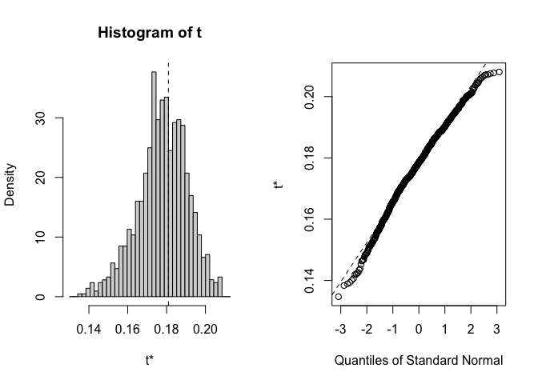<!-- --><!-- -->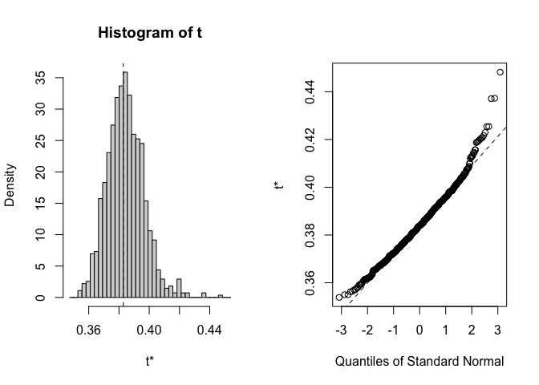<!-- --><!-- --><!-- --><!-- --><!-- --><!-- --><!-- --><!-- --><!-- --><!-- --><!-- -->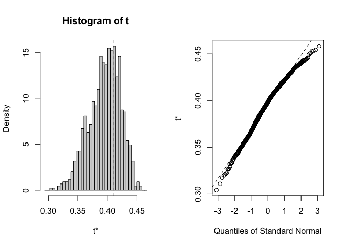<!-- --><!-- --><!-- --><!-- --><!-- --><!-- --><!-- --><!-- -->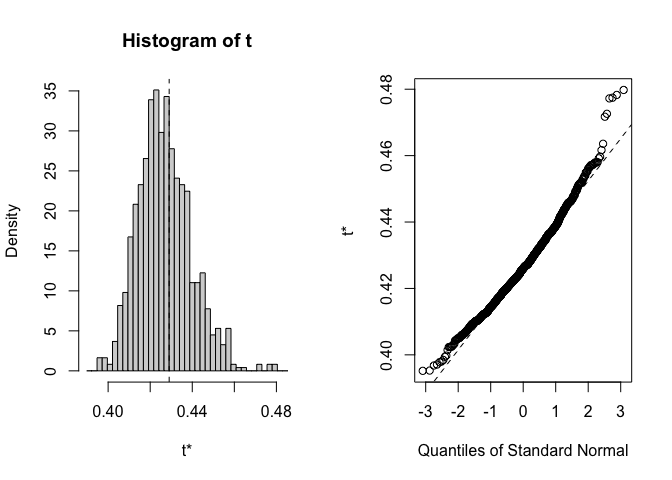<!-- -->

``` r
#boot.ci(gowers.boot_historical, type="norm", index = 1) # for the first pop
boot_historical_results <- tidy(gowers.boot_historical,conf.int=TRUE,conf.method="norm") %>%  #all pops
  rename(Gowers_Dist = statistic) %>% 
  mutate(TimePd="Historical")
```

#### Plot the results 

``` r
pops <- recent_clim_boot %>% select(parent.pop, elevation.group, elev_m, Lat, Long) %>% unique()

boot_gowers_recent_pops <- bind_cols(pops, boot_recent_results) %>% arrange(Gowers_Dist)
boot_gowers_historical_pops <- bind_cols(pops, boot_historical_results) %>% arrange(Gowers_Dist)
boot_gowers_results_all <- bind_rows(boot_gowers_recent_pops, boot_gowers_historical_pops)
write_csv(boot_gowers_results_all, "../output/Climate/growthseason_GowersEnvtalDist_UCD.csv")

recent_fig <- boot_gowers_results_all %>% 
  filter(TimePd=="Recent") %>% 
  ggplot(aes(x=fct_reorder(parent.pop, Gowers_Dist), y=Gowers_Dist, group=parent.pop, fill=elev_m)) +
  geom_col(width = 0.7,position = position_dodge(0.75)) +
  geom_errorbar(aes(ymin=conf.low, ymax=conf.high),
                width=.1, position = position_dodge(0.75)) +
  scale_y_continuous(expand = c(0, 0)) +
  scale_fill_gradient(low = "#F5A540", high = "#0043F0") +
  labs(y="Gowers Envtal Distance \n from WL2", fill="Elevation (m)", x="Population", title = "Recent Climate") +
  theme_classic() +
  theme(text=element_text(size=25), axis.text.x = element_text(angle = 45,  hjust = 1))

historical_fig <- boot_gowers_results_all %>% 
  filter(TimePd=="Historical") %>% 
  ggplot(aes(x=fct_reorder(parent.pop, Gowers_Dist), y=Gowers_Dist, group=parent.pop, fill=elev_m)) +
  geom_col(width = 0.7,position = position_dodge(0.75)) +
  geom_errorbar(aes(ymin=conf.low, ymax=conf.high),
                width=.1, position = position_dodge(0.75)) +
  scale_y_continuous(expand = c(0, 0)) +
  scale_fill_gradient(low = "#F5A540", high = "#0043F0") +
  labs(y="Gowers Envtal Distance \n from WL2", fill="Elevation (m)", x="Population", title="Historic Climate") +
  theme_classic() +
  theme(text=element_text(size=25), axis.text.x = element_text(angle = 45,  hjust = 1)) 
  

plot_grid(historical_fig, recent_fig)
```

<!-- -->

``` r
ggsave("../output/Climate/growthseason_Gowers_fromDavis.png", width = 24, height = 8, units = "in")
```

## Flint Climate Distance

### Gowers

``` r
#need to modify the gowers_calc function to only include Flint variables 
gowers_calc_flint <- function(data, indices, P) { #function with all of the code necessary for calculating gowers distance 
  #data = _clim_boot (recent or historical) - needs to be nested by year; P = # climate variables 
  #need to make davis_range_prep before running this function 
  
  data <-data[indices,] # subset per bootstrap indices
  
  data <- data %>% unnest(data) #unnest so the function can access the climate data
  
  data_means <- data %>% 
    group_by(parent.pop, elevation.group, elev_m, Lat, Long) %>% 
    summarise_at(c("cwd",  "pck", "ppt", "tmn", "tmx"),
               c(mean), na.rm = TRUE) #get 30 year averages for each climate variable 
  
  range_merge <- bind_rows(data_means, davis_range_prep)
  
  davis_home_climate_ranges <- range_merge %>% #calculate ranges
    ungroup() %>% 
  summarise(cwd_range=max(cwd)-min(cwd),
            ppt_range=max(ppt)-min(ppt), 
            tmn_range=max(tmn)-min(tmn), 
            tmx_range=max(tmx)-min(tmx))
  
  davis_home_climate <- bind_cols(davis_climate_all, data_means) #add davis climate data to home climate data 
  
  davis_home_climate_with_ranges <- bind_cols(davis_home_climate, davis_home_climate_ranges) #add in ranges 
  
  gowers_calc_each_var <- davis_home_climate_with_ranges %>% #variable by variable calc
  mutate(cwd_gowers=abs(cwd_Davis-cwd) / cwd_range,
         ppt_gowers=abs(ppt_Davis - ppt) / ppt_range,
         tmn_gowers=abs(tmn_Davis - tmn) / tmn_range,
         tmx_gowers=abs(tmx_Davis - tmx) / tmx_range)

 gowers_calc_per_pop <- gowers_calc_each_var %>% #final gowers calc 
  mutate(Gowers_Dist=(1/P)*(cwd_gowers + ppt_gowers + tmn_gowers + tmx_gowers)) %>% 
  dplyr::select(parent.pop, elevation.group, elev_m, Gowers_Dist)
 
 gowers_calc_per_pop %>% pull(Gowers_Dist) #make the result a vector 
   }
```

#### Recent


``` r
recent_clim_boot_flint_nest <- recent_clim_boot %>% select(parent.pop:tmx) %>% nest(.by=year)

gowers.boot_flint_recent <- boot(data=recent_clim_boot_flint_nest, statistic=gowers_calc_flint, R=1000, P=4) #will sample each row (year) with replacement 
gowers.boot_flint_recent$t0 #looks correct 
```

```
##  [1] 0.31824913 0.29331510 0.40839550 0.51912259 0.33581834 0.09738751
##  [7] 0.31851299 0.49395909 0.54274463 0.48211356 0.42839910 0.25758761
## [13] 0.24239501 0.33255736 0.54633707 0.18522542 0.32604282 0.23955850
## [19] 0.17070224 0.52678833 0.30489544 0.52376981 0.49531896
```

``` r
#str(gowers.boot_flint_recent)

for(i in 1:23) {
  plot(gowers.boot_flint_recent, index=i) #distributions look normal for the most part 
}
```

<!-- --><!-- --><!-- --><!-- --><!-- --><!-- --><!-- --><!-- --><!-- --><!-- --><!-- --><!-- --><!-- --><!-- --><!-- --><!-- --><!-- --><!-- --><!-- --><!-- --><!-- --><!-- --><!-- -->

``` r
#boot.ci(gowers.boot_flint_recent, type="norm", index = 1) # for the first pop
boot_flint_recent_results <- tidy(gowers.boot_flint_recent,conf.int=TRUE,conf.method="norm") %>%  #all pops
  rename(Gowers_Dist = statistic) %>% 
  mutate(TimePd="Recent")
```

#### Historic


``` r
historical_clim_boot_flint_nest <- historical_clim_boot %>% select(parent.pop:tmx) %>% nest(.by=year)

gowers.boot_flint_historical <- boot(data=historical_clim_boot_flint_nest, statistic=gowers_calc_flint, R=1000, P=4) #will sample each row (year) with replacement 
gowers.boot_flint_historical$t0 #looks correct 
```

```
##  [1] 0.3289436 0.4559552 0.2702196 0.3827481 0.2964513 0.1134720 0.3499696
##  [8] 0.7676875 0.8136684 0.7711139 0.3995840 0.2625098 0.3061110 0.4124108
## [15] 0.5638474 0.2384483 0.3944671 0.2498461 0.1616857 0.5225986 0.3555591
## [22] 0.3819858 0.3869474
```

``` r
#str(gowers.boot_flint_historical)

for(i in 1:23) {
  plot(gowers.boot_flint_historical, index=i) #distributions look normal for the most part 
}
```

<!-- -->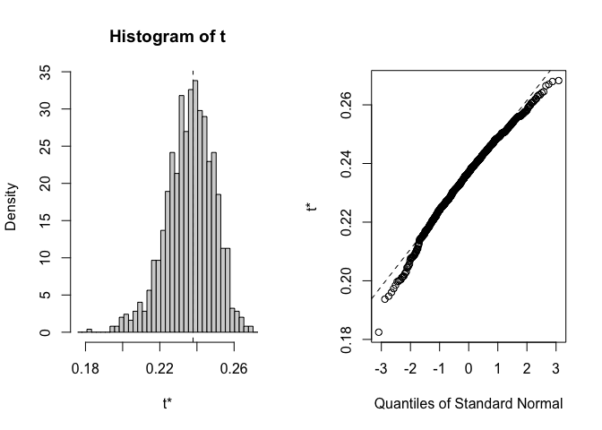<!-- --><!-- --><!-- --><!-- --><!-- --><!-- --><!-- --><!-- -->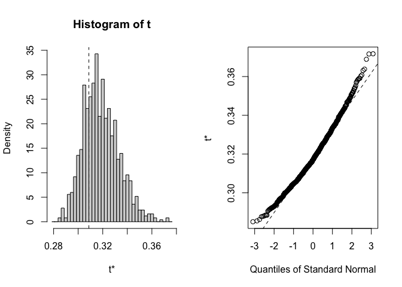<!-- -->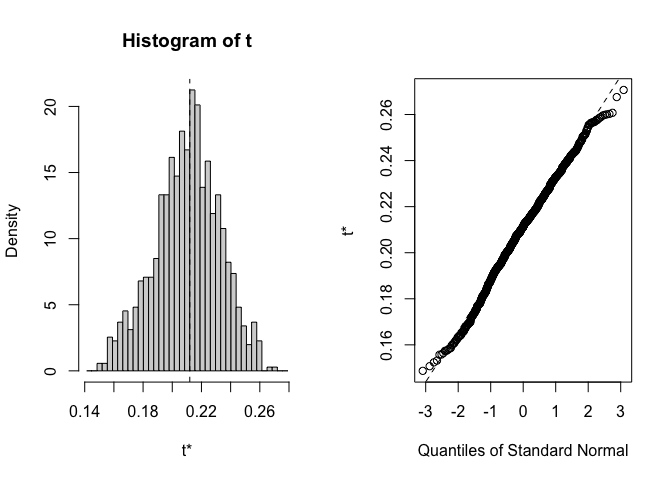<!-- --><!-- --><!-- --><!-- -->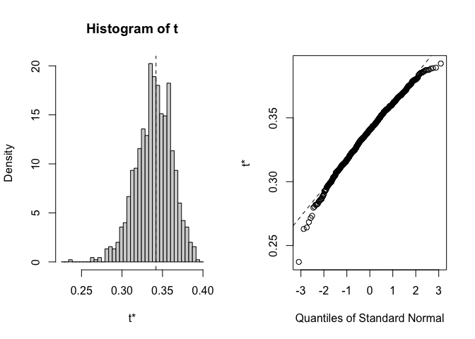<!-- --><!-- --><!-- --><!-- -->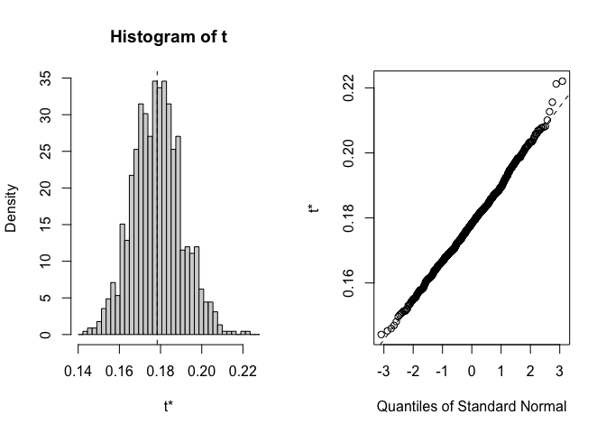<!-- --><!-- --><!-- -->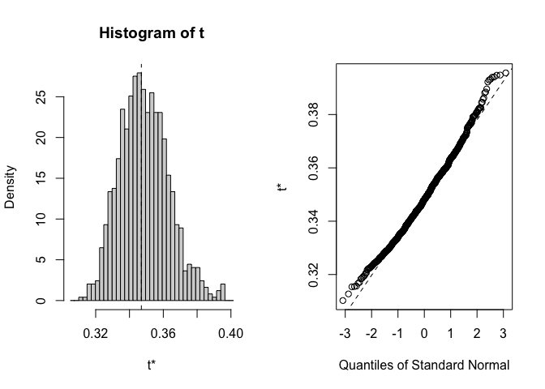<!-- --><!-- -->

``` r
#boot.ci(gowers.boot_flint_historical, type="norm", index = 1) # for the first pop
boot_flint_historical_results <- tidy(gowers.boot_flint_historical,conf.int=TRUE,conf.method="norm") %>%  #all pops
  rename(Gowers_Dist = statistic) %>% 
  mutate(TimePd="Historical")
```

#### Plot the results 


``` r
boot_flint_gowers_recent_pops <- bind_cols(pops, boot_flint_recent_results) %>% arrange(Gowers_Dist)
boot_flint_gowers_historical_pops <- bind_cols(pops, boot_flint_historical_results) %>% arrange(Gowers_Dist)
boot_flint_gowers_results_all <- bind_rows(boot_flint_gowers_recent_pops, boot_flint_gowers_historical_pops)
write_csv(boot_flint_gowers_results_all, "../output/Climate/growthseason_GowersEnvtalDist_UCDFlint.csv")

recent_fig <- boot_flint_gowers_results_all %>% 
  filter(TimePd=="Recent") %>% 
  ggplot(aes(x=fct_reorder(parent.pop, Gowers_Dist), y=Gowers_Dist, group=parent.pop, fill=elev_m)) +
  geom_col(width = 0.7,position = position_dodge(0.75)) +
  geom_errorbar(aes(ymin=conf.low, ymax=conf.high),
                width=.1, position = position_dodge(0.75)) +
  scale_y_continuous(expand = c(0, 0)) +
  scale_fill_gradient(low = "#F5A540", high = "#0043F0") +
  labs(y="Gowers Envtal Distance \n from WL2", fill="Elevation (m)", x="Population", title = "Recent Climate") +
  theme_classic() +
  theme(text=element_text(size=25), axis.text.x = element_text(angle = 45,  hjust = 1))

historical_fig <- boot_flint_gowers_results_all %>% 
  filter(TimePd=="Historical") %>% 
  ggplot(aes(x=fct_reorder(parent.pop, Gowers_Dist), y=Gowers_Dist, group=parent.pop, fill=elev_m)) +
  geom_col(width = 0.7,position = position_dodge(0.75)) +
  geom_errorbar(aes(ymin=conf.low, ymax=conf.high),
                width=.1, position = position_dodge(0.75)) +
  scale_y_continuous(expand = c(0, 0)) +
  scale_fill_gradient(low = "#F5A540", high = "#0043F0") +
  labs(y="Gowers Envtal Distance \n from WL2", fill="Elevation (m)", x="Population", title="Historic Climate") +
  theme_classic() +
  theme(text=element_text(size=25), axis.text.x = element_text(angle = 45,  hjust = 1)) 
  

plot_grid(historical_fig, recent_fig)
```

<!-- -->

``` r
ggsave("../output/Climate/growthseason_Gowers_Flint_fromDavis.png", width = 24, height = 8, units = "in")
```

### Subtraction


``` r
pops_flint_avgs <- read_csv("../output/Climate/growthseason_FlintAvgs.csv")
```

```
## Rows: 46 Columns: 10
## ── Column specification ────────────────────────────────────────────────────────
## Delimiter: ","
## chr (3): parent.pop, elevation.group, TimePd
## dbl (7): elev_m, Lat, Long, cwd, ppt, tmn, tmx
## 
## ℹ Use `spec()` to retrieve the full column specification for this data.
## ℹ Specify the column types or set `show_col_types = FALSE` to quiet this message.
```

``` r
pops_flint_recent_avgs <- pops_flint_avgs %>% filter(TimePd=="Recent")

recent_flint_dist_prep <- bind_cols(davis_climate_flint, pops_flint_recent_avgs)
names(recent_flint_dist_prep)
```

```
##  [1] "cwd_Davis"       "ppt_Davis"       "pck_Davis"       "tmn_Davis"      
##  [5] "tmx_Davis"       "parent.pop"      "elevation.group" "elev_m"         
##  [9] "Lat"             "Long"            "cwd"             "ppt"            
## [13] "tmn"             "tmx"             "TimePd"
```

``` r
recent_flint_dist <- recent_flint_dist_prep %>% 
  mutate(cwd_dist=cwd_Davis - cwd,
         ppt_dist=ppt_Davis - ppt,
         tmn_dist=tmn_Davis - tmn,
         tmx_dist=tmx_Davis - tmx) %>% 
 dplyr::select(parent.pop, elevation.group, elev_m, ends_with("_dist"))

pops_flint_historic_avgs <-  pops_flint_avgs %>% filter(TimePd=="Historical")
historic_flint_dist_prep <- bind_cols(davis_climate_flint, pops_flint_historic_avgs)
names(historic_flint_dist_prep)
```

```
##  [1] "cwd_Davis"       "ppt_Davis"       "pck_Davis"       "tmn_Davis"      
##  [5] "tmx_Davis"       "parent.pop"      "elevation.group" "elev_m"         
##  [9] "Lat"             "Long"            "cwd"             "ppt"            
## [13] "tmn"             "tmx"             "TimePd"
```

``` r
historic_flint_dist <- historic_flint_dist_prep %>% 
  mutate(cwd_dist=cwd_Davis - cwd,
         ppt_dist=ppt_Davis - ppt,
         tmn_dist=tmn_Davis - tmn,
         tmx_dist=tmx_Davis - tmx) %>% 
 dplyr::select(parent.pop, elevation.group, elev_m, ends_with("_dist"))
```

Figures Recent (subtraction distance)


``` r
recent_flint_dist %>% 
  ggplot(aes(x=fct_reorder(parent.pop, cwd_dist), y=cwd_dist, group=parent.pop, fill=elev_m)) +
  geom_col(width = 0.7,position = position_dodge(0.75)) +
  scale_y_continuous(expand = c(0, 0)) +
  scale_fill_gradient(low = "#F5A540", high = "#0043F0") +
  labs(fill="Elevation (m)",x="Population") +
  theme_classic() +
  theme(text=element_text(size=25), axis.text.x = element_text(angle = 45,  hjust = 1))
```

<!-- -->

``` r
#ggsave("../output/Climate/grwssn_MeanCWD_DistfromDavis_RecentClim.png", width = 12, height = 6, units = "in")

recent_flint_dist %>% 
  ggplot(aes(x=fct_reorder(parent.pop, ppt_dist), y=ppt_dist, group=parent.pop, fill=elev_m)) +
  geom_col(width = 0.7,position = position_dodge(0.75)) +
  scale_y_continuous(expand = c(0, 0)) +
  scale_fill_gradient(low = "#F5A540", high = "#0043F0") +
  labs(fill="Elevation (m)",x="Population") +
  theme_classic() +
  theme(text=element_text(size=25), axis.text.x = element_text(angle = 45,  hjust = 1))
```

<!-- -->

``` r
#ggsave("../output/Climate/grwssn_MeanPPT_DistfromDavis_RecentClim.png", width = 12, height = 6, units = "in")

recent_flint_dist %>% 
  ggplot(aes(x=fct_reorder(parent.pop, tmn_dist), y=tmn_dist, group=parent.pop, fill=elev_m)) +
  geom_col(width = 0.7,position = position_dodge(0.75)) +
  scale_y_continuous(expand = c(0, 0)) +
  scale_fill_gradient(low = "#F5A540", high = "#0043F0") +
  labs(fill="Elevation (m)",x="Population") +
  theme_classic() +
  theme(text=element_text(size=25), axis.text.x = element_text(angle = 45,  hjust = 1))
```

<!-- -->

``` r
#ggsave("../output/Climate/grwssn_MeanTMN_DistfromDavis_RecentClim.png", width = 12, height = 6, units = "in")

recent_flint_dist %>% 
  ggplot(aes(x=fct_reorder(parent.pop, tmx_dist), y=tmx_dist, group=parent.pop, fill=elev_m)) +
  geom_col(width = 0.7,position = position_dodge(0.75)) +
  scale_y_continuous(expand = c(0, 0)) +
  scale_fill_gradient(low = "#F5A540", high = "#0043F0") +
  labs(fill="Elevation (m)",x="Population") +
  theme_classic() +
  theme(text=element_text(size=25), axis.text.x = element_text(angle = 45,  hjust = 1))
```

<!-- -->

``` r
#ggsave("../output/Climate/grwssn_MeanTMX_DistfromDavis_RecentClim.png", width = 12, height = 6, units = "in")
```

Figures Historical (subtraction distance)


``` r
historic_flint_dist %>% 
  ggplot(aes(x=fct_reorder(parent.pop, cwd_dist), y=cwd_dist, group=parent.pop, fill=elev_m)) +
  geom_col(width = 0.7,position = position_dodge(0.75)) +
  scale_y_continuous(expand = c(0, 0)) +
  scale_fill_gradient(low = "#F5A540", high = "#0043F0") +
  labs(fill="Elevation (m)",x="Population") +
  theme_classic() +
  theme(text=element_text(size=25), axis.text.x = element_text(angle = 45,  hjust = 1))
```

<!-- -->

``` r
#ggsave("../output/Climate/grwssn_MeanCWD_DistfromDavis_HistoricalClim.png", width = 12, height = 6, units = "in")

historic_flint_dist %>% 
  ggplot(aes(x=fct_reorder(parent.pop, ppt_dist), y=ppt_dist, group=parent.pop, fill=elev_m)) +
  geom_col(width = 0.7,position = position_dodge(0.75)) +
  scale_y_continuous(expand = c(0, 0)) +
  scale_fill_gradient(low = "#F5A540", high = "#0043F0") +
  labs(fill="Elevation (m)",x="Population") +
  theme_classic() +
  theme(text=element_text(size=25), axis.text.x = element_text(angle = 45,  hjust = 1))
```

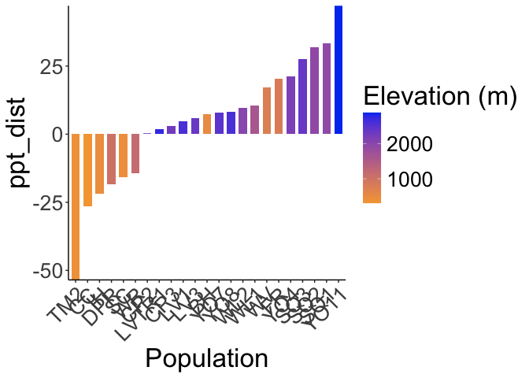<!-- -->

``` r
#ggsave("../output/Climate/grwssn_MeanPPT_DistfromDavis_HistoricalClim.png", width = 12, height = 6, units = "in")

historic_flint_dist %>% 
  ggplot(aes(x=fct_reorder(parent.pop, tmn_dist), y=tmn_dist, group=parent.pop, fill=elev_m)) +
  geom_col(width = 0.7,position = position_dodge(0.75)) +
  scale_y_continuous(expand = c(0, 0)) +
  scale_fill_gradient(low = "#F5A540", high = "#0043F0") +
  labs(fill="Elevation (m)",x="Population") +
  theme_classic() +
  theme(text=element_text(size=25), axis.text.x = element_text(angle = 45,  hjust = 1))
```

<!-- -->

``` r
#ggsave("../output/Climate/grwssn_MeanTMN_DistfromDavis_HistoricalClim.png", width = 12, height = 6, units = "in")

historic_flint_dist %>% 
  ggplot(aes(x=fct_reorder(parent.pop, tmx_dist), y=tmx_dist, group=parent.pop, fill=elev_m)) +
  geom_col(width = 0.7,position = position_dodge(0.75)) +
  scale_y_continuous(expand = c(0, 0)) +
  scale_fill_gradient(low = "#F5A540", high = "#0043F0") +
  labs(fill="Elevation (m)",x="Population") +
  theme_classic() +
  theme(text=element_text(size=25), axis.text.x = element_text(angle = 45,  hjust = 1))
```

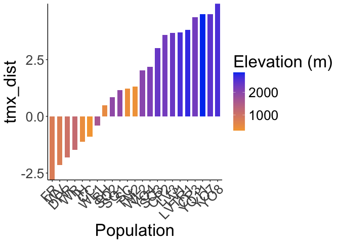<!-- -->

``` r
#ggsave("../output/Climate/grwssn_MeanTMX_DistfromDavis_HistoricalClim.png", width = 12, height = 6, units = "in")
```

## Bioclim Climate Distance

### Gowers

``` r
#need to modify the gowers_calc function to only include bioclim variables 
gowers_calc_bioclim <- function(data, indices, P) { #function with all of the code necessary for calculating gowers distance 
  #data = _clim_boot (recent or historical) - needs to be nested by year; P = # climate variables 
  #need to make davis_range_prep before running this function 
  
  data <-data[indices,] # subset per bootstrap indices
  
  data <- data %>% unnest(data) #unnest so the function can access the climate data
  
  data_means <- data %>% 
    group_by(parent.pop, elevation.group, elev_m, Lat, Long) %>% 
    summarise_at(c("ann_tmean", "mean_diurnal_range", 
                   "temp_seasonality", "temp_ann_range",
                 "tmean_wettest_month", "tmean_driest_month", "ann_ppt",
                 "ppt_seasonality","ppt_warmest_month", "ppt_coldest_month"),
               c(mean), na.rm = TRUE) #get 30 year averages for each climate variable 
  
  range_merge <- bind_rows(data_means, davis_range_prep)
  
  davis_home_climate_ranges <- range_merge %>% #calculate ranges
    ungroup() %>% 
  summarise(ann_tmean_range=max(ann_tmean)-min(ann_tmean),
            mean_diurnal_range_range=max(mean_diurnal_range)-min(mean_diurnal_range),
            temp_seasonality_range=max(temp_seasonality)-min(temp_seasonality),
            temp_ann_range_range=max(temp_ann_range)-min(temp_ann_range),
            tmean_wettest_month_range=max(tmean_wettest_month)-min(tmean_wettest_month),
            tmean_driest_month_range=max(tmean_driest_month)-min(tmean_driest_month),
            ann_ppt_range=max(ann_ppt)-min(ann_ppt), 
            ppt_seasonality_range=max(ppt_seasonality)-min(ppt_seasonality),
            ppt_warmest_month_range=max(ppt_warmest_month)-min(ppt_warmest_month), 
            ppt_coldest_month_range=max(ppt_coldest_month)-min(ppt_coldest_month))
  
  davis_home_climate <- bind_cols(davis_climate_all, data_means) #add davis climate data to home climate data 
  
  davis_home_climate_with_ranges <- bind_cols(davis_home_climate, davis_home_climate_ranges) #add in ranges 
  
  gowers_calc_each_var <- davis_home_climate_with_ranges %>% #variable by variable calc
  mutate(ann_tmean_gowers=abs(ann_tmean_Davis - ann_tmean) / ann_tmean_range,
         mean_diurnal_range_gowers=abs(mean_diurnal_range_Davis - mean_diurnal_range) / mean_diurnal_range_range,
         temp_seasonality_gowers=abs(temp_seasonality_Davis - temp_seasonality) / temp_seasonality_range,
         temp_ann_range_gowers=abs(temp_ann_range_Davis - temp_ann_range) / temp_ann_range_range,
         tmean_wettest_month_gowers=abs(tmean_wettest_month_Davis - tmean_wettest_month) / tmean_wettest_month_range,
         tmean_driest_month_gowers=abs(tmean_driest_month_Davis - tmean_driest_month) / tmean_driest_month_range,
         ann_ppt_gowers=abs(ann_ppt_Davis - ann_ppt) / ann_ppt_range,
         ppt_seasonality_gowers=abs(ppt_seasonality_Davis - ppt_seasonality) / ppt_seasonality_range,
         ppt_warmest_month_gowers=abs(ppt_warmest_month_Davis - ppt_warmest_month) / ppt_warmest_month_range,
         ppt_coldest_month_gowers=abs(ppt_coldest_month_Davis - ppt_coldest_month) / ppt_coldest_month_range) %>% 
  dplyr::select(parent.pop, elevation.group, elev_m, ends_with("_gowers"))

 gowers_calc_per_pop <- gowers_calc_each_var %>% #final gowers calc 
  mutate(Gowers_Dist=(1/P)*(ann_tmean_gowers + mean_diurnal_range_gowers +
                                temp_seasonality_gowers +temp_ann_range_gowers +
                                tmean_wettest_month_gowers +
                                tmean_driest_month_gowers +ann_ppt_gowers +
                                ppt_seasonality_gowers + ppt_warmest_month_gowers +
                                ppt_coldest_month_gowers)) %>% 
  dplyr::select(parent.pop, elevation.group, elev_m, Gowers_Dist)
 
 gowers_calc_per_pop %>% pull(Gowers_Dist) #make the result a vector 
   }
```

#### Recent


``` r
recent_clim_boot_bioclim_nest <- recent_clim_boot %>% select(parent.pop:year, ann_tmean:ppt_coldest_month) %>% nest(.by=year)

gowers.boot_bioclim_recent <- boot(data=recent_clim_boot_bioclim_nest, statistic=gowers_calc_bioclim, R=1000, P=10) #will sample each row (year) with replacement 
gowers.boot_bioclim_recent$t0 #looks correct 
```

```
##  [1] 0.3351487 0.2010384 0.4274908 0.4696964 0.1955285 0.1992895 0.1931189
##  [8] 0.4716673 0.4749850 0.4902028 0.3918869 0.3407694 0.3347263 0.4027955
## [15] 0.5455880 0.1963815 0.3360558 0.1939776 0.2394866 0.6476411 0.3492985
## [22] 0.4340408 0.4552770
```

``` r
#str(gowers.boot_bioclim_recent)

for(i in 1:23) {
  plot(gowers.boot_bioclim_recent, index=i) #distributions look normal for the most part 
}
```

<!-- --><!-- --><!-- --><!-- --><!-- --><!-- --><!-- --><!-- --><!-- --><!-- --><!-- --><!-- --><!-- --><!-- --><!-- --><!-- --><!-- --><!-- --><!-- --><!-- --><!-- --><!-- --><!-- -->

``` r
#boot.ci(gowers.boot_bioclim_recent, type="norm", index = 1) # for the first pop
boot_bioclim_recent_results <- tidy(gowers.boot_bioclim_recent,conf.int=TRUE,conf.method="norm") %>%  #all pops
  rename(Gowers_Dist = statistic) %>% 
  mutate(TimePd="Recent")
```

#### Historic


``` r
historical_clim_boot_bioclim_nest <- historical_clim_boot %>% select(parent.pop:year, ann_tmean:ppt_coldest_month) %>% nest(.by=year)

gowers.boot_bioclim_historical <- boot(data=historical_clim_boot_bioclim_nest, statistic=gowers_calc_bioclim, R=1000, P=10) #will sample each row (year) with replacement 
gowers.boot_bioclim_historical$t0 #looks correct 
```

```
##  [1] 0.3381808 0.3761763 0.4580929 0.5006345 0.1146616 0.2478911 0.2137451
##  [8] 0.6167572 0.6159749 0.6318601 0.3461297 0.3758085 0.3732301 0.4751556
## [15] 0.4318850 0.2431269 0.3616461 0.1470025 0.2873186 0.6570430 0.3705798
## [22] 0.4992779 0.5237611
```

``` r
#str(gowers.boot_bioclim_historical)

for(i in 1:23) {
  plot(gowers.boot_bioclim_historical, index=i) #distributions look normal for the most part 
}
```

<!-- --><!-- --><!-- --><!-- --><!-- --><!-- -->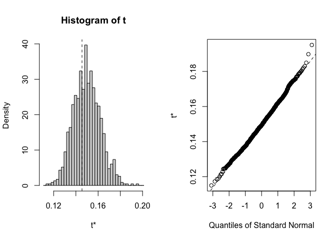<!-- --><!-- --><!-- -->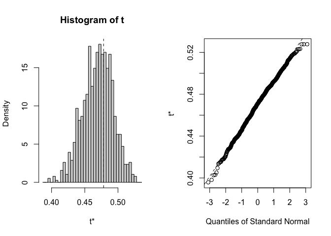<!-- --><!-- --><!-- --><!-- --><!-- -->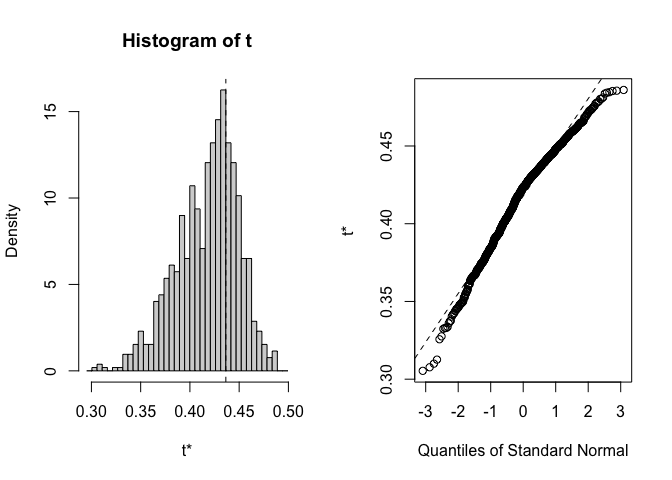<!-- --><!-- --><!-- --><!-- --><!-- -->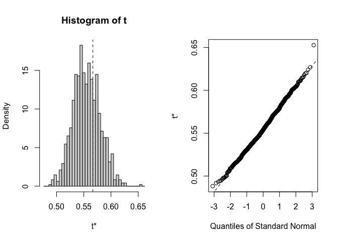<!-- -->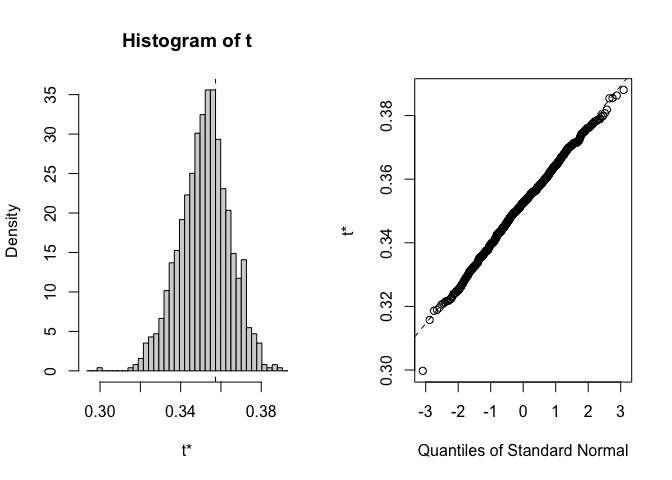<!-- --><!-- --><!-- -->

``` r
#boot.ci(gowers.boot_bioclim_historical, type="norm", index = 1) # for the first pop
boot_bioclim_historical_results <- tidy(gowers.boot_bioclim_historical,conf.int=TRUE,conf.method="norm") %>%  #all pops
  rename(Gowers_Dist = statistic) %>% 
  mutate(TimePd="Historical")
```

#### Plot the results 


``` r
boot_bioclim_gowers_recent_pops <- bind_cols(pops, boot_bioclim_recent_results) %>% arrange(Gowers_Dist)
boot_bioclim_gowers_historical_pops <- bind_cols(pops, boot_bioclim_historical_results) %>% arrange(Gowers_Dist)
boot_bioclim_gowers_results_all <- bind_rows(boot_bioclim_gowers_recent_pops, boot_bioclim_gowers_historical_pops)
write_csv(boot_bioclim_gowers_results_all, "../output/Climate/growthseason_GowersEnvtalDist_UCDbioclim.csv")

recent_fig <- boot_bioclim_gowers_results_all %>% 
  filter(TimePd=="Recent") %>% 
  ggplot(aes(x=fct_reorder(parent.pop, Gowers_Dist), y=Gowers_Dist, group=parent.pop, fill=elev_m)) +
  geom_col(width = 0.7,position = position_dodge(0.75)) +
  geom_errorbar(aes(ymin=conf.low, ymax=conf.high),
                width=.1, position = position_dodge(0.75)) +
  scale_y_continuous(expand = c(0, 0)) +
  scale_fill_gradient(low = "#F5A540", high = "#0043F0") +
  labs(y="Gowers Envtal Distance \n from WL2", fill="Elevation (m)", x="Population", title = "Recent Climate") +
  theme_classic() +
  theme(text=element_text(size=25), axis.text.x = element_text(angle = 45,  hjust = 1))

historical_fig <- boot_bioclim_gowers_results_all %>% 
  filter(TimePd=="Historical") %>% 
  ggplot(aes(x=fct_reorder(parent.pop, Gowers_Dist), y=Gowers_Dist, group=parent.pop, fill=elev_m)) +
  geom_col(width = 0.7,position = position_dodge(0.75)) +
  geom_errorbar(aes(ymin=conf.low, ymax=conf.high),
                width=.1, position = position_dodge(0.75)) +
  scale_y_continuous(expand = c(0, 0)) +
  scale_fill_gradient(low = "#F5A540", high = "#0043F0") +
  labs(y="Gowers Envtal Distance \n from WL2", fill="Elevation (m)", x="Population", title="Historic Climate") +
  theme_classic() +
  theme(text=element_text(size=25), axis.text.x = element_text(angle = 45,  hjust = 1)) 
  

plot_grid(historical_fig, recent_fig)
```

<!-- -->

``` r
ggsave("../output/Climate/growthseason_Gowers_BioClim_fromDavis.png", width = 24, height = 8, units = "in")
```

### Subtraction


``` r
pops_bioclim_avgs <-  read_csv("../output/Climate/growthseason_BioClimAvgs.csv") 
```

```
## Rows: 46 Columns: 14
## ── Column specification ────────────────────────────────────────────────────────
## Delimiter: ","
## chr  (3): parent.pop, elevation.group, TimePd
## dbl (11): elev_m, ann_tmean, mean_diurnal_range, temp_seasonality, temp_ann_...
## 
## ℹ Use `spec()` to retrieve the full column specification for this data.
## ℹ Specify the column types or set `show_col_types = FALSE` to quiet this message.
```

``` r
#Recent
pops_bioclim_recent_avgs <- pops_bioclim_avgs %>%  filter(TimePd=="Recent")
recent_bioclim_dist_prep <- bind_cols(davis_bioclim_final, pops_bioclim_recent_avgs)
recent_bioclim_dist <- recent_bioclim_dist_prep %>% 
  mutate(ann_tmean_dist=ann_tmean_Davis - ann_tmean,
         mean_diurnal_range_dist=mean_diurnal_range_Davis - mean_diurnal_range,
         temp_seasonality_dist=temp_seasonality_Davis - temp_seasonality,
         temp_ann_range_dist=temp_ann_range_Davis - temp_ann_range,
         tmean_wettest_month_dist=tmean_wettest_month_Davis - tmean_wettest_month,
         tmean_driest_month_dist=tmean_driest_month_Davis - tmean_driest_month,
         ann_ppt_dist=ann_ppt_Davis - ann_ppt,
         ppt_seasonality_dist=ppt_seasonality_Davis - ppt_seasonality, 
         ppt_warmest_month_dist=ppt_warmest_month_Davis - ppt_warmest_month,
         ppt_coldest_month_dist=ppt_coldest_month_Davis - ppt_coldest_month) %>% 
 dplyr::select(parent.pop, elevation.group, elev_m, ends_with("_dist"))
recent_bioclim_dist
```

```
## # A tibble: 23 × 13
##    parent.pop elevation.group elev_m ann_tmean_dist mean_diurnal_range_dist
##    <chr>      <chr>            <dbl>          <dbl>                   <dbl>
##  1 BH         Low               511.        2.58                     0.558 
##  2 CC         Low               313         0.706                    1.56  
##  3 CP2        High             2244.        5.25                     1.42  
##  4 CP3        High             2266.        5.94                     1.62  
##  5 DPR        Mid              1019.       -0.00542                  1.14  
##  6 FR         Mid               787         0.344                   -1.54  
##  7 IH         Low               454.        0.834                    0.841 
##  8 LV1        High             2593.        6.10                    -0.0611
##  9 LV3        High             2354.        6.12                    -0.117 
## 10 LVTR1      High             2741.        6.33                    -0.261 
## # ℹ 13 more rows
## # ℹ 8 more variables: temp_seasonality_dist <dbl>, temp_ann_range_dist <dbl>,
## #   tmean_wettest_month_dist <dbl>, tmean_driest_month_dist <dbl>,
## #   ann_ppt_dist <dbl>, ppt_seasonality_dist <dbl>,
## #   ppt_warmest_month_dist <dbl>, ppt_coldest_month_dist <dbl>
```

``` r
#Historical
pops_bioclim_historical_avgs <- pops_bioclim_avgs %>% filter(TimePd=="Historical")
historical_bioclim_dist_prep <- bind_cols(davis_bioclim_final, pops_bioclim_historical_avgs)
historical_bioclim_dist <- historical_bioclim_dist_prep %>% 
  mutate(ann_tmean_dist=ann_tmean_Davis - ann_tmean,
         mean_diurnal_range_dist=mean_diurnal_range_Davis - mean_diurnal_range,
         temp_seasonality_dist=temp_seasonality_Davis - temp_seasonality,
         temp_ann_range_dist=temp_ann_range_Davis - temp_ann_range,
         tmean_wettest_month_dist=tmean_wettest_month_Davis - tmean_wettest_month,
         tmean_driest_month_dist=tmean_driest_month_Davis - tmean_driest_month,
         ann_ppt_dist=ann_ppt_Davis - ann_ppt,
         ppt_seasonality_dist=ppt_seasonality_Davis - ppt_seasonality, 
         ppt_warmest_month_dist=ppt_warmest_month_Davis - ppt_warmest_month,
         ppt_coldest_month_dist=ppt_coldest_month_Davis - ppt_coldest_month) %>% 
  dplyr::select(parent.pop, elevation.group, elev_m, ends_with("_dist"))
historical_bioclim_dist
```

```
## # A tibble: 23 × 13
##    parent.pop elevation.group elev_m ann_tmean_dist mean_diurnal_range_dist
##    <chr>      <chr>            <dbl>          <dbl>                   <dbl>
##  1 BH         Low               511.          3.52                    0.276
##  2 CC         Low               313           2.84                    1.42 
##  3 CP2        High             2244.          4.67                    0.339
##  4 CP3        High             2266.          5.30                    0.717
##  5 DPR        Mid              1019.          0.368                  -0.201
##  6 FR         Mid               787           0.924                  -2.82 
##  7 IH         Low               454.          1.52                    0.214
##  8 LV1        High             2593.          9.12                   -1.05 
##  9 LV3        High             2354.          9.14                   -1.10 
## 10 LVTR1      High             2741.          9.30                   -1.07 
## # ℹ 13 more rows
## # ℹ 8 more variables: temp_seasonality_dist <dbl>, temp_ann_range_dist <dbl>,
## #   tmean_wettest_month_dist <dbl>, tmean_driest_month_dist <dbl>,
## #   ann_ppt_dist <dbl>, ppt_seasonality_dist <dbl>,
## #   ppt_warmest_month_dist <dbl>, ppt_coldest_month_dist <dbl>
```

Figures Recent (subtraction distance)


``` r
recent_bioclim_dist %>% 
  ggplot(aes(x=fct_reorder(parent.pop, ann_tmean_dist), y=ann_tmean_dist, group=parent.pop, fill=elev_m)) +
  geom_col(width = 0.7,position = position_dodge(0.75)) +
  scale_y_continuous(expand = c(0, 0)) +
  scale_fill_gradient(low = "#F5A540", high = "#0043F0") +
  labs(fill="Elevation (m)",x="Population") +
  theme_classic() +
  theme(text=element_text(size=25), axis.text.x = element_text(angle = 45,  hjust = 1))
```

<!-- -->

``` r
#ggsave("../output/Climate/grwssn_Ann_Tmean_DistfromDavis_RecentClim.png", width = 12, height = 6, units = "in")

recent_bioclim_dist %>% 
  ggplot(aes(x=fct_reorder(parent.pop, mean_diurnal_range_dist), y=mean_diurnal_range_dist, group=parent.pop, fill=elev_m)) +
  geom_col(width = 0.7,position = position_dodge(0.75)) +
  scale_y_continuous(expand = c(0, 0)) +
  scale_fill_gradient(low = "#F5A540", high = "#0043F0") +
  labs(fill="Elevation (m)",x="Population") +
  theme_classic() +
  theme(text=element_text(size=25), axis.text.x = element_text(angle = 45,  hjust = 1))
```

<!-- -->

``` r
#ggsave("../output/Climate/grwssn_Diurnal_Range_DistfromDavis_RecentClim.png", width = 12, height = 6, units = "in")

recent_bioclim_dist %>% 
  ggplot(aes(x=fct_reorder(parent.pop, temp_seasonality_dist), y=temp_seasonality_dist, group=parent.pop, fill=elev_m)) +
  geom_col(width = 0.7,position = position_dodge(0.75)) +
  scale_y_continuous(expand = c(0, 0)) +
  scale_fill_gradient(low = "#F5A540", high = "#0043F0") +
  labs(fill="Elevation (m)",x="Population") +
  theme_classic() +
  theme(text=element_text(size=25), axis.text.x = element_text(angle = 45,  hjust = 1))
```

<!-- -->

``` r
#ggsave("../output/Climate/grwssn_Temp_Seasonality_DistfromDavis_RecentClim.png", width = 12, height = 6, units = "in")

recent_bioclim_dist %>% 
  ggplot(aes(x=fct_reorder(parent.pop, temp_ann_range_dist), y=temp_ann_range_dist, group=parent.pop, fill=elev_m)) +
  geom_col(width = 0.7,position = position_dodge(0.75)) +
  scale_y_continuous(expand = c(0, 0)) +
  scale_fill_gradient(low = "#F5A540", high = "#0043F0") +
  labs(fill="Elevation (m)",x="Population") +
  theme_classic() +
  theme(text=element_text(size=25), axis.text.x = element_text(angle = 45,  hjust = 1))
```

<!-- -->

``` r
#ggsave("../output/Climate/grwssn_Temp_Ann_Range_DistfromDavis_RecentClim.png", width = 12, height = 6, units = "in")

recent_bioclim_dist %>% 
  ggplot(aes(x=fct_reorder(parent.pop, tmean_wettest_month_dist), y=tmean_wettest_month_dist, group=parent.pop, fill=elev_m)) +
  geom_col(width = 0.7,position = position_dodge(0.75)) +
  scale_y_continuous(expand = c(0, 0)) +
  scale_fill_gradient(low = "#F5A540", high = "#0043F0") +
  labs(fill="Elevation (m)",x="Population") +
  theme_classic() +
  theme(text=element_text(size=25), axis.text.x = element_text(angle = 45,  hjust = 1))
```

<!-- -->

``` r
#ggsave("../output/Climate/grwssn_Temp_Wet_DistfromDavis_RecentClim.png", width = 12, height = 6, units = "in")

recent_bioclim_dist %>% 
  ggplot(aes(x=fct_reorder(parent.pop, tmean_driest_month_dist), y=tmean_driest_month_dist, group=parent.pop, fill=elev_m)) +
  geom_col(width = 0.7,position = position_dodge(0.75)) +
  scale_y_continuous(expand = c(0, 0)) +
  scale_fill_gradient(low = "#F5A540", high = "#0043F0") +
  labs(fill="Elevation (m)",x="Population") +
  theme_classic() +
  theme(text=element_text(size=25), axis.text.x = element_text(angle = 45,  hjust = 1))
```

<!-- -->

``` r
#ggsave("../output/Climate/grwssn_Temp_Dry_DistfromDavis_RecentClim.png", width = 12, height = 6, units = "in")

recent_bioclim_dist %>% 
  ggplot(aes(x=fct_reorder(parent.pop, ann_ppt_dist), y=ann_ppt_dist, group=parent.pop, fill=elev_m)) +
  geom_col(width = 0.7,position = position_dodge(0.75)) +
  scale_y_continuous(expand = c(0, 0)) +
  scale_fill_gradient(low = "#F5A540", high = "#0043F0") +
  labs(fill="Elevation (m)",x="Population") +
  theme_classic() +
  theme(text=element_text(size=25), axis.text.x = element_text(angle = 45,  hjust = 1))
```

<!-- -->

``` r
#ggsave("../output/Climate/grwssn_Ann_PPT_DistfromDavis_RecentClim.png", width = 12, height = 6, units = "in")

recent_bioclim_dist %>% 
  ggplot(aes(x=fct_reorder(parent.pop, ppt_seasonality_dist), y=ppt_seasonality_dist, group=parent.pop, fill=elev_m)) +
  geom_col(width = 0.7,position = position_dodge(0.75)) +
  scale_y_continuous(expand = c(0, 0)) +
  scale_fill_gradient(low = "#F5A540", high = "#0043F0") +
  labs(fill="Elevation (m)",x="Population") +
  theme_classic() +
  theme(text=element_text(size=25), axis.text.x = element_text(angle = 45,  hjust = 1))
```

<!-- -->

``` r
#ggsave("../output/Climate/grwssn_PPT_Seasonality_DistfromDavis_RecentClim.png", width = 12, height = 6, units = "in")

recent_bioclim_dist %>% 
  ggplot(aes(x=fct_reorder(parent.pop, ppt_warmest_month_dist), y=ppt_warmest_month_dist, group=parent.pop, fill=elev_m)) +
  geom_col(width = 0.7,position = position_dodge(0.75)) +
  scale_y_continuous(expand = c(0, 0)) +
  scale_fill_gradient(low = "#F5A540", high = "#0043F0") +
  labs(fill="Elevation (m)",x="Population") +
  theme_classic() +
  theme(text=element_text(size=25), axis.text.x = element_text(angle = 45,  hjust = 1))
```

<!-- -->

``` r
#ggsave("../output/Climate/grwssn_PPT_Warm_DistfromDavis_RecentClim.png", width = 12, height = 6, units = "in")

recent_bioclim_dist %>% 
  ggplot(aes(x=fct_reorder(parent.pop, ppt_coldest_month_dist), y=ppt_coldest_month_dist, group=parent.pop, fill=elev_m)) +
  geom_col(width = 0.7,position = position_dodge(0.75)) +
  scale_y_continuous(expand = c(0, 0)) +
  scale_fill_gradient(low = "#F5A540", high = "#0043F0") +
  labs(fill="Elevation (m)",x="Population") +
  theme_classic() +
  theme(text=element_text(size=25), axis.text.x = element_text(angle = 45,  hjust = 1))
```

<!-- -->

``` r
#ggsave("../output/Climate/grwssn_PPT_Cold_DistfromDavis_RecentClim.png", width = 12, height = 6, units = "in")
```

Historical (subtraction distance)


``` r
historical_bioclim_dist %>% 
  ggplot(aes(x=fct_reorder(parent.pop, ann_tmean_dist), y=ann_tmean_dist, group=parent.pop, fill=elev_m)) +
  geom_col(width = 0.7,position = position_dodge(0.75)) +
  scale_y_continuous(expand = c(0, 0)) +
  scale_fill_gradient(low = "#F5A540", high = "#0043F0") +
  labs(fill="Elevation (m)",x="Population") +
  theme_classic() +
  theme(text=element_text(size=25), axis.text.x = element_text(angle = 45,  hjust = 1))
```

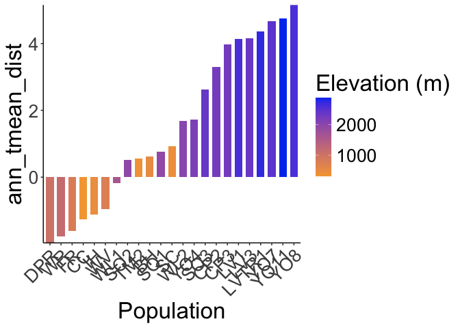<!-- -->

``` r
#ggsave("../output/Climate/grwssn_Ann_Tmean_DistfromDavis_HistoricalClim.png", width = 12, height = 6, units = "in")

historical_bioclim_dist %>% 
  ggplot(aes(x=fct_reorder(parent.pop, mean_diurnal_range_dist), y=mean_diurnal_range_dist, group=parent.pop, fill=elev_m)) +
  geom_col(width = 0.7,position = position_dodge(0.75)) +
  scale_y_continuous(expand = c(0, 0)) +
  scale_fill_gradient(low = "#F5A540", high = "#0043F0") +
  labs(fill="Elevation (m)",x="Population") +
  theme_classic() +
  theme(text=element_text(size=25), axis.text.x = element_text(angle = 45,  hjust = 1))
```

<!-- -->

``` r
#ggsave("../output/Climate/grwssn_Diurnal_Range_DistfromDavis_HistoricalClim.png", width = 12, height = 6, units = "in")

historical_bioclim_dist %>% 
  ggplot(aes(x=fct_reorder(parent.pop, temp_seasonality_dist), y=temp_seasonality_dist, group=parent.pop, fill=elev_m)) +
  geom_col(width = 0.7,position = position_dodge(0.75)) +
  scale_y_continuous(expand = c(0, 0)) +
  scale_fill_gradient(low = "#F5A540", high = "#0043F0") +
  labs(fill="Elevation (m)",x="Population") +
  theme_classic() +
  theme(text=element_text(size=25), axis.text.x = element_text(angle = 45,  hjust = 1))
```

<!-- -->

``` r
#ggsave("../output/Climate/grwssn_Temp_Seasonality_DistfromDavis_HistoricalClim.png", width = 12, height = 6, units = "in")

historical_bioclim_dist %>% 
  ggplot(aes(x=fct_reorder(parent.pop, temp_ann_range_dist), y=temp_ann_range_dist, group=parent.pop, fill=elev_m)) +
  geom_col(width = 0.7,position = position_dodge(0.75)) +
  scale_y_continuous(expand = c(0, 0)) +
  scale_fill_gradient(low = "#F5A540", high = "#0043F0") +
  labs(fill="Elevation (m)",x="Population") +
  theme_classic() +
  theme(text=element_text(size=25), axis.text.x = element_text(angle = 45,  hjust = 1))
```

<!-- -->

``` r
#ggsave("../output/Climate/grwssn_Temp_Ann_Range_DistfromDavis_HistoricalClim.png", width = 12, height = 6, units = "in")

historical_bioclim_dist %>% 
  ggplot(aes(x=fct_reorder(parent.pop, tmean_wettest_month_dist), y=tmean_wettest_month_dist, group=parent.pop, fill=elev_m)) +
  geom_col(width = 0.7,position = position_dodge(0.75)) +
  scale_y_continuous(expand = c(0, 0)) +
  scale_fill_gradient(low = "#F5A540", high = "#0043F0") +
  labs(fill="Elevation (m)",x="Population") +
  theme_classic() +
  theme(text=element_text(size=25), axis.text.x = element_text(angle = 45,  hjust = 1))
```

<!-- -->

``` r
#ggsave("../output/Climate/grwssn_Temp_Wet_DistfromDavis_HistoricalClim.png", width = 12, height = 6, units = "in")

historical_bioclim_dist %>% 
  ggplot(aes(x=fct_reorder(parent.pop, tmean_driest_month_dist), y=tmean_driest_month_dist, group=parent.pop, fill=elev_m)) +
  geom_col(width = 0.7,position = position_dodge(0.75)) +
  scale_y_continuous(expand = c(0, 0)) +
  scale_fill_gradient(low = "#F5A540", high = "#0043F0") +
  labs(fill="Elevation (m)",x="Population") +
  theme_classic() +
  theme(text=element_text(size=25), axis.text.x = element_text(angle = 45,  hjust = 1))
```

<!-- -->

``` r
#ggsave("../output/Climate/grwssn_Temp_Dry_DistfromDavis_HistoricalClim.png", width = 12, height = 6, units = "in")

historical_bioclim_dist %>% 
  ggplot(aes(x=fct_reorder(parent.pop, ann_ppt_dist), y=ann_ppt_dist, group=parent.pop, fill=elev_m)) +
  geom_col(width = 0.7,position = position_dodge(0.75)) +
  scale_y_continuous(expand = c(0, 0)) +
  scale_fill_gradient(low = "#F5A540", high = "#0043F0") +
  labs(fill="Elevation (m)",x="Population") +
  theme_classic() +
  theme(text=element_text(size=25), axis.text.x = element_text(angle = 45,  hjust = 1))
```

<!-- -->

``` r
#ggsave("../output/Climate/grwssn_Ann_PPT_DistfromDavis_HistoricalClim.png", width = 12, height = 6, units = "in")

historical_bioclim_dist %>% 
  ggplot(aes(x=fct_reorder(parent.pop, ppt_seasonality_dist), y=ppt_seasonality_dist, group=parent.pop, fill=elev_m)) +
  geom_col(width = 0.7,position = position_dodge(0.75)) +
  scale_y_continuous(expand = c(0, 0)) +
  scale_fill_gradient(low = "#F5A540", high = "#0043F0") +
  labs(fill="Elevation (m)",x="Population") +
  theme_classic() +
  theme(text=element_text(size=25), axis.text.x = element_text(angle = 45,  hjust = 1))
```

<!-- -->

``` r
#ggsave("../output/Climate/grwssn_PPT_Seasonality_DistfromDavis_HistoricalClim.png", width = 12, height = 6, units = "in")

historical_bioclim_dist %>% 
  ggplot(aes(x=fct_reorder(parent.pop, ppt_warmest_month_dist), y=ppt_warmest_month_dist, group=parent.pop, fill=elev_m)) +
  geom_col(width = 0.7,position = position_dodge(0.75)) +
  scale_y_continuous(expand = c(0, 0)) +
  scale_fill_gradient(low = "#F5A540", high = "#0043F0") +
  labs(fill="Elevation (m)",x="Population") +
  theme_classic() +
  theme(text=element_text(size=25), axis.text.x = element_text(angle = 45,  hjust = 1))
```

<!-- -->

``` r
#ggsave("../output/Climate/grwssn_PPT_Warm_DistfromDavis_HistoricalClim.png", width = 12, height = 6, units = "in")

historical_bioclim_dist %>% 
  ggplot(aes(x=fct_reorder(parent.pop, ppt_coldest_month_dist), y=ppt_coldest_month_dist, group=parent.pop, fill=elev_m)) +
  geom_col(width = 0.7,position = position_dodge(0.75)) +
  scale_y_continuous(expand = c(0, 0)) +
  scale_fill_gradient(low = "#F5A540", high = "#0043F0") +
  labs(fill="Elevation (m)",x="Population") +
  theme_classic() +
  theme(text=element_text(size=25), axis.text.x = element_text(angle = 45,  hjust = 1))
```

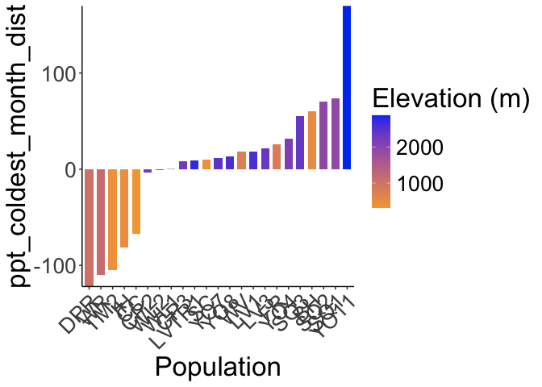<!-- -->

``` r
#ggsave("../output/Climate/grwssn_PPT_Cold_DistfromDavis_HistoricalClim.png", width = 12, height = 6, units = "in")
```
