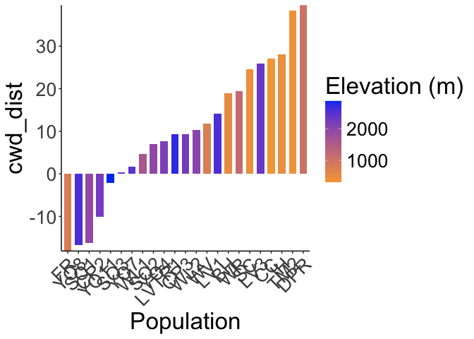
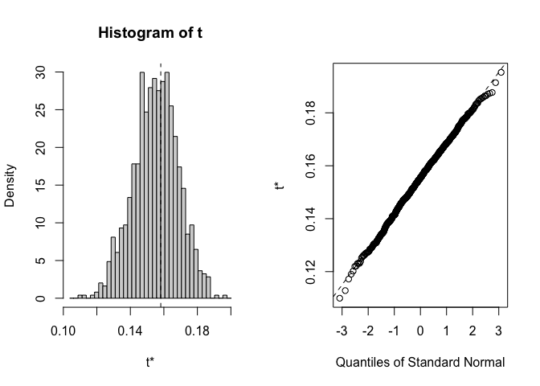
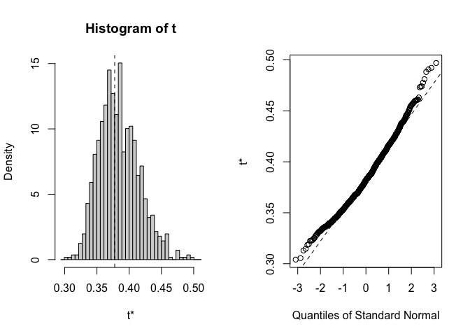
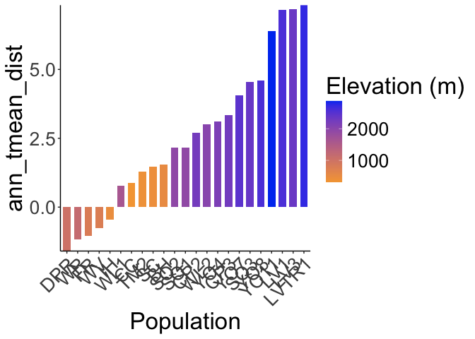

To Do: 
- Copy this code and substitute the full year climate data for the growth season inputs used here.


# Climate Distance at the Davis Garden
What happens if I drop the bioclim?
CWD might change the results too
But maybe similar because the life history differences are allowing them to pick the same time
Annual data might give a different result, worth presenting it both ways because that helps highlight the importance of the life history differences 
To get confidence intervals could do some bootstrapping - samples some of the 30 years and calculates it and so on - Julin could help with the code 


Options:

-   Basic subtraction as in Moran et al 2017 (garden site - home site)

-   Gower's environmental distance metric as in Rutter and Fenster 2007

-   From PCAs "We calculated an overall environmental distance using
    PCA, with EDij corresponding to the Euclidian distance between i and
    j based on PCA1 & PCA2." as in Moran et al 2017

## Relevant Libraries and Functions


``` r
library(raster)
```

```
## Loading required package: sp
```

``` r
library(tidyverse)
```

```
## ── Attaching core tidyverse packages ──────────────────────── tidyverse 2.0.0 ──
## ✔ dplyr     1.1.4     ✔ readr     2.1.5
## ✔ forcats   1.0.0     ✔ stringr   1.5.1
## ✔ ggplot2   3.5.1     ✔ tibble    3.2.1
## ✔ lubridate 1.9.3     ✔ tidyr     1.3.1
## ✔ purrr     1.0.2
```

```
## ── Conflicts ────────────────────────────────────────── tidyverse_conflicts() ──
## ✖ tidyr::extract() masks raster::extract()
## ✖ dplyr::filter()  masks stats::filter()
## ✖ dplyr::lag()     masks stats::lag()
## ✖ dplyr::select()  masks raster::select()
## ℹ Use the conflicted package (<http://conflicted.r-lib.org/>) to force all conflicts to become errors
```

``` r
library(conflicted)
conflicts_prefer(dplyr::select())
```

```
## [conflicted] Will prefer dplyr::select over any other package.
```

``` r
conflicts_prefer(dplyr::filter)
```

```
## [conflicted] Will prefer dplyr::filter over any other package.
```

``` r
library(ggrepel)
library(cowplot)
library(gridExtra)
library(naniar) #replaces values with NA

get_legend<-function(myggplot){
  tmp <- ggplot_gtable(ggplot_build(myggplot))
  leg <- which(sapply(tmp$grobs, function(x) x$name) == "guide-box")
  legend <- tmp$grobs[[leg]]
  return(legend)
} #legend function for grid_arrange

elev_three_palette <- c("#0043F0", "#C9727F", "#F5A540") #colors from Gremer et al 2019
elev_order <- c("High", "Mid", "Low")
```

## Home Climates

### Flint


``` r
pops_flint_avgs <- read_csv("../output/Climate/growthseason_FlintAvgs.csv")
```

```
## Rows: 46 Columns: 11
## ── Column specification ────────────────────────────────────────────────────────
## Delimiter: ","
## chr (3): parent.pop, elevation.group, TimePd
## dbl (8): elev_m, Lat, Long, cwd, pck, ppt, tmn, tmx
## 
## ℹ Use `spec()` to retrieve the full column specification for this data.
## ℹ Specify the column types or set `show_col_types = FALSE` to quiet this message.
```

``` r
head(pops_flint_avgs)
```

```
## # A tibble: 6 × 11
##   parent.pop elevation.group elev_m   Lat  Long   cwd   pck   ppt   tmn   tmx
##   <chr>      <chr>            <dbl> <dbl> <dbl> <dbl> <dbl> <dbl> <dbl> <dbl>
## 1 BH         Low               511.  37.4 -120.  50.6  0     71.0  6.19  19.6
## 2 CC         Low               313   39.6 -121.  48.4  0    105.   8.56  21.0
## 3 CP2        High             2244.  38.7 -120.  75.1 41.8   78.2  3.94  16.5
## 4 CP3        High             2266.  38.7 -120.  57.8 44.3   75.4  3.36  15.7
## 5 DPR        Mid              1019.  39.2 -121.  30.4  2.72  96.9  9.06  21.9
## 6 FR         Mid               787   40.0 -121.  89.7  4.01  58.1  7.37  22.9
## # ℹ 1 more variable: TimePd <chr>
```

``` r
unique(pops_flint_avgs$parent.pop) #only home pops
```

```
##  [1] "BH"    "CC"    "CP2"   "CP3"   "DPR"   "FR"    "IH"    "LV1"   "LV3"  
## [10] "LVTR1" "SC"    "SQ1"   "SQ2"   "SQ3"   "TM2"   "WL1"   "WL2"   "WR"   
## [19] "WV"    "YO11"  "YO4"   "YO7"   "YO8"
```

``` r
unique(pops_flint_avgs$TimePd) # recent and historical timeperiod 
```

```
## [1] "Recent"     "Historical"
```

``` r
pops_flint_recent_avgs <- pops_flint_avgs %>% filter(TimePd=="Recent")
head(pops_flint_recent_avgs)
```

```
## # A tibble: 6 × 11
##   parent.pop elevation.group elev_m   Lat  Long   cwd   pck   ppt   tmn   tmx
##   <chr>      <chr>            <dbl> <dbl> <dbl> <dbl> <dbl> <dbl> <dbl> <dbl>
## 1 BH         Low               511.  37.4 -120.  50.6  0     71.0  6.19  19.6
## 2 CC         Low               313   39.6 -121.  48.4  0    105.   8.56  21.0
## 3 CP2        High             2244.  38.7 -120.  75.1 41.8   78.2  3.94  16.5
## 4 CP3        High             2266.  38.7 -120.  57.8 44.3   75.4  3.36  15.7
## 5 DPR        Mid              1019.  39.2 -121.  30.4  2.72  96.9  9.06  21.9
## 6 FR         Mid               787   40.0 -121.  89.7  4.01  58.1  7.37  22.9
## # ℹ 1 more variable: TimePd <chr>
```

``` r
pops_flint_historic_avgs <-  pops_flint_avgs %>% filter(TimePd=="Historical")
head(pops_flint_historic_avgs)
```

```
## # A tibble: 6 × 11
##   parent.pop elevation.group elev_m   Lat  Long   cwd     pck   ppt   tmn   tmx
##   <chr>      <chr>            <dbl> <dbl> <dbl> <dbl>   <dbl> <dbl> <dbl> <dbl>
## 1 BH         Low               511.  37.4 -120.  50.6  0.0292  66.6  5.11  18.8
## 2 CC         Low               313   39.6 -121.  42.5  0.119  112.   6.36  18.9
## 3 CP2        High             2244.  38.7 -120.  79.7 18.4     69.0  3.99  17.6
## 4 CP3        High             2266.  38.7 -120.  60.3 20.7     67.1  3.54  16.8
## 5 DPR        Mid              1019.  39.2 -121.  30.0  5.13    82.5  8.02  22.2
## 6 FR         Mid               787   40.0 -121.  87.8  4.54    57.8  6.15  23.0
## # ℹ 1 more variable: TimePd <chr>
```

``` r
names(pops_flint_historic_avgs)
```

```
##  [1] "parent.pop"      "elevation.group" "elev_m"          "Lat"            
##  [5] "Long"            "cwd"             "pck"             "ppt"            
##  [9] "tmn"             "tmx"             "TimePd"
```

### BioClim


``` r
pops_bioclim_avgs <-  read_csv("../output/Climate/growthseason_BioClimAvgs.csv") 
```

```
## Rows: 46 Columns: 14
## ── Column specification ────────────────────────────────────────────────────────
## Delimiter: ","
## chr  (3): parent.pop, elevation.group, TimePd
## dbl (11): elev_m, ann_tmean, mean_diurnal_range, temp_seasonality, temp_ann_...
## 
## ℹ Use `spec()` to retrieve the full column specification for this data.
## ℹ Specify the column types or set `show_col_types = FALSE` to quiet this message.
```

``` r
head(pops_bioclim_avgs)
```

```
## # A tibble: 6 × 14
##   parent.pop elevation.group elev_m ann_tmean mean_diurnal_range
##   <chr>      <chr>            <dbl>     <dbl>              <dbl>
## 1 BH         Low               511.     12.9                13.4
## 2 CC         Low               313      14.8                12.4
## 3 CP2        High             2244.     10.2                12.6
## 4 CP3        High             2266.      9.54               12.4
## 5 DPR        Mid              1019.     15.5                12.9
## 6 FR         Mid               787      15.1                15.5
## # ℹ 9 more variables: temp_seasonality <dbl>, temp_ann_range <dbl>,
## #   tmean_wettest_month <dbl>, tmean_driest_month <dbl>, ann_ppt <dbl>,
## #   ppt_seasonality <dbl>, ppt_warmest_month <dbl>, ppt_coldest_month <dbl>,
## #   TimePd <chr>
```

``` r
unique(pops_bioclim_avgs$parent.pop) #only home pops
```

```
##  [1] "BH"    "CC"    "CP2"   "CP3"   "DPR"   "FR"    "IH"    "LV1"   "LV3"  
## [10] "LVTR1" "SC"    "SQ1"   "SQ2"   "SQ3"   "TM2"   "WL1"   "WL2"   "WR"   
## [19] "WV"    "YO11"  "YO4"   "YO7"   "YO8"
```

``` r
unique(pops_bioclim_avgs$TimePd) # recent and historical timeperiod 
```

```
## [1] "Recent"     "Historical"
```

``` r
pops_bioclim_recent_avgs <- pops_bioclim_avgs %>%  filter(TimePd=="Recent")
head(pops_bioclim_recent_avgs)
```

```
## # A tibble: 6 × 14
##   parent.pop elevation.group elev_m ann_tmean mean_diurnal_range
##   <chr>      <chr>            <dbl>     <dbl>              <dbl>
## 1 BH         Low               511.     12.9                13.4
## 2 CC         Low               313      14.8                12.4
## 3 CP2        High             2244.     10.2                12.6
## 4 CP3        High             2266.      9.54               12.4
## 5 DPR        Mid              1019.     15.5                12.9
## 6 FR         Mid               787      15.1                15.5
## # ℹ 9 more variables: temp_seasonality <dbl>, temp_ann_range <dbl>,
## #   tmean_wettest_month <dbl>, tmean_driest_month <dbl>, ann_ppt <dbl>,
## #   ppt_seasonality <dbl>, ppt_warmest_month <dbl>, ppt_coldest_month <dbl>,
## #   TimePd <chr>
```

``` r
pops_bioclim_historical_avgs <- pops_bioclim_avgs %>% filter(TimePd=="Historical")
head(pops_bioclim_historical_avgs)
```

```
## # A tibble: 6 × 14
##   parent.pop elevation.group elev_m ann_tmean mean_diurnal_range
##   <chr>      <chr>            <dbl>     <dbl>              <dbl>
## 1 BH         Low               511.      12.0               13.7
## 2 CC         Low               313       12.6               12.6
## 3 CP2        High             2244.      10.8               13.7
## 4 CP3        High             2266.      10.2               13.3
## 5 DPR        Mid              1019.      15.1               14.2
## 6 FR         Mid               787       14.6               16.8
## # ℹ 9 more variables: temp_seasonality <dbl>, temp_ann_range <dbl>,
## #   tmean_wettest_month <dbl>, tmean_driest_month <dbl>, ann_ppt <dbl>,
## #   ppt_seasonality <dbl>, ppt_warmest_month <dbl>, ppt_coldest_month <dbl>,
## #   TimePd <chr>
```

``` r
names(pops_bioclim_historical_avgs)
```

```
##  [1] "parent.pop"          "elevation.group"     "elev_m"             
##  [4] "ann_tmean"           "mean_diurnal_range"  "temp_seasonality"   
##  [7] "temp_ann_range"      "tmean_wettest_month" "tmean_driest_month" 
## [10] "ann_ppt"             "ppt_seasonality"     "ppt_warmest_month"  
## [13] "ppt_coldest_month"   "TimePd"
```

## Davis Climate Data (Nov 2022-Oct 2023)

### From Flint (changed this from CIMIS)


``` r
davis_climate <- read_csv("../output/Climate/flint_climate_UCDpops.csv") %>% 
  filter(parent.pop=="UCD_Garden") %>% 
  filter(year>=2022, year<2024) %>% 
  filter(if_else(year==2022, month=="nov" | month=="dec",
                 month!="nov" & month !="dec")) %>% 
  mutate(tavg = (tmn + tmx)/2, t_diurnal = (tmx-tmn))
```

```
## Rows: 38675 Columns: 14
## ── Column specification ────────────────────────────────────────────────────────
## Delimiter: ","
## chr  (3): parent.pop, elevation.group, month
## dbl (11): elev_m, Lat, Long, year, aet, cwd, pck, pet, ppt, tmn, tmx
## 
## ℹ Use `spec()` to retrieve the full column specification for this data.
## ℹ Specify the column types or set `show_col_types = FALSE` to quiet this message.
```

``` r
head(davis_climate)
```

```
## # A tibble: 6 × 16
##   parent.pop elevation.group elev_m   Lat  Long  year month   aet   cwd   pck
##   <chr>      <chr>            <dbl> <dbl> <dbl> <dbl> <chr> <dbl> <dbl> <dbl>
## 1 UCD_Garden Low                 16  38.5 -122.  2022 dec    3.74  20.5     0
## 2 UCD_Garden Low                 16  38.5 -122.  2022 nov    3.77  33.3     0
## 3 UCD_Garden Low                 16  38.5 -122.  2023 apr   29.4   88.9     0
## 4 UCD_Garden Low                 16  38.5 -122.  2023 aug   42.4  139.      0
## 5 UCD_Garden Low                 16  38.5 -122.  2023 feb    8.57  29.9     0
## 6 UCD_Garden Low                 16  38.5 -122.  2023 jan    5.42  21.7     0
## # ℹ 6 more variables: pet <dbl>, ppt <dbl>, tmn <dbl>, tmx <dbl>, tavg <dbl>,
## #   t_diurnal <dbl>
```

``` r
summary(davis_climate)
```

```
##   parent.pop        elevation.group        elev_m        Lat       
##  Length:12          Length:12          Min.   :16   Min.   :38.53  
##  Class :character   Class :character   1st Qu.:16   1st Qu.:38.53  
##  Mode  :character   Mode  :character   Median :16   Median :38.53  
##                                        Mean   :16   Mean   :38.53  
##                                        3rd Qu.:16   3rd Qu.:38.53  
##                                        Max.   :16   Max.   :38.53  
##       Long             year         month                aet        
##  Min.   :-121.8   Min.   :2022   Length:12          Min.   : 3.740  
##  1st Qu.:-121.8   1st Qu.:2023   Class :character   1st Qu.: 5.298  
##  Median :-121.8   Median :2023   Mode  :character   Median :19.155  
##  Mean   :-121.8   Mean   :2023                      Mean   :25.706  
##  3rd Qu.:-121.8   3rd Qu.:2023                      3rd Qu.:44.822  
##  Max.   :-121.8   Max.   :2023                      Max.   :60.480  
##       cwd              pck         pet              ppt         
##  Min.   : 20.46   Min.   :0   Min.   : 24.20   Min.   :  0.000  
##  1st Qu.: 32.48   1st Qu.:0   1st Qu.: 38.15   1st Qu.:  0.415  
##  Median : 85.09   Median :0   Median :102.25   Median : 15.850  
##  Mean   : 79.91   Mean   :0   Mean   :105.62   Mean   : 60.338  
##  3rd Qu.:115.29   3rd Qu.:0   3rd Qu.:168.95   3rd Qu.: 83.745  
##  Max.   :144.82   Max.   :0   Max.   :205.30   Max.   :258.000  
##       tmn              tmx             tavg          t_diurnal    
##  Min.   : 2.360   Min.   :11.62   Min.   : 7.275   Min.   : 8.69  
##  1st Qu.: 4.497   1st Qu.:14.57   1st Qu.: 9.669   1st Qu.:11.51  
##  Median : 8.720   Median :23.41   Median :16.067   Median :14.70  
##  Mean   : 8.487   Mean   :22.48   Mean   :15.484   Mean   :13.99  
##  3rd Qu.:12.342   3rd Qu.:28.16   3rd Qu.:20.253   3rd Qu.:15.75  
##  Max.   :15.470   Max.   :34.37   Max.   :24.520   Max.   :19.75
```

``` r
davis_climate_flint <- davis_climate %>% #get the means for the variables to compare to home sites 
  summarise(cwd_Davis=mean(cwd),ppt_Davis=mean(ppt), pck_Davis=mean(pck), tmn_Davis=mean(tmn), tmx_Davis=mean(tmx))
davis_climate_flint
```

```
## # A tibble: 1 × 5
##   cwd_Davis ppt_Davis pck_Davis tmn_Davis tmx_Davis
##       <dbl>     <dbl>     <dbl>     <dbl>     <dbl>
## 1      79.9      60.3         0      8.49      22.5
```
## Davis Climate Trends

``` r
davis_climate$month <- factor(davis_climate$month, levels = c("nov","dec","jan", "feb", "mar", "apr", "may", "jun", "jul", "aug", "sep", "oct"))

davis_climate %>% 
  ggplot(aes(x=month,y=cwd)) +
  geom_point()
```

<!-- -->

``` r
davis_climate %>% 
  ggplot(aes(x=month,y=tmx)) +
  geom_point()
```

<!-- -->

``` r
davis_climate %>% 
  ggplot(aes(x=month,y=tmn)) +
  geom_point()
```

<!-- -->

``` r
davis_climate %>% 
  ggplot(aes(x=month,y=ppt)) +
  geom_point()
```

<!-- -->

### BioClim

Calculating wettest, driest, warmest, and coldest months


``` r
davis_wettest_month <- davis_climate %>%  
  slice_max(ppt)

davis_driest_month <- davis_climate %>% 
  slice_min(ppt)

davis_warmest_month <- davis_climate %>% 
  slice_max(tavg)

davis_coldest_month <- davis_climate %>%
  slice_min(tavg)
```

Bio 1, 2, 4, 7, 12, 15


``` r
bioclim_davis_calc <- davis_climate %>% 
  summarise(ann_tmean=mean(tavg),  #Bio1 - Annual Mean Temperature
            mean_diurnal_range=mean(t_diurnal), #Bio2 - Mean Diurnal Range
            temp_seasonality=sd(tavg), #Bio4 - Temperature Seasonality
            temp_ann_range=(max(tmx))-(min(tmn)), #bio7 - temp annual range
            ann_ppt=sum(ppt), #bio12 - annual precip
            ppt_seasonality=cv(ppt+1)) #bio15 - Precipitation Seasonality (+1 to avoid strange CVs for areas where mean rainfaill is < 1)
bioclim_davis_calc
```

```
## # A tibble: 1 × 6
##   ann_tmean mean_diurnal_range temp_seasonality temp_ann_range ann_ppt
##       <dbl>              <dbl>            <dbl>          <dbl>   <dbl>
## 1      15.5               14.0             6.34           32.0    724.
## # ℹ 1 more variable: ppt_seasonality <dbl>
```

Bio 8(Q), 9(Q), 18(Q), 19(Q)


``` r
#bio8 = tmean_wettest_month
bio8_davis <- davis_wettest_month %>% 
  dplyr::select(tmean_wettest_month=tavg)

#bio9 = tmean_driest_month
bio9_davis <- davis_driest_month %>% 
  dplyr::select(tmean_driest_month=tavg)

bio8_9_davis <- bind_cols(bio8_davis, bio9_davis)

#bio18 = ppt_warmest_month
bio18_davis <- davis_warmest_month %>% 
  dplyr::select(ppt_warmest_month=ppt)

#bio19 = ppt_coldest_month
bio19_davis <- davis_wettest_month %>% 
  dplyr::select(ppt_coldest_month=ppt)

bio18_19_davis <- bind_cols(bio18_davis, bio19_davis)

all_periods_davis <- bind_cols(bio8_9_davis, bio18_19_davis)
```

Merge all bioclims


``` r
davis_bioclim_final <- bind_cols(bioclim_davis_calc, all_periods_davis) %>% 
  rename_with(~paste0(., "_Davis"), 1:10)
summary(davis_bioclim_final)
```

```
##  ann_tmean_Davis mean_diurnal_range_Davis temp_seasonality_Davis
##  Min.   :15.48   Min.   :14               Min.   :6.339         
##  1st Qu.:15.48   1st Qu.:14               1st Qu.:6.339         
##  Median :15.48   Median :14               Median :6.339         
##  Mean   :15.48   Mean   :14               Mean   :6.339         
##  3rd Qu.:15.48   3rd Qu.:14               3rd Qu.:6.339         
##  Max.   :15.48   Max.   :14               Max.   :6.339         
##  temp_ann_range_Davis ann_ppt_Davis   ppt_seasonality_Davis
##  Min.   :32.01        Min.   :724.1   Min.   :144.2        
##  1st Qu.:32.01        1st Qu.:724.1   1st Qu.:144.2        
##  Median :32.01        Median :724.1   Median :144.2        
##  Mean   :32.01        Mean   :724.1   Mean   :144.2        
##  3rd Qu.:32.01        3rd Qu.:724.1   3rd Qu.:144.2        
##  Max.   :32.01        Max.   :724.1   Max.   :144.2        
##  tmean_wettest_month_Davis tmean_driest_month_Davis ppt_warmest_month_Davis
##  Min.   :9.305             Min.   :24.5             Min.   :0.16           
##  1st Qu.:9.305             1st Qu.:24.5             1st Qu.:0.16           
##  Median :9.305             Median :24.5             Median :0.16           
##  Mean   :9.305             Mean   :24.5             Mean   :0.16           
##  3rd Qu.:9.305             3rd Qu.:24.5             3rd Qu.:0.16           
##  Max.   :9.305             Max.   :24.5             Max.   :0.16           
##  ppt_coldest_month_Davis
##  Min.   :258            
##  1st Qu.:258            
##  Median :258            
##  Mean   :258            
##  3rd Qu.:258            
##  Max.   :258
```

## Gower's Climate Distance

(1/P) \* SUM ((absolute value(Ai - Bi)) / range(i)) for each variable

-   P = number of environmental variables = 13 (without CWD)

-   Ai = 30 year avg of that variable for the home site

-   Bi = Nov 2022-Oct 2023 avg of that variable for the Davis garden

-   Range(i) = maximum - minimum of that variable in the whole data set
    (across sites)

### Combine the flint and bioclim variables 


``` r
davis_climate_all <- bind_cols(davis_climate_flint, davis_bioclim_final)
dim(davis_climate_all)
```

```
## [1]  1 15
```

``` r
home_climates_all_recent <- left_join(pops_flint_recent_avgs, pops_bioclim_recent_avgs)
```

```
## Joining with `by = join_by(parent.pop, elevation.group, elev_m, TimePd)`
```

``` r
home_climates_all_historic <- left_join(pops_flint_historic_avgs, pops_bioclim_historical_avgs)
```

```
## Joining with `by = join_by(parent.pop, elevation.group, elev_m, TimePd)`
```

``` r
davis_home_climate_recent <- bind_cols(davis_climate_all, home_climates_all_recent)
summary(davis_home_climate_recent)
```

```
##    cwd_Davis       ppt_Davis       pck_Davis   tmn_Davis       tmx_Davis    
##  Min.   :79.91   Min.   :60.34   Min.   :0   Min.   :8.487   Min.   :22.48  
##  1st Qu.:79.91   1st Qu.:60.34   1st Qu.:0   1st Qu.:8.487   1st Qu.:22.48  
##  Median :79.91   Median :60.34   Median :0   Median :8.487   Median :22.48  
##  Mean   :79.91   Mean   :60.34   Mean   :0   Mean   :8.487   Mean   :22.48  
##  3rd Qu.:79.91   3rd Qu.:60.34   3rd Qu.:0   3rd Qu.:8.487   3rd Qu.:22.48  
##  Max.   :79.91   Max.   :60.34   Max.   :0   Max.   :8.487   Max.   :22.48  
##  ann_tmean_Davis mean_diurnal_range_Davis temp_seasonality_Davis
##  Min.   :15.48   Min.   :14               Min.   :6.339         
##  1st Qu.:15.48   1st Qu.:14               1st Qu.:6.339         
##  Median :15.48   Median :14               Median :6.339         
##  Mean   :15.48   Mean   :14               Mean   :6.339         
##  3rd Qu.:15.48   3rd Qu.:14               3rd Qu.:6.339         
##  Max.   :15.48   Max.   :14               Max.   :6.339         
##  temp_ann_range_Davis ann_ppt_Davis   ppt_seasonality_Davis
##  Min.   :32.01        Min.   :724.1   Min.   :144.2        
##  1st Qu.:32.01        1st Qu.:724.1   1st Qu.:144.2        
##  Median :32.01        Median :724.1   Median :144.2        
##  Mean   :32.01        Mean   :724.1   Mean   :144.2        
##  3rd Qu.:32.01        3rd Qu.:724.1   3rd Qu.:144.2        
##  Max.   :32.01        Max.   :724.1   Max.   :144.2        
##  tmean_wettest_month_Davis tmean_driest_month_Davis ppt_warmest_month_Davis
##  Min.   :9.305             Min.   :24.5             Min.   :0.16           
##  1st Qu.:9.305             1st Qu.:24.5             1st Qu.:0.16           
##  Median :9.305             Median :24.5             Median :0.16           
##  Mean   :9.305             Mean   :24.5             Mean   :0.16           
##  3rd Qu.:9.305             3rd Qu.:24.5             3rd Qu.:0.16           
##  Max.   :9.305             Max.   :24.5             Max.   :0.16           
##  ppt_coldest_month_Davis  parent.pop        elevation.group        elev_m      
##  Min.   :258             Length:23          Length:23          Min.   : 313.0  
##  1st Qu.:258             Class :character   Class :character   1st Qu.: 767.9  
##  Median :258             Mode  :character   Mode  :character   Median :1934.5  
##  Mean   :258                                                   Mean   :1649.7  
##  3rd Qu.:258                                                   3rd Qu.:2363.4  
##  Max.   :258                                                   Max.   :2872.3  
##       Lat             Long             cwd             pck        
##  Min.   :36.56   Min.   :-123.0   Min.   :30.36   Min.   : 0.000  
##  1st Qu.:37.81   1st Qu.:-121.3   1st Qu.:51.82   1st Qu.: 3.363  
##  Median :38.79   Median :-120.3   Median :64.91   Median : 9.383  
##  Mean   :38.74   Mean   :-120.4   Mean   :61.97   Mean   :16.848  
##  3rd Qu.:39.59   3rd Qu.:-119.7   3rd Qu.:74.44   3rd Qu.:28.489  
##  Max.   :40.74   Max.   :-118.8   Max.   :90.08   Max.   :44.302  
##       ppt              tmn             tmx           TimePd         
##  Min.   : 31.34   Min.   :1.597   Min.   :15.14   Length:23         
##  1st Qu.: 59.66   1st Qu.:2.855   1st Qu.:16.42   Class :character  
##  Median : 71.02   Median :6.187   Median :18.80   Mode  :character  
##  Mean   : 73.80   Mean   :5.400   Mean   :18.60                     
##  3rd Qu.: 85.61   3rd Qu.:7.004   3rd Qu.:20.75                     
##  Max.   :131.99   Max.   :9.063   Max.   :22.91                     
##    ann_tmean      mean_diurnal_range temp_seasonality temp_ann_range 
##  Min.   : 8.368   Min.   :11.69      Min.   :5.043    Min.   :27.02  
##  1st Qu.: 9.463   1st Qu.:12.47      1st Qu.:6.071    1st Qu.:28.39  
##  Median :12.599   Median :12.85      Median :6.613    Median :29.87  
##  Mean   :11.999   Mean   :13.20      Mean   :6.481    Mean   :29.80  
##  3rd Qu.:14.094   3rd Qu.:13.65      3rd Qu.:6.871    3rd Qu.:30.63  
##  Max.   :15.490   Max.   :15.54      Max.   :7.475    Max.   :33.43  
##  tmean_wettest_month tmean_driest_month    ann_ppt       ppt_seasonality 
##  Min.   :-0.4145     Min.   :11.51      Min.   : 156.7   Min.   : 95.43  
##  1st Qu.: 2.4417     1st Qu.:13.94      1st Qu.: 376.0   1st Qu.:120.96  
##  Median : 4.2953     Median :16.71      Median : 469.5   Median :131.59  
##  Mean   : 4.4726     Mean   :17.92      Mean   : 545.6   Mean   :126.03  
##  3rd Qu.: 6.9733     3rd Qu.:20.89      3rd Qu.: 605.4   3rd Qu.:134.21  
##  Max.   : 8.8605     Max.   :25.29      Max.   :1055.9   Max.   :144.46  
##  ppt_warmest_month ppt_coldest_month
##  Min.   : 0.072    Min.   : 88.19   
##  1st Qu.: 2.686    1st Qu.:229.40   
##  Median : 6.337    Median :246.44   
##  Mean   : 6.521    Mean   :253.39   
##  3rd Qu.: 7.938    3rd Qu.:260.53   
##  Max.   :15.376    Max.   :380.07
```

``` r
davis_home_climate_historic <- bind_cols(davis_climate_all, home_climates_all_historic)
summary(davis_home_climate_historic)
```

```
##    cwd_Davis       ppt_Davis       pck_Davis   tmn_Davis       tmx_Davis    
##  Min.   :79.91   Min.   :60.34   Min.   :0   Min.   :8.487   Min.   :22.48  
##  1st Qu.:79.91   1st Qu.:60.34   1st Qu.:0   1st Qu.:8.487   1st Qu.:22.48  
##  Median :79.91   Median :60.34   Median :0   Median :8.487   Median :22.48  
##  Mean   :79.91   Mean   :60.34   Mean   :0   Mean   :8.487   Mean   :22.48  
##  3rd Qu.:79.91   3rd Qu.:60.34   3rd Qu.:0   3rd Qu.:8.487   3rd Qu.:22.48  
##  Max.   :79.91   Max.   :60.34   Max.   :0   Max.   :8.487   Max.   :22.48  
##  ann_tmean_Davis mean_diurnal_range_Davis temp_seasonality_Davis
##  Min.   :15.48   Min.   :14               Min.   :6.339         
##  1st Qu.:15.48   1st Qu.:14               1st Qu.:6.339         
##  Median :15.48   Median :14               Median :6.339         
##  Mean   :15.48   Mean   :14               Mean   :6.339         
##  3rd Qu.:15.48   3rd Qu.:14               3rd Qu.:6.339         
##  Max.   :15.48   Max.   :14               Max.   :6.339         
##  temp_ann_range_Davis ann_ppt_Davis   ppt_seasonality_Davis
##  Min.   :32.01        Min.   :724.1   Min.   :144.2        
##  1st Qu.:32.01        1st Qu.:724.1   1st Qu.:144.2        
##  Median :32.01        Median :724.1   Median :144.2        
##  Mean   :32.01        Mean   :724.1   Mean   :144.2        
##  3rd Qu.:32.01        3rd Qu.:724.1   3rd Qu.:144.2        
##  Max.   :32.01        Max.   :724.1   Max.   :144.2        
##  tmean_wettest_month_Davis tmean_driest_month_Davis ppt_warmest_month_Davis
##  Min.   :9.305             Min.   :24.5             Min.   :0.16           
##  1st Qu.:9.305             1st Qu.:24.5             1st Qu.:0.16           
##  Median :9.305             Median :24.5             Median :0.16           
##  Mean   :9.305             Mean   :24.5             Mean   :0.16           
##  3rd Qu.:9.305             3rd Qu.:24.5             3rd Qu.:0.16           
##  Max.   :9.305             Max.   :24.5             Max.   :0.16           
##  ppt_coldest_month_Davis  parent.pop        elevation.group        elev_m      
##  Min.   :258             Length:23          Length:23          Min.   : 313.0  
##  1st Qu.:258             Class :character   Class :character   1st Qu.: 767.9  
##  Median :258             Mode  :character   Mode  :character   Median :1934.5  
##  Mean   :258                                                   Mean   :1649.7  
##  3rd Qu.:258                                                   3rd Qu.:2363.4  
##  Max.   :258                                                   Max.   :2872.3  
##       Lat             Long             cwd             pck          
##  Min.   :36.56   Min.   :-123.0   Min.   :30.02   Min.   : 0.02925  
##  1st Qu.:37.81   1st Qu.:-121.3   1st Qu.:47.63   1st Qu.: 4.83581  
##  Median :38.79   Median :-120.3   Median :60.26   Median :15.87540  
##  Mean   :38.74   Mean   :-120.4   Mean   :59.42   Mean   :19.69196  
##  3rd Qu.:39.59   3rd Qu.:-119.7   3rd Qu.:68.55   3rd Qu.:24.67260  
##  Max.   :40.74   Max.   :-118.8   Max.   :87.76   Max.   :64.45816  
##       ppt              tmn              tmx           TimePd         
##  Min.   : 42.12   Min.   :-1.347   Min.   :13.72   Length:23         
##  1st Qu.: 59.91   1st Qu.: 2.690   1st Qu.:16.30   Class :character  
##  Median : 69.04   Median : 4.997   Median :17.69   Mode  :character  
##  Mean   : 80.06   Mean   : 3.991   Mean   :17.95                     
##  3rd Qu.: 93.62   3rd Qu.: 6.027   3rd Qu.:19.43                     
##  Max.   :132.53   Max.   : 8.018   Max.   :22.97                     
##    ann_tmean      mean_diurnal_range temp_seasonality temp_ann_range 
##  Min.   : 6.188   Min.   :12.05      Min.   :5.092    Min.   :26.44  
##  1st Qu.: 9.217   1st Qu.:13.08      1st Qu.:5.642    1st Qu.:27.55  
##  Median :11.358   Median :13.78      Median :5.750    Median :28.70  
##  Mean   :10.969   Mean   :13.96      Mean   :6.018    Mean   :29.28  
##  3rd Qu.:12.698   3rd Qu.:14.66      3rd Qu.:6.511    3rd Qu.:30.47  
##  Max.   :15.116   Max.   :16.81      Max.   :6.973    Max.   :34.20  
##  tmean_wettest_month tmean_driest_month    ann_ppt       ppt_seasonality 
##  Min.   :1.232       Min.   : 9.098     Min.   : 210.6   Min.   : 90.86  
##  1st Qu.:2.552       1st Qu.:12.945     1st Qu.: 379.7   1st Qu.:109.67  
##  Median :3.763       Median :15.501     Median : 500.0   Median :117.54  
##  Mean   :4.756       Mean   :16.185     Mean   : 530.7   Mean   :116.25  
##  3rd Qu.:7.361       3rd Qu.:19.492     3rd Qu.: 607.5   3rd Qu.:125.16  
##  Max.   :9.227       Max.   :22.786     Max.   :1007.3   Max.   :134.72  
##  ppt_warmest_month ppt_coldest_month
##  Min.   : 1.571    Min.   :116.5    
##  1st Qu.: 6.022    1st Qu.:197.2    
##  Median : 9.263    Median :223.2    
##  Mean   :10.929    Mean   :242.1    
##  3rd Qu.:14.428    3rd Qu.:310.5    
##  Max.   :26.356    Max.   :341.1
```

``` r
names(davis_home_climate_historic)
```

```
##  [1] "cwd_Davis"                 "ppt_Davis"                
##  [3] "pck_Davis"                 "tmn_Davis"                
##  [5] "tmx_Davis"                 "ann_tmean_Davis"          
##  [7] "mean_diurnal_range_Davis"  "temp_seasonality_Davis"   
##  [9] "temp_ann_range_Davis"      "ann_ppt_Davis"            
## [11] "ppt_seasonality_Davis"     "tmean_wettest_month_Davis"
## [13] "tmean_driest_month_Davis"  "ppt_warmest_month_Davis"  
## [15] "ppt_coldest_month_Davis"   "parent.pop"               
## [17] "elevation.group"           "elev_m"                   
## [19] "Lat"                       "Long"                     
## [21] "cwd"                       "pck"                      
## [23] "ppt"                       "tmn"                      
## [25] "tmx"                       "TimePd"                   
## [27] "ann_tmean"                 "mean_diurnal_range"       
## [29] "temp_seasonality"          "temp_ann_range"           
## [31] "tmean_wettest_month"       "tmean_driest_month"       
## [33] "ann_ppt"                   "ppt_seasonality"          
## [35] "ppt_warmest_month"         "ppt_coldest_month"
```

### Figure out the range for each variable 


``` r
davis_range_prep <- davis_climate_all %>% 
  mutate(parent.pop="Davis") %>% 
  rename_with(~str_remove(., "_Davis"), everything())
```

#### Recent

``` r
range_merge_recent <- bind_rows(home_climates_all_recent, davis_range_prep)
names(range_merge_recent)
```

```
##  [1] "parent.pop"          "elevation.group"     "elev_m"             
##  [4] "Lat"                 "Long"                "cwd"                
##  [7] "pck"                 "ppt"                 "tmn"                
## [10] "tmx"                 "TimePd"              "ann_tmean"          
## [13] "mean_diurnal_range"  "temp_seasonality"    "temp_ann_range"     
## [16] "tmean_wettest_month" "tmean_driest_month"  "ann_ppt"            
## [19] "ppt_seasonality"     "ppt_warmest_month"   "ppt_coldest_month"
```

``` r
summary(range_merge_recent)
```

```
##   parent.pop        elevation.group        elev_m            Lat       
##  Length:24          Length:24          Min.   : 313.0   Min.   :36.56  
##  Class :character   Class :character   1st Qu.: 767.9   1st Qu.:37.81  
##  Mode  :character   Mode  :character   Median :1934.5   Median :38.79  
##                                        Mean   :1649.7   Mean   :38.74  
##                                        3rd Qu.:2363.4   3rd Qu.:39.59  
##                                        Max.   :2872.3   Max.   :40.74  
##                                        NA's   :1        NA's   :1      
##       Long             cwd             pck              ppt        
##  Min.   :-123.0   Min.   :30.36   Min.   : 0.000   Min.   : 31.34  
##  1st Qu.:-121.3   1st Qu.:52.44   1st Qu.: 2.090   1st Qu.: 59.79  
##  Median :-120.3   Median :65.21   Median : 9.292   Median : 70.76  
##  Mean   :-120.4   Mean   :62.72   Mean   :16.146   Mean   : 73.24  
##  3rd Qu.:-119.7   3rd Qu.:75.48   3rd Qu.:28.338   3rd Qu.: 81.93  
##  Max.   :-118.8   Max.   :90.08   Max.   :44.302   Max.   :131.99  
##  NA's   :1                                                         
##       tmn             tmx           TimePd            ann_tmean     
##  Min.   :1.597   Min.   :15.14   Length:24          Min.   : 8.368  
##  1st Qu.:3.106   1st Qu.:16.42   Class :character   1st Qu.: 9.503  
##  Median :6.255   Median :18.84   Mode  :character   Median :12.683  
##  Mean   :5.529   Mean   :18.76                      Mean   :12.144  
##  3rd Qu.:7.182   3rd Qu.:21.05                      3rd Qu.:14.529  
##  Max.   :9.063   Max.   :22.91                      Max.   :15.490  
##                                                                     
##  mean_diurnal_range temp_seasonality temp_ann_range  tmean_wettest_month
##  Min.   :11.69      Min.   :5.043    Min.   :27.02   Min.   :-0.4145    
##  1st Qu.:12.49      1st Qu.:6.075    1st Qu.:28.75   1st Qu.: 2.4449    
##  Median :13.00      Median :6.592    Median :29.95   Median : 4.4936    
##  Mean   :13.23      Mean   :6.475    Mean   :29.89   Mean   : 4.6739    
##  3rd Qu.:13.75      3rd Qu.:6.867    3rd Qu.:30.73   3rd Qu.: 7.3548    
##  Max.   :15.54      Max.   :7.475    Max.   :33.43   Max.   : 9.3050    
##                                                                         
##  tmean_driest_month    ann_ppt       ppt_seasonality  ppt_warmest_month
##  Min.   :11.51      Min.   : 156.7   Min.   : 95.43   Min.   : 0.072   
##  1st Qu.:14.02      1st Qu.: 379.9   1st Qu.:123.59   1st Qu.: 1.779   
##  Median :17.14      Median : 475.3   Median :131.79   Median : 6.063   
##  Mean   :18.19      Mean   : 553.1   Mean   :126.78   Mean   : 6.256   
##  3rd Qu.:21.54      3rd Qu.: 676.1   3rd Qu.:134.77   3rd Qu.: 7.830   
##  Max.   :25.29      Max.   :1055.9   Max.   :144.46   Max.   :15.376   
##                                                                        
##  ppt_coldest_month
##  Min.   : 88.19   
##  1st Qu.:230.95   
##  Median :247.21   
##  Mean   :253.58   
##  3rd Qu.:259.93   
##  Max.   :380.07   
## 
```

``` r
davis_home_climate_ranges_recent <- range_merge_recent %>% 
  summarise(cwd_range=max(cwd)-min(cwd),
            ppt_range=max(ppt)-min(ppt), 
            tmn_range=max(tmn)-min(tmn), 
            tmx_range=max(tmx)-min(tmx), 
            ann_tmean_range=max(ann_tmean)-min(ann_tmean),
            mean_diurnal_range_range=max(mean_diurnal_range)-min(mean_diurnal_range),
            temp_seasonality_range=max(temp_seasonality)-min(temp_seasonality),
            temp_ann_range_range=max(temp_ann_range)-min(temp_ann_range),
            tmean_wettest_month_range=max(tmean_wettest_month)-min(tmean_wettest_month),
            tmean_driest_month_range=max(tmean_driest_month)-min(tmean_driest_month),
            ann_ppt_range=max(ann_ppt)-min(ann_ppt), 
            ppt_seasonality_range=max(ppt_seasonality)-min(ppt_seasonality),
            ppt_warmest_month_range=max(ppt_warmest_month)-min(ppt_warmest_month), 
            ppt_coldest_month_range=max(ppt_coldest_month)-min(ppt_coldest_month))
davis_home_climate_ranges_recent
```

```
## # A tibble: 1 × 14
##   cwd_range ppt_range tmn_range tmx_range ann_tmean_range mean_diurnal_range_r…¹
##       <dbl>     <dbl>     <dbl>     <dbl>           <dbl>                  <dbl>
## 1      59.7      101.      7.47      7.77            7.12                   3.85
## # ℹ abbreviated name: ¹​mean_diurnal_range_range
## # ℹ 8 more variables: temp_seasonality_range <dbl>, temp_ann_range_range <dbl>,
## #   tmean_wettest_month_range <dbl>, tmean_driest_month_range <dbl>,
## #   ann_ppt_range <dbl>, ppt_seasonality_range <dbl>,
## #   ppt_warmest_month_range <dbl>, ppt_coldest_month_range <dbl>
```

``` r
davis_home_climate_with_ranges_recent <- bind_cols(davis_home_climate_recent, davis_home_climate_ranges_recent)
names(davis_home_climate_with_ranges_recent)
```

```
##  [1] "cwd_Davis"                 "ppt_Davis"                
##  [3] "pck_Davis"                 "tmn_Davis"                
##  [5] "tmx_Davis"                 "ann_tmean_Davis"          
##  [7] "mean_diurnal_range_Davis"  "temp_seasonality_Davis"   
##  [9] "temp_ann_range_Davis"      "ann_ppt_Davis"            
## [11] "ppt_seasonality_Davis"     "tmean_wettest_month_Davis"
## [13] "tmean_driest_month_Davis"  "ppt_warmest_month_Davis"  
## [15] "ppt_coldest_month_Davis"   "parent.pop"               
## [17] "elevation.group"           "elev_m"                   
## [19] "Lat"                       "Long"                     
## [21] "cwd"                       "pck"                      
## [23] "ppt"                       "tmn"                      
## [25] "tmx"                       "TimePd"                   
## [27] "ann_tmean"                 "mean_diurnal_range"       
## [29] "temp_seasonality"          "temp_ann_range"           
## [31] "tmean_wettest_month"       "tmean_driest_month"       
## [33] "ann_ppt"                   "ppt_seasonality"          
## [35] "ppt_warmest_month"         "ppt_coldest_month"        
## [37] "cwd_range"                 "ppt_range"                
## [39] "tmn_range"                 "tmx_range"                
## [41] "ann_tmean_range"           "mean_diurnal_range_range" 
## [43] "temp_seasonality_range"    "temp_ann_range_range"     
## [45] "tmean_wettest_month_range" "tmean_driest_month_range" 
## [47] "ann_ppt_range"             "ppt_seasonality_range"    
## [49] "ppt_warmest_month_range"   "ppt_coldest_month_range"
```

#### Historic

``` r
range_merge_historic <- bind_rows(home_climates_all_historic, davis_range_prep)
names(range_merge_historic)
```

```
##  [1] "parent.pop"          "elevation.group"     "elev_m"             
##  [4] "Lat"                 "Long"                "cwd"                
##  [7] "pck"                 "ppt"                 "tmn"                
## [10] "tmx"                 "TimePd"              "ann_tmean"          
## [13] "mean_diurnal_range"  "temp_seasonality"    "temp_ann_range"     
## [16] "tmean_wettest_month" "tmean_driest_month"  "ann_ppt"            
## [19] "ppt_seasonality"     "ppt_warmest_month"   "ppt_coldest_month"
```

``` r
summary(range_merge_historic)
```

```
##   parent.pop        elevation.group        elev_m            Lat       
##  Length:24          Length:24          Min.   : 313.0   Min.   :36.56  
##  Class :character   Class :character   1st Qu.: 767.9   1st Qu.:37.81  
##  Mode  :character   Mode  :character   Median :1934.5   Median :38.79  
##                                        Mean   :1649.7   Mean   :38.74  
##                                        3rd Qu.:2363.4   3rd Qu.:39.59  
##                                        Max.   :2872.3   Max.   :40.74  
##                                        NA's   :1        NA's   :1      
##       Long             cwd             pck              ppt        
##  Min.   :-123.0   Min.   :30.02   Min.   : 0.000   Min.   : 42.12  
##  1st Qu.:-121.3   1st Qu.:48.90   1st Qu.: 3.845   1st Qu.: 59.70  
##  Median :-120.3   Median :60.32   Median :15.323   Median : 68.80  
##  Mean   :-120.4   Mean   :60.28   Mean   :18.871   Mean   : 79.24  
##  3rd Qu.:-119.7   3rd Qu.:69.89   3rd Qu.:22.697   3rd Qu.: 91.46  
##  Max.   :-118.8   Max.   :87.76   Max.   :64.458   Max.   :132.53  
##  NA's   :1                                                         
##       tmn              tmx           TimePd            ann_tmean     
##  Min.   :-1.347   Min.   :13.72   Length:24          Min.   : 6.188  
##  1st Qu.: 2.818   1st Qu.:16.40   Class :character   1st Qu.: 9.341  
##  Median : 5.026   Median :17.70   Mode  :character   Median :11.365  
##  Mean   : 4.178   Mean   :18.14                      Mean   :11.157  
##  3rd Qu.: 6.104   3rd Qu.:20.16                      3rd Qu.:13.053  
##  Max.   : 8.487   Max.   :22.97                      Max.   :15.484  
##                                                                      
##  mean_diurnal_range temp_seasonality temp_ann_range  tmean_wettest_month
##  Min.   :12.05      Min.   :5.092    Min.   :26.44   Min.   :1.232      
##  1st Qu.:13.15      1st Qu.:5.646    1st Qu.:27.63   1st Qu.:2.626      
##  Median :13.89      Median :6.030    Median :28.84   Median :4.043      
##  Mean   :13.96      Mean   :6.032    Mean   :29.40   Mean   :4.946      
##  3rd Qu.:14.51      3rd Qu.:6.501    3rd Qu.:30.97   3rd Qu.:7.919      
##  Max.   :16.81      Max.   :6.973    Max.   :34.20   Max.   :9.305      
##                                                                         
##  tmean_driest_month    ann_ppt       ppt_seasonality  ppt_warmest_month
##  Min.   : 9.098     Min.   : 210.6   Min.   : 90.86   Min.   : 0.160   
##  1st Qu.:12.989     1st Qu.: 382.8   1st Qu.:109.68   1st Qu.: 5.310   
##  Median :15.600     Median : 503.7   Median :119.21   Median : 8.912   
##  Mean   :16.531     Mean   : 538.8   Mean   :117.41   Mean   :10.481   
##  3rd Qu.:19.771     3rd Qu.: 688.7   3rd Qu.:127.20   3rd Qu.:14.305   
##  Max.   :24.495     Max.   :1007.3   Max.   :144.17   Max.   :26.356   
##                                                                        
##  ppt_coldest_month
##  Min.   :116.5    
##  1st Qu.:197.9    
##  Median :227.8    
##  Mean   :242.8    
##  3rd Qu.:309.4    
##  Max.   :341.1    
## 
```

``` r
davis_home_climate_ranges_historic <- range_merge_historic %>% 
  summarise(cwd_range=max(cwd)-min(cwd),
            ppt_range=max(ppt)-min(ppt), 
            tmn_range=max(tmn)-min(tmn), 
            tmx_range=max(tmx)-min(tmx), 
            ann_tmean_range=max(ann_tmean)-min(ann_tmean),
            mean_diurnal_range_range=max(mean_diurnal_range)-min(mean_diurnal_range),
            temp_seasonality_range=max(temp_seasonality)-min(temp_seasonality),
            temp_ann_range_range=max(temp_ann_range)-min(temp_ann_range),
            tmean_wettest_month_range=max(tmean_wettest_month)-min(tmean_wettest_month),
            tmean_driest_month_range=max(tmean_driest_month)-min(tmean_driest_month),
            ann_ppt_range=max(ann_ppt)-min(ann_ppt), 
            ppt_seasonality_range=max(ppt_seasonality)-min(ppt_seasonality),
            ppt_warmest_month_range=max(ppt_warmest_month)-min(ppt_warmest_month), 
            ppt_coldest_month_range=max(ppt_coldest_month)-min(ppt_coldest_month))
davis_home_climate_ranges_historic
```

```
## # A tibble: 1 × 14
##   cwd_range ppt_range tmn_range tmx_range ann_tmean_range mean_diurnal_range_r…¹
##       <dbl>     <dbl>     <dbl>     <dbl>           <dbl>                  <dbl>
## 1      57.7      90.4      9.83      9.24            9.30                   4.77
## # ℹ abbreviated name: ¹​mean_diurnal_range_range
## # ℹ 8 more variables: temp_seasonality_range <dbl>, temp_ann_range_range <dbl>,
## #   tmean_wettest_month_range <dbl>, tmean_driest_month_range <dbl>,
## #   ann_ppt_range <dbl>, ppt_seasonality_range <dbl>,
## #   ppt_warmest_month_range <dbl>, ppt_coldest_month_range <dbl>
```

``` r
davis_home_climate_with_ranges_historic <- bind_cols(davis_home_climate_historic, davis_home_climate_ranges_historic)
names(davis_home_climate_with_ranges_historic)
```

```
##  [1] "cwd_Davis"                 "ppt_Davis"                
##  [3] "pck_Davis"                 "tmn_Davis"                
##  [5] "tmx_Davis"                 "ann_tmean_Davis"          
##  [7] "mean_diurnal_range_Davis"  "temp_seasonality_Davis"   
##  [9] "temp_ann_range_Davis"      "ann_ppt_Davis"            
## [11] "ppt_seasonality_Davis"     "tmean_wettest_month_Davis"
## [13] "tmean_driest_month_Davis"  "ppt_warmest_month_Davis"  
## [15] "ppt_coldest_month_Davis"   "parent.pop"               
## [17] "elevation.group"           "elev_m"                   
## [19] "Lat"                       "Long"                     
## [21] "cwd"                       "pck"                      
## [23] "ppt"                       "tmn"                      
## [25] "tmx"                       "TimePd"                   
## [27] "ann_tmean"                 "mean_diurnal_range"       
## [29] "temp_seasonality"          "temp_ann_range"           
## [31] "tmean_wettest_month"       "tmean_driest_month"       
## [33] "ann_ppt"                   "ppt_seasonality"          
## [35] "ppt_warmest_month"         "ppt_coldest_month"        
## [37] "cwd_range"                 "ppt_range"                
## [39] "tmn_range"                 "tmx_range"                
## [41] "ann_tmean_range"           "mean_diurnal_range_range" 
## [43] "temp_seasonality_range"    "temp_ann_range_range"     
## [45] "tmean_wettest_month_range" "tmean_driest_month_range" 
## [47] "ann_ppt_range"             "ppt_seasonality_range"    
## [49] "ppt_warmest_month_range"   "ppt_coldest_month_range"
```

### Recent Gowers Calc

``` r
gowers_calc_each_var_recent <- davis_home_climate_with_ranges_recent %>% 
  mutate(cwd_gowers=abs(cwd_Davis-cwd) / cwd_range,
         ppt_gowers=abs(ppt_Davis - ppt) / ppt_range,
         tmn_gowers=abs(tmn_Davis - tmn) / tmn_range,
         tmx_gowers=abs(tmx_Davis - tmx) / tmx_range,
         ann_tmean_gowers=abs(ann_tmean_Davis - ann_tmean) / ann_tmean_range,
         mean_diurnal_range_gowers=abs(mean_diurnal_range_Davis - mean_diurnal_range) / mean_diurnal_range_range,
         temp_seasonality_gowers=abs(temp_seasonality_Davis - temp_seasonality) / temp_seasonality_range,
         temp_ann_range_gowers=abs(temp_ann_range_Davis - temp_ann_range) / temp_ann_range_range,
         tmean_wettest_month_gowers=abs(tmean_wettest_month_Davis - tmean_wettest_month) / tmean_wettest_month_range,
         tmean_driest_month_gowers=abs(tmean_driest_month_Davis - tmean_driest_month) / tmean_driest_month_range,
         ann_ppt_gowers=abs(ann_ppt_Davis - ann_ppt) / ann_ppt_range,
         ppt_seasonality_gowers=abs(ppt_seasonality_Davis - ppt_seasonality) / ppt_seasonality_range,
         ppt_warmest_month_gowers=abs(ppt_warmest_month_Davis - ppt_warmest_month) / ppt_warmest_month_range,
         ppt_coldest_month_gowers=abs(ppt_coldest_month_Davis - ppt_coldest_month) / ppt_coldest_month_range) %>% 
  dplyr::select(parent.pop, elevation.group, elev_m, ends_with("_gowers"))

gowers_calc_per_pop_recent <- gowers_calc_each_var_recent %>% 
  mutate(Recent_Gowers_Dist=(1/14)*(cwd_gowers + ppt_gowers + tmn_gowers + tmx_gowers +
                                ann_tmean_gowers + mean_diurnal_range_gowers +
                                temp_seasonality_gowers +temp_ann_range_gowers +
                                tmean_wettest_month_gowers +
                                tmean_driest_month_gowers +ann_ppt_gowers +
                                ppt_seasonality_gowers + ppt_warmest_month_gowers +
                                ppt_coldest_month_gowers)) %>% 
  dplyr::select(parent.pop, elevation.group, elev_m, Recent_Gowers_Dist)

gowers_calc_per_pop_recent
```

```
## # A tibble: 23 × 4
##    parent.pop elevation.group elev_m Recent_Gowers_Dist
##    <chr>      <chr>            <dbl>              <dbl>
##  1 BH         Low               511.              0.330
##  2 CC         Low               313               0.227
##  3 CP2        High             2244.              0.422
##  4 CP3        High             2266.              0.484
##  5 DPR        Mid              1019.              0.236
##  6 FR         Mid               787               0.170
##  7 IH         Low               454.              0.229
##  8 LV1        High             2593.              0.478
##  9 LV3        High             2354.              0.494
## 10 LVTR1      High             2741.              0.488
## # ℹ 13 more rows
```

### Historic Gowers Calc

``` r
gowers_calc_each_var_historic <- davis_home_climate_with_ranges_historic %>% 
  mutate(cwd_gowers=abs(cwd_Davis-cwd) / cwd_range,
         ppt_gowers=abs(ppt_Davis - ppt) / ppt_range,
         tmn_gowers=abs(tmn_Davis - tmn) / tmn_range,
         tmx_gowers=abs(tmx_Davis - tmx) / tmx_range,
         ann_tmean_gowers=abs(ann_tmean_Davis - ann_tmean) / ann_tmean_range,
         mean_diurnal_range_gowers=abs(mean_diurnal_range_Davis - mean_diurnal_range) / mean_diurnal_range_range,
         temp_seasonality_gowers=abs(temp_seasonality_Davis - temp_seasonality) / temp_seasonality_range,
         temp_ann_range_gowers=abs(temp_ann_range_Davis - temp_ann_range) / temp_ann_range_range,
         tmean_wettest_month_gowers=abs(tmean_wettest_month_Davis - tmean_wettest_month) / tmean_wettest_month_range,
         tmean_driest_month_gowers=abs(tmean_driest_month_Davis - tmean_driest_month) / tmean_driest_month_range,
         ann_ppt_gowers=abs(ann_ppt_Davis - ann_ppt) / ann_ppt_range,
         ppt_seasonality_gowers=abs(ppt_seasonality_Davis - ppt_seasonality) / ppt_seasonality_range,
         ppt_warmest_month_gowers=abs(ppt_warmest_month_Davis - ppt_warmest_month) / ppt_warmest_month_range,
         ppt_coldest_month_gowers=abs(ppt_coldest_month_Davis - ppt_coldest_month) / ppt_coldest_month_range) %>% 
  dplyr::select(parent.pop, elevation.group, elev_m, ends_with("_gowers"))

  
gowers_calc_per_pop_historic <- gowers_calc_each_var_historic %>% 
  mutate(Historic_Gowers_Dist=(1/14)*(cwd_gowers + ppt_gowers + tmn_gowers + tmx_gowers +
                                ann_tmean_gowers + mean_diurnal_range_gowers +
                                temp_seasonality_gowers +temp_ann_range_gowers +
                                tmean_wettest_month_gowers +
                                tmean_driest_month_gowers +ann_ppt_gowers +
                                ppt_seasonality_gowers + ppt_warmest_month_gowers +
                                ppt_coldest_month_gowers)) %>% 
  dplyr::select(parent.pop, elevation.group, elev_m, Historic_Gowers_Dist)

gowers_calc_per_pop_historic
```

```
## # A tibble: 23 × 4
##    parent.pop elevation.group elev_m Historic_Gowers_Dist
##    <chr>      <chr>            <dbl>                <dbl>
##  1 BH         Low               511.                0.336
##  2 CC         Low               313                 0.399
##  3 CP2        High             2244.                0.404
##  4 CP3        High             2266.                0.467
##  5 DPR        Mid              1019.                0.167
##  6 FR         Mid               787                 0.209
##  7 IH         Low               454.                0.253
##  8 LV1        High             2593.                0.660
##  9 LV3        High             2354.                0.672
## 10 LVTR1      High             2741.                0.672
## # ℹ 13 more rows
```

### Merge recent and historic

``` r
gowers_all_time <- full_join(gowers_calc_per_pop_recent, gowers_calc_per_pop_historic)
```

```
## Joining with `by = join_by(parent.pop, elevation.group, elev_m)`
```

``` r
gowers_all_time
```

```
## # A tibble: 23 × 5
##    parent.pop elevation.group elev_m Recent_Gowers_Dist Historic_Gowers_Dist
##    <chr>      <chr>            <dbl>              <dbl>                <dbl>
##  1 BH         Low               511.              0.330                0.336
##  2 CC         Low               313               0.227                0.399
##  3 CP2        High             2244.              0.422                0.404
##  4 CP3        High             2266.              0.484                0.467
##  5 DPR        Mid              1019.              0.236                0.167
##  6 FR         Mid               787               0.170                0.209
##  7 IH         Low               454.              0.229                0.253
##  8 LV1        High             2593.              0.478                0.660
##  9 LV3        High             2354.              0.494                0.672
## 10 LVTR1      High             2741.              0.488                0.672
## # ℹ 13 more rows
```

``` r
names(gowers_all_time)
```

```
## [1] "parent.pop"           "elevation.group"      "elev_m"              
## [4] "Recent_Gowers_Dist"   "Historic_Gowers_Dist"
```

``` r
write_csv(gowers_all_time, "../output/Climate/growthseason_GowersEnvtalDist_UCD.csv")
```

Figures

``` r
gowers_rec_fig <- gowers_all_time %>% 
  ggplot(aes(x=fct_reorder(parent.pop, Recent_Gowers_Dist), y=Recent_Gowers_Dist, group=parent.pop, fill=elev_m)) +
  geom_col(width = 0.7,position = position_dodge(0.75)) +
  scale_y_continuous(expand = c(0, 0)) +
  scale_fill_gradient(low = "#F5A540", high = "#0043F0") +
  labs(y="Gowers Envtal Distance \n from Davis", fill="Elevation (m)", x="Population", title="Recent Climate") +
  theme_classic() +
  theme(text=element_text(size=25), axis.text.x = element_text(angle = 45,  hjust = 1))
ggsave("../output/Climate/growthseason_Gowers_Recent_fromDavis.png", width = 12, height = 6, units = "in")

gowers_hist_fig <- gowers_all_time %>% 
  ggplot(aes(x=fct_reorder(parent.pop, Historic_Gowers_Dist), y=Historic_Gowers_Dist, group=parent.pop, fill=elev_m)) +
  geom_col(width = 0.7,position = position_dodge(0.75)) +
  scale_y_continuous(expand = c(0, 0)) +
  scale_fill_gradient(low = "#F5A540", high = "#0043F0") +
  labs(fill="Elevation (m)",x="Population", title="Historic Climate", y="Gowers Envtal Distance \n from Davis") +
  theme_classic() +
  theme(text=element_text(size=25), axis.text.x = element_text(angle = 45,  hjust = 1))
ggsave("../output/Climate/growthseason_Gowers_Historic_fromDavis.png", width = 12, height = 6, units = "in")

#should combine these into one figure and save that instead
legend <- get_legend(gowers_rec_fig)
gowers_hist_fig <- gowers_hist_fig + theme(legend.position="none")
gowers_rec_fig <- gowers_rec_fig + theme(legend.position="none")
grid.arrange(gowers_hist_fig, gowers_rec_fig, legend, ncol=3, widths=c(3.12, 3.12, 1.09))
```

<!-- -->

``` r
 #2000 x 850
```


## Flint Climate Distance

### Gowers

#### Recent

``` r
gowers_calc_each_var_recent_flint <- davis_home_climate_with_ranges_recent %>% 
  mutate(cwd_gowers=abs(cwd_Davis-cwd) / cwd_range,
         ppt_gowers=abs(ppt_Davis - ppt) / ppt_range,
         tmn_gowers=abs(tmn_Davis - tmn) / tmn_range,
         tmx_gowers=abs(tmx_Davis - tmx) / tmx_range) %>% 
  dplyr::select(parent.pop, elevation.group, elev_m, ends_with("_gowers"))
  
gowers_calc_per_pop_recent_flint <- gowers_calc_each_var_recent_flint %>% 
  mutate(Recent_Gowers_Dist=(1/4)*(cwd_gowers + ppt_gowers + tmn_gowers + tmx_gowers)) %>% 
  dplyr::select(parent.pop, elevation.group, elev_m, Recent_Gowers_Dist)

gowers_calc_per_pop_recent_flint
```

```
## # A tibble: 23 × 4
##    parent.pop elevation.group elev_m Recent_Gowers_Dist
##    <chr>      <chr>            <dbl>              <dbl>
##  1 BH         Low               511.             0.318 
##  2 CC         Low               313              0.293 
##  3 CP2        High             2244.             0.408 
##  4 CP3        High             2266.             0.519 
##  5 DPR        Mid              1019.             0.336 
##  6 FR         Mid               787              0.0974
##  7 IH         Low               454.             0.319 
##  8 LV1        High             2593.             0.494 
##  9 LV3        High             2354.             0.543 
## 10 LVTR1      High             2741.             0.482 
## # ℹ 13 more rows
```

#### Historic

``` r
gowers_calc_each_var_historic_flint <- davis_home_climate_with_ranges_historic %>% 
  mutate(cwd_gowers=abs(cwd_Davis-cwd) / cwd_range,
         ppt_gowers=abs(ppt_Davis - ppt) / ppt_range,
         tmn_gowers=abs(tmn_Davis - tmn) / tmn_range,
         tmx_gowers=abs(tmx_Davis - tmx) / tmx_range) %>% 
  dplyr::select(parent.pop, elevation.group, elev_m, ends_with("_gowers"))

  
gowers_calc_per_pop_historic_flint <- gowers_calc_each_var_historic_flint %>% 
  mutate(Historic_Gowers_Dist=(1/4)*(cwd_gowers + ppt_gowers + tmn_gowers + tmx_gowers)) %>% 
  dplyr::select(parent.pop, elevation.group, elev_m, Historic_Gowers_Dist)

gowers_calc_per_pop_historic_flint
```

```
## # A tibble: 23 × 4
##    parent.pop elevation.group elev_m Historic_Gowers_Dist
##    <chr>      <chr>            <dbl>                <dbl>
##  1 BH         Low               511.                0.329
##  2 CC         Low               313                 0.456
##  3 CP2        High             2244.                0.270
##  4 CP3        High             2266.                0.383
##  5 DPR        Mid              1019.                0.296
##  6 FR         Mid               787                 0.113
##  7 IH         Low               454.                0.350
##  8 LV1        High             2593.                0.768
##  9 LV3        High             2354.                0.814
## 10 LVTR1      High             2741.                0.771
## # ℹ 13 more rows
```

#### Merge recent and historic

``` r
gowers_all_time_flint <- full_join(gowers_calc_per_pop_recent_flint, gowers_calc_per_pop_historic_flint)
```

```
## Joining with `by = join_by(parent.pop, elevation.group, elev_m)`
```

``` r
gowers_all_time_flint
```

```
## # A tibble: 23 × 5
##    parent.pop elevation.group elev_m Recent_Gowers_Dist Historic_Gowers_Dist
##    <chr>      <chr>            <dbl>              <dbl>                <dbl>
##  1 BH         Low               511.             0.318                 0.329
##  2 CC         Low               313              0.293                 0.456
##  3 CP2        High             2244.             0.408                 0.270
##  4 CP3        High             2266.             0.519                 0.383
##  5 DPR        Mid              1019.             0.336                 0.296
##  6 FR         Mid               787              0.0974                0.113
##  7 IH         Low               454.             0.319                 0.350
##  8 LV1        High             2593.             0.494                 0.768
##  9 LV3        High             2354.             0.543                 0.814
## 10 LVTR1      High             2741.             0.482                 0.771
## # ℹ 13 more rows
```

``` r
names(gowers_all_time_flint)
```

```
## [1] "parent.pop"           "elevation.group"      "elev_m"              
## [4] "Recent_Gowers_Dist"   "Historic_Gowers_Dist"
```

``` r
write_csv(gowers_all_time_flint, "../output/Climate/growthseason_GowersEnvtalDist_UCDFlint.csv")
```

Figures

``` r
gowers_rec_fig_flint <- gowers_all_time_flint %>% 
  ggplot(aes(x=fct_reorder(parent.pop, Recent_Gowers_Dist), y=Recent_Gowers_Dist, group=parent.pop, fill=elev_m)) +
  geom_col(width = 0.7,position = position_dodge(0.75)) +
  scale_y_continuous(expand = c(0, 0)) +
  scale_fill_gradient(low = "#F5A540", high = "#0043F0") +
  labs(y="Gowers Envtal Distance \n from Davis", fill="Elevation (m)", x="Population", title="Recent Climate") +
  theme_classic() +
  theme(text=element_text(size=25), axis.text.x = element_text(angle = 45,  hjust = 1))
#ggsave("../output/Climate/growthseason_Gowers_RecentFlint_fromDavis.png", width = 12, height = 6, units = "in")

gowers_hist_fig_flint <- gowers_all_time_flint %>% 
  ggplot(aes(x=fct_reorder(parent.pop, Historic_Gowers_Dist), y=Historic_Gowers_Dist, group=parent.pop, fill=elev_m)) +
  geom_col(width = 0.7,position = position_dodge(0.75)) +
  scale_y_continuous(expand = c(0, 0)) +
  scale_fill_gradient(low = "#F5A540", high = "#0043F0") +
  labs(fill="Elevation (m)",x="Population", title="Historic Climate", y="Gowers Envtal Distance \n from Davis") +
  theme_classic() +
  theme(text=element_text(size=25), axis.text.x = element_text(angle = 45,  hjust = 1))
#ggsave("../output/Climate/growthseason_Gowers_HistoricFlint_fromDavis.png", width = 12, height = 6, units = "in")

#should combine these into one figure and save that instead
legend <- get_legend(gowers_rec_fig_flint)
gowers_hist_fig_flint <- gowers_hist_fig_flint + theme(legend.position="none")
gowers_rec_fig_flint <- gowers_rec_fig_flint + theme(legend.position="none")
grid.arrange(gowers_hist_fig_flint, gowers_rec_fig_flint, legend, ncol=3, widths=c(3.12, 3.12, 1.09))
```

<!-- -->

``` r
 #2000 x 850
```

### Subtraction


``` r
recent_flint_dist_prep <- bind_cols(davis_climate_flint, pops_flint_recent_avgs)
names(recent_flint_dist_prep)
```

```
##  [1] "cwd_Davis"       "ppt_Davis"       "pck_Davis"       "tmn_Davis"      
##  [5] "tmx_Davis"       "parent.pop"      "elevation.group" "elev_m"         
##  [9] "Lat"             "Long"            "cwd"             "pck"            
## [13] "ppt"             "tmn"             "tmx"             "TimePd"
```

``` r
recent_flint_dist <- recent_flint_dist_prep %>% 
  mutate(cwd_dist=cwd_Davis - cwd,
         ppt_dist=ppt_Davis - ppt,
         tmn_dist=tmn_Davis - tmn,
         tmx_dist=tmx_Davis - tmx) %>% 
 dplyr::select(parent.pop, elevation.group, elev_m, ends_with("_dist"))

historic_flint_dist_prep <- bind_cols(davis_climate_flint, pops_flint_historic_avgs)
names(historic_flint_dist_prep)
```

```
##  [1] "cwd_Davis"       "ppt_Davis"       "pck_Davis"       "tmn_Davis"      
##  [5] "tmx_Davis"       "parent.pop"      "elevation.group" "elev_m"         
##  [9] "Lat"             "Long"            "cwd"             "pck"            
## [13] "ppt"             "tmn"             "tmx"             "TimePd"
```

``` r
historic_flint_dist <- historic_flint_dist_prep %>% 
  mutate(cwd_dist=cwd_Davis - cwd,
         ppt_dist=ppt_Davis - ppt,
         tmn_dist=tmn_Davis - tmn,
         tmx_dist=tmx_Davis - tmx) %>% 
 dplyr::select(parent.pop, elevation.group, elev_m, ends_with("_dist"))
```

Figures Recent (subtraction distance)


``` r
recent_flint_dist %>% 
  ggplot(aes(x=fct_reorder(parent.pop, cwd_dist), y=cwd_dist, group=parent.pop, fill=elev_m)) +
  geom_col(width = 0.7,position = position_dodge(0.75)) +
  scale_y_continuous(expand = c(0, 0)) +
  scale_fill_gradient(low = "#F5A540", high = "#0043F0") +
  labs(fill="Elevation (m)",x="Population") +
  theme_classic() +
  theme(text=element_text(size=25), axis.text.x = element_text(angle = 45,  hjust = 1))
```

<!-- -->

``` r
ggsave("../output/Climate/grwssn_MeanCWD_DistfromDavis_RecentClim.png", width = 12, height = 6, units = "in")

recent_flint_dist %>% 
  ggplot(aes(x=fct_reorder(parent.pop, ppt_dist), y=ppt_dist, group=parent.pop, fill=elev_m)) +
  geom_col(width = 0.7,position = position_dodge(0.75)) +
  scale_y_continuous(expand = c(0, 0)) +
  scale_fill_gradient(low = "#F5A540", high = "#0043F0") +
  labs(fill="Elevation (m)",x="Population") +
  theme_classic() +
  theme(text=element_text(size=25), axis.text.x = element_text(angle = 45,  hjust = 1))
```

<!-- -->

``` r
ggsave("../output/Climate/grwssn_MeanPPT_DistfromDavis_RecentClim.png", width = 12, height = 6, units = "in")

recent_flint_dist %>% 
  ggplot(aes(x=fct_reorder(parent.pop, tmn_dist), y=tmn_dist, group=parent.pop, fill=elev_m)) +
  geom_col(width = 0.7,position = position_dodge(0.75)) +
  scale_y_continuous(expand = c(0, 0)) +
  scale_fill_gradient(low = "#F5A540", high = "#0043F0") +
  labs(fill="Elevation (m)",x="Population") +
  theme_classic() +
  theme(text=element_text(size=25), axis.text.x = element_text(angle = 45,  hjust = 1))
```

<!-- -->

``` r
ggsave("../output/Climate/grwssn_MeanTMN_DistfromDavis_RecentClim.png", width = 12, height = 6, units = "in")

recent_flint_dist %>% 
  ggplot(aes(x=fct_reorder(parent.pop, tmx_dist), y=tmx_dist, group=parent.pop, fill=elev_m)) +
  geom_col(width = 0.7,position = position_dodge(0.75)) +
  scale_y_continuous(expand = c(0, 0)) +
  scale_fill_gradient(low = "#F5A540", high = "#0043F0") +
  labs(fill="Elevation (m)",x="Population") +
  theme_classic() +
  theme(text=element_text(size=25), axis.text.x = element_text(angle = 45,  hjust = 1))
```

<!-- -->

``` r
ggsave("../output/Climate/grwssn_MeanTMX_DistfromDavis_RecentClim.png", width = 12, height = 6, units = "in")
```

Figures Historical (subtraction distance)


``` r
historic_flint_dist %>% 
  ggplot(aes(x=fct_reorder(parent.pop, cwd_dist), y=cwd_dist, group=parent.pop, fill=elev_m)) +
  geom_col(width = 0.7,position = position_dodge(0.75)) +
  scale_y_continuous(expand = c(0, 0)) +
  scale_fill_gradient(low = "#F5A540", high = "#0043F0") +
  labs(fill="Elevation (m)",x="Population") +
  theme_classic() +
  theme(text=element_text(size=25), axis.text.x = element_text(angle = 45,  hjust = 1))
```

<!-- -->

``` r
ggsave("../output/Climate/grwssn_MeanCWD_DistfromDavis_HistoricalClim.png", width = 12, height = 6, units = "in")

historic_flint_dist %>% 
  ggplot(aes(x=fct_reorder(parent.pop, ppt_dist), y=ppt_dist, group=parent.pop, fill=elev_m)) +
  geom_col(width = 0.7,position = position_dodge(0.75)) +
  scale_y_continuous(expand = c(0, 0)) +
  scale_fill_gradient(low = "#F5A540", high = "#0043F0") +
  labs(fill="Elevation (m)",x="Population") +
  theme_classic() +
  theme(text=element_text(size=25), axis.text.x = element_text(angle = 45,  hjust = 1))
```

<!-- -->

``` r
ggsave("../output/Climate/grwssn_MeanPPT_DistfromDavis_HistoricalClim.png", width = 12, height = 6, units = "in")

historic_flint_dist %>% 
  ggplot(aes(x=fct_reorder(parent.pop, tmn_dist), y=tmn_dist, group=parent.pop, fill=elev_m)) +
  geom_col(width = 0.7,position = position_dodge(0.75)) +
  scale_y_continuous(expand = c(0, 0)) +
  scale_fill_gradient(low = "#F5A540", high = "#0043F0") +
  labs(fill="Elevation (m)",x="Population") +
  theme_classic() +
  theme(text=element_text(size=25), axis.text.x = element_text(angle = 45,  hjust = 1))
```

<!-- -->

``` r
ggsave("../output/Climate/grwssn_MeanTMN_DistfromDavis_HistoricalClim.png", width = 12, height = 6, units = "in")

historic_flint_dist %>% 
  ggplot(aes(x=fct_reorder(parent.pop, tmx_dist), y=tmx_dist, group=parent.pop, fill=elev_m)) +
  geom_col(width = 0.7,position = position_dodge(0.75)) +
  scale_y_continuous(expand = c(0, 0)) +
  scale_fill_gradient(low = "#F5A540", high = "#0043F0") +
  labs(fill="Elevation (m)",x="Population") +
  theme_classic() +
  theme(text=element_text(size=25), axis.text.x = element_text(angle = 45,  hjust = 1))
```

<!-- -->

``` r
ggsave("../output/Climate/grwssn_MeanTMX_DistfromDavis_HistoricalClim.png", width = 12, height = 6, units = "in")
```

## Bioclim Climate Distance

### Gowers

#### Recent

``` r
gowers_calc_each_var_recent_bioclim <- davis_home_climate_with_ranges_recent %>% 
  mutate(ann_tmean_gowers=abs(ann_tmean_Davis - ann_tmean) / ann_tmean_range,
         mean_diurnal_range_gowers=abs(mean_diurnal_range_Davis - mean_diurnal_range) / mean_diurnal_range_range,
         temp_seasonality_gowers=abs(temp_seasonality_Davis - temp_seasonality) / temp_seasonality_range,
         temp_ann_range_gowers=abs(temp_ann_range_Davis - temp_ann_range) / temp_ann_range_range,
         tmean_wettest_month_gowers=abs(tmean_wettest_month_Davis - tmean_wettest_month) / tmean_wettest_month_range,
         tmean_driest_month_gowers=abs(tmean_driest_month_Davis - tmean_driest_month) / tmean_driest_month_range,
         ann_ppt_gowers=abs(ann_ppt_Davis - ann_ppt) / ann_ppt_range,
         ppt_seasonality_gowers=abs(ppt_seasonality_Davis - ppt_seasonality) / ppt_seasonality_range,
         ppt_warmest_month_gowers=abs(ppt_warmest_month_Davis - ppt_warmest_month) / ppt_warmest_month_range,
         ppt_coldest_month_gowers=abs(ppt_coldest_month_Davis - ppt_coldest_month) / ppt_coldest_month_range) %>% 
  dplyr::select(parent.pop, elevation.group, elev_m, ends_with("_gowers"))
  
gowers_calc_per_pop_recent_bioclim <- gowers_calc_each_var_recent_bioclim %>% 
  mutate(Recent_Gowers_Dist=(1/10)*(ann_tmean_gowers + mean_diurnal_range_gowers +
                                temp_seasonality_gowers +temp_ann_range_gowers +
                                tmean_wettest_month_gowers +
                                tmean_driest_month_gowers +ann_ppt_gowers +
                                ppt_seasonality_gowers + ppt_warmest_month_gowers +
                                ppt_coldest_month_gowers)) %>% 
  dplyr::select(parent.pop, elevation.group, elev_m, Recent_Gowers_Dist)

gowers_calc_per_pop_recent_bioclim
```

```
## # A tibble: 23 × 4
##    parent.pop elevation.group elev_m Recent_Gowers_Dist
##    <chr>      <chr>            <dbl>              <dbl>
##  1 BH         Low               511.              0.335
##  2 CC         Low               313               0.201
##  3 CP2        High             2244.              0.427
##  4 CP3        High             2266.              0.470
##  5 DPR        Mid              1019.              0.196
##  6 FR         Mid               787               0.199
##  7 IH         Low               454.              0.193
##  8 LV1        High             2593.              0.472
##  9 LV3        High             2354.              0.475
## 10 LVTR1      High             2741.              0.490
## # ℹ 13 more rows
```

#### Historic

``` r
gowers_calc_each_var_historic_bioclim <- davis_home_climate_with_ranges_historic %>% 
  mutate(ann_tmean_gowers=abs(ann_tmean_Davis - ann_tmean) / ann_tmean_range,
         mean_diurnal_range_gowers=abs(mean_diurnal_range_Davis - mean_diurnal_range) / mean_diurnal_range_range,
         temp_seasonality_gowers=abs(temp_seasonality_Davis - temp_seasonality) / temp_seasonality_range,
         temp_ann_range_gowers=abs(temp_ann_range_Davis - temp_ann_range) / temp_ann_range_range,
         tmean_wettest_month_gowers=abs(tmean_wettest_month_Davis - tmean_wettest_month) / tmean_wettest_month_range,
         tmean_driest_month_gowers=abs(tmean_driest_month_Davis - tmean_driest_month) / tmean_driest_month_range,
         ann_ppt_gowers=abs(ann_ppt_Davis - ann_ppt) / ann_ppt_range,
         ppt_seasonality_gowers=abs(ppt_seasonality_Davis - ppt_seasonality) / ppt_seasonality_range,
         ppt_warmest_month_gowers=abs(ppt_warmest_month_Davis - ppt_warmest_month) / ppt_warmest_month_range,
         ppt_coldest_month_gowers=abs(ppt_coldest_month_Davis - ppt_coldest_month) / ppt_coldest_month_range) %>% 
  dplyr::select(parent.pop, elevation.group, elev_m, ends_with("_gowers"))

  
gowers_calc_per_pop_historic_bioclim <- gowers_calc_each_var_historic_bioclim %>% 
  mutate(Historic_Gowers_Dist=(1/10)*(ann_tmean_gowers + mean_diurnal_range_gowers +
                                temp_seasonality_gowers +temp_ann_range_gowers +
                                tmean_wettest_month_gowers +
                                tmean_driest_month_gowers +ann_ppt_gowers +
                                ppt_seasonality_gowers + ppt_warmest_month_gowers +
                                ppt_coldest_month_gowers)) %>% 
  dplyr::select(parent.pop, elevation.group, elev_m, Historic_Gowers_Dist)

gowers_calc_per_pop_historic_bioclim
```

```
## # A tibble: 23 × 4
##    parent.pop elevation.group elev_m Historic_Gowers_Dist
##    <chr>      <chr>            <dbl>                <dbl>
##  1 BH         Low               511.                0.338
##  2 CC         Low               313                 0.376
##  3 CP2        High             2244.                0.458
##  4 CP3        High             2266.                0.501
##  5 DPR        Mid              1019.                0.115
##  6 FR         Mid               787                 0.248
##  7 IH         Low               454.                0.214
##  8 LV1        High             2593.                0.617
##  9 LV3        High             2354.                0.616
## 10 LVTR1      High             2741.                0.632
## # ℹ 13 more rows
```

#### Merge recent and historic

``` r
gowers_all_time_bioclim <- full_join(gowers_calc_per_pop_recent_bioclim, gowers_calc_per_pop_historic_bioclim)
```

```
## Joining with `by = join_by(parent.pop, elevation.group, elev_m)`
```

``` r
gowers_all_time_bioclim
```

```
## # A tibble: 23 × 5
##    parent.pop elevation.group elev_m Recent_Gowers_Dist Historic_Gowers_Dist
##    <chr>      <chr>            <dbl>              <dbl>                <dbl>
##  1 BH         Low               511.              0.335                0.338
##  2 CC         Low               313               0.201                0.376
##  3 CP2        High             2244.              0.427                0.458
##  4 CP3        High             2266.              0.470                0.501
##  5 DPR        Mid              1019.              0.196                0.115
##  6 FR         Mid               787               0.199                0.248
##  7 IH         Low               454.              0.193                0.214
##  8 LV1        High             2593.              0.472                0.617
##  9 LV3        High             2354.              0.475                0.616
## 10 LVTR1      High             2741.              0.490                0.632
## # ℹ 13 more rows
```

``` r
names(gowers_all_time_bioclim)
```

```
## [1] "parent.pop"           "elevation.group"      "elev_m"              
## [4] "Recent_Gowers_Dist"   "Historic_Gowers_Dist"
```

``` r
write_csv(gowers_all_time_bioclim, "../output/Climate/growthseason_GowersEnvtalDist_UCDbioclim.csv")
```

Figures

``` r
gowers_rec_fig_bioclim <- gowers_all_time_bioclim %>% 
  ggplot(aes(x=fct_reorder(parent.pop, Recent_Gowers_Dist), y=Recent_Gowers_Dist, group=parent.pop, fill=elev_m)) +
  geom_col(width = 0.7,position = position_dodge(0.75)) +
  scale_y_continuous(expand = c(0, 0)) +
  scale_fill_gradient(low = "#F5A540", high = "#0043F0") +
  labs(y="Gowers Envtal Distance \n from Davis", fill="Elevation (m)", x="Population", title="Recent Climate") +
  theme_classic() +
  theme(text=element_text(size=25), axis.text.x = element_text(angle = 45,  hjust = 1))
#ggsave("../output/Climate/growthseason_Gowers_Recentbioclim_fromDavis.png", width = 12, height = 6, units = "in")

gowers_hist_fig_bioclim <- gowers_all_time_bioclim %>% 
  ggplot(aes(x=fct_reorder(parent.pop, Historic_Gowers_Dist), y=Historic_Gowers_Dist, group=parent.pop, fill=elev_m)) +
  geom_col(width = 0.7,position = position_dodge(0.75)) +
  scale_y_continuous(expand = c(0, 0)) +
  scale_fill_gradient(low = "#F5A540", high = "#0043F0") +
  labs(fill="Elevation (m)",x="Population", title="Historic Climate", y="Gowers Envtal Distance \n from Davis") +
  theme_classic() +
  theme(text=element_text(size=25), axis.text.x = element_text(angle = 45,  hjust = 1))
#ggsave("../output/Climate/growthseason_Gowers_Historicbioclim_fromDavis.png", width = 12, height = 6, units = "in")

#should combine these into one figure and save that instead
legend <- get_legend(gowers_rec_fig_bioclim)
gowers_hist_fig_bioclim <- gowers_hist_fig_bioclim + theme(legend.position="none")
gowers_rec_fig_bioclim <- gowers_rec_fig_bioclim + theme(legend.position="none")
grid.arrange(gowers_hist_fig_bioclim, gowers_rec_fig_bioclim, legend, ncol=3, widths=c(3.12, 3.12, 1.09))
```

<!-- -->

``` r
 #2000 x 850
```

### Subtraction


``` r
#Recent
names(pops_bioclim_recent_avgs)
```

```
##  [1] "parent.pop"          "elevation.group"     "elev_m"             
##  [4] "ann_tmean"           "mean_diurnal_range"  "temp_seasonality"   
##  [7] "temp_ann_range"      "tmean_wettest_month" "tmean_driest_month" 
## [10] "ann_ppt"             "ppt_seasonality"     "ppt_warmest_month"  
## [13] "ppt_coldest_month"   "TimePd"
```

``` r
recent_bioclim_dist_prep <- bind_cols(davis_bioclim_final, pops_bioclim_recent_avgs)
recent_bioclim_dist <- recent_bioclim_dist_prep %>% 
  mutate(ann_tmean_dist=ann_tmean_Davis - ann_tmean,
         mean_diurnal_range_dist=mean_diurnal_range_Davis - mean_diurnal_range,
         temp_seasonality_dist=temp_seasonality_Davis - temp_seasonality,
         temp_ann_range_dist=temp_ann_range_Davis - temp_ann_range,
         tmean_wettest_month_dist=tmean_wettest_month_Davis - tmean_wettest_month,
         tmean_driest_month_dist=tmean_driest_month_Davis - tmean_driest_month,
         ann_ppt_dist=ann_ppt_Davis - ann_ppt,
         ppt_seasonality_dist=ppt_seasonality_Davis - ppt_seasonality, 
         ppt_warmest_month_dist=ppt_warmest_month_Davis - ppt_warmest_month,
         ppt_coldest_month_dist=ppt_coldest_month_Davis - ppt_coldest_month) %>% 
 dplyr::select(parent.pop, elevation.group, elev_m, ends_with("_dist"))
recent_bioclim_dist
```

```
## # A tibble: 23 × 13
##    parent.pop elevation.group elev_m ann_tmean_dist mean_diurnal_range_dist
##    <chr>      <chr>            <dbl>          <dbl>                   <dbl>
##  1 BH         Low               511.        2.58                     0.558 
##  2 CC         Low               313         0.706                    1.56  
##  3 CP2        High             2244.        5.25                     1.42  
##  4 CP3        High             2266.        5.94                     1.62  
##  5 DPR        Mid              1019.       -0.00542                  1.14  
##  6 FR         Mid               787         0.344                   -1.54  
##  7 IH         Low               454.        0.834                    0.841 
##  8 LV1        High             2593.        6.10                    -0.0611
##  9 LV3        High             2354.        6.12                    -0.117 
## 10 LVTR1      High             2741.        6.33                    -0.261 
## # ℹ 13 more rows
## # ℹ 8 more variables: temp_seasonality_dist <dbl>, temp_ann_range_dist <dbl>,
## #   tmean_wettest_month_dist <dbl>, tmean_driest_month_dist <dbl>,
## #   ann_ppt_dist <dbl>, ppt_seasonality_dist <dbl>,
## #   ppt_warmest_month_dist <dbl>, ppt_coldest_month_dist <dbl>
```

``` r
#Historical
names(pops_bioclim_historical_avgs)
```

```
##  [1] "parent.pop"          "elevation.group"     "elev_m"             
##  [4] "ann_tmean"           "mean_diurnal_range"  "temp_seasonality"   
##  [7] "temp_ann_range"      "tmean_wettest_month" "tmean_driest_month" 
## [10] "ann_ppt"             "ppt_seasonality"     "ppt_warmest_month"  
## [13] "ppt_coldest_month"   "TimePd"
```

``` r
historical_bioclim_dist_prep <- bind_cols(davis_bioclim_final, pops_bioclim_historical_avgs)
historical_bioclim_dist <- historical_bioclim_dist_prep %>% 
  mutate(ann_tmean_dist=ann_tmean_Davis - ann_tmean,
         mean_diurnal_range_dist=mean_diurnal_range_Davis - mean_diurnal_range,
         temp_seasonality_dist=temp_seasonality_Davis - temp_seasonality,
         temp_ann_range_dist=temp_ann_range_Davis - temp_ann_range,
         tmean_wettest_month_dist=tmean_wettest_month_Davis - tmean_wettest_month,
         tmean_driest_month_dist=tmean_driest_month_Davis - tmean_driest_month,
         ann_ppt_dist=ann_ppt_Davis - ann_ppt,
         ppt_seasonality_dist=ppt_seasonality_Davis - ppt_seasonality, 
         ppt_warmest_month_dist=ppt_warmest_month_Davis - ppt_warmest_month,
         ppt_coldest_month_dist=ppt_coldest_month_Davis - ppt_coldest_month) %>% 
  dplyr::select(parent.pop, elevation.group, elev_m, ends_with("_dist"))
historical_bioclim_dist
```

```
## # A tibble: 23 × 13
##    parent.pop elevation.group elev_m ann_tmean_dist mean_diurnal_range_dist
##    <chr>      <chr>            <dbl>          <dbl>                   <dbl>
##  1 BH         Low               511.          3.52                    0.276
##  2 CC         Low               313           2.84                    1.42 
##  3 CP2        High             2244.          4.67                    0.339
##  4 CP3        High             2266.          5.30                    0.717
##  5 DPR        Mid              1019.          0.368                  -0.201
##  6 FR         Mid               787           0.924                  -2.82 
##  7 IH         Low               454.          1.52                    0.214
##  8 LV1        High             2593.          9.12                   -1.05 
##  9 LV3        High             2354.          9.14                   -1.10 
## 10 LVTR1      High             2741.          9.30                   -1.07 
## # ℹ 13 more rows
## # ℹ 8 more variables: temp_seasonality_dist <dbl>, temp_ann_range_dist <dbl>,
## #   tmean_wettest_month_dist <dbl>, tmean_driest_month_dist <dbl>,
## #   ann_ppt_dist <dbl>, ppt_seasonality_dist <dbl>,
## #   ppt_warmest_month_dist <dbl>, ppt_coldest_month_dist <dbl>
```

Figures Recent (subtraction distance)


``` r
recent_bioclim_dist %>% 
  ggplot(aes(x=fct_reorder(parent.pop, ann_tmean_dist), y=ann_tmean_dist, group=parent.pop, fill=elev_m)) +
  geom_col(width = 0.7,position = position_dodge(0.75)) +
  scale_y_continuous(expand = c(0, 0)) +
  scale_fill_gradient(low = "#F5A540", high = "#0043F0") +
  labs(fill="Elevation (m)",x="Population") +
  theme_classic() +
  theme(text=element_text(size=25), axis.text.x = element_text(angle = 45,  hjust = 1))
```

<!-- -->

``` r
ggsave("../output/Climate/grwssn_Ann_Tmean_DistfromDavis_RecentClim.png", width = 12, height = 6, units = "in")

recent_bioclim_dist %>% 
  ggplot(aes(x=fct_reorder(parent.pop, mean_diurnal_range_dist), y=mean_diurnal_range_dist, group=parent.pop, fill=elev_m)) +
  geom_col(width = 0.7,position = position_dodge(0.75)) +
  scale_y_continuous(expand = c(0, 0)) +
  scale_fill_gradient(low = "#F5A540", high = "#0043F0") +
  labs(fill="Elevation (m)",x="Population") +
  theme_classic() +
  theme(text=element_text(size=25), axis.text.x = element_text(angle = 45,  hjust = 1))
```

<!-- -->

``` r
ggsave("../output/Climate/grwssn_Diurnal_Range_DistfromDavis_RecentClim.png", width = 12, height = 6, units = "in")

recent_bioclim_dist %>% 
  ggplot(aes(x=fct_reorder(parent.pop, temp_seasonality_dist), y=temp_seasonality_dist, group=parent.pop, fill=elev_m)) +
  geom_col(width = 0.7,position = position_dodge(0.75)) +
  scale_y_continuous(expand = c(0, 0)) +
  scale_fill_gradient(low = "#F5A540", high = "#0043F0") +
  labs(fill="Elevation (m)",x="Population") +
  theme_classic() +
  theme(text=element_text(size=25), axis.text.x = element_text(angle = 45,  hjust = 1))
```

<!-- -->

``` r
ggsave("../output/Climate/grwssn_Temp_Seasonality_DistfromDavis_RecentClim.png", width = 12, height = 6, units = "in")

recent_bioclim_dist %>% 
  ggplot(aes(x=fct_reorder(parent.pop, temp_ann_range_dist), y=temp_ann_range_dist, group=parent.pop, fill=elev_m)) +
  geom_col(width = 0.7,position = position_dodge(0.75)) +
  scale_y_continuous(expand = c(0, 0)) +
  scale_fill_gradient(low = "#F5A540", high = "#0043F0") +
  labs(fill="Elevation (m)",x="Population") +
  theme_classic() +
  theme(text=element_text(size=25), axis.text.x = element_text(angle = 45,  hjust = 1))
```

<!-- -->

``` r
ggsave("../output/Climate/grwssn_Temp_Ann_Range_DistfromDavis_RecentClim.png", width = 12, height = 6, units = "in")

recent_bioclim_dist %>% 
  ggplot(aes(x=fct_reorder(parent.pop, tmean_wettest_month_dist), y=tmean_wettest_month_dist, group=parent.pop, fill=elev_m)) +
  geom_col(width = 0.7,position = position_dodge(0.75)) +
  scale_y_continuous(expand = c(0, 0)) +
  scale_fill_gradient(low = "#F5A540", high = "#0043F0") +
  labs(fill="Elevation (m)",x="Population") +
  theme_classic() +
  theme(text=element_text(size=25), axis.text.x = element_text(angle = 45,  hjust = 1))
```

<!-- -->

``` r
ggsave("../output/Climate/grwssn_Temp_Wet_DistfromDavis_RecentClim.png", width = 12, height = 6, units = "in")

recent_bioclim_dist %>% 
  ggplot(aes(x=fct_reorder(parent.pop, tmean_driest_month_dist), y=tmean_driest_month_dist, group=parent.pop, fill=elev_m)) +
  geom_col(width = 0.7,position = position_dodge(0.75)) +
  scale_y_continuous(expand = c(0, 0)) +
  scale_fill_gradient(low = "#F5A540", high = "#0043F0") +
  labs(fill="Elevation (m)",x="Population") +
  theme_classic() +
  theme(text=element_text(size=25), axis.text.x = element_text(angle = 45,  hjust = 1))
```

<!-- -->

``` r
ggsave("../output/Climate/grwssn_Temp_Dry_DistfromDavis_RecentClim.png", width = 12, height = 6, units = "in")

recent_bioclim_dist %>% 
  ggplot(aes(x=fct_reorder(parent.pop, ann_ppt_dist), y=ann_ppt_dist, group=parent.pop, fill=elev_m)) +
  geom_col(width = 0.7,position = position_dodge(0.75)) +
  scale_y_continuous(expand = c(0, 0)) +
  scale_fill_gradient(low = "#F5A540", high = "#0043F0") +
  labs(fill="Elevation (m)",x="Population") +
  theme_classic() +
  theme(text=element_text(size=25), axis.text.x = element_text(angle = 45,  hjust = 1))
```

<!-- -->

``` r
ggsave("../output/Climate/grwssn_Ann_PPT_DistfromDavis_RecentClim.png", width = 12, height = 6, units = "in")

recent_bioclim_dist %>% 
  ggplot(aes(x=fct_reorder(parent.pop, ppt_seasonality_dist), y=ppt_seasonality_dist, group=parent.pop, fill=elev_m)) +
  geom_col(width = 0.7,position = position_dodge(0.75)) +
  scale_y_continuous(expand = c(0, 0)) +
  scale_fill_gradient(low = "#F5A540", high = "#0043F0") +
  labs(fill="Elevation (m)",x="Population") +
  theme_classic() +
  theme(text=element_text(size=25), axis.text.x = element_text(angle = 45,  hjust = 1))
```

<!-- -->

``` r
ggsave("../output/Climate/grwssn_PPT_Seasonality_DistfromDavis_RecentClim.png", width = 12, height = 6, units = "in")

recent_bioclim_dist %>% 
  ggplot(aes(x=fct_reorder(parent.pop, ppt_warmest_month_dist), y=ppt_warmest_month_dist, group=parent.pop, fill=elev_m)) +
  geom_col(width = 0.7,position = position_dodge(0.75)) +
  scale_y_continuous(expand = c(0, 0)) +
  scale_fill_gradient(low = "#F5A540", high = "#0043F0") +
  labs(fill="Elevation (m)",x="Population") +
  theme_classic() +
  theme(text=element_text(size=25), axis.text.x = element_text(angle = 45,  hjust = 1))
```

<!-- -->

``` r
ggsave("../output/Climate/grwssn_PPT_Warm_DistfromDavis_RecentClim.png", width = 12, height = 6, units = "in")

recent_bioclim_dist %>% 
  ggplot(aes(x=fct_reorder(parent.pop, ppt_coldest_month_dist), y=ppt_coldest_month_dist, group=parent.pop, fill=elev_m)) +
  geom_col(width = 0.7,position = position_dodge(0.75)) +
  scale_y_continuous(expand = c(0, 0)) +
  scale_fill_gradient(low = "#F5A540", high = "#0043F0") +
  labs(fill="Elevation (m)",x="Population") +
  theme_classic() +
  theme(text=element_text(size=25), axis.text.x = element_text(angle = 45,  hjust = 1))
```

<!-- -->

``` r
ggsave("../output/Climate/grwssn_PPT_Cold_DistfromDavis_RecentClim.png", width = 12, height = 6, units = "in")
```

Historical (subtraction distance)


``` r
historical_bioclim_dist %>% 
  ggplot(aes(x=fct_reorder(parent.pop, ann_tmean_dist), y=ann_tmean_dist, group=parent.pop, fill=elev_m)) +
  geom_col(width = 0.7,position = position_dodge(0.75)) +
  scale_y_continuous(expand = c(0, 0)) +
  scale_fill_gradient(low = "#F5A540", high = "#0043F0") +
  labs(fill="Elevation (m)",x="Population") +
  theme_classic() +
  theme(text=element_text(size=25), axis.text.x = element_text(angle = 45,  hjust = 1))
```

<!-- -->

``` r
ggsave("../output/Climate/grwssn_Ann_Tmean_DistfromDavis_HistoricalClim.png", width = 12, height = 6, units = "in")

historical_bioclim_dist %>% 
  ggplot(aes(x=fct_reorder(parent.pop, mean_diurnal_range_dist), y=mean_diurnal_range_dist, group=parent.pop, fill=elev_m)) +
  geom_col(width = 0.7,position = position_dodge(0.75)) +
  scale_y_continuous(expand = c(0, 0)) +
  scale_fill_gradient(low = "#F5A540", high = "#0043F0") +
  labs(fill="Elevation (m)",x="Population") +
  theme_classic() +
  theme(text=element_text(size=25), axis.text.x = element_text(angle = 45,  hjust = 1))
```

<!-- -->

``` r
ggsave("../output/Climate/grwssn_Diurnal_Range_DistfromDavis_HistoricalClim.png", width = 12, height = 6, units = "in")

historical_bioclim_dist %>% 
  ggplot(aes(x=fct_reorder(parent.pop, temp_seasonality_dist), y=temp_seasonality_dist, group=parent.pop, fill=elev_m)) +
  geom_col(width = 0.7,position = position_dodge(0.75)) +
  scale_y_continuous(expand = c(0, 0)) +
  scale_fill_gradient(low = "#F5A540", high = "#0043F0") +
  labs(fill="Elevation (m)",x="Population") +
  theme_classic() +
  theme(text=element_text(size=25), axis.text.x = element_text(angle = 45,  hjust = 1))
```

<!-- -->

``` r
ggsave("../output/Climate/grwssn_Temp_Seasonality_DistfromDavis_HistoricalClim.png", width = 12, height = 6, units = "in")

historical_bioclim_dist %>% 
  ggplot(aes(x=fct_reorder(parent.pop, temp_ann_range_dist), y=temp_ann_range_dist, group=parent.pop, fill=elev_m)) +
  geom_col(width = 0.7,position = position_dodge(0.75)) +
  scale_y_continuous(expand = c(0, 0)) +
  scale_fill_gradient(low = "#F5A540", high = "#0043F0") +
  labs(fill="Elevation (m)",x="Population") +
  theme_classic() +
  theme(text=element_text(size=25), axis.text.x = element_text(angle = 45,  hjust = 1))
```

<!-- -->

``` r
ggsave("../output/Climate/grwssn_Temp_Ann_Range_DistfromDavis_HistoricalClim.png", width = 12, height = 6, units = "in")

historical_bioclim_dist %>% 
  ggplot(aes(x=fct_reorder(parent.pop, tmean_wettest_month_dist), y=tmean_wettest_month_dist, group=parent.pop, fill=elev_m)) +
  geom_col(width = 0.7,position = position_dodge(0.75)) +
  scale_y_continuous(expand = c(0, 0)) +
  scale_fill_gradient(low = "#F5A540", high = "#0043F0") +
  labs(fill="Elevation (m)",x="Population") +
  theme_classic() +
  theme(text=element_text(size=25), axis.text.x = element_text(angle = 45,  hjust = 1))
```

<!-- -->

``` r
ggsave("../output/Climate/grwssn_Temp_Wet_DistfromDavis_HistoricalClim.png", width = 12, height = 6, units = "in")

historical_bioclim_dist %>% 
  ggplot(aes(x=fct_reorder(parent.pop, tmean_driest_month_dist), y=tmean_driest_month_dist, group=parent.pop, fill=elev_m)) +
  geom_col(width = 0.7,position = position_dodge(0.75)) +
  scale_y_continuous(expand = c(0, 0)) +
  scale_fill_gradient(low = "#F5A540", high = "#0043F0") +
  labs(fill="Elevation (m)",x="Population") +
  theme_classic() +
  theme(text=element_text(size=25), axis.text.x = element_text(angle = 45,  hjust = 1))
```

<!-- -->

``` r
ggsave("../output/Climate/grwssn_Temp_Dry_DistfromDavis_HistoricalClim.png", width = 12, height = 6, units = "in")

historical_bioclim_dist %>% 
  ggplot(aes(x=fct_reorder(parent.pop, ann_ppt_dist), y=ann_ppt_dist, group=parent.pop, fill=elev_m)) +
  geom_col(width = 0.7,position = position_dodge(0.75)) +
  scale_y_continuous(expand = c(0, 0)) +
  scale_fill_gradient(low = "#F5A540", high = "#0043F0") +
  labs(fill="Elevation (m)",x="Population") +
  theme_classic() +
  theme(text=element_text(size=25), axis.text.x = element_text(angle = 45,  hjust = 1))
```

<!-- -->

``` r
ggsave("../output/Climate/grwssn_Ann_PPT_DistfromDavis_HistoricalClim.png", width = 12, height = 6, units = "in")

historical_bioclim_dist %>% 
  ggplot(aes(x=fct_reorder(parent.pop, ppt_seasonality_dist), y=ppt_seasonality_dist, group=parent.pop, fill=elev_m)) +
  geom_col(width = 0.7,position = position_dodge(0.75)) +
  scale_y_continuous(expand = c(0, 0)) +
  scale_fill_gradient(low = "#F5A540", high = "#0043F0") +
  labs(fill="Elevation (m)",x="Population") +
  theme_classic() +
  theme(text=element_text(size=25), axis.text.x = element_text(angle = 45,  hjust = 1))
```

<!-- -->

``` r
ggsave("../output/Climate/grwssn_PPT_Seasonality_DistfromDavis_HistoricalClim.png", width = 12, height = 6, units = "in")

historical_bioclim_dist %>% 
  ggplot(aes(x=fct_reorder(parent.pop, ppt_warmest_month_dist), y=ppt_warmest_month_dist, group=parent.pop, fill=elev_m)) +
  geom_col(width = 0.7,position = position_dodge(0.75)) +
  scale_y_continuous(expand = c(0, 0)) +
  scale_fill_gradient(low = "#F5A540", high = "#0043F0") +
  labs(fill="Elevation (m)",x="Population") +
  theme_classic() +
  theme(text=element_text(size=25), axis.text.x = element_text(angle = 45,  hjust = 1))
```

<!-- -->

``` r
ggsave("../output/Climate/grwssn_PPT_Warm_DistfromDavis_HistoricalClim.png", width = 12, height = 6, units = "in")

historical_bioclim_dist %>% 
  ggplot(aes(x=fct_reorder(parent.pop, ppt_coldest_month_dist), y=ppt_coldest_month_dist, group=parent.pop, fill=elev_m)) +
  geom_col(width = 0.7,position = position_dodge(0.75)) +
  scale_y_continuous(expand = c(0, 0)) +
  scale_fill_gradient(low = "#F5A540", high = "#0043F0") +
  labs(fill="Elevation (m)",x="Population") +
  theme_classic() +
  theme(text=element_text(size=25), axis.text.x = element_text(angle = 45,  hjust = 1))
```

<!-- -->

``` r
ggsave("../output/Climate/grwssn_PPT_Cold_DistfromDavis_HistoricalClim.png", width = 12, height = 6, units = "in")
```
