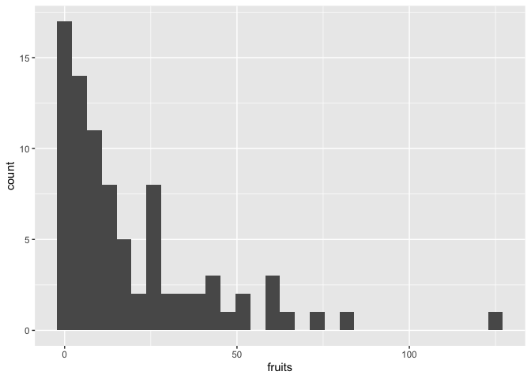
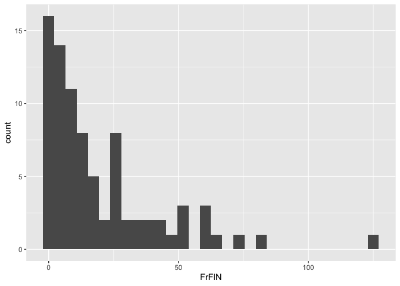

# Fruit production in year 2 at WL2


## Libraries

``` r
library(tidyverse)
```

```
## ── Attaching core tidyverse packages ──────────────────────── tidyverse 2.0.0 ──
## ✔ dplyr     1.1.4     ✔ readr     2.1.5
## ✔ forcats   1.0.0     ✔ stringr   1.5.1
## ✔ ggplot2   3.5.1     ✔ tibble    3.2.1
## ✔ lubridate 1.9.3     ✔ tidyr     1.3.1
## ✔ purrr     1.0.2     
## ── Conflicts ────────────────────────────────────────── tidyverse_conflicts() ──
## ✖ dplyr::filter() masks stats::filter()
## ✖ dplyr::lag()    masks stats::lag()
## ℹ Use the conflicted package (<http://conflicted.r-lib.org/>) to force all conflicts to become errors
```

``` r
library(magrittr)
```

```
## 
## Attaching package: 'magrittr'
## 
## The following object is masked from 'package:purrr':
## 
##     set_names
## 
## The following object is masked from 'package:tidyr':
## 
##     extract
```

``` r
#conflicted::conflicts_prefer(dplyr::filter)
library(viridis) #for pretty colors
```

```
## Loading required package: viridisLite
```

``` r
library(ggrepel) #for non-overlapping labels on plots
library(ggdist) #visualizations of distributions and uncertainty 
library(ggpubr)

#library(sp) #for calculating geographic distance 
library(geosphere) #for calculating geographic distance
library(corrplot) #plotting correlations  
```

```
## corrplot 0.94 loaded
```

``` r
library(rstatix) #performing cor_test
```

```
## 
## Attaching package: 'rstatix'
## 
## The following object is masked from 'package:stats':
## 
##     filter
```

``` r
library(lmerTest) #mixed models
```

```
## Loading required package: lme4
## Loading required package: Matrix
## 
## Attaching package: 'Matrix'
## 
## The following objects are masked from 'package:tidyr':
## 
##     expand, pack, unpack
## 
## 
## Attaching package: 'lmerTest'
## 
## The following object is masked from 'package:lme4':
## 
##     lmer
## 
## The following object is masked from 'package:stats':
## 
##     step
```

``` r
conflicted::conflicts_prefer(lmerTest::lmer)
```

```
## [conflicted] Will prefer lmerTest::lmer over any other package.
```

``` r
library(broom.mixed)
library(tidymodels)
```

```
## ── Attaching packages ────────────────────────────────────── tidymodels 1.2.0 ──
## ✔ broom        1.0.7     ✔ rsample      1.2.1
## ✔ dials        1.3.0     ✔ tune         1.2.1
## ✔ infer        1.0.7     ✔ workflows    1.1.4
## ✔ modeldata    1.4.0     ✔ workflowsets 1.1.0
## ✔ parsnip      1.2.1     ✔ yardstick    1.3.1
## ✔ recipes      1.1.0     
## ── Conflicts ───────────────────────────────────────── tidymodels_conflicts() ──
## ✖ infer::chisq_test()   masks rstatix::chisq_test()
## ✖ scales::discard()     masks purrr::discard()
## ✖ Matrix::expand()      masks tidyr::expand()
## ✖ magrittr::extract()   masks tidyr::extract()
## ✖ rstatix::filter()     masks dplyr::filter(), stats::filter()
## ✖ recipes::fixed()      masks stringr::fixed()
## ✖ dials::get_n()        masks rstatix::get_n()
## ✖ dplyr::lag()          masks stats::lag()
## ✖ Matrix::pack()        masks tidyr::pack()
## ✖ infer::prop_test()    masks rstatix::prop_test()
## ✖ magrittr::set_names() masks purrr::set_names()
## ✖ yardstick::spec()     masks readr::spec()
## ✖ recipes::step()       masks lmerTest::step(), stats::step()
## ✖ infer::t_test()       masks rstatix::t_test()
## ✖ Matrix::unpack()      masks tidyr::unpack()
## ✖ recipes::update()     masks Matrix::update(), stats::update()
## • Search for functions across packages at https://www.tidymodels.org/find/
```

``` r
library(furrr) #Apply Mapping Functions in Parallel using Futures
```

```
## Loading required package: future
```

``` r
tidymodels_prefer()
# install.packages("multilevelmod")
library(multilevelmod)

library(brms)
```

```
## Loading required package: Rcpp
## 
## Attaching package: 'Rcpp'
## 
## The following object is masked from 'package:rsample':
## 
##     populate
## 
## Loading 'brms' package (version 2.22.0). Useful instructions
## can be found by typing help('brms'). A more detailed introduction
## to the package is available through vignette('brms_overview').
```

``` r
#conflicted::conflicts_prefer(brms::ar)
#conflicted::conflicts_prefer(dplyr::combine)
#conflicted::conflicts_prefer(brms::dstudent_t)
library(tidybayes) #for extracting and visiaulizing brms model output 
library(modelr) #for data grid

sem <- function(x, na.rm=FALSE) {           #for caclulating standard error
  sd(x,na.rm=na.rm)/sqrt(length(na.omit(x)))
} 

cbbPalette2 <- c("#E69F00","#000000", "#56B4E9","#009E73", "#F0E442", "#0072B2", "#D55E00", "#CC79A7")
timepd_palette <- c("#56B4E9","#D55E00")

options(mc.cores = parallel::detectCores())
```

## Year 2 Pop Info

``` r
wl2_y2_pops <- read_csv("../input/WL2_Data/Final_2023_2024_Pop_Loc_Info.csv") %>%
  select(Pop.Type:unique.ID) %>% 
  filter(Pop.Type=="2023-survivor") %>% 
  select(Pop.Type, loc:bed, row=bedrow, col=bedcol, pop:unique.ID)
```

```
## Rows: 1217 Columns: 15
## ── Column specification ────────────────────────────────────────────────────────
## Delimiter: ","
## chr (8): Pop.Type, status, block, loc, bed, bedcol, pop, unique.ID
## dbl (7): bed.block.order, bed.order, AB.CD.order, column.order, bedrow, mf, rep
## 
## ℹ Use `spec()` to retrieve the full column specification for this data.
## ℹ Specify the column types or set `show_col_types = FALSE` to quiet this message.
```

``` r
wl2_blocks <- read_csv("../input/WL2_Data/CorrectedCSVs/WL2_mort_pheno_20231020_corrected.csv") %>% 
  unite(BedLoc, bed:bed.col, sep="_", remove = FALSE) %>% 
  filter(BedLoc!="K_5_C") %>% #get rid of duplicate locations
  select(block, pop, mf, rep) %>% #add in block info 
  mutate(mf=as.double(mf), rep=as.double(rep)) #convert to num
```

```
## Rows: 1826 Columns: 14
## ── Column specification ────────────────────────────────────────────────────────
## Delimiter: ","
## chr (12): block, bed, bed.col, pop, mf, rep, bud.date, flower.date, fruit.da...
## dbl  (1): bed.row
## lgl  (1): last.fruit.date
## 
## ℹ Use `spec()` to retrieve the full column specification for this data.
## ℹ Specify the column types or set `show_col_types = FALSE` to quiet this message.
```

```
## Warning: There were 2 warnings in `mutate()`.
## The first warning was:
## ℹ In argument: `mf = as.double(mf)`.
## Caused by warning:
## ! NAs introduced by coercion
## ℹ Run `dplyr::last_dplyr_warnings()` to see the 1 remaining warning.
```

``` r
#wl2_blocks %>% rowwise() %>%  #checking if mf and rep can be converted to numeric (all buffers)
#  filter(!is.na(mf)) %>%  
#  filter(is.na(as.numeric(mf)))

wl2_y2_pops_blocks <- left_join(wl2_y2_pops, wl2_blocks)
```

```
## Joining with `by = join_by(pop, mf, rep)`
```

## Need the WL2 2024 annual census data sheets (for fruit number)

``` r
wl2_ann_cens_2024 <- read_csv("../input/WL2_Data/WL2_Annual_Census_20241023_corrected.csv")
```

```
## Rows: 1217 Columns: 15
## ── Column specification ────────────────────────────────────────────────────────
## Delimiter: ","
## chr (7): bed, col, unique.ID, phen, survey.date, collected.date, survey.notes
## dbl (8): row, diam.mm, num.flw, num.fruit, long.fruit.cm, total.branch, over...
## 
## ℹ Use `spec()` to retrieve the full column specification for this data.
## ℹ Specify the column types or set `show_col_types = FALSE` to quiet this message.
```

``` r
wl2_ann_cens_2024_pops <- left_join(wl2_y2_pops_blocks, wl2_ann_cens_2024) %>%  
  rename(Genotype=unique.ID)
```

```
## Joining with `by = join_by(bed, row, col, unique.ID)`
```

## Gower's Distance

``` r
garden_climate <- read_csv("../output/Climate/flint_climate_UCDpops.csv") %>% 
  filter(parent.pop=="WL2_Garden" | parent.pop=="UCD_Garden") %>% 
  select(parent.pop:Long) %>% 
  distinct()
```

```
## Rows: 38775 Columns: 14
## ── Column specification ────────────────────────────────────────────────────────
## Delimiter: ","
## chr  (3): parent.pop, elevation.group, month
## dbl (11): elev_m, Lat, Long, year, aet, cwd, pck, pet, ppt, tmn, tmx
## 
## ℹ Use `spec()` to retrieve the full column specification for this data.
## ℹ Specify the column types or set `show_col_types = FALSE` to quiet this message.
```

``` r
garden_climate
```

```
## # A tibble: 2 × 5
##   parent.pop elevation.group elev_m   Lat  Long
##   <chr>      <chr>            <dbl> <dbl> <dbl>
## 1 UCD_Garden Low                 16  38.5 -122.
## 2 WL2_Garden High              2020  38.8 -120.
```

``` r
#UCD LAT/LONG = 38.53250, -121.7830
#WL2 Lat/Long = 38.82599, -120.2509

wl2_gowers_2324 <- read_csv("../output/Climate/Gowers_WL2_2324.csv") %>% 
  select(parent.pop:GrwSsn_GD, Wtr_Year_GD) %>% 
  pivot_wider(names_from = TimePd, values_from = c(GrwSsn_GD, Wtr_Year_GD)) %>% 
  mutate(WL2_Lat=38.82599, WL2_Long=-120.2509, WL2_Elev=2020) %>% 
  mutate(Geographic_Dist=distHaversine(cbind(WL2_Long, WL2_Lat), cbind(Long, Lat)),
         Elev_Dist=elev_m-WL2_Elev) %>% # Calculate the distance using the haversine formula
  rename(pop=parent.pop)
```

```
## Rows: 46 Columns: 8
## ── Column specification ────────────────────────────────────────────────────────
## Delimiter: ","
## chr (3): parent.pop, elevation.group, TimePd
## dbl (5): elev_m, Lat, Long, GrwSsn_GD, Wtr_Year_GD
## 
## ℹ Use `spec()` to retrieve the full column specification for this data.
## ℹ Specify the column types or set `show_col_types = FALSE` to quiet this message.
```

``` r
wl2_gowers_2024 <- read_csv("../output/Climate/Gowers_WL2_2024.csv") %>% 
  pivot_wider(names_from = TimePd, values_from = c(GrwSsn_GD, Wtr_Year_GD)) %>% 
  mutate(WL2_Lat=38.82599, WL2_Long=-120.2509, WL2_Elev=2020) %>% 
  mutate(Geographic_Dist=distHaversine(cbind(WL2_Long, WL2_Lat), cbind(Long, Lat)),
         Elev_Dist=elev_m-WL2_Elev) %>% # Calculate the distance using the haversine formula
  rename(pop=parent.pop)
```

```
## Rows: 46 Columns: 8
## ── Column specification ────────────────────────────────────────────────────────
## Delimiter: ","
## chr (3): parent.pop, elevation.group, TimePd
## dbl (5): elev_m, Lat, Long, GrwSsn_GD, Wtr_Year_GD
## 
## ℹ Use `spec()` to retrieve the full column specification for this data.
## ℹ Specify the column types or set `show_col_types = FALSE` to quiet this message.
```

## Climate Subtraction Distance

``` r
wl2_wtr_year_sub_recent_2324 <- read_csv("../output/Climate/full_year_Subtraction_Dist_from_Home_WL2_2324_Recent.csv") %>% 
  select(parent.pop, Wtr_Year_TempDist_Recent=ann_tmean_dist, Wtr_Year_PPTDist_Recent=ann_ppt_dist)
```

```
## Rows: 23 Columns: 18
## ── Column specification ────────────────────────────────────────────────────────
## Delimiter: ","
## chr  (2): parent.pop, elevation.group
## dbl (16): elev_m, ppt_dist, cwd_dist, pck_dist, tmn_dist, tmx_dist, ann_tmea...
## 
## ℹ Use `spec()` to retrieve the full column specification for this data.
## ℹ Specify the column types or set `show_col_types = FALSE` to quiet this message.
```

``` r
wl2_wtr_year_sub_historic_2324 <- read_csv("../output/Climate/full_year_Subtraction_Dist_from_Home_WL2_2324_Historical.csv") %>% 
  select(parent.pop, Wtr_Year_TempDist_Historic=ann_tmean_dist, Wtr_Year_PPTDist_Historic=ann_ppt_dist)
```

```
## Rows: 23 Columns: 18
## ── Column specification ────────────────────────────────────────────────────────
## Delimiter: ","
## chr  (2): parent.pop, elevation.group
## dbl (16): elev_m, ppt_dist, cwd_dist, pck_dist, tmn_dist, tmx_dist, ann_tmea...
## 
## ℹ Use `spec()` to retrieve the full column specification for this data.
## ℹ Specify the column types or set `show_col_types = FALSE` to quiet this message.
```

``` r
wl2_grwssn_sub_recent_2324 <- read_csv("../output/Climate/grwssn_Subtraction_Dist_from_Home_WL2_2324_Recent.csv") %>% 
  select(parent.pop, GrwSsn_TempDist_Recent=ann_tmean_dist, GrwSsn_PPTDist_Recent=ann_ppt_dist)
```

```
## Rows: 23 Columns: 18
## ── Column specification ────────────────────────────────────────────────────────
## Delimiter: ","
## chr  (2): parent.pop, elevation.group
## dbl (16): elev_m, ppt_dist, cwd_dist, pck_dist, tmn_dist, tmx_dist, ann_tmea...
## 
## ℹ Use `spec()` to retrieve the full column specification for this data.
## ℹ Specify the column types or set `show_col_types = FALSE` to quiet this message.
```

``` r
wl2_grwssn_sub_historic_2324 <- read_csv("../output/Climate/grwssn_Subtraction_Dist_from_Home_WL2_2324_Historical.csv") %>% 
  select(parent.pop, GrwSsn_TempDist_Historic=ann_tmean_dist, GrwSsn_PPTDist_Historic=ann_ppt_dist)
```

```
## Rows: 23 Columns: 18
## ── Column specification ────────────────────────────────────────────────────────
## Delimiter: ","
## chr  (2): parent.pop, elevation.group
## dbl (16): elev_m, ppt_dist, cwd_dist, pck_dist, tmn_dist, tmx_dist, ann_tmea...
## 
## ℹ Use `spec()` to retrieve the full column specification for this data.
## ℹ Specify the column types or set `show_col_types = FALSE` to quiet this message.
```

``` r
wl2_sub_dist_2324 <- wl2_wtr_year_sub_recent_2324 %>% 
  left_join(wl2_wtr_year_sub_historic_2324) %>% 
  left_join(wl2_grwssn_sub_recent_2324) %>% 
  left_join(wl2_grwssn_sub_historic_2324) %>% 
  rename(pop=parent.pop) %>% 
  left_join(wl2_gowers_2324)
```

```
## Joining with `by = join_by(parent.pop)`
## Joining with `by = join_by(parent.pop)`
## Joining with `by = join_by(parent.pop)`
## Joining with `by = join_by(pop)`
```


``` r
wl2_wtr_year_sub_recent_2024 <- read_csv("../output/Climate/full_year_Subtraction_Dist_from_Home_WL2_2024_Recent.csv") %>% 
  select(parent.pop, Wtr_Year_TempDist_Recent=ann_tmean_dist, Wtr_Year_PPTDist_Recent=ann_ppt_dist)
```

```
## Rows: 23 Columns: 18
## ── Column specification ────────────────────────────────────────────────────────
## Delimiter: ","
## chr  (2): parent.pop, elevation.group
## dbl (16): elev_m, ppt_dist, cwd_dist, pck_dist, tmn_dist, tmx_dist, ann_tmea...
## 
## ℹ Use `spec()` to retrieve the full column specification for this data.
## ℹ Specify the column types or set `show_col_types = FALSE` to quiet this message.
```

``` r
wl2_wtr_year_sub_historic_2024 <- read_csv("../output/Climate/full_year_Subtraction_Dist_from_Home_WL2_2024_Historical.csv") %>% 
  select(parent.pop, Wtr_Year_TempDist_Historic=ann_tmean_dist, Wtr_Year_PPTDist_Historic=ann_ppt_dist)
```

```
## Rows: 23 Columns: 18
## ── Column specification ────────────────────────────────────────────────────────
## Delimiter: ","
## chr  (2): parent.pop, elevation.group
## dbl (16): elev_m, ppt_dist, cwd_dist, pck_dist, tmn_dist, tmx_dist, ann_tmea...
## 
## ℹ Use `spec()` to retrieve the full column specification for this data.
## ℹ Specify the column types or set `show_col_types = FALSE` to quiet this message.
```

``` r
wl2_grwssn_sub_recent_2024 <- read_csv("../output/Climate/grwssn_Subtraction_Dist_from_Home_WL2_2024_Recent.csv") %>% 
  select(parent.pop, GrwSsn_TempDist_Recent=ann_tmean_dist, GrwSsn_PPTDist_Recent=ann_ppt_dist)
```

```
## Rows: 23 Columns: 18
## ── Column specification ────────────────────────────────────────────────────────
## Delimiter: ","
## chr  (2): parent.pop, elevation.group
## dbl (16): elev_m, ppt_dist, cwd_dist, pck_dist, tmn_dist, tmx_dist, ann_tmea...
## 
## ℹ Use `spec()` to retrieve the full column specification for this data.
## ℹ Specify the column types or set `show_col_types = FALSE` to quiet this message.
```

``` r
wl2_grwssn_sub_historic_2024 <- read_csv("../output/Climate/grwssn_Subtraction_Dist_from_Home_WL2_2024_Historical.csv") %>% 
  select(parent.pop, GrwSsn_TempDist_Historic=ann_tmean_dist, GrwSsn_PPTDist_Historic=ann_ppt_dist)
```

```
## Rows: 23 Columns: 18
## ── Column specification ────────────────────────────────────────────────────────
## Delimiter: ","
## chr  (2): parent.pop, elevation.group
## dbl (16): elev_m, ppt_dist, cwd_dist, pck_dist, tmn_dist, tmx_dist, ann_tmea...
## 
## ℹ Use `spec()` to retrieve the full column specification for this data.
## ℹ Specify the column types or set `show_col_types = FALSE` to quiet this message.
```

``` r
wl2_sub_dist_2024 <- wl2_wtr_year_sub_recent_2024 %>% 
  left_join(wl2_wtr_year_sub_historic_2024) %>% 
  left_join(wl2_grwssn_sub_recent_2024) %>% 
  left_join(wl2_grwssn_sub_historic_2024) %>% 
  rename(pop=parent.pop) %>% 
  left_join(wl2_gowers_2024)
```

```
## Joining with `by = join_by(parent.pop)`
## Joining with `by = join_by(parent.pop)`
## Joining with `by = join_by(parent.pop)`
## Joining with `by = join_by(pop)`
```

## Calculate Fruits(y2)

``` r
wl2_fruits_y2 <- wl2_ann_cens_2024_pops %>% select(Pop.Type:block, flowers=num.flw, fruits=num.fruit) %>%
  mutate(FrFlN=fruits+flowers) %>% 
  left_join(wl2_gowers_2024)
```

```
## Joining with `by = join_by(pop)`
```

``` r
wl2_fruits_y2_nozeros <- wl2_fruits_y2 %>% 
  filter(fruits>0)
summary(wl2_fruits_y2_nozeros)
```

```
##    Pop.Type             loc                bed                 row       
##  Length:73          Length:73          Length:73          Min.   : 2.00  
##  Class :character   Class :character   Class :character   1st Qu.:21.00  
##  Mode  :character   Mode  :character   Mode  :character   Median :36.00  
##                                                           Mean   :32.88  
##                                                           3rd Qu.:47.00  
##                                                           Max.   :58.00  
##                                                                          
##      col                pop                  mf             rep        
##  Length:73          Length:73          Min.   :1.000   Min.   : 1.000  
##  Class :character   Class :character   1st Qu.:2.000   1st Qu.: 4.000  
##  Mode  :character   Mode  :character   Median :4.000   Median : 7.000  
##                                        Mean   :4.301   Mean   : 7.452  
##                                        3rd Qu.:6.000   3rd Qu.:11.000  
##                                        Max.   :9.000   Max.   :23.000  
##                                                                        
##    Genotype            block              flowers           fruits      
##  Length:73          Length:73          Min.   :0.0000   Min.   :  1.00  
##  Class :character   Class :character   1st Qu.:0.0000   1st Qu.:  6.00  
##  Mode  :character   Mode  :character   Median :0.0000   Median : 15.00  
##                                        Mean   :0.1528   Mean   : 22.22  
##                                        3rd Qu.:0.0000   3rd Qu.: 30.00  
##                                        Max.   :8.0000   Max.   :125.00  
##                                        NA's   :1                        
##      FrFlN        elevation.group        elev_m            Lat       
##  Min.   :  1.00   Length:73          Min.   : 313.0   Min.   :36.56  
##  1st Qu.:  6.00   Class :character   1st Qu.: 421.5   1st Qu.:37.81  
##  Median : 15.00   Mode  :character   Median : 511.4   Median :38.41  
##  Mean   : 22.65                      Mean   : 993.0   Mean   :38.40  
##  3rd Qu.: 30.50                      3rd Qu.:2020.1   3rd Qu.:39.09  
##  Max.   :125.00                      Max.   :2470.0   Max.   :39.59  
##  NA's   :1                                                           
##       Long        GrwSsn_GD_Recent GrwSsn_GD_Historical Wtr_Year_GD_Recent
##  Min.   :-121.6   Min.   :0.1593   Min.   :0.2165       Min.   :0.2256    
##  1st Qu.:-120.9   1st Qu.:0.3535   1st Qu.:0.3432       1st Qu.:0.3278    
##  Median :-120.3   Median :0.3605   Median :0.3815       Median :0.4223    
##  Mean   :-120.4   Mean   :0.3943   Mean   :0.4112       Mean   :0.4308    
##  3rd Qu.:-120.0   3rd Qu.:0.4493   3rd Qu.:0.4560       3rd Qu.:0.4971    
##  Max.   :-118.8   Max.   :0.5655   Max.   :0.5660       Max.   :0.5660    
##                                                                           
##  Wtr_Year_GD_Historical    WL2_Lat         WL2_Long         WL2_Elev   
##  Min.   :0.2469         Min.   :38.83   Min.   :-120.3   Min.   :2020  
##  1st Qu.:0.3132         1st Qu.:38.83   1st Qu.:-120.3   1st Qu.:2020  
##  Median :0.3865         Median :38.83   Median :-120.3   Median :2020  
##  Mean   :0.4046         Mean   :38.83   Mean   :-120.3   Mean   :2020  
##  3rd Qu.:0.4743         3rd Qu.:38.83   3rd Qu.:-120.3   3rd Qu.:2020  
##  Max.   :0.5207         Max.   :38.83   Max.   :-120.3   Max.   :2020  
##                                                                        
##  Geographic_Dist      Elev_Dist         
##  Min.   :   136.3   Min.   :-1707.0000  
##  1st Qu.: 65203.4   1st Qu.:-1598.4822  
##  Median :128036.9   Median :-1508.5706  
##  Mean   :108511.2   Mean   :-1027.0481  
##  3rd Qu.:140893.4   3rd Qu.:    0.1158  
##  Max.   :283280.5   Max.   :  449.9787  
## 
```

``` r
wl2_FRFLs_y2_nozeros <- wl2_fruits_y2 %>% 
  filter(FrFlN>0)
summary(wl2_FRFLs_y2_nozeros)
```

```
##    Pop.Type             loc                bed                 row       
##  Length:73          Length:73          Length:73          Min.   : 2.00  
##  Class :character   Class :character   Class :character   1st Qu.:20.00  
##  Mode  :character   Mode  :character   Mode  :character   Median :36.00  
##                                                           Mean   :32.63  
##                                                           3rd Qu.:47.00  
##                                                           Max.   :58.00  
##      col                pop                  mf             rep        
##  Length:73          Length:73          Min.   :1.000   Min.   : 1.000  
##  Class :character   Class :character   1st Qu.:2.000   1st Qu.: 4.000  
##  Mode  :character   Mode  :character   Median :4.000   Median : 7.000  
##                                        Mean   :4.301   Mean   : 7.438  
##                                        3rd Qu.:6.000   3rd Qu.:11.000  
##                                        Max.   :9.000   Max.   :23.000  
##    Genotype            block              flowers           fruits      
##  Length:73          Length:73          Min.   :0.0000   Min.   :  0.00  
##  Class :character   Class :character   1st Qu.:0.0000   1st Qu.:  6.00  
##  Mode  :character   Mode  :character   Median :0.0000   Median : 15.00  
##                                        Mean   :0.1781   Mean   : 22.19  
##                                        3rd Qu.:0.0000   3rd Qu.: 30.00  
##                                        Max.   :8.0000   Max.   :125.00  
##      FrFlN        elevation.group        elev_m            Lat       
##  Min.   :  1.00   Length:73          Min.   : 313.0   Min.   :36.56  
##  1st Qu.:  6.00   Class :character   1st Qu.: 421.5   1st Qu.:37.81  
##  Median : 15.00   Mode  :character   Median : 511.4   Median :38.41  
##  Mean   : 22.37                      Mean   : 994.9   Mean   :38.39  
##  3rd Qu.: 30.00                      3rd Qu.:2020.1   3rd Qu.:39.09  
##  Max.   :125.00                      Max.   :2470.0   Max.   :39.59  
##       Long        GrwSsn_GD_Recent GrwSsn_GD_Historical Wtr_Year_GD_Recent
##  Min.   :-121.6   Min.   :0.1593   Min.   :0.2165       Min.   :0.2256    
##  1st Qu.:-120.9   1st Qu.:0.3535   1st Qu.:0.3432       1st Qu.:0.3278    
##  Median :-120.3   Median :0.3605   Median :0.3815       Median :0.4223    
##  Mean   :-120.4   Mean   :0.3945   Mean   :0.4104       Mean   :0.4305    
##  3rd Qu.:-120.0   3rd Qu.:0.4493   3rd Qu.:0.4560       3rd Qu.:0.4971    
##  Max.   :-118.8   Max.   :0.5655   Max.   :0.5660       Max.   :0.5660    
##  Wtr_Year_GD_Historical    WL2_Lat         WL2_Long         WL2_Elev   
##  Min.   :0.2469         Min.   :38.83   Min.   :-120.3   Min.   :2020  
##  1st Qu.:0.3132         1st Qu.:38.83   1st Qu.:-120.3   1st Qu.:2020  
##  Median :0.3865         Median :38.83   Median :-120.3   Median :2020  
##  Mean   :0.4042         Mean   :38.83   Mean   :-120.3   Mean   :2020  
##  3rd Qu.:0.4743         3rd Qu.:38.83   3rd Qu.:-120.3   3rd Qu.:2020  
##  Max.   :0.5207         Max.   :38.83   Max.   :-120.3   Max.   :2020  
##  Geographic_Dist      Elev_Dist         
##  Min.   :   136.3   Min.   :-1707.0000  
##  1st Qu.: 65203.4   1st Qu.:-1598.4822  
##  Median :128036.9   Median :-1508.5706  
##  Mean   :107589.3   Mean   :-1025.1148  
##  3rd Qu.:140893.4   3rd Qu.:    0.1158  
##  Max.   :283280.5   Max.   :  449.9787
```

``` r
#write_csv(wl2_fruits_y2_nozeros, "../output/WL2_Traits/WL2_Fruits_Y2.csv")
```


``` r
wl2_fruits_y2_sub_dist <- wl2_fruits_y2 %>% 
  select(loc:block, fruits, FrFlN) %>% 
  left_join(wl2_sub_dist_2024)
```

```
## Joining with `by = join_by(pop)`
```

``` r
wl2_fruits_y2_nozeros_sub_dist <- wl2_fruits_y2_sub_dist %>% 
  filter(fruits>0)

wl2_FRFLs_y2_nozero_sub_dists <- wl2_fruits_y2_sub_dist %>% 
  filter(FrFlN>0)
```

Probability of Fruits given Surv to Budding 

``` r
wl2_surv_to_rep_y2 <- read_csv("../output/WL2_Traits/WL2_Surv_to_Rep_Y2.csv")
```

```
## Rows: 135 Columns: 23
## ── Column specification ────────────────────────────────────────────────────────
## Delimiter: ","
## chr (10): Pop.Type, loc, bed, col, pop, Genotype, block, elevation.group, bu...
## dbl (13): row, mf, rep, elev_m, Lat, Long, GrwSsn_GD_Recent, GrwSsn_GD_Histo...
## 
## ℹ Use `spec()` to retrieve the full column specification for this data.
## ℹ Specify the column types or set `show_col_types = FALSE` to quiet this message.
```

``` r
wl2_prob_fruits <- wl2_surv_to_rep_y2 %>% 
  filter(SurvtoRep_y2==1) %>% 
  select(loc:block, death.date, SurvtoRep_y2) %>% 
  left_join(wl2_fruits_y2) %>% 
  mutate(ProbFruits=if_else(is.na(fruits), 0, 
                            if_else(fruits==0, 0, 1))) %>% 
  select(loc:col, block, pop:Genotype, elevation.group:Elev_Dist, ProbFruits)
```

```
## Joining with `by = join_by(loc, bed, row, col, pop, mf, rep, Genotype, block)`
```

``` r
#write_csv(wl2_prob_fruits, "../output/WL2_Traits/WL2_ProbFruits_Y2.csv")
```

### Wtih 2023 Gowers

``` r
wl2_fruits_y2_2324 <- wl2_ann_cens_2024_pops %>% select(Pop.Type:block, flowers=num.flw, fruits=num.fruit) %>%
  mutate(FrFlN=fruits+flowers) %>% 
  left_join(wl2_gowers_2324)
```

```
## Joining with `by = join_by(pop)`
```

``` r
wl2_fruits_y2_2324_nozeros <- wl2_fruits_y2_2324 %>% 
  filter(fruits>0)
summary(wl2_fruits_y2_2324_nozeros)
```

```
##    Pop.Type             loc                bed                 row       
##  Length:73          Length:73          Length:73          Min.   : 2.00  
##  Class :character   Class :character   Class :character   1st Qu.:21.00  
##  Mode  :character   Mode  :character   Mode  :character   Median :36.00  
##                                                           Mean   :32.88  
##                                                           3rd Qu.:47.00  
##                                                           Max.   :58.00  
##                                                                          
##      col                pop                  mf             rep        
##  Length:73          Length:73          Min.   :1.000   Min.   : 1.000  
##  Class :character   Class :character   1st Qu.:2.000   1st Qu.: 4.000  
##  Mode  :character   Mode  :character   Median :4.000   Median : 7.000  
##                                        Mean   :4.301   Mean   : 7.452  
##                                        3rd Qu.:6.000   3rd Qu.:11.000  
##                                        Max.   :9.000   Max.   :23.000  
##                                                                        
##    Genotype            block              flowers           fruits      
##  Length:73          Length:73          Min.   :0.0000   Min.   :  1.00  
##  Class :character   Class :character   1st Qu.:0.0000   1st Qu.:  6.00  
##  Mode  :character   Mode  :character   Median :0.0000   Median : 15.00  
##                                        Mean   :0.1528   Mean   : 22.22  
##                                        3rd Qu.:0.0000   3rd Qu.: 30.00  
##                                        Max.   :8.0000   Max.   :125.00  
##                                        NA's   :1                        
##      FrFlN        elevation.group        elev_m            Lat       
##  Min.   :  1.00   Length:73          Min.   : 313.0   Min.   :36.56  
##  1st Qu.:  6.00   Class :character   1st Qu.: 421.5   1st Qu.:37.81  
##  Median : 15.00   Mode  :character   Median : 511.4   Median :38.41  
##  Mean   : 22.65                      Mean   : 993.0   Mean   :38.40  
##  3rd Qu.: 30.50                      3rd Qu.:2020.1   3rd Qu.:39.09  
##  Max.   :125.00                      Max.   :2470.0   Max.   :39.59  
##  NA's   :1                                                           
##       Long        GrwSsn_GD_Recent GrwSsn_GD_Historical Wtr_Year_GD_Recent
##  Min.   :-121.6   Min.   :0.1627   Min.   :0.2215       Min.   :0.2265    
##  1st Qu.:-120.9   1st Qu.:0.3596   1st Qu.:0.3478       1st Qu.:0.3304    
##  Median :-120.3   Median :0.3604   Median :0.3831       Median :0.4265    
##  Mean   :-120.4   Mean   :0.3967   Mean   :0.4148       Mean   :0.4339    
##  3rd Qu.:-120.0   3rd Qu.:0.4491   3rd Qu.:0.4569       3rd Qu.:0.4991    
##  Max.   :-118.8   Max.   :0.5660   Max.   :0.5700       Max.   :0.5686    
##                                                                           
##  Wtr_Year_GD_Historical    WL2_Lat         WL2_Long         WL2_Elev   
##  Min.   :0.2509         Min.   :38.83   Min.   :-120.3   Min.   :2020  
##  1st Qu.:0.3183         1st Qu.:38.83   1st Qu.:-120.3   1st Qu.:2020  
##  Median :0.3889         Median :38.83   Median :-120.3   Median :2020  
##  Mean   :0.4069         Mean   :38.83   Mean   :-120.3   Mean   :2020  
##  3rd Qu.:0.4757         3rd Qu.:38.83   3rd Qu.:-120.3   3rd Qu.:2020  
##  Max.   :0.5210         Max.   :38.83   Max.   :-120.3   Max.   :2020  
##                                                                        
##  Geographic_Dist      Elev_Dist         
##  Min.   :   136.3   Min.   :-1707.0000  
##  1st Qu.: 65203.4   1st Qu.:-1598.4822  
##  Median :128036.9   Median :-1508.5706  
##  Mean   :108511.2   Mean   :-1027.0481  
##  3rd Qu.:140893.4   3rd Qu.:    0.1158  
##  Max.   :283280.5   Max.   :  449.9787  
## 
```

``` r
wl2_FRFLs_y2_2324_nozeros <- wl2_fruits_y2_2324 %>% 
  filter(FrFlN>0)
summary(wl2_FRFLs_y2_2324_nozeros)
```

```
##    Pop.Type             loc                bed                 row       
##  Length:73          Length:73          Length:73          Min.   : 2.00  
##  Class :character   Class :character   Class :character   1st Qu.:20.00  
##  Mode  :character   Mode  :character   Mode  :character   Median :36.00  
##                                                           Mean   :32.63  
##                                                           3rd Qu.:47.00  
##                                                           Max.   :58.00  
##      col                pop                  mf             rep        
##  Length:73          Length:73          Min.   :1.000   Min.   : 1.000  
##  Class :character   Class :character   1st Qu.:2.000   1st Qu.: 4.000  
##  Mode  :character   Mode  :character   Median :4.000   Median : 7.000  
##                                        Mean   :4.301   Mean   : 7.438  
##                                        3rd Qu.:6.000   3rd Qu.:11.000  
##                                        Max.   :9.000   Max.   :23.000  
##    Genotype            block              flowers           fruits      
##  Length:73          Length:73          Min.   :0.0000   Min.   :  0.00  
##  Class :character   Class :character   1st Qu.:0.0000   1st Qu.:  6.00  
##  Mode  :character   Mode  :character   Median :0.0000   Median : 15.00  
##                                        Mean   :0.1781   Mean   : 22.19  
##                                        3rd Qu.:0.0000   3rd Qu.: 30.00  
##                                        Max.   :8.0000   Max.   :125.00  
##      FrFlN        elevation.group        elev_m            Lat       
##  Min.   :  1.00   Length:73          Min.   : 313.0   Min.   :36.56  
##  1st Qu.:  6.00   Class :character   1st Qu.: 421.5   1st Qu.:37.81  
##  Median : 15.00   Mode  :character   Median : 511.4   Median :38.41  
##  Mean   : 22.37                      Mean   : 994.9   Mean   :38.39  
##  3rd Qu.: 30.00                      3rd Qu.:2020.1   3rd Qu.:39.09  
##  Max.   :125.00                      Max.   :2470.0   Max.   :39.59  
##       Long        GrwSsn_GD_Recent GrwSsn_GD_Historical Wtr_Year_GD_Recent
##  Min.   :-121.6   Min.   :0.1627   Min.   :0.2215       Min.   :0.2265    
##  1st Qu.:-120.9   1st Qu.:0.3596   1st Qu.:0.3478       1st Qu.:0.3304    
##  Median :-120.3   Median :0.3604   Median :0.3831       Median :0.4265    
##  Mean   :-120.4   Mean   :0.3970   Mean   :0.4140       Mean   :0.4336    
##  3rd Qu.:-120.0   3rd Qu.:0.4491   3rd Qu.:0.4569       3rd Qu.:0.4991    
##  Max.   :-118.8   Max.   :0.5660   Max.   :0.5700       Max.   :0.5686    
##  Wtr_Year_GD_Historical    WL2_Lat         WL2_Long         WL2_Elev   
##  Min.   :0.2509         Min.   :38.83   Min.   :-120.3   Min.   :2020  
##  1st Qu.:0.3183         1st Qu.:38.83   1st Qu.:-120.3   1st Qu.:2020  
##  Median :0.3889         Median :38.83   Median :-120.3   Median :2020  
##  Mean   :0.4065         Mean   :38.83   Mean   :-120.3   Mean   :2020  
##  3rd Qu.:0.4757         3rd Qu.:38.83   3rd Qu.:-120.3   3rd Qu.:2020  
##  Max.   :0.5210         Max.   :38.83   Max.   :-120.3   Max.   :2020  
##  Geographic_Dist      Elev_Dist         
##  Min.   :   136.3   Min.   :-1707.0000  
##  1st Qu.: 65203.4   1st Qu.:-1598.4822  
##  Median :128036.9   Median :-1508.5706  
##  Mean   :107589.3   Mean   :-1025.1148  
##  3rd Qu.:140893.4   3rd Qu.:    0.1158  
##  Max.   :283280.5   Max.   :  449.9787
```

``` r
write_csv(wl2_fruits_y2_2324_nozeros, "../output/WL2_Traits/WL2_Fruits_Y2_2324.csv")
```


``` r
wl2_fruits_y2_2324_sub_dist <- wl2_fruits_y2_2324 %>% 
  select(loc:block, fruits, FrFlN) %>% 
  left_join(wl2_sub_dist_2324)
```

```
## Joining with `by = join_by(pop)`
```

``` r
wl2_fruits_y2_2324_nozeros_sub_dist <- wl2_fruits_y2_2324_sub_dist %>% 
  filter(fruits>0)

wl2_FRFLs_y2_2324_nozero_sub_dists <- wl2_fruits_y2_2324_sub_dist %>% 
  filter(FrFlN>0)
```

Probability of Fruits given Surv to Budding 

``` r
wl2_surv_to_rep_y2_2324 <- read_csv("../output/WL2_Traits/WL2_Surv_to_Rep_Y2_2324.csv")
```

```
## Rows: 135 Columns: 23
## ── Column specification ────────────────────────────────────────────────────────
## Delimiter: ","
## chr (10): Pop.Type, loc, bed, col, pop, Genotype, block, elevation.group, bu...
## dbl (13): row, mf, rep, elev_m, Lat, Long, GrwSsn_GD_Recent, GrwSsn_GD_Histo...
## 
## ℹ Use `spec()` to retrieve the full column specification for this data.
## ℹ Specify the column types or set `show_col_types = FALSE` to quiet this message.
```

``` r
wl2_prob_fruits_2324 <- wl2_surv_to_rep_y2_2324 %>% 
  filter(SurvtoRep_y2==1) %>% 
  select(loc:block, death.date, SurvtoRep_y2) %>% 
  left_join(wl2_fruits_y2) %>% 
  mutate(ProbFruits=if_else(is.na(fruits), 0, 
                            if_else(fruits==0, 0, 1))) %>% 
  select(loc:col, block, pop:Genotype, elevation.group:Elev_Dist, ProbFruits)
```

```
## Joining with `by = join_by(loc, bed, row, col, pop, mf, rep, Genotype, block)`
```

``` r
write_csv(wl2_prob_fruits_2324, "../output/WL2_Traits/WL2_ProbFruits_Y2_2324.csv")
```


### BAR PLOTS 

``` r
wl2_fruits_y2_nozeros %>% 
  group_by(pop, elev_m, GrwSsn_GD_Recent, Wtr_Year_GD_Recent) %>% 
  summarise(meanFruits=mean(fruits, na.rm = TRUE), semFruits=sem(fruits, na.rm=TRUE)) %>%
  filter(pop != "LV1", pop !="SQ1", pop !="WR") %>% 
  ggplot(aes(x=fct_reorder(pop, meanFruits), y=meanFruits, fill=GrwSsn_GD_Recent)) +
  geom_col(width = 0.7,position = position_dodge(0.75)) + 
  geom_errorbar(aes(ymin=meanFruits-semFruits,ymax=meanFruits+semFruits),width=.2, position = 
                  position_dodge(0.75)) +
  theme_classic() + 
  scale_y_continuous(expand = c(0.01, 0)) +
  labs(y="Fruit Number", x="Parent Population", fill="Growth Season Gowers") +
  scale_fill_viridis(option="mako", direction = -1) +
  theme(text=element_text(size=25), axis.text.x = element_text(angle = 45,  hjust = 1))
```

```
## `summarise()` has grouped output by 'pop', 'elev_m', 'GrwSsn_GD_Recent'. You
## can override using the `.groups` argument.
```

<!-- -->

``` r
#ggsave("../output/WL2_Traits/WL2_FruitsY2_GrwSsn_GD_Recent.png", width = 12, height = 8, units = "in")

wl2_fruits_y2_nozeros %>% 
  group_by(pop, elev_m, GrwSsn_GD_Recent, Wtr_Year_GD_Recent) %>% 
  summarise(meanFruits=mean(fruits, na.rm = TRUE), semFruits=sem(fruits, na.rm=TRUE)) %>% 
  filter(pop != "LV1", pop !="SQ1", pop !="WR") %>% 
  ggplot(aes(x=fct_reorder(pop, meanFruits), y=meanFruits, fill=Wtr_Year_GD_Recent)) +
  geom_col(width = 0.7,position = position_dodge(0.75)) + 
  geom_errorbar(aes(ymin=meanFruits-semFruits,ymax=meanFruits+semFruits),width=.2, position = 
                  position_dodge(0.75)) +
  theme_classic() + 
  scale_y_continuous(expand = c(0.01, 0)) +
  labs(y="Fruit Number", x="Parent Population", fill="Water Year Gowers") +
  scale_fill_viridis(option="mako", direction = -1) +
  theme(text=element_text(size=25), axis.text.x = element_text(angle = 45,  hjust = 1))
```

```
## `summarise()` has grouped output by 'pop', 'elev_m', 'GrwSsn_GD_Recent'. You
## can override using the `.groups` argument.
```

<!-- -->

``` r
#ggsave("../output/WL2_Traits/WL2_FruitsY2_Wtr_Year_GD_Recent.png", width = 12, height = 8, units = "in")

wl2_fruits_y2_nozeros %>% filter(pop=="TM2") #only 3 of the 6 made fruits and those 3 had wide variation (2, 19, 125)
```

```
## # A tibble: 3 × 26
##   Pop.Type      loc   bed     row col   pop      mf   rep Genotype block flowers
##   <chr>         <chr> <chr> <dbl> <chr> <chr> <dbl> <dbl> <chr>    <chr>   <dbl>
## 1 2023-survivor B_56… B        56 C     TM2       1     3 TM2_1_3  B           0
## 2 2023-survivor C_23… C        23 D     TM2       4    12 TM2_4_12 E           0
## 3 2023-survivor E_49… E        49 B     TM2       6     4 TM2_6_4  I           0
## # ℹ 15 more variables: fruits <dbl>, FrFlN <dbl>, elevation.group <chr>,
## #   elev_m <dbl>, Lat <dbl>, Long <dbl>, GrwSsn_GD_Recent <dbl>,
## #   GrwSsn_GD_Historical <dbl>, Wtr_Year_GD_Recent <dbl>,
## #   Wtr_Year_GD_Historical <dbl>, WL2_Lat <dbl>, WL2_Long <dbl>,
## #   WL2_Elev <dbl>, Geographic_Dist <dbl>, Elev_Dist <dbl>
```

### Scatterplots

``` r
#scatter plots
GSCD_recent <- wl2_fruits_y2_nozeros %>% 
  filter(pop != "LV1", pop != "SQ1", pop != "WR") %>% 
  group_by(pop, elev_m, GrwSsn_GD_Recent, Wtr_Year_GD_Recent) %>% 
  summarise(meanFruits=mean(fruits, na.rm = TRUE), semFruits=sem(fruits, na.rm=TRUE)) %>% 
  ggplot(aes(x=GrwSsn_GD_Recent, y=meanFruits, group = pop)) +
  geom_point(size=6) + 
  geom_errorbar(aes(ymin=meanFruits-semFruits,ymax=meanFruits+semFruits),width=.02, linewidth = 2) +
  theme_classic() + 
  scale_y_continuous(expand = c(0.01, 0)) +
  labs(y="Y2 Fruit Number", x="Recent Growth Season CD", color="Growth Season \n Climate Distance") +
  theme(text=element_text(size=25))
```

```
## `summarise()` has grouped output by 'pop', 'elev_m', 'GrwSsn_GD_Recent'. You
## can override using the `.groups` argument.
```

``` r
WYCD_recent <- wl2_fruits_y2_nozeros %>% 
  filter(pop != "LV1", pop != "SQ1", pop != "WR") %>% 
  group_by(pop, elev_m, GrwSsn_GD_Recent, Wtr_Year_GD_Recent) %>% 
  summarise(meanFruits=mean(fruits, na.rm = TRUE), semFruits=sem(fruits, na.rm=TRUE)) %>% 
  ggplot(aes(x=Wtr_Year_GD_Recent, y=meanFruits, group = pop)) +
  geom_point(size=6) + 
  geom_errorbar(aes(ymin=meanFruits-semFruits,ymax=meanFruits+semFruits),width=.02,linewidth = 2) +
  theme_classic() + 
  scale_y_continuous(expand = c(0.01, 0)) +
  labs(y="Y2 Fruit Number", x="Recent Water Year CD", color="Water Year \n Climate Distance") +
  theme(text=element_text(size=25))
```

```
## `summarise()` has grouped output by 'pop', 'elev_m', 'GrwSsn_GD_Recent'. You
## can override using the `.groups` argument.
```

``` r
GD <- wl2_fruits_y2_nozeros %>% 
  filter(pop != "LV1", pop != "SQ1", pop != "WR") %>% 
  group_by(pop, elev_m, GrwSsn_GD_Recent, Wtr_Year_GD_Recent, Geographic_Dist) %>% 
  summarise(meanFruits=mean(fruits, na.rm = TRUE), semFruits=sem(fruits, na.rm=TRUE)) %>% 
  ggplot(aes(x=Geographic_Dist, y=meanFruits, group = pop)) +
  geom_point(size=6) + 
  geom_errorbar(aes(ymin=meanFruits-semFruits,ymax=meanFruits+semFruits),width=.02, linewidth = 2) +
  theme_classic() + 
  scale_y_continuous(expand = c(0.01, 0)) +
  labs(y="Y2 Fruit Number", x="Geographic Distance (m)") +
  theme(text=element_text(size=25), axis.text.x = element_text(angle = 45,  hjust = 1))
```

```
## `summarise()` has grouped output by 'pop', 'elev_m', 'GrwSsn_GD_Recent',
## 'Wtr_Year_GD_Recent'. You can override using the `.groups` argument.
```

``` r
ED <- wl2_fruits_y2_nozeros %>% 
  filter(pop != "LV1", pop != "SQ1", pop != "WR") %>% 
  group_by(pop, elev_m, Elev_Dist) %>% 
  summarise(meanFruits=mean(fruits, na.rm = TRUE), semFruits=sem(fruits, na.rm=TRUE)) %>% 
  ggplot(aes(x=Elev_Dist, y=meanFruits, group = pop)) +
  geom_point(size=6) + 
  geom_errorbar(aes(ymin=meanFruits-semFruits,ymax=meanFruits+semFruits),width=.02, linewidth = 2) +
  theme_classic() + 
  scale_y_continuous(expand = c(0.01, 0)) +
  labs(y="Y2 Fruit Number", x="Elevation Distance (m)") +
  theme(text=element_text(size=30))
```

```
## `summarise()` has grouped output by 'pop', 'elev_m'. You can override using the
## `.groups` argument.
```

``` r
wl2_fruitsy2_nozeros_FIG <- ggarrange(GSCD_recent, WYCD_recent, GD, ED, ncol=2, nrow=2) 
#ggsave("../output/WL2_Traits/WL2_fruits_y2_nozeros_SCATTERS_Recent.png", width = 24, height = 18, units = "in")
```


``` r
#scatter plots
GSCD_historic <- wl2_fruits_y2_nozeros %>% 
  filter(pop != "LV1", pop != "SQ1", pop != "WR") %>% 
  group_by(pop, elev_m, GrwSsn_GD_Recent, Wtr_Year_GD_Recent) %>% 
  summarise(meanFruits=mean(fruits, na.rm = TRUE), semFruits=sem(fruits, na.rm=TRUE)) %>% 
  ggplot(aes(x=GrwSsn_GD_Recent, y=meanFruits, group = pop)) +
  geom_point(size=6) + 
  geom_errorbar(aes(ymin=meanFruits-semFruits,ymax=meanFruits+semFruits),width=.02, linewidth = 2) +
  theme_classic() + 
  scale_y_continuous(expand = c(0.01, 0)) +
  labs(y="Y2 Fruit Number", x="Historic Growth Season CD", color="Growth Season \n Climate Distance") +
  theme(text=element_text(size=25))
```

```
## `summarise()` has grouped output by 'pop', 'elev_m', 'GrwSsn_GD_Recent'. You
## can override using the `.groups` argument.
```

``` r
WYCD_historic <- wl2_fruits_y2_nozeros %>% 
  filter(pop != "LV1", pop != "SQ1", pop != "WR") %>% 
  group_by(pop, elev_m, GrwSsn_GD_Recent, Wtr_Year_GD_Recent) %>% 
  summarise(meanFruits=mean(fruits, na.rm = TRUE), semFruits=sem(fruits, na.rm=TRUE)) %>% 
  ggplot(aes(x=Wtr_Year_GD_Recent, y=meanFruits, group = pop)) +
  geom_point(size=6) + 
  geom_errorbar(aes(ymin=meanFruits-semFruits,ymax=meanFruits+semFruits),width=.02,linewidth = 2) +
  theme_classic() + 
  scale_y_continuous(expand = c(0.01, 0)) +
  labs(y="Y2 Fruit Number", x="Historic Water Year CD", color="Water Year \n Climate Distance") +
  theme(text=element_text(size=25))
```

```
## `summarise()` has grouped output by 'pop', 'elev_m', 'GrwSsn_GD_Recent'. You
## can override using the `.groups` argument.
```

``` r
wl2_fruitsy2_nozeros_FIG_historic <- ggarrange(GSCD_historic, WYCD_historic, GD, ED, ncol=2, nrow=2) 
#ggsave("../output/WL2_Traits/WL2_fruits_y2_nozeros_SCATTERS_Historical.png", width = 24, height = 18, units = "in")
```


``` r
#scatter plots
GSCD_recent <- wl2_FRFLs_y2_nozeros %>% 
  filter(pop != "LV1", pop != "SQ1", pop != "WR") %>% 
  group_by(pop, elev_m, GrwSsn_GD_Recent, Wtr_Year_GD_Recent) %>% 
  summarise(meanFruits=mean(FrFlN, na.rm = TRUE), semFruits=sem(FrFlN, na.rm=TRUE)) %>% 
  ggplot(aes(x=GrwSsn_GD_Recent, y=meanFruits, group = pop)) +
  geom_point(size=6) + 
  geom_errorbar(aes(ymin=meanFruits-semFruits,ymax=meanFruits+semFruits),width=.02, linewidth = 2) +
  theme_classic() + 
  scale_y_continuous(expand = c(0.01, 0)) +
  labs(y="Y2 Fruit + Flower Number", x="Recent Growth Season CD", color="Growth Season \n Climate Distance") +
  theme(text=element_text(size=25))
```

```
## `summarise()` has grouped output by 'pop', 'elev_m', 'GrwSsn_GD_Recent'. You
## can override using the `.groups` argument.
```

``` r
WYCD_recent <- wl2_FRFLs_y2_nozeros %>% 
  filter(pop != "LV1", pop != "SQ1", pop != "WR") %>% 
  group_by(pop, elev_m, GrwSsn_GD_Recent, Wtr_Year_GD_Recent) %>% 
  summarise(meanFruits=mean(FrFlN, na.rm = TRUE), semFruits=sem(FrFlN, na.rm=TRUE)) %>% 
  ggplot(aes(x=Wtr_Year_GD_Recent, y=meanFruits, group = pop)) +
  geom_point(size=6) + 
  geom_errorbar(aes(ymin=meanFruits-semFruits,ymax=meanFruits+semFruits),width=.02,linewidth = 2) +
  theme_classic() + 
  scale_y_continuous(expand = c(0.01, 0)) +
  labs(y="Y2 Fruit + Flower Number", x="Recent Water Year CD", color="Water Year \n Climate Distance") +
  theme(text=element_text(size=25))
```

```
## `summarise()` has grouped output by 'pop', 'elev_m', 'GrwSsn_GD_Recent'. You
## can override using the `.groups` argument.
```

``` r
GD <- wl2_FRFLs_y2_nozeros %>% 
  filter(pop != "LV1", pop != "SQ1", pop != "WR") %>% 
  group_by(pop, elev_m, GrwSsn_GD_Recent, Wtr_Year_GD_Recent, Geographic_Dist) %>% 
  summarise(meanFruits=mean(FrFlN, na.rm = TRUE), semFruits=sem(FrFlN, na.rm=TRUE)) %>% 
  ggplot(aes(x=Geographic_Dist, y=meanFruits, group = pop)) +
  geom_point(size=6) + 
  geom_errorbar(aes(ymin=meanFruits-semFruits,ymax=meanFruits+semFruits),width=.02, linewidth = 2) +
  theme_classic() + 
  scale_y_continuous(expand = c(0.01, 0)) +
  labs(y="Y2 Fruit + Flower Number", x="Geographic Distance (m)") +
  theme(text=element_text(size=25), axis.text.x = element_text(angle = 45,  hjust = 1))
```

```
## `summarise()` has grouped output by 'pop', 'elev_m', 'GrwSsn_GD_Recent',
## 'Wtr_Year_GD_Recent'. You can override using the `.groups` argument.
```

``` r
ED <- wl2_FRFLs_y2_nozeros %>% 
  filter(pop != "LV1", pop != "SQ1", pop != "WR") %>% 
  group_by(pop, elev_m, Elev_Dist) %>% 
  summarise(meanFruits=mean(FrFlN, na.rm = TRUE), semFruits=sem(FrFlN, na.rm=TRUE)) %>% 
  ggplot(aes(x=Elev_Dist, y=meanFruits, group = pop)) +
  geom_point(size=6) + 
  geom_errorbar(aes(ymin=meanFruits-semFruits,ymax=meanFruits+semFruits),width=.02, linewidth = 2) +
  theme_classic() + 
  scale_y_continuous(expand = c(0.01, 0)) +
  labs(y="Y2 Fruit + Flower Number", x="Elevation Distance (m)") +
  theme(text=element_text(size=30))
```

```
## `summarise()` has grouped output by 'pop', 'elev_m'. You can override using the
## `.groups` argument.
```

``` r
wl2_FrFlNy2_nozeros_FIG <- ggarrange(GSCD_recent, WYCD_recent, GD, ED, ncol=2, nrow=2) 
#ggsave("../output/WL2_Traits/WL2_FrFlN_y2_nozeros_SCATTERS_Recent.png", width = 24, height = 18, units = "in")
```


``` r
#scatter plots
GSCD_historic <- wl2_FRFLs_y2_nozeros %>% 
  filter(pop != "LV1", pop != "SQ1", pop != "WR") %>% 
  group_by(pop, elev_m, GrwSsn_GD_Recent, Wtr_Year_GD_Recent) %>% 
  summarise(meanFruits=mean(FrFlN, na.rm = TRUE), semFruits=sem(FrFlN, na.rm=TRUE)) %>% 
  ggplot(aes(x=GrwSsn_GD_Recent, y=meanFruits, group = pop)) +
  geom_point(size=6) + 
  geom_errorbar(aes(ymin=meanFruits-semFruits,ymax=meanFruits+semFruits),width=.02, linewidth = 2) +
  theme_classic() + 
  scale_y_continuous(expand = c(0.01, 0)) +
  labs(y="Y2 Fruit + Flower Number", x="Historic Growth Season CD", color="Growth Season \n Climate Distance") +
  theme(text=element_text(size=25))
```

```
## `summarise()` has grouped output by 'pop', 'elev_m', 'GrwSsn_GD_Recent'. You
## can override using the `.groups` argument.
```

``` r
WYCD_historic <- wl2_FRFLs_y2_nozeros %>% 
  filter(pop != "LV1", pop != "SQ1", pop != "WR") %>% 
  group_by(pop, elev_m, GrwSsn_GD_Recent, Wtr_Year_GD_Recent) %>% 
  summarise(meanFruits=mean(FrFlN, na.rm = TRUE), semFruits=sem(FrFlN, na.rm=TRUE)) %>% 
  ggplot(aes(x=Wtr_Year_GD_Recent, y=meanFruits, group = pop)) +
  geom_point(size=6) + 
  geom_errorbar(aes(ymin=meanFruits-semFruits,ymax=meanFruits+semFruits),width=.02,linewidth = 2) +
  theme_classic() + 
  scale_y_continuous(expand = c(0.01, 0)) +
  labs(y="Y2 Fruit + Flower Number", x="Historic Water Year CD", color="Water Year \n Climate Distance") +
  theme(text=element_text(size=25))
```

```
## `summarise()` has grouped output by 'pop', 'elev_m', 'GrwSsn_GD_Recent'. You
## can override using the `.groups` argument.
```

``` r
wl2_FrFlNy2_nozeros_FIG_historic <- ggarrange(GSCD_historic, WYCD_historic, GD, ED, ncol=2, nrow=2) 
#ggsave("../output/WL2_Traits/WL2_FrFlN_y2_nozeros_SCATTERS_Historical.png", width = 24, height = 18, units = "in")
```

#### Directional Distance

``` r
#scatter plots - recent
GSCD_prob_recent <- wl2_fruits_y2_nozeros_sub_dist %>% 
  filter(pop != "LV1", pop != "SQ1", pop != "WR") %>% 
  group_by(pop, elev_m, GrwSsn_TempDist_Recent, GrwSsn_TempDist_Historic) %>% 
  summarise(meanEst=mean(fruits, na.rm = TRUE), semEst=sem(fruits, na.rm=TRUE)) %>% 
  ggplot(aes(x=GrwSsn_TempDist_Recent, y=meanEst, group = pop)) +
  geom_point(size=6) + 
  geom_errorbar(aes(ymin=meanEst-semEst,ymax=meanEst+semEst),width=.3, linewidth = 2) +
  theme_classic() + 
  scale_y_continuous(expand = c(0.01, 0)) +
  labs(y="Y2 Fruit Number", x="Recent Growth Season Temp Dist") +
  theme(text=element_text(size=30))
```

```
## `summarise()` has grouped output by 'pop', 'elev_m', 'GrwSsn_TempDist_Recent'.
## You can override using the `.groups` argument.
```

``` r
WYCD_prob_recent <- wl2_fruits_y2_nozeros_sub_dist %>% 
  filter(pop != "LV1", pop != "SQ1", pop != "WR") %>% 
  group_by(pop, elev_m, Wtr_Year_TempDist_Recent, Wtr_Year_TempDist_Historic) %>% 
  summarise(meanEst=mean(fruits, na.rm = TRUE), semEst=sem(fruits, na.rm=TRUE)) %>% 
  ggplot(aes(x=Wtr_Year_TempDist_Recent, y=meanEst, group = pop)) +
  geom_point(size=6) + 
  geom_errorbar(aes(ymin=meanEst-semEst,ymax=meanEst+semEst),width=.3,linewidth = 2) +
  theme_classic() + 
  scale_y_continuous(expand = c(0.01, 0)) +
  labs(y="Y2 Fruit Number", x="Recent Water Year Temp Dist") +
  theme(text=element_text(size=30))
```

```
## `summarise()` has grouped output by 'pop', 'elev_m',
## 'Wtr_Year_TempDist_Recent'. You can override using the `.groups` argument.
```

``` r
GD_prob <- wl2_fruits_y2_nozeros_sub_dist %>% 
  filter(pop != "LV1", pop != "SQ1", pop != "WR") %>% 
  group_by(pop, elev_m, GrwSsn_TempDist_Recent, Wtr_Year_TempDist_Recent, Geographic_Dist) %>% 
  summarise(meanEst=mean(fruits, na.rm = TRUE), semEst=sem(fruits, na.rm=TRUE)) %>% 
  ggplot(aes(x=Geographic_Dist, y=meanEst, group = pop)) +
  geom_point(size=6) + 
  geom_errorbar(aes(ymin=meanEst-semEst,ymax=meanEst+semEst),width=.2, linewidth = 2) +
  theme_classic() + 
  scale_y_continuous(expand = c(0.01, 0)) +
  labs(y="Y2 Fruit Number", x="Geographic Distance (m)") +
  theme(text=element_text(size=30), axis.text.x = element_text(angle = 45,  hjust = 1))
```

```
## `summarise()` has grouped output by 'pop', 'elev_m', 'GrwSsn_TempDist_Recent',
## 'Wtr_Year_TempDist_Recent'. You can override using the `.groups` argument.
```

``` r
ED_prob <- wl2_fruits_y2_nozeros_sub_dist %>% 
  filter(pop != "LV1", pop != "SQ1", pop != "WR") %>% 
  group_by(pop, elev_m, Elev_Dist) %>% 
  summarise(meanEst=mean(fruits, na.rm = TRUE), semEst=sem(fruits, na.rm=TRUE)) %>% 
  ggplot(aes(x=Elev_Dist, y=meanEst, group = pop)) +
  geom_point(size=6) + 
  geom_errorbar(aes(ymin=meanEst-semEst,ymax=meanEst+semEst),width=.3, linewidth = 2) +
  theme_classic() + 
  scale_y_continuous(expand = c(0.01, 0)) +
  labs(y="Y2 Fruit Number", x="Elevation Distance (m)") +
  theme(text=element_text(size=30))
```

```
## `summarise()` has grouped output by 'pop', 'elev_m'. You can override using the
## `.groups` argument.
```

``` r
WL2_fruits_y2_nozeros_sub_FIG_prob_recent <- ggarrange(GSCD_prob_recent, WYCD_prob_recent, GD_prob, ED_prob, ncol=2, nrow=2) 
##ggsave("../output/WL2_Traits/WL2_fruits_y2_nozeros_TmpSubDist_SCATTERS_Recent.png", width = 24, height = 18, units = "in")
```


``` r
#scatter plots - historic
GSCD_prob_historic <- wl2_fruits_y2_nozeros_sub_dist %>% 
  filter(pop != "LV1", pop != "SQ1", pop != "WR") %>% 
  group_by(pop, elev_m, GrwSsn_TempDist_Recent, GrwSsn_TempDist_Historic) %>% 
  summarise(meanEst=mean(fruits, na.rm = TRUE), semEst=sem(fruits, na.rm=TRUE)) %>% 
  ggplot(aes(x=GrwSsn_TempDist_Historic, y=meanEst, group = pop)) +
  geom_point(size=6) + 
  geom_errorbar(aes(ymin=meanEst-semEst,ymax=meanEst+semEst),width=.3, linewidth = 2) +
  theme_classic() + 
  scale_y_continuous(expand = c(0.01, 0)) +
  labs(y="Y2 Fruit Number", x="Historic Growth Season Temp Dist") +
  theme(text=element_text(size=30))
```

```
## `summarise()` has grouped output by 'pop', 'elev_m', 'GrwSsn_TempDist_Recent'.
## You can override using the `.groups` argument.
```

``` r
WYCD_prob_historic <- wl2_fruits_y2_nozeros_sub_dist %>% 
  filter(pop != "LV1", pop != "SQ1", pop != "WR") %>% 
  group_by(pop, elev_m, Wtr_Year_TempDist_Recent, Wtr_Year_TempDist_Historic) %>% 
  summarise(meanEst=mean(fruits, na.rm = TRUE), semEst=sem(fruits, na.rm=TRUE)) %>% 
  ggplot(aes(x=Wtr_Year_TempDist_Historic, y=meanEst, group = pop)) +
  geom_point(size=6) + 
  geom_errorbar(aes(ymin=meanEst-semEst,ymax=meanEst+semEst),width=.3,linewidth = 2) +
  theme_classic() + 
  scale_y_continuous(expand = c(0.01, 0)) +
  labs(y="Y2 Fruit Number", x="Historic Water Year Temp Dist") +
  theme(text=element_text(size=30))
```

```
## `summarise()` has grouped output by 'pop', 'elev_m',
## 'Wtr_Year_TempDist_Recent'. You can override using the `.groups` argument.
```

``` r
WL2_fruits_y2_nozeros_sub_FIG_prob_historic <- ggarrange(GSCD_prob_historic, WYCD_prob_historic, GD_prob, ED_prob, ncol=2, nrow=2) 
##ggsave("../output/WL2_Traits/WL2_fruits_y2_nozeros_TmpSubDist_SCATTERS_Historic.png", width = 24, height = 18, units = "in")
```


``` r
#scatter plots - recent
GSCD_prob_recent <- wl2_fruits_y2_nozeros_sub_dist %>% 
  filter(pop != "LV1", pop != "SQ1", pop != "WR") %>% 
  group_by(pop, elev_m, GrwSsn_PPTDist_Recent, GrwSsn_PPTDist_Historic) %>% 
  summarise(meanEst=mean(fruits, na.rm = TRUE), semEst=sem(fruits, na.rm=TRUE)) %>% 
  ggplot(aes(x=GrwSsn_PPTDist_Recent, y=meanEst, group = pop)) +
  geom_point(size=6) + 
  geom_errorbar(aes(ymin=meanEst-semEst,ymax=meanEst+semEst),width=0.3, linewidth = 2) +
  theme_classic() + 
  scale_y_continuous(expand = c(0.01, 0)) +
  labs(y="Y2 Fruit Number", x="Recent Growth Season PPT Dist") +
  theme(text=element_text(size=30))
```

```
## `summarise()` has grouped output by 'pop', 'elev_m', 'GrwSsn_PPTDist_Recent'.
## You can override using the `.groups` argument.
```

``` r
WYCD_prob_recent <- wl2_fruits_y2_nozeros_sub_dist %>% 
  filter(pop != "LV1", pop != "SQ1", pop != "WR") %>% 
  group_by(pop, elev_m, Wtr_Year_PPTDist_Recent, Wtr_Year_PPTDist_Historic) %>% 
  summarise(meanEst=mean(fruits, na.rm = TRUE), semEst=sem(fruits, na.rm=TRUE)) %>% 
  ggplot(aes(x=Wtr_Year_PPTDist_Recent, y=meanEst, group = pop)) +
  geom_point(size=6) + 
  geom_errorbar(aes(ymin=meanEst-semEst,ymax=meanEst+semEst),width=.3,linewidth = 2) +
  theme_classic() + 
  scale_y_continuous(expand = c(0.01, 0)) +
  labs(y="Y2 Fruit Number", x="Recent Water Year PPT Dist") +
  theme(text=element_text(size=30))
```

```
## `summarise()` has grouped output by 'pop', 'elev_m', 'Wtr_Year_PPTDist_Recent'.
## You can override using the `.groups` argument.
```

``` r
GD_prob <- wl2_fruits_y2_nozeros_sub_dist %>% 
  filter(pop != "LV1", pop != "SQ1", pop != "WR") %>% 
  group_by(pop, elev_m, GrwSsn_PPTDist_Recent, Wtr_Year_PPTDist_Recent, Geographic_Dist) %>% 
  summarise(meanEst=mean(fruits, na.rm = TRUE), semEst=sem(fruits, na.rm=TRUE)) %>% 
  ggplot(aes(x=Geographic_Dist, y=meanEst, group = pop)) +
  geom_point(size=6) + 
  geom_errorbar(aes(ymin=meanEst-semEst,ymax=meanEst+semEst),width=.2, linewidth = 2) +
  theme_classic() + 
  scale_y_continuous(expand = c(0.01, 0)) +
  labs(y="Y2 Fruit Number", x="Geographic Distance (m)") +
  theme(text=element_text(size=30), axis.text.x = element_text(angle = 45,  hjust = 1))
```

```
## `summarise()` has grouped output by 'pop', 'elev_m', 'GrwSsn_PPTDist_Recent',
## 'Wtr_Year_PPTDist_Recent'. You can override using the `.groups` argument.
```

``` r
ED_prob <- wl2_fruits_y2_nozeros_sub_dist %>% 
  filter(pop != "LV1", pop != "SQ1", pop != "WR") %>% 
  group_by(pop, elev_m, Elev_Dist) %>% 
  summarise(meanEst=mean(fruits, na.rm = TRUE), semEst=sem(fruits, na.rm=TRUE)) %>% 
  ggplot(aes(x=Elev_Dist, y=meanEst, group = pop)) +
  geom_point(size=6) + 
  geom_errorbar(aes(ymin=meanEst-semEst,ymax=meanEst+semEst),width=.3, linewidth = 2) +
  theme_classic() + 
  scale_y_continuous(expand = c(0.01, 0)) +
  labs(y="Y2 Fruit Number", x="Elevation Distance (m)") +
  theme(text=element_text(size=30))
```

```
## `summarise()` has grouped output by 'pop', 'elev_m'. You can override using the
## `.groups` argument.
```

``` r
WL2_fruits_y2_nozeros_sub_FIG_prob_recent <- ggarrange(GSCD_prob_recent, WYCD_prob_recent, GD_prob, ED_prob, ncol=2, nrow=2) 
#ggsave("../output/WL2_Traits/WL2_fruits_y2_nozeros_PPTSubDist_SCATTERS_Recent.png", width = 24, height = 18, units = "in")
```


``` r
#scatter plots - historic
GSCD_prob_historic <- wl2_fruits_y2_nozeros_sub_dist %>% 
  filter(pop != "LV1", pop != "SQ1", pop != "WR") %>% 
  group_by(pop, elev_m, GrwSsn_PPTDist_Recent, GrwSsn_PPTDist_Historic) %>% 
  summarise(meanEst=mean(fruits, na.rm = TRUE), semEst=sem(fruits, na.rm=TRUE)) %>% 
  ggplot(aes(x=GrwSsn_PPTDist_Historic, y=meanEst, group = pop)) +
  geom_point(size=6) + 
  geom_errorbar(aes(ymin=meanEst-semEst,ymax=meanEst+semEst),width=.3, linewidth = 2) +
  theme_classic() + 
  scale_y_continuous(expand = c(0.01, 0)) +
  labs(y="Y2 Fruit Number", x="Historic Growth Season PPT Dist") +
  theme(text=element_text(size=30))
```

```
## `summarise()` has grouped output by 'pop', 'elev_m', 'GrwSsn_PPTDist_Recent'.
## You can override using the `.groups` argument.
```

``` r
WYCD_prob_historic <- wl2_fruits_y2_nozeros_sub_dist %>% 
  filter(pop != "LV1", pop != "SQ1", pop != "WR") %>% 
  group_by(pop, elev_m, Wtr_Year_PPTDist_Recent, Wtr_Year_PPTDist_Historic) %>% 
  summarise(meanEst=mean(fruits, na.rm = TRUE), semEst=sem(fruits, na.rm=TRUE)) %>% 
  ggplot(aes(x=Wtr_Year_PPTDist_Historic, y=meanEst, group = pop)) +
  geom_point(size=6) + 
  geom_errorbar(aes(ymin=meanEst-semEst,ymax=meanEst+semEst),width=.3,linewidth = 2) +
  theme_classic() + 
  scale_y_continuous(expand = c(0.01, 0)) +
  labs(y="Y2 Fruit Number", x="Historic Water Year PPT Dist") +
  theme(text=element_text(size=30))
```

```
## `summarise()` has grouped output by 'pop', 'elev_m', 'Wtr_Year_PPTDist_Recent'.
## You can override using the `.groups` argument.
```

``` r
WL2_fruits_y2_nozeros_sub_FIG_prob_historic <- ggarrange(GSCD_prob_historic, WYCD_prob_historic, GD_prob, ED_prob, ncol=2, nrow=2) 
#ggsave("../output/WL2_Traits/WL2_fruits_y2_nozeros_PPTSubDist_SCATTERS_Historic.png", width = 24, height = 18, units = "in")
```

## Stats

### Check Distributions

``` r
wl2_fruits_y2 %>% 
  ggplot(aes(x=fruits)) +
  geom_histogram()
```

```
## `stat_bin()` using `bins = 30`. Pick better value with `binwidth`.
```

```
## Warning: Removed 51 rows containing non-finite outside the scale range
## (`stat_bin()`).
```

<!-- -->

``` r
wl2_fruits_y2 %>% 
  ggplot(aes(x=FrFlN)) +
  geom_histogram()
```

```
## `stat_bin()` using `bins = 30`. Pick better value with `binwidth`.
```

```
## Warning: Removed 52 rows containing non-finite outside the scale range
## (`stat_bin()`).
```

<!-- -->

``` r
wl2_fruits_y2_nozeros %>% 
  ggplot(aes(x=fruits)) +
  geom_histogram()
```

```
## `stat_bin()` using `bins = 30`. Pick better value with `binwidth`.
```

<!-- -->

### Check Sample Sizes

``` r
wl2_fruits_y2 %>% 
  group_by(pop, elev_m, GrwSsn_GD_Recent, Wtr_Year_GD_Recent, Geographic_Dist) %>% 
  summarise(n=n()) 
```

```
## `summarise()` has grouped output by 'pop', 'elev_m', 'GrwSsn_GD_Recent',
## 'Wtr_Year_GD_Recent'. You can override using the `.groups` argument.
```

```
## # A tibble: 10 × 6
## # Groups:   pop, elev_m, GrwSsn_GD_Recent, Wtr_Year_GD_Recent [10]
##    pop   elev_m GrwSsn_GD_Recent Wtr_Year_GD_Recent Geographic_Dist     n
##    <chr>  <dbl>            <dbl>              <dbl>           <dbl> <int>
##  1 BH      511.            0.360              0.566         159626.    29
##  2 CC      313             0.435              0.445         132498.    17
##  3 IH      454.            0.453              0.422          65203.    34
##  4 LV1    2593.            0.414              0.406         212682.     1
##  5 SC      422.            0.449              0.497          62499.    22
##  6 SQ1    1921.            0.159              0.310         283281.     1
##  7 TM2     379.            0.566              0.406         140893.     6
##  8 WL2    2020.            0.238              0.226            136.     6
##  9 WR     1158             0.366              0.355          74992.     1
## 10 YO7    2470.            0.353              0.328         128037.    18
```

``` r
#remove LV1, SQ1, WR b/c only 1 indiv each 

wl2_fruits_y2_nozeros %>% 
  group_by(pop, elev_m, GrwSsn_GD_Recent, Wtr_Year_GD_Recent, Geographic_Dist) %>% 
  summarise(n=n()) %>% 
  arrange(n)
```

```
## `summarise()` has grouped output by 'pop', 'elev_m', 'GrwSsn_GD_Recent',
## 'Wtr_Year_GD_Recent'. You can override using the `.groups` argument.
```

```
## # A tibble: 9 × 6
## # Groups:   pop, elev_m, GrwSsn_GD_Recent, Wtr_Year_GD_Recent [9]
##   pop   elev_m GrwSsn_GD_Recent Wtr_Year_GD_Recent Geographic_Dist     n
##   <chr>  <dbl>            <dbl>              <dbl>           <dbl> <int>
## 1 SQ1    1921.            0.159              0.310         283281.     1
## 2 WR     1158             0.366              0.355          74992.     1
## 3 TM2     379.            0.566              0.406         140893.     3
## 4 WL2    2020.            0.238              0.226            136.     5
## 5 CC      313             0.435              0.445         132498.     9
## 6 SC      422.            0.449              0.497          62499.    10
## 7 IH      454.            0.453              0.422          65203.    13
## 8 YO7    2470.            0.353              0.328         128037.    15
## 9 BH      511.            0.360              0.566         159626.    16
```

``` r
#remove SQ1 and WR b/c 1 indiv - without those 2 there are only 7 pops 

wl2_FRFLs_y2_nozeros %>% 
  group_by(pop, elev_m, GrwSsn_GD_Recent, Wtr_Year_GD_Recent, Geographic_Dist) %>% 
  summarise(n=n()) %>% 
  arrange(n)
```

```
## `summarise()` has grouped output by 'pop', 'elev_m', 'GrwSsn_GD_Recent',
## 'Wtr_Year_GD_Recent'. You can override using the `.groups` argument.
```

```
## # A tibble: 9 × 6
## # Groups:   pop, elev_m, GrwSsn_GD_Recent, Wtr_Year_GD_Recent [9]
##   pop   elev_m GrwSsn_GD_Recent Wtr_Year_GD_Recent Geographic_Dist     n
##   <chr>  <dbl>            <dbl>              <dbl>           <dbl> <int>
## 1 SQ1    1921.            0.159              0.310         283281.     1
## 2 WR     1158             0.366              0.355          74992.     1
## 3 TM2     379.            0.566              0.406         140893.     3
## 4 WL2    2020.            0.238              0.226            136.     5
## 5 CC      313             0.435              0.445         132498.     8
## 6 SC      422.            0.449              0.497          62499.    10
## 7 IH      454.            0.453              0.422          65203.    14
## 8 YO7    2470.            0.353              0.328         128037.    15
## 9 BH      511.            0.360              0.566         159626.    16
```


## Transformations and Scaling 

``` r
wl2_fruits_y2_scaled <- wl2_fruits_y2 %>% mutate_at(c("GrwSsn_GD_Recent","Wtr_Year_GD_Recent",                                                           "GrwSsn_GD_Historical","Wtr_Year_GD_Historical","Geographic_Dist"),
                                                            scale) %>% 
  filter(pop!="LV1", pop!="SQ1", pop!="WR") %>% 
  drop_na(fruits, FrFlN) %>% 
  mutate(logFruits=log(fruits + 1),
         log10Fruits=log10(fruits + 1),
         logFrFLs=log(FrFlN + 1),
         log10FrFLs=log10(FrFlN + 1)) #log transformation, add 1 for 0s 

wl2_fruits_y2_scaled %>%  #looks better
  ggplot(aes(x=logFruits)) +
  geom_histogram()
```

```
## `stat_bin()` using `bins = 30`. Pick better value with `binwidth`.
```

<!-- -->

``` r
wl2_fruits_y2_scaled %>% 
  ggplot(aes(x=log10Fruits)) +
  geom_histogram()
```

```
## `stat_bin()` using `bins = 30`. Pick better value with `binwidth`.
```

<!-- -->

``` r
wl2_fruits_y2_scaled %>%  #looks better
  ggplot(aes(x=logFrFLs)) +
  geom_histogram()
```

```
## `stat_bin()` using `bins = 30`. Pick better value with `binwidth`.
```

<!-- -->

``` r
wl2_fruits_y2_scaled %>% 
  ggplot(aes(x=log10FrFLs)) +
  geom_histogram()
```

```
## `stat_bin()` using `bins = 30`. Pick better value with `binwidth`.
```

<!-- -->


``` r
wl2_fruits_y2_nozeros_scaled <- wl2_fruits_y2_nozeros %>% mutate_at(c("GrwSsn_GD_Recent","Wtr_Year_GD_Recent",                                                           "GrwSsn_GD_Historical","Wtr_Year_GD_Historical","Geographic_Dist"),
                                                            scale) %>% 
  filter(pop!="SQ1", pop!="WR") %>% 
  drop_na(fruits) %>% 
  mutate(logFruits=log(fruits),
         log10Fruits=log10(fruits)) #log transformation

wl2_fruits_y2_nozeros_scaled %>%  #looks better
  ggplot(aes(x=logFruits)) +
  geom_histogram()
```

```
## `stat_bin()` using `bins = 30`. Pick better value with `binwidth`.
```

<!-- -->

``` r
wl2_fruits_y2_nozeros_scaled %>% 
  ggplot(aes(x=log10Fruits)) +
  geom_histogram()
```

```
## `stat_bin()` using `bins = 30`. Pick better value with `binwidth`.
```

<!-- -->

``` r
wl2_FrFlN_y2_nozeros_scaled <- wl2_FRFLs_y2_nozeros %>% 
  mutate_at(c("GrwSsn_GD_Recent","Wtr_Year_GD_Recent",                                                           "GrwSsn_GD_Historical","Wtr_Year_GD_Historical","Geographic_Dist"),
                                                            scale) %>% 
  filter(pop!="SQ1", pop!="WR") %>% 
  drop_na(FrFlN) %>% 
  mutate(logFrFlN=log(FrFlN),
         log10FrFlN=log10(FrFlN)) #log transformation

wl2_FrFlN_y2_nozeros_scaled %>%  #looks better
  ggplot(aes(x=logFrFlN)) +
  geom_histogram()
```

```
## `stat_bin()` using `bins = 30`. Pick better value with `binwidth`.
```

<!-- -->

``` r
wl2_FrFlN_y2_nozeros_scaled %>% 
  ggplot(aes(x=log10FrFlN)) +
  geom_histogram()
```

```
## `stat_bin()` using `bins = 30`. Pick better value with `binwidth`.
```

<!-- -->


``` r
wl2_fruits_y2_nozeros_scaled_sub <- wl2_fruits_y2_nozeros_sub_dist %>% 
  filter(pop != "LV1", pop != "SQ1", pop != "WR") %>% 
  mutate_at(c("Wtr_Year_TempDist_Recent",  "Wtr_Year_PPTDist_Recent", 
                 "Wtr_Year_TempDist_Historic", "Wtr_Year_PPTDist_Historic",
                 "GrwSsn_TempDist_Recent", "GrwSsn_PPTDist_Recent",
                 "GrwSsn_TempDist_Historic", "GrwSsn_PPTDist_Historic",
              "Geographic_Dist"), scale) %>% 
  drop_na(fruits) %>% 
  mutate(logFruits=log(fruits),
         log10Fruits=log10(fruits)) #log transformation

unique(wl2_fruits_y2_nozeros_scaled_sub$pop)
```

```
## [1] "BH"  "WL2" "IH"  "SC"  "YO7" "CC"  "TM2"
```

``` r
unique(wl2_fruits_y2_nozeros_scaled_sub$mf)
```

```
## [1] 7 8 3 2 4 1 6 5 9
```

``` r
unique(wl2_fruits_y2_nozeros_scaled_sub$block)
```

```
##  [1] "A" "B" "C" "D" "E" "F" "H" "I" "J" "K" "L" "M"
```

``` r
wl2_FrFlN_y2_nozeros_scaled_sub <- wl2_FRFLs_y2_nozero_sub_dists %>% 
  mutate_at(c("GrwSsn_GD_Recent","Wtr_Year_GD_Recent",                                                           "GrwSsn_GD_Historical","Wtr_Year_GD_Historical","Geographic_Dist"),
                                                            scale) %>% 
  filter(pop!="SQ1", pop!="WR") %>% 
  drop_na(FrFlN) %>% 
  mutate(logFrFlN=log(FrFlN),
         log10FrFlN=log10(FrFlN)) #log transformation

wl2_FrFlN_y2_nozeros_scaled_sub %>%  #looks better
  ggplot(aes(x=logFrFlN)) +
  geom_histogram()
```

```
## `stat_bin()` using `bins = 30`. Pick better value with `binwidth`.
```

<!-- -->

``` r
wl2_FrFlN_y2_nozeros_scaled_sub %>% 
  ggplot(aes(x=log10FrFlN)) +
  geom_histogram()
```

```
## `stat_bin()` using `bins = 30`. Pick better value with `binwidth`.
```

<!-- -->


``` r
wl2_fruits_y2_2324_nozeros_scaled <- wl2_fruits_y2_2324_nozeros %>% mutate_at(c("GrwSsn_GD_Recent","Wtr_Year_GD_Recent",                                                           "GrwSsn_GD_Historical","Wtr_Year_GD_Historical","Geographic_Dist"),
                                                            scale) %>% 
  filter(pop!="SQ1", pop!="WR") %>% 
  drop_na(fruits) %>% 
  mutate(logFruits=log(fruits),
         log10Fruits=log10(fruits)) #log transformation

wl2_fruits_y2_2324_nozeros_scaled %>%  #looks better
  ggplot(aes(x=logFruits)) +
  geom_histogram()
```

```
## `stat_bin()` using `bins = 30`. Pick better value with `binwidth`.
```

<!-- -->

``` r
wl2_FrFlN_y2_2324_nozeros_scaled <- wl2_FRFLs_y2_2324_nozeros %>% 
  mutate_at(c("GrwSsn_GD_Recent","Wtr_Year_GD_Recent",                                                           "GrwSsn_GD_Historical","Wtr_Year_GD_Historical","Geographic_Dist"),
                                                            scale) %>% 
  filter(pop!="SQ1", pop!="WR") %>% 
  drop_na(FrFlN) %>% 
  mutate(logFrFlN=log(FrFlN),
         log10FrFlN=log10(FrFlN)) #log transformation

wl2_FrFlN_y2_2324_nozeros_scaled %>%  #looks better
  ggplot(aes(x=logFrFlN)) +
  geom_histogram()
```

```
## `stat_bin()` using `bins = 30`. Pick better value with `binwidth`.
```

<!-- -->


``` r
wl2_fruits_y2_2324_nozeros_scaled_sub <- wl2_fruits_y2_2324_nozeros_sub_dist %>% 
  filter(pop != "LV1", pop != "SQ1", pop != "WR") %>% 
  mutate_at(c("Wtr_Year_TempDist_Recent",  "Wtr_Year_PPTDist_Recent", 
                 "Wtr_Year_TempDist_Historic", "Wtr_Year_PPTDist_Historic",
                 "GrwSsn_TempDist_Recent", "GrwSsn_PPTDist_Recent",
                 "GrwSsn_TempDist_Historic", "GrwSsn_PPTDist_Historic",
              "Geographic_Dist"), scale) %>% 
  drop_na(fruits) %>% 
  mutate(logFruits=log(fruits),
         log10Fruits=log10(fruits)) #log transformation

unique(wl2_fruits_y2_2324_nozeros_scaled_sub$pop)
```

```
## [1] "BH"  "WL2" "IH"  "SC"  "YO7" "CC"  "TM2"
```

``` r
unique(wl2_fruits_y2_2324_nozeros_scaled_sub$mf)
```

```
## [1] 7 8 3 2 4 1 6 5 9
```

``` r
unique(wl2_fruits_y2_2324_nozeros_scaled_sub$block)
```

```
##  [1] "A" "B" "C" "D" "E" "F" "H" "I" "J" "K" "L" "M"
```

``` r
wl2_FrFlN_y2_2324_nozeros_scaled_sub <- wl2_FRFLs_y2_2324_nozero_sub_dists %>% 
  mutate_at(c("GrwSsn_GD_Recent","Wtr_Year_GD_Recent",                                                           "GrwSsn_GD_Historical","Wtr_Year_GD_Historical","Geographic_Dist"),
                                                            scale) %>% 
  filter(pop!="SQ1", pop!="WR") %>% 
  drop_na(FrFlN) %>% 
  mutate(logFrFlN=log(FrFlN),
         log10FrFlN=log10(FrFlN)) #log transformation

wl2_FrFlN_y2_2324_nozeros_scaled_sub %>%  #looks better
  ggplot(aes(x=logFrFlN)) +
  geom_histogram()
```

```
## `stat_bin()` using `bins = 30`. Pick better value with `binwidth`.
```

<!-- -->

## Base Models

``` r
fruits_modelslog <- tribble(
  ~name,          ~f,
  "1_pop",              "logFruits ~ (1|pop)", 
  "2_pop.mf",           "logFruits ~  (1|pop/mf)", 
  "3_pop.block",        "logFruits ~ (1|pop) + (1|block)", 
  "4_pop.mf.block",     "logFruits ~  (1|pop/mf) + (1|block)"
)

#run the models 
fruits_modelslog <- fruits_modelslog %>%
  mutate(lmer = map(f, ~ lmer(as.formula(.), 
                            data = wl2_fruits_y2_2324_nozeros_scaled)), #run the models 
         predict = map(lmer, predict), # predicting from original data...
         glance = map(lmer, glance)) #glance at the model results
```

```
## boundary (singular) fit: see help('isSingular')
```

``` r
fruits_modelslog %>% select(-f, -lmer) %>% unnest(glance) %>% arrange(BIC) #look at the model fitting info 
```

```
## # A tibble: 4 × 9
##   name           predict     nobs sigma logLik   AIC   BIC REMLcrit df.residual
##   <chr>          <list>     <int> <dbl>  <dbl> <dbl> <dbl>    <dbl>       <int>
## 1 3_pop.block    <dbl [71]>    71 0.851  -98.7  205.  214.     197.          67
## 2 4_pop.mf.block <dbl [71]>    71 0.790  -98.4  207.  218.     197.          66
## 3 1_pop          <dbl [71]>    71 1.12  -109.   224.  231.     218.          68
## 4 2_pop.mf       <dbl [71]>    71 1.05  -109.   226.  235.     218.          67
```

``` r
fruits_modelslog %>% select(-f, -lmer) %>% unnest(glance) %>% arrange(AIC) #look at the model fitting info 
```

```
## # A tibble: 4 × 9
##   name           predict     nobs sigma logLik   AIC   BIC REMLcrit df.residual
##   <chr>          <list>     <int> <dbl>  <dbl> <dbl> <dbl>    <dbl>       <int>
## 1 3_pop.block    <dbl [71]>    71 0.851  -98.7  205.  214.     197.          67
## 2 4_pop.mf.block <dbl [71]>    71 0.790  -98.4  207.  218.     197.          66
## 3 1_pop          <dbl [71]>    71 1.12  -109.   224.  231.     218.          68
## 4 2_pop.mf       <dbl [71]>    71 1.05  -109.   226.  235.     218.          67
```

``` r
#model with pop.block best by AIC and BIC 

mod_test <- lmer(logFruits ~  (1|pop/mf) + (1|block), data=wl2_fruits_y2_2324_nozeros_scaled)
plot(mod_test, which = 1) 
```

<!-- -->

``` r
qqnorm(resid(mod_test))
qqline(resid(mod_test)) 
```

<!-- -->

``` r
summary(mod_test)
```

```
## Linear mixed model fit by REML. t-tests use Satterthwaite's method [
## lmerModLmerTest]
## Formula: logFruits ~ (1 | pop/mf) + (1 | block)
##    Data: wl2_fruits_y2_2324_nozeros_scaled
## 
## REML criterion at convergence: 196.8
## 
## Scaled residuals: 
##      Min       1Q   Median       3Q      Max 
## -2.25552 -0.49253  0.02444  0.65431  1.56566 
## 
## Random effects:
##  Groups   Name        Variance Std.Dev.
##  mf:pop   (Intercept) 0.117378 0.34260 
##  block    (Intercept) 0.436298 0.66053 
##  pop      (Intercept) 0.009607 0.09802 
##  Residual             0.623977 0.78992 
## Number of obs: 71, groups:  mf:pop, 36; block, 12; pop, 7
## 
## Fixed effects:
##             Estimate Std. Error      df t value Pr(>|t|)    
## (Intercept)   2.4408     0.2313 12.0722   10.55 1.89e-07 ***
## ---
## Signif. codes:  0 '***' 0.001 '**' 0.01 '*' 0.05 '.' 0.1 ' ' 1
```

``` r
#full model has no issues
```


``` r
FrFlN_modelslog <- tribble(
  ~name,          ~f,
  "1_pop",              "logFrFlN ~ (1|pop)", 
  "2_pop.mf",           "logFrFlN ~  (1|pop/mf)", 
  "3_pop.block",        "logFrFlN ~ (1|pop) + (1|block)", 
  "4_pop.mf.block",     "logFrFlN ~  (1|pop/mf) + (1|block)"
)

#run the models 
FrFlN_modelslog <- FrFlN_modelslog %>%
  mutate(lmer = map(f, ~ lmer(as.formula(.), 
                            data = wl2_FrFlN_y2_2324_nozeros_scaled)), #run the models 
         predict = map(lmer, predict), # predicting from original data...
         glance = map(lmer, glance)) #glance at the model results
```

```
## boundary (singular) fit: see help('isSingular')
```

``` r
FrFlN_modelslog %>% select(-f, -lmer) %>% unnest(glance) %>% arrange(BIC) #look at the model fitting info 
```

```
## # A tibble: 4 × 9
##   name           predict     nobs sigma logLik   AIC   BIC REMLcrit df.residual
##   <chr>          <list>     <int> <dbl>  <dbl> <dbl> <dbl>    <dbl>       <int>
## 1 3_pop.block    <dbl [71]>    71 0.804  -96.9  202.  211.     194.          67
## 2 4_pop.mf.block <dbl [71]>    71 0.756  -96.6  203.  215.     193.          66
## 3 1_pop          <dbl [71]>    71 1.11  -109.   224.  231.     218.          68
## 4 2_pop.mf       <dbl [71]>    71 0.999 -108.   225.  234.     217.          67
```

``` r
FrFlN_modelslog %>% select(-f, -lmer) %>% unnest(glance) %>% arrange(AIC) #look at the model fitting info 
```

```
## # A tibble: 4 × 9
##   name           predict     nobs sigma logLik   AIC   BIC REMLcrit df.residual
##   <chr>          <list>     <int> <dbl>  <dbl> <dbl> <dbl>    <dbl>       <int>
## 1 3_pop.block    <dbl [71]>    71 0.804  -96.9  202.  211.     194.          67
## 2 4_pop.mf.block <dbl [71]>    71 0.756  -96.6  203.  215.     193.          66
## 3 1_pop          <dbl [71]>    71 1.11  -109.   224.  231.     218.          68
## 4 2_pop.mf       <dbl [71]>    71 0.999 -108.   225.  234.     217.          67
```

``` r
#model with pop.block best by AIC and BIC 

mod_test <- lmer(logFrFlN ~  (1|pop/mf) + (1|block), data=wl2_FrFlN_y2_2324_nozeros_scaled)
plot(mod_test, which = 1) 
```

<!-- -->

``` r
qqnorm(resid(mod_test))
qqline(resid(mod_test)) 
```

<!-- -->

``` r
summary(mod_test)
```

```
## Linear mixed model fit by REML. t-tests use Satterthwaite's method [
## lmerModLmerTest]
## Formula: logFrFlN ~ (1 | pop/mf) + (1 | block)
##    Data: wl2_FrFlN_y2_2324_nozeros_scaled
## 
## REML criterion at convergence: 193.3
## 
## Scaled residuals: 
##      Min       1Q   Median       3Q      Max 
## -2.30183 -0.47455  0.04446  0.56169  1.62281 
## 
## Random effects:
##  Groups   Name        Variance Std.Dev.
##  mf:pop   (Intercept) 0.09270  0.3045  
##  block    (Intercept) 0.50879  0.7133  
##  pop      (Intercept) 0.03568  0.1889  
##  Residual             0.57159  0.7560  
## Number of obs: 71, groups:  mf:pop, 35; block, 13; pop, 7
## 
## Fixed effects:
##             Estimate Std. Error      df t value Pr(>|t|)    
## (Intercept)   2.4431     0.2458 12.7021   9.938 2.36e-07 ***
## ---
## Signif. codes:  0 '***' 0.001 '**' 0.01 '*' 0.05 '.' 0.1 ' ' 1
```

``` r
#full model has no issues
```


### Predicted vs. Observed Rep Output

``` r
wl2_fruits_y2_2324_nozeros_scaled %>% 
  cbind(predicted={fruits_modelslog %>% filter(name=="4_pop.mf.block") %>% pull(predict) %>% unlist()}) %>%
  ggplot(aes(x=logFruits, y = predicted)) +
  geom_point(alpha=.2) +
  geom_abline(color="skyblue2") +
  facet_wrap(~pop, scales="free")
```

<!-- -->


#### Test climate and geographic distance 

``` r
fruits_models_log_CD_GD <- tribble(
  ~name,          ~f,
  "1_pop.block",      "logFruits ~  (1|pop/mf) + (1|block)", 
  "2_GS_Recent",      "logFruits ~  GrwSsn_GD_Recent + Geographic_Dist + (1|pop/mf) + (1|block)", 
  "3_GS_Historical",  "logFruits ~  GrwSsn_GD_Historical + Geographic_Dist + (1|pop/mf) + (1|block)", 
  "4_WY_Recent",      "logFruits ~  Wtr_Year_GD_Recent + Geographic_Dist +(1|pop/mf) + (1|block)",
  "5_WY_Historical",  "logFruits ~  Wtr_Year_GD_Historical + Geographic_Dist + (1|pop/mf) + (1|block)"
)

#run the models 
fruits_models_log_CD_GD <- fruits_models_log_CD_GD %>%
  mutate(lmer = map(f, ~ lmer(as.formula(.), 
                            data = wl2_fruits_y2_2324_nozeros_scaled)), #run the models 
         predict = map(lmer, predict), # predicting from original data...
         glance = map(lmer, glance)) #glance at the model results
```

```
## boundary (singular) fit: see help('isSingular')
## boundary (singular) fit: see help('isSingular')
## boundary (singular) fit: see help('isSingular')
## boundary (singular) fit: see help('isSingular')
```

``` r
mod_test <- lmer(logFruits ~  GrwSsn_GD_Recent + Geographic_Dist + (1|pop/mf) + (1|block), data=wl2_fruits_y2_2324_nozeros_scaled)
```

```
## boundary (singular) fit: see help('isSingular')
```

``` r
#boundary (singular) fit: see help('isSingular') warning for all models with climate distance 
summary(mod_test) #pop starts explaining 0 variation ...
```

```
## Linear mixed model fit by REML. t-tests use Satterthwaite's method [
## lmerModLmerTest]
## Formula: logFruits ~ GrwSsn_GD_Recent + Geographic_Dist + (1 | pop/mf) +  
##     (1 | block)
##    Data: wl2_fruits_y2_2324_nozeros_scaled
## 
## REML criterion at convergence: 197.6
## 
## Scaled residuals: 
##     Min      1Q  Median      3Q     Max 
## -2.1620 -0.3911  0.0483  0.6185  1.6743 
## 
## Random effects:
##  Groups   Name        Variance Std.Dev.
##  mf:pop   (Intercept) 0.0709   0.2663  
##  block    (Intercept) 0.4505   0.6712  
##  pop      (Intercept) 0.0000   0.0000  
##  Residual             0.6430   0.8019  
## Number of obs: 71, groups:  mf:pop, 36; block, 12; pop, 7
## 
## Fixed effects:
##                  Estimate Std. Error       df t value Pr(>|t|)    
## (Intercept)       2.45210    0.22750 12.90675  10.778 8.02e-08 ***
## GrwSsn_GD_Recent -0.08849    0.11785 28.80585  -0.751   0.4588    
## Geographic_Dist   0.24073    0.12163 18.87343   1.979   0.0626 .  
## ---
## Signif. codes:  0 '***' 0.001 '**' 0.01 '*' 0.05 '.' 0.1 ' ' 1
## 
## Correlation of Fixed Effects:
##             (Intr) GS_GD_
## GrwSsn_GD_R -0.011       
## Gegrphc_Dst  0.010 -0.082
## optimizer (nloptwrap) convergence code: 0 (OK)
## boundary (singular) fit: see help('isSingular')
```

``` r
fruits_models_log_CD_GD %>% select(-f, -lmer) %>% unnest(glance) %>% arrange(BIC) #look at the model fitting info 
```

```
## # A tibble: 5 × 9
##   name            predict     nobs sigma logLik   AIC   BIC REMLcrit df.residual
##   <chr>           <list>     <int> <dbl>  <dbl> <dbl> <dbl>    <dbl>       <int>
## 1 1_pop.block     <dbl [71]>    71 0.790  -98.4  207.  218.     197.          66
## 2 3_GS_Historical <dbl [71]>    71 0.800  -98.8  212.  227.     198.          64
## 3 4_WY_Recent     <dbl [71]>    71 0.798  -98.8  212.  227.     198.          64
## 4 2_GS_Recent     <dbl [71]>    71 0.802  -98.8  212.  227.     198.          64
## 5 5_WY_Historical <dbl [71]>    71 0.798  -98.9  212.  228.     198.          64
```

``` r
fruits_models_log_CD_GD %>% select(-f, -lmer) %>% unnest(glance) %>% arrange(AIC) #look at the model fitting info 
```

```
## # A tibble: 5 × 9
##   name            predict     nobs sigma logLik   AIC   BIC REMLcrit df.residual
##   <chr>           <list>     <int> <dbl>  <dbl> <dbl> <dbl>    <dbl>       <int>
## 1 1_pop.block     <dbl [71]>    71 0.790  -98.4  207.  218.     197.          66
## 2 3_GS_Historical <dbl [71]>    71 0.800  -98.8  212.  227.     198.          64
## 3 4_WY_Recent     <dbl [71]>    71 0.798  -98.8  212.  227.     198.          64
## 4 2_GS_Recent     <dbl [71]>    71 0.802  -98.8  212.  227.     198.          64
## 5 5_WY_Historical <dbl [71]>    71 0.798  -98.9  212.  228.     198.          64
```

``` r
#pop.block preferred by AIC & BIC, GS models are close after

fruits_models_log_CD_GD %>% mutate(tidy=map(lmer, tidy)) %>% unnest(tidy) %>%
  select(name, term:p.value) %>% 
  filter(str_detect(term, "GD") | term=="Geographic_Dist") %>%
  drop_na(p.value)
```

```
## # A tibble: 8 × 7
##   name            term                estimate std.error statistic    df p.value
##   <chr>           <chr>                  <dbl>     <dbl>     <dbl> <dbl>   <dbl>
## 1 2_GS_Recent     GrwSsn_GD_Recent     -0.0885     0.118    -0.751  28.8  0.459 
## 2 2_GS_Recent     Geographic_Dist       0.241      0.122     1.98   18.9  0.0626
## 3 3_GS_Historical GrwSsn_GD_Historic…  -0.0933     0.118    -0.791  30.2  0.435 
## 4 3_GS_Historical Geographic_Dist       0.240      0.122     1.97   18.9  0.0632
## 5 4_WY_Recent     Wtr_Year_GD_Recent   -0.0798     0.135    -0.590  20.2  0.562 
## 6 4_WY_Recent     Geographic_Dist       0.276      0.141     1.95   21.0  0.0642
## 7 5_WY_Historical Wtr_Year_GD_Histor…  -0.0573     0.134    -0.428  20.5  0.673 
## 8 5_WY_Historical Geographic_Dist       0.261      0.139     1.88   21.4  0.0732
```

``` r
#  arrange(p.value)

#water year recent and historical + geo dist in those models = sig 
```


``` r
fruits_models_log_CD_GD_sub <- tribble(
  ~name,          ~f,
  "1_pop.block",      "logFruits ~  (1|pop/mf) + (1|block)", 
  "2_GS_Recent",      "logFruits ~  GrwSsn_TempDist_Recent + GrwSsn_PPTDist_Recent + Geographic_Dist + (1|pop/mf) + (1|block)", 
  "3_GS_Historical",  "logFruits ~  GrwSsn_TempDist_Historic + GrwSsn_PPTDist_Historic + Geographic_Dist + (1|pop/mf) + (1|block)", 
  "4_WY_Recent",      "logFruits ~  Wtr_Year_TempDist_Recent + Wtr_Year_PPTDist_Recent + Geographic_Dist +(1|pop/mf) + (1|block)",
  "5_WY_Historical",  "logFruits ~  Wtr_Year_TempDist_Historic + Wtr_Year_PPTDist_Historic + Geographic_Dist + (1|pop/mf) + (1|block)"
)

#run the models 
fruits_models_log_CD_GD_sub <- fruits_models_log_CD_GD_sub %>%
  mutate(lmer = map(f, ~ lmer(as.formula(.), 
                            data = wl2_fruits_y2_2324_nozeros_scaled_sub)), #run the models 
         predict = map(lmer, predict), # predicting from original data...
         glance = map(lmer, glance)) #glance at the model results
```

```
## boundary (singular) fit: see help('isSingular')
## boundary (singular) fit: see help('isSingular')
## boundary (singular) fit: see help('isSingular')
## boundary (singular) fit: see help('isSingular')
```

``` r
#boundary (singular) fit: see help('isSingular') warning for all models with climate distance 

fruits_models_log_CD_GD_sub %>% select(-f, -lmer) %>% unnest(glance) %>% arrange(BIC) #look at the model fitting info 
```

```
## # A tibble: 5 × 9
##   name            predict     nobs sigma logLik   AIC   BIC REMLcrit df.residual
##   <chr>           <list>     <int> <dbl>  <dbl> <dbl> <dbl>    <dbl>       <int>
## 1 1_pop.block     <dbl [71]>    71 0.790  -98.4  207.  218.     197.          66
## 2 3_GS_Historical <dbl [71]>    71 0.799  -98.8  214.  232.     198.          63
## 3 2_GS_Recent     <dbl [71]>    71 0.795  -99.3  215.  233.     199.          63
## 4 5_WY_Historical <dbl [71]>    71 0.796  -99.5  215.  233.     199.          63
## 5 4_WY_Recent     <dbl [71]>    71 0.797  -99.6  215.  233.     199.          63
```

``` r
fruits_models_log_CD_GD_sub %>% select(-f, -lmer) %>% unnest(glance) %>% arrange(AIC) #look at the model fitting info 
```

```
## # A tibble: 5 × 9
##   name            predict     nobs sigma logLik   AIC   BIC REMLcrit df.residual
##   <chr>           <list>     <int> <dbl>  <dbl> <dbl> <dbl>    <dbl>       <int>
## 1 1_pop.block     <dbl [71]>    71 0.790  -98.4  207.  218.     197.          66
## 2 3_GS_Historical <dbl [71]>    71 0.799  -98.8  214.  232.     198.          63
## 3 2_GS_Recent     <dbl [71]>    71 0.795  -99.3  215.  233.     199.          63
## 4 5_WY_Historical <dbl [71]>    71 0.796  -99.5  215.  233.     199.          63
## 5 4_WY_Recent     <dbl [71]>    71 0.797  -99.6  215.  233.     199.          63
```

``` r
fruits_models_log_CD_GD_sub %>% mutate(tidy=map(lmer, tidy)) %>% unnest(tidy) %>%
  select(name, term:p.value) %>% 
  filter(str_detect(term, "Dist")) %>%
  drop_na(p.value)
```

```
## # A tibble: 12 × 7
##    name            term               estimate std.error statistic    df p.value
##    <chr>           <chr>                 <dbl>     <dbl>     <dbl> <dbl>   <dbl>
##  1 2_GS_Recent     GrwSsn_TempDist_R…  -0.0597     0.195    -0.306  19.8   0.763
##  2 2_GS_Recent     GrwSsn_PPTDist_Re…  -0.0730     0.188    -0.388  24.2   0.701
##  3 2_GS_Recent     Geographic_Dist      0.192      0.116     1.65   21.7   0.113
##  4 3_GS_Historical GrwSsn_TempDist_H…  -0.178      0.281    -0.631  27.0   0.533
##  5 3_GS_Historical GrwSsn_PPTDist_Hi…   0.0472     0.286     0.165  34.5   0.870
##  6 3_GS_Historical Geographic_Dist      0.197      0.118     1.67   23.7   0.107
##  7 4_WY_Recent     Wtr_Year_TempDist…  -0.140      0.158    -0.883  24.7   0.386
##  8 4_WY_Recent     Wtr_Year_PPTDist_…  -0.0808     0.172    -0.470  25.3   0.642
##  9 4_WY_Recent     Geographic_Dist      0.196      0.132     1.49   25.6   0.149
## 10 5_WY_Historical Wtr_Year_TempDist…  -0.154      0.167    -0.922  24.5   0.365
## 11 5_WY_Historical Wtr_Year_PPTDist_…  -0.0942     0.178    -0.531  24.5   0.600
## 12 5_WY_Historical Geographic_Dist      0.195      0.128     1.52   24.8   0.141
```

``` r
#  arrange(p.value)
```


Fruits + Flowers

``` r
FrFlN_models_log_CD_GD <- tribble(
  ~name,          ~f,
  "1_pop.block",      "logFrFlN ~  (1|pop/mf) + (1|block)", 
  "2_GS_Recent",      "logFrFlN ~  GrwSsn_GD_Recent + Geographic_Dist + (1|pop/mf) + (1|block)", 
  "3_GS_Historical",  "logFrFlN ~  GrwSsn_GD_Historical + Geographic_Dist + (1|pop/mf) + (1|block)", 
  "4_WY_Recent",      "logFrFlN ~  Wtr_Year_GD_Recent + Geographic_Dist +(1|pop/mf) + (1|block)",
  "5_WY_Historical",  "logFrFlN ~  Wtr_Year_GD_Historical + Geographic_Dist + (1|pop/mf) + (1|block)"
)

#run the models 
FrFlN_models_log_CD_GD <- FrFlN_models_log_CD_GD %>%
  mutate(lmer = map(f, ~ lmer(as.formula(.), 
                            data = wl2_FrFlN_y2_2324_nozeros_scaled)), #run the models 
         predict = map(lmer, predict), # predicting from original data...
         glance = map(lmer, glance)) #glance at the model results
```

```
## boundary (singular) fit: see help('isSingular')
## boundary (singular) fit: see help('isSingular')
## boundary (singular) fit: see help('isSingular')
## boundary (singular) fit: see help('isSingular')
```

``` r
mod_test <- lmer(logFrFlN ~  GrwSsn_GD_Recent + Geographic_Dist + (1|pop/mf) + (1|block), data=wl2_FrFlN_y2_2324_nozeros_scaled)
```

```
## boundary (singular) fit: see help('isSingular')
```

``` r
#boundary (singular) fit: see help('isSingular') warning for all models with climate distance 
summary(mod_test) #pop starts explaining 0 variation ...
```

```
## Linear mixed model fit by REML. t-tests use Satterthwaite's method [
## lmerModLmerTest]
## Formula: logFrFlN ~ GrwSsn_GD_Recent + Geographic_Dist + (1 | pop/mf) +  
##     (1 | block)
##    Data: wl2_FrFlN_y2_2324_nozeros_scaled
## 
## REML criterion at convergence: 193.3
## 
## Scaled residuals: 
##      Min       1Q   Median       3Q      Max 
## -2.27211 -0.40583  0.06709  0.63141  1.74674 
## 
## Random effects:
##  Groups   Name        Variance Std.Dev.
##  mf:pop   (Intercept) 0.07261  0.2695  
##  block    (Intercept) 0.51016  0.7143  
##  pop      (Intercept) 0.00000  0.0000  
##  Residual             0.57747  0.7599  
## Number of obs: 71, groups:  mf:pop, 35; block, 13; pop, 7
## 
## Fixed effects:
##                  Estimate Std. Error      df t value Pr(>|t|)    
## (Intercept)        2.4546     0.2322 12.8812  10.571 1.02e-07 ***
## GrwSsn_GD_Recent  -0.0934     0.1133 29.8222  -0.824    0.416    
## Geographic_Dist    0.2704     0.1173 20.0032   2.306    0.032 *  
## ---
## Signif. codes:  0 '***' 0.001 '**' 0.01 '*' 0.05 '.' 0.1 ' ' 1
## 
## Correlation of Fixed Effects:
##             (Intr) GS_GD_
## GrwSsn_GD_R -0.019       
## Gegrphc_Dst  0.023 -0.077
## optimizer (nloptwrap) convergence code: 0 (OK)
## boundary (singular) fit: see help('isSingular')
```

``` r
FrFlN_models_log_CD_GD %>% select(-f, -lmer) %>% unnest(glance) %>% arrange(BIC) #look at the model fitting info 
```

```
## # A tibble: 5 × 9
##   name            predict     nobs sigma logLik   AIC   BIC REMLcrit df.residual
##   <chr>           <list>     <int> <dbl>  <dbl> <dbl> <dbl>    <dbl>       <int>
## 1 1_pop.block     <dbl [71]>    71 0.756  -96.6  203.  215.     193.          66
## 2 4_WY_Recent     <dbl [71]>    71 0.758  -96.4  207.  223.     193.          64
## 3 5_WY_Historical <dbl [71]>    71 0.757  -96.5  207.  223.     193.          64
## 4 2_GS_Recent     <dbl [71]>    71 0.760  -96.6  207.  223.     193.          64
## 5 3_GS_Historical <dbl [71]>    71 0.758  -96.8  208.  223.     194.          64
```

``` r
FrFlN_models_log_CD_GD %>% select(-f, -lmer) %>% unnest(glance) %>% arrange(AIC) #look at the model fitting info 
```

```
## # A tibble: 5 × 9
##   name            predict     nobs sigma logLik   AIC   BIC REMLcrit df.residual
##   <chr>           <list>     <int> <dbl>  <dbl> <dbl> <dbl>    <dbl>       <int>
## 1 1_pop.block     <dbl [71]>    71 0.756  -96.6  203.  215.     193.          66
## 2 4_WY_Recent     <dbl [71]>    71 0.758  -96.4  207.  223.     193.          64
## 3 5_WY_Historical <dbl [71]>    71 0.757  -96.5  207.  223.     193.          64
## 4 2_GS_Recent     <dbl [71]>    71 0.760  -96.6  207.  223.     193.          64
## 5 3_GS_Historical <dbl [71]>    71 0.758  -96.8  208.  223.     194.          64
```

``` r
#pop.block preferred by AIC & BIC, WY models are close after

FrFlN_models_log_CD_GD %>% mutate(tidy=map(lmer, tidy)) %>% unnest(tidy) %>%
  select(name, term:p.value) %>% 
  filter(str_detect(term, "GD") | term=="Geographic_Dist") %>%
  drop_na(p.value)
```

```
## # A tibble: 8 × 7
##   name            term                estimate std.error statistic    df p.value
##   <chr>           <chr>                  <dbl>     <dbl>     <dbl> <dbl>   <dbl>
## 1 2_GS_Recent     GrwSsn_GD_Recent     -0.0934     0.113    -0.824  29.8  0.416 
## 2 2_GS_Recent     Geographic_Dist       0.270      0.117     2.31   20.0  0.0320
## 3 3_GS_Historical GrwSsn_GD_Historic…  -0.0613     0.114    -0.536  31.5  0.596 
## 4 3_GS_Historical Geographic_Dist       0.267      0.118     2.26   20.4  0.0350
## 5 4_WY_Recent     Wtr_Year_GD_Recent   -0.129      0.128    -1.01   21.2  0.325 
## 6 4_WY_Recent     Geographic_Dist       0.333      0.134     2.49   20.8  0.0214
## 7 5_WY_Historical Wtr_Year_GD_Histor…  -0.105      0.128    -0.821  22.0  0.420 
## 8 5_WY_Historical Geographic_Dist       0.315      0.132     2.39   21.6  0.0261
```

``` r
#  arrange(p.value)

#water year recent and historical + geo dist in those models = sig 
```


``` r
FrFlN_models_log_CD_GD_sub <- tribble(
  ~name,          ~f,
  "1_pop.block",      "logFrFlN ~  (1|pop/mf) + (1|block)", 
  "2_GS_Recent",      "logFrFlN ~  GrwSsn_TempDist_Recent + GrwSsn_PPTDist_Recent + Geographic_Dist + (1|pop/mf) + (1|block)", 
  "3_GS_Historical",  "logFrFlN ~  GrwSsn_TempDist_Historic + GrwSsn_PPTDist_Historic + Geographic_Dist + (1|pop/mf) + (1|block)", 
  "4_WY_Recent",      "logFrFlN ~  Wtr_Year_TempDist_Recent + Wtr_Year_PPTDist_Recent + Geographic_Dist +(1|pop/mf) + (1|block)",
  "5_WY_Historical",  "logFrFlN ~  Wtr_Year_TempDist_Historic + Wtr_Year_PPTDist_Historic + Geographic_Dist + (1|pop/mf) + (1|block)"
)

#run the models 
FrFlN_models_log_CD_GD_sub <- FrFlN_models_log_CD_GD_sub %>%
  mutate(lmer = map(f, ~ lmer(as.formula(.), 
                            data = wl2_FrFlN_y2_2324_nozeros_scaled_sub)), #run the models 
         predict = map(lmer, predict), # predicting from original data...
         glance = map(lmer, glance)) #glance at the model results
```

```
## boundary (singular) fit: see help('isSingular')
## boundary (singular) fit: see help('isSingular')
## boundary (singular) fit: see help('isSingular')
## boundary (singular) fit: see help('isSingular')
```

``` r
#boundary (singular) fit: see help('isSingular') warning for all models with climate distance 

FrFlN_models_log_CD_GD_sub %>% select(-f, -lmer) %>% unnest(glance) %>% arrange(BIC) #look at the model fitting info 
```

```
## # A tibble: 5 × 9
##   name            predict     nobs sigma logLik   AIC   BIC REMLcrit df.residual
##   <chr>           <list>     <int> <dbl>  <dbl> <dbl> <dbl>    <dbl>       <int>
## 1 1_pop.block     <dbl [71]>    71 0.756  -96.6  203.  215.     193.          66
## 2 3_GS_Historical <dbl [71]>    71 0.764 -102.   221.  239.     205.          63
## 3 2_GS_Recent     <dbl [71]>    71 0.759 -104.   223.  241.     207.          63
## 4 4_WY_Recent     <dbl [71]>    71 0.759 -104.   225.  243.     209.          63
## 5 5_WY_Historical <dbl [71]>    71 0.759 -104.   225.  243.     209.          63
```

``` r
FrFlN_models_log_CD_GD_sub %>% select(-f, -lmer) %>% unnest(glance) %>% arrange(AIC) #look at the model fitting info 
```

```
## # A tibble: 5 × 9
##   name            predict     nobs sigma logLik   AIC   BIC REMLcrit df.residual
##   <chr>           <list>     <int> <dbl>  <dbl> <dbl> <dbl>    <dbl>       <int>
## 1 1_pop.block     <dbl [71]>    71 0.756  -96.6  203.  215.     193.          66
## 2 3_GS_Historical <dbl [71]>    71 0.764 -102.   221.  239.     205.          63
## 3 2_GS_Recent     <dbl [71]>    71 0.759 -104.   223.  241.     207.          63
## 4 4_WY_Recent     <dbl [71]>    71 0.759 -104.   225.  243.     209.          63
## 5 5_WY_Historical <dbl [71]>    71 0.759 -104.   225.  243.     209.          63
```

``` r
FrFlN_models_log_CD_GD_sub %>% mutate(tidy=map(lmer, tidy)) %>% unnest(tidy) %>%
  select(name, term:p.value) %>% 
  filter(str_detect(term, "Dist")) %>%
  drop_na(p.value)
```

```
## # A tibble: 12 × 7
##    name            term               estimate std.error statistic    df p.value
##    <chr>           <chr>                 <dbl>     <dbl>     <dbl> <dbl>   <dbl>
##  1 2_GS_Recent     GrwSsn_TempDist_R… -2.69e-2  0.0891     -0.302   21.4  0.766 
##  2 2_GS_Recent     GrwSsn_PPTDist_Re… -2.01e-4  0.000748   -0.269   26.0  0.790 
##  3 2_GS_Recent     Geographic_Dist     2.42e-1  0.122       1.98    22.6  0.0595
##  4 3_GS_Historical GrwSsn_TempDist_H… -2.19e-1  0.177      -1.24    27.8  0.225 
##  5 3_GS_Historical GrwSsn_PPTDist_Hi…  8.20e-4  0.00105     0.780   35.8  0.440 
##  6 3_GS_Historical Geographic_Dist     2.60e-1  0.120       2.17    23.5  0.0408
##  7 4_WY_Recent     Wtr_Year_TempDist… -2.12e-2  0.0357     -0.595   25.2  0.557 
##  8 4_WY_Recent     Wtr_Year_PPTDist_…  1.57e-5  0.000689    0.0227  27.0  0.982 
##  9 4_WY_Recent     Geographic_Dist     2.76e-1  0.138       2.00    26.4  0.0559
## 10 5_WY_Historical Wtr_Year_TempDist… -2.30e-2  0.0361     -0.637   25.0  0.530 
## 11 5_WY_Historical Wtr_Year_PPTDist_… -5.46e-5  0.000691   -0.0790  26.1  0.938 
## 12 5_WY_Historical Geographic_Dist     2.68e-1  0.134       2.00    25.5  0.0564
```

``` r
#  arrange(p.value)
```
