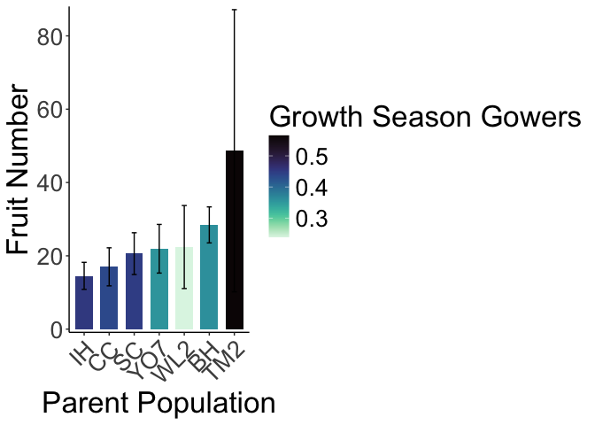

# Fruit production in year 2 at WL2

To Do:
- Think about removing 0s to make distribution more normal for analysis ...

## Libraries

``` r
library(tidyverse)
```

```
## ── Attaching core tidyverse packages ──────────────────────── tidyverse 2.0.0 ──
## ✔ dplyr     1.1.4     ✔ readr     2.1.5
## ✔ forcats   1.0.0     ✔ stringr   1.5.1
## ✔ ggplot2   3.5.1     ✔ tibble    3.2.1
## ✔ lubridate 1.9.3     ✔ tidyr     1.3.1
## ✔ purrr     1.0.2     
## ── Conflicts ────────────────────────────────────────── tidyverse_conflicts() ──
## ✖ dplyr::filter() masks stats::filter()
## ✖ dplyr::lag()    masks stats::lag()
## ℹ Use the conflicted package (<http://conflicted.r-lib.org/>) to force all conflicts to become errors
```

``` r
library(magrittr)
```

```
## 
## Attaching package: 'magrittr'
## 
## The following object is masked from 'package:purrr':
## 
##     set_names
## 
## The following object is masked from 'package:tidyr':
## 
##     extract
```

``` r
#conflicted::conflicts_prefer(dplyr::filter)
library(viridis) #for pretty colors
```

```
## Loading required package: viridisLite
```

``` r
library(ggrepel) #for non-overlapping labels on plots
library(ggdist) #visualizations of distributions and uncertainty 
library(ggpubr)

#library(sp) #for calculating geographic distance 
library(geosphere) #for calculating geographic distance
library(corrplot) #plotting correlations  
```

```
## corrplot 0.94 loaded
```

``` r
library(rstatix) #performing cor_test
```

```
## 
## Attaching package: 'rstatix'
## 
## The following object is masked from 'package:stats':
## 
##     filter
```

``` r
library(lmerTest) #mixed models
```

```
## Loading required package: lme4
## Loading required package: Matrix
## 
## Attaching package: 'Matrix'
## 
## The following objects are masked from 'package:tidyr':
## 
##     expand, pack, unpack
## 
## 
## Attaching package: 'lmerTest'
## 
## The following object is masked from 'package:lme4':
## 
##     lmer
## 
## The following object is masked from 'package:stats':
## 
##     step
```

``` r
conflicted::conflicts_prefer(lmerTest::lmer)
```

```
## [conflicted] Will prefer lmerTest::lmer over any other package.
```

``` r
library(broom.mixed)
library(tidymodels)
```

```
## ── Attaching packages ────────────────────────────────────── tidymodels 1.2.0 ──
## ✔ broom        1.0.7     ✔ rsample      1.2.1
## ✔ dials        1.3.0     ✔ tune         1.2.1
## ✔ infer        1.0.7     ✔ workflows    1.1.4
## ✔ modeldata    1.4.0     ✔ workflowsets 1.1.0
## ✔ parsnip      1.2.1     ✔ yardstick    1.3.1
## ✔ recipes      1.1.0     
## ── Conflicts ───────────────────────────────────────── tidymodels_conflicts() ──
## ✖ infer::chisq_test()   masks rstatix::chisq_test()
## ✖ scales::discard()     masks purrr::discard()
## ✖ Matrix::expand()      masks tidyr::expand()
## ✖ magrittr::extract()   masks tidyr::extract()
## ✖ rstatix::filter()     masks dplyr::filter(), stats::filter()
## ✖ recipes::fixed()      masks stringr::fixed()
## ✖ dials::get_n()        masks rstatix::get_n()
## ✖ dplyr::lag()          masks stats::lag()
## ✖ Matrix::pack()        masks tidyr::pack()
## ✖ infer::prop_test()    masks rstatix::prop_test()
## ✖ magrittr::set_names() masks purrr::set_names()
## ✖ yardstick::spec()     masks readr::spec()
## ✖ recipes::step()       masks lmerTest::step(), stats::step()
## ✖ infer::t_test()       masks rstatix::t_test()
## ✖ Matrix::unpack()      masks tidyr::unpack()
## ✖ recipes::update()     masks Matrix::update(), stats::update()
## • Use tidymodels_prefer() to resolve common conflicts.
```

``` r
library(furrr) #Apply Mapping Functions in Parallel using Futures
```

```
## Loading required package: future
```

``` r
tidymodels_prefer()
# install.packages("multilevelmod")
library(multilevelmod)

library(brms)
```

```
## Loading required package: Rcpp
## 
## Attaching package: 'Rcpp'
## 
## The following object is masked from 'package:rsample':
## 
##     populate
## 
## Loading 'brms' package (version 2.22.0). Useful instructions
## can be found by typing help('brms'). A more detailed introduction
## to the package is available through vignette('brms_overview').
```

``` r
#conflicted::conflicts_prefer(brms::ar)
#conflicted::conflicts_prefer(dplyr::combine)
#conflicted::conflicts_prefer(brms::dstudent_t)
library(tidybayes) #for extracting and visiaulizing brms model output 
library(modelr) #for data grid

sem <- function(x, na.rm=FALSE) {           #for caclulating standard error
  sd(x,na.rm=na.rm)/sqrt(length(na.omit(x)))
} 

cbbPalette2 <- c("#E69F00","#000000", "#56B4E9","#009E73", "#F0E442", "#0072B2", "#D55E00", "#CC79A7")
timepd_palette <- c("#56B4E9","#D55E00")

options(mc.cores = parallel::detectCores())
```

## Year 2 Pop Info

``` r
wl2_y2_pops <- read_csv("../input/WL2_Data/Final_2023_2024_Pop_Loc_Info.csv") %>%
  select(Pop.Type:unique.ID) %>% 
  filter(Pop.Type=="2023-survivor") %>% 
  select(Pop.Type, loc:bed, row=bedrow, col=bedcol, pop:unique.ID)
```

```
## Rows: 1217 Columns: 15
## ── Column specification ────────────────────────────────────────────────────────
## Delimiter: ","
## chr (8): Pop.Type, status, block, loc, bed, bedcol, pop, unique.ID
## dbl (7): bed.block.order, bed.order, AB.CD.order, column.order, bedrow, mf, rep
## 
## ℹ Use `spec()` to retrieve the full column specification for this data.
## ℹ Specify the column types or set `show_col_types = FALSE` to quiet this message.
```

``` r
wl2_blocks <- read_csv("../input/WL2_Data/CorrectedCSVs/WL2_mort_pheno_20231020_corrected.csv") %>% 
  unite(BedLoc, bed:bed.col, sep="_", remove = FALSE) %>% 
  filter(BedLoc!="K_5_C") %>% #get rid of duplicate locations
  select(block, pop, mf, rep) %>% #add in block info 
  mutate(mf=as.double(mf), rep=as.double(rep)) #convert to num
```

```
## Rows: 1826 Columns: 14
## ── Column specification ────────────────────────────────────────────────────────
## Delimiter: ","
## chr (12): block, bed, bed.col, pop, mf, rep, bud.date, flower.date, fruit.da...
## dbl  (1): bed.row
## lgl  (1): last.fruit.date
## 
## ℹ Use `spec()` to retrieve the full column specification for this data.
## ℹ Specify the column types or set `show_col_types = FALSE` to quiet this message.
```

```
## Warning: There were 2 warnings in `mutate()`.
## The first warning was:
## ℹ In argument: `mf = as.double(mf)`.
## Caused by warning:
## ! NAs introduced by coercion
## ℹ Run `dplyr::last_dplyr_warnings()` to see the 1 remaining warning.
```

``` r
#wl2_blocks %>% rowwise() %>%  #checking if mf and rep can be converted to numeric (all buffers)
#  filter(!is.na(mf)) %>%  
#  filter(is.na(as.numeric(mf)))

wl2_y2_pops_blocks <- left_join(wl2_y2_pops, wl2_blocks)
```

```
## Joining with `by = join_by(pop, mf, rep)`
```

## Need the WL2 2024 annual census data sheets (for fruit number)

``` r
wl2_ann_cens_2024 <- read_csv("../input/WL2_Data/WL2_Annual_Census_20241023_corrected.csv")
```

```
## Rows: 1217 Columns: 15
## ── Column specification ────────────────────────────────────────────────────────
## Delimiter: ","
## chr (9): bed, col, unique.ID, phen, long.fruit.cm, total.branch, survey.date...
## dbl (6): row, diam.mm, num.flw, num.fruit, overhd.diam, overhd.perp
## 
## ℹ Use `spec()` to retrieve the full column specification for this data.
## ℹ Specify the column types or set `show_col_types = FALSE` to quiet this message.
```

``` r
wl2_ann_cens_2024_pops <- left_join(wl2_y2_pops_blocks, wl2_ann_cens_2024) %>%  
  rename(Genotype=unique.ID)
```

```
## Joining with `by = join_by(bed, row, col, unique.ID)`
```

## Gower's Distance

``` r
garden_climate <- read_csv("../output/Climate/flint_climate_UCDpops.csv") %>% 
  filter(parent.pop=="WL2_Garden" | parent.pop=="UCD_Garden") %>% 
  select(parent.pop:Long) %>% 
  distinct()
```

```
## Rows: 38775 Columns: 14
## ── Column specification ────────────────────────────────────────────────────────
## Delimiter: ","
## chr  (3): parent.pop, elevation.group, month
## dbl (11): elev_m, Lat, Long, year, aet, cwd, pck, pet, ppt, tmn, tmx
## 
## ℹ Use `spec()` to retrieve the full column specification for this data.
## ℹ Specify the column types or set `show_col_types = FALSE` to quiet this message.
```

``` r
garden_climate
```

```
## # A tibble: 2 × 5
##   parent.pop elevation.group elev_m   Lat  Long
##   <chr>      <chr>            <dbl> <dbl> <dbl>
## 1 UCD_Garden Low                 16  38.5 -122.
## 2 WL2_Garden High              2020  38.8 -120.
```

``` r
#UCD LAT/LONG = 38.53250, -121.7830
#WL2 Lat/Long = 38.82599, -120.2509

wl2_gowers_2024 <- read_csv("../output/Climate/Gowers_WL2_2024.csv") %>% 
  pivot_wider(names_from = TimePd, values_from = c(GrwSsn_GD, Wtr_Year_GD)) %>% 
  mutate(WL2_Lat=38.82599, WL2_Long=-120.2509, WL2_Elev=2020) %>% 
  mutate(Geographic_Dist=distHaversine(cbind(WL2_Long, WL2_Lat), cbind(Long, Lat)),
         Elev_Dist=WL2_Elev-elev_m) %>% # Calculate the distance using the haversine formula
  rename(pop=parent.pop)
```

```
## Rows: 46 Columns: 8
## ── Column specification ────────────────────────────────────────────────────────
## Delimiter: ","
## chr (3): parent.pop, elevation.group, TimePd
## dbl (5): elev_m, Lat, Long, GrwSsn_GD, Wtr_Year_GD
## 
## ℹ Use `spec()` to retrieve the full column specification for this data.
## ℹ Specify the column types or set `show_col_types = FALSE` to quiet this message.
```


## Calculate Fruits(y2)

``` r
wl2_fruits_y2 <- wl2_ann_cens_2024_pops %>% select(Pop.Type:block, flowers=num.flw, fruits=num.fruit) %>%
  mutate(FrFlN=fruits+flowers) %>% 
  left_join(wl2_gowers_2024)
```

```
## Joining with `by = join_by(pop)`
```

``` r
#write_csv(wl2_fruits_y2, "../output/WL2_Traits/WL2_Fruits_Y2.csv")
```

### BAR PLOTS 

``` r
wl2_fruits_y2 %>% 
  group_by(pop, elev_m, GrwSsn_GD_Recent, Wtr_Year_GD_Recent) %>% 
  summarise(meanFruits=mean(fruits, na.rm = TRUE), semFruits=sem(fruits, na.rm=TRUE)) %>%
  filter(pop != "LV1", pop !="SQ1", pop !="WR") %>% 
  ggplot(aes(x=fct_reorder(pop, meanFruits), y=meanFruits, fill=GrwSsn_GD_Recent)) +
  geom_col(width = 0.7,position = position_dodge(0.75)) + 
  geom_errorbar(aes(ymin=meanFruits-semFruits,ymax=meanFruits+semFruits),width=.2, position = 
                  position_dodge(0.75)) +
  theme_classic() + 
  scale_y_continuous(expand = c(0.01, 0)) +
  labs(y="Fruit Number", x="Parent Population", fill="Growth Season Gowers") +
  scale_fill_viridis(option="mako", direction = -1) +
  theme(text=element_text(size=25), axis.text.x = element_text(angle = 45,  hjust = 1))
```

```
## `summarise()` has grouped output by 'pop', 'elev_m', 'GrwSsn_GD_Recent'. You
## can override using the `.groups` argument.
```

<!-- -->

``` r
#ggsave("../output/WL2_Traits/WL2_FruitsY2_GrwSsn_GD_Recent.png", width = 12, height = 8, units = "in")

wl2_fruits_y2 %>% 
  group_by(pop, elev_m, GrwSsn_GD_Recent, Wtr_Year_GD_Recent) %>% 
  summarise(meanFruits=mean(fruits, na.rm = TRUE), semFruits=sem(fruits, na.rm=TRUE)) %>% 
  filter(pop != "LV1", pop !="SQ1", pop !="WR") %>% 
  ggplot(aes(x=fct_reorder(pop, meanFruits), y=meanFruits, fill=Wtr_Year_GD_Recent)) +
  geom_col(width = 0.7,position = position_dodge(0.75)) + 
  geom_errorbar(aes(ymin=meanFruits-semFruits,ymax=meanFruits+semFruits),width=.2, position = 
                  position_dodge(0.75)) +
  theme_classic() + 
  scale_y_continuous(expand = c(0.01, 0)) +
  labs(y="Fruit Number", x="Parent Population", fill="Water Year Gowers") +
  scale_fill_viridis(option="mako", direction = -1) +
  theme(text=element_text(size=25), axis.text.x = element_text(angle = 45,  hjust = 1))
```

```
## `summarise()` has grouped output by 'pop', 'elev_m', 'GrwSsn_GD_Recent'. You
## can override using the `.groups` argument.
```

<!-- -->

``` r
#ggsave("../output/WL2_Traits/WL2_FruitsY2_Wtr_Year_GD_Recent.png", width = 12, height = 8, units = "in")

wl2_fruits_y2 %>% filter(pop=="TM2") #only 3 of the 6 made fruits and those 3 had wide variation (2, 19, 125)
```

```
## # A tibble: 6 × 26
##   Pop.Type      loc   bed     row col   pop      mf   rep Genotype block flowers
##   <chr>         <chr> <chr> <dbl> <chr> <chr> <dbl> <dbl> <chr>    <chr>   <dbl>
## 1 2023-survivor B_56… B        56 C     TM2       1     3 TM2_1_3  B           0
## 2 2023-survivor C_23… C        23 D     TM2       4    12 TM2_4_12 E           0
## 3 2023-survivor D_19… D        19 A     TM2       7    18 TM2_7_18 G          NA
## 4 2023-survivor E_49… E        49 B     TM2       6     4 TM2_6_4  I           0
## 5 2023-survivor F_24… F        24 A     TM2       2     4 TM2_2_4  I          NA
## 6 2023-survivor H_13… H        13 A     TM2       2     6 TM2_2_6  L          NA
## # ℹ 15 more variables: fruits <dbl>, FrFlN <dbl>, elevation.group <chr>,
## #   elev_m <dbl>, Lat <dbl>, Long <dbl>, GrwSsn_GD_Recent <dbl>,
## #   GrwSsn_GD_Historical <dbl>, Wtr_Year_GD_Recent <dbl>,
## #   Wtr_Year_GD_Historical <dbl>, WL2_Lat <dbl>, WL2_Long <dbl>,
## #   WL2_Elev <dbl>, Geographic_Dist <dbl>, Elev_Dist <dbl>
```

### Scatterplots

``` r
#scatter plots
GSCD_recent <- wl2_fruits_y2 %>% 
  group_by(pop, elev_m, GrwSsn_GD_Recent, Wtr_Year_GD_Recent) %>% 
  summarise(meanFruits=mean(fruits, na.rm = TRUE), semFruits=sem(fruits, na.rm=TRUE)) %>% 
  ggplot(aes(x=GrwSsn_GD_Recent, y=meanFruits, group = pop)) +
  geom_point(size=6) + 
  geom_errorbar(aes(ymin=meanFruits-semFruits,ymax=meanFruits+semFruits),width=.02, linewidth = 2) +
  theme_classic() + 
  scale_y_continuous(expand = c(0.01, 0)) +
  labs(y="Y2 Fruit Number", x="Recent Growth Season CD", color="Growth Season \n Climate Distance") +
  theme(text=element_text(size=25))
```

```
## `summarise()` has grouped output by 'pop', 'elev_m', 'GrwSsn_GD_Recent'. You
## can override using the `.groups` argument.
```

``` r
WYCD_recent <- wl2_fruits_y2 %>% 
  group_by(pop, elev_m, GrwSsn_GD_Recent, Wtr_Year_GD_Recent) %>% 
  summarise(meanFruits=mean(fruits, na.rm = TRUE), semFruits=sem(fruits, na.rm=TRUE)) %>% 
  ggplot(aes(x=Wtr_Year_GD_Recent, y=meanFruits, group = pop)) +
  geom_point(size=6) + 
  geom_errorbar(aes(ymin=meanFruits-semFruits,ymax=meanFruits+semFruits),width=.02,linewidth = 2) +
  theme_classic() + 
  scale_y_continuous(expand = c(0.01, 0)) +
  labs(y="Y2 Fruit Number", x="Recent Water Year CD", color="Water Year \n Climate Distance") +
  theme(text=element_text(size=25))
```

```
## `summarise()` has grouped output by 'pop', 'elev_m', 'GrwSsn_GD_Recent'. You
## can override using the `.groups` argument.
```

``` r
GD <- wl2_fruits_y2 %>% 
  group_by(pop, elev_m, GrwSsn_GD_Recent, Wtr_Year_GD_Recent, Geographic_Dist) %>% 
  summarise(meanFruits=mean(fruits, na.rm = TRUE), semFruits=sem(fruits, na.rm=TRUE)) %>% 
  ggplot(aes(x=Geographic_Dist, y=meanFruits, group = pop)) +
  geom_point(size=6) + 
  geom_errorbar(aes(ymin=meanFruits-semFruits,ymax=meanFruits+semFruits),width=.02, linewidth = 2) +
  theme_classic() + 
  scale_y_continuous(expand = c(0.01, 0)) +
  labs(y="Y2 Fruit Number", x="Geographic Distance (m)") +
  theme(text=element_text(size=25), axis.text.x = element_text(angle = 45,  hjust = 1))
```

```
## `summarise()` has grouped output by 'pop', 'elev_m', 'GrwSsn_GD_Recent',
## 'Wtr_Year_GD_Recent'. You can override using the `.groups` argument.
```

``` r
ED <- wl2_fruits_y2 %>% 
  group_by(pop, elev_m, Elev_Dist) %>% 
  summarise(meanFruits=mean(fruits, na.rm = TRUE), semFruits=sem(fruits, na.rm=TRUE)) %>% 
  ggplot(aes(x=Elev_Dist, y=meanFruits, group = pop)) +
  geom_point(size=6) + 
  geom_errorbar(aes(ymin=meanFruits-semFruits,ymax=meanFruits+semFruits),width=.02, linewidth = 2) +
  theme_classic() + 
  scale_y_continuous(expand = c(0.01, 0)) +
  labs(y="Y2 Fruit Number", x="Elevation Distance (m)") +
  theme(text=element_text(size=30))
```

```
## `summarise()` has grouped output by 'pop', 'elev_m'. You can override using the
## `.groups` argument.
```

``` r
wl2_fruitsy2_FIG <- ggarrange(GSCD_recent, WYCD_recent, GD, ED, ncol=2, nrow=2) 
```

```
## Warning: Removed 1 row containing missing values or values outside the scale range
## (`geom_point()`).
## Removed 1 row containing missing values or values outside the scale range
## (`geom_point()`).
## Removed 1 row containing missing values or values outside the scale range
## (`geom_point()`).
## Removed 1 row containing missing values or values outside the scale range
## (`geom_point()`).
```

``` r
#ggsave("../output/WL2_Traits/WL2_fruits_y2_SCATTERS_Recent.png", width = 24, height = 18, units = "in")
```


``` r
#scatter plots
GSCD_historic <- wl2_fruits_y2 %>% 
  group_by(pop, elev_m, GrwSsn_GD_Recent, Wtr_Year_GD_Recent) %>% 
  summarise(meanFruits=mean(fruits, na.rm = TRUE), semFruits=sem(fruits, na.rm=TRUE)) %>% 
  ggplot(aes(x=GrwSsn_GD_Recent, y=meanFruits, group = pop)) +
  geom_point(size=6) + 
  geom_errorbar(aes(ymin=meanFruits-semFruits,ymax=meanFruits+semFruits),width=.02, linewidth = 2) +
  theme_classic() + 
  scale_y_continuous(expand = c(0.01, 0)) +
  labs(y="Y2 Fruit Number", x="Historic Growth Season CD", color="Growth Season \n Climate Distance") +
  theme(text=element_text(size=25))
```

```
## `summarise()` has grouped output by 'pop', 'elev_m', 'GrwSsn_GD_Recent'. You
## can override using the `.groups` argument.
```

``` r
WYCD_historic <- wl2_fruits_y2 %>% 
  group_by(pop, elev_m, GrwSsn_GD_Recent, Wtr_Year_GD_Recent) %>% 
  summarise(meanFruits=mean(fruits, na.rm = TRUE), semFruits=sem(fruits, na.rm=TRUE)) %>% 
  ggplot(aes(x=Wtr_Year_GD_Recent, y=meanFruits, group = pop)) +
  geom_point(size=6) + 
  geom_errorbar(aes(ymin=meanFruits-semFruits,ymax=meanFruits+semFruits),width=.02,linewidth = 2) +
  theme_classic() + 
  scale_y_continuous(expand = c(0.01, 0)) +
  labs(y="Y2 Fruit Number", x="Historic Water Year CD", color="Water Year \n Climate Distance") +
  theme(text=element_text(size=25))
```

```
## `summarise()` has grouped output by 'pop', 'elev_m', 'GrwSsn_GD_Recent'. You
## can override using the `.groups` argument.
```

``` r
wl2_fruitsy2_FIG_historic <- ggarrange(GSCD_historic, WYCD_historic, GD, ED, ncol=2, nrow=2) 
```

```
## Warning: Removed 1 row containing missing values or values outside the scale range
## (`geom_point()`).
## Removed 1 row containing missing values or values outside the scale range
## (`geom_point()`).
## Removed 1 row containing missing values or values outside the scale range
## (`geom_point()`).
## Removed 1 row containing missing values or values outside the scale range
## (`geom_point()`).
```

``` r
#ggsave("../output/WL2_Traits/WL2_fruits_y2_SCATTERS_Historical.png", width = 24, height = 18, units = "in")
```

## Stats

### Check Distributions

``` r
wl2_fruits_y2 %>% 
  ggplot(aes(x=fruits)) +
  geom_histogram()
```

```
## `stat_bin()` using `bins = 30`. Pick better value with `binwidth`.
```

```
## Warning: Removed 51 rows containing non-finite outside the scale range
## (`stat_bin()`).
```

<!-- -->

``` r
wl2_fruits_y2 %>% 
  ggplot(aes(x=FrFlN)) +
  geom_histogram()
```

```
## `stat_bin()` using `bins = 30`. Pick better value with `binwidth`.
```

```
## Warning: Removed 52 rows containing non-finite outside the scale range
## (`stat_bin()`).
```

<!-- -->

### Check Sample Sizes

``` r
wl2_fruits_y2 %>% 
  group_by(pop, elev_m, GrwSsn_GD_Recent, Wtr_Year_GD_Recent, Geographic_Dist) %>% 
  summarise(meanFruits=mean(fruits, na.rm = TRUE), semFruits=sem(fruits, na.rm=TRUE), n=n()) 
```

```
## `summarise()` has grouped output by 'pop', 'elev_m', 'GrwSsn_GD_Recent',
## 'Wtr_Year_GD_Recent'. You can override using the `.groups` argument.
```

```
## # A tibble: 10 × 8
## # Groups:   pop, elev_m, GrwSsn_GD_Recent, Wtr_Year_GD_Recent [10]
##    pop   elev_m GrwSsn_GD_Recent Wtr_Year_GD_Recent Geographic_Dist meanFruits
##    <chr>  <dbl>            <dbl>              <dbl>           <dbl>      <dbl>
##  1 BH      511.            0.360              0.566         159626.       23.9
##  2 CC      313             0.435              0.445         132498.       15.3
##  3 IH      454.            0.453              0.422          65203.       11.1
##  4 LV1    2593.            0.414              0.406         212682.      NaN  
##  5 SC      422.            0.449              0.497          62499.       18.7
##  6 SQ1    1921.            0.159              0.310         283281.        2  
##  7 TM2     379.            0.566              0.406         140893.       48.7
##  8 WL2    2020.            0.238              0.226            136.       22.4
##  9 WR     1158             0.366              0.355          74992.       30  
## 10 YO7    2470.            0.353              0.328         128037.       19.4
## # ℹ 2 more variables: semFruits <dbl>, n <int>
```

``` r
#remove LV1, SQ1, WR b/c only 1 indiv each 
```


## Transformations and Scaling 

``` r
wl2_fruits_y2_scaled <- wl2_fruits_y2 %>% mutate_at(c("GrwSsn_GD_Recent","Wtr_Year_GD_Recent",                                                           "GrwSsn_GD_Historical","Wtr_Year_GD_Historical","Geographic_Dist"),
                                                            scale) %>% 
  filter(pop!="LV1", pop!="SQ1", pop!="WR") %>% 
  drop_na(fruits, FrFlN) %>% 
  mutate(logFruits=log(fruits + 1),
         log10Fruits=log10(fruits + 1),
         logFrFLs=log(FrFlN + 1),
         log10FrFLs=log10(FrFlN + 1)) #log transformation, add 1 for 0s 

wl2_fruits_y2_scaled %>%  #looks better
  ggplot(aes(x=logFruits)) +
  geom_histogram()
```

```
## `stat_bin()` using `bins = 30`. Pick better value with `binwidth`.
```

<!-- -->

``` r
wl2_fruits_y2_scaled %>% 
  ggplot(aes(x=log10Fruits)) +
  geom_histogram()
```

```
## `stat_bin()` using `bins = 30`. Pick better value with `binwidth`.
```

<!-- -->

``` r
wl2_fruits_y2_scaled %>%  #looks better
  ggplot(aes(x=logFrFLs)) +
  geom_histogram()
```

```
## `stat_bin()` using `bins = 30`. Pick better value with `binwidth`.
```

<!-- -->

``` r
wl2_fruits_y2_scaled %>% 
  ggplot(aes(x=log10FrFLs)) +
  geom_histogram()
```

```
## `stat_bin()` using `bins = 30`. Pick better value with `binwidth`.
```

<!-- -->


``` r
fruits_modelslog <- tribble(
  ~name,          ~f,
  "1_pop",              "logFruits ~ (1|pop)", 
  "2_pop.mf",           "logFruits ~  (1|pop/mf)", 
  "3_pop.block",        "logFruits ~ (1|pop) + (1|block)", 
  "4_pop.mf.block",     "logFruits ~  (1|pop/mf) + (1|block)"
)

#run the models 
fruits_modelslog <- fruits_modelslog %>%
  mutate(lmer = map(f, ~ lmer(as.formula(.), 
                            data = wl2_fruits_y2_scaled)), #run the models 
         predict = map(lmer, predict), # predicting from original data...
         glance = map(lmer, glance)) #glance at the model results
```

```
## boundary (singular) fit: see help('isSingular')
## boundary (singular) fit: see help('isSingular')
## boundary (singular) fit: see help('isSingular')
```

``` r
fruits_modelslog %>% select(-f, -lmer) %>% unnest(glance) %>% arrange(BIC) #look at the model fitting info 
```

```
## # A tibble: 4 × 9
##   name           predict     nobs sigma logLik   AIC   BIC REMLcrit df.residual
##   <chr>          <list>     <int> <dbl>  <dbl> <dbl> <dbl>    <dbl>       <int>
## 1 3_pop.block    <dbl [81]>    81 0.907  -121.  250.  260.     242.          77
## 2 4_pop.mf.block <dbl [81]>    81 0.907  -121.  252.  264.     242.          76
## 3 1_pop          <dbl [81]>    81 1.31   -137.  280.  287.     274.          78
## 4 2_pop.mf       <dbl [81]>    81 1.31   -137.  282.  292.     274.          77
```

``` r
fruits_modelslog %>% select(-f, -lmer) %>% unnest(glance) %>% arrange(AIC) #look at the model fitting info 
```

```
## # A tibble: 4 × 9
##   name           predict     nobs sigma logLik   AIC   BIC REMLcrit df.residual
##   <chr>          <list>     <int> <dbl>  <dbl> <dbl> <dbl>    <dbl>       <int>
## 1 3_pop.block    <dbl [81]>    81 0.907  -121.  250.  260.     242.          77
## 2 4_pop.mf.block <dbl [81]>    81 0.907  -121.  252.  264.     242.          76
## 3 1_pop          <dbl [81]>    81 1.31   -137.  280.  287.     274.          78
## 4 2_pop.mf       <dbl [81]>    81 1.31   -137.  282.  292.     274.          77
```

``` r
#model with pop.block best by AIC and BIC 

mod_test <- lmer(logFruits ~  (1|pop) + (1|block), data=wl2_fruits_y2_scaled)
plot(mod_test, which = 1) 
```

<!-- -->

``` r
qqnorm(resid(mod_test))
qqline(resid(mod_test)) 
```

<!-- -->

``` r
summary(mod_test)
```

```
## Linear mixed model fit by REML. t-tests use Satterthwaite's method [
## lmerModLmerTest]
## Formula: logFruits ~ (1 | pop) + (1 | block)
##    Data: wl2_fruits_y2_scaled
## 
## REML criterion at convergence: 242.3
## 
## Scaled residuals: 
##     Min      1Q  Median      3Q     Max 
## -1.8945 -0.5596  0.2023  0.6666  1.5560 
## 
## Random effects:
##  Groups   Name        Variance Std.Dev.
##  block    (Intercept) 0.92492  0.9617  
##  pop      (Intercept) 0.07338  0.2709  
##  Residual             0.82273  0.9070  
## Number of obs: 81, groups:  block, 13; pop, 7
## 
## Fixed effects:
##             Estimate Std. Error      df t value Pr(>|t|)    
## (Intercept)   2.2401     0.3138 12.2011    7.14 1.08e-05 ***
## ---
## Signif. codes:  0 '***' 0.001 '**' 0.01 '*' 0.05 '.' 0.1 ' ' 1
```

``` r
#mf gives "boundary (singular) fit: see help('isSingular')" so take it out 
```

### Predicted vs. Observed Rep Output

``` r
wl2_fruits_y2_scaled %>% 
  cbind(predicted={fruits_modelslog %>% filter(name=="3_pop.block") %>% pull(predict) %>% unlist()}) %>%
  ggplot(aes(x=logFruits, y = predicted)) +
  geom_point(alpha=.2) +
  geom_abline(color="skyblue2") +
  facet_wrap(~pop, scales="free")
```

<!-- -->


#### Test climate and geographic distance 

``` r
fruits_models_log_CD_GD <- tribble(
  ~name,          ~f,
  "1_pop.block",      "logFruits ~  (1|pop) + (1|block)", 
  "2_GS_Recent",      "logFruits ~  GrwSsn_GD_Recent + Geographic_Dist + (1|pop) + (1|block)", 
  "3_GS_Historical",  "logFruits ~  GrwSsn_GD_Historical + Geographic_Dist + (1|pop) + (1|block)", 
  "4_WY_Recent",      "logFruits ~  Wtr_Year_GD_Recent + Geographic_Dist +(1|pop) + (1|block)",
  "5_WY_Historical",  "logFruits ~  Wtr_Year_GD_Historical + Geographic_Dist + (1|pop) + (1|block)"
)

#run the models 
fruits_models_log_CD_GD <- fruits_models_log_CD_GD %>%
  mutate(lmer = map(f, ~ lmer(as.formula(.), 
                            data = wl2_fruits_y2_scaled)), #run the models 
         predict = map(lmer, predict), # predicting from original data...
         glance = map(lmer, glance)) #glance at the model results
```

```
## boundary (singular) fit: see help('isSingular')
```

```
## Warning: There was 1 warning in `mutate()`.
## ℹ In argument: `lmer = map(f, ~lmer(as.formula(.), data =
##   wl2_fruits_y2_scaled))`.
## Caused by warning in `checkConv()`:
## ! Model failed to converge with max|grad| = 0.00208063 (tol = 0.002, component 1)
```

``` r
fruits_models_log_CD_GD %>% select(-f, -lmer) %>% unnest(glance) %>% arrange(BIC) #look at the model fitting info 
```

```
## # A tibble: 5 × 9
##   name            predict     nobs sigma logLik   AIC   BIC REMLcrit df.residual
##   <chr>           <list>     <int> <dbl>  <dbl> <dbl> <dbl>    <dbl>       <int>
## 1 1_pop.block     <dbl [81]>    81 0.907  -121.  250.  260.     242.          77
## 2 4_WY_Recent     <dbl [81]>    81 0.889  -120.  252.  267.     240.          75
## 3 5_WY_Historical <dbl [81]>    81 0.893  -121.  253.  268.     241.          75
## 4 3_GS_Historical <dbl [81]>    81 0.911  -122.  256.  271.     244.          75
## 5 2_GS_Recent     <dbl [81]>    81 0.911  -122.  256.  271.     244.          75
```

``` r
fruits_models_log_CD_GD %>% select(-f, -lmer) %>% unnest(glance) %>% arrange(AIC) #look at the model fitting info 
```

```
## # A tibble: 5 × 9
##   name            predict     nobs sigma logLik   AIC   BIC REMLcrit df.residual
##   <chr>           <list>     <int> <dbl>  <dbl> <dbl> <dbl>    <dbl>       <int>
## 1 1_pop.block     <dbl [81]>    81 0.907  -121.  250.  260.     242.          77
## 2 4_WY_Recent     <dbl [81]>    81 0.889  -120.  252.  267.     240.          75
## 3 5_WY_Historical <dbl [81]>    81 0.893  -121.  253.  268.     241.          75
## 4 3_GS_Historical <dbl [81]>    81 0.911  -122.  256.  271.     244.          75
## 5 2_GS_Recent     <dbl [81]>    81 0.911  -122.  256.  271.     244.          75
```

``` r
#pop block best by AIC and BIC ...


#pop.mf preferred by AIC & BIC, WY models are close after
fruits_models_log_CD_GD %>% mutate(tidy=map(lmer, tidy)) %>% unnest(tidy) %>%
  select(-f, -lmer) %>% 
  filter(str_detect(term, "GD") | term=="Geographic_Dist") %>%
  drop_na(p.value)
```

```
## # A tibble: 8 × 11
##   name    predict glance   effect group term  estimate std.error statistic    df
##   <chr>   <list>  <list>   <chr>  <chr> <chr>    <dbl>     <dbl>     <dbl> <dbl>
## 1 2_GS_R… <dbl>   <tibble> fixed  <NA>  GrwS…  -0.0918     0.131    -0.702  7.31
## 2 2_GS_R… <dbl>   <tibble> fixed  <NA>  Geog…   0.212      0.142     1.49   4.29
## 3 3_GS_H… <dbl>   <tibble> fixed  <NA>  GrwS…  -0.0869     0.139    -0.624  6.14
## 4 3_GS_H… <dbl>   <tibble> fixed  <NA>  Geog…   0.210      0.144     1.46   4.20
## 5 4_WY_R… <dbl>   <tibble> fixed  <NA>  Wtr_…  -0.269      0.111    -2.43  69.0 
## 6 4_WY_R… <dbl>   <tibble> fixed  <NA>  Geog…   0.364      0.126     2.90  67.8 
## 7 5_WY_H… <dbl>   <tibble> fixed  <NA>  Wtr_…  -0.252      0.112    -2.26  68.7 
## 8 5_WY_H… <dbl>   <tibble> fixed  <NA>  Geog…   0.344      0.124     2.77  67.3 
## # ℹ 1 more variable: p.value <dbl>
```

``` r
#  arrange(p.value)

#water year recent and historical + geo dist in those models = sig 
```
