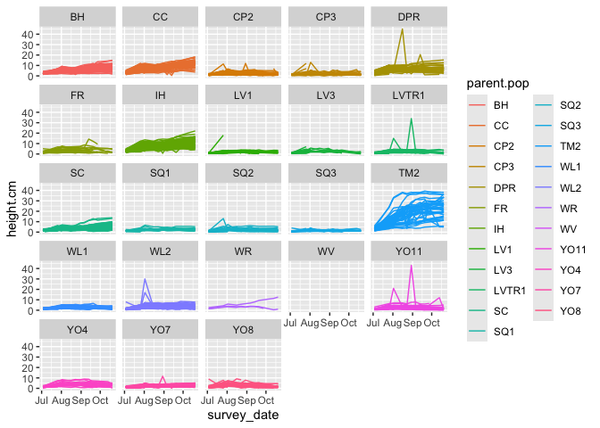
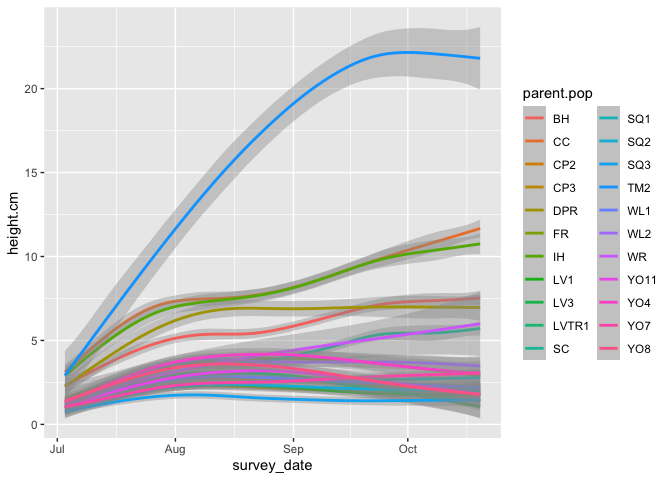
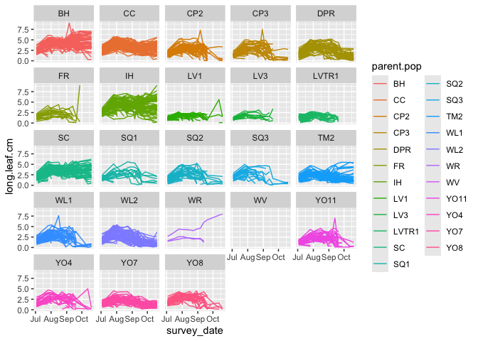
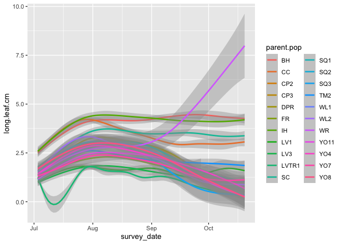

# Analyze Growth


## Libraries 

```r
library(tidyverse)
```

```
## ── Attaching core tidyverse packages ──────────────────────── tidyverse 2.0.0 ──
## ✔ dplyr     1.1.4     ✔ readr     2.1.5
## ✔ forcats   1.0.0     ✔ stringr   1.5.1
## ✔ ggplot2   3.5.1     ✔ tibble    3.2.1
## ✔ lubridate 1.9.3     ✔ tidyr     1.3.1
## ✔ purrr     1.0.2     
## ── Conflicts ────────────────────────────────────────── tidyverse_conflicts() ──
## ✖ dplyr::filter() masks stats::filter()
## ✖ dplyr::lag()    masks stats::lag()
## ℹ Use the conflicted package (<http://conflicted.r-lib.org/>) to force all conflicts to become errors
```

## Need to make a csv file with all survey data for each plant 

Get list of size files 

```r
pretrans_wl2 <-  dir("../input/WL2_Data/CorrectedCSVs/",
             pattern=".*DNA.*csv",
             full.names=TRUE)
pretrans_wl2
```

```
## [1] "../input/WL2_Data/CorrectedCSVs//WL2_DNA_Collection_Size_survey_combined20230703_corrected.csv"       
## [2] "../input/WL2_Data/CorrectedCSVs//WL2_Extras_DNA_collection_size_survey_combined20230706_corrected.csv"
```

```r
posttrans_wl2 <- dir("../input/WL2_Data/CorrectedCSVs/",
             pattern="WL2_size_survey.*corrected.*csv",
             full.names=TRUE)
posttrans_wl2
```

```
##  [1] "../input/WL2_Data/CorrectedCSVs//WL2_size_survey_20230726_corrected.csv"
##  [2] "../input/WL2_Data/CorrectedCSVs//WL2_size_survey_20230802_corrected.csv"
##  [3] "../input/WL2_Data/CorrectedCSVs//WL2_size_survey_20230816_corrected.csv"
##  [4] "../input/WL2_Data/CorrectedCSVs//WL2_size_survey_20230823_corrected.csv"
##  [5] "../input/WL2_Data/CorrectedCSVs//WL2_size_survey_20230830_corrected.csv"
##  [6] "../input/WL2_Data/CorrectedCSVs//WL2_size_survey_20230906_corrected.csv"
##  [7] "../input/WL2_Data/CorrectedCSVs//WL2_size_survey_20230913_corrected.csv"
##  [8] "../input/WL2_Data/CorrectedCSVs//WL2_size_survey_20230920_corrected.csv"
##  [9] "../input/WL2_Data/CorrectedCSVs//WL2_size_survey_20230927_corrected.csv"
## [10] "../input/WL2_Data/CorrectedCSVs//WL2_size_survey_20231013_corrected.csv"
## [11] "../input/WL2_Data/CorrectedCSVs//WL2_size_survey_20231020_corrected.csv"
```

Add data to a tibble

```r
pretrans_dat_wl2 <- tibble(path=pretrans_wl2, filename=basename(path))
pretrans_dat_wl2
```

```
## # A tibble: 2 × 2
##   path                                                                  filename
##   <chr>                                                                 <chr>   
## 1 ../input/WL2_Data/CorrectedCSVs//WL2_DNA_Collection_Size_survey_comb… WL2_DNA…
## 2 ../input/WL2_Data/CorrectedCSVs//WL2_Extras_DNA_collection_size_surv… WL2_Ext…
```

```r
posttrans_dat_wl2 <- tibble(path=posttrans_wl2, filename=basename(path))
posttrans_dat_wl2
```

```
## # A tibble: 11 × 2
##    path                                                                 filename
##    <chr>                                                                <chr>   
##  1 ../input/WL2_Data/CorrectedCSVs//WL2_size_survey_20230726_corrected… WL2_siz…
##  2 ../input/WL2_Data/CorrectedCSVs//WL2_size_survey_20230802_corrected… WL2_siz…
##  3 ../input/WL2_Data/CorrectedCSVs//WL2_size_survey_20230816_corrected… WL2_siz…
##  4 ../input/WL2_Data/CorrectedCSVs//WL2_size_survey_20230823_corrected… WL2_siz…
##  5 ../input/WL2_Data/CorrectedCSVs//WL2_size_survey_20230830_corrected… WL2_siz…
##  6 ../input/WL2_Data/CorrectedCSVs//WL2_size_survey_20230906_corrected… WL2_siz…
##  7 ../input/WL2_Data/CorrectedCSVs//WL2_size_survey_20230913_corrected… WL2_siz…
##  8 ../input/WL2_Data/CorrectedCSVs//WL2_size_survey_20230920_corrected… WL2_siz…
##  9 ../input/WL2_Data/CorrectedCSVs//WL2_size_survey_20230927_corrected… WL2_siz…
## 10 ../input/WL2_Data/CorrectedCSVs//WL2_size_survey_20231013_corrected… WL2_siz…
## 11 ../input/WL2_Data/CorrectedCSVs//WL2_size_survey_20231020_corrected… WL2_siz…
```

```r
all_wl2_size <- bind_rows(pretrans_dat_wl2, posttrans_dat_wl2) %>% 
  mutate(survey_date=str_extract(filename, "20[0-9]*"),
         survey_date=lubridate::ymd(survey_date))
all_wl2_size
```

```
## # A tibble: 13 × 3
##    path                                                     filename survey_date
##    <chr>                                                    <chr>    <date>     
##  1 ../input/WL2_Data/CorrectedCSVs//WL2_DNA_Collection_Siz… WL2_DNA… 2023-07-03 
##  2 ../input/WL2_Data/CorrectedCSVs//WL2_Extras_DNA_collect… WL2_Ext… 2023-07-06 
##  3 ../input/WL2_Data/CorrectedCSVs//WL2_size_survey_202307… WL2_siz… 2023-07-26 
##  4 ../input/WL2_Data/CorrectedCSVs//WL2_size_survey_202308… WL2_siz… 2023-08-02 
##  5 ../input/WL2_Data/CorrectedCSVs//WL2_size_survey_202308… WL2_siz… 2023-08-16 
##  6 ../input/WL2_Data/CorrectedCSVs//WL2_size_survey_202308… WL2_siz… 2023-08-23 
##  7 ../input/WL2_Data/CorrectedCSVs//WL2_size_survey_202308… WL2_siz… 2023-08-30 
##  8 ../input/WL2_Data/CorrectedCSVs//WL2_size_survey_202309… WL2_siz… 2023-09-06 
##  9 ../input/WL2_Data/CorrectedCSVs//WL2_size_survey_202309… WL2_siz… 2023-09-13 
## 10 ../input/WL2_Data/CorrectedCSVs//WL2_size_survey_202309… WL2_siz… 2023-09-20 
## 11 ../input/WL2_Data/CorrectedCSVs//WL2_size_survey_202309… WL2_siz… 2023-09-27 
## 12 ../input/WL2_Data/CorrectedCSVs//WL2_size_survey_202310… WL2_siz… 2023-10-13 
## 13 ../input/WL2_Data/CorrectedCSVs//WL2_size_survey_202310… WL2_siz… 2023-10-20
```

Read in the files

```r
all_wl2_size2 <- all_wl2_size %>%
  mutate(sheets=map(path, 
                    read_csv, 
                    #col_types=cols(.default=col_character()), # forces all columns to be character
                                                              # this is needed because of data sheet problems that cause some numerics to be imported as character  
                    na = c("", "NA", "-", "N/A") # sets NA strings. 
                    )) %>%
  select(-path)
```

```
## Rows: 1427 Columns: 7
## ── Column specification ────────────────────────────────────────────────────────
## Delimiter: ","
## chr (2): Pop, Notes
## dbl (5): mf, rep, DNA, height (cm), longest leaf (cm)
## 
## ℹ Use `spec()` to retrieve the full column specification for this data.
## ℹ Specify the column types or set `show_col_types = FALSE` to quiet this message.
## Rows: 152 Columns: 7
## ── Column specification ────────────────────────────────────────────────────────
## Delimiter: ","
## chr (2): Pop, Notes
## dbl (5): mf, rep, DNA, height (cm), longest leaf (cm)
## 
## ℹ Use `spec()` to retrieve the full column specification for this data.
## ℹ Specify the column types or set `show_col_types = FALSE` to quiet this message.
## Rows: 1826 Columns: 13
## ── Column specification ────────────────────────────────────────────────────────
## Delimiter: ","
## chr (10): 7/26/23, block, bed, bed.c ol, pop, mf, rep, herbiv.y. n, survey.n...
## dbl  (3): bed.r ow, height.cm, long.leaf. cm
## 
## ℹ Use `spec()` to retrieve the full column specification for this data.
## ℹ Specify the column types or set `show_col_types = FALSE` to quiet this message.
## Rows: 1826 Columns: 13
## ── Column specification ────────────────────────────────────────────────────────
## Delimiter: ","
## chr (10): 8/2/23, block, bed, bed.col, pop, mf, rep, herbiv.y.n, survey.note...
## dbl  (3): bed.row, height.cm, long.leaf.cm
## 
## ℹ Use `spec()` to retrieve the full column specification for this data.
## ℹ Specify the column types or set `show_col_types = FALSE` to quiet this message.
## New names:
## Rows: 1824 Columns: 14
## ── Column specification ────────────────────────────────────────────────────────
## Delimiter: ","
## chr (10): Date, block, bed, bed. col, pop, mf, rep, herbiv.y.n, survey.notes...
## dbl  (3): bed. row, height.cm, long.leaf.c m
## lgl  (1): ...14
## 
## ℹ Use `spec()` to retrieve the full column specification for this data.
## ℹ Specify the column types or set `show_col_types = FALSE` to quiet this message.
## New names:
## Rows: 1824 Columns: 14
## ── Column specification ────────────────────────────────────────────────────────
## Delimiter: ","
## chr (10): Date, block, bed, bed. col, pop, mf, rep, herbiv.y.n, survey.notes...
## dbl  (3): bed. row, height.cm, long.leaf.cm
## lgl  (1): ...14
## 
## ℹ Use `spec()` to retrieve the full column specification for this data.
## ℹ Specify the column types or set `show_col_types = FALSE` to quiet this message.
## New names:
## Rows: 1824 Columns: 14
## ── Column specification ────────────────────────────────────────────────────────
## Delimiter: ","
## chr (10): Date, block, bed, bed. col, pop, mf, rep, herbiv.y.n, survey.notes...
## dbl  (3): bed. row, height.cm, long.leaf.c m
## lgl  (1): ...14
## 
## ℹ Use `spec()` to retrieve the full column specification for this data.
## ℹ Specify the column types or set `show_col_types = FALSE` to quiet this message.
## New names:
## Rows: 1824 Columns: 14
## ── Column specification ────────────────────────────────────────────────────────
## Delimiter: ","
## chr (10): Date, block, bed, bed. col, pop, mf, rep, herbiv.y.n, survey.notes...
## dbl  (3): bed. row, height.cm, long.leaf.cm
## lgl  (1): ...14
## 
## ℹ Use `spec()` to retrieve the full column specification for this data.
## ℹ Specify the column types or set `show_col_types = FALSE` to quiet this message.
## Rows: 1826 Columns: 11
## ── Column specification ────────────────────────────────────────────────────────
## Delimiter: ","
## chr (8): block, bed, bed.col, pop, mf, rep, herbiv.y.n, survey.notes
## dbl (3): bed.row, height.cm, long.leaf.cm
## 
## ℹ Use `spec()` to retrieve the full column specification for this data.
## ℹ Specify the column types or set `show_col_types = FALSE` to quiet this message.
## New names:
## Rows: 1826 Columns: 13
## ── Column specification ────────────────────────────────────────────────────────
## Delimiter: ","
## chr (9): Date, block, bed, bed.col, pop, mf, rep, herbiv.y.n, survey.notes
## dbl (3): bed.row, height.cm, long.leaf.cm
## lgl (1): ...13
## 
## ℹ Use `spec()` to retrieve the full column specification for this data.
## ℹ Specify the column types or set `show_col_types = FALSE` to quiet this message.
## Rows: 1826 Columns: 11
## ── Column specification ────────────────────────────────────────────────────────
## Delimiter: ","
## chr (8): block, bed, bed-col, pop, mf, rep, herbiv.y.n, survey-notes
## dbl (3): bed-row, height.cm, long.leaf.cm
## 
## ℹ Use `spec()` to retrieve the full column specification for this data.
## ℹ Specify the column types or set `show_col_types = FALSE` to quiet this message.
## Rows: 1826 Columns: 12
## ── Column specification ────────────────────────────────────────────────────────
## Delimiter: ","
## chr (9): 10/13/23, block, bed, bed col, pop, mf, rep, herbiv.y.n, survey.notes
## dbl (3): bed row, height.cm, long.leaf.cm
## 
## ℹ Use `spec()` to retrieve the full column specification for this data.
## ℹ Specify the column types or set `show_col_types = FALSE` to quiet this message.
## Rows: 1826 Columns: 12
## ── Column specification ────────────────────────────────────────────────────────
## Delimiter: ","
## chr (9): date, block, bed, bed.col, pop, mf, rep, herbiv.y.n, survey.notes
## dbl (3): bed.row, height.cm, long.leaf.cm
## 
## ℹ Use `spec()` to retrieve the full column specification for this data.
## ℹ Specify the column types or set `show_col_types = FALSE` to quiet this message.
```

```
## Warning: There was 1 warning in `mutate()`.
## ℹ In argument: `sheets = map(path, read_csv, na = c("", "NA", "-", "N/A"))`.
## Caused by warning:
## ! One or more parsing issues, call `problems()` on your data frame for details,
## e.g.:
##   dat <- vroom(...)
##   problems(dat)
```

```r
all_wl2_size2
```

```
## # A tibble: 13 × 3
##    filename                                               survey_date sheets    
##    <chr>                                                  <date>      <list>    
##  1 WL2_DNA_Collection_Size_survey_combined20230703_corre… 2023-07-03  <spc_tbl_>
##  2 WL2_Extras_DNA_collection_size_survey_combined2023070… 2023-07-06  <spc_tbl_>
##  3 WL2_size_survey_20230726_corrected.csv                 2023-07-26  <spc_tbl_>
##  4 WL2_size_survey_20230802_corrected.csv                 2023-08-02  <spc_tbl_>
##  5 WL2_size_survey_20230816_corrected.csv                 2023-08-16  <spc_tbl_>
##  6 WL2_size_survey_20230823_corrected.csv                 2023-08-23  <spc_tbl_>
##  7 WL2_size_survey_20230830_corrected.csv                 2023-08-30  <spc_tbl_>
##  8 WL2_size_survey_20230906_corrected.csv                 2023-09-06  <spc_tbl_>
##  9 WL2_size_survey_20230913_corrected.csv                 2023-09-13  <spc_tbl_>
## 10 WL2_size_survey_20230920_corrected.csv                 2023-09-20  <spc_tbl_>
## 11 WL2_size_survey_20230927_corrected.csv                 2023-09-27  <spc_tbl_>
## 12 WL2_size_survey_20231013_corrected.csv                 2023-10-13  <spc_tbl_>
## 13 WL2_size_survey_20231020_corrected.csv                 2023-10-20  <spc_tbl_>
```


Check for data issues

```r
map(all_wl2_size2$sheets, colnames) %>% #get unique column names 
  unlist() %>%
  unique() %>%
  sort()
```

```
##  [1] "...13"             "...14"             "10/13/23"         
##  [4] "7/26/23"           "8/2/23"            "bed"              
##  [7] "bed col"           "bed row"           "bed-col"          
## [10] "bed-row"           "bed. col"          "bed. row"         
## [13] "bed.c ol"          "bed.col"           "bed.r ow"         
## [16] "bed.row"           "block"             "date"             
## [19] "Date"              "DNA"               "height (cm)"      
## [22] "height.cm"         "herbiv.y. n"       "herbiv.y.n"       
## [25] "long.leaf. cm"     "long.leaf.c m"     "long.leaf.cm"     
## [28] "longest leaf (cm)" "mf"                "Notes"            
## [31] "planting.note"     "pop"               "Pop"              
## [34] "rep"               "survey-notes"      "survey.notes"
```

```r
#height sometimes with space and sometimes with "."
#herbivory sometimes has space between y and n
#longest leaf has many different versions 
#pop is "Pop" 
#Notes are "Notes", survey-notes, and survey.notes

map(all_wl2_size2$sheets, head,10) #look at first 10 lines of each sheet 
```

```
## [[1]]
## # A tibble: 10 × 7
##    Pop      mf   rep   DNA `height (cm)` `longest leaf (cm)` Notes
##    <chr> <dbl> <dbl> <dbl>         <dbl>               <dbl> <chr>
##  1 CP2       1     1     1           0.5                 1.6 KN   
##  2 CP2       1     2     1           0.7                 1.8 KN   
##  3 CP2       1     3     1           1.1                 1.8 KN   
##  4 CP2       1     4     1           0.8                 1.6 KN   
##  5 CP2       1     5     1           0.9                 1.8 KN   
##  6 CP2       1     6     1           1                   1.9 KN   
##  7 CP2       1     7     1           1.5                 2   KN   
##  8 CP2       1     8     1           1.1                 1.5 KN   
##  9 CP2       1     9     1           0.5                 1.8 KN   
## 10 CP2       1    10     1           0.7                 1.4 KN   
## 
## [[2]]
## # A tibble: 10 × 7
##    Pop      mf   rep   DNA `height (cm)` `longest leaf (cm)` Notes
##    <chr> <dbl> <dbl> <dbl>         <dbl>               <dbl> <chr>
##  1 CP2       1    14     1           1.2                 0.9 <NA> 
##  2 CP2       2    14     1           0.8                 0.7 <NA> 
##  3 CP2       3    14     1           0.5                 1   <NA> 
##  4 CP2       4    14     1           1.1                 0.9 <NA> 
##  5 CP2       5    14     1           1.4                 1.6 <NA> 
##  6 CP2       7    14     1           0.9                 0.8 <NA> 
##  7 CP2       2    15     1           0.7                 1.1 <NA> 
##  8 CP3       1    14     1           0.2                 0.5 <NA> 
##  9 CP3       3    14     1           0.8                 0.9 <NA> 
## 10 CP3       4    14     1           0.4                 0.6 <NA> 
## 
## [[3]]
## # A tibble: 10 × 13
##    `7/26/23` block bed   `bed.r ow` `bed.c ol` pop   mf    rep   height.cm
##    <chr>     <chr> <chr>      <dbl> <chr>      <chr> <chr> <chr>     <dbl>
##  1 7/26/23   A     A              1 A          TM2   6     11          7.9
##  2 7/26/23   A     A              1 B          LVTR1 7     1          NA  
##  3 7/26/23   A     A              2 A          SQ2   6     14         NA  
##  4 7/26/23   A     A              2 B          YO8   8     3          NA  
##  5 7/26/23   A     A              3 A          CC    2     3           3.5
##  6 7/26/23   A     A              3 B          YO11  5     14         NA  
##  7 7/26/23   A     A              4 A          BH    6     3          NA  
##  8 7/26/23   A     A              4 B          DPR   4     8          NA  
##  9 7/26/23   A     A              5 A          CP2   5     1           1.6
## 10 7/26/23   A     A              5 B          LVTR1 3     12         NA  
## # ℹ 4 more variables: `long.leaf. cm` <dbl>, `herbiv.y. n` <chr>,
## #   survey.notes <chr>, planting.note <chr>
## 
## [[4]]
## # A tibble: 10 × 13
##    `8/2/23` block bed   bed.row bed.col pop   mf    rep   height.cm long.leaf.cm
##    <chr>    <chr> <chr>   <dbl> <chr>   <chr> <chr> <chr>     <dbl>        <dbl>
##  1 8/2/23   A     A           1 A       TM2   6     11          8            2.2
##  2 8/2/23   A     A           1 B       LVTR1 7     1          NA           NA  
##  3 8/2/23   A     A           2 A       SQ2   6     14         NA           NA  
##  4 8/2/23   A     A           2 B       YO8   8     3          NA           NA  
##  5 8/2/23   A     A           3 A       CC    2     3           8.9          3.5
##  6 8/2/23   A     A           3 B       YO11  5     14         NA           NA  
##  7 8/2/23   A     A           4 A       BH    6     3          NA           NA  
##  8 8/2/23   A     A           4 B       DPR   4     8          NA           NA  
##  9 8/2/23   A     A           5 A       CP2   5     1           1.7          3.2
## 10 8/2/23   A     A           5 B       LVTR1 3     12         NA           NA  
## # ℹ 3 more variables: herbiv.y.n <chr>, survey.notes <chr>, planting.note <chr>
## 
## [[5]]
## # A tibble: 10 × 14
##    Date    block bed   `bed. row` `bed. col` pop   mf    rep   height.cm
##    <chr>   <chr> <chr>      <dbl> <chr>      <chr> <chr> <chr>     <dbl>
##  1 8/16/23 A     A              1 A          TM2   6     11          8.9
##  2 8/16/23 A     A              1 B          LVTR1 7     1          NA  
##  3 8/16/23 A     A              2 A          SQ2   6     14         NA  
##  4 8/16/23 A     A              2 B          YO8   8     3          NA  
##  5 8/16/23 A     A              3 A          CC    2     3           9.5
##  6 8/16/23 A     A              3 B          YO11  5     14         NA  
##  7 8/16/23 A     A              4 A          BH    6     3          NA  
##  8 8/16/23 A     A              4 B          DPR   4     8          NA  
##  9 8/16/23 A     A              5 A          CP2   5     1           1.5
## 10 8/16/23 A     A              5 B          LVTR1 3     12         NA  
## # ℹ 5 more variables: `long.leaf.c m` <dbl>, herbiv.y.n <chr>,
## #   survey.notes <chr>, planting.note <chr>, ...14 <lgl>
## 
## [[6]]
## # A tibble: 10 × 14
##    Date    block bed   `bed. row` `bed. col` pop   mf    rep   height.cm
##    <chr>   <chr> <chr>      <dbl> <chr>      <chr> <chr> <chr>     <dbl>
##  1 8/23/23 A     A              1 A          TM2   6     11          9.9
##  2 8/23/23 A     A              1 B          LVTR1 7     1          NA  
##  3 8/23/23 A     A              2 A          SQ2   6     14         NA  
##  4 8/23/23 A     A              2 B          YO8   8     3          NA  
##  5 8/23/23 A     A              3 A          CC    2     3           7.8
##  6 8/23/23 A     A              3 B          YO11  5     14         NA  
##  7 8/23/23 A     A              4 A          BH    6     3          NA  
##  8 8/23/23 A     A              4 B          DPR   4     8          NA  
##  9 8/23/23 A     A              5 A          CP2   5     1           2.3
## 10 8/23/23 A     A              5 B          LVTR1 3     12         NA  
## # ℹ 5 more variables: long.leaf.cm <dbl>, herbiv.y.n <chr>, survey.notes <chr>,
## #   planting.note <chr>, ...14 <lgl>
## 
## [[7]]
## # A tibble: 10 × 14
##    Date    block bed   `bed. row` `bed. col` pop   mf    rep   height.cm
##    <chr>   <chr> <chr>      <dbl> <chr>      <chr> <chr> <chr>     <dbl>
##  1 8/30/23 A     A              1 A          TM2   6     11         15.4
##  2 8/30/23 A     A              1 B          LVTR1 7     1          NA  
##  3 8/30/23 A     A              2 A          SQ2   6     14         NA  
##  4 8/30/23 A     A              2 B          YO8   8     3          NA  
##  5 8/30/23 A     A              3 A          CC    2     3           9.1
##  6 8/30/23 A     A              3 B          YO11  5     14         NA  
##  7 8/30/23 A     A              4 A          BH    6     3          NA  
##  8 8/30/23 A     A              4 B          DPR   4     8          NA  
##  9 8/30/23 A     A              5 A          CP2   5     1           1.6
## 10 8/30/23 A     A              5 B          LVTR1 3     12         NA  
## # ℹ 5 more variables: `long.leaf.c m` <dbl>, herbiv.y.n <chr>,
## #   survey.notes <chr>, planting.note <chr>, ...14 <lgl>
## 
## [[8]]
## # A tibble: 10 × 14
##    Date   block bed   `bed. row` `bed. col` pop   mf    rep   height.cm
##    <chr>  <chr> <chr>      <dbl> <chr>      <chr> <chr> <chr>     <dbl>
##  1 9/6/23 A     A              1 A          TM2   6     11         17.4
##  2 9/6/23 A     A              1 B          LVTR1 7     1          NA  
##  3 9/6/23 A     A              2 A          SQ2   6     14         NA  
##  4 9/6/23 A     A              2 B          YO8   8     3          NA  
##  5 9/6/23 A     A              3 A          CC    2     3           5.2
##  6 9/6/23 A     A              3 B          YO11  5     14         NA  
##  7 9/6/23 A     A              4 A          BH    6     3          NA  
##  8 9/6/23 A     A              4 B          DPR   4     8          NA  
##  9 9/6/23 A     A              5 A          CP2   5     1           2.9
## 10 9/6/23 A     A              5 B          LVTR1 3     12         NA  
## # ℹ 5 more variables: long.leaf.cm <dbl>, herbiv.y.n <chr>, survey.notes <chr>,
## #   planting.note <chr>, ...14 <lgl>
## 
## [[9]]
## # A tibble: 10 × 11
##    block bed   bed.row bed.col pop   mf    rep   height.cm long.leaf.cm
##    <chr> <chr>   <dbl> <chr>   <chr> <chr> <chr>     <dbl>        <dbl>
##  1 A     A           1 A       TM2   6     11         19.2          0.6
##  2 A     A           1 B       LVTR1 7     1          NA           NA  
##  3 A     A           2 A       SQ2   6     14         NA           NA  
##  4 A     A           2 B       YO8   8     3          NA           NA  
##  5 A     A           3 A       CC    2     3           8.7          2.9
##  6 A     A           3 B       YO11  5     14         NA           NA  
##  7 A     A           4 A       BH    6     3          NA           NA  
##  8 A     A           4 B       DPR   4     8          NA           NA  
##  9 A     A           5 A       CP2   5     1           2.3          2.6
## 10 A     A           5 B       LVTR1 3     12         NA           NA  
## # ℹ 2 more variables: herbiv.y.n <chr>, survey.notes <chr>
## 
## [[10]]
## # A tibble: 10 × 13
##    Date     block bed   bed.row bed.col pop   mf    rep   height.cm long.leaf.cm
##    <chr>    <chr> <chr>   <dbl> <chr>   <chr> <chr> <chr>     <dbl>        <dbl>
##  1 9/20/20… A     A           1 A       TM2   6     11         19.6          0.6
##  2 9/20/20… A     A           1 B       LVTR1 7     1          NA           NA  
##  3 9/20/20… A     A           2 A       SQ2   6     14         NA           NA  
##  4 9/20/20… A     A           2 B       YO8   8     3          NA           NA  
##  5 9/20/20… A     A           3 A       CC    2     3           6.4          1.6
##  6 9/20/20… A     A           3 B       YO11  5     14         NA           NA  
##  7 9/20/20… A     A           4 A       BH    6     3          NA           NA  
##  8 9/20/20… A     A           4 B       DPR   4     8          NA           NA  
##  9 9/20/20… A     A           5 A       CP2   5     1           1.8          1.7
## 10 9/20/20… A     A           5 B       LVTR1 3     12         NA           NA  
## # ℹ 3 more variables: herbiv.y.n <chr>, survey.notes <chr>, ...13 <lgl>
## 
## [[11]]
## # A tibble: 10 × 11
##    block bed   `bed-row` `bed-col` pop   mf    rep   height.cm long.leaf.cm
##    <chr> <chr>     <dbl> <chr>     <chr> <chr> <chr>     <dbl>        <dbl>
##  1 A     A             1 A         TM2   6     11         20.4          0.9
##  2 A     A             1 B         LVTR1 7     1          NA           NA  
##  3 A     A             2 A         SQ2   6     14         NA           NA  
##  4 A     A             2 B         YO8   8     3          NA           NA  
##  5 A     A             3 A         CC    2     3           9.1          2  
##  6 A     A             3 B         YO11  5     14         NA           NA  
##  7 A     A             4 A         BH    6     3          NA           NA  
##  8 A     A             4 B         DPR   4     8          NA           NA  
##  9 A     A             5 A         CP2   5     1           2.6          2  
## 10 A     A             5 B         LVTR1 3     12         NA           NA  
## # ℹ 2 more variables: herbiv.y.n <chr>, `survey-notes` <chr>
## 
## [[12]]
## # A tibble: 10 × 12
##    `10/13/23` block bed   `bed row` `bed col` pop   mf    rep   height.cm
##    <chr>      <chr> <chr>     <dbl> <chr>     <chr> <chr> <chr>     <dbl>
##  1 10/13/23   A     A             1 A         TM2   6     11           NA
##  2 10/13/23   A     A             1 B         LVTR1 7     1            NA
##  3 10/13/23   A     A             2 A         SQ2   6     14           NA
##  4 10/13/23   A     A             2 B         YO8   8     3            NA
##  5 10/13/23   A     A             3 A         CC    2     3            NA
##  6 10/13/23   A     A             3 B         YO11  5     14           NA
##  7 10/13/23   A     A             4 A         BH    6     3            NA
##  8 10/13/23   A     A             4 B         DPR   4     8            NA
##  9 10/13/23   A     A             5 A         CP2   5     1            NA
## 10 10/13/23   A     A             5 B         LVTR1 3     12           NA
## # ℹ 3 more variables: long.leaf.cm <dbl>, herbiv.y.n <chr>, survey.notes <chr>
## 
## [[13]]
## # A tibble: 10 × 12
##    date     block bed   bed.row bed.col pop   mf    rep   height.cm long.leaf.cm
##    <chr>    <chr> <chr>   <dbl> <chr>   <chr> <chr> <chr>     <dbl>        <dbl>
##  1 10/23/23 A     A           1 A       TM2   6     11         16.7          0.8
##  2 10/23/23 A     A           1 B       LVTR1 7     1          NA           NA  
##  3 10/23/23 A     A           2 A       SQ2   6     14         NA           NA  
##  4 10/23/23 A     A           2 B       YO8   8     3          NA           NA  
##  5 10/23/23 A     A           3 A       CC    2     3           7.3          1.1
##  6 10/23/23 A     A           3 B       YO11  5     14         NA           NA  
##  7 10/23/23 A     A           4 A       BH    6     3          NA           NA  
##  8 10/23/23 A     A           4 B       DPR   4     8          NA           NA  
##  9 10/23/23 A     A           5 A       CP2   5     1           1.7         NA  
## 10 10/23/23 A     A           5 B       LVTR1 3     12         NA           NA  
## # ℹ 2 more variables: herbiv.y.n <chr>, survey.notes <chr>
```

```r
all_wl2_size2$sheets[[1]] <- all_wl2_size2$sheets[[1]] %>% 
  rename(pop=Pop, height.cm=`height (cm)`, long.leaf.cm=`longest leaf (cm)`, survey.notes=Notes) %>% 
  mutate(mf=as.character(mf), rep=as.character(rep)) #convert to character since the majority of the sheets have these columns as characters 

all_wl2_size2$sheets[[2]] <- all_wl2_size2$sheets[[2]] %>% 
  rename(pop=Pop, height.cm=`height (cm)`, long.leaf.cm=`longest leaf (cm)`, survey.notes=Notes) %>% 
  filter(!is.na(height.cm))  %>% #to get rid of genotypes that were measured on the other data sheet (NAs on this sheet)
  mutate(mf=as.character(mf), rep=as.character(rep)) #convert to character since the majority of the sheets have these columns as characters 

all_wl2_size2$sheets[[3]] <- all_wl2_size2$sheets[[3]] %>% 
  rename(long.leaf.cm=`long.leaf. cm`, herbiv.y.n=`herbiv.y. n`)

all_wl2_size2$sheets[[5]] <- all_wl2_size2$sheets[[5]] %>% 
  rename(long.leaf.cm=`long.leaf.c m`)

all_wl2_size2$sheets[[7]] <- all_wl2_size2$sheets[[7]] %>% 
  rename(long.leaf.cm=`long.leaf.c m`)

all_wl2_size2$sheets[[11]] <- all_wl2_size2$sheets[[11]] %>% 
  rename(survey.notes=`survey-notes`) %>% 
  filter(block=="A"|block=="B"|block=="C"|block=="D"|block=="E"|block=="F")
unique(all_wl2_size2$sheets[[11]]$block) #only blocks A-F censused on this day 
```

```
## [1] "A" "B" "D" "C" "E" "F"
```

```r
all_wl2_size2$sheets[[12]] <- all_wl2_size2$sheets[[12]] %>% 
  filter(block=="G"|block=="H"|block=="I"|block=="J"|block=="K"|block=="L"|block=="M") #only blocks G-M censused on this day 
unique(all_wl2_size2$sheets[[12]]$block)
```

```
## [1] "G" "H" "I" "J" "K" "L" "M"
```

```r
#Need to check mf and rep columns after merge 
```

Combine the data

```r
all_wl2_size_all <- all_wl2_size2 %>% unnest(sheets) %>%
  rename(parent.pop=pop) %>% 
  filter(parent.pop != "buffer") %>% 
  mutate(parent.pop= str_replace(parent.pop, ".*VTR.*", "LVTR1")) %>% 
  unite(Genotype, parent.pop:rep, sep="_", remove = FALSE) %>% 
  unite(pop.mf, parent.pop:mf, sep="_", remove = FALSE) %>% 
  select(survey_date, block, Genotype:survey.notes)
head(all_wl2_size_all)
```

```
## # A tibble: 6 × 11
##   survey_date block Genotype pop.mf parent.pop mf    rep     DNA height.cm
##   <date>      <chr> <chr>    <chr>  <chr>      <chr> <chr> <dbl>     <dbl>
## 1 2023-07-03  <NA>  CP2_1_1  CP2_1  CP2        1     1         1       0.5
## 2 2023-07-03  <NA>  CP2_1_2  CP2_1  CP2        1     2         1       0.7
## 3 2023-07-03  <NA>  CP2_1_3  CP2_1  CP2        1     3         1       1.1
## 4 2023-07-03  <NA>  CP2_1_4  CP2_1  CP2        1     4         1       0.8
## 5 2023-07-03  <NA>  CP2_1_5  CP2_1  CP2        1     5         1       0.9
## 6 2023-07-03  <NA>  CP2_1_6  CP2_1  CP2        1     6         1       1  
## # ℹ 2 more variables: long.leaf.cm <dbl>, survey.notes <chr>
```

```r
unique(all_wl2_size_all$parent.pop) #all 23 pops! + buffers though 
```

```
##  [1] "CP2"   "CP3"   "LV1"   "LV3"   "LVTR1" "SQ1"   "SQ2"   "SQ3"   "WL1"  
## [10] "WL2"   "YO11"  "YO4"   "YO7"   "YO8"   "BH"    "CC"    "SC"    "TM2"  
## [19] "DPR"   "FR"    "IH"    "WR"    "WV"    "WL1*"  "BH*"   "YO11*" "CP2*" 
## [28] "LV1*"  "TM2*"  "WL2*"  "YO8*"  "CP3*"  "IH*"   "SC*"   "DPR*"
```

```r
all_wl2_size_all %>% filter(!str_detect(mf, "buff")) %>% rowwise() %>% 
  filter(!is.na(mf)) %>%  filter(is.na(as.numeric(mf))) #all buffers --> safe to convert to numeric 
```

```
## # A tibble: 0 × 11
## # Rowwise: 
## # ℹ 11 variables: survey_date <date>, block <chr>, Genotype <chr>,
## #   pop.mf <chr>, parent.pop <chr>, mf <chr>, rep <chr>, DNA <dbl>,
## #   height.cm <dbl>, long.leaf.cm <dbl>, survey.notes <chr>
```

```r
all_wl2_size_all %>% filter(!str_detect(rep, "buff")) %>% rowwise() %>% 
  filter(!is.na(rep)) %>%  filter(is.na(as.numeric(rep))) #all buffers --> safe to convert to numeric 
```

```
## # A tibble: 0 × 11
## # Rowwise: 
## # ℹ 11 variables: survey_date <date>, block <chr>, Genotype <chr>,
## #   pop.mf <chr>, parent.pop <chr>, mf <chr>, rep <chr>, DNA <dbl>,
## #   height.cm <dbl>, long.leaf.cm <dbl>, survey.notes <chr>
```

```r
all_wl2_size_all_nobuffers <- all_wl2_size_all %>% 
  filter(!str_detect(mf, "buff")) %>% 
  mutate(mf=as.double(mf), rep=as.double(rep))
unique(all_wl2_size_all_nobuffers$parent.pop) #buffers removed!
```

```
##  [1] "CP2"   "CP3"   "LV1"   "LV3"   "LVTR1" "SQ1"   "SQ2"   "SQ3"   "WL1"  
## [10] "WL2"   "YO11"  "YO4"   "YO7"   "YO8"   "BH"    "CC"    "SC"    "TM2"  
## [19] "DPR"   "FR"    "IH"    "WR"    "WV"
```

```r
unique(all_wl2_size_all_nobuffers$survey_date) 
```

```
##  [1] "2023-07-03" "2023-07-06" "2023-07-26" "2023-08-02" "2023-08-16"
##  [6] "2023-08-23" "2023-08-30" "2023-09-06" "2023-09-13" "2023-09-20"
## [11] "2023-09-27" "2023-10-13" "2023-10-20"
```

```r
tail(all_wl2_size_all_nobuffers)
```

```
## # A tibble: 6 × 11
##   survey_date block Genotype pop.mf parent.pop    mf   rep   DNA height.cm
##   <date>      <chr> <chr>    <chr>  <chr>      <dbl> <dbl> <dbl>     <dbl>
## 1 2023-10-20  M     WL2_7_8  WL2_7  WL2            7     8    NA       4.8
## 2 2023-10-20  M     SQ1_2_9  SQ1_2  SQ1            2     9    NA       3.4
## 3 2023-10-20  M     TM2_7_22 TM2_7  TM2            7    22    NA      NA  
## 4 2023-10-20  M     LV3_5_11 LV3_5  LV3            5    11    NA      NA  
## 5 2023-10-20  M     TM2_6_12 TM2_6  TM2            6    12    NA      20.1
## 6 2023-10-20  M     CP3_3_14 CP3_3  CP3            3    14    NA       4.2
## # ℹ 2 more variables: long.leaf.cm <dbl>, survey.notes <chr>
```

```r
#write_csv(all_wl2_size_all_nobuffers, "../output/WL2_Traits/WL2_Size_Combined.csv")
```

## Pop Location Info


## Quick figure

```r
all_wl2_size_all_nobuffers %>% 
  ggplot(aes(group=Genotype, x=survey_date, y=height.cm, col=parent.pop)) + 
  geom_line() + facet_wrap(~parent.pop)
```

```
## Warning: Removed 8715 rows containing missing values or values outside the scale range
## (`geom_line()`).
```

```
## `geom_line()`: Each group consists of only one observation.
## ℹ Do you need to adjust the group aesthetic?
```

<!-- -->

```r
all_wl2_size_all %>% 
  group_by(parent.pop) %>% 
  filter(n() > 10) %>% 
  ggplot(aes(color=parent.pop, x=survey_date, y=height.cm, group=parent.pop)) + 
  geom_smooth() #this is not great b/c many populations died before April
```

```
## `geom_smooth()` using method = 'gam' and formula = 'y ~ s(x, bs = "cs")'
```

```
## Warning: Removed 9690 rows containing non-finite outside the scale range
## (`stat_smooth()`).
```

<!-- -->


```r
all_wl2_size_all_nobuffers %>% 
  ggplot(aes(group=Genotype, x=survey_date, y=long.leaf.cm, col=parent.pop)) + 
  geom_line() + facet_wrap(~parent.pop)
```

```
## Warning: Removed 9197 rows containing missing values or values outside the scale range
## (`geom_line()`).
```

```
## `geom_line()`: Each group consists of only one observation.
## ℹ Do you need to adjust the group aesthetic?
```

<!-- -->

```r
all_wl2_size_all %>% 
  group_by(parent.pop) %>% 
  filter(n() > 10) %>% 
  ggplot(aes(color=parent.pop, x=survey_date, y=long.leaf.cm, group=parent.pop)) + 
  geom_smooth() #this is not great b/c many populations died before April
```

```
## `geom_smooth()` using method = 'gam' and formula = 'y ~ s(x, bs = "cs")'
```

```
## Warning: Removed 10280 rows containing non-finite outside the scale range
## (`stat_smooth()`).
```

<!-- -->

## Calculate growth rate?
