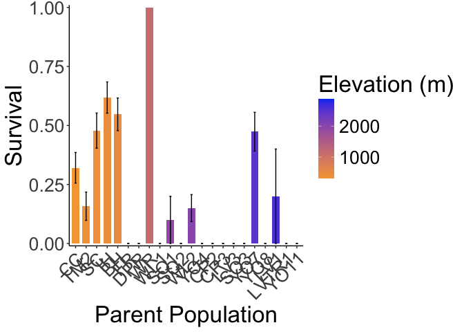
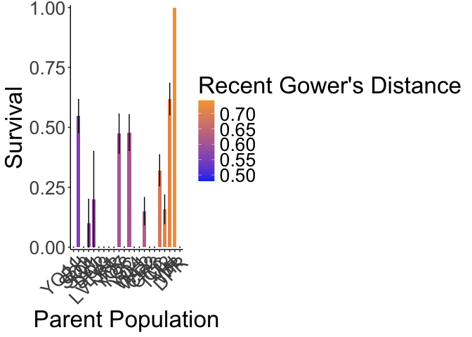

# Over-winter survival at WL2 garden 

## Relevant Libraries and Functions


```r
library(tidyverse)
```

```
## ── Attaching core tidyverse packages ──────────────────────── tidyverse 2.0.0 ──
## ✔ dplyr     1.1.4     ✔ readr     2.1.5
## ✔ forcats   1.0.0     ✔ stringr   1.5.1
## ✔ ggplot2   3.5.1     ✔ tibble    3.2.1
## ✔ lubridate 1.9.3     ✔ tidyr     1.3.1
## ✔ purrr     1.0.2     
## ── Conflicts ────────────────────────────────────────── tidyverse_conflicts() ──
## ✖ dplyr::filter() masks stats::filter()
## ✖ dplyr::lag()    masks stats::lag()
## ℹ Use the conflicted package (<http://conflicted.r-lib.org/>) to force all conflicts to become errors
```

```r
library(tidymodels)
```

```
## ── Attaching packages ────────────────────────────────────── tidymodels 1.2.0 ──
## ✔ broom        1.0.5      ✔ rsample      1.2.1 
## ✔ dials        1.2.1      ✔ tune         1.2.1 
## ✔ infer        1.0.7      ✔ workflows    1.1.4 
## ✔ modeldata    1.3.0      ✔ workflowsets 1.1.0 
## ✔ parsnip      1.2.1      ✔ yardstick    1.3.1 
## ✔ recipes      1.0.10     
## ── Conflicts ───────────────────────────────────────── tidymodels_conflicts() ──
## ✖ scales::discard() masks purrr::discard()
## ✖ dplyr::filter()   masks stats::filter()
## ✖ recipes::fixed()  masks stringr::fixed()
## ✖ dplyr::lag()      masks stats::lag()
## ✖ yardstick::spec() masks readr::spec()
## ✖ recipes::step()   masks stats::step()
## • Dig deeper into tidy modeling with R at https://www.tmwr.org
```

```r
tidymodels_prefer()
library(lmerTest) #for mixed effect models
```

```
## Loading required package: lme4
## Loading required package: Matrix
## 
## Attaching package: 'Matrix'
## 
## The following objects are masked from 'package:tidyr':
## 
##     expand, pack, unpack
```

```r
conflicted::conflicts_prefer(lmerTest::lmer)
```

```
## [conflicted] Will prefer lmerTest::lmer over any other package.
```

```r
library(broom.mixed) #tidy method for lmerTest
library(emmeans) #for post-hoc pairwise comparisons 
library(naniar) #replaces values with NA
library(corrplot) #plotting correlations 
```

```
## corrplot 0.92 loaded
```

```r
library(rstatix) #performing cor_test
sem <- function(x, na.rm=FALSE) {           #for caclulating standard error
  sd(x,na.rm=na.rm)/sqrt(length(na.omit(x)))
} 

elev_three_palette <- c("#0043F0", "#C9727F", "#F5A540") #colors from Gremer et al 2019
elev_order <- c("High", "Mid", "Low") #for proper arrangement in figures 

#install.packages("viridis") #for more better color palettes (if want to distinguish between all pops)
#library(viridis)
```

## Load the pop and location data and envtal dist data 


```r
gowersdist_UCD <- read_csv("../output/Climate/Pops_GowersEnvtalDist_UCD.csv") %>% 
  rename(Recent_Gowers_Dist_UCD = Recent_Gowers_Dist, Historic_Gowers_Dist_UCD = Historic_Gowers_Dist)
```

```
## Rows: 23 Columns: 5
## ── Column specification ────────────────────────────────────────────────────────
## Delimiter: ","
## chr (2): parent.pop, elevation.group
## dbl (3): elev_m, Recent_Gowers_Dist, Historic_Gowers_Dist
## 
## ℹ Use `spec()` to retrieve the full column specification for this data.
## ℹ Specify the column types or set `show_col_types = FALSE` to quiet this message.
```

```r
head(gowersdist_UCD)
```

```
## # A tibble: 6 × 5
##   parent.pop elevation.group elev_m Recent_Gowers_Dist_UCD
##   <chr>      <chr>            <dbl>                  <dbl>
## 1 BH         Low               511.                  0.273
## 2 CC         Low               313                   0.331
## 3 CP2        High             2244.                  0.445
## 4 CP3        High             2266.                  0.476
## 5 DPR        Mid              1019.                  0.267
## 6 FR         Mid               787                   0.296
## # ℹ 1 more variable: Historic_Gowers_Dist_UCD <dbl>
```

```r
gowersdist_WL2 <- read_csv("../output/Climate/Pops_GowersEnvtalDist_WL2.csv") %>% 
  rename(Recent_Gowers_Dist_WL2 = Recent_Gowers_Dist, Historic_Gowers_Dist_WL2 = Historic_Gowers_Dist)
```

```
## Rows: 23 Columns: 5
## ── Column specification ────────────────────────────────────────────────────────
## Delimiter: ","
## chr (2): parent.pop, elevation.group
## dbl (3): elev_m, Recent_Gowers_Dist, Historic_Gowers_Dist
## 
## ℹ Use `spec()` to retrieve the full column specification for this data.
## ℹ Specify the column types or set `show_col_types = FALSE` to quiet this message.
```

```r
head(gowersdist_WL2)
```

```
## # A tibble: 6 × 5
##   parent.pop elevation.group elev_m Recent_Gowers_Dist_WL2
##   <chr>      <chr>            <dbl>                  <dbl>
## 1 BH         Low               511.                  0.555
## 2 CC         Low               313                   0.682
## 3 CP2        High             2244.                  0.626
## 4 CP3        High             2266.                  0.629
## 5 DPR        Mid              1019.                  0.743
## 6 FR         Mid               787                   0.599
## # ℹ 1 more variable: Historic_Gowers_Dist_WL2 <dbl>
```

```r
gowersdist_all <- full_join(gowersdist_UCD, gowersdist_WL2)
```

```
## Joining with `by = join_by(parent.pop, elevation.group, elev_m)`
```

```r
head(gowersdist_all)
```

```
## # A tibble: 6 × 7
##   parent.pop elevation.group elev_m Recent_Gowers_Dist_UCD
##   <chr>      <chr>            <dbl>                  <dbl>
## 1 BH         Low               511.                  0.273
## 2 CC         Low               313                   0.331
## 3 CP2        High             2244.                  0.445
## 4 CP3        High             2266.                  0.476
## 5 DPR        Mid              1019.                  0.267
## 6 FR         Mid               787                   0.296
## # ℹ 3 more variables: Historic_Gowers_Dist_UCD <dbl>,
## #   Recent_Gowers_Dist_WL2 <dbl>, Historic_Gowers_Dist_WL2 <dbl>
```

## Load the post-winter data

```r
post_winter <- read_csv("../input/WL2_status_check_20240603_corrected.csv",
                         na = c("", "NA", "-", "N/A")) 
```

```
## Rows: 1826 Columns: 9
## ── Column specification ────────────────────────────────────────────────────────
## Delimiter: ","
## chr (8): block, bed, bed- col, pop, mf, rep, death.date, survey.notes
## dbl (1): bed- row
## 
## ℹ Use `spec()` to retrieve the full column specification for this data.
## ℹ Specify the column types or set `show_col_types = FALSE` to quiet this message.
```

```r
head(post_winter)
```

```
## # A tibble: 6 × 9
##   block bed   `bed- row` `bed- col` pop   mf    rep   death.date survey.notes
##   <chr> <chr>      <dbl> <chr>      <chr> <chr> <chr> <chr>      <chr>       
## 1 A     A              1 A          TM2   6     11    D          <NA>        
## 2 A     A              1 B          LVTR1 7     1     7/26/23    <NA>        
## 3 A     A              2 A          SQ2   6     14    7/26/23    <NA>        
## 4 A     A              2 B          YO8   8     3     7/26/23    <NA>        
## 5 A     A              3 A          CC    2     3     D          <NA>        
## 6 A     A              3 B          YO11  5     14    7/26/23    <NA>
```

```r
unique(post_winter$pop) #some wrong pop ids "iH", "1H", "cc"
```

```
##  [1] "TM2"    "LVTR1"  "SQ2"    "YO8"    "CC"     "YO11"   "BH"     "DPR"   
##  [9] "CP2"    "WL1"    "IH"     "CP3"    "SC"     "FR"     "LV3"    "YO7"   
## [17] "WV"     "SQ3"    "WL2"    "LV1"    "YO4"    "WR"     NA       "WL1*"  
## [25] "SQ1"    "1H"     "BH*"    "YO11*"  "CP2*"   "TM2*"   "LV1*"   "buffer"
## [33] "LVTR1*" "iH"     "WL2*"   "YO8*"   "SC*"    "DPR*"   "CP3*"   "cc"    
## [41] "IH*"
```

```r
post_winter %>% rowwise() %>% filter(!is.na(mf), mf != "buffer") %>%  filter(is.na(as.numeric(mf))) #all buffers
```

```
## Warning: There were 4 warnings in `filter()`.
## The first warning was:
## ℹ In argument: `is.na(as.numeric(mf))`.
## ℹ In row 116.
## Caused by warning:
## ! NAs introduced by coercion
## ℹ Run `dplyr::last_dplyr_warnings()` to see the 3 remaining warnings.
```

```
## # A tibble: 4 × 9
## # Rowwise: 
##   block bed   `bed- row` `bed- col` pop   mf       rep   death.date survey.notes
##   <chr> <chr>      <dbl> <chr>      <chr> <chr>    <chr> <chr>      <chr>       
## 1 B     A             59 B          WL1*  buffebu… <NA>  <NA>       <NA>        
## 2 B     A             60 A          WL1*  buffebu… <NA>  <NA>       <NA>        
## 3 I     F             47 C          YO8*  buff     buff… <NA>       <NA>        
## 4 I     F             47 D          YO8*  buff     buff… <NA>       <NA>
```

```r
post_winter %>% rowwise() %>% filter(!is.na(rep), rep != "buffer") %>%  filter(is.na(as.numeric(rep))) #all buffers
```

```
## # A tibble: 0 × 9
## # Rowwise: 
## # ℹ 9 variables: block <chr>, bed <chr>, bed- row <dbl>, bed- col <chr>,
## #   pop <chr>, mf <chr>, rep <chr>, death.date <chr>, survey.notes <chr>
```

```r
post_winter_clean <- post_winter %>% 
  rename(parent.pop=pop) %>% 
  mutate(parent.pop= str_replace(parent.pop, "iH", "IH")) %>% 
  mutate(parent.pop= str_replace(parent.pop, "1H", "IH")) %>% 
  mutate(parent.pop= str_replace(parent.pop, "cc", "CC")) %>% 
  filter(parent.pop!="buffer", !str_detect(mf, "buf")) %>% 
  mutate(mf=as.double(mf), rep=as.double(rep))
head(post_winter_clean)
```

```
## # A tibble: 6 × 9
##   block bed   `bed- row` `bed- col` parent.pop    mf   rep death.date
##   <chr> <chr>      <dbl> <chr>      <chr>      <dbl> <dbl> <chr>     
## 1 A     A              1 A          TM2            6    11 D         
## 2 A     A              1 B          LVTR1          7     1 7/26/23   
## 3 A     A              2 A          SQ2            6    14 7/26/23   
## 4 A     A              2 B          YO8            8     3 7/26/23   
## 5 A     A              3 A          CC             2     3 D         
## 6 A     A              3 B          YO11           5    14 7/26/23   
## # ℹ 1 more variable: survey.notes <chr>
```

```r
unique(post_winter_clean$parent.pop)
```

```
##  [1] "TM2"   "LVTR1" "SQ2"   "YO8"   "CC"    "YO11"  "BH"    "DPR"   "CP2"  
## [10] "WL1"   "IH"    "CP3"   "SC"    "FR"    "LV3"   "YO7"   "WV"    "SQ3"  
## [19] "WL2"   "LV1"   "YO4"   "WR"    "SQ1"
```

## Add in location info 

```r
post_winter_loc <- left_join(post_winter_clean, gowersdist_all)
```

```
## Joining with `by = join_by(parent.pop)`
```

```r
head(post_winter_loc)
```

```
## # A tibble: 6 × 15
##   block bed   `bed- row` `bed- col` parent.pop    mf   rep death.date
##   <chr> <chr>      <dbl> <chr>      <chr>      <dbl> <dbl> <chr>     
## 1 A     A              1 A          TM2            6    11 D         
## 2 A     A              1 B          LVTR1          7     1 7/26/23   
## 3 A     A              2 A          SQ2            6    14 7/26/23   
## 4 A     A              2 B          YO8            8     3 7/26/23   
## 5 A     A              3 A          CC             2     3 D         
## 6 A     A              3 B          YO11           5    14 7/26/23   
## # ℹ 7 more variables: survey.notes <chr>, elevation.group <chr>, elev_m <dbl>,
## #   Recent_Gowers_Dist_UCD <dbl>, Historic_Gowers_Dist_UCD <dbl>,
## #   Recent_Gowers_Dist_WL2 <dbl>, Historic_Gowers_Dist_WL2 <dbl>
```

## Filter to only ones alive in October


```r
alive_oct <- post_winter_loc %>% 
  filter(death.date == "A" | death.date == "B" | death.date == "C" | death.date == "D") %>% 
  mutate(Survival=if_else(death.date=="D", 0, 1)) %>% 
  select(Recent_Gowers_Dist_WL2, Historic_Gowers_Dist_WL2, elevation.group:elev_m, block:rep, 
         death.date, Survival)
head(alive_oct) #470 plants alive at annual census 
```

```
## # A tibble: 6 × 13
##   Recent_Gowers_Dist_WL2 Historic_Gowers_Dist_WL2 elevation.group elev_m block
##                    <dbl>                    <dbl> <chr>            <dbl> <chr>
## 1                  0.709                    0.678 Low               379. A    
## 2                  0.682                    0.687 Low               313  A    
## 3                  0.626                    0.574 High             2244. A    
## 4                  0.682                    0.687 Low               313  A    
## 5                  0.682                    0.687 Low               313  A    
## 6                  0.712                    0.710 Low               454. A    
## # ℹ 8 more variables: bed <chr>, `bed- row` <dbl>, `bed- col` <chr>,
## #   parent.pop <chr>, mf <dbl>, rep <dbl>, death.date <chr>, Survival <dbl>
```

```r
unique(alive_oct$parent.pop) #22 populations with an individual alive in October 
```

```
##  [1] "TM2"   "CC"    "CP2"   "IH"    "CP3"   "SQ2"   "YO11"  "BH"    "SQ3"  
## [10] "WL2"   "LVTR1" "WL1"   "YO4"   "SC"    "DPR"   "YO7"   "SQ1"   "YO8"  
## [19] "WR"    "LV1"   "FR"    "LV3"
```

Categories 
A - alive, “happy” leaves
B = “barely alive”, still has leaves but major damage
C = no leaves, stem not brittle
D = brittle, no leaves, definitely dead  

## Survival 

### Descriptive tables 

```r
#overall
xtabs(~death.date, data=alive_oct) #335 dead post-winter out of 470 alive pre-winter = 71% overwinter mortality 
```

```
## death.date
##   A   B   C   D 
## 113  14   8 335
```

```r
xtabs(~death.date+parent.pop, data=alive_oct)
```

```
##           parent.pop
## death.date BH CC CP2 CP3 DPR FR IH LV1 LV3 LVTR1 SC SQ1 SQ2 SQ3 TM2 WL1 WL2 WR
##          A 26 14   0   0   0  0 24   1   0     0 19   1   0   0   4   0   6  1
##          B  3  2   0   0   0  0  6   0   0     0  2   0   0   0   1   0   0  0
##          C  0  1   0   0   0  0  4   0   0     0  1   0   0   0   1   0   0  0
##          D 24 36  16  15  33  5 21   4   3     5 24   9  10   6  32  12  34  0
##           parent.pop
## death.date YO11 YO4 YO7 YO8
##          A    0   0  17   0
##          B    0   0   0   0
##          C    0   0   1   0
##          D    8   9  20   9
```

### Means by pop

```r
overwint_surv_summary <- alive_oct %>% 
  group_by(parent.pop, elev_m, Recent_Gowers_Dist_WL2, Historic_Gowers_Dist_WL2) %>% 
  summarise(N_Surv = sum(!is.na(Survival)), mean_Surv = mean(Survival,na.rm=(TRUE)), 
            sem_surv=sem(Survival, na.rm=(TRUE)))
```

```
## `summarise()` has grouped output by 'parent.pop', 'elev_m',
## 'Recent_Gowers_Dist_WL2'. You can override using the `.groups` argument.
```

```r
overwint_surv_summary
```

```
## # A tibble: 22 × 7
## # Groups:   parent.pop, elev_m, Recent_Gowers_Dist_WL2 [22]
##    parent.pop elev_m Recent_Gowers_Dist_WL2 Historic_Gowers_Dist_WL2 N_Surv
##    <chr>       <dbl>                  <dbl>                    <dbl>  <int>
##  1 BH           511.                  0.555                    0.530     53
##  2 CC           313                   0.682                    0.687     53
##  3 CP2         2244.                  0.626                    0.574     16
##  4 CP3         2266.                  0.629                    0.577     15
##  5 DPR         1019.                  0.743                    0.689     33
##  6 FR           787                   0.599                    0.595      5
##  7 IH           454.                  0.712                    0.710     55
##  8 LV1         2593.                  0.587                    0.652      5
##  9 LV3         2354.                  0.588                    0.652      3
## 10 LVTR1       2741.                  0.589                    0.659      5
## # ℹ 12 more rows
## # ℹ 2 more variables: mean_Surv <dbl>, sem_surv <dbl>
```


```r
overwint_surv_summary %>% 
  #filter(N_Surv != 1) %>% 
  ggplot(aes(x=fct_reorder(parent.pop, mean_Surv), y=mean_Surv, fill=elev_m)) + 
  geom_col(width = 0.7,position = position_dodge(0.75)) + 
  geom_errorbar(aes(ymin=mean_Surv-sem_surv,ymax=mean_Surv+sem_surv),width=.2, position = 
                  position_dodge(0.75)) +
  theme_classic() + 
  scale_y_continuous(expand = c(0.01, 0)) +
  scale_fill_gradient(low = "#F5A540", high = "#0043F0") +
  labs(y="Survival", fill="Elevation (m)", x="Parent Population") + 
  theme(text=element_text(size=25), axis.text.x = element_text(angle = 45,  hjust = 1))
```

<!-- -->

```r
ggsave("../output/WL2_Traits//WL2_Over_Winter_Surv_PopAvgs.png", width = 14, height = 8, units = "in")

#sort by elevation 
overwint_surv_summary %>% 
  #filter(N_Surv != 1) %>% 
  ggplot(aes(x=fct_reorder(parent.pop, elev_m), y=mean_Surv, fill=elev_m)) + 
  geom_col(width = 0.7,position = position_dodge(0.75)) + 
  geom_errorbar(aes(ymin=mean_Surv-sem_surv,ymax=mean_Surv+sem_surv),width=.2, position = 
                  position_dodge(0.75)) +
  theme_classic() + 
  scale_y_continuous(expand = c(0.01, 0)) +
  scale_fill_gradient(low = "#F5A540", high = "#0043F0") +
  labs(y="Survival", fill="Elevation (m)", x="Parent Population") + 
  theme(text=element_text(size=25), axis.text.x = element_text(angle = 45,  hjust = 1))
```

<!-- -->

```r
ggsave("../output/WL2_Traits//WL2_Over_Winter_Surv_PopAvgs_byelev.png", width = 14, height = 8, units = "in")


#sort by gowers distance - need to play with this one, colors? 
overwint_surv_summary %>% 
  #filter(N_Surv != 1) %>% 
  ggplot(aes(x=fct_reorder(parent.pop, Recent_Gowers_Dist_WL2), y=mean_Surv, fill=Recent_Gowers_Dist_WL2)) + 
  geom_col(width = 0.7,position = position_dodge(0.75)) + 
  geom_errorbar(aes(ymin=mean_Surv-sem_surv,ymax=mean_Surv+sem_surv),width=.2, position = 
                  position_dodge(0.75)) +
  theme_classic() + 
  scale_y_continuous(expand = c(0.01, 0)) +
  scale_fill_gradient(low = "#0043F0", high = "#F5A540") +
  labs(y="Survival", fill="Recent Gower's Distance", x="Parent Population") + 
  theme(text=element_text(size=25), axis.text.x = element_text(angle = 45,  hjust = 1))
```

<!-- -->

```r
ggsave("../output/WL2_Traits//WL2_Over_Winter_Surv_PopAvgs_byenvtdist.png", width = 14, height = 8, units = "in")
```

## Stats

```r
lmesurv1 <- glmer(Survival ~ Recent_Gowers_Dist_WL2 + (1|parent.pop/mf) + (1|block), 
                  data = alive_oct, 
                  family = binomial(link = "logit")) 
summary(lmesurv1)
```

```
## Generalized linear mixed model fit by maximum likelihood (Laplace
##   Approximation) [glmerMod]
##  Family: binomial  ( logit )
## Formula: Survival ~ Recent_Gowers_Dist_WL2 + (1 | parent.pop/mf) + (1 |  
##     block)
##    Data: alive_oct
## 
##      AIC      BIC   logLik deviance df.resid 
##    471.4    492.2   -230.7    461.4      465 
## 
## Scaled residuals: 
##     Min      1Q  Median      3Q     Max 
## -1.4795 -0.6104 -0.1305  0.7123  2.6674 
## 
## Random effects:
##  Groups        Name        Variance Std.Dev.
##  mf:parent.pop (Intercept) 0.20639  0.4543  
##  parent.pop    (Intercept) 5.88631  2.4262  
##  block         (Intercept) 0.07617  0.2760  
## Number of obs: 470, groups:  mf:parent.pop, 112; parent.pop, 22; block, 13
## 
## Fixed effects:
##                        Estimate Std. Error z value Pr(>|z|)
## (Intercept)             -11.875      7.498  -1.584    0.113
## Recent_Gowers_Dist_WL2   14.212     11.588   1.226    0.220
## 
## Correlation of Fixed Effects:
##             (Intr)
## Rcn_G_D_WL2 -0.994
```

```r
anova(lmesurv1)
```

```
## Analysis of Variance Table
##                        npar Sum Sq Mean Sq F value
## Recent_Gowers_Dist_WL2    1 1.6615  1.6615  1.6615
```

```r
glance(lmesurv1)
```

```
## # A tibble: 1 × 7
##    nobs sigma logLik   AIC   BIC deviance df.residual
##   <int> <dbl>  <dbl> <dbl> <dbl>    <dbl>       <int>
## 1   470     1  -231.  471.  492.     384.         465
```

```r
lmesurv2 <- glmer(Survival ~ Historic_Gowers_Dist_WL2 + (1|parent.pop/mf) + (1|block), 
                  data = alive_oct, 
                  family = binomial(link = "logit")) 
summary(lmesurv2)
```

```
## Generalized linear mixed model fit by maximum likelihood (Laplace
##   Approximation) [glmerMod]
##  Family: binomial  ( logit )
## Formula: Survival ~ Historic_Gowers_Dist_WL2 + (1 | parent.pop/mf) + (1 |  
##     block)
##    Data: alive_oct
## 
##      AIC      BIC   logLik deviance df.resid 
##    472.4    493.1   -231.2    462.4      465 
## 
## Scaled residuals: 
##     Min      1Q  Median      3Q     Max 
## -1.4747 -0.6104 -0.1322  0.7147  2.5790 
## 
## Random effects:
##  Groups        Name        Variance Std.Dev.
##  mf:parent.pop (Intercept) 0.20519  0.453   
##  parent.pop    (Intercept) 5.80655  2.410   
##  block         (Intercept) 0.07618  0.276   
## Number of obs: 470, groups:  mf:parent.pop, 112; parent.pop, 22; block, 13
## 
## Fixed effects:
##                          Estimate Std. Error z value Pr(>|z|)
## (Intercept)                -8.721      6.694  -1.303    0.193
## Historic_Gowers_Dist_WL2    9.414     10.609   0.887    0.375
## 
## Correlation of Fixed Effects:
##             (Intr)
## Hst_G_D_WL2 -0.993
```

```r
anova(lmesurv2)
```

```
## Analysis of Variance Table
##                          npar  Sum Sq Mean Sq F value
## Historic_Gowers_Dist_WL2    1 0.84625 0.84625  0.8463
```

```r
glance(lmesurv2)
```

```
## # A tibble: 1 × 7
##    nobs sigma logLik   AIC   BIC deviance df.residual
##   <int> <dbl>  <dbl> <dbl> <dbl>    <dbl>       <int>
## 1   470     1  -231.  472.  493.     384.         465
```

```r
lmesurv3 <- glmer(Survival ~ elev_m + (1|parent.pop/mf) + (1|block), 
                  data = alive_oct, 
                  family = binomial(link = "logit")) #get a failed to converge and rescale variables warning for this model 
```

```
## Warning in checkConv(attr(opt, "derivs"), opt$par, ctrl = control$checkConv, :
## Model failed to converge with max|grad| = 0.00545118 (tol = 0.002, component 1)
```

```
## Warning in checkConv(attr(opt, "derivs"), opt$par, ctrl = control$checkConv, : Model is nearly unidentifiable: very large eigenvalue
##  - Rescale variables?;Model is nearly unidentifiable: large eigenvalue ratio
##  - Rescale variables?
```

```r
summary(lmesurv3)
```

```
## Generalized linear mixed model fit by maximum likelihood (Laplace
##   Approximation) [glmerMod]
##  Family: binomial  ( logit )
## Formula: Survival ~ elev_m + (1 | parent.pop/mf) + (1 | block)
##    Data: alive_oct
## 
##      AIC      BIC   logLik deviance df.resid 
##    466.2    487.0   -228.1    456.2      465 
## 
## Scaled residuals: 
##     Min      1Q  Median      3Q     Max 
## -1.4684 -0.6195 -0.1403  0.7121  3.0616 
## 
## Random effects:
##  Groups        Name        Variance Std.Dev.
##  mf:parent.pop (Intercept) 0.20072  0.4480  
##  parent.pop    (Intercept) 3.49189  1.8687  
##  block         (Intercept) 0.07161  0.2676  
## Number of obs: 470, groups:  mf:parent.pop, 112; parent.pop, 22; block, 13
## 
## Fixed effects:
##               Estimate Std. Error z value Pr(>|z|)  
## (Intercept) -0.2981462  0.9757562  -0.306   0.7599  
## elev_m      -0.0015575  0.0006287  -2.477   0.0132 *
## ---
## Signif. codes:  0 '***' 0.001 '**' 0.01 '*' 0.05 '.' 0.1 ' ' 1
## 
## Correlation of Fixed Effects:
##        (Intr)
## elev_m -0.779
## optimizer (Nelder_Mead) convergence code: 0 (OK)
## Model failed to converge with max|grad| = 0.00545118 (tol = 0.002, component 1)
## Model is nearly unidentifiable: very large eigenvalue
##  - Rescale variables?
## Model is nearly unidentifiable: large eigenvalue ratio
##  - Rescale variables?
```

```r
anova(lmesurv3)
```

```
## Analysis of Variance Table
##        npar Sum Sq Mean Sq F value
## elev_m    1 6.6481  6.6481  6.6481
```

```r
glance(lmesurv3)
```

```
## # A tibble: 1 × 7
##    nobs sigma logLik   AIC   BIC deviance df.residual
##   <int> <dbl>  <dbl> <dbl> <dbl>    <dbl>       <int>
## 1   470     1  -228.  466.  487.     386.         465
```

```r
#to test for significance of random effect: 
#the most common way to do this is to use a likelihood ratio test, i.e. fit the full and reduced models (the reduced model is the model with the focal variance(s) set to zero). 
m0 <- glmer(Survival ~ elev_m + (1|parent.pop), data = alive_oct, family = binomial("logit")) 
```

```
## Warning in checkConv(attr(opt, "derivs"), opt$par, ctrl = control$checkConv, : Model failed to converge with max|grad| = 0.00629063 (tol = 0.002, component 1)
## Warning in checkConv(attr(opt, "derivs"), opt$par, ctrl = control$checkConv, : Model is nearly unidentifiable: very large eigenvalue
##  - Rescale variables?;Model is nearly unidentifiable: large eigenvalue ratio
##  - Rescale variables?
```

```r
m00 <- glm(Survival~ elev_m, alive_oct, family = binomial("logit"))
anova(lmesurv1,m0, m00) #model with both random effects has a higher likelihood (better fit)
```

```
## Data: alive_oct
## Models:
## m00: Survival ~ elev_m
## m0: Survival ~ elev_m + (1 | parent.pop)
## lmesurv1: Survival ~ Recent_Gowers_Dist_WL2 + (1 | parent.pop/mf) + (1 | block)
##          npar    AIC    BIC  logLik deviance  Chisq Df Pr(>Chisq)    
## m00         2 531.09 539.39 -263.54   527.09                         
## m0          3 464.15 476.61 -229.08   458.15 68.937  1     <2e-16 ***
## lmesurv1    5 471.43 492.20 -230.72   461.43  0.000  2          1    
## ---
## Signif. codes:  0 '***' 0.001 '**' 0.01 '*' 0.05 '.' 0.1 ' ' 1
```

