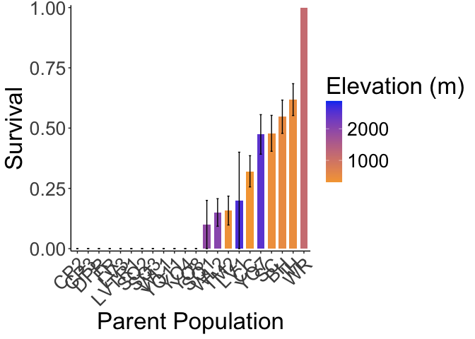

# Over-winter survival at WL2 garden 

## Libraries

``` r
library(tidyverse)
```

```
## ── Attaching core tidyverse packages ──────────────────────── tidyverse 2.0.0 ──
## ✔ dplyr     1.1.4     ✔ readr     2.1.5
## ✔ forcats   1.0.0     ✔ stringr   1.5.1
## ✔ ggplot2   3.5.1     ✔ tibble    3.2.1
## ✔ lubridate 1.9.3     ✔ tidyr     1.3.1
## ✔ purrr     1.0.2     
## ── Conflicts ────────────────────────────────────────── tidyverse_conflicts() ──
## ✖ dplyr::filter() masks stats::filter()
## ✖ dplyr::lag()    masks stats::lag()
## ℹ Use the conflicted package (<http://conflicted.r-lib.org/>) to force all conflicts to become errors
```

``` r
library(magrittr)
```

```
## 
## Attaching package: 'magrittr'
## 
## The following object is masked from 'package:purrr':
## 
##     set_names
## 
## The following object is masked from 'package:tidyr':
## 
##     extract
```

``` r
#conflicted::conflicts_prefer(dplyr::filter)
library(viridis) #for pretty colors
```

```
## Loading required package: viridisLite
```

``` r
library(ggrepel) #for non-overlapping labels on plots
library(ggdist) #visualizations of distributions and uncertainty 
library(ggpubr)

#library(sp) #for calculating geographic distance 
library(geosphere) #for calculating geographic distance
library(corrplot) #plotting correlations  
```

```
## corrplot 0.94 loaded
```

``` r
library(rstatix) #performing cor_test
```

```
## 
## Attaching package: 'rstatix'
## 
## The following object is masked from 'package:stats':
## 
##     filter
```

``` r
library(lmerTest) #mixed models
```

```
## Loading required package: lme4
## Loading required package: Matrix
## 
## Attaching package: 'Matrix'
## 
## The following objects are masked from 'package:tidyr':
## 
##     expand, pack, unpack
## 
## 
## Attaching package: 'lmerTest'
## 
## The following object is masked from 'package:lme4':
## 
##     lmer
## 
## The following object is masked from 'package:stats':
## 
##     step
```

``` r
conflicted::conflicts_prefer(lmerTest::lmer)
```

```
## [conflicted] Will prefer lmerTest::lmer over any other package.
```

``` r
library(broom.mixed)
library(tidymodels)
```

```
## ── Attaching packages ────────────────────────────────────── tidymodels 1.2.0 ──
## ✔ broom        1.0.7     ✔ rsample      1.2.1
## ✔ dials        1.3.0     ✔ tune         1.2.1
## ✔ infer        1.0.7     ✔ workflows    1.1.4
## ✔ modeldata    1.4.0     ✔ workflowsets 1.1.0
## ✔ parsnip      1.2.1     ✔ yardstick    1.3.1
## ✔ recipes      1.1.0     
## ── Conflicts ───────────────────────────────────────── tidymodels_conflicts() ──
## ✖ infer::chisq_test()   masks rstatix::chisq_test()
## ✖ scales::discard()     masks purrr::discard()
## ✖ Matrix::expand()      masks tidyr::expand()
## ✖ magrittr::extract()   masks tidyr::extract()
## ✖ rstatix::filter()     masks dplyr::filter(), stats::filter()
## ✖ recipes::fixed()      masks stringr::fixed()
## ✖ dials::get_n()        masks rstatix::get_n()
## ✖ dplyr::lag()          masks stats::lag()
## ✖ Matrix::pack()        masks tidyr::pack()
## ✖ infer::prop_test()    masks rstatix::prop_test()
## ✖ magrittr::set_names() masks purrr::set_names()
## ✖ yardstick::spec()     masks readr::spec()
## ✖ recipes::step()       masks lmerTest::step(), stats::step()
## ✖ infer::t_test()       masks rstatix::t_test()
## ✖ Matrix::unpack()      masks tidyr::unpack()
## ✖ recipes::update()     masks Matrix::update(), stats::update()
## • Learn how to get started at https://www.tidymodels.org/start/
```

``` r
library(furrr) #Apply Mapping Functions in Parallel using Futures
```

```
## Loading required package: future
```

``` r
tidymodels_prefer()
# install.packages("multilevelmod")
library(multilevelmod)

library(brms)
```

```
## Loading required package: Rcpp
## 
## Attaching package: 'Rcpp'
## 
## The following object is masked from 'package:rsample':
## 
##     populate
## 
## Loading 'brms' package (version 2.22.0). Useful instructions
## can be found by typing help('brms'). A more detailed introduction
## to the package is available through vignette('brms_overview').
```

``` r
#conflicted::conflicts_prefer(brms::ar)
#conflicted::conflicts_prefer(dplyr::combine)
#conflicted::conflicts_prefer(brms::dstudent_t)
library(tidybayes) #for extracting and visiaulizing brms model output 
library(modelr) #for data grid

sem <- function(x, na.rm=FALSE) {           #for caclulating standard error
  sd(x,na.rm=na.rm)/sqrt(length(na.omit(x)))
} 

cbbPalette2 <- c("#E69F00","#000000", "#56B4E9","#009E73", "#F0E442", "#0072B2", "#D55E00", "#CC79A7")
timepd_palette <- c("#56B4E9","#D55E00")

options(mc.cores = parallel::detectCores())
```

## Load the post-winter data

``` r
post_winter <- read_csv("../input/WL2_Data/WL2_status_check_20240603_corrected.csv",
                         na = c("", "NA", "-", "N/A")) 
```

```
## Rows: 1826 Columns: 9
## ── Column specification ────────────────────────────────────────────────────────
## Delimiter: ","
## chr (8): block, bed, bed- col, pop, mf, rep, death.date, survey.notes
## dbl (1): bed- row
## 
## ℹ Use `spec()` to retrieve the full column specification for this data.
## ℹ Specify the column types or set `show_col_types = FALSE` to quiet this message.
```

``` r
post_winter_clean <- post_winter %>% 
  mutate(pop= str_replace(pop, "iH", "IH")) %>% 
  mutate(pop= str_replace(pop, "1H", "IH")) %>% 
  mutate(pop= str_replace(pop, "cc", "CC")) %>% 
  unite(BedLoc, bed:`bed- col`, sep="_", remove = FALSE) %>% 
  filter(BedLoc!="K_5_C") %>% #get rid of duplicate locations
  filter(BedLoc!="B_32_A") %>% #get rid of duplicate locations
  unite(Genotype, pop:rep, sep="_", remove = FALSE) %>% 
  filter(pop!="buffer", !str_detect(mf, "buf")) %>% 
  mutate(mf=as.double(mf), rep=as.double(rep))
unique(post_winter_clean$pop)
```

```
##  [1] "TM2"   "LVTR1" "SQ2"   "YO8"   "CC"    "YO11"  "BH"    "DPR"   "CP2"  
## [10] "WL1"   "IH"    "CP3"   "SC"    "FR"    "LV3"   "YO7"   "WV"    "SQ3"  
## [19] "WL2"   "LV1"   "YO4"   "WR"    "SQ1"
```

## Gower's Distance

``` r
garden_climate <- read_csv("../output/Climate/flint_climate_UCDpops.csv") %>% 
  filter(parent.pop=="WL2_Garden" | parent.pop=="UCD_Garden") %>% 
  select(parent.pop:Long) %>% 
  distinct()
```

```
## Rows: 38775 Columns: 14
## ── Column specification ────────────────────────────────────────────────────────
## Delimiter: ","
## chr  (3): parent.pop, elevation.group, month
## dbl (11): elev_m, Lat, Long, year, aet, cwd, pck, pet, ppt, tmn, tmx
## 
## ℹ Use `spec()` to retrieve the full column specification for this data.
## ℹ Specify the column types or set `show_col_types = FALSE` to quiet this message.
```

``` r
garden_climate
```

```
## # A tibble: 2 × 5
##   parent.pop elevation.group elev_m   Lat  Long
##   <chr>      <chr>            <dbl> <dbl> <dbl>
## 1 UCD_Garden Low                 16  38.5 -122.
## 2 WL2_Garden High              2020  38.8 -120.
```

``` r
#UCD LAT/LONG = 38.53250, -121.7830
#WL2 Lat/Long = 38.82599, -120.2509

wl2_gowers_2024 <- read_csv("../output/Climate/Gowers_WL2_2024.csv") %>% 
  pivot_wider(names_from = TimePd, values_from = c(GrwSsn_GD, Wtr_Year_GD)) %>% 
  mutate(WL2_Lat=38.82599, WL2_Long=-120.2509, WL2_Elev=2020) %>% 
  mutate(Geographic_Dist=distHaversine(cbind(WL2_Long, WL2_Lat), cbind(Long, Lat)),
         Elev_Dist=elev_m-WL2_Elev) %>% # Calculate the distance using the haversine formula
  rename(pop=parent.pop)
```

```
## Rows: 46 Columns: 8
## ── Column specification ────────────────────────────────────────────────────────
## Delimiter: ","
## chr (3): parent.pop, elevation.group, TimePd
## dbl (5): elev_m, Lat, Long, GrwSsn_GD, Wtr_Year_GD
## 
## ℹ Use `spec()` to retrieve the full column specification for this data.
## ℹ Specify the column types or set `show_col_types = FALSE` to quiet this message.
```

## Climate Subtraction Distance


``` r
wl2_wtr_year_sub_recent_2024 <- read_csv("../output/Climate/full_year_Subtraction_Dist_from_Home_WL2_2024_Recent.csv") %>% 
  select(parent.pop, Wtr_Year_TempDist_Recent=ann_tmean_dist, Wtr_Year_PPTDist_Recent=ann_ppt_dist)
```

```
## Rows: 23 Columns: 18
## ── Column specification ────────────────────────────────────────────────────────
## Delimiter: ","
## chr  (2): parent.pop, elevation.group
## dbl (16): elev_m, ppt_dist, cwd_dist, pck_dist, tmn_dist, tmx_dist, ann_tmea...
## 
## ℹ Use `spec()` to retrieve the full column specification for this data.
## ℹ Specify the column types or set `show_col_types = FALSE` to quiet this message.
```

``` r
wl2_wtr_year_sub_historic_2024 <- read_csv("../output/Climate/full_year_Subtraction_Dist_from_Home_WL2_2024_Historical.csv") %>% 
  select(parent.pop, Wtr_Year_TempDist_Historic=ann_tmean_dist, Wtr_Year_PPTDist_Historic=ann_ppt_dist)
```

```
## Rows: 23 Columns: 18
## ── Column specification ────────────────────────────────────────────────────────
## Delimiter: ","
## chr  (2): parent.pop, elevation.group
## dbl (16): elev_m, ppt_dist, cwd_dist, pck_dist, tmn_dist, tmx_dist, ann_tmea...
## 
## ℹ Use `spec()` to retrieve the full column specification for this data.
## ℹ Specify the column types or set `show_col_types = FALSE` to quiet this message.
```

``` r
wl2_sub_dist_2024 <- wl2_wtr_year_sub_recent_2024 %>% 
  left_join(wl2_wtr_year_sub_historic_2024) %>% 
  rename(pop=parent.pop) %>% 
  left_join(wl2_gowers_2024) %>% 
  mutate(Wtr_Year_TempPpt_Recent=scale(Wtr_Year_TempDist_Recent,center=FALSE) +
           scale(Wtr_Year_PPTDist_Recent,center=FALSE),
         Wtr_Year_TempPpt_Historic=scale(Wtr_Year_TempDist_Historic,center=FALSE) +
           scale(Wtr_Year_PPTDist_Historic,center=FALSE))
```

```
## Joining with `by = join_by(parent.pop)`
## Joining with `by = join_by(pop)`
```

## Calculate Winter Surv

*Used only water year gowers distance for 2024 b/c that's the only one that includes the winter months 

Categories 
A - alive, “happy” leaves
B = “barely alive”, still has leaves but major damage
C = no leaves, stem not brittle
D = brittle, no leaves, definitely dead 


``` r
#wl2_surv_y1 %>% filter(is.na(death.date)) - 470 plants alive on 10/27
post_winter_clean %>% filter(is.na(death.date)) #44 plants with no death date, most have a death date of 10/27
```

```
## # A tibble: 44 × 11
##    block BedLoc bed   `bed- row` `bed- col` Genotype  pop      mf   rep
##    <chr> <chr>  <chr>      <dbl> <chr>      <chr>     <chr> <dbl> <dbl>
##  1 B     A_37_B A             37 B          WL2_8_10  WL2       8    10
##  2 B     A_58_A A             58 A          YO8_1_13  YO8       1    13
##  3 B     A_57_D A             57 D          YO11_4_13 YO11      4    13
##  4 C     B_32_B B             32 B          SQ3_6_5   SQ3       6     5
##  5 C     B_33_D B             33 D          YO4_1_1   YO4       1     1
##  6 D     C_6_D  C              6 D          WL1_7_20  WL1       7    20
##  7 D     C_7_D  C              7 D          WL1_10_4  WL1      10     4
##  8 D     C_13_D C             13 D          WL1_7_8   WL1       7     8
##  9 E     C_36_D C             36 D          LVTR1_6_5 LVTR1     6     5
## 10 E     C_40_D C             40 D          YO11_8_16 YO11      8    16
## # ℹ 34 more rows
## # ℹ 2 more variables: death.date <chr>, survey.notes <chr>
```

``` r
#A-37-B, no death date on any data sheet, was dying on 9/20 so may have just been missed in June 2024

winter_surv <- post_winter_clean %>% 
  left_join(wl2_gowers_2024) %>% 
  filter(death.date == "A" | death.date == "B" | death.date == "C" | death.date == "D") %>% 
  mutate(WinterSurv=if_else(death.date=="D", 0, 1)) %>% 
  select(block:rep, elevation.group:Wtr_Year_GD_Historical, Geographic_Dist, Elev_Dist, death.date, WinterSurv) 
```

```
## Joining with `by = join_by(pop)`
```

``` r
dim(winter_surv) #only 469 rows because A_37_B not included 
```

```
## [1] 469  21
```

``` r
winter_surv %>% filter(death.date!="D") #135 plants survived 
```

```
## # A tibble: 135 × 21
##    block BedLoc bed   `bed- row` `bed- col` Genotype pop      mf   rep
##    <chr> <chr>  <chr>      <dbl> <chr>      <chr>    <chr> <dbl> <dbl>
##  1 A     A_6_B  A              6 B          CC_3_3   CC        3     3
##  2 A     A_16_B A             16 B          BH_3_3   BH        3     3
##  3 A     A_17_A A             17 A          BH_7_3   BH        7     3
##  4 A     A_18_A A             18 A          BH_4_3   BH        4     3
##  5 A     A_24_A A             24 A          WL2_7_9  WL2       7     9
##  6 B     A_32_B A             32 B          IH_7_4   IH        7     4
##  7 B     A_35_A A             35 A          SC_8_4   SC        8     4
##  8 B     A_36_A A             36 A          BH_3_4   BH        3     4
##  9 B     A_39_B A             39 B          WL2_7_10 WL2       7    10
## 10 B     A_45_B A             45 B          IH_2_4   IH        2     4
## # ℹ 125 more rows
## # ℹ 12 more variables: elevation.group <chr>, elev_m <dbl>, Lat <dbl>,
## #   Long <dbl>, GrwSsn_GD_Recent <dbl>, GrwSsn_GD_Historical <dbl>,
## #   Wtr_Year_GD_Recent <dbl>, Wtr_Year_GD_Historical <dbl>,
## #   Geographic_Dist <dbl>, Elev_Dist <dbl>, death.date <chr>, WinterSurv <dbl>
```

``` r
#write_csv(winter_surv, "../output/WL2_Traits/WL2_WinterSurv.csv")
```


``` r
winter_surv_sub_dist <- winter_surv %>% 
  select(block:rep, WinterSurv) %>% 
  left_join(wl2_sub_dist_2024)
```

```
## Joining with `by = join_by(pop)`
```

### Descriptive tables 

``` r
#overall
xtabs(~WinterSurv, data=winter_surv) #334 dead post-winter out of 469 alive pre-winter = 71% overwinter mortality 
```

```
## WinterSurv
##   0   1 
## 334 135
```

``` r
xtabs(~WinterSurv+pop, data=winter_surv)
```

```
##           pop
## WinterSurv BH CC CP2 CP3 DPR FR IH LV1 LV3 LVTR1 SC SQ1 SQ2 SQ3 TM2 WL1 WL2 WR
##          0 24 35  16  15  33  5 21   4   3     5 24   9  10   6  32  12  34  0
##          1 29 17   0   0   0  0 34   1   0     0 22   1   0   0   6   0   6  1
##           pop
## WinterSurv YO11 YO4 YO7 YO8
##          0    8   9  20   9
##          1    0   0  18   0
```

### Bar Plots 

``` r
winter_surv %>% 
  group_by(pop, elev_m, Wtr_Year_GD_Recent) %>% 
  summarise(meanSurv=mean(WinterSurv, na.rm = TRUE), semSurv=sem(WinterSurv, na.rm=TRUE)) %>% 
  filter(pop != "WR") %>% #only 1 plant 
  ggplot(aes(x=fct_reorder(pop, meanSurv), y=meanSurv, fill=Wtr_Year_GD_Recent)) +
  geom_col(width = 0.7,position = position_dodge(0.75)) + 
  geom_errorbar(aes(ymin=meanSurv-semSurv,ymax=meanSurv+semSurv),width=.2, position = 
                  position_dodge(0.75)) +
  theme_classic() + 
  scale_y_continuous(expand = c(0.01, 0)) +
  labs(y="Winter Surv", x="Parent Population", fill="Water Year Gowers") +
  scale_fill_viridis(option="mako", direction = -1) +
  theme(text=element_text(size=25), axis.text.x = element_text(angle = 45,  hjust = 1))
```

```
## `summarise()` has grouped output by 'pop', 'elev_m'. You can override using the
## `.groups` argument.
```

<!-- -->

``` r
#ggsave("../output/WL2_Traits/WL2_WinterSurv_Wtr_Year_GD_Recent.png", width = 12, height = 8, units = "in")
```

### Scatterplots

``` r
#scatter plots
WYCD_recent <- winter_surv %>%
  filter(pop!="WR") %>% 
  group_by(pop, elev_m, Wtr_Year_GD_Recent) %>% 
  summarise(meanSurv=mean(WinterSurv, na.rm = TRUE), semSurv=sem(WinterSurv, na.rm=TRUE)) %>% 
  ggplot(aes(x=Wtr_Year_GD_Recent, y=meanSurv, group = pop)) +
  geom_point(size=6) + 
  geom_errorbar(aes(ymin=meanSurv-semSurv,ymax=meanSurv+semSurv),width=.02,linewidth = 2) +
  theme_classic() + 
  scale_y_continuous(expand = c(0.01, 0)) +
  labs(y="Winter Surv", x="Recent Water Year CD") +
  theme(text=element_text(size=25))
```

```
## `summarise()` has grouped output by 'pop', 'elev_m'. You can override using the
## `.groups` argument.
```

``` r
GD <- winter_surv %>% 
  filter(pop!="WR") %>% 
  group_by(pop, elev_m, Wtr_Year_GD_Recent, Geographic_Dist) %>% 
  summarise(meanSurv=mean(WinterSurv, na.rm = TRUE), semSurv=sem(WinterSurv, na.rm=TRUE)) %>% 
  ggplot(aes(x=Geographic_Dist, y=meanSurv, group = pop)) +
  geom_point(size=6) + 
  geom_errorbar(aes(ymin=meanSurv-semSurv,ymax=meanSurv+semSurv),width=.02, linewidth = 2) +
  theme_classic() + 
  scale_y_continuous(expand = c(0.01, 0)) +
  labs(y="Winter Surv", x="Geographic Distance (m)") +
  theme(text=element_text(size=25), axis.text.x = element_text(angle = 45,  hjust = 1))
```

```
## `summarise()` has grouped output by 'pop', 'elev_m', 'Wtr_Year_GD_Recent'. You
## can override using the `.groups` argument.
```

``` r
ED <- winter_surv %>% 
  filter(pop!="WR") %>% 
  group_by(pop, elev_m, Elev_Dist) %>% 
  summarise(meanSurv=mean(WinterSurv, na.rm = TRUE), semSurv=sem(WinterSurv, na.rm=TRUE)) %>% 
  ggplot(aes(x=Elev_Dist, y=meanSurv, group = pop)) +
  geom_point(size=6) + 
  geom_errorbar(aes(ymin=meanSurv-semSurv,ymax=meanSurv+semSurv),width=.02, linewidth = 2) +
  theme_classic() + 
  scale_y_continuous(expand = c(0.01, 0)) +
  labs(y="Surv-to-Rep Y2", x="Elevation Distance (m)") +
  theme(text=element_text(size=25), axis.text.x = element_text(angle = 45,  hjust = 1))
```

```
## `summarise()` has grouped output by 'pop', 'elev_m'. You can override using the
## `.groups` argument.
```

``` r
wl2_winter_surv_FIG_recent <- ggarrange("",WYCD_recent, GD,ED, ncol=2, nrow=2) 
```

```
## Warning in as_grob.default(plot): Cannot convert object of class character into
## a grob.
```

``` r
ggsave("../output/WL2_Traits/WL2_WinterSurv_SCATTERS_Recent.png", width = 24, height = 18, units = "in")
```


``` r
#scatter plots
WYCD_historic <- winter_surv %>% 
  filter(pop!="WR") %>% 
  group_by(pop, elev_m, Wtr_Year_GD_Historical) %>% 
  summarise(meanSurv=mean(WinterSurv, na.rm = TRUE), semSurv=sem(WinterSurv, na.rm=TRUE)) %>% 
  ggplot(aes(x=Wtr_Year_GD_Historical, y=meanSurv, group = pop)) +
  geom_point(size=6) + 
  geom_errorbar(aes(ymin=meanSurv-semSurv,ymax=meanSurv+semSurv),width=.02,linewidth = 2) +
  theme_classic() + 
  scale_y_continuous(expand = c(0.01, 0)) +
  labs(y="Winter Surv", x="Historic Water Year CD") +
  theme(text=element_text(size=25))
```

```
## `summarise()` has grouped output by 'pop', 'elev_m'. You can override using the
## `.groups` argument.
```

``` r
wl2_winter_surv_FIG_historic <- ggarrange("", WYCD_historic, GD,ED, ncol=2, nrow=2) 
```

```
## Warning in as_grob.default(plot): Cannot convert object of class character into
## a grob.
```

``` r
ggsave("../output/WL2_Traits/WL2_WinterSurv_SCATTERS_Historical.png", width = 24, height = 18, units = "in")
```


``` r
#scatter plots - recent
WYCD_prob_recent <- winter_surv_sub_dist %>% 
  filter(pop!="WR") %>% 
  group_by(pop, elev_m, Wtr_Year_TempDist_Recent, Wtr_Year_TempDist_Historic) %>% 
  summarise(meanEst=mean(WinterSurv, na.rm = TRUE), semEst=sem(WinterSurv, na.rm=TRUE)) %>% 
  ggplot(aes(x=Wtr_Year_TempDist_Recent, y=meanEst, group = pop)) +
  geom_point(size=6) + 
  geom_errorbar(aes(ymin=meanEst-semEst,ymax=meanEst+semEst),width=.3,linewidth = 2) +
  theme_classic() + 
  scale_y_continuous(expand = c(0.01, 0)) +
  labs(y="Winter Surv", x="Recent Water Year Temp Dist") +
  theme(text=element_text(size=30))
```

```
## `summarise()` has grouped output by 'pop', 'elev_m',
## 'Wtr_Year_TempDist_Recent'. You can override using the `.groups` argument.
```

``` r
GD_prob <- winter_surv_sub_dist %>% 
  filter(pop!="WR") %>% 
  group_by(pop, elev_m, Wtr_Year_TempDist_Recent, Geographic_Dist) %>% 
  summarise(meanEst=mean(WinterSurv, na.rm = TRUE), semEst=sem(WinterSurv, na.rm=TRUE)) %>% 
  ggplot(aes(x=Geographic_Dist, y=meanEst, group = pop)) +
  geom_point(size=6) + 
  geom_errorbar(aes(ymin=meanEst-semEst,ymax=meanEst+semEst),width=.2, linewidth = 2) +
  theme_classic() + 
  scale_y_continuous(expand = c(0.01, 0)) +
  labs(y="Winter Surv", x="Geographic Distance (m)") +
  theme(text=element_text(size=30), axis.text.x = element_text(angle = 45,  hjust = 1))
```

```
## `summarise()` has grouped output by 'pop', 'elev_m',
## 'Wtr_Year_TempDist_Recent'. You can override using the `.groups` argument.
```

``` r
ED_prob <- winter_surv_sub_dist %>% 
  filter(pop!="WR") %>% 
  group_by(pop, elev_m, Elev_Dist) %>% 
  summarise(meanEst=mean(WinterSurv, na.rm = TRUE), semEst=sem(WinterSurv, na.rm=TRUE)) %>% 
  ggplot(aes(x=Elev_Dist, y=meanEst, group = pop)) +
  geom_point(size=6) + 
  geom_errorbar(aes(ymin=meanEst-semEst,ymax=meanEst+semEst),width=.3, linewidth = 2) +
  theme_classic() + 
  scale_y_continuous(expand = c(0.01, 0)) +
  labs(y="Winter Surv", x="Elevation Distance (m)") +
  theme(text=element_text(size=30))
```

```
## `summarise()` has grouped output by 'pop', 'elev_m'. You can override using the
## `.groups` argument.
```

``` r
wl2_winter_surv_sub_FIG_recent <- ggarrange("", WYCD_prob_recent, GD_prob, ED_prob, ncol=2, nrow=2) 
```

```
## Warning in as_grob.default(plot): Cannot convert object of class character into
## a grob.
```

``` r
ggsave("../output/WL2_Traits/WL2_WinterSurv_TmpSubDist_SCATTERS_Recent.png", width = 24, height = 18, units = "in")
```


``` r
#scatter plots - historic
WYCD_prob_historic <- winter_surv_sub_dist %>% 
  filter(pop!="WR") %>% 
  group_by(pop, elev_m, Wtr_Year_TempDist_Recent, Wtr_Year_TempDist_Historic) %>% 
  summarise(meanEst=mean(WinterSurv, na.rm = TRUE), semEst=sem(WinterSurv, na.rm=TRUE)) %>% 
  ggplot(aes(x=Wtr_Year_TempDist_Historic, y=meanEst, group = pop)) +
  geom_point(size=6) + 
  geom_errorbar(aes(ymin=meanEst-semEst,ymax=meanEst+semEst),width=.3,linewidth = 2) +
  theme_classic() + 
  scale_y_continuous(expand = c(0.01, 0)) +
  labs(y="Winter Surv", x="Historic Water Year Temp Dist") +
  theme(text=element_text(size=30))
```

```
## `summarise()` has grouped output by 'pop', 'elev_m',
## 'Wtr_Year_TempDist_Recent'. You can override using the `.groups` argument.
```

``` r
wl2_winter_surv_sub_FIG_historic <- ggarrange("", WYCD_prob_historic, GD_prob, ED_prob, ncol=2, nrow=2) 
```

```
## Warning in as_grob.default(plot): Cannot convert object of class character into
## a grob.
```

``` r
ggsave("../output/WL2_Traits/WL2_WinterSurv_TmpSubDist_SCATTERS_Historic.png", width = 24, height = 18, units = "in")
```


``` r
#scatter plots - recent
WYCD_prob_recent <- winter_surv_sub_dist %>% 
  filter(pop!="WR") %>% 
  group_by(pop, elev_m, Wtr_Year_PPTDist_Recent, Wtr_Year_PPTDist_Historic) %>% 
  summarise(meanEst=mean(WinterSurv, na.rm = TRUE), semEst=sem(WinterSurv, na.rm=TRUE)) %>% 
  ggplot(aes(x=Wtr_Year_PPTDist_Recent, y=meanEst, group = pop)) +
  geom_point(size=6) + 
  geom_errorbar(aes(ymin=meanEst-semEst,ymax=meanEst+semEst),width=.3,linewidth = 2) +
  theme_classic() + 
  scale_y_continuous(expand = c(0.01, 0)) +
  labs(y="Winter Surv", x="Recent Water Year PPT Dist") +
  theme(text=element_text(size=30))
```

```
## `summarise()` has grouped output by 'pop', 'elev_m', 'Wtr_Year_PPTDist_Recent'.
## You can override using the `.groups` argument.
```

``` r
GD_prob <- winter_surv_sub_dist %>% 
  filter(pop!="WR") %>% 
  group_by(pop, elev_m, Wtr_Year_PPTDist_Recent, Geographic_Dist) %>% 
  summarise(meanEst=mean(WinterSurv, na.rm = TRUE), semEst=sem(WinterSurv, na.rm=TRUE)) %>% 
  ggplot(aes(x=Geographic_Dist, y=meanEst, group = pop)) +
  geom_point(size=6) + 
  geom_errorbar(aes(ymin=meanEst-semEst,ymax=meanEst+semEst),width=.2, linewidth = 2) +
  theme_classic() + 
  scale_y_continuous(expand = c(0.01, 0)) +
  labs(y="Winter Surv", x="Geographic Distance (m)") +
  theme(text=element_text(size=30), axis.text.x = element_text(angle = 45,  hjust = 1))
```

```
## `summarise()` has grouped output by 'pop', 'elev_m', 'Wtr_Year_PPTDist_Recent'.
## You can override using the `.groups` argument.
```

``` r
ED_prob <- winter_surv_sub_dist %>% 
  filter(pop!="WR") %>% 
  group_by(pop, elev_m, Elev_Dist) %>% 
  summarise(meanEst=mean(WinterSurv, na.rm = TRUE), semEst=sem(WinterSurv, na.rm=TRUE)) %>% 
  ggplot(aes(x=Elev_Dist, y=meanEst, group = pop)) +
  geom_point(size=6) + 
  geom_errorbar(aes(ymin=meanEst-semEst,ymax=meanEst+semEst),width=.3, linewidth = 2) +
  theme_classic() + 
  scale_y_continuous(expand = c(0.01, 0)) +
  labs(y="Winter Surv", x="Elevation Distance (m)") +
  theme(text=element_text(size=30))
```

```
## `summarise()` has grouped output by 'pop', 'elev_m'. You can override using the
## `.groups` argument.
```

``` r
wl2_winter_surv_sub_FIG_recent <- ggarrange("", WYCD_prob_recent, GD_prob, ED_prob, ncol=2, nrow=2) 
```

```
## Warning in as_grob.default(plot): Cannot convert object of class character into
## a grob.
```

``` r
ggsave("../output/WL2_Traits/WL2_WinterSurv_PPTSubDist_SCATTERS_Recent.png", width = 24, height = 18, units = "in")
```


``` r
#scatter plots - historic
WYCD_prob_historic <- winter_surv_sub_dist %>% 
  filter(pop!="WR") %>% 
  group_by(pop, elev_m, Wtr_Year_PPTDist_Recent, Wtr_Year_PPTDist_Historic) %>% 
  summarise(meanEst=mean(WinterSurv, na.rm = TRUE), semEst=sem(WinterSurv, na.rm=TRUE)) %>% 
  ggplot(aes(x=Wtr_Year_PPTDist_Historic, y=meanEst, group = pop)) +
  geom_point(size=6) + 
  geom_errorbar(aes(ymin=meanEst-semEst,ymax=meanEst+semEst),width=.3,linewidth = 2) +
  theme_classic() + 
  scale_y_continuous(expand = c(0.01, 0)) +
  labs(y="Winter Surv", x="Historic Water Year PPT Dist") +
  theme(text=element_text(size=30))
```

```
## `summarise()` has grouped output by 'pop', 'elev_m', 'Wtr_Year_PPTDist_Recent'.
## You can override using the `.groups` argument.
```

``` r
wl2_winter_surv_sub_FIG_historic <- ggarrange("", WYCD_prob_historic, GD_prob, ED_prob, ncol=2, nrow=2) 
```

```
## Warning in as_grob.default(plot): Cannot convert object of class character into
## a grob.
```

``` r
ggsave("../output/WL2_Traits/WL2_WinterSurv_PPTSubDist_SCATTERS_Historic.png", width = 24, height = 18, units = "in")
```


``` r
#scatter plots - recent
WYCD_prob_recent <- winter_surv_sub_dist %>%
  filter(pop!="WR") %>% 
  group_by(pop, elev_m, Wtr_Year_TempPpt_Recent, Wtr_Year_TempPpt_Historic) %>% 
  summarise(meanEst=mean(WinterSurv, na.rm = TRUE), semEst=sem(WinterSurv, na.rm=TRUE)) %>% 
  ggplot(aes(x=Wtr_Year_TempPpt_Recent, y=meanEst, group = pop)) +
  geom_point(size=6) + 
  geom_errorbar(aes(ymin=meanEst-semEst,ymax=meanEst+semEst),width=.3,linewidth = 2) +
  theme_classic() + 
  scale_y_continuous(expand = c(0.01, 0)) +
  labs(y="Winter Surv", x="Recent Water Year Temp + PPT Dist") +
  theme(text=element_text(size=30))
```

```
## `summarise()` has grouped output by 'pop', 'elev_m', 'Wtr_Year_TempPpt_Recent'.
## You can override using the `.groups` argument.
```

``` r
GD_prob <- winter_surv_sub_dist %>% 
  filter(pop!="WR") %>% 
  group_by(pop, elev_m, Wtr_Year_TempPpt_Recent, Geographic_Dist) %>% 
  summarise(meanEst=mean(WinterSurv, na.rm = TRUE), semEst=sem(WinterSurv, na.rm=TRUE)) %>% 
  ggplot(aes(x=Geographic_Dist, y=meanEst, group = pop)) +
  geom_point(size=6) + 
  geom_errorbar(aes(ymin=meanEst-semEst,ymax=meanEst+semEst),width=.2, linewidth = 2) +
  theme_classic() + 
  scale_y_continuous(expand = c(0.01, 0)) +
  labs(y="Winter Surv", x="Geographic Distance (m)") +
  theme(text=element_text(size=30), axis.text.x = element_text(angle = 45,  hjust = 1))
```

```
## `summarise()` has grouped output by 'pop', 'elev_m', 'Wtr_Year_TempPpt_Recent'.
## You can override using the `.groups` argument.
```

``` r
ED_prob <- winter_surv_sub_dist %>% 
  filter(pop!="WR") %>% 
  group_by(pop, elev_m, Elev_Dist) %>% 
  summarise(meanEst=mean(WinterSurv, na.rm = TRUE), semEst=sem(WinterSurv, na.rm=TRUE)) %>% 
  ggplot(aes(x=Elev_Dist, y=meanEst, group = pop)) +
  geom_point(size=6) + 
  geom_errorbar(aes(ymin=meanEst-semEst,ymax=meanEst+semEst),width=.3, linewidth = 2) +
  theme_classic() + 
  scale_y_continuous(expand = c(0.01, 0)) +
  labs(y="Winter Surv", x="Elevation Distance (m)") +
  theme(text=element_text(size=30))
```

```
## `summarise()` has grouped output by 'pop', 'elev_m'. You can override using the
## `.groups` argument.
```

``` r
wl2_winter_surv_sub_FIG_recent <- ggarrange("", WYCD_prob_recent, GD_prob, ED_prob, ncol=2, nrow=2) 
```

```
## Warning in as_grob.default(plot): Cannot convert object of class character into
## a grob.
```

``` r
ggsave("../output/WL2_Traits/WL2_WinterSurv_TempPptSubDist_SCATTERS_Recent.png", width = 24, height = 18, units = "in")
```


``` r
#scatter plots - historic
WYCD_prob_historic <- winter_surv_sub_dist %>% 
  filter(pop!="WR") %>% 
  group_by(pop, elev_m, Wtr_Year_TempPpt_Recent, Wtr_Year_TempPpt_Historic) %>% 
  summarise(meanEst=mean(WinterSurv, na.rm = TRUE), semEst=sem(WinterSurv, na.rm=TRUE)) %>% 
  ggplot(aes(x=Wtr_Year_TempPpt_Historic, y=meanEst, group = pop)) +
  geom_point(size=6) + 
  geom_errorbar(aes(ymin=meanEst-semEst,ymax=meanEst+semEst),width=.3,linewidth = 2) +
  theme_classic() + 
  scale_y_continuous(expand = c(0.01, 0)) +
  labs(y="Winter Surv", x="Historic Water Year Temp + PPT Dist") +
  theme(text=element_text(size=30))
```

```
## `summarise()` has grouped output by 'pop', 'elev_m', 'Wtr_Year_TempPpt_Recent'.
## You can override using the `.groups` argument.
```

``` r
wl2_winter_surv_sub_FIG_historic <- ggarrange("", WYCD_prob_historic, GD_prob, ED_prob, ncol=2, nrow=2) 
```

```
## Warning in as_grob.default(plot): Cannot convert object of class character into
## a grob.
```

``` r
ggsave("../output/WL2_Traits/WL2_WinterSurv_TempPptSubDist_SCATTERS_Historic.png", width = 24, height = 18, units = "in")
```

## Stats
### Scaling 

``` r
winter_surv %>% group_by(pop) %>% 
  summarise(n=n()) %>% 
  arrange(n)#WR only has 1 individual, remove 
```

```
## # A tibble: 22 × 2
##    pop       n
##    <chr> <int>
##  1 WR        1
##  2 LV3       3
##  3 FR        5
##  4 LV1       5
##  5 LVTR1     5
##  6 SQ3       6
##  7 YO11      8
##  8 YO4       9
##  9 YO8       9
## 10 SQ1      10
## # ℹ 12 more rows
```

``` r
wl2_winter_surv_scaled <- winter_surv %>% 
  filter(pop!="WR") %>% 
  mutate_at(c("Wtr_Year_GD_Recent","Wtr_Year_GD_Historical", 
              "Geographic_Dist"), scale) 

#check predictors
unique(wl2_winter_surv_scaled$pop)
```

```
##  [1] "TM2"   "CC"    "CP2"   "IH"    "CP3"   "SQ2"   "YO11"  "BH"    "SQ3"  
## [10] "WL2"   "LVTR1" "WL1"   "YO4"   "SC"    "DPR"   "YO7"   "SQ1"   "YO8"  
## [19] "LV1"   "FR"    "LV3"
```

``` r
unique(wl2_winter_surv_scaled$mf)
```

```
##  [1]  6  2  5  3  8  7  4  9  1 14 13
```

``` r
unique(wl2_winter_surv_scaled$block)
```

```
##  [1] "A" "B" "D" "C" "E" "F" "G" "H" "I" "J" "K" "L" "M"
```


``` r
winter_surv_sub_dist_scaled <- winter_surv_sub_dist %>% 
  filter(pop!="WR") %>% 
  mutate_at(c("Wtr_Year_TempDist_Recent",  "Wtr_Year_PPTDist_Recent", 
                 "Wtr_Year_TempDist_Historic", "Wtr_Year_PPTDist_Historic",
              "Geographic_Dist"), scale) 
```


``` r
winter_surv_tp_sub_dist_scaled <- winter_surv_sub_dist %>% 
  filter(pop!="WR") %>% 
  mutate_at(c("Wtr_Year_TempPpt_Recent", "Wtr_Year_TempPpt_Historic",
              "Geographic_Dist"), scale) 
```


### Basic Model Workflow 

``` r
glmer.model_binomial <- 
  linear_reg() %>% 
  set_engine("glmer", family=binomial)

surv_wflow <- workflow() %>% 
  add_variables(outcomes = WinterSurv, predictors = c(pop, mf, block))

surv_fits <- tibble(wflow=list(
  pop = {surv_wflow %>% 
      add_model(glmer.model_binomial, formula = WinterSurv ~ (1|pop))},
  
  pop.mf = {surv_wflow %>% 
      add_model(glmer.model_binomial, formula = WinterSurv ~ (1|pop/mf))},
  
  pop.block = {surv_wflow %>% 
      add_model(glmer.model_binomial, formula = WinterSurv ~ (1|pop) + (1|block))},
  
  pop.mf.block = {surv_wflow %>% 
      add_model(glmer.model_binomial, formula = WinterSurv ~ (1|pop/mf) + (1|block))}
),
name=names(wflow)
) %>% 
  select(name,wflow)

surv_fits_wl2 <- surv_fits %>%
  mutate(fit = map(wflow, fit, data = wl2_winter_surv_scaled))
#mod_test <- glmer(WinterSurv ~ (1|pop/mf) + (1|block), data=wl2_winter_surv_scaled, family=binomial)
#summary(mod_test)

surv_fits_wl2 %>% mutate(glance=map(fit, glance)) %>% unnest(glance) %>% arrange(AIC) %>% select(-wflow:-sigma)
```

```
## # A tibble: 4 × 6
##   name         logLik   AIC   BIC deviance df.residual
##   <chr>         <dbl> <dbl> <dbl>    <dbl>       <int>
## 1 pop           -230.  465.  473.     411.         466
## 2 pop.mf        -230.  465.  478.     390.         465
## 3 pop.block     -230.  466.  478.     403.         465
## 4 pop.mf.block  -229.  466.  483.     381.         464
```

``` r
#model with just pop best by AIC and BIC, but nothing wrong with the full model, so use that 
```

#### Test climate and geographic distance 

``` r
surv_GD_wflow_wl2 <- workflow() %>%
  add_variables(outcomes = WinterSurv, predictors = c(pop, mf, block, contains("GD"), Geographic_Dist)) 

surv_GD_fits_wl2 <- tibble(wflow=list(
  pop.mf.block = {surv_GD_wflow_wl2 %>% 
      add_model(glmer.model_binomial, formula = WinterSurv ~ (1|pop/mf) + (1|block))},
  
  WY_Recent = {surv_GD_wflow_wl2 %>% 
      add_model(glmer.model_binomial, formula = WinterSurv ~ Wtr_Year_GD_Recent + Geographic_Dist + (1|pop/mf) + (1|block))},
  
  WY_Historical = {surv_GD_wflow_wl2 %>% 
      add_model(glmer.model_binomial, formula = WinterSurv ~ Wtr_Year_GD_Historical + Geographic_Dist + (1|pop/mf) + (1|block))}
  
),
name=names(wflow)
) %>% 
  select(name,wflow) %>%
  mutate(fit = map(wflow, fit, data = wl2_winter_surv_scaled))

surv_GD_fits_wl2 %>% mutate(glance=map(fit, glance)) %>% unnest(glance) %>% arrange(AIC) %>% select(-wflow:-sigma)
```

```
## # A tibble: 3 × 6
##   name          logLik   AIC   BIC deviance df.residual
##   <chr>          <dbl> <dbl> <dbl>    <dbl>       <int>
## 1 WY_Recent      -225.  463.  488.     384.         462
## 2 pop.mf.block   -229.  466.  483.     381.         464
## 3 WY_Historical  -228.  467.  492.     383.         462
```

``` r
#WY recent model the best 

surv_GD_fits_wl2 %>% mutate(tidy=map(fit, tidy)) %>% unnest(tidy) %>%
  filter(str_detect(term, "GD") | term=="Geographic_Dist") %>%
  drop_na(p.value) %>%
  select(-wflow:-group)# %>%
```

```
## # A tibble: 4 × 6
##   name          term                   estimate std.error statistic p.value
##   <chr>         <chr>                     <dbl>     <dbl>     <dbl>   <dbl>
## 1 WY_Recent     Wtr_Year_GD_Recent        1.52      0.549     2.77  0.00552
## 2 WY_Recent     Geographic_Dist          -0.406     0.432    -0.940 0.347  
## 3 WY_Historical Wtr_Year_GD_Historical    1.02      0.544     1.88  0.0602 
## 4 WY_Historical Geographic_Dist          -0.378     0.489    -0.773 0.439
```

``` r
#  arrange(p.value)

#mod_test <- glmer(WinterSurv ~ Wtr_Year_GD_Recent + Geographic_Dist + (1|pop/mf) + (1|block), data=wl2_winter_surv_scaled, family=binomial)
#summary(mod_test)
```


``` r
surv_GD_wflow_wl2_sub <- workflow() %>%
  add_variables(outcomes = WinterSurv, predictors = c(pop, mf, block, contains("Dist"))) 

surv_GD_fits_wl2_sub <- tibble(wflow=list(
  pop.mf.block = {surv_GD_wflow_wl2_sub %>% 
      add_model(glmer.model_binomial, formula = WinterSurv ~ (1|pop/mf) + (1|block))},
  
  WY_Recent = {surv_GD_wflow_wl2_sub %>% 
      add_model(glmer.model_binomial, formula = WinterSurv ~ Wtr_Year_TempDist_Recent + Wtr_Year_PPTDist_Recent + Geographic_Dist + (1|pop/mf) + (1|block))},
  
  WY_Historical = {surv_GD_wflow_wl2_sub %>% 
      add_model(glmer.model_binomial, formula = WinterSurv ~ Wtr_Year_TempDist_Historic + Wtr_Year_PPTDist_Historic + Geographic_Dist + (1|pop/mf) + (1|block))}
  
),
name=names(wflow)
) %>% 
  select(name,wflow) %>%
  mutate(fit = map(wflow, fit, data = winter_surv_sub_dist_scaled))

surv_GD_fits_wl2_sub %>% mutate(glance=map(fit, glance)) %>% unnest(glance) %>% arrange(AIC) %>% select(-wflow:-sigma)
```

```
## # A tibble: 3 × 6
##   name          logLik   AIC   BIC deviance df.residual
##   <chr>          <dbl> <dbl> <dbl>    <dbl>       <int>
## 1 WY_Historical  -226.  466.  495.     384.         461
## 2 WY_Recent      -226.  466.  495.     383.         461
## 3 pop.mf.block   -229.  466.  483.     381.         464
```

``` r
surv_GD_fits_wl2_sub %>% mutate(tidy=map(fit, tidy)) %>% unnest(tidy) %>%
  filter(str_detect(term, "Dist")) %>%
  drop_na(p.value) %>%
  select(-wflow:-group)# %>%
```

```
## # A tibble: 6 × 6
##   name          term                       estimate std.error statistic p.value
##   <chr>         <chr>                         <dbl>     <dbl>     <dbl>   <dbl>
## 1 WY_Recent     Wtr_Year_TempDist_Recent     1.04       0.649    1.61     0.108
## 2 WY_Recent     Wtr_Year_PPTDist_Recent     -0.412      0.616   -0.668    0.504
## 3 WY_Recent     Geographic_Dist             -0.0277     0.459   -0.0604   0.952
## 4 WY_Historical Wtr_Year_TempDist_Historic   1.00       0.664    1.51     0.131
## 5 WY_Historical Wtr_Year_PPTDist_Historic   -0.446      0.629   -0.710    0.478
## 6 WY_Historical Geographic_Dist              0.0239     0.445    0.0537   0.957
```

``` r
#  arrange(p.value)
```


``` r
surv_GD_wflow_wl2_sub_tp <- workflow() %>%
  add_variables(outcomes = WinterSurv, predictors = c(pop, mf, block, contains("TempPpt"), Geographic_Dist)) 

surv_GD_fits_wl2_sub_tp <- tibble(wflow=list(
  pop.mf.block = {surv_GD_wflow_wl2_sub_tp %>% 
      add_model(glmer.model_binomial, formula = WinterSurv ~ (1|pop/mf) + (1|block))},
  
  WY_Recent = {surv_GD_wflow_wl2_sub_tp %>% 
      add_model(glmer.model_binomial, formula = WinterSurv ~ Wtr_Year_TempPpt_Recent + Geographic_Dist + (1|pop/mf) + (1|block))},
  
  WY_Historical = {surv_GD_wflow_wl2_sub_tp %>% 
      add_model(glmer.model_binomial, formula = WinterSurv ~ Wtr_Year_TempPpt_Historic + Geographic_Dist + (1|pop/mf) + (1|block))}
  
),
name=names(wflow)
) %>% 
  select(name,wflow) %>%
  mutate(fit = map(wflow, fit, data = winter_surv_tp_sub_dist_scaled))

surv_GD_fits_wl2_sub_tp %>% mutate(glance=map(fit, glance)) %>% unnest(glance) %>% arrange(AIC) %>% select(-wflow:-sigma)
```

```
## # A tibble: 3 × 6
##   name          logLik   AIC   BIC deviance df.residual
##   <chr>          <dbl> <dbl> <dbl>    <dbl>       <int>
## 1 pop.mf.block   -229.  466.  483.     381.         464
## 2 WY_Recent      -229.  470.  495.     381.         462
## 3 WY_Historical  -229.  470.  495.     381.         462
```

``` r
surv_GD_fits_wl2_sub_tp %>% mutate(tidy=map(fit, tidy)) %>% unnest(tidy) %>%
  filter(str_detect(term, "TempPpt") | term=="Geographic_Dist") %>%
  drop_na(p.value) %>%
  select(-wflow:-group)# %>%
```

```
## # A tibble: 4 × 6
##   name          term                      estimate std.error statistic p.value
##   <chr>         <chr>                        <dbl>     <dbl>     <dbl>   <dbl>
## 1 WY_Recent     Wtr_Year_TempPpt_Recent     0.530      0.646    0.820    0.412
## 2 WY_Recent     Geographic_Dist            -0.0357     0.541   -0.0660   0.947
## 3 WY_Historical Wtr_Year_TempPpt_Historic   0.515      0.640    0.805    0.421
## 4 WY_Historical Geographic_Dist            -0.0641     0.534   -0.120    0.904
```

``` r
#  arrange(p.value)
```

