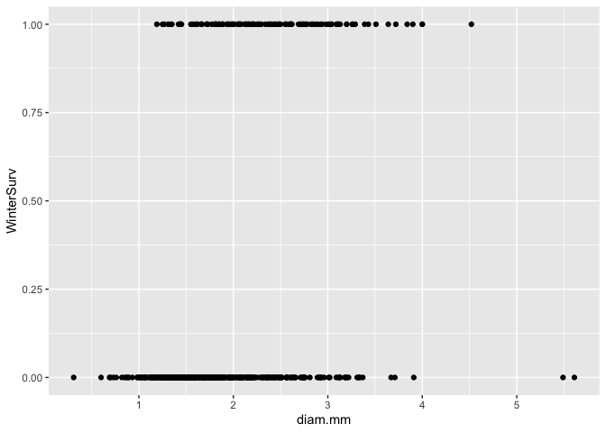

# Over-winter survival at WL2 garden 

Note: Made this climate distance of 2024 garden climate - recent and historical home climates (up to 2023)

## Libraries

``` r
library(tidyverse)
```

```
## ── Attaching core tidyverse packages ──────────────────────── tidyverse 2.0.0 ──
## ✔ dplyr     1.1.4     ✔ readr     2.1.5
## ✔ forcats   1.0.0     ✔ stringr   1.5.1
## ✔ ggplot2   3.5.1     ✔ tibble    3.2.1
## ✔ lubridate 1.9.3     ✔ tidyr     1.3.1
## ✔ purrr     1.0.2     
## ── Conflicts ────────────────────────────────────────── tidyverse_conflicts() ──
## ✖ dplyr::filter() masks stats::filter()
## ✖ dplyr::lag()    masks stats::lag()
## ℹ Use the conflicted package (<http://conflicted.r-lib.org/>) to force all conflicts to become errors
```

``` r
library(magrittr)
```

```
## 
## Attaching package: 'magrittr'
## 
## The following object is masked from 'package:purrr':
## 
##     set_names
## 
## The following object is masked from 'package:tidyr':
## 
##     extract
```

``` r
#conflicted::conflicts_prefer(dplyr::filter)
library(viridis) #for pretty colors
```

```
## Loading required package: viridisLite
```

``` r
library(ggrepel) #for non-overlapping labels on plots
library(ggdist) #visualizations of distributions and uncertainty 
library(ggpubr)

#library(sp) #for calculating geographic distance 
library(geosphere) #for calculating geographic distance
library(corrplot) #plotting correlations  
```

```
## corrplot 0.94 loaded
```

``` r
library(rstatix) #performing cor_test
```

```
## 
## Attaching package: 'rstatix'
## 
## The following object is masked from 'package:stats':
## 
##     filter
```

``` r
library(lmerTest) #mixed models
```

```
## Loading required package: lme4
## Loading required package: Matrix
## 
## Attaching package: 'Matrix'
## 
## The following objects are masked from 'package:tidyr':
## 
##     expand, pack, unpack
## 
## 
## Attaching package: 'lmerTest'
## 
## The following object is masked from 'package:lme4':
## 
##     lmer
## 
## The following object is masked from 'package:stats':
## 
##     step
```

``` r
conflicted::conflicts_prefer(lmerTest::lmer)
```

```
## [conflicted] Will prefer lmerTest::lmer over any other package.
```

``` r
library(broom.mixed)
library(tidymodels)
```

```
## ── Attaching packages ────────────────────────────────────── tidymodels 1.2.0 ──
## ✔ broom        1.0.7     ✔ rsample      1.2.1
## ✔ dials        1.3.0     ✔ tune         1.2.1
## ✔ infer        1.0.7     ✔ workflows    1.1.4
## ✔ modeldata    1.4.0     ✔ workflowsets 1.1.0
## ✔ parsnip      1.2.1     ✔ yardstick    1.3.1
## ✔ recipes      1.1.0     
## ── Conflicts ───────────────────────────────────────── tidymodels_conflicts() ──
## ✖ infer::chisq_test()   masks rstatix::chisq_test()
## ✖ scales::discard()     masks purrr::discard()
## ✖ Matrix::expand()      masks tidyr::expand()
## ✖ magrittr::extract()   masks tidyr::extract()
## ✖ rstatix::filter()     masks dplyr::filter(), stats::filter()
## ✖ recipes::fixed()      masks stringr::fixed()
## ✖ dials::get_n()        masks rstatix::get_n()
## ✖ dplyr::lag()          masks stats::lag()
## ✖ Matrix::pack()        masks tidyr::pack()
## ✖ infer::prop_test()    masks rstatix::prop_test()
## ✖ magrittr::set_names() masks purrr::set_names()
## ✖ yardstick::spec()     masks readr::spec()
## ✖ recipes::step()       masks lmerTest::step(), stats::step()
## ✖ infer::t_test()       masks rstatix::t_test()
## ✖ Matrix::unpack()      masks tidyr::unpack()
## ✖ recipes::update()     masks Matrix::update(), stats::update()
## • Search for functions across packages at https://www.tidymodels.org/find/
```

``` r
library(furrr) #Apply Mapping Functions in Parallel using Futures
```

```
## Loading required package: future
```

``` r
tidymodels_prefer()
# install.packages("multilevelmod")
library(multilevelmod)

library(brms)
```

```
## Loading required package: Rcpp
## 
## Attaching package: 'Rcpp'
## 
## The following object is masked from 'package:rsample':
## 
##     populate
## 
## Loading 'brms' package (version 2.22.0). Useful instructions
## can be found by typing help('brms'). A more detailed introduction
## to the package is available through vignette('brms_overview').
```

``` r
#conflicted::conflicts_prefer(brms::ar)
#conflicted::conflicts_prefer(dplyr::combine)
#conflicted::conflicts_prefer(brms::dstudent_t)
library(tidybayes) #for extracting and visiaulizing brms model output 
library(modelr) #for data grid

sem <- function(x, na.rm=FALSE) {           #for caclulating standard error
  sd(x,na.rm=na.rm)/sqrt(length(na.omit(x)))
} 

cbbPalette2 <- c("#E69F00","#000000", "#56B4E9","#009E73", "#F0E442", "#0072B2", "#D55E00", "#CC79A7")
timepd_palette <- c("#56B4E9","#D55E00")

options(mc.cores = parallel::detectCores())
```

## Load the post-winter data

``` r
post_winter <- read_csv("../input/WL2_Data/WL2_status_check_20240603_corrected.csv",
                         na = c("", "NA", "-", "N/A")) 
```

```
## Rows: 1826 Columns: 9
## ── Column specification ────────────────────────────────────────────────────────
## Delimiter: ","
## chr (8): block, bed, bed- col, pop, mf, rep, death.date, survey.notes
## dbl (1): bed- row
## 
## ℹ Use `spec()` to retrieve the full column specification for this data.
## ℹ Specify the column types or set `show_col_types = FALSE` to quiet this message.
```

``` r
post_winter_clean <- post_winter %>% 
  mutate(pop= str_replace(pop, "iH", "IH")) %>% 
  mutate(pop= str_replace(pop, "1H", "IH")) %>% 
  mutate(pop= str_replace(pop, "cc", "CC")) %>% 
  unite(BedLoc, bed:`bed- col`, sep="_", remove = FALSE) %>% 
  filter(BedLoc!="K_5_C") %>% #get rid of duplicate locations
  filter(BedLoc!="B_32_A") %>% #get rid of duplicate locations
  unite(Genotype, pop:rep, sep="_", remove = FALSE) %>% 
  filter(pop!="buffer", !str_detect(mf, "buf")) %>% 
  mutate(mf=as.double(mf), rep=as.double(rep))
unique(post_winter_clean$pop)
```

```
##  [1] "TM2"   "LVTR1" "SQ2"   "YO8"   "CC"    "YO11"  "BH"    "DPR"   "CP2"  
## [10] "WL1"   "IH"    "CP3"   "SC"    "FR"    "LV3"   "YO7"   "WV"    "SQ3"  
## [19] "WL2"   "LV1"   "YO4"   "WR"    "SQ1"
```

## Gower's Distance

``` r
garden_climate <- read_csv("../output/Climate/flint_climate_UCDpops.csv") %>% 
  filter(parent.pop=="WL2_Garden" | parent.pop=="UCD_Garden") %>% 
  select(parent.pop:Long) %>% 
  distinct()
```

```
## Rows: 38775 Columns: 14
## ── Column specification ────────────────────────────────────────────────────────
## Delimiter: ","
## chr  (3): parent.pop, elevation.group, month
## dbl (11): elev_m, Lat, Long, year, aet, cwd, pck, pet, ppt, tmn, tmx
## 
## ℹ Use `spec()` to retrieve the full column specification for this data.
## ℹ Specify the column types or set `show_col_types = FALSE` to quiet this message.
```

``` r
garden_climate
```

```
## # A tibble: 2 × 5
##   parent.pop elevation.group elev_m   Lat  Long
##   <chr>      <chr>            <dbl> <dbl> <dbl>
## 1 UCD_Garden Low                 16  38.5 -122.
## 2 WL2_Garden High              2020  38.8 -120.
```

``` r
#UCD LAT/LONG = 38.53250, -121.7830
#WL2 Lat/Long = 38.82599, -120.2509

wl2_gowers_2324 <- read_csv("../output/Climate/Gowers_WL2_2324.csv") %>% 
  select(parent.pop:GrwSsn_GD, Wtr_Year_GD) %>% 
  pivot_wider(names_from = TimePd, values_from = c(GrwSsn_GD, Wtr_Year_GD)) %>% 
  mutate(WL2_Lat=38.82599, WL2_Long=-120.2509, WL2_Elev=2020) %>% 
  mutate(Geographic_Dist=distHaversine(cbind(WL2_Long, WL2_Lat), cbind(Long, Lat)),
         Elev_Dist=elev_m-WL2_Elev) %>% # Calculate the distance using the haversine formula
  #mutate(Lat_Dist=WL2_Lat-Lat, Long_Dist=WL2_Long-Long) %>% #Garden-Home - lat and long per Gerst et al 2011 which kept them separate for some directionality
  rename(pop=parent.pop)
```

```
## Rows: 46 Columns: 8
## ── Column specification ────────────────────────────────────────────────────────
## Delimiter: ","
## chr (3): parent.pop, elevation.group, TimePd
## dbl (5): elev_m, Lat, Long, GrwSsn_GD, Wtr_Year_GD
## 
## ℹ Use `spec()` to retrieve the full column specification for this data.
## ℹ Specify the column types or set `show_col_types = FALSE` to quiet this message.
```

``` r
wl2_gowers_2024 <- read_csv("../output/Climate/Gowers_WL2_2024.csv") %>% 
  pivot_wider(names_from = TimePd, values_from = c(GrwSsn_GD, Wtr_Year_GD)) %>% 
  mutate(WL2_Lat=38.82599, WL2_Long=-120.2509, WL2_Elev=2020) %>% 
  mutate(Geographic_Dist=distHaversine(cbind(WL2_Long, WL2_Lat), cbind(Long, Lat)),
         Elev_Dist=elev_m-WL2_Elev) %>% # Calculate the distance using the haversine formula
  rename(pop=parent.pop)
```

```
## Rows: 46 Columns: 8
## ── Column specification ────────────────────────────────────────────────────────
## Delimiter: ","
## chr (3): parent.pop, elevation.group, TimePd
## dbl (5): elev_m, Lat, Long, GrwSsn_GD, Wtr_Year_GD
## 
## ℹ Use `spec()` to retrieve the full column specification for this data.
## ℹ Specify the column types or set `show_col_types = FALSE` to quiet this message.
```

## Climate Subtraction Distance


``` r
wl2_wtr_year_sub_recent_2324 <- read_csv("../output/Climate/full_year_Subtraction_Dist_from_Home_WL2_2324_Recent.csv") %>% 
  select(parent.pop, Wtr_Year_TempDist_Recent=ann_tmean_dist, 
         Wtr_Year_PPTDist_Recent=ann_ppt_dist,
         Wtr_Year_CWDDist_Recent=cwd_dist)
```

```
## Rows: 23 Columns: 18
## ── Column specification ────────────────────────────────────────────────────────
## Delimiter: ","
## chr  (2): parent.pop, elevation.group
## dbl (16): elev_m, ppt_dist, cwd_dist, pck_dist, tmn_dist, tmx_dist, ann_tmea...
## 
## ℹ Use `spec()` to retrieve the full column specification for this data.
## ℹ Specify the column types or set `show_col_types = FALSE` to quiet this message.
```

``` r
wl2_wtr_year_sub_historic_2324 <- read_csv("../output/Climate/full_year_Subtraction_Dist_from_Home_WL2_2324_Historical.csv") %>% 
  select(parent.pop, Wtr_Year_TempDist_Historic=ann_tmean_dist, 
         Wtr_Year_PPTDist_Historic=ann_ppt_dist,
         Wtr_Year_CWDDist_Historic=cwd_dist)
```

```
## Rows: 23 Columns: 18
## ── Column specification ────────────────────────────────────────────────────────
## Delimiter: ","
## chr  (2): parent.pop, elevation.group
## dbl (16): elev_m, ppt_dist, cwd_dist, pck_dist, tmn_dist, tmx_dist, ann_tmea...
## 
## ℹ Use `spec()` to retrieve the full column specification for this data.
## ℹ Specify the column types or set `show_col_types = FALSE` to quiet this message.
```

``` r
wl2_sub_dist_2324 <- wl2_wtr_year_sub_recent_2324 %>% 
  left_join(wl2_wtr_year_sub_historic_2324) %>% 
  rename(pop=parent.pop) %>% 
  left_join(wl2_gowers_2324) %>% 
  mutate(Wtr_Year_TempPpt_Recent=scale(Wtr_Year_TempDist_Recent,center=FALSE) +
           scale(Wtr_Year_PPTDist_Recent,center=FALSE),
         Wtr_Year_TempPpt_Historic=scale(Wtr_Year_TempDist_Historic,center=FALSE) +
           scale(Wtr_Year_PPTDist_Historic,center=FALSE))
```

```
## Joining with `by = join_by(parent.pop)`
## Joining with `by = join_by(pop)`
```


``` r
wl2_wtr_year_sub_recent_2024 <- read_csv("../output/Climate/full_year_Subtraction_Dist_from_Home_WL2_2024_Recent.csv") %>% 
  select(parent.pop, Wtr_Year_TempDist_Recent=ann_tmean_dist, Wtr_Year_PPTDist_Recent=ann_ppt_dist)
```

```
## Rows: 23 Columns: 18
## ── Column specification ────────────────────────────────────────────────────────
## Delimiter: ","
## chr  (2): parent.pop, elevation.group
## dbl (16): elev_m, ppt_dist, cwd_dist, pck_dist, tmn_dist, tmx_dist, ann_tmea...
## 
## ℹ Use `spec()` to retrieve the full column specification for this data.
## ℹ Specify the column types or set `show_col_types = FALSE` to quiet this message.
```

``` r
wl2_wtr_year_sub_historic_2024 <- read_csv("../output/Climate/full_year_Subtraction_Dist_from_Home_WL2_2024_Historical.csv") %>% 
  select(parent.pop, Wtr_Year_TempDist_Historic=ann_tmean_dist, Wtr_Year_PPTDist_Historic=ann_ppt_dist)
```

```
## Rows: 23 Columns: 18
## ── Column specification ────────────────────────────────────────────────────────
## Delimiter: ","
## chr  (2): parent.pop, elevation.group
## dbl (16): elev_m, ppt_dist, cwd_dist, pck_dist, tmn_dist, tmx_dist, ann_tmea...
## 
## ℹ Use `spec()` to retrieve the full column specification for this data.
## ℹ Specify the column types or set `show_col_types = FALSE` to quiet this message.
```

``` r
wl2_sub_dist_2024 <- wl2_wtr_year_sub_recent_2024 %>% 
  left_join(wl2_wtr_year_sub_historic_2024) %>% 
  rename(pop=parent.pop) %>% 
  left_join(wl2_gowers_2024) %>% 
  mutate(Wtr_Year_TempPpt_Recent=scale(Wtr_Year_TempDist_Recent,center=FALSE) +
           scale(Wtr_Year_PPTDist_Recent,center=FALSE),
         Wtr_Year_TempPpt_Historic=scale(Wtr_Year_TempDist_Historic,center=FALSE) +
           scale(Wtr_Year_PPTDist_Historic,center=FALSE))
```

```
## Joining with `by = join_by(parent.pop)`
## Joining with `by = join_by(pop)`
```

## Calculate Winter Surv

*Used only water year gowers distance b/c that's the only one that includes the winter months 

Categories 
A - alive, “happy” leaves
B = “barely alive”, still has leaves but major damage
C = no leaves, stem not brittle
D = brittle, no leaves, definitely dead 


``` r
#wl2_surv_y1 %>% filter(is.na(death.date)) - 470 plants alive on 10/27
#post_winter_clean %>% filter(is.na(death.date)) #44 plants with no death date, most have a death date of 10/27
#A-37-B, no death date on any data sheet, was dying on 9/20 so may have just been missed in June 2024

winter_surv <- post_winter_clean %>% 
  left_join(wl2_gowers_2024) %>% 
  filter(death.date == "A" | death.date == "B" | death.date == "C" | death.date == "D") %>% 
  mutate(WinterSurv=if_else(death.date=="D", 0, 1)) %>% 
  select(block:rep, elevation.group:Wtr_Year_GD_Historical, Geographic_Dist, Elev_Dist, death.date, WinterSurv) 
```

```
## Joining with `by = join_by(pop)`
```

``` r
dim(winter_surv) #only 469 rows because A_37_B not included 
```

```
## [1] 469  21
```

``` r
#winter_surv %>% filter(death.date!="D") #135 plants survived 

#write_csv(winter_surv, "../output/WL2_Traits/WL2_WinterSurv.csv")
```


``` r
winter_surv_sub_dist <- winter_surv %>% 
  select(block:rep, WinterSurv) %>% 
  left_join(wl2_sub_dist_2024)
```

```
## Joining with `by = join_by(pop)`
```

### Wtih 2023 Gowers

``` r
winter_surv_2324 <- post_winter_clean %>% 
  left_join(wl2_gowers_2324) %>% 
  filter(death.date == "A" | death.date == "B" | death.date == "C" | death.date == "D") %>% 
  mutate(WinterSurv=if_else(death.date=="D", 0, 1)) %>% 
  select(block:rep, elevation.group:Wtr_Year_GD_Historical, Geographic_Dist, Elev_Dist, death.date, WinterSurv) 
```

```
## Joining with `by = join_by(pop)`
```

``` r
#write_csv(winter_surv, "../output/WL2_Traits/WL2_WinterSurv_2324.csv")
```


``` r
winter_surv_sub_dist_2324 <- winter_surv_2324 %>% 
  select(block:rep, WinterSurv) %>% 
  left_join(wl2_sub_dist_2324)
```

```
## Joining with `by = join_by(pop)`
```

### Descriptive tables 

``` r
#overall
xtabs(~WinterSurv, data=winter_surv) #334 dead post-winter out of 469 alive pre-winter = 71% overwinter mortality 
```

```
## WinterSurv
##   0   1 
## 334 135
```

``` r
xtabs(~WinterSurv+pop, data=winter_surv)
```

```
##           pop
## WinterSurv BH CC CP2 CP3 DPR FR IH LV1 LV3 LVTR1 SC SQ1 SQ2 SQ3 TM2 WL1 WL2 WR
##          0 24 35  16  15  33  5 21   4   3     5 24   9  10   6  32  12  34  0
##          1 29 17   0   0   0  0 34   1   0     0 22   1   0   0   6   0   6  1
##           pop
## WinterSurv YO11 YO4 YO7 YO8
##          0    8   9  20   9
##          1    0   0  18   0
```

### Bar Plots 

``` r
winter_surv %>% 
  group_by(pop, elev_m, Wtr_Year_GD_Recent) %>% 
  summarise(meanSurv=mean(WinterSurv, na.rm = TRUE), semSurv=sem(WinterSurv, na.rm=TRUE)) %>% 
  filter(pop != "WR") %>% #only 1 plant 
  ggplot(aes(x=fct_reorder(pop, meanSurv), y=meanSurv, fill=Wtr_Year_GD_Recent)) +
  geom_col(width = 0.7,position = position_dodge(0.75)) + 
  geom_errorbar(aes(ymin=meanSurv-semSurv,ymax=meanSurv+semSurv),width=.2, position = 
                  position_dodge(0.75)) +
  theme_classic() + 
  scale_y_continuous(expand = c(0.01, 0)) +
  labs(y="Winter Surv", x="Parent Population", fill="Water Year Gowers") +
  scale_fill_viridis(option="mako", direction = -1) +
  theme(text=element_text(size=25), axis.text.x = element_text(angle = 45,  hjust = 1))
```

```
## `summarise()` has grouped output by 'pop', 'elev_m'. You can override using the
## `.groups` argument.
```

<!-- -->

``` r
#ggsave("../output/WL2_Traits/WL2_WinterSurv_Wtr_Year_GD_Recent.png", width = 12, height = 8, units = "in")
```

## Figure for Paper

``` r
WYCD_recent <- winter_surv %>%
  filter(pop!="WR") %>% 
  group_by(pop, elev_m, Wtr_Year_GD_Recent) %>% 
  summarise(meanSurv=mean(WinterSurv, na.rm = TRUE), semSurv=sem(WinterSurv, na.rm=TRUE)) %>% 
  ggplot(aes(x=Wtr_Year_GD_Recent, y=meanSurv, group = pop)) +
  geom_point(size=6) + 
  geom_errorbar(aes(ymin=meanSurv-semSurv,ymax=meanSurv+semSurv),width=.02,linewidth = 2) +
  theme_classic() + 
  scale_y_continuous(expand = c(0.01, 0)) +
  labs(y="Winter Survival", x="Recent Water Year CD") +
  theme(text=element_text(size=25))
```

```
## `summarise()` has grouped output by 'pop', 'elev_m'. You can override using the
## `.groups` argument.
```

``` r
#ggsave("../output/WL2_Traits/WL2_WinterSurv_ClimDist.png", width = 8, height = 5, units = "in")
```


``` r
winter_surv_2324 %>%
  filter(pop!="WR") %>% 
  group_by(pop, elev_m, Wtr_Year_GD_Recent) %>% 
  summarise(meanSurv=mean(WinterSurv, na.rm = TRUE), semSurv=sem(WinterSurv, na.rm=TRUE)) %>% 
  ggplot(aes(x=Wtr_Year_GD_Recent, y=meanSurv, group = pop, colour = elev_m)) +
  scale_colour_gradient(low = "#F5A540", high = "#0043F0") +
  geom_point(size=6) + 
  geom_errorbar(aes(ymin=meanSurv-semSurv,ymax=meanSurv+semSurv),width=.02,linewidth = 2) +
  geom_text_repel(aes(x = Wtr_Year_GD_Recent, y = meanSurv,
          label = `pop`),
      min.segment.length = 1,
      max.overlaps = 100,
      #label.padding = 1,
      point.padding = 1,
      size = 4) +
  theme_classic() + 
  scale_y_continuous(expand = c(0.01, 0)) +
  labs(y="Winter Survival", x="Recent Water Year CD (2023)") +
  theme(text=element_text(size=25))
```

```
## `summarise()` has grouped output by 'pop', 'elev_m'. You can override using the
## `.groups` argument.
```

<!-- -->


``` r
WYCD_recent <- winter_surv_2324 %>%
  filter(pop!="WR") %>% 
  group_by(pop, elev_m, Wtr_Year_GD_Recent) %>% 
  summarise(meanSurv=mean(WinterSurv, na.rm = TRUE), semSurv=sem(WinterSurv, na.rm=TRUE)) %>% 
  ggplot(aes(x=Wtr_Year_GD_Recent, y=meanSurv, group = pop, colour = elev_m)) +
  scale_colour_gradient(low = "#F5A540", high = "#0043F0") +
  geom_point(size=6) + 
  geom_errorbar(aes(ymin=meanSurv-semSurv,ymax=meanSurv+semSurv),width=.02,linewidth = 2) +
  annotate("text", x = 0.227, y= 0.24, label = "WL2", 
           colour = "purple", fontface="bold", size = 22 / .pt) +
  theme_classic() + 
  scale_y_continuous(expand = c(0.01, 0)) +
  labs(y="Winter Survival", x="Recent Water Year Climate Dist", colour="Elevation (m)") +
  theme(text=element_text(size=25))
```

```
## `summarise()` has grouped output by 'pop', 'elev_m'. You can override using the
## `.groups` argument.
```

``` r
ggsave("../output/WL2_Traits/WL2_WinterSurv_2324ClimDist.png", width = 10, height = 5, units = "in")
```

### Check CWD Dist

``` r
winter_surv_sub_dist_2324 %>% 
  group_by(pop, elev_m, Wtr_Year_CWDDist_Recent, Wtr_Year_CWDDist_Historic) %>% 
  summarise(meanSurv=mean(WinterSurv, na.rm = TRUE), semSurv=sem(WinterSurv, na.rm=TRUE)) %>% 
  ggplot(aes(x=Wtr_Year_CWDDist_Recent, y=meanSurv, group = pop, color=elev_m)) +
  scale_colour_gradient(low = "#F5A540", high = "#0043F0") +
  geom_point(size=6) + 
  geom_errorbar(aes(ymin=meanSurv-semSurv,ymax=meanSurv+semSurv),width=.3,linewidth = 2) +
  #annotate("text", x = 12.1639444	, y= 0.65, label = "WL2", 
   #       colour = "purple", fontface="bold", size = 22 / .pt) +
  theme_classic() + 
  scale_y_continuous(expand = c(0.01, 0)) +
  labs(y="Winter Survival", x="Recent Water Year CWD Dist", 
       color="Elevation (m)") +
  theme(text=element_text(size=30))
```

```
## `summarise()` has grouped output by 'pop', 'elev_m', 'Wtr_Year_CWDDist_Recent'.
## You can override using the `.groups` argument.
```

<!-- -->

``` r
winter_surv_sub_dist_2324 %>% 
  group_by(pop, elev_m, Wtr_Year_CWDDist_Recent, Wtr_Year_CWDDist_Historic) %>% 
  summarise(meanSurv=mean(WinterSurv, na.rm = TRUE), semSurv=sem(WinterSurv, na.rm=TRUE)) %>% 
  ggplot(aes(x=Wtr_Year_CWDDist_Historic, y=meanSurv, group = pop, color=elev_m)) +
  scale_colour_gradient(low = "#F5A540", high = "#0043F0") +
  geom_point(size=6) + 
  geom_errorbar(aes(ymin=meanSurv-semSurv,ymax=meanSurv+semSurv),width=.3,linewidth = 2) +
  #annotate("text", x = 8.9845278		, y= 0.65, label = "WL2", 
   #       colour = "purple", fontface="bold", size = 22 / .pt) +
  theme_classic() + 
  scale_y_continuous(expand = c(0.01, 0)) +
  labs(y="Winter Survival", x="Historic Water Year CWD Dist", 
       color="Elevation (m)") +
  theme(text=element_text(size=30))
```

```
## `summarise()` has grouped output by 'pop', 'elev_m', 'Wtr_Year_CWDDist_Recent'.
## You can override using the `.groups` argument.
```

<!-- -->

### Check for adaptational lag of WL2 pop
T-test compare WL2 to the pop that performed the best?

``` r
winter_surv_sub_dist_2324 %>% 
  group_by(pop, elev_m, Wtr_Year_CWDDist_Recent, Wtr_Year_CWDDist_Historic) %>% 
  summarise(meanSurv=mean(WinterSurv, na.rm = TRUE), semSurv=sem(WinterSurv, na.rm=TRUE)) %>% 
  arrange(meanSurv)
```

```
## `summarise()` has grouped output by 'pop', 'elev_m', 'Wtr_Year_CWDDist_Recent'.
## You can override using the `.groups` argument.
```

```
## # A tibble: 22 × 6
## # Groups:   pop, elev_m, Wtr_Year_CWDDist_Recent [22]
##    pop   elev_m Wtr_Year_CWDDist_Recent Wtr_Year_CWDDist_Hist…¹ meanSurv semSurv
##    <chr>  <dbl>                   <dbl>                   <dbl>    <dbl>   <dbl>
##  1 CP2    2244.                  6.50                     3.99         0       0
##  2 CP3    2266.                -10.2                    -12.6          0       0
##  3 DPR    1019.                -28.9                    -30.0          0       0
##  4 FR      787                  19.1                     17.6          0       0
##  5 LV3    2354.                -15.5                    -18.4          0       0
##  6 LVTR1  2741.                 -4.29                    -7.16         0       0
##  7 SQ2    1934.                 -0.387                   -4.45         0       0
##  8 SQ3    2373.                  4.22                    -0.426        0       0
##  9 WL1    1614.                  0.802                   -0.688        0       0
## 10 YO11   2872.                  0.0253                  -2.11         0       0
## # ℹ 12 more rows
## # ℹ abbreviated name: ¹​Wtr_Year_CWDDist_Historic
```

``` r
wl2_winter_surv_adapt <- winter_surv_2324 %>% filter(pop=="WL2" | pop=="IH")

adaptlagm1 <- glmer(WinterSurv ~ pop + (1|block), data=wl2_winter_surv_adapt, family = binomial)
```

```
## boundary (singular) fit: see help('isSingular')
```

``` r
summary(adaptlagm1) #WL2 sig < than IH
```

```
## Generalized linear mixed model fit by maximum likelihood (Laplace
##   Approximation) [glmerMod]
##  Family: binomial  ( logit )
## Formula: WinterSurv ~ pop + (1 | block)
##    Data: wl2_winter_surv_adapt
## 
##      AIC      BIC   logLik deviance df.resid 
##    113.0    120.6    -53.5    107.0       92 
## 
## Scaled residuals: 
##     Min      1Q  Median      3Q     Max 
## -1.2724 -0.4201 -0.4201  0.7859  2.3805 
## 
## Random effects:
##  Groups Name        Variance Std.Dev.
##  block  (Intercept) 0        0       
## Number of obs: 95, groups:  block, 13
## 
## Fixed effects:
##             Estimate Std. Error z value Pr(>|z|)    
## (Intercept)   0.4818     0.2775   1.736   0.0826 .  
## popWL2       -2.2164     0.5226  -4.241 2.22e-05 ***
## ---
## Signif. codes:  0 '***' 0.001 '**' 0.01 '*' 0.05 '.' 0.1 ' ' 1
## 
## Correlation of Fixed Effects:
##        (Intr)
## popWL2 -0.531
## optimizer (Nelder_Mead) convergence code: 0 (OK)
## boundary (singular) fit: see help('isSingular')
```

## Scatterplots

``` r
#scatter plots
WYCD_recent <- winter_surv %>%
  filter(pop!="WR") %>% 
  group_by(pop, elev_m, Wtr_Year_GD_Recent) %>% 
  summarise(meanSurv=mean(WinterSurv, na.rm = TRUE), semSurv=sem(WinterSurv, na.rm=TRUE)) %>% 
  ggplot(aes(x=Wtr_Year_GD_Recent, y=meanSurv, group = pop)) +
  geom_point(size=6) + 
  geom_errorbar(aes(ymin=meanSurv-semSurv,ymax=meanSurv+semSurv),width=.02,linewidth = 2) +
  theme_classic() + 
  scale_y_continuous(expand = c(0.01, 0)) +
  labs(y="Winter Surv", x="Recent Water Year CD") +
  theme(text=element_text(size=25))
```

```
## `summarise()` has grouped output by 'pop', 'elev_m'. You can override using the
## `.groups` argument.
```

``` r
GD <- winter_surv %>% 
  filter(pop!="WR") %>% 
  group_by(pop, elev_m, Wtr_Year_GD_Recent, Geographic_Dist) %>% 
  summarise(meanSurv=mean(WinterSurv, na.rm = TRUE), semSurv=sem(WinterSurv, na.rm=TRUE)) %>% 
  ggplot(aes(x=Geographic_Dist, y=meanSurv, group = pop)) +
  geom_point(size=6) + 
  geom_errorbar(aes(ymin=meanSurv-semSurv,ymax=meanSurv+semSurv),width=.02, linewidth = 2) +
  theme_classic() + 
  scale_y_continuous(expand = c(0.01, 0)) +
  labs(y="Winter Surv", x="Geographic Distance (m)") +
  theme(text=element_text(size=25), axis.text.x = element_text(angle = 45,  hjust = 1))
```

```
## `summarise()` has grouped output by 'pop', 'elev_m', 'Wtr_Year_GD_Recent'. You
## can override using the `.groups` argument.
```

``` r
ED <- winter_surv %>% 
  filter(pop!="WR") %>% 
  group_by(pop, elev_m, Elev_Dist) %>% 
  summarise(meanSurv=mean(WinterSurv, na.rm = TRUE), semSurv=sem(WinterSurv, na.rm=TRUE)) %>% 
  ggplot(aes(x=Elev_Dist, y=meanSurv, group = pop)) +
  geom_point(size=6) + 
  geom_errorbar(aes(ymin=meanSurv-semSurv,ymax=meanSurv+semSurv),width=.02, linewidth = 2) +
  theme_classic() + 
  scale_y_continuous(expand = c(0.01, 0)) +
  labs(y="Surv-to-Rep Y2", x="Elevation Distance (m)") +
  theme(text=element_text(size=25), axis.text.x = element_text(angle = 45,  hjust = 1))
```

```
## `summarise()` has grouped output by 'pop', 'elev_m'. You can override using the
## `.groups` argument.
```

``` r
wl2_winter_surv_FIG_recent <- ggarrange("",WYCD_recent, GD,ED, ncol=2, nrow=2) 
```

```
## Warning in as_grob.default(plot): Cannot convert object of class character into
## a grob.
```

``` r
ggsave("../output/WL2_Traits/WL2_WinterSurv_SCATTERS_Recent.png", width = 24, height = 18, units = "in")
```


``` r
#scatter plots
WYCD_historic <- winter_surv %>% 
  filter(pop!="WR") %>% 
  group_by(pop, elev_m, Wtr_Year_GD_Historical) %>% 
  summarise(meanSurv=mean(WinterSurv, na.rm = TRUE), semSurv=sem(WinterSurv, na.rm=TRUE)) %>% 
  ggplot(aes(x=Wtr_Year_GD_Historical, y=meanSurv, group = pop)) +
  geom_point(size=6) + 
  geom_errorbar(aes(ymin=meanSurv-semSurv,ymax=meanSurv+semSurv),width=.02,linewidth = 2) +
  theme_classic() + 
  scale_y_continuous(expand = c(0.01, 0)) +
  labs(y="Winter Surv", x="Historic Water Year CD") +
  theme(text=element_text(size=25))
```

```
## `summarise()` has grouped output by 'pop', 'elev_m'. You can override using the
## `.groups` argument.
```

``` r
wl2_winter_surv_FIG_historic <- ggarrange("", WYCD_historic, GD,ED, ncol=2, nrow=2) 
```

```
## Warning in as_grob.default(plot): Cannot convert object of class character into
## a grob.
```

``` r
ggsave("../output/WL2_Traits/WL2_WinterSurv_SCATTERS_Historical.png", width = 24, height = 18, units = "in")
```


``` r
#scatter plots - recent
WYCD_prob_recent <- winter_surv_sub_dist %>% 
  filter(pop!="WR") %>% 
  group_by(pop, elev_m, Wtr_Year_TempDist_Recent, Wtr_Year_TempDist_Historic) %>% 
  summarise(meanEst=mean(WinterSurv, na.rm = TRUE), semEst=sem(WinterSurv, na.rm=TRUE)) %>% 
  ggplot(aes(x=Wtr_Year_TempDist_Recent, y=meanEst, group = pop)) +
  geom_point(size=6) + 
  geom_errorbar(aes(ymin=meanEst-semEst,ymax=meanEst+semEst),width=.3,linewidth = 2) +
  theme_classic() + 
  scale_y_continuous(expand = c(0.01, 0)) +
  labs(y="Winter Surv", x="Recent Water Year Temp Dist") +
  theme(text=element_text(size=30))
```

```
## `summarise()` has grouped output by 'pop', 'elev_m',
## 'Wtr_Year_TempDist_Recent'. You can override using the `.groups` argument.
```

``` r
GD_prob <- winter_surv_sub_dist %>% 
  filter(pop!="WR") %>% 
  group_by(pop, elev_m, Wtr_Year_TempDist_Recent, Geographic_Dist) %>% 
  summarise(meanEst=mean(WinterSurv, na.rm = TRUE), semEst=sem(WinterSurv, na.rm=TRUE)) %>% 
  ggplot(aes(x=Geographic_Dist, y=meanEst, group = pop)) +
  geom_point(size=6) + 
  geom_errorbar(aes(ymin=meanEst-semEst,ymax=meanEst+semEst),width=.2, linewidth = 2) +
  theme_classic() + 
  scale_y_continuous(expand = c(0.01, 0)) +
  labs(y="Winter Surv", x="Geographic Distance (m)") +
  theme(text=element_text(size=30), axis.text.x = element_text(angle = 45,  hjust = 1))
```

```
## `summarise()` has grouped output by 'pop', 'elev_m',
## 'Wtr_Year_TempDist_Recent'. You can override using the `.groups` argument.
```

``` r
ED_prob <- winter_surv_sub_dist %>% 
  filter(pop!="WR") %>% 
  group_by(pop, elev_m, Elev_Dist) %>% 
  summarise(meanEst=mean(WinterSurv, na.rm = TRUE), semEst=sem(WinterSurv, na.rm=TRUE)) %>% 
  ggplot(aes(x=Elev_Dist, y=meanEst, group = pop)) +
  geom_point(size=6) + 
  geom_errorbar(aes(ymin=meanEst-semEst,ymax=meanEst+semEst),width=.3, linewidth = 2) +
  theme_classic() + 
  scale_y_continuous(expand = c(0.01, 0)) +
  labs(y="Winter Surv", x="Elevation Distance (m)") +
  theme(text=element_text(size=30))
```

```
## `summarise()` has grouped output by 'pop', 'elev_m'. You can override using the
## `.groups` argument.
```

``` r
wl2_winter_surv_sub_FIG_recent <- ggarrange("", WYCD_prob_recent, GD_prob, ED_prob, ncol=2, nrow=2) 
```

```
## Warning in as_grob.default(plot): Cannot convert object of class character into
## a grob.
```

``` r
ggsave("../output/WL2_Traits/WL2_WinterSurv_TmpSubDist_SCATTERS_Recent.png", width = 24, height = 18, units = "in")
```


``` r
#scatter plots - historic
WYCD_prob_historic <- winter_surv_sub_dist %>% 
  filter(pop!="WR") %>% 
  group_by(pop, elev_m, Wtr_Year_TempDist_Recent, Wtr_Year_TempDist_Historic) %>% 
  summarise(meanEst=mean(WinterSurv, na.rm = TRUE), semEst=sem(WinterSurv, na.rm=TRUE)) %>% 
  ggplot(aes(x=Wtr_Year_TempDist_Historic, y=meanEst, group = pop)) +
  geom_point(size=6) + 
  geom_errorbar(aes(ymin=meanEst-semEst,ymax=meanEst+semEst),width=.3,linewidth = 2) +
  theme_classic() + 
  scale_y_continuous(expand = c(0.01, 0)) +
  labs(y="Winter Surv", x="Historic Water Year Temp Dist") +
  theme(text=element_text(size=30))
```

```
## `summarise()` has grouped output by 'pop', 'elev_m',
## 'Wtr_Year_TempDist_Recent'. You can override using the `.groups` argument.
```

``` r
wl2_winter_surv_sub_FIG_historic <- ggarrange("", WYCD_prob_historic, GD_prob, ED_prob, ncol=2, nrow=2) 
```

```
## Warning in as_grob.default(plot): Cannot convert object of class character into
## a grob.
```

``` r
ggsave("../output/WL2_Traits/WL2_WinterSurv_TmpSubDist_SCATTERS_Historic.png", width = 24, height = 18, units = "in")
```


``` r
#scatter plots - recent
WYCD_prob_recent <- winter_surv_sub_dist %>% 
  filter(pop!="WR") %>% 
  group_by(pop, elev_m, Wtr_Year_PPTDist_Recent, Wtr_Year_PPTDist_Historic) %>% 
  summarise(meanEst=mean(WinterSurv, na.rm = TRUE), semEst=sem(WinterSurv, na.rm=TRUE)) %>% 
  ggplot(aes(x=Wtr_Year_PPTDist_Recent, y=meanEst, group = pop)) +
  geom_point(size=6) + 
  geom_errorbar(aes(ymin=meanEst-semEst,ymax=meanEst+semEst),width=.3,linewidth = 2) +
  theme_classic() + 
  scale_y_continuous(expand = c(0.01, 0)) +
  labs(y="Winter Surv", x="Recent Water Year PPT Dist") +
  theme(text=element_text(size=30))
```

```
## `summarise()` has grouped output by 'pop', 'elev_m', 'Wtr_Year_PPTDist_Recent'.
## You can override using the `.groups` argument.
```

``` r
GD_prob <- winter_surv_sub_dist %>% 
  filter(pop!="WR") %>% 
  group_by(pop, elev_m, Wtr_Year_PPTDist_Recent, Geographic_Dist) %>% 
  summarise(meanEst=mean(WinterSurv, na.rm = TRUE), semEst=sem(WinterSurv, na.rm=TRUE)) %>% 
  ggplot(aes(x=Geographic_Dist, y=meanEst, group = pop)) +
  geom_point(size=6) + 
  geom_errorbar(aes(ymin=meanEst-semEst,ymax=meanEst+semEst),width=.2, linewidth = 2) +
  theme_classic() + 
  scale_y_continuous(expand = c(0.01, 0)) +
  labs(y="Winter Surv", x="Geographic Distance (m)") +
  theme(text=element_text(size=30), axis.text.x = element_text(angle = 45,  hjust = 1))
```

```
## `summarise()` has grouped output by 'pop', 'elev_m', 'Wtr_Year_PPTDist_Recent'.
## You can override using the `.groups` argument.
```

``` r
ED_prob <- winter_surv_sub_dist %>% 
  filter(pop!="WR") %>% 
  group_by(pop, elev_m, Elev_Dist) %>% 
  summarise(meanEst=mean(WinterSurv, na.rm = TRUE), semEst=sem(WinterSurv, na.rm=TRUE)) %>% 
  ggplot(aes(x=Elev_Dist, y=meanEst, group = pop)) +
  geom_point(size=6) + 
  geom_errorbar(aes(ymin=meanEst-semEst,ymax=meanEst+semEst),width=.3, linewidth = 2) +
  theme_classic() + 
  scale_y_continuous(expand = c(0.01, 0)) +
  labs(y="Winter Surv", x="Elevation Distance (m)") +
  theme(text=element_text(size=30))
```

```
## `summarise()` has grouped output by 'pop', 'elev_m'. You can override using the
## `.groups` argument.
```

``` r
wl2_winter_surv_sub_FIG_recent <- ggarrange("", WYCD_prob_recent, GD_prob, ED_prob, ncol=2, nrow=2) 
```

```
## Warning in as_grob.default(plot): Cannot convert object of class character into
## a grob.
```

``` r
ggsave("../output/WL2_Traits/WL2_WinterSurv_PPTSubDist_SCATTERS_Recent.png", width = 24, height = 18, units = "in")
```


``` r
#scatter plots - historic
WYCD_prob_historic <- winter_surv_sub_dist %>% 
  filter(pop!="WR") %>% 
  group_by(pop, elev_m, Wtr_Year_PPTDist_Recent, Wtr_Year_PPTDist_Historic) %>% 
  summarise(meanEst=mean(WinterSurv, na.rm = TRUE), semEst=sem(WinterSurv, na.rm=TRUE)) %>% 
  ggplot(aes(x=Wtr_Year_PPTDist_Historic, y=meanEst, group = pop)) +
  geom_point(size=6) + 
  geom_errorbar(aes(ymin=meanEst-semEst,ymax=meanEst+semEst),width=.3,linewidth = 2) +
  theme_classic() + 
  scale_y_continuous(expand = c(0.01, 0)) +
  labs(y="Winter Surv", x="Historic Water Year PPT Dist") +
  theme(text=element_text(size=30))
```

```
## `summarise()` has grouped output by 'pop', 'elev_m', 'Wtr_Year_PPTDist_Recent'.
## You can override using the `.groups` argument.
```

``` r
wl2_winter_surv_sub_FIG_historic <- ggarrange("", WYCD_prob_historic, GD_prob, ED_prob, ncol=2, nrow=2) 
```

```
## Warning in as_grob.default(plot): Cannot convert object of class character into
## a grob.
```

``` r
ggsave("../output/WL2_Traits/WL2_WinterSurv_PPTSubDist_SCATTERS_Historic.png", width = 24, height = 18, units = "in")
```


``` r
#scatter plots - recent
WYCD_prob_recent <- winter_surv_sub_dist %>%
  filter(pop!="WR") %>% 
  group_by(pop, elev_m, Wtr_Year_TempPpt_Recent, Wtr_Year_TempPpt_Historic) %>% 
  summarise(meanEst=mean(WinterSurv, na.rm = TRUE), semEst=sem(WinterSurv, na.rm=TRUE)) %>% 
  ggplot(aes(x=Wtr_Year_TempPpt_Recent, y=meanEst, group = pop)) +
  geom_point(size=6) + 
  geom_errorbar(aes(ymin=meanEst-semEst,ymax=meanEst+semEst),width=.3,linewidth = 2) +
  theme_classic() + 
  scale_y_continuous(expand = c(0.01, 0)) +
  labs(y="Winter Surv", x="Recent Water Year Temp + PPT Dist") +
  theme(text=element_text(size=30))
```

```
## `summarise()` has grouped output by 'pop', 'elev_m', 'Wtr_Year_TempPpt_Recent'.
## You can override using the `.groups` argument.
```

``` r
GD_prob <- winter_surv_sub_dist %>% 
  filter(pop!="WR") %>% 
  group_by(pop, elev_m, Wtr_Year_TempPpt_Recent, Geographic_Dist) %>% 
  summarise(meanEst=mean(WinterSurv, na.rm = TRUE), semEst=sem(WinterSurv, na.rm=TRUE)) %>% 
  ggplot(aes(x=Geographic_Dist, y=meanEst, group = pop)) +
  geom_point(size=6) + 
  geom_errorbar(aes(ymin=meanEst-semEst,ymax=meanEst+semEst),width=.2, linewidth = 2) +
  theme_classic() + 
  scale_y_continuous(expand = c(0.01, 0)) +
  labs(y="Winter Surv", x="Geographic Distance (m)") +
  theme(text=element_text(size=30), axis.text.x = element_text(angle = 45,  hjust = 1))
```

```
## `summarise()` has grouped output by 'pop', 'elev_m', 'Wtr_Year_TempPpt_Recent'.
## You can override using the `.groups` argument.
```

``` r
ED_prob <- winter_surv_sub_dist %>% 
  filter(pop!="WR") %>% 
  group_by(pop, elev_m, Elev_Dist) %>% 
  summarise(meanEst=mean(WinterSurv, na.rm = TRUE), semEst=sem(WinterSurv, na.rm=TRUE)) %>% 
  ggplot(aes(x=Elev_Dist, y=meanEst, group = pop)) +
  geom_point(size=6) + 
  geom_errorbar(aes(ymin=meanEst-semEst,ymax=meanEst+semEst),width=.3, linewidth = 2) +
  theme_classic() + 
  scale_y_continuous(expand = c(0.01, 0)) +
  labs(y="Winter Surv", x="Elevation Distance (m)") +
  theme(text=element_text(size=30))
```

```
## `summarise()` has grouped output by 'pop', 'elev_m'. You can override using the
## `.groups` argument.
```

``` r
wl2_winter_surv_sub_FIG_recent <- ggarrange("", WYCD_prob_recent, GD_prob, ED_prob, ncol=2, nrow=2) 
```

```
## Warning in as_grob.default(plot): Cannot convert object of class character into
## a grob.
```

``` r
ggsave("../output/WL2_Traits/WL2_WinterSurv_TempPptSubDist_SCATTERS_Recent.png", width = 24, height = 18, units = "in")
```


``` r
#scatter plots - historic
WYCD_prob_historic <- winter_surv_sub_dist %>% 
  filter(pop!="WR") %>% 
  group_by(pop, elev_m, Wtr_Year_TempPpt_Recent, Wtr_Year_TempPpt_Historic) %>% 
  summarise(meanEst=mean(WinterSurv, na.rm = TRUE), semEst=sem(WinterSurv, na.rm=TRUE)) %>% 
  ggplot(aes(x=Wtr_Year_TempPpt_Historic, y=meanEst, group = pop)) +
  geom_point(size=6) + 
  geom_errorbar(aes(ymin=meanEst-semEst,ymax=meanEst+semEst),width=.3,linewidth = 2) +
  theme_classic() + 
  scale_y_continuous(expand = c(0.01, 0)) +
  labs(y="Winter Surv", x="Historic Water Year Temp + PPT Dist") +
  theme(text=element_text(size=30))
```

```
## `summarise()` has grouped output by 'pop', 'elev_m', 'Wtr_Year_TempPpt_Recent'.
## You can override using the `.groups` argument.
```

``` r
wl2_winter_surv_sub_FIG_historic <- ggarrange("", WYCD_prob_historic, GD_prob, ED_prob, ncol=2, nrow=2) 
```

```
## Warning in as_grob.default(plot): Cannot convert object of class character into
## a grob.
```

``` r
ggsave("../output/WL2_Traits/WL2_WinterSurv_TempPptSubDist_SCATTERS_Historic.png", width = 24, height = 18, units = "in")
```

## Stats
### Scaling 

``` r
#winter_surv %>% group_by(pop) %>% 
 # summarise(n=n()) %>% 
  #arrange(n)#WR only has 1 individual, remove 

wl2_winter_surv_scaled <- winter_surv %>% 
  filter(pop!="WR") %>% 
  mutate_at(c("Wtr_Year_GD_Recent","Wtr_Year_GD_Historical", 
              "Geographic_Dist"), scale) 

wl2_winter_surv_scaled_2324 <- winter_surv_2324 %>% 
  filter(pop!="WR") %>% 
  mutate_at(c("Wtr_Year_GD_Recent","Wtr_Year_GD_Historical", 
              "Geographic_Dist"), scale) 

#check predictors
unique(wl2_winter_surv_scaled$pop)
```

```
##  [1] "TM2"   "CC"    "CP2"   "IH"    "CP3"   "SQ2"   "YO11"  "BH"    "SQ3"  
## [10] "WL2"   "LVTR1" "WL1"   "YO4"   "SC"    "DPR"   "YO7"   "SQ1"   "YO8"  
## [19] "LV1"   "FR"    "LV3"
```

``` r
unique(wl2_winter_surv_scaled$mf)
```

```
##  [1]  6  2  5  3  8  7  4  9  1 14 13
```

``` r
unique(wl2_winter_surv_scaled$block)
```

```
##  [1] "A" "B" "D" "C" "E" "F" "G" "H" "I" "J" "K" "L" "M"
```


``` r
winter_surv_sub_dist_scaled <- winter_surv_sub_dist %>% 
  filter(pop!="WR") %>% 
  mutate_at(c("Wtr_Year_TempDist_Recent",  "Wtr_Year_PPTDist_Recent", 
                 "Wtr_Year_TempDist_Historic", "Wtr_Year_PPTDist_Historic",
              "Geographic_Dist"), scale) 

winter_surv_sub_dist_scaled_2324 <- winter_surv_sub_dist_2324 %>% 
  filter(pop!="WR") %>% 
  mutate_at(c("Wtr_Year_TempDist_Recent",  "Wtr_Year_PPTDist_Recent", 
                 "Wtr_Year_TempDist_Historic", "Wtr_Year_PPTDist_Historic",
              "Geographic_Dist"), scale) 
```


``` r
winter_surv_tp_sub_dist_scaled <- winter_surv_sub_dist %>% 
  filter(pop!="WR") %>% 
  mutate_at(c("Wtr_Year_TempPpt_Recent", "Wtr_Year_TempPpt_Historic",
              "Geographic_Dist"), scale) 

winter_surv_tp_sub_dist_scaled_2324 <- winter_surv_sub_dist_2324 %>% 
  filter(pop!="WR") %>% 
  mutate_at(c("Wtr_Year_TempPpt_Recent", "Wtr_Year_TempPpt_Historic",
              "Geographic_Dist"), scale) 
```


### Basic Model Workflow 

``` r
glmer.model_binomial <- 
  linear_reg() %>% 
  set_engine("glmer", family=binomial)

surv_wflow <- workflow() %>% 
  add_variables(outcomes = WinterSurv, predictors = c(pop, mf, block))

surv_fits <- tibble(wflow=list(
  pop = {surv_wflow %>% 
      add_model(glmer.model_binomial, formula = WinterSurv ~ (1|pop))},
  
  pop.mf = {surv_wflow %>% 
      add_model(glmer.model_binomial, formula = WinterSurv ~ (1|pop/mf))},
  
  pop.block = {surv_wflow %>% 
      add_model(glmer.model_binomial, formula = WinterSurv ~ (1|pop) + (1|block))},
  
  pop.mf.block = {surv_wflow %>% 
      add_model(glmer.model_binomial, formula = WinterSurv ~ (1|pop/mf) + (1|block))}
),
name=names(wflow)
) %>% 
  select(name,wflow)

surv_fits_wl2 <- surv_fits %>%
  mutate(fit = map(wflow, fit, data = wl2_winter_surv_scaled))
#mod_test <- glmer(WinterSurv ~ (1|pop/mf) + (1|block), data=wl2_winter_surv_scaled, family=binomial)
#summary(mod_test)
surv_fits_wl2 %>% mutate(glance=map(fit, glance)) %>% unnest(glance) %>% arrange(AIC) %>% select(-wflow:-sigma)
```

```
## # A tibble: 4 × 6
##   name         logLik   AIC   BIC deviance df.residual
##   <chr>         <dbl> <dbl> <dbl>    <dbl>       <int>
## 1 pop           -230.  465.  473.     411.         466
## 2 pop.mf        -230.  465.  478.     390.         465
## 3 pop.block     -230.  466.  478.     403.         465
## 4 pop.mf.block  -229.  466.  483.     381.         464
```

``` r
#model with just pop best by AIC and BIC, but nothing wrong with the full model, so use that 

surv_fits_wl2_2324 <- surv_fits %>%
  mutate(fit = map(wflow, fit, data = wl2_winter_surv_scaled_2324))
#mod_test <- glmer(WinterSurv ~ (1|pop/mf) + (1|block), data=wl2_winter_surv_scaled_2324, family=binomial)
#summary(mod_test)
surv_fits_wl2_2324 %>% mutate(glance=map(fit, glance)) %>% unnest(glance) %>% arrange(AIC) %>% select(-wflow:-sigma)
```

```
## # A tibble: 4 × 6
##   name         logLik   AIC   BIC deviance df.residual
##   <chr>         <dbl> <dbl> <dbl>    <dbl>       <int>
## 1 pop           -230.  465.  473.     411.         466
## 2 pop.mf        -230.  465.  478.     390.         465
## 3 pop.block     -230.  466.  478.     403.         465
## 4 pop.mf.block  -229.  466.  483.     381.         464
```

``` r
#model with just pop best by AIC and BIC, but nothing wrong with the full model, so use that 
```

#### Test climate and geographic distance 

``` r
surv_GD_wflow_wl2 <- workflow() %>%
  add_variables(outcomes = WinterSurv, predictors = c(pop, mf, block, contains("GD"), Geographic_Dist)) 

surv_GD_fits_wl2 <- tibble(wflow=list(
  pop.mf.block = {surv_GD_wflow_wl2 %>% 
      add_model(glmer.model_binomial, formula = WinterSurv ~ (1|pop/mf) + (1|block))},
  
  WY_Recent = {surv_GD_wflow_wl2 %>% 
      add_model(glmer.model_binomial, formula = WinterSurv ~ Wtr_Year_GD_Recent + Geographic_Dist + (1|pop/mf) + (1|block))},
  
  WY_Historical = {surv_GD_wflow_wl2 %>% 
      add_model(glmer.model_binomial, formula = WinterSurv ~ Wtr_Year_GD_Historical + Geographic_Dist + (1|pop/mf) + (1|block))}
  
),
name=names(wflow)
) %>% 
  select(name,wflow) %>%
  mutate(fit = map(wflow, fit, data = wl2_winter_surv_scaled_2324))

surv_GD_fits_wl2 %>% mutate(glance=map(fit, glance)) %>% unnest(glance) %>% arrange(AIC) %>% select(-wflow:-sigma)
```

```
## # A tibble: 3 × 6
##   name          logLik   AIC   BIC deviance df.residual
##   <chr>          <dbl> <dbl> <dbl>    <dbl>       <int>
## 1 WY_Recent      -226.  463.  488.     384.         462
## 2 pop.mf.block   -229.  466.  483.     381.         464
## 3 WY_Historical  -227.  467.  492.     383.         462
```

``` r
#WY recent model the best 

surv_GD_fits_wl2 %>% mutate(tidy=map(fit, tidy)) %>% unnest(tidy) %>%
  filter(str_detect(term, "GD") | term=="Geographic_Dist") %>%
  drop_na(p.value) %>%
  select(-wflow:-group)# %>%
```

```
## # A tibble: 4 × 6
##   name          term                   estimate std.error statistic p.value
##   <chr>         <chr>                     <dbl>     <dbl>     <dbl>   <dbl>
## 1 WY_Recent     Wtr_Year_GD_Recent        1.52      0.549     2.77  0.00565
## 2 WY_Recent     Geographic_Dist          -0.398     0.431    -0.925 0.355  
## 3 WY_Historical Wtr_Year_GD_Historical    1.03      0.544     1.90  0.0573 
## 4 WY_Historical Geographic_Dist          -0.383     0.488    -0.785 0.432
```

``` r
#  arrange(p.value)

#mod_test <- glmer(WinterSurv ~ Wtr_Year_GD_Recent + Geographic_Dist + (1|pop/mf) + (1|block), data=wl2_winter_surv_scaled, family=binomial)
#summary(mod_test)
```


``` r
surv_GD_wflow_wl2_sub <- workflow() %>%
  add_variables(outcomes = WinterSurv, predictors = c(pop, mf, block, contains("Dist"))) 

surv_GD_fits_wl2_sub <- tibble(wflow=list(
  pop.mf.block = {surv_GD_wflow_wl2_sub %>% 
      add_model(glmer.model_binomial, formula = WinterSurv ~ (1|pop/mf) + (1|block))},
  
  WY_Recent = {surv_GD_wflow_wl2_sub %>% 
      add_model(glmer.model_binomial, formula = WinterSurv ~ Wtr_Year_TempDist_Recent + Wtr_Year_PPTDist_Recent + Geographic_Dist + (1|pop/mf) + (1|block))},
  
  WY_Historical = {surv_GD_wflow_wl2_sub %>% 
      add_model(glmer.model_binomial, formula = WinterSurv ~ Wtr_Year_TempDist_Historic + Wtr_Year_PPTDist_Historic + Geographic_Dist + (1|pop/mf) + (1|block))}
  
),
name=names(wflow)
) %>% 
  select(name,wflow) %>%
  mutate(fit = map(wflow, fit, data = winter_surv_sub_dist_scaled_2324))

surv_GD_fits_wl2_sub %>% mutate(glance=map(fit, glance)) %>% unnest(glance) %>% arrange(AIC) %>% select(-wflow:-sigma)
```

```
## # A tibble: 3 × 6
##   name          logLik   AIC   BIC deviance df.residual
##   <chr>          <dbl> <dbl> <dbl>    <dbl>       <int>
## 1 WY_Historical  -226.  466.  495.     383.         461
## 2 WY_Recent      -226.  466.  495.     383.         461
## 3 pop.mf.block   -229.  466.  483.     381.         464
```

``` r
surv_GD_fits_wl2_sub %>% mutate(tidy=map(fit, tidy)) %>% unnest(tidy) %>%
  filter(str_detect(term, "Dist")) %>%
  drop_na(p.value) %>%
  select(-wflow:-group)# %>%
```

```
## # A tibble: 6 × 6
##   name          term                       estimate std.error statistic p.value
##   <chr>         <chr>                         <dbl>     <dbl>     <dbl>   <dbl>
## 1 WY_Recent     Wtr_Year_TempDist_Recent     1.04       0.646    1.60     0.109
## 2 WY_Recent     Wtr_Year_PPTDist_Recent     -0.422      0.616   -0.685    0.493
## 3 WY_Recent     Geographic_Dist             -0.0261     0.457   -0.0570   0.955
## 4 WY_Historical Wtr_Year_TempDist_Historic   1.00       0.666    1.51     0.132
## 5 WY_Historical Wtr_Year_PPTDist_Historic   -0.447      0.630   -0.709    0.479
## 6 WY_Historical Geographic_Dist              0.0211     0.446    0.0472   0.962
```

``` r
#  arrange(p.value)
```


``` r
surv_GD_wflow_wl2_sub_tp <- workflow() %>%
  add_variables(outcomes = WinterSurv, predictors = c(pop, mf, block, contains("TempPpt"), Geographic_Dist)) 

surv_GD_fits_wl2_sub_tp <- tibble(wflow=list(
  pop.mf.block = {surv_GD_wflow_wl2_sub_tp %>% 
      add_model(glmer.model_binomial, formula = WinterSurv ~ (1|pop/mf) + (1|block))},
  
  WY_Recent = {surv_GD_wflow_wl2_sub_tp %>% 
      add_model(glmer.model_binomial, formula = WinterSurv ~ Wtr_Year_TempPpt_Recent + Geographic_Dist + (1|pop/mf) + (1|block))},
  
  WY_Historical = {surv_GD_wflow_wl2_sub_tp %>% 
      add_model(glmer.model_binomial, formula = WinterSurv ~ Wtr_Year_TempPpt_Historic + Geographic_Dist + (1|pop/mf) + (1|block))}
  
),
name=names(wflow)
) %>% 
  select(name,wflow) %>%
  mutate(fit = map(wflow, fit, data = winter_surv_tp_sub_dist_scaled_2324))

surv_GD_fits_wl2_sub_tp %>% mutate(glance=map(fit, glance)) %>% unnest(glance) %>% arrange(AIC) %>% select(-wflow:-sigma)
```

```
## # A tibble: 3 × 6
##   name          logLik   AIC   BIC deviance df.residual
##   <chr>          <dbl> <dbl> <dbl>    <dbl>       <int>
## 1 pop.mf.block   -229.  466.  483.     381.         464
## 2 WY_Recent      -229.  470.  495.     381.         462
## 3 WY_Historical  -229.  470.  495.     381.         462
```

``` r
surv_GD_fits_wl2_sub_tp %>% mutate(tidy=map(fit, tidy)) %>% unnest(tidy) %>%
  filter(str_detect(term, "TempPpt") | term=="Geographic_Dist") %>%
  drop_na(p.value) %>%
  select(-wflow:-group)# %>%
```

```
## # A tibble: 4 × 6
##   name          term                      estimate std.error statistic p.value
##   <chr>         <chr>                        <dbl>     <dbl>     <dbl>   <dbl>
## 1 WY_Recent     Wtr_Year_TempPpt_Recent     0.527      0.648    0.814    0.416
## 2 WY_Recent     Geographic_Dist            -0.0386     0.540   -0.0714   0.943
## 3 WY_Historical Wtr_Year_TempPpt_Historic   0.515      0.640    0.804    0.421
## 4 WY_Historical Geographic_Dist            -0.0608     0.534   -0.114    0.909
```

``` r
#  arrange(p.value)
```


## Fitness \~ Size

### Load the size data & Combine with Survival 

#### Stem Diameter and Basal Branches from Annual Census 


``` r
ann_cens_size <- read_csv("../output/AnnCens_Size_BothSites_Y1.csv")
```

```
## Rows: 1636 Columns: 26
## ── Column specification ────────────────────────────────────────────────────────
## Delimiter: ","
## chr  (7): BedLoc, block, Genotype, pop.mf, parent.pop, Site, elevation.group
## dbl (19): mf, rep, diam.mm, height.cm, long.leaf.cm, total.branch, repro.bra...
## 
## ℹ Use `spec()` to retrieve the full column specification for this data.
## ℹ Specify the column types or set `show_col_types = FALSE` to quiet this message.
```

``` r
names(ann_cens_size)
```

```
##  [1] "BedLoc"                 "block"                  "Genotype"              
##  [4] "pop.mf"                 "parent.pop"             "mf"                    
##  [7] "rep"                    "diam.mm"                "height.cm"             
## [10] "long.leaf.cm"           "total.branch"           "repro.branch"          
## [13] "Site"                   "Garden_Lat"             "Garden_Long"           
## [16] "Garden_Elev"            "elevation.group"        "elev_m"                
## [19] "Lat"                    "Long"                   "GrwSsn_GD_Recent"      
## [22] "GrwSsn_GD_Historical"   "Wtr_Year_GD_Recent"     "Wtr_Year_GD_Historical"
## [25] "Geographic_Dist"        "Elev_Dist"
```

``` r
ann_cens_size_wl2 <- ann_cens_size %>% filter(Site=="WL2") %>% select(BedLoc:diam.mm, total.branch, Site) %>% rename(pop=parent.pop)
head(ann_cens_size_wl2)
```

```
## # A tibble: 6 × 10
##   BedLoc block Genotype pop.mf pop      mf   rep diam.mm total.branch Site 
##   <chr>  <chr> <chr>    <chr>  <chr> <dbl> <dbl>   <dbl>        <dbl> <chr>
## 1 A_7_D  A     BH_1_3   BH_1   BH        1     3   NA              NA WL2  
## 2 A_37_D B     BH_1_4   BH_1   BH        1     4    1.89            1 WL2  
## 3 B_6_C  D     BH_1_6   BH_1   BH        1     6   NA              NA WL2  
## 4 B_46_D C     BH_1_5   BH_1   BH        1     5   NA              NA WL2  
## 5 C_40_B E     BH_1_7   BH_1   BH        1     7    2.06            1 WL2  
## 6 D_30_B G     BH_1_9   BH_1   BH        1     9   NA              NA WL2
```

``` r
winter_surv_annsize <- left_join(winter_surv, ann_cens_size_wl2)
```

```
## Joining with `by = join_by(block, BedLoc, Genotype, pop, mf, rep)`
```

``` r
summary(winter_surv_annsize)
```

```
##     block              BedLoc              bed               bed- row    
##  Length:469         Length:469         Length:469         Min.   : 1.00  
##  Class :character   Class :character   Class :character   1st Qu.:11.00  
##  Mode  :character   Mode  :character   Mode  :character   Median :22.00  
##                                                           Mean   :24.88  
##                                                           3rd Qu.:40.00  
##                                                           Max.   :59.00  
##                                                                          
##    bed- col           Genotype             pop                  mf        
##  Length:469         Length:469         Length:469         Min.   : 1.000  
##  Class :character   Class :character   Class :character   1st Qu.: 2.000  
##  Mode  :character   Mode  :character   Mode  :character   Median : 5.000  
##                                                           Mean   : 4.625  
##                                                           3rd Qu.: 7.000  
##                                                           Max.   :14.000  
##                                                                           
##       rep        elevation.group        elev_m            Lat       
##  Min.   : 1.00   Length:469         Min.   : 313.0   Min.   :36.56  
##  1st Qu.: 4.00   Class :character   1st Qu.: 421.5   1st Qu.:37.81  
##  Median : 7.00   Mode  :character   Median : 511.4   Median :38.83  
##  Mean   : 7.55                      Mean   :1187.7   Mean   :38.62  
##  3rd Qu.:11.00                      3rd Qu.:2020.1   3rd Qu.:39.23  
##  Max.   :27.00                      Max.   :2872.3   Max.   :40.48  
##                                                                     
##       Long        GrwSsn_GD_Recent GrwSsn_GD_Historical Wtr_Year_GD_Recent
##  Min.   :-121.6   Min.   :0.1462   Min.   :0.2165       Min.   :0.2256    
##  1st Qu.:-120.9   1st Qu.:0.3343   1st Qu.:0.3432       1st Qu.:0.3097    
##  Median :-120.7   Median :0.4232   Median :0.4179       Median :0.4063    
##  Mean   :-120.5   Mean   :0.3823   Mean   :0.4107       Mean   :0.3924    
##  3rd Qu.:-120.0   3rd Qu.:0.4493   3rd Qu.:0.4560       3rd Qu.:0.4450    
##  Max.   :-118.8   Max.   :0.5655   Max.   :0.6310       Max.   :0.5660    
##                                                                           
##  Wtr_Year_GD_Historical Geographic_Dist      Elev_Dist         
##  Min.   :0.2442         Min.   :   136.3   Min.   :-1707.0000  
##  1st Qu.:0.3132         1st Qu.: 62498.9   1st Qu.:-1598.4822  
##  Median :0.3859         Median :128036.9   Median :-1508.5706  
##  Mean   :0.3799         Mean   :104558.4   Mean   : -832.2842  
##  3rd Qu.:0.4510         3rd Qu.:140893.4   3rd Qu.:    0.1158  
##  Max.   :0.5207         Max.   :283280.5   Max.   :  852.2950  
##                                                                
##   death.date          WinterSurv        pop.mf             diam.mm     
##  Length:469         Min.   :0.0000   Length:469         Min.   :0.310  
##  Class :character   1st Qu.:0.0000   Class :character   1st Qu.:1.490  
##  Mode  :character   Median :0.0000   Mode  :character   Median :1.850  
##                     Mean   :0.2878                      Mean   :1.999  
##                     3rd Qu.:1.0000                      3rd Qu.:2.415  
##                     Max.   :1.0000                      Max.   :5.610  
##                                                         NA's   :2      
##   total.branch       Site          
##  Min.   :1.000   Length:469        
##  1st Qu.:1.000   Class :character  
##  Median :1.000   Mode  :character  
##  Mean   :1.249                     
##  3rd Qu.:1.000                     
##  Max.   :5.000                     
## 
```

#### Height and Leaf Length from 10/20 Census

``` r
prewint_size <- read_csv("../input/WL2_Data/CorrectedCSVs/WL2_size_survey_20231020_corrected.csv") %>% 
  select(block, `bed- row`=bed.row, `bed- col`=bed.col, pop:long.leaf.cm) %>% 
  filter(!str_detect(mf, "buff")) %>% 
  mutate(mf=as.double(mf), rep=as.double(rep))
```

```
## Rows: 1826 Columns: 12
## ── Column specification ────────────────────────────────────────────────────────
## Delimiter: ","
## chr (9): date, block, bed, bed.col, pop, mf, rep, herbiv.y.n, survey.notes
## dbl (3): bed.row, height.cm, long.leaf.cm
## 
## ℹ Use `spec()` to retrieve the full column specification for this data.
## ℹ Specify the column types or set `show_col_types = FALSE` to quiet this message.
```

``` r
head(prewint_size)
```

```
## # A tibble: 6 × 8
##   block `bed- row` `bed- col` pop      mf   rep height.cm long.leaf.cm
##   <chr>      <dbl> <chr>      <chr> <dbl> <dbl>     <dbl>        <dbl>
## 1 A              1 A          TM2       6    11      16.7          0.8
## 2 A              1 B          LVTR1     7     1      NA           NA  
## 3 A              2 A          SQ2       6    14      NA           NA  
## 4 A              2 B          YO8       8     3      NA           NA  
## 5 A              3 A          CC        2     3       7.3          1.1
## 6 A              3 B          YO11      5    14      NA           NA
```

``` r
winter_surv_Octsize <- left_join(winter_surv, prewint_size)
```

```
## Joining with `by = join_by(block, `bed- row`, `bed- col`, pop, mf, rep)`
```

``` r
summary(winter_surv_Octsize)
```

```
##     block              BedLoc              bed               bed- row    
##  Length:469         Length:469         Length:469         Min.   : 1.00  
##  Class :character   Class :character   Class :character   1st Qu.:11.00  
##  Mode  :character   Mode  :character   Mode  :character   Median :22.00  
##                                                           Mean   :24.88  
##                                                           3rd Qu.:40.00  
##                                                           Max.   :59.00  
##                                                                          
##    bed- col           Genotype             pop                  mf        
##  Length:469         Length:469         Length:469         Min.   : 1.000  
##  Class :character   Class :character   Class :character   1st Qu.: 2.000  
##  Mode  :character   Mode  :character   Mode  :character   Median : 5.000  
##                                                           Mean   : 4.625  
##                                                           3rd Qu.: 7.000  
##                                                           Max.   :14.000  
##                                                                           
##       rep        elevation.group        elev_m            Lat       
##  Min.   : 1.00   Length:469         Min.   : 313.0   Min.   :36.56  
##  1st Qu.: 4.00   Class :character   1st Qu.: 421.5   1st Qu.:37.81  
##  Median : 7.00   Mode  :character   Median : 511.4   Median :38.83  
##  Mean   : 7.55                      Mean   :1187.7   Mean   :38.62  
##  3rd Qu.:11.00                      3rd Qu.:2020.1   3rd Qu.:39.23  
##  Max.   :27.00                      Max.   :2872.3   Max.   :40.48  
##                                                                     
##       Long        GrwSsn_GD_Recent GrwSsn_GD_Historical Wtr_Year_GD_Recent
##  Min.   :-121.6   Min.   :0.1462   Min.   :0.2165       Min.   :0.2256    
##  1st Qu.:-120.9   1st Qu.:0.3343   1st Qu.:0.3432       1st Qu.:0.3097    
##  Median :-120.7   Median :0.4232   Median :0.4179       Median :0.4063    
##  Mean   :-120.5   Mean   :0.3823   Mean   :0.4107       Mean   :0.3924    
##  3rd Qu.:-120.0   3rd Qu.:0.4493   3rd Qu.:0.4560       3rd Qu.:0.4450    
##  Max.   :-118.8   Max.   :0.5655   Max.   :0.6310       Max.   :0.5660    
##                                                                           
##  Wtr_Year_GD_Historical Geographic_Dist      Elev_Dist         
##  Min.   :0.2442         Min.   :   136.3   Min.   :-1707.0000  
##  1st Qu.:0.3132         1st Qu.: 62498.9   1st Qu.:-1598.4822  
##  Median :0.3859         Median :128036.9   Median :-1508.5706  
##  Mean   :0.3799         Mean   :104558.4   Mean   : -832.2842  
##  3rd Qu.:0.4510         3rd Qu.:140893.4   3rd Qu.:    0.1158  
##  Max.   :0.5207         Max.   :283280.5   Max.   :  852.2950  
##                                                                
##   death.date          WinterSurv       height.cm       long.leaf.cm  
##  Length:469         Min.   :0.0000   Min.   : 0.100   Min.   :0.100  
##  Class :character   1st Qu.:0.0000   1st Qu.: 2.900   1st Qu.:0.800  
##  Mode  :character   Median :0.0000   Median : 5.500   Median :1.900  
##                     Mean   :0.2878   Mean   : 7.477   Mean   :2.441  
##                     3rd Qu.:1.0000   3rd Qu.:10.500   3rd Qu.:3.900  
##                     Max.   :1.0000   Max.   :38.100   Max.   :9.000  
##                                      NA's   :2        NA's   :59
```

#### Merge all 

``` r
winter_surv_size <- left_join(winter_surv_Octsize, winter_surv_annsize)
```

```
## Joining with `by = join_by(block, BedLoc, bed, `bed- row`, `bed- col`,
## Genotype, pop, mf, rep, elevation.group, elev_m, Lat, Long, GrwSsn_GD_Recent,
## GrwSsn_GD_Historical, Wtr_Year_GD_Recent, Wtr_Year_GD_Historical,
## Geographic_Dist, Elev_Dist, death.date, WinterSurv)`
```

### Figures of Survival \~ Size 

``` r
winter_surv_size %>% 
  ggplot(aes(x=height.cm, y=WinterSurv)) +
  geom_point()
```

```
## Warning: Removed 2 rows containing missing values or values outside the scale range
## (`geom_point()`).
```

<!-- -->

``` r
winter_surv_size %>% 
  ggplot(aes(x=long.leaf.cm, y=WinterSurv)) +
  geom_point()
```

```
## Warning: Removed 59 rows containing missing values or values outside the scale range
## (`geom_point()`).
```

<!-- -->

``` r
winter_surv_size %>% 
  ggplot(aes(x=diam.mm, y=WinterSurv)) +
  geom_point()
```

```
## Warning: Removed 2 rows containing missing values or values outside the scale range
## (`geom_point()`).
```

<!-- -->

``` r
winter_surv_size %>% #not enough variation in branch #?
  ggplot(aes(x=total.branch, y=WinterSurv)) +
  geom_point()
```

<!-- -->


``` r
winter_surv_size_pop_avgs <- winter_surv_size %>% 
  group_by(pop, elev_m) %>% 
  summarise(N_Surv = sum(!is.na(WinterSurv)), 
            mean_Surv = mean(WinterSurv,na.rm=(TRUE)), sem_surv=sem(WinterSurv, na.rm=(TRUE)), 
            N_height = sum(!is.na(height.cm)), 
            mean_height.cm = mean(height.cm,na.rm=(TRUE)), sem_height.cm=sem(height.cm, na.rm=(TRUE)), 
            N_length = sum(!is.na(long.leaf.cm)),
            mean_long.leaf.cm=mean(long.leaf.cm, na.rm=(TRUE)), sem_long.leaf.cm=sem(long.leaf.cm, na.rm=TRUE),
            N_diam = sum(!is.na(diam.mm)), 
            mean_diam.mm = mean(diam.mm,na.rm=(TRUE)), sem_diam.mm=sem(diam.mm, na.rm=(TRUE)), 
            N_total.branch = sum(!is.na(total.branch)),
            mean_total.branch=mean(total.branch, na.rm=(TRUE)), sem_total.branch=sem(total.branch, na.rm=TRUE))
```

```
## `summarise()` has grouped output by 'pop'. You can override using the `.groups`
## argument.
```

``` r
winter_surv_size_pop_avgs %>% arrange(N_height)
```

```
## # A tibble: 22 × 17
## # Groups:   pop [22]
##    pop   elev_m N_Surv mean_Surv sem_surv N_height mean_height.cm sem_height.cm
##    <chr>  <dbl>  <int>     <dbl>    <dbl>    <int>          <dbl>         <dbl>
##  1 WR     1158       1       1       NA          1          12.6         NA    
##  2 LV3    2354.      3       0        0          3           1.27         0.639
##  3 FR      787       5       0        0          5           2.84         0.798
##  4 LV1    2593.      5       0.2      0.2        5           2.24         0.473
##  5 LVTR1  2741.      5       0        0          5           2.54         0.543
##  6 SQ3    2373.      6       0        0          6           1.38         0.263
##  7 YO11   2872.      8       0        0          8           1.9          0.572
##  8 YO4    2158.      9       0        0          9           3.24         0.530
##  9 YO8    2591.      9       0        0          9           1.77         0.412
## 10 SQ1    1921.     10       0.1      0.1       10           3.11         0.305
## # ℹ 12 more rows
## # ℹ 9 more variables: N_length <int>, mean_long.leaf.cm <dbl>,
## #   sem_long.leaf.cm <dbl>, N_diam <int>, mean_diam.mm <dbl>,
## #   sem_diam.mm <dbl>, N_total.branch <int>, mean_total.branch <dbl>,
## #   sem_total.branch <dbl>
```

``` r
winter_surv_size %>% 
  drop_na(WinterSurv, height.cm) %>% 
  group_by(pop, elev_m) %>% 
  summarise(N_Surv = sum(!is.na(WinterSurv)), 
            mean_Surv = mean(WinterSurv,na.rm=(TRUE)), sem_surv=sem(WinterSurv, na.rm=(TRUE)), 
            N_height = sum(!is.na(height.cm)), 
            mean_height.cm = mean(height.cm,na.rm=(TRUE)), sem_height.cm=sem(height.cm, na.rm=(TRUE))) %>% 
  filter(N_height>2) %>% 
  ggplot(aes(x=mean_height.cm, y=mean_Surv, group=pop, color=elev_m)) +
  geom_point(size=4) +
  theme_classic() + 
  scale_colour_gradient(low = "#F5A540", high = "#0043F0")  +
  labs(x="Height (cm)", y="Winter Survival", color="Elevation (m)", title="High Elevation Garden") +
  theme(text=element_text(size=25))
```

```
## `summarise()` has grouped output by 'pop'. You can override using the `.groups`
## argument.
```

<!-- -->

``` r
winter_surv_size %>% 
  drop_na(WinterSurv, long.leaf.cm) %>% 
  group_by(pop, elev_m) %>% 
  summarise(N_Surv = sum(!is.na(WinterSurv)), 
            mean_Surv = mean(WinterSurv,na.rm=(TRUE)), sem_surv=sem(WinterSurv, na.rm=(TRUE)), 
            N_length = sum(!is.na(long.leaf.cm)),
            mean_long.leaf.cm=mean(long.leaf.cm, na.rm=(TRUE)), sem_long.leaf.cm=sem(long.leaf.cm, na.rm=TRUE)) %>% 
  filter(N_length>2) %>% 
  ggplot(aes(x=mean_long.leaf.cm, y=mean_Surv, group=pop, color=elev_m)) +
  geom_point(size=4) +
  scale_y_continuous(expand = c(0.01, 0.01)) +
  theme_classic() + 
  scale_colour_gradient(low = "#F5A540", high = "#0043F0")  +
  labs(x="Leaf Length (cm)" ,y="Winter Survival", color="Elevation (m)", title="High Elevation Garden") +
  theme(text=element_text(size=25))
```

```
## `summarise()` has grouped output by 'pop'. You can override using the `.groups`
## argument.
```

<!-- -->

``` r
winter_surv_size %>% 
  drop_na(WinterSurv, diam.mm) %>% 
  group_by(pop, elev_m) %>% 
  summarise(N_Surv = sum(!is.na(WinterSurv)), 
            mean_Surv = mean(WinterSurv,na.rm=(TRUE)), sem_surv=sem(WinterSurv, na.rm=(TRUE)), 
            N_diam = sum(!is.na(diam.mm)), 
            mean_diam.mm = mean(diam.mm,na.rm=(TRUE)), sem_diam.mm=sem(diam.mm, na.rm=(TRUE))) %>% 
  filter(N_diam>2) %>% 
  ggplot(aes(x=mean_diam.mm, y=mean_Surv, group=pop, color=elev_m)) +
  geom_point(size=4) +
  scale_y_continuous(expand = c(0.01, 0.01)) +
  theme_classic() + 
  scale_colour_gradient(low = "#F5A540", high = "#0043F0")  +
  labs(x="Stem Diameter (mm)" ,y="Winter Survival", color="Elevation (m)", title="High Elevation Garden") +
  theme(text=element_text(size=25))
```

```
## `summarise()` has grouped output by 'pop'. You can override using the `.groups`
## argument.
```

<!-- -->

``` r
winter_surv_size %>% 
  drop_na(WinterSurv, total.branch) %>% 
  group_by(pop, elev_m) %>% 
  summarise(N_Surv = sum(!is.na(WinterSurv)), 
            mean_Surv = mean(WinterSurv,na.rm=(TRUE)), sem_surv=sem(WinterSurv, na.rm=(TRUE)), 
            N_total.branch = sum(!is.na(total.branch)),
            mean_total.branch=mean(total.branch, na.rm=(TRUE)), sem_total.branch=sem(total.branch, na.rm=TRUE)) %>% 
  filter(N_total.branch>2) %>% 
  ggplot(aes(x=mean_total.branch, y=mean_Surv, group=pop, color=elev_m)) +
  geom_point(size=4) +
  scale_y_continuous(expand = c(0.01, 0.01)) +
  theme_classic() +
  scale_colour_gradient(low = "#F5A540", high = "#0043F0")  +
  labs(x="Basal Branch N" ,y="Winter Survival", color="Elevation (m)", title="High Elevation Garden") +
  theme(text=element_text(size=25))
```

```
## `summarise()` has grouped output by 'pop'. You can override using the `.groups`
## argument.
```

<!-- -->

### Stats

Log Reg survival \~ size

#### Check for correlations between traits 

``` r
size_normalized_wl2 <- winter_surv_size %>% 
  select(height.cm, long.leaf.cm, diam.mm, total.branch) %>% 
  drop_na(height.cm, long.leaf.cm, diam.mm, total.branch) %>% scale() #normalize the data so they're all on the same scale
#head(size_normalized_wl2)
cor.norm_wl2 = cor(size_normalized_wl2) #test correlations among the traits
cor.sig_wl2 <- cor.mtest(size_normalized_wl2, method="pearson") #test significance of corrs
corrplot(cor.norm_wl2, type = "upper",
         tl.srt = 45, p.mat = cor.sig_wl2$p, 
         sig.level = 0.05, insig="blank")  
```

<!-- -->

``` r
#longest leaf and diam are 70% correlated, no other strong corrs
cor.norm_wl2
```

```
##               height.cm long.leaf.cm     diam.mm total.branch
## height.cm     1.0000000    0.3495199  0.36560154  -0.21526252
## long.leaf.cm  0.3495199    1.0000000  0.70004129  -0.10779362
## diam.mm       0.3656015    0.7000413  1.00000000  -0.05023877
## total.branch -0.2152625   -0.1077936 -0.05023877   1.00000000
```

``` r
cor.sig_wl2$p
```

```
##                 height.cm long.leaf.cm      diam.mm total.branch
## height.cm    0.000000e+00 3.626585e-13 2.388020e-14 1.153071e-05
## long.leaf.cm 3.626585e-13 0.000000e+00 2.387471e-61 2.948125e-02
## diam.mm      2.388020e-14 2.387471e-61 0.000000e+00 3.113949e-01
## total.branch 1.153071e-05 2.948125e-02 3.113949e-01 0.000000e+00
```


``` r
#summary(winter_surv_size) different amounts of NAs depending on trait 
winter_surv_height_formod <- winter_surv_size %>% 
  drop_na(WinterSurv, height.cm) %>% 
  filter(pop!="WR")

winter_surv_length_formod <- winter_surv_size %>% 
  drop_na(WinterSurv, long.leaf.cm) %>% 
  filter(pop!="WR", pop!="LV3", pop!="FR", pop!="LVTR1")

winter_surv_diam_formod <- winter_surv_size %>% 
  drop_na(WinterSurv, diam.mm) %>% 
  filter(pop!="WR")

winter_surv_branch_formod <- winter_surv_size %>% 
  drop_na(WinterSurv, total.branch) %>% 
  filter(pop!="WR")
```

#### Height

``` r
wl2_basiclogit_height <- glm(WinterSurv ~ height.cm, data = winter_surv_height_formod, family = "binomial")
summary(wl2_basiclogit_height)
```

```
## 
## Call:
## glm(formula = WinterSurv ~ height.cm, family = "binomial", data = winter_surv_height_formod)
## 
## Coefficients:
##             Estimate Std. Error z value Pr(>|z|)    
## (Intercept) -1.20041    0.15772  -7.611 2.72e-14 ***
## height.cm    0.03774    0.01490   2.533   0.0113 *  
## ---
## Signif. codes:  0 '***' 0.001 '**' 0.01 '*' 0.05 '.' 0.1 ' ' 1
## 
## (Dispersion parameter for binomial family taken to be 1)
## 
##     Null deviance: 559.15  on 465  degrees of freedom
## Residual deviance: 552.81  on 464  degrees of freedom
## AIC: 556.81
## 
## Number of Fisher Scoring iterations: 4
```

``` r
wl2_logit_height2 <- glmer(WinterSurv ~ height.cm + (1|pop/mf) + (1|block), data = winter_surv_height_formod, family = binomial(link = "logit"))
summary(wl2_logit_height2) #height not significant in full model 
```

```
## Generalized linear mixed model fit by maximum likelihood (Laplace
##   Approximation) [glmerMod]
##  Family: binomial  ( logit )
## Formula: WinterSurv ~ height.cm + (1 | pop/mf) + (1 | block)
##    Data: winter_surv_height_formod
## 
##      AIC      BIC   logLik deviance df.resid 
##    464.6    485.3   -227.3    454.6      461 
## 
## Scaled residuals: 
##     Min      1Q  Median      3Q     Max 
## -1.2979 -0.6159 -0.1403  0.6873  3.2445 
## 
## Random effects:
##  Groups Name        Variance Std.Dev.
##  mf:pop (Intercept) 0.20309  0.4507  
##  pop    (Intercept) 4.80113  2.1911  
##  block  (Intercept) 0.08821  0.2970  
## Number of obs: 466, groups:  mf:pop, 111; pop, 21; block, 13
## 
## Fixed effects:
##             Estimate Std. Error z value Pr(>|z|)    
## (Intercept) -3.32441    0.82115  -4.048 5.15e-05 ***
## height.cm    0.05332    0.03556   1.499    0.134    
## ---
## Signif. codes:  0 '***' 0.001 '**' 0.01 '*' 0.05 '.' 0.1 ' ' 1
## 
## Correlation of Fixed Effects:
##           (Intr)
## height.cm -0.193
```

#### Length

``` r
wl2_basiclogit_length <- glm(WinterSurv ~ long.leaf.cm, data = winter_surv_length_formod, family = "binomial")
summary(wl2_basiclogit_length)
```

```
## 
## Call:
## glm(formula = WinterSurv ~ long.leaf.cm, family = "binomial", 
##     data = winter_surv_length_formod)
## 
## Coefficients:
##              Estimate Std. Error z value Pr(>|z|)    
## (Intercept)  -2.30809    0.23047 -10.015   <2e-16 ***
## long.leaf.cm  0.59211    0.06844   8.651   <2e-16 ***
## ---
## Signif. codes:  0 '***' 0.001 '**' 0.01 '*' 0.05 '.' 0.1 ' ' 1
## 
## (Dispersion parameter for binomial family taken to be 1)
## 
##     Null deviance: 514.98  on 405  degrees of freedom
## Residual deviance: 419.38  on 404  degrees of freedom
## AIC: 423.38
## 
## Number of Fisher Scoring iterations: 4
```

``` r
wl2_logit_length2 <- glmer(WinterSurv ~ long.leaf.cm + (1|pop/mf) + (1|block), data = winter_surv_length_formod, family = binomial(link = "logit"))
summary(wl2_logit_length2)
```

```
## Generalized linear mixed model fit by maximum likelihood (Laplace
##   Approximation) [glmerMod]
##  Family: binomial  ( logit )
## Formula: WinterSurv ~ long.leaf.cm + (1 | pop/mf) + (1 | block)
##    Data: winter_surv_length_formod
## 
##      AIC      BIC   logLik deviance df.resid 
##    407.6    427.7   -198.8    397.6      401 
## 
## Scaled residuals: 
##     Min      1Q  Median      3Q     Max 
## -2.2923 -0.5079 -0.2261  0.6026  2.6180 
## 
## Random effects:
##  Groups Name        Variance Std.Dev.
##  mf:pop (Intercept) 0.3011   0.5488  
##  pop    (Intercept) 1.0561   1.0277  
##  block  (Intercept) 0.1992   0.4463  
## Number of obs: 406, groups:  mf:pop, 94; pop, 18; block, 13
## 
## Fixed effects:
##              Estimate Std. Error z value Pr(>|z|)    
## (Intercept)   -3.1920     0.5289  -6.036 1.58e-09 ***
## long.leaf.cm   0.6980     0.1164   5.995 2.03e-09 ***
## ---
## Signif. codes:  0 '***' 0.001 '**' 0.01 '*' 0.05 '.' 0.1 ' ' 1
## 
## Correlation of Fixed Effects:
##             (Intr)
## long.lef.cm -0.542
```

``` r
#positive effect of leaf length in both models 
```

#### Stem Diameter 

``` r
wl2_basiclogit_diam <- glm(WinterSurv ~ diam.mm, data = winter_surv_diam_formod, family = "binomial")
summary(wl2_basiclogit_diam)
```

```
## 
## Call:
## glm(formula = WinterSurv ~ diam.mm, family = "binomial", data = winter_surv_diam_formod)
## 
## Coefficients:
##             Estimate Std. Error z value Pr(>|z|)    
## (Intercept)  -3.0346     0.3611  -8.405  < 2e-16 ***
## diam.mm       1.0185     0.1614   6.310 2.79e-10 ***
## ---
## Signif. codes:  0 '***' 0.001 '**' 0.01 '*' 0.05 '.' 0.1 ' ' 1
## 
## (Dispersion parameter for binomial family taken to be 1)
## 
##     Null deviance: 557.33  on 465  degrees of freedom
## Residual deviance: 511.28  on 464  degrees of freedom
## AIC: 515.28
## 
## Number of Fisher Scoring iterations: 4
```

``` r
wl2_logit_diam2 <- glmer(WinterSurv ~ diam.mm + (1|pop/mf) + (1|block), data = winter_surv_diam_formod, family = binomial(link = "logit"))
summary(wl2_logit_diam2)
```

```
## Generalized linear mixed model fit by maximum likelihood (Laplace
##   Approximation) [glmerMod]
##  Family: binomial  ( logit )
## Formula: WinterSurv ~ diam.mm + (1 | pop/mf) + (1 | block)
##    Data: winter_surv_diam_formod
## 
##      AIC      BIC   logLik deviance df.resid 
##    461.6    482.3   -225.8    451.6      461 
## 
## Scaled residuals: 
##     Min      1Q  Median      3Q     Max 
## -1.7687 -0.5808 -0.1530  0.6750  2.5754 
## 
## Random effects:
##  Groups Name        Variance Std.Dev.
##  mf:pop (Intercept) 0.17973  0.4239  
##  pop    (Intercept) 4.11736  2.0291  
##  block  (Intercept) 0.08376  0.2894  
## Number of obs: 466, groups:  mf:pop, 111; pop, 21; block, 13
## 
## Fixed effects:
##             Estimate Std. Error z value Pr(>|z|)    
## (Intercept)  -3.8492     0.8394  -4.586 4.52e-06 ***
## diam.mm       0.5240     0.2296   2.282   0.0225 *  
## ---
## Signif. codes:  0 '***' 0.001 '**' 0.01 '*' 0.05 '.' 0.1 ' ' 1
## 
## Correlation of Fixed Effects:
##         (Intr)
## diam.mm -0.419
```

``` r
#positive effect of stem diam in both models
```

#### Basal Branches

``` r
wl2_basiclogit_branch <- glm(WinterSurv ~ total.branch, data = winter_surv_branch_formod, family = "binomial")
summary(wl2_basiclogit_branch)
```

```
## 
## Call:
## glm(formula = WinterSurv ~ total.branch, family = "binomial", 
##     data = winter_surv_branch_formod)
## 
## Coefficients:
##              Estimate Std. Error z value Pr(>|z|)    
## (Intercept)  -1.02230    0.22134  -4.619 3.86e-06 ***
## total.branch  0.08669    0.15523   0.558    0.577    
## ---
## Signif. codes:  0 '***' 0.001 '**' 0.01 '*' 0.05 '.' 0.1 ' ' 1
## 
## (Dispersion parameter for binomial family taken to be 1)
## 
##     Null deviance: 560.5  on 467  degrees of freedom
## Residual deviance: 560.2  on 466  degrees of freedom
## AIC: 564.2
## 
## Number of Fisher Scoring iterations: 4
```

``` r
wl2_logit_branch2 <- glmer(WinterSurv ~ total.branch + (1|pop/mf) + (1|block), data = winter_surv_branch_formod, family = binomial(link = "logit"))
summary(wl2_logit_branch2)
```

```
## Generalized linear mixed model fit by maximum likelihood (Laplace
##   Approximation) [glmerMod]
##  Family: binomial  ( logit )
## Formula: WinterSurv ~ total.branch + (1 | pop/mf) + (1 | block)
##    Data: winter_surv_branch_formod
## 
##      AIC      BIC   logLik deviance df.resid 
##    468.4    489.2   -229.2    458.4      463 
## 
## Scaled residuals: 
##     Min      1Q  Median      3Q     Max 
## -1.4705 -0.6110 -0.1379  0.7012  2.5409 
## 
## Random effects:
##  Groups Name        Variance Std.Dev.
##  mf:pop (Intercept) 0.21630  0.4651  
##  pop    (Intercept) 5.64587  2.3761  
##  block  (Intercept) 0.07891  0.2809  
## Number of obs: 468, groups:  mf:pop, 111; pop, 21; block, 13
## 
## Fixed effects:
##               Estimate Std. Error z value Pr(>|z|)    
## (Intercept)  -3.153100   0.904154  -3.487 0.000488 ***
## total.branch -0.002734   0.199644  -0.014 0.989072    
## ---
## Signif. codes:  0 '***' 0.001 '**' 0.01 '*' 0.05 '.' 0.1 ' ' 1
## 
## Correlation of Fixed Effects:
##             (Intr)
## total.brnch -0.254
```

``` r
#no effect of branch # 
```
