# Comparison of Size Traits at WL2 Garden


To Do:
-   Fix summary plots code to account for cases where N for length is </= 2
-   Fix mixed effects model code to account for cases where N for length is </= 2
-   Add climate to the models!


## Relevant Libraries and Functions


```r
library(tidyverse)
```

```
## ── Attaching core tidyverse packages ──────────────────────── tidyverse 2.0.0 ──
## ✔ dplyr     1.1.3     ✔ readr     2.1.4
## ✔ forcats   1.0.0     ✔ stringr   1.5.0
## ✔ ggplot2   3.4.3     ✔ tibble    3.2.1
## ✔ lubridate 1.9.2     ✔ tidyr     1.3.0
## ✔ purrr     1.0.2     
## ── Conflicts ────────────────────────────────────────── tidyverse_conflicts() ──
## ✖ dplyr::filter() masks stats::filter()
## ✖ dplyr::lag()    masks stats::lag()
## ℹ Use the conflicted package (<http://conflicted.r-lib.org/>) to force all conflicts to become errors
```

```r
library(tidymodels)
```

```
## ── Attaching packages ────────────────────────────────────── tidymodels 1.1.1 ──
## ✔ broom        1.0.5     ✔ rsample      1.2.0
## ✔ dials        1.2.0     ✔ tune         1.1.2
## ✔ infer        1.0.5     ✔ workflows    1.1.3
## ✔ modeldata    1.2.0     ✔ workflowsets 1.0.1
## ✔ parsnip      1.1.1     ✔ yardstick    1.2.0
## ✔ recipes      1.0.8     
## ── Conflicts ───────────────────────────────────────── tidymodels_conflicts() ──
## ✖ scales::discard() masks purrr::discard()
## ✖ dplyr::filter()   masks stats::filter()
## ✖ recipes::fixed()  masks stringr::fixed()
## ✖ dplyr::lag()      masks stats::lag()
## ✖ yardstick::spec() masks readr::spec()
## ✖ recipes::step()   masks stats::step()
## • Dig deeper into tidy modeling with R at https://www.tmwr.org
```

```r
tidymodels_prefer()
library(lmerTest) #for mixed effect models
```

```
## Loading required package: lme4
## Loading required package: Matrix
## 
## Attaching package: 'Matrix'
## 
## The following objects are masked from 'package:tidyr':
## 
##     expand, pack, unpack
```

```r
conflicted::conflicts_prefer(lmerTest::lmer)
```

```
## [conflicted] Will prefer lmerTest::lmer over any other package.
```

```r
library(broom.mixed) #tidy method for lmerTest
library(emmeans) #for post-hoc pairwise comparisons 
library(naniar) #replaces values with NA
library(corrplot) #plotting correlations 
```

```
## corrplot 0.92 loaded
```

```r
library(rstatix) #performing cor_test
sem <- function(x, na.rm=FALSE) {           #for caclulating standard error
  sd(x,na.rm=na.rm)/sqrt(length(na.omit(x)))
} 

elev_three_palette <- c("#0043F0", "#C9727F", "#F5A540") #colors from Gremer et al 2019
elev_order <- c("High", "Mid", "Low") #for proper arrangement in figures 
```

## Load the pop and location data


```r
#pop info
pops_common_garden <- read_csv("../input/WL2_Data/Pops_for_2023_WL2.csv") #pops included in common garden 
```

```
## Rows: 23 Columns: 5
## ── Column specification ────────────────────────────────────────────────────────
## Delimiter: ","
## chr (2): parent.pop, elevation.group
## dbl (2): phylogroup, seed year
## lgl (1): notes
## 
## ℹ Use `spec()` to retrieve the full column specification for this data.
## ℹ Specify the column types or set `show_col_types = FALSE` to quiet this message.
```

```r
summary(pops_common_garden)
```

```
##   parent.pop          phylogroup    elevation.group      seed year   
##  Length:23          Min.   :1.000   Length:23          Min.   :2014  
##  Class :character   1st Qu.:2.000   Class :character   1st Qu.:2020  
##  Mode  :character   Median :4.000   Mode  :character   Median :2021  
##                     Mean   :4.435                      Mean   :2020  
##                     3rd Qu.:7.000                      3rd Qu.:2021  
##                     Max.   :9.000                      Max.   :2022  
##   notes        
##  Mode:logical  
##  NA's:23       
##                
##                
##                
## 
```

```r
pops_common_garden_nonotes <- pops_common_garden %>% select(parent.pop:`seed year`)
pops_common_garden_nonotes$elevation.group <- str_to_title(pops_common_garden_nonotes$elevation.group)

#extra location info 
pop_loc <- read_csv("../input/Strep_tort_locs.csv")
```

```
## Rows: 54 Columns: 7
## ── Column specification ────────────────────────────────────────────────────────
## Delimiter: ","
## chr (6): Species epithet, Species Code, Site, Site code, Lat, Long
## dbl (1): Elevation (m)
## 
## ℹ Use `spec()` to retrieve the full column specification for this data.
## ℹ Specify the column types or set `show_col_types = FALSE` to quiet this message.
```

```r
unique(pop_loc$`Site code`)
```

```
##  [1] "BH"     "BB"     "CC"     "CP1"    "CP2"    "CP3"    "DP"     "DPR"   
##  [9] "FR"     NA       "HH"     "IH"     "KC1"    "KC2"    "KC3"    "LV1"   
## [17] "LV2"    "LV3"    "LVTR1"  "LVTR2"  "LVTR3"  "SQ1"    "SQ2"    "SQ3"   
## [25] "SHA"    "SC"     "TM1"    "TM2"    "WR"     "WV"     "WL1"    "WL2"   
## [33] "WL3"    "WL4"    "YOSE1"  "YOSE10" "YOSE11" "YOSE12" "YOSE13" "YOSE2" 
## [41] "YOSE3"  "YOSE4"  "YOSE5"  "YOSE6"  "YOSE7"  "YOSE8"  "YOSE9"
```

```r
unique(pops_common_garden_nonotes$parent.pop)
```

```
##  [1] "BH"    "CC"    "CP2"   "CP3"   "DPR"   "FR"    "IH"    "LV1"   "LV3"  
## [10] "LVTR1" "SC"    "SQ1"   "SQ2"   "SQ3"   "TM2"   "WL1"   "WL2"   "WR"   
## [19] "WV"    "YO11"  "YO4"   "YO7"   "YO8"
```

```r
#need to change YOSE to YO
pop_loc_yo <- pop_loc %>% mutate(parent.pop = str_replace(`Site code`, "YOSE(\\d+)", "YO\\1")) %>% select(Lat, Long, elev_m=`Elevation (m)`, parent.pop)
unique(pop_loc_yo$parent.pop)
```

```
##  [1] "BH"    "BB"    "CC"    "CP1"   "CP2"   "CP3"   "DP"    "DPR"   "FR"   
## [10] NA      "HH"    "IH"    "KC1"   "KC2"   "KC3"   "LV1"   "LV2"   "LV3"  
## [19] "LVTR1" "LVTR2" "LVTR3" "SQ1"   "SQ2"   "SQ3"   "SHA"   "SC"    "TM1"  
## [28] "TM2"   "WR"    "WV"    "WL1"   "WL2"   "WL3"   "WL4"   "YO1"   "YO10" 
## [37] "YO11"  "YO12"  "YO13"  "YO2"   "YO3"   "YO4"   "YO5"   "YO6"   "YO7"  
## [46] "YO8"   "YO9"
```

```r
#merge in location info
pop_elev <- left_join(pops_common_garden_nonotes, pop_loc_yo)
```

```
## Joining with `by = join_by(parent.pop)`
```

```r
head(pop_elev)
```

```
## # A tibble: 6 × 7
##   parent.pop phylogroup elevation.group `seed year` Lat      Long       elev_m
##   <chr>           <dbl> <chr>                 <dbl> <chr>    <chr>       <dbl>
## 1 BH                  4 Low                    2021 37.40985 -119.96458   511.
## 2 CC                  7 Low                    2018 39.58597 -121.43311   313 
## 3 CP2                 2 High                   2022 38.66169 -120.13065  2244.
## 4 CP3                 2 High                   2022 38.70649 -120.08797  2266.
## 5 DPR                 5 Mid                    2020 39.22846 -120.81518  1019.
## 6 FR                  7 Mid                    2022 40.01362 -121.18498   787
```

## Load size data using map

Want equivalent dates to Davis 
Dec (2 weeks in field) --> 0802
Jan (2 months in field) --> 0913
Feb (3 months in field) --> 1020 (this is only 1 week away from the annual census at WL2)

```r
files <- dir("../input/WL2_Data/CorrectedCSVs/",
             pattern="WL2_size_survey.*0802.*csv|WL2_size_survey.*0913.*csv|WL2_size_survey.*1020.*csv",
             full.names = TRUE)   #get list of desired files 
files
```

```
## [1] "../input/WL2_Data/CorrectedCSVs//WL2_size_survey_20230802_corrected.csv"
## [2] "../input/WL2_Data/CorrectedCSVs//WL2_size_survey_20230913_corrected.csv"
## [3] "../input/WL2_Data/CorrectedCSVs//WL2_size_survey_20231020_corrected.csv"
```

```r
single_time_all <- tibble(path=files, filename=basename(path)) %>%  #make a tibble with the filenames and paths 
  mutate(survey_date=str_extract(filename, "20[0-9]*"),   #extract survey date from filenames
        survey_date=ymd(survey_date),                   #format the date column 
         survey_month=c("aug_size", "sept_size", "oct_size"))        #make a column for month
single_time_all
```

```
## # A tibble: 3 × 4
##   path                                         filename survey_date survey_month
##   <chr>                                        <chr>    <date>      <chr>       
## 1 ../input/WL2_Data/CorrectedCSVs//WL2_size_s… WL2_siz… 2023-08-02  aug_size    
## 2 ../input/WL2_Data/CorrectedCSVs//WL2_size_s… WL2_siz… 2023-09-13  sept_size   
## 3 ../input/WL2_Data/CorrectedCSVs//WL2_size_s… WL2_siz… 2023-10-20  oct_size
```

```r
single_time_all <- single_time_all %>%                              #read in the data to "sheets" column
  mutate(sheets=map(path, 
                    read_csv,
                    na = c("", "NA", "-", "N/A"))) %>%              #set NA strings 
  select(-path)
```

```
## Rows: 1826 Columns: 13
## ── Column specification ────────────────────────────────────────────────────────
## Delimiter: ","
## chr (10): 8/2/23, block, bed, bed.col, pop, mf, rep, herbiv.y.n, survey.note...
## dbl  (3): bed.row, height.cm, long.leaf.cm
## 
## ℹ Use `spec()` to retrieve the full column specification for this data.
## ℹ Specify the column types or set `show_col_types = FALSE` to quiet this message.
## Rows: 1826 Columns: 11
## ── Column specification ────────────────────────────────────────────────────────
## Delimiter: ","
## chr (8): block, bed, bed.col, pop, mf, rep, herbiv.y.n, survey.notes
## dbl (3): bed.row, height.cm, long.leaf.cm
## 
## ℹ Use `spec()` to retrieve the full column specification for this data.
## ℹ Specify the column types or set `show_col_types = FALSE` to quiet this message.
## Rows: 1826 Columns: 12
## ── Column specification ────────────────────────────────────────────────────────
## Delimiter: ","
## chr (9): date, block, bed, bed.col, pop, mf, rep, herbiv.y.n, survey.notes
## dbl (3): bed.row, height.cm, long.leaf.cm
## 
## ℹ Use `spec()` to retrieve the full column specification for this data.
## ℹ Specify the column types or set `show_col_types = FALSE` to quiet this message.
```

```r
single_time_all
```

```
## # A tibble: 3 × 4
##   filename                               survey_date survey_month sheets    
##   <chr>                                  <date>      <chr>        <list>    
## 1 WL2_size_survey_20230802_corrected.csv 2023-08-02  aug_size     <spc_tbl_>
## 2 WL2_size_survey_20230913_corrected.csv 2023-09-13  sept_size    <spc_tbl_>
## 3 WL2_size_survey_20231020_corrected.csv 2023-10-20  oct_size     <spc_tbl_>
```

```r
map(single_time_all$sheets, head, 10)          #check to make sure the datasheets look good 
```

```
## [[1]]
## # A tibble: 10 × 13
##    `8/2/23` block bed   bed.row bed.col pop   mf    rep   height.cm long.leaf.cm
##    <chr>    <chr> <chr>   <dbl> <chr>   <chr> <chr> <chr>     <dbl>        <dbl>
##  1 8/2/23   A     A           1 A       TM2   6     11          8            2.2
##  2 8/2/23   A     A           1 B       LVTR1 7     1          NA           NA  
##  3 8/2/23   A     A           2 A       SQ2   6     14         NA           NA  
##  4 8/2/23   A     A           2 B       YO8   8     3          NA           NA  
##  5 8/2/23   A     A           3 A       CC    2     3           8.9          3.5
##  6 8/2/23   A     A           3 B       YO11  5     14         NA           NA  
##  7 8/2/23   A     A           4 A       BH    6     3          NA           NA  
##  8 8/2/23   A     A           4 B       DPR   4     8          NA           NA  
##  9 8/2/23   A     A           5 A       CP2   5     1           1.7          3.2
## 10 8/2/23   A     A           5 B       LVTR1 3     12         NA           NA  
## # ℹ 3 more variables: herbiv.y.n <chr>, survey.notes <chr>, planting.note <chr>
## 
## [[2]]
## # A tibble: 10 × 11
##    block bed   bed.row bed.col pop   mf    rep   height.cm long.leaf.cm
##    <chr> <chr>   <dbl> <chr>   <chr> <chr> <chr>     <dbl>        <dbl>
##  1 A     A           1 A       TM2   6     11         19.2          0.6
##  2 A     A           1 B       LVTR1 7     1          NA           NA  
##  3 A     A           2 A       SQ2   6     14         NA           NA  
##  4 A     A           2 B       YO8   8     3          NA           NA  
##  5 A     A           3 A       CC    2     3           8.7          2.9
##  6 A     A           3 B       YO11  5     14         NA           NA  
##  7 A     A           4 A       BH    6     3          NA           NA  
##  8 A     A           4 B       DPR   4     8          NA           NA  
##  9 A     A           5 A       CP2   5     1           2.3          2.6
## 10 A     A           5 B       LVTR1 3     12         NA           NA  
## # ℹ 2 more variables: herbiv.y.n <chr>, survey.notes <chr>
## 
## [[3]]
## # A tibble: 10 × 12
##    date     block bed   bed.row bed.col pop   mf    rep   height.cm long.leaf.cm
##    <chr>    <chr> <chr>   <dbl> <chr>   <chr> <chr> <chr>     <dbl>        <dbl>
##  1 10/23/23 A     A           1 A       TM2   6     11         16.7          0.8
##  2 10/23/23 A     A           1 B       LVTR1 7     1          NA           NA  
##  3 10/23/23 A     A           2 A       SQ2   6     14         NA           NA  
##  4 10/23/23 A     A           2 B       YO8   8     3          NA           NA  
##  5 10/23/23 A     A           3 A       CC    2     3           7.3          1.1
##  6 10/23/23 A     A           3 B       YO11  5     14         NA           NA  
##  7 10/23/23 A     A           4 A       BH    6     3          NA           NA  
##  8 10/23/23 A     A           4 B       DPR   4     8          NA           NA  
##  9 10/23/23 A     A           5 A       CP2   5     1           1.7         NA  
## 10 10/23/23 A     A           5 B       LVTR1 3     12         NA           NA  
## # ℹ 2 more variables: herbiv.y.n <chr>, survey.notes <chr>
```

```r
single_time_all$sheets[[3]] %>%  rowwise() %>% filter(!is.na(mf), mf != "buffer") %>%  filter(is.na(as.numeric(mf))) #all buffers --> safe to convert to double
```

```
## Warning: There was 1 warning in `filter()`.
## ℹ In argument: `is.na(as.numeric(mf))`.
## ℹ In row 853.
## Caused by warning:
## ! NAs introduced by coercion
```

```
## # A tibble: 1 × 12
## # Rowwise: 
##   date     block bed   bed.row bed.col pop    mf    rep   height.cm long.leaf.cm
##   <chr>    <chr> <chr>   <dbl> <chr>   <chr>  <chr> <chr>     <dbl>        <dbl>
## 1 10/23/23 F     D          60 D       LVTR1* ie b… buff…        NA           NA
## # ℹ 2 more variables: herbiv.y.n <chr>, survey.notes <chr>
```

```r
single_time_all$sheets[[1]] %>%  rowwise() %>% filter(!is.na(rep), rep != "buffer") %>% filter(is.na(as.numeric(rep))) #all buffers --> safe to convert to double
```

```
## Warning: There was 1 warning in `filter()`.
## ℹ In argument: `is.na(as.numeric(rep))`.
## ℹ In row 436.
## Caused by warning:
## ! NAs introduced by coercion
```

```
## # A tibble: 1 × 13
## # Rowwise: 
##   `8/2/23` block bed   bed.row bed.col pop   mf    rep    height.cm long.leaf.cm
##   <chr>    <chr> <chr>   <dbl> <chr>   <chr> <chr> <chr>      <dbl>        <dbl>
## 1 8/2/23   D     C           1 B       BH*   <NA>  buffe…        NA           NA
## # ℹ 3 more variables: herbiv.y.n <chr>, survey.notes <chr>, planting.note <chr>
```

```r
single_time_all$sheets[[1]] <- single_time_all$sheets[[1]] %>% mutate(mf=as.double(mf),
                                                                      rep=as.double(rep)) 
```

```
## Warning: There were 2 warnings in `mutate()`.
## The first warning was:
## ℹ In argument: `mf = as.double(mf)`.
## Caused by warning:
## ! NAs introduced by coercion
## ℹ Run `dplyr::last_dplyr_warnings()` to see the 1 remaining warning.
```

```r
single_time_all$sheets[[2]] <- single_time_all$sheets[[2]] %>% mutate(mf=as.double(mf),
                                                                      rep=as.double(rep)) 
```

```
## Warning: There were 2 warnings in `mutate()`.
## The first warning was:
## ℹ In argument: `mf = as.double(mf)`.
## Caused by warning:
## ! NAs introduced by coercion
## ℹ Run `dplyr::last_dplyr_warnings()` to see the 1 remaining warning.
```

```r
single_time_all$sheets[[3]] <- single_time_all$sheets[[3]] %>% mutate(mf=as.double(mf),
                                                                      rep=as.double(rep)) 
```

```
## Warning: There were 2 warnings in `mutate()`.
## The first warning was:
## ℹ In argument: `mf = as.double(mf)`.
## Caused by warning:
## ! NAs introduced by coercion
## ℹ Run `dplyr::last_dplyr_warnings()` to see the 1 remaining warning.
```

```r
map(single_time_all$sheets, colnames) %>% #check the column names 
  unlist() %>%
  unique() %>%
  sort()
```

```
##  [1] "8/2/23"        "bed"           "bed.col"       "bed.row"      
##  [5] "block"         "date"          "height.cm"     "herbiv.y.n"   
##  [9] "long.leaf.cm"  "mf"            "planting.note" "pop"          
## [13] "rep"           "survey.notes"
```

```r
#unnest to perform tidyverse functions 
single_time_all2 <- single_time_all %>% unnest(sheets) %>%
  rename(parent.pop=pop) %>% 
  filter(parent.pop != "buffer") %>% 
  filter(!is.na(mf)) %>% #make sure buffers are removed
  mutate(parent.pop= str_replace(parent.pop, ".*VTR.*", "LVTR1"))
head(single_time_all2)
```

```
## # A tibble: 6 × 17
##   filename         survey_date survey_month `8/2/23` block bed   bed.row bed.col
##   <chr>            <date>      <chr>        <chr>    <chr> <chr>   <dbl> <chr>  
## 1 WL2_size_survey… 2023-08-02  aug_size     8/2/23   A     A           1 A      
## 2 WL2_size_survey… 2023-08-02  aug_size     8/2/23   A     A           1 B      
## 3 WL2_size_survey… 2023-08-02  aug_size     8/2/23   A     A           2 A      
## 4 WL2_size_survey… 2023-08-02  aug_size     8/2/23   A     A           2 B      
## 5 WL2_size_survey… 2023-08-02  aug_size     8/2/23   A     A           3 A      
## 6 WL2_size_survey… 2023-08-02  aug_size     8/2/23   A     A           3 B      
## # ℹ 9 more variables: parent.pop <chr>, mf <dbl>, rep <dbl>, height.cm <dbl>,
## #   long.leaf.cm <dbl>, herbiv.y.n <chr>, survey.notes <chr>,
## #   planting.note <chr>, date <chr>
```

```r
unique(single_time_all2$parent.pop)
```

```
##  [1] "TM2"   "LVTR1" "SQ2"   "YO8"   "CC"    "YO11"  "BH"    "DPR"   "CP2"  
## [10] "WL1"   "IH"    "CP3"   "SC"    "FR"    "LV3"   "YO7"   "WV"    "SQ3"  
## [19] "WL2"   "LV1"   "YO4"   "WR"    "SQ1"
```

```r
#merge in pop loc info
single_time_all2_elev <- left_join(single_time_all2, pop_elev) %>% select(survey_date:survey_month, block:survey.notes, elevation.group,Lat, Long, elev_m)
```

```
## Joining with `by = join_by(parent.pop)`
```

```r
head(single_time_all2_elev)
```

```
## # A tibble: 6 × 17
##   survey_date survey_month block bed   bed.row bed.col parent.pop    mf   rep
##   <date>      <chr>        <chr> <chr>   <dbl> <chr>   <chr>      <dbl> <dbl>
## 1 2023-08-02  aug_size     A     A           1 A       TM2            6    11
## 2 2023-08-02  aug_size     A     A           1 B       LVTR1          7     1
## 3 2023-08-02  aug_size     A     A           2 A       SQ2            6    14
## 4 2023-08-02  aug_size     A     A           2 B       YO8            8     3
## 5 2023-08-02  aug_size     A     A           3 A       CC             2     3
## 6 2023-08-02  aug_size     A     A           3 B       YO11           5    14
## # ℹ 8 more variables: height.cm <dbl>, long.leaf.cm <dbl>, herbiv.y.n <chr>,
## #   survey.notes <chr>, elevation.group <chr>, Lat <chr>, Long <chr>,
## #   elev_m <dbl>
```

```r
names(single_time_all2_elev)
```

```
##  [1] "survey_date"     "survey_month"    "block"           "bed"            
##  [5] "bed.row"         "bed.col"         "parent.pop"      "mf"             
##  [9] "rep"             "height.cm"       "long.leaf.cm"    "herbiv.y.n"     
## [13] "survey.notes"    "elevation.group" "Lat"             "Long"           
## [17] "elev_m"
```

## Check Sample sizes at each survey

No pops with only 1 individual 

Create a data set that removes pops with 2 or less individuals for comparison.


```r
sample_sizes <- single_time_all2_elev %>% 
  group_by(survey_month, parent.pop) %>% 
  summarise(N_height = sum(!is.na(height.cm)), N_length = sum(!is.na(long.leaf.cm))) %>% 
  arrange(N_height)
```

```
## `summarise()` has grouped output by 'survey_month'. You can override using the
## `.groups` argument.
```

```r
sample_sizes
```

```
## # A tibble: 69 × 4
## # Groups:   survey_month [3]
##    survey_month parent.pop N_height N_length
##    <chr>        <chr>         <int>    <int>
##  1 aug_size     WV                0        0
##  2 oct_size     WV                0        0
##  3 sept_size    WV                0        0
##  4 oct_size     WR                2        1
##  5 aug_size     WR                3        3
##  6 sept_size    WR                3        3
##  7 oct_size     FR                5        0
##  8 oct_size     LV3               5        1
##  9 oct_size     LV1               8        3
## 10 oct_size     SQ3               8        4
## # ℹ 59 more rows
```

```r
#Oct WR has only 2 individuals 
#WV has 0 individuals at all times

single_time_all_sample_sizes <- left_join(single_time_all2_elev, sample_sizes) %>% 
  filter(N_height != 0) #remove pops with no individuals alive for surveys
```

```
## Joining with `by = join_by(survey_month, parent.pop)`
```

```r
single_time_all_sample_sizes %>% filter(N_height == 0)
```

```
## # A tibble: 0 × 19
## # ℹ 19 variables: survey_date <date>, survey_month <chr>, block <chr>,
## #   bed <chr>, bed.row <dbl>, bed.col <chr>, parent.pop <chr>, mf <dbl>,
## #   rep <dbl>, height.cm <dbl>, long.leaf.cm <dbl>, herbiv.y.n <chr>,
## #   survey.notes <chr>, elevation.group <chr>, Lat <chr>, Long <chr>,
## #   elev_m <dbl>, N_height <int>, N_length <int>
```

```r
single_time_all_sample_sizes %>% filter(N_length == 0) #some pops with height data but no length data 
```

```
## # A tibble: 48 × 19
##    survey_date survey_month block bed   bed.row bed.col parent.pop    mf   rep
##    <date>      <chr>        <chr> <chr>   <dbl> <chr>   <chr>      <dbl> <dbl>
##  1 2023-10-20  oct_size     A     A          10 A       FR             4     2
##  2 2023-10-20  oct_size     A     A          23 A       FR             7     3
##  3 2023-10-20  oct_size     B     A          33 A       FR             1    12
##  4 2023-10-20  oct_size     B     A          38 A       FR             4     3
##  5 2023-10-20  oct_size     B     A          54 B       FR             7     4
##  6 2023-10-20  oct_size     A     A          30 C       FR             2     2
##  7 2023-10-20  oct_size     B     A          43 D       FR             5    10
##  8 2023-10-20  oct_size     D     B           7 B       FR             6    11
##  9 2023-10-20  oct_size     D     B          19 B       FR             7     6
## 10 2023-10-20  oct_size     C     B          31 A       FR             2     9
## # ℹ 38 more rows
## # ℹ 10 more variables: height.cm <dbl>, long.leaf.cm <dbl>, herbiv.y.n <chr>,
## #   survey.notes <chr>, elevation.group <chr>, Lat <chr>, Long <chr>,
## #   elev_m <dbl>, N_height <int>, N_length <int>
```

```r
single_time_all_GTTWO <- single_time_all_sample_sizes %>% filter(N_height > 2) #only pops with greater than two individuals alive at a given survey 
```

## Summary plots

When sample size is greater than one:


```r
single_time_all_sample_sizes$survey_month <- factor(single_time_all_sample_sizes$survey_month, levels = c("aug_size","sept_size","oct_size")) #ensures the months are printed in chronological order 

#Histograms
single_time_all_sample_sizes %>% select(height.cm, long.leaf.cm) %>% 
  names() %>% 
  map(~ggplot(single_time_all_sample_sizes, aes_string(x = .)) + 
        geom_histogram() + 
        facet_grid(survey_month ~ ., scales = "free"))
```

```
## Warning: `aes_string()` was deprecated in ggplot2 3.0.0.
## ℹ Please use tidy evaluation idioms with `aes()`.
## ℹ See also `vignette("ggplot2-in-packages")` for more information.
## This warning is displayed once every 8 hours.
## Call `lifecycle::last_lifecycle_warnings()` to see where this warning was
## generated.
```

```
## [[1]]
```

```
## `stat_bin()` using `bins = 30`. Pick better value with `binwidth`.
```

```
## Warning: Removed 2679 rows containing non-finite values (`stat_bin()`).
```

<!-- -->

```
## 
## [[2]]
```

```
## `stat_bin()` using `bins = 30`. Pick better value with `binwidth`.
```

```
## Warning: Removed 2865 rows containing non-finite values (`stat_bin()`).
```

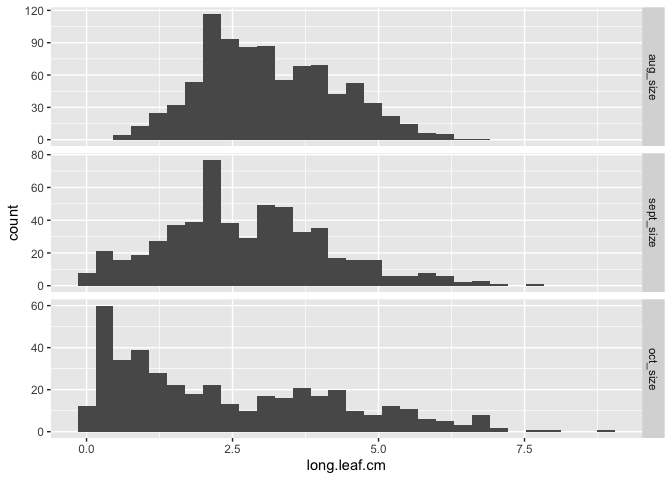<!-- -->

```r
#prints height first then longest leaf 

#qq plots 
single_time_all_sample_sizes %>% select(height.cm, long.leaf.cm) %>% 
  names() %>% 
  map(~ggplot(single_time_all_sample_sizes, aes_string(sample = .)) + 
       stat_qq() +
        stat_qq_line() +
        facet_grid(survey_month ~ ., scales="free"))
```

```
## [[1]]
```

```
## Warning: Removed 2679 rows containing non-finite values (`stat_qq()`).
```

```
## Warning: Removed 2679 rows containing non-finite values (`stat_qq_line()`).
```

<!-- -->

```
## 
## [[2]]
```

```
## Warning: Removed 2865 rows containing non-finite values (`stat_qq()`).
```

```
## Warning: Removed 2865 rows containing non-finite values (`stat_qq_line()`).
```

<!-- -->

```r
#all months height is right skewed
#oct longest leaf slightly right skewed


#Transformations:
single_time_all_sample_sizes_transf <- single_time_all_sample_sizes %>% 
  mutate(sheight.cm=sqrt(height.cm), logheight.cm=log(height.cm),log10height.cm=log10(height.cm),
         slong.leaf.cm=sqrt(long.leaf.cm), loglong.leaf.cm=log(long.leaf.cm),
         log10long.leaf.cm=log10(long.leaf.cm))

single_time_all_sample_sizes_transf$survey_month <- factor(single_time_all_sample_sizes_transf$survey_month, levels = c("aug_size","sept_size","oct_size"))

single_time_all_sample_sizes_transf %>% select(ends_with("cm")) %>% 
  names() %>% 
  map(~ggplot(single_time_all_sample_sizes_transf, aes_string(x = .)) + 
        geom_histogram() + 
        facet_grid(survey_month ~ ., scales = "free"))
```

```
## [[1]]
```

```
## `stat_bin()` using `bins = 30`. Pick better value with `binwidth`.
```

```
## Warning: Removed 2679 rows containing non-finite values (`stat_bin()`).
```

<!-- -->

```
## 
## [[2]]
```

```
## `stat_bin()` using `bins = 30`. Pick better value with `binwidth`.
```

```
## Warning: Removed 2865 rows containing non-finite values (`stat_bin()`).
```

<!-- -->

```
## 
## [[3]]
```

```
## `stat_bin()` using `bins = 30`. Pick better value with `binwidth`.
```

```
## Warning: Removed 2679 rows containing non-finite values (`stat_bin()`).
```

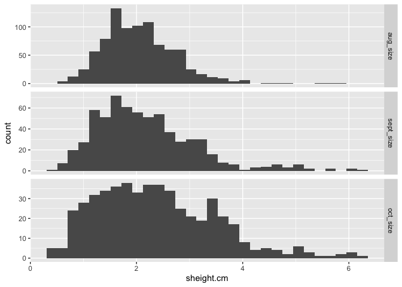<!-- -->

```
## 
## [[4]]
```

```
## `stat_bin()` using `bins = 30`. Pick better value with `binwidth`.
```

```
## Warning: Removed 2679 rows containing non-finite values (`stat_bin()`).
```

<!-- -->

```
## 
## [[5]]
```

```
## `stat_bin()` using `bins = 30`. Pick better value with `binwidth`.
```

```
## Warning: Removed 2679 rows containing non-finite values (`stat_bin()`).
```

<!-- -->

```
## 
## [[6]]
```

```
## `stat_bin()` using `bins = 30`. Pick better value with `binwidth`.
```

```
## Warning: Removed 2865 rows containing non-finite values (`stat_bin()`).
```

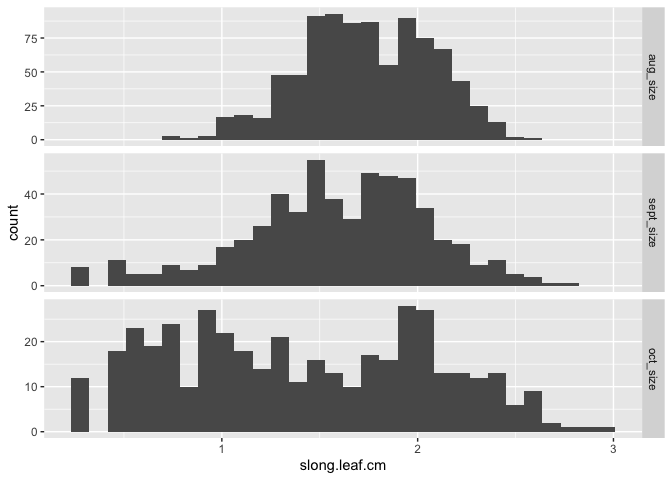<!-- -->

```
## 
## [[7]]
```

```
## `stat_bin()` using `bins = 30`. Pick better value with `binwidth`.
```

```
## Warning: Removed 2865 rows containing non-finite values (`stat_bin()`).
```

<!-- -->

```
## 
## [[8]]
```

```
## `stat_bin()` using `bins = 30`. Pick better value with `binwidth`.
```

```
## Warning: Removed 2865 rows containing non-finite values (`stat_bin()`).
```

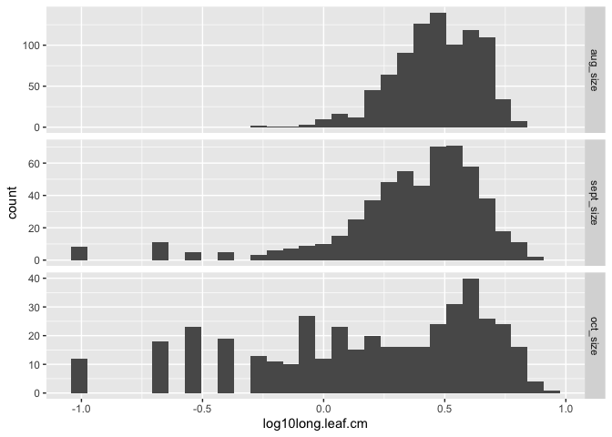<!-- -->

```r
#prints in the following order: height, longest leaf, sheight, logheight, log10height, slong.leaf.cm, loglong.leaf.cm, log10long.leaf.cm

single_time_all_sample_sizes_transf %>% select(ends_with("cm")) %>% 
  names() %>% 
  map(~ggplot(single_time_all_sample_sizes_transf, aes_string(sample = .)) + 
       stat_qq() +
        stat_qq_line() +
        facet_grid(survey_month ~ ., scales="free"))
```

```
## [[1]]
```

```
## Warning: Removed 2679 rows containing non-finite values (`stat_qq()`).
```

```
## Warning: Removed 2679 rows containing non-finite values (`stat_qq_line()`).
```

<!-- -->

```
## 
## [[2]]
```

```
## Warning: Removed 2865 rows containing non-finite values (`stat_qq()`).
```

```
## Warning: Removed 2865 rows containing non-finite values (`stat_qq_line()`).
```

<!-- -->

```
## 
## [[3]]
```

```
## Warning: Removed 2679 rows containing non-finite values (`stat_qq()`).
```

```
## Warning: Removed 2679 rows containing non-finite values (`stat_qq_line()`).
```

<!-- -->

```
## 
## [[4]]
```

```
## Warning: Removed 2679 rows containing non-finite values (`stat_qq()`).
## Removed 2679 rows containing non-finite values (`stat_qq_line()`).
```

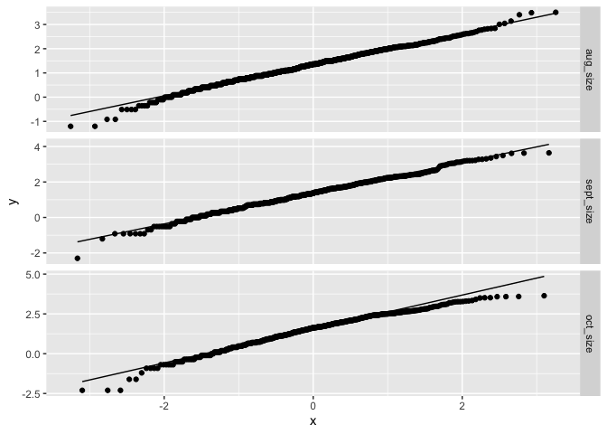<!-- -->

```
## 
## [[5]]
```

```
## Warning: Removed 2679 rows containing non-finite values (`stat_qq()`).
## Removed 2679 rows containing non-finite values (`stat_qq_line()`).
```

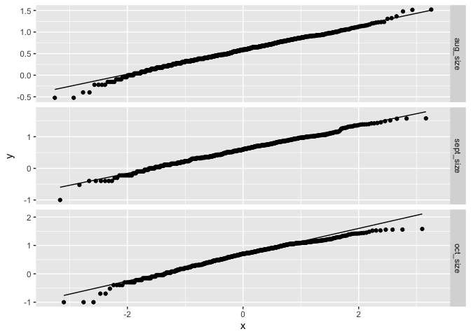<!-- -->

```
## 
## [[6]]
```

```
## Warning: Removed 2865 rows containing non-finite values (`stat_qq()`).
```

```
## Warning: Removed 2865 rows containing non-finite values (`stat_qq_line()`).
```

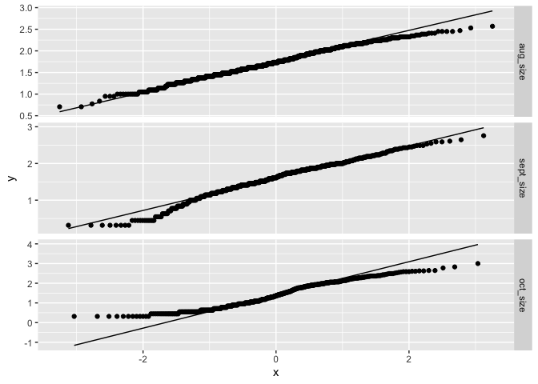<!-- -->

```
## 
## [[7]]
```

```
## Warning: Removed 2865 rows containing non-finite values (`stat_qq()`).
## Removed 2865 rows containing non-finite values (`stat_qq_line()`).
```

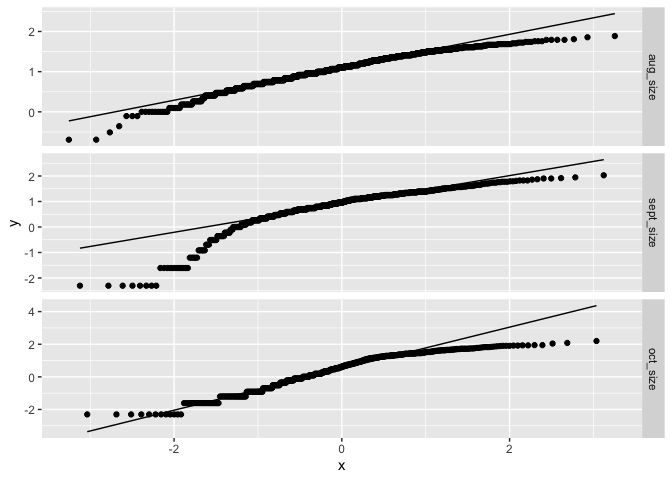<!-- -->

```
## 
## [[8]]
```

```
## Warning: Removed 2865 rows containing non-finite values (`stat_qq()`).
## Removed 2865 rows containing non-finite values (`stat_qq_line()`).
```

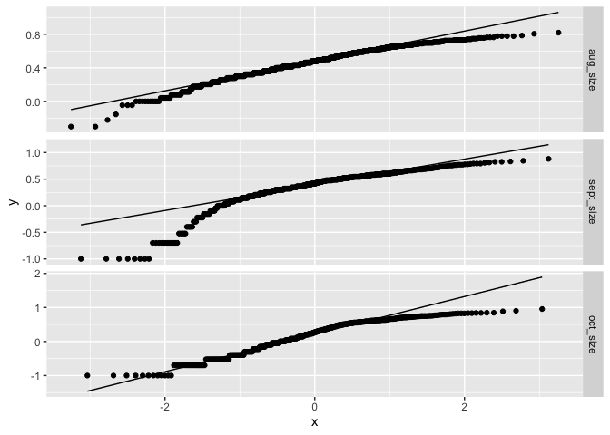<!-- -->

```r
#log transformation is the best for height (all months)
#no transformations greatly improve Oct distribution 
```

When sample size is greater than two:


```r
single_time_all_GTTWO$survey_month <- factor(single_time_all_GTTWO$survey_month, levels = c("aug_size","sept_size","oct_size")) #ensures the months are printed in chronological order

#Histograms
single_time_all_GTTWO %>% select(height.cm, long.leaf.cm) %>% 
  names() %>% 
  map(~ggplot(single_time_all_GTTWO, aes_string(x = .)) + 
        geom_histogram() + 
        facet_grid(survey_month ~ ., scales = "free"))
```

```
## [[1]]
```

```
## `stat_bin()` using `bins = 30`. Pick better value with `binwidth`.
```

```
## Warning: Removed 2667 rows containing non-finite values (`stat_bin()`).
```

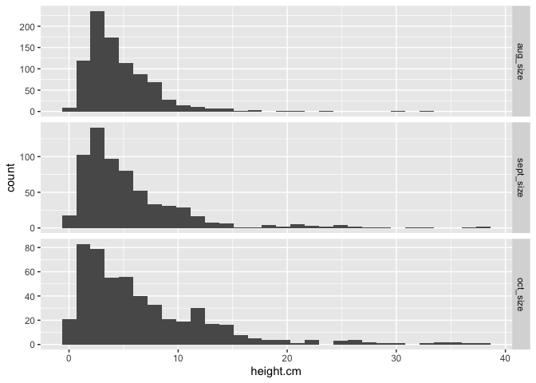<!-- -->

```
## 
## [[2]]
```

```
## `stat_bin()` using `bins = 30`. Pick better value with `binwidth`.
```

```
## Warning: Removed 2852 rows containing non-finite values (`stat_bin()`).
```

<!-- -->

```r
#prints height first then longest leaf 

#qq plots 
single_time_all_GTTWO %>% select(height.cm, long.leaf.cm) %>% 
  names() %>% 
  map(~ggplot(single_time_all_GTTWO, aes_string(sample = .)) + 
       stat_qq() +
        stat_qq_line() +
        facet_grid(survey_month ~ ., scales="free"))
```

```
## [[1]]
```

```
## Warning: Removed 2667 rows containing non-finite values (`stat_qq()`).
```

```
## Warning: Removed 2667 rows containing non-finite values (`stat_qq_line()`).
```

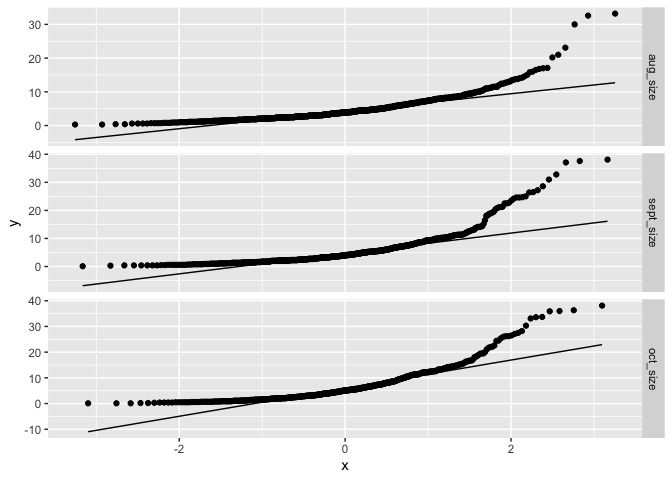<!-- -->

```
## 
## [[2]]
```

```
## Warning: Removed 2852 rows containing non-finite values (`stat_qq()`).
```

```
## Warning: Removed 2852 rows containing non-finite values (`stat_qq_line()`).
```

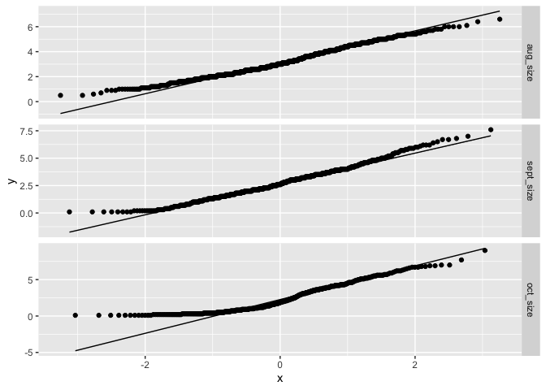<!-- -->

```r
#all months height is right skewed, similar to GTONE results 
#oct longest leaf very slightly right skewed, similar to GTONE results 


#Transformations:
single_time_all_GTTWO_transf <- single_time_all_GTTWO %>% 
  mutate(sheight.cm=sqrt(height.cm), logheight.cm=log(height.cm),log10height.cm=log10(height.cm),
         slong.leaf.cm=sqrt(long.leaf.cm), loglong.leaf.cm=log(long.leaf.cm),
         log10long.leaf.cm=log10(long.leaf.cm))

single_time_all_GTTWO_transf$survey_month <- factor(single_time_all_GTTWO_transf$survey_month, levels = c("aug_size","sept_size","oct_size"))

single_time_all_GTTWO_transf %>% select(ends_with("cm")) %>% 
  names() %>% 
  map(~ggplot(single_time_all_GTTWO_transf, aes_string(x = .)) + 
        geom_histogram() + 
        facet_grid(survey_month ~ ., scales = "free"))
```

```
## [[1]]
```

```
## `stat_bin()` using `bins = 30`. Pick better value with `binwidth`.
```

```
## Warning: Removed 2667 rows containing non-finite values (`stat_bin()`).
```

<!-- -->

```
## 
## [[2]]
```

```
## `stat_bin()` using `bins = 30`. Pick better value with `binwidth`.
```

```
## Warning: Removed 2852 rows containing non-finite values (`stat_bin()`).
```

<!-- -->

```
## 
## [[3]]
```

```
## `stat_bin()` using `bins = 30`. Pick better value with `binwidth`.
```

```
## Warning: Removed 2667 rows containing non-finite values (`stat_bin()`).
```

<!-- -->

```
## 
## [[4]]
```

```
## `stat_bin()` using `bins = 30`. Pick better value with `binwidth`.
```

```
## Warning: Removed 2667 rows containing non-finite values (`stat_bin()`).
```

<!-- -->

```
## 
## [[5]]
```

```
## `stat_bin()` using `bins = 30`. Pick better value with `binwidth`.
```

```
## Warning: Removed 2667 rows containing non-finite values (`stat_bin()`).
```

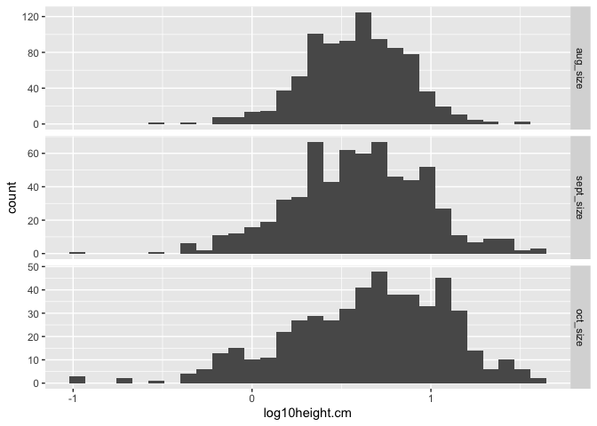<!-- -->

```
## 
## [[6]]
```

```
## `stat_bin()` using `bins = 30`. Pick better value with `binwidth`.
```

```
## Warning: Removed 2852 rows containing non-finite values (`stat_bin()`).
```

<!-- -->

```
## 
## [[7]]
```

```
## `stat_bin()` using `bins = 30`. Pick better value with `binwidth`.
```

```
## Warning: Removed 2852 rows containing non-finite values (`stat_bin()`).
```

<!-- -->

```
## 
## [[8]]
```

```
## `stat_bin()` using `bins = 30`. Pick better value with `binwidth`.
```

```
## Warning: Removed 2852 rows containing non-finite values (`stat_bin()`).
```

<!-- -->

```r
#prints in the following order: height, longest leaf, sheight, logheight, log10height, slong.leaf.cm, loglong.leaf.cm, log10long.leaf.cm

single_time_all_GTTWO_transf %>% select(ends_with("cm")) %>% 
  names() %>% 
  map(~ggplot(single_time_all_GTTWO_transf, aes_string(sample = .)) + 
       stat_qq() +
        stat_qq_line() +
        facet_grid(survey_month ~ ., scales="free"))
```

```
## [[1]]
```

```
## Warning: Removed 2667 rows containing non-finite values (`stat_qq()`).
```

```
## Warning: Removed 2667 rows containing non-finite values (`stat_qq_line()`).
```

<!-- -->

```
## 
## [[2]]
```

```
## Warning: Removed 2852 rows containing non-finite values (`stat_qq()`).
```

```
## Warning: Removed 2852 rows containing non-finite values (`stat_qq_line()`).
```

<!-- -->

```
## 
## [[3]]
```

```
## Warning: Removed 2667 rows containing non-finite values (`stat_qq()`).
```

```
## Warning: Removed 2667 rows containing non-finite values (`stat_qq_line()`).
```

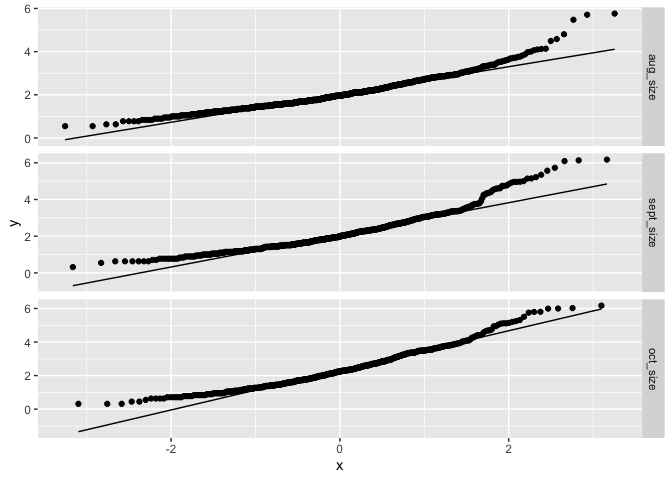<!-- -->

```
## 
## [[4]]
```

```
## Warning: Removed 2667 rows containing non-finite values (`stat_qq()`).
## Removed 2667 rows containing non-finite values (`stat_qq_line()`).
```

<!-- -->

```
## 
## [[5]]
```

```
## Warning: Removed 2667 rows containing non-finite values (`stat_qq()`).
## Removed 2667 rows containing non-finite values (`stat_qq_line()`).
```

<!-- -->

```
## 
## [[6]]
```

```
## Warning: Removed 2852 rows containing non-finite values (`stat_qq()`).
```

```
## Warning: Removed 2852 rows containing non-finite values (`stat_qq_line()`).
```

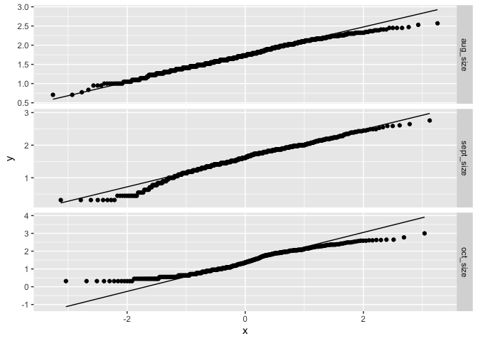<!-- -->

```
## 
## [[7]]
```

```
## Warning: Removed 2852 rows containing non-finite values (`stat_qq()`).
## Removed 2852 rows containing non-finite values (`stat_qq_line()`).
```

<!-- -->

```
## 
## [[8]]
```

```
## Warning: Removed 2852 rows containing non-finite values (`stat_qq()`).
## Removed 2852 rows containing non-finite values (`stat_qq_line()`).
```

<!-- -->

```r
#log transformation is the best for height (all months), similar to GTONE results 
#no transformations greatly improve Oct distribution, similar to GTONE results 
```

## Relationship between height and longest leaf

### Plotting Height and Length Together


```r
single_time_all_sample_sizes_transf %>% ggplot(aes(x=height.cm, y=long.leaf.cm)) +
  geom_point() +
  geom_smooth() +
  facet_grid(survey_month ~ ., scales="free")
```

```
## `geom_smooth()` using method = 'gam' and formula = 'y ~ s(x, bs = "cs")'
```

```
## Warning: Removed 2865 rows containing non-finite values (`stat_smooth()`).
```

```
## Warning: Removed 2865 rows containing missing values (`geom_point()`).
```

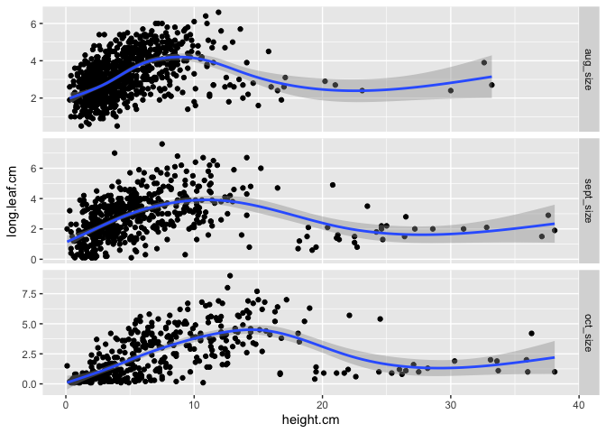<!-- -->

```r
#generally positive relationship at lower heights, but a lot more variability at lower heights
#tall plants have smaller leaves (likely b/c tall plants = reproductive)
#relationship not linear

single_time_all_sample_sizes_transf %>% ggplot(aes(x=long.leaf.cm, y=height.cm)) +
  geom_point() +
  geom_smooth() +
  facet_grid(survey_month ~ ., scales="free") #flipped axes
```

```
## `geom_smooth()` using method = 'gam' and formula = 'y ~ s(x, bs = "cs")'
```

```
## Warning: Removed 2865 rows containing non-finite values (`stat_smooth()`).
## Removed 2865 rows containing missing values (`geom_point()`).
```

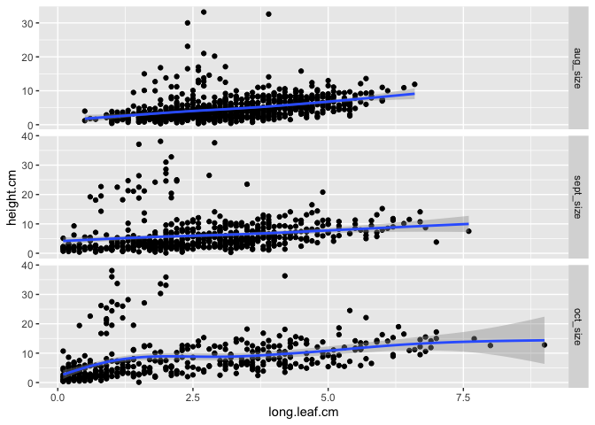<!-- -->

```r
#not much of a relationship  
```

### Calculating correlation b/t the two


```r
single_time_all_sample_sizes_transf %>% cor_test(height.cm, long.leaf.cm, method = "pearson") #all months 
```

```
## # A tibble: 1 × 8
##   var1      var2           cor statistic        p conf.low conf.high method 
##   <chr>     <chr>        <dbl>     <dbl>    <dbl>    <dbl>     <dbl> <chr>  
## 1 height.cm long.leaf.cm  0.24      10.5 3.13e-25    0.194     0.280 Pearson
```

```r
#Note, I used the pearson method event though height is not normally distributed...something to consider if we actually want to use this analysis
#r=0.24, P <0.0001

single_time_all_sample_sizes_transf %>% group_by(survey_month) %>% 
  cor_test(height.cm, long.leaf.cm, method = "pearson") #separate test for each month
```

```
## # A tibble: 3 × 9
##   survey_month var1     var2    cor statistic        p conf.low conf.high method
##   <fct>        <chr>    <chr> <dbl>     <dbl>    <dbl>    <dbl>     <dbl> <chr> 
## 1 aug_size     height.… long…  0.37     11.8  6.43e-30    0.311     0.425 Pears…
## 2 sept_size    height.… long…  0.19      4.52 7.48e- 6    0.107     0.267 Pears…
## 3 oct_size     height.… long…  0.36      7.93 2.06e-14    0.276     0.443 Pears…
```

```r
#Aug r=0.37, P <0.0001
#Sept r=0.19, P <0.0001
#Oct r=0.36, P <0.0001

summary(lm(sheight.cm ~ long.leaf.cm, data=single_time_all_sample_sizes_transf))
```

```
## 
## Call:
## lm(formula = sheight.cm ~ long.leaf.cm, data = single_time_all_sample_sizes_transf)
## 
## Residuals:
##     Min      1Q  Median      3Q     Max 
## -1.7763 -0.5203 -0.1667  0.3295  4.3062 
## 
## Coefficients:
##              Estimate Std. Error t value Pr(>|t|)    
## (Intercept)   1.65821    0.04247   39.04   <2e-16 ***
## long.leaf.cm  0.20806    0.01323   15.72   <2e-16 ***
## ---
## Signif. codes:  0 '***' 0.001 '**' 0.01 '*' 0.05 '.' 0.1 ' ' 1
## 
## Residual standard error: 0.8369 on 1855 degrees of freedom
##   (2865 observations deleted due to missingness)
## Multiple R-squared:  0.1176,	Adjusted R-squared:  0.1171 
## F-statistic: 247.3 on 1 and 1855 DF,  p-value: < 2.2e-16
```

## Calculating means by pop (and elev)


```r
single_time_all_sample_sizes_transf_summary <- single_time_all_sample_sizes_transf %>% 
  group_by(survey_month, parent.pop, elev_m) %>% 
  summarise(N_height = sum(!is.na(height.cm)), mean_height.cm = mean(height.cm,na.rm=(TRUE)), 
            sem_height.cm=sem(height.cm, na.rm=(TRUE)), N_length = sum(!is.na(long.leaf.cm)),
            mean_long.leaf.cm=mean(long.leaf.cm, na.rm=(TRUE)), 
            sem_long.leaf.cm=sem(long.leaf.cm, na.rm=TRUE)) %>% 
  arrange(survey_month, elev_m)
```

```
## `summarise()` has grouped output by 'survey_month', 'parent.pop'. You can
## override using the `.groups` argument.
```

```r
single_time_all_sample_sizes_transf_summary
```

```
## # A tibble: 66 × 9
## # Groups:   survey_month, parent.pop [66]
##    survey_month parent.pop elev_m N_height mean_height.cm sem_height.cm N_length
##    <fct>        <chr>       <dbl>    <int>          <dbl>         <dbl>    <int>
##  1 aug_size     CC           313        71           7.3          0.261       71
##  2 aug_size     TM2          379.       49          11.8          0.867       49
##  3 aug_size     SC           422.       59           3.87         0.185       59
##  4 aug_size     IH           454.       69           6.98         0.291       69
##  5 aug_size     BH           511.       65           5.59         0.203       65
##  6 aug_size     FR           787        20           3.9          0.411       20
##  7 aug_size     DPR         1019.       52           6.13         0.248       52
##  8 aug_size     WR          1158         3           4.37         0.786        3
##  9 aug_size     WL1         1614.       37           2.93         0.185       37
## 10 aug_size     SQ1         1921.       15           2.83         0.393       15
## # ℹ 56 more rows
## # ℹ 2 more variables: mean_long.leaf.cm <dbl>, sem_long.leaf.cm <dbl>
```

```r
single_time_all_sample_sizes_transf_summary %>% filter(N_height < 3)
```

```
## # A tibble: 1 × 9
## # Groups:   survey_month, parent.pop [1]
##   survey_month parent.pop elev_m N_height mean_height.cm sem_height.cm N_length
##   <fct>        <chr>       <dbl>    <int>          <dbl>         <dbl>    <int>
## 1 oct_size     WR           1158        2            6.8           5.8        1
## # ℹ 2 more variables: mean_long.leaf.cm <dbl>, sem_long.leaf.cm <dbl>
```

```r
single_time_all_sample_sizes_transf_summary %>% filter(N_length < 3) #4 plants that have at least 2 individuals for height, have limited sample size for length
```

```
## # A tibble: 4 × 9
## # Groups:   survey_month, parent.pop [4]
##   survey_month parent.pop elev_m N_height mean_height.cm sem_height.cm N_length
##   <fct>        <chr>       <dbl>    <int>          <dbl>         <dbl>    <int>
## 1 oct_size     FR           787         5           2.84         0.798        0
## 2 oct_size     WR          1158         2           6.8          5.8          1
## 3 oct_size     LV3         2354.        5           1.06         0.388        1
## 4 oct_size     LVTR1       2741.       10           1.55         0.425        2
## # ℹ 2 more variables: mean_long.leaf.cm <dbl>, sem_long.leaf.cm <dbl>
```

```r
#write_csv(single_time_all_sample_sizes_transf_summary, file ="../output/WL2_Traits/single_time_size_summary.csv")

#greater than 0 N for leaf length
single_time_all_sample_sizes_transf_summary_GTONE <- single_time_all_sample_sizes_transf_summary %>% 
  filter(N_length > 1)

#february overall avg
single_time_all_sample_sizes_transf %>% filter(survey_month=="oct_size") %>% summarise(AvgHeight=mean(height.cm, na.rm=(TRUE)), semHeight=sem(height.cm, na.rm=(TRUE)))
```

```
## # A tibble: 1 × 2
##   AvgHeight semHeight
##       <dbl>     <dbl>
## 1      6.90     0.286
```

```r
single_time_all_sample_sizes_transf %>% filter(survey_month=="oct_size") %>% filter(parent.pop!="TM2") %>% summarise(MAX=max(height.cm, na.rm=(TRUE)))
```

```
## # A tibble: 1 × 1
##     MAX
##   <dbl>
## 1  22.1
```

```r
single_time_all_sample_sizes_transf %>% filter(survey_month=="oct_size") %>% filter(parent.pop!="TM2") %>% arrange(desc(height.cm))
```

```
## # A tibble: 1,490 × 25
##    survey_date survey_month block bed   bed.row bed.col parent.pop    mf   rep
##    <date>      <fct>        <chr> <chr>   <dbl> <chr>   <chr>      <dbl> <dbl>
##  1 2023-10-20  oct_size     G     D           3 B       IH             5     9
##  2 2023-10-20  oct_size     F     C          53 B       IH             3     8
##  3 2023-10-20  oct_size     J     G          17 A       CC             9    12
##  4 2023-10-20  oct_size     B     A          48 D       CC             8     4
##  5 2023-10-20  oct_size     C     B          26 C       IH             5     5
##  6 2023-10-20  oct_size     J     G           8 D       CC             4    12
##  7 2023-10-20  oct_size     G     D          14 A       IH             7     9
##  8 2023-10-20  oct_size     F     D          51 C       IH             1     8
##  9 2023-10-20  oct_size     J     G           5 B       IH             4    12
## 10 2023-10-20  oct_size     J     G          12 D       CC             5    12
## # ℹ 1,480 more rows
## # ℹ 16 more variables: height.cm <dbl>, long.leaf.cm <dbl>, herbiv.y.n <chr>,
## #   survey.notes <chr>, elevation.group <chr>, Lat <chr>, Long <chr>,
## #   elev_m <dbl>, N_height <int>, N_length <int>, sheight.cm <dbl>,
## #   logheight.cm <dbl>, log10height.cm <dbl>, slong.leaf.cm <dbl>,
## #   loglong.leaf.cm <dbl>, log10long.leaf.cm <dbl>
```

## Figures of averages

### Avg Height Figure


```r
single_time_all_sample_sizes_transf_summary_GTONE$survey_month <- factor(single_time_all_sample_sizes_transf_summary_GTONE$survey_month, levels = c("aug_size","sept_size","oct_size"))

single_time_all_sample_sizes_transf_summary_GTONE %>% 
  ggplot(aes(x=fct_reorder(parent.pop, mean_height.cm), y=mean_height.cm, fill=elev_m)) +
  geom_col(width = 0.7,position = position_dodge(0.75)) + 
  geom_errorbar(aes(ymin=mean_height.cm-sem_height.cm,ymax=mean_height.cm+sem_height.cm),width=.2, position = 
                  position_dodge(0.75)) +
  scale_y_continuous(expand = c(0, 0)) +
  scale_fill_gradient(low = "#F5A540", high = "#0043F0") +
  labs(fill="Elevation (m)", y="Avg Height (cm)", x="Population") +
   theme_classic() +
  theme(text=element_text(size=25), axis.text.x = element_text(angle = 45,  hjust = 1)) +
  facet_grid(survey_month ~ .)
```

<!-- -->

```r
ggsave("../output/WL2_Traits/Single_Time_Height.png", width = 14, height = 18, units = "in")
```

### Avg Longest Leaf Figure


```r
single_time_all_sample_sizes_transf_summary_GTONE %>% 
  ggplot(aes(x=fct_reorder(parent.pop, mean_long.leaf.cm), y=mean_long.leaf.cm, fill=elev_m)) +
  geom_col(width = 0.7,position = position_dodge(0.75)) + 
  geom_errorbar(aes(ymin=mean_long.leaf.cm-sem_long.leaf.cm,ymax=mean_long.leaf.cm+sem_long.leaf.cm),width=.2, position = 
                  position_dodge(0.75)) +
  scale_y_continuous(expand = c(0, 0)) +
  scale_fill_gradient(low = "#F5A540", high = "#0043F0") +
  labs(fill="Elevation (m)", y="Avg Longest Leaf (cm)", x="Population") +
   theme_classic() +
  theme(text=element_text(size=25), axis.text.x = element_text(angle = 45,  hjust = 1)) +
  facet_grid(survey_month ~ .)
```

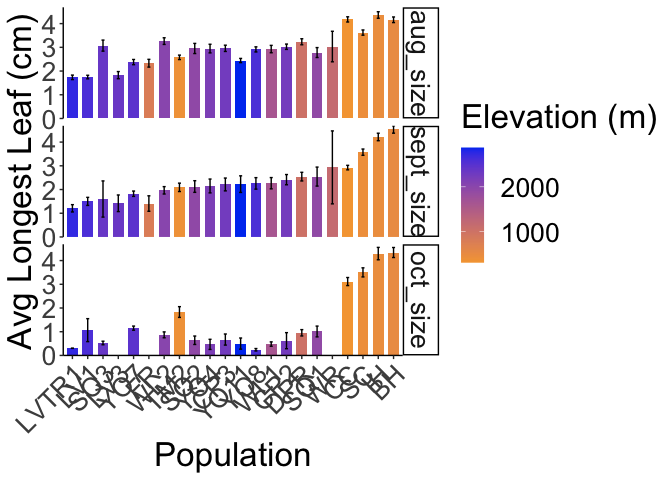<!-- -->

```r
ggsave("../output/WL2_Traits/Single_Time_Longest_Leaf.png", width = 14, height = 18, units = "in")
```

## Mixed Effects Models

### With a sample size of greater than 1 per pop
Prep data for model

```r
single_time_split_by_month_GTONE <- single_time_all_sample_sizes_transf %>% 
  select(survey_month, elev_m, parent.pop, mf, logheight.cm, long.leaf.cm) %>% 
  group_nest(survey_month)
single_time_split_by_month_GTONE #the data column contains the parameters in the model 
```

```
## # A tibble: 3 × 2
##   survey_month               data
##   <fct>        <list<tibble[,5]>>
## 1 aug_size            [1,574 × 5]
## 2 sept_size           [1,574 × 5]
## 3 oct_size            [1,574 × 5]
```

```r
model_by_month_GTONE <- 
  single_time_split_by_month_GTONE %>% 
  mutate(height_model_1 = map(data, ~ lmer(logheight.cm ~ (1|parent.pop/mf), data = .x)),
         height_model_2 = map(data, ~ lmer(logheight.cm ~ elev_m + (1|parent.pop/mf), data = .x)),
         leaf_model_1 = map(data, ~ lmer(long.leaf.cm ~ (1|parent.pop/mf), data = .x)), 
         leaf_model_2 = map(data, ~ lmer(long.leaf.cm ~ elev_m + (1|parent.pop/mf), data = .x)),)
```

```
## boundary (singular) fit: see help('isSingular')
## boundary (singular) fit: see help('isSingular')
## boundary (singular) fit: see help('isSingular')
## boundary (singular) fit: see help('isSingular')
```

```
## Warning: There was 1 warning in `mutate()`.
## ℹ In argument: `leaf_model_1 = map(data, ~lmer(long.leaf.cm ~ (1 |
##   parent.pop/mf), data = .x))`.
## Caused by warning in `checkConv()`:
## ! Model failed to converge with max|grad| = 0.00290582 (tol = 0.002, component 1)
```

```r
model_by_month_GTONE
```

```
## # A tibble: 3 × 6
##   survey_month               data height_model_1 height_model_2 leaf_model_1
##   <fct>        <list<tibble[,5]>> <list>         <list>         <list>      
## 1 aug_size            [1,574 × 5] <lmrMdLmT>     <lmrMdLmT>     <lmrMdLmT>  
## 2 sept_size           [1,574 × 5] <lmrMdLmT>     <lmrMdLmT>     <lmrMdLmT>  
## 3 oct_size            [1,574 × 5] <lmrMdLmT>     <lmrMdLmT>     <lmrMdLmT>  
## # ℹ 1 more variable: leaf_model_2 <list>
```

Summary output for one model across survey_months 

```r
model_by_month_GTONE %>% 
  mutate(coef = map(height_model_1, tidy)) %>% 
  select(survey_month, coef) %>% 
  unnest(cols = c(coef))
```

```
## # A tibble: 12 × 9
##    survey_month effect  group term  estimate std.error statistic    df   p.value
##    <fct>        <chr>   <chr> <chr>    <dbl>     <dbl>     <dbl> <dbl>     <dbl>
##  1 aug_size     fixed   <NA>  (Int…    1.23     0.0973     12.7   21.5  1.84e-11
##  2 aug_size     ran_pa… mf:p… sd__…    0.100   NA          NA     NA   NA       
##  3 aug_size     ran_pa… pare… sd__…    0.444   NA          NA     NA   NA       
##  4 aug_size     ran_pa… Resi… sd__…    0.460   NA          NA     NA   NA       
##  5 sept_size    fixed   <NA>  (Int…    1.18     0.144       8.21  21.4  4.76e- 8
##  6 sept_size    ran_pa… mf:p… sd__…    0.132   NA          NA     NA   NA       
##  7 sept_size    ran_pa… pare… sd__…    0.660   NA          NA     NA   NA       
##  8 sept_size    ran_pa… Resi… sd__…    0.514   NA          NA     NA   NA       
##  9 oct_size     fixed   <NA>  (Int…    1.01     0.190       5.33  21.4  2.62e- 5
## 10 oct_size     ran_pa… mf:p… sd__…    0.126   NA          NA     NA   NA       
## 11 oct_size     ran_pa… pare… sd__…    0.873   NA          NA     NA   NA       
## 12 oct_size     ran_pa… Resi… sd__…    0.545   NA          NA     NA   NA
```

Ranova output for each model (across months)

```r
#Model without random effects printed first, then nested predictor and then the predictor that nest was in
#(1 | mf:parent.pop) 
#(1 | parent.pop)
model_by_month_GTONE %>% #height with just pop and mf
  mutate(ranova = map(height_model_1, ranova)) %>% 
  select(survey_month, ranova) %>% 
  unnest(cols = c(ranova))
```

```
## # A tibble: 9 × 7
##   survey_month  npar logLik   AIC    LRT    Df `Pr(>Chisq)`
##   <fct>        <int>  <dbl> <dbl>  <dbl> <dbl>        <dbl>
## 1 aug_size         4  -621. 1251.  NA       NA    NA       
## 2 aug_size         3  -624. 1253.   4.18     1     4.08e- 2
## 3 aug_size         3  -697. 1399. 150.       1     1.63e-34
## 4 sept_size        4  -541. 1090.  NA       NA    NA       
## 5 sept_size        3  -543. 1092.   3.69     1     5.48e- 2
## 6 sept_size        3  -624. 1254. 166.       1     6.19e-38
## 7 oct_size         4  -471.  950.  NA       NA    NA       
## 8 oct_size         3  -472.  950.   1.89     1     1.70e- 1
## 9 oct_size         3  -550. 1107. 159.       1     2.11e-36
```


```r
model_by_month_GTONE %>% #height with elev, pop, and mf
  mutate(ranova = map(height_model_2, ranova)) %>% 
  select(survey_month, ranova) %>% 
  unnest(cols = c(ranova))
```

```
## # A tibble: 9 × 7
##   survey_month  npar logLik   AIC   LRT    Df `Pr(>Chisq)`
##   <fct>        <int>  <dbl> <dbl> <dbl> <dbl>        <dbl>
## 1 aug_size         5  -620. 1250. NA       NA    NA       
## 2 aug_size         4  -622. 1252.  4.39     1     3.62e- 2
## 3 aug_size         4  -652. 1312. 64.3      1     1.05e-15
## 4 sept_size        5  -537. 1084. NA       NA    NA       
## 5 sept_size        4  -539. 1086.  3.97     1     4.63e- 2
## 6 sept_size        4  -570. 1147. 65.5      1     5.87e-16
## 7 oct_size         5  -464.  938. NA       NA    NA       
## 8 oct_size         4  -465.  938.  1.91     1     1.67e- 1
## 9 oct_size         4  -490.  988. 52.0      1     5.65e-13
```


```r
model_by_month_GTONE %>% #length with just pop and mf
  mutate(ranova = map(leaf_model_1, ranova)) %>% 
  select(survey_month, ranova) %>% 
  unnest(cols = c(ranova))
```

```
## # A tibble: 9 × 7
##   survey_month  npar logLik   AIC       LRT    Df `Pr(>Chisq)`
##   <fct>        <int>  <dbl> <dbl>     <dbl> <dbl>        <dbl>
## 1 aug_size         4 -1162. 2332. NA           NA    NA       
## 2 aug_size         3 -1168. 2342.  1.21e+ 1     1     5.09e- 4
## 3 aug_size         3 -1222. 2450.  1.20e+ 2     1     6.50e-28
## 4 sept_size        4  -859. 1726. NA           NA    NA       
## 5 sept_size        3  -859. 1724. -1.36e-11     1     1   e+ 0
## 6 sept_size        3  -913. 1831.  1.08e+ 2     1     2.83e-25
## 7 oct_size         4  -711. 1430. NA           NA    NA       
## 8 oct_size         3  -711. 1428. -2.27e-13     1     1   e+ 0
## 9 oct_size         3  -776. 1558.  1.30e+ 2     1     3.30e-30
```


```r
model_by_month_GTONE %>% #length with elev, pop, and mf
  mutate(ranova = map(leaf_model_2, ranova)) %>% 
  select(survey_month, ranova) %>% 
  unnest(cols = c(ranova))
```

```
## # A tibble: 9 × 7
##   survey_month  npar logLik   AIC       LRT    Df `Pr(>Chisq)`
##   <fct>        <int>  <dbl> <dbl>     <dbl> <dbl>        <dbl>
## 1 aug_size         5 -1164. 2338. NA           NA    NA       
## 2 aug_size         4 -1170. 2348.  1.20e+ 1     1     5.24e- 4
## 3 aug_size         4 -1201. 2409.  7.33e+ 1     1     1.10e-17
## 4 sept_size        5  -861. 1732. NA           NA    NA       
## 5 sept_size        4  -861. 1730.  4.55e-13     1     1.00e+ 0
## 6 sept_size        4  -896. 1799.  6.98e+ 1     1     6.50e-17
## 7 oct_size         5  -710. 1430. NA           NA    NA       
## 8 oct_size         4  -710. 1428. -6.82e-13     1     1   e+ 0
## 9 oct_size         4  -747. 1502.  7.40e+ 1     1     7.83e-18
```

Summary for all models per survey month

```r
tidy_models_GTONE <- model_by_month_GTONE %>% #get tidy summary of each model 
  mutate(coef_1 = map(height_model_1, tidy),
            coef_2 = map(height_model_2, tidy),
            coef_3 = map(leaf_model_1, tidy),
            coef_4 = map(leaf_model_2, tidy)) %>% 
  select(survey_month, coef_1:coef_4)
tidy_models_GTONE
```

```
## # A tibble: 3 × 5
##   survey_month coef_1           coef_2           coef_3           coef_4  
##   <fct>        <list>           <list>           <list>           <list>  
## 1 aug_size     <tibble [4 × 8]> <tibble [5 × 8]> <tibble [4 × 8]> <tibble>
## 2 sept_size    <tibble [4 × 8]> <tibble [5 × 8]> <tibble [4 × 8]> <tibble>
## 3 oct_size     <tibble [4 × 8]> <tibble [5 × 8]> <tibble [4 × 8]> <tibble>
```

```r
tidy_models_GTONE_aug <- tidy_models_GTONE %>% filter(survey_month == "aug_size")
tidy_models_GTONE_sept <- tidy_models_GTONE %>% filter(survey_month == "sept_size")
tidy_models_GTONE_oct <- tidy_models_GTONE %>% filter(survey_month == "oct_size")

#convert to long 
models_long_GTONEaug <- reshape(tidy_models_GTONE_aug, direction = "long", sep = "_",
                           idvar = "survey_month", 
                            varying = c("coef_1", "coef_2", "coef_3", "coef_4")) %>% 
                unnest(coef) %>% 
  rename("model"="time") %>% 
  mutate(model = if_else(model==1, "height_model_1", 
                         if_else(model==2, "height_model_2",
                                 if_else(model==3, "leaf_model_1",
                                         "leaf_model_2"))))
models_long_GTONEaug
```

```
## # A tibble: 18 × 10
##    survey_month model      effect group term  estimate std.error statistic    df
##    <fct>        <chr>      <chr>  <chr> <chr>    <dbl>     <dbl>     <dbl> <dbl>
##  1 aug_size     height_mo… fixed  <NA>  (Int…  1.23e+0   9.73e-2     12.7   21.5
##  2 aug_size     height_mo… ran_p… mf:p… sd__…  1.00e-1  NA           NA     NA  
##  3 aug_size     height_mo… ran_p… pare… sd__…  4.44e-1  NA           NA     NA  
##  4 aug_size     height_mo… ran_p… Resi… sd__…  4.60e-1  NA           NA     NA  
##  5 aug_size     height_mo… fixed  <NA>  (Int…  1.92e+0   1.33e-1     14.5   19.1
##  6 aug_size     height_mo… fixed  <NA>  elev… -4.04e-4   6.97e-5     -5.80  19.2
##  7 aug_size     height_mo… ran_p… mf:p… sd__…  1.02e-1  NA           NA     NA  
##  8 aug_size     height_mo… ran_p… pare… sd__…  2.69e-1  NA           NA     NA  
##  9 aug_size     height_mo… ran_p… Resi… sd__…  4.60e-1  NA           NA     NA  
## 10 aug_size     leaf_mode… fixed  <NA>  (Int…  2.93e+0   1.58e-1     18.6   21.4
## 11 aug_size     leaf_mode… ran_p… mf:p… sd__…  2.44e-1  NA           NA     NA  
## 12 aug_size     leaf_mode… ran_p… pare… sd__…  7.13e-1  NA           NA     NA  
## 13 aug_size     leaf_mode… ran_p… Resi… sd__…  8.45e-1  NA           NA     NA  
## 14 aug_size     leaf_mode… fixed  <NA>  (Int…  3.86e+0   2.61e-1     14.8   19.0
## 15 aug_size     leaf_mode… fixed  <NA>  elev… -5.49e-4   1.37e-4     -4.00  19.0
## 16 aug_size     leaf_mode… ran_p… mf:p… sd__…  2.43e-1  NA           NA     NA  
## 17 aug_size     leaf_mode… ran_p… pare… sd__…  5.29e-1  NA           NA     NA  
## 18 aug_size     leaf_mode… ran_p… Resi… sd__…  8.45e-1  NA           NA     NA  
## # ℹ 1 more variable: p.value <dbl>
```

```r
write_csv(models_long_GTONEaug, "../output/WL2_Traits/08022023_Size_Models_GTONE.csv")

models_long_GTONEsept <- reshape(tidy_models_GTONE_sept, direction = "long", sep = "_",
                           idvar = "survey_month", 
                            varying = c("coef_1", "coef_2", "coef_3", "coef_4")) %>% 
                unnest(coef) %>% 
  rename("model"="time") %>% 
  mutate(model = if_else(model==1, "height_model_1", 
                         if_else(model==2, "height_model_2",
                                 if_else(model==3, "leaf_model_1",
                                         "leaf_model_2"))))
models_long_GTONEsept
```

```
## # A tibble: 18 × 10
##    survey_month model      effect group term  estimate std.error statistic    df
##    <fct>        <chr>      <chr>  <chr> <chr>    <dbl>     <dbl>     <dbl> <dbl>
##  1 sept_size    height_mo… fixed  <NA>  (Int…  1.18e+0   1.44e-1      8.21  21.4
##  2 sept_size    height_mo… ran_p… mf:p… sd__…  1.32e-1  NA           NA     NA  
##  3 sept_size    height_mo… ran_p… pare… sd__…  6.60e-1  NA           NA     NA  
##  4 sept_size    height_mo… ran_p… Resi… sd__…  5.14e-1  NA           NA     NA  
##  5 sept_size    height_mo… fixed  <NA>  (Int…  2.25e+0   1.77e-1     12.7   19.3
##  6 sept_size    height_mo… fixed  <NA>  elev… -6.32e-4   9.32e-5     -6.78  19.5
##  7 sept_size    height_mo… ran_p… mf:p… sd__…  1.35e-1  NA           NA     NA  
##  8 sept_size    height_mo… ran_p… pare… sd__…  3.59e-1  NA           NA     NA  
##  9 sept_size    height_mo… ran_p… Resi… sd__…  5.14e-1  NA           NA     NA  
## 10 sept_size    leaf_mode… fixed  <NA>  (Int…  2.39e+0   1.88e-1     12.7   22.0
## 11 sept_size    leaf_mode… ran_p… mf:p… sd__…  0        NA           NA     NA  
## 12 sept_size    leaf_mode… ran_p… pare… sd__…  8.37e-1  NA           NA     NA  
## 13 sept_size    leaf_mode… ran_p… Resi… sd__…  1.07e+0  NA           NA     NA  
## 14 sept_size    leaf_mode… fixed  <NA>  (Int…  3.46e+0   3.13e-1     11.1   18.7
## 15 sept_size    leaf_mode… fixed  <NA>  elev… -6.39e-4   1.67e-4     -3.83  19.7
## 16 sept_size    leaf_mode… ran_p… mf:p… sd__…  0        NA           NA     NA  
## 17 sept_size    leaf_mode… ran_p… pare… sd__…  6.34e-1  NA           NA     NA  
## 18 sept_size    leaf_mode… ran_p… Resi… sd__…  1.07e+0  NA           NA     NA  
## # ℹ 1 more variable: p.value <dbl>
```

```r
write_csv(models_long_GTONEsept, "../output/WL2_Traits/09132023_Size_Models_GTONE.csv")

models_long_GTONEoct <-  reshape(tidy_models_GTONE_oct, direction = "long", sep = "_",
                           idvar = "survey_month", 
                            varying = c("coef_1", "coef_2", "coef_3", "coef_4")) %>% 
                unnest(coef) %>% 
  rename("model"="time") %>% 
  mutate(model = if_else(model==1, "height_model_1", 
                         if_else(model==2, "height_model_2",
                                 if_else(model==3, "leaf_model_1",
                                         "leaf_model_2"))))
models_long_GTONEoct
```

```
## # A tibble: 18 × 10
##    survey_month model      effect group term  estimate std.error statistic    df
##    <fct>        <chr>      <chr>  <chr> <chr>    <dbl>     <dbl>     <dbl> <dbl>
##  1 oct_size     height_mo… fixed  <NA>  (Int…  1.01e+0  0.190         5.33  21.4
##  2 oct_size     height_mo… ran_p… mf:p… sd__…  1.26e-1 NA            NA     NA  
##  3 oct_size     height_mo… ran_p… pare… sd__…  8.73e-1 NA            NA     NA  
##  4 oct_size     height_mo… ran_p… Resi… sd__…  5.45e-1 NA            NA     NA  
##  5 oct_size     height_mo… fixed  <NA>  (Int…  2.50e+0  0.201        12.5   17.4
##  6 oct_size     height_mo… fixed  <NA>  elev… -8.74e-4  0.000106     -8.22  18.0
##  7 oct_size     height_mo… ran_p… mf:p… sd__…  1.26e-1 NA            NA     NA  
##  8 oct_size     height_mo… ran_p… pare… sd__…  4.06e-1 NA            NA     NA  
##  9 oct_size     height_mo… ran_p… Resi… sd__…  5.45e-1 NA            NA     NA  
## 10 oct_size     leaf_mode… fixed  <NA>  (Int…  1.62e+0  0.373         4.35  16.5
## 11 oct_size     leaf_mode… ran_p… mf:p… sd__…  0       NA            NA     NA  
## 12 oct_size     leaf_mode… ran_p… pare… sd__…  1.63e+0 NA            NA     NA  
## 13 oct_size     leaf_mode… ran_p… Resi… sd__…  1.23e+0 NA            NA     NA  
## 14 oct_size     leaf_mode… fixed  <NA>  (Int…  3.85e+0  0.485         7.94  11.0
## 15 oct_size     leaf_mode… fixed  <NA>  elev… -1.36e-3  0.000261     -5.20  12.8
## 16 oct_size     leaf_mode… ran_p… mf:p… sd__…  0       NA            NA     NA  
## 17 oct_size     leaf_mode… ran_p… pare… sd__…  9.40e-1 NA            NA     NA  
## 18 oct_size     leaf_mode… ran_p… Resi… sd__…  1.24e+0 NA            NA     NA  
## # ℹ 1 more variable: p.value <dbl>
```

```r
write_csv(models_long_GTONEoct, "../output/WL2_Traits/10202023_Size_Models_GTONE.csv")
```
Elevation is negatively associated with height and length 


### With a sample size of greater than 2 per pop
Prep data for model

```r
single_time_split_by_month_GTTWO <- single_time_all_GTTWO_transf %>% 
  select(survey_month, elev_m, parent.pop, mf, logheight.cm, long.leaf.cm) %>% 
  group_nest(survey_month)
single_time_split_by_month_GTTWO #the data column contains the parameters in the model 
```

```
## # A tibble: 3 × 2
##   survey_month               data
##   <fct>        <list<tibble[,5]>>
## 1 aug_size            [1,574 × 5]
## 2 sept_size           [1,574 × 5]
## 3 oct_size            [1,560 × 5]
```

```r
model_by_month_GTTWO <- 
  single_time_split_by_month_GTTWO %>% 
  mutate(height_model_1 = map(data, ~ lmer(logheight.cm ~ (1|parent.pop/mf), data = .x)),
         height_model_2 = map(data, ~ lmer(logheight.cm ~ elev_m + (1|parent.pop/mf), data = .x)),
         leaf_model_1 = map(data, ~ lmer(long.leaf.cm ~ (1|parent.pop/mf), data = .x)), 
         leaf_model_2 = map(data, ~ lmer(long.leaf.cm ~ elev_m + (1|parent.pop/mf), data = .x)),)
```

```
## boundary (singular) fit: see help('isSingular')
## boundary (singular) fit: see help('isSingular')
## boundary (singular) fit: see help('isSingular')
## boundary (singular) fit: see help('isSingular')
```

```
## Warning: There was 1 warning in `mutate()`.
## ℹ In argument: `leaf_model_1 = map(data, ~lmer(long.leaf.cm ~ (1 |
##   parent.pop/mf), data = .x))`.
## Caused by warning in `checkConv()`:
## ! Model failed to converge with max|grad| = 0.00290582 (tol = 0.002, component 1)
```

```r
model_by_month_GTTWO
```

```
## # A tibble: 3 × 6
##   survey_month               data height_model_1 height_model_2 leaf_model_1
##   <fct>        <list<tibble[,5]>> <list>         <list>         <list>      
## 1 aug_size            [1,574 × 5] <lmrMdLmT>     <lmrMdLmT>     <lmrMdLmT>  
## 2 sept_size           [1,574 × 5] <lmrMdLmT>     <lmrMdLmT>     <lmrMdLmT>  
## 3 oct_size            [1,560 × 5] <lmrMdLmT>     <lmrMdLmT>     <lmrMdLmT>  
## # ℹ 1 more variable: leaf_model_2 <list>
```

Summary output for one model across survey_months 

```r
model_by_month_GTTWO %>% 
  mutate(coef = map(height_model_1, tidy)) %>% 
  select(survey_month, coef) %>% 
  unnest(cols = c(coef))
```

```
## # A tibble: 12 × 9
##    survey_month effect  group term  estimate std.error statistic    df   p.value
##    <fct>        <chr>   <chr> <chr>    <dbl>     <dbl>     <dbl> <dbl>     <dbl>
##  1 aug_size     fixed   <NA>  (Int…    1.23     0.0973     12.7   21.5  1.84e-11
##  2 aug_size     ran_pa… mf:p… sd__…    0.100   NA          NA     NA   NA       
##  3 aug_size     ran_pa… pare… sd__…    0.444   NA          NA     NA   NA       
##  4 aug_size     ran_pa… Resi… sd__…    0.460   NA          NA     NA   NA       
##  5 sept_size    fixed   <NA>  (Int…    1.18     0.144       8.21  21.4  4.76e- 8
##  6 sept_size    ran_pa… mf:p… sd__…    0.132   NA          NA     NA   NA       
##  7 sept_size    ran_pa… pare… sd__…    0.660   NA          NA     NA   NA       
##  8 sept_size    ran_pa… Resi… sd__…    0.514   NA          NA     NA   NA       
##  9 oct_size     fixed   <NA>  (Int…    1.00     0.197       5.06  20.2  5.79e- 5
## 10 oct_size     ran_pa… mf:p… sd__…    0.121   NA          NA     NA   NA       
## 11 oct_size     ran_pa… pare… sd__…    0.892   NA          NA     NA   NA       
## 12 oct_size     ran_pa… Resi… sd__…    0.541   NA          NA     NA   NA
```

Ranova output for each model (across months)

```r
#Model without random effects printed first, then nested predictor and then the predictor that nest was in
#(1 | mf:parent.pop) 
#(1 | parent.pop)
model_by_month_GTTWO %>% #height with just pop and mf
  mutate(ranova = map(height_model_1, ranova)) %>% 
  select(survey_month, ranova) %>% 
  unnest(cols = c(ranova))
```

```
## # A tibble: 9 × 7
##   survey_month  npar logLik   AIC    LRT    Df `Pr(>Chisq)`
##   <fct>        <int>  <dbl> <dbl>  <dbl> <dbl>        <dbl>
## 1 aug_size         4  -621. 1251.  NA       NA    NA       
## 2 aug_size         3  -624. 1253.   4.18     1     4.08e- 2
## 3 aug_size         3  -697. 1399. 150.       1     1.63e-34
## 4 sept_size        4  -541. 1090.  NA       NA    NA       
## 5 sept_size        3  -543. 1092.   3.69     1     5.48e- 2
## 6 sept_size        3  -624. 1254. 166.       1     6.19e-38
## 7 oct_size         4  -464.  936.  NA       NA    NA       
## 8 oct_size         3  -465.  936.   1.79     1     1.80e- 1
## 9 oct_size         3  -547. 1100. 166.       1     6.98e-38
```


```r
model_by_month_GTTWO %>% #height with elev, pop and mf
  mutate(ranova = map(height_model_2, ranova)) %>% 
  select(survey_month, ranova) %>% 
  unnest(cols = c(ranova))
```

```
## # A tibble: 9 × 7
##   survey_month  npar logLik   AIC   LRT    Df `Pr(>Chisq)`
##   <fct>        <int>  <dbl> <dbl> <dbl> <dbl>        <dbl>
## 1 aug_size         5  -620. 1250. NA       NA    NA       
## 2 aug_size         4  -622. 1252.  4.39     1     3.62e- 2
## 3 aug_size         4  -652. 1312. 64.3      1     1.05e-15
## 4 sept_size        5  -537. 1084. NA       NA    NA       
## 5 sept_size        4  -539. 1086.  3.97     1     4.63e- 2
## 6 sept_size        4  -570. 1147. 65.5      1     5.87e-16
## 7 oct_size         5  -458.  926. NA       NA    NA       
## 8 oct_size         4  -459.  926.  1.82     1     1.77e- 1
## 9 oct_size         4  -485.  979. 55.0      1     1.19e-13
```


```r
model_by_month_GTTWO %>% #length with just pop and mf
  mutate(ranova = map(leaf_model_1, ranova)) %>% 
  select(survey_month, ranova) %>% 
  unnest(cols = c(ranova))
```

```
## # A tibble: 9 × 7
##   survey_month  npar logLik   AIC       LRT    Df `Pr(>Chisq)`
##   <fct>        <int>  <dbl> <dbl>     <dbl> <dbl>        <dbl>
## 1 aug_size         4 -1162. 2332. NA           NA    NA       
## 2 aug_size         3 -1168. 2342.  1.21e+ 1     1     5.09e- 4
## 3 aug_size         3 -1222. 2450.  1.20e+ 2     1     6.50e-28
## 4 sept_size        4  -859. 1726. NA           NA    NA       
## 5 sept_size        3  -859. 1724. -1.36e-11     1     1   e+ 0
## 6 sept_size        3  -913. 1831.  1.08e+ 2     1     2.83e-25
## 7 oct_size         4  -703. 1415. NA           NA    NA       
## 8 oct_size         3  -703. 1413.  4.55e-13     1     1.00e+ 0
## 9 oct_size         3  -769. 1545.  1.32e+ 2     1     1.81e-30
```


```r
model_by_month_GTTWO %>% #length with elev pop and mf
  mutate(ranova = map(leaf_model_2, ranova)) %>% 
  select(survey_month, ranova) %>% 
  unnest(cols = c(ranova))
```

```
## # A tibble: 9 × 7
##   survey_month  npar logLik   AIC       LRT    Df `Pr(>Chisq)`
##   <fct>        <int>  <dbl> <dbl>     <dbl> <dbl>        <dbl>
## 1 aug_size         5 -1164. 2338. NA           NA    NA       
## 2 aug_size         4 -1170. 2348.  1.20e+ 1     1     5.24e- 4
## 3 aug_size         4 -1201. 2409.  7.33e+ 1     1     1.10e-17
## 4 sept_size        5  -861. 1732. NA           NA    NA       
## 5 sept_size        4  -861. 1730.  4.55e-13     1     1.00e+ 0
## 6 sept_size        4  -896. 1799.  6.98e+ 1     1     6.50e-17
## 7 oct_size         5  -701. 1412. NA           NA    NA       
## 8 oct_size         4  -701. 1410. -1.61e-11     1     1   e+ 0
## 9 oct_size         4  -738. 1484.  7.43e+ 1     1     6.58e-18
```


Summary for all models per survey month

```r
tidy_models_GTTWO <- model_by_month_GTTWO %>% #get tidy summary of each model 
  mutate(coef_1 = map(height_model_1, tidy),
            coef_2 = map(height_model_2, tidy),
            coef_3 = map(leaf_model_1, tidy),
            coef_4 = map(leaf_model_2, tidy)) %>% 
  select(survey_month, coef_1:coef_4)
tidy_models_GTTWO
```

```
## # A tibble: 3 × 5
##   survey_month coef_1           coef_2           coef_3           coef_4  
##   <fct>        <list>           <list>           <list>           <list>  
## 1 aug_size     <tibble [4 × 8]> <tibble [5 × 8]> <tibble [4 × 8]> <tibble>
## 2 sept_size    <tibble [4 × 8]> <tibble [5 × 8]> <tibble [4 × 8]> <tibble>
## 3 oct_size     <tibble [4 × 8]> <tibble [5 × 8]> <tibble [4 × 8]> <tibble>
```

```r
tidy_models_GTTWO_aug <- tidy_models_GTTWO %>% filter(survey_month == "aug_size")
tidy_models_GTTWO_sept <- tidy_models_GTTWO %>% filter(survey_month == "sept_size")
tidy_models_GTTWO_oct <- tidy_models_GTTWO %>% filter(survey_month == "oct_size")

#convert to long 
models_long_GTTWOaug <- reshape(tidy_models_GTTWO_aug, direction = "long", sep = "_",
                           idvar = "survey_month", 
                            varying = c("coef_1", "coef_2", "coef_3", "coef_4")) %>% 
                unnest(coef) %>% 
  rename("model"="time") %>% 
  mutate(model = if_else(model==1, "height_model_1", 
                         if_else(model==2, "height_model_2",
                                 if_else(model==3, "leaf_model_1",
                                         "leaf_model_2"))))
models_long_GTTWOaug
```

```
## # A tibble: 18 × 10
##    survey_month model      effect group term  estimate std.error statistic    df
##    <fct>        <chr>      <chr>  <chr> <chr>    <dbl>     <dbl>     <dbl> <dbl>
##  1 aug_size     height_mo… fixed  <NA>  (Int…  1.23e+0   9.73e-2     12.7   21.5
##  2 aug_size     height_mo… ran_p… mf:p… sd__…  1.00e-1  NA           NA     NA  
##  3 aug_size     height_mo… ran_p… pare… sd__…  4.44e-1  NA           NA     NA  
##  4 aug_size     height_mo… ran_p… Resi… sd__…  4.60e-1  NA           NA     NA  
##  5 aug_size     height_mo… fixed  <NA>  (Int…  1.92e+0   1.33e-1     14.5   19.1
##  6 aug_size     height_mo… fixed  <NA>  elev… -4.04e-4   6.97e-5     -5.80  19.2
##  7 aug_size     height_mo… ran_p… mf:p… sd__…  1.02e-1  NA           NA     NA  
##  8 aug_size     height_mo… ran_p… pare… sd__…  2.69e-1  NA           NA     NA  
##  9 aug_size     height_mo… ran_p… Resi… sd__…  4.60e-1  NA           NA     NA  
## 10 aug_size     leaf_mode… fixed  <NA>  (Int…  2.93e+0   1.58e-1     18.6   21.4
## 11 aug_size     leaf_mode… ran_p… mf:p… sd__…  2.44e-1  NA           NA     NA  
## 12 aug_size     leaf_mode… ran_p… pare… sd__…  7.13e-1  NA           NA     NA  
## 13 aug_size     leaf_mode… ran_p… Resi… sd__…  8.45e-1  NA           NA     NA  
## 14 aug_size     leaf_mode… fixed  <NA>  (Int…  3.86e+0   2.61e-1     14.8   19.0
## 15 aug_size     leaf_mode… fixed  <NA>  elev… -5.49e-4   1.37e-4     -4.00  19.0
## 16 aug_size     leaf_mode… ran_p… mf:p… sd__…  2.43e-1  NA           NA     NA  
## 17 aug_size     leaf_mode… ran_p… pare… sd__…  5.29e-1  NA           NA     NA  
## 18 aug_size     leaf_mode… ran_p… Resi… sd__…  8.45e-1  NA           NA     NA  
## # ℹ 1 more variable: p.value <dbl>
```

```r
write_csv(models_long_GTTWOaug, "../output/WL2_Traits/08022023_Size_Models_GTTWO.csv")

models_long_GTTWOsept <- reshape(tidy_models_GTTWO_sept, direction = "long", sep = "_",
                           idvar = "survey_month", 
                            varying = c("coef_1", "coef_2", "coef_3", "coef_4")) %>% 
                unnest(coef) %>% 
  rename("model"="time") %>% 
  mutate(model = if_else(model==1, "height_model_1", 
                         if_else(model==2, "height_model_2",
                                 if_else(model==3, "leaf_model_1",
                                         "leaf_model_2"))))
models_long_GTTWOsept
```

```
## # A tibble: 18 × 10
##    survey_month model      effect group term  estimate std.error statistic    df
##    <fct>        <chr>      <chr>  <chr> <chr>    <dbl>     <dbl>     <dbl> <dbl>
##  1 sept_size    height_mo… fixed  <NA>  (Int…  1.18e+0   1.44e-1      8.21  21.4
##  2 sept_size    height_mo… ran_p… mf:p… sd__…  1.32e-1  NA           NA     NA  
##  3 sept_size    height_mo… ran_p… pare… sd__…  6.60e-1  NA           NA     NA  
##  4 sept_size    height_mo… ran_p… Resi… sd__…  5.14e-1  NA           NA     NA  
##  5 sept_size    height_mo… fixed  <NA>  (Int…  2.25e+0   1.77e-1     12.7   19.3
##  6 sept_size    height_mo… fixed  <NA>  elev… -6.32e-4   9.32e-5     -6.78  19.5
##  7 sept_size    height_mo… ran_p… mf:p… sd__…  1.35e-1  NA           NA     NA  
##  8 sept_size    height_mo… ran_p… pare… sd__…  3.59e-1  NA           NA     NA  
##  9 sept_size    height_mo… ran_p… Resi… sd__…  5.14e-1  NA           NA     NA  
## 10 sept_size    leaf_mode… fixed  <NA>  (Int…  2.39e+0   1.88e-1     12.7   22.0
## 11 sept_size    leaf_mode… ran_p… mf:p… sd__…  0        NA           NA     NA  
## 12 sept_size    leaf_mode… ran_p… pare… sd__…  8.37e-1  NA           NA     NA  
## 13 sept_size    leaf_mode… ran_p… Resi… sd__…  1.07e+0  NA           NA     NA  
## 14 sept_size    leaf_mode… fixed  <NA>  (Int…  3.46e+0   3.13e-1     11.1   18.7
## 15 sept_size    leaf_mode… fixed  <NA>  elev… -6.39e-4   1.67e-4     -3.83  19.7
## 16 sept_size    leaf_mode… ran_p… mf:p… sd__…  0        NA           NA     NA  
## 17 sept_size    leaf_mode… ran_p… pare… sd__…  6.34e-1  NA           NA     NA  
## 18 sept_size    leaf_mode… ran_p… Resi… sd__…  1.07e+0  NA           NA     NA  
## # ℹ 1 more variable: p.value <dbl>
```

```r
write_csv(models_long_GTTWOsept, "../output/WL2_Traits/09132023_Size_Models_GTTWO.csv")

models_long_GTTWOoct <-  reshape(tidy_models_GTTWO_oct, direction = "long", sep = "_",
                           idvar = "survey_month", 
                            varying = c("coef_1", "coef_2", "coef_3", "coef_4")) %>% 
                unnest(coef) %>% 
  rename("model"="time") %>% 
  mutate(model = if_else(model==1, "height_model_1", 
                         if_else(model==2, "height_model_2",
                                 if_else(model==3, "leaf_model_1",
                                         "leaf_model_2"))))
models_long_GTTWOoct
```

```
## # A tibble: 18 × 10
##    survey_month model      effect group term  estimate std.error statistic    df
##    <fct>        <chr>      <chr>  <chr> <chr>    <dbl>     <dbl>     <dbl> <dbl>
##  1 oct_size     height_mo… fixed  <NA>  (Int…  1.00e+0  0.197         5.06  20.2
##  2 oct_size     height_mo… ran_p… mf:p… sd__…  1.21e-1 NA            NA     NA  
##  3 oct_size     height_mo… ran_p… pare… sd__…  8.92e-1 NA            NA     NA  
##  4 oct_size     height_mo… ran_p… Resi… sd__…  5.41e-1 NA            NA     NA  
##  5 oct_size     height_mo… fixed  <NA>  (Int…  2.52e+0  0.206        12.2   16.3
##  6 oct_size     height_mo… fixed  <NA>  elev… -8.78e-4  0.000108     -8.10  17.2
##  7 oct_size     height_mo… ran_p… mf:p… sd__…  1.22e-1 NA            NA     NA  
##  8 oct_size     height_mo… ran_p… pare… sd__…  4.13e-1 NA            NA     NA  
##  9 oct_size     height_mo… ran_p… Resi… sd__…  5.41e-1 NA            NA     NA  
## 10 oct_size     leaf_mode… fixed  <NA>  (Int…  1.43e+0  0.317         4.50  20.5
## 11 oct_size     leaf_mode… ran_p… mf:p… sd__…  0       NA            NA     NA  
## 12 oct_size     leaf_mode… ran_p… pare… sd__…  1.34e+0 NA            NA     NA  
## 13 oct_size     leaf_mode… ran_p… Resi… sd__…  1.23e+0 NA            NA     NA  
## 14 oct_size     leaf_mode… fixed  <NA>  (Int…  3.61e+0  0.406         8.89  16.2
## 15 oct_size     leaf_mode… fixed  <NA>  elev… -1.29e-3  0.000221     -5.83  20.0
## 16 oct_size     leaf_mode… ran_p… mf:p… sd__…  0       NA            NA     NA  
## 17 oct_size     leaf_mode… ran_p… pare… sd__…  7.70e-1 NA            NA     NA  
## 18 oct_size     leaf_mode… ran_p… Resi… sd__…  1.23e+0 NA            NA     NA  
## # ℹ 1 more variable: p.value <dbl>
```

```r
write_csv(models_long_GTTWOoct, "../output/WL2_Traits/10202023_Size_Models_GTTWO.csv")
```
Results similar to GTONE case for ranova and elev_m as a fixed effect. 


