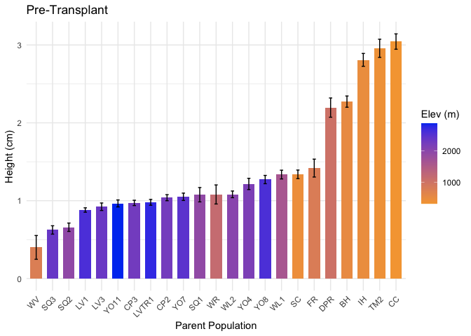
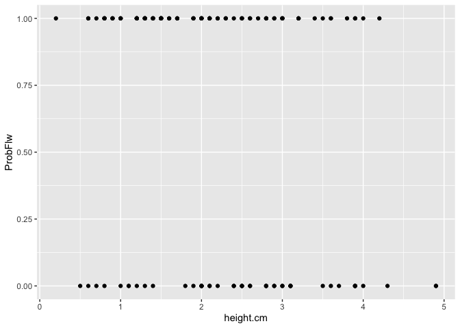
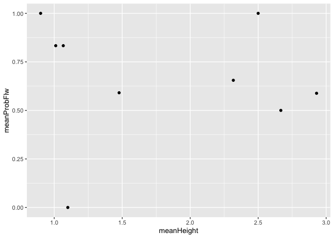
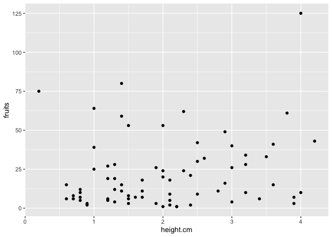
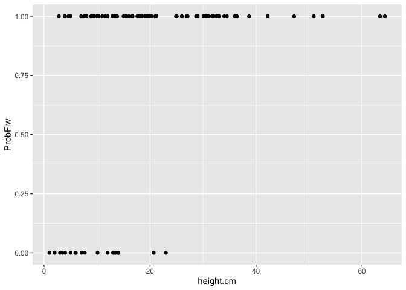
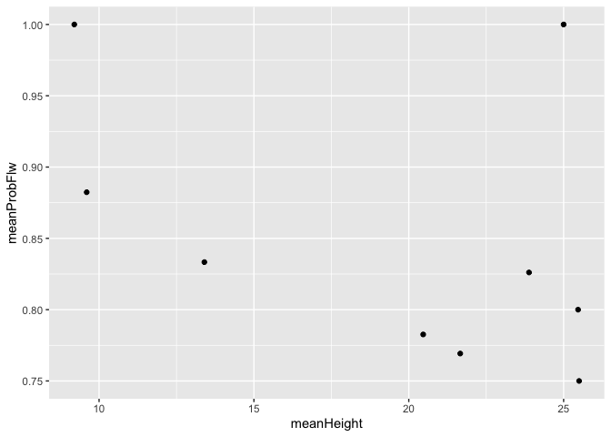
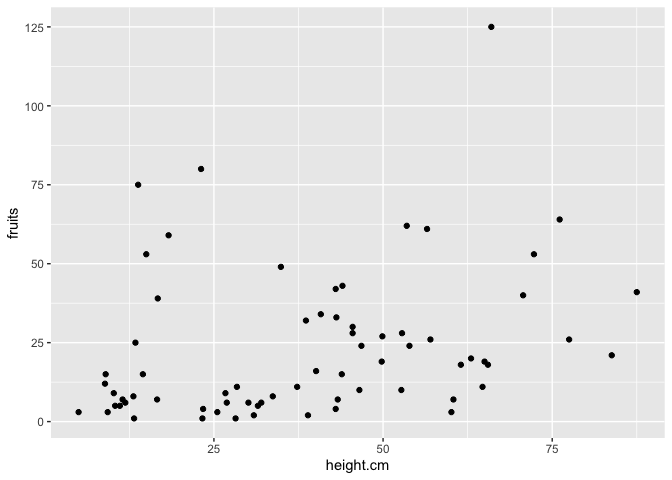

# Checking the relationships between size and reproduction for IntDemo Models

## Libraries

``` r
library(tidyverse)
```

```
## ── Attaching core tidyverse packages ──────────────────────── tidyverse 2.0.0 ──
## ✔ dplyr     1.1.4     ✔ readr     2.1.5
## ✔ forcats   1.0.0     ✔ stringr   1.5.1
## ✔ ggplot2   3.5.1     ✔ tibble    3.2.1
## ✔ lubridate 1.9.3     ✔ tidyr     1.3.1
## ✔ purrr     1.0.2     
## ── Conflicts ────────────────────────────────────────── tidyverse_conflicts() ──
## ✖ dplyr::filter() masks stats::filter()
## ✖ dplyr::lag()    masks stats::lag()
## ℹ Use the conflicted package (<http://conflicted.r-lib.org/>) to force all conflicts to become errors
```

``` r
library(lmerTest)
```

```
## Loading required package: lme4
## Loading required package: Matrix
## 
## Attaching package: 'Matrix'
## 
## The following objects are masked from 'package:tidyr':
## 
##     expand, pack, unpack
## 
## 
## Attaching package: 'lmerTest'
## 
## The following object is masked from 'package:lme4':
## 
##     lmer
## 
## The following object is masked from 'package:stats':
## 
##     step
```

``` r
sem <- function(x, na.rm=FALSE) {           #for calculating standard error
  sd(x,na.rm=na.rm)/sqrt(length(na.omit(x)))
} 
```

## Load the pop and location data


``` r
#pop info
pops_common_garden <- read_csv("../input/WL2_Data/Pops_for_2023_WL2.csv") #pops included in common garden 
```

```
## Rows: 23 Columns: 5
## ── Column specification ────────────────────────────────────────────────────────
## Delimiter: ","
## chr (2): parent.pop, elevation.group
## dbl (2): phylogroup, seed year
## lgl (1): notes
## 
## ℹ Use `spec()` to retrieve the full column specification for this data.
## ℹ Specify the column types or set `show_col_types = FALSE` to quiet this message.
```

``` r
pops_common_garden_nonotes <- pops_common_garden %>% select(parent.pop, elevation.group) #subset columns

#extra location info 
pop_loc <- read_csv("../input/Strep_tort_locs.csv")
```

```
## Rows: 54 Columns: 7
## ── Column specification ────────────────────────────────────────────────────────
## Delimiter: ","
## chr (6): Species epithet, Species Code, Site, Site code, Lat, Long
## dbl (1): Elevation (m)
## 
## ℹ Use `spec()` to retrieve the full column specification for this data.
## ℹ Specify the column types or set `show_col_types = FALSE` to quiet this message.
```

``` r
#need to change YOSE to YO
pop_loc_yo <- pop_loc %>% mutate(parent.pop = str_replace(`Site code`, "YOSE(\\d+)", "YO\\1")) %>% select(Lat, Long, elev_m=`Elevation (m)`, parent.pop)

#merge in location info
pop_elev <- left_join(pops_common_garden_nonotes, pop_loc_yo)
```

```
## Joining with `by = join_by(parent.pop)`
```

## Pre-Transplant Size

``` r
wl2_pretrans_size1 <- read_csv("../input/WL2_Data/CorrectedCSVs/WL2_DNA_Collection_Size_survey_combined20230703_corrected.csv")
```

```
## Rows: 1427 Columns: 7
## ── Column specification ────────────────────────────────────────────────────────
## Delimiter: ","
## chr (2): Pop, Notes
## dbl (5): mf, rep, DNA, height (cm), longest leaf (cm)
## 
## ℹ Use `spec()` to retrieve the full column specification for this data.
## ℹ Specify the column types or set `show_col_types = FALSE` to quiet this message.
```

``` r
wl2_pretrans_size2 <- read_csv("../input/WL2_Data/CorrectedCSVs/WL2_Extras_DNA_collection_size_survey_combined20230706_corrected.csv") %>% 
  filter(!is.na(`height (cm)`)) #to get rid of genotypes that were measured on the other data sheet (NAs on this sheet)
```

```
## Rows: 152 Columns: 7
## ── Column specification ────────────────────────────────────────────────────────
## Delimiter: ","
## chr (2): Pop, Notes
## dbl (5): mf, rep, DNA, height (cm), longest leaf (cm)
## 
## ℹ Use `spec()` to retrieve the full column specification for this data.
## ℹ Specify the column types or set `show_col_types = FALSE` to quiet this message.
```

``` r
wl2_pretrans_size_all <- bind_rows(wl2_pretrans_size1, wl2_pretrans_size2) %>%
  rename(parent.pop=Pop, height.cm = `height (cm)`, long.leaf.cm=`longest leaf (cm)`) %>% 
  unite(Genotype, parent.pop:rep, sep="_", remove = FALSE) %>% 
  unite(pop.mf, parent.pop:mf, sep="_", remove = FALSE)
head(wl2_pretrans_size_all)
```

```
## # A tibble: 6 × 9
##   Genotype pop.mf parent.pop    mf   rep   DNA height.cm long.leaf.cm Notes
##   <chr>    <chr>  <chr>      <dbl> <dbl> <dbl>     <dbl>        <dbl> <chr>
## 1 CP2_1_1  CP2_1  CP2            1     1     1       0.5          1.6 KN   
## 2 CP2_1_2  CP2_1  CP2            1     2     1       0.7          1.8 KN   
## 3 CP2_1_3  CP2_1  CP2            1     3     1       1.1          1.8 KN   
## 4 CP2_1_4  CP2_1  CP2            1     4     1       0.8          1.6 KN   
## 5 CP2_1_5  CP2_1  CP2            1     5     1       0.9          1.8 KN   
## 6 CP2_1_6  CP2_1  CP2            1     6     1       1            1.9 KN
```

### Merge in loc info

``` r
wl2_pretrans_size_pops <- left_join(wl2_pretrans_size_all, pop_elev)
```

```
## Joining with `by = join_by(parent.pop)`
```

``` r
names(wl2_pretrans_size_pops)
```

```
##  [1] "Genotype"        "pop.mf"          "parent.pop"      "mf"             
##  [5] "rep"             "DNA"             "height.cm"       "long.leaf.cm"   
##  [9] "Notes"           "elevation.group" "Lat"             "Long"           
## [13] "elev_m"
```

### Check for variation in pre-tranpslant size

``` r
wl2_pretrans_size_pops %>% 
  group_by(parent.pop, elev_m) %>% 
  summarise(meanHeight=mean(height.cm, na.rm=TRUE), semHeight=sem(height.cm, na.rm = TRUE)) %>% 
  ggplot(aes(x=fct_reorder(parent.pop, meanHeight), y=meanHeight, fill = elev_m)) +
  geom_col(width = 0.7,position = position_dodge(0.75)) + 
  geom_errorbar(aes(ymin=meanHeight-semHeight,ymax=meanHeight+semHeight),width=.2, position = 
                  position_dodge(0.75)) +
  theme_minimal() +
  theme(axis.text.x = element_text(angle = 45, hjust =1)) +
  labs(x = "Parent Population", y="Height (cm)", fill="Elev (m)", title="Pre-Transplant") +
  scale_fill_gradient(low = "#F5A540", high = "#0043F0")
```

```
## `summarise()` has grouped output by 'parent.pop'. You can override using the
## `.groups` argument.
```

<!-- -->

## Year 2 Pop Info

``` r
wl2_y2_pops <- read_csv("../input/WL2_Data/Final_2023_2024_Pop_Loc_Info.csv") %>%
  select(Pop.Type:unique.ID) %>% 
  filter(Pop.Type=="2023-survivor") %>% 
  select(Pop.Type, loc:bed, row=bedrow, col=bedcol, pop:unique.ID)
```

```
## Rows: 1217 Columns: 15
## ── Column specification ────────────────────────────────────────────────────────
## Delimiter: ","
## chr (8): Pop.Type, status, block, loc, bed, bedcol, pop, unique.ID
## dbl (7): bed.block.order, bed.order, AB.CD.order, column.order, bedrow, mf, rep
## 
## ℹ Use `spec()` to retrieve the full column specification for this data.
## ℹ Specify the column types or set `show_col_types = FALSE` to quiet this message.
```

``` r
wl2_blocks <- read_csv("../input/WL2_Data/CorrectedCSVs/WL2_mort_pheno_20231020_corrected.csv") %>% 
  unite(BedLoc, bed:bed.col, sep="_", remove = FALSE) %>% 
  filter(BedLoc!="K_5_C") %>% #get rid of duplicate locations
  select(block, pop, mf, rep) %>% #add in block info 
  mutate(mf=as.double(mf), rep=as.double(rep)) #convert to num
```

```
## Rows: 1826 Columns: 14
## ── Column specification ────────────────────────────────────────────────────────
## Delimiter: ","
## chr (12): block, bed, bed.col, pop, mf, rep, bud.date, flower.date, fruit.da...
## dbl  (1): bed.row
## lgl  (1): last.fruit.date
## 
## ℹ Use `spec()` to retrieve the full column specification for this data.
## ℹ Specify the column types or set `show_col_types = FALSE` to quiet this message.
```

```
## Warning: There were 2 warnings in `mutate()`.
## The first warning was:
## ℹ In argument: `mf = as.double(mf)`.
## Caused by warning:
## ! NAs introduced by coercion
## ℹ Run `dplyr::last_dplyr_warnings()` to see the 1 remaining warning.
```

``` r
#wl2_blocks %>% rowwise() %>%  #checking if mf and rep can be converted to numeric (all buffers)
#  filter(!is.na(mf)) %>%  
#  filter(is.na(as.numeric(mf)))

wl2_y2_pops_blocks <- left_join(wl2_y2_pops, wl2_blocks)
```

```
## Joining with `by = join_by(pop, mf, rep)`
```

## Reproductive Info

``` r
wl2_20241023 <- read_csv("../input/WL2_Data/WL2_mort_pheno_20241023_corrected.csv") %>%  #this has plants planted in 2023 and 2024
  select(-block) #this only has block info for 2024 plants 
```

```
## Rows: 1217 Columns: 13
## ── Column specification ────────────────────────────────────────────────────────
## Delimiter: ","
## chr (12): block, bed, col, unique.ID, bud.date, flower.date, fruit.date, las...
## dbl  (1): row
## 
## ℹ Use `spec()` to retrieve the full column specification for this data.
## ℹ Specify the column types or set `show_col_types = FALSE` to quiet this message.
```

``` r
mort_pheno_y2_2023plants <- left_join(wl2_y2_pops_blocks, wl2_20241023) %>%  #add in block and pop info and remove 2024 plants 
  rename(Genotype=unique.ID, parent.pop=pop) 
```

```
## Joining with `by = join_by(bed, row, col, unique.ID)`
```

``` r
probflw <- mort_pheno_y2_2023plants %>% 
  mutate(ProbFlw=if_else(is.na(flower.date), 0, 1),
         flower.date=mdy(flower.date)) %>% 
  select(block, bed:col, Genotype, parent.pop:rep, flower.date, ProbFlw)

fruitsy2 <- read_csv("../output/WL2_Traits/WL2_Fruits_Y2_2324.csv") %>% 
  select(block, bed:col, Genotype, parent.pop=pop, mf:rep, fruits)
```

```
## Rows: 73 Columns: 26
## ── Column specification ────────────────────────────────────────────────────────
## Delimiter: ","
## chr  (8): Pop.Type, loc, bed, col, pop, Genotype, block, elevation.group
## dbl (18): row, mf, rep, flowers, fruits, FrFlN, elev_m, Lat, Long, GrwSsn_GD...
## 
## ℹ Use `spec()` to retrieve the full column specification for this data.
## ℹ Specify the column types or set `show_col_types = FALSE` to quiet this message.
```

## Prob Flowering ~ Pre-transplant size

``` r
probflw_presize <- left_join(probflw, wl2_pretrans_size_pops) 
```

```
## Joining with `by = join_by(Genotype, parent.pop, mf, rep)`
```

``` r
probflw_presize %>% filter(is.na(height.cm)) #check for any merge issues 
```

```
## # A tibble: 1 × 19
##   block bed     row col   Genotype parent.pop    mf   rep flower.date ProbFlw
##   <chr> <chr> <dbl> <chr> <chr>    <chr>      <dbl> <dbl> <date>        <dbl>
## 1 M     K         2 B     IH_4_14  IH             4    14 NA                0
## # ℹ 9 more variables: pop.mf <chr>, DNA <dbl>, height.cm <dbl>,
## #   long.leaf.cm <dbl>, Notes <chr>, elevation.group <chr>, Lat <chr>,
## #   Long <chr>, elev_m <dbl>
```

``` r
wl2_pretrans_size_pops %>% filter(Genotype=="IH_4_14") #no pre-transplant size for one of the plants
```

```
## # A tibble: 0 × 13
## # ℹ 13 variables: Genotype <chr>, pop.mf <chr>, parent.pop <chr>, mf <dbl>,
## #   rep <dbl>, DNA <dbl>, height.cm <dbl>, long.leaf.cm <dbl>, Notes <chr>,
## #   elevation.group <chr>, Lat <chr>, Long <chr>, elev_m <dbl>
```

``` r
probflw_presize %>% 
  ggplot(aes(x=height.cm, y=ProbFlw)) +
  geom_point()
```

```
## Warning: Removed 1 row containing missing values or values outside the scale range
## (`geom_point()`).
```

<!-- -->

``` r
probflw_presize_summary <- probflw_presize %>% 
  group_by(parent.pop) %>% 
  summarise(meanProbFlw=mean(ProbFlw, na.rm=TRUE), meanHeight=mean(height.cm))
probflw_presize_summary %>% 
  ggplot(aes(x=meanHeight, y=meanProbFlw)) +
  geom_point()
```

```
## Warning: Removed 1 row containing missing values or values outside the scale range
## (`geom_point()`).
```

<!-- -->

``` r
#no clear patterns from these plots

##model
probflw_presize_formodel <- probflw_presize %>% drop_na(height.cm)
probflw_mod1 <- glmer(ProbFlw ~ height.cm + (1|parent.pop/mf), data = probflw_presize_formodel, family = binomial())
```

```
## boundary (singular) fit: see help('isSingular')
```

``` r
summary(probflw_mod1)
```

```
## Generalized linear mixed model fit by maximum likelihood (Laplace
##   Approximation) [glmerMod]
##  Family: binomial  ( logit )
## Formula: ProbFlw ~ height.cm + (1 | parent.pop/mf)
##    Data: probflw_presize_formodel
## 
##      AIC      BIC   logLik deviance df.resid 
##    175.2    186.8    -83.6    167.2      130 
## 
## Scaled residuals: 
##     Min      1Q  Median      3Q     Max 
## -2.1011 -1.0752  0.5731  0.7277  1.2704 
## 
## Random effects:
##  Groups        Name        Variance Std.Dev.
##  mf:parent.pop (Intercept) 0        0       
##  parent.pop    (Intercept) 0        0       
## Number of obs: 134, groups:  mf:parent.pop, 44; parent.pop, 10
## 
## Fixed effects:
##             Estimate Std. Error z value Pr(>|z|)    
## (Intercept)   1.7502     0.4674   3.744 0.000181 ***
## height.cm    -0.5307     0.1854  -2.863 0.004199 ** 
## ---
## Signif. codes:  0 '***' 0.001 '**' 0.01 '*' 0.05 '.' 0.1 ' ' 1
## 
## Correlation of Fixed Effects:
##           (Intr)
## height.cm -0.918
## optimizer (Nelder_Mead) convergence code: 0 (OK)
## boundary (singular) fit: see help('isSingular')
```

``` r
#pop and mf explain 0 var 
#height -0.5307**
```

## Fruit ~ Pre-transplant size

``` r
fruitsy2_presize <- left_join(fruitsy2, wl2_pretrans_size_pops)
```

```
## Joining with `by = join_by(Genotype, parent.pop, mf, rep)`
```

``` r
fruitsy2_presize %>% filter(is.na(height.cm)) #check for any merge issues - none
```

```
## # A tibble: 0 × 18
## # ℹ 18 variables: block <chr>, bed <chr>, row <dbl>, col <chr>, Genotype <chr>,
## #   parent.pop <chr>, mf <dbl>, rep <dbl>, fruits <dbl>, pop.mf <chr>,
## #   DNA <dbl>, height.cm <dbl>, long.leaf.cm <dbl>, Notes <chr>,
## #   elevation.group <chr>, Lat <chr>, Long <chr>, elev_m <dbl>
```

``` r
fruitsy2_presize %>% 
  ggplot(aes(x=height.cm, y=fruits)) +
  geom_point()
```

<!-- -->

``` r
#no clear pattern

##model
fruitsy2_presize_mod <- lmer(fruits ~ height.cm + (1|parent.pop/mf), data = fruitsy2_presize)
```

```
## boundary (singular) fit: see help('isSingular')
```

``` r
summary(fruitsy2_presize_mod)
```

```
## Linear mixed model fit by REML. t-tests use Satterthwaite's method [
## lmerModLmerTest]
## Formula: fruits ~ height.cm + (1 | parent.pop/mf)
##    Data: fruitsy2_presize
## 
## REML criterion at convergence: 651.6
## 
## Scaled residuals: 
##     Min      1Q  Median      3Q     Max 
## -1.4061 -0.6202 -0.2731  0.3319  3.7213 
## 
## Random effects:
##  Groups        Name        Variance Std.Dev.
##  mf:parent.pop (Intercept)   0.00    0.000  
##  parent.pop    (Intercept)  70.26    8.382  
##  Residual                  467.12   21.613  
## Number of obs: 73, groups:  mf:parent.pop, 38; parent.pop, 9
## 
## Fixed effects:
##             Estimate Std. Error     df t value Pr(>|t|)  
## (Intercept)    7.229      7.584 13.843   0.953    0.357  
## height.cm      7.614      3.160 27.184   2.410    0.023 *
## ---
## Signif. codes:  0 '***' 0.001 '**' 0.01 '*' 0.05 '.' 0.1 ' ' 1
## 
## Correlation of Fixed Effects:
##           (Intr)
## height.cm -0.844
## optimizer (nloptwrap) convergence code: 0 (OK)
## boundary (singular) fit: see help('isSingular')
```

``` r
#mf explains 0 var
#height 7.614*
```

## 2024 Field Size

``` r
size_2024 <- dir("../../crosses_common-gardens/input/WL2_2024_Data/CorrectedCSVs/",
             pattern="WL2_size_survey.*corrected.*csv",
             full.names=TRUE)

size_2024_dat_wl2 <- tibble(path=size_2024, filename=basename(path)) %>% 
  filter(filename != "WL2_size_survey_20240618_corrected.csv", 
         filename != "WL2_size_survey_20240625_corrected.csv",
         filename != "WL2_size_survey_20240703_corrected.csv") %>%  #remove files with incorrect unique_ids for 2023 plants
  mutate(survey_date=str_extract(filename, "20[0-9]*"),
         survey_date=if_else(survey_date=="20240703", "20240702", survey_date), #fix date mismatch 
         survey_date=lubridate::ymd(survey_date))
size_2024_dat_wl2
```

```
## # A tibble: 13 × 3
##    path                                                     filename survey_date
##    <chr>                                                    <chr>    <date>     
##  1 ../../crosses_common-gardens/input/WL2_2024_Data/Correc… WL2_siz… 2024-06-18 
##  2 ../../crosses_common-gardens/input/WL2_2024_Data/Correc… WL2_siz… 2024-06-25 
##  3 ../../crosses_common-gardens/input/WL2_2024_Data/Correc… WL2_siz… 2024-07-02 
##  4 ../../crosses_common-gardens/input/WL2_2024_Data/Correc… WL2_siz… 2024-07-09 
##  5 ../../crosses_common-gardens/input/WL2_2024_Data/Correc… WL2_siz… 2024-07-16 
##  6 ../../crosses_common-gardens/input/WL2_2024_Data/Correc… WL2_siz… 2024-07-23 
##  7 ../../crosses_common-gardens/input/WL2_2024_Data/Correc… WL2_siz… 2024-07-30 
##  8 ../../crosses_common-gardens/input/WL2_2024_Data/Correc… WL2_siz… 2024-08-06 
##  9 ../../crosses_common-gardens/input/WL2_2024_Data/Correc… WL2_siz… 2024-08-20 
## 10 ../../crosses_common-gardens/input/WL2_2024_Data/Correc… WL2_siz… 2024-08-27 
## 11 ../../crosses_common-gardens/input/WL2_2024_Data/Correc… WL2_siz… 2024-09-03 
## 12 ../../crosses_common-gardens/input/WL2_2024_Data/Correc… WL2_siz… 2024-09-10 
## 13 ../../crosses_common-gardens/input/WL2_2024_Data/Correc… WL2_siz… 2024-09-24
```

``` r
size_2024_dat_wl22 <- size_2024_dat_wl2 %>%
  mutate(sheets=map(path, 
                    read_csv,
                    na = c("", "NA", "-", "N/A") # sets NA strings. 
                    )) %>%
  select(-path)
```

```
## Rows: 159 Columns: 15
## ── Column specification ────────────────────────────────────────────────────────
## Delimiter: ","
## chr (9): Pop.Type, loc, bed, col, pop, unique.ID, wrongID, herbiv.y.n, surve...
## dbl (5): row, mf, rep, height.cm, long.leaf.cm
## lgl (1): block
## 
## ℹ Use `spec()` to retrieve the full column specification for this data.
## ℹ Specify the column types or set `show_col_types = FALSE` to quiet this message.
## Rows: 159 Columns: 15
## ── Column specification ────────────────────────────────────────────────────────
## Delimiter: ","
## chr (9): Pop.Type, loc, bed, col, pop, unique.ID, wrongID, herbiv.y.n, surve...
## dbl (5): row, mf, rep, height.cm, long.leaf.cm
## lgl (1): block
## 
## ℹ Use `spec()` to retrieve the full column specification for this data.
## ℹ Specify the column types or set `show_col_types = FALSE` to quiet this message.
## Rows: 159 Columns: 15
## ── Column specification ────────────────────────────────────────────────────────
## Delimiter: ","
## chr (9): Pop.Type, loc, bed, col, pop, unique.ID, wrongID, herbiv.y.n, surve...
## dbl (5): row, mf, rep, height.cm, long.leaf.cm
## lgl (1): block
## 
## ℹ Use `spec()` to retrieve the full column specification for this data.
## ℹ Specify the column types or set `show_col_types = FALSE` to quiet this message.
## New names:
## Rows: 1215 Columns: 10
## ── Column specification ────────────────────────────────────────────────────────
## Delimiter: ","
## chr (7): block, bed, col, unique.ID, herbiv.y.n, survey.notes, ...10
## dbl (3): row, height.cm, long.leaf.cm
## 
## ℹ Use `spec()` to retrieve the full column specification for this data.
## ℹ Specify the column types or set `show_col_types = FALSE` to quiet this message.
## Rows: 1215 Columns: 9
## ── Column specification ────────────────────────────────────────────────────────
## Delimiter: ","
## chr (6): block, bed, col, unique.ID, herbiv.y.n, survey.notes
## dbl (3): row, height.cm, long.leaf.cm
## 
## ℹ Use `spec()` to retrieve the full column specification for this data.
## ℹ Specify the column types or set `show_col_types = FALSE` to quiet this message.
## Rows: 1217 Columns: 10
## ── Column specification ────────────────────────────────────────────────────────
## Delimiter: ","
## chr (6): block, bed, col, unique.ID, herbiv.y.n, survey.notes
## dbl (4): row, height.cm, overhd.diam, overhd.perp
## 
## ℹ Use `spec()` to retrieve the full column specification for this data.
## ℹ Specify the column types or set `show_col_types = FALSE` to quiet this message.
## Rows: 1217 Columns: 10
## ── Column specification ────────────────────────────────────────────────────────
## Delimiter: ","
## chr (6): block, bed, col, unique.ID, herbiv.y.n, survey.notes
## dbl (4): row, height.cm, overhd.diam, overhd.perp
## 
## ℹ Use `spec()` to retrieve the full column specification for this data.
## ℹ Specify the column types or set `show_col_types = FALSE` to quiet this message.
## Rows: 1217 Columns: 10
## ── Column specification ────────────────────────────────────────────────────────
## Delimiter: ","
## chr (6): block, bed, col, unique.ID, herbiv.y.n, survey.notes
## dbl (4): row, height.cm, overhd.diam, overhd.perp
## 
## ℹ Use `spec()` to retrieve the full column specification for this data.
## ℹ Specify the column types or set `show_col_types = FALSE` to quiet this message.
## New names:
## Rows: 1217 Columns: 11
## ── Column specification ────────────────────────────────────────────────────────
## Delimiter: ","
## chr (7): block, bed, col, unique.ID, herbiv.y.n, survey.notes, ...11
## dbl (4): row, height.cm, overhd.diam, overhd.perp
## 
## ℹ Use `spec()` to retrieve the full column specification for this data.
## ℹ Specify the column types or set `show_col_types = FALSE` to quiet this message.
## Rows: 1217 Columns: 10
## ── Column specification ────────────────────────────────────────────────────────
## Delimiter: ","
## chr (6): block, bed, col, unique.ID, herbiv.y.n, survey.notes
## dbl (4): row, height.cm, overhd.diam, overhd.perp
## 
## ℹ Use `spec()` to retrieve the full column specification for this data.
## ℹ Specify the column types or set `show_col_types = FALSE` to quiet this message.
## Rows: 1217 Columns: 10
## ── Column specification ────────────────────────────────────────────────────────
## Delimiter: ","
## chr (6): block, bed, col, unique.ID, herbiv.y.n, survey.notes
## dbl (4): row, height.cm, overhd.diam, overhd.perp
## 
## ℹ Use `spec()` to retrieve the full column specification for this data.
## ℹ Specify the column types or set `show_col_types = FALSE` to quiet this message.
## Rows: 1217 Columns: 10
## ── Column specification ────────────────────────────────────────────────────────
## Delimiter: ","
## chr (6): block, bed, col, unique.ID, herbiv.y.n, survey.notes
## dbl (4): row, height.cm, overhd.diam, overhd.perp
## 
## ℹ Use `spec()` to retrieve the full column specification for this data.
## ℹ Specify the column types or set `show_col_types = FALSE` to quiet this message.
## Rows: 1217 Columns: 10
## ── Column specification ────────────────────────────────────────────────────────
## Delimiter: ","
## chr (6): block, bed, col, unique.ID, herbiv.y.n, survey.notes
## dbl (4): row, height.cm, overhd.diam, overhd.perp
## 
## ℹ Use `spec()` to retrieve the full column specification for this data.
## ℹ Specify the column types or set `show_col_types = FALSE` to quiet this message.
```

``` r
#check for data issues
#map(size_2024_dat_wl22$sheets, colnames) %>% #get unique column names 
#  unlist() %>%
#  unique() %>%
#  sort()
#map(size_2024_dat_wl22$sheets, head,10) #look at first 10 lines of each sheet 
#no issues 

all_2024_size <- size_2024_dat_wl22 %>% 
  unnest(sheets) %>% 
  select(bed:col, unique.ID, survey_date, height.cm)
names(all_2024_size)
```

```
## [1] "bed"         "row"         "col"         "unique.ID"   "survey_date"
## [6] "height.cm"
```

``` r
all_2024_size_2023plants <- left_join(all_2024_size, wl2_y2_pops_blocks) %>% 
  filter(Pop.Type=="2023-survivor") %>% 
  rename(Genotype=unique.ID) %>% 
  rename(parent.pop=pop)
```

```
## Joining with `by = join_by(bed, row, col, unique.ID)`
```

## Prob Flowering ~ Size at Initiation of Rep (Common Garden-Level)

``` r
summary(probflw) #first flower date is 6/18/2024
```

```
##     block               bed                 row            col           
##  Length:135         Length:135         Min.   : 2.00   Length:135        
##  Class :character   Class :character   1st Qu.:13.00   Class :character  
##  Mode  :character   Mode  :character   Median :24.00   Mode  :character  
##                                        Mean   :27.07                     
##                                        3rd Qu.:42.50                     
##                                        Max.   :58.00                     
##                                                                          
##    Genotype          parent.pop              mf             rep        
##  Length:135         Length:135         Min.   :1.000   Min.   : 1.000  
##  Class :character   Class :character   1st Qu.:2.000   1st Qu.: 4.000  
##  Mode  :character   Mode  :character   Median :4.000   Median : 7.000  
##                                        Mean   :4.215   Mean   : 7.674  
##                                        3rd Qu.:6.000   3rd Qu.:11.000  
##                                        Max.   :9.000   Max.   :27.000  
##                                                                        
##   flower.date            ProbFlw      
##  Min.   :2024-06-18   Min.   :0.0000  
##  1st Qu.:2024-07-02   1st Qu.:0.0000  
##  Median :2024-07-09   Median :1.0000  
##  Mean   :2024-07-08   Mean   :0.6296  
##  3rd Qu.:2024-07-16   3rd Qu.:1.0000  
##  Max.   :2024-07-30   Max.   :1.0000  
##  NA's   :50
```

``` r
june18_size <- all_2024_size_2023plants %>% 
  filter(survey_date=="2024-06-18")

probflw_june18size <- left_join(probflw, june18_size) %>% 
  drop_na(height.cm)
```

```
## Joining with `by = join_by(block, bed, row, col, Genotype, parent.pop, mf,
## rep)`
```

``` r
probflw_june18size %>% 
  ggplot(aes(x=height.cm, y=ProbFlw)) +
  geom_point() #mostly small plants with low prob of flowering
```

<!-- -->

``` r
probflw_june18size_summary <- probflw_june18size %>% 
  group_by(parent.pop) %>% 
  summarise(meanProbFlw=mean(ProbFlw, na.rm=TRUE), meanHeight=mean(height.cm))
probflw_june18size_summary %>% 
  ggplot(aes(x=meanHeight, y=meanProbFlw)) +
  geom_point() #pops with bigger indivs had low prob of flowering?
```

<!-- -->

``` r
##model
probflw_mod2 <- glmer(ProbFlw ~ height.cm + (1|parent.pop/mf), data = probflw_june18size, family = binomial())
```

```
## boundary (singular) fit: see help('isSingular')
```

``` r
summary(probflw_mod2) 
```

```
## Generalized linear mixed model fit by maximum likelihood (Laplace
##   Approximation) [glmerMod]
##  Family: binomial  ( logit )
## Formula: ProbFlw ~ height.cm + (1 | parent.pop/mf)
##    Data: probflw_june18size
## 
##      AIC      BIC   logLik deviance df.resid 
##     81.0     91.6    -36.5     73.0       99 
## 
## Scaled residuals: 
##     Min      1Q  Median      3Q     Max 
## -4.5771  0.0387  0.1675  0.4446  1.7428 
## 
## Random effects:
##  Groups        Name        Variance  Std.Dev. 
##  mf:parent.pop (Intercept) 1.687e-10 1.299e-05
##  parent.pop    (Intercept) 3.947e-01 6.282e-01
## Number of obs: 103, groups:  mf:parent.pop, 42; parent.pop, 9
## 
## Fixed effects:
##             Estimate Std. Error z value Pr(>|z|)    
## (Intercept) -1.29273    0.75525  -1.712 0.086960 .  
## height.cm    0.20192    0.05947   3.395 0.000685 ***
## ---
## Signif. codes:  0 '***' 0.001 '**' 0.01 '*' 0.05 '.' 0.1 ' ' 1
## 
## Correlation of Fixed Effects:
##           (Intr)
## height.cm -0.855
## optimizer (Nelder_Mead) convergence code: 0 (OK)
## boundary (singular) fit: see help('isSingular')
```

``` r
#mf explains very little var
#height 0.20192***
```

## Fruit ~ Size @ Budding (Individual Plant-level)

``` r
sizeatrep <- all_2024_size_2023plants %>% 
  left_join(probflw) %>% 
  filter(!is.na(flower.date)) %>% 
  filter(survey_date==flower.date) %>% 
  select(block, bed:Genotype, parent.pop:rep, survey_date, flower.date, height.cm)
```

```
## Joining with `by = join_by(bed, row, col, Genotype, parent.pop, mf, rep,
## block)`
```

``` r
summary(sizeatrep)
```

```
##     block               bed                 row            col           
##  Length:85          Length:85          Min.   : 2.00   Length:85         
##  Class :character   Class :character   1st Qu.:22.00   Class :character  
##  Mode  :character   Mode  :character   Median :35.00   Mode  :character  
##                                        Mean   :32.38                     
##                                        3rd Qu.:45.00                     
##                                        Max.   :58.00                     
##                                                                          
##    Genotype          parent.pop              mf             rep        
##  Length:85          Length:85          Min.   :1.000   Min.   : 1.000  
##  Class :character   Class :character   1st Qu.:2.000   1st Qu.: 4.000  
##  Mode  :character   Mode  :character   Median :4.000   Median : 8.000  
##                                        Mean   :4.318   Mean   : 8.318  
##                                        3rd Qu.:6.000   3rd Qu.:11.000  
##                                        Max.   :9.000   Max.   :23.000  
##                                                                        
##   survey_date          flower.date           height.cm    
##  Min.   :2024-06-18   Min.   :2024-06-18   Min.   : 5.00  
##  1st Qu.:2024-07-02   1st Qu.:2024-07-02   1st Qu.:22.82  
##  Median :2024-07-09   Median :2024-07-09   Median :37.95  
##  Mean   :2024-07-08   Mean   :2024-07-08   Mean   :38.04  
##  3rd Qu.:2024-07-16   3rd Qu.:2024-07-16   3rd Qu.:52.73  
##  Max.   :2024-07-30   Max.   :2024-07-30   Max.   :87.50  
##                                            NA's   :1
```

``` r
fruitsy2_repsize <- left_join(fruitsy2, sizeatrep)
```

```
## Joining with `by = join_by(block, bed, row, col, Genotype, parent.pop, mf,
## rep)`
```

``` r
fruitsy2_repsize %>% filter(is.na(survey_date)) #check for any merge issues - 21 plants with no match in size at rep...
```

```
## # A tibble: 3 × 12
##   block bed     row col   Genotype parent.pop    mf   rep fruits survey_date
##   <chr> <chr> <dbl> <chr> <chr>    <chr>      <dbl> <dbl>  <dbl> <date>     
## 1 D     C         2 D     CC_9_6   CC             9     6     10 NA         
## 2 I     E        49 B     TM2_6_4  TM2            6     4      2 NA         
## 3 M     J         4 A     YO7_3_8  YO7            3     8      6 NA         
## # ℹ 2 more variables: flower.date <date>, height.cm <dbl>
```

``` r
probflw %>% filter(Genotype=="CC_9_6") #no flower date or bud date
```

```
## # A tibble: 1 × 10
##   block bed     row col   Genotype parent.pop    mf   rep flower.date ProbFlw
##   <chr> <chr> <dbl> <chr> <chr>    <chr>      <dbl> <dbl> <date>        <dbl>
## 1 D     C         2 D     CC_9_6   CC             9     6 NA                0
```

``` r
probflw %>% filter(Genotype=="TM2_6_4") #no flower date, does have a bud date 
```

```
## # A tibble: 1 × 10
##   block bed     row col   Genotype parent.pop    mf   rep flower.date ProbFlw
##   <chr> <chr> <dbl> <chr> <chr>    <chr>      <dbl> <dbl> <date>        <dbl>
## 1 I     E        49 B     TM2_6_4  TM2            6     4 NA                0
```

``` r
probflw %>% filter(Genotype=="YO7_3_8") #no flower date, does have a bud date 
```

```
## # A tibble: 1 × 10
##   block bed     row col   Genotype parent.pop    mf   rep flower.date ProbFlw
##   <chr> <chr> <dbl> <chr> <chr>    <chr>      <dbl> <dbl> <date>        <dbl>
## 1 M     J         4 A     YO7_3_8  YO7            3     8 NA                0
```

``` r
mort_pheno_y2_2023plants %>% filter(Genotype=="YO7_3_8") 
```

```
## # A tibble: 1 × 18
##   Pop.Type      loc   bed     row col   parent.pop    mf   rep Genotype block
##   <chr>         <chr> <chr> <dbl> <chr> <chr>      <dbl> <dbl> <chr>    <chr>
## 1 2023-survivor J_4_A J         4 A     YO7            3     8 YO7_3_8  M    
## # ℹ 8 more variables: bud.date <chr>, flower.date <chr>, fruit.date <chr>,
## #   last.FL.date <chr>, last.FR.date <chr>, death.date <chr>,
## #   missing.date <chr>, survey.notes <chr>
```

``` r
#for now leave these out 

fruitsy2_repsize %>% 
  ggplot(aes(x=height.cm, y=fruits)) +
  geom_point()
```

```
## Warning: Removed 4 rows containing missing values or values outside the scale range
## (`geom_point()`).
```

<!-- -->

``` r
#maybe a pos relat?

##model
fruitsy2_repsize_formod <- fruitsy2_repsize %>% drop_na(height.cm)
fruitsy2_repsize_mod <- lmer(fruits ~ height.cm + (1|parent.pop/mf), data = fruitsy2_repsize_formod)
```

```
## boundary (singular) fit: see help('isSingular')
```

``` r
summary(fruitsy2_repsize_mod)
```

```
## Linear mixed model fit by REML. t-tests use Satterthwaite's method [
## lmerModLmerTest]
## Formula: fruits ~ height.cm + (1 | parent.pop/mf)
##    Data: fruitsy2_repsize_formod
## 
## REML criterion at convergence: 617.7
## 
## Scaled residuals: 
##     Min      1Q  Median      3Q     Max 
## -1.4487 -0.6473 -0.3037  0.3243  3.5096 
## 
## Random effects:
##  Groups        Name        Variance Std.Dev.
##  mf:parent.pop (Intercept)   0.0     0.00   
##  parent.pop    (Intercept) 121.5    11.02   
##  Residual                  426.4    20.65   
## Number of obs: 69, groups:  mf:parent.pop, 36; parent.pop, 9
## 
## Fixed effects:
##             Estimate Std. Error      df t value Pr(>|t|)   
## (Intercept)   4.4248     7.6041 13.9871   0.582  0.56990   
## height.cm     0.5239     0.1539 46.8011   3.404  0.00137 **
## ---
## Signif. codes:  0 '***' 0.001 '**' 0.01 '*' 0.05 '.' 0.1 ' ' 1
## 
## Correlation of Fixed Effects:
##           (Intr)
## height.cm -0.773
## optimizer (nloptwrap) convergence code: 0 (OK)
## boundary (singular) fit: see help('isSingular')
```

``` r
#mf explains 0 var
#height 0.5239**
```
