# Evaluating the phenotypic spatial variation (across beds) at WL2

Purpose: See if we could take advantage of the natural variation at WL2 for the 2026 planting

-   Some packages in R for autocorrelation

To Do:

-   Add size 

-   Spatial plots for all variables 

-   For TDR data, compare top of beds avg across the season (See Rachel's github)

-   Correlate TDR data to fitness/size data somehow 

## Load Libraries


``` r
library(tidyverse)
```

```
## ── Attaching core tidyverse packages ──────────────────────── tidyverse 2.0.0 ──
## ✔ dplyr     1.1.4     ✔ readr     2.1.5
## ✔ forcats   1.0.0     ✔ stringr   1.5.1
## ✔ ggplot2   3.5.1     ✔ tibble    3.2.1
## ✔ lubridate 1.9.3     ✔ tidyr     1.3.1
## ✔ purrr     1.0.2     
## ── Conflicts ────────────────────────────────────────── tidyverse_conflicts() ──
## ✖ dplyr::filter() masks stats::filter()
## ✖ dplyr::lag()    masks stats::lag()
## ℹ Use the conflicted package (<http://conflicted.r-lib.org/>) to force all conflicts to become errors
```

``` r
library(viridis)
```

```
## Loading required package: viridisLite
```

``` r
sem <- function(x, na.rm=FALSE) {           #for caclulating standard error
  sd(x,na.rm=na.rm)/sqrt(length(na.omit(x)))
} 
```

## Load Fitness Data


``` r
wl2_est <- read_csv("../output/WL2_Traits/WL2_Establishment.csv") %>% select(block:rep, Establishment) %>% 
  mutate(bed.col=if_else(bed.col=="A -", "A", bed.col))
```

```
## Rows: 1573 Columns: 21
## ── Column specification ────────────────────────────────────────────────────────
## Delimiter: ","
## chr   (7): block, BedLoc, bed, bed.col, Genotype, pop, elevation.group
## dbl  (13): bed.row, mf, rep, elev_m, Lat, Long, GrwSsn_GD_Recent, GrwSsn_GD_...
## date  (1): death.date
## 
## ℹ Use `spec()` to retrieve the full column specification for this data.
## ℹ Specify the column types or set `show_col_types = FALSE` to quiet this message.
```

``` r
y1_surv <- read_csv("../output/WL2_Traits/WL2_Y1Surv.csv") %>% 
  left_join(wl2_est) %>% 
  select(block, bed:bed.col, Genotype:rep, Y1Surv=Survival) 
```

```
## Rows: 728 Columns: 17
## ── Column specification ────────────────────────────────────────────────────────
## Delimiter: ","
## chr  (5): block, Genotype, pop, elevation.group, pheno
## dbl (12): mf, rep, elev_m, Lat, Long, GrwSsn_GD_Recent, GrwSsn_GD_Historical...
## 
## ℹ Use `spec()` to retrieve the full column specification for this data.
## ℹ Specify the column types or set `show_col_types = FALSE` to quiet this message.
## Joining with `by = join_by(block, Genotype, pop, mf, rep)`
```

``` r
wintersurv <- read_csv("../output/WL2_Traits/WL2_WinterSurv_2324.csv") %>% 
  rename(bed.row=`bed- row`, bed.col=`bed- col`) %>% 
  select(block, bed:bed.col, Genotype:rep, WinterSurv)
```

```
## Rows: 469 Columns: 21
## ── Column specification ────────────────────────────────────────────────────────
## Delimiter: ","
## chr  (8): block, BedLoc, bed, bed- col, Genotype, pop, elevation.group, deat...
## dbl (13): bed- row, mf, rep, elev_m, Lat, Long, GrwSsn_GD_Recent, GrwSsn_GD_...
## 
## ℹ Use `spec()` to retrieve the full column specification for this data.
## ℹ Specify the column types or set `show_col_types = FALSE` to quiet this message.
```

``` r
repsurvy2 <- read_csv("../output/WL2_Traits/WL2_Surv_to_Rep_Y2_2324.csv") %>% 
  select(block, bed:col, Genotype, pop:rep, SurvtoRep_y2)
```

```
## Rows: 135 Columns: 23
## ── Column specification ────────────────────────────────────────────────────────
## Delimiter: ","
## chr (10): Pop.Type, loc, bed, col, pop, Genotype, block, elevation.group, bu...
## dbl (13): row, mf, rep, elev_m, Lat, Long, GrwSsn_GD_Recent, GrwSsn_GD_Histo...
## 
## ℹ Use `spec()` to retrieve the full column specification for this data.
## ℹ Specify the column types or set `show_col_types = FALSE` to quiet this message.
```

``` r
fruitsy2 <- read_csv("../output/WL2_Traits/WL2_Fruits_Y2_2324.csv") %>% 
  select(block, bed:col, Genotype, pop:rep, fruits)
```

```
## Rows: 73 Columns: 26
## ── Column specification ────────────────────────────────────────────────────────
## Delimiter: ","
## chr  (8): Pop.Type, loc, bed, col, pop, Genotype, block, elevation.group
## dbl (18): row, mf, rep, flowers, fruits, FrFlN, elev_m, Lat, Long, GrwSsn_GD...
## 
## ℹ Use `spec()` to retrieve the full column specification for this data.
## ℹ Specify the column types or set `show_col_types = FALSE` to quiet this message.
```

``` r
probfruit <- read_csv("../output/WL2_Traits/WL2_ProbFruits_Y2_2324.csv") %>% 
  select(block, bed:col, Genotype, pop:rep, ProbFruits)
```

```
## Rows: 95 Columns: 23
## ── Column specification ────────────────────────────────────────────────────────
## Delimiter: ","
## chr  (7): loc, bed, col, block, pop, Genotype, elevation.group
## dbl (16): row, mf, rep, elev_m, Lat, Long, GrwSsn_GD_Recent, GrwSsn_GD_Histo...
## 
## ℹ Use `spec()` to retrieve the full column specification for this data.
## ℹ Specify the column types or set `show_col_types = FALSE` to quiet this message.
```

``` r
totfruit <- read_csv("../output/WL2_Traits/WL2_TotalRepOutput.csv") %>% 
  select(block:rep, Total_Fitness)
```

```
## Rows: 98 Columns: 21
## ── Column specification ────────────────────────────────────────────────────────
## Delimiter: ","
## chr  (7): block, BedLoc, bed, bed.col, Genotype, pop, elevation.group
## dbl (14): bed.row, mf, rep, elev_m, Lat, Long, GrwSsn_GD_Recent, GrwSsn_GD_H...
## 
## ℹ Use `spec()` to retrieve the full column specification for this data.
## ℹ Specify the column types or set `show_col_types = FALSE` to quiet this message.
```

## Load Size (Height 2 months post transplant, stem diameter at end of season 2, canopy area?)


## Box Plots

``` r
wl2_est %>% 
  ggplot(aes(x=bed, y=Establishment)) +
  geom_boxplot()
```

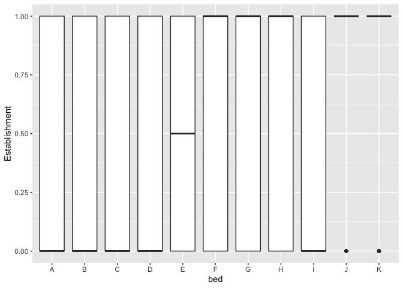<!-- -->

``` r
y1_surv %>% 
  ggplot(aes(x=bed, y=Y1Surv)) +
  geom_boxplot()
```

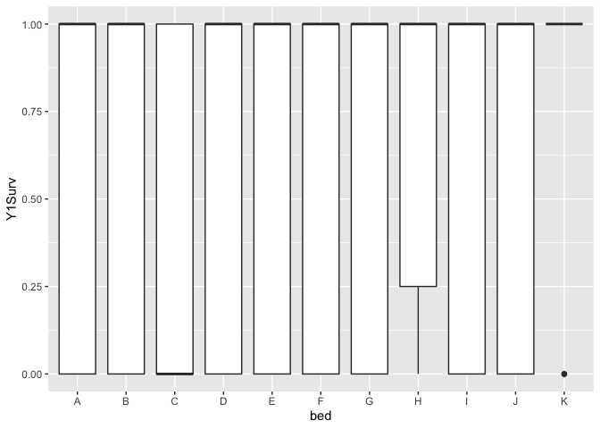<!-- -->

``` r
wintersurv %>% 
  ggplot(aes(x=bed, y=WinterSurv)) +
  geom_boxplot()
```

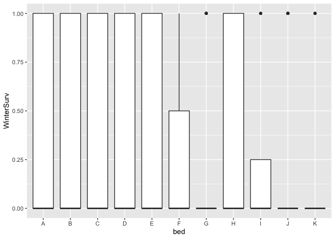<!-- -->

``` r
repsurvy2 %>% 
  ggplot(aes(x=bed, y=SurvtoRep_y2)) +
  geom_boxplot()
```

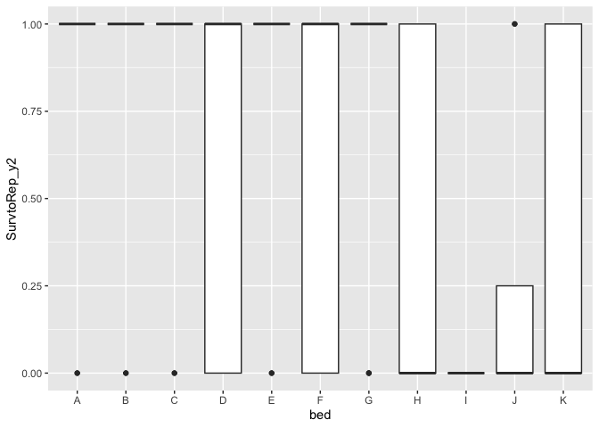<!-- -->

``` r
fruitsy2 %>% 
  ggplot(aes(x=bed, y=fruits)) +
  geom_boxplot()
```

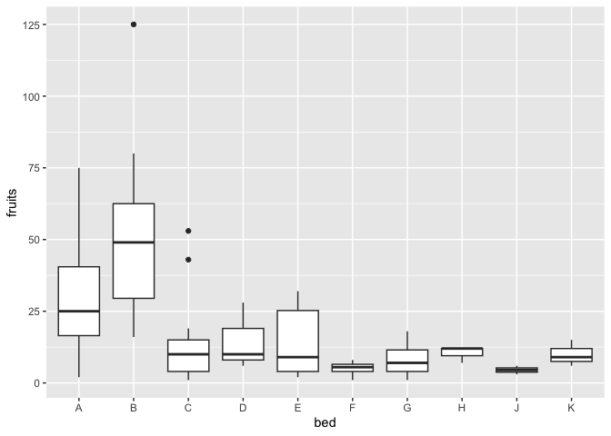<!-- -->

``` r
probfruit %>% 
  ggplot(aes(x=bed, y=ProbFruits)) +
  geom_boxplot()
```

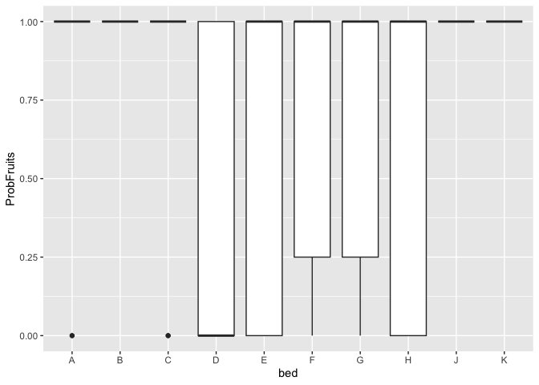<!-- -->

``` r
totfruit %>% 
  ggplot(aes(x=bed, y=Total_Fitness)) +
  geom_boxplot()
```

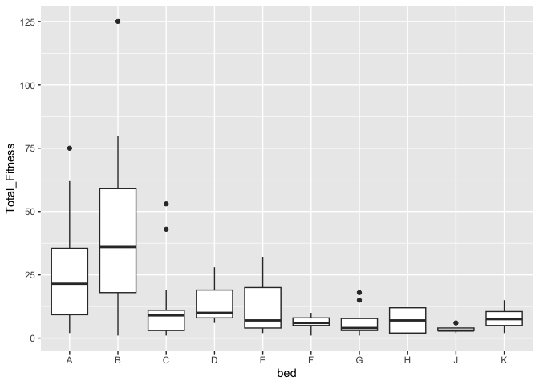<!-- -->

## Summaries

``` r
wl2_est_summary <- wl2_est %>% 
  group_by(bed) %>% 
  summarise(meanSurv=mean(Establishment, na.rm=TRUE), semSurv=sem(Establishment, na.rm=TRUE))

y1surv_summary <- y1_surv %>% 
  group_by(bed) %>% 
  summarise(meanSurv=mean(Y1Surv, na.rm=TRUE), semSurv=sem(Y1Surv, na.rm=TRUE))

wintersurv_summary <- wintersurv %>% 
  group_by(bed) %>% 
  summarise(meanSurv=mean(WinterSurv, na.rm=TRUE), semSurv=sem(WinterSurv, na.rm=TRUE))

repsurvy2_summary <- repsurvy2 %>% 
  group_by(bed) %>% 
  summarise(meanSurv=mean(SurvtoRep_y2, na.rm=TRUE), semSurv=sem(SurvtoRep_y2, na.rm=TRUE))

fruitsy2_summary <- fruitsy2 %>% 
  group_by(bed) %>% 
  summarise(meanSurv=mean(fruits, na.rm=TRUE), semSurv=sem(fruits, na.rm=TRUE))

probfruit_summary <- probfruit %>% 
  group_by(bed) %>% 
  summarise(meanSurv=mean(ProbFruits, na.rm=TRUE), semSurv=sem(ProbFruits, na.rm=TRUE))

totfruit_summary <- totfruit %>% 
  group_by(bed) %>% 
  summarise(meanSurv=mean(Total_Fitness, na.rm=TRUE), semSurv=sem(Total_Fitness, na.rm=TRUE))
```

## Bar Plots

``` r
wl2_est_summary %>% 
  ggplot(aes(x=fct_reorder(bed, meanSurv), y=meanSurv)) +
  geom_col(width = 0.7,position = position_dodge(0.75)) + 
  geom_errorbar(aes(ymin=meanSurv-semSurv,ymax=meanSurv+semSurv),width=.2, position = 
                  position_dodge(0.75)) +
  theme_classic() +
  labs(x="Bed", y="Establishment")
```

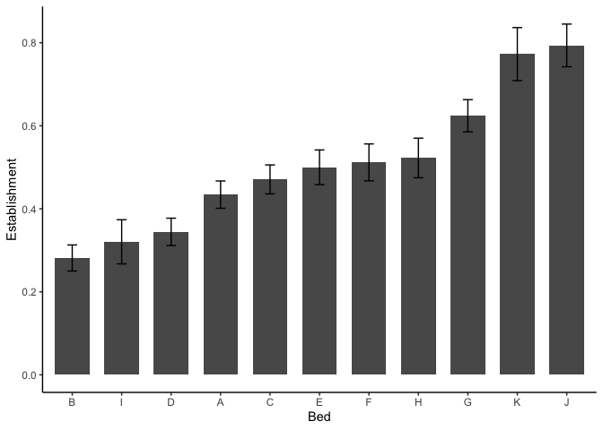<!-- -->

``` r
y1surv_summary %>% 
  ggplot(aes(x=fct_reorder(bed, meanSurv), y=meanSurv)) +
  geom_col(width = 0.7,position = position_dodge(0.75)) + 
  geom_errorbar(aes(ymin=meanSurv-semSurv,ymax=meanSurv+semSurv),width=.2, position = 
                  position_dodge(0.75)) +
  theme_classic() +
  labs(x="Bed", y="Y1 Surv")
```

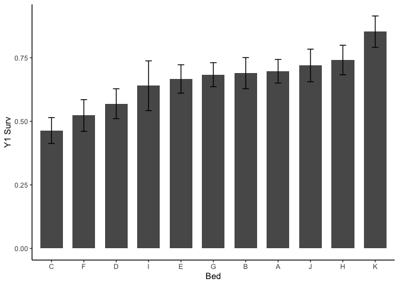<!-- -->

``` r
wintersurv_summary %>% 
  ggplot(aes(x=fct_reorder(bed, meanSurv), y=meanSurv)) +
  geom_col(width = 0.7,position = position_dodge(0.75)) + 
  geom_errorbar(aes(ymin=meanSurv-semSurv,ymax=meanSurv+semSurv),width=.2, position = 
                  position_dodge(0.75)) +
  theme_classic() +
  labs(x="Bed", y="Winter Surv")
```

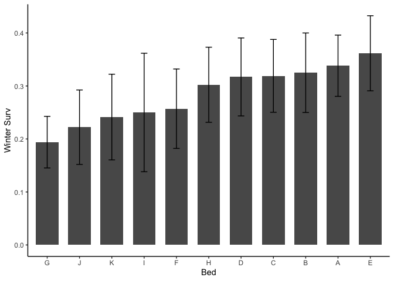<!-- -->

``` r
repsurvy2_summary %>% 
  ggplot(aes(x=fct_reorder(bed, meanSurv), y=meanSurv)) +
  geom_col(width = 0.7,position = position_dodge(0.75)) + 
  geom_errorbar(aes(ymin=meanSurv-semSurv,ymax=meanSurv+semSurv),width=.2, position = 
                  position_dodge(0.75)) +
  theme_classic() +
  labs(x="Bed", y="Surv to Bud Y2")
```

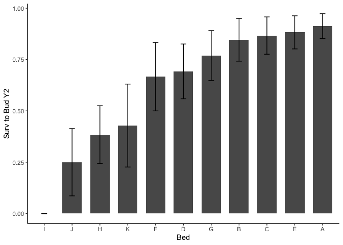<!-- -->

``` r
fruitsy2_summary %>% 
  ggplot(aes(x=fct_reorder(bed, meanSurv), y=meanSurv)) +
  geom_col(width = 0.7,position = position_dodge(0.75)) + 
  geom_errorbar(aes(ymin=meanSurv-semSurv,ymax=meanSurv+semSurv),width=.2, position = 
                  position_dodge(0.75)) +
  theme_classic() +
  labs(x="Bed", y="Fruits Y2")
```

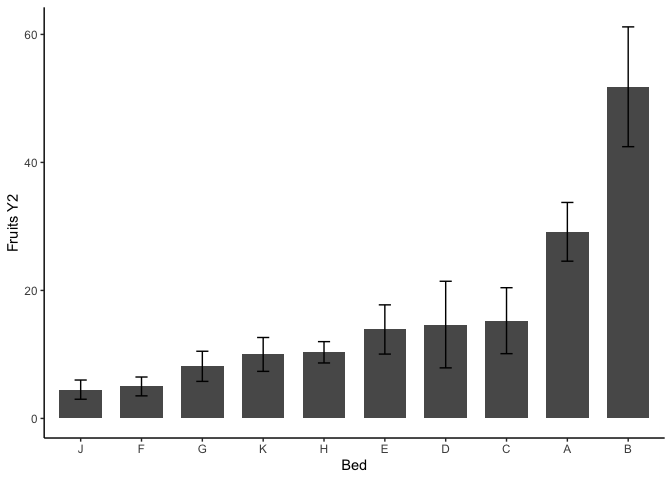<!-- -->

``` r
probfruit_summary %>% 
  ggplot(aes(x=fct_reorder(bed, meanSurv), y=meanSurv)) +
  geom_col(width = 0.7,position = position_dodge(0.75)) + 
  geom_errorbar(aes(ymin=meanSurv-semSurv,ymax=meanSurv+semSurv),width=.2, position = 
                  position_dodge(0.75)) +
  theme_classic() +
  labs(x="Bed", y="Prob. Fruit")
```

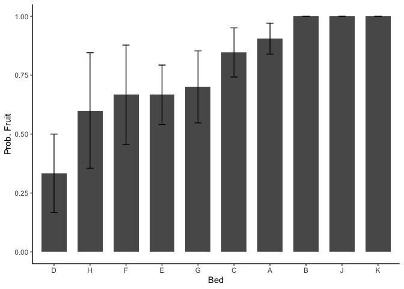<!-- -->

``` r
totfruit_summary %>% 
  ggplot(aes(x=fct_reorder(bed, meanSurv), y=meanSurv)) +
  geom_col(width = 0.7,position = position_dodge(0.75)) + 
  geom_errorbar(aes(ymin=meanSurv-semSurv,ymax=meanSurv+semSurv),width=.2, position = 
                  position_dodge(0.75)) +
  theme_classic() +
  labs(x="Bed", y="Total Fruit")
```

<!-- -->

## Spatial Plots Prep
x = beds + cols
y = row 

``` r
bed_col_info <- wl2_est %>% 
  select(bed, bed.col) %>% 
  distinct() %>% 
  mutate(x_pos = if_else(bed.col=="A", 1,
                         if_else(bed.col=="B", 2, 
                                 if_else(bed.col=="C", 3, 4)))) %>% 
  mutate(x_pos=if_else(bed=="B", x_pos+6,
                       if_else(bed=="C", x_pos+12,
                               if_else(bed=="D", x_pos+18,
                                       if_else(bed=="E", x_pos+24,
                                               if_else(bed=="F", x_pos+30,
                                                       if_else(bed=="G", x_pos+36,
                                                               if_else(bed=="H", x_pos+42, 
                                                                       if_else(bed=="I", x_pos+48,
                                                                               if_else(bed=="J", x_pos+54, 
                                                                                       if_else(bed=="K", x_pos+60, x_pos))))))))))) %>% 
  arrange(bed, bed.col)

bed_col_info
```

```
## # A tibble: 44 × 3
##    bed   bed.col x_pos
##    <chr> <chr>   <dbl>
##  1 A     A           1
##  2 A     B           2
##  3 A     C           3
##  4 A     D           4
##  5 B     A           7
##  6 B     B           8
##  7 B     C           9
##  8 B     D          10
##  9 C     A          13
## 10 C     B          14
## # ℹ 34 more rows
```

## Spatial Plots

``` r
wl2_est %>% 
  left_join(bed_col_info) %>% 
  mutate(Establishment=as.character(Establishment)) %>% 
  ggplot(aes(x=x_pos, y=bed.row, colour=Establishment)) +
  geom_point(size=3) +
  scale_y_reverse() +
  scale_color_manual(values = c("gray", "darkgreen")) + 
  theme_classic()
```

```
## Joining with `by = join_by(bed, bed.col)`
```

<!-- -->
