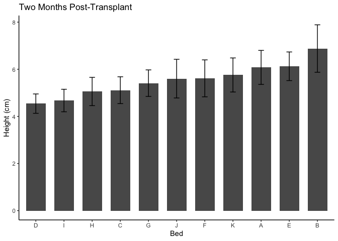
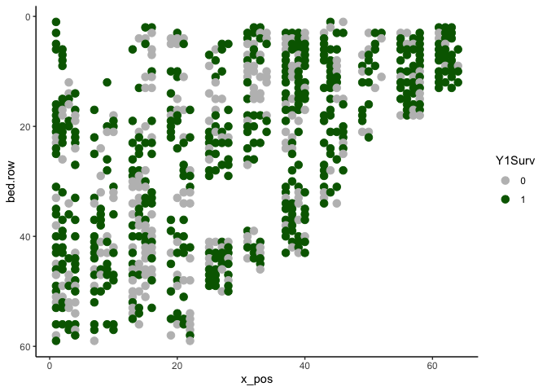
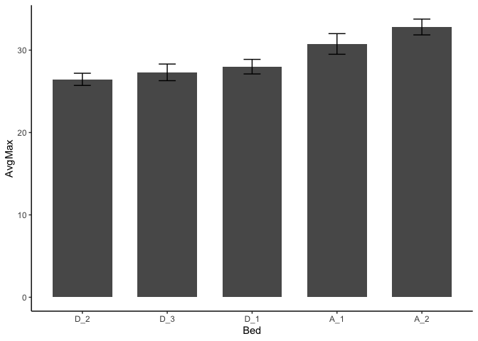
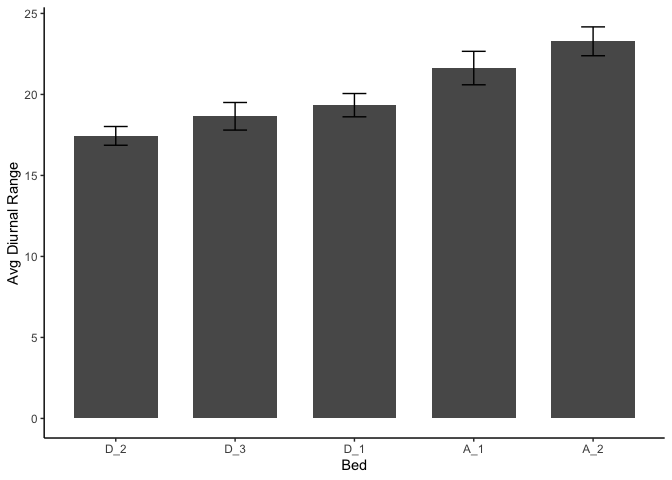

# Evaluating the phenotypic spatial variation (across beds) at WL2

Purpose: See if we could take advantage of the natural variation at WL2 for the 2026 planting

-   Note: There are some packages in R for autocorrelation

To Do:

-   Consider looking at stem diameter and canopy area in year 2

## Load Libraries


``` r
library(tidyverse)
```

```
## ── Attaching core tidyverse packages ──────────────────────── tidyverse 2.0.0 ──
## ✔ dplyr     1.1.4     ✔ readr     2.1.5
## ✔ forcats   1.0.0     ✔ stringr   1.5.1
## ✔ ggplot2   3.5.1     ✔ tibble    3.2.1
## ✔ lubridate 1.9.3     ✔ tidyr     1.3.1
## ✔ purrr     1.0.2     
## ── Conflicts ────────────────────────────────────────── tidyverse_conflicts() ──
## ✖ dplyr::filter() masks stats::filter()
## ✖ dplyr::lag()    masks stats::lag()
## ℹ Use the conflicted package (<http://conflicted.r-lib.org/>) to force all conflicts to become errors
```

``` r
library(viridis)
```

```
## Loading required package: viridisLite
```

``` r
library(brms)
```

```
## Loading required package: Rcpp
## Loading 'brms' package (version 2.22.0). Useful instructions
## can be found by typing help('brms'). A more detailed introduction
## to the package is available through vignette('brms_overview').
## 
## Attaching package: 'brms'
## 
## The following object is masked from 'package:stats':
## 
##     ar
```

``` r
library(zoo) #rollmean function
```

```
## 
## Attaching package: 'zoo'
## 
## The following objects are masked from 'package:base':
## 
##     as.Date, as.Date.numeric
```

``` r
library(lmerTest)
```

```
## Loading required package: lme4
## Loading required package: Matrix
## 
## Attaching package: 'Matrix'
## 
## The following objects are masked from 'package:tidyr':
## 
##     expand, pack, unpack
## 
## 
## Attaching package: 'lme4'
## 
## The following object is masked from 'package:brms':
## 
##     ngrps
## 
## 
## Attaching package: 'lmerTest'
## 
## The following object is masked from 'package:lme4':
## 
##     lmer
## 
## The following object is masked from 'package:stats':
## 
##     step
```

``` r
sem <- function(x, na.rm=FALSE) {           #for calculating standard error
  sd(x,na.rm=na.rm)/sqrt(length(na.omit(x)))
} 
```

## Load Fitness Data


``` r
wl2_est <- read_csv("../output/WL2_Traits/WL2_Establishment.csv") %>% select(block:rep, Establishment) %>% 
  mutate(bed.col=if_else(bed.col=="A -", "A", bed.col))
```

```
## Rows: 1573 Columns: 21
## ── Column specification ────────────────────────────────────────────────────────
## Delimiter: ","
## chr   (7): block, BedLoc, bed, bed.col, Genotype, pop, elevation.group
## dbl  (13): bed.row, mf, rep, elev_m, Lat, Long, GrwSsn_GD_Recent, GrwSsn_GD_...
## date  (1): death.date
## 
## ℹ Use `spec()` to retrieve the full column specification for this data.
## ℹ Specify the column types or set `show_col_types = FALSE` to quiet this message.
```

``` r
y1_surv <- read_csv("../output/WL2_Traits/WL2_Y1Surv.csv") %>% 
  left_join(wl2_est) %>% 
  select(block, bed:bed.col, Genotype:rep, Y1Surv=Survival) 
```

```
## Rows: 728 Columns: 17
## ── Column specification ────────────────────────────────────────────────────────
## Delimiter: ","
## chr  (5): block, Genotype, pop, elevation.group, pheno
## dbl (12): mf, rep, elev_m, Lat, Long, GrwSsn_GD_Recent, GrwSsn_GD_Historical...
## 
## ℹ Use `spec()` to retrieve the full column specification for this data.
## ℹ Specify the column types or set `show_col_types = FALSE` to quiet this message.
## Joining with `by = join_by(block, Genotype, pop, mf, rep)`
```

``` r
wintersurv <- read_csv("../output/WL2_Traits/WL2_WinterSurv_2324.csv") %>% 
  rename(bed.row=`bed- row`, bed.col=`bed- col`) %>% 
  select(block, bed:bed.col, Genotype:rep, WinterSurv)
```

```
## Rows: 469 Columns: 21
## ── Column specification ────────────────────────────────────────────────────────
## Delimiter: ","
## chr  (8): block, BedLoc, bed, bed- col, Genotype, pop, elevation.group, deat...
## dbl (13): bed- row, mf, rep, elev_m, Lat, Long, GrwSsn_GD_Recent, GrwSsn_GD_...
## 
## ℹ Use `spec()` to retrieve the full column specification for this data.
## ℹ Specify the column types or set `show_col_types = FALSE` to quiet this message.
```

``` r
repsurvy2 <- read_csv("../output/WL2_Traits/WL2_Surv_to_Rep_Y2_2324.csv") %>% 
  select(block, bed:col, Genotype, pop:rep, SurvtoRep_y2)
```

```
## Rows: 135 Columns: 23
## ── Column specification ────────────────────────────────────────────────────────
## Delimiter: ","
## chr (10): Pop.Type, loc, bed, col, pop, Genotype, block, elevation.group, bu...
## dbl (13): row, mf, rep, elev_m, Lat, Long, GrwSsn_GD_Recent, GrwSsn_GD_Histo...
## 
## ℹ Use `spec()` to retrieve the full column specification for this data.
## ℹ Specify the column types or set `show_col_types = FALSE` to quiet this message.
```

``` r
fruitsy2 <- read_csv("../output/WL2_Traits/WL2_Fruits_Y2_2324.csv") %>% 
  select(block, bed:col, Genotype, pop:rep, fruits)
```

```
## Rows: 73 Columns: 26
## ── Column specification ────────────────────────────────────────────────────────
## Delimiter: ","
## chr  (8): Pop.Type, loc, bed, col, pop, Genotype, block, elevation.group
## dbl (18): row, mf, rep, flowers, fruits, FrFlN, elev_m, Lat, Long, GrwSsn_GD...
## 
## ℹ Use `spec()` to retrieve the full column specification for this data.
## ℹ Specify the column types or set `show_col_types = FALSE` to quiet this message.
```

``` r
probfruit <- read_csv("../output/WL2_Traits/WL2_ProbFruits_Y2_2324.csv") %>% 
  select(block, bed:col, Genotype, pop:rep, ProbFruits)
```

```
## Rows: 95 Columns: 23
## ── Column specification ────────────────────────────────────────────────────────
## Delimiter: ","
## chr  (7): loc, bed, col, block, pop, Genotype, elevation.group
## dbl (16): row, mf, rep, elev_m, Lat, Long, GrwSsn_GD_Recent, GrwSsn_GD_Histo...
## 
## ℹ Use `spec()` to retrieve the full column specification for this data.
## ℹ Specify the column types or set `show_col_types = FALSE` to quiet this message.
```

``` r
totfruit <- read_csv("../output/WL2_Traits/WL2_TotalRepOutput.csv") %>% 
  select(block:rep, Total_Fitness)
```

```
## Rows: 98 Columns: 21
## ── Column specification ────────────────────────────────────────────────────────
## Delimiter: ","
## chr  (7): block, BedLoc, bed, bed.col, Genotype, pop, elevation.group
## dbl (14): bed.row, mf, rep, elev_m, Lat, Long, GrwSsn_GD_Recent, GrwSsn_GD_H...
## 
## ℹ Use `spec()` to retrieve the full column specification for this data.
## ℹ Specify the column types or set `show_col_types = FALSE` to quiet this message.
```

## Load Size (Height and herbivory 2 months post transplant; stem diameter end of first year)

``` r
WL2_twomonths_size <- read_csv("../input/WL2_Data/CorrectedCSVs/WL2_size_survey_20230913_corrected.csv", 
                               na = c("", "NA", "-", "N/A")) %>% 
  filter(!is.na(pop)) %>% 
  rename(parent.pop=pop) %>% 
  mutate(parent.pop= str_replace(parent.pop, ".*VTR.*", "LVTR1")) %>% 
  unite(BedLoc, bed:bed.col, sep="_", remove = FALSE) %>% 
  filter(BedLoc!="K_5_C", BedLoc!="B_32_A", BedLoc!="C_4_D", BedLoc!="C_5_D") %>% 
  mutate(mf=as.double(mf), rep=as.double(rep)) %>% 
  unite(Genotype, parent.pop:rep, sep="_", remove = FALSE) %>% 
  filter(!str_detect(Genotype, ".*buff*")) %>% 
  select(block:height.cm, herbiv.y.n)
```

```
## Rows: 1826 Columns: 11
## ── Column specification ────────────────────────────────────────────────────────
## Delimiter: ","
## chr (8): block, bed, bed.col, pop, mf, rep, herbiv.y.n, survey.notes
## dbl (3): bed.row, height.cm, long.leaf.cm
## 
## ℹ Use `spec()` to retrieve the full column specification for this data.
## ℹ Specify the column types or set `show_col_types = FALSE` to quiet this message.
```

```
## Warning: There were 2 warnings in `mutate()`.
## The first warning was:
## ℹ In argument: `mf = as.double(mf)`.
## Caused by warning:
## ! NAs introduced by coercion
## ℹ Run `dplyr::last_dplyr_warnings()` to see the 1 remaining warning.
```

``` r
wl2_anncensus <- read_csv("../input/WL2_Data/CorrectedCSVs/WL2_annual_census_20231027_corrected.csv") %>% 
  select(block, bed, bed.row=`bed-row`, bed.col=`bed-col`, pop:diam.mm) %>% 
  filter(!is.na(pop)) %>% 
  rename(parent.pop=pop) %>% 
  mutate(parent.pop= str_replace(parent.pop, ".*VTR.*", "LVTR1")) %>% 
  unite(BedLoc, bed:bed.col, sep="_", remove = FALSE) %>% 
  filter(BedLoc!="K_5_C", BedLoc!="B_32_A", BedLoc!="C_4_D", BedLoc!="C_5_D") %>% 
  mutate(mf=as.double(mf), rep=as.double(rep)) %>% 
  unite(Genotype, parent.pop:rep, sep="_", remove = FALSE) %>% 
  filter(!str_detect(Genotype, ".*buff*"))
```

```
## Warning: One or more parsing issues, call `problems()` on your data frame for details,
## e.g.:
##   dat <- vroom(...)
##   problems(dat)
```

```
## Rows: 1826 Columns: 19
## ── Column specification ────────────────────────────────────────────────────────
## Delimiter: ","
## chr (10): date, block, bed, bed-col, pop, mf, rep, pheno, herbiv.y.n, survey...
## dbl  (7): bed-row, diam.mm, num.flw, num.fruit, long.fruit.cm, total.branch,...
## lgl  (2): height.cm, long.leaf.cm
## 
## ℹ Use `spec()` to retrieve the full column specification for this data.
## ℹ Specify the column types or set `show_col_types = FALSE` to quiet this message.
```

```
## Warning: There were 2 warnings in `mutate()`.
## The first warning was:
## ℹ In argument: `mf = as.double(mf)`.
## Caused by warning:
## ! NAs introduced by coercion
## ℹ Run `dplyr::last_dplyr_warnings()` to see the 1 remaining warning.
```

## Read in soil temp


``` r
temp_2023 <- read_csv("../input/WL2_Data/WL2_2022_2023_iButton_Data_Corrected.csv") %>%
  select(-`...3`) %>%
  mutate(Date_Time = mdy_hm(Date_Time)) %>%
  filter(Date_Time > ymd("2023-07-06"))
```

```
## New names:
## Rows: 14253 Columns: 4
## ── Column specification
## ──────────────────────────────────────────────────────── Delimiter: "," chr
## (3): Bed, Date_Time, ...3 dbl (1): SoilTemp
## ℹ Use `spec()` to retrieve the full column specification for this data. ℹ
## Specify the column types or set `show_col_types = FALSE` to quiet this message.
## • `` -> `...3`
```

``` r
head(temp_2023)
```

```
## # A tibble: 6 × 3
##   Bed   Date_Time           SoilTemp
##   <chr> <dttm>                 <dbl>
## 1 A_1   2023-07-13 14:46:00     27.5
## 2 A_1   2023-07-13 15:46:00     32  
## 3 A_1   2023-07-13 16:46:00     31.5
## 4 A_1   2023-07-13 17:46:00     28.5
## 5 A_1   2023-07-13 18:46:00     25  
## 6 A_1   2023-07-13 19:46:00     22
```

``` r
unique(temp_2023$Bed) #only have Bed A and D
```

```
## [1] "A_1" "A_2" "D_1" "D_2" "D_3"
```

``` r
#2 at each end of bed A and 3 in bed D ends and middle

temp_2024 <- read_csv("../input/WL2_Data/WL2_2024_iButton_Data_Corrected.csv")
```

```
## Rows: 49326 Columns: 3
## ── Column specification ────────────────────────────────────────────────────────
## Delimiter: ","
## chr  (1): Bed
## dbl  (1): SoilTemp
## dttm (1): Date_Time
## 
## ℹ Use `spec()` to retrieve the full column specification for this data.
## ℹ Specify the column types or set `show_col_types = FALSE` to quiet this message.
```

``` r
head(temp_2024)
```

```
## # A tibble: 6 × 3
##   Bed   Date_Time           SoilTemp
##   <chr> <dttm>                 <dbl>
## 1 A     2023-10-27 18:10:00      3.5
## 2 A     2023-10-27 21:10:00      1  
## 3 A     2023-10-28 00:10:00      0.5
## 4 A     2023-10-28 03:10:00     -0.5
## 5 A     2023-10-28 06:10:00     -1  
## 6 A     2023-10-28 09:10:00     -1
```

``` r
unique(temp_2024$Bed) #have data for all beds 
```

```
##  [1] "A" "B" "C" "D" "E" "F" "G" "H" "I" "J" "K"
```

## Box Plots

``` r
wl2_est %>% 
  ggplot(aes(x=bed, y=Establishment)) +
  geom_boxplot()
```

<!-- -->

``` r
y1_surv %>% 
  ggplot(aes(x=bed, y=Y1Surv)) +
  geom_boxplot()
```

<!-- -->

``` r
wintersurv %>% 
  ggplot(aes(x=bed, y=WinterSurv)) +
  geom_boxplot()
```

<!-- -->

``` r
repsurvy2 %>% 
  ggplot(aes(x=bed, y=SurvtoRep_y2)) +
  geom_boxplot()
```

<!-- -->

``` r
fruitsy2 %>% 
  ggplot(aes(x=bed, y=fruits)) +
  geom_boxplot()
```

<!-- -->

``` r
probfruit %>% 
  ggplot(aes(x=bed, y=ProbFruits)) +
  geom_boxplot()
```

<!-- -->

``` r
totfruit %>% 
  ggplot(aes(x=bed, y=Total_Fitness)) +
  geom_boxplot()
```

<!-- -->

``` r
WL2_twomonths_size %>% 
  ggplot(aes(x=bed, y=height.cm)) +
  geom_boxplot()
```

```
## Warning: Removed 1025 rows containing non-finite outside the scale range
## (`stat_boxplot()`).
```

<!-- -->

``` r
WL2_twomonths_size %>% 
  mutate(herbiv.bin = if_else(herbiv.y.n=="Y", 1, 0)) %>% 
  ggplot(aes(x=bed, y=herbiv.bin)) +
  geom_boxplot()
```

```
## Warning: Removed 1024 rows containing non-finite outside the scale range
## (`stat_boxplot()`).
```

<!-- -->

``` r
wl2_anncensus %>% 
  ggplot(aes(x=bed, y=diam.mm)) +
  geom_boxplot()
```

```
## Warning: Removed 1198 rows containing non-finite outside the scale range
## (`stat_boxplot()`).
```

<!-- -->

``` r
temp_2023 %>% 
  ggplot(aes(x=Bed, y=SoilTemp)) +
  geom_boxplot()
```

<!-- -->

``` r
temp_2024 %>% 
  ggplot(aes(x=Bed, y=SoilTemp)) +
  geom_boxplot()
```

<!-- -->

## Summaries

``` r
wl2_est_summary <- wl2_est %>% 
  group_by(bed) %>% 
  summarise(meanSurv=mean(Establishment, na.rm=TRUE), semSurv=sem(Establishment, na.rm=TRUE))

y1surv_summary <- y1_surv %>% 
  group_by(bed) %>% 
  summarise(meanSurv=mean(Y1Surv, na.rm=TRUE), semSurv=sem(Y1Surv, na.rm=TRUE))

wintersurv_summary <- wintersurv %>% 
  group_by(bed) %>% 
  summarise(meanSurv=mean(WinterSurv, na.rm=TRUE), semSurv=sem(WinterSurv, na.rm=TRUE))

repsurvy2_summary <- repsurvy2 %>% 
  group_by(bed) %>% 
  summarise(meanSurv=mean(SurvtoRep_y2, na.rm=TRUE), semSurv=sem(SurvtoRep_y2, na.rm=TRUE))

fruitsy2_summary <- fruitsy2 %>% 
  group_by(bed) %>% 
  summarise(meanSurv=mean(fruits, na.rm=TRUE), semSurv=sem(fruits, na.rm=TRUE))

probfruit_summary <- probfruit %>% 
  group_by(bed) %>% 
  summarise(meanSurv=mean(ProbFruits, na.rm=TRUE), semSurv=sem(ProbFruits, na.rm=TRUE))

totfruit_summary <- totfruit %>% 
  group_by(bed) %>% 
  summarise(meanSurv=mean(Total_Fitness, na.rm=TRUE), semSurv=sem(Total_Fitness, na.rm=TRUE))

height_summary <- WL2_twomonths_size %>% 
  group_by(bed) %>% 
  summarise(meanHeight=mean(height.cm, na.rm=TRUE), semHeight=sem(height.cm, na.rm=TRUE))

herbiv_summary <- WL2_twomonths_size %>% 
  mutate(herbiv.bin = if_else(herbiv.y.n=="Y", 1, 0)) %>% 
  group_by(bed) %>% 
  summarise(meanHerb=mean(herbiv.bin, na.rm=TRUE), semHerb=sem(herbiv.bin, na.rm = TRUE))

diam_summary <- wl2_anncensus %>% 
  group_by(bed) %>% 
  summarise(meanDiam=mean(diam.mm, na.rm=TRUE), semDiam=sem(diam.mm, na.rm=TRUE))
```


``` r
temp_2023_daily_summary <- temp_2023 %>%
  mutate(Date=as.Date(Date_Time)) %>%
  group_by(Bed, Date) %>% #summarize hourly data by date
  summarize(
    min_temp_d = min(SoilTemp),
    max_temp_d = max(SoilTemp),
    mean_temp_d = mean(SoilTemp),
    diurnal_temp_d = max_temp_d - min_temp_d
  )
```

```
## `summarise()` has grouped output by 'Bed'. You can override using the `.groups`
## argument.
```

``` r
temp_2023_beds_summary <- temp_2023_daily_summary %>% 
  group_by(Bed) %>% 
  summarise(AvgMin=mean(min_temp_d), semMin=sem(min_temp_d),
            AvgMax=mean(max_temp_d), semMax=sem(max_temp_d),
            AvgTemp=mean(mean_temp_d), semMean=sem(mean_temp_d),
            AvgDiurnal=mean(diurnal_temp_d), semDiurnal=sem(diurnal_temp_d))
temp_2023_beds_summary
```

```
## # A tibble: 5 × 9
##   Bed   AvgMin semMin AvgMax semMax AvgTemp semMean AvgDiurnal semDiurnal
##   <chr>  <dbl>  <dbl>  <dbl>  <dbl>   <dbl>   <dbl>      <dbl>      <dbl>
## 1 A_1     9.12  0.374   30.8  1.25     17.7   0.694       21.6      1.03 
## 2 A_2     9.53  0.308   32.8  0.958    18.4   0.437       23.3      0.891
## 3 D_1     8.66  0.369   28.0  0.884    15.4   0.485       19.3      0.719
## 4 D_2     9.01  0.348   26.5  0.740    14.9   0.441       17.4      0.579
## 5 D_3     8.65  0.354   27.3  1.01     14.8   0.487       18.7      0.852
```

``` r
temp_2024_daily_summary <- temp_2024 %>%
  mutate(Date=as.Date(Date_Time)) %>%
  group_by(Bed, Date) %>% #summarize hourly data by date
  summarize(
    min_temp_d = min(SoilTemp),
    max_temp_d = max(SoilTemp),
    mean_temp_d = mean(SoilTemp),
    diurnal_temp_d = max_temp_d - min_temp_d
  )
```

```
## `summarise()` has grouped output by 'Bed'. You can override using the `.groups`
## argument.
```

``` r
temp_2024_beds_summary <- temp_2024_daily_summary %>% 
  group_by(Bed) %>% 
  summarise(AvgMin=mean(min_temp_d), semMin=sem(min_temp_d),
            AvgMax=mean(max_temp_d), semMax=sem(max_temp_d),
            AvgTemp=mean(mean_temp_d), semMean=sem(mean_temp_d),
            AvgDiurnal=mean(diurnal_temp_d), semDiurnal=sem(diurnal_temp_d))
temp_2024_beds_summary
```

```
## # A tibble: 11 × 9
##    Bed   AvgMin semMin AvgMax semMax AvgTemp semMean AvgDiurnal semDiurnal
##    <chr>  <dbl>  <dbl>  <dbl>  <dbl>   <dbl>   <dbl>      <dbl>      <dbl>
##  1 A       3.83  0.267   18.2  1.07     9.04   0.560       14.3      0.833
##  2 B       3.74  0.289   17.1  1.15     8.73   0.609       13.3      0.890
##  3 C       2.71  0.235   17.2  1.11     7.87   0.536       14.5      0.908
##  4 D       3.51  0.243   16.0  0.984    7.76   0.483       12.5      0.775
##  5 E       3.20  0.263   15.0  1.04     7.20   0.510       11.8      0.807
##  6 F       3.02  0.252   14.2  0.899    7.00   0.468       11.2      0.672
##  7 G       2.92  0.224   15.9  0.975    7.47   0.475       13.0      0.780
##  8 H       3.38  0.240   14.7  0.932    7.21   0.463       11.3      0.717
##  9 I       3.08  0.214   14.0  0.862    6.77   0.421       10.9      0.669
## 10 J       3.03  0.239   13.9  0.897    6.49   0.431       10.9      0.681
## 11 K       4.85  0.359   20.2  1.18     9.85   0.600       15.4      0.861
```

## Bar Plots

``` r
wl2_est_summary %>% 
  ggplot(aes(x=fct_reorder(bed, meanSurv), y=meanSurv)) +
  geom_col(width = 0.7,position = position_dodge(0.75)) + 
  geom_errorbar(aes(ymin=meanSurv-semSurv,ymax=meanSurv+semSurv),width=.2, position = 
                  position_dodge(0.75)) +
  theme_classic() +
  labs(x="Bed", y="Establishment") +
  theme(text=element_text(size=25)) 
```

<!-- -->

``` r
ggsave("../output/WL2_Traits/Beds_Est.png", width = 12, height = 8, units = "in")

y1surv_summary %>% 
  ggplot(aes(x=fct_reorder(bed, meanSurv), y=meanSurv)) +
  geom_col(width = 0.7,position = position_dodge(0.75)) + 
  geom_errorbar(aes(ymin=meanSurv-semSurv,ymax=meanSurv+semSurv),width=.2, position = 
                  position_dodge(0.75)) +
  theme_classic() +
  labs(x="Bed", y="Y1 Surv") +
  theme(text=element_text(size=25)) 
```

<!-- -->

``` r
ggsave("../output/WL2_Traits/Beds_Y1Surv.png", width = 12, height = 8, units = "in")

wintersurv_summary %>% 
  ggplot(aes(x=fct_reorder(bed, meanSurv), y=meanSurv)) +
  geom_col(width = 0.7,position = position_dodge(0.75)) + 
  geom_errorbar(aes(ymin=meanSurv-semSurv,ymax=meanSurv+semSurv),width=.2, position = 
                  position_dodge(0.75)) +
  theme_classic() +
  labs(x="Bed", y="Winter Surv") +
  theme(text=element_text(size=25)) 
```

<!-- -->

``` r
ggsave("../output/WL2_Traits/Beds_WinterSurv.png", width = 12, height = 8, units = "in")

repsurvy2_summary %>% 
  ggplot(aes(x=fct_reorder(bed, meanSurv), y=meanSurv)) +
  geom_col(width = 0.7,position = position_dodge(0.75)) + 
  geom_errorbar(aes(ymin=meanSurv-semSurv,ymax=meanSurv+semSurv),width=.2, position = 
                  position_dodge(0.75)) +
  theme_classic() +
  labs(x="Bed", y="Surv to Bud Y2") +
  theme(text=element_text(size=25)) 
```

<!-- -->

``` r
ggsave("../output/WL2_Traits/Beds_Y2RepSurv.png", width = 12, height = 8, units = "in")

fruitsy2_summary %>% 
  ggplot(aes(x=fct_reorder(bed, meanSurv), y=meanSurv)) +
  geom_col(width = 0.7,position = position_dodge(0.75)) + 
  geom_errorbar(aes(ymin=meanSurv-semSurv,ymax=meanSurv+semSurv),width=.2, position = 
                  position_dodge(0.75)) +
  theme_classic() +
  labs(x="Bed", y="Fruits Y2") +
  theme(text=element_text(size=25)) 
```

<!-- -->

``` r
ggsave("../output/WL2_Traits/Beds_Y2Fruits.png", width = 12, height = 8, units = "in")

probfruit_summary %>% 
  ggplot(aes(x=fct_reorder(bed, meanSurv), y=meanSurv)) +
  geom_col(width = 0.7,position = position_dodge(0.75)) + 
  geom_errorbar(aes(ymin=meanSurv-semSurv,ymax=meanSurv+semSurv),width=.2, position = 
                  position_dodge(0.75)) +
  theme_classic() +
  labs(x="Bed", y="Prob. Fruit") +
  theme(text=element_text(size=25)) 
```

<!-- -->

``` r
ggsave("../output/WL2_Traits/Beds_ProbRep.png", width = 12, height = 8, units = "in")

totfruit_summary %>% 
  ggplot(aes(x=fct_reorder(bed, meanSurv), y=meanSurv)) +
  geom_col(width = 0.7,position = position_dodge(0.75)) + 
  geom_errorbar(aes(ymin=meanSurv-semSurv,ymax=meanSurv+semSurv),width=.2, position = 
                  position_dodge(0.75)) +
  theme_classic() +
  labs(x="Bed", y="Total Fruit") +
  theme(text=element_text(size=25)) 
```

<!-- -->

``` r
ggsave("../output/WL2_Traits/Beds_TotRep.png", width = 12, height = 8, units = "in")

height_summary %>% 
  ggplot(aes(x=fct_reorder(bed, meanHeight), y=meanHeight)) +
  geom_col(width = 0.7,position = position_dodge(0.75)) + 
  geom_errorbar(aes(ymin=meanHeight-semHeight,ymax=meanHeight+semHeight),width=.2, position = 
                  position_dodge(0.75)) +
  theme_classic() +
  labs(x="Bed", y="Height (cm)", title = "Two Months Post-Transplant") +
  theme(text=element_text(size=25)) 
```

<!-- -->

``` r
ggsave("../output/WL2_Traits/Beds_Height.png", width = 12, height = 8, units = "in")

herbiv_summary %>% 
  ggplot(aes(x=fct_reorder(bed, meanHerb), y=meanHerb)) +
  geom_col(width = 0.7,position = position_dodge(0.75)) + 
  geom_errorbar(aes(ymin=meanHerb-semHerb,ymax=meanHerb+semHerb),width=.2, position = 
                  position_dodge(0.75)) +
  theme_classic() +
  labs(x="Bed", y="Prob of Herbivory", title = "Two Months Post-Transplant") +
  theme(text=element_text(size=25)) 
```

<!-- -->

``` r
ggsave("../output/WL2_Traits/Beds_Herbiv.png", width = 12, height = 8, units = "in")

diam_summary %>% 
  ggplot(aes(x=fct_reorder(bed, meanDiam), y=meanDiam)) +
  geom_col(width = 0.7,position = position_dodge(0.75)) + 
  geom_errorbar(aes(ymin=meanDiam-semDiam,ymax=meanDiam+semDiam),width=.2, position = 
                  position_dodge(0.75)) +
  theme_classic() +
  labs(x="Bed", y="Stem Diameter (mm)") +
  theme(text=element_text(size=25)) 
```

<!-- -->

``` r
ggsave("../output/WL2_Traits/Beds_Diam.png", width = 12, height = 8, units = "in")
```

## Spatial Plots Prep
x = beds + cols
y = row 

``` r
bed_col_info <- wl2_est %>% 
  select(bed, bed.col) %>% 
  distinct() %>% 
  mutate(x_pos = if_else(bed.col=="A", 1,
                         if_else(bed.col=="B", 2, 
                                 if_else(bed.col=="C", 3, 4)))) %>% 
  mutate(x_pos=if_else(bed=="B", x_pos+6,
                       if_else(bed=="C", x_pos+12,
                               if_else(bed=="D", x_pos+18,
                                       if_else(bed=="E", x_pos+24,
                                               if_else(bed=="F", x_pos+30,
                                                       if_else(bed=="G", x_pos+36,
                                                               if_else(bed=="H", x_pos+42, 
                                                                       if_else(bed=="I", x_pos+48,
                                                                               if_else(bed=="J", x_pos+54, 
                                                                                       if_else(bed=="K", x_pos+60, x_pos))))))))))) %>% 
  arrange(bed, bed.col)

bed_col_info
```

```
## # A tibble: 44 × 3
##    bed   bed.col x_pos
##    <chr> <chr>   <dbl>
##  1 A     A           1
##  2 A     B           2
##  3 A     C           3
##  4 A     D           4
##  5 B     A           7
##  6 B     B           8
##  7 B     C           9
##  8 B     D          10
##  9 C     A          13
## 10 C     B          14
## # ℹ 34 more rows
```

``` r
bed_rect <- data.frame( #data frame for bed rectangles 
  xmin = c(1, 7, 13, 19, 25, 31, 37, 43, 49, 55, 61),
  xmax = c(4, 10, 16, 22, 28, 34, 40, 46, 52, 58, 64),
  ymin = 1,
  ymax = c(59, 59, 58, 59, 51, 46, 43, 34, 22, 18, 13)
)
```

## Spatial Plots

``` r
wl2_est %>% 
  left_join(bed_col_info) %>% 
  mutate(Establishment=as.character(Establishment)) %>% 
  ggplot(aes(x=x_pos, y=bed.row, colour=Establishment)) +
  geom_point(size=3) +
  scale_y_reverse() +
  scale_color_manual(values = c("gray", "darkgreen")) + 
  theme_classic() +
  theme(text=element_text(size=25)) 
```

```
## Joining with `by = join_by(bed, bed.col)`
```

<!-- -->

``` r
ggsave("../output/WL2_Traits/SpatialVar_Est.png", width = 12, height = 8, units = "in")

y1_surv %>% 
  left_join(bed_col_info) %>% 
  mutate(Y1Surv=as.character(Y1Surv)) %>% 
  ggplot(aes(x=x_pos, y=bed.row, colour=Y1Surv)) +
  geom_point(size=3) +
  scale_y_reverse() +
  scale_color_manual(values = c("gray", "darkgreen")) + 
  theme_classic() +
  theme(text=element_text(size=25)) 
```

```
## Joining with `by = join_by(bed, bed.col)`
```

<!-- -->

``` r
ggsave("../output/WL2_Traits/SpatialVar_Y1Surv.png", width = 12, height = 8, units = "in")

wintersurv %>% 
  left_join(bed_col_info) %>% 
  mutate(WinterSurv=as.character(WinterSurv)) %>% 
  ggplot(aes(x=x_pos, y=bed.row, colour=WinterSurv)) +
  geom_point(size=3) +
  scale_y_reverse() +
  scale_color_manual(values = c("gray", "darkgreen")) + 
  theme_classic() +
  theme(text=element_text(size=25)) 
```

```
## Joining with `by = join_by(bed, bed.col)`
```

<!-- -->

``` r
ggsave("../output/WL2_Traits/SpatialVar_WinterSurv.png", width = 12, height = 8, units = "in")

repsurvy2 %>% 
  rename(bed.row=row, bed.col=col) %>% 
  left_join(bed_col_info) %>% 
  mutate(SurvtoRep_y2=as.character(SurvtoRep_y2)) %>% 
  ggplot(aes(x=x_pos, y=bed.row, colour=SurvtoRep_y2)) +
  geom_point(size=3) +
  scale_y_reverse() +
  scale_color_manual(values = c("gray", "darkgreen")) + 
  geom_rect(data=bed_rect, aes(xmin = xmin, xmax = xmax, ymin = ymin, ymax = ymax), colour = "black", alpha=0, inherit.aes = FALSE) +
  theme_classic()
```

```
## Joining with `by = join_by(bed, bed.col)`
```

<!-- -->

``` r
probfruit %>% 
  rename(bed.row=row, bed.col=col) %>% 
  left_join(bed_col_info) %>% 
  mutate(ProbFruits=as.character(ProbFruits)) %>% 
  ggplot(aes(x=x_pos, y=bed.row, colour=ProbFruits)) +
  geom_point(size=3) +
  scale_y_reverse() +
  scale_color_manual(values = c("gray", "darkgreen")) + 
  geom_rect(data=bed_rect, aes(xmin = xmin, xmax = xmax, ymin = ymin, ymax = ymax), colour = "black", alpha=0, inherit.aes = FALSE) +
  theme_classic()
```

```
## Joining with `by = join_by(bed, bed.col)`
```

<!-- -->

``` r
 WL2_twomonths_size %>% 
  mutate(herbiv.bin = if_else(herbiv.y.n=="Y", 1, 0)) %>% 
  left_join(bed_col_info) %>% 
  mutate(herbiv.bin=as.character(herbiv.bin)) %>% 
   filter(!is.na(herbiv.bin)) %>% 
  ggplot(aes(x=x_pos, y=bed.row, colour=herbiv.bin)) +
  geom_point(size=3) +
  scale_y_reverse() +
  scale_color_manual(values = c("gray", "darkgreen")) + 
  theme_classic()
```

```
## Joining with `by = join_by(bed, bed.col)`
```

<!-- -->

### Continuous Traits (fruit number and size)

``` r
fruitsy2 %>% 
  rename(bed.row=row, bed.col=col) %>% 
  left_join(bed_col_info) %>% 
  ggplot(aes(x=x_pos, y=bed.row, colour=fruits)) +
  geom_point(size=3) +
  scale_y_reverse() +
  scale_color_viridis() +
  geom_rect(data=bed_rect, aes(xmin = xmin, xmax = xmax, ymin = ymin, ymax = ymax), colour = "black", alpha=0, inherit.aes = FALSE) +
  theme_classic()
```

```
## Joining with `by = join_by(bed, bed.col)`
```

<!-- -->

``` r
totfruit %>% 
  left_join(bed_col_info) %>% 
  ggplot(aes(x=x_pos, y=bed.row, colour=Total_Fitness)) +
  geom_point(size=3) +
  scale_y_reverse() +
  scale_color_viridis() +
  geom_rect(data=bed_rect, aes(xmin = xmin, xmax = xmax, ymin = ymin, ymax = ymax), colour = "black", alpha=0, inherit.aes = FALSE) +
  theme_classic()
```

```
## Joining with `by = join_by(bed, bed.col)`
```

<!-- -->

``` r
WL2_twomonths_size %>% 
  left_join(bed_col_info) %>% 
  filter(!is.na(height.cm)) %>% 
  ggplot(aes(x=x_pos, y=bed.row, colour=height.cm)) +
  geom_point(size=3) +
  scale_y_reverse() +
  scale_color_viridis() +
  theme_classic()
```

```
## Joining with `by = join_by(bed, bed.col)`
```

<!-- -->

``` r
wl2_anncensus %>% 
  left_join(bed_col_info) %>% 
  filter(!is.na(diam.mm)) %>% 
  ggplot(aes(x=x_pos, y=bed.row, colour=diam.mm)) +
  geom_point(size=3) +
  scale_y_reverse() +
  scale_color_viridis() +
  theme_classic()
```

```
## Joining with `by = join_by(bed, bed.col)`
```

<!-- -->

## Temperature Plots
### 2023

``` r
temp_2023_beds_summary %>% 
  ggplot(aes(x=fct_reorder(Bed, AvgMin), y=AvgMin)) +
  geom_col(width = 0.7,position = position_dodge(0.75)) + 
  geom_errorbar(aes(ymin=AvgMin-semMin,ymax=AvgMin+semMin),width=.2, position = 
                  position_dodge(0.75)) +
  theme_minimal() +
  theme(text=element_text(size=25)) +
  labs(x="Bed", y="Min Temp", title = "WL2 2023")
```

<!-- -->

``` r
ggsave("../output/Climate/MinTemp_2023.png", width = 12, height = 8, units = "in")

temp_2023_beds_summary %>% 
  ggplot(aes(x=fct_reorder(Bed, AvgMax), y=AvgMax)) +
  geom_col(width = 0.7,position = position_dodge(0.75)) + 
  geom_errorbar(aes(ymin=AvgMax-semMax,ymax=AvgMax+semMax),width=.2, position = 
                  position_dodge(0.75)) +
  theme_minimal() +
  theme(text=element_text(size=25)) +
  labs(x="Bed", y="Max Temp", title = "WL2 2023")
```

<!-- -->

``` r
ggsave("../output/Climate/MaxTemp_2023.png", width = 12, height = 8, units = "in")

temp_2023_beds_summary %>% 
  ggplot(aes(x=fct_reorder(Bed, AvgTemp), y=AvgTemp)) +
  geom_col(width = 0.7,position = position_dodge(0.75)) + 
  geom_errorbar(aes(ymin=AvgTemp-semMean,ymax=AvgTemp+semMean),width=.2, position = 
                  position_dodge(0.75)) +
  theme_minimal() +
  theme(text=element_text(size=25)) +
  labs(x="Bed", y="Mean Temp", title = "WL2 2023")
```

<!-- -->

``` r
ggsave("../output/Climate/MeanTemp_2023.png", width = 12, height = 8, units = "in")

temp_2023_beds_summary %>% 
  ggplot(aes(x=fct_reorder(Bed, AvgDiurnal), y=AvgDiurnal)) +
  geom_col(width = 0.7,position = position_dodge(0.75)) + 
  geom_errorbar(aes(ymin=AvgDiurnal-semDiurnal,ymax=AvgDiurnal+semDiurnal),width=.2, position = 
                  position_dodge(0.75)) +
  theme_minimal() +
  theme(text=element_text(size=25)) +
  labs(x="Bed", y="Diurnal Range", title = "WL2 2023")
```

<!-- -->

``` r
ggsave("../output/Climate/DiurnalTemp_2023.png", width = 12, height = 8, units = "in")

temp_2023_daily_summary %>% 
  ggplot(aes(x=Date, y=mean_temp_d, group=Bed, colour=Bed)) +
  geom_point() +
  geom_line() +
  theme_classic() +
  theme(text=element_text(size=25)) +
  labs(x="Date", y="Mean Temp", title = "WL2 2023")
```

<!-- -->

``` r
ggsave("../output/Climate/MeanTemp_Time_2023.png", width = 12, height = 8, units = "in")
```

### 2024

``` r
temp_2024_beds_summary %>% 
  ggplot(aes(x=fct_reorder(Bed, AvgMin), y=AvgMin)) +
  geom_col(width = 0.7,position = position_dodge(0.75)) + 
  geom_errorbar(aes(ymin=AvgMin-semMin,ymax=AvgMin+semMin),width=.2, position = 
                  position_dodge(0.75)) +
  theme_minimal() +
  theme(text=element_text(size=25)) +
  labs(x="Bed", y="Min Temp", title = "WL2 2024")
```

<!-- -->

``` r
ggsave("../output/Climate/MinTemp_2024.png", width = 12, height = 8, units = "in")

temp_2024_beds_summary %>% 
  ggplot(aes(x=fct_reorder(Bed, AvgMax), y=AvgMax)) +
  geom_col(width = 0.7,position = position_dodge(0.75)) + 
  geom_errorbar(aes(ymin=AvgMax-semMax,ymax=AvgMax+semMax),width=.2, position = 
                  position_dodge(0.75)) +
  theme_minimal() +
  theme(text=element_text(size=25)) +
  labs(x="Bed", y="Max Temp", title = "WL2 2024")
```

<!-- -->

``` r
ggsave("../output/Climate/MaxTemp_2024.png", width = 12, height = 8, units = "in")

temp_2024_beds_summary %>% 
  ggplot(aes(x=fct_reorder(Bed, AvgTemp), y=AvgTemp)) +
  geom_col(width = 0.7,position = position_dodge(0.75)) + 
  geom_errorbar(aes(ymin=AvgTemp-semMean,ymax=AvgTemp+semMean),width=.2, position = 
                  position_dodge(0.75)) +
  theme_minimal() +
  theme(text=element_text(size=25)) +
  labs(x="Bed", y="Mean Temp", title = "WL2 2024")
```

<!-- -->

``` r
ggsave("../output/Climate/MeanTemp_2024.png", width = 12, height = 8, units = "in")

temp_2024_beds_summary %>% 
  ggplot(aes(x=fct_reorder(Bed, AvgDiurnal), y=AvgDiurnal)) +
  geom_col(width = 0.7,position = position_dodge(0.75)) + 
  geom_errorbar(aes(ymin=AvgDiurnal-semDiurnal,ymax=AvgDiurnal+semDiurnal),width=.2, position = 
                  position_dodge(0.75)) +
  theme_minimal() +
  theme(text=element_text(size=25)) +
  labs(x="Bed", y="Diurnal Range", title = "WL2 2024")
```

<!-- -->

``` r
ggsave("../output/Climate/DiurnalTemp_2024.png", width = 12, height = 8, units = "in")

temp_2024_daily_summary %>% 
  ggplot(aes(x=Date, y=mean_temp_d, group=Bed, colour=Bed)) +
  geom_point() +
  geom_line() 
```

<!-- -->

``` r
temp_2024_daily_summary %>% 
  filter(Date>"2024-05-01") %>% 
  ggplot(aes(x=Date, y=mean_temp_d, group=Bed, colour=Bed)) +
  geom_point() +
  geom_line() +
  theme_classic() +
  theme(text=element_text(size=25)) +
  labs(x="Date", y="Mean Temp", title = "WL2 2024")
```

<!-- -->

``` r
ggsave("../output/Climate/MeanTemp_Time_2024.png", width = 12, height = 8, units = "in")
```

## Models

### Temp ~ Bed 

``` r
min_temp_2023_model <- lm(min_temp_d ~ Bed*Date, data=temp_2023_daily_summary)
summary(min_temp_2023_model)
```

```
## 
## Call:
## lm(formula = min_temp_d ~ Bed * Date, data = temp_2023_daily_summary)
## 
## Residuals:
##     Min      1Q  Median      3Q     Max 
## -4.6787 -1.1001  0.0943  1.1663  4.1541 
## 
## Coefficients:
##               Estimate Std. Error t value Pr(>|t|)    
## (Intercept)  2.393e+03  1.397e+02  17.136  < 2e-16 ***
## BedA_2      -6.608e+02  1.975e+02  -3.345 0.000896 ***
## BedD_1       2.135e+01  1.975e+02   0.108 0.913990    
## BedD_2      -2.050e+02  1.975e+02  -1.038 0.299904    
## BedD_3      -8.597e+01  1.975e+02  -0.435 0.663639    
## Date        -1.217e-01  7.129e-03 -17.071  < 2e-16 ***
## BedA_2:Date  3.375e-02  1.008e-02   3.347 0.000889 ***
## BedD_1:Date -1.113e-03  1.008e-02  -0.110 0.912123    
## BedD_2:Date  1.046e-02  1.008e-02   1.037 0.300164    
## BedD_3:Date  4.363e-03  1.008e-02   0.433 0.665368    
## ---
## Signif. codes:  0 '***' 0.001 '**' 0.01 '*' 0.05 '.' 0.1 ' ' 1
## 
## Residual standard error: 1.641 on 420 degrees of freedom
## Multiple R-squared:  0.7517,	Adjusted R-squared:  0.7464 
## F-statistic: 141.3 on 9 and 420 DF,  p-value: < 2.2e-16
```

``` r
min_temp_2024_model <- lm(min_temp_d ~ Bed*Date, data=temp_2024_daily_summary)
summary(min_temp_2024_model)
```

```
## 
## Call:
## lm(formula = min_temp_d ~ Bed * Date, data = temp_2024_daily_summary)
## 
## Residuals:
##     Min      1Q  Median      3Q     Max 
## -9.2243 -2.3218 -0.4634  1.7395 11.1927 
## 
## Coefficients:
##               Estimate Std. Error t value Pr(>|t|)    
## (Intercept) -6.252e+02  3.355e+01 -18.634  < 2e-16 ***
## BedB        -1.814e+02  5.092e+01  -3.562 0.000373 ***
## BedC         6.276e+01  4.745e+01   1.323 0.186034    
## BedD         9.762e+01  4.745e+01   2.058 0.039706 *  
## BedE        -8.980e+01  5.092e+01  -1.764 0.077880 .  
## BedF         1.359e+01  4.745e+01   0.286 0.774603    
## BedG         8.250e+01  4.745e+01   1.739 0.082146 .  
## BedH         3.300e+01  4.745e+01   0.695 0.486803    
## BedI         9.760e+01  4.745e+01   2.057 0.039755 *  
## BedJ         2.090e+01  4.745e+01   0.440 0.659622    
## BedK         1.066e+02  4.947e+01   2.155 0.031228 *  
## Date         3.171e-02  1.691e-03  18.749  < 2e-16 ***
## BedB:Date    9.168e-03  2.568e-03   3.571 0.000360 ***
## BedC:Date   -3.220e-03  2.392e-03  -1.346 0.178237    
## BedD:Date   -4.937e-03  2.392e-03  -2.064 0.039042 *  
## BedE:Date    4.522e-03  2.568e-03   1.761 0.078251 .  
## BedF:Date   -7.261e-04  2.392e-03  -0.304 0.761434    
## BedG:Date   -4.205e-03  2.392e-03  -1.758 0.078819 .  
## BedH:Date   -1.686e-03  2.392e-03  -0.705 0.480849    
## BedI:Date   -4.958e-03  2.392e-03  -2.073 0.038238 *  
## BedJ:Date   -1.094e-03  2.392e-03  -0.457 0.647435    
## BedK:Date   -5.348e-03  2.492e-03  -2.146 0.031940 *  
## ---
## Signif. codes:  0 '***' 0.001 '**' 0.01 '*' 0.05 '.' 0.1 ' ' 1
## 
## Residual standard error: 3.404 on 3756 degrees of freedom
## Multiple R-squared:  0.4797,	Adjusted R-squared:  0.4768 
## F-statistic: 164.9 on 21 and 3756 DF,  p-value: < 2.2e-16
```

``` r
max_temp_2023_model <- lm(max_temp_d ~ Bed*Date, data=temp_2023_daily_summary)
summary(max_temp_2023_model)
```

```
## 
## Call:
## lm(formula = max_temp_d ~ Bed * Date, data = temp_2023_daily_summary)
## 
## Residuals:
##     Min      1Q  Median      3Q     Max 
## -18.265  -2.849   1.320   3.899  15.545 
## 
## Coefficients:
##               Estimate Std. Error t value Pr(>|t|)    
## (Intercept)  7.470e+03  5.617e+02  13.299  < 2e-16 ***
## BedA_2      -5.033e+03  7.943e+02  -6.336 6.08e-10 ***
## BedD_1      -3.040e+03  7.943e+02  -3.827 0.000149 ***
## BedD_2      -3.953e+03  7.943e+02  -4.977 9.44e-07 ***
## BedD_3      -1.889e+03  7.943e+02  -2.378 0.017841 *  
## Date        -3.796e-01  2.867e-02 -13.244  < 2e-16 ***
## BedA_2:Date  2.570e-01  4.054e-02   6.339 5.99e-10 ***
## BedD_1:Date  1.550e-01  4.054e-02   3.823 0.000152 ***
## BedD_2:Date  2.015e-01  4.054e-02   4.972 9.69e-07 ***
## BedD_3:Date  9.624e-02  4.054e-02   2.374 0.018049 *  
## ---
## Signif. codes:  0 '***' 0.001 '**' 0.01 '*' 0.05 '.' 0.1 ' ' 1
## 
## Residual standard error: 6.599 on 420 degrees of freedom
## Multiple R-squared:  0.5154,	Adjusted R-squared:  0.505 
## F-statistic: 49.63 on 9 and 420 DF,  p-value: < 2.2e-16
```

``` r
max_temp_2024_model <- lm(max_temp_d ~ Bed*Date, data=temp_2024_daily_summary)
summary(max_temp_2024_model)
```

```
## 
## Call:
## lm(formula = max_temp_d ~ Bed * Date, data = temp_2024_daily_summary)
## 
## Residuals:
##     Min      1Q  Median      3Q     Max 
## -38.757  -9.688  -1.224   9.279  36.072 
## 
## Coefficients:
##               Estimate Std. Error t value Pr(>|t|)    
## (Intercept) -2.826e+03  1.267e+02 -22.313  < 2e-16 ***
## BedB        -5.099e+02  1.922e+02  -2.653 0.008013 ** 
## BedC         1.256e+02  1.791e+02   0.701 0.483238    
## BedD         2.607e+02  1.791e+02   1.456 0.145608    
## BedE        -8.332e+01  1.922e+02  -0.433 0.664685    
## BedF         5.105e+02  1.791e+02   2.850 0.004391 ** 
## BedG         4.089e+02  1.791e+02   2.283 0.022490 *  
## BedH         4.658e+02  1.791e+02   2.600 0.009349 ** 
## BedI         6.290e+02  1.791e+02   3.512 0.000450 ***
## BedJ         4.860e+02  1.791e+02   2.713 0.006690 ** 
## BedK         9.716e+02  1.868e+02   5.203 2.07e-07 ***
## Date         1.434e-01  6.384e-03  22.457  < 2e-16 ***
## BedB:Date    2.578e-02  9.692e-03   2.660 0.007856 ** 
## BedC:Date   -6.379e-03  9.028e-03  -0.707 0.479883    
## BedD:Date   -1.325e-02  9.028e-03  -1.468 0.142297    
## BedE:Date    4.155e-03  9.692e-03   0.429 0.668150    
## BedF:Date   -2.593e-02  9.028e-03  -2.873 0.004093 ** 
## BedG:Date   -2.072e-02  9.028e-03  -2.295 0.021762 *  
## BedH:Date   -2.365e-02  9.028e-03  -2.620 0.008835 ** 
## BedI:Date   -3.192e-02  9.028e-03  -3.535 0.000412 ***
## BedJ:Date   -2.471e-02  9.028e-03  -2.737 0.006229 ** 
## BedK:Date   -4.896e-02  9.408e-03  -5.204 2.05e-07 ***
## ---
## Signif. codes:  0 '***' 0.001 '**' 0.01 '*' 0.05 '.' 0.1 ' ' 1
## 
## Residual standard error: 12.85 on 3756 degrees of freedom
## Multiple R-squared:  0.5332,	Adjusted R-squared:  0.5306 
## F-statistic: 204.3 on 21 and 3756 DF,  p-value: < 2.2e-16
```

``` r
mean_temp_2023_model <- lm(mean_temp_d ~ Bed*Date, data=temp_2023_daily_summary)
summary(mean_temp_2023_model)
```

```
## 
## Call:
## lm(formula = mean_temp_d ~ Bed * Date, data = temp_2023_daily_summary)
## 
## Residuals:
##     Min      1Q  Median      3Q     Max 
## -7.0025 -1.4329  0.3256  1.6928  5.3717 
## 
## Coefficients:
##               Estimate Std. Error t value Pr(>|t|)    
## (Intercept)  4.672e+03  2.000e+02  23.365  < 2e-16 ***
## BedA_2      -2.753e+03  2.828e+02  -9.734  < 2e-16 ***
## BedD_1      -1.477e+03  2.828e+02  -5.222 2.79e-07 ***
## BedD_2      -1.864e+03  2.828e+02  -6.592 1.31e-10 ***
## BedD_3      -1.344e+03  2.828e+02  -4.753 2.76e-06 ***
## Date        -2.376e-01  1.021e-02 -23.277  < 2e-16 ***
## BedA_2:Date  1.405e-01  1.443e-02   9.736  < 2e-16 ***
## BedD_1:Date  7.526e-02  1.443e-02   5.214 2.90e-07 ***
## BedD_2:Date  9.500e-02  1.443e-02   6.582 1.39e-10 ***
## BedD_3:Date  6.845e-02  1.443e-02   4.743 2.89e-06 ***
## ---
## Signif. codes:  0 '***' 0.001 '**' 0.01 '*' 0.05 '.' 0.1 ' ' 1
## 
## Residual standard error: 2.35 on 420 degrees of freedom
## Multiple R-squared:  0.7842,	Adjusted R-squared:  0.7796 
## F-statistic: 169.6 on 9 and 420 DF,  p-value: < 2.2e-16
```

``` r
mean_temp_2024_model <- lm(mean_temp_d ~ Bed*Date, data=temp_2024_daily_summary)
summary(mean_temp_2024_model)
```

```
## 
## Call:
## lm(formula = mean_temp_d ~ Bed * Date, data = temp_2024_daily_summary)
## 
## Residuals:
##      Min       1Q   Median       3Q      Max 
## -20.3017  -4.8464  -0.7193   4.3767  20.9956 
## 
## Coefficients:
##               Estimate Std. Error t value Pr(>|t|)    
## (Intercept) -1.412e+03  6.396e+01 -22.072  < 2e-16 ***
## BedB        -3.389e+02  9.707e+01  -3.492 0.000485 ***
## BedC         1.118e+02  9.046e+01   1.236 0.216510    
## BedD         2.275e+02  9.046e+01   2.515 0.011937 *  
## BedE        -1.538e+01  9.707e+01  -0.158 0.874093    
## BedF         2.066e+02  9.046e+01   2.284 0.022401 *  
## BedG         2.227e+02  9.046e+01   2.462 0.013863 *  
## BedH         2.438e+02  9.046e+01   2.695 0.007065 ** 
## BedI         3.274e+02  9.046e+01   3.620 0.000299 ***
## BedJ         2.781e+02  9.046e+01   3.074 0.002125 ** 
## BedK         4.713e+02  9.432e+01   4.997 6.08e-07 ***
## Date         7.162e-02  3.224e-03  22.214  < 2e-16 ***
## BedB:Date    1.714e-02  4.895e-03   3.501 0.000469 ***
## BedC:Date   -5.695e-03  4.560e-03  -1.249 0.211731    
## BedD:Date   -1.153e-02  4.560e-03  -2.529 0.011466 *  
## BedE:Date    7.391e-04  4.895e-03   0.151 0.879987    
## BedF:Date   -1.052e-02  4.560e-03  -2.307 0.021108 *  
## BedG:Date   -1.130e-02  4.560e-03  -2.479 0.013207 *  
## BedH:Date   -1.238e-02  4.560e-03  -2.715 0.006648 ** 
## BedI:Date   -1.662e-02  4.560e-03  -3.645 0.000271 ***
## BedJ:Date   -1.415e-02  4.560e-03  -3.103 0.001933 ** 
## BedK:Date   -2.376e-02  4.752e-03  -5.001 5.96e-07 ***
## ---
## Signif. codes:  0 '***' 0.001 '**' 0.01 '*' 0.05 '.' 0.1 ' ' 1
## 
## Residual standard error: 6.49 on 3756 degrees of freedom
## Multiple R-squared:  0.5245,	Adjusted R-squared:  0.5218 
## F-statistic: 197.3 on 21 and 3756 DF,  p-value: < 2.2e-16
```

``` r
diurnal_temp_2023_model <- lm(diurnal_temp_d ~ Bed*Date, data=temp_2023_daily_summary)
summary(diurnal_temp_2023_model)
```

```
## 
## Call:
## lm(formula = diurnal_temp_d ~ Bed * Date, data = temp_2023_daily_summary)
## 
## Residuals:
##     Min      1Q  Median      3Q     Max 
## -19.401  -2.862   1.220   3.812  16.043 
## 
## Coefficients:
##               Estimate Std. Error t value Pr(>|t|)    
## (Intercept)  5.076e+03  5.767e+02   8.801  < 2e-16 ***
## BedA_2      -4.372e+03  8.156e+02  -5.360 1.38e-07 ***
## BedD_1      -3.061e+03  8.156e+02  -3.753 0.000199 ***
## BedD_2      -3.748e+03  8.156e+02  -4.595 5.72e-06 ***
## BedD_3      -1.803e+03  8.156e+02  -2.211 0.027600 *  
## Date        -2.580e-01  2.944e-02  -8.764  < 2e-16 ***
## BedA_2:Date  2.232e-01  4.163e-02   5.362 1.36e-07 ***
## BedD_1:Date  1.561e-01  4.163e-02   3.750 0.000202 ***
## BedD_2:Date  1.911e-01  4.163e-02   4.590 5.86e-06 ***
## BedD_3:Date  9.187e-02  4.163e-02   2.207 0.027856 *  
## ---
## Signif. codes:  0 '***' 0.001 '**' 0.01 '*' 0.05 '.' 0.1 ' ' 1
## 
## Residual standard error: 6.776 on 420 degrees of freedom
## Multiple R-squared:  0.2866,	Adjusted R-squared:  0.2713 
## F-statistic: 18.75 on 9 and 420 DF,  p-value: < 2.2e-16
```

``` r
diurnal_temp_2024_model <- lm(diurnal_temp_d ~ Bed*Date, data=temp_2024_daily_summary)
summary(diurnal_temp_2024_model)
```

```
## 
## Call:
## lm(formula = diurnal_temp_d ~ Bed * Date, data = temp_2024_daily_summary)
## 
## Residuals:
##     Min      1Q  Median      3Q     Max 
## -31.743  -7.610  -1.187   7.357  30.866 
## 
## Coefficients:
##               Estimate Std. Error t value Pr(>|t|)    
## (Intercept) -2.201e+03  1.007e+02 -21.863  < 2e-16 ***
## BedB        -3.286e+02  1.528e+02  -2.151 0.031563 *  
## BedC         6.283e+01  1.424e+02   0.441 0.658974    
## BedD         1.631e+02  1.424e+02   1.146 0.252056    
## BedE         6.477e+00  1.528e+02   0.042 0.966181    
## BedF         4.969e+02  1.424e+02   3.491 0.000487 ***
## BedG         3.264e+02  1.424e+02   2.293 0.021916 *  
## BedH         4.328e+02  1.424e+02   3.040 0.002383 ** 
## BedI         5.314e+02  1.424e+02   3.733 0.000192 ***
## BedJ         4.651e+02  1.424e+02   3.267 0.001096 ** 
## BedK         8.650e+02  1.484e+02   5.828 6.09e-09 ***
## Date         1.117e-01  5.074e-03  22.006  < 2e-16 ***
## BedB:Date    1.661e-02  7.704e-03   2.156 0.031135 *  
## BedC:Date   -3.159e-03  7.176e-03  -0.440 0.659812    
## BedD:Date   -8.312e-03  7.176e-03  -1.158 0.246768    
## BedE:Date   -3.672e-04  7.704e-03  -0.048 0.961986    
## BedF:Date   -2.521e-02  7.176e-03  -3.513 0.000448 ***
## BedG:Date   -1.652e-02  7.176e-03  -2.302 0.021382 *  
## BedH:Date   -2.197e-02  7.176e-03  -3.061 0.002221 ** 
## BedI:Date   -2.696e-02  7.176e-03  -3.757 0.000175 ***
## BedJ:Date   -2.362e-02  7.176e-03  -3.291 0.001007 ** 
## BedK:Date   -4.362e-02  7.478e-03  -5.833 5.92e-09 ***
## ---
## Signif. codes:  0 '***' 0.001 '**' 0.01 '*' 0.05 '.' 0.1 ' ' 1
## 
## Residual standard error: 10.21 on 3756 degrees of freedom
## Multiple R-squared:  0.5143,	Adjusted R-squared:  0.5115 
## F-statistic: 189.4 on 21 and 3756 DF,  p-value: < 2.2e-16
```

Example code for spatial autoregression models 
https://paulbuerkner.com/brms/reference/car.html 


``` r
# generate some spatial data
east <- north <- 1:10
Grid <- expand.grid(east, north)
K <- nrow(Grid)

# set up distance and neighbourhood matrices
distance <- as.matrix(dist(Grid))
W <- array(0, c(K, K))
W[distance == 1] <- 1

# generate the covariates and response data
x1 <- rnorm(K)
x2 <- rnorm(K)
theta <- rnorm(K, sd = 0.05)
phi <- rmulti_normal(
  1, mu = rep(0, K), Sigma = 0.4 * exp(-0.1 * distance)
)
eta <- x1 + x2 + phi
prob <- exp(eta) / (1 + exp(eta))
size <- rep(50, K)
y <- rbinom(n = K, size = size, prob = prob)
dat <- data.frame(y, size, x1, x2)

# fit a CAR model
fit <- brm(y | trials(size) ~ x1 + x2 + car(W),
           data = dat, data2 = list(W = W),
           family = binomial())
summary(fit)
#Warning: Using CAR terms without a grouping factor is deprecated. Please use argument 'gr' even if each observation represents its own location.
```

### Fitness - Spatial auto-correlation

``` r
wl2_est_space <- wl2_est %>% 
  left_join(bed_col_info)

# pull out the spatial data
y_pos <- wl2_est_space %>% 
  select(bed.row) %>% 
  distinct() %>% 
  pull(bed.row)
x_pos <- wl2_est_space %>% 
  select(x_pos) %>% 
  distinct()%>% 
  pull(x_pos)
Grid <- expand.grid(x_pos, y_pos)
K <- nrow(Grid)

# set up distance and neighbourhood matrices
distance <- as.matrix(dist(Grid))
W <- array(0, c(K, K))
W[distance == 1] <- 1


# fit a CAR model
est_space_fit <- brm(Establishment~ car(W),
           data = wl2_est_space, data2 = list(W = W),
           family = bernoulli())
summary(est_space_fit)
#Error: Dimensions of 'M' for CAR terms must be equal to the number of observations.
##But M must also be symmetric... our data is not spatially symmetric...
dim(W)
```

### Fitness ~ Bed

``` r
#Establishment 
est_mod_1 <- glm(Establishment ~ bed, data=wl2_est, family = "binomial")
summary(est_mod_1)
```

```
## 
## Call:
## glm(formula = Establishment ~ bed, family = "binomial", data = wl2_est)
## 
## Coefficients:
##             Estimate Std. Error z value Pr(>|z|)    
## (Intercept)  -0.2647     0.1336  -1.981 0.047590 *  
## bedB         -0.6721     0.2046  -3.285 0.001019 ** 
## bedC          0.1481     0.1932   0.766 0.443541    
## bedD         -0.3786     0.1976  -1.916 0.055337 .  
## bedE          0.2647     0.2136   1.239 0.215301    
## bedF          0.3119     0.2222   1.404 0.160324    
## bedG          0.7721     0.2121   3.640 0.000273 ***
## bedH          0.3548     0.2323   1.528 0.126627    
## bedI         -0.4867     0.2770  -1.757 0.078881 .  
## bedJ          1.6118     0.3388   4.757 1.96e-06 ***
## bedK          1.4885     0.3838   3.879 0.000105 ***
## ---
## Signif. codes:  0 '***' 0.001 '**' 0.01 '*' 0.05 '.' 0.1 ' ' 1
## 
## (Dispersion parameter for binomial family taken to be 1)
## 
##     Null deviance: 2171.9  on 1572  degrees of freedom
## Residual deviance: 2057.4  on 1562  degrees of freedom
## AIC: 2079.4
## 
## Number of Fisher Scoring iterations: 4
```

``` r
est_mod_2 <- glm(Establishment ~ bed + bed:bed.row, data=wl2_est, family = "binomial")
summary(est_mod_2)
```

```
## 
## Call:
## glm(formula = Establishment ~ bed + bed:bed.row, family = "binomial", 
##     data = wl2_est)
## 
## Coefficients:
##               Estimate Std. Error z value Pr(>|z|)    
## (Intercept)  -1.099617   0.286828  -3.834 0.000126 ***
## bedB         -1.482692   0.514360  -2.883 0.003944 ** 
## bedC          0.470540   0.417015   1.128 0.259171    
## bedD          0.237880   0.433088   0.549 0.582823    
## bedE         -0.060690   0.454196  -0.134 0.893702    
## bedF          1.512810   0.440043   3.438 0.000586 ***
## bedG          2.424693   0.477017   5.083 3.71e-07 ***
## bedH          2.085824   0.523779   3.982 6.83e-05 ***
## bedI          1.214931   0.631487   1.924 0.054365 .  
## bedJ          2.257719   0.812436   2.779 0.005453 ** 
## bedK          2.474692   0.947555   2.612 0.009010 ** 
## bedA:bed.row  0.027898   0.008281   3.369 0.000754 ***
## bedB:bed.row  0.050194   0.011207   4.479 7.51e-06 ***
## bedC:bed.row  0.016505   0.008589   1.922 0.054644 .  
## bedD:bed.row  0.006913   0.009095   0.760 0.447242    
## bedE:bed.row  0.045731   0.012204   3.747 0.000179 ***
## bedF:bed.row -0.017614   0.013583  -1.297 0.194723    
## bedG:bed.row -0.034716   0.014156  -2.452 0.014193 *  
## bedH:bed.row -0.047401   0.020578  -2.303 0.021251 *  
## bedI:bed.row -0.071878   0.043417  -1.656 0.097817 .  
## bedJ:bed.row  0.018126   0.067244   0.270 0.787499    
## bedK:bed.row -0.020197   0.109699  -0.184 0.853926    
## ---
## Signif. codes:  0 '***' 0.001 '**' 0.01 '*' 0.05 '.' 0.1 ' ' 1
## 
## (Dispersion parameter for binomial family taken to be 1)
## 
##     Null deviance: 2171.9  on 1572  degrees of freedom
## Residual deviance: 1986.2  on 1551  degrees of freedom
## AIC: 2030.2
## 
## Number of Fisher Scoring iterations: 4
```

``` r
#Interpretation: The coefficients for A:B will represent the differences in est for each row within each bed, relative to the baseline level of bed

#Y1 Surv
y1surv_mod <- glm(Y1Surv ~ bed + bed:bed.row, data=y1_surv, family = "binomial")
summary(y1surv_mod)
```

```
## 
## Call:
## glm(formula = Y1Surv ~ bed + bed:bed.row, family = "binomial", 
##     data = y1_surv)
## 
## Coefficients:
##                Estimate Std. Error z value Pr(>|z|)   
## (Intercept)   1.5413091  0.5499369   2.803  0.00507 **
## bedB         -1.5771984  1.0972351  -1.437  0.15060   
## bedC         -1.2884442  0.7517337  -1.714  0.08654 . 
## bedD         -1.1158832  0.7536502  -1.481  0.13870   
## bedE         -1.0749878  0.7988537  -1.346  0.17841   
## bedF         -1.6905353  0.6921924  -2.442  0.01459 * 
## bedG         -0.9827202  0.6823498  -1.440  0.14981   
## bedH         -0.4818720  0.8109335  -0.594  0.55237   
## bedI         -1.0691055  1.0274916  -1.041  0.29811   
## bedJ         -0.0398961  0.9866980  -0.040  0.96775   
## bedK         -0.7895959  1.2014921  -0.657  0.51107   
## bedA:bed.row -0.0203255  0.0140222  -1.450  0.14719   
## bedB:bed.row  0.0220314  0.0242504   0.908  0.36362   
## bedC:bed.row -0.0119718  0.0141786  -0.844  0.39847   
## bedD:bed.row -0.0044768  0.0139882  -0.320  0.74894   
## bedE:bed.row  0.0075134  0.0174559   0.430  0.66689   
## bedF:bed.row  0.0125873  0.0177320   0.710  0.47779   
## bedG:bed.row  0.0102257  0.0166709   0.613  0.53962   
## bedH:bed.row -0.0003761  0.0307959  -0.012  0.99026   
## bedI:bed.row  0.0095231  0.0705902   0.135  0.89269   
## bedJ:bed.row -0.0512409  0.0679574  -0.754  0.45084   
## bedK:bed.row  0.1479852  0.1520976   0.973  0.33057   
## ---
## Signif. codes:  0 '***' 0.001 '**' 0.01 '*' 0.05 '.' 0.1 ' ' 1
## 
## (Dispersion parameter for binomial family taken to be 1)
## 
##     Null deviance: 948.96  on 727  degrees of freedom
## Residual deviance: 909.81  on 706  degrees of freedom
## AIC: 953.81
## 
## Number of Fisher Scoring iterations: 4
```

``` r
#WinterSurv
wintersurv_mod <- glm(WinterSurv ~ bed/bed.row, data=wintersurv, family="binomial")
summary(wintersurv_mod)
```

```
## 
## Call:
## glm(formula = WinterSurv ~ bed/bed.row, family = "binomial", 
##     data = wintersurv)
## 
## Coefficients:
##               Estimate Std. Error z value Pr(>|z|)  
## (Intercept)  -1.008931   0.580585  -1.738   0.0822 .
## bedB         -0.074974   1.319215  -0.057   0.9547  
## bedC          0.682853   0.947652   0.721   0.4712  
## bedD          1.071207   0.944461   1.134   0.2567  
## bedE         -0.510596   0.978614  -0.522   0.6018  
## bedF         -1.246142   1.019226  -1.223   0.2215  
## bedG         -0.577246   0.836336  -0.690   0.4901  
## bedH          0.152281   0.902679   0.169   0.8660  
## bedI         -0.667986   1.446629  -0.462   0.6443  
## bedJ         -1.536237   1.326636  -1.158   0.2469  
## bedK          0.724538   1.154917   0.627   0.5304  
## bedA:bed.row  0.010356   0.015740   0.658   0.5106  
## bedB:bed.row  0.008914   0.028502   0.313   0.7545  
## bedC:bed.row -0.013864   0.022174  -0.625   0.5318  
## bedD:bed.row -0.027000   0.022403  -1.205   0.2281  
## bedE:bed.row  0.030210   0.022360   1.351   0.1767  
## bedF:bed.row  0.050670   0.028336   1.788   0.0737 .
## bedG:bed.row  0.007360   0.023025   0.320   0.7492  
## bedH:bed.row  0.001220   0.036217   0.034   0.9731  
## bedI:bed.row  0.050703   0.100851   0.503   0.6151  
## bedJ:bed.row  0.118319   0.097233   1.217   0.2237  
## bedK:bed.row -0.118501   0.129553  -0.915   0.3604  
## ---
## Signif. codes:  0 '***' 0.001 '**' 0.01 '*' 0.05 '.' 0.1 ' ' 1
## 
## (Dispersion parameter for binomial family taken to be 1)
## 
##     Null deviance: 563.00  on 468  degrees of freedom
## Residual deviance: 545.17  on 447  degrees of freedom
## AIC: 589.17
## 
## Number of Fisher Scoring iterations: 4
```

``` r
#Surv to Bud Y2
repsurvy2_mod <- glm(SurvtoRep_y2 ~ bed/row, data=repsurvy2, family = "binomial")
summary(repsurvy2_mod)
```

```
## 
## Call:
## glm(formula = SurvtoRep_y2 ~ bed/row, family = "binomial", data = repsurvy2)
## 
## Coefficients:
##               Estimate Std. Error z value Pr(>|z|)
## (Intercept) -5.903e+00  6.308e+00  -0.936    0.349
## bedB         7.928e+00  6.761e+00   1.173    0.241
## bedC         7.982e+00  6.503e+00   1.227    0.220
## bedD         6.046e+00  6.437e+00   0.939    0.348
## bedE         7.258e-01  1.042e+01   0.070    0.944
## bedF         5.841e+00  6.498e+00   0.899    0.369
## bedG         6.727e+00  6.409e+00   1.050    0.294
## bedH         5.578e+00  6.400e+00   0.872    0.383
## bedI        -1.066e+01  2.819e+03  -0.004    0.997
## bedJ         9.237e+00  7.096e+00   1.302    0.193
## bedK         4.073e+00  6.558e+00   0.621    0.535
## bedA:row     4.707e-01  4.066e-01   1.158    0.247
## bedB:row    -7.850e-03  5.592e-02  -0.140    0.888
## bedC:row    -6.795e-03  4.426e-02  -0.154    0.878
## bedD:row     2.554e-02  4.476e-02   0.571    0.568
## bedE:row     2.839e-01  3.715e-01   0.764    0.445
## bedF:row     2.694e-02  5.079e-02   0.531    0.596
## bedG:row     1.759e-02  4.455e-02   0.395    0.693
## bedH:row    -8.682e-03  5.541e-02  -0.157    0.875
## bedI:row    -7.221e-16  2.083e+02   0.000    1.000
## bedJ:row    -4.242e-01  3.223e-01  -1.316    0.188
## bedK:row     2.283e-01  2.301e-01   0.992    0.321
## 
## (Dispersion parameter for binomial family taken to be 1)
## 
##     Null deviance: 164.08  on 134  degrees of freedom
## Residual deviance: 109.90  on 113  degrees of freedom
## AIC: 153.9
## 
## Number of Fisher Scoring iterations: 15
```

``` r
#Fruits Y2 
fruitsy2_mod <- lm(fruits ~ bed/row, data=fruitsy2)
summary(fruitsy2_mod)
```

```
## 
## Call:
## lm(formula = fruits ~ bed/row, data = fruitsy2)
## 
## Residuals:
##     Min      1Q  Median      3Q     Max 
## -47.567  -7.620  -1.160   6.252  54.594 
## 
## Coefficients:
##             Estimate Std. Error t value Pr(>|t|)   
## (Intercept)  25.2561    12.6134   2.002  0.05038 . 
## bedB        -19.9068    21.3922  -0.931  0.35630   
## bedC        -22.3034    17.2473  -1.293  0.20157   
## bedD        -41.5103    83.1490  -0.499  0.61969   
## bedE          6.9138    23.5425   0.294  0.77015   
## bedF        -14.0449    37.3894  -0.376  0.70869   
## bedG        -12.3453    16.9193  -0.730  0.46881   
## bedH        -11.9837    21.6003  -0.555  0.58137   
## bedJ        -17.5418    33.2446  -0.528  0.59994   
## bedK        -18.9932    25.2048  -0.754  0.45445   
## bedA:row      0.1018     0.3102   0.328  0.74401   
## bedB:row      1.1617     0.4091   2.840  0.00639 **
## bedC:row      0.3974     0.3346   1.188  0.24027   
## bedD:row      0.6354     1.6746   0.379  0.70590   
## bedE:row     -0.4602     0.4788  -0.961  0.34084   
## bedF:row     -0.1854     1.0142  -0.183  0.85564   
## bedG:row     -0.2607     0.4855  -0.537  0.59349   
## bedH:row     -0.1917     0.9100  -0.211  0.83397   
## bedJ:row     -0.4286     3.7164  -0.115  0.90863   
## bedK:row      0.4485     2.2875   0.196  0.84533   
## ---
## Signif. codes:  0 '***' 0.001 '**' 0.01 '*' 0.05 '.' 0.1 ' ' 1
## 
## Residual standard error: 18.4 on 53 degrees of freedom
## Multiple R-squared:  0.5243,	Adjusted R-squared:  0.3537 
## F-statistic: 3.074 on 19 and 53 DF,  p-value: 0.0006597
```

``` r
#Height
height_mod <- lm(height.cm ~ bed/bed.row, data=WL2_twomonths_size)
summary(height_mod)
```

```
## 
## Call:
## lm(formula = height.cm ~ bed/bed.row, data = WL2_twomonths_size)
## 
## Residuals:
##    Min     1Q Median     3Q    Max 
## -7.566 -3.232 -1.578  1.676 31.802 
## 
## Coefficients:
##              Estimate Std. Error t value Pr(>|t|)    
## (Intercept)   5.32839    1.33990   3.977 7.81e-05 ***
## bedB         -1.99957    2.82147  -0.709    0.479    
## bedC         -1.19846    1.97841  -0.606    0.545    
## bedD         -0.38458    1.95933  -0.196    0.844    
## bedE          1.30948    2.11766   0.618    0.537    
## bedF          1.40479    1.83002   0.768    0.443    
## bedG          0.32780    1.73047   0.189    0.850    
## bedH         -0.78636    2.10200  -0.374    0.708    
## bedI         -0.98329    2.77689  -0.354    0.723    
## bedJ          2.23030    2.38611   0.935    0.350    
## bedK         -0.58027    2.59019  -0.224    0.823    
## bedA:bed.row  0.02203    0.03547   0.621    0.535    
## bedB:bed.row  0.09227    0.06167   1.496    0.135    
## bedC:bed.row  0.03001    0.04083   0.735    0.463    
## bedD:bed.row -0.01217    0.03844  -0.316    0.752    
## bedE:bed.row -0.01652    0.04832  -0.342    0.732    
## bedF:bed.row -0.05585    0.05088  -1.098    0.273    
## bedG:bed.row -0.01182    0.04407  -0.268    0.789    
## bedH:bed.row  0.03097    0.08566   0.362    0.718    
## bedI:bed.row  0.02887    0.18957   0.152    0.879    
## bedJ:bed.row -0.18934    0.17468  -1.084    0.279    
## bedK:bed.row  0.13765    0.27412   0.502    0.616    
## ---
## Signif. codes:  0 '***' 0.001 '**' 0.01 '*' 0.05 '.' 0.1 ' ' 1
## 
## Residual standard error: 5.367 on 620 degrees of freedom
##   (1025 observations deleted due to missingness)
## Multiple R-squared:  0.02391,	Adjusted R-squared:  -0.009147 
## F-statistic: 0.7233 on 21 and 620 DF,  p-value: 0.8109
```

``` r
#Herbiv
herbiv.bin <- WL2_twomonths_size %>% 
  mutate(herbiv.bin = if_else(herbiv.y.n=="Y", 1, 0))
herb_mod <- glm(herbiv.bin ~ bed/bed.row, data=herbiv.bin, family="binomial")
summary(herb_mod)
```

```
## 
## Call:
## glm(formula = herbiv.bin ~ bed/bed.row, family = "binomial", 
##     data = herbiv.bin)
## 
## Coefficients:
##               Estimate Std. Error z value Pr(>|z|)    
## (Intercept)   2.803667   0.868175   3.229 0.001241 ** 
## bedB         -0.509243   1.737804  -0.293 0.769493    
## bedC          0.666506   1.373501   0.485 0.627492    
## bedD         -0.148504   1.241493  -0.120 0.904786    
## bedE          0.897303   1.332159   0.674 0.500584    
## bedF         -1.932768   1.000854  -1.931 0.053468 .  
## bedG         -0.727125   1.060581  -0.686 0.492971    
## bedH         -1.526375   1.110555  -1.374 0.169310    
## bedI         -2.008170   1.337631  -1.501 0.133281    
## bedJ          0.600946   1.391072   0.432 0.665740    
## bedK         -0.716905   1.408563  -0.509 0.610779    
## bedA:bed.row -0.026911   0.020750  -1.297 0.194668    
## bedB:bed.row -0.005543   0.036890  -0.150 0.880556    
## bedC:bed.row -0.048668   0.026379  -1.845 0.065043 .  
## bedD:bed.row -0.024949   0.021258  -1.174 0.240557    
## bedE:bed.row -0.086353   0.026111  -3.307 0.000943 ***
## bedF:bed.row -0.010047   0.019851  -0.506 0.612762    
## bedG:bed.row -0.014228   0.022787  -0.624 0.532351    
## bedH:bed.row -0.022950   0.035372  -0.649 0.516457    
## bedI:bed.row  0.021945   0.081606   0.269 0.787995    
## bedJ:bed.row -0.275626   0.090416  -3.048 0.002300 ** 
## bedK:bed.row -0.106146   0.127434  -0.833 0.404873    
## ---
## Signif. codes:  0 '***' 0.001 '**' 0.01 '*' 0.05 '.' 0.1 ' ' 1
## 
## (Dispersion parameter for binomial family taken to be 1)
## 
##     Null deviance: 666.13  on 642  degrees of freedom
## Residual deviance: 597.99  on 621  degrees of freedom
##   (1024 observations deleted due to missingness)
## AIC: 641.99
## 
## Number of Fisher Scoring iterations: 5
```

``` r
#Stem Diameter
diam_mod <- lm(diam.mm ~ bed/bed.row, data=wl2_anncensus)
summary(diam_mod)
```

```
## 
## Call:
## lm(formula = diam.mm ~ bed/bed.row, data = wl2_anncensus)
## 
## Residuals:
##      Min       1Q   Median       3Q      Max 
## -1.91843 -0.36040 -0.05627  0.39163  2.79980 
## 
## Coefficients:
##                Estimate Std. Error t value Pr(>|t|)    
## (Intercept)   1.7436776  0.1719008  10.144  < 2e-16 ***
## bedB         -0.4433338  0.3899966  -1.137  0.25625    
## bedC          0.8805715  0.2881204   3.056  0.00238 ** 
## bedD          0.3214203  0.2861616   1.123  0.26195    
## bedE          0.3544871  0.2803809   1.264  0.20678    
## bedF          0.2549182  0.2580027   0.988  0.32367    
## bedG          0.3431903  0.2280529   1.505  0.13306    
## bedH          0.1765563  0.2687418   0.657  0.51154    
## bedI          0.0728993  0.3904292   0.187  0.85197    
## bedJ         -0.2352745  0.3246665  -0.725  0.46904    
## bedK          0.1405799  0.3384854   0.415  0.67811    
## bedA:bed.row  0.0140496  0.0047578   2.953  0.00331 ** 
## bedB:bed.row  0.0328230  0.0085047   3.859  0.00013 ***
## bedC:bed.row -0.0111842  0.0066800  -1.674  0.09478 .  
## bedD:bed.row  0.0002605  0.0064332   0.040  0.96772    
## bedE:bed.row -0.0077469  0.0064918  -1.193  0.23337    
## bedF:bed.row -0.0084856  0.0075067  -1.130  0.25891    
## bedG:bed.row -0.0094756  0.0058934  -1.608  0.10858    
## bedH:bed.row -0.0017703  0.0107677  -0.164  0.86948    
## bedI:bed.row -0.0094615  0.0282941  -0.334  0.73823    
## bedJ:bed.row -0.0016510  0.0246046  -0.067  0.94653    
## bedK:bed.row -0.0134086  0.0351484  -0.381  0.70302    
## ---
## Signif. codes:  0 '***' 0.001 '**' 0.01 '*' 0.05 '.' 0.1 ' ' 1
## 
## Residual standard error: 0.6452 on 447 degrees of freedom
##   (1198 observations deleted due to missingness)
## Multiple R-squared:  0.2091,	Adjusted R-squared:  0.1719 
## F-statistic: 5.627 on 21 and 447 DF,  p-value: 1.619e-13
```

### Fitness ~ Temp + (1|bed)

``` r
#no models for est, y1 surv, y1 prob. herb, or y1 diam since no 2023 temp bed data (other than A and D)
#establishment - use the avg temp for the first 3 weeks 

#fruits y2 - use bed means
fruitsy2_temp <- fruitsy2 %>% 
  left_join(temp_2024_beds_summary, by=c("bed" = "Bed"))

fruitsy2_mod2 <- lmer(fruits ~ AvgMin + (1|bed), data=fruitsy2_temp)
summary(fruitsy2_mod2)
```

```
## Linear mixed model fit by REML. t-tests use Satterthwaite's method [
## lmerModLmerTest]
## Formula: fruits ~ AvgMin + (1 | bed)
##    Data: fruitsy2_temp
## 
## REML criterion at convergence: 633.9
## 
## Scaled residuals: 
##     Min      1Q  Median      3Q     Max 
## -1.6872 -0.5513 -0.2062  0.3112  4.2153 
## 
## Random effects:
##  Groups   Name        Variance Std.Dev.
##  bed      (Intercept) 178      13.34   
##  Residual             341      18.47   
## Number of obs: 73, groups:  bed, 10
## 
## Fixed effects:
##             Estimate Std. Error     df t value Pr(>|t|)
## (Intercept)   -9.564     30.078  9.570  -0.318    0.757
## AvgMin         8.020      8.713  9.739   0.921    0.380
## 
## Correlation of Fixed Effects:
##        (Intr)
## AvgMin -0.986
```

``` r
fruitsy2_mod3 <- lmer(fruits ~ AvgMax + (1|bed), data=fruitsy2_temp)
summary(fruitsy2_mod3)
```

```
## Linear mixed model fit by REML. t-tests use Satterthwaite's method [
## lmerModLmerTest]
## Formula: fruits ~ AvgMax + (1 | bed)
##    Data: fruitsy2_temp
## 
## REML criterion at convergence: 635.9
## 
## Scaled residuals: 
##     Min      1Q  Median      3Q     Max 
## -1.6764 -0.5343 -0.2327  0.3290  4.2313 
## 
## Random effects:
##  Groups   Name        Variance Std.Dev.
##  bed      (Intercept) 170.9    13.07   
##  Residual             340.4    18.45   
## Number of obs: 73, groups:  bed, 10
## 
## Fixed effects:
##             Estimate Std. Error      df t value Pr(>|t|)
## (Intercept)  -32.328     45.281  11.251  -0.714    0.490
## AvgMax         3.065      2.754  10.993   1.113    0.289
## 
## Correlation of Fixed Effects:
##        (Intr)
## AvgMax -0.994
```

``` r
fruitsy2_mod4 <- lmer(fruits ~ AvgTemp + (1|bed), data=fruitsy2_temp)
summary(fruitsy2_mod4)
```

```
## Linear mixed model fit by REML. t-tests use Satterthwaite's method [
## lmerModLmerTest]
## Formula: fruits ~ AvgTemp + (1 | bed)
##    Data: fruitsy2_temp
## 
## REML criterion at convergence: 633.2
## 
## Scaled residuals: 
##     Min      1Q  Median      3Q     Max 
## -1.6537 -0.5385 -0.2232  0.3492  4.2467 
## 
## Random effects:
##  Groups   Name        Variance Std.Dev.
##  bed      (Intercept) 127.9    11.31   
##  Residual             341.3    18.47   
## Number of obs: 73, groups:  bed, 10
## 
## Fixed effects:
##             Estimate Std. Error      df t value Pr(>|t|)
## (Intercept)  -48.813     37.476  10.185  -1.303    0.221
## AvgTemp        8.436      4.691   9.855   1.798    0.103
## 
## Correlation of Fixed Effects:
##         (Intr)
## AvgTemp -0.993
```

``` r
fruitsy2_mod5 <- lmer(fruits ~ AvgDiurnal + (1|bed), data=fruitsy2_temp)
summary(fruitsy2_mod5)
```

```
## Linear mixed model fit by REML. t-tests use Satterthwaite's method [
## lmerModLmerTest]
## Formula: fruits ~ AvgDiurnal + (1 | bed)
##    Data: fruitsy2_temp
## 
## REML criterion at convergence: 635.6
## 
## Scaled residuals: 
##     Min      1Q  Median      3Q     Max 
## -1.6840 -0.5361 -0.2180  0.3234  4.2296 
## 
## Random effects:
##  Groups   Name        Variance Std.Dev.
##  bed      (Intercept) 181.0    13.45   
##  Residual             339.7    18.43   
## Number of obs: 73, groups:  bed, 10
## 
## Fixed effects:
##             Estimate Std. Error      df t value Pr(>|t|)
## (Intercept)  -27.100     45.567  10.919  -0.595    0.564
## AvgDiurnal     3.464      3.501  10.572   0.990    0.344
## 
## Correlation of Fixed Effects:
##            (Intr)
## AvgDiurnal -0.994
```

``` r
#no sig relats with temp 
```

