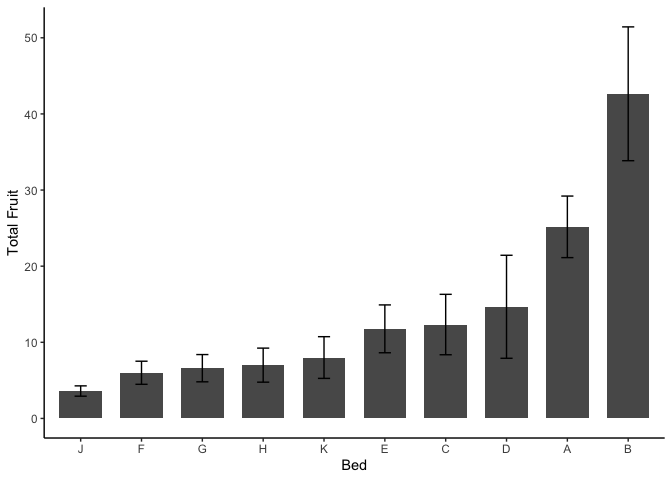
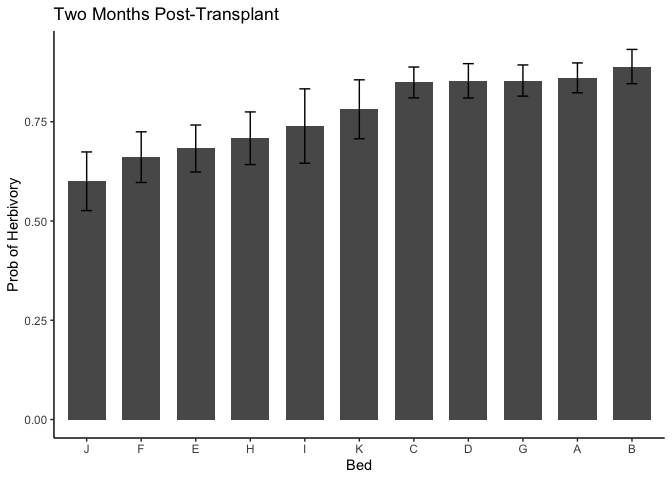
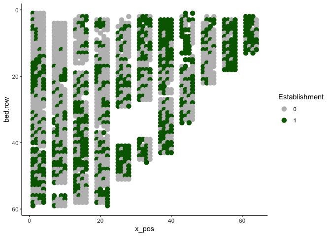
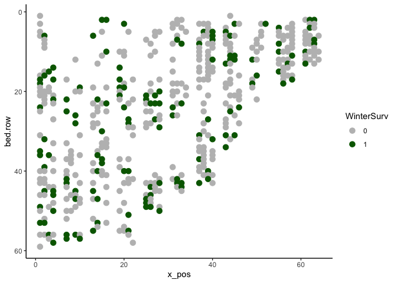
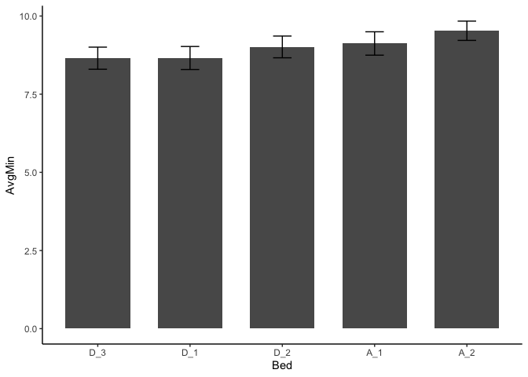
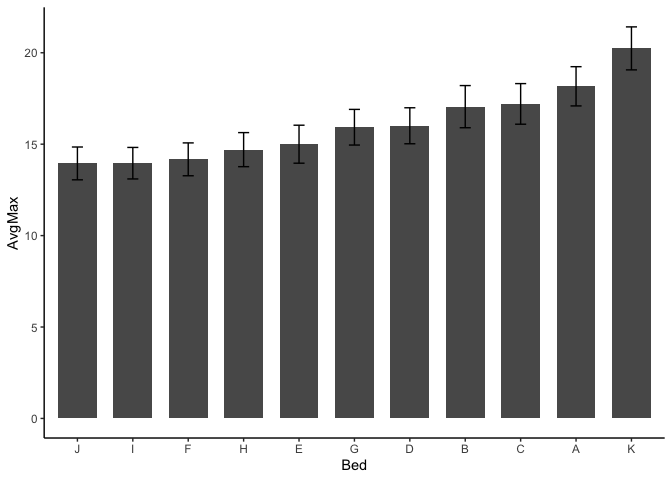
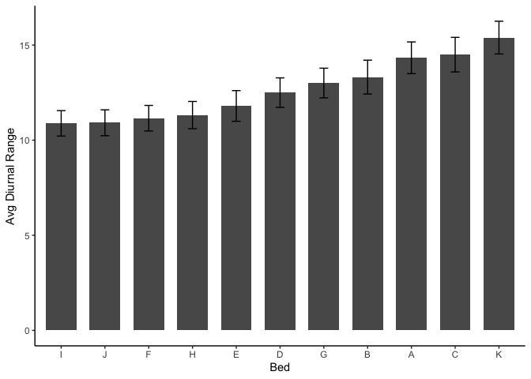
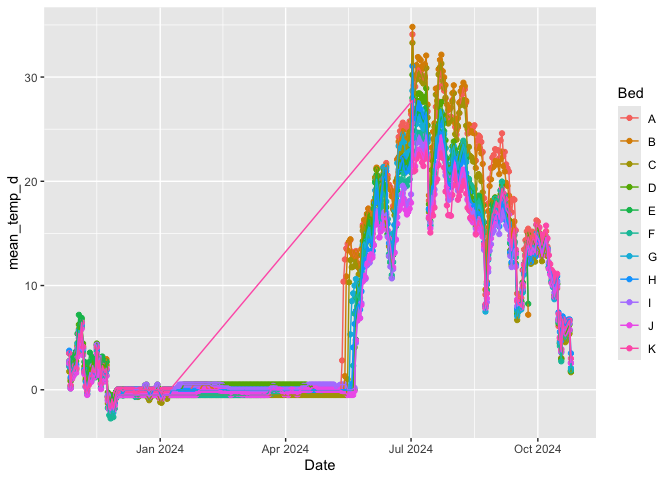
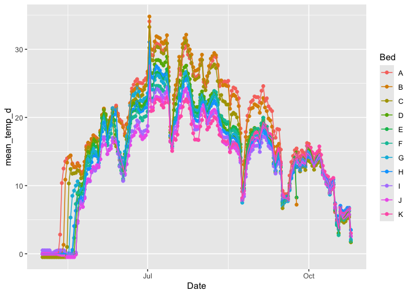

# Evaluating the phenotypic spatial variation (across beds) at WL2

Purpose: See if we could take advantage of the natural variation at WL2 for the 2026 planting

-   Note: There are some packages in R for autocorrelation

To Do:

-   Consider looking at stem diameter and canopy area in year 2

-   For TDR data, compare top of beds avg across the season (See Rachel's github)

-   Correlate TDR and iButton data to fitness/size data somehow 

## Load Libraries


``` r
library(tidyverse)
```

```
## ── Attaching core tidyverse packages ──────────────────────── tidyverse 2.0.0 ──
## ✔ dplyr     1.1.4     ✔ readr     2.1.5
## ✔ forcats   1.0.0     ✔ stringr   1.5.1
## ✔ ggplot2   3.5.1     ✔ tibble    3.2.1
## ✔ lubridate 1.9.3     ✔ tidyr     1.3.1
## ✔ purrr     1.0.2     
## ── Conflicts ────────────────────────────────────────── tidyverse_conflicts() ──
## ✖ dplyr::filter() masks stats::filter()
## ✖ dplyr::lag()    masks stats::lag()
## ℹ Use the conflicted package (<http://conflicted.r-lib.org/>) to force all conflicts to become errors
```

``` r
library(viridis)
```

```
## Loading required package: viridisLite
```

``` r
sem <- function(x, na.rm=FALSE) {           #for calculating standard error
  sd(x,na.rm=na.rm)/sqrt(length(na.omit(x)))
} 
```

## Load Fitness Data


``` r
wl2_est <- read_csv("../output/WL2_Traits/WL2_Establishment.csv") %>% select(block:rep, Establishment) %>% 
  mutate(bed.col=if_else(bed.col=="A -", "A", bed.col))
```

```
## Rows: 1573 Columns: 21
## ── Column specification ────────────────────────────────────────────────────────
## Delimiter: ","
## chr   (7): block, BedLoc, bed, bed.col, Genotype, pop, elevation.group
## dbl  (13): bed.row, mf, rep, elev_m, Lat, Long, GrwSsn_GD_Recent, GrwSsn_GD_...
## date  (1): death.date
## 
## ℹ Use `spec()` to retrieve the full column specification for this data.
## ℹ Specify the column types or set `show_col_types = FALSE` to quiet this message.
```

``` r
y1_surv <- read_csv("../output/WL2_Traits/WL2_Y1Surv.csv") %>% 
  left_join(wl2_est) %>% 
  select(block, bed:bed.col, Genotype:rep, Y1Surv=Survival) 
```

```
## Rows: 728 Columns: 17
## ── Column specification ────────────────────────────────────────────────────────
## Delimiter: ","
## chr  (5): block, Genotype, pop, elevation.group, pheno
## dbl (12): mf, rep, elev_m, Lat, Long, GrwSsn_GD_Recent, GrwSsn_GD_Historical...
## 
## ℹ Use `spec()` to retrieve the full column specification for this data.
## ℹ Specify the column types or set `show_col_types = FALSE` to quiet this message.
## Joining with `by = join_by(block, Genotype, pop, mf, rep)`
```

``` r
wintersurv <- read_csv("../output/WL2_Traits/WL2_WinterSurv_2324.csv") %>% 
  rename(bed.row=`bed- row`, bed.col=`bed- col`) %>% 
  select(block, bed:bed.col, Genotype:rep, WinterSurv)
```

```
## Rows: 469 Columns: 21
## ── Column specification ────────────────────────────────────────────────────────
## Delimiter: ","
## chr  (8): block, BedLoc, bed, bed- col, Genotype, pop, elevation.group, deat...
## dbl (13): bed- row, mf, rep, elev_m, Lat, Long, GrwSsn_GD_Recent, GrwSsn_GD_...
## 
## ℹ Use `spec()` to retrieve the full column specification for this data.
## ℹ Specify the column types or set `show_col_types = FALSE` to quiet this message.
```

``` r
repsurvy2 <- read_csv("../output/WL2_Traits/WL2_Surv_to_Rep_Y2_2324.csv") %>% 
  select(block, bed:col, Genotype, pop:rep, SurvtoRep_y2)
```

```
## Rows: 135 Columns: 23
## ── Column specification ────────────────────────────────────────────────────────
## Delimiter: ","
## chr (10): Pop.Type, loc, bed, col, pop, Genotype, block, elevation.group, bu...
## dbl (13): row, mf, rep, elev_m, Lat, Long, GrwSsn_GD_Recent, GrwSsn_GD_Histo...
## 
## ℹ Use `spec()` to retrieve the full column specification for this data.
## ℹ Specify the column types or set `show_col_types = FALSE` to quiet this message.
```

``` r
fruitsy2 <- read_csv("../output/WL2_Traits/WL2_Fruits_Y2_2324.csv") %>% 
  select(block, bed:col, Genotype, pop:rep, fruits)
```

```
## Rows: 73 Columns: 26
## ── Column specification ────────────────────────────────────────────────────────
## Delimiter: ","
## chr  (8): Pop.Type, loc, bed, col, pop, Genotype, block, elevation.group
## dbl (18): row, mf, rep, flowers, fruits, FrFlN, elev_m, Lat, Long, GrwSsn_GD...
## 
## ℹ Use `spec()` to retrieve the full column specification for this data.
## ℹ Specify the column types or set `show_col_types = FALSE` to quiet this message.
```

``` r
probfruit <- read_csv("../output/WL2_Traits/WL2_ProbFruits_Y2_2324.csv") %>% 
  select(block, bed:col, Genotype, pop:rep, ProbFruits)
```

```
## Rows: 95 Columns: 23
## ── Column specification ────────────────────────────────────────────────────────
## Delimiter: ","
## chr  (7): loc, bed, col, block, pop, Genotype, elevation.group
## dbl (16): row, mf, rep, elev_m, Lat, Long, GrwSsn_GD_Recent, GrwSsn_GD_Histo...
## 
## ℹ Use `spec()` to retrieve the full column specification for this data.
## ℹ Specify the column types or set `show_col_types = FALSE` to quiet this message.
```

``` r
totfruit <- read_csv("../output/WL2_Traits/WL2_TotalRepOutput.csv") %>% 
  select(block:rep, Total_Fitness)
```

```
## Rows: 98 Columns: 21
## ── Column specification ────────────────────────────────────────────────────────
## Delimiter: ","
## chr  (7): block, BedLoc, bed, bed.col, Genotype, pop, elevation.group
## dbl (14): bed.row, mf, rep, elev_m, Lat, Long, GrwSsn_GD_Recent, GrwSsn_GD_H...
## 
## ℹ Use `spec()` to retrieve the full column specification for this data.
## ℹ Specify the column types or set `show_col_types = FALSE` to quiet this message.
```

## Load Size (Height and herbivory 2 months post transplant; stem diameter end of first year)

``` r
WL2_twomonths_size <- read_csv("../input/WL2_Data/CorrectedCSVs/WL2_size_survey_20230913_corrected.csv", 
                               na = c("", "NA", "-", "N/A")) %>% 
  filter(!is.na(pop)) %>% 
  rename(parent.pop=pop) %>% 
  mutate(parent.pop= str_replace(parent.pop, ".*VTR.*", "LVTR1")) %>% 
  unite(BedLoc, bed:bed.col, sep="_", remove = FALSE) %>% 
  filter(BedLoc!="K_5_C", BedLoc!="B_32_A", BedLoc!="C_4_D", BedLoc!="C_5_D") %>% 
  mutate(mf=as.double(mf), rep=as.double(rep)) %>% 
  unite(Genotype, parent.pop:rep, sep="_", remove = FALSE) %>% 
  filter(!str_detect(Genotype, ".*buff*")) %>% 
  select(block:height.cm, herbiv.y.n)
```

```
## Rows: 1826 Columns: 11
## ── Column specification ────────────────────────────────────────────────────────
## Delimiter: ","
## chr (8): block, bed, bed.col, pop, mf, rep, herbiv.y.n, survey.notes
## dbl (3): bed.row, height.cm, long.leaf.cm
## 
## ℹ Use `spec()` to retrieve the full column specification for this data.
## ℹ Specify the column types or set `show_col_types = FALSE` to quiet this message.
```

```
## Warning: There were 2 warnings in `mutate()`.
## The first warning was:
## ℹ In argument: `mf = as.double(mf)`.
## Caused by warning:
## ! NAs introduced by coercion
## ℹ Run `dplyr::last_dplyr_warnings()` to see the 1 remaining warning.
```

``` r
wl2_anncensus <- read_csv("../input/WL2_Data/CorrectedCSVs/WL2_annual_census_20231027_corrected.csv") %>% 
  select(block, bed, bed.row=`bed-row`, bed.col=`bed-col`, pop:diam.mm) %>% 
  filter(!is.na(pop)) %>% 
  rename(parent.pop=pop) %>% 
  mutate(parent.pop= str_replace(parent.pop, ".*VTR.*", "LVTR1")) %>% 
  unite(BedLoc, bed:bed.col, sep="_", remove = FALSE) %>% 
  filter(BedLoc!="K_5_C", BedLoc!="B_32_A", BedLoc!="C_4_D", BedLoc!="C_5_D") %>% 
  mutate(mf=as.double(mf), rep=as.double(rep)) %>% 
  unite(Genotype, parent.pop:rep, sep="_", remove = FALSE) %>% 
  filter(!str_detect(Genotype, ".*buff*"))
```

```
## Warning: One or more parsing issues, call `problems()` on your data frame for details,
## e.g.:
##   dat <- vroom(...)
##   problems(dat)
```

```
## Rows: 1826 Columns: 19
## ── Column specification ────────────────────────────────────────────────────────
## Delimiter: ","
## chr (10): date, block, bed, bed-col, pop, mf, rep, pheno, herbiv.y.n, survey...
## dbl  (7): bed-row, diam.mm, num.flw, num.fruit, long.fruit.cm, total.branch,...
## lgl  (2): height.cm, long.leaf.cm
## 
## ℹ Use `spec()` to retrieve the full column specification for this data.
## ℹ Specify the column types or set `show_col_types = FALSE` to quiet this message.
```

```
## Warning: There were 2 warnings in `mutate()`.
## The first warning was:
## ℹ In argument: `mf = as.double(mf)`.
## Caused by warning:
## ! NAs introduced by coercion
## ℹ Run `dplyr::last_dplyr_warnings()` to see the 1 remaining warning.
```

## Read in soil temp


``` r
temp_2023 <- read_csv("../input/WL2_Data/WL2_2022_2023_iButton_Data_Corrected.csv") %>%
  select(-`...3`) %>%
  mutate(Date_Time = mdy_hm(Date_Time)) %>%
  filter(Date_Time > ymd("2023-07-06"))
```

```
## New names:
## Rows: 14253 Columns: 4
## ── Column specification
## ──────────────────────────────────────────────────────── Delimiter: "," chr
## (3): Bed, Date_Time, ...3 dbl (1): SoilTemp
## ℹ Use `spec()` to retrieve the full column specification for this data. ℹ
## Specify the column types or set `show_col_types = FALSE` to quiet this message.
## • `` -> `...3`
```

``` r
head(temp_2023)
```

```
## # A tibble: 6 × 3
##   Bed   Date_Time           SoilTemp
##   <chr> <dttm>                 <dbl>
## 1 A_1   2023-07-13 14:46:00     27.5
## 2 A_1   2023-07-13 15:46:00     32  
## 3 A_1   2023-07-13 16:46:00     31.5
## 4 A_1   2023-07-13 17:46:00     28.5
## 5 A_1   2023-07-13 18:46:00     25  
## 6 A_1   2023-07-13 19:46:00     22
```

``` r
unique(temp_2023$Bed) #only have Bed A and D
```

```
## [1] "A_1" "A_2" "D_1" "D_2" "D_3"
```

``` r
#2 at each end of bed A and 3 in bed D ends and middle

temp_2024 <- read_csv("../input/WL2_Data/WL2_2024_iButton_Data_Corrected.csv")
```

```
## Rows: 49326 Columns: 3
## ── Column specification ────────────────────────────────────────────────────────
## Delimiter: ","
## chr  (1): Bed
## dbl  (1): SoilTemp
## dttm (1): Date_Time
## 
## ℹ Use `spec()` to retrieve the full column specification for this data.
## ℹ Specify the column types or set `show_col_types = FALSE` to quiet this message.
```

``` r
head(temp_2024)
```

```
## # A tibble: 6 × 3
##   Bed   Date_Time           SoilTemp
##   <chr> <dttm>                 <dbl>
## 1 A     2023-10-27 18:10:00      3.5
## 2 A     2023-10-27 21:10:00      1  
## 3 A     2023-10-28 00:10:00      0.5
## 4 A     2023-10-28 03:10:00     -0.5
## 5 A     2023-10-28 06:10:00     -1  
## 6 A     2023-10-28 09:10:00     -1
```

``` r
unique(temp_2024$Bed) #have data for all beds 
```

```
##  [1] "A" "B" "C" "D" "E" "F" "G" "H" "I" "J" "K"
```

## Box Plots

``` r
wl2_est %>% 
  ggplot(aes(x=bed, y=Establishment)) +
  geom_boxplot()
```

<!-- -->

``` r
y1_surv %>% 
  ggplot(aes(x=bed, y=Y1Surv)) +
  geom_boxplot()
```

<!-- -->

``` r
wintersurv %>% 
  ggplot(aes(x=bed, y=WinterSurv)) +
  geom_boxplot()
```

<!-- -->

``` r
repsurvy2 %>% 
  ggplot(aes(x=bed, y=SurvtoRep_y2)) +
  geom_boxplot()
```

<!-- -->

``` r
fruitsy2 %>% 
  ggplot(aes(x=bed, y=fruits)) +
  geom_boxplot()
```

<!-- -->

``` r
probfruit %>% 
  ggplot(aes(x=bed, y=ProbFruits)) +
  geom_boxplot()
```

<!-- -->

``` r
totfruit %>% 
  ggplot(aes(x=bed, y=Total_Fitness)) +
  geom_boxplot()
```

<!-- -->

``` r
WL2_twomonths_size %>% 
  ggplot(aes(x=bed, y=height.cm)) +
  geom_boxplot()
```

```
## Warning: Removed 1025 rows containing non-finite outside the scale range
## (`stat_boxplot()`).
```

<!-- -->

``` r
WL2_twomonths_size %>% 
  mutate(herbiv.bin = if_else(herbiv.y.n=="Y", 1, 0)) %>% 
  ggplot(aes(x=bed, y=herbiv.bin)) +
  geom_boxplot()
```

```
## Warning: Removed 1024 rows containing non-finite outside the scale range
## (`stat_boxplot()`).
```

<!-- -->

``` r
wl2_anncensus %>% 
  ggplot(aes(x=bed, y=diam.mm)) +
  geom_boxplot()
```

```
## Warning: Removed 1198 rows containing non-finite outside the scale range
## (`stat_boxplot()`).
```

<!-- -->

``` r
temp_2023 %>% 
  ggplot(aes(x=Bed, y=SoilTemp)) +
  geom_boxplot()
```

<!-- -->

``` r
temp_2024 %>% 
  ggplot(aes(x=Bed, y=SoilTemp)) +
  geom_boxplot()
```

<!-- -->

## Summaries

``` r
wl2_est_summary <- wl2_est %>% 
  group_by(bed) %>% 
  summarise(meanSurv=mean(Establishment, na.rm=TRUE), semSurv=sem(Establishment, na.rm=TRUE))

y1surv_summary <- y1_surv %>% 
  group_by(bed) %>% 
  summarise(meanSurv=mean(Y1Surv, na.rm=TRUE), semSurv=sem(Y1Surv, na.rm=TRUE))

wintersurv_summary <- wintersurv %>% 
  group_by(bed) %>% 
  summarise(meanSurv=mean(WinterSurv, na.rm=TRUE), semSurv=sem(WinterSurv, na.rm=TRUE))

repsurvy2_summary <- repsurvy2 %>% 
  group_by(bed) %>% 
  summarise(meanSurv=mean(SurvtoRep_y2, na.rm=TRUE), semSurv=sem(SurvtoRep_y2, na.rm=TRUE))

fruitsy2_summary <- fruitsy2 %>% 
  group_by(bed) %>% 
  summarise(meanSurv=mean(fruits, na.rm=TRUE), semSurv=sem(fruits, na.rm=TRUE))

probfruit_summary <- probfruit %>% 
  group_by(bed) %>% 
  summarise(meanSurv=mean(ProbFruits, na.rm=TRUE), semSurv=sem(ProbFruits, na.rm=TRUE))

totfruit_summary <- totfruit %>% 
  group_by(bed) %>% 
  summarise(meanSurv=mean(Total_Fitness, na.rm=TRUE), semSurv=sem(Total_Fitness, na.rm=TRUE))

height_summary <- WL2_twomonths_size %>% 
  group_by(bed) %>% 
  summarise(meanHeight=mean(height.cm, na.rm=TRUE), semHeight=sem(height.cm, na.rm=TRUE))

herbiv_summary <- WL2_twomonths_size %>% 
  mutate(herbiv.bin = if_else(herbiv.y.n=="Y", 1, 0)) %>% 
  group_by(bed) %>% 
  summarise(meanHerb=mean(herbiv.bin, na.rm=TRUE), semHerb=sem(herbiv.bin, na.rm = TRUE))

diam_summary <- wl2_anncensus %>% 
  group_by(bed) %>% 
  summarise(meanDiam=mean(diam.mm, na.rm=TRUE), semDiam=sem(diam.mm, na.rm=TRUE))
```


``` r
temp_2023_daily_summary <- temp_2023 %>%
  mutate(Date=as.Date(Date_Time)) %>%
  group_by(Bed, Date) %>% #summarize hourly data by date
  summarize(
    min_temp_d = min(SoilTemp),
    max_temp_d = max(SoilTemp),
    mean_temp_d = mean(SoilTemp),
    diurnal_temp_d = max_temp_d - min_temp_d
  )
```

```
## `summarise()` has grouped output by 'Bed'. You can override using the `.groups`
## argument.
```

``` r
temp_2023_beds_summary <- temp_2023_daily_summary %>% 
  group_by(Bed) %>% 
  summarise(AvgMin=mean(min_temp_d), semMin=sem(min_temp_d),
            AvgMax=mean(max_temp_d), semMax=sem(max_temp_d),
            AvgTemp=mean(mean_temp_d), semMean=sem(mean_temp_d),
            AvgDiurnal=mean(diurnal_temp_d), semDiurnal=sem(diurnal_temp_d))
temp_2023_beds_summary
```

```
## # A tibble: 5 × 9
##   Bed   AvgMin semMin AvgMax semMax AvgTemp semMean AvgDiurnal semDiurnal
##   <chr>  <dbl>  <dbl>  <dbl>  <dbl>   <dbl>   <dbl>      <dbl>      <dbl>
## 1 A_1     9.12  0.374   30.8  1.25     17.7   0.694       21.6      1.03 
## 2 A_2     9.53  0.308   32.8  0.958    18.4   0.437       23.3      0.891
## 3 D_1     8.66  0.369   28.0  0.884    15.4   0.485       19.3      0.719
## 4 D_2     9.01  0.348   26.5  0.740    14.9   0.441       17.4      0.579
## 5 D_3     8.65  0.354   27.3  1.01     14.8   0.487       18.7      0.852
```

``` r
temp_2024_daily_summary <- temp_2024 %>%
  mutate(Date=as.Date(Date_Time)) %>%
  group_by(Bed, Date) %>% #summarize hourly data by date
  summarize(
    min_temp_d = min(SoilTemp),
    max_temp_d = max(SoilTemp),
    mean_temp_d = mean(SoilTemp),
    diurnal_temp_d = max_temp_d - min_temp_d
  )
```

```
## `summarise()` has grouped output by 'Bed'. You can override using the `.groups`
## argument.
```

``` r
temp_2024_beds_summary <- temp_2024_daily_summary %>% 
  group_by(Bed) %>% 
  summarise(AvgMin=mean(min_temp_d), semMin=sem(min_temp_d),
            AvgMax=mean(max_temp_d), semMax=sem(max_temp_d),
            AvgTemp=mean(mean_temp_d), semMean=sem(mean_temp_d),
            AvgDiurnal=mean(diurnal_temp_d), semDiurnal=sem(diurnal_temp_d))
temp_2024_beds_summary
```

```
## # A tibble: 11 × 9
##    Bed   AvgMin semMin AvgMax semMax AvgTemp semMean AvgDiurnal semDiurnal
##    <chr>  <dbl>  <dbl>  <dbl>  <dbl>   <dbl>   <dbl>      <dbl>      <dbl>
##  1 A       3.83  0.267   18.2  1.07     9.04   0.560       14.3      0.833
##  2 B       3.74  0.289   17.1  1.15     8.73   0.609       13.3      0.890
##  3 C       2.71  0.235   17.2  1.11     7.87   0.536       14.5      0.908
##  4 D       3.51  0.243   16.0  0.984    7.76   0.483       12.5      0.775
##  5 E       3.20  0.263   15.0  1.04     7.20   0.510       11.8      0.807
##  6 F       3.02  0.252   14.2  0.899    7.00   0.468       11.2      0.672
##  7 G       2.92  0.224   15.9  0.975    7.47   0.475       13.0      0.780
##  8 H       3.38  0.240   14.7  0.932    7.21   0.463       11.3      0.717
##  9 I       3.08  0.214   14.0  0.862    6.77   0.421       10.9      0.669
## 10 J       3.03  0.239   13.9  0.897    6.49   0.431       10.9      0.681
## 11 K       4.85  0.359   20.2  1.18     9.85   0.600       15.4      0.861
```

## Bar Plots

``` r
wl2_est_summary %>% 
  ggplot(aes(x=fct_reorder(bed, meanSurv), y=meanSurv)) +
  geom_col(width = 0.7,position = position_dodge(0.75)) + 
  geom_errorbar(aes(ymin=meanSurv-semSurv,ymax=meanSurv+semSurv),width=.2, position = 
                  position_dodge(0.75)) +
  theme_classic() +
  labs(x="Bed", y="Establishment")
```

<!-- -->

``` r
y1surv_summary %>% 
  ggplot(aes(x=fct_reorder(bed, meanSurv), y=meanSurv)) +
  geom_col(width = 0.7,position = position_dodge(0.75)) + 
  geom_errorbar(aes(ymin=meanSurv-semSurv,ymax=meanSurv+semSurv),width=.2, position = 
                  position_dodge(0.75)) +
  theme_classic() +
  labs(x="Bed", y="Y1 Surv")
```

<!-- -->

``` r
wintersurv_summary %>% 
  ggplot(aes(x=fct_reorder(bed, meanSurv), y=meanSurv)) +
  geom_col(width = 0.7,position = position_dodge(0.75)) + 
  geom_errorbar(aes(ymin=meanSurv-semSurv,ymax=meanSurv+semSurv),width=.2, position = 
                  position_dodge(0.75)) +
  theme_classic() +
  labs(x="Bed", y="Winter Surv")
```

<!-- -->

``` r
repsurvy2_summary %>% 
  ggplot(aes(x=fct_reorder(bed, meanSurv), y=meanSurv)) +
  geom_col(width = 0.7,position = position_dodge(0.75)) + 
  geom_errorbar(aes(ymin=meanSurv-semSurv,ymax=meanSurv+semSurv),width=.2, position = 
                  position_dodge(0.75)) +
  theme_classic() +
  labs(x="Bed", y="Surv to Bud Y2")
```

<!-- -->

``` r
fruitsy2_summary %>% 
  ggplot(aes(x=fct_reorder(bed, meanSurv), y=meanSurv)) +
  geom_col(width = 0.7,position = position_dodge(0.75)) + 
  geom_errorbar(aes(ymin=meanSurv-semSurv,ymax=meanSurv+semSurv),width=.2, position = 
                  position_dodge(0.75)) +
  theme_classic() +
  labs(x="Bed", y="Fruits Y2")
```

<!-- -->

``` r
probfruit_summary %>% 
  ggplot(aes(x=fct_reorder(bed, meanSurv), y=meanSurv)) +
  geom_col(width = 0.7,position = position_dodge(0.75)) + 
  geom_errorbar(aes(ymin=meanSurv-semSurv,ymax=meanSurv+semSurv),width=.2, position = 
                  position_dodge(0.75)) +
  theme_classic() +
  labs(x="Bed", y="Prob. Fruit")
```

<!-- -->

``` r
totfruit_summary %>% 
  ggplot(aes(x=fct_reorder(bed, meanSurv), y=meanSurv)) +
  geom_col(width = 0.7,position = position_dodge(0.75)) + 
  geom_errorbar(aes(ymin=meanSurv-semSurv,ymax=meanSurv+semSurv),width=.2, position = 
                  position_dodge(0.75)) +
  theme_classic() +
  labs(x="Bed", y="Total Fruit")
```

<!-- -->

``` r
height_summary %>% 
  ggplot(aes(x=fct_reorder(bed, meanHeight), y=meanHeight)) +
  geom_col(width = 0.7,position = position_dodge(0.75)) + 
  geom_errorbar(aes(ymin=meanHeight-semHeight,ymax=meanHeight+semHeight),width=.2, position = 
                  position_dodge(0.75)) +
  theme_classic() +
  labs(x="Bed", y="Height (cm)", title = "Two Months Post-Transplant")
```

<!-- -->

``` r
herbiv_summary %>% 
  ggplot(aes(x=fct_reorder(bed, meanHerb), y=meanHerb)) +
  geom_col(width = 0.7,position = position_dodge(0.75)) + 
  geom_errorbar(aes(ymin=meanHerb-semHerb,ymax=meanHerb+semHerb),width=.2, position = 
                  position_dodge(0.75)) +
  theme_classic() +
  labs(x="Bed", y="Prob of Herbivory", title = "Two Months Post-Transplant")
```

<!-- -->

``` r
diam_summary %>% 
  ggplot(aes(x=fct_reorder(bed, meanDiam), y=meanDiam)) +
  geom_col(width = 0.7,position = position_dodge(0.75)) + 
  geom_errorbar(aes(ymin=meanDiam-semDiam,ymax=meanDiam+semDiam),width=.2, position = 
                  position_dodge(0.75)) +
  theme_classic() +
  labs(x="Bed", y="Stem Diameter (mm)")
```

<!-- -->

## Spatial Plots Prep
x = beds + cols
y = row 

``` r
bed_col_info <- wl2_est %>% 
  select(bed, bed.col) %>% 
  distinct() %>% 
  mutate(x_pos = if_else(bed.col=="A", 1,
                         if_else(bed.col=="B", 2, 
                                 if_else(bed.col=="C", 3, 4)))) %>% 
  mutate(x_pos=if_else(bed=="B", x_pos+6,
                       if_else(bed=="C", x_pos+12,
                               if_else(bed=="D", x_pos+18,
                                       if_else(bed=="E", x_pos+24,
                                               if_else(bed=="F", x_pos+30,
                                                       if_else(bed=="G", x_pos+36,
                                                               if_else(bed=="H", x_pos+42, 
                                                                       if_else(bed=="I", x_pos+48,
                                                                               if_else(bed=="J", x_pos+54, 
                                                                                       if_else(bed=="K", x_pos+60, x_pos))))))))))) %>% 
  arrange(bed, bed.col)

bed_col_info
```

```
## # A tibble: 44 × 3
##    bed   bed.col x_pos
##    <chr> <chr>   <dbl>
##  1 A     A           1
##  2 A     B           2
##  3 A     C           3
##  4 A     D           4
##  5 B     A           7
##  6 B     B           8
##  7 B     C           9
##  8 B     D          10
##  9 C     A          13
## 10 C     B          14
## # ℹ 34 more rows
```

``` r
bed_rect <- data.frame( #data frame for bed rectangles 
  xmin = c(1, 7, 13, 19, 25, 31, 37, 43, 49, 55, 61),
  xmax = c(4, 10, 16, 22, 28, 34, 40, 46, 52, 58, 64),
  ymin = 1,
  ymax = c(59, 59, 58, 59, 51, 46, 43, 34, 22, 18, 13)
)
```

## Spatial Plots

``` r
wl2_est %>% 
  left_join(bed_col_info) %>% 
  mutate(Establishment=as.character(Establishment)) %>% 
  ggplot(aes(x=x_pos, y=bed.row, colour=Establishment)) +
  geom_point(size=3) +
  scale_y_reverse() +
  scale_color_manual(values = c("gray", "darkgreen")) + 
  theme_classic()
```

```
## Joining with `by = join_by(bed, bed.col)`
```

<!-- -->

``` r
y1_surv %>% 
  left_join(bed_col_info) %>% 
  mutate(Y1Surv=as.character(Y1Surv)) %>% 
  ggplot(aes(x=x_pos, y=bed.row, colour=Y1Surv)) +
  geom_point(size=3) +
  scale_y_reverse() +
  scale_color_manual(values = c("gray", "darkgreen")) + 
  theme_classic()
```

```
## Joining with `by = join_by(bed, bed.col)`
```

<!-- -->

``` r
wintersurv %>% 
  left_join(bed_col_info) %>% 
  mutate(WinterSurv=as.character(WinterSurv)) %>% 
  ggplot(aes(x=x_pos, y=bed.row, colour=WinterSurv)) +
  geom_point(size=3) +
  scale_y_reverse() +
  scale_color_manual(values = c("gray", "darkgreen")) + 
  theme_classic()
```

```
## Joining with `by = join_by(bed, bed.col)`
```

<!-- -->

``` r
repsurvy2 %>% 
  rename(bed.row=row, bed.col=col) %>% 
  left_join(bed_col_info) %>% 
  mutate(SurvtoRep_y2=as.character(SurvtoRep_y2)) %>% 
  ggplot(aes(x=x_pos, y=bed.row, colour=SurvtoRep_y2)) +
  geom_point(size=3) +
  scale_y_reverse() +
  scale_color_manual(values = c("gray", "darkgreen")) + 
  geom_rect(data=bed_rect, aes(xmin = xmin, xmax = xmax, ymin = ymin, ymax = ymax), colour = "black", alpha=0, inherit.aes = FALSE) +
  theme_classic()
```

```
## Joining with `by = join_by(bed, bed.col)`
```

<!-- -->

``` r
probfruit %>% 
  rename(bed.row=row, bed.col=col) %>% 
  left_join(bed_col_info) %>% 
  mutate(ProbFruits=as.character(ProbFruits)) %>% 
  ggplot(aes(x=x_pos, y=bed.row, colour=ProbFruits)) +
  geom_point(size=3) +
  scale_y_reverse() +
  scale_color_manual(values = c("gray", "darkgreen")) + 
  geom_rect(data=bed_rect, aes(xmin = xmin, xmax = xmax, ymin = ymin, ymax = ymax), colour = "black", alpha=0, inherit.aes = FALSE) +
  theme_classic()
```

```
## Joining with `by = join_by(bed, bed.col)`
```

<!-- -->

``` r
 WL2_twomonths_size %>% 
  mutate(herbiv.bin = if_else(herbiv.y.n=="Y", 1, 0)) %>% 
  left_join(bed_col_info) %>% 
  mutate(herbiv.bin=as.character(herbiv.bin)) %>% 
   filter(!is.na(herbiv.bin)) %>% 
  ggplot(aes(x=x_pos, y=bed.row, colour=herbiv.bin)) +
  geom_point(size=3) +
  scale_y_reverse() +
  scale_color_manual(values = c("gray", "darkgreen")) + 
  theme_classic()
```

```
## Joining with `by = join_by(bed, bed.col)`
```

<!-- -->

### Continuous Traits (fruit number and size)

``` r
fruitsy2 %>% 
  rename(bed.row=row, bed.col=col) %>% 
  left_join(bed_col_info) %>% 
  ggplot(aes(x=x_pos, y=bed.row, colour=fruits)) +
  geom_point(size=3) +
  scale_y_reverse() +
  scale_color_viridis() +
  geom_rect(data=bed_rect, aes(xmin = xmin, xmax = xmax, ymin = ymin, ymax = ymax), colour = "black", alpha=0, inherit.aes = FALSE) +
  theme_classic()
```

```
## Joining with `by = join_by(bed, bed.col)`
```

<!-- -->

``` r
totfruit %>% 
  left_join(bed_col_info) %>% 
  ggplot(aes(x=x_pos, y=bed.row, colour=Total_Fitness)) +
  geom_point(size=3) +
  scale_y_reverse() +
  scale_color_viridis() +
  geom_rect(data=bed_rect, aes(xmin = xmin, xmax = xmax, ymin = ymin, ymax = ymax), colour = "black", alpha=0, inherit.aes = FALSE) +
  theme_classic()
```

```
## Joining with `by = join_by(bed, bed.col)`
```

<!-- -->

``` r
WL2_twomonths_size %>% 
  left_join(bed_col_info) %>% 
  filter(!is.na(height.cm)) %>% 
  ggplot(aes(x=x_pos, y=bed.row, colour=height.cm)) +
  geom_point(size=3) +
  scale_y_reverse() +
  scale_color_viridis() +
  theme_classic()
```

```
## Joining with `by = join_by(bed, bed.col)`
```

<!-- -->

``` r
wl2_anncensus %>% 
  left_join(bed_col_info) %>% 
  filter(!is.na(diam.mm)) %>% 
  ggplot(aes(x=x_pos, y=bed.row, colour=diam.mm)) +
  geom_point(size=3) +
  scale_y_reverse() +
  scale_color_viridis() +
  theme_classic()
```

```
## Joining with `by = join_by(bed, bed.col)`
```

<!-- -->

## Temperature Plots
### 2023

``` r
temp_2023_beds_summary %>% 
  ggplot(aes(x=fct_reorder(Bed, AvgMin), y=AvgMin)) +
  geom_col(width = 0.7,position = position_dodge(0.75)) + 
  geom_errorbar(aes(ymin=AvgMin-semMin,ymax=AvgMin+semMin),width=.2, position = 
                  position_dodge(0.75)) +
  theme_classic() +
  labs(x="Bed")
```

<!-- -->

``` r
temp_2023_beds_summary %>% 
  ggplot(aes(x=fct_reorder(Bed, AvgMax), y=AvgMax)) +
  geom_col(width = 0.7,position = position_dodge(0.75)) + 
  geom_errorbar(aes(ymin=AvgMax-semMax,ymax=AvgMax+semMax),width=.2, position = 
                  position_dodge(0.75)) +
  theme_classic() +
  labs(x="Bed")
```

<!-- -->

``` r
temp_2023_beds_summary %>% 
  ggplot(aes(x=fct_reorder(Bed, AvgTemp), y=AvgTemp)) +
  geom_col(width = 0.7,position = position_dodge(0.75)) + 
  geom_errorbar(aes(ymin=AvgTemp-semMean,ymax=AvgTemp+semMean),width=.2, position = 
                  position_dodge(0.75)) +
  theme_classic() +
  labs(x="Bed")
```

<!-- -->

``` r
temp_2023_beds_summary %>% 
  ggplot(aes(x=fct_reorder(Bed, AvgDiurnal), y=AvgDiurnal)) +
  geom_col(width = 0.7,position = position_dodge(0.75)) + 
  geom_errorbar(aes(ymin=AvgDiurnal-semDiurnal,ymax=AvgDiurnal+semDiurnal),width=.2, position = 
                  position_dodge(0.75)) +
  theme_classic() +
  labs(x="Bed", y="Avg Diurnal Range")
```

<!-- -->

``` r
temp_2023_daily_summary %>% 
  ggplot(aes(x=Date, y=mean_temp_d, group=Bed, colour=Bed)) +
  geom_point() +
  geom_line()
```

<!-- -->

### 2024

``` r
temp_2024_beds_summary %>% 
  ggplot(aes(x=fct_reorder(Bed, AvgMin), y=AvgMin)) +
  geom_col(width = 0.7,position = position_dodge(0.75)) + 
  geom_errorbar(aes(ymin=AvgMin-semMin,ymax=AvgMin+semMin),width=.2, position = 
                  position_dodge(0.75)) +
  theme_classic() +
  labs(x="Bed")
```

<!-- -->

``` r
temp_2024_beds_summary %>% 
  ggplot(aes(x=fct_reorder(Bed, AvgMax), y=AvgMax)) +
  geom_col(width = 0.7,position = position_dodge(0.75)) + 
  geom_errorbar(aes(ymin=AvgMax-semMax,ymax=AvgMax+semMax),width=.2, position = 
                  position_dodge(0.75)) +
  theme_classic() +
  labs(x="Bed")
```

<!-- -->

``` r
temp_2024_beds_summary %>% 
  ggplot(aes(x=fct_reorder(Bed, AvgTemp), y=AvgTemp)) +
  geom_col(width = 0.7,position = position_dodge(0.75)) + 
  geom_errorbar(aes(ymin=AvgTemp-semMean,ymax=AvgTemp+semMean),width=.2, position = 
                  position_dodge(0.75)) +
  theme_classic() +
  labs(x="Bed")
```

<!-- -->

``` r
temp_2024_beds_summary %>% 
  ggplot(aes(x=fct_reorder(Bed, AvgDiurnal), y=AvgDiurnal)) +
  geom_col(width = 0.7,position = position_dodge(0.75)) + 
  geom_errorbar(aes(ymin=AvgDiurnal-semDiurnal,ymax=AvgDiurnal+semDiurnal),width=.2, position = 
                  position_dodge(0.75)) +
  theme_classic() +
  labs(x="Bed", y="Avg Diurnal Range")
```

<!-- -->

``` r
temp_2024_daily_summary %>% 
  ggplot(aes(x=Date, y=mean_temp_d, group=Bed, colour=Bed)) +
  geom_point() +
  geom_line() 
```

<!-- -->

``` r
temp_2024_daily_summary %>% 
  filter(Date>"2024-05-01") %>% 
  ggplot(aes(x=Date, y=mean_temp_d, group=Bed, colour=Bed)) +
  geom_point() +
  geom_line() 
```

<!-- -->

