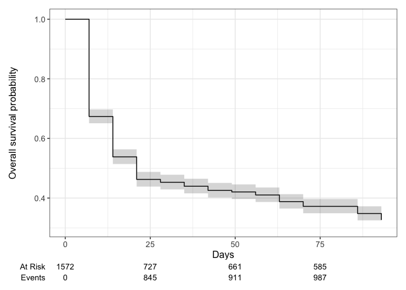
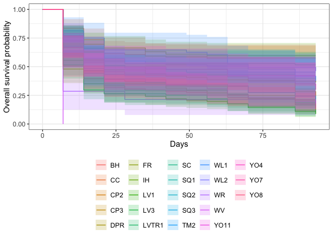

# Survival Analysis 

See tutorial: https://www.emilyzabor.com/tutorials/survival_analysis_in_r_tutorial.html

## Libraries

```r
# install.packages(c("ggsurvfit", "gtsummary"))
library(tidyverse) #includes lubridate, which we need 
```

```
## ── Attaching core tidyverse packages ──────────────────────── tidyverse 2.0.0 ──
## ✔ dplyr     1.1.4     ✔ readr     2.1.5
## ✔ forcats   1.0.0     ✔ stringr   1.5.1
## ✔ ggplot2   3.5.1     ✔ tibble    3.2.1
## ✔ lubridate 1.9.3     ✔ tidyr     1.3.1
## ✔ purrr     1.0.2     
## ── Conflicts ────────────────────────────────────────── tidyverse_conflicts() ──
## ✖ dplyr::filter() masks stats::filter()
## ✖ dplyr::lag()    masks stats::lag()
## ℹ Use the conflicted package (<http://conflicted.r-lib.org/>) to force all conflicts to become errors
```

```r
library(ggsurvfit)
library(gtsummary)
```

```
## Warning: package 'gtsummary' was built under R version 4.4.1
```

```r
library(survival)
```

## Read in the data

```r
wl2_surv <- read_csv("../input/WL2_Data/CorrectedCSVs/WL2_mort_pheno_20231020_corrected.csv",
                     na = c("", "NA", "-", "N/A")) %>% #note this only goes to 10/20 need to come back and change this to include dates after this
  select(block:rep, death.date, survey.notes) %>% 
  rename(parent.pop=pop) %>% 
  mutate(parent.pop= str_replace(parent.pop, "Y08", "YO8")) %>% 
  mutate(parent.pop= str_replace(parent.pop, "Y04", "YO4")) %>% 
  filter(!is.na(parent.pop)) %>% 
   unite(BedLoc, bed:bed.col, sep="_", remove = FALSE) %>% 
  unite(Genotype, parent.pop:rep, sep="_", remove = FALSE) %>% 
  filter(!str_detect(Genotype, ".*buff*")) %>% 
  unite(pop.mf, parent.pop:mf, sep="_", remove = FALSE)
```

```
## Warning: One or more parsing issues, call `problems()` on your data frame for details,
## e.g.:
##   dat <- vroom(...)
##   problems(dat)
```

```
## Rows: 1826 Columns: 14
## ── Column specification ────────────────────────────────────────────────────────
## Delimiter: ","
## chr (11): block, bed, bed.col, pop, mf, rep, bud.date, flower.date, fruit.da...
## dbl  (1): bed.row
## lgl  (2): last.flower.date, last.fruit.date
## 
## ℹ Use `spec()` to retrieve the full column specification for this data.
## ℹ Specify the column types or set `show_col_types = FALSE` to quiet this message.
```

```r
head(wl2_surv)
```

```
## # A tibble: 6 × 12
##   block BedLoc bed   bed.row bed.col Genotype  pop.mf  parent.pop mf    rep  
##   <chr> <chr>  <chr>   <dbl> <chr>   <chr>     <chr>   <chr>      <chr> <chr>
## 1 A     A_1_A  A           1 A       TM2_6_11  TM2_6   TM2        6     11   
## 2 A     A_1_B  A           1 B       LVTR1_7_1 LVTR1_7 LVTR1      7     1    
## 3 A     A_2_A  A           2 A       SQ2_6_14  SQ2_6   SQ2        6     14   
## 4 A     A_2_B  A           2 B       YO8_8_3   YO8_8   YO8        8     3    
## 5 A     A_3_A  A           3 A       CC_2_3    CC_2    CC         2     3    
## 6 A     A_3_B  A           3 B       YO11_5_14 YO11_5  YO11       5     14   
## # ℹ 2 more variables: death.date <chr>, survey.notes <chr>
```

```r
unique(wl2_surv$parent.pop)
```

```
##  [1] "TM2"   "LVTR1" "SQ2"   "YO8"   "CC"    "YO11"  "BH"    "DPR"   "CP2"  
## [10] "WL1"   "IH"    "CP3"   "SC"    "FR"    "LV3"   "YO7"   "WV"    "SQ3"  
## [19] "WL2"   "LV1"   "YO4"   "WR"    "SQ1"
```

```r
wl2_surv %>% filter(Genotype=="CC_1_2") #there are 2 CC_1_2 plants (in different field locs), CC-1-2 was planted in 13-A and not 5C according to planting notes 
```

```
## # A tibble: 2 × 12
##   block BedLoc bed   bed.row bed.col Genotype pop.mf parent.pop mf    rep  
##   <chr> <chr>  <chr>   <dbl> <chr>   <chr>    <chr>  <chr>      <chr> <chr>
## 1 M     K_13_A K          13 A       CC_1_2   CC_1   CC         1     2    
## 2 M     K_5_C  K           5 C       CC_1_2   CC_1   CC         1     2    
## # ℹ 2 more variables: death.date <chr>, survey.notes <chr>
```

```r
wl2_surv %>% filter(Genotype=="IH_4_5") #there are 2 IH_4_5 plants (in different field locs), IH_4_5 was planted in 22B and not 32A according to planting notes 
```

```
## # A tibble: 2 × 12
##   block BedLoc bed   bed.row bed.col Genotype pop.mf parent.pop mf    rep  
##   <chr> <chr>  <chr>   <dbl> <chr>   <chr>    <chr>  <chr>      <chr> <chr>
## 1 C     B_22_B B          22 B       IH_4_5   IH_4   IH         4     5    
## 2 C     B_32_A B          32 A       IH_4_5   IH_4   IH         4     5    
## # ℹ 2 more variables: death.date <chr>, survey.notes <chr>
```

```r
wl2_surv %>% rowwise() %>%  #checking if mf and rep can be converted to numeric 
  filter(!is.na(rep)) %>%  
  filter(is.na(as.numeric(rep)))
```

```
## # A tibble: 0 × 12
## # Rowwise: 
## # ℹ 12 variables: block <chr>, BedLoc <chr>, bed <chr>, bed.row <dbl>,
## #   bed.col <chr>, Genotype <chr>, pop.mf <chr>, parent.pop <chr>, mf <chr>,
## #   rep <chr>, death.date <chr>, survey.notes <chr>
```


```r
wl2_surv %>% filter(is.na(death.date),!is.na(survey.notes)) #no plants that seemed to disappear 
```

```
## # A tibble: 253 × 12
##    block BedLoc bed   bed.row bed.col Genotype  pop.mf  parent.pop mf    rep  
##    <chr> <chr>  <chr>   <dbl> <chr>   <chr>     <chr>   <chr>      <chr> <chr>
##  1 A     A_5_A  A           5 A       CP2_5_1   CP2_5   CP2        5     1    
##  2 A     A_6_A  A           6 A       CC_5_3    CC_5    CC         5     3    
##  3 A     A_9_B  A           9 B       SQ2_8_9   SQ2_8   SQ2        8     9    
##  4 A     A_15_B A          15 B       YO11_7_9  YO11_7  YO11       7     9    
##  5 A     A_19_A A          19 A       SQ3_4_7   SQ3_4   SQ3        4     7    
##  6 A     A_20_B A          20 B       WL2_8_9   WL2_8   WL2        8     9    
##  7 A     A_21_A A          21 A       CP2_6_5   CP2_6   CP2        6     5    
##  8 A     A_21_B A          21 B       LVTR1_8_4 LVTR1_8 LVTR1      8     4    
##  9 A     A_23_B A          23 B       WL1_4_11  WL1_4   WL1        4     11   
## 10 A     A_25_A A          25 A       YO4_1_13  YO4_1   YO4        1     13   
## # ℹ 243 more rows
## # ℹ 2 more variables: death.date <chr>, survey.notes <chr>
```

```r
wl2_surv %>% filter(Genotype=="YO7_4_2")
```

```
## # A tibble: 1 × 12
##   block BedLoc bed   bed.row bed.col Genotype pop.mf parent.pop mf    rep  
##   <chr> <chr>  <chr>   <dbl> <chr>   <chr>    <chr>  <chr>      <chr> <chr>
## 1 A     A_18_D A          18 D       YO7_4_2  YO7_4  YO7        4     2    
## # ℹ 2 more variables: death.date <chr>, survey.notes <chr>
```

```r
wl2_surv_dates <- wl2_surv %>% 
  filter(BedLoc!="K_5_C") %>% 
  filter(BedLoc!="B_32_A") %>% 
  mutate(mf=as.double(mf), rep=as.double(rep)) %>% 
  mutate(planting.date="7/19/23", #could try to make this more specific to when certain blocks were planted 
         last_fup_date=if_else(is.na(death.date), "10/20/23", death.date)) %>%  #need this to calculate survival times
  mutate(planting.date=mdy(planting.date), last_fup_date=mdy(last_fup_date)) %>% #convert to date objects
  mutate(os_days=as.duration(planting.date %--% last_fup_date) / ddays(1), #observed number of days
         status=if_else(is.na(death.date), 0, 1)) %>% #0=censured (alive in this case), 1=dead
  filter(os_days > 0) %>% #there is one case of a plant that was dead at planting, so just removed it since this is survival post- transplanting
  select(-survey.notes)
head(wl2_surv_dates)
```

```
## # A tibble: 6 × 15
##   block BedLoc bed   bed.row bed.col Genotype  pop.mf  parent.pop    mf   rep
##   <chr> <chr>  <chr>   <dbl> <chr>   <chr>     <chr>   <chr>      <dbl> <dbl>
## 1 A     A_1_A  A           1 A       TM2_6_11  TM2_6   TM2            6    11
## 2 A     A_1_B  A           1 B       LVTR1_7_1 LVTR1_7 LVTR1          7     1
## 3 A     A_2_A  A           2 A       SQ2_6_14  SQ2_6   SQ2            6    14
## 4 A     A_2_B  A           2 B       YO8_8_3   YO8_8   YO8            8     3
## 5 A     A_3_A  A           3 A       CC_2_3    CC_2    CC             2     3
## 6 A     A_3_B  A           3 B       YO11_5_14 YO11_5  YO11           5    14
## # ℹ 5 more variables: death.date <chr>, planting.date <date>,
## #   last_fup_date <date>, os_days <dbl>, status <dbl>
```

```r
unique(wl2_surv_dates$os_days)
```

```
##  [1] 93  7 21 14 86 63 42 28 56 49 70 35
```


```r
wl2_surv_dates %>% filter(parent.pop=="WL2") #there's a different number of WL2 plants here compared to annual census (see FirstYear Survv)
```

```
## # A tibble: 91 × 15
##    block BedLoc bed   bed.row bed.col Genotype pop.mf parent.pop    mf   rep
##    <chr> <chr>  <chr>   <dbl> <chr>   <chr>    <chr>  <chr>      <dbl> <dbl>
##  1 A     A_20_B A          20 B       WL2_8_9  WL2_8  WL2            8     9
##  2 A     A_24_A A          24 A       WL2_7_9  WL2_7  WL2            7     9
##  3 A     A_29_B A          29 B       WL2_3_9  WL2_3  WL2            3     9
##  4 A     A_31_A A          31 A       WL2_3_10 WL2_3  WL2            3    10
##  5 B     A_37_B A          37 B       WL2_8_10 WL2_8  WL2            8    10
##  6 B     A_39_B A          39 B       WL2_7_10 WL2_7  WL2            7    10
##  7 B     A_59_A A          59 A       WL2_5_10 WL2_5  WL2            5    10
##  8 A     A_2_D  A           2 D       WL2_1_9  WL2_1  WL2            1     9
##  9 A     A_6_D  A           6 D       WL2_6_9  WL2_6  WL2            6     9
## 10 A     A_7_C  A           7 C       WL2_5_9  WL2_5  WL2            5     9
## # ℹ 81 more rows
## # ℹ 5 more variables: death.date <chr>, planting.date <date>,
## #   last_fup_date <date>, os_days <dbl>, status <dbl>
```

## Location Info


## Create Survival Objects and Curves

```r
Surv(wl2_surv_dates$os_days, wl2_surv_dates$status)[1:10] #show the first 10 observations of the survival object
```

```
##  [1] 93+  7   7   7  93+  7   7   7  93+  7
```

```r
#There will be one entry for each subject that is the survival time, which is followed by a + if the subject was censored.
```

"The survfit() function creates survival curves using the Kaplan-Meier method based on a formula. Let’s generate the overall survival curve for the entire cohort, assign it to object s1, and look at the structure using str():"

```r
s1 <- survfit(Surv(os_days, status) ~ 1, data = wl2_surv_dates)
str(s1)
```

```
## List of 16
##  $ n        : int 1572
##  $ time     : num [1:12] 7 14 21 28 35 42 49 56 63 70 ...
##  $ n.risk   : num [1:12] 1572 1059 846 727 712 ...
##  $ n.event  : num [1:12] 513 213 119 15 21 22 8 16 35 25 ...
##  $ n.censor : num [1:12] 0 0 0 0 0 0 0 0 0 0 ...
##  $ surv     : num [1:12] 0.674 0.538 0.462 0.453 0.44 ...
##  $ std.err  : num [1:12] 0.0176 0.0234 0.0272 0.0277 0.0285 ...
##  $ cumhaz   : num [1:12] 0.326 0.527 0.668 0.689 0.718 ...
##  $ std.chaz : num [1:12] 0.0144 0.0199 0.0237 0.0243 0.0252 ...
##  $ type     : chr "right"
##  $ logse    : logi TRUE
##  $ conf.int : num 0.95
##  $ conf.type: chr "log"
##  $ lower    : num [1:12] 0.651 0.514 0.438 0.429 0.416 ...
##  $ upper    : num [1:12] 0.697 0.563 0.488 0.478 0.465 ...
##  $ call     : language survfit(formula = Surv(os_days, status) ~ 1, data = wl2_surv_dates)
##  - attr(*, "class")= chr "survfit"
```

```r
#time: the timepoints at which the curve has a step, i.e. at least one event occurred
#surv: the estimate of survival at the corresponding time
```

## Survival Plot

```r
survfit2(Surv(os_days, status) ~ 1, data = wl2_surv_dates) %>% 
  ggsurvfit() +
  labs(
    x = "Days",
    y = "Overall survival probability"
  ) + 
  add_confidence_interval() +
  add_risktable() #at risk = plants still alive, event=plants dead
```

<!-- -->

## Estimating x-day survival

```r
summary(survfit(Surv(os_days, status) ~ 1, data = wl2_surv_dates), times = 60) #survival for 2 months
```

```
## Call: survfit(formula = Surv(os_days, status) ~ 1, data = wl2_surv_dates)
## 
##  time n.risk n.event survival std.err lower 95% CI upper 95% CI
##    60    645     927     0.41  0.0124        0.387        0.435
```

```r
#2 month survival probability is 41%
```

## Estimating median survival time

```r
survfit(Surv(os_days, status) ~ 1, data = wl2_surv_dates) 
```

```
## Call: survfit(formula = Surv(os_days, status) ~ 1, data = wl2_surv_dates)
## 
##         n events median 0.95LCL 0.95UCL
## [1,] 1572   1059     21      21      21
```

```r
#median survival time is 21 days 
```

## Compare Survival between Populations 
Plot survival differences

```r
survfit2(Surv(os_days, status) ~ parent.pop, data = wl2_surv_dates) %>% 
  ggsurvfit() +
  labs(
    x = "Days",
    y = "Overall survival probability") + 
  add_confidence_interval() 
```

<!-- -->

```r
survfit(Surv(os_days, status) ~ parent.pop, data = wl2_surv_dates) #median survival lengths for each pop
```

```
## Call: survfit(formula = Surv(os_days, status) ~ parent.pop, data = wl2_surv_dates)
## 
##                   n events median 0.95LCL 0.95UCL
## parent.pop=BH    91     38     NA      56      NA
## parent.pop=CC    91     39     NA      42      NA
## parent.pop=CP2   92     72   31.5      21      70
## parent.pop=CP3   91     74   14.0      14      21
## parent.pop=DPR   91     58   21.0      14      56
## parent.pop=FR    48     43    7.0       7      42
## parent.pop=IH    92     37     NA      NA      NA
## parent.pop=LV1   91     83   14.0      14      14
## parent.pop=LV3   27     23   14.0       7      63
## parent.pop=LVTR1 91     81   14.0       7      14
## parent.pop=SC    91     44     NA      21      NA
## parent.pop=SQ1   30     18   14.0      14      NA
## parent.pop=SQ2   61     49   14.0       7      21
## parent.pop=SQ3   33     26   14.0       7      70
## parent.pop=TM2   84     46   28.0      14      NA
## parent.pop=WL1   48     30   70.0      56      NA
## parent.pop=WL2   91     49   70.0      21      NA
## parent.pop=WR    14     12    7.0       7      NA
## parent.pop=WV     3      3    7.0      NA      NA
## parent.pop=YO11  91     75   21.0      14      21
## parent.pop=YO4   40     28   31.5       7      93
## parent.pop=YO7   90     52   21.0      14      NA
## parent.pop=YO8   91     79   14.0       7      21
```


"We can conduct between-group significance tests using a log-rank test. The log-rank test equally weights observations over the entire follow-up time and is the most common way to compare survival times between groups."

```r
survdiff(Surv(os_days, status) ~ parent.pop, data = wl2_surv_dates)
```

```
## Call:
## survdiff(formula = Surv(os_days, status) ~ parent.pop, data = wl2_surv_dates)
## 
##                   N Observed Expected (O-E)^2/E (O-E)^2/V
## parent.pop=BH    91       38   70.450   14.9472   20.2310
## parent.pop=CC    91       39   72.563   15.5243   21.0373
## parent.pop=CP2   92       72   65.414    0.6631    0.9053
## parent.pop=CP3   91       74   55.779    5.9521    8.2186
## parent.pop=DPR   91       58   62.580    0.3351    0.4578
## parent.pop=FR    48       43   27.348    8.9575   12.1168
## parent.pop=IH    92       37   72.465   17.3570   23.4956
## parent.pop=LV1   91       83   50.760   20.4771   28.7569
## parent.pop=LV3   27       23   15.903    3.1669    4.2296
## parent.pop=LVTR1 91       81   49.081   20.7584   29.1479
## parent.pop=SC    91       44   67.915    8.4213   11.4237
## parent.pop=SQ1   30       18   20.146    0.2286    0.2995
## parent.pop=SQ2   61       49   37.623    3.4405    4.6539
## parent.pop=SQ3   33       26   20.805    1.2974    1.7226
## parent.pop=TM2   84       46   58.878    2.8168    3.8108
## parent.pop=WL1   48       30   37.545    1.5164    1.9852
## parent.pop=WL2   91       49   68.495    5.5486    7.5339
## parent.pop=WR    14       12    6.978    3.6143    4.8819
## parent.pop=WV     3        3    0.979    4.1720    6.2009
## parent.pop=YO11  91       75   57.347    5.4343    7.5009
## parent.pop=YO4   40       28   27.140    0.0273    0.0358
## parent.pop=YO7   90       52   61.191    1.3804    1.8808
## parent.pop=YO8   91       79   51.615   14.5298   20.1989
## 
##  Chisq= 214  on 22 degrees of freedom, p= <2e-16
```

```r
#significant difference in overall survival according to population
```

## Cox regression model
"We may want to quantify an effect size for a single variable, or include more than one variable into a regression model to account for the effects of multiple variables.
The Cox regression model is a semi-parametric model that can be used to fit univariable and multivariable regression models that have survival outcomes.:

```r
coxph(Surv(os_days, status) ~ parent.pop, data = wl2_surv_dates) %>% 
  tbl_regression(exp = TRUE) 
```

```{=html}
<div id="ywmvrobeqp" style="padding-left:0px;padding-right:0px;padding-top:10px;padding-bottom:10px;overflow-x:auto;overflow-y:auto;width:auto;height:auto;">
<style>#ywmvrobeqp table {
  font-family: system-ui, 'Segoe UI', Roboto, Helvetica, Arial, sans-serif, 'Apple Color Emoji', 'Segoe UI Emoji', 'Segoe UI Symbol', 'Noto Color Emoji';
  -webkit-font-smoothing: antialiased;
  -moz-osx-font-smoothing: grayscale;
}

#ywmvrobeqp thead, #ywmvrobeqp tbody, #ywmvrobeqp tfoot, #ywmvrobeqp tr, #ywmvrobeqp td, #ywmvrobeqp th {
  border-style: none;
}

#ywmvrobeqp p {
  margin: 0;
  padding: 0;
}

#ywmvrobeqp .gt_table {
  display: table;
  border-collapse: collapse;
  line-height: normal;
  margin-left: auto;
  margin-right: auto;
  color: #333333;
  font-size: 16px;
  font-weight: normal;
  font-style: normal;
  background-color: #FFFFFF;
  width: auto;
  border-top-style: solid;
  border-top-width: 2px;
  border-top-color: #A8A8A8;
  border-right-style: none;
  border-right-width: 2px;
  border-right-color: #D3D3D3;
  border-bottom-style: solid;
  border-bottom-width: 2px;
  border-bottom-color: #A8A8A8;
  border-left-style: none;
  border-left-width: 2px;
  border-left-color: #D3D3D3;
}

#ywmvrobeqp .gt_caption {
  padding-top: 4px;
  padding-bottom: 4px;
}

#ywmvrobeqp .gt_title {
  color: #333333;
  font-size: 125%;
  font-weight: initial;
  padding-top: 4px;
  padding-bottom: 4px;
  padding-left: 5px;
  padding-right: 5px;
  border-bottom-color: #FFFFFF;
  border-bottom-width: 0;
}

#ywmvrobeqp .gt_subtitle {
  color: #333333;
  font-size: 85%;
  font-weight: initial;
  padding-top: 3px;
  padding-bottom: 5px;
  padding-left: 5px;
  padding-right: 5px;
  border-top-color: #FFFFFF;
  border-top-width: 0;
}

#ywmvrobeqp .gt_heading {
  background-color: #FFFFFF;
  text-align: center;
  border-bottom-color: #FFFFFF;
  border-left-style: none;
  border-left-width: 1px;
  border-left-color: #D3D3D3;
  border-right-style: none;
  border-right-width: 1px;
  border-right-color: #D3D3D3;
}

#ywmvrobeqp .gt_bottom_border {
  border-bottom-style: solid;
  border-bottom-width: 2px;
  border-bottom-color: #D3D3D3;
}

#ywmvrobeqp .gt_col_headings {
  border-top-style: solid;
  border-top-width: 2px;
  border-top-color: #D3D3D3;
  border-bottom-style: solid;
  border-bottom-width: 2px;
  border-bottom-color: #D3D3D3;
  border-left-style: none;
  border-left-width: 1px;
  border-left-color: #D3D3D3;
  border-right-style: none;
  border-right-width: 1px;
  border-right-color: #D3D3D3;
}

#ywmvrobeqp .gt_col_heading {
  color: #333333;
  background-color: #FFFFFF;
  font-size: 100%;
  font-weight: normal;
  text-transform: inherit;
  border-left-style: none;
  border-left-width: 1px;
  border-left-color: #D3D3D3;
  border-right-style: none;
  border-right-width: 1px;
  border-right-color: #D3D3D3;
  vertical-align: bottom;
  padding-top: 5px;
  padding-bottom: 6px;
  padding-left: 5px;
  padding-right: 5px;
  overflow-x: hidden;
}

#ywmvrobeqp .gt_column_spanner_outer {
  color: #333333;
  background-color: #FFFFFF;
  font-size: 100%;
  font-weight: normal;
  text-transform: inherit;
  padding-top: 0;
  padding-bottom: 0;
  padding-left: 4px;
  padding-right: 4px;
}

#ywmvrobeqp .gt_column_spanner_outer:first-child {
  padding-left: 0;
}

#ywmvrobeqp .gt_column_spanner_outer:last-child {
  padding-right: 0;
}

#ywmvrobeqp .gt_column_spanner {
  border-bottom-style: solid;
  border-bottom-width: 2px;
  border-bottom-color: #D3D3D3;
  vertical-align: bottom;
  padding-top: 5px;
  padding-bottom: 5px;
  overflow-x: hidden;
  display: inline-block;
  width: 100%;
}

#ywmvrobeqp .gt_spanner_row {
  border-bottom-style: hidden;
}

#ywmvrobeqp .gt_group_heading {
  padding-top: 8px;
  padding-bottom: 8px;
  padding-left: 5px;
  padding-right: 5px;
  color: #333333;
  background-color: #FFFFFF;
  font-size: 100%;
  font-weight: initial;
  text-transform: inherit;
  border-top-style: solid;
  border-top-width: 2px;
  border-top-color: #D3D3D3;
  border-bottom-style: solid;
  border-bottom-width: 2px;
  border-bottom-color: #D3D3D3;
  border-left-style: none;
  border-left-width: 1px;
  border-left-color: #D3D3D3;
  border-right-style: none;
  border-right-width: 1px;
  border-right-color: #D3D3D3;
  vertical-align: middle;
  text-align: left;
}

#ywmvrobeqp .gt_empty_group_heading {
  padding: 0.5px;
  color: #333333;
  background-color: #FFFFFF;
  font-size: 100%;
  font-weight: initial;
  border-top-style: solid;
  border-top-width: 2px;
  border-top-color: #D3D3D3;
  border-bottom-style: solid;
  border-bottom-width: 2px;
  border-bottom-color: #D3D3D3;
  vertical-align: middle;
}

#ywmvrobeqp .gt_from_md > :first-child {
  margin-top: 0;
}

#ywmvrobeqp .gt_from_md > :last-child {
  margin-bottom: 0;
}

#ywmvrobeqp .gt_row {
  padding-top: 8px;
  padding-bottom: 8px;
  padding-left: 5px;
  padding-right: 5px;
  margin: 10px;
  border-top-style: solid;
  border-top-width: 1px;
  border-top-color: #D3D3D3;
  border-left-style: none;
  border-left-width: 1px;
  border-left-color: #D3D3D3;
  border-right-style: none;
  border-right-width: 1px;
  border-right-color: #D3D3D3;
  vertical-align: middle;
  overflow-x: hidden;
}

#ywmvrobeqp .gt_stub {
  color: #333333;
  background-color: #FFFFFF;
  font-size: 100%;
  font-weight: initial;
  text-transform: inherit;
  border-right-style: solid;
  border-right-width: 2px;
  border-right-color: #D3D3D3;
  padding-left: 5px;
  padding-right: 5px;
}

#ywmvrobeqp .gt_stub_row_group {
  color: #333333;
  background-color: #FFFFFF;
  font-size: 100%;
  font-weight: initial;
  text-transform: inherit;
  border-right-style: solid;
  border-right-width: 2px;
  border-right-color: #D3D3D3;
  padding-left: 5px;
  padding-right: 5px;
  vertical-align: top;
}

#ywmvrobeqp .gt_row_group_first td {
  border-top-width: 2px;
}

#ywmvrobeqp .gt_row_group_first th {
  border-top-width: 2px;
}

#ywmvrobeqp .gt_summary_row {
  color: #333333;
  background-color: #FFFFFF;
  text-transform: inherit;
  padding-top: 8px;
  padding-bottom: 8px;
  padding-left: 5px;
  padding-right: 5px;
}

#ywmvrobeqp .gt_first_summary_row {
  border-top-style: solid;
  border-top-color: #D3D3D3;
}

#ywmvrobeqp .gt_first_summary_row.thick {
  border-top-width: 2px;
}

#ywmvrobeqp .gt_last_summary_row {
  padding-top: 8px;
  padding-bottom: 8px;
  padding-left: 5px;
  padding-right: 5px;
  border-bottom-style: solid;
  border-bottom-width: 2px;
  border-bottom-color: #D3D3D3;
}

#ywmvrobeqp .gt_grand_summary_row {
  color: #333333;
  background-color: #FFFFFF;
  text-transform: inherit;
  padding-top: 8px;
  padding-bottom: 8px;
  padding-left: 5px;
  padding-right: 5px;
}

#ywmvrobeqp .gt_first_grand_summary_row {
  padding-top: 8px;
  padding-bottom: 8px;
  padding-left: 5px;
  padding-right: 5px;
  border-top-style: double;
  border-top-width: 6px;
  border-top-color: #D3D3D3;
}

#ywmvrobeqp .gt_last_grand_summary_row_top {
  padding-top: 8px;
  padding-bottom: 8px;
  padding-left: 5px;
  padding-right: 5px;
  border-bottom-style: double;
  border-bottom-width: 6px;
  border-bottom-color: #D3D3D3;
}

#ywmvrobeqp .gt_striped {
  background-color: rgba(128, 128, 128, 0.05);
}

#ywmvrobeqp .gt_table_body {
  border-top-style: solid;
  border-top-width: 2px;
  border-top-color: #D3D3D3;
  border-bottom-style: solid;
  border-bottom-width: 2px;
  border-bottom-color: #D3D3D3;
}

#ywmvrobeqp .gt_footnotes {
  color: #333333;
  background-color: #FFFFFF;
  border-bottom-style: none;
  border-bottom-width: 2px;
  border-bottom-color: #D3D3D3;
  border-left-style: none;
  border-left-width: 2px;
  border-left-color: #D3D3D3;
  border-right-style: none;
  border-right-width: 2px;
  border-right-color: #D3D3D3;
}

#ywmvrobeqp .gt_footnote {
  margin: 0px;
  font-size: 90%;
  padding-top: 4px;
  padding-bottom: 4px;
  padding-left: 5px;
  padding-right: 5px;
}

#ywmvrobeqp .gt_sourcenotes {
  color: #333333;
  background-color: #FFFFFF;
  border-bottom-style: none;
  border-bottom-width: 2px;
  border-bottom-color: #D3D3D3;
  border-left-style: none;
  border-left-width: 2px;
  border-left-color: #D3D3D3;
  border-right-style: none;
  border-right-width: 2px;
  border-right-color: #D3D3D3;
}

#ywmvrobeqp .gt_sourcenote {
  font-size: 90%;
  padding-top: 4px;
  padding-bottom: 4px;
  padding-left: 5px;
  padding-right: 5px;
}

#ywmvrobeqp .gt_left {
  text-align: left;
}

#ywmvrobeqp .gt_center {
  text-align: center;
}

#ywmvrobeqp .gt_right {
  text-align: right;
  font-variant-numeric: tabular-nums;
}

#ywmvrobeqp .gt_font_normal {
  font-weight: normal;
}

#ywmvrobeqp .gt_font_bold {
  font-weight: bold;
}

#ywmvrobeqp .gt_font_italic {
  font-style: italic;
}

#ywmvrobeqp .gt_super {
  font-size: 65%;
}

#ywmvrobeqp .gt_footnote_marks {
  font-size: 75%;
  vertical-align: 0.4em;
  position: initial;
}

#ywmvrobeqp .gt_asterisk {
  font-size: 100%;
  vertical-align: 0;
}

#ywmvrobeqp .gt_indent_1 {
  text-indent: 5px;
}

#ywmvrobeqp .gt_indent_2 {
  text-indent: 10px;
}

#ywmvrobeqp .gt_indent_3 {
  text-indent: 15px;
}

#ywmvrobeqp .gt_indent_4 {
  text-indent: 20px;
}

#ywmvrobeqp .gt_indent_5 {
  text-indent: 25px;
}

#ywmvrobeqp .katex-display {
  display: inline-flex !important;
  margin-bottom: 0.75em !important;
}

#ywmvrobeqp div.Reactable > div.rt-table > div.rt-thead > div.rt-tr.rt-tr-group-header > div.rt-th-group:after {
  height: 0px !important;
}
</style>
<table class="gt_table" data-quarto-disable-processing="false" data-quarto-bootstrap="false">
  <thead>
    <tr class="gt_col_headings">
      <th class="gt_col_heading gt_columns_bottom_border gt_left" rowspan="1" colspan="1" scope="col" id="&lt;span class='gt_from_md'&gt;&lt;strong&gt;Characteristic&lt;/strong&gt;&lt;/span&gt;"><span class='gt_from_md'><strong>Characteristic</strong></span></th>
      <th class="gt_col_heading gt_columns_bottom_border gt_center" rowspan="1" colspan="1" scope="col" id="&lt;span class='gt_from_md'&gt;&lt;strong&gt;HR&lt;/strong&gt;&lt;/span&gt;&lt;span class=&quot;gt_footnote_marks&quot; style=&quot;white-space:nowrap;font-style:italic;font-weight:normal;line-height: 0;&quot;&gt;&lt;sup&gt;1&lt;/sup&gt;&lt;/span&gt;"><span class='gt_from_md'><strong>HR</strong></span><span class="gt_footnote_marks" style="white-space:nowrap;font-style:italic;font-weight:normal;line-height: 0;"><sup>1</sup></span></th>
      <th class="gt_col_heading gt_columns_bottom_border gt_center" rowspan="1" colspan="1" scope="col" id="&lt;span class='gt_from_md'&gt;&lt;strong&gt;95% CI&lt;/strong&gt;&lt;/span&gt;&lt;span class=&quot;gt_footnote_marks&quot; style=&quot;white-space:nowrap;font-style:italic;font-weight:normal;line-height: 0;&quot;&gt;&lt;sup&gt;1&lt;/sup&gt;&lt;/span&gt;"><span class='gt_from_md'><strong>95% CI</strong></span><span class="gt_footnote_marks" style="white-space:nowrap;font-style:italic;font-weight:normal;line-height: 0;"><sup>1</sup></span></th>
      <th class="gt_col_heading gt_columns_bottom_border gt_center" rowspan="1" colspan="1" scope="col" id="&lt;span class='gt_from_md'&gt;&lt;strong&gt;p-value&lt;/strong&gt;&lt;/span&gt;"><span class='gt_from_md'><strong>p-value</strong></span></th>
    </tr>
  </thead>
  <tbody class="gt_table_body">
    <tr><td headers="label" class="gt_row gt_left">parent.pop</td>
<td headers="estimate" class="gt_row gt_center"><br /></td>
<td headers="conf.low" class="gt_row gt_center"><br /></td>
<td headers="p.value" class="gt_row gt_center"><br /></td></tr>
    <tr><td headers="label" class="gt_row gt_left">    BH</td>
<td headers="estimate" class="gt_row gt_center">—</td>
<td headers="conf.low" class="gt_row gt_center">—</td>
<td headers="p.value" class="gt_row gt_center"><br /></td></tr>
    <tr><td headers="label" class="gt_row gt_left">    CC</td>
<td headers="estimate" class="gt_row gt_center">0.98</td>
<td headers="conf.low" class="gt_row gt_center">0.63, 1.54</td>
<td headers="p.value" class="gt_row gt_center">>0.9</td></tr>
    <tr><td headers="label" class="gt_row gt_left">    CP2</td>
<td headers="estimate" class="gt_row gt_center">2.11</td>
<td headers="conf.low" class="gt_row gt_center">1.42, 3.13</td>
<td headers="p.value" class="gt_row gt_center"><0.001</td></tr>
    <tr><td headers="label" class="gt_row gt_left">    CP3</td>
<td headers="estimate" class="gt_row gt_center">2.69</td>
<td headers="conf.low" class="gt_row gt_center">1.82, 3.98</td>
<td headers="p.value" class="gt_row gt_center"><0.001</td></tr>
    <tr><td headers="label" class="gt_row gt_left">    DPR</td>
<td headers="estimate" class="gt_row gt_center">1.78</td>
<td headers="conf.low" class="gt_row gt_center">1.19, 2.69</td>
<td headers="p.value" class="gt_row gt_center">0.006</td></tr>
    <tr><td headers="label" class="gt_row gt_left">    FR</td>
<td headers="estimate" class="gt_row gt_center">3.35</td>
<td headers="conf.low" class="gt_row gt_center">2.16, 5.18</td>
<td headers="p.value" class="gt_row gt_center"><0.001</td></tr>
    <tr><td headers="label" class="gt_row gt_left">    IH</td>
<td headers="estimate" class="gt_row gt_center">0.94</td>
<td headers="conf.low" class="gt_row gt_center">0.60, 1.48</td>
<td headers="p.value" class="gt_row gt_center">0.8</td></tr>
    <tr><td headers="label" class="gt_row gt_left">    LV1</td>
<td headers="estimate" class="gt_row gt_center">3.47</td>
<td headers="conf.low" class="gt_row gt_center">2.36, 5.10</td>
<td headers="p.value" class="gt_row gt_center"><0.001</td></tr>
    <tr><td headers="label" class="gt_row gt_left">    LV3</td>
<td headers="estimate" class="gt_row gt_center">3.01</td>
<td headers="conf.low" class="gt_row gt_center">1.79, 5.05</td>
<td headers="p.value" class="gt_row gt_center"><0.001</td></tr>
    <tr><td headers="label" class="gt_row gt_left">    LVTR1</td>
<td headers="estimate" class="gt_row gt_center">3.59</td>
<td headers="conf.low" class="gt_row gt_center">2.44, 5.28</td>
<td headers="p.value" class="gt_row gt_center"><0.001</td></tr>
    <tr><td headers="label" class="gt_row gt_left">    SC</td>
<td headers="estimate" class="gt_row gt_center">1.22</td>
<td headers="conf.low" class="gt_row gt_center">0.79, 1.88</td>
<td headers="p.value" class="gt_row gt_center">0.4</td></tr>
    <tr><td headers="label" class="gt_row gt_left">    SQ1</td>
<td headers="estimate" class="gt_row gt_center">1.75</td>
<td headers="conf.low" class="gt_row gt_center">1.00, 3.07</td>
<td headers="p.value" class="gt_row gt_center">0.050</td></tr>
    <tr><td headers="label" class="gt_row gt_left">    SQ2</td>
<td headers="estimate" class="gt_row gt_center">2.66</td>
<td headers="conf.low" class="gt_row gt_center">1.74, 4.06</td>
<td headers="p.value" class="gt_row gt_center"><0.001</td></tr>
    <tr><td headers="label" class="gt_row gt_left">    SQ3</td>
<td headers="estimate" class="gt_row gt_center">2.51</td>
<td headers="conf.low" class="gt_row gt_center">1.52, 4.13</td>
<td headers="p.value" class="gt_row gt_center"><0.001</td></tr>
    <tr><td headers="label" class="gt_row gt_left">    TM2</td>
<td headers="estimate" class="gt_row gt_center">1.50</td>
<td headers="conf.low" class="gt_row gt_center">0.98, 2.30</td>
<td headers="p.value" class="gt_row gt_center">0.065</td></tr>
    <tr><td headers="label" class="gt_row gt_left">    WL1</td>
<td headers="estimate" class="gt_row gt_center">1.48</td>
<td headers="conf.low" class="gt_row gt_center">0.92, 2.39</td>
<td headers="p.value" class="gt_row gt_center">0.11</td></tr>
    <tr><td headers="label" class="gt_row gt_left">    WL2</td>
<td headers="estimate" class="gt_row gt_center">1.34</td>
<td headers="conf.low" class="gt_row gt_center">0.87, 2.04</td>
<td headers="p.value" class="gt_row gt_center">0.2</td></tr>
    <tr><td headers="label" class="gt_row gt_left">    WR</td>
<td headers="estimate" class="gt_row gt_center">3.97</td>
<td headers="conf.low" class="gt_row gt_center">2.08, 7.60</td>
<td headers="p.value" class="gt_row gt_center"><0.001</td></tr>
    <tr><td headers="label" class="gt_row gt_left">    WV</td>
<td headers="estimate" class="gt_row gt_center">11.2</td>
<td headers="conf.low" class="gt_row gt_center">3.46, 36.5</td>
<td headers="p.value" class="gt_row gt_center"><0.001</td></tr>
    <tr><td headers="label" class="gt_row gt_left">    YO11</td>
<td headers="estimate" class="gt_row gt_center">2.62</td>
<td headers="conf.low" class="gt_row gt_center">1.77, 3.87</td>
<td headers="p.value" class="gt_row gt_center"><0.001</td></tr>
    <tr><td headers="label" class="gt_row gt_left">    YO4</td>
<td headers="estimate" class="gt_row gt_center">2.02</td>
<td headers="conf.low" class="gt_row gt_center">1.24, 3.30</td>
<td headers="p.value" class="gt_row gt_center">0.005</td></tr>
    <tr><td headers="label" class="gt_row gt_left">    YO7</td>
<td headers="estimate" class="gt_row gt_center">1.65</td>
<td headers="conf.low" class="gt_row gt_center">1.09, 2.51</td>
<td headers="p.value" class="gt_row gt_center">0.019</td></tr>
    <tr><td headers="label" class="gt_row gt_left">    YO8</td>
<td headers="estimate" class="gt_row gt_center">3.25</td>
<td headers="conf.low" class="gt_row gt_center">2.21, 4.79</td>
<td headers="p.value" class="gt_row gt_center"><0.001</td></tr>
  </tbody>
  
  <tfoot class="gt_footnotes">
    <tr>
      <td class="gt_footnote" colspan="4"><span class="gt_footnote_marks" style="white-space:nowrap;font-style:italic;font-weight:normal;line-height: 0;"><sup>1</sup></span> <span class='gt_from_md'>HR = Hazard Ratio, CI = Confidence Interval</span></td>
    </tr>
  </tfoot>
</table>
</div>
```

```r
# hazard ratio (HR) represents the ratio of hazards between two groups at any particular point in time. 
#A HR < 1 indicates reduced hazard of death whereas a HR > 1 indicates an increased hazard of death.
```
